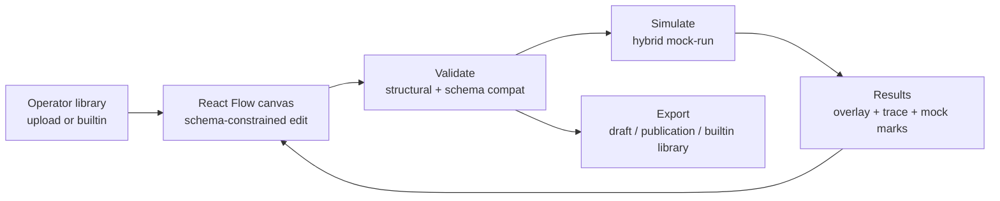

# BLOGE Generic Visual Orchestration Canvas — Technical Design

Status: Draft for review · Scope: resource-gateway-examples · Extends `docs/bloge-visual-orchestration-*` (ADR-001..010)

## 1. Background & problem statement

**Trigger.** The resource-gateway canvas UX has a real gap. Goal: a generic, production-grade BLOGE canvas that ingests a user-supplied **operator library** (operator + I/O JSON Schemas), enables schema-constrained drag-drop, and validates correctness — even for operators the server hasn't implemented.

**Critical finding (grounded in code).** ~80% already exists: the 8-doc design package + a 13-sub-package `visual/` implementation (library import, JSON Schema 2020-12 subset, connection check/candidates, design-only operators, publication, and a hand-rolled SVG canvas at `/examples/gateway`).

| Idea | State | Evidence |
|---|---|---|
| 1 Generic schema-constrained canvas | Built | `visual/` 13 sub-pkgs |
| 2 Operator-library JSON Schema | Built | `bloge.visualOperatorLibrary.v1` |
| 3 Valid-but-unimplemented → logical correctness | Built | `lowering.mode=design`, ADR-007 |
| 4 **Mock-invoke unimplemented ops** | Built | `visual/simulation/*`; `POST /api/visual/graphs/simulate`; Custom Composer Simulate action |
| 5 Export default registry as library | Built | `GET /api/visual-operator-libraries/builtin/export`; portable bundle import path |

**Conclusion:** not greenfield. The backend mock-run and builtin export gaps are now closed; the remaining work is primarily **canvas UX coherence**, **core-loop clarity**, and eventual separability. Greenfield is rejected — it would discard a tested schema engine and re-derive solved JSON Schema problems.

## 2. Vision, scope, non-goals

**Core loop (the organizing spine):**
```
upload/adopt operator library
  → schema-constrained drag-drop editing
    → validate (structural + schema compatibility)
      → mock-run (simulate for runtime correctness)
        → export (draft/publication; and the builtin library itself)
```
**In scope:** simulate engine + user fixtures; React/React Flow authoring workspace; live schema feedback; operator discovery; run/trace viz; portable builtin export.
**Out of scope:** multi-user collab; durable/remote-worker runtime; production IAM. **Heavy governance is demoted, not deleted.**

## 3. Guiding principles
1. Evolve-in-place toward a generic core. 2. 够用即可 / anti-over-engineering. 3. Server-authoritative (ADR-006) → simulate runs server-side. 4. Demote-not-delete governance. 5. Separable core (package boundary + SPI, no premature split). 6. Trust by construction (mock outputs unmistakable; conservative real-run; bounded simulate). 7. The orchestrator owns the result (author-pinned fixtures).

## 4. Current-state grounding
- **Run path:** `VisualGraphRunService.run()` → validate → **`actionReadiness().runNow()` gate (blocks design-only)** → DSL gen → `DynamicGatewayComposerService.run()`. The composer builds `GraphEngine` from an **injectable `OperatorRegistry`** — the clean mock seam.
- **Static Custom Composer path:** `/examples/gateway` now exposes the authoring core loop directly in the canvas HUD and a Server Check `Simulate` action. The action posts a transient draft to `/api/visual/graphs/simulate`, preserves server readiness, and turns the response into canvas trace badges (`MOCKED`, `REAL`, `OUTPUT`).
- **bloge-core:** `Operator.sideEffectType(): SideEffectType = READ_ONLY|WRITE|EXTERNAL_CALL|MIXED` (default **MIXED**); `Idempotency` default **UNKNOWN**; `OperatorRegistry` supports dynamic runtime registration.
- **bloge-test:** `MockOperator` is a plain operator returning a caller value; **test-scope only**.
- **`GraphDraft`** has **`nodeFixtures`** and treats them as non-semantic authoring/test evidence alongside presentation-only `visualLayout` (ADR-002 precedent).

## 5. Decision Record (context · options · WHY · trade-offs)

> Q2 (UX axes) = close **all five**: rendering, live schema feedback, operator discovery, run feedback, flow coherence.

**D1 Positioning (Q1):** Evolve `visual/` in place toward generic; keep core separable. *Why:* existing canvas is already generic; the work is UX + mock-run + packaging, not a rebuild. Lowest risk. *Trade-off:* inherits existing architecture → mitigated by D18.

**D2 Governance weight (Q3):** Trim experience to the core loop. *Why:* priority is a clean generic canvas, not a governance platform; existing governance is disproportionate. *Trade-off:* weakens governance demo → mitigated by D17 (demote, don't delete).

**D3 Mock engine source (Q4):** Build our own `SimulationOperator` in main src; `bloge-test` stays test-scope. *Why:* "test library in runtime" is a smell and risks dragging test scaffolding; `MockOperator` is ~80 trivial lines. *Trade-off:* minor duplication (accepted).

**D4 Mock output synthesis (Q5):** Layered **fixture > schema `examples`/`default`/`const`/`enum[0]` > deterministic canonical**; user-authored per-node I/O is first-class. *Why:* determinism suits golden testing, but authors must pin exact values to validate logic without impls ("DAG 编排者为运行结果负责"). *Trade-off:* larger surface; weak canonical samples still type-check.

**D5 Simulation scope (Q6):** Hybrid — pure/deterministic server ops run for real; unimplemented + side-effecting ops mocked. *Why:* full-sim would replace real transform/branch logic, weakening validation. *Trade-off:* needs classification → D19.

**D6 Validation depth (Q7):** Single mock run now (executes end-to-end; terminal output conforms) + golden scenarios next (reuse `/api/visual/golden-cases`); no fuzz. *Why:* single-run is core value; golden reuses infra; fuzz is over-engineering.

**D7 Frontend stack (Q8):** Vite + React + **React Flow**, built into `static/` via `frontend-maven-plugin`. *Why (your choice):* "离生产级可用最接近" — hand-rolled SVG is the root gap; React Flow carries the 5-axis overhaul. *Trade-off:* npm alongside Maven → integrated build. *(My rec was buildless; you consciously chose peak UX.)*

**D8 IA (Q9):** Keep showcase landing + separate authoring workspace. *Why:* preserve demo value + coherent authoring home. *Trade-off:* fragmentation → D12.

**D9 Auto-layout (Q10):** Auto-first (dagre/ELK) + manual persisted. *Why:* lifts rendering + onboarding; realizes the design package's planned DSL→layout generator.

**D10 Live schema feedback (Q11):** Candidate-prefetch + local highlight via `/connections/candidates`. *Why:* authority from server candidate enumeration; client only highlights → **no rule duplication / no drift**. *Trade-off:* one fetch latency; paging for large sets (supported).

**D11 Operator discovery (Q12):** Grouped-by-library + facets + **Cmd-K**. *Why:* grouping matches "upload a library"; Cmd-K fastest at scale. *Trade-off:* two modes → MVP grouped first.

**D12 Showcase hosting (Q13):** Coexist now, migrate to React progressively. *Why:* lowest risk + path to one stack. *Trade-off:* longest coexistence window.

**D13 Fixture locus (Q14):** Node-inspector "Simulation" tab (output pin = inject; input = assert) + "mocks-needed" checklist. *Why:* in-context editing + batch overview.

**D14 Fixture assist (Q15):** Prefill deterministic sample + live validate; JSON/form toggle (form optional). *Why:* lowest friction; reuses the generator. *Trade-off:* complex schemas resist forms → optional.

**D15 Run/trace + mock marking (Q16):** Canvas overlay + trace panel + **explicit mock badges**. *Why:* intuition + detail; in hybrid mode synthetic outputs **must** be unmistakable — trust by construction.

**D16 Builtin export (Q17):** Model built-in registry as a virtual **`builtin` library** reusing `/{id}/export`. *Why:* cleanest round-trip demo (export builtin → import into a fresh instance) unifying #1 and #5. *Trade-off:* Java-introspected schema fidelity (known limitation).

**D17 Governance demotion (Q18):** New UI shows only the core loop; governance stays admin/existing, untouched. *Why:* simplest, zero regression; governance audience is admins. *Trade-off:* two experiences (accepted).

**D18 Separability (Q19):** Package boundary + SPI seam now (gateway specifics behind an adapter); no Maven split yet. *Why:* low-cost path to future extraction without premature module engineering.

**D19 Real-run classification (Q20):** Safe-op **allowlist** (transform/jsonParse/decisionTable/branch/templateRender…) runs real; else mock; per-node override wins. *Key insight:* real-run only ever applies to **server-implemented** ops — user/design-only ops have no impl → always mocked — so the candidate set is small and server-controlled. *Why not:* `MIXED` default would mis-mock pure ops (A); capability-driven trusts possibly-wrong annotations (B). Allowlist doubles as a ReDoS/recursion guard.

**D20 Fixture storage (Q21):** On the draft but **non-semantic** (mirror `visualLayout`/ADR-002): excluded from fingerprint/DSL/compile. Operator default samples ride on JSON Schema `examples`/`default` — **no new operator field**. *Why:* single source + exports carry fixtures, yet no fingerprint noise. *Trade-off:* fingerprint/diff must ignore fixtures.

**D21 Security guards (Q22) — all:** simulate timeout; node/edge caps; sample depth/size caps; high-risk ops barred from real-run (dynamicSubGraph recursion, ReDoS); import-side remote-`$ref` block + OpenAPI/AsyncAPI allowlist (SSRF) + YAML anchor/size limits; tenant isolation. *Why:* simulate executes user graphs server-side; even pure ops can be abused.

## 6. Target architecture



- **Backend simulate engine:** `SimulationOperator` + `JsonSchemaSampleGenerator` (layered, bounded); a **simulation registry** layering allowlisted real built-ins over `SimulationOperator`s; `VisualGraphRunService.simulate()` bypasses `runNow()` and tags each node `REAL`/`MOCKED`; `POST /api/visual/graphs/simulate`.
- **Data model:** `GraphDraft.nodeFixtures` (non-semantic); operator defaults via schema `examples`/`default`.
- **Frontend:** routes `/showcase` + `/author`; React Flow typed handles + auto-layout; pasted operator-library validate/import intake; grouped+Cmd-K palette; candidate-prefetch highlight; Simulation tab + checklist; explicit output-node selection with request/draft output alignment; overlay + trace + mock badges; no governance panels.
- **Export:** virtual `builtin` library → portable bundle → round-trip.
- **Seam:** adapter SPI for `resource:`/`httpResource`; `visual/*` imports no gateway types.

## 7. Security model (OWASP)
A03 injection (identifier sanitize, `MAX_DSL_CHARS`); A04 resource exhaustion (simulate caps); A10 SSRF (mock egress in sim; import allowlist, remote-`$ref` block); billion-laughs (YAML limits); tenant isolation; secret hygiene in fixtures/traces.

## 8. Phased plan
- **Phase 0 Foundations:** React/Vite app + `frontend-maven-plugin`; generic-core seam. *Verify:* default `mvn package` stays Java/offline; `mvn -Pfrontend package` builds jar+UI under `/author/`; no gateway types in core.
- **Phase 1 Mock backend (#4, completed):** `SimulationOperator`, `JsonSchemaSampleGenerator`, `simulate()`, `nodeFixtures`, endpoint. *Verify:* unit — generator layers/bounds, classification, mixed-graph simulate, schema conformance, fingerprint ignores fixtures.
- **Phase 2 Authoring UI (in progress):** static Custom Composer now has core-loop HUD + Simulate overlay/trace badges; React Flow has operator-library validate/import intake, palette grouping, typed handles, candidate preflight, selected-node connection guide, fixture editors, explicit output selection, and output-aligned simulate requests. The in-canvas coach now explains the next action and can open compatible target discovery directly for disconnected nodes. React JS core-loop coverage verifies pasted library validation/import, catalog refresh, palette exposure, add-to-canvas, target discovery, direct connect, and coach-driven target discovery. The `-Pfrontend` Selenium smoke now verifies the packaged `/author/` React bundle boots, loads the operator palette, and adds a node from the palette. Remaining work is polish/parity, not backend feasibility. *Verify:* Selenium/JS e2e core loop.
- **Phase 3 Export + golden (completed):** virtual builtin library round-trip is done; publication export bundles now carry golden case/certification snapshots, include them in the portable fingerprint, and import restores them with publication-id guardrails. *Verify:* export→import resolves; deterministic golden snapshot fingerprint.
- **Phase 4 Showcase migration:** port to React. *Verify:* scenario parity.

## 9. Testing
Unit (generator, classification, fixture non-semantics), integration (mixed-graph simulate, security caps, tenant isolation), Selenium e2e (`/author` via `mvn -Pfrontend ...`), portable golden snapshot determinism/import, `mvn clean verify`.

## 10. Risks & future
Frontend/Maven friction (mitigated); builtin export fidelity (introspection lossy — encourage `SchemaAware`); allowlist maintenance; coexistence window; future physical core extraction + optional advanced governance drawer.

## 11. References
ADR-001..010; contracts `bloge.visualOperator.v1` / `visualOperatorLibrary.v1` / `visualGraphDraft.v1`; seams `VisualGraphRunService`, `DynamicGatewayComposerService` (registry injection L50-57), `GraphDraft`, `OperatorDefinition`, `JavaOperatorInventoryProjector`, `OperatorLibraryValidator`; bloge-core `Operator`/`SideEffectType`/`Idempotency`/`OperatorRegistry`; bloge-test `MockOperator`.

---
