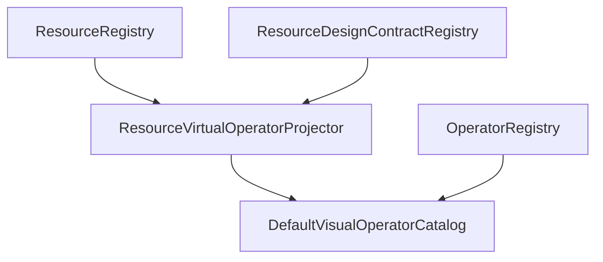
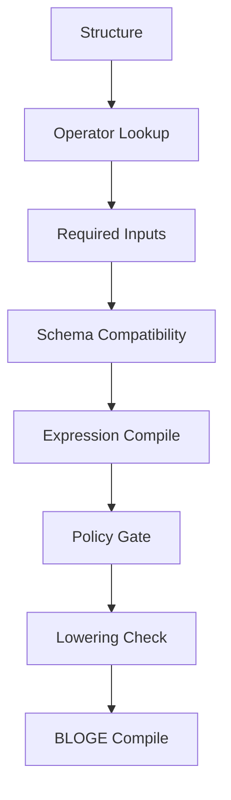
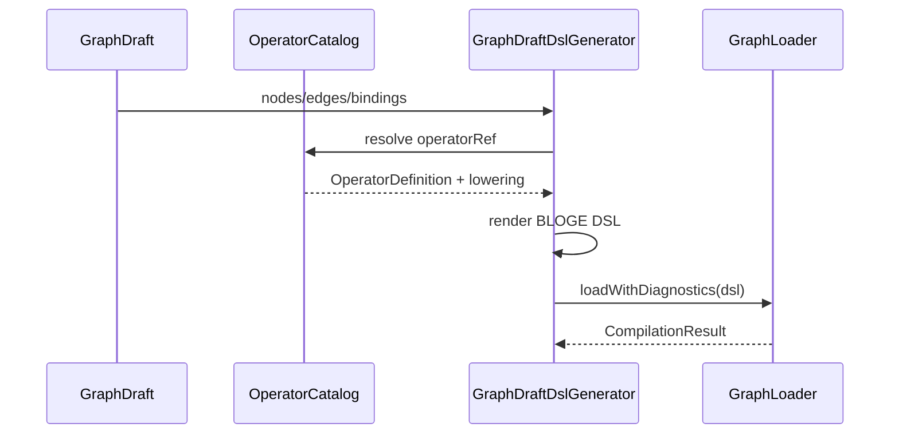

# BLOGE 可视化编排 Phase 1 实现蓝图

状态：Draft v0.1
日期：2026-06-29
关联文档：

- [BLOGE 可视化编排设计包索引](./bloge-visual-orchestration-design-package.md)
- [通用 BLOGE 可视化编排系统设计方案](./bloge-visual-orchestration-system-design.md)
- [BLOGE 可视化编排协议草案 v1](./bloge-visual-orchestration-protocol-v1.md)
- [BLOGE 可视化编排系统关键决策记录](./bloge-visual-orchestration-decision-record.md)

## 1. Phase 1 目标

Phase 1 的目标不是一次性做完整低代码平台，而是在 `resource-gateway-examples` 内跑通一条最小但真实的 authoring 闭环：

1. 管理 resource 的设计时 schema。
2. 将 `ResourceDescriptor + ResourceDesignContract` 投影为画布可拖拽的 `VirtualOperator`。
3. 前端 palette 从 catalog API 加载，而不是写死 `OPERATOR_TYPES`。
4. 用户创建 `GraphDraft`，绑定输入、连接输出、编辑 transform 或 decision table。
5. 服务端校验 schema、policy、lowering 和 DSL 编译。
6. 服务端生成 BLOGE DSL 并运行。
7. 画布展示 diagnostics、DSL、node states 和 output。

成功标准很硬：**新增一个带 schema 的 ResourceDescriptor，不改前端 JS，就能出现在画布上并参与类型安全编排。**

## 2. 不做什么

Phase 1 明确不做：

- 多人协同编辑。
- DSL 无损反向导入。
- durable long-running authoring。
- AI 生成草稿。
- 完整 OpenAPI 导入器。
- 生产级 IAM 后台。
- 将 visual 包抽取为 graph-engine 共享模块。

这些能力不能混进第一阶段，否则最核心的 `OperatorCatalog -> GraphDraft -> DSL -> Run` 闭环会被拖垮。

## 3. 包结构

在 `resource-gateway-examples/src/main/java/com/leanowtech/bloge/gateway/visual/` 下新增：

```text
visual/
  api/
    VisualOperatorCatalogController.java
    VisualGraphDraftController.java
    VisualRunController.java
  catalog/
    VisualOperatorCatalog.java
    DefaultVisualOperatorCatalog.java
    OperatorCatalogQuery.java
    OperatorDefinition.java
    OperatorSource.java
    OperatorPorts.java
    OperatorCapability.java
    OperatorPolicy.java
    OperatorAuthoringHints.java
    OperatorLowering.java
    ResourceVirtualOperatorProjector.java
  draft/
    GraphDraft.java
    DraftNode.java
    DraftEdge.java
    Binding.java
    DraftStatus.java
    GraphDraftRepository.java
    InMemoryGraphDraftRepository.java
  resource/
    ResourceDesignContract.java
    ResourceDesignContractRegistry.java
    InMemoryResourceDesignContractRegistry.java
    ResourceDesignContractAdminController.java
  validation/
    VisualDiagnostic.java
    VisualDiagnosticTarget.java
    GraphDraftValidator.java
    SchemaCompatibilityValidator.java
    ExpressionBindingValidator.java
    PolicyValidator.java
  codegen/
    GraphDraftDslGenerator.java
    DslGenerationResult.java
    PathMapping.java
    BindingExpressionRenderer.java
  runtime/
    VisualGraphRunService.java
    VisualGraphRunRequest.java
    VisualGraphRunResponse.java
```

命名原则：

- `visual.*` 明确这是 example 内的 authoring slice，不污染现有 gateway runtime 包。
- DTO 使用 record，保持与现有 `ResourceDescriptor` 风格一致。
- repository 第一阶段可以 in-memory，但接口必须留出 H2/DB 实现空间。

## 4. 新增 DTO 与职责

### 4.1 ResourceDesignContract

职责：补足 resource 的设计时 schema。

字段：

```java
record ResourceDesignContract(
        String schemaVersion,
        String resourceId,
        Display display,
        SchemaEnvelope requestSchema,
        SchemaEnvelope payloadSchema,
        SchemaEnvelope errorSchema,
        List<ResourceExample> examples,
        Map<String, FieldHint> fieldHints
) {}
```

规则：

- `resourceId` 必须对应已注册 `ResourceDescriptor`，否则 catalog projection 产生 warning。
- `requestSchema` 缺失时，该 resource 只能作为低级 `httpResource` 配置，不生成强类型虚拟算子。
- `payloadSchema` 缺失时，输出为 `opaque`。

### 4.2 OperatorDefinition

职责：画布可用算子合同。

来源：

- Java runtime operators。
- Resource virtual operators。
- 后续用户导入 catalog。

Phase 1 必须实现：

- `httpResource` 的基础 Java operator projection。
- `bloge:decisionTable` 内建 construct。
- `bloge:transform` 内建 construct。
- `resource:<resourceId>` virtual operator projection。

### 4.3 GraphDraft

职责：保存画布语义。

Phase 1 必须支持：

- `nodes`
- `edges`
- `visualLayout`
- `graphInputSchema`
- `output`
- `revision`
- `status`

Phase 1 可以暂不支持：

- draft sharing。
- published immutable version。
- full audit trail。

### 4.4 Binding

Phase 1 支持：

- `constant`
- `contextPath`
- `nodePath`
- `expression`
- `objectTemplate`

暂不支持：

- `secretRef` 的完整编辑体验。可以保留 DTO，但不开放 UI。

### 4.5 VisualDiagnostic

必须兼容 graph-engine 的 `GraphEngineDiagnostic` 语义：

- `source`
- `code`
- `severity`
- `message`
- `nodeId`
- `field`
- `line`
- `column`

并扩展：

- `target.kind`
- `edgeId`
- `fieldPath`
- `blocking`
- `suggestions`

## 5. API 切片

### 5.1 Operator Catalog

```http
GET /api/visual/operators?pattern=resource:*
```

职责：

- 返回 Java/basic/virtual operator definitions。
- 根据 tenant、namespace、environment 做可用性过滤。
- 返回无法投影的 resource diagnostics。

验收：

- 新增一个 design contract 后，对应 `resource:<resourceId>` 出现在响应里。

### 5.2 Resource Design Contract Admin

```http
GET    /admin/resource-design-contracts
GET    /admin/resource-design-contracts/{resourceId}
PUT    /admin/resource-design-contracts/{resourceId}
DELETE /admin/resource-design-contracts/{resourceId}
```

职责：

- 管理 resource 设计时 schema。
- 校验 `resourceId` 和 schema 格式。
- 不修改现有 `/admin/resources` 语义。

验收：

- 无 design contract 的 resource 仍可通过 `/admin/resources` 管理和执行。
- 有 design contract 的 resource 可投影为 virtual operator。

### 5.3 Draft

```http
POST  /api/visual/drafts
GET   /api/visual/drafts/{draftId}
PATCH /api/visual/drafts/{draftId}
POST  /api/visual/drafts/{draftId}/validate
POST  /api/visual/drafts/{draftId}/compile
POST  /api/visual/drafts/{draftId}/run
```

职责：

- 管理 graph draft。
- 乐观锁 revision。
- 校验、编译、运行。

Phase 1 可以用 in-memory draft store，但 API 必须看起来像持久化设计。

### 5.4 Run

Phase 1 可以直接把 run 挂在 draft API 下，不单独实现 run history：

```http
POST /api/visual/drafts/{draftId}/run
```

返回：

- compiled
- success
- dsl
- output
- results
- statusMap
- elapsedMs
- diagnostics
- pathMappings

## 6. 服务端流程

### 6.1 Catalog Projection



Projection 规则：

1. 读取所有 `ResourceDescriptor`。
2. 查找同 resourceId 的 `ResourceDesignContract`。
3. 有 request/payload schema 时投影为强类型 virtual operator。
4. 缺 payload schema 时投影为 opaque output，并返回 warning。
5. 缺 request schema 时不投影强类型 virtual operator，只保留低级 `httpResource`。

### 6.2 Draft Validation



Phase 1 必须阻断：

- duplicate node id。
- unknown operatorRef。
- missing required input。
- source/target path unknown。
- incompatible type。
- lowering missing。
- BLOGE compile error。

Phase 1 可先警告：

- opaque output connection。
- unknown graphInputSchema context path。
- policy 未配置。

### 6.3 DSL Generation



生成要求：

- 稳定排序，减少 diff。
- resource virtual operator lowering 到 `httpResource`。
- transform lowering 到 BLOGE `transform`。
- decision table lowering 到 BLOGE `decision_table`。
- 返回 pathMappings。

### 6.4 Runtime Execution

第一阶段复用当前 `DynamicGatewayComposerService` 思路，但要替换输入来源：

当前：

```text
browser DSL string -> GraphLoader -> GraphEngine
```

目标：

```text
GraphDraft -> DslGenerator -> GraphLoader -> GraphEngine
```

保留能力：

- diagnostics。
- outputNode selection。
- layout 回显。
- result/statusMap/errors。

删除或降级：

- 前端直接拼 DSL 作为主路径。

## 7. 前端迁移切片

当前 `static/examples/gateway/app.js` 的问题：

- `OPERATOR_TYPES` 写死。
- builder 节点字段写死贷款场景。
- DSL 由 JS 拼接。
- decision table 字段固定为 score/amount。

Phase 1 迁移步骤：

1. `loadScenarios()` 之后调用 `/api/visual/operators`。
2. Palette 从返回的 `OperatorDefinition.display` 渲染。
3. 新增节点时根据 `authoring.defaultNodeId` 和 schema 生成 `DraftNode`。
4. Inspector 根据 `ports.inputs[0].schema` 和 `configSchema` 渲染表单。
5. 连线时根据 catalog schema 做前端预检查。
6. 保存后端 draft，而不是更新 JS-only builder。
7. Run 调用 `/api/visual/drafts/{draftId}/run`。
8. DSL preview 使用后端 compile 返回的 DSL。

允许临时保留：

- 原 Custom Composer 作为 legacy fallback。
- decision table 的矩阵 UI 可以先复用，但数据来源从 `DraftNode.config.rules` 读取。

## 8. 测试计划

### 8.1 Catalog Tests

新增测试：

- `ResourceVirtualOperatorProjectorTest`
  - 有 request/payload schema 时生成 virtual operator。
  - 缺 payload schema 时 output 为 opaque 并产生 warning。
  - 缺 request schema 时不生成强类型 resource operator。
  - GET resource 推断 `READ_ONLY`。
  - POST/PUT/DELETE 推断 `EXTERNAL_CALL` 或 `MUTATION`。

- `VisualOperatorCatalogControllerTest`
  - 查询返回 built-in operators。
  - 查询返回 resource virtual operators。
  - pattern filtering 生效。

### 8.2 Draft Tests

新增测试：

- `GraphDraftValidatorTest`
  - 缺 required input 阻断。
  - nodePath 引用不存在节点阻断。
  - path 类型不兼容阻断。
  - opaque 输出连接产生 warning 或按策略阻断。
  - unknown operatorRef 阻断。

- `GraphDraftDslGeneratorTest`
  - resource virtual operator lowering 到 `httpResource`。
  - pathMappings 正确生成。
  - transform 生成稳定 DSL。
  - decision table 生成稳定 DSL。

### 8.3 Runtime Tests

新增测试：

- `VisualGraphRunServiceTest`
  - draft 编译并运行成功。
  - 编译失败返回 diagnostics。
  - runtime failure 返回 node errors。

- `VisualGraphDraftControllerTest`
  - create/get/patch/validate/compile/run 闭环。
  - revision conflict 返回 409。

### 8.4 Integration Test

新增或扩展：

- `GatewayVisualComposerIntegrationTest`
  - 注册 descriptor。
  - 注册 design contract。
  - catalog 中出现 virtual operator。
  - 创建 draft。
  - run draft。
  - output 和 statusMap 正确。

### 8.5 前端验证

如果实现前端迁移，必须使用浏览器或 Playwright 验证：

- Palette 中出现动态 resource operator。
- 不改 JS 添加新 resource 后可见。
- 拖入节点后 inspector 按 schema 渲染。
- run 后 DSL preview 来自服务端。

## 9. 交付顺序

### Slice 1：后端 Catalog

交付：

- ResourceDesignContract DTO/registry/controller。
- OperatorDefinition DTO。
- ResourceVirtualOperatorProjector。
- `/api/visual/operators`。

验收：

- 测试证明 resource 能投影 virtual operator。

### Slice 2：后端 Draft + Validation

交付：

- GraphDraft DTO/repository/controller。
- GraphDraftValidator。
- VisualDiagnostic。

验收：

- 可以创建 draft。
- 缺 required input 能定位到 node/field。

### Slice 3：DSL Generation + Run

交付：

- GraphDraftDslGenerator。
- VisualGraphRunService。
- `/compile` 和 `/run`。

验收：

- draft 生成 BLOGE DSL。
- resource virtual node 能运行。

### Slice 4：前端动态 Palette

交付：

- Palette 从 `/api/visual/operators` 加载。
- Resource virtual operator 可拖入。

验收：

- 新 resource 不改 JS 可出现。

### Slice 5：前端 Draft Run

交付：

- 前端保存 draft。
- Run 调用后端 draft run。
- DSL preview 和 diagnostics 后端回显。

验收：

- 前端不再以 JS 拼接 DSL 作为主路径。

## 10. 兼容策略

### 10.1 保留现有 Composer

现有 `/api/gateway/examples/compose/run` 和前端 `DEFAULT_COMPOSER_DSL` 可保留为 legacy/demo 路径，直到 visual draft path 稳定。

### 10.2 不破坏 ResourceDescriptor

Phase 1 不修改 `ResourceDescriptor` record 构造器，不影响 `/admin/resources`。

### 10.3 新 API 使用 `/api/visual`

所有新 authoring API 使用 `/api/visual`，避免混入 gateway public API 和 `/admin/resources`。

## 11. 工程风险

| 风险 | 影响 | 缓解 |
| --- | --- | --- |
| DTO 过早复杂化 | Phase 1 迟迟落不了地 | 只实现 resource/transform/decision table 必需字段 |
| 前端迁移过大 | UI 回归 | legacy composer 保留，逐步切换 |
| SchemaDescriptor JSON 映射复杂 | catalog 校验阻塞 | 先用 Map/SchemaEnvelope，后续再强类型化 |
| Expression 类型推断过难 | 类型安全不完整 | Phase 1 做语法和引用校验，类型推断列为 Phase 2 |
| GraphLoader diagnostics 难映射 | 用户看不懂错误 | generator 维护 node/field source hints |
| In-memory store 被误用为正式能力 | 数据丢失 | API 和文档标注 example-oriented |

## 12. Definition of Done

Phase 1 完成必须同时满足：

1. `mvn -f resource-gateway-examples/pom.xml clean verify` 通过。
2. 后端测试覆盖 catalog、draft validation、DSL generation、run service。
3. 新增 resource + design contract 后，不改前端 JS，palette 可显示 virtual operator。
4. 没有 payload schema 的 resource 不能作为强类型输出连接。
5. Draft run 返回 DSL、diagnostics、statusMap、output。
6. 文档更新 README 或本设计文档，说明 `/api/visual` 是 experimental authoring API。
7. 保留现有 resource-gateway endpoint 行为。

## 13. 下一步代码任务建议

如果进入实现，第一批代码任务按这个顺序开：

1. 新增 `ResourceDesignContract` 与 in-memory registry。
2. 新增 `OperatorDefinition` DTO 和 `ResourceVirtualOperatorProjector`。
3. 新增 `/api/visual/operators` 并写测试。
4. 新增 `GraphDraft` DTO 和 in-memory repository。
5. 新增 `GraphDraftValidator` 的 required input / unknown operator / opaque output 三条规则。
6. 新增 `GraphDraftDslGenerator`，只支持 resource virtual operator + transform。
7. 接入 run service。
8. 再动前端 palette。

不要先改前端。先让后端合同稳定，再让 UI 消费它。
