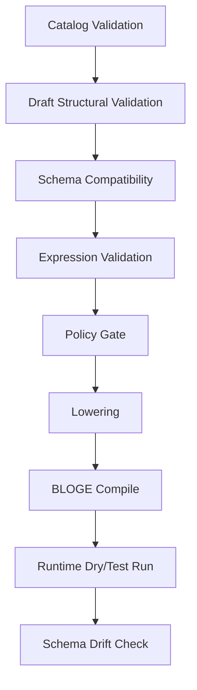

# BLOGE 可视化编排协议草案 v1

状态：Draft v0.1
日期：2026-06-29
关联设计：

- [BLOGE 可视化编排设计包索引](./bloge-visual-orchestration-design-package.md)
- [通用 BLOGE 可视化编排系统设计方案](./bloge-visual-orchestration-system-design.md)
- [BLOGE 可视化编排系统关键决策记录](./bloge-visual-orchestration-decision-record.md)

## 1. 协议目标

这份文档把“可视化编排画布”从产品愿景压成可实现合同。它定义四个核心协议：

1. `bloge.operatorCatalog.v1`：用户、运行时或 resource gateway 暴露给画布的算子库定义。
2. `bloge.graphDraft.v1`：画布编辑中的图草稿模型。
3. `bloge.visualDiagnostic.v1`：校验、编译、策略和运行错误如何定位回画布。
4. `bloge.resourceDesignContract.v1`：`ResourceDescriptor` 如何补足设计时 schema，投影成虚拟算子。

边界判断：

- BLOGE DSL 和编译后的 Graph 仍是执行语义来源。
- `visualLayout` 仍只保存位置、尺寸、分组和视口。
- `GraphDraft` 是画布编辑语义来源，但发布前必须生成 BLOGE DSL 并通过服务端编译。
- `OperatorCatalog` 是设计时能力目录，不等同于 Java `OperatorRegistry` 反射结果。

## 2. 总体不变量

| 编号 | 不变量 | 说明 |
| --- | --- | --- |
| I1 | 每个可拖拽节点必须来自一个 `OperatorDefinition` | 禁止前端硬编码领域节点 |
| I2 | 每个节点的 required input 必须由 binding 满足 | 草稿可保存缺失，但不可发布 |
| I3 | 每条数据边必须能映射到 source schema 和 target schema | 无 schema 时只能作为 warning draft，不可无条件发布 |
| I4 | 虚拟算子必须有 lowering 规则 | 否则无法生成可执行 BLOGE DSL |
| I5 | 画布诊断必须能定位到 graph、node、edge 或 field | 不能只返回字符串错误 |
| I6 | 服务端校验结果高于前端即时校验 | 前端约束只做体验优化 |
| I7 | 发布 artifact 必须不可变 | 包括 DSL、operator fingerprints、schemas、layout、validation report |
| I8 | 真实 secret 不能进入 catalog、draft、layout 或 diagnostics | 只能保存 secret ref |

## 3. 命名与版本

### 3.1 schemaVersion

所有协议对象必须带 `schemaVersion`：

- `bloge.operatorCatalog.v1`
- `bloge.graphDraft.v1`
- `bloge.visualDiagnostic.v1`
- `bloge.resourceDesignContract.v1`

兼容规则：

- patch 级字段新增必须向后兼容。
- v1 reader 必须忽略未知字段，但不能忽略未知 `kind`。
- 不兼容字段语义变化必须升 v2。

### 3.2 operatorRef

`operatorRef` 是画布和 DSL lowering 共同使用的稳定引用。

推荐命名：

| 来源 | 格式 | 示例 |
| --- | --- | --- |
| Java Operator | 原注册名 | `httpResource` |
| Resource Descriptor | `resource:<resourceId>` | `resource:loan-applicant-service.getProfile` |
| Subgraph | `graph:<definitionKey>:<version>` | `graph:riskAssessment:1.2.0` |
| Remote Worker | `worker:<namespace>/<name>` | `worker:risk/fraudScore` |
| AI Tool | `ai:<provider>/<tool>` | `ai:openai/extractFields` |
| Built-in DSL Construct | `bloge:<construct>` | `bloge:decisionTable` |

### 3.3 fingerprint

每个可发布算子定义应生成 fingerprint：

```text
sha256(canonical(operatorRef + source + inputSchema + outputSchema + configSchema + lowering + policies))
```

用途：

- 图版本记录 operator fingerprint。
- operator schema 变化时做影响分析。
- 发布后保证运行语义没有被静默替换。

## 4. Schema 表达

### 4.1 SchemaEnvelope

画布协议不要强绑定一种 schema 格式。建议统一包一层 `SchemaEnvelope`：

```json
{
  "format": "bloge-schema",
  "version": "1",
  "schema": {
    "kind": "object",
    "required": ["applicantId"],
    "properties": {
      "applicantId": { "kind": "string" }
    }
  }
}
```

允许的 `format`：

| format | 用途 | MVP |
| --- | --- | --- |
| `bloge-schema` | BLOGE `SchemaDescriptor` 的 JSON 表达 | 必须 |
| `json-schema` | 用户导入 catalog 常用格式 | 建议 |
| `openapi-schema` | OpenAPI components schema | 建议 |
| `opaque` | 无法知道结构，只能弱校验 | 必须 |

### 4.2 基础 kind

MVP schema kind：

- `object`
- `array`
- `string`
- `integer`
- `decimal`
- `boolean`
- `duration`
- `datetime`
- `enum`
- `any`
- `opaque`

### 4.3 object schema

```json
{
  "kind": "object",
  "required": ["id", "score"],
  "properties": {
    "id": { "kind": "string" },
    "score": { "kind": "integer", "minimum": 0, "maximum": 1000 },
    "segment": { "kind": "enum", "values": ["new", "existing", "vip"] }
  },
  "additionalProperties": false
}
```

校验规则：

- `required` 中的字段必须出现在 `properties`。
- `additionalProperties=false` 时未知字段不可连接。
- `additionalProperties=true` 时未知字段连接只能产生 warning。

## 5. Operator Catalog v1

### 5.1 OperatorDefinition

```json
{
  "schemaVersion": "bloge.operatorCatalog.v1",
  "operatorRef": "resource:loan-applicant-service.getProfile",
  "operatorVersion": "1.0.0",
  "fingerprint": "sha256:...",
  "display": {
    "name": "Get Applicant Profile",
    "description": "Fetch applicant risk facts from loan applicant service",
    "category": "Loan / Applicant",
    "icon": "user-search",
    "color": "#2563eb"
  },
  "owner": {
    "team": "risk-platform",
    "contact": "risk-platform@example.com"
  },
  "tags": ["loan", "risk", "resource"],
  "source": {
    "kind": "resource-descriptor",
    "resourceId": "loan-applicant-service.getProfile",
    "runtimeOperatorRef": "httpResource"
  },
  "ports": {
    "inputs": [
      {
        "name": "input",
        "schema": {
          "format": "bloge-schema",
          "schema": {
            "kind": "object",
            "required": ["applicantId"],
            "properties": {
              "applicantId": { "kind": "string" }
            }
          }
        }
      }
    ],
    "outputs": [
      {
        "name": "output",
        "schema": {
          "format": "bloge-schema",
          "schema": {
            "kind": "object",
            "required": ["score"],
            "properties": {
              "score": { "kind": "integer" },
              "segment": { "kind": "string" },
              "income": { "kind": "decimal" }
            }
          }
        }
      }
    ]
  },
  "configSchema": {
    "format": "bloge-schema",
    "schema": {
      "kind": "object",
      "properties": {
        "timeout": { "kind": "duration", "default": "PT3S" },
        "retry": { "kind": "object" }
      }
    }
  },
  "capabilities": {
    "sideEffect": "EXTERNAL_CALL",
    "idempotency": "UNKNOWN",
    "streaming": false,
    "durable": false,
    "supportsDryRun": false,
    "requiresSecrets": true
  },
  "policies": {
    "requiredPermissions": ["resource.execute"],
    "allowedTenants": ["*"],
    "allowedNamespaces": ["local", "default"],
    "allowedEnvironments": ["dev", "staging"],
    "egressPolicyRef": "default-http-egress"
  },
  "authoring": {
    "defaultNodeId": "fetchApplicant",
    "defaultLabel": "Fetch Applicant",
    "usageExample": "node fetchApplicant : httpResource { input { resourceId = \"loan-applicant-service.getProfile\" params = { applicantId: ctx.applicantId } } }",
    "fieldHints": {
      "input.applicantId": {
        "control": "expression",
        "placeholder": "ctx.applicantId"
      }
    }
  },
  "lowering": {
    "kind": "resource-descriptor",
    "operatorRef": "httpResource",
    "inputTemplate": {
      "resourceId": "loan-applicant-service.getProfile",
      "params": {
        "applicantId": "{{input.applicantId}}"
      }
    },
    "outputPath": "payload"
  }
}
```

### 5.2 字段规则

| 字段 | 必填 | 说明 |
| --- | --- | --- |
| `schemaVersion` | 是 | 固定为 `bloge.operatorCatalog.v1` |
| `operatorRef` | 是 | 全局稳定引用 |
| `operatorVersion` | 否 | 用户导入 catalog 时必须建议填写 |
| `fingerprint` | 发布时是 | 可由服务端计算 |
| `display` | 是 | 画布展示所需 |
| `source.kind` | 是 | `java-operator`、`resource-descriptor`、`subgraph`、`remote-worker`、`ai-tool`、`user-defined` |
| `ports.inputs` | 是 | 至少一个输入端口，常规算子为 `input` |
| `ports.outputs` | 是 | 至少一个输出端口，常规算子为 `output` |
| `configSchema` | 否 | timeout/retry/fallback 之外的算子配置；导入时必须校验 schema 结构，draft 校验时必须约束 `node.config` |
| `capabilities` | 是 | 决定运行、安全和画布限制 |
| `policies` | 否 | 缺省按租户策略继承 |
| `authoring` | 否 | 只影响画布体验 |
| `lowering` | 虚拟算子必填 | 生成 BLOGE DSL 所需 |

### 5.3 source.kind

| kind | 是否可直接执行 | lowering 要求 | 备注 |
| --- | --- | --- | --- |
| `java-operator` | 是 | 可省略 | `operatorRef` 直接对应 runtime registry |
| `resource-descriptor` | 否 | 必填 | lower 到 `httpResource` |
| `subgraph` | 否 | 必填 | lower 到 subgraph 调用或 inline graph |
| `remote-worker` | 视 runtime 而定 | 通常必填 | durable 场景更合适 |
| `ai-tool` | 视 runtime 而定 | 通常必填 | 必须有 structured output schema |
| `user-defined` | 否 | 必填 | 仅 catalog 定义，不能凭空执行 |

### 5.4 capabilities

```json
{
  "sideEffect": "NONE | READ_ONLY | EXTERNAL_CALL | MUTATION | HUMAN_ACTION",
  "idempotency": "IDEMPOTENT | NON_IDEMPOTENT | UNKNOWN",
  "streaming": false,
  "durable": false,
  "supportsDryRun": false,
  "requiresSecrets": true,
  "estimatedCost": {
    "unit": "call",
    "weight": 1
  }
}
```

发布门禁建议：

- `MUTATION` 且 `NON_IDEMPOTENT` 的算子必须有人工 review。
- `requiresSecrets=true` 的算子必须验证 secret binding。
- `streaming=true` 的算子不能连接到只接受完整对象的普通节点，除非有 collector。
- `durable=true` 的算子不能在 request-response-only runtime 中发布。

## 6. Resource Design Contract v1

### 6.1 为什么必须新增

当前 `ResourceDescriptor` 的 runtime 信息足够执行 HTTP 调用，但不足以支持 schema 约束画布。最大缺口是：

- 输入参数 schema 不明确。
- `payloadPath` 提取后的 payload schema 不明确。
- 错误 payload schema 不明确。
- 字段含义、示例和脱敏规则不明确。

如果继续让 payload 是 `Object`，画布只能允许一切连接，然后把错误推迟到运行时。那不是 schema 约束编排，是弱类型拼图。

### 6.2 ResourceDesignContract

建议不立刻破坏 `ResourceDescriptor` record 构造器，而是先建立旁路设计合同：

```json
{
  "schemaVersion": "bloge.resourceDesignContract.v1",
  "resourceId": "loan-applicant-service.getProfile",
  "display": {
    "name": "Get Applicant Profile",
    "category": "Loan / Applicant",
    "description": "Fetch applicant risk facts"
  },
  "requestSchema": {
    "format": "bloge-schema",
    "schema": {
      "kind": "object",
      "required": ["applicantId"],
      "properties": {
        "applicantId": { "kind": "string" }
      }
    }
  },
  "payloadSchema": {
    "format": "bloge-schema",
    "schema": {
      "kind": "object",
      "required": ["score"],
      "properties": {
        "score": { "kind": "integer" },
        "segment": { "kind": "string" },
        "income": { "kind": "decimal" }
      }
    }
  },
  "errorSchema": {
    "format": "bloge-schema",
    "schema": {
      "kind": "object",
      "properties": {
        "code": { "kind": "string" },
        "message": { "kind": "string" }
      }
    }
  },
  "examples": [
    {
      "name": "prime applicant",
      "request": { "applicantId": "prime" },
      "payload": { "score": 790, "segment": "existing", "income": 52000 }
    }
  ],
  "fieldHints": {
    "request.applicantId": {
      "label": "Applicant ID",
      "control": "expression",
      "placeholder": "ctx.applicantId"
    },
    "payload.score": {
      "label": "Credit Score",
      "sensitive": false
    }
  }
}
```

### 6.3 投影规则

`ResourceDescriptor + ResourceDesignContract -> OperatorDefinition`

| Resource 字段 | OperatorDefinition 字段 |
| --- | --- |
| `resourceId` | `operatorRef = resource:<resourceId>` |
| `ResourceDesignContract.display` | `display` |
| `requestSchema` | `ports.inputs[0].schema` |
| `payloadSchema` | `ports.outputs[0].schema` |
| `defaultTimeout` | `configSchema.timeout.default` |
| `authStrategy != null` | `capabilities.requiresSecrets = true` |
| `method in GET/HEAD` | `capabilities.sideEffect = READ_ONLY` |
| `method in POST/PUT/DELETE` | `capabilities.sideEffect = MUTATION` or `EXTERNAL_CALL` |
| `parameterMapping` | `lowering.inputTemplate.params` |
| `payloadPath` | `lowering.outputPath` |

### 6.4 缺 schema 时的降级

| 缺失项 | 允许出现在 palette | 允许连接 | 允许发布 | 诊断 |
| --- | --- | --- | --- | --- |
| 无 `requestSchema` | 是 | 仅手写 params object | 否，除非显式 override | `RESOURCE_REQUEST_SCHEMA_MISSING` |
| 无 `payloadSchema` | 是 | 输出为 `opaque`，只能接 `any/opaque` | 警告或阻断，由策略决定 | `RESOURCE_PAYLOAD_SCHEMA_MISSING` |
| 无 examples | 是 | 是 | 是 | `INFO` |
| 无 fieldHints | 是 | 是 | 是 | 无 |

建议 MVP 策略：没有 `payloadSchema` 的 resource 可以执行，但不能参与类型安全连接；用户必须补 schema 或显式插入 `opaqueTransform`。

## 7. GraphDraft v1

### 7.1 顶层结构

```json
{
  "schemaVersion": "bloge.graphDraft.v1",
  "draftId": "draft-01H...",
  "revision": 7,
  "graphName": "customLoanPolicy",
  "tenantId": "demo-tenant",
  "namespace": "local",
  "environment": "dev",
  "status": "DRAFT",
  "graphInputSchema": {
    "format": "bloge-schema",
    "schema": {
      "kind": "object",
      "properties": {
        "applicantId": { "kind": "string" },
        "requestedAmount": { "kind": "decimal" }
      }
    }
  },
  "nodes": [],
  "edges": [],
  "visualLayout": {
    "schemaVersion": "bloge.visualLayout.v1",
    "rootId": "customLoanPolicy",
    "executionMode": "GRAPH",
    "nodes": [],
    "edges": [],
    "groups": [],
    "viewport": { "x": 0, "y": 0, "zoom": 1 }
  },
  "output": {
    "kind": "node",
    "nodeId": "assembleLoanDecision",
    "path": "output"
  }
}
```

### 7.2 DraftStatus

| 状态 | 说明 | 可编辑 | 可发布 |
| --- | --- | --- | --- |
| `DRAFT` | 可保存，可能有错误 | 是 | 否 |
| `VALIDATING` | 服务端校验中 | 是，但需 revision guard | 否 |
| `VALID` | 无 blocking diagnostics | 是 | 是 |
| `COMPILED` | 已生成 DSL 并编译成功 | 是 | 是 |
| `PUBLISHED` | 已发布为不可变版本 | 否 | 已完成 |
| `ARCHIVED` | 不再编辑 | 否 | 否 |

### 7.3 DraftNode

```json
{
  "id": "fetchApplicant",
  "label": "Fetch Applicant",
  "operatorRef": "resource:loan-applicant-service.getProfile",
  "operatorFingerprint": "sha256:...",
  "inputPort": "input",
  "outputPort": "output",
  "inputs": {
    "applicantId": {
      "kind": "expression",
      "expr": "ctx.applicantId"
    }
  },
  "config": {
    "timeout": "PT3S",
    "retry": {
      "attempts": 1,
      "backoff": "PT0.2S"
    }
  },
  "policyOverrides": {},
  "metadata": {
    "createdBy": "user@example.com"
  }
}
```

节点规则：

- `id` 必须符合 BLOGE DSL node id 规则。
- `operatorRef` 必须能在 catalog 中解析。
- `operatorFingerprint` 发布时必填，草稿时可由服务端补齐。
- `inputs` 的 key 必须对应 input schema 字段。
- `config` 必须满足 `configSchema`。
  resource-gateway 示例已经把该规则落成服务端 gate：缺必填 config、类型不匹配、enum 不匹配、`additionalProperties=false` 下的未知 config 字段都会阻断 validate/compile/run。

### 7.4 DraftEdge

```json
{
  "id": "fetchApplicant.output.score->loanPolicy.input.score",
  "kind": "data",
  "source": {
    "nodeId": "fetchApplicant",
    "port": "output",
    "path": "score"
  },
  "target": {
    "nodeId": "loanPolicy",
    "port": "input",
    "path": "score"
  },
  "adapter": null
}
```

`kind`：

- `data`：数据依赖。
- `control`：纯顺序依赖。
- `conditional`：带条件分支。
- `stream`：流式通道。
- `fallback`：失败或异常路径。

边规则：

- `data` edge 必须通过 schema compatibility。
- `control` edge 不传递字段，只影响执行顺序。
- `conditional` edge 必须有 condition。
- `fallback` edge 必须声明触发条件，如 `onError`、`onTimeout`、`onEmpty`。

### 7.5 Binding

```json
{
  "kind": "nodePath",
  "nodeId": "fetchApplicant",
  "sourcePort": "payload",
  "targetPort": "inputs",
  "targetPath": "score",
  "path": "score"
}
```

允许 kind：

| kind | 字段 | 发布前校验 |
| --- | --- | --- |
| `constant` | `value` | value 类型满足 target schema |
| `contextPath` | `path` | path 能从 graphInputSchema 推导，且推导 schema 与 target schema 兼容；无法推导时必须标记 dynamic/opaque |
| `nodePath` | `nodeId`、`sourcePort`、`targetPort`、`targetPath`、`path` | 上游存在、端口存在、可达、source/target schema 兼容 |
| `expression` | `expr` | 语法、引用、结果类型校验；示例实现必须至少阻断不存在的 `ctx.*` / `node.output.*` 引用，并对纯引用表达式执行 source/target schema 兼容校验 |
| `objectTemplate` | `fields` | 每个字段递归校验 |
| `secretRef` | `secretRef` | 权限和环境可用 |

`GraphDraft.nodes[].inputs` 的 map key 是稳定 binding key，不再要求等于
schema 字段名。常规单端口输入可以继续使用 `score` 这样的字段名；当多个
input port 都声明同名字段时，画布应使用 `customer.id`、`order.id` 这样的
端口限定 key，并用 `targetPort` + `targetPath` 指向真实 schema 位置。
`targetPath` 支持嵌套 object path，例如 `applicant.score`；校验必须沿完整
schema path 查找 source/target 类型，而不能只检查顶层 `properties`。

### 7.6 GraphDraft 到 DSL 的排序

生成 DSL 必须稳定：

1. 先按拓扑排序。
2. 同层节点按 `visualLayout.position.x`，再按 `id`。
3. config 字段按固定顺序输出：`input`、`timeout`、`retry`、`fallback`、其他。
4. transform 字段保持用户定义顺序。

目的：减少 diff 噪音，让版本审查可读。

## 8. Lowering 规则

### 8.1 Java Operator

如果 `source.kind=java-operator` 且 `operatorRef` 在 runtime registry 中存在：

```bloge
node <nodeId> : <operatorRef> {
  input {
    <field> = <bindingExpr>
  }
}
```

### 8.2 Resource Virtual Operator

输入：

```json
{
  "operatorRef": "resource:loan-applicant-service.getProfile",
  "inputs": {
    "applicantId": { "kind": "expression", "expr": "ctx.applicantId" }
  }
}
```

输出：

```bloge
node fetchApplicant : httpResource {
  input {
    resourceId = "loan-applicant-service.getProfile"
    params = { applicantId: ctx.applicantId }
  }
  timeout = 3s
  retry = { attempts: 1, backoff: 200ms }
}
```

画布中的 `fetchApplicant.output.score` 在 DSL 中实际对应：

```bloge
fetchApplicant.output.payload.score
```

所以 lowering 必须维护 path remap：

```json
{
  "draftPath": "fetchApplicant.output.score",
  "dslPath": "fetchApplicant.output.payload.score"
}
```

### 8.3 Decision Table

`bloge:decisionTable` 是内建 authoring construct，不是普通 Java operator。

Draft：

```json
{
  "operatorRef": "bloge:decisionTable",
  "inputs": {
    "score": { "kind": "nodePath", "nodeId": "fetchApplicant", "path": "score" },
    "amount": { "kind": "contextPath", "path": "requestedAmount" }
  },
  "config": {
    "hitPolicy": "unique",
    "outputSchema": { "format": "bloge-schema", "schema": { "kind": "object" } },
    "rules": []
  }
}
```

Lowering：

```bloge
decision_table loanPolicy(
  score = fetchApplicant.output.payload.score,
  amount = ctx.requestedAmount
) hit=unique -> { decision: String, rate: Decimal, ruleId: String } {
  ...
}
```

### 8.4 Transform

Transform lowering 应优先生成 BLOGE `transform`，而不是伪装成普通 operator。

```bloge
transform assemble {
  applicant = fetchApplicant.output.payload
  policy = loanPolicy.output
}
```

### 8.5 不可 lowering 的草稿

如果节点没有 lowering 且不是 runtime operator：

- 草稿可保存。
- compile 必须失败。
- 诊断 code：`LOWERING_RULE_MISSING`。

## 9. Visual Diagnostic v1

### 9.1 目标

现有 `GraphEngineDiagnostic` 已经统一 lint/compile/service 错误，字段包括 `source`、`code`、`severity`、`message`、`nodeId`、`field`、`line`、`column`。画布协议应兼容这个形态，并扩展 edge、path、suggestion。

### 9.2 Diagnostic

```json
{
  "schemaVersion": "bloge.visualDiagnostic.v1",
  "source": "schema",
  "code": "TYPE_INCOMPATIBLE",
  "severity": "ERROR",
  "message": "Cannot connect decimal output to integer input without an explicit transform.",
  "target": {
    "kind": "edge",
    "nodeId": "loanPolicy",
    "edgeId": "fetchApplicant.output.income->loanPolicy.input.score",
    "fieldPath": "inputs.score"
  },
  "sourceRange": {
    "line": 12,
    "column": 9,
    "endLine": 12,
    "endColumn": 42
  },
  "blocking": true,
  "suggestions": [
    {
      "kind": "insert-transform",
      "label": "Insert decimal to integer transform",
      "patch": []
    }
  ]
}
```

### 9.3 source

| source | 说明 |
| --- | --- |
| `catalog` | 算子定义自身错误 |
| `schema` | 输入输出 schema 或连接错误 |
| `expression` | BLOGE 表达式错误 |
| `policy` | 权限、环境、密钥、side effect 错误 |
| `lowering` | GraphDraft 不能生成 DSL |
| `compile` | BLOGE 编译器错误 |
| `runtime` | 试运行错误 |
| `drift` | 运行时输出与 schema 不一致 |

### 9.4 code 前缀

| 前缀 | 示例 |
| --- | --- |
| `CATALOG_` | `CATALOG_SCHEMA_INVALID` |
| `RESOURCE_` | `RESOURCE_PAYLOAD_SCHEMA_MISSING` |
| `DRAFT_` | `DRAFT_NODE_ID_DUPLICATED` |
| `SCHEMA_` | `SCHEMA_REQUIRED_INPUT_MISSING` |
| `TYPE_` | `TYPE_INCOMPATIBLE` |
| `EXPR_` | `EXPR_REFERENCE_UNKNOWN` |
| `POLICY_` | `POLICY_SECRET_NOT_BOUND` |
| `LOWERING_` | `LOWERING_RULE_MISSING` |
| `COMPILE_` | `COMPILE_NODE_UNKNOWN` |
| `RUNTIME_` | `RUNTIME_NODE_FAILED` |
| `DRIFT_` | `DRIFT_OUTPUT_SCHEMA_CHANGED` |

### 9.5 blocking 规则

| 诊断 | Draft 保存 | Compile | Publish | Run Test |
| --- | --- | --- | --- | --- |
| `ERROR` + blocking | 允许 | 阻断 | 阻断 | 阻断，除非是 runtime-only |
| `WARNING` | 允许 | 允许 | 策略决定 | 允许 |
| `INFO` | 允许 | 允许 | 允许 | 允许 |

## 10. API 合同

### 10.1 查询 catalog

```http
GET /api/visual/operators?pattern=resource:*&tenantId=demo-tenant&namespace=local&environment=dev
```

响应：

```json
{
  "items": [
    {
      "schemaVersion": "bloge.operatorCatalog.v1",
      "operatorRef": "resource:loan-applicant-service.getProfile",
      "display": { "name": "Get Applicant Profile" },
      "ports": { "inputs": [], "outputs": [] }
    }
  ],
  "diagnostics": []
}
```

### 10.2 校验 catalog

```http
POST /api/visual/operator-catalogs/validate
Content-Type: application/json
```

resource-gateway 示例阶段已落地等价管理端点：
`POST /admin/visual-operator-libraries/validate`。导入和更新同样必须先执行
该校验，禁止把 blocking diagnostics 的用户算子库写入 catalog。

请求体：

```json
{
  "items": [
    { "schemaVersion": "bloge.operatorCatalog.v1", "operatorRef": "..." }
  ]
}
```

响应：

```json
{
  "valid": false,
  "diagnostics": [
    {
      "schemaVersion": "bloge.visualDiagnostic.v1",
      "source": "catalog",
      "code": "CATALOG_INPUT_SCHEMA_MISSING",
      "severity": "ERROR",
      "message": "Operator input schema is required."
    }
  ]
}
```

MVP 至少阻断：

- 空 operator library。
- 算子没有 output port。
- 同方向重复 port name。
- 不支持的 lowering mode。
- 不支持的 schema `type` / `kind`。
- `required` 中引用不存在的 `properties` 字段。
- `array` schema 未声明 `items`。

### 10.3 保存 draft patch

```http
PATCH /api/visual/drafts/{draftId}
Content-Type: application/json
```

请求体：

```json
{
  "expectedRevision": 7,
  "patch": [
    {
      "op": "add",
      "path": "/nodes/-",
      "value": {
        "id": "fetchApplicant",
        "operatorRef": "resource:loan-applicant-service.getProfile",
        "inputs": {}
      }
    }
  ]
}
```

响应：

```json
{
  "draftId": "draft-01H...",
  "revision": 8,
  "diagnostics": []
}
```

并发规则：

- `expectedRevision` 不匹配返回 `409 CONFLICT`。
- 响应必须返回当前 server revision。

### 10.4 校验 draft

```http
POST /api/visual/drafts/{draftId}/validate
```

响应：

```json
{
  "valid": false,
  "blocking": true,
  "diagnostics": [
    {
      "source": "schema",
      "code": "SCHEMA_REQUIRED_INPUT_MISSING",
      "severity": "ERROR",
      "message": "Required input applicantId is missing.",
      "target": {
        "kind": "node",
        "nodeId": "fetchApplicant",
        "fieldPath": "inputs.applicantId"
      },
      "blocking": true
    }
  ]
}
```

### 10.5 编译 draft

```http
POST /api/visual/drafts/{draftId}/compile
```

编译必须先执行 visual validation。只要存在 blocking diagnostic，响应必须返回 `compiled/generated=false`、空 DSL，并保留 validation diagnostics；不得生成看似可用但违反 schema/policy gate 的 DSL。

响应：

```json
{
  "compiled": true,
  "dsl": "graph customLoanPolicy { ... }",
  "operatorFingerprints": {
    "fetchApplicant": "sha256:..."
  },
  "pathMappings": [
    {
      "draftPath": "fetchApplicant.output.score",
      "dslPath": "fetchApplicant.output.payload.score"
    }
  ],
  "diagnostics": []
}
```

### 10.6 试运行

```http
POST /api/visual/drafts/{draftId}/run
Content-Type: application/json
```

请求：

```json
{
  "context": {
    "applicantId": "prime",
    "requestedAmount": 450000
  },
  "outputNode": "assembleLoanDecision"
}
```

响应：

```json
{
  "runId": "run-01H...",
  "compiled": true,
  "success": true,
  "outputNode": "assembleLoanDecision",
  "output": {},
  "nodeStates": {
    "fetchApplicant": "COMPLETED",
    "loanPolicy": "COMPLETED"
  },
  "results": {},
  "elapsedMs": 42,
  "diagnostics": []
}
```

## 11. 校验流水线



### 11.1 Catalog Validation

阻断：

- `operatorRef` 缺失或重复。
- source.kind 未知。
- input/output schema 非法。
- 虚拟算子缺 lowering。
- lowering 指向不存在的 runtime operator。

### 11.2 Draft Structural Validation

阻断：

- node id 重复。
- edge 指向不存在节点。
- 图中存在环，除非 BLOGE 语义明确支持该结构。
- outputNode 不存在。

### 11.3 Schema Compatibility

阻断：

- required input 无 binding。
- source path 不存在。
- target path 不存在。
- contextPath 在严格 graphInputSchema 中不存在。
- expression 引用的 `ctx.*` 或 `node.output.*` path 不存在。
- constant 值不满足 target schema。
- 类型不兼容且没有 adapter。
- 纯引用 expression 的 source schema 与 target schema 不兼容。
- `array<T>` 到 `array<U>` 时 item schema 不兼容。
- node config 不满足 operator `configSchema`。

警告：

- source schema 为 `opaque`。
- target schema 为 `any`。
- optional 字段未声明 default/fallback。

### 11.4 Expression Validation

MVP 至少做：

- BLOGE 表达式语法预编译。
- `ctx`、node id、field path 的引用检查。

理想态补充：

- 表达式结果类型推断。
- nullable 分析。
- 常量折叠。

### 11.5 Policy Gate

阻断：

- 当前 tenant/namespace/environment 不允许使用该 operator。
- secretRef 未绑定或无权限读取。
- request-response runtime 使用 durable-only operator。
- 非幂等 mutation 缺 review gate。

### 11.6 Runtime Drift

试运行或生产采样后：

- 实际输出缺少 required 字段，产生 `DRIFT_REQUIRED_FIELD_MISSING`。
- 实际输出多出字段，若 schema `additionalProperties=false`，产生 warning 或 error。
- 实际字段类型变化，产生 `DRIFT_FIELD_TYPE_CHANGED`。

## 12. 存储建议

MVP 可以用 H2，但模型要按未来迁移设计。

### 12.1 表模型草案

| 表 | 说明 |
| --- | --- |
| `visual_operator_catalog` | 用户导入或投影后的 operator definitions |
| `visual_resource_design_contract` | resourceId 到设计时 schema 的合同 |
| `visual_graph_draft` | graph draft 当前版本 |
| `visual_graph_draft_revision` | draft 历史 revision |
| `visual_graph_run` | 试运行记录 |
| `visual_graph_run_node` | 节点级结果和状态 |

### 12.2 visual_graph_draft

| 字段 | 类型 | 说明 |
| --- | --- | --- |
| `draft_id` | varchar PK | 草稿 id |
| `tenant_id` | varchar | 租户 |
| `namespace` | varchar | 命名空间 |
| `environment` | varchar | 环境 |
| `graph_name` | varchar | BLOGE graph name |
| `revision` | bigint | 乐观锁 |
| `status` | varchar | DraftStatus |
| `draft_json` | clob/jsonb | GraphDraft |
| `diagnostics_json` | clob/jsonb | 最近一次校验 |
| `created_by` | varchar | 创建人 |
| `updated_by` | varchar | 更新人 |
| `created_at` | timestamp | 创建时间 |
| `updated_at` | timestamp | 更新时间 |

索引：

- `(tenant_id, namespace, graph_name)`
- `(tenant_id, updated_at)`
- `(status, updated_at)`

## 13. 迁移路径

### Phase A：不破坏现有 resource-gateway

- 保持 `ResourceDescriptor` record 不变。
- 新增 `ResourceDesignContract` 存储。
- 新增 projector：`ResourceDescriptor + ResourceDesignContract -> OperatorDefinition`。
- 当前 `/admin/resources` 不变。

### Phase B：资源管理 API 增强

- 新增 `/admin/resources/{resourceId}/design-contract`。
- 新增 schema 校验。
- bootstrap 示例资源补齐 design contract。

### Phase C：合并或内聚

如果实践证明设计时 schema 已经稳定，可以考虑：

- 将 `requestSchema`、`payloadSchema`、`examples` 合并进新版 ResourceDescriptor。
- 或保持分离，让 runtime descriptor 与 authoring contract 独立演进。

我的倾向：长期也保持分离。原因是 runtime descriptor 关注调用，design contract 关注画布、schema、示例、解释和治理。两者变化频率不同，强行合并会让每次 UI 字段调整都污染 runtime descriptor。

## 14. 最小可实现切片

第一版不需要支持所有复杂能力，必须支持这一条闭环：

1. 注册一个 `ResourceDescriptor`。
2. 为该 resource 注册 `ResourceDesignContract`。
3. Catalog API 投影出 `resource:<resourceId>` 虚拟算子。
4. 前端 palette 不改代码即可显示该算子。
5. 用户拖入画布。
6. 用户把 `ctx` 字段绑定到 resource input。
7. 用户把 resource output 字段连接到 transform 或 decision table。
8. 服务端校验 schema 兼容。
9. 服务端 lowering 成 `httpResource` BLOGE DSL。
10. 服务端编译运行，结果回显到画布。

验收标准：

- 没有 `payloadSchema` 的 resource 不能假装类型安全。
- 前端没有新增硬编码 operator type。
- 编译失败能定位到 node/field。
- 成功运行能返回 node states 和 output。

## 15. 仍需决策

| 决策 | 推荐 | 原因 |
| --- | --- | --- |
| Resource design schema 与 ResourceDescriptor 是否合并 | 先分离 | 避免破坏现有 record 和 runtime 语义 |
| GraphDraft 是否作为长期一等模型 | 是 | 前端拼 DSL 无法承载实时编辑和诊断定位 |
| `visualLayout` 是否承载业务语义 | 否 | 避免第二真相 |
| 缺 payload schema 是否允许发布 | 默认否 | 否则 schema 约束名存实亡 |
| DSL 反向导入是否进 MVP | 否 | 先保证 GraphDraft -> DSL 单向稳定 |
| AI 生成是否进 MVP | 否 | 必须先有确定性合同和校验链 |
