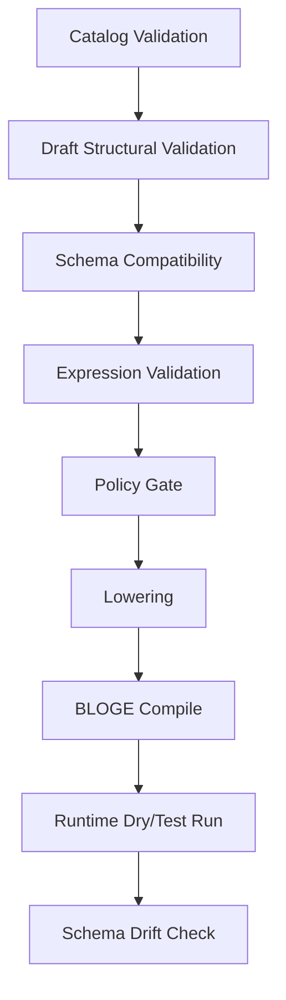

# BLOGE 可视化编排协议草案 v1

状态：Draft v0.1
日期：2026-06-29
关联设计：

- [BLOGE 可视化编排设计包索引](./bloge-visual-orchestration-design-package.md)
- [通用 BLOGE 可视化编排系统设计方案](./bloge-visual-orchestration-system-design.md)
- [BLOGE 可视化编排系统关键决策记录](./bloge-visual-orchestration-decision-record.md)
- [BLOGE 可视化编排实现状态审计](./bloge-visual-orchestration-implementation-status.md)

> 实现注记：本文保留早期协议草案中的抽象名称，例如
> `bloge.operatorCatalog.v1` 和 `bloge.graphDraft.v1`。当前
> `resource-gateway-examples` 的 wire contract 已收敛为
> `bloge.visualOperator.v1`、`bloge.visualOperatorLibrary.v1`、
> `bloge.visualOperatorCatalog.v1`、`bloge.visualGraphDraft.v1` 和
> `bloge.visualGraphPublication.v1`；operator usage index 当前为
> `bloge.visualOperatorUsage.v1`。继续实现时以代码和实现状态审计为准，
> 不要把早期草案名误认为当前 API 字段。

## 1. 协议目标

这份文档把“可视化编排画布”从产品愿景压成可实现合同。它定义四个核心协议：

1. `bloge.visualOperator.v1` / `bloge.visualOperatorLibrary.v1` / `bloge.visualOperatorCatalog.v1` / `bloge.visualOperatorUsage.v1`：用户、运行时或 resource gateway 暴露给画布的算子定义、算子库、catalog response 和 operatorRef usage index。
2. `bloge.visualGraphDraft.v1`：画布编辑中的图草稿模型。
3. `VisualDiagnostic`：校验、编译、策略和运行错误如何定位回画布。
4. `ResourceDesignContract`：`ResourceDescriptor` 如何补足设计时 schema，投影成虚拟算子。
5. `bloge.visualGraphPublication.v1`：冻结 DSL、draft、operator snapshots、fingerprints、layout 和报告的不可变发布物。

边界判断：

- BLOGE DSL 和编译后的 Graph 仍是执行语义来源。
- `visualLayout` 仍只保存位置、尺寸、分组和视口。
- `visualLayout` 可被服务端校验 schemaVersion、rootId、节点 operatorRef、节点/边/分组引用、节点/边覆盖、edge kind / port-path metadata、几何值和 viewport，但不能反向定义业务语义。
- `GraphDraft` 是画布编辑语义来源，但发布前必须生成 BLOGE DSL 并通过服务端编译。
- `OperatorCatalog` 是设计时能力目录，不等同于 Java `OperatorRegistry` 反射结果。

## 2. 总体不变量

| 编号 | 不变量 | 说明 |
| --- | --- | --- |
| I1 | 每个可拖拽节点必须来自一个 `OperatorDefinition` | 禁止前端硬编码领域节点 |
| I2 | 每个节点的 required input 必须由 binding 满足 | 草稿可保存缺失，但不可发布 |
| I3 | 每条数据边必须能映射到 source schema 和 target schema | 无 schema 时只能作为 warning draft，不可无条件发布 |
| I4 | 虚拟算子必须有 lowering 规则 | 否则无法生成可执行 BLOGE DSL |
| I5 | 画布诊断必须能定位到 graph、node、edge 或 field | 不能只返回字符串错误 |
| I6 | 服务端校验结果高于前端即时校验 | 前端约束只做体验优化 |
| I7 | 发布 artifact 必须不可变 | 包括 DSL、operator fingerprints、schemas、layout、validation report |
| I8 | 真实 secret 不能进入 catalog、draft、layout 或 diagnostics | 只能保存 secret ref |
| I9 | Deprecated 设计时合同必须可审阅但不可静默 promotion | 默认 palette 可隐藏 deprecated operator/resource contract；stored draft resolution 必须能通过 includeDeprecated 找回，并把 lifecycle warning 归因到节点 |

resource-gateway 示例通过 `VisualSecretGuard` 在 operator library 校验、draft
校验和 draft 持久化入口阻断明显明文 secret；diagnostic 只返回固定错误文案和
artifact path，不回显 secret value。
`DEPRECATED` operator library 和 `DEPRECATED` resource design contract 会投影
`visual.operator.lifecycle.deprecated`，draft validation 会把该 warning 映射到
`/nodes/{index}/operatorRef`，publish 阶段沿用 warning acknowledgement gate。
把已有 ACTIVE 合同降级为 DEPRECATED 时，admin validate/import/replace 也必须返回
引用影响 warning，并在 mutation 入口要求 `ackWarnings=true`。

## 3. 命名与版本

### 3.1 schemaVersion

所有协议对象必须带 `schemaVersion`：

- `bloge.operatorCatalog.v1`
- `bloge.graphDraft.v1`
- `bloge.visualDiagnostic.v1`
- `bloge.resourceDesignContract.v1`

兼容规则：

- patch 级字段新增必须向后兼容。
- v1 reader 必须忽略未知字段，但不能忽略未知 `kind`。
- 不兼容字段语义变化必须升 v2。

### 3.2 operatorRef

`operatorRef` 是画布和 DSL lowering 共同使用的稳定引用。

推荐命名：

| 来源 | 格式 | 示例 |
| --- | --- | --- |
| Java Operator | 原注册名 | `httpResource` |
| Resource Descriptor | `resource:<resourceId>` | `resource:loan-applicant-service.getProfile` |
| Subgraph | `graph:<definitionKey>:<version>` | `graph:riskAssessment:1.2.0` |
| Remote Worker | `worker:<namespace>/<name>` | `worker:risk/fraudScore` |
| AI Tool | `ai:<provider>/<tool>` | `ai:openai/extractFields` |
| Built-in DSL Construct | `bloge:<construct>` | `bloge:decisionTable` |

### 3.3 fingerprint

每个可发布算子定义应生成 fingerprint：

```text
sha256(canonical(operatorRef + source + inputSchema + outputSchema + configSchema + policy + lowering))
```

用途：

- 图版本记录 operator fingerprint。
- operator schema 变化时做影响分析。
- 发布后保证运行语义没有被静默替换。

resource-gateway 示例中 `OperatorDefinition.fingerprint` 由服务端按规范化后的
source、ports、configSchema、capabilities、lowering 等执行/约束相关元数据计算。
`GraphDraft.operatorFingerprints` 按 node id 保存草稿创建或提交时看到的
fingerprint；`GraphDraft.operatorSnapshots` 按 node id 保存同一时刻的
`OperatorDefinition` 快照，用于在算子库 replacement 之后解释 drift 的
schema/capability/policy/lowering 风险，而不是只报告一个 hash 不一致。如果当前
catalog 暴露的同一算子 fingerprint 不同，validate/compile/run 会以 drift error
阻断；作者可以在审计 usage risk 后显式 rebase 选中节点或全图的服务端托管快照。

## 4. Schema 表达

### 4.1 SchemaEnvelope

画布协议不要强绑定一种 schema 格式。建议统一包一层 `SchemaEnvelope`：

```json
{
  "format": "bloge-schema",
  "version": "1",
  "schema": {
    "kind": "object",
    "required": ["applicantId"],
    "properties": {
      "applicantId": { "kind": "string" }
    }
  }
}
```

允许的 `format`：

| format | 用途 | MVP |
| --- | --- | --- |
| `bloge-schema` | BLOGE `SchemaDescriptor` 的 JSON 表达 | 必须 |
| `json-schema` | 用户导入 catalog 常用格式 | 建议 |
| `openapi-schema` | OpenAPI components schema | 建议 |
| `opaque` | 无法知道结构，只能弱校验 | 必须 |

### 4.2 基础 kind

MVP schema kind：

- `object`
- `array`
- `string`
- `integer`
- `decimal`
- `boolean`
- `duration`
- `datetime`
- `enum`
- `any`
- `opaque`

### 4.3 object schema

```json
{
  "kind": "object",
  "required": ["id", "score"],
  "properties": {
    "id": { "kind": "string" },
    "score": { "kind": "integer", "minimum": 0, "maximum": 1000 },
    "segment": { "kind": "enum", "values": ["new", "existing", "vip"] }
  },
  "additionalProperties": false
}
```

校验规则：

- `required` 中的字段必须出现在 `properties`。
- `additionalProperties=false` 时未知字段不可连接。
- `additionalProperties=true` 时未知字段连接只能产生 warning。

## 5. Operator Catalog v1

### 5.1 OperatorDefinition

```json
{
  "schemaVersion": "bloge.operatorCatalog.v1",
  "operatorRef": "resource:loan-applicant-service.getProfile",
  "operatorVersion": "1.0.0",
  "fingerprint": "sha256:...",
  "display": {
    "name": "Get Applicant Profile",
    "description": "Fetch applicant risk facts from loan applicant service",
    "category": "Loan / Applicant",
    "icon": "user-search",
    "color": "#2563eb"
  },
  "owner": {
    "team": "risk-platform",
    "contact": "risk-platform@example.com"
  },
  "tags": ["loan", "risk", "resource"],
  "source": {
    "kind": "resource-descriptor",
    "resourceId": "loan-applicant-service.getProfile",
    "runtimeOperatorRef": "httpResource"
  },
  "ports": {
    "inputs": [
      {
        "name": "input",
        "schema": {
          "format": "bloge-schema",
          "schema": {
            "kind": "object",
            "required": ["applicantId"],
            "properties": {
              "applicantId": { "kind": "string" }
            }
          }
        }
      }
    ],
    "outputs": [
      {
        "name": "output",
        "schema": {
          "format": "bloge-schema",
          "schema": {
            "kind": "object",
            "required": ["score"],
            "properties": {
              "score": { "kind": "integer" },
              "segment": { "kind": "string" },
              "income": { "kind": "decimal" }
            }
          }
        }
      }
    ]
  },
  "configSchema": {
    "format": "bloge-schema",
    "schema": {
      "kind": "object",
      "properties": {
        "timeout": { "kind": "duration", "default": "PT3S" },
        "retry": { "kind": "object" }
      }
    }
  },
  "capabilities": {
    "sideEffect": "EXTERNAL_CALL",
    "idempotency": "UNKNOWN",
    "streaming": false,
    "durable": false,
    "supportsDryRun": false,
    "requiresSecrets": true
  },
  "policy": {
    "tenants": ["*"],
    "namespaces": ["local", "default"],
    "environments": ["dev", "staging"]
  },
  "authoring": {
    "defaultNodeId": "fetchApplicant",
    "defaultLabel": "Fetch Applicant",
    "usageExample": "node fetchApplicant : httpResource { input { resourceId = \"loan-applicant-service.getProfile\" params = { applicantId: ctx.applicantId } } }",
    "fieldHints": {
      "input.applicantId": {
        "control": "expression",
        "placeholder": "ctx.applicantId"
      }
    }
  },
  "lowering": {
    "kind": "resource-descriptor",
    "operatorRef": "httpResource",
    "inputTemplate": {
      "resourceId": "loan-applicant-service.getProfile",
      "params": {
        "applicantId": "{{input.applicantId}}"
      }
    },
    "outputPath": "payload"
  }
}
```

### 5.2 字段规则

| 字段 | 必填 | 说明 |
| --- | --- | --- |
| `schemaVersion` | 是 | 固定为 `bloge.operatorCatalog.v1` |
| `operatorRef` | 是 | 全局稳定引用 |
| `operatorVersion` | 否 | 用户导入 catalog 时必须建议填写 |
| `fingerprint` | 发布时是 | 可由服务端计算 |
| `display` | 是 | 画布展示所需 |
| `source.kind` | 是 | 当前实现支持 `java-operator`、`java-streaming-operator`、`java-suspendable-operator`、`resource-descriptor`、`visual-publication`、`user-library`；平台化草案继续预留 `subgraph`、`remote-worker`、`ai-tool` |
| `ports.inputs` | 是 | 至少一个输入端口，常规算子为 `input` |
| `ports.outputs` | 是 | 至少一个输出端口，常规算子为 `output` |
| `configSchema` | 否 | timeout/retry/fallback 之外的算子配置；导入时必须校验 schema 结构，draft 校验时必须约束 `node.config` |
| `capabilities` | 是 | 决定运行、安全和画布限制 |
| `policy` | 否 | 算子可用性策略；缺省表示不限制 tenant/namespace/environment |
| `authoring` | 否 | 只影响画布体验 |
| `lowering` | 虚拟算子必填 | 生成 BLOGE DSL 所需 |

### 5.3 source.kind

| kind | 是否可直接执行 | lowering 要求 | 备注 |
| --- | --- | --- | --- |
| `java-operator` | 是 | 可省略 | `operatorRef` 直接对应 runtime registry |
| `java-streaming-operator` | 是 | 可省略 | `operatorRef` 对应 runtime streaming operator；catalog 标记 streaming capability |
| `java-suspendable-operator` | 是 | 可省略 | `operatorRef` 对应 runtime suspendable operator；catalog 标记 `durable=true`，当前 request-response visual runtime 会在 draft validation 阶段阻断使用，完整 suspend/resume authoring 属后续阶段 |
| `resource-descriptor` | 否 | 必填 | lower 到 `httpResource` |
| `visual-publication` | 否 | 必填 | lower 到 frozen visual publication executor |
| `user-library` | 取决于 lowering | 必填 | 用户导入算子库使用的唯一可写 source kind；系统 source kind 不能由用户库伪造 |
| `subgraph` | 否 | 必填 | lower 到 subgraph 调用或 inline graph |
| `remote-worker` | 视 runtime 而定 | 通常必填 | durable 场景更合适 |
| `ai-tool` | 视 runtime 而定 | 通常必填 | 必须有 structured output schema |
| `user-defined` | 否 | 必填 | 仅 catalog 定义，不能凭空执行 |

### 5.4 capabilities

```json
{
  "sideEffect": "NONE | READ_ONLY | EXTERNAL_CALL | MUTATION | HUMAN_ACTION",
  "idempotency": "IDEMPOTENT | NON_IDEMPOTENT | UNKNOWN",
  "streaming": false,
  "durable": false,
  "supportsDryRun": false,
  "requiresSecrets": true,
  "estimatedCost": {
    "unit": "call",
    "weight": 1
  }
}
```

发布门禁建议：

- `MUTATION` 且 `NON_IDEMPOTENT` 的算子必须有人工 review。
- `requiresSecrets=true` 的算子必须验证 secret binding。
- `streaming=true` 的算子不能连接到只接受完整对象的普通节点，除非有 collector。
- `durable=true` 的算子不能在 request-response-only runtime 中发布。

### 5.5 policy

resource-gateway 示例已经实现第一层确定性 policy gate：

```json
{
  "policy": {
    "tenants": ["demo-tenant"],
    "namespaces": ["local"],
    "environments": ["browser"]
  }
}
```

规则：

- `tenants`、`namespaces`、`environments` 为空数组或缺失时表示不限制该维度。
- `"*"` 可作为显式通配。
- `/api/visual/operators` 支持 `tenantId`、`namespace`、`environment` 查询参数，浏览器按当前 draft scope 拉取可用算子。
- `GraphDraftValidator` 仍是权威门禁：即使用户手工构造 draft 引用被过滤掉的 operator，validate/compile/run/publish 也会返回 `visual.operator.policyDenied`。

## 6. Resource Design Contract v1

### 6.1 为什么必须新增

当前 `ResourceDescriptor` 的 runtime 信息足够执行 HTTP 调用，但不足以支持 schema 约束画布。最大缺口是：

- 输入参数 schema 不明确。
- `payloadPath` 提取后的 payload schema 不明确。
- 错误 payload schema 不明确。
- 字段含义、示例和脱敏规则不明确。

如果继续让 payload 是 `Object`，画布只能允许一切连接，然后把错误推迟到运行时。那不是 schema 约束编排，是弱类型拼图。

### 6.2 ResourceDesignContract

建议不立刻破坏 `ResourceDescriptor` record 构造器，而是先建立旁路设计合同：

```json
{
  "schemaVersion": "bloge.resourceDesignContract.v1",
  "resourceId": "loan-applicant-service.getProfile",
  "display": {
    "name": "Get Applicant Profile",
    "category": "Loan / Applicant",
    "description": "Fetch applicant risk facts"
  },
  "requestSchema": {
    "format": "bloge-schema",
    "schema": {
      "kind": "object",
      "required": ["applicantId"],
      "properties": {
        "applicantId": { "kind": "string" }
      }
    }
  },
  "payloadSchema": {
    "format": "bloge-schema",
    "schema": {
      "kind": "object",
      "required": ["score"],
      "properties": {
        "score": { "kind": "integer" },
        "segment": { "kind": "string" },
        "income": { "kind": "decimal" }
      }
    }
  },
  "errorSchema": {
    "format": "bloge-schema",
    "schema": {
      "kind": "object",
      "properties": {
        "code": { "kind": "string" },
        "message": { "kind": "string" }
      }
    }
  },
  "examples": [
    {
      "name": "prime applicant",
      "request": { "applicantId": "prime" },
      "payload": { "score": 790, "segment": "existing", "income": 52000 }
    }
  ],
  "fieldHints": {
    "request.applicantId": {
      "label": "Applicant ID",
      "control": "expression",
      "placeholder": "ctx.applicantId"
    },
    "payload.score": {
      "label": "Credit Score",
      "sensitive": false
    }
  }
}
```

### 6.3 投影规则

`ResourceDescriptor + ResourceDesignContract -> OperatorDefinition`

| Resource 字段 | OperatorDefinition 字段 |
| --- | --- |
| `resourceId` | `operatorRef = resource:<resourceId>` |
| `ResourceDesignContract.display` | `display` |
| `requestSchema` | `ports.inputs[0].schema` |
| `payloadSchema` | `ports.outputs[0].schema` |
| `defaultTimeout` | `configSchema.timeout.default` |
| `authStrategy != null` | `capabilities.requiresSecrets = true` |
| `method in GET/HEAD` | `capabilities.sideEffect = READ_ONLY` |
| `method in POST/PUT/DELETE` | `capabilities.sideEffect = MUTATION` or `EXTERNAL_CALL` |
| `parameterMapping` | `lowering.inputTemplate.params` |
| `payloadPath` | `lowering.outputPath` |

resource-gateway 示例已经为 `ResourceDesignContract` 提供 admin validate/upsert
gate：`requestSchema` 与 `responseSchema` 进入 virtual operator catalog 前必须
通过同一套 schema 结构校验，`array` 缺少 `items`、`required` 引用未知字段、
enum 缺少 values 和 examples 中的原始 secret 都会返回 blocking
`VisualDiagnostic`，不会被持久化到设计合同 registry。示例实现使用
H2-backed `ResourceDesignContractRegistry`，并且 bootstrap 只补齐缺失的内置
contract，不覆盖已经持久化的用户修改。

resource-gateway 示例还提供
`POST /admin/resource-design-contracts/from-openapi` 作为 validate-only
projection endpoint。请求传入 `resourceId`、OpenAPI document，以及
`operationId` 或 `path + method` selector；响应返回生成的
`ResourceDesignContract` 草案和 `VisualValidationResult`。该端点会把
OpenAPI path/query/header/cookie parameters、JSON requestBody 和 2xx JSON
response schema 投影为 visual schema，并把 local
`#/components/schemas/*` 引用改写为 `$defs` 后再复用 resource-contract
validation；它不直接写入 registry。

### 6.4 缺 schema 时的降级

| 缺失项 | 允许出现在 palette | 允许连接 | 允许发布 | 诊断 |
| --- | --- | --- | --- | --- |
| 无 `requestSchema` | 是 | 仅手写 params object | 否，除非显式 override | `RESOURCE_REQUEST_SCHEMA_MISSING` |
| 无 `payloadSchema` | 是 | 输出为 `opaque`，只能接 `any/opaque` | 警告或阻断，由策略决定 | `RESOURCE_PAYLOAD_SCHEMA_MISSING` |
| 无 examples | 是 | 是 | 是 | `INFO` |
| 无 fieldHints | 是 | 是 | 是 | 无 |

建议 MVP 策略：没有 `payloadSchema` 的 resource 可以执行，但不能参与类型安全连接；用户必须补 schema 或显式插入 `opaqueTransform`。

## 7. GraphDraft v1

### 7.1 顶层结构

```json
{
  "schemaVersion": "bloge.graphDraft.v1",
  "draftId": "draft-01H...",
  "revision": 7,
  "graphName": "customLoanPolicy",
  "tenantId": "demo-tenant",
  "namespace": "local",
  "environment": "dev",
  "status": "DRAFT",
  "graphInputSchema": {
    "format": "bloge-schema",
    "schema": {
      "kind": "object",
      "properties": {
        "applicantId": { "kind": "string" },
        "requestedAmount": { "kind": "decimal" }
      }
    }
  },
  "nodes": [],
  "edges": [],
  "visualLayout": {
    "schemaVersion": "bloge.visualLayout.v1",
    "rootId": "customLoanPolicy",
    "executionMode": "GRAPH",
    "nodes": [],
    "edges": [],
    "groups": [],
    "viewport": { "x": 0, "y": 0, "zoom": 1 }
  },
  "output": {
    "kind": "node",
    "nodeId": "assembleLoanDecision",
    "path": "output"
  },
  "operatorFingerprints": {
    "fetchApplicant": "sha256:..."
  },
  "operatorSnapshots": {
    "fetchApplicant": {
      "schemaVersion": "bloge.visualOperator.v1",
      "operatorRef": "resource:loan-applicant-service.getProfile",
      "fingerprint": "sha256:..."
    }
  },
  "revisionMetadata": {
    "createdAt": "2026-06-30T00:00:00Z",
    "createdBy": "visual-canvas",
    "updatedAt": "2026-06-30T00:05:00Z",
    "updatedBy": "alice@example.com",
    "changeSource": "gateway-browser",
    "changeSummary": "Added applicant fetch node",
    "changedPaths": ["/nodes/-"]
  }
}
```

`graphInputSchema` 是图的设计时输入契约，不是某次调试 payload 的影子。
resource-gateway 示例在浏览器里把它暴露为独立的 Graph Input Schema 编辑区：
默认值可以从初始 Context JSON 推断，但之后 schema 和 Context JSON 分离保存。
浏览器在激活新 schema 前会执行与服务端 blocking 规则同口径的基础结构预检，
并以内联 diagnostics 明细展示问题，避免把明显非法的 schema 误标为 valid。
拖拽连线、`ctx.*` source picker、`contextPath` binding 校验和服务端 compile/run
gate 都以这个 schema 为准；Context JSON 只作为一次运行或调试的样例输入。

### 7.2 DraftStatus

| 状态 | 说明 | 可编辑 | 可发布 |
| --- | --- | --- | --- |
| `DRAFT` | 可保存，可能有错误 | 是 | 否 |
| `VALIDATING` | 服务端校验中 | 是，但需 revision guard | 否 |
| `VALID` | 无 blocking diagnostics | 是 | 是 |
| `COMPILED` | 已生成 DSL 并编译成功 | 是 | 是 |
| `PUBLISHED` | 已发布为不可变版本 | 否 | 已完成 |
| `ARCHIVED` | 不再编辑 | 否 | 否 |

### 7.3 DraftNode

```json
{
  "id": "fetchApplicant",
  "label": "Fetch Applicant",
  "operatorRef": "resource:loan-applicant-service.getProfile",
  "inputPort": "input",
  "outputPort": "output",
  "inputs": {
    "applicantId": {
      "kind": "expression",
      "expr": "ctx.applicantId"
    }
  },
  "config": {
    "timeout": "PT3S",
    "retry": {
      "attempts": 1,
      "backoff": "PT0.2S"
    }
  },
  "policyOverrides": {},
  "metadata": {
    "createdBy": "user@example.com"
  }
}
```

节点规则：

- `id` 必须符合 BLOGE DSL node id 规则。
- `operatorRef` 必须能在 catalog 中解析。
- `operatorFingerprints[nodeId]` 发布时必填，草稿保存时由服务端补齐；`operatorSnapshots[nodeId]` 同步保存可解释该 fingerprint 的 operator definition；若 fingerprint 存在且与当前 catalog fingerprint 不一致，必须阻断发布/运行，除非作者通过 rebase API 显式刷新快照。
- `inputs` 的 key 必须对应 input schema 字段。
- `config` 必须满足 `configSchema`。
  resource-gateway 示例已经把该规则落成服务端 gate：缺必填 config、类型不匹配、enum 不匹配、`additionalProperties=false` 下的未知 config 字段都会阻断 validate/compile/run。
  结构化 config expression 不按普通 object 字面量校验；如果表达式是纯 `ctx.*` 或 `node.output.*` 引用，服务端必须校验引用 schema 与目标 config 字段 schema 是否兼容。
  codegen/preview 必须把结构化 config expression 还原为普通 BLOGE DSL 表达式，而不是输出 `{kind, expr}` 载体对象。

### 7.4 DraftEdge

```json
{
  "id": "fetchApplicant.output.score->loanPolicy.input.score",
  "kind": "data",
  "source": {
    "nodeId": "fetchApplicant",
    "port": "output",
    "path": "score"
  },
  "target": {
    "nodeId": "loanPolicy",
    "port": "input",
    "path": "score"
  },
  "adapter": null
}
```

`kind`：

- `data`：数据依赖。
- `control`：纯顺序依赖。
- `conditional`：带条件分支。
- `stream`：流式通道。
- `fallback`：失败或异常路径。

边规则：

- `data` edge 必须通过 schema compatibility。
- 正式 draft 中，`data` edge 必须有对应的语义依赖，例如 `nodePath` binding 或可解析的 config expression 引用；`nodePath` binding 也必须有对应的 `data` edge，防止画布显示的数据线和实际编译输入分叉。
- object schema 按结构证明校验：target required 字段必须在 source schema 中显式声明为 required，并递归满足类型兼容。
- enum schema 按值域集合校验：source enum values 必须是 target enum values 的子集；普通 `string` 不能直接连到 enum input，必须先经过显式 transform。
- 浏览器 connection hint/source picker 应镜像上述 object/enum 关键规则，减少拖拽后才被服务端拒绝的体验断层；发布、运行和编译前仍以服务端 validator 为权威。
- `control` edge 不传递字段，只影响执行顺序。
- `conditional` edge 必须有 condition。
- `fallback` edge 必须声明触发条件，如 `onError`、`onTimeout`、`onEmpty`。

### 7.5 Binding

```json
{
  "kind": "nodePath",
  "nodeId": "fetchApplicant",
  "sourcePort": "payload",
  "targetPort": "inputs",
  "targetPath": "score",
  "path": "score"
}
```

允许 kind：

| kind | 字段 | 发布前校验 |
| --- | --- | --- |
| `constant` | `value` | value 类型满足 target schema |
| `contextPath` | `path` | path 能从 graphInputSchema 推导，且推导 schema 与 target schema 兼容；无法推导时必须标记 dynamic/opaque |
| `nodePath` | `nodeId`、`sourcePort`、`targetPort`、`targetPath`、`path` | 上游存在、端口存在、可达、source/target schema 兼容 |
| `expression` | `expr` | 语法、引用、结果类型校验；示例实现必须至少阻断不存在的 `ctx.*` / `node.output.*` 引用，并对纯引用表达式执行 source/target schema 兼容校验 |
| `objectTemplate` | `fields` | 每个字段递归校验 |
| `secretRef` | `secretRef` | 权限和环境可用 |

未声明在允许列表中的 binding kind 必须在 validate/compile/run/publish 前阻断；
不能由 codegen fallback 成 literal，否则手写 draft 可以绕过 target schema gate。

`GraphDraft.nodes[].inputs` 的 map key 是稳定 binding key，不再要求等于
schema 字段名。常规单端口输入可以继续使用 `score` 这样的字段名；当多个
input port 都声明同名字段时，画布应使用 `customer.id`、`order.id` 这样的
端口限定 key，并用 `targetPort` + `targetPath` 指向真实 schema 位置。
`targetPath` 支持嵌套 object path，例如 `applicant.score`；校验必须沿完整
schema path 查找 source/target 类型，而不能只检查顶层 `properties`。
同一节点内，每个解析后的 `targetPort + targetPath` 只能由一个 binding
拥有；`objectTemplate` 的字段也要递归展开参与检查。`applicant` 与
`applicant.score` 这种 root/path 前缀重叠必须阻断，否则编译时会出现
同一输入对象被多个来源覆盖的歧义。resource-gateway 示例以
`visual.input.duplicateTarget` 返回该错误，并把 diagnostic target 定位到
第二个冲突 binding。
required 判断同样沿展开后的 path 工作：非模板整对象 binding 可以由 source
schema 证明嵌套 required 字段存在；`objectTemplate` 必须递归提供 required
叶子字段，不能仅用父对象 path 满足 `applicant.score` 这类嵌套要求。

### 7.6 GraphDraft 到 DSL 的排序

生成 DSL 必须稳定：

1. 先按拓扑排序；拓扑依赖必须同时包含显式 edge 和 binding/expression 引用的上游节点。
2. 同层节点按 `visualLayout.position.x`，再按 `id`。
3. config 字段按固定顺序输出：`input`、`timeout`、`retry`、`fallback`、其他。
4. transform 字段保持用户定义顺序。

目的：减少 diff 噪音，让版本审查可读。

## 8. Lowering 规则

### 8.1 Java Operator

如果 `source.kind=java-operator` 且 `operatorRef` 在 runtime registry 中存在：

```bloge
node <nodeId> : <operatorRef> {
  input {
    <field> = <bindingExpr>
  }
}
```

当 executable `operatorRef` 不是 BLOGE DSL 可裸写的 `IDENT(.IDENT)*` 形式
（例如 `risk:legacyPolicy` 或带 `-` 的用户命名空间 token），codegen 必须生成
字符串形式的 operator reference：

```bloge
node <nodeId> : "risk:legacyPolicy" {
  input {
    <field> = <bindingExpr>
  }
}
```

native 输入 lowering 不能把嵌套 target path 直接写成 `applicant.score = ...`，
因为 BLOGE `input` block 的左侧是顶层字段。画布 draft 中的
`targetPort=applicant,targetPath=score` 必须降低为对象字面量：

```bloge
node policy : riskNestedPolicy {
  input {
    applicant = { score: ctx.score, segment: ctx.segment }
  }
}
```

浏览器 DSL preview 如果自行渲染 draft，也必须采用同样规则；否则 preview 和
服务端 compile 会形成双重真相。

### 8.2 Resource Virtual Operator

输入：

```json
{
  "operatorRef": "resource:loan-applicant-service.getProfile",
  "inputs": {
    "applicantId": { "kind": "expression", "expr": "ctx.applicantId" }
  }
}
```

输出：

```bloge
node fetchApplicant : httpResource {
  input {
    resourceId = "loan-applicant-service.getProfile"
    params = { applicantId: ctx.applicantId }
  }
  timeout = 3s
  retry = { attempts: 1, backoff: 200ms }
}
```

画布中的 `fetchApplicant.output.score` 在 DSL 中实际对应：

```bloge
fetchApplicant.output.payload.score
```

所以 lowering 必须维护 path remap：

```json
{
  "draftPath": "fetchApplicant.output.score",
  "dslPath": "fetchApplicant.output.payload.score"
}
```

### 8.3 Decision Table

`bloge:decisionTable` 是内建 authoring construct，不是普通 Java operator。

Draft：

```json
{
  "operatorRef": "bloge:decisionTable",
  "inputs": {
    "score": { "kind": "nodePath", "nodeId": "fetchApplicant", "path": "score" },
    "amount": { "kind": "contextPath", "path": "requestedAmount" }
  },
  "config": {
    "hitPolicy": "unique",
    "outputSchema": { "format": "bloge-schema", "schema": { "kind": "object" } },
    "rules": []
  }
}
```

Lowering：

```bloge
decision_table loanPolicy(
  score = fetchApplicant.output.payload.score,
  amount = ctx.requestedAmount
) hit=unique -> { decision: String, rate: Decimal, ruleId: String } {
  ...
}
```

### 8.4 Transform

Transform lowering 应优先生成 BLOGE `transform`，而不是伪装成普通 operator。

```bloge
transform assemble {
  applicant = fetchApplicant.output.payload
  policy = loanPolicy.output
}
```

### 8.5 不可 lowering 的草稿

如果节点没有 lowering 且不是 runtime operator：

- 草稿可保存。
- compile 必须失败。
- 诊断 code：`LOWERING_RULE_MISSING`。

## 9. Visual Diagnostic v1

### 9.1 目标

现有 `GraphEngineDiagnostic` 已经统一 lint/compile/service 错误，字段包括 `source`、`code`、`severity`、`message`、`nodeId`、`field`、`line`、`column`。画布协议应兼容这个形态，并扩展 edge、path、suggestion。

### 9.2 Diagnostic

```json
{
  "schemaVersion": "bloge.visualDiagnostic.v1",
  "source": "schema",
  "code": "TYPE_INCOMPATIBLE",
  "severity": "ERROR",
  "message": "Cannot connect decimal output to integer input without an explicit transform.",
  "target": {
    "kind": "edge",
    "nodeId": "loanPolicy",
    "edgeId": "fetchApplicant.output.income->loanPolicy.input.score",
    "fieldPath": "inputs.score"
  },
  "sourceRange": {
    "line": 12,
    "column": 9,
    "endLine": 12,
    "endColumn": 42
  },
  "blocking": true,
  "metadata": {
    "changeRisk": "BREAKING_SCHEMA",
    "changeCategories": ["BREAKING_SCHEMA"],
    "changeSummary": "input port 'inputs' schema changed"
  },
  "suggestions": [
    {
      "kind": "insert-transform",
      "label": "Insert decimal to integer transform",
      "patch": []
    }
  ]
}
```

当前 `resource-gateway-examples` 的 `VisualDiagnostic` wire record 比上面的
长期草案更收敛：核心字段是 `level/code/message/target/line/column`，并允许
可选 `metadata`。`metadata` 只用于机器可读、非敏感的控制面聚合信息，不能
携带 secret、用户输入原文或大 payload。operator library replacement drift
当前会使用 `metadata.changeRisk`、`metadata.changeCategories` 和
`metadata.changeSummary` 表达同一 `operatorRef` 升级的风险分类。

### 9.3 source

| source | 说明 |
| --- | --- |
| `catalog` | 算子定义自身错误 |
| `schema` | 输入输出 schema 或连接错误 |
| `expression` | BLOGE 表达式错误 |
| `policy` | 权限、环境、密钥、side effect 错误 |
| `lowering` | GraphDraft 不能生成 DSL |
| `compile` | BLOGE 编译器错误 |
| `runtime` | 试运行错误 |
| `drift` | 运行时输出与 schema 不一致 |

### 9.4 code 前缀

| 前缀 | 示例 |
| --- | --- |
| `CATALOG_` | `CATALOG_SCHEMA_INVALID` |
| `RESOURCE_` | `RESOURCE_PAYLOAD_SCHEMA_MISSING` |
| `DRAFT_` | `DRAFT_NODE_ID_DUPLICATED` |
| `SCHEMA_` | `SCHEMA_REQUIRED_INPUT_MISSING` |
| `TYPE_` | `TYPE_INCOMPATIBLE` |
| `EXPR_` | `EXPR_REFERENCE_UNKNOWN` |
| `POLICY_` | `POLICY_SECRET_NOT_BOUND` |
| `LOWERING_` | `LOWERING_RULE_MISSING` |
| `COMPILE_` | `COMPILE_NODE_UNKNOWN` |
| `RUNTIME_` | `RUNTIME_NODE_FAILED` |
| `DRIFT_` | `DRIFT_OUTPUT_SCHEMA_CHANGED` |

### 9.5 blocking 规则

| 诊断 | Draft 保存 | Compile | Publish | Run Test |
| --- | --- | --- | --- | --- |
| `ERROR` + blocking | 允许 | 阻断 | 阻断 | 阻断，除非是 runtime-only |
| `WARNING` | 允许 | 允许 | 策略决定 | 允许 |
| `INFO` | 允许 | 允许 | 允许 | 允许 |

## 10. API 合同

### 10.1 查询 catalog

```http
GET /api/visual/operators?search=score&tenantId=demo-tenant&namespace=local&environment=dev&sourceKind=user-library&loweringMode=design&capability=design-only&runtimeReadiness=design-only
```

当前 `resource-gateway-examples` 的查询面支持：

| 参数 | 说明 |
| --- | --- |
| `search` | 多词搜索，匹配 operatorRef、展示名、描述、source kind、resourceId、input/output/config schema 字段路径和类型 |
| `tags` | 要求 operator display tags 包含这些标签 |
| `resourceOnly` | 只返回 resource-backed virtual operators |
| `includeDeprecated` | 包含 deprecated library/resource contract；disabled 仍不进入公开 catalog |
| `tenantId` / `namespace` / `environment` | authoring scope policy filtering |
| `sourceKind` | 可重复；例如 `user-library`、`resource-descriptor`、`java-operator`、`java-streaming-operator`、`java-suspendable-operator`、`visual-publication` |
| `loweringMode` | 可重复；例如 `native`、`transform`、`branch`、`resource-descriptor`、`design` |
| `capability` | 可重复；例如 `design-only`、`runtime-executable`、`streaming`、`durable`、`suspendable`、`requires-secret`、`external-effect`、`non-idempotent` |
| `runtimeReadiness` | 可重复；按服务端派生 readiness state 过滤，例如 `runtime-executable`、`design-only`、`runtime-blocked`、`governance-review`、`catalog-repair-required` |

响应：

```json
{
  "schemaVersion": "bloge.visualOperatorCatalog.v1",
  "operators": [
    {
      "schemaVersion": "bloge.visualOperator.v1",
      "operatorRef": "resource:loan-applicant-service.getProfile",
      "display": { "name": "Get Applicant Profile" },
      "ports": { "inputs": [], "outputs": [] },
      "runtimeReadiness": {
        "state": "GOVERNANCE_REVIEW",
        "level": "warning",
        "executable": true,
        "artifactKinds": ["EXECUTABLE"],
        "title": "Executable with governance review",
        "summary": "Executable metadata is present; promotion should review runtime governance risks.",
        "details": [
          { "label": "Authoring", "value": "Schema-constrained canvas ready" },
          { "label": "Source", "value": "Resource Descriptor" },
          { "label": "Governance", "value": "external effect" }
        ]
      }
    }
  ],
  "diagnostics": [],
  "facets": {
    "total": 1,
    "sourceKinds": { "resource-descriptor": 1 },
    "loweringModes": { "resource-descriptor": 1 },
    "capabilities": {
      "runtime-executable": 1,
      "external-effect": 1,
      "read-external": 1,
      "idempotent": 1
    },
    "runtimeReadinessStates": {
      "governance-review": 1
    }
  }
}
```

`runtimeReadiness` 由服务端按 `source`、`lowering`、`capabilities` 和 catalog
diagnostics 派生，用户导入的算子库不能伪造。当前 request-response runtime 会返回
`RUNTIME_EXECUTABLE`、`DESIGN_ONLY`、`RUNTIME_BLOCKED`、`GOVERNANCE_REVIEW` 或
`CATALOG_REPAIR_REQUIRED`，并作为 `runtimeReadiness` query filter 与
`facets.runtimeReadinessStates` 聚合维度暴露。浏览器优先消费该字段；缺失时才使用本地兼容推断。

### 10.1.1 查询 operator usage index

```http
GET /api/visual/operators/risk:eligibility/usage
```

当前 `resource-gateway-examples` 已实现 `bloge.visualOperatorUsage.v1`：

```json
{
  "schemaVersion": "bloge.visualOperatorUsage.v1",
  "operatorRef": "risk:eligibility",
  "currentFingerprint": "sha256:...",
  "drafts": [
    {
      "draftId": "draft-risk",
      "revision": 1,
      "graphName": "riskGraph",
      "nodeId": "eligibility",
      "savedFingerprint": "sha256:...",
      "currentFingerprint": "sha256:...",
      "fingerprintStatus": "DRIFTED",
      "changedSurface": "input port 'inputs' schema changed",
      "changeRisk": "BREAKING_SCHEMA",
      "changeCategories": ["BREAKING_SCHEMA"],
      "changeSummary": "input port 'inputs' schema changed"
    }
  ],
  "publications": [
    {
      "publicationId": "pub-risk",
      "nodeId": "eligibility",
      "frozenFingerprint": "sha256:...",
      "currentFingerprint": "sha256:...",
      "fingerprintStatus": "DRIFTED",
      "changedSurface": "lowering changed",
      "changeRisk": "RUNTIME_BINDING",
      "changeCategories": ["RUNTIME_BINDING"],
      "changeSummary": "lowering changed"
    }
  ],
  "diagnostics": []
}
```

`fingerprintStatus` 的当前取值为 `CURRENT`、`DRIFTED`、
`SNAPSHOT_MISSING` 或 `OPERATOR_MISSING`。当 draft 行存在
`operatorSnapshots[nodeId]`，publication 行存在 frozen operator snapshot，且
current catalog 仍暴露同一 `operatorRef` 时，usage index 会返回
`changedSurface/changeRisk/changeCategories/changeSummary`。前端据此把
`BREAKING_SCHEMA`、`RUNTIME_BINDING`、`GOVERNANCE`、`POLICY`、
`COMPATIBLE_SCHEMA` 和 `METADATA` 映射为修复、治理复核或可审阅 rebase 的动作建议。
这个 API 是 operator library 替换、删除、recertification 和人工审计的查询面，
不改变 catalog 或 draft。

### 10.2 校验 catalog

```http
POST /api/visual/operator-catalogs/validate
Content-Type: application/json
```

resource-gateway 示例阶段已落地等价管理端点：
`POST /admin/visual-operator-libraries/validate`。导入和更新同样必须先执行
该校验，禁止把 blocking diagnostics 的用户算子库写入 catalog。写入时还必须
维护 catalog 合并不变量：一个 `operatorRef` 只能由一个已存储 library 拥有；
跨库冲突必须返回结构化 409 diagnostics，而不能让浏览器看到多个同名算子。
用户库也不能占用系统保留 ref：内置算子 `httpResource`、`bloge:decisionTable`、
`bloge:transform` 和资源投影使用的 `resource:` 命名空间都必须由平台保留。
同一 `libraryId` 的 replacement 还会执行 SemVer 治理预检：如果替换内容改变
operator contract 但 library version 回退，则返回 blocking
`visual.library.version.regressed`；如果 breaking schema 变更、operator removal
或 disablement 没有提升 major version，则返回 warning
`visual.library.version.breakingRequiresMajor`；如果 additive / compatible schema
变更没有至少提升 minor version，则返回 warning
`visual.library.version.compatibleRequiresMinor`。这些 diagnostics 的 target 是
`/version`，但 metadata 会携带 `previousVersion`、`replacementVersion`、
`operatorRefs`、`changeRisk`、`changeCategories` 和 `changeSummary`，所以 impact
review 可以在没有 stored draft 引用时仍然暴露 operator-level 变更风险。
浏览器 Operator Libraries 面板已在 Import 前调用该端点，把结构化 diagnostics、
impact review 和 profile 以明细列表展示给作者，再允许作者选择是否执行 Import。

resource-gateway 示例同时把用户算子库 registry 历史固化为
`bloge.visualOperatorLibraryRevision.v1`：

```http
GET /admin/visual-operator-libraries/{libraryId}/revisions
GET /admin/visual-operator-libraries/{libraryId}/revisions/{revision}
POST /admin/visual-operator-libraries/{libraryId}/revisions/{revision}/restore
```

每个 revision snapshot 包含 `libraryId`、单库递增 `revision`、
`action=CREATE|REPLACE|DELETE|RESTORE`、`storedAt`、`revisionMetadata`
和当时的 `OperatorLibrary` 快照；`RESTORE` snapshot 还包含
`restoredFromRevision`。`revisionMetadata` 固化 `actor`、`changeSource`、
`changeSummary` 和 `reason`，create / replace / delete / restore mutation
端点都接受这些可选 query params；缺省时服务端会填充稳定的 visual-canvas/api
审计默认值。删除 library 只移除当前 catalog entry，不删除 revision history。
restore 不是覆盖历史记录，而是把目标 snapshot 重新写成新的 latest library revision，
并复用 import / replace 的结构校验、operatorRef 归属保护、runtime collision、impact
preflight 和 warning acknowledgement gate。
restore 默认仍阻断 library version 回退；只有请求显式携带
`allowVersionRegression=true` 时，版本回退才会降级为
`visual.library.restore.versionRegressionAllowed` warning，并仍需 `ackWarnings=true`
后才可写入。浏览器 Operator Libraries 面板已消费这些端点：可以按当前选中库或显式
libraryId 拉取 history、在 JSON editor 中预览历史 snapshot、并通过 `Rollback` 显式开关
触发受控 restore。删除后面板保留被删库 history id，因此误删、坏版本导入、人工审计和
后续 rollback UI 都能引用服务端不可变证据，而不是依赖浏览器本地历史。

请求体：

```json
{
  "items": [
    { "schemaVersion": "bloge.operatorCatalog.v1", "operatorRef": "..." }
  ]
}
```

响应：

```json
{
  "valid": false,
  "profile": {
    "schemaVersion": "bloge.visualOperatorLibraryProfile.v1",
    "librarySchemaVersion": "bloge.visualOperatorLibrary.v1",
    "libraryId": "risk-policy",
    "version": "1.2.0",
    "status": "ACTIVE",
    "operatorCount": 3,
    "inputPortCount": 3,
    "outputPortCount": 3,
    "requiredInputCount": 4,
    "configFieldCount": 2,
    "dslUnsafeFieldCount": 1,
    "dynamicSchemaCount": 1,
    "designOnlyOperatorCount": 1,
    "runtimeBlockedOperatorCount": 1,
    "governanceReviewOperatorCount": 1,
    "facets": {
      "total": 3,
      "sourceKinds": { "user-library": 3 },
      "loweringModes": { "design": 1, "native": 2 },
      "capabilities": { "design-only": 1, "streaming": 1, "external-effect": 1 },
      "runtimeReadinessStates": {
        "design-only": 1,
        "runtime-blocked": 1,
        "governance-review": 1
      }
    },
    "operators": [
      {
        "operatorRef": "risk:eligibility",
        "label": "Eligibility",
        "runtimeReadinessState": "design-only",
        "runtimeReadinessTitle": "Design-only operator",
        "inputFields": [{ "port": "inputs", "path": "score", "required": true, "dslPathSafe": true }],
        "outputFields": [{ "port": "output", "path": "eligible", "required": false, "dslPathSafe": true }],
        "configFields": []
      }
    ]
  },
  "impact": {
    "schemaVersion": "bloge.visualOperatorLibraryImpact.v1",
    "diagnosticCount": 1,
    "warningCount": 1,
    "draftIds": ["draft-1"],
    "publicationIds": [],
    "operatorRefs": ["risk:eligibility"],
    "draftTargets": [{ "draftId": "draft-1", "nodeIndex": 0 }],
    "publicationTargets": [],
    "changeRiskCounts": [{ "risk": "BREAKING_SCHEMA", "count": 1 }],
    "codeCounts": [
      { "code": "visual.library.operatorFingerprintDrift", "level": "WARNING", "count": 1 }
    ]
  },
  "diagnostics": [
    {
      "schemaVersion": "bloge.visualDiagnostic.v1",
      "source": "catalog",
      "code": "CATALOG_INPUT_SCHEMA_MISSING",
      "severity": "ERROR",
      "message": "Operator input schema is required."
    }
  ]
}
```

`bloge.visualOperatorLibraryProfile.v1` 是导入前审阅的服务端权威摘要。
它在 Jackson 反序列化、operator normalization、validation diagnostics 和 runtime
inventory warning 之后生成，包含 operator/schema 字段计数、DSL-unsafe 与 dynamic schema
计数、catalog-style facets、`runtimeReadinessStates`、catalog-repair/runtime-blocked/
governance-review/design-only 计数，以及用于浏览器 profile 面板的前几个 operator 行。
浏览器可在用户编辑 JSON 时给出本地即时预览，但 validate/import 返回后应优先展示该 `profile`；
如果用户继续改动 JSON，则本地预览不能继续伪装成服务端审阅结果。

`bloge.visualOperatorLibraryImpact.v1` 是导入/替换/删除前的机器可读影响面。
当前实现会聚合 affected draft、publication、operatorRef、draft node target、
publication node target、diagnostic code counts，并在 same-ref replacement drift 时返回
`changeRiskCounts`。`changeRisk` 当前取值包括：
`BREAKING_SCHEMA`、`COMPATIBLE_SCHEMA`、`RUNTIME_BINDING`、`GOVERNANCE`、
`POLICY`、`METADATA`。其中 schema 兼容判断按真实编排方向计算：input/config
使用“旧绑定值是否还能喂新 schema”，output 使用“新输出是否还能喂旧消费者”。
浏览器确认写入前应优先展示这个风险分类，而不是只显示 generic warning，
让作者能区分“可审阅后 rebase 的兼容增长”和“需要修图/治理复核的破坏性变化”。

Resource design contract 也有对应的
`bloge.resourceDesignContractImpact.v1`。`POST
/admin/resource-design-contracts/validate`、OpenAPI preview、warning-gated
upsert 和 delete conflict 响应会在原有 `valid/diagnostics` 旁返回：

```json
{
  "valid": true,
  "impact": {
    "schemaVersion": "bloge.resourceDesignContractImpact.v1",
    "diagnosticCount": 1,
    "warningCount": 1,
    "resourceIds": ["order-service.listOrders"],
    "operatorRefs": ["resource:order-service.listOrders"],
    "draftIds": ["draft-1"],
    "publicationIds": ["pub-1"],
    "draftTargets": [{ "draftId": "draft-1", "nodeIndex": 0 }],
    "publicationTargets": [{ "publicationId": "pub-1", "nodeIndex": 0 }],
    "changeRiskCounts": [{ "risk": "BREAKING_SCHEMA", "count": 1 }],
    "codeCounts": [
      { "code": "visual.resourceContract.operatorFingerprintDrift", "level": "WARNING", "count": 1 }
    ]
  },
  "diagnostics": [
    {
      "level": "WARNING",
      "code": "visual.resourceContract.operatorFingerprintDrift",
      "target": "/drafts/draft-1/nodes/0/operatorRef"
    }
  ]
}
```

这个合同用于让 resource-backed 虚拟算子的 schema drift、lifecycle
downgrade、disable/delete impact 和 OpenAPI re-import preview 与用户算子库
具备同等的机器可审阅能力。`publicationIds` 表示已有 immutable publication
的冻结 draft 曾使用该 `resource:<resourceId>` operatorRef；`publicationTargets`
进一步给出 `{ publicationId, nodeIndex }`，供浏览器或外部控制面定位到冻结发布物内
的受影响节点。冻结 DSL 不会因合同变更立刻被重写，但 replay、recertification、
republish 和设计时追溯都必须被显式审阅。当前浏览器 OpenAPI Resource Contract 面板会渲染该 impact review，
并在 warning-gated Save Contract 二次确认文案中使用 `changeRiskCounts`。
旧客户端仍可只读取 `valid/diagnostics`。

MVP 至少阻断：

- 空 operator library。
- `libraryId` 缺失。
- `operatorRef` 缺失或重复。
- 算子没有 output port。
- 同方向重复 port name。
- 不支持的 lowering mode。
- native lowering 缺可执行 BLOGE `operatorRef`，或 `operatorRef` 不是命名空间安全的 executable token。
- 非默认 output port name 或 input/output/config schema path 字段无法渲染为 BLOGE DSL path segment。
- transform lowering 缺 `parameters.assignments`。
- transform assignment target 不在 output schema 中，或漏掉 required output。
- transform template 引用不存在的 input path。
- 不支持的 schema `type` / `kind`。
- `required` 中引用不存在的 `properties` 字段。
- `array` schema 未声明 `items`。
- 明显明文 secret 出现在 lowering parameters、config schema 或 port schema。

导入后的 `policy` 不只是展示字段：catalog 查询会按 scope 过滤，draft
validate/compile/run/publish 会再次以服务端 validator 阻断越权使用。

### 10.3 保存 draft patch

```http
PATCH /api/visual/drafts/{draftId}
Content-Type: application/json
```

请求体：

```json
{
  "expectedRevision": 7,
  "actor": "alice@example.com",
  "changeSource": "gateway-browser",
  "changeSummary": "Added applicant fetch node",
  "patch": [
    {
      "op": "add",
      "path": "/nodes/-",
      "value": {
        "id": "fetchApplicant",
        "operatorRef": "resource:loan-applicant-service.getProfile",
        "inputs": {}
      }
    }
  ]
}
```

响应：

```json
{
  "draftId": "draft-01H...",
  "revision": 8,
  "diagnostics": []
}
```

并发规则：

- `expectedRevision` 不匹配返回 `409 CONFLICT`。
- 响应必须返回当前 server revision。

resource-gateway 示例支持 `add`、`replace`、`remove` 三类 JSON patch 操作。
浏览器保存已存在 draft 时会基于上一次 server revision 计算字段级 patch；
若没有可用本地快照，才降级使用 `path=""` 的 root `replace`。服务端会在
repository 层执行 `expectedRevision` guarded update，避免 check/save 两步之间
覆盖其他编辑。
Patch 请求还可以携带 `actor`、`changeSource`、`changeSummary`。服务端会把它们
固化到最新 `GraphDraft.revisionMetadata`，并从 patch path 生成 `changedPaths`；
未传 actor 时 resource-gateway 示例使用 `visual-canvas` 作为默认作者。

resource-gateway 示例还提供 revision history：

```http
GET /api/visual/drafts/{draftId}/revisions
GET /api/visual/drafts/{draftId}/revisions/{revision}
```

每次保存成功后，当前 draft 写入 `visual_graph_drafts`，同时把带有
`revisionMetadata` 的 revision 快照写入 `visual_graph_draft_revisions`，用于审计、
对比和回滚前预览。
浏览器 Drafts 面板已接入该 API：可以加载 revision 列表、把历史快照预览到
画布上，并通过 guarded patch 把选中 revision 恢复成新的最新 revision。

resource-gateway 示例还提供 portable draft export/import：

```http
GET /api/visual/drafts/{draftId}/export
POST /api/visual/drafts/import
```

`bloge.visualGraphDraftExport.v1` 包含 source draft identity、revision、draft
snapshot、operator snapshots、export-time diagnostics，以及完整
`validation`。`bloge.visualGraphDraftImportResult.v1` 在创建新 draft identity
后返回目标环境 diagnostics 和同一结构的 `validation`。这不是重复字段洁癖；
`diagnostics` 保持旧客户端兼容，`validation.readiness` 让迁移后的
schema-only、runtime-blocked、governance-review 或 catalog-repair-required 图仍
能被客户端按 `artifactKinds` 正确引导到 `DESIGN`、`EXECUTABLE` 或修复路径，而不
需要用户再次手动 validate 才知道它是什么状态。

### 10.4 校验 draft

```http
POST /api/visual/drafts/{draftId}/validate
```

校验必须先检查 `GraphDraft.inputSchema` 自身的结构合法性，再使用它解析
`ctx.*` 引用。resource-gateway 示例已经让 graph input schema、
`ResourceDesignContract` request/response schema、operator input/output port
schema、operator `configSchema` 复用同一个结构校验器：不支持的 `type/kind`、
`required` 引用不存在的 property、array 缺少 `items`、enum 缺少 values 等都会
产生 blocking diagnostic。

draft 校验还必须把非默认 output port name 当作 `node.output.<port>` 的 DSL
path segment 处理。即使历史 catalog 或外部投影绕过了 operator library 导入
校验，只要 `nodePath` binding、表达式引用、data edge source endpoint、带路径的 graph
output selection，或 whole-output graph selection 暴露出不可渲染为 BLOGE DSL path
segment 的 output port，服务端
必须返回 blocking diagnostic，不能把该草稿交给 DSL generator。

native operator 的业务 `configSchema` 会 lower 成 BLOGE input block 的根
`config` 对象；如果同一个节点又绑定了普通 input schema 路径并且该路径 lower 到根
`config`，draft 校验和连接预检必须返回 blocking diagnostic，不能把这个冲突留给
DSL generator 或编译器兜底。

响应：

```json
{
  "valid": true,
  "diagnostics": [
    {
      "level": "WARNING",
      "code": "visual.operator.governance.nonIdempotent",
      "message": "Operator 'risk:writeAudit' on node 'writeAudit' declares non-idempotent side effects; add an explicit review or audit control before production promotion.",
      "target": "/nodes/1/operatorRef",
      "line": -1,
      "column": -1
    }
  ],
  "readiness": {
    "schemaVersion": "bloge.visualGraphReadiness.v1",
    "state": "governance-review",
    "level": "warning",
    "executable": true,
    "artifactKinds": ["EXECUTABLE", "DESIGN"],
    "title": "Executable with governance review",
    "summary": "The graph can execute, but promotion should review external effects, secrets, or idempotency risks.",
    "nodeCount": 2,
    "runtimeExecutableNodeCount": 1,
    "designOnlyNodeCount": 0,
    "runtimeBlockedNodeCount": 0,
    "governanceReviewNodeCount": 1,
    "draftRepairNodeCount": 0,
    "nodes": [
      {
        "nodeId": "eligibility",
        "operatorRef": "risk:eligibility",
        "state": "runtime-executable",
        "level": "success",
        "executable": true,
        "title": "Runtime executable",
        "summary": "Executable lowering is present for this request-response visual runtime.",
        "diagnosticCount": 0,
        "errorCount": 0,
        "warningCount": 0
      },
      {
        "nodeId": "writeAudit",
        "operatorRef": "risk:writeAudit",
        "state": "governance-review",
        "level": "warning",
        "executable": true,
        "title": "Executable with governance review",
        "summary": "Executable metadata is present; promotion should review runtime governance risks.",
        "diagnosticCount": 1,
        "errorCount": 0,
        "warningCount": 1
      }
    ]
  }
}
```

当前 `resource-gateway-examples` 的 validate response 会额外返回
`bloge.visualGraphReadiness.v1`。`valid` 只表达 schema、policy、fingerprint、
edge/DAG 等 draft contract 是否有 blocking error；`readiness` 单独表达当前
request-response runtime 是否能执行该图，以及它是否只能作为 `DESIGN` artifact
冻结。典型 state 包括 `runtime-executable`、`design-only`、`runtime-blocked`、
`governance-review` 和 `draft-repair-required`。这条边界必须保持：schema-only
operator 组成的合法图可以 `valid=true`，同时 `readiness.executable=false` 且
`artifactKinds=["DESIGN"]`。

### 10.5 编译 draft

```http
POST /api/visual/drafts/{draftId}/compile
```

编译必须先执行 visual validation。只要存在 blocking diagnostic，响应必须返回
`compiled/generated=false`、空 DSL，并保留 validation diagnostics；不得生成看似
可用但违反 schema/policy gate 的 DSL。validation 和 lowering 通过后，服务端
必须把生成的 DSL 交给 BLOGE compiler；若 compiler 返回 error，响应仍必须
`compiled/generated=false`，但可以返回生成的 DSL 和 compiler diagnostics，便于
画布定位 lowering 与 runtime registry 问题。
当前 resource-gateway 实现的 `DslGenerationResult` 会同时返回本次 compile 使用的
`validation`，因此浏览器在 compile 失败、compiler error 或 design-only blocking
diagnostic 后仍能用 `validation.readiness` 约束发布模式和修复路径。

响应：

```json
{
  "generated": true,
  "dsl": "graph customLoanPolicy { ... }",
  "diagnostics": [],
  "validation": {
    "valid": true,
    "diagnostics": [],
    "readiness": {
      "schemaVersion": "bloge.visualGraphReadiness.v1",
      "state": "runtime-executable",
      "executable": true,
      "artifactKinds": ["EXECUTABLE", "DESIGN"]
    }
  }
}
```

### 10.6 连线预检

```http
POST /api/visual/connections/check
Content-Type: application/json
```

画布拖拽连线时可以先做浏览器本地快速判断，但释放连线前必须能调用服务端
预检，以免浏览器复制的 schema 规则和发布门禁分叉。请求体包含当前 draft
快照、source endpoint、target endpoint 和 edge kind；服务端临时追加一条
preview edge / preview binding / preview config expression，复用 draft validation 的
edge schema、binding schema、policy 与 DAG 规则。响应中的 `diagnostics` 只保留
与这条候选连接相关的局部 diagnostics，避免画布上其他旧问题误杀一次拖拽；
`validation` 则保留加上候选连接后的完整 candidate draft validation/readiness，让客户端
能同步刷新 Server Check 和发布模式。预检阶段尚未写入 target binding，因此不会执行
正式 draft 的 edge/semantic dependency 一致性 gate；drop 成功写入后，后续
validate/compile/run 会再次要求 data edge 对应真实语义依赖，且 `nodePath`
binding 必须有可见 data edge。

请求：

```json
{
  "kind": "data",
  "draft": {
    "schemaVersion": "bloge.visualGraphDraft.v1",
    "graphName": "customLoanPolicy",
    "nodes": []
  },
  "source": {
    "nodeId": "fetchApplicant",
    "port": "payload",
    "path": "score"
  },
  "target": {
    "nodeId": "loanPolicy",
    "port": "inputs",
    "path": "score"
  }
}
```

响应：

```json
{
  "accepted": true,
  "edge": {
    "id": "__preview_connection",
    "kind": "data",
    "source": { "nodeId": "fetchApplicant", "port": "payload", "path": "score" },
    "target": { "nodeId": "loanPolicy", "port": "inputs", "path": "score" }
  },
  "diagnostics": [],
  "validation": {
    "valid": false,
    "diagnostics": [
      {
        "level": "ERROR",
        "code": "visual.input.required",
        "message": "Node 'loanPolicy' is missing required input 'amount'.",
        "target": "/nodes/1/inputs/amount",
        "line": -1,
        "column": -1
      }
    ],
    "readiness": {
      "schemaVersion": "bloge.visualGraphReadiness.v1",
      "state": "draft-repair-required",
      "executable": false,
      "artifactKinds": []
    }
  }
}
```

若 source path、target path、port 或类型不兼容，`accepted=false`，并返回
`visual.edge.*` diagnostics；若会形成环，返回 `visual.edge.cycle`。

resource-gateway 示例已提供 `POST /api/visual/connections/check`，浏览器画布在
drop 连线和 inspector source picker 写入 binding 前都调用它作为最终 gate；
本地 connection hint/source picker 只负责提前收窄候选项，不能替代服务端预检。

### 10.7 发布不可变 artifact

```http
POST /api/visual/drafts/{draftId}/publish
```

发布必须先执行 visual validation、DSL generation 和 BLOGE compiler gate。存在
blocking diagnostic 或 compiler error 时，响应必须返回 `published=false`，不得创建
artifact。发布成功后 artifact 必须不可变，
并至少冻结：

- draft snapshot。
- operator schema snapshots。
- operator fingerprints。
- visual layout。
- generated BLOGE DSL。
- validation/generation report。

resource-gateway 示例将 artifact 存入 `visual_graph_publications`，提供 list/get/run，
不提供 update/delete。
当前实现的 publication result 会在成功和失败响应中暴露 `validation`；即使
`artifactKind=EXECUTABLE` 因 schema-only/design-only operator 无法 codegen 而被拒，
调用方仍可读取 `validation.readiness.artifactKinds`，把 UI 或外部控制面纠偏到
`DESIGN` artifact 发布路径，而不是把“尚未绑定 runtime 实现”误判为普通故障。

响应：

```json
{
  "published": true,
  "publication": {
    "schemaVersion": "bloge.visualGraphPublication.v1",
    "publicationId": "pub-01H...",
    "draftId": "draft-01H...",
    "draftRevision": 7,
    "dsl": "graph customLoanPolicy { ... }",
    "operatorFingerprints": {
      "fetchApplicant": "sha256:..."
    },
    "validation": {
      "valid": true,
      "diagnostics": [],
      "readiness": {
        "schemaVersion": "bloge.visualGraphReadiness.v1",
        "state": "runtime-executable",
        "executable": true,
        "artifactKinds": ["EXECUTABLE", "DESIGN"]
      }
    }
  },
  "diagnostics": [],
  "validation": {
    "valid": true,
    "diagnostics": [],
    "readiness": {
      "schemaVersion": "bloge.visualGraphReadiness.v1",
      "state": "runtime-executable",
      "executable": true,
      "artifactKinds": ["EXECUTABLE", "DESIGN"]
    }
  }
}
```

### 10.8 运行发布 artifact

```http
POST /api/visual/publications/{publicationId}/run
Content-Type: application/json
```

运行发布 artifact 时必须使用 artifact 内冻结的 DSL，不得重新根据当前 catalog
lower draft。这样 operator library 后续变更不会影响已经发布的业务编排。
请求体与 stored draft run 一致：

```json
{
  "context": {
    "applicantId": "prime",
    "requestedAmount": 450000
  },
  "outputNode": "assembleLoanDecision"
}
```

响应沿用 `VisualGraphRunResponse`，但 `generatedDsl` 必须等于 publication 内的
frozen DSL，`validation` 必须等于 publication 冻结的 validation/readiness，而不是
按当前 catalog 重新计算。若 artifact 不存在返回 `404 NOT FOUND`；artifact 本身不可被修改或
删除。

### 10.9 试运行

```http
POST /api/visual/drafts/{draftId}/run
Content-Type: application/json
```

请求：

```json
{
  "context": {
    "applicantId": "prime",
    "requestedAmount": 450000
  },
  "outputNode": "assembleLoanDecision"
}
```

`outputNode` 是运行期观察点 override。它指向与 draft `output.nodeId` 不同
的节点时，响应返回该 override 节点的完整输出，不套用 draft 保存的
`output.path`。

响应：

```json
{
  "runId": "run-01H...",
  "validated": true,
  "compiled": true,
  "success": true,
  "outputNode": "assembleLoanDecision",
  "output": {},
  "statusMap": {
    "fetchApplicant": "COMPLETED",
    "loanPolicy": "COMPLETED"
  },
  "results": {},
  "elapsedMs": 42,
  "diagnostics": [],
  "validation": {
    "valid": true,
    "diagnostics": [],
    "readiness": {
      "schemaVersion": "bloge.visualGraphReadiness.v1",
      "state": "runtime-executable",
      "executable": true,
      "artifactKinds": ["EXECUTABLE", "DESIGN"]
    }
  }
}
```

## 11. 校验流水线



### 11.1 Catalog Validation

阻断：

- `operatorRef` 缺失或重复。
- source.kind 未知。
- input/output schema 非法。
- 虚拟算子缺 lowering。
- lowering 指向不存在的 runtime operator。

### 11.2 Draft Structural Validation

阻断：

- node id 重复。
- edge 指向不存在节点。
- 图中存在环，除非 BLOGE 语义明确支持该结构；环检测必须覆盖显式 edge 和 binding/expression 隐式依赖。
- outputNode 不存在。
- outputPath 不存在，或多 output port 节点的 outputPath 未用 `port.path` 消歧。

### 11.3 Schema Compatibility

阻断：

- required input 无 binding。
- source path 不存在。
- target path 不存在。
- 同一节点内多个 binding 写入同一 `targetPort + targetPath`，或 root/path 前缀重叠。
- data edge 没有对应语义依赖，或 `nodePath` binding 没有对应 data edge。
- contextPath 在严格 graphInputSchema 中不存在。
- expression 引用的 `ctx.*` 或 `node.output.*` path 不存在。
- constant 值不满足 target schema。
- binding kind 不在允许列表中。
- 类型不兼容且没有 adapter。
- 纯引用 expression 的 source schema 与 target schema 不兼容。
- 纯引用 config expression 的 source schema 与目标 `configSchema` 不兼容。
- `array<T>` 到 `array<U>` 时 item schema 不兼容。
- node config 不满足 operator `configSchema`。
- graph output selection 不满足 output port schema。
- draft operator fingerprint 与当前 catalog fingerprint 不一致。

警告：

- source schema 为 `opaque`。
- target schema 为 `any`。
- optional 字段未声明 default/fallback。

### 11.4 Expression Validation

MVP 至少做：

- BLOGE 表达式语法预编译。
- `ctx`、node id、field path 的引用检查。

理想态补充：

- 表达式结果类型推断。
- nullable 分析。
- 常量折叠。

### 11.5 Policy Gate

阻断：

- 当前 tenant/namespace/environment 不允许使用该 operator。
- secretRef 未绑定或无权限读取。
- request-response runtime 使用 durable-only operator。
- 非幂等 mutation 缺 review gate。

当前 resource-gateway 示例已经实现第一项：operator `policy.tenants`、
`policy.namespaces`、`policy.environments` 与 `GraphDraft.tenantId`、
`GraphDraft.namespace`、`GraphDraft.environment` 不匹配时返回
`visual.operator.policyDenied`。

### 11.6 Runtime Drift

试运行或生产采样后：

- 实际输出缺少 required 字段，产生 `DRIFT_REQUIRED_FIELD_MISSING`。
- 实际输出多出字段，若 schema `additionalProperties=false`，产生 warning 或 error。
- 实际字段类型变化，产生 `DRIFT_FIELD_TYPE_CHANGED`。

## 12. 存储建议

MVP 可以用 H2，但模型要按未来迁移设计。

### 12.1 表模型草案

| 表 | 说明 |
| --- | --- |
| `visual_operator_catalog` | 用户导入或投影后的 operator definitions |
| `visual_operator_library_revisions` | 用户导入算子库的 create / replace / delete / restore 不可变审计快照 |
| `visual_resource_design_contract` | resourceId 到设计时 schema 的合同 |
| `visual_graph_draft` | graph draft 当前版本 |
| `visual_graph_draft_revision` | draft 历史 revision |
| `visual_graph_publications` | 不可变 visual graph 发布 artifact |
| `visual_graph_run` | 试运行记录 |
| `visual_graph_run_node` | 节点级结果和状态 |

### 12.2 visual_graph_draft

| 字段 | 类型 | 说明 |
| --- | --- | --- |
| `draft_id` | varchar PK | 草稿 id |
| `tenant_id` | varchar | 租户 |
| `namespace` | varchar | 命名空间 |
| `environment` | varchar | 环境 |
| `graph_name` | varchar | BLOGE graph name |
| `revision` | bigint | 乐观锁 |
| `status` | varchar | DraftStatus |
| `draft_json` | clob/jsonb | GraphDraft |
| `diagnostics_json` | clob/jsonb | 最近一次校验 |
| `created_by` | varchar | 创建人 |
| `updated_by` | varchar | 更新人 |
| `created_at` | timestamp | 创建时间 |
| `updated_at` | timestamp | 更新时间 |
| `change_source` | varchar | 最近一次 revision 来源 |
| `change_summary` | varchar | 最近一次 revision 摘要 |
| `changed_paths_json` | clob/jsonb | 最近一次 patch touched paths |

索引：

- `(tenant_id, namespace, graph_name)`
- `(tenant_id, updated_at)`
- `(status, updated_at)`

## 13. 迁移路径

### Phase A：不破坏现有 resource-gateway

- 保持 `ResourceDescriptor` record 不变。
- 新增 H2-backed `ResourceDesignContract` 存储。
- 新增 projector：`ResourceDescriptor + ResourceDesignContract -> OperatorDefinition`。
- 当前 `/admin/resources` 不变。

### Phase B：资源管理 API 增强

- 新增 `/admin/resources/{resourceId}/design-contract`。
- 新增 schema 校验。
- bootstrap 示例资源补齐 design contract。

### Phase C：合并或内聚

如果实践证明设计时 schema 已经稳定，可以考虑：

- 将 `requestSchema`、`payloadSchema`、`examples` 合并进新版 ResourceDescriptor。
- 或保持分离，让 runtime descriptor 与 authoring contract 独立演进。

我的倾向：长期也保持分离。原因是 runtime descriptor 关注调用，design contract 关注画布、schema、示例、解释和治理。两者变化频率不同，强行合并会让每次 UI 字段调整都污染 runtime descriptor。

## 14. 最小可实现切片

第一版不需要支持所有复杂能力，必须支持这一条闭环：

1. 注册一个 `ResourceDescriptor`。
2. 为该 resource 注册 `ResourceDesignContract`。
3. Catalog API 投影出 `resource:<resourceId>` 虚拟算子。
4. 前端 palette 不改代码即可显示该算子。
5. 用户拖入画布。
6. 用户把 `ctx` 字段绑定到 resource input。
7. 用户把 resource output 字段连接到 transform 或 decision table。
8. 服务端校验 schema 兼容。
9. 服务端 lowering 成 `httpResource` BLOGE DSL。
10. 服务端编译运行，结果回显到画布。

验收标准：

- 没有 `payloadSchema` 的 resource 不能假装类型安全。
- 前端没有新增硬编码 operator type。
- 编译失败能定位到 node/field。
- 成功运行能返回 node states 和 output。

## 15. 仍需决策

| 决策 | 推荐 | 原因 |
| --- | --- | --- |
| Resource design schema 与 ResourceDescriptor 是否合并 | 先分离 | 避免破坏现有 record 和 runtime 语义 |
| GraphDraft 是否作为长期一等模型 | 是 | 前端拼 DSL 无法承载实时编辑和诊断定位 |
| `visualLayout` 是否承载业务语义 | 否 | 避免第二真相 |
| 缺 payload schema 是否允许发布 | 默认否 | 否则 schema 约束名存实亡 |
| DSL 反向导入是否进 MVP | 否 | 先保证 GraphDraft -> DSL 单向稳定 |
| AI 生成是否进 MVP | 否 | 必须先有确定性合同和校验链 |
