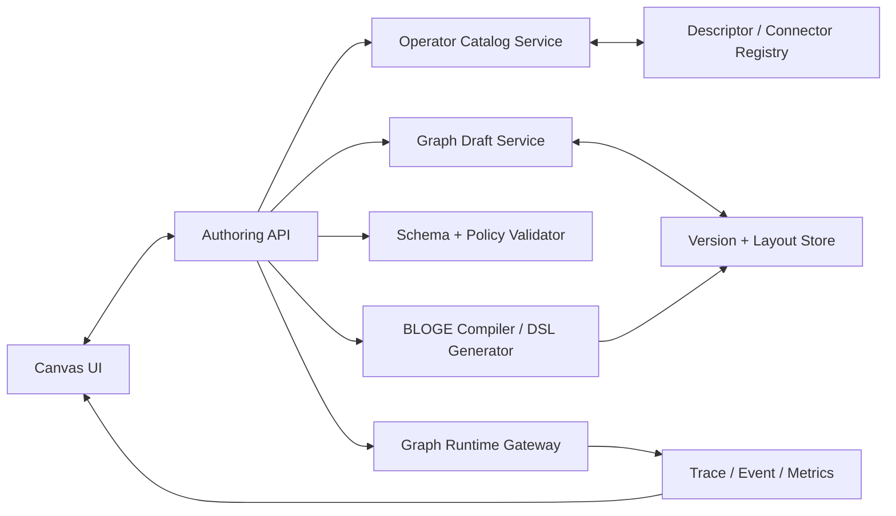
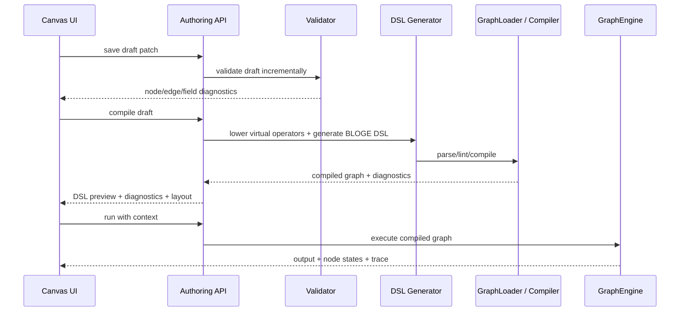
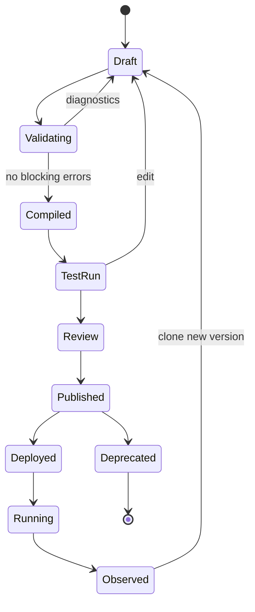

# 通用 BLOGE 可视化编排系统设计方案

状态：Draft v0.2
日期：2026-06-29
基线：`resource-gateway-examples`，参考 `graph-engine-examples` 的版本、布局、算子清单与诊断能力

当前实现状态：[BLOGE 可视化编排实现状态审计](./bloge-visual-orchestration-implementation-status.md)

设计包索引：[BLOGE 可视化编排设计包索引](./bloge-visual-orchestration-design-package.md)

配套协议：[BLOGE 可视化编排协议草案 v1](./bloge-visual-orchestration-protocol-v1.md)

关键决策：[BLOGE 可视化编排系统关键决策记录](./bloge-visual-orchestration-decision-record.md)

Phase 1 实现蓝图：[BLOGE 可视化编排 Phase 1 实现蓝图](./bloge-visual-orchestration-phase1-implementation-blueprint.md)

## 1. 核心判断

这套系统不能被设计成一个简单的“拖拽画布”。拖拽只是入口，真正要建设的是一套 **BLOGE 可视化编排控制面**：

1. 用户可以注册或导入算子库定义，包括算子输入、输出、配置、能力、约束、权限和运行时绑定。
2. 画布根据这些定义生成可拖拽、可连接、可配置的节点。
3. 节点之间的连接、字段映射、表达式、分支、循环、重试、降级、流式输出等行为必须被 schema 和编译器约束。
4. 画布编辑结果必须能编译为 BLOGE 可执行图，或者生成等价的 BLOGE DSL。
5. 运行、调试、发布、观测、版本演进和治理必须形成闭环，否则复杂业务编排会在短期内腐化成不可维护的低代码黑箱。

当前 `resource-gateway-examples` 适合作为基版，不是因为它已经有完整画布，而是因为它已经证明了一个重要抽象：**运行时行为可以由描述符驱动，而不是由每个业务 API 手写 Java Operator**。这正是通用可视化编排系统要放大的能力。

## 2. 已有基础与证据

### 2.1 resource-gateway 已有能力

事实：

- `resource-gateway-examples` 已经落地 visual authoring slice：`OperatorDefinition`、`OperatorLibrary`、Java OperatorRegistry 投影、`ResourceDesignContract`、`GraphDraft`、连接候选发现与连接预检、DSL 生成、运行和 immutable publication。
- `ResourceDescriptor` 已经描述外部 HTTP 资源的 URL、方法、Header、认证、超时、参数映射、响应协议和 payload 提取路径。
- `HttpResourceOperator` 是通用资源算子，运行时根据 `resourceId` 解析 descriptor，再完成参数求值、请求构建、响应校验和 payload 提取。
- `DatabaseResourceRegistry` 已经有 descriptor 持久化、热路径缓存和表达式预编译。
- `/admin/resources` 已经提供资源描述符 CRUD。
- `/api/visual/operators`、`/admin/visual-operator-libraries`、`/api/visual/drafts`、`/api/visual/connections/check`、`/api/visual/connections/candidates`、`/api/visual/publications` 已形成服务端权威 authoring API。
- 静态页面 `Custom Composer` 已从 catalog API 加载动态 palette，并支持用户算子库、用户 schema ref 结构化诊断、resource 虚拟算子、带 projection readiness 和 schema ref BLOCKED gate 的 OpenAPI operation discovery 到 resource contract 预览、AsyncAPI operation/message discovery 与 multi-selection 到 external-boundary operator-library 草案、payload/header schema ref 本地解析门禁、浏览器侧 BLOCKED 候选投影前拦截、projected/available/omitted、selector-match 和 omitted-reason 审计摘要并回填同一导入编辑器的浏览器基础、schema-aware 连接、visualLayout contract validation、visualLayout group band 渲染、Server Check 诊断按节点 label/id 聚合/过滤/聚焦/轮转、队列位置/过滤明细/隐藏节点提示，并在当前修复节点落在摘要折叠范围外时仍保留该节点预览，F8/Shift+F8 修复队列快捷导航和 Esc 清除过滤、selected-node diagnostics 归因、connectability blocked preview / reason 标签、已配置节点复制和 Cmd/Ctrl+D 快捷入口、Delete/Backspace 删除选中节点并复用 impact cleanup 路径、节点影响面 detach、草稿、发布和运行。

推断：

- resource-gateway 的正确演进方向不是增加更多 provider-specific operators，而是将 `ResourceDescriptor` 泛化为“算子描述符 / 连接器描述符 / 虚拟算子定义”。
- 现有 composer 已经不只是 MVP 原型；它是当前通用画布的可运行 Phase 1 示例。下一阶段应补前端回归、Java operator 深化、导入辅助和长期 graph-engine 对齐。

### 2.2 graph-engine 已有能力

事实：

- `graph-engine-examples` 已经有 `bloge.visualLayout.v1` 模型，用于保存节点位置、分组、标签和注解。
- `visualLayout` 被明确定位为 presentation-only，BLOGE DSL 和编译元数据仍是节点、边、分支、schema、重试和运行语义的来源。
- resource-gateway 的 Phase 1 已开始把 layout group 固化为表现层合同：服务端校验 group id、kind/label 类型、nodeIds、节点 `group` 归属和跨 group membership，浏览器只把它渲染成节点背后的阶段/泳道 band。
- Graph Engine Server 已有 definitions、versions、deployments、instances、node states、diagram、operator inventory 等控制面概念。
- `/api/v1/operators` 已有算子清单能力，包含 metadata、inputSchema、outputSchema 和 usage。
- AI 模块已有 `OperatorCatalogBuilder`，能从 `OperatorRegistry` 构建 prompt-facing operator catalog。

推断：

- 通用画布不应在 resource-gateway 中重造所有版本治理能力。resource-gateway 适合作为“可视化编排最小产品切片”，graph-engine 的版本、诊断、布局和 operator inventory 应该逐步被复用或抽取。
- `visualLayout.v1` 可以继续作为视觉布局合同，但不能承载业务语义；服务端只校验 schemaVersion、rootId、节点 operatorRef、节点/边/分组引用、分组 id/membership、节点/边覆盖、edge kind / port-path metadata、几何值和 viewport 等表现层一致性。

## 3. 设计目标

### 3.1 产品目标

让用户在浏览器画布上完成以下动作：

1. 导入或注册算子库。
2. 浏览算子能力、schema、示例、限制和运行成本。
3. 拖拽算子到画布。
4. 在 schema 约束下连接算子输出到下游输入。
5. 使用字段选择、表达式、transform、decision table、branch、foreach、fallback 等机制表达业务逻辑。
6. 实时获得类型错误、缺失字段、不可达节点、循环依赖、权限不满足、运行时绑定缺失等诊断。
7. 编译、测试、模拟运行、发布、回滚、观测。

### 3.2 架构目标

1. **契约优先**：算子和图都必须有机器可读 contract。
2. **单一语义真相**：视觉布局不能变成第二套业务定义。
3. **前端辅助、后端裁决**：浏览器可以做即时校验，但发布前必须由服务端编译器和验证器裁决。
4. **描述符驱动运行时**：HTTP/API 类能力优先由 descriptor 驱动，不为每个上游服务写一个 Java Operator。
5. **可演进**：支持 operator schema 版本、graph version、兼容性检查、使用影响分析。
6. **可治理**：支持租户、命名空间、环境、权限、密钥、审计、配额和 egress 控制。
7. **可观测**：每个节点运行状态、输入输出摘要、错误、重试、降级和耗时都能回到画布上。

## 4. 范围边界

### 4.1 In Scope

- 通用算子目录和算子 schema 合同。
- resource descriptor 到虚拟算子的映射。
- 可视化 graph draft 模型。
- schema-aware 连接、字段映射、表达式校验。
- Graph IR 到 BLOGE DSL 的生成。
- DSL 编译诊断到画布节点/字段的映射。
- 草稿、版本、发布和运行记录的生命周期。
- request-response 模式下的快速执行与调试。
- 后续兼容 durable/runtime instance 的状态叠加。

### 4.2 Out of Scope for MVP

- 多人实时协同编辑。
- 完整 BPMN 替代品。
- 任意代码执行型自定义算子沙箱。
- 拖拽生成所有 BLOGE 高级语法的完整覆盖。
- 跨组织 marketplace。
- 生产级 IAM 管理后台。

这些不是永远不做，而是不应放进第一阶段，否则会把核心合同拖垮。

## 5. 第一类实体

| 实体 | 说明 | 是否已部分存在 |
| --- | --- | --- |
| Operator Provider | 算子来源，如 Java registry、用户上传 catalog、resource descriptor、远程连接器包 | 部分存在 |
| Operator Definition | 一个可放入画布的算子定义，包括 schema、配置、能力、约束、视觉信息 | 已实现 |
| Virtual Operator | 由 descriptor 或模板派生的算子，例如 `loan-applicant-service.getProfile` | 已实现 |
| Port | 算子输入/输出端口，包含方向、schema、可连接规则 | 已实现 |
| Schema Descriptor | BLOGE 内部 schema 表达，可导入/导出 JSON Schema | 部分存在 |
| Graph Draft | 画布编辑中的图定义，未必可发布 | 已实现 |
| Graph Version | 已编译、可发布、可回滚的图版本 | graph-engine 已存在 |
| Visual Layout | 节点位置、尺寸、分组、视口、视觉注解 | 已存在 |
| Binding | 下游输入如何从上游输出、上下文或常量中取得值 | 已实现 |
| Validation Report | 草稿、节点、边、表达式、schema 和运行时绑定的诊断集合 | 已实现 |
| Execution Plan | 编译后可执行计划，包括节点拓扑、依赖、运行策略 | BLOGE 内部存在 |
| Run / Instance | 一次执行或长运行实例 | 部分存在 |
| Trace / Node State | 节点级运行状态、耗时、输入输出摘要、错误 | 部分存在 |
| Governance Policy | 租户、环境、权限、密钥、配额、egress、审计规则 | 部分存在 |

## 6. 总体架构



### 6.1 五个平面

1. **Catalog Plane**：管理可用算子、虚拟算子、schema、示例、权限和运行时绑定。
2. **Authoring Plane**：管理画布草稿、节点、边、字段映射、布局和编辑诊断。
3. **Validation / Compilation Plane**：做 schema 校验、策略校验、BLOGE DSL 生成、编译、lint 和 dry-run。
4. **Runtime Plane**：执行 request-response 图、启动 durable 实例、处理流式输出、回传节点状态。
5. **Governance / Observability Plane**：管理版本、发布、审计、配额、密钥、运行事件和问题回放。

## 7. 核心设计决策

本章列出当前推荐决策。完整备选方案比较、拒绝理由、失效条件和回看触发器见
[BLOGE 可视化编排系统关键决策记录](./bloge-visual-orchestration-decision-record.md)。

### D1. 画布不直接编辑 `visualLayout`

决策：`visualLayout` 只保存视觉信息。画布编辑产生的是语义化 `GraphDraft`，再生成 BLOGE DSL 或编译 artifact。

理由：

- 布局没有能力表达 schema、输入绑定、重试、fallback、decision table、foreach 等语义。
- 如果把布局当图定义，会出现 DSL、编译图、布局三份真相。
- 现有 graph-engine 已经明确 `visualLayout` 是 presentation-only，应沿用这个边界。

代价：

- 需要维护 GraphDraft / Graph IR 模型，而不是只存一份布局 JSON。当前 `resource-gateway-examples` 已经实现 `GraphDraft`，后续代价转为协议演进、兼容性和与 graph-engine 控制面的长期对齐。

### D2. 算子目录是一级资产，不是 Java 反射结果

决策：Java `OperatorRegistry` 反射出来的 schema 只是 catalog source 之一。最终暴露给画布的是归一化 `OperatorDefinition`。

理由：

- 反射 schema 只能描述输入输出形状，不能描述权限、成本、side effect、幂等性、连接规则、密钥需求、UI 控件、运行环境、版本兼容性。
- 用户提供的算子库可能不是 Java class，而是 HTTP resource、远程 worker、AI tool、SQL query、SaaS connector 或 subgraph。

代价：

- catalog schema 需要精心设计，不能只复用当前 `OperatorInventoryEntry`。

### D3. ResourceDescriptor 应升级为虚拟算子来源

决策：`ResourceDescriptor` 不只在运行时被 `httpResource` 解析，也要在设计时投影成可拖拽的 `Virtual Operator`。

例子：

- 底层执行算子仍是 `httpResource`。
- 画布上显示的是 `loan-applicant-service.getProfile`。
- 节点配置默认写入：

```bloge
node fetchApplicant : httpResource {
  input {
    resourceId = "loan-applicant-service.getProfile"
    params = { applicantId: ctx.applicantId }
  }
}
```

理由：

- 业务用户关心“获取申请人画像”，而不是“调用通用 HTTP 资源算子”。
- descriptor 已经包含参数映射和响应协议，可以派生出更具体的输入输出 schema。

代价：

- `ResourceDescriptor` 需要增加或关联设计时 schema，例如 `requestSchema`、`payloadSchema`、`errorSchema`、`fieldHints`。

### D4. 客户端即时校验，服务端权威校验

决策：前端根据 catalog 做交互约束，但 `validate/compile/publish/run` 必须走服务端。

理由：

- 浏览器不能被信任。
- 编译器、operator registry、租户权限、密钥策略和 runtime binding 都在服务端。
- 复杂图校验依赖全局上下文，不适合只在前端完成。

代价：

- 需要高频低延迟的 validate API，否则体验会差。

### D5. MVP 以 resource-gateway 为基版，但不能把平台锁死在 gateway

决策：第一阶段在 `resource-gateway-examples` 中实现通用画布切片，优先支持 descriptor-backed HTTP resource、decision table、transform、branch、foreach 的有限闭环。第二阶段将 catalog、draft、validation、layout contract 下沉或对齐到 graph-engine。

理由：

- resource-gateway 已经有业务感强、容易演示的场景。
- graph-engine 的版本和控制面更适合作为长期平台基础，但第一步直接上全平台会过重。

代价：

- 需要明确哪些类是示例内实现，哪些未来要抽取为共享模块。

## 8. Operator Catalog 设计

本章给出架构层面的 catalog 形态。字段级合同、校验规则、API 请求响应和迁移路径见
[BLOGE 可视化编排协议草案 v1](./bloge-visual-orchestration-protocol-v1.md)。

### 8.1 OperatorDefinition v1

```json
{
  "schemaVersion": "bloge.operatorCatalog.v1",
  "operatorRef": "httpResource",
  "operatorVersion": ">=0.8.9 <1.0.0",
  "display": {
    "name": "HTTP Resource",
    "description": "Execute a descriptor-backed HTTP resource",
    "category": "Resource",
    "icon": "globe",
    "color": "#2563eb"
  },
  "owner": "bloge-platform",
  "tags": ["http", "resource", "gateway"],
  "source": {
    "kind": "java-operator",
    "registryName": "httpResource"
  },
  "inputSchema": {
    "kind": "object",
    "required": ["resourceId", "params"],
    "properties": {
      "resourceId": { "kind": "string" },
      "params": { "kind": "object", "additionalProperties": true }
    }
  },
  "outputSchema": {
    "kind": "object",
    "properties": {
      "resourceId": { "kind": "string" },
      "statusCode": { "kind": "integer" },
      "payload": { "kind": "object", "additionalProperties": true },
      "success": { "kind": "boolean" }
    }
  },
  "configSchema": {
    "kind": "object",
    "properties": {
      "timeout": { "kind": "duration", "default": "PT3S" },
      "retry": { "kind": "retryPolicy" }
    }
  },
  "capabilities": {
    "sideEffect": "EXTERNAL_CALL",
    "idempotency": "UNKNOWN",
    "streaming": false,
    "durable": false,
    "requiresSecrets": true,
    "supportsDryRun": false
  },
  "policy": {
    "tenants": ["*"],
    "namespaces": ["local", "default"],
    "environments": ["dev", "staging"]
  },
  "authoring": {
    "defaultNodeId": "callResource",
    "usageExample": "node callResource : httpResource { input { resourceId = \"...\" params = {...} } }",
    "fieldHints": {
      "input.resourceId": { "control": "resource-picker" },
      "input.params": { "control": "mapping-editor" }
    }
  }
}
```

### 8.2 VirtualOperatorDefinition

虚拟算子由 descriptor、subgraph、远程 worker 或 connector package 派生。对用户来说它是独立算子，对运行时来说它可以退化为已有通用算子的配置。

```json
{
  "schemaVersion": "bloge.operatorCatalog.v1",
  "operatorRef": "resource:loan-applicant-service.getProfile",
  "display": {
    "name": "Get Applicant Profile",
    "category": "Loan / Applicant"
  },
  "source": {
    "kind": "resource-descriptor",
    "resourceId": "loan-applicant-service.getProfile",
    "runtimeOperatorRef": "httpResource"
  },
  "inputSchema": {
    "kind": "object",
    "required": ["applicantId"],
    "properties": {
      "applicantId": { "kind": "string" }
    }
  },
  "outputSchema": {
    "kind": "object",
    "properties": {
      "score": { "kind": "integer" },
      "segment": { "kind": "string" },
      "income": { "kind": "decimal" }
    }
  },
  "lowering": {
    "operatorRef": "httpResource",
    "inputTemplate": {
      "resourceId": "loan-applicant-service.getProfile",
      "params": {
        "applicantId": "{{input.applicantId}}"
      }
    },
    "outputPath": "payload"
  }
}
```

关键点：

- `operatorRef` 可以是用户可见的虚拟引用。
- `lowering` 描述如何降级成 BLOGE 实际运行节点。
- 画布连接时使用虚拟算子的精确 input/output schema。
- DSL 生成时使用 `lowering` 产出真实 BLOGE 节点。

### 8.3 算子来源

| 来源 | 示例 | 优先级 | 说明 |
| --- | --- | --- | --- |
| Java OperatorRegistry | `httpResource`, `transform`, streaming operators | 必须支持 | 从运行时注册表反射基础能力 |
| ResourceDescriptor | `loan-applicant-service.getProfile` | MVP 核心 | 生成更业务化的虚拟算子 |
| Subgraph | `customerRiskAssessment` | 第二阶段 | 将已发布图包装成复用算子 |
| Remote Worker | `fraudModel.score` | 第二阶段 | 远程任务执行，适合 durable |
| AI Tool | `llm.extractFields` | 第二阶段 | 强治理，需 structured output schema |
| User Catalog JSON/YAML | 外部导入 | 已落地在 resource-gateway 示例 | 支持非 Java 算子声明；raw source text 由服务端解析后进入统一治理链路 |

## 9. Graph Draft / Graph IR 设计

本章解释为什么需要 GraphDraft。可实现的 `bloge.graphDraft.v1` 顶层结构、节点、边、binding、状态和 lowering 规则见
[BLOGE 可视化编排协议草案 v1](./bloge-visual-orchestration-protocol-v1.md)。

### 9.1 为什么需要 GraphDraft

前端不能只拼 DSL 字符串。原因很简单：字符串不适合作为实时编辑模型。

画布需要知道：

- 节点 id、位置、选中状态、折叠状态。
- 节点使用的 operator catalog version。
- 输入字段来自哪个输出字段、常量、ctx 变量或表达式。
- 哪些连接是数据依赖，哪些是控制依赖。
- 哪些错误定位到哪个节点、哪个字段、哪条边。
- 哪些节点是虚拟算子，需要 lowering。

这些都应该由结构化 GraphDraft 表达。

### 9.2 GraphDraft v1

```json
{
  "schemaVersion": "bloge.graphDraft.v1",
  "draftId": "draft-loan-policy",
  "graphName": "customLoanPolicy",
  "tenantId": "demo-tenant",
  "namespace": "local",
  "nodes": [
    {
      "id": "fetchApplicant",
      "operatorRef": "resource:loan-applicant-service.getProfile",
      "operatorVersion": "1.0.0",
      "config": {
        "timeout": "PT3S",
        "retry": { "attempts": 1, "backoff": "PT0.2S" }
      },
      "inputs": {
        "applicantId": {
          "kind": "expression",
          "expr": "ctx.applicantId"
        }
      },
      "visual": {
        "x": 80,
        "y": 220,
        "width": 184,
        "height": 76
      }
    },
    {
      "id": "loanPolicy",
      "operatorRef": "bloge:decisionTable",
      "inputs": {
        "score": {
          "kind": "path",
          "sourceNode": "fetchApplicant",
          "path": "output.score"
        },
        "amount": {
          "kind": "expression",
          "expr": "ctx.requestedAmount"
        }
      },
      "config": {
        "hitPolicy": "unique",
        "outputSchema": {
          "kind": "object",
          "properties": {
            "decision": { "kind": "string" },
            "rate": { "kind": "decimal" },
            "ruleId": { "kind": "string" }
          }
        }
      }
    }
  ],
  "edges": [
    {
      "id": "fetchApplicant->loanPolicy:score",
      "kind": "data",
      "source": { "nodeId": "fetchApplicant", "path": "output.score" },
      "target": { "nodeId": "loanPolicy", "path": "input.score" }
    }
  ],
  "outputNode": "assembleLoanDecision"
}
```

### 9.3 Binding 类型

| Binding Kind | 用途 | 示例 |
| --- | --- | --- |
| `constant` | 固定值 | `"approved"` |
| `contextPath` | 从 `ctx` 读取 | `ctx.userId` |
| `nodePath` | 从上游节点指定输出端口读取 | `fetchProfile.output.payload.name` |
| `expression` | BLOGE 表达式 | `ctx.amount * 1.2` |
| `objectTemplate` | 结构化对象模板 | `{ id: ctx.id, score: risk.output.score }` |
| `transformRef` | 显式 transform 节点 | `normalizeApplicant.output` |
| `secretRef` | 密钥引用 | `secret("crm.apiKey")` |

MVP 可以先支持 `constant`、`contextPath`、`nodePath`、`expression`、`objectTemplate`。
当多个 input port 暴露同名字段时，binding key 必须允许端口限定命名，
例如 `customer.id` 和 `order.id`；真实校验位置由 `targetPort` 和
`targetPath` 决定，而不是由 map key 猜测。`targetPath` 必须支持嵌套
object path，例如 `applicant.score`；画布字段枚举和服务端校验都要按完整
schema path 工作，否则复杂业务 payload 会被迫扁平化。
同一节点内解析后的 `targetPort + targetPath` 必须具备单一所有者；
`objectTemplate` 字段也要展开参与检查，且 `applicant` 与 `applicant.score`
这样的 root/path 前缀重叠必须阻断。否则画布看到的是两个来源，DSL 运行时
却只能得到最后一次写入或不确定覆盖。
required 判断也必须沿展开后的字段证明：普通整对象 binding 可以凭 source
schema 证明 `applicant.score` 存在，但 `objectTemplate` 不能只绑定
`applicant` 父对象就满足嵌套 required，必须递归提供对应叶子字段。

当前 `resource-gateway-examples` 已把 `contextPath` 纳入 schema gate：前端会从 Context JSON 推导草稿 `inputSchema` 并把兼容的 `ctx.*` 字段放入 source picker，服务端会在严格 input schema 下阻断未知 `ctx` path 和 source/target 类型不兼容。

## 10. Schema 约束与连接规则

字段级 schema envelope、类型兼容、缺 schema 降级和诊断 code 已在
[BLOGE 可视化编排协议草案 v1](./bloge-visual-orchestration-protocol-v1.md) 中展开。本章保留关键原则。

### 10.1 连接基本规则

当用户把 A 的输出连到 B 的输入时，系统必须检查：

1. A 节点是否存在且可达。
2. A 的输出端口和输出 path 是否存在。
3. B 的输入端口和输入字段是否存在。
4. A 输出字段类型是否可赋值给 B 输入字段类型。
5. B 输入字段是否 required。
6. 如果类型不兼容，是否存在可插入 transform 或 adapter。
7. 该连接是否违反 side-effect、streaming、durable、tenant、environment 或 permission 约束。

### 10.2 类型兼容规则

| Source | Target | 结果 | 说明 |
| --- | --- | --- | --- |
| `integer` | `integer` | 允许 | 精确匹配 |
| `integer` | `decimal` | 允许 | 安全拓宽 |
| `decimal` | `integer` | 警告/需 transform | 可能丢精度 |
| `string` | `enum` | 禁止/需 transform | 没有来源值域证明，不能隐式接入枚举输入 |
| `object` | `object` | 结构化检查 | required 字段必须满足 |
| `array<T>` | `array<U>` | 检查 item 兼容 | foreach 场景重要 |
| `oneOf`/`anyOf` | 任意 | 保守检查，可显式消歧 | source union 必须所有分支可赋值；target `anyOf` 至少一个分支可接；target `oneOf` 默认必须唯一分支可接；binding 可用 `targetUnionBranch` 指定 root target branch |
| `object` | `string` | 禁止或需表达式 | 不能隐式转 JSON |
| `unknown` | 任意 | 警告 | 可继续草稿，不可无条件发布 |

resource-gateway 示例当前已在 binding 和 edge 校验中递归检查 object required
字段、`array.items` 兼容性和 enum 值域集合：target object 的 required 字段必须
能从 source schema 中证明为 required 且类型兼容，source enum values 必须是
target enum values 的子集，普通 `string` 不能直接接入 enum input。正式 draft
还会校验 data edge 与语义依赖一致，包含 `nodePath` binding 和 config expression
引用；`nodePath` binding 必须有可见 data edge，防止画布连线和 DSL 输入语义分叉。
服务端还会在 `nodePath` binding、表达式引用、data edge source endpoint、带路径的 graph
output selection，以及 whole-output graph selection 暴露输出端口时检查非默认 output port
name 是否能作为 BLOGE DSL path segment，
用于兜住历史 catalog 或外部 projector 绕过导入校验后的发布前安全边界。
未知 binding kind 会在 `GraphDraftValidator` 被阻断，不能落到 codegen 的 literal fallback
绕过 target schema gate。
浏览器侧的 connection hint 和 source picker 也要复用这些关键规则，至少覆盖
object required 字段证明、array item 递归兼容、enum 值域子集、`oneOf`/`anyOf`
union 的保守兼容提示，以及普通 `string` 不能隐式接入 enum，减少画布交互与服务端裁决之间的断层。拖线落点和
inspector source picker 写入 binding 前都必须调用服务端 connection preview
gate，本地 hint 不能成为最终授权。
当前服务端 schema gate 和浏览器本地 hint 已支持 `oneOf` / `anyOf` 作为受限 visual union：
运行时 value validation 中 `oneOf` 必须唯一命中，`anyOf` 至少命中一个；
schema-to-schema 连接兼容采用保守策略，避免把无法证明唯一性的 union
直接放入下游输入。浏览器 contract panel 和 operator library profile 会展示
union 分支摘要，帮助用户在拖线前看见端口约束；input inspector 和 canvas data
target handle 已支持 root `targetUnionBranch` 与 nested `targetUnionBranches`
选择，draft 保存、connection preview、connection candidates focused discovery、
binding validation 和 data edge validation 会共同按选中 branch 消歧。分支内字段
只有在 branch path、字段枚举、candidate preview 和 lowering 语义都能被服务端
证明时才能成为稳定 handle，不能只做前端展开。
同一节点内多个 binding 写入同一解析后输入目标，或 root/path 前缀重叠，
会以 `visual.input.duplicateTarget` 阻断；不同 input port 上同名字段仍然合法，
例如 `customer.id` 和 `order.id`。
无 design contract 的旧 resource 仍按 opaque schema 降级；一旦注册
`ResourceDesignContract`，request/response schema 就和用户导入 operator
library 一样必须通过服务端结构校验，缺失 `items` 的 array、未知
`required` 字段、缺失 enum values 和 examples 中的原始 secret 都会被
admin upsert gate 阻断。

### 10.3 required 字段规则

对每个节点：

- 所有 required input 必须有 binding。
- binding 不能引用不可达节点。
- data edge 必须对应一个实际语义依赖；`nodePath` binding 必须对应画布上的 data edge。
- binding 如果引用 optional 输出字段，需要下游声明 fallback、default 或 nullable。
- 如果输入 schema 有 `oneOf` / union，服务端已能做保存/运行/连接层面的保守校验；root target 可通过 `targetUnionBranch` 显式选择分支，嵌套 union 仍需要后续 branch path 模型。

### 10.4 表达式校验

表达式必须做三层校验：

1. **语法校验**：BLOGE parser 能解析。
2. **引用校验**：引用的 `ctx` 字段和节点输出 path 存在或被标记为 dynamic。
3. **类型推断**：表达式结果能赋给目标 input schema。

当前 `BlgeExpressionEvaluator.precompile()` 已经能做注册时预编译，但还不够。通用画布需要表达式的引用定位和类型推断，否则错误只能在运行时暴露。

## 11. DSL 生成与编译链路

### 11.1 编译流程



### 11.2 Lowering 示例

画布节点：

```json
{
  "id": "fetchApplicant",
  "operatorRef": "resource:loan-applicant-service.getProfile",
  "inputs": {
    "applicantId": { "kind": "expression", "expr": "ctx.applicantId" }
  }
}
```

生成 DSL：

```bloge
node fetchApplicant : httpResource {
  input {
    resourceId = "loan-applicant-service.getProfile"
    params = { applicantId: ctx.applicantId }
  }
  timeout = 3s
  retry = { attempts: 1, backoff: 200ms }
}
```

### 11.3 DSL 反向导入

长期应该支持 DSL import，但不能要求 v1 完全无损。

阶段策略：

1. MVP：GraphDraft -> DSL 单向生成，DSL 预览可编辑但编辑后以 compiler layout 回显。
2. Phase 2：支持 DSL -> Draft 的有限导入，覆盖普通 node、transform、decision table、direct edge。
3. Phase 3：支持复杂结构导入，如 foreach、branch、stream、wait、subgraph。无法导入的语义保留为 read-only block。

## 12. API 设计草案

本章是架构级 API 切分。请求/响应示例、并发规则、诊断结构见
[BLOGE 可视化编排协议草案 v1](./bloge-visual-orchestration-protocol-v1.md)。

### 12.1 Operator Catalog API

| Method | Path | 说明 |
| --- | --- | --- |
| `GET` | `/api/visual/operators` | 当前已实现：查询可用算子，支持 pattern、tag、tenant、namespace、environment、source/lowering/capability/runtime-readiness facets，并返回 `runtimeBindingProjections[]` / `runtimeBindingProjectionStateCounts` 与 `executablePromotionProjections[]` / `executablePromotionStateCounts`，把 active bound implementation record、active adapter activation、executable lowering integration 和仍缺 readiness recompute 的 promotion blocker 投影为 palette 可见状态，但不修改 trusted `OperatorDefinition.runtimeReadiness` |
| `GET` | `/api/visual/operators/{operatorRef}` | 当前已实现：按 catalog 可见性门禁获取单个算子定义，支持 `tenantId`、`namespace`、`environment`、`includeDeprecated`、`resourceOnly` 和 source/lowering/capability/runtime-readiness filters，不可见或不存在返回 404 |
| `GET` | `/api/visual/operators/{operatorRef}/usage` | 当前已实现：查询某个 operatorRef 被哪些 stored draft / immutable publication 节点使用，并返回 saved/frozen fingerprint 与当前 catalog fingerprint 的状态 |
| `POST` | `/admin/visual-operator-libraries/import-text` | 当前实现：导入用户提供的 operator library JSON/YAML source text，服务端解析后复用 impact / warning / revision 治理 |
| `POST` | `/admin/visual-operator-libraries/validate-text` | 当前实现：校验用户提供的 operator library JSON/YAML source text，不落库，解析错误返回结构化诊断 |
| `GET` | `/admin/visual-operator-libraries/{libraryId}/export` | 当前实现：导出当前用户算子库为 `bloge.visualOperatorLibraryExport.v1`，包含 `bundleFingerprint`、library snapshot、latest revision evidence 和 export-time validation/profile/impact |
| `POST` | `/admin/visual-operator-libraries/validate-bundle` | 当前实现：非写入预检用户算子库 portable bundle，先校验 schemaVersion 与 `bundleFingerprint`，再返回目标环境 validation/profile/impact/readiness、intended `mutationAction` 和 target current library -> source bundle snapshot 的 `targetDiff`，不要求 ack/governance evidence 且不创建 revision |
| `POST` | `/admin/visual-operator-libraries/import-bundle` | 当前实现：导入用户算子库 portable bundle，先校验 schemaVersion 与 `bundleFingerprint`，再复用目标环境 validation/impact/SemVer/warning/revision audit，并返回 `sourceBundleFingerprint` 与写入前 `targetDiff` |
| `GET` | `/api/visual/resource-operators` | 将 resource descriptors 投影为虚拟算子 |

resource-gateway 示例当前以 `/admin/visual-operator-libraries` 暴露用户库管理：
`POST /admin/visual-operator-libraries/validate` 返回 diagnostics、impact、服务端派生
`bloge.visualOperatorLibraryProfile.v1` 和
`bloge.visualOperatorLibraryImportReadiness.v1`，但不落库；
`POST /admin/visual-operator-libraries/validate-text` 和
`POST /admin/visual-operator-libraries/import-text` 接收 raw JSON/YAML source text，
解析错误会返回 `visual.library.source.*` 结构化诊断，解析成功后进入同一 validator、
impact、warning acknowledgement、SemVer 和 revision audit 路径；
`POST/PUT /admin/visual-operator-libraries` 在写入前执行同一校验，阻断空库、
重复 `operatorRef`、跨已导入库冲突的 `operatorRef`、重复端口、
覆盖内置算子的 `operatorRef`、占用 `resource:` 命名空间的用户算子、
不支持 lowering mode、非法 schema kind、缺失 `items` 的 array、native
lowering 缺可执行 BLOGE operatorRef、design-only lowering 误声明 executable
operatorRef、executable lowering mode 下非默认 output port 或 schema path
字段无法渲染为 BLOGE DSL path segment、transform lowering 缺 assignments、
assignment target 不在 output schema 中、template 引用不存在 input path、
以及 `required` 引用不存在字段等硬错误。`OperatorDefinition.policy`
当前已支持 `tenants`、`namespaces`、`environments`，`/api/visual/operators`
可按 scope 过滤，`GraphDraftValidator` 在 validate/compile/run/publish 前
返回 `visual.operator.policyDenied` 阻断越权 operator 使用。`OperatorDefinition`
当前还包含服务端派生的 `runtimeReadiness`，按 source/lowering/capability/diagnostics
给出 `RUNTIME_EXECUTABLE`、`DESIGN_ONLY`、`RUNTIME_BLOCKED`、`GOVERNANCE_REVIEW`
或 `CATALOG_REPAIR_REQUIRED`，并作为 `/api/visual/operators` 的 `runtimeReadiness`
filter 与 `facets.runtimeReadinessStates` 聚合维度返回，避免浏览器用前端启发式伪造控制面判断。
同一口径也进入 operator-library validate/import 的 `profile`：服务端按规范化后的 operator、
validation diagnostics 和 runtime inventory warning 计算 operator count、schema field count、
DSL-unsafe/dynamic schema 计数、facets、catalog-repair、runtime-blocked、governance-review 与
design-only 摘要；浏览器只有在用户继续编辑 JSON 或服务端 profile 缺失时才回退到本地即时预览。
如果用户粘贴 YAML，浏览器只做轻量格式识别和 `libraryId` 摘要提示，并明确要求点击
Validate 加载服务端解析后的 profile，避免把后端可接受的 YAML 误报为 Invalid JSON。
`importReadiness` 则把 diagnostics、profile 和 impact 压成外部控制面可直接路由的准入状态，
例如 `runtime-executable-importable`、`design-only-importable`、
`runtime-binding-required`、`governance-review-required`、`force-required`、
`governance-evidence-required` 或 `catalog-repair-required`，并显式暴露
`requiresAckWarnings`、`requiresForce`、`requiresGovernanceEvidence` 以及 affected draft /
publication / operator counts，避免浏览器或 CI 解析自然语言诊断来决定下一步动作。
同一准入摘要还会在导入前输出 per-operator `runtimeBindingRequirements[]`：
`lowering.mode=design` 会生成 `executable-lowering`，未解析的 native executable
operatorRef 会生成 `runtime-adapter`，remote-worker / AI-tool / event-source /
message-handler / webhook / streaming / durable 会生成对应 runtime binding kind、target
和 recommendedAction，并同时生成 `handoffLane`、`handoffKind`、`handoffTarget`
这组无状态路由元数据。每条 requirement 也会携带稳定 `requirementKey`，顶层
`runtimeBindingRequirementKeys[]` 与明细数组按顺序对齐，key 形如
`RUNTIME_BINDING|operator-library|{libraryId}|{operatorRef}|{bindingKind}|{bindingTarget}|`。
这样用户刚贴入算子库定义时就能把运行时绑定工作派给 runtime plane，
而不是等图已经被大量草稿引用后才从单个 draft readiness 里反推。
这些 operator-level binding kind/target/handoff/title/summary 与后续
`VisualGraphReadiness.runtimeBindingRequirements[]` 共用同一服务端 planner；导入面和图面只附加
各自的目标上下文，避免同一种未绑定 runtime 在 catalog preflight、draft validate 和
publication asset overview 中被分类成不同待办。
当前还支持
`lowering.mode=design` 的 schema-only authoring：这类用户算子可以进入 catalog、
拖拽、连线、保存、导出、被 schema validator 校验，并可通过浏览器发布模式或 API
`artifactKind=DESIGN` 发布成非执行型设计制品；compile/run/default executable publish 会返回
`visual.codegen.designOnlyOperator`，直到后续绑定 native / transform / branch 等可执行 lowering。
draft validate response 现在返回服务端派生的 `bloge.visualGraphReadiness.v1` 和
`bloge.visualGraphActionReadiness.v1`：
`valid` 只表达 draft contract 是否有 blocking error，`readiness` 单独表达
`runtime-executable`、`design-only`、`runtime-blocked`、`governance-review` 或
`draft-repair-required` 图级状态、可发布 artifact kind 和 node-level readiness 摘要。
对于 schema-valid 但缺运行时实现的节点，`readiness.runtimeBindingRequirements[]`
会继续把 design-only lowering、remote-worker、AI-tool、event-source、message-handler、
webhook、streaming 或 durable 需求压成 node-scoped bindingKind/bindingTarget、
handoffLane/handoffKind/handoffTarget/recommendedAction，
使 DESIGN 制品后续可以进入 runtime plane 绑定、集成排期或外部治理队列，而不是只留下
“不能运行”的 UI 文案。
`actionReadiness` 则表达 `compileNow`、`runNow`、`publishDesignNow`、
`publishDesignAfterReview`、`publishExecutableNow`、`publishExecutableAfterReview`、
`requiresAckWarnings` 和 `requiresGovernanceEvidence`，让浏览器和外部控制面不需要从
diagnostics 文案推断动作准入。
这保证 schema-only 图可以是 `valid=true`，同时明确 `executable=false` 且只能冻结为
`DESIGN` artifact，而不是被误解成系统运行失败。
publication result 也会在成功或拒绝响应中携带同一份 validation/readiness/actionReadiness；
浏览器因此可以把 Server Check 的 readiness 反向施加到画布动作上：只允许
`DESIGN` 的图会自动切到设计制品发布，并禁用 visual draft Compile / Run Custom
Graph；`draft-repair-required` 这类没有 publishable artifact kind 的图则禁用发布入口。
draft/publication summary 读模型也携带同一份 actionReadiness，所以 Workspace Overview
的 action queue 可以直接区分 `ACK_DRAFT_WARNINGS`、`REVIEW_PUBLICATION_WARNING_EVIDENCE`、
runtime binding、repair 和 design tracking。它还会消费
`readiness.runtimeBindingRequirements[]`，把草稿和 frozen DESIGN publication 的缺口拆成
per-node `PLAN_DRAFT_RUNTIME_BINDING` / `PLAN_PUBLICATION_RUNTIME_BINDING` items，
并携带相关 `operatorRef` 与 owner `operatorLibraryId` 用于 action queue 过滤和计数，
而不是只凭 `design-only` readiness 做粗粒度归类。
同一事实源还会通过 `GET /api/visual/assets/runtime-binding-requirements` 暴露为
`bloge.visualRuntimeBindingRequirements.v1`，给外部 runtime-plane 集成团队按
scope、targetKind、operatorRef、operatorLibraryId、bindingKind、handoffLane、handoffKind、handoffTarget、sourceKind、loweringMode、readinessState 和 requirementKey 查询、分页和计数；
其中 `requirementKey` 是 import result、overview item 和索引 row 之间的精确回查桥。
这个索引不保存待办状态，避免和 draft/publication readiness 形成第二套真相源。
当团队需要把当前筛选窗口交给 runtime plane 实现方时，
`GET /api/visual/assets/runtime-binding-requirements/handoff-bundle` 会返回
`bloge.visualRuntimeBindingHandoff.v1`，携带 source index lineage、scope/filter、
stable requirementKeys、operatorRef/operatorLibraryId 计数、handoff lane/kind/target 计数、requirement 明细、
当前窗口相关 `operatorContracts[]` 和服务端派生的 `bundleFingerprint`。
`operatorContracts[]` 不是 catalog 全量导出，而是 runtime-plane 实现需要的最小契约证据：
每个被当前 handoff window 引用的 operator 会冻结 operatorRef、operatorVersion、fingerprint、
operatorLibraryId、display/source、ports、configSchema、capabilities、policy、lowering 和
runtimeReadiness。这样外部 runtime team 不需要回查源 catalog，就能知道要实现的输入输出端口、
配置合同、治理边界、lowering 目标和当前不可执行原因。`bundleFingerprint` 覆盖这些
contract snapshots；只有旧版空 `operatorContracts` bundle 才走兼容 fingerprint 路径，
避免手工拼接或篡改契约快照继续参与排期。
它是便携交接快照，不是工单系统，也不是新的 graph 状态；后续执行状态仍应回写到真正的
runtime binding / operator implementation 控制面，再由 catalog/readiness 重新派生。
`POST /api/visual/assets/runtime-binding-requirements/handoff-review` 则把交接快照带回
当前环境做只读对账，返回 `bloge.visualRuntimeBindingHandoffReview.v1`：
服务端按 bundle 的 scope/filter/page-window 重算当前索引，并按 stable requirementKey
标记 current、drifted、missing 和 current window 新增项；drifted row 会同时返回
`changedFields[]`、`fieldChanges[]` 和 `fieldChangeCategoryCounts`，把旧值/当前值及
identity、scope、readiness、runtime-binding、asset-metadata 等变化类别结构化给
runtime-plane 控制面，而不是要求它解析自然语言摘要。review 还会回显
`sourceBundleFingerprint` 和 `exportedOperatorContractCount`，并在提交的
`bundleFingerprint` 与 bundle material 不一致时返回
`visual.runtimeBindingHandoff.fingerprintMismatch` 阻断对账，让浏览器和外部工单能引用被审阅的同一份 portable snapshot。
这个 review 只判断快照是否仍可用于
交接排期，不记录外部工单进度，也不替代 draft/publication readiness。
浏览器 Workspace Overview 会同步加载这个索引并展示 Runtime Binding Requirements 小节，
提供同类过滤、分页、draft/publication 打开动作、当前窗口 handoff bundle 导出和最近导出
bundle 的 handoff review，并在 stale review 中展示 drift category、字段级 exported/current
值、missing key、当前窗口新增 key 和 snapshot fingerprint，让作者和集成团队在画布工作台内看到、携带并回放审阅
“可设计但不可执行”的具体 runtime-plane 交接项。
connection preflight 会返回候选连接相关的局部 diagnostics，同时携带应用 preview
edge/binding/config expression 后的完整 candidate draft validation/readiness/actionReadiness；compile 和 run 响应同样携带本次服务端门禁使用的 validation/readiness/actionReadiness；
publication run 则回传 artifact 冻结时的 validation/readiness/actionReadiness，不能按当前 catalog
重新解释历史发布物。这样浏览器在 compile/run/connection preflight 之后不会丢失
design-only、runtime-blocked、governance-review 或 draft-repair-required 的发布和执行引导。
connection check summary 也会从 candidate readiness 派生 preview-scoped
runtime binding requirement count/key 和 binding/handoff/source/lowering/readiness 分布，
用于 hover、quick-connect 和外部审阅在拖拽阶段识别“可连接但不可执行”的候选；
这些 key 只属于 connection-preview 窗口，保存成 draft 或 publication 后仍以 asset overview
runtime-binding index 的 requirementKey 为长期 handoff 引用。
拖拽连线的 hover 提示使用 `/api/visual/connections/candidates` 作为 source-scoped
读模型：普通 data/config 拖拽开始时预取 accepted 与 blocked target，必要时可按
`targetNodeId`、`targetSurface`、`offset` 和 `limit` 收窄大画布候选窗口；命中时优先展示服务端
summary/diagnostic/schema explanation（source/target type、first diagnostic、replacement effect、runtime binding hint），
未命中或读模型失败时回退本地 schema hint；真正 drop 写入前仍必须调用
`/api/visual/connections/check`，避免把候选发现误用成 mutation gate。
selected-node connectability inspector 复用同一读模型为当前节点 source handles 建立短期快照，
用服务端 candidate summary/diagnostic/schema explanation 覆盖本地推断；但 quick-connect 点击前仍再次调用
connection check，保证 inspector 建议和实际写入之间不存在第二套权威。
选中已发布 artifact 时，浏览器展示 publication 冻结的 readiness 和非执行节点清单；
这是审阅历史设计制品的依据，不依赖当前 catalog 重新推断。
同一 admin API 已具备 registry-aware impact preflight：删除、禁用或替换仍被 stored draft 引用的
operatorRef 会被阻断，same-ref fingerprint drift 会作为 warning 暴露；对于 immutable publication，
当前 executable artifact 运行不依赖最新 catalog，因为 publication 持有 frozen DSL 和 operator snapshots；
DESIGN artifact 可审阅但不可运行，浏览器会禁用 run/golden 动作，也不会投影成 `publication:*` 子图算子。validate 会返回
publication 级 warning，提示 replay、recertification 或 republish 前需要重新审计。直接删除 library 时，
如果已有 published artifact 引用了该库内 operatorRef，服务端要求 `force=true` 才允许删除。
replacement 还具备 SemVer 治理预检：同一 `libraryId` 的 operator contract 发生变化时，
版本回退是 blocking error；breaking schema / operator removal / disablement 必须提升 major
version，additive 或 compatible schema 变更必须至少提升 minor version，否则进入 warning-gated
`ackWarnings` 流程。这个 gate 不依赖是否已有草稿引用，目的是让用户导入算子库后的长期演进也受控。
当前 registry 还会为每次 create / replace / delete / restore 写入不可变
`bloge.visualOperatorLibraryRevision.v1` 快照；每条快照固化
`revisionMetadata.actor/changeSource/changeSummary/reason`，让算子库 schema
控制面具备可追责的变更来源、摘要和回滚理由，而不是只保存匿名 JSON payload，并通过
`GET /admin/visual-operator-libraries/{libraryId}/revisions` 和
`GET /admin/visual-operator-libraries/{libraryId}/revisions/{revision}` 暴露查询面；
`GET /admin/visual-operator-libraries/{libraryId}/revisions/{baseRevision}/diff/{targetRevision}`
返回 `bloge.visualOperatorLibraryDiff.v1`，按 library-level 与 operator-level 分解
added / removed / changed surface、最高风险、风险分类和摘要，供 restore / rollback 前审阅；
`POST /admin/visual-operator-libraries/{libraryId}/revisions/{revision}/restore`
会把历史快照作为新的 latest library 写回，并记录 `action=RESTORE` 与
`restoredFromRevision`。restore 复用 replacement 的结构校验、operatorRef 归属保护、
runtime collision、impact preflight 和 warning acknowledgement gate；版本回退默认仍是
blocking error，只有显式 `allowVersionRegression=true` 时才降级为必须
`ackWarnings=true` 的受控 rollback warning。delete 只移除当前 catalog entry，不清除
历史 revision。浏览器 Operator Libraries 面板已接入这条控制面：按当前库或显式
libraryId 拉 history、预览历史 snapshot、通过 `Rollback` 开关触发受控 restore，并在删除后
保留 history target 以支持误删恢复。这个设计把用户导入的 operator schema 当作可治理资产，
而不是一次性 JSON 配置：坏版本导入、误删、schema drift 争议和 rollback UI 都可以基于
服务端历史证据处理。
导入阶段还会 warning-gate capability 和治理风险：streaming/durable 算子可以被显式确认后进入 catalog，
但当前 request-response runtime 会阻断使用它们的 draft；secret-backed execution 和
`NON_IDEMPOTENT` 外部副作用也必须经 `ackWarnings=true` 确认后才会写入。
发布阶段同样 warning-gate production promotion：stored draft validate 如果只返回
warning-level diagnostics，`/api/visual/drafts/{draftId}/publish` 会先返回 `409`，
要求作者审阅并携带 `ackWarnings=true` 后才写入 immutable publication。
validate、warning-gated import/replace 和 delete conflict 响应会返回
`bloge.visualOperatorLibraryImpact.v1`，按 error/warning、affected draft、
affected draft node target、publication、operatorRef 和 diagnostic code 给出机器可消费的影响摘要。
浏览器导入面板优先消费该合同，再展示 diagnostics 明细，让作者先判断
替换影响面；affected draft 是可操作入口，可以直接加载对应草稿并聚焦受影响节点，
进入 schema/fingerprint/binding 审阅，再决定是否二次确认 `ackWarnings=true`
或启用 `force=true`。
`/api/visual/operators/{operatorRef}/usage` 已把这种影响分析拆成可查询的
`bloge.visualOperatorUsage.v1` 合同：draft usage 返回 saved fingerprint
状态，publication usage 返回 frozen fingerprint 状态，并在 frozen snapshot
与当前 catalog definition 可比较时给出 changed-surface 摘要。
如果用户审计后决定接受 drift，草稿层通过专用 rebase API 刷新节点
fingerprint snapshot；普通保存和 PATCH 仍保留既有 snapshot，避免无意中把
旧算子语义升级成新算子语义。

### 12.2 Draft API

| Method | Path | 说明 |
| --- | --- | --- |
| `POST` | `/api/visual/drafts` | 创建图草稿 |
| `GET` | `/api/visual/drafts/{draftId}` | 获取草稿 |
| `GET` | `/api/visual/drafts/history` | 当前已实现：返回轻量 active/deleted draft history index，用于发现 retained history 和 deleted draft recovery 入口 |
| `GET` | `/api/visual/drafts/summaries` | 当前已实现：返回 `bloge.visualGraphDraftSummary.v1`，列表层暴露 validation/readiness/actionReadiness、diagnostic counts 和 dependency counts |
| `GET` | `/api/visual/drafts/{draftId}/export` | 当前已实现：导出 `bloge.visualGraphDraftExport.v1` 包，包含 `bundleFingerprint`、draft snapshot、operator snapshots、export-time diagnostics 和 validation/readiness/actionReadiness |
| `POST` | `/api/visual/drafts/validate-bundle` | 当前已实现：非写入预检 draft portable bundle，先校验 schemaVersion 与 `bundleFingerprint`，再返回 target preview draft、validation/readiness/actionReadiness、source dependency report、target dependency report、target runtime-binding handoff requirements 和 stable keys，不创建 revision |
| `POST` | `/api/visual/drafts/import` | 当前已实现：以新 identity 导入 export bundle，刷新当前 catalog fingerprints，存储前校验 bundle fingerprint 与 draft contract，并返回 `bloge.visualGraphDraftImportResult.v1` 目标环境 diagnostics、validation/readiness/actionReadiness、`sourceBundleFingerprint`、source dependency report、target dependency report、target runtime-binding handoff requirements 和 stable keys |
| `GET` | `/api/visual/drafts/{draftId}/revisions/{baseRevision}/diff/{targetRevision}` | 当前已实现：返回 `bloge.visualGraphDraftDiff.v1`，按 graph/node/edge 分解 draft revision 变化、最高风险、风险分类、摘要和节点/边增删改计数 |
| `POST` | `/api/visual/drafts/{draftId}/revisions/{revision}/restore` | 当前已实现：把 immutable draft revision 作为内容源恢复成新的 latest revision，带 `expectedRevision` 并发门禁、审计元数据、draft contract 校验，并保留历史 operator snapshot |
| `PATCH` | `/api/visual/drafts/{draftId}` | 保存节点、边、layout、binding patch |
| `POST` | `/api/visual/drafts/{draftId}/operator-fingerprints/rebase` | 当前已实现：显式刷新选中节点或全部节点的 service-managed operator fingerprint snapshot，使用 `expectedRevision` 防并发覆盖，并对未知节点/当前 catalog 缺失算子返回结构化 diagnostics |
| `DELETE` | `/api/visual/drafts/{draftId}` | 当前已实现：删除 current draft 指针但保留 immutable revision history，写入 deletion audit snapshot，并允许后续从 retained revision 恢复 |
| `POST` | `/api/visual/connections/check` | 当前已实现：服务端权威预检候选 data/dependency/route/config/context 连接；响应的 `diagnostics` 只保留候选连接相关问题，`summary` 以 `bloge.visualConnectionCheckSummary.v1` 暴露 accepted、binding key、diagnostic counts、replacement effects 和 candidate readiness 摘要，`validation/readiness/actionReadiness` 表达加上候选连接后的完整 candidate draft 状态 |
| `POST` | `/api/visual/connections/candidates` | 当前已实现：给定 draft 和 source endpoint，从当前 catalog 的 target input/config schema 派生可拖拽目标候选，覆盖对象字段、数组 item 和 tuple `prefixItems` 下标路径，并对每个候选复用 `/check` 权威预检，返回 `bloge.visualConnectionCandidates.v1` 的 accepted/rejected counts、target filter/window、候选 target、bindingKey、summary、schema explanation 和阻断 diagnostics；默认只返回 accepted rows，`includeRejected=true` 时可用于 inspector 展示 blocked reasons |
| `POST` | `/api/visual/drafts/{draftId}/validate` | 增量或全量校验；当前实现的 transient `/api/visual/drafts/validate` 返回 `valid`、`diagnostics`、`bloge.visualGraphReadiness.v1` 图级 runtime/design readiness、节点级 runtime binding requirements 和 `bloge.visualGraphActionReadiness.v1` 动作准入 |
| `POST` | `/api/visual/drafts/{draftId}/compile` | 生成 DSL 并编译；响应携带本次 draft validation/readiness/actionReadiness，供客户端在 compiler 或 design-only blocking 后继续约束发布路径 |
| `POST` | `/api/visual/drafts/{draftId}/run` | 使用测试 context 运行；响应携带本次 draft validation/readiness/actionReadiness、diagnostics 和 run history id |
| `POST` | `/api/visual/drafts/{draftId}/publish` | 发布为 graph version；浏览器和 API 默认 `artifactKind=EXECUTABLE`，也支持 `artifactKind=DESIGN` 冻结非执行型设计制品；warning-level diagnostics 需 `ackWarnings=true` 后才写入；响应在成功和拒绝时都保留 validation/readiness/actionReadiness，供客户端按 artifact kind 和 warning gate 纠偏 |
| `GET` | `/api/visual/publications/{publicationId}/export` | 当前已实现：导出 immutable publication 为 `bloge.visualGraphPublicationExport.v1` portable bundle，包含 source lineage、`bundleFingerprint`、frozen artifact、validation/readiness 和 dependency report |
| `POST` | `/api/visual/publications/validate-bundle` | 当前已实现：非写入预检 portable publication bundle，返回 `bloge.visualGraphPublicationImportResult.v1`，校验 schemaVersion / fingerprint / snapshot 后基于目标 catalog 派生 target dependency report、runtime-binding handoff requirements 与 stable keys，不创建 publication 记录 |
| `POST` | `/api/visual/publications/import-bundle` | 当前已实现：导入 portable publication bundle，返回 `bloge.visualGraphPublicationImportResult.v1`，包含 `sourceBundleFingerprint`、source bundle dependency report、基于目标环境当前 catalog 计算的 target dependency report、frozen readiness 派生的 target runtime-binding handoff requirements 和 stable keys，并对 unsupported bundle/publication schemaVersion、fingerprint mismatch、缺失 snapshot 和重复 publicationId 做结构化拒绝 |
| `GET` | `/api/visual/assets/overview` | 当前已实现：返回 `bloge.visualAssetOverview.v1`，聚合 draft/publication/operator catalog readiness，并用 summary actionReadiness 和 runtimeBindingRequirements 派生可按 severity/type/targetKind/operatorRef/operatorLibraryId 查询、计数和分页的 action queue |
| `GET` | `/api/visual/assets/runtime-binding-requirements` | 当前已实现：返回 `bloge.visualRuntimeBindingRequirements.v1`，把 active draft 和 immutable publication 的 runtime binding gaps 暴露为 scope-aware/filterable/pageable 事实索引，并支持 `operatorRef` / `operatorLibraryId` 过滤/计数和 `requirementKey` 精确回查 |
| `GET` | `/api/visual/assets/runtime-binding-requirements/handoff-bundle` | 当前已实现：返回 `bloge.visualRuntimeBindingHandoff.v1`，把当前 runtime-binding 查询窗口导出为 portable handoff bundle，包含 source index lineage、scope/filter、stable requirement keys、operatorRef/operatorLibraryId/routing 计数、requirement 明细、当前窗口相关 `operatorContracts[]` 契约快照和 `bundleFingerprint` |
| `POST` | `/api/visual/assets/runtime-binding-requirements/handoff-review` | 当前已实现：接收 `bloge.visualRuntimeBindingHandoff.v1` 并返回 `bloge.visualRuntimeBindingHandoffReview.v1`，按当前 runtime-binding read model 对账导出快照的 current/drifted/missing/new-current-window 状态，并回显 `sourceBundleFingerprint` 与 `exportedOperatorContractCount`；`bundleFingerprint` 不匹配时以 `visual.runtimeBindingHandoff.fingerprintMismatch` 拒绝 |
| `POST` | `/api/visual/assets/runtime-binding-requirements/implementation-bindings/validate` | 当前已实现第一刀：接收 `bloge.visualRuntimeBindingImplementationBinding.v1`，把 runtime team 提交的 implementation metadata、test evidence、policy evidence 和 rollback target 对准 handoff `operatorContract` snapshot 与当前 catalog fingerprint 做无状态 pre-bind 校验，返回 `bloge.visualRuntimeBindingImplementationValidation.v1` 的 ready-to-bind/requires-review/rejected 裁决；不写入 binding 状态 |
| `GET/POST` | `/api/visual/assets/runtime-binding-requirements/implementation-bindings` | 当前已实现：valid proposal 可持久化为 `bloge.visualRuntimeBindingImplementationBindingRecord.v1`，并按 operatorRef/state 查询；同一 stable `bindingId` 的精确 replay 返回已有 record 作为 idempotent `200`，同 id 但 submitted evidence 不同则返回结构化 `409` |
| `POST` | `/api/visual/assets/runtime-binding-requirements/implementation-bindings/{bindingId}/bind` | 当前已实现：把 ready-to-bind 或 review-acknowledged proposal 推进到 `bound` lifecycle state，要求 actor/reason 审计证据，并拒绝同一 operatorRef 的第二个 active binding |
| `POST` | `/api/visual/assets/runtime-binding-requirements/implementation-bindings/{bindingId}/unbind` | 当前已实现：把 active bound implementation 推进到 `unbound` lifecycle state，要求 actor/reason 审计证据，并级联把当前 active executable lowering integration 与 adapter activation 标记为 `inactive`，从 active catalog/promotion projection 中移除但保留审计事实 |
| `POST` | `/api/visual/assets/runtime-binding-requirements/implementation-bindings/{bindingId}/supersede` | 当前已实现：用同 operatorRef 的 replacement proposal 替换 active bound binding，写入 supersede lineage 和 lifecycle events；仍不直接改 graph artifact 或伪造 executable readiness |
| `POST` | `/api/visual/assets/runtime-binding-requirements/adapter-activations/validate` | 当前已实现：接收 `bloge.visualRuntimeAdapterActivationRequest.v1`，把 runtime-plane activation assertion 对准 bound implementation、当前 catalog fingerprint、adapter metadata、runtime environment、healthy state、actor/reason 和 evidence 做无状态校验 |
| `GET/POST` | `/api/visual/assets/runtime-binding-requirements/adapter-activations` | 当前已实现：healthy/current activation assertion 可持久化为 `bloge.visualRuntimeAdapterActivation.v1`，并按 bindingId/operatorRef/state 查询；同一 stable `activationId` 的精确 replay 返回已有 fact 作为 idempotent `200`，同 id 但 submitted evidence 不同返回结构化 `409`，并拒绝 unbound binding、fingerprint/adapter drift、重复 active activation；catalog projection 可展示 `adapter-active`，但仍不伪造 executable readiness |
| `POST` | `/api/visual/assets/runtime-binding-requirements/executable-lowering-integrations/validate` | 当前已实现：接收 `bloge.visualExecutableLoweringIntegrationRequest.v1`，把 executor-plane lowering assertion 对准 active activation、bound implementation、当前 catalog fingerprint、非 design lowering mode、executor entrypoint、actor/reason 和 evidence 做无状态校验 |
| `GET/POST` | `/api/visual/assets/runtime-binding-requirements/executable-lowering-integrations` | 当前已实现：当前 executor bridge assertion 可持久化为 `bloge.visualExecutableLoweringIntegration.v1`，并按 activationId/operatorRef/state 查询；同一 stable `integrationId` 的精确 replay 返回已有 fact 作为 idempotent `200`，同 id 但 submitted evidence 不同返回结构化 `409`，并拒绝 missing/stale activation、unbound binding、catalog drift、`loweringMode=design`、重复 active integration；catalog promotion 可展示 `readiness-recompute-required`，但仍不伪造 executable readiness |
| `GET` | `/api/visual/assets/runtime-binding-requirements/executable-readiness-recomputations/preview` | 当前已实现：按 `operatorRef` 返回 `bloge.visualExecutableReadinessRecomputePreview.v1`，只读预览 active binding + adapter activation + executable lowering integration 会生成的 candidate operator surface、fingerprint 和 runtime readiness；native integration 派生 `RUNTIME_EXECUTABLE`，非 `design` external integration 派生 `EXTERNAL_RUNTIME_BOUND`，不写 trusted catalog/library revision |
| `POST` | `/api/visual/assets/runtime-binding-requirements/executable-readiness-recomputations/apply` | 当前已实现：服务端重新执行 readiness recompute preview，要求 `ackWarnings=true` 与 actor/reason 审计证据，拒绝 fingerprint drift、缺失 owner library、缺失 candidate 或 `design` lowering，并把 candidate operator surface 作为 owning operator-library 的新 immutable revision 写入；不接受客户端提交的 operator surface，且用户导入路径不能伪造 server-managed runtime-binding lowering parameters |
| `POST` | `/api/visual/assets/runtime-binding-requirements/executable-readiness-recomputations/evidence-refresh` | 当前已实现：apply 后要求 `ackWarnings=true` 与 actor/reason 审计证据，用当前 trusted operator fingerprint 重建 bound implementation、adapter activation 和 executable lowering integration evidence chain，旧 binding 标记为 superseded，旧 activation/integration 保留为审计事实；接受 native executable 与 external-runtime-bound 的 runtime-binding/metadata 变化面 |

### 12.3 Runtime / Trace API

| Method | Path | 说明 |
| --- | --- | --- |
| `GET` | `/api/visual/runs` | 当前已实现：按 source/draft/publication/graph/outcome/limit 查询运行历史 |
| `GET` | `/api/visual/runs/stats` | 当前已实现：按同一过滤窗口聚合成功率、blocked/error 和 p50/p95/max latency |
| `GET` | `/api/visual/runs/{runId}` | 当前已实现：获取 shape-only 运行记录 |
| `GET` | `/api/visual/runs/{runId}/nodes` | 后续方向：获取节点状态 |
| `GET` | `/api/visual/runs/{runId}/events` | 后续方向：SSE 运行事件 |
| `GET` | `/api/visual/runs/{runId}/trace` | 当前已实现：获取节点 status、operator metadata、选中输出标记、result shape summary、按节点归属的 diagnostics、errors 和 DSL 的 shape-only replay trace |

### 12.4 Golden Case API

| Method | Path | 说明 |
| --- | --- | --- |
| `GET` | `/api/visual/golden-cases?publicationId=...` | 当前已实现：查询绑定某个 immutable publication 的 golden regression cases |
| `GET` | `/api/visual/golden-cases/{caseId}` | 当前已实现：读取单个 golden case |
| `POST` | `/api/visual/golden-cases` | 当前已实现：为已发布版本保存样例 context、outputNode、期望输出、可选 output assertions、numeric tolerance assertions 和 output schema assertions |
| `POST` | `/api/visual/golden-cases/{caseId}/run` | 当前已实现：用 frozen publication DSL 执行 golden case，写入 run history，并返回 exact-output、value/tolerance assertion 或 schema assertion diagnostics |
| `POST` | `/api/visual/golden-cases/publications/{publicationId}/run` | 当前已实现：执行某个 publication 绑定的全部 golden cases，汇总 total/passed/failed 并为每个 case 写入 run history |
| `POST` | `/api/visual/golden-cases/publications/{publicationId}/certify` | 当前已实现：执行 suite，持久化该 publication 的最新 golden certification，并记录当次 case-set fingerprint |
| `GET` | `/api/visual/golden-cases/publications/{publicationId}/certification` | 当前已实现：读取该 publication 最近一次 golden certification |
| `GET` | `/api/visual/golden-cases/publications/{publicationId}/certification/status` | 当前已实现：读取 promotion-readiness 状态，区分 `CERTIFIED`、`STALE`、`FAILED`、`MISSING_CASES`、`UNCERTIFIED` 并返回结构化 diagnostics |

### 12.5 与现有 API 的关系

- `/admin/resources` 保留，用于管理底层 ResourceDescriptor。
- 新增 `/api/visual/resource-operators` 将 descriptor 转成画布可用虚拟算子。
- `/api/gateway/examples/compose/run` 可演进为 `/api/visual/drafts/{id}/run`，但示例端点可以保留兼容。
- graph-engine 的 `/api/v1/operators` 可作为长期 operator inventory 后端，但需要扩展 authoring metadata。

## 13. 前端画布设计

### 13.1 画布主区

画布必须支持：

- 拖拽添加节点。
- 节点移动、选择、删除、复制。
- schema-aware 连线。
- 嵌套 object schema 展开为可连接字段 path。
- 连线时高亮可连接字段。
- 拖拽连线时优先消费服务端候选读模型展示可接目标和 blocked reason，读模型不可用时保留本地 hint。
- selected-node connectability 摘要优先消费服务端候选读模型，避免 inspector 和拖拽 hover 给出两套结论。
- 不兼容连接给出错误原因和可选修复动作。
- 运行后叠加节点状态：`NOT_STARTED`、`RUNNING`、`COMPLETED`、`FAILED`、`SKIPPED`、`CANCELLED`、`WAITING`。
- 对分支、foreach、parallel、stream 使用 group 或泳道表达。

### 13.2 左侧 Operator Palette

Palette 不应写死三类节点。它从 catalog 获取：

- 分类。
- 搜索和标签过滤。
- 算子描述。
- 输入输出 schema 摘要。
- 权限/环境可用性。
- 是否可 dry-run。
- 是否有 side effect。

### 13.3 右侧 Inspector

根据选中对象显示不同编辑器：

| 对象 | Inspector 内容 |
| --- | --- |
| 节点 | operator 信息、validation/trace diagnostics 局部归因、input binding、config、timeout/retry/fallback、schema、connectability ready/wired/blocked 状态、blocked preview 和 blocked reason、复制当前配置、快捷复制/删除入口、当前画布上下游影响面、逐条/批量 detach 引用、跨 draft/publication 的 operator usage index 与 fingerprint drift、节点 saved-vs-current fingerprint snapshot 和显式 rebase 动作，并在画布节点上回显 usage 风险 badge |
| 边 | source path、target path、类型兼容结果、transform 建议 |
| decision table | input columns、output schema、hit policy、规则矩阵、冲突检测 |
| transform | output object builder、表达式编辑、类型预览 |
| graph | input schema、output node、环境、发布策略 |
| run | 节点状态、输入输出摘要、错误、耗时、重试 |

### 13.4 底部 Diagnostics / DSL / Run Console

建议底部三 tab：

1. Diagnostics：按 severity、node、field 分组，并能从聚合摘要或 F8/Shift+F8 快捷键过滤/聚焦/轮转到受影响节点，显示当前队列位置、过滤后的 issue 数和未展开节点数量；当前过滤节点即使排在折叠范围外也保持可见，Esc 可清除当前过滤。
2. DSL Preview：展示生成的 BLOGE DSL，支持复制和高级编辑。
3. Run Console：输入 context，执行，查看输出和节点 trace。

## 14. 后端模块建议

在 resource-gateway 内先新增以下包，保持示例独立：

```text
com.leanowtech.bloge.gateway.visual.catalog
com.leanowtech.bloge.gateway.visual.draft
com.leanowtech.bloge.gateway.visual.validation
com.leanowtech.bloge.gateway.visual.codegen
com.leanowtech.bloge.gateway.visual.runtime
```

### 14.1 catalog

职责：

- 从 `OperatorRegistry` 读取 Java operators。
- 从 `ResourceRegistry` 读取 descriptors 并生成 virtual operators。
- 合并用户导入 catalog。
- 过滤 tenant / namespace / environment 可用性。

关键接口：

```java
interface VisualOperatorCatalog {
    List<OperatorDefinition> search(OperatorCatalogQuery query);
    OperatorDefinition require(String operatorRef);
}
```

### 14.2 draft

职责：

- 保存 GraphDraft。
- 保存 visual layout。
- 做 patch 合并和版本号递增。
- 提供 optimistic locking。

MVP 可用内存或 H2，正式方向应使用 graph-engine version store 或独立表。

### 14.3 validation

职责：

- 校验节点 operator 是否存在。
- 校验 input binding。
- 校验 schema 兼容。
- 校验表达式语法。
- 校验权限、环境、side effect、密钥。
- 产出定位到 node/edge/field 的 diagnostics。

### 14.4 codegen

职责：

- 将虚拟算子 lowering 为真实 BLOGE 节点。
- 生成 BLOGE DSL。
- 对 native executable `operatorRef` 做 DSL-safe 渲染：`IDENT(.IDENT)*` 裸写，
  其他命名空间安全 token 生成字符串形式，避免用户库 import 成功但 DSL
  preview/compile 失败。
- 对 native 输入做对象树 lowering：`targetPort + targetPath` 先合成为
  BLOGE 对象字面量，避免复杂 schema 绑定被输出成非法 dotted input field。
- 浏览器 DSL preview 必须和服务端 codegen 使用同一类 native rendering 规则，
  不能让画布展示一份不可编译的“近似 DSL”。
- 保持稳定排序，减少 diff 噪音。
- 将 compiler diagnostics 映射回 draft 节点。
- `/compile` 与 `/publish` 不能停在 codegen 成功，必须把生成 DSL 交给 BLOGE
  compiler；只有 compiler 无 blocking error 时才允许返回 compiled/generated
  success 或创建 immutable publication。

### 14.5 runtime

职责：

- 使用 `GraphLoader.loadWithDiagnostics()` 编译 DSL。
- 使用 `GraphEngine.execute()` 执行 request-response 图。
- 返回 selected output、raw node results、statusMap、elapsed、errors。
- 后续接入 durable runtime 和 SSE events。

## 15. 生命周期



### 15.1 Draft

允许保存不完整图，但要持续显示 diagnostics。

### 15.2 Compiled

必须满足：

- 无 blocking schema errors。
- BLOGE DSL 编译成功。
- 所有 operatorRef 可解析。
- 所有 required inputs 有绑定。

### 15.3 Review

适合加入：

- schema compatibility report。
- operator usage impact。
- side-effect review。
- secret/egress review。
- test case coverage。

### 15.4 Published

发布后 artifact 应不可变：

- canonical DSL。
- graph hash。
- operator fingerprints。
- input/output schema。
- visual layout。
- validation report。

### 15.5 Running / Observed

运行后必须把事实回流到图：

- 哪些节点执行。
- 哪些节点被跳过。
- 哪些分支命中。
- 哪些规则匹配。
- 哪些资源调用失败、重试、降级。
- 输出 schema 是否与声明漂移。

## 16. 复杂业务编排能力覆盖

| 场景 | 画布表达 | BLOGE 能力 | MVP 优先级 |
| --- | --- | --- | --- |
| API 聚合 | 多个 resource 节点并行，transform 汇总 | DAG + transform | P0 |
| 决策矩阵 | decision table 节点 | `decision_table` | P0 |
| 条件分支 | branch 节点或 conditional edge | conditional edges | P1 |
| 列表逐项处理 | foreach group | foreach / iteration | P1 |
| 多提供方降级 | fallback edge / retry config | retry + fallback | P1 |
| 流式输出 | stream node/lane | streaming operators | P2 |
| 人工审批 | user task | durable / task | P2 |
| 长等待 | wait/timer/signal | durable waits | P2 |
| 子图复用 | subgraph operator | published graph as operator | P2 |
| AI 调用 | LLM/tool operator | AI operators | P2 |

判断：P0/P1 足以吃下大量 API 编排、风控、订单、客服、资源聚合、政策决策场景。P2 决定它是否能成为更通用的业务流程平台。

## 17. 治理与安全

### 17.1 权限模型

至少需要四类权限：

| 权限 | 说明 |
| --- | --- |
| `operator.view` | 浏览算子 |
| `graph.draft.edit` | 编辑草稿 |
| `graph.run.test` | 测试运行 |
| `graph.publish` | 发布版本 |
| `resource.execute` | 执行资源 |
| `secret.bind` | 绑定密钥 |
| `policy.override` | 覆盖治理策略 |

### 17.2 租户与命名空间

GraphDraft、OperatorDefinition、ResourceDescriptor、Run 都必须携带：

- tenantId
- namespace
- environment
- owner
- createdBy / updatedBy

当前 `resource-gateway-examples` 已把 draft revision 审计元数据落成代码：
`GraphDraft.revisionMetadata` 记录 `createdAt/createdBy/updatedAt/updatedBy`、
`changeSource`、`changeSummary` 和 `changedPaths`。`PATCH /api/visual/drafts/{draftId}`
可以携带 actor/source/summary，repository 在写入当前 draft 与 revision history 时固化
这些字段；未接入真实身份系统前默认 actor 为 `visual-canvas`。这不是完整审批流，
但已经把协作、回滚、事故追踪所需的最小审计锚点放进协议和持久化快照。
`GET /api/visual/drafts/{draftId}/revisions/{baseRevision}/diff/{targetRevision}`
进一步把回滚前审阅从人工 JSON 对比提升为领域 diff：图级 schema/output/scope、
节点级 operator/binding/config/fingerprint/layout，以及边级 data/dependency/route
变化都带风险分类和摘要。

### 17.3 密钥处理

画布不得展示真实 secret。只能展示：

- secret ref。
- secret scope。
- 是否已绑定。
- 是否对当前环境可用。

运行时由 gateway 注入 secret，GraphDraft 中不得持有明文 token。

### 17.4 外部调用治理

对 `EXTERNAL_CALL` 类算子：

- egress allowlist。
- rate limit。
- circuit breaker。
- timeout 上限。
- payload size 上限。
- cache policy。
- audit log。

resource-gateway 已有 rate limiting、cache、circuit breaker，可以作为治理样板。

## 18. 可观测性与反熵机制

这类系统最容易腐化的地方不是画布，而是隐藏的例外越来越多：

- 某些算子输出 schema 实际漂移。
- 某些资源 descriptor 改了但下游图没感知。
- 用户用表达式绕过 schema。
- 图越画越大，没人知道哪些节点还被使用。
- 失败只能看日志，画布无法解释。

必须内建反熵机制：

1. **Schema Drift Detection**：运行时采样输出，与声明 schema 比较。
2. **Operator Usage Index**：每个 operator 被哪些 graph version 使用。
3. **Descriptor Impact Analysis**：更新 descriptor 前提示影响的图。
4. **Golden Test Cases**：当前已支持每个发布版本绑定样例输入、期望输出、基础 value/path assertions、`PATH_APPROX_EQUALS` numeric tolerance assertions 和 `OUTPUT_MATCHES_SCHEMA` schema assertions，并用 frozen publication DSL 执行 single-case 与 suite-level 回归；浏览器 Publications 面板已支持从最近一次 publication run 输出保存 exact-output case，或用多断言队列保存 value/path assertion、numeric tolerance assertion 与 output-schema assertion 组合；latest certification 作为独立控制面状态保存，不反写 immutable publication；promotion-readiness status 通过 case-set fingerprint 识别 stale certification，并以 `promotionReady` 与 diagnostics 支撑推广准入。
5. **Runtime Trace Replay**：当前已支持从 run history 打开 shape-only trace，按节点查看 status、operator metadata、结果形状、选中输出、诊断归属和 DSL，并在当前画布匹配节点上显示 replay badge；当历史 trace 节点已不在当前画布中时，浏览器会报告 replay coverage 和 missing nodes，避免误判为完整回放。后续可补更细的节点耗时、事件流和时间轴重放。
6. **Dead Node Detection**：提示不可达节点、永不命中分支、未使用输出。
7. **Policy Audit**：记录谁发布、谁覆盖权限、谁修改 descriptor。
8. **Compatibility Gate**：operator schema 或 graph output schema 不兼容时阻断发布。

## 19. 与现有 resource-gateway 的演进关系

### 19.1 保留

- `HttpResourceOperator` 作为通用 HTTP runtime operator。
- `ResourceDescriptor` 作为外部 API 的底层描述符。
- `ResponseProtocol` 作为成功/失败解释抽象。
- `/admin/resources` 作为资源管理 API。
- 现有 `.bloge` 示例作为 seed graph。
- 现有 `Custom Composer` 作为体验原型。

### 19.2 改造状态

| 原始问题 | 当前状态 | 后续方向 |
| --- | --- | --- |
| `OPERATOR_TYPES` 写死在 JS，无法接收用户算子库 | 已缓解：browser composer 从 `/api/visual/operators` 加载 native、user-library、resource-backed operators，并动态注册 palette spec | 新能力仍必须先进入 `OperatorDefinition`，不能只补前端 |
| builder 节点字段写死贷款场景，不能通用 | 已缓解：inspector 根据 input/config schema 渲染字段、source picker 和 config controls | 继续补复杂嵌套 config 的专业化控件和浏览器回归测试 |
| DSL 字符串由 JS 拼接，难以校验和扩展 | 已缓解：GraphDraft -> DSL 在服务端生成，compile/run/publish 走服务端 validator/generator/compiler | 保留 DSL preview，但不让手写 DSL 成为画布语义源 |
| `ResourceDescriptor` 无精确 payload schema，画布无法类型安全连接 | 已缓解：独立 `ResourceDesignContract` 补足 request/payload schema 并投影 resource virtual operator；已提供 OpenAPI operation discovery 和 operation 到 contract 草案的 preview endpoint，且 OpenAPI schema `$ref` 无法本地解析时会在 discovery/projection/浏览器 Preview 前置为 `BLOCKED`，不会生成半可信 contract/descriptor；AsyncAPI operation/message discovery 可先暴露候选 readiness，再用单选或 `selections[]` 批量选择子集生成 event-source/message-handler/webhook operator-library 草案并复用 validator/profile/impact；AsyncAPI message headers schema 会投影成 schema-aware `headers` 端口，operation summary 会暴露 payload/header type，lowering parameters 会保留最小 AsyncAPI operation/channel/message 身份；projection result 会返回 available/selected/omitted、selector match、unmatched selector、omitted reason 和 coverage status 审计证据，浏览器可把 preview 结果回填到 operator-library import 编辑器；批量 selector 未命中会阻断静默半截投影 | 继续深化 descriptor 生成建议、schema diff、更细粒度协议 impact preview 和更广义接口导入 |
| `/compose/run` 只注册 `httpResource`，无法执行通用算子 | 部分缓解：visual draft run 使用 GraphDraft DSL generator 和现有 dynamic runner；user-library transform/branch/native lowering 已可参与；无实现的 schema-only operator 可用 `lowering.mode=design` 进入画布，并可用 `artifactKind=DESIGN` 冻结设计制品；remote-worker / AI-tool / event-source / message-handler / webhook source kind 与 lowering binding 已可进入 catalog、schema 编排和 DESIGN publication，但在 compile/run/default executable publish 阶段明确阻断 | 补真正的 worker dispatcher、AI tool invocation runtime、event/message/webhook ingress runtime 和更完整 runtime operator availability |
| diagnostics 只展示 compiler 信息，缺少 schema/权限/策略错误 | 已缓解：`VisualDiagnostic` 覆盖 schema、policy、connection、fingerprint、compile/run diagnostics；run history 已保存 shape-only trace 并提供 `/api/visual/runs/{runId}/trace` | 继续补节点耗时、事件流和画布高亮重放 |

当前 `resource-gateway-examples` 已经把 `configSchema` 的第一层落成代码：用户导入 operator library 时会校验 config schema 本身，canvas inspector 会根据简单 config 字段渲染编辑控件，并允许把 config 字段从 literal 切换为 source-backed expression。服务端 `GraphDraftValidator` 会在 validate/compile/run 前阻断缺必填 config、类型不匹配、enum 不匹配和禁止额外字段场景。结构化 config expression（例如 `{ kind: "expression", expr: "ctx.threshold" }`）不会被当成普通 object 误杀；如果它是纯 `ctx.*` 或 `node.output.*` 引用，服务端会把引用 schema 与目标 `configSchema` 做兼容性校验，DSL preview/codegen 也会把该结构降回普通 BLOGE DSL 表达式。native operator 的业务 `configSchema` 会 lower 成 BLOGE input block 的 `config` 对象，所以浏览器会在业务 config 存在时隐藏会 lower 到根 `config` 的普通 input target，服务端也会在 draft 校验和连接预检中阻断同一节点把普通 input schema 路径 lower 到根 `config` 的冲突。它还区分正式校验与连接预检：正式 draft 阻断 data edge / semantic dependency 不一致，连接预检则允许尚未写入 binding 的 preview edge 先通过 schema 与 DAG gate。config 中的表达式引用已经参与引用存在性校验、DAG cycle gate 和拓扑排序。复杂表达式类型推断、复杂嵌套 config 的专业化控件仍属于后续增强，但服务端契约已经先行兜底。

当前 `resource-gateway-examples` 也已经把第一层 operator policy gate 落成代码：
用户库可以声明 `policy.tenants`、`policy.namespaces`、`policy.environments`；
浏览器使用当前 draft scope 拉取 catalog；服务端在 draft validate/compile/run/publish
前再次阻断不匹配的 operator。它也已经把 streaming/durable runtime capability
纳入 `OperatorDefinition` fingerprint，并在当前 request-response visual runtime 中阻断
`streaming=true` 或 `durable=true` 的 operator；对 `NON_IDEMPOTENT` 外部副作用算子会给出
production promotion 前需要 review/audit control 的 warning。用户算子库导入阶段也会对
streaming/durable、secret-backed execution 和 non-idempotent external effect 发出
warning-gated diagnostics，避免高风险 operator 未经审阅进入 catalog。完整 RBAC、secret 权限和真正的
durable runtime authoring/instance 管理仍属于后续治理层增强。

### 19.3 新增

- `VisualOperatorCatalogController`
- `GraphDraftController`
- `GraphDraftValidator`
- `GraphDraftDslGenerator`
- `ResourceVirtualOperatorProjector`
- `SchemaCompatibilityChecker`
- `VisualRunController`

### 19.4 当前生产级差距判定

当前 `resource-gateway-examples` 已经达到“严肃示例项目”的前半段：用户可以导入
operator library，按 schema 约束拖拽、连线、保存、导出、发布 DESIGN artifact，并把
schema-only / runtime-blocked 的缺口通过 runtime-binding index 和 handoff bundle 交给外部团队。
这已经不是只能演示贷款场景的前端玩具。

但它还没有达到完整工业级平台的后半段，核心缺口不是“非执行图不能运行”。非执行图不能运行是正确设计。
真正的缺口是：外部 runtime implementation 完成后，系统还缺一套完整的一等
`RuntimeBindingImplementation` / `OperatorImplementationBinding` 生命周期，把 handoff contract
转换为可审阅、可验证、可回滚、可重新派生 readiness 的 catalog 事实。当前已先落地无状态
implementation validate API 和 proposal persistence，能证明并保存实现材料是否对准
handoff contract 与当前 catalog，并已支持 bind/supersede/unbind lifecycle fact；但 active bound fact
现在已先投影回 operator catalog response，形成 palette/外部控制面可见的
`OperatorRuntimeBindingProjection` 读模型；runtime adapter activation registry 也已能保存
健康、当前、可审计的运行面激活事实，并把 `adapter-active` / `adapter-drifted` 投回 catalog。
executable lowering integration registry 继续保存 executor-plane bridge assertion，catalog response
会派生 `OperatorExecutablePromotionProjection`：无 integration 时把 `adapter-active` 解释为
`executor-integration-required`，current integration 对齐时推进到 `readiness-recompute-required`，
integration 漂移时暴露 `lowering-integration-drifted`。这让控制面知道剩余 blocker 已从
implementation / activation / executor bridge 事实缺失，收窄到可信 library revision 与 readiness 重新派生；
并且现在已能通过只读 executable readiness recompute preview 计算 native bridge 与非 `design` external bridge
对应的 candidate operator surface、fingerprint 和 runtime readiness：native 路径派生 `RUNTIME_EXECUTABLE`，
external 路径派生 `EXTERNAL_RUNTIME_BOUND`，不谎称当前 request-response runtime 已能直接执行 worker/webhook
等外部边界；也已能通过受治理 apply mutation 把 candidate 写成 owning operator-library 的新 immutable revision，
并通过 server-managed lowering parameters 防止用户导入伪造 runtime-binding apply 事实；同时已补 post-apply evidence
refresh/rebind mutation，可把旧 binding / activation / integration evidence 重新对账到当前 trusted
fingerprint，并用 supersede lineage 保留旧证据；也已补 governed unbind/deactivate mutation，让 active
binding、activation 和 lowering integration 能退回 unbound/inactive 审计事实；implementation validate
还会在 handoff contract 与当前 catalog fingerprint 漂移时输出字段级 contract diff 诊断，复用 shared JSON
Schema compatibility 把 input/output/config schema drift 分成 blocking breaking 与 requires-review compatible，
并在 breaking metadata 中携带 `schemaCompatibilityIssues` 字段原因；implementation binding、adapter activation
和 executable lowering integration 三类 stable id submit endpoint 也已支持精确 replay 幂等返回。剩余缺口不再是“完全不能写回、无法续接、
无法退出、非 native lowering 无法 apply、完全不知道 drift 形态或基础 retry 一定冲突”，而是还缺跨 repository mutation
的事务/partial-failure 硬化与更广义 idempotency，以及更深 SemVer/reimplementation 策略和更完整 JSON Schema 兼容性推理门禁。没有这些后续硬化，
handoff bundle 已能把工作交出去并把实现结果、激活事实和 lowering integration 事实带回 catalog 响应，native
与 external-bound 路径也能形成可信 library revision 并完成 evidence 续接，但还不能覆盖所有 runtime-plane 变更的
长期稳定治理。

因此下一阶段的生产级优先级应按下面排序，而不是继续堆前端控件：

| 优先级 | 缺口 | 为什么卡住生产级 |
| --- | --- | --- |
| P0 | Runtime implementation binding 与 readiness 派生闭环 | 当前已有 validate gate、proposal record、bind/supersede/unbind lifecycle fact、adapter activation registry、executable lowering integration registry、三类 runtime evidence submit stable-id 精确 replay 幂等返回、catalog response 级 `OperatorRuntimeBindingProjection` / `OperatorExecutablePromotionProjection`、native executable 与 external-runtime-bound readiness recompute preview、受治理 apply mutation 写入 trusted operator-library revision，post-apply evidence refresh/rebind mutation 续接当前 trusted fingerprint，governed unbind/deactivate 退出 active evidence，以及复用 shared JSON Schema compatibility 的 implementation contract-diff gate；下一步需要补跨 repository mutation 的事务/partial-failure 硬化、更广义 idempotency、更深 SemVer/reimplementation 策略和更完整 JSON Schema 兼容性推理，否则 runtime-binding requirement 虽然能被导出、预检、保存提案、形成绑定、激活、lowering integration 事实、写回可信 library revision、续接/退出 active evidence，但仍不能覆盖所有长期运行治理场景 |
| P0 | Contract diff 与兼容性门禁 | 当前 handoff snapshot 可防篡改、可对账，implementation validate 已能在 catalog fingerprint drift 时按 input/output/config breaking、compatible surface、runtime/lowering、governance/policy、metadata 分类输出 diagnostics，并用 shared JSON Schema compatibility 把确定不兼容的 schema drift 作为 blocking error、把保守可兼容 schema drift 路由到 requires-review，breaking metadata 会携带 `schemaCompatibilityIssues`；下一步仍需要更深的 SemVer 规则、reimplementation 策略和更完整 JSON Schema 语义推理，而不是只停在第一层兼容性工具复用 |
| P1 | Runtime-plane 状态回流 | 外部工单、worker dispatcher、AI tool runtime、event/message/webhook runtime 的状态需要以事件或回调进入控制面，但不能成为第二套 readiness 真相源；最终仍应回到 catalog/readiness 派生 |
| P1 | IAM / RBAC / tenant isolation | 当前 tenant/namespace/environment policy 是可见性和使用门禁，不是完整权限后台；生产环境需要 actor 权限、secret scope、egress policy、审计查询和管理员分权 |
| P1 | 运行时适配器族 | remote-worker、AI-tool、event-source、message-handler、webhook、streaming、durable 的 authoring contract 已有，但真正 dispatcher、ingress runtime、实例状态和重放仍需补齐 |
| P2 | 协作与运营 | 多人协作、告警、SLO、runbook、容量和成本控制会决定平台是否能长期运转，但必须建立在前面的 contract/binding 闭环之上 |

这意味着后续代码切片应优先围绕“implementation binding 与 readiness 派生闭环”推进：在当前 validate / proposal persistence / bind-supersede / adapter activation /
executable lowering integration API 之后，继续补 operator implementation projection 的可信 catalog revision，再把 runtime-binding requirement review 与
operator-library revision、draft/publication readiness 重新串起来。画布 UI 可以展示这些状态，但不能成为状态源。

## 20. 路线图

Phase 1 的工程拆分、包结构、API、测试和 Definition of Done 见
[BLOGE 可视化编排 Phase 1 实现蓝图](./bloge-visual-orchestration-phase1-implementation-blueprint.md)。

### Phase 0：合同固化

目标：先把语义边界钉死。

交付：

- `bloge.operatorCatalog.v1` 草案。
- `bloge.graphDraft.v1` 草案。
- `bloge.visualLayout.v1` 在 gateway 和 graph-engine 中对齐，且 group/id/membership 只作为表现层合同存在。
- ResourceDescriptor 增加设计时 schema 的方案。
- 诊断模型统一：severity、message、nodeId、edgeId、fieldPath、sourceRange、suggestion。

验收：

- 不改前端也能通过 API 看到虚拟算子 catalog。
- 一个 ResourceDescriptor 可以投影成 VirtualOperatorDefinition。

### Phase 1：Resource Gateway 通用画布 MVP

目标：用 resource-gateway 跑通通用 authoring 闭环。

交付：

- Palette 从 catalog 加载。
- 节点表单从 schema 动态生成。
- 支持 resource、decision table、transform 三类节点。
- 支持字段 path 连接和表达式 binding。
- 服务端生成 DSL。
- 服务端编译运行。
- 节点状态和输出回显到画布。

验收：

- 用户可以不改 JS 代码，新增一个 ResourceDescriptor 后，它出现在画布 palette 中。
- 用户可以把该资源输出连接到 decision table 或 transform。
- 错误连接会被阻止或给出明确诊断。

### Phase 2：发布治理与版本化

目标：从 demo composer 变成可管理资产。

交付：

- GraphDraft 持久化。
- GraphVersion 发布。
- visual layout 随版本保存。
- schema compatibility diff。
- operator/descriptor impact analysis。
- golden test cases 基础版、output assertion modes、numeric tolerance assertion、output schema assertion、publication suite run、latest certification 和 stale-aware promotion gate 已落地。

验收：

- 已发布版本不可变。
- 修改 descriptor 时能列出受影响图。
- 发布前能跑测试输入并阻断不兼容 schema。

### Phase 2.5：Runtime Binding 实现闭环

目标：把“schema-valid 但不可执行”的 DESIGN asset 从可交接快照推进到可关闭缺口的工程闭环。

交付：

- `RuntimeBindingImplementation` / `OperatorImplementationBinding` 合同草案。
- 当前已落地 implementation validate API，返回 ready-to-bind / requires-review / rejected。
- 当前已落地 implementation proposal submit/list API，持久化 valid proposal 为 `bloge.visualRuntimeBindingImplementationBindingRecord.v1`。
- 当前已落地 implementation bind / supersede API，记录 active bound fact、replacement lineage 和 actor/reason lifecycle events。
- 当前已落地 adapter activation validate/submit/list API，持久化 healthy/current activation assertion 为 `bloge.visualRuntimeAdapterActivation.v1`。
- 当前已落地 executable lowering integration validate/submit/list API，持久化 current executor bridge assertion 为 `bloge.visualExecutableLoweringIntegration.v1`。
- 当前已落地 operator catalog response projection，返回 active binding 与 adapter activation 的 missing/bound/drifted/adapter-active/adapter-drifted/not-required 状态。
- 当前已落地 executable promotion projection，返回 already-executable/binding-required/activation-required/executor-integration-required/lowering-integration-drifted/readiness-recompute-required 等 promotion 状态。
- 已补 native governed library revision mutation、external-runtime-bound governed library revision mutation、post-apply evidence refresh/rebind mutation、governed unbind/deactivate mutation、implementation contract-diff gate、semantic JSON Schema-compatible drift classification 和三类 runtime evidence submit stable-id 精确 replay 幂等返回，把 readiness recompute preview 写成可信 operator-library 事实后继续续接或退出当前 runtime evidence，并在旧 handoff contract 回流时区分 breaking / compatible / runtime / governance / metadata drift；后续补跨 repository 事务/partial-failure 硬化、更广义 idempotency、更深 SemVer/reimplementation 策略和更完整 JSON Schema 兼容性推理。
- handoff bundle `operatorContracts[]` 到 implementation contract 的 fingerprint 校验；当前 validate 已覆盖第一层 operatorRef/fingerprint/catalog drift/evidence gate。
- implementation metadata：adapter kind、entrypoint、capabilities、runtime owner、test evidence、policy evidence、rollback target。
- contract diff：输入/输出/config/policy/lowering/runtime readiness 的 breaking / compatible / runtime / governance / metadata 变化分类已进入 implementation validate，input/output/config schema drift 已复用 shared JSON Schema compatibility 做保守分类并返回 breaking reason；后续需要补 SemVer、reimplementation 策略和更完整 JSON Schema 兼容性推理。
- readiness 回流：implementation 绑定、adapter activation 和 executable lowering integration 成功后先更新 catalog projection 与 executable promotion projection；未来由 trusted operator-library/catalog revision、现有 draft/publication readiness 与 runtime-binding index 重新派生 executable 能力，不直接改 graph artifact。

验收：

- 一个 `lowering.mode=design` 的用户算子可以先被画布编排并发布为 DESIGN artifact。
- runtime team 基于 handoff bundle 的 operator contract snapshot 提交实现绑定。
- 服务端能验证实现绑定对应同一个 contract fingerprint，或明确返回兼容性/治理诊断。
- 绑定完成后，新的 draft validation 能从 design-only 推进到 runtime-executable 或 runtime-blocked-with-diagnostics。
- 旧的 DESIGN publication 不被原地改写；需要 republish 或 recertify 才能进入可执行发布路径。

### Phase 3：复杂编排覆盖

目标：覆盖更大的业务流程空间。

交付：

- branch / foreach / fallback / streaming 可视化。
- subgraph as operator。
- durable instance 状态叠加。
- human task / wait / signal 只读或半编辑支持。
- 运行 trace replay。

验收：

- 现有 gateway 七个示例都可以从画布表达。
- 用户可以理解一次运行为什么走了某条分支、命中某条规则、触发某个 fallback。

### Phase 4：智能辅助

目标：让 AI 辅助编排，但不替代确定性校验。

交付：

- 根据自然语言生成 GraphDraft。
- 根据 diagnostics 自动修复建议。
- 根据 schema 推荐字段映射。
- 根据运行错误推荐 fallback / retry / timeout 调整。

底线：

- AI 只能生成候选草稿。
- 发布仍由确定性 compiler、schema validator、policy gate 裁决。

## 21. 风险与应对

| 风险 | 严重度 | 说明 | 应对 |
| --- | --- | --- | --- |
| 画布和 DSL 双重真相 | 高 | 最终图不可解释 | GraphDraft 生成 DSL，visualLayout 只做表现 |
| schema 太弱 | 高 | 拖线自由但运行失败 | 强制 input/output/config schema；示例项目已服务端阻断非法 config |
| 表达式绕过类型系统 | 高 | 用户用字符串表达式破坏约束 | 表达式引用和结果类型推断 |
| ResourceDescriptor 无 payload schema | 高 | 虚拟算子输出不可连接 | descriptor 增加 payload schema 或采样推断后人工确认 |
| 前端写死领域 | 中 | 无法通用 | Palette 和 editor 全部 catalog-driven |
| 校验太慢 | 中 | 拖拽体验差 | 客户端快速校验 + 服务端增量校验 |
| 权限后补 | 高 | 外部调用和密钥风险 | 第一层 operator scope policy 与 request-response runtime capability gate 已服务端阻断；后续补 RBAC、secret 权限和 review gate |
| 过早做全功能低代码 | 高 | 平台失控 | 先做 gateway MVP，限制节点类型 |

## 22. 待确认问题

这些问题会影响下一版方案的收敛：

1. 目标用户到底是开发者、解决方案架构师、业务运营，还是三者都要覆盖？不同用户决定 UI 的 DSL 暴露程度。
2. 第一版是否要求保存草稿和发布版本，还是只需要浏览器内临时 composer？
3. 下一阶段用户提供的“算子库定义”优先补哪种形态：Java Operator 远程投影、HTTP/OpenAPI 深化、AsyncAPI/message、还是 BLOGE subgraph？
4. 是否要把 OpenAPI 导入作为 ResourceDescriptor 生成器？如果是，schema 来源会更完整。
5. Phase 1 是否必须支持 DSL 反向导入？如果要求无损导入，工作量会明显上升。
6. 是否要求接入 graph-engine 的版本/部署/实例模型，还是先在 resource-gateway 内做轻量版？
7. 是否允许用户在画布中编辑任意 BLOGE 表达式？如果允许，必须同步做表达式类型推断。

## 23. 建议的下一步

当前主设计和协议草案已经给出一条可实现路线。下一步不应该继续泛泛讨论“画布长什么样”，而应该收敛三个实现决策：

1. **确认 Phase 1 的 canonical authoring model**：采用 `GraphDraft`，不再让前端拼 DSL 字符串。
2. **确认算子库输入形态下一跳**：`ResourceDescriptor + ResourceDesignContract -> VirtualOperator` 和用户导入 JSON/YAML operator library 已落地，下一步应在 AsyncAPI/message、远程 worker、Java Operator 远程投影和 BLOGE subgraph 复用之间收敛优先级。
3. **确认 schema 强度**：没有 `payloadSchema` 的 resource 默认不能参与类型安全连接，除非用户显式插入 opaque transform 或策略允许 warning 发布。

如果这三个方向成立，下一步可以按
[BLOGE 可视化编排 Phase 1 实现蓝图](./bloge-visual-orchestration-phase1-implementation-blueprint.md)
进入代码切片：Java record/DTO、controller、validator、projector、DSL generator 和前端 catalog-driven editor。

如果这三个方向被推翻，应先回看
[BLOGE 可视化编排系统关键决策记录](./bloge-visual-orchestration-decision-record.md)
中对应 ADR 的失效条件，再修改协议草案。
