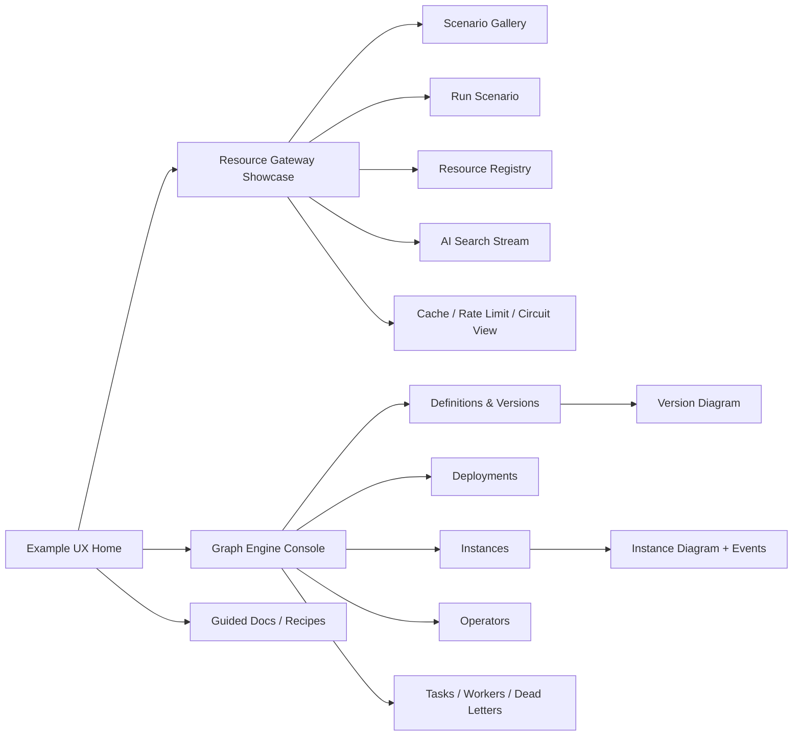
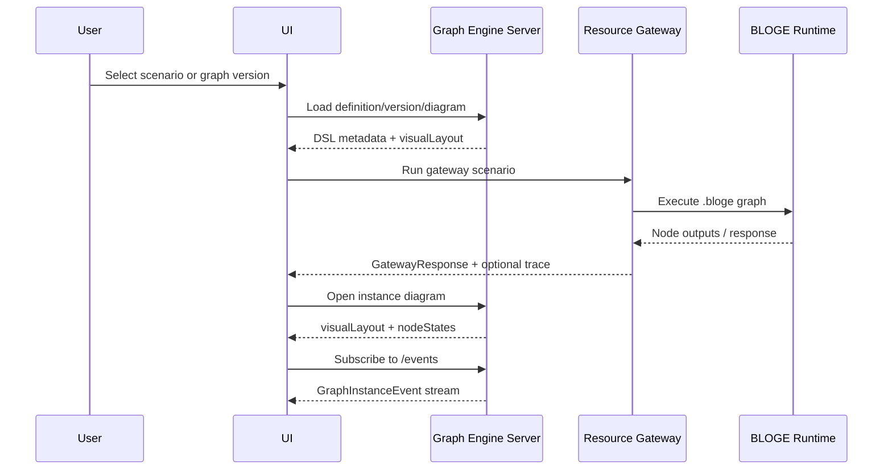

# BLOGE Example UX Visualization Evolution Plan

## 1. Core Verdict

The feedback is valid, but the repair is not "add a pretty admin page". The real problem is that the examples currently expose powerful runtime concepts through README text, curl commands, and JSON responses, while the user's mental model needs a visual chain:

1. What graph/resource is being demonstrated?
2. Which nodes/resources participate?
3. What runs in parallel, branches, retries, falls back, waits, or streams?
4. What happened in this concrete execution?
5. Which configuration caused that behavior?

The evolution should therefore build a **visual understanding layer** with two surfaces:

- **Graph Engine Console**: a generic control-plane UI for definition, version, deployment, instance, task, worker, dead-letter, event, and node-state visualization.
- **Resource Gateway Showcase**: a scenario-first example UI that explains API resource descriptors, gateway orchestration graphs, upstream calls, streaming output, and resilience behavior in business terms.

The two surfaces must share one rule: **BLOGE DSL and persisted metadata remain the source of truth; visual layout is a projection and annotation layer, not a second graph definition.**

## 2. Current Evidence

| Area | Current capability | UX gap |
| --- | --- | --- |
| `graph-engine-examples` | REST control plane under `/api/v1`, including definitions, versions, deployments, instances, node states, diagram payloads, audit, transitions, pending signals, SSE events, operators, tasks, workers, and dead letters | No browser UI that turns these APIs into a coherent operational and learning path |
| `graph-engine-examples` diagram model | `GraphVersionDiagram`, `GraphInstanceDiagram`, `GraphNodeState`, `GraphInstanceEvent`; version creation accepts `visualLayout` | `visualLayout` is stored as raw string and has no documented canonical schema or DSL-to-layout generation contract |
| `resource-gateway-examples` | Six scenario graphs under `src/main/resources/bloge/gateway`, descriptor registry CRUD, generic `httpResource`, built-in demo upstream, SSE AI search, cache/rate-limit/circuit-breaker interceptors | User sees curl/API output but not the orchestration shape, resource call chain, descriptor mapping, fallback path, or streaming composition |
| Repository frontend state | No `package.json`, no static web module, no frontend build conventions | First UI slice must choose a frontend packaging pattern without disrupting the independent Maven project boundaries |

## 3. Design Boundary

### In Scope

- Add example-facing browser UIs that help users understand graph orchestration visually.
- Add a stable visual layout contract for graph definitions and instances.
- Show runtime state overlays: node status, event stream, audit trail, retries, waits, failures, dead letters, and fallbacks.
- Show resource-gateway scenarios as explorable business flows, not only raw JSON.
- Keep both example projects buildable independently.

### Out of Scope

- Full production low-code workflow designer.
- Multi-user collaborative diagram editing.
- Replacing `.bloge` source as the authoritative graph definition.
- Production auth, permission administration, or tenant management UI.
- Provider-specific gateway operators duplicated per upstream API.

## 4. First-Class UX Entities

| Entity | Owner project | Visual responsibility |
| --- | --- | --- |
| Graph Definition | graph engine | Catalog card/list, ownership, category, labels, lifecycle state |
| Graph Version | graph engine | DSL source, validation diagnostics, visual topology, metadata, version diff |
| Visual Layout | graph engine | Node positions, edge hints, groups, viewport, semantic annotations; never graph semantics |
| Deployment | graph engine | Environment routing, active flag, version policy, operator plane bindings |
| Instance | graph engine | Runtime timeline, node-state overlay, context snapshot, audit, transitions, pending signals |
| Operator | graph engine | Inventory, schema, owner, tags, usage across graph versions |
| Task / Worker / Dead Letter | graph engine | Human/remote execution queues and recovery paths |
| Resource Descriptor | resource gateway | URL template, method, parameter mapping, response protocol, payload path |
| Gateway Scenario | resource gateway | Business story for one `.bloge` graph, sample inputs, graph topology, response view |
| Gateway Resilience Event | resource gateway | Cache hit/miss, rate-limit rejection, circuit state, timeout/retry/fallback evidence |

## 5. Target User Journeys

### Journey A: Understand A Gateway Scenario

1. User opens `/examples/gateway`.
2. Chooses `User Dashboard`, `Product Detail`, `Credit Score`, `Order Enrichment`, `Resource Dispatch`, or `AI Search Stream`.
3. UI shows a graph with node categories: resource call, branch, foreach, stream, transform.
4. User enters sample input and runs it.
5. UI animates node execution and shows the response assembled from each node.
6. User clicks a resource node and sees descriptor mapping: path/query/body expressions, timeout, response protocol, payload extraction.
7. User toggles a failure demo and sees fallback/degradation on the graph instead of only reading it in README.

### Journey B: Inspect A Graph Engine Version

1. User opens `/console/graphs`.
2. Selects a graph definition and version.
3. UI shows the DSL and generated topology side by side.
4. Validation diagnostics highlight source lines and affected nodes.
5. User compares two versions and sees changed nodes, changed operators, changed schemas, and source diff.
6. User publishes a version and sees deployment routing status.

### Journey C: Watch A Runtime Instance

1. User starts an instance from a published version.
2. UI opens `/console/instances/{id}`.
3. Diagram overlays `NOT_STARTED`, `PENDING`, `RUNNING`, `WAITING`, `COMPLETED`, `FAILED`, `DEAD_LETTERED`, `RETRYING`, and `CANCELLED`.
4. SSE events update the graph in near real time when `spring.bloge.event-journal.enabled=true`.
5. Side panels show context, audit, transition history, pending signals, tasks, worker jobs, and retry actions.

## 6. UI Information Architecture



## 7. Visual Layout Contract

The first hardening step is to document and generate a canonical layout JSON. A UI that invents its own graph model will rot quickly.

### Proposed `visualLayout` Shape

```json
{
  "schemaVersion": "bloge.visualLayout.v1",
  "rootId": "userDashboard",
  "executionMode": "GRAPH",
  "nodes": [
    {
      "id": "fetchProfile",
      "kind": "operator",
      "operatorRef": "httpResource",
      "label": "Fetch Profile",
      "position": { "x": 120, "y": 160 },
      "size": { "width": 180, "height": 72 },
      "group": "parallelFetch",
      "annotations": {
        "timeout": "3s",
        "retry": "1",
        "fallback": false
      }
    }
  ],
  "edges": [
    {
      "id": "fetchProfile->assembleDashboard",
      "source": "fetchProfile",
      "target": "assembleDashboard",
      "label": "output"
    }
  ],
  "groups": [
    {
      "id": "parallelFetch",
      "label": "Parallel API fan-out",
      "kind": "parallel"
    }
  ],
  "viewport": { "x": 0, "y": 0, "zoom": 1 }
}
```

### Layout Rules

- DSL source defines nodes, edges, branches, foreach scopes, stream nodes, transforms, waits, and operator references.
- `visualLayout` defines positions, grouping, labels, presentation hints, and optional annotations.
- If `visualLayout` is missing, the server or UI must generate a deterministic read-only layout from the compiled graph.
- If `visualLayout` references missing nodes or omits new nodes, the UI must warn and auto-place unresolved nodes.
- Version diagram and instance diagram must use the same layout schema; instance diagrams add `nodeStates` only.

## 8. Recommended Technical Path

### Option Comparison

| Option | Pros | Cons | Verdict |
| --- | --- | --- | --- |
| Static screenshots in README | Fastest and low risk | Becomes stale, cannot explain runtime behavior, no interaction | Reject except for release notes |
| Mermaid diagrams generated into docs | Good for docs and review diffs | Weak for live execution, descriptor drill-down, SSE, and node overlays | Useful support layer, not enough |
| Spring Boot serves a small static SPA per project | Fits current Maven/Spring apps, easy local run, no separate deployment | Adds frontend build tooling | Recommended first productized slice |
| Shared standalone frontend workspace | Best long-term reuse across both examples | Introduces a root frontend lifecycle that the repo does not currently have | Consider after UI contracts stabilize |
| Full visual graph editor | Impressive but high semantic risk | Turns examples into a product platform and risks DSL/layout divergence | Defer until read-only visualization proves value |

Recommended path: **start with read-mostly static SPA assets served by each Spring Boot app**, generated or copied into `src/main/resources/static`. Use a modern graph library in the frontend, but keep backend contracts plain JSON.

## 9. Phased Roadmap

### Phase 0: Contract And Seeds

Goal: make visual truth explicit before building screens.

- Document `visualLayout` schema in `graph-engine-examples/server/README.md` or a dedicated doc.
- Add a deterministic DSL-to-layout generator contract for missing layouts.
- Add seeded layout JSON for the six resource-gateway graphs.
- Add example fixture responses for normal, fallback, branch, foreach, and streaming runs.
- Acceptance: every gateway graph can produce a topology view without hand reading `.bloge` files.

### Phase 1: Resource Gateway Showcase

Goal: turn resource gateway from API cookbook into visual learning experience.

Screens:

- Scenario gallery with six existing graphs.
- Scenario runner with input form, graph topology, node inspector, response viewer.
- Resource descriptor explorer for `/admin/resources`.
- AI search streaming page with three visible lanes: metadata, tokens, citations.
- Resilience panel showing timeout/retry/fallback from DSL and cache/rate-limit/circuit configuration.

Minimal backend additions:

- `GET /api/gateway/examples/scenarios`: list scenario metadata, graph file, sample inputs, and explanation keys.
- `GET /api/gateway/examples/scenarios/{graph}/diagram`: return generated/stored layout for the gateway graph.
- Optional execution trace envelope for scenario runs if core runtime does not expose node-level outputs in request-response mode.

Acceptance:

- A user can explain `userDashboard` parallel fan-out, `productDetail` branch routing, `creditScore` degradation, `enrichOrderList` foreach enrichment, `resourceDispatch` descriptor resolution, and `aiEnrichedSearch` streaming without reading source first.

### Phase 2: Graph Engine Console MVP

Goal: expose the existing control-plane APIs as a visual console.

Screens:

- Graph definitions and versions list.
- Version detail: DSL, validation result, generated diagram, metadata, operator refs.
- Deployment list/detail.
- Instance list/detail: diagram overlay, context, audit, transitions, pending signals.
- Operator inventory.

Use existing APIs:

- `/api/v1/graphs`
- `/api/v1/graphs/{key}/versions`
- `/api/v1/graphs/{key}/versions/{version}/diagram`
- `/api/v1/instances`
- `/api/v1/instances/{id}/diagram`
- `/api/v1/instances/{id}/nodes`
- `/api/v1/instances/{id}/events`
- `/api/v1/instances/{id}/context`
- `/api/v1/instances/{id}/audit`
- `/api/v1/instances/{id}/transitions`
- `/api/v1/operators`

Acceptance:

- A running instance can be watched visually from start to terminal state.
- A failed or waiting node is inspectable with retry count, last error, wait type, audit, and transition context.
- If event journal is disabled, UI degrades to polling `/nodes` and clearly shows that live SSE is unavailable.

### Phase 3: Authoring Assistance And Diff

Goal: make graph changes understandable, not just executable.

Screens:

- DSL validate/generate page backed by `/api/v1/ai/validate` and `/api/v1/ai/generate`.
- Version diff view backed by `/api/v1/graphs/{key}/versions/{left}/diff/{right}`.
- Diagram diff overlay: added, removed, changed, schema-impacting, operator-impacting nodes.
- Layout editor for positions only.

Acceptance:

- A user can generate or paste DSL, validate it, see diagnostics mapped to nodes, save a draft version, and compare it with another version.
- Layout edits do not alter DSL semantics.

### Phase 4: Operational Storytelling

Goal: make advanced runtime behavior visible enough for enterprise adoption demos.

Screens:

- Task inbox and human task lifecycle.
- Remote worker registration, polling, heartbeat, completion/failure path.
- Dead-letter queue and retry workflow.
- Instance timeline with event replay and transition/audit correlation.
- Gateway resilience telemetry once metrics/tracing interceptors exist.

Acceptance:

- A demo can show normal run, wait/signal, remote worker retry, dead-letter recovery, and branch/fallback behavior end to end.

## 10. Data And Event Flow



## 11. Non-Functional Requirements

| Requirement | Decision |
| --- | --- |
| Local demo simplicity | `mvn spring-boot:run` should be enough for each project after frontend assets are built or checked in |
| Project isolation | Do not create a root Maven reactor; keep graph-engine and gateway build commands independent |
| UI failure behavior | If diagram layout is missing or invalid, generate deterministic fallback layout and show warning |
| Runtime freshness | Prefer SSE where available; fallback to polling for node state |
| Large graph behavior | Render virtualized side panels; cap visible event history; keep graph pan/zoom responsive |
| Compatibility | Existing APIs and response semantics remain unchanged; add example endpoints rather than renaming public endpoints |
| Security | Keep demo endpoints unauthenticated unless the project later adds auth; do not imply production readiness |
| Accessibility | Keyboard navigation for graph selection and inspector panels; color is never the only status signal |

## 12. UX Quality Bar

| Capability | Must show visually | Not acceptable |
| --- | --- | --- |
| Parallel fan-out | Multiple sibling nodes running independently and converging | Only a table of curl outputs |
| Branching | Chosen path and skipped paths | Hiding cancelled convergence behavior |
| Foreach | Iteration group with per-item child nodes | Flattening all iterations into one ambiguous node |
| Retry/fallback | Retry count, final fallback output, last error | Treating fallback as ordinary success |
| Streaming | Separate event lanes and completion state | Dumping raw SSE frames only |
| Resource descriptor | Mapping from graph input to URL/query/body and response extraction | Showing descriptor JSON with no explanation |
| Instance state | Node overlay with status, timestamps, wait/error metadata | Static version diagram with no runtime state |

## 13. Risks And Controls

| Risk | Impact | Control |
| --- | --- | --- |
| DSL and visual layout diverge | UI becomes misleading | DSL-derived graph is authoritative; layout validation checks node/edge references |
| Example UI turns into a platform scope | Delivery stalls | Phase 1 and 2 are read-mostly; layout editing is position-only and deferred |
| Gateway lacks node-level execution trace | Scenario runner cannot animate real execution | Add an example-only trace envelope or use deterministic simulated traces tied to graph results until runtime trace API exists |
| SSE unavailable by default | Live instance view appears broken | UI detects `503 RUNTIME_UNAVAILABLE` and falls back to polling `/nodes` |
| Frontend build complicates Java example onboarding | Users fail before reaching demo | Serve prebuilt static assets or keep frontend module optional with documented commands |
| Visual clutter hides concepts | Users learn less, not more | Scenario pages use guided inspectors and domain labels rather than exposing every raw field first |

## 14. Negative-Entropy Mechanisms

- Generate layout from DSL when layout is absent so every new graph starts visual.
- Validate layout against compiled graph on version creation or diagram retrieval.
- Keep fixture scenario metadata next to graph resources so docs, tests, and UI do not drift.
- Add golden UI fixture tests for the six gateway graph topologies.
- Add API contract tests for diagram shape and node-state overlays.
- When metrics/tracing interceptors are implemented, route their events into the same visual timeline instead of creating a separate dashboard vocabulary.
- Document every visual status mapping from runtime state to UI badge, including degraded/fallback states.

## 15. Implementation Order

1. Define `visualLayout` v1 contract and fallback generation rules.
2. Add gateway scenario metadata and seeded diagrams for six existing graphs.
3. Build resource-gateway showcase first because it has the clearest user-facing learning value and built-in demo upstream.
4. Build graph-engine console MVP using existing diagram, node, context, audit, transition, and event APIs.
5. Add validation/diff/AI authoring views after the read-only runtime story is coherent.
6. Add operational views for tasks, remote workers, and dead letters once the base console interaction model is stable.

## 16. Open Decisions

| Decision | Recommendation | Why |
| --- | --- | --- |
| Frontend packaging | Start with static SPA served by Spring Boot resources per project | Lowest disruption to independent Maven projects |
| Graph rendering library | Use a proven graph UI library in the frontend; keep backend JSON library-neutral | Avoid hand-rolling pan/zoom/layout behavior |
| Layout generation location | Backend service for graph-engine; example helper for resource-gateway if it stays outside graph-engine | Graph-engine owns compiled topology; gateway can remain lighter |
| Trace source for gateway | Add an example-only execution trace envelope if runtime lacks request-response node tracing | Needed to animate real scenario runs without changing public gateway response semantics |
| Single combined UI vs two UIs | Two project-local UIs first, shared design language later | Keeps examples independently runnable and avoids premature root workspace changes |

## 17. Success Metrics

- New user can identify node roles and data dependencies for all six gateway graphs within five minutes.
- New user can start a graph-engine instance and explain each node status from the visual overlay.
- README curl examples remain valid, but the primary local demo path becomes browser-first.
- Every graph version without stored layout still renders deterministically.
- No UI screen requires changing public endpoint names or graph artifact IDs.
- Visual docs and UI fixtures fail when a graph changes without updating expected topology.

