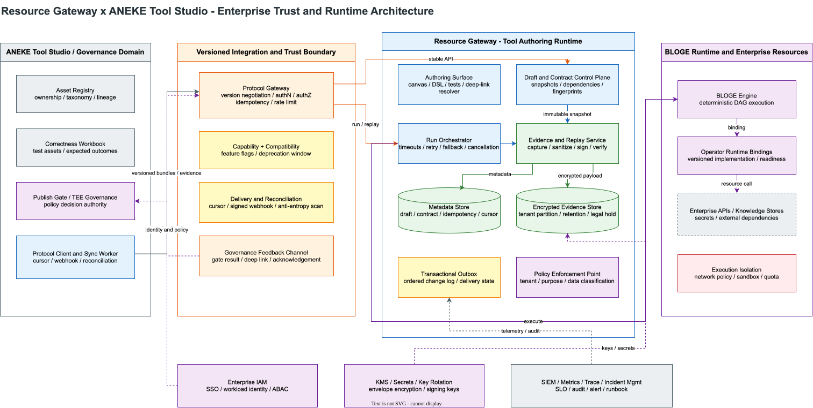
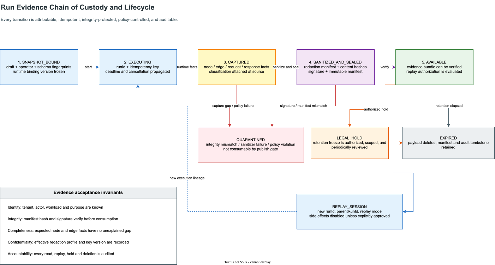

# Resource Gateway x ANEKE Tool Studio 集成协议化演进方案

> 目标判断：Resource Gateway 不应该扩张成另一个治理系统。它应该升级为
> **Tool Authoring Runtime**：负责把工具画出来、连起来、跑起来、导出证据、支持回放；
> ANEKE Tool Studio 负责资产治理、契约管理、正确性工作簿、发布门禁和 TEE 治理。

| 文档属性 | 内容 |
|---|---|
| 状态 | Proposed，达到工程排期基线；协议冻结前仍需完成文末 ADR |
| 目标读者 | Resource Gateway、BLOGE Runtime、ANEKE Tool Studio、平台安全、SRE、合规和数据治理负责人 |
| 设计目标 | 在多组织、多租户、强审计、跨版本和部分故障条件下，仍能稳定交换编排资产、运行事实和可回放证据 |
| 非目标 | 不在 Resource Gateway 内复制 ANEKE registry、publish gate、TEE policy engine 或企业审批流 |
| 核心验收 | 任何导入、运行、证据、回放、同步和治理反馈都可识别版本、租户、主体、目的、快照、完整性、状态和责任归属 |

本文分为两部分：第 1-17 章定义客户需求对应的集成基线；第 18 章以后给出工业级加固设计。实施时不能只挑前半部分接口开发，后半部分的不变量和门槛是 P0 能否进入企业环境的前置条件。

## 1. 结论

客户反馈的核心不是新增一批页面，而是要求 Resource Gateway 把现有画布、DAG、运行、导出能力变成稳定工程协议。当前系统已有不少基础能力，但它们还分散在 visual authoring、draft export、run history、contract/golden test、runtime evidence 等模块中，缺少一个 ANEKE 可以稳定依赖的 integration protocol 面。

必须收敛出一条主线：`GraphDraft + OperatorLibrary + GraphContract` 先形成确定性 dependency snapshot，再产生 run/evidence bundle 和受控 payload replay bundle，最终由 ANEKE workbook、publish gate 和 governance registry 消费。

优先级排序应该保持客户提出的判断：

1. **P0 先做协议化和证据化**：协议版本、draft export 依赖元数据、run trace evidence、payload replay、标准失败语义。
2. **P1 再做体验闭环**：deep link、capability probe、contract workbook alignment、gate result 回显、runtime readiness。
3. **P2 最后做产品化工程增强**：change event/webhook、可复用模块化拆分。

如果顺序反过来，例如先做 UI deep link 或 webhook，会让系统继续停留在“能联调，但不能被治理系统可靠消费”的状态。这是错误优先级。

## 2. 范围边界

| 领域 | Resource Gateway 负责 | ANEKE Tool Studio 负责 | 禁止混淆 |
|---|---|---|---|
| Authoring | 画布、operator library、DAG、GraphDraft、DSL import/export | 资产目录、owner、domain 分类、治理视图 | Resource Gateway 不做企业资产 registry 权威源 |
| Contract | graph/operator/resource schema、contract suite draft/run、golden case run | 正确性 workbook、契约审批、跨版本 contract policy | Resource Gateway 不决定 workbook 是否足够 |
| Runtime | simulate/run、run record、trace/evidence、payload replay | 发布门禁消费 evidence、TEE 策略、生产发布判定 | Resource Gateway 不接管 publish gate |
| Integration | 稳定协议、capability probe、deep link、event cursor | adapter、sync、registry ingestion、gate result 回写 | ANEKE 不应解析内部 Map 或页面 DOM |
| Security | payload capture policy、脱敏、最小 replay bundle | TEE 审计策略、合规保留、组织级访问控制 | replay 不能默认为无限制原始 payload 暴露 |

## 3. 当前状态审计

### 3.1 已有基础

| 能力 | 当前代码证据 | 可复用程度 | 问题 |
|---|---|---:|---|
| GraphDraft 一等模型 | `GraphDraft` 已包含 `schemaVersion`、`inputSchema`、`outputSchema`、`operatorFingerprints`、`operatorSnapshots`、`revisionMetadata` | 高 | export metadata 还不够面向跨系统 registry |
| Draft export bundle | `GraphDraftExportBundle` 已有 `bundleFingerprint`、`validation`、`dependencyReport` | 高 | 缺 contract suite refs、runtime binding refs、schema fingerprint profile |
| 依赖报告 | `GraphDraftDependencyReport` 已有 operator library id、fingerprint drift、schema compatibility、runtime readiness counts | 高 | 需要提升为 integration dependency profile，而不是仅 review summary |
| Run history | `VisualGraphRunRecord` / `VisualGraphRunTrace` 已有 `runId`、source identity、node timing、status map、shape summary | 中 | trace 是 shape-only，不足以作为 correctness evidence |
| Run response | `VisualGraphRunResponse` 已有 output、results、statusMap、elapsed、nodeElapsedMs、runId | 中 | 调试响应和治理 evidence 没有分层 |
| Contract/golden test | `VisualOperatorContractTest*`、`VisualGraphGoldenCase*`、`GatewayGraphContractTest*` 已存在 | 中 | case kind/assertion 语义和 ANEKE workbook 还没对齐 |
| Runtime evidence | runtime binding、activation、rollout observation、executable integration 已存在 | 中 | operator export 的 runtime readiness profile 还不够统一 |
| DSL migration | DSL projection、rewrite gate、batch import、dependency report 已存在 | 高 | 对 ANEKE 来说仍缺统一 protocol envelope |

### 3.2 主要缺口

1. **没有统一跨系统协议入口。** 现在存在多个 `bloge.*.v1` DTO，但 ANEKE 需要的是面向集成稳定性的 `ToolStudioResourceGatewayProtocol`，包含兼容性、feature flags、端点能力和协议对象版本。
2. **RunTrace 还不是治理证据。** 当前 trace 只提供 shape summary，不能满足 correctness evidence 的 payload、assertion、mock、error、duration、draft fingerprint 完整链路。
3. **payload replay 没有安全模型。** 客户要 payload 级 replay，但这个能力必须带捕获策略、脱敏策略、保留策略和访问控制，不应直接把 raw request/response 塞进现有 run record。
4. **GraphDraft export 的 dependency metadata 还不够可导入。** `operatorRef -> libraryId` 已经可部分推导，但需要在 export bundle 中稳定固化，否则多库图和 drift 分析仍脆弱。
5. **状态语义没有治理级枚举。** 现在 node status 主要来自执行结果，缺少 `TIMEOUT`、`SKIPPED`、`PARTIAL`、`MOCKED`、fallback/retry 元数据的统一状态合同。
6. **ANEKE gate result 没有回显通道。** 作者看不到治理阻断原因，只能从 Tool Studio 外部排查。

## 4. 目标架构

### 4.1 总体形态



图源：[resource-gateway-aneke-enterprise-architecture.drawio](assets/drawio/resource-gateway-aneke-enterprise-architecture.drawio)。图中的 Integration Boundary 不是简单 Controller 集合，而是协议版本协商、身份与授权、幂等、限流、持续对账的统一边界。Resource Gateway 内部进一步分离 authoring control plane、run data plane、evidence plane，避免高流量运行、敏感 payload 和交互式编辑共享同一故障域。

### 4.2 设计原则

1. **协议对象不能直接等于内部 DTO。** 内部 DTO 可演进，integration payload 必须有 envelope、版本、fingerprint、compatibility statement。
2. **Resource Gateway 只输出事实，不替 ANEKE 下治理结论。** 例如 evidence 可以声明 run passed、assertion passed、mock used；是否允许发布由 ANEKE gate 判断。
3. **payload replay 是受控证据，不是日志全文下载。** 默认输出脱敏后的 request/response，raw payload 只能在明确 policy 和权限下可用。
4. **GraphDraft export 必须包含依赖快照。** 跨系统导入不能再依赖 ANEKE adapter 猜测 `operatorRef` 的 owner library。
5. **状态语义必须可枚举、可兼容、可解释。** 发布门禁不能消费自由文本状态。
6. **P0 API 应稳定，P1/P2 能渐进扩展。** 先提供 polling 和 explicit endpoints，再补 webhook。

## 5. ToolStudioResourceGatewayProtocol

### 5.1 协议 envelope

所有 integration API 返回统一 envelope。内部 `schemaVersion` 仍保留，但外层必须声明 Resource Gateway 与 Tool Studio 的协议兼容性。

```json
{
  "protocol": "ToolStudioResourceGatewayProtocol",
  "protocolVersion": "1.0.0",
  "resourceGatewayVersion": "resource-gateway-examples/1.0.0",
  "schemaVersion": "toolStudio.resourceGateway.envelope.v1",
  "producedAt": "2026-07-12T00:00:00Z",
  "compatibility": {
    "minConsumerVersion": "1.0.0",
    "backwardCompatible": true,
    "breakingChanges": []
  },
  "payloadKind": "RUN_EVIDENCE_BUNDLE",
  "payloadSchemaVersion": "toolStudio.resourceGateway.runEvidenceBundle.v1",
  "payloadFingerprint": "sha256:...",
  "payload": {}
}
```

### 5.2 Capability probe

Endpoint:

```text
GET /api/integration/capabilities
```

返回：

```json
{
  "schemaVersion": "toolStudio.resourceGateway.capabilities.v1",
  "protocol": "ToolStudioResourceGatewayProtocol",
  "protocolVersion": "1.0.0",
  "supportedObjects": {
    "graphDraft": ["bloge.visualGraphDraft.v1"],
    "operatorLibrary": ["bloge.visualOperatorLibrary.v1"],
    "graphContract": ["bloge.gatewayGraphContract.v1"],
    "contractTestSuite": [
      "bloge.gatewayGraphContractTestSuite.v1",
      "bloge.visualOperatorContractTestSuiteRequest.v1"
    ],
    "runEvidence": ["toolStudio.resourceGateway.runEvidenceBundle.v1"],
    "payloadReplay": ["toolStudio.resourceGateway.payloadReplayBundle.v1"]
  },
  "features": {
    "draftExportDependencyProfile": true,
    "runEvidenceBundle": true,
    "payloadReplay": false,
    "deepLinks": true,
    "governanceGateFeedback": false,
    "eventCursor": false,
    "webhook": false
  },
  "endpoints": [
    { "method": "GET", "path": "/api/integration/capabilities" },
    { "method": "GET", "path": "/api/integration/drafts/{draftId}/export" },
    { "method": "GET", "path": "/api/integration/runs/{runId}/evidence" }
  ]
}
```

### 5.3 Draft integration bundle

Endpoint:

```text
GET /api/integration/drafts/{draftId}/export?revision=&includeOperatorSnapshots=true
```

目标 schema：

```json
{
  "schemaVersion": "toolStudio.resourceGateway.graphDraftIntegrationBundle.v1",
  "draft": {},
  "draftFingerprint": "sha256:...",
  "dependencyProfile": {
    "schemaVersion": "toolStudio.resourceGateway.graphDraftDependencyProfile.v1",
    "operatorDependencies": [
      {
        "nodeId": "eligibility",
        "operatorRef": "risk:eligibility",
        "operatorLibraryId": "risk-policy",
        "operatorFingerprint": "sha256:...",
        "schemaFingerprint": "sha256:...",
        "runtimeBindingRefs": ["binding:risk-eligibility-prod"],
        "contractSuiteRefs": ["suite:risk-eligibility-golden"],
        "readiness": {
          "designReady": true,
          "runtimeReady": true,
          "executable": true,
          "risk": "medium",
          "owner": "risk-platform",
          "sla": "P95<300ms"
        }
      }
    ],
    "graphContract": {
      "inputSchemaFingerprint": "sha256:...",
      "outputSchemaFingerprint": "sha256:..."
    }
  },
  "sourceDependencyReport": {}
}
```

这不是替换 `GraphDraftExportBundle`，而是在其上增加 Tool Studio 需要的 deterministic import profile。

### 5.4 Run evidence bundle

Endpoint:

```text
GET /api/integration/runs/{runId}/evidence
```

目标 schema：

```json
{
  "schemaVersion": "toolStudio.resourceGateway.runEvidenceBundle.v1",
  "runId": "run-...",
  "source": {
    "sourceKind": "STORED_DRAFT",
    "draftId": "draft-...",
    "draftRevision": 7,
    "publicationId": "",
    "graphName": "customerKnowledgeTool"
  },
  "fingerprints": {
    "draftFingerprint": "sha256:...",
    "generatedDslFingerprint": "sha256:...",
    "operatorDependencyFingerprint": "sha256:..."
  },
  "execution": {
    "status": "SUCCESS",
    "startedAt": "2026-07-12T00:00:00Z",
    "elapsedMs": 128,
    "outputNode": "response",
    "mockUsed": false
  },
  "context": {
    "inputSummary": {},
    "inputPayloadRef": "payload:run-...:context"
  },
  "output": {
    "outputSummary": {},
    "outputPayloadRef": "payload:run-...:output"
  },
  "nodes": [
    {
      "nodeId": "fetchPolicy",
      "operatorRef": "knowledge:fetchPolicy",
      "status": "SUCCESS",
      "elapsedMs": 44,
      "mocked": false,
      "retry": { "attempts": 0 },
      "fallback": { "used": false },
      "inputPayloadRef": "payload:run-...:node.fetchPolicy.input",
      "outputPayloadRef": "payload:run-...:node.fetchPolicy.output",
      "diagnostics": []
    }
  ],
  "edges": [
    {
      "edgeId": "edge_fetchPolicy_response",
      "sourceNodeId": "fetchPolicy",
      "targetNodeId": "response",
      "status": "SUCCESS",
      "payloadRef": "payload:run-...:edge.edge_fetchPolicy_response"
    }
  ],
  "assertions": {
    "status": "NOT_RUN",
    "suiteRefs": [],
    "results": []
  },
  "diagnostics": [],
  "retention": {
    "payloadPolicy": "SANITIZED",
    "expiresAt": "2026-08-12T00:00:00Z"
  }
}
```

### 5.5 Payload replay bundle

Endpoint:

```text
GET /api/integration/runs/{runId}/replay?payload=SANITIZED&includeNodePayloads=true&includeEdgePayloads=true
```

目标 schema：

```json
{
  "schemaVersion": "toolStudio.resourceGateway.payloadReplayBundle.v1",
  "runId": "run-...",
  "payloadPolicy": {
    "mode": "SANITIZED",
    "redactionProfile": "default-pii",
    "rawAvailable": false
  },
  "context": {},
  "output": {},
  "nodes": [
    {
      "nodeId": "fetchPolicy",
      "input": {},
      "output": {},
      "request": {
        "method": "GET",
        "urlTemplate": "/policies/{id}",
        "headers": {},
        "body": null
      },
      "response": {
        "status": 200,
        "headers": {},
        "body": {}
      },
      "assertionResults": []
    }
  ]
}
```

关键约束：

1. P0 可先支持 visual run 内部 node input/output 和 selected output replay。
2. HTTP request/response replay 需要 `HttpResourceOperator` 或 runtime adapter 明确记录 sanitized exchange，不能从现有 shape summary 反推。
3. raw payload 不能默认返回。至少需要 `PayloadCapturePolicy`：
   - `NONE`
   - `SUMMARY_ONLY`
   - `SANITIZED`
   - `FULL_ENCRYPTED`
4. 每次 replay response 必须带 redaction metadata，供 ANEKE 证明 evidence 可审计而不是泄漏敏感数据。

## 6. 标准状态语义

### 6.1 Node/edge 状态枚举

| 状态 | 含义 | 是否可继续 | ANEKE gate 解释 |
|---|---|---:|---|
| `SUCCESS` | 节点或边完成，输出可用 | 是 | 可作为通过证据 |
| `FAILED` | 确定性失败，产生错误 | 否 | 默认阻断，除非 negative case 预期失败 |
| `TIMEOUT` | 超时终止 | 否 | 阻断或按 SLA policy 判断 |
| `SKIPPED` | 因上游条件、分支、短路未执行 | 是 | 需判断是否符合 branch expectation |
| `PARTIAL` | 部分结果可用，完整性不足 | 视情况 | 需要 workbook/gate policy 判断 |
| `MOCKED` | 使用 mock/fixture 输出 | 是 | 可用于 authoring evidence，不可直接作为 production readiness |
| `CANCELLED` | 用户或系统取消 | 否 | 不能作为正确性 evidence |
| `FALLBACK` | 使用 fallback path/result | 是 | 需要 fallback policy 和 degraded mode 证明 |

### 6.2 Retry/fallback 元数据

每个 node evidence 至少补齐：

```json
{
  "retry": {
    "attempts": 2,
    "maxAttempts": 3,
    "lastErrorCode": "HTTP_503"
  },
  "fallback": {
    "used": true,
    "strategy": "cached-response",
    "sourceNodeId": "fetchPolicy"
  }
}
```

这部分不能只放在 diagnostics 文本里。治理系统必须可以结构化判断。

## 7. Contract Test Suite 与 ANEKE workbook 对齐

当前 contract/golden test 能跑，但 workbook 需要更强语义：

```json
{
  "schemaVersion": "toolStudio.resourceGateway.contractTestSuite.v1",
  "suiteId": "suite-customer-knowledge-tool",
  "target": {
    "kind": "GRAPH_DRAFT",
    "draftId": "draft-...",
    "revision": 7
  },
  "cases": [
    {
      "caseId": "case-valid-policy",
      "caseKind": "golden",
      "context": {},
      "expectedOutput": {},
      "assertions": [
        {
          "assertionKind": "path",
          "path": "$.decision",
          "operator": "equals",
          "expected": "APPROVE"
        },
        {
          "assertionKind": "schema",
          "path": "$",
          "schemaRef": "graph.output"
        },
        {
          "assertionKind": "governanceExpectation",
          "expectation": "noMockedNodes"
        }
      ]
    }
  ]
}
```

Case kinds：

- `golden`
- `negative`
- `boundary`
- `regression`

Assertion kinds：

- `path`
- `schema`
- `error`
- `governanceExpectation`
- `latency`
- `nodeStatus`
- `edgeStatus`

## 8. Deep Link 设计

前端需要支持：

| 场景 | URL |
|---|---|
| 打开 draft | `/author/?draftId={draftId}` |
| 打开 draft 并选中节点 | `/author/?draftId={draftId}&nodeId={nodeId}` |
| 打开 operator detail | `/author/?operatorRef={operatorRef}` |
| 打开 run trace | `/author/runs/{runId}` 或 `/author/?runId={runId}` |
| 打开 run trace 中节点 | `/author/runs/{runId}?nodeId={nodeId}` |
| 打开 gate issue | `/author/?draftId={draftId}&gateIssueId={issueId}` |

Deep link 不应只是路由跳转，还要带状态恢复：

1. 加载 draft 或 run record。
2. 聚焦对应 node/operator/run issue。
3. 展示来源是 ANEKE deep link。
4. 若对象不存在，返回明确的 not found/gone/error surface。

## 9. Governance gate result 回显

Resource Gateway 不做发布门禁，但需要接收 ANEKE gate result 并在画布上展示。

Endpoint：

```text
POST /api/integration/gate-results
```

目标 schema：

```json
{
  "schemaVersion": "toolStudio.resourceGateway.gateResult.v1",
  "gateResultId": "gate-...",
  "target": {
    "kind": "GRAPH_DRAFT",
    "draftId": "draft-...",
    "revision": 7
  },
  "status": "BLOCKED",
  "issues": [
    {
      "issueId": "missing-workbook",
      "severity": "BLOCKER",
      "code": "ANEKE.WORKBOOK.MISSING",
      "message": "Correctness workbook is required before publication.",
      "targetPath": "/draft",
      "recommendedAction": "Create or attach a workbook in ANEKE Tool Studio.",
      "deepLink": "aneke://tool-studio/workbooks/new?draftId=draft-..."
    }
  ],
  "producedAt": "2026-07-12T00:00:00Z"
}
```

画布展示要求：

- 顶部 readiness strip 展示 gate status。
- 节点级 issue 定位到节点。
- graph-level issue 定位到 graph contract/workbook panel。
- 保留最近一次 gate result，不把它混入 Resource Gateway 的本地 validation truth。

## 10. P0/P1/P2 演进计划

### P0 - 协议化、证据化、可回放化

目标：ANEKE 不再解析内部 Map，也不再从 UI 或调试响应里拼治理事实。

| 工作项 | 交付物 | 依赖 | 验收 |
|---|---|---|---|
| Protocol envelope | `toolStudio.resourceGateway.envelope.v1`、文档、JSON schema | 无 | 所有 integration endpoint 返回 envelope |
| Identity and authorization context | tenant/org/project/environment/actor/purpose、RBAC+ABAC、audit | 企业 IAM / workload identity | 裸 ID 无法跨租户访问；所有 sensitive action 可归因 |
| Capability probe | `GET /api/integration/capabilities` | envelope | ANEKE 能判断协议版本、feature flags、端点列表 |
| Snapshot/idempotency/error contract | immutable fingerprint、`If-Match`、`Idempotency-Key`、problem schema | identity + protocol envelope | 并发编辑不产生混合快照；重复请求不产生重复副作用 |
| Draft integration bundle | `GET /api/integration/drafts/{draftId}/export` | `GraphDraftExportBundle`、`GraphDraftDependencyReport` | bundle 明确携带 operator library id、fingerprint、schema fingerprint、runtime binding refs、contract suite refs |
| Run evidence bundle | `GET /api/integration/runs/{runId}/evidence` | `VisualGraphRunRecord` | evidence 包含 runId、draft/source fingerprint、node/edge trace、mock/error/timing/status、完整性 manifest 和 signature |
| Standard status | `VisualRunStatus` enum 或 protocol status mapper | `VisualDslRunResponse.statusMap` | 所有 node/edge evidence 使用标准状态 |
| Payload capture policy | `PayloadCapturePolicy`、classification、sanitizer SPI、encrypted payload ref | run service / HTTP operator instrumentation / KMS | 可返回 sanitized replay bundle，默认不泄漏 raw payload；不完整证据被 quarantine |
| Payload replay | `GET /api/integration/runs/{runId}/replay` | payload capture + side-effect policy | 按 runId 返回脱敏 context/output/node input/output；recorded replay 默认零外部副作用 |

### P1 - 体验闭环和 workbook 对齐

目标：治理阻断能回到画布上下文，正确性资产能进入 ANEKE workbook。

| 工作项 | 交付物 | 验收 |
|---|---|---|
| Deep link | draft/node/operator/run/gate issue URL | ANEKE 点击可直接定位到画布上下文 |
| Contract suite vNext | caseKind/assertionKind/governance expectation | workbook 可无损导入 |
| Gate result ingestion | `POST /api/integration/gate-results` + Author UI panel | 作者能看到缺 contract/workbook/approval/breaking migration 原因 |
| Operator runtime readiness profile | owner、risk、secret policy、idempotency、SLA、runtime binding、artifact provenance/SBOM | ANEKE 能判断工具可发布/可执行性 |
| Evidence to workbook mapping | evidence assertion results -> workbook rows | run evidence 能成为 correctness workbook 证据 |

### P2 - 持续同步和工程模块化

目标：从手动同步变成持续治理集成，且 Tool Studio 能复用 Resource Gateway 能力而不是嵌页面。

| 工作项 | 交付物 | 验收 |
|---|---|---|
| Event cursor | transactional outbox + `GET /api/integration/events?cursor=` | draft/operator/run/contract suite 变更可有序增量拉取并补洞 |
| Webhook | signed webhook delivery + retry/DLQ | ANEKE 能订阅事件；重复、乱序和丢失后仍可对账收敛 |
| Protocol client module | Java/TS client SDK | Tool Studio 不手写 Map adapter |
| Authoring surface module | 可嵌入但非 iframe 依赖的前端 package | Tool Studio 可组合画布组件 |
| Evidence service module | run evidence/replay 独立 service boundary | 长期可拆 sidecar 或服务依赖 |

## 11. 需求逐条回应

| 优先级 | 客户需求 | 当前判断 | 建议落点 |
|---|---|---|---|
| P0 | 稳定跨系统协议版本 | 必须做，且不能只复用内部 DTO | protocol envelope + capability probe + JSON schema |
| P0 | Run Trace 可导出为治理证据 | 当前 shape-only trace 不够 | 新增 evidence bundle，不直接改造成唯一 run response |
| P0 | Payload 级 replay | 当前缺 payload capture | 新增 payload store/ref/sanitizer/replay endpoint |
| P0 | GraphDraft export 依赖元数据 | 已有 dependency report 但不够稳定导入 | integration dependency profile |
| P0 | Timeout/partial failure 语义 | 当前 statusMap 不足 | 标准状态 enum + retry/fallback metadata |
| P1 | Deep Link | 当前不是 integration API | 前端 route + resolver API |
| P1 | Health/Capability Probe | 缺口明确 | `/api/integration/capabilities` |
| P1 | Contract Test Suite 对齐 workbook | 当前 case/assertion 语义偏基础 | suite vNext + workbook mapping |
| P1 | UI 展示治理反馈 | 缺口明确 | gate result ingestion + author panel |
| P1 | Operator runtime readiness 元数据 | 已有 runtimeReadiness，需治理化 | runtime readiness profile |
| P2 | Change Event/Webhook | 当前手动拉取 | event cursor 先行，webhook 后置 |
| P2 | 可复用工程模块化 | 当前仍偏 sidecar/demo app | protocol client + authoring surface + evidence service |

## 12. 实施顺序和里程碑

### M0 - 协议冻结草案

周期：3-5 天。

交付：

- `docs/resource-gateway-tool-studio-protocol-v1.md`
- `docs/schemas/tool-studio-resource-gateway/*.schema.json`
- P0 endpoint contract examples
- compatibility policy

不写代码也必须先完成。否则后续实现会继续漂移。

### M1 - Capability + Draft Integration Bundle

周期：1 周。

交付：

- `/api/integration/capabilities`
- `/api/integration/drafts/{draftId}/export`
- `GraphDraftDependencyProfile`
- schema/fingerprint helpers
- controller/service tests

验收：

- ANEKE adapter 不再推断 `operatorRef -> libraryId`。
- 多库图导入能稳定生成 registry dependency。

### M2 - Run Evidence Bundle

周期：1-2 周。

交付：

- `RunEvidenceBundle`
- `VisualRunStatus` mapper
- edge trace 派生
- node status/timing/mock/error/fallback/retry metadata
- `/api/integration/runs/{runId}/evidence`

验收：

- 一次 run 可变成 publish gate 可消费 evidence。
- failed/timeout/skipped/mocked/partial 有结构化判断依据。

### M3 - Payload Replay

周期：2 周。

交付：

- `PayloadCapturePolicy`
- `PayloadRef`
- `SanitizedPayloadStore`
- sanitizer SPI
- `/api/integration/runs/{runId}/replay`
- node input/output replay
- resource request/response replay instrumentation

验收：

- ANEKE 能按 runId 获取脱敏 context/output/node payload。
- HTTP resource operator 能返回脱敏 request/response。
- raw payload 默认不可用。

### M4 - P1 体验闭环

周期：2-3 周。

交付：

- deep link route/resolver
- gate result ingestion
- author UI gate panel
- contract suite vNext
- runtime readiness profile

验收：

- ANEKE gate issue 可直接跳回画布定位。
- 作者在 Resource Gateway 内看到阻断原因。
- correctness workbook 可导入 Resource Gateway test/evidence。

### M5 - P2 产品化

周期：后续产品化阶段。

交付：

- event cursor
- webhook
- protocol client SDK
- authoring surface module
- run/evidence service module

验收：

- ANEKE 可持续同步，不再靠手动拉取。
- Tool Studio 能复用画布和协议 client，而不是 iframe 拼接。

## 13. 测试策略

P0 必须补以下测试，不然协议只是文档：

1. **Contract tests**
   - capability response schema snapshot
   - draft integration bundle JSON schema validation
   - run evidence bundle JSON schema validation
   - replay bundle redaction validation

2. **Compatibility tests**
   - unknown future field tolerated
   - unsupported protocol version returns deterministic compatibility diagnostic
   - old GraphDraft export still accepted

3. **Evidence tests**
   - successful run evidence
   - failed validation evidence
   - node runtime failure evidence
   - mocked node evidence
   - timeout/partial/skipped status mapping

4. **Security tests**
   - PII redaction
   - raw payload disabled by default
   - payload ref not found/expired
   - replay access denied

5. **Integration tests**
   - ANEKE-style adapter consumes only `/api/integration/*`
   - no test reads internal `VisualGraphRunRecord` directly as protocol payload

## 14. 关键风险

| 风险 | 影响 | 对策 |
|---|---|---|
| 把内部 DTO 当协议直接暴露 | 字段漂移继续伤害 ANEKE | envelope + schema + integration DTO |
| payload replay 泄漏敏感数据 | 合规风险高 | 默认 sanitized，raw 需 policy + 权限 + retention |
| evidence 和 debug response 混用 | 调试字段污染治理判断 | `VisualGraphRunResponse` 继续调试，`RunEvidenceBundle` 面向治理 |
| Resource Gateway 接管 publish gate | 边界膨胀，和 ANEKE 重复 | 只展示 ANEKE gate result，不本地裁决 |
| P2 webhook 先做 | 没有稳定 payload，事件只会放大脆弱性 | 先 event schema 和 polling cursor，再 webhook |

## 15. 不建议做的事

1. **不建议让 ANEKE 继续解析 Map。** 这会把字段漂移成本永久留在 adapter。
2. **不建议把 `/api/visual/runs/{runId}/trace` 直接声明为治理证据。** 它是 shape-only trace，不是 correctness evidence。
3. **不建议一开始做 TEE 治理。** TEE policy 属于 ANEKE，Resource Gateway 只需要输出 payload capture/replay 的可审计事实。
4. **不建议先做 webhook。** 没有稳定 payload 的 webhook 只是更快地传播不稳定。
5. **不建议 iframe 集成画布作为长期方案。** 早期可演示，长期要协议 client 和 authoring surface 模块化。

## 16. 第一批工程 issue 建议

1. Define `ToolStudioResourceGatewayProtocol` envelope and compatibility policy.
2. Add `/api/integration/capabilities`.
3. Add `GraphDraftDependencyProfile` and integration draft export endpoint.
4. Add schema fingerprint and dependency fingerprint utilities.
5. Add `VisualRunStatus` enum and mapper from runtime status/diagnostics.
6. Add `RunEvidenceBundle` model and `/api/integration/runs/{runId}/evidence`.
7. Add edge trace derivation from draft edges + node status.
8. Add `PayloadCapturePolicy` and payload ref abstraction.
9. Add sanitized replay endpoint for context/output/node input/output.
10. Instrument resource operator request/response capture behind sanitizer.
11. Add deep link resolver for draft/node/operator/run.
12. Add ANEKE gate result ingestion and Author UI gate panel.
13. Extend contract suite case/assertion schema for workbook alignment.
14. Add event cursor model; defer webhook until cursor payload is stable.
15. Extract protocol client after P0 endpoints stabilize.

## 17. 最终建议

Resource Gateway 的正确演进方向不是“治理系统化”，而是“协议化 authoring runtime 化”。

最小可用目标是：ANEKE 能通过稳定协议读取 draft/dependency bundle、operator/runtime readiness、run evidence 和 sanitized replay；Resource Gateway 能通过 deep link 与 gate feedback 把治理问题定位回画布并显示阻断原因，同时不接管治理判定。

这条路线能满足客户诉求，同时不会把 Resource Gateway 拖成第二套 ANEKE。

---

## 18. 工业级成熟度判断：当前方案真正缺的是什么

前半部分解决了“交换什么”，但企业系统长期失效通常不是因为少一个字段，而是因为以下五类根因没有被建模：

| 根因 | 常见表象 | 为什么局部补丁无效 | 根治方向 |
|---|---|---|---|
| 身份不完整 | 同一 `draftId` 在不同租户冲突；无法证明谁导出、谁回放 | 给 ID 加前缀只能降低碰撞，不能建立授权和责任链 | 所有一等对象携带 tenant、organization、environment、actor、workload、purpose 上下文；身份由可信边界签发 |
| 时间与版本不完整 | gate 检查的是 revision 7，作者已经改到 revision 9；重跑结果不可复现 | 再查一次最新状态会制造新的竞态 | 所有运行、证据、审批绑定不可变快照和 fingerprint；采用 optimistic concurrency 和条件写入 |
| 事实与结论混淆 | Resource Gateway 的 `success` 被误当成 ANEKE 的 `publishable` | 增加更多状态会继续混淆两个权威源 | 区分 execution fact、assertion result、governance decision；分别定义 owner 和生命周期 |
| 交付与一致性缺失 | webhook 丢失、重复、乱序后，两边 registry 永久漂移 | 重试只能提高送达概率，不能证明最终一致 | transactional outbox、幂等消费、单对象序列、cursor、周期性 reconciliation 缺一不可 |
| 证据缺少保管链 | payload 被修改、脱敏规则变化、密钥轮换后无法证明当时发生了什么 | 把 JSON 存下来不是证据，只是数据 | 快照、manifest、内容哈希、签名、时间戳、脱敏清单、访问审计、保留与销毁状态形成 chain of custody |
| 组织责任模糊 | 事故时 RG、ANEKE、operator owner、平台团队互相等待 | 写联系人列表不能解决决策权不清 | 对协议、数据、运行、证据、安全、门禁分别建立 accountable owner 和升级路径 |
| 资源边界缺失 | 大图导出、批量 replay、payload retention 抢占在线画布资源 | 单纯扩容会让成本与故障半径同步增长 | 控制面、运行面、证据面隔离；配额、背压、异步任务、分层存储和容量模型共同约束 |
| 例外没有生命周期 | 临时跳过门禁、延长保留、允许 raw replay 最终变成永久后门 | 人工台账会过期且无法自动阻断 | exception 必须有 owner、scope、reason、expiry、approval、review 和自动失效 |

因此，工业级目标不是“接口更多”，而是建立一组在异常、升级、组织变化和人员流动下仍然成立的系统不变量。

### 18.1 十二条不可破坏的不变量

1. **权威源唯一。** Resource Gateway 是 draft/run/evidence 事实权威源；ANEKE 是 registry/workbook/gate decision 权威源。任何缓存都不能升级为第二权威源。
2. **对象身份全局明确。** 业务键至少由 `tenantId + environmentId + objectKind + objectId` 构成；跨租户永不依赖裸 `draftId`。
3. **运行绑定不可变快照。** 每个 run 绑定 draft revision、DSL fingerprint、operator fingerprint、runtime binding version 和 graph contract fingerprint。
4. **治理结论绑定同一快照。** gate result 若与当前 draft fingerprint 不同，UI 必须显示 `STALE`，不能继续显示为当前结论。
5. **证据可独立验真。** ANEKE 不需要相信传输通道本身，也能用 manifest、hash 和 signature 校验证据未被篡改。
6. **默认最小披露。** 未显式授权时只输出 summary；sanitized payload 需要目的授权；raw payload 默认不存在于 integration API。
7. **重复请求不重复产生副作用。** export、run submission、gate feedback、webhook acknowledgement 和 replay request 都有幂等语义。
8. **未知版本必须显式失败或降级。** 不允许“尽量解析”后静默丢字段；兼容性结论必须可机读。
9. **失败必须保留语义。** timeout、cancel、skip、fallback、partial、mock、quarantine 不能折叠成 generic failed/success。
10. **回放默认无外部副作用。** replay 默认使用 recorded/mock/shadow binding；LIVE replay 必须单独审批并生成新 run lineage。
11. **每个例外都会自动到期。** 权限提升、raw access、legal hold、兼容豁免和 gate override 都必须有 expiry。
12. **任何异步交付都可对账。** webhook 只是低延迟提示，cursor 和 reconciliation 才是最终一致性机制。

### 18.2 一等领域对象

原方案中的 DTO 还需收敛为以下领域对象，避免一个 `Map` 同时承担事实、视图和治理结论：

| 对象 | 责任 | 不可变身份/版本 | 权威源 |
|---|---|---|---|
| `GraphDraftSnapshot` | 某一时刻可运行、可导出的完整图快照 | `draftId + revision + fingerprint` | Resource Gateway |
| `OperatorDependencySnapshot` | 节点实际依赖的库、schema、实现和 runtime binding | `dependencyFingerprint` | Resource Gateway |
| `RunIntent` | 谁以什么目的、输入、deadline、模式请求执行 | `runRequestId + idempotencyKey` | Resource Gateway |
| `RunExecution` | 一次实际执行及 node/edge 状态 | `runId + attempt` | Resource Gateway |
| `EvidenceManifest` | 证据组成、hash、签名、脱敏和完整性状态 | `evidenceId + manifestVersion` | Resource Gateway |
| `PayloadArtifact` | 加密 payload 或分片及其分类、保留状态 | `payloadRef + contentHash` | Resource Gateway |
| `ReplaySession` | 基于历史证据派生的新执行 | `replayId + parentRunId + mode` | Resource Gateway |
| `ContractTestSuiteSnapshot` | 某版本测试用例和断言定义 | `suiteId + revision + fingerprint` | 定义位置归 RG；治理采纳状态归 ANEKE |
| `GovernanceGateDecision` | ANEKE 对特定资产快照的门禁决定 | `gateResultId + targetFingerprint` | ANEKE |
| `IntegrationEvent` | 权威对象发生变化的有序通知 | `eventId + aggregateId + aggregateSequence` | 事件产生方 |
| `IntegrationExceptionGrant` | 临时例外的范围、审批和到期时间 | `grantId + revision` | 对应治理责任方 |

## 19. 企业组织、租户和权限模型

### 19.1 为什么只做 RBAC 不够

复杂企业中，同一个人可能同时属于集团、事业部、项目组和外包交付团队；其权限还受环境、数据分类、操作目的和时间窗口影响。仅有 `ADMIN/EDITOR/VIEWER` 会导致两种极端：要么权限过大，要么每个客户复制一套角色。

采用 **RBAC 决定基础能力，ABAC 决定具体上下文是否允许**：

```text
allow = role permits action
    AND subject.tenantId == resource.tenantId
    AND subject.allowedOrganizations contains resource.organizationId
    AND subject.environmentScope contains resource.environmentId
    AND subject.clearance >= resource.dataClassification
    AND requestedPurpose is permitted
    AND exceptionGrant is absent or valid
```

### 19.2 强制身份上下文

所有 `/api/integration/*` 请求进入服务层前必须解析出：

```json
{
  "tenantId": "tenant-acme",
  "organizationId": "knowledge-governance",
  "projectId": "tool-studio",
  "environmentId": "prod-sg",
  "region": "ap-southeast-1",
  "actor": {
    "type": "WORKLOAD",
    "subjectId": "aneke-sync-worker",
    "delegatedBy": null
  },
  "purpose": "GOVERNANCE_EVIDENCE_INGESTION",
  "correlationId": "corr-..."
}
```

身份上下文不能由 body 内普通字段自报；必须来自 mTLS workload identity、OIDC token claims 或受信 gateway 注入并签名的 header。服务端应比较 token scope 与 path/body 中的资源归属，防止 confused deputy。

### 19.3 权限矩阵

| 动作 | Author | Operator Owner | ANEKE Sync Worker | Governance Reviewer | Platform Admin | Security Auditor |
|---|---:|---:|---:|---:|---:|---:|
| 读取 draft metadata | 自有范围 | 依赖范围 | 租户同步范围 | 审核范围 | 运维必要范围 | 审计范围 |
| 导出 dependency bundle | 是 | 是 | 是 | 只读 | 是 | 只读 |
| 提交 simulate run | 是 | 是 | 否 | 可选 | break-glass | 否 |
| 读取 sanitized evidence | 自有 run | 依赖范围 | 是 | 是 | 默认否 | 是 |
| 读取 raw payload | 默认否 | 默认否 | 否 | 需双人审批 | break-glass | 需 purpose grant |
| 发起 safe replay | 是 | 是 | 否 | 是 | break-glass | 否 |
| 发起 live replay | 否 | 需审批 | 否 | 需审批 | break-glass | 否 |
| 写入 gate result | 否 | 否 | ANEKE 专用身份 | 否 | 否 | 否 |
| 创建 legal hold | 否 | 否 | 否 | 合规角色 | break-glass | 合规角色 |
| 修改 protocol policy | 否 | 否 | 否 | 否 | 双人审批 | 只读审计 |

所有 `break-glass` 行为必须触发高优先级审计事件，限制有效期，并在事后 24 小时内完成复核。平台管理员不能天然读取业务 payload，运维权与数据访问权必须分离。

### 19.4 组织变化和对象移交

人员离职、组织合并、项目转移是企业常态。每个 draft/operator/suite 必须有 `ownerGroupId` 而不是只记录个人；个人可作为 maintainer，但不能成为唯一 owner。组织移交采用显式 `OwnershipTransfer`：旧 owner、目标 owner、范围、原因、生效时间、审批记录和未结事项均需保留。无 owner 资产进入 `ORPHANED` 状态，禁止新发布，但保留运行和回滚能力，避免治理动作直接造成生产中断。

## 20. 协议版本、兼容性和一致性模型

### 20.1 版本不能只有一个字符串

协议至少有四个相互独立的版本维度：

| 维度 | 示例 | 变化原因 | 协商方式 |
|---|---|---|---|
| transport protocol | `ToolStudioResourceGatewayProtocol/1.2` | envelope、错误和协商机制变化 | capability probe + Accept header |
| payload schema | `runEvidenceBundle.v2` | 领域字段和约束变化 | `payloadKind + payloadSchemaVersion` |
| producer implementation | `resource-gateway/2.8.1` | bug fix、性能和内部实现变化 | 信息字段，不作为兼容判断唯一依据 |
| semantic profile | `ANEKE_CORRECTNESS_2026_1` | assertion、状态或治理解释变化 | capability profile + explicit opt-in |

版本策略：主版本允许破坏性变化；次版本只允许向后兼容新增；补丁版本不得改变字段语义。枚举新增必须提供 `UNKNOWN` 处理规范；消费者遇到影响安全或 gate 结论的未知状态时必须 fail closed，展示能力类信息时可 fail open。

### 20.2 兼容窗口和弃用流程

1. 新版本先以 `experimental` feature flag 暴露，只允许测试租户使用。
2. ANEKE 与 Resource Gateway 在兼容矩阵中登记 consumer/producer contract test 结果。
3. 至少一个完整发布周期同时提供 N 和 N-1；企业客户建议保留 90-180 天弃用窗口。
4. capability response 给出 `deprecatedAt`、`sunsetAt`、replacement schema 和 migration guide URL。
5. 在 sunset 前 30/14/7 天根据实际调用方发送告警，而不是只发公告。
6. 仍有活跃消费者时禁止静默移除；必须由协议 owner 接受风险并记录 exception grant。

### 20.3 快照一致性

导出必须从一个逻辑快照读取 draft、contract、operator dependency 和 test suite refs。若底层暂时无法提供跨表事务快照，则采用两阶段校验：读取前记录 revision/fingerprint，组装后再次校验；不一致时返回 `409 SNAPSHOT_CHANGED`，禁止输出“半新半旧” bundle。

运行提交使用条件语义：

```http
POST /api/integration/runs
Idempotency-Key: 72f...
If-Match: "draft-sha256:..."
```

若 fingerprint 已变化返回 `412 DRAFT_FINGERPRINT_MISMATCH`；同一幂等键和相同 request hash 返回原 `runId`，同一幂等键但 request hash 不同返回 `409 IDEMPOTENCY_KEY_REUSED`。

### 20.4 标准错误合同

```json
{
  "schemaVersion": "toolStudio.resourceGateway.problem.v1",
  "type": "urn:bloge:problem:snapshot-changed",
  "title": "Draft changed during export",
  "status": 409,
  "code": "RG.INTEGRATION.SNAPSHOT_CHANGED",
  "retryable": true,
  "correlationId": "corr-...",
  "tenantId": "tenant-acme",
  "details": {
    "expectedRevision": 7,
    "observedRevision": 8
  }
}
```

禁止以 HTTP 200 包装业务错误。`retryable` 只是服务端建议，客户端仍需遵守 retry budget 和幂等要求。

## 21. 证据可信链和 replay 安全模型



图源：[resource-gateway-evidence-chain-lifecycle.drawio](assets/drawio/resource-gateway-evidence-chain-lifecycle.drawio)。

### 21.1 EvidenceManifest

Evidence bundle 必须从“可下载 JSON”提升为可验真的证据清单：

```json
{
  "schemaVersion": "toolStudio.resourceGateway.evidenceManifest.v1",
  "evidenceId": "ev-...",
  "runId": "run-...",
  "tenantId": "tenant-acme",
  "snapshot": {
    "draftFingerprint": "sha256:...",
    "contractFingerprint": "sha256:...",
    "operatorDependencyFingerprint": "sha256:...",
    "runtimeBindingFingerprint": "sha256:..."
  },
  "artifacts": [
    {
      "ref": "payload:run-...:node.fetch.output",
      "kind": "NODE_OUTPUT",
      "contentHash": "sha256:...",
      "ciphertextHash": "sha256:...",
      "classification": "CONFIDENTIAL",
      "redactionProfile": "default-pii@4",
      "retentionClass": "CORRECTNESS_30D"
    }
  ],
  "completeness": {
    "expectedNodeCount": 8,
    "capturedNodeCount": 8,
    "expectedEdgeCount": 10,
    "capturedEdgeCount": 10,
    "gaps": []
  },
  "integrity": {
    "manifestHash": "sha256:...",
    "signatureAlgorithm": "Ed25519",
    "signature": "base64:...",
    "keyId": "kms://evidence-signing/17",
    "signedAt": "2026-07-12T00:00:01Z"
  }
}
```

签名不是为了宣称绝对不可抵赖，而是为了让下游检测传输、存储和人工处理中的篡改。需要法律级时间证明时，再对接企业 timestamp authority；不要在第一阶段伪称具备司法级不可抵赖能力。

### 21.2 完整性和隔离

证据生产流程必须满足：

1. run 开始前冻结 dependency snapshot。
2. node/edge capture 事件携带单 run 内单调 sequence。
3. capture 完成后计算 expected/captured 差异；未知缺口进入 `QUARANTINED`。
4. sanitizer 版本和规则命中清单写入 manifest，避免未来无法解释为何字段被删除。
5. payload 使用每租户 envelope encryption；DEK 按 evidence 或时间窗口分片，KEK 由企业 KMS 管理并定期轮换。
6. metadata store 与 payload store 分离；拿到 metadata 的主体不自动获得 payload 读取权。
7. manifest 签名后不可原地修改；补充信息生成新 manifest revision，并保留 predecessor hash。

### 21.3 Replay 三种模式

| 模式 | 数据来源 | 外部调用 | 适用场景 | 审批 |
|---|---|---|---|---|
| `RECORDED` | 历史 node input/output | 全部禁用，用记录值替代 | 审计复核、拓扑理解、断言重算 | 普通 sanitized evidence 权限 |
| `SHADOW` | 历史输入 | 调用隔离的 shadow binding，禁止写生产 | 回归验证、升级比较 | operator owner 或 reviewer |
| `LIVE_APPROVED` | 历史或修改后的输入 | 允许调用明确白名单资源 | 极少数事故重演 | 双人审批、短时 grant、强审计 |

每次 replay 产生新的 `runId`，并记录 `parentRunId`、mode、binding substitution、input mutation、actor 和 purpose。禁止覆盖原 run，也禁止把 replay 结果伪装成原始证据。

### 21.4 Side-effect 防护

算子 schema 增加：

```json
{
  "sideEffect": "NONE | IDEMPOTENT_WRITE | NON_IDEMPOTENT_WRITE | UNKNOWN",
  "replayPolicy": "RECORDED_ONLY | SHADOW_ALLOWED | LIVE_APPROVAL_REQUIRED | FORBIDDEN",
  "idempotency": {
    "supported": true,
    "keyExpression": "$.ctx.requestId",
    "deduplicationWindowSeconds": 86400
  }
}
```

`UNKNOWN` 按最高风险处理。不能因为 HTTP method 是 GET 就推断无副作用，也不能因为算子声明 idempotent 就省略运行时验证；operator owner 需通过 contract suite 证明重复调用行为。

## 22. 数据安全、隐私和合规生命周期

### 22.1 分类先于脱敏

仅靠字段名正则无法覆盖企业知识数据中的隐私、商业秘密和受限内容。payload capture 应组合三层策略：schema 标注、operator/source 标签和 runtime detector。有效分类取三者最高级别，冲突时不降级。

| 分类 | 示例 | 默认 capture | integration export | 保留建议 |
|---|---|---|---|---|
| `PUBLIC` | 公开 taxonomy | sanitized/full 均可 | 可导出 | 按业务生命周期 |
| `INTERNAL` | 内部流程信息 | sanitized | 授权租户可见 | 30-90 天 |
| `CONFIDENTIAL` | 客户资料、未公开知识 | sanitized + 加密 | purpose-bound | 7-30 天 |
| `RESTRICTED` | 凭证、密钥、法律限制数据 | summary only | 默认禁止 | 最短保留或不落盘 |

认证凭证、session token、private key、secret header 必须在 capture source 处不可逆删除，不能期待下游 sanitizer 兜底。

### 22.2 Retention 状态机

`ACTIVE -> EXPIRING -> DELETED` 是正常路径；`ACTIVE -> LEGAL_HOLD -> ACTIVE/DELETED` 是受控分支；发现越权或完整性问题进入 `QUARANTINED`。删除后保留不含业务 payload 的 tombstone：对象标识、删除原因、执行者、时间、适用 policy、原 content hash。这样既能证明执行过删除，又不会借审计名义永久保留敏感内容。

### 22.3 数据驻留和跨境

tenant profile 必须声明允许 region、evidence storage region、ANEKE ingestion region 和跨境限制。协议层携带 `dataResidency`，但真正阻断应发生在 payload store 和 export policy enforcement point。若 ANEKE 所在 region 不允许接收 payload，则 evidence bundle 只返回 summary 和 region-local retrieval token，不能把限制变成文档提示。

### 22.4 Subject request、legal hold 和冲突

删除请求可能与审计保留或 legal hold 冲突。系统不替法律团队裁决，但必须支持：定位受影响 payload refs、冻结自动删除、记录依据、限制 hold 范围、定期复核、hold 解除后恢复生命周期。任何无限期 hold 都需要风险告警和 owner review。

### 22.5 安全威胁与根治机制

| 威胁 | 根因 | 根治机制 | 验证 |
|---|---|---|---|
| 跨租户 IDOR | path 只按裸 ID 查询 | repository 查询强制 tenant predicate；对象 identity 包含 tenant | 每个 endpoint 的 cross-tenant negative test |
| 假冒 ANEKE 回写 gate | 仅靠 API key | mTLS workload identity + audience/scope + sender allowlist | 伪造 token、错 audience、过期证书测试 |
| evidence 被篡改 | 只依赖数据库 ACL | content hash + signed manifest + immutable revision | 逐字段篡改检测测试 |
| replay 触发生产写 | replay 和 live binding 共用路径 | replay mode + binding allowlist + egress policy + side-effect gate | 对非幂等算子的阻断测试 |
| SSRF/内网探测 | operator 可自由配置 URL | destination policy、DNS/IP revalidation、egress proxy、禁止 metadata endpoints | DNS rebinding 和私网地址测试 |
| schema bomb / 超大 payload | 无复杂度限制 | size/depth/property/ref limits，流式解析，解压比限制 | zip bomb、深层 JSON、递归 `$ref` 测试 |
| webhook 重放 | 无签名时效和 event 去重 | HMAC/非对称签名、timestamp window、eventId dedupe | 超时签名和重复 event 测试 |
| 日志二次泄漏 | 错误堆栈记录 body/header | structured safe logging + field allowlist | secret canary 扫描 |
| operator 包投毒 | runtime binding 来源不可追踪 | artifact signature、SBOM、provenance、admission policy | 未签名/已撤销制品阻断 |
| 管理员越权 | 运维角色天然读数据 | control/data duty separation + break-glass | 权限矩阵自动测试和季度复核 |

## 23. 运行可靠性：从“节点报错”到可恢复执行

### 23.1 Deadline 分层传播

Timeout 不能只是每个 operator 的独立数字。一次 run 应有绝对 deadline，graph scheduler 为节点分配剩余预算：

```text
run deadline
  >= queue wait
  + graph scheduling overhead
  + node execution budgets
  + evidence finalization budget
```

进入节点前若剩余预算不足，节点标记 `SKIPPED_DEADLINE_EXHAUSTED`，不能启动后再超时。下游 HTTP 调用必须传递更短 deadline，并在取消时主动关闭连接和释放资源。客户端断开不必默认取消 run；由 `detachPolicy` 明确 `CANCEL_ON_DISCONNECT` 或 `CONTINUE_ASYNC`。

### 23.2 Retry 不是默认正确

Retry decision 由错误类别、side-effect、幂等支持和剩余 deadline 共同决定：

| 错误 | 默认 retry | 条件 |
|---|---:|---|
| connection reset / HTTP 502/503/504 | 是 | 算子无副作用或提供幂等键；遵守 retry-after |
| HTTP 429 | 是 | tenant retry budget 未耗尽；指数退避加 jitter |
| validation/schema error | 否 | 输入不变时重试没有意义 |
| authentication/authorization | 否 | 防止凭据错误造成风暴；先刷新受控 token 后最多一次 |
| timeout | 谨慎 | 远端可能已执行写操作；未知结果不能盲重试 |
| operator bug/null pointer | 否 | 进入隔离和告警 |

每个租户和目标资源维护 retry budget，避免大面积故障时重试放大流量。retry 次数不是可靠性指标；“因重试恢复的比例”和“重试放大量”才是需要观测的指标。

### 23.3 Partial、fallback 和 skip 的因果关系

`PARTIAL` 不能由任意节点自行宣称。graph-level status 由确定性聚合规则计算，并保留 cause chain：关键输出缺失、非关键分支失败、fallback 成功、条件分支未命中分别产生不同 reason code。ANEKE gate 应基于 reason code 和 contract expectation 判断，不解析诊断文本。

建议 node/edge 状态扩展为“主状态 + 原因”：

```json
{
  "status": "SKIPPED",
  "reason": "UPSTREAM_FAILED | CONDITION_FALSE | DEADLINE_EXHAUSTED | CANCELLED | POLICY_BLOCKED",
  "causedBy": ["node:fetch-policy"],
  "effectiveOutput": "NONE | PRIMARY | FALLBACK | RECORDED"
}
```

### 23.4 熔断、舱壁和背压

按 `tenantId + runtimeBindingRef + destination` 建立舱壁，防止某客户或某下游拖垮全局。队列达到高水位时：先拒绝低优先级批量 replay，再降级 evidence payload capture，最后才拒绝交互式 simulate；任何降级都必须写入 run/evidence，不允许“为了可用性”悄悄减少证据。

### 23.5 幂等与未知结果

非幂等写在 timeout 后可能处于 `UNKNOWN_COMMIT`。系统不能把它归为普通 `FAILED`；应暂停依赖该结果的后续写操作，暴露 reconciliation hook，由 operator adapter 查询远端 transaction/idempotency record。没有 reconciliation 能力的算子必须声明这一风险，ANEKE 可据此提高发布门槛。

### 23.6 运行状态机

| 当前状态 | 允许迁移 | 触发条件 |
|---|---|---|
| `ACCEPTED` | `QUEUED` / `REJECTED` | 身份、配额、fingerprint 和幂等校验完成 |
| `QUEUED` | `RUNNING` / `CANCELLED` / `TIMED_OUT` | 获得 scheduler lease；或排队 deadline/取消触发 |
| `RUNNING` | `FINALIZING_EVIDENCE` / `FAILED` / `TIMED_OUT` / `CANCELLED` / `UNKNOWN_COMMIT` | 图完成；或执行进入终态 |
| `FINALIZING_EVIDENCE` | `SUCCEEDED` / `PARTIAL` / `EVIDENCE_QUARANTINED` | 状态聚合和 manifest 完整性校验完成 |
| 终态 | 不允许原地迁移 | retry/replay 创建有 lineage 的新 attempt/run |

执行结果和 evidence readiness 分离：run 可以 `SUCCEEDED`，但 evidence 因完整性或 sanitizer 错误处于 `QUARANTINED`。publish gate 不得把前者自动当成可消费证据。

## 24. Change Event、Webhook 和持续对账

### 24.1 交付语义

不承诺分布式 exactly-once。采用“生产端事务写 outbox + 至少一次投递 + 消费端幂等 + 周期性对账”，这比在网络层宣传 exactly-once 更诚实、也更可实现。

事件最小合同：

```json
{
  "schemaVersion": "toolStudio.resourceGateway.integrationEvent.v1",
  "eventId": "evt-...",
  "eventType": "GRAPH_DRAFT_UPDATED",
  "tenantId": "tenant-acme",
  "aggregate": {
    "kind": "GRAPH_DRAFT",
    "id": "draft-...",
    "sequence": 19,
    "fingerprint": "sha256:..."
  },
  "occurredAt": "2026-07-12T00:00:00Z",
  "publishedAt": "2026-07-12T00:00:01Z",
  "payloadRef": "/api/integration/drafts/draft-.../export?revision=19",
  "traceId": "..."
}
```

事件只声明事实和稳定引用，不复制大型 draft/evidence payload。ANEKE 收到 sequence 21 而本地只有 19 时，应暂停应用 21，先通过 cursor 或 snapshot 补齐；若 20 永远不存在，则由 reconciliation 返回 authoritative snapshot 并记录 gap repair。

### 24.2 Cursor 语义

cursor 是不透明、带签名、租户隔离的 continuation token；不能暴露数据库 offset 让客户端猜测。服务端保证同一 cursor 的重复读取稳定，cursor 过期返回 `410 CURSOR_EXPIRED` 并提供从 checkpoint/snapshot 重建的指引。事件保留期必须大于最大允许离线窗口，否则持续同步无法闭环。

### 24.3 Webhook 安全和运维

每个 subscription 有 endpoint、tenant scope、event filters、secret/key version、delivery timeout、retry policy、paused state 和 owner。交付使用签名、timestamp 和 eventId；重试采用有上限的指数退避，超过阈值进入 DLQ，并通过 capability/operations API 暴露积压。禁止无限重试一个永久 4xx endpoint。

### 24.4 反熵对账

至少每日比较：对象数量、最高 aggregate sequence、rolling fingerprint、缺失/孤儿对象、gate result target freshness。对账结果是一等 `ReconciliationReport`，包含差异、自动修复动作和人工待办。没有这一步，任何 webhook 系统最终都会产生无法解释的双边漂移。

## 25. 容量、性能、配额和成本模型

### 25.1 先定义规模档位

以下是工程设计 profile，不是对客户的最终 SLA；部署前必须用真实数据校准：

| Profile | 节点数 | 边数 | 单 run payload | 建议处理模式 |
|---|---:|---:|---:|---|
| S | `<=100` | `<=300` | `<=2 MiB` | 同步 export/simulate，完整 trace |
| M | `<=1,000` | `<=5,000` | `<=20 MiB` | export 可同步，run/evidence 流式持久化 |
| L | `<=10,000` | `<=50,000` | `<=200 MiB` | 异步 export/run，分片 evidence，UI 只加载视窗和摘要 |
| 超限 | 任一维度超过 L | - | - | 明确拒绝或走离线批处理 profile，不允许拖垮在线服务 |

复杂度不仅看字节数，还需限制 JSON depth、schema `$ref` 展开数、节点 fan-out、最长路径、并发 frontier 和 expression cost。一个 1 MiB 的递归 schema 可能比 50 MiB 平坦 JSON 更危险。

### 25.2 初始 SLO 目标

| 能力 | SLI | 初始目标 | 超限行为 |
|---|---|---|---|
| capability probe | availability / latency | 99.95%，P95 `<200ms` | 返回缓存能力快照，标记 freshness |
| draft export S/M | successful export / latency | 99.9%，P95 `<2s` / `<8s` | 大于阈值转 async job |
| run submission | accepted latency | 99.9%，P95 `<500ms` | 背压返回 429 + retry-after |
| evidence finalization | completion lag | 99% 在 run 完成后 30s 内 | run 与 evidence 状态分离并告警 |
| sanitized replay fetch | availability / latency | 99.9%，P95 `<3s`（20 MiB 内） | 使用分页/stream，不返回截断 JSON |
| event delivery | freshness | 99% 在 60s 内；99.9% 在 10min 内 | cursor/reconciliation 修复 |

SLO 必须按租户和总体同时计算，防止大租户的成功掩盖小租户长期失败。安全阻断和客户端 4xx 不计入服务可用性，但必须单独观测。

### 25.3 配额层级

配额按 tenant、project、actor/workload、endpoint、runtime binding 五层叠加。至少限制：draft export QPS、并发 run、总执行 CPU/时间、replay 次数、evidence 日增量、payload retention bytes、webhook subscriptions、event backlog。配额拒绝返回当前 limit、reset time 和申请流程，不要只返回 429。

### 25.4 成本归因

每次 run/evidence 记录 `costDimensions`：执行时长、operator calls、egress bytes、payload stored bytes-days、sanitizer work units、replay mode。Resource Gateway 输出事实，ANEKE 或 FinOps 负责成本治理。没有归因数据时，payload replay 和长期 evidence retention 会成为无法解释的隐性账单。

## 26. 部署拓扑、高可用和灾难恢复

### 26.1 三种部署形态

| 形态 | 适用 | 优点 | 主要风险 | 推荐结论 |
|---|---|---|---|---|
| 单进程 sidecar | 本地开发、PoC、VS Code 插件配套 | 启动简单 | 单故障域、payload 与 UI 同进程、难扩容 | 只用于开发，不作为企业生产基线 |
| 模块化单体 + 外置存储 | 中小规模企业部署 | 事务清晰、运维成本可控 | run 峰值影响 authoring；需严格线程池/队列舱壁 | P0/P1 推荐现实路径 |
| control/run/evidence 分离服务 | 大规模、多地域、强合规 | 独立扩缩、敏感面隔离、故障半径小 | 分布式一致性和运维复杂度上升 | 达到容量或合规触发器后演进 |

不要为了“工业级”立即微服务化。先在代码和存储边界上分离 `authoring-control`、`run-orchestrator`、`evidence-service`、`integration-gateway`，保留同进程部署；当任一触发器出现再物理拆分：run 峰值使 authoring SLO 连续两周受损、payload 合规要求独立网络域、团队 ownership 已分离、或单模块无法满足扩容比例。

### 26.2 高可用约束

服务实例无本地权威状态；idempotency、run lease、outbox、cursor checkpoint 都存外部持久层。scheduler 使用 lease + fencing token，避免脑裂时两个 worker 同时执行同一 run。长运行节点需 heartbeat；lease 过期后是否接管取决于 operator side-effect，不能统一重跑。

### 26.3 备份与恢复

| 数据 | RPO | RTO | 恢复验证 |
|---|---:|---:|---|
| draft/contract/operator metadata | `<=5min` | `<=2h` | 每月恢复到隔离环境并校验 fingerprint |
| run/evidence manifest | `<=5min` | `<=4h` | 校验 hash chain、随机抽样签名 |
| payload artifacts | 按 retention/classification | `<=8h` | 解密、租户隔离和 tombstone 一致性验证 |
| outbox/cursor | `<=1min` | `<=1h` | 重放后无重复副作用且可对账 |
| signing/encryption keys | KMS policy | 依赖企业 KMS | 定期演练 key restore/rotation；密钥与数据备份分离 |

“有备份”不等于可恢复。季度灾备演练必须包含：恢复旧 revision、验证 evidence、重建 ANEKE registry、处理 webhook 重放、密钥轮换期间解密历史 payload。

### 26.4 多地域策略

P0 采用单 writer region + 只读灾备，避免过早引入多主冲突。跨 region 的 authoring failover 需要明确 DNS/identity/cursor 切换；run/evidence 按 tenant residency 留在指定 region。只有当业务明确要求 active-active 且能接受冲突模型时，才讨论多主；draft 的图结构 merge 不是普通 last-write-wins 能正确解决的问题。

## 27. 可观测性、SRE 和事故闭环

### 27.1 统一关联键

日志、指标和 trace 至少可按 `tenantId`、`correlationId`、`draftId/revision`、`runId`、`evidenceId`、`eventId`、`operatorRef/fingerprint` 关联。敏感值不进入 metric label，tenant label 需控制基数或使用分层聚合。

### 27.2 关键指标

| 域 | 指标 | 能回答的问题 |
|---|---|---|
| 协议 | request count/error/latency by payload schema version | 哪个 consumer/version 正在失败？ |
| 兼容 | deprecated calls、unknown enum/schema failures | 弃用是否真的可执行？ |
| 运行 | queue lag、active runs、deadline exhaustion、retry amplification | 是容量不足还是下游故障？ |
| 算子 | latency/error/timeout/fallback by fingerprint | 哪个实现版本引入回归？ |
| 证据 | finalization lag、quarantine rate、capture completeness、signature failures | 跑成功为何不能成为证据？ |
| 数据 | redaction hits/failures、raw access、retention backlog、legal holds | 敏感数据控制是否失效？ |
| 同步 | outbox lag、webhook success、DLQ size、cursor lag、reconciliation drift | 两个系统是否正在分叉？ |
| 安全 | auth deny、cross-tenant probes、break-glass use、signature replay | 是否存在攻击或权限误配？ |
| 成本 | stored bytes-days、replay work units、egress、top tenants | 成本由谁、由什么驱动？ |

### 27.3 告警必须可行动

告警附带 owner、影响租户、runbook、最近变更和推荐查询。示例：`EvidenceQuarantineRate > 1% for 10m` 由 evidence on-call 响应；`CrossTenantAuthorizationDenied` 单次高置信事件直接进入安全渠道；`Webhook DLQ > 1000` 若 reconciliation 正常则为 P2，若 drift 扩大则升级 P1。

### 27.4 Runbook 最低集合

1. ANEKE 与 Resource Gateway protocol version 不兼容。
2. draft export 持续 `SNAPSHOT_CHANGED`。
3. run queue 堆积或 scheduler lease 争用。
4. 下游 operator 大面积 timeout/429。
5. evidence finalization 延迟或 quarantine。
6. sanitizer 误删/漏删和规则回滚。
7. signing key rotation/verification failure。
8. webhook DLQ、cursor 过期和双边漂移。
9. payload store 容量或 retention deletion backlog。
10. cross-tenant access、raw payload break-glass 和安全事件。

每次 P0/P1 事故结束后，必须把教训沉淀为至少一种长期资产：contract test、chaos case、alert、runbook、policy、schema constraint 或 migration check。只写复盘文档会继续积累熵。

## 28. 组织责任、治理流程和争议处理

### 28.1 RACI

`A` 只能有一个，避免“共同负责”实际等于无人负责。

| 事项 | RG Protocol Owner | RG Runtime Owner | Operator Owner | ANEKE Owner | Security/Privacy | SRE |
|---|---|---|---|---|---|---|
| 协议 schema 与兼容窗口 | A/R | C | C | C | C | I |
| draft/evidence 事实正确性 | C | A/R | C | I | C | C |
| operator schema/runtime readiness | I | C | A/R | C | C | I |
| workbook 与 publish gate 语义 | C | I | C | A/R | C | I |
| payload 分类、脱敏和 raw access | C | R | C | I | A | C |
| run SLO、容量和事故响应 | I | R | C | I | C | A |
| 双边同步与 reconciliation | R | C | I | A/R | I | C |
| protocol breaking change 批准 | A | C | C | R | C | C |
| legal hold / residency exception | I | R | I | I | A | C |

### 28.2 变更评审门槛

以下变化必须有 ADR 和跨团队 sign-off：删除/重解释协议字段、改变状态聚合、改变 evidence completeness、扩大 payload capture、允许新 replay side effect、修改 tenant boundary、改变 retention、改变 webhook ordering、修改 gate result freshness。普通向后兼容字段新增可走轻量 RFC，但仍需 schema compatibility test。

### 28.3 争议事实的处理

当 ANEKE 记录与 Resource Gateway 不一致时，不允许人工直接改数据库“对平”。先生成 `ReconciliationCase`：双方对象 identity/fingerprint/sequence、各自证据、差异首次出现时间、可能原因和临时影响。事实对象以其权威源为准，非权威侧重建投影；若权威源自身损坏，走备份恢复或经审计的 repair command，并产生新的 revision/event。

### 28.4 供应链和 operator 生命周期

operator 从 schema 导入到生产可用需要 `DISCOVERED -> DESCRIBED -> VERIFIED -> BOUND -> READY -> DEPRECATED -> REVOKED`。每个状态有 owner、进入条件和阻断行为。runtime binding 应携带 artifact digest、source provenance、SBOM ref、签名状态、漏洞扫描摘要、secret policy、network destinations、side-effect 和 rollback version。发现高危漏洞时可撤销 binding，但不能删除历史 fingerprint，否则历史 evidence 无法解释。

## 29. 企业故障场景穷举矩阵

下表不是测试用例全集，而是设计必须覆盖的最小 failure catalogue。每项都要求有 owner、指标、runbook 和自动化验证；“人工注意”不算控制。

| 类别 | 场景 | 深层原因 | 机制性控制 | 必须证明的结果 |
|---|---|---|---|---|
| 协议 | ANEKE 发送未来主版本 | 未协商兼容范围 | capability negotiation + 426/明确 problem | 无静默字段丢失 |
| 协议 | producer 新增未知 enum | 消费者 switch 穷举失败 | UNKNOWN 规范 + 安全相关 fail closed | 旧 consumer 可预测降级 |
| 协议 | 字段名称不变但语义改变 | 只做结构兼容 | semantic profile + consumer contract test | 语义变化触发 breaking gate |
| 协议 | N-1 调用方长期不升级 | 无调用方画像和 sunset 执行 | per-consumer telemetry + deprecation window | 可识别并阻止高风险移除 |
| 快照 | 导出中 draft 被编辑 | 多对象读取非原子 | revision double-check / transaction snapshot | 返回一致 bundle 或 409 |
| 快照 | gate result 到达时 draft 已更新 | 异步反馈缺少 target fingerprint | target fingerprint + STALE UI | 旧结论不覆盖新草稿 |
| 快照 | operator library 同名版本漂移 | 引用只用 mutable name | artifact/fingerprint binding | 历史 run 可复现依赖 |
| 身份 | 不同租户使用相同 draftId | 裸 ID 被当全局 ID | tenant-scoped identity + repository predicate | 任何跨租户读取失败 |
| 身份 | 用户通过 ANEKE 代操作，责任人丢失 | 只记录 workload | actor + delegatedBy + purpose | 审计能还原人和服务链 |
| 身份 | 离职员工仍是唯一 owner | owner 建模为个人 | owner group + orphan detector | 资产可移交且不丢责任 |
| 授权 | 平台管理员默认读取 payload | 运维和数据权限耦合 | duty separation + break-glass | 常规 admin 无 payload 权限 |
| 授权 | deep link 泄漏对象是否存在 | 先查对象再鉴权 | authorize-before-disclose | 未授权统一 404/受控错误 |
| 授权 | raw access grant 永久有效 | 例外无到期 | expiring grant + review | 到期自动拒绝并告警 |
| 运行 | 客户端重复提交 run | 网络重试无幂等 | idempotency key + request hash | 只创建一个逻辑 run |
| 运行 | timeout 后远端写成功 | 本地未知 commit | UNKNOWN_COMMIT + reconciliation | 不盲重试、不误报失败 |
| 运行 | retry 风暴压垮下游 | 每请求独立重试 | retry budget + jitter + circuit breaker | 故障时放大量受限 |
| 运行 | 大租户耗尽 worker | 无租户舱壁 | weighted queue + tenant quota | 小租户仍满足最低 SLO |
| 运行 | cancel 未传到 HTTP/operator | 只改本地状态 | deadline/cancellation propagation | 资源在限定时间释放 |
| 运行 | fallback 成功掩盖主路径长期故障 | graph status 只看最终成功 | fallback reason + rate alert | gate/运维能识别降级运行 |
| 运行 | 条件分支未执行被当失败 | skip 原因不清 | SKIPPED + reason + expectation | workbook 可判断是否符合预期 |
| 运行 | scheduler 脑裂重复执行 | lease 无 fencing | fencing token + side-effect-aware takeover | 旧 worker 无法提交结果 |
| 证据 | run 成功但 node capture 缺失 | evidence 与执行耦合不完整 | completeness manifest + quarantine | 不完整证据不进入 gate |
| 证据 | payload 被存储管理员修改 | 仅靠 ACL | content hash + signed manifest | 下游独立检测篡改 |
| 证据 | sanitizer 升级后历史内容无法解释 | 不记录规则版本 | redaction profile/version/manifest | 可说明当时脱敏行为 |
| 证据 | 签名密钥轮换后旧证据无法验证 | key history 丢失 | keyId/version + verification retention | 历史签名持续可验 |
| 证据 | manifest 生成后补字段 | 原地修改不可变对象 | manifest revision + predecessor hash | 变更链完整 |
| replay | recorded replay 误调用生产 API | replay 复用 live binding | mode-specific binding + egress deny | 默认零外部副作用 |
| replay | live replay 重复扣款/写入 | 无 side-effect policy | dual approval + idempotency + allowlist | 高风险算子被阻断或去重 |
| replay | replay 结果覆盖原证据 | run lineage 缺失 | new runId + parentRunId | 原始证据不可变 |
| 数据 | secret 在 sanitizer 前进入日志 | capture 顺序错误 | source redaction + safe logger allowlist | canary secret 不落日志 |
| 数据 | schema 未标注新 PII 字段 | 只信 schema | runtime detector + highest classification | 未标注敏感值仍被拦截 |
| 数据 | retention job 失败积压 | 删除是无监控后台任务 | deletion SLO + backlog alert + tombstone | 到期数据可证明已删除 |
| 数据 | legal hold 无限增长 | 无周期复核 | scoped hold + owner + reviewAt | 过期 hold 自动升级 |
| 数据 | 跨境导出 sanitized payload 仍违法 | 脱敏被误当跨境许可 | residency policy enforcement | 不合规 region 只得 summary/ref |
| 同步 | webhook 重复 | at-least-once 正常现象 | eventId dedupe | 投影无重复副作用 |
| 同步 | webhook 乱序 | 并行投递/网络延迟 | aggregate sequence + gap repair | 不用旧 revision 覆盖新 revision |
| 同步 | webhook 永久丢失 | 只靠 push | cursor + reconciliation | 最终发现并修复缺口 |
| 同步 | cursor 过期 | consumer 离线太久 | 410 + snapshot rebuild | 可受控重建而非全量猜测 |
| 同步 | ANEKE 回写 gate result 重复 | 网络重试 | idempotent gateResultId | UI 不产生重复 issue |
| 存储 | payload store 不可用 | metadata/payload 同步假设 | run/evidence 分状态 + retry finalize | run 结果保留，证据明确未就绪 |
| 存储 | metadata 恢复点晚于 payload | 两类备份不一致 | manifest reconciliation + orphan cleanup | 无悬挂 ref 被当有效证据 |
| 存储 | 单个 evidence 超大 | 无分片/流式设计 | chunk manifest + streaming + size limit | 内存受控且 hash 可校验 |
| 性能 | 递归 schema 消耗 CPU | 只限字节数 | depth/ref/complexity budget | 恶意 schema 被快速拒绝 |
| 性能 | 复杂图导出阻塞 authoring | 同线程池/无异步阈值 | workload isolation + async profile | 在线编辑延迟不受大图影响 |
| 性能 | 高基数 tenant/run label 压垮 metrics | 将业务 ID 直接当 label | bounded labels + exemplars/log links | 监控成本和内存可控 |
| 安全 | operator URL 发起 SSRF | 用户配置直达网络 | destination policy + egress proxy + DNS recheck | 私网/metadata 地址不可达 |
| 安全 | webhook 请求被重放 | 只验证静态 secret | timestamp + signature + event dedupe | 超窗请求拒绝 |
| 安全 | 未签名 operator artifact 上线 | schema 与实现供应链脱节 | provenance/SBOM/signature admission | 未通过制品无法 READY |
| 安全 | 租户自定义表达式耗尽资源 | 表达式可执行能力无限 | sandbox + instruction/time/memory limits | 单表达式不能拖垮进程 |
| 灾备 | failover 后同一 run 被双执行 | 两地域均认为自己是 writer | single-writer fencing + failover epoch | 旧 region 不能提交 |
| 灾备 | 恢复后 outbox 重放 | checkpoint 丢失 | consumer idempotency + sequence | 无重复治理副作用 |
| 灾备 | KMS 不可用导致历史 payload 不可读 | 密钥是单点依赖 | KMS SLA/DR + key cache policy | 明确降级，不绕过加密 |
| 组织 | 两团队对 `SUCCESS` 含义理解不同 | 事实和治理结论混淆 | glossary + semantic contract tests | 会议解释不再是运行依赖 |
| 组织 | 自定义客户分支长期漂移 | 为单客户复制协议 | extension namespace + profile + expiry | 主协议保持统一 |
| 组织 | 事故只修数据不修机制 | 缺少学习闭环 | postmortem-to-test/policy gate | 同类事故有自动防线 |
| UX | deep link 指向已删除 revision | 生命周期未建模 | 410 GONE + nearest valid context | 用户知道对象历史和去向 |
| UX | gate issue 过期仍显示阻断 | 未比较 fingerprint/expiry | stale badge + refresh/reconcile | 作者不被旧反馈误导 |

## 30. 分阶段实施：按风险闭环，不按页面数量排期

原 M0-M5 可作为功能里程碑，但工业实施必须增加质量门槛。以下阶段默认一个 6-8 人跨职能小组：2-3 名 RG 后端、1 名前端、1 名 ANEKE 集成、1 名测试/质量、共享 SRE 和安全；人员不足时应延长周期，不能删掉控制。

### Stage 0 - Baseline 与决策冻结（1-2 周）

交付：领域 glossary、权威源/RACI、协议 compatibility policy、tenant identity、payload classification、SLO/capacity worksheet、关键 ADR、consumer-driven contract harness。

退出门槛：所有 P0 schema 有 owner；事实与治理结论边界确认；没有未决的 tenant、raw payload、replay side-effect 和 snapshot identity 问题。

### Stage 1 - 只读协议和可对账导出（2-3 周）

交付：capability、draft integration bundle、fingerprint、标准 problem、authN/authZ、audit、idempotent GET/export、consumer contract tests。

退出门槛：多库/多租户/并发编辑测试通过；ANEKE 不再解析内部 Map；N/N-1 compatibility 测试通过；跨租户 negative test 100% 通过。

### Stage 2 - Run facts 与可信 evidence（3-5 周）

交付：标准状态/原因、deadline/cancel/retry、evidence manifest、capture completeness、sanitized payload store、签名、quarantine、evidence SLO。

退出门槛：success/failure/timeout/partial/mock/fallback/unknown-commit 场景均可结构化解释；篡改可检出；run 成功但 evidence 不完整时 gate 不会误采纳。

### Stage 3 - Safe replay 与 workbook 对齐（2-4 周）

交付：recorded/shadow replay、side-effect policy、suite vNext、assertion mapping、replay lineage、deep link、gate result freshness。

退出门槛：默认 replay 无外部副作用；所有示例 suite 可运行；旧 gate result 自动 stale；ANEKE workbook 可追溯到 evidenceId/runId/snapshot fingerprint。

### Stage 4 - 持续同步和运维闭环（2-4 周）

交付：transactional outbox、cursor、signed webhook、DLQ、reconciliation、SLO dashboard、alerts、runbooks、backup/restore drill。

退出门槛：随机丢弃/重复/乱序 10% event 后，双方可在约定时间内自动收敛；完成一次恢复演练；webhook 故障不影响权威数据。

当前落地状态（Round 3）：已实现 draft/operator/run/operator-suite 与 outbox 同事务、全局单调序列、bounded high-water pull feed、持久签名且作用域绑定的 opaque cursor、cursor 过期 410，以及 DB-authoritative reconciliation snapshot。由此已经关闭“push 丢失后无法对账”的 P0 病根，但尚未满足本阶段退出门槛：signed webhook、DLQ/重试、outbox retention、投递 SLO 与随机丢弃/重复/乱序故障注入仍待实现。能力探针必须继续对 `webhook=false`，不得把可靠 pull feed 宣称为完整事件投递平台。

### Stage 5 - 规模化和产品化（按触发器）

交付：控制面/运行面/证据面物理拆分、regional deployment、SDK、authoring surface package、FinOps、advanced policy integration。

进入条件：存在明确容量、合规或团队 ownership 触发器。没有触发器时保留模块化单体，避免用分布式复杂性证明“成熟”。

## 31. 验收体系和发布门禁

### 31.1 测试金字塔

| 层 | 必测内容 | 失败阻断 |
|---|---|---|
| schema lint | JSON Schema、examples、unknown fields/enums、size/complexity | protocol 发布 |
| producer contract | endpoint、problem、fingerprint、idempotency | RG 发布 |
| consumer contract | ANEKE 对 N/N-1 payload 的解释 | 双边发布 |
| domain/property tests | fingerprint 稳定性、状态聚合、redaction 不变量 | 模块发布 |
| integration | IAM/KMS/storage/operator/ANEKE adapter | 环境晋级 |
| fault injection | timeout、cancel、retry、lease、store failure、event disorder | 生产晋级 |
| security | tenant isolation、SSRF、replay、signature、secret leakage | 生产晋级 |
| performance | S/M/L graph、payload、schema complexity、burst | 容量批准 |
| DR | backup restore、failover epoch、outbox replay、key access | 企业 GA |

### 31.2 发布前必须回答的十个问题

1. 这个版本新增/改变了哪个协议语义，旧 consumer 如何表现？
2. 任何 run 是否都能定位到不可变 draft/operator/runtime snapshot？
3. evidence 不完整、签名失败或 sanitizer 失败时，是否会被 quarantine？
4. 同一个请求重放十次是否仍只有一个逻辑副作用？
5. 跨租户、跨环境和错 purpose 访问是否在 repository/service 层被拒绝？
6. replay 是否可能触发未批准的外部写？
7. webhook 全部失效一小时后，cursor/reconciliation 是否能恢复一致？
8. 最大支持 graph/payload/schema 在容量测试中是否满足 SLO？
9. 当前版本能否在规定 RTO 内回滚，并保留新版本已产生的 evidence？
10. on-call 是否有指标、告警、runbook 和 owner 处理最可能的前三类故障？

### 31.3 Definition of Done

任何 P0 功能只有在 code、schema、example、consumer contract、negative/security test、telemetry、alert、runbook、migration/rollback 和 owner 同时存在时才算完成。只合并 Controller/DTO 不算交付。

## 32. 迁移、灰度和回滚

### 32.1 双轨迁移

先让现有 endpoint 与 `/api/integration/*` 并存。ANEKE shadow consumer 同时读取旧 adapter 和新协议，比较 registry projection、dependency、status 和 evidence summary；差异进入 reconciliation report，不立即影响 publish gate。达到连续两周差异率 `<0.1%` 且所有差异可解释后，再切换 gate 读取新协议。

### 32.2 灰度维度

按 tenant allowlist、payload kind、schema version、read-only/write path、replay mode 逐层放量。禁止按随机请求灰度会改变一致性的写路径；同一 aggregate 在迁移窗口内固定由一个协议版本负责写入。

### 32.3 回滚原则

代码可回滚，已产生的 schema/event/evidence 不可假装不存在。回滚版本必须至少能读取新版本已写数据，或通过 forward-compatible reader/sidecar 完成降级；否则发布前就不具备可回滚性。数据库采用 expand-migrate-contract，contract 阶段晚于 consumer 迁移和保留窗口。

### 32.4 停止旧 adapter 的条件

旧 adapter 30 天无有效调用；所有注册 consumer 已迁移；reconciliation 无旧格式独有对象；回滚演练通过；deprecation notice 和 owner sign-off 完成。删除后保留 schema、fixture 和 reader 测试用于历史 evidence 解析。

## 33. 反熵机制：系统如何避免一年后再次腐化

| 熵源 | 自动反馈 | 修复动作 | 责任人 |
|---|---|---|---|
| schema/语义漂移 | consumer contract CI、compat telemetry | 阻断 breaking change 或发布新主版本 | Protocol Owner |
| 双边 registry 漂移 | daily reconciliation | 从权威快照重建投影，生成 case | ANEKE Integration Owner |
| owner/资产失联 | orphan scan | 转移到 domain steward，阻断新发布 | Asset Governance |
| evidence 不完整 | completeness/quarantine metrics | 修复 capture adapter，重跑允许的 suite | Runtime/Evidence Owner |
| 脱敏规则老化 | canary corpus、privacy incident feedback | 发布新 profile，回溯风险范围 | Privacy Owner |
| operator 实现漂移 | artifact/fingerprint/SBOM scan | revoke binding，切回已验证版本 | Operator Owner |
| retry/fallback 掩盖故障 | amplification/fallback SLO | 熔断、降级、修复下游或调整 contract | SRE + Operator Owner |
| 临时 exception 固化 | expiry/review scheduler | 自动撤销，未完成复核则阻断 | Grant Approver |
| 文档与实现分叉 | schema examples generated tests、link check | CI 阻断并要求同步 | Protocol Owner |
| 事故知识流失 | postmortem control tracking | 将行动项转为 test/alert/policy/runbook | Incident Commander |

每季度举行一次 protocol health review，不讨论功能路线，而只回答：哪些 consumer 仍在旧版本、哪些 exception 未关闭、哪些证据被 quarantine、哪些 reconciliation 差异反复出现、哪些 operator readiness 声明与运行事实不符、哪些 SLO 通过降级或 mock 被“做绿”。这才是让系统持续负熵化的控制回路。

## 34. 待决 ADR 和可证伪假设

实现前必须完成以下 ADR；这些是有意保留的决策点，不应由开发者在代码里暗自决定：

1. `ADR-001`：租户/组织/环境 identity 与企业 IAM claims 映射。
2. `ADR-002`：metadata、payload、manifest 的存储技术与事务边界。
3. `ADR-003`：evidence 签名算法、KMS key hierarchy 和历史验证期限。
4. `ADR-004`：payload classification、默认 retention 和 legal hold 责任方。
5. `ADR-005`：run scheduler lease/fencing 与 side-effect-aware recovery。
6. `ADR-006`：event ordering、cursor retention 和 reconciliation cadence。
7. `ADR-007`：Resource Gateway 与 ANEKE 的 SLO、support boundary 和 incident escalation。
8. `ADR-008`：何时从模块化单体拆分 run/evidence service 的量化触发器。

当前方案建立在以下可证伪假设上：ANEKE 可以作为 protocol consumer 而不要求直接读取 RG 数据库；企业 IAM 能提供稳定 workload identity；operator runtime 可暴露至少 node-level input/output capture hook；客户允许 sanitized evidence 在约定 region 短期保存；publish gate 能区分 run success 与 evidence acceptance。任一假设不成立，都必须重新打开对应 ADR，不能靠 adapter 补丁掩盖。

## 35. 最终工业化结论

目标系统不是“带 evidence API 的画布”，而是一套有清晰权威源、不可变快照、可信证据链、受控回放、租户隔离、最终一致性和事故学习能力的 Tool Authoring Runtime。

第一优先级仍然是客户提出的 protocol、dependency metadata、run evidence 和 payload replay，但 P0 的定义必须扩展：身份上下文、快照一致性、幂等、证据完整性、默认脱敏、标准错误、审计和 consumer contract 与业务字段同批交付。少任何一项，得到的只是更正式的脆弱接口。

真正可进入复杂企业环境的判据是：系统在版本不一致、网络重复、消息乱序、下游超时、证据缺失、密钥轮换、组织移交、跨租户攻击、容量突增和灾备恢复时，仍然知道“发生了什么、谁负责、是否可信、能否继续、如何恢复”，并能把每次事故转化为下一次自动防线。
