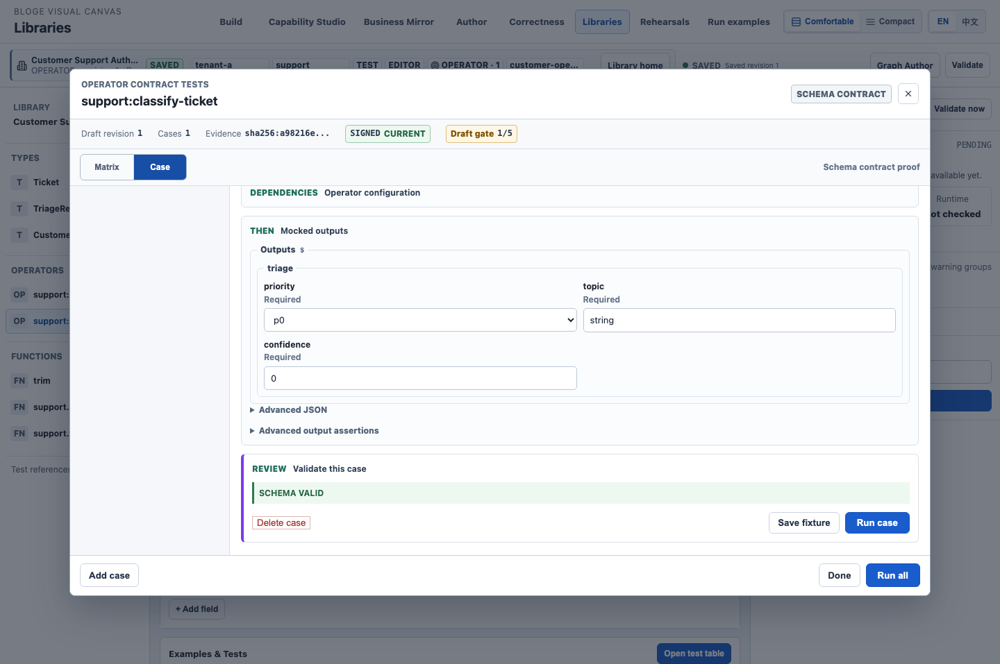
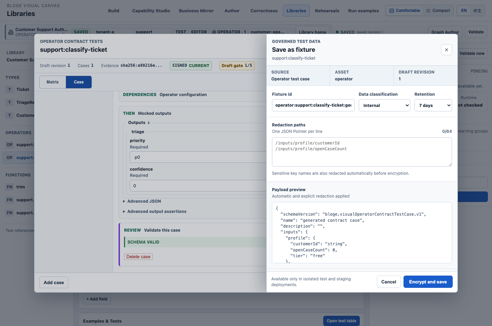
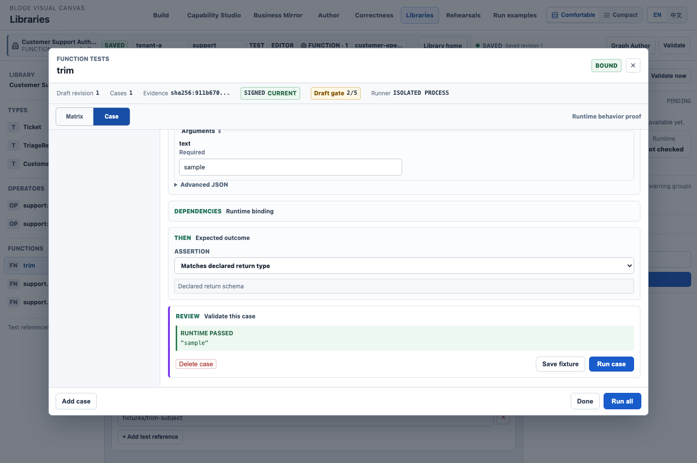
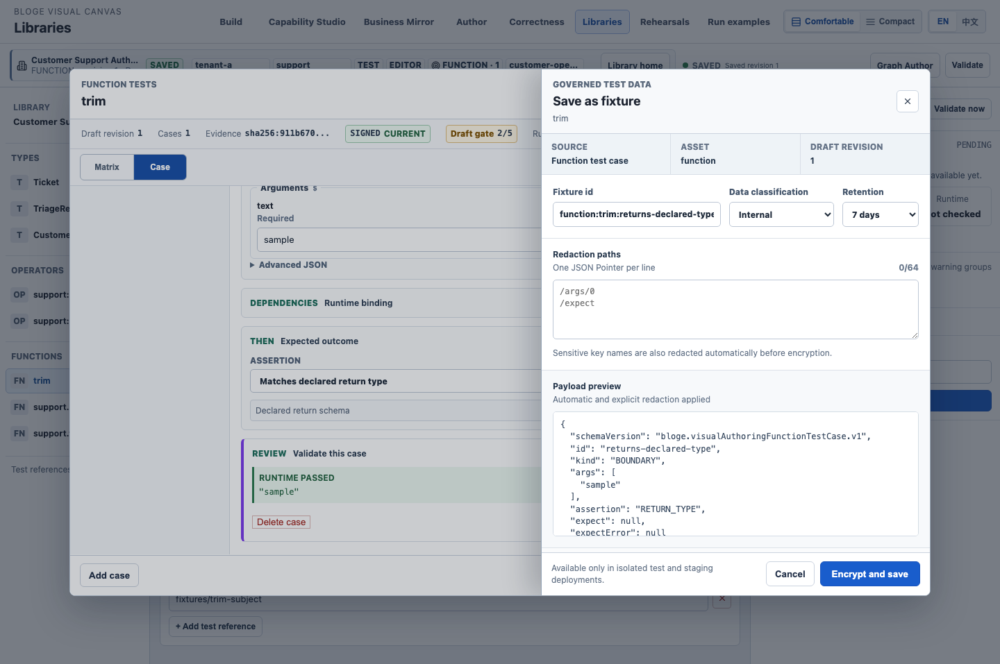

# Resource Gateway API、Fixture 与契约化 Tool 操作手册

本文面向需要把外部 API 接入 Resource Gateway、定义算子与 built-in function、用 Fixture 做无外部副作用验证，并把多个 API 资源组合成可复用 Tool 的作者。

截图来自 2026-09-01 当前代码启动后的真实工作台。界面、Controller、Facade、Fixture 物化和 Simulation Module 均为实际实现；截图环境使用浏览器验收的本地身份与内存权威，不访问真实外部 API，也不包含生产凭据。

## 1. 先理解六个对象

| 对象 | 作用 | 本手册示例 |
| --- | --- | --- |
| Connection | 保存 Base URL 与非秘密连接元数据 | `https://api.example.test` |
| API Resource | 一个可独立引用的 API operation 及其输入、输出契约 | Customer Profile、Orders、Offer |
| Operator | 可放入 Graph/Tool 的输入输出节点契约 | `support:classify-ticket` |
| Built-in Function | 在表达式中调用、由精确 runtime binding 实现的函数 | `trim(text)` |
| Fixture | 某个精确对象修订的测试输入、控制行为或期望输出 | API Default Fixture、Operator/Function Test Case、Tool Fixture |
| Tool | 按数据依赖组合多个 API Resource 的可复用 DAG | Customer 360 Contract Tool |

关键规则：API Resource 与 Tool 先保存权威对象，再基于精确修订创建并运行 Fixture；Operator/Function
Fixture 同样绑定不可变 Library/Catalog revision。四类对象现在都使用同一个 `Caller-directed simulation`
面板选择精确 Fixture revision、Case 或 Condition；所有运行证据都不等于治理审批通过。

## 2. 前置条件与边界

1. 先按顺序应用当前 authoring migrations。仓库启动脚本 `scripts/example-services.sh` 与
   `scripts/visual-canvas-demo.sh` 默认设置 `RG_API_RESOURCE_AUTHORING_ENABLED=true` 和
   `RG_REUSABLE_FLOW_AUTHORING_ENABLED=true`；生产 `application.yml` 仍默认关闭，直接运行 Spring Boot 时须显式设置。
2. 当前身份具有 `API_RESOURCE_AUTHORING` 权限，并且 tenant、project、environment 由受信身份解析，不由页面 Header 自报。
3. 生产环境已应用当前 authoring migrations，并配置所需外部 Secret Provider；没有 provider 时，受保护认证与真实出站必须保持 fail-closed。
4. 本手册只使用 `RETURN · OUTPUT_LEVEL` 和 whole-flow `RETURN` Fixture，因此运行时不会访问 `api.example.test`。
5. `SIMULATED_ONLY`、`MOCKED`、`NO_EGRESS` 表示本次运行没有真实外部副作用；`Governance: NOT_CHECKED` 不得解读为可发布或已审批。

入口：API Resource 与 Tool 使用 `/workbench/`；Operator 与 built-in function 使用 `/libraries/`。
工作台会先读取 `/api/authoring/availability`。部署未启用对应模块时，页面显示配置说明，不再发送必然返回
`404` 的 Preview、保存或模拟请求。

## 3. 配置一个 API Resource

### 3.1 导入 OpenAPI operation

1. 在首页单击 `Connect an API`。
2. 在 `Import OpenAPI` 中粘贴 OpenAPI 3 文档。
3. 单击 `Preview`。
4. 在目标 operation 右侧单击 `Use`。
5. 检查自动填充的 API name、Resource ID、method、path、transport bindings、request example 和 response example。
6. 选择 `Create` 新建 Connection，或选择 `Existing` 复用已提交 Connection。
7. 新建 Connection 时填写 Name 与 Base URL；不要把密码、Token 或 API Key 放进默认 Header、示例或描述字段。

最小 OpenAPI 示例：

```yaml
openapi: 3.0.3
info: { title: Customer Profile API, version: 1.0.0 }
servers: [{ url: https://api.example.test }]
paths:
  /profiles/{customerId}:
    get:
      operationId: customer-profile-api
      summary: Get customer profile
      parameters:
        - in: path
          name: customerId
          required: true
          schema: { type: string }
      responses:
        '200':
          description: Profile
          content:
            application/json:
              schema:
                type: object
                properties:
                  customerId: { type: string }
                  segment: { type: string }
                required: [customerId, segment]
```


预期结果：页面展示选中的 `GET /profiles/{customerId}`，并生成稳定的 Resource ID。此时尚未提交对象。

### 3.2 保存并自动模拟

1. 检查 request/response example。它们会生成 API contract 和私有 Default Fixture。
2. 单击 `Save and simulate`。
3. 等待页面显示 `Resource and Default Fixture saved; simulation completed.`。
4. 打开 `Fixture` 页签，核对 Fixture Set、Revision、Case 和 Behavior。


Default Fixture 的关键字段：

| 字段 | 含义 |
| --- | --- |
| Fixture Set | Fixture 的稳定身份；示例为 `customer-profile-api:r1` |
| Revision | Fixture 本身的不可变修订 |
| Case | 从 OpenAPI example 生成的 Case；示例为 `openapi-example` |
| Behavior | `RETURN · OUTPUT_LEVEL`，直接返回 Fixture output，不访问外部 API |

单击 `Run saved Fixture` 可重跑完全相同的已保存 Case。不要通过修改页面临时状态来冒充重放。

### 3.3 读取模拟证据

打开 `Simulation` 页签，检查状态、执行方式、output 与三类证据。


本例应看到：

- `Status: SUCCEEDED`：模拟模块完成。
- `Execution: SIMULATED_ONLY`：没有真实 API 调用。
- `Contract: PASSED`：返回值符合 API Resource output schema。
- `Assertions: NOT_CHECKED`：当前 Case 没有额外 assertion，不表示 assertion 通过。
- `Governance: NOT_CHECKED`：这是私有调试证据，不是共享审批凭证。

停止条件：若出现 schema、binding、scope、ETag 或 Connection 错误，不要继续创建 Tool；先修正 API Resource 并重新保存为精确修订。

## 4. 给算子设置 Fixture 并验证契约

### 4.1 打开算子测试表

1. 打开 `/libraries/`，创建算子库，或打开 `Customer Support Triage` 完整示例。
2. 在左侧 `Operators` 中选择目标算子，例如 `support:classify-ticket`。
3. 在 `Examples & Tests` 中单击 `Open test table`。
4. 切换到 `Case`，按 Given、Dependencies、Then、Review 四步填写用例。

算子用例的字段语义：

| 区域 | 内容 | 运行含义 |
| --- | --- | --- |
| Given | 符合算子 input schema 的输入 | 用于校验输入契约 |
| Dependencies | 算子配置 | 只描述当前算子的受控配置 |
| Then | Mocked outputs 与额外 output assertions | 定义 Fixture 返回值并校验 output schema |
| Review | `Run case` 与 `Save fixture` | 分别执行契约校验和受治理保存 |

单击 `Run case` 后，本例显示 `SCHEMA VALID`。



这里的证据是 **Schema contract proof**：它证明 Given/Mocked outputs 能被该算子契约接受，不代表真实算子实现已经执行，也不代表外部副作用发生。

### 4.2 保存受治理的算子 Fixture

1. 单击 `Save fixture`。
2. 检查 Source 为 `Operator test case`、Asset 为 `operator`，并确认精确 Draft revision。
3. 设置稳定 Fixture ID、数据分级和 1–30 天保留期。
4. 每行填写一个 JSON Pointer redaction path；系统还会在加密前自动处理敏感字段名。
5. 检查 Payload preview。更新已有 Fixture 时，在 Advanced 中填写最后观察到的精确 Fixture revision。
6. 勾选测试数据确认，单击 `Encrypt and save`，等待返回不含 payload 的 receipt。



保存完成后打开该 Fixture Object。页面的 `Caller-directed simulation` 面板会把精确
`OPERATOR_VERSION` 作为 Subject；选择 `Per-target bindings`、该 Fixture revision 和 Case 后运行。
这会产生 `SUBJECT · MOCKED` Invocation evidence，而不是执行真实算子实现。若在 Flow 中使用该算子，进入
Flow 的 Simulation 页，为对应 `NODE_PATH` 选择同一 Fixture。

Graph Author 的旧节点 Fixture picker 仍保留 Pin → Promote → Review → Activate → Reuse 生命周期；它与 v2
调用方计划共享受保护资产，但不是 v2 wire contract。不能把本页的 `SCHEMA VALID` 当成节点模拟已完成。

## 5. 给 built-in function 设置 Fixture 并执行真实 runtime 测试

### 5.1 运行已绑定函数

1. 在同一个 Library Workbench 的 `Functions` 中选择函数；本例使用内置 `trim`。
2. 单击 `Open test table`，切换到 `Case`。
3. 在 Given 中填写函数参数。
4. 在 Dependencies 中确认 `Binding: BOUND` 和执行 profile；未绑定函数显示 `UNBOUND`，依赖时间、网络等受限能力的函数会被策略阻断。
5. 在 Then 中选择 `Equals`、`Matches declared return type` 或 `Returns an error`。
6. 单击 `Run case`。



本例显示：

- `BOUND`：函数名解析到服务端登记的精确 runtime binding。
- `Runner: ISOLATED PROCESS`：测试在隔离 worker 中运行。
- `RUNTIME PASSED`：真实调用了 `trim` binding，返回值为 `"sample"`。
- `SIGNED CURRENT`：证据与当前 Library Draft/函数指纹一致。

这与算子表的 Schema contract proof 不同：built-in function 用例会执行实际绑定，但仍不等于 Graph 或 Tool 已执行。

### 5.2 保存函数 Fixture

函数用例通过后，单击 `Save fixture`，按与算子相同的流程设置 Fixture ID、分级、保留期和 redaction，再确认并加密保存。



保存时 Source 为 `Function test case`、Asset 为 `function`。保存的 payload 包含当前用例参数和 assertion，但 receipt 不回显 payload。

保存完成后打开 Function Fixture Object。页面使用精确 `BUILTIN_FUNCTION_VERSION` Subject 和相同的
`Caller-directed simulation` 面板重放已保存 Case。Flow/Operator 内部的 Function 必须绑定 compiler-owned
`CALL_SITE`；同名函数的两个静态调用点不会因函数名相同而共享 Fixture。界面不会接受 Runtime
`InvocationKey`，它只在执行证据中由服务端生成。

### 5.3 四类对象的执行证据不要混用

| Subject | 当前可见执行 | Fixture 保存 | 已保存 Fixture 自动重放 |
| --- | --- | --- | --- |
| API Resource | `Save and simulate` / `Run saved Fixture` | Default Fixture Set | 已闭环 |
| Operator | `Run case` 做 schema proof；v2 可模拟精确 Subject/Flow Node | Operator Test Case | 已闭环到 caller-directed panel |
| Built-in Function | `Run case` 执行隔离 binding；v2 模拟精确 Function Subject | Function Test Case | 已闭环；嵌套调用按稳定 Call Site |
| Tool/Flow | `Save Fixture and simulate` | Whole-flow 或 Node Case | Whole-flow 已闭环；Node Case 依赖兼容 Fixture |

因此，界面上都出现 `Fixture` 并不表示四种 Subject 已经共享同一套执行适配器。验收时必须读取 evidence 类型、执行 profile、subject coordinate 和 egress 状态。

## 6. 把多个 API Resource 编排成契约化 Tool

本例依次创建三个 API Resource：

1. `customer-profile-api`：输入 `customerId`，输出 `customerId`、`segment`。
2. `customer-orders-api`：输入 `customerId`，输出 `customerId`、`orderCount`、`customerLabel`。
3. `customer-offer-api`：输入 `customerId`、`orderCount`，输出最终推荐结果。

### 6.1 创建 Tool DAG

1. 回到 `/workbench/`，单击 `Create a tool`。
2. 填写 Flow name、Flow ID、Kind 和 Description。
3. 在 `Dependencies` 中选择第一个 API Resource，单击 `Add item`。
4. 按执行顺序继续添加第二、第三个 API Resource。
5. 检查节点顺序和每个节点绑定的精确 API Resource revision。


标准模式按以下规则生成契约和数据边：

- 每个节点输入字段先查找之前节点中同名、同类型的输出。
- 找到时生成 `NODE_OUTPUT → node input` 映射。
- 找不到时，该字段提升为 Tool 的外部输入。
- Tool 输出取最后一个节点的完整输出契约。
- 节点位置和引用被服务端保存；前端列表不是第二份领域权威。

因此，本例的 `customerId` 可沿前序输出复用，`orderCount` 从 Orders 节点传给 Offer 节点；外部调用者只需要提供无法由前序节点满足的 Tool 输入。

6. 单击 `Save Flow`。
7. 等待 `Flow saved. Add its reusable Fixture.`，页面自动进入 `Fixture` 页签。

如需把 Tool 作为其他 Tool/Solution 的稳定依赖，进入 `Versions`，单击 `Publish Flow`。发布得到不可变 Flow Version；后续父流程应引用精确 publication/revision/fingerprint，而不是可变化的草稿。

## 7. 给 Tool 设置 Fixture 并自动模拟

### 7.1 整体返回 Fixture

`Return` 模式用于验证 Tool 对外契约，而不执行内部 API 节点。

1. 在 `Fixture input` 输入 Tool 的外部输入。
2. 在 `Fixture output` 输入完整预期返回值。
3. 检查 JSON 字段与 Tool input/output contract 一致。

```json
{
  "customerId": "customer-1001"
}
```

```json
{
  "customerId": "customer-1001",
  "orderCount": 2,
  "customerLabel": "customer-1001 orders",
  "recommendedOffer": "priority-support"
}
```


4. 单击 `Save Fixture and simulate`。
5. 等待页面自动切换到 `Simulation`。

预期结果：Fixture 被绑定到精确 Tool Draft 或 Flow Version，Case 行为为 Subject `RETURN`；内部 API 调用保持未执行。

### 7.2 读取 Tool 模拟结果


本例结果中：

- `Status: SUCCEEDED`：Fixture Case 已完成。
- `Execution: SIMULATED_ONLY`：整个 Tool 仅模拟。
- `subject · COMPLETED · MOCKED · INLINE · FIXTURE · NO_EGRESS`：精确 Tool subject 被 inline Fixture 替代，且未尝试出站。
- output 精确等于已保存 Fixture output。

这证明 Tool 的对外契约和 Fixture 可重复运行，但不证明三个真实 API 的可达性或真实组合结果。真实连通性应走受治理的 Connection Check；真实读取还必须经过精确 egress authorization、审计和 redaction。

### 7.3 节点 Case 模式

发布 Tool 后，可切换为 `Node · Case`：

1. 为每个节点选择一个与该精确 API Resource 或 Flow Version 匹配的 Fixture Case。
2. 页面生成每个节点的 `APPLY_CASE` 控制。
3. 保存并模拟后，逐节点检查 `COMPLETED`、`MOCKED`、Fixture source 与 `NO_EGRESS`。

如果某个节点没有兼容 Fixture、subject revision 不一致或 output schema 不闭合，按钮会保持不可执行或后端返回语义错误。不要改写 subject、revision 或 fingerprint 绕过检查。

## 8. 调用方直接指定 Fixture 条件并模拟

API Resource、Flow、Operator、Built-in Function 的 Simulation 页面现在使用同一个两阶段操作模型：

1. 在 `Input` 中只填写本次业务输入。这里不能上传 Fixture output、Material reference、Credential 或 Invocation Key。
2. 在 `Fixture Plan` 中选择：
   - `None`：不应用 Fixture；外部调用默认仍被阻断。
   - `Saved Case controls`：复用一个已保存 Case 的整套 DAG 控制。
   - `Per-target bindings`：分别给 Subject、Flow Node 或稳定 Call Site 绑定 Fixture。
3. 选择 `Unmatched target`：
   - `Block` 是默认值，未匹配时零网络并留下 `BLOCKED` 证据。
   - `Real` 只是提出真实读取请求，仍必须通过服务端精确 egress grant；真实写始终拒绝。
4. 每个 Target 选择一个精确 Fixture Set revision，再选择：
   - `Exact Case`：直接指定 Case。
   - `Condition`：指定已保存的稳定 `conditionId`。
   - `Auto match`：用本次 Invocation 的实际输入匹配；零个或多个命中都会 fail closed。
5. 单击 `Run Fixture Plan`，在 `Resolved Evidence` 查看最终解析到的 Fixture Case、`MOCKED/REAL`、
   behavior、fidelity、provenance、egress decision 和四维 verdict。

Condition 在 Fixture Object 的 Case 编辑区维护，只支持 `EQ`、`IN`、`PRESENT`、`ABSENT`、
`NUMBER_RANGE` 和受限 JSONPath。页面 Match preview 只是本地预览，服务端编译和运行证据才是权威。

### 8.1 API Resource

保存 API 后打开 `Simulation`，把 Target 保持为 `Subject`。例如：

```text
Input:        {"customerId":"customer-1001","segment":"gold"}
Plan:         Per-target bindings
Target:       Subject
Selection:    Condition / gold-customer
Unmatched:    Block
```

命中后 output 来自 exact Case，Invocation 显示 `MOCKED · CONDITION · NO_EGRESS`。

### 8.2 多 API DAG / Reusable Flow

保存或发布 Flow 后打开 `Simulation`。面板同时列出整个 Flow Subject 和每个 `NODE_PATH`：

- 绑定 Subject：整体替代 Flow，内部节点不执行。
- 绑定若干 Node：DAG 仍按真实 mapping 计算节点输入，每个节点再用自己的实际输入匹配 Condition。
- 使用 `Saved Case controls`：复用一个不可变工具模拟方案。
- 未绑定节点选择 `Block` 时，不会悄悄访问外部 API。

一次运行中每个动态节点都会产生不同 Invocation Key；循环、重试、嵌套调用也必须逐次重新匹配，不能复用
上一次输入的选择结果。

### 8.3 Operator 与 Built-in Function

- Operator Fixture Object 直接以 `OPERATOR_VERSION` 为 Subject；Flow 中以节点 `NODE_PATH` 绑定。
- Built-in Function Fixture Object 直接以 `BUILTIN_FUNCTION_VERSION` 为 Subject。
- Function 嵌套在 Operator/Flow 时，必须使用发布产物里的稳定 `CALL_SITE(nodePath, callSiteId)`；禁止按函数名全局替换。

### 8.4 Decision Scenario

决策表枚举产生的 Scenario 继续保持 `dependencies=[]`，不会自动自 Mock。需要模拟时，在 Case 中可见地执行
`Use expected output as Return fixture`，保存 Scenario 和对应 PRIVATE Fixture 后，Scenario Compiler 才把该
dependency 投影为 v2 exact binding。Execution、Assertions、Contract、Governance 四维分别展示；Fixture 命中
不能把工具状态泛化成 `Ready`。

## 9. 常见错误与恢复

| 现象 | 原因 | 恢复动作 |
| --- | --- | --- |
| `428 Precondition Required` | 更新缺少强 ETag 前置条件 | 重新读取当前对象，再用返回的强 ETag 保存 |
| `412 Precondition Failed` | 页面基于旧修订编辑 | 刷新对象，比较变更后重新提交；不要强行覆盖 |
| `409 Conflict` | Idempotency-Key 对应的请求内容不同，或命令仍忙 | 使用原请求重放；内容变化时生成新的操作键 |
| `422 Unprocessable Entity` | schema、binding、Fixture subject 或 Case 不闭合 | 根据字段错误修正输入，先保存 Resource/Flow，再保存 Fixture |
| `424 Failed Dependency` | 外部 Secret Provider、真实 egress 或后续能力未配置 | 停止真实调用，联系平台管理员配置受治理 provider |
| 模拟成功但没有真实 API 日志 | 使用了 `RETURN` Fixture | 这是预期的 `SIMULATED_ONLY/NO_EGRESS`；需要真实读取时改走已授权的 REAL 路径 |
| Tool 节点字段没有自动连线 | 字段名或 JSON type 不一致 | 统一上游 output 与下游 input 的字段名、类型，重新保存精确 API Resource |

## 10. 验收清单

交付一个可复用 Tool 前，至少确认：

- [ ] 每个 API Resource 都有稳定 Resource ID、精确 revision 与通过的 contract evidence。
- [ ] 每个 Default Fixture 可从已保存 Case 重跑，结果为 `SIMULATED_ONLY`。
- [ ] Operator 用例明确标记为 schema contract proof；需要节点模拟时另走 Graph Node Fixture 生命周期。
- [ ] Built-in function 显示 `BOUND`、隔离 execution profile 与 `RUNTIME PASSED`；`UNBOUND`/策略阻断不得保存为“已执行”证据。
- [ ] Operator/Function Fixture receipt 不回显 payload，分级、保留期与 redaction 已核对。
- [ ] Tool 节点顺序正确，自动映射字段名和类型一致。
- [ ] Tool whole-flow Fixture 的 input/output 与 Tool contract 一致。
- [ ] Tool 模拟显示精确 subject、`MOCKED`、Fixture source 和 `NO_EGRESS`。
- [ ] 调用方计划中的 Input 与 Fixture Plan 分开；未提交 output、Material、Credential 或 Invocation Key。
- [ ] Condition/Auto match 最终 evidence 指向一个精确 Fixture revision、Case 和 input fingerprint。
- [ ] Operator/Function 使用精确 version Subject；嵌套 Function 使用稳定 Call Site，不按函数名替换。
- [ ] 需要复用时已发布不可变 Flow Version。
- [ ] 需要共享 Fixture 时已完成独立 reviewer、redaction 与 schema verification；私有模拟不能替代治理审批。

## 11. 截图环境说明

本手册截图使用 `tenant-a / local / test` 的浏览器验收身份、H2 内存持久化和本地 Static Bearer resolver。它验证了真实页面到服务端模块的操作链，但不构成以下生产证据：

> 当前 `01`—`10` 为此前验收形成的真实运行截图。统一 `Caller-directed simulation` 面板的 API、Flow、Operator、Function 四张新截图因本轮桌面主机锁屏尚未补拍；手册中的操作步骤和字段已经按新面板更新。主机解锁后应补拍 `Resolved Evidence`，不得用设计稿或合成图替代运行证据。

- 外部 Vault/Secret Provider 已部署；
- 目标 API 网络可达；
- REMOTE OpenAPI 导入已获 egress 授权；
- PostgreSQL 迁移已在目标环境认证；
- 共享 Fixture 已通过组织治理策略。

生产接入应把这些边界作为独立发布门禁，不得由截图或本地模拟替代。
