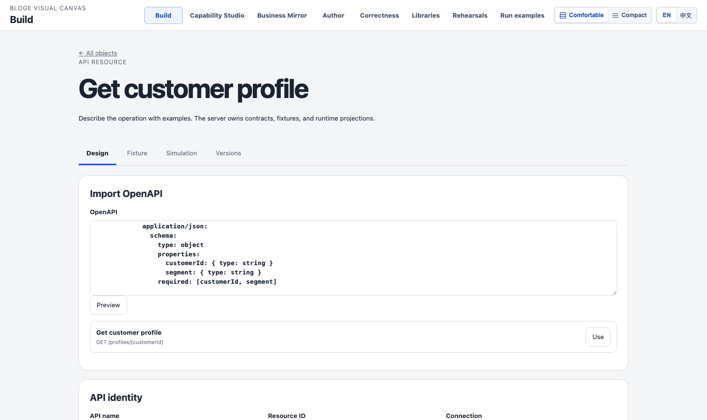
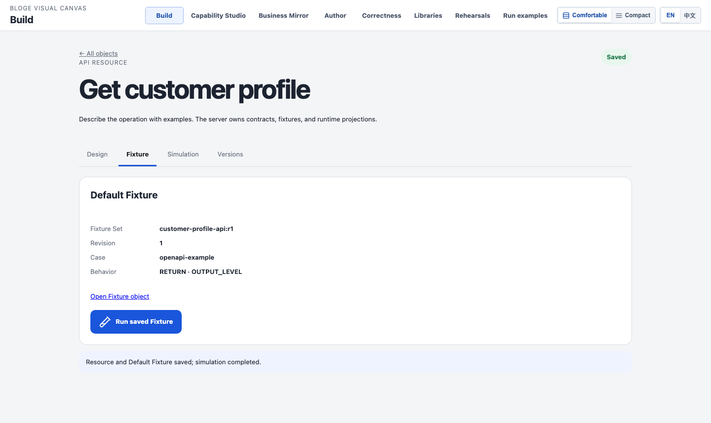
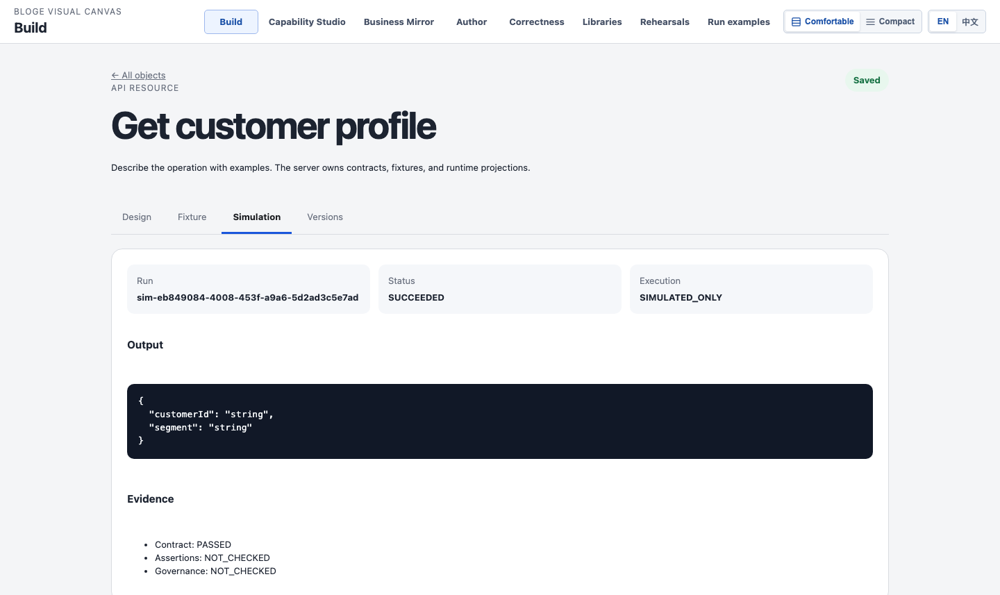
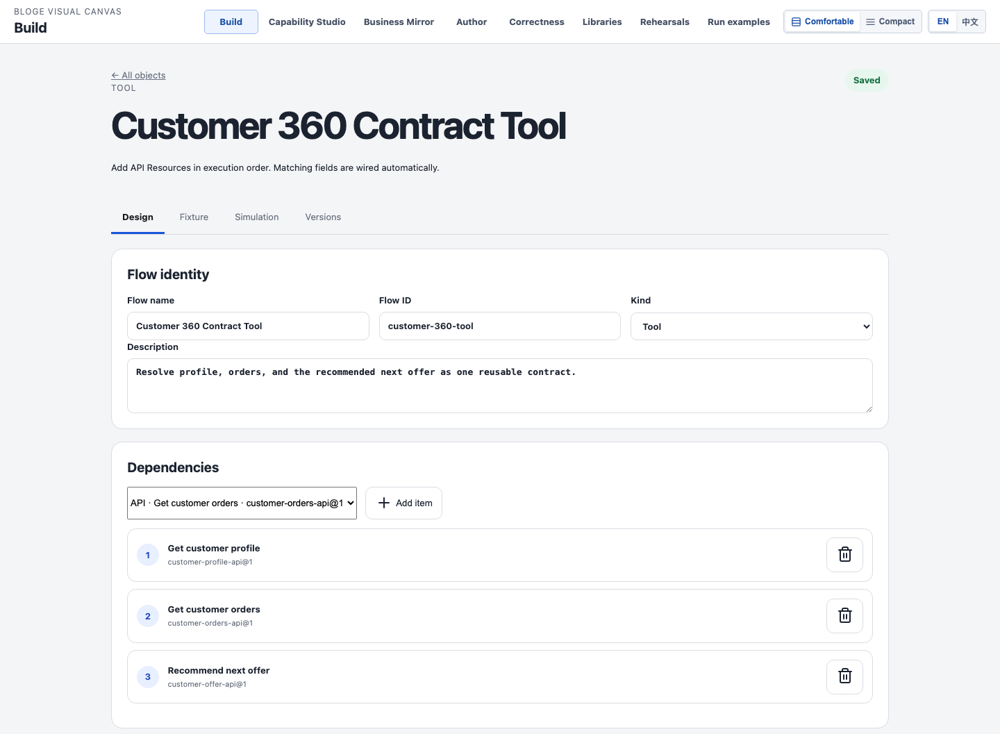
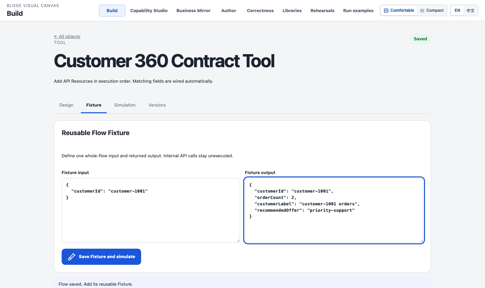
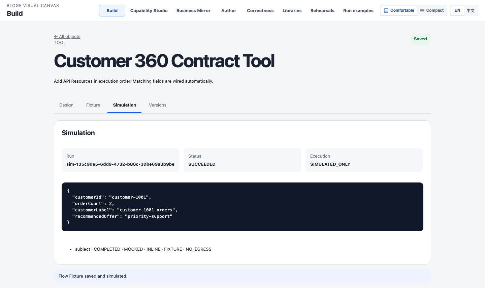

# Resource Gateway API、Fixture 与契约化 Tool 操作手册

本文面向需要把外部 API 接入 Resource Gateway、用 Fixture 做无外部副作用模拟，并把多个 API 资源组合成可复用 Tool 的作者。

截图来自 2026-09-01 当前代码启动后的真实工作台。界面、Controller、Facade、Fixture 物化和 Simulation Module 均为实际实现；截图环境使用浏览器验收的本地身份与内存权威，不访问真实外部 API，也不包含生产凭据。

## 1. 先理解四个对象

| 对象 | 作用 | 本手册示例 |
| --- | --- | --- |
| Connection | 保存 Base URL 与非秘密连接元数据 | `https://api.example.test` |
| API Resource | 一个可独立引用的 API operation 及其输入、输出契约 | Customer Profile、Orders、Offer |
| Fixture Set | 某个精确对象修订的输入、控制行为和期望输出 | OpenAPI Default Fixture、Tool whole-flow Fixture |
| Tool | 按数据依赖组合多个 API Resource 的可复用 DAG | Customer 360 Contract Tool |

关键规则：先保存权威对象，再基于精确对象修订创建 Fixture，最后运行 Fixture。模拟结果是不可变证据，不等于真实网络调用，也不等于治理审批通过。

## 2. 前置条件与边界

1. 部署已启用 API Resource authoring、Fixture Set、Simulation 与 Reusable Flow 模块。
2. 当前身份具有 `API_RESOURCE_AUTHORING` 权限，并且 tenant、project、environment 由受信身份解析，不由页面 Header 自报。
3. 生产环境已应用当前 authoring migrations，并配置所需外部 Secret Provider；没有 provider 时，受保护认证与真实出站必须保持 fail-closed。
4. 本手册只使用 `RETURN · OUTPUT_LEVEL` 和 whole-flow `RETURN` Fixture，因此运行时不会访问 `api.example.test`。
5. `SIMULATED_ONLY`、`MOCKED`、`NO_EGRESS` 表示本次运行没有真实外部副作用；`Governance: NOT_CHECKED` 不得解读为可发布或已审批。

入口：打开 `/workbench/`，选择 `Connect an API`、`Create a tool` 或 `Create a solution`。

## 3. 配置一个 API Resource

### 3.1 导入 OpenAPI operation

1. 在首页单击 `Connect an API`。
2. 在 `Import OpenAPI` 中粘贴 OpenAPI 3 文档。
3. 单击 `Preview`。
4. 在目标 operation 右侧单击 `Use`。
5. 检查自动填充的 API name、Resource ID、method、path、transport bindings、request example 和 response example。
6. 选择 `Create` 新建 Connection，或选择 `Existing` 复用已提交 Connection。
7. 新建 Connection 时填写 Name 与 Base URL；不要把密码、Token 或 API Key 放进默认 Header、示例或描述字段。

最小 OpenAPI 示例：

```yaml
openapi: 3.0.3
info: { title: Customer Profile API, version: 1.0.0 }
servers: [{ url: https://api.example.test }]
paths:
  /profiles/{customerId}:
    get:
      operationId: customer-profile-api
      summary: Get customer profile
      parameters:
        - in: path
          name: customerId
          required: true
          schema: { type: string }
      responses:
        '200':
          description: Profile
          content:
            application/json:
              schema:
                type: object
                properties:
                  customerId: { type: string }
                  segment: { type: string }
                required: [customerId, segment]
```



预期结果：页面展示选中的 `GET /profiles/{customerId}`，并生成稳定的 Resource ID。此时尚未提交对象。

### 3.2 保存并自动模拟

1. 检查 request/response example。它们会生成 API contract 和私有 Default Fixture。
2. 单击 `Save and simulate`。
3. 等待页面显示 `Resource and Default Fixture saved; simulation completed.`。
4. 打开 `Fixture` 页签，核对 Fixture Set、Revision、Case 和 Behavior。



Default Fixture 的关键字段：

| 字段 | 含义 |
| --- | --- |
| Fixture Set | Fixture 的稳定身份；示例为 `customer-profile-api:r1` |
| Revision | Fixture 本身的不可变修订 |
| Case | 从 OpenAPI example 生成的 Case；示例为 `openapi-example` |
| Behavior | `RETURN · OUTPUT_LEVEL`，直接返回 Fixture output，不访问外部 API |

单击 `Run saved Fixture` 可重跑完全相同的已保存 Case。不要通过修改页面临时状态来冒充重放。

### 3.3 读取模拟证据

打开 `Simulation` 页签，检查状态、执行方式、output 与三类证据。



本例应看到：

- `Status: SUCCEEDED`：模拟模块完成。
- `Execution: SIMULATED_ONLY`：没有真实 API 调用。
- `Contract: PASSED`：返回值符合 API Resource output schema。
- `Assertions: NOT_CHECKED`：当前 Case 没有额外 assertion，不表示 assertion 通过。
- `Governance: NOT_CHECKED`：这是私有调试证据，不是共享审批凭证。

停止条件：若出现 schema、binding、scope、ETag 或 Connection 错误，不要继续创建 Tool；先修正 API Resource 并重新保存为精确修订。

## 4. 把多个 API Resource 编排成契约化 Tool

本例依次创建三个 API Resource：

1. `customer-profile-api`：输入 `customerId`，输出 `customerId`、`segment`。
2. `customer-orders-api`：输入 `customerId`，输出 `customerId`、`orderCount`、`customerLabel`。
3. `customer-offer-api`：输入 `customerId`、`orderCount`，输出最终推荐结果。

### 4.1 创建 Tool DAG

1. 回到 `/workbench/`，单击 `Create a tool`。
2. 填写 Flow name、Flow ID、Kind 和 Description。
3. 在 `Dependencies` 中选择第一个 API Resource，单击 `Add item`。
4. 按执行顺序继续添加第二、第三个 API Resource。
5. 检查节点顺序和每个节点绑定的精确 API Resource revision。



标准模式按以下规则生成契约和数据边：

- 每个节点输入字段先查找之前节点中同名、同类型的输出。
- 找到时生成 `NODE_OUTPUT → node input` 映射。
- 找不到时，该字段提升为 Tool 的外部输入。
- Tool 输出取最后一个节点的完整输出契约。
- 节点位置和引用被服务端保存；前端列表不是第二份领域权威。

因此，本例的 `customerId` 可沿前序输出复用，`orderCount` 从 Orders 节点传给 Offer 节点；外部调用者只需要提供无法由前序节点满足的 Tool 输入。

6. 单击 `Save Flow`。
7. 等待 `Flow saved. Add its reusable Fixture.`，页面自动进入 `Fixture` 页签。

如需把 Tool 作为其他 Tool/Solution 的稳定依赖，进入 `Versions`，单击 `Publish Flow`。发布得到不可变 Flow Version；后续父流程应引用精确 publication/revision/fingerprint，而不是可变化的草稿。

## 5. 给 Tool 设置 Fixture 并自动模拟

### 5.1 整体返回 Fixture

`Return` 模式用于验证 Tool 对外契约，而不执行内部 API 节点。

1. 在 `Fixture input` 输入 Tool 的外部输入。
2. 在 `Fixture output` 输入完整预期返回值。
3. 检查 JSON 字段与 Tool input/output contract 一致。

```json
{
  "customerId": "customer-1001"
}
```

```json
{
  "customerId": "customer-1001",
  "orderCount": 2,
  "customerLabel": "customer-1001 orders",
  "recommendedOffer": "priority-support"
}
```



4. 单击 `Save Fixture and simulate`。
5. 等待页面自动切换到 `Simulation`。

预期结果：Fixture 被绑定到精确 Tool Draft 或 Flow Version，Case 行为为 Subject `RETURN`；内部 API 调用保持未执行。

### 5.2 读取 Tool 模拟结果



本例结果中：

- `Status: SUCCEEDED`：Fixture Case 已完成。
- `Execution: SIMULATED_ONLY`：整个 Tool 仅模拟。
- `subject · COMPLETED · MOCKED · INLINE · FIXTURE · NO_EGRESS`：精确 Tool subject 被 inline Fixture 替代，且未尝试出站。
- output 精确等于已保存 Fixture output。

这证明 Tool 的对外契约和 Fixture 可重复运行，但不证明三个真实 API 的可达性或真实组合结果。真实连通性应走受治理的 Connection Check；真实读取还必须经过精确 egress authorization、审计和 redaction。

### 5.3 节点 Case 模式

发布 Tool 后，可切换为 `Node · Case`：

1. 为每个节点选择一个与该精确 API Resource 或 Flow Version 匹配的 Fixture Case。
2. 页面生成每个节点的 `APPLY_CASE` 控制。
3. 保存并模拟后，逐节点检查 `COMPLETED`、`MOCKED`、Fixture source 与 `NO_EGRESS`。

如果某个节点没有兼容 Fixture、subject revision 不一致或 output schema 不闭合，按钮会保持不可执行或后端返回语义错误。不要改写 subject、revision 或 fingerprint 绕过检查。

## 6. 常见错误与恢复

| 现象 | 原因 | 恢复动作 |
| --- | --- | --- |
| `428 Precondition Required` | 更新缺少强 ETag 前置条件 | 重新读取当前对象，再用返回的强 ETag 保存 |
| `412 Precondition Failed` | 页面基于旧修订编辑 | 刷新对象，比较变更后重新提交；不要强行覆盖 |
| `409 Conflict` | Idempotency-Key 对应的请求内容不同，或命令仍忙 | 使用原请求重放；内容变化时生成新的操作键 |
| `422 Unprocessable Entity` | schema、binding、Fixture subject 或 Case 不闭合 | 根据字段错误修正输入，先保存 Resource/Flow，再保存 Fixture |
| `424 Failed Dependency` | 外部 Secret Provider、真实 egress 或后续能力未配置 | 停止真实调用，联系平台管理员配置受治理 provider |
| 模拟成功但没有真实 API 日志 | 使用了 `RETURN` Fixture | 这是预期的 `SIMULATED_ONLY/NO_EGRESS`；需要真实读取时改走已授权的 REAL 路径 |
| Tool 节点字段没有自动连线 | 字段名或 JSON type 不一致 | 统一上游 output 与下游 input 的字段名、类型，重新保存精确 API Resource |

## 7. 验收清单

交付一个可复用 Tool 前，至少确认：

- [ ] 每个 API Resource 都有稳定 Resource ID、精确 revision 与通过的 contract evidence。
- [ ] 每个 Default Fixture 可从已保存 Case 重跑，结果为 `SIMULATED_ONLY`。
- [ ] Tool 节点顺序正确，自动映射字段名和类型一致。
- [ ] Tool whole-flow Fixture 的 input/output 与 Tool contract 一致。
- [ ] Tool 模拟显示精确 subject、`MOCKED`、Fixture source 和 `NO_EGRESS`。
- [ ] 需要复用时已发布不可变 Flow Version。
- [ ] 需要共享 Fixture 时已完成独立 reviewer、redaction 与 schema verification；私有模拟不能替代治理审批。

## 8. 截图环境说明

本手册截图使用 `tenant-a / local / test` 的浏览器验收身份、H2 内存持久化和本地 Static Bearer resolver。它验证了真实页面到服务端模块的操作链，但不构成以下生产证据：

- 外部 Vault/Secret Provider 已部署；
- 目标 API 网络可达；
- REMOTE OpenAPI 导入已获 egress 授权；
- PostgreSQL 迁移已在目标环境认证；
- 共享 Fixture 已通过组织治理策略。

生产接入应把这些边界作为独立发布门禁，不得由截图或本地模拟替代。
