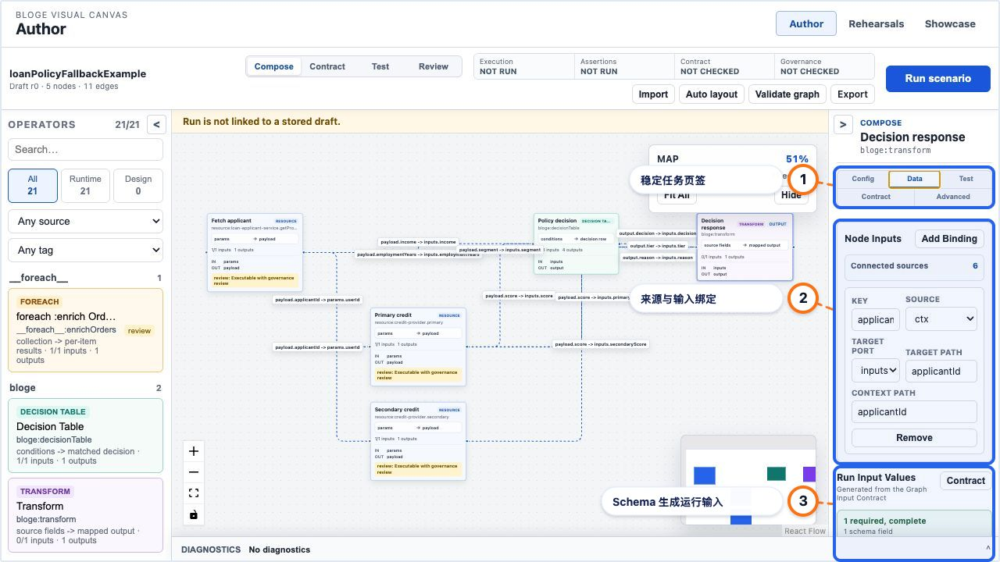

# Resource Gateway Author 任务式交互 UX 实现状态

> 对应方案：[Resource Gateway Author 任务式交互 UX 改善计划](resource-gateway-author-task-oriented-ux-improvement-plan.md)
>
> 状态：Implementation in Progress
>
> 最近更新：2026-07-28
>
> 完成门槛：相对目标差距严格小于 8%

## 评估方法

每轮必须同时提供：

1. 已实现代码和协议证据；
2. 有意义的单元、组件和真实浏览器测试；
3. 生产构建结果；
4. 与目标方案逐项比较后的加权差距；
5. 下一轮只针对剩余差距的实施计划；
6. 独立 Git commit。

评分不复用旧画布日志的“算子表达覆盖率”量尺。新量尺覆盖完整 Author 任务：

| 维度 | 权重 | 完成定义 |
|---|---:|---|
| 任务式 Shell 与信息架构 | 20 | Start、Compose、Contract、Test、Review 和单一主操作 |
| Start/Import 入口 | 10 | 示例、DSL、Library、Blank 统一且不常驻 |
| 上下文与节点专属编辑 | 15 | 单一 Inspector、类型化默认编辑器、稳定 Apply/Cancel |
| Schema-driven Input/Test | 15 | 核心流程无需 Raw JSON，Graph Input/Run Input 分离 |
| 可信状态与错误恢复 | 15 | Execution/Assertions/Contract/Governance 四维状态 |
| Canvas 与复杂图可读性 | 15 | 语义缩放、Overview、edge label、overlay-aware layout |
| 工程边界、测试和灰度 | 10 | 模块边界、固定 fixture、浏览器门禁、可回滚发布 |
| 合计 | 100 | 差距 `< 8%` 才允许完成 |

## Round 0：Stage 0 基线、灰度边界与快修

### 本轮目标

1. 建立不会随实现方便而漂移的 0/5/25/100 节点基线；
2. 建立 Author Workspace v2 的 URL 灰度和 v1 回滚坐标；
3. 修复 Operator Detail 标题四个元素挤入三列造成的动作换行；
4. 用真实 Chrome 做几何断言，而不是只检查 DOM 是否存在；
5. 冻结新的整体 UX 评分口径。

### 已实现

| 能力 | 实现 |
|---|---|
| Workspace version | `authorWorkspaceVersion.ts` 纯函数解析 `?authorWorkspace=v2`；未知值 fail closed 到 v1 |
| 数据隔离 | version 只进入 Workspace UI prop/data attribute，不写入 GraphDraft 或 Scenario |
| 固定 stress corpus | `uxBaselineFixtures.ts` 冻结 0/5/25/100 nodes 和 0/12/50/250 edges |
| 压力特征 | fixture 包含长节点名称、平行路径、长 source path 和 condition edge |
| 浮层快修 | `.operator-detail-heading` 从三列改为四列 |
| 浏览器门禁 | Selenium 检查 v2 opt-in、未知版本回退，以及四个 heading child 同行且互不覆盖 |
| Java 文档 | 新浏览器测试说明测试意图、历史缺陷和为什么必须做几何断言 |

### 测试演进

真实浏览器测试不是一次写对：

1. 第一版依赖 Loan Policy 示例生成 `n4`，随机端口 catalog 下示例没有形成节点；
2. 第二版使用测试 DOM 专有的 `node-wrapper:n1`，真实 React Flow 中不存在；
3. 最终版本只依赖真实 catalog 的首个 operator，并使用生产 DOM 的 `canvas-node:n1`；
4. 最终几何门禁通过。

保留这一过程的原因是：测试必须证明目标行为，不能依赖不属于该行为的示例可用性或 mock DOM 结构。

### 验证证据

前端聚焦测试：

```text
authorWorkspaceVersion.test.ts    3 passed
uxBaselineFixtures.test.ts        6 passed
App.test.tsx                      5 passed
AuthorCanvas.test.tsx            37 passed
total                            51 passed
```

完整前端回归：

```text
18 test files passed
240 tests passed
```

生产前端构建：

```text
tsc --noEmit passed
vite build passed
```

真实浏览器：

```text
VisualAuthoringBrowserDomTest
  #authorWorkspaceVersionAndOperatorDialogHeadingRemainRollbackSafeInRealBrowser
1 passed
```

### 本轮差距评估

| 维度 | 已实现 | 权重 | 判断 |
|---|---:|---:|---|
| 任务式 Shell 与信息架构 | 2 | 20 | 只有灰度坐标，v2 Shell 尚未出现 |
| Start/Import 入口 | 0 | 10 | 仍为三个常驻区域 |
| 上下文与节点专属编辑 | 5 | 15 | 既有专属编辑能力存在，但默认顺序未重构 |
| Schema-driven Input/Test | 6 | 15 | Contract 工作台已有基础，旧 Test Suite 仍大量 Raw JSON |
| 可信状态与错误恢复 | 2 | 15 | 仍有单一 `All passed` 和分散 Result |
| Canvas 与复杂图可读性 | 7 | 15 | 已有 Focus/Map/Auto Layout，但标签和 overlay 问题仍在 |
| 工程边界、测试和灰度 | 7 | 10 | fixture、灰度和浏览器几何门禁已建立 |
| 合计 | **29** | **100** | **剩余差距 71%** |

Stage 0 完成，但总体目标远未完成，不能停。

### Round 1 针对性计划

下一轮只攻最大病根：任务式 Shell。

1. v2 下增加 `Compose / Contract / Test / Review` mode state；
2. 建立 Command Bar，并将 Draft identity、mode、状态摘要和单一主操作收敛到一处；
3. 将 Library、Legacy DSL、Examples 迁入统一 Start/Import Dialog；
4. v2 Palette 首屏只保留搜索、筛选和 operator list；
5. v1 路径保持原样，GraphDraft 导出做等价测试；
6. 增加空白首屏 persistent controls、主操作数量和 Canvas 占比的真实浏览器门禁；
7. 完成第一条纵切：Load example → Compose → Run sample → Review。

Round 1 退出时重新评分；不得因为导航已经出现就宣称 Stage 1 完成。

## Round 1a：任务式 Shell 纵切

### 本轮目标

本轮不试图一次完成 Stage 1 的所有工程项，而是先证明最重要的端到端纵切：

```text
Start → Load complete example → Compose → Run scenario → Review
```

纵切必须复用现有 GraphDraft、DSL import、Operator Library、Contract Workspace 和 Test
Suite，不允许为了新导航复制第二套业务状态。

### 已实现

| 能力 | 实现 |
|---|---|
| Start/Import | v2 首次进入显示统一对话框，集中 Example、DSL、Library 和 Blank 四种开始方式 |
| Command Bar | 顶部集中 Draft identity、四个 mode、四维 truth status、次要操作和唯一主操作 |
| Mode state | `Compose / Contract / Test / Review` 有稳定单选状态；Contract/Test 复用既有工作台 |
| 单一主操作 | 纯函数 `resolveAuthorPrimaryAction` 根据空图、输入错误、未运行、失败和成功派生下一步 |
| Palette 收敛 | v2 左栏默认只保留搜索、facet 和 operator list；Library/DSL 表单只在 Import 流程出现 |
| Inspector 收敛 | v2 右栏只显示当前 Graph 或 selected node；Review 时显示四维结果摘要 |
| 旧能力兼容 | v1 JSX 和协议保持原样；v2 只是 task projection，不改变 GraphDraft wire model |
| 示例体验 | 三个复杂示例在 Start 中同时展示拓扑规模和 Graph input/output Contract 摘要 |
| 示例布局 | 示例加载时自动执行既有布局，避免模板坐标在窄画布中造成 node-node overlap |
| 响应式布局 | 1280 桌面采用 200 / canvas / 240 三列；840 以下切换为轻量纵向布局 |

### 测试与真实浏览器证据

新增纯状态测试覆盖 5 个主操作分支；AuthorCanvas 组件测试新增：

1. v2 首屏只有一个主操作；
2. Start 中能够发现完整示例和 Graph Contract 摘要；
3. DSL/Library 选择会进入原有验证表单；
4. Loan Policy 示例可以由唯一主操作运行两条 Scenario，并自动进入 Review。

完整前端验证：

```text
19 test files passed
248 tests passed
tsc --noEmit passed
vite production build passed
```

真实 packaged Chrome 纵切：

```text
VisualAuthoringBrowserDomTest
  #taskOrientedAuthorShellLoadsRunsAndReviewsWithoutCompetingChromeInRealBrowser
1 passed
```

浏览器在 `1280 × 720` 实测：

| 指标 | 结果 |
|---|---:|
| Canvas 占 post-command-bar workspace | 65.625% |
| 可见主操作 | 1 |
| Command Bar persistent commands | 9 |
| 横向溢出 | 0 px |
| 加载示例 node-node overlap | 0 |
| Start → Run → Review | 通过真实服务完成 |

真实浏览器还发现 Auto Layout 后有 4 处 node/edge-label 相交，且 Fit 缩放下降到约
49%。该问题明确保留为 Stage 4 阻断项，不能因为 Shell 已经成立而关闭。

### 本轮差距评估

| 维度 | 已实现 | 权重 | 判断 |
|---|---:|---:|---|
| 任务式 Shell 与信息架构 | 14 | 20 | 主流程成立；缺 Drawer、panel collapse/resize、URL mode |
| Start/Import 入口 | 8 | 10 | 四入口统一并复用原表单；缺完整三路径浏览器任务门禁 |
| 上下文与节点专属编辑 | 8 | 15 | selection-scoped Inspector 成立；节点默认编辑优先级未改 |
| Schema-driven Input/Test | 6 | 15 | 沿用既有 Contract/Test；默认流程仍有 Raw JSON |
| 可信状态与错误恢复 | 7 | 15 | 四维状态可见；尚未统一服务端 diagnostics 与恢复动作 |
| Canvas 与复杂图可读性 | 7 | 15 | 画布面积达标且 node 不重叠；edge label 与低缩放未解决 |
| 工程边界、测试和灰度 | 9 | 10 | Shell 已拆模块，纯函数/组件/真实 Chrome/生产构建齐全 |
| 合计 | **59** | **100** | **剩余差距 41%** |

Round 1a 是可演示纵切，不是 Stage 1 全量完成，更不是总体完成。

### Round 1b 针对性计划

1. 增加可折叠 Palette/Inspector，并把宽度偏好限制在 UI local state；
2. 增加底部 Diagnostics Drawer，统一承载 graph/run/contract/governance 问题；
3. 将 `mode` 和 `selected node` 写入 URL，并验证刷新、deep link 和 v1 回滚；
4. 为 Example、DSL、Library 三条开始路径补齐 packaged Chrome 任务门禁；
5. 增加 v1/v2 GraphDraft serialization 等价断言；
6. Round 1b 退出后再判断 Stage 1 是否真正满足全部门禁。

## Round 1b：可恢复工作区与统一诊断入口

### 本轮目标

Round 1a 已经证明主任务纵切，但 Workspace 仍缺少工程工具应有的可恢复性和空间控制。
本轮补齐 Stage 1 的四个结构性缺口：

1. Palette/Inspector 可以独立折叠和调整宽度；
2. mode 与 selected node 可以通过 URL 恢复；
3. validation、run、Scenario、governance 和 DSL 问题进入同一个 Diagnostics Drawer；
4. v1/v2 对相同操作生成完全相同的 GraphDraft。

### 已实现

| 能力 | 实现 |
|---|---|
| 面板空间控制 | Palette 与 Inspector 可独立折叠；展开宽度可在 `220–360px` 拖动；偏好只存在 UI local state，不污染 GraphDraft/URL |
| URL 工作状态 | `authorWorkspaceLocation.ts` 负责解析和写入 `authorMode`、`nodeId`，同时保留 `draftId`、`runId`、`operatorRef`、`gate` 等既有 deep-link 坐标 |
| Deep-link 首屏 | 含业务目标的 URL 不再弹 Start Dialog；恢复 Draft 后仍保留请求的 mode，并聚焦目标 node |
| 统一 Diagnostics | `authorDiagnostics.ts` 将 graph validation、run error/diagnostics、Scenario assertion、governance gate 和 DSL compiler warning 投影成 scope-aware failure queue |
| 严重度模型 | Drawer 独立统计 `BLOCKING / ERROR / WARNING / INFO`；出现 blocking/error 时自动展开，warning 保持可发现但不强制打断 |
| 定位恢复 | 点击 node diagnostic 聚焦节点；Scenario diagnostic 进入 Test；Contract/governance diagnostic 进入 Contract |
| 布局边界 | Drawer 使用工作区底部保留区，不覆盖左右面板；展开时 Canvas 增加稳定 bottom inset |
| 协议等价 | 组件测试对同一 Library、示例加载和布局操作导出的 v1/v2 完整 GraphDraft 做深度等价比较 |

### 测试与真实浏览器证据

新增纯模型测试：

```text
authorWorkspaceLocation.test.ts   4 passed
authorDiagnostics.test.ts         2 passed
```

`AuthorCanvas.test.tsx` 增加：

1. URL mode/node 恢复，panel collapse 不进入 URL；
2. Scenario assertion mismatch 自动进入统一 Diagnostics；
3. v1/v2 完整 GraphDraft 严格等价；
4. run deep link 恢复 Draft、selection、Review mode 和 governance feedback。

完整前端验证：

```text
21 test files passed
257 tests passed
tsc --noEmit passed
vite production build passed
```

真实 packaged Chrome 纵切：

```text
VisualAuthoringBrowserDomTest
  #taskOrientedAuthorShellLoadsRunsAndReviewsWithoutCompetingChromeInRealBrowser
1 passed
```

该用例在真实服务和真实 React Flow 上验证：

- 两侧面板同时折叠后 Canvas 宽度增加超过 `300px`；
- Pointer Event 拖动 Palette 后 CSS track 从 `220px` 增长且保持在 `220–360px`；
- 示例载入后 URL 为 Compose + `nodeId=n5`；
- 运行后 URL 为 Review + `nodeId=n5`；
- Diagnostics Drawer 汇总出 9 条 `bloge.dsl` warning；
- 整个 Workspace 横向溢出为 `0px`。

应用内浏览器在 `1280 × 720` 的最终几何复核：

| 区域 | 几何结果 |
|---|---|
| Palette | `220 × 579`，`x=0` |
| Canvas | `840 × 579`，`x=220` |
| Inspector | `220 × 579`，`x=1060` |
| collapsed Diagnostics | `1060 × 33`，仅覆盖 Canvas/Inspector 下方保留带 |
| Workspace horizontal overflow | `0px` |
| node-node overlap | `0` |

视觉复核同时测得 12 条边中仍有 4 个 edge-label/node 相交、3 个
edge-label/edge-label 相交。它们已经被固化为 Stage 4 的量化阻断条件，不归因于
Workspace Shell，也不能在最终验收中豁免。

### 本轮差距评估

| 维度 | 已实现 | 权重 | 判断 |
|---|---:|---:|---|
| 任务式 Shell 与信息架构 | 19 | 20 | 固定壳层、单主操作、四模式、折叠/拖宽、URL 恢复和 Drawer 成立 |
| Start/Import 入口 | 9 | 10 | 四入口及完整示例成立；DSL/Library 仍缺各自的 packaged Chrome 完整任务门禁 |
| 上下文与节点专属编辑 | 9 | 15 | selection-scoped Inspector 稳定；类型化默认 editor 和统一 dirty close 尚未完成 |
| Schema-driven Input/Test | 6 | 15 | 复用现有工作台，但 Graph Input/Run Input 与 required value 体验尚未重构 |
| 可信状态与错误恢复 | 10 | 15 | 多来源统一 projection 和跳转成立；尚缺服务端数量对账和 failures-first 结果 |
| Canvas 与复杂图可读性 | 7 | 15 | Shell inset 正确；edge label、semantic zoom、Overview 仍是主要缺口 |
| 工程边界、测试和灰度 | 10 | 10 | 状态/URL/diagnostics 均拆为纯模型，v1/v2 等价且真实 Chrome 通过 |
| 合计 | **70** | **100** | **剩余差距 30%** |

Stage 1 的产品结构和回滚边界已经成立。未完成的两条独立 import 浏览器任务纳入最终
任务矩阵，不阻塞进入 Stage 2；总体差距仍远高于 8%，不能停。

### Round 2 针对性计划

1. 建立 `NodeEditorRegistry`，覆盖所有内置 visual kind 并冻结默认 editor/tab；
2. Decision Table 双击直达 Rules，Transform 双击直达 Mapping；
3. Inspector 固定为 `Config / Data / Test / Contract / Advanced`，无内容 Tab 明确 disabled；
4. 将 Graph Input Contract 与 Run Input Values 分离；
5. required Graph Input 自动生成 schema-driven value control，并复用现有
   `SchemaValueForm`；
6. Graph Input 到 node input 的绑定不要求用户手写 `ctx.*` path；
7. 用组件与真实 Chrome 检查 keyboard focus、Escape、Apply/Cancel 和脏状态。

## Round 2a：类型化节点编辑器与可取消草稿会话

### 本轮目标

旧节点浮层虽然拥有专属能力，但所有内容按组件顺序平铺。用户双击 Decision Table
需要越过 properties、bindings、fixture、test 和 schema 才能找到规则；`Done` 也无法
解释修改是否已经进入 GraphDraft。本轮先根治编辑器路由和会话语义：

1. 每种 visual kind 有唯一、可测试的默认任务；
2. 专属编辑器是首屏，不再是长页面末尾；
3. 节点编辑作为一个可 Cancel/Apply 的草稿会话；
4. 新结构不改变 GraphDraft、Operator Test 和 Contract 协议。

### 已实现

| 能力 | 实现 |
|---|---|
| NodeEditorRegistry | `nodeEditorRegistry.ts` 覆盖 `decision-table / transform / foreach / resource / http / streaming / design / generic` 八类 visual kind |
| 类型化默认任务 | Decision Table → Rules；Transform → Mapping；Design → Contract；其余执行类算子 → Config |
| 稳定 Tab | 专属 Tab 加 `Config / Data / Test / Contract / Advanced`；每次打开按 registry 重置，不继承上一个算子的偶然状态 |
| Progressive disclosure | 原 Key Properties、binding、fixture/test、schemas 和 raw config 继续复用，但只在对应 Tab 可见 |
| 草稿事务 | 打开时快照 NodeData、fixture input/output 和 Operator Test rows；Cancel 或 Escape 恢复快照；Apply 保留当前草稿 |
| 单一动作组 | 浮层标题只有 `Cancel / Apply to draft`；embedded Decision Table/Transform 不再重复显示 `Done` |
| 键盘行为 | 浮层打开后内容区获得焦点；`Escape` 阻止事件外泄并执行 Cancel |
| 回滚安全 | Editor 状态只影响前端草稿；v1/v2、GraphDraft wire model 和服务端执行 API 均未增加分叉 |

### 测试与视觉证据

纯 registry 测试验证：

- 八个内置 kind 无遗漏、无重复 Tab；
- default Tab 必须属于该 editor；
- Decision Table/Transform 必须直达 domain editor；
- 未知未来 kind fail safe 到 Generic。

组件测试新增真实事务断言：

1. 修改 label 后 Cancel，GraphDraft 保持原值；
2. 修改后 Apply，GraphDraft 保存新值；
3. 再次修改后 Escape，恢复到上次 Apply 的值；
4. Design 默认 Contract；
5. Decision Table 默认 Rules 且 Config hidden；
6. Transform 默认 Mapping 且 Config hidden。

完整前端结果：

```text
22 test files passed
261 tests passed
tsc --noEmit passed
vite production build passed
```

packaged Chrome：

```text
VisualAuthoringBrowserDomTest
  #authorWorkspaceVersionAndOperatorDialogHeadingRemainRollbackSafeInRealBrowser
  #taskOrientedAuthorShellLoadsRunsAndReviewsWithoutCompetingChromeInRealBrowser
2 passed
```

真实 Chrome 验证 Decision Table 的 Rules pane 和 Transform 的 Mapping pane 均直接可见；
标题四个布局 child 共享垂直中心线且水平无重叠。几何门禁使用 center line 而不是错误地
要求不同高度元素 top 相等。

`1280 × 720` 应用内浏览器复核显示：

- Rules 首屏完整展示 hit policy、incoming condition chips、规则矩阵和 Add Rule；
- 表格超出浮层时在 matrix 内水平滚动，不扩张页面；
- Contract、Cancel、Apply 不换行；
- 删除 embedded `Done` 后，浮层只剩一套提交动作。

### 本轮差距评估

| 维度 | 已实现 | 权重 | 判断 |
|---|---:|---:|---|
| 任务式 Shell 与信息架构 | 19 | 20 | 不变 |
| Start/Import 入口 | 9 | 10 | 不变 |
| 上下文与节点专属编辑 | 13 | 15 | Registry、专属首屏、Tab 和草稿事务成立；Inspector Data 与图形化绑定待完成 |
| Schema-driven Input/Test | 6 | 15 | 本轮只重新组织既有能力，Graph/Run Input 仍未分离 |
| 可信状态与错误恢复 | 10 | 15 | 不变 |
| Canvas 与复杂图可读性 | 7 | 15 | 不变 |
| 工程边界、测试和灰度 | 10 | 10 | Registry 成为纯模块，组件与真实 Chrome 门禁齐全 |
| 合计 | **74** | **100** | **剩余差距 26%** |

Round 2a 解决了节点编辑器的结构病根，但 Stage 2 尚未完成。下一步集中处理 Graph Input
Contract、Run Input Values、Context extra values 和 node binding 的认知边界。

## Round 2b：Graph Contract、运行数据与节点来源分离

### 本轮目标

旧 Runtime Context 把接口 schema、本次输入值、额外 context 和 raw JSON 混在同一块，
用户既不知道修改是否会进入 GraphDraft，也无法在选中节点后回答“这个字段到底来自
哪里”。本轮以三层模型根治：

1. Graph Input Contract 是持久化的接口定义；
2. Run Input Values 是瞬时运行数据；
3. Node Input Source 是持久化的依赖/绑定语义。

### 已实现

| 能力 | 实现 |
|---|---|
| Schema-driven Run Input | `GraphRunInputPanel` 复用 `SchemaValueForm`，按 Graph Input Contract 生成类型化控件 |
| 精确 readiness | `assessRunInput` 校验 required、type、enum、数值/字符串约束和 `additionalProperties` |
| Schema 演进协调 | `reconcileRunInputWithSchema` 保留仍合法字段、生成新增字段，并在禁止额外属性时清理已删除字段 |
| 三层 context 编译 | `compileTaskRunContext` 合并 Run Input 与 Context Extras；冲突 fail closed；raw takeover 显式且互斥 |
| 敏感字段保护 | password/writeOnly、`x-sensitive`、restricted/confidential 字段使用 password control 且关闭 autocomplete |
| 稳定 Inspector | `Config / Data / Test / Contract / Advanced` 固定为 3+2 网格，不因 220px 侧栏发生文字挤压 |
| 来源可见 | 选中节点的 Data 页折叠汇总真实 incoming edges，并显示 `ctx`/constant 直接绑定 |
| 一键绑定 | Graph Input chip 的 `Bind` 生成 `contextPath`，并删除同 target port/path 的冲突入边或旧直接绑定 |
| 生命周期清晰 | 示例和 DSL import 自动生成 Run Input；Contract 修改会协调 Run Input；GraphDraft export 不携带运行值 |
| 回滚安全 | 新模型只在 `authorWorkspace=v2` 启用；v1 保持旧 Runtime Context 行为 |

### 测试与浏览器证据

纯模型测试覆盖：

- required/missing/type/enum/constraint 和额外字段；
- structured context 合并、字段冲突与 raw takeover；
- schema 修改后的保留、补齐和清理；
- 敏感 schema 识别。

组件与集成测试覆盖：

- Graph Input 生成控件、readiness 和 Bind；
- Loan 示例在不编辑 raw JSON 的情况下修改 `applicantId` 并直接运行；
- Bind 后冲突 edge 从 12 条降为 11 条，导出绑定为 `contextPath`；
- 运行请求最终 context 为结构化 Run Input。

完整前端结果：

```text
24 test files passed
270 tests passed
tsc --noEmit passed
vite production build passed
```

packaged Chrome：

```text
VisualAuthoringBrowserDomTest
  #taskWorkspaceBindsSchemaGeneratedRunInputWithoutCompetingNodeSourceInRealBrowser
1 passed
```

真实应用内浏览器在 `1280 × 720` 验证：

- 5 个 Inspector tab 无溢出或重叠；
- 7 条 incoming source 默认折叠，不挤走 Run Input 主任务；
- required 状态、值控件和 Bind 在首屏可见；
- Bind 后 edge 计数 12 → 11、direct source 显示为 `ctx`；
- raw textarea 只有勾选显式 takeover 后出现。

视觉证据：



### 本轮差距评估

| 维度 | 已实现 | 权重 | 判断 |
|---|---:|---:|---|
| 任务式 Shell 与信息架构 | 19 | 20 | 固定模式与稳定 Inspector 成立 |
| Start/Import 入口 | 9 | 10 | 不变 |
| 上下文与节点专属编辑 | 15 | 15 | Registry、专属 editor、来源可见和无路径绑定闭环 |
| Schema-driven Input/Test | 10 | 15 | Graph/Run Input 已分离；Dependency Behavior 与 Assertion Builder 仍需收口 |
| 可信状态与错误恢复 | 10 | 15 | context 冲突 fail closed；测试结果仍缺 failures-first projection |
| Canvas 与复杂图可读性 | 7 | 15 | 本轮未处理 edge label、semantic zoom 与 Overview |
| 工程边界、测试和灰度 | 10 | 10 | context 规则为纯模型，v1/v2 隔离且测试完整 |
| 合计 | **80** | **100** | **剩余差距 20%** |

Stage 2 的“节点怎么配、数据从哪里来、这次传什么”已经闭环。差距仍高于 8%，下一轮
进入 Stage 3：图形化 Dependency Behavior、Assertion Builder、failures-first 结果
投影，以及从诊断项跳回具体修复位置。
