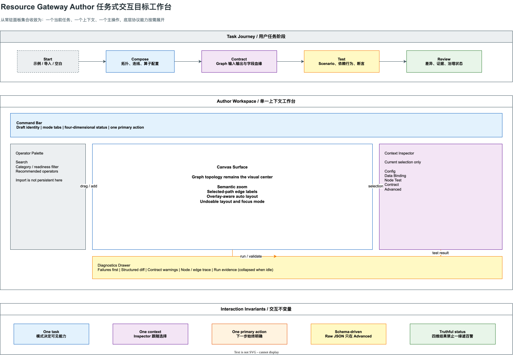

# Resource Gateway Author 任务式交互 UX 改善计划

> 状态：Proposed for Review
>
> 日期：2026-07-28
>
> 适用范围：Resource Gateway `/author/`、内嵌 Authoring Surface、VS Code 轻量宿主
>
> 目标版本：Author Workspace v2
>
> 核心判断：当前主要矛盾已经不是能力缺失，而是功能按照领域对象和协议对象平铺，用户任务没有成为界面的组织中心

相关文档：

- [Author 任务式交互 UX 实现状态](resource-gateway-author-task-oriented-ux-implementation-status.md)
- [Contract & Scenario Authoring 工业级体验演进计划](resource-gateway-contract-scenario-authoring-evolution-plan.md)
- [Contract & Scenario Authoring 实现状态](resource-gateway-contract-scenario-authoring-implementation-status.md)
- [BLOGE 通用可视化编排画布产品与系统说明](bloge-visual-canvas-product-and-system-guide.md)
- [Resource Gateway 画布 UX 目标与差距迭代日志](bloge-resource-gateway-canvas-ux-iteration-log.md)
- [Resource Gateway `/author/` 逐算子 UX 审查报告](bloge-resource-gateway-operator-ux-audit.md)

## 0. 执行摘要

Resource Gateway Author 当前已经能够：

- 导入 Operator Library；
- 导入存量 BLOGE DSL；
- 创建、连接和配置算子；
- 编辑 Graph input/output schema；
- 绑定 Runtime Context；
- 配置节点 fixture；
- 编辑 Decision Table 和 Transform；
- 运行 Operator/Graph Test Suite；
- 模拟整图并查看 Result；
- 打开 Contract & Scenario 工作台；
- 导出 GraphDraft、运行证据和治理资产。

这些能力单独看大多成立，但共同放进一个页面后形成了新的系统性问题：

1. 空白首屏同时出现太多入口和概念；
2. 同一动作在多个位置重复；
3. 画布不是视觉中心，而是被左右侧栏、顶部条带和悬浮控件挤压；
4. 节点双击后的编辑器没有优先展示该节点最核心的任务；
5. Schema 已经存在，但 UI 仍要求用户反复手写 JSON；
6. 执行成功、断言通过、契约健康和治理资格被压缩成一个绿色结果；
7. Auto Layout 解决了节点间距，却没有同时解决边标签、浮层遮挡和可读缩放；
8. 前端实现已经高度集中，继续在单体组件上叠加局部面板会持续放大交互熵和维护成本。

本计划不再把下一步定义为“继续微调局部组件”，而是把 `/author/` 重构为任务式工作台：

```text
Start
  ↓
Compose
  ↓
Contract
  ↓
Test
  ↓
Review
```

每一时刻只保留：

- 一个当前任务；
- 一个选中上下文；
- 一个主操作；
- 一组与当前任务相关的辅助信息。

底层 GraphDraft、Operator Library、Scenario、FixtureBundle、TestSuite 和 Run Evidence 协议继续作为权威数据模型。Author Workspace v2 负责把这些能力投影为面向业务作者的任务语言，不重建第二套执行协议。



图源：[resource-gateway-author-ux-target-workbench.drawio](assets/drawio/resource-gateway-author-ux-target-workbench.drawio)

## 1. 本计划与既有 UX 结论的关系

### 1.1 旧结论为什么不能继续直接使用

既有画布 UX 日志曾给出 `99/100` 的完成度。该评分证明的是：

- 26/26 operatorRef 可以从 palette 添加；
- 不同算子族有可辨识的视觉表达；
- Decision Table 和 Transform 有专属编辑能力；
- Inspector 能展示算子 contract/readiness；
- 桌面和移动端没有页面级横向溢出。

这些结论仍然有效，但评分量尺没有覆盖：

- 空白首屏的认知负担；
- 从导入到第一次成功运行的完整任务漏斗；
- 重复动作和作用域歧义；
- 节点浮层的信息优先级；
- Schema、实例值和运行证据之间的认知边界；
- 复杂图在缩放、布局和边标签条件下的可读性；
- “测试通过”是否会掩盖 Contract warning；
- 用户是否能够在不阅读手册的情况下完成主流程。

因此：

> 旧评分可以继续作为“算子表达覆盖率”的证据，不能再作为“Author 整体任务体验完成度”的结论。

Author Workspace v2 建立新的端到端 UX 量尺，旧量尺不删除，但其适用边界必须被明确标注。

### 1.2 与 Contract & Scenario 计划的关系

[Contract & Scenario Authoring 工业级体验演进计划](resource-gateway-contract-scenario-authoring-evolution-plan.md)
已经解决了 Contract、Schema、Scenario、Dependency Behavior、Expected Result 和 Run Evidence
的产品语义问题。

本计划解决的是更上层的交互编排问题：

| 层次 | 已有计划负责 | 本计划负责 |
|---|---|---|
| 领域语义 | Contract、Scenario、Evidence 的定义和生命周期 | 在什么任务阶段展示这些概念 |
| 协议映射 | Scenario 如何编译为既有 FixtureBundle/TestSuite | 如何避免协议对象泄漏到默认 UI |
| 工作台内容 | Interface、Scenarios、Compatibility、Evidence | 整个 Author 页面如何进入和切换这些工作台 |
| 节点测试 | Operator 与 Graph 共享测试模型 | 双击节点后默认看到什么、如何最短路径试跑 |
| Schema 编辑 | Schema-driven form 与 Raw JSON 无损往返 | Schema、运行值、绑定和结果在页面上的层次 |

两个计划必须合并实施，不能各自再建设一套导航、状态条或结果视图。

## 2. 浏览器审计事实基线

### 2.1 审计环境

| 项目 | 基线 |
|---|---|
| 日期 | 2026-07-28 |
| 页面 | `/author/`、`/rehearsals/` |
| 主视口 | 1280 × 720 |
| 示例 | Loan policy fallback |
| 图规模 | 5 nodes / 12 edges |
| 覆盖操作 | 空白首屏、加载示例、Decision Table 双击、Operator Test Suite、Runtime Context、Auto Layout、Canvas Focus、Rehearsals |

### 2.2 可量化事实

| 观察 | 当前结果 | 风险 |
|---|---:|---|
| 空白首屏可见交互控件 | 约 37 个 | 用户无法识别第一步 |
| 空白首屏可见按钮 | 约 28 个 | 主次操作失焦 |
| `Add operator` | 2 处 | 动作重复 |
| `Validate` | 2 处且 scope 不同 | 容易误判 Library/Graph 作用域 |
| `Simulate` | 加载图后最多 3 处 | 主操作不唯一 |
| 缩放控制 | 自定义工具栏和 React Flow 各一组 | 控制重复 |
| 示例初始 Fit 缩放 | 约 63% | 尚可阅读 |
| Auto Layout 后 Fit 缩放 | 约 44% | 节点和边标签进入不可读区 |
| Canvas Focus 后 Fit 缩放 | 约 63% | 说明 Focus 才是复杂图的合理主工作面 |

### 2.3 关键行为缺口

| 操作 | 用户直觉 | 当前行为 | 严重度 |
|---|---|---|---|
| 首次进入空白画布 | 选择一种开始方式 | 导入、示例、契约、测试、上下文同时出现 | P0 |
| 双击 Decision Table | 立即编辑规则 | 先进入通用详情，规则表在浮层下方 | P0 |
| 配置 Graph Input | 根据 Schema 填值 | 需要理解 Runtime Context，且不会自动生成必填项 | P0 |
| 运行 Test Suite | 看失败原因和字段差异 | 每个 case 展开大段 JSON，成功结果也占据大量空间 | P0 |
| 看到 `All passed` | 可以信任整体正确性 | 服务端仍可能存在绑定和输出 Contract warning | P0 |
| Auto Layout | 图更容易阅读 | 节点拉开后，边标签和悬浮层继续遮挡 | P0 |
| 查看复杂图整体形状 | 缩略图与编辑视图各司其职 | Fit All 直接把编辑视图缩到不可读 | P1 |
| 导入 Library/DSL | 一次性入口 | 两个大型导入区常驻左栏并把 palette 推到折叠线以下 | P1 |

### 2.4 具体实现债务

当前前端已经暴露出结构性信号：

| 文件 | 当前规模 | 影响 |
|---|---:|---|
| `AuthorCanvas.tsx` | 约 8,350 行 | 页面状态、业务流程、浮层和画布行为相互耦合 |
| `styles.css` | 约 8,246 行 | 样式作用域和布局回归难以隔离 |
| `AuthorCanvas.test.tsx` | 约 3,291 行 | 测试难以按用户任务定位 |
| `VisualAuthoringBrowserDomTest.java` | 约 4,179 行 | 浏览器断言很多，但仍偏 DOM 存在性而非任务可用性 |

Decision Table 浮层标题区当前存在四个子元素，但 CSS 只声明三列，已经造成 `Done`
按钮落入第二行。这不是孤立的 CSS 错误，而是单体组件持续追加能力后，布局契约没有独立所有者的结果。

## 3. 病根分析

### 3.1 页面按系统对象组织，不按用户任务组织

当前页面基本对应底层对象：

```text
Operator Library
Legacy DSL
Graph Contract
Runtime Context
Node Fixture
Test Suite
Selected Node
Result
```

但用户真正要完成的是：

```text
从某种来源开始
→ 形成拓扑
→ 补齐契约和绑定
→ 构造业务场景
→ 运行并判断是否可信
→ 导出或交给治理系统
```

当系统对象直接成为一级导航时，理解底层模型变成了使用产品的前置条件。

### 3.2 缺少渐进披露

高级能力本身没有错，错误在于默认全部可见：

- Raw Library Schema；
- Raw DSL；
- Raw Context JSON；
- Raw Fixture Override；
- Raw Expected Output；
- Advanced operator config；
- Contract/governance metadata。

这些能力应保留为专家逃生舱，而不是新用户的默认路径。

### 3.3 状态没有稳定的作用域

同一个页面同时出现：

- Library validation；
- Graph validation；
- Operator test；
- Graph test；
- Simulation result；
- Runtime readiness；
- Governance readiness。

状态名称相似，却没有持续展示 target 和 scope。最终形成“所有东西都绿了，但我不知道绿的是哪一层”。

### 3.4 画布布局只建模 Graph，没有建模 UI chrome

Auto Layout 只接收节点和边的信息，但实际可视区域还被以下元素占用：

- 左右侧栏；
- 顶部 journey、example、toolbar、contract 条带；
- 画布内 CTA；
- Minimap；
- React Flow controls；
- 边标签。

如果布局引擎不知道这些障碍物，节点不重叠也不等于信息不重叠。

### 3.5 Schema 能力没有转化为交互能力

系统已经知道：

- 哪些 Graph input 必填；
- 字段类型、enum、format 和约束；
- 节点端口 schema；
- 边的 source/target path；
- Expected Output schema。

但用户仍在手写字段路径和 JSON。底层形式化信息没有被用来消除交互成本。

### 3.6 成功状态压缩了多个真相

“运行完成”和“可以发布”不是一回事：

```text
Execution succeeded
Assertions passed
Contract has warnings
Governance blocked
```

如果 UI 只显示 `All passed`，就会把局部真相包装成整体真相，破坏工业级工具最重要的可信度。

## 4. 目标与非目标

### 4.1 产品目标

1. 新用户不阅读手册，也能在 5 分钟内加载一个示例并完成一次可信试跑。
2. 空白首屏能够在 10 秒内让用户理解四种主要开始方式。
3. 用户始终能回答“我现在在哪个阶段、正在编辑什么、下一步是什么”。
4. 普通 Graph/Operator 测试流程不要求手写 JSON。
5. 双击节点后，一个动作即可进入该节点最核心的编辑任务。
6. 复杂图可以在编辑视图和整体预览之间自然切换，不用牺牲二者。
7. 任何绿色状态都能明确说明自己覆盖的真相维度和剩余 warning。
8. `/author/`、VS Code 宿主和 Tool Studio 复用同一任务模型。

### 4.2 工程目标

1. GraphDraft 和现有 testing control plane wire contract 保持兼容。
2. UI 状态与 GraphDraft 领域状态分离，禁止把面板展开状态写入业务协议。
3. Author 功能按任务和上下文拆分，逐步降低单体组件规模。
4. 每个阶段都可通过 feature flag 独立回滚。
5. 浏览器测试从“元素存在”升级为“用户任务完成 + 视觉不碰撞”。
6. 大图布局、缩放和 edge label 策略可以通过纯函数和固定 fixture 回归。

### 4.3 非目标

本计划不做：

- 重写 BLOGE DSL 或执行引擎；
- 新建第二套 Fixture/TestSuite 协议；
- 让 Resource Gateway 接管 ANEKE registry 或 publish gate；
- 删除 Raw JSON、Raw DSL 或 API-first 工作方式；
- 把所有复杂 JSON Schema keyword 一次性做成图形化控件；
- 在第一阶段重写 React Flow；
- 为了视觉整洁而隐藏真实 Contract 或 Governance 问题；
- 把桌面编排器强行压缩成完整移动端编辑器。

## 5. 交互设计不变量

Author Workspace v2 必须遵守以下不变量。

### 5.1 一个当前任务

顶部模式固定为：

| 模式 | 用户任务 | 默认工作面 |
|---|---|---|
| Compose | 创建拓扑、连接算子、配置节点 | Canvas + Operator Palette |
| Contract | 定义 Graph 输入输出、约束和字段血缘 | Contract Workspace |
| Test | 定义 Scenario、测试数据、依赖行为和断言 | Scenario Workspace |
| Review | 查看验证、差异、Evidence 和治理反馈 | Diagnostics/Evidence Workspace |

模式决定默认可见内容，不让所有能力永久平铺。

### 5.2 一个选中上下文

右侧 Inspector 永远只解释当前选择：

- 未选择：Graph summary；
- 选择节点：Node inspector；
- 选择边：Edge binding inspector；
- 选择 Graph input/output 字段：Field lineage inspector；
- 选择 Scenario：Scenario summary；
- 选择运行：Run evidence summary。

禁止同一时刻同时展开 Graph、Node、Test、Runtime Context 和 Result 五个独立面板。

### 5.3 一个主操作

主操作由当前模式和阻断状态推导：

| 状态 | 主操作 |
|---|---|
| 空白 Graph | `Add first operator` |
| 已有节点但缺连接 | `Connect graph` 或保持无主 CTA |
| 缺必填 Graph Input | `Complete required input` |
| Contract invalid | `Fix contract` |
| 可运行但尚未试跑 | `Run scenario` |
| 断言失败 | `Review failures` |
| Contract warning | `Review contract warnings` |
| 全部满足 | `Export` 或 `Publish scenarios` |

同一动作不得在 journey、toolbar、canvas CTA 和 Inspector 中重复出现。

### 5.4 Schema 驱动，Raw 作为 Advanced

常用 object、array、primitive、enum、constraints 必须默认生成表单。

Raw JSON：

- 继续支持完整协议；
- 放在 `Advanced`；
- 切换前显示结构化视图与 Raw 的差异；
- 保证未知字段无损往返；
- 解析错误定位到 JSON Pointer；
- 不得成为完成 happy path 的必要步骤。

### 5.5 状态必须诚实

任何运行结果必须分别展示：

| 维度 | 回答的问题 |
|---|---|
| Execution | 图是否完成执行，哪些节点失败、超时、跳过或 fallback |
| Assertions | 业务预期是否满足，哪些 path 不一致 |
| Contract | Schema、绑定、Graph output 和兼容性是否干净 |
| Governance | Evidence class、权限、owner、gate 是否允许后续动作 |

只有四个维度都满足对应环境门槛时，才允许展示聚合的 `Ready`。

## 6. 目标信息架构

### 6.1 首次进入

首次进入空白页面只展示一个 Start 选择器：

| 入口 | 说明 | 完成后 |
|---|---|---|
| Load example | 选择带 Contract、Scenario 和 evidence 的完整样例 | 自动布局并进入 Compose |
| Import DSL | 导入存量 BLOGE DSL，可选再补 Operator Library | 自动解析、自动布局并显示推断置信度 |
| Import operator library | 导入合法 schema，再从 palette 组装 Graph | 导入成功后进入 Compose |
| Blank graph | 专家从空白开始 | 聚焦 operator search |

Start 选择器关闭后不再常驻。再次导入通过顶部 `Import` 命令打开同一对话框。

### 6.2 顶部 Command Bar

Command Bar 只保留：

1. Draft identity 和保存状态；
2. `Compose / Contract / Test / Review` 模式；
3. 四维状态摘要；
4. 一个上下文主操作；
5. `Import`、`Undo/Redo`、更多菜单。

以下内容不得继续各自占据独立横条：

- workflow journey；
- built-in example strip；
- toolbar；
- Graph Contract strip；
- 重复的 Simulate/Validate/Add Operator。

Graph Contract 状态进入 `Contract` 模式摘要；示例进入 Start/Import；画布工具进入紧凑图标工具栏。

### 6.3 左侧 Operator Palette

默认只承担：

- 搜索；
- 分类；
- readiness/filter；
- 推荐算子；
- 拖拽/点击添加；
- 最近使用。

Library 原文、DSL 原文和多个 example 按钮不再常驻。

Palette 支持：

- 220 至 360 px 可调整宽度；
- 折叠；
- 大 catalog 虚拟滚动；
- 键盘上下选择和 Enter 添加；
- 显示推荐入口，native alias 等高级入口放到 `Advanced` 分组；
- 长 operatorRef 显示业务名称，完整 ref 放 tooltip 和详情。

### 6.4 中央 Canvas Surface

Canvas 是 Compose 模式的绝对视觉中心：

- 1280 × 720 下占可用工作区至少 65%；
- Canvas Focus 不再是隐蔽模式，而是复杂图的自动推荐状态；
- Minimap、controls 和 CTA 不得遮挡节点或边；
- 画布空状态可以有一个主 CTA，出现首个节点后立即消失；
- 运行和验证结果通过节点/边状态和底部抽屉表达，不在画布中央盖浮层。

### 6.5 右侧 Context Inspector

Inspector 使用稳定标签页：

| Tab | 适用内容 |
|---|---|
| Config | 节点参数、策略、映射、规则入口 |
| Data | Graph Input、节点输入绑定、输出路径和来源 |
| Test | 节点级 Scenario、依赖行为、试跑 |
| Contract | 输入输出 schema、readiness、effect、owner |
| Advanced | Raw config、完整 operatorRef、runtime lowering、协议详情 |

不同节点可以隐藏不适用 Tab，但不得改变同一概念的位置。

### 6.6 底部 Diagnostics Drawer

底部抽屉统一承载：

- validation issues；
- compiler/schema warnings；
- test failures；
- structured diff；
- node/edge trace；
- run logs；
- evidence metadata；
- governance gate feedback。

规则：

- 空闲时折叠；
- 失败时自动展开到摘要高度；
- 失败项默认展开；
- 成功项默认折叠；
- 点击问题可跳转并聚焦对应 node、edge、field 或 Scenario；
- 支持严重度、scope 和状态筛选。

## 7. 核心任务流改造

### 7.1 从示例开始

目标步骤：

1. 打开 `/author/`；
2. 选择 `Load example`；
3. 查看每个示例的业务目标、Graph input/output、节点数和覆盖场景；
4. 载入后自动 Auto Layout；
5. 画布适配到可读缩放；
6. 主操作显示 `Run sample scenario`；
7. 运行后进入 Review 并展示四维结果。

验收：

- 不阅读文档可以完成；
- 从页面加载到运行点击不超过 5 个明确动作；
- 示例载入后不会继续占据永久横条；
- sample evidence 明确标记为 illustrative，不伪装成 server evidence。

### 7.2 导入 DSL

目标步骤：

1. 打开统一 Import；
2. 选择 DSL 文件或粘贴内容；
3. 系统扫描 operator、built-in function、依赖和数据路径；
4. 可选导入 Operator Library 提高推断精度；
5. 展示 exact/inferred/unknown 摘要；
6. 确认后自动生成拓扑并 Auto Layout；
7. unknown 节点不阻断拓扑阅读，但在 Contract/Review 中明确风险。

验收：

- 没有 Operator Library 也能完成可视化；
- 不要求用户先理解 Library Adapter；
- import warning 与 graph validation 分开；
- source mapping 可以从节点返回 DSL 原位置。

### 7.3 创建并连接算子

目标步骤：

1. 在 palette 搜索业务名称；
2. 拖到画布或 Enter 添加；
3. 从 output handle 拖到目标 input；
4. 兼容字段直接建立 binding；
5. 多候选时打开字段匹配 popover；
6. 不兼容时给出原因和可执行修复；
7. 选中边查看完整映射。

禁止：

- 只显示 `incompatible` 而不说明 path/type；
- 在边上永久展示所有字段映射；
- 为同一连接同时打开 modal 和 Inspector；
- 用颜色作为唯一兼容性信息。

### 7.4 配置初始输入

界面必须区分两个对象：

| 对象 | 含义 | 编辑位置 |
|---|---|---|
| Graph Input Contract | 调用方允许传入什么 | Contract 模式 |
| Run Input Values | 本次 Scenario 实际传入什么 | Test 模式 |

Run Input Values 从 Graph Input Contract 自动生成：

- 必填字段自动出现；
- enum 使用选择器；
- format 使用合适控件；
- 默认值和 example 可以一键采用，但必须标注来源；
- 缺值时显示 `3 required, 1 missing`，不能显示笼统 `ready`；
- 敏感字段默认遮罩且不进入日志；
- Graph Input 字段可以拖到节点 input，或通过 `Bind` 选择目标端口。

### 7.5 双击节点

双击进入节点专属编辑器，并直接打开该类型的核心 Tab：

| 类型 | 默认 Tab | 第一屏必须出现 |
|---|---|---|
| Decision Table | Rules | Condition/Output 列和规则行 |
| Transform | Mapping | source path、target path、expression |
| Resource/HTTP | Config 或 Data | request mapping、runtime binding/readiness |
| Foreach | Loop | collection、item、body/result contract |
| Streaming | Contract | request/event schema、runtime readiness |
| Generic Design Operator | Config | schema-driven config 或设计态说明 |

统一浮层规则：

- 标题持续显示 node label、operatorRef 和 readiness；
- Tab 为 `Primary editor / Inputs & Outputs / Test / Contract / Advanced`；
- footer 固定为 `Cancel` 和 `Apply to draft`；
- 右上角只保留关闭图标；
- 有未保存内容时关闭必须确认；
- `Done` 不再同时承担保存和关闭的模糊语义；
- 浮层打开后焦点进入核心编辑区，Escape 遵循脏状态规则。

### 7.6 创建和运行 Scenario

目标编辑结构：

```text
Given
  Graph Input

Dependencies
  Node / invocation → REAL | RETURN | ERROR | DELAY | TIMEOUT | REPLAY | OBSERVE | DENY

Then
  path / operator / expected
```

普通用户使用：

- Schema 表单填写 Graph Input；
- 选择节点后设置依赖行为；
- 使用 assertion builder 设置 path、比较符和期望值；
- 从一次实际运行中捕获 draft expected result；
- 单行或批量运行 Scenario。

Raw JSON 只用于：

- 不受原生表单支持的复杂结构；
- 精确粘贴协议 payload；
- 专家调试；
- 无损查看编译结果。

### 7.7 查看测试结果

结果层次固定为：

1. 四维状态摘要；
2. blocker 和 warning；
3. failed Scenario；
4. field-level diff；
5. node/edge trace；
6. passed Scenario；
7. Raw actual/evidence。

当 assertion 全部通过但 Contract 存在 warning 时，显示：

```text
Assertions passed 2/2
Contract warnings 9
Promotion blocked
```

禁止显示单独的全局绿色 `All passed`。

## 8. Canvas、Auto Layout 与缩放专项

### 8.1 编辑视图与 Overview 分离

当前 `Fit All` 同时承担“编辑”和“看整体形状”，目标中拆成：

| 操作 | 目标 |
|---|---|
| Fit Selection | 保证选中节点及一跳依赖可读 |
| Fit Graph | 尽可能完整展示，遵守最低编辑缩放 |
| Overview | 允许更低缩放，只表达拓扑形状和状态热区 |
| Focus Path | 只突出选中节点的上下游路径 |

Overview 可以隐藏节点正文和边标签，不能把不可读的小字当作完整编辑模式。

### 8.2 语义缩放

建议初始阈值：

| Zoom | 节点 | 边 |
|---:|---|---|
| `>= 0.70` | 完整 label、ports、readiness | 选中路径完整字段，普通边摘要 |
| `0.45 - 0.69` | compact node、关键状态 | 普通边只显示 `N fields`，选中边显示详情 |
| `< 0.45` | shape、类型、状态色和短名称 | 默认隐藏 label，只保留方向和异常状态 |

阈值必须通过 5、25、100 节点 fixture 视觉验证后调整，不能只凭单个示例决定。

### 8.3 边标签规则

1. 边标签不再永久展示完整字段映射；
2. 默认显示字段数量或业务摘要；
3. hover、selection、Focus Path 时显示完整映射；
4. 多条平行边可以聚合为 bundle；
5. label placement 参与碰撞检测；
6. warning/error label 优先级高于普通数据 label；
7. 标签不覆盖 source/target node；
8. 点击 label 打开 Edge Inspector，而不是扩大画布内文本。

### 8.4 Overlay-aware layout

Auto Layout 输入除了 nodes/edges，还必须包含：

- 可用 viewport；
- 左右 panel inset；
- Command Bar inset；
- Diagnostics Drawer inset；
- Minimap/controls reserved region；
- node measured size；
- edge label estimated bounds；
- group/subgraph bounds；
- pinned/manual nodes。

目标函数按优先级优化：

1. 节点不重叠；
2. 节点不进入 overlay reserved region；
3. edge 不穿越无关节点；
4. edge label 不覆盖节点和关键 label；
5. 保持拓扑方向和层次；
6. 尽量减少交叉；
7. 在可读前提下提高信息密度；
8. 尽量保留用户手工调整和 pinned nodes。

Auto Layout 必须可撤销，并显示本次移动了多少节点。

### 8.5 Minimap 和 Canvas controls

- Minimap 默认可折叠；
- 展开时占用预留区域，布局引擎知道其 bounds；
- 复杂图自动建议打开 Overview，而不是强制展开 Minimap；
- 只保留一组 zoom controls；
- toolbar 使用图标和 tooltip；
- 不在 canvas 中央放永久 Run CTA。

## 9. 状态、反馈和错误恢复

### 9.1 状态聚合规则

聚合状态采用最严重问题优先：

```text
BLOCKED > FAILED > WARNING > RUNNING > READY > NOT_RUN
```

但聚合状态不能替代四维明细。

### 9.2 Scope 标识

每个问题必须带：

- target：Graph / Operator；
- scope：Library / Contract / Node / Edge / Scenario / Run / Governance；
- coordinate：nodeId、edgeId、JSON Pointer、scenarioId 或 runId；
- severity；
- cause；
- recommended action；
- source：client validation / compiler / runtime / governance feedback。

### 9.3 错误恢复

| 错误 | 恢复动作 |
|---|---|
| Library parse error | 保留原文并定位行列，不清空输入 |
| DSL partial inference | 继续渲染已知拓扑，unknown 进入 Review |
| Schema invalid | 定位字段，保留未提交编辑 |
| Edge binding stale | 高亮边并提供 Rebind |
| Scenario stale | 进入 Compatibility，禁止静默迁移 |
| Run timeout | 保留 partial trace，允许按相同输入重跑 |
| API unavailable | 明确 capability 缺失与 sample fallback，不显示通用 `Request failed` |
| Save conflict | 展示 revision diff，允许 reload 或显式 merge |

## 10. 术语和文案

### 10.1 默认业务语言

| 当前/底层术语 | 默认 UI | Advanced/API |
|---|---|---|
| Runtime Context | Graph Input | `context` |
| Node Fixture | Dependency Response | `nodeFixture` |
| Fixture Override | Scenario Override | `fixtureOverride` |
| FixtureBundle | Published Test Data | `FixtureBundle revision` |
| Expected Output | Expected Result | assertion payload |
| Validate | Validate Library / Validate Graph / Validate Contract | exact endpoint/action |
| Simulate | Run Scenario | simulate request |

### 10.2 文案规则

- 按用户目标命名，不按后端类名命名；
- 同一个动作只使用一个动词；
- 所有 Validate 必须带 scope；
- readiness 必须解释阻断原因；
- 错误代码先翻译为业务原因和行动建议，Raw code 放 Details；
- 不使用 `ready` 表示“对象存在”，只表示满足当前阶段门槛；
- 不用长篇页面说明替代正确的信息架构。

## 11. 前端工程改造

### 11.1 不再继续扩大 AuthorCanvas 单体

建议目标模块：

```text
src/author/
  shell/
    AuthorWorkspace.tsx
    AuthorCommandBar.tsx
    StartImportDialog.tsx
    authorWorkspaceState.ts
    primaryActionResolver.ts
  compose/
    OperatorPalette.tsx
    CanvasSurface.tsx
    ContextInspector.tsx
    canvasViewportModel.ts
    semanticZoom.ts
  node-editor/
    NodeEditorDialog.tsx
    NodeEditorRegistry.ts
    editors/
      DecisionTableEditor.tsx
      TransformEditor.tsx
      ResourceEditor.tsx
      ForeachEditor.tsx
      StreamingEditor.tsx
      GenericOperatorEditor.tsx
  test/
    ScenarioList.tsx
    GraphInputEditor.tsx
    ScenarioResultView.tsx
  review/
    DiagnosticsDrawer.tsx
    ValidationSummary.tsx
    RunEvidenceView.tsx
  shared/
    ScopeBadge.tsx
    StatusSummary.tsx
    ResizablePanel.tsx
```

现有 `contract-scenario/` 继续作为 Contract/Scenario 的领域和编辑能力来源，不复制：

- `SchemaValueForm`；
- `AssertionBuilder`；
- `DependencyBehaviorEditor`；
- `ContractScenarioWorkspace`；
- compatibility 和 scenario compiler。

### 11.2 状态边界

分离三类状态：

| 状态 | 示例 | 存储 |
|---|---|---|
| Domain state | GraphDraft、ScenarioDraft、Contract | 既有 draft/API |
| Workspace state | mode、selection、panel size、active tab | URL + local UI state |
| Ephemeral state | hover、popover、drag、pending command | component/reducer |

禁止：

- 把 panel 开关写入 GraphDraft；
- 让 selection 隐式改变业务数据；
- 多个组件各自推导不同 validation summary；
- 用 DOM 查询作为核心业务状态来源。

### 11.3 Node Editor Registry

Node Editor 的选择由注册表决定：

```text
operator visual kind
  + operator library ux.editorHint
  + runtime readiness
  → editor descriptor
```

descriptor 至少定义：

- default tab；
- supported tabs；
- primary editor component；
- validation adapter；
- test target adapter；
- save/apply semantics；
- fallback editor。

没有专属编辑器的算子必须进入 Generic Schema-driven Editor，不能凭 tag 猜测错误编辑器。

### 11.4 状态聚合器

新增单一 `AuthorReadinessProjection`，聚合：

- client validation；
- DSL/compiler diagnostics；
- simulation execution；
- assertions；
- Contract compatibility；
- governance gate feedback。

如果服务端 warning 当前只写日志，必须把 versioned diagnostics 加入对应响应或查询 API。UI 不得从日志文本猜测。

### 11.5 样式边界

将全局 `styles.css` 按 feature 拆分，至少形成：

```text
author-shell.css
canvas.css
node-editor.css
scenario.css
diagnostics.css
shared-controls.css
```

要求：

- 每个 feature 有稳定根 class；
- dialog header/footer 使用共享布局组件；
- z-index 使用 token；
- panel/toolbar/overlay 尺寸使用 CSS variables；
- 画布布局服务读取同一组 inset token；
- 禁止继续通过全局后代选择器修补单个浮层。

## 12. 协议和后端影响

### 12.1 初始阶段不改的协议

以下继续作为权威协议：

- GraphDraft；
- OperatorLibrary；
- GraphContract；
- ScenarioDraftSet；
- FixtureBundle；
- TestSuite；
- RunTrace/Evidence。

### 12.2 可能需要的兼容增强

| 增强 | 原因 | 兼容策略 |
|---|---|---|
| versioned diagnostics projection | 前端必须看到 compiler/schema warning | 新增可选字段或独立 endpoint |
| editor hint | 用户库算子选择专属编辑器 | Operator Library schema 增加可选 `ux` |
| field lineage projection | Contract 字段跳转节点/边 | 独立只读 projection |
| layout metadata | 保存 pinned/group/manual intent | GraphDraft 扩展可选 visual metadata |
| UI deep link state | 定位 mode/node/run | URL query/hash，不进入 GraphDraft |

所有新增字段必须：

- optional-first；
- unknown-field tolerant；
- 有 protocol version；
- 有 round-trip test；
- 不改变既有执行语义。

## 13. 分阶段实施计划

排期假设：

- 2 名前端工程师；
- 1 名产品/UX 持续参与；
- 1 名后端工程师按 diagnostics/lineage 需求投入；
- QA 与真实浏览器验证贯穿每个阶段；
- 总体约 8 至 10 周，不包含大型新协议评审等待时间。

### Stage 0：建立新量尺和保护网

周期建议：3 至 5 个工作日。

交付：

1. 冻结 0、5、25、100 节点 UX fixture；
2. 记录当前首屏控件数、任务点击数、canvas 可用面积；
3. 建立四条端到端基线任务；
4. 增加 screenshot 和 DOM collision 采集；
5. 给旧 UX 评分补充适用边界；
6. 定义 Author Workspace v2 feature flag；
7. 修复 Decision Table header 四列布局问题，作为独立 quick win。

退出门禁：

- 基线可重复；
- 新旧 UI 可在同一构建切换；
- 不依赖人工目测才能发现 node/edge/overlay overlap；
- 旧功能回归全绿。

### Stage 1：任务式 Shell 纵切

周期建议：1 至 2 周。

交付：

1. Start/Import Dialog；
2. Command Bar；
3. `Compose / Contract / Test / Review` 模式；
4. Library/DSL/examples 从常驻左栏迁出；
5. 重复 Simulate/Validate/Add/Zoom 收敛；
6. 左 Palette、中央 Canvas、右 Inspector、底部 Drawer 基础布局；
7. panel resize/collapse；
8. URL 保存 mode 和 selection；
9. 保留旧能力入口的兼容映射。

退出门禁：

- 空白首屏永久可见按钮不超过 12 个；
- 主操作最多 1 个；
- Canvas 在 1280 × 720 下占可用工作区至少 65%；
- 示例、DSL、Library 三条开始路径都能完成；
- GraphDraft 序列化结果与旧 UI 等价。

### Stage 2：节点专属编辑与数据绑定

周期建议：1 至 2 周。

交付：

1. NodeEditorRegistry；
2. Decision Table 双击直达 Rules；
3. Transform 双击直达 Mapping；
4. Resource/HTTP/Foreach/Streaming/Generic 默认 Tab；
5. 统一 dialog header/footer 和脏状态；
6. Graph Input Contract 与 Run Input Values 分离；
7. 必填输入自动生成；
8. Graph Input 到节点 input 的 drag/bind；
9. Inspector 稳定 Tab。

退出门禁：

- 双击 Decision Table 后规则表位于首屏；
- 双击所有内置算子都有可预测结果；
- 示例 required input 无需手写 path；
- `ready` 与 Schema 校验一致；
- keyboard focus、Escape 和 Apply/Cancel 行为一致。

### Stage 3：Schema-driven Test 与可信状态

周期建议：2 周。

交付：

1. Graph Input Schema form；
2. Dependency Behavior 图形编辑；
3. Assertion Builder；
4. Raw JSON Advanced；
5. failures-first result；
6. passed case collapse；
7. 四维状态；
8. diagnostics response/projection；
9. 点击 warning 跳转 node/edge/field；
10. Operator 和 Graph 共用结果模型。

退出门禁：

- 内置核心 Scenario 不编辑 JSON 即可完成；
- assertion passed 但 Contract warning 时不能出现全局纯绿；
- 失败能定位到具体 JSON Pointer 或 node/edge；
- UI 与服务端 diagnostics 数量一致；
- Test Suite 演示数据全部可运行。

### Stage 4：大图可读性与 Auto Layout

周期建议：1 至 2 周。

交付：

1. semantic zoom；
2. edge label 摘要/选择策略；
3. Overview；
4. Focus Selection/Path；
5. overlay-aware layout insets；
6. label collision 检测；
7. pinned node 和 undo layout；
8. Minimap reserved region；
9. 25/100 节点性能优化。

退出门禁：

- 5、25、100 节点 fixture 不存在 node-node overlap；
- 关键 edge label 不覆盖节点；
- Auto Layout 后主路径在推荐编辑缩放下可读；
- Overview 能完整判断拓扑形状；
- layout 可撤销；
- 100 节点交互不出现明显主线程冻结。

### Stage 5：可访问性、遥测与灰度

周期建议：1 周。

交付：

1. keyboard navigation；
2. dialog focus trap；
3. 对比度和非颜色状态表达；
4. 390 px 只读/轻编辑降级；
5. 任务漏斗 telemetry；
6. v1/v2 对照用户测试；
7. feature flag 灰度；
8. 产品手册和截图更新；
9. 旧 Shell 下线条件评审。

退出门禁：

- 关键任务键盘可达；
- 没有严重 axe/a11y 问题；
- 真实用户测试达到第 15 节指标；
- 回滚不影响 GraphDraft 和 Scenario 数据；
- 文档截图与 v2 页面一致。

## 14. 可直接拆分的工作项

| ID | 优先级 | 工作项 | 依赖 | 主要验收 |
|---|---|---|---|---|
| UX-001 | P0 | 新 UX 基线 fixture 与任务脚本 | 无 | 0/5/25/100 节点可重复 |
| UX-002 | P0 | Author Workspace v2 feature flag | UX-001 | 可无损切换 v1/v2 |
| UX-003 | P0 | Start/Import Dialog | UX-002 | 四种入口统一 |
| UX-004 | P0 | Command Bar 与 mode state | UX-002 | 单一模式、单一主操作 |
| UX-005 | P0 | 移除常驻 Library/DSL/example 区 | UX-003 | palette 首屏可见 |
| UX-006 | P0 | 合并重复操作和 zoom controls | UX-004 | 重复数为 0 |
| UX-007 | P0 | Context Inspector shell | UX-004 | 只跟随当前 selection |
| UX-008 | P0 | Diagnostics Drawer shell | UX-004 | 错误统一承载 |
| UX-009 | P0 | Decision Table header quick fix | 无 | Done/Apply 不换行 |
| UX-010 | P0 | NodeEditorRegistry | UX-007 | 每类节点有确定 editor |
| UX-011 | P0 | Decision Table 直达 Rules | UX-010 | 首屏直接编辑规则 |
| UX-012 | P0 | Graph Input/Run Input 分离 | UX-004 | contract/value 不混淆 |
| UX-013 | P0 | Required input Schema form | UX-012 | 不手写 JSON |
| UX-014 | P0 | 四维 readiness projection | UX-008、后端 diagnostics | 不再一绿遮百警 |
| UX-015 | P0 | Failures-first result view | UX-008、UX-014 | failed 展开、passed 折叠 |
| UX-016 | P0 | Assertion Builder 集成 | 现有 contract-scenario | path/operator/expected |
| UX-017 | P0 | Dependency Behavior 集成 | 现有 contract-scenario | 常用行为图形化 |
| UX-018 | P1 | Edge label semantic zoom | Canvas state | 低缩放不堆字 |
| UX-019 | P1 | Overview/Focus Path | UX-018 | 预览和编辑分离 |
| UX-020 | P1 | Overlay-aware layout | UX-018 | 不进入 reserved region |
| UX-021 | P1 | Layout undo/pinned nodes | UX-020 | 保留用户意图 |
| UX-022 | P1 | URL/deep link mode state | UX-004 | node/run 可直达 |
| UX-023 | P1 | Palette 虚拟化与推荐分层 | UX-005 | 大库仍可用 |
| UX-024 | P1 | 用户术语统一 | UX-003 至 UX-017 | 默认 UI 不暴露 FixtureBundle |
| UX-025 | P1 | Browser visual/collision gate | UX-001 | CI 可拦截重叠 |
| UX-026 | P2 | Telemetry 和 v1/v2 对照 | Stage 1 完成 | 以任务成功率决策 |
| UX-027 | P2 | Rehearsals 错误码业务化 | 无 | 原始 code 降到 Details |
| UX-028 | P2 | 移动端只读/轻编辑模式 | Stage 4 完成 | 不伪装完整桌面体验 |

## 15. 验收指标

### 15.1 任务指标

| 指标 | 当前基线 | v2 目标 |
|---|---:|---:|
| 新用户发现第一步 | 未稳定 | 10 秒内 |
| 加载示例并完成第一次运行 | 需理解多区域 | 5 分钟内，成功率 ≥ 80% |
| 从空白添加第一个算子 | 多入口竞争 | 60 秒内 |
| 为 required Graph Input 提供值 | 需要理解 context/path | 2 分钟内，无 Raw JSON |
| 双击 Decision Table 到编辑首条规则 | 需要滚动查找 | 1 次双击后立即可编辑 |
| 定位失败字段 | 主要看整段 JSON | 2 次操作内定位 path/node |
| persistent 主操作 | 多个 | 1 个 |
| 重复动作 | 多组 | 0 |

### 15.2 视觉指标

| 指标 | 目标 |
|---|---|
| Canvas 可用面积 | 1280 × 720 下 ≥ 65% workspace |
| Node overlap | 固定 fixture 为 0 |
| Node 与关键 edge label overlap | 为 0 |
| Overlay 遮挡 node/edge | 为 0 |
| 最低编辑缩放 | 经验证后固定，不以 Fit All 强制突破 |
| Text truncation | 有 tooltip，业务主名称不无提示截断 |
| Dialog action wrap | 1280、1440、390 目标模式下为 0 |

### 15.3 可信度指标

| 指标 | 目标 |
|---|---|
| UI 与服务端 warning 数量一致 | 100% |
| assertions passed + contract warning 仍显示纯绿 | 0 次 |
| 问题可定位到 scope/coordinate | ≥ 95% |
| Raw JSON parse error 有 pointer/line | 100% |
| stale Scenario 静默迁移 | 0 次 |

### 15.4 性能指标

| 场景 | 目标 |
|---|---|
| 常规选择、切换 Tab | p95 < 100 ms |
| 25 节点 semantic zoom | 保持流畅交互 |
| 100 节点 pan/zoom | 不阻塞主线程超过 200 ms |
| Auto Layout | 5/25 节点 < 1 s，100 节点提供进度/取消 |
| 大 Operator Library 搜索 | 输入后 100 ms 内反馈 |

## 16. 测试与验证策略

### 16.1 单元测试

覆盖纯模型：

- `primaryActionResolver`；
- `AuthorReadinessProjection`；
- mode/selection reducer；
- semantic zoom thresholds；
- edge label visibility；
- layout insets；
- node editor resolution；
- terminology projection；
- Schema required/value readiness。

### 16.2 组件测试

覆盖：

- Start/Import 各路径；
- Command Bar 只出现一个主操作；
- Inspector 根据 selection 切换；
- Decision Table 默认 Rules；
- Graph Input required field 自动出现；
- Test result passed collapse/failed expand；
- four-dimension status；
- Advanced Raw 无损往返；
- dialog dirty close。

### 16.3 浏览器任务测试

至少固定以下流程：

1. `Load example → Auto Layout → Run → Review warnings`；
2. `Import DSL without library → inspect inferred node → Run exploratory scenario`；
3. `Blank graph → add operators → connect → bind Graph Input → Test`；
4. `Decision Table → add multiple inputs/outputs/rules → Apply → canvas summary matches`；
5. `Operator Test → dependency behavior → assertion → run`；
6. `100-node graph → Overview → Focus Path → Fit Selection`。

浏览器测试不仅断言元素存在，还要断言：

- 主操作数量；
- 当前 mode；
- focus；
- bounding box overlap；
- label visibility；
- panel inset；
- screenshot；
- run/contract/governance 状态一致。

### 16.4 视觉矩阵

| 视口 | 用途 |
|---|---|
| 1280 × 720 | 最小桌面主验收 |
| 1440 × 900 | 标准开发机 |
| 1920 × 1080 | 宽屏信息密度 |
| 390 × 844 | 移动端降级 |

Graph fixture：

- 0 nodes；
- 5 nodes / 12 edges；
- 25 nodes / 50 edges；
- 100 nodes / 250 edges；
- 长 label、多 parallel edge、错误状态、collapsed group。

### 16.5 人工可用性测试

参与者至少包括：

- 未接触 BLOGE 的业务分析/实施人员；
- 熟悉 DSL 的工程师；
- Operator Library 维护者；
- 测试/治理人员。

要求每类至少 3 人完成相同任务，记录：

- 首次停顿点；
- 求助次数；
- 错误路径；
- 完成时间；
- 对 Contract/Graph Input/Scenario 的复述是否正确；
- 对绿色状态含义的理解是否正确。

## 17. 风险、降级与回滚

| 风险 | 根因 | 根治/缓解 |
|---|---|---|
| 只换导航，旧面板仍全部塞回新 Tab | 没有删除和合并能力 | 每个 Stage 设 persistent controls 和主操作数量门禁 |
| v2 与 v1 对 GraphDraft 产生不同结果 | 表单投影丢字段 | canonical round-trip、unknown field preservation |
| 四维状态缺少服务端 diagnostics | warning 只存在日志 | versioned diagnostics projection，未接入前不得宣称可信聚合 |
| Auto Layout 再次只优化节点 | 目标函数过窄 | 固定 label/overlay collision fixture |
| feature 模块拆分变成大爆炸重构 | 追求目录整洁而非任务纵切 | 每阶段按可运行用户流程迁移，不先空拆所有文件 |
| Raw JSON 被藏得过深 | 专家效率下降 | Advanced 保留快捷入口和完整协议预览 |
| 新手模式损害复杂能力 | 过度简化 | progressive disclosure，不删除底层表达力 |
| 移动端承诺过度 | 复杂画布天然需要空间 | 明确只读/轻编辑降级，不复制桌面全部能力 |
| 旧深链失效 | mode 和 dialog 路由变化 | deep-link compatibility adapter |
| 用户不信任自动迁移 | 系统静默改数据 | diff、确认、undo、revision lineage |

回滚原则：

1. v2 Shell 可以 feature flag 回到 v1；
2. GraphDraft/Scenario 数据不回滚；
3. 新增 UI preference 使用独立版本命名空间；
4. 新协议字段 optional-first，旧客户端继续读取；
5. 每阶段只有通过 round-trip 和 browser task gate 才扩大灰度。

## 18. Definition of Done

### 产品

- [ ] Start、Compose、Contract、Test、Review 形成完整任务闭环；
- [ ] 空白首屏不再暴露所有高级协议对象；
- [ ] 页面始终只有一个明确主操作；
- [ ] Decision Table、Transform 和其它算子双击行为符合类型直觉；
- [ ] Graph Input Contract 和 Run Input Values 不再混淆；
- [ ] Test 核心流程不要求 Raw JSON；
- [ ] 复杂图同时具备可读编辑和完整 Overview。

### 正确性

- [ ] Execution、Assertions、Contract、Governance 四维结果可独立解释；
- [ ] warning 不会被 `All passed` 隐藏；
- [ ] UI 状态与服务端 diagnostics 一致；
- [ ] GraphDraft 和 Scenario round-trip 无损；
- [ ] stale/compatibility 问题有明确恢复流程。

### 工程

- [ ] Author shell、canvas、node editor、test、review 有明确模块边界；
- [ ] `AuthorCanvas.tsx` 不再承担所有新增能力；
- [ ] layout 和 semantic zoom 是可测试纯模型；
- [ ] v1/v2 可以灰度和回滚；
- [ ] 不新增第二套测试运行协议。

### 验证

- [ ] 0/5/25/100 节点浏览器视觉矩阵通过；
- [ ] node/edge/overlay collision 门禁通过；
- [ ] 关键任务在 1280 × 720 下完成；
- [ ] 键盘和 focus 行为通过；
- [ ] 用户测试达到第 15 节指标；
- [ ] 产品手册和截图同步到 v2。

## 19. 评审决策点

建议本轮优先确认：

| 决策 | 推荐 | 不确认的后果 |
|---|---|---|
| D1：一级模式 | `Compose / Contract / Test / Review` | 页面继续按对象堆面板 |
| D2：导入入口 | 统一 Start/Import Dialog | Library/DSL 永久挤占 palette |
| D3：节点浮层动作 | `Cancel / Apply to draft` + close icon | `Done` 继续语义不明 |
| D4：状态模型 | 四维状态 + 受门槛约束的聚合状态 | 工业级可信度无法建立 |
| D5：Raw JSON | 默认隐藏在 Advanced，保持无损 | 要么门槛过高，要么专家能力受损 |
| D6：复杂图策略 | 编辑视图与 Overview 分离 | Fit All 继续制造不可读画布 |
| D7：工程迁移 | feature flag 下按纵切迁移 | 大爆炸重构风险过高 |
| D8：移动端定位 | 只读/轻编辑降级 | 为虚假的全功能适配持续付出复杂度 |

## 20. 推荐开工顺序

建议第一批只开一条完整纵切：

```text
Start/Import
  → Compose Shell
  → Load Loan Policy Example
  → Single Primary Action
  → Run Sample Scenario
  → Four-dimension Review
```

这条纵切会同时验证：

- 新信息架构是否比旧页面更直观；
- 示例是否能承担 onboarding；
- Command Bar 是否真正消除重复动作；
- Diagnostics Drawer 是否能承载可信结果；
- Contract/Scenario 现有能力是否可以被新 Shell 复用；
- 新旧 GraphDraft 是否保持等价。

第一条纵切通过后，再推进 Node Editor、Schema-driven Input 和大图布局。不要先投入一轮新的颜色、间距和卡片微调；在任务结构没有收敛前，局部美化只会让错误的信息架构显得更精致。
