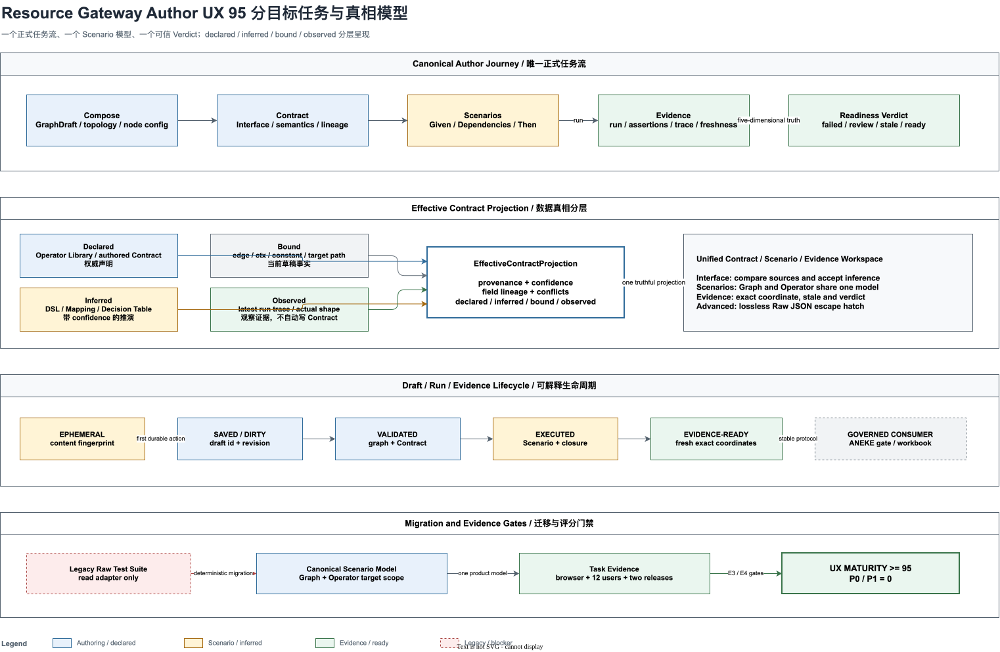
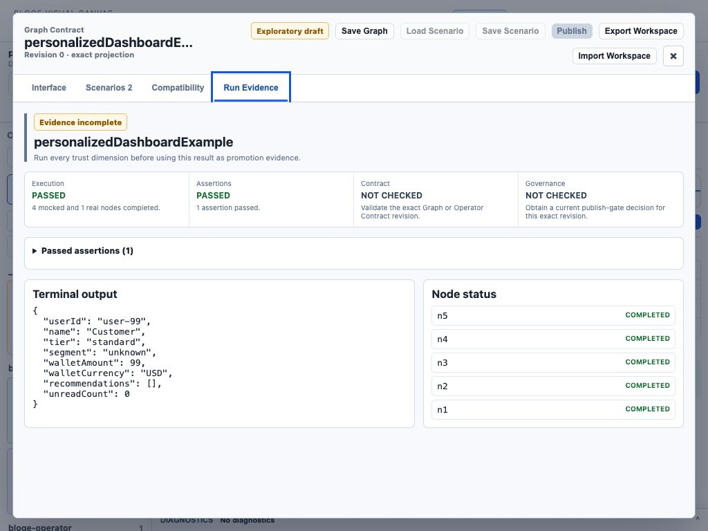
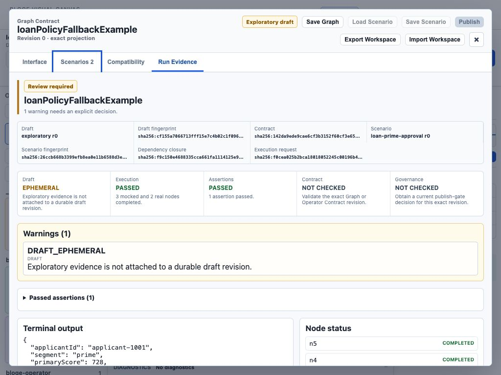
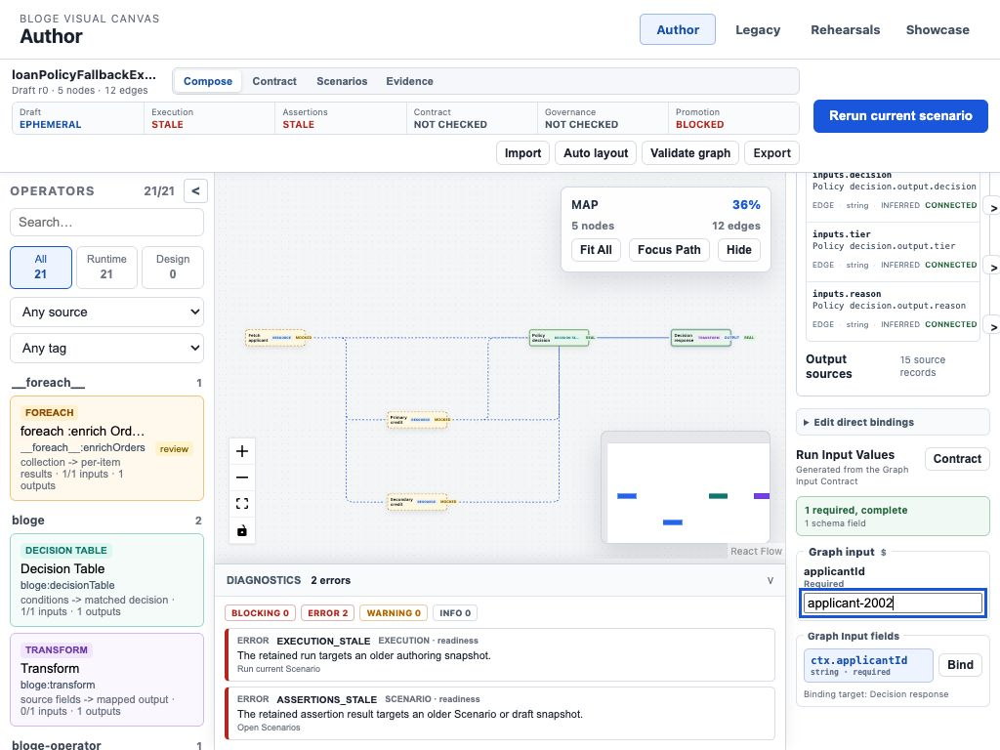
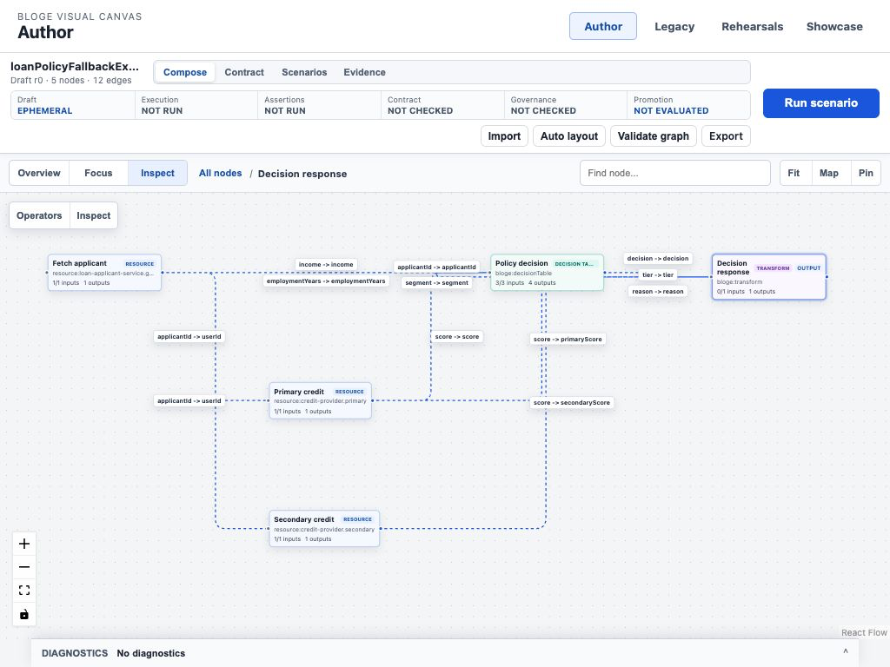
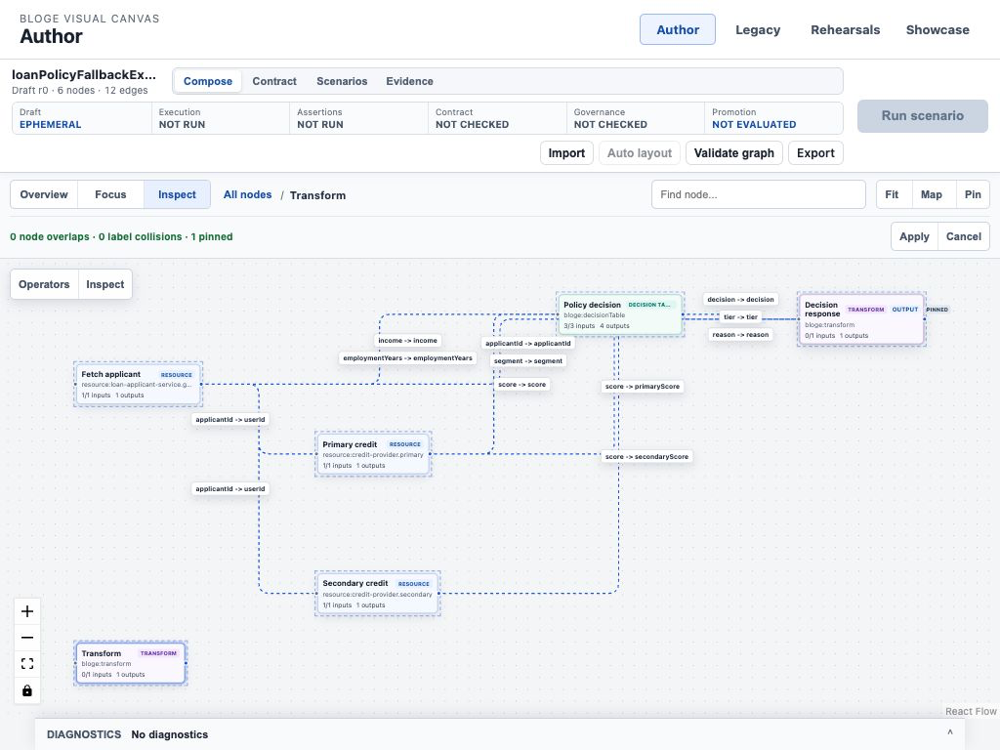
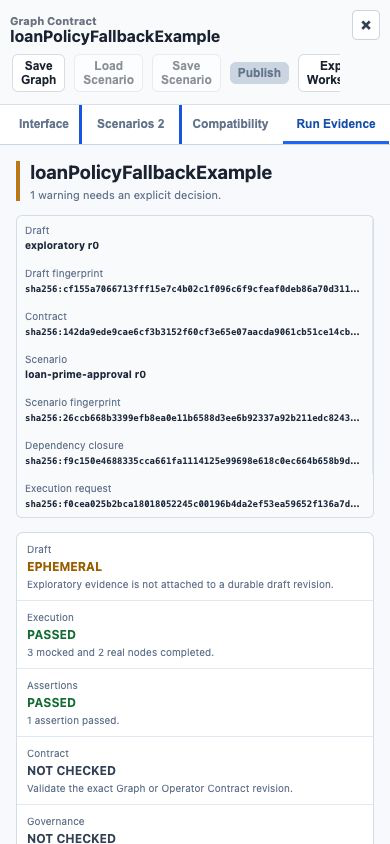

# Resource Gateway Author UX 体验成熟度 95 分提升计划

> 历史计划说明：本文保留 2026-07-29 Stage 0–4 的实施记录和当时的工程评分。
> 2026-07-31 的最新真实浏览器复评发现，后续 Library Authoring、Operator Test、Fixture
> 与 Evidence 能力重新引入了双层工作台、所见非所得和复杂图可读性回归。当前状态、重新
> 校准的 `74 / 100` 基线及后续开工计划以
> [Resource Gateway 体验成熟度 95 分校准与修正计划](resource-gateway-ux-maturity-95-recalibration-plan.md)
> 为准。

> 状态：Engineering Implementation Complete — Stage 0-4 completed, Stage 5 user validation pending
>
> 日期：2026-07-29
>
> 目标：将 Author Workspace v2 从基线约 61 分提升到可被真实任务证据证明的 95 分；Stage 4 工程复评为 95 分，E2 证据上限仍为 89 分
>
> 适用范围：`/author/`、Operator Contract、Graph Contract、Scenario、Run Evidence、VS Code 宿主和 ANEKE deep link
>
> 核心决策：以统一的 Contract / Scenario / Evidence 工作台替代并行测试入口，以 Effective Contract 投影真实呈现数据流，以显式 Draft / Run / Evidence 生命周期保证状态可信

相关文档：

- [Resource Gateway Author 任务式交互 UX 改善计划](resource-gateway-author-task-oriented-ux-improvement-plan.md)
- [Resource Gateway Author 任务式交互 UX 实现状态](resource-gateway-author-task-oriented-ux-implementation-status.md)
- [Contract & Scenario Authoring 工业级体验演进计划](resource-gateway-contract-scenario-authoring-evolution-plan.md)
- [Contract & Scenario Authoring 实现状态](resource-gateway-contract-scenario-authoring-implementation-status.md)
- [BLOGE Visual Canvas 产品与系统说明](bloge-visual-canvas-product-and-system-guide.md)

## 0. 执行摘要

Author Workspace v2 已经完成了重要的结构升级：

- `/author/` 已成为 v2 默认入口；
- Start / Import 将示例、DSL、Operator Library 和空白画布收敛到统一入口；
- Compose / Contract / Scenarios / Evidence 形成了唯一任务式导航；
- Graph Input、Context binding、Operator 专属编辑、Scenario、Run Evidence、Diagnostics 和语义缩放均已有实现；
- 内置复杂示例可以完成加载、运行和结果展示；
- 键盘焦点、无 payload 遥测、真实浏览器测试和 Legacy 回滚路径已经建立。

但这些能力“分别存在”不等于用户已经获得成熟体验。2026-07-29 的 Stage 0 真实浏览器
基线走查显示，当时系统仍存在四个结构性问题：

1. **测试入口分裂**：结构化 `Contract -> Scenarios` 与 Raw JSON `Test Suite` 同时作为正式入口。
2. **状态真相分裂**：运行通过、9 个 DSL warning、Graph 未保存和 Evidence 未绑定同时出现，用户无法形成唯一结论。
3. **数据投影失真**：节点实际引用多个上游字段，但 Data 页显示无 input binding；Mapping 已定义 7 个字段，但 Operator Contract 显示 0 fields。
4. **复杂图仍以压缩为主**：5 节点示例已经降到约 51%，Map 与 minimap 重复占位，窄屏依靠纵向堆叠而非任务抽屉。

因此，本计划不继续增加孤立功能，而是完成一次体验模型收敛：

```text
Compose
  形成 GraphDraft、拓扑和有效数据依赖
    ↓
Contract
  定义对外承诺，并展示 declared / inferred / bound 差异
    ↓
Scenarios
  以 Given / Dependencies / Then 定义可控行为
    ↓
Evidence
  统一呈现 Execution / Assertions / Diagnostics / Contract / Governance
```

目标不是“让界面更好看”，而是让用户在任何时刻都能回答：

1. 我正在编辑哪个对象和哪个 revision？
2. 当前数据从哪里来、到哪里去？
3. 当前运行使用了什么输入和依赖行为？
4. 当前绿色状态证明了什么，没有证明什么？
5. 下一步唯一值得做的动作是什么？

目标任务与真相模型如下：



## 1. 本计划与旧 UX 计划的关系

### 1.1 旧计划解决了什么

原任务式 UX 计划主要解决：

- v1 常驻能力堆叠；
- 缺少任务阶段；
- Graph Input、Runtime Context 和 node binding 混淆；
- Raw JSON 作为大量能力的唯一入口；
- 复杂图缺少语义缩放与 Focus Path；
- 浮层键盘路径和浏览器回归不足。

这些工作是必要基础，不能否定。

### 1.2 为什么工程自评 95 分仍然“不够直观”

旧评分主要衡量“计划中描述的能力是否已经实现”，仍存在三个偏差：

1. **自指性偏差**：评分模型由实现计划定义，容易奖励“组件已经存在”，而不是“用户能否理解并完成任务”。
2. **入口覆盖偏差**：Contract / Scenario 新路径被测试通过，但旧 Test Suite 仍作为顶部正式入口，没有被纳入一致性扣分。
3. **工程证据替代用户证据**：DOM、组件测试、axe 和无 overflow 可以证明工程质量，不能证明用户形成了正确心智模型。

因此：

> 原 95 分保留为“任务式 UX 工程实现完成度”；本计划重新建立“体验成熟度”，两者不得混用。

### 1.3 新计划的完成定义

体验成熟度达到 95 分必须同时满足：

- 量化评分至少 95；
- 任一维度不得低于该维度满分的 85%；
- P0、P1 体验缺陷为 0；
- 四类目标用户的固定任务成功率达到门槛；
- 三个内置示例没有非预期 warning、空断言或失真计数；
- 1024px 桌面宽度仍可完成完整编辑任务；
- 390px 宽度至少可完成只读审阅、诊断定位和 Evidence 查看；
- 所有高价值运行结果都能说明其 draft、Contract、Scenario 和 fingerprint 坐标；
- 旧测试资产能够被兼容读取，但 v2 不再暴露第二套正式心智模型。

## 2. 审查范围与证据

### 2.1 真实任务走查

本轮使用真实浏览器和本地完整服务走查：

1. 首次进入 `/author/`；
2. Start -> Load example；
3. Loan policy fallback 示例自动布局；
4. Run scenario；
5. Review result 与 Diagnostics；
6. Transform 节点 Mapping / Data / Test / Contract；
7. Graph Contract Interface；
8. Graph Scenario Given / Dependencies / Then；
9. 顶部 Test Suite；
10. 1024px 与 820px 窄视口；
11. `/rehearsals/` Sample fallback；
12. `/showcase/` 场景目录。

页面没有控制台 error 或 warning。问题主要来自产品模型、状态投影和交互结构，而不是前端运行异常。

### 2.2 已确认的体验事实

| 编号 | 事实 | 用户风险 |
|---|---|---|
| F-01 | 顶部 Test 打开 Raw JSON Test Suite，Contract 中另有结构化 Scenarios | 用户无法判断哪个测试资产才是正式资产 |
| F-02 | Loan 示例运行后 Execution / Assertions 为 PASSED，Diagnostics 同时有 9 个 DSL warning | 绿色状态失去可信度 |
| F-03 | `Review result` 在已处于 Review 时没有可感知结果 | 唯一主操作成为空操作 |
| F-04 | Transform Data 显示 `No input bindings`，但 Mapping 引用多个上游字段 | 数据来源视图与真实拓扑冲突 |
| F-05 | Transform Mapping 有 7 个输出字段，Operator Contract 显示 0 fields | Schema 不能解释实际行为 |
| F-06 | Operator 示例 case 的 input / expected output 可以都是 `{}` 且显示 VALID | “合法”被误解为“有测试价值” |
| F-07 | Graph 可以运行，但界面显示 `Run is not linked to a stored draft` 和 `Graph not saved` | 草稿、运行和证据生命周期断裂 |
| F-08 | 5 个节点 Fit All 后约为 51%，节点正文已经难读 | 大图策略在小图上就开始牺牲可读性 |
| F-09 | Map overlay 与 React Flow minimap 同时存在 | 视图能力重复占位 |
| F-10 | 820px 下 Palette / Inspector 被堆叠到 Canvas 下方 | “无溢出”不等于“任务可达” |
| F-11 | Scenario 列表显示 controlled dependency，详情使用 total dependency，口径未解释 | 状态摘要难以核对 |
| F-12 | Author、Rehearsals、Showcase 在同一主导航并列，但目标角色不同 | 产品边界和角色心智不清 |

### 2.3 本计划不采信的伪证据

以下证据仍然需要保留，但不能单独获得高体验分：

- 元素已经渲染；
- 按钮可以点击；
- 页面没有横向 overflow；
- 单元测试全部通过；
- 示例最终返回 200；
- axe 没有 serious / critical；
- 设计文档已经描述目标；
- 浮层能够通过 Escape 关闭；
- 100 节点坐标不存在矩形相交。

它们证明“没有明显工程故障”，不能证明“用户理解了系统并完成了任务”。

## 3. 95 分体验成熟度评分模型

### 3.1 维度、当前分和目标分

| 维度 | 权重 | 当前分 | 95 分目标 | 当前主要扣分 |
|---|---:|---:|---:|---|
| 产品模型与信息架构 | 15 | 7 | 14 | 两套测试入口、角色导航混合、scope 跳变 |
| 核心任务效率 | 15 | 12 | 14 | 示例纵切较好，但编辑、保存和 Review 存在空转 |
| 数据与 Contract 直观性 | 15 | 7 | 14 | effective binding / schema 缺失 |
| 测试与结果可信度 | 18 | 8 | 17 | PASSED 与 warning 并存、空测试仍 VALID |
| 复杂图阅读与操控 | 12 | 8 | 11 | 小图缩放过低、双 overview、窄屏不可达 |
| 反馈、恢复与防错 | 10 | 6 | 10 | 生命周期提示不可执行、diagnostic 重复且缺修复动作 |
| 可访问性与响应式 | 7 | 6 | 7 | 键盘基础较好，窄屏任务结构不足 |
| 企业生命周期与宿主一致性 | 8 | 7 | 8 | deep link 和协议基础较好，draft / evidence 坐标仍不直观 |
| **合计** | **100** | **61** | **95** |  |

### 3.2 评分证据等级

每个评分项必须标记证据等级：

| 等级 | 证据 | 单项最高可得比例 |
|---|---|---:|
| E0 | 只有设计文档或静态稿 | 20% |
| E1 | 纯模型、单元或组件测试 | 40% |
| E2 | 真实服务 + 真实浏览器任务验证 | 65% |
| E3 | 至少 3 名目标用户完成固定任务 | 85% |
| E4 | 真实组织试点、连续两个发布周期数据 | 100% |

规则：

1. 没有 E3 证据，整体体验成熟度最高只能是 89 分。
2. 没有 E4 证据，企业生命周期与宿主一致性最高只能获得 7/8。
3. P0 缺陷未清零，即使加权得分超过 95，也不得宣称完成。
4. 同一路径存在两个正式入口时，产品模型与信息架构最高只能获得 9/15。
5. 演示数据包含非预期 warning、空 oracle 或错误计数时，测试与结果可信度最高只能获得 10/18。

### 3.3 体验成熟度计算

每个维度的评分由四类证据组成：

```text
Dimension Score =
  40% 固定任务成功率与效率
  25% 状态与数据真实性
  20% 视觉、交互与可访问性
  15% 用户主观清晰度
```

用户主观清晰度使用：

- Single Ease Question，单任务 1-7 分；
- “当前对象 / 下一步 / 结果含义”三个理解检查题；
- 任务后访谈中的求助次数和术语误解次数；
- UMUX-Lite 作为整体补充，不用满意度替代任务成功率。

## 4. 目标用户与关键任务

### 4.1 业务编排作者

目标：

- 从示例、DSL 或空白图开始；
- 理解 Graph 输入输出；
- 编排算子和数据依赖；
- 定义业务 Scenario；
- 运行并判断是否符合预期。

关键风险：

- 不熟悉 FixtureBundle、fingerprint 和 JSON Schema；
- 容易把节点输入、Graph Input 和 Scenario Given 混淆；
- 容易把一次运行成功误解为可以发布。

### 4.2 Operator 开发者

目标：

- 导入 Operator Library；
- 检查 declared schema 与画布推演结果；
- 为单算子建立可运行 Scenario；
- 诊断 binding、runtime readiness 和 built-in function 使用。

关键风险：

- schema-only operator、runtime operator 和 built-in function 的能力边界不清；
- Operator Contract 与 Node Instance 数据容易混淆；
- `{}` case 虽合法但没有回归价值。

### 4.3 测试与质量工程师

目标：

- 构造 golden、negative、boundary 和 regression Scenario；
- 控制依赖返回、错误、延迟、超时、回放和调用次数；
- 比较 Expected / Actual；
- 批量运行并定位失败。

关键风险：

- 两套 Test UI 产生资产分叉；
- warning、assertion 和 execution 结论不一致；
- 缺少批量筛选、失败聚合和精确修复坐标。

### 4.4 治理与运行维护者

目标：

- 从 ANEKE 或 Rehearsals deep link 回到 exact draft / node / run；
- 判断证据是否新鲜、完整、可发布；
- 查看 Contract / Governance blocker；
- 回到 Author 修复而不是重新搜索上下文。

关键风险：

- exploratory run、stored draft run 和 governed evidence 的差别不直观；
- warning code 缺少业务语言；
- Author、Rehearsals 和 Showcase 的角色边界模糊。

## 5. 目标产品模型

### 5.1 唯一顶层任务

Author 顶层模式调整为：

| 模式 | 唯一任务 | 默认工作面 |
|---|---|---|
| Compose | 编辑拓扑、节点配置和数据连接 | Canvas + Palette + Context Inspector |
| Contract | 定义和核对对外 Input / Output / Semantics | Unified Workspace / Interface |
| Scenarios | 定义 Given / Dependencies / Then 并运行 | Unified Workspace / Scenarios |
| Evidence | 判断运行、断言、诊断、Contract 和 Governance | Unified Workspace / Run Evidence |

不再使用含义过宽的 `Test` 和 `Review`：

- `Test` 可能指 Operator unit test、Graph table test、Scenario 或 exploratory run；
- `Review` 可能指查看结果、治理审批、兼容性评审或代码审查；
- `Scenarios` 和 `Evidence` 分别指向明确资产和明确任务。

### 5.2 一个统一工作台

Graph 与 Operator 共用同一个 `ContractScenarioWorkspace`：

```text
Target
  Graph / Operator

Interface
  declared schema
  effective schema
  Contract semantics

Scenarios
  Given
  Dependencies
  Then

Compatibility
  schema / binding / Scenario impact

Run Evidence
  verdict
  failures
  expected / actual
  node / edge trace
```

旧 `Test Suite`：

- v2 顶层不再打开；
- 通过 adapter 投影为 Scenario；
- 无法无损投影的字段进入 Advanced，并显示 migration diagnostic；
- Legacy 页面继续可读和执行一个发布周期；
- 迁移完成后只保留 API / Advanced JSON，不再保留第二套业务 UI。

### 5.3 Graph 与 Operator 使用同一语言

| Scope | Given | Dependencies | Then |
|---|---|---|---|
| Graph | Graph Input | Graph 内外部依赖行为 | Graph / Node / Edge / Dependency assertion |
| Operator | Operator Input | built-in function / resource / runtime binding | Operator output / error / dependency assertion |

Operator 不再出现“Executable Operator Suite”特有心智模型。它只是 target 为 Operator 的 Scenario 集。

### 5.4 Raw JSON 的位置

Raw JSON 保留，但满足：

1. 只在 Advanced 中出现；
2. 默认折叠；
3. 与图形化模型使用同一 canonical state；
4. 切换前提示未识别字段和 round-trip 风险；
5. 错误定位到 JSON Pointer；
6. 业务作者主路径不要求打开。

## 6. Effective Contract 与数据真相

### 6.1 四类信息来源

系统必须区分：

| 来源 | 含义 | 权威性 |
|---|---|---|
| Declared | Operator Library 或 Graph Contract 明确定义 | 权威声明 |
| Inferred | 从 DSL、Mapping、Decision Table 和 topology 推演 | 非权威推演 |
| Bound | 当前 Node Instance 的 edge、ctx、constant 和 target path | 当前草稿事实 |
| Observed | 最近一次 run trace 中实际出现的字段和类型 | 运行观察，不自动升级为 Contract |

### 6.2 Effective Contract Projection

新增纯投影模型：

```text
EffectiveContractProjection
  target
  declaredPorts
  inferredFields
  activeBindings
  observedFields
  conflicts
  confidence
  provenance
```

不修改原始 Operator Library schema，也不把 observed payload 自动写入 Contract。

### 6.3 Data 页目标

选中节点后，Data 页必须首先回答“输入从哪里来”：

| Target field | Source | Kind | Type | Confidence | Status |
|---|---|---|---|---|---|
| `inputs.applicantId` | `n1.payload.applicantId` | Edge | string | Exact | Connected |
| `inputs.decision` | `n4.output.decision` | Edge | string | Inferred | Connected |
| `inputs.locale` | `ctx.locale` | Context | string | Declared | Connected |
| `inputs.threshold` | `0.8` | Constant | number | Exact | Connected |

必须同时展示：

- edge-derived binding；
- direct binding；
- 未绑定 required field；
- 多来源冲突；
- schema 不兼容；
- 选择来源后在画布聚焦对应边。

“No input bindings”只能在 edge 和 direct binding 均为空时出现。

### 6.4 Contract 页目标

Operator Contract 同时呈现：

```text
Declared Output
  object, additionalProperties=true, 0 explicit fields

Inferred Output
  7 fields from Transform assignments

Observed Output
  7 fields in latest exploratory run
```

用户可以执行：

- `Accept inferred fields`：显式写入 authored Contract；
- `Compare sources`：查看 declared / inferred / observed 差异；
- `Trace field`：回到 assignment、decision output 或 source edge；
- `Keep open schema`：明确拒绝收紧，不伪装为缺失。

## 7. Draft、Run 与 Evidence 生命周期

### 7.1 三条正交状态

禁止用一个 `PASSED` 覆盖全部真相。状态分为：

#### Authoring 状态

```text
EPHEMERAL
SAVED
DIRTY
CONFLICTED
```

#### Verification 状态

```text
NOT_RUN
RUNNING
PASSED_WITH_WARNINGS
FAILED
STALE
```

#### Promotion 状态

```text
NOT_EVALUATED
BLOCKED
REVIEW_REQUIRED
READY
```

### 7.2 示例草稿的推荐语义

加载内置示例后：

- 状态显示为 `Exploratory draft`；
- 可以立即运行；
- 运行绑定 canonical content fingerprint；
- 不再显示模糊的 `Run is not linked to a stored draft`；
- Evidence 明确标记 `Exploratory, not publishable`；
- 用户第一次执行 Save Scenario、Publish、分享 deep link 或离开页面时，系统要求保存为 durable draft。

这兼顾低门槛演示和工业级证据边界。

### 7.3 主操作状态机

| 当前状态 | 唯一主操作 | 结果 |
|---|---|---|
| 空图 | Add first operator | 聚焦 Palette 搜索 |
| 有 required input 缺失 | Complete required input | 打开具体缺失字段 |
| Graph invalid | Fix graph issue | 聚焦首个 blocking diagnostic |
| 尚未运行 | Run Scenario | 运行当前选中 Scenario |
| 运行中 | Cancel run | 进入可取消状态 |
| 运行失败 | Inspect first failure | 打开最高优先级 failure |
| 通过但有 warning | Review warnings | 打开去重 warning group |
| Contract / Governance 未检查 | Complete readiness checks | 进入缺失维度 |
| 全部满足 | Open Evidence | 打开 exact Run Evidence |

不允许主操作只重复设置当前 mode。

### 7.4 Evidence 新鲜度

Evidence 必须绑定：

- draft id / revision 或 ephemeral content fingerprint；
- Contract fingerprint；
- Scenario set id / revision / fingerprint；
- Operator Library fingerprint closure；
- runtime binding fingerprint；
- run id；
- generated at；
- stale reason。

Graph、Contract、Scenario 或 runtime closure 变化后：

- 旧 Evidence 不删除；
- 状态立即变为 `STALE`；
- 显示导致 stale 的 exact diff；
- 主操作变为 `Re-run affected Scenarios`。

## 8. 可信结果与 Diagnostics

### 8.1 唯一 Verdict

Evidence 顶部只允许出现以下结论之一：

| Verdict | 条件 |
|---|---|
| `Execution failed` | runtime 没有完成 |
| `Assertions failed` | execution 完成但 oracle 失败 |
| `Review required` | 无失败，但存在 warning、Contract 或 Governance 未完成 |
| `Evidence stale` | 坐标与当前资产不一致 |
| `Ready for promotion` | 五维全部满足，且 evidence 可认证 |

五维状态为：

1. Execution；
2. Assertions；
3. Diagnostics；
4. Contract；
5. Governance。

### 8.2 Warning 策略

warning 需要：

- 以 `code + target + root cause` 去重；
- 相同根因显示 `9 occurrences`，而不是九张重复卡；
- 明确来源是 DSL compiler、schema projection、runtime 还是 governance；
- 提供 `Open source`、`Fix binding`、`Accept inference` 或 `Ignore with reason`；
- ignored warning 需要 scope、reason、owner 和有效期；
- 演示示例默认不得包含非教学目的 warning。

### 8.3 测试价值校验

`VALID` 只表示协议合法，UI 还需要单独显示测试价值：

```text
STRUCTURALLY VALID
ORACLE MISSING
INPUT TOO GENERIC
NO BEHAVIOR CONTROL
READY TO RUN
REGRESSION WORTHY
```

规则：

- `{}` expected output 不得显示为“完整测试”；
- 没有 assertion 的 case 只能 exploratory run；
- open schema 可以使用 observed sample，但必须标注来源；
- publish 前必须至少有一个显式 oracle；
- golden / regression case 不允许全量 unconstrained equality 被空对象意外通过。

## 9. Canvas 目标体验

### 9.1 三个阅读任务

| 模式 | 用户问题 | 画面策略 |
|---|---|---|
| Overview | 图整体形状是什么 | 只显示节点角色、分组、状态和主干 |
| Focus Path | 这个节点依赖谁、影响谁 | 高亮闭包，显示路径 edge label |
| Inspect | 这个字段如何传递 | 显示完整 port / field / condition / trace |

缩放百分比不再直接决定全部信息。用户任务优先于单一 zoom threshold。

### 9.2 Map 与 minimap 收敛

保留一个 Overview Navigator：

- 小于 15 节点默认折叠；
- 15-49 节点显示紧凑 minimap；
- 50 节点以上增加分组、搜索结果和 viewport window；
- 不再同时显示 Map card 和 React Flow minimap；
- Navigator 不遮挡节点、edge label 和 Diagnostics；
- `Fit All`、`Focus Path`、`Reset View` 进入 Canvas toolbar。

### 9.3 可读性门槛

| 图规模 | 默认任务 | 退出门槛 |
|---|---|---|
| 0 节点 | Start | 空状态下一步 10 秒内可理解 |
| 5 节点 | Inspectable whole graph | 标题可读，普通节点正文不低于 11px 等效视觉尺寸 |
| 25 节点 | Overview + Focus Path | 90 秒内找到指定节点上下游 |
| 100 节点 | Group overview + search | 先看结构，禁止强行展示全部字段 label |

### 9.4 Auto Layout

Auto Layout 必须增加：

- 运行前布局预览；
- 大图进度和取消；
- pinned node；
- group / swimlane 约束；
- label bounding box；
- overlay reserved region；
- undo / redo；
- layout quality report：node overlap、label overlap、edge crossing、minimum gap。

## 10. 响应式与宿主策略

### 10.1 支持级别

| 宽度 | 支持目标 |
|---|---|
| `>= 1280` | 完整三栏编排 |
| `1024-1279` | Canvas + 单侧抽屉，完整编辑 |
| `768-1023` | Canvas 主视图，Palette / Inspector / Diagnostics 为互斥抽屉 |
| `< 768` | Review-first，不承诺完整拖拽编排 |
| `390` | Evidence、Diagnostics、Scenario 摘要和 deep link 定位 |

### 10.2 禁止纵向堆叠完整工作台

在 840px 以下，不再把 Palette 和 Inspector放到 Canvas 下方。改为：

- 左上角 Operator drawer；
- 右上角 Context drawer；
- 底部 Diagnostics sheet；
- 打开任一抽屉时保留选中节点上下文；
- 抽屉互斥，避免可视区域被三块同时占用；
- URL 保留当前 mode、node 和 drawer；
- VS Code webview 使用相同 compact shell。

### 10.3 主导航

推荐：

```text
Build
  Author

Validate
  Rehearsals

More
  Examples / Showcase
  Legacy Author
```

Showcase 是学习与演示入口，不应和生产任务抢占同等导航权重。Legacy 保留，但进入 More 菜单并显示回滚用途。

## 11. 分阶段实施计划

### Stage 0：可信度止血

- 目标分：`61 -> 68`
- 建议周期：1 周
- 性质：P0 缺陷修复，不引入新产品对象

#### 工作项

| ID | 工作项 | 输出 |
|---|---|---|
| UX95-001 | 修复 Loan 示例 9 个 DSL schema warning | 示例编译、schema 或 path 语义一致 |
| UX95-002 | 修复 `Review result` 空操作 | 状态驱动主操作与单测 |
| UX95-003 | 清理 `{}` / `{}` 的无价值 Operator case | 每个内置 operator 至少一个有 oracle 的 case |
| UX95-004 | 统一 Scenario dependency 摘要口径 | 显示 `3 controlled / 5 total` |
| UX95-005 | 替换 `Run is not linked...` | `Exploratory run bound to fingerprint` |
| UX95-006 | Diagnostics 相同根因聚合 | root cause group + occurrence count |
| UX95-007 | 建立当前 61 分浏览器基线 | 截图、任务脚本、几何与文本断言 |

#### 退出门槛

- 三个复杂示例加载与运行均无非预期 warning；
- 任何 primary action 都产生可观察变化；
- 内置 case 都至少有输入意图和显式 oracle；
- Diagnostics 标题计数等于分组后的可见 root cause 数；
- 示例运行结果明确说明 exploratory 与非发布语义；
- 真实浏览器在 1280x720 和 1024x768 通过。

### Stage 1：统一 Contract / Scenario / Evidence 工作台

- 目标分：`68 -> 76`
- 建议周期：2 周
- 性质：消除两套正式测试产品

#### 工作项

| ID | 工作项 | 输出 |
|---|---|---|
| UX95-101 | 顶层模式改为 Compose / Contract / Scenarios / Evidence | 唯一任务导航 |
| UX95-102 | Test mode 直接打开 Unified Workspace / Scenarios | 删除 v2 `testSuiteOpen` 正式入口 |
| UX95-103 | Review mode 直接打开 Run Evidence | 去除 mode 与 modal 分离 |
| UX95-104 | Graph Test Suite adapter | 旧 table row 投影为 Scenario |
| UX95-105 | Operator Test Suite adapter | Operator case 投影为 target-scoped Scenario |
| UX95-106 | 无损迁移 diagnostic | 不能投影的字段进入 Advanced |
| UX95-107 | Inspector Test / Contract 动作统一 | 不再出现第二套蓝色主操作 |
| UX95-108 | Deep link 坐标升级 | `target`, `workspaceView`, `scenarioId`, `runId` |

#### 退出门槛

- Graph 和 Operator 各只有一个正式 Scenario 入口；
- 顶部 Scenarios、Inspector、双击 Operator 到达同一 canonical workspace；
- 旧资产读取无损，新增资产只写 Scenario canonical model；
- Raw JSON Test Suite 不在 v2 主路径出现；
- 用户无法通过两个 UI 编辑出语义分叉的同名 case；
- 任务测试中 90% 用户能正确回答“Scenario 存在哪里”。

### Stage 2：Effective Contract 与 Field Lineage

- 目标分：`76 -> 84`
- 建议周期：2 周
- 性质：让 UI 展示真实数据依赖，而不是只展示原始 schema

#### 工作项

| ID | 工作项 | 输出 |
|---|---|---|
| UX95-201 | `EffectiveContractProjection` 纯模型 | declared / inferred / bound / observed |
| UX95-202 | Edge-derived binding projection | Data 页完整来源表 |
| UX95-203 | Transform assignment schema inference | Mapping 输出字段投影 |
| UX95-204 | Decision Table output inference | 条件与输出列投影 |
| UX95-205 | DSL best-effort confidence | exact / inferred / opaque |
| UX95-206 | Field trace | Contract field -> node -> edge -> mapping |
| UX95-207 | Accept inference | 显式升级为 authored Contract |
| UX95-208 | Conflict diagnostics | declared / inferred / observed 类型冲突 |

#### 退出门槛

- Loan Transform Data 显示实际 7 条以上 field source，而不是 `No input bindings`；
- Mapping 7 个输出字段在 Contract 中显示为 inferred；
- 用户可在三次交互内从 Graph Output 定位到来源 assignment；
- inferred 信息绝不静默覆盖 declared schema；
- 25 节点 fixture 的 projection 在 100ms 预算内完成；
- Projection 纯函数有确定性、冲突和 open-schema 测试。

### Stage 3：Draft / Run / Evidence 状态机

- 目标分：`84 -> 89`
- 建议周期：1.5 周
- 性质：建立可解释、可恢复、可治理的生命周期

#### 工作项

| ID | 工作项 | 输出 |
|---|---|---|
| UX95-301 | Authoring lifecycle model | EPHEMERAL / SAVED / DIRTY / CONFLICTED |
| UX95-302 | Verification lifecycle model | NOT_RUN / RUNNING / PASSED_WITH_WARNINGS / FAILED / STALE |
| UX95-303 | Promotion lifecycle model | NOT_EVALUATED / BLOCKED / REVIEW_REQUIRED / READY |
| UX95-304 | Evidence coordinate header | draft / Contract / Scenario / closure fingerprint |
| UX95-305 | Stale propagation | 资产变更后旧 Evidence 保留并失效 |
| UX95-306 | Save transition UX | 首次 durable action 明确保存 |
| UX95-307 | Readiness verdict | 五维 fail-closed 合取 |
| UX95-308 | Actionable warning waiver | owner / reason / expiry / scope |

#### 退出门槛

- 用户不会同时看到无解释的 `PASSED` 与 `Graph not saved`；
- 每个结果可回答“绑定哪个 revision 或 content fingerprint”；
- Graph 或 Scenario 修改后，旧结果在一次 render 内变为 STALE；
- `Ready for promotion` 只有一条全维度满足路径；
- stale、warning、failure 各有唯一下一步；
- 并发保存冲突不覆盖本地编辑。

### Stage 4：复杂图任务视图与紧凑工作区

- 目标分：`89 -> 93`
- 建议周期：2 周
- 性质：从“缩小全图”升级为“按阅读任务组织信息”

#### 工作项

| ID | 工作项 | 输出 |
|---|---|---|
| UX95-401 | Overview / Focus Path / Inspect 显式模式 | 任务驱动渲染 |
| UX95-402 | 合并 Map 与 minimap | 单一 Overview Navigator |
| UX95-403 | 5 节点可读 zoom floor | 小图优先可读 |
| UX95-404 | Search -> focus -> breadcrumb | 大图定位闭环 |
| UX95-405 | pinned node 与 group constraint | 可控 Auto Layout |
| UX95-406 | layout preview / progress / cancel | 100 节点可恢复 |
| UX95-407 | label bounding-box quality report | 节点、边、浮层不遮挡 |
| UX95-408 | Compact drawer shell | 1024 / 820 宽度完整可操作 |
| UX95-409 | 390px review-first | Evidence 与诊断可用 |

#### 退出门槛

- 5 节点默认 Fit 不低于可读阈值；
- 25 节点任务中，用户 90 秒内找到指定节点完整上下游；
- 100 节点 Overview 在 2 秒内可交互；
- Auto Layout 可取消、可撤销、尊重 pinned node；
- node overlap、selected edge label overlap、overlay overlap 均为 0；
- 1024px 无需滚动到 Canvas 外编辑节点；
- 820px 使用互斥 drawer，不再纵向堆叠完整 Palette / Inspector。

### Stage 5：角色导航、真实用户研究与灰度

- 目标分：`93 -> 95+`
- 建议周期：2 周准备 + 两个发布周期试点
- 性质：用真实使用证据完成最后评分

#### 工作项

| ID | 工作项 | 输出 |
|---|---|---|
| UX95-501 | Build / Validate / More 导航 | 角色和产品边界清晰 |
| UX95-502 | Showcase 迁入 Examples | 演示能力不抢占主任务 |
| UX95-503 | 四类参与者研究 | 每类至少 3 人 |
| UX95-504 | 无 payload 任务遥测 v2 | canonical task funnel |
| UX95-505 | VS Code compact shell 验证 | 同一任务模型 |
| UX95-506 | ANEKE deep-link 验证 | exact context 回跳 |
| UX95-507 | Legacy 使用率与迁移提示 | 下线证据 |
| UX95-508 | 两个发布周期 UX SLO | 回归与异常告警 |

#### 退出门槛

- 至少 12 名目标用户完成固定任务；
- 固定任务无协助成功率至少 90%；
- 首次示例成功运行 P75 小于 5 分钟；
- 新 Scenario 创建并运行 P75 小于 8 分钟；
- 给定失败的 root cause 定位 P75 小于 5 分钟；
- Single Ease Question 均值至少 5.5/7；
- “当前对象 / 下一步 / 结果含义”理解题正确率至少 90%；
- 连续两个发布周期无 P0 / P1 UX 回归；
- Legacy 入口使用率低于 5%，且无关键能力只能在 Legacy 完成。

## 12. 纵向任务验收

### 12.1 首次体验

```text
Open Author
  -> Load Loan example
  -> Understand input / output summary
  -> Run Prime approval
  -> Read Evidence verdict
```

门槛：

- 不阅读手册；
- 不打开 Advanced；
- 不输入 Raw JSON；
- 不出现非预期 warning；
- 五分钟内完成；
- 能解释为什么当前结果不是 publish-ready。

### 12.2 存量 DSL 可视化

```text
Import DSL
  -> Auto Layout
  -> Inspect inferred operators
  -> Trace one input-to-output field
  -> Add missing Contract confidence
```

门槛：

- 无 Operator Library 也可展示 topology；
- inferred 和 unknown 不伪装为 exact；
- 自动布局后节点与关键 edge label 不重叠；
- 用户能找到“不确定信息来自哪里”。

### 12.3 Graph Scenario

```text
Open Scenarios
  -> Add negative case
  -> Set dependency timeout
  -> Add fallback assertion
  -> Run
  -> Diagnose failure
```

门槛：

- 不接触 FixtureBundle 术语；
- 不手写 selector JSON；
- 行为和 assertion 均由 schema 控件生成；
- failure 返回 exact dependency / node / field。

### 12.4 Operator Scenario

```text
Open operator
  -> Inspect effective input/output
  -> Add boundary case
  -> Control built-in function
  -> Run
  -> Publish governed Scenario
```

门槛：

- 与 Graph 使用同一 Scenario 模型；
- 空 oracle 明确阻断 publication；
- built-in function target 可见且可控；
- runtime binding 不可执行时给出明确修复动作。

### 12.5 复杂图排障

```text
Open 100-node graph
  -> Search failing node
  -> Focus Path
  -> Inspect incoming field
  -> Open corresponding failure
```

门槛：

- 首屏先看到结构，不渲染全部字段文本；
- 90 秒内完成定位；
- Overview Navigator 不遮挡路径；
- 回到全图不会丢失选择和诊断上下文。

## 13. 用户研究方案

### 13.1 参与者

| 角色 | 最少人数 | 经验要求 |
|---|---:|---|
| 业务编排作者 | 3 | 熟悉业务流程，不要求 BLOGE 经验 |
| Operator 开发者 | 3 | 有 Java / DSL / API 集成经验 |
| 测试与质量工程师 | 3 | 有 mock、fixture 或集成测试经验 |
| 治理与运行维护者 | 3 | 熟悉发布门禁、证据或故障排查 |

至少一半参与者不得参与本功能开发。

### 13.2 研究轮次

#### Formative Round

- Stage 1 后进行；
- 每类 2 人；
- 重点验证测试入口和产品术语；
- 允许 think-aloud；
- 结果用于修正，不计入最终 95 分。

#### Validation Round

- Stage 4 后进行；
- 每类至少 3 人；
- 使用冻结任务和冻结数据；
- 只允许使用产品内帮助；
- 计入最终评分。

#### Pilot Round

- Stage 5；
- 至少两个真实团队；
- 连续两个发布周期；
- 观察回退、Legacy 使用、任务失败和 support ticket。

### 13.3 记录内容

允许记录：

- 任务事件；
- mode；
- control id；
- duration；
- result category；
- diagnostic code；
- viewport bucket；
- graph size bucket。

禁止记录：

- Graph Input 值；
- Fixture / Scenario payload；
- DSL 内容；
- schema field value；
- operator business payload；
- secret、header、token；
- 用户自由文本。

## 14. 浏览器与视觉质量矩阵

### 14.1 视口

```text
1440 x 900
1280 x 720
1024 x 768
820 x 900
390 x 844
```

### 14.2 图规模

```text
0 nodes / 0 edges
5 nodes / 12 edges
25 nodes / 50 edges
100 nodes / 250 edges
```

### 14.3 状态

```text
empty
ephemeral
dirty
invalid
running
failed
passed-with-warning
stale
ready
```

### 14.4 必测几何

- toolbar 与 primary action 不重叠；
- node / node 不重叠；
- selected edge label / node 不重叠；
- Navigator / graph content 不重叠；
- Diagnostics / selected node 不产生不可恢复遮挡；
- modal header / action 不换行丢失；
- sticky Run / Save action 在 Scenario 长表单中始终可达；
- drawer 打开后仍能看到选中对象；
- focus outline 不被 overflow 截断；
- 最长 operatorRef、field path、diagnostic code 不突破容器。

### 14.5 Canvas 像素门禁

真实浏览器测试增加：

- Canvas 非空像素比例；
- 节点颜色簇数量；
- edge 像素连通性；
- navigator viewport 矩形存在；
- focus path 前景 / 背景对比；
- zoom 后 node title OCR 或 DOM 等效尺寸；
- screenshot diff 只允许经过评审的 baseline 更新。

## 15. 代码与模块演进

### 15.1 当前需要拆解的职责

`AuthorCanvas.tsx` 当前同时持有：

- GraphDraft；
- Canvas state；
- Contract workspace；
- legacy Test Suite；
- Operator Detail；
- Scenario execution；
- Evidence；
- Diagnostics；
- author mode；
- deep link；
- telemetry。

继续在单体组件中增加条件分支，会重新制造入口分叉。

### 15.2 目标模块

```text
author/application/
  useAuthorSession
  authorTaskStateMachine
  draftLifecycle
  readinessVerdict

author/contract/
  effectiveContractProjection
  fieldLineage
  contractComparison

author/scenario/
  scenarioWorkspaceAdapter
  legacySuiteMigration
  scenarioValueAssessment

author/evidence/
  evidenceCoordinate
  evidenceFreshness
  diagnosticGrouping

author/canvas/
  canvasPresentationMode
  overviewNavigator
  layoutQualityReport

author/shell/
  AuthorCommandBar
  CompactWorkspaceDrawers
  AuthorRouteModel
```

### 15.3 Deep module 边界

#### `useAuthorSession`

隐藏：

- mode 与 workspace view 协调；
- modal / drawer 开关；
- draft dirty / save / conflict；
- primary action；
- deep-link synchronization。

对 UI 暴露：

```text
session.currentTarget
session.currentTask
session.primaryAction
session.readiness
session.openTask(...)
session.executePrimaryAction()
```

#### `EffectiveContractProjection`

隐藏：

- declared schema traversal；
- DSL / Transform / Decision Table inference；
- edge binding merge；
- runtime observation merge；
- provenance 和 confidence。

UI 不能自行拼接这些来源。

#### `ReadinessVerdict`

隐藏：

- 五维状态优先级；
- warning waiver；
- stale；
- certifiable / exploratory 区别。

所有顶部状态、Evidence 和 ANEKE gate projection 消费同一 verdict。

## 16. 协议与兼容策略

### 16.1 不改变的权威协议

本计划优先复用：

- `GraphDraft`；
- `ContractDraft`；
- `ScenarioDraftSet`；
- `FixtureBundle`；
- `TestSuite`；
- `RunTrace / Evidence`；
- Operator Library schema。

UI 收敛不等于创建第三套执行协议。

### 16.2 可以新增的投影协议

```text
bloge.authorSession.v1
bloge.effectiveContractProjection.v1
bloge.readinessVerdict.v1
bloge.legacySuiteMigrationReport.v1
bloge.layoutQualityReport.v1
bloge.authorTaskEvent.v2
```

这些是 projection / UI control contract，不成为业务资产权威源。

### 16.3 迁移策略

1. 旧 Graph Test row 双读；
2. v2 只写 Scenario；
3. 旧 row 可确定性投影时显示 `Migrated`;
4. 无损失败时显示 `Needs review`；
5. Legacy 继续运行旧资产；
6. 导出 bundle 同时携带 canonical Scenario 和 migration report；
7. 连续两个发布周期无 Legacy-only blocker 后进入下线评审。

## 17. 发布与灰度

### 17.1 Feature flags

```text
authorWorkspace=v2
authorExperience=unified
effectiveContractProjection=on
authorCompactShell=on
legacyTestSuite=advanced-only
```

### 17.2 灰度阶段

| 阶段 | 范围 | 回退条件 |
|---|---|---|
| Internal | 开发与测试团队 | canonical round-trip 差异 |
| Design partners | 2 个业务团队 | P0、资产丢失、任务成功率低于 80% |
| 25% | 新建 draft | support ticket 或 latency 超预算 |
| 50% | 新建 + 已迁移 draft | Legacy-only blocker 增长 |
| 100% | 默认 unified | 连续两个发布周期稳定 |

### 17.3 自动回退触发器

- Scenario canonical serialization 差异；
- Evidence 坐标缺失；
- 主操作空操作；
- 数据投影与 GraphDraft edge 数不一致；
- P0 accessibility blocker；
- 任务成功率七日均值低于 85%；
- v2 crash / fatal request rate 超过约定 SLO。

## 18. 交付物

| 交付物 | 内容 |
|---|---|
| UX 规格 | 顶层导航、统一工作台、状态机、compact shell |
| Domain projection | Effective Contract、Readiness Verdict、Evidence coordinate |
| Migration | Graph / Operator legacy suite adapter |
| Canvas | 单一 Navigator、三任务视图、layout quality |
| 测试 | 纯模型、组件、真实浏览器、像素和任务脚本 |
| 用户研究 | 协议、任务、数据、录屏与评分模板 |
| 文档 | 产品手册、迁移手册、演示手册、Legacy 回退 |
| 运维 | UX SLO、无 payload telemetry、灰度仪表盘 |

## 19. 团队与排期建议

建议最小团队：

| 角色 | 投入 |
|---|---:|
| Product / UX lead | 1 |
| Frontend engineer | 2 |
| Backend / protocol engineer | 1 |
| QA / test automation | 1 |
| 目标用户代表 | 每类 1 名兼职 reviewer |

建议节奏：

```text
Week 1       Stage 0
Week 2-3     Stage 1
Week 4-5     Stage 2
Week 6-7     Stage 3
Week 8-9     Stage 4
Week 10      Validation Round
Release N    Design partner pilot
Release N+1  95 分复评与默认晋级
```

如果只有一名前端：

- 不并行 Stage 2 与 Stage 4；
- 总周期按 14-16 周估算；
- 仍不得跳过用户验证和迁移 adapter；
- 优先完成 Stage 0、1、3，先消除可信度与入口分裂。

## 20. Definition of Done

每个工作项完成时必须同时具备：

1. 用户任务和失败模式；
2. canonical model 或明确 UI-only state；
3. backward compatibility 判断；
4. schema / protocol round-trip；
5. loading、empty、error、stale、permission denied；
6. 键盘和 screen reader 名称；
7. 1280 与 1024 真实浏览器证据；
8. 不包含 payload 的 telemetry；
9. 最近产品文档更新；
10. 可回退 feature flag。

以下情况不得标记 Done：

- 只有 happy path；
- 只有组件测试；
- 通过隐藏 warning 获得绿色；
- 新旧入口同时存在但没有迁移策略；
- Raw JSON 成为普通用户唯一操作方式；
- schema 推演结果被当成权威声明；
- 示例依赖手工修复才能运行；
- 窄屏只是“不横向溢出”。

## 21. 风险与根治措施

| 风险 | 表面处理 | 根治措施 |
|---|---|---|
| 旧资产迁移丢语义 | 隐藏 Legacy | 双读、单写、migration report、Advanced 保真 |
| inference 误导用户 | 给 inferred 字段换颜色 | provenance、confidence、显式 accept |
| 状态过多造成更复杂 | 再加一排 badge | 三条正交状态 + 单一 verdict + task-specific action |
| 统一工作台变得巨大 | 增加更多 tabs | target-scoped projection、progressive disclosure、deep module |
| 大图性能下降 | 降低所有信息密度 | 任务模式、虚拟化、分组、增量投影 |
| 用户研究被开发人员代替 | 内部演示 | 至少一半参与者未参与开发 |
| 95 分再次自我证明 | 增加测试数量 | E3 / E4 证据上限与任务成功率门禁 |
| 演示体验和工业语义冲突 | 示例自动保存为正式资产 | exploratory fingerprint + 首次 durable action 保存 |

## 22. 待评审决策

### D1：顶层模式命名

推荐：

```text
Compose / Contract / Scenarios / Evidence
```

不推荐继续使用：

```text
Compose / Contract / Test / Review
```

原因：目标对象和任务更明确，减少 Test / Review 的范围歧义。

### D2：唯一测试工作台

推荐：

- `ContractScenarioWorkspace` 成为唯一正式入口；
- Legacy Test Suite 仅保留在 Advanced / Legacy；
- Graph 和 Operator 通过 target scope 复用。

这是本计划最重要的决策。若不接受，产品模型与信息架构维度不可能达到 14/15。

### D3：示例是否自动保存

推荐：

- 不自动创建 governed durable asset；
- 使用 `Exploratory draft + content fingerprint`；
- 首次 durable action 显式保存。

这同时保护演示低门槛和工业证据边界。

### D4：inferred schema 是否自动写入

推荐：

- 只投影，不自动写入；
- 用户通过 `Accept inferred fields` 显式升级；
- 接受动作进入 revision 和审计。

### D5：移动端范围

推荐：

- 390px 只承诺 review-first；
- 768px 以上提供 compact authoring；
- 不为移动端强行复刻完整 drag-and-drop。

### D6：Showcase 导航

推荐：

- 移入 More / Examples；
- 不和 Author / Rehearsals 并列为核心生产任务。

## 23. 最终 95 分验收清单

### 产品模型

- [ ] 一个 Contract 模型；
- [ ] 一个 Scenario 模型；
- [ ] 一个 Evidence 模型；
- [ ] 一个主操作；
- [ ] 一个 readiness verdict；
- [ ] Legacy 无正式入口竞争。

### 数据真实性

- [ ] edge-derived binding 可见；
- [ ] inferred schema 可见且非权威；
- [ ] observed schema 不自动写入；
- [ ] field lineage 可追踪；
- [ ] stale 自动传播；
- [ ] 示例无非预期 warning。

### 任务效率

- [ ] 首次成功 P75 < 5 分钟；
- [ ] Scenario 创建并运行 P75 < 8 分钟；
- [ ] failure root cause P75 < 5 分钟；
- [ ] 25 节点路径定位 < 90 秒；
- [ ] 任务无协助成功率 >= 90%。

### 视觉与交互

- [ ] 5 节点标题可读；
- [ ] 单一 Overview Navigator；
- [ ] Auto Layout 可取消和撤销；
- [ ] 1024px 完整可编辑；
- [ ] 390px Evidence / Diagnostics 可用；
- [ ] 无 node / selected label / overlay overlap。

### 工业边界

- [ ] Graph / Operator Scenario 同模型；
- [ ] exploratory / certifiable 明确；
- [ ] Evidence exact coordinate 完整；
- [ ] ANEKE deep link 可恢复；
- [ ] VS Code 使用同一任务模型；
- [ ] 两个发布周期无 P0 / P1；
- [ ] 体验成熟度复评 >= 95。

## 24. 评审建议

评审不应从按钮颜色或局部布局开始。建议依次确认：

1. D2：是否接受统一 Scenario 工作台；
2. D3：是否接受 exploratory draft + fingerprint；
3. D4：是否接受 Effective Contract 只投影、不自动写权威 schema；
4. D1：是否调整顶层模式命名；
5. D5：是否接受移动端 review-first 边界；
6. 分阶段目标分和用户研究门槛是否足够严格。

前三项决定系统能否根治当前体验分裂。后三项决定交付范围和品牌呈现。

## 25. 实施记录

### 25.1 Stage 0：可信度止血（已完成）

Stage 0 不增加新的业务概念，先修复会让用户对绿色结果失去信任的问题。七个工作项均已
落地：

| 工作项 | 实现结果 | 关键证据 |
|---|---|---|
| UX95-001 | Simulation fixture 投影有界结构化 schema；public selected-payload contract 不再错误下沉为 BLOGE terminal aggregate contract | Loan、Order、Dashboard 试跑后 UI 与服务日志均无非预期 schema warning |
| UX95-002 | `Review result` 直接打开 Contract 工作台的 `Run Evidence`；失败结果仍进入 Diagnostics | 组件测试和 packaged Chrome 均覆盖 |
| UX95-003 | 三个内置复杂示例的 transform / decision 节点都有独立 Input case 和 Expected output，不再用 Graph fixture 冒充 operator oracle | 示例全节点语义测试覆盖 |
| UX95-004 | Scenario 依赖摘要改为 `controlled / total dependencies`，不再把受控 mock 数量说成依赖总量 | Contract workspace 组件测试覆盖 |
| UX95-005 | transient run 明确显示 `Exploratory run · fingerprint · simulation evidence only` | 1024 真实浏览器可见 |
| UX95-006 | 同根因 diagnostics 聚合为一项并显示 occurrence count，同时保留全部坐标 | 纯投影测试覆盖三次重复诊断 |
| UX95-007 | 建立 1280、1024、390 三档真实浏览器任务门禁，并保存 Stage 0 Evidence 截图 | Selenium + 应用内浏览器 |

实现过程中额外发现并修复了两个“表面全绿但证据对象不可信”的缺陷：

1. 批量运行两条表格场景后，Evidence 曾显示最后一次运行的 output，却没有绑定最后一个
   Scenario 的 assertion comparison。现在每次 case 运行都会原子记录
   `scenarioId + comparison`，Evidence 只在所选 Scenario 与运行坐标一致时展示。
2. 普通的 `authorMode/nodeId` URL 更新曾被误识别为外部 deep link，产生
   `Exploratory run has no stored draft` 警告。现在只有显式 `draftId` 或 `runId` 才进入
   deep-link 恢复流程。

真实浏览器最终证据如下：



图中可验证：

- 最后运行场景为 `user-99`，Terminal output 与该场景的 fallback oracle 一致；
- Execution 与 Assertions 均为 `PASSED`，且明确为 `1 assertion passed`；
- Contract 与 Governance 仍为 `NOT CHECKED`，因此总判定为 `Evidence incomplete`，没有把
  exploratory simulate 冒充 promotion evidence；
- 4 个 mocked node 与 1 个 real transform node 的执行边界可见；
- 1024px 下 Evidence 无横向溢出。

### 25.2 Stage 0 验证清单

```text
Frontend unit/component: 27 files, 303 tests passed
Frontend production build: tsc --noEmit + vite build passed
SimulationOperator + service integration: 17 tests passed
Packaged browser class: 40 tests executed; 38 initially passed
Legacy-route corrections: failing 2 tests re-run, 2 passed
In-app browser: Dashboard table 2/2 passed; last Scenario evidence matched
```

浏览器类最后两条失败来自默认入口已晋级 v2 后，旧测试仍寻找 legacy `canvas-coach` 和
legacy example shelf。测试现已显式绑定 `authorWorkspace=legacy`，并由 JavaDoc 说明这是
保留旧 surface 回归覆盖，不是把默认入口退回 v1。默认 v2 仍由独立的完整任务旅程验证。

### 25.3 本轮差距复评

本轮继续使用第 3 节的唯一 100 分量尺，不另造一套不可相加的维度：

| 权威维度 | Stage 0 前 | Stage 0 后 | 95 分目标 | 本轮变化 |
|---|---:|---:|---:|---|
| 产品模型与信息架构 | 7 | 7 | 14 | 双测试入口留待 Stage 1 |
| 核心任务效率 | 12 | 13 | 14 | Review 主操作不再空转 |
| 数据与 Contract 直观性 | 7 | 8 | 14 | fixture schema 与 lowering 语义一致 |
| 测试与结果可信度 | 8 | 12 | 17 | case oracle、Scenario/run 坐标与日志 warning 根治 |
| 复杂图阅读与操控 | 8 | 8 | 11 | 本阶段未处理 |
| 反馈、恢复与防错 | 6 | 7 | 10 | diagnostic 聚合、exploratory provenance |
| 可访问性与响应式 | 6 | 6 | 7 | 既有门禁保持 |
| 企业生命周期与宿主一致性 | 7 | 7 | 8 | deep-link coordinate 留待 Stage 1 |
| **合计** | **61** | **68** | **95** | **+7** |

分数变化可追溯到以下证据：

```text
Baseline 61
+ trustworthy run/evidence coordinate       3
+ meaningful built-in operator oracles      1
+ schema-aware fixture diagnostics          1
+ root-cause aggregation                    1
+ explicit exploratory provenance           1
= Stage 0 score 68
```

当前相对 95 分目标仍差 `27` 分，即 `28.4%`，不能停止。下一轮按既定 Stage 1 执行：

1. 顶层模式改为 `Compose / Contract / Scenarios / Evidence`；
2. v2 的 Scenarios 直接打开统一 Contract Scenario workspace；
3. Legacy Test Suite 从 v2 正式路径移到 Advanced / Legacy；
4. Graph / Operator 旧表格数据通过 adapter 投影到同一个 Scenario model；
5. URL 增加可恢复的 workspace view 与 scenario coordinate；
6. packaged Chrome 验证运行结束无需关闭第二个模态浮层即可进入 Evidence。

### 25.4 Stage 1：统一 Scenario 工作台（已完成）

Stage 1 根治“同一测试意图存在两套正式入口”的产品模型分裂。v2 只保留
`Compose / Contract / Scenarios / Evidence`；Graph 与 Operator 的存量表格数据均进入
同一个 `ScenarioDraftSet`，Raw Test Suite 不再出现在正式路径。

| 工作项 | 实现结果 | 防错边界 |
|---|---|---|
| UX95-101 | 顶层模式改为 Compose / Contract / Scenarios / Evidence | `test/review` URL 仅作为兼容 alias 读取，新 URL 只写 canonical mode |
| UX95-102 | Scenarios 直接打开 `ContractScenarioWorkspace` | v2 不再挂载 Raw Test Suite，也不会留下不可见 focus trap |
| UX95-103 | Evidence 直接打开最后一次精确 Scenario comparison | 一次 `Run & Compare` 即进入 Evidence，无需关闭第二个浮层 |
| UX95-104 | Graph 旧 table rows 复用既有 adapter 投影 Scenario | Given、Dependency RETURN 与 terminal assertion 保持原语义 |
| UX95-105 | 新增 Operator table rows → Scenario adapter | case type、input、expected output、operator target fingerprint 全部保留 |
| UX95-106 | 无法无损投影的旧行保留 migration diagnostics | Advanced 展示原始 source/reason，且不制造“默认通过”场景 |
| UX95-107 | URL 增加 target/workspaceView/scenarioId/runId | Graph 切换时自动归一化到有效 Scenario；旧 Scenario id 不串图 |
| UX95-108 | 运行按钮绑定当前 Contract/target fingerprint | 投影完成前禁用，避免点击后只跳页却没有执行 |
| UX95-109 | 工作台坐标改为单向事件 | 外部 initial coordinate 与内部主动导航不再互相回写、振荡渲染 |
| UX95-110 | 1024px 长 target 标题支持两行与 tooltip | 标题完整可读，操作区可换行，页面无横向溢出 |

真实浏览器证据：


图中可验证：

- URL 精确包含 `target=graph`、`workspaceView=evidence` 与
  `scenarioId=loan-prime-approval`；
- Evidence 显示 3 个 mocked、2 个 real node 和 1 个通过断言；
- Contract / Governance 为 `NOT CHECKED`，因此结论是 `Evidence incomplete`；
- v2 DOM 中不存在 `test-suite-dialog`；
- 1024px 下长 Graph 名可读，页面没有横向溢出。

### 25.5 Stage 1 验证清单

```text
Frontend full suite          28 files / 307 tests passed
Frontend production build    passed
Author + Contract workspace  70 focused tests passed
Scenario adapter             valid and unprojectable migration cases covered
In-app browser               1024px complete path passed; exact URL restored
Packaged Chrome              complete task journey covers direct Evidence and no raw Test dialog
```

实现期间真实发现并根治了一次状态振荡：Scenario run 完成时内部 active tab 已切到 Evidence，
父层尚保留旧 `initialTab=scenarios`，双向 effect 会用相邻两帧互相回写。现在外部坐标只负责
灌入初值，用户点击、选择 Scenario 和运行完成通过显式导航事件回写 URL；组件测试固定
`scenarios -> evidence` 只产生两次坐标事件。

### 25.6 Stage 1 差距复评

继续使用第 3 节的 100 分量尺：

| 权威维度 | Stage 0 | Stage 1 | 95 分目标 | 本轮变化 |
|---|---:|---:|---:|---|
| 产品模型与信息架构 | 7 | 12 | 14 | 唯一 Scenario/Evidence 工作台与 canonical mode |
| 核心任务效率 | 13 | 14 | 14 | 一次运行直达 Evidence |
| 数据与 Contract 直观性 | 8 | 9 | 14 | 存量 rows 转 Given/Dependencies/Then |
| 测试与结果可信度 | 12 | 13 | 17 | Operator/Graph 同模型，迁移失败 fail closed |
| 复杂图阅读与操控 | 8 | 8 | 11 | 本阶段未处理 |
| 反馈、恢复与防错 | 7 | 8 | 10 | readiness 锁、坐标振荡根治 |
| 可访问性与响应式 | 6 | 6 | 7 | 既有门禁保持 |
| 企业生命周期与宿主一致性 | 7 | 8 | 8 | target/view/scenario/run deep link 完整 |
| **合计** | **68** | **78** | **95** | **+10** |

当前距 95 分仍差 `17` 分，即 `17.9%`，不能停止。Stage 2 必须处理 Effective Contract、
字段来源/置信度、stale 传播与 Schema 直观性；Stage 3 再处理复杂图导航、恢复和实测效率。

### 25.7 Stage 2：Effective Contract 与 Field Lineage（已完成）

Stage 2 根治“Schema 面板与真实数据流是两套事实”的问题。UI 现在只消费一个纯
`EffectiveContractProjection`，并且始终保留 declared、inferred、bound、observed
四类来源的边界。

| 工作项 | 实现结果 | 防错边界 |
|---|---|---|
| UX95-201 | 新增确定性 Effective Contract 纯投影 | 不修改 GraphDraft、Operator schema 或 run payload |
| UX95-202 | 所有 data edge 投影为 target/source/type/confidence/status | edge 与 canonical `nodePath` 镜像语义去重；真实多源才报错 |
| UX95-203 | Transform assignments 投影为 inferred output fields | expression 无法确定类型时标为 OPAQUE |
| UX95-204 | Decision Table output columns 从规则样本和 output signature 推断 | 混合样本不伪装为 exact |
| UX95-205 | 汇总 EXACT / INFERRED / OPAQUE / CONFLICTED confidence | 来源类型在每一行保持可见 |
| UX95-206 | Data 行尾箭头聚焦上游节点并同步 deep link | 1024px 使用纵向行；宽浮层保留完整表格 |
| UX95-207 | 显式 Accept inference 写 Graph Output Contract | 只接受 inferred；schema 保持 open，required 永不臆造 |
| UX95-208 | 多源和类型不兼容同时进入局部警告与统一 Diagnostics | observed 与 declared 冲突可见，但 observed 不成为 authored schema |

真实浏览器证据：


图中可验证：

- `Decision response` 的四源摘要是 `1 declared / 7 inferred / 7 bound / 0 observed`；
- 7 个 target field 均能看见上游业务节点与 source path；
- 1024px 检查器使用两行紧凑布局，没有依赖横向滚动才能理解来源；
- 点击任一 `>` 会聚焦上游节点并把 URL 更新为对应 `nodeId`；
- 低频直接绑定编辑器折叠，Graph Run Input 仍由 schema 生成。

### 25.8 Stage 2 验证清单

```text
Projection unit tests        deterministic, conflicts, open schema, observed isolation
25-node / 50-edge fixture    projection under 100ms
Author component tests       7 field sources, trace, explicit inference acceptance
Shared diagnostics tests     effective Contract conflicts enter one repair queue
Frontend full suite          29 files / 313 tests passed
Frontend production build    passed
In-app browser               1024px compact lineage and exact upstream trace passed
Packaged Chrome              7 visible sources, context replacement, no inspector obstruction
```

实现期间真实发现 GraphDraft 会同时携带一条 data edge 和由该 edge 投影出的 canonical
`nodePath` binding。若按记录数相加，Loan 示例会把 7 条来源误报为 14 条冲突。投影层现在
只消除 source node、source path、target path 完全相同的 edge/binding 镜像；两个真实
edge、context 与 edge 并存等情况仍 fail closed。

### 25.9 Stage 2 差距复评

| 权威维度 | Stage 1 | Stage 2 | 95 分目标 | 本轮变化 |
|---|---:|---:|---:|---|
| 产品模型与信息架构 | 12 | 12 | 14 | 生命周期状态留待 Stage 3 |
| 核心任务效率 | 14 | 14 | 14 | 保持 |
| 数据与 Contract 直观性 | 9 | 14 | 14 | 四源投影、7 条血缘、推断接受闭环 |
| 测试与结果可信度 | 13 | 13 | 17 | stale/evidence verdict 留待 Stage 3 |
| 复杂图阅读与操控 | 8 | 8 | 11 | 任务视图留待 Stage 4 |
| 反馈、恢复与防错 | 8 | 9 | 10 | 多源/类型冲突进入统一 Diagnostics |
| 可访问性与响应式 | 6 | 7 | 7 | 1024px 紧凑血缘行与可访问追溯按钮 |
| 企业生命周期与宿主一致性 | 8 | 8 | 8 | 保持 |
| **合计** | **78** | **85** | **95** | **+7** |

当前距 95 分仍差 `10` 分，即 `10.5%`，不能停止。下一轮优先完成 Stage 3 的统一
Draft/Run/Evidence 状态机与 fail-closed Readiness Verdict，再以 Stage 4 的复杂图任务
导航和 1024px 渐进披露将剩余差距压到 5% 以下。

### 25.10 Stage 3：Draft / Run / Evidence 状态机（已完成）

Stage 3 把原先散落在按钮、toast 和结果面板中的状态收敛为一个纯、确定性、fail-closed
的 `AuthorReadinessVerdict`。顶部状态条显示五个事实维度和一个派生结论：
Draft、Execution、Assertions、Contract、Governance、Promotion。

| 工作项 | 实现结果 | 防错边界 |
|---|---|---|
| UX95-301 | Draft 显式区分 EPHEMERAL / SAVED / DIRTY / CONFLICTED | 409/revision conflict 不覆盖本地编辑，并进入同一修复队列 |
| UX95-302 | Execution 与 Assertions 独立投影 NOT_RUN / RUNNING / PASSED / FAILED / STALE | 运行绿不再替代业务断言绿；旧结果不能继承到新内容 |
| UX95-303 | Promotion 只由 NOT_EVALUATED / BLOCKED / REVIEW_REQUIRED / READY 表达 | READY 只有一条全维度合取路径 |
| UX95-304 | Evidence 显示 draft、Contract、Scenario、dependency closure 和 execution request 指纹 | request 哈希覆盖实际 Graph Input、Scenario context、fixtures 和 GraphDraft |
| UX95-305 | 内容变更保留旧 Evidence，但同步把 execution/assertions 标为 STALE | 不删除排障证据，也不保留误导性绿色 |
| UX95-306 | Ephemeral result 明确提示先保存 immutable revision | 探索性 Evidence 不冒充可发布 Evidence |
| UX95-307 | 五维 Readiness 纯模型驱动状态条、主操作和 Diagnostics | 状态、文案和修复动作不再由三个组件各自推断 |
| UX95-308 | Warning waiver 校验 owner / reason / scope / future expiry | 画布不能自批 waiver；只有可信治理输入可激活，缺失或过期都 fail closed |

实现中通过真实浏览器发现并根治了一个隐藏的语义缺陷：Graph Run Input 的修改原本会使
证据失效，但 `Rerun current scenario` 仍只运行 Scenario 内的旧 context。现在当前
Graph Input 显式覆盖 Scenario 的同名运行上下文，并对最终 `SimulationRequest` 生成
独立指纹。修改 `applicantId` 后，新的 request fingerprint 必须变化，才允许 Evidence
恢复为 CURRENT。

当前证据页：



内容修改后的即时失效状态：



两张图共同验证：

- 顶部不会把 `Execution PASSED` 等同于 `Promotion READY`；
- exploratory draft、Contract 未检查和 Governance 未检查都有独立状态；
- 修改运行输入后，Execution 与 Assertions 在一次 render 内变为 STALE；
- Promotion 同步变为 BLOCKED，唯一主操作变为 `Rerun current scenario`；
- Diagnostics 给出同一生命周期模型产生的修复项，而不是另造一套错误解释。

### 25.11 Stage 3 验证清单

```text
Readiness unit tests         exact-ready, stale, conflict, active/expired waiver
Evidence model tests         five dimensions, stale retention, exact coordinates
Author component tests       input edit -> stale -> exact request rerun -> current
Frontend full suite          30 files / 322 tests passed
Frontend production build    passed
In-app browser               1024 and 390; no page-level horizontal overflow
Packaged Chrome              exact coordinate and stale/rerun journey covered
```

Warning waiver 当前是**治理输入的验证边界**，不是画布内的自助审批表单。这是有意限制：
如果作者能在同一画布上自行签发 waiver，`READY` 就会退化为一个绕过按钮。后续接入
ANEKE 时，Gate Result 应携带经过权限和审计约束的 waiver；Resource Gateway 只验证并
展示 owner、reason、scope 和 expiry。

### 25.12 Stage 3 差距复评

| 权威维度 | Stage 2 | Stage 3 | 95 分目标 | 本轮变化 |
|---|---:|---:|---:|---|
| 产品模型与信息架构 | 12 | 14 | 14 | 六格状态条由统一生命周期模型驱动 |
| 核心任务效率 | 14 | 14 | 14 | 保持唯一主操作 |
| 数据与 Contract 直观性 | 14 | 14 | 14 | 保持 |
| 测试与结果可信度 | 13 | 17 | 17 | stale、五维判定、精确 request coordinate |
| 复杂图阅读与操控 | 8 | 8 | 11 | 留待 Stage 4 |
| 反馈、恢复与防错 | 9 | 10 | 10 | 保存冲突、陈旧证据和修复动作收敛 |
| 可访问性与响应式 | 7 | 7 | 7 | 390 Evidence 可读且无横向溢出 |
| 企业生命周期与宿主一致性 | 8 | 8 | 8 | 保持 |
| **合计** | **85** | **92** | **95** | **+7** |

工程实现距 95 分还差 `3` 分，即 `3.2%`。但第 3.3 节的证据上限仍然生效：当前只有
E2 真实服务和真实浏览器证据，因此**体验成熟度不得对外宣称超过 89 分**。92 分是可审计
的工程实现评分，不是对真实用户成功率的替代。

Stage 4 继续执行，原因不是再堆功能，而是消除真实走查已经看到的剩余硬伤：

1. 1024px 左右完整侧栏仍挤压 Canvas；
2. 820px 以下仍缺互斥 drawer；
3. 390px Evidence 内容可读，但 modal header 的标题和动作会被裁切；
4. Map 控制卡与 minimap 仍形成重复导航感；
5. Auto Layout 尚无 pinned constraint、质量报告和可取消 preview；
6. 复杂图的 search -> focus -> breadcrumb 尚未形成可测闭环。

### 25.13 Stage 4：复杂图任务视图与紧凑工作区（已完成）

Stage 4 不再把“缩小整张图”当作复杂图体验，而是建立了独立于图形渲染面的任务导航。
Author 可以先选择阅读任务，再决定显示多少拓扑信息：

| 工作项 | 实现结果 | 工业级边界 |
|---|---|---|
| UX95-401 | 显式提供 Overview / Focus / Inspect 三种任务模式 | 模式决定阅读意图，不再让单一 zoom threshold 决定全部信息 |
| UX95-402 | v2 删除覆盖在图上的 Map card，小图默认关闭 minimap | Navigator 位于 graph surface 外，边和标签不会被导航浮层遮挡 |
| UX95-403 | 5 节点示例默认保留可读缩放，并在容器尺寸稳定后 Fit | 质量条、Diagnostics 或抽屉改变高度后会重新适配 |
| UX95-404 | 节点搜索、精确 focus、完整上下游闭包和 breadcrumb 形成闭环 | 搜索结果直接恢复 node deep link，Focus 显示 path 节点数 |
| UX95-405 | 支持多个 pinned node，Auto Layout 保留其精确坐标 | 第一个 pin 锚定整体平移，其余 pin 均不可被算法覆盖 |
| UX95-406 | Auto Layout 变为 planning -> preview -> apply/cancel，可 undo | 预览期间冻结新增、拖拽、连线和删除，避免质量报告对应旧拓扑 |
| UX95-407 | 报告 node overlap、route-aware label collision 和 pin 数量 | 检测复用实际 diagonal offset 与 parallel lane，避免假阳性拉散全图 |
| UX95-408 | `<=1100px` 使用 Canvas + 单侧互斥 drawer | 1024/820 下 Palette、Inspector 不再纵向堆叠，也不永久挤压 Canvas |
| UX95-409 | 390px 改为 review-first modal shell | Evidence 标题、动作条、tabs 和坐标卡无页面级横向溢出 |

布局评审被定义为一个**原子会话**：

```text
Author topology
  -> compute constrained candidate
  -> close compact drawers
  -> freeze topology mutation
  -> render candidate + quality report
  -> Apply: create one undo point
     Cancel: restore every original position
```

实现期间通过真实浏览器发现并根治了五个比视觉样式更深的问题：

1. **评审对象漂移**：预览期间仍可新增 operator 或导出临时坐标，会让质量报告与持久化
   结果不一致。现在拓扑 mutation、主操作和 Draft Export 在 preview 中全部冻结，只有
   Apply 会把候选坐标变成可导出的正式 Draft 状态。
2. **视觉状态污染业务状态**：节点坐标变化原本会使 Scenario 误判过期。现在完整 Draft
   fingerprint 继续负责保存脏状态，排除 `node.position` 的 execution projection 负责
   Contract/Scenario 当前性；视觉整理不会伪造业务变更。
3. **检测模型与渲染模型分叉**：直线中点估算会把实际已经通过 diagonal offset / lane
   避让的标签误报为碰撞。质量模型现在与真实 edge renderer 使用同一几何规则。
4. **以舒展替代可读性**：对误报碰撞盲目下移节点会扩大图高并降低 zoom。现在只移动真实
   冲突的非 pinned card，并按完整 card pitch 保证可恢复、确定性和零重叠。
5. **Fit 时序错误**：质量条出现后 Canvas 变矮，过早 Fit 会把末端节点裁到 Diagnostics
   后面。现在在 preview DOM 稳定后执行二次 Fit，浏览器断言所有 node rect 均在 flow rect
   内。

1024px 默认紧凑画布：



这张图验证 Navigator 位于图外、5 节点不显示重复 minimap、Palette/Inspector 以临时入口
存在，并且所有 edge label 保持完整可见。

固定节点后的可取消布局预览：



绿色质量条显示 `0 node overlaps / 0 label collisions / 1 pinned`。Apply/Cancel 与结论相邻，
预览中的虚线轮廓明确说明当前坐标尚未提交。

390px Evidence：



移动端不承诺完整拖拽编排，但完整保留 Draft、Contract、Scenario、closure、request
fingerprint 和五维 Verdict；标题与横向可滚动动作条互不覆盖。

### 25.14 Stage 4 验证清单

```text
Layout pure-model tests     pins, deterministic copies, overlap and routed-label relaxation
Navigator component tests  mode, search, focus, pin, quality verdict, apply/cancel
Author component tests     search -> pin -> preview -> cancel/apply -> undo; compact drawers
Frontend full suite        32 files / 330 tests passed
Frontend production build  TypeScript + Vite passed
In-app browser             1024 / 820 / 390; no horizontal overflow
Browser geometry           no node overlap; all preview nodes inside flow rect
Packaged Chrome            atomic layout, semantic fingerprint, drawers, mobile Evidence passed
Resource Gateway verify    5,676 tests; 0 failures; 0 errors; 10 environment skips
```

新增 Java Chrome 测试
`taskWorkspacePreviewsCollisionFreeLayoutAndUsesCompactDrawersInRealBrowser` 带有完整 JavaDoc，
说明测试保护的产品语义、浏览器几何和媒体查询边界。它先真实拖动节点制造偏差，避免依赖
示例初始坐标“恰好需要布局”的脆弱假设。

### 25.15 Stage 4 差距复评

| 权威维度 | Stage 3 | Stage 4 | 95 分目标 | 本轮变化 |
|---|---:|---:|---:|---|
| 产品模型与信息架构 | 14 | 14 | 14 | 保持唯一任务模型 |
| 核心任务效率 | 14 | 14 | 14 | Search / Focus / breadcrumb 减少大图定位成本 |
| 数据与 Contract 直观性 | 14 | 14 | 14 | 保持 |
| 测试与结果可信度 | 17 | 17 | 17 | 布局变化不再错误污染 Scenario 当前性 |
| 复杂图阅读与操控 | 8 | 11 | 11 | 三种阅读模式、单一 Navigator、受约束布局 |
| 反馈、恢复与防错 | 10 | 10 | 10 | 原子 preview、cancel、undo 和质量报告 |
| 可访问性与响应式 | 7 | 7 | 7 | 1024/820 drawer 与 390 review-first 实测 |
| 企业生命周期与宿主一致性 | 8 | 8 | 8 | 同一 compact shell 可供 VS Code webview 复用 |
| **合计** | **92** | **95** | **95** | **+3** |

工程实现相对 95 分目标的差距已经从 `3.2%` 降为 `0%`，满足“差距小于 5%”的停止门槛。
这表示当前设计项和工程验收项已经实现，不表示真实用户研究已经完成。

### 25.16 证据上限与下一阶段

第 3.2 节的证据纪律继续生效：当前最强证据是 E2，因此**对外体验成熟度仍不得宣称超过
89 分**。工程 95 分与证据成熟度 89 分必须同时保留，不能选择性引用。

Stage 5 不再是继续修改界面的开发阶段，而是验证或推翻当前假设：

1. 招募 API author、业务测试人员、治理 reviewer、VS Code 用户各至少 3 人；
2. 固定测量首次运行、创建 Scenario、定位失败 root cause 三条任务；
3. 验证 25 节点 90 秒定位和 100 节点 2 秒可交互门槛；
4. 在 VS Code webview 和 ANEKE deep link 中复用同一 compact shell；
5. 连续两个发布周期监控任务漏斗、Legacy 回退率和 P0/P1 UX 回归。

只有 Stage 5 的 E3/E4 数据达到第 11 节门槛，产品才可以正式宣称“体验成熟度 95+”。若
用户数据未达标，应按失败任务回到相应维度修正，而不是调高自评分。
