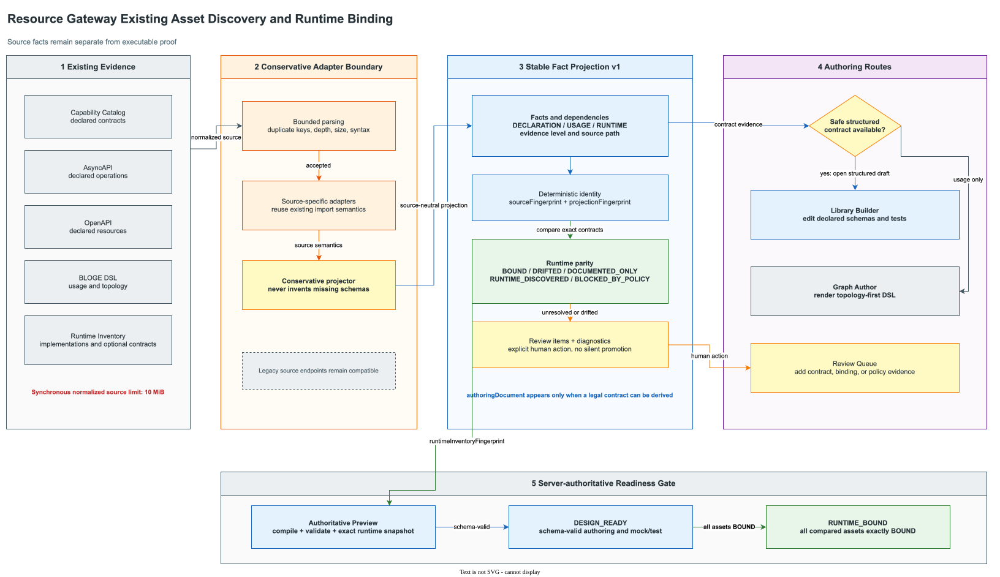

# Resource Gateway Authoring Fact Projection 协议与接入说明

> 协议：`bloge.visualAuthoringFactProjection.v1`
>
> 机器 Schema：[bloge-visual-authoring-fact-projection-v1.schema.json](schemas/bloge-visual-authoring-fact-projection-v1.schema.json)
>
> 适用方：Library Workbench、VS Code、CI、资产迁移工具和业务 runtime inventory provider

## 1. 协议解决什么问题

存量业务可能只提供 BLOGE DSL，也可能提供 Capability Catalog、AsyncAPI、OpenAPI 或正在
运行的 Java operator/function。来源不同，但创作工具真正需要的是同一组事实：

1. 发现了哪些 operator、function 和 graph；
2. 证据是声明、使用观察还是运行时 inventory；
3. 它们如何依赖；
4. 声明合同是否与目标 runtime 精确匹配；
5. 哪些信息必须人工确认；
6. 是否有足够证据安全生成结构化创作草稿。

`AuthoringFactProjection` 是这个边界的稳定读模型。它不替代原始来源合同，也不把模糊推断
升级成权威 Schema。



Draw.io 图源：
[resource-gateway-authoring-fact-projection-flow.drawio](assets/drawio/resource-gateway-authoring-fact-projection-flow.drawio)。

## 2. 响应模型

| 字段 | 语义 |
| --- | --- |
| `sourceKind/sourceId` | 来源类型和调用方提供的稳定标识 |
| `sourceFingerprint` | 规范化原始来源的内容指纹 |
| `projectionFingerprint` | 整份事实投影的确定性指纹 |
| `accepted` | adapter 是否成功理解来源；不等于 runtime ready |
| `summary` | operator/function/graph、bound、drifted、unresolved 聚合数量 |
| `facts` | 声明、调用观察或 inventory 事实及其 evidence level |
| `runtimeParity` | 声明/引用与目标 runtime 的逐资产比较 |
| `reviewItems` | 需要人的判断、补充或修复动作 |
| `diagnostics` | 可机器处理的错误和警告 |
| `authoringDocument` | 仅在能保守生成合法结构化草稿时出现 |

事实与 runtime parity 必须分开消费。一个 DSL 中出现 `risk.score(...)` 是可靠的调用事实，
但它不证明参数类型、返回类型或生产绑定。

## 3. Runtime Parity 不变量

```text
executableReady
  := state == BOUND
     AND declared contract fingerprint is exact
     AND runtime contract is authoritative
     AND runtime policy permits execution

runtimeReady
  := every compared asset is executableReady
     AND boundCount > 0
```

| 状态 | 调用方动作 |
| --- | --- |
| `BOUND` | 可作为 runtime readiness 的一项正证据，仍需测试和治理 gate |
| `DRIFTED` | 阻断并比较 declared/runtime fingerprint |
| `DOCUMENTED_ONLY` | 补 runtime binding 或安装实现 |
| `RUNTIME_DISCOVERED` | 补权威声明合同；不能根据同名实现猜签名 |
| `BLOCKED_BY_POLICY` | 调整执行隔离/policy，不能用 UI 确认绕过 |

Preview 响应通过 `runtimeInventoryFingerprint` 固定本次比较的 runtime 快照，并在
`runtimeParity` 返回逐资产证据。只有全部精确 `BOUND` 才能达到 `RUNTIME_BOUND`；
存在 unresolved parity 时仍可进入设计态 Builder 和 mock/test 工作流。

## 4. Source Adapter 语义

| 来源 | 事实强度 | 可生成结构化草稿 | 关键边界 |
| --- | --- | --- | --- |
| Capability Catalog | declared contract | 是 | 复用既有 validator，冲突进入 diagnostics |
| AsyncAPI | declared operation contract | 是 | 按既有 operation selection 和 lowering 规则 |
| OpenAPI | declared resource operation | 是 | 使用虚拟 HTTP lowering，真实 adapter binding 仍需证明 |
| BLOGE DSL | usage/topology observation | 否 | 展示 operator/function/dependency，不臆造 Schema |
| Runtime Inventory | implementation fact；provider 可附 authoritative contract | 有权威合同时才是 | implementation-only function 只到 `RUNTIME_DISCOVERED` |

所有同步入口先对规范化来源执行 10 MiB 上限。超限返回 HTTP `413` 和
`RG.AUTHORING.DISCOVERY_SOURCE_LIMIT_EXCEEDED`；大制品应进入未来的异步导入任务。

## 5. Framework Function Provider SPI

业务系统通过 Spring bean 实现
`FrameworkFunctionInventoryProvider`，为自定义 built-in function 暴露运行时事实：

```java
@Component
final class BusinessFunctionInventory
        implements FrameworkFunctionInventoryProvider {

    @Override
    public String providerId() {
        return "customer-service-functions";
    }

    @Override
    public List<FunctionBinding> functions() {
        return List.of(new FunctionBinding(
                "support.normalizeText",
                "customer-service-prod",
                "implementation-sha256",
                true,
                List.of(),
                authoritativeContract()
        ));
    }
}
```

`authoritativeContract()` 必须返回与 runtime 注册实现同版本生成的
`OperatorLibrary.BuiltInFunction`，不能复制一份长期手工维护的“期望签名”。provider 应：

1. 输出稳定 `providerId`、runtime profile 和 implementation fingerprint；
2. 将参数顺序、optional/variadic、Schema 与返回合同完整投影；
3. 对非纯函数声明 `pure=false`，并列出 required execution services；
4. 在实现或签名变化时同步改变 fingerprint；
5. 不包含 secret、请求 payload、业务数据或不可复现时间戳。

单个 provider 抛错不会让整个发现请求失败；它会被隔离为 review/diagnostic。多个 provider
对同一 callable 输出非一致 runtime fingerprint 时进入 `DRIFTED`，不得 first-wins。

## 6. API

基础路径：

```text
/admin/visual-operator-library-authoring/discovery
```

| Method | 子路径 | Request |
| --- | --- | --- |
| `GET` | `/runtime` | 无 |
| `POST` | `/capability-catalog` | `{"sourceId":"...","catalog":{...}}` |
| `POST` | `/asyncapi` | `AsyncApiOperatorLibraryImportRequest` |
| `POST` | `/openapi` | `OpenApiResourceDesignContractImportRequest` |
| `POST` | `/dsl` | `DslImportPreviewRequest` |

旧 source-specific endpoint 保持兼容。新客户端应先从
`/api/integration/capabilities` 读取协议对象、endpoint 与 feature flags，再决定是否使用
统一投影；不能从 HTTP 404 猜部署能力。

## 7. 消费流程

1. 校验 `schemaVersion`；
2. 保存 `sourceFingerprint + projectionFingerprint` 作为审阅基线；
3. 先展示 `facts` 和依赖，再展示 runtime parity；
4. 把 `reviewItems` 作为显式待办，不自动确认；
5. 仅在 `authoringDocument` 存在时允许一键进入 Builder；DSL 应交给 Graph Author；
6. Graph Author 必须重新调用权威 DSL preview，并对返回 draft 自动布局，不能把 fact
   projection 本身冒充可执行 draft；
7. 在保存或 commit 前调用权威 preview，重新固定 runtime inventory fingerprint；
8. runtime inventory 变化后把旧 parity/evidence 标记 stale。

DSL 来源的正确 UX 是“看懂拓扑并继续到 Graph Author”，不是制造一个参数全为 `any` 的假算子库。
当前 Web Workbench 使用最长 10 分钟、500,000 字符、读取即删除的同源
`sessionStorage` 交接 DSL；这是可替换的客户端 UX 机制，不属于
`bloge.visualAuthoringFactProjection.v1` wire contract，也不能替代服务端 preview。
