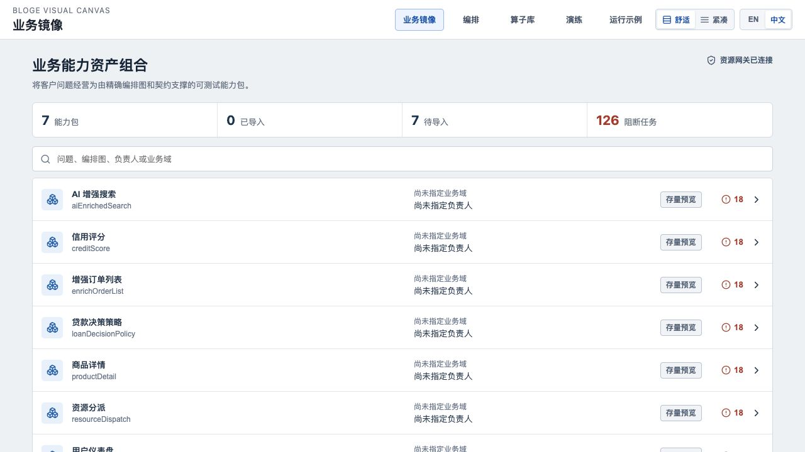
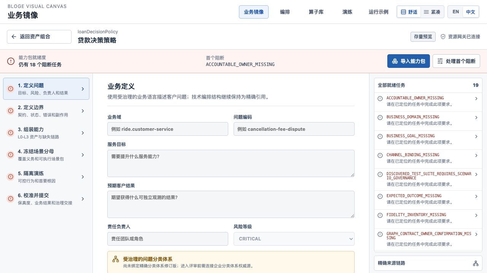
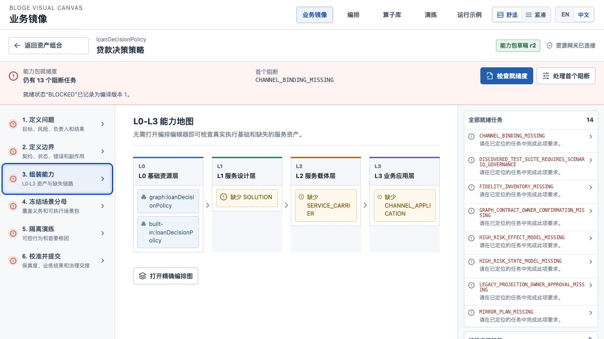
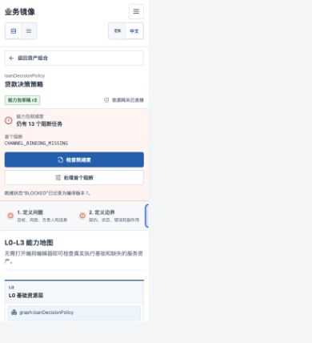

# Resource Gateway Business Mirror Workspace 使用与系统说明

> 最新的跨页面体验、启动方式、角色工作流和生产边界请先阅读
> [Resource Gateway 产品手册](resource-gateway-product-manual.md)。本文保留为 Business Mirror Workspace 专项说明。
> 首次操作指引、主动筛选 Picker、七步任务合同、阻断处理与 Author 精确跳转的专项改进，见
> [引导式正确性与业务镜像产品技术改进方案](resource-gateway-guided-correctness-and-business-mirror-ux-technical-evolution-plan.md)。

> 适用实现：RG-BM-005
>
> 默认入口：`http://localhost:8080/`，规范地址为 `http://localhost:8080/business-mirror/`
>
> 目标读者：业务能力包作者、客服业务设计人员、平台实施人员、Resource Gateway 开发者

Business Mirror Workspace 把已有 Graph、Contract 和测试资产组织成业务人员可以逐项补齐的 `DomainCapabilityPackage`。工作区不替代 Graph 画布，也不接管 ANEKE 治理。它负责回答三个问题：当前有哪些客户问题能力包、每个能力包还缺什么、下一步应进入哪个精确工作区处理。

## 1. 先完成一次固定体验

### 1.1 启动服务

在仓库根目录运行：

```bash
./scripts/start-visual-canvas-demo.sh --open
```

脚本使用 `test` profile，构建包含六个 React 工作区的可执行 JAR，默认装配 Correctness Studio 样板，并等待能力探针、exact Workspace 和所有可视化路由通过。`--open` 会打开正确性工作台；从全局导航选择「业务镜像」即可进入本指南的起点。启动成功后，输出中第一条产品地址应为：

```text
Business Mirror: http://localhost:8080/business-mirror/
```

未使用 `--open` 时，手动打开以下任一地址：

```text
http://localhost:8080/
http://localhost:8080/business-mirror/
```

根路径会重定向到带尾斜杠的规范地址。不要把 `/business-mirror/index.html` 作为产品链接。
若演示只需要业务镜像并希望浏览器直接打开它，可使用
`./scripts/start-visual-canvas-demo.sh --no-correctness --open`。

### 1.2 完成固定任务

1. 在 Portfolio 中打开「贷款决策策略 / Loan Decision Policy」。
2. 确认页面显示「存量预览」，并显示首个阻断项。
3. 选择「导入能力包」。系统创建持久 revision `1`；该动作不修改原 Graph。
4. 在「1. 定义问题」填写以下演示值：

| 字段 | 演示值 |
|---|---|
| 业务域 | `ride.customer-service` |
| 问题编码 | `loan-decision` |
| 服务目标 | `在不依赖真实业务接口时验证贷款决策服务流程` |
| 预期客户结果 | `输出可解释且可重复验证的贷款决策` |
| 责任负责人 | `risk-service-owner` |
| 风险等级 | `CRITICAL` |

5. 选择「保存」。系统使用 optimistic revision 和 `Idempotency-Key` 保存 revision `2`。
6. 选择「检查就绪度」。系统编译当前 exact revision，并记录一个 `BLOCKED` readiness report。
7. 确认业务定义相关阻断已经消失，首个阻断移动到尚未补齐的 L1-L3 或治理要求。
8. 打开「3. 组装能力」，检查 L0 的真实 Graph/Capability 与 L1-L3 缺失资产。

本次体验的正确结果不是 READY。固定存量样例缺少业务分类体系、ScenarioPack、Fidelity、Outcome、State/Effect、L1-L3 资产和 Owner approval。系统必须保留这些阻断，不得用推断值把页面标绿。

### 1.3 停止服务

```bash
./scripts/stop-visual-canvas-demo.sh
```

使用其他端口时，启动和停止命令必须使用同一 `--port`：

```bash
./scripts/start-visual-canvas-demo.sh --port 18080
./scripts/stop-visual-canvas-demo.sh --port 18080
```

## 2. Portfolio 如何阅读



Portfolio 是业务问题资产入口，不是 Graph 文件列表。

| 区域 | 含义 | 应采取的动作 |
|---|---|---|
| `Packages` | 当前 Scope 内可经营的 Package 数量；包含存量 preview 与已导入 draft | 使用搜索定位问题、Graph、Owner 或业务域 |
| `Imported` | 已进入 durable Package repository 的数量 | 进入 Package，继续保存和编译 |
| `Awaiting import` | 只有无副作用 preview，尚未建立作者态 revision | 先审阅来源，再逐包导入 |
| `Blocking tasks` | 所有 Package 的 blocking gap 总数 | 用于工作量盘点，不代表运行失败数量 |
| 行状态 | `Legacy preview` 或 `Package draft rN` | 区分只读迁移建议与持久作者态 |

Portfolio 合并两个权威来源：

1. `GET /api/business-mirror/legacy-graphs` 提供七个存量 Graph 的完整 projection。
2. `GET /api/business-mirror/packages?limit=200` 提供当前 Scope 的 durable Package heads。

合并键是稳定 `packageId`。客户端不通过名称或显示文本猜测身份。

## 3. Package 工作区如何阅读



Package 页面固定包含四个区域：

1. **上下文栏**：显示 Package 身份、Graph 名、revision、在线或离线状态。
2. **Readiness 带**：显示 blocking 数量、首个阻断和当前主动作。
3. **七步任务导航**：把领域对象和治理义务投影为可执行任务。
4. **Gap 与来源侧栏**：保留全部缺失项和 exact Graph、Contract、Capability、Closure、Test Suite 来源。

「处理首个阻断」按稳定 gap code 定位任务。它不修改数据，也不隐藏其他阻断。

### 3.1 七步任务

| 步骤 | 业务问题 | 主要对象 | 当前可执行能力 |
|---|---|---|---|
| 1. 定义问题 | 服务谁、解决什么、由谁负责、预期什么结果 | `BusinessDefinition`、Problem taxonomy、Owner、Risk、Outcome expectation | 图形化编辑业务字段并保存 exact revision |
| 2. 定义边界 | 输入输出、状态、副作用和 Contract 是否明确 | Package Contract、StateModel、EffectModel | 查看 exact refs、缺失项和 Owner review 要求 |
| 3. 组装能力 | L0 到 L3 是否形成可追踪服务链 | Graph、Capability、Solution、Carrier、Channel | 查看类型化能力地图与缺失资产，跳转精确 Graph |
| 4. 冻结场景分母 | 哪些业务分支必须被验证 | ScenarioInventory、ScenarioPack | 区分发现的技术测试与受治理业务 Scenario |
| 5. 隔离演练 | 在不依赖真实接口时能否可控运行 | MirrorPlan、Fixture、Scenario run | 检查演练前置条件并进入 Rehearsals 工作区 |
| 6. 检查证据 | L0-L3 与校准证据是否完整、保真度债务由谁负责 | PackageEvidenceIndex、七维 Fidelity、Domain Portfolio、Owner Task | 查看五层结论、分母、置信区间、弃权和任务；确认接手任务；可打开只读协议参考样例 |
| 7. 校准并提交 | 模拟是否拟合客户真实业务，能否交给治理 | FidelityInventory、OutcomeDefinition、Owner approval | 查看缺失权威事实；ANEKE 发布门禁仍在系统边界外 |

只有步骤 1 的已导入字段可直接编辑。其余步骤展示 exact ref、缺失义务和跨工作区入口，避免在一个页面中制造第二套 Contract、Scenario 或 Graph 编辑器。


第 6 步在没有 current index 时显示正式空态。选择“打开参考证据”会加载 server-produced、
Test Kit-consumed 的只读 fixture，并持续标明它不是当前 Package 的证据；该操作不会写入数据库或改变
Readiness。真实索引出现后，可从页面刷新来源、查看五层结论与七维明细，并确认接手活跃 Owner Task。

## 4. L0-L3 能力地图



能力地图按业务层级展示真实来源和缺失项：

- L0 基础资源层：Resource、Operator、Graph 和执行能力。
- L1 服务设计层：Problem、Feature、Scenario 和 Solution。
- L2 服务载体层：知识、SOP、Workflow 和服务 Agent 等 Carrier。
- L3 业务应用层：文本机器人、语音机器人及其他 Channel Application。

地图不会把 L0 Graph 自动改名为 L1 Solution，也不会从已有测试数量推断 Scenario 已治理。黄色缺失项是正式 readiness obligation。选择「打开精确编排图」会携带 source id、revision、fingerprint 和受控返回坐标进入 Author Compose 画布；Author 先反查 Business Mirror 权威 projection，再加载官方拓扑。来源漂移时会失败关闭，不会退回同名 Graph 或「运行示例」。

## 5. 语言、键盘和响应式行为

全局标题栏提供 `EN / 中文` 切换。选择结果在同一宿主中持久化。协议 code、JSON Pointer、Graph 名、fingerprint 和 exact ref 不翻译。

所有主操作使用原生 `button`、`input`、`textarea`、`select` 和 `a`：

- 使用 `Tab` 和 `Shift+Tab` 遍历控件。
- 使用 `Enter` 或 `Space` 打开 Package 和选择任务。
- 当前任务通过 `aria-current="step"` 暴露给辅助技术。
- 加载、错误和成功状态分别使用 `status` 或 `alert` 语义。

工作区在 `1440`、`820` 和 `390` CSS px 下使用不同布局。平板和手机把七步导航变为有界横向 task rail，主页面不得产生横向滚动；Gap 侧栏移动到任务内容之后。



## 6. 在 VS Code 中离线体验

不需要服务端时，运行参考扩展：

```bash
cd resource-gateway-examples/vscode-extension
npm run prepare:webview
code --new-window --extensionDevelopmentPath="$PWD"
```

在 Extension Development Host 中执行 **Resource Gateway: Open Authoring Workspace**。未配置 remote runtime 时，Business Mirror 是默认页面，并提供三个固定样例：

- `loanDecisionPolicy`
- `resourceDispatch`
- `enrichOrderList`

离线适配器支持完整固定任务：catalog、preview、import、edit/save 和 compile。保存使用 session-local durable head、optimistic revision 和材料绑定的精确幂等回放。同一 key 与相同请求材料返回原始响应；同一 key 与不同材料返回 `RG.BUSINESS_MIRROR.IDEMPOTENCY_MATERIAL_CONFLICT`。

离线模式有明确限制：

- 不访问真实网络、Secret 或生产业务接口。
- 不创建生产 Outcome、ANEKE gate evidence 或客户权威 approval。
- 不把发现的 Contract Test Suite 升格为 ScenarioPack。
- 当前 Business Mirror Package head 在扩展宿主进程内保持；Author Canvas 的崩溃恢复仍使用 VS Code `SecretStorage` 管理的 AES-256-GCM 密文。不要把两种持久化级别混为生产承诺。

配置可信 remote runtime 后，WebView 通过宿主代理调用同一 `/api/business-mirror/**` 协议；凭据仍由 VS Code `SecretStorage` 持有，页面 JavaScript 不能读取 bearer token。

## 7. HTTP 协议边界

浏览器客户端为每个 Business Mirror 请求发送以下控制头：

```text
Authorization: Bearer <token>
X-Purpose: BUSINESS_MIRROR_AUTHORING
```

写操作还必须发送 `Idempotency-Key`。Package 保存使用 query 中的 `expectedRevision` 进行 compare-and-set；编译使用 `sourceRevision` 固定输入。

| 方法与路径 | 页面动作 | 成功事实 |
|---|---|---|
| `GET /api/business-mirror/legacy-graphs` | 加载 Portfolio preview | 有界、排序、同 Scope projection catalog |
| `GET /api/business-mirror/packages?limit=200` | 合并已导入 Package | 当前 durable heads |
| `POST /api/business-mirror/legacy-graphs/{graphName}/packages` | 导入能力包 | revision `1` 与 durable save receipt |
| `PUT /api/business-mirror/packages/{packageId}?expectedRevision=N` | 保存业务定义 | revision `N+1` 或稳定 conflict |
| `POST /api/business-mirror/packages/{packageId}/compile?sourceRevision=N` | 检查就绪度 | append-only compilation receipt 与 readiness report |

`businessMirrorWorkspace=true` 只说明产品路由已打包。Package API、compiler API 和各 Authority readiness 仍需分别读取 capability probe。UI 显示「Resource Gateway connected」不等于任一 Package 已 READY。

## 8. 故障排查

| 现象或错误 | 判断 | 恢复动作 |
|---|---|---|
| 根路径空白，`/assets/*` 为 `404` | 使用了未规范化的旧制品 | 重新构建并确认 `/` 返回到 `/business-mirror/` 的重定向；不要绕过到 `/index.html` |
| `RG.INTEGRATION.PURPOSE_REQUIRED` | 客户端未发送用途头 | 使用当前前端制品；自定义客户端添加 `X-Purpose: BUSINESS_MIRROR_AUTHORING` |
| `RG.BUSINESS_MIRROR.PACKAGE_REVISION_CONFLICT` | 当前 revision 已被其他作者更新 | 停止覆盖；重新读取 Package head，比较差异后再保存 |
| `RG.BUSINESS_MIRROR.IDEMPOTENCY_CONFLICT` | 同一 key 被不同命令材料复用 | 不要更换 key 猜测结果；读取 current/head 或首次回执，确认原命令状态 |
| 页面显示 `BLOCKED` | Package 存在正式 readiness finding | 选择「处理首个阻断」；不要把 `BLOCKED` 当成 HTTP 故障 |
| 页面显示离线模式 | VS Code 未配置 remote runtime | 可以完成固定任务；需要真实 durable repository 时配置可信远端或启动服务端 |

查看脚本状态与日志：

```bash
./scripts/visual-canvas-demo.sh status
tail -100 target/example-logs/visual-canvas-demo.log
```

## 9. 当前实现边界

RG-BM-001 至 RG-BM-015 的仓库内协议和工程纵向切片均已完成。Workspace 已包含 Portfolio、Package
七步任务、Readiness、L0-L3 Capability Map、五层 Evidence、七维 Fidelity、Owner Task、中英文、
响应式与 VS Code 离线固定任务。Proposal、隔离模拟、实现 Conformance、Impact、Outcome、Regional Data
Plane、Runtime Certification、ANEKE protocol 1.1 和 Pilot Acceptance 由各自专项 API、Schema、Fixture
和 Test Kit 承载，不在本页面重复实现第二套编辑器。

仓库内完成不等于客户生产认证完成。真实 Outcome Authority、客户 KMS/PKI/网络/HA-DR、ANEKE
外部签名与 gate 联调、Owner 冻结分母和完整观察窗仍必须在目标客户环境完成。生产准入必须继续依赖
exact evidence、客户事实源、ANEKE gate 和环境认证。

## 10. 验证命令

```bash
# 前端全量测试
cd resource-gateway-examples/src/main/frontend
npm test
npm run build

# VS Code 离线宿主和 WebView 制品
cd ../../../vscode-extension
npm run verify

# Resource Gateway
cd ../..
mvn -f resource-gateway-examples/pom.xml clean verify
```

相关协议与迁移细节：

- [Business Mirror Package Authoring 指南](resource-gateway-business-mirror-package-authoring-guide.md)
- [PackageCompiler 说明](resource-gateway-business-mirror-package-compiler.md)
- [存量 Graph 渐进迁移指南](resource-gateway-business-mirror-legacy-migration-guide.md)
- [蓝图差距与技术演进方案](resource-gateway-customer-business-mirror-blueprint-gap-and-technical-evolution-plan.md)
