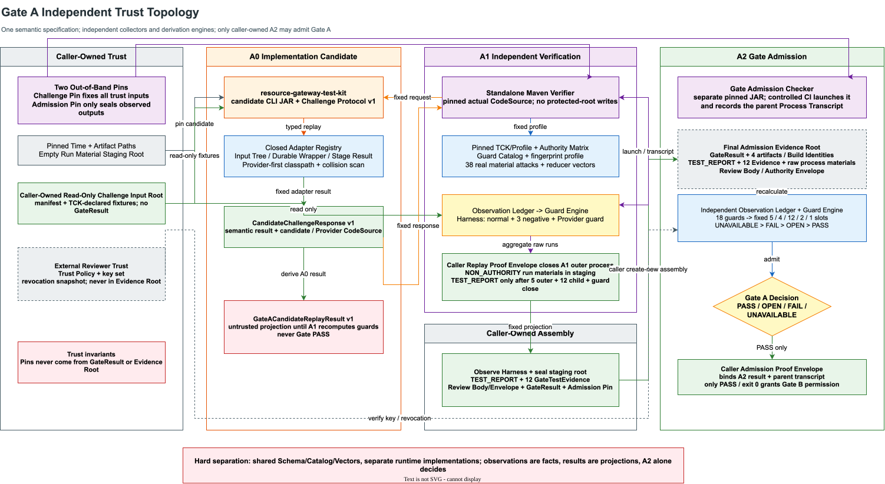

# Capability Studio 收敛式验收引擎技术设计

> 状态：`DESIGN_GATE_D0_PASSED`
>
> 适用范围：Capability Studio、Resource Gateway Test Kit 与 `RG-CS-FELT-v1` 的开发验证和企业验收接入。
>
> 设计边界：本文改变 formal acceptance 的实现组织方式，不改变 27 个 Stage-exit contract、`AC-STD-01..09`、`FELT-01..14`、`Stage Acceptance Result v2`、现有 Authority 协议或正式签署责任。
>
> 结论边界：仓库内引擎最多自行产生 `DEVELOPMENT_VERIFIED`。真实 Candidate、Environment、Evidence Store、Egress 和 Owner Authority 未闭合时，不能产生 `ACCEPTED`，`formalPassCount` 保持 `0/27`。

## 1. 最强判断

当前剩余工作的主要矛盾已经不是缺少某个 verifier，而是 formal acceptance 的控制流、证据语义和外部事实被分散在大量 CLI、Schema、脚本与调用约定中。继续增加一个调用所有既有 CLI 的更大 Runner，只会把分散复杂度搬到一个新的上帝脚本中，不能形成稳定的工程能力。

收敛方案必须同时完成三件事：

1. 把调用方需要理解的 formal acceptance 语义入口从十余个 CLI 收敛为 `run` 和 `verify` 两个入口。
2. 把 27 个合同、固定测试分母、证据角色和外部事实需求变成受限、可静态检查、可版本化的 Acceptance Plan。
3. 把“文件存在且摘要相等”升级为“由指定 typed verifier 对指定 Evidence 执行成功，并把复验结果写入不可变 Evidence Ledger”。

最终选择是：

> **固定安全骨架 + 受限声明式 Acceptance Plan + 版本化 Primitive Registry + 分层 Evidence Ledger + 调用方固定制品的独立 Proof Verifier。**

它不是一套通用工作流平台，也不是 BLOGE 业务 DAG 的第二个实现。准确命名是 **Acceptance Control and Proof Coordinator**：它只编排既有 Runtime/Verifier，不能解释 Graph、Operator、业务 DSL 或业务 Oracle。Test Kit 必须通过构建依赖规则证明 Coordinator 不含第二套业务执行语义。

### 1.1 实施前 P0 硬门禁

以下三项在任何 Compiler、Scheduler 或 stateful Lease 新代码开始前必须关闭：

1. 当前 FELT manifest verifier 在缺少 typed proof 时，只能返回 `STRUCTURE_VERIFIED/INCOMPLETE`，不得把占位 JSON、role 和自报计数升级为 `DEVELOPMENT_VERIFIED`。
2. 独立 verifier 必须是调用方提供并固定 digest 的独立 artifact/process；Runner 不能把自己的可变实现、Registry 或 Compiler 当作信任根。
3. 现有输出 `ACCEPTED` 的 CLI 必须被明确分类为 legacy formal-adjudication adapter，并证明它消费真实外部 Authority；做不到时必须降级为 `DEVELOPMENT_VERIFIED/INCOMPLETE`。新的本地 Runner 永远不得输出 `ACCEPTED`。

三项任一未关闭，设计状态保持 `NO_GO`。架构图、Schema 或测试数量增长都不能替代该门禁。

### 1.2 先设计、后实现的工程方法

此前效率低的直接原因不是实现速度慢，而是设计结论、wire contract、测试 Oracle 和提交边界没有同时冻结。代码一旦先行，后续每发现一个信任缺口，就会同时改实现、Schema、fixture、文档和测试，局部修复不断放大返工面。

Gate A 改用 **可执行设计门禁 + 可证明纵向切片**，不再按“先写类、再补测试、最后解释”推进：

| 层次 | 设计产物 | 必须回答的问题 | 机器检查 |
|---|---|---|---|
| `Invariant` | 固定分母、角色边界、Authority 来源、状态与退出码 | 什么事实即使实现变化也不能改变 | closed enum、精确集合、状态投影测试 |
| `Protocol` | strict Schema、canonicalization、fingerprint、路径与时间语义 | 两个独立实现如何对同一字节得到同一结论 | JSON Schema、golden vector、reference verifier |
| `Trust` | Challenge Pin、Admission Pin、Build Identity、独立 Reviewer | 谁能声明事实，谁只能观察，谁有最终准入权 | artifact independence、签名、TOCTOU 与 mutation TCK |
| `Slice` | A0/A1/A2 输入、输出、Oracle、failure semantics | 最小可运行闭环是什么，怎样失败关闭 | 正例、负例、进程 transcript、全量 build |

#### Design Gate D0

生产 Java 实现只能在 D0 全部满足后继续：

1. 本文冻结角色、状态机、五类时序、路径语法、canonical fingerprint、固定分母和 reason/exit code，不留“实现自行决定”的语义空洞。
2. 所有 Gate A companion document 都有 `additionalProperties=false` 的 Draft 2020-12 Schema；Schema 只冻结结构、固定槽位、closed vocabulary 与判别字段，不在 `if/then` 中枚举派生计数。跨字段、跨文档、字节、进程、时间和信任约束必须逐项列入 Semantic Guard Catalog，并指定唯一执行 owner、固定 Authority source facts 与 A2 落槽；所有 canonical/tree/aggregate fingerprint 参数必须由 Fingerprint Profile 按对象身份查表。
3. 每类 wire object 至少有一个 valid fixture；结构不变量使用 Schema negative fixture，语义不变量使用“Schema 合法但 Guard 必须拒绝”的 attack vector，二者都明确预期 terminal、reason 和 exit code。
4. canonicalization 至少由 Java 与一个非 Java reference implementation 对同一 golden vector 得到逐字节相同结果。
5. Corporate Draw.io 图与正文对角色、信任方向、文件归属和进程观察边界表达一致。
6. 独立对抗评审得到 `openP0=0`、`openP1=0`，所有 finding 都有文档或 fixture 层面的闭合证据。
7. 设计产物单独提交；尚未通过 D0 的候选 Java 修改保持隔离，不能混入设计提交制造“已经实现”的错觉。

D0 通过不代表功能完成，只代表实现目标已经变成可判定问题。之后每个子门都必须按同一纵向模板交付：

```text
frozen input contract
  -> one bounded implementation
  -> caller-observed process facts
  -> typed result
  -> positive + adversarial fixtures
  -> independent recomputation
  -> full build + documentation
  -> isolated commit
```

禁止按横向技术层一次性铺开全部 DTO、CLI 或工具类。A0 只关闭 typed replay；A1 只关闭独立挑战与运行材料；A2 只关闭准入裁决。任一子门未通过，下一子门不得用临时 mock 越过它。

### 1.3 D0 对抗评审闭环

首轮独立评审提出 8 个 P1。处理原则不是继续向 Schema 堆跨文档条件，而是把缺失的 Authority、Observation、Derivation 和 Proof 各自放回正确层次：

| Finding | 病根 | 根治机制 | 机器证据 |
|---|---|---|---|
| A2 缺父进程事实 | result 被误当最终执行证据 | caller-owned Admission Proof Envelope 绑定 A2 raw result、父 transcript、pins、CodeSource 与 exit/conclusion | strict Envelope Schema、正/负 fixture、父进程语义 validator |
| `PASS + failed Guard` 仍可过 Schema | Schema 与 Guard 职责易被混淆 | 有意保持 Schema-valid，由 `A2_CONCLUSION_PRECEDENCE` 全量复算并拒绝 | semantic mutation + real material attack；不能以巨型 `if/then` 代替 |
| Guard 血缘未冻结 | 诊断 ref 可被任意材料冒充 | Catalog 为 18 Guard 固定 ordered sourceFactIds，Authority Matrix 禁止 `ADMISSION_DECISION` 参与自身推导 | 4 份 A2 fixture x 18 = 72 条 lineage 校验 |
| process state/exit/time 漂移 | 把非零业务终态误当 crash | `COMPLETED` 接受协议 `0/2/3/4`；异常、超时、取消、不可用分离；时间关系语义校验 | strict discriminant negatives + Schema-valid time attack |
| TOCTOU 只存在正文 | 最终证据无法证明读取期间身份稳定 | transcript 记录 CodeSource pre/post identity、权限、link count、size 与 bytes，并与 projection/pin 对齐 | TOCTOU drift negative + byte-identical alias real attack |
| A1 Result/Proof 混淆 | rawRef 没有目标类型和闭合语义 | Result 明确为 producer projection；Envelope 固定 CLOSED、Result/Process messageVersion、parent observation | renamed `replayResultRef`、strict Envelope fixture |
| fingerprint 参数可自由选择 | 两个实现可能共同使用错误 domain | 44-entry Fingerprint Profile 按 objectKind/版本冻结 domain、selfField、kind | wrong-domain/wrong-self-field rejection + Java/Node reference |
| signed Review 语义不稳定 | 密码学有效被错误等同于治理正确 | 签名之外验证 Body raw binding、finding ID 唯一/排序、check/finding 关系与 count projection | 1 个签名主攻击 + 1 个 count 主攻击 + 3 个合法重签补充攻击 |

D0 最终复审必须逐项检查上表的实现证据，不接受“文档已说明”作为关闭依据。

### 1.4 D0 最终签核

D0 已在生产实现继续前完成独立对抗签核，最终结论为 `openP0=0/openP1=0`。签核不是以测试数量替代风险判断，而是逐项关闭 A2 父进程 Proof、A1 ref closure、A2 全槽位 precedence、Reviewer key/candidate/time/revocation、三项 review count、Catalog 顺序绑定、A0 exact-byte closure 和 Java empty-domain rejection。

最终机器证据固定为：

| 证据 | 结果 |
|---|---|
| Fingerprint Profile | 44 entries；33 canonical、3 tree、8 aggregate；Java/Node 一致 |
| canonical vectors | 11 vectors；wrong domain、wrong self-field、empty domain 均拒绝 |
| Process/Proof fixtures | 当前 fixture corpus 为 45 positive、48 negative；含 actual raw bytes、TOCTOU、六类异常 attempt、进程树/输出观察、TCK 投影与时间偏序。注意：这 45/48 是开发验证 fixture 覆盖数，不是 formal acceptance 分母；TCK 固定分母仍为 candidate 9 + trust-plane 3 = 12；正式 acceptance 计划仍为 `formalPassCount=0 / formalExpectedCount=27`，严禁将 fixture 通过数写成正式 pass |
| Guard lineage | 4 份 A2 fixture × 18 Guard = 72 条 ordered source fact 校验 |
| real-material attacks | 18 primary + 20 supplemental = 38；Python 与独立 Java 逐项一致 |
| Reviewer adversarial proof | 9 个合法重签语义攻击先独立证明 Ed25519 有效，再由治理 Guard 拒绝 |
| Test Kit clean-commit build | 1293 unit tests + 1 integration test；0 failure / 0 error；从 D0 commit 的 detached clean worktree 执行，不含隔离中的 A0 草稿 |
| Draw.io topology | 0 error、0 warning、0 overlap；图源和 SVG 均标注 38 个真实攻击 |
| independent review | `openP0=0/openP1=0` |

该结论只表示实现问题已经可判定，并授权按本文的 A0 深模块结构开始生产代码；它不表示 A0、Gate A 或 27 项 formal acceptance 已通过。

### 1.5 EPT_DOMAIN 与 RG-CS-EPT-v1 分母隔离

**EPT_DOMAIN**（Evidence Publication Transaction）定义于 `evidence-publication-transaction-design-v1.md §C.1`：

```
EPT_DOMAIN = "resource-gateway.capability-studio.evidence-publication-transaction.v1"
```

**RG-CS-EPT-v1** 是 EPT 的 27 项开发分母，与其他分母严格隔离：

| 分母来源 | 值 | 增加 formalPassCount？ |
|---|---|---|
| Stage 1（ENGINE-DESIGN §1058）| 27 | **是** |
| FELT（RG-CS-FELT-v1）| 14 | 否 |
| S0 fixture-generator-transaction | 26 | 否 |
| **RG-CS-EPT-v1（本文）** | **27** | **否** |

EPT 27 项（EPT-H01..05、EPT-FS01..06、EPT-CP01..08、EPT-CN01..03、EPT-PR01..02、EPT-ST01..02、EPT-VR01）不增加 `formalPassCount`，属于 Development design denominator。B0/B1/R1 是 EPT 的 artifacts 设计要素（B0=committed bundle inner manifest、B1=Store immutable receipt、R1=final outer commitment），在 EPT 矩阵中作为 evidence 引用。

## 2. 为什么此前推进慢

### 2.1 事实盘点

截至本设计冻结时，Test Kit 中 Capability Studio formal 路径具备以下特征：

| 观察项 | 当前量级 | 结构性问题 |
|---|---:|---|
| Capability Studio 相关主类 | 约 48 个 | 调用方需要知道多个内部阶段 |
| CLI | 至少 11 个 | 参数、退出码和调用顺序分散 |
| Verifier | 至少 18 个 | 结构校验与业务证明没有统一编排 |
| 相关主代码 | 约 30,000 行 | 复杂度没有隐藏在稳定接口后 |
| `CapabilityStudioExecutionLeaseEvidenceCli` | 3,092 行 | CLI 同时承担执行、恢复、证据和输出职责 |
| 正式语义入口 | declare、snapshot、verify、conformance、stage、lease、publish 等 | 调用方可以错误组合阶段 |

这些数字不说明代码质量低，而是说明模块深度不足：大量正确性知识仍暴露为调用者必须掌握的顺序和组合规则。

### 2.2 最近反例揭示的病根

严格 FELT manifest 的第一版实现可以校验：

- Schema；
- canonical JSON；
- evidence role；
- 文件 identity、UID、mode、nlink；
- raw/canonical fingerprint；
- 14 项计数和最终状态。

但如果 manifest 将若干自写的 `{"ok": true}` 文件声明为 FELT Evidence，它仍可能得到 `DEVELOPMENT_VERIFIED`。原因不是摘要算法不够严格，而是**manifest verifier 不知道每种 Evidence 必须由哪个真实 verifier 证明什么**。

这给出三个直接结论：

1. Evidence inventory 只能证明“文件闭合”，不能证明“机器 Oracle 已成立”。
2. `status=PASS` 必须由 proof engine 根据 typed verifier 结果推导，不能由 manifest 作者填写后被信任。
3. 计划、执行、证据、复验和终态必须共享同一份编译结果，不能靠文档约定人工拼接。

### 2.3 过去方案的错误抽象

过去把“每个验收缺口”当成一个独立 CLI 或 verifier 问题。实际上，多个缺口共享同一个根因：

```text
验收合同没有被编译为唯一执行图
  -> 调用顺序依赖脚本纪律
  -> Evidence role 与真实 verifier 脱节
  -> manifest 只能检查自报状态
  -> retry、外部发布和签署不断产生新的拼接边界
  -> 每轮继续增加局部机制
```

新的实现必须关闭这条因果链，而不是继续在末端增加检查。

## 3. 目标与非目标

### 3.1 设计目标

1. 对调用方只提供一个有副作用的 `run` 和一个纯只读 `verify`。
2. 27 个正式合同和 14 个 FELT obligation 不能被调用方缩小、跳过或重排。
3. Acceptance Plan 只能引用闭集 primitive、oracle 和 evidence role，不能执行任意代码。
4. 每个 `PASS` 必须来自指定 typed verifier 的可复算 proof result。
5. 执行、恢复、发布和复验使用同一 plan fingerprint、material pins 和 transaction identity。
6. 证据写入采用不可覆盖、可恢复、可枚举、可独立复验的 Ledger。
7. 外部 Store receipt、Authority fact 和 Owner signoff 作为外部事实接入，不能由 Runner 自签。
8. 保持既有 wire Schema 与部署入口兼容，通过 projection 和 legacy adapter 渐进迁移。
9. 新增验收义务时，优先增加 Plan 数据、Primitive/Verifier 对和测试，不复制整条控制流。
10. 明确区分仓库工程完成度和企业正式验收进度。

### 3.2 非目标

- 不实现任意 DAG、Shell、HTTP、SQL 或表达式工作流 DSL。
- 不替代 BLOGE 业务图执行引擎。
- 不在 Test Kit 中实现企业 PKI、KMS/HSM、IAM 或 Owner 组织目录。
- 不让本地 filesystem adapter 冒充外部 Evidence Store。
- 不修改 `Stage Acceptance Result v2` 或 `Authority Envelope v1` 的既有 wire bytes。
- 不自动生成业务 Oracle 或人工 UX 判断。
- 不在第一阶段删除旧 CLI；旧入口先变成兼容适配器。
- 不通过增加自动化测试数量改变 `formalPassCount=0/27`。

## 4. Design It Twice 结论

### 4.1 方案 A：硬编码 Full Runner

将现有 CLI 按固定顺序放入一个 Shell 或 Java orchestrator。

| 维度 | 评价 |
|---|---|
| 首次交付速度 | 快 |
| 调用方易用性 | 中，只有一条命令 |
| 内部复杂度 | 高，参数与错误翻译集中到新 Runner |
| 证据语义 | 弱，仍依赖各 CLI 自报结果 |
| 新增合同成本 | 高，需要改控制流和 manifest |
| 恢复一致性 | 容易出现跨 CLI 边界漂移 |
| 长期熵 | 高 |

该方案可以作为短期兼容桥，但不能作为目标架构。

### 4.2 方案 B：极小深模块

只暴露 `run` / `verify`，所有时序和恢复隐藏在模块内。

| 维度 | 评价 |
|---|---|
| 接口深度 | 高 |
| 调用方认知 | 最低 |
| 固定顺序安全性 | 高 |
| 合同演进 | 中，若全部硬编码仍需修改引擎 |
| Evidence 复用 | 中 |
| 迁移难度 | 中 |

该方案正确解决“调用者必须理解时序”的问题，但单独使用仍可能形成新的大类。

### 4.3 方案 C：声明式计划编译器

把合同、矩阵、证据和依赖编译为固定原语 DAG，Runner 只解释计划。

| 维度 | 评价 |
|---|---|
| 静态完整性 | 高，可在运行前发现漏项和循环 |
| 演进效率 | 高 |
| 可审计性 | 高，前提是语言受限 |
| 安全风险 | 中，若允许脚本或表达式会迅速失控 |
| 运行实现复杂度 | 中 |
| 误用风险 | 可通过 closed registry 控制 |

该方案必须限制为数据模型和静态展开器，不能成为第二套编程语言。

### 4.4 方案 D：Proof Graph 与 Evidence Ledger

每项 claim 只能由指定 typed verifier 产生，所有事实形成内容寻址、不可变的证明图。

| 维度 | 评价 |
|---|---|
| 防止自报 `PASS` | 最高 |
| 跨合同证据复用 | 高 |
| 独立复验 | 高 |
| 初始实现成本 | 中高 |
| 运维可解释性 | 高 |
| 过度设计风险 | 中，必须避免区块链化和通用化 |

该方案直接关闭当前 manifest 只校验文件而不校验语义的缺口。

### 4.5 采用的组合方案

采用 B、C、D 的组合：

- B 定义对外深接口；
- C 定义受限的合同编译与执行图；
- D 定义每个 `PASS` 的来源和证据闭包；
- A 仅作为迁移期 legacy adapter，不成为架构核心。

拒绝引入 Temporal、Argo、Jenkins 或新的服务端工作流平台。它们可以调度命令，但不能原生证明 Resource Gateway 的 Authority、Lease、Evidence 和 formal failure semantics，还会破坏 Test Kit 独立、轻量、可离线复验的约束。

### 4.6 Independent Verifier 的 Design It Twice

“独立 verifier”不能只停留在类名或包名上。为避免实现候选自己证明自己，进一步比较三种部署形态：

| 方案 | 信任隔离 | 可移植性 | 协议重复风险 | Gate B/C 复用 | 结论 |
|---|---:|---:|---:|---:|---|
| Test Kit 同一 JAR 内增加 verifier 类 | 低 | 高 | 低 | 中 | 只适合作为本地 Implementation Candidate，不能成为 Gate A 信任根 |
| Shell/Python verifier | 中 | 低 | 高 | 低 | 只允许做固定参数组装、制品摘要校验和进程启动，不承载 Gate 语义 |
| 独立 Maven verifier module | 高 | 高 | 中 | 高 | 采用；独立 JVM、独立发布制品、无 Test Kit/Runtime 依赖 |

采用第三种方案，并补充成 **C+ 三角色模型**：

1. `Implementation Candidate`：现有 Test Kit typed replay CLI。它只证明本地 Evidence 可被真实 adapter 重放，终态最高为 `STRUCTURE_VERIFIED/INCOMPLETE`。
2. `Independent Verifier`：独立 Maven module。它携带固定 Gate A profile/TCK，以只读方式验证 Evidence Root，并通过固定子进程协议挑战 Implementation Candidate。
3. `Gate Admission Checker`：由调用方固定的另一独立 artifact。受控 CI 只负责校验 digest 并运行该制品，不能用 job 脚本替代可复算的 A2 实现。它复算 GateResult，比较 out-of-band trust pin，并唯一决定 `PASS/OPEN/FAIL`。

三个角色不能由同一 JAR、同一次可变构建或同一 Registry 充当。独立 Maven module 是必要条件，但不是充分条件；只有 Independent Verifier 和 Gate Admission Checker 都完成，Gate A 才有可信 `PASS` 路径。在此之前只能输出 `OPEN/FAIL/INCOMPLETE`。

另有一个 caller-pinned `Conformance Harness`，它不是第四个裁决角色。Harness 只负责把 A1 当作黑盒启动，执行正常 replay、verifier digest/Registry/TCK 三组 evidence negative 以及 Provider namespace collision 强制 guard，记录有界 transcript 并组装固定 12 项 TEST_REPORT 与 guard result；它无权签署 review、修改 GateResult 或决定 admission。

## 5. 目标架构


Gate A 的制品与信任隔离进一步展开如下：



架构分为四个平面：

| 平面 | 职责 | 不允许承担的职责 |
|---|---|---|
| Contract Plane | 定义固定合同、矩阵、Oracle、Evidence role 和外部事实需求 | 执行任意用户代码 |
| Execution Plane | 编译计划、固定顺序执行 primitive、处理 exact retry | 伪造外部事实或最终签署 |
| Evidence Plane | 保存内容寻址 Evidence、proof result 和分层 commitment | 根据 manifest 作者填写的状态直接判定通过 |
| Trust Plane | 独立复验、外部 Store receipt、Authority 与 Owner adjudication | 修改 Runner 现场或修复 Evidence |

### 5.1 不是第二套业务执行引擎

Coordinator 只能执行有限、无业务表达能力的控制原语：固定输入、调用既有 verifier/Runtime、提交既有 Lease、记录 Evidence、发布不可变 bundle。以下能力在模块依赖和代码审查中一律禁止：

- 解析或执行 BLOGE DSL；
- 调度 Operator、Graph node 或业务数据流；
- 实现 retry/fallback/decision table 等业务语义；
- 解释业务 Oracle 表达式；
- 直接调用 Resource API 产生业务结果；
- 建立第二套 Graph state、RunTrace 或 fixture runtime。

依赖方向固定为：

```text
Acceptance Coordinator
  -- fixed process/protocol --> Test Kit typed verifier adapters
  -- fixed process/protocol --> existing BLOGE / Resource Gateway Runtime

existing BLOGE / Resource Gateway Runtime
  -X-> Acceptance Coordinator implementation classes
```

上图是进程协议依赖，不是 Java/Maven 编译依赖。A1/A2 禁止依赖 Test Kit、Runtime 或 Provider 生产类。

构建门禁必须扫描 Test Kit 新包的依赖：出现 Graph parser、Operator scheduler、Resource runtime implementation 或业务 DSL evaluator 依赖时直接失败。Coordinator 的所谓 DAG 只是有限验收步骤的静态偏序，不支持循环、动态分支、业务 Payload 传递或用户节点，因此不构成业务执行引擎。

## 6. 一等领域对象

### 6.1 `AcceptanceContractCatalog`

版本化保存：

- 27 个 `S*-AC-*`；
- `AC-STD-01..09`；
- `FELT-01..14`；
- 每项合同的固定分母、Oracle ID、Evidence role、Owner role 和外部 fact requirement。

Catalog 是产品验收定义的机器投影，不是运行结果。调用方不能传入一个缩减后的 Catalog。

Catalog 必须显式区分两个恰好都等于 27、但语义完全不同的分母：

- `stageExitContractCount=27`：Stage 0 至 Stage 5 的正式退出合同总数；
- `canonicalMatrixCellCount=27`：9 个 Canonical Case 乘 3 轮的业务运行单元数。

任何 Schema、代码或 UI 使用裸 `27`、`passed=27` 或同一个 `count` 字段同时表达二者，均属于协议缺陷，必须在编译期拒绝。

### 6.2 `AcceptancePlanSource`

受限声明式输入，只表达：

- contract/revision exact ref；
- 固定集合展开；
- primitive ID 与版本；
- typed dependency；
- required evidence role；
- Oracle ID；
- fact requirement；
- recovery policy；
- terminal gate。

它不包含实现类、脚本、URL、动态表达式、任意函数或自定义 failure handler。

### 6.3 `CompiledAcceptancePlan`

Compiler 的唯一权威输出，至少包含：

```text
planId
planRevision
planFingerprint
compilerFingerprint
catalogFingerprint
exactContractIds
stageExitContractCount = 27
expandedObligationIds
canonicalMatrixCellCount
matrixCellIds
suiteRunIds
stableExecutionOrder
primitiveContracts
expectedEvidenceRoles
oracleBindings
factRequirements
resumeGraph
terminalGate
```

相同 Plan Source、Catalog 和 Compiler 版本必须产生逐字节相同的 canonical plan。

`stageExitContractCount`、`canonicalMatrixCellCount` 和 `matrixCellIds` 是三套独立字段。Canonical 9 Case x 3 轮的计划必须同时给出 27 个稳定 `matrixCellId` 和 3 个稳定 suite run identity；它们不能从 `stageExitContractCount` 推导，也不能写入裸 `expectedCount=27` 后由消费者猜测语义。

### 6.4 `PrimitiveContract`

Primitive 是引擎唯一可执行动作。每个 primitive 必须声明：

```text
primitiveId + revision
effectClass
inputKinds
outputEvidenceKinds
typedVerifierId + revision
retryPolicy
failureMapping
capabilityRequirements
```

`primitiveId` 来自 Test Kit 内建 closed registry。Plan 不能指定 Java class，也不能通过反射发现任意实现。

`PrimitiveDescriptor` 是 Compiler 与 Proof Verifier 唯一共享的声明来源。Compiler 读取其中的 input/output/effect/phase 定义做静态检查，Verifier 读取其中的 verifier artifact/profile 绑定做 proof replay；两边不得各自维护一份 role、Oracle 或 failure mapping 表。业务 Oracle 的实现仍只存在于既有 typed verifier/Runtime，Descriptor 只保存 exact ref，不能内嵌表达式。

### 6.5 `EvidenceRecord`

每份 Evidence 的身份至少包含：

```text
evidenceId
kind
role
producerPrimitive
producerRevision
actionKey
contentRef
byteSize
rawFingerprint
canonicalFingerprint | null
materialPins
createdAt
```

EvidenceRecord 只说明“产生了什么”，不说明“合同已通过”。

### 6.6 `ProofRecord`

ProofRecord 由 typed verifier 产生：

```text
proofId
claimId
verifierId + revision
verifierArtifactFingerprint
inputEvidenceIds
oracleId
verdict
closedReasonCode
verifiedAt
proofFingerprint
```

只有 `ProofRecord.verdict=PASS` 且 verifier、Oracle、Evidence 和 material pins 与 Compiled Plan 精确匹配时，对应 claim 才能成为 `PASS`。

### 6.7 `ExternalFactRecord`

Runner 不能创建以下事实，只能导入和验证：

- Candidate Attestation；
- Environment Attestation；
- Target Binding；
- Deployment Egress observation；
- Evidence Store receipt；
- Owner signoff；
- revocation、Key Set 和 trusted clock snapshot。

External fact 缺失时为 `BLOCKED` 或 `INCOMPLETE`；签名、Scope、TTL 或 fingerprint 不一致时为 `FAIL/INVALID`。

每类 External Fact 都必须有独立 strict Schema，不允许用一个开放 `Map` 包住不同 Authority：

| Fact | Schema/既有协议 | 必绑坐标 | 时效与撤销 | 缺失/不可用 | 已验证不一致 |
|---|---|---|---|---|---|
| Candidate | Candidate Attestation v1 + detached proof | candidate/build/revision/commit/CLEAN/artifact digest/intent | issuer Key Set、TTL、revocation snapshot、trusted clock | `BLOCKED` | `FAIL` |
| Environment | Environment Attestation v1 + detached proof | candidate、target、runtime、region、network、feature flags、window | Environment issuer、TTL、revocation、clock | `BLOCKED` | `FAIL` |
| Target Binding | Target Binding v1 | result/contract/lease、两份 attestation、target raw/canonical | deployment-owned pin、admission window | `BLOCKED` | `INVALID/FAIL` |
| Evidence Store | `capability-studio-evidence-store-receipt-v1` | B0、object ref、generation、store identity、publishedAt | Store issuer、Key Set、retention、revocation | `BLOCKED` | `FAIL` |
| Owner Signoff | `capability-studio-owner-signoff-v1` | B0、R1、role、Scope、decision | Owner Authority、role policy、TTL、revocation、ordered time | `INCOMPLETE` | `REJECTED/FAIL` |

Resolver 必须返回 closed result：`RESOLVED`、`ABSENT`、`UNAVAILABLE`、`REVOKED`、`EXPIRED`、`SCOPE_MISMATCH`、`SIGNATURE_INVALID`、`CONTENT_MISMATCH`。异常消息、旁附公钥和调用方自报 issuer 不能进入判断。

## 7. 两个公共语义接口

### 7.1 `run`

```java
public interface CapabilityStudioAcceptanceEngine {

    AcceptanceRunOutcome run(AcceptanceRunRequest request);
}
```

Java 调用使用 typed command；CLI 只负责把 strict request document 解码成该类型：

```java
public record AcceptanceRunRequest(
        String runId,
        String transactionId,
        String idempotencyKey,
        RunPurpose purpose,
        ExactArtifactRef compiledPlan,
        ExactArtifactRef candidateSnapshot,
        ExactArtifactRef authorityInputTree,
        ExactArtifactRef targetInputTree,
        ExactArtifactRef stageResult,
        ExactArtifactRef environmentSnapshot,
        ExactArtifactRef stateDescriptor,
        PrivateRunRoot privateRunRoot,
        PublicationPin localPublication,
        ResumeToken resumeToken) {
}
```

CLI request document 使用 `capability-studio-acceptance-run-request-v1.schema.json`，其 wire 字段与 typed command 一一对应。不存在“JSON 中还有一批 Java 接口未表达的隐藏参数”。Request 固定：

- plan exact ref 和 fingerprint；
- transaction identity；
- candidate snapshot exact ref；
- Authority/Target input-tree snapshot exact ref；
- Stage Result exact ref；
- state descriptor/root exact ref；
- local publication parent pin；
- environment snapshot exact ref；
- 可选外部 Store profile ref，不含凭证。

`AcceptanceRunOutcome` 使用 strict result Schema，至少包含：

```text
runId / transactionId / idempotencyKey
purpose
outcome
planFingerprint
materialAggregateFingerprint
lastDurableSequence
resumeToken | null
localCommitRef | null
externalReceiptRef | null
passed / failed / blocked / notRun
closedReasonCodes
statusProjectionRef
```

重复 `idempotencyKey` 只有在 transaction、Plan 和全部 material pins 精确相等时才能返回同一 outcome；任一坐标漂移必须拒绝。`resumeToken` 是对同一 durable ledger head 的不透明、带 fingerprint 的 continuation，不允许调用方手写 next action。

调用方不能传入：

- 任意 contract IDs；
- `formalPassCount`；
- Provider 实例；
- callback、Supplier 或 `AcceptanceFlow`；
- signer、私钥、旁附公钥；
- 任意 shell/HTTP action；
- 可修改的 terminal status。

### 7.2 `verify`

```java
public interface CapabilityStudioAcceptanceProofVerifier {

    AcceptanceVerificationOutcome verify(AcceptanceVerificationRequest request);
}
```

Verifier：

- 纯只读；
- 不加载 Provider classpath；
- 不持有 Evidence Root、GateResult、trust pin 或 state root 写权限；
- 不创建 lock、snapshot、journal、receipt 或 signoff；
- 不执行 repair；
- 独立解析 Compiled Plan；
- 重新运行 typed verifier；
- 重建 proof graph 和所有 projection；
- 验证分层 commitment 与外部 receipt。

`AcceptanceVerificationRequest` 必须固定 bundle、Compiled Plan、expected pins、独立 verifier artifact、caller-owned trust policy 和 verification time。独立 verifier artifact 由调用方提供、在进程启动前固定 raw digest，并在不含 Runner/Provider classpath 的独立 JVM 中执行；Runner 生成的 Registry、Compiler 输出或内嵌公钥不能成为信任根。Verifier artifact mutation、wrong digest、同名不同制品和 TCK 不一致均失败关闭。

产品控制面需要的 `preflight/status/evidence/replay` 不扩展验收内核的副作用接口：

- preflight 是 `run` 的 `purpose=PREFLIGHT_ONLY` 受限模式，固定零副作用；
- status/evidence 是从 Ledger 重建的只读 projection；
- replay 调用独立 `verify`，不重新执行业务副作用；
- 对外 HTTP/API 仍可保留四个资源端点，但它们不能绕过 `run/verify` 语义。

旧 CLI 保持参数兼容，但长期都只委托这两个接口。`provision` 仍是部署控制面操作，不计入验收事务语义入口。

## 8. 受限 Acceptance Plan

### 8.1 示例

```json
{
  "schemaVersion": "capability-studio.acceptance-plan.v1",
  "planId": "RG-CS-FELT-v1",
  "revision": 1,
  "compilerProfile": "formal-evidence-v1",
  "catalogRef": "capability-studio-contract-catalog-v1@sha256:...",
  "obligationSet": "FELT-01..FELT-14",
  "primitives": [
    {
      "id": "verify-fixed-material",
      "type": "VERIFY_FIXED_MATERIAL_V1",
      "dependsOn": [],
      "produces": ["CANDIDATE_PINS", "INPUT_PINS", "ENVIRONMENT_PINS"]
    },
    {
      "id": "verify-authority-tree",
      "type": "VERIFY_FORMAL_INPUT_TREE_V1",
      "dependsOn": ["verify-fixed-material"],
      "inputSlot": "AUTHORITY"
    },
    {
      "id": "verify-target-tree",
      "type": "VERIFY_FORMAL_INPUT_TREE_V1",
      "dependsOn": ["verify-fixed-material"],
      "inputSlot": "TARGET"
    },
    {
      "id": "provider-conformance",
      "type": "RUN_PROVIDER_CONFORMANCE_V2",
      "dependsOn": ["verify-authority-tree", "verify-target-tree"]
    },
    {
      "id": "execute-lease-evidence",
      "type": "EXECUTE_LEASE_EVIDENCE_V1",
      "dependsOn": ["provider-conformance"]
    },
    {
      "id": "verify-durable-wrapper",
      "type": "VERIFY_DURABLE_WRAPPER_V1",
      "dependsOn": ["execute-lease-evidence"]
    },
    {
      "id": "verify-packaged-matrices",
      "type": "VERIFY_PACKAGED_FELT_MATRICES_V1",
      "dependsOn": ["verify-durable-wrapper"]
    },
    {
      "id": "postflight",
      "type": "VERIFY_MATERIAL_POSTFLIGHT_V1",
      "dependsOn": ["verify-packaged-matrices"]
    },
    {
      "id": "commit-local-proof",
      "type": "COMMIT_LOCAL_PROOF_BUNDLE_V1",
      "dependsOn": ["postflight"]
    }
  ],
  "terminalGate": "DEVELOPMENT_VERIFIED_ONLY"
}
```

这里的 JSON 只是可审计数据。`type` 的行为、输入、输出、effect class 和 verifier 全部由固定 Registry 决定。

### 8.2 允许和禁止的语言能力

| 允许 | 禁止 |
|---|---|
| 有界集合展开 | 用户自定义函数 |
| 固定 primitive 引用 | Java class、反射或 ServiceLoader 选择 |
| 固定依赖 | 动态依赖和递归 |
| 固定 enum 比较 | 任意表达式语言 |
| 固定 matrix/catalog ref | 运行时缩小分母 |
| 固定 retry policy | 自定义 failure handler |
| 固定 evidence role | 自报 `PASS` |
| 固定 fact requirement | 用 Plan 内字段伪造外部事实 |

### 8.3 Compiler 必须拒绝的计划

- obligation 集合不是 frozen Catalog 的精确集合；
- dependency 有环或存在未知节点；
- 同一 primitive ID 重复；
- primitive revision 未注册；
- effect barrier 被绕过；
- `PASS` claim 没有 typed verifier；
- required evidence role 没有 producer；
- Evidence producer 没有对应 verifier；
- resume point 位于不可恢复的副作用中间；
- matrix 数量超限或可被运行参数缩减；
- formal terminal gate 允许本地事实直接产生 `ACCEPTED`。

## 9. 固定安全骨架与 Effect Model

声明式 Plan 不能任意决定安全关键顺序。Compiler 将 primitive 映射到固定 phase：

```text
BOOTSTRAP_FACTS
  -> MATERIAL_SNAPSHOT
  -> READ_ONLY_PREFLIGHT
  -> PROVIDER_CONFORMANCE
  -> STATEFUL_EXECUTION
  -> DURABLE_LOCAL_COMMIT
  -> INDEPENDENT_VERIFICATION
  -> MATERIAL_POSTFLIGHT
  -> EXTERNAL_PUBLICATION
  -> EXTERNAL_ADJUDICATION
```

每个 primitive 只有一种 effect class：

| Effect class | 语义 | 恢复策略 |
|---|---|---|
| `PURE_VERIFY` | 只读、确定性 verifier | 相同输入可重跑 |
| `LOCAL_IMMUTABLE_WRITE` | create-new 本地 Evidence | 已存在时先独立复验，再精确恢复 |
| `AUTHORITY_LEASE` | 原子业务/治理 Lease | 用稳定 request identity 恢复同一 receipt |
| `EXTERNAL_PUBLISH` | 发布不可变 Evidence object | 根据 object key 和 bundle fingerprint 查询同一 receipt |
| `EXTERNAL_FACT_IMPORT` | 导入外部 Attestation/Signoff | 不产生事实，只验证和绑定 |

Compiler 固定以下 barrier：

1. `PURE_VERIFY` 的全部 preflight 未通过前，不执行任何写入。
2. Provider Conformance 未通过前，不进入 Lease。
3. Lease 一旦提交，后续失败不得回滚或删除 Evidence。
4. Durable local commitment 未形成前，不允许外部发布。
5. 外部 Store receipt 必须晚于 local commitment。
6. Owner signoff 必须晚于 Evidence Store receipt 和完整 Evidence closure。
7. 任何本地 primitive 都不能直接产生正式 `ACCEPTED`。

## 10. Evidence Ledger 与 Proof Graph

### 10.1 为什么不用“再加字段”的 manifest

Manifest 是最终投影，不应是事实来源。新的权威关系是：

```text
Primitive execution
  -> EvidenceRecord
  -> Typed verifier
  -> ProofRecord
  -> Claim projection
  -> Manifest projection
```

Manifest 的 `PASS` 必须从 ProofRecord 推导。如果作者直接编辑 manifest，它会因为 Ledger、Proof Graph 和 commitment 不一致而被拒绝。

### 10.2 Ledger 文件布局

```text
run-root/
  run-request-v1.json
  compiled-plan-v1.json
  material-snapshots/
  ledger/
    00000001-run-opened.json
    00000002-action-intent.json
    00000003-evidence-added.json
    00000004-proof-recorded.json
    ...
  evidence/
    sha256/<digest>
  projections/
    felt-manifest-v1.json
    stage-result-v2.json
    traceability-matrix-v1.json
  commitments/
    local-proof-commit-v1.json
  external/
    evidence-store-receipt-v1.json
    authority-facts/
    owner-signoffs/
  final/
    acceptance-envelope-v1.json
```

约束：

- 每条 Ledger record 使用 create-new 独立文件，不使用容易出现 torn append 的单一日志文件；
- sequence 连续，记录前一条 raw fingerprint；
- record、Evidence blob 和目录都执行 bounded size/count、identity、UID、mode、nlink 和 symlink 检查；
- projection 可从 Ledger 重建，不是权威输入；
- unknown sibling 保持不变并导致失败关闭；
- Ledger commit 后不得原地追加改变既有 commitment 的内容。

### 10.3 证据语义绑定

每个 evidence role 必须在 Primitive Registry 中绑定 verifier：

| Evidence role | 必需 typed verifier 示例 |
|---|---|
| `INPUT_PINS` | `FormalInputTreeVerifier v1` |
| `EXISTING_ONLY_OBSERVATION` | `DeploymentStateObservationVerifier v1` |
| `DURABLE_EVIDENCE_CLOSURE` | `ExecutionLeaseEvidenceBundleVerifier v1` |
| `CLOSED_RESULT_MATRIX` | `ClosedResultMatrixVerifier v1` |
| `CHILD_JVM_CRASH_MATRIX` | `PackagedCrashMatrixVerifier v1` |
| `ADVERSARIAL_COMPATIBILITY` | `CompatibilityMatrixVerifier v1` |
| `STRICT_FINAL_GATE` | `AcceptanceProofGraphVerifier v1` |

这意味着普通 canonical JSON 即使具有正确 role 和 fingerprint，也不能成为 ProofRecord 的有效输入。

Verifier Registry 本身也必须进入 material pin。每个 `VerifierDescriptor` 至少绑定 verifier ID/revision、输入 Schema、输出 claim kind、实现制品 fingerprint 和 policy fingerprint；替换实现 JAR、Schema 或 policy 后，旧 ProofRecord 自动失效，不能只凭相同 verifier 名称继续复用。

### 10.4 防止指纹循环的三层 commitment


采用三层、单向引用：

1. `LocalProofCommit B0`：绑定 Compiled Plan、material pins、Ledger、Evidence inventory 和本地 proof graph。
2. `ExternalStoreReceipt R1`：由外部 Store 签发，绑定 `B0`、immutable object ref、generation、trusted time 和 Store identity。
3. `AcceptanceEnvelope E2`：绑定 `B0 + R1 + Authority facts + Owner signoffs`，由既有正式 adjudication 协议裁决。

`R1` 不进入 `B0`，Owner signoff 不进入其签署前的 Evidence closure，因此不存在“收据必须包含自己”或“签名参与被签名内容”的循环。

三层属于同一逻辑 Ledger 的连续 segment，但每层形成新的不可变 commitment，旧层不被改写。

三层 wire contract 在 Phase 1 前冻结：

```text
capability-studio-local-proof-commit-v1.schema.json
capability-studio-evidence-store-receipt-v1.schema.json
capability-studio-acceptance-adjudication-envelope-v1.schema.json
```

> **B0/B1/R1 设计规范（本文 §10 与 EPT design §D.4 同步）**：
> 以下公式是设计规范，不是实现声明。EPT 实现（`RG-CS-EPT-v1`）的 B0/B1/R1 语义以 `evidence-publication-transaction-design-v1.md` §D.4 为准。本文仅记录与 FELT/Stage 集成的统一视图。

哈希域固定为（设计规范，非实现）：

```text
B0 = H("RG-CS-LOCAL-PROOF-COMMIT-v1" || canonical({
  compiledPlanRawFingerprint,
  candidateInputEnvironmentAggregate,
  verifierRegistryFingerprint,
  ledgerHeadFingerprint,
  evidenceInventoryFingerprint,
  proofGraphFingerprint
}))

# EPT B0 三层 fingerprint（详见 EPT design §D.4）：
# b0RawFingerprint = SHA256(exact raw bytes)
# b0CanonicalFingerprint = SHA256(strict canonical)
# b0ClosureFingerprint = SHA256(EPT_DOMAIN || stableRequestId || transactionId ||
#                              b0RawFingerprint || b0CanonicalFingerprint ||
#                              evidenceContentTreeFingerprint || ownerEpoch ||
#                              fencingTokenFingerprint)

R1.context = H("RG-CS-STORE-PUBLICATION-v1" || canonical({
  B0,
  b0ClosureFingerprint,
  immutableObjectRef,
  generation,
  storeIdentity,
  publishedAt
}))

# R1 绑定 b0ClosureFingerprint + B1 + transaction + owner（见 EPT design §D.4.3）

E2 = H("RG-CS-ACCEPTANCE-ADJUDICATION-v1" || canonical({
  B0,
  R1.rawFingerprint,
  authorityFactFingerprints,
  orderedOwnerSignoffFingerprints,
  recomputedDecision
}))
```

**实现状态**：以上公式为设计规范；B0/B1/R1 三层 commitment 尚未实现。Gate A (A0/A1/A2) 完成后才能声称实现。

## 11. 执行与恢复状态机

### 11.1 Run 状态

```text
NEW
  -> PREPARED
  -> PREFLIGHT_VERIFIED
  -> EXECUTING
  -> LOCAL_COMMITTED
  -> DEVELOPMENT_VERIFIED
  -> EXTERNALLY_PUBLISHED
  -> READY_FOR_ADJUDICATION
```

任一阶段还可以进入：

- `INCOMPLETE`：有 `NOT_RUN` 或等待外部事实；
- `BLOCKED`：依赖、权限、锁、I/O、metadata、Provider 或 Store 不可用；
- `REJECTED`：Authority 明确拒绝；
- `INVALID`：Schema、pin、identity、闭包或 canonical bytes 非法；
- `FAIL`：已执行 Oracle 或系统不变量失败。

`ACCEPTED` 不是 Runner 状态，而是外部 adjudication 对 `E2` 的正式决定。

### 11.2 Action 状态

```text
PENDING -> INTENT_DURABLE -> RUNNING -> RESULT_DURABLE -> VERIFIED
                       \-> CRASHED -> RECOVERING -> VERIFIED
```

恢复条件必须精确相等：

- transaction identity；
- plan fingerprint；
- candidate/input/environment pins；
- action key；
- primitive revision；
- 已完成 Evidence 和 ProofRecord 仍可复验；
- 下一 action 是 Compiled Plan 的合法 successor。

否则不能恢复旧事务，只能创建新事务。`RECOVERED` 是本次调用方式，不是改写已提交 receipt 的持久业务状态。

### 11.3 Action key

```text
actionKey = H(
  planFingerprint,
  primitiveId,
  primitiveRevision,
  canonicalInputEvidenceIds,
  relevantMaterialPins,
  transactionIdentity
)
```

默认只允许同一事务 exact retry 复用 action。跨候选、跨事务或跨环境缓存默认禁止，避免把增量构建思路误用于正式验收事实。

### 11.4 跨进程 Owner 与 fencing

每个 private run root 同一时间只允许一个 active owner。Owner record 使用 create-new/CAS 语义并固定：

```text
runId / transactionId / idempotencyKey
ownerInstanceId
ownerProcessIdentity
fencingEpoch
acquiredAt / leaseUntil
ledgerHeadSequence / ledgerHeadFingerprint
ownerRecordFingerprint
```

规则：

1. 新 owner 只能在可信时钟证明旧 lease 过期，并对同一 owner generation 完成 CAS 后取得更大的 `fencingEpoch`。
2. 每条 Action Intent、Ledger record、Lease request 和 Store publish request 都绑定当前 epoch；stale owner 的后续写入被拒绝。
3. sequence 由 owner 在锁内基于已复验的 ledger head 单调分配；不允许两个 JVM 预留重叠区间。
4. 两个 Worker 同时恢复时，最多一个取得新 epoch；失败方返回 `BLOCKED/RG.ACCEPTANCE.OWNER_CONTENDED`，不能执行 Provider 或写 Evidence。
5. OS lock 只负责互斥，持久 owner/generation/fencing 才负责 crash 后裁决；不能把 stale lock 文件删除当恢复。
6. 取消只写入受 fencing 保护的 cancel intent。Lease 已提交时只能停止后续步骤并保留证据，不能回滚。

固定并发矩阵至少覆盖：双 JVM 首次拥有、owner crash、lease 过期竞争、stale owner 延迟写、同 idempotency exact retry、不同 transaction 冲突、取消与 Store publish 竞争、trusted clock unavailable。

## 12. 外部 Bootstrap 与自证边界

Java 进程无法在启动前证明自身 JAR、JVM 和 classpath 没有变化。因此 pre-JVM pin 不能由 Runner 自证。

正确边界是：

1. 部署控制面或 CI bootstrapper 创建 Candidate Snapshot 和 Bootstrap Fact。
2. Runner 启动后验证 Snapshot 与 out-of-band pin 相等。
3. 正式环境中，Bootstrap Fact 必须由 Candidate Authority 签发或被其 attestation 覆盖。
4. 仓库提供的 POSIX bootstrap 只能产生开发级 Evidence，不能代替企业 Candidate Authority。

参考部署适配器可以是：

- CI artifact promotion job；
- Kubernetes init container；
- 企业发布系统的 deployment hook；
- 本地开发 POSIX script。

它们都输出同一 `candidate-bootstrap-fact-v1`，但只有受信 Authority 签发的事实能进入正式 adjudication。

## 13. Adapter 边界

### 13.1 Primitive Adapter

既有能力通过 adapter 接入，不复制实现：

- Formal Input Tree snapshot/verify；
- Provider Conformance；
- Stage Result v2 verifier；
- existing-only state observation；
- Execution Lease Evidence；
- durable wrapper verifier；
- Browser/Anomaly matrix verifier；
- Dataset、Scenario、Governed Run Evidence verifier。

每个 adapter 只将既有闭集结果翻译为 `EvidenceRecord + ProofRecord`，不得改变既有结果语义。

### 13.2 Evidence Store Adapter

内部接口：

```java
interface EvidenceStorePublisher {
    StorePublicationOutcome publish(LocalProofCommit commit);
}
```

要求：

- 没有 production 默认实现；
- dev filesystem adapter 必须显式标记 `DEVELOPMENT_ONLY`；
- receipt 必须由独立 `EvidenceStoreReceiptVerifier` 校验；
- Store outage 返回 `BLOCKED`，保留 `B0` 供 exact retry；
- credentials 不进入 request、Ledger、stdout 或 exception。

### 13.3 External Fact Adapter

```java
interface ExternalFactResolver {
    ExternalFactOutcome resolve(FactRequirement requirement, TrustContext trust);
}
```

Resolver 由部署方提供。Plan 只能声明需要什么事实，不能选择 issuer 或旁附信任根。

### 13.4 Legacy Wire Adapter

以下协议保持不变并作为 projection：

- `Stage Acceptance Result v2`；
- `Formal Input Tree v1`；
- `Execution Lease Transcript v1`；
- durable wrapper v1；
- FELT manifest v1；
- Candidate/Environment Attestation；
- Target Binding；
- Authority Envelope v1。

新引擎不重新解释旧证据。旧结果只有在 plan、catalog、primitive/verifier revision 和 material pins 精确匹配时才能导入。

## 14. 失败语义

### 14.1 统一判定顺序

1. 先判定直接失败不变量；
2. 再判定输入和能力是否 `BLOCKED`；
3. 再判定 obligation 分母和 `NOT_RUN`；
4. 再判定 typed proof 是否完整；
5. 再判定 durable local commitment；
6. 再判定外部 Store receipt；
7. 最后判定 Authority 与 Owner signoff。

### 14.2 结果闭集

| 状态 | 条件 | CLI 退出码 |
|---|---|---:|
| `DEVELOPMENT_VERIFIED` | 本地计划、执行、typed proof、FELT 14/14 和独立复验完整；正式外部事实仍单独展示为未闭合 | 0 |
| `INCOMPLETE` | 存在 `NOT_RUN`，或正在等待不属于本次开发合同的外部 adjudication 输入 | 3 |
| `BLOCKED` | 必需能力、权限、锁、I/O、Provider、Authority 或 Store 不可用 | 3 |
| `REJECTED` | 已执行 Authority 判断明确拒绝 | 3 |
| `INVALID` | 协议、pin、identity、canonical bytes、Plan 或 closure 非法 | 2 |
| `FAIL` | 已执行 Oracle 或系统不变量失败 | 2 |

为消除歧义：

- `DEVELOPMENT_VERIFIED` 不要求企业 Owner signoff；否则开发合同永远无法完成。
- 当用户请求的是 formal adjudication 而外部 Store/Owner 缺失时，结果为 `INCOMPLETE/BLOCKED`。
- 两种执行意图必须由 request 中的固定 `runPurpose=DEVELOPMENT_PROOF|FORMAL_ADJUDICATION` 区分，不能通过运行时猜测。
- 无论哪种 purpose，Runner 都不能输出 `ACCEPTED`。

现有 `CapabilityStudioExecutionLeaseEvidenceCli` 的 `ACCEPTED status=ACCEPTED` 不自动继承到新 Runner。Phase 0 必须审计其输入闭包：

- 若它确实消费受信 Candidate/Environment/Target/Evidence/Owner Authority，则保留为 `legacy formal-adjudication adapter`，只能由 `purpose=FORMAL_ADJUDICATION` 的外部部署入口调用；
- 若任一外部事实缺失，则该成功行必须降级并发布兼容说明，不能用既有名称继续暗示正式接受；
- 新 `CapabilityStudioFormalCli run` 不得委托 legacy CLI 的 terminal rendering，也不得把 legacy exit 0 直接映射为开发或正式成功。

### 14.3 信息安全

- stdout 只输出一行 payload-free closed result；
- stderr 不输出路径、Payload、Credential、actor、签名内容或异常消息；
- reason 使用 closed code；
- 子进程输出进入有界隔离文件并经过泄漏扫描；
- Evidence role 只能来自 closed enum；
- ProofRecord 不复制业务 Payload。

### 15.1 EPT 与 B0/B1/R1 artifacts

EPT（Evidence Publication Transaction）产生三个 artifacts：
- **B0**：committed bundle inner manifest（`b0-inner-manifest.json`）；B0 三层指纹：
  - `b0RawFingerprint = SHA256(inner manifest raw exact bytes)`
  - `b0CanonicalFingerprint = SHA256(strict canonical(inner manifest))`
  - `b0ClosureFingerprint = SHA256(EPT_DOMAIN || stableRequestId || transactionId || b0RawFingerprint || b0CanonicalFingerprint || evidenceContentTreeFingerprint || ownerEpoch || fencingTokenFingerprint)`
  - inner manifest 不含自身派生指纹
- **B1**：Store immutable receipt（`b1-receipt.json`）
- **R1**：final outer commitment（`r1-receipt.json`），绑定 B0+B1+transaction/owner

EPT 矩阵中 B0/B1/R1 作为 evidence 字段引用，不改变现有 Stage 27 合同或 formalPassCount。

## 15. 与 27 个 Stage-exit contract 的关系

Acceptance Engine 不把 27 个合同变成一个大事务。它编译每个 Stage 的 proof graph，并允许同一 immutable Evidence 被多个 claim 引用，但每个 claim 都保留自己的 Oracle、Owner 和有效期。

27 个合同必须在 Catalog 中精确存在：

```text
Stage 0: 6
Stage 1: 5
Stage 2: 4
Stage 3: 4
Stage 4: 4
Stage 5: 4
Total: 27
```

FELT 是 formal runner 的 14 项开发合同，不替代浏览器、业务正确性、安全、容量和人工体验合同。Proof Graph 允许例如 `DURABLE_EVIDENCE_CLOSURE` 被多个 Stage claim 引用，但不能用它推导未执行的业务 Oracle。

正式进度仍按：

```text
formalImplementationGap = (27 - formalPassCount) / 27 * 100%
```

引擎完成只能将状态推进到“仓库具备正式验收执行能力”，不能凭空增加正式 `formalPassCount`。

## 16. 迁移方案

迁移主纵切固定绑定 `GP-08`、`S0-AC-04` 和 `RG-CS-FELT-v1`。用户任务是“对同一不可变候选运行固定验证并独立确认它证明了什么”；实现 Owner 为 Test Kit，验收 Owner 为 Runtime、QA、Security，正式外部事实仍由 Deployment/Evidence/Owner Authority 提供。

首个纵切不一次引入 Compiler、Ledger、Scheduler 和 Lease。它拆成三道可独立提交、可回滚的门：

| Gate | 唯一目的 | 允许改动 | 明确不做 | 退出证据 |
|---|---|---|---|---|
| `GATE-A TYPED_REPLAY` | 关闭占位 JSON 自报 PASS | Evidence type/role registry、三个既有 verifier adapter、placeholder/tamper negative | 不加 Plan Compiler，不执行 Lease | 同一真实 Evidence 可 replay；占位 JSON `INVALID`；manifest-only 最高 `STRUCTURE_VERIFIED` |
| `GATE-B COMPILE_ONLY` | 证明合同和分母能确定性编译 | Plan/Catalog/Primitive Schema、Compiler、独立 plan verifier | 不加 Scheduler，不执行任何 primitive | 27 contracts、27 matrix cell IDs、14 FELT 精确且 fingerprint 稳定 |
| `GATE-C PROOF_PROJECTION` | 用 ProofRecord 推导 manifest | 最小 Ledger、ProofRecord、manifest projection、独立 replay | 不接 stateful Lease，不发布外部 Store | projection 可重建；自报 status 不被信任；旧/新结构 differential 一致 |

只有 Gate A/B/C 分别通过 P0/P1 复审，才进入 legacy full runner facade 和 stateful Lease。任一 Gate 失败只回滚本 Gate，不要求撤销前一 Gate 的 wire contract。

Gate A 内部再拆成三个不可跳级的实现子门。这里的 `A0/A1/A2` 是工程迁移切片，不改变对外 `gateId=GATE-A`：

| 子门 | 唯一责任 | 允许终态 | 退出证据 | 下一步权限 |
|---|---|---|---|---|
| `A0 CANDIDATE_REPLAY` | 证明 manifest role 必须经过真实 typed adapter | `STRUCTURE_VERIFIED/INCOMPLETE/INVALID/UNAVAILABLE` | 三个 adapter、占位/类型/版本/TOCTOU/hard-link 反例 | 只允许实现 A1 |
| `A1 INDEPENDENT_VERIFY` | 用独立 artifact、固定 profile/TCK 挑战候选并复算测试证据 | `VERIFIED/INVALID/UNAVAILABLE`，不得输出 `ACCEPTED` | caller-pinned candidate/verifier、Evidence Root 闭包、固定 12 项 TCK | 只允许实现 A2 |
| `A2 GATE_ADMISSION` | 由调用方信任根复算 GateResult 并作准入决定 | `PASS/OPEN/FAIL/UNAVAILABLE` | 外置 trust pin、四类 artifact 独立性、review 与时间关系、GateResult fingerprint | 只有 `PASS` 允许 Gate B |

`A1 INDEPENDENT_VERIFY` 指整个独立验证子门：A1 verifier artifact 负责 9 项 candidate-path TCK，caller-pinned Harness 负责 3 项 trust-plane negative TCK，合计固定 12 项；正文单独写 “A1 artifact” 时只指前 9 项执行者。

任何子门都不能把下一子门的职责内嵌进自己的可变实现。尤其禁止 A0 生成 `PASS`、A1 信任 candidate 自报的测试结果、A2 从 GateResult 或 Evidence Root 反向推导 expected pin。

A2 表中的 terminal 属于 `GateAAdmissionVerificationResult`；GateResult 的持久化 `decision` 仍严格只有 `PASS/OPEN/FAIL`。A2 返回 `UNAVAILABLE` 时不修改 GateResult，也不推导新的 decision。

### 16.1 机器可审计 GateResult

Gate A 必须生成符合 `capability-studio-implementation-gate-result-v1.schema.json` 的 canonical GateResult，并由独立 Gate verifier 复算。v1 有意只接受 `gateId=GATE-A`、`previousGateResultRef=null` 和 `nextAllowedGate=null|GATE-B`，不提前为尚未冻结的 Gate B/C 提供通用 PASS 入口。Gate B/C 到各自设计冻结时发布新的 admission profile 和固定分母。允许状态只有 `OPEN`、`PASS`、`FAIL`：

```text
gateId / gateRevision
designRef / gateProfileRef
previousGateResultRef
requirementRefs
artifactFingerprints
testEvidenceRefs
independentReview
decision
rollbackTarget
nextAllowedGate | null
closedReasonCodes
formalPassCount = 0
formalExpectedCount = 27
gateResultFingerprint
```

`PASS` 必须同时满足：

- Gate 固定 requirement refs 精确覆盖，不接受“至少有若干项”；
- 实现候选、独立 verifier、Gate verifier 和测试报告 artifact 均有 exact ref/raw fingerprint；
- 所有固定 test evidence 状态为 `PASS` 且无 skipped；
- 独立 Reviewer 的 artifact、Authority、review evidence 和时间均在被审候选之后，且 Reviewer Authority/Artifact/Evidence 与 caller-owned trust pin 精确绑定；
- `openP0=0`、`openP1=0`；
- rollback target 可解析；
- GateResult fingerprint 可独立复算；
- Gate A 的 previous ref 固定为空；未来 Gate B/C 必须绑定同一演进链前一 Gate 的 exact PASS result；
- `formalPassCount` 保持 0。

Gate A 的固定 requirement 和 test denominator：

| Requirement | 固定 Evidence |
|---|---|
| `GATE-A-P0-01-TYPED-EVIDENCE` | placeholder、wrong kind、wrong verifier revision 全部 `INVALID`；manifest-only 最高 `STRUCTURE_VERIFIED` |
| `GATE-A-P0-02-INDEPENDENT-VERIFIER` | caller-pinned independent artifact；wrong digest、artifact mutation、Registry mutation 和 TCK mismatch 全部拒绝 |
| `GATE-A-P0-03-LEGACY-TERMINAL` | Authority 完整的 legacy 正例；缺 Store、Owner、Target 任一事实时无 `ACCEPTED` 文案且退出码非 0 |
| `GATE-A-P1-01-MANIFEST-STABILITY` | manifest 验证期间替换、删除或 identity drift 失败关闭 |
| `GATE-A-P1-02-HONEST-INCOMPLETE` | `NOT_RUN/BLOCKED` obligation 不需要伪造 PASS Evidence |

Gate A 缺少任一 requirement、artifact 或 test evidence 时，`decision` 只能是 `OPEN/FAIL`，`nextAllowedGate` 必须为 `null`。只有独立 Gate verifier 返回 `PASS`，实现流水线才允许创建 Gate B 分支；脚本退出码、测试总数或人工口头结论不能替代 GateResult。

JSON Schema 无法表达跨数组 fingerprint 不等关系，因此独立 Gate verifier 还必须执行以下语义检查：

1. 4 个 artifact 的 raw fingerprint 两两不同；Implementation Candidate、Independent Verifier、Gate Verifier 不能是同一制品或同一 inode/content。
2. Independent Review 中的 reviewer artifact 与上述 4 个 artifact 全部不同，Reviewer Authority 不能由 Implementation Candidate 自报。
3. 12 个 test evidence raw fingerprint 两两不同，且每份 Evidence 的内部 test ID、候选 fingerprint 和 expected failure mechanism 与数组位置精确相等；不能用同一报告的别名 URI 充数。
4. 每份测试 Evidence 都晚于或等于被测 candidate publication，并绑定同一个候选和 Gate revision。
5. `gateResultFingerprint = H("RG-CS-IMPLEMENTATION-GATE-RESULT-v1" || canonical(result with gateResultFingerprint=null))`；除自身字段外，`decidedAt`、review、rollback 和全部 Evidence 坐标都参与计算。`independentReview.reviewFingerprint = H("RG-CS-GATE-A-INDEPENDENT-REVIEW-v1" || canonical(independentReview with reviewFingerprint=null))`，A2 必须复算，不能把它解释成 Review Body 或 Envelope 的别名摘要。
6. Gate verifier 的启动输入必须由调用方 out-of-band 固定 `expectedDesignRawFingerprint`、`expectedAdmissionProfileRawFingerprint` 和 `allowedGateRevision=1`；逐项比较 GateResult 的 `designRef`、`gateProfileRef` 和 revision，不能信任结果文件自报的 ref。GateResult 的 `gateProfileRef` 专指 Admission Profile，不复用 A1 Replay Profile。
7. Gate Verifier artifact 的 packaged build identity 必须声明支持 `GATE-A/revision=1/admissionProfileFingerprint`，并与调用方 pin 相等；Implementation Candidate 使用不兼容的 Replay Profile 或 verifier revision 时为 `INVALID`。
8. Independent Review 的 `openP0/openP1/skippedCount` 只能由 signed Review Body arrays 确定性归约；Reviewer Artifact/Trust Policy 来自 Challenge trust basis，Review Body/Authority Envelope raw bytes 来自 Admission observed seals，并绑定同一 candidate、Admission Profile、reviewed material root、revision、scope 和 verification time。仅验证 GateResult 内三个 ref 相互自洽不构成可信 review。

上述任一语义检查失败时，即使 JSON Schema 通过，GateResult 仍为 `INVALID`，不能进入 Gate B。

### 16.2 Gate A 证据解析与调用方 pin

Gate verifier 不从 `uri` 访问网络，也不接受 `file:`、绝对路径、`..`、符号链接或未列入 Evidence Root 的文件。CLI 只接受一个绝对规范化的只读 Evidence Root；所有 `exactRef.uri` 都按安全相对路径解析，并在解析前后复核 owner、inode、link count、权限、大小和原始字节。目录中出现未被 GateResult 引用的未知文件时失败关闭。

#### Protocol Canonicalization v1

所有 companion Schema 的 canonical JSON 统一采用 RFC 8785 JCS。输入必须是无 BOM 的 UTF-8；解析前拒绝重复 key、lone surrogate、非有限数字和超出 IEEE-754 safe integer 的 JSON number；金额、decimal 和大整数只能使用带 Schema pattern 的 string。JCS 输出不带尾部 LF；CLI 单行 stdout 的 LF 属于 process raw bytes，不属于 canonical document。

```text
rawSha256(bytes) = "sha256:" + lowercaseHex(SHA-256(bytes))

documentFingerprint(domain, document, selfField)
  = rawSha256(ASCII(domain) || 0x00
      || UTF8(JCS(document with selfField=null)))
```

domain 必须是本文冻结的 ASCII 常量，`0x00` 分隔符不可省略。协议语义区分四种 fingerprint kind，即使底层都使用 SHA-256 字符串也不能互换：

| Kind | 输入 | 例子 |
|---|---|---|
| `RAW_BYTES` | 文件 exact bytes，不做 JSON 解析 | JAR、stdout、Schema raw file |
| `CANONICAL_DOCUMENT` | domain-separated JCS document | Request、Response、Build Identity |
| `TREE_COMMITMENT` | domain-separated ordered TreeEntry list | Challenge/Input/Run/Admission root |
| `AGGREGATE_COMMITMENT` | domain-separated ordered typed entries | reviewed material、test/process aggregate |

新 companion Schema 使用 `{kind, algorithm="SHA-256", value="sha256:..."}` 的 typed fingerprint；字段要求具体 kind。既有 GateResult/TestEvidence v1 的 `exactRef.rawFingerprint` 保持 string wire bytes，但语义固定为 `RAW_BYTES`，不能承载 tree/document/aggregate commitment。跨实现 TCK 必须提供 property order、escaped Unicode、无/有 stdout LF、safe integer 边界、重复 key 和四种 kind 混用反例；Java 与至少一个独立 reference implementation 的 golden fingerprint 必须逐字节相同。

`canonicalization/fingerprint-profile-v1.json` 是 fingerprint 参数的机器 Authority。它以固定顺序冻结 44 个对象/commitment profile，包括 `objectKind`、协议版本、domain、selfField 与 fingerprintKind；其中包含 A1 Replay Proof Envelope 和 A2 Admission Proof Envelope。生产接口必须先按 expected objectKind 查表，再比对文档版本；不得接受调用方自由传入 domain、selfField 或 kind。reference CLI 的自由参数模式仅用于字节诊断，不具备 Gate Authority。wrong-domain 与 wrong-self-field 必须由 profile lookup 拒绝，即使错误参数可生成一份内部自洽摘要。

调用方必须使用两份有先后关系、都位于最终 Evidence Root 外的 pin，避免 A1 输出和最终 GateResult 形成时间循环。

`GateAChallengeTrustPin v1` 在 Harness/A1 运行前创建，只固定运行挑战所需的既有事实：

```text
expectedDesignRawFingerprint
expectedReplayProfileRawFingerprint
expectedAdmissionProfileRawFingerprint
expectedImplementationCandidateRawFingerprint
expectedIndependentVerifierRawFingerprint
expectedConformanceHarnessRawFingerprint
expectedHarnessProfileRawFingerprint
expectedGateVerifierRawFingerprint
expectedSchemaSetManifestRawFingerprint
expectedTckDefinitionRawFingerprint
expectedTckProviderRawFingerprint
expectedCandidateSpiArtifactRawFingerprint
expectedCandidateSpiClassRawFingerprint
expectedReviewerArtifactRawFingerprint
expectedReviewerTrustPolicyRawFingerprint
expectedReviewerRevocationSnapshotRawFingerprint
expectedChallengeInputRootFingerprint
expectedChallengeSandboxProfileRawFingerprint
semanticVerificationTime
allowedGateRevision = 1
```

`GateAAdmissionTrustPin v1` 在 A1 的 `TEST_REPORT`、12 份 GateTestEvidence、Review Body、Reviewer Envelope 和候选 GateResult 全部形成后，由 caller 创建并固定：

```text
trustBasis:
  challengeTrustPinRawFingerprint
  allowedGateRevision = 1

admissionContext:
  admissionVerificationTime

observedOutputs:
  sealedGateResultRawFingerprint
  sealedAdmissionEvidenceRootFingerprint(kind=TREE_COMMITMENT)
  sealedRunMaterialRootFingerprint(kind=TREE_COMMITMENT)
  sealedTestReportRawFingerprint
  sealedReviewerAuthorityRawFingerprint
  sealedReviewBodyRawFingerprint
  sealedReviewedMaterialRootFingerprint(kind=AGGREGATE_COMMITMENT)
  sealedGateTestEvidenceAggregateFingerprint(kind=AGGREGATE_COMMITMENT)
  sealedProcessMaterialAggregateFingerprint(kind=AGGREGATE_COMMITMENT)
  sealedHarnessInvocationRawFingerprint
  sealedHarnessProcessTranscriptRawFingerprint
```

信任与观察严格分栏：Challenge Pin 在任何运行输出形成前固定全部 trust input，包括 design、A0/A1/Harness/A2 artifact、三个 profile、Schema/TCK/Provider/SPI 以及 Reviewer artifact/policy/revocation snapshot；这些值不从被验文件推导。Admission Pin 的 `observedOutputs` 则明确由 caller 对已封存字节计算，只是 TOCTOU seal，不是 Authority。Admission Pin 必须绑定原 Challenge Pin raw fingerprint；A1 不能读取尚未产生的 GateResult，A2 不能重新运行 A1 或修改任一 seal。GateResult 中对应 ref 即使内部自洽，只要与 Challenge trust basis 或任一 observed seal 不同，也必须判定为 `FAIL`。

`reviewerTrustPolicy` 固定允许的 issuer/key set、review scope、candidate subject、Admission Profile、有效期和 revocation snapshot。v1 的 `signatureAlgorithm` closed value 固定为 `Ed25519`；policy 中的 `keyId` 必须一一映射到 canonical base64url public key，不允许 `none`、动态下载 key、Envelope 旁附 key 或算法回退。

`ReviewBody v1` 不只保存 findings，还必须绑定 `reviewedMaterialRootFingerprint`。该 root 是固定角色集合的聚合，不是 reviewer 自选附件：

```text
DESIGN
IMPLEMENTATION_CANDIDATE / A0_CANDIDATE_RESULT
REPLAY_PROFILE / INDEPENDENT_VERIFIER / INDEPENDENT_VERIFIER_BUILD_IDENTITY
HARNESS_PROFILE / CONFORMANCE_HARNESS / CONFORMANCE_HARNESS_BUILD_IDENTITY
ADMISSION_PROFILE / GATE_VERIFIER / GATE_VERIFIER_BUILD_IDENTITY
SCHEMA_SET / TCK / CHALLENGE_TRUST_PIN
TCK_PROVIDER / CANDIDATE_SPI_ARTIFACT / CANDIDATE_SPI_CLASS
TEST_REPORT / HARNESS_INVOCATION / HARNESS_PROCESS_TRANSCRIPT
RUN_MATERIAL_ROOT / GATE_TEST_EVIDENCE_AGGREGATE / PROCESS_MATERIAL_AGGREGATE
```

Review findings 不是自由文本计数。Reviewer Trust Policy 固定有序 `requiredCheckIds`；Review Body 必须逐项返回：

```text
reviewChecks[]: {checkId, status = PASS | FINDING | SKIPPED}
findings[]: {findingId, checkId, severity = P0 | P1 | P2,
             status = OPEN | RESOLVED, reasonCode, detail}
```

`detail` 只用于人读，不参与判定；`reasonCode` closed。每个 required check 恰好一次：`PASS` 不得有关联 finding，`FINDING` 至少有一个，`SKIPPED` 不得伪造 finding；findingId 唯一且按 `severity/checkId/findingId` 固定排序。三个 projection 的唯一公式是：

```text
openP0 = count(findings where severity=P0 and status=OPEN)
openP1 = count(findings where severity=P1 and status=OPEN)
skippedCount = count(reviewChecks where status=SKIPPED)
```

Review Body、Authority Envelope 和 GateResult 保存的三个 count 都只是兼容投影。A2 必须从 arrays 重算并逐值比较四处事实；任一矛盾为 `FAIL`。Admission Profile 固定 `REVIEW_COUNT_CONSISTENCY_REJECTED` guard：一个 Ed25519 签名有效但含 open P0 finding 且自报 `openP0=0` 的 fixture 必须被拒绝，该 guard 不增加 GateTestEvidence v1 的 12 项分母，但与 Provider collision guard 一样是 A2 `PASS` 的强制条件。该攻击向量由 `docs/acceptance/capability-studio/gate-a-wire-v1/trust-build/signed-review-count-guard/` 提供，生成器必须同时复算四份 document fingerprint、raw ref、Ed25519 signature 和派生 count。

每个角色恰好一次，按上述顺序计算。Entry 不是含混的 `{role, rawFingerprint}`，而是 `{role, fingerprint:{kind, algorithm, value}}`；artifact/JAR/TCK/SPI 使用 `RAW_BYTES`，A0 result/profile/Build Identity/Challenge Pin/TEST_REPORT 使用 `CANONICAL_DOCUMENT`，Schema Set/test/process/review aggregate 使用 `AGGREGATE_COMMITMENT`，Run Material Root 使用 `TREE_COMMITMENT`。角色与 kind 不匹配直接失败：

```text
reviewedMaterialRootFingerprint
  = H("RG-CS-GATE-A-REVIEWED-MATERIAL-ROOT-v1"
      || canonical([{role, fingerprint:{kind, algorithm, value}}, ...]))
```

`ReviewBody v1` 保存该 root、结构化 findings 与 `openP0/openP1/skippedCount`；`ReviewerAuthorityEnvelope v1` 独立包住它，避免 envelope 自哈希循环，并至少绑定：

```text
authorityId / issuer / keyId / signatureAlgorithm = Ed25519
gateId / gateRevision / admissionProfileRawFingerprint
candidateRawFingerprint
reviewerArtifactRawFingerprint
reviewBodyRawFingerprint
reviewedMaterialRootFingerprint
openP0 / openP1 / skippedCount
reviewScope
reviewedAt / validUntil
revocationSnapshotRawFingerprint
signature / envelopeFingerprint
```

Wire authority 文件固定为：

```text
capability-studio-review-body-v1.schema.json
capability-studio-reviewer-authority-envelope-v1.schema.json
capability-studio-reviewer-trust-policy-v1.schema.json
capability-studio-reviewer-revocation-snapshot-v1.schema.json
capability-studio-gate-a-challenge-trust-pin-v1.schema.json
capability-studio-gate-a-admission-trust-pin-v1.schema.json
```

Fingerprint 与签名顺序固定，禁止实现自行选择排除字段。下列及后续公式中的 `H("DOMAIN" || canonical(document))` 是 `Protocol Canonicalization v1` 的简写，规范含义始终是 `rawSha256(ASCII(DOMAIN) || 0x00 || UTF8(JCS(document)))`：

```text
reviewBodyFingerprint
  = H("RG-CS-REVIEW-BODY-v1" || canonical(ReviewBody with reviewBodyFingerprint=null))

signaturePayload
  = H("RG-CS-REVIEW-ENVELOPE-SIGNING-v1"
      || canonical(EnvelopeClaims excluding signature and envelopeFingerprint))

signature
  = Sign(reviewer private key corresponding to caller-pinned keyId/public-key policy,
         signaturePayload)

envelopeFingerprint
  = H("RG-CS-REVIEW-ENVELOPE-v1"
      || canonical(Envelope with envelopeFingerprint=null))
```

这里的 `signaturePayload` 是 SHA-256 的 32 个原始 digest bytes，不是带 `sha256:` 前缀的 ASCII 字符串，也不是其十六进制文本。Ed25519 直接签署这 32 bytes；wire `signature` 使用无 padding 的 base64url。`envelopeFingerprint` 包含已经形成的 signature；signature payload 不包含 signature 和 envelope fingerprint，因此不存在自哈希或自签循环。其余 caller-owned document 的公式固定为：

```text
reviewerTrustPolicyFingerprint
  = H("RG-CS-REVIEWER-TRUST-POLICY-v1"
      || canonical(Policy with reviewerTrustPolicyFingerprint=null))

reviewerRevocationSnapshotFingerprint
  = H("RG-CS-REVIEWER-REVOCATION-SNAPSHOT-v1"
      || canonical(Snapshot with reviewerRevocationSnapshotFingerprint=null))

challengeTrustPinFingerprint
  = H("RG-CS-GATE-A-CHALLENGE-TRUST-PIN-v1"
      || canonical(ChallengePin with challengeTrustPinFingerprint=null))

admissionTrustPinFingerprint
  = H("RG-CS-GATE-A-ADMISSION-TRUST-PIN-v1"
      || canonical(AdmissionPin with admissionTrustPinFingerprint=null))
```

两类只读 root 的内容身份使用同一 closed tree entry 结构、不同 domain separator：

```text
TreeEntry = {relativePath, kind=FILE, byteLength, rawFingerprint}

challengeInputRootFingerprint
  = H("RG-CS-GATE-A-CHALLENGE-INPUT-ROOT-v1"
      || canonical(TreeEntry[] sorted by relativePath))

admissionEvidenceRootFingerprint
  = H("RG-CS-GATE-A-ADMISSION-EVIDENCE-ROOT-v1"
      || canonical(TreeEntry[] sorted by relativePath))
```

`relativePath` 与既有 GateResult v1 `exactRef.uri` 使用同一 ASCII grammar：`^[A-Za-z0-9][A-Za-z0-9._-]*(/[A-Za-z0-9][A-Za-z0-9._-]*)*$`。拒绝空路径、`.`、`..`、反斜杠、控制字符、大小写折叠碰撞、重复 path、目录/symlink/device/FIFO/socket 和未声明文件。tree fingerprint 证明内容闭包，owner/mode/fileKey/nlink 的前后快照证明本次读取稳定性，两者不能互相替代。Challenge Pin 与 Admission Pin 分别固定对应 root fingerprint；后者在最终 Evidence Root 完成后创建，因此不形成哈希循环。

Revocation Snapshot 不是自由文本名单，固定包含 `snapshotId/issuer/revision/issuedAt/validUntil/revokedKeyIds/revokedAuthorityIds/reviewerRevocationSnapshotFingerprint`，数组排序且无重复。Envelope 和 Trust Policy 都只保存 `revocationSnapshotRawFingerprint`，不保存可由候选解释的文件路径；实际文件只来自 A2 的 `--reviewer-revocation-snapshot` out-of-band 参数。A2 必须验证 snapshot issuer 被 Trust Policy 允许、Envelope 的 `keyId/authorityId` 均未撤销，且 Challenge trust basis 中的 policy/snapshot raw fingerprint 与 CLI exact bytes 相等。时间来自 caller-pinned UTC instant，不读取本机当前时间补值。

A2 必须从最终 Evidence Root 重算 `GATE_TEST_EVIDENCE_AGGREGATE` 与 `PROCESS_MATERIAL_AGGREGATE`，再重算完整 reviewed material root；该值必须同时等于 Review Body、Envelope 和 Admission Pin 的绑定值。A2 还必须验证 Review Body exact raw pin、Envelope exact raw pin，以及 envelope 的 issuer、subject、scope、时间、签名与撤销状态。GateResult 的 `reviewEvidenceRef` 指向 Review Body，`reviewerAuthorityRef` 指向 Envelope；`openP0/openP1=0` 只在这些绑定全部通过后才有语义。候选放在 Evidence Root 中的自签 review、旁附公钥或自报 issuer 一律无效。

`artifactFingerprints[]` 除 exact ref 外还必须携带 canonical `publishedAt`。Replay/Admission Profile 固定 `maxStartDelayMillis=300000`、`maxRunWindowMillis=1800000`、`maxEvidenceAgeMillis=86400000`，完整时间偏序为：

```text
policy.notBefore <= snapshot.issuedAt <= reviewedAt
policy.notBefore <= semanticVerificationTime <= min(all process.startedAt)
min(process.startedAt) - semanticVerificationTime <= maxStartDelayMillis
max(process.endedAt) - semanticVerificationTime <= maxRunWindowMillis
max(all artifact.publishedAt, all testRun.endedAt,
    all verificationProcessRun.endedAt, harnessProcess.endedAt) <= reviewedAt
reviewedAt <= decidedAt <= admissionVerificationTime
admissionVerificationTime - max(all process.endedAt) <= maxEvidenceAgeMillis
admissionVerificationTime <= min(policy.validUntil,
    snapshot.validUntil, envelope.validUntil)
```

每个 process/test 都必须 `startedAt <= endedAt`，且不得早于 Implementation Candidate 的 `publishedAt`；TEST_REPORT `publishedAt` 必须位于 Harness process `endedAt` 之后、`reviewedAt` 之前。Gate verifier 不使用文件 mtime 或本机当前时间代替这些内容绑定时间；超过证据年龄只能重新运行 Challenge，不得延长旧 Pin。

每个 `testEvidenceRefs[].evidenceRef` 必须指向 canonical `GateTestEvidence v1`，固定字段如下：

```text
messageVersion = capability-studio.implementation-gate-test-evidence.v1
gateId = GATE-A
gateRevision = 1
testId
candidateRawFingerprint
verifierRawFingerprint
expectedMechanism
observedTerminal
status = PASS | FAIL
skipped = false
startedAt / endedAt
evidenceFingerprint
```

`expectedMechanism` 使用与 12 个 test ID 一一对应的 closed enum，不能以自由文本解释“为什么算通过”。`PLACEHOLDER_REJECTED` 等反例只有在 `observedTerminal=INVALID` 且 verifier 与候选 pin 均匹配时才是测试 `PASS`；`HONEST_INCOMPLETE_ACCEPTED` 的 `observedTerminal` 固定为 `INCOMPLETE`；legacy 完整 Authority 正例固定为 `ACCEPTED`，三个缺失 Authority 反例固定为 `NOT_ACCEPTED`。Gate verifier 必须重算每份 `evidenceFingerprint`，并比较 GateResult 外层的 raw fingerprint。

12 份 projection 不能由调用方自由解释。所有行的 `candidateRawFingerprint` 都取 Challenge Pin 的 `expectedImplementationCandidateRawFingerprint`，`verifierRawFingerprint` 始终取 `expectedIndependentVerifierRawFingerprint`；Harness 通过 TEST_REPORT、Build Identity 和两份 Pin 单独绑定，不挤占 v1 verifier 字段。`startedAt/endedAt` 逐字复制同 test ID 的 TEST_REPORT run；`skipped=false`；只有 raw material 复算后同时满足下表 terminal/exit 才生成 `status=PASS`，否则生成 `FAIL`：

| Test ID | `expectedMechanism` | `observedTerminal` | exit |
|---|---|---|---:|
| `PLACEHOLDER_REJECTED` | `PLACEHOLDER_TYPED_EVIDENCE` | `INVALID` | 2 |
| `WRONG_KIND_REJECTED` | `KIND_ROLE_MISMATCH` | `INVALID` | 2 |
| `WRONG_VERIFIER_REVISION_REJECTED` | `VERIFIER_REVISION_MISMATCH` | `INVALID` | 2 |
| `VERIFIER_DIGEST_MUTATION_REJECTED` | `VERIFIER_DIGEST_MUTATION` | `INVALID` | 2 |
| `REGISTRY_MUTATION_REJECTED` | `REGISTRY_MUTATION` | `INVALID` | 2 |
| `VERIFIER_TCK_MISMATCH_REJECTED` | `VERIFIER_TCK_MISMATCH` | `INVALID` | 2 |
| `LEGACY_ACCEPTED_COMPLETE_AUTHORITY` | `COMPLETE_AUTHORITY` | `ACCEPTED` | 0 |
| `LEGACY_ACCEPTED_MISSING_STORE_REJECTED` | `MISSING_STORE_AUTHORITY` | `NOT_ACCEPTED` | 3 |
| `LEGACY_ACCEPTED_MISSING_OWNER_REJECTED` | `MISSING_OWNER_AUTHORITY` | `NOT_ACCEPTED` | 3 |
| `LEGACY_ACCEPTED_MISSING_TARGET_REJECTED` | `MISSING_TARGET_AUTHORITY` | `NOT_ACCEPTED` | 3 |
| `MANIFEST_IDENTITY_DRIFT_REJECTED` | `MANIFEST_IDENTITY_DRIFT` | `INVALID` | 2 |
| `HONEST_INCOMPLETE_ACCEPTED` | `HONEST_INCOMPLETE` | `INCOMPLETE` | 4 |

每行最后计算 `evidenceFingerprint = H("RG-CS-IMPLEMENTATION-GATE-TEST-EVIDENCE-v1" || canonical(Evidence with evidenceFingerprint=null))`。投影器只允许 create-new；目标已存在、12 行顺序/数量不符、字段来源缺失或多个 test ID 指向同一 Evidence 文件时失败关闭。

Independent Verifier、Conformance Harness 与 Gate Verifier 各自发布 canonical Build Identity：

```text
messageVersion
artifactRole
gateId / gateRevision
replayProfileRawFingerprint | null
harnessProfileRawFingerprint | null
admissionProfileRawFingerprint | null
schemaSetManifestRef / schemaSetFingerprint
resourceManifestRef / resourceManifestFingerprint
sourceManifestRef / sourceManifestFingerprint
classManifestRef / classManifestFingerprint
dependencyLockManifestRef / dependencyLockManifestFingerprint
registryRawFingerprint / tckDefinitionRawFingerprint
identityFingerprint
```

| Build Identity role | 必填 profile 字段 | 必须为 `null` 的 profile 字段 |
|---|---|---|
| `INDEPENDENT_VERIFIER` | `replayProfileRawFingerprint` | harness、admission |
| `CONFORMANCE_HARNESS` | `harnessProfileRawFingerprint` | replay、admission |
| `GATE_VERIFIER` | `admissionProfileRawFingerprint` | replay、harness |

Build Identity 不把整个 JAR digest 写回 JAR。它使用：

```text
identityFingerprint
  = H("RG-CS-GATE-A-BUILD-IDENTITY-v1"
      || canonical(BuildIdentity with identityFingerprint=null))
```

Wire authority 包含：

```text
capability-studio-gate-a-build-identity-v1.schema.json
capability-studio-gate-a-schema-set-manifest-v1.schema.json
capability-studio-gate-a-build-resource-manifest-v1.schema.json
capability-studio-gate-a-source-manifest-v1.schema.json
capability-studio-gate-a-class-manifest-v1.schema.json
capability-studio-gate-a-dependency-lock-manifest-v1.schema.json
capability-studio-gate-a-tck-provider-identity-v1.schema.json
```

Build Identity Schema 通过 `if/then` 固定三种 `artifactRole` 的 profile 非空/null 约束，并用 packaged exact ref 绑定五份 leaf manifest。`PackagedExactRef = {entryPath, rawFingerprint(kind=RAW_BYTES)}`，只能解析实际 CodeSource JAR 内 entry，不能访问外部路径。五种 manifest entry 与顺序固定：

| Manifest | Entry | 排序键 | Fingerprint domain |
|---|---|---|---|
| Schema Set | `schemaId, entryPath, rawFingerprint` | `schemaId, entryPath` | `RG-CS-GATE-A-SCHEMA-SET-MANIFEST-v1` |
| Build Resource | `resourceRole, entryPath, rawFingerprint` | `resourceRole, entryPath` | `RG-CS-GATE-A-BUILD-RESOURCE-MANIFEST-v1` |
| Source | `relativeSourcePath, entryPath, rawFingerprint` | `relativeSourcePath` | `RG-CS-GATE-A-SOURCE-MANIFEST-v1` |
| Class | `binaryName, entryPath, rawFingerprint` | `binaryName` | `RG-CS-GATE-A-CLASS-MANIFEST-v1` |
| Dependency Lock | `coordinate, scope, entryPath, rawFingerprint` | `coordinate, scope` | `RG-CS-GATE-A-DEPENDENCY-LOCK-MANIFEST-v1` |

所有 path 使用 exactRef ASCII grammar；key/path/raw fingerprint 必须唯一。每份 manifest 使用表中 domain 对自身 fingerprint 字段为 null 的 JCS 文档计算 `AGGREGATE_COMMITMENT`。Build Identity 同时保存 manifest exact raw ref 与 manifest semantic fingerprint，A2 两者都复算。

制品把本角色源码快照放在不可加载的 `META-INF/gate-a/sources/`，把构建时依赖 JAR exact bytes 放在不可加载的 `META-INF/gate-a/dependencies/`；ClassLoader 仍只加载 shaded production classes。构建门禁先把 Source/Dependency manifest 与 workspace/Maven resolved artifacts 对照，再打包；A2 从实际 JAR 重算 packaged source/dependency bytes。Schema、profile、Registry、TCK definition、Provider nested JAR、Manifest 和其他非 class entry 由 Resource/Schema manifest 覆盖；outer production classes 由 Class Manifest 覆盖。五份 manifest 文件与 Build Identity 自身是固定例外，由 Build Identity exact refs 绑定；除此之外任一未知 JAR entry 失败关闭。

公共资源是同字节 Schema Set、`gate-a-tck-v1.json` 和 Build Identity Schema；角色专属资源是唯一 profile、唯一 closed Registry、本角色 class/source/dependency 清单，A1 还必须包含 exact Provider JAR/Identity。缺项、多项、重复、摘要漂移、出现另一角色 profile/Registry、Harness/A2 携带 Provider，或 Provider 未被 A1 Resource Manifest 覆盖均失败关闭。整个 outer JAR raw fingerprint 始终由 caller 在制品外计算和 pin，因此不存在制品自哈希循环。

Gate verifier 从自身 actual CodeSource 读取并复算 Gate Verifier Build Identity 和五份 manifest；Independent Verifier 与 Harness Build Identity 则按调用方 pin 和各自 actual CodeSource 复算。三者的 role-specific profile、Schema Set、resource/source/class/dependency manifest、Registry 和 TCK definition 必须分别与 Challenge Pin 一致。这样 digest/Registry/TCK mutation 验证的是独立进程信任边界，而不是不同名称指向同一份摘要声明。

GateResult 自身可位于 Evidence Root 内或外，但验证开始、每份 Evidence 重放后和返回前都必须重读 exact bytes 并复核 file identity。任何替换、删除、hard-link、内容恢复式 ABA 或 inode drift 都失败关闭。

### 16.3 Gate A 独立制品与模块边界

新增三个独立进程项目和一个 fixture Provider 构建项目，而不是在同一项目内用 Java package 假装隔离：

```text
resource-gateway-gate-verifier/
  pom.xml
  src/main/java/com/leanowtech/bloge/gateverifier/
  src/main/resources/schemas/
  src/main/resources/gate-a/gate-a-replay-profile-v1.json
  src/main/resources/gate-a/gate-a-replay-registry-v1.json
  src/main/resources/gate-a/gate-a-tck-v1.json
  src/main/resources/gate-a/gate-a-tck-provider-v1.jar

resource-gateway-gate-conformance-harness/
  pom.xml
  src/main/java/com/leanowtech/bloge/gateharness/
  src/main/resources/schemas/
  src/main/resources/gate-a/gate-a-harness-profile-v1.json
  src/main/resources/gate-a/gate-a-harness-registry-v1.json
  src/main/resources/gate-a/gate-a-tck-v1.json

resource-gateway-gate-admission/
  pom.xml
  src/main/java/com/leanowtech/bloge/gateadmission/
  src/main/resources/schemas/
  src/main/resources/gate-a/gate-a-admission-profile-v1.json
  src/main/resources/gate-a/gate-a-admission-registry-v1.json
  src/main/resources/gate-a/gate-a-tck-v1.json

resource-gateway-gate-a-tck-provider/
  pom.xml
  src/main/java/com/leanowtech/bloge/gatetckprovider/
  src/main/resources/META-INF/services/
  src/main/resources/gate-a/gate-a-tck-provider-identity-v1.json
```

三个进程项目分别构建、分别发布、分别固定 raw digest；Provider 项目先独立构建 thin JAR，再由 A1 按 exact raw bytes 嵌入。三份 `gate-a-tck-v1.json` 与公共 Schema Set Manifest 必须逐字节相同；三个 profile 和三个 Registry 则必须按 role 两两不同。`gate-a-tck-provider-v1.jar` 是 A1 专属 synthetic fixture provider，不属于公共 TCK definition；其 raw fingerprint 必须同时进入 Replay Profile、Challenge Pin 和 A1 Build Resource Manifest，Harness/A2 制品不得把它加入自身 classpath。

三个进程项目运行时都只允许依赖 JDK、Jackson 和 JSON Schema validator，且不能互相形成 Maven 依赖；Harness 只能以固定子进程协议调用 A1。Provider 项目是唯一例外：它可以对包含 `CapabilityStudioStageAcceptanceAuthorityProvider` 的 ordinary Test Kit SPI artifact 使用 `provided` 编译依赖，但生成的 thin JAR 不得包含该依赖。Provider 的依赖树、SPI Maven coordinate、ordinary artifact raw fingerprint 和 SPI class raw fingerprint 都进入 build evidence 与 Replay Profile。下列内容禁止成为三个进程项目的 Maven runtime dependency 或直接 production class；A1 只允许把 exact Provider thin JAR 当作不可加载的 nested resource，直到 candidate child process 启动时才放入其固定 classpath：

```text
resource-gateway-test-kit
resource-gateway-examples
BLOGE runtime / graph / operator / DSL
Spring Boot
Provider implementation
```

Provider thin JAR 使用 closed entry allowlist：Manifest、唯一 `META-INF/services/<SPI-FQCN>`、`com/leanowtech/bloge/gatetckprovider/**` implementation class 和 Provider Identity。它不得携带 SPI interface、Challenge CLI、其他 Test Kit class、第三方 dependency 或第二个 service descriptor。`CapabilityStudioGateATckProviderIdentity v1` 固定 provider FQCN、service descriptor raw fingerprint、唯一 implementation class entry path/raw fingerprint、SPI coordinate/artifact/class fingerprint 和 identity fingerprint；JAR raw fingerprint 由 caller 在制品外计算，避免自哈希。A1 必须从 Provider JAR exact entry 复算 implementation class raw fingerprint，不能只验证一个间接的 class-manifest aggregate。

`A1 Independent Verifier` 的公共 Interface 只包含一个验证命令：

```text
verify-replay
  --challenge-input-root <absolute-read-only-path>
  --challenge-trust-pin <absolute-path-outside-input-root>
  --challenge-trust-pin-raw-fingerprint <caller-pinned-sha256>
  --challenge-sandbox-profile <absolute-path-outside-input-root>
  --implementation-candidate <absolute-path>
  --candidate-spi-artifact <absolute-path>
  --independent-verifier-artifact <absolute-path>
  --material-output-root <caller-owned-empty-path-outside-input-root>
  --scratch-root <caller-owned-empty-path-outside-input-root>
  --verification-time <caller-pinned-UTC-instant>
```

该命令不读取尚未产生的 GateResult。它只读取 Challenge Pin、packaged TCK 和只读 Challenge Input Root，通过固定子进程协议挑战 candidate，再向 stdout 输出 canonical `GateAReplayVerificationResult v1`，其中只包含 9 项 candidate-path 测试：typed replay 3 项、legacy acceptance 4 项、manifest drift 和 honest incomplete。A1 不声称自己通过了 verifier digest/Registry/TCK 三项 trust-plane 负向测试，也不写 Challenge Input Root 或最终 Admission Evidence Root；它只以 create-new 方式写调用方提供的空 `material-output-root`。

`Conformance Harness` 使用第三个制品和固定命令：

```text
run-gate-a-tck
  --challenge-input-root <absolute-read-only-path>
  --challenge-trust-pin <absolute-path-outside-input-root>
  --challenge-trust-pin-raw-fingerprint <caller-pinned-sha256>
  --challenge-sandbox-profile <absolute-path-outside-input-root>
  --implementation-candidate <absolute-path>
  --candidate-spi-artifact <absolute-path>
  --independent-verifier-artifact <absolute-path>
  --conformance-harness-artifact <absolute-path>
  --material-output-root <caller-owned-empty-path-outside-input-root>
  --scratch-root <caller-owned-empty-path-outside-input-root>
  --verification-time <caller-pinned-UTC-instant>
```

Harness 先把 Challenge Pin 的 exact bytes 与 `--challenge-trust-pin-raw-fingerprint` 比对，再验证自身 actual CodeSource，然后分别启动一个正常 A1、三个 trust-plane negative A1 和一个 Provider collision guard A1。正常进程提供 9 项 candidate-path Evidence；四个负向/guard 进程必须在 bootstrap 阶段 fail-closed。Harness 为五个 A1 进程分配互斥的 `material-output-root/run-material/runs/<runId>/` create-new 子树，把五组原始运行聚合为 canonical `GateAIndependentVerificationResult v1`，并绑定 `runMaterialRootFingerprint`。调用方在 Harness 返回后封存 `run-material/`，只读复核 tree fingerprint，再把该目录按相同 relative path 原样复制进最终 Admission Evidence Root；TEST_REPORT 中的 ref 从产生时就使用固定 `run-material/...` URI，不需要重写。随后调用方按固定 projection 生成 12 个 create-new GateTestEvidence v1 文件和一个 `TEST_REPORT` artifact，并组装候选 GateResult。TCK 解压、mutation 工作副本等临时文件只能使用独立空 scratch root；scratch 不进入证明内容并在调用前后执行泄漏和残留检查，material output 不得落入 scratch。

`material-output-root` 与 scratch、Challenge Input Root、两份 pin、所有 artifact path 和最终 Admission Evidence Root 必须两两无祖先/子孙关系。它只允许 closed `NON_AUTHORITY_TCK_EVIDENCE` 文件集合、总大小/文件数受 Sandbox Profile 限制，调用前必须为空且 file identity 可固定；写入采用 temp + fsync + atomic create-new rename，Harness 返回后调用方立即改为只读并复算 `runMaterialRootFingerprint = H("RG-CS-GATE-A-RUN-MATERIAL-ROOT-v1" || canonical(sorted TreeEntry[]))`。TEST_REPORT 不在该 root 内：Harness 只向 stdout 输出 canonical result，调用方验证后单独 create-new materialize 为 TEST_REPORT，再令它引用最终 Root 中 `run-material/` 的同路径副本。这样材料先于报告，不形成 report/root 自哈希循环。已存在文件、未知文件、hard-link/symlink、越界路径、封存失败或 fingerprint 漂移都使 A1 子门 `INVALID/UNAVAILABLE`，不得复制到最终 Root。

四个负向/guard 进程不改写 caller-owned Challenge Pin。Harness 只能依据 packaged TCK 的 closed mutation vector，在 scratch 中确定性生成“负向派生输入”：wrong digest 使用正确 A1 CodeSource 配合错误 `--independent-verifier-artifact` decoy；Registry mutation 使用 synthetic negative pin 与 mutated verifier artifact；TCK mismatch 使用原 A1 artifact 与只改变 expected TCK fingerprint 的 synthetic pin；Provider collision 使用 synthetic pin 与 derived candidate JAR。它们都只允许得到拒绝 transcript。A2 必须从原 Challenge Pin、TCK vector 和 transcript 重算派生关系；任何派生输入被当作正向 Authority、产生 `VERIFIED`，或逃出 scratch，Harness attempt 必须以 `INVALID` 结束且不得生成 TEST_REPORT。

A1 bootstrap 的 fail-closed 判定顺序固定为：`actual CodeSource/CLI path/pin raw digest -> Build Identity Schema/role/profile -> Schema Set -> Registry raw fingerprint -> TCK definition raw fingerprint -> complete resource/source/class/dependency manifests`。因此三个向量分别只能得到 `VERIFIER_DIGEST_MUTATION`、`REGISTRY_MUTATION`、`VERIFIER_TCK_MISMATCH`，不能因多个不一致随机改变 reason code。未到达的后续检查记录为 bootstrap-short-circuited，不计为 skipped TCK。

`A2 Gate Admission Checker` 使用另一制品和另一命令：

```text
admit
  --gate-result <absolute-path>
  --evidence-root <absolute-path>
  --challenge-trust-pin <absolute-path-outside-evidence-root>
  --challenge-trust-pin-raw-fingerprint <caller-pinned-sha256>
  --admission-trust-pin <absolute-path-outside-evidence-root>
  --admission-trust-pin-raw-fingerprint <caller-pinned-sha256>
  --implementation-candidate <absolute-path>
  --candidate-spi-artifact <absolute-path>
  --independent-verifier <absolute-path>
  --conformance-harness-artifact <absolute-path>
  --reviewer-artifact <absolute-path>
  --reviewer-trust-policy <absolute-path-outside-evidence-root>
  --reviewer-revocation-snapshot <absolute-path-outside-evidence-root>
  --gate-admission-artifact <absolute-path>
  --verification-time <caller-pinned-UTC-instant>
```

Admission Checker 不再次执行业务或 candidate，只复算 GateResult、GateTestEvidence、GateAIndependentVerificationResult、artifact/build identity、review 和时间关系。它先将原始 Challenge Pin exact bytes 与 `--challenge-trust-pin-raw-fingerprint` 比对，并要求该值等于 Admission Pin 的 `trustBasis.challengeTrustPinRawFingerprint`；随后比对 Admission Pin exact bytes，再按 trust basis/observed seals 核验所有外置 artifact、Reviewer Trust Policy 和 revocation snapshot。policy、snapshot 和两份 pin 必须位于 Evidence Root 外，防止被审候选携带自己的信任根。调用方 launcher 在启动前先校验 Admission artifact raw digest；`--gate-admission-artifact` 只用于把本次运行身份绑定进结果，不能让进程用自哈希替代外部 pin。

三个命令都不接受 `--command`、`--shell`、`--script`、`--force-pass`、`--ignore-pin` 或从 GateResult 推导 trust pin 的便捷模式。Shell 只能校验调用参数、固定制品摘要并启动 Java 进程，不能实现 canonical JSON、GateResult、TCK 或准入判断。

Schema role 与工程制品固定一一对应：

| Schema role | 子门 | 唯一制品/输出 |
|---|---|---|
| `IMPLEMENTATION_CANDIDATE` | A0 | `bloge-resource-gateway-test-kit-*-cli.jar` |
| `INDEPENDENT_VERIFIER` | A1 | `resource-gateway-gate-verifier` standalone JAR |
| `GATE_VERIFIER` | A2 | `resource-gateway-gate-admission` standalone JAR |
| `TEST_REPORT` | Harness 输出 | canonical `GateAIndependentVerificationResult v1` immutable artifact |

Harness 不进入 GateResult 的四角色枚举，但它的 artifact raw fingerprint、Build Identity 和 Harness Profile 必须进入 Challenge Pin，并由 Admission Pin 的 `trustBasis.challengeTrustPinRawFingerprint` 传递绑定；TEST_REPORT 还必须记录其实际 CodeSource 与 Build Identity。Harness artifact 必须与 A0/A1/A2、Reviewer Artifact 和 TEST_REPORT 内容 fingerprint 全部不同。

两份 caller-owned pin 的生命周期固定为：

```text
Challenge Pin
  -> caller-pinned Harness
  -> normal A1 replay + 3 trust-plane negative A1 processes
     + 1 Provider collision guard process
  -> TEST_REPORT + raw process material + 12 GateTestEvidence
  -> reviewed material root + independent Review Body + Reviewer Envelope
  -> candidate GateResult + final Admission Evidence Root
  -> caller creates Admission Pin binding all prior raw fingerprints
  -> A2 admission
```

Pin 的字段和信任规则以 16.2 为唯一权威，不在 A1/A2 内从文件内容补全 expected value。

制品身份分两层：调用方计算并固定整个 JAR 的 raw fingerprint；JAR 内发布不含自哈希循环的 Build Identity，包含 role、revision、profile、schema set、source、class、dependency lock、registry、TCK 和 identity fingerprint。GateResult 中的任何 digest 都只是待比对值，不能成为 expected value。

`Independent Verifier` 与 `Gate Admission Checker` 可以在同一仓库维护，但不得共享生产代码库、Maven runtime dependency、artifact、build identity、可变 Registry 或调用入口，并由调用方分别 pin。Schema 是两者唯一允许共享的 wire authority，且各自在 packaged resources 中保存副本并与 `docs/schemas` raw fingerprint 对照。若当前部署只有一个独立 verifier artifact，它只能验证 `OPEN/FAIL` 的结构和证据，不能生成可信 Gate A `PASS`。

A1、Harness 和 A2 三个进程都必须证明“实际运行代码就是被 pin 的制品”，不能只读取另一个正确 JAR 的 digest：

1. caller launcher 固定使用 `java -jar <pinned-artifact>`，清除 `CLASSPATH`、`JAVA_TOOL_OPTIONS`、`JDK_JAVA_OPTIONS`、`_JAVA_OPTIONS` 和 javaagent；
2. JAR Manifest 不得声明外部 `Class-Path`，运行时生产类必须来自一个 CodeSource；
3. 进程通过自身 `ProtectionDomain.CodeSource` 定位实际 JAR，规范化后必须与 CLI artifact path 是同一 file identity；
4. 进程启动和返回前复算自身 raw fingerprint、packaged Build Identity、owner/mode/fileKey/nlink，并与 caller pin 三方一致；
5. exploded classes、普通多项 classpath、无法确定 CodeSource、运行中 artifact drift 或 shaded dependency 漂移均返回 `UNAVAILABLE`。

Challenge Input Root 和最终 Admission Evidence Root 都执行：绝对规范化 root、无网络 URI、无绝对/父级逃逸引用、无 symlink、hard-link 闭包、未知文件拒绝、owner/mode/fileKey/nlink 固定、读取前后 identity 重检和零保护根写入。Challenge Input Root 只允许 packaged TCK 声明的 fixture/manifest 输入，不含 GateResult 或 A1 输出；Admission Evidence Root 只允许 GateResult 闭包引用的最终 Evidence。底层文件系统无法提供这些安全属性时返回 `UNAVAILABLE`，不得静默降级。

构建门禁必须证明：

1. verifier、Harness 与 admission 三棵 runtime dependency tree 都不含禁止依赖且彼此独立；Provider tree 只允许 pinned Test Kit SPI 的 `provided` build dependency，thin JAR 不含它；
2. 三个制品内 Schema Set Manifest 和 Schema raw bytes 都与 `docs/schemas` 一致；五份 Build leaf manifest 可从 actual JAR entries 完整重算且无未知 entry；
3. Replay Profile、Harness Profile、Admission Profile、12 项 TCK、Provider/SPI identity 与各自 Build Identity/Challenge Pin 一致；
4. candidate CLI、candidate SPI artifact、independent verifier、Harness、gate verifier、reviewer artifact 与 TEST_REPORT raw fingerprint 按 profile 要求两两不同，SPI class bytes 则必须精确相同；
5. A1 运行前后 Challenge Input Root/Challenge Pin 不变，Harness staging root 只 create-new 并可封存，A2 运行前后 Admission Evidence Root/GateResult/两份 Pin 不变；
6. 任一固定测试向量、五个 outer run、Provider collision guard 或 review-count guard 被删除、重排、跳过或替换时失败关闭；
7. A1/Harness/A2 的顶层 conclusion 和 CLI 摘要不使用 `ACCEPTED`，且不写入 Evidence Root；该 token 只允许出现在固定正例 `testEvidence[].observedTerminal` 中；
8. A1/Harness/A2 的实际 CodeSource、CLI artifact path、Build Identity 与 caller pin 三方一致；
9. Reviewer Authority/Artifact/Evidence/Trust Policy 全部与 Challenge trust basis/observed seals 相等，签名、scope、派生 counts、时间和撤销状态有效；
10. Provider classpath 顺序、candidate namespace collision scan、Provider closed allowlist、Service descriptor、FQCN/class/actual CodeSource 五重绑定全部成立。

### 16.4 Candidate Challenge Protocol v1

A1 不直接拼接多个历史 CLI。A0 增加一个极薄的 `CapabilityStudioGateAChallengeCli`，只把 strict request 映射到两个固定既有入口；它不能包含业务 Oracle，也不能接受 main class、任意参数或 shell。协议只允许两个 operation：

| Operation | 固定目标 | 固定输入 | 允许终态/退出码 |
|---|---|---|---|
| `TYPED_REPLAY_V1` | `CapabilityStudioFormalEvidenceRunVerifyCli` | manifest、bundle root、可选固定 mutation vector | `INVALID=2`、`UNAVAILABLE=3`、`STRUCTURE_VERIFIED/INCOMPLETE=4`；禁止 0 |
| `LEGACY_STAGE_ACCEPTANCE_V2` | `CapabilityStudioStageAcceptanceCli` | Stage Result v2、TCK provider、Authority binding | 完整 Authority `ACCEPTED=0`；缺事实 `NOT_ACCEPTED=3`；协议错误 `INVALID=2` |

`CandidateChallengeRequest v1` 固定：

```text
messageVersion / challengeId / operation
candidateRawFingerprint / replayProfileRawFingerprint / tckVectorId
fixtureRootRef / inputExactRefs
semanticVerificationTime
timeoutMillis = 30000
stdoutLimitBytes = 8192 / stderrLimitBytes = 8192
requestFingerprint
```

`CandidateChallengeResponse v1` 固定：

```text
challengeId / operation / tckVectorId
observedTerminal / closedReasonCode
candidateCodeSourceRawFingerprint
authorityProviderFqcn | null
authorityProviderCodeSourceRawFingerprint | null
authorityProviderClassRawFingerprint | null
operationResultKind = TYPED_REPLAY_RESULT | LEGACY_ACCEPTANCE_RESULT
operationResult / operationResultFingerprint(kind=CANONICAL_DOCUMENT)
responseFingerprint
```

Response 只声明候选可知的语义事实。它不包含 `processExitCode/stdoutRawFingerprint/stderrRawFingerprint/startedAt/endedAt/timedOut/cancelled`：这些只能由父进程在 `ProcessTranscript v1` 中外部观察，否则会产生 stdout 自哈希循环或让被测进程自报“未超时”。`ProcessTranscript` 区分“协议正常完成”和“准入成功”：`COMPLETED` 可携带冻结的协议退出码 `0/2/3/4`，`FAILED` 只表示非协议异常退出，timeout/cancel/unavailable 分别使用 `143/130/255`。每份 transcript 还记录 CodeSource pre-read/post-read 的 resolved path、fileKey、owner/group、link count、POSIX mode、size 与 raw fingerprint；两次快照、结果投影和 pinned CodeSource 必须一致，link count 必须为 1，group/other 不可写。`operationResult` 是 strict one-of；typed replay 使用完整 `GateACandidateReplayResult v1`，三个 Provider 字段必须为 null；legacy 使用固定 terminal record，三个 Provider 字段必须与 Replay Profile 和实际 Provider `ProtectionDomain.CodeSource` 一致。A1 将 `HONEST_INCOMPLETE_ACCEPTED` 的 typed `operationResult` 以 create-new exact bytes 保存为 reviewed material 中唯一的 `A0_CANDIDATE_RESULT`，其余 mutation 结果只进入对应 test process material。

Request/Response 的 canonical fingerprint 公式固定为：

```text
requestFingerprint
  = H("RG-CS-GATE-A-CANDIDATE-CHALLENGE-REQUEST-v1"
      || canonical(Request with requestFingerprint=null))

operationResultFingerprint
  = documentFingerprint("RG-CS-GATE-A-OPERATION-RESULT-v1", operationResult)

responseFingerprint
  = H("RG-CS-GATE-A-CANDIDATE-CHALLENGE-RESPONSE-v1"
      || canonical(Response with responseFingerprint=null))
```

A1 对 candidate 同样执行三方身份绑定：调用前后自行读取 `--implementation-candidate` exact bytes，比较 Challenge Pin 的 expected candidate raw fingerprint，并要求每个 Response 的 `candidateCodeSourceRawFingerprint` 相等；同时验证固定 JVM command 中 candidate CLI path 与该文件是同一 file identity。任何 path/pin/Response CodeSource 不一致、运行中漂移或无法取得稳定 identity 都不能记为该 test `PASS`。

Wire authority 分别为 `capability-studio-gate-a-candidate-challenge-request-v1.schema.json`、`capability-studio-gate-a-candidate-challenge-response-v1.schema.json` 和 `capability-studio-gate-a-challenge-sandbox-profile-v1.schema.json`；共享的 typed fingerprint、path、time、terminal 与 reason vocabulary 来自 `capability-studio-gate-a-common-v1.schema.json`，但 common Schema 本身不是可提交的 Evidence object。所有对象 Schema 都必须 `additionalProperties=false`，operation、vector、terminal、reason、exit mapping、环境 allowlist、network 和资源配额均为 closed value。

A1 使用 `ProcessBuilder` 参数数组直接启动固定 main class，不经过 shell。环境变量采用空白起点和 closed allowlist；TCK provider 是 A1 artifact 内嵌、摘要由 Replay Profile、Challenge Pin 与 A1 resource manifest 绑定的独立 fixture JAR，只能解压到 scratch。启动前 A1 扫描 candidate JAR：拒绝 Provider implementation FQCN、该 SPI Service descriptor 或除 pinned SPI interface 外的 Provider namespace entry；同时比较 candidate 内 SPI class、`--candidate-spi-artifact` 中 SPI class 和 Challenge Pin 的 class fingerprint。Provider JAR 则必须通过 closed allowlist 和 Identity 校验。网络默认拒绝；输入只读；进程超时后杀死完整 process tree；stdout/stderr 有界并执行 credential/payload 泄漏扫描。退出码、单行协议和 terminal 不一致时为 `INVALID`。

固定子进程形态为 `java -cp <tck-provider.jar><path-separator><candidate.jar> com.leanowtech.bloge.gateway.testkit.CapabilityStudioGateAChallengeCli --request <request.json>`，Provider 必须在 classpath 首位，class、classpath 项数/顺序和参数名均由协议常量决定。Challenge CLI 在调用 legacy Stage Acceptance 前先用同一 SPI `ServiceLoader` 解析唯一 Provider，验证其 FQCN、implementation class raw fingerprint 和 actual CodeSource raw fingerprint，再把三者写入 Response；A1 从父进程侧重新比较 Provider JAR exact bytes。仅调整 classpath 顺序不构成证明，candidate collision scan 与实际 CodeSource 校验必须同时成立。

威胁模型假设 caller launcher、CI image、JVM 和 OS 隔离可信，目标是阻断误配置、自报通过、实现耦合和证据篡改；它不是恶意 candidate 的代码沙箱。若要对抗主动恶意代码，必须在调用方增加不可变容器镜像、`network=none`、只读挂载、隐藏/随机 TCK 和资源配额，且把 sandbox profile/attestation 纳入 caller pin。在环境不能证明网络隔离时，涉及该要求的结果为 `UNAVAILABLE`，不能静默降级。

Harness 不信任 A1 的“测试通过”汇总。TEST_REPORT 的唯一 wire authority 是 `capability-studio-gate-a-independent-verification-result-v1.schema.json`，顶层固定：

```text
messageVersion / gateId=GATE-A / gateRevision=1
challengeTrustPinRawFingerprint
candidate / candidateSpi / A1 / Harness raw fingerprints
Replay/Harness Profile / Schema Set / TCK / Provider fingerprints
runMaterialRootFingerprint(kind=TREE_COMMITMENT)
verificationProcessRuns[5] in fixed order
testRuns[12] in GateTestEvidence TCK order
mandatoryGuards.providerNamespaceCollision = REJECTED

> A1 的 `mandatoryGuards` 是 `type: object`（单键：`providerNamespaceCollision`），
> 不是数组，也不是 A2 的 two-entry array。A1 在 signer 角色边界评估 provider collision；
> A2 在 admission 角色边界额外检查 `reviewCountConsistency`，此时 signed review material 已存在，
> 是阶段契约有意扩展，不是字段漂移。

scratchBeforeCount=0 / scratchAfterCount=0
startedAt / endedAt
resultFingerprint(kind=CANONICAL_DOCUMENT)
```

Schema 使用 `prefixItems + items=false` 冻结两个数组，所有 nested object `additionalProperties=false`。同时提交 `gate-a-independent-verification-result-v1.golden.json`、其 JCS bytes/fingerprint，以及缺 invocation、跨 run ref 复用、outer time 漂移、Provider guard 伪通过和 unknown field 反例。`GateAIndependentVerificationResult v1` 的 12 个 `testRuns` 每项至少绑定：

```text
testId / expectedMechanism / mutationVector
targetArtifactRawFingerprint / inputPinRawFingerprint
commandRecordRef / requestRef / responseRef / processTranscriptRef
derivedPinRef | null / derivedVerifierArtifactRef | null / derivedCandidateArtifactRef | null
commandFingerprint / requestFingerprint / responseFingerprint
processExitCode / observedTerminal / closedReasonCode
stdoutRawFingerprint / stderrRawFingerprint
startedAt / endedAt / timedOut / cancelled
transcriptRawFingerprint / harnessRawFingerprint
status / skipped = false
```

Harness 固定记录五个 ordered `verificationProcessRuns`：`NORMAL_A1`、`WRONG_VERIFIER_DIGEST_A1`、`REGISTRY_MUTATION_A1`、`TCK_MISMATCH_A1`、`PROVIDER_COLLISION_A1`。每行字段完整冻结为：

```text
runId / runPurpose
commandRecordRef / invocationRecordRef / responseRef / processTranscriptRef
derivedPinRef | null
derivedVerifierArtifactRef | null
derivedCandidateArtifactRef | null
commandRawFingerprint / invocationRawFingerprint / responseRawFingerprint
stdoutRawFingerprint / stderrRawFingerprint / transcriptRawFingerprint
processExitCode / observedTerminal / closedReasonCode
startedAt / endedAt / timedOut / cancelled
```

`NORMAL_A1` response 是 9 项 `GateAReplayVerificationResult`；digest/Registry/TCK 三行必须是对应 bootstrap `INVALID/2`；Provider collision 行使用由原 candidate 与 closed vector 生成、含 Provider FQCN/Service descriptor 碰撞的 derived candidate 和 synthetic pin，必须 `PROVIDER_NAMESPACE_COLLISION/INVALID/2`。前 9 个 `testRuns` 引用 normal A1 内部 9 个 candidate child-process material，后 3 个引用前三个 trust negative A1 material；Provider collision 是额外 mandatory bootstrap guard，不投影进既有 GateTestEvidence v1 12 项，但 A2 `PASS` 必须验证。每个 outer run 的 command/invocation/response/stdout/transcript 必须按 runId 一一对应，任一 ref 复用、缺失或跨 run 拼接为 `FAIL`。

Harness 自己的进程事实由 caller launcher 外部观察，不能由 Harness 写进自己的 stdout。Caller create-new 生成 `HarnessInvocationRecord v1` 和 `HarnessProcessTranscript v1`，后者绑定 command、invocation、exit、started/ended、timeout/cancel、Harness actual CodeSource、pre/post TOCTOU identity snapshot、stdout/stderr exact refs。Harness stdout 必须恰好为 `UTF8(JCS(TEST_REPORT)) || LF`；GateResult 的 TEST_REPORT artifact exact bytes 与该 stdoutRef 是同一文件内容。Harness transcript 在进程退出后产生，不能被 TEST_REPORT 反向引用；它由 Admission Pin observed seal、process aggregate 和 reviewed material root 绑定。

#### Attempt 与 Proof 分离

进程“运行过”不等于形成了可准入证明。Gate A wire object 按 Authority 强度分为四类，禁止互相冒充：

| 对象类型 | 代表对象 | 可表达失败 | 可进入 GateResult | 规则 |
|---|---|---:|---:|---|
| `Semantic Response` | `CandidateChallengeResponse`、`A1BootstrapResponse` | 是 | 否 | 只表达子进程自己知道的语义，不表达 exit/time/stdout |
| `Observed Attempt` | `ProcessTranscript`、`HarnessProcessTranscript` | 是 | 只作为传递材料 | caller 观察进程事实；失败、超时、取消和未启动都在这里闭合 |
| `Closed Proof` | `GateAReplayVerificationResult`、`TEST_REPORT` | 仅表达已闭合 Oracle 的 PASS/FAIL | 是 | 固定槽位及其 raw material 全部可达；缺材料时不得生成 |
| `Admission Decision` | `GateAAdmissionVerificationResult` | 是 | 它本身是 A2 输出 | A2 对固定检查槽归约 `PASS/OPEN/FAIL/UNAVAILABLE` |

因此 `TEST_REPORT` 是 **成功形成的不可变 Proof artifact**，不是 Harness 的通用 attempt envelope。只有下列条件同时满足时 Harness 才能向 stdout 写出 TEST_REPORT 并以 `0` 退出：

1. 五个 outer A1 process slot 全部形成 caller-observed command、invocation、response、stdout/stderr 和 transcript；
2. 正常 A1 的 9 项 candidate-path test 与三个 trust-plane negative test 共 12 项全部按固定 Oracle 得到 `PASS`；
3. Provider collision guard 得到预期 `INVALID/2`；
4. run material root 已 create-new、无未知文件、scratch residue 为零。

Harness 在上述闭包形成前发生 mismatch、timeout、cancel 或观察能力不可用时，不得生成一个“部分 TEST_REPORT”。caller 只保留 `HarnessProcessTranscript` 与已经形成的非 Authority raw material，A2 将缺 TEST_REPORT 归约为 `OPEN`，已验证材料矛盾归约为 `FAIL`，OS/文件身份等安全观察不可得归约为 `UNAVAILABLE`。这避免 partial report 中的 `NOT_RUN` 槽位被误投影成 GateTestEvidence。

`GateAReplayVerificationResult` 允许 `VERIFIED/INVALID/UNAVAILABLE`，但只有九个有序 test slot 的 command/request/response/transcript 全部形成时才可生成；每个 slot 使用 `PASS/FAIL`，不允许 `SKIPPED/NOT_RUN`。若 A1 在材料闭合前失败，outer caller 只接受 `A1BootstrapResponse + ProcessTranscript`，不能伪造 Replay Result。

`GateAAdmissionVerificationResult` 与 Proof artifact 不同，它必须总是显式表达 A2 已经检查到的固定槽位。每个 requirement/artifact/test/guard/review slot 使用 `PASS | FAIL | MISSING | UNAVAILABLE`，Evidence ref 在 `PASS/FAIL` 时必填，在 `MISSING/UNAVAILABLE` 时为 null；A2 按固定优先级归约：

```text
任一安全观察不可得                         -> UNAVAILABLE / exit 3
任一已读取事实与 pin、Schema、Oracle 矛盾   -> FAIL        / exit 2
无矛盾但必需 artifact、Evidence 或 Authority 缺失 -> OPEN   / exit 4
所有固定槽 PASS                            -> PASS        / exit 0
```

`nextAllowedGate=GATE-B` 只允许出现在 `PASS`；其余终态固定为 null。该归约由 Schema 冻结槽位与条件结构，由 A2 semantic verifier 复算跨数组优先级，不能依赖生产者自报 count。

所有 process material 都以 create-new 文件进入最终 Admission Evidence Root，并使用 closed role `NON_AUTHORITY_TCK_EVIDENCE`。固定 closure 至少包含：

```text
ProcessCommandRecord v1
CandidateChallengeRequest v1 or A1InvocationRecord v1
CandidateChallengeResponse v1 or A1BootstrapResponse v1
ProcessTranscript v1 -> stdoutRef + stderrRef
HarnessInvocationRecord v1 / HarnessProcessTranscript v1（caller-owned observation）
derived Challenge Pin 仅 Registry/TCK/Provider collision vector 必填
derived verifier artifact 仅 digest/Registry；derived candidate 仅 Provider collision 必填
```

上述 material 的 `exactRef` 必须从 TEST_REPORT 可达；A2 逐字节读取并复算 command、request、response、stdout/stderr、exit/terminal、CodeSource、timeout/cancel、derived pin/artifact 和 transcript fingerprint。仅有摘要字段而没有可达 raw material 时为 `OPEN`，摘要与 raw bytes 不一致时为 `FAIL`。`NON_AUTHORITY_TCK_EVIDENCE` 永远不能成为 Challenge/Admission/Reviewer Authority，也不能作为 expected pin 来源。

Wire authority 增加：

```text
capability-studio-gate-a-process-command-record-v1.schema.json
capability-studio-gate-a-a1-invocation-record-v1.schema.json
capability-studio-gate-a-a1-bootstrap-response-v1.schema.json
capability-studio-gate-a-process-transcript-v1.schema.json
capability-studio-gate-a-harness-invocation-record-v1.schema.json
capability-studio-gate-a-harness-process-transcript-v1.schema.json
capability-studio-gate-a-independent-verification-result-v1.schema.json
```

新增 material 的 canonical fingerprint domain 分别固定为 `RG-CS-GATE-A-PROCESS-COMMAND-v1`、`RG-CS-GATE-A-A1-INVOCATION-v1`、`RG-CS-GATE-A-A1-BOOTSTRAP-RESPONSE-v1`、`RG-CS-GATE-A-PROCESS-TRANSCRIPT-v1`、`RG-CS-GATE-A-HARNESS-INVOCATION-v1` 和 `RG-CS-GATE-A-HARNESS-PROCESS-TRANSCRIPT-v1`；统一对自身 `*Fingerprint=null` 的 canonical document 计算。`stdoutRef/stderrRef/derived*ArtifactRef` 使用 `RAW_BYTES`，不把被引用文件内容内嵌进自身 fingerprint，也不允许 material 反向引用 TEST_REPORT，因而闭包保持单向。

三个 trust-plane negative run 还必须分别记录 wrong digest、mutated Registry artifact 或 mismatched TCK pin 的 exact raw fingerprint。派生 pin/artifact 只能由原 Challenge Pin、packaged TCK closed vector 和原 A1 artifact 确定性产生；A2 从原始材料重算派生结果，再验证 12 个 `GateTestEvidence v1` 只是 `testRuns` 的固定 projection。稀疏的 GateTestEvidence v1 不能单独成为 Oracle。

两个 review aggregate 的公式固定为：

```text
gateTestEvidenceAggregateFingerprint
  = H("RG-CS-GATE-A-TEST-EVIDENCE-AGGREGATE-v1"
      || canonical([{testId, evidenceRawFingerprint}, ...] in TCK order))

processMaterialAggregateFingerprint
  = H("RG-CS-GATE-A-PROCESS-MATERIAL-AGGREGATE-v1"
      || canonical({
           harnessProcess: {invocationRawFingerprint, commandRawFingerprint,
             stdoutRawFingerprint, stderrRawFingerprint, transcriptRawFingerprint},
           verificationProcessRuns: [NORMAL_A1, WRONG_VERIFIER_DIGEST_A1,
             REGISTRY_MUTATION_A1, TCK_MISMATCH_A1, PROVIDER_COLLISION_A1]
             each as {runId, commandRawFingerprint, invocationRawFingerprint,
               responseRawFingerprint, stdoutRawFingerprint, stderrRawFingerprint,
               transcriptRawFingerprint, derivedPinRawFingerprint|null,
               derivedVerifierArtifactRawFingerprint|null,
               derivedCandidateArtifactRawFingerprint|null},
           testRuns: [{testId, commandRawFingerprint, requestRawFingerprint,
             responseRawFingerprint, transcriptRawFingerprint,
             derivedPinRawFingerprint|null,
             derivedVerifierArtifactRawFingerprint|null,
             derivedCandidateArtifactRawFingerprint|null}, ...] in TCK order
         }))
```

12 项 TCK 与 operation/Oracle 的映射固定如下：

| Test ID | 执行面 | 独立 Oracle |
|---|---|---|
| `PLACEHOLDER_REJECTED` | typed replay | 占位 Evidence 必须 `INVALID/2` |
| `WRONG_KIND_REJECTED` | typed replay | kind 不匹配必须 `INVALID/2` |
| `WRONG_VERIFIER_REVISION_REJECTED` | typed replay | revision 不匹配必须 `INVALID/2` |
| `VERIFIER_DIGEST_MUTATION_REJECTED` | Harness -> isolated A1 | actual CodeSource 与 wrong verifier digest pin 不一致，进程必须 `INVALID/2` |
| `REGISTRY_MUTATION_REJECTED` | Harness -> isolated A1 | mutated Registry artifact 与 Build Identity/pin 不一致，进程必须 `INVALID/2` |
| `VERIFIER_TCK_MISMATCH_REJECTED` | Harness -> isolated A1 | Replay Profile/TCK fingerprint 与 mismatched pin 不一致，进程必须 `INVALID/2` |
| `LEGACY_ACCEPTED_COMPLETE_AUTHORITY` | legacy acceptance | 完整 TCK Authority 必须且只能 `ACCEPTED/0` |
| `LEGACY_ACCEPTED_MISSING_STORE_REJECTED` | legacy acceptance | 缺 Store 必须且只能 `NOT_ACCEPTED/3` |
| `LEGACY_ACCEPTED_MISSING_OWNER_REJECTED` | legacy acceptance | 缺 Owner 必须且只能 `NOT_ACCEPTED/3` |
| `LEGACY_ACCEPTED_MISSING_TARGET_REJECTED` | legacy acceptance | 缺 Target 必须且只能 `NOT_ACCEPTED/3` |
| `MANIFEST_IDENTITY_DRIFT_REJECTED` | typed replay + fixed mutator | 已检测到 file identity 漂移必须 `INVALID/2`；平台无法读取稳定 identity 时 A1 整体 `UNAVAILABLE/3`，本 test 不得记为 PASS |
| `HONEST_INCOMPLETE_ACCEPTED` | typed replay | 未覆盖 obligation 保持 `NOT_RUN/BLOCKED`，整体必须 `INCOMPLETE/4` |

mutation vector 只能来自 packaged TCK closed enum。它作用于 scratch fixture，不修改原 Evidence Root。A1 输出中记录 vector ID 和结果，不记录业务 Payload。

### 16.5 A0/A1/A2 机器结果与退出条件

三个子门冻结四份 strict Schema，避免把 A1 的中间 replay 结果、Harness 最终报告或日志文案互相冒充：

| 子门结果 | 固定分母 | 允许终态 | 必绑内容 |
|---|---|---|---|
| `GateACandidateReplayResult v1` | 3 adapter、14 FELT obligation、formal pass `0/27` | `STRUCTURE_VERIFIED/INCOMPLETE/INVALID/UNAVAILABLE` | candidate/Challenge Pin/manifest/input root/registry、3 adapter results、14 obligation results、derived counts、reason、fingerprint |
| `GateAReplayVerificationResult v1` + caller-owned Replay Proof Envelope | 9 candidate-path TCK，顺序固定，skipped `0` | result 可为 `VERIFIED/INVALID/UNAVAILABLE`；只有外层 A1 producer transcript、stdout bytes 与 material root 闭合后才成为 diagnostic Proof | Challenge Pin/candidate/A1 actual CodeSource、Replay Profile/TCK/registry、9 complete child transcripts、A1 producer transcript、scratch residue、time、fingerprint |
| `GateAIndependentVerificationResult v1` / TEST_REPORT | 12 TCK + Provider collision guard，顺序固定，skipped `0` | 仅代表完整 `VERIFIED` Proof；Harness 失败只保留 caller transcript | Challenge Pin/candidate/SPI/Provider/A1/Harness actual CodeSource、Replay/Harness Profile/TCK/registry、run material root、5 outer + 12 child transcripts、scratch residue、time、fingerprint |
| `GateAAdmissionVerificationResult v1` + caller-owned Admission Proof Envelope | 5 requirement、4 artifact、12 test、2 mandatory guard、1 trusted review；18 项固定 Guard 诊断投影 | result 可为 `PASS/OPEN/FAIL/UNAVAILABLE`；只有父 transcript 与类型化 Envelope 闭合后成为最终进程 Proof | GateResult/Admission Pin/Challenge Pin/Admission Evidence Root/A2 actual CodeSource、pre/post identity、固定 check slots、Guard root cause/raw process material/review trust、rollback、formal `0/27`、next gate、fingerprint |

对应 Schema 文件固定为：

```text
capability-studio-gate-a-candidate-replay-result-v1.schema.json
capability-studio-gate-a-replay-verification-result-v1.schema.json
capability-studio-gate-a-independent-verification-result-v1.schema.json
capability-studio-gate-a-admission-verification-result-v1.schema.json
```

`GateAReplayVerificationResult v1` 是 A1 提供给 Harness 的 9 项中间结果，不是 TEST_REPORT，也不具备 admission 语义；Harness 只有在三个独立负向进程 transcript 也闭合后，才能产生 12 项 `GateAIndependentVerificationResult v1`。

#### Schema 与 Semantic Guard 的单一职责

Gate A 不允许 Schema、A1、Harness 和 A2 各自维护一套相似但不相同的判断逻辑：

| 层次 | 负责 | 明确不负责 |
|---|---|---|
| strict Schema | object shape、固定槽位与顺序、类型、closed enum、terminal/reason 判别联合 | 派生计数、fingerprint 复算、ref 可达性、跨材料绑定、时间与 CodeSource |
| Semantic Guard | 从固定槽位和 caller-observed bytes 重算 projection、terminal、closure、identity 与 trust | 发明新分母、接受 producer 自报值作为 expected pin |
| Process Attempt | 父进程记录 exit/stdout/stderr/time/timeout/cancel/actual CodeSource | 自称 Proof 或 TEST_REPORT |
| Closed Proof | 仅在全部固定材料闭合后存在，内容不可部分成功 | 表达失败 Harness 的半成品报告 |

机器权威位于 `docs/acceptance/capability-studio/gate-a-wire-v1/semantic-guards/guard-catalog-v1.json`。每条 Guard 固定 `owner/phase/inputKind/mismatch/unavailable/admissionTarget`；跨材料规则若没有 catalog entry、固定 A2 落槽和 attack vector，不得进入实现。A0 的 `3 + 14` 与 A1 的 `9` 个数组继续由 Schema 固定，但 count 字段只是兼容投影；A1/Harness 用 `A0_SLOT_COUNT_PROJECTION` 和 `A1_SLOT_COUNT_PROJECTION` 一次性重算。这样 Schema 不再用 65 个条件分支模拟加法，Verifier 也无法绕过同一批攻击向量。

Guard 验证分为三层，覆盖率不得混算：

1. `collector-contract-vectors` 只给 pure reducer 输入 `present/available/matches`，证明状态和 admission target 归约，不构成安全攻击证据；
2. `semantic-guard-vectors` 对真实 wire document 做 Schema-valid mutation，证明 count/terminal/conclusion 等 projection drift 会被拒绝；
3. `material-attacks` 从 canonical base 生成真实文件、目录、JAR、pin、process material、review signature 和 tree root，再由独立 collector 读取 actual bytes/path/time/identity 得出 Guard 结果。v1 固定 38 个 case：前 18 个按 Catalog 顺序逐条覆盖 Guard；后 20 个补充攻击覆盖 A0 actual-byte closure、A1 Envelope ref/digest/material-root/terminal-exit closure、A2 非 Guard slot precedence，以及 Reviewer key/issuer/authority/revocation/policy、候选绑定、审阅与撤销时间窗、check/finding、findingId、canonical order、`openP1` 与 `skippedCount` projection。

D0 的“18/18 Guard 攻击覆盖”只统计第三层的前 18 个主攻击；20 个补充攻击增加闭包和治理语义深度但不虚增 Guard 覆盖率。第二层可以补充但不能替代 collector；第一层只统计 reducer path。Java test-only independent reference 必须独立物化并复现全部 38 个 case 的同一 `guardId/status/admissionTarget/conclusion/reason/exit`，不能调用 Python/Node runner，也不能接受预归约的 `matches` 布尔值。

#### Authority Matrix 与 Observation Ledger

同一事实出现在多个 wire object 中，不代表存在多个 Authority。机器可读矩阵位于 `semantic-guards/authority-matrix-v1.json`，核心归属冻结如下：

| 事实 | 分类 | 唯一 Authority | 其余字段的性质 |
|---|---|---|---|
| TCK 槽位、预期机制、预期 terminal/exit | `EXPECTATION` | caller-pinned TCK + role Profile | A1/TEST_REPORT/A2 中均为 projection |
| expected artifact identity | `EXPECTATION` | Challenge Pin | Build Identity、Result、CodeSource 只能被比对 |
| exit、stdout/stderr、time、timeout、cancel、actual CodeSource 与 pre/post file identity | `OBSERVATION` | 直接父进程创建的 ProcessTranscript | child Response 不得自报；非零协议终态不等于 process crash |
| A0 typed adapter 事实 | `PROOF_ARTIFACT` | A1 对 caller-pinned raw input 的独立 replay | A0 status/count/terminal 均待复算 |
| A1 slot outcome | `DERIVED_PROJECTION` | TCK expectation + process observation 的独立归约 | producer status/passCount 不是 Oracle |
| TEST_REPORT | `PROOF_ARTIFACT` | Harness 完整成功后由 caller 对 canonical stdout materialize | 只证明闭合条件；底层 process facts 的 Authority 仍是 parent transcript |
| review finding | `PROOF_ARTIFACT` | signed Review Body + Envelope + caller trust policy/revocation | 签名证明外部 Authority 声明；三处 count 都是兼容投影 |
| observed output/root | `OBSERVATION` | Admission Pin + sealed Evidence Root actual bytes | 不能反向修改 Challenge trust basis |
| Gate A admission | `ADMISSION_DECISION` | caller-pinned A2 + controlled launcher 的 exit/fingerprint 双检 | A1/Harness `0` 或 GateResult 自报 PASS 均无权限 |

每个进程内部只允许一条判断流水线：

```text
pinned expectation + caller observation + reachable raw material
  -> immutable Observation Ledger
  -> ordered Semantic Guard evaluation
  -> deterministic Derivation Engine
  -> wire Result Projection
```

Observation Ledger 是实现内部的 immutable typed model，不新增可被候选伪造的通用 wire document。每条记录必须保留 `factClass/sourceRef/observer/value-or-fingerprint/observedAt`，derived fact 还必须带 `guardId` 和全部 source fact IDs。Result writer 只能读取 Derivation Engine 的输出，不能重新统计或自行改 terminal。

这里的“单一引擎”指每个信任域内部只有一个 derivation path，不指共享一个生产 JAR。A0、A1/Harness 和 A2 必须各自实现同一 machine-readable catalog/vector，仍然不共享 Maven runtime dependency；否则一个公共 bug 会同时污染 producer、independent verifier 和 admission checker。跨实现一致性由共同 Schema、Guard Catalog、Authority Matrix 与 golden vectors证明，而不是由共享业务代码“保证”。

#### A0 的深模块实现结构

A0 不直接提交一个同时解析 JSON、遍历目录、调用 adapter、计算状态和打印 CLI 的大类。现有公共入口保持兼容，但内部按事实所有权收敛为四个深模块；每个模块暴露一个窄输入和一个不可变输出，禁止跨层传递可修改的 `JsonNode` 或用通用 `Map` 表达领域事实：

| 模块 | 输入 | 唯一输出 | 明确禁止 |
|---|---|---|---|
| `Manifest Compiler` | bounded exact manifest bytes、packaged Schema | `CompiledReplayPlan`：固定 3 个 adapter slot、14 个 obligation slot、canonical manifest fingerprint、closed refs | 访问文件系统、调用 verifier、推导 terminal |
| `Evidence Collector` | absolute normalized root、compiled inventory | `BundleObservation`：pre/post file identity、exact bytes fingerprint、size、owner/mode/link count、root closure | 信任 manifest 自报摘要、跟随 symlink、把不可读事实降级为 mismatch |
| `Typed Replay Registry` | 一个 closed `ReplayRequest` 与已封存 subject observation | `ReplayObservation(VERIFIED/INVALID/UNAVAILABLE, verifier identity)` | 动态类名、任意参数、Provider fallback、写 Evidence Root |
| `Candidate Deriver` | compiled plan、bundle observation、3 个 replay observation | `CandidateReplayDecision`：全部 projection、terminal、reason、source fact IDs | 重新读文件、重新解析 wire、接受 producer count/terminal 作为 Authority |

编排门面 `CapabilityStudioFormalEvidenceRunVerifier` 只允许执行以下固定流水线：

```text
read exact bytes once
  -> compile strict wire
  -> collect pre-observation
  -> replay three closed adapters against the same sealed subjects
  -> collect post-observation
  -> reject identity / bytes / root drift
  -> derive once
  -> project canonical result once
```

`CapabilityStudioFormalEvidenceRunVerifyCli` 只是 transport adapter：解析固定参数、调用门面、输出 payload-free summary、映射退出码。它不能捕获后改写领域结论，也不能通过日志文本引入第五种状态。package-private mutation observer 仅用于在确定位置制造 TOCTOU 测试，不进入生产 SPI。

为避免“拆成很多小类但复杂度仍外泄”，A0 最多新增两个 package-private 深模块：文件闭包 Collector 和纯 Deriver；严格 wire helper 与 closed Registry 复用现有类名演进。门面目标控制在约 150 行，只保留阶段顺序和 failure mapping。任何只能通过跨模块回调、共享可变状态或第二次读取 manifest 才能实现的功能，视为边界设计错误。

A0 代码开始前再冻结以下实现验收：

1. `Manifest Compiler` 的输入只是一份 exact byte array；duplicate key、trailing JSON、non-canonical encoding、Schema drift 在访问 Evidence Root 前失败。
2. `Evidence Collector` 对 manifest、root 与每个 subject 保留 pre/post identity；稳定 identity 不可得时返回 `UNAVAILABLE`，不能假定未变化。
3. 三个 adapter descriptor 构成编译期闭集；role、kind、verifier ID、revision 任一不匹配都不得调用底层 verifier。
4. `Candidate Deriver` 是无 I/O 纯函数；固定向量覆盖 adapter count、14 obligation count、terminal precedence 与 `formalPassCount=0/27`。
5. result writer 只序列化 `CandidateReplayDecision`；`STRUCTURE_VERIFIED/INCOMPLETE` 均使用退出码 `4`，生产代码不存在 `PASS/ACCEPTED` 分支。
6. 现有 placeholder、wrong kind、wrong revision、manifest mutation、hard-link、symlink、identity drift 与 honest incomplete 测试全部通过；全量构建之外，再由独立 A1 对产物重放，A0 自测不能充当 Gate A Proof。

A0 terminal 只表达 typed adapter replay 的结构可信度，不表达 formal acceptance：`UNAVAILABLE > INVALID > STRUCTURE_VERIFIED(any adapter VERIFIED) > INCOMPLETE(all adapters NOT_RUN)`。`FELT-01..14` 的 `FAIL/BLOCKED/NOT_RUN` 是 formal gap projection，不能把 A0 推进为 `ACCEPTED`，也不改变 `formalPassCount=0/27`。A1 terminal 由固定 9 项归约：任一失败且 observation 不可得为 `UNAVAILABLE`，其余失败为 `INVALID`，全 PASS 才是 `VERIFIED`。这些推导表由 `semantic-guard-vectors-v1.json` 覆盖，Schema 只要求 terminal/reason 形成合法判别联合。

#### A0 Implementation Candidate 实施记录

当前 Test Kit 已按上述深模块边界实现 A0 Implementation Candidate。该记录只说明本地候选实现可运行，不表示 A1 独立 Proof 或 Gate A admission 已完成。

| 责任 | 生产实现 | 已关闭的边界 |
|---|---|---|
| exact wire compile | `CapabilityStudioFormalEvidenceRunManifest` | bounded exact bytes、duplicate/trailing、canonical JSON、packaged Schema、14 obligation、0 至 3 个唯一 adapter slot、inventory/ref/fingerprint |
| Evidence Root observation | `CapabilityStudioFormalEvidenceBundleCollector` | absolute normalized path、ancestor identity、owner/mode/link count、exact inventory、subject 回放前后 raw bytes 复算、final snapshot、hard-link scope |
| closed typed replay | `CapabilityStudioTypedEvidenceReplayRegistry` | 三个编译期固定 tuple、typed immutable inputs、真实 verifier adapter、无动态类名或 Provider fallback |
| single derivation | `CapabilityStudioCandidateReplayDeriver` | adapter facts + final closure + manifest level 单点归约、三槽四态、固定 precedence、14 obligation projection、`passed=0` |
| strict result projection | `CapabilityStudioGateACandidateReplayResult` | 只在 Evidence Root closure 已验证时生成完整 `GateACandidateReplayResult v1`；3 adapter + 14 obligation 固定槽位、Challenge refs、exact adapter materials、可见 adapter fact 支撑的 terminal、派生计数与域分离 fingerprint |
| orchestration/transport | `CapabilityStudioFormalEvidenceRunVerifier` / `CapabilityStudioFormalEvidenceRunVerifyCli` | 固定阶段顺序、payload-free failure mapping、`2/3/4` exit contract |

模块之间不再传递可修改的业务 `JsonNode`：Manifest Compiler 将 obligation、inventory 和 replay 输入编译为 immutable typed records；Collector 只接收 typed inventory；Registry 返回 closed `ReplayObservation`；Deriver 是无 I/O 纯函数；Result Writer 只消费 compiled facts 与最终 Decision。门面不再拥有 Schema、文件遍历、adapter、terminal 或 wire projection 规则。

聚焦验证固定覆盖 Manifest Compiler、Collector、Deriver、三个真实 adapter、Facade、CLI、strict Candidate Result 和脚本。除 honest incomplete、wrong kind/revision、manifest/subject TOCTOU、symlink/hard-link、权限、identity drift、exact wire 与四态 precedence 外，还覆盖同大小内容篡改并恢复 mtime、目录 subject 后代篡改、三 adapter 共用一个 exact Evidence Root、adapter exact-byte material、count/fingerprint/terminal mutation、Result/material 引用闭包、三个 adapter admission 后 subject 消失、shaded JAR 相对 Schema 引用，以及 clean-checkout demo 和 `2/3/4` 进程映射。A0 的同 UID 并发攻击剩余边界必须由 A1 隔离身份与父进程材料闭合，不得把本地 A0 提升为生产发布门禁。每次切片提交前重新记录聚焦和全量构建数字；独立 A0 对抗复审仍是提交条件。

操作方法、退出码和故障排查见 [Gate A0 类型化回放指南](resource-gateway-capability-studio-gate-a0-typed-replay-guide.md)。
实施边界、独立复审闭环和最终绿色构建证据见 [Gate A0 实施与独立复审记录](resource-gateway-capability-studio-gate-a0-implementation-review.md)。

`GateAReplayVerificationResult` 自身只是九槽结果，不得单独称为 Proof。Harness 作为 A1 的直接父进程，在 A1 返回后创建 `GateAReplayProofEnvelope v1`，绑定 result exact raw bytes、A1 producer ProcessTranscript、producer material root、Challenge Pin、Replay Profile 和 expected/observed CodeSource。Envelope 对自身 `envelopeFingerprint=null` 使用 `RG-CS-GATE-A1-PROOF-ENVELOPE-v1` 计算；A1 result 不反向引用 Envelope，因此没有 stdout/transcript 自哈希循环。

`INVALID/UNAVAILABLE` result 只有在 A1 自身正常完成协议输出、九个子槽材料完整，且 caller transcript 的 exit/terminal/stdout 与 result 一致时，才能进入 closed diagnostic Envelope。子测试进程失败但 A1 成功收齐材料，允许得到该 Envelope；A1 自身 crash、timeout、cancel、stdout 截断或 material root 未封存时，只保留 outer ProcessTranscript，禁止创建 Envelope。它不是 TEST_REPORT，也不能进入 GateResult 的 `TEST_REPORT` artifact。Harness 必须用 `A1_SLOT_OUTCOME_BINDING` 拒绝“9 项全 PASS 但自报 INVALID/UNAVAILABLE”之类的 Schema-valid semantic drift。

`GateAReplayVerificationResult` 的 Schema 和字段均不得自称 Proof。`GateAReplayProofEnvelope` 必须额外冻结 `closureStatus=CLOSED`、Result/Process 的 expected messageVersion、`replayResultRef`、`observedProcessState=COMPLETED` 以及 terminal/exit 映射；消费者必须读取被引用原始字节并验证类型，不能把任意 rawRef 当作闭合 Result。

A2 的固定业务分母仍是 `5 requirement / 4 artifact / 12 test / 2 mandatory guard / 1 trusted review`。为避免这些粗粒度 slot 把根因压扁，结果额外包含 18 项固定顺序的 `semanticGuardResults`，逐项记录 `guardId/admissionTarget/status/reasonCode/sourceFactIds/observationRefs/collectorRevision/derivationRevision`。`PASS/FAIL/UNAVAILABLE` 必须至少绑定一个 caller-readable observation ref，`MISSING` 的 observation refs 固定为空；不能用同一个通用 GateResult ref 伪装所有 Guard 的观察证据。

Guard 按 Catalog 顺序全部评估，不因首个失败短路。多个 Guard 映射同一 admission slot 时，slot 状态按 `UNAVAILABLE > FAIL > MISSING > PASS` 归约，observation refs 按 canonical URI 排序去重，source fact IDs 按 Authority Matrix 顺序排序去重；所有失败 Guard 仍逐项保留。该数组只是诊断投影，不增加 acceptance denominator；A2 必须复算 Guard 状态与目标 slot 的一致性。Guard Catalog 升级、增删或换序必须提升 Gate revision，不能在同一 revision 动态增长。

`GateAAdmissionVerificationResult` 同样不是最终进程 Proof。controlled launcher 在 A2 结束后创建 `GateAAdmissionProofEnvelope v1`，绑定 A2 result raw bytes、父 `ProcessTranscript`、Challenge/Admission Pin、expected/observed A2 CodeSource 和 expected messageVersion。协议正常完成可闭合 `PASS/0`、`OPEN/4`、`FAIL/2`、`UNAVAILABLE/3` 四种审计结果；只有 `PASS/0` 产生 Gate B permission。A2 crash、timeout、cancel、未启动、stdout 截断、CodeSource TOCTOU drift 或 result/transcript 类型不符时，不得创建 Envelope，只保留 attempt transcript。

四份结果都使用 `additionalProperties=false`。A0/A1 使用 closed terminal/reason 判别联合；TEST_REPORT 是 success-only Proof，没有 terminal/reason；A2 使用 closed conclusion/reason。canonical UTC 仅出现在拥有时间事实的对象中。所有 count 都是待验证投影，不能由生产者升级为 Authority。结果 fingerprint 分别使用互不复用的 domain separator，并对 `resultFingerprint=null` 的 canonical document 计算：

```text
GateACandidateReplayResult        -> RG-CS-GATE-A0-RESULT-v1
GateAReplayVerificationResult     -> RG-CS-GATE-A1-REPLAY-RESULT-v1
GateAIndependentVerificationResult-> RG-CS-GATE-A1-REPORT-v1
GateAAdmissionVerificationResult  -> RG-CS-GATE-A2-RESULT-v1
```

CLI 退出码同样冻结，调用方不得把其他阶段的 `0` 当作 Gate A admission：

| 命令 | 终态 | 退出码 |
|---|---|---:|
| A0 candidate challenge | `STRUCTURE_VERIFIED/INCOMPLETE` | `4` |
| A0 candidate challenge | `INVALID` | `2` |
| A0 candidate challenge | `UNAVAILABLE` | `3` |
| A1 verifier | 闭合 `GateAReplayVerificationResult.VERIFIED` + diagnostic Envelope | `0` |
| A1 verifier | 闭合 `INVALID` diagnostic Result + Envelope；父进程仍为 `COMPLETED` | `2` |
| A1 verifier | 闭合 `UNAVAILABLE` diagnostic Result + Envelope；父进程仍为 `COMPLETED` | `3` |
| Harness | 闭合 success-only TEST_REPORT；报告自身无 terminal | `0` |
| A1/Harness non-protocol crash/timeout/cancel | 无 Envelope/TEST_REPORT；caller 只保留父 ProcessTranscript | 实际异常/`143/130/255` |
| A2 admission | `PASS` | `0` |
| A2 admission | `OPEN` | `4` |
| A2 admission | `FAIL` | `2` |
| A2 admission | `UNAVAILABLE` | `3` |

受控 CI 的 Gate B permission 必须同时满足：执行入口是 caller-pinned A2 actual CodeSource、父 ProcessTranscript 为 `COMPLETED/0` 且 TOCTOU identity 闭合、stdout 的 canonical `GateAAdmissionVerificationResult.conclusion=PASS`、结果 fingerprint 复算正确，并由 caller 创建可复验的 `GateAAdmissionProofEnvelope(PASS/0)`。单独看到 A1/Harness exit `0`、某个 `PASS` 字符串、未闭合 A2 result 或 GateResult 自报 decision 都不能放行。

A2 只有在以下条件全部成立时才可输出 `PASS`：

```text
requirements = exact 5/5
artifacts = exact 4/4 and pairwise distinct
tests = exact 12/12 PASS, skipped = 0, fingerprints pairwise distinct
mandatoryGuards = provider collision rejected + review count inconsistency rejected
semanticGuardResults = exact 18/18 PASS and each target slot agrees
trustedReview = verified, openP0 = 0, openP1 = 0, skipped = 0
rollbackTarget = resolvable and candidate-bound
formalPassCount = 0 / formalExpectedCount = 27
previousGateResultRef = null
nextAllowedGate = GATE-B
Challenge Pin -> Admission Pin lifecycle binding = valid
Admission Evidence Root + TEST_REPORT transitive material closure = valid
sealed run material root fingerprint = TEST_REPORT = Admission Pin
reviewed material root = Review Body = Envelope = Admission Pin
all caller pins, Build Identities, time ordering and GateResult fingerprint = valid
```

任一 required fact 缺失为 `OPEN`，已验证不一致为 `FAIL`，运行时或安全文件语义不可得为 `UNAVAILABLE`。A0/A1/Harness 的成功终态不是 A2 的 `PASS`，四份结果 fingerprint 逐级绑定但不得反向充当 expected pin。

### Phase 0：Gate A 独立信任闭环

交付：

- 本设计文档；
- architecture 与 commitment Draw.io/SVG；
- 现有 FELT manifest verifier 的三项 P1 修复；
- Formal Input Tree `verify` 模式；
- 开发/正式 run purpose 语义澄清。
- `A0` typed replay Implementation Candidate；
- `A1` standalone Independent Verifier；
- caller-pinned Conformance Harness、五组 A1 transcript 与 caller-observed Harness transcript；
- `A2` caller-owned Gate Admission Checker 与 trust pin。
- Candidate Challenge Protocol v1；
- A0/A1/Harness/A2 四份 strict result Schema；
- Reviewer Authority Envelope 与 caller-pinned review trust policy。

退出标准：

- 自写占位 JSON 不能产生 FELT `PASS`；
- manifest 在验证期间被替换/删除会失败关闭；
- `NOT_RUN/BLOCKED` 不需要伪造 PASS Evidence；
- candidate、independent verifier、Harness、gate verifier 不能复用同一 artifact 或 Registry；
- A1 artifact 重放 9 项 candidate-path TCK，Harness 黑盒完成 3 项 trust-plane TCK，不能只读取自报 `PASS`；
- GateResult 只从 out-of-band trust pin 和独立复算得到 `PASS/OPEN/FAIL`；
- A1/Harness/A2 actual CodeSource 与 caller-pinned artifact 三方一致；
- reviewer 不能使用 Evidence Root 内自签 Authority 或旁附公钥；
- focused tests 和 Test Kit `clean verify` 全绿。

### Phase 1：Plan Compiler，先不执行副作用

交付：

- `capability-studio-acceptance-plan-v1.schema.json`；
- `capability-studio-contract-catalog-v1.json`；
- `RG-CS-FELT-v1` 内建 plan；
- `AcceptancePlanCompiler`；
- 独立 `CompiledPlanVerifier`；
- canonical plan fixture 和攻击 fixture。

退出标准：

- 精确编译 27 个合同、9 个 AC-STD 和 14 个 FELT obligation；
- 稳定拓扑、无环、无未知 primitive；
- 分母不能缩小；
- `PASS` claim 必须绑定 typed verifier；
- 相同输入产生相同 plan fingerprint；
- Plan 中出现脚本、class、URL、表达式或动态 action 时拒绝。

### Phase 2：Evidence Ledger 与 typed proof

交付：

- Ledger/ProofRecord strict Schema；
- create-new、hash-chain、bounded inventory 的本地 Ledger；
- Primitive/Verifier Registry；
- FELT 14 项 evidence role 到真实 verifier 的绑定；
- FELT manifest projection 和独立 replay verifier。

退出标准：

- manifest 不再接收自报 `PASS`；
- 删除、替换、错配 Evidence 或 verifier revision 会拒绝；
- projection 可从 Ledger 确定性重建；
- 未执行 claim 为 `NOT_RUN`，不伪造 Evidence；
- verifier 无写行为。

### Phase 3：`run` / `verify` 深模块

交付：

- `CapabilityStudioAcceptanceEngine.run`；
- `CapabilityStudioAcceptanceProofVerifier.verify`；
- fixed phase/effect scheduler；
- existing components primitive adapters；
- `CapabilityStudioFormalCli run|verify`；
- legacy CLI adapters。

退出标准：

- formal 路径业务代码不再跨 CLI 调用；
- 调用方不能选择阶段顺序；
- preflight 失败零副作用；
- post-Lease 失败保留 receipt/Evidence 且不输出成功；
- exact retry 恢复同一 receipt，不产生第二次 Lease；
- public formal semantic interface 只有 2 个；
- packaged ordinary/shaded JAR 均运行同一闭环。

### Phase 4：外部 Evidence Store 与 Fact adapters

交付：

- Evidence Store publisher/receipt SPI；
- receipt strict Schema 与 verifier；
- External Fact Resolver SPI；
- dev filesystem adapter 的显式降级标记；
- reference deployment adapters 和 Runbook。

退出标准：

- Store outage 可 exact retry；
- 本地 adapter 永远不能升级为正式 receipt；
- receipt 精确绑定 `B0`；
- wrong issuer、Scope、TTL、generation、bundle fingerprint 被拒绝；
- credential 和 Payload 泄漏为 0。

### Phase 5：27 合同 Catalog 与 Stage adjudication

交付：

- 六个 Stage 的内建 plan；
- Browser、Business Oracle、Security、NFR 和 Human Review Evidence import primitive；
- 27 合同 proof graph projection；
- Owner signoff 与 existing Stage Result/Authority Envelope projection。

退出标准：

- 27/27 合同均有固定 Plan、Oracle、Evidence role、Authority 和 Owner；
- 缺任一外部事实保持 `BLOCKED/INCOMPLETE`；
- Stage Result v2 兼容不变；
- 正式 `PASS` 只能由外部 adjudication 产生。

### Phase 6：Shadow、切换与收敛

交付：

- 旧路径与新引擎 differential execution；
- N/N-1/N+1 compatibility；
- crash、concurrency、tamper、permission、capacity 和 packaged runtime matrix；
- 旧 CLI deprecation 和内部代码迁移。

退出标准：

- 旧/新路径在相同输入上的 order、status、fingerprint 和 Evidence closure 一致；
- P0/P1 为 0；
- formal acceptance 的跨 CLI 编排调用为 0；
- `ExecutionLeaseEvidenceCli` 退化为参数/输出薄适配器，目标不超过 120 行；
- 全项目测试、Javadoc/doclint、Schema packaging 和 `git diff --check` 全绿。

## 17. 实施顺序为什么更快

新的迭代单位不再是“补一个 verifier”，而是一个纵向 primitive：

```text
Plan declaration
  -> Primitive contract
  -> Existing implementation adapter
  -> Typed verifier
  -> Evidence/Proof records
  -> Negative tests
  -> Manifest projection
```

完成一条后，下一条复用相同 Compiler、Scheduler、Ledger 和 Terminal Gate。预计复杂度收益：

| 指标 | 当前 | 目标 |
|---|---:|---:|
| 调用方正式语义入口 | 至少 11 个 CLI/多个 verifier | 2 |
| 调用方必须理解的阶段 | 至少 9 个 | 2 个动作：run、verify |
| 公开时序 callback | 3 个 `AcceptanceFlow` 方法 | 0 |
| formal 跨 CLI 编排 | 存在 | 0 |
| 新增 obligation 需要复制控制流 | 常见 | 0，优先新增 Plan + Primitive/Verifier |
| manifest 自报 `PASS` | 有风险 | 不可能，状态由 Proof Graph 推导 |
| 外部 receipt/signoff 指纹循环 | 容易发生 | 三层 commitment 单向绑定 |

总 LOC 不会立即大幅下降。真正收益是接口深度、规则局部性和测试杠杆，而不是把实现代码藏到另一个大类。

## 18. 测试策略

### 18.1 Compiler

- strict Schema、unknown/duplicate field；
- 27/9/14 固定集合；
- stable topological order；
- cycle、unknown primitive、wrong revision；
- evidence role 无 producer；
- claim 无 verifier；
- effect barrier 绕过；
- unbounded matrix；
- arbitrary script/class/URL/expression；
- canonical fingerprint determinism。

### 18.2 Primitive 与 Scheduler

- 每个 durable barrier 的真实 child JVM crash；
- preflight 零副作用；
- provider discovery 前 pin failure；
- Lease commit/recover 唯一性；
- post-Lease publication failure；
- Store outage 和恢复；
- wrong action key、plan fingerprint 和 transaction identity；
- timeout、signal、TERM/KILL/reap；
- output failure 和 leak scan。

### 18.3 Ledger 与 Proof Graph

- torn/缺失 sequence；
- duplicate record；
- wrong previous fingerprint；
- evidence replacement/deletion；
- symlink、hardlink、UID/mode/nlink 漂移；
- placeholder JSON 冒充 typed Evidence；
- wrong verifier revision；
- proof result 与 manifest status 不一致；
- projection rebuild determinism；
- manifest 本身验证期间漂移。

### 18.4 External adapters

- wrong Store issuer/generation/object ref；
- receipt replay；
- expired/revoked/cross-Scope fact；
- local dev adapter 冒充 production；
- Owner signoff 早于 B0/R1；
- wrong Evidence closure；
- credentials/Payload 日志和终端泄漏。

### 18.5 Compatibility

- old CLI -> new facade 参数/退出码映射；
- old manifest -> legacy verifier；
- new proof graph -> existing Stage Result v2 projection；
- N/N-1/N+1；
- ordinary JAR、shaded JAR、独立 verifier JVM；
- reference Provider 与企业 Provider TCK。

## 19. 运维与可观察性

### 19.1 Payload-free 运行摘要

仅允许：

```text
outcome
runId
transactionId
planFingerprint
candidateFingerprint
localCommitFingerprint
externalReceiptFingerprint | absent
passed/failed/blocked/notRun
closedReasonCodes
```

### 19.2 指标

- plan compile latency；
- primitive latency 和 closed status；
- retry/recovery count；
- Evidence bytes/count；
- Store publication latency；
- blocked reason cardinality；
- proof replay latency；
- stale/expired/revoked external fact count；
- unknown object 与 identity drift count。

指标不得包含路径、Payload、actor、credential 或签名内容。

### 19.3 容量

第一版保持现有 FELT 上限：

- manifest 1 MiB；
- 单 Evidence 4 MiB；
- Evidence 总量 32 MiB；
- Evidence count 256；
- 现有 Lease/store/attempt 上限保持不变。

开发参考实现 v1 冻结以下 SLO。客户正式 SLO 可以更严格，但不能在不发布新 profile 的情况下放宽安全和证据分母：

| 项目 | v1 固定值 | 超限语义 |
|---|---:|---|
| Ledger record | 2,048 | preflight `INVALID/CAPACITY_LIMIT` |
| 单 Ledger record | 64 KiB | `INVALID/CAPACITY_LIMIT` |
| Evidence count/bytes | 256 / 32 MiB | 沿用 FELT 固定上限 |
| 单 run root active owner | 1 | 竞争方 `BLOCKED/OWNER_CONTENDED` |
| 单 JVM active run | 8 | 进入有界队列 |
| 单 JVM waiting run | 64 | `BLOCKED/BACKPRESSURE`，不创建 run root |
| Plan compile P95 | 2 s | 发布候选门禁失败 |
| 32 MiB bundle replay P95 | 30 s | 发布候选门禁失败 |
| status projection P95 | 1 s | 告警，连续 3 窗口阻断发布 |
| local crash recovery RTO | 60 s | 恢复演练失败 |
| committed Ledger RPO | 0 records | 任一 durable record 丢失直接 `FAIL` |
| external publish timeout | 60 s/attempt | 保留 B0，返回 `BLOCKED` |
| run-root retention | 30 days or external policy, whichever is stricter | 到期只由治理任务归档，不由 Runner 自动删除 |

背压必须发生在创建 run root 和 Provider discovery 之前。队列不保存 credential 或业务 Payload。取消、超时、JVM crash、Store outage 和 owner fencing 至少每个发布候选演练一次；季度执行完整恢复演练。

告警阈值固定：

- 任一 `FAIL/INVALID` 立即告警；
- `BLOCKED` 同 reason 5 分钟内达到 5 次告警；
- owner contention、stale write、Ledger drift、Evidence mismatch 任一次告警；
- replay P95、compile P95 或 status P95 连续 3 个 5 分钟窗口超标告警；
- external publish backlog 超过 32 个或最老等待超过 15 分钟告警并停止接收 formal adjudication。

运行手册必须覆盖：owner contention、stale epoch、Ledger drift、Provider unavailable、Store outage、receipt mismatch、revoked fact、容量超限、磁盘只读、恢复超时和回滚。每个条目写清观察、影响、禁止动作、恢复命令、证据保留和升级 Owner。

## 20. 风险与根治措施

| 风险 | 病根 | 根治措施 |
|---|---|---|
| Plan 变成新编程语言 | 为追求灵活性暴露表达式和脚本 | closed primitive/oracle registry，Schema 禁止动态代码 |
| Compiler 与 Verifier 双重规则漂移 | 两边复制业务逻辑 | Compiler 只做静态展开；Oracle 只存在于 typed verifier；用 differential fixture 约束 |
| Ledger 成为自制数据库 | 过度追求查询和事务 | run-scoped、append-only、bounded files；查询使用可重建 projection |
| Evidence 复用导致过期事实被沿用 | 只看内容摘要，不看 Scope/TTL/revocation | proof 绑定 material pins、fact validity 和 trust snapshot |
| 深模块内部继续形成上帝类 | 只增加 facade，不拆职责 | Compiler、Scheduler、Ledger、Registry、Projection、Verifier 各自有单一内部 seam |
| 外部 Adapter 伪造正式事实 | 提供默认本地实现 | production SPI 无默认实现，dev adapter 固定降级 |
| exact retry 重复副作用 | 恢复仅看当前 state | action intent、stable key、receipt/witness 和合法 successor 全部验证 |
| 自动化替代人工 Owner | 把报告生成当签署 | Owner signoff 只能导入，Runner 无 signer 能力 |
| 迁移期两套路径语义分叉 | 直接切换 | shadow/differential，旧协议保持不变，按 primitive 逐条切换 |

## 21. 被拒绝的实现方式

1. **继续扩展当前八参数脚本。** 参数与证据语义会继续增长，无法形成稳定接口。
2. **让 manifest verifier 根据 role 猜测 Evidence。** role 不是类型证明，必须绑定 verifier revision。
3. **把所有 Oracle 写成 JSON 表达式。** 会形成难审计、难限制的第二编程语言。
4. **让 Compiler 直接产生 `PASS`。** Compiler 只证明计划完整，不能证明运行事实。
5. **用单个可变数据库表保存运行状态。** 不利于离线、内容寻址和 crash 复验。
6. **使用 Hash Chain 后宣称不可篡改。** 本地 hash chain 只能发现部分篡改，外部 Store receipt 和 Authority 才提供外部锚点。
7. **把 Receipt 和 Signoff 放进它们签署的同一闭包。** 会形成指纹循环。
8. **让 formal Runner 自动调用浏览器完成所有 186 格。** Browser Evidence 是独立、可验证输入，不应与 stateful Lease 事务揉成一个进程。
9. **引入通用工作流服务。** 增加部署成本且不解决 Resource Gateway 特有证明语义。

## 22. Definition of Done

仓库内收敛式验收引擎完成必须同时满足：

- `run` / `verify` 两个公共语义入口可用；
- 27/9/14 合同 Catalog 和 Plan 可严格编译；
- 所有 `PASS` 由 typed verifier ProofRecord 推导；
- arbitrary placeholder JSON 无法成为有效 Evidence；
- Ledger、projection、local commitment 可独立重建和复验；
- exact retry 不产生第二次 Lease；
- external receipt/signoff 采用三层 commitment；
- 旧 wire bytes 和退出码兼容；
- ordinary/shaded JAR、reference Provider 和独立 verifier JVM 全绿；
- P0/P1 为 0；
- Test Kit `clean verify`、相关 Resource Gateway 测试、Schema packaging、Javadoc/doclint、`git diff --check` 全绿；
- README、Runbook、验收矩阵和产品演进方案同步；
- 开发终态不会被文案或协议误报为正式 `ACCEPTED`。

正式 27/27 还必须由企业部署方补齐真实 Candidate/Environment/Deployment Authority、目标环境运行、Egress、外部 Evidence Store、人工复核和 Owner signoff。代码仓库不能替这些角色签署。

## 23. 自审评分

| 维度 | 权重 | 得分 | 说明 |
|---|---:|---:|---|
| 根因命中 | 15 | 15 | 关闭控制流分散与 Evidence 语义脱节 |
| 接口深度 | 12 | 11 | 对调用方收敛为 typed run/verify，仍需实现验证 |
| 合同完整性 | 12 | 12 | 保持 27/9/14 固定分母 |
| 安全与 Authority 边界 | 14 | 14 | C+ 角色、pin、Reviewer candidate/time/revocation 与 38 个真实攻击已闭合 |
| 恢复与失败关闭 | 12 | 11 | effect model、action key、exact retry 已设计，尚待进程级演练 |
| Evidence 可复验性 | 13 | 13 | typed proof、Ledger、三层 commitment、44-entry profile 与双实现 reference 已闭合 |
| 兼容与迁移 | 9 | 8 | 三道可回滚 Gate 已拆分，仍需真实 shadow 数据 |
| 可测试性 | 8 | 8 | companion Schema、结构负例、语义负例、38 个真实材料攻击与全量构建已闭合 |
| 运维与容量 | 5 | 5 | 开发参考 SLO、背压、告警和恢复演练已冻结 |
| **合计** | **100** | **97** | **D0 已通过；剩余扣分只属于生产 A0/A1/A2 和 Gate B shadow，不得提前计入完成** |

当前扣分项必须先按所属门禁关闭，不能笼统留到 Gate A/B 以后：

1. `D0`：已完成 companion Schema、golden/negative fixture、44-entry profile、双 reference、38 个真实攻击与独立 `P0/P1=0` 复审。
2. `A0/A1/A2`：仍需用 packaged independent verifier、独立 admission artifact、Provider collision 与 mutation TCK 证明生产制品的信任边界。
3. `Gate B`：仍需用真实旧路径结果验证 shadow/differential 的输出粒度和性能成本。

## 24. 下一步实施卡

下一步严格按 `A0 -> A1 -> A2` 实施 Gate A，不并行偷跑 Gate B：

```text
现有 FELT manifest verifier
  -> evidenceKind + role 闭集
  -> 3 个既有 typed verifier adapter
     1. Formal Input Tree v1
     2. Execution Lease durable wrapper v1
     3. Stage Acceptance Result v2
  -> placeholder / wrong-kind / wrong-verifier-revision negative tests
  -> manifest-only 最高 STRUCTURE_VERIFIED
```

该 Gate 不新增 Acceptance Plan、Ledger、Scheduler、Lease 或外部发布，也不改变现有业务 Runtime。它只先证明“Evidence role 不能脱离真实 verifier 自报 PASS”。三个 adapter 未覆盖的 FELT obligation 必须保持 `NOT_RUN`；因此 Gate A 完成后仍不能宣称 FELT 14/14。只有 Gate A 独立 P0/P1 复审通过，才提交 Gate B 的 compile-only 设计。
