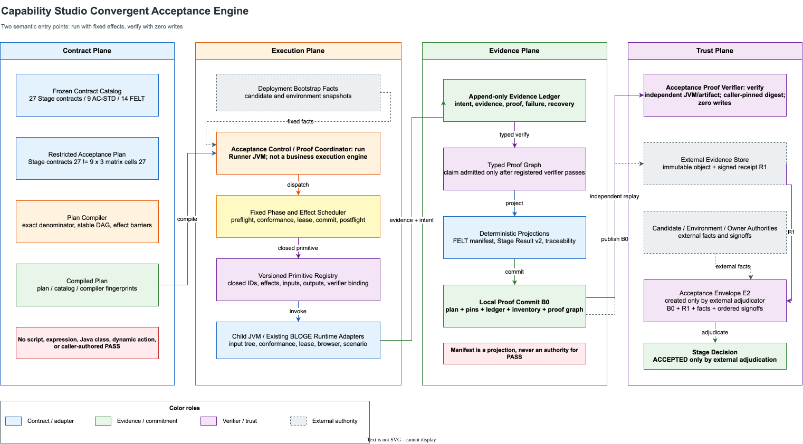
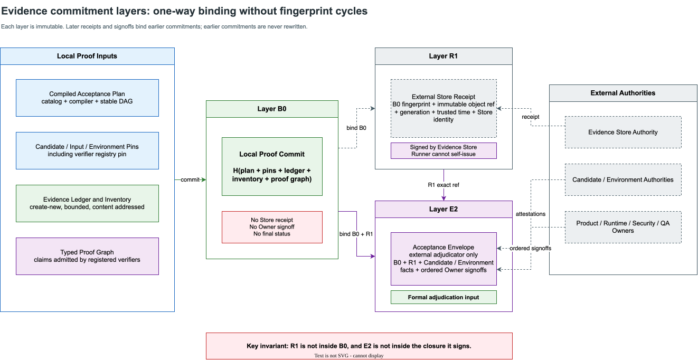

# Capability Studio 收敛式验收引擎技术设计

> 状态：`REVIEW_ACCEPTED_GATE_A_PENDING`
>
> 适用范围：Capability Studio、Resource Gateway Test Kit 与 `RG-CS-FELT-v1` 的开发验证和企业验收接入。
>
> 设计边界：本文改变 formal acceptance 的实现组织方式，不改变 27 个 Stage-exit contract、`AC-STD-01..09`、`FELT-01..14`、`Stage Acceptance Result v2`、现有 Authority 协议或正式签署责任。
>
> 结论边界：仓库内引擎最多自行产生 `DEVELOPMENT_VERIFIED`。真实 Candidate、Environment、Evidence Store、Egress 和 Owner Authority 未闭合时，不能产生 `ACCEPTED`，`formalPassCount` 保持 `0/27`。

## 1. 最强判断

当前剩余工作的主要矛盾已经不是缺少某个 verifier，而是 formal acceptance 的控制流、证据语义和外部事实被分散在大量 CLI、Schema、脚本与调用约定中。继续增加一个调用所有既有 CLI 的更大 Runner，只会把分散复杂度搬到一个新的上帝脚本中，不能形成稳定的工程能力。

收敛方案必须同时完成三件事：

1. 把调用方需要理解的 formal acceptance 语义入口从十余个 CLI 收敛为 `run` 和 `verify` 两个入口。
2. 把 27 个合同、固定测试分母、证据角色和外部事实需求变成受限、可静态检查、可版本化的 Acceptance Plan。
3. 把“文件存在且摘要相等”升级为“由指定 typed verifier 对指定 Evidence 执行成功，并把复验结果写入不可变 Evidence Ledger”。

最终选择是：

> **固定安全骨架 + 受限声明式 Acceptance Plan + 版本化 Primitive Registry + 分层 Evidence Ledger + 调用方固定制品的独立 Proof Verifier。**

它不是一套通用工作流平台，也不是 BLOGE 业务 DAG 的第二个实现。准确命名是 **Acceptance Control and Proof Coordinator**：它只编排既有 Runtime/Verifier，不能解释 Graph、Operator、业务 DSL 或业务 Oracle。Test Kit 必须通过构建依赖规则证明 Coordinator 不含第二套业务执行语义。

### 1.1 实施前 P0 硬门禁

以下三项在任何 Compiler、Scheduler 或 stateful Lease 新代码开始前必须关闭：

1. 当前 FELT manifest verifier 在缺少 typed proof 时，只能返回 `STRUCTURE_VERIFIED/INCOMPLETE`，不得把占位 JSON、role 和自报计数升级为 `DEVELOPMENT_VERIFIED`。
2. 独立 verifier 必须是调用方提供并固定 digest 的独立 artifact/process；Runner 不能把自己的可变实现、Registry 或 Compiler 当作信任根。
3. 现有输出 `ACCEPTED` 的 CLI 必须被明确分类为 legacy formal-adjudication adapter，并证明它消费真实外部 Authority；做不到时必须降级为 `DEVELOPMENT_VERIFIED/INCOMPLETE`。新的本地 Runner 永远不得输出 `ACCEPTED`。

三项任一未关闭，设计状态保持 `NO_GO`。架构图、Schema 或测试数量增长都不能替代该门禁。

## 2. 为什么此前推进慢

### 2.1 事实盘点

截至本设计冻结时，Test Kit 中 Capability Studio formal 路径具备以下特征：

| 观察项 | 当前量级 | 结构性问题 |
|---|---:|---|
| Capability Studio 相关主类 | 约 48 个 | 调用方需要知道多个内部阶段 |
| CLI | 至少 11 个 | 参数、退出码和调用顺序分散 |
| Verifier | 至少 18 个 | 结构校验与业务证明没有统一编排 |
| 相关主代码 | 约 30,000 行 | 复杂度没有隐藏在稳定接口后 |
| `CapabilityStudioExecutionLeaseEvidenceCli` | 3,092 行 | CLI 同时承担执行、恢复、证据和输出职责 |
| 正式语义入口 | declare、snapshot、verify、conformance、stage、lease、publish 等 | 调用方可以错误组合阶段 |

这些数字不说明代码质量低，而是说明模块深度不足：大量正确性知识仍暴露为调用者必须掌握的顺序和组合规则。

### 2.2 最近反例揭示的病根

严格 FELT manifest 的第一版实现可以校验：

- Schema；
- canonical JSON；
- evidence role；
- 文件 identity、UID、mode、nlink；
- raw/canonical fingerprint；
- 14 项计数和最终状态。

但如果 manifest 将若干自写的 `{"ok": true}` 文件声明为 FELT Evidence，它仍可能得到 `DEVELOPMENT_VERIFIED`。原因不是摘要算法不够严格，而是**manifest verifier 不知道每种 Evidence 必须由哪个真实 verifier 证明什么**。

这给出三个直接结论：

1. Evidence inventory 只能证明“文件闭合”，不能证明“机器 Oracle 已成立”。
2. `status=PASS` 必须由 proof engine 根据 typed verifier 结果推导，不能由 manifest 作者填写后被信任。
3. 计划、执行、证据、复验和终态必须共享同一份编译结果，不能靠文档约定人工拼接。

### 2.3 过去方案的错误抽象

过去把“每个验收缺口”当成一个独立 CLI 或 verifier 问题。实际上，多个缺口共享同一个根因：

```text
验收合同没有被编译为唯一执行图
  -> 调用顺序依赖脚本纪律
  -> Evidence role 与真实 verifier 脱节
  -> manifest 只能检查自报状态
  -> retry、外部发布和签署不断产生新的拼接边界
  -> 每轮继续增加局部机制
```

新的实现必须关闭这条因果链，而不是继续在末端增加检查。

## 3. 目标与非目标

### 3.1 设计目标

1. 对调用方只提供一个有副作用的 `run` 和一个纯只读 `verify`。
2. 27 个正式合同和 14 个 FELT obligation 不能被调用方缩小、跳过或重排。
3. Acceptance Plan 只能引用闭集 primitive、oracle 和 evidence role，不能执行任意代码。
4. 每个 `PASS` 必须来自指定 typed verifier 的可复算 proof result。
5. 执行、恢复、发布和复验使用同一 plan fingerprint、material pins 和 transaction identity。
6. 证据写入采用不可覆盖、可恢复、可枚举、可独立复验的 Ledger。
7. 外部 Store receipt、Authority fact 和 Owner signoff 作为外部事实接入，不能由 Runner 自签。
8. 保持既有 wire Schema 与部署入口兼容，通过 projection 和 legacy adapter 渐进迁移。
9. 新增验收义务时，优先增加 Plan 数据、Primitive/Verifier 对和测试，不复制整条控制流。
10. 明确区分仓库工程完成度和企业正式验收进度。

### 3.2 非目标

- 不实现任意 DAG、Shell、HTTP、SQL 或表达式工作流 DSL。
- 不替代 BLOGE 业务图执行引擎。
- 不在 Test Kit 中实现企业 PKI、KMS/HSM、IAM 或 Owner 组织目录。
- 不让本地 filesystem adapter 冒充外部 Evidence Store。
- 不修改 `Stage Acceptance Result v2` 或 `Authority Envelope v1` 的既有 wire bytes。
- 不自动生成业务 Oracle 或人工 UX 判断。
- 不在第一阶段删除旧 CLI；旧入口先变成兼容适配器。
- 不通过增加自动化测试数量改变 `formalPassCount=0/27`。

## 4. Design It Twice 结论

### 4.1 方案 A：硬编码 Full Runner

将现有 CLI 按固定顺序放入一个 Shell 或 Java orchestrator。

| 维度 | 评价 |
|---|---|
| 首次交付速度 | 快 |
| 调用方易用性 | 中，只有一条命令 |
| 内部复杂度 | 高，参数与错误翻译集中到新 Runner |
| 证据语义 | 弱，仍依赖各 CLI 自报结果 |
| 新增合同成本 | 高，需要改控制流和 manifest |
| 恢复一致性 | 容易出现跨 CLI 边界漂移 |
| 长期熵 | 高 |

该方案可以作为短期兼容桥，但不能作为目标架构。

### 4.2 方案 B：极小深模块

只暴露 `run` / `verify`，所有时序和恢复隐藏在模块内。

| 维度 | 评价 |
|---|---|
| 接口深度 | 高 |
| 调用方认知 | 最低 |
| 固定顺序安全性 | 高 |
| 合同演进 | 中，若全部硬编码仍需修改引擎 |
| Evidence 复用 | 中 |
| 迁移难度 | 中 |

该方案正确解决“调用者必须理解时序”的问题，但单独使用仍可能形成新的大类。

### 4.3 方案 C：声明式计划编译器

把合同、矩阵、证据和依赖编译为固定原语 DAG，Runner 只解释计划。

| 维度 | 评价 |
|---|---|
| 静态完整性 | 高，可在运行前发现漏项和循环 |
| 演进效率 | 高 |
| 可审计性 | 高，前提是语言受限 |
| 安全风险 | 中，若允许脚本或表达式会迅速失控 |
| 运行实现复杂度 | 中 |
| 误用风险 | 可通过 closed registry 控制 |

该方案必须限制为数据模型和静态展开器，不能成为第二套编程语言。

### 4.4 方案 D：Proof Graph 与 Evidence Ledger

每项 claim 只能由指定 typed verifier 产生，所有事实形成内容寻址、不可变的证明图。

| 维度 | 评价 |
|---|---|
| 防止自报 `PASS` | 最高 |
| 跨合同证据复用 | 高 |
| 独立复验 | 高 |
| 初始实现成本 | 中高 |
| 运维可解释性 | 高 |
| 过度设计风险 | 中，必须避免区块链化和通用化 |

该方案直接关闭当前 manifest 只校验文件而不校验语义的缺口。

### 4.5 采用的组合方案

采用 B、C、D 的组合：

- B 定义对外深接口；
- C 定义受限的合同编译与执行图；
- D 定义每个 `PASS` 的来源和证据闭包；
- A 仅作为迁移期 legacy adapter，不成为架构核心。

拒绝引入 Temporal、Argo、Jenkins 或新的服务端工作流平台。它们可以调度命令，但不能原生证明 Resource Gateway 的 Authority、Lease、Evidence 和 formal failure semantics，还会破坏 Test Kit 独立、轻量、可离线复验的约束。

## 5. 目标架构



架构分为四个平面：

| 平面 | 职责 | 不允许承担的职责 |
|---|---|---|
| Contract Plane | 定义固定合同、矩阵、Oracle、Evidence role 和外部事实需求 | 执行任意用户代码 |
| Execution Plane | 编译计划、固定顺序执行 primitive、处理 exact retry | 伪造外部事实或最终签署 |
| Evidence Plane | 保存内容寻址 Evidence、proof result 和分层 commitment | 根据 manifest 作者填写的状态直接判定通过 |
| Trust Plane | 独立复验、外部 Store receipt、Authority 与 Owner adjudication | 修改 Runner 现场或修复 Evidence |

### 5.1 不是第二套业务执行引擎

Coordinator 只能执行有限、无业务表达能力的控制原语：固定输入、调用既有 verifier/Runtime、提交既有 Lease、记录 Evidence、发布不可变 bundle。以下能力在模块依赖和代码审查中一律禁止：

- 解析或执行 BLOGE DSL；
- 调度 Operator、Graph node 或业务数据流；
- 实现 retry/fallback/decision table 等业务语义；
- 解释业务 Oracle 表达式；
- 直接调用 Resource API 产生业务结果；
- 建立第二套 Graph state、RunTrace 或 fixture runtime。

依赖方向固定为：

```text
Acceptance Coordinator
  -> Test Kit typed verifier adapters
  -> existing BLOGE / Resource Gateway Runtime through a child-process adapter

existing BLOGE / Resource Gateway Runtime
  -X-> Acceptance Coordinator implementation classes
```

构建门禁必须扫描 Test Kit 新包的依赖：出现 Graph parser、Operator scheduler、Resource runtime implementation 或业务 DSL evaluator 依赖时直接失败。Coordinator 的所谓 DAG 只是有限验收步骤的静态偏序，不支持循环、动态分支、业务 Payload 传递或用户节点，因此不构成业务执行引擎。

## 6. 一等领域对象

### 6.1 `AcceptanceContractCatalog`

版本化保存：

- 27 个 `S*-AC-*`；
- `AC-STD-01..09`；
- `FELT-01..14`；
- 每项合同的固定分母、Oracle ID、Evidence role、Owner role 和外部 fact requirement。

Catalog 是产品验收定义的机器投影，不是运行结果。调用方不能传入一个缩减后的 Catalog。

Catalog 必须显式区分两个恰好都等于 27、但语义完全不同的分母：

- `stageExitContractCount=27`：Stage 0 至 Stage 5 的正式退出合同总数；
- `canonicalMatrixCellCount=27`：9 个 Canonical Case 乘 3 轮的业务运行单元数。

任何 Schema、代码或 UI 使用裸 `27`、`passed=27` 或同一个 `count` 字段同时表达二者，均属于协议缺陷，必须在编译期拒绝。

### 6.2 `AcceptancePlanSource`

受限声明式输入，只表达：

- contract/revision exact ref；
- 固定集合展开；
- primitive ID 与版本；
- typed dependency；
- required evidence role；
- Oracle ID；
- fact requirement；
- recovery policy；
- terminal gate。

它不包含实现类、脚本、URL、动态表达式、任意函数或自定义 failure handler。

### 6.3 `CompiledAcceptancePlan`

Compiler 的唯一权威输出，至少包含：

```text
planId
planRevision
planFingerprint
compilerFingerprint
catalogFingerprint
exactContractIds
stageExitContractCount = 27
expandedObligationIds
canonicalMatrixCellCount
matrixCellIds
suiteRunIds
stableExecutionOrder
primitiveContracts
expectedEvidenceRoles
oracleBindings
factRequirements
resumeGraph
terminalGate
```

相同 Plan Source、Catalog 和 Compiler 版本必须产生逐字节相同的 canonical plan。

`stageExitContractCount`、`canonicalMatrixCellCount` 和 `matrixCellIds` 是三套独立字段。Canonical 9 Case x 3 轮的计划必须同时给出 27 个稳定 `matrixCellId` 和 3 个稳定 suite run identity；它们不能从 `stageExitContractCount` 推导，也不能写入裸 `expectedCount=27` 后由消费者猜测语义。

### 6.4 `PrimitiveContract`

Primitive 是引擎唯一可执行动作。每个 primitive 必须声明：

```text
primitiveId + revision
effectClass
inputKinds
outputEvidenceKinds
typedVerifierId + revision
retryPolicy
failureMapping
capabilityRequirements
```

`primitiveId` 来自 Test Kit 内建 closed registry。Plan 不能指定 Java class，也不能通过反射发现任意实现。

`PrimitiveDescriptor` 是 Compiler 与 Proof Verifier 唯一共享的声明来源。Compiler 读取其中的 input/output/effect/phase 定义做静态检查，Verifier 读取其中的 verifier artifact/profile 绑定做 proof replay；两边不得各自维护一份 role、Oracle 或 failure mapping 表。业务 Oracle 的实现仍只存在于既有 typed verifier/Runtime，Descriptor 只保存 exact ref，不能内嵌表达式。

### 6.5 `EvidenceRecord`

每份 Evidence 的身份至少包含：

```text
evidenceId
kind
role
producerPrimitive
producerRevision
actionKey
contentRef
byteSize
rawFingerprint
canonicalFingerprint | null
materialPins
createdAt
```

EvidenceRecord 只说明“产生了什么”，不说明“合同已通过”。

### 6.6 `ProofRecord`

ProofRecord 由 typed verifier 产生：

```text
proofId
claimId
verifierId + revision
verifierArtifactFingerprint
inputEvidenceIds
oracleId
verdict
closedReasonCode
verifiedAt
proofFingerprint
```

只有 `ProofRecord.verdict=PASS` 且 verifier、Oracle、Evidence 和 material pins 与 Compiled Plan 精确匹配时，对应 claim 才能成为 `PASS`。

### 6.7 `ExternalFactRecord`

Runner 不能创建以下事实，只能导入和验证：

- Candidate Attestation；
- Environment Attestation；
- Target Binding；
- Deployment Egress observation；
- Evidence Store receipt；
- Owner signoff；
- revocation、Key Set 和 trusted clock snapshot。

External fact 缺失时为 `BLOCKED` 或 `INCOMPLETE`；签名、Scope、TTL 或 fingerprint 不一致时为 `FAIL/INVALID`。

每类 External Fact 都必须有独立 strict Schema，不允许用一个开放 `Map` 包住不同 Authority：

| Fact | Schema/既有协议 | 必绑坐标 | 时效与撤销 | 缺失/不可用 | 已验证不一致 |
|---|---|---|---|---|---|
| Candidate | Candidate Attestation v1 + detached proof | candidate/build/revision/commit/CLEAN/artifact digest/intent | issuer Key Set、TTL、revocation snapshot、trusted clock | `BLOCKED` | `FAIL` |
| Environment | Environment Attestation v1 + detached proof | candidate、target、runtime、region、network、feature flags、window | Environment issuer、TTL、revocation、clock | `BLOCKED` | `FAIL` |
| Target Binding | Target Binding v1 | result/contract/lease、两份 attestation、target raw/canonical | deployment-owned pin、admission window | `BLOCKED` | `INVALID/FAIL` |
| Evidence Store | `capability-studio-evidence-store-receipt-v1` | B0、object ref、generation、store identity、publishedAt | Store issuer、Key Set、retention、revocation | `BLOCKED` | `FAIL` |
| Owner Signoff | `capability-studio-owner-signoff-v1` | B0、R1、role、Scope、decision | Owner Authority、role policy、TTL、revocation、ordered time | `INCOMPLETE` | `REJECTED/FAIL` |

Resolver 必须返回 closed result：`RESOLVED`、`ABSENT`、`UNAVAILABLE`、`REVOKED`、`EXPIRED`、`SCOPE_MISMATCH`、`SIGNATURE_INVALID`、`CONTENT_MISMATCH`。异常消息、旁附公钥和调用方自报 issuer 不能进入判断。

## 7. 两个公共语义接口

### 7.1 `run`

```java
public interface CapabilityStudioAcceptanceEngine {

    AcceptanceRunOutcome run(AcceptanceRunRequest request);
}
```

Java 调用使用 typed command；CLI 只负责把 strict request document 解码成该类型：

```java
public record AcceptanceRunRequest(
        String runId,
        String transactionId,
        String idempotencyKey,
        RunPurpose purpose,
        ExactArtifactRef compiledPlan,
        ExactArtifactRef candidateSnapshot,
        ExactArtifactRef authorityInputTree,
        ExactArtifactRef targetInputTree,
        ExactArtifactRef stageResult,
        ExactArtifactRef environmentSnapshot,
        ExactArtifactRef stateDescriptor,
        PrivateRunRoot privateRunRoot,
        PublicationPin localPublication,
        ResumeToken resumeToken) {
}
```

CLI request document 使用 `capability-studio-acceptance-run-request-v1.schema.json`，其 wire 字段与 typed command 一一对应。不存在“JSON 中还有一批 Java 接口未表达的隐藏参数”。Request 固定：

- plan exact ref 和 fingerprint；
- transaction identity；
- candidate snapshot exact ref；
- Authority/Target input-tree snapshot exact ref；
- Stage Result exact ref；
- state descriptor/root exact ref；
- local publication parent pin；
- environment snapshot exact ref；
- 可选外部 Store profile ref，不含凭证。

`AcceptanceRunOutcome` 使用 strict result Schema，至少包含：

```text
runId / transactionId / idempotencyKey
purpose
outcome
planFingerprint
materialAggregateFingerprint
lastDurableSequence
resumeToken | null
localCommitRef | null
externalReceiptRef | null
passed / failed / blocked / notRun
closedReasonCodes
statusProjectionRef
```

重复 `idempotencyKey` 只有在 transaction、Plan 和全部 material pins 精确相等时才能返回同一 outcome；任一坐标漂移必须拒绝。`resumeToken` 是对同一 durable ledger head 的不透明、带 fingerprint 的 continuation，不允许调用方手写 next action。

调用方不能传入：

- 任意 contract IDs；
- `formalPassCount`；
- Provider 实例；
- callback、Supplier 或 `AcceptanceFlow`；
- signer、私钥、旁附公钥；
- 任意 shell/HTTP action；
- 可修改的 terminal status。

### 7.2 `verify`

```java
public interface CapabilityStudioAcceptanceProofVerifier {

    AcceptanceVerificationOutcome verify(AcceptanceVerificationRequest request);
}
```

Verifier：

- 纯只读；
- 不加载 Provider classpath；
- 不持有 state root 写权限；
- 不创建 lock、snapshot、journal、receipt 或 signoff；
- 不执行 repair；
- 独立解析 Compiled Plan；
- 重新运行 typed verifier；
- 重建 proof graph 和所有 projection；
- 验证分层 commitment 与外部 receipt。

`AcceptanceVerificationRequest` 必须固定 bundle、Compiled Plan、expected pins、独立 verifier artifact、caller-owned trust policy 和 verification time。独立 verifier artifact 由调用方提供、在进程启动前固定 raw digest，并在不含 Runner/Provider classpath 的独立 JVM 中执行；Runner 生成的 Registry、Compiler 输出或内嵌公钥不能成为信任根。Verifier artifact mutation、wrong digest、同名不同制品和 TCK 不一致均失败关闭。

产品控制面需要的 `preflight/status/evidence/replay` 不扩展验收内核的副作用接口：

- preflight 是 `run` 的 `purpose=PREFLIGHT_ONLY` 受限模式，固定零副作用；
- status/evidence 是从 Ledger 重建的只读 projection；
- replay 调用独立 `verify`，不重新执行业务副作用；
- 对外 HTTP/API 仍可保留四个资源端点，但它们不能绕过 `run/verify` 语义。

旧 CLI 保持参数兼容，但长期都只委托这两个接口。`provision` 仍是部署控制面操作，不计入验收事务语义入口。

## 8. 受限 Acceptance Plan

### 8.1 示例

```json
{
  "schemaVersion": "capability-studio.acceptance-plan.v1",
  "planId": "RG-CS-FELT-v1",
  "revision": 1,
  "compilerProfile": "formal-evidence-v1",
  "catalogRef": "capability-studio-contract-catalog-v1@sha256:...",
  "obligationSet": "FELT-01..FELT-14",
  "primitives": [
    {
      "id": "verify-fixed-material",
      "type": "VERIFY_FIXED_MATERIAL_V1",
      "dependsOn": [],
      "produces": ["CANDIDATE_PINS", "INPUT_PINS", "ENVIRONMENT_PINS"]
    },
    {
      "id": "verify-authority-tree",
      "type": "VERIFY_FORMAL_INPUT_TREE_V1",
      "dependsOn": ["verify-fixed-material"],
      "inputSlot": "AUTHORITY"
    },
    {
      "id": "verify-target-tree",
      "type": "VERIFY_FORMAL_INPUT_TREE_V1",
      "dependsOn": ["verify-fixed-material"],
      "inputSlot": "TARGET"
    },
    {
      "id": "provider-conformance",
      "type": "RUN_PROVIDER_CONFORMANCE_V2",
      "dependsOn": ["verify-authority-tree", "verify-target-tree"]
    },
    {
      "id": "execute-lease-evidence",
      "type": "EXECUTE_LEASE_EVIDENCE_V1",
      "dependsOn": ["provider-conformance"]
    },
    {
      "id": "verify-durable-wrapper",
      "type": "VERIFY_DURABLE_WRAPPER_V1",
      "dependsOn": ["execute-lease-evidence"]
    },
    {
      "id": "verify-packaged-matrices",
      "type": "VERIFY_PACKAGED_FELT_MATRICES_V1",
      "dependsOn": ["verify-durable-wrapper"]
    },
    {
      "id": "postflight",
      "type": "VERIFY_MATERIAL_POSTFLIGHT_V1",
      "dependsOn": ["verify-packaged-matrices"]
    },
    {
      "id": "commit-local-proof",
      "type": "COMMIT_LOCAL_PROOF_BUNDLE_V1",
      "dependsOn": ["postflight"]
    }
  ],
  "terminalGate": "DEVELOPMENT_VERIFIED_ONLY"
}
```

这里的 JSON 只是可审计数据。`type` 的行为、输入、输出、effect class 和 verifier 全部由固定 Registry 决定。

### 8.2 允许和禁止的语言能力

| 允许 | 禁止 |
|---|---|
| 有界集合展开 | 用户自定义函数 |
| 固定 primitive 引用 | Java class、反射或 ServiceLoader 选择 |
| 固定依赖 | 动态依赖和递归 |
| 固定 enum 比较 | 任意表达式语言 |
| 固定 matrix/catalog ref | 运行时缩小分母 |
| 固定 retry policy | 自定义 failure handler |
| 固定 evidence role | 自报 `PASS` |
| 固定 fact requirement | 用 Plan 内字段伪造外部事实 |

### 8.3 Compiler 必须拒绝的计划

- obligation 集合不是 frozen Catalog 的精确集合；
- dependency 有环或存在未知节点；
- 同一 primitive ID 重复；
- primitive revision 未注册；
- effect barrier 被绕过；
- `PASS` claim 没有 typed verifier；
- required evidence role 没有 producer；
- Evidence producer 没有对应 verifier；
- resume point 位于不可恢复的副作用中间；
- matrix 数量超限或可被运行参数缩减；
- formal terminal gate 允许本地事实直接产生 `ACCEPTED`。

## 9. 固定安全骨架与 Effect Model

声明式 Plan 不能任意决定安全关键顺序。Compiler 将 primitive 映射到固定 phase：

```text
BOOTSTRAP_FACTS
  -> MATERIAL_SNAPSHOT
  -> READ_ONLY_PREFLIGHT
  -> PROVIDER_CONFORMANCE
  -> STATEFUL_EXECUTION
  -> DURABLE_LOCAL_COMMIT
  -> INDEPENDENT_VERIFICATION
  -> MATERIAL_POSTFLIGHT
  -> EXTERNAL_PUBLICATION
  -> EXTERNAL_ADJUDICATION
```

每个 primitive 只有一种 effect class：

| Effect class | 语义 | 恢复策略 |
|---|---|---|
| `PURE_VERIFY` | 只读、确定性 verifier | 相同输入可重跑 |
| `LOCAL_IMMUTABLE_WRITE` | create-new 本地 Evidence | 已存在时先独立复验，再精确恢复 |
| `AUTHORITY_LEASE` | 原子业务/治理 Lease | 用稳定 request identity 恢复同一 receipt |
| `EXTERNAL_PUBLISH` | 发布不可变 Evidence object | 根据 object key 和 bundle fingerprint 查询同一 receipt |
| `EXTERNAL_FACT_IMPORT` | 导入外部 Attestation/Signoff | 不产生事实，只验证和绑定 |

Compiler 固定以下 barrier：

1. `PURE_VERIFY` 的全部 preflight 未通过前，不执行任何写入。
2. Provider Conformance 未通过前，不进入 Lease。
3. Lease 一旦提交，后续失败不得回滚或删除 Evidence。
4. Durable local commitment 未形成前，不允许外部发布。
5. 外部 Store receipt 必须晚于 local commitment。
6. Owner signoff 必须晚于 Evidence Store receipt 和完整 Evidence closure。
7. 任何本地 primitive 都不能直接产生正式 `ACCEPTED`。

## 10. Evidence Ledger 与 Proof Graph

### 10.1 为什么不用“再加字段”的 manifest

Manifest 是最终投影，不应是事实来源。新的权威关系是：

```text
Primitive execution
  -> EvidenceRecord
  -> Typed verifier
  -> ProofRecord
  -> Claim projection
  -> Manifest projection
```

Manifest 的 `PASS` 必须从 ProofRecord 推导。如果作者直接编辑 manifest，它会因为 Ledger、Proof Graph 和 commitment 不一致而被拒绝。

### 10.2 Ledger 文件布局

```text
run-root/
  run-request-v1.json
  compiled-plan-v1.json
  material-snapshots/
  ledger/
    00000001-run-opened.json
    00000002-action-intent.json
    00000003-evidence-added.json
    00000004-proof-recorded.json
    ...
  evidence/
    sha256/<digest>
  projections/
    felt-manifest-v1.json
    stage-result-v2.json
    traceability-matrix-v1.json
  commitments/
    local-proof-commit-v1.json
  external/
    evidence-store-receipt-v1.json
    authority-facts/
    owner-signoffs/
  final/
    acceptance-envelope-v1.json
```

约束：

- 每条 Ledger record 使用 create-new 独立文件，不使用容易出现 torn append 的单一日志文件；
- sequence 连续，记录前一条 raw fingerprint；
- record、Evidence blob 和目录都执行 bounded size/count、identity、UID、mode、nlink 和 symlink 检查；
- projection 可从 Ledger 重建，不是权威输入；
- unknown sibling 保持不变并导致失败关闭；
- Ledger commit 后不得原地追加改变既有 commitment 的内容。

### 10.3 证据语义绑定

每个 evidence role 必须在 Primitive Registry 中绑定 verifier：

| Evidence role | 必需 typed verifier 示例 |
|---|---|
| `INPUT_PINS` | `FormalInputTreeVerifier v1` |
| `EXISTING_ONLY_OBSERVATION` | `DeploymentStateObservationVerifier v1` |
| `DURABLE_EVIDENCE_CLOSURE` | `ExecutionLeaseEvidenceBundleVerifier v1` |
| `CLOSED_RESULT_MATRIX` | `ClosedResultMatrixVerifier v1` |
| `CHILD_JVM_CRASH_MATRIX` | `PackagedCrashMatrixVerifier v1` |
| `ADVERSARIAL_COMPATIBILITY` | `CompatibilityMatrixVerifier v1` |
| `STRICT_FINAL_GATE` | `AcceptanceProofGraphVerifier v1` |

这意味着普通 canonical JSON 即使具有正确 role 和 fingerprint，也不能成为 ProofRecord 的有效输入。

Verifier Registry 本身也必须进入 material pin。每个 `VerifierDescriptor` 至少绑定 verifier ID/revision、输入 Schema、输出 claim kind、实现制品 fingerprint 和 policy fingerprint；替换实现 JAR、Schema 或 policy 后，旧 ProofRecord 自动失效，不能只凭相同 verifier 名称继续复用。

### 10.4 防止指纹循环的三层 commitment



采用三层、单向引用：

1. `LocalProofCommit B0`：绑定 Compiled Plan、material pins、Ledger、Evidence inventory 和本地 proof graph。
2. `ExternalStoreReceipt R1`：由外部 Store 签发，绑定 `B0`、immutable object ref、generation、trusted time 和 Store identity。
3. `AcceptanceEnvelope E2`：绑定 `B0 + R1 + Authority facts + Owner signoffs`，由既有正式 adjudication 协议裁决。

`R1` 不进入 `B0`，Owner signoff 不进入其签署前的 Evidence closure，因此不存在“收据必须包含自己”或“签名参与被签名内容”的循环。

三层属于同一逻辑 Ledger 的连续 segment，但每层形成新的不可变 commitment，旧层不被改写。

三层 wire contract 在 Phase 1 前冻结：

```text
capability-studio-local-proof-commit-v1.schema.json
capability-studio-evidence-store-receipt-v1.schema.json
capability-studio-acceptance-adjudication-envelope-v1.schema.json
```

哈希域固定为：

```text
B0 = H("RG-CS-LOCAL-PROOF-COMMIT-v1" || canonical({
  compiledPlanRawFingerprint,
  candidateInputEnvironmentAggregate,
  verifierRegistryFingerprint,
  ledgerHeadFingerprint,
  evidenceInventoryFingerprint,
  proofGraphFingerprint
}))

R1.context = H("RG-CS-STORE-PUBLICATION-v1" || canonical({
  B0,
  immutableObjectRef,
  generation,
  storeIdentity,
  publishedAt
}))

E2 = H("RG-CS-ACCEPTANCE-ADJUDICATION-v1" || canonical({
  B0,
  R1.rawFingerprint,
  authorityFactFingerprints,
  orderedOwnerSignoffFingerprints,
  recomputedDecision
}))
```

所有数组有固定顺序，所有对象使用 strict canonical JSON。E2 只能由部署方拥有的外部 adjudicator 产生；Runner 只能生成 B0、请求 R1 并输出 `READY_FOR_ADJUDICATION`。receipt replay、错 generation、B0 substitution、把 E2 放回 B0、signoff 早于 R1 和 adjudicator issuer 不受信均为固定负向测试。

## 11. 执行与恢复状态机

### 11.1 Run 状态

```text
NEW
  -> PREPARED
  -> PREFLIGHT_VERIFIED
  -> EXECUTING
  -> LOCAL_COMMITTED
  -> DEVELOPMENT_VERIFIED
  -> EXTERNALLY_PUBLISHED
  -> READY_FOR_ADJUDICATION
```

任一阶段还可以进入：

- `INCOMPLETE`：有 `NOT_RUN` 或等待外部事实；
- `BLOCKED`：依赖、权限、锁、I/O、metadata、Provider 或 Store 不可用；
- `REJECTED`：Authority 明确拒绝；
- `INVALID`：Schema、pin、identity、闭包或 canonical bytes 非法；
- `FAIL`：已执行 Oracle 或系统不变量失败。

`ACCEPTED` 不是 Runner 状态，而是外部 adjudication 对 `E2` 的正式决定。

### 11.2 Action 状态

```text
PENDING -> INTENT_DURABLE -> RUNNING -> RESULT_DURABLE -> VERIFIED
                       \-> CRASHED -> RECOVERING -> VERIFIED
```

恢复条件必须精确相等：

- transaction identity；
- plan fingerprint；
- candidate/input/environment pins；
- action key；
- primitive revision；
- 已完成 Evidence 和 ProofRecord 仍可复验；
- 下一 action 是 Compiled Plan 的合法 successor。

否则不能恢复旧事务，只能创建新事务。`RECOVERED` 是本次调用方式，不是改写已提交 receipt 的持久业务状态。

### 11.3 Action key

```text
actionKey = H(
  planFingerprint,
  primitiveId,
  primitiveRevision,
  canonicalInputEvidenceIds,
  relevantMaterialPins,
  transactionIdentity
)
```

默认只允许同一事务 exact retry 复用 action。跨候选、跨事务或跨环境缓存默认禁止，避免把增量构建思路误用于正式验收事实。

### 11.4 跨进程 Owner 与 fencing

每个 private run root 同一时间只允许一个 active owner。Owner record 使用 create-new/CAS 语义并固定：

```text
runId / transactionId / idempotencyKey
ownerInstanceId
ownerProcessIdentity
fencingEpoch
acquiredAt / leaseUntil
ledgerHeadSequence / ledgerHeadFingerprint
ownerRecordFingerprint
```

规则：

1. 新 owner 只能在可信时钟证明旧 lease 过期，并对同一 owner generation 完成 CAS 后取得更大的 `fencingEpoch`。
2. 每条 Action Intent、Ledger record、Lease request 和 Store publish request 都绑定当前 epoch；stale owner 的后续写入被拒绝。
3. sequence 由 owner 在锁内基于已复验的 ledger head 单调分配；不允许两个 JVM 预留重叠区间。
4. 两个 Worker 同时恢复时，最多一个取得新 epoch；失败方返回 `BLOCKED/RG.ACCEPTANCE.OWNER_CONTENDED`，不能执行 Provider 或写 Evidence。
5. OS lock 只负责互斥，持久 owner/generation/fencing 才负责 crash 后裁决；不能把 stale lock 文件删除当恢复。
6. 取消只写入受 fencing 保护的 cancel intent。Lease 已提交时只能停止后续步骤并保留证据，不能回滚。

固定并发矩阵至少覆盖：双 JVM 首次拥有、owner crash、lease 过期竞争、stale owner 延迟写、同 idempotency exact retry、不同 transaction 冲突、取消与 Store publish 竞争、trusted clock unavailable。

## 12. 外部 Bootstrap 与自证边界

Java 进程无法在启动前证明自身 JAR、JVM 和 classpath 没有变化。因此 pre-JVM pin 不能由 Runner 自证。

正确边界是：

1. 部署控制面或 CI bootstrapper 创建 Candidate Snapshot 和 Bootstrap Fact。
2. Runner 启动后验证 Snapshot 与 out-of-band pin 相等。
3. 正式环境中，Bootstrap Fact 必须由 Candidate Authority 签发或被其 attestation 覆盖。
4. 仓库提供的 POSIX bootstrap 只能产生开发级 Evidence，不能代替企业 Candidate Authority。

参考部署适配器可以是：

- CI artifact promotion job；
- Kubernetes init container；
- 企业发布系统的 deployment hook；
- 本地开发 POSIX script。

它们都输出同一 `candidate-bootstrap-fact-v1`，但只有受信 Authority 签发的事实能进入正式 adjudication。

## 13. Adapter 边界

### 13.1 Primitive Adapter

既有能力通过 adapter 接入，不复制实现：

- Formal Input Tree snapshot/verify；
- Provider Conformance；
- Stage Result v2 verifier；
- existing-only state observation；
- Execution Lease Evidence；
- durable wrapper verifier；
- Browser/Anomaly matrix verifier；
- Dataset、Scenario、Governed Run Evidence verifier。

每个 adapter 只将既有闭集结果翻译为 `EvidenceRecord + ProofRecord`，不得改变既有结果语义。

### 13.2 Evidence Store Adapter

内部接口：

```java
interface EvidenceStorePublisher {
    StorePublicationOutcome publish(LocalProofCommit commit);
}
```

要求：

- 没有 production 默认实现；
- dev filesystem adapter 必须显式标记 `DEVELOPMENT_ONLY`；
- receipt 必须由独立 `EvidenceStoreReceiptVerifier` 校验；
- Store outage 返回 `BLOCKED`，保留 `B0` 供 exact retry；
- credentials 不进入 request、Ledger、stdout 或 exception。

### 13.3 External Fact Adapter

```java
interface ExternalFactResolver {
    ExternalFactOutcome resolve(FactRequirement requirement, TrustContext trust);
}
```

Resolver 由部署方提供。Plan 只能声明需要什么事实，不能选择 issuer 或旁附信任根。

### 13.4 Legacy Wire Adapter

以下协议保持不变并作为 projection：

- `Stage Acceptance Result v2`；
- `Formal Input Tree v1`；
- `Execution Lease Transcript v1`；
- durable wrapper v1；
- FELT manifest v1；
- Candidate/Environment Attestation；
- Target Binding；
- Authority Envelope v1。

新引擎不重新解释旧证据。旧结果只有在 plan、catalog、primitive/verifier revision 和 material pins 精确匹配时才能导入。

## 14. 失败语义

### 14.1 统一判定顺序

1. 先判定直接失败不变量；
2. 再判定输入和能力是否 `BLOCKED`；
3. 再判定 obligation 分母和 `NOT_RUN`；
4. 再判定 typed proof 是否完整；
5. 再判定 durable local commitment；
6. 再判定外部 Store receipt；
7. 最后判定 Authority 与 Owner signoff。

### 14.2 结果闭集

| 状态 | 条件 | CLI 退出码 |
|---|---|---:|
| `DEVELOPMENT_VERIFIED` | 本地计划、执行、typed proof、FELT 14/14 和独立复验完整；正式外部事实仍单独展示为未闭合 | 0 |
| `INCOMPLETE` | 存在 `NOT_RUN`，或正在等待不属于本次开发合同的外部 adjudication 输入 | 3 |
| `BLOCKED` | 必需能力、权限、锁、I/O、Provider、Authority 或 Store 不可用 | 3 |
| `REJECTED` | 已执行 Authority 判断明确拒绝 | 3 |
| `INVALID` | 协议、pin、identity、canonical bytes、Plan 或 closure 非法 | 2 |
| `FAIL` | 已执行 Oracle 或系统不变量失败 | 2 |

为消除歧义：

- `DEVELOPMENT_VERIFIED` 不要求企业 Owner signoff；否则开发合同永远无法完成。
- 当用户请求的是 formal adjudication 而外部 Store/Owner 缺失时，结果为 `INCOMPLETE/BLOCKED`。
- 两种执行意图必须由 request 中的固定 `runPurpose=DEVELOPMENT_PROOF|FORMAL_ADJUDICATION` 区分，不能通过运行时猜测。
- 无论哪种 purpose，Runner 都不能输出 `ACCEPTED`。

现有 `CapabilityStudioExecutionLeaseEvidenceCli` 的 `ACCEPTED status=ACCEPTED` 不自动继承到新 Runner。Phase 0 必须审计其输入闭包：

- 若它确实消费受信 Candidate/Environment/Target/Evidence/Owner Authority，则保留为 `legacy formal-adjudication adapter`，只能由 `purpose=FORMAL_ADJUDICATION` 的外部部署入口调用；
- 若任一外部事实缺失，则该成功行必须降级并发布兼容说明，不能用既有名称继续暗示正式接受；
- 新 `CapabilityStudioFormalCli run` 不得委托 legacy CLI 的 terminal rendering，也不得把 legacy exit 0 直接映射为开发或正式成功。

### 14.3 信息安全

- stdout 只输出一行 payload-free closed result；
- stderr 不输出路径、Payload、Credential、actor、签名内容或异常消息；
- reason 使用 closed code；
- 子进程输出进入有界隔离文件并经过泄漏扫描；
- Evidence role 只能来自 closed enum；
- ProofRecord 不复制业务 Payload。

## 15. 与 27 个 Stage-exit contract 的关系

Acceptance Engine 不把 27 个合同变成一个大事务。它编译每个 Stage 的 proof graph，并允许同一 immutable Evidence 被多个 claim 引用，但每个 claim 都保留自己的 Oracle、Owner 和有效期。

27 个合同必须在 Catalog 中精确存在：

```text
Stage 0: 6
Stage 1: 5
Stage 2: 4
Stage 3: 4
Stage 4: 4
Stage 5: 4
Total: 27
```

FELT 是 formal runner 的 14 项开发合同，不替代浏览器、业务正确性、安全、容量和人工体验合同。Proof Graph 允许例如 `DURABLE_EVIDENCE_CLOSURE` 被多个 Stage claim 引用，但不能用它推导未执行的业务 Oracle。

正式进度仍按：

```text
formalImplementationGap = (27 - formalPassCount) / 27 * 100%
```

引擎完成只能将状态推进到“仓库具备正式验收执行能力”，不能凭空增加正式 `formalPassCount`。

## 16. 迁移方案

迁移主纵切固定绑定 `GP-08`、`S0-AC-04` 和 `RG-CS-FELT-v1`。用户任务是“对同一不可变候选运行固定验证并独立确认它证明了什么”；实现 Owner 为 Test Kit，验收 Owner 为 Runtime、QA、Security，正式外部事实仍由 Deployment/Evidence/Owner Authority 提供。

首个纵切不一次引入 Compiler、Ledger、Scheduler 和 Lease。它拆成三道可独立提交、可回滚的门：

| Gate | 唯一目的 | 允许改动 | 明确不做 | 退出证据 |
|---|---|---|---|---|
| `GATE-A TYPED_REPLAY` | 关闭占位 JSON 自报 PASS | Evidence type/role registry、三个既有 verifier adapter、placeholder/tamper negative | 不加 Plan Compiler，不执行 Lease | 同一真实 Evidence 可 replay；占位 JSON `INVALID`；manifest-only 最高 `STRUCTURE_VERIFIED` |
| `GATE-B COMPILE_ONLY` | 证明合同和分母能确定性编译 | Plan/Catalog/Primitive Schema、Compiler、独立 plan verifier | 不加 Scheduler，不执行任何 primitive | 27 contracts、27 matrix cell IDs、14 FELT 精确且 fingerprint 稳定 |
| `GATE-C PROOF_PROJECTION` | 用 ProofRecord 推导 manifest | 最小 Ledger、ProofRecord、manifest projection、独立 replay | 不接 stateful Lease，不发布外部 Store | projection 可重建；自报 status 不被信任；旧/新结构 differential 一致 |

只有 Gate A/B/C 分别通过 P0/P1 复审，才进入 legacy full runner facade 和 stateful Lease。任一 Gate 失败只回滚本 Gate，不要求撤销前一 Gate 的 wire contract。

### 16.1 机器可审计 GateResult

Gate A 必须生成符合 `capability-studio-implementation-gate-result-v1.schema.json` 的 canonical GateResult，并由独立 Gate verifier 复算。v1 有意只接受 `gateId=GATE-A`、`previousGateResultRef=null` 和 `nextAllowedGate=null|GATE-B`，不提前为尚未冻结的 Gate B/C 提供通用 PASS 入口。Gate B/C 到各自设计冻结时发布新的 admission profile 和固定分母。允许状态只有 `OPEN`、`PASS`、`FAIL`：

```text
gateId / gateRevision
designRef / gateProfileRef
previousGateResultRef
requirementRefs
artifactFingerprints
testEvidenceRefs
independentReview
decision
rollbackTarget
nextAllowedGate | null
closedReasonCodes
formalPassCount = 0
formalExpectedCount = 27
gateResultFingerprint
```

`PASS` 必须同时满足：

- Gate 固定 requirement refs 精确覆盖，不接受“至少有若干项”；
- 实现候选、独立 verifier、Gate verifier 和测试报告 artifact 均有 exact ref/raw fingerprint；
- 所有固定 test evidence 状态为 `PASS` 且无 skipped；
- 独立 Reviewer 的 artifact、Authority、review evidence 和时间均在被审候选之后；
- `openP0=0`、`openP1=0`；
- rollback target 可解析；
- GateResult fingerprint 可独立复算；
- Gate A 的 previous ref 固定为空；未来 Gate B/C 必须绑定同一演进链前一 Gate 的 exact PASS result；
- `formalPassCount` 保持 0。

Gate A 的固定 requirement 和 test denominator：

| Requirement | 固定 Evidence |
|---|---|
| `GATE-A-P0-01-TYPED-EVIDENCE` | placeholder、wrong kind、wrong verifier revision 全部 `INVALID`；manifest-only 最高 `STRUCTURE_VERIFIED` |
| `GATE-A-P0-02-INDEPENDENT-VERIFIER` | caller-pinned independent artifact；wrong digest、artifact mutation、Registry mutation 和 TCK mismatch 全部拒绝 |
| `GATE-A-P0-03-LEGACY-TERMINAL` | Authority 完整的 legacy 正例；缺 Store、Owner、Target 任一事实时无 `ACCEPTED` 文案且退出码非 0 |
| `GATE-A-P1-01-MANIFEST-STABILITY` | manifest 验证期间替换、删除或 identity drift 失败关闭 |
| `GATE-A-P1-02-HONEST-INCOMPLETE` | `NOT_RUN/BLOCKED` obligation 不需要伪造 PASS Evidence |

Gate A 缺少任一 requirement、artifact 或 test evidence 时，`decision` 只能是 `OPEN/FAIL`，`nextAllowedGate` 必须为 `null`。只有独立 Gate verifier 返回 `PASS`，实现流水线才允许创建 Gate B 分支；脚本退出码、测试总数或人工口头结论不能替代 GateResult。

JSON Schema 无法表达跨数组 fingerprint 不等关系，因此独立 Gate verifier 还必须执行以下语义检查：

1. 4 个 artifact 的 raw fingerprint 两两不同；Implementation Candidate、Independent Verifier、Gate Verifier 不能是同一制品或同一 inode/content。
2. Independent Review 中的 reviewer artifact 与上述 4 个 artifact 全部不同，Reviewer Authority 不能由 Implementation Candidate 自报。
3. 12 个 test evidence raw fingerprint 两两不同，且每份 Evidence 的内部 test ID、候选 fingerprint 和 expected failure mechanism 与数组位置精确相等；不能用同一报告的别名 URI 充数。
4. 每份测试 Evidence 都晚于或等于被测 candidate publication，并绑定同一个候选和 Gate revision。
5. `gateResultFingerprint = H("RG-CS-IMPLEMENTATION-GATE-RESULT-v1" || canonical(result with gateResultFingerprint=null))`；除自身字段外，`decidedAt`、review、rollback 和全部 Evidence 坐标都参与计算。
6. Gate verifier 的启动输入必须由调用方 out-of-band 固定 `expectedDesignRawFingerprint`、`expectedGateProfileRawFingerprint` 和 `allowedGateRevision=1`；逐项比较 GateResult 的 `designRef`、`gateProfileRef` 和 revision，不能信任结果文件自报的 ref。
7. Gate Verifier artifact 的 packaged build identity 必须声明支持 `GATE-A/revision=1/profileFingerprint`，并与调用方 pin 相等；Implementation Candidate 使用不兼容的 Gate profile 或 verifier revision 时为 `INVALID`。

上述任一语义检查失败时，即使 JSON Schema 通过，GateResult 仍为 `INVALID`，不能进入 Gate B。

### 16.2 Gate A 证据解析与调用方 pin

Gate verifier 不从 `uri` 访问网络，也不接受 `file:`、绝对路径、`..`、符号链接或未列入 Evidence Root 的文件。CLI 只接受一个绝对规范化的只读 Evidence Root；所有 `exactRef.uri` 都按安全相对路径解析，并在解析前后复核 owner、inode、link count、权限、大小和原始字节。目录中出现未被 GateResult 引用的未知文件时失败关闭。

调用方必须通过 CLI 参数独立固定：

```text
expectedDesignRawFingerprint
expectedGateProfileRawFingerprint
expectedImplementationCandidateRawFingerprint
expectedIndependentVerifierRawFingerprint
expectedGateVerifierRawFingerprint
allowedGateRevision = 1
```

这些值不从 GateResult 或 Evidence Root 推导。GateResult 中对应 ref 即使内部自洽，只要与任一调用方 pin 不同，也必须判定为 `INVALID`。

每个 `testEvidenceRefs[].evidenceRef` 必须指向 canonical `GateTestEvidence v1`，固定字段如下：

```text
messageVersion = capability-studio.implementation-gate-test-evidence.v1
gateId = GATE-A
gateRevision = 1
testId
candidateRawFingerprint
verifierRawFingerprint
expectedMechanism
observedTerminal
status = PASS | FAIL
skipped = false
startedAt / endedAt
evidenceFingerprint
```

`expectedMechanism` 使用与 12 个 test ID 一一对应的 closed enum，不能以自由文本解释“为什么算通过”。`PLACEHOLDER_REJECTED` 等反例只有在 `observedTerminal=INVALID` 且 verifier 与候选 pin 均匹配时才是测试 `PASS`；`HONEST_INCOMPLETE_ACCEPTED` 的 `observedTerminal` 固定为 `INCOMPLETE`；legacy 完整 Authority 正例固定为 `ACCEPTED`，三个缺失 Authority 反例固定为 `NOT_ACCEPTED`。Gate verifier 必须重算每份 `evidenceFingerprint`，并比较 GateResult 外层的 raw fingerprint。

Independent Verifier 与 Gate Verifier 各自发布 canonical Build Identity：

```text
messageVersion
artifactRole
gateId / gateRevision
gateProfileRawFingerprint
sourceFingerprint
classFingerprint
registryFingerprint
tckFingerprint
identityFingerprint
```

Gate verifier 从自身 packaged resource 读取并复算 Gate Verifier Build Identity；Independent Verifier Build Identity 则按调用方 pin 和 Evidence Root 中的制品复算。两者的 `registryFingerprint`、`tckFingerprint` 和 `gateProfileRawFingerprint` 必须分别与 Gate A 固定 profile 一致。这样 `VERIFIER_DIGEST_MUTATION_REJECTED`、`REGISTRY_MUTATION_REJECTED` 和 `VERIFIER_TCK_MISMATCH_REJECTED` 验证的是独立信任边界，而不是三个不同名称指向同一份测试日志。

GateResult 自身可位于 Evidence Root 内或外，但验证开始、每份 Evidence 重放后和返回前都必须重读 exact bytes 并复核 file identity。任何替换、删除、hard-link、内容恢复式 ABA 或 inode drift 都失败关闭。

### Phase 0：设计冻结与反例关闭

交付：

- 本设计文档；
- architecture 与 commitment Draw.io/SVG；
- 现有 FELT manifest verifier 的三项 P1 修复；
- Formal Input Tree `verify` 模式；
- 开发/正式 run purpose 语义澄清。

退出标准：

- 自写占位 JSON 不能产生 FELT `PASS`；
- manifest 在验证期间被替换/删除会失败关闭；
- `NOT_RUN/BLOCKED` 不需要伪造 PASS Evidence；
- focused tests 和 Test Kit `clean verify` 全绿。

### Phase 1：Plan Compiler，先不执行副作用

交付：

- `capability-studio-acceptance-plan-v1.schema.json`；
- `capability-studio-contract-catalog-v1.json`；
- `RG-CS-FELT-v1` 内建 plan；
- `AcceptancePlanCompiler`；
- 独立 `CompiledPlanVerifier`；
- canonical plan fixture 和攻击 fixture。

退出标准：

- 精确编译 27 个合同、9 个 AC-STD 和 14 个 FELT obligation；
- 稳定拓扑、无环、无未知 primitive；
- 分母不能缩小；
- `PASS` claim 必须绑定 typed verifier；
- 相同输入产生相同 plan fingerprint；
- Plan 中出现脚本、class、URL、表达式或动态 action 时拒绝。

### Phase 2：Evidence Ledger 与 typed proof

交付：

- Ledger/ProofRecord strict Schema；
- create-new、hash-chain、bounded inventory 的本地 Ledger；
- Primitive/Verifier Registry；
- FELT 14 项 evidence role 到真实 verifier 的绑定；
- FELT manifest projection 和独立 replay verifier。

退出标准：

- manifest 不再接收自报 `PASS`；
- 删除、替换、错配 Evidence 或 verifier revision 会拒绝；
- projection 可从 Ledger 确定性重建；
- 未执行 claim 为 `NOT_RUN`，不伪造 Evidence；
- verifier 无写行为。

### Phase 3：`run` / `verify` 深模块

交付：

- `CapabilityStudioAcceptanceEngine.run`；
- `CapabilityStudioAcceptanceProofVerifier.verify`；
- fixed phase/effect scheduler；
- existing components primitive adapters；
- `CapabilityStudioFormalCli run|verify`；
- legacy CLI adapters。

退出标准：

- formal 路径业务代码不再跨 CLI 调用；
- 调用方不能选择阶段顺序；
- preflight 失败零副作用；
- post-Lease 失败保留 receipt/Evidence 且不输出成功；
- exact retry 恢复同一 receipt，不产生第二次 Lease；
- public formal semantic interface 只有 2 个；
- packaged ordinary/shaded JAR 均运行同一闭环。

### Phase 4：外部 Evidence Store 与 Fact adapters

交付：

- Evidence Store publisher/receipt SPI；
- receipt strict Schema 与 verifier；
- External Fact Resolver SPI；
- dev filesystem adapter 的显式降级标记；
- reference deployment adapters 和 Runbook。

退出标准：

- Store outage 可 exact retry；
- 本地 adapter 永远不能升级为正式 receipt；
- receipt 精确绑定 `B0`；
- wrong issuer、Scope、TTL、generation、bundle fingerprint 被拒绝；
- credential 和 Payload 泄漏为 0。

### Phase 5：27 合同 Catalog 与 Stage adjudication

交付：

- 六个 Stage 的内建 plan；
- Browser、Business Oracle、Security、NFR 和 Human Review Evidence import primitive；
- 27 合同 proof graph projection；
- Owner signoff 与 existing Stage Result/Authority Envelope projection。

退出标准：

- 27/27 合同均有固定 Plan、Oracle、Evidence role、Authority 和 Owner；
- 缺任一外部事实保持 `BLOCKED/INCOMPLETE`；
- Stage Result v2 兼容不变；
- 正式 `PASS` 只能由外部 adjudication 产生。

### Phase 6：Shadow、切换与收敛

交付：

- 旧路径与新引擎 differential execution；
- N/N-1/N+1 compatibility；
- crash、concurrency、tamper、permission、capacity 和 packaged runtime matrix；
- 旧 CLI deprecation 和内部代码迁移。

退出标准：

- 旧/新路径在相同输入上的 order、status、fingerprint 和 Evidence closure 一致；
- P0/P1 为 0；
- formal acceptance 的跨 CLI 编排调用为 0；
- `ExecutionLeaseEvidenceCli` 退化为参数/输出薄适配器，目标不超过 120 行；
- 全项目测试、Javadoc/doclint、Schema packaging 和 `git diff --check` 全绿。

## 17. 实施顺序为什么更快

新的迭代单位不再是“补一个 verifier”，而是一个纵向 primitive：

```text
Plan declaration
  -> Primitive contract
  -> Existing implementation adapter
  -> Typed verifier
  -> Evidence/Proof records
  -> Negative tests
  -> Manifest projection
```

完成一条后，下一条复用相同 Compiler、Scheduler、Ledger 和 Terminal Gate。预计复杂度收益：

| 指标 | 当前 | 目标 |
|---|---:|---:|
| 调用方正式语义入口 | 至少 11 个 CLI/多个 verifier | 2 |
| 调用方必须理解的阶段 | 至少 9 个 | 2 个动作：run、verify |
| 公开时序 callback | 3 个 `AcceptanceFlow` 方法 | 0 |
| formal 跨 CLI 编排 | 存在 | 0 |
| 新增 obligation 需要复制控制流 | 常见 | 0，优先新增 Plan + Primitive/Verifier |
| manifest 自报 `PASS` | 有风险 | 不可能，状态由 Proof Graph 推导 |
| 外部 receipt/signoff 指纹循环 | 容易发生 | 三层 commitment 单向绑定 |

总 LOC 不会立即大幅下降。真正收益是接口深度、规则局部性和测试杠杆，而不是把实现代码藏到另一个大类。

## 18. 测试策略

### 18.1 Compiler

- strict Schema、unknown/duplicate field；
- 27/9/14 固定集合；
- stable topological order；
- cycle、unknown primitive、wrong revision；
- evidence role 无 producer；
- claim 无 verifier；
- effect barrier 绕过；
- unbounded matrix；
- arbitrary script/class/URL/expression；
- canonical fingerprint determinism。

### 18.2 Primitive 与 Scheduler

- 每个 durable barrier 的真实 child JVM crash；
- preflight 零副作用；
- provider discovery 前 pin failure；
- Lease commit/recover 唯一性；
- post-Lease publication failure；
- Store outage 和恢复；
- wrong action key、plan fingerprint 和 transaction identity；
- timeout、signal、TERM/KILL/reap；
- output failure 和 leak scan。

### 18.3 Ledger 与 Proof Graph

- torn/缺失 sequence；
- duplicate record；
- wrong previous fingerprint；
- evidence replacement/deletion；
- symlink、hardlink、UID/mode/nlink 漂移；
- placeholder JSON 冒充 typed Evidence；
- wrong verifier revision；
- proof result 与 manifest status 不一致；
- projection rebuild determinism；
- manifest 本身验证期间漂移。

### 18.4 External adapters

- wrong Store issuer/generation/object ref；
- receipt replay；
- expired/revoked/cross-Scope fact；
- local dev adapter 冒充 production；
- Owner signoff 早于 B0/R1；
- wrong Evidence closure；
- credentials/Payload 日志和终端泄漏。

### 18.5 Compatibility

- old CLI -> new facade 参数/退出码映射；
- old manifest -> legacy verifier；
- new proof graph -> existing Stage Result v2 projection；
- N/N-1/N+1；
- ordinary JAR、shaded JAR、独立 verifier JVM；
- reference Provider 与企业 Provider TCK。

## 19. 运维与可观察性

### 19.1 Payload-free 运行摘要

仅允许：

```text
outcome
runId
transactionId
planFingerprint
candidateFingerprint
localCommitFingerprint
externalReceiptFingerprint | absent
passed/failed/blocked/notRun
closedReasonCodes
```

### 19.2 指标

- plan compile latency；
- primitive latency 和 closed status；
- retry/recovery count；
- Evidence bytes/count；
- Store publication latency；
- blocked reason cardinality；
- proof replay latency；
- stale/expired/revoked external fact count；
- unknown object 与 identity drift count。

指标不得包含路径、Payload、actor、credential 或签名内容。

### 19.3 容量

第一版保持现有 FELT 上限：

- manifest 1 MiB；
- 单 Evidence 4 MiB；
- Evidence 总量 32 MiB；
- Evidence count 256；
- 现有 Lease/store/attempt 上限保持不变。

开发参考实现 v1 冻结以下 SLO。客户正式 SLO 可以更严格，但不能在不发布新 profile 的情况下放宽安全和证据分母：

| 项目 | v1 固定值 | 超限语义 |
|---|---:|---|
| Ledger record | 2,048 | preflight `INVALID/CAPACITY_LIMIT` |
| 单 Ledger record | 64 KiB | `INVALID/CAPACITY_LIMIT` |
| Evidence count/bytes | 256 / 32 MiB | 沿用 FELT 固定上限 |
| 单 run root active owner | 1 | 竞争方 `BLOCKED/OWNER_CONTENDED` |
| 单 JVM active run | 8 | 进入有界队列 |
| 单 JVM waiting run | 64 | `BLOCKED/BACKPRESSURE`，不创建 run root |
| Plan compile P95 | 2 s | 发布候选门禁失败 |
| 32 MiB bundle replay P95 | 30 s | 发布候选门禁失败 |
| status projection P95 | 1 s | 告警，连续 3 窗口阻断发布 |
| local crash recovery RTO | 60 s | 恢复演练失败 |
| committed Ledger RPO | 0 records | 任一 durable record 丢失直接 `FAIL` |
| external publish timeout | 60 s/attempt | 保留 B0，返回 `BLOCKED` |
| run-root retention | 30 days or external policy, whichever is stricter | 到期只由治理任务归档，不由 Runner 自动删除 |

背压必须发生在创建 run root 和 Provider discovery 之前。队列不保存 credential 或业务 Payload。取消、超时、JVM crash、Store outage 和 owner fencing 至少每个发布候选演练一次；季度执行完整恢复演练。

告警阈值固定：

- 任一 `FAIL/INVALID` 立即告警；
- `BLOCKED` 同 reason 5 分钟内达到 5 次告警；
- owner contention、stale write、Ledger drift、Evidence mismatch 任一次告警；
- replay P95、compile P95 或 status P95 连续 3 个 5 分钟窗口超标告警；
- external publish backlog 超过 32 个或最老等待超过 15 分钟告警并停止接收 formal adjudication。

运行手册必须覆盖：owner contention、stale epoch、Ledger drift、Provider unavailable、Store outage、receipt mismatch、revoked fact、容量超限、磁盘只读、恢复超时和回滚。每个条目写清观察、影响、禁止动作、恢复命令、证据保留和升级 Owner。

## 20. 风险与根治措施

| 风险 | 病根 | 根治措施 |
|---|---|---|
| Plan 变成新编程语言 | 为追求灵活性暴露表达式和脚本 | closed primitive/oracle registry，Schema 禁止动态代码 |
| Compiler 与 Verifier 双重规则漂移 | 两边复制业务逻辑 | Compiler 只做静态展开；Oracle 只存在于 typed verifier；用 differential fixture 约束 |
| Ledger 成为自制数据库 | 过度追求查询和事务 | run-scoped、append-only、bounded files；查询使用可重建 projection |
| Evidence 复用导致过期事实被沿用 | 只看内容摘要，不看 Scope/TTL/revocation | proof 绑定 material pins、fact validity 和 trust snapshot |
| 深模块内部继续形成上帝类 | 只增加 facade，不拆职责 | Compiler、Scheduler、Ledger、Registry、Projection、Verifier 各自有单一内部 seam |
| 外部 Adapter 伪造正式事实 | 提供默认本地实现 | production SPI 无默认实现，dev adapter 固定降级 |
| exact retry 重复副作用 | 恢复仅看当前 state | action intent、stable key、receipt/witness 和合法 successor 全部验证 |
| 自动化替代人工 Owner | 把报告生成当签署 | Owner signoff 只能导入，Runner 无 signer 能力 |
| 迁移期两套路径语义分叉 | 直接切换 | shadow/differential，旧协议保持不变，按 primitive 逐条切换 |

## 21. 被拒绝的实现方式

1. **继续扩展当前八参数脚本。** 参数与证据语义会继续增长，无法形成稳定接口。
2. **让 manifest verifier 根据 role 猜测 Evidence。** role 不是类型证明，必须绑定 verifier revision。
3. **把所有 Oracle 写成 JSON 表达式。** 会形成难审计、难限制的第二编程语言。
4. **让 Compiler 直接产生 `PASS`。** Compiler 只证明计划完整，不能证明运行事实。
5. **用单个可变数据库表保存运行状态。** 不利于离线、内容寻址和 crash 复验。
6. **使用 Hash Chain 后宣称不可篡改。** 本地 hash chain 只能发现部分篡改，外部 Store receipt 和 Authority 才提供外部锚点。
7. **把 Receipt 和 Signoff 放进它们签署的同一闭包。** 会形成指纹循环。
8. **让 formal Runner 自动调用浏览器完成所有 186 格。** Browser Evidence 是独立、可验证输入，不应与 stateful Lease 事务揉成一个进程。
9. **引入通用工作流服务。** 增加部署成本且不解决 Resource Gateway 特有证明语义。

## 22. Definition of Done

仓库内收敛式验收引擎完成必须同时满足：

- `run` / `verify` 两个公共语义入口可用；
- 27/9/14 合同 Catalog 和 Plan 可严格编译；
- 所有 `PASS` 由 typed verifier ProofRecord 推导；
- arbitrary placeholder JSON 无法成为有效 Evidence；
- Ledger、projection、local commitment 可独立重建和复验；
- exact retry 不产生第二次 Lease；
- external receipt/signoff 采用三层 commitment；
- 旧 wire bytes 和退出码兼容；
- ordinary/shaded JAR、reference Provider 和独立 verifier JVM 全绿；
- P0/P1 为 0；
- Test Kit `clean verify`、相关 Resource Gateway 测试、Schema packaging、Javadoc/doclint、`git diff --check` 全绿；
- README、Runbook、验收矩阵和产品演进方案同步；
- 开发终态不会被文案或协议误报为正式 `ACCEPTED`。

正式 27/27 还必须由企业部署方补齐真实 Candidate/Environment/Deployment Authority、目标环境运行、Egress、外部 Evidence Store、人工复核和 Owner signoff。代码仓库不能替这些角色签署。

## 23. 自审评分

| 维度 | 权重 | 得分 | 说明 |
|---|---:|---:|---|
| 根因命中 | 15 | 15 | 关闭控制流分散与 Evidence 语义脱节 |
| 接口深度 | 12 | 11 | 对调用方收敛为 typed run/verify，仍需实现验证 |
| 合同完整性 | 12 | 12 | 保持 27/9/14 固定分母 |
| 安全与 Authority 边界 | 14 | 14 | 不允许本地自证外部事实 |
| 恢复与失败关闭 | 12 | 12 | effect model、action key、exact retry 完整 |
| Evidence 可复验性 | 13 | 13 | typed proof、Ledger、三层 commitment |
| 兼容与迁移 | 9 | 8 | 三道可回滚 Gate 已拆分，仍需真实 shadow 数据 |
| 可测试性 | 8 | 8 | Compiler/Runner/Ledger/Adapter/Compatibility 矩阵明确 |
| 运维与容量 | 5 | 5 | 开发参考 SLO、背压、告警和恢复演练已冻结 |
| **合计** | **100** | **98** | **第二轮自审，仍须独立复审确认** |

扣分项不会改变架构方向，但必须在 Gate A/B 关闭：

1. 用真实旧路径结果验证 shadow/differential 的输出粒度和性能成本。
2. 用 packaged independent verifier mutation/TCK 证明调用方固定制品的信任边界。

## 24. 下一步实施卡

下一步只实施 `GATE-A TYPED_REPLAY`：

```text
现有 FELT manifest verifier
  -> evidenceKind + role 闭集
  -> 3 个既有 typed verifier adapter
     1. Formal Input Tree v1
     2. Execution Lease durable wrapper v1
     3. Stage Acceptance Result v2
  -> placeholder / wrong-kind / wrong-verifier-revision negative tests
  -> manifest-only 最高 STRUCTURE_VERIFIED
```

该 Gate 不新增 Acceptance Plan、Ledger、Scheduler、Lease 或外部发布，也不改变现有业务 Runtime。它只先证明“Evidence role 不能脱离真实 verifier 自报 PASS”。三个 adapter 未覆盖的 FELT obligation 必须保持 `NOT_RUN`；因此 Gate A 完成后仍不能宣称 FELT 14/14。只有 Gate A 独立 P0/P1 复审通过，才提交 Gate B 的 compile-only 设计。
