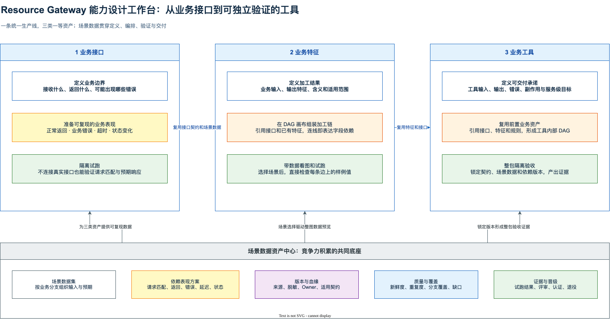
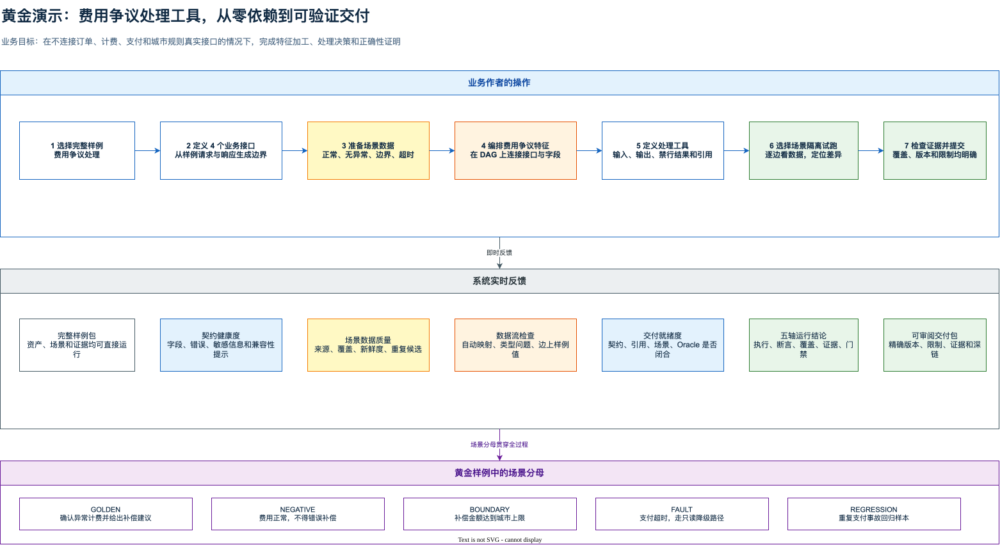
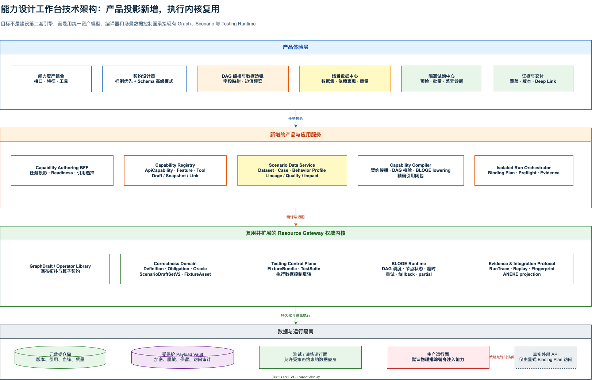

# Resource Gateway 能力设计工作台产品与技术演进方案

> 文档状态：Proposed for Review；Stage 0 开发证据持续收口
>
> 日期：2026-08-18
> 适用范围：Resource Gateway 浏览器端、VS Code 轻量宿主、Author Canvas、Correctness Studio、Business Mirror、Testing Control Plane  
> 核心目标：让业务人员可以连续完成「定义业务接口 → 准备可复现数据 → 编排业务特征 → 交付契约化工具 → 隔离试跑并沉淀证据」

相关文档：

- [正确性定义与测试数据配置 UX 演进方案](resource-gateway-correctness-authoring-ux-audit-and-evolution-plan.md)
- [Contract & Scenario Authoring 演进计划](resource-gateway-contract-scenario-authoring-evolution-plan.md)
- [引导式正确性与业务镜像改进方案](resource-gateway-guided-correctness-and-business-mirror-ux-technical-evolution-plan.md)
- [客户业务能力镜像蓝图差距与技术演进方案](resource-gateway-customer-business-mirror-blueprint-gap-and-technical-evolution-plan.md)
- [Resource Gateway 产品手册](resource-gateway-product-manual.md)
- [Resource Gateway 业务能力镜像与保真演练方案](resource-gateway-mock.md)
- [Capability Studio 收敛式验收引擎技术设计](resource-gateway-capability-studio-convergent-acceptance-engine-technical-design.md)：技术方向评审通过，当前仅允许实施 `GATE-A TYPED_REPLAY`；full runner、stateful Lease 和外部发布仍被门禁阻断。

## 0. 结论先行

本轮反馈指出的不是一个局部交互问题，而是当前产品模型仍然以技术模块为中心。用户需要先理解 Graph、Operator、Schema、Fixture、Mock、Scenario、Correctness、Business Mirror 和 Run Evidence，再自行拼出一条工作流。底层能力很多，产品却没有形成稳定的业务心智。

建议将 Resource Gateway 的默认生产体验收敛为 **能力设计工作台（Capability Studio）**。工作台只向普通作者暴露三类一等业务资产：

1. **业务接口**：说明可以查询或执行什么业务动作，接收什么，返回什么，失败时如何表现。
2. **业务特征**：把多个接口和已有特征加工为可复用的业务判断依据，DAG 是其主要实现视图。
3. **业务工具**：面向 Agent、SOP、Workflow 或业务应用交付的完整能力，拥有独立输入、输出、错误和副作用契约，并可复用前两类资产。

三类资产共用一个 **场景数据资产中心**。中心不只是保存 JSON，而是管理：

- 某个业务条件下应使用什么输入；
- 每个外部依赖在该条件下应如何表现；
- 正确结果是什么，依据是什么；
- 数据从哪里来、适用于哪个契约版本、是否脱敏、是否过期；
- 数据覆盖了哪些业务分支，发现过哪些缺陷；
- 哪个精确版本已经被评审、运行和证明。

产品语言需要同步改变。默认界面不再要求业务人员「配置 Fixture 和 Mock Rule」，而是让其完成：

```text
定义业务边界
  -> 准备场景数据
  -> 设置依赖表现
  -> 在隔离环境试跑
  -> 检查业务结果和覆盖
  -> 保存为可复用验证资产
```

`FixtureBundle`、selector、fingerprint、revision 和 raw schema 继续作为高级模式、API 与治理协议存在，但不再支配主操作流。

### 0.1 五项核心决策

1. **不新建第二套执行引擎。** 新增面向业务作者的资产投影、编译器和任务式 UI，继续复用 GraphDraft、ScenarioDraftSetV2、FixtureBundle、TestSuite、BLOGE Runtime 和 Evidence。
2. **接口、特征和工具都必须具备独立契约。** DAG 是实现，不是契约；节点能运行不代表能力可以被稳定集成。
3. **场景数据是一级业务资产。** 数据集、场景行、依赖表现、Oracle、来源、质量和生命周期不能继续散落在表单与 JSON 字段中。
4. **隔离运行由显式 Binding Plan 控制。** 每个依赖在一次运行中使用真实服务、替身数据、回放或拒绝访问，必须可见、可审计、可锁定；生产环境默认物理排除调用方注入替身的能力。
5. **第一条纵向切片使用「取消费争议处理工具」。** 它与现有 Business Mirror 样例一致，又能同时展示多接口、特征 DAG、工具契约、故障降级和测试数据积累。

### 0.2 评审时应优先确认

- 是否接受「业务接口 / 业务特征 / 业务工具 / 场景数据」作为默认产品词汇。
- 是否接受能力设计工作台成为统一创作入口，现有 Author、Correctness Studio 和 Business Mirror 作为上下文视图保留。
- 是否接受场景数据与依赖表现分离建模，避免把输入样本、Mock 规则和预期结果压在同一个 Fixture 对象中。
- 是否接受测试与生产运行面物理隔离，生产 API 不暴露任意 Fixture/Mock override。
- 是否接受以取消费争议为首个完整黄金案例，而不是继续堆积互不相干的技术样例。

### 0.3 交付方法修正：先建立可执行验收基线

过去多轮修补效率偏低，不是团队缺少方案，而是「目标产品体验」没有先被固化为可操作、可运行、可自动检查的参考成品。页面开发开始后，反馈只能以局部缺陷进入，导致组件持续变多，整体任务链仍然漂移。

本方案增加一项最高优先级约束：**Stage 1 正式实施前，必须先形成并签署 `Capability Studio Acceptance Baseline v1`。** 验收基线至少包含：

1. 可点击的高保真原型，而不只是线框图和文字说明；
2. 逐屏黄金路径验收合同，写清动作、反馈、数据和完成标准；
3. 版本化黄金演示数据包，所有引用和业务预期闭合；
4. Dataset 编译、DAG 数据透镜和生产隔离三项技术 Spike 证据；
5. Playwright、协议测试和视觉检查的自动化骨架；
6. 业务、产品、UX、架构、安全与 QA 的 Go/No-Go 记录。

验收基线不是静态 PRD。它必须能被人工走查，也能被自动化测试消费。任何实现变更若改变黄金路径、页面反馈或数据语义，必须先修改并重新批准验收基线，不能先补代码、再追认预期。

### 0.4 验收不是“功能清单完成”

本方案中的每一项验收必须同时回答八个问题：**谁在什么前置条件下，针对哪个不可变候选，执行哪组不可缩减的动作，看到什么业务结果，系统保持什么不变量，什么情况直接失败或阻断，用什么完整证据复验并由谁签署**。只有页面、接口或测试代码已经存在，不构成验收通过。

每条 Acceptance Contract 必须具备以下字段：

| 字段 | 约束 |
|---|---|
| Requirement ID | 使用稳定的 `GP-*`、`SPIKE-*`、`SEC-*`、`NFR-*` 或 `S*-AC-*`，不得以 PR、组件名代替 |
| Preconditions | 固定候选构建、Baseline、Demo Pack、Scope、角色、语言、视口、运行模式和外部 Authority 可用性 |
| Action and denominator | 写清用户动作、输入、Case、轮次、异常、视口和总 obligation；不得使用“抽样”“主流环境”等开放分母 |
| User outcome and Oracle | 写清业务角色可以观察并解释的结果、禁止结果和允许误差，不以 HTTP 200、按钮可点击或节点绿色代替 |
| System invariant | exact ref、契约闭包、确定性、零真实调用、权限和数据安全等不可破坏条件 |
| Failure and blocker | 区分业务/安全不变量失败与环境/证据设施阻断，并写清稳定状态、诊断和恢复入口 |
| Evidence manifest | 冻结应生成的证据集合、存储 URI、内容 fingerprint、保留期和独立复算方式；证据目录本身也参与闭包 |
| Owner and decision | 责任角色、判定时间、`PASS`/`FAIL` 及限制；签署不能由构建脚本代填 |

验收状态只允许按以下语义使用：

- `NOT_RUN`：尚未执行，不能推断结果。
- `FAIL`：已执行但至少一个不变量或期望不成立。
- `PARTIAL`：已有开发证据，但完整前置、矩阵、人工签署或端到端链路尚未闭合；**不得用于阶段退出**。
- `PASS`：所有自动和人工证据闭合，且没有未关闭的 P0/P1 问题。
- `BLOCKED`：存在明确外部阻断，必须记录 Owner、解除条件和复验入口；不能用来隐藏失败。

不设置“默认通过”或口头豁免。测试跳过、证据过期、引用 fingerprint 不匹配、签署缺失和环境不符合前置条件时，一律不能生成 `PASS`。

#### 0.4.1 唯一通过公式

一个 Acceptance Contract 只有在以下条件**同时成立**时才能判定为 `PASS`：

```text
PASS = 前置条件全部满足
    AND 用户结果逐项符合 Oracle
    AND 系统不变量全部保持
    AND 约定测试矩阵 100% 执行且无跳过
    AND 应生成证据集合与实际落盘集合精确相等
    AND 机器证据可解析、可复算且 fingerprint 一致
    AND 指定 Owner 全部签署
    AND 未关闭 P0/P1 = 0
```

其中任一业务 Oracle、安全或隔离不变量不成立，结果直接为 `FAIL`，不能用其他成功项抵消；因环境、权限或证据设施不可用而无法执行时为 `BLOCKED`，不能记为“有条件通过”；只完成组件测试、开发截图或部分矩阵时为 `PARTIAL`，不能用于阶段退出。

#### 0.4.2 验收对象与失败边界

| 验收轴 | 最低通过阈值 | 直接失败条件 | 证据 |
|---|---|---|---|
| 业务正确性 | Canonical 9 Case × 3 轮全部符合逐 Case Oracle；同 Case 三轮业务结果 fingerprint 一致 | 任一 Case 错判、漏跑、重复 `runId`、结果漂移或 Oracle 被跳过 | Run Evidence、Oracle 明细、semantic fingerprint |
| 引用闭包 | Contract、Graph、Dataset、Case、Behavior、Binding 全部使用 exact ref，独立复算 fingerprint 一致 | 运行中读取 mutable head、跨 Scope 引用、混用版本或引用缺失 | closure manifest、Test Kit verifier |
| 隔离运行 | 进程内 connector counter 与部署级 egress 观测均为 0；所有依赖行为可追溯到 Binding Plan | 任一未声明真实调用、未解析依赖继续运行、生产面可注入任意替身 | network deny、counter、装配测试、审计 |
| 故障语义 | timeout、retry、fallback、skip、partial 在 UI、Trace、Oracle 中含义一致 | 把超时当空数据、fallback 后丢失原始失败尝试、最终状态与业务结果矛盾 | attempt/final trace、Data Lens、错误注入测试 |
| 操作体验 | 5/6 代表性用户在 15 分钟内独立完成 `GP-01` 至 `GP-10`；默认路径技术 ID 与 Raw JSON 输入均为 0 | 任一 P0/P1；主任务必须依赖主持人口头补步骤；关键状态无恢复动作 | 原始可用性记录、浏览器录像、任务计时 |
| 视觉与可访问性 | 中英文 × 1440/1024/390 关键视口完成；键盘主路径可达；axe serious/critical 为 0 | 控件、节点、边标签或错误反馈被遮挡；焦点丢失；仅靠颜色表达状态 | Playwright、DOM 几何、截图、人工签署、axe |
| 安全与治理 | Payload 权限、脱敏、审计、保留、撤销与 Scope 负向用例全部通过 | 明文泄漏、越权访问、撤销后仍可新运行、日志或 Evidence 泄漏 Payload | RBAC/ABAC、攻击 fixture、日志扫描、审计 |
| 企业兼容性 | 冻结协议矩阵中的 N/N-1/N+1 全部产生确定的兼容或拒绝结果 | 静默丢字段、错误降级、无法判断版本兼容性 | consumer contract、capability probe、兼容矩阵 |

容量、延迟、并发、保留和恢复目标必须在 Stage 0 以客户规模与环境基线冻结为数值化 SLO；未冻结前相关 NFR 只能是 `NOT_RUN`，不得用“性能基本可接受”替代。

验收文字必须同时给出**测量对象、固定分母、阈值、观察者、证据和不通过条件**。禁止使用“基本可用”“体验良好”“性能合理”“覆盖主要场景”“尽量不遮挡”等无法裁决的表述；无法量化时，必须改写为可观察的任务结果和由明确角色执行的人工判定，例如“6 名目标用户中至少 5 名在 15 分钟内无主持人提示完成任务，P0/P1 为 0”。

#### 0.4.3 证据有效期与重新验收触发器

以下任一变化都会使受影响 Acceptance Result 立即失效并回到 `NOT_RUN`：候选 build、业务 Oracle、Contract/Schema、Graph/DSL、Dataset/Case/Behavior、Binding、权限策略、生产装配、网络策略、协议主次版本或目标运行环境发生变化。仅文案和视觉改动也必须重跑受影响的 UX、可访问性和视觉合同；不得沿用旧截图签署新版本。

每次重新验收只重跑追踪矩阵证明受影响的合同，但影响分析本身必须可审计。若无法证明影响边界，则重跑该 Stage 全部合同。

#### 0.4.4 三级验收结论，禁止跨级宣称

为避免“自动化全绿”被误解为“业务已可发布”，所有进度、页面和汇报必须使用以下三级结论：

| 级别 | 允许证明的事实 | 不允许的宣称 | 晋级条件 |
|---|---|---|---|
| `DEVELOPMENT_VERIFIED` | 固定开发数据、test/staging 装配与自动化矩阵符合开发合同 | 不得宣称发布候选、客户业务正确或 Stage 退出 | 严格 Schema、跨字段 verifier、成功/失败关闭、真实浏览器或运行测试全部通过 |
| `CANDIDATE_VERIFIED` | 不可变候选构建在目标验收环境中经过完整机器矩阵 | 不得代替业务、安全、UX 和发布责任人签署 | 满足 `AC-PRE-01` 至 `AC-PRE-05`；exact closure、环境指纹、部署级 egress 和不可变 Evidence 闭合 |
| `ACCEPTED` | 指定 Stage 的产品、业务、工程、安全和体验验收已完整成立 | 不得扩大到未被当前 Baseline 覆盖的客户、Scope 或运行环境 | 本 Stage 全部 `S*-AC-*` 为 `PASS`，P0/P1 为 0，指定 Owner 全部签署，Manifest 状态为 `ACCEPTED` |

页面必须同时呈现“已证明什么”和“仍不能证明什么”。例如受治理 9 × 3 开发验证可以显示“27 项检查全部通过”，但必须并列显示“发布仍不可验收”及未闭合的具体理由。

#### 0.4.5 单条合同的可执行记录

每条 `GP-*`、`SPIKE-*`、`SEC-*`、`NFR-*` 和 `S*-AC-*` 都必须生成一条可机器读取的 Acceptance Result，至少固定以下内容：

```text
contractId + contractRevision
candidateRef + candidateFingerprint
baselineRef + demoPackRef + exactClosureFingerprint
environmentFingerprint + profile + Scope + actor
testMatrixExpected + testMatrixExecuted + skippedCount
observations + invariantResults + unresolvedIssues
evidenceRefs + evidenceFingerprints
expectedEvidenceManifest + persistedEvidenceManifest
decision + decidedBy + decidedAt
```

可执行矩阵和证据目录都必须精确相等，不接受“至少跑一部分”。`testMatrixExecuted != testMatrixExpected`、`skippedCount > 0`、`persistedEvidenceManifest != expectedEvidenceManifest`、Evidence 无法解析、指纹无法复算或 Owner 缺席时，不得产生 `PASS`。测试用例数是某次候选的观测值，不是永久产品指标；永久合同是冻结矩阵中的所有义务均被执行且无跳过，而且每项义务对应的证据已经完整、持久地落盘。

#### 0.4.6 共用可执行验收标准

以下标准是所有 `S*-AC-*` 的强制基线。Stage 合同可以增加约束，但不能降低或省略这些约束。每项标准必须在 Acceptance Result 中记录 `PASS`、`FAIL`、`BLOCKED` 或 `NOT_RUN`，不得只写说明文字。

| 标准 ID | 必须成立的判据 | 机器或人工证据 | 直接失败条件 |
|---|---|---|---|
| `AC-STD-01 CANDIDATE_IDENTITY` | 被测对象绑定部署侧冻结的 `buildRef`、revision、Git commit、`CLEAN` source tree 和实际 JAR/镜像 SHA-256；请求方不能覆盖 | Candidate attestation、制品摘要、启动配置快照、负向注入测试 | 部分配置、工作区脏、摘要不匹配、请求可替换候选身份 |
| `AC-STD-02 EXECUTION_INTENT` | 每次运行把候选、Suite exact ref、publication、compilation 和 source map 绑定为同一 canonical intent fingerprint | `candidateIntentFingerprint`、Test Kit 独立重算、篡改测试 | 任一坐标漂移、指纹不能重算、运行证据未回显同一 intent |
| `AC-STD-03 MATRIX_COMPLETENESS` | 冻结矩阵 100% 执行，`skippedCount=0`；批量运行的 Case、轮次和 Run ID 集合精确相等 | expected/executed matrix、唯一性检查、批量运行收据 | 漏跑、跳过、重复 Run ID、额外 Case 或轮次不足 |
| `AC-STD-04 BUSINESS_CORRECTNESS` | 每个 Case 的业务 Oracle 通过；同 Case 多轮 semantic fingerprint 一致；高风险分支有专项证明 | Oracle 明细、semantic fingerprint、timeout/duplicate/forbidden-write 证明 | 任一 Oracle 失败、结果漂移、用技术成功替代业务正确 |
| `AC-STD-05 EXACT_CLOSURE` | Contract、Graph、Dataset、Case、Behavior、Binding、Fixture 和 Suite 全部使用 exact ref，内容指纹可独立复算 | closure manifest、Registry 写后回读、Test Kit verifier | mutable head、跨 Scope、缺失引用、内容与指纹不一致 |
| `AC-STD-06 ISOLATION` | 进程内 connector counter、部署级真实外呼数和被网络策略拒绝的外呼尝试数均为 0；未解析依赖在调度前失败 | counter、network deny、egress 日志、生产装配否定测试 | 任一真实外呼、任一被拒绝的外呼尝试、fallback-to-real、生产入口可注入替身 |
| `AC-STD-07 FAILURE_SEMANTICS` | timeout、retry、fallback、skip、partial 和 cancel 在 UI、Trace 与 Oracle 中语义一致；失败关闭不生成伪证据 | attempt/final Trace、失败投影 Schema、负向用例 | 超时被当成空数据、原始失败丢失、失败响应携带已验证结论 |
| `AC-STD-08 UX_ACCESSIBILITY` | 约定语言、视口、权限、页面状态和输入方式矩阵全部完成；操作失败后，发生原因、影响和主要恢复控件进入当前冻结视口，焦点落到错误反馈或主要恢复控件；主路径无技术 ID/Raw JSON；无 P0/P1 | 真实浏览器、DOM 几何与 viewport 相交/包含断言、焦点轨迹、axe、人工读屏、可用性原始记录 | 元素只存在于 DOM 但位于视口外、遮挡、焦点丢失、仅靠颜色、主持人必须补步骤、无恢复动作 |
| `AC-STD-09 EVIDENCE_SIGNOFF` | 应生成与实际持久化 Evidence manifest 精确相等；每份 Evidence 可解析、可回放、未过期且 fingerprint 一致；存储成功收据进入闭包；指定 Owner 在全部证据生成后签署 | 不可变 Evidence URI、写入收据、manifest 差异、Verifier 结果、签署主体与时间 | Evidence 已生成但缺失/截断/过期/不可复算、写入成功被错误上报、签署早于完整落盘或 Owner 缺席时为 `FAIL`；Evidence Store、磁盘或签发服务在执行前或执行中不可用时为 `BLOCKED`，不得沿用测试进程退出码宣称通过 |

判定顺序固定为：先判断直接失败不变量，再判断前置阻断，再判断矩阵完整性，最后判断签署。命中任一直接失败条件即为 `FAIL`；前置设施不可用且尚未执行为 `BLOCKED`；尚未开始验收运行时为 `NOT_RUN`；九项全部通过后，单条正式合同才允许为 `PASS`。

`PARTIAL` 只用于开发进度台账和 v1 兼容投影，不属于正式 Stage 退出状态。只有开发证据或部分矩阵时，不得生成“半通过”的 Stage 退出结果：尚未开始正式运行时保持 `NOT_RUN`，前置条件不成立时为 `BLOCKED`，已经观测到不变量失败时为 `FAIL`。`DEVELOPMENT_VERIFIED` 同样只能作为开发证据级别，不能绕过 `AC-STD-01`、`AC-STD-06`、`AC-STD-08` 或 `AC-STD-09`。

#### 0.4.7 Stage 退出结果的机器合同

正式 Stage 退出结果使用 `Stage Acceptance Result v2`。该合同只接收 `STAGE_EXIT`，状态仅允许 `PASS`、`FAIL`、`BLOCKED` 和 `NOT_RUN`，并要求 `AC-STD-01` 至 `AC-STD-09` 恰好各出现一次。`NOT_RUN` 的执行开始与证据完成时间必须为 `null`，不得用相同时间或占位时间伪造“尚未执行”。`BLOCKED` 必须明确区分运行前阻断和运行中阻断：前者的两个执行时间均为 `null` 并携带 `RUN_NOT_STARTED`，后者的两个时间均存在且不得携带该诊断。`PASS` 必须在不改变 v2 wire/semantic contract 的前提下，额外具备有效的 out-of-band `Stage Acceptance Target Binding v1`、`CLEAN` 候选、完整执行窗口、覆盖该窗口且未过期的目标环境证明、零真实外呼且零被拒外呼尝试的部署级 egress 观测，以及正确性、Runtime、QA 三类 Owner 签署。

根状态与九项检查不能互相矛盾。候选不干净或缺少环境证明时，`AC-STD-01` 不得为 `PASS`；缺少合格 egress 观测或观测到真实/被拒外呼尝试时，`AC-STD-06` 不得为 `PASS`；三类 Owner 未完整批准时，`AC-STD-09` 不得为 `PASS`。其余检查仍可以保留已经成立的 `PASS`，但每个不可成立的检查必须使用 `FAIL`、`BLOCKED` 或 `NOT_RUN` 如实记录，不能只在根级 `diagnostics` 中补一句说明。

签署前的 `evidenceClosureFingerprint` 必须由以下内容确定性复算：结果身份与 revision、结果类型和状态、合同身份与 revision、完整候选执行绑定、完整环境证明投影或 `null`、完整 egress 投影或 `null`、九项验收检查，以及签署前 Evidence 目录。`decidedAt`、诊断、签署对象和闭包字段自身不参与计算；Owner 签署引用在闭包生成后产生，并绑定同一个闭包指纹。该顺序用于避免“签名指纹又参与被签名内容”的循环依赖。

Test Kit 的默认 v2 verifier 只负责严格 Schema、状态机、时间窗口、引用闭包、指纹复算和签署坐标绑定，不能自行证明外部 Evidence 真实存在，也不能验证签名公钥、签发机构权限或 Owner 身份。正式 `ACCEPTED` 还必须由受信 Evidence Resolver、受信 Key Set/Issuer Policy 和 Owner Authority 完成外部真实性校验。只有默认 verifier 通过时，结论仍是“Stage 退出结果在语义上自洽”，不得据此把当前 Manifest 从 `NO_GO` 改为 `ACCEPTED`。

候选与环境准入发生在执行前，且不是 `Stage Acceptance Result v2` 的新字段：部署方以 out-of-band 方式提供 `Stage Acceptance Target Binding v1`，再由独立的 Candidate Authority 和 Environment Authority 提供两份准入事实。正式验证先从 target binding 和两份 attestation 建立可信上下文，逐项比较 Stage Result v2 的已有投影，再按现有顺序执行 post-run Evidence/Owner envelope 验证。`Authority Envelope v1` 继续只绑定最终 `evidenceClosure`，不得改作执行前准入；不要求、也不通过静默变更引入 Stage Result v3。

#### 0.4.8 线协议到真实界面的闭环验收

后端对象测试、JSON Schema、独立 Test Kit 和前端静态 fixture 测试分别通过，仍不能证明产品可用。每个进入黄金路径的读模型必须增加一条 **Wire-to-UI Acceptance**：使用实际 Spring 服务生成的原始响应字节，由生产前端通过真实认证头和 purpose 读取，再由真实浏览器完成解析、渲染、交互、几何与可访问性验证。禁止用手工复制 JSON、前端本地常量或测试专用 adapter 代替这条链路。

| 闭环步骤 | 明确通过标准 | 直接失败条件 | 证据 |
|---|---|---|---|
| 服务端出线 | 实际 Controller 响应通过公开 Schema；内容 fingerprint、稳定排序和跨字段不变量可由 Test Kit 从原始 bytes 独立复算 | 只验证 Java 对象、序列化后字段漂移、Schema 与实现使用不同字符集或基数规则 | HTTP 集成响应、Schema 结果、Test Kit 结果 |
| 前端入线 | 生产 API client 携带与部署一致的 credential/purpose；严格 parser 直接接受真实响应，并拒绝未知字段、非法关系和跨 Scope 引用 | 漏认证头、前端 fixture 与真实响应不同、把多 Authority 误判为跨 Scope、合法边 ID 无法解析 | API client 测试、真实网络请求、parser 正负用例 |
| 用户结果 | 页面显示合同规定的业务事实；主操作改变精确选择与影响闭包，刷新或恢复不产生近似本地结论 | 页面只“加载成功”但关键数量/阻断/边界不符；选择后路径不变；API 失败后用常量补图 | DOM 业务断言、交互后节点/边集合、错误态断言 |
| 视觉与无障碍 | 冻结视口无页面横向溢出、无遮挡；操作失败后，错误摘要与主要恢复控件无需用户寻找即可进入视口，焦点移动可被键盘和读屏感知；axe serious/critical 为 0；状态主次不以降低文字可读性实现 | 用 `isDisplayed` 或 DOM 存在替代视口可见；恢复控件落在折叠线下且页面不滚动；用整体 opacity 弱化导致文字对比度失败；移动端信息被裁切；仅靠颜色表达选中或阻断 | DOM 几何、active element、axe、真实 Chrome 截图、人工视觉复核 |
| 证据落盘 | 测试命令、候选指纹、响应/截图路径和精确观察值进入追踪矩阵；应生成与实际落盘 manifest 精确相等；每项写入都有成功收据；失败结果保留并关联修复 | 只留口头结论或成功截图；磁盘已满、报告写入失败或文件截断但仍因测试进程退出码为 0 宣称通过；无法知道截图对应哪个候选和响应 | Acceptance Result、Evidence manifest/ref/fingerprint、存储收据、失败记录 |

Wire-to-UI 通过只允许把该纵向切片标为 `DEVELOPMENT_VERIFIED`。目标环境、部署级隔离、人工可用性和 Owner 签署未闭合时，仍不得生成 `CANDIDATE_VERIFIED` 或 `ACCEPTED`。

### 0.5 本轮演进的一页验收总表

本表是本方案的产品验收入口。它回答“用户最终能完成什么”，第 9.6 节的 `GP-*`、第 13.1 节的 `S*-AC-*` 和第 15 章的测试证据负责展开实现细节。三处发生冲突时，按**更严格、可被机器验证且不降低业务正确性与安全边界**的一项执行，并在开工前修订 Baseline 消除冲突。

| 验收域 | 固定验收任务 | 明确通过标准 | 直接失败条件 | 权威证据与签署 |
|---|---|---|---|---|
| 业务接口契约 | 业务作者从请求/响应样例定义“订单查询”和“城市规则”两个接口的输入、输出、错误与敏感字段 | 默认路径不输入技术 ID、不编辑 Raw JSON；样例、表单、OpenAPI 和高级 Schema 四种入口 round-trip 语义差异为 0；breaking change 被明确阻断 | 只保存一段 JSON；输入输出方向不清；非法样例可保存；breaking change 静默生效 | Contract snapshot、兼容性报告、浏览器任务记录；接口 Owner、产品、QA |
| 场景与依赖表现 | 为取消费争议维护 9 个 Canonical Case，并为每个外部依赖定义正常、业务错误、超时、序列和禁止访问等表现 | 9/9 Case 均具备 Owner、Source、Oracle、适用 Contract 和 exact dependency binding；未匹配行为在调度前失败；普通作者使用业务句式完成配置 | Case 无正确结果或来源；Fixture 与 Mock 被压成不可解释的 Raw JSON；未命中后访问真实服务 | Demo Pack、Dataset quality projection、Binding Plan、负向运行；业务 Owner、正确性 Owner、数据 Owner |
| 业务特征 DAG | 用 4 个接口组装“取消费判定上下文”，选择 timeout Case 检查数据如何流动和降级 | 画布显示 6 节点、5 边及字段来源；Data Lens 能解释输入、输出、边值、首个差异和 fallback；1440/1024/390 关键视口遮挡数为 0 | 只能看拓扑而不能解释数据；Trace 与 Oracle 冲突；节点或边标签遮挡；无权限用户看到 Payload | Graph exact ref、真实 BLOGE Trace、DOM 几何、截图、axe；Feature Owner、UX、QA |
| 业务工具契约 | 定义“取消费争议处理工具”的独立输入、输出、错误、禁止结果和副作用，并引用前置接口与特征 | Tool 契约与内部 DAG 分离；依赖闭包可独立复算；9 Case × 3 轮共 27 次业务断言通过，同 Case semantic fingerprint 稳定 | 用 DAG 端口冒充 Tool 契约；依赖缺失或读取 mutable head；任一 Case 错判、漏跑或结果漂移 | Tool snapshot、closure manifest、27 份 child Evidence、Test Kit verifier；Tool Owner、正确性 Owner、Runtime |
| 完全隔离运行 | 选择“完全隔离”运行整个工具，并检查 timeout、duplicate 与 forbidden-write 三类高风险分支 | 进程内真实调用、部署级真实 egress 和被网络策略拒绝的调用尝试均为 0；timeout 原始尝试和 fallback 均可追溯；duplicate 幂等；forbidden-write 无写入 | 任一真实或被拒外呼尝试；生产入口可注入替身；超时被解释为空数据；禁写分支发生写调用 | candidate/environment attestation、counter、network deny、attempt/final Trace；Runtime、安全、QA |
| 正确性与数据积累 | 从运行结果回到 exact Case、Dataset、Oracle、Contract、DAG 节点和数据版本，并查看质量与影响 | 证据和 Deep Link 精确回到原 Run/Case/Node；Active Case 具备完整来源、责任人、正确性依据、审批、复用方与保留策略；撤销和过期会阻断新运行 | 只能看到绿色总数；证据无法定位原数据和图；本地替身被标为客户现场认证；撤销后仍可新运行 | Evidence bundle、impact graph、lifecycle event、Deep Link 浏览器测试；数据 Owner、治理 Owner、正确性 Owner |
| 首次使用体验 | 代表性业务作者从默认入口完成 `GP-01` 至 `GP-10` | 至少 5/6 在 15 分钟内独立完成；技术 ID 输入 0 次、Raw JSON 编辑 0 次；能说清替身、真实调用和证据边界；P0/P1 为 0 | 依赖主持人补步骤；关键 ID 需手填；失败无恢复动作；用户把开发验证误解为发布认证 | 原始任务录像、计时、错误记录、复验报告；业务 Owner、产品、UX |
| 企业交付可信度 | 从不可变候选进入目标环境并执行完整矩阵，导出可独立复验的结果 | 正常态 60 格、服务错误 60 格、目标请求断网 60 格、GP-04 真实保存冲突 6 格，共 186 格全部执行且无跳过；`CANDENV-AC-01..12` 全部通过；Candidate Attestation、Environment Attestation 和部署拥有的 `Stage Acceptance Target Binding v1` 均有效；target binding 与 Stage Result v2 的 `resultId/revision/contract` 及候选、环境、受信目标身份逐项相等；既有 v2 verifier、post-run `Authority Envelope v1`、Evidence manifest 和指定 Owner 签署全部闭合 | 缩小分母；缺少任一准入事实或 target binding；坐标、执行租约、目标身份或环境窗口不一致；用 503 冒充断网；用静态页面冒充真实 409；脏工作区；证据 fingerprint 不一致；自动化代签；只保留重跑后的成功记录 | Candidate/Environment Attestation、Target Binding、Base Browser Matrix Result、Browser Anomaly Matrix Result、Stage Acceptance Result v2、post-run Evidence/Owner envelope；产品、架构、安全、Runtime、QA |

本轮演进的产品验收结论只有两种：上述七个验收域全部闭合时为 `ACCEPTED`；否则为 `NO_GO`，并按合同记录 `NOT_RUN`、`BLOCKED` 或 `FAIL` 的具体原因。`DEVELOPMENT_VERIFIED` 和 `PARTIAL` 可以说明工程进展，但不能替代最终产品验收。

### 0.6 开工前七项冻结，避免再次边做边猜

本轮反思后的核心修正不是增加更多页面说明，而是把实施前仍可争论的事项全部前移。以下七项采用布尔门禁，不按完成比例加权，也不接受“先开发、后补材料”。它们与第 12.4 节的验收包、第 12.7 节的开工门禁和第 18 章的 Definition of Ready 是同一组约束的评审入口。

| 冻结项 | 开工前必须明确 | 可验收产物 | `NO_GO` 条件 |
|---|---|---|---|
| `FREEZE-01 产品任务` | 唯一首要用户、首要业务任务、范围和非目标；默认入口只承载一条连续主路径 | Product Acceptance Charter、术语表、任务流 | 同时存在两个以上同优先级主路径，或仍需先理解技术模块才能开始 |
| `FREEZE-02 黄金业务事实` | 4 API、1 Feature、1 Tool、9 Case 的输入事实、依赖表现、正确结果、禁止结果、Owner 和来源 | 内容寻址 Golden Demo Pack、逐 Case Oracle、Canonical Baseline | 任一 Active Case 无 Oracle、无 Owner、无来源，或业务结果只能由开发人员口头解释 |
| `FREEZE-03 交互基准` | `GP-01` 至 `GP-10` 的逐屏动作、即时反馈、完成状态、错误状态、恢复动作和上下文保持 | 可点击高保真原型、Screen State Inventory、中英文关键视口 | 主任务依赖技术 ID、Raw JSON、主持人补步骤，或错误后没有可执行恢复动作 |
| `FREEZE-04 领域与权威` | Capability、Contract、Dataset、Case、Behavior、Binding、Evidence 的聚合根、Authority、exact ref 和生命周期 | ADR、严格 Schema、兼容与迁移规则 | 同一事实存在两个写入权威，或运行仍可读取 mutable head |
| `FREEZE-05 技术可行性` | Dataset 可确定性下沉、Data Lens 来自真实 BLOGE Trace、生产面物理排除调用方替身注入 | Spike A/B/C 的代码、正负测试、原始报告 | 任一 Spike 只能依靠静态 Mock、第二套 Runtime 或隐藏 UI 证明 |
| `FREEZE-06 可执行验收` | 固定候选、目标环境、测试分母、直接失败条件、Evidence、复算方式和签署角色 | `AC-PRE-*`、`AC-STD-*`、`S*-AC-*`、测试骨架和 Acceptance Result | 测试可被跳过或缩小分母，证据不可复算，或脚本可以代替真实 Owner 签署 |
| `FREEZE-07 纵向交付` | 第一条切片从用户动作贯穿协议、Runtime、真实浏览器、Evidence 和恢复；范围变更先改 Baseline | 第 12.9 节验收卡、按依赖排序的 backlog、变更记录 | 工作包仍按前端/后端横切，或没有明确关闭哪个 `GP-*`、不变量与 Stage 合同 |

开工评审必须逐项给出 `GO` 或 `NO_GO`，并记录判定人、时间和证据 exact ref。`FREEZE-01` 至 `FREEZE-07` 全部为 `GO` 只表示可以开始 Stage 1 纵向切片，不表示产品已验收；正式阶段退出仍以第 13.1 节的 `S*-AC-*` 为准。

### 0.7 验收权威矩阵，禁止系统自证

Resource Gateway 可以生成运行事实、证据投影和复验工具，但不能同时成为所有事实的签发者与最终裁决者。正式验收必须区分“系统观测到什么”和“谁有权确认该事实”。

| 验收事实 | 权威来源 | Resource Gateway / Test Kit 的责任 | 不允许的替代 |
|---|---|---|---|
| 候选身份 | CI 或发布系统的 Candidate Authority | 只签发 build/buildRef、revision、source commit、`CLEAN`、artifact digest、exact Baseline/Demo Pack 和 execution intent；拒绝调用方覆盖并校验一致性 | 本地工作区名称、页面版本文案、脚本自填 `CLEAN` 或用环境事实反推候选 |
| 目标环境 | 平台或 SRE 的 Environment Authority | 独立签发 exact Candidate Attestation coordinate、target profile、Scope、region、runtime identity、network policy、feature flags、logical clock 和 execution window | 应用自行声明“当前是 staging”、沿用另一候选的证明或用候选事实反推环境 |
| 目标准入坐标 | 部署 Authority 的 out-of-band `Stage Acceptance Target Binding v1` | 绑定 Stage Result v2 的 result/contract 坐标、execution lease、两份 attestation coordinate 和 trusted target identities，并纳入 Provider atomic binding fingerprint | 从 Stage Result 自发现、调用方请求注入、把 final evidence closure 当作 pre-execution admission |
| 业务正确性 | 业务 Owner 与正确性 Owner 管理的 Oracle Authority | 对逐 Case 输入、依赖表现、结果、禁止结果和 semantic fingerprint 执行确定性验证 | 以 HTTP 200、Suite `PASSED` 或开发人员判断代替业务 Oracle |
| 引用与内容闭包 | 各资产 Registry Authority | 从原始 bytes 独立复算 exact ref、fingerprint、Scope 和关系闭包 | 信任响应中自报的 fingerprint，或运行时回查 mutable head |
| 运行隔离 | Runtime 观测、网络策略与 Egress Authority | 同时验证进程内 connector counter、部署级 egress 和被拒外呼尝试均为 0 | 只看应用日志没有外呼，或把被网络策略拦截的尝试记为“零调用” |
| UX 与可访问性 | 真实浏览器自动化、QA、UX 与代表性用户 | 固定矩阵、保留 DOM/axe/截图/录像和原始任务记录，绑定同一候选 | 设计稿截图、组件单测、开发者代替目标用户完成任务 |
| Evidence 真实性 | 受信 Evidence Store、Issuer Policy 与 Key Set Authority | 解析 exact URI、校验内容 fingerprint、签名、签发权限、有效期和撤销状态 | 只验证 JSON Schema，或接受结果中内嵌的未受信公钥自签 |
| 阶段签署 | 组织身份与审批系统中的指定 Owner | 校验角色权限、签署时间和 `evidenceClosureFingerprint` 绑定 | 构建脚本代签、共享账号、证据生成前预签或单一角色代签全部职责 |

因此，默认 Test Kit verifier 通过只证明协议结构、状态机和确定性不变量成立。只有外部 Evidence Resolver、受信 Key Set/Issuer Policy、目标环境证明和指定 Owner 签署也全部闭合，`Stage Acceptance Result v2` 才允许进入 `PASS`。任何无法识别 Authority、无法验证签名或无法解析 Evidence 的情况必须失败关闭为 `BLOCKED` 或 `FAIL`，不得降级成“人工看过即可”。

### 0.8 更聪明的总体实现：一个业务场景内核，三个确定性编译阶段

统一产品模型如果仍按「契约页面、Fixture 页面、DAG 页面、测试页面、证据页面」分别实现，只会把同一个业务场景复制成五套前后端状态。正确的实现单元不是页面，而是一次可解释、可复现的**业务场景闭环**。页面只是同一闭环在不同任务阶段的投影。

系统只新增一个轻量应用协调层 `CapabilityAuthoringKernel`。它不保存第二份领域事实，也不执行 API、Feature 或 Tool 的业务逻辑；业务逻辑仍只由 BLOGE Runtime 执行。内核包含三个无 I/O 的纯函数和一个薄的副作用协调器：纯函数负责计算，协调器只按计算结果调用既有 Authority、Registry、Runtime 与 Evidence Store。

```text
业务作者输入
  -> pure Authoring Compiler
       人类可理解的契约、样例、场景表和 DAG 编辑
       -> proposed revisions + WorkspacePublicationPlan
  -> Publication Coordinator
       create-new revisions -> manifest -> workspace head CAS
  -> pure Rehearsal Planner
       exact revisions + 运行模式
       -> 完整 IsolationRunPlan + unresolved dependency blockers
  -> existing BLOGE Runtime
  -> pure Evidence Projector
       BLOGE RunTrace + Oracle results + exact closure
       -> 业务结论 + Data Lens + Coverage + Evidence bundle
```

三个阶段分别承担唯一职责：

| 阶段 | 唯一输入 | 唯一输出 | 核心不变量 |
|---|---|---|---|
| `Authoring Compiler` | 当前工作区 immutable snapshot 与用户显式编辑意图 | proposed revisions、`WorkspaceRevisionManifest` 候选和 `WorkspacePublicationPlan` | 纯函数、无 I/O；不复制 Payload；引用全部可解析；同一输入确定性生成相同内容 fingerprint |
| `Publication Coordinator` | `WorkspacePublicationPlan`、`commandId` 与 `expectedWorkspaceRevision` | publication receipt 或可恢复冲突 | 不解释业务内容；只执行 create-new、持久化与 head CAS；失败不暴露半成品 |
| `Rehearsal Planner` | exact asset closure、目标运行模式和调用者权限 | 不可变 `IsolationRunPlan` 或业务化 blocker 列表 | 每个外部依赖恰有一个行为；完全隔离模式下 unresolved dependency 必须在调度前失败；调用方不能逐请求改写生产绑定 |
| `Evidence Projector` | 原始 BLOGE Trace、逐 Case Oracle、执行计划和 exact closure | 待持久化的业务结果、节点/边 Data Lens、覆盖与 Evidence bytes | 纯函数、无 I/O；不隐式重跑；不从最终绿色状态反推过程正确；所有结论能回到同一 Run、Case、节点和数据 revision |

`CapabilityAuthoringKernel` 对前端提供一组共享同一 `workspaceRevision` 的任务分片，而不是每个页面自行拼装领域对象或由一个巨型响应返回全部内容：

```text
WorkspaceShellProjection
  identity + assetType + workspaceRevision
  currentTask + allowedActions + readinessBlockers + navigationTargets

ContractTaskProjection | ScenarioTaskProjection | GraphTaskProjection
RunTaskProjection | EvidenceTaskProjection
  workspaceRevision + projectionKind + projectionFingerprint
  bounded task payload + nextCursor
```

这些分片是由 exact closure 确定性生成的不可变只读快照，不成为写入权威。所有命令仍携带 `expectedWorkspaceRevision`，成功后由服务端从已发布领域事实重新生成受影响分片；前端不得乐观构造一个看似成功的业务状态。分片只在 workspace head、权限、purpose 或被引用 Evidence 状态变化后失效。前端收到不同 `workspaceRevision` 的分片时必须丢弃旧组合并重取 shell，不允许拼接跨 revision 页面。下拉筛选、步骤导航、阻断处理、Deep Link 和「打开精确编排图」都从 `allowedActions/navigationTargets` 产生，不再手写 ID 或在多个页面各自推断路由。

跨 Contract、Dataset、Behavior 和 Graph 的保存不引入分布式事务。Publication Coordinator 固定按以下顺序执行：`create-new immutable revisions -> durability receipt -> create-new WorkspaceRevisionManifest -> manifest durability receipt -> workspace head CAS`。只有最后一次 CAS 成功后，新 revision 集合才对读取方可见；head 与 manifest 必须位于提供线性一致 CAS 和 read-after-write 的同一 Authority 中，领域 revision 存储必须在返回 durability receipt 后才允许进入下一步。

崩溃恢复结果是确定的：revision 全部持久化前崩溃，不生成 manifest；manifest 持久化后、CAS 前崩溃，留下不可见候选并由同一 `commandId` 正向续提或延迟回收；CAS 成功后崩溃，命令查询从 head 与 publication receipt 返回已提交，不得回滚。CAS 失败时，现有 head 保持不变，界面收到包含 base/current revision 和可重放草稿的冲突；尚未被已提交 manifest 引用的 revision 进入延迟回收。运行、导出和 Evidence 只接受 head 可达 manifest 的 exact closure，不扫描“最新”资产。这样可用一个可裁决的可见性边界替代脆弱的跨存储原子提交。

该实现还必须保持以下边界：

- `WorkspaceRevisionManifest` 只包含 workspace identity、parent revision、Scope、各领域聚合的 exact refs、闭包 fingerprint、创建身份和时间，不复制 Contract、Dataset、Behavior、Graph 或 Payload 内容。
- 每个写命令携带 `commandId + expectedWorkspaceRevision`。相同 `commandId` 重试必须返回同一 publication receipt；客户端超时后先查询命令结果，不能盲目重复发布。
- 不可见 revision 的回收采用 manifest 可达性标记、最小保留窗口和 create receipt 三重保护。未完成的运行、Evidence 或审计引用仍然可达时不得回收。
- Workspace 任务投影集合是按任务分片的有界读模型，不是一次返回全部资产的巨型响应。首屏只返回摘要、blocker 和已选 Case；Schema、DAG、场景行、Trace 与 Evidence 通过稳定 cursor 或 exact ref 按需读取。
- 默认投影不包含业务 Payload。Payload 读取继续经过 purpose、Scope、clearance、脱敏和审计；前端不能因已获得 workspace 权限而自动获得数据明文权限。
- 投影响应携带 workspace revision 和 projection fingerprint。后续命令必须回传其基准 revision；权限、Scope 或 head 漂移时服务端失败关闭并返回可恢复冲突，不接受前端自行合并业务事实。

#### 为什么该实现更少、更稳

1. **一次保存只经过一个命令入口。** 契约、场景和依赖表现可以在界面中连续编辑，但提交时由 Authoring Compiler 计算受影响资产和原子发布集合，不由多个表单依次写入。
2. **一次试跑只生成一个计划。** Operator 单测、Feature DAG 和 Tool 整包演练复用相同依赖行为解析器；差异只来自被测 Scope 和 Oracle，不再维护三套 Mock 注入规则。
3. **一次运行只保留一套事实。** UI 结果、Data Lens、表格测试与导出 Evidence 都从同一原始 Trace 投影，禁止各自计算状态。
4. **一份黄金数据贯穿所有视图。** 取消费争议的 9 个 Case 是同一个 Dataset revision；接口、Feature 和 Tool 只选择适用 Case 并增加各自 Oracle，不复制数据行。
5. **实现按纵向结果拆分。** 第一个切片只关闭「选择取消费 API -> 看懂契约 -> 选择一个场景 -> 完全隔离试跑 -> 看懂结果」；在真实浏览器和证据链通过前，不并行铺开全部页面。

#### 明确拒绝的实现方式

- 不新增 `CapabilityStudioEverything.json` 作为巨型持久化对象；内核只编译和投影既有领域聚合。
- 不为 UI 新建第二套 DAG、Fixture 或 Test Runtime；继续使用 GraphDraft、FixtureBundle、TestSuite 和 BLOGE Runtime。
- 不让前端根据按钮点击顺序推断 Readiness；服务端以 exact closure 计算 blocker 和 allowed action。
- 不先批量实现页面，再用端到端测试补缝；每个纵向切片必须同时包含领域命令、协议、真实 Runtime、任务投影、浏览器交互和 Evidence。
- 不把 AI 推断作为确定性门禁。AI 可以从样例建议 Schema、生成边界 Case 或解释失败，但保存、运行与准入必须经过确定性编译和人工确认。

#### 首个实现切片的停止边界

第一条切片只交付一个 API Capability 的完整业务场景闭环。用户从默认工作台选择「查询取消费规则」，无需输入技术 ID 或 Raw JSON，完成契约理解、场景选择、依赖表现确认、完全隔离试跑和结果解释。该切片必须证明以下事实后才能扩展到 Feature DAG：

- 工作区投影只来自已发布 exact revisions；刷新与 Deep Link 后上下文不漂移；
- 选中的 Case、Behavior、Run 和 Evidence 使用同一 exact closure；
- 缺少依赖表现时，运行前给出可操作 blocker，不创建伪 Run；
- 运行期间真实外部调用为 0，正确结果与禁止结果均由逐 Case Oracle 裁决；
- 保存冲突、运行失败和证据读取失败都保留用户输入，并提供唯一主恢复动作；
- 中英文与固定桌面/移动视口的真实浏览器路径通过，无 P0/P1。

这条切片未通过时，不实施 Feature 和 Tool 的新页面。它通过后，Feature 只增加 DAG/Data Lens，Tool 只增加跨资产依赖闭包和整包 Oracle；两者复用同一 Authoring Compiler、Rehearsal Planner、Evidence Projector 与任务分片投影协议，不再复制整条链路。

首个切片使用以下不可缩减的机器测试向量；产品可用性测试仍继承 `GP-*` 的六人任务合同，不能由机器测试替代：

| 测试 ID | 固定动作与输入 | 机器 Oracle | 直接失败条件 |
|---|---|---|---|
| `API-SLICE-01 PROJECTION_REFRESH` | 读取 shell 与 Scenario 分片，选中 Canonical Case 后刷新并按 Deep Link 重进 | `assetType/workspaceRevision/selectedCase/exactRefs` 逐字段相等；未创建新 revision | 上下文漂移、跨 revision 拼接或要求重填 ID |
| `API-SLICE-02 EXACT_CLOSURE` | 对同一 Case 执行一次完全隔离试跑并回读 Evidence | Dataset、Case、Behavior、Contract、Run、Evidence exact refs 与 closure fingerprint 独立复算一致 | mutable head、缺失引用或 fingerprint 漂移 |
| `API-SLICE-03 UNRESOLVED_DEPENDENCY` | 删除一个必需 Behavior 后请求完全隔离试跑 | 返回唯一可操作 blocker；Run 数量与 Evidence 数量均不增加 | 调度已发生、自动 fallback-to-real 或仅返回技术 ID |
| `API-SLICE-04 ZERO_REAL_CALL` | 使用固定 Case 运行并注入 connector/network 观察器 | 进程内调用、部署级 egress、被拒绝外呼尝试均为 `0`；逐 Case Oracle 通过 | 任一真实或被拒绝外呼尝试，或用 HTTP 成功替代业务 Oracle |
| `API-SLICE-05 RECOVERY` | 分别注入 stale revision、Runtime failure 和 Evidence read failure | 草稿内容 hash 不变；焦点进入业务化错误；每种状态只有一个主要恢复动作且恢复后回到同一 Case | 内容丢失、重复提交、无恢复动作或跳转到无关 Tab |
| `API-SLICE-06 BROWSER_MATRIX` | `zh-CN/en-US × 1440/1024/390` 执行固定主路径 | 6 格全部完成；页面横向溢出为 `0`；axe serious/critical 为 `0`；P0/P1 为 `0` | 任一格跳过、控件遮挡、技术 ID/Raw JSON 输入或关键动作不可达 |

## 1. 从技术诉求到产品任务

### 1.1 用户真正要完成的事

| 技术描述 | 用户真正的问题 | 默认产品语言 | 产品动作 |
|---|---|---|---|
| 定义 input/output schema | 这个能力能接收什么，保证返回什么 | 定义业务边界 | 从样例生成、表单编辑、导入 OpenAPI、进入高级 Schema 模式 |
| 配置 fixture | 在一个确定场景里，各项已知事实是什么 | 准备场景数据 | 新建场景、选择数据集、导入样例、派生边界数据 |
| 配置 mock 桩 | 外部服务在本次演练中应如何表现 | 设置依赖表现 | 选择正常返回、业务错误、超时、序列返回、状态变化或禁止访问 |
| 脱离真实接口运行 | 我能否在不等待其他团队环境的情况下验证流程 | 隔离试跑 | 运行前显示真实/替身清单，缺少替身时失败关闭 |
| 多 API DAG 编排 | 多个业务事实如何被加工为稳定特征 | 编排特征加工链 | 拖入接口和特征，连线映射字段，选择场景查看边上数据 |
| 工具契约化 | 上层 Agent 或 Workflow 如何稳定调用该工具 | 定义工具承诺 | 定义输入、输出、错误、副作用、SLA 和兼容策略 |
| 维护 fixture/mock 数据集 | 如何把业务理解沉淀为可复用、可治理的资产 | 管理场景数据资产 | 版本、来源、质量、覆盖、影响、审批、退役和复用 |

### 1.2 当前成熟度偏低的病根

#### 病根 A：资产按实现模块分散

接口定义在算子库，Graph 在 Author Canvas，场景在 Correctness Studio，Fixture 在测试数据面板，业务包在 Business Mirror，运行结果又进入 Rehearsals 或 Evidence。每个页面本身可能合理，但用户没有一个稳定对象可以从头做到尾。

**根治方式**：建立统一 `CapabilityAsset` 聚合和能力工作区。用户始终围绕当前接口、特征或工具工作，契约、编排、场景数据、运行和证据成为该资产的任务视图。

#### 病根 B：底层协议对象直接成为界面对象

`FixtureBundle`、`NodeFixture`、selector、revision、fingerprint 和 ID 都是必要的工程概念，但不是普通作者的业务任务。直接暴露会增加认知成本，也容易形成「填完 JSON 就完成正确性定义」的错误心智。

**根治方式**：默认视图使用业务语义，技术坐标通过详情渐进披露。所有可选引用使用主动筛选器，不要求手工输入 ID。

#### 病根 C：契约、实现和验证没有形成连续状态机

当前用户可能先搭图、再补 Schema、临时填 Fixture、运行一次后离开。系统没有强制回答：这次运行绑定了哪个契约、使用了哪些数据版本、是否覆盖了必须验证的分支、结果为何正确。

**根治方式**：每类能力共用以下 Readiness 轴：

```text
业务定义 -> 契约 -> 依赖闭包 -> 场景数据 -> 业务预期 -> 隔离运行 -> 当前证据
```

这些轴不能合并为一个模糊百分比。每个阻断项必须提供原因、影响、主动作和完成标准。

#### 病根 D：数据只是字段值，没有成为资产

同一份订单样本可能被复制到 API Fixture、Graph Scenario、Operator Test Case 和 Business Mirror 包中。复制后没有统一来源、版本、适用契约和影响分析。数据越积累，重复与漂移越严重。

**根治方式**：以 `ScenarioDataset` 为聚合根，场景行引用精确 `DataCaseRevision` 和 `DependencyBehaviorProfileRevision`；不同能力只引用，不复制。

#### 病根 E：画布只展示结构，不能帮助理解数据

多 API DAG 的价值不只是看节点和线，而是回答：某个场景下数据从哪里来，经过什么映射，为什么得到这个特征。若边上没有字段与样例值，画布仍然需要用户在多个面板之间推理。

**根治方式**：为 DAG 增加「数据透镜」。选择场景后，节点显示输入/输出摘要，边显示字段映射和样例值，失败时直接在首个漂移位置显示预期/实际差异。

## 2. 目标产品定位与边界

### 2.1 产品定位

能力设计工作台是 Resource Gateway 面向业务作者的统一生产面：

> 用契约定义能力边界，用 DAG 表达加工和组合，用场景数据控制依赖表现，用隔离运行证明业务正确性，再把精确资产和证据交给治理系统。

它不是另一个 API 管理平台，也不是另一个测试管理平台。其差异化价值是把「资源接入、能力编排、业务模拟和正确性证据」放在同一个可执行资产生命周期中。

### 2.2 目标用户

| 角色 | 主要任务 | 默认视图 |
|---|---|---|
| 业务能力设计者 | 定义接口含义、业务特征、工具结果和场景分母 | 业务表单、DAG、场景矩阵 |
| 正确性 Owner | 审核业务预期、覆盖分母、数据质量和证据 | Readiness、Coverage、Oracle、Evidence |
| 接口 Owner | 维护真实绑定、错误语义、兼容性和 SLA | Contract、Binding、Impact |
| 研发与测试 | 实现算子、诊断差异、批量验证、接入 CI | 高级 Schema、DSL、Run Trace、Test Kit |
| 治理与平台团队 | 消费精确资产、证据、Owner、风险与状态 | Export Bundle、Protocol、Deep Link |

### 2.3 明确不做

- 不复制 ANEKE 的 registry、发布门禁、TEE 治理和组织审批权。
- 不建设通用主数据治理或生产数据湖。
- 不允许自动生成的数据直接成为已认证业务事实。
- 不把一次运行成功等同于业务正确、覆盖充分或允许发布。
- 不允许生产调用方任意指定 Fixture、Mock 或 fallback-to-real。
- 不用一个巨型 `Capability` JSON 取代现有领域模型；统一的是投影协议和体验，不是所有内部存储。

### 2.4 当前能力与目标差距

| 能力域 | 当前基础 | 主要差距 | 改造性质 |
|---|---|---|---|
| 业务接口 | Operator Schema、Resource Descriptor、`HttpResourceOperator`、算子级测试 | 以技术算子为中心，缺少业务语义、样例优先契约和连续试跑动线 | 产品投影与 UX 重组为主 |
| 业务特征 | GraphDraft、DSL、built-in function、`BusinessAssetRef.Kind.FEATURE` | Feature 不是独立工作区，字段语义、血缘和数据透镜不完整 | 新增一等资产与画布能力 |
| 业务工具 | Graph Contract、Capability Proposal、DAG 运行 | 图能运行，但工具对调用方的服务承诺、禁止结果和整包验收不足 | 契约投影与引用闭包 |
| 场景数据 | ScenarioDraftSetV2、FixtureAssetDescriptor、FixtureBundle、Fixture Studio | 缺少跨能力 Dataset 聚合、业务目录、质量、影响和复用治理 | 本方案最大新增领域 |
| 隔离运行 | 数据流控制反转、MirrorPlan、Testing Runtime、批量运行 | 入口分散，运行前真实/替身闭包与运行后五轴结论不连续 | 应用编排与体验整合 |
| 正确性证据 | Oracle、Assertion、RunTrace、Evidence、fingerprint | 业务作者难以从数据和运行直接理解「证明了什么」 | 任务投影与 Deep Link |
| 黄金演示 | 已有取消费 Business Mirror fixture 和多个技术样例 | 样例分散在不同工作区，缺少一条无需 ID、无需 JSON、离线可跑的完整路径 | 版本化 Demo Pack 与 CI |

总体判断是：**执行与协议底座较强，统一资产模型和业务创作体验明显落后。** 因此不应按「从零建设新平台」估算，也不能把工作缩减为页面换皮。真正的关键路径是 Scenario Dataset、Capability Compiler 和统一工作区三项，它们分别解决资产积累、语义闭合和用户动线问题。

## 3. 统一产品模型



图源：[resource-gateway-capability-studio-product-model.drawio](assets/drawio/resource-gateway-capability-studio-product-model.drawio)

### 3.1 三类一等能力资产

| 资产 | 业务定义 | 典型实现 | 可引用对象 | 必须具备的验证 |
|---|---|---|---|---|
| `API_CAPABILITY` | 查询或改变业务事实的最小外部能力 | `HttpResourceOperator`、自定义 Operator、协议 Adapter | 无或 built-in function | 契约样例、错误与超时、请求匹配、敏感字段、真实绑定连通性 |
| `FEATURE_CAPABILITY` | 由一个或多个事实加工得到的稳定业务特征 | GraphDraft / BLOGE DSL | API、Feature、built-in function | 字段血缘、分支覆盖、边界值、缺失值、依赖故障和输出语义 |
| `TOOL_CAPABILITY` | 可由 Agent、SOP、Workflow 或应用稳定调用的业务动作 | GraphDraft / BLOGE DSL / 组合 Operator | API、Feature、Tool、规则 | 工具契约、业务 Oracle、副作用、全链隔离场景、兼容性和证据 |

三类资产共享通用头信息：

- 稳定 ID、显示名称、业务说明和 Owner；
- 完整企业 Scope；
- 风险、数据分类、标签和适用范围；
- Draft、Snapshot 和外部 Governance Projection；
- 输入、输出、错误、副作用和兼容策略；
- exact dependency refs、scenario dataset refs 和 evidence refs；
- revision、fingerprint、provenance 和 lifecycle。

三类资产的具体内容保持分离。API 拥有传输和真实绑定信息；Feature 拥有字段语义与 DAG；Tool 拥有面向上层调用方的服务承诺。不要把所有字段塞入一个可空对象。

### 3.2 契约、实现和验证必须分离

每个能力资产由三部分组成：

```text
Capability Contract
  对外承诺：输入、输出、错误、副作用、兼容性

Capability Implementation
  如何实现：Operator、GraphDraft、DSL、built-in function、runtime binding

Capability Correctness
  如何证明：Coverage、Scenario Dataset、Oracle、Assertion、Run Evidence
```

重要不变量：

1. 契约可以先于实现存在，以支持业务人员提出并验证能力提案。
2. 实现可以替换，但不能静默改变已发布契约。
3. 验证资产必须绑定精确契约与实现快照；发生漂移后证据自动过期。
4. Feature 和 Tool 都使用 DAG 实现时，仍各自拥有独立对外契约，不能继承整张图的偶然内部字段。

### 3.3 场景数据不是 Mock 的附件

建议形成以下层次：

```text
ScenarioDataset
├── Dataset metadata
│   ├── business domain / owner / classification
│   ├── applicable contract refs
│   ├── coverage tags / source / retention
│   └── lifecycle / quality profile
├── DataCaseRevision[]
│   ├── business condition
│   ├── graph or tool input
│   ├── expected business outcome
│   └── exact dependency behavior refs
├── DependencyBehaviorProfileRevision[]
│   ├── invocation-site selector
│   ├── request matcher
│   ├── response / error / delay / state transition
│   └── consumption and unmatched policy
└── Oracle / Assertion / Evidence refs
```

产品概念必须明确区分：

| 概念 | 解决的问题 | 是否包含业务 Payload | 是否可独立复用 |
|---|---|---:|---:|
| 场景数据集 | 哪些业务条件需要长期维护和验证 | 可引用 | 是 |
| 场景数据行 | 某个确定业务条件下输入与预期是什么 | 是 | 是 |
| 依赖表现方案 | 某个依赖在场景中如何响应、失败或变化 | 可能引用 | 是 |
| Fixture material | 受保护的具体请求、响应或状态材料 | 是 | 通过精确引用复用 |
| Binding Plan | 本次运行每个依赖到底走真实还是替身 | 否，仅引用 | 运行级不可变 |
| Run Evidence | 这次运行证明了什么 | 默认不保存明文 | 是，受策略约束 |

## 4. 目标信息架构

### 4.1 一级导航

建议默认一级导航收敛为：

| 入口 | 回答的问题 | 现有能力承接 |
|---|---|---|
| 能力资产 | 已有哪些接口、特征和工具，状态如何 | Business Mirror Portfolio + Operator Library + Graph Catalog |
| 能力设计 | 当前能力的边界、实现、数据和证据是否闭合 | Author v2 + Contract/Scenario Workspace |
| 场景数据 | 可复现业务事实和依赖表现是否充分、可信、可复用 | Correctness Fixture Studio + Testing Control Plane |
| 隔离试跑 | 哪些场景通过、为什么失败、是否访问真实服务 | Rehearsals + Table Run + Run Trace |
| 交付证据 | 哪个精确版本被证明，限制和治理反馈是什么 | Evidence + Integration Export |

原有页面保留为 Legacy 或专家深链，不再要求新用户自行选择正确入口。

### 4.2 能力工作区的固定任务带

打开任何接口、特征或工具后，顶部显示同一条紧凑任务带：

```text
1 定义目标
2 定义边界
3 组装实现
4 准备场景
5 隔离试跑
6 检查证据
```

用户可跳转到任一步，但每一步都显示：

- 本步要回答的业务问题；
- 已有输入和缺失输入；
- 一个主要动作；
- 完成标准；
- 上下游影响；
- 技术详情入口。

步骤状态由服务端 `ReadinessProjection` 计算，不能由前端根据字段数量猜测。

### 4.3 工作区页面结构

桌面端采用稳定三栏布局：

```text
左侧 220-260px：步骤、资产结构、依赖导航
中间自适应：当前主任务，契约表单、DAG、矩阵或运行差异
右侧 300-360px：就绪度、影响、来源、质量、主要动作
```

交互约束：

- 普通编辑不打开阻塞式多层 Modal；复杂对象使用可保持上下文的 Side Sheet。
- 所有引用字段使用主动筛选组合框，支持名称、Owner、标签和说明搜索。
- ID、revision、fingerprint 和 authority 默认只读，收进「技术详情」。
- 保存后重新读取权威 head 与 readiness；前端不得自行假设阻断已经消失。
- 未保存切换、版本冲突、契约漂移和数据过期都有明确恢复动作。

## 5. 业务接口设计体验

### 5.1 首次创建不从空白 Schema 开始

创建业务接口时提供四种入口，推荐顺序如下：

1. **粘贴一组请求与响应样例**：系统推导字段结构、类型、必填候选和敏感字段候选。
2. **导入 OpenAPI 或 cURL**：生成接口边界和运行绑定草稿。
3. **从已有真实接口生成草稿**：仅在授权环境中读取元数据，不自动抓取 Payload。
4. **从空白开始**：面向熟悉 Schema 的专家。

系统推导结果必须标记为「待确认」，不能把样例中偶然出现的字段直接宣布为稳定契约。

### 5.2 契约设计器

默认按业务语义分组：

- **调用时需要提供**：业务字段名、说明、是否必填、样例、敏感级别。
- **成功时会返回**：字段、含义、可空性、枚举和单位。
- **未成功时会发生**：业务错误、技术错误、是否可重试、调用方建议动作。
- **可能产生的影响**：只读、幂等写、非幂等写、状态变化和补偿要求。
- **服务承诺**：Owner、SLA、限流、数据新鲜度和兼容策略。

每个字段同时保存稳定 `fieldId`。展示名和技术名称可以不同，字段映射不以中文文案作为机器身份。

### 5.3 准备依赖表现

创建契约后，主要动作不是「发布 Fixture」，而是「准备第一个可运行场景」。编辑器以业务句式呈现：

```text
当 请求中的 orderId 等于 O-2026-001
并且 调用次数为第 1 次
则 返回「订单已完成」样例
耗时 80 ms
此后 保持相同结果
```

内置表现模板至少包含：

- 返回正常业务数据；
- 返回业务错误；
- 返回协议错误；
- 延迟后返回；
- 超时；
- 按调用次序返回不同结果；
- 读取和修改会话状态；
- 只观察请求，不替换响应；
- 本场景中不得调用。

高级模式继续暴露 selector、transport boundary、exhaustion policy、unmatched policy 和 raw payload。

### 5.4 接口隔离试跑

运行前显示一张可读预检表：

| 检查项 | 示例结论 |
|---|---|
| 运行环境 | 隔离演练，不允许真实网络访问 |
| 请求 | 已通过输入契约 |
| 依赖表现 | 命中「已完成订单」场景数据 v3 |
| 敏感数据 | 2 个字段已脱敏，Payload 不进入日志 |
| 预期结果 | 状态为 `COMPLETED`，不得出现支付凭证 |

运行后默认显示请求匹配、实际响应、预期差异和证据等级，不跳离当前编辑上下文。

## 6. 业务特征加工与 DAG 体验

### 6.1 特征是一等资产，不是隐藏在工具里的临时变量

业务特征用于把多个原始事实加工成可复用判断。例如「取消费争议上下文」可以由订单状态、取消责任、城市计价规则和历史补偿共同得到。它必须拥有：

- 业务名称、定义、Owner 和适用范围；
- 输入契约与输出特征契约；
- 字段口径、单位、空值和时效语义；
- DAG/DSL 实现；
- 依赖接口与特征的精确引用；
- 场景分母、数据集、Oracle 和证据。

### 6.2 DAG 画布的默认语义

画布节点按业务角色区分，而不是只按代码类型区分：

| 节点 | 视觉与交互 | 主要信息 |
|---|---|---|
| 业务输入 | 固定在左侧，使用输入图标 | 字段、类型、来源 |
| 业务接口 | 蓝色边框，显示真实/替身状态 | 接口名称、契约版本、当前场景表现 |
| 已有特征 | 紫色边框，可展开血缘 | 输出特征、版本、Owner |
| 转换与 built-in function | 中性节点，紧凑展示 | 映射、聚合、计算、条件 |
| 决策规则 | 可双击表格编辑 | 条件列、输出列、命中策略 |
| 特征输出 | 固定在右侧 | 字段含义、质量与时效 |

连线表示数据依赖，边标签显示字段映射摘要。Schema 不兼容、字段未映射、敏感数据越界和循环依赖直接标在相应边或节点上。

### 6.3 数据透镜

画布顶部固定一个场景选择器。选择「支付超时」后：

- 每个接口节点显示当前使用的依赖表现；
- 每个节点显示输入与输出的字段摘要；
- 每条边可展开查看样例值、来源和脱敏状态；
- 未执行节点显示 `SKIPPED` 原因；
- fallback、retry、timeout 和 partial 状态可视化；
- 点击失败边，右侧直接显示预期与实际差异。

数据透镜只读取受授权的 Fixture material。没有查看 Payload 权限的用户仍可看到字段结构、指纹、状态和差异类型。

### 6.4 编排辅助

- 从输出字段拖到下游输入字段完成映射。
- 名称与类型相容时提供映射建议，但必须由用户确认跨语义映射。
- 新建接口或特征后返回画布并自动绑定 exact ref。
- Auto Layout 为节点、边标签和数据摘要预留空间；开启数据透镜后可切换高密度与诊断布局。
- DSL 导入后自动识别接口、built-in function 和依赖拓扑；缺少 Schema 时以推演结果渲染，并明确置信度和未知边界。

## 7. 业务工具契约化体验

### 7.1 工具对上层调用方的承诺

工具不是「一张能跑的图」。工具工作区首先要求定义：

- 谁会调用，解决什么业务问题；
- 输入字段、输出字段和错误语义；
- 哪些结果明确禁止；
- 是否读写业务状态，是否幂等，如何补偿；
- 使用了哪些 API、Feature、规则和子工具；
- 在何种数据分母上被验证；
- 当前证据是否匹配最新契约和实现。

### 7.2 工具内部实现

工具可引用前置接口与特征。编辑时不复制这些资产，只保存 exact refs。依赖升级时系统生成影响报告：

- 契约是否兼容；
- 哪些字段映射失效；
- 哪些场景数据过期；
- 哪些 Oracle 与断言需要复核；
- 哪些证据不再代表当前版本。

### 7.3 工具级隔离运行

工具运行前由系统编译不可变 `BindingPlan`：

```text
订单查询 API          -> 场景数据「已完成订单」v3
取消责任 API          -> 场景数据「司机责任」v2
城市计价规则 API      -> 场景数据「上海规则 2026.08」v1
历史补偿 API          -> 场景数据「无历史补偿」v4
争议上下文 Feature    -> 执行当前 Graph snapshot
补偿建议规则          -> 执行当前 Decision Table snapshot
所有其他外部调用      -> DENY
```

运行结果必须区分：

- 执行是否完成；
- 业务断言是否通过；
- 冻结分母是否被覆盖；
- 证据是否完整且当前；
- 是否满足交付或发布门禁。

不允许使用一个绿色「通过」掩盖这些差异。

## 8. 场景数据资产中心

这是本方案最重要的产品能力。业务接口和 DAG 可以被模仿，长期积累的高保真场景分母、数据、Oracle、缺陷历史和校准结果更难复制。

### 8.1 首屏只回答六个问题

1. 当前业务域有多少可用场景数据集。
2. 哪些关键分支没有可复现数据。
3. 哪些数据因契约或政策变化已经过期。
4. 哪些数据来源不明、未脱敏或未评审。
5. 哪些数据被多个能力复用，变更影响范围多大。
6. 下一步最值得补齐的缺口是什么。

### 8.2 数据集目录

左侧目录支持按以下维度筛选：

- 业务域、问题分类和客户群；
- 关联接口、特征、工具；
- `GOLDEN`、`NEGATIVE`、`BOUNDARY`、`REGRESSION`、`PROPERTY`；
- 数据来源和可信等级；
- Owner、生命周期、新鲜度和敏感级别；
- 已覆盖义务、未覆盖义务和历史缺陷。

搜索结果显示业务名称和摘要。精确 ID 与指纹只在技术详情中展示。

### 8.3 场景矩阵

中间主区域使用可虚拟化表格，默认列组为：

```text
业务条件 | 能力输入 | 依赖表现 | 正确结果 | 覆盖与证据 | 来源与质量
```

交互要求：

- 单击编辑简单标量，双击或 Enter 打开结构化 Side Sheet。
- 结构字段由 Schema 驱动；Raw JSON 只在高级模式出现。
- 表格列由契约自动生成，契约变化后显示迁移预览。
- 可批量派生空值、最小值、最大值、枚举外值、错误、超时和重复调用变体。
- 可运行所选、失败、受影响、已变化和全部场景。
- 批量命令前显示精确行数、目标版本和数据集版本。
- 保存个人列视图不改变 canonical dataset。

### 8.4 数据进入方式

| 来源 | 产品动作 | 默认可信状态 | 必要处理 |
|---|---|---|---|
| 手工设计 | 从业务场景创建 | `DRAFT` | Schema 校验、Owner、业务预期 |
| Schema 生成 | 生成最小合法或边界数据 | `DRAFT` | 标记为合成数据，不冒充真实代表性 |
| 样例导入 | CSV/JSON/OpenAPI example | `PROPOSED` | 字段映射、来源说明、重复检查 |
| 受控 Trace 提议 | 从授权运行生成脱敏候选 | `PROPOSED` | 脱敏复核、数据权利、用途和保留期 |
| 生产事故回流 | 从事故或客诉创建回归样本 | `PROPOSED` | 事故依据、业务 Oracle、敏感信息处理 |
| Replay 派生 | 从受治理回放材料引用 | `PROPOSED` | 精确来源、授权、过期和撤销传播 |
| 其他团队共享 | 引用已认证数据集 | 保持来源状态 | Scope、用途与版本兼容检查 |

自动生成、导入和捕获都只能创建提案，不能绕过 Owner 审核成为 `ACTIVE`。

### 8.5 依赖表现编辑器

编辑器采用「条件 → 行为 → 持续方式」三段：

```text
条件
  调用哪个业务接口
  请求的哪些字段满足什么条件
  是第几次调用，处于哪个会话状态

行为
  返回哪个数据版本，或抛出什么错误
  延迟多久，是否超时，是否修改状态

持续方式
  只使用一次、按序消费、重复最后结果、未命中即失败
```

系统在保存前检查：

- 同一优先级是否存在歧义匹配；
- 是否有未覆盖的外部调用点；
- 是否存在静默 fallback-to-real；
- 返回数据是否符合当前输出契约；
- 故障行为是否与接口错误契约相容；
- 状态迁移是否有明确初始状态和终态。

### 8.6 生命周期

```text
DRAFT
  -> PROPOSED
  -> REVIEWED
  -> ACTIVE
  -> STALE | QUARANTINED | DEPRECATED
  -> REVOKED | EXPIRED
```

规则：

- `ACTIVE` revision 不可原地修改，只能派生新 revision。
- 契约、政策、数据来源或脱敏规则变化会生成 stale proposal，不直接篡改历史状态。
- 被证据引用的旧 revision 按保留策略继续可验证，不能物理覆盖。
- `QUARANTINED` 表示存在安全、权利或质量疑问，所有新运行默认拒绝引用。
- 撤销向所有 Binding Plan、Scenario、Tool readiness 和证据视图传播。

### 8.7 质量画像

质量不是单一分数。至少显示以下独立维度：

| 维度 | 说明 | 典型信号 |
|---|---|---|
| 契约有效性 | 数据是否满足目标 Schema | 字段、类型、枚举、格式 |
| 代表性 | 是否代表声明的业务人群和条件 | 来源窗口、采样偏差、业务审核 |
| 可复现性 | 是否完全受控 | REAL 依赖、逻辑时间、随机种子、状态初值 |
| 可解释性 | 是否知道为什么这样输入和预期 | business intent、Oracle、basis、Owner |
| 新鲜度 | 是否仍适用于当前规则与契约 | contract/policy drift、expiry |
| 唯一性 | 是否与已有样本高度重复 | 结构与语义近似候选 |
| 覆盖增量 | 是否关闭新的业务缺口 | obligation、DAG branch、error path |
| 缺陷价值 | 是否发现或防止过真实问题 | regression history、escaped defect |

产品可以给出建议优先级，但不能把多维质量压缩为一个容易误读的综合分数。

### 8.8 数据血缘与影响

每份 Data Case 必须可以回答：

- 原始来源是什么，经过哪些脱敏和加工；
- 当前 Material 在哪里存储，谁有权读取；
- 适用于哪些契约、接口、特征和工具版本；
- 被哪些场景、测试套件和证据引用；
- 变更会影响多少资产和哪条黄金路径；
- 哪个 Owner 在何时基于什么依据批准。

### 8.9 企业级安全

- 元数据与 Payload 分库存储；普通目录和遥测保持 payload-free。
- Payload Vault 使用租户/组织/项目/环境/区域完整 Scope。
- 明文查看、导入、导出、派生、运行和删除使用独立权限。
- 敏感字段按路径脱敏，保留 profile version 和人工复核状态。
- Reporter、异常、日志、指标和前端 URL 禁止包含业务 Payload。
- 保留与撤销由策略驱动；法律保留与数据主体删除需要单独工作流。
- 数据下载默认加水印和审计；跨 Scope 只能发布受控共享版本，不能直接引用内部 Material。

## 9. 黄金演示案例



图源：[resource-gateway-capability-studio-golden-path.drawio](assets/drawio/resource-gateway-capability-studio-golden-path.drawio)

### 9.1 案例名称

**取消费争议处理工具**：客服接到乘客对取消费的申诉后，查询订单、取消责任、城市计价规则和历史补偿，加工争议上下文，判断是否异常，并输出处理建议和解释。

### 9.2 样例资产包

#### 业务接口

| 接口 | 输入 | 输出 | 演示表现 |
|---|---|---|---|
| 查询行程订单 | `orderId` | 状态、城市、时间、司机与乘客信息摘要 | 已完成、已取消、订单不存在 |
| 查询取消责任 | `orderId` | 责任方、原因、证据摘要 | 司机责任、乘客责任、无法判定 |
| 查询城市计价规则 | `cityCode`、`occurredAt` | 取消费规则、上限、版本 | 正常规则、规则缺失、旧版本 |
| 查询历史补偿 | `passengerId`、时间窗口 | 补偿次数、金额、最近原因 | 无历史、已达上限、接口超时 |

#### 业务特征

`cancellation_fee_dispute_context`：

```text
输入：orderId、passengerId、complaintReason、channel
输出：
  responsibility
  chargedAmount
  policyAmount
  amountDelta
  compensationEligibility
  riskFlags[]
  evidenceRefs[]
```

DAG 同时调用订单、责任、规则和补偿接口，进行字段标准化、金额计算、政策匹配和异常标记。

#### 业务工具

`assess_cancellation_fee_appeal`：

```text
输入：orderId、passengerId、complaintReason、channel
输出：decision、reasonCode、explanation、recommendedAction、refundableAmount、evidenceRefs
禁止结果：信息不足时不得自动退款；费用正常时不得错误补偿
副作用：第一阶段只读，不直接执行退款
```

### 9.3 必备场景分母

| 类型 | 场景 | 主要证明 |
|---|---|---|
| `GOLDEN` | 司机责任且实际扣费高于规则 | 正确识别异常并建议补偿 |
| `NEGATIVE` | 乘客责任且金额符合规则 | 不得错误补偿 |
| `BOUNDARY` | 建议补偿达到城市上限 | 金额不得超过政策上限 |
| `BOUNDARY` | 规则生效时间前后一分钟 | 使用正确规则版本 |
| `FAULT` | 历史补偿接口超时 | 走人工复核，不静默认为无历史 |
| `FAULT` | 城市规则缺失 | 明确阻断自动决策 |
| `PARTIAL` | 责任无法判定 | 输出信息不足和下一步建议 |
| `REGRESSION` | 重复扣费事故样本 | 防止已知问题再次出现 |
| `SECURITY` | 依赖响应额外包含支付凭证字段 | 敏感字段不得传播到特征和工具输出 |

### 9.4 十五分钟演示动线

1. 打开「能力资产」，选择「取消费争议处理」完整样例。
2. 进入「业务接口」，打开订单查询契约；用业务表单查看输入、成功结果和错误，不展示原始 JSON。
3. 点击「准备场景数据」，查看 `GOLDEN`、`NEGATIVE`、`BOUNDARY`、`FAULT` 和 `REGRESSION` 行。
4. 打开「历史补偿接口超时」，把依赖表现从正常返回切换为超时，查看系统给出的业务句式预览。
5. 进入「争议上下文特征」DAG，选择同一场景，查看四个接口节点和边上的样例数据。
6. 运行特征，展示支付超时如何导致人工复核特征，而不是默认无历史补偿。
7. 进入工具契约，查看输入、输出、禁止结果、副作用和依赖清单。
8. 先运行 Canonical Baseline 并得到 9/9 通过；再进入 Tutorial Branch 制造一个受控失败，定位差异并一键恢复 Baseline。
9. 打开数据质量，展示来源、Owner、新鲜度、覆盖和影响关系。
10. 打开证据，展示精确能力、数据集、Binding Plan 和运行 fingerprint，以及返回 DAG 的 Deep Link。

演示过程不输入任何技术 ID，不连接真实业务 API，也不要求用户编写 JSON。

### 9.5 黄金样例交付标准

- 一键加载后所有引用闭合，不出现 404、空白页或需要手工补 ID。
- Canonical Baseline 的 9 个场景默认全部通过，并且可以重复得到相同语义结果。
- 教学型失败使用 Baseline 派生出的临时 Tutorial Branch；它不修改已认证数据，退出教学后可以一键恢复 Baseline。
- 浏览器与 VS Code 模式使用同一资产包和同一场景语义。
- 每个步骤有一句话任务说明、一个主要动作和可验证完成标准。
- 断网条件下仍可完成接口、特征和工具的完整隔离试跑。
- 演示完成后生成可导出的精确证据包，而不是只有前端成功提示。

### 9.6 逐屏黄金路径验收合同

以下合同是产品、研发、QA、演示手册和 Playwright 的共同权威。实现可以调整内部组件，但不能在未经重新评审的情况下改变这些外部行为。

| ID | 用户动作 | 必须看到的反馈 | 通过标准 | 自动化证据 |
|---|---|---|---|---|
| `GP-01` | 从默认首页打开「取消费争议处理」 | 显示 4 个接口、1 个特征、1 个工具和 9 个场景的资产摘要 | 无手工 ID、无 404、无缺失引用、首个主要动作明确 | 路由、目录 API、引用闭包断言 |
| `GP-02` | 打开订单查询业务接口 | 以业务表单展示输入、成功结果、错误和副作用 | 默认不出现 Raw JSON；字段说明、必填和敏感状态完整 | DOM、可访问名称、Schema round-trip |
| `GP-03` | 进入场景数据中心 | 显示五类场景、来源、Owner、适用契约和质量状态 | 不需要理解 FixtureBundle；所有场景均有业务名称和正确结果 | Dataset projection 与表格断言 |
| `GP-04` | 在 Tutorial Branch 将历史补偿接口设为超时 | 显示「当什么条件、依赖如何表现、持续多久」的业务句式 | 保存成功；Canonical Baseline 未被修改；运行预检显示 0 个未解析依赖 | Revision、branch isolation、preflight |
| `GP-05` | 打开争议上下文特征 DAG 并选择超时场景 | 四个接口、转换、规则和特征输出完整展示，边上可查看样例值 | 无节点、边标签和数据摘要遮挡；可解释每个输出字段来源 | Canvas DOM、像素检查、lineage assertion |
| `GP-06` | 运行当前特征场景 | 历史补偿依赖的原始尝试显示 `TIMEOUT`，BLOGE fallback 被明确标识；Feature 最终状态为 `PASSED`，输出 `action=MANUAL_REVIEW`、`informationGap=COMPENSATION_HISTORY_TIMEOUT` | 不能把超时投影为空数据；聚合与决策节点按降级输入继续执行；真实外部调用数为 0；Trace 同时保留失败尝试和恢复后结果 | RunTrace attempt/final 断言、Feature Oracle、Data Lens、mock 标记、network deny |
| `GP-07` | 打开工具契约 | 显示输入、输出、错误、禁止结果、副作用、精确依赖和“9 场景 × 3 轮”验证目标 | 默认不要求技术 ID 或 Raw JSON；技术坐标默认折叠；主操作唯一且可被键盘触发 | Contract projection、引用闭包、DOM/可访问名称断言 |
| `GP-08` | 在工具页运行全部 9 个 Canonical Case | 同屏显示 9/9 场景、9/9 业务 Oracle、3/3 轮次、27/27 业务断言、0 进程内真实调用；展示 3 个 suite run、9 × 3 Case 矩阵、同 Case 三轮稳定的业务结果指纹和 timeout/duplicate/forbidden-write 专项证明，并并列“开发验证通过”与“发布仍不可验收”；部署已绑定候选时显示候选制品与执行意图 | 严格覆盖固定 9 Case × 3 轮；3 个 suite `runId` 和 27 个 child `runId` 全部唯一；三轮 publication/provenance/source-map、candidate intent 与逐 Case semantic fingerprint 稳定；child evidence 必须经既有授权 API 回读且完整签名可独立验证；Canonical `RETURN` 必须作为 descriptor-backed transport response 经过同一 `ResourceRegistry`、`HttpResourceOperator` 和输出映射链，当前样例为 `verificationLevel=DEVELOPMENT_VERIFIED / evidenceClass=CERTIFIABLE`；未绑定 Candidate/Environment Attestation 或 target binding 时显示准入 `BLOCKED`，正式目标绑定后仍须通过目标环境认证、部署级 egress 和 Owner 签署；始终保持 `releaseGateStatus=NO_GO` | 受治理 Batch API、Stage Result v2 strict Schema、独立 target binding verifier、候选/意图/坐标篡改与未解析 Resource 负向测试、Spring 集成、真实 Chrome、axe、桌面/移动截图 |
| `GP-09` | 从场景数据中心进入「质量与影响」，选择一条 Case 查看其来源、正确性判定和受影响资产 | 首屏必须同时说明「五项闭包覆盖是否齐全」和「当前为何仍不可准入」；逐 Case 展示 Owner、Source、Oracle、适用 Contract、运行依赖、复用数与影响路径；脱敏和新鲜度使用独立状态，不得混成一个“数据安全”标签 | 投影必须严格闭合 Dataset、9 个 Case、Source、Oracle、Contract、runtime dependency 和 Target exact refs；节点、边、Case 与汇总数量可独立复算且无孤立 Case。`READY` 只允许在 Active Case 大于 0、五项覆盖均为 100%、新鲜度为 `CURRENT`、无 blocker、无孤立 Case 时出现；当前黄金样例必须如实显示 9 个 `DRAFT`、0 个 `ACTIVE`、新鲜度 `UNVERIFIED`、准入 `BLOCKED`。`PAYLOAD_NOT_EXPORTED` 只证明当前投影没有导出 Payload，不得宣称源数据已经完成语义脱敏 | 严格 Quality/Impact v1 Schema、独立 Test Kit 内容指纹与图闭包复算、服务端确定性/篡改/授权测试、前端选择与恢复测试、真实 Chrome 中英文/桌面/移动/键盘/axe/溢出证据 |
| `GP-10` | 在 Tool 的 9 × 3 Case 矩阵选择一轮运行，打开证据，再进入失败或降级节点 | 首屏明确说明“读取原运行，没有重新执行”；展示原 `runId`、Case、焦点节点，以及 Tool、Contract、Dataset、runtime target、Binding Plan、Fixture、Behavior、依赖、source map、provenance 和结构级 Data Lens 的完整 exact closure；Feature 页只绘制焦点所属 graph path，完整 Data Lens 不丢失外层 Tool 节点 | GET 只能读取已持久化 child run，调用次数为 0；同一 Run/Case 连续读取 response bytes 与 projection fingerprint 完全相同；URL 必须绑定 `task/runId/scenarioId/nodeId`，刷新、前进、后退和从 Feature 返回 Tool 后仍指向同一 Run/Case/Node；结构视图不得包含 Payload；未知 Run/Case、合同漂移、引用缺失、指纹篡改、无权限和审计故障必须失败关闭；当前 Canonical timeout 子图恰好为 6 节点，完整 Data Lens 恰好为 7 节点，`fallbackToReal=false` | 严格 v1 Schema、独立 Test Kit 对真实 wire bytes 复算、服务端零重跑/确定性/篡改/授权测试、前端 URL 与错误恢复测试、真实 Spring + Chrome 刷新/返回测试、1440/1280/390 DOM/视觉/溢出证据 |

步骤失败时不能只显示错误码。每个失败状态必须同时展示：发生了什么、当前影响、主要恢复动作、是否保留未保存内容。

#### 9.6.1 黄金路径固定执行矩阵

`GP-01` 至 `GP-10` 的正式候选验收不是一次主持人演示，而是以下矩阵的笛卡尔积。任一单元未执行或被跳过，对应合同最高只能是 `PARTIAL`。

| 维度 | 固定值 | 通过标准 |
|---|---|---|
| 语言 | `zh-CN`、`en` | 产品文案完整切换；业务权威数据未本地化时必须明示边界 |
| 视口 | 1440 × 900/1100、1024 × 768、390 × 844 | 页面无横向溢出；控件、DAG、边、表格和状态不遮挡 |
| 输入 | 鼠标、仅键盘 | 主路径可达，焦点可见，不依赖隐藏 ID 或 Raw JSON |
| 权限 | 结构可见、受控 Payload 可见、禁止 | 三态语义一致；无权时 payload 不进入 DOM、URL、日志和 Evidence |
| 页面状态 | loading、empty、ready、dirty、saving/running、conflict、error、stale、forbidden | 每态都有可理解的原因、影响和恢复动作；错误不丢可恢复输入 |
| 业务数据 | 固定 4 API、1 Feature、1 Tool、9 Case | 引用闭包精确相等；数量、Owner、Oracle、Source 和适用契约不得漂移 |
| 批量运行 | 9 Case × 3 轮 | 3 个 suite Run、27 个 child Run 唯一；无跳过；业务 Oracle 和隔离不变量全部成立 |
| 可访问性 | 自动 axe + 人工读屏 | serious/critical 为 0；主路径语义、错误和双结论可被正确读出 |

#### 9.6.2 Data Lens 身份与 Payload 授权验收合同

「结构」与「受控数据」是用户申请的视图，不是用户可以自我授予的权限。服务端必须先用可验证的 workload credential 解析出 Scope、purpose 和 clearance，再决定是否执行演练以及返回哪种投影。`permission`、`X-Clearance` 或其他客户端字段只能表达请求，不得成为授权事实。

| 场景 | 请求条件 | 必须结果 | 直接失败条件 | 必须证据 |
|---|---|---|---|---|
| 结构查看 | 有效 Bearer、`X-Purpose=CAPABILITY_STUDIO_REHEARSAL`、受信身份 clearance 至少为 `PUBLIC`、请求 `STRUCTURE_ONLY` | HTTP 200；保留 topology、状态和 fingerprint；节点输入输出、边值和差异明文为 `null`；响应回显 `STRUCTURE_ONLY` | 明文进入响应、DOM、URL、错误、日志或 Evidence | Controller 正向测试、严格 Schema/Test Kit、真实浏览器 DOM 与泄漏扫描、允许审计记录 |
| 受控数据查看 | 有效 Bearer、专用 purpose、受信 clearance 至少为 `CONFIDENTIAL`、请求 `PAYLOAD_VISIBLE` | HTTP 200；只返回当次隔离演练允许的受控值；响应中的值与 fingerprint 可独立互验 | 低于阈值的身份获得任何 Payload；返回超出当次 Run 和 Scope 的数据 | clearance 边界测试、响应/fingerprint 互验、数据分类与 Scope 断言、允许审计记录 |
| 未认证 | 无 Bearer、格式错误、token 无效/过期 | HTTP 401 与稳定问题码；提供可操作恢复说明；不执行 Feature DAG | 先执行再拒绝、返回部分 Trace/Payload、静默降级为有权视图 | 未认证 Controller 测试、Run/connector counter 不增长、拒绝审计、UI 恢复态 |
| purpose 或 clearance 不足 | 身份有效，但 purpose 不允许；或请求 Payload 时 clearance 低于 `CONFIDENTIAL` | HTTP 403 与稳定问题码；明确说明本次数据未展示及如何申请授权；不执行 Feature DAG | 用查询参数提权、默认回退为 Payload、错误体泄露值或敏感身份声明 | 低权限/purpose 负向测试、零运行副作用断言、拒绝审计、中英文 UI 恢复态 |
| 伪造身份声明 | 有效 token，但 `X-Clearance`、Tenant、Project 或 Environment 等客户端提示与受信身份不一致 | HTTP 403，稳定问题码指向 identity claim mismatch；不执行 Feature DAG | 客户端提示覆盖受信身份；通过伪造 `X-Clearance=CONFIDENTIAL` 获得 Payload | 全部声明篡改测试、拒绝审计、Payload/Trace 泄漏扫描 |
| 非演示环境 | production profile 或 demo 开关关闭 | 端点不装配，不存在「仅靠权限即可激活」的隐藏路径 | production 中返回任何演示 Trace 或 Payload | production 装配否定测试、路由扫描、部署配置快照 |

上表的 401/403 不能只验证 HTTP 状态。还必须证明认证/授权发生在 Graph 执行之前，拒绝记录写入失败时整个请求失败关闭，且错误投影、前端恢复态和服务日志都不携带 Payload。

#### 9.6.3 场景数据质量与影响验收合同

GP-09 解决的不是「有没有质量百分比」，而是三个更严格的问题：这批数据能否被准入、为什么；任一 Case 变化会影响什么；页面对数据保护状态的表述是否可被证据支持。覆盖率、准入状态、数据新鲜度和 Payload 边界必须分开判定。

| 验收面 | 机器可观测标准 | 直接失败条件 | 必须证据 |
|---|---|---|---|
| 引用闭包 | Dataset、Case、Source、Oracle、Contract、runtime dependency、Target 全部使用 exact ref；同一身份只出现一次；Case、节点和边稳定排序；每条边的端点存在 | 用名称拼接关系、缺少 fingerprint/Scope/Authority、重复节点、悬空边、汇总数量与图不一致 | 严格 Schema、Test Kit exact-ref/排序/去重/基数复算、服务端篡改测试 |
| Case 完备性 | 每条 Case 必须有 Owner、Source、Oracle、至少一个适用 Contract，以及完整的 runtime-control dependency；`impactedAssetCount` 必须等于该 Case 的唯一 Contract、runtime dependency 与 Target 并集 | 任一 Case 孤立、责任人或正确性判定缺失、影响数量由前端猜测 | 服务端投影测试、Test Kit 闭包复算、UI Case 选择断言 |
| 准入状态 | `READY` 必须同时满足：`activeCaseCount > 0`、五项覆盖均为 100%、新鲜度为 `CURRENT`、`orphanCaseCount=0` 且 blocker 为空；`BLOCKED` 至少有一个稳定 blocker 和业务可读说明 | 只有覆盖率 100% 就显示 READY；0 个 Active Case 仍显示可发布；阻断原因只给错误码 | 状态机负向测试、矛盾组合 mutation test、首屏 DOM 断言 |
| 当前黄金样例 | 固定显示 9 个 `DRAFT`、0 个 `ACTIVE`、0 个孤立 Case；五项覆盖均为 100%；新鲜度为 `UNVERIFIED`；blocker 至少包含 `NO_ACTIVE_CASES` 与 `FRESHNESS_EVIDENCE_MISSING`；最终准入为 `BLOCKED` | 为演示好看而把 Draft 改成 Active、伪造复核时间或隐藏 blocker | 固定数据断言、截图、协议快照和 Test Kit verifier |
| 新鲜度 | Source 没有可信复核时间时只能是 `UNVERIFIED`；未来引入 Authority 后才可依据受信复核时间和策略窗口计算 `CURRENT/STALE` | 用当前系统时间或页面加载时间冒充复核时间；无时间证据仍显示 CURRENT | Authority/时间来源断言、边界时钟测试、过期和时钟漂移测试 |
| Payload 与脱敏 | 普通质量投影的 `payloadExposure` 固定为 `NONE`，递归扫描不得出现 request、response、body、fixture、mock、replay、secret 等业务值字段；页面必须明确「未导出 Payload」不等于「源数据已语义脱敏」 | 用 `PAYLOAD_NOT_EXPORTED` 宣称已完成脱敏；值进入响应、DOM、URL、日志或 Evidence | Schema/Test Kit 泄漏扫描、Controller 负向测试、浏览器 DOM/URL 扫描 |
| 影响交互 | 选择 Case 后只高亮其 Source、Oracle、适用 Contract、runtime dependency 与 Target；业务名称优先，技术坐标默认折叠；桌面展示可扫读关系图，移动端降级为稳定关系列表 | 选择后影响路径不变、节点被遮挡、主视图暴露原始 ID、移动端横向溢出 | 前端交互测试、真实浏览器 DOM/像素/键盘/读屏检查 |
| 失败与恢复 | loading、协议错误、越权、空结果、stale 和服务错误均说明发生了什么、影响和恢复动作；失败不能回退到前端本地推断的“近似影响图” | API 失败后仍展示旧结论却不标 stale；静默用 Demo 常量补图 | 错误态测试、断网/篡改/刷新浏览器测试 |

当前黄金样例通过的是「投影真实性」验收，不是「数据已准入」验收。它应明确证明系统不会把 100% 元数据覆盖误报为业务数据已经可发布；只有后续 Dataset Authority 提供可信复核时间、生命周期变更和 Owner 审批后，才允许生成新的 `READY` 证据。

## 10. 技术架构



图源：[resource-gateway-capability-studio-technical-architecture.drawio](assets/drawio/resource-gateway-capability-studio-technical-architecture.drawio)

### 10.1 架构原则

1. UI 面向业务任务，领域服务保持精确协议。
2. 新增投影与编译层，不复制运行时语义。
3. Draft 可变，Snapshot 和已激活数据 revision 不可变。
4. 元数据可发现，Payload 默认不可见。
5. 每次运行先编译 exact closure，再执行；运行中不回查可变 head。
6. 真实与替身是运行绑定选择，不是资产本体属性。
7. 所有自动推演都携带置信度、来源和待确认状态。

### 10.2 建议新增模块

| 模块 | 职责 | 不承担的职责 |
|---|---|---|
| `capability-authoring` | 三类能力 Draft/Snapshot、引用和生命周期 | 不执行 Graph |
| `capability-projection` | 面向 UI 的任务、Readiness、Picker 和影响投影 | 不成为 wire authority |
| `scenario-data` | Dataset、Data Case、Behavior Profile、血缘、质量和影响 | 不保存未受保护的明文日志 |
| `capability-compiler` | 契约传播、Graph/DSL lowering、依赖闭包、Binding Plan | 不在运行中动态猜依赖 |
| `isolated-run` | 预检、批量运行、控制反转、证据组装 | 不接管生产调用入口 |
| `capability-demo-pack` | 版本化黄金样例、完整场景和验收脚本 | 不作为客户生产事实 |

### 10.3 领域对象

建议新增协议对象：

```text
ApiCapabilityDraft / ApiCapabilitySnapshot
FeatureCapabilityDraft / FeatureCapabilitySnapshot
ToolCapabilityDraft / ToolCapabilitySnapshot
CapabilityContract
CapabilityImplementationRef
CapabilityDependencyLink
CapabilityReadinessProjection

ScenarioDatasetDraft / ScenarioDatasetSnapshot
DataCaseDraft / DataCaseRevision
DependencyBehaviorProfileDraft / DependencyBehaviorProfileRevision
FixtureMaterialRef
ScenarioDataQualityProjection
ScenarioDataImpactReport

ExecutionBindingProfile
CompiledBindingPlan
CapabilityRunRequest
CapabilityRunEvidence
```

通用对象只承载稳定头信息。各能力 Kind 使用独立内容结构：

```text
CapabilityAssetHeader
  schemaVersion / capabilityId / revision / scope
  display / owner / risk / classification
  lifecycle / provenance

ApiCapabilityContent
  contract / transportSemantics / runtimeBindingRefs

FeatureCapabilityContent
  contract / graphRef / fieldSemantics / dependencyRefs

ToolCapabilityContent
  contract / graphRef / dependencyRefs / serviceSemantics
```

### 10.4 与现有对象的映射

| 新产品对象 | 现有权威基础 | 演进方式 |
|---|---|---|
| API Capability | OperatorDefinition、Operator schema、Resource Descriptor、runtime binding | 新增业务投影与 Snapshot，不复制 Operator 实现 |
| Feature Capability | `BusinessAssetRef.Kind.FEATURE`、GraphDraft、DSL | 增加 Feature Draft/Snapshot 与字段语义 |
| Tool Capability | GraphDraft、GatewayGraphContract、Capability Proposal | 增加面向上层调用方的 Tool Contract 投影 |
| Scenario Dataset | Correctness Definition、ScenarioDraftSetV2、FixtureAssetDescriptor | 新增聚合与引用关系，复用现有资产 |
| Behavior Profile | Scenario dependency behaviors、FixtureRule | Authoring 模型编译为 FixtureRule |
| Binding Plan | FixtureBundle + MirrorPlan + EffectiveExecutionPlan | 固化每个 invocation site 的数据来源与运行策略 |
| Run Evidence | TestRunEvidence、RunTrace、Mirror Evidence | 增加 Capability/Dataset/Binding exact closure |
| Business Package | DomainCapabilityPackageDraft | 引用三类 Capability Snapshot，不复制内容 |

### 10.5 编译流程

```text
Capability Draft
  + exact Contract
  + exact Graph/Operator/DSL implementation
  + exact Scenario Dataset revision
  + environment execution policy
        |
        v
Capability Compiler
  1. 校验契约与实现兼容
  2. 冻结递归依赖与 invocation inventory
  3. 传播 Schema 并校验字段映射
  4. 将 Behavior Profile 编译为 FixtureBundle rules
  5. 计算每个调用点的 Binding
  6. 拒绝未解析、歧义或越权的依赖
        |
        v
CompiledBindingPlan + Scenario/TestSuite
        |
        v
BLOGE Testing Runtime
        |
        v
CapabilityRunEvidence
```

编译器必须是确定性的。相同输入产生相同 fingerprint；任何契约、依赖、数据或策略变化都会改变计划 fingerprint。

### 10.6 建议 API 表面

以下路径用于冻结职责，不要求一次迭代全部开放：

```text
GET    /api/capability-assets
POST   /api/capability-assets/{kind}
GET    /api/capability-assets/{kind}/{id}
PUT    /api/capability-assets/{kind}/{id}
POST   /api/capability-assets/{kind}/{id}/snapshots
GET    /api/capability-assets/{kind}/{id}/readiness
GET    /api/capability-assets/{kind}/{id}/impact

GET    /api/scenario-datasets
POST   /api/scenario-datasets
GET    /api/scenario-datasets/{datasetId}
PUT    /api/scenario-datasets/{datasetId}
POST   /api/scenario-datasets/{datasetId}/revisions
POST   /api/scenario-datasets/{datasetId}/cases:derive
GET    /api/scenario-datasets/{datasetId}/quality
GET    /api/scenario-datasets/{datasetId}/impact

POST   /api/capability-runs:preflight
POST   /api/capability-runs
GET    /api/capability-runs/{runId}
GET    /api/capability-runs/{runId}/evidence
POST   /api/capability-runs/{runId}:replay
```

要求：

- 列表端点只返回 metadata，不返回业务 Payload。
- 所有精确读取支持 `revision` 与 fingerprint 条件。
- 保存使用 optimistic revision 或 ETag，冲突不得 last-write-wins。
- 错误返回稳定 code、目标字段、影响和恢复动作；界面不得只显示 `Request failed: 400`。
- Capability Probe 公布协议版本、端点、feature flags、最大批次与当前 readiness。

### 10.7 存储边界

建议分为四类存储：

1. **Authoring metadata store**：Draft、关系、Readiness、质量和索引。
2. **Immutable snapshot store**：内容寻址的能力、数据集、规则和证据快照。
3. **Protected payload vault**：Fixture material、Replay material 和受控差异，独立加密与授权。
4. **Event/outbox store**：资产变化、运行完成、数据过期和证据撤销事件。

仓储不变量：

- 完整 Scope 进入复合键和查询条件。
- 相同 ID/revision 不允许不同 fingerprint。
- Payload 与 metadata 不在同一普通查询投影中返回。
- 创建 Snapshot 与更新 head 必须在一致性边界内完成。
- Event 使用 transactional outbox，避免保存成功但影响索引未更新。

## 11. 运行控制与生产隔离

### 11.1 三种用户可见运行方式

| 产品名称 | 工程模式 | 用途 | 约束 |
|---|---|---|---|
| 完全隔离 | `ISOLATED` | 本地设计、演示、批量回归 | 所有外部调用必须有替身或被拒绝 |
| 受控联调 | `CONTROLLED_INTEGRATION` | 验证部分真实接口 | 真实依赖白名单、只读优先、明确审批 |
| 生产绑定验证 | `PRODUCTION_CONFORMANCE` | 验证真实实现符合已批准契约 | 不接受调用方 Fixture override，使用独立凭证与证据策略 |

### 11.2 防止生产误用

- Production profile 不装配 Fixture/Mock injection controller 和 runtime bean。
- 普通业务运行 DTO 拒绝 `fixture`、`mock`、`replay`、`bindingOverride` 等字段族。
- 替身运行使用独立 endpoint、身份、数据库、网络策略和审计类别。
- `FALLBACK_TO_REAL` 默认禁止；受控联调中也必须逐依赖批准并进入证据。
- UI 顶部持续显示当前环境和真实调用数量；颜色不能作为唯一风险提示。
- Side-effect 能力在隔离环境使用 copy-on-write state 或明确拒绝，不调用真实写接口。
- 每次运行证据记录 Binding Plan fingerprint、Mock 标记、真实调用、错误、耗时和限制。

## 12. 非功能要求

### 12.1 可用性

- 黄金样例离线可运行，默认无外部依赖。
- 保存失败保留本地草稿和服务端错误详情，可重试且不产生重复 revision。
- 批量运行支持取消、失败重试、断点恢复和幂等 request ID。
- Capability Probe 区分「协议支持」「当前服务装配」「依赖可用」和「环境已认证」。

### 12.2 性能与规模

- 资产与数据集目录使用服务端搜索、cursor 分页和可取消请求。
- 场景矩阵在大数据集下使用行列虚拟化；分页不是唯一规模手段。
- DAG 在复杂图下提供 minimap、fit-to-content、语义缩放和按分组折叠。
- Payload 不进入列表、指标或普通投影，减少泄漏和查询放大。
- 批量运行以 execution lease 和有界并发保护 Runtime 与下游服务。

具体容量、延迟和保留指标应在 Stage 0 基于客户规模冻结，本方案不预设未经验证的数值承诺。

### 12.3 可访问性与国际化

- 中文与英文使用同一 message key，不以英文拼接生成中文句子。
- 组合框、矩阵、画布、Side Sheet 和运行状态支持完整键盘操作。
- 状态同时使用文本、图标和颜色；错误位置可被屏幕阅读器定位。
- 长字段名、中文业务名和技术 ID 不应改变固定工具栏、节点和表格布局。

### 12.4 实施前必须交付的验收包

正式功能开发前必须提交以下七项制品。缺少任一项时，Stage 0 状态保持 `NO_GO`：

| 制品 | 最低内容 | 验收责任 |
|---|---|---|
| Product Acceptance Charter | 一页说明目标用户、唯一黄金任务、范围、非目标、成功与失败定义 | 产品负责人 + 业务 Owner |
| 高保真交互原型 | 覆盖接口、数据、特征 DAG、工具、运行和证据，以及空白、错误、冲突和无权限状态 | UX + 产品负责人 |
| Screen State Inventory | 每个关键页面的 loading、empty、ready、dirty、saving、conflict、error、stale 和 forbidden 状态 | UX + 前端 + QA |
| Golden Demo Pack | 4 API、1 Feature、1 Tool、9 Case、Canonical Baseline、Tutorial Branch 和期望证据 | 业务 Owner + 正确性 Owner |
| Domain & Protocol ADR | 三类能力、Scenario Dataset、Behavior、Binding Plan、Authority 和生产隔离不变量 | 架构 + Runtime + 安全 |
| Acceptance Test Skeleton | `GP-01` 至 `GP-10` 的 Playwright 用例、协议测试、Run assertion 和截图基线占位 | QA + 前后端 |
| Sign-off Record | 每个门禁的状态、证据链接、Owner、批准时间、限制和未决项 | 交付负责人 |

高保真原型必须使用黄金数据包中的真实业务名称和字段。Lorem ipsum、`foo/bar`、空表和静态截图不能作为交互验收依据。

### 12.5 三项必须先通过的技术 Spike

#### Spike A：Scenario Dataset 确定性编译

**要证明**：业务化 Dataset/Behavior 模型可以无损编译为现有 FixtureBundle/TestSuite，不需要第二套测试 Runtime。

通过标准：

- 相同 Dataset、Contract 和 policy 连续编译 3 次得到相同 semantic fingerprint；
- 9 个黄金 Case 均可编译并运行；
- RETURN、ERROR、TIMEOUT、顺序消费和 `MUST_NOT_CALL` 至少各有一个有效样例；
- 歧义 matcher、缺失外部调用点和 fallback-to-real 在调度前失败；
- source map 可以从 FixtureRule 回到 Dataset、Case 和界面字段。

#### Spike B：DAG 数据透镜

**要证明**：节点输入输出、边值、状态和首个差异可以从 BLOGE 真实执行信息投影得到，不复制第二套数据流模型。

通过标准：

- 黄金 Feature DAG 的节点和边都能映射到稳定运行坐标；
- 有 Payload 权限时显示脱敏样例值，无权限时只显示结构、状态和 fingerprint；
- timeout、retry、skip、fallback 和 partial 至少各有投影验证；
- Auto Layout 后 1440px 与 1024px 视口无节点、边标签和数据摘要遮挡；
- 点击差异可以定位到首个偏离字段、边或节点。

#### Spike C：生产运行面物理隔离

**要证明**：生产环境不是通过隐藏 UI 防止替身注入，而是从装配和协议表面移除该能力。

通过标准：

- `production` 与 `production,test` profile 下 Fixture/Mock injection route 和 bean 均不存在；
- 普通运行 DTO 嵌套注入 fixture、replay、binding override 字段时失败关闭并审计；
- 完全隔离运行的外部网络调用数为 0；
- 受控联调只有 Binding Plan 白名单依赖可以访问真实服务；
- 安全测试证明跨 Scope 的 Dataset、Material 和 Evidence 不可读取或绑定。

技术 Spike 不是一次性 Demo。验证代码、fixture 和结论必须进入仓库，并成为后续回归门禁。

### 12.6 目标用户可用性门禁

建议 Stage 0 使用 6 名代表性参与者：3 名业务能力设计者、1 名接口 Owner、1 名正确性/测试 Owner、1 名实施或产品人员。测试使用高保真原型和 Canonical Demo Pack，不由主持人逐步指导。

`GO` 的最低标准：

- 至少 5/6 参与者可以独立完成 `GP-01` 至 `GP-10`；
- 完成者的中位用时不超过 15 分钟；
- 手工输入技术 ID 和编辑 Raw JSON 的次数均为 0；
- 所有完成者都能准确说明本次运行哪些依赖使用替身、是否访问真实接口、证据证明了什么；
- 不存在未关闭的 P0/P1 可用性问题；
- 同一个问题被 2 名及以上参与者遇到时，必须形成设计修订或有依据的拒绝记录。

若样本组织方式或目标用户构成发生变化，应重新批准门槛，不能在测试后为了通过而降低标准。

本方案中的可用性严重级别定义为：

- **P0**：用户无法完成黄金任务、产生错误业务结果、可能访问错误环境，或造成数据与安全风险。
- **P1**：关键任务只能依赖主持人解释、技术 ID、Raw JSON、临时脚本或跨页面猜测完成，或者失败后没有明确恢复路径。
- **P2**：不阻断任务，但显著增加操作、理解或检查成本。
- **P3**：视觉与文案瑕疵，不改变任务结果和用户判断。

### 12.7 Go/No-Go 开工门禁

| 门禁 | `GO` 证据 | 签署角色 | `NO_GO` 条件 |
|---|---|---|---|
| 产品范围 | Acceptance Charter 和唯一黄金路径已冻结 | 产品负责人、业务 Owner | 仍有两个以上同优先级主路径 |
| 交互体验 | 高保真原型、Screen State Inventory、用户测试通过 | UX、产品负责人 | 关键动作或失败恢复仍靠口头解释 |
| 业务正确性 | 9 个 Case、Oracle、数据来源和 Canonical Baseline 闭合 | 业务 Owner、正确性 Owner | 存在无 Oracle、无 Owner 或无来源的 Active Case |
| 领域与协议 | ADR、Schema、生命周期和迁移边界通过评审 | 架构、后端、Test Kit Owner | 仍需第二套 Runtime 或有 Authority 歧义 |
| 技术可行性 | Spike A/B/C 全部通过并有仓库证据 | Runtime、画布、安全 | 任一 Spike 只能通过 Mock 演示而非真实内核 |
| 自动化验收 | `GP-01` 至 `GP-10` 测试骨架可运行并绑定需求 ID | QA、前后端 | 验收仍只依赖人工截图和演示说明 |
| 交付准备 | Stage 1 backlog 只包含纵向切片并有 Owner | 交付负责人 | 工作包按前端/后端横向拆开且没有可运行增量 |

任一门禁为 `NO_GO` 时不得开始大规模页面重构。可以继续完成原型、Spike、数据包和测试骨架，但不能把探索代码包装成正式进度。

### 12.8 变更控制

Stage 1 开工后，新反馈必须先归类：

| 类型 | 判断 | 处理方式 |
|---|---|---|
| 验收缺陷 | 实现不符合已批准的 `GP-*` 行为 | 当前纵向切片内修复，并补回归测试 |
| 体验阻断 | 用户无法完成已批准任务，但合同未覆盖该状态 | 先修订 Acceptance Baseline，再实现 |
| 范围扩展 | 新角色、新资产、新主路径或新治理责任 | 进入后续 backlog，不以局部补丁插入当前切片 |
| 技术债务 | 不影响当前外部行为，但增加后续风险 | 记录触发条件和偿还阶段，不伪装成用户需求 |

每次评审只接受带 `GP-*`、领域不变量或非功能门禁引用的变更。没有验收依据的「这里再加一个按钮」不进入当前迭代。

### 12.9 纵向切片交付验收卡

Stage 1 之后的每个实现任务都必须先填写并评审一张验收卡。验收卡是 PR、自动化测试、演示脚本和 Stage Result 的共同输入，不允许开发完成后再根据已有实现补写。建议使用以下固定字段：

```yaml
sliceId: CS-<stage>-<sequence>
requirementRefs: [GP-xx, Sx-AC-xx, AC-STD-xx]
primaryUser: <业务角色>
businessTask: <用户试图完成的业务任务>
preconditions:
  candidate: <不可变候选要求>
  baseline: <exact ref>
  demoPack: <exact ref>
  environment: <profile/scope/identity/network>
given: <固定业务事实和依赖表现>
when: <用户动作，不写组件内部调用>
then:
  userOutcome: [<可见结果>]
  businessOracle: [<正确结果与禁止结果>]
  systemInvariants: [<exact ref/隔离/权限/确定性>]
matrix: <角色 × 语言 × 视口 × Case × 异常状态>
recovery: <失败后用户可执行的恢复动作>
evidence: [<协议/运行/浏览器/视觉/安全证据>]
owners: [<业务/产品/UX/工程/安全/QA 责任人>]
directFailureConditions: [<任一命中即不得通过的条件>]
evidenceAuthority:
  producer: <谁产生原始证据>
  resolver: <谁按 exact ref 解析证据>
  verifier: <谁独立复验>
  signer: [<谁对业务结论和运行边界负责>]
```

验收卡只有满足以下条件才可进入开发：

1. `businessTask` 可以由目标用户复述，且没有 FixtureBundle、revision、fingerprint 等实现词汇。
2. `given/when/then` 使用 Golden Demo Pack 中的真实业务名称、数据和 Oracle，不使用占位数据。
3. 每个业务结果都能落到一个机器观测或明确的人工签署，不使用“体验良好”“运行正常”等不可证伪描述。
4. 至少包含一个成功、一个业务失败、一个技术失败和一个权限或隔离负向场景。
5. 测试矩阵写清固定分母，不能使用“覆盖主流浏览器”“抽样验证”等开放表述。
6. `recovery` 写清错误发生后用户看到什么、数据是否保留、从哪里重试；没有恢复动作的关键错误按 P1 处理。
7. Owner 接受验收责任和直接失败条件；不存在“开发完成后再找人签”的空缺角色。

切片完成时必须逐项回填实际观察值、证据 URI、fingerprint、缺陷和签署。任一必需矩阵未执行、任一 Oracle 或不变量失败、任一 P0/P1 未关闭、任一指定 Owner 未签署，切片不得标记为 `DONE`，也不得进入下一条主纵向切片。

### 12.10 开工就绪与交付验收采用两道独立门禁

此前多轮修补效率偏低的根因不是实现速度不足，而是把产品决策、交互探索、协议冻结和交付验收混在同一轮开发中。后续切片必须先通过 `Definition of Ready`，实现完成后再通过 `Definition of Accepted`。两者不能互相替代：原型评审通过不表示代码可验收，自动化全绿也不表示业务任务和 Owner 责任已经闭合。

#### Definition of Ready：允许开工

| 冻结项 | 必须明确的内容 | 可复验证据 | 直接 `NO_GO` 条件 |
|---|---|---|---|
| 用户与任务 | 主用户、触发条件、期望业务结果、非目标和完成定义 | Acceptance Charter、目标用户复述记录 | 同时存在多个同优先级主路径，或任务只能用技术术语解释 |
| 黄金路径 | 从进入页面到获得业务结论的唯一主路径；每步包含入口、动作、成功、失败、恢复和数据保留 | 可点击高保真原型、Screen State Inventory、逐步走查记录 | 关键动作依赖主持人说明、技术 ID、Raw JSON 或隐藏导航 |
| 业务正确性 | 成功、业务失败、技术失败、边界、权限和隔离场景；每个场景具有 Source、Oracle、禁止结果和 Owner | Canonical Demo Pack、Scenario Dataset、Oracle 清单 | 任一 Active Case 缺来源、Oracle、禁止结果或 Owner |
| 领域与 Authority | Capability、Contract、Dataset、Case、Behavior、Binding、Run、Evidence 的写入权威、Scope、版本和生命周期 | ADR、术语表、对象关系图、Authority 表 | 同一事实存在两个写入权威，或运行读取 mutable head |
| 协议与兼容性 | 输入、输出、错误、状态机、exact ref、fingerprint、版本协商、迁移和废弃策略 | 严格 Schema、正负 fixture、consumer contract | 未知字段、跨版本、引用漂移和关闭态没有确定语义 |
| 运行与安全 | Fixture/Mock/Real 的允许边界，生产装配隔离，身份、权限、网络、审计、Payload 和保留策略 | Spike、威胁模型、故障模型、生产否定测试 | 测试注入可进入生产，或无权限路径仍可能读取 Payload/调用真实依赖 |
| 验收责任 | 固定执行分母、证据生产者/解析器/验证器、各结论 Owner、签署入口和直接失败条件 | 已评审验收卡、自动化测试 ID、签署责任表 | Owner 未接受责任，或计划开发完成后再补验收标准 |

`Definition of Ready` 只允许四类输出：`GO`、`NO_GO`、待验证假设和明确的非目标。存在待验证假设时，只能进入有时间边界的原型或 Spike，不能进入正式实现。所有冻结制品必须使用 revision 和 exact ref；评审后的语义变化必须先提升 revision，再调整实现。

#### Definition of Accepted：允许声明交付完成

单条纵向切片只有同时满足以下八项条件，才能在开发台账中标记为 `DONE`。Stage 退出还必须继续满足第 13.1 节对应的 `S*-AC-*` 合同。

1. **候选唯一**：结果绑定不可变构建、源码提交、配置和环境 fingerprint；工作区补丁、请求参数或页面状态不能替换候选身份。
2. **分母完整**：验收卡中的角色、语言、视口、Case、异常和重复次数全部执行；`NOT_RUN`、`SKIPPED` 和过滤运行均不计为通过。
3. **业务结论正确**：每个 Case 的 Oracle、禁止结果和副作用约束全部成立；HTTP 200、节点绿色或 Suite `PASSED` 不能替代业务 Oracle。
4. **系统不变量成立**：exact-ref 闭包、Schema、Scope、Authority、隔离、权限、确定性、幂等和恢复语义均通过正向与负向验证。
5. **故障真实触发**：服务错误、断网、超时、冲突、权限拒绝和证据不可用必须由对应层真实触发；不能通过注入前端文案或改写结果对象模拟。
6. **证据完整且可独立复验**：应生成与实际持久化 Evidence manifest 精确相等，每项写入都有成功收据；原始 Evidence 可按 exact ref 解析，内容 fingerprint、签名、签发权限、有效期、撤销和候选/环境/时间窗绑定由独立 Test Kit 与外部 Authority 校验。测试进程成功但报告缺失、截断或写入失败时，本项为 `false`。
7. **体验可独立完成**：目标用户不依赖主持人、技术 ID 或 Raw JSON 完成任务；错误时能理解影响、保留已有输入并执行明确恢复动作；P0/P1 为 0。
8. **责任完成签署**：业务、正确性、产品、UX、Runtime、安全和 QA 中该合同指定的 Owner 对同一候选和同一证据闭包完成签署；脚本与 Resource Gateway 不得代签。

判定采用全量布尔合取，不计算平均分：

```text
accepted = candidateBound
        && matrixComplete
        && allBusinessOraclesPassed
        && allSystemInvariantsPassed
        && allFaultsAuthenticallyTriggered
        && evidenceManifestComplete
        && evidenceIndependentlyVerified
        && usabilityGatePassed
        && allRequiredOwnersApproved
```

任一条件为 `false` 或未知时，结果只能是 `NOT_RUN`、`BLOCKED`、`FAIL` 或开发台账中的 `PARTIAL`。不得用测试数量、截图数量、设计评分、后续口头解释或成功用例比例折算 `PASS`。

## 13. 分阶段实施计划

### Stage 0：建立 Acceptance Baseline v1

**目标**：先形成可点击、可运行、可自动检查、经目标用户验证的参考交付，再开始正式实现。

交付：

- 冻结接口、特征、工具、场景数据、依赖表现和 Binding Plan 的术语表。
- 完成现有对象到新产品对象的映射与 ADR。
- 冻结 `CapabilityAssetHeader`、三类 kind-specific Draft/Snapshot 和 exact ref 规则。
- 完成 Product Acceptance Charter、高保真原型和 Screen State Inventory。
- 冻结 Golden Demo Pack 的资产清单、9 个场景、Oracle、Canonical Baseline 和 Tutorial Branch。
- 通过 Dataset 编译、DAG 数据透镜和生产隔离三项技术 Spike。
- 冻结 `CANDENV-CONTRACT-v1`、两份独立 Attestation、out-of-band Target Binding、legacy `BLOCKED` 规则以及迁移/回滚兼容规则；不改 Stage Result v2 或 Authority Envelope v1。
- 建立 `GP-01` 至 `GP-10` 的 Playwright、协议和运行验收骨架。
- 完成 6 名代表性用户的可用性测试并关闭 P0/P1 问题。
- 生成签署完整的 `Capability Studio Acceptance Baseline v1`。

退出门禁：

- 评审者可以不用 FixtureBundle 术语解释完整用户任务。
- 不存在 Feature、Tool 和 Graph Contract 相互覆盖的职责歧义。
- 生产隔离不变量得到安全与运行团队批准。
- `GP-01` 至 `GP-10` 均有页面原型、数据、预期和自动化测试 ID。
- Canonical Baseline 离线运行 3 次均为 9/9 通过，真实外部调用数为 0。
- 正式目标验收的准入链能够独立裁决 Candidate/Environment/Target Binding；企业 Authority 或 target binding 尚未提供时，结果明确为 `BLOCKED`，不得生成正式 `PASS`。
- 目标用户可用性门禁达到第 12.6 节标准。
- 第 12.7 节所有门禁均为 `GO`，不存在口头豁免。

**Stage 1 硬前置**：只有 Acceptance Baseline v1 完整签署后才能开工。任何「边开发边明确主要操作流」的提议均按 `NO_GO` 处理。

### Stage 1：业务接口与场景数据纵向切片

**目标**：让一个接口可以从样例定义契约、准备表现、隔离试跑并保存数据资产。

交付：

- API Capability Draft/Snapshot 与目录。
- 样例优先契约设计器和高级 Schema 模式。
- Scenario Dataset、Data Case、Behavior Profile 最小闭环。
- 依赖表现业务句式编辑器。
- 完全隔离预检、单场景运行与证据。
- 订单查询与城市规则两个完整演示接口。

退出门禁：

- 新用户不输入 ID、不写 JSON 即可完成首次隔离运行。
- 契约变更能标记受影响数据为 stale。
- 未命中行为默认失败，不访问真实服务。
- 所有演示数据具备来源、Owner、分类和版本。

### Stage 2：业务特征 DAG 与数据透镜

**目标**：把多个接口加工为可复用特征，并让用户在画布上看懂数据如何流动。

交付：

- Feature Capability Draft/Snapshot。
- API/Feature Picker、字段拖拽映射和 Schema 传播。
- 场景选择器、节点输入输出摘要、边值预览和首个差异定位。
- DSL 导入后的自动布局、推演边界和置信度提示。
- Feature 级 Scenario、Oracle、Assertion 和 Evidence。
- 取消费争议上下文完整 DAG。

退出门禁：

- 用户可以只看画布解释特征来源和失败路径。
- 画布无节点、边标签和数据摘要遮挡。
- 所有外部调用点在运行前有明确 Binding。
- Graph/Contract/DataSet 漂移会使证据失效。

### Stage 3：工具契约化与整包隔离验收

**目标**：形成可由上层系统稳定调用、可独立验证的 Tool Capability。

交付：

- Tool Capability Draft/Snapshot 和服务语义。
- API、Feature、Tool 引用闭包与影响分析。
- 工具契约、禁止结果、副作用和兼容策略编辑。
- 工具级 Binding Plan、批量运行、五轴结论和 Deep Link。
- 取消费争议处理工具 9 个场景。
- DomainCapabilityPackage 对 Capability Snapshot 的精确引用。

退出门禁：

- 工具不连接真实 API 也能完成全部默认场景。
- 工具导出明确包含输入/输出契约、依赖、数据集、运行绑定和证据引用。
- 工具依赖升级有可读影响报告，不发生静默漂移。

### Stage 4：数据资产工业化

**目标**：让测试数据积累可长期治理，而不是演示数据越积越乱。

交付：

- Payload Vault、独立权限、脱敏、保留、撤销和访问审计。
- 数据质量多维画像、重复候选和覆盖增量。
- 从事故、客诉、受控 Trace 和 Replay 生成提案。
- 数据评审、共享、隔离、过期和退役工作流。
- Dataset impact graph、owner task 和变更事件。
- 大规模矩阵、批量运行、分区与配额保护。

退出门禁：

- 任意 Active Data Case 都可追溯来源、适用契约、Owner 和审批。
- 撤销能阻断新运行并传播到引用资产。
- 普通日志、错误、列表和导出不泄露明文 Payload。

### Stage 5：企业集成与持续治理

**目标**：让 ANEKE 和其他系统稳定消费能力、数据质量与证据，而不复制画布。

交付：

- 版本化 export bundle、capability probe、change event 和 polling cursor。
- `capabilityId`、`datasetId`、`caseId`、`nodeId`、`runId` 级 Deep Link。
- 治理反馈回显、Owner action 和发布门禁阻断定位。
- Test Kit 离线 verifier、固定兼容性样例和跨版本测试矩阵。
- 受控联调与生产实现 conformance 路径。

退出门禁：

- 两个系统可独立升级并通过协议协商确定兼容性。
- Evidence 可被独立复验并准确回到画布、场景和数据版本。
- 本地 fixed fixture 不会被误报为客户现场认证。

### 13.1 分阶段 Acceptance Contract

下表是阶段退出的最低可执行合同。各 Stage 的原交付清单继续说明建设范围，本表负责回答“什么证据出现后才算交付完成”。任一必填项为 `NOT_RUN`、`FAIL`、`PARTIAL` 或 `BLOCKED`，阶段状态均不是 `PASS`。

所有 `S*-AC-*` 在执行前必须满足以下统一前置条件。验收运行必须在 Manifest 中引用这些值，不能依赖测试人员口头说明：

| ID | 前置条件 | 不满足时的处理 |
|---|---|---|
| `AC-PRE-01` | 候选构建具有不可变 build ref、revision、artifact fingerprint 和源码提交；工作区没有未记录补丁 | `NOT_RUN`；不能用开发工作区截图替代候选证据 |
| `AC-PRE-02` | Acceptance Baseline、Golden Demo Pack、Contract、Dataset、Graph 和 Binding 使用 exact ref；所有 fingerprint 已由独立 verifier 复算 | `BLOCKED`；先修复引用闭包或重新生成候选 |
| `AC-PRE-03` | 记录 profile、Scope、region、feature flags、运行身份、逻辑时钟、网络策略和外部依赖可达性；环境与目标门禁一致 | `NOT_RUN` 或 `BLOCKED`；环境不符时不得复用结果 |
| `AC-PRE-04` | Evidence store、egress counter、审计、浏览器版本、Test Kit/verifier 版本和签署入口可用；证据 URI 可解析并校验 fingerprint | `BLOCKED`；不能以控制台文本或人工截图代替缺失的机器证据 |
| `AC-PRE-05` | 角色、语言、视口、Case、异常状态和重复次数矩阵已冻结；执行期间不手工改数据库、不粘贴隐藏 ID、不切换未记录配置 | `FAIL`；污染运行作废，修复后从干净环境重跑 |

每条 Acceptance Contract 继承 `AC-PRE-01` 至 `AC-PRE-05`，并在本条结果中补充自己的用户动作、业务结果和系统不变量。只有前置条件与本条证据都闭合，Owner 才能签署 `PASS`。

每次验收必须生成一条不可变 Acceptance Result。Result 至少包含：`contractId`、候选 build/ref/fingerprint、Baseline 与 Demo Pack exact ref、环境 fingerprint、执行身份、开始与结束时间、实际执行矩阵、自动化命令、观察值、Evidence URI 与 fingerprint、未关闭问题、状态、Owner 和签署。缺失任一必填字段时，状态只能是 `NOT_RUN` 或 `BLOCKED`。后续代码、配置、Schema、Dataset、Graph、Binding、Case、Oracle 或环境策略发生变化时，旧 Result 仍可用于审计，但不能继续证明新候选通过。

| Result 状态 | 唯一含义 |
|---|---|
| `NOT_RUN` | 尚未在满足 `AC-PRE-*` 的候选与环境上执行，或只有开发测试、截图、口头演示 |
| `BLOCKED` | 前置条件、依赖、权限或证据基础设施不满足，验收不能产生有效结论 |
| `FAIL` | 已有效执行，至少一个必需业务结果、系统不变量或阈值不满足 |
| `PARTIAL` | 仅用于开发进度台账；部分子矩阵有证据，但不能作为阶段退出结果 |
| `PASS` | 全量矩阵有效执行，所有必需结果与不变量满足，证据可解析并由指定 Owner 完成签署 |

禁止以失败比例平均、后续补解释、人工忽略异常、重跑后只保留成功结果或降低矩阵覆盖来得到 `PASS`。重跑必须生成新 Result，并保留失败 Result 与修复关联。

#### Stage 0：Acceptance Baseline

| ID | 可观察结果与系统不变量 | 必须证据 | 判定与 Owner |
|---|---|---|---|
| `S0-AC-01` | 评审者从默认入口完成 `GP-01` 至 `GP-10` 原型走查；全程不输入技术 ID、不编辑 Raw JSON、不依赖主持人口头补步骤；固定浏览器分母为正常态 60 格、服务错误 60 格、目标请求断网 60 格和 GP-04 真实保存冲突 6 格，共 186 格 | 固定候选构建、逐屏状态清单、中文/英文 1440/1024/390 浏览器记录；异常格同时保存 fault-trigger、UI 结果、恢复动作与恢复后 `READY` 证据 | 任一格缺失、跳过、动态缩减，或只截图而不能证明故障真实发生即 `FAIL`；产品、UX、QA 全部签署后 `PASS` |
| `S0-AC-02` | Golden Demo Pack 固定为 4 API、1 Feature、1 Tool、9 Case；Case 均有 Owner、Source、Oracle、适用契约和精确引用闭包 | Demo Pack Schema 校验、Test Kit verifier、内容 fingerprint、篡改与跨 Scope 负向用例 | 业务 Owner、正确性 Owner `PASS` |
| `S0-AC-03` | Spike A 无损下沉到既有测试 Runtime；Spike B 来自真实 BLOGE Trace；Spike C 从生产装配和协议移除注入能力 | 三份 Spike 报告与仓库测试；确定性、source map、Data Lens、生产 profile、network deny 和 counter 证据 | 架构、Runtime、画布、安全分别签署，三项均 `PASS` |
| `S0-AC-04` | 满足 `AC-STD-01` 至 `AC-STD-07`：不可变候选与执行意图绑定；固定 9 个 Canonical Case 各执行 3 次，共 27 个唯一 `runId`；每个 Case 的业务 Oracle 均通过，同一 Case 的业务结果 fingerprint 三次一致；Graph/Contract/Dataset/Binding exact ref 全程不变；duplicate Case 三次结果幂等；forbidden-write Case 无写调用；timeout Case 的依赖尝试为 `TIMEOUT`，fallback 后 Feature/Tool 最终 `PASSED` 并输出 `MANUAL_REVIEW` 与 `COMPENSATION_HISTORY_TIMEOUT`；进程内与部署级真实外部调用观测均为 0。正式目标环境运行还必须先通过 `CANDENV-CONTRACT-v1`，但该 enabling contract 不改变本条 Stage Result v2 的字段、枚举或 verifier | 候选制品与执行意图指纹、27 份 `CERTIFIABLE` Run Evidence、逐 Case Oracle 明细、业务结果与依赖 fingerprint、调用点/写入点 Trace、timeout attempt/final/fallback Trace、进程内 counter、network deny/egress 观测、运行环境 fingerprint、target binding 与两份 attestation 的坐标比较；Test Kit 批量 verifier 对既有 Stage Result v2 和 post-run evidence closure 独立复算 | 任一候选/意图漂移、准入坐标缺失或不一致、Case 任一次缺失、Oracle 未通过、引用漂移、重复 `runId`、fingerprint 不一致、禁写不成立、timeout 原始尝试丢失、fallback 未执行、最终结果不是人工复核、counter 非 0、Evidence 非 `CERTIFIABLE` 或 network deny 未观测即 `FAIL`；目标 Authority、target binding 或证据设施执行前不可用为 `BLOCKED`；正确性 Owner、Runtime、QA 全部签署后 `PASS` |
| `S0-AC-05` | 至少 5/6 代表性用户在 15 分钟内独立完成黄金路径；无 P0/P1；能说明替身、真实调用和证据含义 | 原始任务记录、完成时间、错误点、严重级别、修订与复验记录 | 业务 Owner、产品、UX `PASS` |
| `S0-AC-06` | Baseline、Demo Pack、ADR、追踪矩阵与 Manifest 互相使用 exact ref；任何内容变化都会使旧签署失效 | `APPROVED` Baseline、`ACCEPTED` Manifest、七类真实签署和独立 fingerprint 复算 | 交付负责人核对后 `PASS` |

Stage 0 的合同定义与实现进度必须分开记录。截至 2026-08-20，当前结论仍为 `NO_GO`：

| ID | 当前状态 | 已有可复验证据 | 阻止 `PASS` 的缺口 |
|---|---|---|---|
| `S0-AC-01` | `PARTIAL` | 真实 Chrome producer 已在提交 `40a6d47ca99d19515f03432508dd8d11ce72d13c` 的本地干净候选上完成固定 186 格：正常态 `GP-01..10 × zh-CN/en-US × 1440×900/1024×768/390×844` 为 60/60，服务错误为 60/60，目标请求断网为 60/60，GP-04 真实保存冲突为 6/6；0 跳过、0 `NOT_RUN`、0 P0/P1。正常结果 `BMR-40a6d47ca99d-1787091131` 与异常结果 `BAMR-40a6d47ca99d-1787091420` 精确绑定同一 CLEAN source commit、JAR fingerprint `sha256:ba7c05e6c920d74390a73194ba6368574095876d5e0dbd824eefc710a28b2c35`、环境 fingerprint `sha256:4abf760df61cf15e4cf68400a69113cb52250348448a3ea5afd7874b3ba83599` 和 Baseline；两个独立 CLI 与一键脚本返回 `COMPLETE: 186/186`。异常格真实触发 CDP 503、无 HTTP status 的 transport failure 和按 requestId 关联的并发 PUT 409，并验证请求语言一致性、恢复控件视口内聚焦居中、本地草稿保留及服务端 revision 不变 | 该结果仍由本地开发环境产生，尚无 CI Candidate/Environment Authority、外部 Evidence Store/issuer pin、目标环境和部署级 egress 证明；人工读屏和六人可用性未执行，产品、UX、QA 及业务、安全、Runtime Owner 尚未对同一证据闭包签署，因此不能转为正式 `PASS`。Chrome 151、driver 150 与 Selenium CDP 149 的版本风险仍未关闭 |
| `S0-AC-02` | `PARTIAL` | 4 API、1 Feature、1 Tool、9 Case 的 Golden Demo Pack、严格加载和 Test Kit 基础验证已存在；每个 Case 已投影完整四 API `RUNTIME_CONTROL`，幂等与禁止写入作为独立 `BUSINESS_EXPECTATION` 保留，编译 source map 不再把业务预期误降为 Tool fixture；前后端与独立 Test Kit 均按该语义验证运行闭包 | Dataset 仍为只读投影；受保护 fixture material 仍由开发服务组装；部分子引用是 Stage 0 坐标摘要；业务与正确性 Owner 未签署 |
| `S0-AC-03` | `PARTIAL` | Spike A 已实现确定性编译、强类型 exact-ref provenance、内容寻址、通过既有 Registry 发布后逐项回读复算，并仅以确认的 exact suite 进入既有 `TestSuiteExecutionService`；完整闭包以可逆字典清单写入 aggregate evidence，Canonical suite metadata 为 11,863 bytes；真实 Spring test profile 已从同一受治理闭包连续运行 3 个 suite、27 个唯一 child run，全部 `PASSED` 且进程内真实外部调用为 0。四个 Canonical API descriptor 已幂等进入应用级 `ResourceRegistry`，同名异构 descriptor 会使 Demo 装配失败而不会覆盖已有资产；Canonical `RETURN` 以 transport-level 原始响应经过真实 `HttpResourceOperator` 的状态、协议和输出映射链，合格 child evidence 为 `CERTIFIABLE`；未解析 descriptor 在调度前以稳定错误失败，output-level 替身仍只能产生 `EXPLORATORY` 证据。严格 Schema 与独立 Test Kit verifier 已验证成功、失败关闭和篡改负向样例。同一 Canonical Feature DAG 已包装为 Tool binding 并通过既有 BLOGE nested graph 路径执行；Spike B 已用真实 BLOGE Trace 驱动 6 节点、5 边 Data Lens，并用服务端可信身份、专用 purpose 和 clearance 取代查询参数授权；Spike C 已证明 production profile/property 不装配受治理基线端点，且进程内 connector counter 为 0。部署启动器已能用实际 JAR SHA-256、Git commit 与 `CLEAN` source tree 生成不可由请求覆盖的候选绑定 | 上述仍是 `DEVELOPMENT_TEST_OWNED`；候选绑定机制已实现，但尚未形成目标验收环境的正式 Candidate attestation。Spike B 仍缺字段级 source map、客户级数据分类/ABAC/Scope Authority 和可信 Graph/semantic fingerprint 来源；Spike C 仍缺部署级 network deny/egress 观测和安全签署 |
| `S0-AC-04` | `PARTIAL` | `POST /api/capability-studio/governed-baseline` 已把页面 9 × 3 切换到同一受治理编译、应用级 `ResourceRegistry`、真实 `HttpResourceOperator`、Registry 回读与 exact-suite 执行链路；真实 Spring 运行产生 3 个唯一 suite `runId`、27 个唯一 child `runId`，九个 Case 在每轮恰好出现一次并全部 `PASSED`。服务端通过既有授权 API 回读每条完整签名 child evidence，逐项核对 target/fixture/run/integrity，导出 payload-free evidence fingerprint、semantic result fingerprint、业务断言与 Fixture 控制计数；同 Case 三轮 semantic fingerprint 一致，9/9 Oracle 与 27/27 业务断言通过，timeout fallback、duplicate 幂等和 forbidden-write 无写入均形成专项证明；publication receipt、suite exact ref、compilation/source-map/provenance fingerprint 三轮一致，进程内真实外部调用为 0。Canonical `RETURN` 使用 descriptor-backed transport fixture，child evidence 为 `CERTIFIABLE`；未解析 Resource 在调度前失败，output-level 替身保持 `EXPLORATORY`。既有 Stage Result v2 严格 Schema、wire/semantic verifier 和 canonical execution intent 保持不变；Candidate/Environment Attestation 与部署-owned target binding 属于尚未形成正式证据的独立 CANDENV 前置，失败态仍固定为 `NOT_VERIFIED` 且不携带运行证据 | 协议继续强制 `DEVELOPMENT_TEST_OWNED / NO_GO`。干净制品由演示启动器运行时可关闭候选未绑定限制，但正式 `PASS` 仍缺两份外部 attestation、target binding、部署级 network deny/egress 观测及正确性/Runtime/QA Owner 签署；缺少任一项都不能用 `CERTIFIABLE` 证据替代发布验收 |
| `S0-AC-05` | `NOT_RUN` | 已有可执行任务界面和黄金演示数据 | 尚未组织 6 名代表性用户测试，也没有 P0/P1 关闭和复验记录 |
| `S0-AC-06` | `NOT_RUN` | Baseline、ADR、Screen Inventory、追踪矩阵和 `NO_GO` Manifest 已版本化 | ADR 仍为 `Proposed`；Baseline 未批准；Manifest 未接受；七类签署均为空 |

局部开发证据只允许把对应合同从 `NOT_RUN` 更新为 `PARTIAL`。只有表中全部缺口关闭并由指定 Owner 签署，Stage 0 才能退出；启动脚本、组件测试或截图均不能单独生成 `PASS`。

##### 当前受治理候选开发验收子结果

以下结果只证明当前版本的受治理控制面、独立 verifier 和浏览器纵向切片达到 `DEVELOPMENT_VERIFIED`。它不是 `S0-AC-03` 或 `S0-AC-04` 的正式 Acceptance Result，也不能替代目标环境 Candidate attestation。各子合同中的测试数量保留该切片完成时的历史观测，最新候选的回归总量以表中最后一条候选记录为准；数量本身不是永久门槛，永久门槛是冻结矩阵精确执行、无跳过且全部义务成立。

| 子合同 | 可执行标准 | 当前观测 | 结论 |
|---|---|---|---|
| `S0-DEV-GOV-01` | 同一 Dataset、Tool Contract、runtime target 与 source map 重复编译时，FixtureBundle/TestSuite 内容地址和 provenance fingerprint 不漂移 | 确定性、内容寻址和旧 Scenario 兼容性测试通过 | `PASS`，仅限开发证据 |
| `S0-DEV-GOV-02` | 完整 exact-ref 闭包不得因传输预算被截断；持久化往返后必须可严格还原；suite metadata 不超过 16,384 bytes | 可逆字典清单严格重建 kind、id、revision、fingerprint、Scope 和 Authority；Canonical suite metadata 为 11,863 bytes；未知字段、非法索引和非整数 revision 失败关闭 | `PASS`，仅限开发证据 |
| `S0-DEV-GOV-03` | 发布必须注册 9 个 Fixture 和 1 个 Suite；不得信任写返回；每个资产必须独立回读并复算 fingerprint | 真实 Registry 集成通过，回读内容与编译计划一致 | `PASS`，仅限开发证据 |
| `S0-DEV-GOV-04` | 只能执行回读确认的 exact suite；必须产生 9 个互异 child `runId` 和 9 个互异 Fixture ref；全部 Case 终态为 `PASSED`；进程内真实外部调用为 0 | 真实 Spring test profile 一轮执行满足全部条件 | `PASS`，仅限开发证据 |
| `S0-DEV-GOV-05` | 同一 client request 重试必须返回同一收据；新 request 必须复用同一发布资产并生成新的 suite `runId` | 幂等与新请求测试通过 | `PASS`，仅限开发证据 |
| `S0-DEV-GOV-06` | provenance 缺失、字段不全、指纹篡改、调用方覆盖、闭包漂移或协议体积越界时，不得生成可认证结果 | 编译、执行和候选边界负向测试通过 | `PASS`，仅限开发证据 |
| `S0-DEV-GOV-07` | 受治理基线必须只在 test/staging 装配；成功时严格返回 3 suite/27 child/9 Case/9 Oracle/27 业务断言/0 真实调用；任一不变量失败时必须为 `NOT_VERIFIED`，不得伪造 evidence class、发布、Run 或指纹；CANDENV 准入不得写入或改造 v2 结果 | `Stage Acceptance Result v2` strict Schema、production profile/property 否定测试、服务失败关闭测试通过；CANDENV target binding 仍是独立待实施前置 | `PASS`，仅限 v2 开发证据 |
| `S0-DEV-GOV-08` | 独立 Test Kit 必须验证 Stage Result v2 的 Schema、固定 Case 集合/顺序、三轮矩阵、唯一 Run、指纹稳定、业务 Oracle/断言闭包、零真实调用、动态限制和失败关闭无假证据；target binding 另行验证，不改变 v2 结果字节 | `CapabilityStudioGovernedBaselineVerifierTest` 覆盖 v1/v2、成功、失败、候选/意图篡改、业务结果指纹/断言/专项证明/evidence class 篡改；CANDENV verifier 与 target binding 矩阵尚未形成正式结果 | `PASS`，仅限 v2 开发证据 |
| `S0-DEV-GOV-09` | 用户必须能从 Tool 页触发真实 POST，在桌面和移动端看到 9 × 3 结果与“开发通过/发布不可验收”双结论；五列表格必须完整展示业务场景、Oracle 和三轮断言，页面与结果表均无横向溢出，且无 serious/critical 可访问性问题 | 真实服务与浏览器在 1280 × 720、390 × 844 复验；桌面结果表 `scrollWidth=clientWidth=553`，移动页面/结果表溢出均为 0、轮次计数保持单行；既有 1440 × 1100 与 390 × 844 自动化 Chrome DOM/axe 矩阵通过 | `PASS`，仅限开发证据 |
| `S0-DEV-GOV-10` | 聚合 Suite `PASSED` 不得替代 child 证据；每条 child 必须从授权存储回读完整签名 Evidence，并闭合 run、target、Fixture、证据等级、semantic fingerprint、断言和 Fixture 控制计数；timeout/duplicate/forbidden-write 必须由结构化事实独立判定 | 真实 Spring 9 × 3 与候选边界负向测试通过；Canonical `RETURN` 经 descriptor-backed transport fixture 和真实 Resource Operator 链执行，Stage Result v2 投影不含 Payload，页面显示 9/9 Oracle、27/27 业务断言、稳定结果指纹、三项专项证明和 `CERTIFIABLE` 证据等级 | `PASS`，仅限开发证据 |
| `S0-DEV-GOV-11` | 候选身份只能由部署启动器一次性注入；必须绑定实际 JAR SHA-256、Git commit 和 `CLEAN` source tree；同一绑定必须进入每轮 execution intent，Test Kit 可独立重算 | `CapabilityStudioDeploymentCandidateAuthorityTest`、候选服务漂移负向测试和演示脚本静态检查通过；这只覆盖 Candidate Authority 机制，不能代替尚未形成的 Environment Attestation 或 target binding | `PASS`，仅限 Candidate Authority 开发证据 |
| `S0-DEV-GOV-12` | `CERTIFIABLE` 只能来自可认证运行路径：Resource descriptor 必须存在，transport fixture 必须具备可映射的状态和原始响应，且调用点不得回退为 output-level 替身或真实依赖 | 四个 Canonical descriptor 注册到应用级 Registry；正向集成测试闭合 27 份 `CERTIFIABLE` child evidence；未解析 Resource 在调度前返回稳定错误；output-level 替身保持 `EXPLORATORY`，真实行为不能产生可认证成功证据 | `PASS`，仅限开发机制与 Canonical 样例 |
| `S0-DEV-GOV-13` | 正式 Stage 结果必须精确覆盖 `AC-STD-01..09`，禁止 `PARTIAL` 和伪造执行窗口；结果身份、状态、候选执行、完整环境/egress 投影、检查和签署前 Evidence 必须形成可复算闭包；候选、环境、egress、签署与 `AC-STD-01/06/09` 不得矛盾 | v2 严格 Schema 与 `CapabilityStudioStageAcceptanceResultV2Verifier` 已随 Test Kit JAR 打包；82 条聚焦测试覆盖成功、关闭态、运行前/中阻断、时间、投影、闭包、签署坐标和篡改；当前候选 Test Kit 905 条全量测试全部通过且无跳过 | `PASS`，仅限语义协议机制；外部 Evidence Resolver、公钥验签、Issuer/Owner Authority 和正式签署仍未闭合 |
| `S0-DEV-GOV-14` | Data Lens 的视图参数不得成为授权事实；服务端必须先验证 credential 与专用 purpose，再以受信 clearance 裁决 Payload；401/403 和安全审计不可用必须在 Feature Graph 执行前失败关闭；伪造 `X-Clearance` 不得提权 | Controller 覆盖缺少/无效 credential、缺少 purpose、PUBLIC 结构查看、PUBLIC Payload 拒绝、伪造 clearance、CONFIDENTIAL Payload、审计不可用；两个零交互测试证明拒绝和审计故障发生在 rehearsal service 之前；前端覆盖 host credential、固定 purpose、中英文恢复文案和拒绝后回到实际结构视图；启动脚本使用认证探针。2026-08-18 真实浏览器再以 `CONFIDENTIAL` 与 `PUBLIC` 两个独立 test 实例复验中文桌面和 `390×844`：允许态闭合 6 节点、5 条边、0 真实调用及同一 Trace Payload，拒绝态回到结构投影、保留 6/5 拓扑且 DOM 无 Payload | `PASS`，仅限 test/staging 演示切片；英文拒绝态、客户级 ABAC、数据分类、跨 Scope Payload Authority 和正式安全签署仍未闭合 |
| `S0-DEV-GOV-15` | 精确证据必须读取原持久化 child run，禁止隐式重跑；同一 Run/Case 重读必须字节级稳定。投影必须闭合 Tool、所有适用 Contract、Dataset、Case、runtime target、Binding Plan、Fixture、Behavior、依赖、source map、provenance、断言和同一 Run/Data Lens；完整结构证据与当前 graph-path DAG 必须分别验收。`STRUCTURE_ONLY` 不得携带 Payload；嵌套 edge/path 坐标必须无损；只有显式 `ALLOW_REAL`/`FALLBACK_TO_REAL` 才可令 `fallbackToReal=true`。URL 必须保持 `task/runId/scenarioId/nodeId`，刷新、返回和重复点击不得创建新 Run | 服务端单元/集成测试覆盖原 Run、零执行、字节/指纹确定性、7 节点完整 Data Lens、6 节点当前子图、timeout 焦点、Contract union、嵌套 edge/path、错误 Case、未知 Run、合同/Fixture/plan/evidence 漂移、授权与篡改失败关闭；前端 66 条聚焦测试覆盖严格解析、同格单 GET、错误恢复、URL 刷新/返回和子图过滤；独立 Test Kit 用真实响应 bytes 通过 Schema、exact closure、焦点、Payload 边界及三类 fingerprint 复算；真实 Spring + Chrome 从 Tool timeout cell 进入证据、Feature、刷新并返回，原 Run/Case/Node 不变；本地干净候选固定 60 格另闭合双语三视口正常态的原 Run/Case/Node、DAG 对齐、页面溢出和 axe serious/critical；当前候选 Test Kit 905 条全量为 0 失败、0 错误、0 跳过，Resource Gateway `verify` 共 6713 条、0 失败、0 错误、0 跳过 | `PASS`，仅限 test/staging 开发证据；异常恢复三视口已由 `S0-DEV-GOV-24` 闭合，但目标环境 Candidate attestation、部署级 egress、客户级 ABAC/Scope Authority、人工读屏、CI Authority 与 QA/Integration Owner 签署仍未闭合，正式 Stage 0 保持 `NO_GO` |
| `S0-DEV-GOV-16` | GP-09 必须从同一 Dataset 产生严格、确定、payload-free 的质量与影响投影；根级 `targetRef` 必须独立锚定唯一被验证的 Feature/Tool，图不能自声明目标后自证闭包。固定黄金事实为 9 `DRAFT`、0 `ACTIVE`、0 `STALE`、五项覆盖 100%、新鲜度 `UNVERIFIED`、准入 `BLOCKED`，且 blocker 精确为 `FRESHNESS_EVIDENCE_MISSING`、`NO_ACTIVE_CASES`。图必须为 37 节点/81 边、无孤立 Case；每 Case 闭合 Source、Oracle、1 Contract、4 runtime dependency 和同一 Target，影响资产计数为 6；`PAYLOAD_NOT_EXPORTED` 不得被解释为源数据已语义脱敏 | 公开严格 v1 Schema；服务端确定性、基数、排序、授权和配置装配测试；独立 Test Kit 从真实 wire bytes 重算 projection fingerprint、根级 Target exact-ref/Scope/关系/准入/汇总与 Payload 边界；前端严格 parser、认证 purpose、选择和错误恢复测试；真实 Spring + Chrome 既有专项闭合质量投影、键盘主路径、503/Retry 和内部协议码不泄漏；本地干净候选固定 60 格另闭合双语三视口正常态的 9 Case、37/81 图、所选 Case 9 节点/8 边、五项 100%、两个业务阻断、页面溢出和 axe serious/critical；Browser 插件以 1280×720 现场复核场景切换；启动脚本以根级 `targetRef=TOOL/tool-cancellation-fee-dispute-handling` 复验同一协议真相。当前候选 Test Kit 905 条全量为 0 失败、0 错误、0 跳过，Resource Gateway `verify` 共 6713 条、0 失败、0 错误、0 跳过 | `PASS`，仅限 test/staging 开发证据；异常状态三视口已由 `S0-DEV-GOV-24` 闭合，但当前 Dataset 仍是只读 Golden Authority，缺可信 freshness Authority、Active 生命周期变更、客户级数据分类/语义脱敏证明、人工读屏、CI Authority 与 Data Owner 签署，正式准入继续为 `BLOCKED`，Stage 0 继续为 `NO_GO` |
| `S0-DEV-GOV-17` | `S0-AC-01` 的正常态 Base Browser Matrix 必须固定为 `GP-01..10 × zh-CN/en-US × 1440×900/1024×768/390×844` 共 60 格，不允许调用方缩小分母。每格必须显式记录实际 viewport、溢出、axe serious/critical、技术 ID/Raw JSON 泄漏、键盘路径、P0/P1 和 Evidence；`NOT_RUN`/`SKIPPED` 不得伪造观测。结果必须绑定候选制品与 source commit、Baseline、浏览器/driver/axe 环境和执行时间窗，并整体形成可复算 evidence closure | 严格 v1 Schema、Resource Gateway 固定分母构造器与真实 Chrome producer、Test Kit builder/verifier/CLI 和 fail-closed 一键脚本均已实现。提交 `40a6d47ca99d19515f03432508dd8d11ce72d13c` 的本地干净候选产生 `BMR-40a6d47ca99d-1787091131`：60/60 通过、0 跳过、0 P0/P1，候选 JAR fingerprint 为 `sha256:ba7c05e6c920d74390a73194ba6368574095876d5e0dbd824eefc710a28b2c35`，evidence closure 为 `sha256:b0d7a82627f57a4b63a4e73be1ef58e22b9a02f3166566182c7094043b433c8b`，独立 CLI 返回 `VALID status=COMPLETE`。脏工作树默认在执行前拒绝；显式开发模式也不能把过滤结果冒充 Complete | `PASS`，仅限正常态 Base Matrix 的本地干净候选机器开发证据；异常态开发矩阵已由 `S0-DEV-GOV-19/20/24` 闭合，但 CI Candidate/Environment Authority、外部 Evidence 存储/签发、人工读屏、六人可用性和产品/UX/QA 签署仍缺失，正式 `S0-AC-01` 仍为 `PARTIAL` |
| `S0-DEV-GOV-18` | Stage 退出结果的构建 API 必须默认诚实：调用方不得只给出成功布尔值便生成 `PASS`，不得伪造目标环境、部署级 egress 或 Owner Authority；缺少外部事实时必须保留 `NOT_RUN`、`BLOCKED` 或 `FAIL` 及逐项诊断 | `CapabilityStudioStageAcceptanceResultV2Builder` 与聚焦测试已实现；builder 与独立 verifier 使用同一严格 v2 Schema，但分别执行构造约束和跨字段复算。当前 Test Kit 全量 905 项测试通过、0 失败、0 错误、0 跳过 | `PASS`，仅限诚实构造与语义协议机制；builder 不能签发外部 Environment/Egress/Evidence/Owner Authority，正式 Stage 退出仍为 `NO_GO` |
| `S0-DEV-GOV-19` | `S0-AC-01` 的异常态结果必须固定 126 个 obligation：服务错误 60、目标请求断网 60、GP-04 stale revision 冲突 6。每格必须证明 fault trigger、业务化错误说明、键盘恢复、恢复后 `READY`、无陈旧成功状态、精确 viewport、无遮挡、axe、技术信息不泄漏及 P0/P1；冲突格还必须证明本地草稿保留、服务端 revision 保留且陈旧预检不沿用。结果必须与同一候选的正常态 60 格 exact binding | 严格 `Browser Anomaly Matrix Result v1` Schema、Resource Gateway 固定 obligation/汇总构造器、Test Kit builder/verifier/CLI 与负向测试已实现。Verifier 精确校验 126 格身份和顺序、场景到目标路由映射、ERROR/OFFLINE/CONFLICT 的真实 fault mechanism、成功/失败关闭、Evidence fingerprint、候选/Baseline/环境/合同 revision 与 Base Matrix exact binding；本地干净候选 `40a6d47ca99d19515f03432508dd8d11ce72d13c` 产生 `BAMR-40a6d47ca99d-1787091420`，126/126 `COMPLETE`、0 `FAIL`、0 `NOT_RUN`，evidence closure 为 `sha256:3181acbb55da760e687464ae0f6ae6f321bbcf99d9a38456627830c8208b04c6` | `PASS`，仅限异常态机器开发合同；正式 `S0-AC-01` 仍缺 CI Candidate/Environment Authority、外部 Evidence 真实性、人工复核、六人可用性和指定 Owner 签署 |
| `S0-DEV-GOV-20` | 真实浏览器异常 producer 必须使用目标 API 的 CDP 503、目标请求 transport failure 和真实 stale-revision HTTP 409，不得注入前端文案或伪造观测；恢复控件必须由真实 viewport 几何证明；开发过滤只能缩小执行集，输出仍须保留固定 126 obligation，且不得成为发布证据；producer 必须拒绝非 canonical JAR、HEAD 漂移和 `src/main` 漂移；正式脚本必须分别运行两个独立 CLI，并仅在 186/186 通过时成功 | producer、双矩阵脚本、候选绑定检查、请求级 409 关联、恢复控件 viewport 几何门禁、请求语言一致性和页面确定性聚焦/居中已实现；同一干净候选完成 ERROR 60、OFFLINE 60、CONFLICT 6，异常结果 exact binding 正常结果 `BMR-40a6d47ca99d-1787091131` 与 closure `sha256:b0d7a82627f57a4b63a4e73be1ef58e22b9a02f3166566182c7094043b433c8b`，两个独立 CLI 和正式脚本返回 `COMPLETE: 186/186` | `DEVELOPMENT_VERIFIED`，证明 producer、候选绑定、真实故障、语言边界、视口恢复和失败关闭机制；不证明目标环境、部署级 egress、外部 Authority 或人工 Owner 已验收，`S0-AC-01` 与 Stage 0 继续为 `NO_GO` |
| `S0-DEV-GOV-21` | 候选身份必须在运行服务构造时从部署 Authority 冻结，公共运行 API 不得允许调用方逐次注入或替换；正式验收必须在 v2 语义验证后执行独立 Authority 二阶段，完整解析每个 Evidence 与 Owner signature，并把环境、egress 和签署事实绑定到同一候选、执行窗口和签署前闭包 | `CapabilityStudioGovernedCandidateService` 已移除公开 Binding 参数并在构造时快照 `CapabilityStudioDeploymentCandidateAuthority`；服务端 16 个聚焦测试闭合 bound/unbound、三轮同候选、intent fingerprint 与真实集成运行。Test Kit 新增 `CapabilityStudioStageAcceptanceAuthorityVerifier`，17 个聚焦测试覆盖协议非法/非 PASS 零外调、全量稳定解析、坐标漂移、环境 issuer/Scope/候选/窗口漂移、egress intent/窗口漂移、Owner closure 漂移、Authority 不可用/拒绝、异常失败关闭和结果不泄密 | `DEVELOPMENT_VERIFIED`：候选注入边界和二阶段编排已闭合；通用 Evidence Resolver 与 pinned Issuer Policy 由 `S0-DEV-GOV-22` 继续闭合，但组织 Owner Authority、目标环境 attestation、部署级 egress Evidence 和正式外部签署仍未闭合，因此不能把编排器返回能力等同于已有正式 `ACCEPTED` 证据 |
| `S0-DEV-GOV-22` | Evidence Resolver 必须按精确 kind/key/URI/fingerprint 解析严格、无业务 Payload、大小受限的权威 envelope；确定性缺失或漂移必须拒绝，存储不可用必须阻断。Issuer Policy 必须按 issuer+Scope+evidence kind 白名单和 out-of-band pinned Key Set 验证候选、意图、环境、观测窗口、闭包、TTL、Ed25519、密钥生命周期与撤销状态，不能信任证据旁附的自签公钥 | `capability-studio-authority-evidence-envelope-v1.schema.json`、`CapabilityStudioAuthorityEvidenceResolver` 与 `CapabilityStudioPinnedEvidenceIssuerPolicy` 已实现；22 条聚焦测试覆盖完整映射、Evidence/Signature 身份、Schema/未知 Payload/超限/坐标/时间漂移、存储异常、issuer/Scope/kind/key/pin/签名/TTL/上下文漂移、前瞻与追溯撤销，以及公开结果不泄密。该切片完成时 Test Kit `clean verify` 共 927 条测试，0 失败、0 错误、0 跳过，Javadoc 零警告 | `DEVELOPMENT_VERIFIED`：通用解析和发行方密码学门禁已闭合；通用 Owner 验签由 `S0-DEV-GOV-23` 继续闭合，但企业 Evidence Store、部署级 issuer pin、正式 target-environment/egress Evidence 和外部签署仍未配置，正式 Stage 0 保持 `NO_GO` |
| `S0-DEV-GOV-23` | Owner Authority 必须按角色绑定明确 actor 白名单、签名 issuer/Scope、out-of-band pinned Key Set 和 TTL；必须验证 `APPROVED`、Owner signature kind、精确坐标/签署时间、候选/意图/环境、执行与证据窗口、签署前闭包、密钥生命周期/撤销和 Ed25519，且 Resource Gateway 不得代签。正式 CLI 必须先验证本地协议；协议非法或非 `PASS` 时不加载外部依赖，语义 `PASS` 时只能使用部署 classpath 上唯一的 Authority Provider，结果不得自选信任根 | `CapabilityStudioPinnedOwnerAuthority`、`CapabilityStudioStageAcceptanceAuthorityProvider` 与 `CapabilityStudioStageAcceptanceCli` 已实现；16 条聚焦测试覆盖 Owner 正向验签、角色/actor/issuer/Scope/decision/坐标/闭包/候选/窗口/时间/TTL/密钥/签名漂移、前瞻与追溯撤销、每次复验 Key Set、canonical message 字节契约、CLI accepted/rejected/blocked、Provider 缺失/冲突/故障、协议非法和非 PASS 零加载、超限与输出不泄密。当前 Test Kit `clean verify` 共 943 条测试，0 失败、0 错误、0 跳过，Javadoc 零警告 | `DEVELOPMENT_VERIFIED`：通用 Owner 密码学门禁和正式 CLI 装配边界已闭合；仓库不提供企业 Provider、真实角色目录、部署信任 pin、目标环境/egress 原始证据或 Owner 私钥，当前没有可声明正式 `ACCEPTED` 的 Stage Result |
| `S0-DEV-GOV-24` | 同一不可变候选必须一次性完成正常态 60 格与异常态 126 格，并以 exact base binding、候选制品、环境、执行窗口和两个 evidence closure 证明 186 个 obligation 属于同一可复验运行；错误面板必须与请求语言一致，恢复主动作必须完整位于冻结视口且取得焦点；409 必须按真实请求关联并保留双方数据 | 候选 `40a6d47ca99d19515f03432508dd8d11ce72d13c`、artifact `sha256:ba7c05e6c920d74390a73194ba6368574095876d5e0dbd824eefc710a28b2c35`、environment `sha256:4abf760df61cf15e4cf68400a69113cb52250348448a3ea5afd7874b3ba83599`；正常结果 `BMR-40a6d47ca99d-1787091131` 与 closure `sha256:b0d7a82627f57a4b63a4e73be1ef58e22b9a02f3166566182c7094043b433c8b` 为 60/60，执行时间窗为 `2026-08-18T22:12:11.630011Z..2026-08-18T22:16:02.373497Z`；异常结果 `BAMR-40a6d47ca99d-1787091420` 与 closure `sha256:3181acbb55da760e687464ae0f6ae6f321bbcf99d9a38456627830c8208b04c6` 为 126/126，执行时间窗为 `2026-08-18T22:17:00.095318Z..2026-08-18T22:30:02.991012Z`；Chrome `151.0.7922.138`、driver `150.0.7871.124`、axe `4.12.1`；脚本返回 `COMPLETE: 186/186`，人工复核中英文 390 与英文 1024 冲突截图通过 | `DEVELOPMENT_VERIFIED`：浏览器机器分母已经闭合，但 Chrome 151/driver 150/Selenium CDP 149 版本风险、CI/目标环境 Authority、部署级 egress、外部 Evidence Store、人工读屏、六人可用性及指定 Owner 签署仍未关闭，正式 `formalPassCount` 不增加 |
| `S0-DEV-GOV-25` | 完整回归的测试结果和验收证据必须分别裁决：测试进程退出成功不能覆盖报告写入失败、磁盘耗尽、Evidence manifest 缺项或跳过项；正式验收必须验证 `expectedEvidenceManifest == persistedEvidenceManifest` 且 `skippedCount=0` | 2026-08-19 在源码提交 `40a6d47ca99d19515f03432508dd8d11ce72d13c` 上执行 Resource Gateway `clean verify`：Maven 最终报告 6717 项、0 失败、0 错误、28 跳过并返回 `BUILD SUCCESS`，但 Surefire 同时明确报告 `No space left on device`，至少一份测试报告未能写入；该运行因此只记录为本地回归观察，不构成完整验收 Evidence。清理可再生产物后，Test Kit `clean verify` 为 943 项、0 失败、0 错误、0 跳过并成功完成 JAR、shade 与 Javadoc 阶段 | 开发观察（非 Acceptance 状态）：代码回归没有观测到失败，但 Resource Gateway 运行因 28 项跳过和 Evidence 落盘不完整，按 `AC-STD-03/09` 不得记为 `PASS`；正式复验必须在容量预检通过的 CI/目标环境中重跑，并以完整 manifest、写入收据和独立 verifier 关闭该阻断 |
| `S0-DEV-GOV-26` | Capability Studio 正式浏览器脚本必须在任何 Maven/Chrome 前 fail-closed 检查根文件系统剩余空间、inode、artifact root、Maven `target` 和 `TMPDIR` 的实际写入；合同最低阈值为 `4194304 KiB`/4 GiB 与 `20000` inode，正式配置只允许提高，降低任一阈值必须在 Maven 前失败。默认输出必须使用 `<commit-short>-<utc>-<pid>` run-scoped root；clean artifact root 在写探针清理后必须无任何文件、子目录或 symlink，显式同父目录也不例外，否则以 `RG.CAPABILITY_STUDIO.BROWSER_PREFLIGHT_ARTIFACT_ROOT_NOT_FRESH` 在 Maven 前失败。`--allow-dirty` 是强制开发诊断开关：无论源码树 CLEAN/DIRTY 都不得执行正式 bundle gate、生成正式 manifest 或输出 `COMPLETE: 186/186`；DIRTY 诊断可复用显式 existing base。正式模式在两个 JSON CLI 完成后还必须由 `CapabilityStudioBrowserEvidenceBundleCli` 以四个固定参数生成同 root 的 `capability-studio-browser-evidence-bundle-manifest-v1.json`。证据文件分母固定为 `60 + 126 × 3 = 438`：60 个 normal `.png` screenshot，加上每个 anomaly obligation 同前缀的 `-error.png`、`-recovered.png` 与 `-trigger.json` 精确三件套；任意三文件、角色缺失、跨 obligation 或 normal 非 PNG 必须 fail-closed；只有 bundle 单行输出严格匹配 `VALID status=COMPLETE expectedCount=438 persistedCount=438 manifestFingerprint=sha256:<64 lowercase hex>` 才能输出 `COMPLETE: 186/186` | 脚本已实现正式/开发显式状态、阈值语法与合同下限双校验、空间/inode 检查、artifact/Maven/TMPDIR 可写探针清理、clean root freshness、同父目录拒绝、run-scoped 输出、双 CLI 后严格 bundle gate 和 `EVIDENCE_MANIFEST` 输出；Test Kit verifier 以流式 SHA-256、4096 项 inventory 硬上限、NOFOLLOW 路径检查和精确 role 集合校验真实文件闭包，聚焦 15/15；Resource Gateway 聚焦契约测试 8/8，覆盖 help、非法阈值、正式阈值低于合同下限与容量不足均在 Maven 前失败、跨目录结果拒绝、显式 root 预存旧 evidence 时 Maven 零启动、`--allow-dirty` 强制关闭正式分支、bundle 调用和严格匹配顺序；Test Kit `clean verify` 958/958，Schema packaging、shaded JAR 与 Javadoc/doclint 全部通过。2026-08-19 的一次本地观测约 `0.6 GiB` 可用空间，在该条件下正式入口会于候选构建前失败；实际裁决以每次 preflight 实测为准 | `DEVELOPMENT_VERIFIED` / 开发机制；不增加 `formalPassCount`，不替代外部 Candidate/Environment Authority、Evidence Store、产品/UX/QA、业务/安全/运行 Owner 的真实签署 |
| `S0-DEV-GOV-27` | Provider Conformance TCK 必须使用 strict Draft 2020-12 结果 Schema、唯一 Provider 装配、无 fallback、无自签替代和 fail-closed 正负挑战；当前 v2 固定七项机制检查，v1 六项只作为不可变历史协议；确定性重放必须比较完整 resolver 请求/结果和 Authority 决策转录，不能只比较最终 verdict；报告必须与原 Stage Result 交叉复算绑定、原子创建且不覆盖旧文件；`CONFORMANT` 只表示 Provider 相对当前部署信任配置的机制一致 | 固定 `PCTCK-AC-01..10` 十个 obligation；v1 封板观测 20/20、44/44、978/978 只标为历史；当前 v2 开发观测见 `PCTCK-AC-10`，且由独立 Schema、TCK、Builder、Verifier、ServiceLoader CLI 和部署说明共同形成 Evidence manifest | `DEVELOPMENT_VERIFIED`：仅表示十个开发 obligation 的机器机制闭合；不增加 `formalPassCount=0/27`，不替代外部五项检查或正式 Stage 退出验收 |
| `S0-DEV-GOV-28` | CI/目标环境必须通过一个 fail-closed 入口按固定顺序执行 Provider Conformance 与正式 Stage Acceptance；两步复用同一 Test Kit、Provider classpath 和 Stage Result 的运行快照。脚本必须在 Java 前完成有界输入、普通文件、唯一参数、全新输出、三类制品 pin 和真实 Java 可执行路径检查，再把所有输入复制为权限收紧的快照；父 shell 保存每个快照的 SHA-256，并在每个阶段后重算。Conformance 未得到单行规范成功结果或报告不满足 1..128 KiB 普通文件约束时不得启动正式验证；正式成功也必须是单行规范结果。Provider discovery、accessor 与同步 Authority 回调直接写入的 stdout/stderr 必须被隔离并在异常或 `Error` 后恢复，子进程内容不得泄漏；收到终止信号时必须以有界 TERM/KILL 流程回收当前 Java 子进程后再清理 | 固定 `DEPLOY-AC-01..08` 八个 obligation；Test Kit、Stage Result、Provider classpath 和 authority binding 必须由 `BLOGE_EXPECTED_TEST_KIT_JAR_SHA256`、`BLOGE_EXPECTED_STAGE_RESULT_SHA256`、`BLOGE_EXPECTED_PROVIDER_CLASSPATH_SHA256S`、`BLOGE_EXPECTED_AUTHORITY_BINDING_FINGERPRINT` 逐项 pin。28/28 与 996/996 只作为历史开发观测，不是当前分母；当前结果必须写入 deployment Evidence manifest | `DEVELOPMENT_VERIFIED`：仅表示八个部署 obligation 的开发机制闭合；不增加 `formalPassCount=0/27`。脚本不生成正式收据，不证明外部 Evidence Store、信任根归属、KMS/HSM 托管、目标环境 transport、部署 egress 或 Owner 流程签署 |
| `S0-DEV-GOV-29` | 企业 Provider 必须从部署方只读 Authority Bundle 装配，不内置私钥、默认信任根、网络 fallback 或演示绕过；Manifest 必须以 strict Schema、生命周期、递归规范指纹、精确 Artifact 坐标、原始 envelope 文件摘要、Key Set 语义 pin、Issuer/Scope、Owner/Actor 和 TTL 形成不可变快照。Conformance 与正式 CLI 必须使用 v2 报告和原子 `AuthorityBinding`，并同时匹配部署方 out-of-band `BLOGE_EXPECTED_AUTHORITY_BINDING_FINGERPRINT`；已发布 v1 Schema 与六项语义保持字节级不变并继续可离线验证 | 开发观测：Bundle loader 15/15、Provider/TCK/CLI/shell 58/58、参考 Provider 6/6、Test Kit `clean verify` 1030/1030，均为 0 失败、0 错误、0 跳过；这些观测必须映射到冻结的 24 个 `ABP-*` obligation 和 `AUTHBUNDLE-AC-01..10`，不能替代 obligation 分母。普通 JAR、shaded JAR、Provider JAR、三份 Schema 与 Javadoc/doclint 通过只证明开发包装链 | `DEVELOPMENT_VERIFIED`：仓库已经提供企业 Provider 参考制品和可执行接入合同，但没有企业实际 Bundle、组织信任根、KMS/HSM 私钥托管、目标环境/egress 原始 Evidence 或真实 Owner 签署；因此不增加 `formalPassCount=0/27` |
| `S0-DEV-GOV-30` | 正式 target-bound admission 必须以独立 v2 formal snapshot 同时绑定 Candidate/Environment detached proof、Target raw/canonical、完整 Target Admission material、post-run Authority material，以及由 Clock/Lifecycle/Lease 三个 component coordinate 固定重算的 Deployment Admission Authority material。最终 lease identity 必须绑定 Stage Result 原始摘要、evidence closure 与全部稳定治理坐标，排除 attempt-time clock；原子提交必须返回 lifecycle/revocation head、fencing sequence 和唯一 receipt，exact retry 恢复同一 receipt，坐标或 Result 内容漂移拒绝；CLI 只输出 closed reason 和调用级 `COMMITTED/RECOVERED` | `CANDENV-CONTRACT-v1` 冻结 12 个 obligation；三份 strict Schema、只读 Target Admission Bundle loader、Candidate/Environment proof/keyset verifier、formal v2 Provider SPI/CLI、phase-2 compatibility、component substitution、raw/canonical drift、Result/closure substitution、并发/崩溃恢复、atomic receipt tamper、Provider 输出隔离和 reason 泄漏负向测试已实现。独立 P0/P1 复审关闭；Test Kit `clean verify` 为 1108/1108，0 失败、0 错误、0 跳过，JAR、shaded JAR 和 Javadoc/doclint 通过 | `DEVELOPMENT_VERIFIED`，仅证明核心协议和 Test Kit 机制；mounted 参考 Provider 与本地持久 Authority 由 `S0-DEV-GOV-31` 单独裁决。双 pin 部署脚本、真实 Candidate/Environment/Deployment Authority、外部 Evidence manifest 与 Owner 签署仍未闭合，因此 `CANDENV-AC-01..12` 不能记为正式 `PASS`，`formalPassCount=0/27`、Stage 0 `NO_GO` |
| `S0-DEV-GOV-31` | mounted 参考 Provider 必须保持 phase-2 authority-only 惰性兼容，同时在 formal v2 中原子装配 Authority Bundle、Target Admission Bundle、可信时钟坐标、当前撤销头、Lifecycle Authority 与持久 Lease Authority。文件状态库必须使用不可变 store descriptor、单调 generation/checkpoint、跨进程锁、原子移动、文件与目录强制落盘和严格 identity/link/permission 检查；状态删除、单文件回滚、损坏、容量耗尽、锁/时钟/存储故障均阻断。新提交必须在锁内重读当前撤销头；exact historical retry 恢复同一 receipt。部署自动化只能通过受 descriptor/raw pin 保护的 strict Revocation Head CLI 单调更新，更新收据不受后续 lease 变化影响 | 参考模块实现 lazy formal snapshot、expected outer/mounted lease 回调校验、持久 store identity、state/checkpoint/revocation 三者一致性、唯一可修复的一代 crash intermediate、commit-time clock、当前撤销头、稳定 update receipt 和 payload-free updater CLI；revocation update v1 Schema 随 JAR 打包。37/37 测试覆盖 phase-2-only 启动、跨实例提交/恢复、并发唯一 COMMITTED、回滚/删除/链接/权限/容量/锁/fsync/输出故障、wrong outer/lease、撤销漂移与 CLI pin/schema/幂等/分类；`clean verify`、JAR 和 Javadoc/doclint 通过，独立 P0/P1 复审关闭 | `DEVELOPMENT_VERIFIED`，证明本地 crash-consistent 文件系统参考实现可执行；同 UID 攻击者对 descriptor/state/checkpoint/revocation 全套一致回滚、主机时钟失真和文件系统虚假 durability 保证仍在参考威胁模型之外。双 pin 部署脚本、formal Evidence manifest、真实组织 Authority/KMS/HSM/Owner 签署仍未闭合，因此不增加 `CANDENV-AC` 或 `formalPassCount` |
| `S0-DEV-GOV-32` | 兼容部署入口必须把 post-run Authority material pin 与 formal target-bound outer pin 作为两个独立、必填且不得相等假设的信任输入；父进程预检后必须删除两个原始环境变量，Conformance 子进程只能接收前者，formal 子进程只能接收后者，另一 pin 必须不存在。formal CLI 成功转录必须按冻结顺序输出 outer、inner material、lease 状态与收据、Target Admission、Deployment Admission、raw/canonical Target、Clock/Lifecycle/Lease component、lifecycle material 和 revocation snapshot 指纹；部署父进程必须从该单行转录独立重算 deployment aggregate 与 formal aggregate，并与两个 out-of-band pin 和 Conformance 结果交叉比较。解析后的 canonical 单行加 LF 必须与原始 stdout 逐字节相等，不能因 Bash 丢弃 NUL 而接受隐藏字节。任一 pin 缺失/格式非法、字段缺失/乱序/重复、子进程污染、隐藏/附加字节、aggregate 漂移、输出失败或快照漂移都必须在输出最终成功行前失败关闭 | `CapabilityStudioStageAcceptanceCli`、现有 8 参数部署脚本与测试已经形成固定成功转录和 split-pin 子进程作用域；脚本保留 Test Kit、Provider classpath、Stage Result 的逐项 SHA-256 pin 与只读运行快照，成功时仅输出一行 payload-free 摘要，并把已证明逐字节规范的 formal transcript 原始字节纳入 SHA-256。聚焦测试覆盖调用顺序、pin 预检、内外 pin 交叉绑定、child 环境 absent、固定字段/顺序、Conformance/formal NUL 注入、shell 独立 canonical bytes 重算、错误/信号/输出失败和兼容入口；Test Kit `clean verify` 为 1118/1118，0 失败、0 错误、0 跳过，JAR、shaded JAR 与 Javadoc/doclint 通过，`bash -n` 通过 | `DEVELOPMENT_VERIFIED`，仅证明现有 8 参数兼容入口不会把 inner material 与 formal outer 混为同一信任事实，并能形成可独立复算的受限转录；它仍由部署 JVM 参数直接提供 Authority/Target/State root，尚未对 Authority Bundle 与 Target Admission Bundle 做确定性目录快照和 tree pin，也未生成原子、不可覆盖、可由独立 Schema/verifier 验证的 formal Evidence manifest，更没有外部 Evidence Store 收据、企业 Authority/KMS/HSM 或 Owner 签署，因此不增加 `CANDENV-AC` 或 `formalPassCount` |
| `S0-DEV-GOV-33` | mounted 参考 Provider 的 formal material identity 必须与文件系统挂载位置解耦：STORE/LIFECYCLE/LEASE 使用显式 v2 domain，只绑定 Provider 制品与行为版本、Authority material、Target Admission/lifecycle/revocation material 和不可变 store descriptor，不得把 Authority、Target 或 State root 的绝对/real path 写入 component fingerprint。相同只读 Bundle bytes 和同一已初始化 store descriptor 在任意受信挂载位置必须产生相同三个 component、deployment aggregate 与 formal outer；Authority、Target、lifecycle、descriptor 或行为版本改变必须推动对应 component 和 outer。相对 Authority root 的 phase-2 历史兼容必须保留，formal Target/State root 仍要求绝对规范路径。部署预置 CLI 只能声明待独立签发的 material，可初始化新 root 的 genesis 或执行既有协议唯一允许的单代 crash repair，不得验证 Stage Result、调用 post-run Authority、提交 lease 或输出 `ACCEPTED` | STORE/LIFECYCLE/LEASE canonical domain 已升为 v2，旧 v1 configuration 的 store 被明确拒绝，迁移只能新建 private state root、重新声明并签发 descriptor/outer pin。`MountedCapabilityStudioFormalMaterialCli` 以固定顺序单行输出 authority、formal outer、target、deployment、Clock/Lifecycle/Lease component 和 descriptor fingerprint；配置非法与依赖不可用使用闭集 `INVALID/BLOCKED` 且不泄漏路径或异常。测试真实复制 Authority/Target roots、整体移动已初始化 state root，并分别替换 Authority、Target 和 descriptor；相同 material 重定位稳定，替换时对应 material 漂移。已有真实 lease 的 descriptor/state/checkpoint/revocation-head 在重复 declaration 前后逐字节不变；gen1 state/gen0 checkpoint 只触发既有唯一 successor repair。Provider `clean verify` 为 46/46，0 失败、0 错误、0 跳过，JAR 与 Javadoc/doclint 通过 | `DEVELOPMENT_VERIFIED`，仅证明参考 Provider 的 material identity 可被 run-scoped 只读 Bundle 快照复用，并提供离线部署预置入口；`DECLARED` 不是准入结果或 Evidence。full-v2 验收仍需 existing-only state observation、两棵树的 deterministic snapshot/tree pin、完整 lease request/receipt transcript、原子不可覆盖 evidence bundle、独立 verifier、外部签名或 Evidence Store 收据，以及真实企业 Authority/Owner 签署，因此不增加 `CANDENV-AC` 或 `formalPassCount` |
| `S0-DEV-GOV-34` | formal-v2 运行前必须把 Authority Bundle 与 Target Admission Bundle 分别收敛为严格、可迁移、可离线复验的 `Formal Input Tree v1`。两种 tree kind 使用同一 strict Draft 2020-12 wrapper，但必须由独立输入固定 semantic fingerprint、path-independent tree fingerprint、publication fingerprint、稳定 transaction nonce/identity 与精确容量边界；Authority 上限为 641 个文件、32 MiB referenced bytes、33 MiB envelope，Target 上限为 8 个文件、8 MiB。发布父目录必须为当前 UID 独占的 `0700`，同进程固定 64 条 striped lock 与跨进程文件锁共享单调且有界的 lease，FileLock 轮询另有独立 miss budget；owner descriptor、prepared staging、逐文件原子安装、target-first durability barrier、最终 commit manifest、wrapper/bundle/file 的 `0500/0400` 权限以及 source/target 四态恢复共同构成提交协议。任何未知 sibling、symlink、身份/UID/权限/nlink/bytes 漂移、distinct-inode `BOTH`、异常 hardlink、超限、ticker 倒退/停滞、I/O 或 metadata 能力不可用都必须在不破坏既有对象的前提下 fail-closed。公开 `verify` 必须纯只读、与 source 和 publication lease 解耦，并严格区分证据结构非法 `INVALID` 与运行能力不可用 `UNAVAILABLE` | `capability-studio-formal-input-tree-v1.schema.json`、`CapabilityStudioFormalInputTreeSnapshotter`、CLI、Schema packaging 与测试夹具已实现；canonical golden、Authority 641/32 MiB/33 MiB、Target 8/8 MiB 及 `+1` 拒绝、双 inventory、目录祖先/UID/权限/identity/nlink 检查、逐文件 source-only/target-only/same-inode-both/neither 恢复、unlink 前后真实子 JVM `Runtime.halt`、CP0-CP10、输出故障/HANG/TERM/KILL/reap、JVM/FileLock 并发/中断/停滞 ticker、纯只读离线副本与错误分类均有对抗覆盖。最终聚焦验证 67/67，Test Kit `clean verify` 1185/1185，均为 0 失败、0 错误、0 跳过；普通 JAR、shaded JAR、Schema packaging、Javadoc/doclint 与 `git diff --check` 通过，Schema SHA-256 为 `f3b65e2e14c34e82e8ed1440a6ec4bf7f3eb512dac3be3709a34103358b22da3`；六轮独立复审最终 P0/P1 清零。已知非阻断容差为默认 5 秒 FileLock miss budget 最多约提前一个 20 ms 轮询周期失败 | `DEVELOPMENT_VERIFIED`：只证明两棵 formal 输入树可以被确定性声明、崩溃安全发布并独立离线复验。正式 runner 尚未消费两份 snapshot 并执行 run-after mutation check，也没有 existing-only Deployment State before/after observation、完整 lease request/receipt transcript、原子 Evidence bundle、独立 bundle verifier、外部 Evidence Store 收据、企业 Authority/KMS/HSM 或真实 Owner 签署；因此不增加 `CANDENV-AC` 或 `formalPassCount=0/27` |
| `S0-DEV-GOV-35` | full-evidence 参考链必须把 existing-only state observation、原子 Lease transition witness、稳定 publication declaration/pin、可恢复 transaction wrapper、内层 strict commit manifest、外层 final commitment 和独立只读 Bundle verifier 组合为 payload-free 闭包。执行必须先 provision，再由部署方独立固定 publication pin；一个 private parent 只承载一个固定 transcript transaction，exact retry 只能恢复原 receipt/witness，未知对象保持不变。结构/坐标冲突为 `INVALID`，治理拒绝为 `REJECTED`，权限、锁、I/O、metadata、Provider 或 store outage 为 `BLOCKED/UNAVAILABLE`。Store closure 固定 32 MiB、1,024 Lease，transaction 固定 1,024 attempt，且无自动 retention | 当前实现已提供两份公开 v1 observation/transcript Schema、一份 strict commit-manifest Schema、production Evidence/Provision/Transcript Verify/Bundle Verify CLI、mounted v4 store 与现有只读/恢复 SPI。Test Kit `clean install` 为 Surefire 1278/1278、Failsafe 1/1；隐藏 Test Kit workspace `target/classes` 后，mounted Provider `clean verify` 为 192/192，均 0 失败、0 错误、0 跳过。生产普通/shaded Test Kit 与 Provider JAR 均不含 crash hook 或 `Runtime.halt`；ordinary/shaded JAR 的 Evidence CLI source/class identity 经独立重算一致，并与 shadow source pin 交叉绑定。strict harness manifest 以唯一 canonical JSON + LF 把 17 个实现检查点精确映射到 14 个稳定语义窗口，重复字段、malformed UTF-8、第二文档、超限、LF 和顺序共 11/11 攻击均被拒绝；固定双进程矩阵 10/10 先证明第一 JVM 持锁和第二 JVM 真实 lock miss，READY/LOCK_MISS 均等待 parent force 后的 completion ACK 并重读主 marker，且确定性覆盖 marker 已可见但 ACK 尚未出现的窗口，再由 production-only JVM 恢复同一 receipt/witness/transcript。第九轮独立只读复审确认 P0/P1 清零；该开发记录不能替代 `RG-CS-FELT-v1` 的完整 fixed-material runner、14 项 strict Evidence manifest 与外部签署 | `DEVELOPMENT_VERIFIED`（组件机制）：FELT-01 仍为 `PARTIAL`，FELT-14 仍为 `NOT_RUN`，不得声明 FELT `14/14`；不增加 `CANDENV-AC`，`formalPassCount=0/27` 保持不变。当前八参数 runner 尚未编排 input tree、BEFORE/run/AFTER、transcript/wrapper verifier 和外部 Evidence/Owner Authority；同 UID/特权主体一致替换全部可信本地对象、虚假 durability 与主机时钟失真仍在参考威胁边界之外 |

##### Formal Evidence Lease Transaction v1 开发验收合同

`RG-CS-FELT-v1` 固定约束 formal-v2 的状态观察、Lease 提交、事务证据与崩溃恢复。该合同是实现、测试、独立复审和提交的共同输入，不是测试方法清单。固定分母为 `14/14`，不得删除、合并、豁免或标记为 `SKIPPED`；任何减少 obligation 或放宽 Oracle 的修改都必须发布新合同版本，不能原地修改 v1。

合同通过条件固定为：`passed=14`、`failed=0`、`notRun=0`、`openP0=0`、`openP1=0`。即使 14 项全部通过，最高结论仍是 `DEVELOPMENT_VERIFIED`，不得增加或替代现有 27 个 Stage-exit contract，`formalPassCount` 必须保持 `0/27`，直到外部 Candidate、Environment、Deployment、Evidence Store 和 Owner Authority 的正式证据与签署全部闭合。

每项验收标准都按六元组解释，禁止只凭“测试绿了”判定通过：`固定输入` 明确制品、配置、数据和 pin；`用户或系统动作` 明确谁在何处执行什么；`机器 Oracle` 给出可复算的唯一判定；`失败关闭` 列出反例、退出码和零副作用要求；`Evidence` 固定原始材料、指纹、清单和独立 verifier；`Owner` 明确最终签署责任。某项缺少任一元素时只能是 `NOT_RUN` 或 `BLOCKED`，不能记为 `PASS`。历史测试数量只是 observation；冻结的 obligation、无跳过执行、证据闭包和独立复审才是验收分母。

裁决责任固定分离：实现 Owner 负责提交候选与机器结果，但不能单方面宣布通过；Test/Evidence Owner 负责在固定输入上运行完整矩阵、保管原始 Evidence 并证明 `skipped=0`；独立 Reviewer 只读复算 Evidence、审查 P0/P1 和兼容/失败关闭边界；Stage Owner 只在前三者闭合且外部 Authority/目标环境证据齐全后签署正式结果。任一角色缺席、兼任导致缺少独立性，或只收到摘要而拿不到原始 Evidence 时，开发合同保持 `NOT_RUN/BLOCKED`，正式 Stage 保持 `NO_GO`。

| ID | 固定前置与动作 | 机器 Oracle | 不变量与直接失败条件 | 必需 Evidence |
|---|---|---|---|---|
| `FELT-01 FIXED_MATERIAL` | Java 启动前固定 Candidate、Input 和 Environment pins。Candidate 至少包含 shaded Test Kit JAR、按顺序排列的 Provider JAR、源码 commit 与 cleanliness；Input 包含 Stage Result raw、Authority/Target tree manifest、formal outer 和 state descriptor；Environment 包含 Java runtime、OS/filesystem、Provider 配置和 environment descriptor。执行前后重新采样 | 所有 raw SHA-256、canonical aggregate、文件 identity 和 classpath 顺序与 out-of-band pin 精确相等；mutable state 只能使用 descriptor pin 加 BEFORE/AFTER observation 表达 | pin 缺失、漂移、重复、顺序变化或不可复算时，必须在 Provider discovery 前失败；不得生成 Lease、journal 或 final | `pins-v1.json`、preflight/postflight 结果和三类原始 descriptor |
| `FELT-02 CLOSED_RESULT` | 覆盖 `COMMITTED`、`RECOVERED`、`REJECTED`、`UNAVAILABLE` 的构造级与 mounted Provider 真实路径 | 成功结果同时包含 BEFORE、AFTER、receipt 和 witness；非成功结果不暴露 observation、receipt 或 witness，并返回稳定的闭集状态 | 任意 NPE、未声明异常、部分成功材料、状态改写或分类丢失直接失败 | closed-result matrix、每格状态/exit/异常摘要和 payload-free stdout/stderr |
| `FELT-03 EXISTING_ONLY_OBSERVATION` | 对既有 v4 store 捕获 BEFORE/AFTER；覆盖正常、未知 sibling、锁竞争、state/checkpoint 中间态及 identity 变化 | observation 同时固定 descriptor/state/checkpoint/revocation 的 canonical 与 raw fingerprint；调用前后 namespace、bytes、`fileKey/nlink/uid/mode/size/full FileTime` 可比较 | 禁止 create、write-open、initialize、repair、force、chmod、delete 或 move；任何显式写入或未知对象变化直接失败 | observation zero-write 报告、调用前后 inventory 和 canonical observation |
| `FELT-04 RECOVERY_BINDING_ZERO_WRITE` | pending journal 后在新进程执行 recovery-first；覆盖 stale checkpoint、空 state root、descriptor 缺失、store 损坏和依赖暂时不可用 | Provider discovery 到 `recoverExisting` 的全链路只打开 existing-only binding，不调用 `prepareStore`、`initializeOrValidate` 或 repair；store closure 逐字节不变 | recovery 中新建 descriptor/genesis、修复 checkpoint 或推进 generation 直接失败 | recovery zero-write 报告、store 前后 inventory 和 Provider 调用轨迹 |
| `FELT-05 ATOMIC_ATTRIBUTION` | 同一 mounted store 并发执行目标 Lease 与无关 Lease，并在 journal callback 内设置真实同步屏障 | BEFORE、目标 Lease、witness、AFTER 和 committed journal 位于同一独占事务；BEFORE/AFTER 与 witness 的全部 pre/post 坐标精确相等 | 无关事务进入窗口、仅按 generation 差值归因、宽松匹配或锁外补 journal 直接失败 | 锁事件序列、两条 Lease receipt/witness 和 attribution 报告 |
| `FELT-06 PERSISTED_WITNESS` | 提交后重启 Provider；分别篡改 witness material、final witness、state core、state commitment、checkpoint 和 revocation head | state v4 持久绑定 witness material；checkpoint 绑定 final state；读取时重放完整 transition chain；exact retry 返回同一 receipt/witness | 自哈希重算后仍通过、从当前状态反推 witness、回退 v2 或 witness 未进入持久状态直接失败 | witness-chain 报告、原始 state/checkpoint bytes 和逐个 tamper verdict |
| `FELT-07 PRE_COMMIT_CRASH` | BEFORE journal durable 后、Lease mutation 前终止 child JVM；以新的 trusted time 和同一稳定 commit identity 重试 | recovery 明确区分 `FOUND/ABSENT/CONFLICT/UNAVAILABLE`；`ABSENT` 不可变关闭旧 attempt，并以新 attempt generation 重新执行当前校验；旧 journal 保留 | 沿用旧 attempt time、覆盖或删除旧 journal、重复 Lease、永久 `BLOCKED` 或分类坍缩直接失败 | 全部 attempt descriptor、原始 BEFORE journal、恢复报告和最终唯一 receipt |
| `FELT-08 DURABLE_EVIDENCE_CLOSURE` | 完成 Lease 与 final publication 后终止进程并重启，同时测试 final 或内层 manifest 被单独复制 | 内层 immutable commit manifest 固定 owner/nonce、request identity、BEFORE raw digest、final raw/transcript fingerprint、receipt、witness、attempt generation 和 predecessor closure；外层 `final-commit-v1.json` 独立绑定 manifest raw/canonical fingerprint、owner 与 final transcript；wrapper 保留 committed source、manifest 和 final commit | 删除 wrapper 中唯一 committed transcript、只凭自洽 final/manifest 恢复、缺任一层闭包、复制 final 或重算 manifest 绕过 owner closure 直接失败 | inner commit manifest、outer final commit、committed transcript、wrapper inventory 和 offline recovery verdict |
| `FELT-09 PRESERVE_UNKNOWN` | 在 final、wrapper、owner bootstrap、BEFORE part、committed part 和 commit-manifest part 的确定性名称预置空目录、错误 bytes/mode/UID、symlink、hardlink 和 distinct inode | 每个未知对象调用前后的 bytes、inode、nlink、mode、UID、mtime 和 namespace 精确相等，结果为阻断 | 删除、覆盖、chmod、认领空 wrapper、吞掉清理错误或接受可重算伪对象直接失败 | unknown-object matrix、每格前后 inventory 和 raw digest |
| `FELT-10 CHILD_JVM_CRASH_MATRIX` | 生产 Test Kit/Provider JAR 必须经静态扫描证明不含 crash hook 或 `Runtime.halt`。测试构建从当前生产 Evidence CLI 源码确定性生成 source/class pin 均固定的 shadow overlay；只有独立 harness 能选择检查点并在真实 child JVM 调用链终止进程。14 个稳定语义窗口固定为 `PRE_OWNER`、`OWNER_PUBLICATION`、`WRAPPER_PUBLICATION`、`BEFORE_PUBLICATION`、`PRE_LEASE`、`STATE_TRANSITION_PRE_CHECKPOINT`、`CHECKPOINT_POST_COMMIT`、`COMMITTED_TRANSCRIPT_PUBLICATION`、`MANIFEST_PUBLICATION`、`FINAL_COMMIT_SOURCE`、`FINAL_COMMIT_INSTALL`、`FINAL_COMMIT_DURABILITY`、`FINAL_TRANSCRIPT_INSTALL`、`PRE_STDOUT`；17 个实现检查点必须在 strict manifest 中逐点映射且完整覆盖该精确集合 | ordinary 与 shaded Test Kit JAR 必须携带相同 Evidence CLI source/class identity；独立重算两个 JAR 的 class digest 后，必须与当前源码及 shadow manifest 的 source pin 精确一致。17 个实现检查点逐格由不含 harness 的新生产 JVM 恢复；pre-lease 只允许关闭旧 attempt 后重新校验，post-lease 必须恢复同一 receipt/witness/final；Lease 数量始终为 0 或 1；所有 child 有 bounded wait、TERM/KILL 和 reap；17 格必须全部执行且映射到恰好 14 个窗口 | 生产制品存在可配置终止路径、resolved JAR 与源码候选不同源、overlay 的 source/class pin 漂移、映射缺失/重复/额外窗口、用进程内异常代替死亡、遗漏任一语义窗口、子进程未回收、重复 Lease、残留不可恢复或错误输出 `ACCEPTED` 直接失败 | 17 格实现矩阵、strict 14 窗口覆盖映射、ordinary/shaded/overlay source/class identity、JAR SHA-256、生产制品静态扫描、child exit/日志、前后 inventory 和恢复 transcript |
| `FELT-11 TYPED_FAILURE_AND_REDACTION` | 注入 malformed artifact、pin mismatch、unknown conflict、权限/I/O/lock/Provider outage、stdout 部分写和 stderr 噪声 | malformed/pin mismatch 为 `INVALID`；治理拒绝为 `REJECTED`；依赖、权限、锁与 I/O outage 为 `BLOCKED/UNAVAILABLE`；stdout 失败非零退出且可恢复同一 final | 分类坍缩、失败 exit 0、部分 `ACCEPTED` 被视为成功，或泄漏路径、payload、凭证和 Provider reason 直接失败 | failure-contract matrix、stdout/stderr 原始 bytes 和 redaction scan |
| `FELT-12 PACKAGED_RUNTIME` | `package/verify` 后隐藏源码目录与 `target/classes`，只用 shaded Test Kit JAR 和独立 Provider JAR 启动 Evidence CLI 与 Transcript Verify CLI；Provider 只通过 `ServiceLoader` 发现 | actual JVM exit 符合固定协议；两个 Schema 从 shaded JAR 加载；stdout 严格单行；Provider 唯一且 outer pin 匹配 | 使用测试 classpath、直接注入 Provider、从源码加载 Schema、缺 `META-INF/services` 或实际 JAR 启动失败直接失败 | packaged-runtime 报告、JAR SHA-256、classpath inventory、ServiceLoader trace 和 Schema digest |
| `FELT-13 ADVERSARIAL_AND_COMPATIBILITY` | 覆盖双 Provider、双进程同请求、同 Lease 不同 request、same-coordinate mutation、自洽伪 final、raw/canonical drift、容量边界和旧 Provider binary。双进程同请求必须先证明第一 JVM 持有真实 publication lock，再由第二 JVM 在同一代码路径记录至少一次 `tryLock()` miss；主 marker 完成 file force、atomic move 和 parent force 后才发布 completion ACK，父进程等待 ACK、重读 marker，并确认两个进程均存活且均无终态后才可释放第一 JVM | 固定 10 格逐格覆盖 marker 已可见但 ACK 未出现的确定性暂停窗口，await 不得返回且第一 JVM 不得释放。exact retry 只有一个 `COMMITTED`、一个 `RECOVERED`，并由 production-only JVM 再次恢复同一 receipt/witness/transcript；store 只有一个 Lease。冲突请求稳定拒绝；旧 Provider 普通 phase-2 无 `AbstractMethodError` 且 fingerprint 稳定；full-evidence 明确阻断且不 fallback | 以主 marker 可见、STARTED marker、sleep 或 process alive 代替 parent-force ACK，ACK 前释放、先释放再启动第二进程、并发双提交、phase-2 兼容破坏、formal evidence fallback 或伪 final 被接受直接失败 | main marker、parent-force completion ACK、暂停/释放事件、child lifecycle/terminal transcript、concurrency/adversarial matrix、compatibility matrix 和旧 Provider artifact pin |
| `FELT-14 STRICT_FINAL_GATE` | 汇总 `FELT-01..13`，再执行一次独立只读 P0/P1 安全、fail-closed 与兼容复审，生成 strict no-extra-fields manifest | `passed=14`、`failed=0`、`notRun=0`、`openP0=0`、`openP1=0`；manifest 对 Evidence 的路径、角色、size、raw digest 和 canonical fingerprint 形成闭包 | 任一 `FAIL/BLOCKED/NOT_RUN/SKIPPED`、Evidence 缺失、未知文件、manifest 漂移或未关闭 P0/P1 时合同整体失败，不能降低分母 | contract result、evidence manifest、independent review 和完整 inventory |

开发结果的机器摘要固定为：

```text
contractId=RG-CS-FELT-v1
developmentFormalEvidenceLeaseTransactionPassCount=14
developmentFormalEvidenceLeaseTransactionExpectedCount=14
openP0=0
openP1=0
verificationLevel=DEVELOPMENT_VERIFIED
formalPassCount=0
formalExpectedCount=27
```

该摘要只能在 strict Evidence manifest 与独立复审同时通过后生成。禁止输出 `FORMALLY_ACCEPTED`、`PRODUCTION_VERIFIED`，也禁止使用测试方法数、Maven `BUILD SUCCESS` 或局部 crash seam 代替 14 项 obligation 的固定分母。

##### 四组工程合同的共享裁决规则

下面四组合同不是测试清单，而是可以独立签署的 `Acceptance Contract`。每组合同都冻结了前置、Oracle、不变量、失败/阻断规则、证据 manifest、责任角色和不可缩减的 obligation ID。每个 AC 行都显式继承本组上下文；测试框架、JUnit 方法数、运行耗时和测试文件数量只能作为观测，不得改变合同分母。

统一裁决顺序为：先检查前置条件，再执行固定 obligation，再检查直接失败不变量，最后检查证据闭包和签署。已执行且不变量失败为 `FAIL`；运行前缺少依赖、权限、制品或受信外部 Authority 为 `BLOCKED`；没有开始为 `NOT_RUN`；只有该组全部 obligation 通过、证据闭包完整且角色签署后才是 `PASS`。任一组的 `BLOCKED` 或 `FAIL` 都不能折算为“部分通过”，也不能增加 `formalPassCount`。

##### Provider Conformance 合同 `PCTCK-CONTRACT-v1`

**共享前置 `PCTCK-PRE-v1`：**

1. 输入是同一不可变 `Stage Acceptance Result v2`，大小不超过 4 MiB，且已由独立 verifier 验证；执行窗口、时钟和 Schema 版本已冻结。
2. Test Kit、部署 Provider、ServiceLoader descriptor 和 Java runtime 来自同一候选 classpath；Provider 数量只能为 0、1 或多于 1，并由合同分别裁决。
3. 受信 Evidence Resolver、Issuer Policy、Owner Authority 及其 Key Set/Scope 配置由部署 Authority 提供；测试不得在输入文件中自选 Provider、信任根或公钥。
4. 运行过程记录 payload-free invocation ledger、Provider load count、Authority decision transcript、stdout/stderr 隔离结果和所有 challenge 的稳定 reason code。
5. 测试环境允许离线运行；任何外部依赖不可用必须返回 `BLOCKED`，不得用 fallback、默认 Provider 或自签材料继续。

**固定分母、Oracle、不变量、失败/阻断、证据与签署：**

- 固定 obligation denominator 是 `PCTCK-OBLIGATIONS-v1 = [PCTCK-AC-01, PCTCK-AC-02, PCTCK-AC-03, PCTCK-AC-04, PCTCK-AC-05, PCTCK-AC-06, PCTCK-AC-07, PCTCK-AC-08, PCTCK-AC-09, PCTCK-AC-10]`，共 10 个稳定 obligation；不得用 JUnit 测试数替代或缩减。
- Oracle 是：v1 报告保持历史六项语义和字节不变；v2 固定七项且 `AUTHORITY_BINDING` 位于 `LOCAL_PROTOCOL` 之后；所有 verdict、summary、challengeCount、报告指纹和原 Stage Result 交叉绑定可由独立 verifier 重算。
- 系统不变量是：非法输入和非 `PASS` 输入时 Provider 加载/外部调用为 0；唯一 Provider 才能装配；无 fallback、自签替代或信任根切换；错误/篡改 fail-closed；报告不泄漏 Payload、凭据、路径或堆栈。
- `FAIL`：已执行 obligation 与 Oracle 或不变量冲突、报告可被省略/改写、出现 fallback/泄漏/错误接受。`BLOCKED`：Provider 装配、外部 Authority、Key Set 或信任配置不可用，且尚未产生可裁决的业务/安全失败。
- Evidence manifest 必须恰好包含：`pctck-contract-v1.json`、输入 Stage Result exact ref、Provider conformance result、独立 verifier 输出、10 个 obligation result、payload-free invocation ledger、stdout/stderr isolation record、Test Kit/Provider/Stage Result artifact pins、schema refs、运行日志和签署记录；manifest 自身保存 fingerprint、生成时间、保留策略和独立复算命令。
- Owner/签署角色：Test Kit Maintainer 负责机械结果，Capability Studio Platform Owner 负责协议解释，Security Owner 负责 fail-closed/泄漏边界，QA/Acceptance Owner 负责最终 `PASS` 判定；至少 Platform、Security、QA 三方在证据完整落盘后签署。

| ID | 继承共享上下文 | 可执行验收标准与 Oracle | 直接失败/阻断 | 行级证据与 Owner |
|---|---|---|---|---|
| `PCTCK-AC-01` | `PCTCK-PRE-v1` | v2 verifier 先验输入，4 MiB 上限；非法 JSON/Schema/语义/时钟输入的 Provider load count 必须为 0 | 回调或加载即 `FAIL`；verifier 不可用为 `BLOCKED` | input validation record；Platform + QA |
| `PCTCK-AC-02` | `PCTCK-PRE-v1` | 非 `PASS` Stage Result 必须为 `NON_CONFORMANT`，Provider 和外部调用均为 0 | 外部调用、fallback 或改写为 `CONFORMANT` 为 `FAIL` | zero-call ledger；Platform + Security |
| `PCTCK-AC-03` | `PCTCK-PRE-v1` | 仅 ServiceLoader 唯一 Provider 可装配；0/多 Provider、注册/链接失败均为 `BLOCKED` | 默认 Provider、自签或第二装配路径为 `FAIL` | discovery transcript；Platform |
| `PCTCK-AC-04` | `PCTCK-PRE-v1` | Resolver、Issuer、Owner 全部接受；第二次请求/结果/决策转录与第一次 exact 相等 | 漂移为 `FAIL`；Authority 不可用为 `BLOCKED` | replay transcript；Security + QA |
| `PCTCK-AC-05` | `PCTCK-PRE-v1` | 每个 Evidence/Signature 的错误 fingerprint 只能返回精确 `NOT_FOUND` | `AVAILABLE` 为 `FAIL`；`UNAVAILABLE` 为 `BLOCKED` | challenge ledger；Security |
| `PCTCK-AC-06` | `PCTCK-PRE-v1` | Evidence material fingerprint 与 Owner evidence closure 篡改都必须 `REJECTED` | 接受篡改为 `FAIL`；无法判定为 `BLOCKED` | tamper result；Security |
| `PCTCK-AC-07` | `PCTCK-PRE-v1` | v1 固定六项历史集合；v2 固定七项顺序、状态、summary、challengeCount 与 verdict | 省略/增加/错序/跨版本重解释为 `FAIL` | v1/v2 result pair；Platform + QA |
| `PCTCK-AC-08` | `PCTCK-PRE-v1` | strict Schema、独立 verifier、Stage Result 交叉复算及 128 KiB 报告上限全部通过 | 信任自指纹或不读原结果为 `FAIL` | schema/verifier report；QA |
| `PCTCK-AC-09` | `PCTCK-PRE-v1` | CLI 只收 `--result/--output`，原子发布且不覆盖；退出码 0/2/3 固定；输出不泄密 | 半写、覆盖、泄漏为 `FAIL` | CLI transcript/output digest；Platform + Security |
| `PCTCK-AC-10` | `PCTCK-PRE-v1` | obligation 全部执行、0 skip；Schema packaging、普通/shaded JAR、Javadoc/doclint 均成功 | 后置阶段失败为 `FAIL`；本地工具/磁盘不可用为 `BLOCKED` | build manifest；QA + Platform |

`S0-DEV-GOV-27` 的历史 v1 观测是 20/20、44/44、978/978，只说明当次 v1 候选运行，不是当前分母，也不是永久门槛。当前 v2 观测（截至 2026-08-20）是跨版本 Provider/TCK/CLI/shell 58/58，Test Kit `clean verify` 1030/1030，均为开发观察；它们不能替代 10 个冻结 obligation，也不增加 `formalPassCount=0/27`。

##### 部署验收合同 `DEPLOY-CONTRACT-v1`

**共享前置 `DEPLOY-PRE-v1`：**

1. 部署任务拥有同一候选的 Test Kit JAR、Provider classpath 全部条目、Stage Result、Java runtime 和输出目录；所有输入为可读、非符号链接普通文件，输出目标不存在。
2. 部署 Authority 在 shell 启动前以 out-of-band 方式提供三类制品 pin：`BLOGE_EXPECTED_TEST_KIT_JAR_SHA256`、`BLOGE_EXPECTED_STAGE_RESULT_SHA256`、`BLOGE_EXPECTED_PROVIDER_CLASSPATH_SHA256S`；formal CLI/Provider binding 另由 `BLOGE_EXPECTED_AUTHORITY_BINDING_FINGERPRINT` 提供。
3. 三类制品 pin 必须是小写 SHA-256：Test Kit/Stage Result 为单值，Provider classpath 按 classpath 顺序以逗号分隔；数量必须与实际 classpath 条目一致。脚本不得读取制品后自行回填 pin。
4. 一次性 JVM、只读 Authority Bundle mount、专用运行身份、外部 Evidence Store、目标环境和部署 egress 证明均由部署 Authority 负责；shell 只做机械门禁。

**固定分母、Oracle、不变量、失败/阻断、证据与签署：**

- 固定 obligation denominator 是 `DEPLOY-OBLIGATIONS-v1 = [DEPLOY-AC-01..DEPLOY-AC-08]`，共 8 个稳定 obligation；任何聚焦测试数或全量测试总数都不是分母。
- Oracle 是：同一快照字节按固定顺序通过 Conformance，再通过 formal CLI；stdout 各恰好一行、退出码和成功行格式精确匹配；三类 artifact pin、authority binding pin、快照边界摘要全部一致。
- 系统不变量是：Java 前置检查 fail-closed；两阶段只读同一快照；不覆盖输出、不跟随 symlink、不泄漏子进程输出；同步 Provider 输出隔离并恢复原流；未受管线程/子进程不被门禁默许。
- `FAIL`：已启动但违反快照、输出、隔离、pin 或信号回收不变量。`BLOCKED`：制品、Hash 工具、输出目录、Java、Authority 或外部证据设施在启动前不可用。脚本参数或 pin 格式非法属于 `FAIL` 的输入拒绝，不得记为通过。
- Evidence manifest 必须恰好包含：部署清单、四类 expected pin（含 authority binding）、输入文件实际摘要、运行快照摘要、Conformance stdout digest、Conformance report ref、formal stdout digest、退出码/信号记录、临时目录清理收据、脚本版本/source commit 和签署记录；manifest 自身有 fingerprint 和保留策略。
- Owner/签署角色：Release/Deployment Owner 负责候选和 pin，Runtime/SRE Owner 负责 JVM、隔离、信号和 egress，Security Owner 负责制品/Authority pin，QA Owner 负责合同结果；Platform Owner 只确认协议解释，不能替代部署或安全签署。

| ID | 继承共享上下文 | 可执行验收标准与 Oracle | 直接失败/阻断 | 行级证据与 Owner |
|---|---|---|---|---|
| `DEPLOY-AC-01` | `DEPLOY-PRE-v1` | 四参数唯一、普通文件/大小/输出/快照前置全通过，Java 调用次数为 0 才能进入子进程 | 参数、文件、pin 或快照非法为 `FAIL`；Hash/磁盘不可用为 `BLOCKED` | preflight record；Release + QA |
| `DEPLOY-AC-02` | `DEPLOY-PRE-v1` | `JAVA_BIN`、SHA-256 工具和参数数组满足固定约束，不使用 `eval` | 命令/工具非法或拼接执行为 `FAIL` | execution argv record；Runtime + Security |
| `DEPLOY-AC-03` | `DEPLOY-PRE-v1` | 第一阶段只读快照运行 Conformance，退出 0、单行 `CONFORMANT`、报告 1..131072 字节后才可进入第二阶段 | 退出 3 或报告非法时不得启动 formal CLI；否则为 `FAIL` | stage-1 transcript；Platform + QA |
| `DEPLOY-AC-04` | `DEPLOY-PRE-v1` | 第二阶段复用相同快照；阶段边界摘要未变，formal CLI 只接受单行 `ACCEPTED` | 快照漂移、源路径读取或错误成功为 `FAIL`；外部验收缺失为 `BLOCKED` | stage-2 transcript；Runtime + QA |
| `DEPLOY-AC-05` | `DEPLOY-PRE-v1` | 成功行只允许包含约定 status、authority binding 和 Provider conformance fingerprint；失败不回显秘密 | 第二行、路径、Payload、凭据、堆栈泄漏为 `FAIL` | redaction scan；Security |
| `DEPLOY-AC-06` | `DEPLOY-PRE-v1` | 临时目录在成功/失败/信号后清理；TERM 最多等待 5 秒后 KILL；报告不覆盖/不删除 | 残留、孤儿进程、旧报告覆盖或信号丢失为 `FAIL` | process/cleanup evidence；Runtime |
| `DEPLOY-AC-07` | `DEPLOY-PRE-v1` | 协议未通过/非 PASS 时 Provider load=0；通过后同步 stdout/stderr 隔离并恢复 | Provider 秘密泄漏、Error 未恢复或异步行为被误宣称已治理为 `FAIL` | isolation transcript；Security + Platform |
| `DEPLOY-AC-08` | `DEPLOY-PRE-v1` | 8 个 obligation 全部执行；Schema、普通/shaded JAR、Javadoc/doclint 后置阶段成功 | 后置阶段失败为 `FAIL`；执行环境不可用为 `BLOCKED` | deployment build manifest；QA + Release |

本合同的 pin 说明必须按上述规范变量名书写。当前部署脚本已使用这三个制品 SHA-256 变量和 Authority Binding 变量，并在 Java 启动前验证格式、数量、源文件摘要与快照摘要。这只闭合 `DEPLOY-AC-01` 的开发机制；没有真实部署 Authority 注入与签署时，正式验收仍为 `BLOCKED`。

##### 企业 Authority Bundle 合同 `AUTHBUNDLE-CONTRACT-v1`

**共享前置 `AUTHBUNDLE-PRE-v1`：**

1. Bundle root 是部署方提供的只读、非符号链接目录；Manifest、Evidence envelope、Issuer Key Set 和 Owner Key Set 均来自同一 revision，受信 Clock 和 schema refs 已固定。
2. Bundle 只含 Manifest 直接引用的 JSON 普通文件；所有路径、大小、文件摘要、语义 Key Set pin、Scope、角色、Actor allow-list 和 TTL 在构造前可复算。
3. Provider 只从 Bundle 装配现有 Resolver、Issuer Policy、Owner Authority；不内置私钥、默认信任根、网络 fallback、签发逻辑或演示绕过。
4. formal CLI 与 Conformance 运行在两个独立 JVM；`BLOGE_EXPECTED_AUTHORITY_BINDING_FINGERPRINT` 由部署 Authority out-of-band 注入，不能从 Bundle、Stage Result 或 Provider 自发现。

**固定分母、Oracle、不变量、失败/阻断、证据与签署：**

- 固定 obligation denominator 是 `AUTHORITY-BUNDLE-PROVIDER-v1` inventory 的 24 个稳定 ID（见下表）；`AUTHBUNDLE-AC-01..10` 是对这 24 个 obligation 的聚合验收行，不额外增加分母。任何 JUnit 测试数只是某次观测，绝不是永久分母。
- Oracle 是：Manifest/引用文件/语义 Key Set 指纹独立复算；构造后源文件变化不影响 immutable snapshot；v1 Schema/六项语义不变，v2/七项含 atomic binding；两个 JVM 与 expected pin 精确相等；制品和日志无敏感信息。
- 系统不变量是：目录边界和 bounded read；重复字段/未知字段/符号链接/路径逃逸拒绝；生命周期 `generatedAt <= now < expiresAt`；Authority accessor 与 binding fingerprint 原子对应；无回读、无热更新、无私钥和网络副作用。
- `FAIL`：已执行的 Bundle/Provider/兼容性/绑定/脱敏/包装不变量失败。`BLOCKED`：企业 Bundle、Key Set、组织 pin、只读挂载或外部签署事实缺失，无法形成正式裁决。Bundle 不可用不能降级到 demo Provider。
- Evidence manifest 必须恰好包含：Bundle manifest exact ref、24 个 inventory obligation result、Bundle/Artifact/Key Set fingerprint、Provider JAR/classpath pin、v1/v2 Schema refs、两个 JVM 输出、expected pin 注入收据、ServiceLoader descriptor、packaging/Javadoc 结果、redaction scan、只读挂载证明和签署记录；manifest 自身有 fingerprint、时间窗和保留策略。
- Owner/签署角色：Authority Owner 对 Bundle 内容和轮换负责，Security/PKI Owner 对 Key Set/Issuer/Owner policy 负责，Platform Owner 对 Provider/SPI/兼容性负责，Release Owner 对制品和 pin 负责，QA Owner 对 inventory 完整性负责；正式 `PASS` 至少需要 Authority、Security、Platform、Release、QA 五方签署。

| ID | 继承共享上下文 | 可执行验收标准与 Oracle | 直接失败/阻断 | 行级证据与 Owner |
|---|---|---|---|---|
| `AUTHBUNDLE-AC-01` | `AUTHBUNDLE-PRE-v1` | Manifest strict Schema、关闭对象、固定基数/排序和递归 `bundleFingerprint` 复算通过 | 未知/重复/错序/指纹错为 `FAIL`；schema 不可用为 `BLOCKED` | manifest verifier；Authority + QA |
| `AUTHBUNDLE-AC-02` | `AUTHBUNDLE-PRE-v1` | root、直接子文件、NOFOLLOW、单文件/总大小和 bounded read 全通过 | 路径逃逸、symlink、超限、漂移为 `FAIL` | filesystem boundary record；Security + Runtime |
| `AUTHBUNDLE-AC-03` | `AUTHBUNDLE-PRE-v1` | 构造时一次性读入并 immutable snapshot；后续 resolver 不回读 | 源文件删改导致结果变化为 `FAIL`；只读挂载缺失为 `BLOCKED` | snapshot replay；Platform + QA |
| `AUTHBUNDLE-AC-04` | `AUTHBUNDLE-PRE-v1` | Artifact 用 kind/key/exactRef/fingerprint 完整坐标，原始摘要和 envelope Schema 均匹配 | 坐标/摘要/字段错误仍 `AVAILABLE` 为 `FAIL` | artifact resolution record；Platform |
| `AUTHBUNDLE-AC-05` | `AUTHBUNDLE-PRE-v1` | Issuer policy 绑定唯一 issuer/scope/kind、out-of-band Key Set pin、生命周期和 TTL，并复用既有密码学验证 | 默认/旁附公钥、pin/TTL/撤销/上下文错为 `FAIL`；Key Set 缺失为 `BLOCKED` | issuer policy transcript；Security/PKI |
| `AUTHBUNDLE-AC-06` | `AUTHBUNDLE-PRE-v1` | Owner policy 绑定角色、Actor allow-list、issuer、Scope、Key Set pin、TTL，并验证签署闭包 | 通配/自批/自签/Scope 或 Key Set 错为 `FAIL` | owner policy transcript；Authority + Security |
| `AUTHBUNDLE-AC-07` | `AUTHBUNDLE-PRE-v1` | 生命周期、revision 轮换和 no-hot-reload 通过；新 revision 才能替换旧 Provider | 过期可用、原地改写或静默热更新为 `FAIL` | clock/rotation record；Authority + Runtime |
| `AUTHBUNDLE-AC-08` | `AUTHBUNDLE-PRE-v1` | 参考 Provider 只读一个 JVM property、唯一 ServiceLoader，三个 accessor 与 binding fingerprint 原子委托 | 默认目录、环境回退、网络/签发/私钥/硬编码 trust 为 `FAIL` | provider source/JAR scan；Platform + Security |
| `AUTHBUNDLE-AC-09` | `AUTHBUNDLE-PRE-v1` | v1/v2、atomic binding、两个 JVM 与 expected pin 三方精确相等 | 缺失/漂移/跨 JVM 不同/自报 pin 为 `FAIL`；企业 pin 缺失为 `BLOCKED` | v1/v2 report pair、pin receipt；Release + Platform |
| `AUTHBUNDLE-AC-10` | `AUTHBUNDLE-PRE-v1` | CLI/shell、Schema、普通/shaded/Provider JAR、ServiceLoader、Javadoc/doclint、redaction 全部覆盖 | 任一后置阶段或脱敏失败为 `FAIL`；企业材料缺失为 `BLOCKED` | packaging/redaction manifest；Release + QA |

**冻结的 `AUTHORITY-BUNDLE-PROVIDER-v1` obligation inventory（24 个）：**

| Inventory ID | 必须证明的不可缩减义务 | 归属 AC |
|---|---|---|
| `ABP-001` | Manifest strict Schema 与 closed object | `AUTHBUNDLE-AC-01` |
| `ABP-002` | Manifest 固定基数、枚举、唯一性和排序 | `AUTHBUNDLE-AC-01` |
| `ABP-003` | Bundle fingerprint 递归规范复算 | `AUTHBUNDLE-AC-01` |
| `ABP-004` | root/Manifest 非 symlink 与直接子文件边界 | `AUTHBUNDLE-AC-02` |
| `ABP-005` | bounded read、单文件和总容量上限 | `AUTHBUNDLE-AC-02` |
| `ABP-006` | path traversal、绝对路径、特殊文件和重复字段拒绝 | `AUTHBUNDLE-AC-02` |
| `ABP-007` | 构造时完整加载和防御性快照 | `AUTHBUNDLE-AC-03` |
| `ABP-008` | 构造后源文件删除/替换不改变结果 | `AUTHBUNDLE-AC-03` |
| `ABP-009` | Artifact kind/key/exactRef/fingerprint 完整索引 | `AUTHBUNDLE-AC-04` |
| `ABP-010` | 原始文件摘要与 envelope Schema/大小校验 | `AUTHBUNDLE-AC-04` |
| `ABP-011` | Issuer policy 的 issuer/scope/kind/TTL 绑定 | `AUTHBUNDLE-AC-05` |
| `ABP-012` | Issuer Key Set pin、生命周期、撤销和签名验证 | `AUTHBUNDLE-AC-05` |
| `ABP-013` | Owner policy 的 role/actor/issuer/scope 绑定 | `AUTHBUNDLE-AC-06` |
| `ABP-014` | Owner Key Set pin、生命周期、撤销和签署闭包 | `AUTHBUNDLE-AC-06` |
| `ABP-015` | Bundle generated/expires 生命周期 | `AUTHBUNDLE-AC-07` |
| `ABP-016` | revision 轮换、no-hot-reload 和旧实例隔离 | `AUTHBUNDLE-AC-07` |
| `ABP-017` | Provider 只读 JVM property 装配 | `AUTHBUNDLE-AC-08` |
| `ABP-018` | 唯一 ServiceLoader 注册和无 fallback | `AUTHBUNDLE-AC-08` |
| `ABP-019` | 三类 Authority accessor 与 binding fingerprint 原子绑定 | `AUTHBUNDLE-AC-08` |
| `ABP-020` | v1 Schema/六项语义字节级兼容 | `AUTHBUNDLE-AC-09` |
| `ABP-021` | v2 Schema/七项检查和 binding 兼容 | `AUTHBUNDLE-AC-09` |
| `ABP-022` | 两个 JVM、expected pin 与 Bundle fingerprint 三方一致 | `AUTHBUNDLE-AC-09` |
| `ABP-023` | CLI/shell 顺序、输出、退出码和信号回收 | `AUTHBUNDLE-AC-10` |
| `ABP-024` | ordinary/shaded/Provider JAR、Schema/Javadoc、ServiceLoader 和 redaction packaging | `AUTHBUNDLE-AC-10` |

##### 候选/环境准入合同 `CANDENV-CONTRACT-v1`

这是一个**启用合同**，用于在执行前建立可信 target context；它不是 Stage 退出合同，不改变第 13.1 节的正式 `27` 个 Stage-exit 分母。Candidate Authority 与 Environment Authority 是两个不同的外部事实来源，不能由同一个应用投影互相推导。

**协议边界冻结：**

1. Candidate Authority 只签发 `Candidate Attestation v1`。签名内容必须包含不可变 `candidateRef`、`buildRef`、`revision`、`sourceCommit`、`sourceTree=CLEAN`、实际 artifact digest、exact `baselineRef`、exact `demoPackRef` 和 `executionIntentFingerprint`；execution intent 继续绑定 Suite、publication、compilation、source map 与 Scope。
2. Environment Authority 只签发 `Environment Attestation v1`。签名内容必须包含 exact Candidate Attestation coordinate（`candidateRef`、attestation revision、fingerprint）、`targetProfile`、`Scope`、`region`、`runtimeIdentity`、`networkPolicy`、`featureFlags`、`logicalClock`、`admissionWindow` 和受信 target identity。
3. 部署 Authority 以 out-of-band 方式签发 `Stage Acceptance Target Binding v1`，不把它写入或重解释为 Stage Result 字段。binding 至少绑定 `resultId`、`resultRevision`、`contractId`、`contractRevision`、`executionLeaseId`、Candidate Attestation coordinate、Environment Attestation coordinate 和 `trustedTargetIdentities`。
4. Provider 的 formal atomic binding fingerprint 必须使用独立 v2 domain，同时包含现有 post-run Authority material fingerprint、完整 Target Admission Bundle material fingerprint、Deployment Admission Authority material fingerprint、Target Binding 原始文件 SHA-256 和 Target Binding canonical fingerprint。可信时钟、Lifecycle/Revocation Authority、Lease Commit Store 必须分别暴露严格、可复算的 policy/config/material coordinate；Deployment Admission Authority material fingerprint 只能由这三个 component coordinate 按固定 domain 计算，调用方不得单独传入一个与组件无关的 aggregate。替换任一 component coordinate 或后端配置必须产生新的 deployment material fingerprint 和 outer pin；外部部署 pin 与 Provider classpath/artifact pin 负责认证这些声明确实对应目标部署，进程内 aggregate 不能自证其真实性。原始摘要用于阻断格式等价但 wire bytes 不同的替换，canonical fingerprint 用于阻断语义漂移；两者不能互相替代。Manifest 自指纹只证明完整性，正式真实性只能来自部署 Authority out-of-band 注入并签署的完整 outer pin。
5. 现有 `Stage Acceptance Result v2` 的 wire bytes、Schema、状态枚举、语义 verifier 和 `Authority Envelope v1` 保持不变。`Authority Envelope v1` 继续绑定最终 evidence closure，不得改作 Candidate/Environment admission。未来若需要 Stage Result v3，必须另立版本化协议和迁移合同；本设计不要求 v3。
6. Candidate/Environment detached proof 必须分别使用 closed proof Schema 和不同 domain separator。proof 的签名材料必须绑定两份 Attestation 原始坐标、Target raw/canonical fingerprint、execution lease、trusted target identities、Issuer、Scope、Key Set pin、Key ID、签发/过期时间以及本 Authority 的全部 typed facts；不能只签 Attestation 自身字段。
7. phase-2 `TargetAdmissionBinding/TargetBoundAuthorityBinding` 的公开 record 形状、构造器和 v1 aggregate helper 保持兼容，但它们不具备 lease fencing、rollback/revocation 与完整 Target Admission material 绑定能力。正式 CLI 只消费独立命名的 v2 formal snapshot；只有 phase-2 binding 的 Provider 必须明确 `BLOCKED`，不能被隐式补全。

**共享前置 `CANDENV-PRE-v1`：**

1. 输入是同一不可变 Stage Result v2、合同 revision、Baseline、Demo Pack、Candidate/Environment Attestation 和部署-owned target binding；所有输入均为可读、非符号链接普通文件或受信 URI。
2. 两份 Attestation 和两份 detached proof 均由各自 Authority 使用受信 issuer、Scope、完整 Key Set 生命周期、逻辑时钟和有效期验证；Candidate 与 Environment 的 issuer、policy、Key Set、Key ID 和 proof file 不得由 Resource Gateway 自签、共享或互相代签。Key Set 必须通过完整历史、snapshot attestation、签名、撤销和 freshness 验证，不能只比较声明 pin。
3. Candidate Attestation 的 `candidateRef/buildRef/revision/sourceCommit/CLEAN/artifactDigest/baselineRef/demoPackRef/executionIntentFingerprint` 与 Stage Result v2 projection exact 相等；Environment Attestation 的 Candidate coordinate exact 指向该 Candidate Attestation。
4. Target binding 由部署 Authority out-of-band pin，且 `resultId/revision/contract`、`executionLeaseId`、两份 Attestation coordinate 和 trusted target identities 均可由独立 verifier 复算；Target raw/canonical fingerprint、Target Admission Bundle material fingerprint、Deployment Admission Authority material fingerprint、post-run Authority material fingerprint 与 Provider formal outer fingerprint 均可独立复算，outer fingerprint 与部署 pin 相等。
5. `admissionWindow` 覆盖整个执行窗口；`targetProfile`、Scope、region、runtime identity、network policy、feature flags 和 logical clock 与目标部署及 Stage Result v2 projection 一致。任何窗口外执行必须新建 lease、attestation 和 binding。
6. Provider、Test Kit、Stage Result v2 verifier、现有 Authority Envelope v1 verifier、受信 Evidence Resolver 和 Owner Authority 来自同一部署快照；外部 Evidence Store、Issuer/Key Set、Owner 签署入口和回滚入口可用。
7. Deployment Authority 提供原子的 `ExecutionLeaseAuthority`：Target、post-run Evidence/Owner 全部接受后、正式输出 `ACCEPTED` 前，在同一事务内重新验证 exact lifecycle/revocation material 并消费 lease。幂等 request identity 必须绑定 Stage Result 原始 bytes SHA-256、`evidenceClosureFingerprint`、result/contract/lease、Provider outer、Target raw/canonical、lifecycle material 和 deployment authority material 等全部稳定治理坐标，但不得包含每次调用重新采样的 trusted verification time；后者只用于本次新鲜度校验。首次 exact request 只提交一次并生成不可变 receipt；相同稳定 identity 的并发或崩溃重试即使验证时间不同也只能恢复同一 receipt，不能形成第二次提交；同一 lease 的 Stage Result 内容、evidence closure 或任何治理坐标漂移必须 `REJECTED`。存储不可用为 `BLOCKED`，不得把“已提交但响应丢失”误判成 hostile replay。
8. Deployment/Security Authority 提供独立的 Admission Lifecycle Authority：验证 Bundle `ACTIVE` 状态、单调 revision、predecessor fingerprint、撤销快照坐标与有效期。Bundle Manifest 自身只能绑定这些声明，不能自证“当前未回滚、未撤销”；Authority 不可用时必须 `BLOCKED`。

**固定分母、Oracle、不变量、失败/阻断、证据与签署：**

- 固定 obligation denominator 是 `CANDENV-OBLIGATIONS-v1 = [CANDENV-AC-01..CANDENV-AC-12]`，共 12 个稳定且不可缩减的 obligation。它们是本启用合同的永久分母，不计入、也不改变正式 27 个 Stage-exit 合同；测试数、字段数和当前 Provider 数量都不能替代它们。
- Oracle 是：两份外部签名事实分别证明候选身份和目标环境；target raw/canonical 双摘要精确绑定 Stage Result v2 与执行租约；Provider formal outer fingerprint、Stage Result v2 projection 和 post-run Authority Envelope v1 closure 可独立复算；Lifecycle Authority 证明当前 revision 未回滚/撤销；最终 Lease Commit 在同一事务重验该 lifecycle material，首次提交生成唯一 receipt，相同 request 只恢复同一 receipt，不同 request 被拒绝，且无任何跨 Authority 推导或隐式 fallback。
- 系统不变量是：执行前准入与执行后证据分层；候选和环境坐标 immutable；binding out-of-band 且不可由请求覆盖；Manifest integrity 不冒充 deployment authenticity；lease validation 不冒充原子消费；legacy/phase-2 provider 可以继续消费 v2，但没有 v2 formal snapshot、Lifecycle Authority 或 Lease Authority 时正式 target-bound verification 必须为 `BLOCKED`；不得静默扩大 v1 枚举或把缺失准入事实标成 `PASS`。
- `FAIL`：已执行且发现签名、坐标、窗口、身份、Scope、策略、artifact、projection 或 atomic fingerprint 不一致，或发现调用方覆盖、跨 Authority 推导、fallback、重用过期/撤销事实。`BLOCKED`：执行前缺少任一 Authority、target binding、trusted target identity、Key Set、lease、证据设施或 legacy provider 的 target-bound 能力；不得以 legacy 消费成功或 Stage Result v2 自洽替代准入。
- Evidence manifest 必须恰好包含：两份 Attestation 与两份 detached proof 的原始 bytes/ref/fingerprint、两份 proof Schema/version/domain、Issuer/Key Set/Scope/TTL/撤销验证转录、Baseline/Demo Pack/execution intent exact refs、Stage Result v2 原始 bytes/raw SHA-256/`evidenceClosureFingerprint` 与 projection compare、Target Binding 原始 bytes/raw fingerprint/canonical fingerprint、Target Admission Bundle material fingerprint、三个 Deployment Admission Authority component coordinate 及其可复算 material fingerprint、post-run Authority material fingerprint、formal outer fingerprint 与 out-of-band pin receipt、execution lease commit/fence receipt（稳定 request fingerprint、原子 lifecycle material/current registry head/revocation snapshot、fencing epoch、committedAt、authority fingerprint、receipt fingerprint）、受认证 CLI invocation transcript 及其 digest（`COMMITTED/RECOVERED` 标志与 CLI 自有 closed reason code）、trusted target identities、Bundle lifecycle/predecessor/revocation Authority receipt、admission/执行窗口、post-run Authority Envelope v1/evidence closure ref、Owner signoff 和 rollback decision。manifest 不含业务 Payload，自身必须有 fingerprint、保留期和独立复算命令；`COMMITTED/RECOVERED` 是调用级事实，不写入跨重试保持不变的 lease receipt；Provider 返回的自由 reason 或业务内容不得进入 CLI 输出和该清单。
- Owner/签署角色：Candidate Authority/Release Owner 负责候选事实，Environment Authority/SRE Owner 负责目标事实，Deployment Owner 负责 target binding 与 lease，Security/PKI Owner 负责 issuer/Key Set，Platform/Provider Owner 负责 atomic binding 与 v2 projection compare，QA/Acceptance Owner 负责最终裁决；任何单一 Owner 都不能代替其他 Authority 或 post-run Owner。

| ID | 继承共享上下文 | 可执行验收标准与 Oracle | 直接失败/阻断 | 行级证据与 Owner |
|---|---|---|---|---|
| `CANDENV-AC-01` | `CANDENV-PRE-v1` | Candidate Attestation v1 与 Candidate Proof v1 均为 closed object；Attestation raw coordinate、proof domain/canonical material、Schema、签名和 fingerprint 可独立复算 | 未知/重复字段、raw/canonical 混用、proof domain/签名不匹配为 `FAIL`；Schema/Key Set/Clock 不可用为 `BLOCKED` | Candidate attestation/proof verifier；Candidate Authority + Security |
| `CANDENV-AC-02` | `CANDENV-PRE-v1` | `candidateRef/buildRef/revision/sourceCommit/CLEAN/artifactDigest` 与实际部署制品和源码快照 exact 相等 | 脏树、制品漂移、请求覆盖或摘要不一致为 `FAIL` | source/artifact digest record；Release + QA |
| `CANDENV-AC-03` | `CANDENV-PRE-v1` | exact Baseline、Demo Pack 和 execution intent 与 Candidate Attestation 一致，intent 可独立重算 | mutable head、跨 Scope、缺引用或 intent 漂移为 `FAIL` | closure manifest/intent verifier；Product + Correctness |
| `CANDENV-AC-04` | `CANDENV-PRE-v1` | Candidate Authority issuer、Scope、Key Set、TTL、撤销状态和签发窗口全部有效 | 自签、错 issuer、过期/撤销或旁附公钥为 `FAIL`；Authority/Key Set 不可用为 `BLOCKED` | issuer decision transcript；Candidate Authority + PKI |
| `CANDENV-AC-05` | `CANDENV-PRE-v1` | Environment Attestation v1 与 Environment Proof v1 均为 closed object；proof 精确绑定 Candidate/Environment raw coordinate、Target raw/canonical、lease、身份和全部环境 typed facts | 指向其他候选/target/lease、坐标省略、proof domain、签名或 fingerprint 不一致为 `FAIL`；Environment Authority/Clock 不可用为 `BLOCKED` | environment attestation/proof verifier；Environment Authority + SRE |
| `CANDENV-AC-06` | `CANDENV-PRE-v1` | target profile、Scope、region、runtime identity、network policy、feature flags、logical clock 和 admission window 与真实目标 exact 相等 | 任一 target fact 漂移、窗口外运行或 runtime identity 未受信为 `FAIL`；目标事实不可观测为 `BLOCKED` | target snapshot、clock、network/identity record；SRE + Security |
| `CANDENV-AC-07` | `CANDENV-PRE-v1` | Environment Authority issuer、Scope、Key Set、TTL、撤销状态和候选上下文全部有效 | 自签、错 issuer、过期/撤销或候选上下文不匹配为 `FAIL`；Authority/Key Set 不可用为 `BLOCKED` | issuer decision transcript；Environment Authority + PKI |
| `CANDENV-AC-08` | `CANDENV-PRE-v1` | out-of-band target binding 精确绑定 `resultId/resultRevision/contractId/contractRevision/executionLeaseId` 与两份 attestation coordinate；raw bytes SHA-256 和 canonical fingerprint 分别复算且同时进入 proof/outer domain | 缺字段、调用方覆盖、格式等价替换、错 revision/contract/lease 或从 Stage Result 自发现为 `FAIL`；部署 pin 缺失为 `BLOCKED` | binding bytes、raw/canonical digest、pin receipt、lease record；Deployment + Platform |
| `CANDENV-AC-09` | `CANDENV-PRE-v1` | target binding 的 `trustedTargetIdentities` 与 Provider 真实装配身份 exact 相等；formal outer 同时绑定 post-run Authority material、Target Admission material、Deployment Admission Authority material 与 Target raw/canonical；deployment material 由 Clock/Lifecycle/Lease 三个严格 component coordinate 固定顺序重算，API 不允许注入无关 aggregate；替换任一 coordinate 必然改变 outer；phase-2/v1 public API 兼容测试通过 | 身份漂移、二次装配、任一 component coordinate 漂移却 outer 不变、接受调用方自报 aggregate、公开 record 形状破坏或 fallback 为 `FAIL`；唯一 Provider/部署 classpath 或外部 pin 不可用为 `BLOCKED` | component/atomic binding transcript、authority config fingerprint、outer pin receipt、API compatibility report、classpath/artifact pin；Platform + Security |
| `CANDENV-AC-10` | `CANDENV-PRE-v1` | 正式验证先构造 trusted target context，再逐项比较 Stage Result v2 projection；v2 wire/semantic verifier 和 v1 envelope verifier 均按原协议运行 | 跳过 compare、改变 v2 bytes/枚举、把 v1 final closure 当 admission 或拒绝后继续执行为 `FAIL` | v2 verifier report、projection compare、v1 verifier report；Test Kit + QA |
| `CANDENV-AC-11` | `CANDENV-PRE-v1` | Lifecycle Authority 在 target verification 前证明 Bundle `ACTIVE`、revision/predecessor 单调且 revocation snapshot 当前；legacy/phase-2 provider formal path 明确 `BLOCKED` | 回滚、已撤销、缺 target/lifecycle 却 `PASS`、旧坐标补全或窗口外复用为 `FAIL`；Lifecycle Authority/capability 不可用为 `BLOCKED` | capability probe、lifecycle decision、blocked result；Platform + Security + Acceptance |
| `CANDENV-AC-12` | `CANDENV-PRE-v1` | post-run 只沿用既有 Evidence/Owner envelope；全部接受后、输出 `ACCEPTED` 前由 Lease Authority 在同一事务重验 exact lifecycle/revocation 并提交 Stage Result raw SHA-256/closure、result/contract/target/provider 完整绑定。不可变收据必须绑定稳定 request identity、实际 current registry/revocation snapshot、fencing epoch、authority material 和 committedAt；受认证 invocation transcript 记录本次 `COMMITTED/RECOVERED`。并发首次提交只有一个；不同 trusted verification time 的 exact crash retry 恢复同一 receipt；同坐标但 Result bytes/closure 不同或任一治理坐标漂移均拒绝；CLI 只输出 closed reason；Evidence manifest 与最终 closure exact 相等，12 项 obligation 全执行 | 缺 Evidence/Owner、同坐标 Result 内容替换仍恢复旧 receipt、闭包漂移、第二次提交、receipt/atomic snapshot/fencing 漂移、因重新采样时间误拒 exact retry、mismatched lease 复用、Provider reason 泄漏、旧 attestation 重放或漏 obligation 为 `FAIL`；Lease/Evidence/签署设施不可用为 `BLOCKED` | complete CANDENV manifest、atomic lifecycle + lease commit/recovery receipt、受认证 CLI invocation transcript、v2 result、v1 envelope、Owner receipts；Deployment + QA + Evidence Owner |

**迁移与回滚兼容规则：**

1. 先发布 `CANDENV-CONTRACT-v1` 的 Candidate/Environment Attestation、Candidate/Environment Proof、Mounted Target Admission Bundle、独立 verifier、target raw/canonical/outer pin 和 capability probe；不修改 `Stage Acceptance Result v2`、`Authority Envelope v1` 的字节、字段、枚举或 verifier。
2. 旧 Provider 可以继续消费既有 Stage Result v2 和 post-run Authority Envelope v1；它没有 target-bound verifier 时，非正式/开发消费保持原语义，正式 target-bound verification 固定为 `BLOCKED`，不得由 Provider 或脚本猜测 binding。
3. 新 Provider 采用双读：读取原 v2 Result 和 out-of-band Target Admission Bundle；formal CLI 只消费独立 v2 atomic snapshot，并按 Lifecycle Authority、target/proof、post-run Evidence/Owner、Lease Authority 的固定顺序执行。只有 12 个 obligation 全部完成才允许输出 `ACCEPTED`；缺失 v2 snapshot、proof、lifecycle 或 lease authority 不得降级为旧 `PASS`。
4. Candidate、Environment 或 target profile 发生变化时，必须签发新的 attestation、execution lease 和 target binding；旧 binding 只能保留审计，不能原地更新或复用旧 post-run closure。
5. 回滚只回滚 Provider/部署装配版本，不回写或转换 Stage Result v2/Authority Envelope v1；立即撤销或等待 lease/attestation 过期，丢弃未完成的 admission，上线旧 Provider 后重新执行完整准入和 post-run 验证。回滚后的 formal result 只能是新的一条 Result，不能沿用旧 `PASS`。
6. 未来若需要 Stage Result v3，必须另建 wire/schema/verifier、双版本兼容矩阵和迁移/回滚合同；本 v1 target binding 不得通过增加 v1 enum 或复用 `Authority Envelope v1` 实现“无版本升级”。

截至 2026-08-21，既有 Authority Bundle 切片的历史开发观测为 Bundle loader 15/15、跨版本 Provider/TCK/CLI/shell 58/58、参考 Provider 6/6、Test Kit `clean verify` 1030/1030；target-bound core 的 Test Kit 历史观测为 1108/1108，formal mounted 参考 Provider 历史观测为 37/37；split-pin 兼容部署入口所在候选的 Test Kit `clean verify` 为 1118/1118；path-independent material 与声明 CLI 所在 mounted Provider 候选为 46/46；Formal Input Tree 切片的聚焦验证为 67/67、Test Kit `clean verify` 为 1185/1185；full-evidence 组件切片的 Test Kit 为 Surefire 1278/1278 加 Failsafe 1/1，mounted Provider 为 192/192，均为 0 失败、0 错误、0 跳过。这些数字只能作为各自当次开发 observations，不能替代 24 个 `ABP-*` obligation、10 个 `AUTHBUNDLE-AC-*`、12 个 `CANDENV-AC-*` 或企业外部签署。`S0-DEV-GOV-29..35` 仍只能是 `DEVELOPMENT_VERIFIED`，正式 `formalPassCount=0/27`、`NO_GO`。

复验必须同时覆盖服务端、前端协议、独立 Test Kit 和真实浏览器，不得只运行成功路径。当前候选使用以下命令：

```bash
mvn -f resource-gateway-examples/pom.xml \
  -Dtest=ScenarioGovernedCompilerTest,ScenarioGovernedProvenanceMetadataCodecTest,CapabilityStudioGovernedCompilationServiceTest,CapabilityStudioGovernedAssetPublisherTest,CapabilityStudioGovernedCandidateServiceTest,CapabilityStudioGovernedCandidateIntegrationTest,CapabilityStudioGovernedBaselineServiceTest,CapabilityStudioDeploymentCandidateAuthorityTest,CapabilityStudioDemoConfigurationTest,CapabilityStudioDemoControllerTest,TestSuiteExecutionServiceTest \
  test

mvn -f resource-gateway-test-kit/pom.xml clean verify

mvn -f resource-gateway-test-kit/pom.xml \
  -Dtest=CapabilityStudioStageAcceptanceResultV2VerifierTest test

mvn -f resource-gateway-test-kit/pom.xml \
  -Dtest=CapabilityStudioStageAcceptanceProviderConformanceTest,CapabilityStudioStageAcceptanceProviderConformanceResultBuilderTest,CapabilityStudioStageAcceptanceProviderConformanceResultVerifierTest,CapabilityStudioStageAcceptanceProviderConformanceCliTest \
  test

mvn -f resource-gateway-test-kit/pom.xml \
  -Dtest=CapabilityStudioStageAcceptanceCliTest,CapabilityStudioStageAcceptanceProviderConformanceCliTest,CapabilityStudioStageAcceptanceDeploymentScriptTest \
  test

mvn -f resource-gateway-test-kit/pom.xml \
  -Dtest=CapabilityStudioScenarioQualityImpactVerifierTest test

mvn -f resource-gateway-examples/pom.xml \
  -Dtest=CapabilityStudioBrowserAcceptanceTest#gp07AndGp08RunTheGovernedToolBaselineAndKeepReleaseClosedAcrossViewports \
  test

mvn -f resource-gateway-examples/pom.xml \
  -Dtest=CapabilityStudioBrowserAcceptanceTest#gp09ExposesFalsifiableQualityAdmissionAndCaseImpactAcrossViewports \
  test

cd resource-gateway-examples/src/main/frontend
npm test -- src/capability-studio/CapabilityStudio.test.tsx \
  src/capability-studio/api.test.ts \
  src/capability-studio/domain.test.ts
npm run build
```

上述命令是开发复验入口，不是正式签署命令。当前已闭合每 Case 每轮 semantic fingerprint、业务断言和 timeout/duplicate/forbidden-write 开发 Oracle，Canonical child Evidence 已达到 `CERTIFIABLE`，并完成部署侧候选绑定的核心协议、Test Kit、formal mounted 参考 Provider、path-independent v2 material declaration、现有 8 参数入口的 split-pin 与受限转录复算，以及 Authority/Target 两棵 Formal Input Tree 的确定性 snapshot、tree pin、崩溃恢复和纯只读离线复验。仓库也已具备独立 existing-only Deployment State observation、Lease request/receipt transcript、双层不可覆盖 Evidence bundle 和只读 Bundle verifier；这些组件的全量回归与第九轮独立 P0/P1 复审已经闭合，但尚未被完整 formal-v2 runner 按 input-tree snapshot -> BEFORE -> run -> AFTER -> publication -> postflight mutation check 的固定顺序编排。外部 Evidence Store 收据与真实企业 Authority 仍未接入，正式验收运行也尚未在目标环境生成 Candidate attestation。正式退出还需补齐目标环境 fingerprint、部署级 network deny/egress 观测和指定 Owner 签署。任一项缺失，Stage 0 仍为 `NO_GO`。

#### Stage 1：业务接口与场景数据

| ID | 可观察结果与系统不变量 | 必须证据 | 判定与 Owner |
|---|---|---|---|
| `S1-AC-01` | 新用户可对订单查询、城市规则两个接口完成“从样例定义边界 -> 确认契约 -> 准备场景 -> 设置依赖表现 -> 隔离试跑 -> 查看证据” | 两条端到端浏览器用例、任务时长与零 ID/零 Raw JSON 断言 | 产品、接口 Owner、QA `PASS` |
| `S1-AC-02` | 表单、样例、JSON Schema/OpenAPI 导入和导出保持语义 round-trip；非法、缺失、敏感字段和 breaking change 均有业务化反馈 | 协议 round-trip、兼容性、unknown field、敏感字段、错误恢复测试 | 接口 Owner、架构 `PASS` |
| `S1-AC-03` | Dataset、Case、Behavior 使用持久化 Authority、immutable revision、CAS 和 exact refs；契约变化会传播 stale，不静默继续使用 | Repository、并发冲突、重启恢复、stale propagation、跨 Scope 与篡改测试 | 正确性 Owner、数据安全 `PASS` |
| `S1-AC-04` | 未解析依赖在调度前失败；完全隔离试跑不会访问真实服务；失败可保留编辑内容并给出恢复动作 | Preflight、单场景 Evidence、network deny/counter、错误状态浏览器证据 | Runtime、安全、QA `PASS` |
| `S1-AC-05` | 中文/英文及 1440/1024/390 关键视口可完成主任务；键盘路径和 axe serious/critical 均无阻断 | 真实浏览器、键盘、完整 axe、视觉截图和溢出检查 | UX、前端、QA `PASS` |

#### Stage 2：业务特征 DAG 与 Data Lens

| ID | 可观察结果与系统不变量 | 必须证据 | 判定与 Owner |
|---|---|---|---|
| `S2-AC-01` | 用户通过 Picker 和字段映射组装取消费争议 Feature，不手填引用；Graph Contract、节点端口和边映射闭合 | Graph/Contract/Binding 编译测试、引用闭包和 Schema 传播证据 | Feature Owner、画布、架构 `PASS` |
| `S2-AC-02` | 选择超时场景后，画布可解释每个字段的来源、节点输入输出、边值、状态和首个差异；无 Payload 权限时只显示结构与 fingerprint；视图参数与伪造身份头无法提权，认证/授权在 Graph 执行前完成 | BLOGE RunTrace 投影、权限双态、lineage 与首差异断言；Data Lens 身份权限矩阵、声明篡改、零运行副作用、审计失败关闭与泄漏扫描 | 画布、Runtime、数据安全 `PASS` |
| `S2-AC-03` | 1440 和 1024 视口 Auto Layout 后节点、端口、边标签和数据摘要均无遮挡；缩略图可判断整体拓扑 | DOM 几何断言、canvas pixel 检查、真实浏览器截图和人工视觉签署 | UX、画布、QA `PASS` |
| `S2-AC-04` | timeout、retry、skip、fallback、partial 的 UI、Trace 和 Oracle 语义一致；证据绑定 exact Graph/Contract/Dataset/Binding | 五类运行证据、漂移失效和 Deep Link 回图测试 | Feature Owner、正确性 Owner `PASS` |

#### Stage 3：工具契约化与整包验证

| ID | 可观察结果与系统不变量 | 必须证据 | 判定与 Owner |
|---|---|---|---|
| `S3-AC-01` | Tool 明确展示输入、输出、错误、禁止结果、副作用、SLA 和全部 API/Feature 依赖；默认界面不要求理解底层 Graph ID | Tool Contract Schema、投影、可访问 DOM 和引用闭包测试 | Tool Owner、产品、架构 `PASS` |
| `S3-AC-02` | 不连接真实 API 运行完整工具，9 Case 连续 3 次全部通过，且 ERROR、TIMEOUT、顺序消费和 `MUST_NOT_CALL` 语义保真 | Batch Run、semantic fingerprint、source map、断言、network counter | 正确性 Owner、Runtime、QA `PASS` |
| `S3-AC-03` | Tool export bundle 包含 exact 契约、依赖、Dataset、Binding Plan 和 Evidence refs；下游可独立复验，不能把本地 fixture 误报为现场认证 | Test Kit 离线 verifier、tamper/mixed-version/权限负向测试 | 集成 Owner、安全 `PASS` |
| `S3-AC-04` | 依赖升级会产生可读影响和阻断，Evidence Deep Link 可返回 exact Graph、节点、Case 和 revision | breaking migration、stale gate、刷新保持和 Deep Link 浏览器测试 | Tool Owner、治理 Owner `PASS` |

#### Stage 4：数据资产工业化

| ID | 可观察结果与系统不变量 | 必须证据 | 判定与 Owner |
|---|---|---|---|
| `S4-AC-01` | 任一 Active Case 都能追溯 Source、Owner、Oracle、审批、适用契约、复用方和保留策略；缺项不能激活 | 全量质量查询、随机抽样复验、激活门禁与 orphan 扫描 | 数据 Owner、正确性 Owner `PASS` |
| `S4-AC-02` | Payload 的查看、导出、派生和运行权限独立；普通投影、日志、错误、指标和 Evidence 不泄露明文 | RBAC/ABAC、脱敏、审计、导出、日志扫描与攻击 fixture | 数据安全、合规 `PASS` |
| `S4-AC-03` | 撤销、过期或 Scope 变化会阻断新运行并传播影响；历史证据保留状态与原因，不被静默改写 | revoke/retention/stale 事件、impact graph、race 与恢复测试 | 数据 Owner、平台 `PASS` |
| `S4-AC-04` | 在 Stage 0 冻结的目标规模下，批量运行、索引、Vault 和事件满足批准的 SLO，超载时有配额、背压和降级 | 容量模型、压力/浸泡/故障注入结果、告警与 Runbook 演练 | SRE、平台、架构 `PASS` |

#### Stage 5：企业集成与持续治理

| ID | 可观察结果与系统不变量 | 必须证据 | 判定与 Owner |
|---|---|---|---|
| `S5-AC-01` | Resource Gateway 与 ANEKE 可独立升级并通过 capability probe 协商版本；字段增加、弃用和不兼容均有确定结果 | N/N-1/N+1 兼容矩阵、固定 fixture、consumer contract 与降级测试 | 两端协议 Owner `PASS` |
| `S5-AC-02` | Run Evidence 可导出、脱敏、按 runId 回放并由 Test Kit 独立验证；失败状态、retry/fallback 和 payload 权限语义一致 | Evidence bundle、payload replay、tamper、retention 和权限测试 | 正确性、治理、安全 `PASS` |
| `S5-AC-03` | draft/operator/run/contract 的 Deep Link、治理反馈和 Owner action 均回到正确上下文；刷新和跨版本不丢失坐标 | 中文/英文真实浏览器、权限、过期链接和迁移测试 | 产品、治理 Owner、QA `PASS` |
| `S5-AC-04` | change event/webhook 可重试、去重、补拉和审计；消费者停机或乱序不会造成静默漏治理 | outbox、cursor、幂等、乱序、重放、灾难恢复和观测证据 | 平台、集成、SRE `PASS` |

### 13.2 固定验收执行矩阵

除单条 `S*-AC-*` 的专项证据外，各阶段必须完整执行下列矩阵。矩阵单元的分母必须出现在 Acceptance Result 中；跳过、重试后只保留成功结果或缩小分母均视为 `FAIL`。

| Stage | 固定执行矩阵 | 通过阈值 | 立即失败条件 |
|---|---|---|---|
| Stage 0 | 浏览器正常态 `GP-01..10 × zh-CN/en-US × 1440/1024/390 = 60`；服务错误同维度 60；目标请求断网同维度 60；GP-04 真实保存冲突 `1 × 2 × 3 = 6`，合计 186；Canonical `9 Case × 3 轮`；6 名代表性用户；3 项技术 Spike | 186 格固定 obligation 全部执行、无跳过且 P0/P1 为 0；异常格同时证明 fault trigger、业务化反馈、数据保留、恢复动作和恢复后 `READY`；至少 5/6 用户在 15 分钟内独立完成；三项 Spike 全部签署 | 缩小或动态跳过分母；用 HTTP 错误冒充断网；用模拟文案冒充真实 stale revision 冲突；黄金路径依赖手填 ID/Raw JSON/主持人补步骤；任一 Case 错判；真实调用非 0；协议或证据不可复算 |
| Stage 1 | 订单查询、城市规则 `2 API × 样例/表单/OpenAPI/Schema 4 种入口 × 新建/兼容修改/breaking 修改/非法输入 4 类变更`；正常、业务错误、超时、禁止访问 4 类依赖表现 | 32 个创作组合和 8 个隔离运行组合全部通过；round-trip 语义差异为 0 | breaking change 未阻断；保存丢数据；未解析依赖继续运行；敏感字段泄漏 |
| Stage 2 | 取消费争议 `1 Feature × timeout/retry/fallback/skip/partial 5 类故障 × 有/无 Payload 权限 2 类身份 × 1440/1024 2 个视口` | 20 个 Data Lens 组合全部通过；节点、端口、边标签和数据摘要遮挡数为 0 | Trace 与 Oracle 状态矛盾；字段来源不可解释；无权限身份看到 Payload；Auto Layout 遮挡关键数据 |
| Stage 3 | `9 Canonical Case × 3 轮` Tool 整包运行；exact export、篡改、混版、越权 4 类离线验证；依赖兼容与 breaking 升级各 1 组 | 27 次运行与 exact export 全通过；3 类负向包全部被拒绝；breaking 升级稳定阻断 | 任一依赖未进入闭包；本地替身被标为现场认证；禁止写入发生；结果 fingerprint 漂移 |
| Stage 4 | 全量 Active Case 质量扫描；至少 30 个或全量（取较小者）随机复验；Payload 查看/运行/导出/派生 4 权限 × 允许/拒绝 2 结果；撤销、过期、Scope 变化 3 类生命周期事件 | Active Case 完整率 100%；越权成功数 0；三类失效传播均阻断新运行且保留历史证据 | 无 Owner/Source/Oracle 的 Case 可激活；明文泄漏；撤销后仍可新运行；历史 Evidence 被静默改写 |
| Stage 5 | 协议 N/N-1/N+1 × Resource Gateway 先升级/ANEKE 先升级 2 个方向；webhook 重复、乱序、延迟、消费者停机 4 类故障；有效/过期/无权/已迁移 Deep Link 4 类状态 | 版本协商和降级结果 100% 确定；事件最终无遗漏且无重复副作用；Deep Link 均返回正确上下文或明确恢复动作 | 静默丢字段；事件永久漏治理；重放产生重复副作用；Deep Link 跳到错误资产或泄漏越权信息 |

Stage 0 冻结的性能与恢复 SLO 必须从 Stage 1 起进入每次发布候选。至少包含：单场景运行延迟、9 Case 批量运行延迟、并发运行数、Dataset/Case 规模、Evidence 保留、RPO、RTO、限流和背压阈值。任一指标未测、未达标或没有超载降级证据时，对应阶段不能 `PASS`。

### 13.3 缺陷严重级别与退出规则

| 级别 | 定义 | 示例 | 阶段处理 |
|---|---|---|---|
| `P0` | 业务结果错误、数据或权限泄漏、访问真实生产依赖、证据伪造或不可逆数据破坏 | 超时被当成“无历史补偿”并自动赔付；普通用户看到 Payload；隔离运行发出真实写请求 | 立即停止验收，候选 `FAIL`，修复并重跑受影响 Stage 全矩阵 |
| `P1` | 黄金主任务无法独立完成、无可执行恢复路径、核心状态或引用闭包不可信 | 必须手填隐藏 ID；保存失败且内容丢失；Trace 无法返回对应节点 | 候选 `FAIL`，不得带病退出 Stage |
| `P2` | 有明确绕行且不改变业务正确性、安全和证据可信度的体验或非关键功能缺陷 | 次要筛选条件未保留，但主任务可恢复 | 记录 Owner 与期限；产品、UX、QA 明确接受后可有限制 `PASS` |
| `P3` | 不影响任务、可访问性和理解的轻微一致性问题 | 非关键间距或辅助文案瑕疵 | 进入 backlog，不影响合同判定 |

同一根因导致的多个表象按最高级别处理，不能拆成多个低级缺陷稀释严重性。任何标记为 `P2/P3` 的问题如果影响黄金路径完成率、业务 Oracle、安全不变量或机器证据，必须升级为 `P0/P1`。

### 13.4 所有阶段共用的验收纪律

- 每个 Stage 只能以可运行的纵向增量结束，不能用「前端完成」「接口完成」或「代码已合并」作为阶段完成结论。
- 每个 Stage 都要升级 Acceptance Baseline、Golden Demo Pack、追踪矩阵和 Manifest Schema；四者版本必须互相引用。
- 阶段演示必须从干净环境使用标准启动脚本开始，不允许手工改数据库、临时粘贴 ID 或切换未记录的配置。
- 阶段退出必须生成 `ACCEPTED` Manifest，并由该阶段对应业务、产品、架构、安全或 QA Owner 签署。
- 同一时间最多推进一个未被用户验收的主纵向切片；发现方向性问题时先回到原型和 Baseline，不继续横向铺开页面。
- 对阶段范围的任何扩展必须说明它关闭了哪个 `GP-*`、领域不变量或 NFR；无法关联时进入后续 backlog。

### 13.5 单条合同的执行与签署顺序

1. **冻结候选**：记录源码提交、制品、配置、Baseline、Demo Pack 与环境 fingerprint。
2. **独立预检**：由 Test Kit 复算 exact closure；验证身份、网络策略、证据设施和执行矩阵分母。
3. **自动执行**：运行协议、组件、端到端、隔离、安全、视觉与可访问性检查；保留全部尝试，不删除失败后重跑记录。
4. **业务复核**：业务或能力 Owner 逐 Case 核对输入事实、依赖表现、业务结果和禁止结果，而不是只看绿色总数。
5. **专业签署**：UX、安全、Runtime、架构和 QA 只签署各自拥有的证据，不允许单一角色代签。
6. **生成结果**：Acceptance Result 记录分母、失败、豁免、证据 URI 和签署；只有唯一通过公式成立时生成 `PASS`。
7. **发布后校验**：在目标部署执行 capability probe、smoke、network deny 和 Deep Link 复验；部署差异使预发布结果失效时立即回滚。

验收结果必须同时服务三类读者：业务 Owner 能看懂场景和结果，工程团队能定位代码与协议，审计方能独立复算引用和证据。任何只满足其中一类的报告都不是完整交付物。

## 14. 工程工作包

| 工作包 | 主要产物 | 依赖 | 建议 Owner |
|---|---|---|---|
| WP-01 统一领域与 ADR | 术语、对象、生命周期、映射 | 无 | 架构 + 产品 |
| WP-02 Capability Registry | 三类 Draft/Snapshot、Repository、API | WP-01 | 后端 |
| WP-03 Capability Studio Shell | Portfolio、任务带、Readiness、Picker | WP-01/02 | 前端 + UX |
| WP-04 Contract Designer | 样例推导、表单、Schema round-trip | WP-02 | 前后端 |
| WP-05 Scenario Data Service | Dataset、Case、Behavior、质量、影响 | WP-01 | 后端 + 数据安全 |
| WP-06 Scenario Data UX | 目录、矩阵、Side Sheet、派生与 diff | WP-05 | 前端 + UX |
| WP-07 Capability Compiler | closure、Schema 传播、lowering、Binding Plan | WP-02/05 | 引擎 |
| WP-08 Data Lens | 边值、映射、差异、权限投影 | WP-07 | 画布 + 引擎 |
| WP-09 Isolated Run | preflight、批量、证据、replay | WP-05/07 | 测试平台 |
| WP-10 Golden Demo Pack | 资产、9 个场景、证据、脚本、手册 | WP-04/06/08/09 | 产品 + QA |
| WP-11 Enterprise Hardening | Vault、RBAC、retention、events、SLO | 核心纵切稳定 | 平台 + 安全 |
| WP-12 Integration Protocol | export、probe、deep link、Test Kit | WP-02/05/09 | 集成团队 |
| WP-13 Candidate Attestation v1 | Candidate Authority 适配、canonical bytes、制品/源码/CLEAN/intent 签署与独立 verifier | WP-01/02、DEPLOY | Release + Security |
| WP-14 Environment Attestation v1 | Environment Authority 适配、target profile/Scope/region/runtime/network/clock 快照与 lease | WP-11、DEPLOY | SRE + 平台 |
| WP-15 Target Binding v1 | out-of-band binding、trusted target identity、Provider atomic fingerprint、Stage Result v2 projection compare | WP-13/14、AUTHBUNDLE | 平台 + Test Kit |
| WP-16 准入迁移与回滚 | legacy capability probe、formal `BLOCKED`、双读兼容矩阵、撤销/过期和新 Result 重跑 Runbook | WP-15 | 架构 + QA + Release |

推荐并行关系：WP-02 与 WP-05 在共同 ADR 后并行；WP-13 与 WP-14 可在协议边界冻结后并行；WP-15 依赖两份 attestation 和 AUTHBUNDLE 的可信装配；WP-16 必须在目标环境切换前完成。WP-03 可先使用 fixture projection 开发；WP-07 是 Feature、Tool 和 Data Lens 的共同关键路径；WP-10 从 Stage 0 开始维护，不能留到最后补样例。

## 15. 测试与验收

### 15.1 领域与协议测试

- 三类 Capability kind 的必填、不变量和非法组合。
- Draft 到 Snapshot 的确定性 fingerprint。
- Dataset、Case、Behavior、Material 的精确引用闭包。
- unknown field、跨 Scope、重复 ID、revision 冲突和 tamper 拒绝。
- 新旧协议 mixed-version、固定 fixture 和 Test Kit 独立复验。

### 15.2 编译与运行测试

- Contract 到 Operator/Graph port 的 Schema 传播。
- invocation site 完整、歧义、未命中和多次消费。
- RETURN、ERROR、DELAY、TIMEOUT、REPLAY、OBSERVE、DENY 和状态序列。
- logical clock、random seed、retry、fallback、partial 与 cancel。
- 编译后不回查 mutable head。
- 生产 profile 物理不存在 Fixture injection 路由与 bean。

### 15.3 数据安全测试

- Payload 不进入日志、异常、URL、Metric、metadata API 和普通 Evidence。
- 跨租户、组织、项目、环境、区域读取与引用失败关闭。
- 脱敏规则漂移、撤销、过期和保留执行。
- 下载、导出、派生、运行和明文查看权限彼此独立。

### 15.4 真实浏览器 Golden Path

发布候选的浏览器验收分为相互绑定、不能互相替代的两份机器结果：

1. `Base Browser Matrix Result v1` 固定正常态 60 格：`GP-01..10 × zh-CN/en-US × 1440×900/1024×768/390×844`。
2. `Browser Anomaly Matrix Result v1` 固定异常态 126 格：同维度的服务错误 60 格、目标请求断网 60 格，以及 GP-04 的 `2 语言 × 3 视口` 真实 stale revision 保存冲突 6 格。

两份结果必须绑定同一个 candidate、Baseline、浏览器环境和执行窗口。正常态协议不能为了加入异常态而改变 60 格分母；异常态协议通过 `baseMatrixRef` 引用正常态结果。发布门禁要求两份结果同时 `COMPLETE`，总计 186 格全部执行且没有跳过。

异常态的 `PASS` 表示预期故障被正确触发、解释和恢复，不表示 HTTP 请求成功。每个异常 obligation 必须记录 fault mechanism、目标路由、实际故障类别、期望界面状态、期望恢复动作、浏览器观察和 Evidence fingerprint，并满足：

- 服务错误使用目标 API 的真实 4xx/5xx 观测，不能只显示预置错误文案；
- 断网使用目标请求的 transport failure，不能用 503 冒充；
- 保存冲突来自浏览器读取旧 revision 后的真实并发写入与 409，必须保留本地草稿、不得覆盖服务端新 revision，也不得沿用陈旧的绿色预检；
- 点击 Retry、Reload 或重新合并后回到 `READY`，旧错误、旧 Evidence 和假成功状态全部清除；
- 故障发生后，错误摘要必须与当前 viewport 相交，主要恢复控件必须完整位于 viewport 内，键盘焦点必须进入错误反馈或主要恢复控件；`isDisplayed`、DOM 存在或依赖用户自行滚动均不构成通过；
- 截图只能证明视觉结果，必须另有 fault-trigger Evidence 证明故障确实发生；
- 异常协议继续保持 payload-free，不写入 request/response body、HTML、Trace 或业务字段值。

浏览器矩阵还必须覆盖：

- 中文和英文；
- 1440px、1024px 和 390px 关键视口；
- 键盘完成契约、Picker、场景编辑和运行；
- 无服务目录、无权限、保存冲突、接口 404/400、版本漂移和运行失败；
- 取消费争议完整 10 步演示；
- DAG Auto Layout 后节点、边标签、数据摘要不遮挡；
- 页面刷新、Deep Link 和跨工作区返回后上下文保持。

截图不能替代 DOM、协议和运行断言，但每个发布候选必须进行真实浏览器视觉验收。

### 15.5 需求到证据的追踪矩阵

每个需求必须在同一张追踪矩阵中闭合，不能只在 PR 描述中声称完成：

| Requirement ID | 原型页面 | Domain/API | Demo Data | Automated Test | Visual Baseline | Sign-off |
|---|---|---|---|---|---|---|
| `GP-01` 至 `GP-10` | 必填 | 必填或明确 N/A | 必填 | 必填 | 涉及界面时必填 | 产品 + QA |
| `SPIKE-A` 至 `SPIKE-C` | 可选 | 必填 | 必填 | 必填 | Data Lens 必填 | 架构 + 专项 Owner |
| `SEC-*` | 非主要证据 | 必填 | 攻击 fixture | 必填 | N/A | 安全 |
| `NFR-*` | 涉及 UX 时必填 | 必填 | 容量 fixture | 必填 | 响应式要求必填 | 架构 + QA |

测试失败时报告必须返回 Requirement ID、exact asset refs、环境和恢复入口。只显示组件测试名，不足以支持跨团队分诊。

### 15.6 Golden Path Acceptance Manifest

每个发布候选生成机器可读的 `CapabilityStudioGoldenPathAcceptanceManifest`，至少包含：

```text
manifestVersion
candidateBuildRef
acceptanceBaselineRef
goldenDemoPackRef
contractAndDatasetFingerprints
gpResults[GP-01..GP-10]
scenarioResults[9]
realExternalCallCount
browserAndViewportResults
accessibilityResults
protocolAndSecurityResults
knownLimitations
signOffs
generatedAt
```

Manifest 只保存精确引用、状态、计数和 fingerprint，不复制业务 Payload。缺少任何 `GP-*`、9 个场景未全部通过、真实调用数不为 0、存在未签署门禁或引用不闭合时，Manifest 状态必须为 `REJECTED`。

### 15.7 发布候选硬门禁

以下任一条件成立时不得进入演示发布或下一阶段：

- Canonical Demo Pack 不是 9/9 通过；
- `GP-01` 至 `GP-10` 任一失败、跳过或无证据；
- 需要手工输入技术 ID、编辑 Raw JSON 或临时修改数据库才能完成演示；
- 出现 404、无恢复动作的 400、空白页或未解释的 capability 缺失；
- 完全隔离运行发生真实网络访问；
- DAG 在关键视口存在节点、边标签或数据摘要遮挡；
- Evidence 无法回到 exact Graph、节点、场景和数据 revision；
- 高保真原型与实现的主要任务顺序不一致且未重新批准；
- 存在未关闭的 P0/P1 产品、正确性、安全或数据权利问题。

## 16. 产品指标

### 16.1 首次成功

- 从进入完整样例到首次隔离运行成功的时间。
- 完成过程中手工输入技术 ID 和 Raw JSON 的次数，目标为零。
- 首次运行前未理解真实/替身依赖的用户比例。
- 因缺少演示数据、404、400 或引用漂移中断的比例。

### 16.2 数据资产积累

- Active Data Case 中有来源、Owner、Oracle 和适用契约的比例。
- 新增 Case 实际关闭的 Coverage Obligation 数量。
- 数据复用次数与复制创建次数。
- stale 数据发现到修复或退役的周期。
- 由事故、客诉和 Outcome 偏差回流的 Regression Case 数量。
- 数据发现缺陷、阻止回归和减少外部环境等待的事实记录。

### 16.3 反指标

- Fixture 数量增长不能作为成功指标。
- 模拟通过率不能独立作为质量指标。
- 单一综合成熟度分数不能作为发布门禁。
- 自动生成场景数量不能替代业务 Owner 认可的分母覆盖。
- 本地固定样例通过不能被表述为客户真实接口已认证。

## 17. 主要风险与根治措施

| 风险 | 表面修补 | 病根 | 根治措施 |
|---|---|---|---|
| 又增加一个新工作台造成更多入口 | 增加导航说明 | 没有统一对象与路由权威 | 能力资产成为聚合根，旧页转为上下文视图和 Legacy |
| Dataset 变成新的 JSON 仓库 | 增加标签 | 缺少生命周期、质量和影响 | exact refs、来源、Owner、Oracle、覆盖、审批和撤销成为必备元数据 |
| Mock 规则过于复杂 | 再包一层表单 | 请求匹配、状态与传输语义混杂 | 简单模板 + 业务句式 + 高级模式；编译前做歧义和闭包检查 |
| 自动 Schema 推导产生错误契约 | 提高模型置信度 | 样例不是契约权威 | 推导只生成 Proposal，要求 Owner 确认和兼容性基线 |
| DAG 看起来丰富但仍难理解 | 增加节点颜色 | 数据与结构分离 | 场景驱动的数据透镜、字段映射、边值和首差异定位 |
| Fixture 误入生产 | UI 增加红色提示 | 运行面和 DTO 共享 | 物理装配隔离、独立 endpoint/identity/network policy、字段族拒绝 |
| 数据复用造成大面积隐式漂移 | 复制一份再改 | 引用没有版本与影响 | immutable revision、exact ref、impact report、stale propagation |
| 黄金样例再次变成空壳 | 增加更多样例名称 | 没有样例验收协议和 Owner | 一个完整纵切先于多个浅样例；资产、数据、运行、证据都进 CI |
| 业务人员仍然无法判断何为正确 | 增加断言模板 | Oracle 和技术断言未分层 | 先写业务预期和依据，再生成可执行断言 |
| 大型组织中数据权责不清 | 增加审批按钮 | 来源权、规格权、实现权、发布权混用 | 独立 Owner、Authority、Scope、review 和 governance projection |

## 18. Definition of Done

### 开工 Definition of Ready

- `Capability Studio Acceptance Baseline v1` 已签署并内容寻址。
- Product Acceptance Charter、高保真原型、Screen State Inventory 和 Golden Demo Pack 全部完成。
- Spike A、B、C 通过，验证代码和报告进入仓库门禁。
- `GP-01` 至 `GP-10` 自动化骨架可执行，需求追踪矩阵无空项。
- 6 名目标参与者的可用性测试达到第 12.6 节阈值。
- 第 12.7 节所有门禁为 `GO`，不存在口头或临时豁免。
- 首条纵向切片已经按第 12.9 节完成验收卡，固定了用户、数据、Oracle、矩阵、恢复动作、证据与 Owner。

上述七项是布尔门禁，不按完成比例加权。任一项不成立时，结论只能是 `NO_GO`；此时允许继续做原型、Spike、数据准备和验收骨架，不允许开始大规模正式实现或把探索代码计入阶段交付。

### 产品

- 至少 5/6 目标用户在无步骤指导下，于 15 分钟内完成 `GP-01` 至 `GP-10`。
- 默认路径手工输入技术 ID 和编辑 Raw JSON 的次数均为 0。
- 场景数据有独立入口、可发现目录、矩阵、质量、影响和生命周期。
- DAG 通过数据透镜解释数据来源、映射、分支和失败位置。
- Canonical Baseline 为 4 API、1 Feature、1 Tool 和 9/9 通过场景；Tutorial Branch 可制造并恢复受控失败。
- 不存在未关闭的 P0/P1 可用性问题。

### 工程

- 三类能力 Draft/Snapshot、Dataset/Case/Behavior 和 Binding Plan 协议稳定版本化。
- 新模型可确定性编译到现有 Graph、FixtureBundle、TestSuite 和 Runtime。
- Snapshot、运行和 Evidence 使用 exact refs 与 fingerprint 闭合。
- optimistic concurrency、event outbox、stale propagation 和 rollback 路径具备测试。
- 相同 Baseline 连续运行 3 次产生相同语义结果，9 个场景全部通过，真实外部调用数为 0。
- `GP-01` 至 `GP-10`、协议、运行、安全和视觉检查全部进入持续集成。

### 安全

- 生产运行面物理排除调用方替身注入。
- Payload 与 metadata 分离，所有访问、派生、导出和运行可审计。
- Scope、分类、脱敏、保留和撤销规则失败关闭。
- UI、日志、异常、指标和证据默认不泄露业务 Payload。
- `production` 与 `production,test` profile 的路由、Bean、DTO 注入和网络隔离测试全部通过。

### 体验验收

- 真实浏览器完成正常态 60 格与异常态 126 格，共 186 格中文/英文、桌面/移动和键盘路径；两份矩阵绑定同一候选且无跳过。
- 1440px、1024px 和 390px 视口无节点、边标签、表格文本、数据摘要和状态控件遮挡。
- 404、400、无权限、冲突、过期、目标请求断网和运行失败均由真实故障触发，并说明原因、影响和可执行恢复动作；错误摘要与主要恢复控件自动进入当前视口，键盘焦点可达；恢复后页面回到 `READY` 且不保留旧 Evidence。
- 保存、运行、跨页面和 Deep Link 不丢失当前能力、场景与数据上下文。
- `CapabilityStudioGoldenPathAcceptanceManifest` 为 `ACCEPTED`，且所有签署和证据引用闭合。

### 最终结论

本方案的最终 `DONE` 不是“全部功能已开发”，而是第 0.5 节七个验收域全部 `PASS`、第 13.1 节 27 个阶段退出合同全部 `PASS`、第 15.7 节硬门禁零触发，并由对应 Owner 对同一候选和同一证据闭包完成签署。任何开发级 `PASS`、局部演示成功、截图完整或自动化数量增长，都不能单独改变这一结论。

## 19. 待评审决策

| 决策 | 推荐选项 | 影响 |
|---|---|---|
| 顶层产品名称 | 「能力设计」；技术文档使用 Capability Studio | 避免「镜像」「编排」覆盖不了完整任务 |
| 业务接口资产来源 | Operator/Resource 作为实现，ApiCapability 作为业务投影 | 保留现有 Operator Library 兼容性 |
| Feature 与 Tool 实现 | 共同复用 GraphDraft/DSL，分别拥有独立契约 | 避免复制画布和引擎 |
| 场景数据聚合根 | 独立 ScenarioDataset，引用 Fixture material 和 Behavior Profile | 支持跨能力复用与治理 |
| 默认运行模式 | 完全隔离，未解析外部依赖失败关闭 | 避免误访问真实接口 |
| Schema 创作入口 | 样例优先，OpenAPI/Schema 为导入和高级模式 | 降低门槛且保留精确性 |
| 首个黄金场景 | 取消费争议处理工具 | 复用现有样例并覆盖完整能力链 |
| Business Mirror 关系 | 引用 Capability Snapshot 组装 L0-L3 能力包 | 不让 Package 复制底层资产内容 |

## 20. 方案设计自审结论

本方案按九个维度进行自审，综合成熟度为 **97/100**。该分数只衡量方案是否完整、可解释和可实施，**不是代码完成度、产品验收通过率或发布就绪度**：

| 维度 | 权重 | 得分 | 扣分原因 |
|---|---:|---:|---|
| 产品对象完整性 | 13 | 12 | 资产跨组织共享的产品细节仍需客户目录验证 |
| 操作动线连续性 | 13 | 12 | 需通过目标业务作者研究验证六步任务带 |
| 场景数据竞争力 | 15 | 15 | 数据集、表现、质量、血缘、覆盖与生命周期已形成闭环 |
| 技术领域边界 | 14 | 13 | Payload Vault 部署 Authority 尚待冻结 |
| 现有能力复用 | 10 | 10 | 明确复用 Graph、Correctness、Testing Runtime 和 Evidence |
| 运行与生产隔离 | 10 | 10 | 物理装配、DTO、身份、网络和证据边界完整 |
| 实施可拆分性 | 10 | 10 | 阶段、工作包、依赖和退出门禁可直接拆解 |
| 黄金案例完整性 | 8 | 8 | API、Feature、Tool、9 个场景与演示路径闭合 |
| 指标与可证伪性 | 7 | 7 | GP 合同、用户阈值、Manifest 和硬门禁已明确；容量参数在 Stage 0 冻结 |
| **合计** | **100** | **97** | **达到评审线，仍有四项 Stage 0 决策** |

仍需在 Stage 0 关闭的缺口：

1. 与业务、接口、数据安全和 ANEKE Owner 共同确认四类资产的 Authority 边界。
2. 基于目标客户规模冻结 Scenario Dataset 容量、Payload 保留和批量运行 SLO。
3. 确认 Payload Vault 是 Resource Gateway 自建适配层还是接入企业既有受控存储。
4. 按第 12.6 节组织 6 名代表性参与者完成黄金路径可用性测试，验证产品词汇与任务顺序。

这些缺口不会改变总体架构方向，但会影响 Stage 1 的协议细节、部署形态和容量门禁。在上述决策关闭前，不建议直接开始大规模页面重构；可以先以取消费争议纵向切片验证统一资产模型和场景数据中心。

### 20.1 实现差距采用阶段退出合同硬计数

实现进度不使用主观百分比，也不把 `PARTIAL`、开发截图或组件测试折算成半个 `PASS`。权威分母是第 13.1 节的 27 个阶段退出合同：Stage 0 为 6 个，Stage 1 为 5 个，Stage 2 至 Stage 5 各 4 个。

```text
formalImplementationGap = (27 - formalPassCount) / 27 × 100%
```

截至 2026-08-21，正式 `formalPassCount=0`，因此正式实现与验收差距仍为 **100%**。这不表示开发工作为零：`S0-DEV-GOV-01..35` 和 GP-01..10 的开发切片已经形成大量 `DEVELOPMENT_VERIFIED` 证据和诚实的开发观察，本地同一干净候选的浏览器机器分母也已达到 186/186；它只表示没有任何一条 Stage 退出合同同时闭合 CI/目标环境 Candidate Authority、业务 Oracle、部署级隔离、完整外部 Evidence、人工复核和 Owner 签署。

“差距小于 3%”在这个分母下不存在模糊空间：缺少 1 个合同即为 `1/27 = 3.70%`，所以停止条件只能是 **27/27 个正式合同全部 `PASS`**。任何开发子合同全绿、设计评分 97/100 或单个 Stage 的演示成功，都不能降低正式差距分子。

每轮迭代按以下顺序更新差距：

1. 先更新对应 `S*-AC-*` 的实际状态和不可变 Evidence，不修改分母；
2. 只有完整执行固定矩阵、关闭 P0/P1、完成目标环境证明和指定 Owner 签署后，才把该合同计入 `formalPassCount`；
3. 若只能关闭开发缺口，则更新 `S0-DEV-GOV-*`、追踪矩阵和剩余缺口，但正式差距保持不变；
4. 下一轮优先选择能移除最多共同根因的纵向切片，而不是选择最容易把页面标绿的局部任务。

当前自动化可继续关闭的首要根因依次为：同一本地干净候选的正常态 60 格和异常态 126 格已全量完成，机器浏览器分母达到 186/186；Provider TCK、两阶段部署门禁、只读 Authority Bundle 协议、path-independent 参考 Provider material、split-pin 受限转录，以及 Authority/Target 两棵 Formal Input Tree 的只读确定性 snapshot、tree pin、崩溃恢复和离线 verifier 已经具备。existing-only Deployment State observation、完整 Lease transcript、双层 Evidence bundle publisher/verifier 也已形成独立参考组件，并已完成本轮全量回归和独立 P0/P1 复审；剩余自动化根因是完整 formal-v2 runner 仍未消费两份 snapshot、固定编排 BEFORE/run/AFTER/publication、运行后 mutation 复验、完整 fixed-material pins 和 strict final gate。仓库中仍没有企业实际 Bundle、分别由 Candidate Authority 和 Environment Authority 签署的两份 attestation、部署-owned `Stage Acceptance Target Binding v1`、外部 Evidence Store 收据、组织信任根、KMS/HSM 托管和受信签发，Chrome/driver/CDP 版本也未对齐。`Stage Acceptance Result v2` 与 `Authority Envelope v1` 的既有 verifier/语义不构成上述缺口的替代；缺少 target binding 时，legacy provider 可以继续消费，但 formal target-bound verification 必须为 `BLOCKED`。因此当前根因的精确退出条件是：正式入口从同一不可变快照运行并生成可独立复算、不可覆盖且获得外部存储收据的 manifest；Candidate Attestation v1、Environment Attestation v1 和 target binding v1 均经独立 verifier 通过；Provider atomic binding fingerprint 与部署 pin 相等；Stage Result v2 projection 全部相等且原 v2 verifier 通过；目标环境内固定矩阵 100% 执行并满足业务 Oracle、隔离与 Evidence/Owner post-run 闭包。任何一项缺失都不能增加 `formalPassCount`。Scenario Dataset/freshness 仍缺持久化 Authority 与 Active 生命周期；Feature 仍缺字段级 source map 和客户级 ABAC/Scope Authority；部署级 network deny/egress 尚无目标环境证据。人工读屏、六人可用性、业务判断和 Owner 签署属于必须由真实责任人完成的外部验收，系统只能提供可信入口和证据，不能代签。下一轮应把这些已形成的参考组件接入 full formal-v2 runner，生成固定 Candidate/Input/Environment pin、preflight/postflight、合同结果和外部 Evidence Store receipt，再让企业部署方签发两份真实 attestation 与 out-of-band target binding，在 CI/目标环境运行现有 v2/v1 门禁，打通部署 egress 和可签署的 Evidence 闭包；不能继续以增加本地机制测试或浏览器格数冒充进展。
### 20.2 Gate A A1.1 IMPLEMENTATION_CANDIDATE 开发闭环

本节记录 Gate A A1.1 IMPLEMENTATION_CANDIDATE 从设计决策到验证结论的诚实闭环。

#### 设计决策、交付与验证记录

| 维度 | 内容 | 状态 | 备注 |
|---|---|---|---|
| 协议边界 | JDK-only 最小协议执行闭包，不启动服务，不依赖外部网络 | DONE | 仅要求本机 JDK 子进程 |
| Authority 上限 | candidate artifact：maxRawBytes 16 MiB / maxZipEntries 512 / maxSingleEntryBytes 8 MiB / maxTotalUncompressedBytes 64 MiB / maxCompressionRatio 100 | DONE | 整体约束，不可绕过 |
| Schema 覆盖 | 13 class entries + 57 visible schema entries，全部 pinned | DONE | candidate JAR 内自包含 |
| Evidence 类型 | class SHA-256 + resource SHA-256 + dependency SHA-256（三份清单 `classes.json`/`resources.json`/`dependencies.json`） | DONE | caller-pinned authority 原始字节随 candidate 内嵌并逐字节校验 |
| Verifier 形态 | Independent archive / real JVM black-box verifier（`java.home/bin/java` 子进程） | DONE | 独立于候选 JAR 运行 |
| 制品保留 | 普通 JAR + a1-protocol classifier JAR + shaded CLI JAR + gate-a-candidate JAR 均保留在 `target/` | DONE | 默认不激活 profile，不安装到 local repo |
| 服务状态 | 不启动 Resource Gateway 服务 | DONE | 零服务依赖 |
| 负向篡改检测 | class / resource / dependency / `classes.json`/`resources.json`/`dependencies.json` 任一 nonzero 变更均 fail | DONE | non-zero exit |
| 开发观察 | 13 class entries / 57 schema entries / 8 deps / 87 archive entries / ~2.8 MiB / 1827 surefire / +2 failsafe / 0 skip / CLI READY | OBSERVED | 本次开发观察，非永久合同 |

#### 诚实边界

- `DEVELOPMENT_VERIFIED` **不等于** formal `PASS`。本节验证了实现候选的协议执行闭包和证据完整性，但不构成正式验收。
- 正式 0/27 阶段退出合同全部 `PASS` 的差距 **不变**，仍为 **100%**。
- 缺口根因精确列表：企业 Candidate/Environment Authority、Target Binding、Evidence Store/KMS、Owner facts 缺失，不得伪造。
- 本节数字（13/57/8/87/1827/+2/0/READY）是本次开发环境观察，不出现在任何正式 Attestation 或 acceptance 合同中。
- `CLI READY` 表示本地候选在当前 JDK 环境下可用，不代表跨环境、跨 JDK 版本或跨部署的保证。

#### 下一步（按 authority role contract 顺序）

| 优先级 | 角色 | 任务 | 阻塞条件 |
|---|---|---|---|
| 1 | TCK_PROVIDER | 扩展 Test Kit TCK 覆盖 57 visible schemas 的完整 happy-path 与异常路径，覆盖全部 five authority 硬上限边界 | 无（TCK/conformance 开发实现可继续） |
| 2 | INDEPENDENT_VERIFIER | 注意：build-time archive verifier 已存在（编译期验证）；正式 authority 角色制品要求独立于候选 JAR 的 same-input deterministic output verifier，需另建 | build-time verifier ≠ formal INDEPENDENT_VERIFIER 角色制品 |
| 3 | CONFORMANCE_HARNESS | TCK/conformance 实现开发可继续；正式运行受外部 Authority 阻塞（企业 Candidate/Environment Authority 缺失） | Candidate Authority 缺失（仅阻塞 formal run，不阻塞开发） |
| 4 | GATE_ADMISSION_CHECKER | TCK/conformance 实现开发可继续；正式接入受 Target Binding 缺失阻塞 | Target Binding 缺失（仅阻塞 formal run，不阻塞开发） |
| 5 | A1.7 及后续 Gate | 按 Gate A 路线图继续 A1.2..A1.7，不直接跳入 legacy full runner | 前置 Gate 未通过 |

> 不得以本节 `DEVELOPMENT_VERIFIED` 状态替代上述任何角色的正式完成状态。TCK/conformance 的开发实现不受外部 Authority 阻塞，可以持续推进；只有正式运行和正式验收受企业 Candidate/Environment Authority、Target Binding、Evidence Store/KMS、Owner facts 缺失阻塞。正式 `PASS` 必须同时包含：企业部署方签发的 Candidate Attestation v1、Environment Attestation v1、out-of-band Target Binding v1、外部 Evidence Store 收据、目标环境内完整固定矩阵 100% 执行、人工读屏、六人可用性测试、Owner 签署和 CI 门禁全绿。

### 20.3 Gate A A1.2 采用 Authority 驱动的双实现证明管线

A1.2 不继续采用“写一个实现、遇到失败再补一条测试”的修补方式。其根因不是测试数量不足，而是协议材料、文件安全、运行时发现和回执生成混在同一层，导致同一规则被多次近似实现。A1.2 采用以下实现模型：**Authority 是唯一事实源，Java 是受限执行实现，Python 是独立 Oracle，最终以真实双 JAR 的逐字节输出一致性作为裁决。**

#### 四层确定性承诺模型

| 层 | 唯一职责 | 输入 | 输出 | 不负责 |
|---|---|---|---|---|
| Artifact Snapshot | 证明两个真实 JAR 的结构、边界、依赖和 Schema 内容 | Provider/Candidate 路径及原始 bytes、Authority 投影 | 两个制品 raw fingerprint、57 个 Schema fingerprint/length、固定错误集合 | 角色视图和回执 JSON |
| Input Tree | 证明角色实际可见的三份输入 | Authority、Candidate JAR、Provider JAR 原始 bytes | 按 `relativePath` 排序的三项 tree commitment | Schema 内容集合 |
| Schema Set | 证明 Candidate 暴露的 57 份 Schema 集合 | Snapshot 中的 Schema fingerprint/length | `relativePath/kind/byteLength/rawFingerprint` 四字段记录及 set commitment | 从路径重新臆造 Schema fingerprint |
| Role View + Receipt | 证明角色、能力、输入树、Schema 集和制品身份共同形成唯一输出 | 前三层承诺和 Authority 合同 | 11 字段 canonical receipt，无尾随换行 | 文件读取、ZIP 扫描和 ServiceLoader 发现 |

四层之间只传递不可变 snapshot 或 bare commitment，不重新读取文件。`rawFingerprint` 在 tree record 中始终是 `sha256:<64 lowercase hex>` 字符串；只有 receipt 的公开 fingerprint 字段使用带 `kind/algorithm/value` 的 typed object。任何一层不得用文件名、路径文本或既有 fingerprint 的字符串再次计算“替代 fingerprint”。

#### 执行管线与失败边界

```text
strict CLI args
  -> bounded stable O_NOFOLLOW-style reads
  -> Authority projection
  -> Artifact Snapshot validation
  -> exact-one typed ServiceLoader provider + CodeSource binding
  -> pure commitment composition
  -> canonical receipt bytes
```

每一步失败即停止，后续步骤不得运行。错误输出只允许闭集固定码，不拼接路径、类名、异常文本、stdout、stderr 或业务内容。Artifact Validator 负责文件与 ZIP 安全；Runtime Probe 负责类型、数量和 CodeSource；Receipt Composer 必须保持纯函数。这样既避免安全检查遗漏，也避免在回执单测中重复构造临时 JAR。

#### 单一规则与独立证明

1. Java 不复制 Python 编译器的流程控制，只实现冻结后的 Authority 合同；Python 不调用 Java 内部 helper。
2. Python 由 Authority 和真实制品生成 parent-private oracle；Java 仅消费同一份公开输入，不能读取 oracle 或工作区其他角色输入。
3. 黑盒成功标准不是“包含若干字段”，而是 `stdout == canonicalOracle + LF`、`stderr == empty`、`exitCode == 0` 三项同时成立。
4. 单元层只保留九类协议不变量：字段/顺序、独立承诺复算、确定性、输入敏感性、空值、上游错误、Schema key 集、格式/长度、raw snapshot 绑定。文件篡改、ZIP 炸弹、Provider 数量和 CodeSource 由各自边界测试承担。
5. 真实黑盒另覆盖 Candidate/Provider/Authority 任一 byte 变化、classpath 顺序、重复 Provider、缺失 Provider 和输出污染；失败必须得到固定 reason code，不能泄漏被测内容。

#### A1.2 完成条件

| 编号 | 条件 | 裁决证据 |
|---|---|---|
| A1.2-01 | Provider JAR 恰好满足薄 Provider 结构、依赖锁和 Candidate SPI ABI | archive verifier + artifact snapshot tests |
| A1.2-02 | 57 个 Schema 与三个角色输入分别形成正确 commitment，且职责不混淆 | 9 个纯协议测试 |
| A1.2-03 | ServiceLoader 恰好发现一个正确类型、正确 CodeSource 的 Provider | runtime probe tests + 双 JAR 子进程 |
| A1.2-04 | Java 输出与 Python 独立 Oracle 逐字节相等 | parent-private oracle compare transcript |
| A1.2-05 | 所有负向样例 fail closed，stderr 和 reason code 不泄密 | tamper matrix transcript |
| A1.2-06 | Candidate 与 TCK Provider 各自在独立洁净 Maven 生命周期中全绿 | Surefire/Failsafe/build logs |

只有六项全部满足并形成原子提交，A1.2 才能标记 `DEVELOPMENT_VERIFIED`。这仍不增加正式 `formalPassCount`；企业 Candidate/Environment Authority、Target Binding、Evidence Store/KMS 和 Owner facts 的外部缺口保持不变。

把两个模块强行放入同一个 Maven reactor 并不能增加协议可信度，反而会让 Provider 借由 reactor classpath 隐式获得 Candidate 内部状态。A1.2 要求的是相同冻结输入下的独立可复现构建：Candidate 先形成可寻址制品，Provider 仅通过 Authority 声明的 `provided` ABI 和真实 JAR 运行。两次洁净生命周期及其制品 fingerprint 才是供应链边界，不以“同一 Maven 进程”作为替代证据。

#### A1.2 实现与验证记录

截至 2026-08-24，A1.2 已形成以下开发级闭环：

| 条件 | 实现 | 本轮可复验证据 | 结论 |
|---|---|---|---|
| A1.2-01 | 独立 `resource-gateway-gate-a-tck-provider` 模块；运行时 JAR 只含 Provider、ServiceLoader 描述、`pom.properties`、Manifest 和依赖锁 | archive verifier 逐项白名单；最终制品恰好 5 个非目录 entry；Provider raw fingerprint 为 `sha256:f3518344e485818bd3040fd298cd7e7387a03efce77a21d3c956e5987b1cdc35` | `PASS` |
| A1.2-02 | Candidate Artifact Snapshot、三项 Input Tree、57 项 Schema Set、Role View 和 11 字段 Receipt 分层组合 | Candidate 90 class / 57 schema / 8 dependency / 164 entry；Schema Set commitment 为 `sha256:1c82998e0c5d9eb90349c5594c6499690e93216bbcf335f37d48cb8481831aed` | `PASS` |
| A1.2-03 | Candidate-first、Provider-second 的独立 JVM；ServiceLoader exact-one、类型和 CodeSource 绑定 | Provider profile 的真实 `blackbox-challenge`；Candidate 39 条 role-self-test 与 30 条 artifact-validator 聚焦测试 | `PASS` |
| A1.2-04 | Python 从 Authority、两个真实 JAR 和 Candidate 内 57 份 Schema 原始字节独立推导 Oracle；Java 黑盒只读取公开输入 | 1102-byte canonical 单行输出逐字节相等；Input Tree `sha256:ea1256566cf3793689698a0c305e974d712c9aae5c65d6fa5307845aa3032a36`；Role View `sha256:19170d255e2d86d26912da6a717ca2b27475f269644f823db4b013e7433c813d`；Receipt `sha256:7e187998048e9d93d1e74251b059b3df09ed400ab00bbbfc5a86dde7b6985d6f` | `PASS` |
| A1.2-05 | 黑盒 stdout/stderr 各 1 MiB 上限、30 秒 timeout、TERM 后强制终止、严格 UTF-8 单行、固定错误码；构建工具使用 NOFOLLOW 和流式上限 | 错误 Oracle 得到 exit 1、0-byte stdout、唯一 `ORACLE_MISMATCH`；Provider/Candidate/Authority byte mutation、缺 Provider、非法/缺失 dependency closure 均失败关闭 | `PASS` |
| A1.2-06 | Candidate 与 Provider 保持独立模块和独立构建边界 | Candidate `clean verify`：1905 Surefire + 2 Failsafe，0 failure/error/skip；Provider A1.2 `clean verify`：dependency manifest、archive、black-box 三道门禁全部 `PASS` | `PASS` |

本节因此标记为 **`DEVELOPMENT_VERIFIED`**，但正式实现计数仍为 `0/27`，差距仍为 **100%**。本轮没有企业 Candidate/Environment Attestation、Target Binding、外部 Evidence Store/KMS 或 Owner 签署，系统也没有伪造这些事实。

**2026-08-24 实现记录**：上述工具链缺陷已由本实现修复：

| 项目 | 变更 |
|---|---|
| Authority 变更 | 精确 1 项删除 + 2 项新增（27 → 28 条目） |
| 投影/Manifest | 8 个编译投影 + 1 个 compilation manifest |
| 测试计数 | 60 攻击分母 + 8 个 R01/R02 直接测试（runner 30 tests=24 integrity+6 production）；CLI/conformance 28 attacks；sealed bundle 30 attacks；SliceAcceptanceReceipt 23 attacks；67 schemas（63 Gate + 4 Reviewer） |
| Schema/Revision Bump | 无 |
| formalPassCount | 仍为 0/27 |
| A1.3-01 门禁状态 | DEVELOPMENT_VERIFIED |
| A1.3-02 门禁状态 | DEVELOPMENT_VERIFIED（formal R03 仍 BLOCKED_FORMAL_GATE） |
| A1.3-03..06 门禁状态 | PENDING |
| Verifier JAR 产出 | 尚未产出 |
| A1.3-R03 状态 | BLOCKED_FORMAL_GATE |
| A1.3-01 | DEVELOPMENT_VERIFIED（89/89 tests passed，deterministic plan bytes + content-addressed publication receipt + mutation tests） |
| A1.3-02 | DEVELOPMENT_VERIFIED（D7-T1..T4 开发闭环；formal R03 仍 BLOCKED_FORMAL_GATE） |
| A1.3-03..06 | PENDING |
| R03 正式门禁 | 仍为 BLOCKED_FORMAL_GATE |

A1.3-R01/R02 与 A1.3-01 均为 DEVELOPMENT_VERIFIED，仅证明 compiler 确定性、Packaging Plan 编译步骤和 89 项突变分母，不证明 Verifier JAR 动态 conformance、A1.4 candidate-path TCK、A1.5 formal replay result、A1.6 trust-plane negative TCK，也不参与 A2 admission 或 formalPassCount 计数。

### 20.4 Gate A A1.3 先编译唯一 Packaging Plan，再实现 Independent Verifier

A1.3 不能被实现成「另一份 Candidate」。它的责任是从 caller-pinned Authority、独立打包的协议投影、Canonicalization Profile 和真实 TCK Provider 制品中复算同输入结果，并证明自己没有链接 Test Kit、Resource Gateway Runtime 或后续 Harness/Admission 代码。核心设计不是增加 verifier class，而是先把分散的 Authority 字段编译成一个无歧义、可穷举、可复算的 `IndependentVerifierPackagingPlan`。

#### 与 Gate A 已冻结角色和后续切片的关系

本节不改变[收敛式验收引擎技术设计](resource-gateway-capability-studio-convergent-acceptance-engine-technical-design.md)中 A0/A1/A2/Harness 的角色边界。A1.3 只是 `A1 INDEPENDENT_VERIFY` 内部的静态打包切片，不是完整 A1 子门：

| 已冻结角色或切片 | 本节关系 | 本节明确不做 |
|---|---|---|
| `A0 CANDIDATE_REPLAY` | A1.1 Candidate 与 A1.2 TCK Provider 已作为 caller-pinned 前置制品输入 | 不重写 typed replay，不读取 Candidate 内部实现 |
| `A1.3 ROLE_PACKAGING` | Packaging Plan、closed Verifier JAR、dependency rebind、Provider materialization 与开发级 role self-test | 不执行 9 项 candidate-path TCK，不输出 formal replay verification result |
| `A1.4 BLACK_BOX_CONFORMANCE` | 后续在真实子进程边界挑战 Candidate | 不得提前塞入 A1.3 打包验收 |
| `A1.5 MATERIAL_CLOSURE` | 后续形成 A1 result、run material 与 Evidence 闭包 | A1.3 self-test receipt 不冒充 formal A1 result |
| `A1.6 CONFORMANCE_HARNESS` | 独立制品聚合 A1.4/A1.5 已形成的 9 项 candidate-path 结果，并执行 3 项 trust-plane negative TCK；固定 TCK 分母为 `9 + 3 = 12`。Provider collision 是分母外额外强制 guard | Harness 不进入 Verifier JAR，不共享生产类或 Runtime dependency；Provider collision 不得伪装成第 13 项或替代任一固定 TCK |
| `A2 GATE_ADMISSION` | A1.7 之后由另一独立 artifact 和 caller trust root 裁决 | A1.3 不输出 `PASS/OPEN/FAIL`，不读取 GateResult 或 Admission Pin |

因此，下文四个内核是 A1.3 Verifier artifact 的**静态身份与打包内核**，不是 Gate A 的四个新角色，也不是完整 A1 的充分实现。它们只关闭 Authority 投影、归档闭包、Canonicalization Profile 和 Provider materialization；动态 TCK、材料闭包、Harness 与 A2 严格留在后续切片。

#### 开工前发现的 Authority 冲突

修复前 Authority 对 `INDEPENDENT_VERIFIER` 同时给出了三组不能共同成立的声明：

| 声明 | 修复前值 | 修复后值 | 冲突 |
|---|---|---|---|
| `providerEntryPath` | `META-INF/gate-a/gate-a-tck-provider-v1.jar`（已声明但未入白名单） | 同上，加入 `requiredJarEntries` | 不在 `requiredJarEntries` 中 |
| `providerIdentityEntryPath` | `META-INF/gate-a/gate-a-tck-provider-identity-v1.json`（已声明但未入白名单） | 同上，加入 `requiredJarEntries` | 不在 `requiredJarEntries` 中 |
| `requiredJarEntries` 中的 Provider | `META-INF/gate-a/provider/provider.jar`（legacy 通用路径，与 `providerEntryPath` 不等） | **已删除**（精确白名单不再含此条目） | 与 `providerEntryPath` 不相等 |

> **2026-08-24 修复记录**：按上表最小 delta 完成 Authority 修复，精确 1 项删除 + 2 项新增，`requiredJarEntries` 27 → 28 条目。

这不是实现可以自行决定的命名问题，而是供应链身份问题。若 Packager 使用一个路径、Runtime 使用另一个路径，archive verifier、identity fingerprint 和 replay profile 可以分别绑定不同字节，最终形成「每个局部检查都通过，但整体不是同一个 Provider」的假闭环。经 2026-08-24 按上表最小 delta 修复后，该冲突已消除；A1.3-R01/R02 已进入 `DEVELOPMENT_VERIFIED` 状态。

独立复审排除了两个看似相近、实则不成立的扩大解释：

- `META-INF/gate-a/schema-set-manifest.json` 是 Manifest 自身在 Verifier JAR 中的位置；Manifest 内的 `META-INF/gate-a/schemas/*.json` 是被描述 Schema 的位置。两者职责不同，不要求路径前缀相同。
- `providerIdentityEntryPath` 指向 Verifier JAR 内由真实 Provider、Service Descriptor、实现类和 Candidate SPI 生成的身份资源，不要求该 Identity 预先存在于薄 Provider JAR。真正缺陷是 Identity 路径已声明，却没有进入 Verifier 的 `requiredJarEntries`。

**修复内容（已执行）**：最小协议修复以专用语义字段为准：

1. 保留 `providerEntryPath=META-INF/gate-a/gate-a-tck-provider-v1.jar`；
2. 删除白名单中的 legacy 路径 `META-INF/gate-a/provider/provider.jar`；
3. 将 `providerEntryPath` 与 `providerIdentityEntryPath` 均加入 `requiredJarEntries` 白名单。

修复后白名单共 28 项。除非出现新的 Authority 决策，不引入额外的 Schema 路径配置或 Provider 命名规则。

原白名单 27 项，精确删除 1 个 legacy 路径，增加 canonical Provider 路径与 Provider Identity 路径，目标白名单 28 项。只检查最终数量不构成通过；编译器必须同时证明精确集合差异恰为上述三项变化。

#### 唯一 Packaging Plan

恢复协议编译器后，必须新增一个纯编译步骤，把 Role Contract、顶层 Dependency Authority 和 Protocol Compilation Manifest 归一为以下闭集：

```text
Authority raw bytes
  -> strict schema + semantic validation
  -> IndependentVerifierPackagingPlan
       identity
       executableEntry
       exactArchiveEntries
       packagedProjections
       packagedProfile
       packagedRegistry
       embeddedProvider
       providerIdentity
       embeddedDependencies
       class/resource/dependency manifests
  -> build inputs
```

`IndependentVerifierPackagingPlan` 必须满足以下不变量：

1. 所有 `*EntryPath` 和 `*Path` 类型的 JAR 内路径必须恰好出现在 `exactArchiveEntries` 一次；声明后未打包和打包后无人声明都失败关闭。
2. Provider JAR 只能有一个 canonical entry path。Replay Profile、Provider Identity、Archive Manifest 和 Runtime extraction 必须引用同一个 plan node，禁止各自保存字符串。
3. `providerIdentityEntryPath` 若非 `null`，必须进入精确白名单，并由真实 Provider JAR、Service Descriptor、实现类和 Candidate SPI 原始字节生成；禁止使用现有 `valid-tck-provider-identity.json` 中的占位 fingerprint。
4. 七个 runtime dependency 只能由顶层 `dependencyAuthority.lockId` 投影得到 GAV、文件名和 raw fingerprint。POM 只负责解析制品，不能成为第二个版本事实源。
5. 七份协议投影和 Compilation Manifest 必须来自修复后的 compiler 当前输出，并逐字节回绑 Authority raw fingerprint 与 `sourceSelectors`；禁止复制旧 `compiled/` 文件后手工改名。
6. Packaging Plan 自身使用 domain-separated aggregate commitment；Packager、Archive Verifier 和 Role Self-test 分别独立复算同一 plan，任何一方不能生成并验证自己的替代事实。
7. 对每个非空的 `profilePath`、`registryPath`、`providerEntryPath`、`providerIdentityEntryPath`、`compilationManifestEntryPath`、`canonicalizationProfileEntryPath` 和 `packagedProjections[*].entryPath`，compiler 必须证明其在 `requiredJarEntries` 中恰好出现一次；反向不存在无人声明的特殊资源。

#### 更聪明的实现模型：声明资源图，而不是同步多份路径清单

仅修复当前三个冲突字段仍会留下同类问题：Authority、Role Contract、`requiredJarEntries`、POM、Packager 和 Runtime 都可能再次保存同一个路径或依赖版本。更合适的根治方式是引入类型化的 `ProtocolResourceGraph` 作为编译器内部唯一中间表示。Authority 只声明资源身份、来源和引用关系；归档路径闭包、依赖清单、角色视图与 Packaging Plan 都由资源图确定性派生。

```text
Authority v1 raw bytes
  -> strict parser
  -> v1 compatibility adapter
  -> ProtocolResourceGraph
       ResourceNode(id, kind, source, archivePath, digestPolicy, cardinality)
       RoleNode(id, executable, resourceRefs, dependencyRefs)
       DependencyNode(lockId, gav, artifactName, rawFingerprint)
  -> semantic linker
  -> immutable LinkedProtocolModel
  -> projection compiler
       IndependentVerifierPackagingPlan
       exactArchiveEntries
       role projections
       dependency manifest
       compilation manifest
  -> staged verification
  -> atomic publication
```

该模型采用以下决策：

1. `resourceId` 是编译期引用身份，`archivePath` 是节点属性。Role、Profile、Identity 和 Runtime 只能引用 `resourceId`，不能再次保存路径字符串。
2. `exactArchiveEntries` 是编译结果，不是第二事实源。Authority v1 中现存的 `requiredJarEntries` 暂时作为兼容断言：它必须与派生集合逐项相等，但不能参与派生。Authority v2 删除该重复字段。
3. Provider Identity 是派生资源节点。其来源明确绑定 Provider JAR、Service Descriptor、Provider 实现类和 Candidate SPI 四组原始字节，编译器不得接受调用方提供的替代 fingerprint。
4. Dependency 只通过 `lockId` 被引用。GAV、文件名和 fingerprint 来自唯一 `DependencyNode`；POM 解析结果只能证明制品可取得，不能改写协议版本事实。
5. Linker 在任何文件写入前完成全图校验：引用必须存在、类型必须匹配、归档路径必须唯一、角色闭包必须可达、禁止存在无人引用的特殊资源或循环派生。
6. Projection Compiler 只接收不可变 `LinkedProtocolModel`，不重新读取 Authority，不接收散落的路径参数。相同 Authority bytes 和相同外部制品 bytes 必须产生逐字节相同的全部投影。

Provider Identity 的生成规则本身进入 Packaging Plan，表现为固定 `providerIdentityRecipe`，而不是另一个自由路径字段。Recipe 只包含四个类型化 `resourceId` 引用、固定字段顺序、Identity Schema 版本、canonicalization profile 和 fingerprint domain；Packager 依据 recipe 生成 bytes，Archive Verifier 从归档内四组真实 bytes 独立重算。Recipe、Identity resource 和 Provider JAR 任一项漂移都必须推动 Packaging Plan commitment 并失败关闭。

`requiredJarEntries` 的版本生命周期采用显式双版本规则，不使用“以后再删”的模糊迁移：

| Authority 版本 | 写入权威 | `requiredJarEntries` 语义 | 兼容与拒绝规则 |
|---|---|---|---|
| v1 | 既有字段保持线协议不变；`ProtocolResourceGraph` 由 v1 adapter 派生 | 冻结的 compatibility assertion，只比较派生 exact set，永不参与生成 | v1 producer 不新增语义；清单与派生集合不等立即拒绝；v1 consumer 不得猜测 v2 字段 |
| v2 | 版本化 Resource/Role/Dependency nodes 与 refs | 字段禁止出现，exact archive set 只由图派生 | 只通过显式 Authority major-version negotiation 启用；不识别 v2 的 consumer 失败关闭，不静默降级到 v1 |

v2 迁移必须单独立项，不夹入 A1.3：先发布双读 compiler 和 v1 -> v2 离线转换器，用同一输入制品证明 v1 adapter 与 v2 parser 生成逐字节相同的 `LinkedProtocolModel` 和 Packaging Plan；再迁移 producer；最后在所有受支持 consumer 声明 v2 后停止新增 v1 Authority。v1 历史材料及其 compiler 保持可复验，不被原地改写。下列三项是迁移门禁：v1 重复清单单项漂移必败、v2 携带 `requiredJarEntries` 必败、v1/v2 等价向量的 linked-model commitment 必须相等。

这不是为了制造通用编译框架。A1.3 首版只实现当前协议需要的三类节点、一个 Linker 和一个 Verifier Role 投影，禁止提前抽象插件系统、表达式语言或动态扩展点。

#### 两阶段编译与不可覆盖发布

编译器不得边计算边覆盖 `compiled/`。一次运行分为两个阶段：

| 阶段 | 动作 | 成功条件 | 失败后状态 |
|---|---|---|---|
| `PREPARE` | 稳定读取并固定输入 bytes；构建和链接资源图；在同父目录新建 run-scoped staging；生成全部投影与 manifest | staging 内 exact inventory、逐文件 fingerprint、aggregate commitment 和独立重读复算全部一致 | 删除本次 staging；既有发布目录逐字节不变 |
| `COMMIT` | 以 create-new 语义发布内容寻址目录；生成不可变 publication receipt；原子更新可选的 current pointer | 目标目录此前不存在；receipt 能从已发布 bytes 独立复算；pointer 只指向完整目录 | 不覆盖旧版本；pointer 仍指向上一完整版本 |

发布目录以 compilation commitment 寻址。相同输入重复编译只能得到同一 commitment 和同一 bytes；若目录已存在但内容不一致，必须以稳定错误码失败，禁止删除后重建。`--check` 只执行 `PREPARE` 和既有发布物对比，不写 current pointer；正式 `COMMIT` 不允许接受“忽略冲突”或“强制覆盖”开关。

#### 设计先行门禁

A1.3 实现前新增以下布尔门禁，任何一项为 `NO_GO` 都不得开始写 Verifier：

| 门禁 | 必须冻结的内容 | 可执行证明 |
|---|---|---|
| `A1.3-DESIGN-01` | `ProtocolResourceGraph` 三类节点、引用规则和错误闭集 | 当前 Authority 可被严格解析并构图，但 Linker 必须以固定 reason-code 闭集拒绝精确三项 delta；最小修复后才允许链接 |
| `A1.3-DESIGN-02` | v1 重复字段的兼容语义与 v2 删除计划 | v1 `requiredJarEntries` 只作 equality assertion；修改任一重复项必定失败 |
| `A1.3-DESIGN-03` | `PREPARE/COMMIT` 状态机、崩溃点和恢复结果 | 每个写入边界注入失败后，旧发布物不变且 staging 可安全清理 |
| `A1.3-DESIGN-04` | 编译输入、输出 inventory、commitment domain 和 canonical bytes | 两个独立临时目录重复编译逐字节一致；单 byte 输入变化推动对应 commitment |
| `A1.3-DESIGN-05` | 第一个纵向切片的范围 | 只交付 Authority -> Linked Model -> Packaging Plan -> publication receipt；不夹带 Verifier Runtime |

第一个实现切片完成后必须先提交并独立复审。只有该切片通过，第二个切片才实现 Archive/Projection/Canonicalization/Provider Materialization 四个 Verifier 内核。这样可以把「协议事实是否唯一」与「Verifier 是否正确执行」拆成两个可独立裁决的问题，避免再次把设计错误伪装成测试失败后逐项修补。

#### 损坏编译器的可信恢复路径（已执行记录）

R01 修复前，workspace 中 `compile-protocol-authority.py` 存在入口缩进错误，无可证明可信的损坏前 Python 源码可供直接回退。因此采用 clean-room 行为重建，权威顺序固定为：Authority 与严格 Schema、已发布的八份 projection 结构及 Compilation Manifest、`run-protocol-gate.py` 的独立内容复算、CLI 边界测试，最后才是 README 中的开发观察。任何只存在于损坏源码残片、但无法由上述权威证明的行为都不自动继承。

隔离重建候选在 `/tmp/rg-a13-compiler-recovery-xk4j/` 中完成两项验证：① 原 Authority 唯一拒绝为两个 `INDEPENDENT_VERIFIER` 特殊资源缺失；② 应用 27 → 28 最小修复后生成八份 projection 与一份 manifest，两个独立输出目录 9/9 文件逐字节一致。

恢复路径通过条件：

1. clean-room 候选的来源、审阅人和输入权威被记录，禁止直接信任 `/tmp` 制品；
2. 对未启用 A1.3 新关系门禁的 v1 compatibility path，八份 projection 的结构、选择器、内容与 manifest 由 `run-protocol-gate.py` 独立复算一致；
3. 启用 A1.3 门禁后，原 Authority 只得到固定缺失集合，最小修复 Authority 才允许编译；增加、删除或替换任一特殊资源都得到稳定错误码；
4. 两个新目录重复编译逐字节一致，现有输出目录不可覆盖，strict JSON、Schema closed set、trust pin 和 60 个既有语义攻击分母全部通过；
5. 恢复提交只包含经审阅的 compiler、Authority 最小修复、重新编译投影和对应测试，不夹带 Verifier 模块。

#### Verifier 的四个独立内核

| 内核 | 输入 | 输出 | 隔离要求 |
|---|---|---|---|
| Archive Kernel | Verifier JAR raw bytes、Packaging Plan | exact closure、ZIP limits、class/resource/dependency commitments | 不加载任何 JAR class |
| Projection Kernel | Authority raw bytes、7 个投影、Compilation Manifest | projection exact-equality 与 source binding | 不读取 Candidate 输出 |
| Canonicalization Kernel | packaged profile、caller challenge | canonical bytes 与 domain-separated commitment | 不调用 Test Kit canonicalizer |
| Provider Materialization Kernel | embedded Provider、Provider Identity、Candidate SPI pin | Provider exact identity 与可提取 material | 不执行 Provider 的 Evidence/Owner accessor |

Role self-test 只组合四个内核已经产生的不可变 snapshot，生成 `INDEPENDENT_VERIFIER` 的 11 字段 canonical receipt。它是 A1.3 构建期 `DEVELOPMENT_VERIFIED` 证据，只证明 Verifier JAR 的静态打包与同输入确定性，不是 A1.4 的 9 项 candidate-path TCK、A1.5 的 formal replay verification result、A1.6 Harness 的 3 项 trust-plane negative TCK，也不参与 A2 admission。正常运行时，Verifier 只输出调用者要求的 verification result；`--role-self-test` 是独立模式，不能混入动态 conformance 结果。两种模式都必须满足：单行 stdout、空 stderr、固定错误码、绝对 deadline、有界输入输出、无网络、无工作区和 Oracle 可见性。

#### 构建与运行边界

- Verifier 是独立 executable JAR，编译依赖中禁止出现 `bloge-resource-gateway-test-kit`、`resource-gateway-examples`、BLOGE Runtime、Harness 和 Admission。
- 第三方依赖以 Authority 锁定的原始 JAR 作为嵌入源，不做 class flattening；Runtime 只从受限临时目录解包并建立固定 classpath，进程退出后由 caller 负责后代回收。
- TCK Provider 作为 material 被嵌入和验证，不在 Verifier 主进程中获得企业 Authority。A1.3 self-test 不调用 Provider accessor，也不把 A1.2 的 fail-closed accessor 当作正式能力。
- Build Tool、Packager、Archive Verifier 与 Runtime CLI 使用分离的输出目录；构建工具类不得进入最终 JAR。最终 archive closure 由 Authority 生成的 plan 控制，禁止在 POM 中再维护一份手写 allowlist。

##### Archive Kernel 设计冻结

> 对应门禁：A1.3-02；状态：`DEVELOPMENT_VERIFIED`（formal R03 receipt 仍为 `BLOCKED_FORMAL_GATE`）
>
> 本节是 A1.3 第一个内核的完整设计冻结，不实施 manifest closure（A1.3-03）也不实施 class flattening（A1.3-03）。两者的模糊引入是 2026-08-24 之前设计撤回的主因，本节以显式 defer 消除该风险。

**纠正已有文档中的两处歧义：**

- 门禁条件「五类限制」指 `artifactLimits` 的 5 个字段：`maxRawBytes`（16 MiB）、`maxZipEntries`（512）、`maxSingleEntryBytes`（8 MiB）、`maxTotalUncompressedBytes`（64 MiB）、`maxCompressionRatio`（100），不是五组独立业务限制。
- A1.3-R03（`BLOCKED_FORMAL_GATE`）只阻塞 `FORMAL_PASS` slice acceptance，不阻塞用受控 fixture 对真实 embedded JAR bytes 做 `DEVELOPMENT_VERIFIED` fingerprint 验证。

---

**模块定义**

| 属性 | 值 |
|---|---|
| 模块名 | `resource-gateway-gate-a-verifier` |
| Maven artifact | `com.leanowtech.bloge:resource-gateway-gate-a-verifier:1.0.0` |
| 父 POM | 无（standalone artifact） |
| Maven profile | `gate-a-verifier`（激活：`mvn -Pgate-a-verifier ...`） |
| 切片变量 | `-Dgate.a.slice=A1.3` |
| JDK 要求 | JDK 25+；无 `--enable-preview` |
| 运行时环境 | 独立子进程；无 Spring Boot；无 network socket；无工作区写入；无 Oracle 可见性 |

**禁止依赖（含传递）**

不得出现以下任一 artifact 的任意版本作为 compile-scope 或 runtime-scope 依赖。Enforcer plugin 在 `gate-a-verifier` profile 中强制执行：

```xml
<plugin>
  <groupId>org.apache.maven.plugins</groupId>
  <artifactId>maven-enforcer-plugin</artifactId>
  <configuration>
    <rules>
      <bannedDependencies>
        <excludes combine.children="append">
          <exclude>com.leanowtech.bloge:bloge-resource-gateway-test-kit</exclude>
          <exclude>com.leanowtech.bloge:resource-gateway-examples</exclude>
          <exclude>com.leanowtech.bloge:bloge-resource-gateway-runtime</exclude>
          <exclude>com.leanowtech.bloge:bloge-resource-gateway-harness</exclude>
          <exclude>com.leanowtech.bloge:bloge-resource-gateway-admission</exclude>
        </excludes>
      </bannedDependencies>
    </rules>
  </configuration>
</plugin>
```

构建 CI 另须在 `gate-a-verifier` profile 中执行 `dependency:tree -DincludeScope=compile` 并对输出做字符串扫描：

```bash
BANNED=$(mvn -Pgate-a-verifier -Dgate.a.slice=A1.3 -f resource-gateway-gate-a-verifier/pom.xml dependency:tree -DincludeScope=compile 2>&1 | grep -E "bloge-resource-gateway-test-kit|resource-gateway-examples|bloge-resource-gateway-runtime|bloge-resource-gateway-harness|bloge-resource-gateway-admission")
if [ -n "$BANNED" ]; then echo "FORBIDDEN ARTIFACT: $BANNED"; exit 1; fi
```

---

**输入 / 输出契约**

| 方向 | 内容 |
|---|---|
| 输入 1 | Verifier JAR 文件路径（进程不主动建立网络连接） |
| 输入 2 | A1.3-01 Packaging Plan JSON（A1.3-01 固定输出；content-address 由 Authority 锁定） |
| 输出 | A1.3-02 ArchiveKernelSnapshot 内部固定 schema，字段由本节定义；不得运行时漂移。schema 字段列表见下表 |

输出 JSON 固定字段：

| 字段 | 类型 | 含义 |
|---|---|---|
| `entryCount` | integer | central directory 中 entry 总数 |
| `entries[].name` | string | entry 原始名称（UTF-8 解码后） |
| `entries[].sha256` | string（hex） | entry 原始字节 SHA-256 |
| `entries[].crc32` | integer | entry 逐流复算 CRC-32 |
| `entries[].uncompressedSize` | integer | entry 逐流复算 uncompressed size |
| `entries[].compressedSize` | integer | central directory 中压缩大小 |
| `entries[].compressionMethod` | integer | 0=STORED，8=DEFLATED；拒绝其他 |
| `limits.rawBytes` | boolean | raw JAR bytes ≤ `maxRawBytes` |
| `limits.zipEntries` | boolean | entry count ≤ `maxZipEntries` |
| `limits.singleEntry` | boolean | 所有 entry uncompressed size ≤ `maxSingleEntryBytes` |
| `limits.totalUncompressed` | boolean | size sum ≤ `maxTotalUncompressedBytes` |
| `limits.compressionRatio` | boolean | 所有 entry ratio ≤ `maxCompressionRatio` |
| `embeddedDependencies[].entryPath` | string | nested JAR 在 Verifier JAR 中的 entry path |
| `embeddedDependencies[].rawFingerprint` | string（hex） | nested JAR raw bytes SHA-256 |
| `embeddedDependencies[].lockId` | string | 对应 Packaging Plan 中的 lock identifier |
| `embeddedDependencies[].bound` | boolean | rawFingerprint 与 plan.lockId 精确匹配 |
| `rejected` | boolean | 出现任一拒绝条件时为 true |
| `reasonCode` | string | 首个拒绝的 reason code；无拒绝时 absent |
| `reasonArgs` | object | reason code 附带的结构化参数；无拒绝时 absent |

---

**ZIP 解析安全语义（完整枚举）**

Archive Kernel 以流式 ZIP 解析器实现，以下为全部拒绝条件。

**检查优先级（reason code 冲突时的选取顺序）**

当多个条件同时触发时，按以下顺序报告最高优先级 reason code；实现可并行检查但必须以此为报告顺序：

1. 结构层（目录/extra（含ZIP64）/加密/特殊文件/symlink/multi-release）
2. 路径规范层（NUL/绝对/反斜杠/dot segment/NFC）
3. 结构计数层（duplicate/path limit → missing → extra）
4. 内容层（DD unverifiable/unknown compression/CRC mismatch/size mismatch）
5. 限制层（5 个 artifactLimits 超限）
6. plan binding 层（nested JAR count/SHA256 mismatch/plan mismatch）

**结构层（优先级最高）**

| 拒绝条件 | 判定依据 |
|---|---|
| 目录 entry | entry name 以 `/` 结尾 |
| Extra field 存在 | local file header 或 central directory entry 含 `extra` field；ZIP64 extended field 属于 extra field，强制拒绝 |
| 加密文件 | 任一 entry 的 General Purpose Flag 第 0 位（encryption）置位 |
| Central directory external attributes 声明 symlink | external attribute 高 16 位 `0xA000`（Unix symlink type）或低 16 位含 `S_IFLNK` |
| Central directory external attributes 声明 special file | 高 16 位非 `0x8000`（regular file）且非 `0xA000`（symlink）的 block/char/fifo/socket 类型 |
| Multi-release JAR | ZIP 中存在 `META-INF/versions/` 目录 entry |

**路径规范层**

| 拒绝条件 | 判定依据 |
|---|---|
| NUL 字符 | entry name byte[] 含 `0x00` |
| 绝对路径 | entry name UTF-8 解码后首字符为 `/` |
| 反斜杠 | entry name UTF-8 解码后含 `\`（0x5C） |
| `..` dot segment | UTF-8 解码后含 `/../` 或首部为 `..` |
| `.` dot segment | UTF-8 解码后含 `/./` 或独立 entry name 为 `.` |
| NFC 规范化差异 | entry name UTF-8 解码后，`String.equals(java.text.Normalizer.normalize(raw, java.text.Normalizer.Form.NFC))` 返回 false（即原值不是 NFC 形式） |

> 注：Java `Path.of(name).normalize()` 是路径语义规范化（解析 `..` / `.`），不是 Unicode 规范化（NFC/NFD/NF*）。两者不得混用。

**结构计数层（duplicate/limit 检查优先于 missing/extra）**

| 拒绝条件 | 判定依据 |
|---|---|
| entry 重复 | 同一 entry name 在 central directory 中出现 ≥2 次 |
| 非精确 28 项 | central directory entry 总数 ≠ 28 |
| entry 缺失 | `requiredJarEntries`（28 项）中任一在 central directory 缺失 |
| entry 多余 | central directory 中存在 `requiredJarEntries` 之外的文件 entry（目录 entry 已由结构层先排除） |

**内容与压缩层**

| 拒绝条件 | 判定依据 |
|---|---|
| 写入文件系统 | Kernel 不得调用 `Files.write`/`Files.copy`/`Files.createTempFile` 解压；所有数据在 `byte[]`/`ByteBuffer` 中处理；`Path.of` 可用于打开 RAF/InputStream，不受限 |
| Data descriptor 且 central directory size/CRC 均为 0 | `flags` 第 3 位置位，且 central directory 中 `compressedSize==0 && CRC-32==0`；此时无法流式复算，拒绝 |
| Data descriptor 且 central directory 提供非负完整 size/CRC | `flags` 第 3 位置位，但 central directory 中 `compressedSize>0 && CRC-32!=0`：逐流读取完整 entry 内容并复算 CRC/size；与 central directory 值一致时接受 |
| Unknown compression method | `compressionMethod` 不为 0（STORED）且不为 8（DEFLATE） |
| Multi-release JAR | 已由结构层覆盖 |

**逐流有界读取语义**

| 规则 | 说明 |
|---|---|
| 有界读取 | `ZipInputStream` 逐 entry 读取；不得在 entry 级别调用无界 `readAllBytes()` |
| CRC 复算 | 每 entry 以 `CRC32.update(buf)` 逐块复算；与 central directory 声明值不符时报 `AK-CRC-MISMATCH` |
| size 复算 | decompressed size 读取完成后与 central directory 声明值比对；不符时报 `AK-SIZE-MISMATCH` |
| fingerprint | 每 entry 字节流以 SHA-256 计算并写入 snapshot |
| `compressedSize == 0` 的 STORED | `compressionMethod==0 && compressedSize==0` 时 `uncompressedSize` 必须也为 0；SHA-256 对 0 字节数组计算 |
| compression ratio 检查 | `ratio = uncompressedSize / max(1, compressedSize)`；ratio > `maxCompressionRatio` 时报 `AK-LIMIT-COMPRESSION-RATIO` |

**七嵌套 JAR 绑定**

Verifier JAR 内嵌 7 个 nested JAR，路径由 Packaging Plan 中 `embeddedDependencies[]` 数组声明。对每个 nested JAR：

1. 在 Verifier JAR ZIP entry 列表中按 `entryPath` 定位该 entry；
2. 提取其 raw bytes（不解压内容）；
3. 计算 raw SHA-256；
4. 在 Packaging Plan 中按 `lockId` 查找对应的 `rawFingerprint` 声明值；
5. 逐字节比对；不符时报 `AK-NESTED-JAR-SHA256`，参数含 `entryPath`；
6. Packaging Plan 中的 embedded dependencies 总数不为 7 时报 `AK-NESTED-JAR-COUNT`；
7. Packaging Plan content-address 与 A1.3-01 已知值不符时报 `AK-PLAN-MISMATCH`。

---

**Stable Reason Codes（Archive Kernel 错误码）**

| Code | 触发条件 | 附带的 reasonArgs 字段 |
|---|---|---|
| `AK-ENTRY-DIRECTORY` | entry name 以 `/` 结尾 | `{entryName}` |
| `AK-EXTRA-FIELD` | local or central directory 含 extra field（含 ZIP64） | `{entryName}` |
| `AK-ENCRYPTED` | encryption bit 置位 | `{entryName}` |
| `AK-EXTERNAL-SYMLINK` | external attributes 声明 symlink | `{entryName}` |
| `AK-EXTERNAL-SPECIAL` | external attributes 声明 special file | `{entryName}` |
| `AK-MULTI-RELEASE` | 存在 `META-INF/versions/` 目录 | — |
| `AK-PATH-NUL` | entry name 含 NUL byte | `{entryName}` |
| `AK-PATH-ABSOLUTE` | entry name 首字符为 `/` | `{entryName}` |
| `AK-PATH-BACKSLASH` | entry name 含 `\` | `{entryName}` |
| `AK-PATH-DOT-SEGMENT` | entry name 含 `.` 或 `..` dot segment | `{entryName}` |
| `AK-PATH-NFC-MISMATCH` | entry name UTF-8 解码后不是 NFC 形式 | `{entryName, decodedForm}` |
| `AK-ENTRY-DUPLICATE` | 同一 entry name 出现 ≥2 次 | `{entryName, count}` |
| `AK-ENTRY-COUNT-MISMATCH` | entry 总数 ≠ 28 | `{actualCount}` |
| `AK-ENTRY-MISSING` | requiredJarEntries 中任一缺失 | `{entryName}` |
| `AK-ENTRY-EXTRA` | central directory 有 requiredJarEntries 之外的文件 entry | `{entryName}` |
| `AK-DD-UNVERIFIABLE` | data descriptor 且 central directory size/CRC 均为 0 | `{entryName}` |
| `AK-UNKNOWN-COMPRESSION` | compression method 非 0 且非 8 | `{entryName, method}` |
| `AK-CRC-MISMATCH` | 逐流复算 CRC 与 central directory 声明值不符 | `{entryName, expected, actual}` |
| `AK-SIZE-MISMATCH` | 逐流复算 uncompressed size 与 central directory 声明值不符 | `{entryName, expected, actual}` |
| `AK-LIMIT-RAW-BYTES` | raw JAR bytes > `maxRawBytes` | `{actual, limit}` |
| `AK-LIMIT-ZIP-ENTRIES` | entry count > `maxZipEntries` | `{actual, limit}` |
| `AK-LIMIT-SINGLE-ENTRY` | 任一 uncompressed size > `maxSingleEntryBytes` | `{entryName, actual, limit}` |
| `AK-LIMIT-TOTAL-UNCOMPRESSED` | size sum > `maxTotalUncompressedBytes` | `{actual, limit}` |
| `AK-LIMIT-COMPRESSION-RATIO` | ratio > `maxCompressionRatio` | `{entryName, ratio, limit}` |
| `AK-NESTED-JAR-COUNT` | embedded dependencies 总数 ≠ 7 | `{actual}` |
| `AK-NESTED-JAR-SHA256` | nested JAR raw SHA-256 与 plan lockId 绑定值不符 | `{entryPath, expected, actual}` |
| `AK-PLAN-MISMATCH` | Packaging Plan content-address 与已知 A1.3-01 值不符 | `{expectedPlanHash, actual}` |

---

**正向 Fixture（positive vectors）**

Archive Kernel 必须对以下合法 Verifier JAR 全部通过：

| ID | 描述 | 关键通过条件 |
|---|---|---|
| PF-01 | 标准编译 Verifier JAR；28 项精确匹配 requiredJarEntries；路径仅含 `A-Z a-z 0-9 _ - . /` | exact closure；无拒绝 |
| PF-02 | 所有 entry 使用 DEFLATE；CRC/size 一致 | CRC/size 复算一致 |
| PF-03 | 所有 entry 使用 STORED；compressedSize == uncompressedSize | 比例规则通过 |
| PF-04 | 7 个 nested JAR raw SHA-256 与 Packaging Plan embeddedDependencies[].rawFingerprint 精确一致 | 7 个 bound==true |
| PF-05 | JAR raw bytes 恰好 `maxRawBytes - 1` | rawBytes limit true |
| PF-06 | 单 entry uncompressed size 恰好 `maxSingleEntryBytes - 1` | singleEntry limit true |
| PF-07 | 7 个 nested JAR entry name 均以 `META-INF/gate-a/` 开头且无 dot segment | 路径检查全通过 |
| PF-08 | 存在 MANIFEST.MF；无 multi-release | 结构层检查全通过 |
| PF-09 | entry name 为 NFC 形式的 Unicode 字符（Latin-1 范围） | NFC 检查通过 |
| PF-10 | entry name 含 JAR 合法字符集且无任何违规路径模式 | 路径规范层全通过 |

---

**Tamper Matrix（25 项固定分母）**

| ID | 目标 | 篡改 | 期望 reason code | 优先级 |
|---|---|---|---|---|
| TM-01 | 任意 entry | 从 central directory 删除 | `AK-ENTRY-MISSING` | 3 |
| TM-02 | 任意 entry | 追加相同 entry name（总数 29） | `AK-ENTRY-DUPLICATE` | 3 |
| TM-03 | 任意 entry | entry name 注入 `\0` | `AK-PATH-NUL` | 2 |
| TM-04 | 任意 entry | entry name 改为 `/META-INF/xxx` | `AK-PATH-ABSOLUTE` | 2 |
| TM-05 | 任意 entry | entry name 含 `\`（反斜杠） | `AK-PATH-BACKSLASH` | 2 |
| TM-06 | 任意 entry | entry name 含 `/../` 或首部 `..` | `AK-PATH-DOT-SEGMENT` | 2 |
| TM-07 | 任意 entry | entry name 含 `/./` | `AK-PATH-DOT-SEGMENT` | 2 |
| TM-08 | 任意 entry | entry name 含 extra field | `AK-EXTRA-FIELD` | 1 |
| TM-09 | 任意 entry | entry name 以 `/` 结尾 | `AK-ENTRY-DIRECTORY` | 1 |
| TM-10 | ZIP 全局 | encryption bit 置位 | `AK-ENCRYPTED` | 1 |
| TM-11 | DEFLATE entry | data descriptor 置位且 central directory size/CRC=0 | `AK-DD-UNVERIFIABLE` | 4 |
| TM-12 | 任意 entry | compression method=99（未知） | `AK-UNKNOWN-COMPRESSION` | 4 |
| TM-13 | ZIP entry | 注入 `META-INF/versions/9/test.class` | `AK-MULTI-RELEASE` | 1 |
| TM-14 | 任意 entry | external attributes 高 16 位 `0xA000`（symlink） | `AK-EXTERNAL-SYMLINK` | 1 |
| TM-15 | 任意 entry | external attributes 高 16 位 `0x6000`（block） | `AK-EXTERNAL-SPECIAL` | 1 |
| TM-16 | 任意 entry | 解压后篡改内容导致 CRC 变化 | `AK-CRC-MISMATCH` | 4 |
| TM-17 | 任意 entry | central directory uncompressedSize 声明值与实际值+1 | `AK-SIZE-MISMATCH` | 4 |
| TM-18 | JAR 全局 | raw bytes 总大小 `maxRawBytes + 1` | `AK-LIMIT-RAW-BYTES` | 5 |
| TM-19 | JAR 全局 | 追加第 29 个 entry（总数 29） | `AK-ENTRY-COUNT-MISMATCH` | 3 |
| TM-20 | nested JAR entry | 替换 nested JAR raw bytes 为其他 JAR bytes | `AK-NESTED-JAR-SHA256` | 6 |
| TM-21 | Packaging Plan | embeddedDependencies[].lockId 的 rawFingerprint 差 1 bit | `AK-NESTED-JAR-SHA256` | 6 |
| TM-22 | nested JAR entry | 从 ZIP 中移除 1 个 nested JAR（总数 6） | `AK-ENTRY-MISSING` | 3 |
| TM-23 | STORED entry | `compressedSize==0 && uncompressedSize!=0` | `AK-SIZE-MISMATCH` | 4 |
| TM-24 | nested JAR entry | 7 个 nested JAR 中 1 个 SHA-256 与 plan 差 1 bit | `AK-NESTED-JAR-SHA256` | 6 |
| TM-25 | 任意 entry | uncompressed size 超过 `maxSingleEntryBytes + 1` | `AK-LIMIT-SINGLE-ENTRY` | 5 |

超出 25 项固定分母的补充负向用例（CI 覆盖但不计入门禁分母）：

| ID | 描述 | 期望 reason code |
|---|---|---|
| TM-26 | entry name 为 NFD 形式（如 U+0065 U+0301 = 0x65 0xCC 0x81 序列）而非 NFC | `AK-PATH-NFC-MISMATCH` |
| TM-27 | extra field 中含 ZIP64 extended field | `AK-EXTRA-FIELD`（优先级 1） |
| TM-28 | extra field 含非 ZIP64 自定义 extra field | `AK-EXTRA-FIELD` |
| TM-29 | 7 个 nested JAR 的 plan lockId 全部错误 | `AK-NESTED-JAR-SHA256`（×7） |

---

**分支覆盖清单（25 项固定分母对应的独立判定分支）**

完成定义要求以下每个分支至少有一个独立测试用例覆盖：

| 分支编号 | 描述 |
|---|---|
| B01 | ZIP 解析器遇到目录 entry → 拒绝 |
| B02 | ZIP 解析器遇到含 extra field（含 ZIP64）→ 拒绝 |
| B03 | ZIP 解析器遇到 encryption bit → 拒绝 |
| B04 | ZIP 解析器遇到 symlink external attr → 拒绝 |
| B05 | ZIP 解析器遇到 special file external attr → 拒绝 |
| B06 | ZIP 解析器遇到 multi-release 目录 → 拒绝 |
| B07 | 路径检查遇到 NUL byte → 拒绝 |
| B08 | 路径检查遇到绝对路径 → 拒绝 |
| B09 | 路径检查遇到反斜杠 → 拒绝 |
| B10 | 路径检查遇到 dot segment → 拒绝 |
| B11 | 路径检查遇到非 NFC 形式 → 拒绝 |
| B12 | 计数检查遇到 duplicate entry → 拒绝 |
| B13 | 计数检查发现总数≠28 → 拒绝 |
| B14 | 计数检查发现 missing entry → 拒绝 |
| B15 | 计数检查发现 extra entry → 拒绝 |
| B16 | data descriptor 且 central dir size/CRC 均为 0 → 拒绝 |
| B17 | 遇到 unknown compression method → 拒绝 |
| B18 | 逐流 CRC 复算不符 → 拒绝 |
| B19 | 逐流 size 复算不符 → 拒绝 |
| B20 | raw bytes 超过 maxRawBytes → 拒绝 |
| B21 | 单 entry size 超过 maxSingleEntryBytes → 拒绝 |
| B22 | total uncompressed 超过 maxTotalUncompressedBytes → 拒绝 |
| B23 | compression ratio 超过 maxCompressionRatio → 拒绝 |
| B24 | nested JAR SHA-256 与 plan 不符 → 拒绝 |
| B25 | Packaging Plan content-address 不符 → 拒绝 |

---

**Manifest Closure 和 Class Flattening 的显式 Defer**

Archive Kernel **不解析** JAR `META-INF/MANIFEST.MF` 的 `Class-Path`、`Import-Package`、`Export-Package` 或任何 OSGi 头。Manifest closure 验证属于 A1.3-03 范围，class flattening 属于 A1.3-03 范围，两者均不得在 Archive Kernel 中引入。

---

**精确 Maven 命令**

```bash
# gate-a-verifier profile 激活 + 切片变量
mvn -Pgate-a-verifier -Dgate.a.slice=A1.3 -f resource-gateway-gate-a-verifier/pom.xml compile

# 运行 Enforcer bannedDependencies（CI gate）
mvn -Pgate-a-verifier -Dgate.a.slice=A1.3 -f resource-gateway-gate-a-verifier/pom.xml enforcer:enforce

# 依赖树扫描（检测违禁 artifact 传递进入）
mvn -Pgate-a-verifier -Dgate.a.slice=A1.3 -f resource-gateway-gate-a-verifier/pom.xml dependency:tree -DincludeScope=compile 2>&1 | grep -E "bloge-resource-gateway-test-kit|resource-gateway-examples|bloge-resource-gateway-runtime|bloge-resource-gateway-harness|bloge-resource-gateway-admission" || true

# 单元测试（T1/T2/T3 各自 test class）
mvn -Pgate-a-verifier -Dgate.a.slice=A1.3 -f resource-gateway-gate-a-verifier/pom.xml test

# 独立 JAR 构建
mvn -Pgate-a-verifier -Dgate.a.slice=A1.3 -f resource-gateway-gate-a-verifier/pom.xml clean verify
```

---

**T1 实现记录（2026-08-25）**

- **模块坐标**：`com.leanowtech.bloge:resource-gateway-gate-a-verifier:1.0.0`
- **父 POM**：无（standalone artifact）
- **Profile**：`gate-a-verifier`（激活：`mvn -Pgate-a-verifier ...`）
- **JDK**：JDK 25+；无 `--enable-preview`
- **源码文件数**：5（`ZipArchiveVerifier.java`、`StreamHasher.java`、`CentralDirectoryEntry.java`、`LimitResults.java`、`ArchiveKernelException.java`）
- **测试结果**：89 tests、0 failure、0 error、0 skip（`ZipArchiveVerifierTest`）
- **构建检查**：`mvn enforcer:enforce` 全绿（BannedDependencies passed）；`dependency:tree -DincludeScope=compile` 扫描无违禁 artifact
- **覆盖维度**：structural（EOCD/local-central 对齐、ZIP64 extra field/EOCD sentinel/locator 拒绝）→ DD（data descriptor 不可验证拒绝）→ CRC/size 逐流复算 → raw deflate → compression ratio → immutability（无 `Files.write`/`Files.copy`/`Files.createTempFile`）→ no path/system-message leakage
- **门禁标记**：T1 DEVELOPMENT_VERIFIED（A1.3-02 中 T1 任务完成）；T1/T2/T3 均已 DEVELOPMENT_VERIFIED；条件 7 的开发绑定现已由 D7-T1..T4 闭合，A1.3-02 当前为 DEVELOPMENT_VERIFIED；A1.3-R03 formal receipt 仍为 BLOCKED_FORMAL_GATE，formalPassCount 0/27

---

**T2 实现记录（2026-08-25，commit f5f92a68a）**

- **模块坐标**：`com.leanowtech.bloge:resource-gateway-gate-a-verifier:1.0.0`
- **Profile**：`gate-a-verifier`
- **源码文件数**：4（`PathValidator.java`、`PathCheckResult.java`、`ExactClosureChecker.java`、`ExactClosureResult.java`）
- **测试结果**：72 tests、0 failure、0 error、0 skip（`PathAndClosureVerifierTest`）
- **实现要点**：严格 UTF-8 解码（拒绝 malformed sequences）+ NFC 规范化检查；exact closure 逐条目全量诊断，使用冻结 reason code：`AK-PATH-NUL`/`AK-PATH-ABSOLUTE`/`AK-PATH-BACKSLASH`/`AK-PATH-DOT-SEGMENT`/`AK-PATH-NFC-MISMATCH`（路径规范）+ `AK-ENTRY-DUPLICATE`/`AK-ENTRY-MISSING`/`AK-ENTRY-COUNT-MISMATCH`/`AK-ENTRY-EXTRA`（目录闭包）+ `AK-LIMIT-ZIP-ENTRIES`（条目数限制）；reasonArgs 键集冻结；PathCheckResult byte[]/nested maps 深防御复制（阻断调用方后续修改），结果集合不可变
- **构建检查**：`mvn -Pgate-a-verifier enforcer:enforce` 全绿；`dependency:tree -DincludeScope=compile` 无违禁 artifact（聚合模块级 Enforcer/profile/dependency scan 全绿）
- **门禁标记**：T2 DEVELOPMENT_VERIFIED（A1.3-02 中 T2 任务完成）；T1/T2/T3 均已 DEVELOPMENT_VERIFIED；条件 7 的开发绑定现已由 D7-T1..T4 闭合，A1.3-02 当前为 DEVELOPMENT_VERIFIED；A1.3-R03 formal receipt 仍为 BLOCKED_FORMAL_GATE，formalPassCount 0/27

---

**T3 实现记录（2026-08-25，commit d1714d7f4）**

- **模块坐标**：`com.leanowtech.bloge:resource-gateway-gate-a-verifier:1.0.0`
- **Profile**：`gate-a-verifier`
- **源码文件数**：6（`ArtifactLimits.java`、`ArtifactLimitsChecker.java`、`ArtifactLimitsResult.java`、`NestedJarBinder.java`、`PackagingPlanBinding.java`、`PlanBindingResult.java`）
- **测试结果**：90 tests、0 failure、0 error、0 skip（`ArtifactLimitsAndNestedBindingTest`）
- **实现要点**：五类限制 all-entry 精确 ratio 检查，使用冻结 reason code：`AK-LIMIT-RAW-BYTES`（原始字节总量）/ `AK-LIMIT-ZIP-ENTRIES`（条目数）/ `AK-LIMIT-SINGLE-ENTRY`（单条目超限）/ `AK-LIMIT-TOTAL-UNCOMPRESSED`（解压后总量）/ `AK-LIMIT-COMPRESSION-RATIO`（压缩比）；negative validation：先拒绝负 compressed/uncompressed size，再 checked-add 防溢出；plan hash first（Packaging Plan JSON 摘要优先计算）；plan count + actual nested count 对比（TM-22）；七 SHA binding（每个 embedded JAR 精确 `sha256:<64 lowerhex>` 绑定）；冻结 args（arguments 字段与 SHA-256 摘要严格对应）。**协议勘误（A1.3-02）**：`AK-NESTED-JAR-COUNT` 仍为 NestedJarBinder phase-direct contract，由 T3 单元/phase test 覆盖；完整 ArchiveKernel 对缺失 entry 按 first-reason 报告 `AK-ENTRY-MISSING`（优先级 3，先于 binding 优先级 6），snapshot 可保留后续未执行项
- **构建检查**：`mvn -Pgate-a-verifier enforcer:enforce` 全绿；`dependency:tree -DincludeScope=compile` 无违禁 artifact（聚合模块级 Enforcer/profile/dependency scan 全绿）
- **门禁标记**：T3 DEVELOPMENT_VERIFIED（A1.3-02 中 T3 任务完成）；T1/T2/T3 均已 DEVELOPMENT_VERIFIED；条件 7 的开发绑定现已由 D7-T1..T4 闭合，A1.3-02 当前为 DEVELOPMENT_VERIFIED；A1.3-R03 formal receipt 仍为 BLOCKED_FORMAL_GATE，formalPassCount 0/27

---

**聚合模块测试统计**

- **T1**：89 tests（`ZipArchiveVerifierTest`）
- **T2**：72 tests（`PathAndClosureVerifierTest`）
- **T3**：90 tests（`ArtifactLimitsAndNestedBindingTest`）
- **ArchiveKernelIntegrationTest**：22 tests
- **Factory tests**：32 tests
- **PF01–10**：10 tests
- **TM01–25**：25 tests
- **T1+T2+T3**：251 tests（subtotal）
- **合计**：340 tests（89+72+90+22+32+10+25）、0 failure、0 error、0 skip
- **Enforcer/profile/dependency scan**：全绿（`gate-a-verifier` profile、`enforcer:enforce` BannedDependencies passed、`dependency:tree -DincludeScope=compile` 无违禁 artifact）

---

**文件责任任务（存在依赖顺序；T1 最先完成；T2 与 T3 在 T1 完成后并行，互相无依赖）**

| 任务 | 责任/状态 | 产出文件 | 验收标准 |
|---|---|---|---|
| T1：ZIP 流解析器与逐流校验（T2/T3 的基础） | （已实现） | `ZipArchiveVerifier.java`（主类）、`CentralDirectoryEntry.java`（记录类型）、`StreamHasher.java`（CRC+SHA-256 逐块）、`LimitResults.java`、`ArchiveKernelException.java` | B01~B06、B16~B19 全绿；无 `Files.write`/`Files.copy`/`Files.createTempFile` 调用；T2/T3 依赖 T1 的 `CentralDirectoryEntry` 记录类型；T1 维护模块根 `pom.xml`（含 gate-a-verifier profile 和 Enforcer 配置） |
| T2：路径规范验证（T1 完成后可独立开发） | （已实现/DEVELOPMENT_VERIFIED） | `PathValidator.java`（UTF-8 解码 + NFC 检查 + 路径规范检查）、`PathCheckResult.java` | B07~B12/B13~B15 全绿；reason code 优先级符合定义；T2 与 T1 通过 `CentralDirectoryEntry` 记录类型耦合；T2 负责 duplicate/count/exact-closure 验收，`ArchiveKernelSnapshot`（精确闭包输出序列化）归属 T2 或后续合并，不与 T3 耦合 |
| T3：ArtifactLimits 校验与 nested JAR 绑定（T1完成后与T2并行） | （已实现/DEVELOPMENT_VERIFIED） | `ArtifactLimitsChecker.java`、`NestedJarBinder.java`（使用 Packaging Plan 的 embeddedDependencies[] 字段）、`PlanBindingResult.java` | B20~B25 全绿；PF-04 依赖 T1 的 StreamHasher；T3 对 T1 维护的 pom.xml 有读权限，pom 变更须 T1 确认不影响 ZIP 解析器核心 |

> T3 对 T1 有 pom/build 所有权依赖：`artifactId: resource-gateway-gate-a-verifier` 的根 `pom.xml` 由 T1 责任人维护；T2/T3 提交 PR 须经 T1 确认 pom 变更不影响 ZIP 解析器核心逻辑。三个任务的测试代码可并行开发，但 pom 合并须在 T1 之后。

---

**完成定义**

当且仅当以下全部满足时，A1.3-02 可由 `PENDING` 进入 `DEVELOPMENT_VERIFIED`：

1. `com.leanowtech.bloge:resource-gateway-gate-a-verifier:1.0.0` 的 `mvn -Pgate-a-verifier -Dgate.a.slice=A1.3 clean verify` 成功，且 Enforcer bannedDependencies 通过、dependency:tree 无违禁 artifact 报告；
2. T1/T2/T3 三个任务的 pom/build 合并完成；
3. B01~B25 每个分支至少有一个测试用例覆盖（按分支覆盖清单逐项确认）；
4. PF-01~PF-10 全部通过；
5. TM-01~TM-25 全部失败（拒绝条件全部成立）且 reason code 与 reason codes 表精确匹配；
6. Archive Kernel 对同一个 Verifier JAR 连续 3 次运行输出逐字节相同的 snapshot JSON；
7. A1.3-R03 的 `DEVELOPMENT_VERIFIED` fingerprint 验证（在 `BLOCKED_FORMAL_GATE` 状态下仍可执行；正式 receipt 依赖 A1.2 ledger，不等待）。

##### A1.3-02 条件 7：A1.3-R03 DEVELOPMENT fingerprint binding 实现设计冻结

> 对应门禁：A1.3-R03、A1.3-02 条件 7；状态：`BLOCKED_FORMAL_GATE`（正式 receipt）/ `DEVELOPMENT_VERIFIED`（开发验证）
>
> 本节冻结 A1.3-02 条件 7 的完整实现设计。Formal R03 receipt 仍为 `BLOCKED_FORMAL_GATE`；本 slice 仅闭合 DEVELOPMENT fingerprint 验证，**禁止**向任何调用方发出 formal `PASS`，**禁止**递增 `formalPassCount`。设计不得以 synthetic fixture 或本地 Markdown 记录替代结构化 binding JSON。

###### 1. 状态语义与退出边界

| 属性 | 值 | 含义 |
|---|---|---|
| A1.3-R03 formal receipt | `BLOCKED_FORMAL_GATE` | caller-owned Ledger/A1.2 slice receipt 未交付；正式门禁仍为 `BLOCKED_FORMAL_GATE` |
| A1.3-R03 开发验证 | `DEVELOPMENT_VERIFIED`（目标） | Development gate 仅证明 fingerprint binding 结构完整性；非 formal evidence |
| formalPassCount 增量 | 0（不变） | 本 slice 禁止发出 formal PASS；不参与 formalPassCount 累加 |
| A1.3-02 整体状态 | 实施前为 `PENDING` | 条件 7 的开发验证关闭后更新为 `DEVELOPMENT_VERIFIED`；不等同于 formal acceptance |
| A1.3-03..06 | 仍为 `PENDING` | 条件 7 关闭不影响后续 slice 状态 |

###### 2. Orchestrator 设计

**文件路径**：`docs/acceptance/capability-studio/gate-a-wire-v1/protocol-compiler/run-a1-3-development-gate.py`

**Owner**：caller（外部编排层，不属于 Authority 或 Verifier）

**前置条件**（调用方负责，不在本 orchestrator 中执行）：

- A1.2 build 已由调用方独立完成（`mvn -f resource-gateway-gate-a-tck-provider/pom.xml -Pgate-a-provider -Dgate.a.slice=A1.2 clean verify` 成功）
- Authority 交付的 `deliverySlices` JSON 中包含 A1.2 的 `handoff/output` artifact 记录

**禁止**：本脚本**不得**执行任何 Authority 定义的 build 命令；仅做 fingerprint 读取与 binding 组装。

**流程**：

1. 从调用方必需参数读取 Authority 文件、repository root 与 binding 输出路径；三者均不得从当前工作目录猜测。
2. 解析 Authority `deliverySlices`，提取 `sliceId == "A1.2"` 的 `handoff/output` artifact 记录，从中派生 A1.2 provider `coordinate`（Maven `groupId:artifactId:version`）与 repo-relative `artifactPath`。
3. 使用第 3 节定义的稳定读取协议读取 provider artifact bytes。
4. 对同一已打开文件描述符读取前后的 identity、size 与 modification time 做对比；不一致则失败关闭，reason code 为 `DG-READ-STALE`。
5. 计算 SHA-256 raw fingerprint（`sha256:<64 lowercase hex>`）。
6. 对 `--authority` 指向的原始 Authority 文件执行同一稳定读取协议；不得改读 normalized 或 compiled projection。
7. 计算 Authority raw fingerprint（SHA-256，同上）。
8. 组装 binding JSON（第 4 节）。
9. 将 binding 路径与 repository root 通过 Maven `-Dgate.a.binding.path=<bindingPath> -Dgate.a.repo.root=<repoRoot> -Dgate.a.testSet=A1_3_ROLE_PACKAGING` 传递给 Java Verifier。
10. 原样转发 Maven 的有界 stdout/stderr 与 exit code，便于诊断；脚本和 Java 测试均不得输出 Provider bytes 或 binding 全文。Maven 失败时输出单行 `DG-MAVEN-FAIL exitCode=<n>`。

**进程退出与 reason code**：成功固定退出 `0`；所有本脚本拒绝场景固定退出 `2`，并在 stderr 输出一行稳定 reason code。Maven 子进程失败时沿用退出 `2`，将子进程退出码作为 `DG-MAVEN-FAIL` 的 reasonArg。不要把字符串 reason code 误作操作系统退出码。

| Reason code | 含义 | 失败关闭 |
|---|---|---|
| `DG-ARG-MISSING` | 缺少必需参数（repoRoot、bindingPath） | 是 |
| `DG-AUTHORITY-INVALID` | Authority 无法稳定读取、不是合法 JSON 或结构不符合本 slice 所需字段 | 是 |
| `DG-A12-MISSING` | deliverySlices 中无 A1.2 artifact 记录 | 是 |
| `DG-A12-AMBIGUOUS` | A1.2 handoff/output 记录不唯一或两者不一致 | 是 |
| `DG-READ-UNREADABLE` | 目标文件不存在或无读权限 | 是 |
| `DG-READ-OVERSIZE` | Authority 或 Provider 超过各自的冻结大小上限 | 是 |
| `DG-READ-STALE` | pre/post read inode 或 size 不一致（文件在读取期间被修改） | 是 |
| `DG-BINDING-DUPLICATE` | binding 文件已存在（O_EXCL 失败） | 是 |
| `DG-BINDING-WRITE` | fsync 或写入失败 | 是 |
| `DG-MAVEN-FAIL` | Maven exit code 非 0 | 是 |

###### 3. 稳定文件读取协议

**适用范围**：原始 Authority 文件，以及由 `deliverySlices` 派生 repo-relative 路径的 A1.2 Provider artifact。

| 要求 | 规格 |
|---|---|
| 路径边界 | Provider path 必须是规范化 repo-relative path，拒绝绝对路径、空段、`.`、`..`；逐段 `lstat` 拒绝 symlink，并确认最终路径位于 repository root 内 |
| 打开方式 | Python 使用 `os.open(path, O_RDONLY | O_NOFOLLOW)`（平台不支持 `O_NOFOLLOW` 时失败关闭）；Java 使用 `Files.newByteChannel(..., READ, NOFOLLOW_LINKS)`，不得先 `realpath` 后普通 `open` |
| 文件类型 | 对已打开描述符执行 `fstat` 并要求 `stat.S_ISREG()`；非 regular file 触发 `*-READ-UNREADABLE` |
| 文件大小上限 | Provider `<= 16 MiB`；Authority `<= 4 MiB`；超限在分配读取缓冲前触发 `*-READ-OVERSIZE` |
| Pre-read 快照 | 从已打开描述符记录 device/file key、inode（平台可用时）、`st_size`、`st_mtime_ns` |
| Post-read 验证 | 在同一描述符上再次 `fstat`；identity、size 或 modification time 任一变化触发 `*-READ-STALE` |
| 哈希算法 | SHA-256；输出格式 `sha256:<64 lowercase hex>` |
| 读取模式 | binary；Python 对 `os.open` 返回的描述符使用 `os.fdopen(..., "rb")`，Java 使用 bounded channel read；所有路径均保证关闭描述符 |
| 错误处理 | 文件缺失、权限拒绝、symlink、非 regular file 映射到 `*-READ-UNREADABLE`；超限和读取漂移使用专用 reason code |

**禁止**：禁止使用 `subprocess` / `os.popen` / `shell=True` 调用外部哈希工具；禁止在内存中拼接大于 16 MiB 的数据。

###### 4. Binding JSON 结构

**原子写入**：使用 `O_EXCL` 标志打开输出文件描述符；权限 `0o600`（仅所有者读写）；写入完成后 `os.fsync(fd)` 再关闭；确保无竞争、无残留。

**Closed keys**（以下字段必须全部存在，不接受额外字段）：

| 字段 | 类型 | 说明 |
|---|---|---|
| `messageVersion` | `string` | 本 binding 协议版本；固定 `"1.0.0"` |
| `authorityRawFingerprint` | `string` | Authority raw bytes 的 SHA-256 fingerprint；格式 `sha256:<64 lowercase hex>` |
| `sourceSliceId` | `string` | 源 slice ID；固定 `"A1.2"` |
| `targetSliceId` | `string` | 目标 slice ID；固定 `"A1.3"` |
| `providerArtifact` | `object` | Provider artifact 元数据 |
| `providerArtifact.coordinate` | `string` | Maven coordinate；格式 `groupId:artifactId:version` |
| `providerArtifact.path` | `string` | Authority deliverySlices 中记录的 A1.2 handoff/output repo-relative 路径 |
| `providerArtifact.byteLength` | `integer` | artifact 原始字节数（十进制，大于 0，不大于 16,777,216） |
| `providerArtifact.rawFingerprint` | `string` | artifact bytes 的 SHA-256 fingerprint；格式 `sha256:<64 lowercase hex>` |
| `bindingFingerprint` | `string` | 本 binding 的 fingerprint（见下节） |

**Canonical JSON 序列化规则**：

- 所有 JSON string 均按 JSON 语法使用双引号；fingerprint 也必须是 JSON string，禁止 bare value。
- 递归按 Unicode code point 升序排列 object key；array 保持原顺序。
- 使用 UTF-8、`ensure_ascii=true`、紧凑分隔符 `(',', ':')`，不写 BOM，不写无意义空白。
- 文件内容为一行 canonical JSON，末尾恰好一个 LF；fingerprint 输入不包含该文件尾 LF。

**Binding fingerprint 计算**：

- **domain**：`RG-CS-GATE-A-A1-3-DEVELOPMENT-PREDECESSOR-BINDING-v1`
- **excluded field**：计算时从顶层对象中省略 `bindingFingerprint`；不允许用 `null` 代替。
- **algorithm**：SHA-256；输入为 `ASCII(domain) + 0x00 + canonical JSON bytes`；输出 `sha256:<64 lowercase hex>`。
- **bindingFingerprint 字段格式**：`sha256:<64 lowercase hex>`；domain 只进入摘要输入，不拼入字段值。

```
sha256:<64 lowercase hex>
```

**示例结构**（实际值由运行生成）：

```json
{
"messageVersion": "1.0.0",
"authorityRawFingerprint": "sha256:abcdef0123456789abcdef0123456789abcdef0123456789abcdef0123456789",
"sourceSliceId": "A1.2",
"targetSliceId": "A1.3",
"providerArtifact": {
"coordinate": "com.leanowtech.bloge:resource-gateway-gate-a-tck-provider:1.0.0",
"path": "resource-gateway-gate-a-tck-provider/target/resource-gateway-gate-a-tck-provider-1.0.0.jar",
"byteLength": 1234567,
"rawFingerprint": "sha256:0123456789abcdef0123456789abcdef0123456789abcdef0123456789abcdef"
},
"bindingFingerprint": "sha256:fedcba9876543210fedcba9876543210fedcba9876543210fedcba9876543210"
}
```

###### 5. Maven 集成接口

**Profile ID**：在 Verifier 模块增加 `gate-a-a1-3-development-binding`，并与现有 `gate-a-verifier` profile 组合使用。

**必需属性**（无默认值，缺失则 Surefire 报错）：

| 属性 | 来源 | 说明 |
|---|---|---|
| `gate.a.binding.path` | orchestrator 传入 | 绝对路径；指向本节生成的 binding JSON |
| `gate.a.repo.root` | orchestrator 传入 | repository root；用于解析 Authority 派生的 Provider repo-relative path |
| `gate.a.testSet` | 固定为 `A1_3_ROLE_PACKAGING` | 标识本次运行的目标 test set；不得由 orchestrator 改动值 |

Verifier 仍从现有 `gate.a.authority.path` system property 读取 Authority；specialized profile 只增加 binding 与 repo root，不在 POM 中增加 Provider coordinate/path 的第二份真相。

**Maven 命令模板**：

```bash
mvn -f resource-gateway-gate-a-verifier/pom.xml \
  -Pgate-a-verifier,gate-a-a1-3-development-binding \
  -Dgate.a.slice=A1.3 \
  -Dgate.a.binding.path=/absolute/path/to/binding.json \
  -Dgate.a.repo.root=/path/to/repo \
  -Dgate.a.testSet=A1_3_ROLE_PACKAGING \
  clean verify
```

现有 ordinary 命令 `mvn -Pgate-a-verifier -Dgate.a.slice=A1.3 -f resource-gateway-gate-a-verifier/pom.xml clean verify` 不引用本 binding 系统，340 个既有测试仍可独立运行。

###### 6. Java Verifier 消费端设计

**职责边界**：Java Verifier 只接收 orchestrator 写入的 binding JSON；不自行派生 binding。

**步骤**：

1. **读取 binding JSON**：从 `gate.a.binding.path` 读取，严格 schema 校验（closed keys + 类型）；缺失/重复/未知字段映射到 `R03-BINDING-INVALID`，reasonArg 包含具体字段。
2. **重建 Authority 预期值**：从 Authority `deliverySlices[A1.2]` 的唯一且一致的 handoff/output artifact 记录重建 coordinate 与 repo-relative path；从 Authority A1.3 packaging projection 读取 `providerEntryPath`。不在 Java 或 POM 中硬编码这些值。
3. **Binding 结构验证**：`messageVersion == "1.0.0"`、`sourceSliceId == "A1.2"`、`targetSliceId == "A1.3"`；任一不匹配 `R03-BINDING-STRUCTURE-MISMATCH`。
4. **Authority raw fingerprint 验证**：读取 Authority raw bytes，重新计算 SHA-256，与 binding 中 `authorityRawFingerprint` 比对；不一致 `R03-AUTHORITY-FP-MISMATCH`。
5. **Provider coordinate/path 验证**：比对 binding 中 `providerArtifact.coordinate` 和 `providerArtifact.path` 与 Authority deliverySlices 记录的 A1.2 handoff artifact 是否一致；不一致 `R03-COORDINATE-MISMATCH` 或 `R03-PATH-MISMATCH`。
6. **Stable Provider bytes 验证**：
   - 使用稳定读取协议（`NOFOLLOW`、regular file、bounded）读取 Provider artifact。
   - pre/post inode+size 对比（与 orchestrator 同构）。
   - SHA-256 fingerprint 与 binding 中 `providerArtifact.rawFingerprint` 比对；不一致 `R03-PROVIDER-FP-MISMATCH`。
   - 文件大小与 `providerArtifact.byteLength` 比对；不一致 `R03-SIZE-MISMATCH`。
7. **Fixture 实际字节绑定**：构造 Authority-derived 28-entry Verifier fixture 时，将步骤 6 已验证的 Provider raw bytes 写入 Authority A1.3 packaging projection 指定的 `providerEntryPath`；重新读取 fixture entry 并逐字节比对。不允许 synthetic placeholder 或仅写入 fingerprint。失败为 `R03-FIXTURE-PROVIDER-MISMATCH`。
8. **PackagingPlanParser + ArchiveKernel 验证**：使用经步骤 1–7 验证通过的 binding 状态，执行 `PackagingPlanParser` + `ArchiveKernel` 完整解析流程；输出 deterministic snapshot JSON。
9. **禁止**：`formalPassCount` 增量；任何 formal PASS 信号发出；binding fingerprint 写入 Verifier 外部输出（binding 作为只读输入）。

**Fixed reason codes（DEVELOPMENT gate 专用）**：

| Reason Code | 条件 | reasonArgs |
|---|---|---|
| `R03-BINDING-MISSING` | binding JSON 文件不存在或无法读取 | `[bindingPath]` |
| `R03-BINDING-INVALID` | JSON schema 不符合 closed keys 或类型错误 | `[field, expected, actual]` |
| `R03-BINDING-FP-MISMATCH` | bindingFingerprint 与按冻结 domain/canonicalization 重算结果不一致 | `[bindingFp, actualFp]` |
| `R03-BINDING-STRUCTURE-MISMATCH` | messageVersion / sourceSliceId / targetSliceId 值不符合固定值 | `[field, expected, actual]` |
| `R03-AUTHORITY-FP-MISMATCH` | Authority raw bytes fingerprint 与 binding 中 authorityRawFingerprint 不一致 | `[bindingFp, actualFp]` |
| `R03-COORDINATE-MISMATCH` | binding 中 coordinate 与 deliverySlices 记录不一致 | `[bindingCoord, expectedCoord]` |
| `R03-PATH-MISMATCH` | binding 中 path 与 deliverySlices 记录不一致 | `[bindingPath, expectedPath]` |
| `R03-PROVIDER-FP-MISMATCH` | Provider artifact fingerprint 与 binding 中 providerArtifact.rawFingerprint 不一致 | `[bindingFp, actualFp]` |
| `R03-SIZE-MISMATCH` | Provider artifact size 与 binding 中 providerArtifact.byteLength 不一致 | `[bindingSize, actualSize]` |
| `R03-READ-UNREADABLE` | Provider artifact 文件不存在/非 regular/symlink/无权限 | `[artifactPath]` |
| `R03-READ-STALE` | Provider artifact pre/post read inode 或 size 不一致（文件在读取期间被修改） | `[artifactPath]` |
| `R03-READ-OVERSIZE` | Provider artifact size 超过 16 MiB | `[artifactPath, actualSize]` |
| `R03-FIXTURE-PROVIDER-MISMATCH` | fixture 的 Provider entry 不是已验证的 Provider raw bytes | `[entryPath]` |
| `R03-PARSER-FAIL` | PackagingPlanParser 解析失败 | `[reason]` |
| `R03-KERNEL-FAIL` | ArchiveKernel 执行失败 | `[reason]` |

###### 7. 威胁模型

**覆盖的威胁**：

| 威胁 | 防御机制 | 失败关闭代码 |
|---|---|---|
| binding JSON 文件缺失 | O_EXCL 原子写入；Maven 端文件存在性检查 | `R03-BINDING-MISSING` |
| binding JSON 被重复写入（竞争） | caller producer 使用 O_EXCL 原子写入并拒绝覆盖 | `DG-BINDING-DUPLICATE` |
| binding JSON 字段错误/多余/缺失 | strict closed keys schema 校验 | `R03-BINDING-INVALID` |
| binding JSON 内容被修改 | domain-separated binding fingerprint 重算 | `R03-BINDING-FP-MISMATCH` |
| Authority raw fingerprint 篡改 | Maven 端重新计算并比对 | `R03-AUTHORITY-FP-MISMATCH` |
| Provider artifact 哈希篡改 | Maven 端稳定读取并重新计算比对 | `R03-PROVIDER-FP-MISMATCH` |
| Provider artifact 大小篡改 | Maven 端读取并比对 byteLength | `R03-SIZE-MISMATCH` |
| deliverySlices 中 A1.2 坐标/路径被篡改 | Maven 端与 deliverySlices 记录比对 | `R03-COORDINATE-MISMATCH`、`R03-PATH-MISMATCH` |
| 符号链接攻击（读取指向敏感文件） | `NOFOLLOW` + `stat.S_ISREG()` 校验 | `R03-READ-UNREADABLE` |
| Provider artifact 在读取过程中被修改 | pre/post inode+size 对比 | `R03-READ-STALE` |
| Provider artifact 超大文件（内存耗尽） | 16 MiB 上限检查在哈希之前 | `R03-READ-OVERSIZE` |
| Provider artifact 在 Maven 验证后被修改（binding reuse） | binding JSON 原子性写入；Maven 端每次重新计算 fp | `R03-PROVIDER-FP-MISMATCH`（下次运行检测） |
| fixture 仍使用 placeholder 或替换后的 Provider bytes | 将已验证 Provider bytes 注入 `providerEntryPath` 并回读比对 | `R03-FIXTURE-PROVIDER-MISMATCH` |
| self-generated verifier binding（Verifier 自己生成 binding） | binding 由 caller-owned orchestrator 生成；Verifier 只读取 | 由外部审计验证 |

**未覆盖的威胁**（由外部 caller 负责）：

- A1.2 build 本身正确性（A1.2 clean verify 由调用方负责）
- Authority deliverySlices 来源真实性（Ledger 层职责）
- orchestrator 进程间隔离（容器/进程边界）
- Maven 退出码被伪造（调用方负责验证 Maven 进程退出码）

###### 8. Maven Specialized Profile 设计

**Profile ID**：`gate-a-a1-3-development-binding`

**激活方式**：必须显式 `-Pgate-a-verifier,gate-a-a1-3-development-binding`；Enforcer 同时要求 `gate.a.slice=A1.3`、`gate.a.testSet=A1_3_ROLE_PACKAGING`、`gate.a.binding.path` 和 `gate.a.repo.root`。缺少或错误值必须在 `validate` 阶段失败。

**隔离约束**：specialized profile 只追加本 test set，不改变 ordinary `gate-a-verifier` 的默认 includes、依赖复制和 Enforcer 规则；ordinary profile 不扫描 `R03DevelopmentGate*Test`。

**Surefire 配置**：

- 显式指定 `gate.a.testSet=A1_3_ROLE_PACKAGING` 对应的 test class pattern：`**/R03DevelopmentGate*Test.java`。
- 测试独占一个 test class pattern；ordinary `gate-a-verifier` profile 不得扫描此 pattern。
- `forkCount=1`（单 JVM）；`reuseForks=false`（每次运行重新加载 binding）。

**Failsafe 配置**（integration 阶段）：

- 负向场景（symlink、oversize、stale）在 integration-test phase 执行。
- 任一负向场景没有以预期 reason code 失败关闭，或进程异常成功，均使 `verify` 失败。

**Dependency scan**：specialized profile 执行时，现有 Enforcer 仍检查 `bannedDependencies`；禁止 `bloge-resource-gateway-test-kit` 进入 Verifier 依赖树。

###### 9. 验收序列

| 步骤 | 执行方 | 命令 | 期望结果 |
|---|---|---|---|
| 1. A1.2 clean verify | caller | `mvn -f resource-gateway-gate-a-tck-provider/pom.xml -Pgate-a-provider -Dgate.a.slice=A1.2 clean verify` | Provider 正常 JAR 生成且 A1.2 self-test 全绿 |
| 2. Development gate | caller | `python docs/acceptance/capability-studio/gate-a-wire-v1/protocol-compiler/run-a1-3-development-gate.py --authority <authority> --repo-root <root> --binding-path <fresh-path>` | 生成 dev-only binding，触发 Verifier specialized profile，进程退出 0 |
| 3. Ordinary regression | caller | `mvn -Pgate-a-verifier -Dgate.a.slice=A1.3 -f resource-gateway-gate-a-verifier/pom.xml clean verify` | 395 个测试独立全绿，不读取 binding |
| 4. Evidence 归档 | caller | 收集有界 transcript + binding fingerprint + Provider raw fingerprint | 可审计、可溯源，但不得写入 formal receipt 或 formalPassCount |

**Evidence 标识**：domain 固定为 `RG-CS-GATE-A-A1-3-DEVELOPMENT-PREDECESSOR-BINDING-v1`，binding 中记录独立的 `sha256:<bindingFp>`。二者不得拼接成另一种字段格式。

**Expected fail-closed codes（负向场景）**：binding 缺失或字段错误、binding fingerprint 错误、Provider fingerprint 不一致、Authority fingerprint 不一致、symlink、oversize、stale、fixture Provider 替换，均精确映射到本节冻结的 producer 或 consumer reason code。

###### 10. 任务分工

| 任务 | Owner | 产出 | 退出标准 |
|---|---|---|---|
| D7-T1：Orchestrator + Tests | caller（外部编排层） | `run-a1-3-development-gate.py`、Python unit tests（覆盖 Authority 派生、reason codes、canonical JSON、O_EXCL、稳定读取） | `DEVELOPMENT_VERIFIED`：63/63；真实 Authority + 实际 Provider binding 独立复算通过；不执行 A1.2 build；不泄露原始 bytes |
| D7-T2：Java Parser + Consumer + Vectors | Verifier Owner（T2） | `DevelopmentPredecessorBinding`、`DevelopmentPredecessorBindingVerifier`、55 项协议/文件系统向量 | `DEVELOPMENT_VERIFIED`：55/55；Verifier `clean verify` 395/395；reason code 与冻结表精确匹配 |
| D7-T3：Factory Embeds Actual Provider + Full Kernel | Verifier Owner（T3） | 扩展 `RealVerifierFixtureFactory` 注入实际 Provider bytes；`R03DevelopmentGateKernelIntegrationTest.java` | fixture 的 Authority 指定 entry 与实际 Provider bytes 逐字节相等；Parser + Kernel 连续 3 次 deterministic |
| D7-T4：Orchestrated Integration + Negative Process Tests + Docs | 集成 Owner | Maven `gate-a-a1-3-development-binding` profile、process tests、README/状态文档 | specialized 与 ordinary 两条命令均全绿；negative tests 全部 fail-closed |

**Disjoint ownership 约束**：

- D7-T1（Orchestrator）Owner 不得向 Verifier POM 写入任何文件。
- D7-T2/D7-T3（Java Verifier）Owner 不得生成 binding JSON；仅读取和验证。
- D7-T4（集成）Owner 不得修改 D7-T1/D7-T2/D7-T3 的源代码；仅配置 Maven profile 和 negative test scripts。
- 任何任务 Owner 变更须经 A1.3 整体 gate owner 确认。

**Exit criteria（所有 D7 任务必须全部满足）**：

- D7-T1 全绿 + D7-T2 全绿 + D7-T3 全绿 + D7-T4 全绿 → D7 整体关闭。
- D7 整体关闭后，将 A1.3-02 整体状态更新为 `DEVELOPMENT_VERIFIED`。
- D7 整体关闭后，**不得**将 A1.3-03..06 状态改为 `PENDING` 以外的任何状态。

> D7-T1 已在 commit `3a051b7b1` 关闭：producer 63/63；真实 raw Authority 与 A1.2 Provider JAR 生成 576-byte closed binding，Authority/Provider/binding 三个 fingerprint 由独立脚本复算一致，文件模式为 `0600`；完整 protocol gate 同时通过 packaging 106/106、sealed Bundle 30 attacks、CLI/conformance 28 attacks、SliceAcceptanceReceipt 23 attacks 与 67 个 Schema。该结果仅是 DEVELOPMENT evidence，A1.3-R03 formal receipt 仍为 `BLOCKED_FORMAL_GATE`，`formalPassCount` 仍为 0/27。

> D7-T2 已在 commit `f48f48f36` 关闭：consumer 专属测试 55/55（26 项正向/优先级/确定性验证 + 29 项 strictness 与真实文件系统攻击）；完整 Verifier `clean verify` 395/395、零 skip、Enforcer 与 regular JAR 构建全绿。Consumer 强制 canonical JSON + 单 LF、closed shape、domain-separated fingerprint、Authority 唯一派生、绝对路径和 root-anchored `SecureDirectoryStream` 有界读取；父目录/叶子 symlink、非 regular、17 MiB、stale 与 close failure 均 fail-closed。

> D7-T3 已在 commit `b704042d9` 关闭：18/18 专属测试把严格 consumer 返回的实际 Provider raw bytes 注入 Authority 指定 entry，验证 28-entry exact inventory、七个 dependency fingerprint、Parser + Archive Kernel 接受、三次 JAR 与 snapshot serializer 逐字节确定性，以及 `R03-FIXTURE-PROVIDER-MISMATCH` 失败关闭；含本测试的开发回归为 413/413。

> D7-T4 已在 commit `3c561e998` 关闭：ordinary profile 395/395 且不读取 binding；specialized profile Surefire 18/18、Failsafe 5/5，覆盖 binding 缺失/篡改、Authority 篡改、Provider leaf symlink 与 17 MiB oversize 的独立 JVM reason code；producer 不带 `--skip-maven` 的真实一键命令退出 0。D7-T1..T4 全部关闭，A1.3-02 更新为 `DEVELOPMENT_VERIFIED`；A1.3-R03 formal receipt 仍为 `BLOCKED_FORMAL_GATE`，`formalPassCount` 仍为 0/27，A1.3-03..06 仍为 `PENDING`。

###### 11. 设计冻结确认清单

实现开始前，确认以下每一项已由设计评审通过：

- [x] `BLOCKED_FORMAL_GATE` 语义已理解：formal R03 receipt 仍为 `BLOCKED_FORMAL_GATE`；本 slice 仅产出 DEVELOPMENT_VERIFIED
- [x] `formalPassCount` 不增量已确认：Java Verifier 中无任何 `formalPassCount++` 或 formal PASS signal 代码路径
- [x] Orchestrator 不得执行 Authority build 命令（已写入脚本注释和代码审查清单）
- [x] A1.2 Provider coordinate 和 path 派生仅依赖 Authority `deliverySlices`，A1.3 `providerEntryPath` 仅依赖 Authority packaging projection；POM 中无硬编码值
- [x] 稳定读取协议（NOFOLLOW + regular file + Authority 4 MiB / Provider 16 MiB + pre/post identity/size/mtime）已在 orchestrator 和 Java Verifier 两端实现
- [x] Binding JSON closed keys 列表已冻结；schema 校验逻辑已实现
- [x] O_EXCL + 0600 + fsync 原子写入已实现；无竞争窗口
- [x] Binding fingerprint domain `RG-CS-GATE-A-A1-3-DEVELOPMENT-PREDECESSOR-BINDING-v1` 已分配；未与其他 domain 冲突
- [x] Maven profile `gate-a-a1-3-development-binding` 隔离 specialized test set；ordinary 395-test clean verify 仍独立运行
- [x] Producer 与 consumer reason codes 已冻结；每个负向向量只接受一个首要 reason code
- [x] 威胁模型覆盖 path escape、symlink/TOCTOU、oversize、binding tamper/reuse、Provider 替换和输出泄露；外部 caller 职责已明确
- [x] D7-T1..T4 ownership 边界已划分；Disjoint ownership 约束已写入各任务 README
- [x] Acceptance sequence 4 步已评审；dev-only transcript 范围已明确
- [x] Diff check plan 已确认：每次提交前运行 `git diff --stat` 确认只修改目标子节所在文件


#### A1.3 开工门禁与完成条件

| 编号 | 门禁或条件 | 当前状态 | 退出证据 |
|---|---|---|---|
| A1.3-R01 | `compile-protocol-authority.py` 可独立执行，protocol gate 全绿 | `DEVELOPMENT_VERIFIED` | 洁净 Python gate 与 deterministic double compile |
| A1.3-R02 | Provider path、Provider Identity path 和 `requiredJarEntries` 唯一一致 | `DEVELOPMENT_VERIFIED` | 新增关系变异测试与 compiled Role Contract |
| A1.3-R03 | A1.2 predecessor receipt 可由 caller 提供且绑定当前 Provider raw bytes | `BLOCKED_FORMAL_GATE` | A1.2 slice receipt，不以本地 Markdown 记录替代 |
| A1.3-01 | Packaging Plan 由 Authority 唯一投影，POM 无第二份版本/路径真相 | `DEVELOPMENT_VERIFIED` | 106/106 tests passed（protocol packaging 106/106、deterministic plan bytes、content-addressed publication receipt、mutation tests） |
| A1.3-02 | 条件 1–7 的开发验证全部闭合：ordinary 395/395；D7 consumer 55/55；实际 Provider bytes 注入 28-entry fixture；specialized Surefire 18/18 + Failsafe 5/5；Parser + Archive Kernel 与三次 snapshot deterministic；正式 R03 receipt 不在本开发闭环内 | `DEVELOPMENT_VERIFIED`（A1.3-R03 formal receipt 仍 `BLOCKED_FORMAL_GATE`；formalPassCount 0/27） | 实现记录：既有 Archive Kernel commits + D7-T1 `3a051b7b1`、D7-T2 `f48f48f36`、D7-T3 `b704042d9`、D7-T4 `3c561e998`；producer 一键命令退出 0；ordinary/specialized 隔离验证全绿 |

> A1.3-02 的开发态闭环现由 ordinary 395/395、consumer 55/55、D7-T3 18/18 与 D7-T4 Failsafe 5/5 共同固证。实际 Provider raw bytes 已进入 Authority 指定 fixture entry，Parser、Archive Kernel 和 snapshot serializer 均验证通过；specialized profile 与 ordinary profile 相互隔离。正式 Verifier JAR / production CLI black-box、caller-owned Ledger receipt 与 27 项 formal evidence 仍不在本开发证据范围内。
> 剩余正式缺口：A1.3-R03 formal receipt 仍为 `BLOCKED_FORMAL_GATE`，`formalPassCount` 0/27；该正式缺口不再把 A1.3-02 的开发状态降回 `PENDING`。

| A1.3-03 | 四个内核与 Test Kit、Provider Runtime 解耦 | `PENDING` | forbidden dependency scan、classloader/process tests |
| A1.3-04 | Java self-test 与 caller-owned Python Oracle 逐字节相等 | `PENDING` | actual JAR black box、parent-private oracle |
| A1.3-05 | canonicalization challenge、projection drift、provider rebind 和依赖替换均失败关闭 | `PENDING` | positive/negative vector matrix |
| A1.3-06 | Authority 指定的 `A1_3_ROLE_PACKAGING` 洁净 profile 全绿 | `PENDING` | Maven/Surefire/Failsafe/build transcript |

A1.3 的第一项代码工作（修复 Authority 与 compiler）已由本实现解决：A1.3-R01 和 A1.3-R02 均为 DEVELOPMENT_VERIFIED。`A1.3-R03` 依赖 caller-owned source/toolchain pin、结构化 Evidence、A1.1/A1.2 ledger marker 和 predecessor receipt；它阻塞正式 slice acceptance，但不阻塞 R01/R02 关闭后的开发实现。开发实现即使全部通过，也只能标记 `DEVELOPMENT_VERIFIED`，不能用 synthetic fixture 或本地 Markdown 记录替代正式 receipt。
