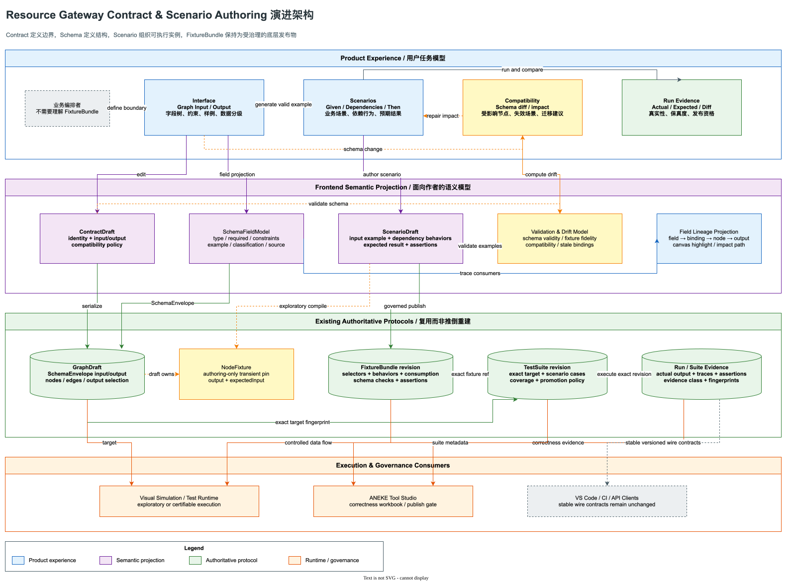

# Resource Gateway Contract & Scenario Authoring 工业级体验演进计划

> 状态：Proposed for Review  
> 日期：2026-07-27  
> 目标版本：Contract & Scenario Authoring v1  
> 适用范围：`/author/`、VS Code 轻量宿主、Resource Gateway testing control plane、ANEKE Tool Studio 集成  
> 核心决策：保留现有 wire protocol 的权威语义，在其上建立面向业务作者的 Contract → Scenario → Run Evidence 产品模型

实现进度与当前差距见
[Contract & Scenario Authoring Implementation Status](resource-gateway-contract-scenario-authoring-implementation-status.md)；
已落地协议和编译边界见
[Contract & Scenario Authoring Protocol](resource-gateway-contract-scenario-authoring-protocol.md)。

相关文档：

- [BLOGE Visual Canvas 产品与系统说明](bloge-visual-canvas-product-and-system-guide.md)
- [Resource Gateway 工业级可测试性演进方案](resource-gateway-industrial-testability-evolution-plan.md)
- [Resource Gateway 长期能力镜像设计](resource-gateway-mock.md)
- [Testing Control Plane API](resource-gateway-testing-control-plane-api.md)

## 0. 执行摘要

Resource Gateway 当前已经具备 Graph input/output schema、节点 fixture、Runtime Context、表格测试、FixtureBundle、TestSuite 和 Run Evidence 等基础能力。问题不在“缺少能力”，而在于能力按照底层存储结构和协议对象分散暴露，用户必须自己推导它们之间的关系。

当前默认心智链路是：

```text
Graph Contract 摘要
  + Operator Input/Output Schema
  + Runtime Context
  + Node Fixture
  + Fixture Overrides
  + Expected Output
  + Test Suite
```

目标心智链路应收敛为：

```text
Contract
  定义 Graph 可以接收什么、保证输出什么
    ↓
Scenario
  Given 输入什么
  Dependencies 依赖如何表现
  Then 期望什么
    ↓
Run Evidence
  实际发生了什么、是否符合预期、证据能否用于治理
```

本计划做出五项核心选择：

1. **`Schema` 是 Contract 的结构组成，不再与 Contract 并列展示。**
2. **`Fixture` 降级为 DX、API 和受治理发布协议中的术语。**
3. **业务作者面对 `Graph Input`、`Dependency Behavior`、`Expected Result` 和 `Scenario`。**
4. **普通路径使用 Schema 驱动表单，Raw JSON 保留在 Advanced 模式并保证无损往返。**
5. **探索态 Scenario 编译为现有 simulate request；发布态 Scenario 编译为现有不可变 FixtureBundle + TestSuite，避免重建第二套执行协议。**

这不是一次视觉改名，而是一次产品语义、领域边界和生命周期的系统重组。

评审时建议优先确认第 19 节的 D2、D3、D5、D7、D9，以及第 11 节各阶段退出门禁。它们分别决定 authoring asset 边界、既有测试协议复用、安全发布边界、跨系统职责和 Contract 的完整语义。

## 1. 评审结论

### 1.1 当前能力不是“不够多”，而是“不够直”

当前 `/author/` 已经提供：

| 当前能力 | 当前入口 | 已解决的问题 | 仍存在的体验问题 |
|---|---|---|---|
| Graph Contract | 画布上方摘要条 | 看见 Graph input/output 字段数量和类型 | 摘要不可直接进入完整编辑、样例和兼容性视图 |
| Operator Schema | 双击节点后的 Input/Output schema | 看见单算子 port 契约 | Graph 与 Operator scope 缺少清晰切换；Schema 靠近浮层底部 |
| Runtime Context | 右侧 Inspector | 图形化维护部分 `ctx` 数据 | 用户不知道它与 Graph Input、Test Case Context 的关系 |
| Node Fixture | Mock Setup、Operator Detail | 为 design-only 或隔离依赖提供返回值 | 产品直接暴露 Fixture，且主要编辑形态仍是 JSON |
| Graph Test Suite | Test Suite 浮层 | 多行运行端到端测试 | 每行重复填写 Context、Fixture Overrides、Expected Output 三段 JSON |
| Operator Test Suite | Operator Detail 浮层 | 单算子试跑、发布 Fixture 和 TestSuite | 与节点默认 Fixture、Graph Test Suite 的关系需要用户自行理解 |
| FixtureBundle | testing control plane | 完整表达执行控制反转、断言和故障行为 | 协议能力很强，但不适合作为业务作者的默认认知对象 |
| Run Evidence | run/suite/rehearsal API | 支持真实性、断言、覆盖率和治理证据 | Authoring 页面尚未把证据与 Scenario 编辑形成同一闭环 |

### 1.2 病根分类

#### 病根 A：协议对象泄漏到产品语言

`SchemaEnvelope`、`NodeFixture`、`FixtureBundle`、`TestSuite` 是合理的工程对象，但用户的任务并不是“创建一个 FixtureBundle”，而是“让 CRM 在这个场景返回限流错误，并验证降级路径”。

直接暴露协议对象会把系统复杂度转嫁给用户，而不是消除复杂度。

#### 病根 B：不同 scope 使用相似术语

当前同时存在：

- Graph input/output schema；
- Operator port input/output schema；
- Runtime Context；
- Node expected input；
- Graph expected output；
- Operator expected output；
- 节点默认 fixture；
- Test Case fixture override；
- Registry FixtureBundle revision。

这些对象分别属于 Graph、Operator、Node Instance、Scenario 和 Governed Asset 五个 scope。界面缺少稳定的 scope 标记，因此用户容易把“算子输入”误认为“Graph 输入”，把“节点输出样例”误认为“发布契约”。

#### 病根 C：定义、实例和证据没有形成生命周期

Schema 是定义，Scenario input 是实例，Fixture behavior 是运行控制，Expected Result 是 oracle，Run Evidence 是验证结果。当前它们在多个面板中平铺，缺少从定义到验证的状态推进。

#### 病根 D：重复数据缺少来源和联动

同一个 `applicantId` 可能同时出现在：

- Graph Input Schema 的 example；
- Runtime Context；
- Test Suite Context；
- Operator Expected Input；
- Fixture match constraint。

用户无法快速回答：

- 这个值从哪里生成？
- Schema 变化后哪些实例失效？
- 修改字段是否影响节点绑定？
- 这个 Expected Result 是手填、运行捕获还是回放生成？

#### 病根 E：Raw JSON 被当作默认能力，而不是逃生舱

Raw JSON 的价值是无损、完整和适合专家，不是易用。把它放在主路径会导致：

- 新用户不敢改；
- 错误只能以 JSON parse error 表达；
- Schema 约束不能转化为控件；
- 不知道哪些字段必填、敏感或已废弃；
- 很难理解节点行为与 Graph 拓扑的关联。

#### 病根 F：探索态和治理态混在一起

NodeFixture 和 inline simulate 适合快速探索；FixtureBundle revision 和 TestSuite revision 适合治理、复现和认证。两者需要自然升级，但不能在 UI 上表现为“点一次 Run 就得到可发布证据”。

### 1.3 现有技术基础足以支撑演进

本计划不需要重写执行引擎。当前代码已经具备：

- `GraphDraft.inputSchema` 和 `GraphDraft.outputSchema`；
- `OperatorPort.schema`；
- `NodeFixture.output` 和 `NodeFixture.expectedInput`；
- Schema sample generation；
- Graph/Operator table test；
- FixtureBundle selector、behavior、consumption、schema check 和 assertion；
- REAL、RETURN、THROW、DELAY、TIMEOUT、REPLAY、SPY、DENY；
- immutable FixtureBundle/TestSuite revision；
- exploratory/certifiable evidence 分类；
- target、fixture、suite 和 run fingerprint；
- ANEKE correctness workbook 和 publish gate 对接基础。

因此正确策略是增加一层**语义化 Authoring Projection**，而不是建立第二套测试引擎或第二套 Fixture 协议。

### 1.4 代码事实基线

| 事实 | 当前代码 |
|---|---|
| GraphDraft 已有一等 input/output schema 和 nodeFixtures | [`types.ts`](../resource-gateway-examples/src/main/frontend/src/types.ts) |
| NodeFixture 明确属于 authoring draft，不属于 executable contract | [`GraphDraft.java`](../resource-gateway-examples/src/main/java/com/leanowtech/bloge/gateway/visual/draft/GraphDraft.java) |
| 当前 Graph Test Suite 使用 Context、Fixture Overrides、Expected Output 三段 JSON | [`AuthorCanvas.tsx`](../resource-gateway-examples/src/main/frontend/src/AuthorCanvas.tsx) |
| FixtureBundle 已承载 rules、assertions、classification、clock 和 seed | [`FixtureBundle.java`](../resource-gateway-examples/src/main/java/com/leanowtech/bloge/gateway/testing/domain/FixtureBundle.java) |
| FixtureRule 已承载 selector、behavior、consumption 和 schema check | [`FixtureRule.java`](../resource-gateway-examples/src/main/java/com/leanowtech/bloge/gateway/testing/domain/FixtureRule.java) |
| TestSuite 只引用 exact FixtureBundle revision | [`TestSuite.java`](../resource-gateway-examples/src/main/java/com/leanowtech/bloge/gateway/testing/domain/TestSuite.java) |

## 2. 目标与边界

### 2.1 产品目标

1. 用户在首次打开空白画布后，能够在 5 分钟内完成一个合法 Contract、一个 Scenario 和一次试跑。
2. 用户无需理解 FixtureBundle，即可表达常见依赖返回、异常、超时、回放和禁止调用。
3. 用户修改 Schema 时，系统能够指出受影响的绑定、Scenario 和受治理测试资产。
4. Graph 与 Operator 测试使用一致的 Given / Dependencies / Then 语言。
5. 探索态数据能够在明确确认后升级为不可变 FixtureBundle/TestSuite，而不是重新手写。
6. VS Code、浏览器和 API 客户端继续共享稳定协议，不要求启动新的治理系统。

### 2.2 工程目标

1. 保留 GraphDraft v1、FixtureBundle v1、TestSuite v1 和现有执行证据的兼容读取。
2. 新 UI 模型必须可以无损映射到既有 wire contracts。
3. Schema 表单编辑必须保留未识别 JSON Schema keyword，禁止 round-trip 丢字段。
4. Scenario compiler 必须确定性、可测试、可审计。
5. Contract/Scenario 变更必须能够产生稳定 diff 和影响报告。
6. 生产环境继续禁止未授权 fixture 注入、capture 和 exploratory execution。

### 2.3 非目标

本阶段不做：

- 替代 ANEKE 的 contract registry、owner governance、publish gate 或 TEE 治理；
- 在 Resource Gateway 内建设通用数据治理平台；
- 把所有 JSON Schema keyword 都转化为定制控件；
- 自动把一次成功运行升级为可发布证据；
- 把业务 payload 写入 Run Evidence；
- 允许生产流量自动捕获并保存为 Fixture；
- 用新的 Scenario Runtime 替代 BLOGE testing control plane；
- 取消 Raw JSON、DSL 或 API-first 工作方式。

## 3. 统一产品语言

### 3.1 一等概念

| 产品术语 | 定义 | Scope | 对应工程对象 |
|---|---|---|---|
| Contract | 一张 Graph 或一个 Operator 对外承诺的输入、输出、错误、effect、约束和兼容策略 | Graph / Operator | GraphDraft schemas、OperatorPort schemas/capabilities、GatewayGraphContract |
| Input Schema | Contract 中输入结构的形式化定义 | Contract | SchemaEnvelope |
| Output Schema | Contract 中输出结构的形式化定义 | Contract | SchemaEnvelope |
| Graph Input | 一次 Graph 调用的具体输入数据 | Scenario | TestSuite.TestCase.input、SimulationRequest.context |
| Dependency Behavior | Scenario 中某个依赖在运行期如何表现 | Scenario + invocation site | FixtureRule |
| Dependency Response | RETURN 行为下返回的业务或协议响应 | Dependency Behavior | FixtureRule.Behavior.value/rawBody/statusCode/headers |
| Expected Result | Scenario 对 Graph 或 Operator 结果的期望 | Scenario | FixtureBundle assertions |
| Assertion | 对 output、node、status、path 或调用行为的可执行判断 | Scenario | FixtureBundle.Assertion |
| Scenario | 一组 Given / Dependencies / Then，可独立运行和评审 | Target-bound authoring asset | ScenarioDraft |
| Published Test Data | 已发布、不可变、内容寻址的执行控制数据 | Governed testing asset | Stored FixtureBundle revision |
| Test Suite | 一组绑定 exact target 和 exact Published Test Data 的场景 | Governed testing asset | TestSuite revision |
| Run Evidence | 一次运行产生的 trace、assertion、真实性和完整性证据 | Execution | TestRunEvidence / TestSuiteRunEvidence |
| Compatibility | Contract 变化对调用方、绑定和 Scenario 的影响 | Contract evolution | CompatibilityReport |

### 3.2 UI 改名

| 当前 UI | 目标 UI | 说明 |
|---|---|---|
| Graph Contract | Contract | 入口升级为可操作的 Contract rail |
| Runtime Context | Graph Input | 明确它是一组具体输入，而不是另一套 Schema |
| Mock Setup | Dependencies | 真实、替身、故障、回放统一进入依赖行为 |
| Node Fixture | Dependency Response | 仅在 RETURN/DELAY 等行为下出现 |
| Fixture Overrides | Scenario Overrides | 只在从共享行为派生时出现 |
| Expected Output | Expected Result | 支持值、Path Assertion、Schema Assertion 等 |
| Test Suite row | Scenario | 强化业务意图和可单独运行性 |
| Publish Fixture | Publish Test Data | UI 不要求用户理解 bundle |
| Publish Suite | Publish Scenarios | 输出仍是 TestSuite revision |

### 3.3 不变量

1. Contract 必须拥有 Input Schema 和 Output Schema；Schema 不独立漂移。
2. Scenario 必须绑定 target fingerprint 和 contract fingerprint。
3. Scenario Draft 可以编辑，Published Test Data 和 TestSuite revision 不可变。
4. TestSuite 只能引用 exact FixtureBundle revision，禁止 implicit latest。
5. Expected Result 必须编译为显式 assertion，不能只靠 UI 文本比较。
6. Run Evidence 必须区分 exploratory 和 certifiable。
7. Schema、Scenario 或 target drift 后，旧通过结果必须标记 stale。
8. Raw JSON 编辑必须与图形化编辑使用同一 canonical model。
9. UI 可以隐藏底层协议复杂度，但不得降低 fail-closed 语义。
10. Fixture 注入能力必须由 environment、purpose 和 principal 三重约束。

## 4. 目标用户体验

### 4.1 画布 Contract Rail

现有只读 Graph Contract strip 升级为可点击的 Contract rail：

```text
Input 4 fields → Loan Policy Graph → Output 5 fields
Valid · 3 Scenarios · 2 controlled dependencies · 1 compatibility warning
```

Contract rail 提供：

- Input / Output 摘要；
- Contract 状态；
- Scenario 数量和最近运行状态；
- 被控制依赖数量；
- compatibility blocker 数量；
- `Edit Contract`；
- `Open Scenarios`；
- `Trace Field`；
- `Advanced JSON`。

点击 Input/Output 字段时：

- 在画布上高亮消费或生成该字段的节点；
- 展示字段来源、绑定路径和输出 lineage；
- 可以将 Input 字段拖到选中节点的 input；
- 可以从节点 output path 添加到 Graph Output Contract；
- 展示 exact / inferred / unknown 三种 lineage confidence。

### 4.2 Contract & Scenarios 工作台

使用全屏工作台或宽侧边抽屉，不把复杂编辑器塞进右侧 Inspector。工作台包含四个 Tab。

#### Interface

主要区域：

1. 左侧 Input Schema 字段树；
2. 中间 Contract boundary 和 Graph identity；
3. 右侧 Output Schema 字段树；
4. 下方字段详情和 Contract Semantics；
5. 顶部状态和兼容性摘要。

Contract Semantics 至少展示：

- error variants 和稳定 error code；
- effect：PURE/READ/WRITE；
- idempotency；
- streaming/durable；
- side-effect protocol；
- precondition/postcondition；
- compatibility policy；
- owner 和 lifecycle metadata。

Stage 1 先完整编辑 input/output schema；无法从当前 Graph/Operator contract 得到的 semantics 显示为 `Not declared`，不能用默认值伪装成已声明。

字段行至少展示：

| 字段 | 含义 |
|---|---|
| Path | 稳定 JSON Pointer |
| Name | 显示名 |
| Type | object/array/string/number/integer/boolean/null/union |
| Required | 是否必填 |
| Constraints | enum、min/max、pattern、format、items 等 |
| Example | 用于生成 Scenario 的非权威样例 |
| Classification | PUBLIC/INTERNAL/CONFIDENTIAL/RESTRICTED |
| Source | imported / DSL / inferred / authored / observed |
| Confidence | exact / inferred / opaque |

主要操作：

- Add Field；
- Add Nested Object；
- Add Array Item；
- Change Type；
- Mark Required；
- Add Constraint；
- Set Example；
- Set Classification；
- Infer from JSON；
- Import Schema；
- Compare Revision；
- Open Raw Schema。

#### Scenarios

左侧为 Scenario 列表，右侧为结构化编辑器：

```text
Scenario: CRM timeout falls back to cached profile
Type: REGRESSION

Given
  Graph Input

Dependencies
  crm.lookupCustomer        TIMEOUT after 800 ms
  cache.getCustomer         RETURN cached profile
  audit.writeDecision       SPY, exactly once

Then
  Output /decision          EQUALS "FALLBACK"
  Output /customer/source   EQUALS "CACHE"
  Node audit.writeDecision  STATUS SUCCESS
  crm.lookupCustomer        USED exactly once
```

Scenario 列表展示：

- 名称；
- GOLDEN / NEGATIVE / BOUNDARY / REGRESSION / PROPERTY；
- Draft / Valid / Stale / Published；
- 最近 exploratory run；
- 最近 certifiable run；
- blocker 数量；
- target/contract freshness。

#### Compatibility

展示：

- Input Schema diff；
- Output Schema diff；
- target graph/operator fingerprint diff；
- operator library/schema fingerprint diff；
- 受影响的 field bindings；
- 受影响的 Scenario；
- 受影响的 Published Test Data/TestSuite；
- breaking/non-breaking/unknown 分类；
- 建议迁移动作。

Compatibility 不只做 JSON diff，必须执行语义分类：

| 变化 | 默认分类 |
|---|---|
| 新增 optional input field | Non-breaking |
| 删除 input field | Breaking for producers and bound nodes |
| optional 改 required | Breaking |
| 扩大 numeric range | Usually non-breaking |
| 缩小 enum/range | Breaking |
| 新增 optional output field | Non-breaking for tolerant consumers |
| 删除或改名 output field | Breaking |
| output required 改 optional | Conditionally breaking |
| unknown/custom keyword 变化 | Unknown，要求人工确认 |
| operator/graph fingerprint 变化但 schema 不变 | Behavioral drift，Scenario 必须重跑 |

#### Run Evidence

展示：

- Actual Result；
- Expected Result；
- field-level diff；
- node/edge trace；
- dependency behavior consumption；
- schema validation；
- assertions；
- execution fidelity；
- evidence class；
- fixture/suite/target fingerprints；
- gate readiness；
- payload redaction状态。

Run Evidence 只展示授权范围内的 payload。导出治理证据时继续采用现有 payload-free 或脱敏协议。

### 4.3 Schema 驱动数据编辑

Graph Input、Dependency Response 和 Expected Result 默认使用 Schema 生成表单：

| Schema 类型 | 默认控件 |
|---|---|
| string | text input |
| string + enum | select/menu |
| boolean | toggle |
| integer/number | numeric input |
| date/date-time | date/time input |
| object | expandable field group |
| array of scalar | editable list |
| array of object | table with row editor |
| oneOf/anyOf | variant selector + variant form |
| additionalProperties | key/value table |
| secret/classified | masked input + reveal permission |

必须采用分级支持：

| 支持级别 | 范围 | UX |
|---|---|---|
| Native | 常规 object/array/primitive/enum/constraints | 完整表单 |
| Hybrid | oneOf/anyOf、additionalProperties、有限 `$ref` | 表单 + Raw Fragment |
| Raw-only | 递归 `$ref`、复杂 conditional、未知 keyword | Raw JSON + 结构摘要 |

所有级别都必须满足：

- 原始 Schema 无损保留；
- 图形化编辑只修改明确字段对应的 JSON Pointer；
- 未识别 keyword 不得被重写或删除；
- Form 与 Raw 切换前显示 diff；
- 无法证明无损时禁止覆盖原文。

### 4.4 Dependency Behavior 编辑器

每个节点或调用位置提供行为 segmented control：

| UI 行为 | FixtureRule behavior | 默认展示字段 |
|---|---|---|
| REAL | REAL | purpose、readiness、是否允许真实调用 |
| RETURN | RETURN | response form、node/transport boundary |
| ERROR | THROW | error code、type、message |
| DELAY | DELAY | duration、最终 response |
| TIMEOUT | TIMEOUT | duration、error code |
| REPLAY | REPLAY | exact governed replay ref |
| OBSERVE | SPY | expected calls、input/output observation policy |
| MUST NOT CALL | DENY | violation code、message |

高级区域提供：

- selector；
- input match；
- attempts/occurrences；
- correlation key；
- min/max uses；
- exhausted action；
- unmatched action；
- strict/waived schema check；
- transport status/headers/raw body；
- exact replay revision。

普通作者默认按 canvas node 选择依赖；高级用户可以切换到 operator/resource/function/invocation-site selector。

### 4.5 Expected Result 编辑器

Expected Result 不应只有整段 JSON 相等。支持：

- entire output equals；
- output matches schema；
- path equals；
- path exists/absent；
- numeric tolerance；
- node output assertion；
- node status assertion；
- edge transfer assertion；
- dependency consumed min/max times；
- no unmatched dependency invocation；
- expected error；
- governance expectation。

常见路径：

1. 手工填写 Expected Result；
2. `Run & Compare`；
3. `Capture Actual as Draft Expected`；
4. 显示 field-level diff；
5. 用户确认；
6. 保存为 Scenario Draft；
7. 独立 Publish 动作生成不可变 FixtureBundle/TestSuite。

`Capture Actual` 永远不能自动发布，也不能自动把 exploratory evidence 标记为 certifiable。

### 4.6 Operator 与 Graph 共用模型

同一工作台支持两种 target：

| Target | Given | Dependencies | Then |
|---|---|---|---|
| Operator | operator input | transport/resource/built-in dependency | operator output/assertions |
| Graph | graph context | node/resource/function/invocation site | graph output/node/edge/assertions |

UI 顶部必须持续显示：

```text
Target: GRAPH loanDecisionPolicy@draft-12
```

或：

```text
Target: OPERATOR customer.normalize@fingerprint
```

禁止在不展示 target scope 的情况下复用 Input、Output、Scenario 等术语。

### 4.7 首次使用和样例

空状态不能只显示“No test cases”。应提供：

- Generate Happy Path；
- Generate Boundary Cases；
- Import JSON Example；
- Capture from an authorized non-production run；
- Load Sample Scenario；
- Start from Contract only。

每个内置复杂画布示例至少包含：

- 1 个 GOLDEN；
- 1 个 NEGATIVE 或 BOUNDARY；
- 1 个 dependency failure/fallback；
- 完整 Graph Input；
- 至少两种 Dependency Behavior；
- Expected Result；
- 一次 illustrative run evidence；
- 明确的 sample/non-server-evidence 标签。

## 5. 目标领域模型

### 5.1 ContractDraft

```typescript
interface ContractDraft {
  schemaVersion: "bloge.contractDraft.v1";
  target: {
    kind: "GRAPH" | "OPERATOR";
    id: string;
    revision?: number;
    fingerprint: string;
  };
  inputSchema: SchemaEnvelope;
  outputSchema: SchemaEnvelope;
  errorContract: ErrorVariant[];
  executionSemantics: {
    effect: "PURE" | "READ" | "WRITE" | "UNKNOWN";
    idempotency: string;
    streaming: boolean | null;
    durable: boolean | null;
    sideEffectProtocol?: SideEffectProtocol;
  };
  invariants: ContractInvariant[];
  compatibilityPolicy: CompatibilityPolicy;
  fieldMetadata: Record<JsonPointer, FieldMetadata>;
  source: "AUTHORED" | "DSL" | "IMPORTED" | "INFERRED";
  confidence: "EXACT" | "INFERRED" | "OPAQUE";
}
```

说明：

- GraphDraft v1 已拥有 input/output schema；
- ContractDraft 是前端语义投影，不要求 P0 立即替换 GraphDraft；
- Operator execution semantics 优先来自当前 capabilities，Graph 未声明语义时保持 UNKNOWN；
- invariants 是可导出的 contract declaration，不等同于某一次 Scenario assertion；
- field metadata 不应塞进 JSON Schema 自定义 keyword，避免污染标准 Schema；
- 后续由 GraphContract export 将 schema 与 metadata 作为稳定集成协议导出。

### 5.2 ScenarioDraftSet

Scenario Draft 不应长期塞入 `visualLayout`。它具有不同的权限、体量、保留策略和生命周期，建议成为独立 authoring asset：

```typescript
interface ScenarioDraftSet {
  schemaVersion: "bloge.scenarioDraftSet.v1";
  scenarioDraftSetId: string;
  revision: number;
  scope: EnterpriseScope;
  target: ExactTargetRef;
  contractFingerprint: string;
  scenarios: ScenarioDraft[];
  metadata: {
    owner: string;
    classification: DataClassification;
    createdAt: string;
    updatedAt: string;
  };
}
```

```typescript
interface ScenarioDraft {
  scenarioId: string;
  name: string;
  description: string;
  caseType: "GOLDEN" | "NEGATIVE" | "BOUNDARY" | "REGRESSION" | "PROPERTY";
  tags: string[];
  given: {
    input: unknown;
    provenance: ValueProvenance;
  };
  dependencies: DependencyBehaviorDraft[];
  then: {
    assertions: AssertionDraft[];
  };
}
```

ScenarioDraftSet 是可变 authoring asset；发布时编译为不可变 FixtureBundle + TestSuite revision。

### 5.3 ValidationAndDriftReport

```typescript
interface ValidationAndDriftReport {
  schemaVersion: "bloge.scenarioValidationReport.v1";
  targetFingerprint: string;
  contractFingerprint: string;
  scenarioDraftSetRevision: number;
  status: "VALID" | "INVALID" | "STALE" | "UNKNOWN";
  diagnostics: Diagnostic[];
  compatibility: CompatibilityFinding[];
  impactedBindings: BindingRef[];
  impactedScenarios: ScenarioRef[];
  publicationImpact: PublishedAssetRef[];
}
```

报告必须内容寻址或至少绑定 exact inputs，避免 UI 把旧报告展示在新 Contract 上。

### 5.4 FieldLineageProjection

Lineage 来源：

- Graph input schema fields；
- DraftNodeBinding contextPath/constant；
- graph edges source/target path；
- transform expressions；
- decision table conditions/outputs；
- foreach collection/item bindings；
- built-in function expressions；
- graph output selection；
- operator port schemas。

Lineage confidence：

| 等级 | 含义 |
|---|---|
| EXACT | 由结构化 binding、edge endpoint 或 output selector 得出 |
| INFERRED | 由 DSL/expression parser 得出 |
| UNKNOWN | opaque operator、动态 path 或未知 function |

UNKNOWN 不能伪装成“无影响”。

## 6. 编译与运行语义

### 6.1 探索态编译

ScenarioDraft → existing SimulationRequest：

| Scenario 字段 | SimulationRequest |
|---|---|
| `given.input` | `context` |
| node RETURN behavior | `fixtures[nodeId].output` |
| node expected input | `fixtures[nodeId].expectedInput` |
| target graph | `draft` |
| selected graph output | `outputNode` |

限制：

- 当前 NodeFixture 只能无损表达固定 output 和 expectedInput；
- THROW/TIMEOUT/REPLAY/SPY/DENY、attempt/occurrence 和 transport boundary 不能降级成 NodeFixture；
- 如果 Scenario 使用高级 behavior，必须走 testing control plane，不能在前端假装执行。

### 6.2 治理态编译

ScenarioDraftSet → existing governed assets：

```text
ScenarioDraft
  Given.input
    → TestSuite.TestCase.input

  Dependencies
    → FixtureBundle.rules

  Then.assertions
    → FixtureBundle.assertions

  target + case type + tags
    → TestSuite revision
```

编译器必须：

1. 解析 exact target；
2. 验证 Contract fingerprint；
3. 规范化 Scenario；
4. 校验所有 selector；
5. 校验 Schema；
6. 计算 FixtureBundle canonical fingerprint；
7. 注册 exact FixtureBundle revision；
8. 生成 exact FixtureBundleRef；
9. 注册 TestSuite revision；
10. 返回 publication report；
11. 只有显式 Run 才执行 suite；
12. Run Evidence 绑定 target、fixture、suite 和 plan fingerprint。

### 6.3 行为映射

| Scenario UI | FixtureRule | 证据要求 |
|---|---|---|
| REAL | REAL | runtime target ready，环境允许真实调用 |
| RETURN | RETURN | output/transport schema check |
| ERROR | THROW | stable error code |
| DELAY | DELAY | logical clock 或确定性时间控制 |
| TIMEOUT | TIMEOUT | timeout duration 和 failure semantics |
| REPLAY | REPLAY | exact governed replay ref |
| OBSERVE | SPY | invocation evidence |
| MUST NOT CALL | DENY | zero-use/violation evidence |

## 7. 生命周期

### 7.1 Contract 状态

| 状态 | 含义 | 进入条件 | 退出门禁 |
|---|---|---|---|
| DRAFT | 正在编辑 | 创建或修改 | Schema parse/semantic validation |
| VALID | 当前结构合法 | validation 通过 | target 或 contract 变化 |
| INCOMPATIBLE | 存在 breaking change | compatibility classifier | 修复或人工接受迁移 |
| UNKNOWN | 存在无法判定的 Schema/lineage | opaque/custom keyword | 人工评审或增强解析 |
| EXPORTED | 已导出 exact contract snapshot | export 成功 | 新 revision |
| STALE | target/schema fingerprint 已变化 | drift detection | 重验、迁移 |

这些状态在 P0 可以是计算态；是否进入权威 wire protocol由后续 ADR 决定。

### 7.2 Scenario 状态

| 状态 | 含义 |
|---|---|
| DRAFT | 可编辑但未完成验证 |
| INVALID | 输入、行为或断言不合法 |
| VALID | 可进行受支持的探索执行 |
| STALE | target/contract/fixture dependency 已变化 |
| EXPLORATORY_PASSED | inline/local run 通过 |
| EXPLORATORY_FAILED | inline/local run 失败 |
| PUBLISHED | 已生成 exact FixtureBundle/TestSuite revision |
| CERTIFIABLE_PASSED | exact governed suite 通过且证据完整 |
| CERTIFIABLE_FAILED | governed suite 执行或断言失败 |
| EVIDENCE_INCOMPLETE | 运行完成但证据不足 |

### 7.3 状态规则

1. `EXPLORATORY_PASSED` 不能直接进入 `CERTIFIABLE_PASSED`。
2. Scenario 修改后，旧 Run Evidence 立即变为 historical，不再代表 current。
3. Contract fingerprint 变化后，相关 Scenario 进入 STALE。
4. target fingerprint 变化后，Published Test Data 不自动迁移。
5. `Run & Capture` 只更新 DRAFT Expected Result。
6. Published revision 永不原地修改。
7. production 环境默认不允许 DRAFT/inline Scenario 执行。

## 8. 系统架构



图源：

`docs/assets/drawio/resource-gateway-contract-scenario-authoring-evolution.drawio`

架构分为四层：

1. **Product Experience**：用户面对 Interface、Scenarios、Compatibility 和 Run Evidence。
2. **Frontend Semantic Projection**：把 Schema、Scenario、Drift 和 Lineage 组织为面向作者的模型。
3. **Existing Authoritative Protocols**：继续复用 GraphDraft、NodeFixture、FixtureBundle、TestSuite 和 Run Evidence。
4. **Execution & Governance Consumers**：Visual Runtime 负责执行，ANEKE 负责 correctness workbook/publish gate，VS Code/CI 继续使用稳定协议。

关键边界：

- Frontend Semantic Projection 可以演进得更直观，但不能改变底层协议语义；
- FixtureBundle/TestSuite 保持测试控制面的权威资产；
- ANEKE 消费发布资产和证据，不接管 Resource Gateway Authoring UI；
- Resource Gateway 不复制 ANEKE registry 和 publish gate。

## 9. 协议与 API 演进

### 9.1 P0：兼容优先

P0 不修改现有运行协议：

- GraphDraft v1 继续携带 input/output schema；
- SimulationRequest 继续承载 context + transient node fixtures；
- FixtureBundle v1 和 TestSuite v1 保持不变；
- Run Evidence 保持不变；
- 新 UI 通过 adapter 使用现有 API。

新增前端语义模型：

- `ContractDraftViewModel`；
- `SchemaFieldModel`；
- `ScenarioDraft`；
- `DependencyBehaviorDraft`；
- `ValidationAndDriftViewModel`；
- `FieldLineageProjection`。

### 9.2 P1：Scenario Draft 成为一等 authoring asset

建议新增：

| API | 用途 |
|---|---|
| `GET /api/visual/drafts/{draftId}/scenario-draft-sets/current` | 读取当前 Scenario DraftSet |
| `PUT /api/visual/drafts/{draftId}/scenario-draft-sets/{revision}` | 以 optimistic concurrency 保存 |
| `POST /api/visual/scenario-draft-sets/validate` | 生成 exact validation/drift report |
| `POST /api/visual/scenario-draft-sets/{id}/scenarios/{scenarioId}/run` | 执行一个 Scenario |
| `POST /api/visual/scenario-draft-sets/{id}/publish` | 编译并注册 FixtureBundle/TestSuite |
| `GET /api/visual/scenario-draft-sets/{id}/publications` | 查看发布 lineage |

API 必须：

- 完整 enterprise scope；
- auth-before-decode；
- exact target/contract fingerprint；
- optimistic concurrency；
- bounded payload；
- raw-secret hygiene；
- purpose separation；
- client request id 和幂等重试；
- immutable publication lineage；
- audit event。

### 9.3 P1：Portable Workspace Bundle

为了 VS Code/offline 使用，新增可移植包：

```text
bloge.visualAuthoringWorkspaceBundle.v1
  graphDraft
  contractProjection
  scenarioDraftSet
  operatorSnapshotRefs
  optional publicationRefs
```

约束：

- bundle 可以包含 authoring payload，因此必须有 classification；
- evidence 仍单独导出；
- secrets 只能以 reference 存在；
- VS Code 默认保存到 workspace，不上传；
- GraphDraft 独立导出保持兼容。

### 9.4 P2：Contract Compatibility Report

新增 versioned report：

- exact old/new contract fingerprint；
- field-level diff；
- compatibility classification；
- affected bindings；
- affected scenarios；
- affected publications；
- unknown reasoning；
- recommended migration；
- report fingerprint。

ANEKE 可以消费 report，但最终 publish gate policy 仍由 ANEKE 管理。

### 9.5 协议版本策略

1. 现有协议只做 additive compatible change，破坏性变化必须新 schemaVersion。
2. UI ViewModel 不作为 wire contract。
3. ScenarioDraftSet、WorkspaceBundle 和 CompatibilityReport 从 v1 独立版本化。
4. FixtureBundle/TestSuite 不为了 UI 改名。
5. adapter 必须有 golden corpus 和双向 round-trip 测试。

## 10. 工作流分解

### 10.1 Workstream A：产品信息架构

交付：

- Contract rail；
- Contract & Scenarios workspace；
- 四个 Tab；
- target/scope 常驻标识；
- Advanced JSON；
- 空状态和样例。

验收：

- 常见路径不需要编辑 JSON；
- Graph 与 Operator scope 不混淆；
- 用户从 Contract 能一步进入 Scenario；
- Scenario 能一步进入 Run Evidence。

### 10.2 Workstream B：Schema Workbench

交付：

- JSON Schema AST/projection；
- schema field tree；
- form widgets；
- raw/form diff；
- infer from example；
- input/output split；
- unsupported keyword protection；
- field metadata。

验收：

- Native schema 可完全表单化；
- Hybrid schema 无损往返；
- Raw-only schema 不被覆盖；
- 500 fields 下可用；
- invalid constraints 有 field-level 诊断。

### 10.3 Workstream C：Scenario Builder

交付：

- Given / Dependencies / Then；
- Scenario list；
- case type；
- dependency behavior editors；
- assertion builder；
- run one/run all；
- actual/expected diff；
- capture as draft expected；
- duplicate/parameterize scenario。

验收：

- 用户可以表达 RETURN、ERROR、TIMEOUT、SPY 和 DENY；
- 每个行为映射到唯一 FixtureRule；
- unsupported behavior 不做有损降级；
- Scenario 能独立运行和复制。

### 10.4 Workstream D：Compiler & Adapter

交付：

- ScenarioDraft → SimulationRequest compiler；
- ScenarioDraftSet → FixtureBundle/TestSuite compiler；
- existing SimulationTable rows migration adapter；
- NodeFixture migration adapter；
- canonicalization；
- publication report。

验收：

- 同一输入确定性生成相同 fingerprint；
- adapter golden corpus 全绿；
- 无法无损编译时失败关闭；
- publication 复用 exact existing registry semantics。

### 10.5 Workstream E：Persistence & Protocol

交付：

- ScenarioDraftSet schema；
- repository/API；
- workspace bundle；
- optimistic concurrency；
- complete scope；
- audit；
- retention/classification。

验收：

- 两个组织可以安全复用相同 scenario id；
- stale revision 写入失败；
- cross-scope read/write 失败关闭；
- raw payload 不进入 logs/evidence；
- old GraphDraft client 不受影响。

### 10.6 Workstream F：Compatibility & Lineage

交付：

- schema semantic diff；
- binding impact；
- scenario impact；
- publication impact；
- field highlight；
- compatibility report。

验收：

- required/type/enum/range/output removal 正确分类；
- opaque path 显示 UNKNOWN；
- 受影响节点可从报告直接聚焦；
- stale Scenario 不显示为 current passed。

### 10.7 Workstream G：Security & Governance

交付：

- environment/purpose guard；
- classification；
- masking/redaction；
- capture authorization；
- permission-aware controls；
- publication confirmation；
- audit/provenance；
- ANEKE gate feedback。

验收：

- production 默认看不到 fixture injection/capture 动作；
- secret-like values 被阻断或 reference 化；
- author、runner、publisher 权限可分离；
- evidence 不回流业务 payload；
- 每次 publish 可追溯 actor、reason 和 exact inputs。

### 10.8 Workstream H：Samples、文档和可观测性

交付：

- Graph/Operator 典型 Scenario；
- inline coach；
- product guide；
- VS Code guide；
- telemetry；
- usability test script。

验收：

- 空白用户有明确下一步；
- 内置示例覆盖 happy/failure/boundary；
- 文档与当前 UI 一致；
- 关键转化漏斗可测量。

### 10.9 组织所有权

| 责任域 | Accountable | Responsible | 必须参与评审 |
|---|---|---|---|
| 产品术语与用户旅程 | Resource Gateway Product Owner | Canvas UX/Frontend | 业务编排者、ANEKE Product |
| Schema projection 与 round-trip | Resource Gateway Tech Lead | Frontend Platform | BLOGE Schema Owner |
| Scenario compiler | Resource Gateway Runtime Owner | Visual/Testing Backend | BLOGE Engine Owner |
| FixtureBundle/TestSuite 语义 | Testing Control Plane Owner | Testing Backend | Security、Test Kit |
| ScenarioDraftSet 协议与存储 | Resource Gateway Protocol Owner | Backend/Persistence | Enterprise Architecture |
| Compatibility/Lineage | Resource Gateway Tech Lead | Visual Backend/Frontend | ANEKE Contract Owner |
| 权限、classification、capture | Security Owner | Identity/Data Security | Compliance、SRE |
| Publish gate 和 workbook | ANEKE Owner | ANEKE Tool Studio | Resource Gateway Integration Owner |
| Browser/contract/compatibility 测试 | Quality Owner | QA/Automation | Frontend/Backend Owners |
| 上线、回滚、readiness | Resource Gateway SRE Owner | SRE/Release | Security、Support |

跨团队交付规则：

1. Resource Gateway 不等待 ANEKE UI 才交付 Authoring vertical slice；
2. ANEKE 不解析 Resource Gateway 私有 ViewModel，只消费 versioned export/evidence；
3. BLOGE engine 不依赖 Canvas 组件；
4. testing control plane 不反向依赖 visual authoring package；
5. Schema、Fixture、Suite 或 Evidence wire change 必须由 protocol owner 批准；
6. 每个 Stage 的 exit gate 由 Product、Tech Lead、QA 和 Security 联合签字。

## 11. 分阶段路线

### Stage 0：语义和安全地基

目标：在不改页面结构前冻结概念、adapter 和约束。

| ID | 工作项 | 输出 |
|---|---|---|
| RG-CS-001 | 冻结产品术语和 scope | glossary + copy inventory |
| RG-CS-002 | 定义 ScenarioDraft/ContractDraft ViewModel | TypeScript model |
| RG-CS-003 | 定义 Scenario compiler mapping | mapping spec + golden corpus |
| RG-CS-004 | 定义 Schema round-trip policy | supported keyword matrix |
| RG-CS-005 | 定义 capture/publish/security policy | security decision record |

退出门禁：

- 产品术语通过评审；
- Scenario 到现有协议的映射无歧义；
- 不支持能力有 fail-closed 策略；
- 无损 Schema 原则冻结。

建议投入：6-8 engineer-weeks。

### Stage 1：第一条直观纵切

目标：用户无需 Raw JSON 完成一个 Graph Contract + Scenario + Run。

| ID | 工作项 | 输出 |
|---|---|---|
| RG-CS-101 | Contract rail 可点击 | canvas entry |
| RG-CS-102 | Interface Tab | input/output field tree |
| RG-CS-103 | Schema 生成 Graph Input form | Given editor |
| RG-CS-104 | Dependencies 基础模式 | REAL/RETURN |
| RG-CS-105 | Expected Result 基础模式 | whole output/path equals |
| RG-CS-106 | Run & Compare | exploratory evidence |
| RG-CS-107 | 三个复杂示例迁移 | guided samples |
| RG-CS-108 | Raw JSON Advanced | lossless fallback |

退出门禁：

- 首次用户 5 分钟完成合法运行；
- 常规 happy path 零 JSON；
- Schema 变化会阻断非法 Scenario；
- 原有 Test Suite 功能无回归；
- 真实浏览器 desktop/mobile 验证通过。

建议投入：12-16 engineer-weeks。

### Stage 2：完整 Scenario 与受治理发布

目标：Scenario 能表达工业级依赖行为，并升级为 exact governed assets。

| ID | 工作项 | 输出 |
|---|---|---|
| RG-CS-201 | 完整 Dependency Behavior | ERROR/DELAY/TIMEOUT/REPLAY/SPY/DENY |
| RG-CS-202 | selector/match/consumption advanced editor | full FixtureRule projection |
| RG-CS-203 | assertion builder | output/node/edge/invocation assertions |
| RG-CS-204 | ScenarioDraftSet API | durable authoring asset |
| RG-CS-205 | governed compiler | FixtureBundle + TestSuite |
| RG-CS-206 | publication report | exact lineage |
| RG-CS-207 | operator/graph unified target | shared workspace |
| RG-CS-208 | workspace bundle | VS Code/offline export |
| RG-CS-209 | contract semantics projection | error/effect/idempotency/invariants |

Current implementation note (Round 7):

- RG-CS-208 is implemented as `bloge.visualAuthoringWorkspaceBundle.v1`, with browser export/import,
  exact fingerprint/scope/operator-index verification, raw-secret rejection, and preserved layout;
- RG-CS-209 is implemented as `bloge.graphContractSemantics.v1`, with graphical editing and strict
  server-side projection/validation;
- RG-CS-207 remains the final Stage 2 target-model gap: Graph uses the shared workspace today, while
  Operator authoring still uses its older test-suite dialog.

退出门禁：

- 每种 v1 FixtureRule behavior 都有可视化表达；
- governed compiler 与手工协议构造结果等价；
- publish/run 权限分离；
- exact fingerprints 和 revision 可复验；
- VS Code 不需要服务端即可编辑，连接服务后可发布。

建议投入：14-20 engineer-weeks。

### Stage 3：Compatibility、Lineage 与迁移闭环

目标：Contract 演进不再靠用户手工排查。

| ID | 工作项 | 输出 |
|---|---|---|
| RG-CS-301 | Schema semantic diff | compatibility classifier |
| RG-CS-302 | field lineage | canvas highlight |
| RG-CS-303 | scenario drift | stale state |
| RG-CS-304 | publication impact | exact affected refs |
| RG-CS-305 | guided migration | field rename/default/rebind actions |
| RG-CS-306 | ANEKE report export | publish-gate input |

退出门禁：

- breaking change 可确定性识别；
- opaque 变化不误报安全；
- Scenario 和 evidence freshness 正确；
- 从 finding 可直接定位画布；
- 迁移前后保留审计和旧 revision。

建议投入：12-18 engineer-weeks。

### Stage 4：企业级数据来源与规模化

目标：降低大规模 Scenario 建设成本，并在复杂组织中安全运行。

| ID | 工作项 | 输出 |
|---|---|---|
| RG-CS-401 | authorized capture | sanitized non-production capture |
| RG-CS-402 | replay selection | governed replay browser |
| RG-CS-403 | scenario parameterization | datasets/property seeds |
| RG-CS-404 | bulk validation/run | bounded batch |
| RG-CS-405 | collaboration/conflict | optimistic merge and review |
| RG-CS-406 | enterprise policy | classification/retention/region |
| RG-CS-407 | usage analytics | funnel and friction metrics |

退出门禁：

- capture 有明确 purpose、scope、redaction 和 retention；
- bulk run 有预算、取消、partial failure 和 evidence；
- 多作者冲突不静默覆盖；
- tenant/org/project/environment/region 完整隔离；
- 可量化证明体验门槛下降。

建议投入：14-22 engineer-weeks。

### 11.1 总体排期建议

以 2 名前端、2 名后端、1 名测试/自动化、0.5 名产品设计为基线：

| 里程碑 | 建议周期 | 可以展示的产品价值 |
|---|---:|---|
| Stage 0 | 2 周 | 术语、模型和技术风险闭合 |
| Stage 1 | 4-6 周 | 零 JSON 的第一条 Contract/Scenario/Run 纵切 |
| Stage 2 | 5-7 周 | 工业级依赖行为和 governed publish |
| Stage 3 | 4-6 周 | Schema 变更影响和迁移 |
| Stage 4 | 5-8 周 | 企业 capture、批量、协作和策略 |

Stage 1 完成即可对用户交付明显 UX 改善；Stage 2 完成才可以宣称“Scenario Authoring 工业级闭环”；Stage 3/4 完成后才适合大规模企业推广。

## 12. 迁移策略

### 12.1 当前数据映射

| 当前对象 | 迁移目标 | 策略 |
|---|---|---|
| GraphDraft input/output schema | ContractDraft | 直接投影，不修改原值 |
| Runtime Context | Scenario.given.input | 创建一个未命名 Draft Scenario，要求用户确认 |
| NodeFixture.output | RETURN Dependency Behavior | 标记 origin=`MIGRATED_NODE_FIXTURE` |
| NodeFixture.expectedInput | input assertion | 显式转换 |
| SimulationTable row | ScenarioDraft | Context/fixtures/expected output 分别编译 |
| Operator test row | Operator-target ScenarioDraft | 保留 case type 和 transport response |
| Canvas example test case | built-in ScenarioDraft | 构建时静态生成 |

### 12.2 Dual-read / Single-write

迁移期：

1. 读取旧 NodeFixture 和 SimulationTable 数据；
2. 投影为 ScenarioDraft；
3. 新 UI 只写 ScenarioDraftSet；
4. 探索运行时按需编译回 SimulationRequest；
5. GraphDraft export 继续保留兼容 NodeFixture；
6. 发布只走 FixtureBundle/TestSuite；
7. telemetry 监控旧路径使用率；
8. 旧 UI 在两个稳定版本后隐藏，但 API 保持兼容。

### 12.3 禁止静默迁移

以下情况必须要求用户确认：

- Expected Output 无法判断是 whole-output equality 还是 path assertion；
- fixture selector 不是精确 node id；
- transport response 与 logical output 不一致；
- Schema 已变化；
- fixture 包含疑似 secret；
- Scenario target fingerprint 缺失；
- unknown JSON Schema keyword 影响生成表单；
- old fixture behavior 无法用 NodeFixture 表达。

### 12.4 回滚

功能开关：

- `contractScenarioWorkspace`；
- `scenarioDraftPersistence`；
- `governedScenarioPublication`；
- `contractCompatibilityReport`；
- `authorizedScenarioCapture`。

回滚要求：

- 关闭新 UI 后旧 GraphDraft 仍可读取；
- 已发布 FixtureBundle/TestSuite 不受影响；
- ScenarioDraftSet 不删除；
- Run Evidence 继续可查询；
- 任何回滚不得回写旧 revision。

## 13. 安全、隔离与合规

### 13.1 数据分类

Contract field metadata 和 ScenarioDraftSet 必须包含 classification。默认策略：

| 分类 | 表单行为 | 持久化 | Evidence |
|---|---|---|---|
| PUBLIC | 明文 | 允许 | 可按协议展示 |
| INTERNAL | 明文或组织策略遮罩 | 加密 | payload-free 默认 |
| CONFIDENTIAL | 默认遮罩 | 加密 + 限权 | hash/redacted |
| RESTRICTED | reference only | 禁止普通 authoring store | hash-only |

### 13.2 Secret

- 禁止在 Schema example、Scenario input、Dependency Response 和 Expected Result 中保存 raw credential；
- 仅允许 secret reference；
- Raw JSON 模式同样执行扫描；
- import/capture 前执行检测；
- audit/log/error 禁止回显；
- 导出 workspace bundle 前再次扫描。

### 13.3 权限

建议拆分：

| 权限 | 动作 |
|---|---|
| CONTRACT_AUTHOR | 编辑 Contract Draft |
| SCENARIO_AUTHOR | 编辑 Scenario Draft |
| TEST_EXECUTOR | exploratory run |
| TEST_DATA_PUBLISHER | 发布 FixtureBundle |
| TEST_SUITE_PUBLISHER | 发布 TestSuite |
| CERTIFIABLE_RUNNER | 执行 certifiable suite |
| CAPTURE_OPERATOR | 从授权环境捕获 |
| GOVERNANCE_READER | 查看 publish gate/evidence |

### 13.4 环境隔离

- test/staging 支持 inline Scenario；
- production 默认禁用 fixture injection、capture、raw replay；
- production 只允许 exact published revision 和授权 purpose；
- UI 不仅隐藏按钮，服务端也必须拒绝；
- capability probe 明确报告 authoring、publish、capture、certifiable execution 是否可用。

### 13.5 失败、并发与降级语义

| 故障 | 系统行为 | 用户可见状态 | 恢复方式 |
|---|---|---|---|
| Schema parse 失败 | 不更新 canonical Contract | INVALID，定位 JSON Pointer | 修正后重验 |
| 未识别 Schema keyword | 保留原文，禁止有损表单覆盖 | UNKNOWN / Raw-only | Advanced 或人工评审 |
| Scenario 自动保存失败 | 保留本地 dirty state | Save failed，不关闭工作台 | retry/export local bundle |
| 两名作者并发保存 | optimistic concurrency 拒绝旧 revision | Conflict | compare/merge/new revision |
| target fingerprint 变化 | 禁止沿用 current passed | STALE | revalidate/rerun |
| simulate API 不可用 | 不生成伪结果 | Runtime unavailable | local edit，稍后 retry |
| 部分 FixtureBundle 已注册，TestSuite 注册失败 | 不回滚不可变资产，不报告 publish success | Publication incomplete | 用同一 client request id adopt/retry |
| publish 请求响应丢失 | 查询 exact request/adoption status | Outcome unknown | idempotent status lookup |
| suite run partial failure | 保留逐 case 状态 | PARTIAL/COMPLETED_WITH_FAILURES | retry policy 或新 run |
| evidence finalization 未完成 | 不显示 certifiable passed | EVIDENCE_INCOMPLETE | finalizer/retry/remediation |
| capture 脱敏失败 | 不保存任何 payload | Capture rejected | 修正 policy/adapter |
| permission/capability 变化 | action-time recheck | Action no longer available | 重新授权或降级为 edit-only |
| compatibility service 不可用 | 禁止自动迁移 | Compatibility unknown | 手工评审或服务恢复 |

Publication 必须实现可恢复的多资产提交：

1. 以 `clientRequestId + targetFingerprint + scenarioDraftSetFingerprint` 建立 publication attempt；
2. FixtureBundle 注册幂等；
3. 已存在且 fingerprint 一致时 adopt；
4. 已存在但 fingerprint 不一致时失败关闭；
5. TestSuite 只在全部 exact Fixture ref 可用后注册；
6. publication report 记录每个资产的 CREATED/ADOPTED/FAILED；
7. 只有 suite revision 和完整 lineage 都可复验时才返回 PUBLISHED；
8. 不删除孤立 immutable fixture，由 retention/garbage policy 后续处理。

## 14. 测试策略

### 14.1 单元测试

- Schema AST projection；
- JSON Pointer patch；
- unknown keyword preservation；
- form/raw round-trip；
- sample generation；
- Scenario validation；
- behavior mapping；
- assertion mapping；
- canonical fingerprint；
- compatibility classification；
- lineage extraction；
- stale-state computation。

### 14.2 属性和模糊测试

- 随机 JSON Schema round-trip 不丢字段；
- 递归/深层 schema 有深度和节点上限；
- arbitrary Scenario canonicalization 确定性；
- FixtureRule compile/decompile 等价；
- invalid selector/behavior 失败关闭；
- unknown keyword 不误判 compatible。

### 14.3 组件测试

- Contract rail；
- field tree；
- nested form；
- oneOf variant；
- dependency behavior；
- assertion builder；
- Scenario list/status；
- actual/expected diff；
- capture confirmation；
- advanced JSON；
- permission-disabled state。

### 14.4 API 和协议测试

- strict JSON Schema；
- auth-before-decode；
- enterprise scope；
- optimistic concurrency；
- fingerprint mismatch；
- exact revision；
- payload bounds；
- secret rejection；
- idempotent publication；
- stale target；
- incomplete evidence；
- v1 client compatibility。

### 14.5 真实浏览器测试

必须使用打包后的 production bundle 和真实浏览器验证：

1. 空白 Contract 创建；
2. 导入 DSL；
3. 加载复杂示例；
4. 新增字段；
5. Schema 生成 Graph Input；
6. 拖拽字段绑定节点；
7. 配置 RETURN/TIMEOUT；
8. 添加 Expected Result；
9. Run & Compare；
10. Capture as Draft Expected；
11. 修改 Schema 触发 stale；
12. 发布 exact Scenario；
13. 查看 Run Evidence；
14. desktop/mobile；
15. 500-field Contract；
16. 100-Scenario suite；
17. Raw JSON unsupported schema；
18. production permission denial。

### 14.6 非功能门禁

初始 SLO 建议：

| 指标 | 目标 |
|---|---:|
| 100-field Contract 首次渲染 | p95 < 500 ms |
| 500-field Contract 搜索/展开 | p95 < 150 ms interaction |
| 单 Scenario 本地验证 | p95 < 100 ms |
| 100 Scenario 批量本地验证 | p95 < 1 s |
| field lineage 高亮 | p95 < 300 ms |
| Scenario Draft 自动保存 | 不阻塞输入，失败可见 |
| Raw/Form round-trip | 0 unknown-keyword loss |
| keyboard-only critical workflow | 100% 可完成 |

这些阈值需要在 Stage 0 以真实复杂样本校准。

## 15. 可观测性和产品指标

### 15.1 产品漏斗

采集不含业务 payload 的事件：

```text
contract_workspace_opened
contract_validated
scenario_created
scenario_validation_failed
dependency_behavior_configured
scenario_run_started
scenario_run_passed
scenario_expected_captured
scenario_published
advanced_json_opened
raw_json_parse_failed
compatibility_blocker_opened
```

### 15.2 成功指标

| 指标 | Stage 1 目标 | Stage 3 目标 |
|---|---:|---:|
| 首次合法 Scenario 中位耗时 | < 8 分钟 | < 5 分钟 |
| 常见场景 Raw JSON 使用率 | < 35% | < 20% |
| JSON parse error/session | 下降 60% | 下降 80% |
| Schema 变更后失效场景发现率 | > 90% | > 99% |
| Run 后保存 Expected Result 的操作步数 | ≤ 2 | ≤ 1 |
| 发布资产 exact lineage 完整率 | 100% | 100% |
| 用户能正确解释 Contract/Scenario/Evidence 区别 | > 80% | > 90% |

### 15.3 反指标

必须监控：

- Advanced JSON 打开率突然升高；
- UNKNOWN compatibility 长期积压；
- 自动生成 Scenario 全部未运行；
- Capture 后直接发布比例；
- stale evidence 仍被打开或分享；
- fixture injection 权限拒绝；
- Schema 表单保存后 raw diff 异常；
- generated samples 含敏感数据。

## 16. 风险与根治手段

| 风险 | 表面修补 | 根治手段 |
|---|---|---|
| 表单无法覆盖所有 JSON Schema | 不断增加控件 | Native/Hybrid/Raw-only 分级 + 无损 AST |
| UI 改名但协议关系仍混乱 | 文案解释 | 引入 ScenarioDraft 语义模型和确定性 compiler |
| NodeFixture 被误认为工业级 Fixture | 增加提示 | 明确探索态/治理态双生命周期 |
| Schema 修改后旧测试仍显示通过 | 手工提醒重跑 | exact fingerprint + stale 状态 |
| 自动捕获把生产数据带入测试 | 增加确认弹窗 | purpose、环境、权限、脱敏、retention 五层门禁 |
| Graph 与 Operator 各做一套编辑器 | 复制 UI | target-parameterized shared workspace |
| Scenario 塞入 visualLayout | 临时 JSON | 独立 ScenarioDraftSet authoring asset |
| ANEKE 与 Resource Gateway 重叠 | 双方都做 registry | RG 负责 author/run/evidence，ANEKE 负责 govern/gate |
| 简单 UI 隐藏高级 FixtureRule 能力 | 只支持 RETURN | progressive disclosure + advanced selector/behavior |
| 复杂组织同名资产串租户 | 依赖命名约定 | full enterprise scope + exact ownership |
| 大 Schema 导致卡顿 | 无限 DOM | virtualization + incremental validation + bounds |
| 自动生成 Expected 固化错误 | 一键保存 | capture only to draft + diff + explicit publish |

## 17. 代码落点建议

### 17.1 Frontend

建议新增模块：

```text
src/contract-scenario/
  ContractScenarioWorkspace.tsx
  ContractRail.tsx
  InterfaceWorkbench.tsx
  SchemaFieldTree.tsx
  SchemaValueForm.tsx
  ScenarioList.tsx
  ScenarioEditor.tsx
  DependencyBehaviorEditor.tsx
  AssertionBuilder.tsx
  CompatibilityWorkbench.tsx
  RunEvidenceWorkbench.tsx
  domain.ts
  schemaProjection.ts
  scenarioCompiler.ts
  compatibility.ts
  lineage.ts
  migration.ts
```

现有 `AuthorCanvas.tsx` 只负责：

- 打开 workspace；
- 提供当前 target/draft；
- 接收保存后的 contract/scenario projection；
- 执行 canvas focus/highlight；
- 展示 compact status。

不要继续把所有编辑器堆进 `AuthorCanvas.tsx`。

### 17.2 Backend

建议边界：

```text
visual/contract/
  ContractDraftProjectionService
  ContractCompatibilityService
  FieldLineageService

visual/scenario/
  ScenarioDraftSet
  ScenarioDraftSetRepository
  ScenarioValidationService
  ScenarioSimulationCompiler
  ScenarioGovernedCompiler
  ScenarioPublicationService
  ScenarioPublicationRepository
  ScenarioDraftSetController
  ScenarioPublicationController
```

testing control plane 保持：

```text
testing/domain/FixtureBundle
testing/domain/FixtureRule
testing/domain/TestSuite
testing/execution/*
testing/evidence/*
```

ScenarioPublicationCompiler 依赖 testing control plane，不反向让 testing domain 依赖 visual UI model。

### 17.3 Schema

新增 authoritative schemas：

```text
docs/schemas/
  bloge-contract-draft-v1.schema.json
  bloge-scenario-draft-set-v1.schema.json
  bloge-scenario-validation-report-v1.schema.json
  bloge-stored-scenario-draft-set-v1.schema.json
  bloge-scenario-publication-report-v1.schema.json
  bloge-stored-scenario-publication-v1.schema.json
  bloge-contract-compatibility-report-v1.schema.json
  bloge-visual-authoring-workspace-bundle-v1.schema.json
```

正式路径应遵循仓库现有 schema 目录和 registry 约定，由实现阶段确认。

## 18. Definition of Done

Contract & Scenario Authoring v1 只有同时满足以下条件才算完成：

### 产品

- 用户不写 JSON 能完成 Contract、Scenario、Run；
- Graph/Operator scope 清晰；
- Scenario 使用 Given / Dependencies / Then；
- Contract 变更可看见影响；
- Run Evidence 与当前 Scenario freshness 一致。

### 协议

- ScenarioDraftSet 有 strict versioned schema；
- compiler 映射到 existing FixtureBundle/TestSuite；
- exact scope/revision/fingerprint；
- old GraphDraft client 兼容；
- workspace bundle 可供 VS Code 使用。

### 安全

- production isolation；
- purpose/role separation；
- raw-secret hygiene；
- classification/retention；
- payload-free evidence；
- capture 受控。

### 测试

- unit/property/component/API/browser 全绿；
- unknown Schema keyword 无损；
- migration corpus 全绿；
- performance/accessibility SLO 达标；
- fail-closed 矩阵齐全。

### 运营

- capability probe；
- telemetry；
- runbook；
- rollback flag；
- docs/sample；
- ANEKE integration contract 更新。

## 19. 评审决策点

以下决策建议在开工前确认：

| 决策 | 推荐 | 不接受推荐的代价 |
|---|---|---|
| D1：Fixture 是否降级为高级工程术语 | 接受，前台使用 Dependency Behavior/Test Data | 用户继续承担底层协议认知成本 |
| D2：Scenario Draft 是否独立于 GraphDraft | 接受，建立 ScenarioDraftSet | visualLayout 膨胀，权限和生命周期混乱 |
| D3：是否复用现有 FixtureBundle/TestSuite | 接受 | 形成第二套测试协议和证据分裂 |
| D4：Raw JSON 是否仅作为 Advanced | 接受，同时保证无损 | 默认路径继续高门槛 |
| D5：Capture 是否只能进入 Draft Expected | 接受 | 错误运行结果可能被自动固化为治理资产 |
| D6：Compatibility UNKNOWN 是否阻断自动迁移 | 接受 | opaque schema 可能静默破坏 |
| D7：Contract registry/publish gate 是否仍归 ANEKE | 接受 | Resource Gateway 变成重复治理系统 |
| D8：Stage 1 是否先做纵切而不是完整 FixtureRule UI | 接受 | 首次可用版本被高级能力拖慢 |
| D9：Contract 是否显式包含 error/effect/invariants | 接受；Stage 1 先投影，Stage 2 可编辑和导出 | Contract 退化为 Schema 别名，运行与治理语义继续散落 |

## 20. 推荐开工顺序

最短有效路径不是先画完整的新页面，而是：

1. 冻结产品术语和 ScenarioDraft 模型；
2. 写 ScenarioDraft → SimulationRequest golden compiler；
3. 写 Schema 无损 projection；
4. 用一个内置复杂 Graph 完成 Contract rail；
5. 完成 Interface + 一个 GOLDEN Scenario；
6. 完成 RETURN dependency + Expected Result；
7. 完成 Run & Compare；
8. 把三个内置复杂示例全部迁移；
9. 再扩展高级 FixtureRule；
10. 最后接入 durable ScenarioDraftSet 和 governed publish。

这条顺序能最快验证“新的心智模型是否真的更易懂”，同时不牺牲后续工业级演进空间。
