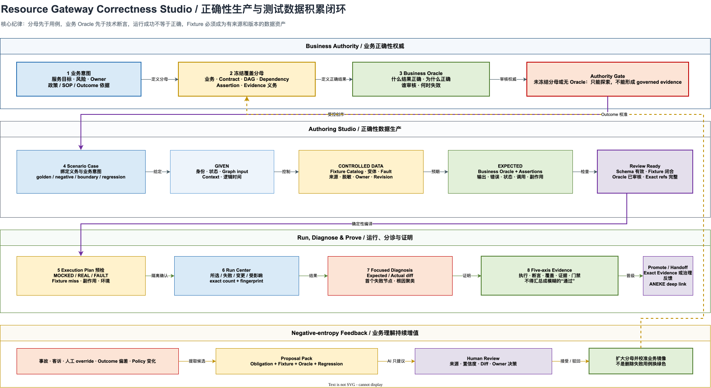

# Resource Gateway 正确性定义与测试数据配置 UX 深度审查及演进方案

> 文档状态：Proposed  
> 审查日期：2026-08-15  
> 审查范围：`/author/` 的 Graph/Operator Contract、Scenario Matrix、Case、Coverage、Run Evidence，以及与 `/business-mirror/`、`/rehearsals/` 的任务连续性  
> 目标读者：产品负责人、体验设计师、业务正确性 Owner、测试架构师、前后端负责人、治理负责人  
> 相关文档：[详细技术实施方案](resource-gateway-correctness-studio-technical-implementation-plan.md)、[产品手册](resource-gateway-product-manual.md)、[表格驱动测试产品设计](resource-gateway-table-driven-testing-product-design.md)、[Contract/Scenario 演进方案](resource-gateway-contract-scenario-authoring-evolution-plan.md)、[工业级可测试性方案](resource-gateway-industrial-testability-evolution-plan.md)

## 0. 核心判断

当前 Resource Gateway 已经拥有一套难得的正确性技术底座：Graph/Operator 契约、可复现依赖行为、
Schema 驱动输入、五类测试场景、六维覆盖率、表格批量运行、断言 diff、Evidence 与 exact fingerprint。
问题不再是“有没有测试功能”，而是这些能力仍按技术对象和组件边界组织，尚未被收敛为业务人员可以连续完成的
**正确性生产流程**。

本专项 UX 评分为 **70/100**。这不是对画布整体体验的评分，而是对“从定义何为正确，到积累可复用验证数据，
再到形成可信证据”这一条核心任务链的评分。低于工业级优秀线的原因有四个：

1. 正确性不是一级产品对象。Contract、Scenario、Coverage、Fixture、Run 和 Evidence 分散在不同页面、模式和浮层中。
2. 当前 Case 先要求用户填写技术数据，再让用户自行理解它证明了哪条业务义务；业务分母没有控制创作顺序。
3. Fixture 和 Assertion 的底层协议直接泄漏到 UI；契约较粗时，算子测试会退化为开放 JSON。
4. “执行成功”“断言通过”“覆盖完整”“证据新鲜”“可发布”虽有分层模型，但创作过程仍容易把它们误读为同一件事。

最危险的现状不是操作多，而是界面仍允许形成错误的心理模型。代码中的空断言提示为
“Run success is enough until an assertion is added”。这只能说明技术调用完成，不能说明业务正确。
对正确性平台而言，这不是普通文案问题，而是产品语义错误，必须按 P0 修正。

目标不是再增加一个测试页面，而是把现有能力重组为 **Correctness Studio（正确性工作台）**：

> 先定义业务正确行为和必须覆盖的分母，再配置 Given、受控依赖与 Oracle；每次运行显式区分执行、断言、覆盖、
> 证据和门禁；每份数据都知道来源、Owner、适用范围、版本和退出条件；每次故障和业务反馈都能回流为新的分母与回归资产。

## 1. 审查方法与证据边界

### 1.1 本轮真实浏览器走查

在测试 Profile 下加载“贷款策略与降级”完整示例，按以下任务链操作：

1. 查看 Graph Contract 的输入/输出 Schema、来源、副作用、兼容策略和指纹。
2. 进入 Scenario Matrix，检查 golden、negative、boundary 三条示例。
3. 打开 golden Case，逐步检查 Given、三个受控依赖、完整结果断言和运行入口。
4. 运行当前 Case，检查 Evidence 首屏、断言、模拟/真实节点、治理告警和下一步动作。
5. 进入 Coverage，检查 CASE、CONTRACT、DAG、DEPENDENCY、ASSERTION、EVIDENCE 六维分母与候选生成。
6. 双击 Decision Table，进入 Operator Contract 与 Operator Scenario，检查算子级测试数据和试跑入口。

### 1.2 代码证据

本轮同时检查了以下实现边界：

| 证据 | 当前事实 | UX 含义 |
|---|---|---|
| `ScenarioDraft` | 只有 name、description、caseType、tags、Given、Dependencies、Then | 缺少业务意图、义务引用、来源、风险和逐用例 Owner |
| `ScenarioDraftSet.metadata` | Owner、分类和 provenance 位于集合级 | 无法可靠治理单条用例和单份数据的来源、复核与过期 |
| `AssertionDraft` | scope/path/operator/expected 等技术字段 | 没有独立的业务预期陈述和 Oracle 依据 |
| Matrix 投影 | CASE/GIVEN/DEPENDENCY/THEN/PROOF 五组列 | 已有高效批量骨架，但列结构仍是执行数据视角 |
| Coverage | 六维覆盖缺口与确定性候选生成 | 已具备“分母先行”的计算基础，但没有成为创作入口和审核门禁 |
| 组件规模 | Workspace 2871 行、Matrix 1042 行、Dependency Editor 750 行 | 状态与呈现耦合，后续继续补按钮会加速体验熵增 |

### 1.3 不在本轮范围内

- 不重新定义 FixtureBundle、TestSuite、RunTrace 和 Evidence 的服务端权威语义。
- 不把 ANEKE 的 registry、publish gate、TEE 或治理工作簿复制到 Resource Gateway。
- 不把移动端作为复杂测试数据的完整编辑端；移动端优先支持审阅、运行、分诊和轻量修订。
- 不允许生成式 AI 自动冻结分母、自动接受 Oracle 或自动发布验证资产。

## 2. 当前专项评分

| 维度 | 权重 | 当前得分 | 事实依据 |
|---|---:|---:|---|
| 任务发现与信息架构 | 10 | 6 | 顶层有“测试场景”，但正确性闭环横跨契约、场景、证据、业务镜像和演练 |
| 业务意图与分母管理 | 20 | 12 | 已有六维 Coverage，但 Case 创作不要求先绑定业务义务 |
| 测试数据配置 | 20 | 13 | Graph 输入可 Schema 化，复杂/不透明契约仍退化为 JSON；Fixture 缺少资产视图 |
| Oracle 与断言 | 15 | 10 | scope/path/operator 完整，但业务结果与技术断言没有分层 |
| 运行与失败诊断 | 15 | 12 | 批量、差异、Evidence 较强；单次运行会跳转，预期/实际对比不总是首屏 |
| 信任、治理与积累 | 15 | 12 | exact fingerprint、freshness、proof strength 已有；逐数据来源、审批和回流不足 |
| 可访问性、响应式与规模 | 5 | 5 | 已有移动任务投影、分页和稳定坐标；复杂表格仍需更严格规模门禁 |
| **总分** | **100** | **70** | 核心能力成熟，任务模型尚未成熟 |

### 2.1 目标分数的含义

本计划的 95 分不是“页面看起来更精致”，而是同时满足：

- 新用户在 5 分钟内创建第一条可运行且有业务 Oracle 的 Case。
- 90% 常见用例不需要编辑 JSON。
- 用户不会把未断言、全模拟、旧 revision 或分母不完整的结果误认为业务正确。
- 业务人员能从一个线上问题生成 proposed regression，并在 15 分钟内送入审核。
- 500 条 Case、30 个依赖、100 个断言坐标下仍能搜索、批量编辑、运行和分诊。
- 正确性资产每次变化都有 Owner、来源、理由、影响范围和 exact revision。

## 3. 关键问题：从表象到病根

### 3.1 P0：正确性没有一级入口

**表象**

- 顶层模式是“编排 / 契约 / 测试场景 / 证据”。
- Coverage 是“测试场景”内部第三个视图；Fixture 主要藏在 Dependency；业务分母在 Business Mirror 另有步骤。
- 用户必须在脑中拼接“契约定义了边界、Coverage 定义了分母、Case 给出数据、Evidence 才给结论”。

**病根**

信息架构跟随实现模块，而不是跟随用户决策。系统把正确性当作多个技术产物的集合，而不是一个可被经营的产品对象。

**根治**

将顶层“测试场景”升级并改名为“正确性”，进入统一 Correctness Studio。其内部固定为：

`总览 -> 覆盖义务 -> 用例 -> 测试数据 -> 业务预期 -> 运行 -> 证据`

旧的 Matrix/Case/Coverage 不删除，而是分别成为“用例”“用例详情”“覆盖义务”的专业视图。

### 3.2 P0：先写数据，后猜证明目标

**表象**

打开 Case 后，首先看到名称、类型和 Given；用户可以创建一个没有义务引用的用例。Coverage 缺口和 Case 创作相互独立。

**病根**

Scenario 模型缺少 `obligationRefs` 和 `businessIntent`。Coverage 只是运行后观察镜头，不是创作约束。

**根治**

1. 每条 Case 必须表达“要证明哪条业务行为或明确覆盖哪项义务”。
2. 推荐路径从 Coverage Gap 点击“创建用例”，自动带入 obligation、建议 case type、相关 Contract path 和 DAG path。
3. 允许探索用例暂时无 obligation，但必须明显标记“探索，不计入分母”，且不能晋级为 governed evidence。
4. 分母必须有 `DRAFT / FROZEN / SUPERSEDED` 生命周期；删除或豁免义务需要理由和审核记录。

### 3.3 P0：空断言会制造假正确

**表象**

当前空断言状态允许“运行成功即可”。用户可能把绿色执行状态理解为用例通过。

**病根**

运行引擎的“成功完成”与产品的“正确性通过”复用了相近的成功视觉和语言。

**根治**

- `execution=SUCCESS + assertions=NONE` 的统一产品结论只能是 `EXECUTED / UNPROVEN`，不得为 `PASSED`。
- Case 至少要有一个被 Owner 接受的业务 Oracle 才能成为可认证用例。
- Schema-only 断言只能证明结构，不得自动宣称业务语义正确。
- Evidence 首屏始终按“业务结论 -> 断言 diff -> 执行轨迹 -> 技术坐标”排序。

### 3.4 P0：业务预期被压扁成 path/operator/value

**表象**

当前 Assertion Builder 要求用户理解范围、路径、检查方式和预期值。它能精确执行，但不能回答“为什么这是正确结果”。

**病根**

Oracle 与 Assertion 被建模成同一个对象。业务判断依据、政策版本和技术检查没有分层。

**根治**

引入两层 Oracle：

| 层 | 用户表达 | 系统作用 |
|---|---|---|
| Business Expectation | “高信用且满足准入时应自动通过并进入 prime 层级” | 供业务审核、搜索、复用和变更影响分析 |
| Executable Assertions | `$.decision == approve`、`$.tier == prime`、不得调用人工审核 | 可执行、可 diff、可形成 Evidence |

业务预期必须有依据类型：政策、SOP、历史故障、专家判断、生产 Outcome 或外部契约。技术断言可以由模板生成，
但必须让用户看到自然语言预览。

### 3.5 P0：Fixture 是字段值，不是可治理业务样本

**表象**

用户在每条 Dependency 中填写 Return/Error/Delay 等行为。相同的“高信用乘客”“支付超时”“司机取消”数据容易被复制到多条 Case。

**病根**

当前 UI 以执行规则为中心，没有一等 Fixture Catalog。数据的语义、来源、适用范围和质量等级没有成为主视图。

**根治**

建立 Fixture Catalog，将以下内容一起管理：

- 业务名称与说明，例如“高信用乘客 / 主征信成功 / 备用征信成功”。
- 绑定的 Contract/Operator/Resource、exact revision 与 schema fingerprint。
- 数据来源、采集时间、Owner、分类、脱敏方式、保留期限、授权范围。
- 行为类型：RETURN、ERROR、TIMEOUT、DELAY、REPLAY、OBSERVE、MUST_NOT_CALL。
- 变体与矩阵：正常、空值、边界、错误码、超时、乱序、重复、部分返回。
- 使用者、覆盖义务、最近运行、失败率、陈旧状态和替代建议。

Case 中默认“引用 Fixture 变体”；只有一次性探索时才内联编辑。发布时仍编译为现有 FixtureBundle exact revision。

### 3.6 P0：不透明契约导致开放 JSON 回潮

**表象**

Decision Table 的 Operator Contract 只有顶层 `inputs: object` / `output: object`，算子 Case 直接显示“开放 JSON 值”。

**病根**

Schema Form 被当作末端渲染组件；当 schema 颗粒度不足，没有专用编辑器、样例推断、运行观测或字段草案作为降级路径。

**根治**

采用五级编辑降级策略：

1. **Exact Schema Form**：完整 Schema，字段表单与约束即时校验。
2. **Operator-native Editor**：Decision Table、HTTP、Transform 等使用领域编辑器生成数据结构。
3. **Observed Shape Draft**：从规则列、连线、DSL、示例或历史 Trace 推演字段，标记为 inferred。
4. **Guided Key/Value Builder**：支持字段、类型和值，不要求手写 JSON。
5. **Advanced JSON**：专家逃生口，默认折叠，并与图形编辑双向无损同步。

### 3.7 P0：模拟与真实调用风险不够前置

**表象**

依赖编辑器说明“未配置的节点正常运行”。对业务人员而言，“正常”无法说明是否会访问真实测试接口、共享环境或产生副作用。

**病根**

Dependency 的行为配置与 Effective Execution Plan 分离；调用风险只有运行期或 Evidence 才充分显现。

**根治**

每次运行前显示不可跳过的 Execution Plan 摘要：

- `3 MOCKED / 2 REAL / 0 BLOCKED / 0 SIDE EFFECT`。
- 每个 REAL 节点的环境、绑定、Credential policy 和副作用风险。
- 未命中 Fixture 时是 FAIL、WARN 还是 fallback-to-real。
- 生产环境隐藏注入入口；非测试 purpose 即使构造请求也由服务端拒绝。
- 全模拟结果使用稳定视觉标识，不得与生产回放证据使用同一“通过”徽标。

### 3.8 P1：运行后跳转破坏预期-实际对照

**表象**

单 Case 运行后自动进入 Evidence 模式。Evidence 首屏更强调草稿、契约和治理后续动作，预期与实际对比需要继续下钻。

**病根**

证据页面承担了运行结果、生命周期门禁和治理移交三种任务。

**根治**

运行完成后保留在 Correctness Studio 的 Run Center：

1. 首屏给出五个相互独立的状态：执行、断言、覆盖、证据、门禁。
2. 默认展示失败断言；全部通过时展示最关键三条业务预期与实际值。
3. 提供“查看完整证据”进入 Evidence，而不是强制跳转。
4. 批量运行按首个失败节点、错误码、断言路径和 Fixture miss 自动聚类。

### 3.9 P1：数据积累缺少质量闭环

**表象**

已有导入、生成候选和保存，但没有统一回答：这条数据是否重复、是否真实、是否仍有代表性、覆盖分母增加了多少。

**病根**

系统主要度量运行结果，没有度量测试数据资产质量。

**根治**

为 Scenario/Fixture 增加质量画像：

- 唯一性：与已有 Case/Fixture 的语义和结构重复度。
- 代表性：来源、样本窗口、适用客群和业务分支。
- 可解释性：是否有业务意图、Oracle 依据和 Owner。
- 可复现性：是否完全受控，是否依赖可变的外部环境。
- 新鲜度：目标 Contract、Graph、政策和数据来源是否变化。
- 增量价值：新增覆盖义务数、关闭缺口数和发现缺陷数。

## 4. 目标产品模型

### 4.1 正确性不是“测试集合”

正确性工作台的首要对象是 `CorrectnessDefinition`，而不是 Test Suite：

```text
CorrectnessDefinition
  = Business Intent
  + Frozen Coverage Inventory
  + Scenario Cases
  + Fixture Assets
  + Business Oracles
  + Executable Assertions
  + Exact Run Evidence
  + Outcome Calibration
```

TestSuite 和 FixtureBundle 仍是执行与交换协议，不能承担所有业务语义。UI 也不能要求业务人员先理解 bundle、selector、fingerprint
等协议术语，技术坐标通过“高级信息”渐进披露。

### 4.2 一等对象及职责

| 对象 | 回答的问题 | Owner | 生命周期 |
|---|---|---|---|
| Correctness Definition | 什么结果才算服务正确 | 业务能力 Owner | DRAFT -> REVIEWED -> ACTIVE -> SUPERSEDED |
| Coverage Obligation | 哪些条件必须验证，分母是多少 | 业务 + 测试 Owner | PROPOSED -> FROZEN -> COVERED/WAIVED -> RETIRED |
| Scenario Case | 用什么 Given/When/Then 证明义务 | 测试设计者 | EXPLORATORY -> REVIEW_READY -> CANONICAL -> STALE |
| Fixture Asset | 如何稳定复现客户业务资源与状态 | 资源 Owner | DRAFT -> APPROVED -> ACTIVE -> STALE/REVOKED |
| Business Oracle | 为什么这个结果正确 | 业务/政策 Owner | PROPOSED -> APPROVED -> SUPERSEDED |
| Assertion Set | 如何把 Oracle 变成可执行检查 | 测试/研发 | DRAFT -> VALID -> STALE |
| Run Evidence | 本次运行具体证明了什么 | 系统生成 | CURRENT -> STALE/REVOKED |
| Outcome Calibration | 模拟预期与真实业务结果是否一致 | 业务运营 Owner | OBSERVED -> REVIEWED -> APPLIED/DISMISSED |

## 5. 目标信息架构与连续任务链



### 5.1 顶层导航

将 Author 顶层“测试场景”改为“正确性”，保留旧 deep link 与协议名兼容：

| 一级模式 | 主要问题 |
|---|---|
| 编排 | 业务能力如何连接和运行 |
| 契约 | 输入、输出、错误、副作用与兼容边界是什么 |
| **正确性** | 哪些行为必须被证明，数据和 Oracle 是否充分 |
| 证据 | 哪些 exact revision 已经被可信运行和治理接受 |

### 5.2 Correctness Studio 二级导航

| 视图 | 默认用户 | 核心任务 | 现有能力复用 |
|---|---|---|---|
| 总览 | Owner/负责人 | 看正确性债务、分母、阻断和下一步 | readiness + Coverage + Evidence 摘要 |
| 覆盖义务 | 业务/测试设计者 | 定义并冻结分母，从缺口生成 Case | Coverage Lens |
| 用例 | 测试设计者 | 批量搜索、编辑、运行和分诊 | Scenario Matrix |
| 测试数据 | 业务/数据 Owner | 管理 Fixture、变体、来源和复用 | Dependency Behavior + Fixture API |
| 业务预期 | 业务/政策 Owner | 审核 Oracle 及其技术断言 | Assertion Builder |
| 运行 | 测试/研发 | 预检、批量运行、diff 和根因聚类 | table run + simulate + rehearsal |
| 证据 | Owner/治理 | 检查 exact proof 并晋级 | Evidence surface |

## 6. 关键页面与交互规范

### 6.1 正确性总览

首屏只回答五个问题：

1. **定义完整吗**：业务目标、Owner、风险、契约和 Oracle policy 是否齐全。
2. **分母稳定吗**：多少义务已冻结，多少 proposed，多少被豁免。
3. **数据充分吗**：多少义务有 Case、Fixture 和断言，哪些数据陈旧。
4. **证明可信么**：最近 exact run 的执行、断言、覆盖、证据和门禁状态。
5. **下一步是什么**：只给一个主要动作，例如“补齐 9 个依赖缺口”。

禁止把多个同权重按钮平铺在首屏。保存、导入、导出和高级 JSON 进入工具菜单。

### 6.2 覆盖义务与分母冻结

Coverage 不再只展示自动推导缺口，而是组合三种来源：

| 来源 | 示例 | 可信度 |
|---|---|---|
| Contract/DAG 推导 | 必填字段缺失、null、边界、DAG 分支、错误变体 | 系统确定性 |
| 业务规则 | 高信用自动通过、司机取消后的补偿、支付超时降级 | Owner 定义 |
| 运行与事件反馈 | 生产事故、客服投诉、人工 override、Outcome 偏差 | 外部事实 |

每条义务显示：业务标题、维度、风险、来源、Owner、状态、覆盖 Case、最近证据和动作。

冻结规则：

- 只有 Owner 或授权审核人可以冻结。
- 冻结后新增义务扩大分母；删除、合并或豁免需要差异审阅。
- 通过率分母使用 frozen inventory；proposed obligation 单独展示，不能悄悄混入或消失。
- 每次 Contract/Graph/Policy 变化生成 impact proposal，不直接修改已冻结分母。

### 6.3 用例矩阵

保留表格作为批量生产主界面，但调整列组与冻结策略：

```text
固定列            GIVEN                CONTROLLED DATA       EXPECTED               PROOF
状态 / 用例 / 类型  业务身份 / 状态 / 输入  Fixture / 时间 / 故障  业务结果 / 技术断言     来源 / Owner / Evidence
```

交互要求：

- 首列冻结；列组可折叠；用户可保存个人视图，不改变 canonical 数据。
- 单击编辑简单标量；双击或 Enter 打开结构化 Side Sheet；JSON 只在高级模式显示。
- 行级状态明确区分 `未定义 / 数据不完整 / 可运行未证明 / 已证明 / 已过期 / 失败 / 已豁免`。
- 支持运行“所选、失败、变更、受影响、全部”，并在命令前显示 exact case count 和 fingerprint。
- 500 条以上使用真正的行列虚拟化；分页不能作为唯一规模手段。
- Case 名称下显示一行业务意图，不再只显示技术标签和受控依赖数量。

### 6.4 用例构建器

新手使用六步 Side Sheet，专家可直接在矩阵中编辑；两者必须修改同一 canonical draft：

1. **要证明什么**：选择 obligation，填写业务意图、风险和依据。
2. **给定条件**：业务身份、Graph input、状态、上下文和逻辑时间。
3. **控制依赖**：从拓扑选择依赖，引用 Fixture 变体或定义 fault。
4. **业务预期**：用自然语言定义正确结果和禁止结果。
5. **技术检查**：由模板生成输出、错误、状态、边、调用和副作用断言。
6. **检查并运行**：查看隔离计划、缺失项、exact 坐标和证据等级。

不使用强制线性 Wizard。用户可从任一步进入，系统通过 readiness checklist 保持完整性。

### 6.5 测试数据工作台

测试数据采用左中右三栏，但不是卡片嵌套：

- 左侧：Fixture 目录、业务标签、资源、状态和质量筛选。
- 中间：Schema/专用编辑器、变体矩阵和样例 diff。
- 右侧：来源、Owner、分类、脱敏、使用关系、freshness 和审批。

关键命令：

- 从 Schema 生成最小合法数据。
- 从受控 Trace 提议脱敏 Fixture，不直接保存生产 payload。
- 从已有 Fixture 派生边界/错误/超时变体。
- 查看“改动将影响 17 条 Case”。
- 合并重复 Fixture，保留旧 exact revision 的历史证据。
- 对敏感字段只显示结构与脱敏预览；Reporter、异常和遥测不得输出业务 payload。

### 6.6 Oracle Builder

默认编辑顺序：

1. 写业务预期。
2. 选择依据及版本。
3. 选择检查模板。
4. 用 Schema picker 选择字段或状态。
5. 查看自然语言预览和实际执行表达。

模板至少覆盖：

- 输出等于、包含、范围、集合、Schema、存在/缺失。
- 错误 code/type/retryable。
- 节点状态、跳过、fallback、retry 次数。
- 边数据传递和数据最小化。
- 依赖必须调用、不得调用、调用次数和 expected input。
- 状态迁移、副作用、补偿和治理预期。

显示示例：

```text
业务预期：满足高信用政策时自动通过，不进入人工审核。
可执行检查：
  - 最终输出 decision 等于 approve
  - 最终输出 tier 等于 prime
  - manual-review operator 未被调用
依据：Loan Policy 2026.08 / 条款 4.2 / Owner 已审核
```

### 6.7 Run Center

运行前：

- 检查 Fixture closure、未匹配行为、REAL/MOCKED、环境、凭证策略、副作用和逻辑时间。
- 清晰写出“本次证明等级”：结构演练、模拟业务证明、受控集成证明或生产回放证明。
- 对存在真实写入风险、fallback-to-real 或缺失 Oracle 的运行进行硬阻断。

运行后：

- 顶部固定显示五轴 verdict，不汇总成一个模糊的“通过”。
- 失败优先显示 expected/actual diff、首个失败节点和 Fixture 匹配记录。
- 相同根因聚类，避免 300 条 Case 产生 300 个重复工单。
- 可一键创建缺陷、修订 Fixture、修订 Oracle、转为 regression 或标记环境故障。
- Evidence 与当前 Case/Fixture/Contract fingerprint 不一致时立即标记 stale。

### 6.8 从事件到回归资产

建立负熵闭环：

```text
生产事故 / 客诉 / 人工 override / Outcome 偏差
  -> Proposed Obligation
  -> 脱敏 Fixture 提案
  -> Business Oracle 审核
  -> Regression Case
  -> 批量验证
  -> Exact Evidence
  -> Outcome 校准
  -> 修订业务镜像与分母
```

每个提案必须显示来源、置信度和 diff。AI 可以提取候选字段、生成边界变体或建议断言，但只能产生
`PROPOSED` 资产，不得自动冻结、接受、豁免或发布。

## 7. 统一状态与文案政策

### 7.1 五轴状态不可合并

| 轴 | 状态示例 | 用户问题 |
|---|---|---|
| Execution | SUCCESS / FAILED / TIMEOUT / PARTIAL | 跑完了吗 |
| Assertions | PASSED / FAILED / NONE | 结果符合预期吗 |
| Coverage | COMPLETE / GAPPED / UNFROZEN | 必须验证的分母完整吗 |
| Evidence | CURRENT / STALE / EXPLORATORY / REVOKED | 证据可信且新鲜吗 |
| Gate | ACCEPTED / BLOCKED / NOT_EVALUATED | 可以晋级或发布吗 |

### 7.2 禁止文案

| 禁止 | 替代 |
|---|---|
| “运行成功即可” | “执行完成，但尚无业务断言，当前结果未被证明” |
| “正常运行” | “将调用 test 环境的真实绑定，无写入副作用” |
| “通过” | “断言通过 / 覆盖完整 / 证据当前”分别显示 |
| “1 个依赖” | “1 MOCKED / 0 REAL / 0 FAULT” |
| “Whole result · object” | “完整结果（对象）”并通过 locale gate |
| “探索草稿” | “临时草稿，不可形成可晋级证据” |

## 8. 领域与协议演进

### 8.1 不应继续塞进 Scenario 的内容

不要把 Correctness Definition、Coverage Inventory、Fixture Catalog 和 Outcome Calibration 全部做成
`ScenarioDraftSet.metadata.provenance` 中的任意 Map。Map 可以兼容实验，但不能成为工业级权威模型。

### 8.2 建议新增的伴生资产

```ts
interface CorrectnessDefinition {
  definitionId: string;
  exactTarget: ExactTargetRef;
  businessIntent: string;
  successCriteria: string[];
  riskLevel: 'LOW' | 'MEDIUM' | 'HIGH' | 'CRITICAL';
  owner: PrincipalRef;
  policyRefs: ExactPolicyRef[];
  inventoryRef: ExactCoverageInventoryRef;
  lifecycle: 'DRAFT' | 'REVIEWED' | 'ACTIVE' | 'SUPERSEDED';
}

interface CoverageObligation {
  obligationId: string;
  dimension: 'CASE' | 'CONTRACT' | 'DAG' | 'DEPENDENCY' | 'ASSERTION' | 'EVIDENCE' | 'BUSINESS';
  statement: string;
  source: ObligationSource;
  risk: string;
  owner: PrincipalRef;
  status: 'PROPOSED' | 'FROZEN' | 'COVERED' | 'WAIVED' | 'RETIRED';
  caseRefs: ExactScenarioRef[];
}

interface BusinessOracle {
  oracleId: string;
  statement: string;
  basisRefs: ExactBasisRef[];
  owner: PrincipalRef;
  assertionRefs: string[];
  lifecycle: 'PROPOSED' | 'APPROVED' | 'SUPERSEDED';
}
```

### 8.3 Scenario 的必要增量

`ScenarioDraft` 增加：

- `businessIntent`
- `obligationRefs[]`
- `oracleRefs[]`
- `owner`
- `risk`
- `sourceRefs[]`
- `lifecycle`
- `review`

`given` 的 provenance 从枚举升级为结构化引用，至少包含 source kind、source ref、capturedAt、redaction policy、
confidence 和 reviewer。对 v1 wire contract 先通过新的 projection/BFF 组合，不强制破坏现有 FixtureBundle/TestSuite；
待双读验证后再发布 `ScenarioDraftSet v2`。

### 8.4 编译边界

```text
Correctness authoring assets
  -> deterministic compiler
  -> FixtureBundle + TestSuite + exact refs
  -> EffectiveExecutionPlan
  -> RunTrace + Evidence
```

业务语义资产与执行协议分离。Compiler 必须确定性、可重放、可 diff；同一 canonical input 必须生成相同 fingerprint。

## 9. 前端技术改造

### 9.1 目标模块

```text
correctness-studio/
  CorrectnessStudio.tsx
  overview/CorrectnessOverview.tsx
  obligations/CoverageInventorySurface.tsx
  cases/ScenarioMatrix.tsx
  cases/CaseBuilderSheet.tsx
  fixtures/FixtureCatalog.tsx
  fixtures/FixtureVariantEditor.tsx
  oracles/OracleBuilder.tsx
  runs/RunCenter.tsx
  evidence/ProofInspector.tsx
  model/CorrectnessWorkspaceProjection.ts
  model/CorrectnessCommandPolicy.ts
  model/CorrectnessVerdictPolicy.ts
```

### 9.2 拆分原则

- `ContractScenarioWorkspace.tsx` 不再继续承载全部状态和所有视图；先抽 projection 与 command policy，再迁移 UI。
- Matrix、Case Builder 和 Coverage 使用同一 `CorrectnessWorkspaceProjection`，禁止各自重新推导状态。
- `DependencyBehaviorEditor` 继续表达完整协议，但拆为 basic behavior、fixture reference、advanced matching 三层。
- `SchemaValueForm`、Operator-native Editor、Guided KV 和 JSON 共用 canonical value adapter。
- `VerdictPresentationPolicy` 是唯一成功/警告/失败文案和色彩权威。

### 9.3 BFF/API 建议

| API | 作用 |
|---|---|
| `GET /api/visual/correctness-workspaces/{target}` | 聚合 definition、inventory、cases、fixtures、oracles、evidence 摘要 |
| `POST /api/visual/coverage-inventories/{id}:freeze` | 冻结分母并生成 exact revision |
| `POST /api/visual/scenarios:preflight` | 返回 EffectiveExecutionPlan 和阻断原因 |
| `POST /api/visual/fixture-assets:derive` | 从 schema/trace/existing fixture 创建提案 |
| `POST /api/visual/oracles:compile` | 将业务预期映射为可审阅断言提案 |
| `POST /api/visual/incidents:propose-regression` | 创建 obligation/fixture/oracle/case 提案包 |

所有 API 返回稳定 protocol version、capability flag、correlationId、exact target 和 fingerprint；payload 不进入普通日志。

## 10. 分阶段执行计划

### Stage 0：语义止血与基线（1 周）

| ID | 工作项 | 当前状态 | 验收 |
|---|---|---|---|
| CUX-001 | 空断言 verdict 改为 UNPROVEN | 已完成现有前端止血 | 任何界面都不出现“无断言通过” |
| CUX-002 | 五轴状态文案统一 | 已完成现有前端统一策略 | Case、Matrix、Evidence、Rehearsal 一致 |
| CUX-003 | 真实调用风险文案与 preflight 摘要 | 已完成本地创作风险投影与 COR-08 服务端 canonical preflight | 用户运行前可回答哪些依赖会真实调用 |
| CUX-004 | 修复中文混杂英文 | 已完成 Stage 0 与 Correctness Studio 核心 surface；后续新增页面持续执行 | 核心命令、状态、错误、路径类型通过 locale coverage gate |
| CUX-005 | 建立匿名遥测基线 | 已完成 `bloge.correctnessTaskEvent.v1` 和泄漏测试 | 不记录 payload，只记录任务阶段、耗时、退出和错误码 |

退出门槛：错误正确性认知风险为 0；现有 wire contract 不变。Stage 0 已退出；legacy surface 的持续双语 inventory 和视觉回归归入 CUX-004/COR-10 的增量门禁，不得因新增页面再次回退。

当前 CUX-003 的 TypeScript 投影只读取 Graph/Scenario 元数据，不读取或输出 Given、Fixture 和错误 payload。它负责即时解释与前端失败关闭，不负责运行授权。COR-08 已由服务端复用既有 execution control plane 生成 canonical preflight；运行时重新计算计划，并把客户端 fingerprint 仅作为 stale-view guard。严禁复制本地投影形成第二套运行语义。

CUX-005 只发送受控枚举、有界计数和耗时。`caseId`、`targetRef`、业务路径、错误消息、Schema、Fixture 及输入输出均为协议级禁用键；未知字段不是被忽略，而是导致当前事件拒绝创建。该事件供浏览器 host 或 VS Code webview bridge 消费，不作为审计证据。

### Stage 1：正确性一级入口与分母先行（2–3 周）

| ID | 工作项 | 验收 |
|---|---|---|
| CUX-101 | “测试场景”升级为“正确性” | deep link 向后兼容 |
| CUX-102 | Correctness Overview | 首屏显示定义、分母、数据、证明和唯一下一步 |
| CUX-103 | Coverage Inventory 视图 | 自动、业务、事件三类义务同屏 |
| CUX-104 | 从 gap 创建 Case | obligation/context/path 自动带入 |
| CUX-105 | exploratory/canonical 明确分层 | 探索用例不计入 frozen denominator |

退出门槛：新建 governed Case 必须绑定 obligation；分母变更可审计。

### Stage 2：Case Builder 与双层 Oracle（3 周）

| ID | 工作项 | 验收 |
|---|---|---|
| CUX-201 | 六步 Case Builder Side Sheet | 新用户 5 分钟完成首条有效 Case |
| CUX-202 | Business Expectation 模型与编辑器 | 每条 governed Case 至少一条 approved/proposed Oracle |
| CUX-203 | Assertion 模板与自然语言预览 | 常见断言无需理解 path 语法 |
| CUX-204 | Matrix 新列组与状态 | 可批量编辑且不丢 canonical round-trip |
| CUX-205 | 变更影响 | Contract/Graph 改动可定位受影响 Case/Oracle |

退出门槛：90% 演示用例不编辑 JSON；业务 Owner 能独立审核预期。

### Stage 3：Fixture Catalog 与数据资产化（3–4 周）

| ID | 工作项 | 验收 |
|---|---|---|
| CUX-301 | Fixture Catalog/Variant | 可搜索、复用、派生和查看使用关系 |
| CUX-302 | 五级编辑降级 | 不透明契约也可用 KV/observed shape 配置 |
| CUX-303 | 来源与脱敏 Side Sheet | capture 只能形成 proposed + redacted 资产 |
| CUX-304 | 质量画像与重复检测 | 导入前显示增量覆盖和重复风险 |
| CUX-305 | exact revision 与 stale | 旧证据不冒用新 Fixture |

退出门槛：Fixture 不再默认复制进每条 Case；敏感数据治理通过安全评审。

### Stage 4：Run Center、诊断与证据闭环（3 周）

| ID | 工作项 | 验收 |
|---|---|---|
| CUX-401 | EffectiveExecutionPlan preflight | REAL/MOCKED/FAULT/side effect 首屏可见 |
| CUX-402 | 五轴 Run Center | 运行后不强制跳离创作上下文 |
| CUX-403 | 根因聚类和 focused diff | 500 Case 失败可按根因分组 |
| CUX-404 | 修复动作闭环 | 可创建 regression、修 Fixture/Oracle、重跑受影响 |
| CUX-405 | Evidence promotion | exact target/fixture/oracle/inventory 全闭合才可晋级 |

退出门槛：用户能在 3 分钟内解释首个失败原因和证据等级。

### Stage 5：业务反馈飞轮与企业协作（3–4 周）

| ID | 工作项 | 验收 |
|---|---|---|
| CUX-501 | incident/outcome -> proposal pack | 15 分钟内形成待审核 regression |
| CUX-502 | Owner/review/comment/approval | 单条义务、Fixture、Oracle、Case 可分配与审核 |
| CUX-503 | Outcome calibration | 展示模拟与真实结果偏差及置信度 |
| CUX-504 | ANEKE feedback projection | 在工作台回显 gate/workbook 阻断，不复制治理系统 |
| CUX-505 | 数据质量任务队列 | stale、重复、低覆盖、无 Owner 自动生成任务 |

退出门槛：至少两个业务团队完成两个发布周期，且故障回流链真实使用。

### 10.1 推荐团队

| 角色 | 建议投入 |
|---|---:|
| Product/Correctness Owner | 1 |
| Senior Interaction Designer | 1 |
| Frontend | 2–3 |
| Backend/Testing Control Plane | 2 |
| QA/UX Research | 1–2 |
| Security/Data Governance | 0.5 |
| 业务领域专家 | 每个试点 2–3 名兼职 |

整体为 15–18 周的工业级主线，可按 Stage 独立交付，不建议同时铺开全部页面。

## 11. 第一个验证场景

继续使用“贷款策略与降级”，但把它升级为正确性样板，而不是三条会通过的演示数据：

### 11.1 分母

- golden：高信用自动通过。
- negative：低信用拒绝。
- boundary：680/720 阈值前后。
- fallback：主征信超时，备用征信成功。
- partial：备用征信也超时，进入人工审核。
- data quality：申请人信息缺失/null/非法。
- forbidden effect：纯决策不得调用写操作。
- governance：高风险政策 revision 变化后旧 Evidence 必须 stale。

### 11.2 数据资产

- Applicant profile：prime、standard、risk、missing、restricted 五个变体。
- Primary credit：A/B/C、timeout、error、partial 五类返回。
- Secondary credit：success、timeout、mismatch 三类返回。
- Logical time：政策生效前、边界时刻、生效后。

### 11.3 Oracle

除最终输出外，至少检查：

- 触发了正确分支和 fallback。
- 不应调用的资源未调用。
- retry/fallback 次数符合政策。
- 错误、状态和副作用符合 Contract。
- Evidence 绑定当前政策、Graph、Contract、Fixture 和 Inventory revision。

这个样板应形成 20–30 条 Case，而不是用 3 条 happy-path 数据制造“覆盖充分”的错觉。

## 12. UX 研究与量化验收

### 12.1 参与者

| 人群 | 人数 | 核心任务 |
|---|---:|---|
| 客服业务设计者 | 5 | 从业务规则定义分母、Fixture 和 Oracle |
| 测试/质量人员 | 4 | 批量运行、分诊、回归和证据 |
| 算子开发者 | 3 | Operator Contract、单元 Case 和不透明 Schema 降级 |
| 资产/治理 Owner | 3 | 审核来源、版本、豁免和晋级 |

### 12.2 核心指标

| 指标 | 目标 |
|---|---:|
| 首条有效 Case 完成时间 | <= 5 分钟 |
| 事故到 proposed regression | <= 15 分钟 |
| 无 JSON 完成率 | >= 90% |
| 首次创建完整率 | >= 80% |
| 正确识别全模拟/部分真实 | 100% |
| 正确识别 executed/unproven | 100% |
| 把 stale Evidence 当作当前证据 | 0 次 |
| 从 Coverage Gap 创建 Case | <= 3 个主要动作 |
| 500 Case 筛选反馈 | P95 <= 150 ms |
| 500 Case 首屏稳定渲染 | P95 <= 1.5 s |

### 12.3 浏览器与视觉门禁

- 桌面：1440x900、1280x720、1024x768。
- 平板/审阅：820x1180。
- 移动：390x844，只验收审阅、运行、分诊和轻量修改。
- 数据规模：5、50、500、5000 Case；3、30、100 Dependency；10、100、1000 Fixture。
- 必测：无重叠、无不可解释横向滚动、焦点不丢失、键盘编辑、屏幕阅读器状态、中文/英文等价。
- 截图门禁之外必须有任务成功率；“像素没坏”不能替代“用户理解正确”。

## 13. 风险、反模式与取舍

| 风险 | 错误做法 | 根治手段 |
|---|---|---|
| 为易用性隐藏协议能力 | 只支持 RETURN 和 output equals | 渐进披露，basic/advanced 共用 canonical adapter |
| 新建一套测试协议 | UI 数据不再映射 FixtureBundle/TestSuite | Authoring asset 与执行协议由确定性 compiler 连接 |
| Wizard 限制专家效率 | 所有人必须逐步下一步 | Side Sheet 给新手，Matrix 给专家，同源状态 |
| AI 生成假权威 | 自动接受分母和 Oracle | AI 只产 PROPOSED，显示来源、置信度和 diff |
| Fixture Catalog 变垃圾场 | 只增不治、复制即新建 | 重复检测、freshness、Owner、retention、质量任务 |
| 通过率驱动缩小分母 | 删除失败 Case 获得绿色 | frozen denominator、waiver 审核、历史 revision |
| 正确性工作台复制治理系统 | 内建 registry/publish gate | 只投影治理反馈和 deep link，ANEKE 保持权威 |
| 巨型组件继续熵增 | 在 Workspace 继续加 tab/button | projection、command、verdict、view 分层拆分 |

接受的取舍：

- 桌面端优先完成复杂创作；移动端不承诺完整 Fixture/Assertion 编辑。
- 第一阶段先做 Graph 和 Operator 共用的 80% 模型；领域专用编辑器按风险和使用量增量接入。
- 现有 v1 执行协议保持稳定；业务语义通过伴生资产和 projection 演进，晚些时候再发布 v2。

## 14. 评审决策点

| 决策 | 推荐 | 不接受的代价 |
|---|---|---|
| D1：是否把“测试场景”升级为“正确性”一级模式 | 接受 | 核心价值继续被误认为普通测试功能 |
| D2：governed Case 是否强制绑定 Coverage Obligation | 接受；探索态可例外 | 分母无法防止静默缩水 |
| D3：无断言运行是否允许显示 PASSED | 拒绝 | 制造最危险的假正确证据 |
| D4：是否引入 Business Oracle 与 Assertion 双层模型 | 接受 | 技术断言长期无法被业务审核 |
| D5：是否建立 Fixture Catalog | 接受 | 测试数据继续复制、漂移、失去来源 |
| D6：是否保持 FixtureBundle/TestSuite 为执行权威 | 接受 | 出现第二套运行语义和证据分裂 |
| D7：移动端是否做完整编辑 | 暂不做 | 资源被响应式复杂度拖散，桌面主任务不成熟 |
| D8：AI 是否可自动冻结/发布 | 拒绝 | 不可审计的生成结果进入业务正确性权威 |

## 15. Definition of Done

### 产品语义

- 正确性是一等入口和一等资产。
- governed Case 均绑定 frozen obligation 和 Business Oracle。
- `EXECUTED / UNPROVEN`、`ASSERTION PASSED`、`COVERAGE COMPLETE`、`EVIDENCE CURRENT`、`GATE ACCEPTED` 不混淆。
- Fixture 有来源、Owner、revision、质量和使用关系。

### 用户体验

- 业务人员不理解 FixtureBundle/TestSuite 协议也能完成主任务。
- 90% 常见数据和断言无需 JSON/path 手写。
- 从缺口、事件和失败都能回到可执行修复动作。
- 复杂表格、中文、键盘、移动审阅和 500 Case 规模通过门禁。

### 工程

- Correctness Studio 使用统一 projection、command policy 和 verdict policy。
- Authoring asset 可确定性编译为现有执行协议。
- round-trip、fingerprint、stale、RBAC、隔离和 payload-free telemetry 有自动测试。
- Workspace 巨型组件不再承担新增正确性业务逻辑。

### 业务闭环

- 两个业务团队完成至少两个发布周期。
- 至少 10 个真实事故/客诉/override 回流为 regression proposal。
- 分母、覆盖、缺陷发现和 Outcome 偏差均可量化。
- 没有通过删除失败用例、缩小分母或冒用旧 Evidence 得到的“绿色结果”。

## 16. 自审结论

本方案设计成熟度自评 **96/100**。已覆盖产品定位、真实浏览器证据、任务模型、领域对象、状态语义、
信息架构、关键交互、协议边界、组件拆分、实施阶段、规模、安全、组织、量化验收和业务反馈闭环。

剩余 4 分不是继续增加文档篇幅，而是必须通过实施证据获得：

1. 目标业务人员的任务测试是否证明 Business Oracle 与 Coverage Obligation 的语言真正易懂。
2. Fixture Catalog 在真实企业数据分类和跨团队复用下是否仍然可管理。
3. 500/5000 Case 的表格虚拟化、批量命令和根因聚类是否达到性能预算。
4. 两个业务团队连续两个发布周期后，数据积累是否真的形成更高覆盖与更快迭代，而不是新的维护负担。

因此，下一步不应再横向增加测试按钮，而应先完成 Stage 0 和 Stage 1 的纵向切片：
**从一条 frozen obligation 创建 Case，配置 Fixture 与双层 Oracle，预检运行，并形成五轴 Evidence。**
这条路径跑通，Resource Gateway 才真正开始从“具备测试能力”升级为“能持续生产业务正确性资产的平台”。
