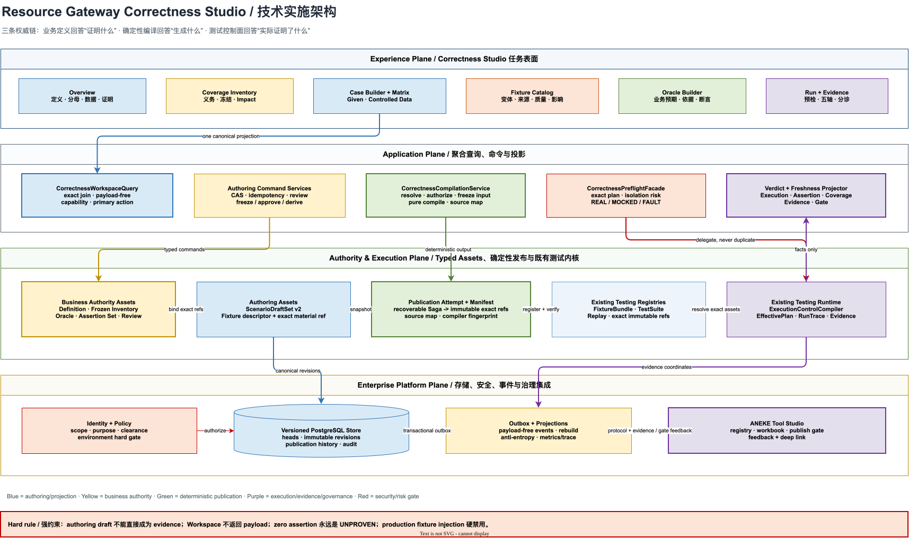
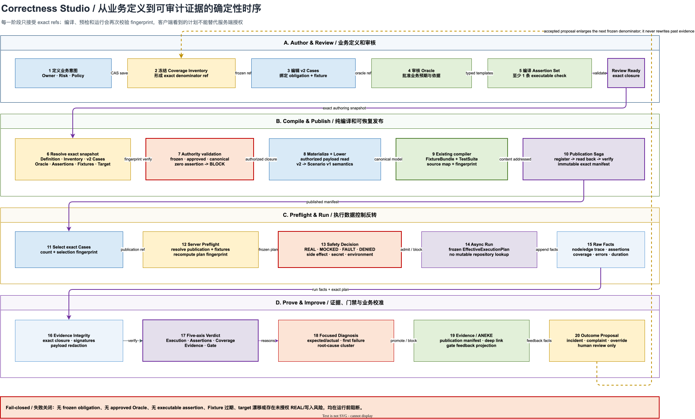

# Resource Gateway Correctness Studio 详细技术实施方案

> 文档状态：评审稿，可直接拆分 Epic 与技术任务  
> 基准日期：2026-08-15  
> 上游产品方案：[正确性定义与测试数据配置 UX 深度审查及演进方案](resource-gateway-correctness-authoring-ux-audit-and-evolution-plan.md)  
> 适用范围：`resource-gateway-examples` 的 Correctness Studio、Scenario authoring、Fixture authoring、Testing Control Plane 及 ANEKE 集成投影

## 0. 结论先行

本轮不应再建设一套新的测试运行时。Resource Gateway 已经具备不可变 `FixtureBundle`、不可变 `TestSuite`、确定性
`ScenarioGovernedCompiler`、`EffectiveExecutionPlan`、执行隔离、Run Evidence 和可恢复发布 Saga。真正缺少的是这套能力之上的
**业务正确性编写控制面**：业务人员无法先定义“必须证明什么”，也无法把覆盖分母、业务 Oracle、Fixture 数据资产和 exact
evidence 组织成一条可治理的权威链。

目标实现由三个边界清晰的层组成：

1. **正确性编写控制面**：管理业务意图、冻结覆盖分母、业务 Oracle、用例、Fixture 目录和审核状态。
2. **确定性编译与发布层**：把 exact authoring revision 编译成现有 `FixtureBundle + TestSuite`，并生成不可变
   `CorrectnessPublication` 清单。
3. **既有测试执行与证据层**：继续由现有 Testing Control Plane 负责预检、运行、回放、断言、覆盖和 evidence，不复制运行语义。

五条实施不变量必须先冻结：

- 没有可执行断言时，运行结果只能是 `Assertions=NONE`、`Evidence=EXPLORATORY`，并给出 `UNPROVEN` reason，绝不能显示为“通过”。
- governed case 必须引用 frozen obligation、approved business oracle、valid assertion set 和 exact fixture revision。
- 同一组 canonical 输入必须产生同一个编译指纹；编译不得读取未冻结的“latest”。
- 普通 Workspace 查询不返回 Fixture payload；payload 只在最小授权的编辑、编译和运行边界内出现。
- `FixtureBundle`、`TestSuite` 及历史 evidence 协议不原地加字段，不破坏已有指纹和审计历史。

## 1. 实施目标与非目标

### 1.1 目标

| 目标 | 可验证结果 |
|---|---|
| 建立正确性业务根 | 每个目标 Graph/Operator 都可以绑定一个可版本化 `CorrectnessDefinition` |
| 分母先于用例 | governed case 创建前必须选择 frozen obligation；分母变化有 diff、审核和历史 |
| 业务预期与技术断言分层 | Owner 审核业务 Oracle；系统或测试工程师维护 Assertion Set；两者 exact 绑定 |
| Fixture 资产化 | Fixture 可搜索、复用、派生、脱敏、审批、查看影响和判断 freshness |
| 诚实运行 | 运行前展示真实调用与副作用；运行后分别展示执行、断言、覆盖、证据、门禁五轴状态 |
| 保住现有执行投资 | 新编写模型编译到现有 testing protocols，不创建第二种 fixture 或 run engine |
| 支持企业协作 | 具备完整 scope、Owner、review、CAS、幂等、审计、事件和治理反馈投影 |

### 1.2 非目标

- 不让 Resource Gateway 接管 ANEKE 的 registry、workbook、publish gate 或 TEE 治理。
- 不允许 AI 自动冻结 obligation、批准 Oracle、豁免风险或发布 governed evidence。
- 不把生产请求 payload 直接复制到 Fixture Catalog；生产事实只能经授权、脱敏和人工审核后形成提案。
- 不在第一阶段实现通用低代码规则语言；Oracle 模板只覆盖能够确定性编译和解释的断言语义。
- 不把所有现有 `ScenarioDraftSet v1` 一次性迁移为 governed 资产；无法证明来源和依据的存量数据保持 exploratory。

## 2. 当前实现事实与增量边界

### 2.1 可直接复用的能力

| 现有能力 | 代码位置 | 新系统中的角色 |
|---|---|---|
| Scenario mutable authoring 与 CAS revision | `authoring/scenario/ScenarioDraftSet*` | 作为 legacy authoring 协议和 v2 lowering 目标 |
| 场景到执行协议的纯编译 | `ScenarioGovernedCompiler` | 由 `CorrectnessCompiler` 复用，不重写 fixture/test suite 语义 |
| 可恢复、内容寻址的发布 Saga | `ScenarioPublicationService` | 扩展为 correctness publication 的下游注册适配器 |
| 不可变 Fixture | `testing/domain/FixtureBundle` | 执行期受控依赖与技术断言权威 |
| 不可变 Suite | `testing/domain/TestSuite*` | 执行集合、基础 coverage policy 与 promotion policy 权威 |
| 调用点清单与 fail-closed 预检 | `testing/planning/ExecutionControlCompiler`、`SafetyPreflight` | Correctness Run Preflight 的唯一执行计划来源 |
| Run Trace、coverage、evidence integrity | `testing/evidence`、`testing/runtime` | 五轴 verdict 的事实输入 |
| Fixture 加密、脱敏、保留期和 receipt | `testing/authoring/fixture` | Fixture Catalog 的 payload material port |
| Matrix、Coverage Lens、Assertion Builder | `src/main/frontend/src/contract-scenario` | 迁移为 Correctness Studio 的专业编辑表面 |

### 2.2 不能继续沿用的做法

| 当前做法 | 工业级问题 | 根治方式 |
|---|---|---|
| `ScenarioDraftSet.metadata.provenance` 承载扩展语义 | 任意 `Map` 无法校验、索引、审计或稳定演进 | 新增 typed、versioned correctness protocols |
| `TestSuite.CoveragePolicy.minimumAssertionsPerCase` 默认允许 `0` | 执行成功可能被误读为业务正确 | governed admission 强制至少一个 approved Oracle 和一个 executable assertion；不修改 v1 默认值 |
| Case 直接内嵌依赖返回值 | Fixture 难复用、无来源、无法判断陈旧 | Case 引用 exact Fixture Asset variant；编译时 materialize |
| Coverage 的 `COVERED` 作为人工状态 | Case 或 evidence 变化后容易漂移 | obligation 生命周期与 fulfillment 投影分离，覆盖状态由 exact refs 推导 |
| 前端各页面自行计算状态 | Matrix、Run、Evidence 可能出现互相矛盾的“通过” | 服务端返回 canonical projection；前端只通过唯一 presentation policy 展示 |
| Repository 内扩散运行期 DDL | 生产变更不可审计、回滚和预演 | 新子系统只使用版本化 SQL migration；不顺手重构旧表 |

## 3. 目标架构



### 3.1 三条权威链

| 权威链 | 回答的问题 | 权威对象 | 禁止越权 |
|---|---|---|---|
| Business Authority | 什么行为必须被证明，为什么这个结果正确 | Definition、Inventory、Obligation、Oracle、Review | runtime 不能反向批准业务 Oracle |
| Compilation Authority | 哪个 exact authoring snapshot 生成了哪些执行资产 | Publication、Compilation Report、exact refs | UI 不能伪造 fingerprint 或引用 latest |
| Execution Authority | 本次真正执行了什么，观察到什么 | EffectiveExecutionPlan、RunTrace、Evidence | authoring 草稿不能直接充当 evidence |

ANEKE 只消费 Resource Gateway 输出的 exact publication、evidence 和 gate feedback coordinate；Resource Gateway 只投影 ANEKE
返回的治理结果，不复制 ANEKE 的治理状态机。

### 3.2 推荐模块边界

新增后端包：

```text
com.leanowtech.bloge.gateway.testing.correctness
  domain/
    CorrectnessDefinition.java
    CoverageInventory.java
    BusinessOracle.java
    AssertionSet.java
    ScenarioDraftSetV2.java
    FixtureAssetDescriptor.java
    CorrectnessPublication.java
    CorrectnessPublicationAttempt.java
    CorrectnessVerdict.java
  application/
    CorrectnessWorkspaceQuery.java
    CorrectnessAuthoringService.java
    CoverageInventoryService.java
    OracleReviewService.java
    FixtureCatalogService.java
    CorrectnessCompilationService.java
    CorrectnessCompiler.java
    CorrectnessPublicationService.java
    CorrectnessPreflightFacade.java
    CorrectnessVerdictProjector.java
  port/
    CorrectnessAssetRepository.java
    FixtureMaterialResolver.java
    TestingRegistryGateway.java
    CorrectnessEventPublisher.java
    GovernanceFeedbackPort.java
  adapter/
    persistence/
    scenario/
    testing/
    integration/
  api/
    CorrectnessWorkspaceController.java
    CorrectnessAuthoringController.java
    CorrectnessPublicationController.java
    CorrectnessRunController.java
```

这里的重点不是增加很多 CRUD class，而是形成四个“深模块”：

| 深模块 | 小接口 | 内部隐藏的复杂度 |
|---|---|---|
| `CorrectnessWorkspaceQuery` | `load(WorkspaceCoordinate)` | 多资产 exact join、权限裁剪、stale 推导、分页摘要、capability |
| `CorrectnessCompilationService` | `compile(CompilationCoordinate)` | exact resolve、授权 materialization、v2 校验、纯编译、diagnostic、source map |
| `CorrectnessPreflightFacade` | `preflight(PublicationRef, Selection)` | exact suite/fixture 解析、既有 `ExecutionControlCompiler`、副作用与隔离摘要 |
| `CorrectnessVerdictProjector` | `project(PublicationRef, EvidenceRef)` | 五轴状态、freshness、门禁输入、禁止聚合“假通过” |

### 3.3 单一事实源

| 数据 | 写权威 | 读投影 | 是否可变 |
|---|---|---|---|
| Definition draft/head | Correctness authoring repository | Workspace projection | CAS revision 可变，历史不可变 |
| Frozen inventory | Coverage inventory repository | Coverage projection | 冻结 revision 不可变 |
| Oracle/Assertion revision | Oracle repository | Case/Oracle projection | approved/valid revision 不可变 |
| Fixture metadata | Fixture catalog repository | metadata-only catalog | head 可变，revision 不可变 |
| Fixture payload | 既有 protected fixture material store | 授权编辑/编译临时读取 | exact revision 不可变 |
| Compiled FixtureBundle/TestSuite | 既有 testing registries | publication/run | 不可变 |
| Run/Evidence | 既有 testing evidence store | Run Center/Evidence | append-only |
| Coverage fulfillment、freshness、五轴 verdict | projector 派生 | Workspace/Run | 不单独接受客户端写入 |

## 4. 领域模型与协议

### 4.1 通用协议规则

所有新协议遵循以下规则：

- schema version 使用稳定字符串，例如 `bloge.correctnessDefinition.v1`，不能用构建号代替协议版本。
- 所有跨资产引用必须是 `{id, revision, fingerprint}`，不得只保存 id 或运行时查询 latest。
- 所有资产都包含完整 `EnterpriseScope`：tenant、organization、project、environment、region。
- mutable head 使用 `revision + expectedRevision` 做 CAS；immutable snapshot 使用 fingerprint 做内容校验。
- fingerprint 仅覆盖 canonical 业务内容；服务器时间、actor display name、分页游标等不进入 fingerprint。
- set 语义数组在 fingerprint 前排序；业务顺序有意义的数组保持原顺序。
- payload 和 secret 不进入错误、日志、metrics、普通 receipt 或 Workspace projection。

权威生产者 Schema 由
[`bloge-correctness-authoring-v1.schema.json`](schemas/bloge-correctness-authoring-v1.schema.json)
统一复用公共 exact ref、scope、review、assertion union 与 value-source union 定义；每种顶层资产另提供可独立引用的轻量入口 Schema。
Fixture material 写入与 receipt 分别使用
[`bloge-fixture-material-write-request-v2.schema.json`](schemas/bloge-fixture-material-write-request-v2.schema.json)
和
[`bloge-fixture-material-receipt-v2.schema.json`](schemas/bloge-fixture-material-receipt-v2.schema.json)。生产者必须通过封闭 Schema；旧 reader
在同一 major 版本内可以忽略新增字段以支持滚动升级，但未知 enum、未知联合类型和未知 schema version 必须失败关闭。

通用 exact reference：

```java
public record ExactAssetRef(
        String kind,
        String id,
        long revision,
        String fingerprint
) {}

public record ExactObligationRef(
        ExactAssetRef inventoryRef,
        String obligationId,
        String obligationFingerprint
) {}
```

`CoverageObligation` 是 Inventory 内的嵌套实体，不能只用通用 `ExactAssetRef`。Case 必须同时冻结 inventory exact ref、
obligation id 和 obligation content fingerprint，避免 inventory revision 正确但局部义务已被错误映射。类似地，跨系统需要定位 Case 时使用
`ExactCaseRef(scenarioDraftSetRef, caseId, caseFingerprint)`。

### 4.2 `CorrectnessDefinition v1`

```java
public record CorrectnessDefinition(
        String schemaVersion,                 // bloge.correctnessDefinition.v1
        String definitionId,
        long revision,
        EnterpriseScope scope,
        ExactTargetRef target,
        String title,
        String businessIntent,
        List<String> successCriteria,
        RiskLevel riskLevel,
        PrincipalRef owner,
        List<ExactBasisRef> policyRefs,
        Waiver policyWaiver,
        ExactAssetRef activeInventoryRef,
        DefinitionLifecycle lifecycle,
        ReviewRecord review,
        AuditMetadata metadata
) {}
```

约束：

- `ACTIVE` 必须引用 frozen inventory、至少一个 policy/basis 或有明确 waiver，并具有完成的 review。
- `activeInventoryRef` 只允许在 `DRAFT` 阶段为空；进入 `REVIEWED` 前必须闭合。
- target fingerprint 变化不自动改写 Definition；生成 `TargetImpactProposal`，由 Owner 决定是否修订。
- `SUPERSEDED` 不可重新激活，只能基于它创建新 revision。

### 4.3 `CoverageInventory v1`

```java
public record CoverageInventory(
        String schemaVersion,                 // bloge.coverageInventory.v1
        String inventoryId,
        long revision,
        EnterpriseScope scope,
        ExactTargetRef target,
        InventoryLifecycle lifecycle,
        List<CoverageObligation> obligations,
        List<ExactSourceSnapshotRef> derivationSources,
        ReviewRecord freezeReview,
        AuditMetadata metadata
) {}

public record CoverageObligation(
        String obligationId,
        ObligationDimension dimension,
        String title,
        String statement,
        RiskLevel risk,
        PrincipalRef owner,
        ObligationSource source,
        ObligationLifecycle lifecycle,
        Waiver waiver,
        List<String> tags
) {}
```

技术方案对上游 UX 状态模型做一项必要收敛：

- **持久化生命周期**只保存 `PROPOSED / FROZEN / WAIVED / RETIRED`。
- **覆盖履行状态**由 projector 计算 `UNCOVERED / CASE_BOUND / PROVEN / STALE`。

`COVERED` 不能由客户端手工写入。否则 Case、Oracle、Fixture 或 Evidence 变化后，obligation 会保留一个已经失真的绿色状态。

冻结算法：

1. 读取 exact target、Contract、DAG 和 policy source snapshots。
2. 规范化义务顺序并验证 stable id 唯一。
3. 计算 inventory fingerprint。
4. 保存不可变 frozen revision 和 freeze review。
5. 更新 Definition 的 active inventory ref，使用独立 CAS；失败时 frozen revision 保留，可安全重试绑定。
6. 发送 payload-free `CoverageInventoryFrozen` outbox event。

### 4.4 `BusinessOracle v1` 与 `AssertionSet v1`

```java
public record BusinessOracle(
        String schemaVersion,                 // bloge.businessOracle.v1
        String oracleId,
        long revision,
        EnterpriseScope scope,
        ExactTargetRef target,
        String statement,
        List<String> forbiddenOutcomes,
        List<ExactBasisRef> basisRefs,
        PrincipalRef owner,
        OracleLifecycle lifecycle,
        ReviewRecord approval,
        List<ExactAssetRef> assertionSetRefs,
        AuditMetadata metadata
) {}

public record AssertionSet(
        String schemaVersion,                 // bloge.assertionSet.v1
        String assertionSetId,
        long revision,
        ExactTargetRef target,
        ExactAssetRef oracleRef,
        AssertionLifecycle lifecycle,
        List<ExecutableAssertionSpec> assertions,
        CompilationCompatibility compatibility,
        AuditMetadata metadata
) {}
```

`ExecutableAssertionSpec` 使用封闭联合类型，不接受任意脚本：

- output：equals、contains、range、set、schema、exists、absent。
- error：code、type、retryable。
- node：status、skipped、fallback、retry count。
- edge：transfer、schema、data minimization。
- invocation：used、not used、count、input match。
- state/effect：state transition、side effect、compensation。
- governance：owner/risk/basis/evidence expectation，仅参与 gate，不下沉为 payload 断言。

每条 spec 还声明 `evaluationKind`：`RUNTIME / EVIDENCE / GATE`。`RUNTIME` 下沉为现有 Fixture assertion，`EVIDENCE`
由确定性的 trace/evidence evaluator 处理，`GATE` 只形成治理期望。governed Case 至少需要一条能够被当前 capability 明确支持的
`RUNTIME` 或 `EVIDENCE` assertion；只有 `GATE` expectation 仍然属于“业务依据已定义，但运行结果未被证明”。未知 assertion type 或
未广告的 evaluator capability 必须阻断编译，不能静默降级。

Oracle approval 与 Assertion validity 是两个独立条件。业务 Owner 可以批准“什么是正确”，但不能因为自然语言已经批准，就假装技术检查已经可执行。

### 4.5 `ScenarioDraftSet v2`

不原地修改 `bloge.scenarioDraftSet.v1`。新增 v2，并提供 v1 dual-read/lowering adapter：

```java
public record ScenarioDraftV2(
        String scenarioId,
        String name,
        String businessIntent,
        String description,
        CaseType caseType,
        RiskLevel risk,
        PrincipalRef owner,
        ScenarioLifecycle lifecycle,
        List<ExactObligationRef> obligationRefs,
        List<ExactAssetRef> oracleRefs,
        List<ExactAssetRef> assertionSetRefs,
        List<ExactAssetRef> sourceRefs,
        GivenV2 given,
        List<ControlledDependencyV2> dependencies,
        ReviewRecord review,
        List<String> tags
) {}
```

`GivenV2` 和 dependency 不默认复制完整 payload，而是支持：

```text
InlineValue | FixtureVariantRef | GeneratedValueRef | ReplayMaterialRef
```

规则：

- `EXPLORATORY` 可以缺少 obligation 或 approved Oracle，但不可形成可晋级 evidence。
- `REVIEW_READY` 必须 schema-valid、fixture closure 完整且至少有一条可执行 assertion。
- `CANONICAL` 必须绑定 frozen obligation、approved Oracle、valid Assertion Set 和 exact Fixture revision。
- 任一 exact ref 的 target、policy、schema 或 fingerprint 漂移，projection 将 Case 标为 `STALE`，不直接篡改其历史 revision。
- migrated v1 case 默认进入 `EXPLORATORY`；系统可以生成 `PROPOSED` obligation/oracle，但不得自动批准。

### 4.6 `FixtureAssetDescriptor v1`

现有 `AuthoringFixtureProtocol v1` 只覆盖 operator/function authoring payload。Correctness Studio 新增 metadata-only 目录描述符，payload
仍通过 protected material port 保存：

```java
public record FixtureAssetDescriptor(
        String schemaVersion,                 // bloge.fixtureAssetDescriptor.v1
        String fixtureAssetId,
        long revision,
        EnterpriseScope scope,
        String name,
        FixtureSource source,
        ExactAssetRef materialRef,
        ExactSchemaRef schemaRef,
        String variantKey,
        FixtureLifecycle lifecycle,
        String classification,
        PrincipalRef owner,
        RedactionDescriptor redaction,
        RetentionDescriptor retention,
        QualityProfile quality,
        List<String> tags,
        AuditMetadata metadata
) {}
```

`FixtureSource.kind` 至少支持 `SAMPLE / SCHEMA_GENERATED / SCENARIO / INCIDENT_CAPTURE / REPLAY_DERIVATION /
OPERATOR_TEST_CASE / FUNCTION_TEST_CASE / MIGRATED`。任何 capture/replay derivation 只创建 `DRAFT` 或 `PROPOSED`，经脱敏预览和 Owner
审批后才能进入 `ACTIVE`。

Workspace 和搜索 API 只返回 descriptor、payload fingerprint 和脱敏结构摘要。读取 material 必须调用独立端点、独立 purpose，并写审计事件。

不修改现有 `bloge.visualAuthoringFixtureSaveRequest.v1`。新增 material wire protocol，并复用现有加密、脱敏、retention 和 receipt 内核：

```java
public record FixtureMaterialWriteRequestV2(
        String schemaVersion,                 // bloge.fixtureMaterialWriteRequest.v2
        String fixtureAssetId,
        long expectedRevision,
        FixtureSource source,
        FixtureSubject subject,               // GRAPH / OPERATOR / FUNCTION / SCENARIO
        ExactTargetRef target,
        ExactSchemaRef schemaRef,
        String classification,
        RetentionDescriptor retention,
        RedactionDescriptor redaction,
        Object payload
) {}
```

返回的 `FixtureMaterialReceiptV2` 只包含 material exact ref、payload fingerprint、redaction/retention 结果和 lineage，不回传明文。
只有独立 material read endpoint 可以返回解密值。`FixtureCatalogService` 不持有解密能力，编译编排器通过最小权限
`FixtureMaterialResolver` port 获取一次性 `ResolvedFixtureMaterial`。

### 4.7 `CorrectnessPublication v1`

`CorrectnessPublication` 是 authoring truth 与 execution truth 之间的不可变桥梁：

```java
public record CorrectnessPublication(
        String schemaVersion,                 // bloge.correctnessPublication.v1
        String publicationId,
        EnterpriseScope scope,
        ExactTargetRef target,
        ExactAssetRef definitionRef,
        ExactAssetRef inventoryRef,
        ExactAssetRef scenarioDraftSetRef,
        List<ExactAssetRef> oracleRefs,
        List<ExactAssetRef> assertionSetRefs,
        List<ExactAssetRef> fixtureAssetRefs,
        List<ExactAssetRef> compiledFixtureBundleRefs,
        ExactAssetRef compiledTestSuiteRef,
        String compilerVersion,
        String compilationFingerprint,
        AuditMetadata metadata
) {}
```

最终 manifest 与有状态 Saga 必须分离：

```java
public record CorrectnessPublicationAttempt(
        String attemptId,
        long stateVersion,
        String idempotencyKeyFingerprint,
        CompilationCoordinate coordinate,
        AttemptStage stage,                   // PREPARING / COMPILED / REGISTERING / COMMITTED / FAILED
        List<ExactAssetRef> verifiedAssets,
        Failure failure,
        AuditMetadata metadata
) {}
```

`CorrectnessPublicationAttempt` 以 append-only state transition 记录重试过程；只有进入 `COMMITTED` 时才创建不可变
`CorrectnessPublication`。失败 attempt 不是半成品 publication，也不会被 Run API 接受。

它解决三个问题：

- evidence 能解释自己证明的是哪一版业务定义和覆盖分母，而不仅是一版 TestSuite。
- ANEKE 可以消费 stable exact refs，无需从 `Map` 猜 operator、library、contract 或 fixture 依赖。
- authoring revision 变化后，可以按引用闭包准确判断 evidence 是否 stale。

### 4.8 五轴 `CorrectnessVerdict`

```java
public record CorrectnessVerdict(
        ExecutionVerdict execution,
        AssertionVerdict assertions,
        CoverageVerdict coverage,
        EvidenceVerdict evidence,
        GateVerdict gate,
        ProofLevel proofLevel,
        List<Reason> reasons,
        List<Remediation> nextActions
) {}
```

关键真值表：

| 条件 | Execution | Assertions | Evidence | Gate |
|---|---|---|---|---|
| 运行成功、0 条 assertion | SUCCESS | NONE | EXPLORATORY | BLOCKED；reason=`UNPROVEN` |
| assertion 全通过、inventory 未冻结 | SUCCESS | PASSED | EXPLORATORY | BLOCKED |
| assertion 全通过、存在未覆盖 frozen obligation | SUCCESS | PASSED | CURRENT | BLOCKED |
| evidence fingerprint 与 publication 不一致 | 任意 | 任意 | STALE | BLOCKED |
| exact refs 闭合、五轴满足 gate policy | SUCCESS | PASSED | CURRENT | ACCEPTED |

UI 可以显示一个“首要阻断原因”，但不得生成第六个聚合 success 字段。
`UNPROVEN` 是 reason/presentation label，不是 Evidence 轴的隐藏新枚举。

## 5. 状态机与并发语义

### 5.1 生命周期

| 聚合 | 状态迁移 | 允许者 | 不变量 |
|---|---|---|---|
| Definition | DRAFT -> REVIEWED -> ACTIVE -> SUPERSEDED | Owner/Reviewer | ACTIVE 必须绑定 frozen inventory |
| Inventory | DRAFT -> FROZEN -> SUPERSEDED | Owner/Reviewer | FROZEN revision 不可编辑 |
| Obligation | PROPOSED -> FROZEN/WAIVED -> RETIRED | Owner/Reviewer | waiver 必须含原因、到期和批准者 |
| Oracle | PROPOSED -> APPROVED -> SUPERSEDED | Policy/Business Owner | APPROVED revision 不可改 statement/basis |
| Assertion Set | DRAFT -> VALID -> STALE | Test/Engineering Owner | VALID 必须全部可编译 |
| Case | EXPLORATORY -> REVIEW_READY -> CANONICAL -> STALE/RETIRED | Author/Reviewer | CANONICAL 的 exact closure 必须完整 |
| Fixture | DRAFT -> APPROVED -> ACTIVE -> STALE/REVOKED/EXPIRED | Resource/Data Owner | ACTIVE material 必须可解密且 retention 有效 |
| Publication Attempt | PREPARING -> COMPILED -> REGISTERING -> COMMITTED/FAILED | System | COMMITTED 必须独立 read-after-write 验证并生成 immutable manifest |

所有 `STALE` 中，能够由 fingerprint 比较推导的状态不直接写回源资产。持久化的是 stale reason event 或 superseding revision，查询时由
projection 给出当前结论。

### 5.2 CAS、幂等和冲突

- 所有 authoring command 接受 `expectedRevision` 或 `If-Match`，两者只保留一种外部规范；建议 HTTP 使用 `If-Match`，内部 command
  保留 `expectedRevision`。
- command 接受 `Idempotency-Key`，scope + actor + command type + key 唯一。
- revision conflict 返回当前 head ref、冲突字段摘要和可恢复 draft token，不返回 payload diff。
- 客户端不得自动 last-write-wins。简单非重叠字段可提供显式 merge preview，最终仍由用户提交新 revision。
- publish、freeze、approve、derive、run 都是命令，不与普通 save 混在一个 endpoint。

## 6. 确定性编译与发布



### 6.1 编译输入与输出

公开的 `CorrectnessCompilationService.compile` 只接收 exact coordinate：

```java
CompilationReport compile(CompilationCoordinate coordinate);

record CompilationCoordinate(
    ExactAssetRef definitionRef,
    ExactAssetRef inventoryRef,
    ExactAssetRef scenarioDraftSetRef,
    List<ExactAssetRef> oracleRefs,
    List<ExactAssetRef> assertionSetRefs,
    List<ExactAssetRef> fixtureAssetRefs,
    ExactTargetRef target
) {}
```

禁止传入 mutable head id 后由编译器自行查 latest。调用方先在一个读快照中解析 head，再把 exact coordinate 交给编译器。

模块内部进一步拆为 I/O 编排和纯编译：

```java
// Application service：鉴权、读取 exact assets、解析 material，形成 frozen input。
FrozenCompilationInput resolve(CompilationCoordinate coordinate, AuthorizedContext context);

// Pure compiler：无 repository、clock、network、random 或 secret manager 依赖。
CompilationReport compile(FrozenCompilationInput input);
```

因此“确定性编译”不是假设存储永远可用，而是指相同 exact refs 解析出的相同 frozen input 必须生成 byte-equivalent 输出。material
resolver 必须校验 receipt fingerprint 与 payload fingerprint；不满足时在纯编译前失败。

输出包含：

- 是否可发布的 `CompilationReport`。
- source-to-output mapping：obligation/case/oracle/fixture -> FixtureBundle/TestCase/assertion。
- 待注册的 existing `FixtureBundleRegistrationRequest` 和 `TestSuiteRegistrationRequest`。
- canonical compilation fingerprint。
- 按资产、字段和严重度定位的 diagnostics。
- payload-free `ExecutionRiskSummary`，供发布前和预检 UI 展示。

### 6.2 编译流水线

| 阶段 | 输入 | 处理 | 失败语义 |
|---|---|---|---|
| 1. Resolve | exact coordinate | 校验 scope、fingerprint、target 一致 | `REFERENCE_NOT_FOUND/DRIFTED` |
| 2. Authority validate | Definition/Inventory/Oracle/Case | 校验 frozen、approved、canonical、review | governed publication blocked |
| 3. Materialize | Fixture refs | Application service 在授权边界读取 exact payload，验证分类与 retention | material unavailable/expired blocked |
| 4. Freeze input | resolved assets/material | 生成不含 repository handle 的 `FrozenCompilationInput` | payload fingerprint mismatch blocked |
| 5. Lower | frozen v2 authoring | 纯函数降为 v1 Scenario 语义和现有 Fixture rules/assertions | unsupported semantic diagnostic |
| 6. Compile | lowered Scenario | 调用现有 `ScenarioGovernedCompiler` | 保留现有 diagnostic |
| 7. Enrich | compiled assets | 生成 source map、publication candidate、业务 coverage metadata | metadata 不完整 blocked |
| 8. Canonicalize | all outputs | 排序 set、规范 duration/path、计算 fingerprint | nondeterminism test failure |
| 9. Risk summarize | Fixture rules/target | 复用 invocation inventory 和 side-effect policy | REAL/fallback/write risk blocked or explicit warning |

### 6.3 Authoring 到运行协议的映射

| Authoring 对象 | 编译结果 | 说明 |
|---|---|---|
| `ScenarioDraftV2.given` | `TestSuite.TestCase.input` | fixture reference 先 materialize 为 exact canonical value |
| dependency behavior | `FixtureRule` | 继续复用 selector、behavior、consumption、schema check |
| valid executable assertion | `FixtureBundle.Assertion` | 暂不支持的业务 Oracle 不能静默丢弃，必须阻断或标为 governance-only |
| Scenario case | `TestSuite.TestCase` | metadata 只做追踪，不作为业务权威 |
| frozen obligations | `CoveragePolicy` + publication source map | v1 能表达的下沉到 policy，业务义务保留在 exact inventory |
| approved Oracle | Fixture assertions + publication refs | Oracle 本体不塞入 `TestSuite.metadata` 充当权威 |
| Fixture Asset revision | compiled FixtureBundle + publication refs | 同一 asset 可被多个 case 复用，编译结果按内容寻址去重 |

governed admission 必须额外验证：

```text
for every canonical case:
  obligationRefs intersect frozenInventory != empty
  approvedOracleRefs != empty
  validAssertionRefs != empty
  compiledExecutableAssertions >= 1
```

因此不需要修改 `TestSuite v1` 的默认值；由 correctness publication policy 对 governed 路径实施更强约束。

### 6.4 发布 Saga

复用现有 content-addressed registration 和 read-after-write 验证，不尝试跨 authoring store 与 testing registries 建分布式事务：

1. 创建 `PREPARING` publication attempt，记录 exact input closure 和 idempotency key fingerprint。
2. 运行纯编译，保存 payload-free report；失败进入 `FAILED(COMPILE)`。
3. 逐个注册 FixtureBundle；每次写后独立读回并比较 revision、fingerprint、canonical content。
4. 注册 TestSuite；独立读回验证。
5. 将 attempt 提交为 `COMMITTED`，并保存不可变 publication manifest，附完整 source map 与 compiled refs。
6. 同一事务写 `CorrectnessPublicationCompleted` outbox event。

中途失败产生的不可变 orphan FixtureBundle 不需要删除；重试会按内容寻址复用。系统只有在 immutable manifest 创建并可独立读回后才向用户声明发布成功。

### 6.5 确定性门禁

必须提供以下 compiler tests：

- 同一输入随机打乱 set 语义字段顺序，fingerprint 不变。
- 连续编译 100 次，输出 byte-equivalent。
- JVM locale、timezone 改变，输出不变。
- v2 -> v1 lowering 不丢失任何可执行 dependency/assertion；不支持项生成 error diagnostic。
- source map 中每个 canonical case 都能追溯到 suite case 和 fixture bundle。
- payload 不出现在 diagnostic、publication report、log capture 和 metrics label。

## 7. API 与 Workspace BFF

### 7.1 协议 Envelope

所有 correctness API 返回统一 envelope：

```json
{
  "protocolVersion": "bloge.correctnessApi.v1",
  "correlationId": "corr-...",
  "capabilities": ["CORRECTNESS_AUTHORING_V1", "CORRECTNESS_PREFLIGHT_V1"],
  "scope": {
    "tenantId": "tenant-a",
    "organizationId": "customer-service",
    "projectId": "loan-assist",
    "environment": "test",
    "region": "sg"
  },
  "data": {}
}
```

错误继续使用现有 `IntegrationProblem` 风格，至少包含 stable code、correlationId、retryable、field diagnostics 和 remediation code；
不得回显敏感输入。

### 7.2 Workspace 查询

```http
GET /api/visual/correctness-workspaces/{targetKind}/{targetId}
  ?targetFingerprint=sha256:...
  &definitionId=...
  &caseCursor=...
  &caseLimit=100
```

返回 `CorrectnessWorkspaceProjection v1`：

- target/contract exact coordinate。
- definition、active inventory 和 obligation fulfillment 摘要。
- Case page 与 query fingerprint，不一次传 500 条 payload。
- Fixture descriptor 与 usage summary，不返回 material。
- Oracle/Assertion review summary。
- last publication、last run、五轴 verdict 和 primary next action。
- stale reasons、capabilities、command policy 和 deep links。

机器合同见
[`bloge-correctness-workspace-projection-v1.schema.json`](schemas/bloge-correctness-workspace-projection-v1.schema.json)
和
[`bloge-correctness-api-envelope-v1.schema.json`](schemas/bloge-correctness-api-envelope-v1.schema.json)。Projection 是闭合的
metadata-only 合同，Case 行没有 `given/input/output`，Fixture 行只有 descriptor、schema 和 material fingerprint，不能承载
material payload。

服务器是 canonical status 的唯一来源。前端可以做 optimistic form editing，但不能重新计算 publication/evidence freshness 或 gate verdict。

### 7.3 Command API

| API | Purpose | 幂等/CAS | 返回 |
|---|---|---|---|
| `PUT /api/visual/correctness-definitions/{id}` | `CORRECTNESS_WRITE` | `If-Match` + key | stored revision + receipt |
| `POST /api/visual/coverage-inventories/{id}:freeze` | `CORRECTNESS_REVIEW` | key | frozen exact ref + diff |
| `PUT /api/visual/scenario-draft-sets-v2/{id}` | `TEST_SUITE_WRITE` | `If-Match` + key | stored v2 revision |
| `POST /api/visual/scenarios-v2/{id}:review-ready` | `CORRECTNESS_REVIEW` | key | readiness report |
| `POST /api/visual/oracles/{id}:approve` | `CORRECTNESS_REVIEW` | key | approved exact ref |
| `POST /api/visual/assertion-sets:compile-preview` | `CORRECTNESS_WRITE` | optional key | assertion proposal + diagnostics |
| `POST /api/visual/fixture-assets:derive` | `TEST_FIXTURE_WRITE` | key | proposed descriptor + redacted preview ref |
| `GET /api/visual/fixture-assets/{id}/material/{revision}` | `TEST_FIXTURE_MATERIAL_READ` | no | authorized material; no cache |
| `POST /api/visual/correctness-publications:compile-preview` | `TEST_SCENARIO_PUBLISH` | key | payload-free compilation report |
| `POST /api/visual/correctness-publications` | `TEST_SCENARIO_PUBLISH` | key | durable publication receipt |
| `POST /api/visual/correctness-runs:preflight` | `TEST_EXECUTION` | key | exact plan summary + blockers |
| `POST /api/visual/correctness-runs` | `TEST_EXECUTION` | key | async run receipt |
| `POST /api/visual/outcomes:propose-regression` | `CORRECTNESS_WRITE` | key | proposal pack，永远是 PROPOSED |

不新增一个万能 `PATCH /workspace`。每个命令绑定一个聚合、不变量和权限，Workspace 只是组合读模型。

### 7.4 标准错误码

| Code | HTTP | 含义 | UI 动作 |
|---|---:|---|---|
| `RG.CORRECTNESS.REVISION_CONFLICT` | 409 | mutable head 已变化 | 打开 merge preview，保留本地 draft |
| `RG.CORRECTNESS.DENOMINATOR_NOT_FROZEN` | 422 | governed case 无 frozen 分母 | 跳转 obligation 并冻结/降为 exploratory |
| `RG.CORRECTNESS.ORACLE_NOT_APPROVED` | 422 | 业务预期未审核 | 跳转 Oracle review |
| `RG.CORRECTNESS.ASSERTION_NONE` | 422 | 无可执行检查 | 打开 Assertion Builder；不得标为 passed |
| `RG.CORRECTNESS.FIXTURE_STALE` | 409 | exact fixture/schema/retention 已变化 | 派生新 revision 或复核旧 revision |
| `RG.CORRECTNESS.REFERENCE_DRIFT` | 409 | target/ref fingerprint 不一致 | 展示 impact diff |
| `RG.CORRECTNESS.REAL_CALL_BLOCKED` | 422 | 测试隔离策略禁止真实调用 | 替换 fixture 或使用授权 sandbox |
| `RG.CORRECTNESS.PUBLICATION_INCOMPLETE` | 503 | Saga 尚未完成或验证失败 | 显示 stage，允许幂等重试 |
| `RG.CORRECTNESS.MATERIAL_FORBIDDEN` | 403 | 无权读取 payload | 保持 metadata-only 视图 |

### 7.5 Capability Probe

扩展 `/api/integration/capabilities`：

```json
{
  "correctnessProtocolVersions": ["bloge.correctnessApi.v1"],
  "features": {
    "correctnessWorkspace": true,
    "coverageFreeze": true,
    "oracleReview": true,
    "fixtureCatalog": true,
    "correctnessPreflight": true,
    "correctnessGovernedRun": false
  },
  "constraints": {
    "authoringProfiles": ["test", "staging"],
    "payloadRead": "PURPOSE_AND_CLEARANCE_REQUIRED",
    "productionFixtureInjection": "HARD_DISABLED"
  }
}
```

UI 先读 capability，再决定显示、禁用还是解释功能；不能通过捕获 404 猜能力。

## 8. 持久化设计

### 8.1 设计原则

- 新 correctness 子系统使用版本化 PostgreSQL migration，文件放在 `src/main/resources/db/postgresql`。
- canonical revision 使用 JSONB document + 明确 coordinate columns；高频查询使用可重建 projection table。
- canonical JSON 是 fingerprint 权威，projection row 不是第二份业务真相。
- 每张表都带完整 enterprise scope；所有唯一键和索引都以 scope 开头。
- publication、review、outbox、audit 只 append，不 update 历史行。

### 8.2 建议表

| 表 | 用途 | 关键约束/索引 |
|---|---|---|
| `rg_correctness_definition_heads` | 当前 mutable head | unique(scope, definition_id)，CAS revision |
| `rg_correctness_definition_revisions` | retained revisions | PK(scope, id, revision)，unique fingerprint |
| `rg_coverage_inventory_heads` / `rg_coverage_inventory_revisions` | mutable inventory head 与 draft/frozen history | head CAS；revision PK(scope, id, revision)，index target fingerprint/lifecycle |
| `rg_coverage_obligation_index` | obligation 查询投影 | index dimension/risk/owner/lifecycle/source |
| `rg_business_oracle_heads` / `rg_business_oracle_revisions` | Oracle head 与 revisions | head CAS；index target/owner/lifecycle/basis fingerprint |
| `rg_assertion_set_heads` / `rg_assertion_set_revisions` | executable assertion head 与 revisions | head CAS；index oracle ref/lifecycle/compatibility |
| `rg_scenario_draft_set_v2_heads` / `rg_scenario_draft_set_v2_revisions` | v2 current head 与 retained history | head CAS；与 v1 表隔离 |
| `rg_scenario_case_v2_index` | Matrix server projection | index state/risk/owner/case type/name |
| `rg_fixture_asset_heads` / `rg_fixture_asset_revisions` | metadata-only fixture catalog head 与 history | head CAS；index asset/schema/variant/state/freshness/classification |
| `rg_fixture_usage_index` | exact reverse dependency | index fixture ref -> case/publication |
| `rg_correctness_publications` | immutable publication manifests | unique publication fingerprint/exact input closure |
| `rg_correctness_publication_attempts` | Saga current attempts | unique scope + idempotency fingerprint，CAS state version |
| `rg_correctness_publication_attempt_history` | Saga transitions | PK(attempt id, state version) |
| `rg_outcome_calibration_proposals` | 业务事实反馈提案 | index source/status/owner/target |
| `rg_correctness_outbox` | payload-free domain events | index unpublished_at/aggregate/order |

### 8.3 典型 revision 表结构

```sql
CREATE TABLE rg_business_oracle_revisions (
  tenant_id          VARCHAR(128) NOT NULL,
  organization_id    VARCHAR(128) NOT NULL,
  project_id         VARCHAR(128) NOT NULL,
  environment_id     VARCHAR(64)  NOT NULL,
  region              VARCHAR(64)  NOT NULL,
  oracle_id           VARCHAR(255) NOT NULL,
  revision            BIGINT       NOT NULL,
  target_kind         VARCHAR(32)  NOT NULL,
  target_id           VARCHAR(255) NOT NULL,
  target_fingerprint  VARCHAR(80)  NOT NULL,
  lifecycle           VARCHAR(32)  NOT NULL,
  owner_id            VARCHAR(255) NOT NULL,
  classification      VARCHAR(32)  NOT NULL,
  canonical_json      JSONB        NOT NULL,
  fingerprint         VARCHAR(80)  NOT NULL,
  created_at          TIMESTAMPTZ  NOT NULL,
  created_by          VARCHAR(255) NOT NULL,
  PRIMARY KEY (
    tenant_id, organization_id, project_id, environment_id, region,
    oracle_id, revision
  )
);
```

H2 测试环境需要等价 schema adapter 或 Testcontainers PostgreSQL。生产不能依赖 controller/repository 启动时临时建表。

### 8.4 一致性与投影修复

- 同一 aggregate 的 revision、head 更新和 outbox 写入在一个本地事务中完成。
- cross-aggregate publication 使用 Saga；exact immutable refs 使重试收敛。
- projection consumer 至少一次投递，按 `(eventId, projectionName)` 去重。
- 提供 `correctness-projection-rebuild` 管理命令，从 canonical revisions 重建 obligation/case/usage 索引。
- 每日 anti-entropy job 比较 canonical count、projection count、head fingerprint 与 orphan publication stage；只输出 coordinate，不输出 payload。

## 9. 前端技术方案

### 9.1 代码结构

```text
src/main/frontend/src/correctness-studio/
  CorrectnessStudio.tsx
  api/correctnessApi.ts
  model/domain.ts
  model/workspaceProjection.ts
  model/commandPolicy.ts
  model/verdictPresentationPolicy.ts
  model/draftContinuity.ts
  overview/CorrectnessOverview.tsx
  obligations/CoverageInventorySurface.tsx
  cases/ScenarioMatrix.tsx
  cases/CaseBuilderSheet.tsx
  fixtures/FixtureCatalog.tsx
  fixtures/FixtureVariantEditor.tsx
  oracles/OracleBuilder.tsx
  runs/RunCenter.tsx
  evidence/ProofInspector.tsx
  shared/ExactRefDisclosure.tsx
  shared/ReadinessChecklist.tsx
```

迁移方式：先抽取现有 `contract-scenario` 的纯 model 与可复用 editor，不直接复制 2,000 行 Workspace。旧
`ContractScenarioWorkspace` 在 feature flag 期间保留 legacy deep link。

### 9.2 状态所有权

| 状态 | Owner | 说明 |
|---|---|---|
| canonical Workspace | server projection | target、exact refs、readiness、verdict、command policy |
| unsaved field edits | local draft continuity store | 与 task coordinate 绑定，可恢复，不跨 Workspace 污染 |
| mutation pending/receipt | command state kernel | 统一处理 pending、idempotency、conflict、retry |
| personal Matrix view | local preference | 列宽、折叠、筛选，不进入 canonical fingerprint |
| payload material | component-scoped ephemeral state | no-store，离开编辑器立即清除 |

禁止每个 surface 自行 fetch 并拼出“自己的 Workspace”。`CorrectnessStudio` 只持有 query coordinate；各 surface 订阅同一个
projection slice。

### 9.3 Matrix 与规模

- 服务端 query 返回 `selectionFingerprint`、`queryFingerprint`、total count 和 bounded rows。
- 500+ 行采用行列虚拟化；固定 identity 列，列组按 GIVEN/CONTROLLED DATA/EXPECTED/PROOF 折叠。
- bulk edit command 必须绑定 source revision、query fingerprint 和显式 row ids；筛选变化不能扩大命令作用域。
- Run Selected 在确认区显示 exact count、selection fingerprint、proof level 和 REAL/MOCKED/FAULT 摘要。
- 单元格简单值可 inline edit；结构值进入 Side Sheet；JSON 只作为高级 adapter，不是默认编辑器。

### 9.4 唯一 Verdict 展示策略

`verdictPresentationPolicy.ts` 是所有颜色、图标、标题和文案的唯一来源：

```ts
type CorrectnessVerdictView = {
  axes: {
    execution: AxisView;
    assertions: AxisView;
    coverage: AxisView;
    evidence: AxisView;
    gate: AxisView;
  };
  primaryReason: MessageRef;
  nextAction?: CommandRef;
};
```

禁止组件传入自由文本 success message。动态文本使用 message id + typed arguments，并进入中英文 locale completeness gate。

### 9.5 可访问性与视觉门禁

- keyboard：Matrix、Side Sheet、Schema picker、Oracle template 和 Run selection 完成无鼠标操作。
- focus：Side Sheet 打开时 trap focus，关闭后回到来源 cell/row。
- status 不只依赖颜色；五轴状态包含图标、标签和辅助说明。
- 320、768、1440、1920 px 做真实浏览器截图；检查文本溢出、overlay、sticky 列、虚拟列表和中文最长文案。
- 视觉回归必须使用真实 API demo data，不允许用静态截图组件冒充运行闭环。

## 10. 运行预检、证据与修复闭环

### 10.1 Preflight 不创建第二套 Planner

`CorrectnessPreflightFacade` 完成 exact ref 解析和 UI 投影，然后委托现有 `ExecutionControlCompiler` 与 `SafetyPreflight`。返回：

- resolved invocation sites：REAL / TEST_DOUBLE / DENIED。
- MOCKED / FAULT / REPLAY / OBSERVE 数量与对应 node/operator。
- unmatched/exhausted fallback policy。
- side-effect type、secret requirements、logical clock、replay closure。
- fixture miss、ambiguous selector、expired material、target drift blockers。
- proof level：STRUCTURAL / SIMULATED_BUSINESS / CONTROLLED_INTEGRATION / REPLAY_DERIVED。

任何 production profile 的 fixture injection 继续硬禁用；UI feature flag 不是安全边界。

### 10.2 Run command

Run request 只接受 `publicationRef + case selection + authorized purpose`，不接受客户端临时覆盖 fixture payload：

```json
{
  "schemaVersion": "bloge.correctnessRunRequest.v1",
  "publicationRef": {
    "id": "cp-loan-v12",
    "revision": 1,
    "fingerprint": "sha256:..."
  },
  "selection": {
    "mode": "SELECTED",
    "caseIds": ["prime-approved", "primary-timeout-fallback"],
    "selectionFingerprint": "sha256:..."
  },
  "preflightFingerprint": "sha256:..."
}
```

服务端重新计算 preflight；客户端 preflight fingerprint 只用于检测用户看到的计划是否已变化，不能替代授权和校验。

### 10.3 Evidence 绑定

Correctness Evidence Bundle 在现有 evidence 外增加 payload-free companion manifest：

- publication exact ref。
- definition、inventory、case、Oracle、Assertion Set、Fixture Asset exact refs。
- compiled TestSuite/FixtureBundle refs。
- effective execution plan fingerprint。
- case-to-obligation 和 assertion-to-oracle source map。
- 五轴 verdict 与 reason codes。
- mock/replay/real 标记、target/runtime fingerprint 和 data classification。

Node/edge payload 继续遵循现有 evidence 脱敏和授权读取协议。普通治理导出不携带业务 payload。

### 10.4 修复动作

| 失败类别 | 默认动作 | 重跑范围 |
|---|---|---|
| assertion diff | 修订实现或显式新建 Oracle revision | affected cases |
| fixture miss/selector ambiguity | 修订 Fixture variant/selector | 使用该 fixture 的 cases |
| target/contract drift | 接受 impact proposal 后修订 Case/Assertion | changed/affected |
| environment/secret failure | 修复环境，不改 Oracle/Fixture | same selection |
| uncovered obligation | 从 obligation 创建 Case | new + affected |
| outcome mismatch | 创建 calibration proposal，经审核形成 regression | proposal-selected |

系统不得提供“删除失败 Case 后重新计算通过率”作为推荐动作。

## 11. 安全、合规与组织隔离

### 11.1 环境能力矩阵

| 能力 | test | staging | production |
|---|---:|---:|---:|
| correctness metadata authoring | allow | allow | policy-controlled/read-mostly |
| Fixture material save/read | allow with purpose | allow with stricter clearance | deny by default |
| fixture injection | allow | allow with explicit target | hard deny |
| REAL dependency call | default deny/explicit allowlist | sandbox allowlist | not a test feature |
| incident -> redacted proposal | allow import | allow import | only through governed export/redaction boundary |
| governed test execution | allow | allow | absent |

### 11.2 权限与职责分离

至少拆分：`CORRECTNESS_READ`、`CORRECTNESS_WRITE`、`CORRECTNESS_REVIEW`、`FIXTURE_METADATA_READ`、
`TEST_FIXTURE_MATERIAL_READ`、`TEST_FIXTURE_WRITE`、`TEST_SCENARIO_PUBLISH`、`TEST_EXECUTION`、`EVIDENCE_READ`。

高风险/关键业务默认不允许同一 actor 同时完成 author + approve + publish。试点可配置双人复核；所有 policy waiver 必须有过期时间。

### 11.3 数据安全

- Fixture material envelope encryption，密钥按 tenant/region 管理并可轮换。
- classification ceiling 从 material 向 FixtureBundle、Suite、Evidence 传播，不得被下游降级。
- response 使用 `Cache-Control: no-store`；浏览器不把 material 写入 localStorage、URL、analytics 或 error boundary。
- payload access 记录 actor、purpose、asset exact ref、字段级 redaction profile 和结果，不记录 payload。
- Reporter、exception、trace attribute、metrics label 和 outbox event 运行自动 secret/payload leakage tests。

## 12. 事件、ANEKE 与外部集成

### 12.1 Payload-free 事件

| 事件 | 触发 | 主要消费者 |
|---|---|---|
| `CorrectnessDefinitionChanged.v1` | definition 新 revision | Workspace projection、impact analysis |
| `CoverageInventoryFrozen.v1` | 分母冻结 | Case readiness、ANEKE workbook adapter |
| `BusinessOracleApproved.v1` | Oracle 审核 | Case readiness、publication invalidation |
| `FixtureAssetChanged.v1` | descriptor/material 新 revision | usage impact、stale projection |
| `CorrectnessPublicationCompleted.v1` | attempt COMMITTED 且 manifest 已创建 | run center、ANEKE registry adapter |
| `CorrectnessRunCompleted.v1` | run terminal | verdict/evidence projector |
| `CorrectnessEvidenceStale.v1` | exact closure 发生 drift | gate、作者任务队列 |
| `OutcomeCalibrationProposed.v1` | 事故/Outcome 反馈 | business review queue |

事件只携带 exact coordinate、reason code、actor/workload id 和 correlation id。Fixture payload、业务输入输出和 assertion actual value 不进入事件总线。

### 12.2 ANEKE 边界

- 输出：publication manifest、dependency metadata、evidence bundle、deep links、capability versions。
- 输入：gate result、workbook status、owner approval requirement、breaking migration feedback。
- Resource Gateway UI 将治理反馈映射为 `Gate` 轴和 remediation，不拥有 ANEKE 状态机。
- 双方通过协议版本和兼容矩阵独立升级；未知字段宽容读取，未知 enum fail-closed 并提示 capability mismatch。

## 13. 可观测性与 NFR

### 13.1 初始候选 SLO

这些是实施门槛，不是对当前系统的事实描述；Stage 0 先建立基线后可按真实数据校准。

| 场景 | 目标 |
|---|---:|
| Workspace overview，500 cases metadata，warm cache | P95 <= 800 ms |
| Matrix bounded page query，100 rows | P95 <= 500 ms |
| 普通字段本地交互反馈 | P95 <= 150 ms |
| 500 cases compile preview | P95 <= 5 s，异步显示 stage |
| preflight preview | P95 <= 2 s，不执行业务节点 |
| run command durable receipt | P95 <= 500 ms，执行异步 |
| authoring save availability | >= 99.9% 月度 |
| publication/evidence coordinate 丢失 | 0 |
| payload 出现在日志/metrics/event | 0 |

### 13.2 Metrics 与 Trace

建议 metrics：

- `correctness_workspace_load_seconds{surface,result}`
- `correctness_command_total{command,result,error_code}`
- `correctness_compile_seconds{stage,result}`
- `correctness_publication_total{stage,status,retryable}`
- `correctness_preflight_site_total{resolution,side_effect}`
- `correctness_verdict_total{axis,status,proof_level}`
- `correctness_stale_total{reason,asset_kind}`
- `fixture_catalog_asset_total{state,classification,source_kind}`
- `correctness_projection_lag_seconds{projection}`

禁止 target id、case id、user id、payload path 和 error message 作为高基数 label。分布式 trace 通过 correlation id 连接
Workspace command、publication saga、run 与 evidence，不记录业务 payload。

Stage 0 的浏览器/VS Code host 事件使用 `bloge.correctnessTaskEvent.v1`，只承担 UX 基线观测，不替代服务端 audit 或 trace：

| 事件 | 允许的事实 |
|---|---|
| `WORKSPACE_OPENED` / `WORKSPACE_EXITED` | 阶段、Case 数、停留时长、受控退出类型 |
| `STAGE_VIEWED` | `CONTRACT/SCENARIO/COMPATIBILITY/EVIDENCE` |
| `PREFLIGHT_EVALUATED` | scope、`SAFE/REVIEW/BLOCKED`、有界调用与 blocker 数 |
| `RUN_REQUESTED` / `RUN_COMPLETED` | local/server、scope、Case/失败数、受控状态、耗时 |
| `COMMAND_REJECTED` | 受控 rejection reason 和产品级 error code |

任意未知键、未知枚举、负数、非整数、超上限计数或耗时均拒绝创建事件。埋点错误只会丢弃当前事件，不能阻断创作与运行。

## 14. 测试战略与质量门禁

### 14.1 分层测试

| 层 | 必测内容 | 建议技术 |
|---|---|---|
| Domain unit | 状态机、waiver、review、五轴真值表 | JUnit parameterized |
| Property | canonical ordering、compiler determinism、state invariant | jqwik/现有 property test 方式 |
| Protocol | JSON round-trip、unknown field、enum、fingerprint golden | Jackson golden fixtures |
| Repository | CAS、scope isolation、head/revision/outbox 原子性 | Testcontainers PostgreSQL |
| Compiler | v2 lowering、source map、no silent drop、payload leakage | golden + mutation tests |
| Integration | publication retry/read-after-write、preflight delegation、evidence binding | Spring integration |
| Security | purpose、clearance、production deny、no-store、log capture | negative integration tests |
| Frontend model | command policy、verdict presentation、selection fingerprint | Vitest |
| Component | Builder、Matrix、Catalog、Oracle、Run Center | Testing Library |
| E2E/visual | 中英文、500 cases、冲突、stale、失败分诊 | Playwright 真实浏览器 |

### 14.2 必须先写的反例

1. run success + zero assertion 不得出现任何 passed/green aggregate。
2. v1 migrated Case 即使执行通过，也不能形成 governed evidence。
3. expired/revoked Fixture material 不得被 compiler 或 run 读取。
4. frozen obligation 没有 canonical Case 时，coverage 必须是 GAPPED。
5. Case 引用 approved Oracle，但 Assertion Set 不可编译时，publication 必须阻断。
6. target fingerprint 在 preflight 后变化时，run 必须拒绝 stale preflight。
7. 同一 idempotency key 重试 publish 不得创建语义不同的 publication。
8. tenant/project/region 任一不同，不得读取 metadata 或 payload。
9. production profile 即使伪造 feature flag 和 purpose，也不能启用 fixture injection。
10. API exception、log appender、metrics scrape、outbox row 均不包含 marker payload。

### 14.3 UX 验收任务

- 新用户从 frozen obligation 创建第一条 valid Case，5 分钟内完成，90% 场景不编辑 JSON。
- 业务 Owner 能在不理解 JSON Pointer 的情况下审阅业务预期和依据。
- 用户运行前能准确回答哪些依赖是 MOCKED、REAL、FAULT，是否有写入副作用。
- 500 cases 批量失败后，用户 3 分钟内定位首个根因并选择正确 remediation。
- 中文和英文核心任务无 fallback、截断、遮挡和状态歧义。

## 15. 迁移与灰度策略

### 15.1 兼容原则

- `FixtureBundle v1`、`TestSuite v1` 以及 specialized suite versions 均保持不变。
- `ScenarioDraftSet v1` 继续 dual-read；legacy 页面可编辑 v1，Correctness Studio 新 governed write 使用 v2。
- v2 lowering 生成 v1-compatible 中间模型，继续调用现有 compiler/registry。
- 旧 evidence 永远按原指纹解释，不补写 Oracle 或 obligation 假装历史更完整。

### 15.2 v1 迁移

迁移器输出 preview，不直接改写：

| v1 内容 | 迁移结果 | 人工动作 |
|---|---|---|
| name/description/case type | v2 Case 基础字段 | 确认 business intent/risk/owner |
| given/dependencies | inline value 或 provisional Fixture descriptor | 决定复用、拆分、分类、retention |
| technical assertions | DRAFT Assertion Set | 绑定 Business Oracle 并验证可执行性 |
| 无 assertion | Case 保持 EXPLORATORY + blocker | 补 Oracle/Assertion，不能自动 pass |
| tags/provenance | source refs/proposed metadata | 审核来源真实性 |

系统可以生成 `PROPOSED` obligation 和 Oracle 文本候选，但不能自动 freeze/approve。迁移完成标准是 human-reviewed v2 revision，而不是脚本退出 0。

### 15.3 Feature flags

| Flag | 默认 | 用途 | 删除条件 |
|---|---|---|---|
| `correctnessStudioV1` | off | 新一级入口与 Workspace projection | 两个业务团队稳定两个周期 |
| `correctnessProtocolV1` | off | 新 authoring APIs | compatibility suite 全绿 |
| `correctnessScenarioV2Write` | off | v2 canonical write | dual-read round-trip 全绿 |
| `correctnessCompilerShadow` | on in test | 与 legacy compiler 比较 executable output | 连续 30 天无非预期 diff |
| `correctnessGovernedRun` | off | publication-only run | security/correctness gate 通过 |
| `correctnessOutcomeProposal` | off | 事件反馈飞轮 | data governance 评审通过 |

### 15.4 灰度阶段

1. **Shadow projection**：从 v1 和现有 evidence 生成只读正确性总览，不改变运行。
2. **Authoring pilot**：新 Definition/Inventory/Oracle/v2 Case 只在 test profile 开放。
3. **Compiler shadow**：编译但不注册，对比 existing compiler output 和 source map。
4. **Publication pilot**：注册 exact assets，只允许 allowlisted project。
5. **Governed run**：必须通过 preflight fingerprint、purpose 和 environment hard gate。
6. **ANEKE handoff**：输出 publication/evidence；治理反馈只投影不接管。

任一阶段出现数据泄露、scope 穿透、历史指纹变化、错误 pass 或不可恢复 authoring loss，立即关闭对应 flag；不可用“已知问题”豁免。

## 16. 可直接开工的工作包

### 16.0 实施状态与架构边界

截至当前实现，Stage 0 已完成三项前端止血能力：

1. `correctness-studio/model/verdictPresentationPolicy.ts` 已成为现有 Case、Matrix 和算子测试表的统一五轴展示策略。空断言不再显示为通过，未计算覆盖时必须显示 `NOT_EVALUATED/UNPROVEN`。
2. `correctness-studio/model/preflightRiskProjection.ts` 已提供 payload-free 的本地创作风险投影。Case 和 Matrix 在运行前可看到 `SUBJECT/REAL/MOCKED/FAULT/REPLAY/OBSERVE/DENIED` 数量，并对生产类环境、WRITE 目标、回退真实调用、缺失 Oracle、无法解析的依赖和当前瞬态运行器不支持的高级行为执行失败关闭。
3. `correctness-studio/telemetry/correctnessTaskTelemetry.ts` 已提供 `bloge.correctnessTaskEvent.v1`。当前工作区会记录进入、阶段查看、预检、运行请求、运行完成、命令拒绝和退出。协议只接受有界计数、耗时和受控枚举，并拒绝 `id/ref/path/message/schema/input/output/fixture/payload/secret` 等元数据词段。

当前本地投影只解决 CUX-003 的「运行前可理解」问题，不是 `EffectiveExecutionPlan`，也不是安全授权边界。非生产 READ 场景中的显式真实调用显示为 `REVIEW`；生产类环境、WRITE、回退真实调用和无法证明的执行闭包显示为 `BLOCKED`。按钮禁用和命令处理器使用同一投影，避免通过非可视入口绕过前端阻断。

COR-08 仍须实现服务端 `CorrectnessPreflightFacade`，并委托既有 `ExecutionControlCompiler` 与 `SafetyPreflight` 重新解析 exact publication、runtime binding、secret、side effect 和 fixture material。服务端返回的 preflight fingerprint 才能参与 run admission；届时前端本地投影退化为即时预览，并由服务端 canonical projection 覆盖。禁止把当前 TypeScript 投影移植到后端形成第二套 Planner。

当前回归门禁：前端全量测试、TypeScript 编译和中英文目录完整性检查必须同时通过。COR-00 已达到退出条件；后续新增 surface 必须继续复用唯一 verdict policy、preflight projection adapter 和遥测白名单，不能重新引入自由文本成功状态或任意 metadata。

COR-01 已经完成：`testing/correctness/domain` 包含 Definition、Inventory、Oracle、Assertion Set、Scenario v2、Fixture
descriptor/material wire、Publication/Attempt 与五轴 Verdict；所有跨资产引用都冻结 revision 与 fingerprint，集合语义在构造期规范化，canonical
fingerprint 使用固定 golden 防止历史漂移。JSON Schema 与 Java 序列化字段、封闭 assertion/value-source union、未知 enum、additive reader
兼容和 payload-free receipt 均有自动化测试。生产 migration
`V20260815_005__correctness_authoring_protocol.sql` 建立 scoped canonical/head/index/outbox 骨架；Definition 参考 repository 已验证服务器审计字段、历史保留、完整
scope 隔离、数据库 CAS 并发胜者唯一、列/JSON 防篡改以及 outbox 失败时三写原子回滚。其他 aggregate repository 必须复用该约束，不得自行降低为
last-write-wins 或启动时建表。

COR-02 的读侧协议内核已经完成：`CorrectnessWorkspaceQuery` 从认证身份推导完整 enterprise scope，以 exact target 和可选
Definition id 解析当前 Definition；同一 target 存在两份 head 时失败关闭，要求作者显式选择。Workspace projection 固定包含
Definition、Coverage、Case page、Fixture descriptor summary、review、publication、run、五轴 Verdict、command policy 和 deep
link，但没有 Fixture material、Scenario Given、assertion actual value 或聚合 `success`。Case page 上限为 100，cursor 与 exact
Definition/target/scope 一起进入 query fingerprint；component source 返回越界页、重复 case 或错误 fingerprint 时统一按投影故障
拒绝。500-case 测试验证 Overview 只返回 100 条摘要并满足本地 1 秒预算，完整 scope、target drift、Definition 歧义、认证和
payload leakage 均有回归测试。

当前 `correctnessWorkspaceProtocol=true`，`correctnessWorkspaceApi=false`。Controller 和 definition-only shadow source 已实现，但
生产装配保持关闭；COR-03 至 COR-06 接入 Inventory、Oracle/Assertion、Scenario v2、Fixture 和 Evidence 的权威 projection 后才可
翻转 API capability。这个状态是部署真值，不把“有类型”冒充“已可用”。

### 16.1 Epic 总览

| Epic | 内容 | 依赖 | 当前状态 | 退出门槛 | 估算 |
|---|---|---|---|---|---:|
| COR-00 | 语义止血、五轴 policy、遥测基线 | 无 | 已完成 | zero assertion 全面 UNPROVEN | 1 周 |
| COR-01 | correctness protocols、fingerprint、migration schema | COR-00 | 已完成 | golden/compatibility/CAS tests 全绿 | 1.5 周 |
| COR-02 | Workspace BFF 与 payload-free projection | COR-01 | 进行中；协议/query/controller 已完成，权威 component source 待 COR-03-06 接入 | 500-case overview SLO、scope tests | 1.5 周 |
| COR-03 | Coverage Inventory、freeze、impact proposal | COR-01/02 | 未开始 | frozen denominator 可审计、无手写 COVERED | 2 周 |
| COR-04 | Business Oracle、Assertion Set、review | COR-01/02 | 未开始 | Owner 可审、compiler 无静默丢失 | 2 周 |
| COR-05 | Scenario v2、Case Builder、Matrix 迁移 | COR-03/04 | 未开始 | governed Case exact closure 完整 | 2.5 周 |
| COR-06 | Fixture Catalog、material port、usage/stale | COR-01/05 | 未开始 | metadata/payload 隔离与泄露测试通过 | 2.5 周 |
| COR-07 | Compilation Service、纯 Compiler、publication manifest/saga | COR-03-06 | 未开始 | deterministic/source-map/retry tests 通过 | 2 周 |
| COR-08 | Preflight、Run Center、五轴 evidence | COR-07 | 未开始；只有 Stage 0 本地风险投影 | real-call 风险前置、evidence exact 绑定 | 2 周 |
| COR-09 | Outcome proposal、ANEKE feedback/events | COR-08 | 未开始 | proposed-only + governance boundary 通过 | 2 周 |
| COR-10 | 性能、E2E、a11y、双语、runbook | 全部 | 持续执行 | 95 分 UX gate 和工业门禁 | 贯穿 + 2 周 |

两组后端可在 COR-01 后并行推进 COR-03/04 与 COR-06 material port；前端先完成 COR-00/02，再在稳定 projection 上构建 surface。

### 16.2 第一批代码任务

1. 新增 `CorrectnessVerdictProjectorTest`，先覆盖 zero-assertion、unfrozen、stale、accepted 真值表。
2. 移除 `ContractScenarioWorkspace` 中“Run success is enough until an assertion is added”语义，统一走 verdict policy。
3. 新建 `testing/correctness/domain` protocols 与 Jackson round-trip/fingerprint golden tests。
4. 新建 versioned DB migrations、repository contract tests 和 scope/CAS tests。
5. 实现 read-only `CorrectnessWorkspaceQuery`，组合现有 Scenario/Coverage/Evidence，不读取 payload。
6. 上线只读 Overview + Coverage Inventory shadow projection。
7. 实现 Inventory freeze 与 Oracle approve command，再开放 v2 governed Case write。
8. 实现 Fixture Catalog descriptor，适配现有 protected material service。
9. 实现 `CorrectnessCompilationService + CorrectnessCompiler`，先 shadow compare，再接 publication saga。
10. 实现 preflight facade 和 correctness run/evidence companion manifest。

### 16.3 建议文件落点

| 类型 | 落点 |
|---|---|
| Java domain/application | `resource-gateway-examples/src/main/java/com/leanowtech/bloge/gateway/testing/correctness` |
| PostgreSQL migration | `resource-gateway-examples/src/main/resources/db/postgresql/V<date>_*__correctness_*.sql` |
| Java tests | `resource-gateway-examples/src/test/java/com/leanowtech/bloge/gateway/testing/correctness` |
| Frontend | `resource-gateway-examples/src/main/frontend/src/correctness-studio` |
| Frontend tests | 与模块同目录 `*.test.ts(x)` |
| Browser E2E | 沿用仓库现有浏览器测试约定，新增 correctness fixtures/screenshots |
| Protocol examples | `resource-gateway-examples/src/test/resources/correctness` |
| 运维说明 | `resource-gateway-examples/README.md` 与 correctness runbook |

## 17. 第一个纵向验证切片

继续采用“贷款策略与降级”，但只做一条真正贯通的 tracer bullet：

### 17.1 业务定义

- 目标：高信用申请自动批准；主征信超时后可使用备用征信；两者都失败时进入人工审核。
- 风险：错误批准为 CRITICAL，错误拒绝为 HIGH，人工降级为 MEDIUM。
- 依据：`Loan Policy 2026.08 / section 4.2` exact basis ref。

### 17.2 Frozen denominator

- `OBL-PRIME-APPROVE`：score >= 720，自动批准且不得调用 manual review。
- `OBL-PRIMARY-TIMEOUT`：主征信超时，备用征信成功后仍可决策。
- `OBL-DOUBLE-TIMEOUT`：两路超时，进入人工审核，不发生放款写操作。
- `OBL-BOUNDARY-719-720`：阈值前后结果明确。
- `OBL-POLICY-DRIFT`：policy revision 改变后旧 evidence 必须 stale。

### 17.3 Fixture 与 Oracle

- Fixture variants：prime applicant、score 719、score 720、primary timeout、secondary success、double timeout。
- Oracle：批准结果、拒绝/审核结果、禁止 manual review、禁止写入、fallback 路径和 retry count。
- 每条 Oracle 都有 basis、Owner、approval 和至少一个 executable assertion。

### 17.4 端到端验收

1. Owner 冻结 5 条 obligation。
2. Author 从 obligation 创建 5 条 canonical Cases，复用 6 个 Fixture variants。
3. Compiler 生成 deterministic FixtureBundles/TestSuite 和 source map。
4. Preflight 明确显示所有外部调用为 MOCKED/FAULT，真实写入为 DENIED。
5. Run 后五轴分别展示；故意移除一条 assertion 时，Assertions 立即变 `NONE`，Gate 为 `BLOCKED`。
6. 修改 policy fingerprint 后，旧 evidence 变 `STALE`，受影响 Case 可被精确选中重跑。
7. 导出 publication/evidence 给 ANEKE，Resource Gateway 回显 gate feedback deep link。

这个切片同时验证产品主张、协议闭合、执行隔离、证据可信和企业集成，不以“页面都能打开”作为完成标准。

## 18. 风险与根治措施

| 风险 | 表层补丁 | 根治措施 |
|---|---|---|
| 新模型与旧 Scenario 双轨漂移 | 两边互相同步字段 | 新 governed write 只写 v2；v1 是 lowering/legacy 边界，不做双主 |
| 编译模块变成巨型类 | 把 I/O 和所有转换塞进一个 service | Service 只 resolve/materialize；纯 Compiler 按 Validate、Lower、Compile、Map、Canonicalize 分阶段 |
| Fixture Catalog 泄露 payload | 前端隐藏字段 | metadata/material 端点、权限、缓存和存储物理分离，自动 leakage tests |
| Coverage 状态陈旧 | 定时把 COVERED 改回去 | fulfillment 完全派生，不接受客户端写入 |
| 业务 Oracle 变成另一段 DSL | 增加自由脚本编辑器 | 封闭模板 + typed assertion spec；高级扩展必须版本化、sandbox、可解释 |
| 大 Workspace 性能差 | 一次返回全部资产 | summary projection、server query、虚拟化、material lazy load |
| 发布部分成功 | 删除已注册 fixture | 内容寻址 Saga + read-after-write + immutable orphan reuse |
| 灰度时出现两套“通过” | 页面各自兼容 | 唯一 verdict projector/presentation policy，旧页面也先接入 |
| AI 提案被误当权威 | 加免责声明 | 协议状态强制 PROPOSED，服务端禁止 AI principal 执行 freeze/approve/publish |
| 多团队权限复杂 | UI 隐藏按钮 | server-side purpose + scope + role + environment 联合授权 |

## 19. 架构决策

| ID | 决策 | 理由 | 代价 |
|---|---|---|---|
| ADR-COR-001 | 新增 correctness authoring protocols，不扩充任意 Map | 可校验、索引、审计和独立演进 | 协议与 migration 工作增加 |
| ADR-COR-002 | 不修改现有 FixtureBundle/TestSuite 指纹协议 | 保留历史证据和下游兼容 | 需要 publication companion manifest |
| ADR-COR-003 | Scenario v2 是新 governed write authority，v1 只做 legacy/lowering | 避免双主数据 | 迁移期需要 dual-read adapter |
| ADR-COR-004 | obligation fulfillment 与 evidence freshness 全部派生 | 消除手写绿色状态漂移 | Workspace projector 复杂度上升 |
| ADR-COR-005 | publication 使用可恢复 Saga，不做分布式事务 | 适配现有 registry 边界且可幂等重试 | 允许安全的 immutable orphan |
| ADR-COR-006 | Workspace metadata-only，material 独立授权读取 | 降低泄露面和前端缓存风险 | 编辑器需要 lazy load |
| ADR-COR-007 | 预检复用现有 ExecutionControlCompiler | 维持单一执行语义 | 需要 UI projection adapter |
| ADR-COR-008 | 不生成聚合 pass 字段 | 避免执行成功冒充业务正确 | UI 必须容纳五轴状态 |

这些决策如果在评审中被推翻，必须同时给出历史指纹兼容、payload 安全、状态一致性和运行语义单一性的替代证明。

## 20. Definition of Done

### 20.1 协议与数据

- 新协议有 schema version、canonical serializer、fingerprint golden、unknown field/enum 策略和兼容矩阵。
- 所有 governed refs 精确到 id/revision/fingerprint，不读取 latest。
- authoring head、revision、review、outbox、publication Saga 和 projection rebuild 可验证。
- migration、rollback/forward-fix 和备份恢复在 staging 演练通过。

### 20.2 正确性与运行

- zero assertion 永远是 UNPROVEN/BLOCKED。
- canonical Case 的 frozen obligation、approved Oracle、valid Assertion Set、Fixture 和 target closure 全部闭合。
- preflight 与 runtime 使用同一 `EffectiveExecutionPlan` 语义。
- evidence 能回溯 Definition -> Inventory -> Case -> Oracle/Assertion -> Fixture -> Suite -> Plan -> Run。
- target/policy/schema/fixture 任一漂移均可精确标记 stale 和 affected cases。

### 20.3 安全与企业能力

- tenant/org/project/environment/region 隔离、purpose、clearance 和职责分离测试通过。
- production fixture injection 从部署和运行时双重硬禁用。
- payload 不进入普通 Workspace、log、metric、event、error 或治理导出。
- capability probe、deep link、ANEKE gate feedback 和协议兼容测试通过。

### 20.4 UX 与工程

- 新用户 5 分钟完成首条 governed Case；90% 样板用例无需编辑 JSON。
- 运行前真实调用风险可理解；运行后 3 分钟内可解释首个失败和证明等级。
- 500 cases 达到性能预算；中英文、键盘、焦点、移动任务投影和视觉回归门禁通过。
- `ContractScenarioWorkspace` 不再是新增正确性能力的默认落点；新模块具备独立单测、component test 和 E2E。

## 21. 评审需要冻结的决策

1. 是否接受 `ScenarioDraftSet v2` 成为新 governed write authority，而 v1 仅保留 legacy/lowering。
2. 是否接受 obligation `COVERED` 改为派生 fulfillment，而不是可写生命周期状态。
3. 是否接受普通 Workspace 永久 metadata-only，Fixture material 只通过独立授权端点读取。
4. 是否接受 zero assertion 对 governed publication 和 gate 的硬阻断，而不是 warning。
5. 是否接受 publication companion manifest，避免修改既有 TestSuite/FixtureBundle 指纹协议。
6. 首个试点是否冻结为“贷款策略与降级”，并投入业务 Owner、政策 Owner 和数据 Owner 共同验收。

上述六项冻结后，COR-00、COR-01 和 COR-02 可立即并行开工；在它们之前扩写页面，只会继续放大当前状态与协议债务。

## 22. 自审结论

本方案已经把上游 UX 计划下沉到可实施的协议、模块、状态、API、存储、编译、发布、运行、安全、测试和迁移设计，并明确复用
Resource Gateway 已有 testing control plane。当前最大技术风险不是执行引擎能力不足，而是 authoring truth、compiled truth 和 evidence
truth 在新增业务语义后再次形成多套状态。方案通过 exact refs、不可变 publication manifest、单一 verdict projector 和 payload-free
Workspace 避免这一问题。

评审通过后，第一步不是铺开全部 Correctness Studio 页面，而是完成 `COR-00` 的诚实 verdict、`COR-01` 的 typed protocols，以及
`COR-02` 的只读 Workspace projection。这三个工作包会建立后续所有体验和业务资产积累的可信地基。
