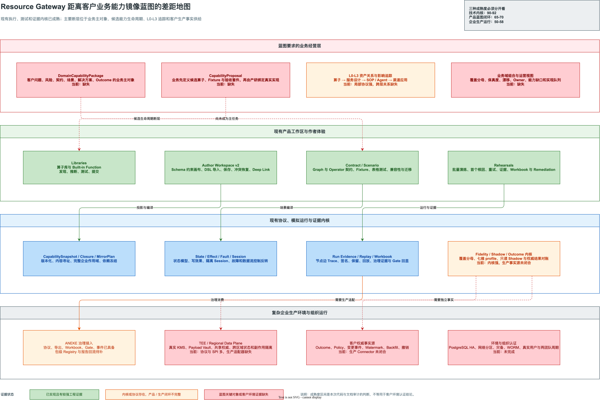
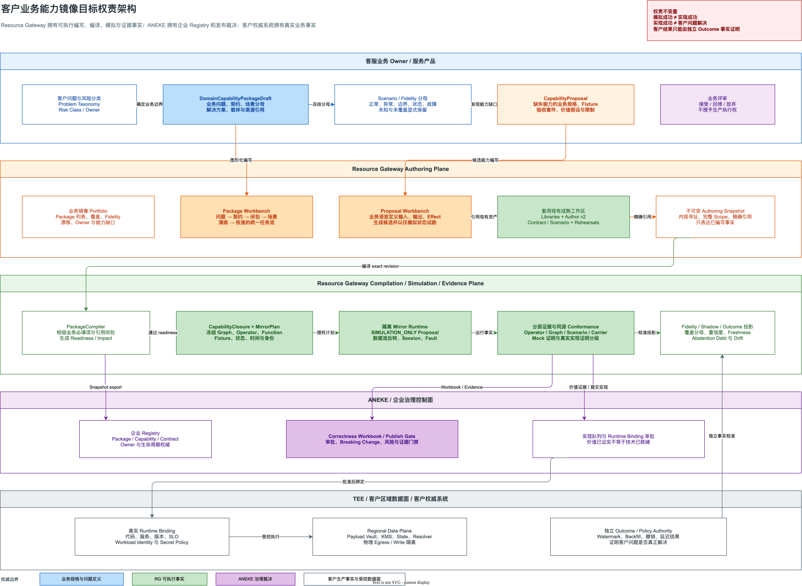

# Resource Gateway 客户业务能力镜像蓝图差距评估与技术演进方案

> 状态：评审稿，可直接进入架构评审与工作包拆解
>
> 评估日期：2026-08-14
>
> 评估对象：`resource-gateway-examples`、`resource-gateway-test-kit`、VS Code 参考宿主及相关设计与验证文档
>
> 蓝图基线：[客户业务能力镜像战略洞见](resource-gateway-customer-business-mirror-strategy-insights.md)
>
> 既有技术基线：[业务能力镜像与保真演练工业化方案](resource-gateway-mock.md)
>
> 实施跟踪：[客户业务能力镜像实施状态](resource-gateway-business-mirror-implementation-status.md)

> **基线口径说明：**第 1-4 节保留 2026-08-14 开工前评估，作为差距基线；已落地事实及复评结果以实施跟踪文档为准。

## 1. 结论先行

Resource Gateway 已经拥有一套罕见地完整的可视化编排、契约测试、隔离模拟、状态与副作用建模、运行证据、回放、Scenario rehearsal、Fidelity、Shadow 和 Outcome 对账内核。它距离蓝图的差距，不是“还缺一批 Mock API”，也不是“画布还不够强”，而是：

> **系统已经形成强大的执行与证据内核，但尚未形成围绕客户业务问题持续经营的业务能力操作系统。**

本次评估必须使用三个不同口径，不能把它们压缩为一个乐观总分：

| 评估口径 | 当前判断 | 主要依据 | 不能被该分数证明的内容 |
|---|---:|---|---|
| 技术内核完成度 | `90-92 / 100` | Capability、Contract、Scenario、MirrorPlan、Session、Evidence、Fidelity、Outcome 等协议和大量自动化测试已经存在；既有方案自评 `91.37%` | 客户环境生产准入、真实 Outcome 持续供给、组织长期运营 |
| 产品蓝图闭环度 | `67 / 100` | Author、Libraries、Contract/Scenario、Rehearsals 已成熟，但 `DomainCapabilityPackage`、`CapabilityProposal` 和 L0-L3 业务关系缺失 | 业务人员能否按客户问题经营资产组合，能否独立发起候选能力闭环 |
| 复杂企业生产成熟度 | `54 / 100` | 企业作用域、ABAC、签名、持久化、部分 PostgreSQL 认证已具备；真实连接器、HA/DR、KMS/WORM、跨区域和现场组织证据未闭合 | 客户生产 SLA、灾备、数据权利、跨组织持续运行 |

因此，若问题是“距离底层镜像运行内核还有多远”，答案是约 `8%-10%`；若问题是“距离蓝图所描述的客户业务能力镜像平台还有多远”，答案是约 `1/3`；若问题是“距离复杂企业组织中可长期生产运行还有多远”，答案仍接近 `1/2`。

这三个判断并不矛盾。当前系统在最难的底层技术方向上走得很深，但业务主模型、组织权责和生产事实供给尚未与强内核合拢。



图源：[resource-gateway-business-mirror-blueprint-gap-map.drawio](assets/drawio/resource-gateway-business-mirror-blueprint-gap-map.drawio)。

## 2. 评估方法与证据边界

### 2.1 评估方法

本次评估不是根据 README 的能力清单打分，而是逐项检查：

1. 是否存在一等领域对象，而不只是文档概念或若干松散字段。
2. 是否存在版本化协议、严格 Schema、不可变修订和内容指纹。
3. 是否存在存储、API、事件、Deep Link 和 Test Kit 消费能力。
4. 是否进入默认产品任务流，而不只是隐藏 API 或高级页面。
5. 是否存在失败关闭、权限边界、生产隔离和运维语义。
6. 是否通过目标环境、真实用户和跨组织周期证明，而不只是本地自动化。

### 2.2 事实证据

| 证据 | 审计判断 |
|---|---|
| [`CapabilitySnapshot`](../resource-gateway-examples/src/main/java/com/leanowtech/bloge/gateway/integration/mirror/CapabilitySnapshot.java) | 已有 Resource、Operator、Graph 的 immutable capability projection、完整 Scope、RuntimeBinding、依赖、Owner 和生命周期 |
| [`CapabilityContract`](../resource-gateway-examples/src/main/java/com/leanowtech/bloge/gateway/integration/mirror/CapabilityContract.java) 与 [`EffectContract`](../resource-gateway-examples/src/main/java/com/leanowtech/bloge/gateway/integration/mirror/EffectContract.java) | 输入输出之外，错误、副作用、幂等、安全、SLO、状态和补偿已经进入协议 |
| [`ScenarioDraftSet`](../resource-gateway-examples/src/main/java/com/leanowtech/bloge/gateway/authoring/scenario/ScenarioDraftSet.java) | Scenario 已独立于 GraphDraft，具备 Scope、Owner、分类、Given/Dependencies/Then 和发布生命周期 |
| [`ContractDraft`](../resource-gateway-examples/src/main/java/com/leanowtech/bloge/gateway/visual/contract/ContractDraft.java) | Graph 与 Operator 共享业务可读契约，并支持兼容性和迁移分析 |
| [`ScenarioPack`](../resource-gateway-examples/src/main/java/com/leanowtech/bloge/gateway/integration/mirror/ScenarioPack.java) | 已有内容寻址的业务场景集合、隔离演练策略和真实外部调用禁止语义 |
| [`DomainFidelityInventory`](../resource-gateway-examples/src/main/java/com/leanowtech/bloge/gateway/integration/mirror/DomainFidelityInventory.java) | 已有 Owner 批准的完整业务覆盖分母，避免从已执行样本倒推分母 |
| [`AuthoritativeOutcomeObservation`](../resource-gateway-examples/src/main/java/com/leanowtech/bloge/gateway/integration/mirror/AuthoritativeOutcomeObservation.java) | 已有独立 Outcome authority、cohort、watermark、延迟/冲突/删失结果和签名对账语义 |
| [`ToolStudioIntegrationController`](../resource-gateway-examples/src/main/java/com/leanowtech/bloge/gateway/integration/ToolStudioIntegrationController.java) | 已有 Capability、Graph export、Evidence、Replay、Workbook、Gate 和 Change Feed 接口 |
| [`IntegrationCapabilities`](../resource-gateway-examples/src/main/java/com/leanowtech/bloge/gateway/integration/IntegrationCapabilities.java) | 能力探针已经广告大量版本化对象和端点，但没有蓝图业务主对象 |
| [`App.tsx`](../resource-gateway-examples/src/main/frontend/src/App.tsx) | 当前默认顶层产品只有 Author、Libraries、Rehearsals、Showcase，没有业务域 Portfolio 或 Package 工作区 |
| [Contract/Scenario Round 9](resource-gateway-contract-scenario-authoring-implementation-status.md#round-9) | 仓库内部工程评估 `95/100`，剩余是高级 Schema、反向索引、Deep Link 和浏览器门禁 |
| [UX Round 3 最终复评](resource-gateway-ux-round3-final-expert-reassessment.md) | E2 工程成熟度 `97/100`，但组织成熟度诚实保持 `89`，真实用户与两团队周期尚未执行 |
| [Mirror 工业化方案](resource-gateway-mock.md) | 记录技术内核 `91.37%`，同时明确生产 Outcome Connector、HA/DR、WORM、跨区域与环境认证仍未完成 |

开工前代码搜索未发现 `DomainCapabilityPackage`、`CapabilityProposal`、`ServiceCarrier` 或 `ProblemDefinition` 的 Java/TypeScript 一等对象。首轮实施已经补齐 Package、Proposal、Readiness 和 L0-L3 Business Asset Link 协议内核，但 repository、API、事件、Deep Link 和默认产品任务流仍未完成，不能据此宣称业务闭环已经成立。

### 2.3 证据限制

1. `91.37%`、`95/100` 和 `97/100` 是仓库内部设计与工程审计，不是客户独立认证。
2. 自动化测试数量可以证明回归覆盖，不能证明真实权限系统、网络、KMS、数据库拓扑和组织流程。
3. 本方案中的 SLO 和容量值是首轮工程候选，必须经过目标客户环境压测和 Owner 确认。
4. 蓝图中 ANEKE、TEE 与客户事实源的能力不应被虚构为 Resource Gateway 当前已实现能力。

## 3. 蓝图能力差距矩阵

### 3.1 总体评分

| 能力维度 | 权重 | 当前得分 | 判断 |
|---|---:|---:|---|
| 客户问题与业务主对象 | 12 | 3 | Domain/Fidelity 有局部对象，但没有统一 `DomainCapabilityPackage` |
| 候选能力共创生命周期 | 9 | 3 | 可创建 Schema-only Library 并试跑，但没有 Proposal 身份、价值假设、审批与实现绑定闭环 |
| L0-L3 业务资产关系 | 8 | 3 | Graph 可组合能力，尚不能表达 Solution、SOP、Agent、Channel 的类型化关系 |
| 作者体验与可视化 | 8 | 7 | Author v2、Library、Scenario、Rehearsal 已成熟；缺业务问题导向的主任务 |
| 契约、Fixture 与测试 | 12 | 11 | 当前最强项；高级 JSON Schema、跨层测试和真实 Outcome 仍需补齐 |
| Mirror Runtime、State 与 Effect | 12 | 11 | 已有强内核；生产 TEE、共享 Authority 和规模认证未闭合 |
| Evidence、Replay 与 Workbook | 10 | 9 | 已协议化、证据化、可回放；包级证据索引和外部治理闭环待补 |
| Fidelity、Shadow 与 Outcome | 10 | 8 | 统计和对账内核完整；生产 Connector、持续事实供给和 drift action 未闭合 |
| 企业协议与 ANEKE 集成 | 7 | 6 | 版本、capability probe、export、gate、events 均存在；新业务对象未进入协议 |
| 生产安全、HA/DR 与数据治理 | 7 | 4 | 设计和部分认证很深；真实 KMS/WORM、多副本、跨区域、删除证明未闭合 |
| 现场使用与组织运营证据 | 5 | 2 | 有 E3/E4 手册，没有 12 名用户和两团队两周期事实 |
| **总计** | **100** | **67** | **强内核、弱业务主模型、未闭合客户生产与组织运行** |

### 3.2 已经达到或接近蓝图的部分

1. **契约不仅是 JSON Schema。** 错误、副作用、状态、幂等、权限、分类和 SLO 已有承载对象。
2. **Scenario 已经独立于 Graph。** 这为业务场景成为可治理资产打下了正确基础。
3. **测试调用方具备数据流控制反转基础。** Fixture、Node/Transport doubles、时间、故障、Session 和调用次数约束均可进入执行计划。
4. **Graph 可以投影为精确 CapabilityClosure。** 依赖闭包、Scope、RuntimeBinding 和内容指纹已经具备。
5. **运行结果已经证据化。** Run Trace、Replay、Workbook、签名、保留、Legal Hold 和 Remediation 均有协议基础。
6. **Fidelity 不再是简单通过率。** 系统已有完整分母、七维指标、置信区间、Freshness、Abstention Debt 和精确来源链。
7. **真实结果不能由系统自证。** Outcome 协议已经明确独立 Authority 和事实闭包，这是方向上最重要的正确性。
8. **产品工程质量较高。** Author v2、中文/英文、响应式、VS Code 参考宿主、恢复、冲突、Undo/Redo 和证据语义已经形成系统性 UX 基础。

### 3.3 蓝图关键断层

| 断层 | 当前表现 | 直接后果 |
|---|---|---|
| 没有业务主聚合 | Graph、Contract、Scenario、Fidelity、Outcome 分散存在 | 业务人员无法以“取消费申诉解决能力”经营完整资产，只能在多个技术对象间切换 |
| 没有候选能力身份 | Schema-only Operator 可以存在，但与真实 Operator 在业务生命周期上没有根本区分 | Mock 跑通后无法形成可审计的价值提案、实现队列和同源验收链 |
| 没有 L0-L3 类型化关系 | Graph 节点表达执行依赖，不表达 Solution、SOP、Agent、Channel 语义 | 变更影响最多到 Graph，无法回答某个 API 变化影响哪些客服解决方案和渠道 |
| 产品主导航不围绕客户问题 | Author、Libraries、Rehearsals 均是技术任务入口 | 业务 Owner 需要先理解内部对象，再拼装自己的工作流 |
| 生产事实源未接通 | Outcome 内核有协议和本地持久化，但真实 Connector 缺失 | 无法长期校准模型与真实客户结果，保真度容易退化为实验室指标 |
| 环境证据不完整 | 单实例 PostgreSQL、synthetic provider、同 JVM 认证仍占主要证据 | 无法对客户承诺 HA、灾备、跨区域、证书轮换和数据删除 |
| 组织权威未冻结 | RG、ANEKE、业务 Owner、事业部、TEE 均有角色，但 Package/Proposal 权威边界尚未协议化 | 后续容易重复建设 Registry、生命周期和审批，造成双主写入 |
| 现场运营未验证 | 代码与浏览器测试强，真实用户和两团队周期未发生 | 复杂组织中的 Owner 交接、积压、漂移和跨团队冲突仍未知 |

## 4. 根因分析

### 4.1 根因一：系统从执行对象向上生长，业务根聚合尚未建立

Resource Gateway 的演进路径从 Resource、Operator、Graph、Test、Evidence 向上扩展。这使底层语义非常扎实，但业务语义被分别安置在 Graph metadata、Scenario、Fidelity inventory、Outcome ref 和治理回显中。

病根不是缺一个新页面，而是缺少能够拥有这些引用和生命周期的根聚合。继续给 GraphDraft 增加 `problemName`、`solutionType` 等字段只会把 Graph 变成新的万能对象，并使执行投影与业务主模型继续混淆。

**根治手段：**建立 `DomainCapabilityPackageDraft` 与 immutable `DomainCapabilityPackageSnapshot`，Graph 只作为其执行投影之一。

### 4.2 根因二：规格权、实现权和发布权没有被同一生命周期串联

当前业务可以定义算子 Schema 和 Fixture，产研可以实现 RuntimeBinding，ANEKE 可以做 Gate，但“尚未实现的业务能力”没有独立身份。于是系统难以区分：

- 这是一个业务价值假设；
- 这是一个可运行的模拟规格；
- 这是一个已绑定实现的能力；
- 这是一个通过同源验收的实现；
- 这是一个完成真实结果校准的能力。

**根治手段：**建立 `CapabilityProposal`，并把生命周期拆为 Authoring、Evidence-derived 和 Governance 三组状态，禁止任何一个系统单独修改全部状态。

### 4.3 根因三：执行依赖图被误用为业务关系图

Graph 的边适合表达数据与控制依赖，不适合表达“该 SOP 使用哪个解决方案”“该 Agent 通过哪个渠道提供服务”“该问题由哪些业务特征组成”。若把这些语义都塞进 DAG edge，影响分析和业务查询都会依赖 DSL 解析和命名约定。

**根治手段：**增加独立、类型化、内容寻址的 `BusinessAssetLink`，允许一个业务资产引用多个 Graph，也允许同一 Graph 被多个服务载体复用。

### 4.4 根因四：实验室闭环强，客户事实供给弱

系统已经能严格验证 Outcome observation 的完整性，但真实客户系统是否持续提供有权威、有 Watermark、可撤销、可 Backfill 的事实，仍取决于尚未实现的 Connector 和区域数据面。

**根治手段：**把“生产 Connector + 数据权威 + 环境认证”当成产品主线，不再用增加协议字段或 H2 测试替代目标环境证据。

### 4.5 根因五：工程成熟度与组织成熟度混用

当前工程自测很强，容易形成“已经工业级”的心理错觉。但企业环境失败常来自权限系统、Owner 变更、跨组织等待、代理网络、证书轮换、数据权利和灾备，而不是业务代码单测。

**根治手段：**对外固定使用 Kernel、Product、Production、Organization 四级证据标签；客户生产准入必须绑定环境和观察窗口，不能由仓库测试自动升级。

## 5. 目标定位与权责边界

### 5.1 目标定位

Resource Gateway 应演进为：

> **Business Capability Mirror Authoring Runtime：把客户业务问题、能力契约、候选能力、场景分母、隔离运行和正确性证据编译为可治理、可回放、可校准的执行事实。**

它不是企业资产治理系统，也不是生产 TEE，更不是客户业务事实源。

### 5.2 权威边界

| 参与方 | 拥有的权威 | 不拥有的权威 |
|---|---|---|
| 客服业务 Owner | 客户问题定义、风险、业务规格、场景分母、期望结果和价值判断 | 生产 RuntimeBinding、安全、容量和发布批准 |
| Resource Gateway | Mutable authoring draft、immutable authoring snapshot、确定性编译、隔离运行、Trace/Evidence 和 Fidelity projection | 企业 Registry 最终记录、生产发布裁决、客户原始 Outcome |
| 平台产研 / 事业部能力团队 | 真实实现、RuntimeBinding、SLO、容量、安全和技术可行性 | 修改业务验收意图、把实现通过宣称为客户结果正确 |
| ANEKE | Registry、Owner、Workbook、发布门禁、审批、breaking migration 和 TEE 治理 | 重做画布、伪造运行证据、持有未经授权的业务 Payload |
| TEE / Regional Data Plane | Payload Vault、Session State、Secret、Resolver、Shadow 和受控执行 | 业务资产治理和发布裁决 |
| 客户权威系统 | Policy、事件、Outcome、Watermark、撤销和 Backfill 事实 | Resource Gateway 内部测试结论 |

### 5.3 三项不可破坏的不变量

1. `SIMULATED` 不能升级为 `IMPLEMENTED`，除非存在真实 RuntimeBinding 和实现指纹。
2. `CONFORMANT` 不能升级为 `CALIBRATED`，除非存在独立 Shadow 或 Outcome 证据。
3. `CALIBRATED` 不能升级为 `CERTIFIED`，除非 ANEKE 和客户环境发布门禁返回有效批准。



图源：[resource-gateway-business-mirror-target-authority-architecture.drawio](assets/drawio/resource-gateway-business-mirror-target-authority-architecture.drawio)。

## 6. 目标领域模型

### 6.1 Draft、Snapshot 与 Governance Projection 分离

同一个业务能力包需要三种形态：

| 对象 | 作用 | 可变性 | 权威方 |
|---|---|---|---|
| `DomainCapabilityPackageDraft` | 业务与作者持续编辑 | optimistic revision，可变 | Resource Gateway Authoring |
| `DomainCapabilityPackageSnapshot` | 编译、导出、复验和证据绑定 | immutable revision + fingerprint | Resource Gateway 生成事实 |
| `DomainCapabilityPackageGovernanceProjection` | Registry、审批、Gate 和认证状态回显 | 外部版本化投影 | ANEKE |

禁止把 ANEKE 的治理状态直接写入 Resource Gateway draft，避免双主。Resource Gateway 只缓存带来源、版本、有效期和签名的治理投影。

### 6.2 `DomainCapabilityPackageDraft v1`

```text
DomainCapabilityPackageDraft
├── schemaVersion / packageId / revision
├── scope(tenant / organization / project / environment / region)
├── businessDefinition
│   ├── domainId / problemTaxonomyRef / problemCode
│   ├── businessGoal / expectedOutcome / riskClass
│   └── accountableOwner / collaboratingOwners
├── packageContractRef
├── capabilityRefs / graphRefs / proposalRefs
├── stateModelRefs / effectModelRefs
├── scenarioInventoryRef / scenarioPackRefs
├── solutionRefs / carrierRefs / channelRefs
├── fidelityInventoryRef / outcomeDefinitionRefs
├── limitations / assumptions / expiry
├── provenance
└── authoringLifecycle(DRAFT / READY_FOR_REVIEW / SUBMITTED / SUPERSEDED)
```

关键约束：

1. 所有执行、契约、Scenario、Fidelity 和 Outcome 引用必须是 exact revision + fingerprint。
2. `problemTaxonomyRef`、Owner、Risk、Contract 和 Scenario denominator 缺一项，不能进入 `READY_FOR_REVIEW`。
3. 高风险包必须声明 State/Effect 和至少一个权威 OutcomeDefinition。
4. `solutionRefs`、`carrierRefs`、`channelRefs` 允许为空，但空值必须形成显式 readiness finding，不能静默忽略。
5. Package 不复制大型 Fixture 或 Payload，只保存精确引用。

### 6.3 `DomainCapabilityPackageSnapshot v1`

Snapshot 由 `PackageCompiler` 生成，额外包含：

- 完整 `CapabilityClosureRef`；
- 一个或多个 `MirrorPlanRef`；
- `BusinessAssetLinkClosure`；
- `PackageReadinessReportRef`；
- 依赖资产的完整 Manifest；
- canonical fingerprint；
- 编译器版本、policy generation 和 provenance；
- 当前证据引用，但不复制证据内容。

Snapshot 只表达“在某一时刻被精确编译的业务包”，不表达企业已批准发布。

### 6.4 `CapabilityProposal v1`

```text
CapabilityProposal
├── proposalId / revision / fingerprint / scope
├── businessIntent
│   ├── capabilityGap / expectedValue / applicableScenarioRefs
│   ├── owner / expiry / assumptions / limitations
│   └── candidatePackageRefs / candidateGraphRefs
├── candidateContract
│   ├── input / output / error
│   ├── stateTransition / effect / compensation
│   ├── idempotency / retry / timeout
│   └── permission / classification / SLOExpectation
├── fixturePackRefs / businessAcceptanceSuiteRefs
├── simulationRuntimeBinding
│   ├── kind = SIMULATION_ONLY
│   ├── resolverPolicyRef
│   └── realExternalCallsAllowed = false
├── implementationBindingRef，可为空
├── authoringLifecycle
├── evidenceDerivedState
└── governanceProjectionRef
```

Proposal 不是残缺 Operator。它表达“业务已经把期望定义到可运行、可验收的程度，但技术实现尚未存在或尚未通过一致性验证”。

### 6.5 生命周期拆分

| 状态所有者 | 状态 | 生成方式 |
|---|---|---|
| Resource Gateway Authoring | `DRAFT`、`READY_FOR_REVIEW`、`SUBMITTED`、`SUPERSEDED` | Authoring command + optimistic revision |
| Resource Gateway Evidence | `NOT_RUN`、`SIMULATED`、`IMPLEMENTED`、`CONFORMANT`、`CALIBRATED` | 根据 exact Evidence 和 RuntimeBinding 派生，用户不能手改 |
| ANEKE Governance | `UNDER_REVIEW`、`ACCEPTED`、`REJECTED`、`CERTIFIED`、`SUSPENDED`、`REVOKED` | 外部治理投影和签名 Gate result |

最终产品状态由三组状态组合呈现。例如：`SUBMITTED + SIMULATED + ACCEPTED` 表示业务价值已接受、实现尚未存在；不能压缩成一个含混的“已通过”。

### 6.6 L0-L3 类型化资产关系

新增 `BusinessAssetRef` 与 `BusinessAssetLink`：

```text
BusinessAssetRef
├── layer: L0_RESOURCE | L1_SERVICE_DESIGN | L2_SERVICE_CARRIER | L3_APPLICATION
├── kind: RESOURCE | OPERATOR | FUNCTION | FEATURE | SCENARIO | SOLUTION | SOP | AGENT | WORKFLOW | CHANNEL_APP
├── id / revision / fingerprint / authority
└── scope

BusinessAssetLink
├── sourceRef / targetRef
├── relation: USES | COMPOSES | IMPLEMENTS | DELIVERED_BY | EXPOSED_ON | VALIDATED_BY | CALIBRATED_BY
├── condition / risk / owner
└── provenance
```

这些关系独立于 Graph edge。Graph edge 继续表达执行拓扑，`BusinessAssetLink` 表达业务复用、归属和影响关系。

## 7. 协议与 API 演进

### 7.1 协议对象

| 新对象 | Schema Version | 说明 |
|---|---|---|
| Mutable Package Draft | `bloge.domainCapabilityPackageDraft.v1` | 业务包作者态 |
| Immutable Package Snapshot | `resourceGateway.domainCapabilityPackageSnapshot.v1` | 编译后跨系统事实 |
| Package Readiness Report | `resourceGateway.packageReadinessReport.v1` | 缺失、冲突、过期和不确定项 |
| Business Asset Link Closure | `resourceGateway.businessAssetLinkClosure.v1` | L0-L3 exact relation closure |
| Capability Proposal Draft | `bloge.capabilityProposalDraft.v1` | 候选能力作者态 |
| Capability Proposal Snapshot | `resourceGateway.capabilityProposalSnapshot.v1` | 提交与实现协作事实 |
| Implementation Binding | `resourceGateway.proposalImplementationBinding.v1` | 真实实现版本和 RuntimeBinding |
| Conformance Report | `resourceGateway.implementationConformanceReport.v1` | 同源验收套件与实现结果 |
| Package Evidence Index | `resourceGateway.packageEvidenceIndex.v1` | 包级 Operator/Graph/Scenario/Carrier 证据索引 |
| Governance Projection | `toolStudio.domainCapabilityPackageGovernanceProjection.v1` | ANEKE 返回的治理视图 |

`ToolStudioResourceGatewayProtocol` 应从 `1.0.0` 以 additive 方式升级到 `1.1.0`。现有对象不改语义；旧消费者可忽略新对象。只有 envelope、错误或既有字段语义发生破坏时才进入 `2.0.0`。

### 7.2 Authoring API

| API | 语义 |
|---|---|
| `POST /api/authoring/domain-capability-packages` | 创建 Package draft，使用 idempotency key |
| `GET /api/authoring/domain-capability-packages/{packageId}` | 读取当前 exact-scope draft |
| `PUT /api/authoring/domain-capability-packages/{packageId}?expectedRevision=n` | compare-and-set 保存 |
| `POST /api/authoring/domain-capability-packages/{packageId}/compile` | 生成 readiness、closure 和 snapshot；大型包异步化 |
| `GET /api/authoring/domain-capability-packages/{packageId}/impact` | 读取 L0-L3 reverse impact |
| `POST /api/authoring/domain-capability-packages/{packageId}/submit` | 冻结 snapshot 并提交 ANEKE |
| `POST /api/authoring/capability-proposals` | 创建 Proposal draft |
| `PUT /api/authoring/capability-proposals/{proposalId}?expectedRevision=n` | 保存候选规格 |
| `POST /api/authoring/capability-proposals/{proposalId}/simulate` | 以 SIMULATION_ONLY binding 运行 exact suite |
| `POST /api/authoring/capability-proposals/{proposalId}/submit` | 提交业务价值和证据，不创建生产绑定 |
| `POST /api/authoring/capability-proposals/{proposalId}/implementation-bindings` | 由授权产研主体绑定真实实现 |
| `POST /api/authoring/capability-proposals/{proposalId}/conformance-runs` | 复用原业务验收套件验证实现 |

### 7.3 Integration API

| API | 语义 |
|---|---|
| `GET /api/integration/domain-capability-packages/{id}/revisions/{revision}` | 导出 immutable snapshot 与依赖 Manifest |
| `GET /api/integration/domain-capability-packages/{id}/evidence-index` | 导出包级证据索引 |
| `GET /api/integration/capability-proposals/{id}/revisions/{revision}` | 导出 Proposal、模拟证据和限制 |
| `POST /api/integration/capability-proposals/{id}/governance-projections` | 接收 ANEKE 外部治理投影 |
| `GET /api/integration/business-assets/{kind}/{id}/impact` | 查询跨层影响范围 |
| `GET /api/integration/domain-portfolios/{domainId}` | 导出业务域组合的只读治理视图 |

### 7.4 Events、Capability Probe 与 Deep Link

新增事件：

- `DOMAIN_CAPABILITY_PACKAGE_UPDATED`
- `DOMAIN_CAPABILITY_PACKAGE_SNAPSHOT_COMPILED`
- `CAPABILITY_PROPOSAL_SUBMITTED`
- `PROPOSAL_IMPLEMENTATION_BOUND`
- `PROPOSAL_CONFORMANCE_COMPLETED`
- `PACKAGE_FIDELITY_STALE`
- `BUSINESS_ASSET_IMPACT_CHANGED`

事件只携带 exact refs、fingerprint、scope、event cursor 和 payload-free summary。大型内容由消费者按引用读取。

`/api/integration/capabilities` 新增上述 supported objects、endpoints、feature flags 和 compatibility range。`available=false` 必须带稳定 reason code，不能因 Controller 存在就广告运行就绪。

Deep Link 至少支持：

```text
/portfolio/?domainId=ride-cancellation
/packages/?packageId=cancellation-fee-dispute&revision=7
/author/?packageId=...&draftId=...&nodeId=...
/libraries/?proposalId=...&assetRef=...
/rehearsals/?packageId=...&jobId=...&scenarioId=...
```

### 7.5 标准错误语义

| Error Code | HTTP | 语义与处理 |
|---|---:|---|
| `RG.PACKAGE.NOT_FOUND` | 404 | exact Scope 内没有该 Package，不泄露其他 Scope 是否存在 |
| `RG.PACKAGE.REVISION_CONFLICT` | 409 | expected revision 落后；返回 compare/fork/reload 所需的 payload-free coordinate |
| `RG.PACKAGE.DEPENDENCY_DRIFT` | 409 | 编译期间依赖 head 或 fingerprint 漂移，调用方必须重新编译 |
| `RG.PACKAGE.READINESS_BLOCKED` | 422 | 业务必填项、引用闭包或隔离策略不满足；返回稳定 finding ids |
| `RG.PROPOSAL.REAL_EXECUTION_FORBIDDEN` | 403 | SIMULATION_ONLY Proposal 请求真实网络、Secret 或写 Effect |
| `RG.PROPOSAL.FIXTURE_NOT_FOUND` | 422 | 没有 exact Fixture 匹配，不允许回落为乐观默认值 |
| `RG.GOVERNANCE.PROJECTION_STALE` | 409 | ANEKE projection 已过期或 generation 落后，发布操作失败关闭 |
| `RG.IMPACT.INDEX_STALE` | 503 | 反向索引未追平 Snapshot；允许读取旧结果但禁止发布消费 |

错误响应继续使用稳定 code、localized message descriptor、correlation id 和 payload-free details。原始下游异常只进入受控技术详情，不进入业务主界面和普通日志。

## 8. 编译与运行时演进

### 8.1 `PackageCompiler`

编译流程：

1. 校验 Package draft、Scope、Owner、Problem、Risk 和所有 exact refs。
2. 解析 Graph、Operator、Built-in Function 和 Proposal 的 CapabilityClosure。
3. 解析 L0-L3 BusinessAssetLinkClosure，并执行 cycle、dangling ref 和 authority 检查。
4. 解析 Scenario denominator、Fixture、State、Effect 和 OutcomeDefinition。
5. 检查每个 `SIMULATION_ONLY` Proposal 是否有 bounded resolver 和 `MUST_NOT_CALL` 防线。
6. 生成 MirrorPlan、ReadinessReport、ImpactIndex 和 PackageSnapshot。
7. 使用 canonical serialization 计算 fingerprint，并保存编译 receipt。

编译必须失败关闭：

- exact ref 不存在或 fingerprint 不匹配；
- 跨 Scope 引用没有授权证明；
- Proposal 没有 Fixture 覆盖却进入可达路径；
- 高风险写 Effect 缺状态、补偿或隔离策略；
- 场景分母为空或被执行结果反向缩小；
- OutcomeDefinition 不可解析却声明可校准；
- Graph、Contract、Scenario 或 policy 在编译过程中漂移。

### 8.2 Proposal 模拟运行

Proposal 通过生成 temporary capability snapshot 进入现有 MirrorPlan，而不是修改 DSL 或复制一个 Mock Operator：

1. `kind=EXTERNAL`，`runtime.kind=SIMULATION_ONLY`。
2. Resolver 只接受 exact Fixture rule、captured replay 或明确的 generative candidate。
3. 未匹配必须返回 `ABSTAINED` 或 `FIXTURE_NOT_FOUND`，不得生成乐观默认值。
4. 任何真实网络、Secret 或 External Write 请求在执行根被物理拒绝。
5. Evidence 必须显示 `SIMULATED`、Fixture 来源、匹配规则、调用次数、限制和不确定项。
6. 同一 Proposal 绑定真实实现后，原 BusinessAcceptanceSuite 不变，只切换 RuntimeBinding 运行 Conformance。

### 8.3 包级分层测试

| 层级 | 测试对象 | 证据 |
|---|---|---|
| L0 | Resource、Operator、Function | Schema、输入输出、错误、Effect、状态、Property/Mutation |
| L1 | Feature、Scenario、Solution Graph | Decision、State transition、node/edge trace、scenario assertion |
| L2 | SOP、Workflow、Agent | 工具调用序列、策略、升级、fallback、旅程结果 |
| L3 | 文本/语音/人工辅助应用 | 多轮会话、渠道适配、降级、延迟和体验约束 |
| Calibration | Shadow 与 Outcome | typed diff、Fidelity vector、confidence、freshness、drift |

低层通过不能自动证明高层通过。PackageEvidenceIndex 必须保持层级与 proof strength，不能只显示一个绿色总状态。

## 9. 存储与索引设计

### 9.1 持久化表

| 表 | 关键内容 |
|---|---|
| `rg_domain_package_draft` | 当前 mutable revision、Scope、canonical JSON、owner、updated_at |
| `rg_domain_package_snapshot` | immutable revision、fingerprint、snapshot JSON、compiler version、created_at |
| `rg_capability_proposal_draft` | 当前 Proposal authoring revision |
| `rg_capability_proposal_snapshot` | immutable submitted Proposal |
| `rg_proposal_implementation_binding` | exact implementation/runtime binding revision |
| `rg_business_asset_link` | source/target exact refs、relation、Scope、package snapshot fingerprint |
| `rg_business_asset_reverse_index` | asset → package / carrier / channel 的反向影响索引 |
| `rg_package_compilation_receipt` | idempotency key、command fingerprint、result ref、terminal status |
| `rg_package_governance_projection` | ANEKE 签名投影、generation、expiry、source cursor |
| `rg_package_event_outbox` | 事务内事件 Outbox，支持 Change Feed cursor |

### 9.2 存储原则

1. Mutable draft 与 immutable snapshot 分表，避免历史被覆盖。
2. Snapshot 保存 JSONB 与常用关系索引，不将协议拆成大量难以演进的列。
3. 反向索引是查询投影，Snapshot Manifest 才是编译权威；索引可重建，不能反过来改变事实。
4. 所有写命令延续当前 Graph Save 的 idempotency receipt 与 same-key drift conflict 语义。
5. Scope 进入主键和唯一约束，不允许先按 ID 查出再在应用层过滤。
6. 大型 Fixture、Payload 和 Evidence 只存 ref，不进入 Package JSON。

### 9.3 并发与一致性

- Draft 保存：optimistic revision + canonical command fingerprint。
- Compile：记录输入 draft revision 和所有 dependency heads，提交前再次验证。
- Snapshot：append-only，`packageId + revision` 唯一，same material 可 exact replay。
- Governance projection：外部 generation 单调递增，旧 projection 不覆盖新 projection。
- Reverse index：snapshot commit 后通过事务 Outbox 构建；未追平时 Impact API 标记 `STALE`，发布门禁不能使用陈旧索引。

## 10. 产品与 UX 演进

### 10.1 新增顶层 `Business Mirror` 工作区

当前四个工作区保留。新增默认业务入口：

| 视图 | 主要问题 | 首要操作 |
|---|---|---|
| Portfolio | 哪些客户问题已建模，哪里低保真或已漂移 | 选择业务域或创建 Package |
| Package Overview | 一个客户问题的契约、场景、能力闭包和结果是否完整 | 处理第一个 readiness blocker |
| Capability Map | L0-L3 如何连接，哪些是 Proposal 或真实能力 | 定位缺失能力和受影响载体 |
| Scenario Denominator | 正常、异常、边界、状态和故障覆盖了多少 | 增加或修复场景义务 |
| Rehearsal | 包在隔离环境中表现如何 | 运行选中场景或查看根因 |
| Fidelity | 模型与真实业务的差距是什么 | 查看 dimension、freshness 和 Outcome lineage |
| Change Impact | 一个能力变化会影响哪些解决方案、Agent 和渠道 | 创建迁移或回归任务 |

业务主页面不展示原始 JSON Schema。高级技术细节仍可进入现有 Contract、Library 和 Author 工作区。

### 10.2 Package Workbench 任务流

1. **定义问题：**选择业务域、问题分类、风险、Owner 和期望 Outcome。
2. **定义边界：**图形化输入输出、错误、Effect、状态和限制。
3. **组装能力：**引用现有 Graph/Operator/Function，或在缺失位置创建 Proposal。
4. **冻结场景分母：**表格维护 Golden、Negative、Boundary、Regression、Property、State 和 Fault。
5. **隔离演练：**运行包级场景，首屏显示首个根因、未知、Mock 边界和影响范围。
6. **真实校准：**查看 Shadow/Outcome、Fidelity、Freshness 和 Abstention Debt。
7. **提交治理：**导出 immutable snapshot 与 evidence index，由 ANEKE 决定发布。

### 10.3 Proposal Workbench

从画布未满足的节点或 Package blocker 进入：

1. 用业务语言填写“输入什么、期望得到什么、会改变什么、失败时怎样”。
2. 系统生成候选 Schema、Error、Effect 和 State；每项显示来源与置信度。
3. 通过表格添加 Fixture 和业务验收案例。
4. Proposal 节点始终显示 `仅模拟`，并使用不同于真实 RuntimeBinding 的视觉语义。
5. 运行完整 Package，查看该 Proposal 对结果和覆盖的贡献。
6. 选择“提交实现”，自动生成协议包、Runtime port、SDK scaffold 和同源 Conformance suite。
7. 实现绑定后并排查看模拟与真实实现 Diff，不重新发起模糊验收。

### 10.4 可理解性防线

- `Behavior`、`Proof strength`、`Freshness`、`Governance` 保持四个独立维度。
- `SIMULATED` 不使用与 `CERTIFIED` 相同的绿色视觉。
- Package readiness 只展示一个首要阻断和受影响资产数量，完整清单放入侧栏。
- L0-L3 图使用语义缩放：Overview 只显示层级、风险和 Proposal；Inspect 才显示字段与 Trace。
- 中文和英文从新增 message catalog 同步进入，不允许协议原文直接成为主界面文案。
- VS Code 离线模式允许 Package/Proposal authoring 和 Fixture 演练，但明确标记 ANEKE、Outcome 和生产 Connector 不可用。

## 11. 安全、合规与生产隔离

### 11.1 Proposal 的物理隔离

1. Proposal runtime 使用独立 Spring profile、进程或 namespace。
2. 不装载生产写 Secret，不拥有生产写网络路由。
3. Egress 使用 allowlist，并在 sidecar 和基础设施层双重拒绝。
4. `testMode`、`fixtureOverride` 等控制字段继续禁止进入生产请求。
5. Capability Probe 必须公开当前 Deployment Isolation Attestation 和 expiry。
6. 任何 isolation、signer、policy 或 resolver authority 不健康时，Proposal run 失败关闭。

### 11.2 企业数据治理

- Package、Snapshot、Trace 和 Event 默认 payload-free。
- Fixture 必须带 classification、purpose、region、retention 和 provenance。
- Captured payload 进入独立 Vault，只在授权执行点解析。
- PII、支付、行程和身份字段需要字段级 classification 与脱敏策略。
- Legal Hold、客户终止服务、数据主体删除、备份清除和物理删除证明必须可审计。
- 禁止跨租户训练或复用客户 Fixture，除非存在独立授权和新的数据产品边界。

### 11.3 供应链与协议安全

- 所有 immutable snapshot、evidence、policy 和 governance projection 使用域分离签名。
- Key set、root policy、revocation floor 和 mixed-version rollout 必须进入认证矩阵。
- Test Kit 继续不依赖 Resource Gateway server 和 Spring Boot，并提供离线 verifier。
- Java、TypeScript 和至少一种非 JVM 消费者使用固定 canonicalization vectors。

## 12. NFR 与认证门禁

### 12.1 首轮候选 SLO

以下是工程候选，不是当前已达成事实：

| 指标 | 候选目标 | 验证方式 |
|---|---:|---|
| 真实 External Write 逃逸 | `0` | 网络、凭据和 Runtime 三层负向测试 |
| Draft 读 p95 | `<= 300ms` | 典型 Scope、热缓存与冷缓存 |
| Draft save p95 | `<= 500ms` | 并发保存、响应丢失、重试和双副本 |
| Package compile p95 | `<= 10s`，500 节点、4096 coverage units | async job + capacity profile |
| Author / Portfolio 首次可交互 P75 | `<= 2s` | 真实 VS Code 与企业代理环境 |
| 2,000 场景批量演练 | `<= 30min` | 固定资源预算，记录 p95/p99 与拒绝率 |
| Control metadata availability | `99.9%` | 月度 SLO 和故障演练 |
| Mirror data plane availability | `99.95%` | 区域级 SLO，依客户架构确认 |
| Control metadata RPO / RTO | `<= 5min / <= 30min` | 备份恢复和主备切换演练 |
| 高风险 Fidelity stale 发现 | `<= 24h` | Watermark、event wakeup 和 SLO alert |
| Revocation 阻断传播 | `<= 5min` | mixed-version、多副本、网络分区恢复 |

### 12.2 环境认证矩阵

| 类别 | 必须覆盖的失败 |
|---|---|
| PostgreSQL | 主备切换、连接 blackhole、事务中断、重复提交、备份恢复、schema rollout |
| Runtime Worker | claim 后 kill、执行后响应丢失、lease takeover、旧 owner 发布、cancel 传播 |
| KMS / Certificate | rotation、revoke、expired key、mixed generation、连接池旧 session |
| Network | DNS rebinding、SSRF、半开连接、代理注入、跨区域延迟和 partition |
| Data Plane | Vault unavailable、payload tombstone、region mismatch、purpose mismatch、zeroize |
| Outcome Connector | cursor stall、watermark regression、late event、conflict、backfill、authority revoke |
| Evidence Governance | signer outage、WORM outage、Legal Hold、删除与备份清除证明 |
| Multi-tenant | tenant/org/project/environment/region 混淆、delegation revoke、ABAC 缓存漂移 |
| UX Host | Windows、Linux、Remote SSH、企业代理、受限 CSP、读屏和低视力 |
| Organization | Owner 离职、跨事业部超时、审批积压、契约变更、事故恢复和两团队并行 |

任何测试只证明其环境坐标。Capability Probe 和认证证据必须带 deployment generation、region、版本、时间、policy 和 expiry。

### 12.3 可观测性与 Runbook

固定基数指标至少包括：

- Package draft save、compile admission、compile duration、dependency drift 和 readiness blocker；
- Proposal created、simulated、submitted、expired、implementation bound 和 conformance mismatch；
- Reverse index lag、Outbox backlog、event cursor stall 和 ANEKE projection freshness；
- Scenario denominator units、abstention debt、Fidelity stale、Outcome watermark lag 和 connector quarantine；
- Isolation rejection、real-write attempt、signer/KMS readiness、revocation propagation 和 evidence publication failure。

禁止把 tenant、packageId、proposalId、runId、actor 或异常 message 作为 metrics label。精确坐标进入受保护审计或 Trace。

首批 Runbook：

1. Package compile 长时间 `RUNNING` 或重复 `DEPENDENCY_DRIFT`。
2. Proposal Fixture 大面积未匹配或 Resolver authority 不可用。
3. Outbox / reverse index 落后，Impact 和发布门禁关闭。
4. ANEKE governance projection 过期或协议版本不兼容。
5. Outcome watermark 停滞、回退、Backfill 冲突或 Connector quarantine。
6. Evidence signer、KMS、root policy 或 certificate rotation 异常。
7. PostgreSQL failover、恢复后 receipt 对账和旧 lease fencing。
8. Legal Hold、客户终止服务、数据删除和备份清除证明。

健康探针按能力拆分，不返回一个含混的 UP：`authoringReady`、`compileReady`、`simulationReady`、`governanceSyncReady`、`outcomeCalibrationReady` 和 `certifiableReady` 分别计算。Outcome 不可用不应阻断离线 authoring，但必须阻断 `CALIBRATED` 和 `CERTIFIED` 结论。

### 12.4 角色与职责分离

建议最小角色集：

| 角色 | 允许 | 禁止 |
|---|---|---|
| `BUSINESS_AUTHOR` | 编辑 Package、Proposal、Fixture 和 Scenario | 绑定生产实现、批准发布 |
| `PACKAGE_OWNER` | 冻结分母、提交 Package、接受业务价值 | 签发技术 SLO 或客户 Outcome |
| `CAPABILITY_IMPLEMENTER` | 绑定实现、运行 Conformance、提交 NFR 证据 | 修改已冻结业务验收套件 |
| `INDEPENDENT_REVIEWER` | 复核高风险 Package、Evidence 和 Remediation | 与原作者使用同一主体完成双人审批 |
| `GOVERNANCE_READER` | 读取 payload-free Snapshot、Workbook 和 Gate | 读取原始 Fixture/Payload |
| `OUTCOME_CONNECTOR` | 在 purpose/scope/region 约束下提交权威结果 | 修改 Package、Scenario 或发布状态 |

高风险 Package 至少实施作者、Owner、实现者和发布裁决四权分离；紧急 break-glass 必须短时、可撤销、有外部审批并自动进入事后复验。

## 13. 兼容与存量迁移

### 13.1 不改变既有 Graph 行为

1. GraphDraft、OperatorLibrary、ScenarioDraftSet、MirrorPlan 和现有 API 保持兼容。
2. Package 通过 exact refs 组合既有对象，不把新字段塞入 GraphDraft。
3. 旧消费者不认识 Package 时仍可继续消费 Graph export 和 Evidence。
4. 新 Package export 使用 additive protocol `1.1.x`。

### 13.2 Legacy Graph 包装器

已实现 `LegacyGraphPackageProjector`，并保持以下迁移规则：

1. 将一个现有 Graph、Graph Contract、Scenario 和依赖闭包包装为 `LEGACY_IMPORTED` Package draft。
2. 无法推断的 Problem、Owner、Risk、Solution、Carrier、Outcome 显示为 readiness finding。
3. 自动生成的值标记 `INFERRED`，不冒充业务 Owner 已确认。
4. Legacy Package 可以演练和查看影响，但在关键业务字段补齐前不能提交治理。
5. 迁移是按包渐进发生，不要求一次性改造全部 Graph。

### 13.3 Schema 与事件演进

- 新字段先 optional + explicit capability flag，再在新 major schema 中提升为 required。
- 所有 enum 增加 unknown-handling policy；消费者遇到未知值失败关闭或降级为 `UNSUPPORTED`。
- Change Feed 保持 cursor 单调和 exact scope；Package 事件不得改变既有 cursor 语义。
- 提供 server-produced、Test Kit-consumed 固定 fixtures，并加入 mixed-version CI。

## 14. 可直接开工的工作包

### 14.1 工作包总览

| Ticket | 优先级 | 工作包 | 主要交付 | 退出门禁 |
|---|---|---|---|---|
| RG-BM-001 | P0 | 权威与协议冻结 | 领域词汇、source-of-truth、v1 Schema、ADR | **实施中：**协议内核、严格 Schema、固定 fixtures 和 Test Kit 已完成；RG/ANEKE/业务/TEE 四方签字及 mixed-version 消费者认证待完成 |
| RG-BM-002 | P0 | Package protocol 与 repository | **仓库内工程实现已完成：** Draft/Snapshot/Readiness 协议、严格 Schema、PostgreSQL migration、认证 create/save/read/list API、完整 Scope、optimistic revision 与 durable exact receipt | H2/PostgreSQL 双实例并发、漂移、跨 Scope、事务回滚、重启 exact replay、认证 HTTP 和独立消费者全绿；HA/DR 属于 BM-013 |
| RG-BM-003 | P0 | PackageCompiler | **内核、部署纵向切片与首批真实 Adapter 已完成：** Authority freeze/fence、确定性 Readiness/Snapshot/Closure、PostgreSQL append-only facts、跨副本 revision allocator、durable receipt、认证 compile/read API、组合 Authority、内置 Graph/Contract exact resolution、动态 readiness 和独立 Test Kit 复验；Scenario/Fidelity/Outcome Adapter 继续实施 | 100 组乱序、tamper、Scope、cycle、TOCTOU、唯一 kind ownership、七个内置 Graph、H2/PostgreSQL 双连接、响应丢失和 Spring HTTP 全绿；完整退出仍需其余 Adapter 与大型编译容量认证 |
| RG-BM-004 | P0 | Legacy migration | **仓库内工程实现已完成：** Graph → Package catalog/preview/projector、正式 gap inventory、durable 幂等逐包导入、严格 Schema、固定 fixture、Test Kit 离线复验和动态 capability readiness | 七个内置 Graph 均可包装；不可推断业务字段、Owner approval、Scenario 治理和 MirrorPlan 保持阻断；跨 JVM fixed fixture、HTTP replay、tamper/gap-hide 全绿 |
| RG-BM-005 | P0 | Business Mirror Workspace | **仓库内工程实现已完成：**默认 Portfolio、Package 六步任务、首阻断 Readiness、L0-L3 Capability Map、exact lineage、持久导入/保存/编译、中英文、响应式布局、VS Code 离线固定任务和实机操作手册 | 真实 Spring Boot JAR 已在浏览器完成 catalog → import → guided edit → save → compile → capability map；390/820/1280 实测无页面横向溢出，原生键盘控件、locale、route chunk、WebView 与宿主门禁全绿；1440 由 CSS/自动化契约覆盖，客户业务可用性仍需试点验收 |
| RG-BM-006 | P0 | CapabilityProposal protocol | **durable authoring 已完成：** Proposal current/history、完整 Scope、optimistic revision、durable exact replay、认证 API、PostgreSQL DDL、strict Schema、fixed fixture 与独立 Test Kit；`SIMULATION_ONLY` binding 已固化 | authoring 无执行入口，因而无法触达真实网络/Secret/write；`businessMirrorProposalApi=true` 且 `businessMirrorProposalSimulation=false`；运行时未匹配 fail closed 由 BM-007 验收 |
| RG-BM-007 | P0 | Proposal simulation | **仓库内工程实现已完成：** pure temporary overlay、exact Package/Graph/Suite/Fixture resolution、MirrorPlan/Run、分层 payload-free evidence、durable lease/replay、strict Schema 与独立 Test Kit | `SIMULATED` Snapshot 始终无 implementation binding；真实网络/Secret/write/fallback fail closed；H2/PostgreSQL、Spring、Controller、tamper 和跨 JVM fixture 全绿 |
| RG-BM-008 | P1 | 实现交付与 Conformance | **仓库内工程实现已完成：**runtime-owned port、exact binding、target-only plan derivation、同源 Suite/Case/Fixture 执行、版本化 behavior projection、payload-free signed report、`CONFORMANT` Snapshot、durable lease/replay、PostgreSQL、认证 API、strict Schema、fixed fixture、Test Kit 与动态 capability readiness | Binding 精确闭合 Proposal/PASSED simulation/target/Contract/runtime generation；Conformance 仅替换 target sites，非 target 继续 Fixture-only；共享规则、fallback、漂移、过期和未触达 fail closed；完整语义与跨运行行为指纹分离并可独立复验 |
| RG-BM-009 | P1 | L0-L3 关系与 Impact | **仓库内工程实现已完成：**确定性 transitive impact、事务 projection outbox、跨副本租约 worker、append-only reverse index/current head、`CURRENT/STALE` freshness、有界 rebuild、认证 API、exact Deep Link、change event、strict Schema、fixed fixture 与独立 Test Kit | L0 exact ref 可定位 L1/L2/L3 受影响资产；Snapshot/Closure/路径/风险/Deep Link 可复验；H2/PostgreSQL lease/replay/stale/tamper 与前端发布门禁全绿；HA/容量/客户语义验收归 BM-013/015 |
| RG-BM-010 | P1 | Package Evidence/Fidelity | **领域内核已完成：**`resourceGateway.packageEvidenceIndex.v1`、L0/L1/L2/L3/Calibration 五层证明隔离、逐结论 exact lineage、既有 Fidelity 七维向量无损投影、缺失/过期/Inventory 漂移/弃权债务的保守信号；durable projection、Portfolio API、Owner Task、Test Kit 与产品界面继续实施 | 领域测试已证明低层 PASS 不能覆盖高层缺证、无综合分数字段、unsigned Profile fail closed、七维和 source lineage 可复验；完整退出待持久化与消费者切片 |
| RG-BM-011 | P0 并行 | 生产 Outcome Connector | cursor、watermark、backfill、revoke、durable inbox | 目标客户只读事实源连续运行并通过断流/迟到/冲突演练 |
| RG-BM-012 | P0 并行 | Regional Data Plane | KMS/Vault/State/Resolver、mTLS、egress isolation | 真实基础设施中 write escape 为 0，key/CA rotation 全绿 |
| RG-BM-013 | P0 并行 | Runtime certification harness | PostgreSQL HA、kill、partition、upgrade、backup/restore | CI/nightly/客户环境生成可重放认证包 |
| RG-BM-014 | P1 | ANEKE package integration | protocol 1.1、registry ingest、gate projection、events | 两边可独立升级；旧消费者兼容；stale projection 失败关闭 |
| RG-BM-015 | P0 | 首个业务域试点 | 取消费申诉 L0-L3 Package、Proposal、Conformance、Outcome | 满足第 16 节全部试点门禁 |

### 14.2 依赖与并行策略

关键路径：

```text
BM-001 → BM-002 → BM-003 → BM-005 → BM-006 → BM-007 → BM-015
```

并行支线：

- `BM-004` 在 Package Schema 冻结后立即开始。
- `BM-011/012/013` 从第二个 Sprint 开始，不等待 UI 完成。
- `BM-008/009/010/014` 在首个 Package vertical slice 可运行后并行推进。

建议团队：

| 角色 | 建议投入 |
|---|---:|
| RG Domain/Protocol | 2-3 人 |
| Authoring Frontend/VS Code | 2-3 人 |
| Mirror Runtime/Test Kit | 2-3 人 |
| Data Plane/SRE/Security | 3-4 人 |
| ANEKE Integration | 1-2 人 |
| 业务产品与取消费域专家 | 2 人持续参与 |

若以上工作并行，首个工业化业务试点预计需要 `8-10` 个 Sprint；完整客户环境认证预计 `12-14` 个 Sprint。真实周期受客户 Authority、KMS、网络、数据授权和组织审批影响，不应只按研发人日承诺。

### 14.3 建议代码落点

保持当前 `resource-gateway-examples` 单体项目边界，先按 package 建立深模块，不立即增加 Maven reactor 复杂度：

| 位置 | 责任 |
|---|---|
| `com.leanowtech.bloge.gateway.businessmirror.domain` | Package、Proposal、BusinessAssetLink、状态和 invariant |
| `com.leanowtech.bloge.gateway.businessmirror.application` | command/query、authority check、lifecycle orchestration |
| `com.leanowtech.bloge.gateway.businessmirror.compilation` | PackageCompiler、readiness、closure、impact 和 legacy projection |
| `com.leanowtech.bloge.gateway.businessmirror.persistence` | JDBC repository、Outbox、reverse index 和 migration |
| `com.leanowtech.bloge.gateway.businessmirror.transport` | Authoring/Integration REST、error mapping 和 capability probe |
| `src/main/frontend/src/business-mirror` | Portfolio、Package/Proposal workspace、Capability Map |
| `resource-gateway-test-kit/.../businessmirror` | 独立 client、Schema、fingerprint 和 offline verifier |
| `vscode-extension` | 离线 Package/Proposal 文件、bridge、recovery 和 trusted remote proxy |

现有 `integration.mirror` 不继续承载业务主模型。它保留 Capability、MirrorPlan、Session、Fidelity 和 Outcome 执行事实；`businessmirror` 通过稳定接口引用这些深模块，避免新的万能 package。

## 15. 测试战略

### 15.1 协议和领域测试

- JSON Schema 正反例、canonical fingerprint fixed vectors。
- Draft/Snapshot/Projection authority boundary architecture tests。
- Property tests：引用顺序、重复、cycle、Scope、unknown enum、large denominator。
- Mutation tests：删掉 owner/risk/effect/fingerprint 检查后，测试必须失败。
- Test Kit 离线 verifier 与 server producer 固定 fixtures。

### 15.2 Repository 与并发测试

- same idempotency key exact replay；same key different material `409`。
- 双副本并发 create/update/compile。
- compile 中 dependency head 漂移。
- Outbox commit、重复投递、cursor resume、reverse index rebuild。
- PostgreSQL transaction abort、failover 和 backup restore。

### 15.3 Runtime 与隔离测试

- Proposal reachable 但 Fixture 不匹配时 fail closed。
- Proposal 请求真实网络、Secret 或 write 时物理拒绝。
- 模拟和实现使用同一 suite，切换 binding 不改变验收意图。
- State、time、random、identity、feature flag、fault 全部可冻结。
- kill、timeout、cancel、response loss、lease takeover、old owner publish。

### 15.4 产品与现场测试

- 业务用户从客户问题创建 Package，不直接编辑 JSON/DSL。
- 在 Graph 中发现缺失能力并创建 Proposal，完成 Fixture、试跑和提交实现。
- 产研绑定实现并运行同源 Conformance。
- Owner 从 L0 变化定位 L2/L3 影响并启动回归。
- 延续 E3/E4：四角色各 3 名用户、两个团队各两个发布周期。

## 16. 第一个验证场景：网约车取消费申诉

### 16.1 选择理由

该场景同时具备订单状态、计价规则、时间边界、乘客/司机责任、风险、补偿副作用、跨事业部依赖和客户结果，能够验证业务能力镜像是否真正覆盖 L0-L3，而不是只验证一张简单 DAG。

### 16.2 业务包

`DomainCapabilityPackage: ride.cancellation-fee-dispute.v1`

| 层级 | 资产 |
|---|---|
| L0 | `queryOrderSnapshot`、`queryCancellationFeeRule`、`evaluateWaiverEligibility`、`calculateCompensation`、`submitRefund` |
| Built-in Function | 时间差、金额比较、地域/车型规则匹配、原因码归一化、风险阈值 |
| L1 | 责任方特征、等待时长、司机到达状态、历史补偿、申诉场景分类、解决方案决策 |
| L2 | 取消费解释、免除、补偿、补证、升级人工的 SOP / Workflow / Agent |
| L3 | 文本机器人首个渠道，覆盖多轮补信息、工具调用、解释、失败降级和人工接管 |

首轮将 `submitRefund` 作为 `CapabilityProposal`：业务先定义输入、输出、Effect、幂等、错误、状态和验收场景，通过隔离 Fixture 证明完整服务流程，再由支付/订单产研绑定真实实现。

### 16.3 场景分母

至少覆盖以下族群；具体样本数由业务 Owner 冻结：

1. 司机未到达，取消费应免除。
2. 司机已到达且乘客超时，取消费成立。
3. 时间阈值前后一分钟的边界。
4. 规则版本切换与城市/车型差异。
5. 订单状态延迟或冲突。
6. 重复申诉、重复退款和幂等重放。
7. 上游超时、部分失败、fallback 和人工升级。
8. 高风险账户或证据不足，系统必须 abstain。
9. Proposal Fixture 未匹配，不能生成乐观结果。
10. 真实实现与模拟在错误码、金额、状态或副作用上的差异。
11. 文本机器人多轮补充信息与会话恢复。
12. Outcome 延迟、冲突或被删失时，Fidelity 不得误绿。

### 16.4 三阶段验证

| 阶段 | 数据来源 | 目标 |
|---|---|---|
| A. 完全隔离演练 | synthetic / owner-authored Fixture | 证明业务流程、Proposal 价值、分支与状态可独立运行 |
| B. 只读 Shadow | 受控真实查询和 paired comparison | 证明输入归一化、分支和返回语义接近真实系统 |
| C. Outcome 校准 | 独立投诉、退款、重复进线等权威结果 | 证明服务是否真正解决客户问题，并发现模型漂移 |

### 16.5 试点退出门禁

1. Package 的 Problem、Owner、Risk、Contract、Scenario denominator、Solution 和 Outcome 引用完整。
2. 所有高风险可达分支都有场景义务；未知范围明确显示。
3. Proposal 在无真实退款权限和网络出口的环境中完成全流程演练。
4. 实现绑定后复用同一 BusinessAcceptanceSuite，并形成结构化模拟/实现 Diff。
5. Mirror 运行真实 External Write 次数为 `0`。
6. Package EvidenceIndex 可以回到每个 Operator、Graph、Scenario、Carrier 和 Outcome source。
7. ANEKE 可以消费 Snapshot、Workbook、Evidence 和 Gate，并回显阻断原因。
8. 至少完成一次规则变更影响分析，能定位受影响的 Scenario、SOP、Agent 和渠道。
9. 真实 Outcome 不可用、迟到或冲突时，Fidelity 返回 stale/abstained/indeterminate，不误绿。
10. 目标环境通过 PostgreSQL、KMS、网络、证书、备份恢复和数据权利认证。

## 17. 运营指标与负熵机制

### 17.1 不使用单一成熟度总分做发布门禁

运营面板至少分开显示：

| 维度 | 指标 |
|---|---|
| 业务建模 | 已建 Package 的关键问题占比、Owner 完整率、OutcomeDefinition 完整率 |
| 场景分母 | 风险加权覆盖、状态/错误/边界义务、未覆盖和 abstention debt |
| Proposal | 从发现缺口到 `SIMULATED` 的时间、接受率、过期率、实现等待时间 |
| 实现一致性 | Conformance pass、模拟/实现 mismatch、breaking contract 数量 |
| 保真度 | 七维 Fidelity、Wilson confidence、freshness、source composition、drift |
| 服务结果 | Outcome match/mismatch/conflict/censored、重复进线、解决率等业务指标 |
| 组织效率 | 对真实测试环境依赖次数、跨部门等待时间、一次验收通过率 |
| 运行可靠性 | compile/run latency、queue backlog、timeout、quarantine、replay success |

### 17.2 负熵闭环

```text
真实业务变化或失败
  → Change / Outcome / Drift Event
  → 精确定位 Package、Capability、Scenario、Carrier 和 Channel
  → 生成 Owner Task 与过期门禁
  → 修订 Contract / Fixture / Proposal / Graph
  → 同源回归与新 Evidence
  → ANEKE 重新裁决
  → 新 Snapshot 替代旧 Snapshot
```

每次事故都应增加结构化 Scenario、Assertion、Policy 或认证用例，而不是只增加一份复盘文档。

## 18. 风险与反模式

| 风险 | 病根 | 防线 |
|---|---|---|
| 把 Package 做成第二个 GraphDraft | 追求快速复用现有页面 | Package 只持有业务语义和 exact refs；Graph 负责执行 |
| 把 RG 做成第二个 ANEKE | 不清楚 source-of-truth | Draft/Snapshot/Projection 三分；治理状态外部权威 |
| Mock 通过被业务误认为已上线 | 状态压缩和视觉误导 | Evidence-derived state、SIMULATION_ONLY 物理隔离、不同视觉 |
| Proposal 成为无约束假接口 | 只写输入输出 | 强制 Error/Effect/State/Idempotency/Permission/Fixture/Expiry |
| 场景分母被当前测试反向缩小 | 以通过率代替业务覆盖 | Owner-approved inventory 独立于证据 |
| L0-L3 关系退化为标签 | 没有类型化引用和 authority | BusinessAssetLink + exact ref + reverse index |
| Fidelity 分数被刷高 | 选择性样本、陈旧数据、内部自证 | 完整 denominator、confidence、freshness、Outcome authority |
| 继续增加本地测试冒充生产成熟度 | 环境坐标缺失 | Certification evidence 绑定拓扑、版本、region、expiry |
| 一次性迁移全部存量 Graph | 追求模型整齐 | Legacy projector、逐包迁移、未补齐项 fail closed |
| AI 自动补全业务事实 | 把生成能力当权威 | AI 只产生带来源和置信度的候选，Owner 确认后才进入规格 |

## 19. 架构决策

| 决策 | 结论 | 放弃的方案 |
|---|---|---|
| 业务主对象 | `DomainCapabilityPackage` | 继续把 Graph 当最高层资产 |
| 未实现能力 | `CapabilityProposal + SIMULATION_ONLY` | 在正式 Operator 上增加 `mock=true` |
| 权威边界 | RG Draft/Snapshot，ANEKE Governance Projection | 两边都维护完整生命周期 |
| L0-L3 关系 | 独立 `BusinessAssetLink` | 用 DAG edge 或 tag 推断 |
| 运行策略 | Proposal 编译为 temporary CapabilitySnapshot 进入现有 MirrorPlan | 修改 DSL、复制 Mock Operator |
| 迁移策略 | Legacy Graph 包装、逐包补齐 | 大爆炸式迁移 |
| 正确性 | 分层 Evidence + 独立 Outcome | 用 Graph PASS 或综合分数自证 |
| 生产化 | Certification Harness + 客户环境 Attestation | 一次演示或本地压测报告 |

## 20. 开工前必须冻结的开放决策

1. `DomainCapabilityPackage` 的 accountable Owner 是业务域 Owner，还是服务产品 Owner 与业务专家共同负责？
2. Problem Taxonomy、Solution、SOP、Agent 和 Channel 的企业权威源在哪里？Resource Gateway 只引用还是允许创建 draft？
3. ANEKE 是否接受 additive `ToolStudioResourceGatewayProtocol 1.1.0`，以及 mixed-version 支持窗口多长？
4. 首个客户环境的 PostgreSQL、KMS/HSM、WORM/Anchor、Service Mesh 和区域拓扑是什么？
5. 取消费 Outcome 的独立权威源、数据授权、Watermark、Backfill 和结果观察窗口是什么？
6. Proposal 的业务价值证据由谁接受，接受后如何进入产研容量与优先级系统？
7. L2/L3 资产目前是否存在可引用 ID 和版本，还是需要先建立最小 Adapter？
8. 试点 SLO、容量预算、数据分类和保留期由哪些 Owner 批准？

未冻结这些问题，不阻塞 BM-001 的设计与 Spike，但阻塞 Snapshot v1、生产 Connector 和客户准入的最终承诺。

## 21. 方案自审

| 维度 | 自评分 | 说明 |
|---|---:|---|
| 蓝图覆盖完整性 | 97 | 覆盖业务主对象、Proposal、L0-L3、测试、运行、证据、Fidelity、生产和组织 |
| 与现有实现一致性 | 96 | 复用现有 Graph/Contract/Scenario/Mirror/Evidence，不要求重写强内核 |
| 权责边界清晰度 | 97 | 明确 RG、ANEKE、业务、产研、TEE 和客户事实源，不制造双主 |
| 工程可执行性 | 96 | 给出协议、API、数据表、编译流程、工作包、测试和退出门禁 |
| 安全与生产诚实度 | 97 | 区分实验室、产品和客户环境证据；真实连接器和认证未被虚构 |
| 迁移可行性 | 96 | 采用 additive protocol、legacy projector 和逐包迁移 |
| **综合** | **96.5** | **可以进入正式架构评审和工作包拆解** |

自审保留两个最大不确定项：一是企业 L2/L3 资产是否已有可引用主数据；二是客户 Outcome、KMS、WORM 和区域数据面的真实技术条件。它们不会改变本方案的目标结构，但会显著影响生产支线周期和 Adapter 设计。

## 22. 最终判断

Resource Gateway 当前最有价值的不是再增加一个演示功能，而是把已有强内核向上收束为业务能力镜像操作系统：

1. 用 `DomainCapabilityPackage` 把客户问题、能力、场景、解决方案和 Outcome 重新聚合。
2. 用 `CapabilityProposal` 让业务人员先定义、先模拟、先证明价值，再由产研绑定实现。
3. 用 L0-L3 类型化关系把底层能力变化传播到 SOP、Agent 和渠道。
4. 用现有 Contract、Scenario、MirrorPlan、Session、Evidence 和 Fidelity 内核保证每一层都可测试、可回放、可校准。
5. 用客户生产 Connector、环境认证和组织观察窗口把实验室正确性提升为企业可用性。

最短正确路径不是继续向内核深处堆协议，而是先完成 `Package + Proposal + PackageCompiler + Business Mirror Workspace` 的首个纵向切片，同时并行推进 Outcome Connector 和 Certification Harness。这样才能把已经投入的大量技术能力转化为业务人员可经营、产研可实现、治理系统可裁决、客户环境可认证的长期竞争力。
