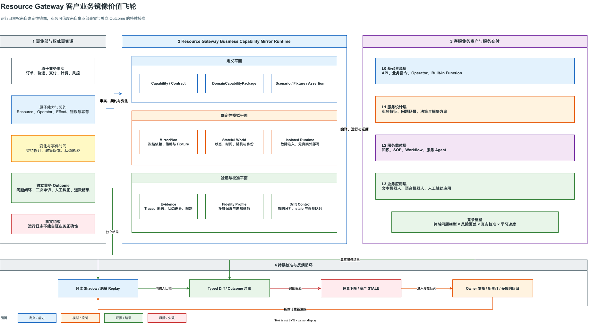
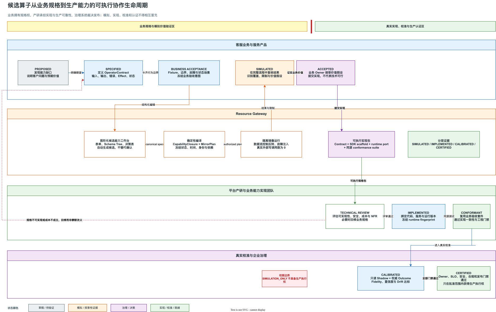

# Resource Gateway 客户业务镜像与可执行协作战略洞见

> 核心判断：客服业务的长期竞争优势，不取决于接入了多少接口，而取决于对客户业务的理解深度、
> 跨域问题的拟合保真度，以及把这种理解持续转化为可执行、可验证业务资产的能力。
> Resource Gateway 应从可视化 DAG 编排工具演进为业务能力镜像与服务演练运行时，帮助客服组织
> 脱离真实接口完成高保真设计和验证，同时通过真实业务结果持续校准模型。

| 文档属性 | 内容 |
|---|---|
| 状态 | Discussion Draft，供业务、产品、研发、架构、QA、安全与治理团队评审 |
| 目标读者 | 客服技术负责人、客服业务负责人、业务事业部能力 Owner、平台产品与研发负责人、质量与治理负责人 |
| 讨论范围 | 业务洞见、发展趋势、业务战略、技术战略、设计理念、关键技术选择、业务产研协同方式、首个验证场景 |
| 非目标 | 不把模拟结果等同于生产可用；不替代事业部事实权威；不在 Resource Gateway 内复制企业资产治理和发布审批系统 |
| 现有底座 | [业务能力镜像与保真演练方案](resource-gateway-mock.md)、[工业级可测试性演进方案](resource-gateway-industrial-testability-evolution-plan.md) |

## 1. 结论先行

这套方向真正打开的不是一个 Mock 产品市场，而是三层相互增强的战略空间。

1. **业务战略空间**：客服组织可以把对客户业务的理解沉淀为可独立运行的客户业务模型，不再把每次服务设计和流程验证都绑定在事业部接口、测试环境和即时协同上。
2. **组织协作空间**：业务人员可以先定义候选算子、正确性场景和完整服务流程，用可执行证据证明价值；产研随后实现真实运行逻辑，并复用同一套验收资产验证实现一致性。
3. **技术平台空间**：Resource Gateway 从 API 接入和 DAG 编排底座，演进为 `Business Capability Mirror Runtime`，负责业务能力投影、确定性模拟、场景演练、证据生成和保真度观测。

这三层必须同时成立。只有模拟能力，没有真实结果校准，会积累错误认知；只有技术协议，没有业务人员可运营的工作台，会再次退化为研发工具；只有业务自由定义，没有生产边界和治理门禁，会把模拟成功误当成生产可靠。

建议冻结以下战略定位：

> **Resource Gateway 是客户业务能力的可执行规格、确定性镜像和正确性证据运行时。**
> **Graph 是执行投影，不是最高层业务资产；`DomainCapabilityPackage` 才是业务人员经营和组织复用的一等对象。**

## 2. 业务洞见

### 2.1 客服竞争的上限由业务拟合能力决定

单纯接入事业部 API 不形成长期壁垒。相同接口可以被多个内部团队或外部服务商接入，真正难以复制的是客服组织长期积累的以下认知：

- 哪些分散事实共同构成一个客户问题；
- 不同业务状态、城市政策、用户身份和历史动作如何改变处置策略；
- 多个事业部事实冲突或缺失时如何诊断；
- 什么解决方案能够真正关闭客户问题，而不只是让接口返回成功；
- 哪些少见路径具有高损失、高投诉或高合规风险；
- 什么沟通方式能够在正确执行之外形成客户可理解、可接受的结果。

因此，客服服务能力更接近乘法模型，而不是简单相加：

```text
客服服务能力上限
  = 业务状态还原能力
  × 处置决策正确性
  × 解决动作执行可靠性
  × 沟通适配能力
  × 结果闭环与学习速度
```

任何一项明显偏低，都会限制整体服务水平。Resource Gateway 主要提升前三项，并通过 Outcome 校准提升第五项；沟通技巧和多轮交互验证则需要在 L2、L3 服务载体中与业务能力镜像结合。

### 2.2 事业部拥有原子事实，客服拥有跨域问题模型

“解决能力来源于事业部”只对原子事实和原子动作成立。

| 责任主体 | 主要拥有的事实或能力 |
|---|---|
| 订单、地图、支付、风控等事业部 | 局部业务事实、局部规则、原子查询和原子操作 |
| 客服业务 | 跨域问题定义、事实冲突处理、客户视角诊断、解决方案组合、服务结果判断 |
| Resource Gateway | 把原子能力和跨域模型编译为可运行、可测试、可产出证据的执行闭包 |
| 企业治理平台 | 资产注册、Owner、审批、发布门禁、合规和生产权限 |

以“乘客取消费申诉”为例，订单、司机到达轨迹、乘客定位、取消时间、计费规则、支付状态、风控标签和城市政策分别属于不同领域。没有任何单一事业部天然拥有“客户为什么被收取取消费，以及应该如何解决”这一完整模型。客服组织对这些事实的组合、解释和处置，才是不可直接复制的跨域业务资产。

### 2.3 脱离真实接口运行，不等于脱离真实业务真值

客服组织需要获得运行自主权，而不是切断与真实业务的事实联系。

正确的目标状态是：

```text
日常设计与回归：依靠隔离的业务镜像独立完成
周期性校准：通过脱敏回放、只读 Shadow 和权威 Outcome 对齐真实行为
发现漂移：使相关契约、Fixture、场景和证据自动失效或降级
完成修复：经业务 Owner 复核后发布新修订
```

未经校准的 Fixture 数量不是壁垒。可持续壁垒来自覆盖、保真、校准、更新和治理的乘积：

```text
业务镜像壁垒
  = 场景覆盖广度
  × 行为保真度
  × 结果校准质量
  × 漂移修复速度
  × 业务 Owner 的持续投入
```

### 2.4 业务验证数据是认知资产，不是测试附件

传统测试数据通常围绕一次项目交付建立，项目结束后缺乏 Owner、适用范围、更新机制和真实结果校准。Resource Gateway 应把验证数据升级为正式业务资产：

- 绑定明确的业务场景和适用人群；
- 绑定 exact 契约、策略、状态模型和算子修订；
- 区分真实录制、Owner 指定、推断生成和边界合成等来源；
- 记录数据权利、脱敏、保留和删除策略；
- 通过真实 Outcome 评估其是否仍能代表目标业务；
- 在依赖变化后自动标记 `STALE`，不能静默继续签发高等级证据。

业务人员积累的不是“样例 JSON”，而是对客户问题空间的结构化认知。

## 3. 发展趋势分析

以下判断属于本方案的战略推演，需要通过首个业务域验证，而不是作为无条件成立的市场事实。

### 3.1 从接口集成转向可执行客户业务模型

接口集成解决“能否调用”，客户业务模型解决“何时调用、为何调用、调用后业务世界如何变化、结果是否真正解决问题”。随着基础 API 接入逐渐标准化，价值将向跨域语义、状态模型、异常分布和结果校准迁移。

### 3.2 从项目式验收转向持续业务演练

服务流程、SOP、Agent 和机器人不应只在发布前进行一次验收。业务策略、接口、城市政策、风险规则和客户结构持续变化，要求关键服务能力能够按变更影响范围持续回归，并保留可审计证据。

### 3.3 从需求文档协作转向可执行规格协作

自然语言需求适合表达目标和背景，但不适合独立承担边界、错误、状态、副作用和验收语义。未来更高效的业务产研协作方式，是由业务人员提交能够运行的候选能力规格和场景，产研将真实实现绑定到同一规格上。

### 3.4 生成式 AI 会降低建模门槛，但不会替代确定性门禁

AI 可以从自然语言、DSL、接口样例和历史轨迹生成候选 Schema、Fixture、场景和断言，但 AI 不能创造不存在的业务事实，也不能自行批准高风险副作用。候选生成必须与确定性编译、人审、证据和发布门禁分离。

### 3.5 竞争维度将从人力单价转向业务学习速度

低价竞争可以压缩单次服务成本，但难以建立跨域业务理解。能够更快发现认知缺口、更快验证服务设计、更高覆盖地回归复杂路径，并用真实结果修正模型的客服组织，会形成更难复制的服务质量和迭代速度。

## 4. 业务战略

### 4.1 战略目标

客服组织应把“客户业务拟合能力”建设为可度量、可运营的核心能力，并形成以下目标状态：

1. 关键客户问题都有明确的 `DomainCapabilityPackage`。
2. 每个包都能在不触达真实外部副作用的环境中独立运行。
3. L0 至 L3 的契约、场景和正确性证据可以逐层闭合。
4. 业务变更可以定位到受影响算子、场景、解决方案和服务载体。
5. 低保真、未知和未覆盖范围被明确表达，不用“运行成功”掩盖认知缺口。
6. 模拟结果通过真实业务 Outcome 持续校准。

### 4.2 业务资产分层

| 层级 | 核心业务资产 | 典型契约 | 主要验证方式 | 业务 Owner |
|---|---|---|---|---|
| L0 基础资源层 | API、业务指令、原子算子、Built-in Function | 输入、输出、错误、副作用、幂等、权限 | Schema、Operator 单元、协议回放、故障测试 | 事业部能力 Owner 与平台研发 |
| L1 服务设计层 | 业务参数、业务特征、业务场景、问题定义、解决方案 | 场景前置、状态、决策、期望处置 | 决策表、状态迁移、场景和属性测试 | 客服业务专家 |
| L2 服务载体层 | 知识、SOP、Workflow、服务 Agent | 旅程、策略、工具使用、升级与沟通约束 | 端到端服务演练、策略合规、工具调用序列 | 服务产品与运营 |
| L3 业务应用层 | 文本机器人、语音机器人、人工辅助应用 | 渠道输入输出、会话状态、降级和体验约束 | 多轮交互、渠道兼容、压力、降级和线上观察 | 渠道产品与应用研发 |

Graph 可以作为各层资产的统一执行投影，但不能抹掉层级语义。业务人员应看到“取消费申诉解决能力”，而不是只看到一张匿名 DAG。

### 4.3 业务价值飞轮



图源：[resource-gateway-customer-business-mirror-value-loop.drawio](assets/drawio/resource-gateway-customer-business-mirror-value-loop.drawio)。

该飞轮有两个事实源。事业部提供原子事实、能力契约和变更信息；独立 Outcome 源提供客户问题是否真正解决的结果。Resource Gateway 不能使用自身运行日志证明业务正确性。

### 4.4 建立业务域组合，而不是堆积孤立 Graph

建议以客户问题域组织资产组合，例如取消费申诉、计价争议、重复扣款、失物找回、司机服务投诉等。每个业务域组合包含：

- 场景分类与风险分层；
- 依赖的 L0 能力闭包；
- 状态、时间、身份、策略和副作用模型；
- 解决方案、SOP、Agent 和渠道引用；
- 风险加权覆盖分母；
- Fidelity 与 Outcome 定义；
- Owner、生命周期和变更影响关系。

## 5. 业务与产研协作战略

### 5.1 从需求提交转向能力共创

过去的协作链路通常是：

```text
业务提出需求 → 产研理解和排期 → 开发 → 联调 → 业务验收 → 暴露偏差 → 返工
```

新的协作链路是：

```text
业务发现能力缺口
  → 定义候选算子契约
  → 建立 Fixture 与业务验收套件
  → 在完整流程中模拟运行
  → 用证据验证业务价值
  → 产研评估并绑定真实实现
  → 复用原验收套件进行一致性验证
  → Shadow 校准
  → 通过治理门禁后进入生产
```

这相当于把 Contract First、Outside-in TDD 和 Consumer-driven Contract 转化为业务人员可操作的产品能力。

### 5.2 规格权与执行权必须分离

业务人员可以拥有以下权利：

- 定义业务目标、候选输入输出和适用场景；
- 定义期望错误、状态变化和处置结果；
- 建立 Fixture、边界案例和业务验收套件；
- 在隔离镜像中复用候选算子并验证服务流程；
- 基于运行证据提交实现诉求和价值说明。

业务规格通过不意味着获得以下权利：

- 绑定生产代码、凭据或网络出口；
- 声明性能、安全、容量和合规已经达标；
- 将 `SIMULATED` 提升为 `PRODUCTION_READY`；
- 用 Mock 结果替代真实实现一致性测试；
- 用内部运行日志替代权威 Outcome。

因此应冻结一条组织不变量：

> **业务拥有候选能力的业务规格权；产研拥有运行实现与生产可靠性责任；治理系统拥有发布裁决权。**

### 5.3 可执行协作生命周期



图源：[resource-gateway-executable-capability-collaboration-lifecycle.drawio](assets/drawio/resource-gateway-executable-capability-collaboration-lifecycle.drawio)。

生命周期中 `SIMULATED` 与 `IMPLEMENTED` 之间存在明确隔离边界。前半段回答“业务上是否值得做、期望行为是否清楚”，后半段回答“技术上是否被正确实现、是否可以安全运行”。

## 6. 技术战略

### 6.1 目标定位

Resource Gateway 应定位为 `Business Capability Mirror Runtime`，负责：

1. 将 Resource、Operator、Built-in Function 和 Graph 投影为版本化 Capability。
2. 将契约、状态、Fixture、场景和执行服务编译为确定性 MirrorPlan。
3. 在不触达真实外部副作用的环境中执行 Operator、DAG 和完整服务流程。
4. 生成节点、边、状态、断言、Fixture 消费和限制信息完整的证据。
5. 组织 Scenario rehearsal、Shadow comparison 和 Fidelity observation。
6. 为画布、REST、Java/JUnit、CLI、CI 和 VS Code 提供同源运行协议。

Resource Gateway 不负责：

- 成为企业资产 Registry 的最终权威源；
- 独立决定生产发布；
- 保存未经授权的原始客户 Payload；
- 替业务 Owner 判断客户问题是否真正解决；
- 用一个综合分数掩盖保真度分量和未知范围。

### 6.2 总体技术边界

| 平面 | Resource Gateway 责任 | 关键产物 |
|---|---|---|
| Authoring Plane | 图形化定义契约、候选算子、Graph、Fixture 和场景 | `CapabilityProposal`、`OperatorContract`、`GraphDraft`、`ScenarioPack` |
| Compilation Plane | 解析依赖闭包，冻结状态、时间、随机、身份、策略和 Fixture | `CapabilityClosure`、`MirrorPlan`、`EffectiveExecutionPlan` |
| Simulation Plane | 隔离执行、数据流控制反转、有状态业务世界、故障注入 | `MirrorSession`、运行记录、状态变化和 resolver 结果 |
| Evidence Plane | 断言求值、Trace、内容指纹、签名和可回放引用 | `TestRunEvidence`、`ScenarioEvidence`、Workbook seed |
| Calibration Plane | Shadow 差异、Fidelity 向量、Outcome 对账和漂移传播 | `DomainFidelityProfile`、Drift event、校准结论 |

ANEKE 或等价治理系统负责 Registry、Owner、正确性工作簿、发布门禁和企业审批；TEE 或受控数据面负责敏感 Payload、状态和密钥驻留。

## 7. 领域模型

### 7.1 `DomainCapabilityPackage` 是业务一等对象

```text
DomainCapabilityPackage
├── domainId / problemTaxonomy / riskClass
├── inputContract / outputContract
├── capabilityClosure
├── stateModel / effectModel
├── scenarioInventory / fixtureRefs / assertionRefs
├── solutionRefs / carrierRefs / channelRefs
├── fidelityInventory / outcomeDefinitionRefs
├── owner / scope / lifecycle / provenance
└── compiledGraphRefs / evidenceRefs
```

`DomainCapabilityPackage` 是业务人员经营、评审和复用的单位。Graph、MirrorPlan 和测试计划是它在不同运行环境中的可执行投影。

### 7.2 `CapabilityProposal` 表达尚未实现的业务能力

```text
CapabilityProposal
├── businessGoal / expectedValue / applicableScenarios
├── OperatorContract
│   ├── inputSchema / outputSchema / errorContract
│   ├── effectContract / stateTransition
│   ├── idempotency / retry / timeout
│   └── permission / dataClassification / SLOExpectation
├── FixturePack
├── BusinessAcceptanceSuite
├── candidateGraphRefs
├── owner / expiry / limitations
└── runtimeBindingRef，可为空
```

输入输出 Schema 不足以定义业务能力。副作用、错误、幂等、状态迁移、权限和超时语义必须进入候选规格，否则业务模拟可能跑通，但真实实现仍不可定义。

### 7.3 候选能力生命周期

| 状态 | 进入条件 | 允许行为 | 明确禁止 |
|---|---|---|---|
| `PROPOSED` | 已说明业务缺口和 Owner | 编辑候选规格 | 共享为稳定能力 |
| `SPECIFIED` | 契约、限制和验收场景完整 | 加入候选 Graph | 声称已实现 |
| `SIMULATED` | 镜像流程和业务断言通过 | 形成价值证据、申请实现 | 生产绑定和高等级证据 |
| `ACCEPTED` | 业务 Owner 与产品接受价值假设 | 进入产研实现队列 | 绕过技术可行性评审 |
| `IMPLEMENTED` | 已绑定具体实现和版本 | 运行一致性测试 | 直接发布生产 |
| `CONFORMANT` | 原业务验收套件和实现测试通过 | 进入 Shadow | 声称已完成真实结果校准 |
| `CALIBRATED` | Shadow 与 Outcome 门槛满足 | 申请生产发布 | 绕过安全、容量和审批门禁 |
| `CERTIFIED` | 治理、SLO、安全和发布门禁全部通过 | 在批准范围内生产执行 | 超范围、超版本或过期运行 |
| `STALE/REVOKED` | 契约、实现、策略或事实漂移 | 修订、复验或回滚 | 继续签发当前证据 |

## 8. 设计理念与不可破坏的不变量

1. **可执行规格优先于自然语言细节。** PRD 仍表达目标和背景，契约、场景和断言负责表达可验收行为。
2. **模拟成功不等于实现成功。** `SIMULATED` 只能形成探索性业务证据。
3. **实现成功不等于客户问题解决。** 只有独立 Outcome 能证明服务结果。
4. **Graph 是执行投影，不是业务主模型。** 业务语义不能被匿名节点和连线替代。
5. **逐层可测试，不允许低层证明替代高层证明。** Operator 通过不能自动证明 DAG、解决方案、Agent 或渠道正确。
6. **数据流控制反转。** 测试调用方可以冻结外部数据、时间、随机、身份、Feature Flag 和故障，但控制字段不能进入生产请求。
7. **状态是一等事实。** 涉及退款、补偿、订单变化和多轮服务的场景必须验证状态转移，不允许只比较最终输出。
8. **未知必须可表达。** 无匹配、低置信度、覆盖缺口和无法判断必须返回 `ABSTAINED` 或 `INDETERMINATE`。
9. **资产不可变修订和内容寻址。** 契约、Fixture、场景、计划和证据必须能够精确回放和识别漂移。
10. **完整企业作用域。** tenant、organization、project、environment 和 region 不能退化为单租户 ID。
11. **生产隔离是物理边界。** Mirror runtime 不具备真实写凭据和生产网络出口，不能只依赖请求参数声明测试模式。
12. **AI 只生成候选。** AI 不批准副作用、不生成不存在的业务事实、不替代 Owner 和确定性门禁。

## 9. 具体技术方向选择

| 决策点 | 推荐选择 | 选择理由 | 不采用的方向 |
|---|---|---|---|
| 最高层业务对象 | `DomainCapabilityPackage` | 保留业务域、场景、状态、解决方案和结果语义 | 仅以 Graph 为资产，业务语义会退化为拓扑 |
| 未实现能力表达 | `CapabilityProposal + SIMULATION_ONLY RuntimeBinding` | 支持先验证业务价值，再投入实现 | 先开发后验证，继续保留“先有鸡还是先有蛋”问题 |
| 能力契约 | Typed contract + Effect + State + Error + Idempotency | 输入输出不足以约束真实业务行为 | 只定义 JSON Schema，容易形成假绿 |
| 模拟运行 | 独立 MirrorPlan 和隔离执行根 | 能冻结完整依赖并物理阻止真实副作用 | 在生产 run request 中增加 `testMode`，存在误用风险 |
| 外部依赖控制 | Fixture resolver chain + data-flow inversion | 调用方可控制数据来源、顺序、次数、故障和状态 | 在 DSL 中临时替换 Mock Operator，语义容易漂移 |
| 组合测试 | Operator micro-graph + Subgraph + Graph + Scenario + Channel 分层 | 组合层问题不能由节点测试推出 | 只验证 Operator 或只验证最终 Graph output |
| 保真度 | 多维 Fidelity vector + confidence + abstention debt | 不同风险需要不同维度，单分数会掩盖未知 | 用综合分数作为唯一发布门禁 |
| 真实校准 | Read-only Shadow + authoritative Outcome | 运行日志不能自证正确性 | 仅根据历史调用频率归纳业务正确性 |
| 业务产研交付 | 生成 SDK scaffold、runtime port 和同源 conformance suite | 保留业务验收意图，减少二次翻译 | 产研重新手写另一套测试和验收标准 |
| 治理边界 | Resource Gateway 输出事实，ANEKE 决定发布 | 保持 authoring/runtime 与企业治理职责清晰 | 在 Resource Gateway 复制 Registry 和审批系统 |

### 9.1 分层测试模型

| 测试层 | 回答的问题 | 典型证据 |
|---|---|---|
| Schema Contract Test | 数据形状是否合法 | Schema assertion、compatibility diff |
| Operator Executable Test | 单个实现是否满足契约 | input/output/error/effect evidence |
| Subgraph Component Test | 局部组合、fallback 和状态是否正确 | node/edge trace、state diff |
| Graph Contract Test | 完整解决逻辑是否正确 | graph output、依赖和覆盖证据 |
| Scenario Rehearsal | 业务世界、时间、故障和处置是否正确 | Scenario assertion、state transition、handling result |
| Service Carrier Test | SOP、Agent 和工具使用序列是否正确 | journey、policy、tool-call evidence |
| Channel Test | 文本、语音和人工辅助交互是否满足约束 | 多轮会话、降级和体验指标 |
| Shadow/Outcome | 模拟是否拟合真实业务 | typed diff、Fidelity observation、Outcome closure |

### 9.2 业务工作台方向

业务工作台应提供以下主路径，而不是要求业务人员编辑原始 Schema 或 DSL：

1. 在画布中发现缺失能力，选择“创建候选算子”。
2. 使用业务语言填写“输入什么、期望得到什么、会改变什么”。
3. 系统生成 Schema、错误、状态和边界候选，业务逐项确认。
4. 通过表格维护正常、异常、边界、回归、故障和状态迁移案例。
5. 将候选节点以明显的 `仅模拟` 状态加入 Graph。
6. 运行完整流程，查看覆盖、首个根因、限制和业务价值证据。
7. 选择“提交实现”，自动生成能力说明、SDK scaffold、runtime port 和验收套件。
8. 实现绑定后展示模拟与实现的结构化 Diff，不重新发起模糊验收。

### 9.3 契约与正确性工作台的完整操作模型

业务人员需要看到一条连续任务流，但底层对象不能被合并成一份含混 JSON。工作台必须明确区分：

| 对象 | 回答的问题 | 修改时机 | 不得混入 |
|---|---|---|---|
| Contract | 什么输入、输出和行为是合法的 | 接口或能力语义变化 | 某次运行的样例值 |
| Binding | 字段在运行时从哪里获得 | Graph 连线或 Context 绑定变化 | 业务正确答案 |
| Fixture | 本次测试运行处于什么业务世界 | 创建或维护 Scenario case | 稳定接口定义 |
| Assertion | 什么结果、状态和副作用才算正确 | 业务预期变化 | 实际运行结果 |
| Evidence | 哪组冻结修订在何种限制下证明了什么 | 每次受控运行后生成 | 可继续编辑的测试输入 |

#### 9.3.1 契约定义视图

契约视图同时呈现三个层级，但分别保存和版本化：

1. **Graph Contract**：定义完整服务流程的入口和出口，是系统集成方消费的稳定接口。
2. **Operator Contract**：定义最小业务能力的 input/output、error、effect、state、idempotency 和权限语义。
3. **Effective Contract**：并排展示 declared、inferred、bound 和 observed；推断与观测只能作为候选，不能静默改写 authored contract。

以 `resolveCancellationFee` 为例，输入至少包括 `tripId`、事件时间、司机到达事实和支付状态；输出包括 `decision`、`refundAmount`、`reasonCode` 和 `confidence`。同时还需要定义：

| 语义 | 示例 | 业务意义 |
|---|---|---|
| Error | `FACT_UNAVAILABLE`、`POLICY_UNKNOWN` | 未知不会被压成空值或默认否定 |
| Effect | `READ_ONLY` | 决策算子不能越权直接退款 |
| State | `APPEAL_OPEN -> DECIDED` | 正确输出还需要正确状态迁移 |
| Idempotency | `tripId + appealId` | 重试不能导致重复处置 |

工作台需要用字段表单、Schema Tree、枚举和语义选择器生成规范定义；原始 Schema 只作为高级编辑和导入出口。保存前应显示兼容性影响、未绑定字段、推断字段和 observed 候选。

#### 9.3.2 正确性验证数据视图

正确性工作从“场景分母”开始，而不是从“新增一行测试”开始。业务 Owner 先维护正常、异常、边界、回归、故障、状态和策略漂移等风险分类，再为其中的具体场景建立 Case。

表格中的每一行都应稳定表达：

| Case | Type | Given / Fixture | When | Expected / Assertion | Coverage |
|---|---|---|---|---|---|
| 司机已到达并等待达标 | `golden` | 距离 30m、等待 6 分钟 | 解析取消费 | `KEEP / LEGITIMATE_FEE` | 错误退款 |
| 司机未到达 | `negative` | 距离 1.8km、等待 0 分钟 | 解析取消费 | `REFUND / DRIVER_NOT_ARRIVED` | 错误归责 |
| 地图定位事实冲突 | `boundary` | 距离 1.2km、GPS 置信度 0.38 | 解析取消费 | `ESCALATE / FACT_CONFLICT` | 未知被当成否定 |
| 支付已冲正 | `regression` | `paymentState=REVERSED` | 准备退款 | 不调用退款、返回 `ALREADY_REVERSED` | 重复退款 |
| 地图依赖超时 | `negative/fault` | `queryArrival=TIMEOUT` | 解析取消费 | `ABSTAIN / FACT_UNAVAILABLE` | 故障假绿 |

选中一行后，编辑器按三列组织数据：

1. **Given**：调用入口、Context、事件时间、身份和初始状态。
2. **Dependency Fixtures**：每个受控依赖的返回、错误、延迟、状态变化、调用次数和消费顺序。
3. **Expected**：Graph output、节点输入输出、错误、状态迁移、副作用次数和治理预期。

Schema 可以生成可编辑样例，字段来源和枚举使用图形化控件；复杂对象仍保留结构化 JSON 编辑，但必须同步提供路径、类型、约束和校验错误。Fixture 必须引用精确 Contract revision，Contract 漂移后自动标记 stale。

#### 9.3.3 运行证据视图

运行视图首先显示隔离事实，而不是只给出绿色结果：当前是否为 Mirror runtime、真实外部写次数、冻结的 Graph/Contract/Scenario/Fixture/MirrorPlan 修订，以及哪些节点由 Fixture 控制。

结果区分四个信任维度：

| 维度 | 回答的问题 |
|---|---|
| Execution | Graph 是否按计划完成，哪些节点成功、失败、超时、跳过或被 Mock |
| Assertions | 输出、错误、状态、副作用和治理断言是否通过 |
| Contract | 运行是否对应精确契约，是否存在兼容性或指纹漂移 |
| Calibration | 结果是否与只读 Shadow 和独立 Outcome 对账 |

Node Trace 需要按首个根因组织，不让最终输出掩盖上游故障。Evidence Bundle 至少引用 `runId`、各对象 fingerprint、node/edge trace、assertion results、state diff、mock 标记、限制、耗时和证据等级。

`SIMULATED` 只证明业务期望已被表达并可在受控世界中运行；绑定实现并通过同源套件后才能成为 `IMPLEMENTED/CONFORMANT`，完成 Shadow 与 Outcome 校准后才能成为 `CALIBRATED`。工作台必须始终显示当前等级尚不能证明的内容。

#### 9.3.4 端到端操作顺序

1. 选择业务问题、Outcome、风险和 Owner。
2. 定义 Graph input/output contract。
3. 补齐能力闭包中每个 Operator 的错误、副作用、状态和幂等语义。
4. 建立风险加权 Scenario inventory，并识别未覆盖分支。
5. 从 Schema 生成首份 Case，编辑 Given、Dependency Fixtures 和 Expected Assertions。
6. 运行单行、选中行或受影响集合，读取首因、Trace、状态差异和限制。
7. 保存不可变 Scenario/Fixture revision，并将 Evidence 绑定到精确指纹。
8. 实现绑定后复用原套件做 conformance；真实校准后更新 Fidelity、Drift 和 stale 状态。

## 10. 第一个验证场景：乘客取消费申诉

### 10.1 选择理由

“乘客取消费申诉”适合作为首个纵向切片，因为它同时具备以下特征：

- 涉及订单、地图、司机、乘客、计费、支付、风控和城市政策等多个业务域；
- 既有查询，也可能包含退款、补偿和工单等副作用；
- 存在时间、定位、状态、规则版本和数据缺失问题；
- 具有清晰的客户问题和可观察 Outcome；
- 能贯穿 L0 资源、L1 服务设计、L2 服务载体和 L3 文本机器人；
- 风险可控，适合先在隔离环境验证，再逐步进入只读 Shadow。

### 10.2 L0 能力闭包

首批原子能力建议覆盖：

| 能力 | 关键输入 | 关键输出或 Effect |
|---|---|---|
| 查询行程 | orderId、用户身份 | 行程状态、司机、乘客、时间和城市 |
| 查询取消事件 | orderId | 取消方、取消时间、原因和状态轨迹 |
| 查询司机到达事实 | orderId、时间窗口 | 到达时间、距离、等待时长、定位置信度 |
| 查询计费明细 | orderId、policyVersion | 取消费金额、计费项、规则命中 |
| 查询支付状态 | paymentId | 扣款、退款、冲正和重复支付状态 |
| 查询风险标签 | userId、orderId | 可公开的决策标签和限制，不暴露敏感模型细节 |
| 计算适用政策 | city、eventTime、用户和订单特征 | 适用规则、版本、允许处置集合 |
| 创建退款或补偿 | orderId、amount、reason、idempotencyKey | 事务回执、状态变化和失败语义 |
| 创建或更新工单 | customerProblem、evidenceRefs | 工单 ID、状态和后续责任人 |

若部分能力尚未存在，可以先作为 `CapabilityProposal` 进入候选流程，由 Fixture 驱动模拟运行。

### 10.3 L1 场景分母

第一版不以“写了多少 Case”为完成标准，而应先冻结风险加权场景分母：

| 场景 | 主要分支 | 关键验证 |
|---|---|---|
| 合法收取取消费 | 司机已到达且等待达到规则 | 正确解释，不错误退款 |
| 司机未到达 | 到达事实不成立 | 免除或退还取消费 |
| 定位漂移 | 位置证据冲突或置信度不足 | 不武断归责，转入补充判断或人工 |
| 司机主动取消 | 取消方为司机 | 不向乘客收取取消费 |
| 重复扣费 | 多笔支付记录指向同一费用 | 幂等退款和重复请求保护 |
| 支付已冲正 | 上游已经自动退款 | 不重复退款，解释到账时间 |
| 城市特殊规则 | 机场、车站或当地政策差异 | 使用事件时间对应的规则版本 |
| 恶劣天气或平台异常 | 特殊豁免策略生效 | 适用正确补偿和解释策略 |
| 风控限制 | 退款能力受策略限制 | 不泄露敏感规则，正确升级人工 |
| 数据部分缺失 | 地图、支付或订单信息不可用 | 明确降级，不把未知当成否定 |
| 外部依赖超时 | 查询或写入超时、重试 | 区分未执行、未知提交和已提交 |
| 策略版本漂移 | 规则在事件后发生变化 | 按事件时间回放，旧证据自动 stale |

### 10.4 L2、L3 服务验证

L2 需要验证完整解决方案，而不只是退款算子：

- 是否完成事实收集、责任判断、政策选择和解决动作；
- 是否在证据不足时正确拒答或升级人工；
- 是否避免重复退款、越权补偿和敏感信息泄露；
- 是否根据不同结论生成一致、可解释的客户沟通内容；
- 是否将后续责任、承诺和工单状态写回服务上下文。

L3 首先选择文本机器人，验证多轮补充信息、工具调用、结果解释、人工升级和会话恢复。语音机器人在业务语义闭合后再加入语音识别、打断、静默和延迟等渠道变量，避免首个切片同时引入过多不确定性。

### 10.5 验证成功标准

首个切片不以“页面可演示”作为成功标准，而以以下事实是否成立作为退出条件：

1. 业务人员不编辑 DSL，也能创建或修改至少一项候选算子规格和验收案例。
2. 在所有真实外部写出口关闭的情况下，L0 至 L3 候选流程可以确定性运行。
3. 模拟结果、实现结果和生产校准结果在产品中被明确分级，不能相互冒充。
4. 业务人员能够解释场景分母、未覆盖范围和首个失败根因。
5. 产研可以从候选算子生成实现接口和一致性测试，并在不重写验收语义的情况下绑定实现。
6. 至少一种只读真实事实和一种独立 Outcome 能进入校准闭环。
7. 任一依赖契约或政策版本变化后，受影响场景和证据能够自动失效并进入修复队列。

## 11. 分阶段演进路径

### Stage A：战略与领域语义冻结

- 冻结 `DomainCapabilityPackage`、`CapabilityProposal` 和规格权/执行权边界。
- 确定取消费申诉的业务 Owner、事业部事实 Owner、Outcome Owner 和数据权利边界。
- 建立风险加权场景分母，避免先写 Case 再解释覆盖率。

### Stage B：候选能力与业务自验证

- 提供“创建候选算子”图形化流程。
- 支持 `SIMULATION_ONLY` 节点、Fixture 表格、决策表、状态迁移和完整流程试跑。
- 输出业务价值证据、限制和未覆盖范围，不签发生产就绪结论。

### Stage C：产研绑定与一致性验证

- 从候选规格生成 runtime port、SDK scaffold 和 conformance suite。
- 绑定真实实现，复用业务验收套件进行 Operator、Subgraph 和 Graph 验证。
- 对模拟与实现差异进行 typed diff，由业务和产研共同裁决规格或实现问题。

### Stage D：Shadow 与 Outcome 校准

- 接入获授权的只读 Shadow 数据源和事件时间规则。
- 接入取消费申诉的权威或明确标注的代理 Outcome。
- 生成 Fidelity vector、置信区间、abstention debt 和 drift 事件。

### Stage E：跨域规模化

- 复制方法到计价争议、重复扣款、失物找回和司机服务投诉等业务域。
- 建立跨域能力复用、变更影响、场景任务分派、SLA 和 Owner 运营机制。
- 用领域成熟度和真实结果改善评估复用价值，而不是用 Graph、Fixture 或 Case 数量评估产出。

## 12. 度量体系与可证伪假设

### 12.1 核心度量

| 维度 | 建议指标 | 防止被错误优化的约束 |
|---|---|---|
| 业务自主性 | 无真实接口可完成的设计和回归比例 | 必须同时报告最近真实校准时间和保真限制 |
| 协作效率 | 从能力缺口到可执行规格、从接受到实现一致的周期 | 不把排队等待从一个团队转移到另一个团队 |
| 需求质量 | 实现前被验证、修改或取消的候选能力比例 | 不能以“取消少”证明需求质量高 |
| 交付一致性 | 实现首次通过业务验收套件的比例、语义 Diff 数量 | 业务规格错误和实现错误必须分开统计 |
| 业务覆盖 | 风险加权场景、状态迁移、错误和策略覆盖 | Case 数量不能作为覆盖率分母 |
| 保真度 | Behavior、Contract、Effect、Error、State、Request Space、Outcome 分量 | 禁止用单一总分掩盖低保真维度 |
| 运营健康 | Drift 发现到修复时间、stale debt、abstention debt | 不允许通过删除难例降低债务 |
| 业务结果 | 错误处置、重复退款、升级人工、二次申诉等变化 | 代理指标不得冒充权威 Outcome 或因果结论 |

### 12.2 可证伪假设

| 假设 | 需要观察的事实 | 失败信号 |
|---|---|---|
| 业务人员能够生产可执行规格 | 独立完成候选算子和场景的比例、求助类型 | 大多数任务仍由研发代写 Schema、DSL 和 Fixture |
| 可执行规格降低协作摩擦 | 澄清轮次、返工和首次验收通过情况 | 流程增加了文档工作，但没有减少误解和返工 |
| 镜像演练提升服务正确性 | 新发现的边界缺陷、线上逃逸和错误处置变化 | 只增加测试数量，没有发现组合或状态问题 |
| 真实校准能够控制模型漂移 | stale 发现、修复和 Shadow 差异趋势 | 模拟长期全绿，但真实差异和 Outcome 不改善 |
| 业务资产能够跨载体复用 | 同一场景和能力被 SOP、Agent、机器人复用的比例 | 每个渠道继续维护独立事实和独立测试 |

首个业务域建立基线后再冻结目标值。当前不应凭空承诺百分比或周期。

## 13. 主要风险与根治方向

| 风险 | 表象 | 病根 | 根治方向 |
|---|---|---|---|
| Fixture 假繁荣 | 用例很多、运行全绿 | 没有覆盖分母、真实校准和 stale 传播 | 风险加权 inventory、Fidelity 与 Outcome 闭环 |
| 候选算子泛滥 | 大量重复或冲突能力 | 缺少领域分类、Owner、搜索和复用门槛 | 语义去重、影响分析、有效期和治理注册 |
| 业务过度承诺技术能力 | 模拟可运行但无法安全实现 | 业务规格与技术可行性未分层 | `ACCEPTED` 前后引入技术评审，保持状态诚实 |
| 产研重新解释规格 | 实现后另建测试和验收文档 | 候选规格不可生成接口或 conformance suite | 同源生成 runtime port、SDK 和测试 |
| 状态与副作用失真 | 输出正确但业务世界错误 | 只建输入输出 Mock | EffectContract、SessionStateSpace、事务和幂等验证 |
| 模拟控制进入生产 | 真实请求被 Fixture 覆盖 | 依赖参数开关，没有物理隔离 | 独立 profile、身份、凭据、网络和部署隔离 |
| 业务 Owner 无法持续维护 | 初期热情高，后续 stale 堆积 | 没有任务队列、SLA 和收益反馈 | Owner 工作台、影响排序、自动候选和运营指标 |
| AI 生成错误事实 | Schema 和场景看似完整 | 将语言生成当成业务权威 | 候选状态、来源显示、确定性验证和人审 |
| 部门边界重新形成瓶颈 | 事业部不再提供实时环境，但校准长期缺失 | 组织责任只被技术转移 | 冻结周期性契约、变更和 Outcome 供给责任 |

## 14. 建议冻结的战略决策

1. Resource Gateway 的长期定位是业务能力镜像与服务演练运行时，不只是 API Gateway 或 DAG 画布。
2. `DomainCapabilityPackage` 是最高层业务资产，Graph 是可执行投影。
3. 客服拥有跨域问题模型和解决方案组合，事业部拥有原子业务事实和原子能力权威。
4. 客服可以脱离真实接口独立运行，但必须通过真实事实和 Outcome 持续校准。
5. 业务人员可以定义、运行和复用 `SIMULATION_ONLY` 候选算子，拥有业务规格权，不拥有生产执行权。
6. 产研实现必须绑定业务规格，并复用同一验收套件进行一致性验证。
7. 模拟、实现、校准和认证是四类不同证据等级，产品和协议不得混淆。
8. 第一条纵向切片选择“乘客取消费申诉”，先覆盖文本机器人，不在首轮同时引入语音变量。
9. 业务覆盖使用风险加权场景分母，不使用 Case 数量或代码覆盖率替代。
10. 保真度采用向量、置信度和未知债务，不采用单一总分作为唯一门禁。

## 15. 待评审问题

1. `DomainCapabilityPackage` 是否由客服业务域 Owner 负责，还是由服务产品 Owner 与业务专家共同负责？
2. 候选算子进入共享目录前，最小完整性门槛和语义去重责任由谁承担？
3. 事业部需要承诺提供哪些最小校准事实：契约变更、脱敏 Replay、只读 Shadow、Outcome，还是其中的分级组合？
4. “取消费申诉”的权威 Outcome 是退款交易结果、二次申诉、人工纠正、客户满意，还是分层定义？
5. ANEKE 与 Resource Gateway 对 `DomainCapabilityPackage`、候选算子和发布证据的权威边界是否沿用现有集成协议？
6. 首个验证场景允许业务人员修改到什么层级：Fixture、决策规则、候选算子契约、解决方案 Graph，还是全部开放并分级审批？

## 16. 最终判断

Resource Gateway 最深的价值不是帮助客服“更方便地调用接口”，而是把客服对客户业务的理解从人员经验、文档和项目交付物，转化为可执行、可验证、可复用和可持续校准的组织资产。

这套机制同时改变业务能力建设和产研协作：业务人员能够先在隔离世界中定义并验证新的能力需求，产研围绕已经跑通的业务规格实现可靠运行，治理系统依据分层证据决定是否进入生产。业务理解越深，场景分母越完整，真实校准越持续，这套资产的复制成本越高，客服组织与低价服务商之间的差距才会从成本差异转化为能力差异。
