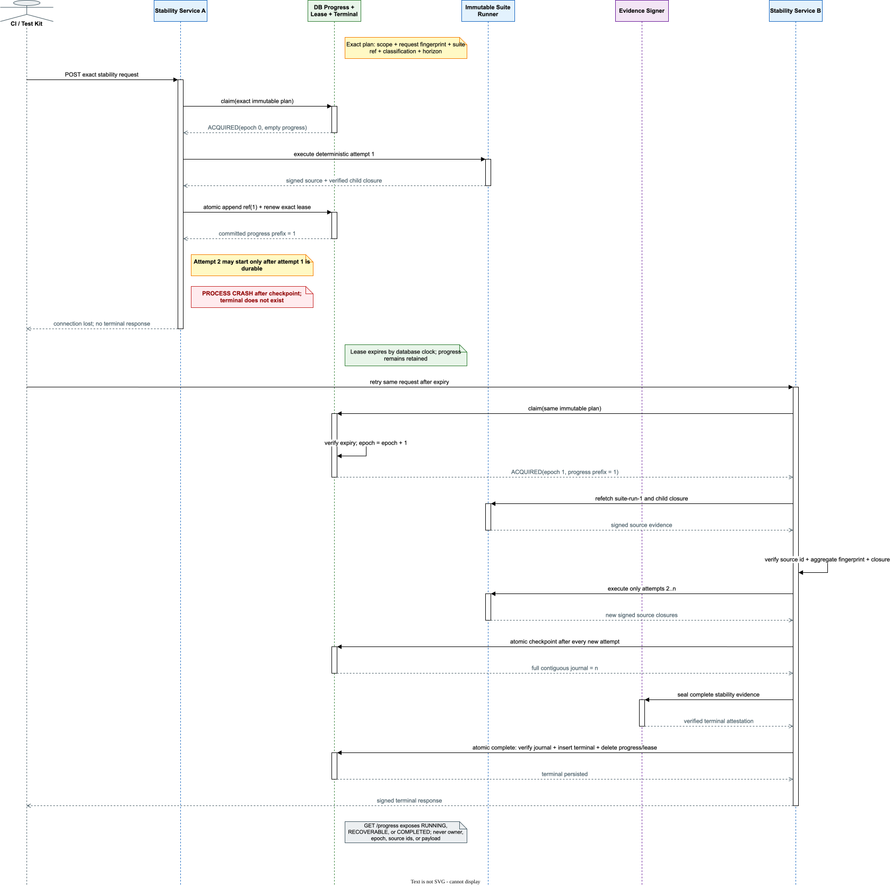

# Stage 5 suite-stability durable parent progress verification

## 1. Verified claim

Resource Gateway now persists a database-authoritative, payload-free progress journal for every
exact suite-stability parent request. A process crash no longer forces the successor to rediscover
the whole horizon from child idempotency alone:

1. claim freezes scope, request fingerprint, suite revision, classification, and planned horizon;
2. the first claim creates an empty journal and exact owner/epoch lease in one transaction;
3. every verified source suite run is appended contiguously before the next attempt may start;
4. append and exact lease renewal commit atomically under database time;
5. an expired-owner takeover receives the same journal with a successor epoch;
6. the successor refetches and verifies every journaled source and child closure;
7. only the remaining attempts are scheduled;
8. terminal insert, complete-journal validation, progress deletion, and lease deletion commit in one
   transaction;
9. an authorized public query distinguishes `RUNNING`, `RECOVERABLE`, and `COMPLETED` without
   exposing internal fences or evidence payloads.

This closes parent-prefix loss and duplicate orchestration after a committed checkpoint. It does
not yet make the endpoint asynchronous or provide a fair durable queue.

## 2. Root cause and design decision

Deterministic child idempotency was necessary but insufficient. Before this increment the parent
stored only a terminal record. After a crash, a successor had to replay the complete attempt loop
and rely on every child call converging independently. That bounded business duplication, but it did
not provide an explicit parent commit boundary, observable progress, or a durable authority for a
future queue.

An in-memory executor would hide the HTTP thread but preserve the underlying failure: process loss
would still lose queue state and parent progress. The implementation therefore establishes the
database journal first. Future asynchronous scheduling must consume this authority rather than
introduce a second in-memory truth.

## 3. Protocol flow



The editable corporate-style source is
[`docs/assets/drawio/resource-gateway-suite-stability-durable-progress.drawio`](assets/drawio/resource-gateway-suite-stability-durable-progress.drawio).

The ordering rule is strict:

> A verified attempt becomes eligible to precede another attempt only after its source reference
> and the renewed exact fence commit together.

The journal contains only `attempt`, `suiteRunId`, and signed aggregate evidence fingerprint. It
never stores fixture values, context, child input/output, credentials, secrets, or business payloads.

## 4. Persistence model and invariants

`rg_test_suite_stability_progress` stores:

- exact parent run, tenant/environment, and scoped client request identity;
- canonical request fingerprint;
- exact suite id, revision, and fingerprint;
- frozen classification and planned attempts;
- completed-attempt count plus an ordered payload-free source-reference journal;
- database creation/update time and sliding recovery expiry.

The existing 4096-stripe lock serializes progress, lease, and terminal mutations for one scoped
request. All mutations use the isolated test-runtime datasource and `REQUIRES_NEW` local
transactions.

| Operation | Required invariant | Atomic result |
| --- | --- | --- |
| first claim | no retained terminal/progress contradiction | empty progress plus epoch `0` lease |
| duplicate claim | same immutable plan, live lease | `IN_PROGRESS`; no scheduling |
| takeover | same immutable plan, expired lease, retained progress | `epoch + 1` lease plus unchanged prefix |
| checkpoint | exact live fence, retained progress, next one-based unique source | append journal plus renew lease |
| query | retained scope and caller clearance | payload-free lifecycle projection |
| complete | exact live fence, full journal exactly equal to terminal source closure | insert terminal; delete progress and lease |

The stored `completed_attempts` must equal decoded journal length. Journal attempts must be
contiguous from one, source run ids must be unique, and the journal cannot exceed the frozen
horizon. An optimistic `completed_attempts + updated_at` condition protects the exact predecessor
revision in addition to the stripe lock and owner fence.

## 5. Crash-window semantics

| Crash window | Durable state | Exact retry behavior |
| --- | --- | --- |
| before child scheduling | empty prefix | execute attempt 1 |
| during child execution, before source terminal | empty prefix | reuse deterministic child request and finish attempt 1 |
| source terminal stored, before parent checkpoint | empty prefix | child idempotency replays source; append attempt 1 |
| after attempt `i` checkpoint | prefix `1..i` | verify prefix; start only `i + 1` |
| after final checkpoint, before signing | full prefix | reconstruct all sources; sign and publish |
| during terminal publication | full prefix or terminal, never both partially consumed | transaction rolls back or terminal wins atomically |

Prefix restoration is proof reconstruction, not blind trust. For every source reference the service
requires the same suite-run id and aggregate fingerprint, terminal source attestation, and complete
authorized child evidence closure. Missing, drifted, expired, or unreadable source evidence fails
with `503 RG.TEST.STABILITY_PROGRESS_SOURCE_UNAVAILABLE`; no new attempt is scheduled.

## 6. Public progress protocol

```http
GET /api/testing/stability-executions/{stabilityRunId}/progress
Authorization: Bearer <test-runtime-token>
X-Purpose: TEST_EXECUTION
```

```json
{
  "schemaVersion": "bloge.testSuiteStabilityProgress.v1",
  "stabilityRunId": "stability-<sha256>",
  "status": "RECOVERABLE",
  "suiteRef": {
    "suiteId": "loan-decision-regression",
    "revision": 7,
    "fingerprint": "sha256:<suite-fingerprint>"
  },
  "plannedAttempts": 29,
  "completedAttempts": 11,
  "createdAt": "2026-07-18T01:02:03Z",
  "updatedAt": "2026-07-18T01:03:03Z"
}
```

| Status | Meaning |
| --- | --- |
| `RUNNING` | retained progress has a database-clock-live owner |
| `RECOVERABLE` | retained progress has no live owner; the exact request may take over |
| `COMPLETED` | signed terminal evidence exists and the progress row has been consumed |

The endpoint uses the same authenticated `TEST_EXECUTION` purpose, tenant/environment scope, and
classification clearance as terminal evidence. It omits owner id, lease epoch, source run ids,
attempt journal, fixture/context values, and payloads. It is an operational projection, not signed
release evidence.

Capability discovery advertises:

- object `testSuiteStabilityProgress = [bloge.testSuiteStabilityProgress.v1]`;
- feature `durableSuiteStabilityParentProgress=true` only when testing execution and signing are
  available;
- endpoint `GET /api/testing/stability-executions/{stabilityRunId}/progress`.

The independent test-kit exposes:

```java
TestSuiteStabilityProgress progress =
        client.findSuiteStabilityProgress(stabilityRunId);
```

It validates the packaged authoritative Schema and additionally rejects count, terminal-state, time,
or request-identity contradictions.

## 7. Failure semantics

| Condition | Public result | Safety effect |
| --- | --- | --- |
| progress differs from immutable request | `409 RG.TEST.STABILITY_IDEMPOTENCY_CONFLICT` | no scheduling |
| journal missing/contradictory at publication | `503 RG.TEST.STABILITY_PROGRESS_CONFLICT` | no terminal |
| source prefix cannot be reconstructed | `503 RG.TEST.STABILITY_PROGRESS_SOURCE_UNAVAILABLE` | no new attempt |
| atomic checkpoint ambiguous/rejected | `503 RG.TEST.STABILITY_PROGRESS_CHECKPOINT_FAILED` | no next attempt |
| exact lease expired or superseded | `503 RG.TEST.STABILITY_EXECUTION_LEASE_LOST` | stale owner cannot append/publish |
| progress store unavailable on query | `503 RG.TEST.STABILITY_PROGRESS_STORE_UNAVAILABLE` | no fabricated status |
| no retained authorized parent | `404 RG.TEST.STABILITY_PROGRESS_NOT_FOUND` | no cross-scope disclosure |

Control-plane failures never become an `INCONCLUSIVE` business sample. That would contaminate the
statistical population with infrastructure behavior and conceal an ownership failure.

## 8. Verification matrix

The focused verification covers:

- empty exact progress creation and scoped live-owner query;
- contiguous append and atomic lease renewal;
- non-contiguous append rejection with transaction rollback;
- cross-replica expiry takeover preserving the committed prefix;
- stale owner append and terminal rejection;
- incomplete-journal terminal rejection without losing recoverability;
- complete-journal terminal insertion and exact progress/lease consumption;
- service crash retry that executes attempts `1,2,3` exactly once across both invocations;
- restored source and child evidence reconstruction;
- `RUNNING`, `RECOVERABLE`, and `COMPLETED` projections plus clearance denial;
- HTTP authority, strict JSON Schema, capability truth, and typed test-kit consumption.

Result on 2026-07-18: the focused Resource Gateway gate executed **43 tests, 0 failures, 0 errors,
0 skips**. The focused independent test-kit gate executed **48 tests, 0 failures, 0 errors,
0 skips**.

Full release verification:

```bash
mvn -f resource-gateway-examples/pom.xml clean verify
mvn -f resource-gateway-test-kit/pom.xml clean verify
```

The Resource Gateway build executed **2503 tests, 0 failures, 0 errors, 2 conditional skips**,
including 34 configured real-browser tests, and produced the Spring Boot executable JAR. The
independent test-kit build executed **152 tests, 0 failures, 0 errors, 0 skips** and passed
authoritative Schema packaging, normal JAR, shaded CLI JAR, and strict public JavaDoc verification.

## 9. Deliberately unclaimed work

The current implementation still does not provide:

1. asynchronous acceptance, durable queue position, priorities, tenant weighting, aging, or fair
   dispatch;
2. parent deadline, cooperative cancellation, process/container hard timeout, or cancellation
   propagation to an active child;
3. queue/backlog/oldest-age metrics, parent SLOs, alerts, or capacity forecasts;
4. a bounded physical purge/tombstone process for expired progress and terminal rows;
5. multi-region ownership, regional failover policy, or disaster-recovery proof;
6. non-H2 dialect certification, long soak, chaos, high-contention, or restore-from-backup evidence;
7. independent worker assignment of attempts or parallel fixed-horizon sampling.

The next increment should add a SQL-authoritative parent queue with admission, tenant fairness,
deadlines, cancellation, and bounded-cardinality telemetry. It must preserve the journal as the only
authority for which attempt may run next.
