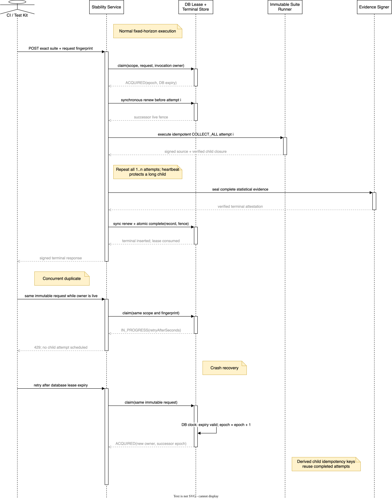

# Stage 5 suite-stability execution-lease verification

## 1. Verified claim

Resource Gateway now gives one exact suite-stability parent request a database-authoritative,
cross-replica execution owner before scheduling its first child suite attempt. This closes the
duplicate-work window left by terminal-only idempotency:

1. a new exact request acquires one opaque owner and epoch under tenant/environment scope;
2. the same immutable request receives retryable `429 RG.TEST.STABILITY_EXECUTION_IN_PROGRESS`
   while that database-clock lease is live;
3. a changed request under the same parent idempotency identity is rejected as a conflict;
4. an expired lease may be taken over only by incrementing its epoch under the same database lock;
5. the service renews synchronously before every attempt and once more before publication;
6. terminal insert and exact lease consumption commit in one local transaction;
7. process shutdown invalidates every local guard before attempting exact release;
8. an oldest-first bounded sweep removes expired orphan leases that nobody retries.

This is cross-replica **single-owner coordination**, not an asynchronous or distributed attempt
scheduler. The endpoint still runs one precommitted horizon synchronously on one owning replica.

## 2. Root cause

The signed stability protocol already gave every child attempt a deterministic idempotency key, but
the parent record existed only after all attempts completed. Two replicas receiving the same parent
request before terminal persistence could therefore both enter the loop. Child idempotency limited
semantic duplication, yet it did not prevent duplicate orchestration, repeated reads, signer work,
HTTP-thread occupancy, or a stale replica racing to publish after another replica took over.

A generic test-runtime quota permit cannot safely serve as this parent fence. A stability parent
invokes the ordinary suite runner, whose child already acquires tenant/suite/operator/dependency
permits. Holding another parent permit over the same dimensions can self-throttle at low limits.
The implemented lease is deliberately separate: it coordinates one immutable parent identity while
all actual child capacity remains governed by the existing four-dimensional admission authority.

## 3. Protocol flow

The editable source is
[`docs/assets/drawio/resource-gateway-suite-stability-execution-lease.drawio`](assets/drawio/resource-gateway-suite-stability-execution-lease.drawio).

The parent identity is the existing deterministic `stabilityRunId`, derived from tenant,
environment, and the canonical request fingerprint. A claim also binds the scoped
`clientRequestId`, request fingerprint, a fresh invocation owner, and a whole-second 5..3600 second
duration. No fixture, context, child output, credential, or evidence payload enters the lease row.

## 4. Persistence invariants

`rg_test_suite_stability_execution_leases` stores only:

- deterministic stability run id and scoped parent idempotency coordinates;
- canonical request fingerprint;
- opaque invocation owner;
- monotonically increasing takeover epoch;
- database-clock expiry, creation time, and update time.

A fixed 4096-stripe lock table serializes claim, renewal, release, completion, and cleanup for one
scoped request without creating an unbounded lock row per business identity. Every mutation runs in
`REQUIRES_NEW`, read-committed local transactions on the isolated test-runtime datasource.

| Operation | Required fence | Atomic result |
| --- | --- | --- |
| first claim | no terminal and no lease | epoch `0` live lease |
| duplicate claim | same intent, live lease | `IN_PROGRESS` plus bounded retry delay |
| takeover | same intent, expired lease | same run id, new owner, `epoch + 1` |
| renew | exact scope/run/request/owner/epoch and live DB expiry | successor DB expiry |
| release | exact live fence | lease deletion; otherwise no-op |
| complete | exact live fence and complete signed record | terminal insert plus lease deletion |
| purge | expired candidate rechecked after stripe lock | bounded conditional deletion |

Terminal lookup is performed under the same claim transaction. A retained exact terminal result is
replayed; expired terminal evidence leaves its existing idempotency identity retired rather than
silently allowing a new experiment to reuse historical coordinates.

## 5. Runtime behavior

The process-wide `TestSuiteStabilityLeaseCoordinator` owns one daemon heartbeat thread. Every HTTP
invocation still receives a different opaque owner, so two concurrent requests on the same JVM do
not collapse into one process identity. A guard becomes permanently lost after any empty or
ambiguous renewal.

Background heartbeat protects a long child attempt, while the synchronous checkpoint before every
attempt prevents further scheduling after observed ownership loss. The final synchronous renewal is
the publication fence. It closes the interval in which a prior heartbeat appeared healthy locally
but database time has since expired and another replica has taken over.

Normal local failure cancels heartbeat and releases the exact live lease. A crash or release-store
failure leaves the row to database expiry. Derived child idempotency keys allow the successor owner
to reuse already committed source suite runs. The successor still reconstructs and verifies the
entire ordered source/child closure before signing; it does not trust partial parent memory.

## 6. Failure semantics

| Condition | Public result | Child scheduling / terminal effect |
| --- | --- | --- |
| same live immutable request | `429 RG.TEST.STABILITY_EXECUTION_IN_PROGRESS` | none on loser |
| same key, changed intent | `409 RG.TEST.STABILITY_IDEMPOTENCY_CONFLICT` | none |
| retained terminal | original signed response | no rerun |
| expired terminal identity | `409 RG.TEST.STABILITY_IDEMPOTENCY_RETIRED` | none |
| lease store unavailable | `503 RG.TEST.STABILITY_LEASE_STORE_UNAVAILABLE` | none before claim |
| coordinator shutting down | `503 RG.TEST.STABILITY_LEASE_COORDINATOR_UNAVAILABLE` | none |
| heartbeat/checkpoint loss | `503 RG.TEST.STABILITY_EXECUTION_LEASE_LOST` | no next attempt, no terminal |
| stale owner calls complete | `503 RG.TEST.STABILITY_EXECUTION_LEASE_LOST` | transaction rejects insert |
| terminal identity collision | `409 RG.TEST.STABILITY_TERMINAL_CONFLICT` | transaction rolls back |

The loser never falls through to REAL execution, never downgrades evidence, and never converts an
ownership problem into `INCONCLUSIVE` statistical evidence. Ownership failure is a control-plane
failure, not an observed business sample.

## 7. Operations

The test and staging profiles expose these fail-fast settings:

| Property | Environment variable | Default | Bound |
| --- | --- | --- | --- |
| `gateway.testing.stability-runs.instance-id` | `RG_TEST_STABILITY_INSTANCE_ID` | generated | bounded opaque id |
| `gateway.testing.stability-runs.lease-duration-seconds` | `RG_TEST_STABILITY_LEASE_SECONDS` | `30` | whole 5..3600 seconds |
| `gateway.testing.stability-runs.heartbeat-interval-seconds` | `RG_TEST_STABILITY_HEARTBEAT_SECONDS` | `5` | whole second, at most lease / 3 |
| `gateway.testing.stability-runs.lease-cleanup-interval-ms` | `RG_TEST_STABILITY_LEASE_CLEANUP_INTERVAL_MS` | `15000` | Spring fixed delay |
| `gateway.testing.stability-runs.lease-cleanup-batch-size` | `RG_TEST_STABILITY_LEASE_CLEANUP_BATCH_SIZE` | `1000` | clamped to 1..10000 |

Capability discovery reports `crossReplicaSuiteStabilityExecutionLease=true` only when the isolated
test execution surface and evidence signer are both available. This flag states the coordination
protocol above; it does not state queueing, fairness, remote supervision, or hard cancellation.

## 8. Verification matrix

The focused suite covers:

- two JDBC repository instances racing for one scoped request;
- live duplicate observation without a second owner;
- exact renewal and release fencing;
- database-clock expired takeover with epoch increment;
- stale owner terminal rejection and winner completion;
- bounded orphan cleanup without deleting a reacquired live lease;
- service-level `429` before child execution;
- mid-horizon lease loss before the next attempt;
- final synchronous renewal and atomic completion;
- coordinator shutdown invalidation and fail-fast configuration;
- Spring profile composition and capability truth.

Result on 2026-07-18: the focused gate ran **65 tests with 0 failures, 0 errors, and 0 skips**;
the full Resource Gateway `clean verify` ran **2494 tests with 0 failures, 0 errors, and 2 existing
conditional skips**, exercised all 34 configured browser tests, and produced the executable Spring
Boot JAR.

Reproducible command and final counts are maintained in the parent
[suite-stability verification](resource-gateway-execution-data-control-plane-stage5-suite-stability-verification.md).

## 9. Deliberately unclaimed work

This increment does not provide:

1. a durable parent progress record or a public `RUNNING` status projection;
2. asynchronous submission, queue position, tenant weighting, priority, aging, or fairness;
3. attempt distribution across workers, regional scheduling, or autoscaling;
4. cooperative cancellation or process/container-level hard timeout;
5. independent parent-level capacity metrics, backlog SLO, or alert routing;
6. non-H2 dialect certification, long soak, capacity, chaos, or disaster-recovery proof.

The next scheduling increment must build on this owner fence rather than weaken it: queued work may
change owners, but only one live epoch may schedule or publish for the exact parent identity.
