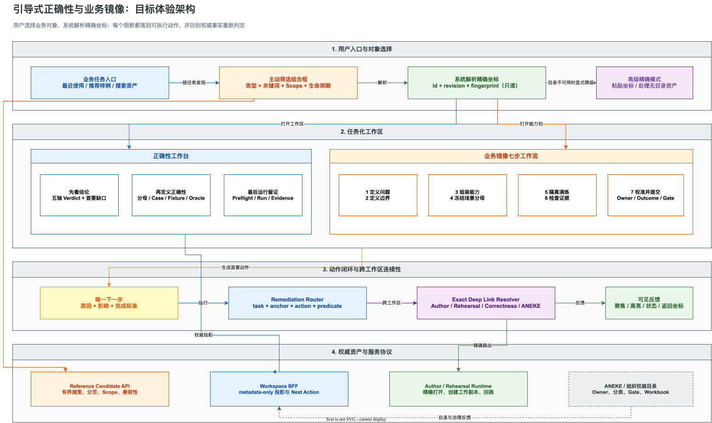
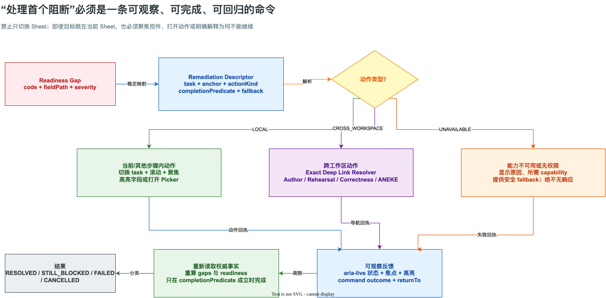

# Resource Gateway 引导式正确性与业务镜像产品技术改进方案

> 状态：`PROPOSED`
>
> 评审对象：产品、体验设计、前端、Resource Gateway 服务端、ANEKE/组织资产目录集成方、测试与安全
>
> 形成日期：2026-08-17
>
> 关联文档：[正确性创作 UX 审计与演进计划](resource-gateway-correctness-authoring-ux-audit-and-evolution-plan.md)、[正确性工作台技术实施方案](resource-gateway-correctness-studio-technical-implementation-plan.md)、[业务镜像工作区指南](resource-gateway-business-mirror-workspace-guide.md)

## 1. 结论先行

本轮反馈不是“再加几段帮助文字”可以解决的问题。当前页面存在四个同源缺陷：

1. **协议对象直接暴露为用户任务**：正确性工作台要求用户手填 `targetId`、`targetFingerprint` 和 `definitionId`；业务镜像也大量展示 exact ref，却没有可发现、可选择、可解释的业务对象入口。
2. **按资产类型分 Sheet，却没有定义任务合同**：用户看到了“定义边界”“冻结场景分母”等概念，但看不到本步要回答的问题、所需输入、主要动作、完成标准和下一步。
3. **命令只是页面导航，不是业务动作**：“处理首个阻断”只切换 `activeTask`。当阻断本来就在当前 Sheet 时，界面没有任何可见变化；即使切换成功，也不会聚焦具体字段、打开选择器或解释后续动作。
4. **跨工作区链接按页面名称拼接，而不是按精确业务对象解析**：“打开精确编排图”由 `showcaseHref()` 固定跳到 `/showcase/`，因此进入“运行示例”而不是 Author DAG 画布。

目标改造不是把页面做成强制向导，而是建立一套稳定的 **Guided Authoring Contract（引导式创作合同）**：

```text
业务对象选择
  -> 系统解析 exact coordinate
  -> 工作区解释当前结论
  -> 给出唯一首要动作
  -> 定位到可操作控件或精确工作区
  -> 执行动作并返回可见回执
  -> 重新读取权威事实并判定是否完成
```

协议精确性不能牺牲，但 `id / revision / fingerprint` 应由系统解析并渐进披露，不应成为普通用户进入工作台的门票。

## 2. 范围与非目标

### 2.1 本方案覆盖

- 正确性工作台首次进入、资产选择、工作流指引和 Next Best Action。
- 业务镜像七个步骤的信息结构、动作结构、完成标准和步骤连续性。
- 各类 ID/ref 输入从原始文本框迁移为主动筛选组合框。
- “打开精确编排图”错误跳转的根因修复和 Deep Link 合同。
- “处理首个阻断”无可见反应的根因修复和 Remediation Command 合同。
- 对应 BFF/API、Capability Probe、前端组件、状态、可访问性、埋点和测试门禁。

### 2.2 本方案不做

- 不让 Resource Gateway 接管 ANEKE 的 Registry、Workbook、Publish Gate 或组织 Owner 目录。
- 不用模糊搜索结果替代 exact revision/fingerprint；用户选中候选后仍必须冻结精确坐标。
- 不把七步工作流做成无法跳步的模态 Wizard；专家仍可直接进入任意步骤。
- 不在目录搜索接口返回 Fixture payload、业务请求响应、凭据或敏感治理材料。
- 不用前端“把状态改绿”代替服务端 Readiness、Compiler 和 Gate 的权威判定。

## 3. 当前实现证据

以下判断来自当前代码，不是对页面截图的推测。

| 现象 | 当前实现 | 直接后果 |
|---|---|---|
| 正确性工作台要求手填技术坐标 | `CorrectnessStudio.tsx` 的 `CoordinateConnector` 直接渲染 `Target ID`、`Target fingerprint`、`Definition ID` 文本框 | 首次用户不知道值从哪里获得；复制错误时只能看到加载失败 |
| 正确性工作台没有首次任务引导 | 顶层只有 `Overview/Coverage/Cases/Fixtures/Oracle/Runs` 对象型 Tab | 用户能看到能力，但不知道正确顺序和每页完成标准 |
| “需要处理”不可执行 | `Overview` 把 `nextActions` 渲染为文本 `<p>`，没有动作处理器 | 系统指出了问题，却没有把用户送到解决位置 |
| 业务镜像步骤只有标题与简介 | `TaskHeading` 只输出 `h3 + p` | 缺少“为什么、要准备什么、怎样完成、下一步是什么” |
| 多个 ref 只能阅读不能选择 | `BoundaryTask`、`ScenarioTask`、`CalibrateTask` 多为 `Requirement` 展示 | 用户知道缺资产，但没有创建、复用、绑定或跳转动作 |
| “处理首个阻断”可能无反应 | `onFix` 只调用 `selectTask(businessMirrorTaskForGap(firstBlocker))` | 当前任务与目标任务相同时是视觉 no-op；也没有 anchor、focus、highlight、toast |
| Gap 清单不可理解 | `GapInventory` 主要显示原始 `gap.code` 和通用“完成此项要求” | 用户看不到业务影响、推荐动作和完成判据 |
| “打开精确编排图”跳错页面 | `showcaseHref()` 固定构造 `workspaceRoute=showcase` 或 `/showcase/` | 打开“运行示例”，没有进入 DAG Author |
| 回归测试没有守住两条命令 | 现有 Business Mirror 测试验证了任务切换和 asset focus，但没有断言 Author 路由，也没有断言同 Sheet 阻断必须聚焦控件 | 两个缺陷都能在测试全绿时进入版本 |

## 4. 根因分析

### 4.1 产品模型：把“资产坐标”误当成“用户意图”

用户的意图通常是“验证贷款决策图”“为退款问题补齐场景”“打开这一能力的编排”，不是“输入一个 SHA-256 fingerprint”。当前页面从底层协议对象反推 UI，因此精确但难用。

根治方式是引入两层模型：

- **Discovery identity**：面向人，可搜索，包含名称、说明、Owner、Scope、状态和最近使用信息。
- **Execution identity**：面向机器，包含 kind、id、revision、fingerprint 和 authority。

用户选择 Discovery identity；系统解析并冻结 Execution identity。两者不能混为一个文本框。

### 4.2 信息架构：Sheet 有主题，没有任务合同

“定义边界”是主题，不是动作说明。一个可执行步骤至少需要：

```text
Step Contract
├── 本步回答什么问题
├── 为什么现在要做
├── 已有输入与缺失输入
├── 一个主要动作
├── 可以复用/创建/跳转的次要动作
├── 完成标准
└── 完成后去哪一步
```

当前七个 Sheet 缺少这套稳定骨架，用户只能依赖领域经验猜测操作路径。

### 4.3 命令模型：导航状态替代了动作状态

`setActiveTask()` 只能改变导航，不能表达：

- 目标字段在哪里；
- 应打开哪个选择器；
- 是否需要跨工作区；
- 当前用户是否有权限；
- 动作是否执行成功；
- 阻断是否真的消失。

因此必须把 `gap -> task` 映射升级为 `gap -> remediation descriptor`，并让命令产生结构化 outcome。

### 4.4 集成模型：前端猜 URL，而不是服务端发布精确链接

业务镜像只持有 Graph 的业务投影，Author 当前主要按 `draftId/runId` 恢复工作区。前端用 `graphName` 拼 `/showcase/` 是在两个不同身份空间之间做猜测。

根治方式是让权威投影或 Link Resolver 返回“这个业务对象以何种方式打开 Author”：

- 已存在可编辑 Draft：打开 exact `draftId@revision#fingerprint`；
- 只有只读来源：打开只读拓扑并提供“创建工作副本”；
- 需要导入/Fork：用 exact seed 创建工作副本，再进入 Author；
- 无权限或来源漂移：明确失败，不回退到相似 Graph。

## 5. 体验目标与约束

### 5.1 核心体验目标

| 指标 | 建议目标 | 说明 |
|---|---:|---|
| 首次进入到打开一个正确性工作区 | 中位数 <= 60 秒 | 不要求用户提前知道 fingerprint |
| 首次用户定位首个业务镜像阻断 | <= 2 次主动作 | 打开能力包后直接可见、可执行 |
| 手工输入 fingerprint 的会话比例 | <= 5% | 仅高级模式和无目录资产使用 |
| Remediation 命令可见反馈率 | 100% | 禁止点击后无状态变化 |
| “打开精确编排图”正确路由率 | 100% | 必须进入 Author 或显式失败 |
| Picker 5000 候选搜索反馈 | P95 <= 300 ms | 服务端分页，不能全量加载 |
| 键盘完成核心 Golden Path | 100% | Combobox、步骤导航、阻断处理均可无鼠标完成 |

以上是产品验收目标，不是当前实测值。上线前应先记录基线。

### 5.2 不可破坏的工程约束

1. 任何 Governed 资产绑定最终都必须是 exact revision + fingerprint。
2. 目录搜索结果不能扩大用户原有 Scope 和权限。
3. 搜索索引不是权威资产；选中后必须向权威 Repository 重新解析。
4. 路由失败不能自动打开“同名最新版本”。
5. 前端投影不能复制 Readiness、Compiler、Run Preflight 或 Gate 规则。
6. Telemetry 只记录坐标哈希、状态和耗时，不记录 Fixture 或业务 payload。

## 6. 目标体验架构



图源：[resource-gateway-guided-correctness-business-mirror-architecture.drawio](assets/drawio/resource-gateway-guided-correctness-business-mirror-architecture.drawio)

架构的关键变化有三点：

1. **入口从“填坐标”改为“选业务对象”**，坐标由 Candidate API 和权威 Repository 解析。
2. **工作区从“资产 Tab 集合”改为“结论、补齐、留证”的任务链**，对象型 Tab 仍保留给专家直达。
3. **所有阻断动作经过 Remediation Router 和 Exact Deep Link Resolver**，不再由各组件各自猜测导航目标。

## 7. 正确性工作台改进设计

### 7.1 首次入口：从 Coordinate Connector 升级为 Workspace Launcher

默认首屏改为四块：

1. **推荐体验**：提供 2 至 3 个有完整数据的样例，标明“可直接运行”“含边界与回归用例”等能力。
2. **最近使用**：按本地最近记录和服务端授权历史展示 exact 目标；记录只保存坐标，不保存 payload。
3. **搜索资产**：先选 `Graph / Operator / Built-in Function`，再用主动筛选组合框搜索名称、ID、Owner、标签或说明。
4. **高级精确模式**：折叠展示原有 ID/fingerprint 输入，供脚本联调、无目录资产和故障恢复使用。

选中候选后显示确认摘要：

```text
退款资格决策
Graph · customer-service/refund-eligibility
生产镜像 / APAC / Owner: Refund Capability Team
当前可验证版本 r12 · fingerprint sha256:7a3f…
[打开正确性工作区]
```

fingerprint 只读，并通过“技术详情”展开查看完整值。

### 7.2 主动筛选组合框

组合框不是一次性加载所有 ID 的普通 `<select>`。它应具备：

- 输入 2 个字符后搜索，也支持空查询返回最近使用和推荐项；
- 250 ms debounce，请求可取消；
- 服务端 cursor 分页，滚动加载下一页；
- 选项展示名称、kind、scope、owner、lifecycle、revision 和兼容性；
- 键盘上下移动、Enter 选择、Esc 关闭、Tab 正常离开；
- 搜索中、无结果、无权限、目录不可用、候选已漂移分别显示不同状态；
- 选择后由服务端重新解析 exact ref，不能直接信任列表缓存；
- 候选有多个 Correctness Definition 时，第二级组合框让用户选择；只有唯一权威定义时才自动选择。

### 7.3 工作区内的三段式指引

保留现有六个专业 Tab，但在顶部增加一条紧凑任务带：

| 阶段 | 用户问题 | 主要页面 | 完成判据 |
|---|---|---|---|
| 1. 先看结论 | 当前业务正确性是否被证明，首要缺口是什么 | Overview | 用户能解释五轴 Verdict 和首要阻断 |
| 2. 定义正确性 | 应覆盖什么、用什么数据、期待什么结果 | Coverage、Cases、Fixtures、Oracle | frozen denominator、Canonical Case、可用 Fixture、可执行 Assertion 闭包成立 |
| 3. 运行并留证 | 本次运行是否隔离、是否可执行、证据是否当前 | Runs | Preflight 通过并形成 exact Evidence；失败被明确分类 |

任务带不是完成度装饰。每个阶段展开后固定显示：

- **本页回答什么**；
- **当前状态**；
- **完成还差什么**；
- **一个主要动作**；
- **完成标准**；
- **下一步**。

用户可折叠指引；折叠偏好属于个人 UI 状态，不进入任何 fingerprint。

### 7.4 “需要处理”升级为可执行动作列表

现有 `Required attention` 不再只显示命令名称。每条动作至少包含：

```text
标题：补齐 3 个未覆盖的边界义务
原因：Coverage Inventory 已冻结，但没有 Canonical Case 绑定
影响：Coverage 轴 BLOCKED，无法发布 Governed TestSuite
主要动作：[查看未覆盖义务]
完成标准：3 个义务均被 Case 覆盖或得到有依据的 waiver
```

动作进入对应 Tab 后还要定位到过滤结果或具体对象，不能只打开 Tab 首页。

### 7.5 切换目标

工作区标题区新增“切换资产”命令，打开同一个 Launcher Side Sheet。切换前：

- 若当前存在未保存改动，先显示保存、丢弃或取消；
- 若目标 revision 漂移，显示差异并要求重新选择；
- URL 始终同步 exact target，刷新和分享不会丢失工作区。

## 8. 业务镜像七步工作流改进设计

### 8.1 固定的步骤页面骨架

七个 Sheet 统一改为以下信息结构：

```text
步骤标题 + 一句话业务问题
├── 为什么本步重要
├── 当前状态：已完成 / 需处理 / 被阻断
├── 本步输入：已存在、缺失、来源
├── 主工作区：编辑、选择、组装或检查
├── 完成清单：由权威规则计算
└── 底部动作：返回 / 主要动作 / 下一步
```

右侧 Gap 清单从“code 列表”升级为“问题卡”：业务标题、影响、对象、推荐动作、完成标准；协议 code 收进可展开的技术详情。

### 8.2 七步逐项设计

| 步骤 | 本步回答的问题 | 主要输入与控件 | 主要动作 | 完成标准 | 推荐下一步 |
|---|---|---|---|---|---|
| 1. 定义问题 | 我们为哪个业务域、哪类客户问题负责，成功意味着什么 | 业务域 Picker、问题分类 Picker、问题编码、业务目标、期望结果、Owner Picker、风险等级 | 保存业务定义 | domain、taxonomy、problem code、goal、outcome、accountable owner 均有效 | 定义边界 |
| 2. 定义边界 | 能力接收什么、输出什么、可能改变什么状态、产生什么副作用 | Contract Picker/创建、State Model Picker、Effect Model Picker、Owner confirmation | 绑定或创建边界资产 | Package Contract exact ref 存在；高风险能力必须有 state/effect model；所需 Owner 已确认 | 组装能力 |
| 3. 组装能力 | L0-L3 哪些资产共同解决这个问题，链路哪里断裂 | L0-L3 能力地图、资产搜索、复用/创建动作、依赖缺口 | 打开精确编排图或绑定缺失资产 | 可执行 Graph/Capability 存在；Solution、Carrier、Channel 按适用规则绑定 | 冻结场景分母 |
| 4. 冻结场景分母 | 哪些条件分支必须被长期验证 | 已发现 TestSuite、Scenario Inventory、Scenario Pack、覆盖义务、导入预览 | 将已发现测试转换为受治理场景，或创建分母 | Scenario Inventory frozen；至少一个有效 Scenario Pack；发现资产的 disposition 明确 | 隔离演练 |
| 5. 隔离演练 | 在不依赖真实业务接口时，哪些行为可控、哪些仍会访问真实系统 | Mirror Plan、Mock/Replay/Real 摘要、Side-effect 策略、预检阻断 | 打开/创建演练并执行 Preflight | 运行闭包可解析；Real/Write 风险显式审批；无静默 fallback-to-real | 检查证据 |
| 6. 检查证据 | 每个业务层级被什么证据证明，哪些结论过期或不足 | L0-L3 Evidence、Fidelity 维度、Owner Task、当前/参考切换 | 查看根因、确认责任、打开 exact Evidence | Evidence current；债务有 Owner 和 due date；无把“已执行”误当“已证明” | 校准并提交 |
| 7. 校准并提交 | 当前镜像保真度是否足以支持业务决策，谁批准并交给谁治理 | Fidelity Inventory、Outcome Definition、限制与假设、Owner approval、ANEKE gate feedback | 生成校准提案并提交治理 | Fidelity 和 Outcome exact ref 存在；限制公开；Owner decision 完成；外部 Gate 状态可解释 | 返回资产组合或处理 Gate |

### 8.3 每步的输入降门槛策略

| 当前字段 | 目标控件 | 候选来源 | 降级方式 |
|---|---|---|---|
| `domainId` | 可创建的 Domain Combobox | 组织业务域目录 | 无目录时允许受控新建草稿，不直接录入任意字符串 |
| `problemTaxonomyRef` | Taxonomy Tree Picker | ANEKE/组织分类目录 | 只读展示缺失原因；无权限时提供申请入口 |
| `accountableOwner` | Person/Team Picker | 组织 Owner 目录 | 可输入经校验的团队标识；不允许把展示名当稳定 ID |
| `packageContractRef` | Contract Picker + Create | Graph Contract/Package Contract catalog | 无候选时进入 Contract Author，返回后自动绑定 exact ref |
| `stateModelRefs`、`effectModelRefs` | 多选 Asset Picker | Business Mirror asset catalog | 高风险时显示必填原因和模板 |
| `solutionRefs`、`carrierRefs`、`channelRefs` | 按层级过滤的多选 Picker | L1-L3 业务资产目录 | 可创建 proposal，不伪造已实现资产 |
| `scenarioInventoryRef`、`scenarioPackRefs` | Inventory/Pack Picker | Correctness catalog | 可从 discovered suites 生成导入预览 |
| `fidelityInventoryRef`、`outcomeDefinitionRefs` | Fidelity/Outcome Picker | 业务镜像治理资产目录 | 缺少权威目录时创建 `PROPOSED` 草稿，不自动批准 |

### 8.4 步骤完成与跳步

- 用户可直接进入任意步骤，专家效率不受 Wizard 限制。
- 步骤状态来自 Readiness Projection，不由前端本地字段数量推算。
- 上游未完成时，下游页面仍可阅读和准备草稿，但会明确标注“不能提交”的原因。
- “下一步”优先进入最早的 blocking step；如果当前步骤未完成，按钮文案必须是“继续补齐本步”，不能假装推进。
- 完成某个动作后重新读取 package head 和 readiness，不能只在本地移除 Gap。

## 9. ID 与引用选择协议

### 9.1 统一候选模型

建议新增 metadata-only 协议：

```ts
type ReferenceCandidate = {
  schemaVersion: 'bloge.referenceCandidate.v1';
  kind: string;
  id: string;
  displayName: string;
  description: string;
  revision: number;
  fingerprint: string;
  authority: string;
  scope: {
    tenantId: string;
    organizationId: string;
    projectId: string;
    environmentId: string;
    region: string;
  };
  lifecycle: 'DRAFT' | 'ACTIVE' | 'DEPRECATED' | 'SUPERSEDED';
  owner: { stableId: string; displayName: string } | null;
  labels: string[];
  compatibility: 'COMPATIBLE' | 'REVIEW' | 'INCOMPATIBLE' | 'UNKNOWN';
  disabledReasonCode: string;
};
```

候选对象用于选择，不是运行授权。最终绑定前，服务端必须重新读取对应 authority，并验证 revision、fingerprint、scope 和生命周期。

### 9.2 API

| Endpoint | 用途 | 关键参数 |
|---|---|---|
| `GET /api/visual/reference-candidates` | 统一候选搜索 | `kind`、`query`、`cursor`、`limit`、`scope`、`lifecycle`、`compatibleWith` |
| `POST /api/visual/reference-candidates:resolve` | 把选中候选解析为当前 exact ref | candidate exact ref + intended use |
| `GET /api/visual/correctness-targets` | 正确性工作台目标搜索投影 | `targetKind`、`query`、`cursor`、`limit` |
| `GET /api/visual/correctness-targets/{kind}/{id}/definitions` | 获取该 exact target 的 Correctness Definition 候选 | `targetFingerprint` |
| `POST /api/visual/authoring-links:resolve` | 把 Graph/Operator/Run 业务坐标解析为 Author Deep Link | subject ref + intent + return coordinate |

短期可以复用已有 `/api/visual/drafts/summaries` 和 `/api/visual/operators` 作为数据源，但前端不应分别理解每种目录协议。统一 BFF 负责做字段归一、权限过滤和 bounded pagination。

### 9.3 Capability Probe

`/api/integration/capabilities` 增加：

```json
{
  "features": {
    "referenceCandidateApi": true,
    "correctnessTargetCatalogApi": true,
    "authoringLinkResolverApi": true,
    "businessMirrorGuidedRemediation": true
  },
  "endpoints": {
    "referenceCandidates": "/api/visual/reference-candidates",
    "authoringLinkResolver": "/api/visual/authoring-links:resolve"
  }
}
```

前端只在 capability 广告存在时启用对应动作。缺能力时显示“部署未提供资产目录，可使用高级精确坐标”，不能空白、404 或无响应。

### 9.4 安全与规模边界

- Search API 必须先做租户、组织、项目、环境和 purpose 授权，再查询索引。
- 响应只包含 metadata，不返回 Schema 全文、Fixture material、Evidence payload 或 secret ref 内容。
- `query` 长度、`limit`、cursor 生命周期和 facet 数量有硬上限。
- 默认 `limit=20`，最大 `100`；拒绝无界导出。
- 对 Owner、分类和 ANEKE 目录使用短 TTL 缓存；选中后仍重新解析。
- 目录查询失败与“无结果”必须区分，避免误导用户创建重复资产。
- 审计事件记录 purpose、候选 kind、结果数量、耗时和调用方，不记录用户输入中的潜在敏感内容。

## 10. “打开精确编排图”缺陷修复

### 10.1 当前错误

`CapabilityTask` 调用 `showcaseHref(item.graphName)`，而 `showcaseHref()` 固定构造 `/showcase/` 或 `workspaceRoute=showcase`。因此当前行为不是偶发路由故障，而是实现目标本身写错。

### 10.2 目标行为

点击“打开精确编排图”后：

1. 使用 `sourceGraphRef {id, revision, fingerprint}` 和 `EDIT_TOPOLOGY` intent 请求 Link Resolver。
2. Resolver 按当前 Scope 查找 authoritative Draft/Source，不按名称猜测。
3. 已存在 Draft 时返回：

   ```text
   /author/?authorWorkspace=v2&authorMode=compose
     &draftId={draftId}&revision={revision}&draftFingerprint={fingerprint}
     &returnRoute=business-mirror&packageId={packageId}
     &task=capabilities&anchor=graph:{graphId}
   ```

4. 只有只读 legacy source 时，Author 打开 exact seed 的只读拓扑，并提供“创建工作副本”；创建后 URL 切换到 durable `draftId`。
5. 来源不存在、漂移或无权限时停留在当前页面，显示稳定错误码、原因和下一步；禁止打开同名 Graph 或“运行示例”。

`returnRoute` 使用 allowlist 坐标，不接受任意外部 URL，避免 open redirect。

### 10.3 工程改造

- 删除业务组件中的 `showcaseHref()` 知识。
- 新增 `CrossWorkspaceLink` 与 `AuthoringLinkResolverClient`。
- Author 新增 exact seed/draft 解析器，并校验 URL 中 revision/fingerprint。
- 浏览器与 VS Code Webview 共用 `WorkspaceRouteAdapter`，只由适配器决定 pathname 或 `workspaceRoute` 表达。
- Business Mirror projection 后续可直接携带 `links.openAuthor` descriptor；前端不拼业务坐标。

### 10.4 验收

- Web 模式和 VS Code 模式点击后都进入 Author Compose/DAG 页面。
- 目标 Graph 名称、revision、fingerprint 与业务镜像来源一致。
- 无可编辑 Draft 时出现只读/创建工作副本流程。
- 不存在任何 `/showcase/` 回退。
- 返回业务镜像后恢复原 package、`capabilities` 步骤和资产焦点。

## 11. “处理首个阻断”命令闭环



图源：[resource-gateway-remediation-command-closed-loop.drawio](assets/drawio/resource-gateway-remediation-command-closed-loop.drawio)

### 11.1 Remediation Descriptor

把当前 `Record<gapCode, taskId>` 升级为：

```ts
type RemediationDescriptor = {
  gapCode: string;
  taskId: BusinessMirrorTaskId;
  surfaceAnchor: string;
  actionKind: 'FOCUS_FIELD' | 'OPEN_PICKER' | 'OPEN_AUTHOR'
    | 'OPEN_REHEARSAL' | 'OPEN_CORRECTNESS' | 'OPEN_GOVERNANCE';
  fieldPath: string;
  capabilityRequired?: string;
  titleMessageId: MessageId;
  impactMessageId: MessageId;
  instructionMessageId: MessageId;
  completionPredicate: string;
  fallback: 'ADVANCED_EXACT_INPUT' | 'REQUEST_ACCESS' | 'SHOW_UNAVAILABLE';
};
```

示例：

```ts
ACCOUNTABLE_OWNER_MISSING: {
  taskId: 'problem',
  surfaceAnchor: 'business-definition.owner',
  actionKind: 'OPEN_PICKER',
  fieldPath: '/businessDefinition/accountableOwner',
  capabilityRequired: 'ownerDirectoryApi',
  completionPredicate: 'businessDefinition.accountableOwner != empty',
  fallback: 'REQUEST_ACCESS',
}
```

### 11.2 点击后的强制语义

| 场景 | 必须发生的可见变化 |
|---|---|
| 阻断在其他步骤 | 切换步骤，滚动到目标，聚焦或打开控件，高亮一次并播报状态 |
| 阻断就在当前步骤 | 不切换步骤，但仍滚动、聚焦、高亮或打开 Picker；禁止 no-op |
| 需要打开其他工作区 | 显示“正在打开…”状态，解析 exact deep link，导航后保留 return coordinate |
| capability 未广告 | 显示部署缺少什么能力，以及高级模式/申请权限/只读检查的安全 fallback |
| 用户无权限 | 显示授权主体和申请入口；不把 403 表述为“没有数据” |
| 目标资产漂移 | 显示旧/新坐标，要求重新选择；不静默绑定 latest |
| 动作取消 | 返回 `CANCELLED`，保持阻断，不显示失败 toast |
| 动作完成 | 重新读取 package 与 readiness；predicate 成立才显示 `RESOLVED` |

### 11.3 Outcome

每次命令产生以下一种 outcome：

- `RESOLVED`：权威重算后阻断消失；
- `STILL_BLOCKED`：动作已完成，但仍缺其他条件；
- `FAILED`：解析、权限、网络或服务端命令失败；
- `CANCELLED`：用户主动取消；
- `NAVIGATED`：已进入外部工作区，等待 return coordinate 回传结果。

页面通过 `aria-live` 播报 outcome，并在 Gap 卡片上保留最近动作状态。任何分支都不能“点击后没有反应”。

## 12. 前端技术设计

### 12.1 新增共享组件

| 组件 | 职责 |
|---|---|
| `AsyncReferenceCombobox` | 有界异步搜索、分页、键盘操作、候选摘要、错误状态 |
| `ExactReferenceSummary` | 渐进披露 id/revision/fingerprint/authority，不允许编辑 |
| `GuidedWorkspaceLauncher` | 推荐、最近使用、搜索、高级精确模式 |
| `GuidedTaskHeader` | 本步问题、为什么、状态和主要动作 |
| `TaskCompletionChecklist` | 展示服务端 completion predicates 的解释，不本地计算权威状态 |
| `NextBestActionCard` | 原因、影响、动作、完成标准 |
| `RemediationRouter` | 解析 descriptor、执行本地动作或跨工作区动作、生成 outcome |
| `CrossWorkspaceLink` | 通过 Link Resolver 打开 exact 工作区并维护 return coordinate |
| `CapabilityUnavailableState` | 统一呈现缺能力、权限、降级和排障信息 |

### 12.2 状态边界

- URL 保存 shareable coordinate：target、definition、view、package、task、anchor。
- 服务器保存业务资产、readiness、publication 和 evidence。
- 本地偏好只保存指引折叠、最近使用、表格列宽等非业务状态。
- 未保存编辑由 workspace draft state 管理；导航前统一经过 dirty-state guard。
- Picker query、open state 和临时高亮不进入 URL，也不进入业务 fingerprint。

### 12.3 建议文件落点

| 位置 | 改造 |
|---|---|
| `correctness-studio/CorrectnessStudio.tsx` | `CoordinateConnector` 替换为 Launcher；Overview 接入可执行 Next Action |
| `correctness-studio/api/` | 增加 target catalog、definition candidates 和 resolve client |
| `business-mirror/BusinessMirrorWorkspace.tsx` | Task Contract、Picker、Remediation Router、正确 Author command |
| `business-mirror/domain.ts` | `RemediationDescriptor`、action/outcome 投影；保留 `BusinessMirrorGap` wire contract |
| `author/shell/` | exact subject/seed deep link 解析、return coordinate |
| `shared/reference-picker/` | 共享 Combobox、候选模型、缓存和可访问性行为 |
| `shared/workspace-routing/` | Web/VS Code 路由适配器和 Link Resolver client |
| `i18n/messageCatalog.ts`、`correctness-studio/locales.ts` | 任务问题、影响、动作、完成标准的中英文文案 |

不要把所有逻辑继续堆进 `BusinessMirrorWorkspace.tsx`。Remediation 与 Reference Picker 是跨工作区协议，应有独立模块和契约测试。

## 13. 服务端技术设计

### 13.1 BFF 与权威服务分工

```text
Reference Candidate BFF
  ├── GraphDraft summaries
  ├── Operator/Built-in Function catalog
  ├── CorrectnessDefinition repository
  ├── Business Mirror asset authorities
  └── ANEKE/组织目录 adapter

选中候选
  -> Authority Resolver 重新读取 exact ref
  -> Scope/permission/lifecycle/fingerprint 校验
  -> 返回可绑定引用或稳定错误
```

BFF 可以聚合和排序，但不能成为第二份资产真相。索引损坏时应拒绝解析，不得返回猜测值。

### 13.2 排序与搜索

建议排序优先级：

1. exact ID 命中；
2. 当前 package 已引用；
3. 最近使用；
4. 同 Scope、ACTIVE、compatible；
5. 名称和标签相关度；
6. 稳定 ID 作为最终 tie-breaker。

搜索结果必须确定性排序，同一 cursor 窗口不能因并发更新出现重复或遗漏。可以使用 snapshot/query fingerprint；发现 catalog generation 变化时使旧 cursor 过期，并要求重新搜索。

### 13.3 错误语义

| 错误码 | 含义 | UI 行为 |
|---|---|---|
| `RG.REFERENCE.CATALOG_UNAVAILABLE` | 目录服务不可用 | 保留当前输入，提供重试和高级精确模式 |
| `RG.REFERENCE.CURSOR_STALE` | 搜索快照已变化 | 清空分页并重新搜索，不清空已选 exact ref |
| `RG.REFERENCE.NOT_FOUND` | 权威资产不存在 | 标记候选失效，要求重新选择 |
| `RG.REFERENCE.DRIFTED` | fingerprint 与权威版本不一致 | 展示 revision diff 入口，禁止静默升级 |
| `RG.REFERENCE.FORBIDDEN` | 当前 purpose 无权查看/绑定 | 显示申请权限动作 |
| `RG.AUTHORING.LINK_UNRESOLVABLE` | 无法形成 Author 工作区 | 停留原页，显示来源和修复建议 |
| `RG.AUTHORING.SEED_REQUIRES_FORK` | 只读来源需要工作副本 | 打开 Fork 确认，不当成错误 |
| `RG.REMEDIATION.CAPABILITY_UNAVAILABLE` | 动作依赖未广告能力 | 显示 capability 与 fallback |

### 13.4 兼容性

- 原 Correctness exact URL 继续可用，不删除 `targetId/targetFingerprint` 参数。
- 旧 Business Mirror package schema 不因 UI Picker 改造而改变。
- Link Resolver 和 Candidate API 使用独立 schema version。
- VS Code 继续通过 transport adapter 消费同一协议，不复制一套本地 UI 规则。
- 企业部署可只实现 Candidate Provider SPI，不必把外部目录数据复制进 Resource Gateway。

## 14. 失败模式与根治措施

| 失败模式 | 背后原因 | 根治措施 |
|---|---|---|
| 搜索结果很多，用户仍找不到资产 | 只按 ID/名称，没有业务上下文 | 展示 Owner、Scope、状态、说明、兼容性并提供 facet |
| 同名资产选错环境 | Scope 被隐藏或排序不稳定 | Scope 首屏可见；跨环境候选默认分组且不能静默选择 |
| 选中后资产被更新 | 搜索索引与权威 head 存在时间差 | bind 前 resolve；drift 失败关闭 |
| 用户没有目录权限但有 exact ref | 目录授权与资产授权不同 | 高级精确模式保留，但 exact resolve 仍独立授权 |
| Owner 目录返回展示名变化 | 把展示名当稳定身份 | 保存 stable owner ID，展示名仅投影 |
| 点击阻断后仍不知道做什么 | descriptor 只有 anchor，没有指引 | 每项同时提供 instruction、impact 和 completion predicate |
| 阻断在当前 Sheet 导致 no-op | 命令等同 task switch | 强制 focus/open/highlight/outcome 语义 |
| 跨工作区后丢失上下文 | URL 没有 return coordinate | allowlist return coordinate + workspace continuity |
| Author 中没有对应 Draft | 业务投影来源不是 Author draft | exact seed/read-only/fork 三态解析 |
| 目录故障被显示为“无结果” | 前端合并 loading/error/empty | 明确状态机和稳定错误码 |
| 强制向导拖慢专家 | 所有用户必须线性点击 | 任务带可折叠、Tab 可直达、状态同源 |
| 帮助文案很快过期 | 文案与 capability/规则分离 | 指引绑定 Step Contract 和服务端 action code；协议测试校验覆盖 |
| 候选接口泄漏资产 | 搜索在授权前执行 | 先授权再查询；metadata-only；有界审计 |
| 最近使用泄漏跨租户坐标 | 浏览器本地缓存未按 Scope 隔离 | Scope-keyed storage；退出/切租户清理；不保存业务 payload |
| 前端显示完成但服务端仍阻断 | 本地规则复制服务端 | 完成后总是重新读取权威 readiness |

## 15. 可访问性、国际化与视觉规范

### 15.1 可访问性

- `AsyncReferenceCombobox` 遵守 ARIA Combobox Pattern，支持 screen reader 宣告结果数量和选中状态。
- Remediation 后把焦点移动到目标控件；仅滚动不算完成。
- 高亮至少持续到用户下一次输入，并同时有文字状态，不能只靠颜色。
- 步骤状态使用图标 + 文本；`BLOCKED/REVIEW/COMPLETE` 不只用红黄绿区分。
- 错误 summary 获取焦点，字段级错误通过 `aria-describedby` 关联。
- 动画遵守 `prefers-reduced-motion`。

### 15.2 国际化

- 中文使用业务词“业务域、问题分类、负责人、场景分母、业务预期”，技术详情保留 machine code。
- 英文和中文的动作动词一致，不出现中文“处理”而英文“View”的语义漂移。
- ID、fingerprint、JSON Pointer、error code 不翻译。
- 任务标题、原因、影响、完成标准均使用 message ID，不在 descriptor 中保存自然语言。

### 15.3 视觉层级

- 首屏最多一个 primary command；其余操作使用次级按钮或菜单。
- exact coordinate 降到标题旁的“技术详情”，不与业务名称争夺视觉层级。
- 七步 rail 保留，但每项只显示步骤、业务动词和状态；长说明进入任务页。
- 不再用大量同权重 Requirement 卡片堆叠。缺口按“当前必须处理、稍后治理、技术详情”分组。

## 16. 测试与验收设计

### 16.1 单元测试

- `gapCode -> RemediationDescriptor` 全量覆盖；未知 code 有明确 fallback。
- 当前 task 与目标 task 相同时仍执行 anchor/focus/open action。
- Candidate 排序、去重、分页 cursor、stale result 和 exact resolve。
- URL builder 保留 locale、Scope 和 return coordinate，不接受外部 return URL。
- Correctness Launcher 在唯一/多个/无 definition 时行为正确。
- Step completion 只消费服务端 projection，不从 UI 字段自行判绿。

### 16.2 协议测试

- Reference Candidate JSON round-trip、unknown enum、schema version 和边界长度。
- Cursor/query fingerprint generation 的 golden tests。
- Link Resolver 的 EXISTING_DRAFT、READ_ONLY_SOURCE、FORK_REQUIRED、FORBIDDEN、DRIFTED 真值表。
- Capability Probe 与实际 endpoint 一致；广告开启但 endpoint 404 必须使构建失败。
- Web transport 与 VS Code transport 对同一 fixture 产生相同 route descriptor。

### 16.3 组件与集成测试

- 组合框键盘、screen reader 属性、异步取消、空结果与错误重试。
- “需要处理”动作打开对应 Tab 和具体过滤结果。
- Problem Sheet 的 Owner blocker 打开 Owner Picker 并聚焦。
- Scenario blocker 打开 Scenario Inventory 选择/创建动作。
- dirty state 下跨工作区先触发保存保护。

### 16.4 两个缺陷的强制回归

1. **打开精确编排图**
   - 断言链接解析结果为 `author` + `compose`；
   - 断言 URL 不包含 `/showcase/` 或 `workspaceRoute=showcase`；
   - 真实浏览器打开后出现 DAG 画布且 Graph 坐标正确。

2. **处理首个阻断**
   - blocker 在其他步骤：步骤切换，目标控件获得焦点；
   - blocker 在当前步骤：步骤不变，但 Picker 打开或字段聚焦；
   - capability 缺失：显示明确 unavailable 状态；
   - 任何分支都有 outcome，测试中禁止零 DOM/URL/状态变化。

### 16.5 浏览器 Golden Path

| Path | 操作 | 必须观察到 |
|---|---|---|
| 正确性首次使用 | 打开 `/correctness/` -> 搜索贷款决策 -> 选择版本 -> 打开 | 无需手填 fingerprint；看到三段式任务带和唯一下一步 |
| 正确性补缺口 | Overview 点击首要动作 -> Coverage 未覆盖过滤 -> 创建 Case | 定位到具体义务；完成后权威 Verdict 刷新 |
| 业务镜像新手 | 打开能力包 -> 点击首个阻断 -> 选择 Owner -> 保存/编译 | Picker 自动打开；阻断消失或移动到下一项 |
| 精确编排 | 组装能力 -> 打开精确编排图 | 进入 Author DAG，Graph/revision/fingerprint 匹配 |
| 演练闭环 | 冻结分母 -> 隔离演练 -> 返回证据 | return coordinate 恢复原 package/step；Evidence 指向 exact run |
| 目录故障 | 模拟 Candidate API 503 | 页面保留当前内容，显示重试和高级精确模式，不显示“无结果” |

浏览器门禁覆盖 1440×900、1280×720 和 390×844，中英文各跑一次，并检查页面无重叠、无截断、焦点可见。

## 17. Telemetry 与运营指标

建议记录以下 payload-free 事件：

| 事件 | 关键字段 |
|---|---|
| `WORKSPACE_LAUNCHER_OPENED` | surface、entry kind、scope hash |
| `REFERENCE_SEARCH_COMPLETED` | kind、latency bucket、result count bucket、outcome |
| `REFERENCE_RESOLVE_COMPLETED` | kind、outcome、drifted、latency bucket |
| `GUIDED_STEP_VIEWED` | workspace、step、status |
| `REMEDIATION_STARTED` | gap code、action kind、same-step |
| `REMEDIATION_COMPLETED` | gap code、outcome、duration bucket |
| `CROSS_WORKSPACE_LINK_RESOLVED` | target workspace、resolution kind、outcome |
| `ADVANCED_EXACT_MODE_USED` | target kind、reason code |

重点看四个漏斗：

1. 进入 Launcher -> 选中候选 -> 打开工作区；
2. 看到阻断 -> 点击动作 -> 到达目标 -> 阻断消失；
3. 打开业务镜像 -> 完成前 3 步 -> 冻结场景分母；
4. 进入演练 -> Preflight -> Run -> Evidence current。

`REMEDIATION_STARTED` 后无任何 terminal outcome 的比例必须为 0；这会直接监控“点击没反应”回归。

## 18. 实施计划

### Stage 0：行为冻结与基线（P0，2 至 3 天）

| ID | 工作项 | 产物 | 验收 |
|---|---|---|---|
| GUX-000 | 固化两条缺陷的失败测试 | Vitest + Playwright regression | 当前代码红；修复后绿 |
| GUX-001 | 记录首次打开、ID 输入、阻断点击基线 | payload-free events/dashboard spec | 能区分无结果、错误和 no-op |
| GUX-002 | 冻结 Step Contract 与 Remediation Descriptor schema | TS/Java/JSON Schema | 产品、前端、服务端共同评审通过 |

### Stage 1：先消除明显错误（P0，1 个迭代）

| ID | 工作项 | 依赖 | 验收 |
|---|---|---|---|
| GUX-101 | `showcaseHref` 替换为 Author Link Resolver | GUX-002 | Web/VS Code 都打开 DAG，不再进入 showcase |
| GUX-102 | 最小 Remediation Router | GUX-002 | 同/跨步骤都有 focus/highlight/outcome |
| GUX-103 | 七步页面增加任务问题、完成标准和底部下一步 | 无 | 首次用户不查手册也能描述每步要做什么 |
| GUX-104 | Gap 卡片增加业务标题、影响和推荐动作 | GUX-102 | 原始 code 退到技术详情 |

Stage 1 不能等待统一目录完成。Owner、Contract 等尚无 Picker 时，也必须先定位文本框或显示“当前部署缺少目录能力”，消灭 no-op。

### Stage 2：对象发现与正确性 Launcher（P1，1 至 2 个迭代）

| ID | 工作项 | 依赖 | 验收 |
|---|---|---|---|
| GUX-201 | Reference Candidate BFF 与 SPI | Scope/Auth/Catalog adapters | metadata-only、有界、分页、确定性排序 |
| GUX-202 | `AsyncReferenceCombobox` | GUX-201 | 键盘、分页、取消、错误态、中文均通过 |
| GUX-203 | Correctness Target/Definition candidate API | Correctness repositories | Graph/Operator/Function 均可发现 exact target |
| GUX-204 | Coordinate Connector 升级为 Launcher | GUX-202/203 | 默认路径不再要求手填 fingerprint |
| GUX-205 | 高级精确模式与兼容 URL | GUX-204 | 旧 deep link 和无目录资产仍可使用 |

### Stage 3：七步可操作化（P1，2 至 3 个迭代）

| ID | 工作项 | 依赖 | 验收 |
|---|---|---|---|
| GUX-301 | Problem 的 Domain/Taxonomy/Owner Picker | GUX-202 | 保存稳定 ID，展示名不入协议身份 |
| GUX-302 | Boundary 的 Contract/State/Effect 选择与创建回跳 | GUX-202、Link Resolver | 高风险完成规则可解释且 fail closed |
| GUX-303 | Capability L0-L3 绑定与 exact Author 连续性 | GUX-101/202 | 可复用、创建、打开、返回 |
| GUX-304 | Discovered Suite -> Scenario Inventory/Pack 导入预览 | Correctness API | 每个发现项有 disposition，不自动治理化 |
| GUX-305 | Rehearsal prerequisite、Preflight 与 Evidence return | Rehearsal API | 阻断、风险和运行结果回到原步骤 |
| GUX-306 | Fidelity/Outcome/Owner approval 与 ANEKE feedback | Governance adapters | 提交前条件和外部阻断可解释 |

### Stage 4：工业化硬化（P1/P2，1 至 2 个迭代）

| ID | 工作项 | 验收 |
|---|---|---|
| GUX-401 | 5000 候选、500 Case、弱网和目录抖动压测 | P95、内存和请求上限达标 |
| GUX-402 | Accessibility 与中英文浏览器门禁 | Golden Path 全键盘可完成 |
| GUX-403 | Anti-entropy 检查 | capability 广告、route descriptor、message ID、gap descriptor 无漂移 |
| GUX-404 | 指标看板和异常告警 | no-op=0；link resolve 失败可按原因定位 |
| GUX-405 | 企业目录 Provider SPI 示例 | 不依赖 ANEKE 也能接入 Owner/Taxonomy/Asset catalog |

## 19. 工作拆分与所有权

| 模块 | 主要 Owner | 评审方 |
|---|---|---|
| Step Contract、任务文案、完成标准 | 产品 + 体验设计 | 业务 Owner、测试 |
| Reference Candidate 协议与 BFF | Resource Gateway 服务端 | 安全、ANEKE/目录团队 |
| Combobox 与 Guided Shell | 前端 | 可访问性、国际化 |
| Remediation Router | 前端 + Domain 协议 Owner | 服务端、测试 |
| Author Link Resolver/Seed/Fork | Author + GraphDraft Owner | Business Mirror、VS Code |
| Readiness completion predicate | Business Mirror Compiler Owner | 产品、治理 |
| Correctness Next Action | Correctness Domain Owner | Author、Run/Evidence |
| 浏览器 Golden Path | QA/测试平台 | 各模块 Owner |

每个纵向切片必须包含协议、服务端、UI、i18n、测试、Capability Probe 和文档；禁止先堆完整后端再一次性接 UI。

## 20. 发布与迁移

1. 先以 `guidedWorkspaceLauncher`、`businessMirrorGuidedRemediation` feature flag 灰度。
2. Stage 1 的两个缺陷修复不等待 flag，作为兼容性 bugfix 直接发布。
3. Candidate API 未部署时保留高级精确模式；页面明确显示降级原因。
4. 新 Launcher 稳定两个版本后，原 Coordinate Connector 移入“高级精确模式”，不立刻删除。
5. 旧 `/correctness/?targetKind=...` 与 Author `draftId/runId` deep link 长期兼容。
6. 对企业目录使用 Provider SPI 和 capability negotiation，避免强绑定 ANEKE。
7. 通过 telemetry 证明搜索成功率、阻断闭环率和专家效率后，再默认展开/折叠不同指引。

回滚只关闭新入口和新 Picker，不回滚 schema、exact link 解析和两个缺陷修复。

## 21. Definition of Done

本方案完成必须同时满足：

- 首次进入正确性工作台无需预先知道任何 fingerprint。
- 每个业务镜像步骤都有业务问题、输入、主要动作、完成标准和下一步。
- 所有可绑定 ID/ref 字段有主动筛选路径，原始输入只存在于高级模式或明确降级状态。
- “打开精确编排图”进入 Author DAG，且绑定 exact Graph；不再进入运行示例。
- “处理首个阻断”在同 Sheet、跨 Sheet、跨工作区、缺权限和缺 capability 情况下都有可观察 outcome。
- 完成状态来自权威 readiness/compilation，不由前端伪造。
- Web 与 VS Code 使用同一 Link/Picker 协议。
- 中英文、键盘、移动端和 5000 候选规模门禁通过。
- Capability Probe、endpoint、message ID、descriptor 和文档通过 anti-entropy 校验。
- 产品手册和 Golden Demo 路径同步更新，并有最新浏览器截图。

## 22. 需要评审的决策

以下问题不阻塞 Stage 0/1，但应在 Stage 2 开工前冻结：

1. **组织资产目录权威**：推荐 Resource Gateway 定义 Provider SPI，ANEKE 是一个实现，不成为唯一部署依赖。
2. **Owner 身份**：推荐保存组织稳定主体 ID，展示名只作投影；禁止继续保存任意自由文本作为最终 Owner 身份。
3. **Legacy Graph 打开策略**：推荐默认只读打开 exact source，并由用户显式创建工作副本；不在点击链接时静默写入 Draft。
4. **最近使用数据**：推荐个人设备保存最近坐标、服务端可选提供审计型授权历史；两者均不保存 payload。
5. **新建资产权限**：推荐 Picker 中“创建”只生成 `DRAFT/PROPOSED`，审批和发布继续由权威系统处理。
6. **Step completion 表达**：推荐服务端投影稳定 `completionCode + evidence`，前端通过 message catalog 解释，不传自然语言规则脚本。

## 23. 方案自审

| 维度 | 分数 | 结论 |
|---|---:|---|
| 问题根因与边界 | 15/15 | 已从文案、任务模型、命令模型、目录和路由协议分层定位 |
| 产品任务闭环 | 19/20 | 七步和正确性三阶段已定义；需用真实用户研究校准文案 |
| 协议与权威边界 | 19/20 | exact ref、resolve、capability、ANEKE 边界明确；Provider SPI 需 ADR 冻结 |
| 失败、安全与规模 | 15/15 | 覆盖权限、漂移、弱网、cursor、泄漏和 no-op |
| 可实施性 | 14/15 | 已拆成纵向工作包；具体团队容量需排期 |
| 可测试性 | 14/15 | 两个缺陷、协议、组件和浏览器门禁均可自动验收 |
| 可访问性与国际化 | 9/10 | 规范完整；仍需真实 screen reader 验证 |
| **总分** | **95/100** | **可进入产品、架构和排期评审；Stage 0/1 可直接开工** |

剩余 5 分不是继续扩写文档可以获得，需要用以下事实验证：

- 5 至 8 名首次用户能否在 60 秒内打开正确性目标；
- 业务人员是否能准确复述七步的完成标准；
- 企业 Owner/Taxonomy/Asset catalog 的 Provider SPI 能否在至少两种组织目录上落地；
- 5000 候选与弱网条件下的真实浏览器性能；
- VoiceOver/NVDA 对异步组合框和 Remediation 焦点流的实际表现。
