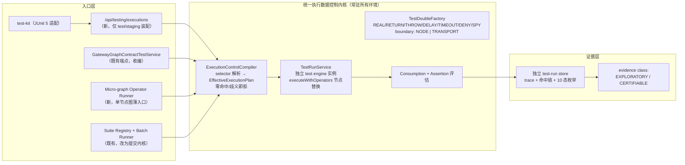

## Plan: Resource Gateway 可测试性工业化 v1 —— Execution Data Control Plane 实施蓝图

**TL;DR**：以 resource-gateway-industrial-testability-evolution-plan.md 为北极星终态，从既有 `GatewayGraphContractTestService` 语义中**提炼统一执行数据控制内核**，向上开放调用方驱动的 fixture 注入入口（/api/testing/executions + micro-graph operator runner + test-kit），向下以「独立 test engine 实例 + BLOGE run-scoped `ExecutionOptions.operatorResolver`」在 RG 层落地；隔离采用「入口硬隔离 + deny-by-default + 证据分级」，验收采用仓库自身 CI dogfooding。分三个阶段交付（语义冻结 → 内核提炼 → 注入入口与工程化），每阶段独立可验证。可靠性模型形式化为：**DAG 正确性 = L1（真实算子 + 效应边界拟合）⊕ L3（真实编排 + 节点边界拟合）**，合成缝由保真度阶梯（F0-F5）封闭，前提「算子确定性」由 Composability Contract 强制而非假设（见第五节）。

### 实施状态（2026-07-18）

| 阶段 | 状态 | 已落地证据 |
| --- | --- | --- |
| Stage 0 | 完成 | operator suite API/UI 显式 `SCHEMA_CONTRACT`；`testing/domain` 五个版本化 record；capability testability 描述；[ADR-001](adr/ADR-001-resource-gateway-test-runtime-isolation.md)、[ADR-002](adr/ADR-002-operator-composability-and-opaque-runtime.md)、[ADR-003](adr/ADR-003-semantic-coverage-protocol-versioning.md) 与 [BLOGE framework requirement](bloge-framework-execution-control-requirement.md) |
| Stage 1' | 完成 | `testing/planning/runtime/evidence` 内核；独立 test engine；五行为；F2/F3 resource fixture；micro-graph runner；旧 graph suite adapter；37 个聚焦测试与 1653 个项目测试全绿 |
| Stage 2' | 进行中 | 已落地 graph/operator target discovery、operator target v2 composability manifest、graph execution/batch/query、operator micro-graph execution、canvas executable operator suite（含四类 case intent、内容寻址 fixture 与一等 TestSuite 发布、聚合执行/coverage/promotion 回显）、immutable fixture/TestSuite registry、幂等 TestSuite runner、独立 child/suite-run store、聚合结构 coverage 与 promotion eligibility、10 态 child evidence、profile/identity/生产协议隔离、独立 Java/JUnit/CI test-kit suite adapter、七图/14-case F3 dogfooding及其内容寻址 catalog materialization、numeric tolerance、run-scoped logical clock + DELAY/TIMEOUT、受治理 F4 replay payload 精确捕获/脱敏/retention/tombstone、exact-ref REPLAY 执行、payload-free effective plan v2 谱系与认证降级，以及同步 root/nested/foreach/loop/compensation 的结构寻址、控制传播、动态 attempt/occurrence selector 和 occurrence/attempt/node/edge evidence；streaming/suspendable control/evidence 与物理 network/runtime 隔离仍待完成 |
| Stage 3 evidence chain | 进行中 | graph/operator child signature、suite checkpoint/terminal aggregate attestation、ordered child closure、payload-free portable bundle、suite/evidence/attestation 独立 v2 typed semantic coverage 已完成；signed atomic key-set、managed v1/v2 lifecycle、签名时刻 lifecycle policy、外部 M-of-N trust publication、bounded append-only consistency page、durable consumer checkpoint、rollback/fork/split-view/revoked-pin resurrection detection 与 test-kit independent verifier 已完成；exact-suite ANEKE semantic workbook seed、`GovernanceGateResult.v3` 可重建 basis、编译级 GraphDraft target 绑定与独立 schema consumer 已完成；真实 ANEKE N/N-1 conformance、独立 witness gossip/跨域一致性证明待完成 |
| Stage 4 deterministic runtime | 进行中 | run-scoped TIME/RANDOM/UUID、effective plan/provider state、组合 durable checkpoint、同库事务、数据库时钟 lease CAS、幂等命令与 staged 四 store aggregate 已完成；公开 authenticated durable GRAPH/OPERATOR create、payload-free query、owner claim、heartbeat、one-signal suspended-or-terminal recovery step、有界同步 multi-suspension recovery sequence、兼容 terminal-only recovery 和进程内 lease coordinator 已闭合；recovery sequence 外层及派生 step/claim/automatic-heartbeat 已具备数据库租约化有界 retention、独立 HMAC tombstone、密钥轮换启动自检、固定基数 telemetry 和数据库时钟 backlog SLO/readiness；公开 non-blocking worker pull 已在认证 tenant/org/project/environment 内以数据库时钟有界扫描，逐候选重授权，并把 exact lease CAS、hidden dispatch、`ACQUIRED/NO_WORK` 幂等结果和审计原子提交，再以 scope 级持久化循环 keyset 游标避免稳定毒化前缀饥饿，对 exact checkpoint 的确定性失败做数据库时钟指数退避，并在连续失败阈值后转为永久 worker quarantine；隔离 list/claim/release、数据库权威 maker/checker approved discard、token-free receipt/history、审批 SLO observation、claim-command replay token AES-GCM envelope/旧行迁移/轮换重包、active-control HMAC fence/旧行迁移/轮换重键、命令/审批/历史的数据库租约化有界保留、独立 keyed-HMAC request-index tombstone/在线轮换/旧行惰性迁移、N/N-1 三阶段 write/readiness/capability、challenge-bound 逐副本签名 proof、独立 test-kit exact-inventory fleet gate 与四维即时 admission 已落地；外部 quarantine change authorization 的 Ed25519 M-of-N trust、canonical scope/subject binding、checker HTTP v2 强制、数据库时间窗复核、双重唯一预留、销毁事务一次性消费、精确幂等重放、严格 Schema、staging fail-fast 配置、readiness/capability 和 key-free v2 证据透传已闭合。其他 durable command family 的统一有界 lifecycle、跨平台 serving-inventory 完整性证明、外部工单全生命周期与动态撤销刷新、法律保留/备份擦除、外部 WORM、runtime-state dispatch、排队/公平/优先级调度、异步/无界多 suspension 编排、跨进程 worker supervision、强制 worker 取消、完整历史 trace evidence、stream offset/checkpoint、identity/flag/secret authority 和确定性并发待完成 |
| Stage 5 scale and quality | 进行中（bounded mutation 与 deterministic suite-stability evidence 已闭环） | graph/operator boundary planning/admission、seeded bounded property plan/materialization/execution/evidence、recoverable AST mutation planning/exact regeneration、immutable V5 mutation suite、baseline-first 隔离执行、V5 signed evidence/abandoned reconciliation，以及 exact suite 3..20 次重跑、逐 case 语义稳定性分类、签名 source/promotion closure、独立 test-kit/pinned CI gate 已落地；semantic equivalent-mutant proof、统计置信/停止策略、跨进程调度与独立部署硬隔离待完成 |

第三十五增量已新增 `RecoveryStepCommand/Result` 与数据库权威 command record：一个
issued dispatch 可把一个 signal 原子推进到唯一新 `SUSPENDED` 或五类 `TERMINAL`；再次挂起时用
数据库时钟释放 lease，四 store/控制 checkpoint/幂等结果/可选 receipt/audit 同事务，响应丢失重放
不二次执行 engine mutation。公开 `recovery-steps` HTTP、独立 operation、严格 Schema、capability、
profile isolation 与 application replay 已接线；repository/runtime 85 tests 与公开协议 15 tests 全绿。
它闭合的是逐 signal 推进原语，自动多 suspension 编排仍保持进行中。验证见
[Stage 4 recovery-step verification](resource-gateway-execution-data-control-plane-stage4-recovery-step-verification.md)。
本增量完整 Resource Gateway `clean verify` 执行 2285 tests，0 failures、0 errors、2 个既有条件
浏览器跳过并完成 Spring Boot JAR 打包；独立 test-kit `clean verify` 执行 75 tests，0 failures、
0 errors、0 skips，并通过普通/shaded JAR、权威 Schema 打包与 public Javadoc 门禁。

第三十六增量交付 `bloge.durableTestRecoverySequenceRequest/Response.v1` 与公开
`recovery-sequences` HTTP。外层 command 在任何 signal 执行前，以数据库事务保留完整 authenticated
intent 指纹、scope、run、1..16 signal count、数据库时间、whole-record fingerprint 与 semantic audit，
不存 signal 原值；单条 256 KiB、总计 1 MiB 的限制在 prefix mutation 前统一执行。编排器从外层 key
派生稳定 child keys，逐项调用既有 recovery step；每次新 suspension 后以 exact released checkpoint
调用既有 owner claim，重新授权并取得新 hidden dispatch。响应丢失时从 index zero 精确重放已提交
prefix，在首个未提交 child 继续；晚位 signal、顺序、初始 fence、run 或 principal 漂移均在 child 前
失败。响应只含有序 payload-free steps、provided/consumed counts、最终状态和 stop reason。它关闭同步
有限 signal fixture 的自动多 suspension 编排，仍不等于 durable signal inbox、异步 dispatcher、
公平队列、跨进程 supervisor 或 hard cancellation。验证见
[Stage 4 recovery-sequence verification](resource-gateway-execution-data-control-plane-stage4-recovery-sequence-verification.md)。

第三十九增量交付 `bloge.testBoundaryCasePlan.v1` 和 graph/operator 两个 boundary-case GET
endpoint。planner 将当前 exact target、投影后 input schema 与生成 policy 内容寻址；baseline 生成后以及
每个结构、类型、数值、长度、enum/const 边界候选都由公共 schema validator 独立复核，拒绝候选必须
命中预期诊断族。64 case、8 层、32 collection/string 的硬上限和 BLOGE projection、unsupported
constraint、candidate proof、truncation gap 防止无界生成与虚假完整性。严格 testing-control-plane
Schema、capability feature/object/endpoint、服务/controller 测试和使用手册已同步，56 项聚焦测试全绿。
该 plan 是 authoring asset，不是已发布 suite、运行证据、property proof 或 mutation score；后续仍需
人工确认的 immutable suite conversion、可复现 seed/shrink、纯 DSL mutant 执行与 evidence closure。
完整 Resource Gateway `clean verify` 执行 2340 tests，0 failures、0 errors、34 个条件跳过并完成
可执行 JAR；独立 test-kit `clean verify` 执行 77 tests，0 failures、0 errors、0 skips，并通过权威
Schema 打包、普通/shaded JAR 与 public Javadoc 门禁。

第四十增量（历史快照，当前执行限制已被第四十一增量取代）把第三十九增量的 authoring plan
转成受治理但仍不可执行的 immutable asset。graph/operator
POST materialization endpoint 只接受 `TEST_SUITE_WRITE`，并在写入前重新计算当前 plan，逐一比较
target/input-schema/plan 三指纹。显式选择必须是 plan case 的有界闭集；`PARTIAL` 需要 gap 确认，
`UNAVAILABLE` fail closed。服务生成一个惰性 fixture 和一个 `bloge.testSuite.v3`，将完整 case input 与
`ACCEPTED/SCHEMA_REJECTED + validationCodes` 固化为一等 canonical 字段；内容派生 revision 保证精确
重试稳定，suite 写失败只会留下安全的未引用 fixture。v3 严禁 invocation/edge/assertion/semantic
coverage 和 certifiable promotion 声明。由于签名 admission evidence 尚未实现，capability 明示
`schemaAdmissionSuiteExecution=false`，旧 runner 在任何业务调用、admission claim 或 evidence 写入前
以 `RG.TEST.SUITE_ADMISSION_EVIDENCE_UNAVAILABLE` 拒绝，避免把预期 schema rejection 错计为普通失败，
也避免制造伪发布证据。完整证明见
[Stage 5 boundary-suite materialization verification](resource-gateway-execution-data-control-plane-stage5-boundary-suite-materialization-verification.md)。
本增量完整 Resource Gateway `clean verify` 执行 2348 tests，0 failures、0 errors、34 个条件跳过，
并完成 Spring Boot 可执行 JAR；独立 test-kit `clean verify` 执行 77 tests，0 failures、0 errors、
0 skips，并通过权威 Schema 打包、普通/shaded JAR 与 public Javadoc 门禁。

第四十一增量把 `bloge.testSuite.v3` 推进为可执行但严格 admission-only 的受治理资产。新的
`bloge.testSuiteRunEvidence.v3` 同时绑定 exact suite、target、input schema、boundary plan、generator 与
共享 validator mode；typed result 区分 `MATCHED`、expectation/provenance mismatch、incomplete 和
not-scheduled，独立 admission coverage 不借用 business structural coverage。runner 先做数据库权威
admission/owner lease，再签 checkpoint，逐 case 仅调用公共 schema validator，最终签 terminal
attestation；任何路径都不进入 graph/operator runner，不创建 child run。v4 response、v3 evidence、v3
attestation 与 v3 payload-free bundle 必须同代，attestation 的空 child closure 是“业务未执行”的签名
事实。exact idempotency、容量拒绝、lease 丢失、签名/terminal write 失败与 abandoned reconciliation
全部 fail closed。权威 Schema、capability、真实 HTTP materialize -> execute -> read -> export、独立
test-kit typed admission assertion/JUnit XML/offline Ed25519 verification 同步闭合。验证见
[Stage 5 schema-admission execution verification](resource-gateway-execution-data-control-plane-stage5-schema-admission-execution-verification.md)。
该增量交付时不声称业务 correctness、coverage 或 publish eligibility；当时剩余 Stage 5 主线是可复现 property
seed/shrink、纯 DSL mutation execution/score、flaky analysis 和部署级硬隔离。
本增量完整 Resource Gateway `clean verify` 执行 2364 tests，0 failures、0 errors、2 个条件跳过，
并完成 Spring Boot 可执行 JAR；独立 test-kit `clean verify` 执行 84 tests，0 failures、0 errors、
0 skips，并通过权威 Schema 打包、普通/shaded JAR 与严格 public Javadoc 门禁。

第四十二增量（历史快照，执行限制已被第四十四增量取代）交付
`bloge.testPropertyCasePlan.v1` 与 graph/operator property-case GET。调用方必须显式
提供 seed；同一 exact target/schema/policy 可逐值重放 root trials、线性 shrink paths 和 plan fingerprint。
每个候选都由公共 validator 独立证明，root 不重复、shrink complexity 严格递减；16 roots、每 root 5
shrink、96 cases、32 attempts、8 层和 32 collection/string 是协议化上限。BLOGE projection loss、未展开
constraint、低基数域和边界截断均进入稳定 gap。协议固定 `BOUNDED_SAMPLED`、`exhaustive=false`，不能
把有限随机样本包装成穷举 property proof。严格 Schema、capability、profile/identity、controller 与真实
Spring HTTP 重放已同步；`propertySuiteExecution=false` 保持关闭，直至 immutable property suite 与同代
签名 evidence/attestation/bundle 闭合。验证见
[Stage 5 property-plan verification](resource-gateway-execution-data-control-plane-stage5-property-plan-verification.md)。
本增量 28 项聚焦测试与 Resource Gateway 全量 2372 tests 全绿，后者 0 failures、0 errors、2 个条件
跳过并完成可执行 JAR；独立 test-kit 84 tests 全绿，并通过 Schema 打包、普通/shaded JAR 与 public
Javadoc 门禁。

第四十三增量（历史快照，执行限制已被第四十四增量取代）把 reviewed property plan 物化为
`bloge.testSuite.v4`，但不越级开放执行。graph/operator
materialization endpoint 只接受 `TEST_SUITE_WRITE`，服务端按请求 seed 和有界 policy 重建 exact plan，
再次核对 target/input-schema/plan 三指纹，并冻结完整 root/shrink closure；协议没有 case selection，避免
调用方删除不利样本。所有 case 固定为 `PROPERTY`，共享一个已经存在、target fingerprint 匹配、
classification 不高于 suite 且至少包含一个 assertion 的 immutable fixture revision。V4 把
`BOUNDED_SAMPLED`、`exhaustive=false`、完整
generation policy、accepted gap、输入指纹、严格递减 shrink complexity 和 lineage 作为 canonical 内容；
递归 immutable input 与内容派生 revision 使精确重试稳定。公共 suite registration 拒绝原始 V4，V1-V3
也拒绝 `PROPERTY`，只有同请求持有 regenerated plan proof 的 materializer 能进入受保护注册路径。
capability 明示 `propertySuiteMaterialization=true`、`propertySuiteExecution=false`；runner 在 run repository、
admission 和任何业务调用之前返回 `RG.TEST.PROPERTY_EVIDENCE_UNAVAILABLE`，直至 property-specific result、
coverage、checkpoint、terminal attestation、portable bundle 和独立 verifier 同代闭合。验证见
[Stage 5 immutable property suite materialization verification](resource-gateway-execution-data-control-plane-stage5-property-suite-materialization-verification.md)。
本增量完整 Resource Gateway `clean verify` 执行 2382 tests，0 failures、0 errors、2 个条件跳过，
并完成 Spring Boot 可执行 JAR；独立 test-kit `clean verify` 执行 85 tests，0 failures、0 errors、
0 skips，并通过权威 Schema 打包、普通/shaded JAR 与严格 public JavaDoc 门禁。

第四十四增量关闭 property execution/evidence 缺口。`bloge.testSuiteRunEvidence.v4` 绑定 exact plan、
input schema、generation policy、非穷举量词、root/shrink lineage、逐 case child evidence 和 typed property
coverage；runner 只消费 V4 冻结输入，不运行期重生成。`COLLECT_ALL` 执行完整闭包，`FAIL_FAST` 在首个
反例后仍完成当前 root 的预计算 shrink path，再停止后续 root。最小观察反例只承诺
`PRECOMPUTED_SHRINK_PATH`，协议强制 `globallyMinimal=false`。response/evidence/attestation/bundle
升级为 V5/V4/V4/V4 并由数据库 generation guard、ordered child closure、权威 Schema 和 test-kit
Ed25519 offline verifier 联合封闭。exact 幂等重放不二次执行；lease、签名、terminal persistence 与
abandoned reconciliation 均 fail closed，恢复只把 pending case 标为 incomplete，不重跑业务输入。
capability 仅在隔离 suite execution endpoint 存在时发布 `propertySuiteExecution=true`。验证见
[Stage 5 property execution verification](resource-gateway-execution-data-control-plane-stage5-property-execution-verification.md)。
该增量产出的是有界样本正确性证据，不是全输入域证明；当时剩余 Stage 5 主线是 mutation score、
flaky/统计置信、跨进程并行调度和部署级硬隔离。
本增量完整 Resource Gateway `clean verify` 执行 2389 tests，0 failures、0 errors、2 个既有条件跳过，
并通过 34 项真实浏览器回归和 Spring Boot 可执行 JAR 打包；独立 test-kit `clean verify` 执行
92 tests，0 failures、0 errors、0 skips，并通过权威 Schema、普通/shaded JAR、V4 语义重算/离线验签与严格
public JavaDoc 门禁。

第四十五增量建立 pure-DSL mutation 的可重放 authoring plan，而不是提前宣称 mutation score。
`bloge.testMutationCasePlan.v1` 只接受 exact graph 自带的 `bloge-dsl.ast.v1` recoverable source；受限 AST
decoder 拒绝任意 tagged Java class，baseline 必须独立复编译并同时匹配 graph artifact 与完整 target
fingerprint。planner 对 branch、decision table、transform、fallback、retry 生成最多 128 个纯 DSL
候选，每个候选都必须使用 runtime operator registry 独立复编译；所有 unsupported、compiler rejection、
duplicate 和 truncation 都降级为 payload-free stable gap。v1 永不改写外部 operator reference、实现、输入
binding、fixture、请求或业务 payload，且不返回 executable mutant source。严格 Schema、capability、真实
Spring HTTP、独立 test-kit client 与 public JavaDoc 同步；capability 明示 planning 已开而 execution/score
evidence 仍关闭。验证见
[Stage 5 mutation-plan verification](resource-gateway-execution-data-control-plane-stage5-mutation-plan-verification.md)。
剩余缺口是 immutable mutation suite、exact mutant regeneration、执行隔离、killed/survived/inconclusive
分类、equivalent-mutant policy、score denominator、签名 evidence 与 gate 语义；当前 plan 不能作为业务正确性
或发布资格证明。
本增量完整 Resource Gateway `clean verify` 执行 2398 tests，0 failures、0 errors、2 个既有条件跳过，
并通过真实浏览器回归与 Spring Boot 可执行 JAR 打包；独立 test-kit `clean verify` 执行 96 tests，
0 failures、0 errors、0 skips，并通过权威 Schema 打包、普通/uber JAR 与严格 public JavaDoc 门禁。

第四十六增量（历史协议快照，执行限制已被第四十七增量取代）先关闭 mutation suite 与 evidence protocol 的真实性边界。`bloge.testSuite.v5` 只允许
exact reviewed plan 全量闭包、exact oracle suite/fixture closure、最多 16 mutant × 16 case 且总工作量
不超过 256；runner 必须通过 planner 在服务端精确重生成 mutant，普通 suite runner 对 V5 fail closed。
`bloge.testSuiteRunEvidence.v5` 与纯 evaluator 把 baseline、mutant-case、mutant classification 和 score
denominator 固化为可重算协议：只有签名 child 的 `ASSERTION_FAILED` 可以产生 `KILLED`；timeout、fixture、
control、target、持久化和 evidence failure 只能成为 `INCONCLUSIVE`；无有效 kill 且存在未调度 case 的
mutant 保持未分类；generation one 永不排除 equivalent mutant；分母严格为 killed + survived，未分类时
score 固定为 0。V5 attestation、response v6、portable bundle v5、codec、持久化代际与 strict Schema 已同步，
但该历史增量当时仍明确关闭 mutation execution/score evidence，不能把协议类型视作可运行端点。验证见
[Stage 5 mutation evidence protocol verification](resource-gateway-execution-data-control-plane-stage5-mutation-evidence-protocol-verification.md)。
剩余缺口是独立 runner、baseline-first 调度、exact-mutant child execution、租约/恢复、HTTP/test-kit 与
真实 Spring 端到端闭包；这些完成前仍不得签发可消费的 mutation score evidence。

第四十七增量关闭上述 mutation execution/evidence 缺口。独立
`TestMutationSuiteExecutionService` 只接受 exact immutable V5 suite，先以原始 target 和完整 oracle
fixture closure 执行 baseline；baseline 未通过时不调度 mutant。每个 mutant 都由已审阅 plan 在服务端
精确重生成并通过独立 test engine 执行，继续绑定 baseline oracle 的 case/fixture，不接受调用方上传源码
或删减 matrix。`COLLECT_ALL` 与 `STOP_AFTER_KILL` 都会访问全部 mutant；后者只在当前 mutant 已有签名
`ASSERTION_FAILED` kill 后停止该 mutant 的剩余 case。只有 assertion failure 计入 kill，timeout、fixture、
control、runtime、target 或 evidence failure 仍为 inconclusive。runner 复用数据库权威 idempotency、owner
lease、heartbeat、逐 child checkpoint 与 terminal attestation；abandoned reconciliation 保留全部已完成
事实，把 pending baseline 标为 incomplete、pending mutant 标为 `NOT_SCHEDULED +
ABANDONED_RUN_RECONCILED`，重新计算 score、签发 V5 terminal evidence，且绝不重跑可能已有副作用的 child。

公开 `mutation-suites` materialization 与 `mutation-executions` HTTP、严格 Schema、capability 三态、真实
Spring materialize -> execute -> query -> bundle 闭包和独立 test-kit 已同步。test-kit 对 V6/V5 响应重算
baseline、classification、kill provenance、denominator、policy verdict，并验证 `baseline/<caseId>` 与
`<mutantId>/<caseId>` 的签名 child closure；CLI 通过显式 `--mode MUTATION` 提供批量 CI 入口，JUnit XML
逐 mutant 展示分类但由 immutable score policy 独占 gate verdict。验证见
[Stage 5 mutation execution verification](resource-gateway-execution-data-control-plane-stage5-mutation-execution-verification.md)。
第四十七增量交付时剩余 Stage 5 工作是 semantic equivalent-mutant proof、flaky/quarantine 重跑分析、
统计置信策略、跨进程并行调度和部署级物理隔离，不得从 generation-one score 推断这些能力已经具备；
其中 bounded deterministic rerun 随后由第四十八增量闭合，统计推断仍未闭合。
本增量完整 Resource Gateway `clean verify` 执行 2436 tests，0 failures、0 errors、2 个既有条件跳过，
其中浏览器回归共 35 tests，并完成 Spring Boot 可执行 JAR；独立 test-kit `clean verify` 执行
111 tests，0 failures、0 errors、0 skips，并通过权威 Schema、普通/shaded JAR、V5 语义重算、
payload-free mutation JUnit/CLI 与严格 public JavaDoc 门禁。

第四十八增量关闭 bounded suite-stability 的确定性证据主链。
`bloge.testSuiteStabilityExecutionRequest.v1` 只接受 exact V1/V2/V4 executable suite、调用方父级
幂等键和固定 3..20 次 attempt；每次 attempt 用服务端派生幂等键与 `COLLECT_ALL` 进入既有 immutable
suite runner。服务端逐 attempt 验证 source aggregate attestation 和完整 child evidence，以
`evidenceStatus + semanticResultFingerprint` 比较业务结果；source/child run 重用、签名或指纹错误、缺失
闭包和 effective-plan drift 均降为 `INCONCLUSIVE`，不能伪装成稳定。

`bloge.testSuiteStabilityEvidence.v1` 固化逐 case `STABLE_PASS`、`CONSISTENT_FAILURE`、`FLAKY`、
`INCONCLUSIVE` 与 aggregate promotion/quarantine recommendation；quarantine 只阻断、不修改 suite。
独立 stability attestation 对 canonical parent request、evidence fingerprint 和有序 source suite closure
签名；JDBC terminal store、精确幂等、retention、POST/GET HTTP、strict Schema 和 capability 已闭合。
独立 test-kit 重算语义、闭包与 fingerprint，并通过外部 atomic-key-set pin 验证 Ed25519；CLI 用显式
`--mode STABILITY`、payload-free JUnit 与 `0/1/2` 退出语义形成 release gate。验证见
[Stage 5 suite-stability verification](resource-gateway-execution-data-control-plane-stage5-suite-stability-verification.md)。
该增量不提供概率 flake rate、置信区间、adaptive stopping、自动 quarantine workflow、跨进程调度或
物理 test-runtime 隔离。
本增量 Resource Gateway 聚焦验证执行 34 tests，0 failures、0 errors、0 skips；完整 `clean verify`
执行 2464 tests，0 failures、0 errors、2 个条件跳过，其中配置浏览器回归 34 tests，并完成 Spring Boot
可执行 JAR。独立 test-kit `clean verify` 执行 130 tests，0 failures、0 errors、0 skips，并通过权威
Schema、普通/shaded JAR、pinned stability CLI/JUnit 与严格 public JavaDoc 门禁。

第四十九增量关闭 suite-stability 对 source promotion provenance 的语义缺口。第四十八增量的 v1 能证明
source/child 证据闭包与结果稳定，却未携带 source suite 自己的 promotion verdict，因而存在把“稳定但
不可认证”的 suite 重新标成 `ELIGIBLE` 的跨层洗白风险。`bloge.testSuiteStabilityEvidence.v2` 现在为每个
attempt 固化 source promotion status 与 payload-free reasons，并由
`allSourceSuitesPromotionEligible` 重算 aggregate promotion。`STABLE` 只表示行为稳定；任一 source suite
为 `BLOCKED` 时仍保留 `STABLE`，但 promotion 必须以 `SOURCE_SUITE_PROMOTION_BLOCKED` 阻断，quarantine
保持 `NOT_REQUIRED`，不再混淆稳定性、正确性认证与隔离建议。

v2 attestation 把 source promotion closure 纳入有序签名 material，response 强制三代一致；严格 Schema
和 capability 同时公开 v1/v2。历史 v1 canonical JSON 与 fingerprint 可无损重放，独立 test-kit 也可验签
用于审计，但 CI/JUnit/CLI release gate 必须看到 v2 closure 才能放行。服务端和消费者都拒绝重新签名的
矛盾聚合。该增量没有改变“固定 3..20 次重跑不是统计置信证明”的边界；概率 flake rate、adaptive
stopping、长期趋势、自动 quarantine、跨进程调度和物理隔离仍属于后续工作。验证见
[Stage 5 suite-stability verification](resource-gateway-execution-data-control-plane-stage5-suite-stability-verification.md)。

恢复控制面回归执行 146 tests，0 failures、0 errors、0 skips；完整 Resource Gateway
`clean verify` 执行 2298 tests，0 failures、0 errors、28 个既有条件跳过，并通过真实浏览器流程与
Spring Boot 可执行 JAR 打包。独立 test-kit `clean verify` 执行 77 tests，0 failures、0 errors、
0 skips，并通过普通/shaded JAR、权威 Schema 与 public Javadoc 门禁。

第三十七增量关闭 recovery sequence 自有状态的无界增长与 request resurrection。服务端统一
版本化派生 sequence namespace、step、intermediate claim 和 automatic heartbeat key；数据库租约化
retention 每次按稳定顺序处理一个有界 outer page；absolute replay deadline 与独立完整性 activity fence
共同避免在途 replay 和维护删除竞态，并在同一事务中先复核 outer/全部派生 child 的
whole-record fingerprint，再写入 tenant/environment 绑定、domain-separated keyed-HMAC tombstone，最后
精确删除 child 与 outer、独立清理一页过期 tombstone、推进 aggregate counter 并释放 fence。任何坏行、
漏配旧 key、过期 replica fence 或 counter/tombstone 篡改都会整页回滚或启动 fail-fast。默认 detailed
replay 30 天、tombstone 再保留 365 天；absolute replay deadline 到达后，同 intent 返回稳定
`RG.TEST.DURABLE_RECOVERY_SEQUENCE_REPLAY_WINDOW_EXPIRED`，异 intent 保持 idempotency conflict，墓碑
到期后才允许 key 重用。HMAC key ring 按 active-first bounded lookup 支持轮换，但 plaintext id 已擦除，
故新 key 必须先进入全副本 ring 再切 active，旧代际必须保留到其最后墓碑到期；该 key ring 尚无内建
cohort proof，依赖部署编排确认全副本就绪。调度器、staging 必填配置、capability 与只含固定 result 标签和
聚合计数的 telemetry 已接线。聚焦门禁执行 122 tests 全绿；完整 Resource Gateway `clean verify`
执行 2322 tests，0 failures、0 errors、2 个既有条件跳过，并通过真实浏览器流程和可执行 JAR 打包。验证见
[Stage 4 recovery-sequence verification](resource-gateway-execution-data-control-plane-stage4-recovery-sequence-verification.md)。
该增量只治理 sequence-owned 子记录，不误删 sequence 之前由调用方创建的初始 owner claim，也不等于
所有 durable command family 的统一 retention、法律保留、backup erasure、外部 WORM 或非 H2 方言认证。

第三十八增量补齐 recovery-sequence retention 的独立数据库时钟 SLO/readiness。repository 以
repeatable-read 快照聚合 last success、detail/tombstone 总量、已越过 replay+activity 双 fence 的
sequence backlog 与过期 tombstone backlog；sequence backlog age 从
`max(createdAt + commandRetention, activityUntil)` 起算，且观测 window 与 repository policy 不一致时
fail closed。profile-gated monitor 用稳定状态与 violation code 表达首次启动、任务陈旧、数量/年龄积压和
store outage；Actuator 映射为 `UP/UNKNOWN/OUT_OF_SERVICE/DOWN`。metrics 失败不改变健康判断，数据库
观测失败始终阻断；health、日志、gauges 均不携带身份、payload、key 或 exception。七项 SLO 配置、
capability、固定基数 ages/counts/health gauge 与 113 项聚焦测试已闭合。它根治维护任务静默失效，仍不
宣称外部 alert routing、多数据库见证、容量/非 H2 认证、法律保留或 backup erasure。完整 Resource
Gateway `clean verify` 执行 2329 tests，0 failures、0 errors、2 个既有条件跳过，真实浏览器与可执行
JAR 通过；独立 test-kit 77 tests、普通/shaded JAR 与 public Javadoc 全绿。验证见
[Stage 4 recovery-sequence verification](resource-gateway-execution-data-control-plane-stage4-recovery-sequence-verification.md)。

Stage 4 最新增量：fresh `RunSession` 的 initial-boundary policy 只接受唯一持久化 signal wait，
并把 fixture cursor 与四 store closure 在同一静止点冻结；终态、pause、timer/work-item/stream
以及多 suspension 在进入 repository 前 fail closed。它关闭了公开创建所需的运行时边界歧义，
数据库侧 creation command reservation 也已提供 scoped idempotency、数据库时钟 lease、过期
fencing 接管、不可变 rejection/result replay，以及 initial checkpoint + 四 store mutation + audit
原子提交。`bloge.durableTestExecutionCreateRequest.v1`/`Response.v1` 现已通过 profile 隔离、
workload 鉴权和 exact dependency authorization 接到该基座：仅接受 exact GRAPH + immutable
fixture，业务 context 不进入 command/response/audit，成功只发布首个唯一 signal suspension。
进程内 coordinator 以数据库时钟和 exact owner/epoch/record fingerprint CAS 自动续租；进入
commit/reject 前先冻结心跳并使用最新 successor。任何续租失败或服务关停都视为 ownership 不确定，
丢弃 staged 状态且不猜测提交。
该窄协议仍不等于 dispatcher 或完整 durable worker 产品。

第二十一增量补齐 operator-target durable creation，但不改写 graph request v1。
`bloge.durableOperatorTestExecutionCreateRequest.v1` 仅接受 path/body 一致的 exact OPERATOR target、
`OPERATOR_UNIT_TEST`、形式化 input 与 exact stored fixture。服务端按冻结 metadata coercion 输入并写入
隔离 `operatorInput` context；canonical durable micro-graph 由只读、幂等的
`durable-operator-start` source 和 exact `subject` 组成。fresh create 在 start gate 形成唯一 signal
suspension 并原子提交 revision-zero，业务算子此时尚未调用；cold terminal recovery 放行 gate 后才以
已持久化 input 和同一 fixture/provider/authority closure 执行 subject，signal data 不参与业务输入。
该路径复用既有幂等、admission、preparation lease、四 store stage、audit、query、claim、heartbeat 与
terminal recovery，独立冷恢复测试证明 subject 恰好执行一次。内部 gate 同样计入 operator admission
inventory，以容量保守换取不漏算。

第二十二增量闭合 payload-free worker pull acquisition，但不把内部 runtime state 下发给远程进程。
`POST /api/testing/durable-executions/worker-acquisitions` 只接受版本与 caller-stable key；tenant、org、
project、environment、owner、lease 和候选窗口全部由认证身份及部署配置决定。数据库时钟驱动的
oldest-expiry-first SQL 在 exact scope 内有界扫描，完整 checkpoint 读取仍逐列回绑 sealed JSON；服务在
事务外逐候选重授权，随后在一个本地事务中完成 exact fence CAS、hidden authorization dispatch、
`ACQUIRED` 结果和 semantic audit。窗口无可领取项时，同一事务提交 database-timed `NO_WORK` 与审计。
二者使用包含 org/project 的物理幂等主键，丢响应精确重放；同一 `NO_WORK` key 不会因队列后来变化而
改写结果，新观察必须换 key。授权冲突可跳过，authority/dependency-store 故障则整体 503，不能伪造
空队列。响应只含 fence/target，不含 dispatch、fixture、context 或 engine state。该能力是 non-blocking
remote control acquisition，不是 runtime offload、long poll、公平/优先级 scheduler 或 supervisor。

第二十三增量关闭 bounded oldest-first 窗口的毒化前缀饥饿。每个 tenant/org/project/environment
scope 只维护一个持久化循环 keyset 游标，顺序固定为
`(leaseExpiresAt, updatedAt, runId)`；游标读取、尾段查询与按需回卷头段在同一个数据库时钟
`REPEATABLE_READ` 快照完成。候选携带不可公开的 compare-and-advance token，游标只会随最终
`ACQUIRED/NO_WORK`、audit 以及可选 lease CAS/dispatch 同事务推进到最后实际检查项；authority/store
故障不推进。scope 由独立内容寻址 key 定位并回验投影与 whole-record fingerprint，陈旧并发 token
只能 no-op，不能把新游标倒退。有限稳定队列因此不会被一整页不可授权 checkpoint 永久遮蔽；这仍
不是 tenant weighting、priority/aging、公平队列；该增量交付时也尚无候选退避。游标、
repository、service、controller、profile、protocol 与 capability 联合聚焦门禁执行 80 tests，
0 failures、0 errors、0 skips。本增量完整 Resource Gateway `clean verify` 执行 2152 tests，
0 failures、0 errors、2 个既有浏览器条件跳过并完成 Spring Boot JAR 打包；独立 test-kit
`clean verify` 执行 63 tests，0 failures、0 errors、0 skips，并通过 public Javadoc 与 shaded JAR
校验。

第二十四增量治理循环扫描中的确定性失败热点。只有 legacy/target-less checkpoint、exact
authorization `403` 和 `409` 三类闭集原因可以为 exact checkpoint fingerprint 建立临时负调度缓存；
authority/store `5xx` 继续整体 fail closed，不提交结果、游标或退避。首次失败按数据库时钟写入初始
延迟，同原因到期重试按 2 倍增长至部署上限；活动退避跳过 authority 调用但仍推进循环扫描。只有赢得
cursor compare-and-advance 的 token 能写入或放大计数，陈旧并发 token 无权改变退避；checkpoint
fingerprint 变化、成功 claim 或普通 checkpoint update 立即清理旧记录。scope projection、reason、
计数和时间都由 whole-record fingerprint 回验，退避、cursor、可选 lease/dispatch、幂等结果和 audit
同事务成败。全局 SLO 仅按 closed reason 聚合总量/活动量，并观测 retry-due、最大连续失败和最老活动
年龄，不输出 scope/run/checkpoint。该增量是有界临时抑制，不是永久 quarantine、dead-letter 或人工
处置工作流。repository/service/SLO/profile/capability 联合聚焦门禁执行 91 tests，0 failures、0 errors、
0 skips；完整 Resource Gateway `clean verify` 执行 2162 tests，0 failures、0 errors、2 个既有浏览器
条件跳过并完成可执行 JAR 打包；独立 test-kit `clean verify` 执行 63 tests，0 failures、0 errors、
0 skips，并通过 public JavaDoc、schema 打包与 shaded CLI 校验。

第二十五增量关闭退避到期后永久毒化 closure 反复回流的问题。部署配置为连续同原因失败设置阈值；
只有 cursor CAS 胜者能在原 acquisition 事务内把 exact checkpoint 从临时 deferral 转为独立
quarantine，并删除旧 deferral。quarantine 保存完整 scope projection、checkpoint fingerprint、closed
reason、阈值/计数、数据库时间和 whole-record fingerprint；候选页按有界批次投影，时间流逝不会自动
恢复。服务跳过 authorization，repository 在 lease CAS 前再次拒绝被隔离 selection，避免上层缺陷或
竞态绕过。显式 fenced checkpoint transition 会原子清理旧 fingerprint 的调度状态。全局 SLO 只输出
closed reason 数量、最大失败数和最老年龄，新增 backlog/stale 稳定 code 与固定基数 gauges。该能力是
worker pull 的自动 active dead-letter，不是人工处置闭环；专用 maintenance list/claim/release/discard、
token/version/expiry fence、不可变 resolution receipt 和历史保留仍是下一增量。
本增量聚焦门禁执行 100 tests 全绿；完整 Resource Gateway `clean verify` 执行 2171 tests，0 failures、
0 errors，34 个既有浏览器条件跳过并完成可执行 JAR；独立 test-kit `clean verify` 执行 63 tests 全绿，
并通过 public JavaDoc、schema 与 shaded CLI 校验。

第二十六增量把自动 active dead-letter 接成专用治理协议。`test/staging` 下只有 exact
`TEST_RUNTIME_MAINTENANCE` purpose、部署 operator group 和最低 clearance 可在认证 scope 内读取
payload-free quarantine/history；scope 与 owner 只来自 identity。`AVAILABLE -> CLAIMED -> AVAILABLE`
release 和 `CLAIMED -> DISCARDED` 使用 server token、version、owner、caller-observed expiry 与数据库
时钟共同 fencing；claim/resolve 先锁完整 checkpoint authority，再锁 exact quarantine/control，防止
处置陈旧 closure。caller-stable command 支持精确重放并拒绝同键异意图；首次状态、命令 receipt、
token-free audit 与 immutable history 同事务。`RELEASE` 保留 worker 抑制，`DISCARD` 只删除 exact
quarantine 并保留历史。全局 SLO 新增维护 state、expired claim、history 聚合和稳定过期 claim code，
schema/capability/profile/手册同步。该增量仍未提供四眼审批、claim-command token 字段加密与有界保留、
外部 WORM 或 webhook，因此不能宣称完整企业 dead-letter 治理。
本增量聚焦门禁执行 37 tests 全绿，其中 checkpoint authority 锁后的命令重检覆盖并发 exact retry；
完整 Resource Gateway `clean verify` 执行 2190 tests，0 failures、
0 errors，34 个既有浏览器条件跳过并完成可执行 JAR；独立 test-kit `clean verify` 执行 63 tests 全绿，
并通过权威 schema 打包、shaded CLI 和 public JavaDoc 门禁。

第二十七增量把 `DISCARD` 从单人高权限命令收敛为数据库权威的 maker/checker 协议。maker 先持有
server token/version/expiry claim；独立 checker 仅基于 payload-free owner/version/expiry 观察创建
最长 900 秒且不超过 claim 的审批，checker 永远拿不到 token。maker 必须以原 claim、相同 reason 和
approvalId 原子消费审批；checkpoint authority、quarantine/control、approval 按固定顺序加锁，审批消费、
隔离删除、幂等 receipt、双人 history 与 audit 同事务。maker/checker actor 必须不同并分别满足 operator/
approver deployment group；新发起的 legacy direct `DISCARD` 返回稳定 approval-required，既有精确历史
replay 继续兼容。审批、命令、历史均有 whole-record fingerprint；并发不同命令只允许一个消费成功，
篡改/过期/自审批/理由漂移/audit 失败全部 fail closed。Schema、capability、profile、JavaDoc、SLO 和手册
同步，健康模型新增 expired approval code，指标只输出 live/expired approval 与双人历史计数。
该增量完成的是进程内、数据库权威的职责分离，不等于外部工单、JIT 特权、设备会话保证或 WORM 审批链；
claim token 加密/有界保留、审批/历史 retention、外部 workflow binding、告警/webhook 与非 H2 认证仍待完成。
本增量联合聚焦门禁执行 48 tests 全绿，其中数据库 authority 18 tests；完整 Resource Gateway
`clean verify` 执行 2201 tests，0 failures、0 errors、34 个既有条件浏览器跳过并完成可执行 JAR；
独立 test-kit `clean verify` 执行 63 tests 全绿，并通过权威 Schema 打包、shaded CLI 与 public JavaDoc。

第二十八增量关闭 claim 精确重放把 bearer fence 明文、无期限留在命令表的问题。新命令只写
AES-256-GCM envelope，96-bit 随机 nonce、128-bit tag 和稳定 AAD 共同绑定 scope/request/run/
checkpoint/version/expiry；whole-record fingerprint 升级为 v2 且不含明文。启动按稳定顺序和 1000
条页锁验证并迁移合法 v1 明文行，同时把非 active-key envelope 认证后重包；未知 key、tag/AAD/
fingerprint 漂移或畸形配置一律阻止启动。active/decrypt-only key ring 支持可完成的两阶段轮换：先让
全副本认识新 key，再切 active key，确认重包后才删除旧 key。`staging` 不提供默认 key，`test` 默认
仅用于本地示例；capability 以窄语义 `encryptedDurableWorkerQuarantineClaimReplay` 回显。
该增量仍不是 KMS/HSM envelope service；active 短租约 control fence、命令/审批/历史 retention、
外部 WORM 和 workflow binding 尚未闭合，不能把“重放副本加密”宣传成完整凭证生命周期治理。
本增量联合聚焦门禁执行 56 tests 全绿，其中数据库 authority 22 tests、token protector 4 tests；
Resource Gateway `clean verify` 执行 2209 tests，0 failures、0 errors、2 个条件跳过并完成可执行 JAR；
独立 test-kit `clean verify` 执行 63 tests 全绿，并通过权威 Schema 打包、shaded CLI 与 public JavaDoc。

第二十九增量为 worker-quarantine command、approval 与 history 建立有界生命周期，同时阻止删除
幂等明细后 request ID 复活。四类明细分别按 claim/approval deadline 或 result time 加 command window，
过期后在同一事务写入不含原始 request ID/token 的 request-key tombstone 并精确删除来源；两类 token-free
history 按独立 window 物理删除，tombstone 再按第三个 window 有界清理。singleton database-clock
owner/token/epoch lease 保证跨副本单页 owner，旧 fence、来源/墓碑指纹漂移、claim envelope 认证失败、
delete-count 漂移或事务故障全部 fail closed；每 tick 七类各最多一页。明细已删除时，精确重试返回稳定
`RG.TEST.WORKER_QUARANTINE_REPLAY_WINDOW_EXPIRED`，异意图仍冲突，只有 tombstone 到期后才允许 ID
复用。固定基数 telemetry 只暴露 closed result 与累计/当前计数；提交后 metrics snapshot 故障不再误报
事务回滚。该能力是 same-database physical deletion，不是 archive、法律保留、backup erasure 或 WORM。
本增量 retention 聚焦门禁执行 51 tests 全绿，其中数据库 authority 31 tests；Resource Gateway
`clean verify` 执行 2223 tests，0 failures、0 errors、34 个既有条件浏览器跳过并完成可执行 JAR；
独立 test-kit `clean verify` 执行 63 tests 全绿，并通过权威 Schema、shaded CLI 与 public JavaDoc。

第三十增量把 active quarantine control 从 bearer-token equality row 升级为 keyed verifier。v2 行清空
兼容明文列，只保存 active key ID 与 domain-separated HMAC-SHA-256；派生 key 与 AES-GCM key 用途分离，
MAC 绑定完整 control identity 和 token，消费路径常量时间验证。启动严格先迁移/重包 encrypted claim
command，再以索引化 1000 条页处理 v1/old-key control；每个 live `CLAIMED` control 必须由唯一、
完整性已验证的命令恢复 token，并与旧明文或旧 MAC 一致后才以 CAS 原子升级。已过期物理 `CLAIMED`
按数据库时钟转为同版本 `AVAILABLE`，不会依赖 retention 已合法删除的 dead replay credential。
live 命令缺失/歧义、unknown key、待迁移 MAC/fingerprint drift 或 closure 不一致均 fail readiness，
`AVAILABLE` 无 secret 可直接升 v2。capability 新增
`hashedDurableWorkerQuarantineActiveFence`。这关闭数据库行直接泄露 live bearer，不关闭 root key +
encrypted command 联合失陷、KMS/HSM custody、外部 workflow/WORM、法律保留或备份擦除问题。
本增量联合聚焦门禁执行 72 tests 全绿，其中数据库 authority 35 tests、token protector 6 tests；
Resource Gateway `clean verify` 执行 2229 tests，0 failures、0 errors、34 个既有条件浏览器跳过并完成
可执行 JAR；独立 test-kit `clean verify` 执行 63 tests 全绿，并通过权威 Schema、shaded CLI 与
public JavaDoc。

第三十一增量把 tombstone lookup 从可离线枚举的无 key SHA 升级为独立 keyed index。v2 行保存
request-index key ID、domain-separated HMAC-SHA-256 与版本，不保存 raw request ID；专用 root 经独立
KDF context 派生，MAC 再以长度前缀绑定 operation/scope/request ID，禁止与 claim-token root 共用
生命周期。1..16 代 key ring 支持 active 写、active+old+legacy 有界读和常量时间校验；old/legacy 精确
命中在行锁内按 whole-record fingerprint CAS 重键。启动扫描所有 live v2 generation，旧 key 过早移除
会 fail readiness；expired row 无需 retired key 即可校验整行并删除。legacy 行因没有原始 ID 无法主动
bulk re-key，只能精确访问迁移或自然过期。capability 为
`keyedDurableWorkerQuarantineRequestIndex`。它关闭 database-only dictionary attack，不关闭 root/process
失陷、KMS/HSM、备份擦除、外部 WORM 或 multi-region rotation 认证。key generation 支持在线轮换，
但旧 binary 不认识 v2 行；首次升级必须暂停 maintenance/retention 写、排空在途命令、全副本升级并
验证 readiness 后再恢复。零停机 N/N-1 仍缺 staged write-mode protocol 和跨版本 conformance。
联合聚焦门禁执行 81 tests
全绿，其中数据库 authority 40 tests、request-index protector 4 tests；Resource Gateway
`clean verify` 执行 2238 tests，0 failures、0 errors、34 个既有条件浏览器跳过并完成可执行 JAR；
独立 test-kit `clean verify` 执行 63 tests 全绿，并通过权威 Schema、shaded CLI 与 public JavaDoc。

第三十二增量把第三十一增量遗留的 application-binary 兼容假设变成闭集部署协议。
`WorkerQuarantineRequestIndexMode` 只接受 `LEGACY_READ_WRITE`、`DUAL_READ_KEYED_WRITE`、
`KEYED_ONLY`：第一态继续写 previous-binary 可查的 v1 SHA，且启动时拒绝已存在 live v2；第二态
双读并写 active-key v2，精确命中 v1/old-key 时按整行 fingerprint CAS 重键；第三态启动时要求
live v1 为零，运行中若又出现 v1 则 exact access fail closed。capability 保持 v1 `testability` 对象
形状不变，以三个互斥 feature flag 回显本副本 exact mode 并支持 deployment gate；production 全 false。
`staging` 启动脚本要求第五个显式 mode 值并预校验闭集。标准 rollout 先让 N 以 legacy mode 与 N-1
共存，再由部署平台逐实例证明所有 serving replica 都是 N，随后进入 dual；legacy 行因不保存原始
request ID，只能随 exact retry 迁移或等待 tombstone expiry，live v1 清零后才进入 keyed-only。
数据库 readiness 证明单副本存量兼容，不能证明未注册/分区/陈旧 N-1 不存在；全 fleet inventory、
签名部署 attestation、多区域传播证明和真实 N/N-1 制品 conformance 仍属于外部发布门禁。本增量
联合聚焦门禁执行 59 tests 全绿，其中数据库 authority 45 tests、request-index protector 4 tests、
mode parser 2 tests；Resource Gateway `clean verify` 执行 2246 tests，0 failures、0 errors、2 个既有
条件跳过并完成可执行 JAR；独立 test-kit `clean verify` 执行 63 tests 全绿，并通过权威 Schema、
shaded CLI 与 public JavaDoc。脚本语法、staging 缺失/非法 mode 拒绝以及 JAR 内容检查亦通过。

terminal recovery 现在复用已签发 dispatch 的认证续租内核：首个 heartbeat 在 BLOGE runtime
访问前同步完成，后续 heartbeat 只接受 exact successor，并验证 scope、authorization、target、
fixture、provider、engine、owner 和 epoch 闭包逐值不变。终态提交前 coordinator 停止并等待在途
续租，再把最新 successor 交给 repository CAS；续租冲突、存储异常、畸形 successor 或服务关停
均返回 payload-free `RG.TEST.DURABLE_RECOVERY_LEASE_LOST`，关闭 staged runtime 且不提交终态。
这是同步进程内执行的活性保护，不是队列消费、跨进程监督或 hard cancellation。

worker 扫描持久化面已把 ready work、过期 work-item claim 与过期 execution lease 的
tenant/namespace、状态、可选 shard、时间、稳定顺序与有界 limit 下推到 SQL，并在返回前逐字段
回验候选投影与权威 JSON。默认页 100、硬上限 10,000，全局及 tenant-scoped 复合索引已落地。
公开 worker acquisition 已复用上述原则，但只扫描 control checkpoint 表且把默认候选窗收紧为 32、
硬上限 1,000；持久化循环 keyset 游标保证稳定毒化前缀不会永久遮蔽后续候选，游标 scope/position
篡改与并发回退均 fail closed。它仍无法发现 checkpoint 自身被错误投影隐藏的候选，后者由下述独立
反熵循环处理。测试执行的即时四维配额已由独立 admission authority 执行；确定性候选临时退避、
exact-checkpoint 自动 quarantine、专用人工处置协议、maker/checker approved discard、token-free history
与全局压力观测已实现；claim-command replay token 加密、旧行迁移、轮换重包、active-control HMAC
fence/旧行迁移/轮换重键以及 command/approval/history 有界 retention、独立 HMAC request-index
tombstone/在线轮换/旧行惰性迁移/live-key readiness 与三阶段 N/N-1 write/readiness/capability
协议已实现；
外部审批绑定、法律保留/备份擦除、外部 WORM、runtime-state dispatch、排队/公平/优先级
backpressure 与跨进程 supervisor 仍待实现。

独立 durable-state projection 反熵循环现已补上隐藏候选检测和安全自愈。它按 execution/work-item
主键分别做有界 keyset 轮转，不依赖被审计的 status/tenant/shard/time；默认每表 100 行、60 秒、
`REPAIR_DERIVED`。只有 row identity、tenant/namespace 与 work-item execution ownership 均未漂移
时，才以原始 authority JSON 做 CAS 重建派生列；安全域/归属漂移及不可读 authority 只报告，坏行
隔离，数据库失败保留旧游标。`AUDIT_ONLY` 支持观察期。`rg_test_bloge_projection_sweep` 现已持久化 execution/work-item 双游标以及
database-clock owner/token/epoch lease；每页 repair、finding lifecycle 与 cursor checkpoint 在同一
test-runtime 事务提交，失败三者一起回滚，进程崩溃后由租约过期接管。payload-free
`rg_test_bloge_projection_findings` 只保存内部 row id、漂移列名、分类、计数与状态；安全自愈直接
记为 `AUTO_REPAIRED`，一致性复查关闭历史 finding，不可读/raced/scope drift 保持可处置。内部 owner
queue 以服务端 claim token + version + owner + database-clock expiry fencing，竞争、伪造、过期和重复
resolve 均拒绝。profile-gated authenticated adapter 现要求专用 maintenance purpose、deployment-owned
global group 与 `RESTRICTED` 默认密级，owner 由受信 actor 派生。请求 receipt 支持精确幂等重放并拒绝
同键异意图；首次 claim/resolve 与 token-free action event 同一事务提交，审计失败整体回滚；拒绝和
replay 也留下事件。claim token 只进入成功 claim response。resolved lifecycle 进一步由独立
database-clock lease 控制的 retention loop 处理：默认 active 30 天、archive 365 天，每阶段单次最多
100 行；token-free archive insert、exact source delete、archive purge 与累计 counter 同事务，跨副本
单 owner，失败整体回滚，archive read 复算 whole-record fingerprint 并在漂移时 fail closed。归档不复制
claim/owner/request receipt/authority value。第十八增量已增加 transactionally consistent、database-clock
operational snapshot；Actuator health 以稳定 violation code 区分初始化、陈旧、积压和存储不可用，
Micrometer 仅使用 `result/state/tier/loop` 固定标签并覆盖两条 loop 的 attempt/duration、finding state、
retention backlog 与 last-success age，且仅在 test/staging 装配。第十九增量进一步以独立的只读
`REPEATABLE_READ` 事务和数据库时钟生成全局 test-runtime 运维快照：recent child/suite evidence
completeness、suite/creation/durable/work 四类 queue depth/expired ownership/oldest age，以及
execution/suite expired retention 和 terminal durable/work-item backlog 均进入稳定 violation code 的
Actuator health 与固定 `status/queue/scope/kind` 标签的 Micrometer gauge。业务断言、negative case 和
被测系统失败只计 outcome，不触发平台失活；unknown lifecycle、store exception 和超 365 天观察窗
fail closed。各 authority table 已增加运维时间/状态索引。第二十增量进一步在同一独立数据库中以
tenant/suite/operator/dependency 四维全有或全无 claim 执行即时 admission：目标闭包在 control-plan
preflight 后冻结，subject 先按 tenant/environment 绑定再哈希，数据库时钟 lease 以 token/owner/epoch
精确 fencing；graph/operator、suite 父运行、durable create 和 terminal recovery 均在 engine 启动前
获取 permit，suite child 不重复获取，避免自己占满自己；429 携带有界 `Retry-After`，policy/store/lease
漂移 fail closed。旧 release 与过期清理通过同一固定 4096 条带请求锁和重新过期校验，不能删除并发
replacement 的 claims；关闭应用主动失效并释放本机 permit，崩溃则由 bounded cleanup 回收。
仍缺外部工单全生命周期/动态撤销刷新、法律保留/备份擦除证明、外部 alert routing、外部 WORM/
tamper-evident audit/archive anchoring、排队/公平/优先级 scheduler、runtime-state remote worker
dispatch/supervision、hard cancellation、非 H2 方言和生产负载认证，因此
不能宣称完整运维产品化。

实现边界、错误语义、配置和 96 项聚焦证明见
[Stage 4 runtime admission verification](resource-gateway-execution-data-control-plane-stage4-runtime-admission-verification.md)。
Operator durable create 的启动门、原子性、冷恢复和反例证明见
[Stage 4 operator durable creation verification](resource-gateway-execution-data-control-plane-stage4-operator-durable-creation-verification.md)。
Worker pull 的 scope、数据库时钟、幂等空结果、原子 claim/dispatch/audit 和反例证明见
[Stage 4 worker acquisition verification](resource-gateway-execution-data-control-plane-stage4-worker-acquisition-verification.md)。
循环游标的有限队列活性、回卷、并发不回退、投影防篡改与事务回滚证明见
[Stage 4 worker scan cursor verification](resource-gateway-execution-data-control-plane-stage4-worker-scan-cursor-verification.md)。
确定性候选退避的失败闭集、数据库时钟、并发不放大、SLO 与诚实边界见
[Stage 4 worker candidate backoff verification](resource-gateway-execution-data-control-plane-stage4-worker-candidate-backoff-verification.md)。
永久隔离维护的授权、fencing、幂等、原子审计、历史与反例证明见
[Stage 4 worker quarantine maintenance verification](resource-gateway-execution-data-control-plane-stage4-worker-quarantine-maintenance-verification.md)。
双人销毁的职责分离、审批消费、并发线性化、篡改拒绝与 SLO 证明见
[Stage 4 worker quarantine two-person discard verification](resource-gateway-execution-data-control-plane-stage4-worker-quarantine-two-person-discard-verification.md)。
隔离命令/审批/历史的三窗口保留、request-key tombstone、跨副本 lease 与反例证明见
[Stage 4 worker quarantine retention verification](resource-gateway-execution-data-control-plane-stage4-worker-quarantine-retention-verification.md)。
低熵 request ID 的 HMAC 索引、独立 key ring、在线轮换、readiness 和 legacy 迁移证明见
[Stage 4 worker quarantine request-index protection verification](resource-gateway-execution-data-control-plane-stage4-worker-quarantine-request-index-protection-verification.md)。

Stage 0 验证基线：Resource Gateway `clean verify` 共 1624 tests、0 failures、33 个既有条件跳过；AuthorCanvas 聚焦回归 36 tests、0 failures。后续阶段必须继续维持该基线并增加对应反面用例。

Stage 1 实现证据与复现命令见
[Execution Data Control Plane Stage 1 verification](resource-gateway-execution-data-control-plane-stage1-verification.md)。
Stage 1 全量验收：Resource Gateway `clean verify` 共 1653 tests、0 failures、0 errors、34 个条件跳过，JAR 打包成功。
第二十增量后端全量验收：Resource Gateway `clean verify` 共 2121 tests、0 failures、0 errors、
34 个既有条件跳过，Spring Boot JAR 打包成功；runtime admission 相关 96 项聚焦验证全部通过。
第二十一增量后端全量验收：Resource Gateway `clean verify` 共 2131 tests、0 failures、0 errors、
2 个条件性浏览器跳过，Spring Boot JAR 打包成功；operator durable creation、cold recovery、
legacy reconstruction、schema/capability/controller 相关 45 项聚焦验证全部通过。独立 test-kit
`clean verify` 共 62 tests、0 failures、0 errors、0 skips，权威 testing-control-plane schema 已打入
普通与 shaded CLI JAR，JavaDoc 门禁通过。
第二十二增量后端全量验收：Resource Gateway `clean verify` 共 2146 tests、0 failures、0 errors、
2 个条件性浏览器跳过，Spring Boot JAR 打包成功；worker candidate scan、原子 acquisition、
幂等 `ACQUIRED/NO_WORK`、认证 service/controller、profile/schema/capability 相关 74 项聚焦验证
全部通过。独立 test-kit `clean verify` 共 63 tests、0 failures、0 errors、0 skips，普通与 shaded
CLI JAR、权威 schema 及 JavaDoc 门禁全部通过。
当前严格验收：Resource Gateway `-Pfrontend clean verify` 共 2103 tests、0 failures、0 errors、0 skips，
真实浏览器回归与 JAR 打包成功；Stage 4 durable checkpoint/aggregate/public payload-free query/
owner-claim/recovery/authorization-bound dispatch/live-fence heartbeat/terminal commit/automatic
terminal heartbeat/worker SQL scan/projection anti-entropy 聚焦 190 tests 全绿，其中 worker scan 的
3 个数据库测试覆盖 SQL 前置过滤、稳定排序、有界分页与候选投影漂移拒绝；反熵测试除安全自愈、
审计模式、安全域拒修、坏行隔离、双游标推进、authority CAS 竞态和调度器容错外，新增跨副本持久
游标、单 owner/过期接管/旧 fence 拒绝、repair+finding+cursor 原子回滚、payload-free claim/resolve
fence 与一致性复查关闭。authenticated finding operations/audit 的 persistence/service/controller/profile/
capability/schema/application 组合聚焦 24 tests；finding retention/archive 的 database lease、两级有界
生命周期、原子 rollback、whole-record fingerprint、profile/capability 组合聚焦 18 tests；projection
SLO snapshot/health/telemetry/scheduler/profile/capability 聚焦 24 tests；global test-runtime
SLO snapshot/health/telemetry/profile/capability 聚焦 11 tests，并连同实际 repository/schema 回归扩展为
72 tests；authenticated durable GRAPH creation 的 runtime/repository/
authorizer/service/controller/schema/capability 组合聚焦 71 tests；creation preparation heartbeat 的
repository/coordinator/service/capability 组合聚焦 65 tests；本轮 automatic terminal-recovery
heartbeat 的 coordinator/heartbeat-service/terminal-service/capability/Spring wiring 组合聚焦 33
tests，均为 0 failures、0 errors、0 skips。Canvas suite 聚焦 68 tests、前端全量 150 tests，桌面与
390 x 844 真实浏览器均完成两行 `GOLDEN + BOUNDARY` 一等 suite 发布并返回
`2/2 + SATISFIED + ELIGIBLE`。Canvas 对 registry 返回的完整 suite value 和 runner 返回的 child/
coverage/promotion/aggregate 一致性 fail closed，异步执行期间冻结表格，探索运行会使旧
publication 失效。Immutable TestSuite runner/attestation/protocol 增量聚焦 49 tests；key lifecycle
增量聚焦 41 tests；动态 selector/capability/schema 增量聚焦 51 tests；typed semantic coverage/
codec/registry/persistence/schema/capability 增量聚焦 52 tests；ANEKE semantic workbook 增量聚焦
40 tests；semantic gate/projector/target/schema 增量聚焦 23 tests；integration package 138 tests；
suite-run lease/reconciliation/profile 聚焦 22 tests；built-in catalog materialization 增量聚焦 34
tests；evidence trust server/HTTP/schema 增量聚焦 15 tests；独立 test-kit `clean verify` 62 tests，
均为 0 failures、0 errors；test-kit library/CLI JAR 已打包 testing-control-plane v1、semantic-workbook
v1、governance-gate v3、evidence-key-set v1、evidence-trust-publication/bundle v1 权威 schema，完整
suite/catalog/semantic workbook/gate/trust wire value 在消费前执行 Draft 2020-12 schema 校验和请求
身份回绑，doclint 零告警并进入 `verify` 门禁。
Nested invocation 增量聚焦验收：37 tests、0 failures；非空 foreach 的三个 item 全部消费同一受限 fixture，真实外部算子调用数为 0，compensation 使用独立 site 且真实补偿调用数为 0。项目 `clean verify` 执行 1704 tests 时 1703 通过、1 个既有浏览器 connectability readiness 用例瞬时超时；该失败用例随即独立复跑 1/1 通过。此记录不得改写为一次严格全绿的全量运行。
独立 test-kit 当前 `clean verify` 共 62 tests、0 failures、0 errors；library JAR、依赖内置 CLI JAR 与权威 testing-control-plane v1、semantic-workbook v1、governance-gate v3、evidence-key-set v1、evidence-trust-publication/bundle v1 schema 一同打包成功，并提供 graph/operator target、fixture/suite builder、typed semantic requirement 与 fail-closed verdict 投影、ANEKE semantic workbook manifest/相对 evidence endpoint 强校验、governance gate 提交前/确认后双向 schema 校验、catalog materialization exact-ref 投影、child/suite-run/签名完整性 manifest 强类型投影、外部 M-of-N trust policy、durable checkpoint 与 rollback/fork/split-view/revoked-pin resurrection 检测、signed key-set 时态撤销校验、suite evidence bundle 离线验签、JUnit assertion/XML、精确幂等 suite 执行与旧 child-run v1 响应兼容。
这里的“完成”只指内核与已列出的 adapter。Stage 2 已开放公共 graph/operator control plane、
持久化 store、Java/JUnit/CI suite adapter 和 Canvas 多行一等 suite 发布/执行，并完成全部内置图的
stored-suite F3 迁移与 dogfooding；streaming/suspendable control/evidence 和物理隔离仍不得提前
写入产品可用清单。当前 API 与运行方式见
[Testing Control Plane API](resource-gateway-testing-control-plane-api.md)。
独立 client adapter 的边界、测试矩阵与非声明见
[Stage 2 test-kit verification](resource-gateway-execution-data-control-plane-stage2-test-kit-verification.md)。
公共同步算子执行、runtime-binding 冻结与认证反例见
[Stage 2 operator adapter verification](resource-gateway-execution-data-control-plane-stage2-operator-adapter-verification.md)。
一等 TestSuite 的协议边界、依赖闭包、权限反例和非声明见
[Stage 2 suite registry verification](resource-gateway-execution-data-control-plane-stage2-suite-registry-verification.md)。
精确 suite 执行、幂等/检查点语义、聚合覆盖与发布资格边界见
[Stage 2 suite runner verification](resource-gateway-execution-data-control-plane-stage2-suite-runner-verification.md)。
Java/JUnit/CI suite builder、强类型投影、fail-closed 退出码与无 payload 报告见
[Stage 2 suite consumer adapters verification](resource-gateway-execution-data-control-plane-stage2-suite-consumer-adapters-verification.md)。
Canvas 多行 case intent、内容寻址 fixture/suite 发布、聚合证据回显与真实浏览器闭环见
[Stage 2 Canvas suite publication verification](resource-gateway-execution-data-control-plane-stage2-canvas-suite-publication-verification.md)。
内置图矩阵、不可达 endpoint 逃逸证明与认证边界见
[Stage 2 dogfooding verification](resource-gateway-execution-data-control-plane-stage2-dogfooding-verification.md)。
内置七图 catalog 的内容寻址迁移、幂等重试、精确引用与统一 runner 验证见
[Stage 2 catalog materialization verification](resource-gateway-execution-data-control-plane-stage2-catalog-materialization-verification.md)。
逻辑时间、时间故障注入及其非声明见
[Stage 2 logical-time verification](resource-gateway-execution-data-control-plane-stage2-logical-time-verification.md)。
动态 attempt/occurrence selector 的一基坐标、优先级与真实 retry/nested re-entry 证明见
[Stage 2 dynamic selector verification](resource-gateway-execution-data-control-plane-stage2-dynamic-selector-verification.md)。
Stage 3 子运行证据签名、失败语义与非声明见
[Stage 3 signed test evidence verification](resource-gateway-execution-data-control-plane-stage3-signed-test-evidence-verification.md)。
Stage 3 suite checkpoint/terminal attestation、便携 bundle 与离线验签见
[Stage 3 suite attestation verification](resource-gateway-execution-data-control-plane-stage3-suite-attestation-verification.md)。
Stage 3 原子 key-set、带外 pin、生命周期与签名时刻撤销语义见
[Stage 3 key lifecycle verification](resource-gateway-execution-data-control-plane-stage3-key-lifecycle-verification.md)。
Stage 3 外部 M-of-N pin publication、bounded consistency page、durable checkpoint 与
rollback/fork/split-view/revoked-pin recovery 见
[Stage 3 evidence trust transparency verification](resource-gateway-execution-data-control-plane-stage3-evidence-trust-transparency-verification.md)。
Stage 3 typed semantic suite policy、fail-closed verdict、独立签名域与 test-kit N/N-1 消费见
[Stage 3 semantic coverage verification](resource-gateway-execution-data-control-plane-stage3-semantic-coverage-verification.md)。
Stage 3 exact semantic suite 的 ANEKE payload-free seed、混代际拒绝、验证状态与 consumer 证明见
[Stage 3 ANEKE semantic workbook verification](resource-gateway-execution-data-control-plane-stage3-aneke-semantic-workbook-verification.md)。
Stage 4 run-scoped provider、semantic result identity 与 provider-state 精确恢复证明见
[Stage 4 execution services verification](resource-gateway-execution-data-control-plane-stage4-execution-services-verification.md)；
组合 checkpoint、同库事务参与、CAS 围栏与故障回滚证明见
[Stage 4 durable checkpoint verification](resource-gateway-execution-data-control-plane-stage4-durable-checkpoint-verification.md)。

---

### 一、背景

**已有资产**（经代码与文档双重核实）：

| 资产 | 现状 | 局限 |
|---|---|---|
| `GatewayGraphContractTestService` + `GatewayGraphResourceMock` | 表驱动 resource mock、真实 DSL 执行、coverage policy、stored suite + batch runner | 只按 resourceId 寻址、只有 RETURN 语义、走测试专用端点 |
| `VisualGraphSimulationService` + `SimulationOperator` | 三层 fixture（nodeFixtures → fixtureOverrides → transient simulate）、MOCKED/REAL 标记 | 只服务画布路径、按 nodeId 寻址、无行为语义 |
| `VisualOperatorContractTestService` | schema 校验 + path 断言 | **并未真实执行 operator**（只是 fixture 自洽校验，存在假安全感） |
| bloge-test（`MockOperator`/`GraphTestRunner`/逻辑时间/snapshot）与引擎 `executeWithOperators(Map)` | JVM 内测试方法论完备；引擎有节点级替换逃生口 | 裸 Map 无版本/目的/审计语义，不是工业协议 |

**核心命题修正**（R1-Q5 与文档 §1 一致）：算子可测是 DAG 可测的**必要非充分**条件。正确公式为「算子可测 + 组合语义可注入可断言（edge/foreach/retry/fallback/consumption）→ DAG 可测」。

**可靠性模型精化**（Round 7）：「算子内部逻辑是确定性的，在副作用交互时刻屏蔽其数据输入输出并以预期数据拟合，即可验证算子逻辑正确性；整张 Graph 同理」——该模型成立，但屏蔽点分两层：**节点边界**（算子整体被替换，验证编排与下游）与**效应边界**（算子内部副作用交互处被替换，验证算子本身逻辑）。DAG 正确性由两层测试合成，合成处存在保真度缝，其封闭手段与构造效率见第五节。

### 二、要解决的问题

1. **语义分裂**：三套 mock 机制寻址、fixture 模型、MOCKED 语义各自漂移，没有单一注入内核。
2. **能力缺位**：不存在「任意调用方在运行时注入 fixture、使 DAG 行为完全可控可预期」的一等能力（你提出的数据流控制反转）。
3. **假阳性温床**：mock 未命中静默走真实调用、required fixture 未消费仍显示通过、operator "测试"实为 schema 自洽检查。
4. **隔离靠约定**：无结构性保证防止测试控制进入生产数据面；MOCKED 响应有污染生产响应缓存的现实路径。
5. **工程化断层**：CI 无法以软件工程成熟方式（JUnit 生态、批量回归、趋势对比）消费编排测试。
6. **保真度缝**：节点边界 fixture 允许**自报**真实逻辑永远不会产生的状态（典型：`GatewayGraphResourceMock` 可自报 `success=true`，而真实运行中 success 由 `ResponseProtocol` 从响应体判定）——graph 测试可在失真数据上全绿，产生假信心；且缺少降低高保真模拟数据构造成本的体系化手段。

### 三、客户价值

| 群体 | 价值 |
|---|---|
| DAG 编排作者 | 运行前可见 EffectiveExecutionPlan（谁真实/谁被替换/谁被禁止）；error-branch 与 foreach 分支可确定性覆盖 |
| QA / 平台工程 | 大规模批量验证：inline fixture + suite registry 批量跑，独立 test-run store 支撑回归对比与趋势 |
| CI / 发布 gate | JUnit XML + test-kit 断言进入现有流水线；认证级证据（CERTIFIABLE）供 publish gate 消费，不与生产证据混淆 |
| Operator 开发者 | micro-graph runner 给出真实执行的 EXECUTABLE_UNIT 认证（效应边界拟合，算子内部逻辑真实执行）；Composability Contract 明确「可重复单测」的准入 |
| SRE / 安全 | 生产触碰类安全告警；测试控制在结构上（端点 + profile + 独立引擎实例 + 目标态独立部署）不可能进入生产数据面 |
| ANEKE 消费方 | 测试证据带指纹链（target/fixture/plan），可进 workbook/gate（Stage 3 起） |

### 四、解决手段（目标架构与 v1 范围）

**v1 激活面 / 预留面 / 排除面**：

| 维度 | v1 激活 | schema 预留（v1 显式拒绝使用） | 明确排除（后续 Stage） |
|---|---|---|---|
| Selector（InvocationSite 子集） | graphPath+nodeId（主身份）、operatorRef/resourceRef（批量维）、invocationKind（默认 PRIMARY）、correlationKey、match、attempt、occurrence；动态坐标一基且复用 evidence identity | — | streaming/suspendable/durable resume 坐标 |
| Match | canonical JSON equals、JSON Pointer equals/exists/absent、schema match、correlationKey equals、受限正则 | — | 表达式语言（永久排除，见决策表） |
| 行为 | REAL / RETURN / THROW / DELAY / TIMEOUT / DENY / SPY / REPLAY；DELAY/TIMEOUT 必须绑定 run-scoped logicalClock；REPLAY 只接受预解析 exact ref 且禁止 fallback-to-real；resource 类 RETURN 支持 rawBody+statusCode 形态（F2 协议派生：success/payload 由真实 `ResponseProtocol`/payloadPath 派生，禁止自报） | STREAM | sequence 与流式时间行为（依赖 stream runtime） |
| Double 边界 | boundary=NODE（默认，节点边界）；boundary=TRANSPORT（效应边界）——v1 对 httpResource 可用（`StubHttpRequestOperator` 产品化），L1 对 httpResource **强制** TRANSPORT | 非 resource 算子的 TRANSPORT（依赖 Composability port 声明） | 通用 port 级 double 推广（随 Composability Contract 覆盖率，Stage 3+） |
| 保真度 | fixture 形态事实入 trace（OUTPUT_LEVEL / PROTOCOL_DERIVED / TRANSPORT_LEVEL / REPLAYED）；**认证级证据要求 resource 类 mocked site ≥ F2，REPLAY 来源也必须可认证** | — | F5 sandbox 双验与反熵漂移（Stage 4/5） |
| 默认行为 | 外部副作用算子 deny-by-default（未覆盖→FIXTURE_UNMATCHED）；纯计算算子真实执行 | allowReal allowlist 字段 | — |
| Consumption | required/minUses/maxUses + FIXTURE_UNUSED 失败 | onExhausted 策略扩展 | — |
| Schema 纪律 | 默认 strict；WARN/OFF 需显式声明+理由，evidence 标记 schema-waived，waived run 不得认证 | — | — |
| 断言 | 既有 5 模式 + nodeAssertions + **numeric tolerance（v1 补齐）**，服务端可选 | — | property/mutation（P2） |
| 供给 | `JsonSchemaSampleGenerator` 草稿生成（含 rawBody 模板，服务 F2 形态） | — | record-replay（phase 2，必须与 payload replay 共底座+脱敏前置） |
| 证据 | 独立 test-run store、10 态枚举、fixture 命中链、每节点 MOCKED/REAL、每 mocked site 保真度事实、verbosity 参数；child evidence detached signature、suite checkpoint/terminal attestation、便携 bundle、signed key lifecycle、外部 M-of-N trust publication、bounded consistency page、durable checkpoint、rollback/fork/split-view/revoked-pin resurrection detection、typed semantic coverage、ANEKE semantic seed、可重建 gate v3 basis 与 consumer verifier 已落地 | — | 真实 ANEKE N/N-1 conformance、独立 witness gossip/跨域一致性证明（Stage 3 后续） |

### 五、可靠性模型与保真度阶梯

本节回答本方案的可靠性根基问题：为什么「屏蔽副作用交互并拟合数据」足以验证业务正确性，以及如何提高拟合保真度、降低高保真数据的构造成本。

#### 5.1 精化一：屏蔽点分两层，验证目标不同

| | 节点边界替换（boundary=NODE，RETURN 默认） | 效应边界替换（boundary=TRANSPORT） |
|---|---|---|
| 屏蔽位置 | 算子整体被 test double 替代 | 算子**内部**、副作用交互的瞬间（如 HTTP 发送处） |
| 算子内部逻辑 | **不执行、不被验证**（URL 渲染、参数映射、`ResponseProtocol` 解析、payloadPath 提取全部跳过） | **真实执行、被验证** |
| 适用对象 | 被测主体的**依赖**（拟合下游数据供编排层消费） | **被测主体本身** |
| 服务的测试层 | L3 graph contract（真实编排 + 边界拟合） | L1 EXECUTABLE_UNIT（真实算子 + 效应边界拟合） |

**合成公式：DAG 正确性 = L1 ⊕ L3。** 单独任何一层都不能兑现「验证逻辑正确性」的声明：L3 中被节点边界替换的算子，其内部逻辑必须由该算子自身的 L1 测试覆盖；L1 只证明单算子正确，编排语义（edge/foreach/retry/fallback/context merge）由 L3 覆盖。

#### 5.2 精化二：确定性是契约不是假设

「算子内部逻辑是确定性的」必须被强制而非默认成立——偷读系统时间、隐藏 HTTP client、访问全局可变状态的算子直接破坏该前提。强制链：Composability Contract（外部依赖走可注入 port、时间走 `timeSource()`、随机/UUID/身份走 provider）→ 不满足者降级 OPAQUE_RUNTIME（不得宣称可重复验证，决策 #15）→ Stage 4 已把 TIME/RANDOM/UUID 纳入 `ExecutionServices` 控制面，并以排除运行身份/计时/完成顺序的 `semanticResultFingerprint` 证明重复运行的业务语义相同；IDENTITY/FEATURE_FLAG/SECRET 仍 fail closed。**前提不成立的算子被诚实标记为「无法用此方法保障」，而非产出假证据。**

#### 5.3 保真度阶梯（如何提高拟合保真度）

| 级 | 形态 | 保真度 | 构造成本 | 状态 |
|---|---|---|---|---|
| F0 | schema 草稿样本（`JsonSchemaSampleGenerator`） | 结构合法 | ≈0 | v1 已含 |
| F1 | schema-strict 手工 payload | 结构 + 人工业务判断 | 中 | v1 默认 |
| F2 | **协议派生**：fixture 只给 rawBody+statusCode，`success`/`payload` 由真实 descriptor 逻辑（`ResponseProtocol` + payloadPath）派生 | 消除自报 success 缝 | **≈0（复用既有逻辑）** | **v1 采纳** |
| F3 | transport 级：请求侧 `expectedParams` 断言（既有）+ 响应侧 F2 派生，参数映射/URL 渲染真实执行 | 请求/响应双侧真实逻辑 | 中 | v1（L1 对 httpResource 强制） |
| F4 | record-replay：现实即数据源（SPY 采集 → 脱敏 → 回放） | 真实分布 | 采集后 ≈0 | phase 2（与 payload replay 共底座） |
| F5 | sandbox conformance 双验 + 反熵漂移检测（北极星文档 §16.3） | fixture 与真实 provider 持续对账 | 运维性 | Stage 4/5 |

**最危险的保真缝及其封闭**：`GatewayGraphResourceMock` 形态的 fixture 可自报 `success=true`，而真实运行中 success 由 `ResponseProtocol` 判定——fixture 能声明真实协议逻辑永远不会产生的状态组合，graph 测试照样全绿。F2 以派生取代自报封闭响应侧；请求侧由既有 `expectedParams` 断言覆盖；双侧合围后，节点边界 mock 接近 transport 保真度。

**认证门槛（v1 即生效，决策 #19）**：resource 类 mocked site 为 OUTPUT_LEVEL（自报 success 的 payload 形态）的 run 只能产生 EXPLORATORY 证据；CERTIFIABLE 要求 ≥ PROTOCOL_DERIVED。与 schema-waived 降级（决策 #11）复用同一 evidence class 通道。

#### 5.4 构造效率（如何降低高保真数据成本）

- v1：F0 草稿生成（含 rawBody 模板）+ suite 复用 + base/override 分层；
- Stage 3：test data matrix（边界值/枚举/oneOf 变体，北极星文档 §15.3）；
- phase 2 最大杠杆：**F4 record-replay 把「构造」变成「捕获 + 脱敏 + 挑选」**——v1 已含的 SPY 行为即录制管道的采集前段，链路预留贯通；
- 反熵：schema-uncovered 标记推动 schema 覆盖率，反过来提高 F0/F1 草稿质量。

### 六、手段合理性：为什么这是当下最优

1. **内核从已验证语义提炼而非凭空设计**——`GatewayGraphContractTestService` 与目标语义最近（真实 DSL 执行 + resource mock），其既有测试是行为保持重构的免费安全网；文档原 Stage 1 先建独立 fixture 原语会在 Stage 2 迁移时返工一次。
2. **RG 层先行、引擎需求同步成文**——本仓已验证该演进模式（bloge-framework-operator-function-schema-export-requirement.md 即 example 先行→框架原生需求的先例）；且 `executeWithOperators` + plan 编译期展开（resourceRef → node map）使 v1 无需引擎改动、无需 GraphContext magic key。
3. **独立 test engine 实例优于共享拦截器链排序**——结构性消除「MOCKED 响应进生产响应缓存」的 P0 完整性隐患（`ResponseCacheInterceptor` 当前最外层且按 nodeId:input 键缓存），也不污染限流/熔断统计；`VisualGraphSimulationService` 已是该形态先例。
4. **隔离对象是「入口」而非「内核」**——内核以 `SimulationOperator` 形态本就存在于生产（visual simulate/contract test 跑在生产控制面）；生产攻击面无新增，新增的 caller 注入入口用 profile 硬隔离。`testMode=true` 参数方案（文档 §21.1）被双方独立否决。
5. **deny-by-default 全链贯穿**——未命中失败、未消费失败、歧义失败、schema-invalid 失败、生产 purpose 非空 plan 失败：完整性靠结构而非「每个使用者都不犯错」。
6. **时间窗最优**——既有演进计划 P1（ANEKE 体验闭环）正卡在等外部 consumer 对接，测试性工作全部内部可控，是等待期的最优投入（R1-Q1 依据）。

### 七、分阶段实施（可直接指导开发）

#### Stage 0：语义冻结与诚实命名

1. 将 `VisualOperatorContractTestService` 的现有模式显式标记为 SCHEMA_CONTRACT（API 响应与 UI 文案），消除「operator test 已跑通」的假安全感。
2. 定义域模型 v1（Java record，放入新包 testing/domain）：InvocationSite、FixtureRule（selector/behavior/consumption/schemaCheck）、FixtureBundle、EffectiveExecutionPlan、TestRunEvidence 骨架——schema 按文档 §8 全量定型，含预留字段。
3. 两份 ADR：①隔离终态=独立 test-runtime 部署，过渡态同进程四重隔离（endpoint/profile/identity/network）+退出条件；②OPAQUE_RUNTIME 判定=肯定+自然过渡（EXECUTABLE_UNIT 认证只发给满足 Composability Contract 者，存量不追溯、产出 inventory+backlog）。
4. 引擎需求文档（新建 docs/bloge-framework-execution-control-requirement.md）：按文档 §9 重组——ExecutionOptions/ExecutionPurpose+ControlPlan（P0）、拦截器顺序契约+引擎原生 trace（P1）、OperatorResolverChain 统一解析（P1）、ExecutionServices/FunctionCallSite（P2）；fixture SPI 整体下沉写入「待 RG 验证成熟后再提」章节。
5. capability probe 暴露 testability 协议版本与 enabled environments。

**验收**：系统不再把 schema 自洽校验表述为 operator 执行测试；ADR/需求文档进 docs/。

#### Stage 1'：内核提炼（行为保持重构）

1. 新建包结构（文档 §10.1）：testing/domain、testing/planning（ExecutionControlCompiler/SelectorResolver/SafetyPreflight）、testing/runtime（TestRunService/TestDoubleFactory/InvocationRecorder）、testing/evidence、testing/api。
2. 从 `GatewayGraphContractTestService` 提炼执行路径入内核：selector 解析（v1 激活子集）→ preflight 产出 EffectiveExecutionPlan（零命中/歧义→CONTROL_PLAN_REJECTED）→ 独立 test engine 实例（不注册生产横切拦截器）→ `executeWithOperators` 注入 doubles → trace 采集（ExecutionListener）→ consumption 检查 → 断言评估。既有 contract test 端点语义不变，成为内核第一个 adapter。
3. TestDoubleFactory 实现五行为：RETURN（schema-gated）、THROW（标准化 error code/type）、DENY（触发即失败）、SPY（真实执行+录制输入输出与 side-effect intent）、REAL（显式）。RETURN 对 resource 类支持两种 fixture 形态：payload 形态（记录为 OUTPUT_LEVEL，不可认证）与 **rawBody+statusCode 形态（F2 协议派生：由目标 descriptor 的真实 `ResponseProtocol`/payloadPath 逻辑派生 success/payload，记录为 PROTOCOL_DERIVED）**；double 增加 boundary 维度（NODE 默认 / TRANSPORT 效应边界，后者以产品化 `StubHttpRequestOperator` 注入 stub 传输层，真实执行参数映射/URL 渲染/协议解析）。
4. Micro-graph operator runner 薄入口：单节点图组合内核执行，绑定 runtime binding 指纹；输出 EXECUTABLE_UNIT 或 OPAQUE_RUNTIME 分类；产出存量 operator 的 Composability Contract inventory。**对 httpResource 的 EXECUTABLE_UNIT 强制 boundary=TRANSPORT**（节点边界替换对被测主体在逻辑上无意义——全替掉即什么都没测）；非 resource 算子的 TRANSPORT 边界依赖其 Composability port 声明，未声明者本就归类 OPAQUE_RUNTIME，语义自洽。

**验收**：既有 contract test 全绿（安全网）；四类 conformance case（纯 operator、`HttpResourceOperator` TRANSPORT 级 stub、失败 operator、side-effect DENY）通过；F2 派生正确性用例（同一 rawBody 在不同 `ResponseProtocol` 变种下派生出正确 success/payload）通过。

#### Stage 2'：调用方注入入口与工程化（*依赖 Stage 1'*）

1. 新端点 /api/testing/executions（仅 test/staging profile 装配 bean）：TestExecutionRequest 按文档 §8.1（inline fixture 即时 sha256 指纹化；或 suiteRef）；响应含 plan 回显 + 全节点 trace（verbosity 参数）+ 断言结果 + 10 态枚举。
2. 独立 test-run store（record 模型与生产 run record 同构、分表/分库、独立 retention）；evidence class 字段：EXPLORATORY（inline / schema-waived / 含 OUTPUT_LEVEL resource mock）vs CERTIFIABLE（stored suite ref、无 waiver、resource 类 mocked site ≥ F2）。
3. **已实现一等 suite runner 主路径**：精确 suite id/revision/fingerprint 与 scoped
   `clientRequestId` 形成幂等执行意图；graph/operator case 逐项向公共内核 adapter 提交，首 case
   前及每个 child run 后固化 `RUNNING` checkpoint；支持 COLLECT_ALL 与仅停止新调度的 FAIL_FAST；
   从 child evidence 聚合 case type、invocation site、edge transfer、assertion density 和 required
   fixture consumption，服务端只签发 `ELIGIBLE/BLOCKED` 资格判定。Canvas 已把多行表按四类
   case intent 发布为内容寻址 fixture 与一等 suite，并执行精确 revision；旧 graph catalog 已通过
   `PUT /api/testing/catalogs/gateway-graph-contract-v1` 在已认证 tenant/environment 下幂等物化为
   内容寻址 fixture 与一等 suite，七图/14 case 均通过统一 runner 达到
   `PASSED + SATISFIED + ELIGIBLE`，并已补齐受约束的 numeric tolerance。Canvas 消费端同时对完整 stored suite
   value 与 child run、assertion、coverage、promotion、aggregate 的逻辑一致性做 fail-closed 回绑，
   不接受只有顶层绿色状态的伪证据。Java/JUnit/CI
   adapter 已提供 exact suite builder/register/find/execute/query、payload-free projection/assertion/XML
   与默认要求 `PASSED + SATISFIED + ELIGIBLE` 的可执行 CLI。
4. test-kit 模块（新 Maven module）：薄 HTTP client + FixtureBundle/TestSuite builder + JUnit 5
   断言适配 + JUnit XML + dependency-contained CI CLI。
5. 安全告警（生产触碰类）：test purpose 触达生产 endpoint/credential、production run 携非空 control plan → 安全事件。
6. **已实现 Dogfooding**：七张示例图建立 14 个 case 并接入 `clean verify`；28 个资源调用观测全部使用 F3 raw response，retry fixture 用 `minUses/maxUses` 精确计数；真实 Spring wiring 将 descriptor 指向 `127.0.0.1:1` 后仍全绿。`enrichOrderList` 同时覆盖空集合边界与两条订单的并行 foreach body，后者对四个嵌套资源 occurrence 独立注入和断言，并依靠 occurrence-addressable node/edge evidence 签发 CERTIFIABLE。验证见 [Stage 2 dogfooding verification](resource-gateway-execution-data-control-plane-stage2-dogfooding-verification.md)。
7. **已实现公共 operator adapter**：发现端点冻结实现闭包、schema、runtime state、v2 composability manifest 与 resource dependency；执行端点把 JSON 输入转换为声明 Java 类型，并通过一节点 micro graph 复用同一 kernel/evidence/store；fixture registry 与独立 test-kit 同时支持 OPERATOR target。无状态只解决 runtime state 冻结，不再自动取得认证资格；非 resource binding 还必须提供 `OperatorComposabilityManifestProvider`，声明无外部依赖、无未托管全局状态、无尚未受控 execution service，并绑定 conformance suite 指纹。有状态 binding 另需 `OperatorRuntimeBindingSnapshotProvider`；`HttpResourceOperator` 必须使用 TRANSPORT fixture；任一条件缺失即使 stored fixture 跑通也只能 EXPLORATORY。验证见 [Stage 2 operator adapter verification](resource-gateway-execution-data-control-plane-stage2-operator-adapter-verification.md)。
8. 维护本蓝图文档：所有实现期决策变更以 decision delta 追加进第九节，保持与北极星文档的引用一致性。

**验收**：见第八节验证清单。

#### Stage 3-5：按北极星文档执行（child evidence 签名、aggregate attestation、key lifecycle、外部 M-of-N trust publication/consistency checkpoint、consumer verifier、typed semantic coverage、ANEKE semantic seed 与 gate v3 basis 已完成；ExecutionServices/FunctionCallSite/TIME/RANDOM/UUID 与四维即时 admission 已完成；真实 ANEKE N/N-1 conformance/独立 witness gossip → durable provider state/streaming/worker scheduler → 独立部署/mutation）。

**Relevant files**
- GatewayGraphContractTestServiceTest.java — Stage 1' 行为保持重构的安全网；`GatewayGraphContractTestService` 本体为内核提炼源
- VisualGraphSimulationService.java — 独立引擎实例先例；最后收编对象
- HttpResourceOperator.java — F2 派生复用其 `ResponseProtocol`/payloadPath 路径；RETURN fixture 的 payload 形态对齐 `HttpResourceOutput`，沿用 `GatewayGraphResourceMock` 字段（该形态记录为 OUTPUT_LEVEL，不可认证）
- HttpResourceOperatorTest.java 中的 `StubHttpRequestOperator` — boundary=TRANSPORT double 的产品化来源（注入 stub 传输层先例）
- ResponseCacheInterceptor.java — 缓存污染隐患来源；架构测试断言对象
- resource-gateway-industrial-testability-evolution-plan.md — 北极星终态文档
- 新建：testing/* 五个子包、/api/testing/executions、test-kit module、两份 ADR、引擎需求文档、v1 蓝图文档、dogfooding suites

### 八、验证策略

1. Stage 1' 重构后 `mvn -f pom.xml clean verify` 全绿（AGENTS.md 规定的项目级验证命令）。
2. 反面用例：漏配 fixture 的外部算子 → FIXTURE_UNMATCHED（绝不真调外部）；required fixture 未消费 → FIXTURE_UNUSED；同级重叠 selector → CONTROL_PLAN_REJECTED；attempt/occurrence 越界、非递增或坐标空洞 → preflight/runtime fail closed。
3. 架构测试：test engine 实例构建配置不含生产横切拦截器（结构性证明 MOCKED 永不进响应缓存/限流/熔断统计）。
4. 隔离测试：production profile 下 /api/testing/** bean 不存在；生产 run API 请求携 control 字段被拒并触发安全事件。
5. Dogfooding：全部七张示例图的 14 个 case 达 coverage policy；Spring 测试把 descriptor 指向不可达 endpoint，证明 28 个执行中的 root/nested 资源调用观测全部由 F3 fixture 控制；37 个业务断言和证据分级进入 CI。非空 foreach case 对两条并行订单、四次嵌套资源调用和各自 correlation/graph occurrence 完成认证验证。
6. Conformance：Stage 1' 四类 operator 用例 + evidence class 正确分级（inline→EXPLORATORY，stored+无 waiver 且 ≥F2→CERTIFIABLE）。
7. 保真度反面用例：resource 类 mocked site 为 OUTPUT_LEVEL（自报 success）的 run 断言不产生 CERTIFIABLE 证据；F2 形态下构造「rawBody 与预期 success 矛盾」的用例，断言以真实协议派生结果为准。
8. 效应边界用例：L1 对 `HttpResourceOperator` 的 TRANSPORT 级测试断言参数映射/URL 渲染/协议解析被真实执行（stub 传输层捕获渲染后的请求并校验）。

### 九、决策依据总表（含对北极星文档的 delta）

| # | 决策 | 依据 | 被否方案与原因 |
|---|---|---|---|
| 1 | 测试性插队为新 P1 | 原 P1 卡等 ANEKE 外部对接，测试性全内部可控；产出反哺 gate | 并行双轨（资源分散）；并入原 P1（违背计划「不混杂」原则） |
| 2 | RG 先行→下沉框架，需求文档同步 | 仓库已验证的演进模式；`executeWithOperators` 使 v1 零引擎改动 | 引擎原生先行（周期长、抽象未经实战）；纯 RG 永久方案（其他 BLOGE 应用重复造） |
| 3 | 收敛内核多入口，contract test 先收编 | 单一 MOCKED 语义；耗散结构（一核多 adapter）；visual 有独立产品约束最后收编 | 第四套共存（语义漂移=负熵）；大爆炸统一（回归风险） |
| 4 | 隔离=入口硬隔离+内核常驻；终态独立部署（ADR 冻结） | 内核本就以 SimulationOperator 在生产；不冻结终态则中间设计只能降险不能根治 | testMode 参数（生产后门）；IAM 软隔离起步（押在未闭环 IAM-01 上） |
| 5 | InvocationSite schema 先全量冻结，动态 attempt/occurrence 在 evidence 坐标稳定后激活 | 复用同一一基 identity；attempt 留在 occurrence 内，nested re-entry 才推进 occurrence；specificity 与可证明互斥规则消除声明顺序覆盖 | 双维 selector（foreach/嵌套寻址缺位）；把 retry 与 re-entry 合并成一个计数（证据不可解释）；最后声明覆盖前面（歧义被隐藏） |
| 6 | match canonical-only（我方撤回表达式方案） | match 必须能在 plan 预检被静态解释与审计；表达式破坏确定性并扩大安全面 | 表达式 matcher；逃生口方案（会架空认证体系，先紧后松易、反之难） |
| 7 | 首增量行为集 REAL/RETURN/THROW/DENY/SPY，随后仅在 run-scoped `TimeSource` 接通后激活 DELAY/TIMEOUT | 先冻结 wire enum，再以独立引擎逻辑时钟、正时长上限和反面测试关闭基础风险；拒绝一次性激活 STREAM/REPLAY | RETURN only（组合语义缺口空置）；9 种同时激活（时间、流、回放底座不成熟） |
| 8 | deny-by-default + consumption policy + 歧义即拒 | 杀死 mock 测试三大假阳性（未命中走真实、未消费仍绿、命中歧义） | passthrough 默认（静默危险，违背完全可控目标） |
| 9 | 独立 test-run store，gate 只消费 suite 聚合 | fail-safe：生产消费方物理上不可能误读 MOCKED run；批量体量不冲击生产库 | 同库+channel 字段（完整性押在每个未来查询都过滤正确） |
| 10 | inline 即时指纹化 + 认证级需 stored ref（delta：文档只有 bundleRef） | CI 无状态保留；证据可复现（sha256+归档）；认证路径不妥协 | 强制先注册（无状态性丢失）；inline 免指纹（违背冻结不变量） |
| 11 | schemaCheck 默认 strict + 显式 waiver + waived 不认证（delta：DoD-4 加豁免通道） | 鲁棒性测试（故意畸形响应）是正当诉求；代价显式化+可审计；认证路径 DoD-4 完整 | 无例外 strict（禁止合法边界测试）；waiver 不降级（认证含金量下降） |
| 12 | 分期调和：Stage 0 照收 + 内核提炼先行 + micro-graph 为薄入口（delta：文档 Stage 1/2 顺序） | 避免 Stage 2 返工；既有测试安全网；诚实命名立竿见影 | 文档原序（fixture 原语建两遍）；跳过 Stage 0（保留假安全感） |
| 13 | test-kit 进 v1（用户否决我方 v1.1 建议） | 用户判断工程化易用性是本丸；文档 §15 支持 | HTTP only（Java 调用方摩擦大） |
| 14 | Dogfooding 验收 + 反面用例 + 架构测试 | 自验证；符合仓库 verification doc 文化；验证安全不变量而非仅功能 | demo 验收（演示通≠好用）；纯指标（易凑数） |
| 15 | OPAQUE_RUNTIME 肯定+自然过渡 | 新宣称不可作假且无追溯破坏；过渡是语义自然结果非特赦 | 立即全量（存量一夜降级）；仅提示（重造假安全感） |
| 16 | F2 协议派生进 v1（delta：北极星文档未显式含此级） | 消除自报 success 保真缝；成本≈0（复用 descriptor 既有逻辑）；请求侧 expectedParams 断言已有，双侧合围后节点边界 mock 接近 transport 保真度 | 信任 fixture 自报 success（graph 层假绿）；强制全 transport 级（构造成本高、草稿生成难） |
| 17 | L1 httpResource 强制效应边界 double（boundary=TRANSPORT） | 可靠性模型对被测主体的逻辑必然——节点边界替换使被测主体什么都没测；`StubHttpRequestOperator` 先例已验证可行 | 节点边界 L1（无意义）；真实 HTTP（属 L4 sandbox 层职责，flaky 且不可控） |
| 18 | 保真度事实入 trace（OUTPUT_LEVEL/PROTOCOL_DERIVED/TRANSPORT_LEVEL/REPLAYED）+ 阶梯 F0-F5 命名 | 只记录事实不新增用户侧概念；为认证策略提供最低保真级抓手 | 用户声明保真级字段（镀金）；不记录（保真度事实无消费者、不可审计） |
| 19 | 认证保真门槛 v1 即生效（OUTPUT_LEVEL 仅 EXPLORATORY） | 「认证不含自报事实」原则第一天立住比事后收紧便宜得多；存量迁移为示例级可控 | Stage 3 再门禁（过渡期自报 success 可认证，与 #16 动机自相矛盾）；永不门禁（保真度无消费者） |
| 20 | 旧 `GatewayGraphResourceMock` 保持 OUTPUT_LEVEL 兼容语义 | 自动把旧 payload 当 raw body 会改变 `success/payload`，行为保持重构不能暗改历史 case；显式 F2/F3 才升级保真度 | 自动迁移（兼容性破坏且可能假绿）；旧 mock 直接认证（违反 #19） |
| 21 | 过渡态外部效应的显式 REAL/SPY 与 fallback-to-real 一律 preflight 拒绝 | sandbox identity、egress allowlist 和独立 deployment 尚未落地；当前没有足够事实证明“真调安全” | 仅警告（误调用生产仍会发生）；信任 caller purpose（可伪造） |
| 22 | 每次 test run 使用短生命周期独立 GraphEngine | 结构性隔离生产 interceptor/listener/cache/quota/circuit-breaker/durable state，且测试证明构造配置为空 | 复用应用 engine（顺序/缓存污染风险）；全局共享 test engine（跨 case 状态污染） |
| 23 | SPY 模式和脱敏 side-effect intent 放入 evidence metadata | v1 `NodeTrace` wire schema 不破坏性扩字段，同时让消费方能区分 SPY/REAL；BLOGE journal 已只存幂等键指纹和 opaque ref | 仅用 REAL fidelity（模式不可审计）；记录原始请求/密钥（泄密） |
| 24 | bounded regex 采用可审计受限子集 | JDK regex 是回溯程序，单纯限长不能防 ReDoS；preflight 排除 group/alternation/look-around/backreference，运行时再限制输入长度 | 任意 Java regex（控制面 DoS）；异步 timeout（超时线程仍可能无法中断） |
| 25 | artifact fingerprint 纳入 recoverable DSL 源和关键边语义 | 条件分支 predicate 无法可靠序列化；源 payload digest 冻结真实定义，inline 图至少冻结 branch order/field/inclusive/schema 和 direct completion | 序列化 lambda（不稳定）；只按 graph name/node id（证据可错绑） |
| 26 | 先提供 target discovery，再允许 fixture 注册 | fixture 必须绑定服务端当前复合 fingerprint；若无发现 API，调用方无法合法构造第一份 fixture | 允许空 targetFingerprint（证据错绑）；先失败一次从错误文本抄 fingerprint（糟糕且不可协议化） |
| 27 | Stage 2 对 resource dependency 采用全 registry 保守快照 | `resourceId` 可由 BLOGE 表达式运行期计算，静态依赖提取不完备；宁可额外 stale，不可漏绑后认证 | 只看 fixture selector（可能漏掉未命中外部边）；运行时读取 mutable registry（plan 与实际不一致） |
| 28 | 独立 datasource 用 wrapper bean 持有，不发布第二个 `DataSource` | 保持生产 Boot/JdbcTemplate 单候选装配，同时获得独立连接池和数据库 | 同表 channel 字段（未来查询漏过滤）；直接发布第二 datasource（破坏现有自动装配） |
| 29 | production run 控制字段在 servlet filter 前置拒绝并先写安全审计 | 不能押注 Jackson unknown-field 配置或每个未来 DTO 都记得加校验；覆盖多套 run API | 各 DTO 增 `testMode`（把后门写进协议）；仅日志告警后继续执行（业务风险仍发生） |
| 30 | test-kit 采用顶层独立 Maven library，不改造 Resource Gateway 为 reactor | 服务端原启停/打包命令完全兼容；客户端只依赖版本化 wire schema，可独立发布升级；避免为了一个 adapter 搬迁整个 Spring Boot app | 将 `resource-gateway-examples` 原地改父 POM（目录迁移与脚本回归面大）；把 test-kit 放入服务端 JAR（形成实现依赖，无法独立演进） |
| 31 | `GatewayGraphResourceMock` 用显式 `fixtureMode`，旧 JSON 缺省为 OUTPUT_LEVEL | 不能根据 `rawBody` 是否为空猜保真度；旧 payload fixture 的 success 语义必须兼容，且不得被误认证 | 自动把旧 row 升级为 F2/F3（行为漂移和假认证）；删除旧字段（协议破坏） |
| 32 | fixture consumption 暴露 `minUses/maxUses` | retry/fallback 测试必须精确证明尝试次数，同一 rule 可重复消费且超/欠用均失败 | 每次 attempt 建同 selector rule（planner 歧义）；不计 attempt（错误路径覆盖不可证） |
| 33 | nested node kind 先令 target certification-ineligible | foreach/loop 内嵌图尚未继承 run-scoped resolver；根图替换不能证明内层无逃逸 | 空集合 case 直接认证（假阴性）；不允许任何 foreach 测试（丢失外层 contract 价值） |
| 34 | dogfooding 以不可达 descriptor endpoint 做逃逸证明 | 仅看 fixture 数量无法证明真实 binding 未被调用；连接必失败地址让逃逸成为确定失败 | 只断言 MOCKED 标签（实现 bug 可自证）；依赖外部 mock server（仍可能误路由） |
| 35 | DELAY/TIMEOUT 使用每 run advancing logical clock，审计时间保持真实 | BLOGE retry/loop 已统一经 `TimeSource`；零墙钟可把 30 天 delay 压缩到毫秒级，且 timeout 仍走原生异常分类和 retry/fallback | 改全局系统时钟（跨 run 污染）；真实 sleep（慢且 flaky）；把逻辑时间写入 GraphContext（污染业务协议） |
| 36 | nested 控制使用引擎原生 run-scoped resolver + 递归冻结清单；同步认证仅在 occurrence-addressable node/edge evidence 完成后放开 | 结构 path 必须由 BLOGE 与 RG 同源；preflight 限 64 层/10000 site、拒绝循环与重复；site occurrence、runtime correlation、containing graph occurrence 与 attempt 已关闭碰撞，流式节点仍 fail closed | 重写 DSL 注入 mock（证据错指 artifact）；只在运行时发现 child（无法预审）；控制一通就认证（trace 可能碰撞） |
| 37 | 独立 test-kit 强类型保留 node/attempt/edge 坐标但不保留 payload | 治理和 CI 不应退回解析 raw JSON；结构坐标可直接消费，payload 仍只通过显式授权的 `rawResponse()` 诊断；旧 v1 producer 缺字段时映射为零坐标和空列表 | 只升级服务端 schema（客户端继续靠 Map）；把 payload 放入摘要（扩大泄密面）；拒绝旧响应（无必要兼容破坏） |
| 38 | 公共同步 operator adapter 必须是 micro graph 的协议薄层 | operator 与 graph 必须共享 planner、fixture、engine isolation、evidence 和 store；直接调用 `operator.execute` 会绕过 BLOGE input/trace/side-effect 语义 | 新建 operator test engine（语义漂移）；直接反射调用（证据链断裂）；继续只有 schema mock（不验证实现） |
| 39 | runtime binding state 采用肯定式冻结：无状态、显式 snapshot provider、或平台已知 httpResource 组合端口 | 仅哈希主类字节码无法感知构造配置漂移；任意反射序列化对象既可能泄密又不稳定。provider 只提交 64 KiB credential-free facts，值不出控制面，只保存 fingerprint | 忽略实例状态（旧 fixture 错绑新配置）；反射遍历字段（密钥泄露/循环/代理不稳定）；所有有状态 binding 一刀切禁用（阻断可治理迁移） |
| 40 | TestSuite runner 以精确 content ref + scoped idempotency key + 逐 case durable checkpoint 为执行身份，coverage/promotion 只从 child evidence 派生 | 批量重试可能重复副作用，进程中断会丢失已完成 case，作者声明 coverage 会自证；数据库唯一约束封住并发副本竞态，child identity 二次校验封住错链，FAIL_FAST 仅停止新调度 | 重新拼 inline request（资产漂移）；只在内存去重（多副本失效）；失败时中断正在运行 case（副作用状态未知）；把 `ELIGIBLE` 当 certification（越权） |
| 41 | CI suite adapter 默认要求执行、case、coverage 与 promotion eligibility 全部通过；token 只走环境，幂等键必须显式提供 | HTTP 200 不是业务正确性；自动 UUID 令基础设施重试重复执行，命令行 token 会进入进程列表；JUnit case + aggregate gate 同时保留局部与策略失败 | 只看 HTTP 状态（假绿）；默认忽略 BLOCKED（门禁失效）；自动生成幂等键（重试语义失控）；`--token`（凭证泄露面） |
| 42 | test-kit 以打包 JSON Schema 做运行时完整 wire 校验，并将 response identity 回绑 request；`RUNNING` 在无 polling CLI 中退出 2 | 只校验被投影字段会让缺字段/错 intent 响应假绿；非终态不是业务 gate 失败；validator 消息和未知参数值都可能携带 payload，因此对外只给稳定泛化错误，JavaDoc 由 verify/doclint 强制 | 手写局部校验（与 schema 漂移）；错响应继续消费（证据串线）；`RUNNING` 退出 1（误报业务失败）；回显未知参数（潜在泄密） |
| 43 | Canvas 多行测试以内容寻址 fixture + 一等 TestSuite 发布，case intent 和完整执行身份必须回绑 | 逐行 governed run 无法表达集合 coverage/promotion；target、input、fixture、intent 任一变化都应产生新资产；UI 只能消费与请求完全同源的 payload-free 聚合证据。单行发布也走一行 suite，避免双重语义 | 继续逐行运行后在前端拼聚合状态（可自证）；可变 suite（历史漂移）；只校验 caseId 不校验 caseType/fixture（意图串线）；把 `ELIGIBLE` 显示为已发布（越权） |
| 44 | 内置 graph catalog 以稳定 id + canonical-content revision 幂等物化，并复用兼容 runner 的唯一 mapper 与 planner invocation inventory | 旧 catalog 与一等 registry 双重身份会造成双写和语义漂移；fixture 先提交、suite 后提交使中断最多留下不可达 immutable asset，重试可收敛；planner 是 output site coordinate 的唯一结构真相；独立 registry fingerprint 继续校验完整内容 | 维护第二套迁移 runner（语义漂移）；使用可变 latest 指针（证据不可复现）；猜测 `#PRIMARY` 坐标（resource node coverage 错判）；跨 repository 伪事务（无法真正原子且恢复语义含混） |
| 45 | request-index rollout 采用 challenge-bound 逐副本签名 proof + 调用方 exact inventory + 独立 test-kit offline gate | 应用只能证明“这个可达进程签了什么”，不能证明“谁没有在 serving”；instance/artifact/scope/protocol/key-set pin 必须来自部署与治理信任根。exact-set equality、startup 去重、cohort window、canonical fingerprint、active-key policy 与 Ed25519 联合关闭 reachable subset 冒充 fleet | 轮询一次 load balancer（样本冒充全集）；由 RG 自报 fleet（无法发现未注册/分区旧进程）；只验签不验 exact set（漏实例仍绿）；把 artifact 配置值当自测 digest（信任循环） |

### 十、风险与未验证假设（诚实清单）

1. **同步证据主路径已闭环**：BLOGE run-scoped resolver 已贯通同步 root、subgraph、foreach、loop 与 compensation；RG preflight 递归冻结同源 path，并对循环、重复、深度和 site 总量 fail closed。node/edge trace 已携带结构 site、runtime correlation、site occurrence、containing graph occurrence，重试作为 occurrence 内 attempt 列表保留。内部 cold-start signal 已复用同一 resolver/provider；streaming/suspendable 控制与证据、公开 durable worker 恢复仍未激活。
2. **已验证并激活动态坐标**：foreach/loop 的 `correlationKey` 由 BLOGE 运行时产生并传给 resolver，结构 path 不含 occurrence。fixture matcher 可按 runtime correlation、输入业务 correlation、一基 attempt 与 site+correlation scoped occurrence 匹配；集合内 OR、维度间 AND。真实 BLOGE retry 已证明 attempt 1 TIMEOUT/attempt 2 RETURN，nested graph parent retry 已证明 occurrence 1 THROW/occurrence 2 RETURN，两个场景都没有真实外部调用逃逸。
3. **已验证并关闭双重执行身份**：既有 graph-contract catalog/batch runner 继续作为兼容 authoring source；受信内置 catalog 可按已认证 tenant/environment 幂等物化为七份一等 `bloge.testSuite.v1` 与 14 份 exact fixture ref。source、target dependency 或 policy 漂移都会产生新 revision；中断只可能留下未被 suite 引用的 immutable fixture，重试收敛。新增图仍需先进入受信 source catalog，后续可再用声明式 catalog source 降低这一步的手工维护。
4. **已验证并关闭**：test-kit 不需要将 `resource-gateway-examples` 转为多模块；采用顶层独立 Maven library，并由根 README/AGENTS 固化独立构建命令。后续若建立聚合 verify，只能新增无搬迁的根级 aggregator，不得改变服务端 artifact 与启停路径。
5. **已关闭同步主路径**：BLOGE `ExecutionOptions.operatorResolver` 与 `NestedGraphProvider` 已在同工作区引擎源码落地；最新 `bloge-core` 完整门禁通过 1949 个单测与 17 个集成测试。Resource Gateway 当前直接依赖该 SPI。后续发布必须保证 BLOGE artifact 版本包含这些协议，不能只依赖开发机本地安装。
6. **已验证并关闭**：存量与新增内置 suite 已从 WireMock/demo-upstream 提取真实 envelope 并迁移为 F3；BodyCode、BodyFlag、HttpStatus、StatusCodes、BlgeExpression 五种协议均在图级 case 中经过派生。后续 descriptor envelope 变化必须同步 fixture，否则测试应当失败而不是兼容吞掉。
7. F2 派生依赖 descriptor 的 `ResponseProtocol`/payloadPath 配置正确——若 descriptor 本身配置错误，派生会「忠实地」复现该错误。这是特性而非缺陷（graph 测试本就应暴露 descriptor 配置错误），但需在使用文档中说明以免误判为 fixture 问题。
8. Stage 2 当前 dependency policy 会因任一已注册 descriptor 变化而令所有 graph fixture stale，安全但影响面偏大；只有在 BLOGE 暴露可证明完整的静态/运行期 resource dependency manifest 后才能收窄。
9. **旧 `RUNNING` 永久悬挂的代码路径已关闭，跨故障域恢复仍未完成**：suite runner 现在把初始 checkpoint 与 process-owner lease 原子提交，长 case 期间独立心跳续租，heartbeat/checkpoint 都推进数据库 fence；租约过期后 bounded anti-entropy sweeper 以 status + owner + expiry + version CAS 固化 `EVIDENCE_INCOMPLETE`，保留已完成 child ref、把 pending case 置为不完整并阻断 promotion，且绝不自动重跑可能产生副作用的 case。单 candidate 失败由下轮继续收敛。但 lease 与 evidence 仍在同一 test-runtime store：该库持续不可写时无法凭空提交终态；同库 Actuator SLO 已能 fail closed 并输出稳定 code，但外部 alert routing、跨故障域恢复队列和 physically separate deployment 仍需后续完成，不能把同库反熵描述成灾备。
10. **已验证但有限定**：逻辑 sleep 是原子、单调、零墙钟推进；并发分支的读取顺序仍由 BLOGE 调度决定。TIMEOUT 验证业务恢复语义，不验证真实 watchdog 精度、阻塞线程中断或 wall-clock deadline，这些必须由 BLOGE/sandbox conformance 另证。
11. **公共同步 operator、Java/JUnit/CI 与 Canvas suite 主路径已闭环**：target discovery、immutable OPERATOR fixture、typed input、micro graph、证据持久化、test-kit 和 Author Canvas `Executable Operator Suite` 已落地。旧 `/api/visual/operators/tests/run` 仍是 `SCHEMA_CONTRACT`；画布使用测试控制面的独立 endpoint，`Run Case / Run Exploratory` 以 inline fixture 快速执行并只签发 `EXPLORATORY`。`Publish Case + Run / Publish Suite + Run` 为每行冻结 case intent 与内容寻址 fixture，把多行发布为一份 immutable `bloge.testSuite.v1`，校验 registry 返回的完整 suite value 后执行精确 revision，并重新校验 child run、assertion counter、coverage、promotion 与 aggregate 的逻辑一致性。异步运行期间表格冻结，后续探索运行会清除旧 publication；单行发布也是真实的一行 suite；`ELIGIBLE` 仍不等于签名认证、ANEKE 审批或生产发布。
12. **composability 已 fail-closed，但反作弊仍有明确负空间**：无状态检查只解决 instance state；缺 manifest 的无状态 READ_ONLY binding 已降级 OPAQUE。声明 TIME/RANDOM/UUID 的 binding 现在是条件可认证：fixture 必须分别提供 logical clock 或 random seed；IDENTITY/FEATURE_FLAG/SECRET 与通用 dependency port 仍降级。manifest、behavior 与 state provider 仍是治理合同而非沙箱证明；Stage 5 仍需 egress policy、sandbox conformance 和声明/观测漂移检测。
13. **child、suite aggregate 与 semantic gate basis 已闭环，但 certification package 仍有边界**：graph/operator 执行在脱敏后对完整 `TestRunEvidence` 做 canonical fingerprint，复用现有 signer 签名并写前自验；持久化查询重新验签，suite 聚合只接受可独立验证的 FULL child。suite runner 在第一条写入前签 `CHECKPOINT`，每次 checkpoint 重签，终态签 `TERMINAL` 并绑定 suite revision、request fingerprint、aggregate fingerprint 和有序 child evidence closure；reconciliation 只从验签通过的 checkpoint 终态化。schema-admission v3 的恢复路径不借用 child 语义：空 closure 保持为空，已完成 typed validator facts 与 exact plan/schema/generator 坐标保持不变，仅 pending common/admission result 转为 `EVIDENCE_INCOMPLETE`，结构 coverage 继续 `NOT_EVALUATED`，admission coverage 降为 `INCOMPLETE`，并以同代 v3 attestation 重签；trust authority 不可用时不写派生终态。服务端可导出 `payloadPolicy=OMITTED` 的便携 bundle，test-kit 以外部 M-of-N trust publication 与 durable checkpoint 验证 signed atomic key-set，并按签名时刻执行 retirement/disable/prospective/retroactive revoke，拒绝 log rollback/fork/split-view 与 revoked-pin resurrection。exact semantic suite 可投影 payload-free ANEKE seed，`GovernanceGateResult.v3` 记录完整有序 evidence closure 与 manifest 事实并按 exact run 重建 bundle；graph suite 还必须与 exact GraphDraft 编译后的 target fingerprint 一致。SUMMARY/STANDARD child seal 仍只表示谱系；旧 v1 unsigned suite response 只能迁移读取。当前不包含 replay payload attachment、独立 witness gossip/跨域一致性证明、真实 ANEKE cross-version conformance 或 publish decision，不能把 seed/bundle/gate receipt 描述为完整认证结论。
14. **受信组合持久化、授权绑定与 payload-free worker ownership 已闭合，完整 resume 编排尚未闭合**：`bloge.executionServiceStateSnapshot.v1` 在公平读写锁边界原子冻结 logical time、哈希 scope cursor 与 usage，绑定 plan/binding-set fingerprint；`bloge.fixtureConsumptionStateSnapshot.v1` 约束 rule use 与哈希动态 occurrence cursor，`InvocationRecorder` 只在不存在待执行 binding/执行中 attempt 的静止调用边界 capture，非静止边界 fail closed，restore 拒绝篡改和向已运行 recorder 合并，`maxUses` 通过 CAS 原子消费防止并发超领。运行开始即只把版本化哈希 cursor key 放入游标表，持久值不含原始坐标；该哈希是稳定伪名而非低熵值保密机制。

   当前 `bloge.durableTestExecutionCheckpoint.v2` 在 v1 的完整 plan/exact fixture/side-effect/identity 摘要、两类 state、engine closure、scope 与 owner/epoch/revision fence 基础上，强制加入 exact graph/operator kind、stable id 与 target fingerprint。target fingerprint 必须等于 plan，kind 必须与授权 purpose 一致；数据库把三者独立投影并与 sealed JSON 回绑。历史 v1 行维持无 target 字段的 canonical 读取，但不得进入未来公开恢复，不能从摘要猜 locator。受信仓库允许 engine mutation 加入同一 test-runtime 本地事务，陈旧 fence、回调故障和并发 CAS 输家均整体回滚；读取端重算嵌套/整体指纹并核对索引列，cursor/time/usage/version 只可单调前进。

   公开 `GET /api/testing/durable-executions/{runId}` 以 `bloge.durableTestExecutionView.v1` 投影上述受信读取，但它只是 observation。endpoint 只在 `test`/`staging` 装配，按 tenant/environment/org/project 隐匿跨 scope 存在性；畸形 id 在读库前拒绝，sealed JSON、嵌套指纹或索引投影漂移统一 fail closed。响应只含 lifecycle fence/expiry、exact target/fixture ref、plan/provider/fixture-ledger 指纹、payload-free engine boundary 与 aggregate checkpoint fingerprint，不含 context、fixture/replay value、provider cursor、authority、credential、dispatch 或 BLOGE checkpoint body。旧 v1 行可查询运维事实，但无 target 且固定 `migrationRequired=true`、`recoverable=false`。query 不续租、不签发 dispatch，也不替代 owner claim 的 live fence 与 fresh reauthorization。

   公开 `POST /api/testing/durable-executions` 只在 `test`/`staging` 装配，并以 `TEST_DURABLE_EXECUTION_CREATE` 对 `TEST_EXECUTION`/`TEST_REPLAY` workload 做鉴权。`bloge.durableTestExecutionCreateRequest.v1` 只允许 caller-stable key、exact GRAPH target fingerprint、`GRAPH_CONTRACT_TEST`、不超过 1 MiB 且不含 control key 的业务 context，以及 exact stored fixture revision/fingerprint；inline/latest fixture、operator target、caller-owned run/engine/owner/lease 和控制字段均 fail closed。authorizer 在 reservation 前冻结 graph、input contract、fixture/replay、authority、clearance、side-effect、provider 与 plan closure，authenticated request fingerprint 还绑定完整 principal。

   首次调用以数据库时钟获得 preparation fence，在隔离 stage 执行到唯一 live `WAIT_SIGNAL` 后，把 revision-zero `SUSPENDED` checkpoint、四 store mutation、immutable command result 与 semantic audit 同事务提交；response 只包 payload-free durable view。终态、pause、timer/task/stream、多 suspension 或 provider state 不可恢复会成为不可变、payload-free 409 rejection。同一 authenticated intent 的成功/拒绝在 dependency reread 前 replay，live contender 返回 runId + lease expiry，过期 contender保持 run/engine identity 并递增 epoch 后接管。进程内 coordinator 以 exact `PENDING + owner + epoch + record fingerprint` 和数据库时钟 CAS 自动续租，保持 scope/intent/run/engine/owner/epoch 不变，只轮转 update time、expiry 与 successor fingerprint；commit/reject 先等待在途心跳并冻结到最新 successor。续租冲突、存储异常或服务关停统一使 ownership 不确定，staged 状态被丢弃并返回 payload-free `RG.TEST.DURABLE_CREATE_LEASE_LOST`。creation lease 为 3..3600 秒，心跳不大于三分之一 lease。v1 仍无不可协作 operator 的进程内强制取消或自动 worker 调度；fencing 只能阻止陈旧执行提交，真实 hard deadline 仍需可终止的进程/容器 worker。

   BLOGE 源码提交 `bcbb19694` 提供公共 `CheckpointFailurePolicy.FAIL_FAST`；后续提交 `cb758c1af` 提供返回 `GraphResult` 的同步 `resumeSuspended`，不再为 cold signal 强制派生不可控后台线程。RG 的 test-profile durable session 强制 fail-fast，以调用方指定 execution id 开启单执行 stage，继承完整 `ExecutionOptions` 的 operator resolver/provider，并把 BLOGE `ExecutionStore` lifecycle/lease、node/loop/sequential-foreach `ExecutionCheckpointStore`、signal/timer/task/retry `WaitStore` 与完整 v5 `WorkItemStore` 分别冻结后，再以 `bloge.testDurableStateMutation.v3` 聚合为一个可幂等重试、与 engine id/完整 `EngineState` 强绑定的 mutation。wait 的 execution-local 读看到 overlay，timer/correlation 全局扫描只读 committed rows；wait identity 与 lifecycle identity 必须一致，waitId 不可跨 execution 迁移。work item 的 claim/renew/retry/failed/dead-letter/restore/discard/cancel 复用 BLOGE reference state machine；ready/expired-claim 全局扫描只读 committed rows，仅 BLOGE graph-execution scope 内的异步引擎线程可进入受信 stage 入队，无 stage 的读者看不到 speculative item；批量写入完整预校验，itemId 不可跨 execution 迁移。`bloge.testWorkItemMutation.v1` 通过 v3 aggregate 新增，未改写 v1/v2 历史指纹。跨实例竞态证明只有 control CAS 胜者的 execution/wait/work-item 状态可提交，关闭 stage 后 mutation 失效；冷读可重建完整 `ExecutionInstance`、`ExecutionWait` 与 `WorkItem`。

   worker 扫描持久化面已将调度投影、稳定顺序和有界 limit 下推 SQL，并以权威 JSON 逐候选回验；独立 system-level keyset 反熵循环不依赖被审计谓词，repair、finding 与 cursor 同事务。双游标、database-clock sweep lease、payload-free finding owner queue、两级 retention archive、全局 SLO 和四维 admission 均已落地。公开 worker pull 再以循环 scope cursor、确定性退避与 exact-checkpoint quarantine 关闭毒化前缀和永久回流；第二十六增量补齐 identity-derived scope/owner、maintenance purpose/group/clearance、database-clock exact fence、caller-stable command、transaction-bound audit 与 token-free immutable history，第二十七增量进一步把新 `DISCARD` 收敛为 operator/approver 双角色、双 actor、单次原子消费的 maker/checker 协议，第二十八增量再以 AES-GCM envelope、启动迁移和两阶段轮换保护 claim 精确重放副本，第二十九增量以三窗口 retention、request-key tombstone、跨副本 lease/fence 和固定基数 telemetry 关闭无界维护记录与 request resurrection，第三十增量以 domain-separated HMAC、命令交叉验证和轮换重键清除 active control 明文 bearer，第三十一增量再以独立 HMAC request-index key ring、live-key readiness、bounded dual-read 和惰性 CAS 重键关闭低熵 request ID 的 database-only 离线枚举面，第三十二增量以 legacy/dual/keyed-only 三阶段模式、readiness veto 和逐副本 capability 关闭 N/N-1 写格式切换协议，第三十三增量再以 challenge-bound signed proof、调用方 exact serving set、外部 key-set pin 与独立 test-kit verifier 关闭给定 inventory 的 cohort 聚合伪证据，第三十四增量以独立 Ed25519 M-of-N trust、canonical scope/subject binding、checker HTTP v2 强制、数据库唯一预留/消费、strict Schema、staging fail-fast 和 key-free capability/evidence 关闭 Resource Gateway 的外部签名决策执行路径；该增量联合聚焦 84 tests、最终持久化/服务回归 65 tests、Resource Gateway 全量 2273 tests 与独立 test-kit 74 tests 全绿。仍缺跨平台 serving-inventory 完整性证明、真实旧制品 conformance、外部工单全生命周期与动态撤销刷新、法律保留/备份擦除证明、alert routing、外部 WORM anchoring、runtime-state dispatch、公平/优先级 backpressure、hard cancellation、非 H2 方言、容量认证与跨进程 supervisor。

   内部 `openRecoverySession` 只接受完整性已验证、带 exact target、provider state 可恢复且 lifecycle 为 `RESUMING` 的 v2 checkpoint。它恢复累计 fixture cursor，要求 committed BLOGE lifecycle 为 `SUSPENDED` 且存在唯一目标 signal wait，然后同步 signal 到下一 terminal 或唯一新 suspension。`prepare` 把实际 BLOGE execution version、递增 boundary sequence、累计 fixture cursor 与四类 store mutation 冻结为同一原子 advance；未 prepare、CAS 失败或关闭 session 都回滚已删除 wait 与后续节点结果。该进程内 API 不提供虚假的 hard timeout；不可协作算子的墙钟 deadline 必须由可取消 worker 进程、lease 与 fencing 共同实现。

   内部 `claimExpiredLease` 以数据库时钟裁决过期，以 exact scope、旧 owner/epoch/revision/fingerprint CAS 把 `ACTIVE/SUSPENDED/RESUMING` 接管为 `RESUMING`；成功只推进 owner、epoch、revision 和 lease，plan/fixture/provider/cursor/engine closure 逐值不变。`claimExpiredLeaseIdempotently` 把 tenant/environment-scoped `clientRequestId`、完整命令指纹、lease CAS 与不可变结果快照放进同一事务；模糊重试返回原结果，同键异意图、结果篡改与跨 scope 查询 fail closed，且逐字段回绑 run/fence/fingerprint/claimant/lease，不能仅靠调用方自报指纹。authorizer 同时返回 exact graph/micro-graph、冻结 `CompiledExecutionControl` 与 `bloge.durableTestRecoveryAuthorization.v1`；payload-free receipt 绑定 source checkpoint、含 region 的 principal、target/plan/fixture/replay/provider/authority 指纹、purpose 和 side-effect policy。repository 在同一事务签发 `bloge.durableTestRecoveryDispatch.v1`，再把 receipt 与结果 scope、engine execution、owner/epoch/revision/expiry/checkpoint 串成完整 handoff。活动租约、终态、跨 scope、stale fingerprint、计数器溢出与租约边界均 fail closed，双实例同命令得到一个首结果和一个精确 replay。协议不携带 seed、认证属性原值、fixture/replay payload 或 authority value，内容指纹也不是签名或 bearer token。

   公开 `bloge.durableTestOwnerClaimRequest.v1`/`Response.v1` 现已在 `test`/`staging` 接到该原语。请求只能携带 caller-stable idempotency key、旧 fence 与旧 checkpoint fingerprint；新 owner 和 1..3600 秒 lease 由服务配置拥有。adapter 用认证后的 scope/actor/delegation/purpose/clearance/groups 计算规范指纹，隐藏跨 project 存在性，并精确重授权 v2 graph/operator locator、immutable fixture、governed replay payload closure、当前 workload identity authority、side-effect policy、provider state 和重编译 plan。identity descriptor 的 issuer/audience 以 SHA-256 policy fingerprint 进入 authority snapshot，refresh time、健康计数和 key 数等易变 telemetry 不进入恢复身份；authority unavailable、outage-open 或 stale snapshot 均 fail closed。

   fresh lease CAS、authorization-bound dispatch 与 `ALLOWED` semantic security event 通过 transaction-bound mutation 同原子提交；audit 失败则 ownership 不变。响应丢失重试先查询不可变 checkpoint + dispatch 结果，不受后续 dependency drift 影响，再独立审计 replay；跨实例同命令输家返回赢家结果。同键异意图、未知 caller-owned 字段、legacy v1、target/fixture/replay/authority/plan drift 和 audit/store outage 都有稳定、脱敏错误。旧 `bloge.durableResumeCommandRecord.v1` 没有 dispatch，读取时明确 fail closed，不能根据 checkpoint 猜造。该 command 本身不恢复 BLOGE，也不产生 terminal evidence。

   `bloge.durableTestRecoveryHeartbeatRequest.v1`/`Response.v1` 已把 heartbeat 收到公开但严格窄化的 `test`/`staging` 协议：request 只携带 caller-stable key、exact predecessor owner/epoch/revision 与 checkpoint fingerprint，不允许 caller 提供 dispatch、authorization、owner、expiry 或 lease。adapter 从可信历史记录解析唯一 dispatch，要求 tenant/org/project/environment/region/actor/delegation/purpose/clearance/groups 与 owner claim authorization principal 完全一致，只排除 correlation id 以允许模糊响应重试；续期由 `RG_TEST_DURABLE_HEARTBEAT_LEASE_SECONDS` 服务端拥有。

   内部 `heartbeatRecoveryLeaseIdempotently` 把 exact issued dispatch 当作一次性 CAS 值，并以数据库时钟校验 live `RESUMING` fence；成功只推进 revision/lease，冻结 plan、fixture、provider、cursor 和 engine closure，同事务签发 successor、保存幂等结果并提交审计。同步 recovery step 与 terminal recovery 通过 coordinator 在 runtime 前及执行中沿 successor 链续租。payload-free durable create/query、公开 bounded worker pull、creation preparation heartbeat、一次 signal 到下一 `SUSPENDED`/`TERMINAL` 的公开 recovery step、1..16 signal 同步 recovery sequence 与同步 terminal recovery heartbeat 已完成；stream offset/checkpoint、断点前 invocation/attempt evidence、durable signal inbox、runtime-state dispatch、跨进程 worker supervision、异步/无界多 suspension 编排与 dispatcher 消费仍未完成，因此不能把这组控制协议声明为完整 cold-start durable resume 产品。

   `bloge.durableTestTerminalRecoveryRequest.v1`/`Response.v1` 把终态执行收为第三个公开、profile-isolated 的窄协议。caller 只提供 exact fence、caller-stable key、signal node 与不超过 256 KiB 的 JSON data；不能提供 outcome、dispatch、engine/fixture/provider state 或 evidence label。服务先按 caller intent 查询终态 replay，再解析已签发 dispatch、校验原 principal、加载 exact live checkpoint，并重新构建 graph/micro-graph、fixture/replay/provider/authority/plan；新 authorization receipt 必须与 dispatch 逐值相等。共享 `CompiledTestRuntimeOptions` 保证 fresh run 与 cold recovery 使用同一 operator/resource fixture lowering。signal 只进入隔离内存执行，不进入审计、响应或 receipt。一次 signal 必须到达 terminal；若再次 suspension，stage 关闭并返回 409。

   `terminalizeRecoveryIdempotently` 关闭恢复完成时的最后一个本地原子性窗口。命令只接受 server-derived outcome、最终 fixture/provider/engine state 和固定非空 evidence gap；repository 以数据库时钟确认完整 live fence 后，把与最终 `EngineState` 精确回绑的 BLOGE mutation、`TERMINAL` checkpoint、payload-free `bloge.durableTestRecoveryTerminalReceipt.v1`、不可变 command record 与 companion audit/evidence 写入放在同一事务。相同 key 的响应丢失重试在运行前返回原结果，不再执行 signal 或 engine mutation；stale/expired/unissued dispatch、同键异意图、principal/authorization drift、回执或索引篡改、双实例竞态和事务后段故障均 fail closed 或完整回滚。因为 checkpoint 还没有断点前完整 node/edge/attempt trace，receipt v1 固定为 `EVIDENCE_INCOMPLETE`，并披露 `PRE_CHECKPOINT_TRACE_UNAVAILABLE` 与 `RECOVERY_SIGNAL_PAYLOAD_OMITTED`，只证明原子终态且阻断 promotion，不能冒充完整或签名的 correctness evidence。

   命令记录自身再以 `bloge.durableResumeCommandRecord.v2` 覆盖 scope、key、完整 fence/claim
   意图、authorization/checkpoint/dispatch 指纹与数据库创建时间；读取时先识别索引投影腐坏，再判断同键异意图，避免把
   存储损坏误报为调用方冲突。

### 十一、明确排除（v1 不做）

流式时间行为（STREAM）、sandbox conformance 双验与反熵漂移检测（保真度 F5）、identity/feature-flag/test-secret fixture authority、stream offset/checkpoint 协议、runtime-state dispatch、跨进程 worker supervision、异步/无界多 suspension 编排、断点前完整 trace evidence、真实 ANEKE cross-version conformance、独立 witness gossip/跨域一致性证明、确定性并发 scheduler、独立 test-runtime 部署、equivalent-mutant detection、统计置信/adaptive stopping/长期 flaky 趋势与自动 quarantine workflow。F4 record-replay、动态 selector、签名证据链、run-scoped TIME/RANDOM/UUID、provider-state restore、受信组合 checkpoint 本地事务、payload-free durable graph/operator create/query、公开 bounded worker pull、数据库时钟 owner handoff、授权 dispatch、heartbeat successor、one-signal suspended-or-terminal recovery step、bounded recovery sequence、兼容 terminal-only recovery、promotion-blocking receipt、staged 四 store aggregate、bounded property、pure-DSL mutation 的 plan/materialization/execution/signed evidence，以及 3..20 次 bounded deterministic suite-stability evidence 已经落地；其余能力均已在北极星文档 Stage 3-5 有宿主。

---
