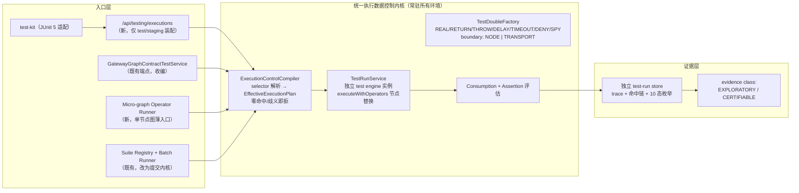

## Plan: Resource Gateway 可测试性工业化 v1 —— Execution Data Control Plane 实施蓝图

**TL;DR**：以 resource-gateway-industrial-testability-evolution-plan.md 为北极星终态，从既有 `GatewayGraphContractTestService` 语义中**提炼统一执行数据控制内核**，向上开放调用方驱动的 fixture 注入入口（/api/testing/executions + micro-graph operator runner + test-kit），向下以「独立 test engine 实例 + BLOGE run-scoped `ExecutionOptions.operatorResolver`」在 RG 层落地；隔离采用「入口硬隔离 + deny-by-default + 证据分级」，验收采用仓库自身 CI dogfooding。分三个阶段交付（语义冻结 → 内核提炼 → 注入入口与工程化），每阶段独立可验证。可靠性模型形式化为：**DAG 正确性 = L1（真实算子 + 效应边界拟合）⊕ L3（真实编排 + 节点边界拟合）**，合成缝由保真度阶梯（F0-F5）封闭，前提「算子确定性」由 Composability Contract 强制而非假设（见第五节）。

### 实施状态（2026-07-16）

| 阶段 | 状态 | 已落地证据 |
| --- | --- | --- |
| Stage 0 | 完成 | operator suite API/UI 显式 `SCHEMA_CONTRACT`；`testing/domain` 五个版本化 record；capability testability 描述；[ADR-001](adr/ADR-001-resource-gateway-test-runtime-isolation.md)、[ADR-002](adr/ADR-002-operator-composability-and-opaque-runtime.md)、[ADR-003](adr/ADR-003-semantic-coverage-protocol-versioning.md) 与 [BLOGE framework requirement](bloge-framework-execution-control-requirement.md) |
| Stage 1' | 完成 | `testing/planning/runtime/evidence` 内核；独立 test engine；五行为；F2/F3 resource fixture；micro-graph runner；旧 graph suite adapter；37 个聚焦测试与 1653 个项目测试全绿 |
| Stage 2' | 进行中 | 已落地 graph/operator target discovery、operator target v2 composability manifest、graph execution/batch/query、operator micro-graph execution、canvas executable operator suite（含四类 case intent、内容寻址 fixture 与一等 TestSuite 发布、聚合执行/coverage/promotion 回显）、immutable fixture/TestSuite registry、幂等 TestSuite runner、独立 child/suite-run store、聚合结构 coverage 与 promotion eligibility、10 态 child evidence、profile/identity/生产协议隔离、独立 Java/JUnit/CI test-kit suite adapter、七图/14-case F3 dogfooding及其内容寻址 catalog materialization、numeric tolerance、run-scoped logical clock + DELAY/TIMEOUT、受治理 F4 replay payload 精确捕获/脱敏/retention/tombstone、exact-ref REPLAY 执行、payload-free effective plan v2 谱系与认证降级，以及同步 root/nested/foreach/loop/compensation 的结构寻址、控制传播、动态 attempt/occurrence selector 和 occurrence/attempt/node/edge evidence；streaming/suspendable control/evidence 与物理 network/runtime 隔离仍待完成 |
| Stage 3 evidence chain | 进行中 | graph/operator child signature、suite checkpoint/terminal aggregate attestation、ordered child closure、payload-free portable bundle、suite/evidence/attestation 独立 v2 typed semantic coverage 已完成；signed atomic key-set、managed v1/v2 lifecycle、签名时刻 lifecycle policy、外部 M-of-N trust publication、bounded append-only consistency page、durable consumer checkpoint、rollback/fork/split-view/revoked-pin resurrection detection 与 test-kit independent verifier 已完成；exact-suite ANEKE semantic workbook seed、`GovernanceGateResult.v3` 可重建 basis、编译级 GraphDraft target 绑定与独立 schema consumer 已完成；真实 ANEKE N/N-1 conformance、独立 witness gossip/跨域一致性证明待完成 |
| Stage 4 deterministic runtime | 进行中 | run-scoped TIME/RANDOM/UUID、environment-dependent built-in resolver、effective plan v3/provider state、semantic result fingerprint、组合 durable checkpoint/fixture cursor、静止边界 recorder snapshot、同库事务、数据库时钟 lease CAS、幂等命令与 staged `ExecutionStore + ExecutionCheckpointStore + WaitStore + WorkItemStore` aggregate 已完成；BLOGE 公共 `CheckpointFailurePolicy.FAIL_FAST`、fresh execution-to-durable-boundary 与同步 cold-start signal recovery 已装配。RG fresh `RunSession` 已能在无驻留线程的情况下同步返回首个终态或持久化 suspension，内部 `RecoverySession` 已能从 v2 `RESUMING` fence 恢复真实 suspension、延续 fixture cursor，并把下一静止边界与 control checkpoint 原子提交或整体回滚。公开 payload-free query 已按 tenant/environment/org/project non-disclosure scope 投影完整性验证后的 fence、依赖与边界指纹；`test`/`staging` owner claim 已把 authorization receipt、结果 fence 与 worker dispatch 原子绑定；公开 authenticated heartbeat 已按 exact predecessor fence 隐式解析已签发 dispatch、保持 principal 连续性，并用 live fence + 数据库时钟原子旋转 revision/lease/successor dispatch；公开 terminal recovery 已在同身份与同授权下执行一个有界 signal，并原子提交 server-derived BLOGE mutation、terminal checkpoint、审计与显式 evidence-gap receipt。public run 创建、worker poll/dispatch、多 suspension 编排、自动 heartbeat 调度、完整历史 trace evidence、stream offset/checkpoint、identity/flag/secret authority 和确定性并发待完成 |

Stage 4 最新增量：fresh `RunSession` 的 initial-boundary policy 只接受唯一持久化 signal wait，
并把 fixture cursor 与四 store closure 在同一静止点冻结；终态、pause、timer/work-item/stream
以及多 suspension 在进入 repository 前 fail closed。它关闭了公开创建所需的运行时边界歧义，
但尚不等于公开 run 创建协议。

Stage 0 验证基线：Resource Gateway `clean verify` 共 1624 tests、0 failures、33 个既有条件跳过；AuthorCanvas 聚焦回归 36 tests、0 failures。后续阶段必须继续维持该基线并增加对应反面用例。

Stage 1 实现证据与复现命令见
[Execution Data Control Plane Stage 1 verification](resource-gateway-execution-data-control-plane-stage1-verification.md)。
Stage 1 全量验收：Resource Gateway `clean verify` 共 1653 tests、0 failures、0 errors、34 个条件跳过，JAR 打包成功。
当前严格验收：Resource Gateway `clean verify` 共 2023 tests、0 failures、0 errors、2 个条件跳过，真实浏览器回归与 JAR 打包成功；本轮 Stage 4 durable checkpoint/aggregate/public payload-free query/owner-claim/recovery/authorization-bound dispatch/live-fence heartbeat/terminal commit 聚焦 152 tests、0 failures、0 errors、0 skips。Canvas suite 聚焦 68 tests、前端全量 150 tests，桌面与 390 x 844 真实浏览器均完成两行 `GOLDEN + BOUNDARY` 一等 suite 发布并返回 `2/2 + SATISFIED + ELIGIBLE`。Canvas 对 registry 返回的完整 suite value 和 runner 返回的 child/coverage/promotion/aggregate 一致性 fail closed，异步执行期间冻结表格，探索运行会使旧 publication 失效。Immutable TestSuite runner/attestation/protocol 增量聚焦 49 tests；key lifecycle 增量聚焦 41 tests；动态 selector/capability/schema 增量聚焦 51 tests；typed semantic coverage/codec/registry/persistence/schema/capability 增量聚焦 52 tests；ANEKE semantic workbook 增量聚焦 40 tests；semantic gate/projector/target/schema 增量聚焦 23 tests；integration package 138 tests；suite-run lease/reconciliation/profile 聚焦 22 tests；built-in catalog materialization 增量聚焦 34 tests；evidence trust server/HTTP/schema 增量聚焦 15 tests；独立 test-kit `clean verify` 62 tests，均为 0 failures、0 errors；test-kit library/CLI JAR 已打包 testing-control-plane v1、semantic-workbook v1、governance-gate v3、evidence-key-set v1、evidence-trust-publication/bundle v1 权威 schema，完整 suite/catalog/semantic workbook/gate/trust wire value 在消费前执行 Draft 2020-12 schema 校验和请求身份回绑，doclint 零告警并进入 `verify` 门禁。
Nested invocation 增量聚焦验收：37 tests、0 failures；非空 foreach 的三个 item 全部消费同一受限 fixture，真实外部算子调用数为 0，compensation 使用独立 site 且真实补偿调用数为 0。项目 `clean verify` 执行 1704 tests 时 1703 通过、1 个既有浏览器 connectability readiness 用例瞬时超时；该失败用例随即独立复跑 1/1 通过。此记录不得改写为一次严格全绿的全量运行。
独立 test-kit 当前 `clean verify` 共 62 tests、0 failures、0 errors；library JAR、依赖内置 CLI JAR 与权威 testing-control-plane v1、semantic-workbook v1、governance-gate v3、evidence-key-set v1、evidence-trust-publication/bundle v1 schema 一同打包成功，并提供 graph/operator target、fixture/suite builder、typed semantic requirement 与 fail-closed verdict 投影、ANEKE semantic workbook manifest/相对 evidence endpoint 强校验、governance gate 提交前/确认后双向 schema 校验、catalog materialization exact-ref 投影、child/suite-run/签名完整性 manifest 强类型投影、外部 M-of-N trust policy、durable checkpoint 与 rollback/fork/split-view/revoked-pin resurrection 检测、signed key-set 时态撤销校验、suite evidence bundle 离线验签、JUnit assertion/XML、精确幂等 suite 执行与旧 child-run v1 响应兼容。
这里的“完成”只指内核与已列出的 adapter。Stage 2 已开放公共 graph/operator control plane、
持久化 store、Java/JUnit/CI suite adapter 和 Canvas 多行一等 suite 发布/执行，并完成全部内置图的
stored-suite F3 迁移与 dogfooding；streaming/suspendable control/evidence 和物理隔离仍不得提前
写入产品可用清单。当前 API 与运行方式见
[Testing Control Plane API](resource-gateway-testing-control-plane-api.md)。
独立 client adapter 的边界、测试矩阵与非声明见
[Stage 2 test-kit verification](resource-gateway-execution-data-control-plane-stage2-test-kit-verification.md)。
公共同步算子执行、runtime-binding 冻结与认证反例见
[Stage 2 operator adapter verification](resource-gateway-execution-data-control-plane-stage2-operator-adapter-verification.md)。
一等 TestSuite 的协议边界、依赖闭包、权限反例和非声明见
[Stage 2 suite registry verification](resource-gateway-execution-data-control-plane-stage2-suite-registry-verification.md)。
精确 suite 执行、幂等/检查点语义、聚合覆盖与发布资格边界见
[Stage 2 suite runner verification](resource-gateway-execution-data-control-plane-stage2-suite-runner-verification.md)。
Java/JUnit/CI suite builder、强类型投影、fail-closed 退出码与无 payload 报告见
[Stage 2 suite consumer adapters verification](resource-gateway-execution-data-control-plane-stage2-suite-consumer-adapters-verification.md)。
Canvas 多行 case intent、内容寻址 fixture/suite 发布、聚合证据回显与真实浏览器闭环见
[Stage 2 Canvas suite publication verification](resource-gateway-execution-data-control-plane-stage2-canvas-suite-publication-verification.md)。
内置图矩阵、不可达 endpoint 逃逸证明与认证边界见
[Stage 2 dogfooding verification](resource-gateway-execution-data-control-plane-stage2-dogfooding-verification.md)。
内置七图 catalog 的内容寻址迁移、幂等重试、精确引用与统一 runner 验证见
[Stage 2 catalog materialization verification](resource-gateway-execution-data-control-plane-stage2-catalog-materialization-verification.md)。
逻辑时间、时间故障注入及其非声明见
[Stage 2 logical-time verification](resource-gateway-execution-data-control-plane-stage2-logical-time-verification.md)。
动态 attempt/occurrence selector 的一基坐标、优先级与真实 retry/nested re-entry 证明见
[Stage 2 dynamic selector verification](resource-gateway-execution-data-control-plane-stage2-dynamic-selector-verification.md)。
Stage 3 子运行证据签名、失败语义与非声明见
[Stage 3 signed test evidence verification](resource-gateway-execution-data-control-plane-stage3-signed-test-evidence-verification.md)。
Stage 3 suite checkpoint/terminal attestation、便携 bundle 与离线验签见
[Stage 3 suite attestation verification](resource-gateway-execution-data-control-plane-stage3-suite-attestation-verification.md)。
Stage 3 原子 key-set、带外 pin、生命周期与签名时刻撤销语义见
[Stage 3 key lifecycle verification](resource-gateway-execution-data-control-plane-stage3-key-lifecycle-verification.md)。
Stage 3 外部 M-of-N pin publication、bounded consistency page、durable checkpoint 与
rollback/fork/split-view/revoked-pin recovery 见
[Stage 3 evidence trust transparency verification](resource-gateway-execution-data-control-plane-stage3-evidence-trust-transparency-verification.md)。
Stage 3 typed semantic suite policy、fail-closed verdict、独立签名域与 test-kit N/N-1 消费见
[Stage 3 semantic coverage verification](resource-gateway-execution-data-control-plane-stage3-semantic-coverage-verification.md)。
Stage 3 exact semantic suite 的 ANEKE payload-free seed、混代际拒绝、验证状态与 consumer 证明见
[Stage 3 ANEKE semantic workbook verification](resource-gateway-execution-data-control-plane-stage3-aneke-semantic-workbook-verification.md)。
Stage 4 run-scoped provider、semantic result identity 与 provider-state 精确恢复证明见
[Stage 4 execution services verification](resource-gateway-execution-data-control-plane-stage4-execution-services-verification.md)；
组合 checkpoint、同库事务参与、CAS 围栏与故障回滚证明见
[Stage 4 durable checkpoint verification](resource-gateway-execution-data-control-plane-stage4-durable-checkpoint-verification.md)。

---

### 一、背景

**已有资产**（经代码与文档双重核实）：

| 资产 | 现状 | 局限 |
|---|---|---|
| `GatewayGraphContractTestService` + `GatewayGraphResourceMock` | 表驱动 resource mock、真实 DSL 执行、coverage policy、stored suite + batch runner | 只按 resourceId 寻址、只有 RETURN 语义、走测试专用端点 |
| `VisualGraphSimulationService` + `SimulationOperator` | 三层 fixture（nodeFixtures → fixtureOverrides → transient simulate）、MOCKED/REAL 标记 | 只服务画布路径、按 nodeId 寻址、无行为语义 |
| `VisualOperatorContractTestService` | schema 校验 + path 断言 | **并未真实执行 operator**（只是 fixture 自洽校验，存在假安全感） |
| bloge-test（`MockOperator`/`GraphTestRunner`/逻辑时间/snapshot）与引擎 `executeWithOperators(Map)` | JVM 内测试方法论完备；引擎有节点级替换逃生口 | 裸 Map 无版本/目的/审计语义，不是工业协议 |

**核心命题修正**（R1-Q5 与文档 §1 一致）：算子可测是 DAG 可测的**必要非充分**条件。正确公式为「算子可测 + 组合语义可注入可断言（edge/foreach/retry/fallback/consumption）→ DAG 可测」。

**可靠性模型精化**（Round 7）：「算子内部逻辑是确定性的，在副作用交互时刻屏蔽其数据输入输出并以预期数据拟合，即可验证算子逻辑正确性；整张 Graph 同理」——该模型成立，但屏蔽点分两层：**节点边界**（算子整体被替换，验证编排与下游）与**效应边界**（算子内部副作用交互处被替换，验证算子本身逻辑）。DAG 正确性由两层测试合成，合成处存在保真度缝，其封闭手段与构造效率见第五节。

### 二、要解决的问题

1. **语义分裂**：三套 mock 机制寻址、fixture 模型、MOCKED 语义各自漂移，没有单一注入内核。
2. **能力缺位**：不存在「任意调用方在运行时注入 fixture、使 DAG 行为完全可控可预期」的一等能力（你提出的数据流控制反转）。
3. **假阳性温床**：mock 未命中静默走真实调用、required fixture 未消费仍显示通过、operator "测试"实为 schema 自洽检查。
4. **隔离靠约定**：无结构性保证防止测试控制进入生产数据面；MOCKED 响应有污染生产响应缓存的现实路径。
5. **工程化断层**：CI 无法以软件工程成熟方式（JUnit 生态、批量回归、趋势对比）消费编排测试。
6. **保真度缝**：节点边界 fixture 允许**自报**真实逻辑永远不会产生的状态（典型：`GatewayGraphResourceMock` 可自报 `success=true`，而真实运行中 success 由 `ResponseProtocol` 从响应体判定）——graph 测试可在失真数据上全绿，产生假信心；且缺少降低高保真模拟数据构造成本的体系化手段。

### 三、客户价值

| 群体 | 价值 |
|---|---|
| DAG 编排作者 | 运行前可见 EffectiveExecutionPlan（谁真实/谁被替换/谁被禁止）；error-branch 与 foreach 分支可确定性覆盖 |
| QA / 平台工程 | 大规模批量验证：inline fixture + suite registry 批量跑，独立 test-run store 支撑回归对比与趋势 |
| CI / 发布 gate | JUnit XML + test-kit 断言进入现有流水线；认证级证据（CERTIFIABLE）供 publish gate 消费，不与生产证据混淆 |
| Operator 开发者 | micro-graph runner 给出真实执行的 EXECUTABLE_UNIT 认证（效应边界拟合，算子内部逻辑真实执行）；Composability Contract 明确「可重复单测」的准入 |
| SRE / 安全 | 生产触碰类安全告警；测试控制在结构上（端点 + profile + 独立引擎实例 + 目标态独立部署）不可能进入生产数据面 |
| ANEKE 消费方 | 测试证据带指纹链（target/fixture/plan），可进 workbook/gate（Stage 3 起） |

### 四、解决手段（目标架构与 v1 范围）

**v1 激活面 / 预留面 / 排除面**：

| 维度 | v1 激活 | schema 预留（v1 显式拒绝使用） | 明确排除（后续 Stage） |
|---|---|---|---|
| Selector（InvocationSite 子集） | graphPath+nodeId（主身份）、operatorRef/resourceRef（批量维）、invocationKind（默认 PRIMARY）、correlationKey、match、attempt、occurrence；动态坐标一基且复用 evidence identity | — | streaming/suspendable/durable resume 坐标 |
| Match | canonical JSON equals、JSON Pointer equals/exists/absent、schema match、correlationKey equals、受限正则 | — | 表达式语言（永久排除，见决策表） |
| 行为 | REAL / RETURN / THROW / DELAY / TIMEOUT / DENY / SPY / REPLAY；DELAY/TIMEOUT 必须绑定 run-scoped logicalClock；REPLAY 只接受预解析 exact ref 且禁止 fallback-to-real；resource 类 RETURN 支持 rawBody+statusCode 形态（F2 协议派生：success/payload 由真实 `ResponseProtocol`/payloadPath 派生，禁止自报） | STREAM | sequence 与流式时间行为（依赖 stream runtime） |
| Double 边界 | boundary=NODE（默认，节点边界）；boundary=TRANSPORT（效应边界）——v1 对 httpResource 可用（`StubHttpRequestOperator` 产品化），L1 对 httpResource **强制** TRANSPORT | 非 resource 算子的 TRANSPORT（依赖 Composability port 声明） | 通用 port 级 double 推广（随 Composability Contract 覆盖率，Stage 3+） |
| 保真度 | fixture 形态事实入 trace（OUTPUT_LEVEL / PROTOCOL_DERIVED / TRANSPORT_LEVEL / REPLAYED）；**认证级证据要求 resource 类 mocked site ≥ F2，REPLAY 来源也必须可认证** | — | F5 sandbox 双验与反熵漂移（Stage 4/5） |
| 默认行为 | 外部副作用算子 deny-by-default（未覆盖→FIXTURE_UNMATCHED）；纯计算算子真实执行 | allowReal allowlist 字段 | — |
| Consumption | required/minUses/maxUses + FIXTURE_UNUSED 失败 | onExhausted 策略扩展 | — |
| Schema 纪律 | 默认 strict；WARN/OFF 需显式声明+理由，evidence 标记 schema-waived，waived run 不得认证 | — | — |
| 断言 | 既有 5 模式 + nodeAssertions + **numeric tolerance（v1 补齐）**，服务端可选 | — | property/mutation（P2） |
| 供给 | `JsonSchemaSampleGenerator` 草稿生成（含 rawBody 模板，服务 F2 形态） | — | record-replay（phase 2，必须与 payload replay 共底座+脱敏前置） |
| 证据 | 独立 test-run store、10 态枚举、fixture 命中链、每节点 MOCKED/REAL、每 mocked site 保真度事实、verbosity 参数；child evidence detached signature、suite checkpoint/terminal attestation、便携 bundle、signed key lifecycle、外部 M-of-N trust publication、bounded consistency page、durable checkpoint、rollback/fork/split-view/revoked-pin resurrection detection、typed semantic coverage、ANEKE semantic seed、可重建 gate v3 basis 与 consumer verifier 已落地 | — | 真实 ANEKE N/N-1 conformance、独立 witness gossip/跨域一致性证明（Stage 3 后续） |

### 五、可靠性模型与保真度阶梯

本节回答本方案的可靠性根基问题：为什么「屏蔽副作用交互并拟合数据」足以验证业务正确性，以及如何提高拟合保真度、降低高保真数据的构造成本。

#### 5.1 精化一：屏蔽点分两层，验证目标不同

| | 节点边界替换（boundary=NODE，RETURN 默认） | 效应边界替换（boundary=TRANSPORT） |
|---|---|---|
| 屏蔽位置 | 算子整体被 test double 替代 | 算子**内部**、副作用交互的瞬间（如 HTTP 发送处） |
| 算子内部逻辑 | **不执行、不被验证**（URL 渲染、参数映射、`ResponseProtocol` 解析、payloadPath 提取全部跳过） | **真实执行、被验证** |
| 适用对象 | 被测主体的**依赖**（拟合下游数据供编排层消费） | **被测主体本身** |
| 服务的测试层 | L3 graph contract（真实编排 + 边界拟合） | L1 EXECUTABLE_UNIT（真实算子 + 效应边界拟合） |

**合成公式：DAG 正确性 = L1 ⊕ L3。** 单独任何一层都不能兑现「验证逻辑正确性」的声明：L3 中被节点边界替换的算子，其内部逻辑必须由该算子自身的 L1 测试覆盖；L1 只证明单算子正确，编排语义（edge/foreach/retry/fallback/context merge）由 L3 覆盖。

#### 5.2 精化二：确定性是契约不是假设

「算子内部逻辑是确定性的」必须被强制而非默认成立——偷读系统时间、隐藏 HTTP client、访问全局可变状态的算子直接破坏该前提。强制链：Composability Contract（外部依赖走可注入 port、时间走 `timeSource()`、随机/UUID/身份走 provider）→ 不满足者降级 OPAQUE_RUNTIME（不得宣称可重复验证，决策 #15）→ Stage 4 已把 TIME/RANDOM/UUID 纳入 `ExecutionServices` 控制面，并以排除运行身份/计时/完成顺序的 `semanticResultFingerprint` 证明重复运行的业务语义相同；IDENTITY/FEATURE_FLAG/SECRET 仍 fail closed。**前提不成立的算子被诚实标记为「无法用此方法保障」，而非产出假证据。**

#### 5.3 保真度阶梯（如何提高拟合保真度）

| 级 | 形态 | 保真度 | 构造成本 | 状态 |
|---|---|---|---|---|
| F0 | schema 草稿样本（`JsonSchemaSampleGenerator`） | 结构合法 | ≈0 | v1 已含 |
| F1 | schema-strict 手工 payload | 结构 + 人工业务判断 | 中 | v1 默认 |
| F2 | **协议派生**：fixture 只给 rawBody+statusCode，`success`/`payload` 由真实 descriptor 逻辑（`ResponseProtocol` + payloadPath）派生 | 消除自报 success 缝 | **≈0（复用既有逻辑）** | **v1 采纳** |
| F3 | transport 级：请求侧 `expectedParams` 断言（既有）+ 响应侧 F2 派生，参数映射/URL 渲染真实执行 | 请求/响应双侧真实逻辑 | 中 | v1（L1 对 httpResource 强制） |
| F4 | record-replay：现实即数据源（SPY 采集 → 脱敏 → 回放） | 真实分布 | 采集后 ≈0 | phase 2（与 payload replay 共底座） |
| F5 | sandbox conformance 双验 + 反熵漂移检测（北极星文档 §16.3） | fixture 与真实 provider 持续对账 | 运维性 | Stage 4/5 |

**最危险的保真缝及其封闭**：`GatewayGraphResourceMock` 形态的 fixture 可自报 `success=true`，而真实运行中 success 由 `ResponseProtocol` 判定——fixture 能声明真实协议逻辑永远不会产生的状态组合，graph 测试照样全绿。F2 以派生取代自报封闭响应侧；请求侧由既有 `expectedParams` 断言覆盖；双侧合围后，节点边界 mock 接近 transport 保真度。

**认证门槛（v1 即生效，决策 #19）**：resource 类 mocked site 为 OUTPUT_LEVEL（自报 success 的 payload 形态）的 run 只能产生 EXPLORATORY 证据；CERTIFIABLE 要求 ≥ PROTOCOL_DERIVED。与 schema-waived 降级（决策 #11）复用同一 evidence class 通道。

#### 5.4 构造效率（如何降低高保真数据成本）

- v1：F0 草稿生成（含 rawBody 模板）+ suite 复用 + base/override 分层；
- Stage 3：test data matrix（边界值/枚举/oneOf 变体，北极星文档 §15.3）；
- phase 2 最大杠杆：**F4 record-replay 把「构造」变成「捕获 + 脱敏 + 挑选」**——v1 已含的 SPY 行为即录制管道的采集前段，链路预留贯通；
- 反熵：schema-uncovered 标记推动 schema 覆盖率，反过来提高 F0/F1 草稿质量。

### 六、手段合理性：为什么这是当下最优

1. **内核从已验证语义提炼而非凭空设计**——`GatewayGraphContractTestService` 与目标语义最近（真实 DSL 执行 + resource mock），其既有测试是行为保持重构的免费安全网；文档原 Stage 1 先建独立 fixture 原语会在 Stage 2 迁移时返工一次。
2. **RG 层先行、引擎需求同步成文**——本仓已验证该演进模式（bloge-framework-operator-function-schema-export-requirement.md 即 example 先行→框架原生需求的先例）；且 `executeWithOperators` + plan 编译期展开（resourceRef → node map）使 v1 无需引擎改动、无需 GraphContext magic key。
3. **独立 test engine 实例优于共享拦截器链排序**——结构性消除「MOCKED 响应进生产响应缓存」的 P0 完整性隐患（`ResponseCacheInterceptor` 当前最外层且按 nodeId:input 键缓存），也不污染限流/熔断统计；`VisualGraphSimulationService` 已是该形态先例。
4. **隔离对象是「入口」而非「内核」**——内核以 `SimulationOperator` 形态本就存在于生产（visual simulate/contract test 跑在生产控制面）；生产攻击面无新增，新增的 caller 注入入口用 profile 硬隔离。`testMode=true` 参数方案（文档 §21.1）被双方独立否决。
5. **deny-by-default 全链贯穿**——未命中失败、未消费失败、歧义失败、schema-invalid 失败、生产 purpose 非空 plan 失败：完整性靠结构而非「每个使用者都不犯错」。
6. **时间窗最优**——既有演进计划 P1（ANEKE 体验闭环）正卡在等外部 consumer 对接，测试性工作全部内部可控，是等待期的最优投入（R1-Q1 依据）。

### 七、分阶段实施（可直接指导开发）

#### Stage 0：语义冻结与诚实命名

1. 将 `VisualOperatorContractTestService` 的现有模式显式标记为 SCHEMA_CONTRACT（API 响应与 UI 文案），消除「operator test 已跑通」的假安全感。
2. 定义域模型 v1（Java record，放入新包 testing/domain）：InvocationSite、FixtureRule（selector/behavior/consumption/schemaCheck）、FixtureBundle、EffectiveExecutionPlan、TestRunEvidence 骨架——schema 按文档 §8 全量定型，含预留字段。
3. 两份 ADR：①隔离终态=独立 test-runtime 部署，过渡态同进程四重隔离（endpoint/profile/identity/network）+退出条件；②OPAQUE_RUNTIME 判定=肯定+自然过渡（EXECUTABLE_UNIT 认证只发给满足 Composability Contract 者，存量不追溯、产出 inventory+backlog）。
4. 引擎需求文档（新建 docs/bloge-framework-execution-control-requirement.md）：按文档 §9 重组——ExecutionOptions/ExecutionPurpose+ControlPlan（P0）、拦截器顺序契约+引擎原生 trace（P1）、OperatorResolverChain 统一解析（P1）、ExecutionServices/FunctionCallSite（P2）；fixture SPI 整体下沉写入「待 RG 验证成熟后再提」章节。
5. capability probe 暴露 testability 协议版本与 enabled environments。

**验收**：系统不再把 schema 自洽校验表述为 operator 执行测试；ADR/需求文档进 docs/。

#### Stage 1'：内核提炼（行为保持重构）

1. 新建包结构（文档 §10.1）：testing/domain、testing/planning（ExecutionControlCompiler/SelectorResolver/SafetyPreflight）、testing/runtime（TestRunService/TestDoubleFactory/InvocationRecorder）、testing/evidence、testing/api。
2. 从 `GatewayGraphContractTestService` 提炼执行路径入内核：selector 解析（v1 激活子集）→ preflight 产出 EffectiveExecutionPlan（零命中/歧义→CONTROL_PLAN_REJECTED）→ 独立 test engine 实例（不注册生产横切拦截器）→ `executeWithOperators` 注入 doubles → trace 采集（ExecutionListener）→ consumption 检查 → 断言评估。既有 contract test 端点语义不变，成为内核第一个 adapter。
3. TestDoubleFactory 实现五行为：RETURN（schema-gated）、THROW（标准化 error code/type）、DENY（触发即失败）、SPY（真实执行+录制输入输出与 side-effect intent）、REAL（显式）。RETURN 对 resource 类支持两种 fixture 形态：payload 形态（记录为 OUTPUT_LEVEL，不可认证）与 **rawBody+statusCode 形态（F2 协议派生：由目标 descriptor 的真实 `ResponseProtocol`/payloadPath 逻辑派生 success/payload，记录为 PROTOCOL_DERIVED）**；double 增加 boundary 维度（NODE 默认 / TRANSPORT 效应边界，后者以产品化 `StubHttpRequestOperator` 注入 stub 传输层，真实执行参数映射/URL 渲染/协议解析）。
4. Micro-graph operator runner 薄入口：单节点图组合内核执行，绑定 runtime binding 指纹；输出 EXECUTABLE_UNIT 或 OPAQUE_RUNTIME 分类；产出存量 operator 的 Composability Contract inventory。**对 httpResource 的 EXECUTABLE_UNIT 强制 boundary=TRANSPORT**（节点边界替换对被测主体在逻辑上无意义——全替掉即什么都没测）；非 resource 算子的 TRANSPORT 边界依赖其 Composability port 声明，未声明者本就归类 OPAQUE_RUNTIME，语义自洽。

**验收**：既有 contract test 全绿（安全网）；四类 conformance case（纯 operator、`HttpResourceOperator` TRANSPORT 级 stub、失败 operator、side-effect DENY）通过；F2 派生正确性用例（同一 rawBody 在不同 `ResponseProtocol` 变种下派生出正确 success/payload）通过。

#### Stage 2'：调用方注入入口与工程化（*依赖 Stage 1'*）

1. 新端点 /api/testing/executions（仅 test/staging profile 装配 bean）：TestExecutionRequest 按文档 §8.1（inline fixture 即时 sha256 指纹化；或 suiteRef）；响应含 plan 回显 + 全节点 trace（verbosity 参数）+ 断言结果 + 10 态枚举。
2. 独立 test-run store（record 模型与生产 run record 同构、分表/分库、独立 retention）；evidence class 字段：EXPLORATORY（inline / schema-waived / 含 OUTPUT_LEVEL resource mock）vs CERTIFIABLE（stored suite ref、无 waiver、resource 类 mocked site ≥ F2）。
3. **已实现一等 suite runner 主路径**：精确 suite id/revision/fingerprint 与 scoped
   `clientRequestId` 形成幂等执行意图；graph/operator case 逐项向公共内核 adapter 提交，首 case
   前及每个 child run 后固化 `RUNNING` checkpoint；支持 COLLECT_ALL 与仅停止新调度的 FAIL_FAST；
   从 child evidence 聚合 case type、invocation site、edge transfer、assertion density 和 required
   fixture consumption，服务端只签发 `ELIGIBLE/BLOCKED` 资格判定。Canvas 已把多行表按四类
   case intent 发布为内容寻址 fixture 与一等 suite，并执行精确 revision；旧 graph catalog 已通过
   `PUT /api/testing/catalogs/gateway-graph-contract-v1` 在已认证 tenant/environment 下幂等物化为
   内容寻址 fixture 与一等 suite，七图/14 case 均通过统一 runner 达到
   `PASSED + SATISFIED + ELIGIBLE`，并已补齐受约束的 numeric tolerance。Canvas 消费端同时对完整 stored suite
   value 与 child run、assertion、coverage、promotion、aggregate 的逻辑一致性做 fail-closed 回绑，
   不接受只有顶层绿色状态的伪证据。Java/JUnit/CI
   adapter 已提供 exact suite builder/register/find/execute/query、payload-free projection/assertion/XML
   与默认要求 `PASSED + SATISFIED + ELIGIBLE` 的可执行 CLI。
4. test-kit 模块（新 Maven module）：薄 HTTP client + FixtureBundle/TestSuite builder + JUnit 5
   断言适配 + JUnit XML + dependency-contained CI CLI。
5. 安全告警（生产触碰类）：test purpose 触达生产 endpoint/credential、production run 携非空 control plan → 安全事件。
6. **已实现 Dogfooding**：七张示例图建立 14 个 case 并接入 `clean verify`；28 个资源调用观测全部使用 F3 raw response，retry fixture 用 `minUses/maxUses` 精确计数；真实 Spring wiring 将 descriptor 指向 `127.0.0.1:1` 后仍全绿。`enrichOrderList` 同时覆盖空集合边界与两条订单的并行 foreach body，后者对四个嵌套资源 occurrence 独立注入和断言，并依靠 occurrence-addressable node/edge evidence 签发 CERTIFIABLE。验证见 [Stage 2 dogfooding verification](resource-gateway-execution-data-control-plane-stage2-dogfooding-verification.md)。
7. **已实现公共 operator adapter**：发现端点冻结实现闭包、schema、runtime state、v2 composability manifest 与 resource dependency；执行端点把 JSON 输入转换为声明 Java 类型，并通过一节点 micro graph 复用同一 kernel/evidence/store；fixture registry 与独立 test-kit 同时支持 OPERATOR target。无状态只解决 runtime state 冻结，不再自动取得认证资格；非 resource binding 还必须提供 `OperatorComposabilityManifestProvider`，声明无外部依赖、无未托管全局状态、无尚未受控 execution service，并绑定 conformance suite 指纹。有状态 binding 另需 `OperatorRuntimeBindingSnapshotProvider`；`HttpResourceOperator` 必须使用 TRANSPORT fixture；任一条件缺失即使 stored fixture 跑通也只能 EXPLORATORY。验证见 [Stage 2 operator adapter verification](resource-gateway-execution-data-control-plane-stage2-operator-adapter-verification.md)。
8. 维护本蓝图文档：所有实现期决策变更以 decision delta 追加进第九节，保持与北极星文档的引用一致性。

**验收**：见第八节验证清单。

#### Stage 3-5：按北极星文档执行（child evidence 签名、aggregate attestation、key lifecycle、外部 M-of-N trust publication/consistency checkpoint、consumer verifier、typed semantic coverage、ANEKE semantic seed 与 gate v3 basis 已完成；ExecutionServices/FunctionCallSite/TIME/RANDOM/UUID 首增量已完成；真实 ANEKE N/N-1 conformance/独立 witness gossip → semantic result fingerprint/durable provider state/streaming → 独立部署/配额/mutation）。

**Relevant files**
- GatewayGraphContractTestServiceTest.java — Stage 1' 行为保持重构的安全网；`GatewayGraphContractTestService` 本体为内核提炼源
- VisualGraphSimulationService.java — 独立引擎实例先例；最后收编对象
- HttpResourceOperator.java — F2 派生复用其 `ResponseProtocol`/payloadPath 路径；RETURN fixture 的 payload 形态对齐 `HttpResourceOutput`，沿用 `GatewayGraphResourceMock` 字段（该形态记录为 OUTPUT_LEVEL，不可认证）
- HttpResourceOperatorTest.java 中的 `StubHttpRequestOperator` — boundary=TRANSPORT double 的产品化来源（注入 stub 传输层先例）
- ResponseCacheInterceptor.java — 缓存污染隐患来源；架构测试断言对象
- resource-gateway-industrial-testability-evolution-plan.md — 北极星终态文档
- 新建：testing/* 五个子包、/api/testing/executions、test-kit module、两份 ADR、引擎需求文档、v1 蓝图文档、dogfooding suites

### 八、验证策略

1. Stage 1' 重构后 `mvn -f pom.xml clean verify` 全绿（AGENTS.md 规定的项目级验证命令）。
2. 反面用例：漏配 fixture 的外部算子 → FIXTURE_UNMATCHED（绝不真调外部）；required fixture 未消费 → FIXTURE_UNUSED；同级重叠 selector → CONTROL_PLAN_REJECTED；attempt/occurrence 越界、非递增或坐标空洞 → preflight/runtime fail closed。
3. 架构测试：test engine 实例构建配置不含生产横切拦截器（结构性证明 MOCKED 永不进响应缓存/限流/熔断统计）。
4. 隔离测试：production profile 下 /api/testing/** bean 不存在；生产 run API 请求携 control 字段被拒并触发安全事件。
5. Dogfooding：全部七张示例图的 14 个 case 达 coverage policy；Spring 测试把 descriptor 指向不可达 endpoint，证明 28 个执行中的 root/nested 资源调用观测全部由 F3 fixture 控制；37 个业务断言和证据分级进入 CI。非空 foreach case 对两条并行订单、四次嵌套资源调用和各自 correlation/graph occurrence 完成认证验证。
6. Conformance：Stage 1' 四类 operator 用例 + evidence class 正确分级（inline→EXPLORATORY，stored+无 waiver 且 ≥F2→CERTIFIABLE）。
7. 保真度反面用例：resource 类 mocked site 为 OUTPUT_LEVEL（自报 success）的 run 断言不产生 CERTIFIABLE 证据；F2 形态下构造「rawBody 与预期 success 矛盾」的用例，断言以真实协议派生结果为准。
8. 效应边界用例：L1 对 `HttpResourceOperator` 的 TRANSPORT 级测试断言参数映射/URL 渲染/协议解析被真实执行（stub 传输层捕获渲染后的请求并校验）。

### 九、决策依据总表（含对北极星文档的 delta）

| # | 决策 | 依据 | 被否方案与原因 |
|---|---|---|---|
| 1 | 测试性插队为新 P1 | 原 P1 卡等 ANEKE 外部对接，测试性全内部可控；产出反哺 gate | 并行双轨（资源分散）；并入原 P1（违背计划「不混杂」原则） |
| 2 | RG 先行→下沉框架，需求文档同步 | 仓库已验证的演进模式；`executeWithOperators` 使 v1 零引擎改动 | 引擎原生先行（周期长、抽象未经实战）；纯 RG 永久方案（其他 BLOGE 应用重复造） |
| 3 | 收敛内核多入口，contract test 先收编 | 单一 MOCKED 语义；耗散结构（一核多 adapter）；visual 有独立产品约束最后收编 | 第四套共存（语义漂移=负熵）；大爆炸统一（回归风险） |
| 4 | 隔离=入口硬隔离+内核常驻；终态独立部署（ADR 冻结） | 内核本就以 SimulationOperator 在生产；不冻结终态则中间设计只能降险不能根治 | testMode 参数（生产后门）；IAM 软隔离起步（押在未闭环 IAM-01 上） |
| 5 | InvocationSite schema 先全量冻结，动态 attempt/occurrence 在 evidence 坐标稳定后激活 | 复用同一一基 identity；attempt 留在 occurrence 内，nested re-entry 才推进 occurrence；specificity 与可证明互斥规则消除声明顺序覆盖 | 双维 selector（foreach/嵌套寻址缺位）；把 retry 与 re-entry 合并成一个计数（证据不可解释）；最后声明覆盖前面（歧义被隐藏） |
| 6 | match canonical-only（我方撤回表达式方案） | match 必须能在 plan 预检被静态解释与审计；表达式破坏确定性并扩大安全面 | 表达式 matcher；逃生口方案（会架空认证体系，先紧后松易、反之难） |
| 7 | 首增量行为集 REAL/RETURN/THROW/DENY/SPY，随后仅在 run-scoped `TimeSource` 接通后激活 DELAY/TIMEOUT | 先冻结 wire enum，再以独立引擎逻辑时钟、正时长上限和反面测试关闭基础风险；拒绝一次性激活 STREAM/REPLAY | RETURN only（组合语义缺口空置）；9 种同时激活（时间、流、回放底座不成熟） |
| 8 | deny-by-default + consumption policy + 歧义即拒 | 杀死 mock 测试三大假阳性（未命中走真实、未消费仍绿、命中歧义） | passthrough 默认（静默危险，违背完全可控目标） |
| 9 | 独立 test-run store，gate 只消费 suite 聚合 | fail-safe：生产消费方物理上不可能误读 MOCKED run；批量体量不冲击生产库 | 同库+channel 字段（完整性押在每个未来查询都过滤正确） |
| 10 | inline 即时指纹化 + 认证级需 stored ref（delta：文档只有 bundleRef） | CI 无状态保留；证据可复现（sha256+归档）；认证路径不妥协 | 强制先注册（无状态性丢失）；inline 免指纹（违背冻结不变量） |
| 11 | schemaCheck 默认 strict + 显式 waiver + waived 不认证（delta：DoD-4 加豁免通道） | 鲁棒性测试（故意畸形响应）是正当诉求；代价显式化+可审计；认证路径 DoD-4 完整 | 无例外 strict（禁止合法边界测试）；waiver 不降级（认证含金量下降） |
| 12 | 分期调和：Stage 0 照收 + 内核提炼先行 + micro-graph 为薄入口（delta：文档 Stage 1/2 顺序） | 避免 Stage 2 返工；既有测试安全网；诚实命名立竿见影 | 文档原序（fixture 原语建两遍）；跳过 Stage 0（保留假安全感） |
| 13 | test-kit 进 v1（用户否决我方 v1.1 建议） | 用户判断工程化易用性是本丸；文档 §15 支持 | HTTP only（Java 调用方摩擦大） |
| 14 | Dogfooding 验收 + 反面用例 + 架构测试 | 自验证；符合仓库 verification doc 文化；验证安全不变量而非仅功能 | demo 验收（演示通≠好用）；纯指标（易凑数） |
| 15 | OPAQUE_RUNTIME 肯定+自然过渡 | 新宣称不可作假且无追溯破坏；过渡是语义自然结果非特赦 | 立即全量（存量一夜降级）；仅提示（重造假安全感） |
| 16 | F2 协议派生进 v1（delta：北极星文档未显式含此级） | 消除自报 success 保真缝；成本≈0（复用 descriptor 既有逻辑）；请求侧 expectedParams 断言已有，双侧合围后节点边界 mock 接近 transport 保真度 | 信任 fixture 自报 success（graph 层假绿）；强制全 transport 级（构造成本高、草稿生成难） |
| 17 | L1 httpResource 强制效应边界 double（boundary=TRANSPORT） | 可靠性模型对被测主体的逻辑必然——节点边界替换使被测主体什么都没测；`StubHttpRequestOperator` 先例已验证可行 | 节点边界 L1（无意义）；真实 HTTP（属 L4 sandbox 层职责，flaky 且不可控） |
| 18 | 保真度事实入 trace（OUTPUT_LEVEL/PROTOCOL_DERIVED/TRANSPORT_LEVEL/REPLAYED）+ 阶梯 F0-F5 命名 | 只记录事实不新增用户侧概念；为认证策略提供最低保真级抓手 | 用户声明保真级字段（镀金）；不记录（保真度事实无消费者、不可审计） |
| 19 | 认证保真门槛 v1 即生效（OUTPUT_LEVEL 仅 EXPLORATORY） | 「认证不含自报事实」原则第一天立住比事后收紧便宜得多；存量迁移为示例级可控 | Stage 3 再门禁（过渡期自报 success 可认证，与 #16 动机自相矛盾）；永不门禁（保真度无消费者） |
| 20 | 旧 `GatewayGraphResourceMock` 保持 OUTPUT_LEVEL 兼容语义 | 自动把旧 payload 当 raw body 会改变 `success/payload`，行为保持重构不能暗改历史 case；显式 F2/F3 才升级保真度 | 自动迁移（兼容性破坏且可能假绿）；旧 mock 直接认证（违反 #19） |
| 21 | 过渡态外部效应的显式 REAL/SPY 与 fallback-to-real 一律 preflight 拒绝 | sandbox identity、egress allowlist 和独立 deployment 尚未落地；当前没有足够事实证明“真调安全” | 仅警告（误调用生产仍会发生）；信任 caller purpose（可伪造） |
| 22 | 每次 test run 使用短生命周期独立 GraphEngine | 结构性隔离生产 interceptor/listener/cache/quota/circuit-breaker/durable state，且测试证明构造配置为空 | 复用应用 engine（顺序/缓存污染风险）；全局共享 test engine（跨 case 状态污染） |
| 23 | SPY 模式和脱敏 side-effect intent 放入 evidence metadata | v1 `NodeTrace` wire schema 不破坏性扩字段，同时让消费方能区分 SPY/REAL；BLOGE journal 已只存幂等键指纹和 opaque ref | 仅用 REAL fidelity（模式不可审计）；记录原始请求/密钥（泄密） |
| 24 | bounded regex 采用可审计受限子集 | JDK regex 是回溯程序，单纯限长不能防 ReDoS；preflight 排除 group/alternation/look-around/backreference，运行时再限制输入长度 | 任意 Java regex（控制面 DoS）；异步 timeout（超时线程仍可能无法中断） |
| 25 | artifact fingerprint 纳入 recoverable DSL 源和关键边语义 | 条件分支 predicate 无法可靠序列化；源 payload digest 冻结真实定义，inline 图至少冻结 branch order/field/inclusive/schema 和 direct completion | 序列化 lambda（不稳定）；只按 graph name/node id（证据可错绑） |
| 26 | 先提供 target discovery，再允许 fixture 注册 | fixture 必须绑定服务端当前复合 fingerprint；若无发现 API，调用方无法合法构造第一份 fixture | 允许空 targetFingerprint（证据错绑）；先失败一次从错误文本抄 fingerprint（糟糕且不可协议化） |
| 27 | Stage 2 对 resource dependency 采用全 registry 保守快照 | `resourceId` 可由 BLOGE 表达式运行期计算，静态依赖提取不完备；宁可额外 stale，不可漏绑后认证 | 只看 fixture selector（可能漏掉未命中外部边）；运行时读取 mutable registry（plan 与实际不一致） |
| 28 | 独立 datasource 用 wrapper bean 持有，不发布第二个 `DataSource` | 保持生产 Boot/JdbcTemplate 单候选装配，同时获得独立连接池和数据库 | 同表 channel 字段（未来查询漏过滤）；直接发布第二 datasource（破坏现有自动装配） |
| 29 | production run 控制字段在 servlet filter 前置拒绝并先写安全审计 | 不能押注 Jackson unknown-field 配置或每个未来 DTO 都记得加校验；覆盖多套 run API | 各 DTO 增 `testMode`（把后门写进协议）；仅日志告警后继续执行（业务风险仍发生） |
| 30 | test-kit 采用顶层独立 Maven library，不改造 Resource Gateway 为 reactor | 服务端原启停/打包命令完全兼容；客户端只依赖版本化 wire schema，可独立发布升级；避免为了一个 adapter 搬迁整个 Spring Boot app | 将 `resource-gateway-examples` 原地改父 POM（目录迁移与脚本回归面大）；把 test-kit 放入服务端 JAR（形成实现依赖，无法独立演进） |
| 31 | `GatewayGraphResourceMock` 用显式 `fixtureMode`，旧 JSON 缺省为 OUTPUT_LEVEL | 不能根据 `rawBody` 是否为空猜保真度；旧 payload fixture 的 success 语义必须兼容，且不得被误认证 | 自动把旧 row 升级为 F2/F3（行为漂移和假认证）；删除旧字段（协议破坏） |
| 32 | fixture consumption 暴露 `minUses/maxUses` | retry/fallback 测试必须精确证明尝试次数，同一 rule 可重复消费且超/欠用均失败 | 每次 attempt 建同 selector rule（planner 歧义）；不计 attempt（错误路径覆盖不可证） |
| 33 | nested node kind 先令 target certification-ineligible | foreach/loop 内嵌图尚未继承 run-scoped resolver；根图替换不能证明内层无逃逸 | 空集合 case 直接认证（假阴性）；不允许任何 foreach 测试（丢失外层 contract 价值） |
| 34 | dogfooding 以不可达 descriptor endpoint 做逃逸证明 | 仅看 fixture 数量无法证明真实 binding 未被调用；连接必失败地址让逃逸成为确定失败 | 只断言 MOCKED 标签（实现 bug 可自证）；依赖外部 mock server（仍可能误路由） |
| 35 | DELAY/TIMEOUT 使用每 run advancing logical clock，审计时间保持真实 | BLOGE retry/loop 已统一经 `TimeSource`；零墙钟可把 30 天 delay 压缩到毫秒级，且 timeout 仍走原生异常分类和 retry/fallback | 改全局系统时钟（跨 run 污染）；真实 sleep（慢且 flaky）；把逻辑时间写入 GraphContext（污染业务协议） |
| 36 | nested 控制使用引擎原生 run-scoped resolver + 递归冻结清单；同步认证仅在 occurrence-addressable node/edge evidence 完成后放开 | 结构 path 必须由 BLOGE 与 RG 同源；preflight 限 64 层/10000 site、拒绝循环与重复；site occurrence、runtime correlation、containing graph occurrence 与 attempt 已关闭碰撞，流式节点仍 fail closed | 重写 DSL 注入 mock（证据错指 artifact）；只在运行时发现 child（无法预审）；控制一通就认证（trace 可能碰撞） |
| 37 | 独立 test-kit 强类型保留 node/attempt/edge 坐标但不保留 payload | 治理和 CI 不应退回解析 raw JSON；结构坐标可直接消费，payload 仍只通过显式授权的 `rawResponse()` 诊断；旧 v1 producer 缺字段时映射为零坐标和空列表 | 只升级服务端 schema（客户端继续靠 Map）；把 payload 放入摘要（扩大泄密面）；拒绝旧响应（无必要兼容破坏） |
| 38 | 公共同步 operator adapter 必须是 micro graph 的协议薄层 | operator 与 graph 必须共享 planner、fixture、engine isolation、evidence 和 store；直接调用 `operator.execute` 会绕过 BLOGE input/trace/side-effect 语义 | 新建 operator test engine（语义漂移）；直接反射调用（证据链断裂）；继续只有 schema mock（不验证实现） |
| 39 | runtime binding state 采用肯定式冻结：无状态、显式 snapshot provider、或平台已知 httpResource 组合端口 | 仅哈希主类字节码无法感知构造配置漂移；任意反射序列化对象既可能泄密又不稳定。provider 只提交 64 KiB credential-free facts，值不出控制面，只保存 fingerprint | 忽略实例状态（旧 fixture 错绑新配置）；反射遍历字段（密钥泄露/循环/代理不稳定）；所有有状态 binding 一刀切禁用（阻断可治理迁移） |
| 40 | TestSuite runner 以精确 content ref + scoped idempotency key + 逐 case durable checkpoint 为执行身份，coverage/promotion 只从 child evidence 派生 | 批量重试可能重复副作用，进程中断会丢失已完成 case，作者声明 coverage 会自证；数据库唯一约束封住并发副本竞态，child identity 二次校验封住错链，FAIL_FAST 仅停止新调度 | 重新拼 inline request（资产漂移）；只在内存去重（多副本失效）；失败时中断正在运行 case（副作用状态未知）；把 `ELIGIBLE` 当 certification（越权） |
| 41 | CI suite adapter 默认要求执行、case、coverage 与 promotion eligibility 全部通过；token 只走环境，幂等键必须显式提供 | HTTP 200 不是业务正确性；自动 UUID 令基础设施重试重复执行，命令行 token 会进入进程列表；JUnit case + aggregate gate 同时保留局部与策略失败 | 只看 HTTP 状态（假绿）；默认忽略 BLOCKED（门禁失效）；自动生成幂等键（重试语义失控）；`--token`（凭证泄露面） |
| 42 | test-kit 以打包 JSON Schema 做运行时完整 wire 校验，并将 response identity 回绑 request；`RUNNING` 在无 polling CLI 中退出 2 | 只校验被投影字段会让缺字段/错 intent 响应假绿；非终态不是业务 gate 失败；validator 消息和未知参数值都可能携带 payload，因此对外只给稳定泛化错误，JavaDoc 由 verify/doclint 强制 | 手写局部校验（与 schema 漂移）；错响应继续消费（证据串线）；`RUNNING` 退出 1（误报业务失败）；回显未知参数（潜在泄密） |
| 43 | Canvas 多行测试以内容寻址 fixture + 一等 TestSuite 发布，case intent 和完整执行身份必须回绑 | 逐行 governed run 无法表达集合 coverage/promotion；target、input、fixture、intent 任一变化都应产生新资产；UI 只能消费与请求完全同源的 payload-free 聚合证据。单行发布也走一行 suite，避免双重语义 | 继续逐行运行后在前端拼聚合状态（可自证）；可变 suite（历史漂移）；只校验 caseId 不校验 caseType/fixture（意图串线）；把 `ELIGIBLE` 显示为已发布（越权） |
| 44 | 内置 graph catalog 以稳定 id + canonical-content revision 幂等物化，并复用兼容 runner 的唯一 mapper 与 planner invocation inventory | 旧 catalog 与一等 registry 双重身份会造成双写和语义漂移；fixture 先提交、suite 后提交使中断最多留下不可达 immutable asset，重试可收敛；planner 是 output site coordinate 的唯一结构真相；独立 registry fingerprint 继续校验完整内容 | 维护第二套迁移 runner（语义漂移）；使用可变 latest 指针（证据不可复现）；猜测 `#PRIMARY` 坐标（resource node coverage 错判）；跨 repository 伪事务（无法真正原子且恢复语义含混） |

### 十、风险与未验证假设（诚实清单）

1. **同步证据主路径已闭环**：BLOGE run-scoped resolver 已贯通同步 root、subgraph、foreach、loop 与 compensation；RG preflight 递归冻结同源 path，并对循环、重复、深度和 site 总量 fail closed。node/edge trace 已携带结构 site、runtime correlation、site occurrence、containing graph occurrence，重试作为 occurrence 内 attempt 列表保留。内部 cold-start signal 已复用同一 resolver/provider；streaming/suspendable 控制与证据、公开 durable worker 恢复仍未激活。
2. **已验证并激活动态坐标**：foreach/loop 的 `correlationKey` 由 BLOGE 运行时产生并传给 resolver，结构 path 不含 occurrence。fixture matcher 可按 runtime correlation、输入业务 correlation、一基 attempt 与 site+correlation scoped occurrence 匹配；集合内 OR、维度间 AND。真实 BLOGE retry 已证明 attempt 1 TIMEOUT/attempt 2 RETURN，nested graph parent retry 已证明 occurrence 1 THROW/occurrence 2 RETURN，两个场景都没有真实外部调用逃逸。
3. **已验证并关闭双重执行身份**：既有 graph-contract catalog/batch runner 继续作为兼容 authoring source；受信内置 catalog 可按已认证 tenant/environment 幂等物化为七份一等 `bloge.testSuite.v1` 与 14 份 exact fixture ref。source、target dependency 或 policy 漂移都会产生新 revision；中断只可能留下未被 suite 引用的 immutable fixture，重试收敛。新增图仍需先进入受信 source catalog，后续可再用声明式 catalog source 降低这一步的手工维护。
4. **已验证并关闭**：test-kit 不需要将 `resource-gateway-examples` 转为多模块；采用顶层独立 Maven library，并由根 README/AGENTS 固化独立构建命令。后续若建立聚合 verify，只能新增无搬迁的根级 aggregator，不得改变服务端 artifact 与启停路径。
5. **已关闭同步主路径**：BLOGE `ExecutionOptions.operatorResolver` 与 `NestedGraphProvider` 已在同工作区引擎源码落地；最新 `bloge-core` 完整门禁通过 1949 个单测与 17 个集成测试。Resource Gateway 当前直接依赖该 SPI。后续发布必须保证 BLOGE artifact 版本包含这些协议，不能只依赖开发机本地安装。
6. **已验证并关闭**：存量与新增内置 suite 已从 WireMock/demo-upstream 提取真实 envelope 并迁移为 F3；BodyCode、BodyFlag、HttpStatus、StatusCodes、BlgeExpression 五种协议均在图级 case 中经过派生。后续 descriptor envelope 变化必须同步 fixture，否则测试应当失败而不是兼容吞掉。
7. F2 派生依赖 descriptor 的 `ResponseProtocol`/payloadPath 配置正确——若 descriptor 本身配置错误，派生会「忠实地」复现该错误。这是特性而非缺陷（graph 测试本就应暴露 descriptor 配置错误），但需在使用文档中说明以免误判为 fixture 问题。
8. Stage 2 当前 dependency policy 会因任一已注册 descriptor 变化而令所有 graph fixture stale，安全但影响面偏大；只有在 BLOGE 暴露可证明完整的静态/运行期 resource dependency manifest 后才能收窄。
9. **旧 `RUNNING` 永久悬挂的代码路径已关闭，跨故障域恢复仍未完成**：suite runner 现在把初始 checkpoint 与 process-owner lease 原子提交，长 case 期间独立心跳续租，heartbeat/checkpoint 都推进数据库 fence；租约过期后 bounded anti-entropy sweeper 以 status + owner + expiry + version CAS 固化 `EVIDENCE_INCOMPLETE`，保留已完成 child ref、把 pending case 置为不完整并阻断 promotion，且绝不自动重跑可能产生副作用的 case。单 candidate 失败由下轮继续收敛。但 lease 与 evidence 仍在同一 test-runtime store：该库持续不可写时无法凭空提交终态；独立告警 SLO、跨故障域恢复队列和 physically separate deployment 仍需后续完成，不能把同库反熵描述成灾备。
10. **已验证但有限定**：逻辑 sleep 是原子、单调、零墙钟推进；并发分支的读取顺序仍由 BLOGE 调度决定。TIMEOUT 验证业务恢复语义，不验证真实 watchdog 精度、阻塞线程中断或 wall-clock deadline，这些必须由 BLOGE/sandbox conformance 另证。
11. **公共同步 operator、Java/JUnit/CI 与 Canvas suite 主路径已闭环**：target discovery、immutable OPERATOR fixture、typed input、micro graph、证据持久化、test-kit 和 Author Canvas `Executable Operator Suite` 已落地。旧 `/api/visual/operators/tests/run` 仍是 `SCHEMA_CONTRACT`；画布使用测试控制面的独立 endpoint，`Run Case / Run Exploratory` 以 inline fixture 快速执行并只签发 `EXPLORATORY`。`Publish Case + Run / Publish Suite + Run` 为每行冻结 case intent 与内容寻址 fixture，把多行发布为一份 immutable `bloge.testSuite.v1`，校验 registry 返回的完整 suite value 后执行精确 revision，并重新校验 child run、assertion counter、coverage、promotion 与 aggregate 的逻辑一致性。异步运行期间表格冻结，后续探索运行会清除旧 publication；单行发布也是真实的一行 suite；`ELIGIBLE` 仍不等于签名认证、ANEKE 审批或生产发布。
12. **composability 已 fail-closed，但反作弊仍有明确负空间**：无状态检查只解决 instance state；缺 manifest 的无状态 READ_ONLY binding 已降级 OPAQUE。声明 TIME/RANDOM/UUID 的 binding 现在是条件可认证：fixture 必须分别提供 logical clock 或 random seed；IDENTITY/FEATURE_FLAG/SECRET 与通用 dependency port 仍降级。manifest、behavior 与 state provider 仍是治理合同而非沙箱证明；Stage 5 仍需 egress policy、sandbox conformance 和声明/观测漂移检测。
13. **child、suite aggregate 与 semantic gate basis 已闭环，但 certification package 仍有边界**：graph/operator 执行在脱敏后对完整 `TestRunEvidence` 做 canonical fingerprint，复用现有 signer 签名并写前自验；持久化查询重新验签，suite 聚合只接受可独立验证的 FULL child。suite runner 在第一条写入前签 `CHECKPOINT`，每次 checkpoint 重签，终态签 `TERMINAL` 并绑定 suite revision、request fingerprint、aggregate fingerprint 和有序 child evidence closure；reconciliation 只从验签通过的 checkpoint 终态化。服务端可导出 `payloadPolicy=OMITTED` 的便携 bundle，test-kit 以外部 M-of-N trust publication 与 durable checkpoint 验证 signed atomic key-set，并按签名时刻执行 retirement/disable/prospective/retroactive revoke，拒绝 log rollback/fork/split-view 与 revoked-pin resurrection。exact semantic suite 可投影 payload-free ANEKE seed，`GovernanceGateResult.v3` 记录完整有序 evidence closure 与 manifest 事实并按 exact run 重建 bundle；graph suite 还必须与 exact GraphDraft 编译后的 target fingerprint 一致。SUMMARY/STANDARD child seal 仍只表示谱系；旧 v1 unsigned suite response 只能迁移读取。当前不包含 replay payload attachment、独立 witness gossip/跨域一致性证明、真实 ANEKE cross-version conformance 或 publish decision，不能把 seed/bundle/gate receipt 描述为完整认证结论。
14. **受信组合持久化、授权绑定与内部 cold-signal 恢复基座已闭合，公开 worker/resume 编排尚未闭合**：`bloge.executionServiceStateSnapshot.v1` 在公平读写锁边界原子冻结 logical time、哈希 scope cursor 与 usage，绑定 plan/binding-set fingerprint；`bloge.fixtureConsumptionStateSnapshot.v1` 约束 rule use 与哈希动态 occurrence cursor，`InvocationRecorder` 只在不存在待执行 binding/执行中 attempt 的静止调用边界 capture，非静止边界 fail closed，restore 拒绝篡改和向已运行 recorder 合并，`maxUses` 通过 CAS 原子消费防止并发超领。运行开始即只把版本化哈希 cursor key 放入游标表，持久值不含原始坐标；该哈希是稳定伪名而非低熵值保密机制。

   当前 `bloge.durableTestExecutionCheckpoint.v2` 在 v1 的完整 plan/exact fixture/side-effect/identity 摘要、两类 state、engine closure、scope 与 owner/epoch/revision fence 基础上，强制加入 exact graph/operator kind、stable id 与 target fingerprint。target fingerprint 必须等于 plan，kind 必须与授权 purpose 一致；数据库把三者独立投影并与 sealed JSON 回绑。历史 v1 行维持无 target 字段的 canonical 读取，但不得进入未来公开恢复，不能从摘要猜 locator。受信仓库允许 engine mutation 加入同一 test-runtime 本地事务，陈旧 fence、回调故障和并发 CAS 输家均整体回滚；读取端重算嵌套/整体指纹并核对索引列，cursor/time/usage/version 只可单调前进。

   公开 `GET /api/testing/durable-executions/{runId}` 以 `bloge.durableTestExecutionView.v1` 投影上述受信读取，但它只是 observation。endpoint 只在 `test`/`staging` 装配，按 tenant/environment/org/project 隐匿跨 scope 存在性；畸形 id 在读库前拒绝，sealed JSON、嵌套指纹或索引投影漂移统一 fail closed。响应只含 lifecycle fence/expiry、exact target/fixture ref、plan/provider/fixture-ledger 指纹、payload-free engine boundary 与 aggregate checkpoint fingerprint，不含 context、fixture/replay value、provider cursor、authority、credential、dispatch 或 BLOGE checkpoint body。旧 v1 行可查询运维事实，但无 target 且固定 `migrationRequired=true`、`recoverable=false`。query 不续租、不签发 dispatch，也不替代 owner claim 的 live fence 与 fresh reauthorization。

   BLOGE 源码提交 `bcbb19694` 提供公共 `CheckpointFailurePolicy.FAIL_FAST`；后续提交 `cb758c1af` 提供返回 `GraphResult` 的同步 `resumeSuspended`，不再为 cold signal 强制派生不可控后台线程。RG 的 test-profile durable session 强制 fail-fast，以调用方指定 execution id 开启单执行 stage，继承完整 `ExecutionOptions` 的 operator resolver/provider，并把 BLOGE `ExecutionStore` lifecycle/lease、node/loop/sequential-foreach `ExecutionCheckpointStore`、signal/timer/task/retry `WaitStore` 与完整 v5 `WorkItemStore` 分别冻结后，再以 `bloge.testDurableStateMutation.v3` 聚合为一个可幂等重试、与 engine id/完整 `EngineState` 强绑定的 mutation。wait 的 execution-local 读看到 overlay，timer/correlation 全局扫描只读 committed rows；wait identity 与 lifecycle identity 必须一致，waitId 不可跨 execution 迁移。work item 的 claim/renew/retry/failed/dead-letter/restore/discard/cancel 复用 BLOGE reference state machine；ready/expired-claim 全局扫描只读 committed rows，仅 BLOGE graph-execution scope 内的异步引擎线程可进入受信 stage 入队，无 stage 的读者看不到 speculative item；批量写入完整预校验，itemId 不可跨 execution 迁移。`bloge.testWorkItemMutation.v1` 通过 v3 aggregate 新增，未改写 v1/v2 历史指纹。跨实例竞态证明只有 control CAS 胜者的 execution/wait/work-item 状态可提交，关闭 stage 后 mutation 失效；冷读可重建完整 `ExecutionInstance`、`ExecutionWait` 与 `WorkItem`。

   内部 `openRecoverySession` 只接受完整性已验证、带 exact target、provider state 可恢复且 lifecycle 为 `RESUMING` 的 v2 checkpoint。它恢复累计 fixture cursor，要求 committed BLOGE lifecycle 为 `SUSPENDED` 且存在唯一目标 signal wait，然后同步 signal 到下一 terminal 或唯一新 suspension。`prepare` 把实际 BLOGE execution version、递增 boundary sequence、累计 fixture cursor 与四类 store mutation 冻结为同一原子 advance；未 prepare、CAS 失败或关闭 session 都回滚已删除 wait 与后续节点结果。该进程内 API 不提供虚假的 hard timeout；不可协作算子的墙钟 deadline 必须由可取消 worker 进程、lease 与 fencing 共同实现。

   内部 `claimExpiredLease` 以数据库时钟裁决过期，以 exact scope、旧 owner/epoch/revision/fingerprint CAS 把 `ACTIVE/SUSPENDED/RESUMING` 接管为 `RESUMING`；成功只推进 owner、epoch、revision 和 lease，plan/fixture/provider/cursor/engine closure 逐值不变。`claimExpiredLeaseIdempotently` 把 tenant/environment-scoped `clientRequestId`、完整命令指纹、lease CAS 与不可变结果快照放进同一事务；模糊重试返回原结果，同键异意图、结果篡改与跨 scope 查询 fail closed，且逐字段回绑 run/fence/fingerprint/claimant/lease，不能仅靠调用方自报指纹。authorizer 同时返回 exact graph/micro-graph、冻结 `CompiledExecutionControl` 与 `bloge.durableTestRecoveryAuthorization.v1`；payload-free receipt 绑定 source checkpoint、含 region 的 principal、target/plan/fixture/replay/provider/authority 指纹、purpose 和 side-effect policy。repository 在同一事务签发 `bloge.durableTestRecoveryDispatch.v1`，再把 receipt 与结果 scope、engine execution、owner/epoch/revision/expiry/checkpoint 串成完整 handoff。活动租约、终态、跨 scope、stale fingerprint、计数器溢出与租约边界均 fail closed，双实例同命令得到一个首结果和一个精确 replay。协议不携带 seed、认证属性原值、fixture/replay payload 或 authority value，内容指纹也不是签名或 bearer token。

   公开 `bloge.durableTestOwnerClaimRequest.v1`/`Response.v1` 现已在 `test`/`staging` 接到该原语。请求只能携带 caller-stable idempotency key、旧 fence 与旧 checkpoint fingerprint；新 owner 和 1..3600 秒 lease 由服务配置拥有。adapter 用认证后的 scope/actor/delegation/purpose/clearance/groups 计算规范指纹，隐藏跨 project 存在性，并精确重授权 v2 graph/operator locator、immutable fixture、governed replay payload closure、当前 workload identity authority、side-effect policy、provider state 和重编译 plan。identity descriptor 的 issuer/audience 以 SHA-256 policy fingerprint 进入 authority snapshot，refresh time、健康计数和 key 数等易变 telemetry 不进入恢复身份；authority unavailable、outage-open 或 stale snapshot 均 fail closed。

   fresh lease CAS、authorization-bound dispatch 与 `ALLOWED` semantic security event 通过 transaction-bound mutation 同原子提交；audit 失败则 ownership 不变。响应丢失重试先查询不可变 checkpoint + dispatch 结果，不受后续 dependency drift 影响，再独立审计 replay；跨实例同命令输家返回赢家结果。同键异意图、未知 caller-owned 字段、legacy v1、target/fixture/replay/authority/plan drift 和 audit/store outage 都有稳定、脱敏错误。旧 `bloge.durableResumeCommandRecord.v1` 没有 dispatch，读取时明确 fail closed，不能根据 checkpoint 猜造。该 command 本身不恢复 BLOGE，也不产生 terminal evidence。

   `bloge.durableTestRecoveryHeartbeatRequest.v1`/`Response.v1` 已把 heartbeat 收到公开但严格窄化的 `test`/`staging` 协议：request 只携带 caller-stable key、exact predecessor owner/epoch/revision 与 checkpoint fingerprint，不允许 caller 提供 dispatch、authorization、owner、expiry 或 lease。adapter 从可信历史记录解析唯一 dispatch，要求 tenant/org/project/environment/region/actor/delegation/purpose/clearance/groups 与 owner claim authorization principal 完全一致，只排除 correlation id 以允许模糊响应重试；续期由 `RG_TEST_DURABLE_HEARTBEAT_LEASE_SECONDS` 服务端拥有。

   内部 `heartbeatRecoveryLeaseIdempotently` 进一步把 exact source dispatch 当作一次性 CAS 值，而不是 bearer token。它先从已提交 `bloge.durableResumeCommandRecord.v2` 或前序 heartbeat 结果证明 dispatch 确实由系统签发，再按数据库时钟要求 live checkpoint 仍为同 scope/execution/owner/epoch/revision/expiry/fingerprint 的未过期 `RESUMING` fence。成功只推进 revision、更新时间与 lease deadline，冻结 plan、fixture、provider、cursor 和 engine closure 逐值不动；同一事务签发 successor dispatch，写入覆盖 source/result fence、authorization、request、lease 与时间的 `bloge.durableRecoveryHeartbeatRecord.v1`，并把 `ALLOWED` semantic audit 作为 companion mutation 共同提交。相同 key 模糊重试返回原 successor并独立审计 replay；换 key 重用旧 dispatch、有效但未签发 dispatch、租约过期、principal 漂移、双实例竞态、同键异意图、结果篡改或 companion failure 都 fail closed。公开 adapter 只续租，不调度或执行引擎。payload-free durable query 已完成；stream offset/checkpoint、断点前 invocation/attempt evidence、durable checkpoint 创建、公开 worker poll/dispatch、多 suspension 编排、自动 heartbeat 调度与 dispatcher 消费仍未完成，因此仍不能把这组控制协议声明为完整 cold-start durable resume 产品。

   `bloge.durableTestTerminalRecoveryRequest.v1`/`Response.v1` 把终态执行收为第三个公开、profile-isolated 的窄协议。caller 只提供 exact fence、caller-stable key、signal node 与不超过 256 KiB 的 JSON data；不能提供 outcome、dispatch、engine/fixture/provider state 或 evidence label。服务先按 caller intent 查询终态 replay，再解析已签发 dispatch、校验原 principal、加载 exact live checkpoint，并重新构建 graph/micro-graph、fixture/replay/provider/authority/plan；新 authorization receipt 必须与 dispatch 逐值相等。共享 `CompiledTestRuntimeOptions` 保证 fresh run 与 cold recovery 使用同一 operator/resource fixture lowering。signal 只进入隔离内存执行，不进入审计、响应或 receipt。一次 signal 必须到达 terminal；若再次 suspension，stage 关闭并返回 409。

   `terminalizeRecoveryIdempotently` 关闭恢复完成时的最后一个本地原子性窗口。命令只接受 server-derived outcome、最终 fixture/provider/engine state 和固定非空 evidence gap；repository 以数据库时钟确认完整 live fence 后，把与最终 `EngineState` 精确回绑的 BLOGE mutation、`TERMINAL` checkpoint、payload-free `bloge.durableTestRecoveryTerminalReceipt.v1`、不可变 command record 与 companion audit/evidence 写入放在同一事务。相同 key 的响应丢失重试在运行前返回原结果，不再执行 signal 或 engine mutation；stale/expired/unissued dispatch、同键异意图、principal/authorization drift、回执或索引篡改、双实例竞态和事务后段故障均 fail closed 或完整回滚。因为 checkpoint 还没有断点前完整 node/edge/attempt trace，receipt v1 固定为 `EVIDENCE_INCOMPLETE`，并披露 `PRE_CHECKPOINT_TRACE_UNAVAILABLE` 与 `RECOVERY_SIGNAL_PAYLOAD_OMITTED`，只证明原子终态且阻断 promotion，不能冒充完整或签名的 correctness evidence。

   命令记录自身再以 `bloge.durableResumeCommandRecord.v2` 覆盖 scope、key、完整 fence/claim
   意图、authorization/checkpoint/dispatch 指纹与数据库创建时间；读取时先识别索引投影腐坏，再判断同键异意图，避免把
   存储损坏误报为调用方冲突。

### 十一、明确排除（v1 不做）

流式时间行为（STREAM）、sandbox conformance 双验与反熵漂移检测（保真度 F5）、identity/feature-flag/test-secret fixture authority、stream offset/checkpoint 协议、公开 durable run 创建、worker poll/dispatch、多 suspension 与自动 heartbeat 编排、断点前完整 trace evidence、真实 ANEKE cross-version conformance、独立 witness gossip/跨域一致性证明、确定性并发 scheduler、独立 test-runtime 部署、mutation/property testing。F4 record-replay、动态 selector、签名证据链、run-scoped TIME/RANDOM/UUID、environment-dependent built-in resolver、semantic result fingerprint、provider-state snapshot/compiler restore seam、受信组合 checkpoint 本地事务基座、payload-free durable query、数据库时钟 expired-lease owner handoff、持久化命令幂等结果、公开鉴权/审计/重授权 owner claim、authorization-bound dispatch、公开 authenticated live-fence heartbeat successor、公开 one-signal terminal recovery、promotion-blocking terminal receipt、BLOGE execution/checkpoint/wait/work-item staged aggregate 与内部同步 cold-signal recovery 已经落地；其余能力均已在北极星文档 Stage 3-5 有宿主。

---
