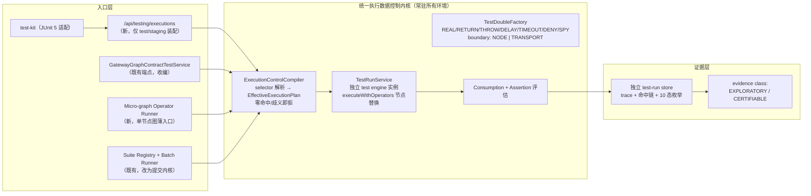

## Plan: Resource Gateway 可测试性工业化 v1 —— Execution Data Control Plane 实施蓝图

**TL;DR**：以 resource-gateway-industrial-testability-evolution-plan.md 为北极星终态，从既有 `GatewayGraphContractTestService` 语义中**提炼统一执行数据控制内核**，向上开放调用方驱动的 fixture 注入入口（/api/testing/executions + micro-graph operator runner + test-kit），向下以「独立 test engine 实例 + BLOGE run-scoped `ExecutionOptions.operatorResolver`」在 RG 层落地；隔离采用「入口硬隔离 + deny-by-default + 证据分级」，验收采用仓库自身 CI dogfooding。分三个阶段交付（语义冻结 → 内核提炼 → 注入入口与工程化），每阶段独立可验证。可靠性模型形式化为：**DAG 正确性 = L1（真实算子 + 效应边界拟合）⊕ L3（真实编排 + 节点边界拟合）**，合成缝由保真度阶梯（F0-F5）封闭，前提「算子确定性」由 Composability Contract 强制而非假设（见第五节）。

### 实施状态（2026-07-22）

> Stage 4 证书轮换状态校正：database-clock durable generation floor 已通过统一 runtime 接入 15 条
> stable live transport；精确 replica inventory/process-start lease、`STAGED/ACTIVE/FAILED` ACK、单 active
> fleet、外部 inventory revision/downgrade floor 与严格 Schema 已形成 test/staging 产品闭环。runtime 现自动 heartbeat/
> withdraw，以短租约 cached proof 在 database time 到达签名时刻后执行 `ALL_REPLICAS STAGED -> durable
> floor -> live transport -> ALL_REPLICAS ACTIVE -> serving`，并对重启 active generation 重新证明；health/
> capability 如实投影 convergence。多副本必须使用外部 attested inventory，`FENCED_QUORUM` 在没有真实
> traffic fence 时启动即拒绝。吊销链第一子步已冻结完整、签名、硬过期且 cursor 连续的
> `bloge.controlPlaneCertificateStatusPublication.v1`，独立 M-of-N trust store 可验证外部 adapter
> 归一化的 CA event/OCSP/CRL commitment；database-clock floor 已闭合连续 cursor、完整清单、发布 ID
> 唯一、整行指纹和吊销不可逆。bounded watcher、wall-clock + monotonic hard-expiry cache 以及精确
> target/generation/settings 的逐请求 gate 已形成可嵌入内核。后续产品增量已补齐 strict normalized
> publication HTTPS source、private PKIX/SPKI/mTLS 与双端 workload identity、数据库 floor、bounded
> monitor/scheduler、Spring test/staging composition、固定基数 health、Tool Studio capability、严格
> Schema/profile metadata 和 demo preflight；后续 SLO 增量又补齐固定基数 refresh/admission telemetry、
> 启动宽限、source outage、refresh age/failure ratio、hard-expiry headroom、deny-rate 与 exact signed
> source-head lag 的 closed assessment，并接入 Actuator、Tool Studio 和 demo preflight；15 条 live
> transport 在 handler I/O 前执行 exact status
> admission。远端短暂不可用时只允许使用尚未越过 wall-clock + monotonic hard expiry 的 durable cached
> snapshot，撤销、未知、错代、fingerprint 漂移和硬过期均立即失败关闭。source 使用独立静态身份以避免
> 由被保护 transport 拉取自身状态的递归 bootstrap。certified enterprise CA/OCSP/CRL adapter、动态
> authority/source identity 轮换仍未闭合；精确 source-head 已完成独立 M-of-N signed protocol、strict v2
> HTTPS response envelope、database-clock anti-rollback floor、publication identity binding、dual-clock hard
> expiry、monitor/SLO/health/telemetry/capability、closed Schema/profile 和 demo preflight 的 test/staging 接线；
> 外部 alert/burn-rate routing、enterprise
> custody 和生产数据库/HA/DR/chaos 仍未闭合，
> 因此 production readiness 继续关闭。验证见
> [certificate status product verification](resource-gateway-execution-data-control-plane-stage4-certificate-status-product-verification.md)
> 和 [source-head protocol verification](resource-gateway-execution-data-control-plane-stage4-certificate-status-source-head-protocol-verification.md)。
> 截至 physical-attempt lifecycle observation proof/durable journal/call supervisor/coordinator/bounded reconciler、
> start proof/durable start journal、positive queue lease epoch、attempt cancellation coordinator、exact-source
> terminal projection transaction/proof-aware coordinator、调用前数据库时间栅栏与浏览器生命周期修复的
> 最终全量基线为 Resource Gateway 4096 tests（0 failures、
> 0 errors、2 个条件浏览器跳过）和
> 独立 test-kit 230 tests（0 failures、0 errors、0 skips）；64 份 testing Schema 与 5 份 Tool Studio
> Schema 已进入发布 JAR，普通/shaded JAR 与 public JavaDoc 门禁通过。

> 质量门禁活性增量：真实全量回归暴露 Selenium session handshake 可同时越过 HTTP client timeout 与
> JUnit timeout，永久占住 Surefire JVM。浏览器回归现以单 daemon worker、无队列、caller-owned deadline
> 和原子 session ownership 启动；timeout/interrupt/factory failure 后 abort 与 cleanup 在相互独立的
> daemon 边界执行，迟到 session 唯一回收。正常 teardown 又拆为独立的 15 秒 `driver.quit()` graceful
> 阶段和 15 秒 OS process-tree force 阶段；graceful 失败但 force 成功时保留原业务断言，force 也失败时
> 才暴露脱敏闭集状态，caller interruption 恢复后由独立 daemon 异步止损。ChromeDriver 又按 executable、exact
> port argument、PID、start instant、command 捕获可见进程树，退出需验证已捕获身份，根先退出不得掩盖
> 存活后代。独立源码快照的 20 项聚焦测试全绿。该机制保证测试调用线程和已捕获进程收敛，不等于
> cgroup/Job Object 原子进程域或生产运行时 hard
> cancellation。验证见 [browser session supervision verification](resource-gateway-test-quality-gate-browser-session-supervision-verification.md)。

> 测试门禁活性补强已关闭一次真实观测到的 admission concurrency 永久挂起：ready/start barrier、
> Future 与 executor teardown 均改为 caller-owned deadline 和 daemon worker，并以“参与者永不到达、
> future 永不完成”的故障注入锁定行为；8 项聚焦测试全绿。该结论不代表全仓无界并发等待已清零，
> 也不提供跨进程 Maven build lock。验证见
> [admission concurrency liveness verification](resource-gateway-test-quality-gate-admission-concurrency-liveness-verification.md)。

> Stage 4 attempt cancellation 第一增量已冻结 provider-confirmed proof kernel：内容寻址 command
> 精确绑定 tenant/environment/job/attempt/owner/lease epoch/runtime binding/reason/deadline/challenge；
> PROCESS/CONTAINER/VM receipt 经 provider/deployment/key/isolation/time 与完整 command 回绑后验证
> Ed25519 attestation。签名正确的 `NOT_FOUND/REJECTED` 仍不得宣称终止，provider 调用也以固定容量、
> 零队列、wall-clock deadline 和 lingering observation 监督，不把本地 interrupt 冒充远端确认。17 项
> 聚焦测试全绿。durable receipt、worker/job state machine、Spring/HTTP/Schema/test-kit/capability 与真实
> process/container provider 尚未接线，能力继续关闭。验证见
> [attempt cancellation proof-kernel verification](resource-gateway-execution-data-control-plane-stage4-attempt-cancellation-proof-kernel-verification.md)。

> Stage 4 attempt cancellation 第二增量已建立 database-authoritative durable journal：provider 调用前
> `prepare` 冻结 exact command/descriptor 和 attempt/lease-epoch 唯一绑定；`accept` 在同一事务使用
> database time 复验 Ed25519 attestation，追加 immutable provider sequence、推进 deployment floor，
> 并落 `CONFIRMED/UNCONFIRMED` terminal entry。exact replay、过期恢复、sequence rollback、terminal
> rewrite、entry/floor/sequence 篡改、并发 prepare、跨实例 provider-sequence 竞争以及并发 harness
> deadline 的 15 项 H2 门禁全绿；两个公共类型 strict JavaDoc 零告警。`find` 只验证接受后的存储连续性，
> 不按现时 trust inventory 重解释历史 attestation；普通行指纹也不对抗可重算哈希的数据库管理员。
> retention/tombstone、动态
> trust、worker/job 双线性化、orphan reconciliation 与产品接线仍未完成，capability 继续关闭。验证见
> [durable cancellation journal verification](resource-gateway-execution-data-control-plane-stage4-attempt-cancellation-durable-journal-verification.md)。
> 下表仍写的“durable cancellation receipt 待完成”特指 retention/tombstone、worker 消费与产品协议；
> 不再指本增量已经落地的 journal correctness core。

> Stage 4 attempt cancellation 第三增量新增 coordinator，冻结 `find -> bounded descriptor -> durable
> prepare -> bounded idempotent cancel -> verified accept` 顺序。terminal exact replay 不再触发 provider；
> timeout/adapter/attestation failure 保持 `PREPARED`；数据库时钟 invocation re-authorization 阻止过期
> 或剩余 provider 窗口不足的外部调用，descriptor drift 失败关闭。10 项单元与 3 项真实
> journal/verifier 组合门禁共同全绿，公共类型 strict JavaDoc 零告警。`UNCONFIRMED` 不自动重试，旧
> deployment 不由当前 authority 猜测解析，仍须进入未实现的 reconciliation/orphan lane。验证见
> [attempt cancellation coordinator verification](resource-gateway-execution-data-control-plane-stage4-attempt-cancellation-coordinator-verification.md)。

> Stage 4 physical attempt 第一增量建立内容寻址 identity 与 database-authoritative reservation
> registry。它在 provider dispatch 前冻结 exact queue fence、request/runtime fingerprint、provider
> deployment 与 PROCESS/CONTAINER/VM boundary；同一事务锁定 queue row，复用完整 job integrity
> verification，并按 database time 复验 `RUNNING`、deadline、owner、positive epoch 和 lease expiry。
> exact replay 幂等、同 lease epoch 改绑运行时代际失败；调用 provider 前必须再次
> `authorizeDispatch`，取消或 retry 后不可继续派发。队列首 claim 已从历史 `0` 语义统一为 positive
> epoch，兼容既有 cancellation command/receipt。11 项 registry 与 58 项相关回归全绿。reservation
> 不等于 provider start/terminal proof；签名 start receipt、真实隔离 dispatch、slot/queue 投影和 orphan
> reconciliation 尚未接线，capability 继续关闭。验证见
> [physical attempt reservation verification](resource-gateway-execution-data-control-plane-stage4-physical-attempt-reservation-verification.md)。

> Stage 4 physical attempt 第二增量冻结 provider-signed start proof kernel：start command 嵌入 reserved
> identity，并内容寻址 opaque execution envelope、deadline 与 challenge；receipt 精确回绑 provider/
> deployment/key/attempt/identity/positive epoch/isolation/process/runtime state/provider sequence/time。
> `STARTED/ALREADY_STARTED` 才是 start proof，签名 `REJECTED` 与本地 timeout 均不证明“未启动”。
> pinned Ed25519 verifier 和 fixed-capacity/zero-queue supervisor 已落地，interrupt-ignoring adapter 保持
> slot occupancy 与 lingering observation。17 项 start 测试及 1 项 cancellation null-result 回归全绿，
> 五个新增公共类型 strict JavaDoc 零告警。该 proof-kernel 增量本身尚无 durable start journal、真实隔离 provider、worker/queue 投影
> 和 orphan reconciliation 仍未接线，capability 继续关闭。隔离提交快照上的全量 `clean verify` 已执行
> 3950 tests（0 failures、0 errors、2 skips），并完成 Surefire XML、可执行 JAR 与残留进程交叉核验。验证见
> [physical attempt start proof-kernel verification](resource-gateway-execution-data-control-plane-stage4-physical-attempt-start-proof-kernel-verification.md)。

> Stage 4 physical attempt 第三增量新增 database-authoritative durable start journal。首次 prepare 原子锁定
> attempt 与 queue row，复验完整 reservation/job、owner、positive epoch、lease/deadline，并冻结 exact
> command/descriptor；provider I/O 前按 database time 再授权。acceptance 即使 dispatch 后失租也保留真实
> start fact，允许 deadline 前确认但网络迟到的 receipt，拒绝早于 durable prepare 的 provider 声明，并将
> 签名 receipt、immutable provider sequence、deployment floor 与 `CONFIRMED/UNCONFIRMED` 原子提交。
> timeout/unknown 保持 `PREPARED`，签名 `REJECTED` 也不是 non-start proof。22 项 journal 与 127 项跨
> queue/runtime 门禁全绿，两个公共类型 strict JavaDoc 零告警。coordinator、真实 provider、queue/cancel/
> natural-terminal 投影、slot 延迟释放与 orphan reconciliation 未接线，capability 继续关闭。实现提交的
> 隔离快照完整 `clean verify` 执行 3972 tests（0 failures、0 errors、2 skips），并通过 Surefire XML、
> 可执行 JAR 与残留进程交叉核验。验证见
> [physical attempt start durable-journal verification](resource-gateway-execution-data-control-plane-stage4-physical-attempt-start-durable-journal-verification.md)。

> Stage 4 physical attempt 第四增量新增 start coordinator，固定 `find -> bounded descriptor -> durable
> prepare -> database-time authorization -> bounded start -> verified accept`。terminal replay 零 provider I/O，
> prepared recovery 重验 descriptor 与 live reservation；timeout/adapter/attestation failure 均保持
> `PREPARED`。10 项单元、3 项真实组合与 141 项完整聚焦门禁全绿，公共类型 strict JavaDoc 零告警。
> queue/slot/cancellation/natural-terminal 投影和 worker provider 切换未实现，capability 继续关闭。实现提交
> 的隔离快照完整 `clean verify` 执行 3985 tests（0 failures、0 errors、2 skips），并通过 Surefire XML、
> 可执行 JAR 与残留进程交叉核验。验证见
> [physical attempt start coordinator verification](resource-gateway-execution-data-control-plane-stage4-physical-attempt-start-coordinator-verification.md)。

> Stage 4 physical attempt 第五增量新增 provider-signed lifecycle observation proof kernel。observation
> command 内容寻址 exact start command、可选已知 process、minimum attempt revision、deadline 与 challenge；
> receipt 封闭表达 `START_PENDING/RUNNING/TERMINAL/NOT_OBSERVED/INDETERMINATE`。只有
> `RUNNING/TERMINAL` 证明 exact process，`NOT_OBSERVED/INDETERMINATE` 始终只触发 reconciliation；
> terminal 必须携带 closed disposition 与 evidence manifest fingerprint。verifier 独立重算 identity/start/
> observation 三层内容身份，验证 process/revision rollback fence、time、provider binding 与 pinned
> Ed25519 signature。13 项聚焦测试全绿，四个公共类型 strict JavaDoc 零告警。durable journal、bounded
> reconciler、queue/slot/cancel/natural-terminal 双线性化和真实 isolation provider 尚未接线，capability
> 继续关闭。实现提交的隔离快照完整 `clean verify` 执行 3998 tests（0 failures、0 errors、2 skips），
> 452 份 Surefire XML 汇总一致，JAR 与残留进程核验通过。验证见
> [physical attempt lifecycle observation proof-kernel verification](resource-gateway-execution-data-control-plane-stage4-physical-attempt-lifecycle-observation-proof-kernel-verification.md)。

> Stage 4 physical attempt 第六增量建立 database-authoritative lifecycle observation journal。immutable
> command lifecycle、provider/deployment observation sequence 和 per-attempt latest positive state floor
> 独立持久化，acceptance 原子协调三者；`NOT_OBSERVED/INDETERMINATE` 只能成为 non-confirming command
> 结果。queue lease loss 后允许 observation，但 exact start 必须仍被完整保留；unexpired query 防 storm，
> expired recovery 与 late receipt 由 provider sequence、attempt revision、process identity、state rank/time
> 和 terminal immutability 收敛。19 项 H2 与跨实例并发/篡改测试、142 项物理链门禁全绿，两个新增公共
> 类型及 receipt strict JavaDoc 零告警。跨 start/cancel/observation 的统一 provider ledger、coordinator、
> reconciler、retention、queue/slot terminal 投影和真实 provider 仍待完成，capability 继续关闭。
> 实现提交的隔离快照完整 `clean verify` 执行 4017 tests（0 failures、0 errors、2 skips），453 份
> Surefire XML 汇总一致，39,518,483 bytes 可执行 JAR 与零构建/测试浏览器残留进程核验通过。验证见
> [physical attempt lifecycle observation durable-journal verification](resource-gateway-execution-data-control-plane-stage4-physical-attempt-lifecycle-observation-durable-journal-verification.md)。

> Stage 4 physical attempt 第七增量新增 fixed-capacity/zero-queue lifecycle observation call supervisor
> 与 durable coordinator。accepted command replay 零 provider I/O；其余调用严格按 scoped find、bounded
> descriptor、durable prepare、database-time authorization、bounded observe 和 verified acceptance 排序。
> timeout/interrupt/adapter/attestation failure 保持 `PREPARED`，不虚构远端状态。7 项 supervisor、10 项
> coordinator、22 项真实 H2/Ed25519 journal 组合测试和 162 项完整物理链门禁全绿，两个新增公共类型
> strict JavaDoc 零告警。orphan reconciler、跨 family provider ledger、queue/slot/cancellation terminal
> 双线性化、真实 provider 与产品接线仍待完成，capability 继续关闭。实现提交 `aa0e08b5` 的 immutable
> snapshot 完整 `clean verify` 执行 4037 tests（0 failures、0 errors、2 skips），455 份 Surefire XML
> 汇总一致，39,536,280 bytes 可执行 JAR 包含两个新增类型，耗时 7:28，且构建/测试浏览器残留进程均为零。验证见
> [physical attempt lifecycle observation coordinator verification](resource-gateway-execution-data-control-plane-stage4-physical-attempt-lifecycle-observation-coordinator-verification.md)。

> Stage 4 physical attempt 第八增量新增 database-clock bounded observation reconciler。immutable start
> journal 直接作为 orphan source，target discovery 有页界并显式报告 undiscovered backlog；durable
> tenant/environment scope cursor、owner/token/epoch/deadline lease、独立 local/remote backoff、uncertainty
> budget 与 maximum horizon 形成跨副本 bounded worker core。latest positive terminal 可在 completion 丢失
> 后零 provider I/O 收敛；quarantine 不构造 remote terminal。新增 18 项真实 H2/Ed25519/并发/worker
> 场景使 journal 组合门禁达到 40 项，完整物理链 180 项全绿，三个公共类型 strict JavaDoc 零告警。
> scheduler、产品接线、retention、跨 family provider ledger 以及 queue/slot/cancellation terminal 原子投影
> 尚未完成，capability 继续关闭。实现提交 `8b91eb9b` 的 immutable snapshot 完整 `clean verify` 执行
> 4055 tests（0 failures、0 errors、2 skips），455 份 Surefire XML 汇总一致，39,595,599 bytes 可执行
> JAR 包含 23 个 reconciler/journal 匹配 entry，耗时 7:22，且构建/测试浏览器残留进程均为零。验证见
> [physical attempt observation reconciler verification](resource-gateway-execution-data-control-plane-stage4-physical-attempt-observation-reconciler-verification.md)。

> Stage 4 physical attempt 第九增量新增 opt-in orphan slot fence，开始关闭 queue lease 过期后重复
> dispatch 的根因。任意 retained start command 都表示 provider I/O 可能发生；expired `RUNNING`、
> `CANCEL_REQUESTED`、`COMMITTING` 保留原 v1 status/lease epoch，清空瞬态 owner/lease，继续占用全局/租户
> running capacity，并从 retry/publication takeover 中排除。cancel/deadline 先 stop parent，但物理 slot
> 在可信 terminal projection 前不释放。没有新增 v1 wire enum。真实 H2/Ed25519 场景覆盖 PREPARED、
> CONFIRMED、签名 UNCONFIRMED、COMMITTING、取消、首次围栏后到达的 deadline、容量与双副本无 claim，
> 使 journal 组合门禁达到 41 项；physical/cancellation/queue 聚合门禁 222 项全绿，公共类型严格
> JavaDoc 零告警。terminal projection、Spring/health/capability 和真实
> provider 仍未完成，产品能力继续关闭。实现提交 `e70a7c05` 的 immutable snapshot 完整 `clean verify`
> 执行 4056 tests，0 failures、0 errors、2 skips；455 份 Surefire XML 独立汇总一致，可执行 JAR 为
> 39,596,599 bytes，构建/浏览器残留进程均为零。验证见
> [physical attempt slot fence verification](resource-gateway-execution-data-control-plane-stage4-physical-attempt-slot-fence-verification.md)。

> Stage 4 physical attempt 第十增量落地 exact-source terminal projection transaction。content-addressed
> command 绑定 reservation/start/terminal observation/positive-state whole-row fingerprints；cancelled 必须
> 同时具备 queue durable intent 和 exact provider-confirmed cancellation receipt，success 必须由 parent
> authority 重算验证 signed parent evidence。environment-serialized transaction 原子决定 retry 或 queue
> terminal winner、CAS queue、append immutable projection 并关闭旧 physical slot；任何失败不释放 capacity。
> projection exact replay 不依赖 source journal 的后续 retention。真实 H2/Ed25519 场景达到 50 项，完整
> physical/cancellation/queue 聚合 231 项全绿，四个公共类型 JavaDoc 零告警。Spring/reconciler wiring、
> health/capability、retention/WORM、SLO 与真实 provider 尚未完成，产品能力继续关闭。实现提交
> `a87f6780` 的 immutable snapshot 完整 `clean verify` 执行 4065 tests（0 failures、0 errors、2 skips），
> 455 份 Surefire XML 独立汇总一致；39,632,117 bytes 可执行 JAR 包含 10 个 terminal-projection 匹配
> class entry，耗时 9:50，构建/测试浏览器残留进程均为零。验证见
> [physical attempt terminal projection verification](resource-gateway-execution-data-control-plane-stage4-physical-attempt-terminal-projection-verification.md)。

> Stage 4 physical attempt 第十一增量新增 proof-aware terminal projection coordinator core。调用方只给
> exact scope/attempt 与 queue policy；coordinator 固定读取 reservation、latest terminal positive floor、
> exact observation 与 original start，再对 `CANCELLED/SUCCEEDED` 解析 shape-safe 第二证明并构造内容寻址
> projection command。`FAILED/TIMED_OUT/PROVIDER_ABORTED` 完全不依赖 proof resolver；proof 未权威化、
> proof 永久冲突、source/projection integrity conflict 与 infrastructure unavailable 使用互斥闭集结果，
> journal conflict reason 不被降级为 transient retry。18 项聚焦测试、249 项物理链聚合门禁全绿。durable projection work journal、
> cross-replica claim/takeover、reconciler hook、Spring worker/health/capability 仍未接线，产品能力继续关闭。
> 实现提交 `c9608454` 的 immutable snapshot 完整 `clean verify` 执行 4083 tests（0 failures、0 errors、
> 2 skips），456 份 Surefire XML 独立汇总一致；39,655,585 bytes 可执行 JAR 包含 12 个新增匹配 class
> entry，耗时 9:23，构建/测试浏览器残留进程均为零。
> 验证见 [physical attempt terminal projection coordinator verification](resource-gateway-execution-data-control-plane-stage4-physical-attempt-terminal-projection-coordinator-verification.md)。

> Stage 4 physical attempt 第十二增量先关闭 terminal observation completion 与 projection worker 之间的
> crash window。新增 payload-free durable work authority，content-addressed Trigger 精确绑定 scope、attempt、
> terminal observation command 与 reconciliation result fingerprint；完整 Entry 预留 database-clock due、
> lease fence、执行/连续失败计数、固定结果分类、projection id 与 whole-row fingerprint。reconciliation
> journal 通过 transaction-bound mutation 在同一 datasource transaction 中同时提交 terminal target 与
> `READY` work；注册失败两者一起回滚，exact replay 不重复写，非 terminal completion 不注册。53 项真实
> H2/Ed25519 journal 测试和 252 项物理链聚合门禁全绿，三个相关公共类型严格 JavaDoc 零告警。该增量尚未
> 实现 claim/retry/takeover worker、N/N-1 orphan terminal backfill、Spring scheduler/health/capability，产品
> 能力继续关闭。实现提交 `56dd5986` 的 immutable snapshot 完整 `clean verify` 执行 4086 tests
> （0 failures、0 errors、2 skips），456 份 Surefire XML 独立汇总一致；39,677,384 bytes 可执行 JAR
> 包含 8 个新增匹配 class entry，耗时 9:51，构建/测试浏览器残留进程均为零。验证见
> [physical attempt terminal projection work registration verification](resource-gateway-execution-data-control-plane-stage4-physical-attempt-terminal-projection-work-registration-verification.md)。

> Stage 4 physical attempt 第十三增量补齐 durable projection work 的 database-clock lifecycle authority。
> `claimNext` 以 owner/token/epoch/claimedAt/deadline/fence fingerprint 原子 claim 到期 work，live lease 跨副本
> 互斥，expired lease 由更高 epoch 接管，旧 owner 失败关闭。payload-free Result 保留 coordinator stage、fixed
> reason、proof/projection conflict detail 和成功 projection identity；completion 对 success、proof pending、
> unavailable、permanent conflict 分别执行 completed、独立有界指数退避、或 quarantine，exact response-loss
> replay 与 changed-result conflict 明确分离。新增 10 项 H2/双副本状态机测试，registration 组合 63 项、完整
> 物理链聚合 262 项全绿，两个公共类型严格 JavaDoc 零告警。bounded one-shot worker、lease heartbeat/deadline、
> tenant fairness、policy cohort、immutable attempt history、旧终态 backfill 和 Spring 产品接线尚未完成，能力
> 继续关闭。实现提交 `8aedb61e` 的 immutable snapshot 完整 `clean verify` 执行 4096 tests
> （0 failures、0 errors、2 skips），457 份 Surefire XML 独立汇总一致；39,703,754 bytes 可执行 JAR
> 包含 16 个匹配 class entry，耗时 9:50，构建/测试浏览器残留进程均为零。验证见
> [physical attempt terminal projection work lifecycle verification](resource-gateway-execution-data-control-plane-stage4-physical-attempt-terminal-projection-work-lifecycle-verification.md)。

> Stage 4 physical attempt 第十四增量把 durable projection work authority 组合成 bounded one-shot worker。
> worker 从 claim 前使用 monotonic elapsed 保守扣除数据库往返，再保证 dynamic coordinator timeout 与
> mandatory completion reserve 严格短于 durable lease；预算不足不启动 coordinator。独立 fixed-capacity、
> zero-queue daemon supervisor 对 timeout/saturation/close/interruption/adapter outage 给出固定结果，忽略中断
> 的迟到调用持续占 slot 并可观测，timeout 不被误解释为 projection 未提交。worker 对 coordinator result
> 执行 fenced complete，本地失败只写 retryable `PROJECTION_UNAVAILABLE`，caller interrupt 则恢复中断且不再
> 做数据库 I/O；lease loss 和 changed-result conflict 保持分离。新增 23 项测试，supervisor/worker/真实 H2
> work-journal 组合 33 项、完整物理链聚合 285 项全绿，三个公共 contract strict JavaDoc 零告警。产品 proof
> resolver、scheduler/Spring、fairness/cohort/history、backfill、retention/health/capability 与生产认证仍未完成，
> capability 继续关闭；相对完整计划估计仍有约 31% 实质差距，未进入正负 8% 完成区间。实现提交
> `4aaac2cd` 的 immutable snapshot 完整 `clean verify` 执行 4119 tests（0 failures、0 errors、2 skips），
> 459 份 Surefire XML 独立汇总一致；39,731,723 bytes 可执行 JAR 包含 12 个 worker/supervisor 匹配 class
> entry，耗时 9:48，构建/测试浏览器残留进程均为零。验证见
> [physical attempt terminal projection worker verification](resource-gateway-execution-data-control-plane-stage4-physical-attempt-terminal-projection-worker-verification.md)。

> Stage 4 physical attempt 第十五增量补齐 terminal projection 产品 proof resolver。cancellation journal
> 新增受唯一 `(tenant, environment, attempt, lease epoch)` fence 约束的闭合 lookup；absence、ambiguity、
> retained integrity conflict 与 storage outage 不再混淆。resolver 对 cancellation command、owner/epoch、
> runtime binding、provider/deployment、isolation 和 confirmed receipt 完整重绑定；`PREPARED` 可重试，
> 不可改写的 `UNCONFIRMED` 永久冲突。success 只从 exact queue job 推导 deterministic parent run，区分
> active pending、stop winner 与 terminal contradiction，并调用 parent authority 重算 evidence fingerprint、
> 验证 detached signature。新增 23 项测试，52 项聚焦与 308 项 physical/cancellation/queue 聚合全绿，
> 三个公共 contract strict JavaDoc 零告警。scheduler/Spring、telemetry/health/capability、fairness/cohort/
> history、backfill/retention 与生产认证仍未完成，能力继续关闭；相对完整计划估计仍有约 29% 实质差距，
> 未进入正负 8% 完成区间。实现提交 `30f7a93a` 的 immutable snapshot 完整 `clean verify` 执行
> 4142 tests（0 failures、0 errors、2 skips），460 份 Surefire XML 独立汇总一致；39,743,350 bytes
> 可执行 JAR 包含 5 个新增 resolver/lookup class entry，耗时 7:45，构建/测试浏览器残留进程均为零。验证见
> [physical attempt terminal projection proof resolver verification](resource-gateway-execution-data-control-plane-stage4-physical-attempt-terminal-projection-proof-resolver-verification.md)。

> Stage 4 physical attempt 第十六增量建立 terminal projection 的 opt-in 产品 runtime。fixed-delay scheduler
> 使用 1..32 个 bounded lane 调用 one-shot worker，异常/null result 可观测但不杀 lane；graceful close 先禁止
> 新 poll、bounded drain，再请求 interrupt，Spring 随后关闭 zero-queue supervisor。strict test/staging
> composition 要求同库 database queue 与 start/observation/cancellation 三类 pinned verifier，production 或
> disabled 时 bean 物理缺席，缺信任、错 queue、未知配置和不安全 call+reserve+lease 预算均 fail startup。
> Micrometer 只含 outcome/local-disposition 闭合标签；Actuator 以数据库时钟 work age、quarantine、scheduler
> 最新状态和 lingering capacity 判定 readiness；terminal switch 同时开启并二次验证 queue physical-attempt
> fence，snapshot outage 不泄漏诊断。新增 23 项测试，44 项聚焦与 331 项 physical/cancellation/queue
> 聚合门禁全绿，四个公共类型及 queue fence accessor strict JavaDoc 零告警。该 lane 已能自主
> 消费已注册 terminal work，但 observation reconciliation scheduler/atomic registration 产品接线与 capability
> 仍关闭；fairness/cohort/history、backfill/retention 和生产认证仍待完成。相对完整计划估计仍有约 26% 实质
> 差距，未进入正负 8% 完成区间。实现提交 `93b00cfe` 的 immutable snapshot 第二轮完整 `clean verify`
> 执行 4165 tests（0 failures、0 errors、2 skips），463 份 Surefire XML 独立汇总一致；39,775,312 bytes
> 可执行 JAR 包含 11 个新增 runtime lifecycle 匹配 class entry，耗时 10:10，构建/测试浏览器残留均为零。
> 首轮完整门禁曾在既有 managed-signing 应用集成类出现 1 个 HTTP content-type 偶发 error；该类独立复跑和
> 第二轮完整门禁均通过，此测试基础设施债务保留在验证记录中，不伪装成一次即绿。验证见
> [physical attempt terminal projection runtime verification](resource-gateway-execution-data-control-plane-stage4-physical-attempt-terminal-projection-runtime-verification.md)。

> Stage 4 physical attempt 第十七增量建立 independently gated observation reconciliation 产品 runtime。
> fixed-delay scheduler 使用 1..32 个 bounded lane 驱动 durable reconciler，异常/null result 可观测但不杀
> lane；graceful close 先关闭准入、bounded drain，再请求 interrupt。strict test/staging composition 要求已有
> terminal-projection database chain 和唯一 exact provider/deployment `AuthorityResolver`，并拒绝非 database
> start/observation/terminal-work journal，production 或 disabled 时 bean 物理缺席。descriptor+observation
> budget、confirmation window、lease safety margin、database lease、poll SLO 与 call capacity 在启动前交叉
> 校验。verified terminal completion 与 terminal-work registration 同事务，失败回滚、exact replay 不重复
> 注册；Micrometer 只有闭集 stage label，Actuator 只暴露 database-clock discovery/backlog、scheduler 与
> provider-call capacity 聚合事实。新增 24 项测试与 240 项 observation/terminal-projection/queue 聚合门禁
> 全绿，四个公共类型 strict JavaDoc 零告警，test/staging YAML 解析与 diff whitespace 门禁通过。capability
> truth、signed dynamic resolver inventory/cohort、N/N-1 backfill、retention/evidence lifecycle、真实 provider
> 和生产认证仍未完成；相对完整计划估计仍有约 23% 实质差距，未进入正负 8% 完成区间。验证见
> [physical attempt observation reconciliation runtime verification](resource-gateway-execution-data-control-plane-stage4-physical-attempt-observation-reconciliation-runtime-verification.md)。
> 实现提交 `b116c990` 的 immutable snapshot 完整 `clean verify` 一次通过 4189 tests（0 failures、0 errors、
> 2 skips），466 份 Surefire XML 独立汇总一致；39,807,909 bytes 可执行 JAR 包含 11 个新增 runtime 匹配
> class entry，耗时 7:54，构建/测试浏览器残留均为零。

> Stage 4 physical attempt 第十八增量先关闭任意 resolver 与 capability 虚报。新增 canonical、完整、
> M-of-N Ed25519 签名的 provider inventory，逐 binding 冻结 provider/deployment、runtime artifact、
> observation key、isolation modes、latency 与 retention；static authority 在构造期验证 trust domain/scope/
> cohort/protocol/policy、签名阈值、硬时效和 runtime adapter 精确全覆盖。解析结果在 descriptor 与 observe
> 前重验 inventory generation，descriptor 必须逐字段复现签名 binding，未知 deployment、额外 adapter、
> 跨 binding command、descriptor drift 和 hard expiry 均在 provider I/O 前失败关闭。observation
> reconciliation Spring composition 不再接受任意函数式/Map resolver，只接受唯一 signed inventory
> authority。Tool Studio 新增 typed `physicalAttemptRuntime` 与 12 个布尔事实；projection 用前后两次
> inventory observation 夹住 runtime/cohort 读取，静态 inventory 明确报告
> `DYNAMIC_INVENTORY_REQUIRED`，只有 dynamic refresh、signed revocation、witness、durable floor、exact
> cohort convergence 与两条 runtime health 同时成立才可 `READY`。四份 strict Schema 与 test-kit 资源
> 已同步；29 个新增测试、281 项相邻聚合门禁和五个公共类型 strict JavaDoc 全绿。该增量冻结了签名静态
> 基线与 capability 判定协议，不等于动态 HTTPS publication/witness/floor 或数据库 cohort 已实现；这些
> adapter、N/N-1 backfill、retention/evidence lifecycle、真实 provider 和生产认证仍待完成。相对完整计划
> 估计仍有约 21% 实质差距，未进入正负 8% 完成区间。实现提交 `05903ddc` 的 immutable snapshot 完整
> `resource-gateway-examples clean verify` 一次通过 4218 tests（0 failures、0 errors、2 skips），470 份
> Surefire XML 独立汇总一致；34 项 Browser DOM 中 32 项真实执行、2 项条件跳过；39,846,655 bytes
> 可执行 JAR 包含 12 个 provider-inventory 与 2 个 runtime-capability 匹配 class entry。独立 test-kit
> `clean verify` 通过 231 tests（0 failures、0 errors、0 skips），25 份 XML 汇总一致，普通/CLI JAR 均
> 包含四份新增 Schema；两次构建总耗时分别为 7:48 和 10.881s，Maven/Java/浏览器残留均为零。验证见
> [physical attempt provider inventory and capability verification](resource-gateway-execution-data-control-plane-stage4-physical-attempt-provider-inventory-capability-verification.md)。

> Stage 4 physical attempt 第十九增量把 provider inventory 从静态证明推进为 test/staging 可运行的动态
> fleet authority。严格版本化 HTTPS/ETag source 只接受完整 `ACTIVE/REVOKED` publication；deployment
> authority 对 nested inventory、精确 `expectedReplicaIds`、lifecycle 和 predecessor 签名，独立 witness
> authority 对同 sequence/publication fingerprint 和第二条 predecessor chain 签名。刷新必须先完成双 quorum、
> 时效、scope/cohort/policy、inventory revision、连续 sequence 与 durable database floor 验证，再原子替换
> 本地 resolver；transport、JSON、签名、fork/gap/rollback 或 floor 失败立即关闭解析，合法 successor 可无重启
> 恢复，旧 resolver wrapper 在 successor/revocation 后调用前失败。数据库 cohort 每次心跳与读取都从签名
> publication 取得期望 replica 集合和私有 generation，本地配置不再拥有 `expected-replica-ids`；database-clock
> lease、process-start 主键、整行指纹和 exact set/generation/artifact/protocol 比较可识别 missing、unexpected、
> duplicate、drift 与 corruption。Spring composition 默认关闭、`production` 物理缺席，启用时要求恰好一个
> installed adapter catalog、动态 authority、durable floor、cohort monitor 与 aggregate Actuator health；Tool
> Studio 现可在 terminal projection、observation reconciliation 同时健康时投影 `READY`。新增 publication、
> floor-generation、private cohort-binding 三份 strict Schema，并由 Java 序列化字段测试锁定。该增量仍不提供
> external/non-database anti-rollback anchor、managed trust-root hot rotation、N/N-1 backfill、provider
> observation/cancellation/projection retention/evidence lifecycle、真实 process/container provider 或 production
> certification；相对完整计划估计约 17% 实质差距，仍未进入正负 8% 完成区间。验证见
> [dynamic physical provider inventory verification](resource-gateway-execution-data-control-plane-stage4-dynamic-physical-provider-inventory-verification.md)。
> 本增量新增 36 项测试，327 项 physical-attempt 聚合门禁全绿；immutable snapshot 的
> `resource-gateway-examples clean verify` 一次通过 4254 tests（0 failures、0 errors、2 skips），476 份
> Surefire XML 独立汇总一致，49 项 Browser tests 中 47 项执行、2 项条件跳过，39,935,561 bytes 可执行
> JAR 包含 42 个 physical provider-inventory class entries。独立 test-kit `clean verify` 通过 231 tests
>（0 failures、0 errors、0 skips），25 份 XML 一致，普通/CLI JAR 均包含三份新 Schema；两次全量构建
> 耗时分别为 7:40 和 11.493s。

> Stage 4 physical attempt 第二十增量先冻结 external/non-database anti-rollback 的协议核心。新增物理
> provider-inventory 独立 marker port，把 deployment publication 与 witness 指纹归约为同一 domain-separated
> composite head，并强制 external compare-and-append 成功后才推进本地 durable floor；外部成功而本地提交
> 不确定时可用完全相同 head 幂等重试修复。能力协议区分 external 与非零 `3f+1 / 2f+1` Byzantine quorum，
> 单点外部服务不能进入 `READY`；Tool Studio、strict Schema 与 aggregate-only health 同步暴露事实且不泄漏
> scope/stream/endpoint/authority/key/challenge/fingerprint。36 项聚焦门禁全绿，其中 6 项新增 core test 覆盖
> 顺序、前驱绑定、失败隔离、精确重试、非法构造、诚实降级与健康脱敏。该步尚未把 strict HTTP/quorum
> adapter 接入 physical Spring composition，因此升级不会自动获得外部锚；staging fail-fast、managed receipt
> trust/bootstrap roots、deployment/witness trust-root 热轮换、N/N-1 backfill、retention/evidence lifecycle、
> 真实 provider 与生产认证仍待完成。相对完整计划估计约 15% 实质差距，仍未进入正负 8% 完成区间。验证见
> [physical provider inventory external non-equivocation core verification](resource-gateway-execution-data-control-plane-stage4-physical-provider-inventory-external-non-equivocation-core-verification.md)。

> Stage 4 physical attempt 第二十一增量关闭上述 embedding-only 缺口。物理库存 composition 现在通过
> 独立 marker bean 复用 strict challenge-bound HTTP/quorum adapter，把 external-first wrapper 安装到数据库
> floor 外层；显式初始化被装饰的 floor，避免 Spring 生命周期因具体 bean 被隐藏而丢失。`test` 保留可选的
> local-only 迁移路径且 capability 诚实降级；`staging` 强制 external enabled/required、`f>=1`、managed
> receipt trust、complete-chain bootstrap roots、三条 private-PKIX/SPKI/mTLS/workload-identity transport 全部
> enabled/required；YAML 令身份要求跟随 transport 启用，Java preflight 又逐条强制 exact client/server
> certificate identity，程序化 property source 也无法绕过，并拒绝 insecure loopback。hidden、
> invalid-quorum、unsafe anchor 与静态 trust downgrade
> 均在启动期 fail closed；aggregate health 不暴露身份信息。三条物理链路加入统一 certificate rotation target
> inventory，使稳定 target 从 12 扩为 15；strict product Schema 同时由服务端与独立 test-kit 打包门禁锁定。
> 该步闭合的是 Resource Gateway 产品接线，不虚构外部 notary 的组织独立性、HA/DR/容量或生产认证。
> 63 项联合聚焦门禁全绿；Resource Gateway `clean verify` 通过 4268 tests（0 failures、0 errors、2
> skips），477 份 Surefire XML 独立汇总一致；test-kit `clean verify` 通过 231 tests，普通与 CLI JAR
> 均包含新 Schema。
> deployment/witness publication signing-root 热轮换、N/N-1 backfill、retention/evidence lifecycle、真实
> provider 与 production composition 仍待完成。相对完整计划估计约 12% 实质差距，仍未进入正负 8%
> 完成区间。验证见 [physical provider inventory external non-equivocation runtime verification](resource-gateway-execution-data-control-plane-stage4-physical-provider-inventory-external-non-equivocation-runtime-verification.md)。

> Stage 4 physical attempt 第二十二增量先冻结 managed publication signing-root 的独立协议内核。
> deployment-root 与 witness-root quorum 共同签署同一份原子 runtime key-set material，四个 trust domain
> 与两套 authority/key 强制独立；strict HTTPS/ETag refresh、unknown-key cooldown refresh、signed lifecycle、
> hard source age、database-clock durable generation floor、rollback/fork/gap/predecessor fence 和 aggregate-only
> health 已闭合。物理域拥有独立 media type、protocol header、Schema 与数据库 namespace，只复用中性的
> Ed25519 key/signature 值对象。28 项聚焦门禁全绿；Resource Gateway `clean verify` 通过 4289 tests
>（0 failures、0 errors、2 skips），480 份 Surefire XML 独立汇总一致；49 项 Browser tests 中 47 项执行、
> 2 项条件跳过；40,013,876 bytes 可执行 JAR 包含 21 个本轮 trust-root class entries。独立 test-kit
> `clean verify` 通过 231 tests（0 failures、0 errors、0 skips），普通/CLI JAR 均包含新 Schema；6 个新增
> 公共类型通过严格 JavaDoc，0 warnings、0 errors。该步是 kernel freeze，尚未把 managed roots 注入现有
> dynamic physical inventory consumer 或 Spring composition，因此 restart-free product capability 继续关闭；
> 相对完整计划估计约 10% 实质差距，仍未进入正负 8% 完成区间。验证见
> [physical provider inventory managed trust-root kernel verification](resource-gateway-execution-data-control-plane-stage4-physical-provider-inventory-trust-root-kernel-verification.md)。

> Stage 4 physical attempt 第二十三增量把 managed roots 注入 dynamic physical inventory consumer，
> 并关闭 key/generation TOCTOU。`VerifiedKeySet` 现在携带产生该 key set 的 exact root fingerprint；
> root 轮换后即使 inventory source 返回 `304` 也会完整重验 publication+witness，兼容轮换会形成新组合
> generation 并 fence 旧 wrapper，撤销旧 signer 则直接关闭 provider resolution。descriptor 与 runtime
> capability 升级为 strict v2，保留 v1 negotiation；`READY` 新增 managed-root availability、atomic dual-root、
> durable/external/Byzantine root floor 硬门槛，Tool Studio 同步投影这些 aggregate-only facts。42 项联合聚焦
> 门禁全绿；Resource Gateway `clean verify` 通过 4292 tests（0 failures、0 errors、2 skips），480 份
> Surefire XML 独立汇总一致；独立 test-kit `clean verify` 通过 231 tests（0 failures、0 errors、0 skips），
> 25 份 XML 独立汇总一致并完成普通/CLI JAR Schema 打包；相关公共类型严格 JavaDoc 0 warnings、0 errors。
> 该步仍未提供 physical-domain external-first root floor 与 Spring test/staging composition，故
> 产品默认不会把新事实置真；相对完整计划估计约 9% 实质差距，仍未进入正负 8% 完成区间。验证见
> [physical provider inventory managed trust-root consumer verification](resource-gateway-execution-data-control-plane-stage4-physical-provider-inventory-managed-trust-root-consumer-verification.md)。

> Stage 5 lifecycle 状态校正：下表“公开 floor lifecycle 尚未开放”指 production wiring 与 capability
> advertisement 仍关闭；v1 本地链与 v2 external receipt proof 的严格 Schema、授权 test/staging
> preview、分页和独立 verifier 已在第二十六子步第五、七阶段落地；第八阶段补齐 strict HTTPS
> multi-authority transport 与 test/staging fail-fast wiring，但 production capability 仍关闭。

| 阶段 | 状态 | 已落地证据 |
| --- | --- | --- |
| Stage 0 | 完成 | operator suite API/UI 显式 `SCHEMA_CONTRACT`；`testing/domain` 五个版本化 record；capability testability 描述；[ADR-001](adr/ADR-001-resource-gateway-test-runtime-isolation.md)、[ADR-002](adr/ADR-002-operator-composability-and-opaque-runtime.md)、[ADR-003](adr/ADR-003-semantic-coverage-protocol-versioning.md) 与 [BLOGE framework requirement](bloge-framework-execution-control-requirement.md) |
| Stage 1' | 完成 | `testing/planning/runtime/evidence` 内核；独立 test engine；五行为；F2/F3 resource fixture；micro-graph runner；旧 graph suite adapter；37 个聚焦测试与 1653 个项目测试全绿 |
| Stage 2' | 进行中 | 已落地 graph/operator target discovery、operator target v2 composability manifest、graph execution/batch/query、operator micro-graph execution、canvas executable operator suite（含四类 case intent、内容寻址 fixture 与一等 TestSuite 发布、聚合执行/coverage/promotion 回显）、immutable fixture/TestSuite registry、stored fixture、v1-v5 stored TestSuite 与 child TestRunRecord 的 canonical snapshot/envelope-content/完整 lookup-key 验证、幂等 TestSuite runner、独立 child/suite-run store、聚合结构 coverage 与 promotion eligibility、10 态 child evidence、profile/identity/生产协议隔离、独立 Java/JUnit/CI test-kit suite adapter、七图/14-case F3 dogfooding及其内容寻址 catalog materialization、numeric tolerance、run-scoped logical clock + DELAY/TIMEOUT、受治理 F4 replay payload 精确捕获/脱敏/retention/tombstone、vault canonical snapshot/index/receipt/tombstone commitment、exact-ref REPLAY 执行、payload-free effective plan v2 谱系与认证降级，以及同步 root/nested/foreach/loop/compensation 的结构寻址、控制传播、动态 attempt/occurrence selector 和 occurrence/attempt/node/edge evidence；streaming/suspendable control/evidence 与物理 network/runtime 隔离仍待完成 |
| Stage 3 evidence chain | 进行中 | graph/operator child signature、suite checkpoint/terminal aggregate attestation、ordered child closure、payload-free portable bundle、suite/evidence/attestation 独立 v2 typed semantic coverage 已完成；signed atomic key-set、managed v1/v2 lifecycle、签名时刻 lifecycle policy、外部 M-of-N trust publication、bounded append-only consistency page、durable consumer checkpoint、rollback/fork/split-view/revoked-pin resurrection detection 与 test-kit independent verifier 已完成；exact-suite ANEKE semantic workbook seed、`GovernanceGateResult.v3` 可重建 basis、编译级 GraphDraft target 绑定与独立 schema consumer 已完成；真实 ANEKE N/N-1 conformance、独立 witness gossip/跨域一致性证明待完成 |
| Stage 4 deterministic runtime | 进行中 | run-scoped TIME/RANDOM/UUID/IDENTITY/FEATURE_FLAG、opaque secret-ref v2、外部 test-secret authority SPI/精确上下文绑定/run-scoped provider/durable re-authorization、strict signed challenge-bound HTTPS adapter、static Ed25519 trust 与 atomic dynamic JWKS refresh/revocation、effective plan/provider state、组合 durable checkpoint、同库事务、数据库时钟 lease CAS、幂等命令与 staged 四 store aggregate 已完成；公开 authenticated durable GRAPH/OPERATOR create、payload-free query、owner claim、heartbeat、one-signal suspended-or-terminal recovery step、有界同步 multi-suspension recovery sequence、兼容 terminal-only recovery 和进程内 lease coordinator 已闭合；recovery sequence 外层及派生 step/claim/automatic-heartbeat 已具备数据库租约化有界 retention、独立 HMAC tombstone、密钥轮换启动自检、固定基数 telemetry 和数据库时钟 backlog SLO/readiness；公开 non-blocking worker pull 已在认证 tenant/org/project/environment 内以数据库时钟有界扫描，逐候选重授权，并把 exact lease CAS、hidden dispatch、`ACQUIRED/NO_WORK` 幂等结果和审计原子提交，再以 scope 级持久化循环 keyset 游标避免稳定毒化前缀饥饿，对 exact checkpoint 的确定性失败做数据库时钟指数退避，并在连续失败阈值后转为永久 worker quarantine；隔离 list/claim/release、数据库权威 maker/checker approved discard、token-free receipt/history、审批 SLO observation、claim-command replay token AES-GCM envelope/旧行迁移/轮换重包、active-control HMAC fence/旧行迁移/轮换重键、命令/审批/历史的数据库租约化有界保留、独立 keyed-HMAC request-index tombstone/在线轮换/旧行惰性迁移、N/N-1 三阶段 write/readiness/capability、challenge-bound 逐副本签名 proof、独立 test-kit exact-inventory fleet gate 与四维即时 admission 已落地；外部 quarantine change authorization 的 Ed25519 M-of-N trust、canonical scope/subject binding、checker HTTP v2 强制、数据库时间窗复核、双重唯一预留、销毁事务一次性消费、精确幂等重放、严格 Schema、staging fail-fast 配置、readiness/capability 和 key-free v2 证据透传已闭合。test-secret 的原子动态 JWKS、撤销传播、硬本地过期、刷新健康、数据库时钟 exact configured cohort、单 active deployment、取密前后双门禁，以及 deployment-signed strict inventory、authorityId binding、M-of-N Ed25519、revision floor、全副本 inventory-generation 收敛、严格 HTTPS/ETag 动态 `ACTIVE/REVOKED` publication、独立 signed witness、durable publication/witness floor 与原子 refresh/recovery 已闭合；日常 runtime trust-root 的 restart-free 原子双根轮换，以及 publication/root 双流 external-first `3f+1 / 2f+1` Byzantine non-equivocation core 已闭合；消费端 bootstrap-root complete-chain 热轮换、不接触私钥的 ceremony producer、可嵌入数据库权威 maker/checker journal/coordinator、后继 fence 自动 heartbeat/freeze 提交屏障，signer authority resolution/descriptor/signature 的本地 wall-clock deadline、固定容量零队列与 lingering-call 观测，数据库原子 recovery acquisition、退避/attempt budget 和单 lane scheduler，以及 `PRODUCED` 同事务 durable publication outbox、顺序 claim/receipt fence、退避预算与旧行回填，以及 strict signed HTTPS publisher、machine Schema、固定容量调用监督、database-fenced consumer/scheduler、authenticated-conflict quarantine 与 test/staging 单 root-set Spring publication/recovery composition/aggregate health，以及跨 root-set recovery 进程内强绑定 inventory/generation/fair-worker kernel、固定分区 durable cursor/sharding/cross-replica fairness 内核与 aggregate capability truth，以及 15 组 control-plane transport 的 PKIX/hostname/SPKI/mTLS/精确静态 certificate workload identity 已闭合；attempt cancellation 已完成内容寻址 command、物理 isolation receipt、challenge-bound Ed25519 attestation、精确 verifier、fixed-capacity/zero-queue/lingering call supervisor，以及带 attempt/epoch 唯一绑定、事务内复验、immutable provider sequence、anti-rollback floor 和 exact-attempt typed lookup 的 database-authoritative durable journal；physical attempt 已完成 identity/reservation、start proof/journal/coordinator、lifecycle observation proof/journal/call supervisor/coordinator、bounded reconciler core、opt-in orphan slot fence、exact-source terminal projection transaction、durable projection work lifecycle、bounded worker、cancellation/parent-success 产品 proof resolver、消费已注册 work 的 opt-in terminal projection runtime、independently gated retained-start discovery/observation reconciliation、M-of-N signed static/dynamic provider inventory、独立 signed witness、durable publication/witness floor、signed exact database cohort、generation-fenced resolver、identity-free capability truth、fixed-cardinality telemetry、database-clock health 与 atomic terminal-work registration，并把 external-first Byzantine provider-inventory floor、managed receipt trust、complete-chain bootstrap roots、staging fail-fast Spring composition 和三条可轮换认证 transport 接成产品闭环；企业 IAM/PDP、HSM/KMS custody、cancellation/observation/projection retention/tombstone 与外部锚、真实 process/container provider、managed provider-inventory trust-root hot rotation、N/N-1 backfill、动态 rebalance、fleet production composition、运维配置 metadata/外部告警 SLO、受信证书轮换事件/吊销/OCSP/CRL 与跨副本激活、response-key 热轮换、root publisher anti-equivocation/HA/chaos、外部 SLO 与生产认证，以及其他 durable command family 的统一有界 lifecycle、跨平台 serving-inventory 完整性证明、外部工单全生命周期与动态撤销刷新、法律保留/备份擦除、外部 WORM、runtime-state dispatch、排队/公平/优先级调度、异步/无界多 suspension 编排、跨进程 worker supervision、强制 worker 取消、完整历史 trace evidence、stream offset/checkpoint 和确定性并发待完成 |
| Stage 5 scale and quality | 进行中（bounded mutation、deterministic/fixed-horizon 与 anytime-valid stability 端到端协议已闭环） | graph/operator boundary planning/admission、seeded bounded property plan/materialization/execution/evidence、recoverable AST mutation planning/exact regeneration、immutable V5 mutation suite、baseline-first 隔离执行、V5 signed evidence/abandoned reconciliation，以及 deterministic 3..20 次重跑、统计 request v2-v4、evidence v3-v5、首基线 `n-1` 比较口径、零/非零事件精确单侧区间、anytime-valid e-process、fail-closed censoring、签名模型假设、独立同步/异步 test-kit、pinned CI/CLI/JUnit gate、数据库权威的跨副本 stability parent lease、tenant-fair SQL queue、parent-first terminal、签名 success proof、执行围栏、bounded worker/scheduler、database-clock aggregate telemetry/readiness、防 request resurrection 的 HMAC tombstone 与租约化 retention scheduler/SLO、公开异步 submit/query/cancel、strict Schema/capability truth、transaction-bound cancellation semantic audit、credential-free challenge-bound HTTPS current-authority PDP、原子 Ed25519 JWKS refresh、exact cohort 的数据库租约/单 active generation/全成员 trust-generation 收敛，以及 deployment-signed serving inventory、稳定 scope revision floor、严格 HTTPS/ETag 动态 `ACTIVE/REVOKED` publication、独立 witness checkpoint、跨重启 durable publication/witness floor、全成员 publication-generation 收敛和 submit/worker 双门禁已落地；运行密钥 restart-free 原子双根发布/刷新、数据库 durable floor、库存重验、外部 challenge-bound `3f+1 / 2f+1` 双流非等价锚、external-first 提交、Spring/staging 接线、cohort v4、health/capability 与 strict Schema 已落地；保留窗口历史趋势及独立 test-kit、跨 retention compact observation ledger、signed range proof、strict Schema、typed client、五层独立 verifier、数据库权威签名 floor retirement、external-first 外部归档回执写侧准入 core、receipt-aware lifecycle v2 exact proof export/独立双信任域 verifier，以及 strict multi-authority HTTPS WORM adapter/test-staging fail-fast wiring 已落地；外部 inventory 的 local expectation、durable cycle、frozen classification、replay-verified governed finding、bounded derived finding/evidence retention Phase A-E，以及显式 test/staging 下游优先、逐 authority 故障隔离的自主调度 Phase F 首增量和 aggregate health/readiness/capability truth 第二增量已落地；source-history retention 的独立调度、数据库权威健康度与 capability v2 子视图已落地，floor lifecycle v1/v2 test/staging preview 已开放，certified production provider/historical trust publication、法务留置/备份擦除/灾备连续性、完整 production orphan reconciliation 与 witnessed non-equivocation 尚未开放；显式 alpha-spending、跨 suite 共同原因证明、分布式/物理隔离 attempt runtime 待完成 |

> Stage 4 physical-attempt 当前状态：第十四至十九增量已闭合 durable work registration/lifecycle、bounded
> one-shot worker、产品 proof resolver、消费已注册 work 的 terminal scheduler，以及 retained-start discovery、
> observation reconciliation scheduler、Spring test/staging composition、fixed-cardinality telemetry、
> database-clock health、atomic terminal-work registration、signed static/dynamic provider inventory、独立
> witness、durable publication floor、signed exact database cohort、generation-fenced resolver、test/staging
> Spring composition 与 fail-closed capability truth；仍待完成 external anchor/managed trust-root rotation、
> N/N-1 backfill、retention/evidence lifecycle、真实 provider 和生产认证，因此不能
> 把 test/staging 的自主链路解读为 production capability 已开放。

> Stage 4 recovery-fleet trust-root 状态校正：日常 deployment/witness 运行密钥的原子双根
> publication、双 bootstrap quorum verifier、数据库 durable generation floor、strict HTTPS/ETag
> refresh、unknown-key single-flight、aggregate health、dynamic inventory consumer、strict Spring
> 配置、staging downgrade fence、capability v3、配置 Schema 与 metadata 已闭合，test/staging 产品路径
> 已开放。默认 external/Byzantine publication/root floor、两个业务 source、bootstrap-root publisher
> 写侧，以及 external notary、managed trust publication、bootstrap-root bundle 三条读侧链路的 pinned
> mTLS 与精确静态 certificate workload identity 已闭合；表内旧的
> “publisher/读侧 mTLS/pinning 待完成”与“身份绑定未接线”均已被后续增量取代。证书跨副本
> activation/serving fence 已接入 test/staging；CA 事件分发、吊销/OCSP/CRL、HSM/KMS、根源
> anti-equivocation 与生产数据库/
> HA/DR/chaos 认证仍未闭合，因此
> 不能把 test/staging 路径解读为 production readiness。

本轮将 `bloge.fixtureExecutionServices.v1` 作为 `metadata.executionServices` 的严格保留子协议
落地，在不改变既有 fixture v1 顶层形状的前提下，让调用方以有界 identity scalar map 和 flag
boolean map 控制 operator provider 与 DSL built-in。注册、preflight、运行、恢复、plan binding、usage
audit、operator composability、权威 Schema 与独立 test-kit 已贯通；未知键 fail closed，控制面投影
只保留分域配置指纹和哈希 scope。SECRET 已通过 v2 opaque ref、外部 authority SPI、独立响应复核和
durable 每次恢复重授权接入；默认 authority 不可用，内置 strict signed challenge-bound HTTPS
transport、static Ed25519 trust、atomic dynamic JWKS、撤销传播、硬本地过期、payload-free
刷新健康、数据库时钟 exact configured cohort、单 active deployment 与取密前后双门禁已落地；
deployment-signed strict inventory、test-secret authority identity binding、M-of-N Ed25519、
数据库 revision floor、全副本 inventory-generation 收敛、严格 HTTPS/ETag 动态
`ACTIVE/REVOKED` publication、独立 witness 与 durable publication/witness floor 已落地；
日常 deployment/witness runtime key 的 restart-free 原子双根发布、刷新、数据库 durable floor、
unknown-key refresh、inventory `304` 代次重验、Spring/staging、health/capability 和 strict Schema 亦已
闭合；publication/witness composite head 与 atomic runtime-root head 已接入 external-first
`3f+1 / 2f+1` Byzantine quorum，并由 staging 强制 `f>=1`；receipt notary keys 已通过
bootstrap-quorum-signed publication、strict HTTPS/ETag、unknown-key single-flight 与跨重启 durable
floor 实现免重启轮换。bootstrap-root 消费侧完整链热轮换、不接触私钥的 ceremony producer、
可嵌入数据库权威 maker/checker journal/coordinator、自动 execution heartbeat/freeze、本地
signer/resolver deadline/capacity、数据库原子 recovery acquisition/退避/attempt budget 和单 lane
scheduler，以及 `PRODUCED` 同事务 durable publication outbox、顺序 claim/receipt fence、失败退避预算与
旧行回填、strict signed HTTPS publisher、machine Schema、固定容量调用监督、database-fenced
consumer/scheduler 和 authenticated-conflict quarantine 现已闭合；企业 IAM/PDP、HSM/KMS custody、
test/staging 单 root-set Spring publication/recovery composition/aggregate health、跨 root-set recovery 的
进程内强绑定 inventory、generation 防回滚/同代漂移、有界公平 worker、fixed-delay scheduler、停滞预算和
aggregate health、固定分区 durable cursor/sharding/cross-replica fairness 内核，以及绑定 deployment/
artifact/fleet topology/完整 lane descriptor 的 M-of-N static signed inventory authority、hard expiry、runtime
reverse binding、aggregate inventory health 与 test/staging durable fleet Spring composition 亦已闭合；
recovery fleet 的 witnessed `ACTIVE/REVOKED` publication machine protocol、双前驱链、数据库 durable
publication floor、严格 HTTPS/ETag 动态 authority、独立双域 M-of-N 验证、撤销传播、refresh/age hard
fence、floor-before-publish、worker generation fence 与版本化 aggregate capability truth 亦已闭合；
recovery-fleet 日常 deployment/witness 运行密钥的原子双根 publication、双 bootstrap quorum verifier、
数据库 durable generation floor、strict HTTPS/ETag refresh、unknown-key single-flight、aggregate health 与
dynamic inventory consumer 已闭合；root generation 变化会使旧 inventory 立即不可用，库存端即使返回
`304` 也必须用同一代原子双域 key set 重验。后续 managed-root Spring 增量已闭合 strict 配置、staging
downgrade fence、capability v2、配置 Schema/metadata 与 demo preflight，test/staging 产品路径已开放；
production 路径仍受下述门禁约束。
provider-confirmed cancellation/process isolation、动态 rebalance、production
composition、运维配置 metadata/外部告警 SLO、企业 PKI/证书自动轮换与吊销、
response-key 热轮换、根源 anti-equivocation 与生产认证、HA/chaos/外部 SLO
仍待完成。

本轮进一步把 recovery-fleet 的 publication/witness composite head 与 atomic dual-root head 接入同一
domain-isolated external sequence anchor port，强制 external-first 后再推进本地 durable floor；staging
要求 challenge-bound Byzantine quorum、managed notary trust 与 complete-chain bootstrap roots。inventory
和 managed-root publication source 又分别接入 PKIX + hostname verification + SPKI pinning + mTLS，
默认 demo resolver 只接受 `env:` secret reference，且两个 source 不得复用同一 client identity 配置。
capability v3、dynamic configuration v2、严格 external-anchor Schema、Spring metadata/health 和 demo
preflight 已同步。后续又把三个 product domain 的 external notary、managed-trust publication 与
bootstrap-root bundle 九条读侧链路全部接入独立的 PKIX + hostname + SPKI pin + mTLS policy；staging
禁止 transport 降级、insecure loopback 和跨任意 control-plane source 的 client identity 复用，test
保留显式 system-trust 兼容路径。该能力仍不覆盖 HSM/KMS、企业证书签发/吊销/自动轮换、
publisher/notary HA/gossip 与目标数据库/DR/chaos 认证；验证见
[recovery fleet transport and non-equivocation verification](resource-gateway-execution-data-control-plane-stage4-bootstrap-root-recovery-fleet-transport-and-non-equivocation-verification.md)。

紧随其后的 publisher transport 子步把通用 `ControlPlaneHttpTransport` 接到 complete-chain 写侧：
staging 必须在 journal/protocol adapter 组装前加载独立 PKCS#12 client identity，并同时通过 PKIX、
hostname verification、SPKI pinning 与 mTLS；health 只公开四个固定基数传输事实。真实双向 TLS 测试
证明正确 client principal 可达，错误 pin 与 system-trust/匿名客户端均在 HTTP handler 前失败。
随后完成的读侧 transport 增量复用同一协议，并以真实 TLS 测试证明 notary、managed trust 与
bootstrap-root source 都会携带各自 client principal；错误 pin 和匿名/system-trust client 在 handler
前失败，health/capability 仅输出固定布尔结构。验证见
[bootstrap-root publisher transport verification](resource-gateway-execution-data-control-plane-stage4-bootstrap-root-publisher-transport-verification.md)。
完整读侧配置、失败语义与真实 TLS 证据见
[recovery fleet transport and non-equivocation verification](resource-gateway-execution-data-control-plane-stage4-bootstrap-root-recovery-fleet-transport-and-non-equivocation-verification.md)。
完整 Resource Gateway `clean verify` 执行 3599 tests，0 failures、0 errors、2 个条件浏览器跳过；
Browser DOM 34 项中 32 项及 browser workflow 1 项真实执行，并成功生成 Spring Boot 可执行 JAR；
独立 test-kit `clean verify`
执行 230 tests，0 failures、0 errors、0 skips，并通过权威 Schema 打包、普通/shaded JAR 与 public
JavaDoc 门禁。验证见 [Stage 4 external notary trust rotation verification](resource-gateway-execution-data-control-plane-stage4-external-notary-trust-rotation-verification.md)。

紧接着的证书身份子步先交付可复用内核：`ControlPlaneCertificateIdentityPolicy`
在 PKIX/hostname/leaf pin 之外强制唯一 client key、双端 URI SAN、role EKU/KeyUsage、client Subject
与独立 issuer pin；generation-based rotating transport 以锁外候选加载、锁内二次比较、连续代次、
受限激活和最小重叠窗口保证请求只看到完整旧代或新代，证书过期则在网络前 fail closed。21 项内核
测试和 79 项联合协议回归全绿。后续产品子步已把精确静态身份策略接入 publisher、
dynamic inventory、managed trust-root 与九条 external-anchor 读侧原有 12 组 transport；本次物理库存
再增加 notary、managed trust 与 bootstrap roots 三组，产品总数为 15；typed
properties、test/staging 配置、demo preflight、dynamic inventory v3、external anchor v2、
capability v4、固定基数 health 与 Tool Studio projection 同步闭合。87 项静态产品接线聚焦测试
全绿。静态证书身份绑定已产品化；restart-free rotation 已从原子 TLS kernel
推进到 15 条 test/staging 产品链路的严格事件、M-of-N 信任、受控材料目录、floor-first durable
generation、重启恢复、固定基数 health/capability 和 demo preflight；后续子步又把受治理 replica
inventory、逐副本 ACK、all-replica threshold、短租约 heartbeat、durable-before-live activation、
restart ACTIVE re-proof 和 serving fence 接入产品 runtime。该历史轮换子步的聚焦门禁 74 项、demo
preflight 12 项以及 3817 项全量测试全绿；物理库存扩容后的当前全量门禁为 4268 项。企业 CA 事件分发、撤销/OCSP/CRL、HSM
custody 与生产数据库/HA/DR/chaos 认证仍未闭合，不能据此宣称企业 PKI 已开放。验证见
[certificate identity and rotation kernel verification](resource-gateway-execution-data-control-plane-stage4-certificate-identity-and-rotation-kernel-verification.md)。
紧随其后的事件分发第一子步已冻结 fingerprint-chained page 和每 stable serving-slot 的 durable
cursor：数据库在 apply 前 stage exact successor，只有页面内全部独立签名事件 durable apply 后才 commit；
crash 只允许 exact replay，gap、fork、competing page、baseline drift 和 whole-record mutation 全部失败
关闭。15 项协议/数据库门禁全绿。第二子步已把 strict HTTPS media type/version、private PKIX、SPKI
pin、mTLS、双端 workload identity、body/deadline/lifetime bound 接成有界 source，并以
`fetch -> stage -> apply all -> commit` watcher、固定 delay、serving fence、typed Spring properties、
stable instance cursor bean、固定基数 health、Tool Studio capability、test/staging profile 和 demo
preflight 形成产品路径。source transport 只授权页面交付，每个 event 仍逐一进入 M-of-N 签名 trust；
部分 apply 保持 staged，exact replay 修复，gap/fork/protocol downgrade 永不推进 cursor。CA source
HA/retention、source identity 热轮换、外部 freshness/backlog SLO 告警、生产数据库与 DR/chaos 认证仍未
闭合，因此 production readiness 不变。page/cursor、HTTP watcher、Spring/TLS、Schema/metadata/YAML、
capability 与 demo preflight 的 76 项联合门禁全绿；最终隔离全量基线为 Resource Gateway 3817 tests
与 test-kit 230 tests，除 2 个条件浏览器跳过外全部执行且全绿，并通过可执行/普通/shaded JAR 与 public
JavaDoc 门禁。验证见
[certificate rotation event cursor verification](resource-gateway-execution-data-control-plane-stage4-certificate-rotation-event-cursor-verification.md)、
[certificate rotation event watcher kernel verification](resource-gateway-execution-data-control-plane-stage4-certificate-rotation-event-watcher-kernel-verification.md) 和
[certificate rotation event watcher product verification](resource-gateway-execution-data-control-plane-stage4-certificate-rotation-event-watcher-product-verification.md)。

Stage 2 本轮审计继续关闭 stored fixture 的对象稳定性和仓储替换断点：数据库 create/read 与
execution、suite、durable 三类消费边界先做 canonical serialization round trip，递归冻结 JSON 容器并
重算 bundle fingerprint，再把 read 结果绑定到完整 tenant/environment/id/revision lookup key，把 create
回执绑定到提交的 immutable identity/content，并在幂等重试中保留首次写入 provenance。由此既阻断
部分篡改，也阻断 repository 保留可变别名造成的 TOCTOU 和
“返回内容合法但属于另一作用域”的替换。同步边界写入 payload-free security audit；durable 边界把
腐坏/跨键替换与合法同键新 fingerprint 分别保持为 `503` authority outage 和 `409` exact-closure
conflict。该增量证明内容完整性、对象快照稳定性与引用一致性，不宣称已具备外部签名/WORM 来源认证。
70 项聚焦测试全绿；
完整 Resource Gateway `clean verify` 执行 3042 tests，0 failures、0 errors、2 个条件浏览器跳过，
35 个配置的真实浏览器测试完成并成功生成 Spring Boot 可执行 JAR。验证见
[Stage 2 fixture registry integrity verification](resource-gateway-execution-data-control-plane-stage2-fixture-registry-integrity-verification.md)。

同一轮信任边界审计进一步覆盖 v1-v5 immutable TestSuite registry。所有 case input、case/suite
metadata 的 JSON 容器统一递归复制冻结，并拒绝循环、非字符串 object key 与 128 层以上嵌套；注册请求、
JDBC create/read、service create/read 均重建 exact-generation canonical snapshot，重算 suite fingerprint，
绑定 stored envelope 与完整 tenant/environment/suiteId/revision key，并校验 create receipt。幂等重试保留
首次 writer provenance；合法不同内容仍是 409 conflict，Malformed/unsupported JSON、内容漂移和合法
跨 scope 替换则产生 payload-free security event 并以
`503 RG.TEST.SUITE_INTEGRITY_INVALID` 失败。该能力解决本地对象别名、部分存储篡改和 adapter 替换，
不宣称能对抗可同时改写 JSON 与 fingerprint 的存储权威；外部签名/WORM 锚定仍是明确缺口。验证见
[Stage 2 suite registry verification](resource-gateway-execution-data-control-plane-stage2-suite-registry-verification.md)。
本增量 48 项完整性聚焦测试全绿；完整 Resource Gateway `clean verify` 执行 3053 tests，
0 failures、0 errors、2 个条件浏览器跳过，35 个配置的真实浏览器测试完成并成功重打包 Spring Boot
可执行 JAR。

同一轮审计继续关闭 child evidence 的“签名对象与落库对象不是同一份快照”断点。
`TestRunEvidence` 的 node/attempt input/output、edge value、assertion expected/actual 与 metadata 现在递归
冻结；`TestEvidenceIntegrityService` 先 exact-type JSON round trip，再校验 semantic fingerprint、签名并把
实际签名的 canonical evidence 一并返回。`TestRunRecordIntegrity` 在 JDBC 写前和读后再次 whole-record
canonicalize，回绑 run/target/fixture/plan/purpose/completion time、五项 signed identity metadata、完整
tenant/environment/runId lookup key，以及八个独立索引列。伪造 `VERIFIED` manifest、任意 bean alias、
JSON/索引漂移和跨 scope 替换均 payload-free fail closed；API 在 projection 前记录 security event 并返回
`409 RG.TEST.EVIDENCE_INTEGRITY_INVALID`。历史 unsigned v1 仅保留迁移读取，不能成为新写入；签名 v1
仍必须身份回绑。该增量不替代外部 WORM、独立 witness 或数据库备份 rollback 证明。验证见
[Stage 3 child evidence storage integrity verification](resource-gateway-execution-data-control-plane-stage3-child-evidence-storage-integrity-verification.md)。
本增量 71 项 evidence/persistence/API/Spring-wiring 聚焦测试全绿；完整 Resource Gateway
`clean verify` 执行 3063 tests，0 failures、0 errors、2 个条件浏览器跳过，35 个配置的真实浏览器测试
完成并成功重打包 Spring Boot 可执行 JAR。

同一轮继续关闭 suite aggregate 的“签名 A、持久化 B”断点。v1-v5 evidence metadata 递归冻结；
attestation service 对 exact-generation canonical snapshot 计算 fingerprint 和签名，并把该快照作为
seal result 返回，execution/mutation/reconciliation 只能持久化该对象。新的
`TestSuiteRunRecordIntegrity` 在 service 与 JDBC 双边界校验密码学签名、代际、scope、run/request/suite/
time、六项 signed identity metadata、完整 lookup key、create/update receipt 和十个索引投影；abandoned
候选还需在权威观察时刻同时满足 RUNNING、未过 retention、lease 已过期。伪 `VERIFIED`、可变 alias、
JSON/索引漂移、跨租户或合法对象替换均 payload-free fail closed。unsigned v1 只读迁移；authority
unavailable 只能写 `EVIDENCE_INCOMPLETE + BLOCKED` terminal。该边界不宣称能对抗可同时改写数据库与
外部信任锚的权威，WORM/witness/backup rollback 证明仍是独立责任。验证见
[Stage 3 suite-run storage integrity verification](resource-gateway-execution-data-control-plane-stage3-suite-run-storage-integrity-verification.md)。
本增量 65 项聚焦测试全绿；完整 Resource Gateway `clean verify` 执行 3070 tests，0 failures、
0 errors、2 个条件浏览器跳过，并成功重打包 Spring Boot 可执行 JAR。

Stage 2 的 F4 replay vault 同步补齐 canonical storage trust boundary。payload 在持久化前递归冻结并做
exact protocol round trip；available value fingerprint、完整 lookup key、create receipt、descriptor JSON
与八个索引列均须一致。JDBC 的 payload-free `record_fingerprint` 独立承诺 scope、descriptor、state、
availability 与 storage provenance；read-time/scheduled expiry 只允许在旧 commitment 和数据库 deadline
同时命中时原子擦除原值、写入 `EXPIRED` successor commitment。旧 available row 必须在迁移时重算
value fingerprint；旧 tombstone 只能以现有 canonical descriptor/index 建立显式迁移基线。service 还会
阻断自定义 repository 的 exact create/lookup 替换并记录 payload-free security event。它不替代外部
WORM、独立 witness 或数据库 rollback 证明。验证见
[Stage 2 replay storage integrity verification](resource-gateway-execution-data-control-plane-stage2-replay-storage-integrity-verification.md)；
Replay 原始全链与新增攻击矩阵共 176 项聚焦测试全绿，最终完整门禁见该验证文档。

第三十五增量已新增 `RecoveryStepCommand/Result` 与数据库权威 command record：一个
issued dispatch 可把一个 signal 原子推进到唯一新 `SUSPENDED` 或五类 `TERMINAL`；再次挂起时用
数据库时钟释放 lease，四 store/控制 checkpoint/幂等结果/可选 receipt/audit 同事务，响应丢失重放
不二次执行 engine mutation。公开 `recovery-steps` HTTP、独立 operation、严格 Schema、capability、
profile isolation 与 application replay 已接线；repository/runtime 85 tests 与公开协议 15 tests 全绿。
它闭合的是逐 signal 推进原语，自动多 suspension 编排仍保持进行中。验证见
[Stage 4 recovery-step verification](resource-gateway-execution-data-control-plane-stage4-recovery-step-verification.md)。
本增量完整 Resource Gateway `clean verify` 执行 2285 tests，0 failures、0 errors、2 个既有条件
浏览器跳过并完成 Spring Boot JAR 打包；独立 test-kit `clean verify` 执行 75 tests，0 failures、
0 errors、0 skips，并通过普通/shaded JAR、权威 Schema 打包与 public Javadoc 门禁。

第三十六增量交付 `bloge.durableTestRecoverySequenceRequest/Response.v1` 与公开
`recovery-sequences` HTTP。外层 command 在任何 signal 执行前，以数据库事务保留完整 authenticated
intent 指纹、scope、run、1..16 signal count、数据库时间、whole-record fingerprint 与 semantic audit，
不存 signal 原值；单条 256 KiB、总计 1 MiB 的限制在 prefix mutation 前统一执行。编排器从外层 key
派生稳定 child keys，逐项调用既有 recovery step；每次新 suspension 后以 exact released checkpoint
调用既有 owner claim，重新授权并取得新 hidden dispatch。响应丢失时从 index zero 精确重放已提交
prefix，在首个未提交 child 继续；晚位 signal、顺序、初始 fence、run 或 principal 漂移均在 child 前
失败。响应只含有序 payload-free steps、provided/consumed counts、最终状态和 stop reason。它关闭同步
有限 signal fixture 的自动多 suspension 编排，仍不等于 durable signal inbox、异步 dispatcher、
公平队列、跨进程 supervisor 或 hard cancellation。验证见
[Stage 4 recovery-sequence verification](resource-gateway-execution-data-control-plane-stage4-recovery-sequence-verification.md)。

第三十九增量交付 `bloge.testBoundaryCasePlan.v1` 和 graph/operator 两个 boundary-case GET
endpoint。planner 将当前 exact target、投影后 input schema 与生成 policy 内容寻址；baseline 生成后以及
每个结构、类型、数值、长度、enum/const 边界候选都由公共 schema validator 独立复核，拒绝候选必须
命中预期诊断族。64 case、8 层、32 collection/string 的硬上限和 BLOGE projection、unsupported
constraint、candidate proof、truncation gap 防止无界生成与虚假完整性。严格 testing-control-plane
Schema、capability feature/object/endpoint、服务/controller 测试和使用手册已同步，56 项聚焦测试全绿。
该 plan 是 authoring asset，不是已发布 suite、运行证据、property proof 或 mutation score；后续仍需
人工确认的 immutable suite conversion、可复现 seed/shrink、纯 DSL mutant 执行与 evidence closure。
完整 Resource Gateway `clean verify` 执行 2340 tests，0 failures、0 errors、34 个条件跳过并完成
可执行 JAR；独立 test-kit `clean verify` 执行 77 tests，0 failures、0 errors、0 skips，并通过权威
Schema 打包、普通/shaded JAR 与 public Javadoc 门禁。

第四十增量（历史快照，当前执行限制已被第四十一增量取代）把第三十九增量的 authoring plan
转成受治理但仍不可执行的 immutable asset。graph/operator
POST materialization endpoint 只接受 `TEST_SUITE_WRITE`，并在写入前重新计算当前 plan，逐一比较
target/input-schema/plan 三指纹。显式选择必须是 plan case 的有界闭集；`PARTIAL` 需要 gap 确认，
`UNAVAILABLE` fail closed。服务生成一个惰性 fixture 和一个 `bloge.testSuite.v3`，将完整 case input 与
`ACCEPTED/SCHEMA_REJECTED + validationCodes` 固化为一等 canonical 字段；内容派生 revision 保证精确
重试稳定，suite 写失败只会留下安全的未引用 fixture。v3 严禁 invocation/edge/assertion/semantic
coverage 和 certifiable promotion 声明。由于签名 admission evidence 尚未实现，capability 明示
`schemaAdmissionSuiteExecution=false`，旧 runner 在任何业务调用、admission claim 或 evidence 写入前
以 `RG.TEST.SUITE_ADMISSION_EVIDENCE_UNAVAILABLE` 拒绝，避免把预期 schema rejection 错计为普通失败，
也避免制造伪发布证据。完整证明见
[Stage 5 boundary-suite materialization verification](resource-gateway-execution-data-control-plane-stage5-boundary-suite-materialization-verification.md)。
本增量完整 Resource Gateway `clean verify` 执行 2348 tests，0 failures、0 errors、34 个条件跳过，
并完成 Spring Boot 可执行 JAR；独立 test-kit `clean verify` 执行 77 tests，0 failures、0 errors、
0 skips，并通过权威 Schema 打包、普通/shaded JAR 与 public Javadoc 门禁。

第四十一增量把 `bloge.testSuite.v3` 推进为可执行但严格 admission-only 的受治理资产。新的
`bloge.testSuiteRunEvidence.v3` 同时绑定 exact suite、target、input schema、boundary plan、generator 与
共享 validator mode；typed result 区分 `MATCHED`、expectation/provenance mismatch、incomplete 和
not-scheduled，独立 admission coverage 不借用 business structural coverage。runner 先做数据库权威
admission/owner lease，再签 checkpoint，逐 case 仅调用公共 schema validator，最终签 terminal
attestation；任何路径都不进入 graph/operator runner，不创建 child run。v4 response、v3 evidence、v3
attestation 与 v3 payload-free bundle 必须同代，attestation 的空 child closure 是“业务未执行”的签名
事实。exact idempotency、容量拒绝、lease 丢失、签名/terminal write 失败与 abandoned reconciliation
全部 fail closed。权威 Schema、capability、真实 HTTP materialize -> execute -> read -> export、独立
test-kit typed admission assertion/JUnit XML/offline Ed25519 verification 同步闭合。验证见
[Stage 5 schema-admission execution verification](resource-gateway-execution-data-control-plane-stage5-schema-admission-execution-verification.md)。
该增量交付时不声称业务 correctness、coverage 或 publish eligibility；当时剩余 Stage 5 主线是可复现 property
seed/shrink、纯 DSL mutation execution/score、flaky analysis 和部署级硬隔离。
本增量完整 Resource Gateway `clean verify` 执行 2364 tests，0 failures、0 errors、2 个条件跳过，
并完成 Spring Boot 可执行 JAR；独立 test-kit `clean verify` 执行 84 tests，0 failures、0 errors、
0 skips，并通过权威 Schema 打包、普通/shaded JAR 与严格 public Javadoc 门禁。

第四十二增量（历史快照，执行限制已被第四十四增量取代）交付
`bloge.testPropertyCasePlan.v1` 与 graph/operator property-case GET。调用方必须显式
提供 seed；同一 exact target/schema/policy 可逐值重放 root trials、线性 shrink paths 和 plan fingerprint。
每个候选都由公共 validator 独立证明，root 不重复、shrink complexity 严格递减；16 roots、每 root 5
shrink、96 cases、32 attempts、8 层和 32 collection/string 是协议化上限。BLOGE projection loss、未展开
constraint、低基数域和边界截断均进入稳定 gap。协议固定 `BOUNDED_SAMPLED`、`exhaustive=false`，不能
把有限随机样本包装成穷举 property proof。严格 Schema、capability、profile/identity、controller 与真实
Spring HTTP 重放已同步；`propertySuiteExecution=false` 保持关闭，直至 immutable property suite 与同代
签名 evidence/attestation/bundle 闭合。验证见
[Stage 5 property-plan verification](resource-gateway-execution-data-control-plane-stage5-property-plan-verification.md)。
本增量 28 项聚焦测试与 Resource Gateway 全量 2372 tests 全绿，后者 0 failures、0 errors、2 个条件
跳过并完成可执行 JAR；独立 test-kit 84 tests 全绿，并通过 Schema 打包、普通/shaded JAR 与 public
Javadoc 门禁。

第四十三增量（历史快照，执行限制已被第四十四增量取代）把 reviewed property plan 物化为
`bloge.testSuite.v4`，但不越级开放执行。graph/operator
materialization endpoint 只接受 `TEST_SUITE_WRITE`，服务端按请求 seed 和有界 policy 重建 exact plan，
再次核对 target/input-schema/plan 三指纹，并冻结完整 root/shrink closure；协议没有 case selection，避免
调用方删除不利样本。所有 case 固定为 `PROPERTY`，共享一个已经存在、target fingerprint 匹配、
classification 不高于 suite 且至少包含一个 assertion 的 immutable fixture revision。V4 把
`BOUNDED_SAMPLED`、`exhaustive=false`、完整
generation policy、accepted gap、输入指纹、严格递减 shrink complexity 和 lineage 作为 canonical 内容；
递归 immutable input 与内容派生 revision 使精确重试稳定。公共 suite registration 拒绝原始 V4，V1-V3
也拒绝 `PROPERTY`，只有同请求持有 regenerated plan proof 的 materializer 能进入受保护注册路径。
capability 明示 `propertySuiteMaterialization=true`、`propertySuiteExecution=false`；runner 在 run repository、
admission 和任何业务调用之前返回 `RG.TEST.PROPERTY_EVIDENCE_UNAVAILABLE`，直至 property-specific result、
coverage、checkpoint、terminal attestation、portable bundle 和独立 verifier 同代闭合。验证见
[Stage 5 immutable property suite materialization verification](resource-gateway-execution-data-control-plane-stage5-property-suite-materialization-verification.md)。
本增量完整 Resource Gateway `clean verify` 执行 2382 tests，0 failures、0 errors、2 个条件跳过，
并完成 Spring Boot 可执行 JAR；独立 test-kit `clean verify` 执行 85 tests，0 failures、0 errors、
0 skips，并通过权威 Schema 打包、普通/shaded JAR 与严格 public JavaDoc 门禁。

第四十四增量关闭 property execution/evidence 缺口。`bloge.testSuiteRunEvidence.v4` 绑定 exact plan、
input schema、generation policy、非穷举量词、root/shrink lineage、逐 case child evidence 和 typed property
coverage；runner 只消费 V4 冻结输入，不运行期重生成。`COLLECT_ALL` 执行完整闭包，`FAIL_FAST` 在首个
反例后仍完成当前 root 的预计算 shrink path，再停止后续 root。最小观察反例只承诺
`PRECOMPUTED_SHRINK_PATH`，协议强制 `globallyMinimal=false`。response/evidence/attestation/bundle
升级为 V5/V4/V4/V4 并由数据库 generation guard、ordered child closure、权威 Schema 和 test-kit
Ed25519 offline verifier 联合封闭。exact 幂等重放不二次执行；lease、签名、terminal persistence 与
abandoned reconciliation 均 fail closed，恢复只把 pending case 标为 incomplete，不重跑业务输入。
capability 仅在隔离 suite execution endpoint 存在时发布 `propertySuiteExecution=true`。验证见
[Stage 5 property execution verification](resource-gateway-execution-data-control-plane-stage5-property-execution-verification.md)。
该增量产出的是有界样本正确性证据，不是全输入域证明；当时剩余 Stage 5 主线是 mutation score、
flaky/统计置信、跨进程并行调度和部署级硬隔离。
本增量完整 Resource Gateway `clean verify` 执行 2389 tests，0 failures、0 errors、2 个既有条件跳过，
并通过 34 项真实浏览器回归和 Spring Boot 可执行 JAR 打包；独立 test-kit `clean verify` 执行
92 tests，0 failures、0 errors、0 skips，并通过权威 Schema、普通/shaded JAR、V4 语义重算/离线验签与严格
public JavaDoc 门禁。

第四十五增量建立 pure-DSL mutation 的可重放 authoring plan，而不是提前宣称 mutation score。
`bloge.testMutationCasePlan.v1` 只接受 exact graph 自带的 `bloge-dsl.ast.v1` recoverable source；受限 AST
decoder 拒绝任意 tagged Java class，baseline 必须独立复编译并同时匹配 graph artifact 与完整 target
fingerprint。planner 对 branch、decision table、transform、fallback、retry 生成最多 128 个纯 DSL
候选，每个候选都必须使用 runtime operator registry 独立复编译；所有 unsupported、compiler rejection、
duplicate 和 truncation 都降级为 payload-free stable gap。v1 永不改写外部 operator reference、实现、输入
binding、fixture、请求或业务 payload，且不返回 executable mutant source。严格 Schema、capability、真实
Spring HTTP、独立 test-kit client 与 public JavaDoc 同步；capability 明示 planning 已开而 execution/score
evidence 仍关闭。验证见
[Stage 5 mutation-plan verification](resource-gateway-execution-data-control-plane-stage5-mutation-plan-verification.md)。
剩余缺口是 immutable mutation suite、exact mutant regeneration、执行隔离、killed/survived/inconclusive
分类、equivalent-mutant policy、score denominator、签名 evidence 与 gate 语义；当前 plan 不能作为业务正确性
或发布资格证明。
本增量完整 Resource Gateway `clean verify` 执行 2398 tests，0 failures、0 errors、2 个既有条件跳过，
并通过真实浏览器回归与 Spring Boot 可执行 JAR 打包；独立 test-kit `clean verify` 执行 96 tests，
0 failures、0 errors、0 skips，并通过权威 Schema 打包、普通/uber JAR 与严格 public JavaDoc 门禁。

第四十六增量（历史协议快照，执行限制已被第四十七增量取代）先关闭 mutation suite 与 evidence protocol 的真实性边界。`bloge.testSuite.v5` 只允许
exact reviewed plan 全量闭包、exact oracle suite/fixture closure、最多 16 mutant × 16 case 且总工作量
不超过 256；runner 必须通过 planner 在服务端精确重生成 mutant，普通 suite runner 对 V5 fail closed。
`bloge.testSuiteRunEvidence.v5` 与纯 evaluator 把 baseline、mutant-case、mutant classification 和 score
denominator 固化为可重算协议：只有签名 child 的 `ASSERTION_FAILED` 可以产生 `KILLED`；timeout、fixture、
control、target、持久化和 evidence failure 只能成为 `INCONCLUSIVE`；无有效 kill 且存在未调度 case 的
mutant 保持未分类；generation one 永不排除 equivalent mutant；分母严格为 killed + survived，未分类时
score 固定为 0。V5 attestation、response v6、portable bundle v5、codec、持久化代际与 strict Schema 已同步，
但该历史增量当时仍明确关闭 mutation execution/score evidence，不能把协议类型视作可运行端点。验证见
[Stage 5 mutation evidence protocol verification](resource-gateway-execution-data-control-plane-stage5-mutation-evidence-protocol-verification.md)。
剩余缺口是独立 runner、baseline-first 调度、exact-mutant child execution、租约/恢复、HTTP/test-kit 与
真实 Spring 端到端闭包；这些完成前仍不得签发可消费的 mutation score evidence。

第四十七增量关闭上述 mutation execution/evidence 缺口。独立
`TestMutationSuiteExecutionService` 只接受 exact immutable V5 suite，先以原始 target 和完整 oracle
fixture closure 执行 baseline；baseline 未通过时不调度 mutant。每个 mutant 都由已审阅 plan 在服务端
精确重生成并通过独立 test engine 执行，继续绑定 baseline oracle 的 case/fixture，不接受调用方上传源码
或删减 matrix。`COLLECT_ALL` 与 `STOP_AFTER_KILL` 都会访问全部 mutant；后者只在当前 mutant 已有签名
`ASSERTION_FAILED` kill 后停止该 mutant 的剩余 case。只有 assertion failure 计入 kill，timeout、fixture、
control、runtime、target 或 evidence failure 仍为 inconclusive。runner 复用数据库权威 idempotency、owner
lease、heartbeat、逐 child checkpoint 与 terminal attestation；abandoned reconciliation 保留全部已完成
事实，把 pending baseline 标为 incomplete、pending mutant 标为 `NOT_SCHEDULED +
ABANDONED_RUN_RECONCILED`，重新计算 score、签发 V5 terminal evidence，且绝不重跑可能已有副作用的 child。

公开 `mutation-suites` materialization 与 `mutation-executions` HTTP、严格 Schema、capability 三态、真实
Spring materialize -> execute -> query -> bundle 闭包和独立 test-kit 已同步。test-kit 对 V6/V5 响应重算
baseline、classification、kill provenance、denominator、policy verdict，并验证 `baseline/<caseId>` 与
`<mutantId>/<caseId>` 的签名 child closure；CLI 通过显式 `--mode MUTATION` 提供批量 CI 入口，JUnit XML
逐 mutant 展示分类但由 immutable score policy 独占 gate verdict。验证见
[Stage 5 mutation execution verification](resource-gateway-execution-data-control-plane-stage5-mutation-execution-verification.md)。
第四十七增量交付时剩余 Stage 5 工作是 semantic equivalent-mutant proof、flaky/quarantine 重跑分析、
统计置信策略、跨进程并行调度和部署级物理隔离，不得从 generation-one score 推断这些能力已经具备；
其中 bounded deterministic rerun 随后由第四十八增量闭合，统计推断仍未闭合。
本增量完整 Resource Gateway `clean verify` 执行 2436 tests，0 failures、0 errors、2 个既有条件跳过，
其中浏览器回归共 35 tests，并完成 Spring Boot 可执行 JAR；独立 test-kit `clean verify` 执行
111 tests，0 failures、0 errors、0 skips，并通过权威 Schema、普通/shaded JAR、V5 语义重算、
payload-free mutation JUnit/CLI 与严格 public JavaDoc 门禁。

第四十八增量关闭 bounded suite-stability 的确定性证据主链。
`bloge.testSuiteStabilityExecutionRequest.v1` 只接受 exact V1/V2/V4 executable suite、调用方父级
幂等键和固定 3..20 次 attempt；每次 attempt 用服务端派生幂等键与 `COLLECT_ALL` 进入既有 immutable
suite runner。服务端逐 attempt 验证 source aggregate attestation 和完整 child evidence，以
`evidenceStatus + semanticResultFingerprint` 比较业务结果；source/child run 重用、签名或指纹错误、缺失
闭包和 effective-plan drift 均降为 `INCONCLUSIVE`，不能伪装成稳定。

`bloge.testSuiteStabilityEvidence.v1` 固化逐 case `STABLE_PASS`、`CONSISTENT_FAILURE`、`FLAKY`、
`INCONCLUSIVE` 与 aggregate promotion/quarantine recommendation；quarantine 只阻断、不修改 suite。
独立 stability attestation 对 canonical parent request、evidence fingerprint 和有序 source suite closure
签名；JDBC terminal store、精确幂等、retention、POST/GET HTTP、strict Schema 和 capability 已闭合。
独立 test-kit 重算语义、闭包与 fingerprint，并通过外部 atomic-key-set pin 验证 Ed25519；CLI 用显式
`--mode STABILITY`、payload-free JUnit 与 `0/1/2` 退出语义形成 release gate。验证见
[Stage 5 suite-stability verification](resource-gateway-execution-data-control-plane-stage5-suite-stability-verification.md)。

该增量不提供概率 flake rate、置信区间、adaptive stopping、自动 quarantine workflow、跨进程调度或
物理 test-runtime 隔离。
本增量 Resource Gateway 聚焦验证执行 34 tests，0 failures、0 errors、0 skips；完整 `clean verify`
执行 2464 tests，0 failures、0 errors、2 个条件跳过，其中配置浏览器回归 34 tests，并完成 Spring Boot
可执行 JAR。独立 test-kit `clean verify` 执行 130 tests，0 failures、0 errors、0 skips，并通过权威
Schema、普通/shaded JAR、pinned stability CLI/JUnit 与严格 public JavaDoc 门禁。

第四十九增量关闭 suite-stability 对 source promotion provenance 的语义缺口。第四十八增量的 v1 能证明
source/child 证据闭包与结果稳定，却未携带 source suite 自己的 promotion verdict，因而存在把“稳定但
不可认证”的 suite 重新标成 `ELIGIBLE` 的跨层洗白风险。`bloge.testSuiteStabilityEvidence.v2` 现在为每个
attempt 固化 source promotion status 与 payload-free reasons，并由
`allSourceSuitesPromotionEligible` 重算 aggregate promotion。`STABLE` 只表示行为稳定；任一 source suite
为 `BLOCKED` 时仍保留 `STABLE`，但 promotion 必须以 `SOURCE_SUITE_PROMOTION_BLOCKED` 阻断，quarantine
保持 `NOT_REQUIRED`，不再混淆稳定性、正确性认证与隔离建议。

v2 attestation 把 source promotion closure 纳入有序签名 material，response 强制三代一致；严格 Schema
和 capability 同时公开 v1/v2。历史 v1 canonical JSON 与 fingerprint 可无损重放，独立 test-kit 也可验签
用于审计，但 CI/JUnit/CLI release gate 必须看到 v2 closure 才能放行。服务端和消费者都拒绝重新签名的
矛盾聚合。该增量没有改变“固定 3..20 次重跑不是统计置信证明”的边界；概率 flake rate、adaptive
stopping、长期趋势、自动 quarantine、跨进程调度和物理隔离仍属于后续工作。验证见
[Stage 5 suite-stability verification](resource-gateway-execution-data-control-plane-stage5-suite-stability-verification.md)。

第五十增量补齐第一代 fixed-horizon zero-event statistical stability。请求 v2 在执行前冻结 exact-binomial
model、suite-attempt event scope、fail-closed censoring、置信度、不稳定率上限和 horizon；服务端用整数精确
不等式拒绝不足样本，始终执行完整 horizon，并以 1000 attempts、10000 attempt-by-case observations 限制
放大成本。Evidence/attestation/response v3 对 policy、derived counts、outcome-vector events、achieved
confidence、stop reason 与四项条件假设签名；任何 event 都是 `REJECTED`，无 event 但有 censoring 才是
`INCONCLUSIVE`。重复一致失败可以证明 repeatability，却永远不能替代 correctness 或 source promotion。

独立 test-kit 以自己的 `BigInteger` 实现重建 attempt vectors、horizon、assessment 与 promotion，拒绝重新
签名的伪造计数/置信度/policy，并提供 v3 assertion、payload-free JUnit 和 paired statistical CLI options。
历史 v1/v2 保持可审计且不被升级解释。设计与证据见
[statistical stability design](resource-gateway-execution-data-control-plane-stage5-statistical-stability-design.md)
和 [suite-stability verification](resource-gateway-execution-data-control-plane-stage5-suite-stability-verification.md)。
非零事件区间、adaptive/alpha-spending、历史趋势/共同原因检测、自动 quarantine、分布式调度和物理隔离
仍明确排除。验收结果为 50 项服务端聚焦测试、Resource Gateway 全量 2480 tests 和独立 test-kit 全量
150 tests 全绿；服务端仅有 2 个既有条件跳过，并成功生成 Spring Boot 可执行 JAR，test-kit 同时通过
权威 Schema 打包、普通 JAR、shaded CLI JAR 与严格公开 JavaDoc 门禁。

第五十一增量关闭 stability 父任务在 terminal-only idempotency 下的跨副本重复执行窗口。独立 parent
execution lease 不占用 child suite 的四维 quota，避免父子 permit 自我限流；claim 绑定 exact scope、request
fingerprint、fresh invocation owner、database-clock expiry 与 monotonic epoch。固定 4096 lock stripe 串行化
claim/renew/release/complete/cleanup；live duplicate 在 child 前返回 retryable `429`，过期 owner 只能通过
epoch-increment takeover 被替换。每个 attempt 前与终态前均同步续租，后台 heartbeat 跨越长 child；terminal
insert 与 lease consume 同事务，stale owner 无法发布证据。shutdown 先失效 guard，crash 由 expiry 接管，
bounded sweeper 删除 orphan lease；successor 复用 derived child idempotency key，但仍重建完整证据闭包。
capability、配置、时序图和反例见
[Stage 5 suite-stability execution-lease verification](resource-gateway-execution-data-control-plane-stage5-suite-stability-execution-lease-verification.md)。
该增量不宣称 durable parent progress、异步/公平队列、跨 worker attempt 分发、autoscaling、hard cancel 或
独立 backlog SLO。
本增量聚焦门禁执行 65 tests，0 failures、0 errors、0 skips；完整 Resource Gateway `clean verify`
执行 2494 tests，0 failures、0 errors、2 个既有条件跳过，34 个配置的真实浏览器测试完成，并成功生成
Spring Boot 可执行 JAR。

第五十二增量根治 stability owner 已可接管、但 parent prefix 仍只存在于进程内存的问题。新的
`rg_test_suite_stability_progress` 在首次 claim 时冻结 scope、request fingerprint、exact suite revision、
classification 与 planned horizon；每个已验证 source suite run 只以 `(attempt, suiteRunId,
aggregateEvidenceFingerprint)` 进入 payload-free contiguous journal。append 与 exact lease renewal 在同一
数据库事务提交，只有提交后才允许调度下一 attempt。crash 后 successor claim 取得原 prefix，逐条 refetch
并验证 source attestation 与 child closure，只运行剩余 horizon；完整 journal、terminal source closure、
terminal insert、progress delete 与 lease consume 同事务，旧 owner、缺口、重复 source 或矛盾终态均 fail
closed。

公开 `bloge.testSuiteStabilityProgress.v1` 与
`GET /api/testing/stability-executions/{stabilityRunId}/progress` 只投影 `RUNNING/RECOVERABLE/COMPLETED`、
exact suite identity、planned/completed counts 和时间，不泄露 owner、epoch、source ids、fixture/context 或
payload；classification clearance 与 terminal read 相同。capability、权威 Schema 与独立 test-kit typed
client 同步闭合。设计、crash-window 矩阵、corporate draw.io 时序图与反例见
[Stage 5 suite-stability durable parent progress verification](resource-gateway-execution-data-control-plane-stage5-suite-stability-durable-progress-verification.md)。
本增量仍是同步 HTTP-bound owner execution；SQL 异步队列、tenant fairness/priority/aging、deadline/cancel、
backlog SLO/telemetry、物理 retention purge、非 H2/soak/chaos/DR 认证仍是下一阶段。
本增量服务端聚焦门禁执行 43 tests，独立 test-kit 聚焦门禁执行 48 tests，均为 0 failures、0 errors、
0 skips；完整 Resource Gateway `clean verify` 执行 2503 tests，0 failures、0 errors、2 个既有条件跳过，
其中 34 个配置的真实浏览器测试完成，并成功生成 Spring Boot 可执行 JAR。独立 test-kit
`clean verify` 执行 152 tests，0 failures、0 errors、0 skips，并通过权威 Schema 打包、普通/shaded JAR
与严格 public JavaDoc 门禁。

第五十三增量第一子步已先落下 SQL 权威 stability parent queue 内核，但尚未对外宣称产品可用。新控制面
在环境级数据库锁内统一执行 policy fingerprint 收敛、全局/租户容量 admission、过期 owner 恢复、
tenant round-robin cursor 与 exact claim；先选 tenant，再按 tenant 内 immutable priority + bounded aging、
created time、job id 选 job，因此高优租户不能吞掉其他租户的轮次。`QUEUED/RUNNING/
CANCEL_REQUESTED/COMMITTING/SUCCEEDED/FAILED/CANCELLED/EXPIRED/QUARANTINED` 构成闭集，
heartbeat、retry、complete、cancel 都以 whole-row fingerprint 和 owner/epoch/expiry CAS 推进；错误调用
顺序也不能用 retry 复活取消任务。`COMMITTING` 是 cancel/deadline 与 signed evidence publication 的
唯一线性化点：进入后 cancel 明确 too-late，worker 退让或 lease 过期也保持同态，由更高 epoch owner
直接接管，不会降回可取消的 `QUEUED`，更不能因 retry exhaustion 误标 `FAILED`。

父执行侧同时增加 integrity-fingerprinted、payload-free stop tombstone，在同一 scoped transaction 中
写入 stop 并消费 progress/lease；未来同步或异步 claim 都返回 `STOPPED`，旧 owner 不能
checkpoint/complete。反向地，signed terminal 已存在时 late stop 被拒绝，从而关闭“队列已取消、旧同步
入口却恢复并发布”的跨入口复活窗口。当前完成 repository seam、完整 JavaDoc 和 28 项 queue/parent H2
行为与并发反例；受影响的 stability service 13 项测试亦全绿；HTTP、worker、
parent control checkpoint、delegated authority revalidation、Schema/capability/test-kit、SLO/telemetry 和
poison-row quarantine 尚未接线，不能把该子步解读为异步执行已经开放。验证与剩余接线条件见
[Stage 5 suite-stability durable queue core verification](resource-gateway-execution-data-control-plane-stage5-suite-stability-queue-core-verification.md)。

第五十三增量第二子步进一步把现有 stability 算法开放为受控执行，而没有复制一套 worker 专用实现。
`TestSuiteStabilityExecutionDescriptor` 只携带 parent/scope/idempotency/fingerprint/classification；
`TestSuiteStabilityExecutionControl` 在 durable prefix restore、新 attempt 前、source verification 后但
parent checkpoint 前、evidence seal 前和 terminal publication 前提供 fail-closed cooperative boundary。
最终 `prepareTerminal` 位于 parent store 异常映射之外，cancel/deadline 决策不会被误包装成可重试 503；
parent terminal 已存在的 replay 仍必须执行 `executionStarted -> prepareTerminal`，供 crash successor
收敛 queue 而不重跑 horizon。17 项 service 测试覆盖完整顺序、source 后取消、最后一刻取消、stop 后同步
入口不可复活和 terminal replay。当前仍没有 worker/heartbeat/authority revalidation 或异步 HTTP，能力
继续关闭；验证与下一步 guard 条件见
[Stage 5 suite-stability controlled execution verification](resource-gateway-execution-data-control-plane-stage5-suite-stability-controlled-execution-verification.md)。

第五十三增量第三子步进一步根治 queue stop 与 parent stop 跨事务提交的 crash window。队列不再先写
`CANCELLED/EXPIRED/FAILED` 后补 parent tombstone；每条 stop path 都先由 parent authority 在独立事务
提交 exact、payload-free、可重放 tombstone 并消费 progress/lease，再允许外层 queue 提交终态。即使
外层 rollback，留下的也只是禁止恢复的保守 stop；不会再出现 queue 已终态而同步 parent 可复活的状态。
若 signed parent 已先完成，authority 只有在 scope/request/classification、canonical evidence fingerprint
与 detached signature 全部验证通过后才返回 completed winner，queue 随之收敛 `SUCCEEDED`；普通哈希
字段一致但签名被篡改的记录不能成为成功证据。同步与异步路径也已共用 deterministic parent identity
实现。51 项聚焦测试证明 parent-first rollback、retry exhaustion 防穿透、stop replay、签名 winner 和
corrupted-signature fail-closed。该子步仍不等于 worker 已可用，heartbeat、delegated authority
revalidation、HTTP/Schema/capability/test-kit 与 SLO 仍待接线。验证见
[Stage 5 suite-stability parent-first terminal verification](resource-gateway-execution-data-control-plane-stage5-suite-stability-parent-first-terminal-verification.md)。

第五十三增量第四子步封住成功方向的伪证据入口。queue 的 `COMMITTING -> SUCCEEDED` 现在不能仅凭
worker 提交的 run id/evidence fingerprint；同一 parent authority 必须读取 deterministic parent
terminal，验证 scope、request、classification、有序 source closure、canonical evidence fingerprint 与
detached signature 后才返回 completed proof。缺失父记录、引用不一致、签名损坏、验证服务不可用或
authority 返回矛盾结果时，queue 事务 fail closed，`COMMITTING` 与 exact lease 保留供 successor 恢复；
parent repository conflict 对外收敛成 queue 的稳定 `TERMINAL_CONFLICT`。55 项聚焦测试包含真实 H2
queue/parent 联合提交，证明先有签名父终态、后有队列成功。该增量仍未启动 worker 或开放 capability。

第五十三增量第五子步完成 worker guard，不等于异步 worker 已启动。最终 publication check 已改为
`PREPARED/CANCELLED/DEADLINE_EXCEEDED/PARENT_COMPLETED/LEASE_LOST` typed decision，worker 不需解析
异常文本。单一 daemon coordinator 在长 source attempt 期间续租 exact queue fence；每个算法
checkpoint、terminal prepare 和 success 前又同步确认 successor lease。job 与 deterministic parent
descriptor 必须精确一致；取消、截止、父成功、lease loss、数据库歧义、descriptor mismatch 或 shutdown
任一发生后 guard 永久 fail closed。64 项聚焦测试含真实后台 heartbeat 与 sticky ambiguity 反例。
它只能 fence stale publication，不能强杀不可协作 operator；物理 hard timeout 仍须进程/容器隔离。
验证见
[Stage 5 suite-stability worker guard verification](resource-gateway-execution-data-control-plane-stage5-suite-stability-worker-guard-verification.md)。

第五十三增量第六子步实现 bounded single-poll worker core，仍不等于后台产品能力已开放。进程内 fair
semaphore 必须先于 durable claim 获取，防止无执行槽 owner 占用 fleet capacity；claim 后 heartbeat
guard 立即生效，`TestSuiteStabilityJobAuthorizer` 强制在 engine 前复核当前授权。撤权 fail、授权服务
歧义 retry，均使用 fresh exact lease 且不启动 engine。业务执行只走 controlled service；typed cancel/
deadline/parent winner 不做二次 mutation，`COMMITTING` 后失败只能 retry publication，lease/control
歧义禁止猜测性写入。73 项聚焦测试覆盖成功、授权、取消、failure classification、claim ambiguity 与
真实线程 local-capacity 竞争。真实 authorizer adapter、配置、scheduler/drain、telemetry/readiness、
HTTP/Schema/test-kit/capability 尚未接线；验证见
[Stage 5 suite-stability worker core verification](resource-gateway-execution-data-control-plane-stage5-suite-stability-worker-core-verification.md)。

第五十三增量第七子步提供 scheduler lifecycle，但暂不由 Spring 启动。固定 1..1024 lane 每条只同步
处理一个 worker poll，完成后再等待 fixed delay，因此没有无界 executor queue；单次未预期异常不会终止
lane。shutdown 禁止新 poll，按 bounded timeout drain，最后才 best-effort interrupt，陈旧发布仍由持久化
fence 阻断。配置必须为每个 enabled environment 至少分配一个 lane，避免 `test,staging` 只消费 test 的
确定性饥饿。77 项聚焦测试覆盖轮询、异常恢复、graceful drain、close 后静默和非法环境/容量拒绝。
composition root 与 current-authority provider 仍待接入；验证见
[Stage 5 suite-stability worker scheduler verification](resource-gateway-execution-data-control-plane-stage5-suite-stability-worker-scheduler-verification.md)。

第五十三增量第八子步完成 fail-closed composition-root wiring，仍不开放异步 HTTP。test/staging profile
始终创建签名 parent authority、数据库 queue repository 和跨副本 policy；只有显式
`gateway.testing.stability-jobs.worker.enabled=true` 才创建 heartbeat coordinator、single-poll worker
与 bounded scheduler。启用后必须恰好存在一个外部 `TestSuiteStabilityJobAuthorizer` bean，缺失或歧义
直接阻止启动，不提供 submission-principal allow-all fallback。heartbeat/lease 三分之一安全余量、
test/staging 环境白名单、每环境至少一 lane，以及 queue/worker 全部有限参数均在启动期验证并映射至
两套 profile YAML。84 项组合测试通过真实 Spring context 与 H2 证明 production 隔离、默认无线程、
单 authority 装配和零/多 authority、错误时序、环境 lane 饥饿、worker 关闭时非法 queue policy 的
失败语义；context refresh 失败也释放
已创建资源。telemetry/readiness、retention、公开协议、Schema/test-kit/capability 和可认证的真实 IAM
adapter 仍是后续硬门槛。验证见
[Stage 5 suite-stability worker wiring verification](resource-gateway-execution-data-control-plane-stage5-suite-stability-worker-wiring-verification.md)。

第五十三增量第九子步建立 aggregate-only telemetry 与 database-clock readiness。queue `observe` 由多次
查询改为单 statement 条件聚合，status totals、最老排队时间、expired live leases、queued tenant count
共享同一数据库时刻；另以 total row count 回验全部封闭状态，未知状态和未来排队时间不再被误报为空。
health 对每个 test/staging environment 独立评估 depth、oldest age、expired lease 和 store availability，
任一存储歧义聚合为 DOWN；业务失败/取消/截止终态不属于部署健康失败。Micrometer 预注册固定环境、
状态与 worker outcome 全集，不使用 job/tenant/actor/suite/failure/exception 标签；scheduler telemetry
异常不能杀 lane，重复失败日志在本生命周期内抑制。SLO depth 高于 hard queue capacity 的惰性配置启动
即失败。96 项相关测试覆盖 H2 单快照、未知状态、过期/缺失 lease、SLO/存储反例、业务失败非干扰、标签库存、worker
生命周期与 metrics outage。该实现以 backlog age 最终发现无消费能力，不声称本地 gauge 能证明 fleet
完整性；durable membership、retention/poison repair、HTTP/Schema/test-kit/capability 仍是硬缺口。验证见
[Stage 5 suite-stability queue observability verification](resource-gateway-execution-data-control-plane-stage5-suite-stability-queue-observability-verification.md)。

第五十三增量第十子步关闭 terminal detail 物理删除后的 request resurrection，但不把 repository primitive
包装成已自动运行的 retention 产品。一个有界事务先锁定并验证过期终态 whole-record fingerprint，再写入
tenant/environment 绑定、独立域 keyed-HMAC request tombstone，最后以旧指纹精确删除来源；同一事务另
验证并清理一页过期 tombstone。墓碑不保存 `clientRequestId`、job id、request/principal/payload；同 intent
在 detail 到期后返回稳定 `REPLAY_WINDOW_EXPIRED`，异 intent 仍为 `IDEMPOTENCY_CONFLICT`，只有墓碑本身
到期后才允许复用。新写只用 active key，读取按 active-first 有界尝试历史代际；启动发现未过期墓碑引用
缺失 key 立即失败。45 项聚焦测试覆盖域隔离、轮换、明文缺失、精确冲突、篡改整页回滚、过期复用与
非法边界。跨副本 retention lease/scheduler、计数器与 freshness SLO 尚未接线，不能声称自动清理已经运行。
验证与轮换顺序见
[Stage 5 suite-stability job tombstone verification](resource-gateway-execution-data-control-plane-stage5-suite-stability-job-tombstone-verification.md)。

第五十三增量第十一子步把上述 primitive 提升为 test/staging 内自动运行的留存服务。单例数据库状态以
owner/token/epoch/deadline/revision、累计计数、last success 和 whole-record fingerprint 形成权威；每个
有界页面在同一事务首尾复核数据库时钟 fence，原子完成终态 detail 墓碑化、过期墓碑清除、计数推进与
租约释放。跨副本 live contention 是封闭 `LEASE_BUSY`，进程死亡依赖租约过期后更高 epoch 接管；页面
超出租约则整页回滚，不接受部分删除。独立单 SQL 聚合快照驱动固定基数 metrics 与 fail-closed readiness，
覆盖 never-succeeded/stale、detail backlog count/age、tombstone backlog count/age 和 store unavailable；
日志、metric、health 均不携带 tenant/job/request/suite/actor/key/payload/exception。默认 30 天 detail、
365 天 tombstone、每页 100、每小时调度、120 秒租约，freshness SLO 必须至少覆盖调度间隔加租约窗口；
非法组合即使 worker disabled 也阻止启动。跨副本竞争/接管、陈旧 fence 回滚、篡改、分页计数、调度与
metrics 故障隔离、全部 SLO 及 profile/config 反例已由 61 项聚焦门禁和 2599 项全量测试验证。公开异步 HTTP、Schema、capability、
test-kit、poison repair、非 H2/soak/chaos/DR、法律保留与 backup erasure 仍未闭合。验证见
[Stage 5 suite-stability retention service verification](resource-gateway-execution-data-control-plane-stage5-suite-stability-retention-service-verification.md)。

第五十三增量第十二子步把 durable queue 提升为受认证、非阻塞的服务端公开协议，而不是给同步 API
套线程池。`POST /suites/{suiteId}/stability-jobs`、`GET /stability-jobs/{jobId}` 与
`POST /stability-jobs/{jobId}/cancellations` 分别使用 least-privilege operation；submit 返回 `202 +
Location`，query/cancel 在 worker disabled/draining 时仍可用。tenant/environment/client request 派生
server-owned job id；retained replay 先于 mutable suite/current-authority 读取，database transaction 明确
返回 fresh/replay disposition，correlation rotation 不制造伪冲突。组织/项目越界与不存在统一 404；公开
view 不含 principal、execution metadata、lease fence、cancellation fingerprint、policy generation 或 row
seal。取消命令绑定 actor/delegation 而不绑定瞬态 correlation；`COMMITTING` 明确太晚。严格 Schema 固化
状态/terminal/成功引用关系，capacity、deadline、policy drift、retired replay 与 store outage 映射为闭集
problem/Retry-After。capability 分开声明 protocol/query/cancel 存在与 worker-backed submission 是否真实
启用，production 仍无 bean。该子步当时尚未包含独立 test-kit 与取消语义审计，已由第十三、十四子步
分别闭合；真实 IAM adapter、fleet membership、poison repair、非 H2/soak/chaos/DR 与 hard process cancellation
仍未闭合。验证见
[Stage 5 suite-stability public protocol verification](resource-gateway-execution-data-control-plane-stage5-suite-stability-public-protocol-verification.md)。

第五十三增量第十三子步闭合独立异步 test-kit consumer。`TestSuiteStabilityJobRequest` 以 fixed/
statistical factory 在网络前校验 3..20 或 3..1000 horizon、exact-binomial policy、suite ref、metadata、
priority 与 whole-second deadline，并对 nested execution 重算 canonical fingerprint。client 对 submit
强制 `202 + canonical Location`，逐值回绑 suite/request/fingerprint/priority/deadline；query/cancel 强制
exact job id 与 strict payload-free view，未知 principal/payload 字段 fail closed。submit 与 cancellation
复用 caller-stable intent 做 429/503 双边界重试；attempt、单次 delay、monotonic elapsed 都有限，存在但
非法或超界 `Retry-After` 不会降级成本地短等待。polling 独立限制 query count、interval、server delay 与
请求前后 monotonic deadline，所有 terminal 状态原样返回，只有 `SUCCEEDED` 后再进入既有 pinned-key-set
evidence verification。test-kit 不依赖 server/Spring；62 项聚焦测试和 168 项全量测试全绿，并通过普通/
shaded JAR、权威 Schema 打包与 public JavaDoc；Resource Gateway 2620 项全量测试零失败/错误，仅 2 项
既有浏览器条件跳过并成功重打包。真实 IAM adapter、fleet membership、
poison repair、非 H2/soak/chaos/DR、法律保留与 hard cancellation 仍未闭合。验证见
[Stage 5 asynchronous suite-stability test-kit verification](resource-gateway-execution-data-control-plane-stage5-suite-stability-test-kit-verification.md)。

第五十三增量第十四子步闭合异步 stability-job 取消的 transaction-bound semantic audit。新的强类型
command 携带当前 credential-free actor，database-timed receipt 以五类闭集 outcome 绑定 previous/resulting
status；job CAS 与 payload-free `SUITE_STABILITY_JOB_CANCELLATION` event 必须同事务提交，audit 缺失、null
或失败即整体回滚。exact replay 不调用 audit factory；第一条 `COMMITTING`/terminal no-op command 同样被
保留并 exactly-once 记账，publication/retry/takeover/terminal convergence 均保留其 identity。事件只投影
scope/actor/delegation、purpose/clearance、group count/fingerprint、command fingerprint、database-time 状态、
outcome 和覆盖完整 top-level/facts 的 semantic fingerprint，不含 credential、group name、suite/fixture/
context/payload、node/edge result 或 lease fence；append/read 两端复算，篡改 scope/actor/time/reason/fact
一律 fail closed。57 项取消聚焦测试和 60 项联合 capability 门禁全绿；Resource Gateway 完整
`clean verify` 执行 2628 tests，零失败/错误、2 项既有条件跳过，真实浏览器回归完成并成功重打包 Spring
Boot 可执行 JAR。真实 IAM adapter、外部 governance export/WORM、法律保留/备份擦除、
fleet membership、poison repair、非 H2/soak/chaos/DR 与 hard process cancellation 仍待完成。验证见
[Stage 5 suite-stability cancellation audit verification](resource-gateway-execution-data-control-plane-stage5-suite-stability-cancellation-audit-verification.md)。

第五十三增量第十五子步把 current-authority seam 提升为可部署的企业 IAM/PDP 协议。内置
`HttpTestSuiteStabilityJobAuthorizer` 只向版本化 HTTPS endpoint 发送 credential-free 最小请求：fresh
256-bit challenge、调用/任务/request/suite/principal fingerprint、deadline/classification 与稳定
tenant/org/project/environment/actor/delegation/purpose/group/clearance/grant 投影；correlation、credential、
metadata、fixture/context/payload、source run/node/edge output 和 lease fence 均不出进程。响应必须把全部
binding 回显进 canonical material，以短时 Ed25519 detached signature 证明 `AUTHORIZED` 或 `REVOKED`；
只有验签后的 revoke 才是确定拒绝，HTTP deny、网络/超时/redirect、重复/未知/超大 JSON、时间窗、authority/
challenge/fingerprint/key/signature 歧义全部收敛为 `UNAVAILABLE`，重试只由 durable worker policy 记账。
静态 trust store 支持 1..64 公钥、启停/撤销/not-before/expiry 与 bounded skew/lifetime/min-validity，要求 key
覆盖签发、观察和 decision expiry；接口保留动态 JWKS/KMS 替换点。test/staging 配置默认关闭，unsafe URI、
缺 trust、undeclared/零/多 authorizer 或危险时间参数启动即失败；production 无 bean。capability 以闭集无密
descriptor 分开声明 current revalidation 与 signed challenge binding，独立 strict Schema 固化私有协议。
启动结果不被当成永久 readiness：fresh submit 与 capability 每次重算本地 provider/trust descriptor，key
过期/撤销、provider 歧义或 descriptor 故障立即关闭新提交且不网络探测 PDP；retained exact replay 先于该
可变检查返回，IAM 轮换不破坏幂等历史。35 项直接协议/HTTP/签名/时间/配置/profile/capability/Schema
用例及 65 项联合 service/integration 聚焦门禁全绿；完整 Resource Gateway `clean verify` 执行 2650 tests，
0 failures、0 errors、34 个既有条件跳过，并成功重打包可执行 Spring Boot JAR。该子步本身仍不含 fleet
rollout 完整性、动态 trust refresh、authority HA/chaos certification、hard process cancellation 和物理隔离。验证见
[Stage 5 suite-stability current-authority verification](resource-gateway-execution-data-control-plane-stage5-suite-stability-current-authority-verification.md)。

第五十三增量第十六子步关闭“PDP key rotation 必须跟随 Resource Gateway 配置发布/重启”的运行缺口。
`DynamicJwksTestSuiteStabilityAuthorityTrustStore` 只接受 1..64 个公开 `OKP/Ed25519/EdDSA` JWK，启动先做
bounded HTTPS bootstrap，随后以随机初始相位的单 daemon lane、ETag conditional GET 和 unknown-kid 全局
cooldown 原子发布完整 successor snapshot。duplicate/unknown/private field、算法/用途/坐标/lifecycle、HTTP/
content-type/size/timeout/redirect 任一异常都使整份 snapshot `UNAVAILABLE`；旧 key 只留作诊断/恢复，不能
bounded-stale 验签。独立 maximum snapshot age 在 refresh lane 静默时也本地 fail closed，descriptor/
capability/Actuator health 只读本地且不网络探测。显式 revoke、删除、过期或零 active key 立即关闭 fresh
submission；合法后续 refresh 可无重启恢复。闭集 capability 区分 dynamic trust 与 refresh SLO，health 只含
aggregate counts/state/time/failure family，不含 URI、ETag、kid 或 key material。57 项 dynamic trust 与相邻
authority/capability 聚焦门禁全绿；完整 Resource Gateway `clean verify` 执行 2660 tests，0 failures、
0 errors、34 个既有条件跳过，并完成可执行 Spring Boot JAR 重打包。仍缺 JWKS endpoint HA/KMS custody、mTLS/pinning、signed-JWKS witness、
跨副本 serving membership/global convergence、外部告警、chaos/DR、hard cancellation 与物理 attempt isolation。
验证见 [Stage 5 suite-stability dynamic authority trust verification](resource-gateway-execution-data-control-plane-stage5-suite-stability-dynamic-authority-trust-verification.md)。

第五十三增量第十七子步关闭“每个副本都健康，但副本间信任代际不同仍可分别接单”的根因缺口。
deployment-owned policy 冻结稳定 scope、不可变 cohort、精确 1..256 serving-slot 集、artifact、authority、
protocol 与租约参数；动态 JWKS 以私有 SHA-256 绑定完整 public-key/lifecycle snapshot。数据库按
`scope + cohort + instance + process-start` 保存 database-clock lease，重复启动不会覆盖；stable scope 只允许一个
live active cohort，滚动发布重叠时 successor 必须等待 predecessor lease 到期后原子接管。收敛要求精确
无缺失/意外/重复成员、同 policy/artifact/protocol/authority、全员本地健康且只有一个 snapshot generation，
坏行、坏时间关系和 active authority 篡改均 fail closed。fresh submit、worker durable claim 前和既有
post-claim reauthorization 三处共同设防；descriptor/health/capability 只暴露 aggregate status/count，不泄露
cohort、instance、fingerprint 或 key identity。90 项聚焦测试全绿，覆盖跨 scope 同名隔离、并发首租选举、代际切换、碰撞、
过期、篡改、动态 JWKS、零请求授权拒绝、Spring/profile、Schema 与 capability；完整 Resource Gateway
`clean verify` 执行 2674 tests，0 failures、0 errors、2 个条件跳过，并完成可执行 Spring Boot JAR 重打包。该控制证明的是 exact
configured cohort，不是平台真实 fleet 的外部证明；恶意或错误缩窄配置仍需 deployment-signed serving
inventory 根治，signed-JWKS witness、authority HA/KMS/mTLS、外部告警/chaos/DR、hard cancellation 和
物理 attempt isolation 继续保持硬缺口。验证见
[Stage 5 suite-stability authority cohort verification](resource-gateway-execution-data-control-plane-stage5-suite-stability-authority-cohort-verification.md)。

Stage 4 的后续增量已关闭 test-secret exact configured cohort 可被每个副本共同缩窄后自证的根因。
deployment-owned `bloge.testSecretAuthorityServingInventory.v1` 以 Ed25519 M-of-N 签名，canonical
material 同时绑定 scope/cohort/artifact/protocol、精确 test-secret `authorityId`、排序完整成员集、
policy、revision 与 hard expiry。expected set 只从验签 material 派生，本地 list 仅可做 equality
assertion；monitor 在每次 heartbeat/descriptor 重验，数据库 revision floor 拒绝 rollback/fork，并要求
全副本 inventory generation cardinality 为一。staging 缺失签名清单会 fail startup，capability/health
只输出 aggregate truth。严格 HTTPS/ETag 动态 `ACTIVE/REVOKED` publication、独立 witness、跨重启
database publication/witness floor、原子刷新、HTTP 取密前后门禁、日常 runtime trust-root 无重启轮换和
external-first 双流 non-equivocation 与 bootstrap-root 消费侧热轮换现已闭合；neutral cohort/crypto
kernel、不接触私钥的 ceremony producer、可嵌入数据库权威 maker/checker journal/coordinator、自动
execution heartbeat、本地 signer/resolver deadline/capacity，以及数据库原子 recovery acquisition/
退避/attempt budget、单 lane scheduler、`PRODUCED` 同事务 durable publication outbox、strict signed
HTTPS publisher/machine Schema、固定容量调用监督、database-fenced consumer/scheduler 和
authenticated-conflict quarantine、test/staging 单 root-set Spring publication/recovery composition，以及
跨 root-set recovery 的进程内强绑定 inventory/generation/fair-worker/scheduler/health runtime、固定分区
durable cursor/sharding/cross-replica fairness 内核和 static signed inventory authority/hard-expiry/runtime
reverse-binding 入口已闭合；企业 IAM/PDP、provider-confirmed cancellation/process isolation、signed
dynamic inventory publication/revocation/floor、dynamic authority capability/production 产品接线、
受信证书轮换事件/吊销/OCSP/CRL 与跨副本激活、
response-key 热轮换、根源 anti-equivocation、KMS/HSM/HA 与跨数据库/DR 认证仍是后续工作。验证见
[Stage 4 test-secret signed serving-inventory verification](resource-gateway-execution-data-control-plane-stage4-test-secret-signed-serving-inventory-verification.md)。

Stage 4 的下一子步把 test-secret serving inventory 从 startup-only attestation 推进为运行期 freshness/
revocation authority。`bloge.testSecretAuthorityServingInventoryPublication.v1` 同时携带 authorityId-bound
nested inventory、deployment M-of-N 签名的单调 `ACTIVE/REVOKED` publication 和独立 witness checkpoint；
严格 vendor media/header、no redirect、ETag、body/timeout 上限关闭 generic JSON downgrade。完整候选先验
fingerprint/signature/policy/time/binding/predecessor，再由 `test-secret/` namespace 的 database durable floor
原子拒绝 rollback/fork/gap/corruption，最后一次性发布本地 snapshot。任何失败立即关闭解析但不覆盖旧诊断
head，合法 successor 无重启恢复，`304` 不延长签名有效期。HTTP adapter 在出网前和验签后读取 inventory
gate，Actuator/capability 只暴露 aggregate state，并独立声明 dynamic/revocation/witness/floor/readiness。
running cohort 冻结 nested inventory identity，成员拓扑变化必须走协调的新 cohort generation。验证见
[Stage 4 dynamic test-secret serving-inventory verification](resource-gateway-execution-data-control-plane-stage4-test-secret-dynamic-serving-inventory-verification.md)。

Stage 4 的后续子步进一步根治动态 inventory 的 deployment/witness runtime keys 仍需随配置重启轮换的
根因。新的 `bloge.testSecretAuthorityServingInventoryTrustRootPublication.v1` 由独立 deployment 与
witness bootstrap-root M-of-N quorum 共同签署同一份原子双 key-set material；四 trust domain、双
threshold、scope/protocol/policy、sequence/predecessor 和短有效期被 canonical fingerprint 精确绑定。
严格 HTTPS/ETag、unknown-key cooldown、hard source age 与 `test-secret/` namespace 的 database durable
floor 允许日常 runtime keys 无重启轮换；root generation 变化会立刻关闭旧 inventory 验证状态，即使
inventory 返回 `304` 也必须用同一不可变 key-set/generation 重验缓存正文后才恢复。managed/static
runtime-key mode 互斥，Spring staging fail-fast、aggregate-only health、capability truth、strict Schema
与独立 test-kit 已同步。该能力不宣称 bootstrap roots 可无锚热轮换，也不宣称本地 floor 具备外部
non-equivocation。验证见
[Stage 4 test-secret trust-root rotation verification](resource-gateway-execution-data-control-plane-stage4-test-secret-trust-root-rotation-verification.md)。

Stage 4 的下一子步根治本地 database floor 无法证明“部署曾见过更高 head”的根因。test-secret
publication/witness 被 canonical 合成为一个不可拆分的外部 head，atomic dual runtime-root material
fingerprint 形成第二条独立流；两者复用稳定 external sequence v1 的 challenge-bound Ed25519 receipt、
authenticated-conflict fatal 和 `3f+1 / 2f+1` quorum，不扩展其闭集 v1 enum，而以 test-secret 专用
stream id 做域隔离。外部 compare-and-append 必须先成功，本地 floor 才能推进；external success/local
failure 只允许 exact retry，任何外部失败都不能触碰本地状态。独立 Java bean type 阻止与
suite-stability notary policy 误注入，staging 最少四个独立 failure domain、三个有效回执，启动脚本在构建
前检查 flags、HTTPS、managed trust/bootstrap quorum、非空 endpoint、quorum 与 timing。capability 分别公开 publication/root external
anchor、Byzantine quorum 和 composite readiness，health 仅含聚合计数。该能力不等于 bootstrap-root
ceremony或 notary 产品/HA/DR 认证。验证见
[Stage 4 test-secret external non-equivocation verification](resource-gateway-execution-data-control-plane-stage4-test-secret-external-non-equivocation-verification.md)。

Stage 4 的当前增量进一步关闭 external notary receipt keys 随进程配置、撤销必须重启、部署回滚可
复活旧 key set 的根因。新的 `bloge.externalSequenceAnchorTrustPublication.v1` 由独立 bootstrap-root
M-of-N quorum 签署，canonical material 精确绑定 scope/root set/anchor set、notary 与 bootstrap trust
domain、`3f+1 / 2f+1` policy、完整 key lifecycle、sequence/predecessor 与短有效期。严格 HTTPS/ETag、
no-redirect/size/parser 门禁、unknown-key 全局 cooldown single-flight、hard source age、active-authority
threshold 与跨重启 database durable floor 在 immutable snapshot 可见前依次完成；任一 refresh、签名、
lifecycle、rollback/fork/gap 或 floor 歧义立即关闭 receipt verification，`304` 不延长 signed expiry。
suite-stability 与 test-secret 共用协议内核但保持 Spring port、scope、floor、health/capability 域隔离；
staging 强制 managed trust 并禁止 static keys，test 保留兼容模式。该能力关闭 routine notary key A/B
免重启轮换；该子步当时尚未覆盖 bootstrap root ceremony/热轮换、HSM/KMS custody 或 notary HA/DR 认证。验证见
[managed external-notary trust verification](resource-gateway-execution-data-control-plane-stage4-external-notary-trust-rotation-verification.md)。

Stage 4 下一增量第一子步冻结 bootstrap-root ceremony kernel，尚未宣称运行时接线完成。新的
`bloge.externalSequenceAnchorBootstrapRootGenesis.v1` 是 deployment-pinned 有限信任锚；每代
`bloge.externalSequenceAnchorBootstrapRootTransition.v1` 必须由 preceding root quorum 授权并由
incoming root quorum 对同一 canonical material 做 possession proof。完整有界 bundle 从 genesis
重放 sequence/predecessor、scope/root-set/domain、`3f+1 / 2f+1`、policy、lifecycle 与双 quorum，
current head 可见前再推进专用 durable floor。空 floor 允许首次接纳已完整重放的 head N，新副本无需
伪造 sequence 1 本地历史；非空后严格拒绝 rollback/fork/gap。strict Schema、public-only JavaDoc 和
9 项真实 Ed25519/Schema 聚焦测试已闭合。该子步当时尚未覆盖动态 HTTPS/ETag source、数据库 floor
实现、notary verifier 与双域 Spring/staging 接线。验证见
[bootstrap-root ceremony kernel verification](resource-gateway-execution-data-control-plane-stage4-bootstrap-root-ceremony-kernel-verification.md)。

Stage 4 该增量第二子步补齐动态完整链 source 与数据库 floor。`VerifiedChain` 让新副本首次接纳完整
重放后的 head N，并让离线副本在数据库 current head 是新链 exact ancestor 时一次追赶多代，拒绝
rollback、same-sequence fork 与历史祖先分叉；数据库实现以 composite lock、数据库时钟、独立
whole-record fingerprint 和 `REQUIRES_NEW` 线性化。动态 root store 使用 strict HTTPS/ETag、exact
media/version、no-redirect、4 MiB/128 代双界、hard source age、unknown-key global cooldown single-flight
和 refresh-failure immediate fail-closed；`304` 不延长 signed head expiry。真实 HTTP、12 并发轮换、
fork/recovery、过期和数据库竞争在内的 17 项聚焦测试全绿。该子步当时尚未覆盖 managed notary
verifier 与双域 Spring/staging/health/capability 接线。

Stage 4 该增量第三子步消除 managed notary verifier 内复制静态 bootstrap-root 密钥和密码实现的
旁路。configured/dynamic receipt trust 统一依赖原子 `ExternalSequenceAnchorBootstrapRootTrustStore`；
notary publication 构造与每次 receipt 验证都会重检上游 root snapshot，root refresh 失败、过期或分叉
立即向下传播 `ROOT_UNAVAILABLE`。notary successor 遇到未知 root key 时会先通过 root store 的全局
single-flight 路径完整重放新链，再采纳 notary successor；close ownership 同时关闭双层 refresh lane。
静态 root adapter 仅保留旧 test 配置兼容，明确不具备完整链、durable floor 或免重启轮换语义。
双层轮换/分叉组合与既有兼容回归合计 20 项聚焦测试全绿。该子步当时尚未覆盖双域
Spring/staging/health/capability/script 接线和 downgrade/误注入门禁。完整 Resource Gateway
`clean verify` 执行 3220 tests，
0 failures、0 errors、2 个条件浏览器跳过，并成功重打包可执行 JAR。

Stage 4 该增量第四子步把 bootstrap-root chain 接入实际双域部署路径。suite-stability 与 test-secret
各自从 strict public-only genesis、complete HTTPS bundle 和专用 database floor 构造动态 root store，再由
域专用 receipt store/anchor port 独占生命周期；staging 强制 managed roots、`f>=1`、禁用 legacy static
root fallback，并在发起网络请求前拒绝 genesis/binding 不一致、notary/root trust-domain 重合，以及两个
业务域复用 trust domain 或 `(scopeId, rootSetId)` floor identity。Actuator 新增 key-free root chain
sequence/transition/authority/expiry/refresh 投影，Tool Studio 分域公开 managed chain、restart-free
rotation、complete genesis replay、durable floor 与 current readiness，root failure 会同步关闭新增的
notary trust-chain readiness，同时保留既有 notary-only feature 语义。demo script 在 build 前执行 pinned-genesis、public-only、HTTPS、timing、legacy downgrade
和跨域 alias 预检，Java 仍是最终安全边界；standalone genesis Schema、真实 HTTP/Ed25519/H2 Spring
组合测试、staging downgrade 与 capability/health 回归已同步。两组广域聚焦门禁执行 79 次测试调用
（含共享测试类）全绿，跨角色 domain 隔离补强后再执行 17 次聚焦调用全绿；最终完整 Resource
Gateway `clean verify` 执行 3231 tests，0 failures、0 errors、2 skips，并成功重打包可执行 JAR。该步
不宣称 ceremony producer、HSM/KMS
custody、root publisher anti-equivocation/HA 或跨数据库/DR 已认证。验证见
[bootstrap-root ceremony and runtime wiring verification](resource-gateway-execution-data-control-plane-stage4-bootstrap-root-ceremony-kernel-verification.md)。

Stage 4 该增量第五子步补齐可嵌入的 bootstrap-root ceremony producer kernel。新的 opaque signer port
只公开 authority/key identity、X.509 Ed25519 public key 和 detached sign command/response；private key、
credential、provider endpoint 与异常文本均不进入 Resource Gateway 或 wire Schema。immutable rotation
request 以 `expectedPreviousMaterialFingerprint` 做 CAS，producer 从完整已验链派生 sequence/predecessor，
在任何签名调用前拒绝 current-chain、policy、clock、lifecycle、active quorum、chain bound 与 signer/key
binding 歧义。旧根 authorization 和新根 possession 两组 signer 各自支持 `f` 个 unavailable/Byzantine
响应；每份响应本地验签、双 quorum 达标后才组装 bundle，最后再由既有 consumer verifier 反向完整重放。
相同 command 产生稳定 request id 和 byte-identical Ed25519 bundle；失败不返回 partial artifact，attempt
仅保留固定状态。strict ceremony Schema 与 13 项 producer、5 项 protocol/schema 聚焦测试全绿；consumer
与 producer 同时拒绝 successor `notBefore` 越过旧 root M-of-N quorum horizon。完整 Resource Gateway
`clean verify` 执行 3247 tests，0 failures、0 errors、2 skips，实际完成 34 项浏览器回归并成功重打包
可执行 JAR。该子步当时只证明 pure kernel 的协议产物原子性，不证明 HSM 签名副作用可回滚；durable
idempotency journal、maker/checker 与超时接管已由紧随其后的第六子步闭合，HSM/KMS/mTLS adapter、
执行 heartbeat、publisher anti-equivocation/HA/DR 仍是下一层交付门禁。验证和嵌入式用法见
[bootstrap-root ceremony kernel verification](resource-gateway-execution-data-control-plane-stage4-bootstrap-root-ceremony-kernel-verification.md)。

Stage 4 该增量第六子步把 pure producer 提升为可嵌入、数据库权威的 maker/checker workflow，但不
提前宣称生产 ceremony 产品完成。producer 新增 side-effect-free preflight，冻结 material/sequence、
排序且唯一的 public-only signer cohort 和 exclusive execution deadline；显式
`maximumExecutionDelay` 把“允许审批耗时”与“允许未来时钟漂移”分开。durable journal 以 root-set lock
串行化提案，区分 proposal/approval timeout，强制 maker/checker 分离、exact approval idempotency、最新
`PRODUCED` head 连续性，并以数据库时钟、1..300 秒 lease、单调 claim version 和 whole-record
fingerprint 实现接管与 fail-closed 读取。coordinator 在签名前重算 approved preflight，事务外调用 signer，
只允许 exact live fence 提交完整 outcome；崩溃恢复必须以相同 content-addressed request id 从 signer
取得精确重放。严格 journal Schema 与 producer/schema/journal/service 共 34 项聚焦测试覆盖并发提案、
双超时、审批幂等、租约接管、post-fence 拒绝、真实签名后崩溃恢复、cohort 漂移、quorum 重试、终态
重放和数据库腐化。该步仍缺企业 IAM/PDP、HSM/KMS/mTLS、执行 heartbeat、后台恢复调度、发布失败
对账、transaction-bound audit/WORM、正式 migration、目标数据库/DR/chaos/SLO 认证；whole-record
SHA-256 只发现偶发腐化，不是对抗数据库写权限的外部防篡改证据。验证和嵌入式用法见
[bootstrap-root durable workflow verification](resource-gateway-execution-data-control-plane-stage4-bootstrap-root-ceremony-kernel-verification.md)。
最终 Resource Gateway `clean verify` 执行 3263 tests，0 failures、0 errors、2 skips；浏览器测试类共
34 项、32 项真实执行，并成功重打包 Spring Boot 可执行 JAR。

Stage 4 该增量第七子步关闭“健康 signer 调用超过初始 lease 后也会被 takeover”的执行活性缺口。
journal 新增严格 `HeartbeatCommand/HeartbeatResult`：每次数据库时钟续租只接受完整前驱 claim，递增
claim version 并签发唯一后继 claim，attempt count 保持不变；旧 claim 立即失效。仅最近一次
heartbeat request id 可按完整 intent 精确重放，同 id 异内容冲突，新 attempt 原子清空重放槽；lease
永远夹紧 checker approval 与 proposal `executionDeadline`，单 attempt 最多 10000 次，不能把心跳变成
无限续命。进程内 coordinator 按 lease 三分之一自动续租，模糊提交以相同 request id 重试；
`freeze()` 停止调度并等待在途 heartbeat，再把最新后继 claim 交给 complete/release。任一拒绝、存储
异常、关停或畸形 successor 都丢弃未提交 outcome 并返回 `FENCE_REJECTED`。service 现为
`AutoCloseable`，自动续租 lease 为 3..300 秒。journal record fingerprint 升为 v2；初始化只在业务
内容指纹有效、heartbeat 字段为空且旧 v1 整行指纹精确匹配时做 N-1 原地迁移，其他差异继续 fail
closed。严格 journal Schema/snapshot 从 v1 显式升为 v2，原 v1 文件保持不变，v2 同步
command/result 与 heartbeat 审计字段。14 项数据库、8 项 service 和 7 项
protocol/schema 测试覆盖后继 fence、精确重放、过期、新 attempt 隔离、旧行迁移、慢 signer 竞争、
提交后响应丢失、畸形 successor，以及 claim 已覆盖 approval hard horizon 时停止无意义续租而不误判
fence 丢失。该步不提供 signer 强制 timeout/cancel、后台 recovery worker、
企业 IAM/HSM 或目标数据库认证；approval 硬截止到达后，无法取消的 provider 调用仍可能占用调用方
线程，但永远不能提交过期 artifact。验证见
[bootstrap-root durable workflow verification](resource-gateway-execution-data-control-plane-stage4-bootstrap-root-ceremony-kernel-verification.md)。
本子步 producer/protocol-schema/journal/service 聚焦门禁执行 43 tests，0 failures、0 errors、0 skips；
完整 Resource Gateway `clean verify` 执行 3272 tests，0 failures、0 errors、2 skips，其中浏览器测试类
共 34 项、32 项真实执行，并成功重打包 Spring Boot 可执行 JAR。4 个本次涉及的 ceremony 公共类型
另以 `javadoc -Werror -Xdoclint:all` 严格校验，0 warnings、0 errors。

Stage 4 该增量第八子步关闭“单个 signer adapter 可无限占住 ceremony 调用线程并形成无界积压”的
本地活性缺口，但不伪造远端取消语义。新的
`ExternalSequenceAnchorBootstrapRootSignerCallSupervisor` 对 descriptor 与 signature 分别施加可配置
wall-clock deadline，策略硬限制为 100 ms..300 s 和 1..32 个并发槽位，默认分别为 5 s、30 s、8。
实现只使用固定数量 daemon platform thread 与 `SynchronousQueue` 零容量交接：调用立即获得槽位或以
`SATURATED` fail closed，绝不排队、绝不按请求增生线程。超时、caller interrupt 与 service close
都会请求本地 interrupt；忽略 interrupt 的 adapter 会继续占用一个固定槽位并计入 `lingeringCalls`，
直到 provider 方法真实退出。payload-free snapshot 只给出 policy、接纳/完成/失败/超时/饱和/关闭/
caller-interrupt 计数和 active/lingering occupancy，不含 authority、key、endpoint、异常或签名内容。

ceremony service 在 propose/execute 的每次 descriptor preflight 和 detached sign 前统一包装 authority，
公开 policy 构造入口并随 service 关闭 supervisor。descriptor timeout 沿用
`SIGNER_BINDING_INVALID`，signature timeout 沿用 signer attempt `UNAVAILABLE` 与
`SIGNING_QUORUM_UNAVAILABLE`；因此没有在严格 ceremony v1/journal v2 wire shape 下偷加字段。一个
超时 authority 不妨碍剩余 `2f+1` quorum 提交，quorum 不足则释放 live fence、回到 `APPROVED` 且
不暴露 partial artifact。每个远端调用有界不等于整场 ceremony 只有一个 deadline；当前 producer
顺序调用 signer，最坏耗时仍是各调用 deadline 的有界和，并继续受 approval/execution fence 约束。
本地 `Future.cancel(true)` 也不证明 HSM/KMS 已撤销请求：超时后远端仍可能产生签名，所以
content-addressed request id 的同请求精确幂等仍是强制前提；provider-confirmed cancellation receipt、
独立 worker 进程/container kill 与跨进程 orphan reconciliation 保持生产门禁。新增 8 项 supervisor
并发/关闭/脱敏测试和 2 项 ceremony quorum 测试；与既有 producer/schema/journal/service 合并的聚焦
门禁为 53 tests，0 failures、0 errors、0 skips。最终 Resource Gateway `clean verify` 执行 3282 tests，
0 failures、0 errors、2 skips；Browser DOM 34 项中 32 项及 browser workflow 1 项真实执行，并成功
重打包 Spring Boot 可执行 JAR。验证见
[bootstrap-root durable workflow verification](resource-gateway-execution-data-control-plane-stage4-bootstrap-root-ceremony-kernel-verification.md)。

Stage 4 该增量第九子步关闭“只有 crash-replay 内核、却没有可安全无人值守恢复”的活性缺口，
并根治先 scan 再普通 acquire 会被并发副本穿透退避/预算的竞态。journal 新增 root-set-scoped
`acquireRecovery`：在同一数据库事务与 root-set lock 下识别唯一 active workflow、推进过期终态、判断
live lease、按 `lastFailedAt + capped exponential delay` 执行数据库时钟退避、检查 durable automatic
attempt budget，再签发单调 claim；默认 5 秒起步、300 秒封顶、20 次。canonical `RecoveryPolicy`
fingerprint 绑定 durable root-set lock，配置漂移或离线篡改 fail closed，策略变更必须走显式维护迁移。
普通 `execute(ceremonyId,...)` 保留为人工干预路径，但它推进的 attempt count 同样消耗后续自动预算。

`ExternalSequenceAnchorBootstrapRootAuthorityResolver` 只在 recovery fence 与 heartbeat guard 建立后接收
approved public-only proposal，返回两组 opaque runtime ports；resolution、descriptor、signature 共用
固定容量零队列 supervisor 的独立 deadline，随后 service 重算 preflight 并 exact compare frozen cohort，
所以 resolver 漂移/异常/超时均零签名、释放 live fence 且不持久化 provider diagnostics。
`ExternalSequenceAnchorBootstrapRootCeremonyRecoveryScheduler` 每 root set 只运行一条 fixed-delay daemon
lane，payload-free snapshot 只保留 aggregate counters/status；关闭顺序强制 scheduler 在 service 前。
数据库而非 timer 仍是 fence、退避和预算权威，多副本本地 poll 可安全竞争。recovery policy/command/
result 和 scheduler snapshot 是嵌入式 Java 控制面，不进入 strict ceremony v1/journal v2 wire schema。

新增 4 项数据库、4 项 service/scheduler 和 1 项 protocol policy/Schema 测试，将同组聚焦门禁扩展为
62 tests，0 failures、0 errors、0 skips；本增量 6 个公共类型经
`javadoc -Werror -Xdoclint:all` 校验为 0 warnings、0 errors。最终 Resource Gateway `clean verify`
执行 3291 tests，0 failures、0 errors、2 skips；Browser DOM 34 项中 32 项及 browser workflow 1 项
真实执行，并成功重打包 Spring Boot 可执行 JAR。当前不宣称默认 Spring composition、
跨 root-set 发现/分片、fleet jitter/SLO、policy 在线迁移、provider-confirmed cancellation、HSM/KMS、
publisher 对账或目标数据库/DR/chaos 已认证。验证见
[bootstrap-root durable workflow verification](resource-gateway-execution-data-control-plane-stage4-bootstrap-root-ceremony-kernel-verification.md)。

Stage 4 该增量第十子步根治“ceremony 已 `PRODUCED`，但进程在通知 publisher 前崩溃，消费端永久看不到
新 root”的双写 crash gap。新增独立
`ExternalSequenceAnchorBootstrapRootPublicationOutbox`，不把外部交付状态塞回 maker/checker 状态机：
`PublicationRequest` 以 complete bundle fingerprint 派生 `publicationId`，精确绑定 scope、root set、
ceremony、sequence、predecessor、完整 bundle 与 head；`PublicationClaim` 和 matching `PublicationReceipt`
分别作为数据库 fence 与远端幂等回执。该嵌入式 process-to-database 协议不修改 strict ceremony v1/
journal v2 wire schema。

database journal 在 root-set lock 下把 ceremony 的 `PRODUCED` 更新和 outbox insert 放进同一事务；任何
outbox 冲突或腐化都会回滚 ceremony 终态。初始化及每次 publication acquire 都从所有完整性已验证的
`PRODUCED` 行补齐缺失 outbox，并反向验证 source/outbox exact equality；孤儿、离线篡改、重复 sequence、
非单调 published prefix 全部 fail closed。领取只允许最老未发布 sequence，在同一事务执行 live lease、
数据库时间失败退避、durable attempt budget 和单调 claim；publication policy fingerprint 独立绑定
root-set lock，跨副本漂移必须走显式维护迁移。远端成功、本地 receipt commit 前崩溃时，后续 publisher
必须以同一 content-addressed id 精确重放，不能生成新业务意图。

新增 5 项真实数据库测试和 1 项 protocol boundary 测试，将同组聚焦门禁扩展为 68 tests，0 failures、
0 errors、0 skips；outbox interface 与 database journal 两个公共类型经
`javadoc -Werror -Xdoclint:all` 校验为 0 warnings、0 errors。最终 Resource Gateway `clean verify`
执行 3297 tests，0 failures、0 errors、2 skips；Browser DOM 34 项中 32 项及 browser workflow 1 项
真实执行，并成功重打包 Spring Boot 可执行 JAR。该步只证明待发布事实与重试 fence 不丢，
第十子步交付时尚未宣称认证 publisher adapter、outbox consumer scheduler、Spring lifecycle、
跨 root-set 分片、
publisher-side exact-idempotency certification、人工重开/abandon、retention/legal hold 或目标数据库/DR
已完成。验证见
[bootstrap-root durable workflow verification](resource-gateway-execution-data-control-plane-stage4-bootstrap-root-ceremony-kernel-verification.md)。

Stage 4 该增量第十一子步根治“durable outbox 已有待办，但无人安全消费；远端冲突又可能被普通重试
掩盖”的执行与安全双缺口。新增
`ExternalSequenceAnchorBootstrapRootPublisher` 版本化端口及 strict Draft 2020-12 machine Schema；
`HttpExternalSequenceAnchorBootstrapRootPublisher` 以 exact media/protocol/status、4 MiB 请求/128 KiB 响应
上限、no redirect、`Idempotency-Key`、predecessor `If-Match`、strict JSON、canonical request/material
fingerprint、短时 freshness 和静态 Ed25519 key 验证完整响应。只有签名有效且 observed head 构成真实冲突
的 `409` 才能成为 `AUTHENTICATED_CONFLICT`；错误签名、过期、未知字段或 binding 漂移只能作为
`RESPONSE_INVALID`，无权触发安全状态。

outbox 新增 durable `QUARANTINED`：认证冲突在 live claim 下原子隔离最老 sequence，重启后仍阻塞所有
后继，不能被退避或 attempt budget 自动越过。
`ExternalSequenceAnchorBootstrapRootPublisherCallSupervisor` 使用固定 1..16 个 daemon platform thread 和
`SynchronousQueue`，对 100 ms..240 s wall-clock deadline 超时请求 interrupt；不合作调用继续占用固定
slot 并计入 lingering，系统不谎称 provider cancellation。
`ExternalSequenceAnchorBootstrapRootPublicationService` 要求数据库 lease 至少比 deadline 长 2 秒，把
acquire、受监督远端调用、receipt completion 或失败/quarantine 串成 fence-preserving state machine；
`ExternalSequenceAnchorBootstrapRootPublicationScheduler` 只提供单 lane fixed-delay wake-up，数据库仍是
顺序、退避、预算和 fence 的唯一权威。关闭顺序固定为 scheduler、service、caller-owned publisher。

本子步新增 7 项 strict HTTP 测试、6 项 supervisor timeout/capacity 测试、3 项真实数据库 service/
scheduler/quarantine 测试和 1 项 protocol/Schema 测试；与既有 ceremony 组联合聚焦门禁执行 85 tests，
0 failures、0 errors、0 skips。outbox、publisher port/HTTP adapter/supervisor/service/scheduler 和 database
journal 7 个公共类型经 `javadoc -Werror -Xdoclint:all` 校验为 0 warnings、0 errors。完整 Resource Gateway
`clean verify` 执行 3314 tests，0 failures、0 errors、2 skips；Browser DOM 34 项中 32 项及 browser
workflow 1 项真实执行，并成功重打包 Spring Boot 可执行 JAR。该步仍不宣称 publisher mTLS/client
identity、certificate pinning、
response-key 热轮换、publisher-side exact-idempotency conformance、受治理 quarantine repair、默认 Spring
composition、跨 root-set fleet worker、HA/anti-equivocation、目标数据库/DR/chaos 或外部 SLO 已完成。验证见
[bootstrap-root durable workflow verification](resource-gateway-execution-data-control-plane-stage4-bootstrap-root-ceremony-kernel-verification.md)。

Stage 4 该增量第十二子步根治“安全发布 kernel 已存在，但部署方仍需手写组合、生命周期和健康判断”的
运维接线缺口。新增严格
`ExternalSequenceAnchorBootstrapRootPublicationRuntimeConfiguration`：仅在 `test`/`staging` 且显式
`enabled=true` 时装配一个 root-set lane，任意 active `production` profile 都使整组 bean 物理不存在；
未知字段、启用后缺少 identity/key/endpoint、非整秒 key lifecycle、HTTP 非 loopback、内外 timeout
倒挂、lease 缺少 terminal-commit margin，以及 scheduler/retry policy 越界均 fail startup。默认组合复用
隔离 test-runtime database journal/outbox、strict signed HTTP publisher、固定容量 service 与单 lane
scheduler，并允许 embedder 以等价 durable outbox/publisher bean 替换 adapter。

生命周期所有权同步校正为 scheduler -> service supervisor -> caller-owned publisher -> database，避免超时后
仍占 slot 的不合作 adapter 与 service 重复关闭 transport。scheduler snapshot 升为 v2，记录 latest poll
是否抛异常；新的 aggregate-only Actuator health 依据 key lifecycle、latest scheduler result、durable
quarantine/attempt exhaustion、control/publisher failure 与 lingering capacity 判定，不发起会制造 publication
intent 的探针，也不输出 scope/root/worker/endpoint/key/fingerprint/payload/provider diagnostics。新增 13 项
配置、profile 隔离、健康、生命周期和真实数据库调度回归测试；ceremony/publication 聚焦门禁执行
98 tests，0 failures、0 errors、0 skips。4 个本步触及的公共类通过
`javadoc -Werror -Xdoclint:all` 门禁；完整 Resource Gateway `clean verify` 执行 3327 tests，
0 failures、0 errors、2 skips，Browser DOM 34 项中 32 项及 browser workflow 1 项真实执行，
并成功重打包 Spring Boot 可执行 JAR。该步只闭合单 root-set publication 的默认 Spring
交付面，不宣称 recovery 默认接线、跨 root-set 调度、mTLS/pinning、response-key 热轮换、publisher
HA/anti-equivocation、目标数据库/DR/chaos 或外部 SLO 已完成。验证见
[bootstrap-root durable workflow verification](resource-gateway-execution-data-control-plane-stage4-bootstrap-root-ceremony-kernel-verification.md)。

Stage 4 该增量第十三子步根治“recovery daemon 虽存在，但停机、健康与部署仍无可执行协议”的缺口。
ceremony service 新增 lifecycle write gate 和 v1 runtime snapshot：已关闭的 service 在
proposal/approval/execute/recovery 进入 journal 前 fail closed，因而停机轮询不会新增 durable attempt；
已被闸门放行的操作仍保留既有有界 fence 语义。recovery scheduler snapshot 升级为 v2，用单个
immutable latest-result 原子发布 recovery/execution 状态，并记录最近 RuntimeException 或 scheduled fatal
`Error`，避免 health 读到半更新组合或谎称无故障。

新增严格 `ExternalSequenceAnchorBootstrapRootRecoveryRuntimeConfiguration`：仅在无 `production` 且
active `test`/`staging`、显式 `enabled=true` 时装配一个 root-set recovery lane。默认组合强制复用已启用
publication runtime 的同一 database journal/outbox，只绑定 strict public genesis、accepted ceremony policies
和有界 signer/scheduler policy；业务必须提供唯一
`ExternalSequenceAnchorBootstrapRootAuthorityResolver` SPI，private key/HSM credential/provider endpoint/
authority inventory 不进入配置。staging 强制 `f>=1`，缺 publication、缺 resolver、重复 policy、unknown/
private field、malformed genesis 或不安全时间/容量边界均 fail startup。aggregate-only Actuator health
只读快照：`NO_ACTIVE_CEREMONY/AWAITING_APPROVAL/BUSY/RETRY_DELAYED` 是健康工作流状态，attempt
exhaustion、latest scheduler/execution failure、fence loss 和全部 signer capacity lingering 才是 DOWN；
不访问 journal/resolver/signer，不输出 identity/key/fingerprint/payload/provider diagnostics。新增 17 项
service lifecycle、scheduler failure、health、strict configuration/profile 和真实数据库组合测试；联合聚焦
门禁执行 115 tests，0 failures、0 errors、0 skips，4 个公共类型通过严格 JavaDoc 门禁。完整 Resource
Gateway `clean verify` 执行 3344 tests，0 failures、0 errors、2 skips，32 项 Browser DOM 与 1 项 browser
workflow 真实执行，并成功重打包可执行 JAR。该步只闭合
test/staging 单 root-set recovery 交付面，不宣称跨 root-set discovery/sharding/fairness、resolver inventory
publication/revocation、enterprise IAM/HSM、provider-confirmed cancellation、生产认证、目标数据库/DR/chaos
或外部 SLO 已完成。验证见
[bootstrap-root durable workflow verification](resource-gateway-execution-data-control-plane-stage4-bootstrap-root-ceremony-kernel-verification.md)。

Stage 4 该增量第十四子步根治“单 root-set 安全内核已闭合，但多 root-set 只能手写 N 组
scheduler/resolver，且缺少绑定、代际和公平语义”的结构性缺口。producer/service 新增 immutable
public `ExpectedBinding` 投影；`ExternalSequenceAnchorBootstrapRootRecoveryFleetInventory` 把
exact binding、reviewed `sha256:` runtime closure、durable service 和 authority resolver 绑成一等
lane。Snapshot v1 将 0..256 lanes 按 scope/root-set 规范排序，拒绝重复绑定；add/remove/
rebind 必须提升 generation。

新的 `ExternalSequenceAnchorBootstrapRootRecoveryFleetWorker` 每 cycle 固定一个 inventory generation，
从上次实际尝试 key 的 strict successor 开始，最多执行有界 lane budget；poison lane 的
RuntimeException 被折叠为无 diagnostics 的 lane result，cursor 仍推进，不能饥饿后缀。inventory
rollback、same-generation descriptor drift 以及 service/resolver object replacement 在任何该代 lane
执行前 fail closed；更高 generation 可换绑且沿原 cursor upper-bound 继续。`close()` 等待
已放行 cycle 后关闭新准入，但不越权关闭 caller-owned inventory/service/resolver。新增 14 项
强绑定、规范化、代际、三轮公平、poison lane、fatal、空 inventory 和并发关闭测试，聚焦
门禁 14 tests，ceremony/publication/fleet 联合门禁 129 tests，均为 0 failures、0 errors、0 skips；
producer、service、fleet inventory 与 fleet worker 4 个公共类型通过严格 JavaDoc 门禁。完整 Resource
Gateway `clean verify` 执行 3358 tests，0 failures、0 errors、2 skips，32 项 Browser DOM 与 1 项 browser
workflow 真实执行，并成功重打包可执行 JAR。该步只闭合 process-local recovery fleet kernel，
不宣称 signed dynamic inventory/revocation、durable 跨副本 cursor/sharding/fairness、scheduler/health/
Spring 产品接线或 publication fleet 已完成。验证见
[bootstrap-root recovery fleet kernel verification](resource-gateway-execution-data-control-plane-stage4-bootstrap-root-recovery-fleet-kernel-verification.md)。

Stage 4 该增量第十五子步根治“worker 可手工运行，但没有可证明的持续推进、停滞判定和 fleet 级
readiness”这一运行面缺口。新增
`ExternalSequenceAnchorBootstrapRootRecoveryFleetScheduler`：后台 fixed-delay 与显式 `runOnce()` 共用
单 admission monitor，RuntimeException 计数后允许后继 poll，`Error` 先发布 bounded failure 再终止
periodic future；close 先关闭准入并等待已进入 cycle，且不关闭 caller-owned worker/service/resolver。
worker 内数据库 journal 仍是 acquisition/retry/attempt/fence 唯一权威，scheduler 不复制业务重试。

scheduler snapshot 以一个 immutable volatile metrics record 原子发布 poll/completion/failure、最新 generation
和 lane aggregate；active cycle 超过 `maximumCycleDuration`，或 idle timer 错过 next due 后再超过一个
poll interval，均标记 `overdue`。wall clock 回拨时 completion 夹紧到开始时间；active 新 poll 可保留上一
poll completion，避免制造不可能时间关系。新增 aggregate-only
`ExternalSequenceAnchorBootstrapRootRecoveryFleetHealth`，关闭、停滞、scheduler/cycle-wide failure 和最新
lane failure 为 DOWN，空 inventory/no-work/clean cycle 为 UP；health 不访问 inventory/provider，也不输出
scope/root-set/worker/resolver/fingerprint/endpoint/payload/exception。scheduler 13 项覆盖关门后无等待拒绝、
reentrant close 与并发 close 锁反转等生命周期反例，health 6 项新增测试，fleet 四类聚焦门禁 33 tests，
ceremony/publication/fleet 联合门禁 148 tests，均为 0 failures、0 errors、
0 skips；fleet 四个公共类型通过严格 JavaDoc 门禁。完整 Resource Gateway `clean verify` 执行
3377 tests，0 failures、0 errors、2 skips，32 项 Browser DOM 与 1 项 browser workflow 真实执行，并
成功重打包可执行 JAR。
联合门禁同时根治旧 ceremony 测试的双时钟 fixture：service 15 项与 database journal 27 项不再使用会
随日历过期的固定绝对时间，而是逐 test 从隔离数据库 `CURRENT_TIMESTAMP` 取得整秒 canonical 基准；
数据库继续作为生产 lease/deadline 唯一时间权威。
该步不宣称 signed dynamic inventory/revocation、durable cross-replica cursor/sharding/fairness、多 lane
Spring/capability/production 接线、provider-confirmed cancellation 或 publication fleet 已完成。验证见
[bootstrap-root recovery fleet kernel verification](resource-gateway-execution-data-control-plane-stage4-bootstrap-root-recovery-fleet-kernel-verification.md)。

Stage 4 该增量第十六子步根治“多 root-set worker 虽有本地公平游标，但重启归零、多副本重复扫描，
且慢 lane 可穿透外层 lease”的跨副本调度根因。新的
`ExternalSequenceAnchorBootstrapRootRecoveryFleetCoordinator` 冻结固定分区协议：canonical public
inventory 生成独立 fingerprint，generation 与 fingerprint 组成 manifest；同 `fleetId` 的 partition count
不可变，更高 generation 提升 fleet epoch 并保留分区 cursor，回滚和同代漂移 fail closed。数据库实现以
fleet lock 线性化变更，用数据库时钟、whole-record fingerprint、partition lease epoch、随机 token 和 exact
expiry revision 完成循环分配、renew/complete/abandon；UUID-derived 32-hex acquisition command 使 active
command 的歧义重试返回同一租约，owner/duration 漂移拒绝，但完成、abandon 或过期后不宣称永久
idempotency tombstone。拓扑漂移、cross-partition completion 和 whole-record corruption 均 fail closed；
stale revision 不能覆盖新 heartbeat 或 takeover。外层 lease 过期只产生 at-least-once poll replay，不授权
重复业务写；外层租约只拥有扫描调度权，lane journal 继续拥有 attempt/write fence。

durable worker 只访问租约所属分区，从持久化 strict-successor cursor 继续；独立 daemon heartbeat 在单个
慢 lane 运行期间续租，提交前先停心跳并以最新 revision 完成。renew/takeover/generation fence 会使 cycle
失败且不推进 cursor，fatal/invariant failure 显式 abandon 最新租约而保留既有 cursor。`CycleResult` v2
用 `COORDINATOR_BUSY` 区分全分区竞争与空 inventory 正常完成。新增 coordinator API、数据库和真实共享
数据库集成测试后，fleet 七类聚焦门禁执行 54 tests，0 failures、0 errors、0 skips，覆盖 active-command 重试去重、
跨副本分区轮转、重建续跑、精确 renewal/fence、generation advance、过期 takeover、并发单赢家、损坏
fail closed、abandon 和慢 lane heartbeat。inventory、coordinator、database coordinator、worker、scheduler
与 health 六个公共类型通过严格 JavaDoc 门禁，0 warnings、0 errors。完整 Resource Gateway `clean verify`
执行 3398 tests，0 failures、0 errors、2 skips，Browser DOM 34 项中 32 项及 browser workflow 1 项真实执行，
并成功重打包 Spring Boot 可执行 JAR。该步只闭合 H2 test-runtime 上的固定分区协调内核，不宣称
signed dynamic inventory/floor、在线 rebalance、Spring/capability 产品接线、目标数据库/HA/DR/chaos 或
生产 SLO 认证。验证见
[bootstrap-root recovery fleet kernel verification](resource-gateway-execution-data-control-plane-stage4-bootstrap-root-recovery-fleet-kernel-verification.md)。

Stage 4 该增量第十七子步根治“cross-replica coordinator 已经可信，但 inventory 仍可由单副本本地缩小、
换绑或无限期复用”的清单信任根因。新增 strict
`bloge.externalSequenceAnchorBootstrapRootRecoveryFleetInventoryAttestation.v1`：canonical material 同时
绑定 independent trust domain、inventory id、单调 generation、deployment scope、artifact fingerprint、
`fleetId`、固定 partition count、完整 sorted lane descriptor 集、policy 与 hard validity window；0-lane
清单作为治理 drain 合法。1..32 个 distinct authority 以 Ed25519 M-of-N 签名，material fingerprint、
canonical order、duplicate/null、signature/key lifecycle、revocation、threshold、signed-at、最多 30 天
lifetime 和 5 分钟 clock skew 均严格验证；strict JSON 拒绝 unknown/private/duplicate/trailing material。

验签后不从 JSON 构造 runtime port，而是仅按 signed `LaneKey` 查询 caller-owned non-blocking reviewed
catalog，再把 local `Lane` 的 expected binding、service binding 与 runtime closure fingerprint 全字段反向
比对。configured authority 每次 observation/snapshot 重检 hard expiry；durable worker 构造时强制 signed
`fleetId/partitionCount` 与本地 topology 相等，并在每个 lane 前后、heartbeat stop 后 cursor commit 前以及
空/busy cycle 返回前复核 exact signed generation。过期或换代使 local cycle 在下一 lane 前失败，durable
cycle 则 abandon 最新 lease 且不推进 cursor。独立 inventory health 只输出 aggregate generation/lane/
signature count 和真假能力，明确 `automaticRefresh/signedRevocation/durableGenerationFloor=false`。

本子步新增 authority 10 项、inventory health 4 项、strict Schema 3 项和 worker 4 项测试，共 21 项；
signed-inventory/worker 四类聚焦门禁执行 37 tests，0 failures、0 errors、0 skips。新增 attestation、authority、
configured authority、inventory health 与修改后的 worker 五个公共类型通过严格 JavaDoc 门禁，0 warnings、
0 errors。该步只闭合 static signed trust entry，不宣称 strict HTTPS/ETag refresh、`ACTIVE/REVOKED`
publication chain、independent witness、durable generation/publication floor、全副本 refresh convergence、
dynamic authority 自动装配、capability/production 接线或生产数据库/HA/DR/chaos 认证。机器合同见
`external-sequence-anchor-bootstrap-root-recovery-fleet-inventory-v1.schema.json`，验证见
[bootstrap-root recovery fleet signed inventory verification](resource-gateway-execution-data-control-plane-stage4-bootstrap-root-recovery-fleet-signed-inventory-verification.md)。

Stage 4 该增量第十八子步根治“durable fleet 只有 Java embedding API，部署方必须手写 bean 顺序，
profile、互斥、preflight 与 shutdown ownership 无法统一证明”的产品接线根因。新增严格
`ExternalSequenceAnchorBootstrapRootRecoveryFleetRuntimeConfiguration`：仅在无 `production` 且 active
`test`/`staging`、显式 fleet `enabled=true` 时出现，默认关闭；fleet mode 与既有单 root-set recovery
mode 强制互斥。业务必须提供唯一 caller-owned local inventory；配置在创建 coordinator table 和后台线程
前读取 snapshot，并冻结 `fleetId/generation/fingerprint/partitionCount` manifest。若 inventory 是 signed
authority，preflight 进一步要求 available、snapshot/observation generation、lane count、fleet id 和
partition count 精确一致，失败统一脱敏且不留下 stateful table。

默认 bean graph 依次装配 database-clock coordinator、durable worker、fixed-delay scheduler 与 aggregate
fleet health；signed authority 额外获得独立 inventory health。custom coordinator 必须声明 durable，strict
properties 拒绝 unknown/private-like 字段和不安全 duration/capacity。Spring dependency destruction 保证
scheduler 先于 worker 关闭；inventory、lane service/resolver、database 和 mapper 仍由 caller 拥有。真实
共享 H2 测试证明完整 Spring context 关闭并重建后，per-partition cursor 从下一 lane 续跑，而不是回到头部。

本子步新增 11 项 Spring/H2 测试，覆盖 default/production/mixed-profile isolation、完整 run/health/close、
context rebuild、缺 inventory、single-lane 冲突、non-durable coordinator、strict property、pre-table
sanitized failure 和 signed authority preflight。fleet 与既有 single-lane configuration 的联合门禁执行
95 tests；其中 fleet 范围 86 tests，均为
0 failures、0 errors、0 skips。11 个相关公共类型通过 `javadoc --release 25 -Werror -Xdoclint:all`；
完整 Resource Gateway `clean verify` 执行 3430 tests，0 failures、0 errors、2 skips，Browser DOM 34 项中
32 项及 browser workflow 1 项真实执行，并成功重打包 Spring Boot 可执行 JAR。该步闭合 test/staging
multi-lane composition，不宣称 dynamic inventory discovery/publication、capability/HTTP、production profile、
目标数据库/HA/DR/chaos 或外部 SLO 认证。验证见
[bootstrap-root recovery fleet runtime composition verification](resource-gateway-execution-data-control-plane-stage4-bootstrap-root-recovery-fleet-runtime-composition-verification.md)。

Stage 4 该增量第十九子步先冻结 recovery fleet dynamic inventory 的治理状态机，根治“动态消费者尚未
实现时，publication/floor 语义也可能随 transport 实现漂移”的协议根因。新增 strict
`bloge.externalSequenceAnchorBootstrapRootRecoveryFleetInventoryPublication.v1`：nested exact inventory
之外，deployment authority 签名 material 绑定 scope、fleet、sequence、inventory fingerprint、
`ACTIVE/REVOKED`、policy、publication predecessor 与 hard validity；独立 witness 绑定相同
scope/fleet/sequence、publication fingerprint、witness predecessor 与独立有效期。envelope 构造即拒绝
scope/fleet/sequence/fingerprint cross-link，signature 按 authority/key canonical 且 authority 唯一。

新增 durable
`ExternalSequenceAnchorBootstrapRootRecoveryFleetInventoryPublicationFloor` 与 H2 database-clock 实现，
以 `(deploymentScopeId, fleetId)` 锁线性化多副本，whole-record fingerprint 绑定 nested inventory
generation/identity/state、双 head 与 observed time；
只允许 sequence 1 建立、exact replay 或 exact `current+1` successor，rollback、same-sequence fork、gap、
任一 predecessor mismatch、inventory rollback/same-generation drift、撤销后同 inventory 重激活、
cross-scope/fleet 和腐化行全部 fail closed。v1 存储行必须先以精确已验签双 head 回放水合 v2，禁止直接
跳 successor。机器 Schema 通过相对 `$ref` 复用既有 inventory schema。本子步 protocol 5 项、Schema 3 项、
floor 10 项共 18 tests 全绿，三个公共类型通过
严格 JavaDoc 门禁。它只闭合 protocol + durable floor kernel；bounded HTTPS/ETag refresh、M-of-N
publication/witness runtime verification、atomic ACTIVE publication、signed revocation propagation、snapshot
age fence 与 worker in-flight integration 仍由下一子步完成。验证见
[bootstrap-root recovery fleet publication floor kernel verification](resource-gateway-execution-data-control-plane-stage4-bootstrap-root-recovery-fleet-publication-floor-kernel-verification.md)。

Stage 4 该增量第二十子步把 witnessed publication/floor 接入可嵌入运行期 authority。strict source 只接受
bounded HTTPS、精确且唯一的 vendor media/protocol/strong ETag header、无 redirect 的 `200/304`；拒绝
304 换 ETag 和同 ETag 换治理内容，且 `304` 仍重做
deployment 与 witness 独立 M-of-N、时间窗、双前驱链、nested inventory、local runtime binding 和 durable
floor 验证。deployment/witness 的 authorityId 与 public-key material 都必须不相交。`ACTIVE` 必须从
reviewed catalog 精确反向绑定全部 lane；`REVOKED` 不解析待撤 runtime，避免
lane 先删除后撤销无法生效。floor accept 先于单次 immutable local publish；任一 transport、协议、签名、
绑定、runtime drift 或数据库失败立即关闭 admission，maximum snapshot age 覆盖 refresh thread 静默失效。
aggregate descriptor、refresh snapshot 与 health 保持 key/endpoint/policy/fingerprint-free，现有 worker 在
lane 前后、heartbeat 后和 cursor commit 前复核 availability + exact generation。

本子步新增 dynamic authority 13 项和 health torn-read 1 项测试；连同 protocol、Schema、floor v2/legacy、
worker、coordinator 与 Spring composition 的 15 类聚焦门禁执行 118 tests，0 failures、0 errors、0 skips，
七个相关公共类型通过严格 JavaDoc 门禁；全量 `clean verify` 执行 3462 tests，0 failures、0 errors、2 条
环境条件跳过，并成功重打包 Spring Boot 可执行 JAR。该子步当时仍缺 Spring properties 自动装配、restart-free deployment/
witness trust-root 轮换、外部 Byzantine floor、publisher mTLS/pinning、production profile、目标数据库/HA/
DR/chaos 与外部 SLO 认证。验证见
[bootstrap-root recovery fleet dynamic inventory verification](resource-gateway-execution-data-control-plane-stage4-bootstrap-root-recovery-fleet-dynamic-inventory-verification.md)。

Stage 4 该增量第二十一子步关闭第二十子步只提供 embedding API 的产品接线缺口，根治“每个业务宿主
手写 trust/floor/authority bean 顺序，导致 staging 可静默降级、网络或 DDL 早于配置验证、refresh thread
ownership 不一致”的组合根因。新增
`ExternalSequenceAnchorBootstrapRootRecoveryFleetDynamicInventoryConfiguration`，只在无
`production` 且 active `test`/`staging`、fleet 显式启用时出现。配置只绑定 public trust、exact
deployment/artifact/fleet topology、M-of-N threshold、bounded HTTPS refresh policy 和独立 witness；不接受
signer private key 或 provider credential。caller 必须提供唯一 reviewed `LaneResolver`。默认使用共享
`TestRuntimeDatabase` 创建 durable publication/witness floor，也允许替换为唯一 custom durable floor。

启动被拆成无副作用 `ValidatedFleetConfiguration`、无副作用
`ValidatedDynamicInventoryConfiguration`、floor DDL、remote bootstrap、最终
`ValidatedFleetRuntime` 五级依赖。unknown/duplicate/trailing/half configuration、trust-domain/public-key
重叠、错误 binding/URI/duration、零或多个 resolver 均在 DDL/HTTP 前失败；重复 inventory 候选不按 bean
顺序选择；non-durable floor 在 HTTP 前失败。staging 从 YAML 默认和代码 preflight 两层强制
`required=true`，且拒绝 insecure loopback；最终 preflight 还复核 dynamic source type、coherent
observation/descriptor 以及 automatic refresh、signed revocation、durable floor、witness 四项能力，不能用
custom static authority 冒充。Spring 明确拥有 authority 并在 context 关闭时停止 refresh，caller-owned
resolver/database 不被越权关闭。

新增真实 Spring context、JDK HTTP、Ed25519 deployment/witness 和 H2 的 composition 测试，覆盖完整启动、
run/health/close、test fallback、production isolation、staging required、strict properties、resolver/floor/
inventory ambiguity 与 pre-state/pre-network 失败顺序。验证见
[bootstrap-root recovery fleet dynamic inventory Spring composition verification](resource-gateway-execution-data-control-plane-stage4-bootstrap-root-recovery-fleet-dynamic-inventory-spring-composition-verification.md)。该步只关闭
test/staging 自动装配；restart-free trust-root、capability discovery、mTLS/pinning、external Byzantine
anchor、目标数据库/HA/DR/chaos、online rebalance、enterprise IAM/HSM 与 production composition 仍是硬门禁。
Spring composition 21 tests（含双 configuration 注册顺序）与 recovery-fleet 128 tests 全绿，严格 JavaDoc
0 warnings/0 errors；全量
`clean verify` 执行 3472 tests，0 failures、0 errors、2 条环境条件跳过并重打包可执行 JAR。

Stage 4 该增量第二十二子步关闭第二十一子步“运行图已自动装配，但跨系统仍只能猜测其当前可用性”的
协议缺口。新增独立版本化
`bloge.externalSequenceAnchorBootstrapRootRecoveryFleetCapability.v1`，通过既有
`/api/integration/capabilities` 同时发布 `testability.recoveryFleet` 封闭状态机、九项保守 feature 投影和
`supportedObjects` Schema 发现，不新建管理端点。状态精确区分 disabled、partial/ambiguous/unattested
composition、inventory unavailable、runtime closed、scheduler stalled/failed、cycle/lane failure、
跨 generation inconsistent、local unavailable 与 ready；只有 `READY` 可令 `ready=true`。

`ToolStudioIntegrationService` 在启动注入期冻结 inventory/authority/worker/scheduler 候选集合，每次探针只
重新读取已有实例的 process-local immutable snapshot，不触发 lazy bean discovery、网络、数据库、lane
resolver 或 payload 操作。任一 seam 多候选先于 snapshot 读取 fail closed；inventory 与 authority 必须是
同一 singleton；authority observation 前后夹读 descriptor/worker/scheduler，跨代或矛盾投影为
identity-free `INCONSISTENT`。Schema 与 record 同时约束 dynamic source、lane/计数上界和 durable ->
external -> Byzantine floor 蕴含关系；异常、fleet/lane/URI/key/policy/fingerprint/signature 均不进入 wire。
旧 Java 构造器默认 `DISABLED`，保留 additive producer compatibility。

capability kernel、strict Schema、service/Spring/HTTP 聚焦门禁执行 49 tests，完整 recovery-fleet 18 类门禁
执行 142 tests，均为 0 failures、0 errors、0 skips；新增公共 capability 类型通过 strict JavaDoc。完整
Resource Gateway `clean verify` 执行 3493 tests，0 failures、0 errors、2 条环境条件跳过并重打包可执行 JAR；
验证见
[bootstrap-root recovery fleet capability verification](resource-gateway-execution-data-control-plane-stage4-bootstrap-root-recovery-fleet-capability-verification.md)。该步只关闭 capability truth；local SLO 由下一子步闭合，外部告警与
跨副本 convergence readiness、restart-free trust-root、mTLS/pinning、external Byzantine anchor、目标数据库/
HA/DR/chaos、online rebalance、enterprise IAM/HSM 与 production composition 仍是硬门禁。

Stage 4 该增量第二十三子步关闭“只有瞬时 capability，没有稳定进程级 progress/reliability 协议”的根因。
新增 strict `bloge.externalSequenceAnchorBootstrapRootRecoveryFleetSloAssessment.v1`，把 state、canonical
violation、当前 capability status、inventory generation/lane count、poll/cycle/lane 累计计数与 overflow-safe
basis-point ratio、最新成功年龄及 exact policy 固化为 identity-free contract。`HEALTHY`、`INITIALIZING`、
`SLO_VIOLATED`、`CLOSED`、`OBSERVATION_UNAVAILABLE` 分别映射 Actuator；unknown 统一为 `-1`，不伪装成
零失败。当前 runtime failure 不受 minimum-sample 豁免，历史 ratio 只在样本成熟后执行，active bounded
cycle 不因上一成功过旧重复误报。

monitor 只复用 authority 前后夹读的 process-local capability/worker/scheduler immutable snapshot，不读取
inventory、lane、数据库、网络、provider 或 payload；unattested inventory、generation/counter tear 和本地
异常全部 fail closed。strict sibling properties 对 startup grace/success freshness 与 scheduler cadence 做交叉
校验，staging fleet 禁止关闭；41 个 Micrometer series 仅使用 closed status/violation/outcome/scope 标签。
聚焦 46 tests 覆盖 SLO kernel、telemetry、Schema 与 Spring downgrade/configuration 门禁，验证见
[bootstrap-root recovery fleet SLO verification](resource-gateway-execution-data-control-plane-stage4-bootstrap-root-recovery-fleet-slo-verification.md)。该步关闭 local policy/assessment/metric vocabulary；外部 metrics backend、alert routing、durable
SLI window、expected replica inventory 与跨副本 convergence、production/目标数据库/HA/DR/chaos 仍是
部署硬门禁。

Stage 4 该增量第二十四子步先关闭 recovery-fleet deployment/witness 运行密钥被静态构造参数固化、两组
key 可能分代更新且完整 fleet restart 后缺少 key-generation rollback protection 的协议根因。新增 strict
`bloge.externalSequenceAnchorBootstrapRootRecoveryFleetInventoryTrustRootPublication.v1`：deployment
bootstrap-root quorum 与独立 witness bootstrap-root quorum 对同一 canonical material 签名，material 原子
绑定 scope/fleet/protocol/root-set、四个独立 trust domain、双 threshold/key set、policy、短时间窗与
sequence/predecessor。verifier 只在 fingerprint、exact binding、独立双 M-of-N、Ed25519 key lifecycle 和
runtime authority/public-key 不重叠全部通过后构造一个防御性冻结的 `VerifiedKeySet`。

`ExternalSequenceAnchorBootstrapRootRecoveryFleetInventoryTrustRootFloor` 在 key set 可见前接受 exact
generation；数据库适配器复用 transactionally locked、whole-record-fingerprinted floor，以长度前缀 scope/
fleet 命名空间拒绝 rollback、same-sequence fork、gap、broken predecessor、元组碰撞、记录腐化、outage
和并发双后继。合法紧急吊销可推进 floor，但阈值不足立即关闭 key access。15 项真实 Ed25519、strict
Schema、数据库重建/竞争聚焦测试全绿，四个公共类型通过 strict JavaDoc。验证见
[bootstrap-root recovery fleet trust-root kernel verification](resource-gateway-execution-data-control-plane-stage4-bootstrap-root-recovery-fleet-trust-root-kernel-verification.md)。该步只关闭原子协议、配置 verifier 与 durable floor
内核；strict HTTPS/ETag refresh、unknown-key single-flight、dynamic inventory consumer、Spring/health/
capability、external Byzantine floor、mTLS/pinning、HSM/KMS、production/目标数据库/HA/DR/chaos 仍待后续
子步，不能把它解读为免重启轮换已端到端开放。完整 `clean verify` 执行 3533 tests，0 failures、0 errors、
2 个条件浏览器跳过并成功重打包；其中本子步新增 15 项，第二十三子步 SLO 新增 25 项。

Stage 4 该增量第二十五子步把第二十四子步的原子双根协议接入运行期，根治“可信 publication 只能在
重启时转成构造参数，以及 deployment/witness 两域可能跨代读取”的消费根因。新增 strict HTTPS/ETag
动态 authority：拒绝 redirect、weak/duplicate/changed ETag、非精确 media/protocol、超限实体、重复/未知/
尾随 JSON；`304` 只续 source age，clock rollback 与 exact hard-age deadline 均关闭 admission。unknown-key
路径与后台刷新共用单锁并受 cooldown 限流，durable floor 在可见性之前推进，返回的双域 key map、threshold
与 generation fingerprint 来自同一个 immutable `VerifiedKeySet`，消除 keys/fingerprint TOCTOU。

dynamic inventory managed mode 把根代次写入每次已验签库存状态；根不可用、撤销、过期或代次漂移均以
稳定状态立即关闭。库存源即使返回 `304` 也重验完整缓存 publication：与新根不相交的旧签名会失败关闭，
不会因内容未变化而延长旧信任。兼容 static-key constructor 保持不变，aggregate health 不暴露 URI、ETag、
scope、root/key id、公钥、policy 或 fingerprint；strict snapshot Schema 与 Java record 保持逐字段一致。
10 项新增真实 Ed25519/HTTP/生命周期/轮换/304/撤销/恢复集成测试、4 项 snapshot Schema 一致性测试，
连同 13 项既有 dynamic-inventory 对抗回归组成 27 项联合门禁；四个公共类型 strict JavaDoc 门禁全绿。验证见
[bootstrap-root recovery fleet dynamic trust-root verification](resource-gateway-execution-data-control-plane-stage4-bootstrap-root-recovery-fleet-dynamic-trust-root-verification.md)。该步只关闭动态 source、
aggregate health 与 managed consumer embedding API；Spring 配置、staging downgrade fence、capability
Schema、external Byzantine floor、mTLS/pinning、HSM/KMS、production/目标数据库/HA/DR/chaos 仍待后续
子步，不能把内核能力解读为产品路径已经开放。最终独占 `clean verify` 执行 3547 tests，0 failures、
0 errors、2 个条件浏览器跳过，并成功重打包 Spring Boot 可执行 JAR。

Stage 4 该增量第二十六子步根治 managed trust-root 只停留在 embedding interface、staging 仍可静态
降级且 capability 丢失根状态的问题。dynamic inventory 新增 strict nested `trust-roots` 配置；managed
mode 强制静态 runtime domain/threshold/key 全空，inventory/root source 必须不同，所有 identity、policy、
两组 bootstrap public authority、threshold、URI 与 timing 在 DDL/I/O 前冻结；signed root publication
携带的两组 runtime authority 在 inventory bootstrap 前验证。Spring 分别装配 inventory/root durable
floor、root authority、managed inventory consumer 与 aggregate health，依赖销毁顺序保证 consumer 先于
root refresh 关闭；同一 H2 上完整 context rebuild 证明两层 floor 可精确 replay。

staging 同时要求 dynamic inventory 与 managed roots 的 `required=true`，禁止 loopback HTTP 和混合模式；
demo script 在 build 前复核同一部署契约，Spring 仍是最终门禁。recovery-fleet capability 没有篡改 v1，
而是升级为 strict v2：新增 managed-root availability/status/sequence、atomic dual-root、root floor strength
与 combined non-equivocation；supported-object catalog 只声明当前可返回的 v2，冻结的 v1 Schema 仅作为
历史兼容证据。strict configuration Schema
与两个 Spring property record 及编译生成的 metadata 逐字段锁定；57 项 real HTTP/Ed25519/H2/
Schema/integration/script 聚焦门禁全绿；验证见
[managed recovery-fleet trust-root Spring verification](resource-gateway-execution-data-control-plane-stage4-bootstrap-root-recovery-fleet-managed-trust-root-spring-verification.md)。
联合 recovery-fleet/profile/integration 门禁 270 tests 全绿，5 个本轮公共类型 strict JavaDoc 零告警；
最终独占 `clean verify` 执行 3556 tests，0 failures、0 errors、2 个条件浏览器跳过并成功重打包可执行 JAR。
一次先行全量运行暴露既有 ceremony auto-heartbeat 把“两次调度”误当安全条件的 wall-clock 抖动；后续
以 latch 控制 signer、等待同 request-id 丢响应恢复、跨越数据库权威原租约截止点、竞争者 `BUSY` 和
`claimVersion = heartbeatCount + 1` 关系式根治，精确路径连续 5 次及完整 ceremony 15 tests 全绿。
该步仍不提供默认 external/Byzantine root floor、mTLS/pinning、publisher HA/anti-equivocation、HSM/KMS、
跨副本 convergence alert、production/目标数据库/backup-restore/多区 DR/chaos 认证，不能据此宣称生产闭环。

第五十三增量第十八子步把 exact cohort 的 expected set 从 replica-local 配置提升为外部可验签事实。
deployment governance 生成 strict `bloge.testSuiteStabilityServingInventory.v1`，以 canonical material 绑定
trust domain、inventory/revision、stable scope、immutable cohort、artifact/protocol、排序且唯一的 1..256
serving slots、policy 与 hard validity window；1..32 个 distinct authority 的 Ed25519 M-of-N signature 必须
满足 public-only key lifecycle、签发/观察时间和本地 scope/cohort/artifact/protocol/instance exact binding。
Resource Gateway 从验签 material 派生 expected set，并把 source/revision/material/policy/expiry 纳入 cohort
fingerprint；可选本地 list 只能做 equality assertion。monitor 在 heartbeat 与每次只读 gate 上重检有效期和
绑定，expiry/divergence 立即关闭 fresh submit、pre-claim 和 post-claim。数据库 stable-scope revision floor
仅由 active cohort 事务性建立/推进，whole-record fingerprint 独立拒绝 rollback、same-revision fork、缺失和
腐化，也阻止未 active successor 提前污染 floor。staging 默认 required，demo script、strict Schema、
aggregate-only capability/health 及 53 项聚焦测试已同步；完整 Resource Gateway `clean verify` 执行
2688 tests，0 failures、0 errors、2 个条件跳过并完成可执行 JAR 重打包。当前 adapter 仍为 static startup source；动态
refresh/revoke、平台 transparency/witness、signer KMS/HSM/mTLS/HA、非 H2 和 backup/DR rollback certification
继续作为下一根因缺口。验证见
[Stage 5 signed serving-inventory verification](resource-gateway-execution-data-control-plane-stage5-suite-stability-serving-inventory-verification.md)。

第五十三增量第十九子步根治 static serving inventory 无法运行中撤销、协议可被降级，以及多副本各自
验签却停在不同 publication 代际仍可能分别接单的问题。新的 strict
`bloge.testSuiteStabilityServingInventoryPublication.v1` 把嵌套 signed inventory、deployment authority
签名的 `ACTIVE/REVOKED` publication 和独立 trust domain 签名的 witness checkpoint 组成三层证明；
publication/witness 各自绑定 sequence、predecessor、policy 和短有效期，并以 canonical fingerprint +
Ed25519 M-of-N 验证。客户端只接受 HTTPS、精确 vendor media type 和 protocol header，禁止 redirect，
限制 512 KiB，支持 ETag/304；generic JSON、media prefix collision、duplicate/unknown/trailing JSON、
网络失败、超时、签名/时间/链/嵌套 revision 歧义均立即关闭本地 admission。合法运行期 `REVOKED` 是
成功 refresh 但 health down，不会被伪装成 transport error；本地 hard maximum age 防止 refresh lane
静默死亡。cohort member 进一步在 whole-record fingerprint 中私有发布 source sequence 与 witness
generation fingerprint，共享数据库只有在 exact live set 同时收敛到一个 trust snapshot 和一个
publication/witness generation 时才放行；旧成员表 additive migration 已由真实旧 schema 测试证明。
staging 强制 remote witnessed mode 并禁止 static JSON，capability/health 只投影 aggregate state/count。
72 项聚焦测试覆盖真实 HTTP、撤销、刷新恢复、过期、降级、回滚/分叉、witness 独立性、迁移和双副本
代际分歧；完整 Resource Gateway `clean verify` 执行 2703 tests，0 failures、0 errors、33 个条件跳过，
并完成 Spring Boot 可执行 JAR 重打包。当前 predecessor floor 仍为进程内状态，完整 fleet restart 后的
publication/witness rollback、
外部 transparency/gossip、trust-root 热轮换、KMS/HSM、mTLS/HA、非 H2/backup/DR 认证仍未闭合。验证见
[Stage 5 dynamic serving-inventory verification](resource-gateway-execution-data-control-plane-stage5-suite-stability-dynamic-serving-inventory-verification.md)。

第五十三增量第二十子步补上 publication/witness predecessor floor 只活在进程内存、完整 fleet restart 后可
回退到旧但仍在有效期内 chain head 的缺口。`bloge.testSuiteStabilityServingInventoryPublicationGeneration.v1`
只接收已完成外层 publication、独立 witness、嵌套 inventory、本地 binding 与进程内 successor 校验的候选；
数据库以 stable-scope lock 线性化首次建立和跨副本后继竞争，持久化 sequence、当前双 fingerprint、数据库
观察时间与 whole-record fingerprint。缺失状态只能从 sequence 1 建立，完全相同代际幂等，rollback、fork、
gap、publication/witness 任一 predecessor mismatch、记录腐化或 store outage 全部 fail closed；成功事务早于
本地 refresh state 发布，runtime revoke 也不能绕过。cohort descriptor v2、authorizer、health、strict Schema
和 capability 公开 `durable` 事实但不公开链材料。数据库重建、并发竞争、作用域隔离和所有反例已有聚焦测试；
整库备份回滚仍必须依靠外部不可回退 checkpoint、WORM 或 gossip 检出。关联聚焦门禁执行 42 tests 全绿；
完整 Resource Gateway `clean verify` 执行 2711 tests，0 failures、0 errors、2 个条件浏览器跳过并成功重打包。

第五十三增量第二十一子步关闭“日常 serving-inventory 运行签名密钥只能随应用配置重启轮换”的根因缺口。
第一阶段以 `bloge.testSuiteStabilityServingInventoryTrustRootMaterial.v1` 在一个 canonical material 内原子
绑定 deployment/witness 两个运行 key set、双阈值、四个独立 trust domain、scope/protocol/policy、短时间窗
及 sequence/predecessor，并分别要求 deployment bootstrap roots 与 witness bootstrap roots 达到 M-of-N。
严格 HTTPS source 以 vendor media/protocol、no redirect、512 KiB、timeout、ETag/304 和 hard source age
刷新；修改响应只有在双 quorum、生命周期、进程 successor 和数据库权威
`bloge.testSuiteStabilityServingInventoryTrustRootGeneration.v1` floor 全部通过后才发布。inventory 发现未知
运行 key 可在 cooldown 内同步刷新一次；根 generation 先行改变时旧验签结果立即关闭，304 也必须按新根
重新验签；根失败、过期或阈值撤销同样 fail closed。端到端真实 Ed25519 测试已证明 A -> B 无重启轮换与
撤销。第二阶段已接入 Spring composition root、test/staging 配置与启停 preflight；staging 强制 managed
dual roots，要求唯一 root authority/floor，并在任何网络 bootstrap 前拒绝 legacy static runtime key 混用。
cohort descriptor v3、aggregate-only root health、双 capability 和 strict machine-readable Schema 已同步，
任何副本缺少 atomic dual-root 语义都不能收敛。bootstrap roots 仍是部署 trust anchor，数据库整库回退
仍依赖外部不可回退锚；KMS/HSM/mTLS/HA 与非 H2/DR 认证没有被虚假宣称为完成。验证见
[Stage 5 serving-inventory trust-root rotation core](resource-gateway-execution-data-control-plane-stage5-suite-stability-trust-root-rotation-verification.md)。
第一阶段相关聚焦门禁执行 31 tests，0 failures、0 errors、0 skips；完整 Resource Gateway
`clean verify` 执行 2731 tests，0 failures、0 errors、2 个条件浏览器跳过，并成功重打包可执行 JAR。
第二阶段生产接线相关聚焦门禁执行 73 tests，0 failures、0 errors、0 skips；完整 Resource Gateway
`clean verify` 执行 2736 tests，0 failures、0 errors、2 个条件浏览器跳过，并成功重打包可执行 JAR；
启停脚本语法与 diff whitespace 门禁通过。

第五十三增量第二十二子步根治“数据库 sequence floor 会随整库备份一起回退”的同故障域缺陷。新的
`bloge.testSuiteStabilityExternalSequenceHead/CheckpointRequest/CheckpointReceipt.v1` 把 publication +
witness 组合 head 与 managed trust-root head 分成两个稳定流，在本地数据库提交前并发发送到独立 signed
compare-and-append notary。fresh 256-bit challenge、完整 request fingerprint、whole-second 短窗口、exact
candidate/observed head、authority/failure-domain/key binding 和 64-byte Ed25519 signature 联合阻止旧 receipt
重放。法定人数严格满足 `3f+1` authority、`2f+1` accepted threshold；staging 强制 `f>=1`，最小为
4 notaries/3 receipts。任何 authenticated meaningful conflict 都优先于 accepted quorum 并 fail closed，
接受恶意合法 notary 可拒绝服务这一 safety-over-availability 代价。external-first/local-second 使外部成功、
数据库失败可幂等重试，并结构性禁止未锚定本地代际。cohort descriptor v4、authorizer、health、capability、
strict Schema、profile isolation 和启停 preflight 已贯通；聚焦门禁 53 tests 全绿。该实现证明的是在真实
独立 failure domain 且 `<=f` Byzantine 假设下的客户端非等价门禁，不证明 notary 服务、WORM、KMS/HSM、
mTLS、DR 或公开 transparency/gossip 已部署认证。验证见
[Stage 5 serving-inventory external non-equivocation verification](resource-gateway-execution-data-control-plane-stage5-suite-stability-external-non-equivocation-verification.md)。
完整 Resource Gateway `clean verify` 执行 2754 tests，0 failures、0 errors、2 个既有条件浏览器跳过，
并成功重打包可执行 JAR；脚本语法、Schema JSON 与 diff whitespace 门禁通过。

第五十三增量第二十三子步根治第一代统计稳定性把首个观测同时当作 baseline 与伯努利 trial、实际仅有
`n-1` 次比较却按 `n` 计算的过度置信缺陷。历史 request v2/evidence v3 保持原签名语义可验证；当前
request v3 强制 `BASELINE_CONDITIONAL_EXACT_BINOMIAL`，evidence/attestation/response v4 签入
`comparisonAttempts = verifiedAttempts - 1`、事件数、置信度下界与向上取整的单侧精确
Clopper-Pearson `upperInstabilityRateBps`。完整未删失样本按上界是否不超过配置阈值判定
`SATISFIED/REJECTED`；任一删失都 `INCONCLUSIVE`、置信度归零且不发布上界。60 次执行、59 次比较、
1 个事件在 95%/10% 策略下可得到 7.79% 上界并满足统计阈值，但确定性 `FLAKY`、promotion block 与
quarantine recommendation 仍不可被统计结论洗白。服务端与独立 test-kit 分别用 `BigInteger` 重建
CDF、区间、状态、canonical evidence 与签名；strict Schema、model/version 配对、persistence、HTTP、
capability、CLI/JUnit 和伪造上界反例同步闭合。设计与验证见
[statistical stability design](resource-gateway-execution-data-control-plane-stage5-statistical-stability-design.md)
和 [suite-stability verification](resource-gateway-execution-data-control-plane-stage5-suite-stability-verification.md)。
完整 Resource Gateway `clean verify` 执行 2766 tests，0 failures、0 errors、2 个既有条件跳过并完成
浏览器回归与可执行 JAR 打包；独立 test-kit `clean verify` 执行 175 tests，0 failures、0 errors、0 skips，
并通过权威 Schema、普通/shaded JAR 与严格公开 JavaDoc 门禁。
该子步仍不声称 sequential/adaptive alpha spending、跨周期共同原因检测、自动 quarantine workflow 或
物理 attempt runtime 隔离。

第五十三增量第二十四子步第二阶段把 optional-stopping 根治模型接入服务端协议与 durable runtime。方案
拒绝把固定区间在每个 prefix 重算，也拒绝把有限 look schedule 和 alpha cursor 变成新的恢复状态；采用
baseline-conditional anytime-valid likelihood-ratio e-process。request v4 预提交 `q`、严格更小的
alternative rate `r`、confidence 与最大 horizon；evidence/attestation/response v5 签入完整实际 attempt
闭包、first crossing、精确 e-value 置信下界和 stop reason，progress v2 区分计划 horizon 与已完成前缀。
运行顺序固定为 source 执行与验证、durable parent checkpoint、重建 prefix、边界判断、seal 或下一 attempt；
进程在第 57 次 checkpoint 后崩溃时，接管者先从持久化前缀重建 terminal，不会多执行一次 source。
repository 仅接受与 durable progress 精确相等的合法 v5 early terminal，strict Schema、HTTP 与 capability
truth 同步闭合；服务端 96 项跨协议/运行时/数据库聚焦测试全绿。第三阶段完成独立 test-kit 的 v5 wire
parser、逐 prefix 精确重算、同步/异步 client、progress v2、CLI/JUnit projection 与 public JavaDoc；消费端
拒绝晚报 crossing、伪造 confidence、执行后选择 alternative 以及 censor 后继续执行。设计见
[Stage 5 anytime-valid stability design](resource-gateway-execution-data-control-plane-stage5-anytime-valid-stability-design.md)。
完整 Resource Gateway `clean verify` 执行 2780 tests，0 failures、0 errors、2 个既有条件跳过，并完成
真实浏览器回归与 Spring Boot 可执行 JAR 重打包；独立 test-kit 聚焦门禁执行 114 tests，全量
`clean verify` 执行 187 tests，均为 0 failures、0 errors、0 skips，并通过权威 Schema、普通/shaded JAR
与严格公开 JavaDoc 门禁。

第五十三增量第二十五子步把单次稳定性结论推进为同一 immutable suite revision 的签名化保留窗口趋势。
request v1 预提交闭开时间窗、最小样本和最多 100 条来源预算；数据库分别精确计数完整匹配集与过期集，
再有界读取 retained records，任何 retention gap 或 truncation 都显式进入 `INCONCLUSIVE`。来源摘要按
suite/target/case fixture set/effective-plan set 派生 execution regime，避免把配置漂移误报为 flakiness；
aggregate/case trend 区分 stable pass、consistent failure、instability、regime drift 与 inconclusive。
`MULTI_CASE_FLAKINESS` 和 `COINCIDENT_OUTCOME_SHIFT` 只提供 investigation candidate，协议永久签入
`causalityStatus=NOT_PROVEN`，不会自动修改 quarantine。服务端逐条验签来源后，以独立签名域封闭 trend
evidence 与 ordered source closure；独立 test-kit 再逐来源验签、重建 outcome/fixture/plan set、regime、
case transition、signal、diagnostic 和 aggregate，并支持当前 key 与外部 pinned complete key-set 两条路径。
数据库 `createdAt`、expired count 和 truncation 被诚实定义为 producer-authoritative signed facts，离线端只
验证其闭包与一致性，不虚假宣称重查数据库。设计见
[Stage 5 retained-window stability trend](resource-gateway-execution-data-control-plane-stage5-stability-trend-design.md)。
服务端趋势协议聚焦门禁执行 49 tests，独立 test-kit 聚焦门禁执行 61 tests，均为 0 failures、0 errors、
0 skips。完整 Resource Gateway `clean verify` 执行 2800 tests，0 failures、0 errors、2 个既有条件跳过，
并重打包 Spring Boot 可执行 JAR；独立 test-kit `clean verify` 执行 200 tests，0 failures、0 errors、
0 skips，并通过权威 Schema、普通/shaded JAR 与严格公开 JavaDoc 门禁。
本子步仍不声称跨 retention 连续历史、跨 suite 共同原因证明、forecast/change-point、自动 quarantine、
production-path comparison 或物理 runtime 隔离。

第五十三增量第二十六子步第一阶段关闭“完整 stability run 到期后，没有独立长期观察资产”的写侧根因。
新增 `bloge.testSuiteStabilityObservationEvidence.v1` 与独立 Ed25519 attestation domain；服务先验证原始
stability attestation，再通过与 retained trend 共用的纯 projector 固化 payload-free source/status/target/
regime/case outcome-fixture-plan set 摘要。terminal createdAt 改由数据库时钟取得，compact observation
签名在事务外完成；随后 full terminal、observation entry、per-exact-suite contiguous sequence/predecessor、
rollout `coverageFrom` head、progress 删除和 lease consume 在同一事务提交。独立 scope lock 支持跨副本并发
序列化，head exact-predecessor CAS、whole-record fingerprint、JSON 与所有 indexed column 回绑、分页连续性和
tail-to-head closure 对篡改 fail closed。第二签名不可用、来源不一致或 ledger/head 写入失败都不能留下孤立
terminal。63 项 observation/projector/repository/execution/parent-authority 聚焦测试为 0 failures、0 errors、
0 skips，覆盖双副本并发、签名篡改、跨 source 注入、索引漂移、序列缺口、悬空 head/孤立行、head 腐化
与事务回滚。Resource Gateway 完整 `clean verify` 执行 2811 tests，0 failures、0 errors、
34 项既有条件跳过并完成 Spring Boot 可执行 JAR 重打包；独立 test-kit 在允许本地 socket 的环境执行
`clean verify` 共 200 tests，0 failures、0 errors、0 skips，普通/shaded JAR 与 public JavaDoc 门禁通过。
该阶段只建立长期账本 core；`crossRetentionSuiteStabilityTrend` 继续为 false。下一阶段必须完成带
floor/head/range closure 的公开 v2 Schema、授权查询、独立 test-kit 重建，以及 ledger retention/archive/
erasure 与外部 non-equivocation policy，才能声称跨 retention 趋势连续性。

第五十三增量第二十六子步第二阶段已建立默认关闭的服务端 signed-range preview。repository 在 exact-suite
数据库锁内一次冻结 rollout floor、committed head、exclusive cursor、cursor predecessor、最多 100 条连续
entry、`hasMore` 与数据库 `observedAt`，并以 whole-record range fingerprint 封闭；首屏 head fingerprint
可由后续分页作为 expected pin，head 变化返回冲突而不混读。授权服务在读取前完成 suite classification/
fingerprint 校验，读取后逐层验证 range/head/entry canonical fingerprint、scope/suite 绑定和每条 compact
observation 签名；趋势显式按 signed source `createdAt + stabilityRunId` 排序，避免 append latency 改写相邻
语义。外层独立 Ed25519 domain 再绑定 evidence、range 与完整 ordered observation/evidence/attestation/entry
closure，且 signer 自身拒绝 canonical range 损坏。endpoint 仅在非 production 的 test/staging 且
`gateway.testing.stability-cross-retention-preview-enabled=true` 时装配，默认关闭。59 项 repository、
projection、service、signature、controller 和 profile 聚焦反例为 0 failures、0 errors、0 skips。
Resource Gateway 完整 `clean verify` 执行 2825 tests，0 failures、0 errors、33 项条件跳过，并完成
Spring Boot 可执行 JAR 重打包。
该阶段仍未发布 strict Schema、独立 test-kit verifier，也未实现 signed floor retirement/archive/erasure 与
外部 non-equivocation；因此它不是公共集成合同，`crossRetentionSuiteStabilityTrend` 继续为 false。

第五十三增量第二十六子步第三阶段冻结跨 retention preview 的消费合同，但不提前宣传生命周期能力。
authoritative Schema 严格定义 request、compact observation/evidence/attestation、entry/head/range、trend evidence、
ordered closure 与 response，全部 `additionalProperties=false`、最多 100 条且无业务 payload。首屏只允许
`afterSequence=0 + blank head pin`，任何续页必须携带精确 committed head fingerprint。独立 test-kit 提供 typed
request/analysis、direct-key 与 externally pinned complete key-set 两条验证路径，并按顺序重算 canonical request、
deterministic trend/observation identity、observation evidence/signature、entry/head/range、按 signed source
`createdAt + stabilityRunId` 的纯趋势投影、outer closure/signature；客户端验证不会回源读取可能已经到期的完整
stability run。重签后的伪造 label/identity、坏签名、closure 缺失或重排、结构指纹篡改、缺 key、pin 不匹配和
签名时刻 key lifecycle 违规均有精确失败测试。服务端与 test-kit 聚焦门禁分别执行 21 和 53 tests，均为
0 failures、0 errors、0 skips。

这一步关闭的是“wire contract 与离线可验证性”，不是“历史永续性”。当时尚未实现的 signed floor retirement
已由下一阶段补上本地事务核心；archive/WORM、legal hold/erasure/backup purge、灾备恢复后连续性和外部 witnessed
non-equivocation 仍未实现。endpoint 继续默认关闭且 production 不装配，
`crossRetentionSuiteStabilityTrend` 必须保持 false。

第五十三增量第二十六子步第四阶段根治“定时任务可以删除 compact observation，却没有可签名删除权限与可验证
幸存链边界”的本地事务根因。`bloge.testSuiteStabilityObservationLedgerFloor.v1` 将 rollout 或历次退役后的首个
active coordinate 建模为独立 whole-record CAS；`bloge.testSuiteStabilityObservationArchiveSegment.v1` 有界保存
连续 retired prefix 及其 immediate surviving successor；retirement evidence 则绑定 exact previous floor、pinned
head、cutoff、minimum suffix、maximum batch、policy fingerprint、数据库时间和完整 archive。专用 Ed25519 domain
在事务外重算 deterministic id 与全部嵌套 fingerprint，签名后立即自验；commit 在 exact-suite lock 内重读
floor/head/每条 active row，随后把 archive insert、signed retirement insert、floor/head CAS、精确 prefix delete
放入同一事务，任一冲突、缺行、重复 generation、CAS miss 或删除计数不符都整体回滚。exact replay 返回原历史
successor floor；旧账本 generation-zero 回填也在 scope lock 内重检，双副本启动只生成一份 floor，存在 floor/
active rows 却没有 head 时按损坏 fail closed。设计与失败矩阵见
[Stage 5 compact-observation floor retirement design](resource-gateway-execution-data-control-plane-stage5-observation-floor-retirement-design.md)。

本阶段的 44 项聚焦测试全部通过，覆盖签名重绑、signer outage、跨 generation 重放、并发 append、双副本 commit、
双副本 migration、active row 缺失、archive projection 篡改、generation 冲突回滚和孤儿 floor。它仍是 internal
trusted core：repository commit 不是公开不可信入口，本地 archive 与数据库同故障域，v1 preview 也无法发现
已移动 floor。公共 floor/archive/retirement Schema、独立 test-kit verifier、外部 WORM ack、legal hold/erasure/
backup purge、DR restore continuity、witnessed non-equivocation、租约化 scheduler/readiness 尚未完成；因此能力位和
production wiring 继续保持关闭。Resource Gateway 完整 `clean verify` 执行 2844 tests，0 failures、0 errors、
2 个既有条件跳过，并完成 Spring Boot 可执行 JAR 重打包。

第五十三增量第二十六子步第五阶段根治“floor 已经移动后，首个 cross-retention range 请求仍固定从
sequence zero 开始，导致合法历史不可发现”的消费协议断点。新的 lifecycle page request 以 retirement
generation 为游标：首屏只能从 generation zero 且不带 pin 开始，续页必须携带首屏冻结的
current-floor/head fingerprint。repository 在 exact-suite 数据库锁内验证 generation 基数、latest-retirement
尾闭包、游标精确前驱和最多 10 个页内连续转换，再返回 starting/terminal/current floor、head、hasMore
和数据库时刻；缺失、重复、乱序 generation 或前驱/尾闭包不一致均 fail closed。完整前缀由 test-kit
从 generation zero 开始跨页累计 checkpoint 证明，不要求服务端每页重放全部历史。
授权服务先验证 immutable suite、classification 和 snapshot pin，再验证 page integrity 与每条 retirement
签名，最后用独立 Ed25519 domain 签入完整 ordered retirement refs。authoritative Schema 全部
additionalProperties=false 且无业务 payload；endpoint 与 range preview 共用 non-production test/staging
opt-in，默认关闭且 production 不装配。

独立 test-kit 不依赖服务端类，按层重算 request/page/floor/head、每条 compact observation、archive、
retirement、successor floor、outer signature 和跨页 checkpoint；direct-key 与外部 pinned complete key-set
两条路径均已闭合。真实 HTTP 回归还证明 JSON 整数在 Int/Long 内存宽度变化后仍按 canonical protocol
equality 验证；两次 retirement/两页正向 fixture 证明 generation 0→1→2、current floor/head pin 与最终
closure。设计与剩余信任边界见
[Stage 5 observation-floor lifecycle protocol](resource-gateway-execution-data-control-plane-stage5-observation-floor-lifecycle-protocol-design.md)。
这一步关闭公共本地 floor discovery 和独立本地链验证，但同库 archive 仍不是外部 WORM，legal hold/
erasure/backup purge、DR restore continuity、witnessed non-equivocation、租约化 scheduler/readiness 仍未完成；
因此 crossRetentionSuiteStabilityTrend、production wiring 和 capability advertisement 继续保持关闭。
本增量完整 Resource Gateway `clean verify` 执行 2862 tests，0 failures、0 errors、2 个既有条件跳过，
并通过真实浏览器流程和 Spring Boot 可执行 JAR 打包；独立 test-kit `clean verify` 执行 219 tests，
0 failures、0 errors、0 skips，并通过普通/shaded JAR、权威 Schema 打包与严格 public Javadoc 门禁。

第五十三增量第二十六子步第六阶段根治“同库 archive 与 active-prefix delete 处于同一故障域，调用侧仍可
在没有外部持久性证明时提交删除”的写侧权限漏洞。`ExternalArchiveRequest.v1` 把完整签名 retirement、
compact archive、policy fingerprint、retain-until 与 256-bit challenge/短窗口绑定为 canonical request；
每个外部 authority 用 Ed25519 receipt 签入 exact object/retirement/archive/policy、`COMPLIANCE` retention、
external durability、write-once 与 early-delete denial，receipt set 再强制独立 authority/failure-domain、排序和
copy threshold。service 在本地事务前 archive 并复验，repository 不再提供无 receipt 的 commit overload，且在
同一事务中先持久化 exact receipt set，再执行 local archive/retirement/floor/head/delete。CAS 竞争允许产生可
对账的 external orphan，但绝不允许本地无证明删除。strict standalone/authoritative Schema 与 52 项聚焦测试
覆盖 outage、invalid verification、authenticated conflict、重绑、阈值/拓扑、projection tamper、非同 receipt
重放及事务回滚。设计见
[Stage 5 observation external-archive admission](resource-gateway-execution-data-control-plane-stage5-observation-external-archive-admission-design.md)。
该阶段只关闭写侧删除授权形状：尚无生产 HTTPS 多方 WORM adapter、lifecycle v2 receipt export/test-kit 独立验签、
orphan reconciliation、legal hold、backup purge、DR/non-equivocation 与 scheduler，能力位和 production wiring
继续关闭。
本增量完整 Resource Gateway `clean verify` 执行 2871 tests，0 failures、0 errors、2 个既有条件跳过，
并通过真实浏览器流程和 Spring Boot 可执行 JAR 打包；独立 test-kit `clean verify` 执行 219 tests，
0 failures、0 errors、0 skips，并通过普通/shaded JAR、权威 Schema 打包与严格 public Javadoc 门禁。

第五十三增量第二十六子步第七阶段根治“写侧已持久化外部归档回执，但生命周期导出仍只能证明同库
archive，治理消费者无法独立证明删除前置条件”的证据可移植性断点。专用
`stability-observation-ledger-lifecycle-archive-pages` endpoint 保持 request v1 和 v1 endpoint 完全兼容，
以 page/attestation/response v2 导出与每条 retirement 等长、同序、完整 canonical 相等的 exact receipt
set，并在 `archiveRefs` 中联合签入 retirement/set identity、copy threshold 与 receipt count。service 复用
v1 的授权和 snapshot-pinned lifecycle 验证后，再从数据库解析 exact receipt；缺失、损坏、重排、重绑、
read outage 或 signer outage 均 fail closed，不产生半页或降级 v1 响应。request 与每条 receipt 的 expiry
均采用 exclusive 边界。

独立 test-kit 不依赖服务端类，先复用 lifecycle core 证明 observation/entry/archive/retirement/floor/head/
跨页 checkpoint，再独立重算 challenge request、receipt、receipt set 和 immutable object identity。外部 trust
domain、archive set、历史 retention policy、minimum copies、absolute retention horizon、authority/failure-domain
拓扑和 Ed25519 key 全由 CI/ANEKE 调用方固定，绝不从 Gateway 响应发现。攻击测试证明，即使攻击者重算
所有 Gateway-local fingerprint 并持有 lifecycle outer signer，也无法把被重绑或伪造的外部 receipt 变成
`VERIFIED`；只有两层信任都通过才返回 checkpoint。设计见
[Stage 5 observation lifecycle v2 external proof](resource-gateway-execution-data-control-plane-stage5-observation-lifecycle-v2-external-proof-design.md)。

本增量 receipt-aware server 聚焦门禁执行 42 tests，0 failures、0 errors、0 skips；完整 Resource Gateway
`clean verify` 执行 2885 tests，0 failures、0 errors、2 个既有条件跳过，并通过真实浏览器回归与 Spring
Boot 可执行 JAR 打包。独立 test-kit `clean verify` 执行 228 tests，0 failures、0 errors、0 skips，并通过
普通/shaded JAR、权威 Schema 打包与严格 public Javadoc 门禁。该阶段关闭的是 recorded external
acknowledgement 的独立证明，不是物理 WORM 永久性；该阶段当时仍缺 HTTPS multi-authority transport，
已由下一阶段补上 test/staging transport shape。历史信任发布、orphan reconciliation、legal hold/erasure、
backup purge、DR continuity、witnessed non-equivocation 与 scheduler/readiness 仍是 capability 转真的
前置门禁。

第五十三增量第二十六子步第八阶段根治“external-first 删除门禁只有接口和进程内 fixture，没有可部署
外部故障域传输”的断点。`HttpTestSuiteStabilityObservationExternalArchiveAuthority` 对同一 fresh
challenge request 并发 fan-out，强制 HTTPS（仅 test 允许 loopback HTTP）、no redirect/no retry、2 MiB
request/128 KiB response、exact media/version、strict duplicate/unknown/trailing JSON、100ms..30s timeout
和 1..60s exclusive receipt window。endpoint authority/failure-domain/URI 三重唯一，静态 Ed25519 public
key lifecycle 与 endpoint authority set 必须闭合，staging 至少两份且禁止 insecure loopback。

HTTP 409 不再被状态码直接升级为安全事实；新增 signed
`ExternalArchiveConflictReceipt.v1`，把 exact request、authority/domain/key、deterministic object id、expected
retention-bearing commitment 与不同 observed opaque commitment 联合签名。一个合法冲突优先否决整个
copy set，伪造冲突只能作为 invalid minority；达到 copy threshold 但存在坏副本时仍可提交全部合法 receipts，
并以 `DEGRADED_COPY_SET` 暴露。独立 retirement 调用不持有 process-wide monitor，聚合 state 用 atomic
update 避免跨 suite head-of-line blocking。adapter、retirement service 和 identity-free Actuator health 仅在
显式 test/staging 配置装配，production profile 物理缺席，capability 保持 false。严格 standalone/authoritative
Schema 同步了 conflict receipt。设计见
[Stage 5 observation HTTPS WORM adapter](resource-gateway-execution-data-control-plane-stage5-observation-http-worm-adapter-design.md)。

相关聚焦门禁执行 106 tests，0 failures、0 errors、0 skips，覆盖真实并发 HTTP、阈值降级、signed conflict
优先、invalid conflict 不可 veto、旧 challenge replay、retention 缩短、签名/strict JSON、redirect/timeout、
exclusive expiry、topology/key/HTTPS 配置、profile isolation、staging fail-fast、Schema parity 与既有
repository/lifecycle 回归。完整 Resource Gateway `clean verify` 执行 2898 tests，0 failures、0 errors、
2 个既有条件浏览器跳过，并成功打包 Spring Boot 可执行 JAR；独立 test-kit `clean verify` 执行 228 tests，
0 failures、0 errors、0 skips，并通过普通/shaded JAR、权威 Schema 打包与严格 public Javadoc 门禁。
该阶段证明受配置 authority 的签名 WORM 声明可进入现有事务，不证明 provider 物理/组织独立或持续留存；
下一病根是无 early-delete authority 的 external orphan inventory/reconciliation，随后仍需 historical trust
publication、legal hold/erasure、backup/DR continuity 和 witnessed non-equivocation。

第五十三增量第二十六子步第九阶段先根治“把普通对象 list 当成 reconciliation evidence”的错误前提。
新增 `ExternalArchiveInventoryRequest.v1`、`InventoryItem.v1`、`InventoryPage.v1` 与
`ExternalArchiveInventoryRootLink.v1`：page zero 以 fresh 256-bit challenge 建立 immutable snapshot，续页
必须钉住 snapshot id、exact last object id 与单调 page sequence；每页重复 complete object count 与 ordered
item-fingerprint chain root，deterministic snapshot id 再绑定 trust/archive set/authority/failure domain/time/count/root。
item 只包含 object/retirement/segment/policy fingerprints 和 retention times，不携带退休 observation 或凭据。

`HttpTestSuiteStabilityObservationExternalArchiveAuthority` 同时实现只读
`TestSuiteStabilityObservationExternalArchiveInventoryAuthority`，在同一 endpoint 使用独立 vendor media type，
强制 exact protocol header、2 MiB response、500-item page、no redirect/no retry、strict duplicate/unknown/trailing
JSON、freshness、topology、deterministic snapshot identity 与 Ed25519 signature；410 映射为 payload-free
`SNAPSHOT_EXPIRED`。为避免把全库扫描压到请求关键路径，authority 可返回预生成 immutable snapshot，客户端按
默认 300 秒、可配置 1 秒至 7 天的最大年龄验证；future 或超龄 snapshot fail closed。inventory interface
结构上没有 delete/purge/overwrite/shorten 操作。standalone 与 authoritative
Schema 已同步 request/item/page。设计见
[Stage 5 observation external inventory protocol](resource-gateway-execution-data-control-plane-stage5-observation-external-inventory-protocol-design.md)。

本阶段 transport/schema 聚焦门禁执行 34 tests，0 failures、0 errors、0 skips；其中 11 项真实 HTTP/协议
反例覆盖多页连续性、count/root、旧 challenge replay、snapshot drift、root substitution、invalid signature、
unknown/duplicate/oversized body、410、exclusive expiry、预生成 snapshot age boundary、cursor shape 与
destructive-API absence。该阶段只证明
远端只读页足以作为后续 reconciliation 输入。完整 Resource Gateway `clean verify` 执行 2909 tests，
0 failures、0 errors、2 个既有条件浏览器跳过，并成功打包 Spring Boot 可执行 JAR；独立 test-kit
`clean verify` 执行 228 tests，0 failures、0 errors、0 skips，并通过普通/shaded JAR、权威 Schema 打包与
严格 public Javadoc 门禁。该阶段尚未宣称 durable reconciliation 完成；下一步必须实现数据库时钟
lease/epoch、逐页持久化与 crash resume、最终 root replay、双向 local/remote 比对和 governed finding
lifecycle，且继续保持无外部删除权。

第五十三增量第二十六子步第十阶段 Phase A 先关闭“receipt 已提交、后续核对却没有规范化本地预期”的
原子性缺口。每份 authority receipt 现通过 `expectedItem` 重算 retention-bearing object commitment，并在
退休事务中先写入 payload-free `external_archive_objects`，随后才推进 floor/head 和删除 active prefix；
receipt、expected object、archive、retirement 与删除任一失败全部回滚。启动迁移以 receipt-set id 做
500 行 keyset 分页，经既有 canonical row verifier 逐份回填；精确 retirement replay 可修复缺行，而合法
形态但材料漂移的索引会 fail closed。表结构不保存 JSON、observation、签名、challenge、endpoint 或凭据。
聚焦 59 tests 全绿，覆盖事务回滚、双实例收敛、重启回填、坏旧 JSON、缺行修复和 commitment 漂移拒绝。
完整 Resource Gateway `clean verify` 执行 2914 tests，0 failures、0 errors、2 个既有浏览器条件跳过，
并成功打包 Spring Boot 可执行 JAR。
设计见 [Stage 5 observation external reconciliation control plane](resource-gateway-execution-data-control-plane-stage5-observation-external-reconciliation-design.md)。
该 Phase A 当时只完成 durable local expectation index；下述 Phase B 现已补齐 database-clock authority
lease、remote page staging 和 terminal root/count replay。该阶段当时仍缺双向分类；下述 Phase C 现已补齐，
governed finding lifecycle 也已由 Phase D 补齐；scheduler/retention/readiness/capability 不得提前转真。

同一子步 Phase B 随后落地 `DatabaseTestSuiteStabilityObservationExternalArchiveReconciliationControlPlane`。
每个 authority page 由 database-clock owner/token/epoch/revision/deadline fence 独占；远端 HTTPS 调用不持有
数据库事务，返回页经 authority reverify 后，signed page JSON、normalized items、累计 count/root、exact
snapshot cursor 和 lease release 在一个 `REQUIRES_NEW` 事务中提交。live lease 在远端 I/O 前返回 `BUSY`；
过期 lease 可由另一副本接管同一 cycle，旧 worker commit 必败。`SNAPSHOT_EXPIRED` 先终结旧 cycle 再允许
page zero。终页不信任 aggregate checkpoint，而以常量内存流式重建全部 item fingerprint root/count，并
证明 page sequence 为无缺口 `0..N`；坏 item、少 page、root/count mismatch 均回滚新页和 cursor。
11 项数据库聚焦测试全部通过，覆盖跨副本续页、数据库时钟接管、stale fence、invalid retry、snapshot
restart、事务回滚、外层事务隔离、空快照、cursor 漂移、item 篡改和 page gap。Phase B 冻结源码的完整
Resource Gateway `clean verify` 执行 2925 tests，0 failures、0 errors、2 个既有浏览器条件跳过，并成功
打包 Spring Boot 可执行 JAR。Phase B 当时已完成 verified inventory cycle staging；ordered local/remote
classification 当时仍未完成，见下述 Phase C；finding lifecycle 随后由 Phase D 补齐，scheduler、
retention、health/readiness/capability 接线仍未完成，不能对外宣称完整 orphan reconciliation。

同一子步 Phase C 新增
`DatabaseTestSuiteStabilityObservationExternalArchiveClassificationControlPlane`。每轮 comparison 先在同一
事务中复核 completed remote cycle，并把当时全部 local expected objects 冻结为 topology-bearing snapshot；
后续调用以每侧 `N + 1` keyset window 求安全共同上界，单事务最多提交 `2N` 条 union outcome 和 exact cursor，
可跨进程/副本继续。六类闭合结果为 `MATCHED`、`MISSING_REMOTE`、`UNEXPECTED_REMOTE`、
`MATERIAL_CONFLICT`、`RETENTION_SHORTENED`、`UNKNOWN`。终态不接受自哈希循环：除 expected/remote/
classification 三组 count/root replay 和 exact union coverage 外，还从 source union 重新推演每条语义；即使
错误 outcome、分类 hash、aggregate root/counter 与 comparison record fingerprint 被同步改成内部自洽，仍会
回滚。只有 completed comparison 可按 object-id keyset 导出，公开 API 无 remediation/delete 权限。
锁等待后若事务数据库时间不严格晚于已锁定记录 `updated_at`，则以前值加一个数据库可移植微秒作为
Lamport successor，消除 PostgreSQL/H2 `CURRENT_TIMESTAMP` 固定于事务起点造成的时间倒退与并列，
且不引入进程时钟或第二连接；该严格 authority 全序是后续 finding transition replay 的前置条件。
Phase C 13 项数据库测试和 A-C 联合 83 项聚焦门禁全部通过，覆盖六类结果、冻结 cut、next-cycle visibility、
跨副本恢复、四层篡改、缺历史分类、独立 semantic oracle、active export denial、空集合、外层事务隔离和
幂等 current，以及事务先启动后等待 authority lock 时持久时间仍严格前进。Phase C 冻结源码的 Resource Gateway
`clean verify` 执行 2938 tests，0 failures、0 errors、
2 个既有浏览器条件跳过，并成功打包 Spring Boot 可执行 JAR。Phase C 当时已完成 completed payload-free
classification evidence；finding open/reopen/observe/resolve 随后由 Phase D 补齐，
retention、scheduler、health/readiness/capability 仍未落地，不能宣称完整 governed reconciliation。

同一子步 Phase D 新增
`DatabaseTestSuiteStabilityObservationExternalArchiveFindingControlPlane`，不把 current finding table
当成唯一事实，而以 strict comparison chronology、immutable finding pre-state snapshot、durable projection
cursor 和 append-only transition event 构成可重放状态机。comparison authority 采用 database time 或已锁定
`updated_at + 1 microsecond` 的严格 Lamport successor；finding projection 只选择最老未处理 comparison，
时间并列或倒退直接 fail closed，绝不用 UUID 猜业务顺序。每页最多处理 1..500 条 classification，并闭合
`OPENED/OBSERVED/REOPENED/RESOLVED/CONFIRMED` 五类转换；occurrence 只计 discrepancy，episode 只在
open/reopen 增长，`MATCHED_ON_RECHECK` 只表达证据闭环，不暗示 Resource Gateway 执行过存储 remediation。

终态再次独立 replay completed comparison root/counters，并从 frozen expected/observed union 重新推演每条
classification；随后 replay finding snapshot、event root/counters、exact source-event coverage 和完整 resulting
finding table。即使错误 source outcome 或错误 transition 连同 classification/event hash、root、counters 与
comparison/projection record fingerprint 全部被重算成内部自洽，独立 semantic oracle 仍会回滚终页。
current finding 在 active projection 期间不可导出；completed event 每次导出前都重新验证完整历史，而不是只验
当前页。公开 API 无 delete/purge/overwrite/shorten/remediate 权限。Phase D 14 项数据库测试与 A-D 联合
97 项聚焦门禁全部通过，覆盖五态、三轮 open-observe-resolve-reopen、积压严格顺序、跨副本续页、空集合、
外层事务隔离、active export denial、六层篡改、历史 event 丢失和两类全 hash 自洽攻击。当前已完成
replay-verified governed finding evidence。冻结源码的完整 Resource Gateway `clean verify` 执行 2952 项测试，
0 failures、0 errors、2 项既有浏览器环境跳过，并成功重打包 Spring Boot 可执行 JAR。

同一子步 Phase E 新增数据库权威的 finding 派生层 retention control plane：数据库时钟
owner/token/epoch/revision 租约串行化跨副本 tick；每次分别有界归档 resolved current finding、清理独立 archive
窗口，并用 event/snapshot 双游标、逐行 fingerprint、原 projection count/root 终态相等性退休一个 completed
projection。availability marker 在首个物理删除前提交，`events(...)` 持 projection lock 对 `ACTIVE/COMPLETED`
退休统一 fail closed；projection compact summary 与 marker 永不删除，因此旧 comparison 不会被重新消费。
归档基数必须精确等于 `totalArchived-totalPurged`，所有累计 counter、purge root 与 state fingerprint 和行变更同一
`REQUIRES_NEW` 事务提交。Phase E 14 项数据库测试与 A-E 111 项聚焦门禁全绿，覆盖跨副本多页、空/积压
projection、active projection 排斥、数据库时间窗口、活租约、外层回滚、五类篡改，以及删除若干页后发现尾部
缺失时永久 `ACTIVE` 隔离。Phase E 冻结时 bounded active/archive/event/snapshot retention 已落地，scheduler
尚未落地；后者现由下述 Phase F 第一增量补齐。health/readiness/capability 与 source
cycle/comparison/classification retention 当时仍未落地；前者现由 Phase F 第二增量补齐。冻结源码的完整
Resource Gateway `clean verify` 执行 2966 项测试，0 failures、0 errors、2 项既有浏览器环境跳过，并成功重打包
Spring Boot 可执行 JAR；仍不能宣称 autonomously operated orphan reconciliation service。

同一子步 Phase F 第一增量补齐显式 test/staging 自主运行入口。新增下游优先 pipeline：已有 active/初始
inventory 只推进一页；已有 completed cycle 时先排空 finding projection，再推进 comparison，只有两者均为
`CURRENT` 才开启下一轮 inventory，从病根上阻止远端采集速度压过分类/治理投影形成无界 backlog。每轮按
稳定字典序访问协议上限 16 个 authority，每个 authority 最多推进一个有状态阶段，单 authority 异常隔离且
不阻断后续成员；进程内重入被拒绝，跨副本仍由数据库 lease/fence 裁决。finding/evidence retention 使用独立
fixed-delay scheduler 和原 Phase E 数据库 lease。所有 bean 默认关闭，启用时必须同时存在 inventory authority、
稳定 instance id、合法 1..500 page 和 1 秒..7 天 schedule；任何包含 `production` 的 profile 物理不装配。
本增量聚焦 41 tests 全绿，覆盖顺序/backpressure、成员上界、异常恢复、重入、retention retry、半配置 fail-fast、
test wiring 与 production veto；完整 Resource Gateway `clean verify` 执行 2981 tests，0 failures、0 errors、
2 项既有浏览器环境跳过，并成功重打包 Spring Boot 可执行 JAR。当前可以声明“显式启用的 autonomous scheduling”；
health/readiness/capability truth 由下述第二增量闭合，source cycle/comparison/classification retention 仍待完成。

同一子步 Phase F 第二增量根治“timer 在跑就等于服务健康”的假象。comparison 与 finding control plane
新增持 authority lock、校验 record fingerprint 的数据库时钟 operational snapshot，且不外泄 authority、cycle、
comparison、projection、object、cursor、lease 或 fingerprint 身份；scheduler 记录 process-local attempt、最近完整
all-authority success 与连续 unhealthy tick。聚合 HealthIndicator 再联合 inventory/comparison/finding 的 active progress、
每 authority 最新 replay-verified evidence、retention success 和三类 overdue backlog，形成 `INITIALIZING/HEALTHY/
SLO_VIOLATED/STORE_UNAVAILABLE` 四态及稳定 violation code。业务 `OPEN finding` 只作为 aggregate outcome，不误伤
infrastructure readiness。startup grace 必须覆盖 reconciliation/retention 两个 interval，各 freshness/stall 下界不得
短于驱动 interval，非法策略启动即失败。`/api/integration/capabilities` 精确区分 `DISABLED`、configured-but-unready
和 ready，并在每次请求重读最新 assessment；descriptor 异常 fail closed 为 configured `STORE_UNAVAILABLE`。
本增量 81 项聚焦测试全绿，覆盖持久化快照生命周期与篡改、scheduler freshness/failure budget、全部独立 violation、
脱敏、open-finding non-veto、策略边界、Spring profile 物理隔离和动态 capability truth。现在可声明显式 test/staging
reconciliation loop 具备 operational observation/readiness；source retention 的自主调度/健康度接线、production
provider certification、historical trust、法务/备份/灾备与 witnessed non-equivocation 仍未闭合，不能扩大为生产级声明。
第二增量后的完整 Resource Gateway `clean verify` 执行 2991 tests，0 failures、0 errors、2 项既有浏览器环境跳过，
并成功重打包 Spring Boot 可执行 JAR。

同一子步 Phase F 第三增量先关闭 source retention 的完整性前置缺口。inventory authority/cycle 现对包含
lease、cursor、lifecycle 在内的完整持久化列计算版本化 whole-record fingerprint；任何 lock read 在远端 I/O、
comparison 或 readiness 前先验真，所有状态变更以旧 revision + fingerprint 做同一 CAS fence。comparison 冻结
expected snapshot 前复用同一 canonical material 复核 source authority/cycle，不再存在绕过采集入口消费篡改指针的
旁路。启动迁移只对尚无 fingerprint 的旧 test/staging 行做一次 trust baseline，已有错误 fingerprint 永不静默重建，
随后把两列收紧为 non-null。该增量是 source retention 的必要基座，不是 N/N-1 production migration，也尚未令
source cycle/comparison/classification history 有界。
本增量 63 项 inventory integrity 聚焦测试全绿；完整 Resource Gateway `clean verify` 执行 2996 tests，
0 failures、0 errors、2 项既有浏览器环境跳过，并成功重打包 Spring Boot 可执行 JAR。

同一子步 Phase F 第四增量继续关闭 source retention 的行级完整性缺口。inventory page 现把 exact
`page_json` 摘要、签名页重复索引列、cycle/sequence/commit time 一并纳入 whole-row fingerprint，终页按
序解析 JSON、回绑索引列并复核无缺口页链；inventory item 另以 cycle/page/commit time 和完整 item material
形成 storage fingerprint。comparison authority 对 active/last-completed pointer、revision/time 建立整行
fingerprint，所有 pointer 变更使用旧 revision + fingerprint CAS；classification 在业务 semantic fingerprint
之外再绑定 page sequence 与 commit time。classification export、finding projection 和 terminal semantic replay
都复核这些 source-row seal，不能把结构合法但控制元数据漂移的源行洗成下游证据。旧 test/staging 行仅在
fingerprint 缺失时做一次性 trust baseline，已有错误值 fail closed，随后列收紧为 non-null。该无密钥摘要
防 accidental/stale/partial drift，不抵御能重算全部本地 hash 的恶意数据库管理员；生产 N/N-1 migration、
外部 keyed/notarized commitment 与 source retention 删除状态机在该增量后仍待闭合。49 项采集/分类/finding
聚焦测试全绿，覆盖 page control metadata、classification commit metadata、comparison pointer 篡改以及
自洽错误语义仍被独立 oracle 拒绝；A-D/retention/profile 联合门禁执行 80 项测试全绿。完整 Resource
Gateway `clean verify` 执行 2999 tests，0 failures、0 errors、2 项既有浏览器环境跳过，并成功重打包
Spring Boot 可执行 JAR。

同一子步 Phase F 第五增量闭合 source retention 核心状态机。`PROCESSED` 只接纳已完成 finding projection、
已完成 finding-evidence retirement 且不再占据 inventory/comparison/finding 最新权威位置的旧 source；
`SNAPSHOT_EXPIRED` 独立处理从未形成 comparison 的终止快照。单例数据库时钟 lease 跨副本围栏，每次调用最多
删除 classification、frozen expected、inventory item、signed page 四段中的一段有界页，逐行复核 semantic/
storage fingerprint 并累计 count/root，最后才以原父 fingerprint 删除 comparison/cycle。签名页通过独立
signing-time historical verifier 重验，默认实现 `UNAVAILABLE`；永久 marker 在首删前创建，classification
export 与 comparison 锁串行化并对 `ACTIVE/COMPLETED` 均拒绝。缺尾、插行、authority/projection/marker/
progress 漂移或历史密钥不可用都不能完成父删除，已提交页永久隔离在 `ACTIVE` marker 后。核心 11 项测试及
source/classification/finding 联合 44 项测试全绿。当前尚未接入 Phase F scheduler、health/capability 和 Spring
配置，因此只能声明 source-history retention core，不能声明部署后会自主执行。

同一子步 Phase F 第六增量把 source-history retention 从可调用 core 推进为可部署的独立生命周期 lane。
`TestSuiteStabilityObservationExternalArchiveSourceRetentionScheduler` 使用独立 fixed delay、lease、processed/
expired 窗口和 1..500 page bound；进程内重叠拒绝、异常留给下一 tick 重试，跨副本 `LEASE_BUSY` 属于正常
所有权竞争且不消耗 failure budget。全局 freshness 不信任进程内成功时间，而读取 fingerprint-verified 数据库
`lastSuccessAt`；operational snapshot 新增匿名 active-progress time，使永久 `ACTIVE` marker 超过 idle SLO 时以
`SOURCE_RETIREMENT_STALLED` 阻断 readiness，而不是被长期运行假象掩盖。聚合 health 还区分 source scheduler
failure budget、never-success、stale、processed backlog 与 expired backlog；startup grace 必须覆盖 reconciliation、
finding retention 和 source retention 三个 interval。capability descriptor 升级为 v2，嵌入独立
`sourceRetention {configured, ready, state, violations}`，并增加三项 source configured/readiness/health feature，
因此另一阶段降级不会抹掉 source lane 的精确真值。所有 bean/YAML 仅在显式 test/staging reconciliation 下装配，
任何包含 `production` 的 profile 继续物理隔离。运行面聚焦门禁执行 64 tests，0 failures、0 errors、0 skips，
覆盖数据库核心、commit/lease-busy/overlap/failure recovery、startup/freshness/stall/backlog/store fail-closure、
动态 capability、半配置 fail-fast 与 production absence。production provider certification、外部 historical trust
publication、legal hold/backup erasure/DR continuity 和 witnessed non-equivocation 仍是硬边界，不能因本增量扩大声明。
本增量完整 Resource Gateway `clean verify` 执行 3016 tests，0 failures、0 errors、2 个条件跳过，
并通过真实浏览器回归与 Spring Boot 可执行 JAR 打包。

恢复控制面回归执行 146 tests，0 failures、0 errors、0 skips；完整 Resource Gateway
`clean verify` 执行 2298 tests，0 failures、0 errors、28 个既有条件跳过，并通过真实浏览器流程与
Spring Boot 可执行 JAR 打包。独立 test-kit `clean verify` 执行 77 tests，0 failures、0 errors、
0 skips，并通过普通/shaded JAR、权威 Schema 与 public Javadoc 门禁。

第三十七增量关闭 recovery sequence 自有状态的无界增长与 request resurrection。服务端统一
版本化派生 sequence namespace、step、intermediate claim 和 automatic heartbeat key；数据库租约化
retention 每次按稳定顺序处理一个有界 outer page；absolute replay deadline 与独立完整性 activity fence
共同避免在途 replay 和维护删除竞态，并在同一事务中先复核 outer/全部派生 child 的
whole-record fingerprint，再写入 tenant/environment 绑定、domain-separated keyed-HMAC tombstone，最后
精确删除 child 与 outer、独立清理一页过期 tombstone、推进 aggregate counter 并释放 fence。任何坏行、
漏配旧 key、过期 replica fence 或 counter/tombstone 篡改都会整页回滚或启动 fail-fast。默认 detailed
replay 30 天、tombstone 再保留 365 天；absolute replay deadline 到达后，同 intent 返回稳定
`RG.TEST.DURABLE_RECOVERY_SEQUENCE_REPLAY_WINDOW_EXPIRED`，异 intent 保持 idempotency conflict，墓碑
到期后才允许 key 重用。HMAC key ring 按 active-first bounded lookup 支持轮换，但 plaintext id 已擦除，
故新 key 必须先进入全副本 ring 再切 active，旧代际必须保留到其最后墓碑到期；该 key ring 尚无内建
cohort proof，依赖部署编排确认全副本就绪。调度器、staging 必填配置、capability 与只含固定 result 标签和
聚合计数的 telemetry 已接线。聚焦门禁执行 122 tests 全绿；完整 Resource Gateway `clean verify`
执行 2322 tests，0 failures、0 errors、2 个既有条件跳过，并通过真实浏览器流程和可执行 JAR 打包。验证见
[Stage 4 recovery-sequence verification](resource-gateway-execution-data-control-plane-stage4-recovery-sequence-verification.md)。
该增量只治理 sequence-owned 子记录，不误删 sequence 之前由调用方创建的初始 owner claim，也不等于
所有 durable command family 的统一 retention、法律保留、backup erasure、外部 WORM 或非 H2 方言认证。

第三十八增量补齐 recovery-sequence retention 的独立数据库时钟 SLO/readiness。repository 以
repeatable-read 快照聚合 last success、detail/tombstone 总量、已越过 replay+activity 双 fence 的
sequence backlog 与过期 tombstone backlog；sequence backlog age 从
`max(createdAt + commandRetention, activityUntil)` 起算，且观测 window 与 repository policy 不一致时
fail closed。profile-gated monitor 用稳定状态与 violation code 表达首次启动、任务陈旧、数量/年龄积压和
store outage；Actuator 映射为 `UP/UNKNOWN/OUT_OF_SERVICE/DOWN`。metrics 失败不改变健康判断，数据库
观测失败始终阻断；health、日志、gauges 均不携带身份、payload、key 或 exception。七项 SLO 配置、
capability、固定基数 ages/counts/health gauge 与 113 项聚焦测试已闭合。它根治维护任务静默失效，仍不
宣称外部 alert routing、多数据库见证、容量/非 H2 认证、法律保留或 backup erasure。完整 Resource
Gateway `clean verify` 执行 2329 tests，0 failures、0 errors、2 个既有条件跳过，真实浏览器与可执行
JAR 通过；独立 test-kit 77 tests、普通/shaded JAR 与 public Javadoc 全绿。验证见
[Stage 4 recovery-sequence verification](resource-gateway-execution-data-control-plane-stage4-recovery-sequence-verification.md)。

Stage 4 最新增量：fresh `RunSession` 的 initial-boundary policy 只接受唯一持久化 signal wait，
并把 fixture cursor 与四 store closure 在同一静止点冻结；终态、pause、timer/work-item/stream
以及多 suspension 在进入 repository 前 fail closed。它关闭了公开创建所需的运行时边界歧义，
数据库侧 creation command reservation 也已提供 scoped idempotency、数据库时钟 lease、过期
fencing 接管、不可变 rejection/result replay，以及 initial checkpoint + 四 store mutation + audit
原子提交。`bloge.durableTestExecutionCreateRequest.v1`/`Response.v1` 现已通过 profile 隔离、
workload 鉴权和 exact dependency authorization 接到该基座：仅接受 exact GRAPH + immutable
fixture，业务 context 不进入 command/response/audit，成功只发布首个唯一 signal suspension。
进程内 coordinator 以数据库时钟和 exact owner/epoch/record fingerprint CAS 自动续租；进入
commit/reject 前先冻结心跳并使用最新 successor。任何续租失败或服务关停都视为 ownership 不确定，
丢弃 staged 状态且不猜测提交。
该窄协议仍不等于 dispatcher 或完整 durable worker 产品。

第二十一增量补齐 operator-target durable creation，但不改写 graph request v1。
`bloge.durableOperatorTestExecutionCreateRequest.v1` 仅接受 path/body 一致的 exact OPERATOR target、
`OPERATOR_UNIT_TEST`、形式化 input 与 exact stored fixture。服务端按冻结 metadata coercion 输入并写入
隔离 `operatorInput` context；canonical durable micro-graph 由只读、幂等的
`durable-operator-start` source 和 exact `subject` 组成。fresh create 在 start gate 形成唯一 signal
suspension 并原子提交 revision-zero，业务算子此时尚未调用；cold terminal recovery 放行 gate 后才以
已持久化 input 和同一 fixture/provider/authority closure 执行 subject，signal data 不参与业务输入。
该路径复用既有幂等、admission、preparation lease、四 store stage、audit、query、claim、heartbeat 与
terminal recovery，独立冷恢复测试证明 subject 恰好执行一次。内部 gate 同样计入 operator admission
inventory，以容量保守换取不漏算。

第二十二增量闭合 payload-free worker pull acquisition，但不把内部 runtime state 下发给远程进程。
`POST /api/testing/durable-executions/worker-acquisitions` 只接受版本与 caller-stable key；tenant、org、
project、environment、owner、lease 和候选窗口全部由认证身份及部署配置决定。数据库时钟驱动的
oldest-expiry-first SQL 在 exact scope 内有界扫描，完整 checkpoint 读取仍逐列回绑 sealed JSON；服务在
事务外逐候选重授权，随后在一个本地事务中完成 exact fence CAS、hidden authorization dispatch、
`ACQUIRED` 结果和 semantic audit。窗口无可领取项时，同一事务提交 database-timed `NO_WORK` 与审计。
二者使用包含 org/project 的物理幂等主键，丢响应精确重放；同一 `NO_WORK` key 不会因队列后来变化而
改写结果，新观察必须换 key。授权冲突可跳过，authority/dependency-store 故障则整体 503，不能伪造
空队列。响应只含 fence/target，不含 dispatch、fixture、context 或 engine state。该能力是 non-blocking
remote control acquisition，不是 runtime offload、long poll、公平/优先级 scheduler 或 supervisor。

第二十三增量关闭 bounded oldest-first 窗口的毒化前缀饥饿。每个 tenant/org/project/environment
scope 只维护一个持久化循环 keyset 游标，顺序固定为
`(leaseExpiresAt, updatedAt, runId)`；游标读取、尾段查询与按需回卷头段在同一个数据库时钟
`REPEATABLE_READ` 快照完成。候选携带不可公开的 compare-and-advance token，游标只会随最终
`ACQUIRED/NO_WORK`、audit 以及可选 lease CAS/dispatch 同事务推进到最后实际检查项；authority/store
故障不推进。scope 由独立内容寻址 key 定位并回验投影与 whole-record fingerprint，陈旧并发 token
只能 no-op，不能把新游标倒退。有限稳定队列因此不会被一整页不可授权 checkpoint 永久遮蔽；这仍
不是 tenant weighting、priority/aging、公平队列；该增量交付时也尚无候选退避。游标、
repository、service、controller、profile、protocol 与 capability 联合聚焦门禁执行 80 tests，
0 failures、0 errors、0 skips。本增量完整 Resource Gateway `clean verify` 执行 2152 tests，
0 failures、0 errors、2 个既有浏览器条件跳过并完成 Spring Boot JAR 打包；独立 test-kit
`clean verify` 执行 63 tests，0 failures、0 errors、0 skips，并通过 public Javadoc 与 shaded JAR
校验。

第二十四增量治理循环扫描中的确定性失败热点。只有 legacy/target-less checkpoint、exact
authorization `403` 和 `409` 三类闭集原因可以为 exact checkpoint fingerprint 建立临时负调度缓存；
authority/store `5xx` 继续整体 fail closed，不提交结果、游标或退避。首次失败按数据库时钟写入初始
延迟，同原因到期重试按 2 倍增长至部署上限；活动退避跳过 authority 调用但仍推进循环扫描。只有赢得
cursor compare-and-advance 的 token 能写入或放大计数，陈旧并发 token 无权改变退避；checkpoint
fingerprint 变化、成功 claim 或普通 checkpoint update 立即清理旧记录。scope projection、reason、
计数和时间都由 whole-record fingerprint 回验，退避、cursor、可选 lease/dispatch、幂等结果和 audit
同事务成败。全局 SLO 仅按 closed reason 聚合总量/活动量，并观测 retry-due、最大连续失败和最老活动
年龄，不输出 scope/run/checkpoint。该增量是有界临时抑制，不是永久 quarantine、dead-letter 或人工
处置工作流。repository/service/SLO/profile/capability 联合聚焦门禁执行 91 tests，0 failures、0 errors、
0 skips；完整 Resource Gateway `clean verify` 执行 2162 tests，0 failures、0 errors、2 个既有浏览器
条件跳过并完成可执行 JAR 打包；独立 test-kit `clean verify` 执行 63 tests，0 failures、0 errors、
0 skips，并通过 public JavaDoc、schema 打包与 shaded CLI 校验。

第二十五增量关闭退避到期后永久毒化 closure 反复回流的问题。部署配置为连续同原因失败设置阈值；
只有 cursor CAS 胜者能在原 acquisition 事务内把 exact checkpoint 从临时 deferral 转为独立
quarantine，并删除旧 deferral。quarantine 保存完整 scope projection、checkpoint fingerprint、closed
reason、阈值/计数、数据库时间和 whole-record fingerprint；候选页按有界批次投影，时间流逝不会自动
恢复。服务跳过 authorization，repository 在 lease CAS 前再次拒绝被隔离 selection，避免上层缺陷或
竞态绕过。显式 fenced checkpoint transition 会原子清理旧 fingerprint 的调度状态。全局 SLO 只输出
closed reason 数量、最大失败数和最老年龄，新增 backlog/stale 稳定 code 与固定基数 gauges。该能力是
worker pull 的自动 active dead-letter，不是人工处置闭环；专用 maintenance list/claim/release/discard、
token/version/expiry fence、不可变 resolution receipt 和历史保留仍是下一增量。
本增量聚焦门禁执行 100 tests 全绿；完整 Resource Gateway `clean verify` 执行 2171 tests，0 failures、
0 errors，34 个既有浏览器条件跳过并完成可执行 JAR；独立 test-kit `clean verify` 执行 63 tests 全绿，
并通过 public JavaDoc、schema 与 shaded CLI 校验。

第二十六增量把自动 active dead-letter 接成专用治理协议。`test/staging` 下只有 exact
`TEST_RUNTIME_MAINTENANCE` purpose、部署 operator group 和最低 clearance 可在认证 scope 内读取
payload-free quarantine/history；scope 与 owner 只来自 identity。`AVAILABLE -> CLAIMED -> AVAILABLE`
release 和 `CLAIMED -> DISCARDED` 使用 server token、version、owner、caller-observed expiry 与数据库
时钟共同 fencing；claim/resolve 先锁完整 checkpoint authority，再锁 exact quarantine/control，防止
处置陈旧 closure。caller-stable command 支持精确重放并拒绝同键异意图；首次状态、命令 receipt、
token-free audit 与 immutable history 同事务。`RELEASE` 保留 worker 抑制，`DISCARD` 只删除 exact
quarantine 并保留历史。全局 SLO 新增维护 state、expired claim、history 聚合和稳定过期 claim code，
schema/capability/profile/手册同步。该增量仍未提供四眼审批、claim-command token 字段加密与有界保留、
外部 WORM 或 webhook，因此不能宣称完整企业 dead-letter 治理。
本增量聚焦门禁执行 37 tests 全绿，其中 checkpoint authority 锁后的命令重检覆盖并发 exact retry；
完整 Resource Gateway `clean verify` 执行 2190 tests，0 failures、
0 errors，34 个既有浏览器条件跳过并完成可执行 JAR；独立 test-kit `clean verify` 执行 63 tests 全绿，
并通过权威 schema 打包、shaded CLI 和 public JavaDoc 门禁。

第二十七增量把 `DISCARD` 从单人高权限命令收敛为数据库权威的 maker/checker 协议。maker 先持有
server token/version/expiry claim；独立 checker 仅基于 payload-free owner/version/expiry 观察创建
最长 900 秒且不超过 claim 的审批，checker 永远拿不到 token。maker 必须以原 claim、相同 reason 和
approvalId 原子消费审批；checkpoint authority、quarantine/control、approval 按固定顺序加锁，审批消费、
隔离删除、幂等 receipt、双人 history 与 audit 同事务。maker/checker actor 必须不同并分别满足 operator/
approver deployment group；新发起的 legacy direct `DISCARD` 返回稳定 approval-required，既有精确历史
replay 继续兼容。审批、命令、历史均有 whole-record fingerprint；并发不同命令只允许一个消费成功，
篡改/过期/自审批/理由漂移/audit 失败全部 fail closed。Schema、capability、profile、JavaDoc、SLO 和手册
同步，健康模型新增 expired approval code，指标只输出 live/expired approval 与双人历史计数。
该增量完成的是进程内、数据库权威的职责分离，不等于外部工单、JIT 特权、设备会话保证或 WORM 审批链；
claim token 加密/有界保留、审批/历史 retention、外部 workflow binding、告警/webhook 与非 H2 认证仍待完成。
本增量联合聚焦门禁执行 48 tests 全绿，其中数据库 authority 18 tests；完整 Resource Gateway
`clean verify` 执行 2201 tests，0 failures、0 errors、34 个既有条件浏览器跳过并完成可执行 JAR；
独立 test-kit `clean verify` 执行 63 tests 全绿，并通过权威 Schema 打包、shaded CLI 与 public JavaDoc。

第二十八增量关闭 claim 精确重放把 bearer fence 明文、无期限留在命令表的问题。新命令只写
AES-256-GCM envelope，96-bit 随机 nonce、128-bit tag 和稳定 AAD 共同绑定 scope/request/run/
checkpoint/version/expiry；whole-record fingerprint 升级为 v2 且不含明文。启动按稳定顺序和 1000
条页锁验证并迁移合法 v1 明文行，同时把非 active-key envelope 认证后重包；未知 key、tag/AAD/
fingerprint 漂移或畸形配置一律阻止启动。active/decrypt-only key ring 支持可完成的两阶段轮换：先让
全副本认识新 key，再切 active key，确认重包后才删除旧 key。`staging` 不提供默认 key，`test` 默认
仅用于本地示例；capability 以窄语义 `encryptedDurableWorkerQuarantineClaimReplay` 回显。
该增量仍不是 KMS/HSM envelope service；active 短租约 control fence、命令/审批/历史 retention、
外部 WORM 和 workflow binding 尚未闭合，不能把“重放副本加密”宣传成完整凭证生命周期治理。
本增量联合聚焦门禁执行 56 tests 全绿，其中数据库 authority 22 tests、token protector 4 tests；
Resource Gateway `clean verify` 执行 2209 tests，0 failures、0 errors、2 个条件跳过并完成可执行 JAR；
独立 test-kit `clean verify` 执行 63 tests 全绿，并通过权威 Schema 打包、shaded CLI 与 public JavaDoc。

第二十九增量为 worker-quarantine command、approval 与 history 建立有界生命周期，同时阻止删除
幂等明细后 request ID 复活。四类明细分别按 claim/approval deadline 或 result time 加 command window，
过期后在同一事务写入不含原始 request ID/token 的 request-key tombstone 并精确删除来源；两类 token-free
history 按独立 window 物理删除，tombstone 再按第三个 window 有界清理。singleton database-clock
owner/token/epoch lease 保证跨副本单页 owner，旧 fence、来源/墓碑指纹漂移、claim envelope 认证失败、
delete-count 漂移或事务故障全部 fail closed；每 tick 七类各最多一页。明细已删除时，精确重试返回稳定
`RG.TEST.WORKER_QUARANTINE_REPLAY_WINDOW_EXPIRED`，异意图仍冲突，只有 tombstone 到期后才允许 ID
复用。固定基数 telemetry 只暴露 closed result 与累计/当前计数；提交后 metrics snapshot 故障不再误报
事务回滚。该能力是 same-database physical deletion，不是 archive、法律保留、backup erasure 或 WORM。
本增量 retention 聚焦门禁执行 51 tests 全绿，其中数据库 authority 31 tests；Resource Gateway
`clean verify` 执行 2223 tests，0 failures、0 errors、34 个既有条件浏览器跳过并完成可执行 JAR；
独立 test-kit `clean verify` 执行 63 tests 全绿，并通过权威 Schema、shaded CLI 与 public JavaDoc。

第三十增量把 active quarantine control 从 bearer-token equality row 升级为 keyed verifier。v2 行清空
兼容明文列，只保存 active key ID 与 domain-separated HMAC-SHA-256；派生 key 与 AES-GCM key 用途分离，
MAC 绑定完整 control identity 和 token，消费路径常量时间验证。启动严格先迁移/重包 encrypted claim
command，再以索引化 1000 条页处理 v1/old-key control；每个 live `CLAIMED` control 必须由唯一、
完整性已验证的命令恢复 token，并与旧明文或旧 MAC 一致后才以 CAS 原子升级。已过期物理 `CLAIMED`
按数据库时钟转为同版本 `AVAILABLE`，不会依赖 retention 已合法删除的 dead replay credential。
live 命令缺失/歧义、unknown key、待迁移 MAC/fingerprint drift 或 closure 不一致均 fail readiness，
`AVAILABLE` 无 secret 可直接升 v2。capability 新增
`hashedDurableWorkerQuarantineActiveFence`。这关闭数据库行直接泄露 live bearer，不关闭 root key +
encrypted command 联合失陷、KMS/HSM custody、外部 workflow/WORM、法律保留或备份擦除问题。
本增量联合聚焦门禁执行 72 tests 全绿，其中数据库 authority 35 tests、token protector 6 tests；
Resource Gateway `clean verify` 执行 2229 tests，0 failures、0 errors、34 个既有条件浏览器跳过并完成
可执行 JAR；独立 test-kit `clean verify` 执行 63 tests 全绿，并通过权威 Schema、shaded CLI 与
public JavaDoc。

第三十一增量把 tombstone lookup 从可离线枚举的无 key SHA 升级为独立 keyed index。v2 行保存
request-index key ID、domain-separated HMAC-SHA-256 与版本，不保存 raw request ID；专用 root 经独立
KDF context 派生，MAC 再以长度前缀绑定 operation/scope/request ID，禁止与 claim-token root 共用
生命周期。1..16 代 key ring 支持 active 写、active+old+legacy 有界读和常量时间校验；old/legacy 精确
命中在行锁内按 whole-record fingerprint CAS 重键。启动扫描所有 live v2 generation，旧 key 过早移除
会 fail readiness；expired row 无需 retired key 即可校验整行并删除。legacy 行因没有原始 ID 无法主动
bulk re-key，只能精确访问迁移或自然过期。capability 为
`keyedDurableWorkerQuarantineRequestIndex`。它关闭 database-only dictionary attack，不关闭 root/process
失陷、KMS/HSM、备份擦除、外部 WORM 或 multi-region rotation 认证。key generation 支持在线轮换，
但旧 binary 不认识 v2 行；首次升级必须暂停 maintenance/retention 写、排空在途命令、全副本升级并
验证 readiness 后再恢复。零停机 N/N-1 仍缺 staged write-mode protocol 和跨版本 conformance。
联合聚焦门禁执行 81 tests
全绿，其中数据库 authority 40 tests、request-index protector 4 tests；Resource Gateway
`clean verify` 执行 2238 tests，0 failures、0 errors、34 个既有条件浏览器跳过并完成可执行 JAR；
独立 test-kit `clean verify` 执行 63 tests 全绿，并通过权威 Schema、shaded CLI 与 public JavaDoc。

第三十二增量把第三十一增量遗留的 application-binary 兼容假设变成闭集部署协议。
`WorkerQuarantineRequestIndexMode` 只接受 `LEGACY_READ_WRITE`、`DUAL_READ_KEYED_WRITE`、
`KEYED_ONLY`：第一态继续写 previous-binary 可查的 v1 SHA，且启动时拒绝已存在 live v2；第二态
双读并写 active-key v2，精确命中 v1/old-key 时按整行 fingerprint CAS 重键；第三态启动时要求
live v1 为零，运行中若又出现 v1 则 exact access fail closed。capability 保持 v1 `testability` 对象
形状不变，以三个互斥 feature flag 回显本副本 exact mode 并支持 deployment gate；production 全 false。
`staging` 启动脚本要求第五个显式 mode 值并预校验闭集。标准 rollout 先让 N 以 legacy mode 与 N-1
共存，再由部署平台逐实例证明所有 serving replica 都是 N，随后进入 dual；legacy 行因不保存原始
request ID，只能随 exact retry 迁移或等待 tombstone expiry，live v1 清零后才进入 keyed-only。
数据库 readiness 证明单副本存量兼容，不能证明未注册/分区/陈旧 N-1 不存在；全 fleet inventory、
签名部署 attestation、多区域传播证明和真实 N/N-1 制品 conformance 仍属于外部发布门禁。本增量
联合聚焦门禁执行 59 tests 全绿，其中数据库 authority 45 tests、request-index protector 4 tests、
mode parser 2 tests；Resource Gateway `clean verify` 执行 2246 tests，0 failures、0 errors、2 个既有
条件跳过并完成可执行 JAR；独立 test-kit `clean verify` 执行 63 tests 全绿，并通过权威 Schema、
shaded CLI 与 public JavaDoc。脚本语法、staging 缺失/非法 mode 拒绝以及 JAR 内容检查亦通过。

terminal recovery 现在复用已签发 dispatch 的认证续租内核：首个 heartbeat 在 BLOGE runtime
访问前同步完成，后续 heartbeat 只接受 exact successor，并验证 scope、authorization、target、
fixture、provider、engine、owner 和 epoch 闭包逐值不变。终态提交前 coordinator 停止并等待在途
续租，再把最新 successor 交给 repository CAS；续租冲突、存储异常、畸形 successor 或服务关停
均返回 payload-free `RG.TEST.DURABLE_RECOVERY_LEASE_LOST`，关闭 staged runtime 且不提交终态。
这是同步进程内执行的活性保护，不是队列消费、跨进程监督或 hard cancellation。

worker 扫描持久化面已把 ready work、过期 work-item claim 与过期 execution lease 的
tenant/namespace、状态、可选 shard、时间、稳定顺序与有界 limit 下推到 SQL，并在返回前逐字段
回验候选投影与权威 JSON。默认页 100、硬上限 10,000，全局及 tenant-scoped 复合索引已落地。
公开 worker acquisition 已复用上述原则，但只扫描 control checkpoint 表且把默认候选窗收紧为 32、
硬上限 1,000；持久化循环 keyset 游标保证稳定毒化前缀不会永久遮蔽后续候选，游标 scope/position
篡改与并发回退均 fail closed。它仍无法发现 checkpoint 自身被错误投影隐藏的候选，后者由下述独立
反熵循环处理。测试执行的即时四维配额已由独立 admission authority 执行；确定性候选临时退避、
exact-checkpoint 自动 quarantine、专用人工处置协议、maker/checker approved discard、token-free history
与全局压力观测已实现；claim-command replay token 加密、旧行迁移、轮换重包、active-control HMAC
fence/旧行迁移/轮换重键以及 command/approval/history 有界 retention、独立 HMAC request-index
tombstone/在线轮换/旧行惰性迁移/live-key readiness 与三阶段 N/N-1 write/readiness/capability
协议已实现；
外部审批绑定、法律保留/备份擦除、外部 WORM、runtime-state dispatch、排队/公平/优先级
backpressure 与跨进程 supervisor 仍待实现。

独立 durable-state projection 反熵循环现已补上隐藏候选检测和安全自愈。它按 execution/work-item
主键分别做有界 keyset 轮转，不依赖被审计的 status/tenant/shard/time；默认每表 100 行、60 秒、
`REPAIR_DERIVED`。只有 row identity、tenant/namespace 与 work-item execution ownership 均未漂移
时，才以原始 authority JSON 做 CAS 重建派生列；安全域/归属漂移及不可读 authority 只报告，坏行
隔离，数据库失败保留旧游标。`AUDIT_ONLY` 支持观察期。`rg_test_bloge_projection_sweep` 现已持久化 execution/work-item 双游标以及
database-clock owner/token/epoch lease；每页 repair、finding lifecycle 与 cursor checkpoint 在同一
test-runtime 事务提交，失败三者一起回滚，进程崩溃后由租约过期接管。payload-free
`rg_test_bloge_projection_findings` 只保存内部 row id、漂移列名、分类、计数与状态；安全自愈直接
记为 `AUTO_REPAIRED`，一致性复查关闭历史 finding，不可读/raced/scope drift 保持可处置。内部 owner
queue 以服务端 claim token + version + owner + database-clock expiry fencing，竞争、伪造、过期和重复
resolve 均拒绝。profile-gated authenticated adapter 现要求专用 maintenance purpose、deployment-owned
global group 与 `RESTRICTED` 默认密级，owner 由受信 actor 派生。请求 receipt 支持精确幂等重放并拒绝
同键异意图；首次 claim/resolve 与 token-free action event 同一事务提交，审计失败整体回滚；拒绝和
replay 也留下事件。claim token 只进入成功 claim response。resolved lifecycle 进一步由独立
database-clock lease 控制的 retention loop 处理：默认 active 30 天、archive 365 天，每阶段单次最多
100 行；token-free archive insert、exact source delete、archive purge 与累计 counter 同事务，跨副本
单 owner，失败整体回滚，archive read 复算 whole-record fingerprint 并在漂移时 fail closed。归档不复制
claim/owner/request receipt/authority value。第十八增量已增加 transactionally consistent、database-clock
operational snapshot；Actuator health 以稳定 violation code 区分初始化、陈旧、积压和存储不可用，
Micrometer 仅使用 `result/state/tier/loop` 固定标签并覆盖两条 loop 的 attempt/duration、finding state、
retention backlog 与 last-success age，且仅在 test/staging 装配。第十九增量进一步以独立的只读
`REPEATABLE_READ` 事务和数据库时钟生成全局 test-runtime 运维快照：recent child/suite evidence
completeness、suite/creation/durable/work 四类 queue depth/expired ownership/oldest age，以及
execution/suite expired retention 和 terminal durable/work-item backlog 均进入稳定 violation code 的
Actuator health 与固定 `status/queue/scope/kind` 标签的 Micrometer gauge。业务断言、negative case 和
被测系统失败只计 outcome，不触发平台失活；unknown lifecycle、store exception 和超 365 天观察窗
fail closed。各 authority table 已增加运维时间/状态索引。第二十增量进一步在同一独立数据库中以
tenant/suite/operator/dependency 四维全有或全无 claim 执行即时 admission：目标闭包在 control-plan
preflight 后冻结，subject 先按 tenant/environment 绑定再哈希，数据库时钟 lease 以 token/owner/epoch
精确 fencing；graph/operator、suite 父运行、durable create 和 terminal recovery 均在 engine 启动前
获取 permit，suite child 不重复获取，避免自己占满自己；429 携带有界 `Retry-After`，policy/store/lease
漂移 fail closed。旧 release 与过期清理通过同一固定 4096 条带请求锁和重新过期校验，不能删除并发
replacement 的 claims；关闭应用主动失效并释放本机 permit，崩溃则由 bounded cleanup 回收。
仍缺外部工单全生命周期/动态撤销刷新、法律保留/备份擦除证明、外部 alert routing、外部 WORM/
tamper-evident audit/archive anchoring、排队/公平/优先级 scheduler、runtime-state remote worker
dispatch/supervision、hard cancellation、非 H2 方言和生产负载认证，因此
不能宣称完整运维产品化。

实现边界、错误语义、配置和 96 项聚焦证明见
[Stage 4 runtime admission verification](resource-gateway-execution-data-control-plane-stage4-runtime-admission-verification.md)。
Operator durable create 的启动门、原子性、冷恢复和反例证明见
[Stage 4 operator durable creation verification](resource-gateway-execution-data-control-plane-stage4-operator-durable-creation-verification.md)。
Worker pull 的 scope、数据库时钟、幂等空结果、原子 claim/dispatch/audit 和反例证明见
[Stage 4 worker acquisition verification](resource-gateway-execution-data-control-plane-stage4-worker-acquisition-verification.md)。
循环游标的有限队列活性、回卷、并发不回退、投影防篡改与事务回滚证明见
[Stage 4 worker scan cursor verification](resource-gateway-execution-data-control-plane-stage4-worker-scan-cursor-verification.md)。
确定性候选退避的失败闭集、数据库时钟、并发不放大、SLO 与诚实边界见
[Stage 4 worker candidate backoff verification](resource-gateway-execution-data-control-plane-stage4-worker-candidate-backoff-verification.md)。
永久隔离维护的授权、fencing、幂等、原子审计、历史与反例证明见
[Stage 4 worker quarantine maintenance verification](resource-gateway-execution-data-control-plane-stage4-worker-quarantine-maintenance-verification.md)。
双人销毁的职责分离、审批消费、并发线性化、篡改拒绝与 SLO 证明见
[Stage 4 worker quarantine two-person discard verification](resource-gateway-execution-data-control-plane-stage4-worker-quarantine-two-person-discard-verification.md)。
隔离命令/审批/历史的三窗口保留、request-key tombstone、跨副本 lease 与反例证明见
[Stage 4 worker quarantine retention verification](resource-gateway-execution-data-control-plane-stage4-worker-quarantine-retention-verification.md)。
低熵 request ID 的 HMAC 索引、独立 key ring、在线轮换、readiness 和 legacy 迁移证明见
[Stage 4 worker quarantine request-index protection verification](resource-gateway-execution-data-control-plane-stage4-worker-quarantine-request-index-protection-verification.md)。

Stage 0 验证基线：Resource Gateway `clean verify` 共 1624 tests、0 failures、33 个既有条件跳过；AuthorCanvas 聚焦回归 36 tests、0 failures。后续阶段必须继续维持该基线并增加对应反面用例。

Stage 1 实现证据与复现命令见
[Execution Data Control Plane Stage 1 verification](resource-gateway-execution-data-control-plane-stage1-verification.md)。
Stage 1 全量验收：Resource Gateway `clean verify` 共 1653 tests、0 failures、0 errors、34 个条件跳过，JAR 打包成功。
第二十增量后端全量验收：Resource Gateway `clean verify` 共 2121 tests、0 failures、0 errors、
34 个既有条件跳过，Spring Boot JAR 打包成功；runtime admission 相关 96 项聚焦验证全部通过。
第二十一增量后端全量验收：Resource Gateway `clean verify` 共 2131 tests、0 failures、0 errors、
2 个条件性浏览器跳过，Spring Boot JAR 打包成功；operator durable creation、cold recovery、
legacy reconstruction、schema/capability/controller 相关 45 项聚焦验证全部通过。独立 test-kit
`clean verify` 共 62 tests、0 failures、0 errors、0 skips，权威 testing-control-plane schema 已打入
普通与 shaded CLI JAR，JavaDoc 门禁通过。
第二十二增量后端全量验收：Resource Gateway `clean verify` 共 2146 tests、0 failures、0 errors、
2 个条件性浏览器跳过，Spring Boot JAR 打包成功；worker candidate scan、原子 acquisition、
幂等 `ACQUIRED/NO_WORK`、认证 service/controller、profile/schema/capability 相关 74 项聚焦验证
全部通过。独立 test-kit `clean verify` 共 63 tests、0 failures、0 errors、0 skips，普通与 shaded
CLI JAR、权威 schema 及 JavaDoc 门禁全部通过。
当前严格验收：Resource Gateway `-Pfrontend clean verify` 共 2103 tests、0 failures、0 errors、0 skips，
真实浏览器回归与 JAR 打包成功；Stage 4 durable checkpoint/aggregate/public payload-free query/
owner-claim/recovery/authorization-bound dispatch/live-fence heartbeat/terminal commit/automatic
terminal heartbeat/worker SQL scan/projection anti-entropy 聚焦 190 tests 全绿，其中 worker scan 的
3 个数据库测试覆盖 SQL 前置过滤、稳定排序、有界分页与候选投影漂移拒绝；反熵测试除安全自愈、
审计模式、安全域拒修、坏行隔离、双游标推进、authority CAS 竞态和调度器容错外，新增跨副本持久
游标、单 owner/过期接管/旧 fence 拒绝、repair+finding+cursor 原子回滚、payload-free claim/resolve
fence 与一致性复查关闭。authenticated finding operations/audit 的 persistence/service/controller/profile/
capability/schema/application 组合聚焦 24 tests；finding retention/archive 的 database lease、两级有界
生命周期、原子 rollback、whole-record fingerprint、profile/capability 组合聚焦 18 tests；projection
SLO snapshot/health/telemetry/scheduler/profile/capability 聚焦 24 tests；global test-runtime
SLO snapshot/health/telemetry/profile/capability 聚焦 11 tests，并连同实际 repository/schema 回归扩展为
72 tests；authenticated durable GRAPH creation 的 runtime/repository/
authorizer/service/controller/schema/capability 组合聚焦 71 tests；creation preparation heartbeat 的
repository/coordinator/service/capability 组合聚焦 65 tests；本轮 automatic terminal-recovery
heartbeat 的 coordinator/heartbeat-service/terminal-service/capability/Spring wiring 组合聚焦 33
tests，均为 0 failures、0 errors、0 skips。Canvas suite 聚焦 68 tests、前端全量 150 tests，桌面与
390 x 844 真实浏览器均完成两行 `GOLDEN + BOUNDARY` 一等 suite 发布并返回
`2/2 + SATISFIED + ELIGIBLE`。Canvas 对 registry 返回的完整 suite value 和 runner 返回的 child/
coverage/promotion/aggregate 一致性 fail closed，异步执行期间冻结表格，探索运行会使旧
publication 失效。Immutable TestSuite runner/attestation/protocol 增量聚焦 49 tests；key lifecycle
增量聚焦 41 tests；动态 selector/capability/schema 增量聚焦 51 tests；typed semantic coverage/
codec/registry/persistence/schema/capability 增量聚焦 52 tests；ANEKE semantic workbook 增量聚焦
40 tests；semantic gate/projector/target/schema 增量聚焦 23 tests；integration package 138 tests；
suite-run lease/reconciliation/profile 聚焦 22 tests；built-in catalog materialization 增量聚焦 34
tests；evidence trust server/HTTP/schema 增量聚焦 15 tests；独立 test-kit `clean verify` 62 tests，
均为 0 failures、0 errors；test-kit library/CLI JAR 已打包 testing-control-plane v1、semantic-workbook
v1、governance-gate v3、evidence-key-set v1、evidence-trust-publication/bundle v1 权威 schema，完整
suite/catalog/semantic workbook/gate/trust wire value 在消费前执行 Draft 2020-12 schema 校验和请求
身份回绑，doclint 零告警并进入 `verify` 门禁。
Nested invocation 增量聚焦验收：37 tests、0 failures；非空 foreach 的三个 item 全部消费同一受限 fixture，真实外部算子调用数为 0，compensation 使用独立 site 且真实补偿调用数为 0。项目 `clean verify` 执行 1704 tests 时 1703 通过、1 个既有浏览器 connectability readiness 用例瞬时超时；该失败用例随即独立复跑 1/1 通过。此记录不得改写为一次严格全绿的全量运行。
独立 test-kit 当前 `clean verify` 共 62 tests、0 failures、0 errors；library JAR、依赖内置 CLI JAR 与权威 testing-control-plane v1、semantic-workbook v1、governance-gate v3、evidence-key-set v1、evidence-trust-publication/bundle v1 schema 一同打包成功，并提供 graph/operator target、fixture/suite builder、typed semantic requirement 与 fail-closed verdict 投影、ANEKE semantic workbook manifest/相对 evidence endpoint 强校验、governance gate 提交前/确认后双向 schema 校验、catalog materialization exact-ref 投影、child/suite-run/签名完整性 manifest 强类型投影、外部 M-of-N trust policy、durable checkpoint 与 rollback/fork/split-view/revoked-pin resurrection 检测、signed key-set 时态撤销校验、suite evidence bundle 离线验签、JUnit assertion/XML、精确幂等 suite 执行与旧 child-run v1 响应兼容。
这里的“完成”只指内核与已列出的 adapter。Stage 2 已开放公共 graph/operator control plane、
持久化 store、Java/JUnit/CI suite adapter 和 Canvas 多行一等 suite 发布/执行，并完成全部内置图的
stored-suite F3 迁移与 dogfooding；streaming/suspendable control/evidence 和物理隔离仍不得提前
写入产品可用清单。当前 API 与运行方式见
[Testing Control Plane API](resource-gateway-testing-control-plane-api.md)。
独立 client adapter 的边界、测试矩阵与非声明见
[Stage 2 test-kit verification](resource-gateway-execution-data-control-plane-stage2-test-kit-verification.md)。
公共同步算子执行、runtime-binding 冻结与认证反例见
[Stage 2 operator adapter verification](resource-gateway-execution-data-control-plane-stage2-operator-adapter-verification.md)。
一等 TestSuite 的协议边界、依赖闭包、权限反例和非声明见
[Stage 2 suite registry verification](resource-gateway-execution-data-control-plane-stage2-suite-registry-verification.md)。
精确 suite 执行、幂等/检查点语义、聚合覆盖与发布资格边界见
[Stage 2 suite runner verification](resource-gateway-execution-data-control-plane-stage2-suite-runner-verification.md)。
Java/JUnit/CI suite builder、强类型投影、fail-closed 退出码与无 payload 报告见
[Stage 2 suite consumer adapters verification](resource-gateway-execution-data-control-plane-stage2-suite-consumer-adapters-verification.md)。
Canvas 多行 case intent、内容寻址 fixture/suite 发布、聚合证据回显与真实浏览器闭环见
[Stage 2 Canvas suite publication verification](resource-gateway-execution-data-control-plane-stage2-canvas-suite-publication-verification.md)。
内置图矩阵、不可达 endpoint 逃逸证明与认证边界见
[Stage 2 dogfooding verification](resource-gateway-execution-data-control-plane-stage2-dogfooding-verification.md)。
内置七图 catalog 的内容寻址迁移、幂等重试、精确引用与统一 runner 验证见
[Stage 2 catalog materialization verification](resource-gateway-execution-data-control-plane-stage2-catalog-materialization-verification.md)。
逻辑时间、时间故障注入及其非声明见
[Stage 2 logical-time verification](resource-gateway-execution-data-control-plane-stage2-logical-time-verification.md)。
动态 attempt/occurrence selector 的一基坐标、优先级与真实 retry/nested re-entry 证明见
[Stage 2 dynamic selector verification](resource-gateway-execution-data-control-plane-stage2-dynamic-selector-verification.md)。
Stage 3 子运行证据签名、失败语义与非声明见
[Stage 3 signed test evidence verification](resource-gateway-execution-data-control-plane-stage3-signed-test-evidence-verification.md)。
Stage 3 suite checkpoint/terminal attestation、便携 bundle 与离线验签见
[Stage 3 suite attestation verification](resource-gateway-execution-data-control-plane-stage3-suite-attestation-verification.md)。
Stage 3 原子 key-set、带外 pin、生命周期与签名时刻撤销语义见
[Stage 3 key lifecycle verification](resource-gateway-execution-data-control-plane-stage3-key-lifecycle-verification.md)。
Stage 3 外部 M-of-N pin publication、bounded consistency page、durable checkpoint 与
rollback/fork/split-view/revoked-pin recovery 见
[Stage 3 evidence trust transparency verification](resource-gateway-execution-data-control-plane-stage3-evidence-trust-transparency-verification.md)。
Stage 3 typed semantic suite policy、fail-closed verdict、独立签名域与 test-kit N/N-1 消费见
[Stage 3 semantic coverage verification](resource-gateway-execution-data-control-plane-stage3-semantic-coverage-verification.md)。
Stage 3 exact semantic suite 的 ANEKE payload-free seed、混代际拒绝、验证状态与 consumer 证明见
[Stage 3 ANEKE semantic workbook verification](resource-gateway-execution-data-control-plane-stage3-aneke-semantic-workbook-verification.md)。
Stage 4 run-scoped provider、semantic result identity 与 provider-state 精确恢复证明见
[Stage 4 execution services verification](resource-gateway-execution-data-control-plane-stage4-execution-services-verification.md)；
组合 checkpoint、同库事务参与、CAS 围栏与故障回滚证明见
[Stage 4 durable checkpoint verification](resource-gateway-execution-data-control-plane-stage4-durable-checkpoint-verification.md)。

---

### 一、背景

**已有资产**（经代码与文档双重核实）：

| 资产 | 现状 | 局限 |
|---|---|---|
| `GatewayGraphContractTestService` + `GatewayGraphResourceMock` | 表驱动 resource mock、真实 DSL 执行、coverage policy、stored suite + batch runner | 只按 resourceId 寻址、只有 RETURN 语义、走测试专用端点 |
| `VisualGraphSimulationService` + `SimulationOperator` | 三层 fixture（nodeFixtures → fixtureOverrides → transient simulate）、MOCKED/REAL 标记 | 只服务画布路径、按 nodeId 寻址、无行为语义 |
| `VisualOperatorContractTestService` | schema 校验 + path 断言 | **并未真实执行 operator**（只是 fixture 自洽校验，存在假安全感） |
| bloge-test（`MockOperator`/`GraphTestRunner`/逻辑时间/snapshot）与引擎 `executeWithOperators(Map)` | JVM 内测试方法论完备；引擎有节点级替换逃生口 | 裸 Map 无版本/目的/审计语义，不是工业协议 |

**核心命题修正**（R1-Q5 与文档 §1 一致）：算子可测是 DAG 可测的**必要非充分**条件。正确公式为「算子可测 + 组合语义可注入可断言（edge/foreach/retry/fallback/consumption）→ DAG 可测」。

**可靠性模型精化**（Round 7）：「算子内部逻辑是确定性的，在副作用交互时刻屏蔽其数据输入输出并以预期数据拟合，即可验证算子逻辑正确性；整张 Graph 同理」——该模型成立，但屏蔽点分两层：**节点边界**（算子整体被替换，验证编排与下游）与**效应边界**（算子内部副作用交互处被替换，验证算子本身逻辑）。DAG 正确性由两层测试合成，合成处存在保真度缝，其封闭手段与构造效率见第五节。

### 二、要解决的问题

1. **语义分裂**：三套 mock 机制寻址、fixture 模型、MOCKED 语义各自漂移，没有单一注入内核。
2. **能力缺位**：不存在「任意调用方在运行时注入 fixture、使 DAG 行为完全可控可预期」的一等能力（你提出的数据流控制反转）。
3. **假阳性温床**：mock 未命中静默走真实调用、required fixture 未消费仍显示通过、operator "测试"实为 schema 自洽检查。
4. **隔离靠约定**：无结构性保证防止测试控制进入生产数据面；MOCKED 响应有污染生产响应缓存的现实路径。
5. **工程化断层**：CI 无法以软件工程成熟方式（JUnit 生态、批量回归、趋势对比）消费编排测试。
6. **保真度缝**：节点边界 fixture 允许**自报**真实逻辑永远不会产生的状态（典型：`GatewayGraphResourceMock` 可自报 `success=true`，而真实运行中 success 由 `ResponseProtocol` 从响应体判定）——graph 测试可在失真数据上全绿，产生假信心；且缺少降低高保真模拟数据构造成本的体系化手段。

### 三、客户价值

| 群体 | 价值 |
|---|---|
| DAG 编排作者 | 运行前可见 EffectiveExecutionPlan（谁真实/谁被替换/谁被禁止）；error-branch 与 foreach 分支可确定性覆盖 |
| QA / 平台工程 | 大规模批量验证：inline fixture + suite registry 批量跑，独立 test-run store 支撑回归对比与趋势 |
| CI / 发布 gate | JUnit XML + test-kit 断言进入现有流水线；认证级证据（CERTIFIABLE）供 publish gate 消费，不与生产证据混淆 |
| Operator 开发者 | micro-graph runner 给出真实执行的 EXECUTABLE_UNIT 认证（效应边界拟合，算子内部逻辑真实执行）；Composability Contract 明确「可重复单测」的准入 |
| SRE / 安全 | 生产触碰类安全告警；测试控制在结构上（端点 + profile + 独立引擎实例 + 目标态独立部署）不可能进入生产数据面 |
| ANEKE 消费方 | 测试证据带指纹链（target/fixture/plan），可进 workbook/gate（Stage 3 起） |

### 四、解决手段（目标架构与 v1 范围）

**v1 激活面 / 预留面 / 排除面**：

| 维度 | v1 激活 | schema 预留（v1 显式拒绝使用） | 明确排除（后续 Stage） |
|---|---|---|---|
| Selector（InvocationSite 子集） | graphPath+nodeId（主身份）、operatorRef/resourceRef（批量维）、invocationKind（默认 PRIMARY）、correlationKey、match、attempt、occurrence；动态坐标一基且复用 evidence identity | — | streaming/suspendable/durable resume 坐标 |
| Match | canonical JSON equals、JSON Pointer equals/exists/absent、schema match、correlationKey equals、受限正则 | — | 表达式语言（永久排除，见决策表） |
| 行为 | REAL / RETURN / THROW / DELAY / TIMEOUT / DENY / SPY / REPLAY；DELAY/TIMEOUT 必须绑定 run-scoped logicalClock；REPLAY 只接受预解析 exact ref 且禁止 fallback-to-real；resource 类 RETURN 支持 rawBody+statusCode 形态（F2 协议派生：success/payload 由真实 `ResponseProtocol`/payloadPath 派生，禁止自报） | STREAM | sequence 与流式时间行为（依赖 stream runtime） |
| Double 边界 | boundary=NODE（默认，节点边界）；boundary=TRANSPORT（效应边界）——v1 对 httpResource 可用（`StubHttpRequestOperator` 产品化），L1 对 httpResource **强制** TRANSPORT | 非 resource 算子的 TRANSPORT（依赖 Composability port 声明） | 通用 port 级 double 推广（随 Composability Contract 覆盖率，Stage 3+） |
| 保真度 | fixture 形态事实入 trace（OUTPUT_LEVEL / PROTOCOL_DERIVED / TRANSPORT_LEVEL / REPLAYED）；**认证级证据要求 resource 类 mocked site ≥ F2，REPLAY 来源也必须可认证** | — | F5 sandbox 双验与反熵漂移（Stage 4/5） |
| 默认行为 | 外部副作用算子 deny-by-default（未覆盖→FIXTURE_UNMATCHED）；纯计算算子真实执行 | allowReal allowlist 字段 | — |
| Consumption | required/minUses/maxUses + FIXTURE_UNUSED 失败 | onExhausted 策略扩展 | — |
| Schema 纪律 | 默认 strict；WARN/OFF 需显式声明+理由，evidence 标记 schema-waived，waived run 不得认证 | — | — |
| 断言 | 既有 5 模式 + nodeAssertions + **numeric tolerance（v1 补齐）**，服务端可选 | — | property/mutation（P2） |
| 供给 | `JsonSchemaSampleGenerator` 草稿生成（含 rawBody 模板，服务 F2 形态） | — | record-replay（phase 2，必须与 payload replay 共底座+脱敏前置） |
| 证据 | 独立 test-run store、10 态枚举、fixture 命中链、每节点 MOCKED/REAL、每 mocked site 保真度事实、verbosity 参数；child evidence detached signature、suite checkpoint/terminal attestation、便携 bundle、signed key lifecycle、外部 M-of-N trust publication、bounded consistency page、durable checkpoint、rollback/fork/split-view/revoked-pin resurrection detection、typed semantic coverage、ANEKE semantic seed、可重建 gate v3 basis 与 consumer verifier 已落地 | — | 真实 ANEKE N/N-1 conformance、独立 witness gossip/跨域一致性证明（Stage 3 后续） |

### 五、可靠性模型与保真度阶梯

本节回答本方案的可靠性根基问题：为什么「屏蔽副作用交互并拟合数据」足以验证业务正确性，以及如何提高拟合保真度、降低高保真数据的构造成本。

#### 5.1 精化一：屏蔽点分两层，验证目标不同

| | 节点边界替换（boundary=NODE，RETURN 默认） | 效应边界替换（boundary=TRANSPORT） |
|---|---|---|
| 屏蔽位置 | 算子整体被 test double 替代 | 算子**内部**、副作用交互的瞬间（如 HTTP 发送处） |
| 算子内部逻辑 | **不执行、不被验证**（URL 渲染、参数映射、`ResponseProtocol` 解析、payloadPath 提取全部跳过） | **真实执行、被验证** |
| 适用对象 | 被测主体的**依赖**（拟合下游数据供编排层消费） | **被测主体本身** |
| 服务的测试层 | L3 graph contract（真实编排 + 边界拟合） | L1 EXECUTABLE_UNIT（真实算子 + 效应边界拟合） |

**合成公式：DAG 正确性 = L1 ⊕ L3。** 单独任何一层都不能兑现「验证逻辑正确性」的声明：L3 中被节点边界替换的算子，其内部逻辑必须由该算子自身的 L1 测试覆盖；L1 只证明单算子正确，编排语义（edge/foreach/retry/fallback/context merge）由 L3 覆盖。

#### 5.2 精化二：确定性是契约不是假设

「算子内部逻辑是确定性的」必须被强制而非默认成立——偷读系统时间、隐藏 HTTP client、访问全局可变状态的算子直接破坏该前提。强制链：Composability Contract（外部依赖走可注入 port、时间走 `timeSource()`、随机/UUID/身份走 provider）→ 不满足者降级 OPAQUE_RUNTIME（不得宣称可重复验证，决策 #15）→ Stage 4 已把 TIME/RANDOM/UUID/IDENTITY/FEATURE_FLAG 纳入 `ExecutionServices` 控制面，并以排除运行身份/计时/完成顺序的 `semanticResultFingerprint` 证明重复运行的业务语义相同；SECRET 仍 fail closed。**前提不成立的算子被诚实标记为「无法用此方法保障」，而非产出假证据。**

#### 5.3 保真度阶梯（如何提高拟合保真度）

| 级 | 形态 | 保真度 | 构造成本 | 状态 |
|---|---|---|---|---|
| F0 | schema 草稿样本（`JsonSchemaSampleGenerator`） | 结构合法 | ≈0 | v1 已含 |
| F1 | schema-strict 手工 payload | 结构 + 人工业务判断 | 中 | v1 默认 |
| F2 | **协议派生**：fixture 只给 rawBody+statusCode，`success`/`payload` 由真实 descriptor 逻辑（`ResponseProtocol` + payloadPath）派生 | 消除自报 success 缝 | **≈0（复用既有逻辑）** | **v1 采纳** |
| F3 | transport 级：请求侧 `expectedParams` 断言（既有）+ 响应侧 F2 派生，参数映射/URL 渲染真实执行 | 请求/响应双侧真实逻辑 | 中 | v1（L1 对 httpResource 强制） |
| F4 | record-replay：现实即数据源（SPY 采集 → 脱敏 → 回放） | 真实分布 | 采集后 ≈0 | phase 2（与 payload replay 共底座） |
| F5 | sandbox conformance 双验 + 反熵漂移检测（北极星文档 §16.3） | fixture 与真实 provider 持续对账 | 运维性 | Stage 4/5 |

**最危险的保真缝及其封闭**：`GatewayGraphResourceMock` 形态的 fixture 可自报 `success=true`，而真实运行中 success 由 `ResponseProtocol` 判定——fixture 能声明真实协议逻辑永远不会产生的状态组合，graph 测试照样全绿。F2 以派生取代自报封闭响应侧；请求侧由既有 `expectedParams` 断言覆盖；双侧合围后，节点边界 mock 接近 transport 保真度。

**认证门槛（v1 即生效，决策 #19）**：resource 类 mocked site 为 OUTPUT_LEVEL（自报 success 的 payload 形态）的 run 只能产生 EXPLORATORY 证据；CERTIFIABLE 要求 ≥ PROTOCOL_DERIVED。与 schema-waived 降级（决策 #11）复用同一 evidence class 通道。

#### 5.4 构造效率（如何降低高保真数据成本）

- v1：F0 草稿生成（含 rawBody 模板）+ suite 复用 + base/override 分层；
- Stage 3：test data matrix（边界值/枚举/oneOf 变体，北极星文档 §15.3）；
- phase 2 最大杠杆：**F4 record-replay 把「构造」变成「捕获 + 脱敏 + 挑选」**——v1 已含的 SPY 行为即录制管道的采集前段，链路预留贯通；
- 反熵：schema-uncovered 标记推动 schema 覆盖率，反过来提高 F0/F1 草稿质量。

### 六、手段合理性：为什么这是当下最优

1. **内核从已验证语义提炼而非凭空设计**——`GatewayGraphContractTestService` 与目标语义最近（真实 DSL 执行 + resource mock），其既有测试是行为保持重构的免费安全网；文档原 Stage 1 先建独立 fixture 原语会在 Stage 2 迁移时返工一次。
2. **RG 层先行、引擎需求同步成文**——本仓已验证该演进模式（bloge-framework-operator-function-schema-export-requirement.md 即 example 先行→框架原生需求的先例）；且 `executeWithOperators` + plan 编译期展开（resourceRef → node map）使 v1 无需引擎改动、无需 GraphContext magic key。
3. **独立 test engine 实例优于共享拦截器链排序**——结构性消除「MOCKED 响应进生产响应缓存」的 P0 完整性隐患（`ResponseCacheInterceptor` 当前最外层且按 nodeId:input 键缓存），也不污染限流/熔断统计；`VisualGraphSimulationService` 已是该形态先例。
4. **隔离对象是「入口」而非「内核」**——内核以 `SimulationOperator` 形态本就存在于生产（visual simulate/contract test 跑在生产控制面）；生产攻击面无新增，新增的 caller 注入入口用 profile 硬隔离。`testMode=true` 参数方案（文档 §21.1）被双方独立否决。
5. **deny-by-default 全链贯穿**——未命中失败、未消费失败、歧义失败、schema-invalid 失败、生产 purpose 非空 plan 失败：完整性靠结构而非「每个使用者都不犯错」。
6. **时间窗最优**——既有演进计划 P1（ANEKE 体验闭环）正卡在等外部 consumer 对接，测试性工作全部内部可控，是等待期的最优投入（R1-Q1 依据）。

### 七、分阶段实施（可直接指导开发）

#### Stage 0：语义冻结与诚实命名

1. 将 `VisualOperatorContractTestService` 的现有模式显式标记为 SCHEMA_CONTRACT（API 响应与 UI 文案），消除「operator test 已跑通」的假安全感。
2. 定义域模型 v1（Java record，放入新包 testing/domain）：InvocationSite、FixtureRule（selector/behavior/consumption/schemaCheck）、FixtureBundle、EffectiveExecutionPlan、TestRunEvidence 骨架——schema 按文档 §8 全量定型，含预留字段。
3. 两份 ADR：①隔离终态=独立 test-runtime 部署，过渡态同进程四重隔离（endpoint/profile/identity/network）+退出条件；②OPAQUE_RUNTIME 判定=肯定+自然过渡（EXECUTABLE_UNIT 认证只发给满足 Composability Contract 者，存量不追溯、产出 inventory+backlog）。
4. 引擎需求文档（新建 docs/bloge-framework-execution-control-requirement.md）：按文档 §9 重组——ExecutionOptions/ExecutionPurpose+ControlPlan（P0）、拦截器顺序契约+引擎原生 trace（P1）、OperatorResolverChain 统一解析（P1）、ExecutionServices/FunctionCallSite（P2）；fixture SPI 整体下沉写入「待 RG 验证成熟后再提」章节。
5. capability probe 暴露 testability 协议版本与 enabled environments。

**验收**：系统不再把 schema 自洽校验表述为 operator 执行测试；ADR/需求文档进 docs/。

#### Stage 1'：内核提炼（行为保持重构）

1. 新建包结构（文档 §10.1）：testing/domain、testing/planning（ExecutionControlCompiler/SelectorResolver/SafetyPreflight）、testing/runtime（TestRunService/TestDoubleFactory/InvocationRecorder）、testing/evidence、testing/api。
2. 从 `GatewayGraphContractTestService` 提炼执行路径入内核：selector 解析（v1 激活子集）→ preflight 产出 EffectiveExecutionPlan（零命中/歧义→CONTROL_PLAN_REJECTED）→ 独立 test engine 实例（不注册生产横切拦截器）→ `executeWithOperators` 注入 doubles → trace 采集（ExecutionListener）→ consumption 检查 → 断言评估。既有 contract test 端点语义不变，成为内核第一个 adapter。
3. TestDoubleFactory 实现五行为：RETURN（schema-gated）、THROW（标准化 error code/type）、DENY（触发即失败）、SPY（真实执行+录制输入输出与 side-effect intent）、REAL（显式）。RETURN 对 resource 类支持两种 fixture 形态：payload 形态（记录为 OUTPUT_LEVEL，不可认证）与 **rawBody+statusCode 形态（F2 协议派生：由目标 descriptor 的真实 `ResponseProtocol`/payloadPath 逻辑派生 success/payload，记录为 PROTOCOL_DERIVED）**；double 增加 boundary 维度（NODE 默认 / TRANSPORT 效应边界，后者以产品化 `StubHttpRequestOperator` 注入 stub 传输层，真实执行参数映射/URL 渲染/协议解析）。
4. Micro-graph operator runner 薄入口：单节点图组合内核执行，绑定 runtime binding 指纹；输出 EXECUTABLE_UNIT 或 OPAQUE_RUNTIME 分类；产出存量 operator 的 Composability Contract inventory。**对 httpResource 的 EXECUTABLE_UNIT 强制 boundary=TRANSPORT**（节点边界替换对被测主体在逻辑上无意义——全替掉即什么都没测）；非 resource 算子的 TRANSPORT 边界依赖其 Composability port 声明，未声明者本就归类 OPAQUE_RUNTIME，语义自洽。

**验收**：既有 contract test 全绿（安全网）；四类 conformance case（纯 operator、`HttpResourceOperator` TRANSPORT 级 stub、失败 operator、side-effect DENY）通过；F2 派生正确性用例（同一 rawBody 在不同 `ResponseProtocol` 变种下派生出正确 success/payload）通过。

#### Stage 2'：调用方注入入口与工程化（*依赖 Stage 1'*）

1. 新端点 /api/testing/executions（仅 test/staging profile 装配 bean）：TestExecutionRequest 按文档 §8.1（inline fixture 即时 sha256 指纹化；或 suiteRef）；响应含 plan 回显 + 全节点 trace（verbosity 参数）+ 断言结果 + 10 态枚举。
2. 独立 test-run store（record 模型与生产 run record 同构、分表/分库、独立 retention）；evidence class 字段：EXPLORATORY（inline / schema-waived / 含 OUTPUT_LEVEL resource mock）vs CERTIFIABLE（stored suite ref、无 waiver、resource 类 mocked site ≥ F2）。
3. **已实现一等 suite runner 主路径**：精确 suite id/revision/fingerprint 与 scoped
   `clientRequestId` 形成幂等执行意图；graph/operator case 逐项向公共内核 adapter 提交，首 case
   前及每个 child run 后固化 `RUNNING` checkpoint；支持 COLLECT_ALL 与仅停止新调度的 FAIL_FAST；
   从 child evidence 聚合 case type、invocation site、edge transfer、assertion density 和 required
   fixture consumption，服务端只签发 `ELIGIBLE/BLOCKED` 资格判定。Canvas 已把多行表按四类
   case intent 发布为内容寻址 fixture 与一等 suite，并执行精确 revision；旧 graph catalog 已通过
   `PUT /api/testing/catalogs/gateway-graph-contract-v1` 在已认证 tenant/environment 下幂等物化为
   内容寻址 fixture 与一等 suite，七图/14 case 均通过统一 runner 达到
   `PASSED + SATISFIED + ELIGIBLE`，并已补齐受约束的 numeric tolerance。Canvas 消费端同时对完整 stored suite
   value 与 child run、assertion、coverage、promotion、aggregate 的逻辑一致性做 fail-closed 回绑，
   不接受只有顶层绿色状态的伪证据。Java/JUnit/CI
   adapter 已提供 exact suite builder/register/find/execute/query、payload-free projection/assertion/XML
   与默认要求 `PASSED + SATISFIED + ELIGIBLE` 的可执行 CLI。
4. test-kit 模块（新 Maven module）：薄 HTTP client + FixtureBundle/TestSuite builder + JUnit 5
   断言适配 + JUnit XML + dependency-contained CI CLI。
5. 安全告警（生产触碰类）：test purpose 触达生产 endpoint/credential、production run 携非空 control plan → 安全事件。
6. **已实现 Dogfooding**：七张示例图建立 14 个 case 并接入 `clean verify`；28 个资源调用观测全部使用 F3 raw response，retry fixture 用 `minUses/maxUses` 精确计数；真实 Spring wiring 将 descriptor 指向 `127.0.0.1:1` 后仍全绿。`enrichOrderList` 同时覆盖空集合边界与两条订单的并行 foreach body，后者对四个嵌套资源 occurrence 独立注入和断言，并依靠 occurrence-addressable node/edge evidence 签发 CERTIFIABLE。验证见 [Stage 2 dogfooding verification](resource-gateway-execution-data-control-plane-stage2-dogfooding-verification.md)。
7. **已实现公共 operator adapter**：发现端点冻结实现闭包、schema、runtime state、v2 composability manifest 与 resource dependency；执行端点把 JSON 输入转换为声明 Java 类型，并通过一节点 micro graph 复用同一 kernel/evidence/store；fixture registry 与独立 test-kit 同时支持 OPERATOR target。无状态只解决 runtime state 冻结，不再自动取得认证资格；非 resource binding 还必须提供 `OperatorComposabilityManifestProvider`，声明无外部依赖、无未托管全局状态、无尚未受控 execution service，并绑定 conformance suite 指纹。有状态 binding 另需 `OperatorRuntimeBindingSnapshotProvider`；`HttpResourceOperator` 必须使用 TRANSPORT fixture；任一条件缺失即使 stored fixture 跑通也只能 EXPLORATORY。验证见 [Stage 2 operator adapter verification](resource-gateway-execution-data-control-plane-stage2-operator-adapter-verification.md)。
8. 维护本蓝图文档：所有实现期决策变更以 decision delta 追加进第九节，保持与北极星文档的引用一致性。

**验收**：见第八节验证清单。

#### Stage 3-5：按北极星文档执行（child evidence 签名、aggregate attestation、key lifecycle、外部 M-of-N trust publication/consistency checkpoint、consumer verifier、typed semantic coverage、ANEKE semantic seed 与 gate v3 basis 已完成；ExecutionServices/FunctionCallSite/TIME/RANDOM/UUID 与四维即时 admission 已完成；真实 ANEKE N/N-1 conformance/独立 witness gossip → durable provider state/streaming/worker scheduler → 独立部署/mutation）。

**Relevant files**
- GatewayGraphContractTestServiceTest.java — Stage 1' 行为保持重构的安全网；`GatewayGraphContractTestService` 本体为内核提炼源
- VisualGraphSimulationService.java — 独立引擎实例先例；最后收编对象
- HttpResourceOperator.java — F2 派生复用其 `ResponseProtocol`/payloadPath 路径；RETURN fixture 的 payload 形态对齐 `HttpResourceOutput`，沿用 `GatewayGraphResourceMock` 字段（该形态记录为 OUTPUT_LEVEL，不可认证）
- HttpResourceOperatorTest.java 中的 `StubHttpRequestOperator` — boundary=TRANSPORT double 的产品化来源（注入 stub 传输层先例）
- ResponseCacheInterceptor.java — 缓存污染隐患来源；架构测试断言对象
- resource-gateway-industrial-testability-evolution-plan.md — 北极星终态文档
- 新建：testing/* 五个子包、/api/testing/executions、test-kit module、两份 ADR、引擎需求文档、v1 蓝图文档、dogfooding suites

### 八、验证策略

1. Stage 1' 重构后 `mvn -f pom.xml clean verify` 全绿（AGENTS.md 规定的项目级验证命令）。
2. 反面用例：漏配 fixture 的外部算子 → FIXTURE_UNMATCHED（绝不真调外部）；required fixture 未消费 → FIXTURE_UNUSED；同级重叠 selector → CONTROL_PLAN_REJECTED；attempt/occurrence 越界、非递增或坐标空洞 → preflight/runtime fail closed。
3. 架构测试：test engine 实例构建配置不含生产横切拦截器（结构性证明 MOCKED 永不进响应缓存/限流/熔断统计）。
4. 隔离测试：production profile 下 /api/testing/** bean 不存在；生产 run API 请求携 control 字段被拒并触发安全事件。
5. Dogfooding：全部七张示例图的 14 个 case 达 coverage policy；Spring 测试把 descriptor 指向不可达 endpoint，证明 28 个执行中的 root/nested 资源调用观测全部由 F3 fixture 控制；37 个业务断言和证据分级进入 CI。非空 foreach case 对两条并行订单、四次嵌套资源调用和各自 correlation/graph occurrence 完成认证验证。
6. Conformance：Stage 1' 四类 operator 用例 + evidence class 正确分级（inline→EXPLORATORY，stored+无 waiver 且 ≥F2→CERTIFIABLE）。
7. 保真度反面用例：resource 类 mocked site 为 OUTPUT_LEVEL（自报 success）的 run 断言不产生 CERTIFIABLE 证据；F2 形态下构造「rawBody 与预期 success 矛盾」的用例，断言以真实协议派生结果为准。
8. 效应边界用例：L1 对 `HttpResourceOperator` 的 TRANSPORT 级测试断言参数映射/URL 渲染/协议解析被真实执行（stub 传输层捕获渲染后的请求并校验）。

### 九、决策依据总表（含对北极星文档的 delta）

| # | 决策 | 依据 | 被否方案与原因 |
|---|---|---|---|
| 1 | 测试性插队为新 P1 | 原 P1 卡等 ANEKE 外部对接，测试性全内部可控；产出反哺 gate | 并行双轨（资源分散）；并入原 P1（违背计划「不混杂」原则） |
| 2 | RG 先行→下沉框架，需求文档同步 | 仓库已验证的演进模式；`executeWithOperators` 使 v1 零引擎改动 | 引擎原生先行（周期长、抽象未经实战）；纯 RG 永久方案（其他 BLOGE 应用重复造） |
| 3 | 收敛内核多入口，contract test 先收编 | 单一 MOCKED 语义；耗散结构（一核多 adapter）；visual 有独立产品约束最后收编 | 第四套共存（语义漂移=负熵）；大爆炸统一（回归风险） |
| 4 | 隔离=入口硬隔离+内核常驻；终态独立部署（ADR 冻结） | 内核本就以 SimulationOperator 在生产；不冻结终态则中间设计只能降险不能根治 | testMode 参数（生产后门）；IAM 软隔离起步（押在未闭环 IAM-01 上） |
| 5 | InvocationSite schema 先全量冻结，动态 attempt/occurrence 在 evidence 坐标稳定后激活 | 复用同一一基 identity；attempt 留在 occurrence 内，nested re-entry 才推进 occurrence；specificity 与可证明互斥规则消除声明顺序覆盖 | 双维 selector（foreach/嵌套寻址缺位）；把 retry 与 re-entry 合并成一个计数（证据不可解释）；最后声明覆盖前面（歧义被隐藏） |
| 6 | match canonical-only（我方撤回表达式方案） | match 必须能在 plan 预检被静态解释与审计；表达式破坏确定性并扩大安全面 | 表达式 matcher；逃生口方案（会架空认证体系，先紧后松易、反之难） |
| 7 | 首增量行为集 REAL/RETURN/THROW/DENY/SPY，随后仅在 run-scoped `TimeSource` 接通后激活 DELAY/TIMEOUT | 先冻结 wire enum，再以独立引擎逻辑时钟、正时长上限和反面测试关闭基础风险；拒绝一次性激活 STREAM/REPLAY | RETURN only（组合语义缺口空置）；9 种同时激活（时间、流、回放底座不成熟） |
| 8 | deny-by-default + consumption policy + 歧义即拒 | 杀死 mock 测试三大假阳性（未命中走真实、未消费仍绿、命中歧义） | passthrough 默认（静默危险，违背完全可控目标） |
| 9 | 独立 test-run store，gate 只消费 suite 聚合 | fail-safe：生产消费方物理上不可能误读 MOCKED run；批量体量不冲击生产库 | 同库+channel 字段（完整性押在每个未来查询都过滤正确） |
| 10 | inline 即时指纹化 + 认证级需 stored ref（delta：文档只有 bundleRef） | CI 无状态保留；证据可复现（sha256+归档）；认证路径不妥协 | 强制先注册（无状态性丢失）；inline 免指纹（违背冻结不变量） |
| 11 | schemaCheck 默认 strict + 显式 waiver + waived 不认证（delta：DoD-4 加豁免通道） | 鲁棒性测试（故意畸形响应）是正当诉求；代价显式化+可审计；认证路径 DoD-4 完整 | 无例外 strict（禁止合法边界测试）；waiver 不降级（认证含金量下降） |
| 12 | 分期调和：Stage 0 照收 + 内核提炼先行 + micro-graph 为薄入口（delta：文档 Stage 1/2 顺序） | 避免 Stage 2 返工；既有测试安全网；诚实命名立竿见影 | 文档原序（fixture 原语建两遍）；跳过 Stage 0（保留假安全感） |
| 13 | test-kit 进 v1（用户否决我方 v1.1 建议） | 用户判断工程化易用性是本丸；文档 §15 支持 | HTTP only（Java 调用方摩擦大） |
| 14 | Dogfooding 验收 + 反面用例 + 架构测试 | 自验证；符合仓库 verification doc 文化；验证安全不变量而非仅功能 | demo 验收（演示通≠好用）；纯指标（易凑数） |
| 15 | OPAQUE_RUNTIME 肯定+自然过渡 | 新宣称不可作假且无追溯破坏；过渡是语义自然结果非特赦 | 立即全量（存量一夜降级）；仅提示（重造假安全感） |
| 16 | F2 协议派生进 v1（delta：北极星文档未显式含此级） | 消除自报 success 保真缝；成本≈0（复用 descriptor 既有逻辑）；请求侧 expectedParams 断言已有，双侧合围后节点边界 mock 接近 transport 保真度 | 信任 fixture 自报 success（graph 层假绿）；强制全 transport 级（构造成本高、草稿生成难） |
| 17 | L1 httpResource 强制效应边界 double（boundary=TRANSPORT） | 可靠性模型对被测主体的逻辑必然——节点边界替换使被测主体什么都没测；`StubHttpRequestOperator` 先例已验证可行 | 节点边界 L1（无意义）；真实 HTTP（属 L4 sandbox 层职责，flaky 且不可控） |
| 18 | 保真度事实入 trace（OUTPUT_LEVEL/PROTOCOL_DERIVED/TRANSPORT_LEVEL/REPLAYED）+ 阶梯 F0-F5 命名 | 只记录事实不新增用户侧概念；为认证策略提供最低保真级抓手 | 用户声明保真级字段（镀金）；不记录（保真度事实无消费者、不可审计） |
| 19 | 认证保真门槛 v1 即生效（OUTPUT_LEVEL 仅 EXPLORATORY） | 「认证不含自报事实」原则第一天立住比事后收紧便宜得多；存量迁移为示例级可控 | Stage 3 再门禁（过渡期自报 success 可认证，与 #16 动机自相矛盾）；永不门禁（保真度无消费者） |
| 20 | 旧 `GatewayGraphResourceMock` 保持 OUTPUT_LEVEL 兼容语义 | 自动把旧 payload 当 raw body 会改变 `success/payload`，行为保持重构不能暗改历史 case；显式 F2/F3 才升级保真度 | 自动迁移（兼容性破坏且可能假绿）；旧 mock 直接认证（违反 #19） |
| 21 | 过渡态外部效应的显式 REAL/SPY 与 fallback-to-real 一律 preflight 拒绝 | sandbox identity、egress allowlist 和独立 deployment 尚未落地；当前没有足够事实证明“真调安全” | 仅警告（误调用生产仍会发生）；信任 caller purpose（可伪造） |
| 22 | 每次 test run 使用短生命周期独立 GraphEngine | 结构性隔离生产 interceptor/listener/cache/quota/circuit-breaker/durable state，且测试证明构造配置为空 | 复用应用 engine（顺序/缓存污染风险）；全局共享 test engine（跨 case 状态污染） |
| 23 | SPY 模式和脱敏 side-effect intent 放入 evidence metadata | v1 `NodeTrace` wire schema 不破坏性扩字段，同时让消费方能区分 SPY/REAL；BLOGE journal 已只存幂等键指纹和 opaque ref | 仅用 REAL fidelity（模式不可审计）；记录原始请求/密钥（泄密） |
| 24 | bounded regex 采用可审计受限子集 | JDK regex 是回溯程序，单纯限长不能防 ReDoS；preflight 排除 group/alternation/look-around/backreference，运行时再限制输入长度 | 任意 Java regex（控制面 DoS）；异步 timeout（超时线程仍可能无法中断） |
| 25 | artifact fingerprint 纳入 recoverable DSL 源和关键边语义 | 条件分支 predicate 无法可靠序列化；源 payload digest 冻结真实定义，inline 图至少冻结 branch order/field/inclusive/schema 和 direct completion | 序列化 lambda（不稳定）；只按 graph name/node id（证据可错绑） |
| 26 | 先提供 target discovery，再允许 fixture 注册 | fixture 必须绑定服务端当前复合 fingerprint；若无发现 API，调用方无法合法构造第一份 fixture | 允许空 targetFingerprint（证据错绑）；先失败一次从错误文本抄 fingerprint（糟糕且不可协议化） |
| 27 | Stage 2 对 resource dependency 采用全 registry 保守快照 | `resourceId` 可由 BLOGE 表达式运行期计算，静态依赖提取不完备；宁可额外 stale，不可漏绑后认证 | 只看 fixture selector（可能漏掉未命中外部边）；运行时读取 mutable registry（plan 与实际不一致） |
| 28 | 独立 datasource 用 wrapper bean 持有，不发布第二个 `DataSource` | 保持生产 Boot/JdbcTemplate 单候选装配，同时获得独立连接池和数据库 | 同表 channel 字段（未来查询漏过滤）；直接发布第二 datasource（破坏现有自动装配） |
| 29 | production run 控制字段在 servlet filter 前置拒绝并先写安全审计 | 不能押注 Jackson unknown-field 配置或每个未来 DTO 都记得加校验；覆盖多套 run API | 各 DTO 增 `testMode`（把后门写进协议）；仅日志告警后继续执行（业务风险仍发生） |
| 30 | test-kit 采用顶层独立 Maven library，不改造 Resource Gateway 为 reactor | 服务端原启停/打包命令完全兼容；客户端只依赖版本化 wire schema，可独立发布升级；避免为了一个 adapter 搬迁整个 Spring Boot app | 将 `resource-gateway-examples` 原地改父 POM（目录迁移与脚本回归面大）；把 test-kit 放入服务端 JAR（形成实现依赖，无法独立演进） |
| 31 | `GatewayGraphResourceMock` 用显式 `fixtureMode`，旧 JSON 缺省为 OUTPUT_LEVEL | 不能根据 `rawBody` 是否为空猜保真度；旧 payload fixture 的 success 语义必须兼容，且不得被误认证 | 自动把旧 row 升级为 F2/F3（行为漂移和假认证）；删除旧字段（协议破坏） |
| 32 | fixture consumption 暴露 `minUses/maxUses` | retry/fallback 测试必须精确证明尝试次数，同一 rule 可重复消费且超/欠用均失败 | 每次 attempt 建同 selector rule（planner 歧义）；不计 attempt（错误路径覆盖不可证） |
| 33 | nested node kind 先令 target certification-ineligible | foreach/loop 内嵌图尚未继承 run-scoped resolver；根图替换不能证明内层无逃逸 | 空集合 case 直接认证（假阴性）；不允许任何 foreach 测试（丢失外层 contract 价值） |
| 34 | dogfooding 以不可达 descriptor endpoint 做逃逸证明 | 仅看 fixture 数量无法证明真实 binding 未被调用；连接必失败地址让逃逸成为确定失败 | 只断言 MOCKED 标签（实现 bug 可自证）；依赖外部 mock server（仍可能误路由） |
| 35 | DELAY/TIMEOUT 使用每 run advancing logical clock，审计时间保持真实 | BLOGE retry/loop 已统一经 `TimeSource`；零墙钟可把 30 天 delay 压缩到毫秒级，且 timeout 仍走原生异常分类和 retry/fallback | 改全局系统时钟（跨 run 污染）；真实 sleep（慢且 flaky）；把逻辑时间写入 GraphContext（污染业务协议） |
| 36 | nested 控制使用引擎原生 run-scoped resolver + 递归冻结清单；同步认证仅在 occurrence-addressable node/edge evidence 完成后放开 | 结构 path 必须由 BLOGE 与 RG 同源；preflight 限 64 层/10000 site、拒绝循环与重复；site occurrence、runtime correlation、containing graph occurrence 与 attempt 已关闭碰撞，流式节点仍 fail closed | 重写 DSL 注入 mock（证据错指 artifact）；只在运行时发现 child（无法预审）；控制一通就认证（trace 可能碰撞） |
| 37 | 独立 test-kit 强类型保留 node/attempt/edge 坐标但不保留 payload | 治理和 CI 不应退回解析 raw JSON；结构坐标可直接消费，payload 仍只通过显式授权的 `rawResponse()` 诊断；旧 v1 producer 缺字段时映射为零坐标和空列表 | 只升级服务端 schema（客户端继续靠 Map）；把 payload 放入摘要（扩大泄密面）；拒绝旧响应（无必要兼容破坏） |
| 38 | 公共同步 operator adapter 必须是 micro graph 的协议薄层 | operator 与 graph 必须共享 planner、fixture、engine isolation、evidence 和 store；直接调用 `operator.execute` 会绕过 BLOGE input/trace/side-effect 语义 | 新建 operator test engine（语义漂移）；直接反射调用（证据链断裂）；继续只有 schema mock（不验证实现） |
| 39 | runtime binding state 采用肯定式冻结：无状态、显式 snapshot provider、或平台已知 httpResource 组合端口 | 仅哈希主类字节码无法感知构造配置漂移；任意反射序列化对象既可能泄密又不稳定。provider 只提交 64 KiB credential-free facts，值不出控制面，只保存 fingerprint | 忽略实例状态（旧 fixture 错绑新配置）；反射遍历字段（密钥泄露/循环/代理不稳定）；所有有状态 binding 一刀切禁用（阻断可治理迁移） |
| 40 | TestSuite runner 以精确 content ref + scoped idempotency key + 逐 case durable checkpoint 为执行身份，coverage/promotion 只从 child evidence 派生 | 批量重试可能重复副作用，进程中断会丢失已完成 case，作者声明 coverage 会自证；数据库唯一约束封住并发副本竞态，child identity 二次校验封住错链，FAIL_FAST 仅停止新调度 | 重新拼 inline request（资产漂移）；只在内存去重（多副本失效）；失败时中断正在运行 case（副作用状态未知）；把 `ELIGIBLE` 当 certification（越权） |
| 41 | CI suite adapter 默认要求执行、case、coverage 与 promotion eligibility 全部通过；token 只走环境，幂等键必须显式提供 | HTTP 200 不是业务正确性；自动 UUID 令基础设施重试重复执行，命令行 token 会进入进程列表；JUnit case + aggregate gate 同时保留局部与策略失败 | 只看 HTTP 状态（假绿）；默认忽略 BLOCKED（门禁失效）；自动生成幂等键（重试语义失控）；`--token`（凭证泄露面） |
| 42 | test-kit 以打包 JSON Schema 做运行时完整 wire 校验，并将 response identity 回绑 request；`RUNNING` 在无 polling CLI 中退出 2 | 只校验被投影字段会让缺字段/错 intent 响应假绿；非终态不是业务 gate 失败；validator 消息和未知参数值都可能携带 payload，因此对外只给稳定泛化错误，JavaDoc 由 verify/doclint 强制 | 手写局部校验（与 schema 漂移）；错响应继续消费（证据串线）；`RUNNING` 退出 1（误报业务失败）；回显未知参数（潜在泄密） |
| 43 | Canvas 多行测试以内容寻址 fixture + 一等 TestSuite 发布，case intent 和完整执行身份必须回绑 | 逐行 governed run 无法表达集合 coverage/promotion；target、input、fixture、intent 任一变化都应产生新资产；UI 只能消费与请求完全同源的 payload-free 聚合证据。单行发布也走一行 suite，避免双重语义 | 继续逐行运行后在前端拼聚合状态（可自证）；可变 suite（历史漂移）；只校验 caseId 不校验 caseType/fixture（意图串线）；把 `ELIGIBLE` 显示为已发布（越权） |
| 44 | 内置 graph catalog 以稳定 id + canonical-content revision 幂等物化，并复用兼容 runner 的唯一 mapper 与 planner invocation inventory | 旧 catalog 与一等 registry 双重身份会造成双写和语义漂移；fixture 先提交、suite 后提交使中断最多留下不可达 immutable asset，重试可收敛；planner 是 output site coordinate 的唯一结构真相；独立 registry fingerprint 继续校验完整内容 | 维护第二套迁移 runner（语义漂移）；使用可变 latest 指针（证据不可复现）；猜测 `#PRIMARY` 坐标（resource node coverage 错判）；跨 repository 伪事务（无法真正原子且恢复语义含混） |
| 45 | request-index rollout 采用 challenge-bound 逐副本签名 proof + 调用方 exact inventory + 独立 test-kit offline gate | 应用只能证明“这个可达进程签了什么”，不能证明“谁没有在 serving”；instance/artifact/scope/protocol/key-set pin 必须来自部署与治理信任根。exact-set equality、startup 去重、cohort window、canonical fingerprint、active-key policy 与 Ed25519 联合关闭 reachable subset 冒充 fleet | 轮询一次 load balancer（样本冒充全集）；由 RG 自报 fleet（无法发现未注册/分区旧进程）；只验签不验 exact set（漏实例仍绿）；把 artifact 配置值当自测 digest（信任循环） |

### 十、风险与未验证假设（诚实清单）

1. **同步证据主路径已闭环**：BLOGE run-scoped resolver 已贯通同步 root、subgraph、foreach、loop 与 compensation；RG preflight 递归冻结同源 path，并对循环、重复、深度和 site 总量 fail closed。node/edge trace 已携带结构 site、runtime correlation、site occurrence、containing graph occurrence，重试作为 occurrence 内 attempt 列表保留。内部 cold-start signal 已复用同一 resolver/provider；streaming/suspendable 控制与证据、公开 durable worker 恢复仍未激活。
2. **已验证并激活动态坐标**：foreach/loop 的 `correlationKey` 由 BLOGE 运行时产生并传给 resolver，结构 path 不含 occurrence。fixture matcher 可按 runtime correlation、输入业务 correlation、一基 attempt 与 site+correlation scoped occurrence 匹配；集合内 OR、维度间 AND。真实 BLOGE retry 已证明 attempt 1 TIMEOUT/attempt 2 RETURN，nested graph parent retry 已证明 occurrence 1 THROW/occurrence 2 RETURN，两个场景都没有真实外部调用逃逸。
3. **已验证并关闭双重执行身份**：既有 graph-contract catalog/batch runner 继续作为兼容 authoring source；受信内置 catalog 可按已认证 tenant/environment 幂等物化为七份一等 `bloge.testSuite.v1` 与 14 份 exact fixture ref。source、target dependency 或 policy 漂移都会产生新 revision；中断只可能留下未被 suite 引用的 immutable fixture，重试收敛。新增图仍需先进入受信 source catalog，后续可再用声明式 catalog source 降低这一步的手工维护。
4. **已验证并关闭**：test-kit 不需要将 `resource-gateway-examples` 转为多模块；采用顶层独立 Maven library，并由根 README/AGENTS 固化独立构建命令。后续若建立聚合 verify，只能新增无搬迁的根级 aggregator，不得改变服务端 artifact 与启停路径。
5. **已关闭同步主路径**：BLOGE `ExecutionOptions.operatorResolver` 与 `NestedGraphProvider` 已在同工作区引擎源码落地；最新 `bloge-core` 完整门禁通过 1949 个单测与 17 个集成测试。Resource Gateway 当前直接依赖该 SPI。后续发布必须保证 BLOGE artifact 版本包含这些协议，不能只依赖开发机本地安装。
6. **已验证并关闭**：存量与新增内置 suite 已从 WireMock/demo-upstream 提取真实 envelope 并迁移为 F3；BodyCode、BodyFlag、HttpStatus、StatusCodes、BlgeExpression 五种协议均在图级 case 中经过派生。后续 descriptor envelope 变化必须同步 fixture，否则测试应当失败而不是兼容吞掉。
7. F2 派生依赖 descriptor 的 `ResponseProtocol`/payloadPath 配置正确——若 descriptor 本身配置错误，派生会「忠实地」复现该错误。这是特性而非缺陷（graph 测试本就应暴露 descriptor 配置错误），但需在使用文档中说明以免误判为 fixture 问题。
8. Stage 2 当前 dependency policy 会因任一已注册 descriptor 变化而令所有 graph fixture stale，安全但影响面偏大；只有在 BLOGE 暴露可证明完整的静态/运行期 resource dependency manifest 后才能收窄。
9. **旧 `RUNNING` 永久悬挂的代码路径已关闭，跨故障域恢复仍未完成**：suite runner 现在把初始 checkpoint 与 process-owner lease 原子提交，长 case 期间独立心跳续租，heartbeat/checkpoint 都推进数据库 fence；租约过期后 bounded anti-entropy sweeper 以 status + owner + expiry + version CAS 固化 `EVIDENCE_INCOMPLETE`，保留已完成 child ref、把 pending case 置为不完整并阻断 promotion，且绝不自动重跑可能产生副作用的 case。单 candidate 失败由下轮继续收敛。但 lease 与 evidence 仍在同一 test-runtime store：该库持续不可写时无法凭空提交终态；同库 Actuator SLO 已能 fail closed 并输出稳定 code，但外部 alert routing、跨故障域恢复队列和 physically separate deployment 仍需后续完成，不能把同库反熵描述成灾备。
10. **已验证但有限定**：逻辑 sleep 是原子、单调、零墙钟推进；并发分支的读取顺序仍由 BLOGE 调度决定。TIMEOUT 验证业务恢复语义，不验证真实 watchdog 精度、阻塞线程中断或 wall-clock deadline，这些必须由 BLOGE/sandbox conformance 另证。
11. **公共同步 operator、Java/JUnit/CI 与 Canvas suite 主路径已闭环**：target discovery、immutable OPERATOR fixture、typed input、micro graph、证据持久化、test-kit 和 Author Canvas `Executable Operator Suite` 已落地。旧 `/api/visual/operators/tests/run` 仍是 `SCHEMA_CONTRACT`；画布使用测试控制面的独立 endpoint，`Run Case / Run Exploratory` 以 inline fixture 快速执行并只签发 `EXPLORATORY`。`Publish Case + Run / Publish Suite + Run` 为每行冻结 case intent 与内容寻址 fixture，把多行发布为一份 immutable `bloge.testSuite.v1`，校验 registry 返回的完整 suite value 后执行精确 revision，并重新校验 child run、assertion counter、coverage、promotion 与 aggregate 的逻辑一致性。异步运行期间表格冻结，后续探索运行会清除旧 publication；单行发布也是真实的一行 suite；`ELIGIBLE` 仍不等于签名认证、ANEKE 审批或生产发布。
12. **composability 已 fail-closed，但反作弊仍有明确负空间**：无状态检查只解决 instance state；缺 manifest 的无状态 READ_ONLY binding 已降级 OPAQUE。声明 TIME/RANDOM/UUID/IDENTITY/FEATURE_FLAG 的 binding 现在是条件可认证：fixture 必须分别提供 logical clock、random seed 或严格 execution-service map；SECRET 与通用 dependency port 仍降级。manifest、behavior 与 state provider 仍是治理合同而非沙箱证明；Stage 5 仍需 egress policy、sandbox conformance 和声明/观测漂移检测。
13. **child、suite aggregate 与 semantic gate basis 已闭环，但 certification package 仍有边界**：graph/operator 执行在脱敏后对完整 `TestRunEvidence` 做 canonical fingerprint，复用现有 signer 签名并写前自验；持久化查询重新验签，suite 聚合只接受可独立验证的 FULL child。suite runner 在第一条写入前签 `CHECKPOINT`，每次 checkpoint 重签，终态签 `TERMINAL` 并绑定 suite revision、request fingerprint、aggregate fingerprint 和有序 child evidence closure；reconciliation 只从验签通过的 checkpoint 终态化。schema-admission v3 的恢复路径不借用 child 语义：空 closure 保持为空，已完成 typed validator facts 与 exact plan/schema/generator 坐标保持不变，仅 pending common/admission result 转为 `EVIDENCE_INCOMPLETE`，结构 coverage 继续 `NOT_EVALUATED`，admission coverage 降为 `INCOMPLETE`，并以同代 v3 attestation 重签；trust authority 不可用时不写派生终态。服务端可导出 `payloadPolicy=OMITTED` 的便携 bundle，test-kit 以外部 M-of-N trust publication 与 durable checkpoint 验证 signed atomic key-set，并按签名时刻执行 retirement/disable/prospective/retroactive revoke，拒绝 log rollback/fork/split-view 与 revoked-pin resurrection。exact semantic suite 可投影 payload-free ANEKE seed，`GovernanceGateResult.v3` 记录完整有序 evidence closure 与 manifest 事实并按 exact run 重建 bundle；graph suite 还必须与 exact GraphDraft 编译后的 target fingerprint 一致。SUMMARY/STANDARD child seal 仍只表示谱系；旧 v1 unsigned suite response 只能迁移读取。当前不包含 replay payload attachment、独立 witness gossip/跨域一致性证明、真实 ANEKE cross-version conformance 或 publish decision，不能把 seed/bundle/gate receipt 描述为完整认证结论。
14. **受信组合持久化、授权绑定与 payload-free worker ownership 已闭合，完整 resume 编排尚未闭合**：`bloge.executionServiceStateSnapshot.v1` 在公平读写锁边界原子冻结 logical time、哈希 scope cursor 与 usage，绑定 plan/binding-set fingerprint；`bloge.fixtureConsumptionStateSnapshot.v1` 约束 rule use 与哈希动态 occurrence cursor，`InvocationRecorder` 只在不存在待执行 binding/执行中 attempt 的静止调用边界 capture，非静止边界 fail closed，restore 拒绝篡改和向已运行 recorder 合并，`maxUses` 通过 CAS 原子消费防止并发超领。运行开始即只把版本化哈希 cursor key 放入游标表，持久值不含原始坐标；该哈希是稳定伪名而非低熵值保密机制。

   当前 `bloge.durableTestExecutionCheckpoint.v2` 在 v1 的完整 plan/exact fixture/side-effect/identity 摘要、两类 state、engine closure、scope 与 owner/epoch/revision fence 基础上，强制加入 exact graph/operator kind、stable id 与 target fingerprint。target fingerprint 必须等于 plan，kind 必须与授权 purpose 一致；数据库把三者独立投影并与 sealed JSON 回绑。历史 v1 行维持无 target 字段的 canonical 读取，但不得进入未来公开恢复，不能从摘要猜 locator。受信仓库允许 engine mutation 加入同一 test-runtime 本地事务，陈旧 fence、回调故障和并发 CAS 输家均整体回滚；读取端重算嵌套/整体指纹并核对索引列，cursor/time/usage/version 只可单调前进。

   公开 `GET /api/testing/durable-executions/{runId}` 以 `bloge.durableTestExecutionView.v1` 投影上述受信读取，但它只是 observation。endpoint 只在 `test`/`staging` 装配，按 tenant/environment/org/project 隐匿跨 scope 存在性；畸形 id 在读库前拒绝，sealed JSON、嵌套指纹或索引投影漂移统一 fail closed。响应只含 lifecycle fence/expiry、exact target/fixture ref、plan/provider/fixture-ledger 指纹、payload-free engine boundary 与 aggregate checkpoint fingerprint，不含 context、fixture/replay value、provider cursor、authority、credential、dispatch 或 BLOGE checkpoint body。旧 v1 行可查询运维事实，但无 target 且固定 `migrationRequired=true`、`recoverable=false`。query 不续租、不签发 dispatch，也不替代 owner claim 的 live fence 与 fresh reauthorization。

   公开 `POST /api/testing/durable-executions` 只在 `test`/`staging` 装配，并以 `TEST_DURABLE_EXECUTION_CREATE` 对 `TEST_EXECUTION`/`TEST_REPLAY` workload 做鉴权。`bloge.durableTestExecutionCreateRequest.v1` 只允许 caller-stable key、exact GRAPH target fingerprint、`GRAPH_CONTRACT_TEST`、不超过 1 MiB 且不含 control key 的业务 context，以及 exact stored fixture revision/fingerprint；inline/latest fixture、operator target、caller-owned run/engine/owner/lease 和控制字段均 fail closed。authorizer 在 reservation 前冻结 graph、input contract、fixture/replay、authority、clearance、side-effect、provider 与 plan closure，authenticated request fingerprint 还绑定完整 principal。

   首次调用以数据库时钟获得 preparation fence，在隔离 stage 执行到唯一 live `WAIT_SIGNAL` 后，把 revision-zero `SUSPENDED` checkpoint、四 store mutation、immutable command result 与 semantic audit 同事务提交；response 只包 payload-free durable view。终态、pause、timer/task/stream、多 suspension 或 provider state 不可恢复会成为不可变、payload-free 409 rejection。同一 authenticated intent 的成功/拒绝在 dependency reread 前 replay，live contender 返回 runId + lease expiry，过期 contender保持 run/engine identity 并递增 epoch 后接管。进程内 coordinator 以 exact `PENDING + owner + epoch + record fingerprint` 和数据库时钟 CAS 自动续租，保持 scope/intent/run/engine/owner/epoch 不变，只轮转 update time、expiry 与 successor fingerprint；commit/reject 先等待在途心跳并冻结到最新 successor。续租冲突、存储异常或服务关停统一使 ownership 不确定，staged 状态被丢弃并返回 payload-free `RG.TEST.DURABLE_CREATE_LEASE_LOST`。creation lease 为 3..3600 秒，心跳不大于三分之一 lease。v1 仍无不可协作 operator 的进程内强制取消或自动 worker 调度；fencing 只能阻止陈旧执行提交，真实 hard deadline 仍需可终止的进程/容器 worker。

   BLOGE 源码提交 `bcbb19694` 提供公共 `CheckpointFailurePolicy.FAIL_FAST`；后续提交 `cb758c1af` 提供返回 `GraphResult` 的同步 `resumeSuspended`，不再为 cold signal 强制派生不可控后台线程。RG 的 test-profile durable session 强制 fail-fast，以调用方指定 execution id 开启单执行 stage，继承完整 `ExecutionOptions` 的 operator resolver/provider，并把 BLOGE `ExecutionStore` lifecycle/lease、node/loop/sequential-foreach `ExecutionCheckpointStore`、signal/timer/task/retry `WaitStore` 与完整 v5 `WorkItemStore` 分别冻结后，再以 `bloge.testDurableStateMutation.v3` 聚合为一个可幂等重试、与 engine id/完整 `EngineState` 强绑定的 mutation。wait 的 execution-local 读看到 overlay，timer/correlation 全局扫描只读 committed rows；wait identity 与 lifecycle identity 必须一致，waitId 不可跨 execution 迁移。work item 的 claim/renew/retry/failed/dead-letter/restore/discard/cancel 复用 BLOGE reference state machine；ready/expired-claim 全局扫描只读 committed rows，仅 BLOGE graph-execution scope 内的异步引擎线程可进入受信 stage 入队，无 stage 的读者看不到 speculative item；批量写入完整预校验，itemId 不可跨 execution 迁移。`bloge.testWorkItemMutation.v1` 通过 v3 aggregate 新增，未改写 v1/v2 历史指纹。跨实例竞态证明只有 control CAS 胜者的 execution/wait/work-item 状态可提交，关闭 stage 后 mutation 失效；冷读可重建完整 `ExecutionInstance`、`ExecutionWait` 与 `WorkItem`。

   worker 扫描持久化面已将调度投影、稳定顺序和有界 limit 下推 SQL，并以权威 JSON 逐候选回验；独立 system-level keyset 反熵循环不依赖被审计谓词，repair、finding 与 cursor 同事务。双游标、database-clock sweep lease、payload-free finding owner queue、两级 retention archive、全局 SLO 和四维 admission 均已落地。公开 worker pull 再以循环 scope cursor、确定性退避与 exact-checkpoint quarantine 关闭毒化前缀和永久回流；第二十六增量补齐 identity-derived scope/owner、maintenance purpose/group/clearance、database-clock exact fence、caller-stable command、transaction-bound audit 与 token-free immutable history，第二十七增量进一步把新 `DISCARD` 收敛为 operator/approver 双角色、双 actor、单次原子消费的 maker/checker 协议，第二十八增量再以 AES-GCM envelope、启动迁移和两阶段轮换保护 claim 精确重放副本，第二十九增量以三窗口 retention、request-key tombstone、跨副本 lease/fence 和固定基数 telemetry 关闭无界维护记录与 request resurrection，第三十增量以 domain-separated HMAC、命令交叉验证和轮换重键清除 active control 明文 bearer，第三十一增量再以独立 HMAC request-index key ring、live-key readiness、bounded dual-read 和惰性 CAS 重键关闭低熵 request ID 的 database-only 离线枚举面，第三十二增量以 legacy/dual/keyed-only 三阶段模式、readiness veto 和逐副本 capability 关闭 N/N-1 写格式切换协议，第三十三增量再以 challenge-bound signed proof、调用方 exact serving set、外部 key-set pin 与独立 test-kit verifier 关闭给定 inventory 的 cohort 聚合伪证据，第三十四增量以独立 Ed25519 M-of-N trust、canonical scope/subject binding、checker HTTP v2 强制、数据库唯一预留/消费、strict Schema、staging fail-fast 和 key-free capability/evidence 关闭 Resource Gateway 的外部签名决策执行路径；该增量联合聚焦 84 tests、最终持久化/服务回归 65 tests、Resource Gateway 全量 2273 tests 与独立 test-kit 74 tests 全绿。仍缺跨平台 serving-inventory 完整性证明、真实旧制品 conformance、外部工单全生命周期与动态撤销刷新、法律保留/备份擦除证明、alert routing、外部 WORM anchoring、runtime-state dispatch、公平/优先级 backpressure、hard cancellation、非 H2 方言、容量认证与跨进程 supervisor。

   内部 `openRecoverySession` 只接受完整性已验证、带 exact target、provider state 可恢复且 lifecycle 为 `RESUMING` 的 v2 checkpoint。它恢复累计 fixture cursor，要求 committed BLOGE lifecycle 为 `SUSPENDED` 且存在唯一目标 signal wait，然后同步 signal 到下一 terminal 或唯一新 suspension。`prepare` 把实际 BLOGE execution version、递增 boundary sequence、累计 fixture cursor 与四类 store mutation 冻结为同一原子 advance；未 prepare、CAS 失败或关闭 session 都回滚已删除 wait 与后续节点结果。该进程内 API 不提供虚假的 hard timeout；不可协作算子的墙钟 deadline 必须由可取消 worker 进程、lease 与 fencing 共同实现。

   内部 `claimExpiredLease` 以数据库时钟裁决过期，以 exact scope、旧 owner/epoch/revision/fingerprint CAS 把 `ACTIVE/SUSPENDED/RESUMING` 接管为 `RESUMING`；成功只推进 owner、epoch、revision 和 lease，plan/fixture/provider/cursor/engine closure 逐值不变。`claimExpiredLeaseIdempotently` 把 tenant/environment-scoped `clientRequestId`、完整命令指纹、lease CAS 与不可变结果快照放进同一事务；模糊重试返回原结果，同键异意图、结果篡改与跨 scope 查询 fail closed，且逐字段回绑 run/fence/fingerprint/claimant/lease，不能仅靠调用方自报指纹。authorizer 同时返回 exact graph/micro-graph、冻结 `CompiledExecutionControl` 与 `bloge.durableTestRecoveryAuthorization.v1`；payload-free receipt 绑定 source checkpoint、含 region 的 principal、target/plan/fixture/replay/provider/authority 指纹、purpose 和 side-effect policy。repository 在同一事务签发 `bloge.durableTestRecoveryDispatch.v1`，再把 receipt 与结果 scope、engine execution、owner/epoch/revision/expiry/checkpoint 串成完整 handoff。活动租约、终态、跨 scope、stale fingerprint、计数器溢出与租约边界均 fail closed，双实例同命令得到一个首结果和一个精确 replay。协议不携带 seed、认证属性原值、fixture/replay payload 或 authority value，内容指纹也不是签名或 bearer token。

   公开 `bloge.durableTestOwnerClaimRequest.v1`/`Response.v1` 现已在 `test`/`staging` 接到该原语。请求只能携带 caller-stable idempotency key、旧 fence 与旧 checkpoint fingerprint；新 owner 和 1..3600 秒 lease 由服务配置拥有。adapter 用认证后的 scope/actor/delegation/purpose/clearance/groups 计算规范指纹，隐藏跨 project 存在性，并精确重授权 v2 graph/operator locator、immutable fixture、governed replay payload closure、当前 workload identity authority、side-effect policy、provider state 和重编译 plan。identity descriptor 的 issuer/audience 以 SHA-256 policy fingerprint 进入 authority snapshot，refresh time、健康计数和 key 数等易变 telemetry 不进入恢复身份；authority unavailable、outage-open 或 stale snapshot 均 fail closed。

   fresh lease CAS、authorization-bound dispatch 与 `ALLOWED` semantic security event 通过 transaction-bound mutation 同原子提交；audit 失败则 ownership 不变。响应丢失重试先查询不可变 checkpoint + dispatch 结果，不受后续 dependency drift 影响，再独立审计 replay；跨实例同命令输家返回赢家结果。同键异意图、未知 caller-owned 字段、legacy v1、target/fixture/replay/authority/plan drift 和 audit/store outage 都有稳定、脱敏错误。旧 `bloge.durableResumeCommandRecord.v1` 没有 dispatch，读取时明确 fail closed，不能根据 checkpoint 猜造。该 command 本身不恢复 BLOGE，也不产生 terminal evidence。

   `bloge.durableTestRecoveryHeartbeatRequest.v1`/`Response.v1` 已把 heartbeat 收到公开但严格窄化的 `test`/`staging` 协议：request 只携带 caller-stable key、exact predecessor owner/epoch/revision 与 checkpoint fingerprint，不允许 caller 提供 dispatch、authorization、owner、expiry 或 lease。adapter 从可信历史记录解析唯一 dispatch，要求 tenant/org/project/environment/region/actor/delegation/purpose/clearance/groups 与 owner claim authorization principal 完全一致，只排除 correlation id 以允许模糊响应重试；续期由 `RG_TEST_DURABLE_HEARTBEAT_LEASE_SECONDS` 服务端拥有。

   内部 `heartbeatRecoveryLeaseIdempotently` 把 exact issued dispatch 当作一次性 CAS 值，并以数据库时钟校验 live `RESUMING` fence；成功只推进 revision/lease，冻结 plan、fixture、provider、cursor 和 engine closure，同事务签发 successor、保存幂等结果并提交审计。同步 recovery step 与 terminal recovery 通过 coordinator 在 runtime 前及执行中沿 successor 链续租。payload-free durable create/query、公开 bounded worker pull、creation preparation heartbeat、一次 signal 到下一 `SUSPENDED`/`TERMINAL` 的公开 recovery step、1..16 signal 同步 recovery sequence 与同步 terminal recovery heartbeat 已完成；stream offset/checkpoint、断点前 invocation/attempt evidence、durable signal inbox、runtime-state dispatch、跨进程 worker supervision、异步/无界多 suspension 编排与 dispatcher 消费仍未完成，因此不能把这组控制协议声明为完整 cold-start durable resume 产品。

   `bloge.durableTestTerminalRecoveryRequest.v1`/`Response.v1` 把终态执行收为第三个公开、profile-isolated 的窄协议。caller 只提供 exact fence、caller-stable key、signal node 与不超过 256 KiB 的 JSON data；不能提供 outcome、dispatch、engine/fixture/provider state 或 evidence label。服务先按 caller intent 查询终态 replay，再解析已签发 dispatch、校验原 principal、加载 exact live checkpoint，并重新构建 graph/micro-graph、fixture/replay/provider/authority/plan；新 authorization receipt 必须与 dispatch 逐值相等。共享 `CompiledTestRuntimeOptions` 保证 fresh run 与 cold recovery 使用同一 operator/resource fixture lowering。signal 只进入隔离内存执行，不进入审计、响应或 receipt。一次 signal 必须到达 terminal；若再次 suspension，stage 关闭并返回 409。

   `terminalizeRecoveryIdempotently` 关闭恢复完成时的最后一个本地原子性窗口。命令只接受 server-derived outcome、最终 fixture/provider/engine state 和固定非空 evidence gap；repository 以数据库时钟确认完整 live fence 后，把与最终 `EngineState` 精确回绑的 BLOGE mutation、`TERMINAL` checkpoint、payload-free `bloge.durableTestRecoveryTerminalReceipt.v1`、不可变 command record 与 companion audit/evidence 写入放在同一事务。相同 key 的响应丢失重试在运行前返回原结果，不再执行 signal 或 engine mutation；stale/expired/unissued dispatch、同键异意图、principal/authorization drift、回执或索引篡改、双实例竞态和事务后段故障均 fail closed 或完整回滚。因为 checkpoint 还没有断点前完整 node/edge/attempt trace，receipt v1 固定为 `EVIDENCE_INCOMPLETE`，并披露 `PRE_CHECKPOINT_TRACE_UNAVAILABLE` 与 `RECOVERY_SIGNAL_PAYLOAD_OMITTED`，只证明原子终态且阻断 promotion，不能冒充完整或签名的 correctness evidence。

   命令记录自身再以 `bloge.durableResumeCommandRecord.v2` 覆盖 scope、key、完整 fence/claim
   意图、authorization/checkpoint/dispatch 指纹与数据库创建时间；读取时先识别索引投影腐坏，再判断同键异意图，避免把
   存储损坏误报为调用方冲突。

### 十一、明确排除（v1 不做）

下文的 bootstrap-root 排除项特指带企业 IAM、HSM/KMS、默认部署级 recovery/publication 与跨 root-set
worker、受信证书轮换事件/吊销/OCSP/CRL 与跨副本激活、response-key 热轮换、外部审计、根源
anti-equivocation 与生产 HA 认证的完整 ceremony 产品；Resource Gateway 消费侧完整链重放、热轮换、
durable floor、双域部署接线、pure producer、可嵌入数据库权威 maker/checker workflow、heartbeat 和
单 root-set 自动恢复 kernel、`PRODUCED` 同事务 durable publication outbox、strict signed HTTPS
publisher/machine Schema、固定容量调用监督、database-fenced consumer/scheduler 与
authenticated-conflict quarantine 已完成。

流式时间行为（STREAM）、sandbox conformance 双验与反熵漂移检测（保真度 F5）、test-secret bootstrap-root 企业 IAM/PDP、HSM/KMS custody、默认部署级 recovery/publication 与跨 root-set worker、受信证书轮换事件/吊销/OCSP/CRL 与跨副本激活、response-key 热轮换与 root publisher 生产 HA/anti-equivocation 认证、stream offset/checkpoint 协议、runtime-state dispatch、跨进程 worker supervision、异步/无界多 suspension 编排、断点前完整 trace evidence、真实 ANEKE cross-version conformance、独立 witness gossip/跨域一致性证明、确定性并发 scheduler、独立 test-runtime 部署、equivalent-mutant detection、显式 alpha-spending、长期 flaky/共同原因趋势与自动 quarantine workflow。F4 record-replay、动态 selector、签名证据链、run-scoped TIME/RANDOM/UUID/IDENTITY/FEATURE_FLAG、opaque test-secret ref/SPI/run-scoped provider/durable re-authorization、strict signed HTTPS transport、static/dynamic Ed25519 trust、撤销传播、数据库时钟 exact configured cohort generation convergence、authorityId-bound deployment inventory、witnessed runtime publication/revocation、durable publication floor、provider-state restore、受信组合 checkpoint 本地事务、payload-free durable graph/operator create/query、公开 bounded worker pull、数据库时钟 owner handoff、授权 dispatch、heartbeat successor、one-signal suspended-or-terminal recovery step、bounded recovery sequence、兼容 terminal-only recovery、promotion-blocking receipt、staged 四 store aggregate、bootstrap-root 可嵌入 maker/checker journal/coordinator、自动 heartbeat/freeze、数据库原子 recovery acquisition/退避/attempt budget、单 lane scheduler、`PRODUCED` 同事务 durable publication outbox、strict signed HTTPS publisher/machine Schema、固定容量调用监督、database-fenced consumer/scheduler 与 authenticated-conflict quarantine、bounded property、pure-DSL mutation 的 plan/materialization/execution/signed evidence、3..20 次 bounded deterministic suite-stability evidence、fixed-horizon zero/non-zero-event exact conditional-rate confidence，以及 anytime-valid e-process 早停闭环已经落地；其余能力均已在北极星文档 Stage 3-5 有宿主。

---
