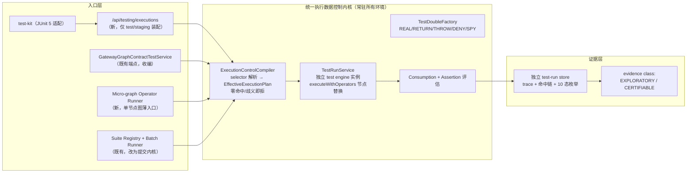

## Plan: Resource Gateway 可测试性工业化 v1 —— Execution Data Control Plane 实施蓝图

**TL;DR**：以 resource-gateway-industrial-testability-evolution-plan.md 为北极星终态，从既有 `GatewayGraphContractTestService` 语义中**提炼统一执行数据控制内核**，向上开放调用方驱动的 fixture 注入入口（/api/testing/executions + micro-graph operator runner + test-kit），向下以「独立 test engine 实例 + `executeWithOperators`」在 RG 层落地、同步产出 BLOGE 引擎需求文档；隔离采用「入口硬隔离 + deny-by-default + 证据分级」，验收采用仓库自身 CI dogfooding。分三个阶段交付（语义冻结 → 内核提炼 → 注入入口与工程化），每阶段独立可验证。

---

### 一、背景

**已有资产**（经代码与文档双重核实）：

| 资产 | 现状 | 局限 |
|---|---|---|
| `GatewayGraphContractTestService` + `GatewayGraphResourceMock` | 表驱动 resource mock、真实 DSL 执行、coverage policy、stored suite + batch runner | 只按 resourceId 寻址、只有 RETURN 语义、走测试专用端点 |
| `VisualGraphSimulationService` + `SimulationOperator` | 三层 fixture（nodeFixtures → fixtureOverrides → transient simulate）、MOCKED/REAL 标记 | 只服务画布路径、按 nodeId 寻址、无行为语义 |
| `VisualOperatorContractTestService` | schema 校验 + path 断言 | **并未真实执行 operator**（只是 fixture 自洽校验，存在假安全感） |
| bloge-test（`MockOperator`/`GraphTestRunner`/逻辑时间/snapshot）与引擎 `executeWithOperators(Map)` | JVM 内测试方法论完备；引擎有节点级替换逃生口 | 裸 Map 无版本/目的/审计语义，不是工业协议 |

**核心命题修正**（R1-Q5 与文档 §1 一致）：算子可测是 DAG 可测的**必要非充分**条件。正确公式为「算子可测 + 组合语义可注入可断言（edge/foreach/retry/fallback/consumption）→ DAG 可测」。

### 二、要解决的问题

1. **语义分裂**：三套 mock 机制寻址、fixture 模型、MOCKED 语义各自漂移，没有单一注入内核。
2. **能力缺位**：不存在「任意调用方在运行时注入 fixture、使 DAG 行为完全可控可预期」的一等能力（你提出的数据流控制反转）。
3. **假阳性温床**：mock 未命中静默走真实调用、required fixture 未消费仍显示通过、operator "测试"实为 schema 自洽检查。
4. **隔离靠约定**：无结构性保证防止测试控制进入生产数据面；MOCKED 响应有污染生产响应缓存的现实路径。
5. **工程化断层**：CI 无法以软件工程成熟方式（JUnit 生态、批量回归、趋势对比）消费编排测试。

### 三、客户价值

| 群体 | 价值 |
|---|---|
| DAG 编排作者 | 运行前可见 EffectiveExecutionPlan（谁真实/谁被替换/谁被禁止）；error-branch 与 foreach 分支可确定性覆盖 |
| QA / 平台工程 | 大规模批量验证：inline fixture + suite registry 批量跑，独立 test-run store 支撑回归对比与趋势 |
| CI / 发布 gate | JUnit XML + test-kit 断言进入现有流水线；认证级证据（CERTIFIABLE）供 publish gate 消费，不与生产证据混淆 |
| Operator 开发者 | micro-graph runner 给出真实执行的 EXECUTABLE_UNIT 认证；Composability Contract 明确「可重复单测」的准入 |
| SRE / 安全 | 生产触碰类安全告警；测试控制在结构上（端点 + profile + 独立引擎实例 + 目标态独立部署）不可能进入生产数据面 |
| ANEKE 消费方 | 测试证据带指纹链（target/fixture/plan），可进 workbook/gate（Stage 3 起） |

### 四、解决手段（目标架构与 v1 范围）

**v1 激活面 / 预留面 / 排除面**：

| 维度 | v1 激活 | schema 预留（v1 显式拒绝使用） | 明确排除（后续 Stage） |
|---|---|---|---|
| Selector（InvocationSite 子集） | graphPath+nodeId（主身份）、operatorRef/resourceRef（批量维）、invocationKind（默认 PRIMARY）、correlationKey、match | attempt、occurrence | — |
| Match | canonical JSON equals、JSON Pointer equals/exists/absent、schema match、correlationKey equals、受限正则 | — | 表达式语言（永久排除，见决策表） |
| 行为 | REAL / RETURN / THROW / DENY / SPY | kind 枚举含 DELAY/TIMEOUT/STREAM/REPLAY | 时间类行为与 REPLAY（依赖逻辑时钟/vault，Stage 4+） |
| 默认行为 | 外部副作用算子 deny-by-default（未覆盖→FIXTURE_UNMATCHED）；纯计算算子真实执行 | allowReal allowlist 字段 | — |
| Consumption | required/minUses/maxUses + FIXTURE_UNUSED 失败 | onExhausted 策略扩展 | — |
| Schema 纪律 | 默认 strict；WARN/OFF 需显式声明+理由，evidence 标记 schema-waived，waived run 不得认证 | — | — |
| 断言 | 既有 5 模式 + nodeAssertions + **numeric tolerance（v1 补齐）**，服务端可选 | — | property/mutation（P2） |
| 供给 | `JsonSchemaSampleGenerator` 草稿生成 | — | record-replay（phase 2，必须与 payload replay 共底座+脱敏前置） |
| 证据 | 独立 test-run store、10 态枚举、fixture 命中链、每节点 MOCKED/REAL、verbosity 参数 | — | 签名 evidence/coverage 语义度量（Stage 3） |

### 五、手段合理性：为什么这是当下最优

1. **内核从已验证语义提炼而非凭空设计**——`GatewayGraphContractTestService` 与目标语义最近（真实 DSL 执行 + resource mock），其既有测试是行为保持重构的免费安全网；文档原 Stage 1 先建独立 fixture 原语会在 Stage 2 迁移时返工一次。
2. **RG 层先行、引擎需求同步成文**——本仓已验证该演进模式（bloge-framework-operator-function-schema-export-requirement.md 即 example 先行→框架原生需求的先例）；且 `executeWithOperators` + plan 编译期展开（resourceRef → node map）使 v1 无需引擎改动、无需 GraphContext magic key。
3. **独立 test engine 实例优于共享拦截器链排序**——结构性消除「MOCKED 响应进生产响应缓存」的 P0 完整性隐患（`ResponseCacheInterceptor` 当前最外层且按 nodeId:input 键缓存），也不污染限流/熔断统计；`VisualGraphSimulationService` 已是该形态先例。
4. **隔离对象是「入口」而非「内核」**——内核以 `SimulationOperator` 形态本就存在于生产（visual simulate/contract test 跑在生产控制面）；生产攻击面无新增，新增的 caller 注入入口用 profile 硬隔离。`testMode=true` 参数方案（文档 §21.1）被双方独立否决。
5. **deny-by-default 全链贯穿**——未命中失败、未消费失败、歧义失败、schema-invalid 失败、生产 purpose 非空 plan 失败：完整性靠结构而非「每个使用者都不犯错」。
6. **时间窗最优**——既有演进计划 P1（ANEKE 体验闭环）正卡在等外部 consumer 对接，测试性工作全部内部可控，是等待期的最优投入（R1-Q1 依据）。

### 六、分阶段实施（可直接指导开发）

#### Stage 0：语义冻结与诚实命名

1. 将 `VisualOperatorContractTestService` 的现有模式显式标记为 SCHEMA_CONTRACT（API 响应与 UI 文案），消除「operator test 已跑通」的假安全感。
2. 定义域模型 v1（Java record，放入新包 testing/domain）：InvocationSite、FixtureRule（selector/behavior/consumption/schemaCheck）、FixtureBundle、EffectiveExecutionPlan、TestRunEvidence 骨架——schema 按文档 §8 全量定型，含预留字段。
3. 两份 ADR：①隔离终态=独立 test-runtime 部署，过渡态同进程四重隔离（endpoint/profile/identity/network）+退出条件；②OPAQUE_RUNTIME 判定=肯定+自然过渡（EXECUTABLE_UNIT 认证只发给满足 Composability Contract 者，存量不追溯、产出 inventory+backlog）。
4. 引擎需求文档（新建 docs/bloge-framework-execution-control-requirement.md）：按文档 §9 重组——ExecutionOptions/ExecutionPurpose+ControlPlan（P0）、拦截器顺序契约+引擎原生 trace（P1）、OperatorResolverChain 统一解析（P1）、ExecutionServices/FunctionCallSite（P2）；fixture SPI 整体下沉写入「待 RG 验证成熟后再提」章节。
5. capability probe 暴露 testability 协议版本与 enabled environments。

**验收**：系统不再把 schema 自洽校验表述为 operator 执行测试；ADR/需求文档进 docs/。

#### Stage 1'：内核提炼（行为保持重构）

1. 新建包结构（文档 §10.1）：testing/domain、testing/planning（ExecutionControlCompiler/SelectorResolver/SafetyPreflight）、testing/runtime（TestRunService/TestDoubleFactory/InvocationRecorder）、testing/evidence、testing/api。
2. 从 `GatewayGraphContractTestService` 提炼执行路径入内核：selector 解析（v1 激活子集）→ preflight 产出 EffectiveExecutionPlan（零命中/歧义→CONTROL_PLAN_REJECTED）→ 独立 test engine 实例（不注册生产横切拦截器）→ `executeWithOperators` 注入 doubles → trace 采集（ExecutionListener）→ consumption 检查 → 断言评估。既有 contract test 端点语义不变，成为内核第一个 adapter。
3. TestDoubleFactory 实现五行为：RETURN（schema-gated）、THROW（标准化 error code/type）、DENY（触发即失败）、SPY（真实执行+录制输入输出与 side-effect intent）、REAL（显式）。
4. Micro-graph operator runner 薄入口：单节点图组合内核执行，绑定 runtime binding 指纹；输出 EXECUTABLE_UNIT 或 OPAQUE_RUNTIME 分类；产出存量 operator 的 Composability Contract inventory。

**验收**：既有 contract test 全绿（安全网）；四类 conformance case（纯 operator、`HttpResourceOperator` stub、失败 operator、side-effect DENY）通过。

#### Stage 2'：调用方注入入口与工程化（*依赖 Stage 1'*）

1. 新端点 /api/testing/executions（仅 test/staging profile 装配 bean）：TestExecutionRequest 按文档 §8.1（inline fixture 即时 sha256 指纹化；或 suiteRef）；响应含 plan 回显 + 全节点 trace（verbosity 参数）+ 断言结果 + 10 态枚举。
2. 独立 test-run store（record 模型与生产 run record 同构、分表/分库、独立 retention）；evidence class 字段：EXPLORATORY（inline/waived）vs CERTIFIABLE（stored suite ref、无 waiver）。
3. Suite registry/batch runner 改为向内核提交；coverage policy 复用；numeric tolerance 断言补齐。
4. test-kit 模块（新 Maven module）：薄 HTTP client + FixtureBundle builder + JUnit 5 断言适配 + JUnit XML 输出。
5. 安全告警（生产触碰类）：test purpose 触达生产 endpoint/credential、production run 携非空 control plan → 安全事件。
6. Dogfooding：所有示例图（loan-decision、credit-score 等）建 suite，接入 `mvn -f pom.xml clean verify`；产出 verification doc。
7. v1 实施蓝图文档（新建，引用北极星文档并记录 decision delta，见第八节）。

**验收**：见第七节验证清单。

#### Stage 3-5：按北极星文档执行（签名 evidence/语义 coverage/ANEKE projection → ExecutionServices/逻辑时钟/FunctionCallSite/时间类行为 → 独立部署/配额/mutation）。

**Relevant files**
- GatewayGraphContractTestServiceTest.java — Stage 1' 行为保持重构的安全网；`GatewayGraphContractTestService` 本体为内核提炼源
- VisualGraphSimulationService.java — 独立引擎实例先例；最后收编对象
- HttpResourceOperator.java — RETURN fixture 的值形态对齐 `HttpResourceOutput`（payload/statusCode/success），沿用 `GatewayGraphResourceMock` 字段
- ResponseCacheInterceptor.java — 缓存污染隐患来源；架构测试断言对象
- resource-gateway-industrial-testability-evolution-plan.md — 北极星终态文档
- 新建：testing/* 五个子包、/api/testing/executions、test-kit module、两份 ADR、引擎需求文档、v1 蓝图文档、dogfooding suites

### 七、验证策略

1. Stage 1' 重构后 `mvn -f pom.xml clean verify` 全绿（AGENTS.md 规定的项目级验证命令）。
2. 反面用例：漏配 fixture 的外部算子 → FIXTURE_UNMATCHED（绝不真调外部）；required fixture 未消费 → FIXTURE_UNUSED；同级 selector 歧义 → CONTROL_PLAN_REJECTED；attempt/occurrence 使用 → 明确拒绝错误。
3. 架构测试：test engine 实例构建配置不含生产横切拦截器（结构性证明 MOCKED 永不进响应缓存/限流/熔断统计）。
4. 隔离测试：production profile 下 /api/testing/** bean 不存在；生产 run API 请求携 control 字段被拒并触发安全事件。
5. Dogfooding：全部示例图 suite 达 coverage policy（minCases/minAssertionCount 等），CI 常态运行；以覆盖率指标做量化线。
6. Conformance：Stage 1' 四类 operator 用例 + evidence class 正确分级（inline→EXPLORATORY，stored+无 waiver→CERTIFIABLE）。

### 八、决策依据总表（含对北极星文档的 delta）

| # | 决策 | 依据 | 被否方案与原因 |
|---|---|---|---|
| 1 | 测试性插队为新 P1 | 原 P1 卡等 ANEKE 外部对接，测试性全内部可控；产出反哺 gate | 并行双轨（资源分散）；并入原 P1（违背计划「不混杂」原则） |
| 2 | RG 先行→下沉框架，需求文档同步 | 仓库已验证的演进模式；`executeWithOperators` 使 v1 零引擎改动 | 引擎原生先行（周期长、抽象未经实战）；纯 RG 永久方案（其他 BLOGE 应用重复造） |
| 3 | 收敛内核多入口，contract test 先收编 | 单一 MOCKED 语义；耗散结构（一核多 adapter）；visual 有独立产品约束最后收编 | 第四套共存（语义漂移=负熵）；大爆炸统一（回归风险） |
| 4 | 隔离=入口硬隔离+内核常驻；终态独立部署（ADR 冻结） | 内核本就以 SimulationOperator 在生产；不冻结终态则中间设计只能降险不能根治 | testMode 参数（生产后门）；IAM 软隔离起步（押在未闭环 IAM-01 上） |
| 5 | InvocationSite schema 全量、实现子集（delta：文档全量实现→子集激活） | 无破坏性返工；attempt/occurrence 语义仅在时间类故障后有消费者 | 双维 selector（foreach/嵌套寻址缺位，后续破坏性迁移）；全量实现（无消费者代码） |
| 6 | match canonical-only（我方撤回表达式方案） | match 必须能在 plan 预检被静态解释与审计；表达式破坏确定性并扩大安全面 | 表达式 matcher；逃生口方案（会架空认证体系，先紧后松易、反之难） |
| 7 | v1 行为集 REAL/RETURN/THROW/DENY/SPY（delta：故障注入拆时间无关/相关两半） | THROW/DENY/SPY 不依赖 RUN-01/逻辑时钟，同一注入点分支逻辑，解锁 error-branch 覆盖 | RETURN only（组合语义缺口空置）；9 种全量（DELAY/TIMEOUT 在流沙上盖楼） |
| 8 | deny-by-default + consumption policy + 歧义即拒 | 杀死 mock 测试三大假阳性（未命中走真实、未消费仍绿、命中歧义） | passthrough 默认（静默危险，违背完全可控目标） |
| 9 | 独立 test-run store，gate 只消费 suite 聚合 | fail-safe：生产消费方物理上不可能误读 MOCKED run；批量体量不冲击生产库 | 同库+channel 字段（完整性押在每个未来查询都过滤正确） |
| 10 | inline 即时指纹化 + 认证级需 stored ref（delta：文档只有 bundleRef） | CI 无状态保留；证据可复现（sha256+归档）；认证路径不妥协 | 强制先注册（无状态性丢失）；inline 免指纹（违背冻结不变量） |
| 11 | schemaCheck 默认 strict + 显式 waiver + waived 不认证（delta：DoD-4 加豁免通道） | 鲁棒性测试（故意畸形响应）是正当诉求；代价显式化+可审计；认证路径 DoD-4 完整 | 无例外 strict（禁止合法边界测试）；waiver 不降级（认证含金量下降） |
| 12 | 分期调和：Stage 0 照收 + 内核提炼先行 + micro-graph 为薄入口（delta：文档 Stage 1/2 顺序） | 避免 Stage 2 返工；既有测试安全网；诚实命名立竿见影 | 文档原序（fixture 原语建两遍）；跳过 Stage 0（保留假安全感） |
| 13 | test-kit 进 v1（用户否决我方 v1.1 建议） | 用户判断工程化易用性是本丸；文档 §15 支持 | HTTP only（Java 调用方摩擦大） |
| 14 | Dogfooding 验收 + 反面用例 + 架构测试 | 自验证；符合仓库 verification doc 文化；验证安全不变量而非仅功能 | demo 验收（演示通≠好用）；纯指标（易凑数） |
| 15 | OPAQUE_RUNTIME 肯定+自然过渡 | 新宣称不可作假且无追溯破坏；过渡是语义自然结果非特赦 | 立即全量（存量一夜降级）；仅提示（重造假安全感） |

### 九、风险与未验证假设（诚实清单）

1. **未验证**：`executeWithOperators` 对 foreach body/streaming/compensation 节点的替换覆盖度（文档 §2.2.3 明示其寻址不统一）——v1 限定主节点+非 durable 图，实现首周做 spike 验证并把结论写入蓝图。
2. **未验证**：correlationKey 在 foreach 场景的取值来源（item key 如何被内核感知）——若引擎不透出，v1 用 canonical match on item payload 兜底，correlationKey 降为预留。
3. suite registry/batch runner 收编的回归风险——由行为保持测试兜底，但需防「顺手扩展」诱惑。
4. test-kit 需要将 resource-gateway-examples 转多模块（父 pom 改造）——包结构变更需保持 AGENTS.md 构建命令兼容。
5. 引擎需求（ExecutionOptions 等）落地节奏不受本仓控制——v1 全程不依赖它，仅受益于未来下沉。

### 十、明确排除（v1 不做）

时间类行为（DELAY/TIMEOUT/STREAM）、REPLAY/record-replay（须与 payload replay 共底座+脱敏前置）、逻辑时钟/随机种子、built-in function 控制、durable resume plan 恢复、签名 evidence 与语义 coverage 度量、独立 test-runtime 部署、mutation/property testing、CLI。均已在北极星文档 Stage 3-5 有宿主。

---
