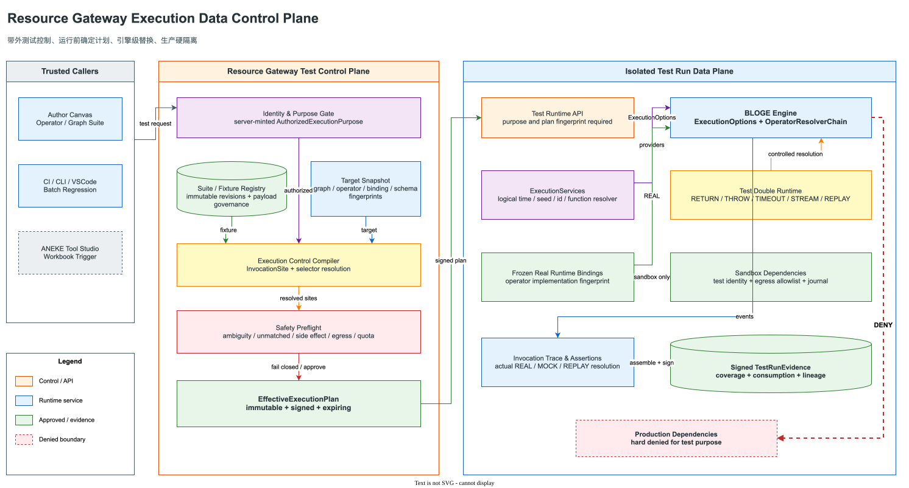
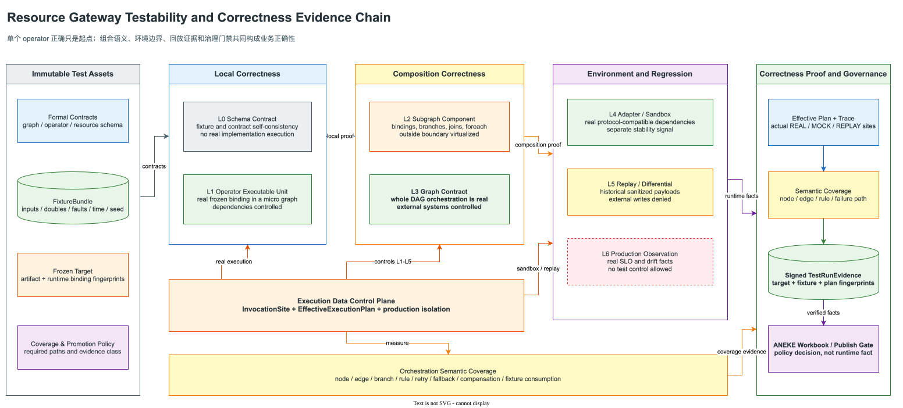

# Resource Gateway 工业级可测试性与执行数据控制反转演进方案

> 核心判断：Resource Gateway 下一阶段最值得投入的不是继续增加画布控件，而是把现有
> schema、DSL、operator、DAG、fixture、run trace 和 evidence 串成一条可重复、可隔离、
> 可审计的正确性证明链。建议将这套能力正式命名为 **Execution Data Control Plane**，
> 中文名为“执行数据控制面”。

| 文档属性 | 内容 |
|---|---|
| 状态 | Accepted / In implementation；Stage 0/1 已落地，Stage 2 主路径持续收口，Stage 3 证据链已闭环，Stage 4 已进入同步 cold-signal recovery 增量 |
| 目标读者 | Resource Gateway、BLOGE Runtime、operator 开发团队、QA、平台安全、SRE、ANEKE Tool Studio |
| 设计目标 | 让调用方在测试运行中确定性控制 DAG 的外部数据、故障和非确定性来源，并产出可验证的测试证据 |
| 非目标 | 不把 Resource Gateway 变成通用代码覆盖率平台；不允许普通生产请求携带测试替换指令；不替代 operator 代码仓库中的白盒单元测试 |
| 第一原则 | 测试控制必须是运行期带外控制，不进入业务 `GraphContext`，不改变 DSL 业务语义，不能被生产请求伪造 |

### 实施快照（2026-07-16）

| 范围 | 状态 | 代码/证据 |
| --- | --- | --- |
| Stage 0 语义冻结 | Done | `SCHEMA_CONTRACT` 诚实命名；五个版本化 testing domain；隔离与 opaque runtime ADR；capability protocol |
| Stage 1 unified kernel | Done | selector/preflight/effective plan、独立 engine、五行为、consumption/assertion/evidence、F2/F3、micro graph、旧 graph suite adapter；1653 tests 全绿 |
| Stage 2 public control plane | In progress | graph/operator target discovery、operator target v2 composability manifest、graph execution/batch/query、operator micro-graph execution、canvas executable operator suite（四类 case intent、内容寻址 fixture/一等 suite 发布、精确 revision 执行与 aggregate coverage/promotion 回显）、fixture/TestSuite registry、幂等 immutable TestSuite runner、独立 child/suite-run store、聚合结构 coverage 与 promotion eligibility、process-owner lease/heartbeat/checkpoint fence、abandoned RUNNING fail-closed reconciliation、脱敏、10 态 child evidence、profile/identity/production protocol guard、独立 Java/JUnit/CI test-kit suite adapter、七图/14-case F3 dogfooding及其 governed catalog materialization、numeric tolerance、run-scoped logical clock + DELAY/TIMEOUT、受治理 F4 replay payload 精确捕获/脱敏/retention/tombstone、exact-ref REPLAY 执行、payload-free plan v2 谱系与认证降级，以及同步 nested/foreach/loop/compensation 控制传播、动态 attempt/occurrence selector 与 occurrence/attempt/node/edge evidence 已落地；streaming/suspendable control/evidence 与物理 network isolation 待完成 |
| Stage 3 | In progress | graph/operator `TestRunEvidence`、suite checkpoint/terminal attestation、ordered child closure、payload-free portable bundle、suite/evidence/attestation 独立 v2 typed semantic coverage 已完成；signed atomic key-set、managed v1/v2 lifecycle、签名时刻 lifecycle policy、外部 M-of-N trust publication、bounded append-only consistency page、durable consumer checkpoint、rollback/fork/split-view/revoked-pin resurrection detection 与 test-kit independent verifier 已完成；exact-suite ANEKE semantic workbook seed、`GovernanceGateResult.v3` 可重建 basis、编译级 GraphDraft target 绑定和独立 schema consumer 已完成；真实 ANEKE N/N-1 conformance、独立 witness gossip/跨域一致性证明待完成 |
| Stage 4 | In progress | BLOGE run-scoped `ExecutionServices`/`FunctionCallSite`、公共 `CheckpointFailurePolicy.FAIL_FAST` 与同步 `resumeSuspended` 已接通；RG logical clock、seeded random/UUID、plan v3/provider-state、semantic result fingerprint、组合 `bloge.durableTestExecutionCheckpoint.v2`、fixture cursor、静止边界 recorder snapshot、同库事务、数据库时钟租约 CAS、持久化幂等命令、staged 四 store aggregate 和内部 `RecoverySession` 已落地。内部会话能把真实 suspension 恢复到下一静止边界并原子 advance 或回滚；公开 owner claim 已把 payload-free authorization receipt、结果 fence 与 worker dispatch 原子绑定；内部 heartbeat 已验证 dispatch 的签发谱系与 live fence，并原子旋转 revision/lease/successor dispatch。公开 dispatcher、worker 认证/poll/run/heartbeat/terminal evidence、stream offset/checkpoint、identity/flag/secret fixture authority、streaming 恢复与确定性并发待完成 |
| Stage 5 | Not started | 独立部署、network/identity/secret/store 物理隔离、规模化调度与 mutation/property testing |

实现细节、行为兼容决策和可复现测试见
[v1 实施蓝图](resource-gateway-industrial-testability-evolution-plan-1.0.md) 与
[Stage 1 verification](resource-gateway-execution-data-control-plane-stage1-verification.md) 与
[Testing Control Plane API](resource-gateway-testing-control-plane-api.md) 与
[Stage 2 test-kit verification](resource-gateway-execution-data-control-plane-stage2-test-kit-verification.md) 与
[Stage 2 operator adapter verification](resource-gateway-execution-data-control-plane-stage2-operator-adapter-verification.md) 与
[Stage 2 suite registry verification](resource-gateway-execution-data-control-plane-stage2-suite-registry-verification.md) 与
[Stage 2 suite runner verification](resource-gateway-execution-data-control-plane-stage2-suite-runner-verification.md) 与
[Stage 2 suite consumer adapters verification](resource-gateway-execution-data-control-plane-stage2-suite-consumer-adapters-verification.md) 与
[Stage 2 Canvas suite publication verification](resource-gateway-execution-data-control-plane-stage2-canvas-suite-publication-verification.md) 与
[Stage 2 dogfooding verification](resource-gateway-execution-data-control-plane-stage2-dogfooding-verification.md) 与
[Stage 2 catalog materialization verification](resource-gateway-execution-data-control-plane-stage2-catalog-materialization-verification.md) 与
[Stage 2 logical-time verification](resource-gateway-execution-data-control-plane-stage2-logical-time-verification.md) 与
[Stage 2 suite-run reconciliation verification](resource-gateway-execution-data-control-plane-stage2-suite-run-reconciliation-verification.md) 与
[Stage 3 signed test evidence verification](resource-gateway-execution-data-control-plane-stage3-signed-test-evidence-verification.md) 与
[Stage 3 suite attestation verification](resource-gateway-execution-data-control-plane-stage3-suite-attestation-verification.md) 与
[Stage 3 key lifecycle verification](resource-gateway-execution-data-control-plane-stage3-key-lifecycle-verification.md) 与
[Stage 3 evidence trust transparency verification](resource-gateway-execution-data-control-plane-stage3-evidence-trust-transparency-verification.md) 与
[Stage 3 semantic coverage verification](resource-gateway-execution-data-control-plane-stage3-semantic-coverage-verification.md) 与
[Stage 3 semantic gate basis verification](resource-gateway-execution-data-control-plane-stage3-semantic-gate-basis-verification.md)。北极星中的目标态能力未出现在上述
Done 行时，均不得从文档推断为产品已开放。

Stage 4 的 run-scoped provider、语义结果身份、脱敏后重算和 v1/v2 兼容证明见
[Stage 4 execution services verification](resource-gateway-execution-data-control-plane-stage4-execution-services-verification.md)。
组合检查点、同库事务参与、CAS 围栏和故障回滚证明见
[Stage 4 durable checkpoint verification](resource-gateway-execution-data-control-plane-stage4-durable-checkpoint-verification.md)。

恢复控制面进一步补齐了公开 owner claim：tenant/environment-scoped `clientRequestId`、规范化授权
意图指纹、精确旧 fence、server-owned claimant/lease、lease CAS、不可变结果快照与 `ALLOWED` 语义
安全事件共享一个本地事务。授权器不再只返回布尔结论，而是返回 exact graph/micro-graph、冻结
`CompiledExecutionControl` 与 payload-free `bloge.durableTestRecoveryAuthorization.v1`；receipt 绑定 source
checkpoint、认证 principal（含 region）、target/plan/fixture/replay/provider/authority 指纹、purpose 与 side-effect policy。
repository 在同一 claim 事务签发 `bloge.durableTestRecoveryDispatch.v1`，把 receipt 与结果 scope、
engine execution、owner/epoch/revision/expiry/checkpoint fence 绑定；升级后的
`bloge.durableResumeCommandRecord.v2` 同时覆盖 authorization、checkpoint 与 dispatch 指纹。响应丢失后的
同意图重试优先返回原始 checkpoint + dispatch，不因当前依赖漂移改变已经提交的结果；
同键异意图、跨 scope 探测、双实例并发、索引投影漂移与结果 JSON/指纹篡改均 fail closed。
公开 adapter 只在 `test`/`staging` 存在，按认证身份计算指纹，并重新授权 exact
target/fixture/replay/identity/side-effect/provider/plan 闭包。它现在建立 `RESUMING` fence 和不可转移的
worker dispatch receipt。内部 `RecoveryHeartbeatCommand` 只接受已提交 claim/前序 heartbeat 签发的
dispatch，以数据库时钟检查 live `RESUMING` fence，在同一事务把 revision 加一、延长 lease、签发
successor dispatch 并固化可幂等回放的 `bloge.durableRecoveryHeartbeatRecord.v1`；旧 dispatch、过期
lease、未签发 dispatch、同键异意图、存储篡改和伴随审计失败均 fail closed。内部同步 cold-signal
primitive 与 heartbeat persistence 已可验证，但尚无公开 dispatcher、worker 认证/poll/run、terminal
evidence 与 resume 编排。

动态 attempt/occurrence selector 的一基坐标、优先级、失败边界和真实 retry/nested re-entry
证明见 [Stage 2 dynamic selector verification](resource-gateway-execution-data-control-plane-stage2-dynamic-selector-verification.md)。
Semantic coverage 不修改已签名 v1 canonical shape，而通过 suite/evidence v2 双读演进，见
[ADR-003](adr/ADR-003-semantic-coverage-protocol-versioning.md)。
Exact semantic suite 到 ANEKE payload-free workbook seed 的投影、失败边界和 consumer 证明见
[Stage 3 ANEKE semantic workbook verification](resource-gateway-execution-data-control-plane-stage3-aneke-semantic-workbook-verification.md)。
Semantic workbook 到 ANEKE gate decision 的 exact evidence 重建、GraphDraft 编译 target 绑定与 v2 兼容证明见
[Stage 3 semantic gate basis verification](resource-gateway-execution-data-control-plane-stage3-semantic-gate-basis-verification.md)。

当前严格验收基线：Resource Gateway `clean verify` 共 1986 tests、0 failures、0 errors、
34 个条件跳过，真实浏览器回归与 Spring Boot JAR 打包成功；Canvas suite 聚焦 68 tests、
前端全量 150 tests，并在桌面与 390 x 844 真实浏览器中完成两行一等 suite 发布；Canvas 对完整
stored suite value、child evidence、coverage、promotion 与 aggregate 一致性 fail closed；immutable TestSuite
runner/attestation/protocol 增量聚焦 49 tests；key lifecycle 增量聚焦 41 tests；动态 selector/capability/schema 增量聚焦 51 tests；typed semantic coverage/codec/registry/persistence/schema/capability 增量聚焦 52 tests；suite-run lease/reconciliation/profile 聚焦 22 tests；built-in catalog materialization 增量聚焦 34 tests；suite consumer adapter 聚焦 21 tests、独立 test-kit
`clean verify` 62 tests，均为 0 failures、0 errors，library/CLI JAR 均打包成功；semantic gate/projector/target/schema
增量聚焦 23 tests，integration package 138 tests 全绿；完整 suite/catalog/semantic workbook/gate v3 wire value 按打包的
Draft 2020-12 schema 校验并回绑 request identity，`RUNNING` 在无 polling CLI 中退出 2，
未知参数值与 validator 细节不进入日志，public JavaDoc 零告警且由 `verify` 门禁强制；Stage 4
durable checkpoint/aggregate/public owner-claim/internal recovery/authorization-bound dispatch/live-fence heartbeat 聚焦 115 tests 全绿。

## 1. 结论先行

用户提出的方向是对的，而且可能成为 Resource Gateway 从“能编排”进入“敢交付”的决定性能力。DSL 化使图、节点、绑定和 schema 都变成可寻址对象，BLOGE 又已经具备 node 级 operator 替换、逻辑时间、mock operator、执行监听器和 snapshot testing 的基础，因此现在确实到了把测试能力产品化的时候。

但必须修正一个过于乐观的推论：

> 单个 operator 可测试，是 DAG 可测试的必要条件，不是充分条件。

即使每个 operator 都有完美单测，DAG 仍可能因以下问题产生业务错误：

- input binding 指向了错误的 context path；
- edge 连错、条件表达式错误或 decision table 规则顺序错误；
- 并行分支在 join 时丢失、覆盖或错误聚合数据；
- retry、timeout、fallback、skip、cancel 和 compensation 的组合行为错误；
- built-in function、时间、随机数、UUID、身份或 feature flag 使运行不可重复；
- operator 声称无副作用，实际却隐藏访问数据库、网络或全局状态；
- mock 没有命中、命中过宽或未被消费，测试却仍显示通过；
- 测试图、operator runtime binding、fixture 和最终证据不是同一个不可变版本。

因此目标不能只定义为“operator 可以填 mock output”，而应是：

```text
可寻址的执行依赖
  + 可版本化的 FixtureBundle
  + 运行前确定的 EffectiveExecutionPlan
  + 引擎级替换与故障注入
  + 业务语义覆盖率
  + 不可抵赖的 TestRunEvidence
  + 生产环境硬隔离
= 工业级可测试 Tool Authoring Runtime
```

## 2. 当前系统事实审计

### 2.1 已有基础

| 能力 | 当前代码事实 | 可复用价值 |
|---|---|---:|
| Operator schema table suite | `VisualOperatorContractTestService` 已支持 input/config/mock output schema 校验和 path 断言 | 高，适合作为 schema contract 层 |
| Resource graph contract suite | `GatewayGraphContractTestService` 运行真实 BLOGE graph，仅替换 descriptor-backed `httpResource` | 很高，已经接近 graph contract test |
| Visual simulation fixture | `VisualGraphSimulationService` 支持 persisted/request-scoped node fixture、mock output 和 expected input | 很高，是执行控制面的原型 |
| Golden regression | `VisualGraphGoldenCase` 绑定不可变 publication，并运行真实发布物 | 高，适合作为 promotion regression 层 |
| Run trace/evidence/replay | 已有 node attempt、status、payload governance、recorded replay 和签名 evidence | 很高，可承载测试证据 |
| BLOGE node replacement | `GraphEngine.executeWithOperators(...)` 可按 node id 注入 operator map | 高，但当前只是底层逃生口，不是稳定协议 |
| BLOGE test kit | `bloge-test` 已有 `MockOperator`、`GraphTestRunner`、`TestGraphEngine`、逻辑时间和 snapshot | 高，方法论和实现均可复用 |
| Formal graph contract | graph 级 input/output schema、operator fingerprint、dependency snapshot 已存在 | 高，可以冻结测试目标 |

### 2.2 当前最严重的认知缺口

#### 2.2.1 Operator Test Suite 目前没有真正执行 operator

现有 `VisualOperatorContractTestService#runCase` 校验的是：

```text
input fixture 是否满足 input schema
config fixture 是否满足 config schema
mockedOutputs 是否满足 output schema
assertion 是否能在 mockedOutputs 上通过
```

这证明了测试数据自洽，却没有证明 operator 实现正确。严格说，它当前是
**Operator Schema Fixture Validation**，不是 executable operator unit test。继续沿用“operator test 已跑通”的表述会制造错误安全感。

> 2026-07-15 落地校正：本节描述仍适用于 `/api/visual/operators/tests/*` 的持久化 schema suite；它继续诚实返回
> `SCHEMA_CONTRACT`。React Author Canvas 的 `Executable Operator Suite` 已改走公共 operator target discovery 与
> micro-graph execution，不再调用该 schema-only runner。`Run Case / Run Exploratory` 使用 inline fixture；
> `Publish Case + Run / Publish Suite + Run` 则为每行注册内容寻址 fixture，并把一行或多行发布为一等 immutable
> `bloge.testSuite.v1` 后执行精确 revision。两条入口并存，证据等级不得混用。

正确演进不是删掉它，而是把模式显式拆开：

| 模式 | 是否执行真实 operator | 证明什么 |
|---|---:|---|
| `SCHEMA_CONTRACT` | 否 | fixture 与 operator contract 自洽 |
| `EXECUTABLE_UNIT` | 是 | 指定 runtime binding 在受控输入下行为正确 |
| `ADAPTER_CONTRACT` | 是，连接 sandbox/test container | operator 与真实协议适配正确 |
| `DIFFERENTIAL` | 新旧版本都执行 | 升级前后行为差异符合预期 |

#### 2.2.2 Visual Simulation 是安全 mock run，但不是完整控制反转

当前 simulation 的策略是：transform、branch、decision table 等纯 DSL primitive 真实执行，其余 operator-invoking node 默认被 mock。这个默认对作者预览很安全，但存在四个限制：

1. 替换对象主要按 node id，缺少 operator/resource/function/call occurrence 等统一 selector。
2. fixture 主要是固定返回和 expected input，缺少 throw、delay、timeout、stream、retry attempt、调用次数等行为。
3. 没有运行前生成“最终到底替换了谁”的有效执行计划，无法发现零命中、歧义命中和过宽命中。
4. simulate evidence、stored suite、golden case 和 replay 仍是相邻模型，没有共享同一个 fixture/control protocol。

#### 2.2.3 `executeWithOperators(Map)` 不足以成为工业协议

BLOGE 当前 API 为测试提供了重要基础，但它有明显边界：

- `Map<String, ?>` 没有版本、目的、作用域、fingerprint 和审计语义；
- 主节点按 node id 覆盖，compensation 主要按 operatorRef 解析，寻址语义不统一；
- streaming operator 的解析顺序与普通 operator 不完全一致；
- nested graph、foreach body、durable resume 是否继承同一替换计划没有一等合同；
- operator map 无法描述第几次调用、哪次 retry、何种输入匹配和故障序列；
- built-in function 在 DSL 编译时被捕获为函数闭包，运行期 operator map 无法控制；
- durable store 尚未持久化测试控制计划与 provider-state；当前 compiler 已能对独立重建的
  plan/config 精确校验并恢复 `ExecutionServiceStateSnapshot`，但重启链路尚未接线。

结论是：保留 `executeWithOperators` 作为兼容 API，但新增一等 `ExecutionControlPlan`，不能继续扩大裸 `Map` 的职责。

## 3. 目标架构



图源：[resource-gateway-execution-data-control-plane.drawio](assets/drawio/resource-gateway-execution-data-control-plane.drawio)。

目标架构把一次测试运行拆成两个阶段：

1. **Plan phase**：认证调用方，冻结 graph/operator/runtime/fixture 版本，解析 selector，做生产隔离和 side-effect policy 检查，生成不可变 `EffectiveExecutionPlan`。
2. **Execute phase**：BLOGE Engine 只消费已批准计划，按 invocation site 解析真实实现或 test double，并把每次命中、输入、输出、故障、调用次数和断言写入 trace。

真正重要的不是接口名称，而是以下边界：

- DSL 和 `GraphContext` 只承载业务数据；
- `ExecutionControlPlan` 是引擎带外控制；
- fixture 不能在 node 内部被读取、修改或传播；
- production run data plane 不能接受 test control plan；
- evidence 必须同时记录计划指纹和实际命中结果。

## 4. 领域模型与统一语言

| 对象 | 定义 | 是否不可变 |
|---|---|---:|
| `TestSuite` | 一组围绕同一测试目标组织的 case、coverage policy 和 promotion policy | revision 不可变 |
| `TestCase` | 一次确定性运行的输入、控制计划引用和断言集合 | revision 不可变 |
| `FixtureBundle` | 可复用的输入、依赖替身、故障脚本、逻辑时间和数据分类声明 | 是 |
| `ExecutionControlSpec` | 用户意图：哪些 invocation site 使用 REAL/STUB/MOCK/FAULT/REPLAY/SPY | 是 |
| `EffectiveExecutionPlan` | 服务端结合目标 artifact、环境 policy 和 runtime inventory 后解析出的最终计划 | 是 |
| `InvocationSite` | 一次可控制调用的稳定身份，不等同于简单 node id | 由 artifact 决定 |
| `TestDouble` | 返回、抛错、延迟、流式响应、录制或回放的受控实现 | 由 fixture 决定 |
| `TestRun` | 执行一个 case 后形成的运行实例 | 是 |
| `TestRunEvidence` | 对 target、fixture、plan、trace、assertion 和 coverage 的签名事实 | 是 |
| `TestCertification` | 多个 suite/evidence 满足某个 promotion policy 的结果 | 是 |

### 4.1 InvocationSite 不能只用 node id

稳定寻址至少需要：

```text
artifactFingerprint
graphPath                 # root/subgraph/foreach-body/compensation
nodeId
operatorRef
runtimeBindingFingerprint
invocationKind            # PRIMARY/COMPENSATION/FUNCTION/RESOURCE/SUBGRAPH
attempt                    # retry attempt，可选
correlationKey             # foreach item/business key，可选
occurrence                 # 同一 site 第几次调用，仅在顺序确定时使用
```

`graphPath + nodeId` 是主身份。`operatorRef`、resourceRef 和 tag selector 只适合批量声明策略，不足以单独形成审计身份。

## 5. 不可破坏的设计不变量

1. **测试控制永远不从 `GraphContext` 读取。** 业务 DSL 无法看到或修改 fixture。
2. **生产身份不能由请求字段声明。** `ExecutionPurpose` 必须由 endpoint、workload identity 和服务端 policy 联合铸造。
3. **Production purpose 下有效计划必须为空。** 任何 override、fault、logical clock 或 replay 行为都在执行前拒绝。
4. **零命中和歧义命中默认失败。** fixture 不是“尽力而为”的提示。
5. **required fixture 必须被消费。** 未消费 mock 表明路径没有按预期发生。
6. **每个真实调用和替换调用都必须可区分。** trace 不允许把 MOCKED 伪装成 SUCCESS。
7. **测试目标必须冻结。** artifact、operator、schema、runtime binding、fixture 和 plan 都有 fingerprint。
8. **控制计划必须在执行前完全解析。** 运行中不能临时读取可变 fixture 配置。
9. **durable resume 必须恢复同一计划。** 找不到原计划时进入 `CONTROL_PLAN_UNAVAILABLE`，不能回退为 REAL。
10. **外部写默认拒绝。** 只有 sandbox binding、显式 side-effect policy 和专用身份同时满足时才允许。
11. **测试 evidence 与生产 evidence 分类不同。** 测试通过可以成为 correctness evidence，但不能冒充生产真实执行证据。
12. **断言失败与执行失败分开建模。** 两者都失败，但原因、责任和重试策略不同。
13. **并发测试默认只断言偏序和结果，不断言线程完成全序。** 除非 graph contract 明确要求全序。
14. **敏感 fixture 不进入普通日志。** 分类、脱敏、保留和 legal hold 沿用 payload governance。
15. **任何 bypass 都产生审计事件。** break-glass 只能扩大诊断可见性，不能在生产启用 fixture。

## 6. 测试分层：从 operator 到 DAG 正确性



图源：[resource-gateway-testability-evidence-chain.drawio](assets/drawio/resource-gateway-testability-evidence-chain.drawio)。

### 6.1 L0 Schema Contract Test

目标：验证 operator、resource 和 graph contract 本身合法，fixture 满足 schema。

这是现有 operator suite 已经擅长的层。它执行快、可以覆盖 design-only operator，但不能声称验证了实现行为。

### 6.2 L1 Operator Executable Unit Test

目标：执行一个真实 operator runtime binding，其外部依赖全部被替换或接入 sandbox。

推荐不是直接调用 `operator.execute`，而是编译并运行一个单节点 micro graph：

```text
formal operator input
  -> production input coercion
  -> production interceptor chain
  -> exact runtime binding
  -> output/schema/assertion/side-effect observation
```

这样测试能覆盖 Resource Gateway 真正会走的类型转换、deadline、interceptor、side-effect journal 和 evidence 路径。

注意：如果一个 operator 内部偷偷 new HTTP client、直接读系统时间或访问全局数据库，DAG 层无法从 node 边界控制它。operator 必须满足 **Composability Contract**：

- 所有外部依赖通过可声明 port、resource binding 或可注入 provider 暴露；
- 时间使用 `OperatorContext.timeSource()`；
- 随机数、UUID、identity、feature flag 使用 execution-scoped provider；
- side effect type、idempotency、dependency manifest 和 secret policy 如实声明；
- 不使用未声明的全局可变状态。

不满足该合同的 operator 仍可运行，但认证等级必须标为 `OPAQUE_RUNTIME`，不能宣称可重复单测。

### 6.3 L2 Subgraph Component Test

目标：让被测子图真实运行，把边界外节点替换成 doubles。

它验证 input binding、边、transform、decision table、foreach 和局部错误策略，比单 operator 更接近业务逻辑，又比整图测试更容易定位失败。

### 6.4 L3 Graph Contract Test

目标：真实执行完整 DAG 的编排语义，仅虚拟化外部系统边界。

这应成为 Resource Gateway 的主力测试层。现有 `GatewayGraphContractTestService` 已证明这条路径可行，但下一版要从“只 mock `httpResource`”扩展为统一 InvocationSite 控制。

### 6.5 L4 Adapter/Sandbox Integration Test

目标：operator 和 resource adapter 连接真实协议兼容的 sandbox、test container 或 ephemeral environment。

这一层验证序列化、认证、HTTP 状态、数据库 schema、消息协议等边界，不追求大量 case。它不能与 mock test 混在同一个未标识模式里。

### 6.6 L5 Replay/Differential Regression

目标：使用历史脱敏 payload 或 golden fixture 运行新版本，比较：

- 最终输出；
- node/edge path；
- schema；
- error class；
- side-effect intent；
- 新旧版本差异预算。

默认 `DENY_EXTERNAL_WRITES`，只允许生成 side-effect intent，不提交真实外部写。

### 6.7 L6 Production Observation

目标：验证真实运行事实、SLO 和漂移，不使用 fixture。它不是测试控制面的运行模式，只向正确性工作簿提供补充证据。

## 7. 执行数据控制反转模型

### 7.1 为什么叫 Control Plane，而不是 Fixture Map

`Map<nodeId, output>` 只能表达静态 stub。工业场景还需要表达：

- 第一次返回 503，第二次成功，以验证 retry；
- 某个 foreach item 超时，其余 item 成功；
- 只对 resource 参数满足某个 canonical match 的调用返回 fixture；
- 真实执行 operator，但记录调用输入和 side-effect intent；
- 从历史 run replay 响应，并证明 payload 已脱敏；
- built-in function 在固定 seed 和 logical clock 下执行；
- stream 按时间序列发出 N 个事件后失败；
- compensation 被调用且使用正确 idempotency key。

这些是执行策略，不是静态数据。

### 7.2 控制行为

建议第一版支持以下行为，避免一次性引入可执行脚本：

| Behavior | 语义 | 典型用途 |
|---|---|---|
| `REAL` | 使用冻结的真实 runtime binding | 被测主体 |
| `RETURN` | 返回 schema-gated fixture | stub 下游数据 |
| `THROW` | 抛出标准化 error code/type | negative path |
| `DELAY` | 推进或等待逻辑时间后执行后续行为 | timeout/retry |
| `TIMEOUT` | 产生标准 timeout，不真实睡眠 | deadline/fallback |
| `STREAM` | 按逻辑时间发出 item/error/complete 序列 | event/stream graph |
| `REPLAY` | 从受治理 payload vault 读取历史响应 | regression |
| `SPY` | 真实执行并记录输入、输出和 side-effect intent | adapter observation |
| `DENY` | 若该 invocation site 被触发则失败 | 证明某路径绝不发生 |

第一版不支持上传 JavaScript、Groovy、SpEL 或任意代码。动态行为使用声明式 match、sequence 和 fault spec，避免 RCE、不可重复和治理失控。

### 7.3 Selector

```yaml
selector:
  graphPath: /root
  nodeId: fetchPolicy
  operatorRef: resource:policy-service.getPolicy
  invocationKind: PRIMARY
  match:
    paths:
      /customerId: C-1001
  attempts: [1, 2]
```

支持层级：

1. exact invocation site + attempt + correlation key；
2. graphPath + nodeId；
3. operatorRef/resourceRef/functionRef；
4. capability/tag；
5. suite default policy。

优先级高的 selector 胜出；同级多个 selector 同时命中则 preflight 失败。禁止使用“最后声明覆盖前面”掩盖歧义。

### 7.4 Match 语义

只支持可规范化、可审计的匹配：

- whole input canonical JSON equals；
- JSON Pointer path equals/exists/absent；
- schema match；
- correlation key equals；
- invocation attempt/occurrence equals。

正则必须受长度、复杂度和 timeout 限制。表达式不允许调用外部函数或读取未授权 payload path。

### 7.5 Consumption policy

每条 fixture rule 必须声明：

```yaml
consumption:
  required: true
  minUses: 1
  maxUses: 1
  onExhausted: FAIL
  onUnmatched: FAIL
```

测试结束后至少检查：

- required rule 是否被使用；
- 是否存在没有 fixture 的外部调用；
- rule 是否超额使用；
- DENY site 是否被调用；
- 调用输入、次数和顺序约束是否满足。

未消费 mock 必须是失败或显式 warning，不能悄悄通过。

### 7.6 并发和 sequence

全局“第 1 次/第 2 次调用”在并行 DAG 中不稳定。规则是：

- 首选业务 correlation key 或 foreach item key；
- attempt 序列绑定到同一 invocation lineage；
- 只有 graph 证明顺序执行时才允许 occurrence sequence；
- 并发分支默认断言偏序，例如 `A complete before C start`，不比较 A/B 完成先后；
- test runner 应支持 deterministic scheduler 作为专项模式，但不能把它当成生产调度语义。

## 8. 协议草案

### 8.1 TestExecutionRequest

```json
{
  "schemaVersion": "bloge.testExecutionRequest.v1",
  "target": {
    "kind": "GRAPH_PUBLICATION",
    "id": "pub-order-risk-2026-07-15",
    "fingerprint": "sha256:..."
  },
  "executionPurpose": "GRAPH_CONTRACT_TEST",
  "caseRef": {
    "suiteId": "suite-order-risk",
    "suiteRevision": 12,
    "caseId": "negative-timeout-fallback"
  },
  "context": {
    "orderId": "O-1001"
  },
  "fixtureBundleRef": {
    "fixtureBundleId": "fixture-order-risk",
    "revision": 9,
    "fingerprint": "sha256:..."
  },
  "requestedControls": {
    "logicalClock": "2026-07-15T09:00:00Z",
    "randomSeed": 314159,
    "externalWritePolicy": "DENY"
  }
}
```

`executionPurpose` 只是调用方意图，服务端必须结合受信身份生成不可伪造的
`AuthorizedExecutionPurpose`。请求写 `PRODUCTION` 或 `TEST` 都不能越过 endpoint policy。

### 8.2 FixtureBundle

```yaml
schemaVersion: bloge.fixtureBundle.v1
fixtureBundleId: fixture-order-risk
revision: 9
targetFingerprint: sha256:...
classification: INTERNAL
logicalTime:
  startAt: 2026-07-15T09:00:00Z
randomSeed: 314159
rules:
  - ruleId: policy-first-timeout
    selector:
      graphPath: /root
      nodeId: fetchPolicy
      invocationKind: PRIMARY
      attempt: 1
    behavior:
      kind: TIMEOUT
      after: PT2S
      errorCode: RG.TEST.UPSTREAM_TIMEOUT
    consumption:
      required: true
      minUses: 1
      maxUses: 1
  - ruleId: policy-retry-success
    selector:
      graphPath: /root
      nodeId: fetchPolicy
      invocationKind: PRIMARY
      attempt: 2
    behavior:
      kind: RETURN
      value:
        decision: REVIEW
        riskScore: 71
    consumption:
      required: true
      minUses: 1
      maxUses: 1
assertions:
  - scope: NODE_STATUS
    nodeId: fetchPolicy
    operator: EQUALS
    expected: SUCCESS
  - scope: NODE_ATTEMPT_COUNT
    nodeId: fetchPolicy
    operator: EQUALS
    expected: 2
  - scope: OUTPUT_PATH
    path: /decision
    operator: EQUALS
    expected: REVIEW
```

### 8.3 EffectiveExecutionPlan

它不是用户编辑对象，而是 preflight 结果：

```json
{
  "schemaVersion": "bloge.effectiveExecutionPlan.v3",
  "planId": "plan-...",
  "planFingerprint": "sha256:...",
  "authorizedPurpose": "GRAPH_CONTRACT_TEST",
  "targetFingerprint": "sha256:...",
  "fixtureBundleFingerprint": "sha256:...",
  "resolvedSites": [
    {
      "invocationSiteId": "/root/fetchPolicy#PRIMARY",
      "resolution": "TEST_DOUBLE",
      "behavior": "REPLAY",
      "boundary": "NODE",
      "ruleRefs": ["policy-approved-replay"],
      "fidelity": "REPLAYED"
    }
  ],
  "replayDependencies": [
    {
      "replayRef": "bloge-replay:policy-approved@4#sha256:<64 lowercase hex>",
      "replayPayloadId": "policy-approved",
      "revision": 4,
      "fingerprint": "sha256:<64 lowercase hex>",
      "classification": "CONFIDENTIAL",
      "sourceRunId": "run-...",
      "sourceNodeId": "fetchPolicy",
      "sourceAttempt": 1,
      "sourceRunFingerprint": "sha256:<64 lowercase hex>",
      "sourcePayloadFingerprint": "sha256:<64 lowercase hex>",
      "expiresAt": "2026-08-15T09:00:00Z",
      "certificationEligible": true,
      "certificationGaps": []
    }
  ],
  "defaultPolicies": {
    "externalEffects": "DENY",
    "selectorZeroMatch": "FAIL",
    "selectorAmbiguity": "FAIL",
    "productionControl": "REJECT"
  },
  "diagnostics": []
}
```

运行前 UI/CLI 必须能查看这个计划。用户需要知道“哪些节点真实、哪些被替换、哪些被禁止”，而不是运行后猜测。

## 9. BLOGE 引擎技术改造

### 9.1 新增 ExecutionOptions，而不是继续扩张 Map

建议新增兼容式 API：

```java
GraphResult execute(Graph graph, GraphContext context, ExecutionOptions options);

record ExecutionOptions(
        ExecutionPurpose purpose,
        ExecutionControlPlan controlPlan,
        ExecutionServices services,
        List<ExecutionListener> listeners) {}
```

旧 `execute(...)` 委托到 production defaults；旧 `executeWithOperators(...)` 保留兼容，但标记为 low-level/test compatibility API，不再承载新协议。

### 9.2 统一 OperatorResolverChain

主节点、streaming、suspendable、compensation、nested graph 必须共享。当前同步主节点、compensation、内置 nested graph 与内部 cold-start signal 已通过 `ExecutionOptions.operatorResolver` 共享同一链；streaming/suspendable 证据和公开 durable worker 仍是未完成项：

```text
InvocationSite
  -> ExecutionControlResolver
  -> EmbeddedOperatorResolver
  -> RuntimeBindingResolver
  -> RegistryResolver
  -> unresolved failure
```

resolver 返回的不只是实现，还包括：

```text
resolution kind
implementation fingerprint
fixture rule refs
side-effect policy
schema contract
trace decorators
```

这样可以根治当前主节点、streaming 和 compensation 各自维护解析规则的漂移。

### 9.3 ExecutionServices

把会导致非确定性的运行依赖显式化：

```java
record ExecutionServices(
        TimeSource timeSource,
        RandomSource randomSource,
        IdGenerator idGenerator,
        IdentityProvider identityProvider,
        FeatureFlagProvider featureFlags,
        SecretProvider secretProvider,
        ExpressionFunctionResolver functionResolver) {}
```

不是所有 provider 都允许被 fixture 替换：secret 只允许指向测试 secret ref，不允许把明文 secret 写进 bundle；identity 由测试身份 authority 产生；production purpose 强制使用 production services。

### 9.4 Built-in function 的改造边界

目前 `DslCompiler` 在编译 function call 时捕获 `ExpressionFunction` 实例，运行期直接调用 `fn.apply(args)`。这意味着 operator 控制面无法观察或替换 function。

建议分两类：

1. **纯、确定性 built-in**：继续内联或直接调用，不需要 mock，但记录 function fingerprint；例如字符串、集合和数学函数。
2. **环境依赖 function**：编译为 `FunctionCallSite`，运行期通过 `ExpressionFunctionResolver` 解析；例如 clock、random、UUID、identity、feature flag、外部 lookup。

自定义 function 必须声明：

```text
purity
determinism
sideEffectType
dependencyRefs
input/output schema
implementationFingerprint
testControlPolicy
```

声称 `pure=true` 却访问网络或系统时间属于 contract violation，应在 conformance test 中阻断 runtime readiness。

### 9.5 Durable execution

持久化执行至少保存：

- plan id/fingerprint；
- fixture bundle id/revision/fingerprint；
- authorized purpose；
- logical clock/seed state；
- 每条有状态 rule 的 consumption cursor；
- replay payload refs；
- side-effect policy；
- test identity snapshot。

resume 时只从不可变 store 恢复，禁止重新读取“latest fixture”。fixture 已删除、过期或权限变化时进入可解释终态，不得自动执行 REAL。

## 10. Resource Gateway 产品与服务改造

### 10.1 统一 Test Runtime Service

新增内部模块边界：

```text
testing/domain
  TestSuite, TestCase, FixtureBundle, Assertion, CoveragePolicy

testing/planning
  ExecutionControlCompiler, SelectorResolver, SafetyPreflight

testing/runtime
  TestRunService, TestDoubleFactory, InvocationRecorder

testing/evidence
  TestRunEvidenceAssembler, TestCertificationService

testing/api
  operator tests, graph tests, replay tests, batch/CI endpoints
```

现有 operator suite、gateway graph suite、visual simulation 和 golden case 逐步改为 adapter，共享 domain/planning/runtime/evidence，不再各自发展 fixture 语义。

### 10.2 Operator runtime binding 必须可定位

`EXECUTABLE_UNIT` 必须绑定：

- operatorRef + operatorVersion；
- operator fingerprint；
- runtime binding id + implementation fingerprint；
- input/output/config schema fingerprint；
- runtime environment class；
- dependency manifest；
- side-effect policy。

只给 operatorRef 不够。测试 latest 实现、发布旧实现、证据却只写 operatorRef，会产生无法追责的版本错配。

### 10.3 UI 体验

Operator Detail 的 Test Suite 应拆成清晰模式：

| UI 模式 | 默认行为 |
|---|---|
| Schema Check | 不执行 runtime，适合 design-only operator |
| Run Operator | 真实执行指定 binding，依赖默认 DENY |
| Mock Dependencies | 图形化选择依赖，配置 RETURN/THROW/TIMEOUT |
| Compare Versions | 左右选择 binding，展示 path diff |

Graph Test Suite 增加：

- 画布节点状态覆盖层：REAL、MOCK、REPLAY、DENY、UNRESOLVED；
- fixture rule 从 palette 拖到 node/resource/function；
- preflight plan 预览；
- 未命中、歧义、未消费 fixture 的显著错误；
- logical clock 和 seed 控件；
- path/branch/retry/fallback coverage overlay；
- 失败后直接定位 node、attempt、assertion 和 fixture rule；
- `Save as governed suite`、`Promote to golden`、`Replay against version`。

复杂用户仍可编辑 YAML/JSON，但图形化编辑器是默认入口，raw editor 是高级模式。

## 11. 断言与业务语义覆盖率

### 11.1 断言维度

| Scope | 示例 |
|---|---|
| Graph output | exact、path、schema、approx、set contains |
| Node input/output | path、schema、absence、sanitized snapshot |
| Node status | SUCCESS、FAILED、TIMEOUT、SKIPPED、PARTIAL、MOCKED |
| Invocation | call count、attempt count、input match、fixture consumption |
| Edge/branch | edge traversed/not traversed、decision rule id |
| Resilience | retry exhausted、fallback used、deadline propagated |
| Side effect | denied、intent emitted、journaled、compensation invoked |
| Error | stable error code/type/path，不断言脆弱 message 全文 |
| Governance | no restricted payload leak、required owner/policy marker |
| Performance | 逻辑 deadline；真实性能只在 benchmark/sandbox 层断言 |

### 11.2 Coverage 不能只数 case

工业级 coverage policy 应包含：

```text
node coverage
edge coverage
branch outcome coverage
decision rule coverage
output node coverage
schema boundary coverage
negative error class coverage
retry/fallback/timeout coverage
compensation coverage
external dependency virtualization coverage
required fixture consumption
assertion density
```

代码行覆盖率仍由 operator 代码仓库负责。Resource Gateway 输出的是 orchestration semantic coverage。

### 11.3 Property、boundary 和 mutation testing

阶段性引入：

- 从 JSON Schema 生成 boundary values，而不只是一个 happy-path sample；
- 支持 property assertion，例如 score 始终在 `[0, 100]`；
- 对 decision condition、edge、binding path 做有限 mutation，确认 suite 能杀死错误；
- mutation 只对纯 DSL 语义运行，不能自动修改外部写 operator。

mutation score 比“有 20 个 case”更能证明 suite 是否真的有防回归能力，但应放在 P2，先完成确定性执行和证据链。

## 12. 生产隔离与安全模型

这是整个方案最不能妥协的部分。只做一个 `testMode=true` 参数是不可接受的。

### 12.1 推荐的三层隔离

#### 第一层：协议隔离

- 普通 `/run` 和 publication execution API 不接收 fixture/control 字段；
- 测试只走 `/api/testing/executions` 或内部 gRPC test runtime；
- production purpose 对非空 control plan fail closed；
- test token 必须包含 tenant、environment、purpose、target、TTL 和 nonce。

#### 第二层：进程与部署隔离

目标态使用独立 `resource-gateway-test-runtime` deployment：

- production binary/profile 不注册 `TestDoubleFactory` 和 test endpoints；
- test runtime 使用独立 service account、database/schema、queue namespace 和 secret scope；
- network policy 默认拒绝生产 upstream；
- fixture payload store 与生产 evidence store逻辑隔离；
- 测试运行有独立配额和 autoscaling，不能挤占生产 run data plane。

早期可在同一模块化单体中落地，但必须 feature-disabled by default，并有明确退出时间，不能把过渡形态永久化。

#### 第三层：数据与副作用隔离

- external write 默认 `DENY`；
- `REAL` write 只允许指向标记为 `SANDBOX` 的 runtime binding；
- egress allowlist 校验目标 endpoint/environment；
- 使用 test tenant/test credentials 和幂等 key namespace；
- side-effect journal 仍然启用，测试不是绕过审计的理由；
- replay 一律禁止提交历史 side effect，只可比较 intent。

### 12.2 权限

| 权限 | 说明 |
|---|---|
| `test.suite.author` | 编辑 case/assertion，不自动获得敏感 fixture 读取权 |
| `test.fixture.read` | 按 classification/path 读取脱敏 fixture |
| `test.fixture.write` | 创建 fixture，需 DLP 和 schema 校验 |
| `test.run.mock` | 运行无外部写的 mock/component test |
| `test.run.sandbox` | 调用 sandbox binding |
| `test.replay` | 使用受治理 replay payload |
| `test.certify` | 签发 certification，需职责分离 |
| `test.policy.admin` | 配置 isolation/egress/side-effect policy |

suite 作者不能自己批准 production promotion。复杂企业组织中必须支持 owner 变更、离职移交、跨域共享和 break-glass 审计。

## 13. TestRunEvidence

一份可用于 ANEKE workbook/publish gate 的测试证据至少包含：

```text
runId / parentRunId
authorized execution purpose
tenant / namespace / environment / actor / workload identity
target kind/id/version/fingerprint
operator/runtime/schema/dependency fingerprints
suite/case/fixture bundle refs and fingerprints
effective execution plan fingerprint
logical clock / random seed / scheduler mode
real/mocked/replayed/denied invocation sites
rule match and consumption report
node/edge/attempt trace
assertion results
semantic coverage
side-effect intents/outcomes
payload policy/redaction refs
startedAt/completedAt/duration
evidence class and signature
```

标准状态建议：

| 状态 | 含义 |
|---|---|
| `PASSED` | 执行、断言、coverage 和 fixture consumption 全部通过 |
| `ASSERTION_FAILED` | graph 正常结束，但业务断言失败 |
| `EXECUTION_FAILED` | 被测运行发生非预期失败 |
| `CONTROL_PLAN_REJECTED` | selector、policy、版本或隔离检查失败，未执行 |
| `FIXTURE_UNMATCHED` | 发生未覆盖外部调用 |
| `FIXTURE_UNUSED` | required fixture 未被消费 |
| `CONTROL_PLAN_UNAVAILABLE` | durable resume 无法恢复原计划 |
| `EVIDENCE_INCOMPLETE` | 运行结束但证据无法完整固化，不能认证 |
| `CANCELLED` | 受控取消 |
| `TIMED_OUT` | test run deadline 到期 |

`MOCKED` 是 invocation/node observation，不应替代顶层 test run 结果。

## 14. 企业级失败模式与根治手段

| 问题 | 表面修补 | 病根 | 根治手段 |
|---|---|---|---|
| mock 没命中却调用真实系统 | 增加 warning | 默认 fallback to real | unmatched 默认 fail；外部边界默认 DENY |
| node id 重构导致 fixture 失效 | 运行时报错 | fixture 未绑定 artifact fingerprint | plan phase 冻结 target；提供 selector rebase/diff |
| operator 同名多版本误测 | 只记录 operatorRef | runtime binding 未入测试合同 | 固化 implementation fingerprint |
| 并发调用消费错 sequence | 给 list 加锁 | 依赖非确定调用顺序 | correlation key/attempt lineage 定位 |
| resume 后改用真实 operator | 重启后重新解析 latest | control plan 未持久化 | provider snapshot 已绑定 plan/binding fingerprint 并 fail closed；继续把 plan、provider state 与 consumption cursor 原子接入 durable store |
| built-in function 无法 mock | 在 ctx 放测试值 | function 在编译时闭包捕获 | FunctionCallSite + ExecutionServices |
| 测试通过但生产写错数据 | 加更多 golden case | hidden side effect 未声明 | Composability Contract + side-effect conformance |
| 测试数据泄密 | 日志打码 | fixture 生命周期无治理 | 分类、ABAC、脱敏、retention、legal hold |
| 测试 endpoint 被生产误用 | 加 header 开关 | purpose 由请求自报 | 独立 endpoint/deployment + server-minted purpose |
| suite 数量很多但防不住回归 | 统计 case count | coverage 只看数量 | semantic coverage + 后续 mutation score |
| 失败难定位 | 返回最终 output diff | 无 invocation/fixture lineage | node/attempt/rule/assertion 统一 trace |
| 大批量回归拖垮网关 | 调高线程池 | 测试与生产共享资源池 | 独立 test runtime、配额、队列和优先级 |
| fixture 随业务变化腐化 | 人工定期清理 | 没有 schema/dependency drift index | fixture impact analysis + stale state + rebase workflow |
| 真实 sandbox 不稳定导致 flaky | 重跑三次 | 测试层级混淆 | mock contract 与 sandbox contract 分开统计 |
| snapshot 每次都变 | 忽略字段越来越多 | 非确定性未建模 | logical time/seed/canonicalization/semantic diff |

## 15. 工程化易用性

### 15.1 一份 suite，多种运行入口

同一不可变 suite 应可从以下入口运行：

- 画布浮层；
- operator detail；
- REST/gRPC；
- CLI；
- Maven/Gradle test adapter；
- VSCode command；
- CI batch；
- ANEKE workbook trigger。

所有入口最终调用同一个 Test Runtime Service，避免浏览器、CLI 和 CI 各自解释 fixture。

### 15.2 输出格式

除 JSON evidence 外，提供：

- JUnit XML：进入现有 CI test report；
- SARIF：把 schema/binding/assertion 问题定位回 DSL source map；
- concise CLI summary：适合 PR；
- HTML/Author trace：适合交互诊断；
- evidence ref：适合 ANEKE gate，不在 CI 日志散落敏感 payload。

### 15.3 测试数据生成

schema sample generator 要从“生成一个合法值”升级为 test data matrix：

```text
minimum / maximum / just below / just above
empty / null / missing required
enum alternatives
oneOf/anyOf variants
array min/max/contains
string length/pattern/format
dependentRequired/dependentSchemas
business equivalence classes supplied by author
```

自动生成 case 只能是草稿。业务等价类、风险路径和正确结果仍需领域 owner 确认。

## 16. 存储、生命周期与反熵

### 16.1 生命周期

```text
Suite: DRAFT -> REVIEWED -> ACTIVE -> DEPRECATED -> RETIRED
Fixture: DRAFT -> VALIDATED -> ACTIVE -> STALE -> REBASED/RETIRED
Certification: PENDING -> PASSED/FAILED -> STALE/REVOKED
```

以下变化自动把 suite/certification 标为 stale：

- graph/operator/schema/runtime binding fingerprint 变化；
- selector 对应 invocation site 消失或变成多个；
- side-effect classification 升级；
- fixture schema 不兼容；
- coverage policy 或 gate policy 版本变化；
- replay payload 到期、purged 或 legal-hold 状态变化；
- evidence signer 被 revoke。

### 16.2 大 payload

FixtureBundle 元数据放关系库，大 payload 放 governed object/payload store：

- content-addressed digest 去重；
- 分块和压缩；
- 按 tenant/region 加密；
- path-level redaction；
- retention/hold/purge；
- evidence 只引用 digest 和 policy，不复制原文。

### 16.3 反熵任务

- 周期扫描 stale selector 和 schema drift；
- 检测永不消费、永不运行、长期 flaky suite；
- 对比 suite coverage 与生产路径观测，发现未测试真实路径；
- 检测 operator 声明与实际 side-effect/egress observation 不一致；
- 输出 owner queue，不自动篡改 assertion 或 golden value。

## 17. 容量与性能

测试控制面会引入额外 trace 和匹配成本，应提前定义边界：

| 维度 | 初始建议 |
|---|---|
| 单 graph nodes | 沿用 graph complexity policy，不在 test API 绕过 |
| fixture rules | 每 case 默认 500，上限由租户配额控制 |
| selector match | 运行前索引；运行中目标 O(1) 或 O(log n)，禁止每调用全表扫描 |
| payload | 小值内联，大值使用 content ref |
| batch concurrency | tenant、suite、operator 和 dependency 四级配额 |
| evidence | 流式采集、终态组装；失败时 quarantine incomplete evidence |
| retention | test evidence 通常短于 production evidence，gate 引用可延长 |

批量 suite 要支持 fail-fast 和 collect-all 两种策略，但必须区分“停止调度新 case”和“中断正在执行的有副作用 case”。

## 18. 观测与 SRE

关键指标：

```text
test_run_total{purpose,result}
test_run_duration
control_plan_rejected_total{reason}
fixture_match_total{behavior}
fixture_unmatched_total{site}
fixture_unused_total
real_external_call_total{environment}
test_side_effect_denied_total
suite_flaky_rate
suite_stale_total{reason}
evidence_incomplete_total
batch_queue_depth / tenant_throttled_total
```

最高优先级告警：

1. test purpose 触达 production endpoint、credential 或 data source；
2. production run 出现非空 control plan；
3. replay/test run 产生未批准 external write；
4. resume 时 control plan 丢失并尝试 fallback；
5. evidence 标记与实际 REAL/MOCK resolution 不一致。

这些属于安全事件，不是普通测试失败。

## 19. 演进计划

### Stage 0：语义冻结与诚实命名，1-2 周

交付：

- 把现有 operator suite 明确标为 `SCHEMA_CONTRACT`；
- 定义 `ExecutionPurpose`、`InvocationSite`、`FixtureBundle`、`EffectiveExecutionPlan` 和 `TestRunEvidence` v1；
- ADR 冻结生产隔离策略和 unmatched default；
- capability probe 暴露 testability protocol 版本和 enabled environments；
- 建立当前 suite/evidence 的迁移映射。

验收：系统不再把 mocked output schema check 描述为真实 operator 执行。

### Stage 1：Executable Operator Test，2-4 周

**实现状态**：内核与 Java micro-graph runner 已完成；独立 test-kit 的
JUnit 5 assertions、JUnit XML 与 CI exit code 已在 Stage 2 首个增量落地；公共同步 operator
target discovery、micro-graph execution、immutable fixture、test-kit adapter 和 Author Canvas
`Executable Operator Suite` 已落地；画布可将一行或多行 case 发布为内容寻址 fixture 与一等 TestSuite，
再执行并展示聚合 coverage/promotion evidence。当前
`/api/visual/operators/tests/run` 继续严格标识为
`SCHEMA_CONTRACT`；画布通过另一组隔离 API 执行真实 binding，不能借 UI 迁移反向改写旧 API 的证明语义。

交付：

- runtime binding 精确定位；
- single-node micro graph runner；
- `REAL/RETURN/THROW/DENY/SPY`；
- input/output/error/invocation/schema assertion；
- test evidence 基础版；
- UI 的 Schema Check / Run Operator 双模式；
- JUnit XML 和 CI exit code。

验收：至少覆盖内置纯 operator、`HttpResourceOperator` sandbox、失败 operator 和 side-effect DENY 四类 conformance case。

### Stage 2：Execution Data Control Plane，3-5 周

**实现状态**：进行中。Stage 1 已完成 selector preflight、不可变 effective plan、主节点 replacement、consumption policy 与既有
gateway graph suite adapter；Stage 2 已补 graph target discovery、公共执行/批量/查询、immutable fixture registry、canvas 内容寻址 fixture 与一等 suite 发布、独立持久化、证据脱敏、profile/identity guard、production run control-field guard、独立 test-kit，并完成七图/14-case built-in dogfooding：28 个 root/nested 资源调用观测使用 F3，retry 以 bounded consumption 计数，Spring wiring 在不可达 endpoint 下证明没有 HTTP 调用逃逸。run-scoped logical clock、DELAY/TIMEOUT、同步 nested/foreach/loop/compensation 的结构寻址、控制传播、动态 attempt/occurrence selector 与 occurrence/attempt/node/edge evidence、公共同步 operator adapter、canvas operator runner，以及一等 immutable `bloge.testSuite.v1` 的依赖闭包 registry/API、精确幂等 runner、逐 case checkpoint、结构覆盖与服务端 promotion eligibility 已落地。动态 selector 复用 evidence 的一基坐标，按 specificity 冻结候选，只有可证明互斥的同级规则可共存；未覆盖坐标仍 fail closed。suite runner 进一步以 process-owner lease 和长 case 心跳证明活性，heartbeat/checkpoint 共用版本 fence；bounded sweeper 在 owner 过期后用 CAS 把旧 `RUNNING` 终态化为 promotion-blocked `EVIDENCE_INCOMPLETE`，保留 child ref 且不自动重跑可能有副作用的 case。Canvas 同时支持四类 case intent、完整 stored suite value 回绑、child/coverage/promotion/aggregate 逻辑一致性校验与聚合回显，异步运行期间冻结编辑并主动清除过期 publication；Java/JUnit/CI suite adapter 已提供 builder、强类型 projection/assertion、payload-free JUnit XML 和 fail-closed CLI。旧七图 catalog 已通过稳定 source id、canonical-content revision 和 exact ref 映射幂等物化为 7 份 governed suite 与 14 份 fixture，numeric tolerance 也已进入唯一兼容 mapper 和统一 assertion kernel。受治理 replay vault、exact-ref preflight closure、运行期冻结、plan v2 payload-free lineage、BLOGE schema gate、`REPLAYED` evidence 与认证降级已经闭环。streaming/suspendable control/evidence、跨故障域 recovery queue/告警 SLO 和物理 test-runtime/network isolation 仍是本阶段硬验收，不能因同步 suite 主路径通过就宣称 Stage 2 完成。

交付：

- BLOGE `ExecutionOptions` 和统一 `OperatorResolverChain`；
- selector preflight 与不可变 effective plan；
- `TIMEOUT/DELAY/REPLAY`、attempt/occurrence/correlation selector 与 consumption policy（已完成）；
- nested/subgraph/foreach/compensation 统一寻址；
- graph component 和 graph contract runner；
- 现有 visual simulation、gateway graph suite 迁移到统一 runtime。

验收：任何外部调用未匹配 fixture 时 fail closed；plan 与实际 resolution 可逐项对账。

### Stage 3：正确性证据与语义覆盖，2-4 周

**实现状态**：进行中。第一增量已对完整、脱敏后的 graph/operator child
`TestRunEvidence` 计算 canonical fingerprint，复用 Resource Gateway 的本地 Ed25519 或 managed
KMS/HSM signer 生成 detached signature，并在持久化前自验、查询时复验。`FULL` 响应可独立验签，
`STANDARD/SUMMARY` 只保留签名谱系及各自 projection fingerprint；suite runner 在聚合前必须验证
每个 FULL child，否则固化 `EVIDENCE_INCOMPLETE` 并阻断 promotion。第二增量为初始及后续
`RUNNING` checkpoint 签 `CHECKPOINT`，为终态 aggregate 与有序 child evidence closure 签
`TERMINAL`，并在 persistence read、idempotent read 与 abandoned-run reconciliation 前复验。
服务端可导出 `payloadPolicy=OMITTED` 的 `bloge.testSuiteEvidenceBundle.v1`。第三增量新增
`toolStudio.resourceGateway.evidenceVerificationKeySet.v1`：signer 原子暴露 key generation，managed
provider v2 携带有效期、`COMPLETE/CURRENT_STATE_ONLY` 和有序 lifecycle events，v1 兼容输入强制
降级为 current-state-only；Gateway 对 canonical snapshot fingerprint 签名并本地反验。独立 test-kit
必须使用带外 pin，重算 key-set/aggregate/bundle/signature material，验证 key/event 当前状态一致性，
并按 evidence `signedAt` 判断 activation、retirement、disable、prospective revocation 和 retroactive
compromise。第四增量将 exact `bloge.testSuite.v2`、verified terminal v2 aggregate 和 v2 attestation
投影为 payload-free `SemanticCorrectnessWorkbookBundle.v1`，并由独立 test-kit 执行 Tool Studio schema
校验与 fail-closed 状态投影。第五增量以 `GovernanceGateResult.v3` 固化完整有序 evidence closure、manifest
计数/截断事实和 semantic bundle fingerprint；服务端按 exact run 重建原 bundle，因此新 run 到达不会误判旧
decision stale。graph suite 必须与 exact GraphDraft 重新 lowering/compile 后的 composite target fingerprint 相等，
operator suite 必须真实出现在 draft 且当前 runtime target 未漂移；`PASSED` 还必须至少含一个 gate-ready graph
suite，并由 `SEMANTIC_CORRECTNESS` check 精确引用全部 bundle fingerprint。该链仍不能描述为完整
certification package，因为它不含 replay payload attachment、独立 witness gossip/跨域一致性证明、
真实 ANEKE cross-version conformance 或 ANEKE 最终 publish decision。

交付：

- 完成 branch/rule/retry/fallback/compensation coverage，并把已落地的 suite-level
  invocation-site/edge-transfer/assertion-density/fixture-consumption 覆盖升级为可签名语义度量；
- fixture consumption report；
- signed `TestRunEvidence`（child-run、aggregate checkpoint/terminal attestation、portable bundle
  与 consumer verifier、signed key lifecycle、外部 M-of-N trust publication、bounded consistency
  page、durable checkpoint 和 rollback/fork/split-view/revoked-pin resurrection detection 已完成）；
- ANEKE semantic workbook seed projection 与 `GovernanceGateResult.v3` 可重建 gate basis（已完成）；真实 ANEKE
  N/N-1 consumer conformance 待完成；
- stale/impact analysis；
- Save as Suite / Promote to Golden。

验收：publish gate 能回答“哪个不可变版本，被哪组 fixture，以何种 REAL/MOCK 组合，覆盖了哪些业务路径”。

### Stage 4：确定性依赖与 durable test，3-6 周

**实现状态**：进行中。BLOGE 已提供 run-scoped `ExecutionServices`、typed service kind、
`FunctionCallSite` 和环境依赖 built-in 的运行期 resolver；Resource Gateway planner 在调度前冻结
同一服务对象及 `bloge.effectiveExecutionPlan.v3` 的 payload-free binding，并将它同时传给 BLOGE
scheduler、operator context 和 DSL function。`logicalClock` 控制 TIME，`randomSeed` 以域隔离
SHA-256 序列控制 RANDOM/UUID；调用事实进入 evidence metadata，缺少必要控制会把 run 降为
EXPLORATORY。IDENTITY/FEATURE_FLAG/SECRET 当前没有 fixture authority，调用即 fail closed。
生产包路径不得引用 governed provider，由架构测试持续证明。第二增量新增
`bloge.testRunEvidence.v2.semanticResultFingerprint`：它对 target + fixture + plan 下的稳定业务结果做
domain-separated canonical hash，排除 runId、墙钟、耗时、签名、治理 provenance、并行完成顺序和
引擎内部 UUID 调用；保留稳定 node/edge 坐标、值、状态、attempt、fixture/assertion、语义 provider 使用
和副作用意图。脱敏后重新计算，签名前和读取验签时均校验一致性；同一 request 每次执行使用全新
`GraphContext`，防止 provider、budget、node output 与 side-effect journal 串运行。test-kit 同时提供
`assertSameSemanticResult`。验证见
[Stage 4 execution services verification](resource-gateway-execution-data-control-plane-stage4-execution-services-verification.md)。

第三增量新增 `bloge.executionServiceStateSnapshot.v1`：在排斥并发 provider mutation 的原子边界
冻结逻辑时间、按哈希 scope 的 RANDOM/UUID cursor 与累计 usage，并绑定精确 plan/binding-set
fingerprint。恢复端重新编译计划、重算资格与 cursor/usage 闭合；篡改、配置漂移和不可恢复的
system random/UUID 语义使用统一 fail closed 为 `CONTROL_PLAN_UNAVAILABLE`。快照不携带 seed、原始
scope、fixture payload 或 authority value。

第四增量新增 `bloge.fixtureConsumptionStateSnapshot.v1` 与
`bloge.durableTestExecutionCheckpoint.v1`；后续协议根修演进出当前 v2：在 v1 的完整 effective plan
（因此保留 exact replay refs）、fixture
精确 revision、side-effect policy、identity authority 摘要、fixture rule/动态 occurrence cursor、
provider-state、BLOGE engine-state closure、tenant/environment/actor scope 与 owner/lease epoch/revision
基础上，v2 强制加入 exact graph/operator kind、stable id 与 target fingerprint，并把 kind 与授权目的、
fingerprint 与 plan 双向绑定。受信数据库把 locator 三字段冗余投影并与 sealed JSON 回绑；历史 v1
保持无 target 字段的 canonical 读取但不得进入未来公开恢复。仓库允许 BLOGE state mutation 使用同一个 test-runtime datasource
参与本地事务，随后按 owner + epoch + revision + 前序 fingerprint 做 CAS；回调失败、陈旧 fence、
并发 CAS 输家都会把控制行和 engine state 一起回滚。所有 cursor、逻辑时间、usage、engine version
只能单调前进，索引列与 JSON 任一漂移均按腐坏状态 fail closed。验证见
[Stage 4 durable checkpoint verification](resource-gateway-execution-data-control-plane-stage4-durable-checkpoint-verification.md)。

第五增量已让 `InvocationRecorder` 通过公平读写边界捕获/恢复 fixture rule use、site occurrence
和 containing-graph occurrence cursor；只有不存在待执行 binding 和执行中 attempt 的静止调用边界
才能捕获，否则 fail closed。`maxUses` 检查与消费已合并为 CAS 原子操作，避免并发超领。
cursor identity 从运行开始即使用版本化 SHA-256 key，快照不保存 graph path、site id 或原始
correlation value；该哈希仅用于去原值和稳定寻址，不是低熵值的保密边界。恢复会重算内容指纹，
并拒绝向已产生任何运行事实的 recorder 合并状态。该能力已证明快照无擕裂且 resume 后从
前序游标继续，但不包含断点前的 invocation/attempt evidence。

第六增量先在 BLOGE durable facade 关闭“存储故障被降级为空状态”的框架缺口：源码提交
`bcbb19694` 新增公共 `CheckpointFailurePolicy`，并由 `DurableManager.Builder`、
`DurableGraphEngine.Builder` 贯通。`FAIL_FAST` 对 node output、loop snapshot、sequential foreach
progress 的读、写、序列化与解码故障统一抛出 `DurabilityException`，loop operator 不再吞掉该
严格异常；`BEST_EFFORT` 继续作为兼容默认。该策略只定义失败传播，不提供跨 store 事务，RG
仍必须在 test runtime 显式选择 `FAIL_FAST` 并让具体 BLOGE store 参与下述本地事务边界。

第七增量在 Resource Gateway test profile 中新增 staged `ExecutionCheckpointStore`、
`ExecutionStore` 和独立 durable session：调用方在业务 context 外指定 engine execution id，session 继承冻结后的完整
`ExecutionOptions`（包括 operator fixture resolver 与全部 provider），并强制 `FAIL_FAST`。BLOGE 的
node/loop/sequential-foreach checkpoint 先进入 execution-scoped read-your-writes overlay，`prepare`
后按稳定顺序生成 `bloge.testCheckpointMutation.v1` closure；mutation 同时绑定 engine id 和完整
`EngineState`，只能在同 datasource 的活动事务中执行，可在事务回滚后幂等重试，stage 关闭后失效。
`ExecutionStore` 从已提交 JSON 冷读完整 `ExecutionInstance`，并复用 BLOGE 已验证的 optimistic version、
lease、signal idempotency 与 recovery-attempt 语义；生命周期变更先进入同一 run stage。
`bloge.testExecutionMutation.v1` 与 checkpoint component fingerprint 最终由
`bloge.testDurableStateMutation.v1` 聚合，repository 在一个事务回调中应用两者。两个具体 aggregate
实例争抢同一 fence 的测试证明只有 control CAS 胜者的 execution 状态可提交，输家整体回滚。

第八增量把 BLOGE 完整 `WaitStore` 加入同一 execution stage。signal、timer、task、extension timeout
和 retry-backoff wait 复用 BLOGE 已验证的 optimistic version 状态机，完整 `ExecutionWait` JSON 为
持久化权威值；execution-local 查询看到 overlay，timer/correlation 全局调度查询只看到已提交行，
避免 dispatcher 消费尚可能回滚的 wait。wait identity 必须与 lifecycle identity 完全一致，已提交
`waitId` 不可跨 execution/tenant 迁移。`bloge.testWaitMutation.v1` 与前两类 component fingerprint
由新的 `bloge.testDurableStateMutation.v2` 聚合，保留 v1 的历史语义而不原地改变指纹材料。真实
suspend/signal、timer terminal transition、冷读、事务后段失败、跨实例 control CAS 输家、身份漂移
与 wait-id 抢占均已有反例测试。

第九增量把 BLOGE 完整 `WorkItemStore` v5 状态机加入同一 execution stage。create/batch、claim/
renew、done/retry/failed、dead-letter/restore/discard、cancel 全部复用 BLOGE 已验证的 reference
transition，不在 RG 重写状态机。完整 `WorkItem` JSON 为权威值，execution-local 查询具备
read-your-writes，global ready/expired-claim scan 只读 committed rows；只有绑定 BLOGE graph-execution
scope 的异步引擎线程可按受信 execution id 入队，无 scope/stage 的读者看不到 speculative item，claim 与终态迁移必须由调用线程
重新进入 stage。批量写入先完整校验 duplicate/cross-execution/identity/id ownership，已提交 itemId
不可迁移。除 BLOGE 用作 worker topic 的 dispatch shard 外，item identity 必须绑定 lifecycle。
`bloge.testWorkItemMutation.v1` 由 `bloge.testDurableStateMutation.v3` 纳入聚合，不修改 v1/v2
历史 fingerprint。冷读、回滚、retry/dead-letter、tenant、异步可见性、过期 claim、跨实例 CAS
输家和 work-item-only fingerprint 均已有反例测试。

第十增量补上 control plane 内部过期租约接管。`claimExpiredLease` 以 exact tenant/environment/run、
旧 owner/epoch/revision、旧 checkpoint fingerprint、新 process owner 和 1 秒至 1 小时整秒租约为
输入；接管时刻由数据库在事务内提供，调用方不能伪造未来时间抢占活动租约。只有 exact 且已过期的
`ACTIVE/SUSPENDED/RESUMING` 可进入 `RESUMING`；成功后 epoch/revision 各加一，重新封印 control
checkpoint，但 plan、fixture、provider、cursor 与 BLOGE engine closure 必须逐值不变。SQL CAS 再次
约束 scope、旧 fence、旧 fingerprint、过期时间和可恢复状态；跨 scope 与 stale claim 统一返回
`STALE_FENCE`，精确调用方才可区分 `LEASE_ACTIVE`/`NOT_RESUMABLE`。双 repository 实例竞态只允许
一个新 owner，旧 owner 随即无法 advance；计数器溢出、production scope 和非整秒/越界租约均在
持久状态变化前失败。

第十一增量把 repository protocol 收到公开但严格收窄的 owner-claim control plane。
`bloge.durableTestOwnerClaimRequest.v1` 只允许 caller 提供 stable idempotency key、旧 fence 与旧
checkpoint fingerprint，拒绝 caller 指定新 owner 或 lease；两者由部署配置拥有。endpoint 只在
`test`/`staging` profile 注册，接受 `TEST_EXECUTION`/`TEST_REPLAY`，先做完整 tenant/org/project/
environment non-disclosure scope，再对新命令精确重解 graph/operator target、immutable fixture、
governed replay closure、当前 identity authority、clearance、side-effect policy、provider state 和重编译
plan。任一 authority 缺失、撤销、漂移或不可用均 fail closed，绝不回退 latest/REAL。

授权意图指纹绑定认证后的 actor、delegation、purpose、clearance 与有序 groups；fresh claim 与
`ALLOWED` semantic audit 共享 test-runtime 本地事务，audit 失败不会移动 lease。响应丢失重试先按
不可变命令结果返回，再独立写 replay audit；双实例并发输家读取赢家的精确结果。public response
只有结果 fence、expiry、checkpoint/target fingerprint 和 replay 标志，不泄漏 fixture/replay payload/
engine state/authority。legacy v1 没有 target locator，明确返回 migration-required。

第十二增量补上真实但仍内部化的 cold-signal recovery primitive。BLOGE 提交 `cb758c1af` 新增同步
`GraphEngine`/`DurableGraphEngine.resumeSuspended(...)`：它只接受无 active execution 的持久化
suspension，在调用线程内恢复 context、run-scoped resolver/provider 与 caller context，执行到 terminal
或下一 suspension 后返回 `GraphResult`，因此事务 owner 不需要轮询一个无法取消的 detached thread。
原有异步 `signal(...)` 兼容行为保留并复用同一准备/执行内核。

RG `IndependentDurableTestEngineFactory.openRecoverySession(...)` 只接受完整性已验证、exact target
存在、provider snapshot 可恢复且 lifecycle 为 `RESUMING` 的 v2 checkpoint；恢复 fixture cursor 后，
它冷加载 staged 四 store aggregate，并要求 BLOGE committed lifecycle 为 `SUSPENDED`、目标 signal wait
唯一存在。`signalAndAwait(...)` 同步运行到 terminal 或唯一新 suspension，校验 engine execution id 与
单调 version；`prepare(...)` 冻结下一 boundary sequence、实际 engine version、累计 fixture cursor 与
完整 aggregate mutation，再由 repository fence CAS 原子提交。数据库级用例证明 terminal advance
提交后 wait 被删除，也证明同步执行完成但未 prepare 时关闭 stage 会完整保留旧 suspension。

该 API 没有伪造 in-process hard timeout。若 operator 忽略 interrupt，单纯 future timeout 只能让调用方
先返回，不能阻止后台线程继续改变 staged state。工业级 wall-clock deadline 必须落在可终止 worker
进程/容器边界，并结合 lease expiry、fencing token、幂等副作用协议和 orphan reconciliation；这仍属于
公开 worker lifecycle 增量。

第十三增量把 owner-claim 的授权结论绑定成可持久化 worker handoff。authorizer 返回 exact 可执行 graph、
`CompiledExecutionControl` 与内容寻址 authorization receipt；receipt 不含 credential、group 原值、fixture/
replay payload 或 provider seed。repository 在 lease CAS、幂等 command result 与 audit 的同一事务中签发
dispatch，并把 source checkpoint authorization、结果 owner/epoch/revision/expiry 与 claimed checkpoint
完整串联。worker 内部可按 exact scope/run/fence/checkpoint lookup dispatch，但该查询只返回历史事实，
调用方仍必须在执行前核对 live checkpoint。旧 v1 command row 不会被猜测补造 dispatch；它明确 fail
closed，待旧 lease 过期后以新 command 重新授权接管。

第十四增量关闭 worker heartbeat 的 live-fence 与模糊响应窗口。`RecoveryHeartbeatCommand` 携带
caller-stable key、server-derived request fingerprint、exact source dispatch 和 1..3600 秒续期；repository
先从已提交 owner-claim 或 predecessor heartbeat 证明 dispatch 的签发谱系，再以数据库时钟要求该
dispatch 与 live `RESUMING` checkpoint 的 scope/execution/owner/epoch/revision/expiry/fingerprint 逐值一致且
尚未过期。成功只推进 control revision、`updatedAt` 和 lease deadline，plan/fixture/provider/cursor/engine
closure 保持逐值不变，并在同一事务写入 successor dispatch 与内容寻址
`bloge.durableRecoveryHeartbeatRecord.v1`。丢响应重试返回原 successor；换 key 复用旧 dispatch、离线构造
但未签发的自洽 dispatch、过期 owner、并发 CAS 输家、结果 JSON/索引篡改及 companion audit 失败均
fail closed。dispatch 指纹因此同时具备完整性和持久化来源证明，但仍不是身份凭据或 bearer token。

Stage 4 仍无 stream offset/checkpoint 恢复协议；durable checkpoint 创建/查询、worker poll/run/
公开认证 heartbeat/terminal evidence、dispatcher 消费与 cold-start 重建校验、stream/event fixture、确定性并发调度、
identity/feature-flag/test-secret authority 与断点前历史 evidence 恢复尚未完成。因此当前已公开的是
“依赖重授权后的 ownership fence + payload-free dispatch receipt”；内部恢复原语不等于公开
cold-start durable resume 产品，Stage 4 继续保持进行中。

交付：

- `ExecutionServices`；
- logical clock、random seed、id generator；
- environment-dependent built-in `FunctionCallSite`；
- durable checkpoint/resume 的 plan/cursor 恢复；
- stream/event fixture；
- crash/recovery/fencing tests。

验收：同一 target + fixture + plan 在支持确定性声明的图上产生相同 `semanticResultFingerprint`；每次 evidence bundle 仍因 runId、时间和签名事件具有独立 fingerprint。并发节点不要求虚假的完成全序一致。

### Stage 5：企业规模化与生产硬隔离，按客户环境触发

交付：

- 独立 test runtime deployment；
- network/identity/secret/data store 隔离；
- tenant quota、batch scheduler、regional fixture store；
- sandbox binding registry；
- property/boundary/mutation test；
- flaky analysis、生产路径对比和反熵任务。

验收：完成渗透测试、故障注入、DR、容量、跨租户隔离和“test control 不可能进入 production data plane”的架构证明。

## 20. 优先级与工程拆分

| 优先级 | Epic | 为什么现在做 |
|---|---|---|
| P0 | 诚实区分 schema test 与 executable test | 消除错误正确性声明 |
| P0 | ExecutionPurpose + 生产隔离不变量 | 防止能力落地即成为生产后门 |
| P0 | InvocationSite + EffectiveExecutionPlan | 所有复杂 fixture、trace、resume 的共同地基 |
| P0 | Executable operator micro graph runner | 让 operator test 首次验证真实实现 |
| P0 | unmatched/unused/ambiguous fail closed | 杀死 mock 测试最常见的假阳性 |
| P1 | 统一 operator/graph/simulation fixture protocol | 消除三套测试模型漂移 |
| P1 | fault/retry/fallback/stream controls | 覆盖工业运行的主要错误路径 |
| P1 | semantic coverage + signed evidence | 让测试结果可进入 gate |
| P1 | function/time/random execution services | 提升重复性并覆盖 built-in function |
| P2 | durable test resume | 长运行和事件驱动图需要 |
| P2 | separate test deployment | 企业生产隔离目标态 |
| P2 | property/mutation/flaky analysis | 提升 suite 质量，不阻塞第一条正确性闭环 |

## 21. 不建议采用的替代方案

### 21.1 在普通 run request 增加 `testMode` 和 `fixtures`

拒绝。它把生产后门做成 API 功能，purpose 可伪造，审计和部署隔离都不成立。

### 21.2 只在 Resource Gateway 重写 DSL，把 operator 替换成 mock operator

只适合作为过渡。它无法统一 compensation、nested graph、streaming、durable resume 和 function call，也会让运行证据指向改写后的 DSL 而不是原始业务 artifact。

### 21.3 直接把 `bloge-test` 作为生产依赖暴露

拒绝。`bloge-test` 是优秀的工程地基，但产品运行时需要版本化协议、权限、持久化、证据和隔离。可抽取通用 test-double primitives 到新的 runtime-safe 模块，不能把 JUnit-oriented harness 原样变成服务端控制面。

### 21.4 全部依赖真实 sandbox，避免 mock

拒绝。真实 sandbox 能验证 adapter contract，但速度、可用性、数据准备和错误注入都不可控，无法承载大规模 PR regression。正确策略是 mock contract 与 sandbox contract 分层。

### 21.5 把所有 operator 都 mock 掉，证明 DAG 拓扑即可

这就是现有 simulation 的安全预览价值，但不能代表业务正确性。至少被测主体和纯编排 primitive 必须真实执行，证据中要明确 REAL/MOCK 边界。

## 22. Definition of Done

这项能力进入工业可用至少满足：

1. 同一 suite 可从 UI、API、CLI 和 CI 运行且结果语义一致；
2. operator executable mode 确实调用冻结的 runtime binding；
3. 运行前能展示完整 EffectiveExecutionPlan；
4. unmatched、unused、ambiguous、schema-invalid fixture 均 fail closed；
5. nested/foreach/retry/compensation invocation 可稳定寻址；
6. production run API 无法携带或恢复 test control；
7. external write 默认 DENY，sandbox write 有 network/identity/journal 三重证明；
8. evidence 能区分 REAL、MOCK、REPLAY、SPY、DENY；
9. suite 绑定不可变 target/runtime/schema/fixture 指纹；
10. durable resume 不会因 fixture 丢失退化为 REAL；
11. 敏感 fixture 经过分类、脱敏、retention 和审计；
12. semantic coverage 可作为 gate policy 输入；
13. batch run 有租户配额、取消、超时、容量和故障恢复；
14. 有安全测试证明 test control 不能进入 production data plane；
15. 有 runbook 处理 fixture drift、evidence incomplete、sandbox 泄漏和 plan recovery failure。

## 23. 当前建议冻结的决策

| 决策 | 建议 | 可证伪条件 |
|---|---|---|
| 能力名称 | Execution Data Control Plane | 若只做画布临时 mock，不进入 API/CI/evidence，则名称过重 |
| 引擎入口 | 新增 `ExecutionOptions/ExecutionControlPlan` | 若 BLOGE 明确永远只支持短生命周期、无 nested/durable/function control，可缩小模型 |
| unmatched 默认 | FAIL | 仅纯 UI sample preview 可选择 `GENERATE_SCHEMA_SAMPLE`，且 evidence 明确降级 |
| production 隔离 | 目标态独立 test runtime deployment | 若部署环境极小，可暂时同进程，但必须 endpoint/profile/identity/network 四重隔离 |
| operator test | micro graph 执行真实 binding | 只有完全脱离 BLOGE runtime 的纯函数库才直接调用实现 |
| built-in function | 纯确定性不替换；环境依赖通过 runtime call site | 若所有 built-in 均经证明纯且确定性，可延后 function resolver |
| coverage | 业务语义 coverage | 代码 coverage 继续归 operator repo |
| evidence | 测试与生产 evidence 分级 | ANEKE 可消费二者，但不得混淆证明强度 |

## 24. 讨论需要继续收敛的核心问题

最重要的待确认不是 UI，而是隔离强度：

> 企业目标态是否接受“测试执行必须运行在独立 test runtime deployment，生产 runtime 在构建和启动配置上都不装载 fixture/test-double 能力”？

本文建议答案为“接受”。这会增加一个部署单元和部分运维成本，但换来的不是一般防误操作，而是对“测试数据控制反转不会改变生产业务行为”的结构性保证。若这个决策不冻结，后面的 API、token、feature flag 都只能降低风险，无法根治风险。

第二个问题现已按 ADR-002 落实：runtime binding 缺少版本化 composability manifest 时一律降级为 `OPAQUE_RUNTIME`；无状态和 READ_ONLY 不再自动授予认证。当前 v1 运行语义只放行 self-contained manifest 与内置 httpResource transport 边界，通用 dependency port 和 execution service 在真正可注入前继续 fail-closed。
