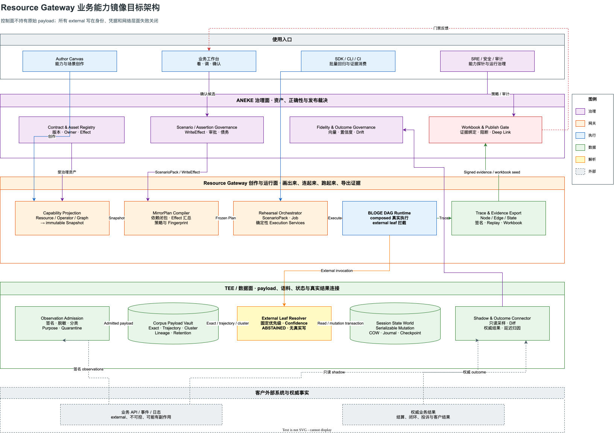

# Resource Gateway 业务能力镜像与保真演练工业化演进方案 v2.0

> 核心判断：客服业务的长期壁垒不是接入了多少接口，而是对所服务客户业务的拟合能力。
> 拟合保真度决定自动化服务、策略优化和正确性保障的上限。Resource Gateway 应在现有
> 画布、DAG、测试控制面、证据和回放能力之上，演进为可生成、运行、度量并持续校准业务
> 能力镜像的 Tool Authoring Runtime。

| 文档属性 | 内容 |
|---|---|
| 状态 | Accepted / In implementation；Stage 0 至 Stage 4 的协议、执行、状态世界、Scenario rehearsal、证据与治理闭环已完成。Stage 5 已完成 owner-approved Fidelity inventory、无总分 profile、signed Scenario 与 Shadow source adapter、durable Shadow queue/worker/lifecycle、双重观测 online authority、数据库共享 execution guard、managed trust distribution、在线 v1/detached v2 job、exact signed source binding、detached 双 connector/source resolution，以及 regional TEE online-baseline consumer、strict transport、same-input online candidate strict HTTP authority、独立 online paired-source v2 resolver、动态 readiness、双 loopback HTTP role synthetic regional certification provider、baseline/candidate 双独立 JVM 与双私有 CA/mTLS/SPKI/工作负载身份认证、candidate committed-response-loss 硬退出与无二次生成恢复、双角色同端口 server leaf 双 pin 滚动及连接池重握手认证、candidate commit 后的截断/延迟/停滞响应故障与无二次生成恢复、PostgreSQL 14.22 双连接/双 worker 的 shared queue、guard 与 fencing 认证、v1/v2 proof 数据库兼容迁移、durable worker retry/crash/takeover 组合认证、signed authoritative outcome observation、pre-treatment cohort closure、delayed/censored/conflicting reconciliation、独立业务 authority 边界、受保护 outcome inbox API、strict transport、append-only lifecycle、条件装配、bounded scheduler、PostgreSQL 并发 admission/takeover 认证、细粒度 readiness、outcome source adapter、独立 Test Kit observation/lifecycle verifier 和五份 public-only 固定签名 compatibility fixture，其中 durable worker 复合 fixture 已关闭跨进程消费门禁。企业 root-policy/control-plane connector、获授权的 production regional provider/candidate authority、PostgreSQL 多进程/HA/网络分区认证、跨区域 client/CA 撤销轮换、客户生产 outcome connector、selected-population completeness、calibration correlation、drift 自动降级、零 DSL case 调整和企业身份任务认证继续实施；任何 protocol/API/connector/readiness 子项均不得冒充完整生产数据面 readiness |
| 目标读者 | Resource Gateway、BLOGE Runtime、ANEKE、TEE/数据平台、QA、SRE、安全与业务运营团队 |
| 设计范围 | external/composed 能力建模、镜像运行、保真语料、有状态世界、场景演练、证据、保真度与结果校准 |
| 非目标 | 不重做 ANEKE 的资产治理和发布门禁；不允许测试控制进入生产业务请求；不把观测频率直接当成业务正确性 |
| 基准日期 | 2026-07-27 |

### 实施快照（2026-07-26）

- Stage 0 第一增量已完成 `CapabilitySnapshot`、`CapabilityContract`、`EffectContract`、
  `ArtifactProvenance` 和 exact `MirrorArtifactRef` Java 协议内核。
- Stage 0 第二增量已完成 `CapabilityProjectionService`、`CapabilityProjectionContext` 和
  `CapabilityEffectAnalyzer`：Resource、外部 Operator、Graph 可生成 sealed snapshot；Graph 只闭包 external/nested
  capability，PURE 内部节点仍由 graph source fingerprint 完整覆盖。
- Graph projection 已补齐节点级 `httpResource` 身份解析：常量 `resourceId` 精确闭包到 Resource snapshot；
  动态 `ctx`/表达式绑定保留为 effect unknown、runtime blocked 的通用 Operator snapshot，不用虚假精确换取可运行假象。
- CapabilitySnapshot 已将 tenant/organization/project/environment/region 作为一等 immutable scope；
  capabilityId 只在完整 scope 内唯一，scope 与 provenance tenant 不一致时拒绝封印。
- HTTP read、受管 external write、未受管 external write、operator ports、条件分支、图级 read/write/mixed/unknown
  effect 与 runtime readiness 已按 fail-closed 语义投影。未知 effect、缺失/未封印/身份不匹配的 child snapshot、
  冲突 error contract 和不明确 state model 均不会被静默放行。
- capability snapshot 采用完整 canonical JSON 内容寻址；source、contract、effect、runtime、dependency、
  ownership、lifecycle、provenance 或时间字段被修改都会导致完整性校验失败。
- Stage 0 第四增量已完成 `CapabilityClosure`、`CapabilityClosureIntegrity` 和
  `BuiltInCapabilityClosureService`。闭包必须具有一个 COMPOSED root、同一完整 scope、所有 exact reachable
  snapshots，且无缺失 child、孤儿、重复引用、同 revision 指纹分叉和递归环；closure 自身也使用 canonical
  fingerprint 封印。Java 与 JSON Schema 同步限制 root 加依赖最多 10001 个快照，图遍历使用显式栈避免深链耗尽 JVM 栈。
- 7 张内置资源图现在直接从 classpath DSL、`GatewayGraphContractCatalog`、当前 operator catalog 和 resource
  registry 生成闭包，不维护第二份手工拓扑。`enrichOrderList` 的 `foreach` 内部资源 invocation 会以稳定结构路径和
  条件依赖进入闭包；raw DSL digest 进入 graph source fingerprint，避免 importer 尚未平铺的 DSL 变化逃逸。
- `aiEnrichedSearch` 的三个 streaming Java operator 会进入闭包，但因 visual runtime 尚不支持该执行模式而保持
  runtime blocked；`resourceDispatch` 的动态资源选择保持 effect unknown/runtime blocked，其余五张静态资源图 ready。
- strict JSON Schema 均存放在 `docs/schemas/resource-gateway-mirror/`，所有协议对象拒绝不完整引用、
  矛盾 effect、伪造统计置信度和无 lineage 的 recorded/inferred provenance。
- Stage 0 第三增量已完成 full-scope H2 append-only repository、lifecycle 状态机和受身份/用途/clearance
  约束的 Integration API。revision gap、内容篡改、非法跃迁、跨 scope 与越级读取均 fail closed；同 fingerprint
  的 exact retry 幂等。
- capability probe 已如实声明 snapshot/closure protocol、projection、7 图 closure projection、API/lifecycle 为可用；
  Stage 0 门禁完成时 MirrorPlan、external-leaf interception 和 mirror serving 均保持为 `false`，后续 Stage 1
  只有在对应受保护 adapter 真实装配后才逐项开启。
- 独立 `resource-gateway-test-kit` 已打包全部 Mirror Schema 和共享 Stage 0 compatibility fixture；
  `CapabilityMirrorCompatibility` 对 capability probe 做前向兼容的协议/对象/feature 协商，
  `CapabilityMirrorVerifier` 可离线复验 Snapshot/Closure 的 strict Schema、canonical fingerprint、完整 scope、
  exact dependency、环和孤儿，无需依赖服务端 Spring 类。服务端测试直接读取同一 fixture，阻止双边预期漂移。
- Authoritative outcome 已从协议内核推进为可集成产品边界：受保护 admission/exact/latest/head/lifecycle
  API、auth-before-decode strict transport、unsigned exact-retry 签发、append-only revision/head/lifecycle、
  同事务 audit、外部 authority I/O 事务隔离、connector 条件 worker、显式 bounded scheduler 和六项动态
  readiness 已装配；Test Kit 可独立复验 lifecycle closure，PostgreSQL 双连接已证明并发首次 admission、
  lease-expiry backoff、higher-epoch takeover 与 stale-owner fencing。
- 通用 `GraphDraftCapabilityClosureService` 已覆盖任意 visual draft：保存态 operator snapshot 原样保留，便携 draft
  从单次 catalog 视图补齐并固定；resource leaf 从权威 registry 投影；PURE 实现节点只进入 graph fingerprint。
  缺 operator、旧 fingerprint、重复 node id、缺 resource descriptor 和没有 exact child closure 的 nested graph
  均以稳定错误码失败关闭。
- 新增受鉴权的 `POST /api/integration/capability-closures/project`。请求不能声明企业 scope、owner、purpose、region
  或 lifecycle；服务端从 workload identity 派生这些字段，强制 `DRAFT`，并拒绝 clearance 以上分类和超出时钟偏差
  的未来时间。probe 已公开请求版本、endpoint 与 `visualCapabilityClosureProjection=true`。
- 3 个画布复杂示例现在各有稳定 graph identity，导出文件名也随 graphName 变化。真实 Chrome 用例逐个加载示例，
  读取浏览器实际导出的 GraphDraft，经鉴权调用 projection API 两次，并验证 root identity、snapshot 数量、完整
  scope 和 fingerprint 确定性。因此 7 个 resource graph 加 3 个 visual examples 的 Stage 0 仓库内工程门禁已闭合。
- Stage 1 第一增量已冻结 `resourceGateway.mirrorPlan.v1` 与 strict JSON Schema。plan 内嵌 exact capability
  closure，逐条绑定 external dependency edge 到唯一 BLOGE invocation site，并固定 resolver precedence、现有
  FixtureBundle revision、logical clock/random seed、scope、purpose、classification、region、lifecycle、预算和
  24 小时以内的 expiry；`executionControlFingerprint` 额外固定 BLOGE runtime binding inventory 与实际
  EffectiveExecutionPlan generation。封印前会拒绝缺/重 external binding、调用点复用、state-model closure 缺失、未知 effect、
  stale/revoked/过期 artifact，以及任何真实 external call、真实凭据或网络出口授权。
- probe 已声明 `mirrorPlanProtocol=true`；MirrorPlan compiler、external-leaf runtime 和 payload-free resolver
  provenance 已形成受保护的 test/staging Plan 服务，profile/property 双栅栏与普通业务 run 的 mirror 控制字段拒绝
  已经落地；sealed plan 与 signed evidence 的 scope-isolated append-only 仓储已经落地。真实 Plan adapter 装配时
  `mirrorPlanCompilation` 与 `mirrorExternalLeafInterception` 为 `true`；第十四增量完成受保护执行/证据链后，
  `mirrorServing` 也只在完整 run adapter 装配时为 `true`。这表示可交付带明确 limitation 的 exploratory evidence，
  不表示部署级 egress attestation 或 certification 已完成。客户环境的数据
  使用授权、跨系统 schema owner、部署/namespace 形态等组织决策仍是生产准入前置，不由仓库测试冒充完成。
- 当前验证基线：前端 Vitest `165/165` 全绿并完成 TypeScript/Vite 生产构建；带
  `-Pfrontend` 的 Resource Gateway 完整门禁为 `5524` 项 Java 测试、0 失败、0 错误、
  4 项按环境条件跳过，其中真实 Chrome DOM/工作流套件共 36 项、32 项执行通过、4 项条件跳过，
  可执行 Boot JAR 同步通过。独立 test-kit `494/494` 全绿，170 份打包 Mirror 资源（其中
  153 份 JSON Schema）完成 fail-closed
  引用闭包与打包验证，公共
  JavaDoc、普通 JAR 与 shaded JAR 均成功生成。
- Stage 1 第二增量已实现 `MirrorPlanCompiler`、`MirrorPlanCompilationRequest`、`CompiledMirrorPlan` 和
  `ExecutionControlCompiler.compileMirror` adapter。编译器把每条 direct/nested external capability edge 对账到
  递归冻结的 BLOGE `InvocationInventory`，再复用 FixtureBundle selector、replay、schema check 和 test-double
  runtime；无 owner rule 会生成 implicit deny/`ABSTAINED`，read-only external 也不能逃逸。Graph/fixture drift、
  缺失/歧义 site、runtime 多出 external、REAL/SPY/fallback、非确定性 execution services、越级 classification、
  认证计划 schema waiver 均在调度前以稳定 `RG.MIRROR.*` code 拒绝。第十三增量已将该 compiler kernel 接入
  受保护 Plan API；只有真实 adapter 装配后 `mirrorPlanCompilation` 才为 true。
- ADR-004 已冻结 FixtureBundle 复用边界：不建立第二套 MirrorFixture；public MirrorPlan 只保留 exact fixture ref、
  rule ids、resolver source 和 execution-control fingerprint，业务 fixture/replay payload 只存在于进程内
  `CompiledMirrorPlan`。Stage 1 compiler 聚焦套件当前 `42/42` 全绿；planning/runtime 扩大回归 `163/163`
  全绿。Mirror binding 与 execution control 复用同一个已冻结 InvocationInventory，消除了两次 registry lookup
  之间的并发 binding 漂移窗口。
- Stage 1 第三增量增加 framework-neutral 的 `MirrorRunService` kernel。`CompiledMirrorPlan` 现在自包含 exact Graph、
  FixtureBundle、replay closure 与 execution control，运行时不再回查 mutable registry/repository。准入会重验 plan
  seal、authenticated scope/purpose、TTL、graph/fixture/control generation、external-site 完整覆盖和静态调用预算；
  FixtureBundle 若试图替换内部业务算子会在编译时拒绝。运行仍复用独立短生命周期 BLOGE test engine，external
  read-only operator 的真实调用测试计数为 0，内部算子真实执行，并继承 plan logical timeout 对应的
  `ExecutionBudget`。本增量聚焦回归 `75/75`、planning/runtime package 回归 `160/160` 全绿。
- 第三增量落地时上述 runtime 仍只是内部 kernel；第十四增量已补齐受保护执行/证据 API 和 durable execution
  request coordination，第十六增量已补齐动态 occurrence budget，第十七增量已冻结部署隔离证明协议与离线验真。
  可信分发、部署侧签发和运行时绑定仍是更高认证等级门禁，当前
  evidence 因 `DEPLOYMENT_EGRESS_NOT_ATTESTED` 明确保持 `EXPLORATORY`。
- Stage 1 第四增量已冻结 `resourceGateway.mirrorResolution.v1` Java 线模型与 strict JSON Schema。每个结果绑定
  exact run/plan/capability/site/occurrence/attempt/request fingerprint，并区分 `RESOLVED`、`ABSTAINED`、
  `REJECTED`。协议显式区分 resolved null、可见/脱敏 payload、hash-only 与无输出，分别封印 output 和完整
  resolution 指纹；非拒答结果必须携带 exact artifact provenance、置信区间、新鲜度和限制，普通日志表示不会
  输出 payload 或 error message。协议聚焦测试 `10/10`、mirror 协议包 `69/69` 全绿；第七增量已完成 runtime wiring。
- Stage 1 第五增量把 resolver precedence 固定进 `CompiledExecutionControl`：普通测试继续按 selector specificity，
  mirror 则先按协议 `MirrorSource`、再按 source 内 selector specificity。因而 owner fallback 必然先于更具体的
  governed replay；跨 source 重叠合法，同 source 歧义仍失败关闭。strategy、每个 site 的 resolver order 和空/非空
  mandatory external site 集合都进入 execution-control fingerprint；即使 closure 没有 external edge，也会拒绝
  FixtureBundle 替换内部节点。规划/运行聚焦回归 `77/77`、完整 planning/runtime package `162/162` 全绿。
- Stage 1 第六增量实现 `MirrorResolver` SPI 与 `MirrorResolverChain`。每个 resolver 只拥有一个具体来源，接收
  ephemeral input、规范 request fingerprint 和已匹配候选，但不得保留或记录业务输入；返回规则、置信区间、
  freshness 和显式 limitations。chain 严格执行 control 中冻结的 resolver order，统一产生 `ABSTAINED`，对缺失来源、
  重复来源、普通 control 越界和同来源运行时歧义失败关闭。Stage 1 先提供 OWNER_SPECIFIED 与 GOVERNED_REPLAY 两个
  exact FixtureRule adapter，planning/runtime package `169/169` 全绿。
- Stage 1 第七增量已把 resolver chain 接入 `TestDoubleFactory` 的 mirror 专用分支，普通测试继续走原有 selector
  路径。`MirrorResolutionJournal` 对每个 external occurrence/attempt 立即计算最大 16 MiB 的 canonical request
  fingerprint；成功输出只保留 hash，不复制业务 payload；异常文本不进入 resolution。OWNER_SPECIFIED 绑定 exact
  FixtureBundle，GOVERNED_REPLAY 额外绑定 exact ReplayPayload；显式 THROW/TIMEOUT 作为 resolved business error，
  abstention 与 policy/runtime rejection 分开表达。共享 kernel 生成 runId 后，journal 按 site/correlation/occurrence/
  attempt 排序、去重并封印每条 resolution；journal 只允许完成一次，结果再次校验 exact plan/run 与坐标唯一性。
  resolver chain 可由 `TestDoubleFactory` 显式注入。端到端覆盖 owner output、governed replay、business error、
  abstention、hash-only 输出和 artifact provenance，planning/runtime package `172/172` 全绿。第十四增量已通过
  受保护 API 暴露该内核；第十二增量提供的 terminal bundle durable boundary 被纳入原子提交事务。
- Stage 1 第八增量已冻结 `resourceGateway.mirrorRunEvidence.v1`、
  `resourceGateway.mirrorEvidenceAttestation.v1` 与 `resourceGateway.mirrorEvidenceBundle.v1` Java 协议和 strict
  JSON Schema。bundle 只允许 `HASH_ONLY`：node input/output、edge value、request context 与 resolver output 均只留
  canonical fingerprint；每个 resolution 必须先独立封印，且 run/plan/coordinate 必须一致。证据同时绑定 exact
  capability closure、execution control、FixtureBundle revision、semantic result 和隔离事实。签名域包含 run、plan、
  evidence fingerprint 与 signedAt，新签名会被立即复验，完整 bundle 另有 canonical fingerprint；签名器不可用、
  嵌套 seal 篡改、签名时间/签名篡改、payload 可见性违规、重复坐标与越界集合均失败关闭。密码学来源可信不等于
  可认证：只有 deployment egress 已证明且不存在 limitation 时才能声明 `CERTIFIABLE`。协议/完整性聚焦测试
  `15/15` 全绿。test-kit 独立 verifier、durable store 已在后续增量完成；部署隔离证明的协议和 verifier 已完成，但
  可信分发与运行时 binding 仍是门禁，因此 probe
  不变。
- Stage 1 第九增量已将 evidence vNext 接入真实 `MirrorRunService`。`MirrorRunEvidenceProjector` 对 request context、
  node/attempt input/output 和 edge value 分别执行最大 16 MiB 的 canonical hash，并在签名前证明 external node 的
  每个 delegate attempt 与 `MirrorResolution` 在 site/correlation/occurrence/attempt、capability、graph path、request
  fingerprint 和成功 output fingerprint 上形成 exact closure。projector 不复制 test diagnostics、assertion 或任何
  业务值。`MirrorRunService` 不安装隐式开发密钥：默认无 signer 的执行最终以
  `RG.MIRROR.EVIDENCE_SIGNER_UNAVAILABLE` 拒绝交付；显式 signer 的签名若不能立即自验，则以
  `RG.MIRROR.EVIDENCE_INTEGRITY_REJECTED` 失败关闭。`MirrorRunResult` 现在强制携带与 exact plan/run/resolution/
  semantic result 一致的 verified bundle。当前部署尚无 exact `DEPLOYMENT_ISOLATION_ATTESTATION`，所以运行证据
  诚实降级为 `EXPLORATORY`；布尔 egress 声明不能脱离 exact attestation ref 自证。真实运行、缺 provenance、
  request mismatch、无 signer 和坏签名故障注入套件 `12/12` 全绿。第十四增量已开放受保护服务 API；部署隔离证明协议
  已在第十七增量完成，但尚未接入每次运行；
  mirror integration 加 testing planning/runtime 扩大回归 `259/259` 全绿。
- Stage 1 第十增量已完成不依赖 Spring/服务端类的 `MirrorEvidenceVerifier`。portable evidence 新增 exact
  `externalBindings`，使离线消费者能证明每个已执行 external attempt 恰有一条 resolution，并拒绝漏记、多记、
  capability/graph path 错绑、request/output hash 错绑和 payload 回流。verifier 按严格 Schema、数组规范顺序、
  nested resolution seal、evidence fingerprint、bundle fingerprint、签名时间、key state/algorithm 和域分离 Ed25519
  签名逐层失败关闭；结果只暴露 reason code、id 与 fingerprint。服务端与 test-kit 共同消费固定
  `mirror-evidence-stage1-v1.fixture.json`，分别通过 Java model 与独立 JSON verifier 复验同一签名，阻止双边预期漂移。
  test-kit 聚焦回归 `12/12`、服务端 evidence/runtime 聚焦回归 `28/28` 全绿。当前独立消费者认证范围仅为 Java；
  非 Java 客户端必须先通过固定 fixture，且在 RFC 8785 或等价的语言中立数字 canonicalization profile 冻结前，
  不得宣称跨语言生产兼容。
- Stage 1 第十一增量建立 `MirrorRuntimeConfiguration` 隔离装配根。只有显式
  `gateway.testing.mirror.enabled=true` 且 profile 为 `test` 或 `staging` 时才装配 `MirrorPlanCompiler` 与
  `MirrorRunService`；只要 `production` 出现在 active profiles 中，即使同时激活 `test` 也物理排除全部 mirror
  bean。装配测试同时证明独立引擎没有生产 interceptor、context carrier、extension listener 和 durable store。
  普通业务 run 的 DTO 前置 guard 新增 mirror、replay、replacement、resolver override 与 scenario pack 字段族，
  嵌套注入会在 controller 前拒绝并提交安全审计，审计不可用时继续失败关闭。聚焦回归 `13/13` 全绿。
  受保护 Plan/Run/Evidence endpoint 均归属同一隔离装配根，应用级测试证明 production 与
  `production,test` 下全部 mirror route 物理不存在；availability marker 只有完整服务链装配后才开启对应 probe。
- Stage 1 第十二增量建立 `MirrorPlanRepository` 与 `MirrorEvidenceRepository` 两个内容寻址、append-only durable
  boundary。`mirror_plans` 与 `mirror_run_evidence` 都把 tenant/organization/project/environment/region 放入复合
  主键；同一 scope 下相同 planId/runId 只允许相同 fingerprint 的幂等重试。写入与读取均重算 plan seal 或复验
  nested resolution、bundle fingerprint 与 detached signature，并交叉核对数据库索引列和 JSON 内身份；行被篡改、
  搬移到另一 scope、验证 key 不可用或同 ID 内容冲突时全部失败关闭。表中没有 fixture/replay/context/result payload
  列，存储对象也只允许 public `MirrorPlan` 与 `HASH_ONLY` evidence，业务 FixtureBundle 和 replay payload 仍只存在于
  短生命周期执行闭包。仓库 bean 与 compiler/runtime 共用同一个 profile/property 隔离根和 evidence integrity
  boundary，在 production 或关闭开关时物理不存在。持久化、重启、完整 scope 隔离、幂等冲突、索引/JSON 篡改、
  未知验证 key 和列级 payload omission 聚焦回归 `10/10`，连同运行/装配回归共 `25/25` 全绿。
- Stage 1 第十三增量开放首个受保护服务面：`POST /api/mirror/plans` 与
  `GET /api/mirror/plans/{planId}`。公开 `resourceGateway.mirrorPlanCreateRequest.v1` 只允许提交 planId、已审阅
  graph fingerprint、sealed CapabilityClosure、exact FixtureBundle ref、受限预算和 expiresAt；purpose、scope、
  clearance、region、lifecycle、真实调用、外部凭证和网络策略全部由服务端生成。应用服务在编译前重新计算当前
  Graph artifact fingerprint、独立复验 fixture 存储 envelope、冻结 governed replay closure，并要求
  `MIRROR_REHEARSAL`、完整 tenant/org/project/environment/region 与 test/staging 环境。mirror replay 新路径只能
  服务编译期闭包解析，不能借此 capture 或直接读取 payload。
  当时租户内 fixture registry 只有 tenant/environment scope，因此该增量没有用文档掩盖这个隔离缺口，而是增加
  payload-free、append-only `mirror_fixture_scope_bindings`。fixture 注册成功时服务端自动绑定
  organization/project/region；mirror 编译先验证该 exact binding 再读取 fixture。历史 fixture 未绑定时失败关闭，
  以相同内容重试注册即可补写；知道或猜到 fixture id/revision/fingerprint 本身不能跨项目获得 mirror 使用权。
  scope binding 的重启持久化、完整 scope 隔离、幂等冲突、索引篡改和列级 payload omission 已覆盖。
  相同请求复用原 `compiledAt` 得到相同 plan seal；同
  planId 的任何制品、预算、认证或有效期漂移都冲突。Controller、service 与 capability marker 受同一个
  `!production & (test | staging)` 加显式开关约束；production 与 `production,test` 下 HTTP mapping 物理不存在。
  Probe 只有在真实 adapter 装配后才报告 `mirrorPlanCompilation=true` 和
  `mirrorExternalLeafInterception=true`。服务、replay 权限隔离、路由隔离与装配聚焦回归及 fixture scope 根治
  聚焦门禁全绿；执行/evidence HTTP 与 request lease 已由第十四增量闭合，deployment egress attestation 的可信分发与
  runtime binding 仍是下一门禁。该阶段的临时 scope 债务已在后续
  `bloge.storedFixtureBundle.v2` 全企业作用域升级中关闭，binding 继续作为纵深防御。
- Stage 1 第十四增量开放 `POST /api/mirror/executions`、`GET /api/mirror/runs/{runId}` 与
  `GET /api/mirror/runs/{runId}/evidence`，冻结 `resourceGateway.mirrorExecutionRequest.v1` 和
  `resourceGateway.mirrorRunSummary.v1`。请求只能提交 stable requestId、planId、expected plan fingerprint 与业务
  context；scope/purpose/policy/fixture/replay 均由认证身份和 sealed plan 决定。服务端拒绝 caller-supplied
  `bloge.tenantId`、`bloge.namespace` 与 `__nodeOutput:` 内部状态键，再注入 authenticated tenant/project，最终
  effective context 在执行前按与 evidence projector 相同的 16 MiB 规范计算 fingerprint。
  public plan 每次运行前从 root capability 的 exact Graph source、full-scope fixture binding 和 governed replay
  authority 重建 `CompiledMirrorPlan`；只有完整重编译 plan 与存储 plan 逐字段相等才调度。`mirror_run_requests`
  只保存 scope、request/context/plan fingerprints、lease owner/epoch/expiry、terminal run/evidence fingerprint，
  没有 JSON/CLOB 或业务 payload 列。并发 retry 返回 retryable `409`；lease 过期后 epoch+1 接管。claim、busy
  retry delay、release、takeover 与 terminal commit 都以协调数据库时钟为唯一租约时间权威，副本墙钟快慢不能提前
  夺权或延迟恢复；terminal commit 同时校验 owner、epoch、原 expiry 与 database coordination time，因此即使尚未
  发生接管，过期 authority 也不能发布；行锁必须先于数据库时间采样，且 H2 的采样使用独立短连接，避免事务级
  `CURRENT_TIMESTAMP` 冻结让 worker 携带陈旧时间越过边界；
  失败主动释放，进程崩溃依靠有界 expiry 恢复；成功时 signed evidence 插入与 request terminal transition 位于
  同一事务，过期、释放或被接管的 lease 都会回滚 evidence，避免孤儿。完成态 retry 直接读取并交叉验证
  stored evidence，不重复执行。跨 scope plan/run/evidence 均返回 404。test-kit 同步打包 request/summary schema；
  profile 路由、真实 Spring Boot 装配、并发首抢、重启、到期拒绝、接管、旧 epoch、原子回滚、payload omission、原始
  请求 duplicate-key/类型/空白严格解码、
  exact rehydration 与 API service 测试均已覆盖。完整链装配时 probe 报告 `mirrorServing=true`；因部署 egress 尚无
  exact attestation，输出仍为 `EXPLORATORY` 而非 `CERTIFIABLE`。本增量的 Mirror 聚焦回归 `122/122` 全绿。
- Stage 1 第十五增量闭合受保护 Mirror 操作的最小可运营观测协议。`PLAN_CREATE`、`PLAN_READ`、
  `RUN_CREATE`、`RUN_READ`、`EVIDENCE_READ` 每次只允许提交一个 terminal observation；成功、调用方拒绝和服务失败
  分开计数，失败再归入 `INVALID_REQUEST`、`FORBIDDEN`、`NOT_FOUND`、`CONFLICT`、`EXPIRED`、`CAPACITY`、
  `UNAVAILABLE`、`AUDIT_UNAVAILABLE`、`UNEXPECTED` 九个封闭原因。Micrometer 预注册 operation/outcome/reason
  枚举组合，总计 75 条固定基数 series；tenant、scope、actor、correlation、request、plan、run、异常或业务值在类型上
  都不能成为 tag。`mirror_operation_audit` 只保存数据库 sequence/time、完整 scope、trace/actor 坐标、封闭结果、
  stable `RG.MIRROR.*` code、request/plan/run id 和 duration；表结构没有 context、fixture、replay、node/edge value、
  exception message 或 stack 列。Plan 创建与 Run evidence/request completion 的成功审计加入同一业务事务，审计失败
  会回滚未发布结果；业务失败审计通过 `REQUIRES_NEW` 独立提交，因而不会随被解释的外层失败一起消失。审计事实
  无法构造或持久化时统一以脱敏、可重试的 `503 RG.MIRROR.OPERATION_AUDIT_UNAVAILABLE` 失败关闭；指标仅为旁路
  信号，绝不降级这一规则。完整隔离链装配后 probe 新增 `mirrorOperationObservability=true`。数据库重启/scope
  隔离/payload omission、固定标签白名单、异常归类、single-completion、成功原子回滚、失败审计跨回滚存活、audit
  outage 回滚 evidence/request 的专项回归当前 `15/15` 全绿；纳入既有服务/能力探针的本增量精准回归 `62/62`
  全绿，完整 Mirror 聚焦回归 `137/137` 全绿。部署侧 audit 分区/归档/保留期、磁盘容量演练、受限导出、dashboard 和 page route 仍是客户生产准入项，
  feature 为 true 不冒充这些环境控制已完成。
- Stage 1 第十六增量把 plan 中既有 `maximumInvocations` 从静态提示升级为真实的双层运行安全协议。编译器先对
  递归冻结的 `InvocationInventory` 执行静态下限证明，预算连结构节点都容纳不下时以
  `RG.MIRROR.INVOCATION_BUDGET_TOO_SMALL` 拒绝封印。运行时为每个 run 创建独立的
  `MirrorInvocationBudget`，并在 BLOGE 继承到 root/nested/foreach/loop/streaming/compensation 的
  `ExecutionOperatorResolver` 中用 CAS 逐次扣减；检查位于 exact inventory 对账之后、fixture binding 和 operator
  execution 之前，因此并发展开不能超卖，触顶 occurrence 也不能产生外部副作用。retry 保持为已准入 occurrence
  内的 attempt，不重复占用 occurrence。触顶后已准入工作可收尾，新工作以非重试控制错误
  `RG.MIRROR.INVOCATION_BUDGET_EXHAUSTED` 终止；签名 evidence 返回 `EXECUTION_FAILED` 并携带稳定
  `INVOCATION_BUDGET_EXHAUSTED` limitation。shared-kernel metadata 只记录 maximum/admitted/rejected 三个计数，
  不保留 site、correlation 或业务值；projector 在签名前交叉验证该快照与 sealed plan。旧 projector 入口看到预算
  metadata 却未收到本次 run 的真实快照时同样失败关闭，不能通过兼容 API 降级绕过对账。静态拒绝、精确边界、64 路
  并发不超卖、非法快照、真实五项 foreach 在预算 3 下仅准入 root + 两个 child、retry 两次 attempt 只扣一个
  occurrence、external 调用保持 0、快照篡改失败和 evidence 复验的本增量新增场景 `6/6` 全绿；完整 Mirror
  聚焦回归 `143/143`、Mirror 加共享 kernel 扩大回归 `181/181` 全绿，并纳入 `4520/4520` 全量门禁。
- Stage 1 第十七增量把 `deploymentIsolationRef` 背后的外部证明冻结为
  `resourceGateway.mirrorDeploymentIsolationAttestation.v1`。短生命周期 material 绑定 exact deployment scope、cluster、
  namespace、workload、service account、immutable image digest、独立 enforcement layers、六项 mandatory fail-closed
  deny fact、network/credential/allowlist fingerprint、非业务 egress class 与 payload-free policy proof refs；proof ref
  以 `(kind, id, revision)` 唯一，同坐标不同 fingerprint 会失败关闭；有效期最多
  15 分钟，观察到签发最多 5 分钟，执行必须完整落在 `[max(validFrom, signedAt), expiresAt)`。
  `MirrorDeploymentIsolationAttestationIntegrity` 使用独立 SRE/security authority key 校验双层 canonical fingerprint、
  key/issuer/algorithm/lifecycle/signing window、local immutable deployment identity 和 Ed25519 signature；evidence signer
  不能冒充隔离权威。strict Schema、固定签名 fixture 和无 Spring/server 依赖的 test-kit verifier 同步落地，服务端
  producer/schema/compatibility 场景 `9/9`、test-kit identity drift、policy tamper、wrong/revoked key、window、unknown field
  与 detached-copy 场景 `6/6` 全绿。该增量完成时仍没有 attestation repository/API、authority key-set 可信发布、部署
  agent 刷新、原子缓存或 `MirrorRunEvidenceProjector` 绑定，所以这一步证明的是协议可验，不是部署已经隔离；run 仍必须保留
  `DEPLOYMENT_EGRESS_NOT_ATTESTED` 和 `EXPLORATORY`。完整 Mirror 回归 `152/152`，独立 test-kit `clean verify`
  `260/260`，Resource Gateway 全量门禁 `4529/4529`（另有 3 条条件跳过），真实 Chrome 与可执行 JAR 构建均通过。
- Stage 1 第十八增量补上隔离证明 authority key 不应靠静态 `Map` 或调用方上传来获得信任的根问题，冻结
  `resourceGateway.mirrorDeploymentIsolationAuthorityKeySetPublication.v1`。每个短时 publication 同时绑定完整
  tenant/organization/project/environment/region scope、exact deployment generation、attestation issuer、稳定
  `keySetId`、bootstrap root trust domain、local-required M-of-N threshold、policy fingerprint、最多 24 小时有效窗、
  单调 generation 与 predecessor fingerprint；authority keys 和 root signatures 都要求 canonical order、唯一坐标和
  canonical Base64。至少一把 `ACTIVE` attestation key 必须覆盖整个 publication window，根签名必须来自不同
  authority 和不同密码学根公钥、完整落在 issuance-to-activation window，且所有携带的签名都必须是已 pin、未吊销、
  签发时有效并通过 Ed25519 验证，不能用“阈值已够”为理由忽略一个未知或坏签名。服务端
  `MirrorDeploymentIsolationAuthorityKeySetIntegrity` 和无 Spring/server 依赖的 test-kit verifier 都要求 exact local
  binding 与 trusted floor，拒绝 threshold downgrade、scope/deployment/issuer/trust-domain drift、bootstrap 非第一代、
  generation rollback/fork/gap、predecessor mismatch 和过期 publication；只有全部通过才暴露可交给既有 attestation
  verifier 的公钥。strict Schema 与 public-only 双 root 固定 fixture 同步落地，focused producer/schema `10/10`、
  test-kit verifier/packaging `13/13`、完整 Mirror `162/162`、独立 test-kit `clean verify` `269/269`、Resource Gateway
  全量 `4539` tests（0 failures、0 errors、3 条条件跳过）全绿，真实 Chrome 与可执行 JAR 同时通过。这个增量建立的是
  可验证发行格式和纯函数验真内核；HTTPS/mTLS refresh、
  full-scope append-only repository/API、durable floor CAS、部署 agent 原子缓存、attestation ingest 与 run admission/evidence
  commit binding 仍未实现，所以 capability 和 trust class 继续失败关闭。
- Stage 1 第十九增量把 authority key-set 从“可验文件”推进成 full-scope trusted distribution control plane。
  `MirrorDeploymentIsolationAuthorityTrustPolicyProvider` 强制 expected binding、accepted policy、M-of-N threshold 与
  bootstrap roots 来自 operator-owned 本地信任源；默认 provider 不可用，HTTP 请求不能上传或选择 trust roots。
  `mirror_isolation_authority_publications` 只追加 canonical publication，
  `mirror_isolation_authority_trusted_floors` 钉死完整 enterprise scope、immutable deployment 和当前
  `(generation, publicationFingerprint)`；正文 insert、`SELECT ... FOR UPDATE` 后的 floor CAS 与成功 audit 在同一事务
  提交。exact retry 幂等，bootstrap 非第一代、rollback、fork、gap、predecessor mismatch、deployment drift、损坏的
  index/JSON/head 和跨 scope 读取全部失败关闭；双副本竞争同一 successor 只允许一个胜出。三条受保护 API 分别用
  `MIRROR_TRUST_ADMIN` 和 `MIRROR_TRUST_DISTRIBUTION`/`MIRROR_REHEARSAL` 鉴权，POST 在密码学工作前拒绝 duplicate
  key、unknown field、2 MiB/32-depth/10000-node 越界；GET 每次重新解析本地 policy、复验签名/有效期，且 exact
  generation 只有仍等于 current floor 才返回，不能成为历史降级入口。probe 分开报告 protocol、API assembly 与
  trust-provider readiness；新增 23 个场景，authority 联合回归 `66/66` 全绿。七个 authority 公共类型经
  `javadoc --release 25 -Werror -Xdoclint:all` 校验为 0 warnings、0 errors；Resource Gateway 全量门禁
  `4565/4565`（另有 3 条条件跳过）、独立 test-kit `269/269` 全绿，真实 Chrome、普通 JAR、可执行 Boot JAR
  和 test-kit 双 JAR/schema 打包均通过。该增量仍不宣称 deployment isolation ready：
  agent mTLS/HTTPS refresh 与 atomic cache、attestation repository/API、revocation propagation、execution admission 和
  evidence commit 同代绑定尚未完成，运行继续保持 `EXPLORATORY`。操作与接线见
  [trusted distribution guide](resource-gateway-mirror-authority-trusted-distribution.md)。
- Stage 1 第二十增量把短时 isolation attestation 从“可离线验真的文件”推进为 full-scope trust-control plane。
  `MirrorDeploymentIsolationAttestationAdmissionPolicyProvider` 由 operator-owned 本地快照钉住每条 stream 的 exact
  bootstrap revision，补上 v1 attestation 没有 predecessor fingerprint 时空库无法区分真实 head 与窗口内旧版本的
  根缺口；默认 provider 不可用，请求不能选择首次 floor。`mirror_isolation_attestations` 只追加外部签名正文和 exact
  authority generation/fingerprint，`mirror_isolation_attestation_statuses` 只追加本地 content-addressed `ACTIVE` 或
  `REVOKED` 状态，`mirror_isolation_attestation_heads` 保存完整 scope、immutable deployment、authority、attestation 与
  status current floor。ingest 将正文、初始 ACTIVE、head CAS 和成功 audit 放在同一事务；后续只接受 floor + 1，拒绝
  rollback、same-revision fork、gap、跨 scope/content-address reuse 和损坏索引。revocation 只能从 status revision 1
  单向追加 revision 2，精确重试幂等，同一外部 revision 永不 re-activate；必须签发下一连续 attestation revision 才能恢复
  ACTIVE。GET 始终返回一个重新计算 fingerprint 的 atomic bundle，exact 地址仅在仍等于 current head 时可读。ACTIVE
  每次绑定并复验同一 current authority publication/key/deployment/time window；REVOKED 则可在 authority outage、换代或
  attestation 过期后继续分发，避免正向信任依赖阻断安全否决。三类新 strict Schema 和 test-kit packaging 同步落地，
  duplicate/unknown/size/depth/node bounds 在服务前失败。核心 repository/service/controller/transaction 场景 `22/22`、
  路由/能力探针/真实 Spring 扩大回归 `58/58`、test-kit schema packaging `6/6` 全绿。该增量仍不提升运行 trust class：
  deployment agent mTLS/HTTPS atomic cache、execution admission 与 evidence commit 同代双重校验、跨语言固定 fixture 和
  环境 certification 尚未闭合。接线、错误语义和演练清单见
  [attestation control-plane guide](resource-gateway-mirror-attestation-control-plane.md)。
- Stage 1 第二十一增量补上 deployment-side trust distribution。`HttpMirrorDeploymentIsolationTrustSource`
  只接受 private PKIX trust store、server SPKI pin、mutual TLS 和 client/server exact X.509 workload identity
  同时成立的 `ControlPlaneHttpTransport`，不允许 system-root-only、未 pin、单向 TLS 或 identity-unbound 降级；GET
  还要求 exact vendor media、`X-BLOGE-Mirror-Trust-Protocol`、动态逐请求 workload authorization、严格 envelope
  字段集和 payload fingerprint。`MirrorDeploymentIsolationTrustAgent` 不做 TOFU：空 cache 的 authority generation /
  fingerprint、attestation revision/fingerprint、status revision/fingerprint 必须全部等于 operator 通过独立安全通道
  预置的 floor；后续 authority 走 signed predecessor chain，attestation/status 只接受 same-exact 或连续 successor，
  同 revision 被撤销后永不 re-activate。ACTIVE 刷新同时复验 current authority 与 attestation；REVOKED 则绕过正向
  authority 可用性先落 denial，避免过期 key/source outage 阻断吊销。`AtomicFileMirrorDeploymentIsolationAgentCache`
  以 expected fingerprint + 连续 local generation 做单 writer CAS，在同目录写入并 fsync 临时文件、要求 atomic rename、
  fsync 目录并读回复验；不支持 atomic move、symlink、损坏/截断/unknown/oversize 文件全部 fail closed。旧 ACTIVE 只在
  `maximumSnapshotAge` 内降级可用，形成 missed-revocation 的硬上界；REVOKED 过期仍是 denial。真实 private-CA/SPKI/
  mTLS/SPIFFE 双端身份、协议降级、rollback/fork/gap、revocation-with-authority-outage、same-revision reactivation、硬过期、
  原子 cache/CAS/corruption 与协议 schema 场景聚焦回归 `50/50`，test-kit schema packaging `6/6` 全绿；
  Resource Gateway 干净全量门禁 `4608/4608`（另有 3 条条件跳过）通过，真实 Chrome 与可执行 Boot JAR 同时验证。
  运行时 admission/evidence commit 尚未 pin 同一 cache generation，trust class 仍保持 `EXPLORATORY`。接线与 SLO/runbook 见
  [deployment-agent guide](resource-gateway-mirror-deployment-agent.md)。
- Stage 1 第二十二增量完成运行期信任双重绑定。certification-required plan 在 durable claim 前观察 ACTIVE
  agent snapshot，稳定 decision 被固定到 request registration；每个 lease epoch 生成独立 TrustAttempt，执行结束再次
  观察同一 decision，v2 evidence 同时签入 admitted/committed snapshot，transaction-lifetime commit permit 保持到
  evidence、terminal request state 与成功审计一起提交。正常 refresh 只增加 local generation 时不会误杀长运行；
  revocation、successor、rollback、expiry 或 decision drift 均 fail closed。v1/v2 双读和 test-kit 独立语义复验已经落地，
  非 Java v2 固定 fixture、语言中立数字 canonicalization 与环境级多副本 certification 仍是生产门禁。详见
  [runtime trust-binding guide](resource-gateway-mirror-runtime-trust-binding.md)。
- Stage 2 第一增量已冻结 `CapabilityObservationEnvelope`、`CapabilityObservationAdmission` 和
  `CapabilityObservationReceipt`。producer 只能提交 payload-free、Ed25519 签名的 exact metadata；request/response
  payload 必须先在外部 vault 完成脱敏和不可变落库，Resource Gateway 只接收 payload/proof/schema/grant references。
  `POST /api/mirror/observations` 在完整 scope、专用 purpose 和 test/staging 双栅栏下执行：exact retry 返回原决定，
  确定的信任/策略/reference 拒绝进入 durable `QUARANTINED`，policy、payload authority、capability store、observation
  store 或 mandatory audit 不可用则返回 503 且不伪造决定。full-scope append-only store 会在读写时重验 canonical
  JSON 与索引列；成功写入和 audit 位于同一事务。默认 operator-owned policy 与 external payload-reference verifier
  均 unavailable，probe 因而分开报告 protocol、API assembly 和 readiness。strict Schema、public-only fixed signed
  fixture、server/test-kit 双边独立复验、生产 route 物理缺失和事务回滚均已有专项测试；包含第二增量后的
  Resource Gateway 干净全量门禁 `4681` 项测试零失败、零错误（另有 3 项条件跳过），独立 test-kit
  `285/285` 全绿。该增量只关闭“可信
  observation 准入”根问题，不宣称 corpus revision、resolver、retention/deletion proof 或 outcome calibration
  已完成。接线与 runbook 见
  [Capability Observation 准入指南](resource-gateway-capability-observation-admission.md)。
- Stage 2 第二增量已把 `ObservationReview`、`CorpusRevision` 和 `CorpusPublication` 拆成三类独立不可变事实。
  quarantine review 不改写原 admission，误判也必须新 observation 重录；candidate 冻结 exact admitted sources、
  governance policy、payload/proof/schema/key/trace/horizon metadata，并计算 sample、duplicate、producer-diversity 和
  serving-horizon 风险；blocked candidate 保留证据但永不发布。publication 使用独立连续 lineage，只接受当前
  eligible candidate、当前 policy、授权 publisher 和每个 source 的第二次 external authority 验证。三条受保护
  API、full-scope append-only H2 store、mandatory audit 同事务回滚、strict Schema、固定 lifecycle fixture 与独立
  test-kit verifier 已落地。默认 policy/source providers unavailable，probe 分开报告
  `mirrorCorpusGovernanceProtocol`、`mirrorCorpusGovernanceApi`、`mirrorCorpusGovernanceReady` 和仍为 false 的
  `mirrorCorpusResolverReady`。因此该增量只关闭“治理事实如何形成并发布”，不宣称运行时已经消费 corpus。接线、
  错误语义和演练见
  [Capability Corpus 治理与发布指南](resource-gateway-capability-corpus-governance.md)。
- Stage 2 第三增量已把 reviewed publication 接入 test/staging mirror generation，但没有把 payload 所有权搬进
  Resource Gateway。`fixtureBundle.metadata.mirrorCorpus` 以 strict、canonical、内容寻址的
  `resourceGateway.fixtureMirrorCorpusBindings.v1` 绑定 exact capability/publication；plan create 与每次
  materialize 都重新验证 latest publication、revision/capability/scope、current policy、eligibility、grant、
  classification、region、retention、tombstone/source authority 和响应 payload size/content address。外部
  `CapabilityCorpusPayloadAuthority` 只返回短时 sanitized response JSON，默认 unavailable；验证后的 bytes 只冻结
  在当前 in-memory run generation，不进入 plan、database、HTTP、evidence、audit、metric 或日志。编译器只允许
  corpus 绑定 graph closure 的 external site，并把 `OWNER_SPECIFIED -> RECORDED_EXACT -> GOVERNED_REPLAY ->
  ABSTAINED` 顺序写入 execution-control fingerprint。相同 request fingerprint 的冲突 outcome 拒绝整代；
  retryable 单点 error 因缺 attempt trajectory 明确失败关闭。resolution 直接携带 publication/revision/observation/
  admission/payload/proof/schema/policy/grant provenance，真实 external operator 不被调用。probe 独立公开
  `mirrorCorpusExactResolverProtocol` 与动态 `mirrorCorpusResolverReady`，避免用 governance readiness 冒充
  payload serving readiness。strict Schema、固定 binding fixture、独立 test-kit verifier 和服务端
  policy drift/tombstone/content drift/conflict/region/horizon/error 测试已落地。Resource Gateway 干净全量门禁
  `4698` 项测试零失败、零错误（另有 3 项条件跳过），独立 test-kit `289/289` 全绿；真实 Chrome、前端脚本、
  可执行 Boot JAR、Schema packaging、shaded CLI 与公共 JavaDoc 同时验证。该 kernel 仍不等于生产 vault、
  删除证明、trajectory/stateful/cluster 拟合或认证级客户环境。
- Stage 2 第四增量已根治“根据时间邻近猜测 retry grouping”的不可靠做法。owner 必须通过
  `POST /api/mirror/corpus-trajectories` 显式提交 2..32 个 consecutive observation/admission source，并绑定 exact
  current corpus publication 与 current operator-owned retry policy。服务端重新证明 corpus membership、共同 request
  fingerprint、同 trace/唯一 span/递增 sequence 与时间、`EXACT_REPLAY + TRAJECTORY_MODELING` grant、source lifecycle、
  policy-permitted retryable intermediate errors 和 terminal final attempt，再将 payload-free trajectory 追加到独立
  full-scope lineage；exact retry 在 mutable authority 查询前恢复。默认 retry policy provider unavailable。
  capability probe 独立公开 trajectory protocol/API/readiness；strict command/fact Schema 与独立 test-kit verifier
  会重算四个 content address 和 corpus membership，并明确保留在线策略、outcome、trace、grant、retention、
  tombstone、payload authority 限制。该增量完成的是 governance publication，不代表 fixture binding、generation
  materialization 或 `RECORDED_TRAJECTORY` runtime resolver 已接线。Resource Gateway 干净全量门禁
  `4712` 项测试零失败、零错误（另有 3 项条件跳过），独立 test-kit `292/292` 全绿；真实浏览器、
  可执行 Boot JAR、strict Schema packaging、shaded CLI 和公共 JavaDoc 同时验证。
- Stage 2 第五增量把显式治理 trajectory 接入真实运行闭环。fixture 在
  `metadata.mirrorTrajectories` 中精确绑定 capability、已选 corpus publication 与 trajectory publication；
  parser 会与同一 fixture 的 `mirrorCorpus` 做 exact equality 对账。每次 materialize 重新验证 trajectory current
  head、current retry policy、corpus/revision/scope、plan horizon、attempt membership、共同 request、trace/span/
  sequence/time、`EXACT_REPLAY + TRAJECTORY_MODELING` grant、source authority、retention/classification/region 和
  payload content address，再冻结独立 exact/trajectory 索引。resolver 以真实 one-based attempt 通过 BLOGE 原生
  retry loop 返回序列；只有 reviewed intermediate error 会降低为 retryable，owner/exact/terminal error 仍为
  non-retryable，序列耗尽失败关闭。execution compiler 还会证明 trajectory 长度不超过冻结节点
  `retryAttempts + 1`。probe、strict binding Schema、固定 fixture 与独立 verifier 同步落地；离线 verifier 不冒充
  live head、policy、grant、payload/source authority 或 retry-capacity 证明。producer parser 与 strict Schema
  共用同一原始约束：不接受 lowercase kind、首尾空格/超长 ID、fractional/超出 64-bit revision，也不会先归一化
  再放行。`mirrorCorpusTrajectoryResolverReady` 使用独立 serving probe，因而只读执行部署可关闭 trajectory
  publication route 而不谎报解析能力。进程内 shared-kernel result 可供当前调用栈断言，但持久化/返回的 evidence
  仍只包含逐值 fingerprint 与 `HASH_ONLY` policy。最终 Resource Gateway 干净全量门禁 `4725` 项测试零失败、
  零错误（另有 3 项条件跳过），独立 test-kit `296/296` 全绿；真实 Chrome、可执行 Boot JAR、strict Schema
  packaging、shaded CLI 和公共 JavaDoc 同时验证。
- Stage 2 第六增量冻结 governed `RECORDED_CLUSTER` 的发布边界。外部 data-plane validation authority 提交
  payload-free proof，精确绑定 current corpus publication/revision、2..1000 个有序成员、代表 source、request
  match JSON Pointer、identity mode/projection、distinct identity、独立 holdout 计数和可重算的
  `WILSON_PRECISION_95_V1` 区间。Resource Gateway 不接触 payload，只在 owner policy 下重验 current corpus/policy/
  validation、source membership/schema、`EXACT_REPLAY + CLUSTER_MODELING` grant、retention/horizon、publisher、
  最小 support/identity/holdout、最大 false-positive basis points、最低 confidence lower bound 和 owner-approved
  path policy，然后通过 `POST /api/mirror/corpus-clusters` 追加独立 full-scope lineage。首版/后继 predecessor、
  command/content address、canonical JSON 与冗余数据库索引会在每次读写时复验；exact retry 在任何 mutable
  authority 查询前恢复原结果。`IDENTITY_FREE_RESPONSE` 禁止 projection；`REQUEST_PROJECTION` 必须将请求身份
  确定性写入互不重叠的响应路径，任何缺口、父子路径重叠、通配或伪造置信区间都失败关闭。strict Schema、固定
  payload-free fixture、独立 test-kit verifier、能力探针和真实 Spring Boot 装配测试已落地。该增量只形成可审计
  publication，不宣称 cluster fixture binding、payload materialization 或 runtime resolver 已完成。该增量验收时
  Resource Gateway 完整门禁 `4752` 项测试零失败、零错误（另有 3 项条件跳过），独立 test-kit `304/304` 全绿；真实
  Chrome、可执行 Boot JAR、strict Schema packaging、shaded CLI 和公共 JavaDoc 同时验证。
- Stage 2 第七增量把 governed cluster 接入真实 test/staging 运行闭环。fixture 在
  `metadata.mirrorClusters` 中精确绑定 capability、已选 corpus publication 和 current cluster publication，strict
  parser 与 test-kit verifier 都拒绝 unknown/重复/乱序/跨 corpus coordinate。每次 generation 创建重验 corpus 与
  cluster latest head、current corpus/cluster policy、current validation authority、全部 member
  `EXACT_REPLAY + CLUSTER_MODELING` grant、source lifecycle/horizon、共同 match values、distinct identity support
  和 request/representative-response content address。resolver 只做 exact JSON Pointer equality；
  `REQUEST_PROJECTION` 先证明全部 source/destination 存在，再清空并从当前 request 回填身份，缺口 abstain，多
  cluster 同时命中失败关闭。compiler 把 `RECORDED_CLUSTER` 放在 trajectory 后、governed replay 前并封入
  execution-control fingerprint；resolution/evidence 携带 cluster/corpus/validation/policy/member 完整 refs、
  Wilson confidence、freshness 与 limitations，不携带代表 payload。capability probe 分开公开 publication 和
  resolver readiness，默认 policy/validation/payload authorities 不可用时不谎报 ready。
- Stage 3 当前增量冻结 `resourceGateway.stateModel.v1`、`resourceGateway.stateReadSpec.v1`、
  `resourceGateway.writeEffectSpec.v1`、
  `resourceGateway.sessionStateSpace.v1`、五个 Session 生命周期对象、五个 checkpoint/recovery 对象和 bounded
  expression AST，配套 strict
  JSON Schema、JavaDoc、固定退款兼容 fixture 与独立 test-kit verifier/sealer/client。进程内
  `MirrorStateTransactionEngine` 已实现单 session
  fair-lock serializable mutation、exact idempotency replay/conflict、多实体原子回滚、deterministic logical
  time/sequence/ID、entity Schema 与业务键闭包、exact recorded/owner baseline copy-in、不可复活 tombstone、
  expected-head commit fence，以及 `revision -> receipt -> event -> world fingerprint` 完整闭包。事务测试覆盖
  24 virtual-thread 并发无丢更新、commit failure、迟到中断、over-refund、baseline absent/source mismatch、
  delete、expiry、篡改和 alias admission。受保护 create/get/command/destroy API 只在 test/staging 装配；
  完整 payload 进入独立 AES-256-GCM JDBC 数据面，DB lease/fence、expected-state fence、CAS、TTL、destroy
  和精确 lease release 已接线并覆盖双 replica/并发/审计失败测试。数据面进一步以单个数据库 guard
  事务化约束全局/完整 scope 的活动 Session 数和保留 canonical payload 字节；本地 command 使用无等待 fair admission，
  过期密文按最早到期顺序有界擦除，并只输出固定基数容量指标和聚合 health。probe 可以如实报告 Session
  API/store ready。execution request v2 以 plan/state fingerprint 双 fence 绑定 Session。read-only run 固定
  initial head；read/write run 使用公平串行的 run session，每次 `VIRTUAL_MUTATION` 经公开 Session command
  相同的 admission/lease/idempotency/CAS/audit 路径推进 head，后续 read 精确观察新 revision。write resolver
  order 固定为 `[SESSION_STATE, ABSTAINED]`，真实外部写调用为 0。read-only run 生成
  `resourceGateway.mirrorStateRunEvidence.v1` 与 mirror evidence/attestation/bundle v3；旧成功写视图使用 nested
  state evidence v2/bundle v4，新 read/write run 生成 state evidence v3 与独立签名域 v5。V3 让每次已执行写尝试
  终止为 `COMMITTED`、`REPLAYED`、`REJECTED`、`PRE_COMMIT_FAILED` 或
  `COMMIT_OUTCOME_UNKNOWN`，并闭合 stage、`ADVANCED`/`UNCHANGED`/`UNKNOWN` state disposition、
  failure fingerprint 与对应 node attempt/resolution。成功写继续闭合 receipt/event；所有路径都不保留业务值、
  原始业务键、idempotency key、输入或响应。test-kit 可离线验证 v3/v4/v5 Schema、nested seal、签名和状态闭包；
  JDBC 重启能恢复正确 subtype 并复验。unknown commit outcome 强制在 nested 与 outer evidence 同时携带
  `WRITE_COMMIT_OUTCOME_UNKNOWN`，不能把“运行失败”误判为“状态未改变”。
  `resourceGateway.mirrorStateWorkbookSeed.v1` 继续只接受 verified v3 read-only bundle；新增
  `resourceGateway.mirrorStateTransitionWorkbookSeed.v1` 与受保护导出 API 只接受 verified v4 bundle，把 initial/final
  Session head、read outcome counts、committed/replayed receipt、连续 event 与保守 blockers 投影成确定性、
  payload-free assertion。服务端与独立 test-kit 都重算 nested closure 和 seed self-fingerprint；test client 还会
  拉取 v4 bundle 和签名 key 本地重建 seed，再与 producer seed 对账。该 readiness 随 stateful resolver 健康动态
  报告，但只证明 committed/replayed transition projection 可调用，不代表完整 Stateful runtime 或发布门禁已就绪。
  新增 `resourceGateway.mirrorStateWriteOutcomeWorkbookSeed.v1` 与受保护 v5-only API，服务端和 test-kit 会独立重建
  五类 outcome count、全部有序写尝试、失败坐标和存在时的成功 transition，再以 canonical fingerprint 对账。
  rejected 在 ANEKE 声明 expected rejection 前保持 blocker；pre-commit failure 与 unknown commit 始终阻断。
  每个新写现在会在 mutation 前以 exact run lease epoch、invocation/delegate coordinate、initial head、
  request/command fingerprint 写入 payload-free durable intent；成功的 Session CAS、operation audit 与
  `COMMITTED` attempt 在同一数据库事务中完成。提交响应丢失时服务从 exact attempt 和新 head 认回成功。
  lease-expired reconciler 按 Session -> attempt 固定锁序、每 attempt 一个短事务，对照 append-only receipt
  journal 证明 `COMMITTED`/`REPLAYED`/`PRE_COMMIT_FAILED`，无法闭合时保守落
  `COMMIT_OUTCOME_UNKNOWN`。两副本竞态只终态化一次，单条损坏记录不会回滚同页健康恢复；strict Schema、
  protected query、capability readiness 和 test-kit 独立 verifier/client 已接线。
  Session store 会初始化不可覆盖的物理代际，并在一个数据库事务中
  同时读取该代际与 encrypted Session head；checkpoint 只携带 plan/model/read/effect closure、revision、logical
  clock、world/state/payload/descriptor fingerprint 和时间坐标，以独立 Ed25519 域签名，不携带 payload、lease、
  fence 或 key material。恢复会先验签，再区分 store generation、dependency 和 state drift，只有全部 exact 时才
  返回新的运行绑定。这已经支持同一持久化数据面上的进程/worker 重启接续，但不是数据备份恢复、跨区域复制或未受信
  key set 的灾备导入。TEE/KMS、HA/DR、逐写点 forked-JVM kill/network matrix、跨区域恢复与目标数据库容量认证尚未完成，
  因此整体 runtime readiness 仍必须为 false。接入边界和后续 ticket 见
  [Stateful Mirror 事务内核与工业接入指南](resource-gateway-stateful-mirror-kernel.md)。本增量 Resource
  Gateway 干净完整门禁 `4946` 项测试零失败、零错误、3 项条件跳过；`VisualAuthoringBrowserDomTest` 的
  32 项普通场景与 `VisualAuthoringBrowserWorkflowTest` 已在真实 Chrome 中执行，3 项仅因本次未启用
  `-Pfrontend` 而跳过。可执行 Boot JAR 成功生成。独立 test-kit 最近门禁 `337/337` 行为测试全绿，且
  普通/阴影 JAR 与公开 JavaDoc 均通过构建。

---

## 1. 结论与战略假设

事业部接口是所有集成方都能获得的公共品，单纯接入 API 不构成长期壁垒。真正能够持续复利的是：

1. **数据壁垒**：经数据权利确认、脱敏、真实 outcome 校准，并能完整回放的业务行为语料。
2. **认知壁垒**：资源、能力、状态变化、失败模式和业务处置之间透明、可验证的依赖模型。
3. **运营壁垒**：业务 owner 对能力行为、状态流转和正确处置的指定精度，以及持续消化漂移债务的能力。

这三者必须形成闭环，而不是三个独立功能：

```text
真实行为与结果
  -> 受治理语料
  -> 能力镜像
  -> 场景演练与回归
  -> 可验证证据
  -> 真实结果校准
  -> 契约、语料和判据更新
```

单个资产的 contract test 是发布底线；域级拟合保真度是长期竞争力水位。前者回答“这次能否发布”，
后者回答“我们是否越来越理解并能正确模拟客户业务”。

### 1.1 可证伪假设

方案必须通过客户业务域验证，不能只靠架构推理自证：

| 假设 | 观测指标 | 失败判据 |
|---|---|---|
| 真实行为语料能显著降低 fixture 建模成本 | 每个可执行 case 的人工分钟数 | 两个季度后没有显著下降 |
| 状态镜像能发现普通 API mock 无法发现的问题 | 状态一致性缺陷发现数、线上逃逸率 | 没有新增缺陷发现且运行成本显著增加 |
| 业务人员可以参与确认而无需理解 DSL | 候选确认率、微调完成率、撤销率 | 大多数任务仍由研发代操作 |
| 保真度与服务结果存在正相关 | 保真度分量与权威 outcome 的时序相关 | 长期无相关或只与代理指标相关 |
| contract mock 能提升效率且不损伤正确性 | 展开运行差异率、节省时长、撤销率 | 差异债务持续扩大或无法按时回收 |

## 2. 范围、术语与不可破坏的不变量

### 2.1 统一术语

| 术语 | 定义 |
|---|---|
| Resource | 一个外部系统端点或资源描述，当前由 `ResourceDescriptor` 表达 |
| Operator | BLOGE DAG 的最小执行单元，可包装 Resource、函数或业务实现 |
| external capability | 以外部系统为事实来源、运行行为不受本平台控制的原子能力 |
| composed capability | 由 DAG 组合其他能力形成的工具；默认真实执行其编排逻辑 |
| CapabilitySnapshot | 对 Resource、Operator 或 Graph 的不可变、版本化跨系统投影，不是新的主数据源 |
| CapabilityClosure | 一个 COMPOSED root 及其所有 exact reachable CapabilitySnapshot 的内容寻址闭包，是 MirrorPlan 的无注册表输入 |
| Mirror | 在不触达真实副作用的情况下，对能力可观察行为和状态变化的受治理模拟 |
| Fidelity | 镜像与目标业务行为在明确覆盖范围内的多维相似度和可信度 |
| Rehearsal | 在一个隔离、确定性的镜像世界中执行场景、故障和 what-if |
| Outcome | 来自独立业务结果源的权威或代理结果，不能由被测执行历史自证 |

### 2.2 不变量

1. 生产请求不能携带 fixture、mirror、replay 或替换规则。
2. 镜像运行时在身份、凭据和网络层面不具备真实外部写能力。
3. external 默认在镜像边界替换；composed 默认真实执行，只有受治理授权的稳定子工具可 contract mock。
4. 任何 serving 结果都必须声明来源、适用范围、置信度、契约版本和降级状态。
5. 写能力没有已批准 `WriteEffectSpec` 或缺少历史基线时必须拒绝，不能合成写结果冒充成功。
6. 日志只证明“发生过”，不能单独证明“正确”；自动归纳只能生成候选。
7. 语料、规格、场景、授权和证据均不可变修订、内容寻址并保留 lineage。
8. control plane 不持有原始业务 payload；payload 只驻留在经授权的数据面或 TEE vault。
9. 要求状态一致性的场景在 state store 不可用时必须失败关闭，不能静默退化为无状态运行。
10. 低保真结果不能伪装成高保真结果，未知必须可表达为 `ABSTAINED`。
11. Capability 的命名、仓储和查询必须使用 tenant/organization/project/environment 完整 scope，不能退化为
    tenant-wide id；region 作为驻留与执行约束被指纹覆盖。

## 3. 当前基础与理想态差距

Resource Gateway 已有的工业底座应直接复用：

- `ResourceDescriptor`、`ResponseProtocol` 和 `HttpResourceOperator` 已形成 external resource 基础。
- `GraphDraft`、Operator Library、Graph Contract 和 dependency snapshot 已形成 composed graph 与集成契约基础。
- `FixtureBundle`、`FixtureRule` 已支持输入匹配、调用位置、次数、重试、RETURN、THROW、TIMEOUT、REPLAY、SPY 和 DENY。
- operator micro-graph、graph suite、boundary/property/mutation test 已形成多层测试入口。
- `TestRunEvidence` 已包含 node/edge trace、fixture consumption、assertion、语义结果指纹和证据等级。
- payload replay vault 已包含分类、脱敏、保留期、权限、完整性和删除生命周期。
- durable execution、签名、租约、恢复、生产 profile 隔离和 ANEKE workbook/gate 已形成企业基础设施。

成熟度评估不是按代码量，而是按能否闭合业务镜像复利回路：

| 能力域 | 当前成熟度 | 主要缺口 |
|---|---:|---|
| Resource/Graph/Schema | 95% | Capability/Effect/Closure、7 张内置图和 3 张画布示例投影、生命周期仓储、scope-bound closure API、共享 compatibility fixture 与独立离线 verifier 已落地；nested graph exact child closure 进入 Stage 1 MirrorPlan |
| 确定性测试控制 | 80% | 缺镜像来源、匹配可信度和领域状态控制 |
| Evidence/Replay | 98% | payload-free signed mirror evidence、deployment trust 双重绑定、state read v1/v3、successful transition v2/v4 与 failure-aware write outcome v3/v5 closure、三类 workbook seed、durable attempt crash-window reconciliation、JDBC 恢复和独立复验已落地；缺 fidelity observation 聚合、outcome lineage、跨语言向量和环境级 crash 认证 |
| 递归 DAG 测试 | 85% | MirrorPlan/closure/runtime inventory/fixture control 已统一；缺 contract-mock 展开治理和状态世界 |
| 日志蒸馏与语料 | 82% | payload-free signed observation、准入/隔离、immutable review、candidate/publication/trajectory/cluster 独立 lineage、元数据风险门禁、fixture exact/trajectory/cluster binding、在线 revalidation、test/staging `RECORDED_EXACT`/`RECORDED_TRAJECTORY`/`RECORDED_CLUSTER`、BLOGE 原生 retry loop、identity-safe projection、Wilson confidence、Session state read 与独立 verifier 已落地；缺生产 payload authority、漂移、偏差、outcome 校准和删除证明 |
| 有状态业务世界 | 91% | 协议、read/write 退款 fixture、独立 verifier/sealer/client、事务内核、受保护 Session API、独立 AES-GCM 数据面、lease/fence/CAS、durable write-attempt journal/reconciliation、TTL/destroy、全局/scope 容量、保留字节、命令背压、过期擦除、固定 read head、run-scoped virtual write、真实 DAG read-write-read、payload-free v1/v2/v3 state evidence、read-only/successful-transition/write-outcome ANEKE seed、签名 HASH_ONLY checkpoint 与同数据面代际精确恢复准入已落地；缺 TEE/KMS、跨区域数据恢复、真实 process-kill/network parity、目标数据库容量认证和 HA/DR certification |
| Scenario/Rehearsal | 99.3% | ScenarioPack/Case/Assertion、exact compiler、可恢复逐 case runtime、签名 aggregate、audit/retention、ANEKE seed、durable batch manifest/queue/API/worker、region-local DAG/KMS 双 scheduler、逐 case cooperative control、v1/v2 签名 batch evidence/index、批次 operation/lifecycle audit、retention/multi-hold/逻辑删除证明、durable finalization outbox/lease/retry/quarantine/status、受控 remediation、聚合 health/SLO，以及 root-sealed ANEKE batch workbook 已落地；缺 hard kill、企业策略/WORM/anchor、异构消费者和目标环境认证 |
| Fidelity/Outcome | 99.3% | owner-approved inventory、无总分七维 profile、fail-closed freshness/低样本/abstention/source debt、Wilson 95%、exact lineage、strict Schema、managed signing、受保护 API、Scenario source、v3 Shadow authority/policy/source closure、durable queue/worker/lifecycle、shared guard、root-threshold managed trust、在线 v1/detached v2 job、exact signed source binding 与 detached data-plane 已落地；regional TEE baseline consumer、same-input candidate strict HTTP authority、独立 online paired-source v2 resolver、分层动态 readiness、双 loopback HTTP role provider、baseline/candidate 双独立 JVM、双私有 CA/mTLS/SPKI/工作负载身份、错误身份与跨角色信任拒绝、candidate committed-response-loss 恢复、双角色 server leaf 双 pin 滚动与连接池重握手、candidate commit 后的截断/延迟/停滞响应故障和单 generation 恢复、PostgreSQL 14.22 双连接/双 worker 的 ordinal 唯一占用、单次发布、lease takeover fencing、terminal comparison 唯一性与 shared guard 并发预算、v1/v2 proof 数据库迁移、durable worker transient retry/crash/takeover、四角色公钥隔离、request/job/comparison/lifecycle/source/proof 一次性跨进程复验，以及 signed authoritative outcome observation、pre-treatment cohort/stratum closure、event-time delayed/censored/conflicting reconciliation、受保护 outcome inbox API、strict transport、append-only lifecycle、条件 worker/scheduler、PostgreSQL concurrent admission/takeover、六项 readiness、独立 lifecycle verifier，以及 selected-population manifest/chunk、合法删除证明和 denominator-preserving completeness 投影内核已闭合；缺企业 root-policy/control-plane connector、跨区域传播及 client/CA 撤销轮换认证、获授权的 production regional provider/candidate authority、PostgreSQL 多进程/HA/网络分区认证、客户生产 outcome connector、selected-population durable registry/API/持续投影、fidelity-to-outcome correlation、drift 降级和校准工作台 |
| 业务运营工作台 | 72% | exact-scope keyset 队列、证据分诊/deep link/响应式 UI，以及 reviewed remediation 八对象协议、server-owned 双角色策略、durable approval ledger、CAS、successor 原子准入、签名前后继对账、角色隔离 Owner/Reviewer 控件、auth-before-decode API 和 capability probe 已落地；仍缺零 DSL case 调整、256-item 密度/性能、任务分派与 SLA、复杂业务样例、可访问性及真实企业 IdP/委派/Owner 认证 |

结论：基础设施准备度约 95%，固定权重理想态完成度为 91.19%。剩余差距 8.81%，主要矛盾已经
从“如何定义并分发可撤销 authority trust”转向“如何接入企业 root-policy/control plane、证明
跨区域传播和轮换 SLO，并把已闭合且可跨 JVM、私有信任域和响应丢失复验的 synthetic
provider 接入获授权的 networked production regional provider，在数据使用授权、PostgreSQL
多进程/HA 共享预算、kill switch 与外部 egress 证明下持续生成 comparison，
并把已完成 durable admission/worker/scheduler 的 cohort/outcome 产品边界接入生产权威结果源与
selected-population completeness，再推进 fidelity-to-outcome calibration，持续校准模拟与真实业务之间的差距，在来源漂移后自动撤销
serving 结论”。

### 3.1 2026-07-24 Scenario 编译期闭包迭代差距复评

上一轮关闭了 stateful write 的 crash ambiguity；本轮开始把这些运行底座组织成业务场景。已完成
`ScenarioPack.v1`、`ScenarioCase.v1`、`CaseHandlingAssertion.v1` 的 strict Schema、canonical seal、
test-kit 独立 verifier 与固定 compatibility fixture，并新增完整 scope 的 append-only 场景注册表、严格
auth-before-decode API、跨 TestSuite/Fixture/MirrorPlan/checkpoint authority 的 deterministic compiler 和
`CompiledScenarioRehearsalPlan.v1`。

编译计划是 ScenarioPack 与 MirrorPlan 的内容寻址 join artifact。系统明确拒绝
`ScenarioPack -> ScenarioCase -> MirrorPlan -> ScenarioPack` 的反向指纹环，MirrorPlan 保持可复用，
compiled plan 独占 exact 组合关系。编译结果只保存 ref、policy、execution service 和 assertion closure，
不保存 TestCase input、Fixture value、Session payload 或凭据。数据库按完整企业 scope、kind、id、revision
append-only 保存，写入和读取均重验 seal/signature/indexed identity；真实 Spring 上下文、严格传输、重启、
串租户、篡改、隐式 fault、过期 checkpoint 和执行策略漂移测试已通过。

本次编译期增量结束时还有一个不能掩盖的 scope 债务：Scenario/MirrorPlan/Capability 已使用完整
tenant/organization/project/environment/region，而历史 TestSuite/Fixture registry envelope 和主键仍只有
tenant + environment。当前 compiler 能证明 exact 内容、target、classification 和调用身份，却不能证明这两类
来源资产的 organization/project/region ownership。它因此只能是 test/staging compile-only 能力；进入生产认证前
必须升级资产 scope 或引入完整 scope 的外部 ownership attestation，不能信任 ScenarioCase 的自声明来补洞。
该前置债务已由下一迭代的 v2 全作用域 authority 关闭。

这仍不是“场景已经跑通”。capability probe 分开报告 registry/compilation 为 `true`，execution/evidence 为
`false`。逐 case runtime、断言 evaluator、state diff、aggregate evidence 和 workbook seed 尚未完成，
因此本轮只提高 Scenario/Rehearsal，不提高 Fidelity/Outcome。

为防止每轮用主观印象抬高完成度，后续统一采用下面的固定权重。权重刻意把 `Scenario/Rehearsal`、
`Fidelity/Outcome` 和业务工作台放到 50%，因为客户服务的上限由业务拟合保真度和 owner 可运营性决定，而不是由
协议数量决定。

| 能力域 | 权重 | 当前成熟度 | 加权贡献 | 主要未闭合证明 |
|---|---:|---:|---:|---|
| Resource/Graph/Schema | 6% | 95% | 5.70 | nested child closure 的跨语言长期兼容 |
| 确定性测试控制 | 7% | 80% | 5.60 | 业务状态、时间、故障与真值来源的统一控制 |
| Evidence/Replay | 8% | 98% | 7.84 | 跨语言向量和环境级 crash certification |
| 递归 DAG 测试 | 6% | 85% | 5.10 | contract-mock 展开债务与 stateful child 治理 |
| 日志蒸馏与语料 | 10% | 82% | 8.20 | 生产 payload authority、偏差、漂移和删除证明 |
| 有状态业务世界 | 13% | 91% | 11.83 | process-kill/network/vendor DB/HA/DR 认证 |
| Scenario/Rehearsal | 16% | 32% | 5.12 | 已有治理协议/注册/编译闭包和完整 scope 测试资产 authority；尚无逐 case runtime、处置断言结果、聚合 evidence 和批量演练 |
| Fidelity/Outcome | 24% | 5% | 1.20 | 尚无保真向量、shadow、权威 outcome 归因与校准 |
| 业务运营工作台 | 10% | 10% | 1.00 | owner 仍不能零 DSL 完成“看、调、确认、发布” |
| **合计** | **100%** |  | **51.59%** | **距理想态 48.41%，远高于 5% 停止线** |

这个分数基于仓库协议、实现、测试和 capability readiness，不是生产 SLA，也不把尚未接入的客户 TEE、KMS、
HA/DR 或权威 outcome 当成已完成。51.59% 只承认已由代码和测试复验的协议、编译和作用域增量；以后必须使用同一权重，
只有新增可复验能力才能提高分数。

**病根分类**：

1. **业务真值缺失**：现有 evidence 能证明“系统按规则执行”，不能证明规则拟合客户真实处置。
2. **验证资产不成体系**：operator/DAG 测试已有，但未被 ScenarioPack 组织成跨状态、时间、故障和处置结果的业务剧本。
3. **保真度不可计算**：没有覆盖率分母、typed behavior diff、置信区间和 abstention debt，因而无法知道模拟边界。
4. **结果不可校准**：没有 delayed/censored authoritative outcome connector，日志支持度会被误当成正确性。
5. **生产证明未闭合**：payload authority、TEE/KMS、process-kill、network partition、vendor DB、HA/DR 和删除证明
   仍依赖真实客户环境认证。

**E7 Scenario/Rehearsal 核心纵切已打通；下一轮最短有效路径转向 E8 Fidelity。**

| 顺序 | Ticket | 状态 | 直击病根的工程任务 | 仓库内退出门禁 |
|---:|---|---|---|---|
| 1 | RG-MIR-SCEN-001 | 完成 | 冻结 `ScenarioPack.v1`、`ScenarioCase.v1`、`CaseHandlingAssertion.v1` 与 exact Graph/Fixture/Session/clock/fault binding | strict Schema、Java model、test-kit 独立 verifier、合法/篡改/越权/过期/未知字段矩阵全绿 |
| 2 | RG-MIR-SCEN-001A | 完成 | 将 TestSuite/Fixture authority 升级为完整 enterprise scope；旧 tenant+environment 资产采用独立表、禁止隐式提升、授权重新注册的迁移策略 | 两个 organization/project/region 可安全复用同 id/revision；跨 scope、混合版本与 indexed scope 搬移失败关闭 |
| 3 | RG-MIR-SCEN-002 | 完成 | deterministic compiler/runtime；每 case 使用隔离 Session/checkpoint、固定时钟/随机源、fixture data-flow inversion 和禁止真实 egress | exact plan、逐 case 运行、数据库时钟 lease/epoch、连续 checkpoint、takeover、旧 worker fencing 与原子 evidence/terminal commit 全绿 |
| 4 | RG-MIR-SCEN-003 | 完成（本地治理闭包） | 产出 payload-free Scenario evidence、state diff、处置断言结果与 ANEKE workbook seed，区分执行失败、断言失败、低保真和证据不完整 | 独立签名、append-only store、exact read、崩溃恢复、audit/retention/workbook seed 已完成；unknown outcome、缺断言或不完整 evidence 阻断 gate-ready |
| 5 | RG-MIR-SCEN-004 | 核心纵切完成；零 DSL case 调整与企业任务认证进行中 | 提供批量 rehearsal API、deep link 和最小 Author 场景表格；先保证业务 owner 不编辑 JSON/DSL 即可维护 case | exact manifest/queue/worker、签名 evidence/workbook、分诊 UI、remediation policy/repository/service/API、双角色控件、原子 successor admission 和签名对账已完成；下一步零 DSL case 调整、256-item/a11y 与企业 Owner 认证 |

完成 E7 后才进入 E8：以 Scenario coverage 为分母建立
`DomainFidelityProfile`、typed shadow diff、confidence/abstention debt 和 drift downgrade；随后 E9 接入
authoritative outcome 做校准。生产 payload authority 和环境 certification 与 E7 并行推进，但不得再以等待外部环境
为由推迟仓库内 Scenario 主链。每轮结束继续按本表复评；加权差距未低于 5% 前，目标保持进行中。

### 3.2 2026-07-24 测试资产全企业作用域迭代差距复评

本轮关闭 RG-MIR-SCEN-001A。新增 `TestingArtifactScope`，把 tenant、organization、project、
environment、region 作为 TestSuite 和 FixtureBundle 不可拆分的所有权坐标；新写入使用
`bloge.storedTestSuite.v2`、`bloge.storedFixtureBundle.v2` 及独立 v2 表。v2 复合主键包含五个 scope
维度、资产 id 和 revision，允许不同组织/项目安全复用局部 id。

仅把 scope 放进 JSON 和主键还不能防止数据库列被整体搬移。因此 v2 行额外保存
`binding_fingerprint = hash(scope + id + revision + contentFingerprint)`，读取时先重建该绑定，再做
内容 fingerprint、envelope、lookup key 的独立校验。TestSuite 注册、Fixture 注册、执行、durable recovery、
MirrorPlan 编译和 Scenario compiler 全部调用完整 scope repository API；第三方旧 adapter 的默认桥接只能过滤
已经携带正确 v2 scope 的对象，不能把 v1 资产冒充为 v2。

迁移策略刻意拒绝“补一个默认 project”。v1 表和 envelope 保持只读隔离；目标 project 的授权主体必须从
原始受治理定义重新注册 FixtureBundle、再注册 TestSuite、最后重编译 ScenarioPack。无法证明所有权的历史资产
进入隔离态而不是运行态。这样迁移成本可见，但不会把组织边界的不确定性变成静默越权。

本轮验证覆盖同 tenant/environment 下两个 project 使用相同 id/revision 的隔离、v2 资产对模糊 legacy lookup
不可见、错误 project 的完整性拒绝、v1 混合引用拒绝，以及直接修改数据库 project 列时 binding fingerprint
失败。完整 Java 门禁为 `4985` 项测试零失败、零错误、3 项条件跳过；独立 test-kit `344/344` 与前端
Vitest `150/150` 全绿。它关闭的是 Scenario runtime 的 authority 前置条件，不等于 case 已执行；因此
Scenario/Rehearsal 只从 28% 上调至 32%，Fidelity/Outcome 与业务工作台均不变。按固定权重总分为
`51.59%`，距理想态 `48.41%`，下一最短路径仍是 RG-MIR-SCEN-002 的逐 case runtime。

### 3.3 2026-07-24 单断言证据求值迭代差距复评

本轮先关闭 RG-MIR-SCEN-003 中可独立交付的“处置断言结果”内核。新增
`resourceGateway.scenarioHandlingAssertionResult.v1` strict Schema、Java model、
content address 和 test-kit schema packaging。结果只包含 run/plan/evidence/assertion
精确绑定、状态、错误码、指纹、来源、计数、耗时、布尔值和 bounded limitation，
不复制业务 input/output、fixture、Session entity 或诊断文本。

求值器已覆盖 node/edge status、capability occurrence、invocation input、error、
state transition、side-effect receipt、governance、latency/retry/resource budget。
capability occurrence 按业务 occurrence 去重，retry attempt 单独计入 retry budget，
避免把一次重试误算成两次业务调用。v4/v5 state evidence 中的 committed/replayed/
rejected 状态和 receipt fingerprint 可直接成为断言事实。

工业级边界不是“支持更多 switch case”，而是不能把未证明的事实判为通过。
因此求值器只接收 `MirrorEvidenceIntegrityService.requireVerified` 生成的
`VerifiedBundle` 能力令牌，未验签原始 bundle 无法通过类型签名进入求值。
ACTIVE 断言的 owner approval 必须不晚于 evidence `startedAt`，且未撤销、
到期时间严格晚于 `completedAt`；事后补批或执行中到期都失败关闭。
graph output path/schema、fallback 顺序、compensation 和 final invariant 尚未进入
当前 signed evidence，这些维度固定返回 `INDETERMINATE`；whole-run `PASSED`
不能替代业务断言。`EVIDENCE_INCOMPLETE` 同样不能被降格为 warning pass。

真实协议测试还暴露并修复了 selector 与运行坐标不一致的问题：原正则无法表达
`loadCustomer->format` edge id 和 `/root/loadCustomer#RESOURCE` invocation site。
两者现改为 2,048 字符上限、拒绝控制字符的结构坐标，strict Schema 同步更新。
服务端求值/协议/证据聚焦 `30/30`、独立 test-kit schema/Scenario verifier
`9/9` 全绿。最终 `clean verify` 门禁为 Resource Gateway `4,994` 项测试
零失败、零错误、3 项条件跳过（含真实 Chrome DOM/工作流），Test Kit `346`
项零失败、零错误，并通过 schema packaging、shaded JAR 与公共 JavaDoc。

这仍不是可运行 ScenarioPack：还没有逐 case 调度、TestSuite input 注入、
checkpoint 克隆、aggregate result、durable idempotency、workbook seed 和批量 API，
capability probe 的 execution/evidence 继续保持 `false`。Scenario/Rehearsal
由 32% 上调至 38%，固定权重总分由 51.59% 上调至 52.55%，距理想态
47.45%。下一最短路径仍是 RG-MIR-SCEN-002 的逐 case runtime，然后把本轮
evaluator 纳入 RG-MIR-SCEN-003 聚合闭环。

### 3.4 2026-07-24 同步逐 Case 演练迭代差距复评

本轮关闭 RG-MIR-SCEN-002 的同步执行主链。新增 strict
`ScenarioRehearsalExecutionRequest.v1`、`ScenarioCaseRehearsalResult.v1` 和
`ScenarioRehearsalResult.v1`：调用方只能提交 exact compiled plan 引用与 requestId，
不能临时覆盖 fixture、时钟、fault、Session 或断言。服务端重新解析已封印的 plan、
ScenarioCase、TestSuite case/input、断言和可选 checkpoint，防止把调用方提交的冗余
快照当成权威。

每个 case 继续复用既有 `MirrorRunIntegrationService`，因而共享同一幂等协调、
Session state fingerprint 栅栏、部署隔离、证据签名和失败语义，不另造一套执行引擎。
TestSuite object input 被注入 graph context，实现 data-flow inversion；generation one
对 scalar input 明确失败关闭。case 只能在剩余总预算足以容纳完整 case timeout 时开始，
未调度 case 记为 `INDETERMINATE`，不会伪装成 timeout 后的 pass。可重试基础设施故障
向调用方传播，确定性执行失败形成 `FAIL`，证据缺失、验签不可用或取消形成
`INDETERMINATE`。

运行后重新读取并验签 child evidence，再校验 run、plan、target、scope 与 evidence
identity，随后求值全部 ACTIVE 且 owner-approved 的断言。blocker 决定 case outcome，
warning 保持可见但不掩盖 blocker；aggregate outcome 固定按
`FAIL > INDETERMINATE > PASS` 派生。case result 与 aggregate result 都是
payload-free、content-addressed 完整闭包，任何跨 run、跨 evidence 或缺失断言结果都会
拒绝封印。重试已覆盖“child evidence 早于 aggregate retry”与 stateful checkpoint
原始状态栅栏，避免恢复时错误读取已经前移的 Session head。

本轮全量门禁为 Resource Gateway `5,009` 项测试零失败、零错误、3 项条件跳过，
含真实 Chrome DOM/工作流；独立 Test Kit `348/348` 全绿，并完成 99 个 Mirror Schema
资源的引用闭包检查、shaded JAR 与公共 JavaDoc。capability probe 仅将
`mirrorScenarioRehearsalExecution` 提升为 `true`，继续把
`mirrorScenarioRehearsalEvidence` 保持为 `false`。

剩余病根不是“再加几个 case 类型”，而是 aggregate 目前仍是请求线程内的瞬时结果：
没有自身的 durable lease/epoch、崩溃恢复、签名 attestation、GET/read、retention、
operation audit 和 ANEKE workbook seed；checkpoint 也只是 exact state fence，不是
隔离 clone。因此它可用于受控 test/staging 演练，不能作为跨系统发布门禁证据。
Scenario/Rehearsal 由 38% 上调至 50%，固定权重总分由 52.55% 上调至
54.47%，距理想态 45.53%。下一最短路径固定为 RG-MIR-SCEN-003：
先交付耐久聚合协调与独立签名 evidence，再做批量 job/workbook/Author UX。

### 3.5 2026-07-24 Scenario 聚合签名证据迭代差距复评

本轮先关闭 RG-MIR-SCEN-003 中可独立验证的“聚合证据协议与存取边界”。
新增 strict `ScenarioRehearsalEvidenceAttestation.v1` 与
`ScenarioRehearsalEvidenceBundle.v1`。attestation 使用独立于 child Mirror
evidence 的签名域，精确绑定 stable aggregate runId、requestId、compiled plan
fingerprint、完整 result fingerprint 和 signedAt；bundle 继续执行
`HASH_ONLY`，不携带 TestCase input、Fixture value、Session entity 或业务
request/response payload。

签发不是“给 JSON 多放一个 signature 字段”。完整 result 先被 canonical
detach，并重验每个 case、assertion result 与 aggregate content address；随后
使用受治理 Ed25519 authority 签名并立即复验，最后再对 attestation + result
封印 bundle fingerprint。签名 authority 不可用、签名时间早于执行完成、
nested fingerprint 漂移或 bundle identity 不闭合均失败关闭，不会返回不可验证
的便携证据。Java 构造器和 JSON Schema 对 runId、fingerprint、算法和 unavailable
状态采用同一约束，避免 producer 可写、consumer 拒绝的协议分叉。

完成证据按完整 enterprise scope + `scenario-<sha256>` stable runId 写入独立
append-only 表。仓储在 create/read 两侧都要求 `VerifiedBundle` 或重新验签，
并核对 request、plan、result、bundle、schema 和 completedAt 索引；不存在
payload/context/fixture/entity 列。同一 requestId 和完整 scope 派生同一 runId，
已存在的 exact evidence 直接返回；不同计划或身份使用同一 requestId 会发生
idempotency conflict。`POST /api/mirror/scenarios/runs` 现返回签名 bundle，
`GET /api/mirror/scenarios/runs/{runId}/evidence` 支持同 scope 精确重读。

这里仍然不能把 capability readiness 提升为 true。stable identity 和 append-only
唯一性只能防止覆盖，不能在多个副本同时收到请求时阻止重复 orchestration；进程在
aggregate commit 前崩溃也没有 durable checkpoint 可接管。当前还缺 owner
lease/epoch、case progress、terminal atomic commit、operation audit、
retention/legal hold、ANEKE workbook seed 和批量调度。因此 capability probe
新增 `mirrorScenarioRehearsalEvidenceApi=true`，但继续保持
`mirrorScenarioRehearsalEvidence=false`，把“协议/API 可用”和“publish-gate-ready”
分开表达。

服务端聚焦回归 `55/55`、独立 Test Kit schema/packaging/offline verification
`16/16` 全绿；Test Kit 现打包 101 个 Mirror Schema。完整门禁结果记录在场景
演练指南：Resource Gateway `5,021` 项测试零失败、零错误、3 项条件跳过，
Test Kit `353/353` 全绿并通过 shaded JAR 与零警告公共 JavaDoc。本轮把
Scenario/Rehearsal 从 50% 上调至 55%，固定权重总分从 54.47% 上调至
55.27%，距理想态 44.73%。提高幅度受控，是因为签名和存取闭合了“证据可携带”
问题，却还没有闭合“聚合执行可恢复”和“证据可治理消费”两个更大的病根。

下一条最短路径不再横向扩充协议，而是给 Scenario aggregate 增加 durable
request state machine：`RESERVED -> RUNNING -> COMMITTING -> COMPLETED`，
以 lease owner + epoch 防并发，以 case checkpoint 支持 takeover，以 evidence、
terminal request state 和 audit 同事务提交。该闭包完成后再交付 Scenario
workbook seed、retention 与 batch job；在此之前不进入 Fidelity score 的提升。

### 3.6 2026-07-24 Scenario 耐久聚合协调迭代差距复评

本轮关闭 RG-MIR-SCEN-002 最后的 aggregate 协调缺口，并完成
RG-MIR-SCEN-003 的耐久提交前半段。新增 `ScenarioRehearsalRunRepository`、
`DatabaseScenarioRehearsalRunRepository` 和 `ScenarioRehearsalCommitService`。
一个 aggregate request 现在先按完整 enterprise scope 注册不可变
request/compiled-plan/run fingerprint 和 case 总数，再由数据库时钟签发
lease；owner 是单次 worker attempt，epoch 在 release、到期或接管后单调递增。
相同请求的并发调用在任何 child DAG orchestration 前返回 retryable `409`，
不再依赖最终 evidence 唯一键事后阻止覆盖。

case 恢复不是“重跑整张图再猜哪些做过”。每个完成 case 的
`ScenarioCaseRehearsalResult` 先通过 nested assertion 与 content-address
复验，再作为 payload-free 连续前缀追加到
`scenario_rehearsal_case_progress`；同一事务推进 request cursor。表结构没有
TestSuite input、Fixture value、context、node input/output、entity 或 replay
payload 列。进程退出后，新 owner 取得 `epoch + 1`，重新校验 checkpoint 与
compiled plan 的 case/ref/child-request 闭包，只从首个未完成 case 接续。旧
epoch、到期但尚未被接管的 lease、非连续 case 和被篡改的索引/JSON 全部失败关闭。

最终签名 evidence 的 append-only insert 与 request `COMPLETED` 转换共用一个
事务，并再次检查 scope、request、run、compiled plan、case count、owner、
epoch、cursor 和数据库 expiry。lease 在签名后、提交前到期会回滚 evidence，
不会留下无法由请求状态解释的孤儿记录。聚焦验证覆盖 Spring 装配、并发首抢、
等待行锁后重新采样数据库时钟、主动 release 即时恢复、到期 takeover、跨组织
隔离、旧 epoch fencing、progress 篡改、原子回滚，以及 runtime 不重复执行已完成
child；本轮聚焦 `65/65` 全绿。

最终门禁同时覆盖 Spring 事务代理和真实应用上下文：Resource Gateway
`5,034` 项测试零失败、零错误、3 项条件跳过，并完成真实 Chrome 工作流与可执行
Boot JAR 构建；独立 Test Kit `353/353` 全绿，通过 shaded JAR 和公共 JavaDoc
`-Werror -Xdoclint:all`。这组结果也防止 `final` 事务组件在单元测试可运行、进入
Spring CGLIB 代理后才失效的装配回归。

这次关闭的是“聚合执行可恢复”病根，不是发布治理终点。当前 aggregate 状态机
采用可观测的 `ACTIVE/COMPLETED + lease/cursor` 投影，而不是暴露没有外部消费
价值的瞬态枚举。受保护 run/evidence-read 的成功与失败已接入既有 payload-free
operation audit；`CLAIMED/TAKEN_OVER/CHECKPOINTED/RELEASED/COMPLETED`
也进入数据库赋时的 append-only lifecycle audit。最终 run 的
evidence/request/lifecycle/operation audit 同事务失败关闭；尚缺
retention/legal hold、deletion proof、WORM/transparency anchor 和 ANEKE
workbook seed，所以
`mirrorScenarioRehearsalEvidenceApi=true` 但
`mirrorScenarioRehearsalEvidence=false` 保持不变。Scenario/Rehearsal 在耐久
协调里程碑从 55% 上调至 64%，本轮审计闭包再上调至 68%；固定权重总分从
56.71% 上调至 57.35%，距理想态 42.65%。

下一条最短路径是让 aggregate evidence 可被治理系统可靠消费：在已完成的
protected operation 与内部 lifecycle audit 之上，定义 retention/legal-hold 与
删除证明，然后从 verified bundle 确定性投影 ANEKE
workbook seed。其后再做 batch job、deep link 与 owner UI；Fidelity score
仍不应抢跑。

内部审计的聚焦门禁为 `18/18`：覆盖 lifecycle 表无 payload 列、完整顺序、epoch
takeover、checkpoint cursor、terminal evidence fingerprint、跨 scope 隔离、
审计故障回滚、Spring Bean 装配和真实应用启动。这里的 audit 是状态转换事实，不
替代签名业务 evidence，也不宣称具备外部 WORM。

### 3.7 2026-07-24 Scenario 证据保留治理迭代差距复评

本轮关闭 RG-MIR-SCEN-003 的“本地证据生命周期不可治理”缺口。最终
Scenario commit 现在把 signed aggregate evidence、request/lifecycle/operation
终态与 revision 1 `RETENTION_REGISTERED` 放入同一本地事务。保留边界在请求
注册时冻结，当前至少为 30 天；客户端不能通过执行或清除命令缩短它。权威时间
来自数据库，而不是调用方或 worker 时钟。

保留模型不是一个容易被最后写覆盖的 `held=true`。每个 aggregate 支持多个
独立 `holdId`，place/release 都有独立 `commandId`、actor、stable reason code
和完整 enterprise scope。释放一个 hold 不影响其他 hold，释放后的 id 不可复用。
所有 `RETENTION_REGISTERED/HOLD_PLACED/HOLD_RELEASED/PURGED` 事件均为
payload-free、append-only、previous-fingerprint-linked，并由治理证据 key
签名；materialized state 只是一份每次读取都从完整签名链重放并核对的 projection。

purge 必须同时满足数据库时钟越过 `retainUntil`、零 active hold、exact evidence
fingerprint 仍在本 scope。成功时只删除 aggregate evidence 和 case progress，
保留 request tombstone、聚合 lifecycle/operation audit、retention event chain
和签名 deletion proof。child Mirror evidence 可能被其他 aggregate 共享，明确
记为 `RETAINED`，不做危险级联。之后 evidence read 返回稳定 `410` 和删除证明
fingerprint/time，而不是把“按政策删除”伪装成普通 404 或重新执行原业务。

四份 strict Draft 2020-12 Schema、capability probe、独立 purpose、严格 decoder
和离线 `ScenarioRehearsalRetentionVerifier` 同步交付。消费者可在不连接服务端
数据库、不读取已删除 payload 的前提下，重算最新事件 fingerprint、核对
projection/event 闭包、执行 key lifecycle policy 并验 Ed25519 deletion proof。
完整门禁覆盖 Resource Gateway `5,047` 项测试（零失败、零错误、3 项条件跳过）
与独立 Test Kit `359/359`；后者完成 105 份 Mirror Schema 引用闭包、shaded JAR
和零警告公共 JavaDoc。

这仍不是完整企业 retention service。当前 30 天边界来自本地固定策略，尚无按
tenant/业务域/数据分类/司法辖区解析并签名下发的 policy authority；事件保存在
普通事务数据库，尚无 WORM、外部 transparency anchor、跨地域 purge
certification、全历史分页导出或 retention sweep/backlog SLO。基于这个边界，
Scenario/Rehearsal 从 68% 上调至 74%，固定权重总分从 57.35% 上调至
58.31%，距理想态 41.69%。提高幅度只计算“本地治理闭包”，不拿数据库签名链
冒充法规认证。

下一条最短路径是从已验签 aggregate bundle 确定性投影 ANEKE correctness
workbook seed，并将 `ScenarioPack/CompiledPlan/Evidence/RetentionProof`
绑定为同一个 gate-consumable closure。然后才是 durable batch job；企业 policy
authority 与 WORM/anchor 可以作为独立部署认证流并行推进。Fidelity score
仍然不能抢跑，因为没有 workbook 消费闭包就无法把“拟合结果”转成可执行门禁。

### 3.8 2026-07-24 Scenario 正确性工作簿闭包迭代差距复评

本轮关闭 RG-MIR-SCEN-003 的“证据虽然可信，但治理消费者仍需自行拼 Map”
缺口。新增 strict `resourceGateway.scenarioRehearsalWorkbookSeed.v1`：
它不是 ANEKE workbook 的替代品，也不是第二份可编辑运行结果，而是从已验证
`ScenarioPack -> CompiledPlan -> signed aggregate -> signed retention
registration` 唯一投影出的 payload-free join artifact。seed 保留完整 enterprise
scope、exact source ref/fingerprint、按编译顺序排列的 case/assertion 结果和
固定 blocker vocabulary，不复制 TestCase input、Fixture value、Session payload
或节点业务值。

这里刻意没有再建一张 workbook 事实表。可变 projection 一旦独立持久化，就会产生
“Plan 已换代、evidence 已删除、retention 已变化，但旧 workbook 仍被当作新事实”
的双写漂移。服务端每次读取都重新验证 aggregate 签名、compiled plan content
address 和完整 retention chain，再使用 revision 1
`RETENTION_REGISTERED` 签名事件重建同一个 seed；合法 hold 变化不会改写运行时
保留承诺，aggregate purge 后也不会继续发布脱离源证据的工作簿。

`gateReady` 不属于生产者自由度。服务端和独立 Test Kit 都按同一冻结规则重新派生：
aggregate `FAIL/INDETERMINATE`、缺 child evidence、非 `CERTIFIABLE` child、
BLOCKER assertion `FAIL/INDETERMINATE` 任一出现即阻断；WARNING 结果保留但不
单独阻断。`ScenarioRehearsalWorkbookVerifier` 不链接 Spring 或服务端 model，
会独立执行 strict Schema、Plan/seed content address、aggregate Ed25519、
retention Ed25519、完整 source identity、逐 case/assertion closure 和 gate
decision 校验。合法签名重新封装的错误 PASS、case 替换或生产者自选
`gateReady` 都会失败关闭。

受保护 `GET /api/mirror/scenarios/runs/{runId}/workbook-seed`、独立
`MIRROR_REHEARSAL_WORKBOOK_READ` operation/audit、capability feature/object/endpoint
和 Test Kit `findScenarioRehearsalWorkbookSeed` 同步交付。客户端一次调用会拉取
seed、signed aggregate、exact plan 和两把公开验签密钥，只有完整闭包通过才返回。
这使 ANEKE 可以把 Resource Gateway 输出直接作为 correctness workbook 输入，
同时继续拥有 coverage policy、owner approval、验证债务和最终 publish gate。
完整门禁覆盖 Resource Gateway `5,053` 项测试（零失败、零错误、3 项条件跳过，
包含真实 Chrome 工作流）与 Test Kit `364/364`；后者完成 106 份 Mirror Schema
引用闭包、shaded JAR 和零警告公共 JavaDoc。

本轮将 Scenario/Rehearsal 从 74% 上调至 80%，固定权重总分从 58.31% 上调至
59.27%，距理想态 40.73%。只增加 6 个百分点，是因为本地 deterministic
gate-consumable closure 已完成，但生产认证仍缺四类根能力：企业 retention policy
authority、WORM/transparency anchor、跨语言固定向量/消费者认证，以及环境级
备份恢复和多副本故障证明。`mirrorScenarioRehearsalWorkbookSeed=true` 只声明
本地协议/API，`mirrorScenarioRehearsalEvidence=false` 继续防止把它冒充生产门禁。

下一条最短路径是 durable batch rehearsal：冻结批次 manifest 与 request
fingerprint，以数据库容量/租约/epoch/公平调度运行多个 exact compiled plan，
逐 run 复用当前 aggregate 幂等与证据闭包，产出可恢复、可取消、可分页查询、
可独立汇总的 batch evidence。没有这层，复杂客服域的 hundreds/thousands
Scenario 回归仍靠调用方循环，正确性能力无法成为可运营的工业生产线。完成 batch
后再进入 owner deep link/失败定位 UX；企业 policy/WORM/anchor 继续作为并行
production-certification 轨道，不能用 UI 进展掩盖。

### 3.9 2026-07-24 Scenario 耐久批次控制面迭代差距复评

本轮关闭 RG-MIR-SCEN-004 中“调用方只能循环同步 run、批次计划无法重放”的
基础病根。新增 strict `ScenarioRehearsalBatchRequest.v1`：调用方只能提交
request id 和有序 exact compiled-plan ref，不能覆盖 fixture、context、Session、
timeout、priority、并发度或 retry。服务端重新通过 Scenario authority 解析每个
plan，限制单批 256 个计划、总计 10,000 个 case，并封存 content-addressed
`ScenarioRehearsalBatchManifest.v1`。manifest 确定性绑定完整 enterprise scope、
batch id、每个 child aggregate request/run id、case count 和计划总预算；相同
request id 的内容漂移在入队前失败关闭。

队列不是 JVM 内存里的 `ExecutorService`。`DatabaseScenarioRehearsalBatchRepository`
使用数据库时钟、环境容量锁、policy generation/fingerprint、租户 fairness cursor、
payload-free job/item 表和 item lease owner/epoch。它提供数据库权威 admission、
跨租户轮转、优先级老化、exact request replay、deadline、`FAIL_FAST`/
`COLLECT_ALL`、有界重试、lease-expiry takeover、stale-worker fencing、稳定
manifest-index 分页和幂等 cooperative cancellation。所有完成操作还会核对
manifest 派生的 aggregate run id，防止 worker 把另一个 run 的证据错误挂到 item。

`ScenarioRehearsalBatchWorker` 每次只 claim 一个 item，使用 manifest 固定的 child
request 执行既有耐久 aggregate，再独立验证 Scenario aggregate 签名和
correctness workbook source/gate closure。结构性失败直接 terminalize；仅明确的
基础设施问题进入有界重试。REST 同步交付 submit/read/page/cancel 四个受保护端点，
strict auth-before-decode、独立 operation 和稳定 IntegrationProblem；capability
probe 显式报告 `mirrorScenarioRehearsalBatchApi=true` 与
`mirrorScenarioRehearsalBatchScheduling=false`。

这个里程碑仍不能称为“批次生产线已经运行”。当前没有常驻 scheduler、有界 worker
pool、active partition discovery、heartbeat、停机 drain 和运行中 cooperative
cancel；环境队列尚未以 region 作为物理分区，不能证明 region-locality。每个 child
已有签名 aggregate/workbook，但尚无签名 batch result/index、batch lifecycle
audit、retention/legal hold/deletion proof，也没有 ANEKE 一次性消费整个批次的
离线 verifier。数据库语义只在 H2 证明，尚未完成 PostgreSQL 方言、`SKIP LOCKED`
并发、多副本 kill/partition 和容量基准认证。

本轮把 Scenario/Rehearsal 从 80% 上调至 86%，固定权重总分从 59.27% 上调至
60.23%，距理想态 39.77%。增加 6 个百分点只承认可重放的 durable control plane，
不把“worker turn 已存在”冒充“scheduler 已运行”，也不把 child evidence 集合
冒充 batch evidence。

本里程碑已经通过完整仓库门禁：Resource Gateway `5,075` 项测试零失败、零错误、
3 项条件跳过，覆盖真实 Chrome DOM/工作流和 Boot JAR 构建；独立 Test Kit
`366` 项测试零失败、零错误，并完成 111 份 Mirror Schema 引用闭包、shaded JAR
与公共 API JavaDoc 校验。这证明当前控制面实现可重复构建和验证，不替代后续
PostgreSQL、多副本故障、容量与生产环境认证。

下一条最短路径分三步且不能倒序：先实现 `(region, environment)` 分区的自治公平
scheduler、bounded pool、heartbeat/drain/cancel 与动态 policy rollout；再签发
content-addressed batch evidence/index，并把 lifecycle audit、retention 与 ANEKE
离线 verifier 闭合；最后用 PostgreSQL 多副本、进程 kill、网络分区、队列积压和
10,000-case soak test 做环境认证。完成后才进入 deep link、失败定位和 owner 场景
表格，否则 UI 展示的是一个尚不能可靠运营的队列。

### 3.10 2026-07-24 Scenario 地域自治调度迭代差距复评

本轮关闭“队列已经耐久，但没有进程负责持续消费”以及“同名 environment 跨地域
共享容量锁”两个断点。repository 的 coordination lock、policy generation、
tenant fairness cursor、admission、live-running capacity、stale reconcile 和 claim
查询现在都以完整 `(region, environment)` 为权威分区；协调行使用该分区的内容
地址，因此旧表无需破坏性迁移，同名 `test` 在 `sg/us` 可持有独立 policy 和容量，
worker 也无法跨地域 claim。

新增 `ScenarioRehearsalBatchScheduler`，每个进程只绑定一个 exact 非生产分区，
使用 1..256 条固定 lane 做 fixed-delay polling。lane 内一次只执行一个同步 worker
turn，不在 JVM 内复制容量、retry 或 fairness 状态；这些仍由数据库跨副本裁决。
关闭时先取消未来 poll，再有界等待当前 turn，超时后线程中断仅是最佳努力，旧
worker 的最终发布仍必须通过 lease owner/epoch/expiry fence。scheduler 捕获轮询
歧义时不记录异常 message 或业务 identity，也不会让 periodic lane 静默死亡。

Spring 装配使用独立 strict properties 和显式开关，且继续受
`!production & (test | staging)` 物理隔离。启用配置缺 instance id、region、
非生产 environment 或有限并发参数时启动失败。capability 不再写死：
只有 scheduler bean 存在且 lanes 健康时
`mirrorScenarioRehearsalBatchScheduling=true`，关闭或调度线程失效会动态回落。
演示脚本新增 `--scenario-batch`，自动让 worker partition 与 integration identity
一致，并等待 API 与 scheduling 两个 capability 都为 true 后才报告 ready；不带
该参数时不启动后台消费。

这仍不是完整的工业批次执行控制。当前一个 worker turn 进入同步 aggregate 后，
没有在逐 case checkpoint 续租并读取 durable cancel/deadline decision；所以运行中
取消最迟在当前 item 返回或 lease 到期后收敛，停机 drain 也不能证明外部 operator
已经物理退出。scheduler 只有单一静态分区，没有受治理的 active-partition
inventory、动态 rebalance、固定基数 telemetry/SLO 和跨副本 rollout health。
batch evidence/index、audit/retention/legal hold 与 ANEKE 离线 verifier 也仍缺失。

基于已通过的 region-isolation、scheduler lifecycle、Spring production exclusion、
capability truth 和脚本 fail-fast 测试，本轮将 Scenario/Rehearsal 从 86% 上调至
89%，固定权重总分从 60.23% 上调至 60.71%，距理想态 39.29%。下一条最短路径是
先让 lease heartbeat/cancel/deadline decision 穿透 aggregate 的逐 case 执行控制，
形成可证明的 cooperative stop；随后签发 batch evidence/index 并闭合 audit、
retention 与 ANEKE consumer。完成这两步后才值得增加 owner 批次失败定位 UX。

本轮完整 Resource Gateway 门禁通过 `5,086` 项测试，零失败、零错误、3 项条件
跳过，并完成公共 JavaDoc、Boot JAR 重打包和真实 Chrome 工作流验证。Test Kit
基线保持 `366` 项测试与 111 份 Mirror Schema 引用闭包；本轮未修改其协议包。

### 3.11 2026-07-24 Scenario 逐 case 合作式控制迭代差距复评

本轮关闭“取消意图已耐久，但 `runtime.execute()` 内没有控制点”的根因。Scenario
runtime 新增 server-owned execution-control hook，在 resolution 前、每个外部 case
前、case progress 耐久 checkpoint 后和 aggregate commit 前发布纯坐标控制点；
callback 只包含 phase、next-case cursor 和 total count，不接收 TestSuite input、
Fixture value、graph context 或业务 payload。直接同步调用继续使用 no-op controller，
批次 worker 才注入数据库 controller。

repository 在 region/environment authority lock 下，以数据库时钟核对 exact
scope/job/owner/epoch/item/expiry，记录 `heartbeat_at/count/case_index`，并原子读取
cancel/deadline。取消被观察后，当前 RUNNING item 保守变成 `INDETERMINATE`，其余
PENDING item 变成 `CANCELLED`，job 同事务发布 `CANCELLED`；deadline 同理发布
`EXPIRED`。旧 worker 在 owner/epoch 已变化后只得到 `LEASE_LOST`，不能改写 successor
状态。已完成 case 总是先进入 aggregate progress，再检查 AFTER_CASE 控制，因此
恢复不会重复已经证明完成的 case。

heartbeat 故意不续长 lease：claim 已按 immutable plan timeout 加 commit reserve
分配完整权限，自动续期会让错误 timeout 或卡死 operator 逃逸预算。合作式取消的
严格上界是“当前 case timeout + 控制面往返”，不是瞬时硬终止。若 operator 忽略
timeout、阻塞本地线程或外部副作用状态未知，仍需可杀的进程/容器 worker、provider
cancel acknowledgement 和补偿/reconciliation；本轮不把线程 interrupt 冒充业务
撤销。

capability 新增
`mirrorScenarioRehearsalBatchCooperativeControl=true`，与动态 scheduling flag
分开表达“代码路径具备控制协议”和“当前进程正在消费”。基于 runtime phase、
数据库 heartbeat/cancel/deadline、stale fence 和 worker disposition 测试，本轮把
Scenario/Rehearsal 从 89% 上调至 92%，固定权重总分从 60.71% 上调至 61.19%，距
理想态 38.81%。下一条最短路径仍是签名 batch evidence/index、lifecycle
audit/retention/legal hold 与 ANEKE offline verifier；hard-kill execution cell 和
PostgreSQL 多副本故障认证作为独立生产门禁推进。

本轮完整 Resource Gateway 门禁通过 `5,091` 项测试，零失败、零错误、3 项条件
跳过，并完成真实 Chrome 工作流与 Boot JAR 重打包。相对上一里程碑新增 5 项
runtime、repository、worker 和脚本控制测试；Test Kit 与 111 份 Mirror Schema
未发生协议变更，沿用已通过的 `366` 项独立验证基线。

### 3.12 2026-07-25 Scenario 批次签名证据迭代差距复评

本轮关闭“每个 child aggregate 有证据，但无法证明一次批量回归究竟冻结、执行并
汇总了哪些计划”的根因。批次终态采用
`request -> manifest -> terminal job + ordered items -> signed bundle` 闭包：
索引保留原始 payload-free 请求、解析后的 exact-plan manifest、完整 scope 终态
job、全部稳定顺序 item，以及 child run/evidence/workbook 内容地址。它不会复制
最多 256 份 child bundle，因此证据大小不随业务 payload 或 trace 体积失控。

`ScenarioRehearsalBatchEvidenceIntegrityService` 在独立签名域中重算 request、
manifest、job、index 和 bundle fingerprint，绑定数据库完成时间与签名时间，并用
Ed25519 签名后立即复验。`ScenarioRehearsalBatchEvidencePublisher` 还会通过既有
验签仓储重读每个已产出 evidence 的 child aggregate，核对 scope、request、plan、
outcome 和 bundle fingerprint。批次 repository 在同一数据库事务、同一分区锁和
lease/epoch fence 下先发布 evidence，再更新 item/job 终态；signer、child store 或
batch store 任一失败均整体回滚，因此不存在 terminal-without-evidence 窗口。

append-only `scenario_rehearsal_batch_evidence` 以完整企业 scope + stable job id
隔离，冗余索引列不能成为信任来源：每次读取会先验签 JSON，再逐项核对 request、
manifest、terminal job、index、bundle 与 completed-at 索引。治理读取使用独立
`MIRROR_REHEARSAL_BATCH_EVIDENCE_READ` 操作，并允许最小权限
`GOVERNANCE_EVIDENCE_INGESTION`；本轮同时修复了 batch find/page/evidence
“外层允许治理目的、内层旧 guard 又拒绝”的双重校验缺陷。

Test Kit 新增三个 strict Schema 与
`ScenarioRehearsalBatchEvidenceVerifier`。独立消费者不信任生产者自报的 batch id、
child run id、total cases、summary 或 status，而是重新派生完整 scope identity、
有序 item closure、所有内容地址、签名时间 key policy 和 Ed25519 signature。
`ResourceGatewayTestClient.findScenarioRehearsalBatchEvidence(jobId)` 只在完整闭包
通过后返回 defensive copy。演示脚本的 `--scenario-batch` readiness 也要求
`mirrorScenarioRehearsalBatchEvidence=true`，避免 worker 可运行但不能取证时误报
ready。

本轮不掩盖两个剩余生产断点。第一，远程 KMS 调用当前发生在数据库事务与分区锁
内；本地 fail-closed 语义正确，但生产形态需要 durable `FINALIZING`/outbox、
有界签名重试和陈旧 finalization 接管，避免 KMS 延迟放大队列锁竞争。第二，batch
尚无最短保留策略、multi-hold、删除证明和 ANEKE 批次
workbook 消费闭包；已有 aggregate retention 不能被默认套用，也不能级联删除 child
evidence。

基于签名闭包、终态原子性、索引篡改拒绝、错误 summary/child identity 拒绝、
完整 scope 治理读取、Schema 包装和离线复验测试，本轮将 Scenario/Rehearsal 从
92% 上调至 94%，固定权重总分从 61.19% 上调至 61.51%，距理想态 38.49%。
完整门禁覆盖 Resource Gateway `5,101` 项测试，零失败、零错误、3 项条件跳过，
含真实 Chrome 工作流和可执行 Boot JAR；独立 Test Kit `370` 项测试零失败、
零错误，完成 114 份 Mirror Schema 引用闭包、shaded JAR 和零警告公共 JavaDoc。
最终源码另通过服务端 `88/88` 与 Test Kit `15/15` 项批次证据聚焦验证。
下一条最短路径是 batch retention/legal-hold/deletion proof；随后再做
`FINALIZING` outbox/KMS 故障隔离和 ANEKE batch workbook。

### 3.13 2026-07-25 Scenario 批次审计迭代差距复评

本轮关闭“批次能排队和签名，但无法回答谁调用了 API、队列为何发生状态变化”的
根因，并修复排队态取消绕过 evidence publisher 的 terminal-without-evidence
缺陷。外部调用和内部调度使用两套互补事实：`mirror_operation_audit` 记录
submit/read/evidence/cancel 的身份、scope、结果与稳定原因；新的
`scenario_rehearsal_batch_lifecycle_audit` 记录 `ADMITTED`、`CLAIMED`、
`ITEM_TERMINALIZED`、`ITEM_RETRY_SCHEDULED`、`CANCELLATION_REQUESTED` 和
`TERMINALIZED`。前者回答“谁做了什么”，后者回答“队列为何变成现在这样”，两者
都不能表示 fixture、图上下文、业务输入输出、凭据、异常文本或栈。
既有 `mirror_operation_audit.operation` 从 32 扩到 64 字符并带本地升级 DDL，
避免最长的 batch evidence read 词汇在真实 JDBC 中被截断或拒绝。

submit/cancel 的成功 operation audit 被传入数据库 mutation，在同一事务内、业务
状态返回前提交；失败/拒绝仍由隔离事务保留。lifecycle append 与对应 job/item/
evidence 写共享事务，审计不可用会回滚业务转换。幂等 submit/cancel replay 不重复
追加生命周期事件，高频 heartbeat 也不进入该表，防止治理事实被运行噪声和容量
放大淹没。排队态取消现在先把 pending item 变为 `CANCELLED`，再生成签名 batch
evidence、追加 cancellation/terminal lifecycle，最后提交 terminal job；任一步
失败全部回滚。

回归还暴露并修复了 `COLLECT_ALL` 的累计失败码漂移：过去 claim 和后续 queue
转换会把较早的失败原因清空，导致“前项失败、末项通过”的 `PARTIAL` 只能得到空
原因。现在非终态转换保留已有累计失败码，新失败才覆盖，终态 evidence 和 lifecycle
因此能解释批次为何不是 `SUCCEEDED`。

这个增量仍不等于完整批次治理。lifecycle audit 是数据库内的状态事实，不是签名
retention chain；尚缺最短保留边界、multi-hold、purge/deletion proof、外部 WORM/
transparency anchor、归档和批次 ANEKE workbook。远程 KMS 仍需要
`FINALIZING`/outbox 隔离，真实 PostgreSQL 多副本、审计容量/归档和故障注入也必须
进入部署认证。

基于受保护 operation 的成功/拒绝审计、成功审计故障回滚、完整 scope lifecycle
读取、审计表 payload omission、终态审计故障回滚、幂等事件抑制、排队取消签名
证据和累计失败保真测试，本轮将 Scenario/Rehearsal 从 94% 上调至 95%，固定权重
总分从 61.51% 上调至 61.67%，距理想态 38.33%。下一条最短路径是 batch
retention/legal-hold/deletion proof，再处理 `FINALIZING` outbox/KMS 故障隔离。
当前精确源码的 batch audit 聚焦门禁为 `46/46`；干净完整门禁覆盖 Resource
Gateway `5,112` 项测试，零失败、零错误、3 项条件跳过，含 35 个真实 Chrome
DOM 场景与可执行 Boot JAR。Test Kit 协议未变，最近一次门禁仍为 `370/370`，
完成 114 份 Mirror Schema 引用闭包、shaded JAR 和零警告公共 JavaDoc。

### 3.14 2026-07-25 Scenario 批次保留治理迭代差距复评

本轮关闭“批次证据已经签名，但生命周期结束后谁能保留、何时能删、删了什么无法
形成独立证明”的根因。它没有把 aggregate retention 机械套到 batch 上，而是新增
独立的 `ScenarioRehearsalBatchRetentionEvent/State.v1`、append-only event chain
和可重建 projection。批次在 admission 时就冻结
`retainUntil = deadlineAt + terminalRetention`；终态发布复用该不可变值，因此
提前完成不会缩短保留下限，执行延迟也不会由终态代码暗改治理承诺。默认本地策略
为 30 天，范围限制为 1 至 3,650 天，并受既有 batch policy generation/fingerprint
一致性保护。

终态事务现在形成
`terminal job/items + signed batch evidence + retention registration + lifecycle audit`
原子闭包。publisher 先重读和验证全部 child evidence，再签发 batch bundle、
append evidence 并注册 retention；任何一步失败都会让外层 lease/epoch 栅栏事务
回滚，不能形成“有终态但无证据”或“有证据但无保留策略”的孤儿状态。排队态取消
沿用同一路径。

法律保全使用多 hold 集合，不以一个布尔位覆盖不同法务事项。place/release/purge
命令都有独立 `commandId` 幂等语义；exact replay 返回同一投影，命令语义漂移、
复用已释放 hold、过早删除或任一 active hold 都失败关闭。每次读写都会重新验证
完整事件链、revision、previous fingerprint、签名和数据库索引，再重放 active hold
并与 projection 对账。

purge 不相信查询索引或旧终态。它在同一数据库时钟和行锁事务内重新读取 signed
batch evidence，重算 terminal job fingerprint，并按 manifest timeout 重算每个
item fingerprint，要求完整有序 index 精确一致。成功只删除一条 batch job、全部
batch item 和一条 batch evidence；child Scenario aggregate evidence、batch
operation/lifecycle audit 与 retention chain 明确保留。`PURGED` 签名事件记录三类
精确删除计数以及 child/audit 的 `RETAINED` disposition。这个证明只声称 Resource
Gateway 数据库事务内的逻辑删除，不声称磁盘擦除、备份清除、外部 WORM 或跨地域
删除已经发生。

四个 API 使用独立用途：
`GOVERNANCE_EVIDENCE_INGESTION` 可读，
`LEGAL_HOLD` 可 place/release，
`PAYLOAD_RETENTION_ADMIN` 才能 purge；成功和拒绝均进入 payload-free operation
audit。本轮同时修复 aggregate retention service 的历史双 guard 问题：外层操作
允许 legal/admin purpose 后，内层不再错误地再次要求 `MIRROR_REHEARSAL`。
capability probe 新增 batch retention API、legal hold、deletion proof 三个
feature flag、两个 supported object version 和四个端点，集成方无需用失败请求
猜测能力。

Test Kit 新增两份 strict Draft 2020-12 Schema、
`ScenarioRehearsalBatchRetentionVerifier` 和四个客户端入口。独立 verifier 会重算
event fingerprint、校验 projection identity/time/hold closure、签名时间与 key
lifecycle，并验证 Ed25519 seal。客户端先在出进程前校验治理命令，再绑定 exact
`jobId`、获取公开 key 并独立验证返回值；跨批次替换、未知字段、计数漂移、错误
disposition、非规范 hold 顺序和未生效密钥均失败关闭。

本轮仍不把本地签名链冒充完整生产留存平台。企业 policy authority、KMS/HSM
key ceremony、外部 transparency/WORM anchor、审计归档与 retention sweep/backlog
SLO、备份和跨地域物理删除认证仍未完成；batch 也尚无 ANEKE workbook 的整批
消费闭包。远程 KMS 仍在终态数据库事务和分区锁内调用，延迟或故障会放大锁占用。

基于不可缩短保留下限、终态/证据/留存原子性、multi-hold、精确逻辑删除证明、
完整 purpose/audit、capability truth、strict Schema、离线验签和 Test Kit HTTP
闭包，本轮将 Scenario/Rehearsal 从 95% 上调至 96%，固定权重总分从 61.67%
上调至 61.83%，距理想态 38.17%。当前精确源码的服务端联合聚焦门禁为
`35/35`，Test Kit Schema/verifier/client 聚焦门禁为 `10/10`；干净完整门禁覆盖
Resource Gateway `5120` 项测试，零失败、零错误、3 项条件跳过，含真实 Chrome
DOM/工作流与可执行 Boot JAR；独立 Test Kit `380/380` 全绿，116 份 Mirror Schema
完成引用闭包和 shaded JAR 打包，公共 JavaDoc 校验通过。下一条最短路径是把远程
签名移出长事务，交付 durable `FINALIZING` outbox、幂等 KMS 签名、陈旧
finalization 接管和故障预算；随后闭合 ANEKE batch workbook 与 owner 失败定位 UX。

### 3.15 2026-07-25 Scenario 批次证据异步终态迭代差距复评

本轮关闭“远程 KMS 延迟或故障发生在批次分区锁和终态事务内，从而把密码学依赖
放大成 DAG 队列阻塞”的病根。终态不再是一次包含远程 I/O 的长事务，而是两个
各自可证明的阶段：

1. DAG worker 在短事务内冻结 `FinalizationIntent`，把目标 terminal job、有序
   item、request、manifest、保留下限和 stable `signingRequestId` 内容寻址后写入
   durable outbox；对外 job 进入 `FINALIZING_EVIDENCE`。
2. 独立 finalizer 以数据库租约 claim intent，在事务外验证 child closure 并调用
   evidence/retention signer；随后用 owner + epoch fence 在一个短事务内原子提交
   terminal job、batch evidence、retention registration、lifecycle audit 和
   `FINALIZED` outbox 状态。

finalization 状态闭集为：

| 状态 | 含义 | 允许的后继 |
|---|---|---|
| `PENDING` | intent 已耐久冻结，尚未开始签名 | `SIGNING` |
| `SIGNING` | 某 finalizer 持有有界数据库租约 | `FINALIZED`、`RETRY_WAIT`、`QUARANTINED`，或租约过期后被接管 |
| `RETRY_WAIT` | 可恢复依赖故障，等待数据库时间到达下一次退避 | `SIGNING` |
| `QUARANTINED` | material/signature 永久错误或重试预算耗尽 | 经 exact fence 和专用 admin purpose 进入新的 `PENDING` intent generation |
| `FINALIZED` | 证据、留存、终态和审计已在同一事务提交 | 无 |

首次 claim 时冻结 `signingStartedAt`，后续接管和重试复用同一时间与
`signingRequestId`。`ManagedVisualEvidenceSigner.seal(material, idempotencyKey)`
把该 id 传给 KMS/HSM provider；响应丢失后的重试可以拿回同一历史 key 的同一签名，
即使 active key 已轮换也不会把一个 intent 签成两个合法版本。publisher 在远程
调用前完成准备，在事务内只接受与冻结 intent 完全一致的 material；若数据库提交
成功但 finalizer 未收到响应，exact replay 返回同一 terminal job，不重复写 evidence、
retention 或 lifecycle。

故障处理使用闭集 reason，而不是异常文本猜测。控制面/数据库暂时不可用不消耗
签名 attempt；KMS unavailable 进入指数退避；material closure 或签名自验失败立即
隔离；超过最多 20 次 attempt 后隔离。`QUARANTINED` 行不会阻塞同一分区后续 intent，
未过期的旧 `SIGNING` lease 也不会让新工作饥饿。DAG worker scheduler 与 KMS
finalization scheduler 使用不同线程池、不同并发上限和独立 readiness；默认 KMS
lane 为 1，范围限制为 1 至 32。`--scenario-batch` 同时启用两者，并强制它们绑定
同一 exact `(region, environment)`。

协议从 batch job/index/attestation/bundle v1 演进到 v2。v2 唯一新增的业务事实是
显式 `FINALIZING_EVIDENCE`；v1 数据和签名域仍可离线复验，新的 Test Kit client
接受 v1/v2 bundle，不能把 v2 降格按 v1 验证。新增
`GET /api/mirror/rehearsal-jobs/{jobId}/finalization` 返回 payload-free
`ScenarioRehearsalBatchFinalizationStatus.v1`，只暴露 state、attempt、retry/lease
时间、稳定 failure code 和 evidence fingerprint，不暴露 worker identity、provider
诊断、签名字节或业务值。capability probe 分开声明
`mirrorScenarioRehearsalBatchEvidenceFinalizationApi` 与动态
`mirrorScenarioRehearsalBatchEvidenceFinalizationScheduling`，集成方不能再用
“batch API 存在”推断“证据一定会被固化”。

本轮验证覆盖重启恢复、陈旧 lease 接管、旧 owner fence、稳定签名时间/请求号、
KMS 响应丢失后的 exact replay、瞬时退避、永久隔离、隔离不毒化队列、终态事务
回滚、payload omission、独立 scheduler 分区/关闭/故障存活、capability truth、
strict v2 Schema、v1/v2 离线验签和 Test Kit HTTP status client。Scenario/Rehearsal
由 96% 上调至 98%，固定权重总分由 61.83% 上调至 62.15%，距理想态 37.85%。
干净完整门禁覆盖 Resource Gateway `5,145` 项测试，零失败、零错误、3 项条件
跳过，包含真实浏览器工作流与可执行 Boot JAR；独立 Test Kit `381/381` 全绿，
121 份 Mirror Schema 完成引用闭包和 shaded JAR 打包，公共 JavaDoc 校验通过。

这里仍有三个不能用“异步化已完成”掩盖的缺口。第一，当前只有 per-job status，
尚无 backlog age、
quarantine count 和 KMS latency/error-budget 的聚合 health/SLO。第二，H2/JDBC
故障矩阵不能替代 PostgreSQL 多副本、真实 KMS、process-kill、network partition
和 rolling-upgrade 认证。第三，ANEKE 还不能一次消费 batch workbook，也没有在
Author Canvas 中定位失败 item 和隔离原因。下一条最短路径必须先补
finalization operations/health，再交付 ANEKE batch workbook 与 Owner UX；不能直接
跳到保真度评分，否则底层证据故障仍然只能由工程师查库处理。

### 3.16 2026-07-25 Scenario finalization 受控修复迭代差距复评

本轮关闭“证据一旦隔离只能查库或手工改状态”的运维死胡同。新增
`POST /api/mirror/rehearsal-jobs/{jobId}/finalization/remediations`，且只接受
`MIRROR_REHEARSAL_FINALIZATION_ADMIN` purpose。命令是严格的
`commandId + expectedAttemptCount + expectedUpdatedAt + reasonCode`
compare-and-set 协议，不允许调用方指定 key、签名时间、重试策略、terminal 结果或
保留期限。

仓储在同一数据库事务内锁定 regional policy 与 full-scope job，验证 exact
`QUARANTINED` generation，重建新的 finalizing/terminal projection、stable signing
request 和 content-addressed `FinalizationIntent`；旧 finalizer epoch 被递增失效，
attempt budget 从零开始，retention floor 自动取旧值与
`acceptedAt + terminalRetention` 的较大者。随后写入 immutable remediation receipt、
`FINALIZATION_REMEDIATED` lifecycle fact 和 protected-operation success audit。
任何 mandatory audit 失败都会回滚全部变化。

remediation command 以 `(jobId, commandId)` 永久保存 content fingerprint。完全相同
的重放即使发生在后续 claim 之后仍返回原 receipt，不改变当前状态；相同 id 的不同
内容、陈旧 attempt/timestamp、非隔离状态或跨 scope job 均失败关闭。receipt 内容
寻址并绑定前后 intent fingerprint、generation、数据库接受时间、续期后的 retention
floor 与原因。Capability probe 显式声明
`mirrorScenarioRehearsalBatchFinalizationRemediationApi`，Test Kit 同步打包 request/
receipt Schema，并提供预校验、专用 purpose 和响应坐标防替换。

聚焦验证覆盖保留期限已过后的安全续期、新 intent/signing id、旧 lease fence、
跨后续 claim 的 exact replay、陈旧 console、command 内容冲突、非法状态、审计失败
回滚、严格解码、HTTP operation、capability truth 和 Test Kit 客户端。Scenario/
Rehearsal 成熟度由 98% 上调至 98.5%，固定权重总分由 62.15% 上调至 62.23%，距
理想态 37.77%。当前最短路径变为聚合 backlog/quarantine/KMS health 与 SLO，而
不是继续堆单 job 操作；随后才是 ANEKE batch workbook、Owner Canvas UX 和真实
PostgreSQL/KMS/process-kill/network-partition/rolling-upgrade 认证。

### 3.17 2026-07-25 Scenario finalization 聚合健康与 SLO 迭代差距复评

本轮关闭“单 job 能查询和修复，但平台无法回答整个签名分区是否正在失速”的病根。
新增 `ScenarioRehearsalBatchFinalizationHealth.v1`，并让受保护 full-scope API、
部署 Actuator readiness 和 Micrometer 指标共用同一个确定性 evaluator。健康不是从
日志采样，也不是数最近错误，而是在一个数据库时间快照中闭合统计已知状态、未知
状态、当前可 claim 数、陈旧 signing lease、损坏控制行、policy generation 漂移、
四类稳定失败、最大 attempt 和四类最老年龄。

未知状态和不一致记录显式计入总数并触发 `CRITICAL`，不能因 SQL 只匹配已知枚举而
从分母消失并制造假绿。`HEALTHY` 无 violation；reviewed quarantine 或活动签名偏慢
可为 `DEGRADED` 且 readiness 保持 `UP`；积压数/年龄超限、陈旧 lease、控制损坏、
policy drift 或 signer/control 故障压力为 `CRITICAL/OUT_OF_SERVICE`；数据库观察
失败为内部 `UNAVAILABLE/DOWN`，不会导出一个伪造的 scope health。

边界刻意分为两层：

1. `GET /api/mirror/rehearsal-jobs/finalization-health` 先鉴权，再只聚合调用方完整
   tenant/organization/project/environment/region，接受 `MIRROR_REHEARSAL` 或
   `GOVERNANCE_EVIDENCE_INGESTION`，并写专用 payload-free operation audit。
2. 部署 monitor 只观察本进程 finalization scheduler 的 `(region, environment)`，
   可跨该物理分区内租户聚合以控制 readiness，但不会通过业务 API 暴露。

固定基数 metric 只允许 closed state、failure class 和 health state 标签；region、
environment、tenant、project、job、provider、异常文本和 evidence 坐标都不可成为
label。capability probe 分别公开 API、SLO monitor 是否真实装配和当前是否 non-critical，
所以“协议存在”“部署接线”“当前健康”不再混成一个布尔值。`--scenario-batch`
启动脚本也把这三个事实纳入成功门禁。

聚焦验证覆盖 exact scope 与 partition 聚合隔离、未知状态/策略漂移 fail closed、
数据库时钟年龄、warning/critical readiness、store unavailable、指标清零和标签闭集、
auth-before-service、operation audit、capability 动态变化、strict Schema、Test Kit
打包与 HTTP client。Scenario/Rehearsal 成熟度由 98.5% 上调至 99%，固定权重总分
由 62.23% 上调至 62.31%，距理想态 37.69%。

这不意味着 finalization 已获生产认证。当前健康能检测排队和控制面失稳，却不能证明
PostgreSQL 多副本隔离级别、真实 KMS 幂等语义、process-kill、network partition、
rolling upgrade、WORM/外部锚和跨地域删除。更重要的是，它仍只证明“证据流水线健康”，
不证明镜像拟合客户业务。下一主链必须转向 ANEKE batch workbook 和 Owner 零 DSL
失败定位，然后进入以 Scenario coverage 为分母的 Fidelity/Shadow；生产故障认证作为
并行支线，不得再阻塞业务拟合主链。

### 3.18 2026-07-25 ANEKE 批量正确性工作簿迭代差距复评

本轮关闭“单个 aggregate 已可验证，但 ANEKE 仍要逐 job/逐 run 拼装整批门禁”的
病根。新增 `ScenarioRehearsalBatchWorkbookSeed.v1`：它只从重新验签的 terminal
batch evidence、revision 1 batch retention registration 和 signed index 精确引用的
全部 child workbook 投影，不读取 mutable Scenario latest 补洞。最多 256 个 entry
按 manifest index 完整排列，闭合 exact plan、child request/run、attempt、status、
evidence/workbook content address，以及有界 outcome/summary/gate/blocker；case、
Fixture、Session state 和业务 payload 不进入批量响应。

执行状态与治理状态不再混淆。`SUCCEEDED` 只证明全部 batch item 执行为 `PASSED`；
任一 child workbook 只有 exploratory evidence 时，批次仍保留成功状态，但根 gate
确定性导出 `CHILD_WORKBOOK_BLOCKED`。失败、indeterminate、cancelled 和非取消项
缺证据分别归约为 closed blocker vocabulary；调用方和 producer 都不能覆盖 summary、
entry 顺序或 `gateReady`。

第一次实现仍要求 Test Kit 拉取每个 child seed 才能核对有界投影，这会让 256-item
批次重新退化成 N+1。该问题没有用“相信 HTTPS 响应”掩盖，而是在根上增加独立、
域隔离的 `workbookSeal`：服务端内部完成逐 child 深验后，对 deterministic
`seedFingerprint + job + batch bundle + index` 签发 Ed25519 seal。seed content
address 排除 seal，因此 key rotation 不改变工作簿身份；seal 又使 ANEKE/CI 可以只
拉 batch seed、signed batch evidence 和三把公开 key，就独立重算 batch/retention/
workbook 三类签名、完整 ordered closure、blocker/gate 和 seed fingerprint。
case 级审计仍可按需使用 `verifyWithChildren` 打开每个 commitment，缺失、额外、
重复和替换全部失败关闭。

`VisualRunEvidenceSeal.signedAt` 不在现有 seal 签名材料中，因此新 verifier 只把它
当格式受限的描述性元数据，不拿它推导 key 创建先后或 root/batch 时间顺序。当前
签名真实性由 exact key、算法、key 可验证状态和 Ed25519 signature 闭合；若生产
门禁需要可证明时间顺序，必须在部署认证支线引入签名 key-set lifecycle 与 TSA/
transparency anchor，不能把普通时间字段冒充密码学时间证明。

受保护
`GET /api/mirror/rehearsal-jobs/{jobId}/workbook-seed`
先鉴权再读取，接受演练或最小治理消费 purpose，成功与失败均写专用 payload-free
operation audit。capability probe 公开 object version、endpoint 和
`mirrorScenarioRehearsalBatchWorkbookSeed`；`--scenario-batch` 启动门禁也要求该
能力为真。Test Kit 打包第 125 份 mirror Schema，并提供无 Spring 依赖 verifier、
一键 HTTP client 和可选 deep verification。

故障矩阵覆盖确定性投影、成功执行但 child gate 阻断、漏/多/替换 child、batch
signature、retention proof、producer-selected gate、auth-before-source、签名
authority 和跨响应 identity。Scenario/Rehearsal 成熟度由 99% 上调至 99.3%，固定
权重总分由 62.31% 上调至 62.36%，距理想态 37.64%。

RG-MIR-SCEN-005 的本地协议/API/consumer 纵切现已完成；尚不能宣称 production
publish-gate-ready，因为异构 consumer 固定向量、企业 policy/WORM/anchor 和真实
PostgreSQL/KMS 故障认证仍未闭合。业务拟合主链的下一最短路径是
RG-MIR-SCEN-006 Owner rehearsal workbench：把 batch/item/assertion 证据映射成
业务 owner 可看、可定位、可审阅、可修复的零 DSL 工作流；生产认证支线继续并行。

### 3.19 2026-07-25 Owner 批次发现协议迭代差距复评

Owner 工作台的第一个真实缺口不是图表，而是稳定发现入口。此前所有批次 API 都以
`jobId` 为前提，业务人员必须从提交响应、日志或数据库先找到技术身份；这使“工作台”
天然退化成工程师调试页。本轮新增 strict
`ScenarioRehearsalBatchJobPage.v1` 与
`GET /api/mirror/rehearsal-jobs`，按认证得到的完整
tenant/organization/project/environment/region 隔离，最多返回 100 条 payload-free
job projection。

分页没有使用 offset。job status、progress 和 completedAt 会持续变化，若排序依赖
更新时间或 offset，Owner 翻页时会重复或漏看。当前固定使用不可变
`createdAt DESC, jobId DESC` keyset；同一数据库时间用确定性 jobId 建立全序，
下一页 cursor 必须精确对应上一页末行。cursor 只表示位置，服务端永远重新施加
exact scope，并在查询前完成 policy convergence 与 stale execution reconciliation。
每个返回 job 都重验 record fingerprint；跨 scope、重复、乱序、游标脱离末行和非法
输入均失败关闭。

Capability probe 新增
`mirrorScenarioRehearsalBatchJobListing`、object version 和 endpoint；启动脚本在
`--scenario-batch` 模式把 listing 纳入动态 readiness。独立 Test Kit client 除 strict
Schema 外，还重算全页 scope、唯一性、降序和 cursor correspondence。该协议没有
暴露 batch request JSON、manifest、Fixture、Session payload、worker 或签名服务
诊断。

这只解决了 Owner “找到批次、稳定翻页”的入口，不解决任务解释。mutable job page
只能用于运行中进度，不是终态治理证据；终态必须读取 root-sealed batch workbook，
选中异常 entry 后再懒加载 child case/assertion。业务运营工作台成熟度仅由 10%
上调至 12%，固定权重总分由 62.36% 上调至 62.56%，距理想态 37.44%。下一纵切必须
交付真实浏览器工作台、原因分组和证据层级标识，不能用批次列表冒充 Owner 闭环。

### 3.20 2026-07-25 Owner 只读分诊工作台迭代差距复评

本轮关闭的病根不是“缺一个 dashboard”，而是服务端已有可信证据，业务 Owner 却仍
需要理解 job/item/workbook JSON 才能回答三个日常问题：哪一批出问题、问题属于谁、
是否有足够证据进入治理流程。新增独立 `/rehearsals/` 工作面，与 Author/Showcase
共享 React/Vite 工程和宿主注入边界，不新增 iframe 或第二套前端仓库。

工作台左侧只消费认证 exact scope 的 keyset job page；中间在 active batch 上读取
bounded item page，在 terminal batch 上强制切换 root-sealed workbook。页面持续显示
`Live projection / Mutable and not publish-gate evidence` 或
`Signed workbook / Immutable and eligible for governance review`，避免把 mutable
进度、执行成功和发布门禁三个概念混成一个绿色状态。

entry 没有按 HTTP/Java 异常类型平铺，而是按处理责任确定性投影为 Execution、
Evidence、Assertions、Governance、Warnings、Passed。这个分类不进入签名材料、不
改写 outcome，也不把 warning 提升成 blocker；根 gate 和 blocker 始终来自已验证
workbook。Owner 选中 terminal entry 后才读取 child workbook，展示 plan/run/content
address、case summary、case type、handling assertion outcome 和稳定 governance
code，默认打开 256-item batch 不产生 child N+1。浏览器不请求 Fixture、node
input/output、Session state 或客户 payload。

`?jobId=<jobId>&entry=<manifest-index>` 保存当前上下文。直接打开 deep link 时客户端
只沿 authenticated keyset page 有界查找；不在 scope 内的 job 明确报不可见，不降级
到无 scope exact read。当前默认 demo identity 只在 test/staging 有效，VSCode/企业
宿主通过已有 header provider 注入短期凭证，页面自身不持久化 token。UI 没有取消、
重试、remediation、hold、purge 或 admin 控件，因此不会借“易用性”扩大写权限。

验证新增 8 个前端/API/App 行为用例，前端总计 `158/158` 全绿；Spring 路由与脚本
聚焦 `36/36` 全绿；`-Pfrontend` 构建把同一 bundle 分别发布到 author/rehearsals/
showcase，真实 Chrome 在桌面、中等宽度和移动宽度验证了独立路由、导航、工作台
可见性和无横向溢出。完整 Resource Gateway 门禁为 `5175` 项测试、0 失败、0 错误、
4 项条件跳过；独立 Test Kit `392/392` 全绿。演示脚本
在 `--scenario-batch` 下通过 capability readiness 后打印 Rehearsals URL，受保护
job listing 也以真实 demo token 返回 strict empty-page envelope。

这仍不是完整 Owner 闭环。当前 surface 解决“看、分、取证”，没有解决“调整、
复演、确认、提交修复”；也没有复杂内置批次、256-item 视觉密度认证、业务术语映射、
可访问性审计和真实业务 Owner 任务测试。因此业务运营工作台成熟度从 12% 上调到
30%，固定权重总分从 62.56% 上调到 64.36%，距理想态 35.64%。

下一条最短路径是同一工作台内的 reviewed remediation 纵切：只允许从稳定 blocker
选择受治理动作，生成 compare-and-set command preview，经双人/owner authority
批准后提交，随后自动创建复演并把 predecessor/successor evidence 并排对账。不能
先开放任意 JSON/DSL 编辑，也不能把已有 finalization-admin API 直接暴露给普通
Owner。零 DSL case 调整与复杂内置样例紧随其后，Fidelity/Outcome 主链继续并行。

### 3.21 2026-07-25 Owner 经评审修复协议迭代差距复评

本轮先根治“修复动作没有稳定业务协议”的问题，没有抢跑成一个只在单进程内可用的
按钮。新增六个 strict、版本化且 payload-free 的对象：
`ScenarioRehearsalRemediationPreviewRequest`、
`ScenarioRehearsalRemediationPlan`、
`ScenarioRehearsalRemediationApprovalCommand`、
`ScenarioRehearsalRemediationApproval`、
`ScenarioRehearsalRemediationSubmitCommand` 和
`ScenarioRehearsalRemediationReceipt`。协议把生命周期固定为：

```text
preview intent
  -> content-addressed frozen plan
  -> append-only OWNER approval
  -> append-only INDEPENDENT_REVIEWER approval
  -> CAS submit
  -> distinct successor batch receipt
```

首版只允许两类受治理动作。`RERUN_EXACT` 用于瞬时执行或证据重检，禁止携带
replacement；`REPLACE_COMPILED_PLANS` 只按原 entry index/id 替换为已经存在的
exact `COMPILED_REHEARSAL_PLAN`，未指定 entry 保持不变。完整 successor
`ScenarioRehearsalBatchRequest` 在 plan 生成时冻结；提交命令不能重新携带或修改它。
任意 JSON/DSL patch、删除 case、降低 assertion severity、弱化 credential、
network、runtime 或 certification policy 都不属于该协议。

审批事实由服务端写入 actor、delegation 和 accepted-at，不信任客户端自报身份或
时间。审批链按 generation 和 previous fingerprint 串联；最终提交同时比较 plan
fingerprint、approval generation 和 approval head。固定策略要求 OWNER 与
INDEPENDENT_REVIEWER 两种角色、至少两个不同 actor。Schema 能验证结构条件；
exact predecessor、替换闭包、角色顺序、actor 分离和 CAS 原子性必须由下一纵切的
repository/service 在事务内重新验证。

尤其需要区分两个同名相近但权限完全不同的能力：

| 能力 | 用户/目的 | 是否创建新业务演练 |
|---|---|---:|
| `ScenarioRehearsalBatchFinalizationRemediation*` | SRE/admin 修复 quarantined KMS/outbox finalization | 否 |
| `ScenarioRehearsalRemediation*` | Owner 对业务 blocker 发起双人评审后的后继演练 | 是 |

本轮只交付 Java domain protocol、六份 authoritative Schema、Test Kit fail-closed
打包/校验和 capability object-version catalog；没有开放 API feature flag，也没有
宣称 preview/approve/submit endpoint ready。持久化表、服务端 identity/purpose
授权、审批链 CAS、successor enqueue、operation audit、幂等恢复、工作台控件和
predecessor/successor 签名 workbook 对账仍未实现。因此业务运营工作台成熟度和
固定权重总分暂时保持 `30%` 与 `64.36%`，距理想态仍为 `35.64%`。

本轮完整 Resource Gateway 门禁通过 `5179` 项测试、0 失败、0 错误、4 项条件跳过，
包含真实 Chrome 工作流与可执行 Boot JAR；独立 Test Kit `394/394` 全绿，132 份
Mirror Schema 完成 fail-closed 引用闭包、普通/shaded JAR 打包和公共 JavaDoc 校验。

下一条最短路径是实现 durable remediation repository 与应用服务：同事务完成
plan reservation、审批 append CAS、提交幂等键、successor batch 入队和成功审计；
拒绝、冲突、过期与审计失败必须失败关闭。服务闭合后再接受保护 API 和 Owner UI，
最后只从两份已验签 predecessor/successor workbook 派生比较视图。

### 3.22 2026-07-26 Owner 经评审修复事务内核迭代差距复评

本轮关闭 3.21 指出的持久化和事务病根。新增
`ScenarioRehearsalRemediationPolicy`、
`ScenarioRehearsalRemediationRepository`、
`DatabaseScenarioRehearsalRemediationRepository` 和
`ScenarioRehearsalRemediationService`，并把普通 batch repository 提炼出的
transaction-participating admission 作为唯一 successor 准入边界。普通
`MIRROR_REHEARSAL` 提交入口拒绝 `scenario-remediation-` 保留命名空间，避免调用方
提前占用服务端派生的 successor identity。

preview 不接受调用方提供 successor、actor 或时间。应用服务重新验签 exact
predecessor batch workbook 和 batch evidence，确认它是终态、阻断且非
gate-ready；`RERUN_EXACT` 复制完整 predecessor request，
`REPLACE_COMPILED_PLANS` 按 entry index/id/旧 plan fingerprint 做三重 CAS 后，
再通过正常 batch compiler 重建完整 successor manifest。冻结 plan 递归绑定业务
`reasonCode`、server policy generation/fingerprint、七天有效期、完整 successor
request 和 governance ticket。滚动升级期间任何策略漂移均失败关闭。

审批不是 plan 表上的两个布尔字段。每个决定都是 append-only、content-addressed
事实，按 previous fingerprint 串成链；顺序固定为 `OWNER` 后
`INDEPENDENT_REVIEWER`。授权只读取可信身份中的 human actor 与 server-owned group，
幂等重放同时绑定 command content、actor 和 delegation。两人分离同时比较
`actorId` 与 `delegatedBy`，因此不能用两个代理账号隐藏同一控制主体。拒绝是不可变
终态；过期使用数据库时钟；scope、generation/head、ticket、policy 和 exact command
任一漂移均不猜测恢复。

submit 在一个 `REQUIRES_NEW` 事务中锁定 remediation，复验完整审批链和 frozen
successor，调用 batch repository 的 current-transaction admission，然后写 immutable
receipt、状态投影和 protected-operation success audit。若 successor identity 已被
普通入口预占、admission 返回幂等结果、审计仓不可用、CAS 竞争或任何完整性检查
失败，successor job、receipt 和状态更新一起回滚。read path 每次从 plan、approval、
receipt 三类 canonical JSON 重建 lineage，并校验 scope/index、fingerprint、时间、
审批 head 和 mutable state projection；投影被直接改为 `APPROVED` 也不会被信任。

验证不是只覆盖 happy path。remediation 聚焦组 `40/40` 全绿，覆盖重启重放、
跨 scope、投影篡改、角色乱序、同 actor/同 delegated principal、策略漂移、拒绝终态、
数据库时钟过期、successor identity 预占、审计失败回滚和无事务准入拒绝。独立
Test Kit `394/394` 全绿，132 份 Mirror Schema 完成 fail-closed 引用闭包、普通和
shaded JAR 打包及公共 JavaDoc 校验。Resource Gateway 完整 `clean verify` 通过
`5198` 项测试、0 失败、0 错误、4 项条件跳过，包含真实 Chrome DOM/工作流和可执行
Boot JAR；门禁期间发现的进程身份瞬时不可观测竞态也已用有界稳定化与确定性
fail-closed 用例修复。

本轮刻意没有增加 HTTP endpoint、feature flag 或工作台按钮。内部 service 可用不等于
企业产品面已授权开放；下一纵切仍需 auth-before-decode controller、strict transport、
capability probe/readiness、API restart/跨 scope/审计测试，以及只从两份独立验签
workbook 派生的 predecessor/successor 对比视图。由于 durable state machine、服务端
授权策略和原子 successor admission 已有可复验实现，业务运营工作台成熟度由
`30%` 上调至 `42%`，固定权重总分由 `64.36%` 上调至 `65.56%`，距理想态
`34.44%`。这个增量不计入尚未交付的 API/UI，也不提高 Fidelity/Outcome。

下一条最短路径是完成同一纵切的受保护传输和 Owner 交互，而不是另起一个编辑器：
`preview -> 双角色审批 -> submit -> successor` 必须在 deep link 上保持上下文；
所有变更先显示 exact entry diff 和治理原因；提交后并排展示两份已验签 workbook 的
状态、blocker、case/assertion 与 source fingerprint。随后再做零 DSL case 调整和真实
Owner 任务认证。

### 3.23 2026-07-26 Owner 经评审修复受保护 API 迭代差距复评

本轮关闭“事务内核只能被进程内代码调用”的产品断点。新增独立
`ScenarioRehearsalRemediationController`，固定四条 test/staging 路由：
predecessor 下创建 preview、按 remediation id 读取 lineage、追加 approval、提交
successor。每条操作使用独立 `IntegrationOperation`，认证先于 body 解码；strict
decoder 要求完整且唯一的顶层字段集，并递归拒绝 unknown field、重复 key、actor/time
覆写和 payload 偷渡。production profile 与 disabled mirror composition 物理不存在
这些路由。

仓储 `Snapshot` 没有被直接当成公共 API。新增
`ScenarioRehearsalRemediationLineage.v1`，从已重验 plan、approval hash chain 和
optional receipt 重建 state、generation/head，再对完整读取视图做一次 content
addressing。这样 ANEKE、Owner UI 和后续版本不会依赖数据库投影列；篡改 plan、
approval、receipt 或派生 state 中任一层都会在出站前失败关闭。authoritative Schema
同时约束 state、approval count/generation、head 和 receipt 的结构关系，Test Kit
把第 133 份 Mirror Schema 纳入封闭引用注册。

capability probe 新增
`mirrorScenarioRehearsalReviewedRemediationApi`、lineage object version 和四个 exact
endpoint；只有隔离 Mirror execution surface 组装时才声明为 true。业务授权仍没有
为了演示而降级：全部操作要求 `MIRROR_REHEARSAL_REMEDIATION` purpose，preview 和
submit 要求 human Owner group，第二级审批要求不同 human Reviewer group；默认
workload demo token 无法伪装双人分离。

Test Kit 同步提供 preview/read/approve/submit 客户端入口。所有入口先做 strict
Schema 与 URL/response 坐标绑定；read 在返回前由
`ScenarioRehearsalRemediationVerifier` 独立重算 plan、successor request、approval
chain、optional receipt 和 lineage fingerprint，并复核 scope、ticket、角色顺序、
actor/delegation 分离和派生状态。纯离线消费者也可以直接调用该 verifier，因此
ANEKE 不需要相信 Resource Gateway 的数据库 projection 或 HTTP 200。

本轮尚未完成 Owner 浏览器控件，也未交付 successor 终态后的两份 signed workbook
对账。因此业务运营工作台成熟度从 `42%` 上调到 `50%`，固定权重总分从 `65.56%`
上调到 `66.36%`，距理想态 `33.64%`。下一纵切必须把 API 接到现有 deep link
上下文，以受治理表单呈现 exact entry diff、审批链和提交动作；随后只从独立验签的
predecessor/successor workbook 派生比较，不能拿 mutable job projection 冒充改善
证据。

### 3.24 2026-07-26 签名工作簿整改对账迭代差距复评

本轮关闭“successor 已经运行，但改善结论仍需人工比两份 JSON 或相信 mutable job
projection”的证据断点。新增
`ScenarioRehearsalRemediationComparison.v1` 和受保护的
`GET /api/mirror/rehearsal-remediations/{remediationId}/comparison`。服务只接受
`SUBMITTED` 谱系，按调用方 exact scope 取回聚合，再以内部最小
`MIRROR_REHEARSAL` 身份分别读取 predecessor/successor 完整 batch workbook；两份
workbook 会先执行既有的内容地址、signed batch evidence、retention 和 root seal
验证，再进入比较投影。

比较协议不发明“保真度分数”，也不把执行成功偷换成业务正确。它绑定 exact lineage、
plan、receipt、workbook seed/request/manifest/evidence/index fingerprint 和两份
detached root seal，按 manifest 顺序重建每个 entry 的 plan、终态、child evidence、
case/assertion 计数与 gate blocker。根和 entry 只输出集合运算可证明的
`resolved/remaining/introduced` blockers，以及
`RESOLVED/STILL_BLOCKED/REGRESSED/STILL_READY` 转换。predecessor 必须 blocked；
successor gate-ready 时只能得到根 `RESOLVED`，且 remaining/introduced 必须为空。

冻结计划仍是变更边界。比较器逐项复核 successor request fingerprint、entry index/id、
未替换 plan 保持不变、替换项的 expected/replacement ref，以及 receipt 的 distinct
successor identity；任何漂移都以
`RG.MIRROR.REMEDIATION.COMPARISON_CLOSURE_INVALID` 失败关闭。comparison 自身是
20 MB 上限的内容寻址投影，不冒充第三份签名事实；它的可信根始终是两份独立验签
workbook 和已验证 decision lineage。

Test Kit 新增第 134 份封闭引用 Schema、公开协议常量、
`findScenarioRehearsalRemediationComparison` 和依赖轻量的离线
`ScenarioRehearsalRemediationComparisonVerifier`。HTTP 客户端先走正常来源路径独立
验签两份 workbook，再重建全部快照、计数、blocker 差集、gate transition 和 comparison
fingerprint；仅修改哈希会失败，连哈希一起重算但伪造改善结论也会在 source projection
层失败。因此 ANEKE 不需要相信 HTTP 200、数据库 projection 或服务端自报 diff。

本轮聚焦服务端验证 `45/45` 全绿，覆盖协议投影、successor request 漂移、未就绪状态、
auth-before-service、operation audit、production/disabled route isolation、capability
truth 和真实 Boot 上下文；独立 Test Kit `clean verify` 为 `401/401` 全绿，134 份
Mirror Schema 完成 fail-closed 引用闭包、普通/shaded JAR 打包和公共 JavaDoc 校验。
Owner 写入控件尚未接入浏览器，也尚未完成真实双人身份切换、复杂批次对比视觉密度和任务可用性认证。因此
业务运营工作台成熟度从 `50%` 上调到 `54%`，固定权重总分从 `66.36%` 上调到
`66.76%`，距理想态 `33.24%`。下一条最短路径不再是继续增加后端对象，而是把
`preview -> OWNER -> INDEPENDENT_REVIEWER -> submit -> comparison` 接入现有
Rehearsals deep link，并以宿主注入的短期 human identity 完成角色交接；之后再做
零 DSL case 调整和真实 Owner 任务认证。

### 3.25 2026-07-26 Owner 经评审修复工作带迭代差距复评

本轮关闭的不是“后端有 API，前端补几个按钮”，而是三处会让工业协议失去业务价值
的断点：

1. **可信事实与人的任务不连续**：Owner 能看到 blocker，却必须离开工作台手写
   HTTP/JSON，容易把旧 workbook、旧 generation 或错误 plan 带入下一步；
2. **身份切换含混**：沿用一个 demo workload token 会把双人分离降格为 UI 角色
   切换，既不安全，也无法解释真实 actor/delegation；
3. **改善结论不可见**：successor 即使完成，Owner 仍需人工比较两份 JSON，或误用
   mutable job projection 宣称“已修复”。

现有 `/rehearsals/` 中新增 unframed `Reviewed remediation` 工作带，严格映射后端
状态机，不自造第二套流程：

- `Freeze plan` 只允许 `RERUN_EXACT` 或有序的 exact
  `REPLACE_COMPILED_PLANS`；治理 ticket、predecessor workbook 和每个 replacement
  的 expected/new ref 都是结构化字段，proposal 变化会生成新的 request id，而网络
  重试复用同一 id；
- `Owner -> Independent reviewer` 固定顺序展示 server-bound actor/time 和
  append-only generation；拒绝是不可变终态，页面不再出现 submit；
- `Admit successor` 只提交 frozen plan fingerprint、generation 和 approval head，
  不重述 successor；
- `Compare evidence` 只渲染两份 independently verified root-signed workbook
  派生的 gate transition、正确性计数和 blocker 集合差；successor 未终态时明确等待，
  不回退到 mutable projection；
- deep link 扩展为 `jobId + optional entry + remediationId`，刷新后按 content-
  addressed lineage 恢复审批上下文。

身份边界没有为了演示放松。前端新增 `READ`、`OWNER`、
`INDEPENDENT_REVIEWER` 三个宿主凭据槽；默认全部为空。按钮可用性只用于提前解释，
最终授权仍由服务端 credential、human type、group、actor 和 delegated principal
裁决。API client 会覆盖宿主试图注入的 purpose/content headers，不在状态、URL、
DOM 或日志中保存 token，只显示宿主提供的 log-safe label。VSCode 可继续以
`setBlogeApiTransport` 把 bearer 留在 extension host。测试 fixture 只实现 GET，
刻意没有浏览器测试专用 mutation controller，因此真实 Chrome 验收无法绕过写授权。

验证覆盖同时约束协议和视觉：

- React/Vitest `165/165` 全绿；新增用例覆盖无凭据零 transport、exact rerun、
  selected-entry replacement CAS、Owner/Reviewer 两代命令、提交 head、拒绝终态、
  deep-link lineage 恢复和 signed comparison；
- API client 测试验证三个 credential slot、固定 purpose、caller header override
  无效、五种 response kind/schema mismatch fail closed；
- `VisualAuthoringBrowserDomTest` 使用打包后的生产 bundle、真实 Spring Boot 和
  真实 Chrome，在 `1440/1024/760/390` 视口验证 blocked signed workbook、工作带、
  无身份禁写、长状态不折行、页面无横向溢出，以及 replacement/timeline 只在自身
  容器内滚动；
- 人工真实 Chrome 流程另走完
  `preview -> Owner -> Reviewer -> submit -> RESOLVED comparison`，确认审批账本、
  successor receipt 和 before/after 对比在桌面与手机信息密度下无覆盖。

这仍不等于“企业 Owner 已认证”。尚未关闭的证明包括：目标 IdP 的 MFA/step-up 与
短期 token broker、委派撤销和 actor collision、任务分派/通知/审批 SLA、计划过期
后的可解释恢复、successor 异步完成事件、256-item 批次性能与键盘/读屏可访问性、
多语言、零 DSL case 调整，以及真实客户 Owner 的计时任务测试。浏览器中的
principal label 也不是安全证据；服务端审计事实才是。

因此业务运营工作台成熟度从 `54%` 上调到 `72%`。按固定 `10%` 权重，总分从
`66.76%` 上调到 `68.56%`，距理想态 `31.44%`。下一轮不能继续在工作台上堆装饰：
最大加权病根已经是仅 `5%` 的 Fidelity/Outcome。最有效路径是先冻结
`DomainFidelityProfile` 的分母、维度、置信度、freshness、abstention debt 与 lineage
协议并实现 fail-closed kernel；工作台侧并行的下一最小纵切才是零 DSL case 调整和
企业身份任务认证。

### 3.26 2026-07-26 域级 Fidelity 形式化内核迭代差距复评

本轮关闭的不是“把测试通过率换个名字”，而是 Fidelity 最容易产生虚假安全感的四个
根因：

1. **分母可漂移**：只统计跑过的 case，会让缺失业务空间从报表里消失；
2. **维度可互相借分**：behavior 通过会掩盖 outcome、request space 或 state transition
   根本没有证据；
3. **时间可被自声明**：即使检查 STALE 标签，producer 仍可能延长 `expiresAt` 后重签；
4. **签名被误当成语义证明**：合法签名可以保护一份计算错误或恶意缩小分母的报告。

仓库新增两个一等协议对象：

- `DomainFidelityInventory.v1` 是 Owner 批准、完整企业 scope、content-addressed 的稳定
  业务覆盖分母。每个 unit 绑定 exact ScenarioCase、target capability、case type 和 required
  dimensions；`FAULT` 与 `STATE_TRANSITION` 有额外强制维度；
- `DomainFidelityProfile.v1` 是 payload-free、无综合分的七维向量。它保存全量 unit
  assessment、dimension denominator/metrics、Wilson 95%、freshness、abstention debt、
  source composition、exact source lineage、保守 assessment、limitations 和 detached seal。

`DomainFidelityProfileProjector` 只接受已经通过独立信任边界的 payload-free
measurement。v1 来源类型是闭集；缺来源为 `MISSING`，过期为 `STALE`，非 certifiable、
证据不完整或专门维度缺失为 `ABSTAINED`。最低样本不满足时即使全部 PASS 也只能是
`BELOW_MINIMUM_SAMPLE`。服务端自校验会重新计算全部派生值，并新增
`expiresAt = observedAt + freshnessWindow` 的强不变量。

独立 `resource-gateway-test-kit` 新增 `DomainFidelityProfileVerifier`，不链接 Spring 或
server model。它从 JSON Schema、inventory/profile 内容地址、exact unit closure、时间、
denominator、Wilson、debt、source composition、assessment/limitations 一直重算到
domain-separated Ed25519 seal。测试刻意修改置信区间、延长 freshness、缩小 denominator，
再用合法 key 重算指纹并重签；验证器仍然失败关闭。未知来源、业务 payload、综合 `score`、
错误 key 和签名早于 measurement 也分别有门禁。

本轮仍没有 durable inventory/profile repository、应用 signer、受保护 API、capability
readiness，也没有把 Scenario workbook/shadow/outcome 自动转换成 measurement。因此这不是
serving 能力，不能在 probe 中提前宣称 ready。它只把“什么叫可重建的保真度”从设计理念变成
了可执行协议与双实现验证。

按固定权重，`Fidelity/Outcome` 从 `5%` 上调到 `28%`：Fidelity 的 denominator/profile
语义和独立证明已形成，Shadow 与 Outcome 仍接近零。该能力域 `24%` 权重的加权贡献从
`1.20` 提高到 `6.72`，总分从 `68.56%` 提高到 `74.08%`，距理想态 `25.92%`。

下一最短有效路径不是增加 profile 字段，而是闭合可用链：

1. full-scope append-only inventory/profile repository 与 managed signing；
2. auth-before-decode register/project/read API 和分层 capability readiness；
3. Scenario workbook 独立验真 adapter；
4. read-only shadow typed diff、drift downgrade；
5. authoritative outcome observation 与 delayed/censored calibration。

协议与使用说明见
[`resource-gateway-domain-fidelity-profile.md`](resource-gateway-domain-fidelity-profile.md)。

### 3.27 2026-07-26 Fidelity 持久化、签名与受保护 API 迭代差距复评

本轮关闭 3.26 之后最危险的工程断层：协议对象已经严谨，但没有权威存储、签名与受保护应用边界时，
任何调用方都可能绕过 Owner 分母、伪造 `certifiable` measurement，或者让一份历史 JSON 被误认为当前
serving 事实。根因不是“少几个 CRUD”，而是四个 authority 没有分开：

1. **Owner authority** 决定稳定业务分母，不应由 source adapter 或 HTTP body 代填；
2. **Source authority** 只能提交已经独立验真的 payload-free measurement，不能改 denominator；
3. **Signing authority** 证明 Resource Gateway 发布了哪个 profile，不替代统计和来源语义验真；
4. **Read authority** 只能读取 authenticated full scope，不能凭 fingerprint 猜测跨组织资产。

落地实现采用以下根治手段：

- 新增 strict `DomainFidelityInventoryRegistrationRequest.v1`。请求不含 scope、owner、
  approval time、provenance、lifecycle 和 fingerprint；服务端从 authenticated human identity
  生成这些信任事实。
- inventory/profile 使用两个 full-scope append-only 表。inventory revision 通过 predecessor
  fingerprint 做 CAS；profile 在 `(scope, domain, inventory fingerprint, measuredAt)` 上保持唯一，
  且必须绑定数据库里的 exact inventory。
- 每次读取都从 canonical JSON 重建对象，重算 inventory/profile fingerprint、profile 全部派生统计与
  detached signature，并核对重复索引。数据库列被局部修改不会改变治理行为，只会产生稳定 corruption failure。
- `DomainFidelityService.projectVerified` 是内部 trusted-source boundary，不开放 HTTP。它要求
  `SERVICE/WORKLOAD + MIRROR_FIDELITY_PROJECTION + RESOURCE_GATEWAY_FIDELITY_PROJECTOR`，
  并强制使用当前 inventory head；调用方不能从请求体自报来源已认证。
- 新增 inventory register/exact/latest 与 signed profile exact/latest 五个受保护路由。认证发生在
  JSON 解码或 repository lookup 前；production profile 中路由和全部 Fidelity bean 物理不存在。
- managed signer 使用 domain-separated material，签名后立即本地验签，读取时再次验签；key 不可用或
  stored signature 异常均失败关闭。
- inventory/profile 写入与 success audit 位于同一 Spring 事务。专项故障注入证明 audit store 抛错时
  返回 `RG.MIRROR.OPERATION_AUDIT_UNAVAILABLE`，inventory 表保留 0 行，避免“资产已发布但审计不存在”。
- capability probe 分开暴露 inventory API、profile read API、signing 和 projection readiness。
  Scenario、shadow、outcome adapter 仍为 false，因此 projection 必须保持 false。

真实应用装配测试在本轮发现并修复了一个单元测试无法暴露的缺陷：新增 repository/service 最初被声明为
`final`，与工程启用的 CGLIB class proxy 冲突，Mirror profile 启动会失败。实现已改为可代理事务边界，并由
装配测试同时断言 repository/service 都是 CGLIB proxy；这条回归保护直接针对“源码上写了
`@Transactional`，运行时却没有事务”的病根。

本轮仍没有 Scenario workbook、shadow 或 authoritative outcome adapter，所以没有证据证明系统能自动生成
任何新 profile，也没有提高 Outcome 校准成熟度。`Fidelity/Outcome` 只从 `28%` 上调到 `42%`：
协议到 durable/trusted API 的本地链已闭合，但真实来源、漂移与结果校准仍占该能力域的大头。按固定
`24%` 权重，加权贡献从 `6.72` 提高到 `10.08`，总分从 `74.08%` 提高到 `77.44%`，
距理想态 `22.56%`。

下一最短路径是 Scenario workbook source adapter。它必须先用独立 Test Kit verifier 验证 seed、
child evidence、签名和 exact inventory unit closure，再产生 measurement；不能把服务端 DTO 转换或一个
`verified=true` 参数包装成“独立验真”。随后才是 read-only shadow typed diff 和 authoritative outcome
reconciliation。详细协议、API、purpose/role 和 capability 用法见
[`resource-gateway-domain-fidelity-profile.md`](resource-gateway-domain-fidelity-profile.md)。

### 3.28 2026-07-26 Scenario Fidelity 来源适配器迭代差距复评

本轮关闭“服务端 DTO 上写了 `verified=true` 就能冒充保真证据”的第一条真实来源断层。
新 `ScenarioRehearsalDomainFidelitySource` 不接受调用方拼装的 measurement，也不从
workbook 的 aggregate PASS 推断所有保真维度。它从 exact durable run 同时读取 aggregate
evidence 与 workbook，并完成以下交叉验真：

1. 使用当前 managed verification authority 重验 aggregate 内容地址和 Ed25519 签名；
2. 重算 workbook 内容地址，并逐 case 对账 signed aggregate 的 Scenario ref、case type、
   TestSuite、MirrorPlan、FixtureBundle、child run/evidence、status/class、outcome、diagnostic
   和 assertion closure；
3. 重算 retention registration 内容地址并重验 Ed25519 签名；
4. 重算每条 `ScenarioHandlingAssertionResult` 内容地址；
5. 对账 full enterprise scope、target capability，并要求多个 workbook 的 case 并集与
   Owner inventory unit 一一对应，缺失、重复和夹带均拒绝整次投影。

这里没有让 server 反向依赖 Test Kit。生产应用使用 server-side integrity authority 重验
durable source；进程外 ANEKE/CI 仍使用不链接 Spring/server model 的 Test Kit verifier 独立
验证导出的 workbook 和最终 profile。两者分别防御运行时信任绕过和跨系统 producer 自证。

维度映射保持刻意保守：

- `GRAPH_OUTPUT_SCHEMA -> CONTRACT`；
- graph value/status/occurrence/input/error/fallback/governance/budget assertion
  `-> BEHAVIOR`；
- receipt/compensation `-> EFFECT`；
- transition/final-state invariant `-> STATE_TRANSITION`。

Scenario fixture 固定报告为 `SYNTHESIZED`。单次确定性 rehearsal 不会被包装成
`OUTCOME`、`REQUEST_SPACE` 或 `ERROR_DISTRIBUTION` 证据；这三类 obligation 继续形成
明确 abstention debt。exploratory child、`EVIDENCE_INCOMPLETE`、缺失 assertion fact
也不能产生 assessed PASS。

`DomainFidelityService.projectScenario` 把 source resolution 放进既有 projector
authorization、current inventory head、签名、append-only 持久化与 success-audit 事务边界，
仍不开放 HTTP。`DomainFidelitySourceAvailability` 按 source type 组合动态 probe：当前
Scenario 在 signer/authority 健康时为 true，shadow/outcome 继续为 false。
`mirrorDomainFidelityProjectionReady=true` 现在只代表可生成带完整 debt 的部分 profile，
不是“真实行为已对照”或“业务结果已校准”。

聚焦测试覆盖合法映射、typed readiness、签名与 aggregate 漂移、exact closure、scope/role、
exploratory/incomplete evidence 和内部投影持久化。真实 Spring Boot 上下文验证 source bean
装配与动态 capability truth。

本轮将 `Fidelity/Outcome` 从 `42%` 上调到 `50%`。按固定 `24%` 权重，加权贡献从
`10.08` 提高到 `12.00`，总分从 `77.44%` 提高到 `79.36%`，距理想态 `20.64%`。
提升受控，因为当前证明的是“可从 signed rehearsal 重建部分向量”，而不是 customer reality
calibration。下一最短路径是 read-only shadow typed comparison；随后是 cohort
sampling/error distribution 和 authoritative delayed/censored outcome reconciliation。

### 3.29 2026-07-26 Read-only Shadow comparison 信任协议迭代差距复评

上一轮已经让系统能从 deterministic Scenario 证据重建部分保真向量，但这仍是合成世界里的
自洽性。Shadow 的病根不在于缺少一个 `compare(left, right)` 函数，而在于系统无法证明两边
是否可比：请求可能不同、baseline 可能带写权限、采样可能越过 Owner/Data Governance 授权，
候选和基线可能来自不同 scope/capability，producer 还可能在两边事实不同的情况下直接填写
`MATCH`。如果这些条件没有进入形式协议，任何“零 drift”都只是不可审计的标签。

本轮冻结并实现 `resourceGateway.readOnlyShadowComparison.v1`：

- comparison 绑定 exact inventory/unit/ScenarioCase/target capability；
- `AccessProof` 固定 sampling grant、sample ordinal/maximum、外部 egress attestation 和
  kill-switch generation；
- 只接受 `READ_ONLY` 或 `SAFE_SANDBOX`，构造期强制
  `writeCredentialExposed=false`、`writeAttemptCount=0`；
- baseline/candidate 都携带 exact signed artifact ref、full scope、target capability、
  request-context fingerprint、semantic-result fingerprint、terminal time、evidence class
  和 completeness；
- 两边必须具有同一 request-context fingerprint；candidate 必须对应 exact target capability；
- comparison 本身使用 canonical SHA-256 内容寻址和 domain-separated Ed25519 seal。

typed diff 不信任 producer 直接填写 outcome。每个维度都携带 baseline/candidate normalized
fact fingerprint：

- 指纹非空且相等才能是 `MATCH`，且 diff type 必须为空；
- 指纹非空且不同才能是 `MISMATCH`，且必须提供维度兼容的 closed diff type；
- 任一指纹缺失只能是 `INDETERMINATE/EVIDENCE_GAP`；
- contract 只接受 output schema/unknown field，behavior 只接受 output value/status/error/
  branch/retry/fallback，effect/state 各自隔离；
- 单请求 comparison 不允许声明 `OUTCOME`、`REQUEST_SPACE` 或
  `ERROR_DISTRIBUTION`。

`ReadOnlyShadowComparisonIntegrity` 在签名前计算内容地址并立即本地复验；读取时重新检查协议
语义、内容地址、key lifecycle、签名和时间。`ReadOnlyShadowDomainFidelitySource` 再对账
inventory revision、scope、unit、ScenarioCase 和 target capability，拒绝重复 unit。它允许合法
comparison 集合只覆盖部分 inventory，未覆盖 unit 由既有 projector 保留为 `MISSING`，不会因采样
不足缩小分母。两边任一 exploratory/incomplete 或 typed result indeterminate 都不能产生 assessed
PASS。

独立 Test Kit 新增 `ReadOnlyShadowComparisonVerifier`，不链接 Spring 或 server model，能拒绝
合法重签后的请求错配、sample ordinal 越界、伪造 MATCH、跨维度 diff、内容地址和签名漂移；
第 138 份 strict Schema 已进入显式 registry 和 `$ref` 闭包。Spring capability probe 在 managed
signer 可用时分别报告：

- `mirrorDomainFidelityShadowAdapterReady=true`：已提供的 signed comparison 可以验真和投影；
- `mirrorDomainFidelityProjectionReady=true`：可生成保持完整 debt 的 profile；
- `mirrorDomainFidelityOutcomeAdapterReady=false`：没有业务结果校准。

这里没有宣称生产 Shadow 已完成。当前没有 durable job、流量复制入口、速率/并发 budget、
外部系统熔断、运行时 kill switch 轮询、baseline observation connector 或 drift
downgrade/revoke。当前 source adapter 重验 comparison 根签名及其 exact artifact refs，但不会
主动拉取并重验底层 baseline/candidate artifact；这项 source-resolution closure 必须由下一轮
durable data-plane connector 补齐。adapter readiness 证明“可以可信消费”，不证明“已经持续生产”。

本轮将 `Fidelity/Outcome` 从 `50%` 上调到 `58%`。按固定 `24%` 权重，加权贡献从
`12.00` 提高到 `13.92`，总分从 `79.36%` 提高到 `81.28%`，距理想态 `18.72%`。
提升仍受控：下一最短路径是 durable shadow job/data-plane admission，把 comparison 的信任
前置条件变成真正执行约束；随后才是 cohort sampling/error distribution、drift 自动降级和
authoritative delayed/censored outcome reconciliation。

### 3.30 2026-07-26 Durable Shadow queue/worker kernel 迭代差距复评

上一轮 comparison 能证明“这一份差异证据内部自洽”，但不能证明系统没有超采样、重复执行或
由失去 lease 的旧 worker 发布结果。更深一层的病根是：调用方授权、调度状态、运行时事实与最终
comparison 没有一条 durable state machine 串起来。只在 controller 中异步启动线程会在重启、
多副本、长尾超时和并发重试下同时破坏预算与证据唯一性。

本轮先冻结三份新增协议：

- `resourceGateway.readOnlyShadowComparison.v2` 在 v1 基础上增加 exact
  `SHADOW_COMPARISON_POLICY` 与 `SHADOW_SOURCE_RESOLUTION_ATTESTATION`；v1 继续可验真，
  但不能成为新作业的 certifiable 产物；
- `resourceGateway.readOnlyShadowJobRequest.v1` 只承载 inventory/unit/ScenarioCase、
  candidate plan、baseline binding、comparison policy、grant/egress/kill-switch 坐标和 deadline，
  不接受 caller 自称的“零写 proof”；
- `resourceGateway.readOnlyShadowJob.v1` 是 payload-free durable projection，公开 status、
  attempt/deadline/lease epoch、comparison ref 与 bounded failure code，并用 record fingerprint
  防止数据库索引和 JSON 静默漂移。

`DatabaseReadOnlyShadowJobRepository` 使用完整 enterprise scope 作为主键前缀，并在同一 scope
内分别唯一约束 `requestId` 与 `samplingGrantFingerprint + sampleOrdinal`。region/environment
authority row 串行化跨副本 admission、claim 和 stale-lease recovery；deadline、lease expiry、
retry eligibility 都取数据库时钟。worker mutation 必须同时匹配 owner、epoch、expiry 和旧
record fingerprint；旧 worker 即使拿着合法签名 comparison，也不能覆盖新 owner。

当前 authority row 是正确性优先的 region/environment 粗粒度串行化内核，不是无限吞吐设计。
进入高采样率生产环境前必须用真实数据库做锁等待、claim 延迟与恢复风暴压测，再按稳定 hash
bucket 分片 authority row；分片键、bucket 数和迁移 epoch 必须成为受治理配置，不能临时改表绕开
唯一占用与 fencing 语义。

`ReadOnlyShadowJobWorker` 只向受信 `ReadOnlyShadowDataPlane` 传递 payload-free permit。稳定
`jobId` 同时作为跨 crash attempt 的 data-plane idempotency identity；connector 必须在每次外部读
和 candidate execution 前 heartbeat。worker 从 immutable request 与数据面返回的 runtime
`AccessProof` 与 `AuthorityProof` 重建 v3 comparison，强制零写 proof 与 admitted grant 精确
相等，并冻结 admission fingerprint、grant/policy/switch 三份 publication attestation、guard scope
和前后观测时间，再通过 managed signer
签署并和 terminal job 原子发布。未知异常只落稳定 code，不保存 exception message。data plane 或
signer readiness 不可用时 worker 在 claim 前返回 no-work，不消耗业务 attempt。

独立 Test Kit 新增 `ReadOnlyShadowJobVerifier`，重算 request fingerprint、确定性 job id、mutable
record fingerprint 和 lifecycle；成功态继续验 comparison 的 Ed25519 seal、artifact ref、
grant proof、policy 与 source-resolution closure；v3 还独立复验三类 authority publication 坐标与
双次观测时间。该增量当时把打包 Mirror 资源由 138 增至 141；
本轮新增 lifecycle event/page 后总数为 143。
专项测试覆盖：

- 同 grant ordinal 的两个并发 request 只能有一个 admission；
- restart/exact retry、跨 request drift、数据库重复索引篡改；
- expired lease 重领、heartbeat replacement fence、旧 worker completion 拒绝；
- retry/deadline 边界、重签 policy drift、data-plane proof drift；
- authority outage 不 claim、不消耗 attempt；
- queue table 不含 payload、credential、secret、exception 或 stack 列。

这里仍没有受保护 `POST/GET /api/mirror/shadow-jobs`、region scheduler、operation/lifecycle audit，
也没有可在客户环境读取真实 baseline 的 connector。默认 Spring bean 是 fail-closed
`ReadOnlyShadowDataPlane.unavailable()`，所以 worker readiness 为 false。v2
source-resolution attestation 目前由受信 data-plane SPI 产出，底层 authority artifact 自身的协议、
在线 resolver 与独立签名重验仍属于下一纵切。

本轮将 `Fidelity/Outcome` 从 `58%` 上调到 `62%`。按固定 `24%` 权重，加权贡献从
`13.92` 提高到 `14.88`，总分从 `81.28%` 提高到 `82.24%`，距理想态 `17.76%`。
下一最短路径是 protected API + lifecycle audit + scheduler，并把 grant、kill switch、
baseline/candidate/source-resolution authority 接成一个真实但默认关闭的数据面；完成后才有资格
把 control-plane readiness 与 data-plane readiness 分开对外报告。

### 3.31 2026-07-26 Protected Shadow API/lifecycle/scheduler 迭代差距复评

上一轮已经有正确的 durable queue，却仍只能由进程内 Java 调用。病根不是“缺几个 controller”，
而是四条工程边界没有闭合：

1. **认证边界缺失**：没有 auth-before-decode、purpose、exact enterprise scope 和稳定错误语义，
   外部调用方无法安全 admission，也无法证明跨 scope 查询不会泄漏存在性。
2. **时间线不可独立证明**：current row 只能说明“现在是什么”，不能说明它经历过首次 claim、
   stale lease takeover、heartbeat、retry 还是 terminal transition；治理侧无法区分真实执行、
   恢复执行和状态篡改。
3. **调度与执行 readiness 混为一谈**：API 存在、queue 可写、poller 在跑、signer 可用、真实
   baseline/candidate connector 可用是五个不同事实。把其中任一事实叫 serving ready 会诱发错误
   发布与流量接入。
4. **安全依赖环境字符串**：只允许字面量 `test/staging` 会阻断企业的 `qa-sg`、
   `shadow-staging` 等规范命名；只靠“名字不像 production”又不能构成隔离。

本轮以这四条病根为边界完成纵切：

- `ReadOnlyShadowJobController` 提供 protected submit、job、immutable request、terminal
  comparison 与 lifecycle page；所有路径先完成 operation-specific authentication，再解码 body
  或访问 repository。submit 仅接受 `MIRROR_SHADOW`，只读证据同时接受
  `GOVERNANCE_EVIDENCE_INGESTION`。
- `ReadOnlyShadowJobService` 从认证 identity 派生完整 scope，拒绝 caller scope drift；首次
  admission、`ADMITTED` fact 与 mandatory success operation audit 共享事务。audit 失败时 job 与
  lifecycle 同时回滚，不产生“业务成功但审计缺口”。
- 新增 `resourceGateway.readOnlyShadowJobLifecycleEvent.v1` 与
  `resourceGateway.readOnlyShadowJobLifecyclePage.v1`。每次实际 mutation 在 job row 同一事务中
  append `ADMITTED/CLAIMED/TAKEN_OVER/LEASE_RENEWED/RETRY_SCHEDULED/SUCCEEDED/FAILED/EXPIRED`。
  event 只保存 database time、完整 scope、content address、status、attempt/epoch、owner
  fingerprint 和稳定 failure code；owner 原文、payload、credential、exception 与 stack 在协议和
  表结构中均不可表示。
- lifecycle cursor 使用数据库全局 append sequence，但查询始终按 exact scope + exact job
  过滤；page 只承诺严格递增，不错误承诺 sequence 连续。limit 固定在 1..1000，消费者必须根据
  `hasMore` 继续取页。
- 独立 Test Kit 新增 `ReadOnlyShadowLifecycleVerifier`。它不链接 Spring 或 server model，
  重算 current job record fingerprint，检查 strict Schema、scope/job/request closure、append order、
  合法 transition chain 和 final head closure。截断页只能得到 `VERIFIED_PAGE`；只有含首次
  `ADMITTED`、无后续页且最后 event 与 current job 精确相等时才得到
  `VERIFIED_COMPLETE`。
- `ReadOnlyShadowJobScheduler` 提供 1..64 条 process-local fixed-delay lane、稳定 owner id、
  lane stagger、异常隔离和 bounded drain。跨副本 claim、lease、retry、deadline、sample ordinal
  仍由数据库权威决定，scheduler 不持有第二份正确性状态。
- capability probe 分别报告 `mirrorReadOnlyShadowJobApi`、
  `mirrorReadOnlyShadowLifecycleAudit`、`mirrorReadOnlyShadowWorkerReady`、
  `mirrorReadOnlyShadowScheduling`、`mirrorReadOnlyShadowServingReady`。默认 data plane
  unavailable 时，API/lifecycle 可以为 true，worker/scheduler/serving 仍可独立为 false；显式启用
  scheduler 也不能把 worker false 掩盖成 serving true。
- 生产隔离以 `@Profile("!production & (test | staging)")` 的物理不装配和显式 root switch 为
  根；`prod/production/live` identity/scheduler target 继续作为纵深防御拒绝。非生产企业环境名
  不再被硬编码白名单误伤。
- 演示脚本新增 `--shadow-jobs` 与 `--shadow-scheduler`，startup probe 只检查所请求的
  control-plane readiness，不把默认 unavailable data plane 当作启动失败，也不会谎报 production
  Shadow serving。

这一轮仍没有安装真实 authority-backed data plane。当时 `ReadOnlyShadowDataPlane.unavailable()`
是默认 bean，所以 poller 得到 no-work，不 claim、不消耗 attempt、不读取外部系统。下一病根
是“运行时返回一个看似合法的 `ExecutionResult`，但系统无法证明 grant、kill switch、egress、
baseline observation、candidate evidence 和 source-resolution attestation 都来自当前权威且属于
同一 request context”。下一纵切必须把这些 authority adapter、预算与熔断做成一个默认关闭、
可独立探测、可故障注入的数据面，而不是在 worker 中再堆条件分支。

本轮将 `Fidelity/Outcome` 从 `62%` 上调到 `66%`。按固定 `24%` 权重，加权贡献从
`14.88` 提高到 `15.84`，总分从 `82.24%` 提高到 `83.20%`，距理想态 `16.80%`。
下一最短路径是 production data-plane authority adapters：grant/kill-switch/egress 在线快照、
baseline/candidate 双连接器、外部请求 budget、circuit breaker、payload isolation 与
source-resolution artifact 独立验真。

### 3.32 2026-07-26 Governed Shadow data-plane composition kernel 迭代差距复评

上一轮把 control plane 做成了可认证、可恢复、可审计的工程协议，但仍把整个真实数据面压缩成一个
`ReadOnlyShadowDataPlane` 插口。这个插口虽然便于替换，却没有规定内部必须遵守的顺序、信任来源和
失败语义，存在六个会在企业接入中反复出现的病根：

1. **引用被误当成授权**：request 里的 grant、kill-switch、egress ref 只是查找坐标；如果不在线
   重验，已撤销、已过期或跨 scope 的引用仍可能驱动真实调用。
2. **三个权威生命周期不一致**：数据治理 grant、运维 kill switch 与部署隔离证明由不同团队维护，
   只在执行前观察一次无法覆盖执行窗口内的撤销和变更。
3. **durable job lease 被误当成外部压力控制**：job lease 解决 owner fencing，不解决跨副本并发、
   来源 QPS、熔断与半开探针；二者复用会在扩容后突破真实系统预算。
4. **connector 边界可能泄漏 payload**：若统一接口返回原始 request/response，日志、证据和比较器
   都会被动扩大敏感数据面。
5. **来源引用没有独立验真**：connector 自报“我用了这个 artifact”不能证明 registry 中该 revision
   的内容地址、签名、scope、target 与 request context 仍然成立。
6. **协议 artifact kind 漂移**：Shadow access proof 曾要求不存在的
   `MIRROR_DEPLOYMENT_ISOLATION_ATTESTATION`，而部署隔离协议真实 kind 是
   `DEPLOYMENT_ISOLATION_ATTESTATION`，导致合法 egress 证明无法完成精确 join。

本轮按这些病根实现了默认关闭的治理型组合内核：

- `ReadOnlyShadowSamplingGrantAuthority`、`ReadOnlyShadowKillSwitchAuthority` 与既有
  `MirrorDeploymentIsolationRunTrustAuthority` 被
  `ComposedReadOnlyShadowAccessAuthority` 精确 join。准入冻结共同 scope、签名 decision ref、
  sample 上限、共享 guard limits 与最早失效时间；baseline/candidate 完成后再次在线观察三者，
  任何撤销、限额变化、证明漂移或过期都失败关闭。
- `ReadOnlyShadowExecutionGuard` 独立于 durable job lease，明确承载跨副本并发、窗口速率、
  circuit threshold/cool-down 与 lease renewal。`BUDGET_EXHAUSTED`、`CIRCUIT_OPEN` 成为稳定
  failure reason；本轮只冻结 SPI，尚未用进程内计数冒充共享权威实现。
- baseline 与 candidate 分别通过 `ReadOnlyShadowBaselineConnector` 和
  `ReadOnlyShadowCandidateConnector` 隔离。接口只能返回 signed source coordinates、
  canonical normalized-fact fingerprints、write-credential flag 与 write-attempt count，原始
  request/response 在类型系统中无法越过 connector trust boundary。
- `ReadOnlyShadowSourceResolutionVerifier` 必须重新拉取两侧 exact artifact revision，复验内容地址、
  签名、scope、target、comparison policy、共同 request-context，以及准入/终态 grant、
  kill-switch、egress 的逐字段闭包；只比较 producer 提供的 fingerprint 不足以通过。
- `GovernedReadOnlyShadowDataPlane` 固定执行顺序为
  `heartbeat -> admit -> guard acquire -> baseline -> candidate -> authority confirm -> source verify
  -> typed compare -> guard terminal`。每个外部边界前先续 durable lease，再把共享 guard lease
  限定到不晚于新 lease；写凭据或写尝试在 candidate/发布前立即拒绝。
- 本轮当时由 Spring 默认装配完整组合内核及六类 fail-closed adapter；下一轮 3.33 已将 guard
  替换为数据库权威实现。其余真实 adapter 缺失时
  `dataPlane.ready=false`，worker/scheduler/serving readiness 不会上浮；客户仍可整体替换
  `ReadOnlyShadowDataPlane`，也可逐个注入深层适配器。
- Java、JSON Schema 和独立 Test Kit 已把 egress artifact kind 统一为真实协议常量
  `DEPLOYMENT_ISOLATION_ATTESTATION`。这是生产发布前的 wire-contract 纠错，不保留一个从未能与
  真实 authority 闭合的伪兼容值。

本轮单元与 Spring 组合测试覆盖双重观测成功、grant/kill-switch 终态漂移、错误 egress 证明、
依赖不可用、严格调用顺序、逐边界 heartbeat、预算拒绝、写凭据、写尝试、request-context 漂移和
恶意自定义 authority 终态漂移。内核已经规定“必须如何安全地跑”，但仍没有宣称“已经接入真实
流量”：在线 grant/kill-switch 服务、共享数据库 guard、baseline/candidate registry connector、
source artifact resolver 和 comparison policy engine 均保持 fail-closed。

本轮将 `Fidelity/Outcome` 从 `66%` 上调到 `68%`。按固定 `24%` 权重，加权贡献从
`15.84` 提高到 `16.32`，总分从 `83.20%` 提高到 `83.68%`，距理想态 `16.32%`。
本轮结束时的下一最短路径是先实现数据库权威的跨副本 concurrency/rate/circuit guard，再定义并接入签名
grant/kill-switch 在线协议与真实 source connector；顺序不能反过来，否则真实 connector 会先于
全局预算和 kill switch 获得外部调用能力。

### 3.33 2026-07-26 Database-authoritative Shadow execution guard 迭代差距复评

上一轮已经规定了 guard SPI，却刻意没有用进程内计数器填空。继续实现时发现，真正的病根也不只是
“把 `AtomicInteger` 换成数据库”：

1. **grant 没有预算池身份**：若按 sampling grant 分桶，多张 grant 会把同一真实源容量成倍放大；
   若只按当前 baseline ref 分桶，策略换代和跨 project 共享又没有稳定 fence。
2. **执行 scope 不等于物理预算 scope**：真实系统配额常按共享账户、组织或区域计算；强行按业务
   project 隔离会在企业多项目环境中系统性超额。
3. **job retry 与物理 start 混淆**：同一 execution id 的 crash takeover 若重复计入逻辑 start，
   会在故障时耗尽预算；若没有 connector idempotency 与 epoch fence，又可能真的重复访问来源。
4. **并发 success/failure 会颠倒 circuit 决策**：较早的 in-flight 成功若无条件清零 breaker，
   可能覆盖较新的失败开路，形成“失败越并发，熔断越容易被误关”的反直觉行为。
5. **半开与策略换代缺少单写者**：多副本各自放一个 probe，或新旧 policy 在 active lease 未排空时
   并行生效，都会突破来源容量。

本轮完成 `DatabaseReadOnlyShadowExecutionGuard`：

- 在线 sampling grant 新增 authority-owned `guardScope` 与 exact
  `SHADOW_EXECUTION_GUARD_POLICY` ref。业务请求仍严格属于 execution scope；共享压力状态以
  `guardScope + stable policy id` 为主键，所以可信 authority 可让多个 project 共用一个物理预算池，
  同时不会让调用方自行扩大或改写 scope。
- policy `id` 跨 grant/revision 保持稳定；revision/fingerprint、baseline binding 和 limits 全部落库。
  只接受更高 revision，且必须等待旧 active lease 排空。fixed-window start history、failure count 与
  open circuit 不因策略轮换清零，防止“换 policy 绕预算”。
- acquisition 在同一数据库事务中锁 scoped state row，按数据库时间回收过期 lease、迁移策略、
  滚动固定窗口、判断 circuit、并发与 start budget，再写入 random token + monotonic epoch 的
  execution lease。两个进程、两个 JVM 或两个 scheduler lane 不再拥有各自的第二份正确性状态。
- 同一 `executionId + immutable request fingerprint` 的 FAILED/EXPIRED retry 增加 epoch，但不再次
  消耗 logical-start 预算；connector 仍必须把 execution id 用作来源幂等键。execution id 内容漂移
  以 `EXECUTION_ID_CONFLICT` 非重试失败关闭，旧 token/epoch 无法 renew、success 或 fail。
- circuit 使用 `CLOSED/OPEN/HALF_OPEN` 闭集。counted source/runtime failure 达阈值后开路；
  cool-down 前全部拒绝；到期后全局只允许一个 probe。probe failure 或 lease expiry重新开始完整
  cool-down，probe success 才能关路。普通旧执行的晚到 success 不能关闭一个更新的 OPEN/HALF_OPEN
  决策。
- guard lease 永远不晚于 durable job lease、job deadline 和双重观测 authority 的共同 expiry；
  renew 只能单调前进并自动 clamp。无 terminal callback 的 close 不伪造 success，durable lease
  保留到 expiry 后由下一事务恢复。
- state/lease 表不含 payload、request JSON、response、credential、secret、异常或 stack；只保存
  scope、content address、限额、token/epoch、时间、状态和稳定 failure reason。terminal row 到
  immutable request 的最大有效窗结束后才按需删除，既保留 retry fence 又避免无界增长。
- Spring 默认已安装 database guard，`guard.ready=true` 只说明共享预算权威可用；在线 grant、
  kill switch、baseline/candidate、source resolver 与 comparison engine 仍默认 fail-closed，所以
  worker/serving readiness 继续为 false。

专项测试使用两个独立 guard 实例共享同一 H2 数据库，覆盖并发唯一准入、固定窗口复位、crash
takeover、旧 epoch fencing、logical retry 不重复计数、开路/cool-down/唯一半开 probe、半开失败、
旧 success 不覆盖新 open、policy revision drain、跨 project `guardScope`、execution-id drift、
authority expiry clamp、表结构 payload exclusion 与数据库篡改失败关闭。

本轮将 `Fidelity/Outcome` 从 `68%` 上调到 `70%`。按固定 `24%` 权重，加权贡献从
`16.32` 提高到 `16.80`，总分从 `83.68%` 提高到 `84.16%`，距理想态 `15.84%`。
下一最短路径是把 grant、kill switch 与 guard policy 冻结成可跨进程/跨语言独立验真的签名
wire protocol，并实现轮换、撤销、缓存上限和 outage 语义明确的在线 adapter；在此基础上才能安全
接真实 baseline/candidate connector。

### 3.34 2026-07-26 Signed current-head Shadow authority 迭代差距复评

共享 guard 关闭了多副本预算分裂，却仍不能回答“谁在此刻允许这次真实读、谁能紧急叫停、
限额来自哪一代策略”。如果直接让业务配置或 job request 提供这些值，会留下五个结构性问题：

1. **合法签名不等于当前授权**：历史 grant 在密码学上仍然合法；若 runtime 能按 fingerprint
   回查历史版本，发布 inactive successor 也无法撤销队列内和运行中的旧授权。
2. **grant 与物理预算策略可能各自漂移**：只验证 grant 内的 policy ref，不能证明该 policy
   仍是当前 guard head；旧宽松 limits 会在 policy 收紧后继续运行。
3. **key rotation 容易被正向缓存穿透**：进程缓存“该 key/grant 已验证”会让紧急 revocation
   直到 TTL 结束才生效，多副本缓存还会形成不一致撤销窗口。
4. **多种 authority 共用签名域会产生类型混淆**：相同 envelope 形状下，grant signature
   可能被重放为 kill-switch 或 policy decision。
5. **本地 Map/单行 upsert 无法证明单调 head**：并发发布会产生 fork、revision gap、rollback
   或索引与 JSON 不一致，重启后也无法解释哪一代是权威 current state。

本轮沿这些病根实现 signed current-head authority：

- 新增 `ReadOnlyShadowSamplingGrantPublication.v1`、
  `ReadOnlyShadowKillSwitchPublication.v1` 与
  `ReadOnlyShadowGuardPolicyPublication.v1`。三者分别使用独立 signature domain，冻结 stable
  stream id、positive revision、exact predecessor、完整 enterprise scope、issuer、短有效窗和
  detached Ed25519 seal；协议不能表示 payload、credential、endpoint 或异常。
- sampling grant 额外冻结 active、maximum samples、authority-owned `guardScope` 与 exact
  guard-policy material ref；guard policy 冻结共享 concurrency/rate/circuit limits；kill switch
  的最大 freshness window 只有 15 分钟。签名时间、activation delay、exclusive expiry 和
  policy duration 都有独立语义校验，不能只依赖 transport Schema。
- `ReadOnlyShadowAuthorityIntegrity` 独立重算 domain-separated material fingerprint、完整
  publication fingerprint、issuer/key identity、签名时 key window 与当前 key lifecycle。
  每把 key 的本地 delegation 必须同时精确绑定 enterprise scope 与 publication kind，不能拿
  tenant A 的 sampling key 验 tenant B，也不能拿 grant key 验 policy。`RETIRED` key 必须带
  `retiredAt`，只接受严格早于该时刻的签名；`REVOKED` 永不正向验真。grant、kill switch 和
  policy 的签名不能跨协议复用。
- `DatabaseReadOnlyShadowAuthorityPublicationRepository` 以完整
  `scope + artifact kind + stream id` 保存 append-only publication 与单独 head。事务内 row lock
  和 compare-and-set 严格拒绝 bootstrap gap、revision gap、wrong predecessor、rollback 与
  same-revision fork。publication 必须先经动态 trust store 按 exact scope/kind/key 验真后才能
  创建或推进 head，未受信但内容地址合法的输入不能投毒 current stream。并发创建 revision-one
  head 遇唯一键竞争时回滚并在新的事务中重试完整 append，避免在 PostgreSQL 已 abort 的事务内
  继续执行；H2 双实例测试已验证这个事务形状，但真实 PostgreSQL 多副本认证仍属于
  `RG-MIR-CERT-001`。每次读取都把索引与 strict canonical JSON 交叉验真，数据库只保存
  payload-free authority material。
- `SignedReadOnlyShadowSamplingGrantAuthority` 与
  `SignedReadOnlyShadowKillSwitchAuthority` 每次准入和终态确认都重新读取 current head、重新从
  `ReadOnlyShadowAuthorityTrustStore` 解析 key，并独立验签。sampling adapter 还会以 grant
  签入的 `guardScope` 读取并验证当前 policy，并把 grant publication 与 guard-policy
  publication 的两份独立 attestation ref 一起带入运行期决策；后续 closure 不能只保留 grant
  证明。inactive/disabled successor、policy successor、key revocation、source outage、
  cross-scope 或 exact-ref drift 都立即失败关闭。runtime 不提供历史 publication lookup，也不
  持有正向验证缓存。
- 当前 `ReadOnlyShadowComparison.v3` 把这条运行期事实闭合到终态证据：记录 joined
  admission fingerprint、grant/policy/switch 三份 publication attestation、authority-owned
  guard scope，以及前后两次 authority 观测时间。producer 模型和独立 Test Kit 都要求每份
  attestation 与对应 material ref 的 `id + revision` 精确一致，并检查
  `admittedAt <= confirmedAt <= observedAt`；v1/v2 继续兼容读取，但 worker 不再新产出缺少
  online-authority proof 的 v2。
- Spring 默认安装数据库 publication source 和 signed adapter，但 trust store 仍是 unavailable。
  这使协议与持久化可以被集成和测试，同时 `dataPlane/worker/serving ready` 在企业 key/revocation
  authority 未接入前继续为 false。
- 三份 Draft 2020-12 strict Schema 已进入 wire-contract authority。独立 Test Kit 新增本地
  current-head binding、外部 verification key 与 verifier，不链接 server/Spring，独立执行 Schema、
  双层 content address、完整 scope/current-head、短时窗、scope/type key delegation、retirement
  boundary、canonical padded Base64 和 Ed25519 校验。

专项测试覆盖三协议正常验签、未知字段、material tamper、跨协议重放、stale head、跨租户、
inactive/disabled successor、guard-policy successor、动态 key revocation、source/trust outage、
exclusive expiry、retirement boundary、策略 duration 上限、三类重启持久化、并发 successor、
并发 revision-one head、未受信 publication 零 head 副作用、strict JSON、索引/JSON 损坏、
canonical Base64 和 payload-excluding table shape；真实 Spring 组合仍验证默认 fail-closed。

本轮将 `Fidelity/Outcome` 从 `70%` 上调到 `76%`。按固定 `24%` 权重，加权贡献从
`16.80` 提高到 `18.24`，总分从 `84.16%` 提高到 `85.60%`，距理想态 `14.40%`。
没有继续上调的原因同样明确：当前 repository 是本地 current-head 工程协议，不是企业 managed
authority service；默认 trust store 没有 root-signed key set、跨区域 revocation cursor、传播 SLO、
mTLS 发布 API 或 rotation certification。下一最短路径是先完成这条 trust/distribution 链，再接
第一个真实 baseline/candidate connector 和 source-resolution/comparison policy adapter。

### 3.35 2026-07-26 Managed Shadow authority trust distribution 迭代差距复评

本轮把 3.34 遗留的“进程外如何安全获得当前验证 key”从约定补成了可执行协议。重点不是新增
一个普通 key 查询接口，而是消除四个会让撤销语义失真的根因：

1. **只发 latest 会让离线消费者跳代**：消费者错过中间 `RETIRED/REVOKED` generation 后，
   无法判断 key 是否曾被不可逆撤销，直接接受最新快照会允许“消失后复活”。
2. **游标和响应头分两次读取会产生撕裂**：rotation 与分页并发时，`hasMore`、through 和 current
   head 可能来自不同数据库时刻，消费者会错误宣布已经追平。
3. **历史追赶与在线新鲜度是两个时间问题**：若用当前时间验证每个历史 successor，合法离线追赶
   会因旧 generation 过期而永久失败；若只按历史时间验证，空终态页又可能掩盖当前 head 已过期。
4. **客户端复用服务端模型等于没有独立验真**：Schema、canonicalization、root threshold 或
   lifecycle 的同源 bug 会让生产者和消费者一起误绿。

对应实现如下：

- `ReadOnlyShadowAuthorityKeySetRepository.page` 在一个新事务内锁定 exact stream head，
  校验 `afterGeneration + afterPublicationFingerprint`，冻结 high-water，再读取不超过 128 个
  连续 successor；checkpoint 不存在、指纹不符、generation 越界、索引/JSON 不一致全部失败关闭。
- `ReadOnlyShadowAuthorityKeySetPage.v1` 同时携带 after、through、frozen high-water、
  `hasMore`、连续 publications 和完整 `highWaterPublication`。后者不是展示冗余：它使空页和
  terminal 页仍能证明“消费者追平的确实是当前且仍新鲜的 head”。
- 服务端追赶每个历史 generation 时使用该 publication 的 `notBefore` 验根、验签和不可逆
  retained-key 演进；到达 frozen high-water 后再用当前可信时钟复验完整 head。这样历史过期不会
  阻断合法追赶，当前过期也不能被历史验签掩盖。
- 受保护 `POST /api/mirror/trust/read-only-shadow/authority-key-sets` 在认证后 strict decode，
  只允许完整身份 scope 的 `MIRROR_TRUST_ADMIN` 发布；`GET .../pages` 只允许
  `MIRROR_TRUST_DISTRIBUTION/MIRROR_SHADOW`，并强制
  `X-BLOGE-Shadow-Authority-Trust-Protocol: read-only-shadow-authority-trust-v1` 和 versioned
  media type。路由在 production profile 中物理不存在。
- capability 将 `mirrorReadOnlyShadowAuthorityTrustDistributionApi` 与
  `mirrorReadOnlyShadowAuthorityTrustDistributionReady` 分开。默认 root-policy provider
  unavailable 时 API 可被集成测试发现，但 readiness 保持 false，不能冒充已获得企业根信任。
- `resource-gateway-test-kit` 新增不依赖 server/Spring 的
  `ReadOnlyShadowAuthorityKeySetVerifier`。它独立执行 strict Schema、两层 content address、
  exact scope/kind/issuer/keySet/root-policy binding、M-of-N Ed25519 root 验签、cursor continuity、
  high-water 语义、当前 freshness 和跨页不可逆 key lifecycle；失败结果永不暴露未受信 key。

专项测试覆盖正常 genesis、两页离线追赶、空终态 current 复验、游标篡改、high-water 内外字段
不一致、root revoke、current expiry、generation gap、key revoke 后复活、并发 head 冻结、
strict controller negotiation、profile route isolation、capability API/ready 分离和 Schema
打包。服务端聚焦门禁 45/45、Test Kit 聚焦门禁 12/12 通过。完整
`-Pfrontend clean verify` 门禁为 Resource Gateway `5348/5348`、真实 Chrome
DOM/工作流 `36/36`、0 失败、0 错误、0 跳过并成功生成可执行 Boot JAR；独立 Test Kit
`clean verify` 为 `439/439`，149 份 Mirror 资源（其中 137 份 JSON Schema）通过引用闭包、
普通 JAR、shaded JAR 和公共 JavaDoc 打包。

本轮将 `Fidelity/Outcome` 从 `76%` 上调到 `77%`。按固定 `24%` 权重，加权贡献从
`18.24` 提高到 `18.48`，总分从 `85.60%` 提高到 `85.84%`，距理想态 `14.16%`。
没有更高评分的原因是边界已经协议化，但企业信任来源和真实数据面仍未接入：当前默认
root-policy provider fail closed，尚无真实 IAM/mTLS control-plane connector、跨区域传播延迟
告警、rotation/revocation 演练证书，也没有 baseline/candidate/source-resolution/comparison
生产 connector。下一条主线应选择一个可本地认证的真实只读 connector 纵切，同时把 authority
distribution 加入 PostgreSQL 多副本、网络分区、跨区域滞后和根轮换 certification matrix。

### 3.36 2026-07-26 Exact detached source binding 迭代差距复评

在接第一个真实 connector 前，本轮先关闭了一个会让“可重放”变成“猜测重放”的协议缺口。
原 `readOnlyShadowJobRequest.v1` 只有 baseline binding、candidate plan 和 case 坐标，没有说明
本次运行应在线读取，还是消费哪一次已经签名的离线证据。若 connector 用 `requestId`、plan 或
“最新 run”反查来源，重试、多次运行、多库图、延迟到达和保留期并发都会选错 candidate；即使
最终 comparison 签名正确，也只证明比较结果未被改写，不能证明比较的是调用方指定的那一对来源。

根治方式不是给 repository 增加一个 latest 查询，而是把来源选择本身变成不可变、可独立验真的
工程协议：

- `resourceGateway.readOnlyShadowJobRequest.v1` 保持兼容，且固定解释为
  `ONLINE_EXECUTION`；v1 不允许出现 `sourceMode` 或 `sourceBindingRef`。
- 新增 `resourceGateway.readOnlyShadowJobRequest.v2`，只允许
  `sourceMode=DETACHED_EVIDENCE`，并强制引用 exact
  `SHADOW_SOURCE_BINDING`。严格 decoder 按 schema version 使用独立字段闭集，拒绝
  v1/v2 混用、重复 key、未知字段、尾随 JSON 和超限输入。
- 新增 `ReadOnlyShadowSourceBinding.v1`。它把完整 scope、Scenario case、target
  capability、candidate plan、baseline connector generation、comparison policy、
  paired request fingerprint、baseline normalized facts、candidate evidence bundle 和有效窗
  固定为一个 append-only artifact。baseline observation 先独立内容寻址，完整 binding 再做第二层
  内容寻址，最后由独立 authority 做 domain-separated Ed25519 签名。
- caller 只能提交 unsigned registration request，不能选择
  `baselineObservationFingerprint`、`bindingFingerprint` 或 seal。服务在签名前独立读取 exact
  `MIRROR_EVIDENCE_BUNDLE`，关闭 bundle fingerprint、run、scope、plan、target capability、
  request context 和 `completedAt <= issuedAt`；candidate 不存在或任一坐标漂移时不写 binding。
- `DatabaseReadOnlyShadowSourceBindingRepository` 以完整 enterprise scope、binding id 和
  revision 做 append-only 唯一键；读取会重算 JSON、双层 content address、签名和冗余索引，
  不存 payload/credential/endpoint，也不提供 latest fallback。
- 受保护 `POST /api/mirror/shadow/source-bindings` 和 exact revision `GET` 只在显式
  test/staging Mirror composition 存在。认证发生在 decode/lookup 前，发布使用独立
  `MIRROR_SHADOW_SOURCE_ADMIN` purpose，读允许 Shadow、source admin 或 governance evidence
  ingestion，并强制 versioned header/media negotiation。
- capability 将 `mirrorReadOnlyShadowSourceBindingApi` 与
  `mirrorReadOnlyShadowSourceBindingReady` 分开，同时公告 job request v1/v2 和三个新对象。
  source-binding readiness 只表示 signer/repository 可用，不能推导 baseline/candidate connector、
  source-resolution 或完整 data-plane ready。
- 独立 `resource-gateway-test-kit` 新增
  `ReadOnlyShadowSourceBindingVerifier`。它不链接 server/Spring，独立执行 strict Schema、
  nested baseline/outer binding 指纹、exact v2 job ref、有效窗、binding key lifecycle/seal，
  再调用独立 `MirrorEvidenceVerifier` 关闭 candidate 的 run/bundle/scope/plan/target/request/time。
  结果只返回有界坐标和 reason code，不能把业务 payload 带进 CI 或治理日志。

测试覆盖 v1/v2 协议分支、版本混用、双层篡改、candidate 漂移、过期、key policy、签名、
append-only revision、数据库索引/JSON 损坏、auth-before-decode、purpose/scope、production
route isolation、capability API/ready 分离、Schema 引用闭包和独立离线验真。新的失败关闭边界
已通过服务端聚焦 `60/60` 与 Test Kit 聚焦 `13/13` 回归。完整 `-Pfrontend clean verify`
门禁为 Resource Gateway `5363/5363`、真实 Chrome DOM/工作流 `36/36`、前端 Vitest
`165/165`，0 失败、0 错误、0 跳过并成功生成可执行 Boot JAR；独立 Test Kit
`clean verify` 为 `443/443`，152 份 Mirror 资源（其中 140 份 JSON Schema）通过引用闭包、
普通 JAR、shaded JAR 和零告警公共 JavaDoc 打包。

本轮将 `Fidelity/Outcome` 从 `77%` 上调到 `78%`。按固定 `24%` 权重，加权贡献从
`18.48` 提高到 `18.72`，总分从 `85.84%` 提高到 `86.08%`，距理想态 `13.92%`。
这 1% 只计入“detached 来源选择已不可歧义且可独立验真”，没有把它算成真实数据面能力。
下一最短纵切是让 baseline/candidate connector 消费该 exact binding，生成并验证
source-resolution attestation，再用一个实际 comparison-policy adapter 完成端到端 worker；
同时保留在线 v1 connector 与企业 root-policy/跨区域 authority 认证为独立主线。

### 3.37 2026-07-26 Detached source-resolution 数据面纵切差距复评

上一轮只解决了“调用方明确选择哪一对 detached 来源”，没有证明执行时实际读取的就是这对来源。
若 baseline/candidate connector 只回传自述标签，或者 verifier 复用 connector 已解析的数据，
合法 comparison 仍可能把 stale binding、替换后的 candidate 或错误 policy 包装成可信结果。
病根是来源选择、来源解析、来源复核和比较结论尚未形成彼此独立的证据链。

本轮按“connector 不能自证，comparison ref 不能代替来源证明”完成第一个真实纵切：

- `PayloadFreeEqualityReadOnlyShadowPolicy` 是内容寻址的内置 policy。行为使用
  `semanticResultFingerprint`，契约使用完整 capability closure，效应使用 canonical
  external-binding/resolution closure，状态使用 nested state-evidence fingerprint；缺证据不会补造事实。
- `DetachedReadOnlyShadowBaselineConnector` 只接受 v2 `DETACHED_EVIDENCE`，按 exact
  source-binding id/revision/fingerprint 解析历史 baseline，绝不查询 latest。
- `DetachedReadOnlyShadowCandidateConnector` 再读取 exact candidate bundle，并独立执行
  evidence signature/content-address/scope/run/plan/target/request closure；两侧都只能输出
  payload-free fact fingerprint 和零写测量。
- `DetachedReadOnlyShadowSourceResolutionVerifier` 不信任两个 connector 的结果，第三次从
  repository 解析 exact binding/candidate、重验签名、重跑 normalization 并逐项对账，然后才签发
  `resourceGateway.readOnlyShadowSourceResolutionAttestation.v1`。
- proof 显式绑定稳定 `executionId`、request、admission、source binding、policy、两侧 artifact、
  历史 source completion、本次 resolution time、evidence class/completeness 和零写计数。
  `attestationId` 由 execution/admission/source/timing 闭包确定性派生，重试不能生成歧义身份。
- append-only 数据库 repository 以完整 scope + id + revision 为主键；每次读取重验签名 JSON、
  content address 和冗余索引。受保护 exact-read API 先认证、再 lookup，并要求显式协议 header、
  media type 和 fingerprint；不存在 latest fallback。
- 独立 Test Kit 新增 strict Schema 和
  `ReadOnlyShadowSourceResolutionAttestationVerifier`。它复用独立 source-binding/candidate verifier，
  再重算 built-in policy、全部 candidate facts、proof identity/content address、时间序、key policy
  与 Ed25519 seal。artifact revision 按数值比较，避免 Java `IntNode/LongNode` 或异构 JSON
  decoder 造成协议假阴性。
- `--shadow-detached-data-plane` 可安装真实 detached connector/verifier/policy；capability 将
  `mirrorReadOnlyShadowSourceResolutionApi` 与
  `mirrorReadOnlyShadowDetachedDataPlaneReady` 分开。企业 signer、root-policy、current authority
  或 egress 任一未就绪时，worker 仍在 connector 前失败关闭。

端到端测试从 signed source binding 和 candidate evidence 出发，真实经过两个 connector、独立复核、
policy comparison、proof 签名和 H2 append-only 落库；另有篡改、validly-resigned fact drift、
source-binding failure、协议 payload 注入、密钥/签名、数据库索引、auth-before-lookup、production
route isolation 和 Spring 条件装配覆盖。该纵切证明 detached path 已经可以运行，但没有把它冒充成
真实在线生产采样：baseline 仍来自已签名历史 observation，online v1 connector 尚未实现。

本轮最终门禁不是局部绿灯：

- Resource Gateway 执行 `mvn -f resource-gateway-examples/pom.xml -Pfrontend clean verify`，
  独立汇总 685 份 Surefire XML 得到 5,386 个测试，失败、错误和跳过均为 0；前端 TypeScript
  检查、Vite production build、36 个真实 Chrome 场景和 Spring Boot 可执行 JAR 同时通过。
- Test Kit 执行 `mvn -f resource-gateway-test-kit/pom.xml clean verify`，446 个测试全部通过；
  strict Schema 打包、153 个 Mirror 协议资源、公共 JavaDoc/doclint、普通 JAR 和 shaded CLI JAR
  同时通过。
- 对本轮服务端新增的 11 个 public type 额外执行 `javadoc --release 25 -Werror -Xdoclint:all`，
  结果为零告警、零错误；演示脚本语法检查与 28 个脚本行为测试通过。

最终协议审计还捕获并修复了一个不能被轻描淡写的问题：服务端和 Test Kit 曾分别使用
`SOURCE_RESOLUTION_ID_V1` 与 `SOURCE_RESOLUTION_IDENTITY_V1` 作为确定性 proof id 的 domain
separator。两侧各自的单元测试都能通过，但跨产物验证必然失败。这不是拼写小错，而是“生产者和消费者
共享算法描述、却没有共享不可变 wire fixture”造成的结构性双重假绿。本轮已冻结统一 domain literal，
并让两端都从 canonical policy spec 重算冻结 policy fingerprint；但真正根治仍要求下一轮增加由
服务端生成、Test Kit 消费的固定签名黄金样本，并把它放入跨语言 consumer certification 门禁。

本轮将 `Fidelity/Outcome` 从 `78%` 上调到 `84%`。按固定 `24%` 权重，加权贡献从
`18.72` 提高到 `20.16`，总分从 `86.08%` 提高到 `87.52%`，距理想态 `12.48%`。
这 6% 计入“detached 来源从不可歧义选择推进到可执行、可证明、可离线复验”，不计入企业
online authority、真实在线 baseline 或 outcome 校准。

下一条最短主线先用跨产物固定签名 fixture 消除 producer/consumer 双重假绿，再接入一个具备
数据使用授权、只读凭据隔离、请求幂等、限流/熔断和 payload vault 边界的真实在线 baseline
adapter；并并行接入企业
root-policy/control-plane connector，做 PostgreSQL 多副本、网络分区、跨区域延迟和 key rotation/
revocation certification。随后才能把 typed diff 接入 drift budget，再推进 authoritative outcome
与 cohort calibration。

### 3.38 2026-07-26 Source-resolution 跨产物认证差距复评

3.37 的服务端与 Test Kit 各自全绿，但“各自用自己的实现生成测试数据，再用自己的实现验证”仍可能
形成双重假绿。实际接入固定 fixture 时连续暴露了两类真实协议漂移：

1. 服务端和 Test Kit 的 deterministic id domain separator 曾不一致；
2. source binding 和 source-resolution 的服务端 content address 先转成 `ObjectNode`，导致属性顺序
   取决于对象插入顺序；Test Kit 则递归按字段名排序。两边各自自洽，真实跨产物必然失败。

本轮没有放宽独立 verifier，而是根治 canonical material：

- 两个服务端协议改用显式 `BindingFingerprintMaterial` / `FingerprintMaterial` record，哈希输入不再
  取决于 POJO 还是 `JsonNode` 这一运行时表示；
- 服务端真实生成 candidate evidence、source binding 和 source-resolution attestation，并分别使用
  三把 Ed25519 authority key 签名；
- 固定 public-only fixture 同时被服务端和独立 Test Kit 消费。服务端重建三种协议对象并证明 key role
  不可互换；Test Kit 重算 candidate/binding/proof content address、deterministic identity、policy facts、
  temporal closure、zero-write closure 和三条签名链；
- fixture loader 严格关闭 envelope/key/expected 字段，进程级缓存只暴露 defensive copy；unknown field、
  key role swap、内容篡改和 consumer canonicalization 漂移均失败关闭；
- fixture 只含 `HASH_ONLY` 证据和公钥，不含私钥、请求/响应 payload、secret 或客户业务键。

本轮最终门禁不是局部样例绿：

- Resource Gateway `-Pfrontend clean verify` 通过，共 `5388` 个测试，失败/错误/跳过均为 `0`；
- 其中 `VisualAuthoringBrowserDomTest` 在真实 Chrome 中执行 `36` 个场景，失败/错误/跳过均为 `0`；
- Test Kit `clean verify` 通过，共 `451` 个测试，失败/错误/跳过均为 `0`，JavaDoc/doclint、
  普通 JAR 与 shaded CLI JAR 均完成；
- 两种 Test Kit JAR 都包含 public fixture loader 和固定 fixture；普通 JAR 内含 `154` 个 mirror
  协议资源文件。

该纵切把“Java 服务端和 Java Test Kit 当前互操作”从文档承诺升级为可执行认证，但不把它冒充跨语言
认证或线上数据面认证。非 Java consumer、不同 JSON number model、PostgreSQL 导出/导入和真实 API
传输仍要复用同一 fixture 建立 certification matrix。

本轮将 `Fidelity/Outcome` 从 `84%` 上调到 `85%`。按固定 `24%` 权重，加权贡献从
`20.16` 提高到 `20.40`，总分从 `87.52%` 提高到 `87.76%`，距理想态 `12.24%`。
这 1% 只计入“producer/consumer canonicalization 与三 authority wire closure 可持续验证”，没有计入
真实在线 baseline、企业 root policy、跨区域 authority 或 outcome 校准。

下一条主线不再继续堆 detached 兼容样本，而是实现真实在线 baseline adapter 的最小工业纵切：
外部数据使用授权、read-only workload identity、幂等 source request、共享限流/熔断、payload vault
引用边界、超时/取消语义和 fail-closed readiness 必须同时进入协议、运行时与证据。企业 root-policy
connector 和 PostgreSQL 多副本/网络分区/key rotation certification 作为并行生产认证支线推进。

### 3.39 2026-07-26 Regional TEE online baseline adapter 差距复评

本轮把 3.38 仍为抽象接口的“真实在线 baseline”推进成可接 regional TEE sidecar 的最小工业纵切。
边界选择不是让 Resource Gateway 持有客户请求和生产凭据，而是把数据流反转到地域内 sidecar：
Resource Gateway 只发送 immutable refs、authority coordinates、idempotency identity 和 deadline；
sidecar 在自己的 payload vault、生产 binding 和短期 workload identity 边界内解析并执行。

已闭合的能力：

- `OnlineReadOnlyShadowBaselineCommand.v1` 在类型和 strict Schema 上没有 endpoint、credential、
  request/response payload 或 free-text error 字段；`executionId` 同时成为 source idempotency identity；
- `OnlineReadOnlyShadowBaselineObservation.v1` 是确定性 identity、content address 和独立 Ed25519
  authority seal 闭合的 immutable artifact，携带 exact command/binding/grant/egress/kill-switch、
  read-only identity/transport attestation、opaque payload-vault receipt、response Schema、hash-only
  source I/O、normalized facts 和 measured write counters；
- observation authority 不再继承 Resource Gateway 的通用 signer 类型。真实 Spring 组合测试曾因此
  暴露全局 signer 二义性，本轮从类型系统根治了跨 authority 误注入；
- strict HTTP authority 强制 private trust、SPKI pin、mTLS、certificate identity binding、no redirect、
  exact vendor media/protocol header、动态授权 header、duplicate/unknown/trailing JSON 拒绝和前置 body
  bound；POST timeout 取本地上限与 durable deadline 的较早值；
- live capability 最多有效 5 分钟，payload isolation、read-only identity、idempotency、vault receipt、
  write-credential prohibition、exact artifact read 任一不成立即 `ready=false`；
- online connector 重验 signature/content address/deterministic id 和所有 command coordinates。
  sidecar 报告写凭据或写尝试时不擦除事实，而交给既有 governed data plane 以稳定零写 reason 失败；
- detached 与 online-baseline 开关启动期互斥；缺 transport、dynamic auth 或独立 evidence authority
  时不安装真实 connector；candidate 仍 unavailable，因此整条 online data plane 不误绿；
- 三份 strict Schema 已纳入 Test Kit 的 157 个 Mirror 资源、validator 白名单和公共 URI 常量。

测试不只覆盖 happy path。14 条协议/HTTP/connector 测试验证 mutation、wrong authority、invalid
identity、command drift、deadline、write measurement、stale/incomplete capability、protocol downgrade、
unknown payload field、oversize、redirect、unpinned transport；另有属性和真实 Spring context 测试验证
资源上限、模式互斥、角色隔离与 fail-closed 装配。真实 socket 测试对同一 command 连续 POST 两次并按
完整 scope/content-address 回读，证明客户端不会改变幂等 identity 或做 latest inference。

本轮最终门禁：

- Resource Gateway `-Pfrontend clean verify` 通过，共 `5405` 个测试，失败/错误/跳过均为 `0`；
- 其中 `VisualAuthoringBrowserDomTest` 在真实 Chrome 中执行 `36` 个场景，失败/错误/跳过均为 `0`；
- Test Kit `clean verify` 通过，共 `451` 个测试，失败/错误/跳过均为 `0`，JavaDoc/doclint、普通 JAR
  与 shaded CLI JAR 均完成；
- 普通 Test Kit JAR 内含 `157` 个 Mirror 协议资源文件，三份 online baseline Schema 已通过打包校验。

本轮仍没有完成：

1. regional sidecar 本身的参考实现、payload vault/production binding/workload identity provider 认证；
2. online candidate connector 和 online paired-source re-resolution，因此 worker/serving readiness 仍关闭；
3. `/api/integration/capabilities` 中独立的 online-baseline readiness 投影；
4. Test Kit 对 online observation 的独立 content-address/signature verifier 与 public-only 固定 fixture；
5. cancel 传播、服务端 idempotency conflict 语义、跨区域 failover、certificate/key rotation 和真实
   PostgreSQL 多副本 shared guard certification。

因此本轮只把 `Fidelity/Outcome` 从 `85%` 上调到 `88%`。按固定 `24%` 权重，加权贡献从
`20.40` 提高到 `21.12`，总分从 `87.76%` 提高到 `88.48%`，距理想态 `11.52%`。这 3% 计入
“online baseline consumer 已协议化、证据化、严格传输化和可装配”，不计入 sidecar provider、
paired online execution、跨语言认证或生产环境认证。

下一轮最短主线先增加公共 online-baseline capability 投影和独立 Test Kit verifier/固定签名 fixture，
消除“连接状态不可见”和 producer-only crypto 自证；随后实现 online candidate 与 paired-source resolver，
才能让一次 v1 online job 在 synthetic sidecar certification profile 中端到端成功。企业 root-policy
connector、真实证书轮换和 PostgreSQL 多副本故障矩阵继续作为并行生产认证支线。

### 3.40 2026-07-26 Online baseline 可观测与独立认证差距复评

3.39 已经能安全连接 regional baseline sidecar，但仍存在两个工业化假象：部署者无法从公共协议
区分“代码支持”“connector 已安装”“远端 authority 当前可用”“证据 authority 当前可验”和
“完整 online data plane 已闭合”；同时 observation 只由服务端自己的算法生成和验证，producer
与 consumer 可能共享同一处 canonicalization 错误而一起误绿。

本轮从这两个病根入手：

- `/api/integration/capabilities` 固定发布 command/observation/capability 三类 object version，并把
  `Protocol`、`ConnectorInstalled`、`AuthorityReady`、`EvidenceVerificationReady`、
  `BaselineReady`、`OnlineDataPlaneReady` 分成六个独立 feature；
- `OnlineReadOnlyShadowBaselineRuntimeAvailability` 在一次 capability 响应中对 live authority 和
  evidence authority 各探测一次，异常失败关闭，避免同一响应因重复 I/O 得到互相矛盾的 readiness；
- Spring 只在 online connector、HTTP authority 和 observation integrity 都真实装配后注册该
  availability；默认构造和静态协议投影全部保持 false；
- `OnlineDataPlaneReady` 明确保持 false，因为 online candidate 与 paired-source resolver 尚未实现。
  baseline connector 的局部成功不再能被误读成 worker/serving 可用；
- Test Kit 新增不依赖 server/Spring 的
  `OnlineReadOnlyShadowBaselineObservationVerifier`，独立验证两份 strict Schema、command content
  address、source idempotency、全部 command-to-observation coordinates、确定性 observation id、
  完整 content address、时间闭包、key policy 和 Ed25519 seal；
- verifier 把证据真实性和行为合规分开：`VERIFIED` 说明写能力测量是可信事实，
  `zeroWrite` 再说明该真实事实是否满足零写。这样治理层不会把“真实记录了一次违规”错误归类为
  “签名损坏”；
- 新增服务端真实 signer 生成的
  `online-read-only-shadow-baseline-stage1-v1.fixture.json`。文件只含 payload-free command、
  observation、exact artifact ref、公钥和冻结时钟，不含私钥、endpoint、credential 或业务
  request/response；Test Kit loader 在返回前执行完整独立验签。

故障测试覆盖 unknown payload field、内容地址漂移、合法 command 漂移、expected ref 漂移、缺 key、
错误 key identity、future evidence、无效签名、defensive copy，以及 readiness dependency 抛错和
同响应单次采样。固定 fixture 使 JSON/JDK/crypto provider 升级能够在不启动服务端或 sidecar 的情况下
发现 deterministic-id domain、canonicalization、时间编码、key policy 和签名漂移。

本轮质量门禁为：

- Resource Gateway `-Pfrontend clean verify`：`5408/5408` 通过，0 失败、0 错误、0 跳过；
- 其中真实 Chrome authoring DOM 门禁：`36/36` 通过；
- 独立 Test Kit `clean verify`：`457/457` 通过，0 失败、0 错误、0 跳过；
- Test Kit JavaDoc/doclint、普通 JAR 与 shaded JAR 均成功打包，158 份协议资源进入发布物。

本轮仍没有完成：

1. regional sidecar 的参考 provider、payload vault、production read binding 与 short-lived workload
   identity 认证；
2. online candidate connector、paired-source resolver 和一次 v1 online job 的完整 synthetic
   certification；
3. cancel 传播、sidecar idempotency conflict、跨区域 failover、certificate/key rotation；
4. TypeScript/Go 等异构 consumer 对同一 fixture 的固定向量认证；
5. PostgreSQL 多副本 shared guard/network partition，以及 authoritative outcome/cohort/drift
   校准闭环。

因此只把 `Fidelity/Outcome` 从 `88%` 上调到 `90%`。按固定 `24%` 权重，加权贡献从
`21.12` 提高到 `21.60`，总分从 `88.48%` 提高到 `88.96%`，距理想态 `11.04%`。这 2% 只计入
“online baseline 运行状态可被诚实区分”和“producer/consumer crypto closure 可持续独立认证”，
不计入 sidecar provider、paired execution、跨语言或生产环境认证。

下一轮最短业务主线是实现 synthetic regional sidecar provider、online candidate 与
paired-source resolver，使一条 v1 online job 在认证 profile 中真正产出 comparison 和
source-resolution proof。并行生产支线继续关闭 enterprise root-policy connector、证书/key
轮换、PostgreSQL 多副本与 network partition；不能再用更多静态 protocol flag 替代这些环境证明。

### 3.41 2026-07-26 Same-input online candidate 纵切差距复评

3.40 只有 baseline consumer。若 candidate connector 仅凭 job 中的 plan ref 独立运行，它无法证明
候选消费了 baseline 实际读取的那一份请求；若直接信任前一个 connector 投影的 context hash，又会让
connector 自述成为来源证据。病根不是缺一个 Java 接口，而是 baseline payload authority、candidate
idempotency 和 sealed Mirror evidence 尚未形成同一内容地址闭包。

本轮完成以下约束：

- `OnlineReadOnlyShadowCandidateCommand.v1` 只携带 exact plan、已验真的 baseline observation ref、
  opaque payload-vault receipt、request-context fingerprint、grant、admission 和 deadline，不携带
  request/response、endpoint、credential 或自由文本；
- candidate authority 必须把完整 command fingerprint 写入签名
  `MirrorRunEvidence.requestId`。baseline ref、vault receipt、plan、grant 或时间任一漂移都会形成不同
  request identity，不能静默命中旧 run；
- `ReadOnlyShadowCandidateConnector.observePaired` 使 data plane 显式把 baseline 结果交给
  candidate。detached connector 继续依赖既有 signed binding，保持兼容；
- `OnlineReadOnlyShadowCandidateConnector` 不信任该投影本身，而是按 exact artifact ref 再次从
  baseline authority 读取并验签 observation，然后才提取 vault receipt；
- candidate 返回的 bundle 再经独立 `MirrorEvidenceIntegrityService` 验证，并关闭 scope、plan id/
  fingerprint、target capability、request context、command identity 和 execution window；
- Mirror evidence 的 isolation model 继续禁止 production context carrier、external credential、
  real external call 和 network egress，因此 candidate connector 才能报告零外部写；
- Spring 只在 online switch、baseline resolve/integrity、candidate authority 与 Mirror evidence
  integrity 同时存在时装配 connector；没有默认 candidate authority，也不会回退到普通 runtime；
- strict Schema 已加入 Test Kit 的公共 version/resource 常量、ref allowlist 与发布包。聚焦 server
  门禁 `58/58`、Test Kit packaging `11/11` 全绿，Mirror 协议资源增至 159 份。

本轮故意没有把 `mirrorReadOnlyShadowOnlineDataPlaneReady` 打开。candidate connector 仍不是 paired
source proof：当前没有第二个组件在 connector 之后重新读取 baseline observation 与 candidate bundle，
也没有 online source-resolution attestation 将二者、admission/confirmation 和 typed comparison
绑定起来；默认部署也没有 synthetic/production candidate authority。

因此 `Fidelity/Outcome` 维持 `90%`，固定权重总分维持 `88.96%`，距理想态仍为 `11.04%`。本轮增加的
是下一闭环所需的 same-input correctness invariant，不把“SPI/connector 已存在”重复计算为工业级
online data-plane 完成度。

下一步直接实现 online source-resolution attestation v2 与 resolver：它必须独立调用 baseline/
candidate exact-read authority，分别验签 observation/bundle，重建 candidate command，并把 online
source mode、两份 exact artifact、request context、authority confirmation 和零写事实签成 proof。
随后用 synthetic regional provider 跑通一条 durable v1 job；在此之前 readiness 继续失败关闭。

### 3.42 2026-07-26 Online paired-source 认证纵切差距复评

3.41 已有 same-input candidate connector，但 connector 投影仍不是来源证明。若 resolver 复用
connector 已解析对象，两个组件会共享同一错误；若 proof 只记 artifact ref，不记完整 command
fingerprint，grant、deadline 或 plan 漂移仍可能借旧证据蒙混过关；若把源工件的历史
`completedAt` 当作本次 `resolvedAt`，延迟重放还会伪装成刚完成的 exact read。真正病根是缺少
connector 之后的独立再解析、明确的 post-confirmation 时间序和跨实现验证。

本轮闭合以下纵向链路：

- `resourceGateway.readOnlyShadowSourceResolutionAttestation.v2` 保持 v1 exact wire/签名域不变，
  online v2 去掉 detached binding，新增 `sourceMode=ONLINE_EXECUTION` 与 baseline/candidate 两份
  command fingerprint；时间语义独立为 `confirmedAt <= resolvedAt <= issuedAt`；
- `OnlineReadOnlyShadowSourceResolutionVerifier` 在 terminal authority confirmation 后，分别从
  baseline/candidate authority 做 exact read，独立验签 observation/Mirror bundle，重建两份
  command，关闭 scope/request/scenario/plan/target/grant/context/deadline 坐标，重跑
  `payload-free-equality-v1`，再 append-only 签发 v2 proof；
- 临时 authority/key/store outage 映射为可重试
  `SOURCE_RESOLUTION_UNAVAILABLE`；签名、坐标、投影或 policy 漂移映射为终止性的
  `SOURCE_VERIFICATION_FAILED`，不再把两类故障混成同一业务失败；
- Spring 仅在两侧 connector/authority/integrity、proof repository/signer 与 policy 完整时装配
  online resolver。capability probe 分开报告 candidate connector/authority/evidence、
  paired resolver installed/ready 与 full online data-plane ready，并对每个动态 probe 单次采样、
  异常失败关闭；
- `SyntheticRegionalReadOnlyShadowProvider` 提供显式非生产的 bounded baseline/candidate
  authority：完整 command pairing、scope 隔离、append-only exact read、固定容量、同
  execution id 漂移冲突和共享 provider monitor 下的原子并发幂等。它不自动配置，也不持有
  production payload、endpoint 或 credential；
- 真实 `baseline connector -> candidate connector -> governed data plane -> independent resolver`
  组合已产出 typed comparison 与 v2 proof；32 路 virtual-thread 重试只产生同一 baseline 和
  candidate artifact；
- Test Kit 新增不依赖 server/Spring 的 hostile-input v2 verifier，组合既有 baseline/Mirror
  verifier 后，独立重算两份 command、source closure、policy facts、deterministic proof id、
  content address、time/key policy、零写事实与第三把 Ed25519 签名；
- 固定
  `online-read-only-shadow-source-resolution-stage1-v1.fixture.json` 由服务端真实三 authority
  组合生成，只含 public key 与 payload-free 协议文档。服务端和 Test Kit 均重验同一文件，
  key-role swap、`IntNode/LongNode` revision 差异、命令/证据/时间/payload/签名篡改均失败关闭。

本轮完整门禁不是聚焦测试的替代数字：Resource Gateway
`mvn -f resource-gateway-examples/pom.xml -Pfrontend clean verify` 通过 `5432/5432`
项 Java 测试，0 失败、0 错误、0 跳过，包含真实 Chrome DOM/工作流 `36/36`、TypeScript/Vite
生产构建和可执行 Boot JAR；独立 Test Kit `clean verify` 通过 `464/464` 项测试，并完成
161 份 Mirror 协议资源、普通/shaded JAR 与零警告公共 API JavaDoc 校验。

边界仍然明确：

1. synthetic provider 是 in-process certification reference，不是跨进程 regional sidecar、
   payload vault、真实 production read binding 或 KMS/HSM authority；
2. 还没有用 durable queue/worker/scheduler 跑完一条 v1 online job 的 crash/retry 认证；
3. enterprise root-policy/control-plane connector、跨区域 key/certificate rotation、
   PostgreSQL 多副本 network partition、kill/cancel 传播仍缺目标环境证书；
4. online comparison 尚未进入 cohort sampling、drift budget、serving downgrade/revoke 与
   authoritative outcome reconciliation。

因此只把 `Fidelity/Outcome` 从 `90%` 上调到 `93%`。按固定 `24%` 权重，加权贡献从
`21.60` 提高到 `22.32`，总分从 `88.96%` 提高到 `89.68%`，距理想态 `10.32%`。这 3% 计入
“online pair 可在认证 profile 中真实执行、独立证明并跨实现复验”，不计入 production provider、
durable worker 认证、跨区域 SLO 或 outcome calibration。

下一最短主线是把 synthetic composition 接入真实 durable v1 job worker，覆盖 claim/lease/
heartbeat/retry/crash 后同 execution identity 恢复，并让最终 job/comparison/lifecycle 与 v2 proof
完整可独立验证。随后才接 networked production regional provider 和企业 trust control plane；
并行推进 drift downgrade/revoke 与 authoritative outcome/cohort，不能再用更多协议对象替代这些
运行和业务结果证明。

### 3.43 2026-07-26 Durable online worker 组合认证差距复评

3.42 的 online resolver 在 Mock repository 下成立，但真实数据库路径暴露了一个典型的组合层
假绿：v2 按协议没有 detached `sourceBindingRef`，旧仓储却无条件读取
`sourceBindingRef().fingerprint()`，因此 connector、resolver、Schema 和 Test Kit 可以各自全绿，
真实 worker 一到 proof append 就失败。病根不是一处空指针，而是协议版本新增了 online
discriminator/command closure，持久化冗余索引仍停留在 detached v1 世界。

本轮按协议根治：

- `read_only_shadow_source_resolution_attestation` 新表显式索引 `source_mode`、
  `baseline_command_fingerprint`、`candidate_command_fingerprint`；v2 的 legacy
  `source_binding_fingerprint` 固定为空，不伪造 detached binding；
- 启动时使用幂等补列迁移兼容既有 v1 表，新列默认空字符串，历史签名 JSON、content address 和
  detached binding 索引不重写。v1/v2 读取都把完整 scope、schema、适用的 source index、双 source
  fingerprint 与 admission fingerprint 逐项对回已验签 JSON；
- 数据库回归先创建旧 v1 表和真实签名行，再由新 repository 原位升级并重读；online v2 在没有
  source binding 时可幂等 append/restart read，command index 被单独篡改仍失败关闭；
- synthetic baseline/candidate、真实 online connectors、独立 resolver、真实 H2 proof/job/
  comparison/lifecycle repositories 和 `ReadOnlyShadowJobWorker` 首次形成一个不含 Mock repository
  的组合认证；
- transient candidate exact-read outage 发生在 candidate 已执行、terminal confirmation 之后，
  worker 按 `SOURCE_RESOLUTION_UNAVAILABLE` 进入 `RETRY_SCHEDULED`。第二次 claim 复用同一
  job/execution identity、同一 baseline/candidate artifact，candidate factory 物理构造次数仍为 1，
  最后只留一份 v2 proof；
- crash 场景在 data plane 已返回 v2 proof、job 尚未 terminal commit 时抛出不可捕获的进程终止。
  job 保持 `RUNNING`；租约未过期时其他 worker 不能 claim，数据库时间越过 exact
  `leaseExpiresAt` 后，新 owner 以更高 epoch 产生 `TAKEN_OVER`。第二次执行复用同一 proof，
  最终 comparison 与 `SUCCEEDED` lifecycle head 原子闭合；
- 生命周期认证覆盖 `ADMITTED`、`CLAIMED`、逐边界 `LEASE_RENEWED`、
  `RETRY_SCHEDULED`/`TAKEN_OVER` 和 `SUCCEEDED`，序列严格递增且最终 comparison fingerprint
  与 job head 一致。

本轮服务端扩大聚焦回归 `29/29` 全绿；完整
`mvn -f resource-gateway-examples/pom.xml -Pfrontend clean verify` 通过 `5436/5436` 项
Java 测试，0 失败、0 错误、0 跳过，包含真实 Chrome DOM/工作流 `36/36`、TypeScript/Vite
生产构建和可执行 Boot JAR。Test Kit wire 未变，沿用同一已通过的 `464/464`、161 份 Mirror
协议资源与公共 API JavaDoc 基线。

当前边界仍然有意保留：

1. 这是 in-process synthetic provider + H2 的组合证书，不是 PostgreSQL 多副本、
   network partition、sidecar timeout/duplicate response 或区域滚动升级证书；
2. Test Kit 已能分别验证 job/comparison/lifecycle 与 online paired-source fixture，但尚无一份
   server-produced durable worker 复合固定 fixture 把两组证据联合成单次跨进程门禁；
3. synthetic provider 仍无 production payload vault、真实 read binding、workload identity
   broker、KMS/HSM 或获授权 candidate runtime；
4. online typed diff 仍未驱动 drift budget、serving downgrade/revoke，也没有 authoritative
   outcome/cohort 对账。

因此把 `Fidelity/Outcome` 从 `93%` 调至 `94%`。按固定 `24%` 权重，加权贡献从 `22.32`
提高到 `22.56`，总分从 `89.68%` 提高到 `89.92%`，剩余差距 `10.08%`。这 1% 只计入
“真实 durable worker 与 online source/proof/database/lifecycle 组合在 retry/crash 下闭合”，
不计入跨进程 consumer、真实区域基础设施、生产授权或业务结果校准。

下一最短纵切是生成 public-only durable online worker composite fixture，并让独立 Test Kit
一次性联合验证 request/job/comparison/lifecycle、baseline/candidate source 与 v2 proof；随后
进入 PostgreSQL 多副本 + networked regional provider 认证。企业 trust control plane 与
outcome/drift 主线并行推进，不能用更多 H2 用例替代目标环境证书。

### 3.44 2026-07-26 Durable online worker 跨进程复合证据差距复评

3.43 已证明 durable worker 能在 H2 上经历 crash、租约到期、接管和成功，但消费端仍只能分别
验证 job/comparison/lifecycle 与 online paired-source proof。每个工件各自合法并不等于它们属于
同一次执行：不同 scope、request、execution 或 authority key 的合法证据仍可能被拼成一份假闭环。
病根是缺少由生产侧生成、由独立实现一次性关闭所有 join 的固定兼容证书。

把真实 worker 产物交给 Test Kit 后，又暴露出两个此前被双边自生成测试遮住的协议债务：

1. server 的 comparison v1-v3 content address 使用历史 `ObjectNode` producer wire 顺序，
   Test Kit 却递归按字段名排序。双方各自用自己的 builder 造数据时都全绿，一旦消费同一份
   server-produced fixture 就无法验真；
2. synthetic online data plane 的 comparison clock 早于 resolver proof 的签发时钟，使“comparison
   已观察到 proof”在时间上不可能成立。放宽 verifier 会把因果倒置合法化。

本轮针对病根闭合：

- Test Kit 按 comparison schema 版本显式重建 v1/v2/v3 producer fingerprint projection，
  只消除输入 JSON 字段顺序差异，不改变任何已发布 server fingerprint 或签名；
- synthetic provider 的 data-plane 时钟改为与 source-resolution authority 同一受控时钟，
  comparison `observedAt` 不再早于 proof `issuedAt`，没有降低时间门禁；
- 新增
  `resourceGateway.onlineReadOnlyShadowWorkerCompatibility.v1` 严格 envelope 和固定
  `online-read-only-shadow-worker-stage1-v1.fixture.json`。文件由真实 H2 repository 与 worker
  在 `process crash -> exact lease expiry -> TAKEN_OVER -> SUCCEEDED` 路径生成，只含公开、
  payload-free 工件；
- fixture 冻结 request、terminal job、完整 14-event lifecycle、v3 comparison、baseline/candidate
  command/source、v2 source-resolution proof 和四把用途隔离的 Ed25519 公钥；
- `OnlineReadOnlyShadowWorkerCompatibilityFixture.verify()` 先复用 job、lifecycle、online source
  三个独立 verifier，再关闭 scope、request fingerprint、job/execution id、artifact ref、
  authority admission、source observation、zero-write、时间序与 key-role separation；
- envelope 拒绝未知字段，访问器返回 defensive copy，结果只输出 bounded reason code 和公开
  fingerprint。任一 job 篡改、lifecycle 截断、source seal 篡改、head drift 或 key alias 都失败关闭；
- 服务端从同一文件反向重建并验签全部协议对象，同时验证跨角色换钥失败。另有静态门禁确认
  fixture 不包含 private key、endpoint、credential、owner id、request/response 或 node payload。

完整 `mvn -f resource-gateway-examples/pom.xml -Pfrontend clean verify` 通过 `5439/5439`
项 Java 测试，0 失败、0 错误、0 跳过，其中真实 Chrome DOM/工作流 `36/36`，TypeScript/Vite
生产构建与可执行 Boot JAR 均通过。独立 Test Kit `clean verify` 通过 `474/474`，162 份 Mirror
资源完成打包闭包，公共 API JavaDoc、普通 JAR 与 shaded JAR 均成功生成。

当前证书仍有清晰边界：

1. fixture 的 producer 与 durable repository 仍在同一 JVM 和 H2 中，不证明 PostgreSQL
   多副本、进程间竞争、网络分区、连接池故障或滚动升级；
2. synthetic regional provider 不是获授权的 networked sidecar，也没有 production payload
   vault、workload identity broker、KMS/HSM、真实 egress 或数据使用授权；
3. 四把 fixture key 证明角色隔离协议，不证明企业 root-policy 分发、撤销、跨区域收敛与轮换 SLO；
4. typed comparison 尚未进入 drift budget、serving downgrade/revoke，也没有 authoritative
   outcome/cohort 校准。

因此把 `Fidelity/Outcome` 从 `94%` 调至 `95%`。按固定 `24%` 权重，加权贡献从 `22.56`
提高到 `22.80`，总分从 `89.92%` 提高到 `90.16%`，剩余差距 `9.84%`。这 1% 只计入
“生产侧完整 durable online worker 证据链可被不链接 Spring/server 的消费者一次性独立复验”，
不计入真实网络、目标数据库、企业信任或业务结果。

下一最短纵切是把 synthetic regional provider 移到真实 HTTP 边界并形成首个 networked
provider certification，随后用 PostgreSQL 多连接/多 worker 覆盖唯一 claim、lease fencing、
crash recovery 与 network partition。企业 root-policy connector 和 outcome/drift 闭环继续并行；
从本轮起，新增内存/H2 协议用例不再提升生产数据面成熟度。

### 3.45 2026-07-26 Online candidate HTTP 数据面边界差距复评

上一轮已经能证明 durable worker 的公开证据链，却仍有一个结构性假象：baseline 有严格 HTTP
consumer，candidate 只有进程内 SPI；`SyntheticRegionalReadOnlyShadowProvider` 的 paired run
并未证明 candidate timeout、redirect、媒体类型、body bound、协议降级和 exact-read 坐标在网络
边界上失败关闭。若直接接生产 sidecar，最危险的结果不是请求报错，而是滚动升级期间接受了字段
漂移或错误 artifact 后继续生成一份表面合法的 comparison。

本轮从 transport、wire contract、装配和组合认证四层关闭：

- 新增 role-separated `OnlineReadOnlyShadowCandidateTransport`，candidate 不能被 Spring 隐式
  复用 baseline/general control-plane transport；生产构造仍要求 private trust store、server
  SPKI pin、mTLS 与 certificate identity binding 全部为真；
- 冻结 vendor media type、`X-BLOGE-Online-Candidate-Protocol: 1.0`、execution id header 和 strict
  `resourceGateway.onlineReadOnlyShadowCandidateCapability.v1` Schema。capability 必须在短有效窗
  内同时证明 payload isolation、sealed-plan execution、idempotency、signed evidence、
  production-credential prohibition 与 exact artifact read；
- `HttpOnlineReadOnlyShadowCandidateAuthority` 实现 capability probe、payload-free execute 和
  content-addressed exact read。它禁 redirect，使用 deadline 与配置 timeout 的较早者，限制
  authorization header 和最大 72 MiB bundle，在解析前检查 media/version/body bound，并拒绝
  duplicate/unknown/trailing JSON、错误 scope、command fingerprint、plan/target/context 或 artifact
  coordinates；
- baseline HTTP authority 同步补上 execute command closure 和 exact-read
  `scope + full artifact ref` 对账，避免服务器返回“合法但不是所请求对象”的 signed observation；
- Spring 增加 `online-candidate` strict properties 和条件装配；只开 candidate 而未开 baseline
  直接拒绝启动。Capability probe 新增独立的
  `mirrorReadOnlyShadowOnlineCandidateProtocol`，不会把 protocol supported 推导成 runtime ready；
- 协议测试覆盖 stale/incomplete capability、timeout、429、redirect、public trust、wrong media、
  unknown/duplicate JSON、oversize、payload-free command、execution id、exact-read drift 和 HTTP
  failure 分类；
- 组合认证把 synthetic provider 的 baseline/candidate role 分别放到不同 loopback 端口。完整
  governed data plane 必须完成 `baseline POST x1 + candidate POST x1 + baseline exact GET x2 +
  candidate exact GET x1`，随后独立验签、重跑 policy 并签发 v2 source-resolution proof；
  candidate factory 在整条链中只执行一次。

完整 `mvn -f resource-gateway-examples/pom.xml -Pfrontend clean verify` 通过 `5451/5451`
项 Java 测试，0 失败、0 错误、0 跳过，其中真实 Chrome DOM/工作流 `36/36`；TypeScript/Vite
生产构建和可执行 Boot JAR 同步通过。独立 Test Kit `clean verify` 通过 `474/474`，163 份
Mirror 协议资源完成引用闭包与普通/shaded JAR 打包验证，公共 API JavaDoc/doclint 同步通过。

这不是 production regional provider 认证。两个 HTTP server 虽有真实 socket、独立端口和独立
transport role，仍与 provider 共享 JVM 和内存；测试没有私有 CA、真实证书轮换、外部进程 kill、
网络分区、连接池或获授权 payload vault/workload identity。它证明“Resource Gateway 侧的双边
网络协议与完整调用图可以失败关闭”，不证明“客户区域数据面已经可生产运行”。

因此只把 `Fidelity/Outcome` 从 `95%` 调至 `96%`。按固定 `24%` 权重，加权贡献从 `22.80`
提高到 `23.04`，总分从 `90.16%` 提高到 `90.40%`，剩余差距 `9.60%`。下一最短纵切不再增加
loopback 分支，而是启动独立 candidate/baseline provider 进程，使用测试 private CA/mTLS/SPKI，
注入响应丢失、半开连接、进程 kill 与证书滚动；随后把同一认证矩阵移到 PostgreSQL 多连接/
多 worker，关闭 claim、lease、guard 与网络故障的组合语义。

### 3.46 2026-07-26 独立 JVM 私有信任域与响应丢失恢复差距复评

3.45 的严格 HTTP authority 已关闭 wire contract，但两个 server 与 provider 仍共享 JVM、heap
和 signer。这样的测试无法回答三个生产前置问题：TLS 连接是否真的跨进程；baseline 与 candidate
是否拥有不能互信的工作负载身份；candidate 已经提交 evidence、却在返回 HTTP response 前死亡时，
worker retry 会不会再次执行候选逻辑。若这三个问题没有物理认证，所谓 role separation 仍可能只是
Java interface separation，所谓 idempotency 也可能只在同一 heap 内成立。

本轮新增 test-only `OnlineReadOnlyShadowProviderProcess`，让每个 child JVM 独占一套边界：

- baseline 与 candidate 各自启动真实 `HttpsServer`、virtual-thread executor、固定角色路由和
  strict JSON 配置；ready/audit 文件携带 role、真实 PID、端口和 payload-free 计数，parent 会拒绝
  schema、角色、PID 或端口错配；
- 每个角色各自生成 private CA、server leaf、client leaf、唯一 URI SAN 和 Ed25519 evidence key。
  parent 只持 public verifier；HTTP client 使用 private trust store、server leaf SPKI pin、mTLS
  以及 client/server subject、URI SAN、issuer SPKI 五重 identity policy，server 再独立检查 peer
  subject 和“恰好一个 URI SAN”；
- 两套 CA、server SAN、client SAN 和 PID 必须不同。candidate transport 指向 baseline endpoint
  会在 TLS handshake 前失败，baseline request count 不增加；同一 baseline CA 下重新签发的 rogue
  client 虽能通过 PKIX，也会被 server 的 workload identity policy 以
  `CLIENT_IDENTITY_REJECTED` 拒绝；
- parent 通过正式 `HttpOnlineReadOnlyShadowBaselineAuthority`、
  `HttpOnlineReadOnlyShadowCandidateAuthority` 和 `GovernedReadOnlyShadowDataPlane` 完成
  baseline execute 两次、baseline exact read 两次、candidate execute/read 各一次、双方独立验签、
  policy 重算和 v2 source-resolution attestation，而不是调用 child 内部对象；
- candidate 在发送 response 前先用 `FileChannel.force(true)`、原子 rename 持久化
  `commandFingerprint + generationCount + signed bundle`。故障场景随后写入 one-shot crash marker
  和 audit，再调用 `Runtime.halt(86)` 模拟 committed response loss；parent 观察到稳定的
  `CANDIDATE_RUNTIME_UNAVAILABLE` 后，在同一端口启动新 JVM；
- 新 JVM 必须先验签并加载 durable state。相同 execution id 的第二次 DAG attempt 返回原 bundle，
  `candidateGenerations` 仍为 1，随后完成 exact read 和最终 comparison；这证明恢复依赖持久化
  content address，而不是旧进程内存或一次幸运的 HTTP response。

聚焦认证与相邻回归通过 `22/22`：2 条独立进程场景、8 条 synthetic regional provider 场景和
12 条 private-PKI transport 场景均为 0 失败、0 错误、0 跳过。完整
`mvn -f resource-gateway-examples/pom.xml -Pfrontend clean verify` 通过 `5453/5453`，
其中真实 Chrome DOM/工作流 `36/36`；TypeScript/Vite production build 和 Spring Boot
可执行 JAR 同步通过。独立 Test Kit `clean verify` 通过 `474/474`，163 份 Mirror schema 资源、
普通/shaded JAR 和公共 API JavaDoc/doclint 全部通过。

边界必须保持诚实：child provider 只接受一份预注册 payload-free command，candidate state 是本地
文件而非生产数据库，私钥是测试进程可导出的内存材料；本轮没有生产 payload vault/read binding、
HSM/KMS、半开连接、长连接池、证书滚动、CA 撤销、跨 region、PostgreSQL 多副本、DB/network
partition 或 workload orchestrator kill。它证明“独立进程与独立信任域下协议、身份和响应丢失
恢复成立”，不证明“生产 regional provider 已获数据授权并满足 HA/DR SLO”。

因此只把 `Fidelity/Outcome` 从 `96%` 调至 `97%`。按固定 `24%` 权重，加权贡献从 `23.04`
提高到 `23.28`，总分从 `90.40%` 提高到 `90.64%`，剩余差距 `9.36%`。下一纵切应把同一
execution id、mTLS identity 和 failure vocabulary 原样迁移到 PostgreSQL 多连接/多 worker：
在 candidate commit、HTTP response、job lease、guard lease 和 terminal comparison 的不同写点
注入 kill、timeout、半开连接与网络分区；并增加旧/新 server leaf 双 pin 滚动、错误 CA、过期 leaf、
撤销传播和连接池换证矩阵。只有这套矩阵在目标数据库和目标编排环境通过后，production provider
readiness 才能上调。

### 3.47 2026-07-26 双角色 server leaf 滚动与连接池重握手差距复评

3.46 已证明独立私有信任域和进程恢复，但 transport 当时只持有一枚 server leaf pin。这个
状态无法安全滚动：先换服务端会让旧客户端立即失联，先换客户端 pin 又会在新 leaf 尚未启用时
失联。更隐蔽的问题是，即使新的客户端对象能连接新 leaf，也没有证明已经建立 TLS session 的
长生命周期 `HttpClient` 会在服务端重启后丢弃旧连接、重新握手并重新执行 pin 与 workload
identity 校验。生产滚动若只认证“冷启动可连”，会漏掉真实连接池承载的失败窗口。

本轮把 server leaf rotation 纳入同一独立进程认证，而不是另造一个脱离 data plane 的 TLS 小测试：

- test TLS fixture 现在可在同一 private CA 下签发 fresh server key/leaf，同时严格保留 server
  URI SAN、client identity 和 trust store；公开方法带 JavaDoc，并确保目标 key-store 目录存在；
- baseline 与 candidate 分别生成 old/new server SPKI pin，构造 `old-only`、`new-only` 和
  `rolling(old+new)` 三组正式 transport。切换前必须满足 old-only/rolling 接纳且 new-only 拒绝；
- rolling authority 先完成 readiness 和完整 governed data-plane，借此真实预热各自
  `HttpClient`/TLS connection。随后两个 child JVM 都退出，并在各自原端口用新 server key 启动；
- 测试复用切换前创建的同一批 authority 对象，不替换 transport 或连接池。切换后必须满足
  old-only 拒绝、new-only/rolling 接纳，并由原 rolling authority 再完成 baseline observation、
  candidate execution、双方 exact read、独立验签、policy 重算和 v2 source-resolution；
- candidate durable state 跨 leaf 和进程切换保留，第二次执行返回同一签名 bundle，
  `candidateGenerations=1`。因此证书滚动不会偷偷演变成业务候选重执行；
- 两个角色分别断言新旧 leaf SPKI 不同、CA 和 server URI SAN 相同、child PID 已变化，且
  provider 审计仍观察到 exact client subject/URI SAN。双 pin 只放宽 leaf key 集合，没有放宽
  trust domain 或 workload identity。

聚焦认证与相邻回归通过 `34/34`：3 条独立进程场景、8 条 synthetic regional provider、
12 条 private-PKI transport、5 条 baseline HTTP authority 和 6 条 candidate HTTP authority
场景均为 0 失败、0 错误、0 跳过。该矩阵同时保留错误 CA、错误 client identity、协议漂移、
超限响应与 deterministic/retryable failure 的既有门禁。

边界仍需明确：这是同 region、同 CA、同 client leaf、无在途长请求的 server leaf key rotation；
它没有证明 client certificate 热加载、CA root/intermediate 更换、CRL/OCSP 或 managed revocation
传播、跨 region convergence SLO、TLS session ticket 生命周期、负载均衡器多后端渐进替换，
也没有证明目标 orchestrator 的 drain/rollback。双 pin 的移除时点仍需由具有实例覆盖率、
连接年龄和传播 high-water 的 control plane 决定，不能靠固定 sleep。

因此只把 `Fidelity/Outcome` 从 `97%` 调至 `97.3%`。按固定 `24%` 权重，加权贡献从
`23.28` 提高到 `23.352`，总分从 `90.64%` 提高到 `90.71%`，剩余差距 `9.29%`。下一最短纵切
转向 response/network fault vocabulary：在 candidate 已 durable commit 后分别注入截断 body、
超时和半开连接，证明 authority 把传输不完整统一分类为 retryable unavailable，第二次 attempt
返回同一 bundle 且不二次生成；随后把这些断点连同 leaf rotation 搬到 PostgreSQL 多连接/
多 worker 与目标编排环境，关闭 lease、guard、DB commit 和 HTTP response 的组合窗口。

### 3.48 2026-07-26 candidate commit 后网络响应故障差距复评

3.46 只覆盖“commit 后进程立刻死亡”，它证明 durable idempotency，却没有证明 provider 存活时
发生的网络不完整响应。两类故障的治理含义不同：完整 response 已到达但 schema/坐标非法，是确定性
协议拒绝，盲目重试只会制造负载；response 没有完整到达，则调用方无法知道服务端是否已经 commit，
必须以稳定 execution identity 重试。若 authority 把截断 JSON 当成普通 invalid JSON，worker 会把
一个可恢复 transport ambiguity 错误升级成业务失败。

本轮把故障点放在 candidate durable state 写入、`FileChannel.force(true)` 与原子 rename 之后，
并扩展 test-only process 配置和审计协议：

- `CandidateResponseFault` 明确定义 `NONE`、`PROCESS_HALT`、`TRUNCATED_BODY`、
  `DELAYED_HEADERS` 与 `STALLED_BODY`，只允许 candidate 在首次 durable commit 后注入；
- 每个故障先写入 durable one-shot marker，再通过进程内 CAS 取得注入权。进程重启会从 marker
  恢复已领取状态，并发 retry 不能重复触发同一故障；
- `TRUNCATED_BODY` 发送正确媒体类型、协议版本和完整 `Content-Length`，只写一半 body 后关连接；
  `DELAYED_HEADERS` 在任何 header 前越过 client deadline；`STALLED_BODY` 先写并 flush 一半
  body，再保持连接停滞后关闭。三者分别覆盖早期 timeout、明确截断和 body-phase 半开窗口；
- parent 不直接调用 provider，而是继续经过 pinned-mTLS transport、正式 candidate authority、
  candidate connector 与 `GovernedReadOnlyShadowDataPlane`。三类首次调用都必须得到稳定
  `CANDIDATE_RUNTIME_UNAVAILABLE`，且 child JVM 仍存活；
- 第二次 DAG attempt 使用相同 execution id 和 command fingerprint，必须完成 candidate response、
  双方 exact read、独立验签、policy/source-resolution 和 comparison。审计固定
  `executions=2`、`exactReads=1`、`candidateGenerations=1`，证明重试了传输而没有重做业务候选；
- 完整送达但 unknown/duplicate JSON、协议降级、坐标漂移或超限 body 的既有用例仍是
  deterministic rejection。网络故障恢复没有把所有反序列化错误粗暴改成 retryable。

独立进程聚焦矩阵通过 `6/6`：独立信任域完整 data plane、双角色 leaf rotation、硬退出恢复，
以及截断、headers delay、body stall 三种参数化场景均为 0 失败、0 错误、0 跳过。测试同时断言
fault marker 内容、child liveness、exact audit vocabulary 和物理 generation 数，而不是只看最终
第二次调用成功。加上 synthetic regional provider、private-PKI transport 与 baseline/candidate
HTTP authority 的相邻回归通过 `37/37`，既有 deterministic rejection 与身份门禁未被放宽。

本轮仍是 loopback `HttpsServer` 上的协议级网络故障，不是 Linux `tc/netem`、sidecar proxy、
HTTP/2 multiplexing、负载均衡器 backend drain、DNS 迁移、跨 AZ packet loss、TCP RST/blackhole
或 PostgreSQL commit/connection partition 的目标环境认证。`STALLED_BODY` 有确定的测试释放上限，
没有模拟无限悬挂；生产系统仍必须依赖 deadline、cooperative cancellation 和连接池废弃策略回收。

因此只把 `Fidelity/Outcome` 从 `97.3%` 调至 `97.7%`。按固定 `24%` 权重，加权贡献从
`23.352` 提高到 `23.448`，总分从 `90.71%` 提高到 `90.81%`，剩余差距 `9.19%`。下一纵切不再
增加 loopback fault 枚举，而应进入共享持久化组合认证：用 PostgreSQL/Testcontainers 或目标
数据库启动两个 worker/provider 进程，在 candidate commit、job lease、guard lease、heartbeat、
comparison/outbox commit 各窗口注入 process kill 与连接 partition；证明旧 fencing token 永远不能
发布、同 ordinal 不重复消费、恢复后只有一个 terminal comparison。并行支线补 enterprise
root-policy connector 和 client/CA revocation propagation，才是继续收敛生产 readiness 的病根路径。

### 3.49 2026-07-26 PostgreSQL 共享队列与 fencing 语义差距复评

3.48 之前，Shadow durable queue 和 shared guard 的并发语义只由 H2 证明。这个缺口不是“换个
JDBC URL 再跑一次”那么浅：H2 允许代码捕获唯一键异常后继续使用当前事务，而 PostgreSQL 会把
整个事务标记为 aborted，后续查询只能继续失败。原实现恰好在 lock/state 首次并发建行和
sample ordinal 冲突后继续查询，因此 H2 全绿仍可能在生产 PostgreSQL 上稳定失败。

本轮直接以 PostgreSQL 14.22 进程和两套独立 `DataSource`/`DataSourceTransactionManager`
复验并修复共享持久化语义：

- queue 的 `request_json`、`comparison_json`、`job_json` 从 H2 专有倾向的 `CLOB` 收敛为
  PostgreSQL/H2 均支持的 `TEXT`，运行依赖加入 PostgreSQL JDBC driver；
- partition lock 与 guard state 首次建行使用 `PROPAGATION_NESTED` savepoint。并发唯一键
  竞争只回滚到局部 savepoint，不污染调用方事务，也不使用 `REQUIRES_NEW` 额外占用连接；
- repository 构造时 fail-fast 校验 transaction manager 必须管理同一 datasource 且启用 nested
  savepoint，防止部署把一个无法满足事务前提的通用 manager 静默装入；
- 稳态先检查初始化行，只在尚未建行时进入 insert/savepoint 路径，避免每次正常 acquire/submit
  都制造可预期的 PostgreSQL error log 和事务开销；
- submit 在持有 exact region/environment partition row lock 后，先读取 request replay 与
  sampling-grant ordinal 占用，再执行 insert。兜底唯一键异常直接回滚并返回稳定
  `REQUEST_CONFLICT`，不再在已 aborted 的 PostgreSQL 事务中猜测冲突类型。

`DatabaseReadOnlyShadowPostgresCertificationTest` 保持 `fsync=on`、
`synchronous_commit=on`、`full_page_writes=on`，固定 `lock_timeout=5s`、
`statement_timeout=15s` 并验证数据库时钟。初始化竞态探针在两个连接完成 `COUNT(*)=0`
之后、进入 insert 之前等待同一个 barrier，因而不是依赖线程调度碰巧触发唯一键冲突；每个
Future 还有独立 15 秒上限和取消路径。一个真实 PostgreSQL 实例上的两个独立连接边界共同证明：

1. 同一 sampling grant ordinal 的两个并发 request 只有一个 admission，另一个稳定为
   `SAMPLE_ORDINAL_CONFLICT`；
2. 两个真实 `ReadOnlyShadowJobWorker` 并发 claim 同一个 job，只有一个 `ACQUIRED`、一次
   data-plane invocation 和一个 `ADMITTED -> CLAIMED -> SUCCEEDED` 终态链；
3. lease 过期后 replacement owner 获得更高 epoch，旧 owner 发布 comparison 必须
   `LEASE_LOST`，最终只有一个 `SUCCEEDED` 和一个 exact signed comparison；
4. 两个 execution guard 并发初始化同一 policy state，在 `maximumConcurrent=1` 下只有一个
   lease，另一个稳定为 `BUDGET_EXHAUSTED`，共享 state row 也只有一行。

PostgreSQL 认证与 H2 回归合并门禁通过 `26/26`，0 失败、0 错误、0 跳过。当前证明边界仍是
**单 PostgreSQL 进程、单 database、双独立连接/事务管理器、同 JVM 双 worker**；逻辑时钟推进
证明 lease fencing，但没有杀死 worker 进程。它不证明 PostgreSQL 主从同步、failover、数据库
restart/WAL recovery、connection blackhole、跨 AZ 网络分区、真实连接池耗尽、schema rolling
upgrade、backup/restore 或容量上限。当前 terminal job、comparison 与 lifecycle event 在同一
数据库事务内提交，没有 outbox，故本轮也不声称 outbox crash-window 认证。

这是 3.48 共享持久化路线的第一层方言/事务语义证书，**不关闭** 3.48 定义的双进程、
process-kill、connection-partition 与 commit-window 验收。

因此只把 `Fidelity/Outcome` 从 `97.7%` 调至 `98.0%`。按固定 `24%` 权重，加权贡献从
`23.448` 提高到 `23.520`，总分从 `90.81%` 提高到 `90.88%`，剩余差距 `9.12%`。下一条
共享持久化纵切必须使用外置 PostgreSQL 与 forked worker：分别在 claim 后、data plane 完成后、
terminal commit 前杀进程，并在 commit acknowledgement 丢失、数据库连接 blackhole 和主库
failover 后重启接管；验收仍是同 ordinal 单消费、旧 epoch 零发布、唯一 terminal comparison。
这条认证支线不应挤占 authoritative outcome/cohort adapter 和 enterprise root-policy connector，
因为后两者才决定“已稳定运行的镜像结果是否真的拟合客户业务”。

### 3.50 2026-07-26 Authoritative outcome/cohort 纵切差距复评

本轮不再把 Scenario PASS 或 Shadow MATCH 当成业务结果，而是关闭了“模型输出如何与独立
业务真值对账”的最小可信纵切：

- `resourceGateway.authoritativeOutcomeObservation.v1` 冻结 exact inventory/unit/case/capability、
  owner-versioned outcome definition、attribution policy、authority set、pre-treatment cohort、
  sampling frame、stratum、sample position、attribution window、authority watermarks 和
  payload-free source records；
- reconciliation 不信任 producer 标志，而由 closure 确定性推导：
  watermark 未关闭为 `PENDING`，关闭且无事实为 `CENSORED`，唯一事实与模型一致/不一致为
  `MATCH/MISMATCH`，多个权威语义值为 `CONFLICT`；
- 迟到事实按 `occurredAt` 归因，允许在窗口关闭后才记录，但必须在 reconciliation cut 前可见；
  所有 fact 必须绑定同一 subject/attribution fingerprint、合法 authority member 和窗口；
- cohort closure 要求同一 cohort/sampling frame/`selectedAt` selection cut，同 stratum
  population、sample size 和 selection mode 一致，sample ordinal 与 inclusion fingerprint
  唯一，`observationId` 也不能跨 unit 复用，阻止已提交成员跨 cohort、跨选择时点混装或稳定
  身份漂移；固定 inventory 会把未提交单元保留为 missing debt；
- `AuthoritativeOutcomeAuthorityVerifier` 是独立业务信任边界。Resource Gateway 在签发和读取时
  都先重算语义/地址；签发前先验证客户 authority closure，读取时先用本地 seal 廉价拒绝垃圾
  输入、再访问外部 authority。两条边界都必须通过，自身签名不能把业务事实变成
  authoritative；
- `attestedAt` 同时进入 observation content address 和 domain-separated signing material；
  key lifecycle 与未来时间策略不信任可独立改写的 seal `signedAt`，后者只允许与前者保持有界
  邻近；
- `AuthoritativeOutcomeDomainFidelitySource` 只把 `MATCH/MISMATCH` 计入 assessed denominator，
  把 pending/censored/conflict 保留为三种可解释 abstention debt，并在同一授权、current-head、
  projection、sign、persist、success-audit 事务中发布 profile；
- Test Kit 不链接 server/Spring，独立校验 strict Schema、selection/attribution closure、
  reconciliation、content address、caller-owned authority callback 和 RG Ed25519 seal；profile
  verifier 同步接受三种新 abstention reason；服务端真实生成的 public-only 固定向量同时由
  两边消费，已发现并关闭 ordered hash、canonical-sort、等价 timestamp 编码漂移以及未签名
  seal 时间参与策略判断的缺口；批中 authority/key outage 保持 retryable 503，不污染证据结论。

本轮根治的是三类常见假正确：

| 假正确 | 病根 | 本轮根治 |
|---|---|---|
| 运行成功就等于业务成功 | 把执行代理指标当真值 | 业务 authority 与 RG signer 分离，只有独立 closure 可形成 outcome evidence |
| 结果迟到就算失败或丢失 | 用摄取时间替代业务 event time | attribution window + event-time watermark + reconciliation cut |
| 已提交结果来自不同样本或重复位置 | 缺 pre-treatment selection lineage | cohort/frame/stratum/inclusion/ordinal 一致性闭包 |

证明边界仍需严格限制。当前没有生产 outcome connector、durable observation inbox、watermark
驱动重算 scheduler、append-only observation repository/API、客户 authority key distribution、
跨区域传播 SLO、definition/policy successor stale 传播、fidelity-to-outcome 时序相关或因果识别
工作台，也没有选中总体全部到齐的 durable completeness proof；固定 inventory 只能把遗漏暴露
为 missing debt，不能阻止采集方延迟或选择性不提交。`mirrorDomainFidelityOutcomeAdapterReady=true`
只表示宿主提供的 authority verifier、
managed signer 与 source adapter 当前可用，不证明客户事实持续到达，也不证明某个 Fidelity
分量与业务结果稳定相关。

因此只把 `Fidelity/Outcome` 从 `98.0%` 调至 `98.8%`。按固定 `24%` 权重，加权贡献从
`23.520` 提高到 `23.712`，总分从 `90.88%` 提高到 `91.07%`，剩余差距 `8.93%`。下一条最短
业务纵切应实现一个真实客户 authority connector 加 durable inbox/reconciliation scheduler：
同一 observation identity 只能 append successor，watermark 推进可把 pending 确定性推进到
match/mismatch/censored/conflict，迟到事实不能重写历史 revision；definition、policy 或 authority
set successor 必须使旧 calibration conclusion stale。随后才能计算带 cohort bias disclosure 的
fidelity-to-outcome correlation，并进入 Owner review，而不能直接宣称因果关系。

### 3.51 2026-07-27 Durable outcome inbox/reconciliation core

本轮先关闭生产 outcome 纵切中最容易被低估的持久状态机内核，没有用一个定时线程冒充可靠
摄取：

- 新增 full-scope `DatabaseAuthoritativeOutcomeInboxRepository`，以 append-only observation、
  mutable/rebuildable head、region/environment partition lock 和 per-observation chained lifecycle
  四类表组成 durable inbox；
- revision 1 只接受空 predecessor，后续只接受 `currentRevision + 1` 且 exact current
  fingerprint 的 successor；同 revision 同正文幂等，正文或 predecessor 漂移冲突。历史 JSON
  只追加，迟到与纠正事实不能覆盖旧 revision；
- successor 必须保持 inventory/unit/case/capability、definition、attribution policy、
  authority set、selection proof、subject/attribution/model identity 和 attribution window，
  reconciliation cut、attestation time 与每个 authority watermark 单调前进；
- `QUEUED -> RUNNING -> QUEUED/SETTLED/QUARANTINED` 由数据库时钟、owner/epoch/expiry fence
  驱动。无变化轮询不计失败，依赖失败有界指数退避，lease expiry 可接管，外部 successor 会
  fence 在途旧 worker，非法结果或失败超预算只隔离 head，不伪造业务终态；
- `AuthoritativeOutcomeReconciliationWorker` 在 claim 后重做完整双重 authority 验证，
  connector 只返回 unsigned candidate，Resource Gateway 再验真、签名并与 head/lifecycle
  原子提交；successor commit acknowledgement 丢失可按 exact artifact 认回；
- head 额外锚定 latest lifecycle fingerprint；删除 event tail、篡改 observation duplicated
  index、篡改 head mutable index 都在普通读取或审计读取时 fail closed；
- `verifyLocally` 把 canonical/address/RG seal/signed-time 复验与客户 authority I/O 分开。
  短数据库事务不访问客户账本，worker 与业务投影仍必须执行完整 verifier，避免以性能优化削弱
  business truth 边界。

H2 真事务 focused gate 当前覆盖 initial/replay/restart、并发初始准入、连续 successor、错误
predecessor/immutable drift、no-change、lease takeover/stale fence、failure quarantine、
worker heartbeat、外部 successor fencing、commit replay、head/observation/lifecycle tamper 和
原始异常脱敏，共 `24/24` 通过。

本节是中间纵切，不调整 3.50 的固定权重成熟度分。当前尚缺受保护 ingest/read/lifecycle API、
Spring 条件装配、自动 scheduler、客户 connector、PostgreSQL 双连接/双 worker 认证、
selected-population completeness manifest、definition/policy/authority-set successor stale
传播和 calibration correlation。只有这些边界继续闭合后，才能把 durable core 计入产品 readiness。

### 3.52 2026-07-27 Outcome 产品边界、连续调度与离线审计闭包

3.51 的内核如果只停在 Java repository/worker，仍然无法被客户 connector 安全接入，也无法让治理
系统区分“历史可读”“connector 当前可用”“worker 可执行”和“持续轮询已开启”。本轮没有再堆一个
万能 ready，而是把这些不同生命周期拆开，并关闭从外部 admission 到离线 lifecycle 复验的产品纵切。

**接入协议与授权边界**

- 新增 `POST /api/mirror/outcome-observations` 以及 exact revision、latest、head、lifecycle 四类读取
  route；全部只在 `test/staging + gateway.testing.mirror.enabled=true + authority verifier bean`
  条件下存在，production 物理缺席；
- 写入要求 purpose `MIRROR_OUTCOME_INGESTION`、`SERVICE/WORKLOAD` actor 和
  `RESOURCE_GATEWAY_OUTCOME_CONNECTOR` group。读取允许 connector、Fidelity governance 或
  governance evidence purpose，但 scope 永远从受信 identity 派生并与 observation 精确一致；
- 认证发生在 body decode 前。decoder 拒绝 duplicate/unknown/missing fields、尾随 JSON、
  raw/canonical byte、depth 和 node 超限，且 admission Schema 用 `oneOf` 明确区分 exact signed
  observation 与只允许 Resource Gateway 补齐签名坐标的 exact unsigned observation；
- unsigned 首次提交由服务端完成业务 authority 验真和签发。响应丢失后的 unsigned retry 使用
  ingestion-material fingerprint 识别；该指纹只排除 RG observation fingerprint、`attestedAt` 和
  seal，任何 cohort、watermark、fact、cut、attribution 或 reconciliation 材料变化都不是幂等；
- ingest success audit 与 observation/head/lifecycle 在同一数据库事务。外部 authority 验真和签名
  发生在事务外，事务内 `appendPreverified` 仍重复本地 semantics/address/seal/time 验证；测试直接
  断言外部 verifier 被调用时没有活动数据库事务，消除客户账本延迟占用行锁/连接池的病根。

**连续 reconciliation 与诚实 readiness**

- 宿主提供 `AuthoritativeOutcomeConnector` 后才装配 fenced worker；scheduler 默认关闭，只有显式
  配置 exact region/environment、stable instance id 和 1..64 bounded lanes 后才启动；
- scheduler 拒绝 `prod/production/live`，每个 lane 同步执行一个数据库 claim turn，异常只输出稳定
  聚合日志，不泄露 observation、owner、payload 或客户异常；关闭时先停新 poll，再 bounded drain；
- 没有 `run-now` endpoint。调用方不能绕过 durable queue、database time、lease、retry、quarantine
  和 successor fence，避免把调试接口演化成第二条不受治理的数据面；
- capability probe 分开暴露 inbox API、lifecycle audit、connector ready、worker ready、scheduler
  running 和 continuous ready 六项事实。`continuousReady` 必须是前五项闭合，不可由“bean 存在”
  或 outcome projection adapter ready 推导。

**公共协议与独立消费者**

- 冻结 admission request/response、inbox entry、lifecycle event/page 五份 strict JSON Schema，并
  纳入 Test Kit transitive `$ref` 闭包和 shaded JAR 打包门禁；
- 新增不链接 server/Spring 的 `AuthoritativeOutcomeInboxLifecycleVerifier`，逐项重算 head/event
  content address，验证 ordinal cursor、predecessor-event chain、observation revision/fingerprint
  lineage、scope/id、时间单调和 complete-page current-head 对账；
- verifier 明确区分“合法 suffix page”和“从 ordinal 0 开始且已读到 head 的完整历史”，防止治理
  消费方把截断前缀包装成完整审计证据。

**数据库语义证明**

PostgreSQL 14.22 认证复用两个独立 datasource/transaction manager，新增 outcome 场景证明同一
unsigned/signed business artifact 的并发首次 admission 只产生一个新 revision，另一副本返回 exact
replay；首次 owner lease 到期后先 append `LEASE_EXPIRED` 并执行服务端指数退避，退避结束后
replacement owner 获得更高 epoch，旧 owner 完成操作稳定 `LEASE_LOST`，新 owner `NO_CHANGE`
回到 `QUEUED`，整个 observation/head/lifecycle closure 可重验。这里刻意保留退避语义，而不是让
崩溃 worker 在 lease 到期瞬间形成跨副本热抢占。

本轮关闭了 3.51 明列的 protected API、strict transport、Spring composition、scheduler、细粒度
readiness、独立 lifecycle verifier 和 PostgreSQL 双连接语义缺口，因此将 `Fidelity/Outcome` 从
`98.8%` 调至 `99.3%`。固定 `24%` 权重下贡献从 `23.712` 增至 `23.832`，总分从 `91.07%`
增至 `91.19%`，剩余差距 `8.81%`。

这个增量仍然没有伪造外部事实。仓库没有默认 permissive authority，也没有虚构客户生产 connector。
下一条直击业务病根的纵切是：

1. 定义 selected-population completeness manifest，把“固定 denominator 发现 missing”推进为
   “authority 可证明每个选中成员已到齐、仍 pending 或依法删除”，关闭选择性不提交偏差；
2. 实现一个可撤销、可轮换、带 event-time watermark/cursor 和 backfill 的真实客户 outcome
   connector，并完成跨进程、数据库 restart/failover、连接 blackhole 与跨区域传播 SLO 认证；
3. 将 definition/policy/authority-set successor 传播成 calibration stale/revoke 事件，再计算带
   cohort bias、置信区间、abstention 和时间滞后的 fidelity-to-outcome correlation；任何相关性结论
   都不得冒充因果关系；
4. 继续补 enterprise root-policy/control-plane、Shadow production authority 和业务 Owner 零 DSL
   工作台。由于这些能力域仍有实质缺口，总体目标保持进行中，不能因 outcome 子域达到 99.3%
   就提前停止。

### 3.53 2026-07-27 Selected-population completeness 协议内核

3.52 的 observation inbox 可以证明“收到的每份结果都是真的”，却无法证明“所有入选成员都被
提交了”。采集方若只提交表现好的样本，单份 observation 的签名、append-only revision 和
watermark 都不会暴露这种选择性不提交。根因是系统只有结果分子，没有由独立选择权威冻结并可逐成员
核验的分母。

本轮先关闭协议与纯计算内核：

- `resourceGateway.authoritativeOutcomeSelectedPopulationManifest.v1` 以签名根冻结 exact
  inventory/cohort/sampling frame、selection policy、selection authority set、外部 selection
  attestation、selection cut、每个 unit/stratum 的 eligible/selected denominator 和 selection
  mode；
- 成员清单使用 content-addressed chunk，根只保存有序 chunk descriptor。每个 payload-free member
  固定 global ordinal、unit/stratum/sample ordinal、inclusion/subject/attribution fingerprint；
  chunk 局部连续、根的全局范围连续，跨块位置、inclusion 和 attribution 不能复用；
- `AuthoritativeOutcomeSelectedPopulationIntegrity` 在 Resource Gateway 签名前要求外部 selection
  authority 验证完整根与全部块；读取时可先本地重验 canonical address、chunk closure、RG seal 和
  signing time，再访问客户 authority；
- `resourceGateway.authoritativeOutcomeSelectedPopulationDisposition.v1` 不提供自由文本
  exemption。当前只允许 `LEGALLY_DELETED`，且必须绑定 exact member、retention policy、独立
  deletion approval 和 deletion authority set；删除权威与业务 outcome 权威、selection 权威相互
  独立；
- completeness projector 对完整 selected denominator 逐成员归并 current observation head 或合法
  disposition。重复 observation、同成员 observation/disposition 重叠、subject/attribution/selection
  坐标漂移、伪造删除授权均失败关闭；
- 结果显式区分 `submissionComplete` 与 `terminalComplete`。`missing=0` 只表示每个成员已有观测或
  合法删除证明；只有 `missing=0 && pending=0` 才表示终态到齐。`MISMATCH`、`CENSORED`、
  `CONFLICT`、`LEGALLY_DELETED` 始终保留在原分母和分类债务中，不会被删除或包装成通过；
- observation/disposition current-head 集合按成员 global ordinal 生成稳定 fingerprint，使调用顺序
  不影响快照；完整 per-stratum/total partition 再由 Resource Gateway 内容寻址和签名，供后续治理
  消费。

聚焦测试覆盖双权威调用、缺块、跨块成员复用、stratum denominator 漂移、chunk/签名时间篡改、
删除 authority 不可用/拒绝、missing/pending/deleted 计数、输入乱序、重复提交、观测与删除重叠、
成员坐标漂移和 assessment seal 篡改，共 `13/13` 通过。

本节仍是协议内核，不调整固定权重成熟度分。当前没有 selected-population durable repository、
revision/head/lifecycle、并发 admission、受保护 ingest/read/assessment API、strict JSON Schema、
Test Kit 离线 verifier、scheduler、readiness 或 H2/PostgreSQL 认证；projector 也尚未与 durable
observation current heads 原子取 cut。下一纵切必须让 population、chunks、disposition 和 assessment
成为可恢复、可审计、可并发接入的产品边界，否则这套协议只能在进程内证明正确，不能阻止重启、
跨实例竞态或读到混合时点的 observation set。

## 4. 目标架构与系统责任



图源：[`docs/assets/drawio/resource-gateway-capability-mirror-target-architecture.drawio`](assets/drawio/resource-gateway-capability-mirror-target-architecture.drawio)

### 4.1 系统责任边界

| 系统 | 拥有 | 不拥有 |
|---|---|---|
| Resource Gateway | 画布、GraphDraft、Capability projection、MirrorPlan 编译、DAG 执行、external leaf 拦截、session 编排、trace/evidence 导出 | 组织级 registry、最终发布裁决、原始生产 payload |
| ANEKE | 契约与资产治理、场景/断言/write effect 注册、owner 审批、workbook、验证债务、发布门禁、保真策略 | DAG 执行内核、原始 payload、外部真实调用 |
| TEE/数据面 | 日志接入、脱敏、payload vault、镜像 resolver、session state、shadow、outcome 连接器 | 资产治理裁决、画布主数据 |
| 客户外部系统 | API、事件、权威业务结果 | 镜像内部状态与测试控制 |

### 4.2 “脑、手、脚”的工程化解释

- **脑**：ANEKE 保存元数据、版本、审批、策略、债务和发布裁决。
- **手**：Resource Gateway 编译并执行 DAG，产出可审计证据。
- **脚**：TEE/数据面接触业务 payload、语料、shadow 和会话状态。

“control plane 不持有 payload”不等于“系统完全不存 payload”。payload 必须驻留在受治理的数据面，
并通过 opaque reference、fingerprint 和有时限的执行授权被引用。

## 5. 统一能力协议

### 5.1 Capability 是投影协议，不是大一统主模型

`ResourceDescriptor`、Operator Library 和 `GraphDraft` 继续由各自 registry 管理。发布或镜像编译时，
系统生成不可变 `CapabilitySnapshot`：

```ts
type CapabilityKind = "EXTERNAL" | "COMPOSED"

interface CapabilitySnapshot {
  schemaVersion: "resourceGateway.capabilitySnapshot.v1"
  capabilityId: string
  revision: number
  fingerprint: string
  kind: CapabilityKind
  scope: {
    tenantId: string
    organizationId: string
    projectId: string
    environmentId: string
    region: string
  }
  source: {
    sourceKind: "RESOURCE" | "OPERATOR" | "GRAPH"
    sourceRef: string
    sourceFingerprint: string
  }
  contract: CapabilityContract
  runtime: RuntimeBindingSnapshot
  dependencies: CapabilityDependency[]
  ownership: Ownership
  lifecycle: "DRAFT" | "REVIEWED" | "ACTIVE" | "DEPRECATED" | "REVOKED"
  createdAt: Instant
}
```

### 5.2 CapabilityContract

```ts
interface CapabilityContract {
  inputSchema: JsonSchemaRef
  outputSchema: JsonSchemaRef
  errorModel: ErrorContract[]
  effect: EffectContract
  determinism: "DETERMINISTIC" | "CONTROLLED_NONDETERMINISTIC" | "NONDETERMINISTIC"
  idempotency: IdempotencyContract
  stateModelRef?: RevisionRef
  compatibility: CompatibilityPolicy
  security: SecurityContract
  slo: SloContract
}
```

### 5.3 当前 projection 规则（已实现）

| 权威资产 | Capability 边界 | effect 与 runtime 规则 | 失败关闭条件 |
|---|---|---|---|
| `ResourceDescriptor` | 每个 resource 投为 `EXTERNAL` | GET/HEAD/OPTIONS 为 read-only；其他方法保留 external mutation；只有 conformant managed-write 才 runtime ready | unsafe method 缺 managed-write 时 runtime blocked，effect 仍为 CRITICAL write |
| `OperatorDefinition` | external effect、resource-backed、remote/AI/event/webhook 或 nested graph source | ports 组合成形式化 object schema；UNKNOWN effect 即使 executor 可运行也 runtime blocked | PURE 内部 operator 不创建独立 capability；外部身份却声明 PURE 时投为 UNKNOWN |
| `GraphDraft` | graph 投为 `COMPOSED`，dependency 只包含 external/nested child | child effect、error、determinism、security 和 readiness 保守汇总；route condition 投入 conditional effect | 缺 operator snapshot、fingerprint 漂移、child 缺失/未封印/歧义、错误契约冲突、多个 state model、virtual/external 双写世界均拒绝 |

Graph source fingerprint 与现有 Tool Studio draft fingerprint 口径一致：排除非语义 `nodeFixtures`，保留节点、边、
binding、schema、operator snapshot 和内部 PURE 节点变化。也就是说，治理依赖图不会被内部实现节点撑爆，但内部逻辑
变化仍必然推动 graph source fingerprint 和 capability snapshot fingerprint 变化。

### 5.4 EffectContract

composed capability 不是天然纯函数。其 effect 是所有可达依赖的保守汇总：

```ts
interface EffectContract {
  mode: "READ_ONLY" | "VIRTUAL_MUTATION" | "EXTERNAL_MUTATION" | "MIXED"
  readSet: EntityOrResourcePattern[]
  writeSet: EntityOrResourcePattern[]
  conditionalEffects: ConditionalEffect[]
  compensationRef?: RevisionRef
  requiresApproval: boolean
  riskLevel: "LOW" | "MEDIUM" | "HIGH" | "CRITICAL"
  derivation: "DECLARED" | "STATIC_ANALYSIS" | "TRANSITIVE_SUMMARY"
}
```

编译器必须检查递归依赖环、版本漂移、未解析依赖、effect 汇总不完整和高风险声明冲突。任何未知 effect
按最危险语义处理，不允许从 `UNKNOWN` 推断为只读。

### 5.5 递归组合规则

1. 每条依赖必须固定 capability revision 和 fingerprint。
2. 编译时展开完整 invocation inventory，并检测静态环。
3. foreach/重试产生 occurrence 和 attempt 坐标，不改变能力依赖身份。
4. composed capability 的 input/output contract 由显式 graph contract 决定，不能仅从末节点猜测。
5. transitive effect、secret、risk、SLA 和 owner 必须汇总并保留来源。
6. contract mock 只替换完整的子 capability 边界，不允许同时替换其内部部分节点。

## 6. 信任跃迁与资产生命周期

### 6.1 信任阶梯

任何自动采集或归纳产物都必须经过以下阶梯：

| 等级 | 含义 | 可用范围 |
|---|---|---|
| OBSERVED | 原始事件已接收，尚未完成数据治理 | 仅隔离审计 |
| SANITIZED | 已脱敏、分类、租户与目的校验 | 分析与候选生成 |
| ADMITTED | 完整性、schema、来源和时间窗合格 | corpus 匹配候选 |
| CANDIDATE | 已归纳 contract/scenario/assertion/write effect | 工作台预览，不参与 serving |
| APPROVED | owner 已确认并签署 revision | rehearsal serving |
| CERTIFIED | 通过独立 suite、shadow 和门禁 | 可用于 certifiable evidence |
| STALE | 超过新鲜度或发现 drift | 仅探索性运行 |
| REVOKED | 数据权利、正确性或安全失效 | 不可执行，只保留审计 tombstone |

### 6.2 通用 provenance

```ts
interface ArtifactProvenance {
  sourceType: "OWNER" | "RECORDED" | "INFERRED" | "SYNTHESIZED"
  sourceRefs: RevisionRef[]
  tenantId: string
  purpose: string
  sampleWindow?: { from: Instant; to: Instant }
  sampleCount?: number
  confidence?: Confidence
  biasRisks: string[]
  approvedBy?: string
  approvedAt?: Instant
  expiresAt?: Instant
  revocationRef?: string
}
```

所有契约、语料、场景、断言、write effect、contract-mock grant 和 fidelity observation 都复用该结构。

### 6.3 生命周期不变量

- revision 创建后不可修改，只能创建新 revision。
- serving plan 必须固定全部依赖 revision 和 fingerprint。
- stale 不自动等于 revoked，但不能生成发布门禁认可的证据。
- revoke 必须使新执行立即失败关闭；历史证据保持可验证并标记“当时信任状态”。
- 删除 payload 不删除证据；证据保留 payload fingerprint、删除证明和不可恢复状态。

### 6.4 当前生命周期与仓储实现（已实现）

- revision 1 必须为 `DRAFT`；之后只能以连续 revision append，历史 revision 永不更新。
- 非 `DRAFT` revision 只能改变 lifecycle/provenance/time，source、contract、runtime、dependency 和 ownership
  必须保持一致；行为材料变化必须回到新 `DRAFT`。
- `ACTIVE` 要求 runtime ready 且 effect 已解析；`STALE`/`REVOKED` 强制 runtime unavailable；`REVOKED` 终态。
- 仓储主键包含 tenant、organization、project、environment、region、capabilityId 和 revision。读写均重新验封，
  数据库行被篡改时拒绝返回。
- API 不区分“不存在”“跨 scope”“clearance 不足”，统一返回 `RG.MIRROR.SNAPSHOT_NOT_FOUND`，避免形成存在性侧信道。

## 7. 镜像运行模型

### 7.1 MirrorPlan

`MirrorPlan` 是 CapabilitySnapshot、语料、场景和安全策略编译后的唯一运行输入：

```ts
interface MirrorPlan {
  schemaVersion: "resourceGateway.mirrorPlan.v1"
  planId: string
  planFingerprint: string
  rootCapability: RevisionRef
  capabilityClosure: CapabilitySnapshot[]
  executionControlFingerprint: string
  externalBindings: MirrorBinding[]
  scenarioPackRef?: RevisionRef
  stateModelRefs: RevisionRef[]
  executionServices: {
    logicalClock: Instant
    randomSeed: long
    identityFixtureRef?: RevisionRef
    featureFlagFixtureRef?: RevisionRef
  }
  policy: MirrorExecutionPolicy
  expiresAt: Instant
}
```

plan 编译必须是 fail closed 的纯控制面操作。运行时不能临时发现并下载未固定依赖。

`policy.maximumInvocations` 约束实际 operator occurrence，而不是只约束静态 node 数量。编译期必须证明完整递归
inventory 不超过预算；运行期必须在每次 operator resolution 路径中、返回算子和任何 fixture binding 或 operator execution 前原子
扣减。root、nested graph、foreach/loop 重入、streaming 和 compensation 都消耗一次；retry 只增加 attempt。并行
分支只允许至多预算值个 occurrence 穿过门禁。触顶是带签名 evidence 的确定性运行失败，稳定标记为
`INVOCATION_BUDGET_EXHAUSTED`，不能静默截断为成功，也不能把未准入调用落到真实 operator。

### 7.2 external leaf 拦截

BLOGE 执行 composed graph 时保留真实 DSL、decision、transform、foreach 和异常处理。解析到 external invocation 后：

1. 生成稳定 `InvocationSite`、occurrence、attempt 和 correlation coordinate。
2. 查找 plan 中固定的 external binding。
3. 将 canonical request 交给 `MirrorResolver`。
4. resolver 返回结果、错误或 `ABSTAINED`，并附完整 fidelity provenance。
5. 输出仍经过真实 Resource response protocol 和 output schema 校验。
6. InvocationRecorder 记录 request fingerprint、响应来源、匹配层级、状态变更和断言结果。

### 7.3 结果来源

```ts
type MirrorSource =
  | "SESSION_STATE"
  | "OWNER_SPECIFIED"
  | "RECORDED_EXACT"
  | "RECORDED_TRAJECTORY"
  | "RECORDED_CLUSTER"
  | "GOVERNED_REPLAY"
  | "SCHEMA_SYNTHESIZED"
  | "CONTRACT_MOCK"
  | "ABSTAINED"
```

`SCHEMA_SYNTHESIZED` 永远只能产生探索性证据；对写能力、CRITICAL 能力和明确禁止合成的字段必须拒绝。

### 7.4 匹配优先级

匹配顺序固定，不能由业务请求覆盖：

1. session state 与 tombstone；
2. exact tenant + capability revision + business key；
3. exact canonical request fingerprint；
4. owner-approved conditional rule；
5. compatible recorded trajectory；
6. validated request cluster；
7. policy-permitted schema synthesis；
8. `ABSTAINED`。

分簇代表不能直接复用某个实体的完整响应。cluster 响应必须满足以下之一：

- 响应不包含实体身份字段；
- 使用 owner-approved projection/template，并从请求确定性回填身份；
- 返回的是同一业务键的轨迹样本；
- 否则拒绝匹配。

第六纵切把前两项的**发布前证明**协议化，第七纵切已把 cluster 接入 test/staging runtime。validation 必须引用
exact current corpus publication/revision，并冻结有序成员、代表 source、精确 request match paths、身份模式、
身份 projection、独立 holdout 和 Wilson precision 区间。发布与运行时分别重新证明所有成员属于同一 corpus、
grant 包含 `CLUSTER_MODELING`，并要求：

- `IDENTITY_FREE_RESPONSE` 时 projection 为空；
- `REQUEST_PROJECTION` 时每个 request JSON Pointer 显式映射到一个或多个 response JSON Pointer；
- response paths 全局互不重复、互不为父子路径，不接受通配符和非法 escape；
- data-plane 必须声明 identity coverage complete，owner policy 仍可进一步收紧允许路径；
- 任何一项无法证明都不发布，不能通过“低风险”或人工备注绕过。

运行时只对 `matchRequestPointers` 做 exact JSON equality；缺字段、类型变化和值变化均 abstain。身份投影执行
两阶段校验与替换，任何 source/destination 缺失都不会返回部分改写响应；同一请求命中多个 cluster 以
`MIRROR_CLUSTER_AMBIGUOUS` 失败关闭，禁止按存储或 fixture 顺序任选一个。

### 7.5 Resolver 置信度与拒答

```ts
interface MirrorResolution {
  schemaVersion: "resourceGateway.mirrorResolution.v1"
  resolutionFingerprint: string
  runId: string
  planFingerprint: string
  capabilityRef: RevisionRef
  invocationSiteId: string
  graphPath: string
  correlationKey: string
  occurrence: number
  attempt: number
  requestFingerprint: string
  status: "RESOLVED" | "ABSTAINED" | "REJECTED"
  source: MirrorSource
  payloadVisibility: "FULL" | "REDACTED" | "HASH_ONLY" | "NONE"
  outputIncluded: boolean
  output: JsonValue | null
  outputFingerprint: string
  error?: MirrorError
  matchedArtifactRefs: RevisionRef[]
  matchedRuleRefs: string[]
  confidence: {
    point: number
    lowerBound: number
    upperBound: number
    method: string
  }
  freshness: number
  limitations: string[]
}
```

`outputIncluded` 用于区分“合法返回 null”和“payload 未进入证据”。`HASH_ONLY` 必须有 output fingerprint 且
不能携带 payload；`ABSTAINED` 不得携带 output、error、match 或非零置信度；`REJECTED` 必须携带 payload-free
错误。低置信度不是 warning 后继续，而是由 capability risk policy 决定降级或拒答。

cluster publication 只接受精确可重算的 `WILSON_PRECISION_95_V1`。point、lowerBound、upperBound 必须与
`correctCount / acceptedCount` 和 95% Wilson 区间一致；policy 使用 lower bound，而不是样本内 point estimate，
并同时约束最小 support、最小 distinct identity、最小 holdout accepted 与最大 false-positive basis points。
验证机构不可用、proof 过期/撤销、policy 漂移或任一阈值不满足时拒绝发布；runtime 对已发布 cluster 也会在
每次 generation 创建时重新检查这些 authority。确定的不匹配在 resolver 内 `ABSTAINED`，authority/current-head/
integrity 无法证明则整代失败关闭，不能 stale-while-serve。

## 8. 语料蒸馏与数据治理

### 8.1 标准录制事件

```ts
interface CapabilityObservationEnvelope {
  schemaVersion: "resourceGateway.capabilityObservation.v1"
  observationFingerprint: string
  material: {
    observationId: string
    scope: EnterpriseScope
    capabilityRef: RevisionRef
    occurredAt: Instant
    trace: { traceId: string; spanId: string; sequence: long }
    request: SanitizedPayloadRef
    response?: SanitizedPayloadRef
    error?: PayloadFreeError
    latencyMillis: long
    stateCorrelation?: {
      entityType: string
      businessKeyFingerprint: string
      stateBeforeFingerprint: string
      stateAfterFingerprint: string
    }
    outcomeCorrelationRef?: RevisionRef
    dataUseGrant: DataUseGrant
  }
  seal: Ed25519Seal
}
```

`SanitizedPayloadRef` 同时绑定 exact payload、sanitization proof、JSON Schema、size、classification、vault region
和 retention。`response` 与 `normalizedError` 必须且只能出现一个。当前实现不接收任何 payload bytes、原始业务键、
provider message 或 stack trace。

### 8.2 准入管线

```text
外部 producer/vault 对原始数据分类、脱敏并不可变落库
 -> 接收签名且 payload-free 的 observation metadata
 -> authenticated full scope/environment/purpose 校验
 -> exact retry 恢复原始终态决定
 -> operator-owned atomic policy 与 capability revision 校验
 -> schema 与大小限制
 -> canonical fingerprint、producer key lifecycle 与 Ed25519 验签
 -> external vault/sanitization proof reference verification
 -> 数据权利、驻留地域和保留期
 -> admitted 或 quarantined 终态与 mandatory audit 原子提交
 -> quarantined: immutable terminal review，不改写 admission
 -> admitted: exact source authority recheck
 -> immutable corpus candidate revision + metadata risk
 -> blocked candidate 保留治理证据，eligible candidate 等待 owner 审批
 -> current policy + publisher authorization + every-source second recheck
 -> independent serving publication lineage
 -> immutable fixture capability/publication binding
 -> latest head + current policy/source/grant/retention/tombstone recheck
 -> external payload authority materialization + content-address verification
 -> frozen test/staging RECORDED_EXACT generation
 -> explicit trajectory publication + fixture binding + RECORDED_TRAJECTORY generation
 -> external holdout/identity validation + owner-reviewed cluster publication
 -> cluster fixture binding + online revalidation + identity-safe RECORDED_CLUSTER generation
 -> exact StateReadSpec + exact initial Session head
 -> SESSION_STATE spec missing fail-closed / live hit / entity absent abstain / tombstone terminal
 -> graph-embedded VIRTUAL_MUTATION + serial run session + downstream read revision
 -> payload-free state transition/receipt/event evidence v2 + signed bundle v4
```

确定的 policy、capability、integrity、grant、window 或 payload-reference 拒绝进入隔离队列，不得部分进入 serving
corpus。provider/store/audit 不可用不是业务拒绝，必须返回 503 且不形成决定。跨 scope 请求在任何 repository 或
provider lookup 前拒绝。exact retry 返回第一次提交的决定，不受后续 mutable policy 变化影响。

### 8.3 Schema 归纳

Schema 归纳只创建候选，必须满足：

- 按 capability revision、tenant policy、时间窗和正常/错误分支分层；
- 使用最小样本量、字段出现率置信区间和 holdout 验证；
- `required` 不能用“小样本中 100% 出现”直接决定；
- numeric string、ID、金额、日期不能无语义地归一化；
- enum 默认开放，只有 owner 和契约证据都确认时才能闭集；
- 对 schema 变化执行 backward/forward compatibility 和 impact analysis；
- 输出 sample count、missingness、conflict、unknown field 和 bias risk。

### 8.4 数据权利与隐私

工业上线前必须具备：

1. 采集目的、允许用途、租户、地域和到期时间绑定。
2. redaction 在持久化前完成，禁止先落明文后异步脱敏。
3. tenant 独立密钥、对象前缀、访问策略和审计。
4. legal hold、数据主体删除、客户终止服务和删除证明。
5. 不允许把客户业务语料用于跨租户训练或优化，除非存在独立授权。
6. corpus poisoning 检测、来源签名、重复/突增监控和人工隔离。
7. payload 查看采用 purpose-bound、短时授权和 break-glass 审计。

## 9. 有状态业务世界

### 9.1 SessionStateSpace

```ts
interface SessionStateSpace {
  schemaVersion: "resourceGateway.sessionStateSpace.v1"
  sessionId: string
  tenantId: string
  environmentId: string
  planFingerprint: string
  stateRevision: long
  logicalClock: Instant
  randomSeed: long
  entities: Map<EntityKey, EntitySnapshot>
  tombstones: Set<EntityKey>
  businessKeyIndex: Map<BusinessKey, EntityKey>
  committedEvents: StateTransitionEvent[]
  processedCommands: Map<IdempotencyKey, TransactionReceipt>
  expiresAt: Instant
}
```

### 9.2 第一版事务语义

为避免“看起来支持并发，实际不可预测”，第一版明确限制：

- 每个 session 采用 serializable mutation queue；一次只提交一个 mutation transaction。
- 并行 read 允许，但读取同一 state revision；mutation 提交后后续 read 可见。
- 并行分支写入默认拒绝；只有静态证明 write set 不相交时才允许并行。
- 每个 mutation 必须带 idempotency key；重试返回同一 receipt，不重复生成 ID 或事件。
- 一个 write effect 对多个实体的变更要么全部提交，要么全部回滚。
- deterministic time、UUID、sequence 和 random 由 plan 的 execution services 提供。
- timeout/cancel 在提交前回滚；提交后只返回 committed receipt，不能伪装成取消成功。

后续版本才能引入乐观并发、分区 session 和跨 session 事务；这些不是 v1 能力。

### 9.3 WriteEffectSpec

```ts
interface WriteEffectSpec {
  schemaVersion: "resourceGateway.writeEffectSpec.v1"
  specId: string
  revision: number
  targetCapabilityRef: RevisionRef
  operation: "CREATE" | "UPDATE" | "DELETE" | "UPSERT"
  entityType: string
  identityRule: BoundedExpression
  baselineReadCapabilityRef?: RevisionRef
  preconditions: BoundedExpression[]
  fieldEffects: FieldEffect[]
  businessKeys: BusinessKeyRule[]
  responseProjection: BoundedExpression
  idempotency: IdempotencyContract
  provenance: ArtifactProvenance
}
```

`boundedExpr` 禁止循环、递归、赋值、外部访问、真实时钟和未批准函数。写表达式发生 missing field、
类型错误或除零时，整个 mutation transaction 必须失败，不能“跳过字段继续成功”。

### 9.4 Copy-on-write

update/delete 的基线解析顺序：session entity -> exact business key corpus -> owner-defined baseline fixture。
没有基线时返回 `BASELINE_ABSENT`。禁止从 cluster 或 schema synthesis 创建历史实体基线。

### 9.5 状态驻留与恢复

- session payload state 驻留在 TEE/data plane 的加密 store，不进入 ANEKE 或 Resource Gateway control DB。
- control plane 只保存 session descriptor、state fingerprint、事件摘要和 evidence reference。
- session 支持 TTL、显式销毁、法律保留例外和 cryptographic erasure。
- state store 首次初始化一个不可原地改写的 generation；checkpoint 必须在同一事务读取 generation 与 Session
  head，避免“代际来自旧库、状态来自新库”的撕裂快照。
- checkpoint 固定 full scope、Session、plan、state model、state read、write effect、committed revision、
  logical clock、world/state/payload/descriptor fingerprint 和生命周期时间，只允许 `HASH_ONLY`，禁止业务
  payload、lease、fence、加密 key id 或密钥材料进入可移植对象。
- checkpoint 使用独立签名域；恢复先做 strict Schema、canonical fingerprint、签名和 key policy 复验，再与
  当前事务快照逐项比较。store generation 漂移、依赖漂移与状态漂移必须给出不同的稳定错误，且都失败关闭。
- 当前恢复语义是：在同一 durable encrypted data plane 上，进程或 worker 重启后重建 exact run binding。它不复制
  Session payload，不是数据库备份、跨区域灾备或任意 checkpoint 导入；这些能力必须由受认证的 data-plane
  replication/restore 和受信 key-set 协议另行闭环。
- capability、state model、read/write effect 或 Session head 变化时不能热升级运行中的世界；调用方必须重新
  checkpoint 或显式创建新世界。

## 10. 场景、断言与演练

### 10.1 ScenarioPack

```ts
interface ScenarioPack {
  schemaVersion: "resourceGateway.scenarioPack.v1"
  packId: string
  revision: number
  fingerprint: Fingerprint
  scope: EnterpriseScope
  targetCapabilityRef: RevisionRef
  caseRefs: RevisionRef[]
  assertionRefs: RevisionRef[]
  writeEffectRefs: RevisionRef[]
  corpusSnapshotRef?: RevisionRef
  stateModelRefs: RevisionRef[]
  policy: RehearsalPolicy
  provenance: ArtifactProvenance
  lifecycle: ArtifactLifecycle
  createdAt: Instant
}
```

场景 case 支持：`golden`、`negative`、`boundary`、`regression`、`fault`、`state-transition`、`what-if`。

`ScenarioCase.v1` 不是第二套 test case。它必须引用 exact `TEST_SUITE` revision + `testCaseId`、
`FIXTURE_BUNDLE`、`MIRROR_PLAN`、deterministic execution services、可选的
`MIRROR_SESSION_CHECKPOINT`、显式 fixture fault rule 和 `CASE_HANDLING_ASSERTION`。业务 input、
expected output 与 mock payload 继续由既有 TestSuite/FixtureBundle 权威持有；Scenario 控制面
禁止复制这些值。

generation one 的 `RehearsalPolicy` 固定为 sequential、每 case Session 隔离、真实外呼/外部凭据/
网络出口全部禁止、portable evidence 固定 `HASH_ONLY`。未来并行只能在静态证明 state/write set
隔离后通过新协议版本加入。

**当前实现状态（2026-07-24）**：三个内容寻址 Java model、canonical seal/verify、严格 Draft
2020-12 Schema 和独立 test-kit `ScenarioPackVerifier` 已完成。verifier 能证明 exact
case/assertion closure、scope/target 一致、每 plan execution-service 一致、Session checkpoint
不复用、fault 显式绑定、断言可求值和 approval/expiry 有效。

在线 append-only registry 与 compiler 也已落地。注册表以完整
tenant/organization/project/environment/region + kind/id/revision 为地址，父资产只在 exact child
已存在、同 scope 且通过 seal/signature/lifecycle 校验后写入。compiler 从各自 authority 重新解析
TestSuite/TestCase、FixtureBundle、MirrorPlan、fault rule 和可选 live checkpoint，拒绝 implicit fault、
execution-service drift、classification 越界、状态闭包漂移和内容寻址反向环，并产出
`resourceGateway.compiledScenarioRehearsalPlan.v1`。该 plan 是 payload-free 执行许可，不是运行结果；
单断言 evidence evaluator、同步逐 case runtime、payload-free case result 和 content-addressed
aggregate result 已完成。运行命令只能引用 exact compiled plan，TestSuite context 由服务端解析，
每个 child 复用既有耐久 Mirror 幂等协调与 signed evidence，aggregate outcome 和 summary 全部
由服务端派生。aggregate 也已有数据库时钟 lease/epoch、连续 case checkpoint、
takeover、独立签名、exact evidence read 和 evidence/request 原子终态。capability probe
将 execution、evidence API、retention API、multi-hold 和 deletion proof 报告为
true；protected operation/lifecycle audit 也已闭合。deterministic workbook seed
会绑定 exact Plan、signed aggregate 与 revision-one signed retention proof，
独立 Test Kit 重算双签名、逐 case/assertion closure 和 gate decision。企业
policy authority、WORM/transparency anchor、消费者/环境认证尚未闭合，因此
production publish-gate evidence 仍必须为 false。
操作与启停见
[场景演练注册与编译指南](resource-gateway-scenario-rehearsal-compiler.md)。

### 10.2 CaseHandlingAssertion

断言维度至少包括：

- graph output path/schema；
- node/edge status；
- capability must/must-not occur；
- invocation input 条件；
- error/fallback/compensation；
- state transition 和最终实体不变量；
- side-effect receipt；
- governance expectation；
- latency、retry 和 resource budget。

`CaseHandlingAssertion.v1` 只保存 evidence selector 与 typed expectation：status、error code、
schema/value fingerprint、occurrence bound、duration bound 或 boolean。它不能携带 request、
response、entity 或明文 expected business value；具体值相等性继续由 FixtureBundle assertion
负责。这样 Scenario evidence 可以进入 ANEKE workbook，而不会把业务 payload 扩散到控制面。

**当前实现状态（2026-07-24）**：`ScenarioHandlingAssertionEvaluator` 只接收
`MirrorEvidenceIntegrityService.VerifiedBundle`，从而在类型边界上强制先复验 nested seal、
bundle fingerprint 和 detached signature。`ScenarioHandlingAssertionResult.v1` 把 exact
assertion ref 绑定到 run、plan 和 evidence bundle，支持 PASS、FAIL、INDETERMINATE。
node/edge/capability/input/error/state/receipt/governance/budget 已可求值；当前 evidence
没有 path-level output/schema、fallback、compensation 和 final invariant 事实，因此这些维度
诚实返回 `INDETERMINATE`。aggregate gate 必须把 blocker 的 INDETERMINATE 当作未证明，
不能从 graph `PASSED` 推断处置正确。

自动归纳规则只生成 `CANDIDATE`。支持度和 lift 之外，还必须有最小样本量、时间切分验证、置信区间、
混杂风险、代理 outcome 说明和人工确认。任何归纳规则在 outcome 定义改变后自动 stale。

### 10.3 RehearsalRun

一个 rehearsal 必须冻结：

- exact MirrorPlan；
- exact ScenarioPack；
- 初始 state fingerprint；
- logical time/random/identity/feature flag；
- corpus snapshot；
- runtime 和 resolver version；
- contract-mock grant closure。

输出包含每个 case 的 graph trace、external resolution、state transition、assertion、payload reference、
资源消耗和最终 state fingerprint，并可导出 ANEKE workbook seed。

### 10.4 退款域纵向示例

```text
query_order(orderId=O-100)             -> RECORDED_EXACT，copy-in order
create_refund(orderId=O-100, amount=450)
  -> WriteEffectSpec 创建 refund R-1
  -> 更新 order.refundedAmount
  -> 产生 committed transaction receipt
query_refund(refundId=R-1)             -> SESSION_STATE
query_order(orderId=O-100)             -> SESSION_STATE，看到 refundedAmount=450
```

该场景必须证明：真实外部写调用数为 0、重复 create 使用同一 idempotency key 不重复创建、读写一致、
state trace 可重放、删除 session 后 payload 不可恢复而 evidence 仍可验证。

## 11. Fidelity、Shadow 与 Outcome

### 11.1 保真度是向量，不是一个排名分数

```text
DomainFidelityInventory.v1
  = owner approval + exact scope/domain/taxonomy
  + ordered CoverageUnit[]
  + effectiveAt/expiresAt + content address

DomainFidelityProfile.v1
  = exact inventory/taxonomy refs + fixed projection policy
  + complete UnitAssessment[]
  + CoverageDenominator
  + DimensionMetric[BEHAVIOR|CONTRACT|EFFECT|ERROR_DISTRIBUTION|
                    OUTCOME|REQUEST_SPACE|STATE_TRANSITION]
  + AbstentionDebt + SourceComposition
  + assessment + limitations + content address + detached seal
```

profile 协议中不存在 `score`。治理产品可以在自身 policy view 中生成趋势摘要，但不能把它写回
profile、不能删除原始分量，也不能作为唯一发布门禁。门禁必须消费 exact inventory、具体维度、
置信区间、最低样本、freshness、abstention/source debt 和 risk policy。

当前可执行语义、公式、Java 内核和 Test Kit 用法见
[`resource-gateway-domain-fidelity-profile.md`](resource-gateway-domain-fidelity-profile.md)。

### 11.2 Shadow comparison

shadow 请求必须是明确授权的只读或安全 sandbox 调用。比较维度包括：

- 消费者依赖字段；
- schema、错误类型和状态码；
- 状态转移摘要；
- 分布、尾部和 rare path；
- latency 仅作运行特征，不作为业务正确性。

只比较已声明消费字段会形成盲区，因此必须同时维护 `consumptionAssertionCoverage`、未知字段变化和随机审计样本。

### 11.3 Outcome 校准

Outcome 分为：

- **authoritative**：退款是否结算成功、工单是否闭环、投诉是否成立等独立业务事实；
- **proxy**：FCR、客服纠正、升级人工、重试等近似信号。

校准必须处理延迟、删失、重复归因、策略同时变化和样本选择偏差。proxy 不能提升到 authoritative 等级。
任何“动作导致好结果”的结论都标记为关联性候选，除非有实验、准实验或充分的因果识别设计。

当前已实现 authoritative 内核协议，不再用 producer pass/fail 自证。每份
`AuthoritativeOutcomeObservation.v1` 绑定 exact outcome definition、attribution policy、
authority set、pre-treatment cohort/sampling frame、subject/attribution fingerprints、
event-time window、完整 authority watermarks、source-record refs 和签名覆盖的 `attestedAt`。
系统从 closure 推导
`PENDING/CENSORED/MATCH/MISMATCH/CONFLICT`，并只把 match/mismatch 计入 Fidelity
assessed denominator；其余状态形成显式 abstention debt。独立业务 authority verifier 与
Resource Gateway seal 是两个必过信任边界。

durable outcome inbox、watermark 驱动 successor reconciliation 及受保护接入边界已经实现。
selected-population manifest/chunk、合法删除证明与 denominator-preserving completeness 也已有
协议和纯计算内核，但尚未进入 durable registry/API/持续投影，因而不能宣称已根除选择性不提交。
仍未完成生产 connector、definition/policy drift stale 传播，以及带 bias disclosure 的
fidelity-to-outcome correlation。因此当前 adapter readiness 不是“业务结果已校准”，更不能用相关性
替代因果性。

### 11.4 Contract mock 治理

授权必须固定子 capability revision、consumer scope、有效期、最大 mock ratio 和完全展开 suite：

1. 子工具自身 certifiable suite 达标；
2. consumer contract coverage 达标；
3. 架构师和 owner 审批；
4. 定期完全展开运行；
5. 发现 drift 立即 stale，超过阈值 revoke；
6. grant 到期自动关闭，不能默认续期。

## 12. 安全与生产隔离

### 12.1 三层隔离

| 层 | 约束 |
|---|---|
| 协议 | 普通 run API 不接受 test/mirror 字段；独立 endpoint 和 purpose |
| 进程 | mirror runtime 独立 profile、进程或 namespace，生产应用不装载相关 bean |
| 权限与网络 | 独立 workload identity、无生产写 secret、egress allowlist、外部写域名默认拒绝；由外部权威对 exact deployment generation 短期签名证明 |

仓库内已经定义并可离线验证 `resourceGateway.mirrorDeploymentIsolationAttestation.v1`，但
“存在一个合法 JSON”不等于“部署控制真实生效”。生产链必须由 Resource Gateway 之外的 SRE/security
authority 从 scheduler、network policy、service identity 和 image registry 的权威状态生成证明；Resource
Gateway 只接受独立信任通道分发的 key set，并用本机不可变坐标匹配。证明过期、吊销、身份漂移、刷新失败或
运行窗口越界必须在执行前/提交前失败关闭。authority key-set 的服务端可信准入、不可变正文、数据库防回滚
floor 和 current-only 分发已经实现；deployment agent 的 identity-bound pinned mTLS、non-TOFU floor、连续状态机、
denial-first 吊销与 crash-safe atomic cache 也已实现。执行准入与 evidence commit 对同一 cache generation 的双重
绑定仍未实现。

### 12.2 权限

最少权限角色：

- `MIRROR_AUTHOR`：编辑候选规则，不可批准；
- `MIRROR_REVIEWER`：批准 contract/scenario/write effect；
- `MIRROR_RUNNER`：运行已批准 plan；
- `PAYLOAD_VIEWER`：按 purpose 短时查看脱敏 payload；
- `FIDELITY_GOVERNOR`：配置门禁和 contract-mock grant；
- `SECURITY_AUDITOR`：查看不可变审计，不可执行。

高风险 write effect、跨地域数据和 break-glass 采用双人批准。身份、审批和执行者必须进入 evidence。

### 12.3 威胁模型

必须覆盖：fixture 注入生产、漏标写能力、SSRF 绕过、secret 泄漏、跨租户 corpus 命中、语料投毒、
恶意 owner 规则、payload reference 猜测、过期 grant 继续使用、证据重签、删除不彻底、shadow 放大真实流量、
session 重放造成重复状态、运行时依赖漂移。

部署证明专项还必须覆盖：伪造 issuer、复用 evidence signing key、旧 image digest 重放、namespace/service account
漂移、network/credential/allowlist policy 漂移、过期缓存、key 轮换裂脑、吊销传播延迟、签发器时钟偏差、证明签发成功
但控制面应用失败，以及执行跨越证明 expiry。当前协议/离线 verifier 已根治字段漂移和本地盲信，剩余问题必须在
外部签发、可信分发和 runtime admission/commit 双重检查中闭合。

## 13. 协议与 API 表面

所有协议使用独立 schemaVersion、严格 unknown-field policy、bounded collection、canonical fingerprint 和兼容性测试。

| API | 用途 | 幂等语义 | 当前状态 |
|---|---|---|---|
| `PUT /api/integration/capability-snapshots/{capabilityId}/revisions/{revision}` | 导入 exact sealed snapshot | 同 scope/id/revision/fingerprint 幂等 | 已实现 |
| `GET /api/integration/capability-snapshots/{capabilityId}?revision=0` | 读取 latest 或 exact revision | 只读 | 已实现 |
| `POST /api/integration/capability-snapshots/{capabilityId}/lifecycle-transitions` | lifecycle-only append | expectedRevision 乐观栅栏 | 已实现 |
| `POST /api/mirror/capability-snapshots` | 从现有资产生成并持久化不可变投影 | source fingerprint 幂等 | 待 projection API 与持久化编排 |
| `POST /api/mirror/plans` | 权威解析 Graph/Closure/Fixture/Replay 并编译 exact MirrorPlan | scope + planId + complete compile fingerprint 幂等 | 已实现（test/staging + 显式开关） |
| `GET /api/mirror/plans/{planId}` | 读取完整 scope 下的 verified payload-free MirrorPlan | 只读 | 已实现（test/staging + 显式开关） |
| `POST /api/mirror/sessions` | 创建 encrypted isolated state world | full scope + requestId + sealed payload fingerprint；exact replay | 已实现（test/staging + stateful 开关） |
| `GET /api/mirror/sessions/{sessionId}` | 读取 payload-free Session descriptor | 只读、完整 scope 隔离 | 已实现（test/staging + stateful 开关） |
| `POST /api/mirror/sessions/{sessionId}/commands` | 原子执行 admitted virtual write effect | effect-defined idempotency key + expected-state fence | 已实现（test/staging + stateful 开关） |
| `GET /api/mirror/sessions/{sessionId}/write-attempts/{attemptId}` | 查询一个 payload-free durable intent/terminal outcome | 只读、完整 scope 隔离；strict Schema + deterministic attempt/record/failure fingerprint 独立复验 | 已实现（test/staging + stateful 开关） |
| `POST /api/mirror/sessions/{sessionId}/checkpoints` | 从同一事务读取的 store generation 与 Session head 签发 payload-free checkpoint | 每次签发一个新的 content-addressed checkpoint；不承诺相同请求返回同一 checkpoint id | 已实现（test/staging + stateful 开关 + signer ready） |
| `POST /api/mirror/sessions/{sessionId}/recoveries` | 验签并比较当前 exact store/dependency/state closure，返回新的 Session run binding | 对同一有效 checkpoint 可重复准入；不复制或回写 payload | 已实现（test/staging + stateful 开关 + signer ready） |
| `DELETE /api/mirror/sessions/{sessionId}` | 终态销毁 Session 密文 | 终态幂等 | 已实现（test/staging + stateful 开关） |
| `POST /api/mirror/executions` | 同步运行一个 sealed stateless 或 exact Session-bound capability generation | full scope + requestId + plan/context/state fingerprint；并发 lease + epoch fencing | 已实现（test/staging + 显式开关） |
| `POST /api/mirror/scenarios/assertions` | 注册一个 payload-free typed handling assertion | full scope + kind/id/revision/fingerprint；同内容幂等 | 已实现（test/staging + 显式开关） |
| `POST /api/mirror/scenarios/checkpoints` | 注册一个 live、signed、payload-free Session checkpoint | full scope + checkpoint exact ref；同内容幂等 | 已实现（test/staging + 显式开关） |
| `POST /api/mirror/scenarios/cases` | 注册 exact TestCase/Fixture/MirrorPlan/fault/assertion/checkpoint binding | child-before-parent；同 scope/id/revision/fingerprint 幂等 | 已实现（test/staging + 显式开关） |
| `POST /api/mirror/scenarios/packs` | 注册完整 ScenarioPack closure | child-before-parent；同 scope/id/revision/fingerprint 幂等 | 已实现（test/staging + 显式开关） |
| `GET /api/mirror/scenarios/packs/{packId}` | 按 revision + fingerprint 读取 exact pack | 只读、完整 scope 隔离；不支持 latest | 已实现（test/staging + 显式开关） |
| `POST /api/mirror/scenarios/packs/{packId}/compiled-plans` | 从各 authority 解析 exact closure 并编译 payload-free execution license | 相同 closure 生成相同 fingerprint；同 plan revision 不允许依赖漂移 | 已实现（test/staging + 显式开关） |
| `GET /api/mirror/scenarios/compiled-plans/{planId}` | 按 revision + fingerprint 读取 compiler-issued plan | 只读、完整 scope 隔离；读取时重验完整性 | 已实现（test/staging + 显式开关） |
| `POST /api/mirror/scenarios/runs` | 执行 exact compiled Scenario plan 并返回 signed aggregate evidence | full scope + request/plan fingerprint；数据库时钟 lease/epoch、连续 case checkpoint、takeover 和原子终态 | 已实现（test/staging + 显式开关） |
| `GET /api/mirror/scenarios/runs/{runId}/evidence` | 读取并重新验签一个 payload-free Scenario aggregate | stable scope-bound runId；result/bundle/signature 完整闭包 | 已实现（test/staging + 显式开关） |
| `GET /api/mirror/scenarios/runs/{runId}/workbook-seed` | 确定性投影 ANEKE correctness workbook 输入 | exact Plan + aggregate/retention 双签名 + ordered case/assertion + conservative blockers；独立 Test Kit 对账 | 已实现（test/staging + 治理消费 purpose） |
| `GET /api/mirror/scenarios/runs/{runId}/retention` | 重建 retention projection 并验证最新签名事件 | 完整 scope；evidence 缺失但有 purge proof 时仍可读取 | 已实现（test/staging + 独立 purpose） |
| `POST /api/mirror/scenarios/runs/{runId}/retention/holds` | 放置一个独立 legal hold | command 幂等、hold id 不可复用、多 hold 不互相覆盖 | 已实现（`LEGAL_HOLD`） |
| `POST /api/mirror/scenarios/runs/{runId}/retention/hold-releases` | 释放一个 exact legal hold | 只释放指定 hold；其他 hold 继续阻止删除 | 已实现（`LEGAL_HOLD`） |
| `POST /api/mirror/scenarios/runs/{runId}/retention/purge` | 到期删除 aggregate 并返回签名 deletion proof | 数据库时钟、零 hold、exact fingerprint；child evidence 不级联 | 已实现（`PAYLOAD_RETENTION_ADMIN`） |
| `POST /api/mirror/rehearsal-jobs` | 提交批量长任务 | exact request/manifest fingerprint；服务端 policy admission | 已实现（test/staging；scheduler 需显式启用） |
| `GET /api/mirror/rehearsal-jobs/{jobId}` | 查询 batch projection | full scope + job record fingerprint | 已实现控制面 |
| `GET /api/mirror/rehearsal-jobs/{jobId}/items` | 分页读取稳定 manifest item | full scope + manifest index + bounded page | 已实现控制面 |
| `GET /api/mirror/rehearsal-jobs/{jobId}/evidence` | 读取 independently verified signed batch closure | request/manifest/job/items/child refs/Ed25519 完整闭包 | 已实现（治理消费 purpose） |
| `GET /api/mirror/rehearsal-jobs/{jobId}/workbook-seed` | 一次读取整批 ANEKE correctness projection | signed batch/retention/root seal + ordered child commitments + conservative blockers；普通 verifier 无 N+1，deep audit 可按需打开 child | 已实现（演练或治理消费 purpose） |
| `GET /api/mirror/rehearsal-jobs/{jobId}/finalization` | 读取 payload-free durable evidence finalization 状态 | full scope；retry/lease/quarantine/terminal 坐标，不暴露 worker、provider 诊断或 payload | 已实现（治理消费 purpose） |
| `GET /api/mirror/rehearsal-jobs/finalization-health` | 读取调用方 exact enterprise scope 的 finalization SLO | 一个数据库时间快照闭合 state/unknown/age/quarantine/policy/failure；受保护 audit | 已实现（演练或治理消费 purpose） |
| `POST /api/mirror/rehearsal-jobs/{jobId}/finalization/remediations` | 重新准入一个已审阅的 quarantined generation | command + attempt + updatedAt CAS；新 intent/signing id、旧 lease fence、retention 续期、不可变 receipt | 已实现（finalization admin purpose） |
| `POST /api/mirror/rehearsal-jobs/{jobId}/cancellations` | 请求 cooperative cancellation | 幂等 command、逐 case heartbeat/deadline、排队取消也发布证据 | 已实现控制面 |
| `GET /api/mirror/rehearsal-jobs/{jobId}/retention` | 读取 batch retention projection | 完整 scope、签名事件链与 projection 重放 | 已实现（独立 purpose） |
| `POST /api/mirror/rehearsal-jobs/{jobId}/retention/holds` | 放置独立 batch legal hold | command 幂等、multi-hold、不覆盖其他法务事项 | 已实现（`LEGAL_HOLD`） |
| `POST /api/mirror/rehearsal-jobs/{jobId}/retention/hold-releases` | 释放 exact batch legal hold | 只释放指定 hold；hold id 不可复用 | 已实现（`LEGAL_HOLD`） |
| `POST /api/mirror/rehearsal-jobs/{jobId}/retention/purge` | 删除 eligible batch closure 并返回签名证明 | 数据库时钟、零 hold、重算 job/item/evidence；child/audit 保留 | 已实现（`PAYLOAD_RETENTION_ADMIN`） |
| `GET /api/mirror/runs/{runId}` | 查询 verified payload-free 运行摘要 | 只读、完整 scope 隔离 | 已实现（test/staging + 显式开关） |
| `GET /api/mirror/runs/{runId}/evidence` | 导出 independently verified `HASH_ONLY` signed evidence | 只读、完整 scope 隔离 | 已实现（test/staging + 显式开关） |
| `GET /api/mirror/runs/{runId}/state-workbook-seed` | 从 verified stateful v3 bundle 导出 payload-free ANEKE seed | 只读、完整 scope 隔离；同 bundle 确定性相同 | 已实现（仅 stateful run） |
| `GET /api/mirror/runs/{runId}/state-transition-workbook-seed` | 从 verified stateful v4 bundle 导出 payload-free write assertion seed | 只读、完整 scope 隔离；同 bundle 确定性相同；非 v4 拒绝 | 已实现（read/write run） |
| `GET /api/mirror/runs/{runId}/state-write-outcome-workbook-seed` | 从 verified stateful v5 bundle 导出五类终态 write-attempt assertion seed | 只读、完整 scope 隔离；同 bundle 确定性相同；非 v5 拒绝；unknown commit 必须阻断 | 已实现（新 read/write run） |
| `POST /api/mirror/trust/deployment-isolation/authority-key-sets` | 本地信任复验并原子追加 authority key-set generation | full scope + deployment + keySet + generation/fingerprint；同代同指纹幂等 | 已实现（test/staging + `MIRROR_TRUST_ADMIN`） |
| `GET /api/mirror/trust/deployment-isolation/authority-key-sets/{keySetId}/latest` | 重新复验并分发 current durable floor | 只读、完整 scope + `deploymentScopeId` 隔离 | 已实现（test/staging） |
| `GET /api/mirror/trust/deployment-isolation/authority-key-sets/{keySetId}/generations/{generation}` | 按内容地址读取，但仅当地址仍等于 current floor | `generation + publicationFingerprint` exact current match | 已实现（test/staging） |
| `POST /api/mirror/trust/deployment-isolation/attestations` | 复验 current authority 并追加 exact bootstrap/continuous attestation | full scope + deployment + keySet + attestationId/revision；同代同指纹幂等 | 已实现（test/staging + `MIRROR_TRUST_ADMIN`） |
| `GET /api/mirror/trust/deployment-isolation/attestations/{attestationId}/latest` | 分发 atomic attestation/current-status bundle | ACTIVE 同 authority/time 复验；REVOKED denial-only 分发 | 已实现（test/staging） |
| `GET /api/mirror/trust/deployment-isolation/attestations/{attestationId}/revisions/{revision}` | exact current attestation + status 地址读取 | 四坐标都仍等于 current head 才返回 | 已实现（test/staging） |
| `POST /api/mirror/trust/deployment-isolation/attestations/{attestationId}/revocations` | 精确栅栏下不可逆追加 REVOKED 状态 | 同 reason 原 fence/exact fence 幂等；禁止 re-activate | 已实现（test/staging + `MIRROR_TRUST_ADMIN`） |
| `POST /api/mirror/observations` | 接收签名 payload-free observation metadata，并原子返回 admitted/quarantined receipt | full scope + observationId/fingerprint 幂等 | 已实现（test/staging + 显式开关；默认外部 policy/payload authority 未就绪） |
| `POST /api/mirror/observations/{observationId}/reviews` | 追加一次 terminal quarantine review，不改写 admission | observation + exact command fingerprint 幂等 | 已实现（test/staging + `MIRROR_CORPUS_GOVERNANCE`；默认 policy 未就绪） |
| `POST /api/mirror/corpus-candidates` | 冻结 exact admitted sources 并计算 non-serving metadata risk | full scope + corpusId + revision + command fingerprint；predecessor fence | 已实现（test/staging + `MIRROR_CORPUS_GOVERNANCE`；默认 policy/source authority 未就绪） |
| `POST /api/mirror/corpus-publications` | owner-reviewed 发布当前 eligible candidate | 独立 publication revision + predecessor fence + exact command fingerprint | 已实现（test/staging + `MIRROR_CORPUS_GOVERNANCE`；fixture 显式绑定后可被 exact/trajectory resolver 消费） |
| `POST /api/mirror/corpus-trajectories` | 显式发布 current corpus 中 owner-reviewed retry attempt sequence | full scope + trajectory revision/predecessor + command fingerprint；exact retry 先恢复 | 已实现（test/staging + `MIRROR_CORPUS_GOVERNANCE`；fixture binding、在线重验与 runtime resolver 已接线） |
| `POST /api/mirror/corpus-clusters` | 发布 externally validated、owner-reviewed recorded cluster，不接触 payload | full scope + cluster revision/predecessor + command/content fingerprint；exact retry 在 mutable authority 前恢复 | 已实现（test/staging + `MIRROR_CORPUS_GOVERNANCE`；fixture binding/runtime resolver 已接线；默认 cluster policy/validation/payload authority 未就绪） |
| `POST /api/mirror/shadow-jobs` | 提交 payload-free Shadow command | job/request fingerprint 幂等、grant ordinal 唯一、scope 来自受信 identity | 已实现（test/staging + 显式 Mirror 开关） |
| `GET /api/mirror/shadow-jobs/{jobId}` | 读取 integrity-verified durable job | exact scope、只读 | 已实现 |
| `GET /api/mirror/shadow-jobs/{jobId}/request` | 读取独立 job 验真所需 immutable command | exact scope、只读 | 已实现 |
| `GET /api/mirror/shadow-jobs/{jobId}/comparison` | 读取 terminal signed comparison（当前产出 v3，兼容读取 v1/v2） | exact scope、只读；非成功态 not found；v3 固化 admission fingerprint、grant/policy/kill-switch attestation 与确认时序 | 已实现 |
| `GET /api/mirror/shadow-jobs/{jobId}/lifecycle` | 读取 append-only payload-free lifecycle page | exclusive sequence cursor、1..1000 bounded page | 已实现 |
| `GET /api/mirror/fidelity/domains/{domainId}` | 查询 fidelity profile | 只读 | 待实现 |
| 内部 `DomainFidelityService.projectOutcomes` | 从 independently verified signed outcome observation 投影 profile | current inventory + cohort closure + 双重 authority + 同事务 sign/persist/audit | 已实现（无 HTTP route；生产 connector/inbox/scheduler 待实现） |

部署隔离证明与 authority key-set publication 已有 strict artifact protocol、双层 canonical fingerprint、M-of-N
bootstrap-root 验签和独立 test-kit verifier。authority key-set 现在还有 full-scope、append-only、content-addressed
repository/API，并在同一数据库事务中原子追加正文、CAS 推进 `(keySetId, generation,
publicationFingerprint)` durable floor、提交成功 audit；local binding/roots 只来自 operator-owned SPI。服务端只分发
current floor，过期或本地复验失败会停止服务。attestation 现在也有 operator-pinned bootstrap revision、full-scope
append-only body/status repository、durable current head、protected ingest/current/revoke API 和同事务成功 audit；ACTIVE
必须绑定同一 current authority generation，REVOKED 在 authority outage/过期后仍可作为 denial-only 状态分发。
deployment agent 现在经 private-PKI/SPKI-pinned/identity-bound mTLS 拉取 exact vendor/envelope，按 operator-pinned
bootstrap floor 与连续 authority/attestation/status 状态机验真，并通过 fsync + atomic rename 替换 durable read-only
snapshot；旧 ACTIVE 在 hard age 关闭后不可用，REVOKED 不因过期恢复权限。execution admission、lease-local
TrustAttempt、terminal confirmation、v2 evidence 和 transaction commit 已 pin 并复验同一稳定 decision 的
admitted/committed snapshot。该闭环只证明仓库内协议和运行时绑定；在非 Java v2 fixture、语言中立
canonicalization、外部签发部署和多副本环境 certification 完成前，仍不得把实验室门禁冒充客户环境认证。

外部集成协议扩展 `ToolStudioResourceGatewayProtocol`，新增能力快照、镜像证据和保真度 feature flags；
旧 GraphDraft/RunEvidence 协议保持兼容，不在 v1 中删除。

## 14. 存储、事件与一致性

### 14.1 Control plane 元数据

```sql
capability_snapshot(capability_id, revision, fingerprint, source_kind, source_ref,
                    source_fingerprint, contract_ref, effect_summary, lifecycle, created_at)
mirror_plan(plan_id, fingerprint, root_capability_ref, dependency_closure_ref,
            policy_ref, expires_at, created_at)
mirror_run_request(scope, request_id, request_fingerprint, context_fingerprint,
                   plan_id, plan_fingerprint, status, lease_owner, lease_epoch,
                   lease_expires_at, run_id, evidence_bundle_fingerprint, retain_until)
mirror_run_evidence(scope, run_id, plan_id, plan_fingerprint,
                    bundle_fingerprint, completed_at, signed_hash_only_json)
mirror_operation_audit(sequence, occurred_at, scope, correlation_id, actor_type, actor_id,
                       operation, outcome, reason, reason_code, request_id, plan_id, run_id,
                       duration_millis)
mirror_isolation_authority_publication(scope, deployment_scope_id, key_set_id, generation,
                       publication_fingerprint, material_fingerprint, signed_public_json)
mirror_isolation_authority_trusted_floor(scope, deployment_scope_id, key_set_id,
                       immutable_deployment_coordinates, floor_generation,
                       floor_publication_fingerprint)
mirror_isolation_attestation(scope, deployment_scope_id, key_set_id, attestation_id,
                       revision, attestation_fingerprint, material_fingerprint,
                       authority_generation, authority_publication_fingerprint, signed_public_json)
mirror_isolation_attestation_status(scope, deployment_scope_id, key_set_id, attestation_id,
                       attestation_revision, attestation_fingerprint, status_revision,
                       status_fingerprint, previous_status_fingerprint, state, reason, effective_at)
mirror_isolation_attestation_head(scope, deployment_scope_id, key_set_id, attestation_id,
                       immutable_deployment_coordinates, floor_revision,
                       floor_attestation_fingerprint, authority_generation,
                       authority_publication_fingerprint, status_revision, status_fingerprint)
mirror_capability_corpus_clusters(scope, cluster_id, revision, cluster_fingerprint,
                       command_fingerprint, predecessor_fingerprint, capability_ref,
                       corpus_publication_ref, corpus_revision_ref, publication_policy_ref,
                       cluster_policy_ref, validation_ref, member_count,
                       distinct_identity_count, holdout_accepted_count,
                       holdout_false_positive_count, confidence_lower_bound,
                       reviewed_by, published_at, usable_until, payload_free_cluster_json)
artifact_revision(artifact_type, artifact_id, revision, fingerprint, state,
                  provenance_json, payload_ref, created_at)
contract_mock_grant(grant_id, subtool_ref, consumer_scope, max_ratio, state,
                    approved_by, expires_at, last_expansion_run_ref)
fidelity_observation(observation_id, domain_id, scope_fingerprint, metric_vector,
                     confidence_json, source_refs, measured_at)
mirror_run(run_id, plan_fingerprint, scenario_pack_ref, initial_state_fingerprint,
           final_state_fingerprint, status, evidence_ref, created_at, completed_at)
```

### 14.2 Data plane

```text
corpus metadata index       -> relation/search store，tenant/domain/capability 分区
sanitized payload           -> encrypted object vault，content addressed
session state               -> encrypted TTL state store，单 session 线性化
state transition journal    -> append-only，transaction sequence + state fingerprint
shadow/outcome inbox        -> durable event log + idempotent consumer cursor
```

### 14.3 一致性

- metadata 与 payload 使用 prepare/finalize 或 transactional outbox；悬空引用由反熵任务隔离，不能 serving。
- 事件至少一次投递，consumer 按稳定业务 identity 幂等。
- 无状态 mirror run 不跨事务持有数据库锁：短事务 claim lease，进程外执行，最后以 owner+epoch fenced commit；
  evidence insert 与 request terminal transition 必须同事务，任一步失败都不得留下可 serving 的半状态。
- claim、expiry、takeover、release、terminal fencing 和 busy retry delay 必须来自同一个协调数据库时钟；应用副本
  不得提交绝对租约时间，避免跨机房或容器墙钟漂移改变执行 authority。H2 实现必须在获得 authority 行锁后通过
  独立短连接采样，连接池至少能同时提供外层事务连接与时钟连接；容量不足时协调请求失败关闭为 503。
- request coordination 只保存 fingerprint，不保存 context；completed request 与 evidence 的 run/request/plan/context/scope/
  bundle identities 在每次 retry projection 时重新交叉验证。
- protected Plan/Run/Evidence 结果只有在 terminal operation audit 成功后才可发布。Plan create 与 Run terminal
  evidence/request state 的成功审计参与同一事务；任一写失败，业务结果与“成功”事实一起回滚。失败/拒绝审计必须以
  `REQUIRES_NEW` 独立提交，避免外层事务回滚抹掉根因；独立写也失败时以稳定 503 替换原结果。失败审计意味着单次
  请求在外层事务尚占用连接时还需一条短连接，连接池和数据库 admission 必须按并发预算配置。
- operation audit 是 append-only payload-free 事实流，不是业务 evidence 的替代品。生产部署必须定义分区、只读
  导出角色、归档锚点、删除/保留证明、磁盘水位和全盘故障演练；当前应用不提供可绕过治理的删除或公开读取 API。
- isolation attestation 的外部 body 和本地 status 都只追加，head 只是 current 指针。首次 revision 必须等于本地
  admission policy 的 bootstrap floor，后续只接受连续 successor；正文/初始 ACTIVE/head CAS/成功 audit 与
  REVOKED status/head CAS/成功 audit 分别原子提交。ACTIVE 依赖 current authority 正向复验，REVOKED 分发只传播
  deny，不得因 authority outage、换代或证明过期而被阻断。
- corpus 是 append-only revision；删除通过 payload tombstone 和删除证明表达。
- mirror plan 创建后不追随 registry 变化。
- fidelity profile 是派生投影，可重建；其 source closure 必须可追溯。

## 15. 失败语义与降级矩阵

| 故障 | 行为 | 证据等级 |
|---|---|---|
| Corpus index 不可用 | exact session/cache 可继续，否则 ABSTAINED | 探索或失败 |
| Payload vault 不可用 | 不使用 metadata 合成 payload，拒绝该 invocation | 失败 |
| State store 不可用 | stateful run 失败关闭，不退化为 stateless | 失败 |
| Schema synthesis 不可用 | 跳过该层，最终可能 ABSTAINED | 取决于前序命中 |
| WriteEffectSpec 缺失/stale | 拒绝 mutation | 失败 |
| baseline 缺失 | `BASELINE_ABSENT`，不从 cluster 造历史实体 | 失败 |
| boundedExpr 失败 | 回滚 mutation transaction | 失败 |
| contract/mock grant stale | 展开真实子图；无法展开则拒绝 plan | 取决于展开结果 |
| Outcome connector 不可用 | run 可完成，但不产生 outcome-calibrated 结论 | 非校准证据 |
| Shadow source 不可用 | shadow job 可重试，不能报告零 drift | 不产生 observation |
| 依赖 fingerprint 漂移 | plan 编译或恢复失败，要求重新冻结 | 失败 |
| 证据签名不可用 | 拒绝 terminal publication，不保存或交付 unsigned evidence | 失败 |
| operation audit 不可构造或持久化 | 回滚未发布成功结果；失败路径也无法留痕时以脱敏可重试 503 替换原结果 | 失败 |

## 16. NFR、容量与 SLO

以下是首个客户域的默认工程目标，灰度后按实测校准：

| 维度 | 初始目标 |
|---|---|
| 安全 | 真实外部写逃逸次数必须为 0；每个 release 执行主动对抗测试 |
| 确定性 | certifiable case 在相同 plan/state/seed 下语义结果指纹一致率 100% |
| 交互延迟 | exact/owner rule 镜像附加开销 p95 <= 150ms，p99 <= 500ms |
| 状态事务 | 单 session mutation 提交 p95 <= 250ms，不含图本身计算 |
| 可用性 | mirror control API 月可用性 99.9%；数据面 99.95% |
| 批量演练 | 2,000 cases 在 30 分钟内完成，支持租户级并发配额 |
| 恢复 | control metadata RPO <= 5 分钟、RTO <= 30 分钟；payload 依客户策略 |
| 新鲜度 | 高风险能力 24 小时内完成 drift 检测；普通能力 7 天 |
| 隔离 | 跨租户命中、payload 泄漏、未授权引用均为 0 |
| 证据 | terminal run 的 evidence 完整率 100%，签名失败不得冒充完成 |

### 16.1 容量保护

- tenant/domain/capability 四级 quota；
- corpus 每能力最大样本、每响应最大字节和每日 ingest 上限；
- rehearsal 并发、case 数、图节点数、递归深度、foreach 次数和表达式节点数硬限制；
- shadow 按外部系统 budget 限流，带熔断和独立 kill switch；
- session TTL、实体数、事件数和总字节上限；
- 所有队列有 backlog SLO、dead-letter 和 bounded retry。

### 16.2 可观测性

至少输出：

- resolution source、abstention、confidence、freshness 和 latency；
- corpus ingest/admission/quarantine/expiry；
- session entity/event/transaction/rollback；
- contract mock ratio、expansion drift 和 grant expiry；
- shadow mismatch、outcome lag、校准样本和 bias warning；
- tenant quota、queue lag、vault/store/error budget；
- 所有 fail-closed 原因的低基数指标与可追踪审计事件。

第十五增量已落地最小 protected-operation 子集：

| 名称 | 只允许的标签 | 运维用途 |
|---|---|---|
| `resource.gateway.mirror.operations` | `operation`,`outcome` | 成功/拒绝/失败吞吐与错误预算 |
| `resource.gateway.mirror.duration` | `operation`,`outcome` | 各 API 终态耗时，不混入资源身份 |
| `resource.gateway.mirror.failures` | `operation`,`reason` | 封闭失败原因告警和故障域路由 |

上述指标在启动时预注册完整 75 条 series，不能按客户、scope、actor、request、plan、run 或 exception 动态扩张。
`mirror_operation_audit` 才是可追踪的持久事实，指标不是审计替代品。告警分级至少为：任一
`AUDIT_UNAVAILABLE` 立即 page；持续 `UNAVAILABLE`/`UNEXPECTED` page；`CAPACITY` 按预算触发扩容或 admission；
`INVALID_REQUEST`/`FORBIDDEN`/`NOT_FOUND`/`CONFLICT` 的突增进入安全和集成质量队列。告警上下文通过受限审计查询
关联 correlation/resource id，绝不把这些高基数坐标复制到 metric tag。

本增量未实现 active audit-store health probe、审计归档/外部不可变锚、保留期执行器、dashboard 或告警平台适配。
这些由部署环境闭合；数据库空间耗尽会有意导致 protected Mirror API 失败关闭，不能为了可用性丢弃审计后继续
交付结果。上线前必须以容量模型和故障演练证明这一行为受控。

## 17. UX 与 DX

### 17.1 业务工作台

工作台按业务域和 case 组织，而不是按技术资产列表组织：

1. **看**：健康仪表盘、真实脱敏 case、能力拓扑、状态轨迹和保真度限制。
2. **调**：从 case 克隆 what-if，使用表单、滑块、决策表和状态差异编辑，不直接编辑 JSON。
3. **确认**：候选契约、场景、write effect 和断言显示来源样本、置信度、影响面与生效范围。
4. **运行**：预估 case 数、资源预算、mock/real 展开比例和证据等级后提交。
5. **解释**：失败直接定位到 capability、invocation、state transition、assertion 和 owner。

AI 只负责把自然语言翻译成候选规格并回显，不直接批准、不绕过 bounded compiler、不创造不存在的业务事实。

### 17.2 开发者体验

同一 ScenarioPack 支持画布、REST、Java/JUnit、CLI 和 CI：

```java
MirrorSession session = mirror.session("refund-domain")
    .plan("refund-plan", 12)
    .logicalTime(Instant.parse("2026-07-22T00:00:00Z"))
    .seed(42L)
    .create();

MirrorRunResult result = session.runCase("large-refund-fallback");
result.assertCertifiable();
result.exportEvidence(Path.of("target/evidence"));
```

SDK 默认隐藏 payload，异常消息只能包含稳定错误码、引用和脱敏摘要。CI 输出 JUnit XML、JSON evidence reference
和 ANEKE workbook seed，不能把业务 payload 写入构建日志。

## 18. 分阶段演进计划

### 18.1 团队与估算假设

以下按 2 周 sprint、1 名技术负责人、3 名后端、1 名前端、1 名数据工程师、1 名 QA/SRE，安全和业务 owner
兼职投入估算。团队变化时调整工期，不调整阶段门禁。

### Stage 0：语义与协议冻结，2 个 sprint，P0

**交付物**：

- CapabilitySnapshot、CapabilityClosure、CapabilityContract、EffectContract、ArtifactProvenance JSON Schema；
- lifecycle、compatibility、error code 和 fingerprint 规范；
- Resource/Operator/Graph 到 CapabilitySnapshot 的无损 projection；
- 三方责任 RACI、数据驻留和威胁模型；
- capability probe 和 schema compatibility test。

**退出门禁**：现有 7 个 resource graph 和 3 个画布示例可生成稳定 capability closure；重复生成 fingerprint 一致；
effect unknown 和递归环会失败关闭；旧协议无破坏。

### Stage 1：无状态 external mirror，3 个 sprint，P0

**交付物**：

- MirrorPlan compiler 和 external leaf resolver SPI；
- FixtureBundle/Replay adapter，不复制现有测试控制协议；
- 固定匹配优先级、MirrorResolution 和 ABSTAINED；
- mirror node/edge provenance 和 signed evidence vNext；
- 受保护 Run/Summary/Evidence API、payload-free database-clock request lease、epoch fencing 与 evidence 原子提交；
- 生产 profile 架构测试、无写凭据和 egress deny 验证。

**退出门禁**：composed graph 真实执行，external 调用全部被拦截；现有 operator/graph suite 能通过 adapter 运行；
未匹配 external 不会落到真实调用；同 plan/seed 结果稳定。

### Stage 2：受治理语料，4 个 sprint，P0/P1

**当前状态**：前九个纵切已完成。第一纵切冻结签名 payload-free observation、operator-owned admission policy、
external payload-reference verification SPI、admitted/quarantined 终态、full-scope append-only store、受保护 API、
honest capability probe、mandatory audit 原子性和独立 test-kit verifier。第二纵切完成 terminal quarantine review、
non-serving corpus candidate、policy-independent risk statistics、owner-reviewed serving publication、candidate/publication
双 lineage、每 source 二次 external verification、strict Schema 与固定兼容样本。第三纵切完成 immutable fixture
publication binding、latest-head/current-policy/source/grant/retention/tombstone 在线复验、外部 payload authority SPI、
content-addressed in-memory generation、`RECORDED_EXACT` resolver、固定 precedence、payload-free provenance/evidence、
honest readiness 和独立 binding verifier。第四纵切完成 explicit owner-reviewed retry attempt selection、current
retry-policy authority、independent trajectory publication lineage、strict Schema、API/readiness 与 offline verifier，
第五纵切完成 trajectory fixture binding、与 exact corpus 的交叉对账、current-head/retry-policy/source/grant/
retention/payload 在线复验、独立 generation index、BLOGE 原生 retry loop、retry-capacity preflight、strict binding
Schema、独立 verifier 与 resolver readiness。第六纵切完成 externally validated cluster proof、owner-owned
threshold/path policy、identity-free/request-projection 安全约束、holdout/Wilson precision 重算、
current corpus/source/grant/retention/horizon 在线复验、独立 cluster lineage、strict Schema、API/readiness 和
offline verifier。第七纵切完成 strict cluster fixture binding、current head/policy/validation/member/payload 在线
复验、exact match、identity-safe projection、独立 generation index、fixed precedence、完整 payload-free
provenance/evidence 与独立 resolver readiness。
第八纵切完成共享 generation owner、run lease、`OPEN -> DRAINING -> CLOSED` 状态机、嵌套 response/match byte
buffer 同步清零、关闭后的逃逸引用 fail-closed、计划编译临时对象和 run/evidence terminal `finally` 释放；
并补齐 authority materialization、校验副本、部分聚合失败、cluster 临时投影响应的确定性清零，以及 attached
子对象不能绕过 generation owner 提前销毁的所有权门禁。
第九纵切完成 signed authority generation token、payload-free dependency closure、MirrorPlan v2 binding、
revocation cursor、每个新 run 强制 current-floor read、operator occurrence signed max-staleness、rollback/stale/
expiry/outage fail-closed、固定基数 telemetry、严格 Schema 与端到端 TOCTOU 测试。
尚未完成生产 payload vault/authority、共享 generation authority 的部署适配器和跨区域 SLO 认证、
poisoning/drift/bias、retention/deletion proof 与 outcome calibration，因此 Stage 2
仍不能标记完成。

**第七纵切实现核对：`RECORDED_CLUSTER` runtime**

| Ticket | 状态 | 已实现 | 剩余工业门禁 |
|---|---|---|---|
| RG-MIR-CL-001 | 完成 | strict `mirrorClusters` Schema/parser、corpus 交叉对账、test-kit verifier | 无 |
| RG-MIR-CL-002 | 内核完成 | authority 短时物化 member request/representative response、内容地址复验、只读 generation、256 MiB 总预算、显式 owner/lease/zeroize | 生产 vault、forked JVM 残留扫描与容量压测 |
| RG-MIR-CL-003 | 完成 | 结构化 JSON Pointer 两阶段 projection；A 的代表响应在 B 请求下只产生 B 身份 | 持续 property/adversarial corpus |
| RG-MIR-CL-004 | 核心完成 | exact path/value matching、缺口 abstain、多 cluster 歧义失败 | numeric/null/deep JSON fuzz 与 1000-member 性能门禁 |
| RG-MIR-CL-005 | 内核完成 | 每代重验 current heads/policies/validation/source/grant/horizon/content address；signed generation token 与运行围栏已接线 | 共享 authority 部署与多副本撤销传播 SLO 认证 |
| RG-MIR-CL-006 | 完成 | fixed precedence、Wilson confidence、limitations 与 refs 进入 compiler/resolver | 无 |
| RG-MIR-CL-007 | 完成 | resolution/evidence 使用完整 payload-free provenance closure | 离线 evidence-to-publication 联合审计工具 |
| RG-MIR-CL-008 | 部分完成 | validation outage、stale head、身份串号、歧义、真实 H2 serving 与 Spring probe 测试 | 并发、vault drift、GC/清零、恶意 JSON、容量和生产隔离压力测试 |

**第八纵切实现核对：compiled generation lifecycle**

| Ticket | 状态 | 已实现 | 剩余工业门禁 |
|---|---|---|---|
| RG-MIR-PROD-002A | 完成 | 未绑定和 site-bound corpus 共享一个 owner；`CompiledMirrorPlan` 是唯一终态 owner | 无 |
| RG-MIR-PROD-002B | 完成 | 每次 mirror run 在任何 plan/admission/engine/evidence 操作前取得 lease；shutdown 后拒绝新 lease | 多副本 authority generation fence 由 PROD-003 承担 |
| RG-MIR-PROD-002C | 完成 | owner close 进入 `DRAINING`；最后一个 lease 释放后同步覆盖 exact、trajectory、cluster response 和 match-value byte buffer | Jackson 临时对象/业务结果的 JVM 级残留需要 forked heap-dump 证明 |
| RG-MIR-PROD-002D | 完成 | plan-only compile、compile failure、runtime rejection、evidence/commit failure均释放；close/lease close 幂等 | 增加真正异步引擎强制取消和进程崩溃注入 |
| RG-MIR-PROD-002E | 完成 | payload-free `lifecycle()` 暴露 state、active leases、resident/zeroized byte accounting；关闭后的逃逸 Sample/Cluster 拒绝读取 | 接 Micrometer 固定基数聚合和泄漏告警 |
| RG-MIR-PROD-002F | 完成 | authority 返回值、SourceOutcome、accumulator、cluster request/response 临时 `byte[]` 在 transfer/failure 后立即覆盖 | 生产 vault adapter 应优先使用受控 direct-memory/sidecar handle，减少 JVM heap 明文窗口 |
| RG-MIR-PROD-002G | 完成 | capability、trajectory、cluster、whole-generation 构造失败关闭全部已转入子对象；cluster 投影响应及其序列化临时数组在 resolver lowering 后立即清零；歧义候选先全部销毁再 fail-closed；attach/destroy 使用同一 process-local owner token，禁止直接或跨父对象、跨 generation 绕过 owner 清理 | 用 forked heap-dump 验证 Jackson 临时树和 JVM 复制残留 |

**第九纵切实现核对：production serving generation**

| Ticket | 状态 | 已实现 | 剩余工业门禁 |
|---|---|---|---|
| RG-MIR-PROD-003A | 完成 | token 精确绑定 stream/generation/predecessor/scope/purpose/dependency/cursor/TTL/max-staleness | 非 Java 固定签名 fixture |
| RG-MIR-PROD-003B | 完成 | domain-separated Ed25519、双 fingerprint、本地独立 trust/key/window/lifecycle 验证 | KMS/HSM 与动态 trust distribution adapter |
| RG-MIR-PROD-003C | 完成 | 非空 corpus 无 token 编译失败；Plan v2 与 effective control fingerprint 绑定完整 token；v1 无 corpus 兼容 | 混合版本跨服务滚动升级认证 |
| RG-MIR-PROD-003D | 完成 | 新 run 强制 current floor；occurrence 仅在 signed staleness 内使用缓存；旧代不接新 occurrence | 真实跨 region authority latency/partition 压测 |
| RG-MIR-PROD-003E | 完成 | stale/rollback/expired/outage/invalid fail closed；resolver 前失败保留稳定 node/evidence code | 告警路由和组织级事故演练 |
| RG-MIR-PROD-003F | 完成 | materialization/run/occurrence 固定基数 metrics；两副本、边界时间、outage 与真实 runtime TOCTOU 测试 | fleet 级撤销传播 SLO 认证 |

完整协议、SPI 接入、错误码、指标和上线演练见
[Mirror Serving Generation 生产代际围栏](resource-gateway-mirror-serving-generation.md)。

**后续生产化工作包**

| Ticket | 病根 | 工程任务 | 退出门禁 |
|---|---|---|---|
| RG-MIR-PROD-001 | SPI 存在但没有生产数据权威 | 实现 regional payload/proof/grant/retention/tombstone adapter；mTLS、workload identity、purpose binding、双重超时、熔断和固定基数 telemetry | 跨 region/tenant/purpose 为 0 命中；authority outage 不产生 generation；payload 不入日志/DB |
| RG-MIR-PROD-002 | 进程内核已完成；JVM 残留证明仍缺 | 增加 forked JVM heap-dump secret scan、异步取消/崩溃注入、direct-memory/sidecar handle 和固定基数 leak telemetry | heap dump、异常路径和取消测试证明 generation 关闭后不可达；重复 close 幂等 |
| RG-MIR-PROD-003 | 内核已完成，缺部署侧共享权威与环境证明 | 实现 durable linearizable regional authority、动态 key trust distribution、跨区域撤销传播与 mixed-version rollout | policy/validation/grant 撤销在 SLO 内阻断全部副本；rollback/fork 为 0；旧代只完成已准入 occurrence |
| RG-MIR-PROD-004 | 单例正确不代表容量下正确 | 建立 2/100/1000-member、16 MiB payload、256 MiB generation、并发 compile/run、恶意深层 JSON 和 vault latency 矩阵 | 无 OOM/真实 egress/部分结果；p95/p99、拒绝率和 breaker 行为满足 SLO |
| RG-MIR-PROD-005 | cluster 会随客户业务变化失真 | 持续 holdout、drift/poison/producer-concentration/bias 检测；自动降级 publication，owner 重新审批后升回 | 低于 confidence/freshness 门槛自动 deny；不能用旧 publication stale-while-serve |
| RG-MIR-PROD-006 | stateless cluster 无法拟合状态机 | 选择一个退款域实现 Stage 3 stateful world：业务键隔离、状态转移、tombstone、时间和并发冲突模型 | 跨 session/tenant 状态泄漏为 0；trajectory/cluster 无法解释的案例明确 abstain 并进入 stateful resolver |

这一纵切的停止条件也必须前置：若身份字段无法被 owner 完整枚举，或 response 语义依赖未建模的实体状态，
不得继续增强启发式匹配，应转入 `ABSTAINED`、同业务键 trajectory 或 Stage 3 stateful world。可视化价值不能成为
返回错误客户数据的理由。

**交付物**：

- observation envelope、ingest/admission/quarantine 管线；
- 脱敏 payload vault、metadata index、retention/deletion proof；
- exact/trajectory/cluster resolver 和 confidence/abstention；
- schema candidate induction、holdout validation 和 owner review queue；
- corpus drift、poisoning、freshness 和 lineage 指标。

**退出门禁**：退款域至少 1,000 个脱敏样本完成准入；跨租户和未授权目的命中为 0；每个 serving 响应可追溯；
低置信度按 risk policy 拒答；删除后 payload 不可取回且证据可验证。

### Stage 3：有状态退款域纵向切片，4 个 sprint，P0

**当前状态**：可调用 data-plane 和 DAG 状态读写纵切完成，但 Stage 3 未完成。已具备协议化业务世界、
exact 状态读 lowering、两实体退款写效果、
完整业务键索引、copy-on-write 来源白名单、serializable mutation、exact idempotency、tombstone、确定性执行
服务、原子 expected-head commit boundary、journal/fingerprint 闭包、固定兼容 fixture、独立 verifier/sealer/
client、受保护 Session API、独立 AES-GCM JDBC 数据面、lease/fence/CAS、TTL/destroy、数据库权威
全局/scope 配额、命令背压、过期擦除、固定基数 telemetry、execution request v2、read-only 固定 head、
run-scoped 串行 state session、`SESSION_STATE` read/virtual-write resolver、真实 BLOGE read-write-read、
  外部写零调用、payload-free state evidence v1/v2/v3、signed evidence v3/v4/v5、独立 state closure verifier 和
  read-only、successful-transition 与 failure-aware write-outcome ANEKE workbook seed、签名 HASH_ONLY checkpoint、
  durable store generation fence、同一 durable data plane 的进程/worker 重启恢复准入、durable payload-free
  write-attempt journal、原始 correlation 不落盘的域分离指纹、journal/reconciliation 不健康时写入失败关闭、
  commit/audit/attempt 原子终态化、lease-expired receipt reconciliation、protected
  attempt query 和独立 test-kit 离线验签。尚未提供 TEE/KMS、跨区域 payload replication/restore、逐写点真实
  进程 kill/network parity、目标数据库容量/锁认证、HA/DR 认证和画布交互。

| Ticket | 状态 | 已实现 | 剩余工业门禁 |
|---|---|---|---|
| RG-MIR-STATE-001 | 内核完成 | StateModel/StateReadSpec/WriteEffectSpec/SessionStateSpace、strict Schema、bounded AST、退款 read/write fixture、独立 verifier、事务内核 | 跨语言 canonical/signature fixture、adversarial/fuzz 与大对象压力 |
| RG-MIR-STATE-002 | 完成 | Session lifecycle/write-attempt/checkpoint-recovery 对象、create/get/command/attempt/checkpoint/recover/destroy、auth-before-decode、身份派生 scope、strict bounded body、稳定 HTTP 错误 | 跨语言 contract suite 与长期兼容性 |
| RG-MIR-STATE-003 | 核心完成 | 独立 JDBC 数据面、AES-256-GCM key ring、CAS head、owner lease/fence、TTL、destroy、精确 lease release | TEE/KMS provider、托管共享 DB、HA/DR 与跨区域接管认证 |
| RG-MIR-STATE-004 | 核心完成 | encrypted payload/head/revision/audit 同事务；失败回滚；stale owner/CAS/audit failure 测试 | 每个写点的进程 kill、网络分区和恢复 fault injection |
| RG-MIR-STATE-005 | 核心完成 | 数据库权威全局/scope 活动数和保留 canonical payload 字节、exact replay 优先、command fail-fast backpressure、429/Retry-After、固定基数 telemetry、aggregate health、有界过期擦除 | 目标数据库 DDL/锁语义与容量认证、guard 分片阈值、峰值/耐久/expiry-lag soak |
| RG-MIR-STATE-006 | 完成 | StateReadSpec、独立 verifier、execution v2 Session binding、plan/state 双 fence、read-only 固定 head、`SESSION_STATE` 首位 resolver、live/absent/tombstone 语义、真实 BLOGE 运行测试 | 保持兼容；跨语言客户端与高并发运行期 snapshot soak 纳入 certification |
| RG-MIR-STATE-007 | 核心完成 | 真实 BLOGE `queryBefore -> updateCustomer -> queryAfter` 已完成 revision 0 -> 1 推进，后读命中新值，query/update 外部算子调用均为 0；write 使用 exact `[SESSION_STATE, ABSTAINED]` | 退款固定 fixture 同构 DAG、环境级真实写 egress 对抗和长期并发 soak |
| RG-MIR-STATE-008 | 内核完成 | exact baseline source/kind/identity/schema/key closure | corpus/owner fixture authority adapter、scope/grant/retention/content-address 在线复验 |
| RG-MIR-STATE-009 | 部分完成 | probe 已拆分 protocol/API/store/checkpoint/resolver/read/transition/write-outcome evidence、三类 workbook、durable write-attempt reconciliation 与完整 runtime；reconciliation readiness 动态检查 resolver/store/table/query path | 真实进程 kill/network/HA/DR 与端到端环境门禁通过后才推进完整 runtime readiness |
| RG-MIR-STATE-010 | 完成 | state evidence v1/v2/v3、mirror evidence/attestation/bundle v3/v4/v5；v5 闭合五类 write outcome、stage、state disposition、failure fingerprint、mandatory limitation 与 attempt/resolution；JDBC 重启复验、test-kit 独立 verifier、三类确定性 ANEKE seed 和受保护导出 API | 保持旧代兼容；跨语言 v3/v4/v5 固定签名 fixture 与 consumer certification 纳入后续门禁 |
| RG-MIR-STATE-011 | 核心完成 | strict generation/checkpoint/attestation/bundle/recovery 协议；store generation 与 Session head 同事务快照；独立 Ed25519 域；payload/lease/key-free bundle；scope、signature、generation、dependency、state 五层失败关闭；同 DB 重启恢复；test-kit 先本地验签再提交恢复 | 固定跨语言签名向量、组织级受信 key-set pin、checkpoint retention/audit/deep link、托管 DB 与多副本恢复 certification；跨区域 payload restore 归 HA/DR 数据面 |
| RG-MIR-STATE-012 | 核心完成 | durable payload-free attempt 协议/表、原始 correlation 域分离哈希且不落盘、journal 不健康时写入失败关闭、intent-before-mutation、commit/audit/attempt 原子事务、lease-expired receipt reconciliation、提交响应丢失认回、两副本竞态、poison-row 隔离、同 DB 重启和 stale/tampered/wrong-generation checkpoint 已测试 | forked-JVM 逐写点 kill、真实 timeout/network partition、恢复与不中断 outcome parity、目标数据库和跨区域恢复矩阵 |
| RG-MIR-STATE-013 | 部分完成 | expiry terminalization、显式 destroy 与密文清除已实现 | KMS cryptographic erasure、legal hold、deletion proof 和销毁后证据语义 |
| RG-MIR-STATE-016 | 核心完成 | v4 success seed 与 `mirrorStateWriteOutcomeWorkbookSeed.v1`、strict Schema、五类 outcome assertion、initial/final head、receipt/event/failure closure、durable attempt 查询/独立验证、conservative blockers、受保护 API、capability probe、独立 test-kit projection/client 对账 | expected-rejection workbook authoring、journal retention/deep link、跨语言固定向量、ANEKE consumer certification 与环境级 publish-gate 对账 |

**交付物**：

- StateModel、WriteEffectSpec、SessionStateSpace 和 transaction journal；
- serializable mutation、idempotency、copy-on-write、tombstone、checkpoint/recovery；
- query/create/update/query 完整退款场景；
- payload-free state read trace、最终 world fingerprint、签名 evidence 与 ANEKE workbook seed；
- 外部写逃逸主动对抗测试。

**退出门禁**：退款纵向场景全部通过；重复、timeout、cancel、rejected、pre-commit failure、unknown commit、
baseline 缺失和 state store 故障行为符合矩阵；真实写调用为 0；checkpoint 恢复准入重建 exact Session run
binding。恢复后继续执行与不中断执行的最终 outcome parity、逐写点 forked-JVM crash、network partition
和跨区域恢复仍是 RG-MIR-STATE-012 的 Stage 3 退出门禁，未通过前
`mirrorStatefulRuntimeReady` 必须为 false。

详细协议、稳定错误、Java 接入、测试矩阵和可直接领取的工程包见
[Stateful Mirror 事务内核与工业接入指南](resource-gateway-stateful-mirror-kernel.md)。

### Stage 4：Scenario 与正确性工作簿，3 个 sprint，P1

**当前状态**：Sprint 1 的协议、独立 verifier、append-only registry、deterministic compiler 与完整
enterprise scope authority 已完成。Sprint 2 已交付同步逐 case runtime、typed assertion evaluator、
payload-free content-addressed case/aggregate result、durable lease/recovery、独立签名 evidence、
exact read、multi-hold retention、deletion proof、deterministic ANEKE workbook seed
及其独立 gate evidence closure。durable batch request/manifest、数据库队列/API、evidence-verifying
worker turn、显式 region-local bounded scheduler、执行中 heartbeat/cancel、签名
batch evidence/index、operation/lifecycle audit 与独立 batch retention/multi-hold/
deletion proof、`FINALIZING` outbox/KMS 故障隔离、受控 quarantine remediation
与聚合 health/SLO、ANEKE batch workbook/root seal/无 N+1 独立消费已完成；
Owner rehearsal workbench 的证据分诊、reviewed remediation 八对象协议、durable
approval ledger、服务端授权策略、受保护 API、双角色浏览器工作带、原子 successor
admission 和签名前后继对账已完成；下一步进入零 DSL case 调整、256-item 任务性能/
可访问性和企业 IdP/业务 Owner 认证。企业 policy authority、
WORM/anchor 和跨地域删除认证作为部署认证支线并行，不阻塞本地 workbook 纵切，但会阻塞最终
production readiness。

**交付物**：

- ScenarioPack、CaseHandlingAssertion 和 rehearsal jobs；
- golden/negative/boundary/fault/state-transition/what-if；
- 画布场景编辑、状态 diff、批量运行和失败定位；
- ANEKE workbook seed 和 gate evidence binding；
- 手工规则优先的 owner review 工作流。

**退出门禁**：退款和工单故障两个域均有可维护 suite；业务 owner 可在不编辑 DSL/JSON 的情况下完成候选确认、
case 微调和结果解释；发布门禁能区分执行失败、断言失败、低保真和证据不完整。

### Stage 5：Fidelity、Shadow 与 contract mock，4 个 sprint，P1

**交付物**：

- DomainFidelityInventory/Profile 协议、confidence、coverage、独立验真、durable repository、
  managed signing、受保护 API、signed Scenario workbook source adapter，以及 signed
  read-only Shadow comparison v1/v2/v3、typed diff/source adapter 和 v3 AuthorityProof；
  durable Shadow request/job
  protocol、queue/worker、protected API、operation/lifecycle audit、bounded scheduler 与
  独立 readiness，以及 authoritative outcome observation、pre-treatment cohort closure、
  delayed/censored/conflicting reconciliation 与 source adapter（真实 production data plane
  authority、outcome connector/inbox/scheduler 尚未完成）；
- 只读 shadow jobs 的真实采样数据面 admission 和 drift debt；
- contract-mock grant、ratio、定期完全展开和自动 revoke；
- domain dashboard、owner route 和 SLO alert。

**退出门禁**：所有保真结论可重建；零样本/数据缺口不会显示为高分；contract mock 漂移能自动失效；
高风险能力在 24 小时 drift 窗口内闭环。

### Stage 6：Outcome 校准与业务运营，4 个 sprint，P1/P2

**交付物**：

- authoritative outcome typed protocol、pre-treatment cohort proof、双重 authority 验证与
  delayed/censored/conflicting reconciliation 已完成；
- proxy/authoritative production connector、durable inbox 与 watermark reconciliation scheduler；
- fidelity-to-outcome correlation、bias disclosure 与 definition/policy drift stale 传播；
- assertion/write-effect candidate induction；
- 业务域“看、调、确认”工作台和运营指标；
- 自然语言到候选规格的受限 AI assistant。

**退出门禁**：归纳候选不经 owner 不能 serving；outcome 定义漂移会使相关规则 stale；能够证明至少一个保真分量
与权威业务结果存在稳定关系，或明确否证并调整方案。

### Stage 7：企业规模化认证，按客户环境触发，P2

**交付物**：多地域、HA/DR、动态密钥、租户配额、成本治理、混沌演练、法律保留、跨组织 delegated authority、
SRE runbook 和生产认证包。

**退出门禁**：通过安全评审、灾备演练、容量压测、数据权利审计和客户生产准入；所有 capability probe 如实反映
当前环境能力，未认证能力保持关闭。

## 19. 工程拆分与依赖

| Epic | 优先级 | 主要模块 | 前置 | 可独立验收 |
|---|---|---|---|---|
| E0 Capability Projection | P0 | integration/visual/resource | 无 | 7 个 graph 快照稳定 |
| E1 Mirror Plan Compiler | P0 | testing/planning + runtime | E0 | frozen closure 与拒绝矩阵 |
| E2 External Resolver SPI | P0 | BLOGE runtime adapter | E1 | external 不逃逸 |
| E3 Mirror Evidence vNext | P0 | testing/domain + test-kit | E1/E2 | 独立 verifier 通过 |
| E4 Observation Admission | P0 | TEE ingest | E0 | quarantine/lineage/retention |
| E5 Corpus Resolver | P1 | data plane | E4 | exact/trajectory/cluster/abstain |
| E6 Stateful World | P0 | data plane + runtime | E1/E2 | 退款读写读 |
| E7 Scenario/Rehearsal | P1 | author/testing | E3/E6 | 两域 suite |
| E8 Fidelity/Shadow | P1 | ANEKE + TEE | E5/E7 | 可重建 profile |
| E9 Outcome Calibration | P1 | ANEKE | E7/E8 | 候选与 stale 闭环 |
| E10 Business Workbench | P1 | author UI | E5/E7 | owner 零 DSL 完成任务 |
| E11 Enterprise Certification | P2 | SRE/security | 全部 | 客户准入包 |

### 19.1 首两个 sprint 的可领取 backlog

| Ticket | 工作项 | 建议代码/文档落点 | 验收条件 |
|---|---|---|---|
| RG-MIR-001 | 冻结 `CapabilitySnapshot` JSON Schema | `docs/schemas/resource-gateway-mirror/`、integration model | strict unknown fields；合法/非法/兼容 fixture 全部通过 |
| RG-MIR-002 | 实现 Resource/Operator/Graph projection | `gateway/integration/mirror` | 内置 7 graph 和 3 visual examples 重复投影 fingerprint 一致 |
| RG-MIR-003 | 实现 transitive EffectContract 汇总 | `gateway/integration/mirror` | read/write/mixed/unknown、递归环和声明冲突测试齐全 |
| RG-MIR-004 | 冻结 provenance 与 lifecycle 状态机 | mirror schema + repository interface | 非法跃迁拒绝；stale/revoke 行为有协议测试 |
| RG-MIR-005 | 增加 capability snapshot API 与 capability probe | integration controller/capability service | scope/identity 校验；功能未闭合时 feature flag 为 false |
| RG-MIR-006 | 建立 `MirrorPlanCompiler` 骨架 | `gateway/testing/planning` | 已完成 compiler/run kernel、exact closure/runtime inventory 对账、external-only 控制、resolver provenance、generation/TTL/scope 准入、静态 + 动态 occurrence budget、payload-free durable store、受保护 Plan/Run/Evidence/StateWorkbookSeed API、durable request fencing、fail-closed operation observability、deployment-attestation 协议/离线验真、authority key-set trusted distribution/durable floor、attestation ingest/status/revocation/current-only 分发、agent pinned mTLS/non-TOFU/atomic cache、admission/confirmation/transaction commit runtime trust binding，以及 stateful v3 read/v4 transition/v5 write-outcome evidence closure；待非 Java v2/v3/v4/v5 固定 fixture 与环境级多副本认证 |
| RG-MIR-007 | 复用 FixtureBundle 的 mirror adapter ADR | `docs/adr/ADR-004-mirror-plan-reuses-fixture-bundle.md` + `compileMirror` | 已完成；不新增平行 fixture 主模型；映射损失和暂不支持项显式报告 |
| RG-MIR-008 | 建立生产隔离架构测试 | production composition tests | bean/profile 双栅栏、普通请求控制字段拒绝、Mirror route 在 production/mixed profile 物理不存在、deployment trust runtime 双重绑定已完成；待客户环境外部签发/分发认证、非 Java v2/v3/v4/v5 compatibility 和 pre-materialization ingress 门禁 |
| RG-MIR-009 | 增加 test-kit 协议模型与 compatibility fixtures | `resource-gateway-test-kit` | 已完成 Snapshot/Closure、MirrorEvidence v1/v2/v3/v4/v5、StateEvidence v1/v2/v3、read/transition/write-outcome WorkbookSeed v1、DeploymentIsolationAttestation/Authority、CapabilityObservation、Corpus/Trajectory/Cluster、exact Shadow detached/online source-resolution 独立复验；detached 与 online 两份三 authority source-resolution 固定签名 fixture 已闭合 producer/consumer canonicalization、command pairing 与 key-role；共享 fixture 均不携带私钥或业务 payload；不依赖 server/Spring；MirrorEvidence v3/v4/v5 跨语言固定签名 fixture 仍待补 |
| RG-MIR-010 | 建立退款域资产清单 | `docs/examples/resource-gateway-mirror/refund/` | capability closure、entity、baseline read、write effect、outcome owner 完整 |
| RG-MIR-011 | 增加协议版本与错误码注册表 | mirror protocol docs | 每个拒绝路径有稳定 code、HTTP 语义和重试分类 |
| RG-MIR-012 | 建立 Stage 0 CI 门禁 | Maven/schema/doc verification | projection、schema、compatibility、production isolation 在 PR 必跑 |

推荐领取顺序：001/004/007/010 可并行；随后 002/003/009/011；最后 005/006/008/012。Stage 0 不实现
真实 mirror serving，避免协议尚未冻结时把临时模型固化进运行时。

当前领取状态：RG-MIR-001/002/003/004/005/007/009 已完成通用协议、projection、effect、闭包、生命周期、仓储、
Integration API、诚实 probe、7 张内置 graph 加 3 张 visual example 确定性投影，以及独立 compatibility/离线复验。
这已经满足 Stage 0 的仓库内工程退出门禁。RG-MIR-006 已完成 compiler、resolver chain、逐次 provenance 与内部
run kernel；E3 已完成 payload-free evidence/attestation/bundle 协议、真实运行时投影、服务端签名完整性内核、
external attempt/resolution exact closure、Java test-kit independent verifier、共享 signed fixture 与 full-scope
append-only plan/evidence 仓储、受保护 Plan/Run/Evidence API、payload-free durable request coordination 与
fenced atomic commit、静态/动态 occurrence budget、同事务成功审计、跨回滚失败审计、固定基数指标，以及
deployment-isolation strict protocol、producer integrity、共享 signed fixture、独立 verifier、authority key-set
full-scope append-only trusted distribution API 与 durable floor CAS，以及 full-scope attestation body/status/head
存储、受保护 ingest/current/revoke API、不可逆撤销和当前 authority 读时复验，以及 deployment agent 的 private-PKI/
SPKI-pinned/identity-bound mTLS、strict vendor/envelope、operator-pinned bootstrap floor、连续状态机、denial-first revocation、
hard freshness fence 与 crash-safe atomic cache，以及 certification-required plan 的 pre-claim admission、稳定 decision
幂等绑定、lease-local TrustAttempt、terminal re-observation、v2 evidence 双 snapshot binding、transaction-lifetime commit
permit、v1/v2/v3 双向兼容读取和独立 test-kit 语义复验；非 Java v2/v3 固定 bundle/snapshot fixture、语言中立数字 canonicalization
和生产部署门禁未闭合，仍在 Stage 1 主链；008/010/011/012 继续补齐生产隔离、退款资产、
错误码注册与持续 CI。
企业客户准入仍必须关闭第 22.2 节的环境级开放决策。

### 19.2 当前可直接开工的工业级 backlog（2026-07-25 基线）

早期 `19.1` 保留为架构形成过程的追溯记录，不再作为排期入口。当前工程应采用
“业务拟合主链 + 生产认证支线”双轨推进：主链把可信 Scenario 证据变成 owner 可消费、
可度量、可校准的业务资产；支线用真实基础设施证明这些资产在故障和组织边界下仍可信。
两条轨道共享协议与证据，但任何一条都不能冒充另一条完成。

**差距、病根和根治手段**

| 差距层 | 表面症状 | 病根 | 根治手段 | 不能接受的替代品 |
|---|---|---|---|---|
| 批次消费闭包 | ANEKE 需逐 job/逐 run 拼接 workbook | Resource Gateway 只有单 aggregate seed，没有 batch 级来源闭包和 blocker 归约 | 产出 content-addressed batch workbook seed，闭合 manifest、batch evidence、retention 与每个 child seed | 只导出 CSV、链接列表或相信服务端 `gateReady` |
| Owner 可运营性 | 失败只能查 API/JSON，修复依赖工程师 | 证据模型已工业化，但任务模型没有映射成业务人员的“看、调、确认”路径 | 以 batch/item/assertion 为信息架构，提供原因分组、证据抽屉、reviewed remediation 和 deep link | 把原始 DSL/Schema 编辑器换个皮肤 |
| 保真度不可计算 | 模拟跑通但不知道覆盖了多少真实业务 | 缺稳定分母、typed diff 和 abstention debt；通过率被误当成拟合度 | 冻结 `DomainFidelityProfile`，以 owner-approved Scenario inventory 为分母，分开 coverage/confidence/freshness/state/effect/outcome | 单一综合分、样本命中率或日志频次 |
| 行为漂移不可发现 | 客户流程变化后旧镜像继续“绿” | serving generation 与真实行为没有受控 differential observation | 只读 shadow、typed behavior diff、drift budget、自动降级/revoke | 在线流量直接切到 mirror 或只比较 HTTP status |
| 业务真值不可校准 | 模拟与测试正确，但客服处置未必正确 | 权威 outcome 延迟、删失、多源冲突且 owner 定义会版本化 | outcome connector + lineage + delayed/censored reconciliation + calibration window | 把 agent 点击、日志频次或模型自评当真值 |
| 生产证明不足 | 本地 H2/KMS stub 全绿仍不能客户准入 | 故障语义依赖真实 PostgreSQL/KMS/网络/升级拓扑 | certification harness、故障注入矩阵、可重放证据包、环境 capability attestation | 一次压测报告或手工演示 |
| 企业治理不闭合 | 多组织、跨地域、法务和委派场景难上线 | owner、数据权利、retention、密钥、region 和成本 authority 分属不同团队 | 把 authority、RACI、审批 SLA 和降级规则做成协议依赖与 readiness | 在配置文件写默认 owner/project/region |

**可领取工作包**

| 顺序 | Work package | 优先级/估算 | 主责与协作 | 依赖 | 可交付产物 | 退出门禁 |
|---:|---|---|---|---|---|---|
| 0 | RG-MIR-SCEN-OPS-003 finalization health/SLO | 已完成 | RG Runtime + SRE | durable finalization/remediation | strict health v1、exact-scope API、Actuator、固定基数 metric、Test Kit、脚本/运行文档 | unknown state/policy drift/store failure 不误绿；API/monitor/probe 使用同一 evaluator |
| 1 | RG-MIR-SCEN-005 ANEKE batch workbook | 已完成 | RG Evidence + ANEKE Correctness | signed batch v2、child seed、batch retention | batch seed/Schema、projector、root seal、独立 verifier/client、受保护 API、audit、capability | 1..256 个 item 全闭合；普通门禁读取无 N+1；deep audit 对漏项/重复/child drift 失败关闭 |
| 2 | RG-MIR-SCEN-006 Owner rehearsal workbench | P0 / 进行中（证据分诊与 reviewed remediation 纵切完成） | Author UX + RG Scenario + 业务 Owner | Work package 1 | batch 列表、shape summary、证据分诊/deep link、remediation protocol/policy/repository/service/API、双角色控件、原子 successor admission 和签名对账已完成；待零 DSL case 调整、任务分派/SLA、256-item 性能/可访问性及企业 IdP/Owner 认证 | owner 能在 15 分钟内定位失败、区分执行/断言/低保真/证据故障并完成审阅；浏览器 E2E 覆盖 256-item 复杂批次 |
| 3 | RG-MIR-FID-001 Fidelity protocol/kernel | P0 / 进行中（Scenario + Shadow + authoritative outcome 产品纵切完成） | RG Domain + ANEKE Governance + 数据科学 | Work package 1；owner 冻结 coverage taxonomy | 已完成 `DomainFidelityInventoryRegistrationRequest/Inventory/Profile.v1`、strict Schema、完整 denominator、七维 metric、Wilson 95%、freshness、abstention/source debt、exact lineage、fail-closed projector、独立 Test Kit verifier、full-scope append-only repository、managed signer、受保护 register/read API、同事务 audit、typed capability、Scenario source、signed Shadow v1/v2/v3 comparison/source adapter、v3 AuthorityProof、durable request/job/lifecycle verifier，以及 authoritative outcome observation/cohort/reconciliation、双重 authority、受保护 inbox API、append-only lifecycle、条件 worker/scheduler、PostgreSQL 双连接接管认证和 outcome source adapter；待 request-space/error-distribution cohort source、selected-population completeness、客户生产 connector、跨区域/HA 认证和 calibration correlation | 空分母/低样本/缺失/陈旧不能高分；合法重签的伪造 metric/expiry/denominator/shadow MATCH/job/lifecycle/authority/outcome reconciliation 仍被独立拒绝；审计失败回滚资产；每个 profile 分量可回到 exact inventory/source generation；单次 Scenario/Shadow 不得冒充 outcome/request-space/error-distribution |
| 4 | RG-MIR-FID-002 Read-only shadow/diff | P1 / 进行中（detached 与 synthetic online paired data-plane、跨实现四 authority、durable retry/crash、双 HTTP role、双独立 JVM 私有信任域和 PostgreSQL 单实例双连接认证完成） | RG Runtime + TEE/Data Plane + SRE | Work package 3；数据使用授权 | 已完成 signed comparison v1/v2 兼容读取与 v3 当前产出、v3 AuthorityProof、policy/source-resolution closure、同请求双边 closure、零写/采样/egress/kill-switch proof、typed diff、grant ordinal 唯一占用、数据库时钟 deadline、lease/retry/crash recovery、worker、protected API、同事务 operation/lifecycle audit、bounded scheduler、独立 readiness/verifier、数据库共享 guard、signed grant/kill-switch/guard-policy protocol、root-threshold-signed authority key-set、完整 scope/kind/issuer binding、durable generation/revocation floor、不可逆 retained key lifecycle、root-policy-before-append、无正向缓存 managed trust store、受保护 publish/page API、冻结 high-water 连续游标、在线 v1/detached v2 job、双层内容寻址 exact source binding、detached baseline/candidate connector、独立 source re-resolution、signed proof/exact-read API、四 authority durable-worker fixed fixture，以及 regional TEE baseline command/observation、baseline/candidate 双 strict HTTP authority、same-input candidate、online paired-source v2 resolver、post-confirmation exact-read、分层动态 readiness、双 loopback HTTP role bounded provider、双 child JVM/双 private CA/mTLS/SPKI/workload identity、跨角色/错误身份拒绝、candidate committed-response-loss 同端口恢复且不二次生成、v1/v2 proof 数据库兼容迁移、真实 durable worker transient retry/crash/takeover 组合、PostgreSQL 14.22 单实例双连接/双 worker 的 shared queue、guard 与 fencing 认证、独立 Test Kit v2 verifier 与全部 public-only fixture；待 PostgreSQL 多副本/network partition 认证、证书滚动/撤销/连接池换证、企业 root-policy/control-plane connector、获授权的 production regional provider/candidate authority、drift downgrade/revoke | 真实写和凭据为 0；同 grant ordinal 不重复 admission；旧 lease 不发布；authority outage/revocation 不耗业务 attempt；未验根候选不能占据 key-set head；离线消费者不跳过撤销代；REVOKED key 不可消失或复活；空终态页不能掩盖过期 head；detached job 不猜 latest run；online proof 可证明两份 exact command/artifact 与当前解析时间；v3 证据可证明 exact admission/confirmation authority；schema/branch/retry/state/effect 差异可归因；protocol/connector/baseline/full-data-plane readiness 不混淆；producer/consumer canonicalization 漂移在升级前失败关闭；来源漂移自动使 readiness/gate stale |
| 5 | RG-MIR-OUT-001 Outcome calibration | P1 / 进行中（协议、cohort 与 reconciliation 内核完成） | ANEKE + 业务分析 + RG Domain | Work package 3；权威 outcome owner | 已完成 versioned exact refs、pre-treatment cohort closure、delayed/censored/conflicting reconciliation、双重 authority、source adapter 与独立 verifier；待生产 connector、durable inbox/scheduler、successor lineage、calibration correlation 和 candidate assertion | 多源冲突和迟到结果不覆盖历史；候选不经 owner 不 serving；能证明或否证 fidelity 与业务结果关系 |
| 6 | RG-MIR-CERT-001 Runtime certification harness | P0 并行 / 3-4 sprints | SRE + Security + RG Runtime | 当前 Stage 3/4 runtime | PostgreSQL 多副本、真实 KMS、forked JVM kill、network partition、rolling upgrade、backup/restore、capacity 工具与证据包 | 每个故障点有期望状态/恢复上限/数据不变量；旧 owner/epoch 永不发布；结果可在 CI/nightly/客户环境重放 |
| 7 | RG-MIR-GOV-001 Enterprise evidence governance | P0 并行 / 2-3 sprints | Security + Legal/Data Governance + RG Evidence | 企业 policy authority 与 WORM/anchor | retention policy generation、external anchor、legal hold authority、物理删除/备份证明、delegated approval | 本地逻辑删除不冒充物理删除；policy/anchor 不可用时 certifiable readiness 关闭；跨组织委派可撤销且有审计 |
| 8 | RG-MIR-COMPAT-001 Heterogeneous consumer certification | P1 并行 / 1-2 sprints | RG Protocol + ANEKE SDK | Work package 1/3 协议冻结 | RFC 8785 或冻结等价 profile、Java/TypeScript/Go 固定向量、兼容矩阵 | 三语言对同 fixture 产生相同 fingerprint/signature verdict；unknown version/field fail closed |

**第一个 sprint 的具体拆工**

| 子任务 | 建议落点 | 完成定义 |
|---|---|---|
| 005-A 冻结 batch seed 语义 | mirror Java model + `docs/schemas/resource-gateway-mirror/` | 明确 source closure、summary、blocker 闭集、大小上限和 v1 compatibility fixture |
| 005-B 实现只读 projector | `ScenarioRehearsalBatchWorkbookProjector` | 只从重新验签的 batch v2、retention 和 child seed 投影；不查 mutable Scenario 定义补洞 |
| 005-C 建立独立 verifier | `resource-gateway-test-kit` | 不链接 server/Spring；重算 batch/child/retention/seed closure 与 gate decision |
| 005-D 开放受保护 API | batch controller/service/auth/audit | auth-before-service；完整 scope；`GOVERNANCE_EVIDENCE_INGESTION`；不存在返回 404 且审计 |
| 005-E 接 Capability/ANEKE | capability probe + ANEKE adapter fixture | protocol/API/ready 分开；消费者可一次获取并离线验真 |
| 005-F 故障矩阵 | service/repository/schema/client tests | child 缺失、顺序漂移、混合 scope、purged batch、stale key、未知 blocker、超 256 item 全失败关闭 |
| CERT-001-A 建认证清单 | `docs/` + 可执行 test profile | 固定 PostgreSQL/KMS 版本、拓扑、故障点、RTO/RPO、证据保留和 owner，不先写“测试通过” |

**排期与并行关系**

1. Sprint A：完成 005-A/B/C；并行完成 CERT-001-A 和企业 authority/RACI 冻结。
2. Sprint B：完成 005-D/E/F；Author UX 只做真实 batch read model 和信息架构，不造 mock API。
3. Sprint C-D：交付 Owner workbench；同时冻结 Fidelity 分母与协议，不能先画“保真总分”仪表盘。
4. Sprint E-F：交付 shadow/diff；Outcome 团队并行接入第一个权威结果源。
5. 每个 sprint 都运行协议、服务端、Test Kit、浏览器和故障认证回归；任一 readiness 只能由真实装配动态开启。

**开工前必须指定的组织输入**

| 决策 | Accountable | 最迟时间 | 未决时系统行为 |
|---|---|---|---|
| 第一业务域与 Scenario coverage taxonomy | 客服业务 Owner | Sprint A 第 2 天 | Fidelity 工作包不进入实现，只能做协议草案 |
| ANEKE batch workbook ingestion contract owner | ANEKE Correctness Owner | Sprint A 第 2 天 | API 保持 draft version，不承诺兼容 |
| authoritative outcome 定义、延迟窗和删失规则 | 业务分析 Owner | Sprint C 结束前 | Outcome calibration readiness 为 false |
| payload/shadow 数据使用权与地域 | Data Governance | Shadow 开发前 | 只运行合成/fixture 流量 |
| KMS、PostgreSQL、WORM/anchor 目标产品与版本 | SRE/Security | Sprint A 结束前 | 只能声明仓库内工程门禁，不声明客户认证 |
| retention、legal hold、备份删除责任 | Legal/Data Governance | Sprint B 结束前 | physical deletion capability 为 false |

这个 backlog 的产品顺序不是“先把所有底座做完再见业务”。Work package 1 和 2
先把现有可信证据交给业务 owner，Work package 3 到 5 才把拟合保真度变成持续复利
系统；Work package 6 到 8 并行证明它能在真实企业基础设施、组织授权和异构技术栈中
长期运行。任何新增能力都必须回到同一个问题：它是否提高了对客户业务的可证明拟合，
或提高了这份拟合在故障、漂移和治理条件下仍可信的概率。

## 20. 测试策略与 Definition of Done

### 20.1 测试层级

| 层 | 目标 |
|---|---|
| L0 Schema/Protocol | unknown field、compatibility、fingerprint、bounded collection |
| L1 Unit | resolver、effect、state transaction、expression、metric 纯逻辑 |
| L2 Component | corpus vault、state store、projection、evidence signer |
| L3 Graph | composed graph 真实执行、external leaf 替换 |
| L4 Stateful Scenario | 读写读、retry、cancel、rollback、recovery |
| L5 Differential | mirror vs shadow、contract mock vs fully expanded |
| L6 Security | 写逃逸、SSRF、跨租户、secret、payload reference、poisoning |
| L7 Operations | HA/DR、容量、backpressure、retention、key rotation、chaos |

### 20.2 全局 DoD

一个 Stage 只有同时满足以下条件才完成：

1. 公共协议有 JSON Schema、Java/test-kit model、compatibility fixture 和 canonical examples。
2. capability probe 只在端到端可用且安全门禁通过时报告 `true`。
3. 所有失败有稳定错误码、HTTP 语义、审计事件和 runbook。
4. payload 不进入应用日志、异常、metric label、CI artifact 或 control DB。
5. 关键状态机有并发、重试、恢复、篡改和过期测试。
6. 文档、启动脚本、demo 数据和浏览器操作路径同步更新。
7. narrow tests、Resource Gateway `clean verify`、test-kit `clean verify` 和必要浏览器回归通过。
8. 未完成的真实 provider、HA、custody 或生产接线必须在 capability 中保持关闭。

## 21. 风险、反模式与停止条件

### 21.1 禁止的捷径

- 在普通 run request 增加 `mirrorMode` 或任意 fixture map；
- 用另一套 MirrorFixture 替换现有 FixtureBundle，而不做 adapter；
- 把 cluster 高频响应直接返回给不同实体；
- 把 schema synthesis 结果标为 recorded；
- 让 state store 故障时静默无状态运行；
- 用生产日志支持度直接生成 blocking assertion；
- 用一个 fidelity 总分驱动发布；
- 在 Resource Gateway 内复制 ANEKE registry 和 publish gate；
- 为追求速度默认 contract mock composed tool；
- 未完成数据权利和删除链就批量导入客户 payload。

### 21.2 停止或转向条件

出现以下任一情况，应暂停扩域并复盘：

- 发现任何真实外部写逃逸；
- 无法证明跨租户隔离或 payload 删除；
- 业务 owner 无法理解或维护候选，长期依赖研发代操作；
- 保真指标与权威 outcome 长期无关系；
- stateful mirror 的维护成本超过其发现问题和演练收益；
- contract mock drift 债务持续超过约定窗口；
- corpus 偏差导致系统性错误且无法通过 abstention/分层采样控制。

## 22. 当前冻结决策与待决问题

### 22.1 建议立即冻结

1. Capability 是跨系统投影协议，不替换现有主数据模型。
2. composed capability 不是天然纯函数，必须有 transitive EffectContract。
3. external mirror 在身份和网络层面失去真实写能力。
4. 归纳产物先候选、后人审；日志不能自证正确性。
5. stateful v1 使用单 session 串行 mutation 和确定性 execution services。
6. fidelity 使用向量和置信度，发布门禁不消费单一总分。
7. Resource Gateway、ANEKE、TEE 按第 4 节分工。
8. 第一条业务纵向切片固定为退款域读写读。

### 22.2 Stage 0 必须关闭的开放问题

| 决策 | Owner | 截止点 |
|---|---|---|
| 客户 payload 的数据使用授权和地域边界 | 安全/法务/客户 owner | Stage 0 结束 |
| CapabilitySnapshot 的跨系统 schema owner | RG + ANEKE 架构组 | Stage 0 第 1 sprint |
| Mirror runtime 进程/namespace 部署形态 | RG Runtime + SRE | Stage 0 结束 |
| TEE state store 与 payload vault 技术选型 | 数据平台 + 安全 | Stage 1 开始前 |
| 退款域 entity/state/write effect owner | 退款业务 owner | Stage 2 开始前 |
| authoritative outcome 定义与延迟窗口 | 业务分析 + owner | Stage 4 开始前 |
| 首批 SLO 和租户容量预算 | SRE + 产品 | Stage 1 结束前 |

### 22.3 已冻结的运行期认证语义

当前实现已经关闭“deployment agent 的可信事实如何绑定到一次完整运行”这一仓库内缺口：认证计划在 durable
claim 前读取 ACTIVE trust；Registration 固定稳定 attestation-bundle decision；每个 lease epoch 固定自己的
agent snapshot attempt；执行结束再次观察同一 decision；v2 evidence 同时签入 admitted/committed snapshot；
commit 读许可保持到 evidence、request terminal state 和成功审计的事务完成。正常 refresh 只增加本地 generation
时不杀死长运行，revocation、successor、rollback、expiry 或 decision drift 均 fail closed。

该能力把“隔离声明”变成了可离线复验的运行事实，但没有把 fixture 自动变成业务真相。客户业务拟合仍必须继续推进
corpus/state/scenario/outcome calibration；ANEKE 仍负责 correctness workbook、owner approval 与 publish gate。
协议、迁移、错误和运维细节见
[Mirror 运行期信任绑定](resource-gateway-mirror-runtime-trust-binding.md)。

---

## 附录 A：核心算法约束

### A.1 Schema required 候选

```text
对每个 capability revision 和时间窗：
  分离 success/error branch
  统计字段出现率 p 和 Wilson lower bound L
  当 n >= MIN_SAMPLE 且 L >= REQUIRED_THRESHOLD 时标记 required candidate
  在 holdout window 验证缺失率和兼容性
  高风险字段必须 owner 确认
```

### A.2 Resolver

```text
resolve(request, session, plan):
  validate tenant/purpose/capability revision
  if session has exact entity or tombstone: return SESSION_STATE
  if exact business key admitted sample exists: return RECORDED_EXACT
  if exact canonical request exists: return RECORDED_EXACT
  if approved conditional rule matches: return OWNER_SPECIFIED
  if compatible trajectory exists: return RECORDED_TRAJECTORY
  if validated cluster can safely project identity: return RECORDED_CLUSTER
  if policy permits synthesis and risk allows: return SCHEMA_SYNTHESIZED exploratory
  return ABSTAINED
```

### A.3 Stateful mutation

```text
executeMutation(command, session, spec):
  assert mirror runtime has no real-write capability
  verify exact plan/spec/state revision
  if command.idempotencyKey committed: return previous receipt
  begin serializable session transaction
  load exact baseline for update/delete; absent -> rollback BASELINE_ABSENT
  evaluate preconditions and effects with deterministic services
  apply all entity/index/tombstone changes
  append ordered StateTransitionEvents
  atomically commit new state revision + receipt
  return projected response + state fingerprint
```

### A.4 Assertion induction

```text
split cases by time into train/holdout
separate authoritative outcome from proxy outcome
generate candidate action/state predicates
filter by minimum support and confidence interval
measure discriminative lift with multiple-testing correction
record confounders, missingness and selection risks
validate on holdout and drift windows
emit CANDIDATE only; owner approval required
```

## 附录 B：决策记录

| ID | 决策 | 原因 |
|---|---|---|
| D1 | 拟合保真度是长期水位，contract test 是发布底线 | 区分长期复利与单次准入 |
| D2 | external/composed 统一投影、不同运行语义 | 统一引用而不抹平副作用差异 |
| D3 | Capability 不替换现有 registry | 控制迁移风险和重复主数据 |
| D4 | external 为默认镜像边界 | 隔离不可控依赖，保留真实编排验证 |
| D5 | stateful v1 串行 mutation | 先保证可解释和确定性，再扩并发 |
| D6 | 归纳只产候选 | 防止历史行为自证和统计偏差进入 serving |
| D7 | Fidelity 为向量 | 避免 Goodhart 和覆盖盲区 |
| D8 | control plane 不持有原始 payload | 缩小泄漏面并明确 TEE 责任 |
| D9 | 低保真允许拒答 | 未知比伪造更安全、更可治理 |
| D10 | 退款读写读作为首个纵向切片 | 同时验证 external、composed、状态和证据主链 |
