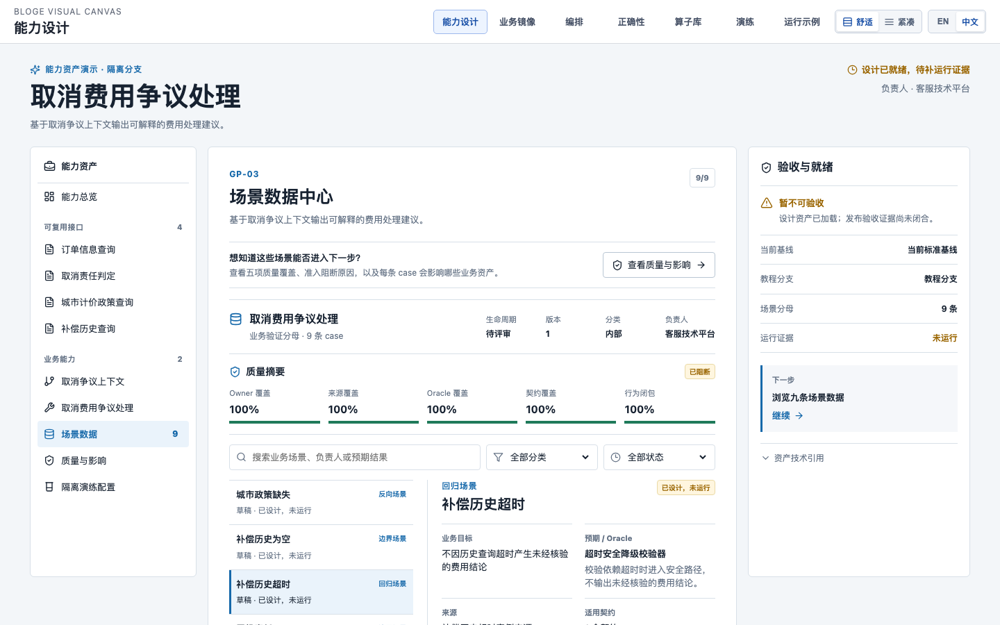
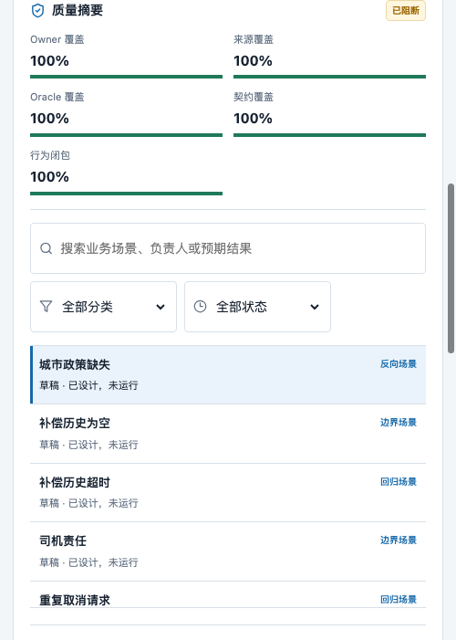
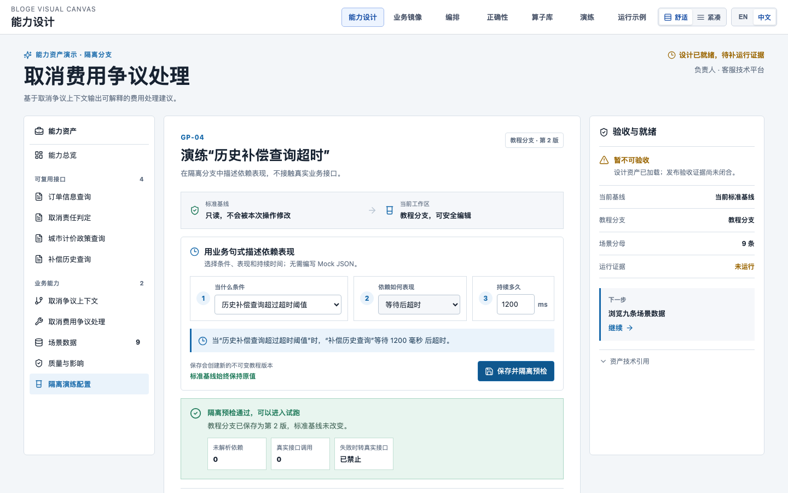
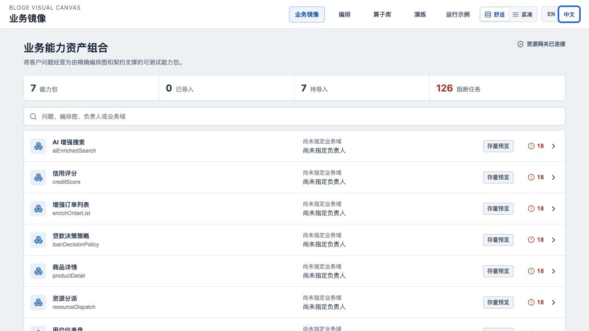
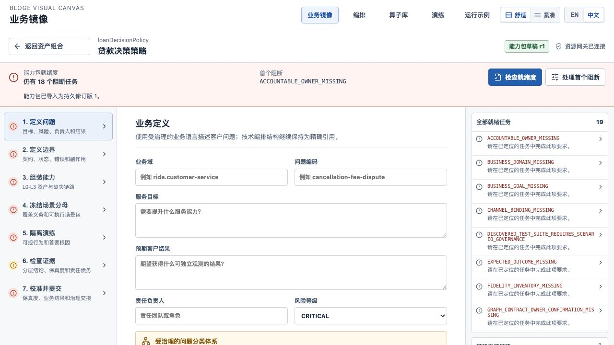
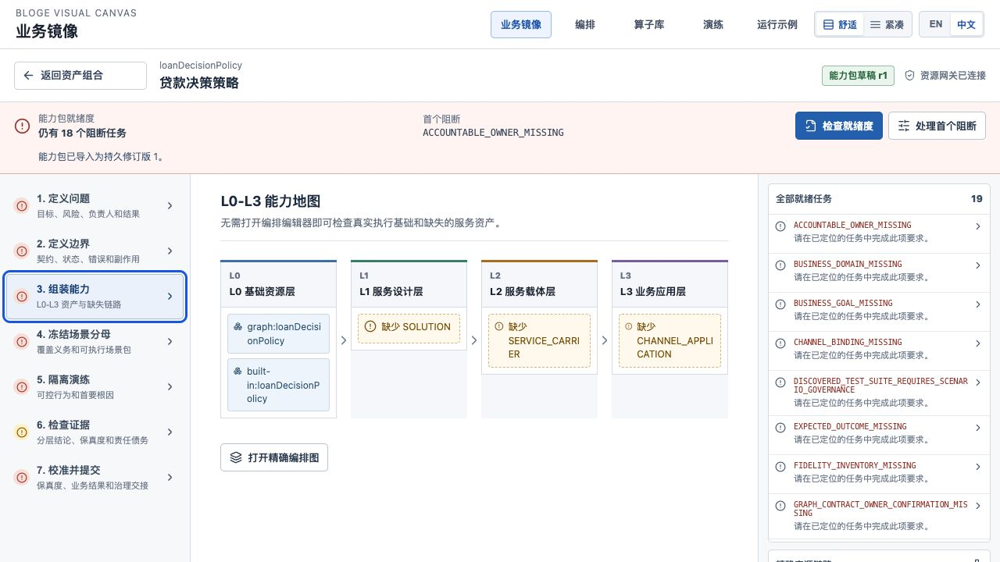
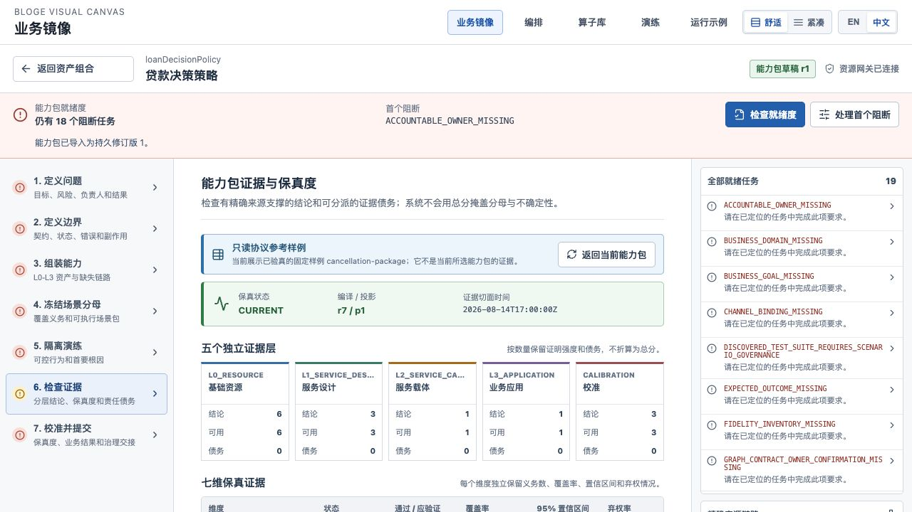
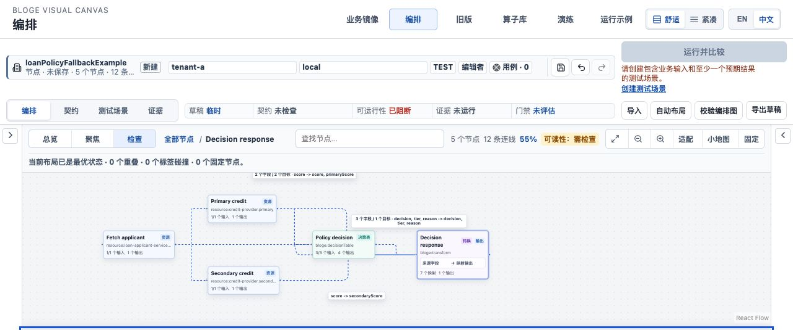
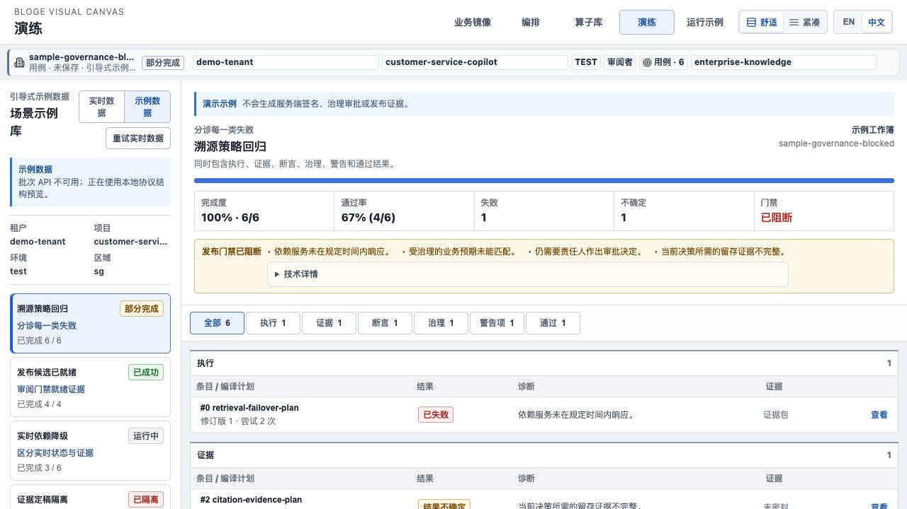

# Resource Gateway 产品手册

> 版本基线：2026-08-17，覆盖仓库内 RG-BM-001 至 RG-BM-015 与 Capability Studio GP-01 至 GP-04 开发切片（含 Scenario Dataset v1）
>
> 默认入口：`http://localhost:8080/capabilities/`
>
> 适用读者：客服业务设计人员、能力包负责人、算子开发者、测试与治理人员、平台实施人员

Resource Gateway 已从单一 API 网关示例演进为一套可视化 Tool Authoring Runtime。它最重要的产物
不是一张画布或一份 DSL，而是**可执行的业务正确性定义，以及随业务理解持续增长的验证数据资产**。
资源、算子、编排图、契约、场景、Fixture、断言、运行轨迹和证据被组织为可追踪、可验证、可交接的
工程闭包。产品负责“定义什么是正确、受控复现业务条件、批量验证、导出证据”；客户业务权威源和
ANEKE 仍分别负责真实业务事实、资产治理与发布门禁。

本手册先说明业务正确性与验证数据的核心方法，再给出可实际完成的体验路径，并解释各页面、协议能力和生产边界。协议字段的完整定义仍以各专项指南和 JSON Schema 为准。

正确性定义与测试数据配置的当前 UX 专项审查、目标工作台和实施顺序见
[《正确性定义与测试数据配置 UX 深度审查及演进方案》](resource-gateway-correctness-authoring-ux-audit-and-evolution-plan.md)。

## 1. 产品全景

| 页面 | 地址 | 主要用户 | 解决的问题 |
|---|---|---|---|
| 能力设计工作台 | `/capabilities/` | 业务设计人员、正确性负责人 | 查看接口契约和场景数据，并在隔离教程分支中用业务句式配置超时表现、保存和预检 |
| 业务镜像 | `/business-mirror/` | 业务负责人、服务设计人员 | 把客户问题经营为有负责人、有正确性定义、有场景分母、有证据的能力包 |
| 编排 | `/author/` | 流程作者、算子开发者 | 在 Schema 约束下编排 Graph，定义输入输出、上下文绑定和测试场景 |
| 算子库 | `/libraries/` | 平台开发者、领域专家 | 用向导、发现和推断方式定义 Operator 与 built-in function 库 |
| 演练 | `/rehearsals/` | 测试、治理和业务审阅人员 | 批量运行场景，按执行、证据、断言和治理原因分诊结果 |
| 运行示例 | `/showcase/` | 首次体验者、集成开发者 | 运行七个内置 Graph，查看真实 Gateway 输出和协议示例 |

`/capabilities/` 是新的默认入口；原业务镜像仍可直接访问，不会被删除。所有页面共享 `EN / 中文`、舒适/紧凑密度和 Scope 上下文。Graph 名、operator ref、JSON Pointer、
fingerprint、错误码和 DSL 不翻译，避免机器身份随语言变化。

## 2. 业务正确性定义与验证数据资产

### 2.1 为什么这是产品核心

客服服务水平的上限取决于对客户业务的拟合保真度。只保存流程拓扑，只能说明“系统准备这样执行”；
只有同时保存什么输入是合法的、哪些业务条件必须覆盖、每种条件下什么结果才正确、外部依赖如何被
稳定复现，才能说明“系统知道怎样判断业务是否正确”。

可以把一项业务能力的正确性理解为五个不可互相替代的条件：

```text
业务正确性
= 契约边界明确
+ 场景分母完整
+ 预期行为可判定
+ 执行条件可重复
+ 验证证据可追溯
```

JSON Schema 只回答数据是否合法，不能单独回答业务是否正确。例如，`decision = decline` 完全可能
符合输出 Schema，但对于高信用、低风险且满足准入政策的乘客仍是错误结果。正确性必须由受治理的场景、
断言、状态/副作用预期和真实 Outcome 共同定义。

### 2.2 一份完整正确性定义包含什么

| 资产 | 回答的问题 | 缺失时的风险 |
|---|---|---|
| Input/Output Contract | 可以接收和返回什么结构，错误与副作用边界是什么 | 非法数据进入流程，系统间集成漂移 |
| Scenario Inventory | 哪些正常、异常、边界、降级和治理条件必须覆盖 | 只挑容易通过的用例，分母被悄悄缩小 |
| Scenario Pack | 每个业务条件如何转为可执行 Given/When/Then | 业务语言与测试实现脱节 |
| Fixture/Double | 外部资源、状态、时间、错误和延迟如何稳定复现 | 测试依赖事业部环境，结果不可重复 |
| Assertion/Expectation | 输出、错误、状态迁移、副作用和治理结论怎样才算正确 | “跑完了”被误判为“跑对了” |
| Evidence/Outcome | 哪个 exact revision 在什么条件下得到什么结果 | 无法审计、回放、校准或进入发布门禁 |

一条工业级正确性用例至少需要表达：

```text
Given  业务身份 + 前置状态 + Graph 输入 + 外部资源 Fixture + 逻辑时间
When   执行 exact Graph/Operator revision 与 exact runtime binding
Then   输出断言 + 错误断言 + 状态迁移 + 副作用 + 治理预期
Proof  Scenario/Fixture/Contract fingerprint + RunTrace + Evidence + Owner/来源
```

### 2.3 测试数据为什么是长期业务资产

Fixture 不是为了让某次测试临时跑通而编造的返回值。高价值验证数据记录了客户业务在不同用户、订单、
城市、渠道、生命周期、政策版本、异常和组织规则组合下应如何表现。它的质量直接体现团队对客户业务的
理解深度，也是客服团队脱离真实业务接口仍能高保真演练的基础。

正确的数据积累方式是一个持续闭环：

1. 从生产问题、客诉、政策变化、业务评审和未知分支中发现新的业务条件。
2. 先把条件加入 `ScenarioInventory`，扩大并冻结应验证分母。
3. 为该条件补充最小、脱敏、可解释的 Fixture，以及输出、错误、状态和副作用预期。
4. 在 Operator、Graph、Package 三个层级运行新增用例和完整回归集。
5. 保存 exact revision、fingerprint、RunTrace、断言结果和失败分类，不只保存一个 `PASSED`。
6. 获得真实客户 Outcome 后校准模拟结果，更新对应保真度维度和责任债务。
7. 保留历史 revision；不得通过删除失败用例或缩小分母换取更高通过率。

这个闭环会形成业务数据飞轮：**业务理解越深，场景分母和验证数据越完整；验证越完整，服务设计越敢于
快速迭代；迭代产生的新证据和真实 Outcome 又继续提高业务拟合保真度。**

### 2.4 如何保证数据积累不变成数据垃圾场

每份 Contract、Scenario 和 Fixture 都应具备以下治理信息：

- 明确 Owner、业务来源、适用 Scope、政策版本、风险等级和数据分类。
- 绑定 exact Contract、Graph、Operator、runtime binding 与 fixture revision，禁止漂移后继续冒用旧证据。
- 区分 golden、negative、boundary、regression，以及 timeout、partial、fallback、cancel、mocked 等运行语义。
- 记录场景分母、已验证数量、弃权和未覆盖原因，不只统计通过率。
- 对 Fixture 做脱敏、最小化、保留期限、访问控制和删除证明；生产 payload 不能直接变成共享测试数据。
- 用真实 Outcome、覆盖率、变异测试、失败发现率和历史缺陷回放持续评估数据集有效性。
- 将过期、冲突、低样本和 Authority 不可用显示为 `STALE`、`ABSTAINED` 或阻断，不用默认值补绿。

### 2.5 在产品界面中怎样完成闭环

| 页面位置 | 用户动作 | 形成的正确性资产 |
|---|---|---|
| Business Mirror「1. 定义问题」 | 定义服务目标、客户结果、Owner 和风险 | 判断正确性的业务语境 |
| 「2. 定义边界」 | 审阅 Graph Contract、StateModel、EffectModel | 合法边界、状态和副作用义务 |
| 「4. 冻结场景分母」 | 审阅必须覆盖的业务条件并形成 ScenarioPack | 不可静默缩水的验证分母 |
| Author「测试场景」 | 表格化填写 Given、Fixture、预期输出和断言 | 可执行 golden/negative/boundary/regression 数据 |
| Operator 测试浮层 | 隔离试跑单个算子或 built-in function | 最小单元行为基线 |
| 「5. 隔离演练」与 Rehearsals | 注入 Fixture，批量运行并按根因分诊 | 可重复 RunTrace 和分层结果 |
| 「6. 检查证据」 | 检查五层证据、七维保真度和 Owner Task | 可审计证据与显式正确性债务 |
| 「7. 校准并提交」 | 用真实 Outcome 和 ANEKE gate 复核 | 模拟保真度校准与外部治理决定 |

业务人员的核心工作不是编写技术 DSL，而是持续把“在什么业务条件下，系统怎样表现才算正确”定义清楚，
并把它转化为可运行、可回归、可审计的数据。产研团队随后实现新的算子或运行时能力，但不能改写业务
Owner 冻结的正确性分母和预期。

## 3. 十五分钟体验

### 3.1 启动

在仓库根目录运行：

```bash
./scripts/start-visual-canvas-demo.sh --open
```

脚本会构建七个 React 工作区和 Spring Boot JAR，使用 `test` profile 启动，默认装配 Capability Studio
黄金数据包和只读 Correctness Studio 样板，并等待 capability probe、黄金数据包、验收基线、严格
Scenario Dataset、教程分支、隔离预检和全部页面就绪。`--open` 默认打开 Capability Studio；业务镜像和正确性工作台仍可从全局导航进入。首次构建耗时
较长；已有完整 JAR 时可使用 `--no-build`。

需要省略 Capability Studio 样板并直接打开业务镜像时使用：

```bash
./scripts/start-visual-canvas-demo.sh --no-capability-studio --open
```

需要省略正确性样板时使用：

```bash
./scripts/start-visual-canvas-demo.sh --no-correctness --open
```

使用其他端口：

```bash
./scripts/start-visual-canvas-demo.sh --port 18080 --open
```

### 3.2 先理解 Capability Studio 的业务入口

默认页面以「取消费用争议处理」为贯穿案例。首屏应直接显示 `4 个业务接口 / 1 个业务特征 / 1 个业务工具 / 9 个场景`，不要求输入 draft、contract 或 scenario ID。

1. 在左侧选择「订单信息查询」，查看业务输入、成功结果、错误、副作用、SLA 和 Owner。
2. 选择「场景数据」，先检查 Dataset 的业务验证分母、生命周期、版本、分类和 Owner。当前黄金包投影为「待评审」，不是已发布生产数据集。
3. 检查五项质量摘要：Owner、来源、Oracle、契约与依赖行为均为 100% 闭合；总体仍显示「已阻断」，因为九条 Case 尚未运行并形成证据。100% 元数据覆盖不等于业务验收通过。
4. 按黄金、反向、边界、故障、回归和安全分类筛选九条 Case。选择「补偿历史超时」，检查业务目标、预期/Oracle、来源、适用契约、超时表现和按需展开的精确引用。
5. 选择「隔离演练配置」。在「当什么条件、依赖如何表现、持续多久」三个控件中确认历史补偿查询超时，调整时长后选择「保存并隔离预检」。
6. 预检通过时确认四项反馈：教程分支产生精确 revision、标准基线未改变、未解析依赖为 0、真实接口调用为 0 且失败时转真实接口已禁止。
7. 查看「验收状态」。正确结论仍是 `NO_GO`：当前只证明 Stage 0 Dataset 投影、test/staging 教程分支保存与预检；Dataset 写入 Authority、Feature/Tool 隔离执行、9/9 批量证据、完整 zero-egress 观测和业务签署仍未完成。



移动端先显示 Dataset 摘要；继续向下可查看五项质量、搜索、筛选和有界 Case 列表。列表使用独立滚动区域，避免九条 Case 把当前详情推到页面末尾。





保存发生版本冲突时，页面会保留当前输入并提供「重新加载最新版本」；加载或网络失败会同时说明发生原因、影响和恢复动作。若启动脚本提示黄金数据包或 Scenario Dataset 未就绪，检查是否使用了 `--no-capability-studio`，并查看 `target/example-logs/visual-canvas-demo.log`。教程分支只在 test/staging 装配，head 与 immutable revision 保存在当前 H2 数据库；使用同一数据库重启后继续保留，停止脚本不会主动清空。production profile 不装配这些端点。当前 Scenario Dataset 是由 Golden Demo Pack 确定性生成的只读、payload-free 投影，页面尚不提供 Dataset 持久化写入或 Feature/Tool Run 按钮；这不是权限错误，而是当前开发切片的明确边界。

### 3.3 从业务能力资产组合开始

打开「业务镜像」，切换到「中文」。资产组合把七个内置 Graph 投影为可导入的能力包，并同时显示
已导入数量、待导入数量和正式阻断任务，而不是只给出技术文件列表。



完成以下操作：

1. 打开「贷款决策策略」。
2. 选择「导入能力包」，等待状态变为「能力包草稿 r1」。导入不会修改原 Graph。
3. 在「1. 定义问题」用主动筛选器选择 `Credit decision`、`Loan decision problems` 和
   `Credit Service Design`；再填写问题编码、服务目标、预期客户结果和风险等级。界面按业务名称展示，
   Package 只保存稳定 ID 或 exact ref。
4. 选择「保存能力包更改」，再选择「检查就绪度」，观察首个阻断如何移动到尚未补齐的业务或治理义务。



固定样例的正确结果是 `BLOCKED`，不是全部变绿。客户分类体系、真实 Outcome、Owner approval、
生产环境证据不能由演示 Fixture 自动推断。演示目录提供的 State/Effect、Scenario、Fidelity 等候选只用于
练习受治理绑定，不会伪装成客户权威事实。

### 3.4 检查 L0-L3 能力链

打开「3. 组装能力」。L0 显示已有 Graph 和 built-in 能力；L1 服务设计、L2 服务载体和 L3 业务应用
先显示当前精确引用或明确缺失项。可以分别搜索并绑定 Solution、Service Carrier 与 Channel。选择
「打开精确编排图」进入 Author Compose 画布。该链接携带 Business Mirror
source id、revision、fingerprint 和返回坐标；Author 校验权威 projection 后才渲染拓扑，不会跳到「运行示例」或猜测同名最新版本。



### 3.5 检查证据与保真度

打开「6. 检查证据」。如果当前能力包还没有 evidence projection，选择「打开参考证据」。页面会明确
标识该数据是只读协议样例，不是当前能力包的生产证据。



这里有两条不可合并的轴：

- 五层证据回答 L0 资源、L1 服务设计、L2 服务载体、L3 应用和校准分别有哪些可用结论与责任债务。
- 七维保真度分别保留行为、契约、副作用、错误分布、Outcome、请求空间和状态迁移的分母、覆盖率、置信区间和弃权率。

系统不提供一个可以掩盖薄弱维度的综合分数。

### 3.6 定义并运行正确性场景

进入「编排」，在开始对话框中选择「载入示例」和「贷款策略与降级」，再选择「自动布局」。该示例包含
申请人资料、双信用数据源、决策表、转换节点、正式 Graph 输入输出 Schema，以及 golden、negative、
boundary 三类可运行正确性数据。



接着依次体验：

1. 选择顶栏「契约」，确认 `applicantId` 输入和七个输出字段的合法边界。
2. 选择「测试场景」，逐行查看业务前提、Fixture、预期结果和断言，而不只看用例名称。
3. 对 golden、negative、boundary 各运行一次，比较它们对同一 Graph 的不同正确性预期。
4. 双击 Decision Table 节点，在浮层中查看条件列、输出列、规则及节点级测试数据。
5. 在右侧「数据」检查器中，检查 `ctx`、Graph input、上游输出和常量如何形成 Given 条件。
6. 选择「校验编排图」并运行整表，确认每个结果都绑定 exact Graph、Contract 和 Fixture fingerprint。

体验重点不是三行样例全部通过，而是理解新增一个真实业务分支时，应先扩充场景分母，再补 Fixture 和预期，
最后运行全量回归。不能只为新分支追加一条孤立的 happy path。

### 3.7 分诊批量演练

进入「演练」。默认启动未启用批次 worker 时，页面自动进入「示例数据」，提供成功、部分完成、运行中和
证据隔离四类完整样例。先选择「溯源策略回归」，再用失败分类筛选执行、证据、断言、治理、警告和通过结果。



示例工作簿不会生成服务端签名、治理审批或发布证据。要体验服务端批次 API，停止服务后使用：

```bash
./scripts/start-visual-canvas-demo.sh --scenario-batch --open
```

### 3.8 使用 Correctness Studio 定义、运行与校准业务正确性

Correctness Studio 是面向业务正确性资产的一级入口，不是 Author 画布里继续堆叠的测试浮层。先用只读样板理解
信息架构：

```bash
./scripts/start-visual-canvas-demo.sh --open
```

默认启动命令会先打开引导式业务目标选择器。保持「编排图」，在「业务目标」中选择贷款决策样板；系统会自动绑定唯一的
Correctness Definition，再选择「打开正确性工作区」。普通用户不需要输入 target ID、fingerprint 或 Definition ID；
多个定义时必须主动选择，零定义时页面会阻断并解释原因。旧 deep link 与目录故障恢复入口位于「高级精确坐标」。

只读演示声明 `correctnessWorkspaceApi=true`、`correctnessTargetCatalogApi=true` 和
`guidedWorkspaceLauncher=true`，因此可以查看定义、
冻结分母、Case、Fixture descriptor、Oracle/Assertion、Publication 摘要和五轴状态，但不能保存、发布或运行。
这是 capability 失败关闭，不是页面故障。完整操作说明见
[Correctness Studio 演示指南](resource-gateway-correctness-studio-demo-guide.md)。

在装配完整 correctness runtime 的 `test/staging` 部署中，按下列顺序工作：

1. **总览**：确认 exact target、Correctness Definition、风险、Owner、当前 Publication、五轴 verdict 和唯一下一步。
2. **覆盖率**：维护 Coverage Inventory；检查 Contract、Path、Policy、Risk、Incident、Boundary 分母，完成独立复核后冻结。覆盖状态由 Canonical Case 的 exact obligation ref 派生，不能手工补绿。
3. **用例数**：在 Case Builder 中填写业务意图、类型、风险、Given 来源和受控依赖。输入可选 inline KV 或 Fixture variant；依赖可选 REAL、RETURN、ERROR、DELAY、TIMEOUT、REPLAY、OBSERVE、MUST_NOT_CALL，不要求编辑原始 JSON。
4. **模拟数据**：先维护 metadata-only Fixture descriptor，再用独立授权显式读取或写入 material。Material 写入成功后取得 payload-free receipt，再把 exact material ref 绑定回 descriptor；目录页、URL、日志和治理导出不出现明文。
5. **业务预期**：先由业务 Owner 描述正确结果、禁止结果和依据，再由测试/研发把它编译为 Assertion Set。必须先通过 compile preview；不支持的断言语义会阻断，不会静默丢弃。
6. **发布**：在总览下方先执行 compilation preview，审阅 diagnostics、source map、compiled assets 和真实调用风险。只有同一 exact preview `publishable=true` 时，才可创建不可变 Correctness Publication。
7. **运行**：进入「运行」，选择全部或指定 Case、失败策略，再选择「审查运行计划」。服务端返回 canonical Selection、REAL/MOCKED/FAULT/副作用摘要和 blocker；只有已审查的 exact fingerprint 可以运行。
8. **证据**：终态固定展示执行、断言、覆盖、证据、门禁五个独立轴，以及 Case execution、证明等级、attestation 和 source map。历史 Evidence 中的 Gate 是封存时快照，不代表当前发布许可；必须核对页面上方 ANEKE 当前决策。
9. **结果校准**：真实 Outcome 与已批准业务真值不一致时，选择「提出校准建议」，填写差异类型、原因码、业务依据和回归标题，并选择证据闭包内的 Case。系统只创建 `PROPOSED` 提案，不改写 Oracle，也不自动发布 regression Case。
10. **外部治理**：ANEKE feedback 面板显示 workbook、责任人审批、breaking migration、finding、remediation 和 deep link。Resource Gateway 只投影当前决策；ANEKE 继续拥有 workbook 和 publish gate 生命周期。

这条链路有三个不可绕过的认知边界：执行成功不等于业务正确；历史 Evidence 不等于当前发布许可；Outcome
提案不等于已批准业务真值。

完整部署必须从 Capability Probe 看到对应能力真实装配：

| 工作面 | 必需 capability |
|---|---|
| 只读工作区 | `correctnessWorkspaceApi` |
| Coverage / Oracle / Case / Fixture | `correctnessCoverageApi`、`correctnessOracleAssertionApi`、`correctnessScenarioV2Api`、`correctnessFixtureCatalogApi` |
| Fixture material | `correctnessFixtureMaterialApi` |
| 编译与发布 | `correctnessCompilationApi`、`correctnessPublicationApi` |
| 预检、运行与 Evidence | `correctnessPreflightApi`、`correctnessRunApi`、`correctnessEvidenceCompanionApi` |
| Outcome 与 ANEKE | `correctnessOutcomeCalibrationApi`、`correctnessGovernanceFeedbackApi` |

任一 capability 为 `false` 时，UI 禁用对应命令且不通过捕获 404 猜测能力。生产部署还必须提供 PostgreSQL
migration、企业身份与 purpose、review authority、测试资产 registry、Fixture Schema authority 和 tenant/region
密钥；缺少这些 Authority 时保持关闭。

## 4. 业务镜像的七步工作法

| 步骤 | 要回答的业务问题 | 主要资产 | 页面行为 |
|---|---|---|---|
| 1. 定义问题 | 服务谁、解决什么、谁负责、期望什么结果 | Business Definition、Problem taxonomy、Owner、Risk | 主动筛选业务域、分类与 Owner，编辑文本字段 |
| 2. 定义边界 | 输入输出、状态、副作用和错误是否明确 | Graph Contract、StateModel、EffectModel | 搜索并绑定 exact Contract、State 与 Effect ref |
| 3. 组装能力 | L0-L3 是否形成完整服务链 | Graph、Capability、Solution、Carrier、Channel | 查看能力地图，绑定 L1-L3，并打开精确 DAG |
| 4. 冻结场景分母 | 哪些分支必须验证，哪些不能删除 | ScenarioInventory、ScenarioPack | 主动选择冻结分母与可执行场景包 |
| 5. 隔离演练 | 不调用真实接口时能否受控运行 | MirrorPlan、Fixture、Scenario run | 进入 Rehearsals 并生成分层结果 |
| 6. 检查证据 | 结论、分母和责任债务是否完整 | EvidenceIndex、Fidelity、OwnerTask | 查看五层证据、七维保真度和漂移 |
| 7. 校准并提交 | 模拟是否拟合真实业务，能否交接治理 | Fidelity、Outcome、Owner approval | 绑定校准资产和审批主体，检查外部门禁 |

「处理首个阻断」会定位目标 Sheet 和精确控件，移动焦点、高亮目标并显示结果；它不会替用户补值或
隐藏其他缺口。右侧任务清单保留稳定 gap code，便于
跨系统工单、Deep Link 和自动化治理消费。

首次进入任一 Sheet 时，按从上到下的顺序阅读：本步业务问题 -> Why -> 所需输入 -> 下一最佳动作 ->
业务内容 -> 完成条件。输入“未绑定”表示当前快照没有该引用；只有明确标注“需要处理”才表示最新
readiness 把它判定为本步阻断。完成配置后使用底部动作继续，不需要从右侧 code 清单猜测下一步。

受治理字段的操作一致：聚焦下拉框即可加载当前 Scope 的候选，也可按业务名称、负责人、ID 或 Scope
继续搜索；候选卡展示 Owner、Scope 和生命周期。选中后系统向权威目录重新解析 revision 与 fingerprint，
只有解析成功才写入草稿。出现“候选已变化”时必须重新选择，系统不会静默升级。任意 Sheet 的变更都会
出现「能力包更改尚未保存」，统一选择「保存能力包更改」后再检查就绪度。

## 5. 编排工作区

### 5.1 创建 Graph

开始对话框提供四条路径：

- **载入示例**：获得完整 Graph、Contract、测试场景、Fixture 和预期结果，适合首次体验。
- **导入 DSL**：扫描 BLOGE DSL 并自动布局；没有算子 Schema 时仍以尽力推断方式展示拓扑。
- **创建算子库**：进入渐进式库定义工作台。
- **空白编排图**：从左侧算子面板开始拖拽。

画布提供总览、聚焦和检查视图；支持自动布局、缩放、适配、小地图、固定节点和边标签展示。复杂图应先
选择「自动布局」，再用「适配」查看完整形状，用「小地图」定位局部。

### 5.2 定义 Graph 契约

每张 Graph 都必须有正式 input/output JSON Schema。顶栏「契约」用于编辑 Graph 级契约，右侧检查器的
「契约」用于查看当前 Graph 或节点的精确字段。契约决定：

- 运行输入表单有哪些字段以及哪些必填。
- 节点输入可绑定哪些 `ctx`、Graph input 或上游输出路径。
- 连线端口和路径是否兼容。
- 测试场景的输入、预期输出和断言是否可验证。
- 导出 GraphDraft 时携带的集成边界。

### 5.3 配置节点输入

选中节点后打开右侧「数据」页签。每个输入字段可以选择：

- Graph input 或 `ctx` 中的变量。
- 上游节点的结构化输出路径。
- 常量。
- 受控表达式或 built-in function。

优先使用字段树和拖放绑定；「高级」中的原始内容编辑器用于批量或特殊表达式，不是日常首选路径。

### 5.4 Decision Table

双击 Decision Table 节点会打开规则表格。条件列可以引用传入边提供的字段；输出列和规则数会实时回写
节点摘要。完成后应运行节点自己的 table test suite，再运行 Graph 场景，分别定位规则错误和拓扑错误。

### 5.5 保存、恢复与冲突

工作区把「已捕获恢复快照」和「已保存权威修订版」分开显示：

- `DIRTY`：存在未捕获编辑。
- `RECOVERABLE`：当前编辑已写入有界恢复快照，但尚未成为服务端 revision。
- `SAVED`：权威保存完成。

跨工作区导航会先刷新最新恢复快照。浏览器演示使用会话级存储；VS Code 使用宿主加密存储。并发保存通过
revision compare-and-set 和内容地址幂等键处理，不做静默覆盖。

## 6. 算子库与 built-in function 库

「算子库」把高门槛 Schema 编写拆成渐进路径：

1. 从 Java runtime、BLOGE DSL、OpenAPI、AsyncAPI 或已有 capability catalog 发现事实。
2. 审阅系统可确定的字段、推断字段和仍需人工确认的字段。
3. 用表单定义 identity、input/output Schema、运行时 binding、风险、Owner、SLA 和 Secret policy。
4. 为 Operator 或 built-in function 建立独立 table test suite 与 Fixture。
5. 运行 exact-draft 测试，处理错误后提交不可变 revision。

Schema 是运行和精确验证的增强条件，不是 DSL 可视化的前置条件。缺少合法库时，画布仍可根据 DSL 提取
operator、built-in function、输入、输出和依赖拓扑，但会明确降低推断置信度并阻止不具备证据的发布结论。

完整格式与复杂样例见 [算子库 Schema 定义](bloge-visual-operator-library-schema.md) 和
[企业知识治理 Operator/Built-in 示例](examples/enterprise-knowledge-governance-operator-library.yaml)。

## 7. 表格驱动测试与演练

### 7.1 测试层级

| 层级 | 隔离对象 | 适合发现的问题 |
|---|---|---|
| Operator suite | 单个算子或微型 Graph | 参数映射、边界值、错误语义、Mock 行为 |
| Graph scenario | 完整 DAG | 数据依赖、分支、fallback、Graph input/output |
| Package rehearsal | 业务能力包 | 场景分母、跨层证据、业务预期、治理义务 |
| Pilot acceptance | 客户业务域 | 真实 Outcome、观察窗、环境认证、外部签字 |

用例类型支持 `golden`、`negative`、`boundary` 和 `regression`。断言可针对 path、Schema、error 与
governance expectation。Fixture 注入只在 test/staging testing control plane 中启用；生产 profile
结构性移除测试控制端点，并拒绝测试控制字段。

### 7.2 数据流控制反转

测试调用方可为指定 DAG 或 Operator 注入 fixture/double，使数据获取、错误、延迟、重试、fallback 和逻辑时间
可控。该能力用于大规模集成测试和批量回归，不是生产流量改写机制。每次运行保留 fixture identity、mock 标记、
node/edge trace、断言结果、耗时和错误分类，随后生成可脱敏、可验签、可回放的 evidence bundle。

### 7.3 正确性资产的晋级规则

一次执行成功不能自动升级为高层正确性结论：

1. Operator suite 通过，只证明 exact 算子在给定 Fixture 下满足单元预期。
2. Graph scenario 通过，才证明 exact DAG 的数据依赖、分支和输出满足该场景预期。
3. Package rehearsal 通过且分母完整，才形成可供业务审阅的能力包证据。
4. 真实 Outcome 完成校准、目标环境认证通过、ANEKE gate 允许且客户 Owner 签字后，才能形成试点接受结论。

低层证据可以支撑高层判断，但不能替代高层业务事实。Mock 运行、发现的技术测试和本地参考 Fixture 必须
持续带有明确标记。

## 8. 协议能力与页面的关系

仓库内 RG-BM-001 至 RG-BM-015 已形成完整工程协议，但不是所有能力都需要在作者页面中直接编辑。

| 能力组 | 当前入口 | 权威边界 |
|---|---|---|
| Package、Compiler、Legacy migration | 业务镜像和 `/api/business-mirror/**` | Resource Gateway durable repository |
| Proposal 与隔离模拟 | 专项 API、Fixture、Test Kit | 只能 `SIMULATION_ONLY`，不能触达真实网络和 Secret |
| 实现绑定与 Conformance | 专项 API、Test Kit | runtime owner 提供 binding，结果绑定同源 suite |
| L0-L3 Impact | Package 能力地图、Deep Link、change event | Snapshot/Closure 是事实，索引只是可重建投影 |
| Evidence 与 Fidelity | 业务镜像第 6 步、Integration API | 分层证据不可互相替代，无综合分数 |
| Outcome、Regional Data Plane、Runtime certification | capability probe、专项 API 和认证包 | 客户环境 Authority、KMS、PKI、网络与 HA 证据 |
| ANEKE integration | protocol 1.1 bundle、governance projection | ANEKE 保持 registry 与 publish gate 权威 |
| Correctness Studio | `/correctness/`、authoring command API、Run Center | Resource Gateway 拥有 authoring/runtime truth；ANEKE feedback 只读投影 |
| Pilot acceptance | 十门禁 manifest、Test Kit | 客户 Owner 冻结分母并作最终接受决定 |

capability probe 只声明当前部署实际装配的能力：

```bash
curl -s http://localhost:8080/api/integration/capabilities
```

UI 显示「资源网关已连接」只证明基础服务可访问，不等于 Package `READY`、worker 可运行、证据已签名或
ANEKE 已允许发布。

## 9. 演示运行方式

| 目标 | 启动命令 | 说明 |
|---|---|---|
| 常规完整产品体验 | `./scripts/start-visual-canvas-demo.sh --open` | 七个页面、Capability Studio 黄金数据包、进程内教程分支保存/预检与默认 Correctness exact Workspace；Feature/Tool Run 保持关闭 |
| 不装配 Capability Studio 样板 | `./scripts/start-visual-canvas-demo.sh --no-capability-studio --open` | 默认打开 legacy 业务镜像；Capability Studio 演示 API 不装配 |
| 不装配正确性样板 | `./scripts/start-visual-canvas-demo.sh --no-correctness --open` | 保留其余页面并打开 Capability Studio；`correctnessWorkspaceApi=false` |
| 验证生产装配隔离 | `./scripts/start-visual-canvas-demo.sh --profile production --no-capability-studio --no-correctness` | 两类演示 Authority 均不装配；不能用于演示黄金数据 |
| 批量 Scenario worker | `./scripts/start-visual-canvas-demo.sh --scenario-batch --open` | 区域队列和隔离 evidence finalizer |
| 有状态模拟 | `./scripts/start-visual-canvas-demo.sh --stateful --open` | 加密 Session、checkpoint 和恢复协议 |
| Shadow API | `./scripts/start-visual-canvas-demo.sh --shadow-jobs` | 只读 submit/read/lifecycle；默认不启动 poller |
| Shadow scheduler | `./scripts/start-visual-canvas-demo.sh --shadow-scheduler` | 启动有界 poller，Authority 未装配时仍失败关闭 |
| API-only | `./scripts/start-visual-canvas-demo.sh --api-only` | 不打包可视化页面 |
| 复用已有 JAR | `./scripts/start-visual-canvas-demo.sh --no-build` | 先验证 JAR 是否包含所需前端 |

查看状态和日志：

```bash
./scripts/visual-canvas-demo.sh status
tail -100 target/example-logs/visual-canvas-demo.log
```

停止：

```bash
./scripts/stop-visual-canvas-demo.sh
```

使用自定义端口时，停止命令必须携带同一端口：

```bash
./scripts/stop-visual-canvas-demo.sh --port 18080
```

## 10. VS Code 轻量模式

无需启动服务端时，可运行参考扩展：

```bash
cd resource-gateway-examples/vscode-extension
npm run prepare:webview
code --new-window --extensionDevelopmentPath="$PWD"
```

在 Extension Development Host 中执行 **Resource Gateway: Open Authoring Workspace**。默认先打开 Business Mirror，
再可进入 Author。离线适配器提供固定 Package、Graph、算子库和示例；可信 remote runtime 是可选项，并受
workspace trust、HTTPS、SecretStorage 凭据和路径白名单约束。

离线模式不访问真实网络、Secret 或生产接口，不创建生产 Outcome、ANEKE gate evidence 或客户 approval。

## 11. 角色建议

| 角色 | 日常主页面 | 主要产物 |
|---|---|---|
| 客服业务设计人员 | 业务镜像、演练 | 正确性定义、场景分母、Fixture、业务预期和历史缺陷回放 |
| 能力包 Owner | 业务镜像 | 冻结正确性分母、Owner decision、Readiness 处理、证据债务接手 |
| 算子/平台开发者 | 算子库、编排 | Operator/Function Schema、runtime binding、实现一致性 |
| 测试与质量人员 | 编排测试场景、演练 | 单元/Graph/Package suites、回归证据 |
| ANEKE 治理人员 | Integration API、ANEKE | Registry ingest、workbook、publish gate、治理反馈 |
| SRE/安全人员 | capability probe、认证协议 | 区域数据面、KMS/PKI、HA/DR、留存与删除证明 |

## 12. 常见问题

| 现象 | 原因 | 处理方式 |
|---|---|---|
| Rehearsals 显示批次 API 不可用 | 默认未启用 `--scenario-batch` | 使用示例数据，或带该参数重启 |
| Package 一直 `BLOCKED` | 存在正式业务或治理义务 | 选择「处理首个阻断」，不要把它当 HTTP 故障 |
| `Load Scenario` 返回 `RG.SCENARIO.NOT_FOUND` | 旧制品或演示种子不完整 | 重新构建完整前端 JAR，确认使用当前 fixed fixtures |
| `/assets/*` 返回 `404` | JAR 未包含前端或复用了 API-only 制品 | 不使用 `--no-build` 重新启动 |
| Graph 很密、边标签被遮挡 | 尚未重新布局或视图缩放不合适 | 依次使用「自动布局」「适配」「小地图」 |
| DSL 能显示但节点 Schema 不完整 | 当前为尽力推断 | 导入合法算子库以提升精度；不要把推断结果当发布证据 |
| 测试通过率很高但业务仍频繁出错 | 场景分母不完整或 Fixture 失真 | 从真实缺陷扩充分母和回放数据，并用 Outcome 校准保真度 |
| 新版本通过但旧问题复发 | 只运行新增用例或证据未绑定 exact revision | 运行完整 regression 集并检查 Contract/Graph/Fixture fingerprint |
| 页面可访问但运行按钮不可用 | runtime、worker、signer 或 Authority 未装配 | 查看 capability probe 和页面门禁原因 |
| 并发保存冲突 | 服务端 revision 已推进 | 重新读取 head、比较差异后提交新 revision |

## 13. 生产边界

本地绿色测试和参考 Fixture 证明协议、失败关闭和独立消费能力，不证明以下外部事实已经存在：

- 客户真实业务接口、Outcome Authority 和完整观察窗。
- 客户 KMS、Vault、PKI、网络出口、WORM、跨区域隔离和 HA/DR 认证。
- ANEKE 的 registry 接收、正确性 workbook、publish gate 和 TEE 治理。
- 业务 Owner 冻结的场景分母和最终 `CUSTOMER_ACCEPTED` 签字。

生产接入必须使用 exact Scope、revision、fingerprint、evidence ref 和外部签名串起闭包；不得把演示样例、
发现的技术测试或本地 `PASSED` 结果升级为客户接受结论。

## 14. 延伸阅读

- [Business Mirror Workspace 专项指南](resource-gateway-business-mirror-workspace-guide.md)
- [Package Authoring 指南](resource-gateway-business-mirror-package-authoring-guide.md)
- [Capability Proposal Authoring 指南](resource-gateway-business-mirror-proposal-authoring-guide.md)
- [Capability Proposal 模拟指南](resource-gateway-business-mirror-proposal-simulation-guide.md)
- [实现绑定与 Conformance 指南](resource-gateway-business-mirror-implementation-conformance-guide.md)
- [Package Evidence 与 Fidelity 指南](resource-gateway-package-evidence-and-fidelity-guide.md)
- [Scenario Rehearsal Compiler](resource-gateway-scenario-rehearsal-compiler.md)
- [Test Kit 设计与使用手册](resource-gateway-test-kit-design-and-user-guide.md)
- [Correctness Studio 演示指南](resource-gateway-correctness-studio-demo-guide.md)
- [Correctness Studio 技术实施方案](resource-gateway-correctness-studio-technical-implementation-plan.md)
- [ANEKE Package 集成指南](resource-gateway-aneke-package-integration-guide.md)
- [取消费申诉试点验收指南](resource-gateway-cancellation-fee-pilot-acceptance-guide.md)
- [Business Mirror 实现状态](resource-gateway-business-mirror-implementation-status.md)
