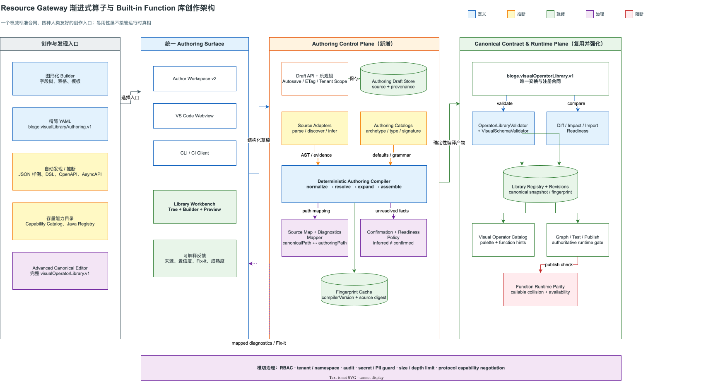
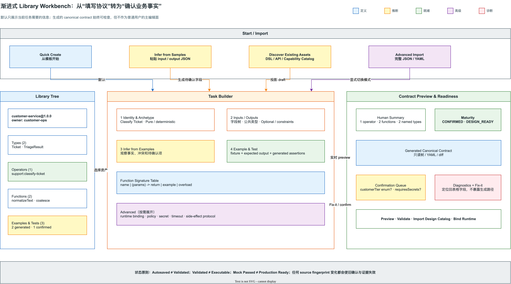
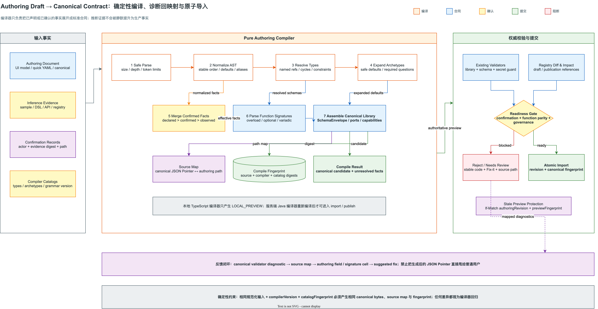
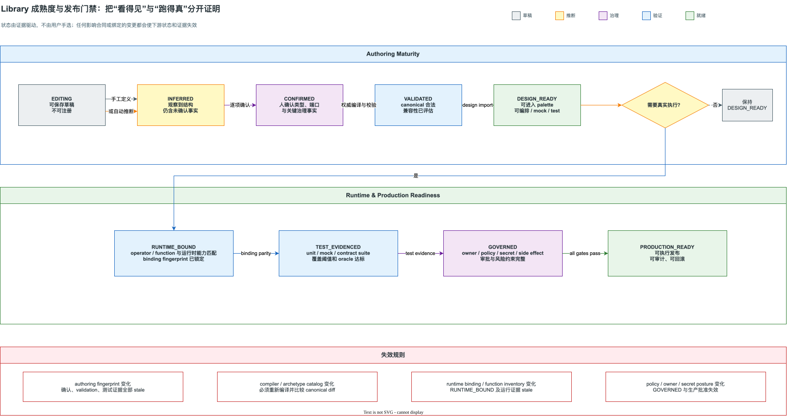

# Resource Gateway 渐进式算子与 Built-in Function 库创作技术方案

> 状态：Approved；Stage 0、Stage 1 与 Stage 2.4 样本推断/草稿测试表/受限 function runner 已实现，受治理 fixture、生产隔离 runner 及 Stage 3-4 待实施
>
> 日期：2026-07-30
>
> 适用范围：Resource Gateway Author Workspace v2、VS Code 插件、本地 CLI/CI、算子库导入与 BLOGE capability catalog 集成
>
> 目标合同：新增人类创作合同 `bloge.visualLibraryAuthoring.v1`，确定性编译到既有 `bloge.visualOperatorLibrary.v1`
>
> 核心原则：**降低定义成本不能靠削弱标准合同，而要靠增加一层可解释、可验证、可回溯的人类创作模型。**
>
> 实施进度：[渐进式 Library Authoring 实现状态](resource-gateway-progressive-library-authoring-implementation-status.md)

相关文档：

- [BLOGE 可视化算子库 Schema 定义](bloge-visual-operator-library-schema.md)
- [BLOGE 框架算子与函数 Schema 导出需求](bloge-framework-operator-function-schema-export-requirement.md)
- [BLOGE VS Code 插件轻量化可视化编排方案](bloge-vscode-extension-lightweight-authoring-plan.md)
- [Resource Gateway Author UX 体验成熟度 95 分提升计划](resource-gateway-author-ux-maturity-95-plan.md)
- [本方案深度审计记录](resource-gateway-progressive-operator-function-library-authoring-technical-design-audit.md)
- [本方案实现状态与差距](resource-gateway-progressive-library-authoring-implementation-status.md)

Draw.io 源图：

- [目标架构](assets/drawio/resource-gateway-progressive-library-authoring-architecture.drawio)
- [创作工作台](assets/drawio/resource-gateway-progressive-library-authoring-workbench.drawio)
- [确定性编译链路](assets/drawio/resource-gateway-progressive-library-authoring-compile-flow.drawio)
- [成熟度与发布门禁](assets/drawio/resource-gateway-progressive-library-authoring-readiness-lifecycle.drawio)

## 0. 执行摘要

### 0.1 核心判断

当前困难不是 `OperatorLibrary` 字段数量偶然偏多，而是系统把四类不同问题压在了同一份手写 JSON/YAML 中：

1. 用户在描述什么业务能力；
2. 输入、输出和函数参数是什么；
3. 该能力如何绑定到 BLOGE runtime；
4. 该能力是否满足企业治理和生产发布要求。

`bloge.visualOperatorLibrary.v1` 必须承载这些信息，因为它是系统间交换、注册、影响分析和发布治理合同。但这不等于用户必须直接创作它。现有 Author Workspace 的 Library 区域仍以完整 JSON/YAML 文本框为主，这使标准合同的结构复杂度直接变成用户认知成本。

本方案增加一层 `bloge.visualLibraryAuthoring.v1`：

```text
人类创作事实
  + 自动发现证据
  + 人工确认记录
    ↓ 确定性编译
bloge.visualOperatorLibrary.v1
    ↓ 复用现有 validator / diff / impact / registry / revision
Visual Operator Catalog / Graph / Test / Publish
```

它不是第二套运行合同，而是编译型创作源。现有 canonical contract 继续保持权威。

### 0.2 方案结论

本方案作出以下设计决策：

| 编号 | 决策 | 原因 |
| --- | --- | --- |
| D-01 | 保留 `bloge.visualOperatorLibrary.v1` 作为唯一注册和交换合同 | 避免破坏现有画布、GraphDraft、export bundle、diff 和发布链路 |
| D-02 | 新增版本化人类创作合同 `bloge.visualLibraryAuthoring.v1` | UI、YAML、CLI 和 VS Code 需要稳定而精简的共同语义 |
| D-03 | 图形化 Builder 为默认入口，精简 YAML 为开发者入口 | 解决业务作者和工程用户两类人群的定义成本 |
| D-04 | 自动推断只生成 observed facts，必须确认后才能升级为 declared facts | 防止“看过两个样例”被误当成正式业务合同 |
| D-05 | 编译器服务端实现是权威，本地 TypeScript 实现只产生 `LOCAL_PREVIEW` | 支持 VS Code 离线体验，同时避免双实现漂移成为发布真相 |
| D-06 | canonical 校验错误通过 source map 回映射到表格字段或精简 YAML 路径 | 用户不应该理解生成后的深层 JSON Pointer |
| D-07 | 设计态可早进入 palette；真实执行需要单独经过 runtime parity、测试和治理门禁 | 把“能画出来”与“可以生产执行”分开证明 |
| D-08 | Built-in function 的调用名按全局 effective catalog 唯一，namespace 不能掩盖冲突 | 当前表达式调用文本不包含治理 namespace，“先到先得”不可接受 |
| D-09 | 支持 operator-only、function-only 和 mixed library | Built-in function 库不应该靠伪造 operator 才能存在 |
| D-10 | 从 Quick 模式升级到 Canonical Advanced 模式是显式、可审计的单向转换 | 无损双向转换在高级字段出现后不可保证 |

### 0.3 成功指标

第一阶段完成后应达到：

- 纯设计态 operator 从空白到可导入，目标中位时长不超过 60 秒；
- 一个普通 built-in function 从空白到可用签名，目标中位时长不超过 30 秒；
- 至少 80% 的普通 operator 不需要用户看到或编辑 JSON Schema envelope；
- JSON 样例可以生成字段树、端口 Schema、fixture 和基础 assertion 草稿；
- 所有 canonical validator diagnostic 都能定位回创作字段；
- 老的完整 JSON/YAML 导入流程、API 和 export bundle 行为保持兼容；
- function-only library 可以被明确表示，不产生伪 operator；
- 跨 library callable name 冲突在 import 前被阻断；
- 未确认推断、未绑定 runtime 或缺少治理信息时，UI 不显示 `PRODUCTION_READY`。

## 1. 现状与根因

### 1.1 已确认的实现事实

| 事实 | 当前实现 | 含义 |
| --- | --- | --- |
| Canonical library 已有完整 Java 模型 | `OperatorLibrary`、`OperatorDefinition`、`SchemaEnvelope` | 不应重做权威合同 |
| 已有服务端语义校验 | `OperatorLibraryValidator`、`VisualSchemaValidator`、`VisualSecretGuard` | 新编译链必须复用 |
| 已有 raw text validate/import | `/admin/visual-operator-libraries/validate-text`、`import-text` | Advanced 模式可原样保留 |
| 已有 Capability Catalog adapter | `/from-capability-catalog-text` | 自动发现已有基础 |
| 已有 AsyncAPI discovery/import | `/from-asyncapi`、`/from-asyncapi/operations` | Source Adapter 不必从零开始 |
| 已有 Java operator 投影 | `JavaOperatorInventoryProjector` | runtime operator schema 可逐步自动化 |
| 已有 revision、diff、impact、bundle | `OperatorLibraryRevision`、`OperatorLibraryDiff`、`OperatorLibraryExportBundle` | 新流程应接入现有治理链 |
| Built-in function 目录已有模型 | `OperatorLibrary.BuiltInFunction` | 可复用 canonical 结构 |
| 默认函数目录仍由 example 层手工维护 | `BuiltInFunctionCatalog.defaults()` | function runtime parity 尚未形成框架级真相 |
| Library UI 仍是完整协议文本框 | `AuthorCanvas.tsx` 的 `library-intake` | 复杂度直接暴露给用户 |

### 1.2 难度来自哪里

| 根因 | 表面症状 | 病根 |
| --- | --- | --- |
| 创作合同与交换合同未分层 | 一个普通端口也要手写 SchemaEnvelope | 系统把机器协议当成人类界面 |
| 业务事实与治理事实同时展开 | 定义一个纯函数也会看到 lowering、policy、secret 等概念 | 没有基于 archetype 的渐进披露 |
| 信息可推断但系统不协助 | 用户已有样例、DSL、Java 类型，仍需重复写 Schema | 缺少 provenance-aware inference |
| 重复表达 | function name、label、parameters、returns 多处表达同一签名 | canonical 为工具消费优化，不为手写优化 |
| 错误路径属于生成结构 | 用户看到 `/operators/0/ports/inputs/0/schema/schema/...` | 缺少 source map |
| “未知”被迫变成布尔值或默认值 | `requiresSecrets`、`durable` 等难以表达尚未确认 | 缺少创作态 unresolved fact |
| 函数 metadata 与 runtime 真相分离 | 编辑器有函数提示，不代表 runtime 真能调用 | 缺少 function inventory parity |
| Library 概念偏 operator-centric | 当前 validator 要求至少一个 operator | function-only 能力包没有自然位置 |

### 1.3 不能采用的伪解法

1. **只缩短字段名**：大对象仍然是大对象，认知模型没有改变。
2. **直接删掉治理字段**：定义简单了，但发布、审计和运行正确性退化。
3. **只做一个更长的表单**：把 JSON 变成 80 个输入框不会提高易用性。
4. **让 AI 直接生成完整协议**：生成速度更快，但错误来源更难解释，不能作为权威合同。
5. **用样例自动锁死全部 Schema**：样例描述观察值，不描述完整业务空间。
6. **为 function-only library 注入伪 operator**：污染 catalog、fingerprint、影响分析和用户心智。
7. **让前端独自编译并直接 import**：不同宿主会产生不同 canonical，无法形成工程协议。

## 2. 目标、非目标与不变量

### 2.1 目标

1. 让普通用户围绕业务能力、输入、输出和示例完成定义。
2. 让工程用户可以用紧凑、可 diff 的 YAML 在代码库中管理定义。
3. 最大化复用样例、DSL、OpenAPI、AsyncAPI、Capability Catalog 和 Java Registry。
4. 保留 canonical contract 的完整治理和兼容语义。
5. 让推断、确认、编译、校验、运行绑定和发布状态可解释。
6. Web、VS Code、CLI 和 CI 使用相同创作合同与 golden fixtures。
7. 把 operator test、function test 和 fixture 自然纳入创作流程。

### 2.2 非目标

1. 本方案不重新设计 BLOGE DSL。
2. 本方案不让 Resource Gateway 接管业务代码如何生成 capability catalog。
3. 本方案不把 runtime binding、secret material 或生产凭证写入 authoring document。
4. 本方案不把自动推断升级为生产发布的替代审批。
5. 本方案不在第一阶段解决任意 JSON Schema 2020-12 关键字的图形化编辑。
6. 本方案不承诺 Quick 模式与任意 Advanced canonical 文档之间无损双向转换。
7. 本方案不允许 built-in function 执行外部副作用；这类能力必须建模为 operator。

### 2.3 架构不变量

| 不变量 | 约束 |
| --- | --- |
| Canonical authority | 只有服务端权威编译和既有 validator 通过的 library 才能进入 registry |
| Runtime authority | 描述 function/operator 不等于 runtime 已注册；真实执行必须通过 parity gate |
| Evidence isolation | fixture、样例 payload 和测试 evidence 不进入公开 operator catalog |
| Deterministic compile | 同一规范化输入、编译器版本和 catalog fingerprint 必须产生相同 canonical bytes |
| Provenance preservation | 每个 inferred/declared 字段必须可追溯到来源 |
| No silent downgrade | 无法表达的高级字段不能在切回 Quick 模式时静默丢失 |
| No stale commit | commit 必须绑定 authoring revision 和 preview fingerprint |
| Tenant isolation | draft、fixture、catalog、revision 和 audit 均按 tenant/namespace 授权 |

## 3. 目标架构



### 3.1 三层事实模型

系统明确区分三类 artifact：

| 层 | Artifact | Source of Truth | 生命周期 |
| --- | --- | --- | --- |
| 人类创作层 | `VisualLibraryAuthoringDocument` | 用户声明、导入声明、确认记录 | 可编辑、可推断、可 autosave |
| 标准合同层 | `OperatorLibrary` | 权威 compiler + validator | 不手工漂移、可 revision/diff/export |
| 运行证据层 | runtime binding、test suite、fixture、run evidence | runtime inventory 与实际执行 | 可失效、可重跑、可审计 |

三层之间不是双向同步：

```text
Authoring Document --compile--> Canonical Library --bind/run--> Runtime Evidence
       ^                         |
       |                         +-- diagnostics + diff
       +--------- source map ----+
```

Canonical Advanced 模式例外：用户明确选择完整协议作为新的创作源后，`sourceMode=CANONICAL`，Quick Builder 只读展示可投影子集。

### 3.2 组件边界

| 组件 | 责任 | 明确不负责 |
| --- | --- | --- |
| `AuthoringDraftService` | draft、revision、ETag、autosave、tenant scope | canonical validation |
| `AuthoringSourceAdapter` | Quick YAML、sample、DSL、OpenAPI、AsyncAPI、catalog 投影 | 自动宣称生产可执行 |
| `AuthoringCompiler` | normalize、type resolve、archetype expansion、canonical assembly | registry mutation |
| `AuthoringSourceMap` | canonical path 与 authoring path 映射 | 修改用户源 |
| `AuthoringReadinessPolicy` | 未确认事实、设计态、运行绑定和发布状态 | runtime 执行 |
| `OperatorLibraryValidator` | 既有 canonical 语义裁决 | 人类友好诊断路径 |
| `OperatorLibraryRegistry` | canonical revision、diff、restore、export | draft autosave |
| `RuntimeParityService` | operator/function inventory 与声明匹配 | 创作 Schema 推断 |

### 3.3 模块化建议

第一阶段在 `resource-gateway-examples` 内实现，但核心包不得依赖 Spring MVC：

```text
com.leanowtech.bloge.gateway.visual.authoring
  model/
  parse/
  compile/
  inference/
  diagnostic/
  application/
  transport/
```

边界要求：

- `parse`、`compile`、`inference` 只依赖 Jackson、canonical model 和纯 Java utility；
- `application` 负责编排 repository、validator、registry 和 audit；
- `transport` 才包含 Spring controller；
- API 稳定后再评估抽出 `bloge-visual-authoring-core`，避免过早制造跨仓库版本负担。

VS Code 离线模式使用 TypeScript local preview compiler，但必须消费同一份 JSON Schema、grammar version 和 golden vectors。它不能签发可 import 的权威 preview。

## 4. 产品工作台与交互模型



### 4.1 Start / Import 收敛

Author Workspace v2 的 `Start -> Operator Library` 改为四个明确入口：

| 入口 | 默认用户 | 结果 |
| --- | --- | --- |
| Quick Create | 业务作者 | 基于 archetype 创建空白结构化 draft |
| Infer from Samples | 联调、测试人员 | 从 input/output JSON 生成 observed fields |
| Discover Existing Assets | 存量系统研发 | 从 DSL/API/catalog/runtime inventory 投影 draft |
| Advanced Import | 平台专家 | 使用当前完整 JSON/YAML 流程 |

默认焦点落在 `Quick Create`。Advanced 不与普通入口并列抢占主操作。

### 4.2 Workbench 布局

工作台采用三列，但不是三张装饰卡：

1. 左侧 Library Tree：types、operators、functions、examples/tests；
2. 中间 Task Builder：只编辑当前资产；
3. 右侧 Contract Preview & Readiness：生成结果、确认项、诊断和下一步。

关键行为：

- 用户编辑字段时 debounce 生成 local preview；
- `Validate` 调服务端权威 preview；
- canonical diff 只读；
- diagnostic 点击后聚焦对应字段或签名单元格；
- unresolved fact 以确认队列呈现，不混在错误列表中；
- 只有通过 stale preview 检查后才能 `Import Design Catalog`；
- 真实执行相关操作单独命名为 `Bind Runtime`，不把 import 与 executable 混为一谈。

### 4.3 Operator Builder

Operator Builder 按任务渐进展开：

| 步骤 | 用户回答的问题 | 默认可见 |
| --- | --- | --- |
| Identity & Archetype | 这是什么能力，属于哪种执行语义 | 是 |
| Inputs / Outputs | 接收什么、产生什么 | 是 |
| Infer from Examples | 是否已有真实样例可复用 | 可选 |
| Examples & Tests | 如何证明基本行为 | 是 |
| Runtime Binding | 如何真实执行 | 仅 executable 目标 |
| Governance | secret、副作用、policy、SLA | 按 archetype 触发 |

端口编辑提供三种互换视图：

- 字段树：最适合对象结构；
- 表格：最适合批量字段；
- Sample：最适合从 JSON 开始。

视图共享同一个 AST，不通过字符串往返转换。

### 4.4 Function Builder

默认使用签名表格：

| Function | Signature | Description | Example |
| --- | --- | --- | --- |
| `normalizeText` | `(text: string) -> string` | Normalize customer input | `normalizeText(ctx.subject)` |
| `coalesce` | `(value: any, fallback?: any) -> any` | Return fallback when absent | `coalesce(ctx.score, 0)` |

Overload 通过增加行表达。系统自动派生 canonical：

- parameter list；
- optional / variadic；
- return type；
- display label；
- default display name；
- examples。

函数测试使用独立测试表：

| Case | Arguments | Expected | Kind |
| --- | --- | --- | --- |
| `normalizes-space` | `["  hello  "]` | `"hello"` | golden |
| `null-input` | `[null]` | error or null | boundary |

测试数据属于 test asset，不嵌入公开 function catalog。

### 4.5 Advanced 模式切换

Quick → Advanced：

1. 保存当前 authoring revision；
2. 权威编译并生成 canonical snapshot；
3. 创建新的 `sourceMode=CANONICAL` revision；
4. 记录转换 actor、时间、原 source fingerprint 和 canonical fingerprint；
5. UI 明确提示高级字段可能无法投影回 Quick。

Advanced → Quick：

- 只有当 reverse projection 证明无信息损失时允许；
- 否则只能 `Create Quick Copy`，保留原 Advanced draft；
- 禁止自动删掉 policy、lowering parameter、side-effect protocol 或不支持的 Schema keyword。

## 5. 人类创作合同

### 5.1 Root Model

建议新增机器 Schema：

```text
docs/schemas/bloge-visual-library-authoring-v1.schema.json
```

根对象：

```yaml
schemaVersion: bloge.visualLibraryAuthoring.v1

library:
  id: customer-service
  name: Customer Service
  version: 1.0.0
  owner: customer-ops

defaults:
  operatorVersion: 1.0.0
  namespace: support

types: {}
operators: {}
functions: {}
examples: {}
```

| 字段 | 必填 | 说明 |
| --- | --- | --- |
| `schemaVersion` | 是 | 固定为 `bloge.visualLibraryAuthoring.v1` |
| `library.id` | 是 | 编译成 `libraryId` |
| `library.name` | 否 | 省略时由 `id` 生成展示名 |
| `library.version` | 否 | 默认 `1.0.0` |
| `library.owner` | 生产建议必填 | 设计态允许缺失并产生 readiness warning |
| `defaults` | 否 | 只允许文档化的安全默认值 |
| `types` | 否 | 创作态命名类型，编译时内联到相关 SchemaEnvelope |
| `operators` | 条件必填 | 与 `functions` 至少一个非空 |
| `functions` | 条件必填 | 与 `operators` 至少一个非空 |
| `examples` | 否 | 引用 fixture/test asset，不直接保存敏感 payload |

### 5.2 完整精简示例

```yaml
schemaVersion: bloge.visualLibraryAuthoring.v1

library:
  id: customer-service
  name: Customer Service
  version: 1.0.0
  owner: customer-ops

types:
  Ticket:
    description: Customer support request.
    fields:
      id: string
      subject: string
      body: string
      customerTier?:
        enum: [free, pro, enterprise]
      openHours?:
        type: number
        minimum: 0

  TriageResult:
    fields:
      priority:
        enum: [p0, p1, p2, p3]
      topic: string
      confidence:
        type: number
        minimum: 0
        maximum: 1

operators:
  support:classify-ticket:
    name: Classify Ticket
    archetype: pure
    input:
      ticket: Ticket
    output:
      triage: TriageResult
    tests:
      - ref: fixtures/classify-enterprise-ticket

functions:
  normalizeText:
    description: Normalize customer input.
    signature: "(text: string) -> string"
    examples:
      - normalizeText(ctx.ticket.subject)

  coalesce:
    signatures:
      - "(value: any, fallback?: any) -> any"
      - "(values: any[]) -> any"
```

编译器生成但用户无需重复填写：

- library/operator `schemaVersion`；
- operator version；
- `display`；
- `source.kind`；
- `SchemaEnvelope.format/version`；
- `properties`、`required` 和基础 `additionalProperties`；
- pure archetype 的 capabilities；
- design lowering；
- function signature label、parameters 和 returns。

### 5.3 Compact Type Grammar

紧凑类型只覆盖高频、可无歧义映射的子集：

```text
TypeExpr       ::= PrimaryType ArraySuffix* NullableSuffix?
PrimaryType    ::= Primitive | NamedType
ArraySuffix    ::= "[]"
NullableSuffix ::= "?"
Primitive      ::= "any" | "unknown" | "string" | "number" | "integer"
                 | "boolean" | "object" | "json" | "date" | "datetime"
NamedType      ::= Identifier
```

字段名可使用尾部 `?` 表示非必填：

```yaml
fields:
  id: string
  nickname?: string
  tags: string[]
```

两个 `?` 的语义必须严格区分：

| 写法 | 含义 | Canonical 映射 |
| --- | --- | --- |
| `nickname?: string` | 字段可以不存在 | 不进入 object `required` |
| `nickname: string?` | 字段必须存在，但值可以是 null | nullable union |
| `nickname?: string?` | 字段可以不存在，存在时也可以为 null | optional + nullable union |

Operator 的 `input` / `output` 第一层 key 始终表示**端口**，不是对象字段：

```yaml
input:
  ticket: Ticket
```

表示名为 `ticket` 的一个 input port。内联对象必须显式写 `fields`：

```yaml
input:
  ticket:
    fields:
      id: string
      subject: string
```

禁止根据缩进猜测“这是端口还是对象字段”，避免编译结果在 UI、YAML 和不同 parser 之间漂移。

紧凑类型到 JSON Schema 的基础映射：

| Authoring type | Canonical Schema |
| --- | --- |
| `string` | `{type: string}` |
| `number` | `{type: number}` |
| `integer` | `{type: integer}` |
| `boolean` | `{type: boolean}` |
| `date` | `{type: string, format: date}` |
| `datetime` | `{type: string, format: date-time}` |
| `object` | `{type: object, additionalProperties: true}` |
| `json` / `any` | 空约束 Schema |
| `unknown` | 空约束 Schema + unresolved diagnostic |
| `T[]` | `{type: array, items: compile(T)}` |
| `T?` | `anyOf: [compile(T), {type: null}]` |
| 显式 `fields` | object Schema；默认 `additionalProperties=false` |
| 推断得到的 object fields | object Schema；确认关闭前 `additionalProperties=true` |

`unknown` 与 `any` 的运行约束相同，但成熟度语义不同：`any` 是作者明确选择不约束，`unknown` 是系统缺少信息，后者会阻止强 Schema readiness。

约束使用结构化形式，避免发明难以维护的字符串语法：

```yaml
score:
  type: integer
  minimum: 300
  maximum: 850

status:
  enum: [pending, approved, rejected]

metadata:
  type: object
  additionalProperties: true
```

第一阶段不在紧凑语法中支持：

- 任意正则表达式拼装；
- 条件 Schema；
- 任意 `$ref` URL；
- 自定义 JSON Schema dialect；
- 复杂 `oneOf` discriminator。

这些能力可以通过字段级 Advanced Schema Editor 或 Canonical 模式表达。

### 5.4 Named Type 编译

`types` 是创作层能力，现有 canonical root 没有公共 type catalog。编译规则：

1. 解析 named type dependency graph；
2. 检测不存在的引用和不安全递归；
3. 为每个端口计算可达类型闭包；
4. 以确定性顺序生成端口 SchemaEnvelope；
5. 使用本地 `$defs` 或安全内联；
6. 交给 `SchemaEnvelope` 和 `VisualSchemaValidator` 处理；
7. canonical fingerprint 基于最终展开结果，而不是 YAML 排版。

不允许跨 library 隐式引用。跨库类型复用必须写明带版本的 import：

```yaml
imports:
  - libraryId: common-contracts
    version: 2.1.0
    fingerprint: sha256:...
```

第一阶段可以只支持本库类型；跨库 import 在第二阶段实现，避免先制造漂移依赖。

### 5.5 Operator Archetype

Archetype 的作用是提供**可解释的默认值和必答问题**，不是隐藏风险。

| Archetype | Canonical effect | 默认 idempotency | 默认 lowering | 必答项 |
| --- | --- | --- | --- | --- |
| `pure` | `PURE` | `DETERMINISTIC` | `design` | input/output |
| `decision` | `PURE` | `DETERMINISTIC` | `design` | rules/input/output |
| `resource-read` | `READ_EXTERNAL` | `IDEMPOTENT` | `design` | runtime source、secret posture |
| `external-write` | `WRITE_EXTERNAL` | `UNKNOWN` | `design` | idempotency、side-effect protocol、secret、retry/timeout |
| `remote-worker` | 由用户确认 | `UNKNOWN` | `remote-worker` | topic/binding、durable、timeout |
| `ai-tool` | `EXTERNAL` | `UNKNOWN` | `ai-tool` | model/tool binding、data policy、timeout |
| `event-source` | `EXTERNAL` | `UNKNOWN` | `event-source` | event schema、delivery semantics |
| `message-handler` | 由用户确认 | `UNKNOWN` | `message-handler` | delivery、retry、dead-letter |
| `webhook` | `EXTERNAL` | `UNKNOWN` | `webhook` | auth、request verification、response contract |

安全规则：

- 只有 `pure` 和 `decision` 可以自动确认 `requiresSecrets=false`；
- 对外部能力，未知 secret posture 不得静默编译成“无 secret”；
- `external-write` 可以作为 DESIGN_READY 导入，但 `sideEffectProtocol=UNDECLARED` 时禁止 executable publish；
- compiler 不依赖 `OperatorDefinition` 构造器的默认 `native` lowering，而是显式输出 archetype 对应值；
- 用户改变 archetype 后必须重新确认被影响的治理字段。

### 5.6 Built-in Function Signature Grammar

```text
Signature      ::= "(" ParameterList? ")" "->" TypeExpr
ParameterList  ::= Parameter ("," Parameter)*
Parameter      ::= VariadicParameter | OptionalParameter | RequiredParameter
Required       ::= Identifier ":" TypeExpr
Optional       ::= Identifier "?" ":" TypeExpr
Variadic       ::= "..." Identifier ":" TypeExpr
```

示例：

```text
(text: string) -> string
(value: any, fallback?: any) -> any
(...values: string[]) -> string
```

编译器必须拒绝：

- 重复参数名；
- variadic 参数不是最后一个；
- 未支持的 compact type；
- 嵌套函数类型；
- 默认值表达式；
- 任何可执行代码片段。

函数行为边界：

1. built-in function 默认必须是无外部副作用的表达式能力；
2. 外部调用、写操作、异步等待必须建模为 operator；
3. 时间、随机数、当前用户等 contextual/non-deterministic function 在 canonical function contract 扩展前不得宣称 deterministic；
4. 第一阶段这类函数只允许从权威 runtime inventory 导入，手工 Quick Create 不提供；
5. expression callable name 是 `name`，`namespace` 只是来源与治理信息。

### 5.7 Function-only Library

当前 `OperatorLibraryValidator` 和机器 Schema 要求 `operators` 至少一个元素，这与 function library 场景冲突。

建议兼容规则调整为：

```text
operators.size + builtInFunctions.size >= 1
```

配套约束：

- 不生成伪 operator；
- capability probe 增加 `functionOnlyLibrary=true`；
- 导出到未声明该能力的旧 peer 时明确拒绝或要求转换，不静默丢函数；
- registry/catalog 的循环逻辑必须覆盖空 operators；
- revision、diff、export bundle 和 restore 增加 function-only contract test；
- `bloge.visualOperatorLibrary.v1` 名称暂不改，以避免大范围协议迁移；下一主版本再评估统一命名为 capability library。

这是对可接受文档集合的放宽。它不影响已有 producer，但可能触发旧 consumer 假设，因此必须通过 capability negotiation 管理跨系统分发。

## 6. 推断、证据与确认

### 6.1 事实来源等级

系统不使用容易产生虚假精确感的 0-100 置信度，而使用可解释等级：

| 等级 | 含义 | 示例 |
| --- | --- | --- |
| `DECLARED` | 来自显式业务或机器合同 | 用户字段定义、OpenAPI schema、framework capability schema |
| `CONFIRMED` | 用户确认过的推断结果 | 确认样例中的字段是 optional |
| `OBSERVED` | 只在样例或 trace 中观察到 | 两个 payload 都出现 `customerTier` |
| `SYNTHETIC` | 系统为可视化或 mock 生成 | unknown operator 的 opaque output |
| `UNKNOWN` | 没有可靠信息 | secret posture、side effect、完整 enum 空间 |

合并优先级：

```text
explicit user declaration
  > imported declared contract
  > user-confirmed observation
  > observed sample / DSL usage
  > synthetic fallback
```

同一等级发生不兼容冲突时不得静默选择，必须生成 confirmation request。

### 6.2 JSON 样例推断规则

| 情况 | 推断结果 | 是否需要确认 |
| --- | --- | --- |
| 字段在所有正样例中存在且非 null | 建议 required | 是 |
| 字段只在部分样例出现 | optional | 是 |
| integer 与 number 混合 | number | 否，记录 widen reason |
| 类型冲突 | `oneOf` 候选或 `unknown` | 是 |
| null 与具体类型混合 | nullable candidate | 是 |
| 空数组 | item type unknown | 是 |
| 多个数组元素结构不同 | 合并 object 或 union candidate | 是 |
| 少量重复字符串 | 只建议 enum，不自动锁定 | 是 |
| object 未观察到额外字段 | 默认 `additionalProperties=true` | 关闭时必须确认 |
| 日期形态字符串 | 建议 `date/datetime` | 是 |
| 高敏字段名或 secret pattern | 标记并默认不持久化值 | 必须处理 |

关键原则：

- “样例中没出现”不能证明“不允许出现”；
- “样例里只有三个值”不能证明业务枚举只有三个值；
- 推断器生成 Schema candidate 和 evidence，不直接写入 canonical registry；
- 每个字段保留 evidence source、sample count、presence count 和 conflict summary；
- UI 展示“为什么这样推断”，而不是只有一个黄色 warning。

### 6.3 DSL 推断

DSL scanner 可以提取：

- operatorRef；
- function callable name；
- node dependency；
- 输入表达式中实际引用的字段；
- 输出被下游引用的路径；
- ctx path；
- transform/decision table 中的表达式调用。

它不能可靠证明：

- 完整输入 Schema；
- 未被当前 DSL 使用的端口；
- 输出字段的完整类型；
- function overload；
- side effect、secret、幂等性和 SLA。

因此 DSL projection 默认产生：

```text
topology = DECLARED/OBSERVED
type = UNKNOWN or OBSERVED
runtime readiness = UNBOUND
```

这足以可视化和渐进增强，但不足以 executable publish。

### 6.4 API、Capability Catalog 与 Java 投影

Source Adapter 统一返回：

```json
{
  "sourceKind": "ASYNC_API",
  "sourceFingerprint": "sha256:...",
  "facts": [],
  "diagnostics": [],
  "reviewItems": []
}
```

现有 adapter 的迁移方式：

- `CapabilityCatalogVisualAdapter` 从直接产出 canonical candidate，调整为同时可产出 authoring facts；
- `AsyncApiOperatorLibraryImporter` 保留现有 API，内部复用新的 fact projection；
- `JavaOperatorInventoryProjector` 保留 builtin export，同时为 workbench 提供 runtime inventory source；
- 旧 endpoint 响应不变，新 endpoint 返回 richer provenance。

### 6.5 Fixture 与隐私

样例 payload 默认采用 ephemeral 处理：

1. 前端本地解析并显示字段树；
2. 服务端 inference 请求只在需要权威推断时发送；
3. 服务端响应后不在普通 draft 中保存原 payload；
4. 默认只保存 schema candidate、字段统计和 payload digest；
5. 用户显式保存为 fixture 时进入独立 test asset repository；
6. fixture 使用独立 RBAC、加密、retention 和 evidence redaction；
7. 日志、metric label、diagnostic message 不包含 payload。

### 6.6 Inference 请求的幂等性

同一批样例重复提交不应产生不同 fact id 或重复 confirmation：

```text
evidenceFingerprint =
  sha256(
    redactionProfileVersion
    + normalizedSampleDigests
    + inferencerVersion
    + inferenceOptions
  )
```

请求：

```json
{
  "schemaVersion": "bloge.visualSampleInferenceRequest.v1",
  "target": {
    "assetKind": "OPERATOR",
    "assetRef": "support:classify-ticket",
    "portDirection": "INPUT",
    "portName": "ticket"
  },
  "samples": [],
  "options": {
    "suggestEnums": true,
    "suggestFormats": true,
    "persistPayload": false
  },
  "idempotencyKey": "client-generated-key"
}
```

响应保留 `evidenceFingerprint`、inferencer version、field statistics 和 confirmation requests。相同 fingerprint 合并证据引用，不重复扩大 presence count。

### 6.7 推断事实的原子采用

`infer/samples` 不写 draft。用户审阅全部 confirmation 后，客户端把**原样 inference
request**、已观察的 `evidenceFingerprint` 和每项显式决定提交给
`infer/samples/apply`。服务端必须重新推断，不能信任客户端回传的 candidate：

```text
read exact draft revision
  → replay bounded inference from submitted ephemeral samples
  → constant-time compare evidence fingerprint
  → require exactly one allowed decision per current confirmation
  → apply nested decisions deepest-first
  → update exact operator port
  → persist declared candidate + payload-free evidence + decisions
  → CAS write one new draft revision
```

约束：

- `REVIEW_SAMPLES` 是未解决状态，不能用于 apply；
- 类型冲突只有显式选择 `KEEP_UNKNOWN` 或修正样本后才能继续；
- 数组 item 在紧凑 authoring schema 无法无损表达时只产生 observation，不提供伪确认；
- 同一 target 的新 evidence 替换旧 evidence，防止历史无限增长；
- 普通编辑若不改变已声明 target，证据继续有效；修改该 target 后证据和决定同步失效；
- 草稿 fingerprint 覆盖 document、evidence 和 confirmations；
- draft revision/history 不保存 `samples`，敏感字段观察不保存 enum 值；
- inference 响应可暂时展示 enum candidates，但持久化 evidence 清空这些样本原值；只有
  `DECLARE_ENUM` 的显式决定可把它们升级为 declared schema；
- inference request 上限为 2 MiB；包含原请求与决定的 apply envelope 上限为 4 MiB，
  但其嵌套 inference 仍独立执行 2 MiB 语义校验；
- schema 中名为 `accessToken` 的合法字段不是秘密值；raw-secret guard 只扫描 runtime、
  function examples 和显式 examples 等可能承载值的区域。

## 7. 确定性编译链路



### 7.1 编译阶段

| 阶段 | 输入 | 输出 | 失败示例 |
| --- | --- | --- | --- |
| Safe Parse | YAML/JSON/UI AST | parsed document | alias bomb、超深结构、非法 tag |
| Normalize | parsed document | canonical authoring AST | 重复 key、非法 alias |
| Resolve Types | types + port refs | resolved type graph | missing ref、unsafe recursion |
| Expand Archetypes | operator facts | explicit canonical defaults | external-write 缺必答事实 |
| Merge Confirmed Facts | declared/observed/confirmation | effective authoring facts | 同等级类型冲突 |
| Parse Signatures | compact strings | function signature AST | variadic 位置错误 |
| Assemble Canonical | effective facts | `OperatorLibrary` candidate | canonical 不可表达 |
| Validate | candidate | canonical diagnostics | reserved operatorRef |
| Diff / Impact | candidate + registry | replacement review | breaking port change |
| Readiness | all evidence | maturity/gates | function runtime unavailable |

### 7.2 Compile Result

```json
{
  "schemaVersion": "bloge.visualLibraryCompileResult.v1",
  "draftId": "draft-123",
  "authoringRevision": 12,
  "authoringFingerprint": "sha256:...",
  "compilerVersion": "1.0.0",
  "catalogFingerprint": "sha256:...",
  "previewAuthority": "SERVER_AUTHORITATIVE",
  "canonicalLibrary": {},
  "canonicalFingerprint": "sha256:...",
  "sourceMap": [],
  "diagnostics": [],
  "confirmationRequests": [],
  "readiness": {},
  "diff": {},
  "impact": {}
}
```

约束：

- `canonicalLibrary` 只有结构编译成功后才返回；
- canonical validator 失败时仍可返回 candidate 供预览，但 `importable=false`；
- `SERVER_AUTHORITATIVE` 才能用于 commit；
- `LOCAL_PREVIEW` 不能伪装成服务端结果；
- preview 结果必须携带 authoring revision；
- import 请求必须回传 `canonicalFingerprint`。

### 7.3 Source Map

Source map entry：

```json
{
  "authoringPath": "/operators/support:classify-ticket/input/ticket",
  "canonicalPath": "/operators/0/ports/inputs/0/schema",
  "origin": "DECLARED",
  "evidenceRef": "sample-set:ticket-v3"
}
```

Diagnostic mapper 输出：

```json
{
  "code": "visual.operator.port.schema.invalid",
  "severity": "ERROR",
  "message": "Input ticket uses an unsupported schema constraint.",
  "authoringPath": "/operators/support:classify-ticket/input/ticket",
  "canonicalPath": "/operators/0/ports/inputs/0/schema/schema",
  "fixes": [
    {
      "kind": "OPEN_FIELD",
      "label": "Review ticket input",
      "target": "/operators/support:classify-ticket/input/ticket"
    }
  ]
}
```

所有稳定 diagnostic code 保留；message 可以本地化，自动化不得依赖 message 文本。

### 7.4 Fingerprint

```text
authoringFingerprint =
  sha256(normalizedAuthoringDocument)

compileFingerprint =
  sha256(
    authoringFingerprint
    + compilerVersion
    + grammarVersion
    + archetypeCatalogFingerprint
    + importedTypeFingerprints
  )

canonicalFingerprint =
  existing canonical fingerprint rules
```

YAML 注释、字段顺序和空白不影响 authoring fingerprint。确认记录变化会影响 effective authoring fingerprint。

### 7.5 原子提交

Commit 请求同时验证：

1. `If-Match` 等于当前 draft revision；
2. request `previewFingerprint` 等于最后一次权威 preview；
3. compiler/catalog version 没有变化；
4. canonical diff 与 preview 时一致；
5. warning acknowledgement 与 actor/reason 完整；
6. target registry revision 未发生未审阅变化；
7. tenant/namespace 权限仍有效。

任一条件不成立返回 `409` 或 `412`，不得偷偷重新编译后继续提交。

## 8. 成熟度与发布门禁



### 8.1 状态定义

| 状态 | 最低证据 | 允许能力 |
| --- | --- | --- |
| `EDITING` | draft 可解析或正在编辑 | autosave |
| `INFERRED` | 有 observed facts | 预览、继续确认 |
| `CONFIRMED` | 关键字段已人工确认 | 权威编译 |
| `VALIDATED` | canonical validator + compatibility review 通过 | 进入设计导入决策 |
| `DESIGN_READY` | design lowering 可用 | palette、拖拽、mock、测试 |
| `RUNTIME_BOUND` | operator/function runtime parity 通过 | 权威执行候选 |
| `TEST_EVIDENCED` | 要求的 operator/function/contract tests 通过 | 发布 gate 输入 |
| `GOVERNED` | owner、policy、secret、side effect、审批完整 | 生产批准候选 |
| `PRODUCTION_READY` | 所有目标环境 gate 通过 | executable publication |

状态由证据计算，不允许用户直接下拉选择。

### 8.2 关键事实确认

| 事实 | `pure` | `resource-read` | `external-write` |
| --- | --- | --- | --- |
| input/output Schema | 必须 | 必须 | 必须 |
| effect | archetype 确定 | archetype 确定 | archetype 确定 |
| idempotency | deterministic | 必须确认/绑定证明 | 必须确认/绑定证明 |
| requiresSecrets | 可默认 false | 必须确认 | 必须确认 |
| timeout/retry | 非必需 | executable 时必需 | executable 时必需 |
| side-effect protocol | N/A | N/A | executable 时必须 managed |
| owner | design warning | production 必须 | production 必须 |
| tests | 生产必须 | 生产必须 | 生产必须且覆盖不确定结果 |

### 8.3 失效规则

- authoring fingerprint 变化：确认、validation、tests 全部 stale；
- compiler/archetype catalog 变化：重新编译并审阅 canonical diff；
- canonical fingerprint 变化：runtime binding 和所有执行证据 stale；
- function runtime inventory 变化：function parity 与依赖图证据 stale；
- policy/owner/secret posture 变化：governance approval stale；
- fixture 内容变化：仅受影响 test evidence stale；
- target environment 变化：环境特定 readiness 重新计算。

## 9. Built-in Function 的工业级补强

### 9.1 Global Callable Collision

当前 function dedupe 以 `namespace:name` 为线索，但表达式实际调用只写 `name`。这意味着：

```text
library A: namespace=a, name=coalesce
library B: namespace=b, name=coalesce
```

对表达式而言仍是同一个 `coalesce(...)`。目标规则：

1. effective callable key 为 `name`；
2. 同一 callable name 的不同定义必须 fingerprint 相同，或明确声明兼容 alias；
3. fingerprint 不同则 import blocking；
4. 业务函数默认建议使用点号限定名称，如 `risk.coalesce`；
5. `namespace` 继续用于来源、owner 和治理，不参与调用解析；
6. catalog 不再使用“先出现者获胜”的静默策略。

### 9.2 Runtime Parity

函数定义是编辑器合同，不自动证明 runtime 已注册。Runtime parity 至少比较：

- callable name；
- overload count；
- parameter order、optional、variadic；
- return type；
- runtime profile；
- implementation/version fingerprint；
- determinism/side-effect trait，待 framework contract 支持。

状态：

| 状态 | 含义 |
| --- | --- |
| `DOCUMENTED_ONLY` | 只用于提示，真实执行不可证明 |
| `RUNTIME_DISCOVERED` | runtime inventory 发现同名函数 |
| `SIGNATURE_MATCHED` | 签名兼容 |
| `BOUND` | target runtime profile 已锁定 |
| `DRIFTED` | schema 与 runtime 不一致 |

在 BLOGE framework 尚未提供 function inventory export 前，手工函数默认最高只能到 `DOCUMENTED_ONLY`。Resource Gateway 不应伪造更高 readiness。

### 9.3 Function Test

Stage 2.4 已实现 draft-scoped function test 合同和受限演示 runner：

```yaml
functions:
  normalizeText:
    signature: "(text: string) -> string"
    tests:
      - id: trims-space
        args: ["  hello  "]
        expect: "hello"
      - id: rejects-object
        args: [{}]
        expectError:
          code: INVALID_ARGUMENT
```

运行隔离要求：

- 只调用 runtime inventory 中已绑定 function；
- 设置 CPU、内存和执行时间限制；
- 不允许网络、文件、secret 访问；
- non-deterministic function 不能使用普通 golden assertion；
- run evidence 绑定 function fingerprint 和 test suite fingerprint。

当前实现增加了以下 fail-closed 约束：

- exact `If-Match` draft revision；
- function/canonical/runtime/suite/evidence fingerprint；
- `BOUND`、`UNBOUND`、`BLOCKED_BY_POLICY` 三类绑定结果；
- 最多 50 行、每行最多 32 个参数、suite 256 KiB、result 512 KiB；
- 单调用 250 ms timeout；
- 只加载 BLOGE core runtime inventory 中 exact-name、pure、无 execution-service 依赖的函数；
- TIME、RANDOM、IDENTITY 等 contextual function，以及 regex/range 等高资源风险函数在当前
  profile 中阻断；
- arguments、actual result 和错误细节不进入日志，响应固定 `payloadPersisted=false`。

Stage 2.4 的真实链路验收同时覆盖 Spring Boot 四个测试端点和浏览器任务：operator
自动生成的 optional `null` 输入可完整回显并通过 `SCHEMA_CONTRACT`，绑定的 `trim`
运行到 `PASSED`，未绑定自定义函数稳定返回 `NOT_RUN`；桌面与 390×844 移动布局均无页面级
横向溢出，表格只在浮层内部滚动，Esc 关闭后焦点恢复到测试入口。

这里的 in-process profile 只用于 authoring 期快速反馈。线程取消不能证明 CPU/内存强隔离，
也不能作为 production certification。完整实现仍需独立 worker/container sandbox、硬资源
配额、网络/文件/secret syscall policy、可验证 runtime inventory 与持久化签名证据。

## 10. API 设计

### 10.1 Base Path

新增：

```text
/admin/visual-operator-library-authoring
```

保留：

```text
/admin/visual-operator-libraries
```

前者管理创作 draft，后者继续管理 canonical registry。

### 10.2 Endpoint

| Method | Path | 用途 |
| --- | --- | --- |
| `POST` | `/drafts` | 创建 draft |
| `GET` | `/drafts/{draftId}` | 读取 draft |
| `PUT` | `/drafts/{draftId}` | `If-Match` 更新 draft |
| `DELETE` | `/drafts/{draftId}` | 软删除 draft |
| `POST` | `/drafts/{draftId}/preview` | 权威编译、validate、diff、readiness |
| `POST` | `/drafts/{draftId}/commit` | 原子导入 canonical registry |
| `POST` | `/drafts/{draftId}/infer/samples` | 从样例生成 observed facts |
| `POST` | `/drafts/{draftId}/infer/samples/apply` | 服务端重放并原子采用全部显式确认 |
| `POST` | `/drafts/{draftId}/tests/operators/draft` | 从 exact draft operator 生成 schema-contract 表 |
| `POST` | `/drafts/{draftId}/tests/operators/run` | 对 exact draft operator 运行临时 schema-contract suite |
| `POST` | `/drafts/{draftId}/tests/functions/draft` | 生成 function starter suite 并解析 runtime binding |
| `POST` | `/drafts/{draftId}/tests/functions/run` | 在受限 runtime profile 中运行临时 function suite |
| `POST` | `/drafts/{draftId}/infer/dsl` | 从 DSL 生成 topology facts |
| `POST` | `/imports/capability-catalog/preview` | capability catalog 投影 |
| `POST` | `/imports/asyncapi/preview` | AsyncAPI 投影 |
| `POST` | `/signature/parse` | 签名即时校验 |
| `GET` | `/catalogs` | archetype、type grammar、feature capability |

大型 OpenAPI/AsyncAPI 导入可以增加 async job，但普通 Quick Preview 不依赖消息队列。

### 10.3 Draft

```json
{
  "schemaVersion": "bloge.visualLibraryAuthoringDraft.v1",
  "draftId": "draft-123",
  "tenantId": "tenant-a",
  "namespace": "customer-ops",
  "revision": 12,
  "sourceMode": "STRUCTURED",
  "document": {},
  "provenance": [],
  "confirmations": [],
  "lastPreview": {
    "fingerprint": "sha256:...",
    "authority": "SERVER_AUTHORITATIVE"
  },
  "createdBy": "alice",
  "updatedBy": "alice",
  "createdAt": "2026-07-30T08:00:00Z",
  "updatedAt": "2026-07-30T08:10:00Z"
}
```

`document` 不保存 secret material。Fixture 只保存引用。

### 10.4 Error Contract

统一错误：

```json
{
  "schemaVersion": "bloge.visualAuthoringProblem.v1",
  "code": "RG.AUTHORING.STALE_PREVIEW",
  "message": "The draft changed after the authoritative preview.",
  "status": 409,
  "draftId": "draft-123",
  "authoringRevision": 13,
  "diagnostics": [],
  "correlationId": "..."
}
```

核心稳定 code：

- `RG.AUTHORING.PARSE_FAILED`
- `RG.AUTHORING.TYPE_REF_NOT_FOUND`
- `RG.AUTHORING.TYPE_CYCLE_UNSUPPORTED`
- `RG.AUTHORING.SIGNATURE_INVALID`
- `RG.AUTHORING.INFERENCE_CONFIRMATION_REQUIRED`
- `RG.AUTHORING.FUNCTION_CALLABLE_CONFLICT`
- `RG.AUTHORING.RUNTIME_PARITY_MISSING`
- `RG.AUTHORING.STALE_REVISION`
- `RG.AUTHORING.STALE_PREVIEW`
- `RG.AUTHORING.CANONICAL_VALIDATION_FAILED`
- `RG.AUTHORING.IMPORT_IMPACT_REVIEW_REQUIRED`

### 10.5 Portable Authoring Bundle

只保存 canonical library 会失去 Quick source、provenance、confirmation 和测试引用，业务迁移到另一套 Resource Gateway 后将被迫回到 Advanced 模式。因此新增 portable bundle：

```json
{
  "schemaVersion": "bloge.visualLibraryAuthoringBundle.v1",
  "manifest": {
    "bundleId": "customer-service-1.0.0",
    "createdAt": "2026-07-30T08:00:00Z",
    "compilerVersion": "1.0.0",
    "bundleFingerprint": "sha256:..."
  },
  "authoringDocument": {},
  "canonicalSnapshot": {},
  "sourceMap": [],
  "provenance": [],
  "confirmations": [],
  "testAssetRefs": [],
  "dependencyLock": []
}
```

安全和兼容规则：

- 默认不内嵌 fixture payload、secret 或 run evidence；
- `dependencyLock` 固定 imported type/library fingerprint；
- 导入目标必须重新权威编译，并比较 bundle canonical snapshot；
- compiler 不同导致 diff 时进入 review，不信任来源环境的 `importable`；
- bundle fingerprint 覆盖除环境本地 audit metadata 外的全部内容；
- 提供 `GET /drafts/{draftId}/export` 与 `POST /bundles/preview`；
- Git 场景可只提交 authoring YAML、dependency lock 和测试引用清单，canonical snapshot 作为 CI 生成物。

## 11. 并发、一致性与版本策略

### 11.1 乐观并发

- Draft 使用单调递增 revision；
- `PUT` 要求 `If-Match`；
- UI autosave 冲突时不覆盖服务端版本；
- 提供 field-level conflict summary，不做无证据自动 merge；
- commit 同时校验 draft revision 和 canonical registry target revision。

### 11.2 编译器升级

Draft 记录：

- authoring schema version；
- last compiler version；
- last archetype catalog fingerprint；
- last canonical fingerprint。

编译器升级后：

1. 旧 draft 仍可读取；
2. preview 明确显示 recompile required；
3. 生成 old/new canonical diff；
4. breaking diff 需要 actor acknowledgement；
5. 不在后台静默替换 registry。

### 11.3 Canonical 兼容

第一阶段不更改既有 endpoint 的 request/response。新增行为：

- function-only acceptance 通过 capability probe 暴露；
- 新 workbench commit 最终仍调用同一 registry application service；
- old raw JSON/YAML import 继续可用；
- old library revision、restore、diff 和 bundle contract test 必须全部通过；
- canonical fingerprint 计算规则不得因 authoring source 排版变化而变化。

### 11.4 持久化与事务边界

生产实现建议至少包含：

| 存储 | 主键 | 责任 |
| --- | --- | --- |
| `visual_library_authoring_draft` | tenant + draftId | 当前 revision、sourceMode、normalized document |
| `visual_library_authoring_revision` | tenant + draftId + revision | 不可变创作历史 |
| `visual_library_authoring_confirmation` | tenant + draftId + factPath + evidenceFingerprint | 人工确认与失效坐标 |
| `visual_library_authoring_preview` | tenant + draftId + revision + compileFingerprint | 短期权威 preview |
| `visual_library_authoring_outbox` | eventId | commit、drift、binding 事件 |

Commit 事务边界：

```text
lock draft revision
  → verify preview / target registry revision
  → write canonical library revision
  → write authoring commit relation
  → append audit
  → append outbox event
  → commit
```

要求：

- canonical registry 与 authoring commit relation 在同一数据库时使用本地事务；
- 跨服务 registry 使用 prepare/commit token 或幂等 saga，不能先显示成功再异步补 registry；
- outbox 只在事务提交后发布；
- consumer 按 eventId 和 canonical fingerprint 幂等；
- demo 可以使用 in-memory repository，但 capability probe 必须声明 `durability=EPHEMERAL`，不得与生产持久化混淆。

### 11.5 恢复与审计

- Draft 删除采用 tombstone，retention 到期后物理清理；
- Authoring revision、canonical revision 和两者关系可独立恢复；
- 恢复旧 authoring revision 时必须重新编译，不能直接复活旧 readiness；
- 数据库备份恢复演练必须验证 bundle fingerprint、revision 单调性和 outbox 重放；
- 审计记录包含 actor、reason、sourceMode、old/new fingerprints、diagnostic acknowledgement；
- 审计不保存 fixture payload。

## 12. 安全与企业治理

### 12.1 威胁模型

| 风险 | 根因 | 根治措施 |
| --- | --- | --- |
| YAML alias/tag attack | 处理用户提供 YAML | safe loader、禁用自定义 tag、alias/token/depth 限制 |
| Schema resource exhaustion | 超深/超宽 object、组合爆炸 | 深度、节点、property、union branch 配额 |
| External `$ref` SSRF | Schema 引用远程地址 | 第一阶段禁止外部 `$ref` |
| URL import SSRF | 服务端抓取 OpenAPI/AsyncAPI | P0 只允许 upload；P1 URL import 使用 allowlist 和 egress proxy |
| Expression/code injection | function signature 或样例被当代码执行 | signature parser 不 eval；inference 不执行 operator/function |
| Secret/PII leakage | 用户粘贴生产 payload | 本地优先、ephemeral、redaction、独立 fixture vault |
| Cross-tenant reference | draft/type/fixture id 可猜 | tenant-bound repository key + authz |
| Stale approval replay | 重用旧 preview/ack | revision + fingerprint + actor + expiry |
| Function spoofing | metadata 声明 runtime 不存在的 function | runtime parity gate |
| Silent callable override | 多库同名 function | global collision blocking |
| Dangerous default | unknown 被当作 false/pure | tri-state authoring facts + archetype required questions |

### 12.2 推荐初始配额

以下是首轮安全默认值，必须通过 benchmark 和真实客户规模校准：

| 项目 | 默认上限 |
| --- | ---: |
| Authoring document | 5 MiB |
| 单次 sample 总大小 | 2 MiB |
| Sample 数量 | 100 |
| Operators / library | 1000 |
| Functions / library | 2000 |
| Signatures / function | 20 |
| Schema 深度 | 32 |
| 单 Schema properties | 2000 |
| Union branches | 32 |
| YAML aliases | 20 |

超限返回稳定 diagnostic，不允许 OOM 后由网关兜底。

### 12.3 RBAC

建议动作：

- `libraryDraft.read`
- `libraryDraft.write`
- `libraryDraft.infer`
- `libraryDraft.preview`
- `libraryDraft.commitDesign`
- `libraryRuntime.bind`
- `libraryProduction.approve`
- `libraryFixture.readSensitive`
- `libraryCanonical.editAdvanced`

Advanced canonical edit、external-write 绑定和生产批准不得共享同一个宽泛 `admin` 权限。

## 13. 性能、可用性与可观测性

### 13.1 性能目标

在标准基准数据集上：

| 场景 | 目标 |
| --- | --- |
| 100 operators、500 functions、无 inference 的 preview | p95 ≤ 300 ms |
| 100 个样例、总计 2 MiB 的 Schema inference | p95 ≤ 1 s |
| 单 function signature parse | p95 ≤ 30 ms |
| Draft autosave | p95 ≤ 200 ms |
| 1000 operators 大库 | async preview ≤ 10 s，并可取消 |

UI debounce 不得代替服务端性能治理。

### 13.2 缓存

缓存键：

```text
authoringFingerprint
  + compilerVersion
  + archetypeCatalogFingerprint
  + importedDependencyFingerprints
```

缓存内容不包含原 sample payload。权限校验在缓存命中前执行，避免跨 tenant side channel。

### 13.3 可观测性

Metrics：

- `visual_authoring_compile_duration_seconds`
- `visual_authoring_compile_total{outcome}`
- `visual_authoring_inference_total{sourceKind,outcome}`
- `visual_authoring_confirmation_total{kind}`
- `visual_authoring_stale_preview_total`
- `visual_authoring_function_collision_total`
- `visual_authoring_commit_total{outcome}`
- `visual_authoring_local_remote_diff_total`

Logs：

- 记录 correlationId、draftId hash、revision、compiler version、diagnostic codes；
- 不记录 YAML/JSON 原文、fixture、secret、function arguments；
- libraryId 不作为高基数 metric label。

Tracing：

```text
authoring.preview
  parse
  resolve-types
  infer-merge
  assemble
  canonical-validate
  registry-diff
  readiness
```

### 13.4 降级模式与灾备

| 故障 | 允许行为 | 禁止行为 |
| --- | --- | --- |
| Authoring draft store 不可用 | 现有 canonical catalog 只读；本地草稿暂存 | 假装 autosave 成功 |
| Compiler 不可用 | Advanced raw import 可按运维策略保留；已有 catalog 可用 | 使用过期 local preview commit |
| Registry 不可用 | draft 可编辑、preview 标记 target unknown | 返回 import 成功 |
| Runtime inventory 不可用 | DESIGN_READY 可继续；runtime parity unknown | 进入 PRODUCTION_READY |
| Fixture vault 不可用 | Schema 编辑可继续 | 运行测试或降级读取未授权副本 |
| Audit/outbox 写失败 | 整个 commit 回滚 | 先提交 canonical 后补审计 |

恢复目标由部署形态决定，工业部署建议：

- Draft/registry RPO ≤ 5 分钟；
- registry commit path RTO ≤ 30 分钟；
- canonical catalog 可使用最后一次完整 snapshot 提供只读服务；
- 恢复后重新计算 pending preview 和 readiness，不沿用内存缓存。

### 13.5 Local / Remote 编译差异

VS Code local preview 与 server authoritative preview 不一致时：

1. UI 展示结构化 diff；
2. 标明 local compiler 和 server compiler version；
3. server 结果拥有裁决权；
4. 记录 `visual_authoring_local_remote_diff_total`；
5. 可导出最小复现 bundle；
6. CI golden parity 失败时阻断扩展发布；
7. 不允许客户端通过 retry 把差异吞掉。

## 14. 测试策略

### 14.1 核心测试矩阵

| 层 | 测试 | 关键断言 |
| --- | --- | --- |
| Compact type parser | unit + property + fuzz | 无 eval、错误位置准确、复杂度有界 |
| Signature parser | unit + property + fuzz | optional/variadic/overload 确定性 |
| Archetype expansion | table test | 所有默认值和必答项可解释 |
| Type resolver | graph test | missing ref、cycle、稳定排序 |
| Sample inferencer | golden + mutation | required/optional/union 不被过度推断 |
| Compiler | golden vectors | 同输入字节级稳定输出 |
| Source map | golden diagnostic | canonical error 100% 回映射 |
| Runtime parity | contract test | callable collision、signature drift 被阻断 |
| Draft API | concurrency test | ETag、stale preview、幂等提交 |
| Registry integration | existing regression | raw import、revision、diff、restore、bundle 不回归 |
| Security | adversarial corpus | YAML bomb、deep schema、external ref、secret redaction |
| Frontend | component + browser | 无 raw Schema 也能完成普通任务 |
| VS Code parity | cross-runtime golden | local preview 差异可发现，不能权威 commit |

### 14.2 Golden Vector

建议目录：

```text
resource-gateway-examples/src/test/resources/visual-authoring/
  authoring/
  canonical/
  diagnostics/
  inference/
  signatures/
```

每个 vector 包含：

- authoring source；
- compiler/catalog version；
- expected normalized AST；
- expected canonical JSON；
- expected source map；
- expected diagnostics；
- expected readiness。

Java 和 TypeScript test suite 消费同一批 vectors。

### 14.3 浏览器固定任务

至少覆盖：

1. 从 `pure` template 创建 operator；
2. 粘贴 input/output samples；
3. 确认 optional 和 enum suggestion；
4. 生成并运行 operator test；
5. 创建 overload function；
6. 导入 function-only library；
7. 处理 callable conflict；
8. 从 diagnostic 跳回字段；
9. Advanced mode 升级；
10. stale preview 后 commit 被阻断；
11. VS Code local preview 与 remote authoritative 状态区分；
12. 1024px 桌面完成定义，390px 可只读审阅。

## 15. 迁移与交付计划

### 15.1 Stage 0：合同与编译内核

实现状态：**已完成**。权威代码、机器 Schema、20 组黄金向量、安全语料和 API 见
[实现状态](resource-gateway-progressive-library-authoring-implementation-status.md)。

交付：

- `bloge.visualLibraryAuthoring.v1` machine schema；
- compact type grammar 和 signature grammar；
- Java pure compiler；
- source map；
- golden vectors；
- stateless preview API；
- function-only capability decision；
- global callable collision validator。

Exit Gate：

- canonical regression 全绿；
- 20 组 golden vector 字节级稳定；
- raw import API 无行为回归；
- security corpus 不产生失控资源消耗。

### 15.2 Stage 1：图形化垂直切片

交付：

- Start 四入口；
- Library Tree；
- pure operator Builder；
-字段树/表格；
- function signature table；
- canonical preview；
- diagnostic Fix-it；
- draft autosave 与 ETag；
- design catalog commit。

Exit Gate：

- 普通 operator 任务无需打开 raw JSON；
- function 定义无需手写 nested signatures；
- E2 浏览器任务全部通过；
- 现有三个 operator library 示例可以打开为结构化 draft。

### 15.3 Stage 2：样例推断与测试闭环

实现状态：**进行中**。Stage 2.3 已交付有界 multi-sample inferencer、机器协议、
revision-fenced API、observed facts、保守 candidate、confirmation request、服务端重放、
全量决定校验、原子 draft promotion、payload-free 隐私边界，以及 Workbench 的 target
选择、样本输入、candidate/fact 解释、显式 confirmation queue 和结构化回写。Stage 2.4
进一步交付 exact-draft operator test 自动生成与 schema-contract run、function test
机器合同、runtime binding 状态、受限 function runner、单行/批量 UI 和 fingerprint-bound
临时 evidence。受治理 fixture repository、显式 sample-to-fixture、生产隔离 runner 与
持久化签名 evidence 仍待完成。详见
[实现状态](resource-gateway-progressive-library-authoring-implementation-status.md)。

交付：

- multi-sample inferencer；
- confirmation queue；
- fixture reference；
- operator test 自动生成；
- function test contract 与 runner；
- inference privacy controls；
- maturity/readiness UI。

Exit Gate：

- observed 不会自动升级为 declared；
- fixture 不进入日志或 public catalog；
- test evidence 绑定 artifact fingerprint；
- false enum / closed-object inference 有固定回归用例。

### 15.4 Stage 3：存量能力发现

交付：

- Capability Catalog fact adapter；
- AsyncAPI/OpenAPI preview；
- DSL operator/function usage scan；
- Java operator runtime inventory；
- framework function inventory 对接；
- callable parity。

Exit Gate：

- 无 Schema DSL 可生成 topology-first draft；
- runtime inventory drift 可见；
- function schema 不能在 runtime 缺失时进入 executable readiness；
- 旧 adapter endpoint contract 保持兼容。

### 15.5 Stage 4：企业生产化

交付：

- durable draft repository；
- tenant/RBAC/audit；
- quotas、rate limit、async large import；
- protocol capability negotiation；
- HA 和 upgrade migration；
- metrics/tracing/dashboard；
- VS Code local/remote parity workflow。

Exit Gate：

- stale commit、跨 tenant、恶意输入、编译器升级均有演练；
- 关键 SLO 达标；
- 两个独立业务团队完成真实 library 迁移；
- 连续两个发布周期无 silent canonical drift。

## 16. 代码改造清单

### 16.1 Backend

建议新增：

```text
visual/authoring/model/VisualLibraryAuthoringDocument.java
visual/authoring/model/AuthoringFact.java
visual/authoring/model/AuthoringConfirmation.java
visual/authoring/model/AuthoringDraft.java
visual/authoring/model/AuthoringCompileResult.java
visual/authoring/parse/CompactTypeParser.java
visual/authoring/parse/FunctionSignatureParser.java
visual/authoring/compile/AuthoringCompiler.java
visual/authoring/compile/AuthoringSourceMap.java
visual/authoring/compile/OperatorArchetypeRegistry.java
visual/authoring/inference/SampleSchemaInferencer.java
visual/authoring/application/AuthoringDraftService.java
visual/authoring/application/AuthoringPreviewService.java
visual/authoring/application/RuntimeParityService.java
visual/authoring/transport/VisualLibraryAuthoringAdminController.java
```

建议修改：

- `OperatorLibraryValidator`：function-only 和 global callable conflict；
- `DefaultVisualOperatorCatalog`：禁止 silent first-wins；
- `OperatorLibraryAdminController`：复用新的 application service，不改变旧 endpoint；
- `CapabilityCatalogVisualAdapter`：补充 provenance-aware projection；
- `AsyncApiOperatorLibraryImporter`：复用 fact projection；
- `JavaOperatorInventoryProjector`：暴露 runtime parity facts；
- integration capability probe：声明 authoring、function-only 和 inference features。

### 16.2 Frontend

建议新增：

```text
LibraryWorkbench.tsx
LibraryStartChoices.tsx
LibraryTree.tsx
OperatorBuilder.tsx
FunctionBuilder.tsx
SchemaTreeEditor.tsx
SampleInferenceReview.tsx
AuthoringConfirmationQueue.tsx
CanonicalContractPreview.tsx
LibraryReadinessPanel.tsx
```

建议从 `AuthorCanvas.tsx` 拆出当前 `library-intake`，避免继续扩大单文件复杂度。

### 16.3 Contract 与文档

建议新增：

```text
docs/schemas/bloge-visual-library-authoring-v1.schema.json
docs/examples/customer-service-library-authoring.yaml
docs/examples/function-only-library-authoring.yaml
docs/bloge-visual-library-authoring-guide.md
```

同步更新：

- `docs/bloge-visual-operator-library-schema.md`
- `docs/bloge-framework-operator-function-schema-export-requirement.md`
- `docs/bloge-vscode-extension-lightweight-authoring-plan.md`
- `resource-gateway-examples/README.md`

## 17. 方案取舍

| 方案 | 优点 | 致命问题 | 结论 |
| --- | --- | --- | --- |
| 直接简化 canonical schema | 单一模型 | 丢失治理语义并破坏集成 | 拒绝 |
| 只做前端表单 | 快 | Web/VS Code/CLI 语义漂移，无权威编译 | 拒绝 |
| 只做 compact YAML | DX 好 | 非研发用户仍有门槛 | 不单独采用 |
| 只做 AI 生成 | 体验惊艳 | 不可确定、难审计、错误难定位 | 只能作为建议层 |
| 图形 Builder + versioned authoring contract + compiler | 易用、可测试、可跨宿主 | 增加一层模型和编译器成本 | 采用 |
| Quick 与 Advanced 强行双向同步 | 看似灵活 | 高级信息必然丢失或产生隐藏 patch | 拒绝 |

## 18. 风险与缓解

| 风险 | 可能后果 | 缓解 |
| --- | --- | --- |
| 新 authoring contract 变成第二权威合同 | 两套真相漂移 | registry 只接收 canonical；authoring 永不直接运行 |
| Archetype 默认值错误 | 隐藏生产风险 | 只自动化安全默认；外部能力保留 unresolved |
| 推断让用户过度信任 Schema | 业务空间被过度收窄 | observed/confirmed 分层、解释理由、enum/closed object 必须确认 |
| Java/TS compiler 漂移 | VS Code 所见与服务端不同 | local 只 preview、共享 golden vectors、remote diff |
| Function runtime 仍无框架真相 | 编辑器提示无法执行 | readiness 上限 DOCUMENTED_ONLY，推动 framework export |
| Function-only 放宽冲击旧 consumer | 旧系统假设 operators 非空 | capability negotiation、契约测试、显式拒绝 |
| Workbench 继续堆叠功能 | UX 再次复杂化 | task builder、渐进披露、固定任务指标 |
| Draft/fixture 保存业务敏感数据 | 合规风险 | 分库、最小保存、redaction、独立权限和 retention |
| 编译器升级造成大面积 diff | 发布阻塞 | version pin、批量 dry-run、diff 报告、可回滚 |

## 19. Definition of Done

### 19.1 P0 功能完成

- [x] Quick authoring machine schema 和 Java compiler 完成；
- [x] pure operator、named type、function overload 可编译；
- [x] source map 能覆盖 compiler 和 canonical diagnostic；
- [x] function-only library 可协商导入；
- [x] callable collision 不再 silent first-wins；
- [x] Draft API 支持 ETag 和 stale preview；
- [x] Workbench 默认不显示 raw canonical editor；
- [x] 旧 import/export/revision/diff/restore 测试无回归。

### 19.2 工业质量完成

- [ ] parser/inferencer 有 fuzz 和资源上限；
- [ ] fixture/sample 不进入日志；
- [ ] compiler 输出字节级确定；
- [ ] local/remote preview 状态不可混淆；
- [ ] runtime parity 缺失时 executable publish 被阻断；
- [ ] browser 固定任务全部通过；
- [ ] SLO benchmark 达标；
- [ ] RBAC、audit、tenant isolation 测试通过；
- [ ] 升级、回滚、stale evidence 演练完成。

### 19.3 体验完成

- [ ] 新用户可在 60 秒内定义 pure operator；
- [ ] 新用户可在 30 秒内定义普通 function；
- [x] 80% 普通任务不接触 JSON Schema envelope；
- [ ] 用户能区分 inferred、confirmed、design-ready 和 production-ready；
- [x] 所有 compiler diagnostic 都能通过一次点击回到可编辑位置；
- [ ] 内置示例同时提供 Quick source、canonical preview 和可运行测试。

## 20. 待审阅决策

本方案已经给出推荐答案，但开工前仍需正式确认：

| 决策 | 推荐值 | 影响 |
| --- | --- | --- |
| 人类创作合同名称 | `bloge.visualLibraryAuthoring.v1` | 是否避免继续强化 operator-centric 命名 |
| Function-only 兼容方式 | v1 capability negotiation + 放宽非空规则 | 是否接受旧 consumer 协商成本 |
| P0 archetype 范围 | `pure`、`decision`、`resource-read`、`external-write` | 是否控制第一阶段复杂度 |
| 本地编译器权威级别 | `LOCAL_PREVIEW` only | 是否接受 VS Code 发布前需 Java/remote 复核 |
| Advanced 回退策略 | 无损时回退，否则 Create Quick Copy | 是否接受单向升级心智 |
| 样例保存策略 | ephemeral by default | 是否符合客户数据治理要求 |

推荐开工顺序不变：

```text
先做 authoring contract + deterministic compiler + source map
  再做 pure operator / function 的 Workbench 垂直切片
    再做 sample inference + confirmation + tests
      最后接入 runtime inventory 与企业治理
```

这样第一阶段就能显著降低定义门槛，同时不会为了“快速看起来能用”而欠下新的协议和运行正确性债务。
