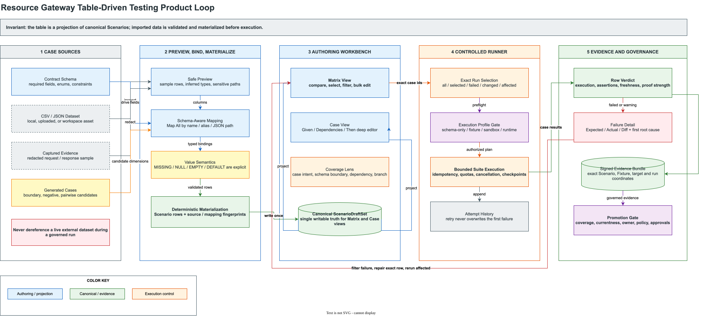

# Resource Gateway 表格驱动测试产品基准、补强设计与实施计划

> 状态：Implementing，Stage 0–4 complete，Stage 5 next
>
> 日期：2026-08-04
>
> 适用范围：Graph Scenario、Operator contract test、built-in Function test、Fixture、suite run、Evidence、promotion gate
>
> 设计自审：`96 / 100`。剩余分数只能由真实用户任务成功率、500+ case 性能数据和两个企业试点发布周期取得

相关文档：

- [表格驱动测试实施状态](resource-gateway-table-driven-testing-implementation-status.md)
- [体验成熟度 95 分校准计划](resource-gateway-ux-maturity-95-recalibration-plan.md)
- [Contract 与 Scenario Authoring 演进计划](resource-gateway-contract-scenario-authoring-evolution-plan.md)
- [测试控制面 API](resource-gateway-testing-control-plane-api.md)
- [Test Kit 设计与使用手册](resource-gateway-test-kit-design-and-user-guide.md)
- [测试运行时隔离 ADR](adr/ADR-001-resource-gateway-test-runtime-isolation.md)
- [Coverage candidate 生成边界 ADR](adr/ADR-005-coverage-candidate-generation-boundary.md)
- [Stage 4 验证记录](resource-gateway-table-driven-testing-stage4-verification.md)

## 0. 执行摘要

Resource Gateway 已经具备工业级表格驱动测试最难的底层条件：形式化 Contract、canonical
Scenario、可控依赖 Fixture、精确 target fingerprint、确定性 suite runner、签名 Evidence、
stale 判断和 promotion policy。当前短板并不是“还不能执行一批 case”，而是这些能力尚未被
组织成成熟商业测试产品已经证明有效的工作流：

1. 用户不能在一个高密度矩阵中比较、筛选、选择和批量运行很多 case；
2. CSV / JSON、历史请求响应和 schema 生成结果不能通过可视化映射快速变成 Scenario；
3. 当前页面擅长编辑单个 case，但不擅长回答“哪些行失败、为什么失败、哪些行受本次改动影响”；
4. coverage、execution、assertion、evidence freshness 和 promotion meaning 尚未成为同一张表上的独立事实；
5. 大批量、跨环境、多人协作和敏感数据治理能力虽然在控制面已有基础，却没有进入表格产品模型。

本方案不复制一个通用电子表格，也不再创建第二套测试资产。核心决策是：

> **表格是 canonical `ScenarioDraftSet` 的批量投影，不是新的权威数据模型；外部数据必须先预览、
> 绑定、校验和物化为带指纹的 Scenario，受治理的运行期绝不直接读取可变 CSV、Excel 或数据库。**

这样既能吸收 Postman、ReadyAPI、Katalon 和 Tricentis Tosca 的成熟经验，又能保留 Resource
Gateway 在 DAG 依赖控制、可回放运行证据和发布门禁上的独特优势。



图源：
[resource-gateway-table-driven-testing-product-loop.drawio](assets/drawio/resource-gateway-table-driven-testing-product-loop.drawio)

## 1. 研究边界与方法

本轮只采用产品官方文档和当前仓库源码作为事实依据，不以二手测评文章代替产品能力证据。
研究问题不是“谁的功能最多”，而是：

- 新用户怎样把一批业务数据变成可执行 case；
- 变量、输入、依赖返回值和预期结果怎样建立可理解的绑定；
- 大批运行后怎样快速从总体结果收敛到第一个可修复根因；
- 怎样选择全部、部分、失败、变更或受影响 case；
- 怎样生成有效边界组合而不制造不可维护的 case 爆炸；
- 怎样让重试、环境、历史和报告不掩盖真实失败；
- 哪些成熟体验可以直接借鉴，哪些会破坏 Resource Gateway 的确定性和治理证据。

### 1.1 研究样本

| 产品 | 选择原因 | 本轮重点 |
|---|---|---|
| Postman Collection Runner | API 测试和团队协作的低门槛代表 | CSV/JSON 导入、预览、iteration、结果历史 |
| SmartBear ReadyAPI | 数据驱动 API 测试的深度代表 | 数据源与步骤分离、属性映射、循环、Transaction Log |
| Katalon Studio | 企业批量测试编排代表 | Data Binding、行选择、多数据集关系、环境、失败重跑 |
| Tricentis Tosca TestCase-Design | 模型化测试设计与覆盖代表 | TestSheet、Attribute、Instance、组合生成和业务相关性 |

这些产品的目标范围并不完全相同。本文只提炼已被重复验证的产品机制，不把其对象模型或 UI
层级原样移植到 Resource Gateway。

## 2. 成熟商业产品的有效经验

### 2.1 Postman：让数据文件成为一次运行的低摩擦输入

Postman 支持在 collection run 中选择 CSV 或 JSON 数据文件，每一行或对象作为一次 iteration；
在执行前可以预览数据，文件列名与请求变量同名即可参与替换。运行结果按 iteration 导航，区分
运行错误与用户断言失败，并保留可排序的历史摘要和结果导出。

官方依据：

- [Run collections using imported data](https://learning.postman.com/docs/tests-and-scripts/running-collections/working-with-data-files/)
- [Test your API using the Collection Runner](https://learning.postman.com/docs/tests-and-scripts/running-collections/intro-to-collection-runs/)

应借鉴：

- 导入后先预览，不让用户盲跑；
- 同名字段自动映射，第一次使用不要求学习表达式语言；
- iteration 是结果导航的一等坐标；
- 总览先显示 passed、failed、skipped、error 和耗时，再展开单次详情；
- 历史、分享和导出属于运行生命周期，不藏在调试日志里。

不应照搬：

- 只按字符串变量名替换不足以表达 DAG dependency、schema 类型和缺失值语义；
- 脚本式断言虽然灵活，但会把可审计业务预期重新藏进代码；
- 本地数据文件若不物化和指纹化，无法成为可重复的治理证据。

### 2.2 ReadyAPI：把数据、绑定、步骤和结果分开

ReadyAPI 明确建议将测试数据与测试步骤分离，并将输入值和验证值一起放在数据源中；它支持
CSV、Excel、数据库、内部表格和生成器，通过 Data Source Loop 重复执行步骤。Property
Expansion 既可手写，也可通过 Get Data 对话框可视化选择。Transaction Log 可以按断言
Pass、Fail、Unknown 过滤，并从一行结果打开请求与响应详情。

官方依据：

- [Basic Concepts of Data-Driven Testing](https://support.smartbear.com/readyapi/docs/en/test-apis-with-readyapi/data-sources-and-data-driven-tests/basic-concepts-of-data-driven-testing.html)
- [Transaction Log Page](https://support.smartbear.com/readyapi/docs/functional/results/transaction.html)

应借鉴：

- 数据源、字段绑定、执行步骤和断言是四个不同概念；
- 输入值与 expected value 同时可由表格列提供；
- 可视化 field picker 优先于要求用户背 property expression；
- 表格总览与单步 request/response 详情形成 master-detail；
- `Unknown / no assertion` 不能被显示成 Passed。

不应照搬：

- Data Source Loop 是执行流程对象，容易让数据循环侵入业务 DAG；Resource Gateway 应在
  运行前物化 case closure，runner 只执行确定的 case 集；
- 任意脚本修改数据会降低指纹稳定性和证据可复现性，必须进入 Advanced 且不可直接晋升。

### 2.3 Katalon：把批量选择、绑定关系和失败重跑工程化

Katalon 的 Data Binding 将 Test Data 和 Variable Binding 分成两张表；用户可以运行全部行、
行范围或指定行，并可按同名字段执行 Map All。多数据集支持 one-to-one、one-to-many 和
many-to-many 关系。suite execution 可以选择环境、设置并行度、超时和重跑策略，结果区分
Passed、Failed、Error、Incomplete 和 Skipped。

官方依据：

- [Manage data binding](https://docs.katalon.com/katalon-studio/data-driven-testing/manage-data-binding)
- [How to execute test cases in Katalon Studio](https://docs.katalon.com/katalon-studio/execute-tests/execute-test-suite-collections-in-katalon-studio/)
- [Analyze Test Suite Reports and Resolve Errors](https://docs.katalon.com/katalon-studio/get-started/sample-projects/webui/webui-analyze-test-suite-reports-and-resolve-errors-in-katalon-studio)

应借鉴：

- 全部、范围、指定行是显式 run selection；
- 同名自动映射后仍允许逐字段纠正；
- 运行环境是运行命令的一部分，不是页面外隐式状态；
- Failed 与 Error 分离，避免把产品缺陷和测试配置错误混为一谈；
- 可以重跑失败 case，但必须保留之前 attempt，而不是改写原结果。

不应照搬：

- many-to-many 笛卡尔积若没有预算预估和上限，会迅速形成 case explosion；
- 自动 retry 不能把不稳定测试包装成绿色结果；Resource Gateway 必须独立呈现首次失败、
  每次 attempt 和最终 verdict；
- 任意并行度不能覆盖副作用、限流和 dependency consumption 语义。

### 2.4 Tricentis Tosca：从“堆行”提升为业务维度与覆盖设计

Tosca TestCase-Design 使用 TestSheet、Attribute、Class 和 Instance 描述业务输入维度与具体值，
再把设计实例化为可执行 TestCase。它支持按关系生成组合，并通过业务相关性减少冗余 case。

官方依据：

- [Work with TestCase-Design](https://documentation.tricentis.com/tosca/1520/en/content/testcase_design/testcase_design_intro.htm)
- [Create Instances using relations](https://documentation.tricentis.com/sap/ect/2024.2/en/content/testcase_design/instance_relations.htm)
- [Create a TestSheet from a TestCase](https://documentation.tricentis.com/sap/ect/2024.2/en/content/testcase_design/create_testsheet_from_tc.htm)

应借鉴：

- 测试数据不只是值列表，还包含业务维度、结果属性和相关性；
- coverage 应指导生成，不应只在运行后报告；
- pairwise、边界和负向 case 应生成候选并解释覆盖贡献；
- 自动生成的 case 与人工 authored case 必须有清楚 provenance。

不应照搬：

- 重型测试设计建模不应成为第一次创建 Scenario 的前置条件；
- 类、实例、关系等专业术语不应占据默认 UI；
- 生成算法不能替代业务 oracle，生成 case 必须经过 expected behavior 确认后才可进入门禁。

### 2.5 跨产品稳定共性

| 已验证模式 | 用户价值 | Resource Gateway 的加强版 |
|---|---|---|
| 一行一个 iteration / case | 批量理解成本低 | 一行一个 canonical Scenario，带 exact target 与 fixture closure |
| 数据与步骤分离 | 维护成本低 | 数据在运行前物化，不让外部数据源进入受治理运行期 |
| 自动同名映射 | 首次配置快 | name、alias、JSON Pointer、schema lineage 四级候选 |
| 表格总览 + 详情 | 扫描与排障兼得 | Matrix 与 Given/Dependencies/Then Case View 双视图 |
| 选择部分数据执行 | 缩短反馈周期 | all、selected、failed、changed、affected 五种精确闭包 |
| 失败筛选与详情 | 快速定位问题 | execution、assertion、freshness、proof strength 四轴 verdict |
| 运行历史与导出 | 团队协作 | 签名 Evidence、deep link、replay 和 promotion gate |
| 组合生成 | 提高覆盖 | schema boundary + dependency behavior + DAG branch 覆盖贡献 |

## 3. Resource Gateway 当前能力与差距

### 3.1 已有基础，不应重做

| 能力 | 当前事实 | 设计结论 |
|---|---|---|
| canonical authoring | `contract-scenario/domain.ts` 已定义 `ScenarioDraftSet`、`ScenarioDraft`、Given、Dependencies、Then | 表格只做 projection，继续单写 Scenario |
| case intent | `GOLDEN / NEGATIVE / BOUNDARY / REGRESSION / PROPERTY` 已存在 | 直接成为筛选、覆盖和生成维度 |
| dependency control | `FixtureRule` 支持 RETURN、THROW、DELAY、TIMEOUT、REPLAY、SPY、DENY、attempt/occurrence 和 consumption | 表格把复杂规则压缩成摘要，Case View 负责深编辑 |
| immutable suite | `TestSuite` 冻结 target、fixture revision、coverage 和 promotion policy | 批量选择必须编译成 exact case closure |
| schema-first editor | `SchemaValueEditor` 已用于 Graph、Operator 和 Function | Matrix cell 与 Case View 必须共享同一 canonical value |
| evidence trust | suite run、child run、签名 evidence、freshness 和 gate 已存在 | 结果列不再发明简化 truth |
| runtime isolation | test profile、fixture store、capability probe 和 ADR 已存在 | Run 前显式显示 profile 与真实调用风险 |
| contract migration | Contract compatibility 与 Scenario migration 已存在 | schema drift 应投影到受影响行和字段 |

### 3.2 当前体验硬伤

| 根因 | 当前表现 | 后果 |
|---|---|---|
| 单 case 编辑器替代批量工作台 | 左侧 case list + 右侧深编辑，缺少可比较矩阵 | 20 个以上 case 难以扫描、选择和找差异 |
| 缺少导入与映射闭环 | case 主要逐个新增或由后端 seed | 已有 CSV/JSON 的团队仍需手工录入 |
| 数据语义不显式 | 空字符串、null、missing、default 容易被视觉控件合并 | 边界 case 可能在不知情时改变语义 |
| run selection 过粗 | 主要是 Run case / Run all | 不能只跑 selected、failed、changed 或 affected |
| 结果信息过度局部化 | 列表 badge 只显示 Schema valid、Runtime passed 或 Failed | 无法在矩阵中比较 assertion、error、stale 和耗时 |
| coverage 只偏治理结果 | coverage policy 在协议中强，authoring 反馈弱 | 用户不知道下一条 case 应补什么 |
| 生成能力缺少产品入口 | schema seed、PROPERTY、mutation 已有分散基础 | 不能以边界和 DAG 路径贡献生成候选 |
| 运行与证据不在同一批量坐标 | 单 case Evidence 强，suite 表格弱 | 很难从 100 行结果回到 exact Scenario 和 dependency |
| 大规模列表策略未形成协议 | 当前组件面向演示规模 | 500+ case 会遇到渲染、运行预算和历史膨胀问题 |

### 3.3 不是表面 UI 问题的病根

1. **比较与编辑是两种任务。** 一个巨型表格无法舒适编辑嵌套 JSON、dependency selector 和
   assertion；只做表单又失去批量比较。必须采用 Matrix + Case 双视图。
2. **外部数据源天然可变。** 若 runner 直接读取文件或数据库，Evidence 无法证明当时究竟用了
   哪些值。必须在 run 前 materialize，并冻结 source、mapping、Scenario 和 Fixture 指纹。
3. **一个绿色状态承载了太多含义。** Schema valid、execution success、assertions passed、
   evidence current 和 promotion eligible 必须分开，否则“能跑”会被误读为“业务正确”。
4. **批量重试会污染真实稳定性。** retry 必须追加 attempt；首次失败、flaky 和最终通过不能被
   合并成一个 Passed。
5. **组合生成会制造熵。** 没有 coverage contribution、预算和 provenance 的生成器只会批量制造
   无人维护的行。

## 4. 产品不变量

### 4.1 单一权威源

```text
Matrix visible cells
  -> canonical Scenario editor commands
    -> ScenarioDraftSet snapshot
      -> exact materialized suite
        -> run request
          -> Evidence coordinates
```

禁止：

- Matrix 保留一套值，Case View 保留另一套值；
- adapter 在 run 时静默补充页面没有显示的业务值；
- Raw JSON 与 schema form 各自保存；
- 外部数据源在 governed run 时重新读取；
- 旧 Evidence 在 Scenario、Contract、Fixture 或 target 变化后继续显示绿色。

### 4.2 表格是投影，不是协议真相

`ScenarioTableProjection` 是可重建 view model。列顺序、pin、宽度、隐藏状态、筛选和排序属于
用户偏好，不进入业务 fingerprint。业务值、case intent、dependency behavior 和 assertion
始终写回 canonical Scenario。

### 4.3 数据先物化，后执行

```text
external source
  -> bounded preview
  -> schema-aware mapping
  -> row validation
  -> explicit materialization receipt
  -> canonical Scenarios
  -> exact suite revision
  -> controlled run
```

受治理运行只接受 immutable Scenario / Fixture 引用，不接受文件路径、SQL、远程 URL 或
“latest dataset”。

### 4.4 结果四轴分离

| 轴 | 状态示例 | 回答的问题 |
|---|---|---|
| Execution | NOT_RUN / QUEUED / RUNNING / SUCCESS / ERROR / TIMEOUT / SKIPPED / CANCELLED | 是否执行完成 |
| Assertions | NONE / PASSED / FAILED / INCONCLUSIVE | 业务预期是否成立 |
| Freshness | CURRENT / STALE / SUPERSEDED | 结果是否仍对应当前内容 |
| Proof strength | SCHEMA / MOCK / SANDBOX / RUNTIME / CERTIFIABLE | 这次结果究竟证明了什么 |

Promotion 不是第五个绿色 badge，而是以上事实加 coverage、owner、policy 和 approval 的派生结果。

### 4.5 生产隔离默认关闭危险能力

- production profile 默认不允许 fixture override、logical clock、random seed 和 payload replay；
- test profile 必须由 capability probe 明确广告，并绑定独立认证、存储和审计；
- `REAL` dependency 必须在 Run 前显示目标环境、side effect、owner 和预算；
- UNKNOWN / WRITE effect 默认串行，不能自动并行；
- fixture waiver、ALLOW_REAL 和 fallback-to-real 使 Evidence 降级，不能静默 certifiable。

## 5. 目标产品体验

### 5.1 入口与模式

在 Author 的 **Scenarios** 工作面和 Libraries 的 Operator / Function 测试入口中统一提供：

```text
[Matrix] [Case] [Coverage]
```

- **Matrix**：比较、选择、筛选、批量编辑和批量运行；
- **Case**：复用现有 Given / Dependencies / Then schema-first 深编辑；
- **Coverage**：展示缺失 case intent、schema boundary、dependency behavior、branch/edge 和 assertion。

三个模式只改变 projection，不改变当前 target、Scenario selection 或 canonical state。

### 5.2 Matrix 页面结构

```text
Target / exact revision / environment / proof profile

Search | Type | Status | Tags | Changed | Affected | Columns | Add cases

select | Status | Case | Type | Given... | Controlled dependencies | Then... | Proof | Duration | Actions
------ | ------ | ---- | ---- | -------- | ----------------------- | ------- | ----- | -------- | -------
[ ]    | Failed | ...  | Gold | 3 fields | 2 RETURN, 1 TIMEOUT     | 4 asserts | Mock | 183 ms | ...

12 selected                         Run selected | Run menu | Cancel
```

信息密度规则：

- 第一列 checkbox、Status、Case name 始终 sticky；
- 默认最多展开 3 个 Given 字段和 3 个 Then 字段，其他字段由 Columns 选择；
- Dependencies 默认显示行为摘要，不把嵌套 selector 和 payload 塞进 cell；
- Proof、Freshness、Assertion 分列，不显示裸 Passed；
- 单击 cell 就地编辑简单 scalar；双击或 Enter 打开 schema-aware popover；
- object、array、union、dependency 和多 assertion 使用右侧 Case sheet；
- 行高固定为 compact / comfortable 两档，不因错误详情撑开全表；
- 第一失败原因在行下方可展开，完整 trace 进入 Evidence。

### 5.3 Add cases 菜单

| 入口 | 默认用途 | 产生的 provenance |
|---|---|---|
| Blank case | 手工描述一个业务 case | AUTHORED |
| From schema example | 快速得到合法输入 | GENERATED_SCHEMA |
| Import CSV / JSON | 迁移存量表格数据 | IMPORTED + source fingerprint |
| From captured run | 把真实样本转成脱敏回归候选 | CAPTURED + evidence ref |
| Duplicate selected | 基于相近 case 改边界 | DERIVED + source case id |
| Boundary candidates | required、min/max、enum、null/missing | GENERATED_BOUNDARY |
| Combination candidates | pairwise / constrained combinations | GENERATED_COMBINATION |
| Mutation survivors | 为幸存编排 mutation 补 oracle | GENERATED_MUTATION_GAP |

自动生成只创建 **candidate**。缺少 expected behavior 或存在 schema inference gap 时不得直接进入
promotion-required suite。

### 5.4 CSV / JSON 导入向导

#### Step 1：Select source

- 本地 CSV / JSON；
- workspace 内已有 snapshot；
- 从剪贴板粘贴；
- 从历史 Evidence 选择已脱敏 payload；
- 首期不支持运行时 JDBC 或远程 URL。

#### Step 2：Preview safely

- 只展示有界 sample rows；
- 显示总行数、列数、编码、分隔符、解析 warning；
- 自动识别疑似 secret / PII path 并遮罩；
- 上传前说明 retention 和 classification；
- 文件过大、嵌套深度过高或列数超限时 fail closed。

#### Step 3：Map columns

绑定目标按以下分组：

- `Given > input path`；
- `Dependencies > dependency > selector / behavior / output`；
- `Then > assertion path / expected value / tolerance`；
- `Case > name / type / tags / description`。

自动映射优先级：

1. exact path；
2. exact name；
3. declared alias；
4. normalized name；
5. lineage-compatible candidate；
6. 未映射。

任何非 exact 自动映射都显示 confidence 和原因，用户必须确认 low-confidence binding。

#### Step 4：Define value semantics

每个绑定显式选择：

| 源值 | 行为 |
|---|---|
| 列缺失 | MISSING，不创建字段 |
| 空 cell | EMPTY_STRING、NULL、MISSING 或 USE_DEFAULT，首次必须确认 |
| 字符串 `null` | 默认是字符串，不自动转 null |
| 非法类型 | 阻断该行或应用显式 converter |
| 未映射列 | Ignore、Tag、Metadata 或新增 binding |

converter 必须是声明式、版本化和可指纹化的有限集合。任意脚本转换进入 Advanced，生成的
Evidence 不能直接 certifiable。

#### Step 5：Validate and estimate

导入前给出：

- 可物化、warning、blocked 行数；
- 将生成的 Scenario 数；
- combination expansion 后的最大 work units；
- classification 与 retention；
- Contract required field 缺口；
- dependency unmatched / unused 风险；
- 与现有 case id 的覆盖、合并或冲突策略。

#### Step 6：Materialize

生成 canonical Scenarios 和 receipt，receipt 至少包含：

```text
sourceFingerprint
mappingFingerprint
contractFingerprint
targetFingerprint
rowCount
acceptedRowCount
rejectedRowCount
rowIdentityPolicy
materializedScenarioIds
actor / timestamp / classification
```

运行期只引用物化后的 Scenario 和 Fixture，不引用原始文件。

### 5.5 批量运行

Run menu 固定提供：

- Run all；
- Run selected；
- Run failed；
- Run changed since last current evidence；
- Run affected by Contract / operator / dependency change。

点击前显示 preflight：

| 项目 | 必须回答 |
|---|---|
| Selection | exact case 数、selection fingerprint |
| Target | graph/operator/function exact revision 与 fingerprint |
| Environment | test / sandbox / runtime；region 与 tenant |
| Dependency mode | controlled、real、waived、fallback-to-real 数量 |
| Side effects | PURE / READ / WRITE / UNKNOWN；是否可并行 |
| Budget | 最大 case、work unit、并发、耗时、payload retention |
| Promotion meaning | exploratory、test-evidenced、gate-eligible |

默认策略：

- PURE 且所有 dependency controlled 才允许自动并行；
- READ 需要环境 policy；
- WRITE / UNKNOWN 默认串行并要求显式确认；
- 失败重跑创建新 attempt，不改写旧 attempt；
- “Run failed”依据 exact previous run selection，不依据当前页面偶然可见的红色行；
- partial selection 可以产生调试 Evidence，但只有满足 suite coverage closure 的运行才可 gate-eligible。

### 5.6 运行中体验

- 表头显示 queued、running、passed、failed、error、skipped、cancelled；
- 每行独立进度，不因排序改变 execution coordinate；
- Cancel 停止尚未开始的 case，并对运行中 case 执行受控 cancellation；
- 前端断线后通过 runId 恢复，不要求重新发起；
- 大批量运行使用增量 event / cursor，不轮询整个结果；
- 达到失败阈值可停止后续 case，但必须把剩余行标为 SKIPPED / BUDGET_STOPPED；
- timeout、quota、capability mismatch 和 assertion failed 使用不同状态。

### 5.7 结果与修复

默认结果层级：

1. suite verdict 与 proof strength；
2. failure / error / stale 分组；
3. 第一个 root cause 与业务影响；
4. Expected / Actual / Diff；
5. dependency consumption、node/edge trace；
6. exact Scenario、Fixture、target、run 和 attempt 坐标；
7. signed raw bundle。

矩阵支持：

- filter failed / error / stale / no assertion / flaky；
- compare current run 与 baseline run；
- open exact Case；
- focus exact dependency / node / assertion；
- accept actual as expected，但必须显示 diff、理由和 review 状态；
- rerun affected；
- create defect / governance handoff deep link；
- export payload-free summary 或按权限导出脱敏 evidence。

禁止一键批量“Accept all actual as expected”。这会把真实回归批量洗成绿色。

### 5.8 Coverage 模式

Coverage 不是单一百分比，至少拆成：

| 维度 | 示例 |
|---|---|
| Case intent | GOLDEN、NEGATIVE、BOUNDARY、REGRESSION、PROPERTY |
| Contract field | required、enum、min/max、nullable、union branch |
| DAG structure | node、edge transfer、decision rule、fallback、retry |
| Dependency behavior | RETURN、ERROR、TIMEOUT、REPLAY、MUST_NOT_CALL |
| Assertion | output、node status、edge transfer、invocation、governance expectation |
| Evidence | schema-only、mock、sandbox、runtime、certifiable |

点击 coverage gap 可以生成候选 case，但必须展示：为什么生成、预计新增多少行、覆盖什么、是否
需要人工补 expected behavior。

## 6. 产品与协议模型

### 6.1 保留的权威实体

- `ContractDraft`：输入、输出、错误和执行语义；
- `ScenarioDraftSet`：可编辑测试意图；
- `FixtureBundle`：不可变 dependency control 与 assertions；
- `TestSuite`：不可变 target-bound case closure；
- `TestRunEvidence / TestSuiteRunEvidence`：运行事实；
- promotion policy / gate：治理结论。

表格设计不能绕过这些对象。

### 6.2 新增投影，不新增第二套业务事实

```ts
interface ScenarioTableProjection {
  schemaVersion: 'bloge.scenarioTableProjection.v1';
  target: ExactTargetRef;
  contractFingerprint: string;
  scenarioDraftSetRevision: number;
  columns: ScenarioTableColumn[];
  rows: ScenarioTableRow[];
  projectionFingerprint: string;
}

interface ScenarioTableColumn {
  columnId: string;
  group: 'CASE' | 'GIVEN' | 'DEPENDENCY' | 'THEN' | 'PROOF';
  path: string;
  valueKind: string;
  editable: boolean;
  source: 'CONTRACT' | 'SCENARIO' | 'EVIDENCE' | 'USER_PREFERENCE';
}
```

`ScenarioTableProjection` 可由 Scenario、Contract 和最新 Evidence 重建。用户偏好的列宽、隐藏、
pin、排序与筛选单独保存，不进入 `projectionFingerprint` 和业务 fingerprint。

### 6.3 导入与物化协议

导入过程分为 ephemeral preview 与 durable receipt：

```ts
interface ScenarioMaterializationPlan {
  schemaVersion: 'bloge.scenarioMaterializationPlan.v1';
  source: {
    kind: 'CSV' | 'JSON' | 'CAPTURED_EVIDENCE' | 'GENERATED';
    fingerprint: string;
    classification: string;
  };
  target: ExactTargetRef;
  contractFingerprint: string;
  bindings: ScenarioColumnBinding[];
  valueSemantics: Record<string, 'VALUE' | 'NULL' | 'MISSING' | 'EMPTY' | 'DEFAULT'>;
  rowSelection: string[];
  conflictPolicy: 'FAIL' | 'APPEND' | 'REPLACE_EXACT_ID';
  budget: { maxRows: number; maxColumns: number; maxBytes: number };
  planFingerprint: string;
}
```

服务端依据 exact plan 物化 Scenario，并返回 `ScenarioMaterializationReceipt.v1`。同一个 source、
mapping、Contract、target 和 selection 重试必须幂等；任一 fingerprint 漂移返回 `409`，不得生成
半新半旧的 case。

### 6.4 精确批量运行命令

```ts
interface TableSuiteRunCommand {
  schemaVersion: 'bloge.tableSuiteRunCommand.v1';
  suiteRef: { suiteId: string; revision: number; fingerprint: string };
  selection: {
    mode: 'ALL' | 'SELECTED' | 'FAILED' | 'CHANGED' | 'AFFECTED';
    caseIds: string[];
    baselineRunId: string;
    selectionFingerprint: string;
  };
  executionProfileRef: string;
  environmentRef: string;
  concurrency: number;
  stopPolicy: { maxFailures: number | null };
  clientRequestId: string;
}
```

服务端必须将 predicate 解析为 exact ordered case id closure 后再接受命令。Evidence 永远记录
实际 closure，不能只记录 `FAILED` 之类可随时间变化的谓词。

### 6.5 行级证据投影

```ts
interface TableCaseEvidenceProjection {
  caseId: string;
  runId: string;
  attempt: number;
  executionStatus: string;
  assertionStatus: string;
  freshness: string;
  proofStrength: string;
  durationMs: number | null;
  firstFailure: {
    category: string;
    target: string;
    message: string;
    remediationActionId: string;
  } | null;
  evidenceRef: { id: string; fingerprint: string };
}
```

此对象只携带 payload-free summary。Expected、Actual、request/response 和 dependency payload
继续通过现有 Evidence 权限边界按需获取和脱敏。

### 6.6 指纹闭包

```text
materializationFingerprint = hash(
  sourceFingerprint,
  mappingFingerprint,
  contractFingerprint,
  targetFingerprint,
  selectedRowIds,
  converterVersions
)

runSelectionFingerprint = hash(
  suiteFingerprint,
  orderedCaseIds,
  executionProfileRef,
  environmentRef,
  runPolicy
)

evidenceMaterialFingerprint = hash(
  targetFingerprint,
  contractFingerprint,
  scenarioFingerprints,
  fixtureFingerprints,
  runSelectionFingerprint,
  effectiveExecutionPlanFingerprint
)
```

## 7. 工业级非功能设计

### 7.1 确定性与可复现

- 文件编码、CSV dialect、timezone、locale、decimal 和 date format 必须进入 plan；
- row id 使用显式主键列或 canonical row hash，不使用可变化的行号作为唯一身份；
- schema default 的应用必须可见并进入 materialized Scenario；
- generated case 固定 generator version、seed、constraint 和 candidate order；
- runner 不读取 `latest` Contract、Fixture、dataset 或 operator；
- rerun 产生新 run/attempt，但沿用 exact material closure。

### 7.2 数据安全

- 浏览器预览和日志不记录原始 payload；
- 上传前和服务端二次执行敏感字段检测；
- classification 决定存储、导出、Evidence payload 和 retention；
- secret 只能绑定 secretRef，不可作为普通 cell 持久化；
- CSV formula injection、超深 JSON、zip bomb、超长 cell、恶意编码和 spreadsheet formula
  必须在 parser 边界拒绝或转义；
- 导出 CSV 时所有以 `= + - @` 开头的 cell 按安全策略处理；
- 原始数据文件与 materialized Scenario 分离加密，删除原文件不破坏已批准 Evidence 的坐标。

### 7.3 多租户与权限

- preview、mapping、materialize、run、payload view、accept actual 和 promotion 使用独立权限；
- tenant、organization、project、environment、region 五维 scope 与现有 Scenario 对齐；
- case owner、suite owner、fixture owner 和 runtime owner 可以不同；
- bulk edit、bulk delete、accept actual、ALLOW_REAL 和 waiver 必须审计；
- 无权限用户仍可看到 payload-free blocker、owner 和申请路径，不显示失效按钮。

### 7.4 大规模与性能

| 规模 | 产品策略 |
|---|---|
| <= 100 case | 客户端完整 Matrix，实时 schema feedback |
| 101–500 case | 虚拟化行、延迟详情、增量 Evidence |
| 501–10,000 case | 服务端筛选/排序/分页，异步 materialization 与 suite run |
| > 10,000 case | 拆分 governed suite、按标签/风险分片，不承诺单表全量编辑 |

预算至少限制：源字节、行、列、cell 字节、嵌套深度、Scenario 数、fixture rule、assertion、
组合展开 work unit、并发、运行时长和 Evidence retention。

### 7.5 并发与协作

- Matrix 编辑使用 exact revision + optimistic concurrency；
- bulk command 带 base revision 和 affected case ids；
- 409 conflict 返回行/字段级 diff，不让最后写入者静默覆盖；
- 评论与 review 绑定 case/assertion coordinate，不绑定可变化的行号；
- imported dataset 更新先生成 diff 和 impacted Scenario，不自动替换现有 suite；
- shared column preference 不进入业务版本，个人 preference 不制造 revision noise。

### 7.6 可访问性与键盘效率

- 使用语义 grid / table，header、row、cell 和 selection 有完整 ARIA；
- Space 选择行，Enter 编辑，Escape 取消，Cmd/Ctrl+Enter 运行当前选择；
- 不只用颜色表达状态；
- 200% zoom 下 sticky columns 与 command bar 不遮挡内容；
- 横向滚动时保持 Case、Status 和当前 edit target 可见；
- screen reader 宣读“Runtime success, assertions failed, evidence current”，不朗读裸绿色。

## 8. 针对性工程实施计划

### Stage 0：基线与协议冻结

> 周期：3–4 天

交付：

- 固定 5、50、500 case 三档 benchmark fixture；
- 记录当前创建、编辑、Run all、找首个失败的 P50/P75；
- 冻结 Scenario、Fixture、Suite、Evidence adapter contract tests；
- 建立 `execution / assertion / freshness / proof` 统一 vocabulary；
- 对本方案的新增 protocol 分别写 compatibility test skeleton。

退出门槛：现有 Graph、Operator、Function demo 行为与指纹均有 golden；后续 UI 重构不能改变
canonical payload。

### Stage 1：Matrix + Case 双视图

> 周期：1.5–2 周

工作项：

| ID | 工作项 | 主要输出 |
|---|---|---|
| TDT-101 | ScenarioTableProjection | 从 Contract、Scenario、Evidence 生成稳定列与行 |
| TDT-102 | Matrix Surface | sticky columns、筛选、排序、selection、列选择 |
| TDT-103 | Shared edit commands | Matrix cell 与 Case View 共用 canonical command |
| TDT-104 | Four-axis status | execution/assertion/freshness/proof 独立列 |
| TDT-105 | Batch commands | Run all / selected / failed 的前端 exact selection |
| TDT-106 | Library adapters | Operator / Function 旧测试表投影同一 Matrix |
| TDT-107 | Accessibility | grid keyboard、focus、screen reader |

推荐前端边界：

```text
author/scenarios/table/
  ScenarioMatrixSurface
  ScenarioMatrixToolbar
  ScenarioColumnProjection
  ScenarioRowProjection
  ScenarioSelectionModel
  ScenarioCellEditor
  ScenarioStatusCells
  ScenarioBulkActions
```

`AssetTestTable.tsx` 和 `ContractScenarioWorkspace.tsx` 不继续吸收 grid 逻辑，只保留迁移 adapter
和 Case editor。对于排序、筛选、列状态和虚拟化，优先采用成熟 headless table/virtualization 库，
业务值写回仍由本地 canonical commands 控制。

退出门槛：

- 50 case 可在一个页面比较；
- Matrix 与 Case 来回切换零值漂移；
- 选择、排序或筛选不改变 exact run closure；
- 结果不再显示裸 Passed；
- 1280、1024、820 可编辑，390 为 review-first；
- 现有 operator/function demo 全部可运行。

### Stage 2：CSV / JSON 导入与 schema mapping

> 周期：2 周

工作项：

| ID | 工作项 | 主要输出 |
|---|---|---|
| TDT-201 | Bounded parser | CSV/JSON 安全解析、编码和预算 |
| TDT-202 | Preview model | sample rows、类型、敏感路径、warning |
| TDT-203 | Mapping workbench | Map All、field picker、confidence、converter |
| TDT-204 | Value semantics | missing/null/empty/default 明确选择 |
| TDT-205 | Materialization plan | exact source/mapping/contract/target closure |
| TDT-206 | Idempotent materializer | canonical Scenario + receipt |
| TDT-207 | Import diff | 更新数据源时显示 added/changed/removed rows |

解析器不得使用手写字符串切分。CSV 使用经过广泛验证、支持 quoted field、encoding 和 row limit
的解析库；JSON 使用标准 parser 并在解析前后执行 byte/depth/item bounds。

退出门槛：

- 50 行 CSV 从选择到生成可运行 Scenario 的 P75 小于 3 分钟；
- exact-name 自动映射成功率 >= 95%；
- empty/null/missing 语义测试全覆盖；
- 同一个 plan 重试返回同一 receipt；
- 原文件变化、Contract 变化或 mapping 变化触发新 fingerprint；
- 任何 raw payload 不进入日志、遥测和 Problem response。

### Stage 3：精确批量运行与行级 Evidence

> 周期：2 周
>
> 实施状态（2026-08-04）：complete。Matrix 已切换到服务端权威 batch；浏览器只提交冻结的
> Graph/Contract/Scenario/selection closure 并消费 payload-free delta。`all / selected / failed /
> changed / affected`、preflight、hard timeout、failure budget、cancel、append-only retry、flaky、
> complete-baseline compare、partial promotion 阻断与刷新恢复均已落地。真实浏览器验证还修复了
> control-plane purpose 漂移、跨 JVM 数字类型误判相等、空差分请求暴露 400 三个系统性缺陷。

工作项：

| ID | 工作项 | 主要输出 |
|---|---|---|
| TDT-301 | Exact selection resolver | selected/failed/changed/affected -> ordered case ids |
| TDT-302 | Run preflight | environment、effect、dependency mode、budget |
| TDT-303 | Incremental run events | row progress、resume、cancel |
| TDT-304 | Attempt history | retry append-only、flaky projection |
| TDT-305 | Row Evidence projection | payload-free verdict 与 first failure |
| TDT-306 | Baseline compare | Expected/Actual/Diff 与 current/baseline run |
| TDT-307 | Promotion semantics | partial selection 与 full closure 分离 |

退出门槛：

- 网络刷新后能按 runId 恢复到同一行进度；
- Run failed 不会因当前 filter 改变 case closure；
- timeout、assertion failed、runtime error、cancelled、budget stopped 明确区分；
- retry 不覆盖首次失败；
- partial run 不能错误满足 full-suite gate；
- 500 case 结果首屏增量可见，页面不等待整批完成。

### Stage 4：Coverage-guided generation

> 周期：2 周
>
> 实施状态：**Complete**。六维可解释 denominator、schema/error/dependency 确定性候选、
> source fingerprint、seed/work budget、显式 Accept/Reject 和 generator SPI 已落地；pairwise
> adapter 按 ADR 有意保持未安装，不用自研算法伪装成组合覆盖。

工作项：

| ID | 工作项 | 主要输出 |
|---|---|---|
| TDT-401 | Coverage lens | case/contract/DAG/dependency/assertion/evidence 六维 |
| TDT-402 | Boundary generator | required、null、min/max、enum、union |
| TDT-403 | Negative generator | error contract、invalid input、MUST_NOT_CALL |
| TDT-404 | Combination SPI | pairwise + constraints + budget estimate |
| TDT-405 | DAG path contribution | branch、edge、fallback、retry gap |
| TDT-406 | Candidate review | provenance、expected behavior、accept/reject |

首期先实现 deterministic schema boundary 和已知 dependency behavior 模板；pairwise 通过独立
generator SPI 落地，在 ADR 中验证算法正确性、稳定 order、constraint support 和维护状态后再选库。
不在核心 Scenario compiler 中手写不可验证的组合算法。

退出门槛：

- 每个候选都解释 coverage contribution；
- 生成前显示最大 case/work unit；
- 相同输入、版本和 seed 生成相同顺序；
- 没有 expected behavior 的候选不能 promotion；
- 删除 generated case 不会在下次打开页面时偷偷再生成。

实现额外冻结了两条边界：Coverage Lens 是 authoring planning projection，不是 signed runtime
coverage evidence；Accept 只把候选变成 canonical Scenario draft，缺少业务 assertion 时仍然
`Needs oracle / promotionEligible=false`。严格协议见
[Coverage Projection v1](schemas/bloge-coverage-projection-v1.schema.json) 与
[Coverage Candidate Set v1](schemas/bloge-coverage-candidate-set-v1.schema.json)。

### Stage 5：企业协作与规模化

> 周期：2–3 周

工作项：

- 500+ 行 server-side query 与虚拟化；
- bulk edit optimistic concurrency 与 conflict diff；
- dataset/suite owner、review、approval、retention；
- saved views 与 team views，且不污染业务 revision；
- payload view/export 细粒度 RBAC；
- event/webhook：suite changed、run completed、evidence stale、gate changed；
- ANEKE workbook 映射、deep link 和 gate feedback；
- two-release-cycle 真实企业 pilot。

退出门槛：

- 两位用户并发编辑不会静默覆盖；
- 10,000 case suite 能按分片运行、恢复和导出 payload-free summary；
- retention 到期后 summary、attestation 和 payload availability 状态诚实；
- ANEKE 可以从一条失败行回到 exact target/scenario/run；
- 两个真实团队连续两个发布周期完成门禁闭环。

## 9. 测试策略

### 9.1 模型与协议测试

- Matrix projection 对同一 canonical input 确定；
- user preference 不改变 business fingerprint；
- Matrix cell / Case form / Advanced JSON 三向 round trip；
- import plan canonicalization、fingerprint 与 idempotency；
- selection predicate 解析为 exact ordered closure；
- evidence coordinate 与 Scenario / Fixture / target / plan 完全相等；
- v1 Scenario 和现有 operator/function table adapter 无损。

### 9.2 数据边界测试

- quoted CSV、embedded newline、BOM、UTF-8、非法编码、重复 header；
- null、missing、empty、default、字符串 `null`；
- 超大文件、超长 cell、超深 JSON、超多列；
- CSV formula injection、secret、PII、malformed JSON；
- duplicate row key、unstable row order、conflict policy；
- source、mapping、Contract 或 target 在 materialize 中途漂移。

### 9.3 运行与失败测试

- all、selected、failed、changed、affected；
- filter/sort 变化不影响已接受 closure；
- partial run、cancel、timeout、quota、server restart、client reconnect；
- retry append-only 与 flaky detection；
- fixture unmatched/unused/exhausted/fallback-to-real；
- side-effect profile 并行阻断；
- stale evidence 与 schema migration。

### 9.4 浏览器与视觉测试

视口：1440、1280、1024、820、390。

规模：5、50、500 case；至少包含 20 个 Given 字段、8 个 dependency、12 个 assertion。

断言：

- sticky 列不覆盖 cell；
- 横向与纵向滚动后 header、selection 和 focus 坐标正确；
- keyboard selection/edit/run 可完成；
- 200% zoom 无内容遮挡；
- status 不依赖颜色；
- Matrix 和 Case 切换值不漂移；
- failure filter 后首个 root cause 可在 3 次操作内打开；
- 500 行滚动和事件更新无明显掉帧。

## 10. 量化产品目标

| 任务 | P75 | 成功率 | 求助 |
|---|---:|---:|---:|
| 从 schema 新建 3 个 meaningful case | < 5 分钟 | >= 95% | 0 |
| 导入并映射 50 行 CSV | < 3 分钟 | >= 90% | <= 1 |
| 从 50 行中选择并运行 7 行 | < 45 秒 | >= 95% | 0 |
| 判断失败是 execution 还是 assertion | < 30 秒 | >= 95% | 0 |
| 定位首个 dependency 根因 | < 2 分钟 | >= 90% | <= 1 |
| 只重跑受影响 case | < 60 秒 | >= 90% | <= 1 |
| 判断结果是否可用于 promotion | < 45 秒 | >= 95% | 0 |

行为遥测只能记录 payload-free 事件：mode、row count bucket、mapping result code、run selection
mode、status count、time-to-first-run、time-to-first-root-cause、advanced JSON opened、conflict 和
remediation action。禁止记录列名、字段 path、业务值、DSL、Expected/Actual 和 payload。

## 11. 关键决策与拒绝方案

### D1：Matrix 是 Scenario projection

选择理由：避免第二套测试真相和双向同步。拒绝独立 `TableTestSuite` authoring model。

### D2：导入数据先物化

选择理由：保证 Evidence 可重复、可签名、可回放。拒绝 governed run 动态读取文件、数据库和 URL。

### D3：Matrix + Case 双视图

选择理由：批量比较与复杂深编辑是不同任务。拒绝把嵌套 dependency/JSON 全塞进 cell，也拒绝
只有单 case 表单。

### D4：重试保留完整 attempt

选择理由：稳定性是业务正确性的一部分。拒绝用最终通过覆盖首次失败。

### D5：Coverage-guided candidate，不自动造 oracle

选择理由：生成算法能发现输入组合，不能替业务定义正确结果。拒绝自动生成并直接 promotion。

### D6：partial run 不等于 full-suite evidence

选择理由：局部反馈快不代表覆盖闭合。拒绝 selected run 满足 require-all-cases gate。

### D7：默认不支持 live JDBC data source

选择理由：它引入凭证、网络、可变数据、时间窗口和重放问题。企业确有需要时，应新增
“snapshot connector”，其输出仍必须是不可变 snapshot，而不是 runner 内部连接数据库。

## 12. 自审结果

| 维度 | 分数 | 说明 |
|---|---:|---|
| 行业证据 | 10 / 10 | 四类成熟商业产品，均使用官方文档 |
| 产品模型 | 15 / 15 | Matrix/Case/Coverage 分工清楚，Scenario 单一真相 |
| 易用性 | 14 / 15 | 导入、Map All、批量选择、失败修复闭环完整；待用户验证 |
| 协议一致性 | 15 / 15 | 与 Contract、Fixture、Suite、Evidence 现状相容 |
| 正确性与证据 | 15 / 15 | materialization、selection、evidence 三层指纹闭包 |
| 企业安全治理 | 14 / 15 | 隔离、RBAC、PII、retention、审计完整；待真实合规审查 |
| 规模与运维 | 8 / 10 | 明确分级、预算、恢复；缺真实 10,000 case 数据 |
| 可实施性 | 5 / 5 | 分阶段、文件边界、退出门槛和测试矩阵明确 |
| **合计** | **96 / 100** | 达到工程开工标准，不能用自评分替代 E3/E4 证据 |

开工顺序必须是 `Stage 0 -> Stage 1 -> Stage 2 -> Stage 3`。不要先做 pairwise、AI 生成或
JDBC connector；如果 Matrix、物化和 exact selection 三个根基没有稳定，后续能力只会放大
不可见状态和错误证据。
