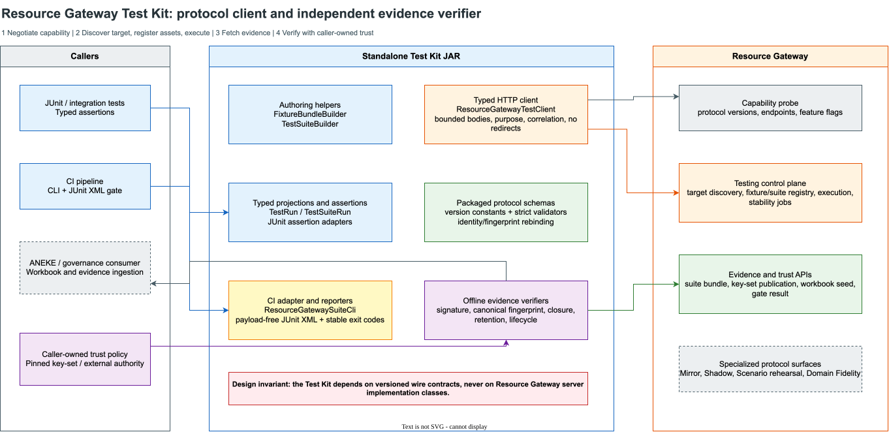

# Resource Gateway Test Kit 整体设计与使用手册

> 适用版本：`bloge-resource-gateway-test-kit 1.0.0`  
> 适用读者：业务测试开发、平台工程师、CI/CD 维护者、ANEKE/治理系统集成者  
> 最短阅读路径：先读第 1、3、5、6、9 节，专项协议使用者再读第 11 节

## 1. Test Kit 到底解决什么问题

Resource Gateway 已经能够把 Graph、Operator、Fixture、TestSuite、Run Evidence 和
治理证据协议化。但直接调用服务端 API 仍有四类成本：

1. 调用方必须自己拼装版本化 JSON，并理解大量 fingerprint、revision 和 target 约束。
2. HTTP 成功不等于响应可信；客户端还要校验 Schema、版本、请求响应身份和内容指纹。
3. “测试通过”不等于“可发布”；coverage、promotion、签名和信任根是不同判断。
4. CI 输出不能泄露业务 payload、凭证或问题详情，同时还要保留可定位的错误码和
   correlation id。

Test Kit 的职责就是把这些容易出错、且不应由每个业务团队重复实现的工作收口成一个
独立 Java 库和 CLI：

```text
业务测试意图
  -> Schema 完整的 Fixture / TestSuite
  -> 精确绑定的 Resource Gateway 请求
  -> 类型化运行结果
  -> 独立证据校验
  -> JUnit 断言或 CI 门禁结果
```

它不是 Resource Gateway 的内嵌 SDK，也不是另一个测试平台。它是：

- **协议客户端**：只依赖版本化 wire contract，不依赖服务端实现类。
- **测试资产构建器**：帮助调用方生成严格、默认 fail-closed 的 Fixture 和 TestSuite。
- **独立验证器**：不相信“服务端说自己正确”，而是重新验证 Schema、指纹、签名和闭包。
- **CI 适配器**：把治理测试结果转换为稳定退出码和 payload-free JUnit XML。

### 1.1 不负责什么

| 不属于 Test Kit 的职责 | 正确归属 |
| --- | --- |
| 设计 Graph 或 Operator | Resource Gateway visual authoring / DSL |
| 保存业务算子实现 | 业务代码库和 Operator Library |
| 决定发布审批流程 | ANEKE 或企业发布门禁 |
| 代替企业 OIDC、mTLS、KMS/HSM | 企业身份和密钥基础设施 |
| 在客户端信任服务端自报的公钥 | 调用方自持的 trust policy / key-set pin |
| 在生产环境注入 Fixture | Resource Gateway 的环境与 purpose 隔离会阻止该行为 |

## 2. 架构和信任边界



图源文件：
[`assets/drawio/resource-gateway-test-kit-architecture.drawio`](assets/drawio/resource-gateway-test-kit-architecture.drawio)

架构中最重要的不是类数量，而是三条边界：

1. **服务端实现边界**：Test Kit 不导入 Resource Gateway 实现类，只消费打包的 JSON
   Schema 和版本化 HTTP 协议，因此二者可以独立升级和发布。
2. **在线调用与离线验证边界**：HTTP client 负责拿到资产，Verifier 负责独立证明资产是否
   可被信任；“请求成功”不能替代“证据验证成功”。
3. **信任根边界**：release-grade 验证使用调用方从独立渠道固定的 key-set fingerprint
   或外部 authority。不能从待验证响应中同时取得证据和最终信任根。

### 2.1 内部分层

| 层 | 主要类型 | 职责 |
| --- | --- | --- |
| Transport | `ResourceGatewayTestClient` | 认证、purpose、correlation、超时、body 上限、HTTP/问题响应处理 |
| Authoring | `FixtureBundleBuilder`、`TestSuiteBuilder` | 生成 Schema 完整且默认严格的测试资产 |
| Projection | `TestRun`、`TestSuiteRun`、`TestSuiteStabilityRun` | 把响应投影为稳定 Java 类型 |
| Validation | `TestingProtocolSchemaValidator`、各类 protocol verifier | 校验 Schema、版本、指纹、身份与闭包 |
| Trust | `TestSuiteEvidenceVerifier`、`EvidenceKeySetTrustVerifier` 等 | 验证签名、key lifecycle 和调用方 pin |
| Test adapter | `TestRunAssertions`、`TestSuiteRunAssertions` | 提供 JUnit 5 语义断言 |
| CI adapter | `ResourceGatewaySuiteCli`、`JUnitXmlReportWriter` | 稳定退出码和 payload-free JUnit XML |
| Specialized verifier | Mirror、Shadow、Scenario、Fidelity 系列 verifier | 验证专项治理协议，不参与普通 Suite 主路径 |

## 3. 先选对使用路径

不要从类名列表开始学习。先判断你的任务属于哪一条路径。

| 目标 | 推荐入口 | 是否需要注册资产 | 是否适合发布门禁 |
| --- | --- | ---: | ---: |
| 快速验证一张 Graph | inline Fixture + `execute` | 否 | 否，属于 exploratory |
| 快速验证单个 Operator | inline Fixture + `executeOperator` | 否 | 否 |
| 建立可重复业务回归 | Fixture registry + TestSuite registry | 是 | 是 |
| 验证多次运行稳定性 | `executeSuiteStability` 或 stability job | 是 | 是，需验签 |
| 在 CI 执行已有 Suite | `ResourceGatewaySuiteCli` | 已存在 | 是 |
| 离线核验历史 evidence | `TestSuiteEvidenceVerifier` | 不一定 | 是，需独立 trust pin |
| 导入 ANEKE correctness workbook | workbook API + typed projection/verifier | 已存在 | 由 ANEKE 决定 |
| 验证 Mirror/Shadow/Fidelity 资产 | 对应专项 verifier | 视协议而定 | 不等同普通 Suite |

建议新团队按以下顺序采用：

1. 先用 exploratory execution 调通身份、目标和 Fixture。
2. 再把稳定案例注册为 immutable Fixture revision。
3. 把多个案例组织为 immutable TestSuite revision。
4. 在 CI 中执行 exact suite revision。
5. 发布门禁再增加证据验签和独立 key-set pin。
6. 只有确有治理需求时才接入 Mirror、Shadow 或 Domain Fidelity 专项协议。

## 4. 核心对象和生命周期

### 4.1 Target

Target 是一次测试真正绑定的 Graph 或 Operator 身份：

```text
kind + id/operatorRef + fingerprint
```

必须先由服务端发现 Target，不能用本地猜测的 fingerprint。fingerprint 变化表示测试对象已经
变化，旧 Fixture/Suite 不能静默套用。

### 4.2 FixtureBundle

Fixture 描述“运行期依赖如何被调用方控制”：

- selector：命中 Graph 节点、Operator、Resource、attempt 或 occurrence。
- behavior：RETURN、ERROR、TIMEOUT、DELAY、协议响应或真实执行。
- consumption：规则必须消费多少次，未命中或耗尽时如何处理。
- assertions：输出路径、节点状态等运行断言。
- execution services：确定性 identity attribute、feature flag 和 opaque secret ref。

Fixture 默认严格：

- 未声明的依赖调用失败关闭。
- 重叠规则在执行前拒绝。
- TIMEOUT/DELAY 使用逻辑时钟，不消耗真实墙钟时间。
- secret 只接受外部引用，不接受原始密钥值。

### 4.3 TestSuite

TestSuite 把多个输入案例绑定到精确 Fixture revision，并声明：

- `GOLDEN / NEGATIVE / BOUNDARY / REGRESSION` 测试意图。
- coverage policy。
- promotion policy。
- 是否要求所有 Fixture 规则被消费。
- 是否要求 certifiable evidence。

Suite 是不可变资产。修改内容应创建新 revision，而不是覆盖旧 revision。

### 4.4 Run 和 Evidence

| 对象 | 含义 |
| --- | --- |
| `TestRun` | 单次 Graph/Operator 运行结果 |
| `TestSuiteRun` | 一个精确 Suite revision 的聚合执行 |
| `TestSuiteStabilityRun` | 同一 Suite 多次运行后的稳定性分析 |
| `TestSuiteEvidenceBundle` | 可携带、payload-free、可离线验证的终态证据 |
| `SemanticCorrectnessWorkbook` | 面向 ANEKE correctness workbook 的确定性投影 |

必须区分：

```text
PASSED
  != coverage SATISFIED
  != promotion ELIGIBLE
  != evidence signature VERIFIED
  != organization publish APPROVED
```

### 4.5 主生命周期

```text
DISCOVER TARGET
  -> BUILD FIXTURE
  -> REGISTER FIXTURE REVISION
  -> BUILD SUITE
  -> REGISTER SUITE REVISION
  -> EXECUTE EXACT REVISION
  -> ASSERT BUSINESS RESULT
  -> VERIFY EVIDENCE
  -> EXPORT CI / GOVERNANCE RESULT
```

## 5. 安装与启动

### 5.1 前置条件

- Java 25+
- Maven 3.9+
- Resource Gateway 以 `test` 或 `staging` profile 运行
- 一个具备所需 purpose 的 workload token

测试控制面不会在 production profile 暴露。客户端收到 404 时，应先检查 capability 和
profile，不要把它当成网络重试问题。

### 5.2 构建并安装 Test Kit

从仓库根目录执行：

```bash
mvn -f resource-gateway-test-kit/pom.xml clean verify
mvn -f resource-gateway-test-kit/pom.xml install
```

业务项目依赖：

```xml
<dependency>
  <groupId>com.leanowtech.bloge</groupId>
  <artifactId>bloge-resource-gateway-test-kit</artifactId>
  <version>1.0.0</version>
  <scope>test</scope>
</dependency>
```

如果 Test Kit 只用于测试，应保持 `test` scope，避免把治理客户端带入生产业务运行路径。

### 5.3 启动本地 Resource Gateway

```bash
./scripts/start-visual-canvas-demo.sh
```

该脚本默认使用 `test` profile。默认本地演示身份为：

```text
Bearer token: bloge-aneke-demo-token
environment:  test
```

这只是本地 demo credential。企业环境必须改用短期 workload JWT、mTLS 或自定义 identity
resolver，不能复制演示 token。

检查服务能力：

```bash
curl -sS http://localhost:8080/api/integration/capabilities
```

停止服务：

```bash
./scripts/stop-visual-canvas-demo.sh
```

## 6. 五分钟 Java 主路径

下面示例使用演示服务内置的 `loanDecisionPolicy` Graph，展示一条完整的 Graph Suite
路径，可以直接对照仓库中的 DSL 和契约运行：

```java
import com.leanowtech.bloge.gateway.testkit.FixtureBundleBuilder;
import com.leanowtech.bloge.gateway.testkit.FixtureBundleRevision;
import com.leanowtech.bloge.gateway.testkit.GraphTargetDescriptor;
import com.leanowtech.bloge.gateway.testkit.ResourceGatewayTestClient;
import com.leanowtech.bloge.gateway.testkit.TestSuiteBuilder;
import com.leanowtech.bloge.gateway.testkit.TestSuiteRevision;
import com.leanowtech.bloge.gateway.testkit.TestSuiteRun;
import com.leanowtech.bloge.gateway.testkit.TestSuiteRunAssertions;

import java.net.URI;
import java.time.Duration;
import java.util.Map;

ResourceGatewayTestClient client = ResourceGatewayTestClient
        .builder(URI.create("http://localhost:8080"))
        .bearerToken(() -> System.getenv("RESOURCE_GATEWAY_TEST_TOKEN"))
        .requestTimeout(Duration.ofSeconds(30))
        .build();

GraphTargetDescriptor target = client.describeGraphTarget("loanDecisionPolicy");

FixtureBundleBuilder fixtureBuilder = FixtureBundleBuilder
        .graph(target.graphId(), target.fingerprint())
        .id("loan-approved-fixture")
        .rule("prime-applicant")
            .resource("loan-applicant-service.getProfile")
            .protocolResponse(
                    """
                    {"code":0,"message":"OK","data":{
                      "applicantId":"prime",
                      "score":780,
                      "segment":"private-bank"
                    }}
                    """,
                    200,
                    Map.of("Content-Type", "application/json"))
            .requiredUses(1, 1)
            .add()
        .assertOutput("/policy/decision", "EQUALS", "approved")
        .assertOutput("/policy/ruleId", "EQUALS", "R1");

FixtureBundleRevision fixture = client.registerFixture(
        "loan-approved-fixture",
        fixtureBuilder.registrationRequest());

TestSuiteBuilder suiteBuilder = TestSuiteBuilder
        .graph(target)
        .id("loan-policy-regression")
        .addCase(
                "approved-customer",
                TestSuiteBuilder.CaseType.GOLDEN,
                Map.of(
                        "applicantId", "prime",
                        "requestedAmount", 450_000.0),
                fixture)
        .requireCaseTypes(TestSuiteBuilder.CaseType.GOLDEN)
        .minimumCases(1);

TestSuiteRevision suite = client.registerSuite(
        "loan-policy-regression",
        suiteBuilder.registrationRequest());

TestSuiteRun run = client.executeSuite(
        suite.suiteId(),
        suite.revision(),
        suite.fingerprint(),
        "ci-build-2026-07-27-loan-policy",
        ResourceGatewayTestClient.SuiteStrategy.COLLECT_ALL,
        Map.of("pipeline", "pull-request"));

TestSuiteRunAssertions.assertPassed(run);
TestSuiteRunAssertions.assertCoverageSatisfied(run);
TestSuiteRunAssertions.assertPromotionEligible(run);
```

示例对应的服务端资产：

- [Graph DSL](../resource-gateway-examples/src/main/resources/bloge/gateway/loan-decision-policy.bloge)
- [Graph input/output contract](../resource-gateway-examples/src/main/java/com/leanowtech/bloge/gateway/gateway/GatewayGraphContractCatalog.java)
- [内置通过案例](../resource-gateway-examples/src/main/java/com/leanowtech/bloge/gateway/gateway/BuiltInGatewayGraphContractTestSuites.java)

运行前设置本地 token：

```bash
export RESOURCE_GATEWAY_TEST_TOKEN='bloge-aneke-demo-token'
```

### 6.1 为什么必须有稳定 clientRequestId

`clientRequestId` 是调用方拥有的执行意图幂等键。CI 基础设施重试时必须复用同一个值，不能
每次生成随机 UUID，否则可能把一次逻辑执行扩成多次真实执行。

推荐组成：

```text
repository + commit SHA + suiteId + suiteRevision + logical job attempt
```

不要把 token、业务输入或客户标识直接拼进 id。

## 7. Exploratory、Governed 和 Release-grade 的区别

### 7.1 Exploratory

Fixture 内联到请求，不先写 registry。适合开发反馈：

```java
var request = fixtureBuilder.inlineExecution(
        Map.of("applicantId", "app-42"),
        ResourceGatewayTestClient.Verbosity.FULL,
        Map.of("source", "local-debug"));

var run = client.execute(request);
```

这可以证明一次运行的行为，但不能替代不可变 Suite revision 和发布级证据。

### 7.2 Governed

Fixture 和 Suite 都注册为不可变 revision，再执行 exact `{id, revision, fingerprint}`。
适合共享回归、CI 和 correctness workbook。

### 7.3 Release-grade

除 governed execution 外，还必须：

1. 获取终态 evidence bundle。
2. 使用调用方独立固定的 key-set fingerprint 或 trust publication。
3. 独立验证签名、内容指纹、key lifecycle 和 Suite closure。
4. 再把结果交给 ANEKE/publish gate。

```java
var verification = client.verifySuiteEvidence(
        run.suiteRunId(),
        System.getenv("RESOURCE_GATEWAY_TRUSTED_KEY_SET_FINGERPRINT"));

if (!verification.verified()) {
    throw new IllegalStateException(verification.reasonCode());
}
```

不能使用“从同一个待验证响应里读取 fingerprint，然后立即信任它”的方式。那只是自签名
闭环，不是独立信任。

## 8. 常见 Fixture 模式

### 8.1 固定返回

```java
fixture.rule("customer-profile")
        .node("loadProfile")
        .returnValue(Map.of("tier", "GOLD"))
        .requiredUses(1, 1)
        .add();
```

### 8.2 错误与 fallback

```java
fixture.rule("primary-provider-fails")
        .node("primaryCreditProvider")
        .throwing("PROVIDER_UNAVAILABLE", "UPSTREAM", "provider unavailable")
        .requiredUses(1, 1)
        .add();
```

随后同时断言 fallback 节点状态或最终输出，不能只断言主节点失败。

### 8.3 retry 和 attempt

```java
fixture.rule("first-attempt-timeout")
        .node("fetchApplicant")
        .attempts(1)
        .timeout(Duration.ofSeconds(3))
        .add()
    .rule("second-attempt-recovers")
        .node("fetchApplicant")
        .attempts(2)
        .returnValue(Map.of("payload", Map.of("score", 780)))
        .add();
```

TIMEOUT/DELAY 要先设置 `logicalClock`。它验证业务时间语义，不验证线程 watchdog 的真实
墙钟行为。

### 8.4 Resource transport double

对 HTTP Resource 优先替换 transport response，而不是直接跳过 request mapping 和 payload
extraction：

```java
fixture.rule("credit-bureau-http")
        .resource("credit-provider.primary")
        .protocolResponse(
                "{\"code\":0,\"data\":{\"score\":780}}",
                200,
                Map.of("Content-Type", "application/json"))
        .requiredUses(1, 1)
        .add();
```

### 8.5 数据流控制反转

`identityAttribute`、`featureFlag` 和 `secretRef` 让调用方控制运行期数据源，但边界不同：

```java
fixture.identityAttribute("tenant", "acme")
        .featureFlag("pricing-v2", true)
        .secretRef("credit-api", "vault://test/credit-api");
```

- identity/flag 是 Fixture payload，必须遵守分类和保留策略。
- secretRef 只能是 opaque reference；真实 secret 由测试 secret authority 在运行前解析。
- 未声明的运行期属性默认失败关闭。
- production profile 不装配测试控制面，避免 Fixture 越权进入生产。

## 9. CI CLI 使用

构建 shaded CLI：

```bash
mvn -f resource-gateway-test-kit/pom.xml package
```

标准 Suite：

```bash
export RESOURCE_GATEWAY_BASE_URI='http://localhost:8080'
export RESOURCE_GATEWAY_TOKEN='<short-lived test workload token>'
export RESOURCE_GATEWAY_SUITE_ID='loan-policy-regression'
export RESOURCE_GATEWAY_SUITE_REVISION='1'
export RESOURCE_GATEWAY_SUITE_FINGERPRINT='sha256:<64 lowercase hex>'
export RESOURCE_GATEWAY_CLIENT_REQUEST_ID='repo-commit-suite-r1'

java -jar resource-gateway-test-kit/target/bloge-resource-gateway-test-kit-1.0.0-cli.jar \
  --report target/resource-gateway-suite.xml
```

CLI 不接受命令行 token，避免 credential 出现在进程列表和 shell history。

### 9.1 退出码

| 退出码 | 含义 | CI 处理 |
| ---: | --- | --- |
| `0` | Suite 和配置的 gate 通过 | 放行 |
| `1` | 得到了可信测试结论，但业务/coverage/promotion gate 未通过 | 阻断发布，查看 JUnit case |
| `2` | 配置、传输、协议或证据基础设施失败 | 标记基础设施失败，不要误报业务回归 |

无论成功还是失败，CLI 都尽量生成 payload-free JUnit XML。报告保留 suite/run/case 坐标和稳定
错误码，不保留 token、请求体、节点输入输出或服务端 problem details。

### 9.2 Mutation 和 Stability

Mutation 必须显式选择 mode，不会从标准 Suite 自动切换：

```bash
java -jar resource-gateway-test-kit/target/bloge-resource-gateway-test-kit-1.0.0-cli.jar \
  --mode MUTATION \
  --strategy COLLECT_ALL \
  --report target/mutation.xml
```

Stability 还必须提供从独立渠道固定的 key-set fingerprint：

```bash
export RESOURCE_GATEWAY_TRUSTED_KEY_SET_FINGERPRINT='sha256:<64 lowercase hex>'

java -jar resource-gateway-test-kit/target/bloge-resource-gateway-test-kit-1.0.0-cli.jar \
  --mode STABILITY \
  --attempts 10 \
  --trusted-key-set-fingerprint "$RESOURCE_GATEWAY_TRUSTED_KEY_SET_FINGERPRINT" \
  --report target/stability.xml
```

完整参数以 `ResourceGatewaySuiteCli` JavaDoc 和现有 README 的 CI Command 参考章节为准。

## 10. 错误处理与排障

所有在线失败统一投影为 `ResourceGatewayTestException`。安全日志只使用：

```java
try {
    client.findRun(runId, ResourceGatewayTestClient.Verbosity.SUMMARY);
} catch (ResourceGatewayTestException failure) {
    logger.warn("RG test request failed code={} status={} correlationId={}",
            failure.code(), failure.status(), failure.correlationId());
}
```

不要记录原始请求、响应体、Bearer token 或 `problem.details`。

### 10.1 决策表

| 现象 | 首先检查 | 正确动作 |
| --- | --- | --- |
| capability 中没有 testing API | 服务 profile | 使用 test/staging；production 缺失是正确行为 |
| `401` | token 是否存在、过期、受信 | 刷新 workload credential |
| `403 PURPOSE_FORBIDDEN` | identity allowed purposes | 申请精确 purpose，不要伪造身份 header |
| `404` | endpoint capability、target id | 不盲重试；确认 feature 是否装配 |
| `409` target/fingerprint conflict | 是否使用旧 target/suite revision | 重新 discover，并显式迁移测试资产 |
| `413` 或本地 body limit | 请求/响应是否过大 | 减小 payload；谨慎提高 builder 上限 |
| `429/503` 且 retryable | `Retry-After` | 仅按有效、受限的 retry delay 重试 |
| `retryAfterSpecified=true` 但值为空 | 服务端 retry 指令非法或超限 | fail closed，不立即重试 |
| Schema/version invalid | server/client 版本组合 | 阻断升级，检查兼容矩阵 |
| signature/key pin invalid | trust material 是否来自独立渠道 | 不降级成 unsigned acceptance |
| Suite PASSED 但 promotion 不 eligible | coverage/certification reasons | 修复 Suite policy 或 evidence，不改断言掩盖 |

### 10.2 重试原则

只有以下条件同时满足才自动重试：

1. `failure.retryable()` 为 true。
2. operation 本身幂等，或使用稳定 `clientRequestId`。
3. `Retry-After` 不存在，或存在且通过客户端上限校验。
4. 总尝试次数和总等待时间有调用方上限。

协议冲突、Schema 错误、fingerprint 漂移、鉴权失败和 trust failure 不应重试。

## 11. 高级能力导航

高级 verifier 数量很多，是因为它们保护的是不同信任闭包，不能合并成一个“万能 verify”。
按业务目标选择即可。

| 能力族 | 入口类型 | 何时使用 |
| --- | --- | --- |
| Capability Mirror | `CapabilityMirrorCompatibility`、`CapabilityMirrorVerifier` | 导入 sealed capability snapshot/closure |
| Stateful Mirror | `MirrorStateProtocolVerifier`、`MirrorSessionCheckpointVerifier` | 验证状态模型、写入、checkpoint 和恢复 |
| Read-only Shadow | `ReadOnlyShadow*Verifier`、`OnlineReadOnlyShadow*Verifier` | 验证 baseline/candidate/source binding 与 comparison |
| Scenario rehearsal | `ScenarioRehearsal*Verifier` | 验证场景、batch、retention、workbook、remediation |
| Domain fidelity | `DomainFidelityProfileVerifier` | 验证七维拟合 profile 和明确 abstention debt |
| Authoritative outcome | `AuthoritativeOutcome*Verifier` | 结合 Gateway seal 与客户独立业务 authority |
| Evidence trust | `EvidenceKeySetTrustVerifier`、`EvidenceTrustPolicy` | 验证 key publication、生命周期和最终 pin |
| Fleet rollout | `WorkerQuarantineRequestIndexFleetGateVerifier` | 验证多副本精确库存和 rollout gate |

专项协议的正确使用顺序始终是：

```text
capability negotiation
  -> packaged Schema validation
  -> identity/fingerprint/closure re-derivation
  -> signature verification
  -> caller-owned trust decision
  -> governance consumption
```

不要跳过前面的结构与身份校验直接验签。一个签名正确但绑定了错误 tenant、environment、
target 或 generation 的对象仍然不可接受。

更细的专项说明：

- [Testing Control Plane API](resource-gateway-testing-control-plane-api.md)
- [Domain Fidelity Profile](resource-gateway-domain-fidelity-profile.md)
- [Test Kit polyglot certification](../resource-gateway-test-kit/polyglot/README.md)
- [Test Kit API reference and advanced examples](../resource-gateway-test-kit/README.md)

## 12. 安全与工业化约束

### 12.1 默认安全行为

- 每次 HTTP 请求重新获取 bearer token。
- 每个操作发送最小权限 `X-Purpose` 和 correlation id。
- 默认禁用重定向。
- 请求和响应 body 都有硬上限。
- 未知协议版本立即失败。
- 所有返回资产重新绑定原请求的 id、revision、fingerprint 和 clientRequestId。
- 异常与 JUnit XML 不输出凭证和业务 payload。
- release-grade evidence 必须使用独立 trust pin。

### 12.2 环境隔离

| 环境 | 测试控制面 |
| --- | --- |
| `test` | 可用 |
| `staging` | 可用，但必须使用企业身份、密钥和隔离配置 |
| `production` | 结构性缺失，不是 feature flag 隐藏 |

生产环境误用 Fixture 的防线不应只靠 UI 提示，而是依赖 profile 装配、purpose、identity claim
和服务端 guard 的共同隔离。

### 12.3 升级门禁

升级 Resource Gateway、Test Kit、Jackson、JDK 或 crypto provider 时至少执行：

```bash
mvn -f resource-gateway-test-kit/pom.xml clean verify
bash resource-gateway-test-kit/scripts/verify-polyglot-protocols.sh
```

此外还应：

1. 对 `/api/integration/capabilities` 运行兼容性检查。
2. 运行 server-produced compatibility fixtures。
3. 使用旧 evidence 样本验证向后读取。
4. 使用新 evidence 验证旧消费者会 fail closed 或明确兼容。
5. 在 CI 中验证退出码和 JUnit XML 不发生语义漂移。

## 13. 团队接入清单

### 开发阶段

- [ ] 已确定 Graph 还是 Operator target。
- [ ] target fingerprint 来自服务端 discovery。
- [ ] Fixture 未包含真实 secret。
- [ ] 未命中、耗尽和 consumption policy 明确。
- [ ] 至少存在业务输出或节点状态断言。
- [ ] retry/fallback 案例声明了 attempt 和消费次数。

### CI 阶段

- [ ] Suite 使用精确 revision 和 fingerprint。
- [ ] clientRequestId 稳定且不含敏感信息。
- [ ] token 只来自 secret store / environment。
- [ ] 区分业务失败退出码 `1` 和基础设施失败退出码 `2`。
- [ ] JUnit XML 被归档，但业务 payload 没有进入日志。

### 发布门禁阶段

- [ ] coverage satisfied。
- [ ] promotion eligible。
- [ ] evidence terminal 且 certifiable。
- [ ] key-set fingerprint 来自独立可信渠道。
- [ ] evidence signature、fingerprint 和 closure 独立验证通过。
- [ ] ANEKE/publish gate 使用精确 suite/run/evidence refs。

## 14. 当前边界与后续演进

当前 Test Kit 已覆盖普通 Graph/Operator 执行、不可变 Fixture/Suite、稳定性、evidence、
workbook 以及大量 Mirror 治理协议。但仍应保持以下边界清醒：

1. 部分非常宽的 durable-control API 仍以权威 HTTP Schema 为主，尚未全部收敛为类型化 client。
2. 专项 verifier 很完整，但发现性偏弱；后续应提供 capability-to-entrypoint 的机器可读目录。
3. 当前文档解决的是“正确使用已有能力”，不能替代未来对 API surface 的模块拆包。
4. 若业务只需要普通 Suite，不应依赖 Mirror/Shadow/Fidelity 类，避免无意扩大认知和升级面。

正确的演进方向不是继续把所有方法堆进一个客户端，而是维持共同协议内核，并按普通测试、
证据可信、Mirror、Shadow 和 Fidelity 拆分可选模块。
