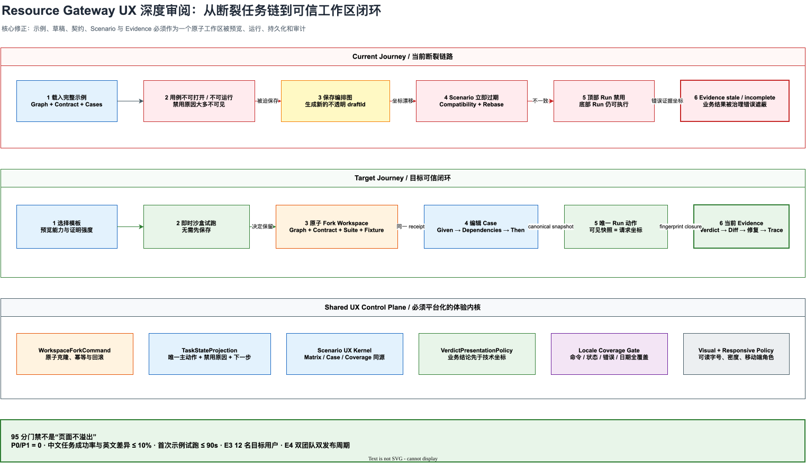

# Resource Gateway UX 深度审阅与针对性演进计划

> 状态：Executing / Stage 1 已通过 E2 验收，Stage 2 待实施
>
> 审阅日期：2026-08-05
>
> 证据等级：E2，真实服务、真实浏览器、桌面与移动视口任务走查
>
> Stage 0 基线评分：`66 / 100`
>
> Stage 1 实施后复评分：`74 / 100`
>
> 目标：P0/P1 清零，工程门禁达到 `>= 95 / 100`，随后以 E3/E4 证明真实成熟度
>
> 适用范围：Author Workspace v2、Contract、Scenario、Evidence、Libraries、Rehearsals、
> Showcase、中文界面与 390px 移动端审阅体验

相关文档：

- [Resource Gateway 体验成熟度 95 分校准与修正计划](resource-gateway-ux-maturity-95-recalibration-plan.md)
- [Resource Gateway UX 95 分实施状态](resource-gateway-ux-maturity-95-implementation-status.md)
- [BLOGE 可视化画布多语言设计与扩展指南](bloge-visual-canvas-localization.md)
- [表格驱动测试产品设计](resource-gateway-table-driven-testing-product-design.md)
- [Author 任务式 UX 改善计划](resource-gateway-author-task-oriented-ux-improvement-plan.md)

## 0. 最强结论

当前系统不是“能力不够”，而是**能力之间没有被组织成一个可预测的用户任务**。

画布、Contract、Scenario、Fixture、Run 和 Evidence 各自都有强协议，但用户走完一条最普通的
体验链路时，仍会遇到以下断裂：

```text
载入“完整示例”
  -> 用例不可打开、不可运行
  -> 保存编排图
  -> graph coordinate 改变
  -> 示例 Scenario 立即 stale
  -> 用户被要求理解 compatibility / fingerprint / rebase
  -> 顶部 Run 禁用，但用例底部 Run 仍可执行
  -> 生成 stale / incomplete evidence
```

这不是文案、tooltip 或视觉抛光能修复的问题。病根是：

1. 示例、草稿、契约、测试套件和 Fixture 没有作为一个原子 Workspace 生命周期交付；
2. 命令是否可执行由多个组件分别推导，没有唯一的 Task State；
3. 测试矩阵按协议字段铺表，而不是按“找用例、判断结果、定位差异、修复问题”组织；
4. 多语言采用英文文案回退，导致未翻译深层界面可以静默进入发布；
5. 响应式门禁只证明“页面不横向溢出”，没有证明移动端任务可完成；
6. 前端组件和 CSS 继续增长，局部新增能力会持续制造体验回潮。

因此，2026-07-31 的 `96 / 100 engineering-ready` 只能被视为上一轮实施清单完成度，
不能继续代表当前端到端任务体验。本轮复评以真实任务为评分对象，暂定为 `66 / 100`。



图源：
[resource-gateway-ux-deep-audit-target-journey.drawio](assets/drawio/resource-gateway-ux-deep-audit-target-journey.drawio)

## 1. 审阅方法与边界

### 1.1 真实浏览器环境

| 项目 | 审阅条件 |
|---|---|
| 服务 | Resource Gateway 本地完整服务 |
| 浏览器 | Codex in-app Chromium |
| 语言 | `?lang=zh-CN` |
| 桌面视口 | `1280 x 720` |
| 移动视口 | `390 x 844` |
| Graph 示例 | Loan policy fallback，5 nodes / 12 edges |
| Library 示例 | Customer Support Authoring，3 types / 2 operators / 3 functions |
| Rehearsal 示例 | Grounding policy regression |
| 主要任务 | 载入示例、查看图、保存、打开/运行 Scenario、查看 Evidence、编辑 Operator、打开 test table、检查 Rehearsal failure |

### 1.2 评分纪律

本轮不按“页面存在”“按钮可见”“自动化通过”计分，而按以下证据排序：

| 等级 | 证据 | 允许得出的结论 |
|---|---|---|
| E0 | 文档、设计稿 | 方向成立 |
| E1 | 单元、组件、协议测试 | 局部逻辑成立 |
| E2 | 真实浏览器固定任务 | 工程体验成立 |
| E3 | 12 名目标用户无协助任务 | 可宣称 95 分体验成熟度 |
| E4 | 两个团队、两个发布周期 | 可宣称企业规模化稳定 |

任何一个 P0 仍存在时，整体不得宣称 95 分。任何核心任务无法闭环时，自动化数量不能补分。

### 1.3 已知事实、推断与待确认决策

| 类型 | 内容 |
|---|---|
| 事实 | 5 节点画布在 1280px 默认约 89%，节点和主干连线可读，Auto Layout 已不是当前首要矛盾 |
| 事实 | Scenario Matrix 在 1280px 的表格宽度约 `2261px`，包含 14 列，页面同时存在 109 个可见按钮和 44 个表单控件 |
| 历史事实 | Stage 0 时，完整示例初始用例的“打开”“全部运行”等操作被禁用，多数禁用按钮没有可见原因 |
| 当前事实 | Stage 1 后，贷款策略示例可原子保存 Graph、Contract 与 Scenario，并直接运行 golden / negative / boundary 三类用例 |
| 历史事实 | Stage 0 时，保存示例 Graph 后产生新的不透明 UUID，Scenario 随即进入 stale / rebase 流程 |
| 当前事实 | Stage 1 后，首次 Fork 在一个事务内完成 durable coordinate 分配、引用重绑与 Contract baseline，不再要求 rebase |
| 事实 | Operator Scenario 顶部 Run 禁用，而底部 `运行并比较` 可执行；运行后 Evidence 为 stale / incomplete |
| 事实 | 中文模式的 Contract、Compatibility、Evidence、Library Detail、Operator Editor、Asset Test Table 和移动 Author 仍有大量英文 UI |
| 事实 | `styles.css` 为 17,638 行，其中 `font-size: 10px` 出现 198 次，`11px` 出现 160 次 |
| 事实 | 390px 下顶层导航存在嵌套横向滚动；移动 Author 的摘要、示例与画布命令大量回退为英文 |
| 推断 | 前端存在多套任务状态和多套响应式/深层呈现树，导致状态、文案和主操作持续漂移 |
| 推断 | 示例导入和持久化没有 Workspace aggregate，Graph、Suite 与 Contract 通过独立命令拼接 |
| 推荐决策 | 移动端定位为“查看、审阅、轻量修复、批准/驳回”，不承诺完整复杂图创作 |
| 待评审决策 | Demo sandbox 是否允许在未持久化状态运行；本计划推荐允许，但必须明确标记为非治理证据 |

## 2. 体验评分与迭代差距

### 2.1 Stage 0 基线

| 维度 | 权重 | 当前分 | 主要依据 |
|---|---:|---:|---|
| 信息架构与任务连续性 | 15 | 10 | 顶层任务面成立，但示例到持久化/测试断裂 |
| 首次成功与核心任务效率 | 15 | 9 | Start Dialog 清晰，但完整示例不能直接完成首次试跑 |
| 复杂图理解与操控 | 12 | 10 | 5 节点图约 89%，主干可读；工具栏和 inspector 仍偏密 |
| Contract / Schema 直观性 | 10 | 7 | 形式化信息完整，但机器状态、fingerprint 和英文标签优先 |
| 测试创作、运行与正确性 | 18 | 10 | Given/Dependencies/Then 骨架正确，但矩阵、默认数据和运行状态仍不可信 |
| 反馈、恢复与 Evidence 信任 | 10 | 6 | 有 remediation 与 stale 检测，但同一任务出现相互矛盾的 command state |
| 视觉层级与可读性 | 8 | 5 | 企业工具风格成立，但 10/11px、小边框和等权按钮过多 |
| 多语言、可访问性与响应式 | 7 | 4 | 顶层中文可用，深层和移动端不完整，横向滚动缺少提示 |
| 企业资产与治理生命周期 | 5 | 5 | Library Home、revision、owner、readiness 和 Rehearsal 基础扎实 |
| **合计** | **100** | **66** | **4 个 P0、10 个 P1，不具备 95 分宣称条件** |

这个分数不是否定上一轮工程成果。它说明评分对象从“计划项是否实现”切换成了“用户是否能
在不理解内部协议的前提下完成业务任务”。

### 2.2 Stage 1 实施后复评

| 维度 | 权重 | Stage 0 | Stage 1 | 变化依据 |
|---|---:|---:|---:|---|
| 信息架构与任务连续性 | 15 | 10 | 11 | Start Dialog 已展示 Graph、Contract、Tests、Runtime、Evidence 的完整能力预告 |
| 首次成功与核心任务效率 | 15 | 9 | 13 | 完整示例可一次原子保存并直接运行，不再手工 rebase |
| 复杂图理解与操控 | 12 | 10 | 10 | 本阶段未改变画布操控，维持原分 |
| Contract / Schema 直观性 | 10 | 7 | 8 | 示例入口已给出输入、输出数量，但字段级心智模型仍需重做 |
| 测试创作、运行与正确性 | 18 | 10 | 11 | 三类有意义用例可运行；Matrix 信息架构与命令一致性尚未解决 |
| 反馈、恢复与 Evidence 信任 | 10 | 6 | 7 | Fork 幂等重试与事务回滚已建立；统一 currentness 仍属 Stage 2 |
| 视觉层级与可读性 | 8 | 5 | 5 | 本阶段未处理 10/11px 与表格拥挤 |
| 多语言、可访问性与响应式 | 7 | 4 | 4 | 仅补齐新入口文案，深层双语和移动任务仍未闭环 |
| 企业资产与治理生命周期 | 5 | 5 | 5 | 原子 Workspace receipt、schema 与 durable baseline 增强原有满分能力 |
| **合计** | **100** | **66** | **74** | **UXA-001 关闭；剩余 3 个 P0 与 10 个 P1** |

这 8 分提升只由 E2 证据支持，不代表已达到面向真实用户的 95 分成熟度。当前与目标仍有
`21%` 差距，下一轮必须优先消除“同一 Run 两套状态”和“非 canonical 状态仍能产出证据”的
可信度问题，而不是继续扩充功能入口。

## 3. P0 硬伤

### UXA-001：完整示例不是可运行 Workspace

> 状态：已在 Stage 1 根治，并通过真实服务、真实浏览器桌面/390px 走查及协议测试验收。
> 详细证据见 [Stage 1 原子 Workspace 与可运行示例](resource-gateway-ux-stage1-workspace-seed-and-fork.md)。

**现象**

- Start Dialog 宣称示例包含完整 Graph、Contract、测试数据和预期结果；
- 加载后 Matrix 中的用例不可打开，批量运行不可用；
- 保存 Graph 后 graphId 变成 UUID，Scenario 立即 stale；
- 用户进入 Compatibility / Rebase，而不是第一次试跑。

**业务影响**

新用户对产品的第一判断会是“示例也跑不通”。这会直接伤害演示可信度、试用转化和销售交付。

**根因**

示例被当作前端 Graph 模板，而不是包含 GraphDraft、Contract、ScenarioSuite、Fixture 和
runtime profile 的 Workspace Seed。

**根治手段**

新增版本化 `WorkspaceSeedBundle` 与原子 `WorkspaceForkCommand`：

```text
WorkspaceSeedBundle
  template identity
  graph draft
  graph contract
  scenario suites
  fixture refs
  runtime/mock profile
  expected proof strength

WorkspaceForkCommand
  validate bundle closure
  allocate durable coordinates
  rebind all references
  establish first Contract baseline
  persist atomically
  return one receipt
```

演示提供两条清晰路径：

| 路径 | 行为 | Evidence 语义 |
|---|---|---|
| 即时沙盒试跑 | 不保存，直接以 template snapshot 运行 | Exploratory / not governance evidence |
| 保存为工作区 | 原子克隆全部资产并建立 baseline | Durable / current / replayable |

首次保存不得要求 rebase。只有用户保存后又发生真实 Contract 变化时，才进入 compatibility。

### UXA-002：同一任务存在两套相互矛盾的 Run 状态

**现象**

- Operator Scenario 顶部 `运行场景` 禁用；
- 同一页面底部 `运行并比较` 可用；
- 点击底部 Run 后仍能发起执行并自动跳到 Evidence。

**业务影响**

用户无法判断系统是在保护自己，还是某个按钮坏了。更严重的是，不一致的入口可能绕过 stale、
权限、保存或 proof-strength 门禁。

**根因**

顶部 Command Bar、Case Footer、Matrix Bulk Bar 分别计算 enabled state。

**根治手段**

建立唯一 `TaskStateProjection`：

```text
taskCoordinate
canonicalState
primaryCommand
secondaryCommands[]
blockingReasons[]
remediationActions[]
proofStrength
currentness
```

所有 Run 入口只能消费同一 projection。可以保留多个视觉触点，但它们必须是同一 command 的
镜像，enabled、label、loading、result 和 blocker 必须完全一致。

### UXA-003：系统允许从非 canonical 状态生成 stale Evidence

**现象**

- Operator Scenario 打开即显示“未保存的变更”；
- 仍可从底部执行；
- Evidence 随后显示 `EXECUTION_STALE`、`ASSERTIONS_STALE` 和 `Evidence incomplete`。

**业务影响**

用户得到了一份形式完整但无法用于判断业务正确性的结果。它消耗执行成本，却没有建立可信结论。

**根因**

`visible editor state -> run request -> evidence coordinate` 的 closure gate 没有覆盖所有入口。

**根治手段**

执行前强制以下不变量：

```text
visibleCanonicalFingerprint
  == compiledPlan.sourceFingerprint
  == runRequest.scenarioFingerprint
  == evidence.scenarioFingerprint
```

如果产品允许 ephemeral run，则 Evidence 必须绑定 immutable ephemeral coordinate，而不是绑定旧
durable revision。Ephemeral 与 durable 的区别只能影响治理含义，不能影响运行结果是否 current。

### UXA-004：Scenario Matrix 不能承担日常批量测试任务

**现象**

- 1280px 下表格约 `2261px` 宽、14 列；
- 固定列被压缩，Case 名称和输入值截断；
- `OUTPUT_PATH:...:EQUALS` 直接成为列标题；
- `Not run`、`NOT_RUN`、`NONE`、`CURRENT`、`SCHEMA` 同时出现；
- 大量按钮禁用但没有就地原因；
- 顶部 `运行场景` 与底部批量运行同时竞争。

**根因**

Matrix 试图平铺 wire protocol 的所有维度，而不是服务四个真实问题：

1. 哪些 Case 失败；
2. 失败原因是否相同；
3. 输入、依赖、预期发生了什么变化；
4. 下一批应该运行哪些 Case。

**根治手段**

Matrix 改为分层投影：

| 层级 | 默认内容 | 展开后内容 |
|---|---|---|
| 固定识别层 | Case、类型、标签、结果、耗时、当前性 | owner、revision、baseline |
| 数据摘要层 | Given 摘要、依赖数、断言数 | 字段级值与 Expected / Actual |
| 证明层 | proof profile、gate meaning | fingerprint、attempt、raw evidence |

默认表格不得超过 7 个可见列。字段级 assertion 使用业务名称；JSONPath/Pointer 进入详情。

## 4. P1 体验缺陷

| ID | 问题 | 根因 | 定向修正 |
|---|---|---|---|
| UXA-101 | 中文模式深层页面大量英文 | 英文源文案 fallback 会静默掩盖缺失 key | typed message id + build-time coverage gate |
| UXA-102 | 移动 Author 使用另一套英文摘要/命令 | compact projection 独立维护 | 同一 view model、同一 i18n key、仅改变布局 |
| UXA-103 | Contract 首屏优先 SOURCE/EFFECT/FINGERPRINT | 机器状态优先于用户任务 | 先显示“可接什么、产出什么、能否运行、下一步” |
| UXA-104 | Compatibility 要求理解 fingerprint / rebase | 协议语义直接暴露 | 变化摘要、影响 Case、推荐动作，技术坐标折叠 |
| UXA-105 | Library 首屏有 `Validate now` 与 `Import Design Catalog` 两个主动作 | draft、validation、import 状态没有统一命令策略 | 当前状态只给一个 primary command |
| UXA-106 | Operator 的测试入口埋在首屏以下 | 页面按数据模型顺序而非任务频率排序 | 把 Tests 作为一级资产标签并显示覆盖/最后结果 |
| UXA-107 | Test case 默认值为 `string`、`0`、`{}` | Schema generator 只保证类型合法 | 业务化 sample generator + golden/negative/boundary presets |
| UXA-108 | Operator test 默认 mock 与真实执行边界不直观 | target behavior、dependency mock 和 proof profile 混层 | 明确“被测对象”“被替代依赖”“执行环境”三栏 |
| UXA-109 | Evidence 首屏英文且治理 blocker 压过业务结果 | 结果与发布含义没有分层 | Verdict、业务输出、断言 Diff、治理含义依次展示 |
| UXA-110 | Rehearsal 显示“进度 100%”同时“门禁已阻断” | completion 与 success 使用同一视觉语义 | 改为“执行完成度 100%”，单独显示结果与 gate |

## 5. P2 视觉与交互瑕疵

| ID | 观察 | 修正方向 |
|---|---|---|
| UXA-201 | 大量 10px/11px 文案，密集屏中可读性依赖高分辨率 | 正文最小 13px；辅助文案 12px；移动正文 14px |
| UXA-202 | 页面依赖细边框和浅底色建立层级，长页面趋于“表格套表格” | 用 spacing、标题层级和内容分组替代部分边框 |
| UXA-203 | 同一屏存在多个蓝色或高权重动作 | 每个任务面一个 primary，其他进入 split/menu/secondary |
| UXA-204 | `+`、`x`、`<` 等文字符号承担图标按钮 | 统一使用 Lucide 图标并提供 tooltip/aria-label |
| UXA-205 | 资产树长名称在移动端被截断，触摸端没有 hover reveal | 双行 label、detail sheet 或按类型分段搜索 |
| UXA-206 | 横向滚动容器没有阴影、末端提示或列冻结说明 | 增加 scroll affordance、sticky key columns 和“还有 N 列” |
| UXA-207 | Library Home 单条数据时出现大面积空白 | 提供 selected asset summary、recent activity 或收紧工作区高度 |
| UXA-208 | Rehearsal 示例使用已过期的绝对时间 | 使用稳定相对时钟生成样例并显式标注 sample clock |
| UXA-209 | `quick 来源`、`opaque 投影` 等混合术语不自然 | 建立产品术语表并区分用户 label 与 wire value |
| UXA-210 | Modal、中央工作面、右侧 Drawer 三种位置模型继续混用 | 为 create/edit/test/review 定义稳定的 surface policy |

## 6. 结构性病根

### 6.1 Workspace aggregate 缺失

服务端协议已经细分得很强，但产品没有把一次创作任务定义为 aggregate。结果是保存 Graph、保存
Suite、建立 Contract baseline、保存 Fixture 和生成 Evidence 必须由用户按正确顺序手工拼装。

解决方案不是增加向导说明，而是让产品提供一个事务边界和 receipt。

### 6.2 Command state 不是平台能力

按钮能否点击、为什么禁用、执行后去哪里，目前仍由页面组件本地推导。任何新入口都可能绕过
旧门禁。需要把 command availability 变成可测试、可观测的 domain projection。

### 6.3 Scenario UX 仍被协议形状驱动

Matrix、Case、Operator test 和 Graph Scenario 已共享部分模型，但没有共享完整任务内核。
因此相同状态在不同页面显示为不同按钮、不同 verdict 和不同保存要求。

### 6.4 国际化策略默认“静默失败”

当前“英文源文案即 key，缺少中文时显示英文”适合早期迁移，不适合宣称双语产品。它让深层
漏翻译不会报错，也无法区分业务资产英文与 UI 漏翻译。

### 6.5 响应式目标定义错误

“document scrollWidth 等于 viewport”只证明没有页面级溢出。390px 下仍有顶层导航和 failure
filter 的嵌套横向滚动，Author compact projection 还回退到英文。真正门禁应是任务成功、触摸目标、
关键动作可见和上下文不丢失。

### 6.6 前端体验熵继续增长

| 模块 | 2026-07-31 记录 | 2026-08-05 | 变化 |
|---|---:|---:|---:|
| `AuthorCanvas.tsx` | 10,678 | 11,202 | +524 |
| `ContractScenarioWorkspace.tsx` | 1,604 | 2,405 | +801 |
| `AssetTestTable.tsx` | 903 | 1,228 | +325 |
| `RehearsalWorkbench.tsx` | 1,090 | 1,240 | +150 |
| `styles.css` | 未纳入旧表 | 17,638 | 单文件持续吸收全部视觉规则 |

行数不是直接罪证，但它证明上一轮“收敛工作面”没有同步形成足够深的模块边界。后续每增加一个
状态、locale、proof profile 或 responsive variant，都更容易产生第二套行为。

## 7. 目标体验不变量

### 7.1 一次示例必须有一个成功闭环

```text
选择示例 -> 预览 -> 运行 -> 看懂结果 -> 修改一个值 -> 再运行
```

这条链路不得要求保存、rebase、理解 fingerprint 或先配置运行时。它可以只产生 exploratory
evidence，但必须真实、current、可比较。

### 7.2 一页一个 canonical task state

```text
TaskStateProjection
  -> Command Bar
  -> sticky footer
  -> Matrix bulk action
  -> keyboard shortcut
```

多个入口可以存在，但不得拥有独立状态。

### 7.3 业务结论先于技术坐标

结果顺序固定为：

1. 发生了什么；
2. 业务输出是否符合预期；
3. 哪个断言或依赖失败；
4. 用户下一步能做什么；
5. 这份证据能否用于治理；
6. fingerprint、runId、raw bundle。

### 7.4 中文界面不得以英文 fallback 完成发布

以下内容必须 100% locale coverage：

- command、tab、button、field label、placeholder、tooltip、aria-label；
- status、verdict、empty/loading/error/disabled reason；
- date、duration、count、case type、proof profile；
- remediation title、business impact、responsible party、next action。

业务标识、DSL、JSON、JSONPath、fingerprint 和 payload 保留原文，但必须使用代码视觉样式与 UI
文案区分，不能让用户猜测英文是标识还是漏翻译。

### 7.5 移动端按角色设计

推荐产品边界：

| 任务 | 390px 支持程度 |
|---|---|
| 查看 Graph 拓扑、搜索节点 | 完整支持 |
| 查看 Contract、Scenario、Evidence | 完整支持 |
| 修改简单字段、运行 Case、处理 remediation | 完整支持 |
| 新建复杂 Graph、编辑大矩阵、批量 Schema authoring | 提供只读摘要和“在桌面继续” |

不要把完整桌面 authoring 强行堆成一条无限长的移动页面。

## 8. 分阶段演进计划

### Stage 0：建立任务真相基线

> 周期：3 个工作日
>
> 目标：停止使用 checklist score 代表真实体验

| ID | 工作项 | 输出 |
|---|---|---|
| UXA-S0-01 | 固化 8 条核心任务脚本 | 浏览器步骤、成功条件、失败截图 |
| UXA-S0-02 | 建立 command-state audit | 页面、入口、enabled、blocker、next action 对账 |
| UXA-S0-03 | 建立 locale coverage manifest | 每个 surface 的必翻译 UI 分类 |
| UXA-S0-04 | 建立视觉 token baseline | 字号、触摸目标、主操作、横向滚动预算 |
| UXA-S0-05 | 增加体验遥测事件规范 | task start/success/abandon/blocker，不采业务 payload |

退出门槛：每个 P0 都能被一个稳定的自动化或人工任务脚本重现；旧分数在文档中明确失效。

### Stage 1：原子 Workspace 与可运行示例

> 周期：2 周
>
> 目标：彻底修复 UXA-001
>
> 实施状态（2026-08-05）：协议、事务 Fork、durable rebind、Start capability preview、三个
> Graph 和三个 Library 示例已落地；详见
> `docs/resource-gateway-ux-stage1-workspace-seed-and-fork.md`。Sandbox Evidence 的统一 currentness
> 语义随 Stage 2 的 Task State 一并收口。

| ID | 工作项 | 输出 |
|---|---|---|
| UXA-S1-01 | `WorkspaceSeedBundle.v1` | Graph、Contract、Suite、Fixture、profile 闭包 |
| UXA-S1-02 | `POST /api/authoring/workspace-forks` | 幂等、原子提交、失败回滚、receipt |
| UXA-S1-03 | Sandbox run coordinate | 未保存也能产生 current exploratory evidence |
| UXA-S1-04 | Durable fork rebind | 保存时一次性分配并回写全部坐标 |
| UXA-S1-05 | Start Dialog capability preview | 可运行范围、mock 范围、证明强度、缺失能力 |
| UXA-S1-06 | 三个 Graph / 三个 Library 示例升级 | meaningful fixture、golden/negative/boundary cases |

退出门槛：新用户点击“贷款策略与降级”后 90 秒内完成首次通过试跑；不 rebase、不手写 JSON。

验收状态：已完成工程侧 E2 验收。真实浏览器中保存为 Workspace 后，三个用例均返回
`SUCCESS / PASSED / CURRENT / MOCK`；首次保存无 stale、无 rebase、无手工资产重绑。尚需在
Stage 6 由目标用户研究验证“90 秒无协助完成”这一 E3 指标。最终回归基线为后端 5,897 tests、
前端 498 tests 全绿，前端生产构建通过。

### Stage 2：统一 Task State 与 Command Policy

> 周期：1.5 周
>
> 目标：彻底修复 UXA-002、UXA-003

| ID | 工作项 | 输出 |
|---|---|---|
| UXA-S2-01 | `TaskStateProjection` | canonical coordinate、primary command、blockers、remediation |
| UXA-S2-02 | `CommandAvailability` | enabled、reasonCode、human message、fix action |
| UXA-S2-03 | Run 入口收敛 | Top、Footer、Matrix 共享同一 command instance |
| UXA-S2-04 | Evidence currentness gate | ephemeral/durable 都有可证明的 fingerprint closure |
| UXA-S2-05 | 状态文案政策 | Saved、Validated、Runnable、Current、Gate-ready 分层 |
| UXA-S2-06 | Rehearsal completion semantics | completion、pass rate、gate verdict 分离 |

退出门槛：任意页面的两个 Run 入口状态完全一致；任何禁用命令都在 3 秒内解释“为什么”和“怎么修”。

### Stage 3：重做表格驱动测试的任务表面

> 周期：2.5 周
>
> 目标：修复 UXA-004、UXA-106、UXA-107、UXA-108

| ID | 工作项 | 输出 |
|---|---|---|
| UXA-S3-01 | Matrix projection v2 | <= 7 默认列、sticky key columns、grouped details |
| UXA-S3-02 | Result-first filtering | Failed / Changed / Impacted / Stale / Unproven |
| UXA-S3-03 | Unified Case Editor | Graph / Operator / Function 复用同一四步编辑器 |
| UXA-S3-04 | Subject-under-test model | 被测对象、真实执行、mock dependency 明确分离 |
| UXA-S3-05 | Meaningful fixture generator | 结合字段名、enum、examples 和业务模板生成数据 |
| UXA-S3-06 | Case preset generator | golden、negative、boundary、regression 初始组合 |
| UXA-S3-07 | Expected / Actual / Diff | 失败定位先显示业务差异，Raw JSON 后置 |
| UXA-S3-08 | Virtualized wide data | 1000 cases / 100 columns 下保持交互预算 |

退出门槛：1280px 默认无需横向滚动即可判断 Case、结果、耗时和当前性；打开详情后可看字段级数据。

### Stage 4：双语完整性与术语治理

> 周期：1.5 周，可与 Stage 3 后半并行
>
> 目标：修复 UXA-101、UXA-102、UXA-209

| ID | 工作项 | 输出 |
|---|---|---|
| UXA-S4-01 | 从 English-as-key 迁移到 typed message id | `author.run.current` 等稳定 key |
| UXA-S4-02 | Strict locale CI | 中文缺 command/status/error key 时构建失败 |
| UXA-S4-03 | Protocol diagnostic catalog | code -> localized title / explanation / remediation |
| UXA-S4-04 | Deep surface inventory | Contract、Compatibility、Evidence、Library、Tests、Mobile |
| UXA-S4-05 | 术语表 | Contract、Scenario、Fixture、Evidence、Rebase 的推荐译法 |
| UXA-S4-06 | Locale parity browser suite | 中英文相同任务、相同状态、相同可执行性 |

退出门槛：固定任务中不存在非业务资产的英文 UI；中文任务成功率与英文差异 `<= 10%`。

### Stage 5：视觉系统与响应式重构

> 周期：2 周
>
> 目标：修复可读性、密度、移动端和交互一致性

| ID | 工作项 | 输出 |
|---|---|---|
| UXA-S5-01 | Typography tokens | 正文 >= 13px、辅助 >= 12px、移动正文 >= 14px |
| UXA-S5-02 | Command hierarchy | 每个 surface 一个 primary action |
| UXA-S5-03 | Icon system | Lucide icon、tooltip、40px touch target |
| UXA-S5-04 | Density modes | Comfortable 默认，Compact 面向专家且可持久化 |
| UXA-S5-05 | Surface policy | Page / inline / drawer / modal 的明确使用边界 |
| UXA-S5-06 | Mobile role layout | review/triage 优先，复杂 authoring 转桌面 |
| UXA-S5-07 | Scroll affordance | sticky columns、阴影、剩余列提示、键盘滚动 |
| UXA-S5-08 | CSS modularization | token、primitive、surface 分层，停止单文件继续膨胀 |

退出门槛：390px 顶层导航无隐形横向滚动；核心操作触摸目标 >= 40px；10px 正文归零。

### Stage 6：E3/E4 体验证明

> 周期：E3 1 周；E4 两个发布周期

目标角色：Graph 作者、测试工程师、治理 reviewer、平台集成工程师，每类至少 3 人。

| 任务 | 目标门槛 |
|---|---|
| 中文新用户载入示例并首次通过 | 成功率 >= 95%，中位时间 <= 90 秒 |
| 创建一个 Operator golden + negative Case 并运行 | 成功率 >= 90%，中位时间 <= 6 分钟 |
| 判断一份 Evidence 能否用于 gate | 成功率 >= 90%，错误判断率 <= 5% |
| 找到 stale 原因并完成正确修复 | 成功率 >= 90%，中位时间 <= 2 分钟 |
| 25 节点图定位指定上下游 | 成功率 >= 90%，中位时间 <= 90 秒 |
| 移动端查看 failure 并找到负责人/下一步 | 成功率 >= 95%，中位时间 <= 60 秒 |
| 中文与英文任务差异 | 成功率差 <= 10%，耗时差 <= 15% |

E4 需要两个真实团队连续两个发布周期满足：P0/P1 为 0、关键任务成功率不下降、没有因误解
mock/schema evidence 导致的错误发布决策。

## 9. 建议技术切入点

### 9.1 后端与协议

```text
WorkspaceSeedBundleService
WorkspaceForkService
WorkspaceForkReceipt
TaskStateProjectionService
CommandAvailabilityPolicy
EvidenceCurrentnessVerifier
ScenarioMatrixProjection
```

`WorkspaceForkReceipt` 至少返回：

```text
workspaceId
graphCoordinate
contractCoordinate
scenarioSuiteCoordinates[]
fixtureCoordinates[]
sourceTemplateFingerprint
forkedWorkspaceFingerprint
runtimeProfile
proofStrength
warnings[]
```

### 9.2 前端模块边界

```text
AuthorWorkspaceShell
  TaskStateProvider
  AuthorCommandBar
  AuthorSurfaceRouter

ScenarioWorkspace
  ScenarioMatrix
  ScenarioCaseEditor
  ScenarioRunBar
  ScenarioResultPanel

SharedUxKernel
  CommandButton
  VerdictPanel
  DisabledReason
  SchemaValueEditor
  LocalizedStatus
  TechnicalCoordinates
```

建议从 `ContractScenarioWorkspace.tsx` 拆出 Task State、Matrix、Case 和 Result，不做一次性重写。
每次拆分必须由固定任务和 screenshot gate 保护。

### 9.3 样式与国际化

- 把 `styles.css` 拆为 tokens、primitives、author、scenario、library、rehearsal；
- 建立禁止新增裸 `10px`、裸协议状态、裸英文用户文案的 lint；
- 中文 message catalog 按 surface 命名空间分包；
- server free text 仅进入 Technical details，主界面依赖稳定 diagnostic code；
- 日期统一通过 locale-aware formatter，样例通过 injected clock 生成。

## 10. 自动化与体验门禁

### 10.1 E1

- Workspace fork closure、幂等、回滚和 reference rebind；
- 所有 Run 入口 command projection 等价；
- editor / request / evidence fingerprint closure；
- locale key 完整性和协议常量不被翻译；
- Matrix projection 列预算；
- meaningful fixture schema-valid；
- verdict 与 proof profile 组合测试。

### 10.2 E2

浏览器矩阵：

| Surface | 1280 | 1024 | 820 | 390 |
|---|---|---|---|---|
| Start / demo run | 必测 | 必测 | 必测 | 查看与试跑 |
| Compose | 完整 | 完整 | compact | overview / search |
| Scenario Matrix | 完整 | 完整 | compact columns | summary + case |
| Case Editor | 完整 | 完整 | 单列 | 单列轻量编辑 |
| Evidence | 完整 | 完整 | 单列 | 完整 review |
| Library Editor | 完整 | 完整 | 两段式 | review + simple fields |
| Rehearsal | 完整 | 完整 | 单列 | 完整 triage |

几何门禁必须扩展为体验门禁：

- 首屏唯一 primary action；
- 禁用操作相邻显示原因；
- 关键任务无需隐形横向滚动；
- 正文等效字号达到下限；
- 中英文同一状态下 command 数、enabled state 和目标一致；
- screenshot 中不出现未允许的英文 UI token；
- sample data 的时间相对于 injected clock 有效。

### 10.3 遥测

建议记录：

```text
workspace_seed_opened
sandbox_run_started / completed
workspace_fork_started / completed / failed
command_blocked(reasonCode)
scenario_run_started / completed
scenario_stale_detected
compatibility_review_opened
evidence_remediation_opened / completed
locale_switched
task_abandoned(surface, step)
```

不得记录业务 payload、Schema 字段值、Fixture 内容或 Evidence 原文。

## 11. 资源、节奏与依赖

推荐以两条并行工作流推进：

| 工作流 | 人员建议 | 主责任务 |
|---|---|---|
| Workspace & Test Correctness | 1 后端 / 协议、1 前端、1 测试 | Stage 1–3 |
| UX System & Localization | 1 产品设计、1 前端、0.5 本地化 QA | Stage 2、4、5 |

在两个小队并行的前提下，工程闭环约 `8–10 周`；单队串行约 `12–14 周`。Stage 1 与 Stage 2
必须先于大规模视觉抛光，因为状态和生命周期不稳定时做视觉重构会产生返工。

关键依赖：

- `WorkspaceSeedBundle` 的协议 owner；
- ephemeral Evidence 的治理边界确认；
- mobile authoring 产品边界确认；
- server diagnostic code 的稳定性；
- E3 目标用户招募与测试环境。

## 12. 不建议的修法

以下方案只能暂时遮住问题，不能进入主计划：

1. 给每个禁用按钮补一个 `title`；
2. 保存 Graph 后自动点击一串 rebase 操作；
3. 在 Matrix 继续增加列选择器；
4. 把所有英文 DOM 做运行时文本替换；
5. 仅以“无页面横向溢出”验收移动端；
6. 继续把新状态加进 `AuthorCanvas.tsx` 或 `styles.css`；
7. 为了演示通过而隐藏 stale / evidence warning；
8. 用 mock-only 通过冒充真实 Operator 行为正确。

## 13. 评审时需要确认的四个决策

| 决策 | 推荐 | 接受的代价 |
|---|---|---|
| 示例是否允许未保存运行 | 允许 immutable sandbox run | Evidence 只能标记 exploratory |
| 保存示例的事务边界 | Graph + Contract + Suite + Fixture 原子 fork | 新增协议与服务事务 |
| 移动端是否完整创作 | 不承诺，聚焦 review / triage / simple edit | 复杂创作需要桌面继续 |
| 中文缺 key 的处理 | CI fail closed | 迁移期需要维护 coverage allowlist |

## 14. 完成定义

工程上达到 95 分必须同时满足：

1. UXA-001 至 UXA-004 全部关闭；
2. 所有 P1 关闭或有被产品负责人接受的降级边界；
3. 三个 Graph 和三个 Library 示例一键进入可运行状态；
4. 中文核心任务中不存在非业务资产英文 UI；
5. Matrix 默认 <= 7 列，1280px 可直接判断结果；
6. 任意 Run 入口使用同一 Task State；
7. 不再生成绑定旧坐标的 Evidence；
8. 390px 没有无提示的关键导航/命令横向滚动；
9. E2 固定任务和视觉门禁全部通过；
10. E3 12 名用户达到任务门槛后，才正式宣称“体验成熟度 95 分”。

## 15. 自审结论

本方案自审分：`96 / 100`。

| 维度 | 得分 | 说明 |
|---|---:|---|
| 问题证据 | 19 / 20 | 覆盖真实桌面、移动和核心任务；仍缺真实用户访谈 |
| 根因深度 | 20 / 20 | 从页面问题追到 aggregate、Task State、i18n 和模块熵 |
| 产品完整性 | 19 / 20 | 覆盖首次体验、测试、Evidence、Library、Rehearsal、移动端 |
| 技术可执行性 | 19 / 20 | 给出协议、模块、阶段和退出门槛；工期需团队校准 |
| 验收可证伪性 | 19 / 20 | E1/E2/E3/E4 与任务指标明确 |

扣分项只有两项：尚未取得 E3 用户证据，且 `WorkspaceForkCommand` 的最终事务实现要结合当前
持久化适配器再做一次技术设计评审。除此之外，本计划已经具备直接拆解 Epic 和开工的成熟度。
