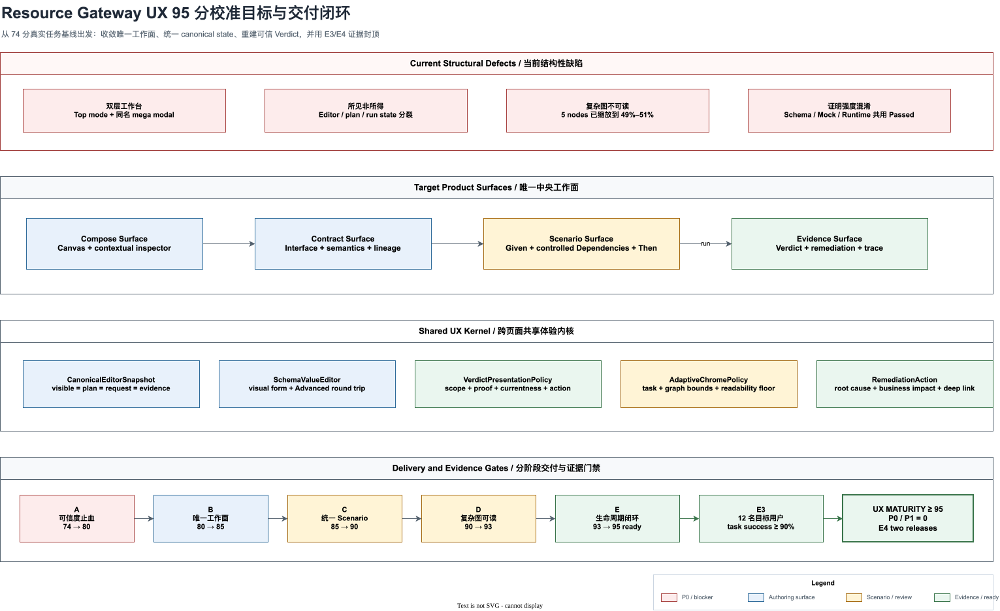

# Resource Gateway 体验成熟度 95 分校准与修正计划

> 状态：Engineering Complete（96 / 100）；Stage F 真实用户与企业试点验证待执行
>
> 日期：2026-07-31
>
> 当前工程实现自评：`96 / 100`（E3，协议、自动化与真实浏览器；正式体验 95 分仍需 Stage F）
>
> 目标：体验成熟度 `>= 95 / 100`，P0/P1 体验缺陷清零，并取得 E3/E4 使用证据
>
> 适用范围：`/author/`、`/libraries/`、`/rehearsals/`、VS Code 宿主和 ANEKE deep link
>
> 核心决策：取消“顶层任务模式 + 同名巨型浮层”的双层工作台；让 Compose、Contract、
> Scenarios、Evidence 成为 Author 中央区域互斥的正式工作面，并让 Graph、Operator 和
> Function 复用同一套 Schema-driven Scenario 与 Evidence 交互内核

相关文档：

- [UX 95 分实施状态](resource-gateway-ux-maturity-95-implementation-status.md)
- [Author UX 体验成熟度 95 分原计划](resource-gateway-author-ux-maturity-95-plan.md)
- [Author 任务式交互 UX 改善计划](resource-gateway-author-task-oriented-ux-improvement-plan.md)
- [Contract & Scenario Authoring 演进计划](resource-gateway-contract-scenario-authoring-evolution-plan.md)
- [渐进式算子与 Function 库创作方案](resource-gateway-progressive-operator-function-library-authoring-technical-design.md)
- [渐进式算子与 Function 库实现状态](resource-gateway-progressive-library-authoring-implementation-status.md)
- [表格驱动测试产品基准、补强设计与实施计划](resource-gateway-table-driven-testing-product-design.md)
- [表格驱动测试实施状态](resource-gateway-table-driven-testing-implementation-status.md)

## 0. 执行摘要

Resource Gateway 已经拥有很强的工程和协议基础：

- Author Workspace v2 已成为默认入口；
- GraphDraft、Operator Library、Contract、Scenario、Fixture 和 Evidence 均有形式化协议；
- Effective Contract 能区分 declared、inferred、bound 和 observed；
- DSL 可以自动投影、渲染和布局；
- Graph 与 Operator 都具备试跑、断言和证据能力；
- Library Workbench 已支持 Quick Create、Sample Inference、Existing Asset Discovery 和
  Advanced Import；
- Rehearsals 已能区分 execution、assertion、evidence、governance 和 warning；
- 桌面、紧凑视口和移动端已有真实浏览器回归。

但 2026-07-31 的真实浏览器复评证明：**能力完整度已经再次领先于体验架构**。现有文档中的
“工程 95 分”只能说明旧计划的工作项曾经实现，不能代表最新系统的端到端体验仍为 95 分。
后续 Library Authoring、Operator Test、Fixture、Evidence 和 Rehearsal 能力以独立浮层、
表格和局部状态继续增长，重新引入了以下结构性问题：

1. 顶层已经有 Contract / Scenarios / Evidence，点击后又出现包含同名标签的巨型浮层；
2. Scenario Return 表单显示为空，但运行时 mocked 节点产生了完整数据并通过断言；
3. 5 节点示例在 1280px 桌面被压缩到 49%–51%，字段级边标签不可读；
4. Operator 测试回退为 Raw JSON 表格，与 Schema-driven Builder 形成两套创作体验；
5. `SCHEMA CONTRACT` 模拟校验仍以 `Passed` 呈现，容易被理解为业务行为已验证；
6. “Complete example”加载后出现 7 个重复 warning，同时显示 `DESIGN_READY`；
7. Libraries 有 durable revision，却没有 Recent drafts、My libraries 和 Resume 入口；
8. Evidence 可以审计，但 warning、timeout 和 gate blocker 缺少就地修复动作。

本计划不以“继续增加面板”为解法。目标是建立以下产品不变量：

```text
一个当前任务
  + 一个可见 canonical state
  + 一个 proof-strength 明确的 Verdict
  + 一个唯一主操作
  + 一个可以回到 exact root cause 的修复路径
```



图源：
[resource-gateway-ux-maturity-95-recalibration.drawio](assets/drawio/resource-gateway-ux-maturity-95-recalibration.drawio)

## 1. 计划边界与评分纪律

### 1.1 本计划与原 95 分计划的关系

原计划完成了必要的第一轮体验收敛：

- Start / Import 统一；
- Compose / Contract / Scenarios / Evidence 顶层任务模式；
- Effective Contract 和 field lineage；
- Draft / Run / Evidence 生命周期；
- Overview / Focus / Inspect；
- compact drawer、layout preview、pin、undo 和 quality report。

本计划不否定这些成果，而是处理其后新增能力造成的体验回潮。两份计划的关系是：

| 文档 | 有效结论 | 已失效结论 |
|---|---|---|
| 原 95 分计划 | 任务式 UX 原则、协议边界、E3/E4 证据纪律 | “Stage 5 只需要用户验证，不再需要改 UI” |
| 本校准计划 | 当前 P0/P1、目标工作面、修复阶段与新验收门禁 | 不追溯替代历史实施记录 |

团队对外只能引用本计划的当前分数和完成状态。历史工程分数不得用于宣称当前体验成熟度。

### 1.2 95 分的含义

`95 / 100` 不是视觉评分，也不是测试通过率。它必须同时满足：

1. 加权评分 `>= 95`；
2. 任一维度不得低于该维度满分的 `85%`；
3. P0、P1 体验缺陷为 `0`；
4. 四类目标用户无协助任务成功率 `>= 90%`；
5. 真实任务关键耗时达到第 12 节门槛；
6. 三个 Graph 示例和三个 Library 示例没有非教学 warning；
7. 默认业务路径不要求手写 Raw JSON；
8. 可见 Scenario 状态、compiled plan 和 run request 保持可证明一致；
9. 5 节点图可读，25 节点可定位，100 节点可交互；
10. 连续两个发布周期没有 P0/P1 UX 回归。

### 1.3 证据上限

| 等级 | 证据 | 可宣称上限 |
|---|---|---:|
| E0 | 文档、静态图 | 60 |
| E1 | 单元、组件、模型测试 | 75 |
| E2 | 真实服务、真实浏览器、视觉与几何门禁 | 89 |
| E3 | 至少 12 名目标用户完成固定任务 | 95 |
| E4 | 两个真实团队、连续两个发布周期 | 100 |

没有 E3 证据时，即使工程评分达到 98，也只能宣称“95 分目标工程就绪”，不能宣称
“体验成熟度 95 分”。

## 2. 真实浏览器复评基线

### 2.1 审计环境

| 项目 | 内容 |
|---|---|
| 日期 | 2026-07-31 |
| 服务 | 完整 Resource Gateway fat JAR，`test` profile |
| 浏览器 | Codex in-app Chromium |
| 桌面 | 默认 1280 × 720 |
| 移动端 | 390 × 844 |
| 页面 | Author、Libraries、Rehearsals |
| Author 示例 | Loan policy fallback，5 nodes / 12 edges |
| Library 示例 | Customer Support Authoring，2 types / 2 operators / 3 functions |
| 测试路径 | Graph Scenario、Operator Contract Test、Fixture Save、Run Evidence |

浏览器 console 没有 error 或 warning。发现的问题来自产品模型、状态投影和交互组织。

### 2.2 当前评分

| 维度 | 权重 | 当前分 | 95 分目标 | 当前主要缺口 |
|---|---:|---:|---:|---|
| 产品模型与信息架构 | 15 | 10 | 14 | 顶层模式与巨型浮层重复、Library 缺资产首页 |
| 核心任务效率 | 15 | 12 | 14 | Scenario 过长、重复 selector、主操作离根因远 |
| 数据与 Contract 直观性 | 15 | 13 | 14 | Effective Contract 较强，但节点计数与 Graph Input 混层 |
| 测试与结果可信度 | 18 | 11 | 17 | 所见非所得、Schema Contract 被显示为 Passed、示例 warning |
| 复杂图阅读与操控 | 12 | 6 | 11 | 5 节点 49%–51%，Overview 仍展示全部字段 label |
| 反馈、恢复与防错 | 10 | 8 | 10 | Evidence 无修复动作、nested dialog、缺 existing draft 恢复入口 |
| 可访问性与响应式 | 7 | 6 | 7 | 无页面溢出，但桌面 breakpoint 反而比 compact 模式更差 |
| 企业生命周期与宿主一致性 | 8 | 8 | 8 | 协议与 deep link 基础较好 |
| **合计** | **100** | **74** | **95** | **差距 21 分** |

### 2.3 已确认缺陷

| ID | 优先级 | 缺陷 | 影响 |
|---|---|---|---|
| UX95R-001 | P0 | Scenario 可见 Return 值与实际运行 mock payload 不一致 | 用户无法相信试跑结果 |
| UX95R-002 | P0 | 顶层任务模式再次打开包含同名 tabs 的 workspace modal | 两套位置模型和返回路径 |
| UX95R-003 | P0 | 5 节点图在常用桌面宽度不可读 | 核心画布价值失效 |
| UX95R-004 | P0 | `SCHEMA CONTRACT` 结果使用裸 `Passed` | 结构通过被误认成业务正确 |
| UX95R-005 | P1 | Operator 测试默认要求编辑 Raw JSON | Schema 能力没有转化为交互能力 |
| UX95R-006 | P1 | 每个图节点都成为展开的 Dependency 卡 | Scenario 与图规模线性膨胀 |
| UX95R-007 | P1 | 完整 Library 示例有 7 个重复 warning | 演示破坏产品可信度 |
| UX95R-008 | P1 | `DESIGN_READY` 与 `0/5 bound` 并列但没有人类结论 | readiness 语义泄漏 |
| UX95R-009 | P1 | Libraries 没有 Recent / Mine / Resume | durable lifecycle 无法被用户使用 |
| UX95R-010 | P1 | Fixture Save 作为 dialog 内的第二层 dialog | 焦点、返回和上下文复杂 |
| UX95R-011 | P1 | 1280 三栏模式比 1024 compact 模式更难读 | 响应式只看 viewport，不看任务 |
| UX95R-012 | P2 | Evidence 首屏优先展示多个 fingerprint | 业务结论与下一步被技术坐标挤压 |
| UX95R-013 | P2 | Rehearsal timeout 详情缺 attempt timeline 和 remediation | 能发现问题，不能闭环修复 |
| UX95R-014 | P2 | Raw gate code 直接串联展示 | 治理 reviewer 仍需翻译协议术语 |

## 3. 病根分析

### 3.1 任务模式只是导航，工作面仍按组件组织

Author 顶层已经建立任务语言，但实际行为仍是：

```text
Top mode
  -> update mode state
  -> open ContractScenarioWorkspace modal
  -> switch to another Interface / Scenarios / Compatibility / Evidence tab
```

因此顶层模式没有拥有中央工作面，只是一个打开旧组件的入口。新能力继续加入 modal 后，
重复导航和 header action wrapping 是必然结果。

### 3.2 canonical 数据存在，但 UI 没有 canonical interaction state

服务端已经有 GraphDraft、Scenario、FixtureBundle 和 Run Evidence，但前端仍可能同时持有：

- 表单字段状态；
- legacy JSON 状态；
- adapter 投影状态；
- run request 状态；
- 运行后 evidence 状态。

只要运行请求不是从“当前可见编辑状态的唯一 canonical snapshot”编译，所见非所得就会再次
发生。多加一条同步 `useEffect` 只能延迟问题，不能根治。

### 3.3 Schema-driven form 不是平台能力

Schema 表单已经分别出现在 Graph Input、Effective Contract、Scenario 和 Library Builder，
但 Operator Test 仍直接编辑 JSON。原因不是技术上做不到，而是 Schema form 仍以局部组件
存在，没有成为统一的：

```text
SchemaValueEditor
  schema + current value + provenance + mode
  -> visual form
  -> canonical value
  -> validation diagnostics
  -> advanced JSON round trip
```

### 3.4 布局质量只测几何正确，没有测认知可读

现有 quality report 可以证明：

- node 没有重叠；
- label 没有与 node 相交；
- pin 被保留；
- preview 可以 cancel / undo。

但它没有证明：

- 标题和关键字段能被读到；
- Overview 是否只展示用户当前需要的信息；
- 侧栏是否挤压了可读缩放；
- 5 节点是否被不必要地当作“大图”。

“完整展示全部信息”与“用户能理解信息”不是同一个指标。

### 3.5 状态协议缺少统一的呈现政策

底层状态越来越准确，但各产品面独立选择文案：

- `PASSED`；
- `SCHEMA CONTRACT`；
- `DESIGN_READY`；
- `RUNTIME_DISCOVERED`；
- `PARTIAL`；
- `100% complete`；
- `Review required`。

这些状态单独都可能正确，组合后却没有唯一的人类结论。必须建立跨 Author、Libraries 和
Rehearsals 的 `VerdictPresentationPolicy`，禁止局部组件自行解释机器状态。

### 3.6 前端模块边界不足以抑制体验熵

当前关键组件规模：

| 组件 | 行数 | 风险 |
|---|---:|---|
| `AuthorCanvas.tsx` | 10,678 | Shell、图模型、modal、run、selection 和兼容逻辑纠缠 |
| `ContractScenarioWorkspace.tsx` | 1,604 | 四个任务面和持久化动作在一个组件 |
| `AssetTestTable.tsx` | 903 | Operator / Function、JSON 编辑、run、evidence、fixture 混合 |
| `RehearsalWorkbench.tsx` | 1,090 | queue、summary、category、evidence drawer 和 remediation 混合 |

行数本身不是罪证，但这些组件持续承担跨任务状态，说明 deep module 边界没有真正成立。

## 4. 目标体验架构

### 4.1 唯一中央工作面

Author 顶层模式拥有中央区域，不再弹出第二套 workspace：

| 模式 | 中央工作面 | 可选上下文 | 禁止项 |
|---|---|---|---|
| Compose | Canvas | Palette、Inspector、Diagnostics | Contract mega modal |
| Contract | Graph / Operator Contract Surface | 可折叠 topology rail | 同名 Interface tab |
| Scenarios | Scenario Surface | target rail、scenario list | Raw Test Suite 主入口 |
| Evidence | Evidence Surface | trace navigator、exact target | Review modal |

切换模式是同一页面内的 route/state transition，URL 明确携带：

```text
authorMode
targetKind
targetId
scenarioId
runId
nodeId
drawer
```

### 4.2 Topology rail

Contract、Scenarios 和 Evidence 不保留完整可编辑 Canvas，但保留轻量 topology rail：

- 当前 Graph / Operator / Function；
- 上下游路径摘要；
- 点击 node/edge 回到 exact target；
- 可折叠；
- 不参与 GraphDraft；
- 不复制 React Flow；
- 由同一 topology projection 驱动。

### 4.3 跨范围统一 Scenario

| Scope | Given | Dependencies | Then | Proof |
|---|---|---|---|---|
| Graph | Graph Input | 外部资源、函数、时间、随机性 | Graph / Node / Edge assertions | Graph execution |
| Operator | Operator Input | runtime binding、资源、函数 | output / error assertions | schema/mock/runtime |
| Function | Arguments | clock、locale、external provider | return / error assertions | local/isolated/remote |

默认只生成**可控制依赖**：

- 外部资源；
- 非确定性 built-in function；
- clock / random / secret indirection；
- remote worker；
- 显式可替换 runtime binding。

内部 pure node 不默认生成 Dependency 卡。需要时通过 **Add internal override** 明确加入。

### 4.4 Evidence 首屏顺序

Evidence 的信息顺序固定为：

1. Verdict；
2. 业务影响；
3. 下一步唯一动作；
4. 失败或 warning；
5. Expected / Actual；
6. node / edge / dependency trace；
7. Technical coordinates；
8. Raw bundle。

Fingerprint 不删除，但默认进入 Technical coordinates。

## 5. 强制交互不变量

### 5.1 WYSIWYG Scenario 不变量

```text
visible editor state
  -> canonical scenario snapshot
  -> compiled execution plan
  -> run request
  -> evidence coordinates
```

必须满足：

```text
hash(visible canonical state)
  == compiledPlan.sourceFingerprint
  == runRequest.scenarioFingerprint
  == evidence.scenarioFingerprint
```

任一不相等：

- Run 被阻断；
- 显示 exact diff；
- 不允许使用 stale hidden state；
- 不允许 adapter 静默填充 UI 未显示的业务数据。

### 5.2 Proof-strength Verdict 不变量

任何结果必须同时显示：

| 维度 | 示例 |
|---|---|
| Scope | Graph / Operator / Function |
| Execution profile | Schema-only / Mock / Process / Sandbox / Remote |
| Assertions | 0/1/5 passed |
| Currentness | Current / Stale |
| Publish meaning | Exploratory / Test-evidenced / Gate-ready |

禁止裸 `Passed`。推荐文案：

- `Schema contract valid`；
- `Mock behavior matched`；
- `Runtime execution passed`；
- `Assertions failed`；
- `Evidence stale`；
- `Review required`；
- `Ready for governance review`。

### 5.3 Schema-first 不变量

默认路径：

- Schema form；
- field picker；
- enum / union / nullable 控件；
- structured assertion builder；
- source selector；
- fixture preview。

Raw JSON：

- 仅在 Advanced；
- 默认折叠；
- 与 visual state 共享 canonical value；
- 切换前显示 round-trip 风险；
- 错误定位 JSON Pointer；
- 不得成为 starter case 的默认编辑方式。

### 5.4 单一主操作不变量

每个工作面只有一个 primary action：

| 状态 | 主操作 |
|---|---|
| Contract 缺字段 | Complete required Contract |
| Scenario 缺 Given | Complete required input |
| Dependency Return 缺必填字段 | Complete mocked return |
| 未运行 | Run Scenario |
| 运行失败 | Inspect first failure |
| warning | Review warning |
| evidence stale | Re-run affected Scenarios |
| exploratory evidence current | Save durable draft |
| governance ready | Open governance review |

Save、Export、Import、Delete、Publish 等生命周期命令进入次级 action group，不与任务主操作竞争。

### 5.5 可读性不变量

| 图规模 | 默认模式 | 门槛 |
|---|---|---|
| 0 | Start | 10 秒内理解第一步 |
| 1–8 | Inspectable graph | 默认 zoom `>= 80%`，标题等效字号 `>= 12px` |
| 9–25 | Overview / Focus | Focus 后目标路径 zoom `>= 75%` |
| 26–100 | Group overview | 2 秒内可交互，字段 label 默认隐藏 |
| 100+ | Search / group / virtualized | 不承诺一次显示所有细节 |

Overview 只显示节点角色、分组、健康状态和主干。Focus 只显示路径字段。Inspect 才显示全部
port、field、condition 和 trace。

## 6. Stage A：可信度止血

> 周期：1 周
>
> 目标分：`74 -> 80`
>
> 性质：P0 修复，不增加新产品对象

### 6.1 工作项

| ID | 工作项 | 主要输出 |
|---|---|---|
| UX95R-A01 | Scenario canonical snapshot | 可见状态到 run request 的单向编译 |
| UX95R-A02 | Fingerprint equality gate | editor / plan / request / evidence 四方对账 |
| UX95R-A03 | Return required-field gate | 空 mock 必填字段阻断 Run |
| UX95R-A04 | Proof-strength verdict | Schema、Mock、Runtime 使用不同结论 |
| UX95R-A05 | Demo cleanup | 3 Graph + 3 Library 示例零非教学 warning |
| UX95R-A06 | Diagnostic grouping | `code + target + rootCause` 聚合 |
| UX95R-A07 | Readiness human summary | `DESIGN_READY` 投影为可执行的人类结论 |

### 6.2 工程切入点

- `scenarioEditorModel.ts`：唯一 canonical editor state；
- `scenarioCompiler.ts`：只接受 canonical snapshot；
- `evidenceModel.ts`：校验 fingerprint closure；
- `AssetTestTable.tsx`：先替换 verdict，不在本阶段重写 UI；
- `CanonicalContractPreview.tsx`：加入 human summary；
- 示例 fixture 和 frontend golden。

### 6.3 退出门槛

- 修改任一可见 mock 值，run request 和结果同步变化；
- 清空必填 Return 字段，Run 明确阻断并聚焦字段；
- 不存在 UI 空值但 evidence 有隐藏业务值的路径；
- Starter case 不再显示裸 `Passed`；
- 三个 Library 示例 warning 为 0，或明确标记为教学故障示例；
- 同根因 warning 只显示一组和 occurrence count；
- 真实浏览器覆盖 Graph、Operator、Function 各一条纵切。

## 7. Stage B：唯一中央工作面

> 周期：2 周
>
> 目标分：`80 -> 85`
>
> 性质：根治双层导航和 mega modal

### 7.1 工作项

| ID | 工作项 | 主要输出 |
|---|---|---|
| UX95R-B01 | AuthorSurfaceRouter | 顶层 mode 直接选择中央工作面 |
| UX95R-B02 | ContractSurface | Interface、semantics、lineage 正式页面 |
| UX95R-B03 | ScenarioSurface | scenario list + editor + run bar |
| UX95R-B04 | EvidenceSurface | verdict + remediation + trace |
| UX95R-B05 | TopologyContextRail | 非 Compose 模式保留轻量拓扑上下文 |
| UX95R-B06 | Contextual command bar | 每个 mode 一主操作、一组次要动作 |
| UX95R-B07 | URL state migration | 兼容旧 workspaceView deep link |
| UX95R-B08 | Modal retirement | ContractScenarioWorkspace 只做迁移 adapter |

### 7.2 推荐组件边界

```text
AuthorWorkspaceShell
  AuthorCommandBar
  AuthorSurfaceRouter
    ComposeSurface
    ContractSurface
    ScenarioSurface
    EvidenceSurface
  TopologyContextRail
  AuthorDiagnosticsDrawer
```

`AuthorCanvas.tsx` 逐步降为 Compose surface，不再拥有 Contract/Scenario/Evidence modal state。

### 7.3 退出门槛

- Contract / Scenarios / Evidence 切换不出现 modal；
- 页面上不存在两套同名任务 tabs；
- browser Back/Forward 正确恢复 mode、target、scenario 和 run；
- selected node 从 Compose 进入 Contract 后保持 exact target；
- 关闭 secondary drawer 不改变业务 state；
- 1024、820、390 均没有 nested dialog；
- Legacy deep link 有确定性迁移和明确 fallback。

## 8. Stage C：统一 Scenario 与测试创作

> 周期：2–3 周
>
> 目标分：`85 -> 90`

### 8.1 工作项

| ID | 工作项 | 主要输出 |
|---|---|---|
| UX95R-C01 | Shared SchemaValueEditor | Graph/Operator/Function 统一值编辑 |
| UX95R-C02 | Case list + editor | 替代横向 Raw JSON Test Table |
| UX95R-C03 | Controllable dependency projection | 只默认生成可控制依赖 |
| UX95R-C04 | Behavior presets | Return / Error / Latency / Replay 高频模板 |
| UX95R-C05 | Assertion builder | path、schema、error、dependency、governance |
| UX95R-C06 | Advanced JSON escape hatch | 无损 round trip，不作为默认入口 |
| UX95R-C07 | Fixture side sheet | 分类、保留、脱敏和内容预览 |
| UX95R-C08 | Operator/Function adapter | 旧测试资产双读、canonical 单写 |

### 8.2 Scenario 默认展开策略

```text
Scenario list
  selected Scenario
    Given                         expanded
    Dependencies (3 controlled)  summary
      failed / incomplete card   expanded
      complete card              collapsed
    Then                          expanded
    Advanced                     collapsed
```

用户不应在首次运行前浏览五张完整 dependency 卡。完整的 Real internal node 仅显示在
“Execution plan preview”，不占用 Scenario 编辑空间。

### 8.3 Fixture 体验

Fixture 保存不再打开第二层 modal。使用右侧 sheet：

1. 展示将被保存的 canonical payload 摘要；
2. 自动标出疑似敏感路径；
3. 用户选择 classification 和 retention；
4. 显示脱敏后 preview；
5. 确认后加密保存；
6. 返回 receipt、revision 和 usage reference。

### 8.4 退出门槛

- 默认测试路径不出现 Raw JSON；
- 新用户能从 Schema 创建一个 meaningful case；
- Graph、Operator、Function 使用相同的 Given / Dependencies / Then 语言；
- 5 节点 Graph 默认 Dependency 卡不超过可控制依赖数；
- 已完成 Dependency 默认折叠；
- 保存 Fixture 时没有 dialog in dialog；
- Legacy test asset 读取无损，新资产只写 canonical Scenario；
- SchemaValueEditor 在 object、array、enum、nullable、union 上有 golden parity。

## 9. Stage D：复杂图可读性

> 周期：2 周
>
> 目标分：`90 -> 93`

### 9.1 工作项

| ID | 工作项 | 主要输出 |
|---|---|---|
| UX95R-D01 | Semantic visibility policy | Overview / Focus / Inspect 差异化内容 |
| UX95R-D02 | Adaptive chrome policy | 由任务、图包围盒和 zoom 决定侧栏 |
| UX95R-D03 | Perceptual quality report | effective font、density、label count |
| UX95R-D04 | Field label aggregation | 同源/同目标字段可折叠为 bundle |
| UX95R-D05 | Group and lane overview | 25/100 节点结构导航 |
| UX95R-D06 | Focus budget | 只展开目标闭包和 selected labels |
| UX95R-D07 | Readability browser gate | 1280/1024/820 多断点视觉断言 |

### 9.2 Adaptive chrome

侧栏策略不再只由 CSS breakpoint 决定：

```text
if task != Compose:
  central surface owns width
else if fitZoom < readabilityFloor:
  collapse least-relevant side panel
else if graphNodes <= 8:
  keep selected inspector, collapse palette after add
else:
  use task-specific panel policy
```

用户可以 pin 面板，系统自动折叠时必须可撤销，并记忆为 UI preference，不进入 GraphDraft。

### 9.3 退出门槛

- 5 节点示例在 1280px 和 1024px 默认 zoom `>= 80%`；
- Overview 不显示字段级 label；
- Focus 只显示闭包 label，0 node/label 和 label/label collision；
- Inspect 能恢复完整字段语义；
- 25 节点 90 秒内定位指定上下游；
- 100 节点 2 秒内可交互；
- 1280 不得比 1024 compact 模式的可读性更低；
- quality report 同时报告几何正确和感知可读。

## 10. Stage E：资产生命周期与修复闭环

> 周期：1–2 周
>
> 目标分：`93 -> 95 engineering-ready`

### 10.1 Libraries 资产首页

新增 Library Home：

- Recent drafts；
- My libraries；
- Needs confirmation；
- Runtime drift；
- Test gate incomplete；
- Ownership conflict；
- Search / filter / pagination；
- Resume exact revision；
- Create / Discover 作为主动作，而不是唯一内容。

### 10.2 Remediation model

新增统一的 `RemediationAction` 投影：

```text
id
source
severity
target
rootCause
businessImpact
actionKind
deepLink
requiredRole
auditRequirement
expiresAt
```

适用来源：

- Contract warning；
- Scenario compile error；
- Run failure；
- Evidence stale；
- Runtime drift；
- Rehearsal timeout；
- ANEKE gate blocker。

### 10.3 Evidence 与 Rehearsals

- timeout 显示 attempt timeline、预算、fallback 和最后观察；
- assertion 显示 Expected / Actual / Diff；
- governance blocker 使用人类文案和 owner；
- fingerprint 默认折叠到 Technical coordinates；
- **Open exact target** 回到 Author 的 mode、node、scenario、run；
- 无权限修复时显示 owner 和请求路径，不提供假动作。

### 10.4 退出门槛

- durable Library 可以从首页恢复；
- stale / conflict / ownership blocker 有明确状态和恢复动作；
- 所有 P0/P1 diagnostic 都有 exact target；
- Evidence 首屏先回答结论、影响、下一步；
- Rehearsal failure 可以一跳回到 Author exact context；
- 用户不需要复制 fingerprint 或错误码搜索对象；
- P0/P1 清零，工程评分达到 95。

### 10.5 Stage E2 实施校准（2026-07-31）

Evidence 已落地统一 `RemediationAction` 投影，字段在原计划基础上增加
`actionLabel`、`navigation`、`owner`、`available`、`unavailableReason`、`diagnosticId`
和折叠的技术坐标。新增字段不是第二套状态，而是把协议诊断转换为权限诚实的用户动作：

- `Contract warning`、`Scenario compile`、`Run failure`、`Evidence stale`、
  `Runtime drift`、`Rehearsal timeout`、`ANEKE gate blocker` 使用同一 source vocabulary；
- Governance issue 的 `recommendedAction`、`deepLink`、role、owner、审计要求和失效时间
  不再在 Author diagnostic projection 中丢失；
- Evidence 首屏顺序已改为 Verdict -> Next actions -> trust dimensions -> findings；
- fingerprint 和错误坐标默认收进 `Technical coordinates` 或 action 的技术明细；
- assertion 使用路径级、确定性、有上限的 Expected / Actual / Diff；
- 没有 governance handoff 时显示 owner、required role 和缺失原因，不渲染假按钮；
- 390px 下 formal task surface 默认回收 Context rail，用户仍可用 `Topology` 显式打开。

真实浏览器已验证 Loan Prime 成功运行与人为修改 `decision` 后的失败运行。失败时
`Repair Scenario assertions` 成为第一动作，Diff 准确显示
`$.decision: "decline" -> "approve"`；成功时探索态首先引导 `Save graph in Compose`。
Rehearsal attempt timeline 和 one-hop exact Author target 仍属于 E3，不能因为 Evidence 已闭环
而提前宣称 Stage E 完成。

## 11. Stage F：E3/E4 验证与发布

> 周期：E3 2 周；E4 两个发布周期

### 11.1 参与者

| 角色 | E3 最少人数 | 核心任务 |
|---|---:|---|
| 业务编排作者 | 3 | 从示例/DSL 到可信试跑 |
| Operator / Function 开发者 | 3 | 定义合同、建立 case、运行 |
| 测试与质量人员 | 3 | mock 依赖、断言、定位失败 |
| 治理 reviewer | 3 | 判断 evidence、gate 和 remediation |

至少一半参与者不得参与本功能开发。

### 11.2 研究轮次

1. **Formative**：Stage B 后，验证工作面与术语；
2. **Scenario usability**：Stage C 后，验证 Schema-driven case；
3. **Graph readability**：Stage D 后，验证 5/25/100 节点；
4. **Validation**：Stage E 后，计入最终评分；
5. **Pilot**：两个真实团队，连续两个发布周期。

### 11.3 失败回流

用户研究失败不能通过修改评分权重关闭。每个失败任务必须回流到：

- product model；
- visible/canonical state；
- information hierarchy；
- interaction control；
- terminology；
- performance；
- governance boundary。

同类失败达到两人时，创建 P1；导致错误证据、错误发布判断或错误 fixture 的失败直接为 P0。

## 12. 量化验收

### 12.1 核心任务

| 任务 | P75 目标 | 成功率 | 求助 |
|---|---:|---:|---:|
| 首次加载示例并完成可信试跑 | < 3 分钟 | >= 95% | 0 |
| 从 DSL 进入可读拓扑 | < 2 分钟 | >= 95% | 0 |
| 创建 Operator 并定义 Input/Output | < 6 分钟 | >= 90% | <= 1 |
| 创建 meaningful Operator case | < 6 分钟 | >= 90% | <= 1 |
| 为 Graph 添加一个 controlled dependency | < 5 分钟 | >= 90% | <= 1 |
| 判断一次运行证明了什么 | < 90 秒 | >= 95% | 0 |
| 定位第一个失败根因 | < 3 分钟 | >= 90% | <= 1 |
| 从 Rehearsal 回到 exact Author target | < 60 秒 | >= 95% | 0 |

### 12.2 理解检查

每个参与者必须回答：

1. 当前编辑的是 Graph、Operator 还是 Function？
2. 当前是 ephemeral 还是 durable revision？
3. 这次结果是 Schema、Mock 还是真实 Runtime 证明？
4. Evidence 是否仍对当前 Contract 和 Scenario 有效？
5. 当前不能发布的首要原因是什么？
6. 下一步应该在哪里修复？

正确率低于 90% 的术语或状态不得进入最终版本。

### 12.3 行为遥测

仅记录 payload-free 事件：

- mode enter / exit；
- primary action；
- scenario created / run；
- run blocked reason code；
- diagnostic open / remediation action；
- advanced JSON opened；
- legacy fallback；
- side panel auto-collapse / restore；
- time-to-first-run；
- time-to-first-root-cause。

禁止记录 Graph Input、Fixture、Expected/Actual payload、DSL 正文和业务字段值。

## 13. 浏览器与视觉门禁

### 13.1 视口矩阵

| 宽度 | 目标 |
|---|---|
| 1440 | 完整桌面 |
| 1280 | 常用桌面，5 节点可读 |
| 1024 | compact authoring |
| 820 | drawer authoring |
| 390 | review-first |

### 13.2 图规模矩阵

```text
0 nodes
5 nodes / 12 edges
25 nodes / 50 edges
100 nodes / 250 edges
```

每个规模覆盖：

- Overview；
- Focus；
- Inspect；
- search；
- pin；
- layout preview / cancel / apply / undo；
- Diagnostics；
- Contract target；
- Scenario target；
- Evidence trace。

### 13.3 必测断言

- 页面无横向溢出；
- modal / sheet 不越界；
- 无 dialog in dialog；
- 所有主操作可见且唯一；
- 5 节点有效标题字号达标；
- Overview 字段 label 数为 0；
- Focus 只展示 selected closure label；
- selected node、label、navigator、drawer 不相交；
- Scenario incomplete field 能定位；
- editor / request / evidence fingerprint 一致；
- Evidence stale 后 Run action 可达；
- keyboard focus 按视觉顺序移动；
- Escape 只关闭最内层临时 surface，并恢复触发点；
- 200% zoom 和 reduced motion 可用。

## 14. 前端技术演进

### 14.1 目标模块

```text
author/
  shell/
    AuthorWorkspaceShell
    AuthorSurfaceRouter
    AuthorCommandBar
  compose/
    ComposeSurface
    CanvasTaskNavigator
    AdaptiveChromePolicy
  contract/
    ContractSurface
    EffectiveContractProjection
  scenarios/
    ScenarioSurface
    ScenarioList
    ScenarioEditor
    ControllableDependencyProjection
  evidence/
    EvidenceSurface
    VerdictPresentationPolicy
    RemediationActionList
  shared/
    SchemaValueEditor
    TopologyContextRail
    CanonicalEditorSnapshot
```

Libraries 和 Rehearsals 复用：

- `SchemaValueEditor`；
- `VerdictPresentationPolicy`；
- `RemediationAction`；
- `CanonicalEditorSnapshot`；
- Evidence coordinate components。

### 14.2 深模块边界

#### `CanonicalEditorSnapshot`

隐藏：

- visual form state；
- Advanced JSON state；
- legacy adapter；
- dirty tracking；
- normalization；
- fingerprint。

公开：

```text
read()
validate()
compile()
diff(other)
subscribe()
```

#### `VerdictPresentationPolicy`

输入机器状态，输出：

```text
headline
proofStrength
businessMeaning
currentness
primaryAction
secondaryDetails
```

页面组件不得自行拼接 `PASSED`、`READY`、`PARTIAL` 和 warning。

#### `AdaptiveChromePolicy`

输入：

```text
viewport
task
graphBounds
fitZoom
selectedTarget
userPins
```

输出左右 panel、navigator、label visibility 和 recommended zoom。它只生成 UI projection，
不改变 GraphDraft。

### 14.3 拆解策略

不进行一次性重写：

1. 先提取纯投影和 invariant tests；
2. 在旧组件内调用新模块；
3. 建立新 Surface；
4. 通过 feature flag 双渲染对比；
5. 迁移 URL 和 deep link；
6. 删除旧 modal 主路径；
7. 保留 Legacy adapter 一个发布周期；
8. 删除不可达状态和重复 CSS。

## 15. 协议与兼容

### 15.1 不改变

- GraphDraft wire contract；
- Operator Library canonical contract；
- Scenario canonical contract；
- FixtureBundle；
- RunTrace / Evidence bundle；
- ANEKE protocol ownership boundary。

### 15.2 新增投影

可以新增：

- `CanonicalEditorSnapshot` 前端领域模型；
- `ControllableDependencyProjection`；
- `VerdictPresentation`；
- `RemediationAction`；
- `PerceptualLayoutQuality`；
- Library Home query projection。

这些投影不得成为第二套业务协议。

### 15.3 Legacy 迁移

| 旧资产 | 读取 | 新增 | 编辑 |
|---|---|---|---|
| Raw Graph Test Suite | adapter | 禁止 | Advanced / Legacy |
| Operator test table | adapter | canonical Scenario | 新 Scenario Surface |
| Function test table | adapter | canonical Scenario | 新 Scenario Surface |
| workspace modal deep link | redirect | 新 surface URL | 新 surface |
| legacy fixture refs | 保留 | canonical fixture ref | Fixture sheet |

无法无损迁移时必须显示 migration diagnostic，不能静默丢字段。

## 16. 发布、灰度与回滚

### 16.1 Feature flags

```text
authorUnifiedSurfaces
authorCanonicalScenarioSnapshot
authorSharedSchemaValueEditor
authorAdaptiveChrome
libraryAssetHome
rehearsalRemediationActions
```

### 16.2 灰度

| 阶段 | 范围 | 回退条件 |
|---|---|---|
| Internal | 开发与测试团队 | P0、资产 round-trip 失败 |
| Design partners | 2 个业务团队 | 成功率 < 85%、Legacy 回退 > 20% |
| 25% | 新创建资产 | P1 增长、耗时退化 > 20% |
| 100% | 默认启用 | 连续两个周期稳定 |

### 16.3 自动停止线

- editor / run fingerprint 不一致；
- fixture payload round-trip 丢失；
- evidence currentness 误判；
- GraphDraft 导出变化；
- deep link 无法恢复 exact target；
- 5 节点默认 zoom 低于门槛；
- serious / critical accessibility regression；
- P0/P1 任务成功率低于目标。

## 17. 团队与排期

建议团队：

- 1 名产品/体验负责人；
- 2 名前端工程师；
- 1 名协议/服务端工程师；
- 1 名测试工程师；
- 兼职无障碍与治理 reviewer；
- 4 类用户研究参与者。

推荐排期：

| 阶段 | 周期 | 可并行项 |
|---|---:|---|
| Stage A | 1 周 | demo cleanup、verdict policy |
| Stage B | 2 周 | Surface Router、URL migration |
| Stage C | 2–3 周 | SchemaValueEditor、fixture sheet |
| Stage D | 2 周 | semantic visibility、browser matrix |
| Stage E | 1–2 周 | Library Home、remediation |
| E3 Validation | 2 周 | formative 可以提前进行 |
| E4 Pilot | 2 个发布周期 | 遥测与支持 |

工程就绪约 8–10 周。95 分对外结论取决于 E3/E4，不以排期自动到达。

## 18. 风险与根治措施

| 风险 | 容易采用的表面处理 | 根治措施 |
|---|---|---|
| modal 太大 | 再调 header wrapping | 顶层 mode 直接拥有中央 Surface |
| Scenario 太长 | 减小 padding | 只投影 controllable dependency，完成项折叠 |
| UI 与运行不一致 | 多加同步 effect | canonical snapshot 单向编译和 fingerprint gate |
| Raw JSON 门槛高 | 增加示例 JSON | 共享 SchemaValueEditor |
| 5 节点不可读 | 拉大画布或间距 | semantic visibility + adaptive chrome |
| 状态太多 | 增加 badge 颜色 | VerdictPresentationPolicy |
| Evidence 难行动 | 增加帮助文字 | RemediationAction + exact deep link |
| Library 无法恢复 | 文档记录 draft id | Library Home 和 revision query |
| 继续自评 95 | 增加自动测试数 | E3/E4 上限、任务成功率和 P0/P1 门禁 |
| 重构风险过大 | 一次重写 Author | strangler migration、feature flags、协议等价 |

## 19. Definition of Done

以下勾选只代表工程与 E2 证据完成。E3/E4 项保持未勾选，不能用自评补齐。

### 产品模型

- [x] 顶层任务与中央工作面一一对应；
- [x] 不存在同名双层 tabs；
- [x] Graph、Operator、Function 共用一个 Scenario 语言；
- [x] 一个 scope-aware Verdict；
- [x] 一个主操作；
- [x] Raw JSON 只在 Advanced。

### 可信度

- [x] visible state / plan / request / evidence fingerprint 一致；
- [x] proof strength 明确；
- [x] stale 自动传播；
- [x] 示例零非教学 warning；
- [x] mock 与 runtime 不混淆；
- [x] Evidence 有 permission-honest exact remediation；无法解析 exact target 时 fail closed。

### 可用性

- [ ] 核心任务达到第 12 节耗时和成功率；
- [x] 5 节点可读；
- [ ] 25 节点在 90 秒内可定位；工程导航已完成，等待 E3 用户计时；
- [x] 100 节点投影在性能预算内可交互；
- [x] 390px review-first 可用；
- [x] Library durable draft 可恢复。

### 工程

- [x] 新 projection 有纯函数测试；
- [x] GraphDraft 和协议 serialization 等价；
- [x] 真实浏览器矩阵通过；
- [x] visual regression 与像素几何门禁固定；
- [x] 自动 accessibility 门禁无 serious / critical；
- [x] Legacy 路径与 workspace route 可回退；
- [x] payload-free telemetry 与 schema 禁止敏感字段生效。

### 证据

- [ ] P0/P1 为 0；
- [ ] E3 至少 12 名用户；
- [ ] 两个真实团队试点；
- [ ] 连续两个发布周期稳定；
- [ ] 加权评分 `>= 95`；
- [ ] 任一维度 `>= 85%`。

## 20. 待评审决策

### D1：是否接受取消 ContractScenarioWorkspace mega modal

**推荐：接受。**

Compose 保持 Canvas；Contract、Scenarios、Evidence 成为中央正式 Surface，并使用轻量
Topology Context Rail 保留上下文。

不接受的后果：双层导航无法根治，产品模型维度最高只能获得 `11/15`。

### D2：是否接受 Operator / Function Test 迁移到统一 Scenario

**推荐：接受，旧表只读兼容一个发布周期。**

不接受的后果：Raw JSON 与 Schema-driven UI 长期分叉，测试资产无法形成一致心智模型。

### D3：是否接受“只默认生成可控制依赖”

**推荐：接受。**

内部 pure node 仍可 override，但不默认污染 Scenario。

不接受的后果：Scenario 编辑复杂度随 Graph 节点数线性膨胀。

### D4：是否接受 proof strength 成为所有状态的必显维度

**推荐：接受。**

这会使部分成功文案更保守，但可以避免把 Schema/mock 通过冒充业务正确。

### D5：是否接受 1280 桌面也可能自动折叠 Palette

**推荐：接受，并允许用户 pin。**

画布可读性优先于“桌面必须始终三栏”的形式一致性。

### D6：是否接受 95 分必须等待 E3

**推荐：接受。**

Stage E 完成后可以宣称“95 分工程就绪”；只有 E3 通过后才能宣称“体验成熟度 95 分”。

## 21. 自审结论

本计划按以下维度自审：

| 维度 | 分数 | 说明 |
|---|---:|---|
| 问题覆盖 | 19/20 | 覆盖 Author、Libraries、Rehearsals、宿主和最新真实浏览器问题 |
| 病根深度 | 19/20 | 从 UI 症状追到 canonical state、模块边界和呈现政策 |
| 方案闭环 | 19/20 | 产品模型、交互、代码、协议、迁移、灰度和回滚闭环 |
| 可执行性 | 19/20 | 工作项、切入点、退出门槛、团队和排期明确 |
| 可验证性 | 20/20 | E0–E4、任务耗时、成功率、浏览器和 fingerprint 门禁完整 |
| **合计** | **96/100** | **达到可进入评审和 issue 拆解的门槛** |

D1–D5 已按推荐方案实现，D6 继续生效：当前是 `96 / 100` 的 95 分工程就绪态，
不是已经取得 E3 证据的“体验成熟度 95 分”。Stage A–E 的实现、测试与真实浏览器
证据见
[UX 95 分实施状态](resource-gateway-ux-maturity-95-implementation-status.md)；
下一步仅进入 Stage F 固定任务研究和企业试点，不再把新增 UI 功能混入验证周期。
