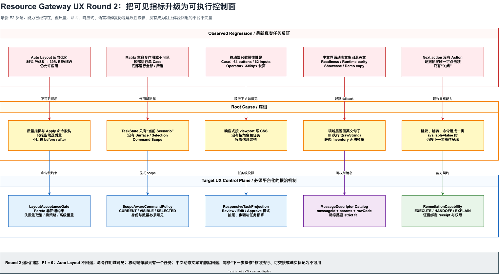

# Resource Gateway UX Round 2 资深体验审阅与演进计划

> 状态：For Review / Engineering Recalibration
>
> 审阅日期：2026-08-06
>
> 审阅基线：`66d8f44a7` (`fix(resource-gateway): close final ux verification gaps`)
>
> 证据等级：E2，真实服务、真实浏览器、桌面与移动端固定任务走查
>
> 当前工程体验复评分：`84 / 100`
>
> 缺陷结论：`0 P0 / 6 P1 / 6 P2`
>
> 目标：工程体验重新达到 `>= 96 / 100`、P0/P1 清零，然后进入 E3/E4 真实组织验证

相关文档：

- [上一轮 UX 深度审阅与针对性演进计划](resource-gateway-ux-deep-audit-and-targeted-evolution-plan.md)
- [Stage 6 工程验收与体验证明记录](resource-gateway-ux-stage6-engineering-verification.md)
- [视觉系统与响应式任务布局](resource-gateway-ux-stage5-visual-responsive-system.md)
- [双语完整性与术语治理](resource-gateway-ux-stage4-localization-governance.md)
- [表格驱动测试产品设计](resource-gateway-table-driven-testing-product-design.md)

## 实施进度

### 2026-08-07：UX-R2-001 可读紧凑布局切片

已实现：

- 修正小图布局生成器与质量约束之间的参数冲突：相邻列间距改为 `48px`，与节点两侧各
  `24px` 的安全带严格一致；同列行距按 `164 + 24 * 2 = 212px` 计算，不再被约束器二次拉伸；
- 两列以上的长边明确走画布 bus lane，不再用相邻列的 midpoint 近似误判标签与节点碰撞；
- 语义边标签之间新增 `8px` 模型安全带，吸收中文换行、CSS 边框和 fractional zoom 造成的
  亚像素偏差；
- 新增完整贷款示例回归，证明生成布局经过节点和标签约束后坐标不发生二次漂移，并对所有
  可见语义标签做成对安全带检查；
- 保留 Stage 0 的 Before / Candidate 门禁：算法能给出好候选时直接说明“already optimal”，
  未来若再次生成退化候选仍会被默认阻断。

真实浏览器验收（production frontend bundle，`1472 x 920`，实际 React Flow 区域
`1024 x 434`）：

- 贷款示例 Auto Layout 后为 `80% / PASS / 12px title / 12 visible field labels`；
- DOM 几何审计为 `0 node overlaps / 0 label overlaps / 0 viewport clipping`；
- 原先右下角两张相贴标签的包围盒从约 `0.47px` 重叠变为约 `84.5px` 纵向间隔；
- 状态条与实际几何一致显示 `Layout already optimal · 0 node overlaps · 0 label collisions`。

当前诚实边界：5 节点高语义密度小图的可读候选已闭环；`25 / 100` 节点固定图、多策略候选
选择和 CI 浏览器像素矩阵仍需在 Stage 1 后续切片与 Stage 7 证明，不据此提前宣称整个
UX-R2-001 已完成。

### 2026-08-07：UX-R2-001 非回退门禁切片

已实现：

- 新增纯策略模块 `LayoutAcceptanceGate`，比较布局前后的几何质量、感知状态、fit zoom、
  有效标题字号和图边界面积；
- 小型图候选低于 `80%`、标题低于 `12px`、新增节点/标签碰撞、PASS 降为 REVIEW，或图面积
  无理由扩大超过 `25%` 时，默认 Apply 被禁用；
- 预览条直接显示 Before / Candidate，不再要求用户从两段工程摘要中自行推断；
- 高级覆盖与默认 Apply 隔离，覆盖动作记录固定 reason、回归数量和无 payload telemetry；
- 新增 13 个门禁、交互和遥测测试，并将 Author 端到端组件测试改为验证真实退化候选；
- 中英文补齐候选结论、回退原因、保留当前布局和显式覆盖文案。

真实浏览器验收（production frontend bundle，`1472 x 920` 与 `390 x 844`）：

- 贷款示例当前布局为 `85% / PASS / 12.7px`；自动布局候选降为
  `36% / REVIEW / 5.3px` 时，默认 Apply 已被禁用；
- 回退原因完整显示为 PASS -> REVIEW、小图 fit zoom 低于 `80%`、标题低于 `12px`、
  图面积增加超过 `25%`；
- Advanced override 可显式应用，随后 Undo 可恢复原始位置；浏览器控制台无 error / warning；
- 移动端确认门禁逻辑仍生效，但检查器遮挡布局复核区，完成消息仍有英文泄漏。这两项分别进入
  UX-R2-007 与 UX-R2-010，不把“逻辑可用”误写成“移动体验完成”。

当前诚实边界：Stage 0 非回退门禁已经完成，解决的是“已知退化仍可默认提交”。随后完成的
可读紧凑布局切片已经让贷款示例达到 `zoom >= 80% / title >= 12px`；多策略候选和
`25 / 100` 节点矩阵仍属于 Stage 1 后续工作，因此 UX-R2-001 总体继续保持 `IN PROGRESS`。

## 0. 最强结论

上一轮的主要方向是正确的：原子 Workspace、统一 Scenario、字段级 Diff、Evidence trust、
Library Home、双语字典和响应式 token 都已经让产品跨过了“功能原型”阶段。

但“工程 96 分、P0/P1 已清零”的结论现在不能继续成立。最新真实浏览器走查出现了五类
可以复现的反证：

1. 5 节点图初始为 `85% / Perception PASS`，执行 Auto Layout 后降为
   `39% / Perception REVIEW / 5.8px title`，系统仍允许直接应用；
2. Scenario Matrix 顶部始终显示“运行并比较”，实际运行隐藏的当前 Case；同一页面底部又有
   “全部运行”和“运行所选项”，命令作用域不可见；
3. 390px Case 编辑器同时暴露 `64` 个按钮、`62` 个输入控件，Library Operator 编辑形成
   `3359px` 长页面；“没有横向溢出”掩盖了任务不可达；
4. 中文 Library 仍显示 `Design valid; runtime unbound`、`DOCUMENTED ONLY` 和完整英文建议，
   Showcase 与 Rehearsal 的内置示例说明也大面积为英文；
5. Rehearsal Evidence 把“请求受控重试”称为“下一步操作”，但抽屉内唯一可以点击的动作只有
   “关闭”。

这些问题不是五个孤立样式 bug。它们共同指向一个更深的缺口：

> Resource Gateway 已经有很多正确的投影模型，但质量、命令作用域、响应式任务、动态消息和
> 修复动作还只是“展示给用户看的信息”，没有成为约束产品行为的控制面。

本轮不再以增加面板、提示或 tooltip 为解法。目标是把五类信息升级为五个可复用的 UX 内核：



图源：
[resource-gateway-ux-round2-control-plane.drawio](assets/drawio/resource-gateway-ux-round2-control-plane.drawio)

## 1. 审阅方法与证据纪律

### 1.1 真实任务环境

| 项目 | 条件 |
|---|---|
| 服务 | Resource Gateway 完整 fat JAR，`test` profile |
| 浏览器 | Codex in-app Chromium |
| 语言 | `zh-CN` |
| 桌面视口 | `1472 x 920`、`1280 x 720` |
| 移动视口 | `390 x 844` |
| Graph | Loan policy fallback，5 nodes / 12 edges |
| Library | Customer Support Authoring，3 types / 2 operators / 3 functions |
| Rehearsal | Grounding policy regression |
| Showcase | User Dashboard |
| 任务 | 首次加载、Auto Layout、Matrix、Case 编辑、Operator 编辑与测试、Evidence 排障、资产恢复 |

### 1.2 本轮不接受的伪证据

以下事实仍然有工程价值，但不能单独证明体验成熟：

- 页面没有横向 overflow；
- 字号 token 已经统一；
- DOM 中按钮都有可访问名称；
- 质量条能显示 `REVIEW`；
- 所有文案都经过 `t(...)` 调用；
- Remediation 对象含 `actionLabel`；
- 示例最终能够运行；
- 组件测试覆盖了按钮点击；
- 390px 页面可以滚动到所有控件。

本轮采用的判断标准是：用户是否能在不理解内部状态机、隐式 selection 和英文协议文案的
情况下，知道当前对象、当前作用域、当前结论和下一步真实可执行动作。

### 1.3 事实、推断和边界

| 类型 | 结论 |
|---|---|
| 事实 | 示例初始 Canvas 为 `85% / PASS / 12.7px title` |
| 事实 | Auto Layout preview 为 `39% / REVIEW / 5.8px title`，Apply 仍 enabled |
| 事实 | Focus 后只有 `67% / REVIEW / 10px title` |
| 事实 | 390px Matrix 不横向撑破页面，但九列表格依赖内部横向滚动 |
| 事实 | 390px Case DOM 同时存在 64 个可见按钮、62 个可见输入控件 |
| 事实 | 390px Operator 编辑页高 `3359px`，采用 Tree -> Editor -> Contract 线性堆叠 |
| 事实 | Matrix 顶部主按钮运行 `workspaceScenarioId`，无值时回退第一条 Scenario |
| 事实 | Matrix 本身没有把该隐式当前 Case 作为当前行持续高亮 |
| 事实 | 中文 Library readiness、runtime parity 和保存状态仍出现英文句子 |
| 事实 | Rehearsal demo Evidence 的 Remediation action 为 unavailable，抽屉只渲染关闭按钮 |
| 事实 | Showcase 与 Author Start 同时提供不同的示例体系，Showcase 还暴露 Legacy runner |
| 推断 | 当前视觉回归的病根是“指标可见但不约束命令” |
| 推断 | 当前移动端回归的病根是“布局响应式”替代了“任务响应式” |
| 推断 | 当前中文回归的病根是 raw English string 被当作 message id 动态调用 `t(source)` |
| 非目标 | 本轮不修改 GraphDraft、Scenario、Evidence 和 Operator Library 的权威 wire schema |
| 非目标 | 本轮不承诺在 390px 完成复杂拓扑拖拽和完整 Library 建模 |

## 2. 当前体验评分

### 2.1 复评分

| 维度 | 权重 | 上轮 | Round 2 | 主要扣分 |
|---|---:|---:|---:|---|
| 信息架构与任务连续性 | 15 | 15 | 13 | Matrix 双重 Run scope、Author 示例与 Showcase 双入口 |
| 首次成功与核心任务效率 | 15 | 14 | 14 | 原子示例仍然成立，首次成功没有回归 |
| 复杂图理解与操控 | 12 | 12 | 9 | Auto Layout 可把 PASS 候选变成 REVIEW 并提交 |
| Contract / Schema 直观性 | 10 | 9 | 9 | Schema 编辑强，但 Library readiness 仍以机器语言呈现 |
| 测试创作、运行与正确性 | 18 | 17 | 15 | Matrix 批跑较强，当前 Case scope 与移动编辑仍不清楚 |
| 反馈、恢复与 Evidence 信任 | 10 | 10 | 8 | Evidence 诊断清楚，但 Remediation 不能闭环执行 |
| 视觉层级与可读性 | 8 | 8 | 7 | 基础视觉系统成立，窄 inspector 和复杂页面仍有断行与拥挤 |
| 多语言、可访问性与响应式 | 7 | 7 | 4 | 动态英文静默回退；移动端只证明无 overflow |
| 企业资产与治理生命周期 | 5 | 4 | 5 | Library Home、revision resume 和测试门禁入口已成立 |
| **合计** | **100** | **96** | **84** | **6 个 P1，不具备 95 分宣称条件** |

`84 / 100` 是当前工程任务表面的复评分，不是面向客户的满意度分数。按既有证据纪律，E2
即使全部修复，对外体验成熟度仍应封顶为 `89`；只有 E3 真实用户任务成功率通过后才可宣称
`95`。

### 2.2 为什么不是继续维持 96 分

上一轮评分奖励了以下“组件已实现”事实：

- 有 Perception 指标；
- 有统一 TaskState；
- 有 390px breakpoint；
- 有 strict locale inventory；
- 有 RemediationAction。

本轮发现的是这些组件之间的约束关系缺失：

```text
Perception REVIEW 不能阻止 Apply
TaskState 不知道当前是 Matrix 还是 Case
390px breakpoint 不知道用户正在 Review 还是 Edit
locale inventory 枚举不到运行期字符串
RemediationAction.available=false 仍被叫作“下一步操作”
```

如果评分不因这些反证下降，评分模型就是自我证明，而不是质量门禁。

## 3. P1 硬伤

### UX-R2-001：Auto Layout 可以提交已知更差的候选

**现象**

```text
载入贷款策略示例
  初始：85% / Perception PASS / 12.7px title
  点击 Auto Layout
  候选：39% / Perception REVIEW / 5.8px title
  Focus：67% / Perception REVIEW / 10px title
  Apply：仍可点击
```

**用户影响**

- 用户合理地认为 Auto Layout 会优化布局，实际却需要自己读指标后拒绝结果；
- 反向优化会破坏此前手工整理或内置示例的可读布局；
- 质量条使用英文工程摘要，业务作者难以理解为什么不该应用；
- 此问题此前已经多轮修复，继续靠参数调优会重复进入低质量循环。

**病根**

`assessCanvasLayout` 只判断候选几何是否相交，`assessCanvasPerceptualQuality` 只报告当前
viewport 的感知质量。两者都没有形成 `before -> candidate` 的差异判定；
`CanvasTaskNavigator` 只要存在 `layoutPreview` 就渲染 enabled Apply。

**根治设计：`LayoutAcceptanceGate`**

新增不可绕过的比较结果：

```ts
interface LayoutAcceptanceDecision {
  decision: 'ACCEPTABLE' | 'ALTERNATIVE_REQUIRED' | 'EXPLICIT_OVERRIDE';
  before: CanvasPerceptualQualityReport;
  candidate: CanvasPerceptualQualityReport;
  regressions: LayoutRegression[];
  recommendedStrategy: 'KEEP_CURRENT' | 'COMPACT_LANES' | 'FOCUS_PATH' | 'OVERVIEW_ONLY';
}
```

默认 Apply 必须同时满足：

1. node overlap 和 label collision 不增加；
2. `<= 8` 节点图 zoom 不低于 `0.8`；
3. effective title 不低于 `12px`；
4. candidate 的 perception status 不得劣于 before；
5. graph bounding area 不得无业务理由扩大超过 25%；
6. 选中节点的上下游主路径不得被压到 viewport 外。

如果算法找不到非回退候选，默认动作应为“保留当前布局”，其次提供“紧凑分层”“只整理当前
路径”等替代策略。只有 Advanced 中的“仍然应用”可以覆盖，并记录 telemetry 与 undo point。

**退出门槛**

- 贷款示例 Auto Layout 后 `zoom >= 80%`、title `>= 12px`；
- 若候选低于初始质量，默认 Apply 不可用且原因是中文业务文案；
- 5 / 25 / 100 节点固定图全部执行 before-after 视觉门禁；
- `AUTO_LAYOUT_COMPLETED` 增加 before/candidate delta 与 override reason，不记录业务 payload。

### UX-R2-002：Matrix 顶部主命令运行一个不可见的当前 Case

**现象**

- Matrix 顶部一直显示“运行并比较”；
- 其实现运行 `workspaceScenarioId`，为空时回退 suite 第一条；
- Matrix 没有持续表达哪一条是当前 Case；
- 同页底部同时存在“全部运行”“运行所选项”“运行失败项”等批量命令。

**用户影响**

用户无法仅凭按钮判断点击后会运行 1 条、3 条、当前筛选结果还是选中项。此问题不会造成 wire
数据错误，但会造成错误测试范围和错误信心，是工业测试工具不能接受的作用域歧义。

**病根**

`TaskStateProjection` 的命令只有 `RUN_CURRENT_SCENARIO`，没有把当前 Surface、Selection 和
Collection scope 建模。Author Command Bar 认为“存在 Scenario”就可以暴露当前 Case 主命令，
而 Matrix 的正式任务其实是判断和批跑集合。

**根治设计：`ScopeAwareCommandPolicy`**

```ts
type CommandScope =
  | { kind: 'CURRENT_CASE'; scenarioId: string; label: string }
  | { kind: 'SELECTED_CASES'; scenarioIds: string[] }
  | { kind: 'VISIBLE_CASES'; scenarioIds: string[]; filterFingerprint: string }
  | { kind: 'FULL_SUITE'; suiteId: string; revision: number };
```

策略：

| Surface | 唯一主动作 | 作用域呈现 |
|---|---|---|
| Matrix，无 selection | `运行全部 3 个用例` 或无顶部 Run | 数量与 suite revision 必显 |
| Matrix，有 selection | `运行所选 2 个用例` | selection toolbar 与主动作合一 |
| Case | `运行 Prime approval path` | Case 名称紧邻按钮 |
| Coverage | `生成缺口用例` / `运行未覆盖项` | coverage lens 必显 |
| Evidence | `重新运行失败的 1 个用例` | 基于当前 evidence coordinate |

不再允许“当前 Scenario”作为跨 Surface 的隐式全局状态。

**退出门槛**

- 任一运行按钮的 accessible name 含 scope 和 count；
- Matrix 不存在无可见 Case identity 的单 Case Run；
- UI command scope、compiled plan scope、Evidence receipt 三者 fingerprint 一致；
- 测试覆盖筛选变化、selection 变化、分页、运行中取消和 stale suite。

### UX-R2-003：移动端 Scenario 编辑仍是桌面信息架构的缩窄版

**现象**

- 390px Case 页面同时暴露列表、名称、类型、删除、四步导航、三组 Dependency、Assertion、
  Advanced JSON 和两处 Run；
- DOM 中有 64 个可见按钮、62 个可见输入控件；
- Case 列表占据首屏，用户必须先穿过三条用例，才能进入当前编辑内容；
- 页面不横向溢出，但任务选择、编辑和运行没有形成单一焦点。

**病根**

现有 `responsive.css` 主要通过隐藏状态条、改 grid、增加 touch target 和允许内部滚动来适配。
它没有改变 Case 编辑的任务模型。

**根治设计：移动端 Case Runner / Editor 分离**

移动端默认进入 Runner：

```text
Case picker
  -> 当前 Case 摘要
  -> Given / Dependencies / Then 完整性
  -> Run
  -> Verdict / Diff / Next action
```

只有点击“编辑”后进入全屏四步 Editor；每次只展开一个步骤，顶部 sticky stepper 显示完成度，
退出时返回当前 Case。Case list 改为 picker/drawer，不得常驻堆在 Editor 前面。

移动端不默认展示 Advanced JSON；只有 Advanced 入口显式打开独立全屏文本编辑器。

**任务预算**

| 指标 | 门槛 |
|---|---:|
| 首屏主动作 | 1 个 |
| 当前步骤内可见输入 | `<= 12` 个 |
| 当前步骤内可见命令 | `<= 6` 个 |
| 从 Case picker 到 Run | `<= 3` 次点击 |
| 从失败 Verdict 到字段 Diff | `<= 2` 次点击 |
| 非当前步骤控件 | 不进入 tab order |

### UX-R2-004：移动端 Library 仍把三栏工作台线性堆叠

**现象**

- Library 详情按 Asset Tree -> Builder -> Contract Preview 顺序堆叠；
- 仅 Library 摘要页已经 `1690px` 高；
- 选择 Operator 后页面增至 `3359px`，35 个按钮、23 个输入；
- Contract readiness 位于页面尾部，编辑者要滚过完整 schema 才能看到是否可提交。

**根治设计：Library 移动端只读审阅 + 轻量字段修复**

390px 默认支持：

1. 查看 Library readiness、owner、revision 和 test gate；
2. 用 asset picker 切换 Operator / Function / Type；
3. 查看单个资产的 Contract、runtime binding 和测试状态；
4. 修复 owner、description、required、枚举值等低风险字段；
5. 运行或查看单资产测试；
6. 批准、驳回或发起桌面继续编辑 deep link。

复杂 Schema 树编辑、批量资产建模和 runtime binding 仍定位为桌面任务。系统应诚实显示“在桌面
继续编辑”，而不是把所有桌面能力竖向拼接。

**退出门槛**

- 390px 首屏直接显示 readiness 与 blocker；
- Asset Tree 改为 drawer/picker，不占据正文纵向空间；
- 当前资产 Contract 与 Test 状态在一屏可达；
- 完整编辑任务若不受支持，显示可复制 deep link 和原因，不伪装为可用。

### UX-R2-005：动态产品文案绕过了严格多语言门禁

**现象**

中文 Library 出现：

- `Saved revision 1`；
- `Design valid; runtime unbound`；
- `0/5 declared assets can execute in this deployment.`；
- `DOCUMENTED ONLY`、`RUNTIME DISCOVERED`；
- `Bind an exact runtime implementation or keep this catalog design-only.`；
- execution archetype 的完整英文名称。

Showcase 与 Rehearsal 的内置标题、说明和目标也大面积为英文。Canvas quality summary 仍使用
`Geometry PASS / Perception REVIEW`。

**病根**

`localeSurfaceInventory.test.ts` 可以发现 literal `t('...')` 和裸 JSX 英文，但无法发现：

```ts
const readiness = presentLibraryReadiness(preview); // 返回英文句子
t(readiness.title);                                // 运行期动态 key
t(parity.message);                                 // 服务端英文句子
```

这是一种结构性静默失败。继续往字典里补英文句子只能延迟下一次回归。

**根治设计：`MessageDescriptor`**

所有产品生成文本改为：

```ts
interface MessageDescriptor {
  messageId: MessageId;
  params?: Record<string, string | number>;
  rawCode?: string;
  rawDetail?: string; // 仅技术详情区
}
```

原则：

1. domain projection 返回 `messageId + params`，不返回英文句子；
2. 服务端动态诊断以稳定 code 映射本地 catalog；
3. 未知 code 在中文产品面显示“未识别的运行时状态”，raw message 进入技术详情；
4. built-in demo metadata 自带 `zh-CN / en-US` presentation，不把 demo copy 当用户资产；
5. 用户自有 asset name、field path、operatorRef 和协议 code 保留原文；
6. `zh-CN` 测试环境对产品文案 missing key fail closed，不允许返回英文 source。

**退出门槛**

- 中文关键任务截图中没有英文句子，除用户资产、字段、code 和技术详情；
- readiness、runtime parity、save state、layout quality、showcase、rehearsal demo 全部进入枚举测试；
- CI 对 `t(variable)` 建立 allowlist，未登记来源直接失败；
- message catalog 支持 ICU 风格复数、数字和日期，不再拼接英文模板。

### UX-R2-006：Remediation 是说明模型，不是执行能力

**现象**

Rehearsal Evidence 显示：

```text
下一步操作
通往可信结果的 1 条路径
1 请求受控重试
```

但该 action 的 `available=false`，`RemediationActionList` 不渲染按钮。真实抽屉只有“关闭”可点击。

**用户影响**

- “下一步操作”承诺了系统能力，实际只是建议；
- 用户无法知道由谁、在哪个系统、以什么权限完成重试；
- 演示场景展示失败，却没有可演示的恢复闭环；
- Evidence 与 Author deep link 的价值没有转化为排障效率。

**根治设计：`RemediationCapability`**

```ts
type RemediationCapability =
  | { kind: 'EXECUTE'; commandId: string; confirmation: ConfirmationPolicy }
  | { kind: 'HANDOFF'; deepLink: string; targetSystem: string; requiredRole: string }
  | { kind: 'EXPLAIN'; owner: string; unavailableReason: MessageDescriptor };
```

呈现规则：

| Capability | UI |
|---|---|
| EXECUTE | 主按钮，执行后返回 receipt、attemptId 和新 Evidence |
| HANDOFF | “在 Author / ANEKE 打开”，保留 exact coordinate |
| EXPLAIN | 标为“建议，当前不可直接执行”，不得计入“可执行路径”数量 |

Demo 至少提供一条本地可执行闭环：模拟受控重试、切换到成功批次或打开对应 Author seed。Demo
动作必须显式标注“不生成治理证据”。

**退出门槛**

- “N 条路径”只统计 EXECUTE + HANDOFF；
- 每个失败类别至少有一个可执行、可交接或诚实不可用的结论；
- retry 命令具备幂等键、权限检查、确认、审计和结果 receipt；
- deep link 保留 draftId / nodeId / scenarioId / runId；
- demo 的 timeout 可以在三次点击内完成“发现 -> 重试 -> 查看新结果”。

## 4. P2 瑕疵

| ID | 问题 | 影响 | 修正 |
|---|---|---|---|
| UX-R2-101 | Author Start 与顶层 Showcase 提供两套“示例” | 新用户不知道哪个用于学习编排、哪个用于 API 运行 | 顶层改名“运行样例”，或并入统一 Example Catalog，以用途筛选 |
| UX-R2-102 | Rehearsal hero 直接串联多个 raw gate code | 业务结论被协议术语抢占 | 首屏显示人类化 blocker chips，raw codes 收到技术详情 |
| UX-R2-103 | Demo attempt/deadline 使用固定历史日期 | 示例随时间腐化，用户误以为任务早已过期 | 按 seed load time 生成相对时间，并明确“演示时间线” |
| UX-R2-104 | Library inspector 的“下一页”在窄列逐字换行 | 视觉破碎，行动建议难扫读 | 改为 block layout：label 一行、copy 一行；禁止 CJK 单字列 |
| UX-R2-105 | Matrix 每行同时提供“检查”和“打开” | 两个动作差异不清，增加扫描噪声 | 行点击打开，保留一个显式主动作；检查改为状态/tooltip 或详情 tab |
| UX-R2-106 | 质量条与部分状态摘要使用英文工程句子 | 中文作者必须翻译内部指标 | 对外只显示中文结论与差异，完整英文 metric 放 technical details |

## 5. 结构性病根

### 5.1 指标没有 command authority

系统已经能测 perception、currentness、readiness 和 availability，但各指标只影响颜色或说明，
没有统一决定命令是否允许执行。正确模式应为：

```text
Facts
  -> Policy decision
  -> Command availability
  -> Explanation and remediation
  -> Receipt and evidence
```

禁止继续使用：

```text
Facts
  -> badge / notice
  -> button remains enabled
  -> user is expected to understand the risk
```

### 5.2 Canonical state 缺少任务作用域

现有 canonical coordinate 很强，但偏向数据坐标。体验还需要：

- 当前 surface；
- 当前 subject；
- selection；
- command scope；
- visible collection fingerprint；
- role capability；
- host capability。

没有这些信息，“同一个 Run 命令”会在 Matrix、Case、Evidence 和移动端表达不同含义。

### 5.3 响应式只处理空间，不处理认知预算

CSS breakpoint 可以改变列数和滚动方式，不能决定哪些信息属于当前任务。移动端成熟度应按
“任务完成预算”验收，而不是按“所有 DOM 最终都能滚到”验收。

### 5.4 文案模型仍把英文句子当主键

英文 source string 既是产品 copy 又是 lookup key，会导致：

- 英文改字等于协议变更；
- 动态句子无法静态枚举；
- 参数、复数和日期靠字符串拼接；
- 服务端文案与前端字典耦合；
- fallback 看似可用，实际泄漏英文。

### 5.5 Remediation 缺少执行所有权

建议不等于命令，命令不等于当前用户有权限执行，deep link 也不等于目标系统具备 capability。
必须把执行者、权限、目标、幂等、确认、receipt 和审计作为 Remediation 的一等字段。

### 5.6 示例数据缺少产品生命周期

内置示例现在更多是静态协议快照。它们还需要：

- locale presentation；
- relative clock；
- demo capability profile；
- expected recovery path；
- reset semantics；
- deterministic success / failure receipt。

否则示例会随时间和新功能持续腐化。

## 6. 目标体验不变量

### 6.1 布局非回退不变量

Auto Layout 默认不能把一个 PASS 布局变成 REVIEW；不能降低小图可读性；不能以“零重叠”
交换成用户无法阅读。

### 6.2 命令作用域不变量

每个命令都必须回答：对哪个对象、哪一版、多少项、什么筛选、以什么 proof strength 执行。

### 6.3 每屏一个任务不变量

移动端每个可交互屏幕只承担 Review、Edit、Run、Compare 或 Approve 中一个主任务。其它能力通过
drawer、step 或 deep link 渐进披露。

### 6.4 产品文案可枚举不变量

产品生成文本必须由 messageId 与 params 构成。raw message 只能进入技术详情，不能静默成为
本地化 fallback。

### 6.5 下一步可兑现不变量

被称为“下一步操作”的项目必须可执行或可交接。只能解释的内容必须诚实称为建议，并说明
owner 与不可用原因。

### 6.6 示例可恢复不变量

每个内置失败示例都必须有确定的恢复路径；每个成功示例都必须能 reset 并重复体验。

## 7. 分阶段实施计划

### Stage 0：诚实止血与回归冻结（2-3 天）

目标：先阻止已知误导继续进入演示和评分。

工作项：

1. 当 candidate perception 劣于 before 时禁用默认 Apply；
2. Matrix mode 暂时隐藏顶部 single-case Run，只保留显式批量命令；
3. unavailable Remediation 改称“建议，当前不可直接执行”；
4. 中文界面对已知 readiness / save state / runtime parity 补齐临时 catalog；
5. 文档和产品 about 信息不再引用“P0/P1 已清零、工程 96 已完成”；
6. 建立本轮固定浏览器任务和截图基线。

退出门槛：6 个 P1 都有自动化失败用例，临时止血不改变 wire contract。

### Stage 1：布局质量控制面（1 周）

目标：让质量指标真正约束 Auto Layout。

工作项：

1. 新增 before/candidate 差异模型；
2. 将 geometry、perception、viewport occupancy 和 path preservation 合并为 acceptance policy；
3. 算法输出多个候选：layered compact、path focus、overview；
4. preview 显示“改善 / 保持 / 退化”的字段级差异；
5. 退化候选只允许 Advanced override；
6. 为 5 / 25 / 100 节点建立视觉和像素门禁。

主要代码切入点：

- `author/canvas/canvasSemantics.ts`；
- `author/canvas/layoutQuality.ts`；
- `author/canvas/CanvasTaskNavigator.tsx`；
- `AuthorCanvas.tsx`；
- `author/canvas/*.test.ts(x)` 与真实浏览器几何测试。

### Stage 2：Scope-aware Command Policy（1 周）

目标：消除 Matrix / Case / Evidence 的运行作用域歧义。

工作项：

1. `AuthorTaskStateProjection` 增加 surface 与 `CommandScope`；
2. current Case selection 不再作为隐藏全局默认；
3. Matrix、Case、Coverage、Evidence 各拥有自己的主命令；
4. command label、confirmation 和 receipt 都显示 scope；
5. bulk run 绑定 filter/selection fingerprint；
6. 运行期间 selection 或 filter 变化不改变已提交计划。

主要代码切入点：

- `author/task/taskStateProjection.ts`；
- `author/shell/AuthorCommandBar.tsx`；
- `contract-scenario/ContractScenarioWorkspace.tsx`；
- `contract-scenario/table/ScenarioMatrixSurface.tsx`；
- `contract-scenario/table/tableSuiteRunModel.ts`。

### Stage 3：响应式任务投影（1.5-2 周）

目标：移动端从“全部堆叠”升级为“按角色完成任务”。

工作项：

1. 新增 `ResponsiveTaskProjection`，输入 viewport、pointer、surface、role、selection；
2. Scenario 提供 Runner 与 Editor 两个移动投影；
3. Library 提供 Review 与 Light Edit 投影；
4. list/tree 改为 picker 或 drawer；
5. step 外控件不渲染或不进入 tab order；
6. unsupported complex edit 提供 desktop deep link；
7. 以任务预算而不是 overflow 作为验收。

建议新增模块：

- `ux/responsiveTaskProjection.ts`；
- `contract-scenario/mobile/MobileScenarioRunner.tsx`；
- `contract-scenario/mobile/MobileScenarioEditor.tsx`；
- `library-authoring/mobile/MobileLibraryReview.tsx`；
- `library-authoring/mobile/MobileAssetPicker.tsx`。

### Stage 4：动态消息与示例本地化协议（1-1.5 周）

目标：根除动态英文静默回退。

工作项：

1. `ReadinessPresentation` 改为 message descriptors；
2. runtime parity state/message 按稳定 code 投影；
3. layout quality summary 使用结构化 metric + 本地化 presenter；
4. save state、conflict、autosave error 全部 messageId 化；
5. Showcase/Rehearsal built-in metadata 提供双语 presentation；
6. demo date 改为 relative clock；
7. CI 禁止未登记的 `t(variable)` 和 raw product sentence。

主要代码切入点：

- `i18n/messageCatalog.ts`；
- `i18n/localeSurfaceInventory.test.ts`；
- `i18n/generatedProductText.ts`；
- `library-authoring/readinessPresentation.ts`；
- `library-authoring/CanonicalContractPreview.tsx`；
- `rehearsalDemoData.ts`；
- `Showcase.tsx`。

### Stage 5：可执行 Remediation 与演示恢复闭环（1.5 周）

目标：从“看见失败”升级到“完成修复或交接”。

工作项：

1. Remediation 区分 EXECUTE / HANDOFF / EXPLAIN；
2. capability probe 返回 action endpoint、权限、feature flag 和 confirmation policy；
3. retry / rerun / open author target 返回稳定 receipt；
4. unavailable action 不计入路径数；
5. Rehearsal demo 增加本地模拟重试与 reset；
6. Author / ANEKE deep link 保留 exact coordinate；
7. Evidence 记录 action invocation、actor、result 与 derived runId。

主要代码切入点：

- `remediation/remediationAction.ts`；
- `remediation/RemediationActionList.tsx`；
- `RehearsalRemediationPanel.tsx`；
- `RehearsalWorkbench.tsx`；
- integration capability API 与 deep-link adapter。

### Stage 6：信息架构收口与视觉抛光（1 周）

目标：清理剩余 P2，不再让示例、机器状态和重复动作抢占主任务。

工作项：

1. Author Start 与 Showcase 合并为统一 Example Catalog，或将 Showcase 明确改名“运行样例”；
2. Legacy runner 移到 Advanced / Legacy；
3. gate codes 收入 technical details；
4. 修复 Library narrow inspector 的 CJK 单字换行；
5. Matrix 行动作合一；
6. 建立中文、英文、Comfortable、Compact 的视觉回归矩阵。

### Stage 7：E3/E4 体验证明（2 个发布周期）

目标：从 engineering-ready 进入真实成熟度 95。

参与者至少覆盖：

- 3 名业务编排作者；
- 3 名 Operator / Function 开发者；
- 3 名测试或质量工程师；
- 3 名治理 / 运行人员；
- 至少 2 人主要使用中文；
- 至少 2 人通过 VS Code 宿主完成任务。

固定任务：

1. 载入示例并解释输入、输出和 proof strength；
2. Auto Layout 并判断是否应提交；
3. 运行全部边界用例并定位一条失败；
4. 在移动端查看失败并完成修复交接；
5. 创建或恢复一个 Library revision；
6. 解释 runtime unbound 的业务含义；
7. 从 Rehearsal Evidence 跳回 exact Author target。

## 8. 量化验收

### 8.1 核心任务指标

| 任务 | 门槛 |
|---|---:|
| 首次示例成功 | 中位数 `<= 90s`，无协助成功率 `>= 95%` |
| Auto Layout 正确决策 | `>= 95%` 用户能说明改善或拒绝原因 |
| Matrix 运行范围判断 | `100%` 正确回答将运行多少 Case |
| 创建一个边界用例 | 中位数 `<= 4min`，无 Raw JSON |
| 移动端失败定位 | 中位数 `<= 60s` |
| Library runtime blocker 判断 | 正确率 `>= 90%` |
| Rehearsal 修复/交接 | 中位数 `<= 90s` |

### 8.2 自动化门禁

| 门禁 | 断言 |
|---|---|
| Layout | candidate 不得劣于 before；override 必须记录 reason |
| Command | label、plan、receipt 的 scope fingerprint 一致 |
| Mobile | 每个 step 的 controls/task budget 达标；非当前 step 不在 tab order |
| Locale | 中文产品句子零英文 fallback；动态 descriptor inventory 全覆盖 |
| Remediation | 路径数只统计 executable/handoff；receipt 可回放 |
| Demo | reset 后确定性复现；relative clock 不腐化 |
| Visual | 390 / 820 / 1024 / 1280 / 1472，Comfortable / Compact 双矩阵 |

### 8.3 体验遥测

新增无 payload 事件：

- `AUTO_LAYOUT_CANDIDATE_REJECTED`；
- `AUTO_LAYOUT_OVERRIDE_APPLIED`；
- `COMMAND_SCOPE_CONFIRMED`；
- `MOBILE_TASK_STEP_COMPLETED`；
- `LOCALE_FALLBACK_BLOCKED`；
- `REMEDIATION_EXECUTED`；
- `REMEDIATION_HANDOFF_OPENED`；
- `REMEDIATION_UNAVAILABLE_VIEWED`。

禁止记录 Scenario input、fixture payload、business output、secret、完整 field value 和 raw stack。

## 9. 工程边界与模块化

### 9.1 不应继续扩大的模块

当前关键规模：

| 模块 | 行数 | 本轮判断 |
|---|---:|---|
| `AuthorCanvas.tsx` | 11,403 | 不能再直接加入 layout/command/mobile 分支 |
| `styles.css` | 18,176 | 不能继续把任务策略写成页面末尾 override |
| `ContractScenarioWorkspace.tsx` | 2,589 | 需要拆出 surface-specific command 与 mobile projection |
| `RehearsalWorkbench.tsx` | 1,265 | batch projection 与 evidence drawer ownership 需要分离 |
| `RehearsalRemediationPanel.tsx` | 870 | capability 与 presentation 不应继续混在组件中 |
| `Showcase.tsx` | 976 | catalog、diagram、runner 和 result 已经超出单组件职责 |

### 9.2 推荐深模块

| 模块 | 隐藏复杂度 | 对外接口 |
|---|---|---|
| `LayoutAcceptanceGate` | before/after、候选策略、阈值、override | `decide(before, candidates, context)` |
| `ScopeAwareCommandPolicy` | surface、selection、filter、role、busy、stale | `commands(taskContext)` |
| `ResponsiveTaskProjection` | viewport、pointer、role、task budget | `project(surface, context)` |
| `MessageDescriptorCatalog` | dynamic status、params、locale、fallback policy | `format(descriptor, locale)` |
| `RemediationCapabilityResolver` | endpoint、permission、handoff、confirmation | `resolve(issue, hostCapabilities)` |
| `DemoScenarioClock` | relative timestamps、reset、determinism | `instantiate(seed, now)` |

这些模块必须是“深模块”：调用者只提供事实与上下文，不在 JSX 中重复推导 policy。

## 10. 风险与根治措施

| 风险 | 错误修法 | 根治措施 |
|---|---|---|
| Auto Layout 继续调参数仍回归 | 再拉大节点间距 | 多候选 + before/after acceptance gate |
| Matrix 为不同 scope 再加按钮 | 继续堆 Run controls | command scope 成为一等模型 |
| 移动端通过隐藏 CSS 勉强变短 | `display:none` 散落各组件 | surface-level responsive task projection |
| i18n 继续补英文句子键 | 扩大 dictionary | messageId + params + strict dynamic inventory |
| Demo 没有服务端 target | 把建议伪装成按钮 | demo capability + EXPLAIN honest state |
| Remediation 自动执行高风险动作 | 点击即 retry/publish | permission、confirmation、idempotency、receipt |
| 新控制面变成更多 mega module | 全写进 AuthorCanvas | 独立纯 policy 模块与小 surface adapters |
| E2 再次被说成 95 | 用测试数替代用户证据 | E3/E4 宣称门禁写入发布 checklist |

## 11. 推荐开工顺序

不要按页面分团队并行“各修一遍”。推荐按控制面纵切：

1. **先做 Stage 0**：阻止错误 Apply、隐藏 Matrix 隐式 Run、诚实标注 unavailable action；
2. **Stage 1 + 2 并行**：LayoutAcceptanceGate 与 ScopeAwareCommandPolicy 没有数据依赖；
3. **Stage 3**：基于稳定命令作用域构建移动任务投影；
4. **Stage 4**：同时改造五个控制面的 message descriptor，不再补散落字符串；
5. **Stage 5**：在 capability/权限边界明确后实现可执行 remediation；
6. **Stage 6**：最后处理 Showcase、视觉断行和重复动作；
7. **Stage 7**：真实用户验证，失败任务回流到对应 policy，不再增加局部补丁。

## 12. Definition of Done

### 产品

- [ ] P0/P1 为 0；
- [ ] 用户能在执行前回答命令对象、作用域和数量；
- [ ] Auto Layout 默认不提交退化候选；
- [ ] 移动端只承诺并完成定义过的角色任务；
- [ ] 所有“下一步操作”都可执行、可交接或诚实不可用；
- [ ] Author 示例与运行样例的用途不再混淆。

### 可信度

- [ ] visible state、compiled plan、receipt、Evidence scope 一致；
- [ ] Layout override 有 reason 和 undo；
- [ ] Remediation command 有权限、幂等、确认和审计；
- [ ] Demo action 永远标识非治理证据；
- [ ] 未知 dynamic message 不会静默显示英文。

### 可用性

- [ ] 390px Scenario Runner 与 Editor 分离；
- [ ] 390px Library 默认为 Review / Light Edit；
- [ ] 中文关键任务没有产品英文句子；
- [ ] 触摸目标、焦点、键盘和 screen reader 路径完整；
- [ ] 5 / 25 / 100 节点满足各自的阅读任务门槛。

### 工程

- [ ] 五个 UX 控制面为独立 policy/deep module；
- [ ] `AuthorCanvas.tsx` 和 `styles.css` 不因本轮继续显著增长；
- [ ] E1/E2 固定任务、视觉、几何和 locale 门禁进入 CI；
- [ ] 所有新遥测保持无 payload；
- [ ] Legacy / feature flag / rollback 路径明确。

### 证据

- [ ] E2 真实浏览器矩阵通过；
- [ ] 12 名目标用户 E3 固定任务通过；
- [ ] 两个团队连续两个发布周期 E4 无 P0/P1 回归；
- [ ] 对外评分同时注明工程分与证据等级。

## 13. 待评审决策

1. 是否接受 Auto Layout 的默认 Apply 受“非回退”硬门禁约束，退化候选只能 Advanced override？
2. 是否接受 Matrix 顶部不再运行隐式 current Case，而由 surface 决定 collection scope？
3. 是否确认 390px Library 不承诺完整复杂 Schema 建模，只支持审阅与轻量修复？
4. 是否接受动态产品文案从 raw English string 全面迁移到 message descriptor？
5. Demo 是否允许本地模拟 retry，前提是明确标注“不生成治理证据”？
6. Showcase 是保留为“运行样例”，还是并入统一 Example Catalog？

## 14. 自审结论

本方案自审评分：`96 / 100`。

| 维度 | 分数 | 说明 |
|---|---:|---|
| 事实证据 | 19/20 | 关键问题均来自真实服务与浏览器；E3 尚未发生 |
| 病根深度 | 20/20 | 从页面缺陷收敛到五个控制面缺失 |
| 可执行性 | 19/20 | 有阶段、代码切入点和退出门槛；人力需评审后锁定 |
| 工业边界 | 19/20 | 覆盖权限、幂等、审计、回滚、证据等级和无 payload 遥测 |
| UX 完整性 | 19/20 | 覆盖桌面、移动、多语言、测试、资产与排障；仍需用户研究验证 |

扣分只来自两类尚未取得的外部事实：目标用户 E3 数据和 ANEKE/VS Code 宿主中的真实组织行为。
在这两类证据出现前，本计划可以直接开工，但不能把计划自审分当作产品成熟度分。
