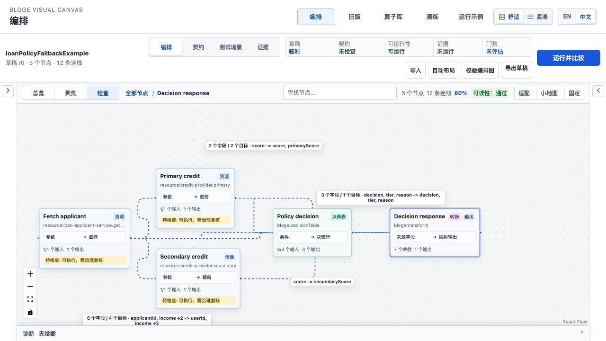
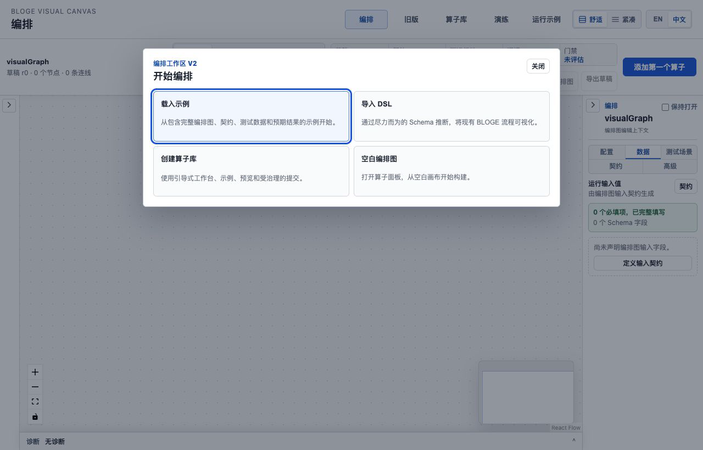
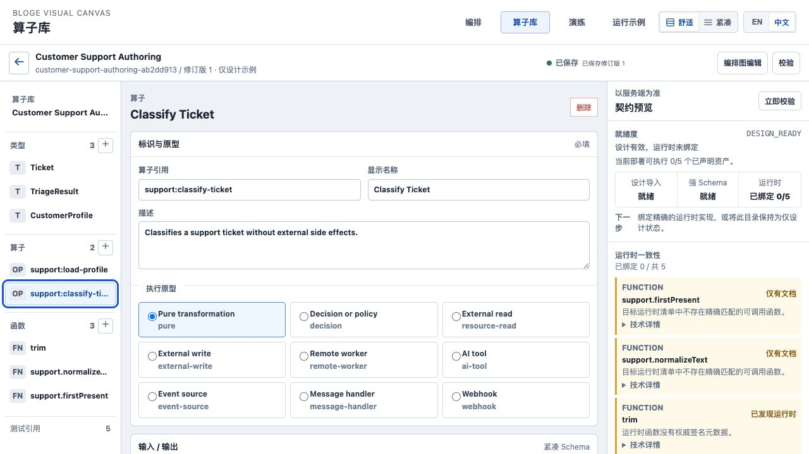
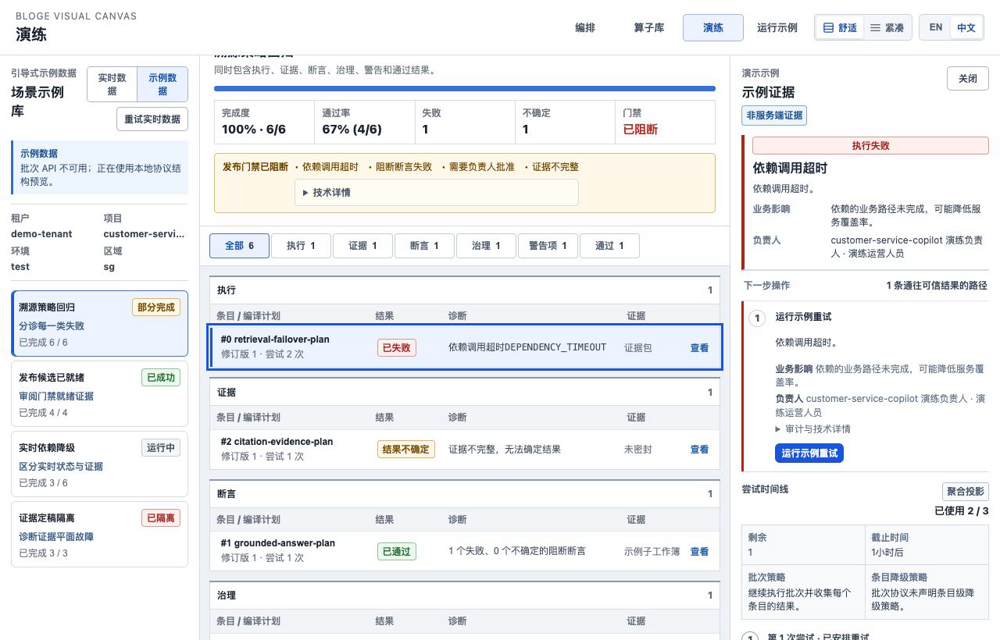
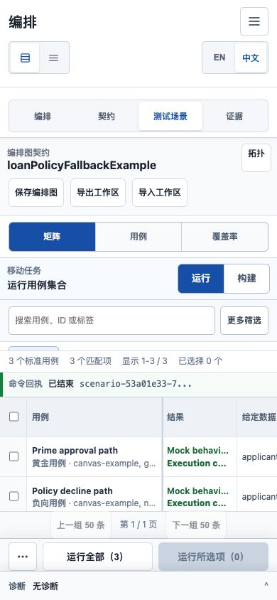
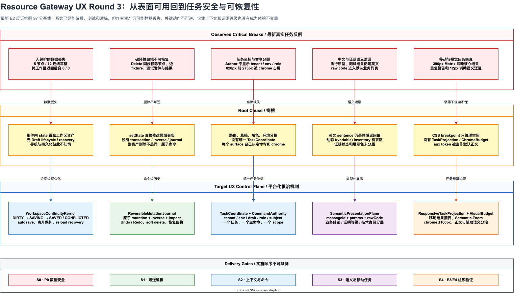

# Resource Gateway UX Round 3 资深体验审阅与演进计划

> 状态：S0-S5 E2 Engineering Implemented / E3-E4 Field Evidence Pending
>
> 审阅日期：2026-08-09
>
> 审阅基线：`904f7178f` (`feat(resource-gateway): close round-two ux control loops`)
>
> 证据等级：E2，最新 production JAR、真实 Chromium、代码路径与自动化覆盖交叉验证
>
> 当前视觉完成度：`95 / 100`
>
> 当前工业任务成熟度：`97 / 100`（S5 E2 实施复评；缺少 E3/E4 时对外成熟度仍封顶 `89`）
>
> E2 缺陷结论：`0 P0 / 0 P1 / 0 P2`；E3/E4 证据缺口不伪装成已验证能力
>
> 目标：先将 P0 清零，再恢复 `>=95 / 100` 的 E2 工程体验；没有 E3/E4 证据前，对外成熟度仍封顶 `89`

相关文档：

- [Round 2 资深体验审阅与演进计划](resource-gateway-ux-round2-expert-review-and-evolution-plan.md)
- [Stage 5 视觉系统与响应式任务布局](resource-gateway-ux-stage5-visual-responsive-system.md)
- [Stage 6 工程验收与体验证明记录](resource-gateway-ux-stage6-engineering-verification.md)
- [表格驱动测试产品设计](resource-gateway-table-driven-testing-product-design.md)
- [双语完整性与术语治理](resource-gateway-ux-stage4-localization-governance.md)
- [S0 工作区连续性实现说明](resource-gateway-ux-round3-s0-workspace-continuity-implementation.md)
- [S1 可逆编辑与删除影响控制实现说明](resource-gateway-ux-round3-s1-reversible-mutations-implementation.md)
- [S2 企业任务坐标实现说明](resource-gateway-ux-round3-s2-enterprise-task-coordinate-implementation.md)
- [S3 证明语义与本地化实现说明](resource-gateway-ux-round3-s3-proof-semantics-localization-implementation.md)
- [S4 响应式任务投影实现说明](resource-gateway-ux-round3-s4-responsive-projection-implementation.md)
- [S5 性能、宿主与现场证据实现说明](resource-gateway-ux-round3-s5-performance-host-evidence-implementation.md)
- [E3/E4 现场验证手册](resource-gateway-ux-round3-e3-e4-field-study-runbook.md)
- [Round 3 最终资深体验复评](resource-gateway-ux-round3-final-expert-reassessment.md)

实施进度：

| 阶段 | 状态 | 最新结论 |
|---|---|---|
| S0 工作区连续性 | 已实现 | 跨工作区恢复、权威 Save、recovery lifecycle 关闭首个 P0 |
| S1 可逆编辑 | 已实现 | 20 类 mutation、删除影响预览、原子 Undo/Redo 关闭第二个 P0 |
| S2 企业任务坐标 | 已实现 | 统一 TaskCoordinate、command authority、production safeguard、单一 primary Run 与 return coordinate |
| S3 证明语义与 i18n | 已实现 | 类型化产品消息、deep-surface inventory、四维 proof authority、raw detail 隔离与双语状态连续性已闭合 |
| S4 响应式任务投影 | 已实现 | 390/820 结果摘要、断点状态连续、Semantic Zoom、根因聚合与五档真实浏览器矩阵闭合 |
| S5 性能与宿主门禁 | E2 已实现 | 同步主包 867.23 -> 151.44 kB；Author 启动闭包 320.40 KiB gzip；WebView disposal receipt 与现场证据评分器已落地，真实 E3/E4 待执行 |

## 1. 最强结论

以下是 Round 3 立项时推翻上一轮分数的判断；S0-S5 实施后的当前复评见 4.1 节。立项当时，上一轮的
`97 / 100` 不能继续成立。

问题不是新版本突然退化，而是上一轮评分把“页面能显示、任务能走通、自动化测试全绿”过度等同于
“工业级作者工具可安全使用”。最新真实浏览器走查证明：用户载入一张 5 节点、12 连线、包含契约、
fixture 和测试数据的图后，点击顶层导航离开，再回到 Author，草稿会静默恢复为 0 节点、0 连线；
系统既没有未保存标识，也没有离开确认、自动恢复或通用 Save 主命令。

更严重的是，画布允许 Delete / Backspace 直接删除节点。当前实现会同步清除关联 fixture、fixture input、
算子测试套件、测试结果、发布结果和连线，但系统只有“撤销自动布局”，没有通用 Undo / Redo、删除影响
预览或软删除恢复。这两条都属于资产损失路径，足以单独否决 95 分成熟度宣称。

因此，本轮不再把剩余工作描述为“最后 2.5% 的视觉抛光”。正确的问题定义是：

> Resource Gateway 已经形成了高完成度的编排、测试和演练表面，但还没有形成工业作者工具所必需的
> 会话连续性、可逆编辑、企业任务坐标和证明语义控制面。

## 2. 审阅边界与证据纪律

### 2.1 本轮实际走查

在 `1280 x 820` 与 `390 x 844` 下执行：

1. Author 空白入口 -> 载入 Loan 完整示例 -> 观察保存状态；
2. Author -> 算子库 -> Author，验证跨工作区资产连续性；
3. Library 首页 -> 完整示例 -> 算子编辑 -> 算子测试弹层；
4. Matrix -> 运行全部 3 个用例 -> 查看中英文结果与 Mock 证明；
5. Matrix 桌面 -> 390px 移动任务投影；
6. Rehearsal 阻断批次 -> 执行失败 -> 示例重试 -> 后继成功回执；
7. Showcase 图、节点详情、运行输入与输出；
8. Author 顶层 chrome、任务导航与实际内容区域几何测量。

同时检查：

- `AuthorCanvas` 的 node / edge mutation 路径；
- Library 700ms 延迟 autosave 路径；
- localization inventory 的覆盖方式；
- Matrix verdict / proof label 的来源；
- visual token 与辅助字号的实际使用范围；
- 通用 Undo / Redo、`beforeunload`、leave guard 与 recovery 存储是否存在。

### 2.2 事实、推断与待验证项

| 类型 | 内容 |
|---|---|
| 已证实事实 | Author 完整示例跨顶层导航后从 5/12 变为 0/0，过程无确认、无恢复入口 |
| 已证实事实 | `onNodesChange(remove)` 会同步清除 fixture、测试套件、结果与发布状态；只有 Auto Layout 有专用 Undo |
| 已证实事实 | 中文 Library 仍显示英文执行原型、示例说明、`SCHEMA CONTRACT`；Matrix 结果仍显示英文运行句子 |
| 已证实事实 | 390px Matrix 仍以横向表格呈现，核心结果被截为 `Mock behavi...` / `Execution c...` |
| 已证实事实 | 820px 视口中，全局头、Author Command Bar 和 Canvas Navigator 在有效内容前合计占用约 273px |
| 已证实事实 | Author 默认产品面不显示 tenant、namespace、environment、owner 或当前角色 |
| 已证实事实 | `--rg-font-aux: 12px` 被 `styles.css` 中约 661 个 selector 使用，辅助语义已经成为事实默认值 |
| 推断 | Mock PASS、Currentness 与绿色成功视觉同时出现，可能被业务作者误读为可发布的正确性证明 |
| 推断 | 企业多租户、多环境和多人并发下，缺失上下文坐标会扩大误编辑与覆盖风险 |
| 待 E3 验证 | 真实作者对自动保存、离开确认、环境提示和证明等级的理解是否达到目标阈值 |

## 3. 真实反例

### 3.1 P0：跨工作区静默丢失 Author 草稿

离开前，Loan 示例包含 5 个节点、12 条连线、3 个测试用例和完整图契约：



点击顶层“算子库”，再点击“编排”返回后，页面没有恢复原草稿，而是重新进入 0/0 开始状态：



这条路径的问题不是“没有自动保存”这么简单，而是产品没有向用户声明当前对象的生命周期：

- `草稿 r0` 没有表达是临时内存对象、可恢复草稿还是服务端草稿；
- 页面没有 `未保存 / 正在保存 / 已保存 / 保存冲突`；
- 顶层导航不知道当前工作区是否 dirty；
- reload、route change、tab close 和 host disposal 没有统一策略；
- Export 是备份能力，不等于 Save，也不能把备份责任转嫁给用户。

### 3.2 P0：节点删除会级联删除测试资产，但没有恢复能力

当前 `onNodesChange` 在 node remove 时删除：

- node 与相连 edge；
- fixture output；
- fixture expected input；
- operator test suite；
- operator test result；
- operator test publication；
- selected/focused/pinned/output state。

React Flow 同时启用了 Delete / Backspace。系统没有：

- 删除影响摘要；
- 二次确认；
- 事务级 inverse operation；
- 通用 Undo / Redo；
- soft delete / recycle bin；
- 恢复后的 evidence invalidation receipt。

这意味着一次焦点误判或键盘误触，可以同时损失拓扑和验证资产。

### 3.3 P1：中文关键控制面仍由英文产品语义驱动

中文算子编辑器中的九种 Execution Archetype、描述和右侧 runtime type 仍以英文呈现：



具体泄漏包括：

- `Pure transformation / Decision or policy / External read / ...`；
- `SCHEMA CONTRACT`；
- `Advanced JSON` 的部分动态路径；
- `Mock behavior matched`；
- `Execution completed and every authored business assertion passed.`；
- Rehearsal 默认业务列表中的 `依赖调用超时DEPENDENCY_TIMEOUT`。

Rehearsal 已经能把失败、重试和后继成功组织成完整恢复任务，但默认业务摘要仍将内部错误码直接拼进中文：



根因不是“漏翻几个 key”。`OperatorBuilder` 通过常量数组生成 label，再调用 `t(label)`；现有 strict dynamic
inventory 没有把它纳入严格动态 surface。Matrix status model 直接返回英文 label/detail，后续展示层再尝试
补救。只要领域层继续输出英文句子，静态字典永远追不上运行时组合。

### 3.4 P1：移动 Matrix 装得下，但无法完成比较任务



页面级宽度没有溢出，这是一个合格的 CSS 指标；但任务仍失败：

- 用户只能看到 Case、Result 和 Given data 的局部列；
- 结果被截为两行英文省略号；
- Currentness、首个失败、耗时与操作需要横向移动；
- 三个用例无法在首屏形成纵向结果概览；
- “运行全部”可达，不代表运行后能够理解结果。

因此旧 `UX-R2-107` 应从 P2 提升为 P1。

### 3.5 P1：企业任务坐标缺失

GraphDraft 已经具有 tenant、namespace、environment、draftId、revision 等形式化信息，但 Author 默认头部只
显示 graph name、revision、节点数和连线数。用户看不到：

- 当前租户与项目边界；
- 当前环境以及是否为 production；
- owner / role / permission；
- 当前草稿是本地、服务端还是 fork；
- 当前命令会作用于哪个 subject 和 selection。

在单人演示中这只是少一行信息；在复杂企业组织中，它会变成误环境操作、错误归属和越权预期。

### 3.6 P1：证明等级与业务成功共享视觉结论

Matrix 同时呈现：

- 业务断言 PASS；
- `Mock behavior matched`；
- Currentness = CURRENT；
- 绿色结果与绿色当前状态；
- Command receipt = completed。

这些事实分别回答“行为是否符合预期”“数据由什么证明”“证据是否对应当前版本”“命令是否完成”，不能被
折叠成一个绿色成功心智。Mock 证明可以支持开发反馈，但不能自然升级为治理级 correctness evidence。

目标不是把 Mock 全部涂成黄色，而是同时显示两个正交结论：

```text
Behavior verdict: PASSED
Proof authority: MOCK / EXPLORATORY / NON-GOVERNANCE
```

### 3.7 P1：导航和 chrome 抢占任务空间

`1280 x 820` Author 走查中：

- Global Topbar：约 71px；
- Author Command Bar：约 103px；
- Canvas Task Navigator：约 89px；
- 有效图内容开始前累计约 273px，占视口高度约 33%。

同时存在 Global Workspace、Author lifecycle task、Canvas reading mode、Inspector tab、Matrix view/filter 等
多层导航。每一层单独看都合理，合在一起却要求用户持续判断“我现在切换的是产品、生命周期、阅读模式，
还是局部面板”。

### 3.8 P1：Library readiness 形成警告墙

Library 中央编辑区与右侧 Canonical Preview 的职责不平衡：右侧以同样黄色重复展示 5 个 runtime mismatch，
中央在 library-level selection 下存在大块空白。问题不是右栏太宽，而是系统把“全库聚合风险”和“当前资产
下一步”混在同一层级。

应改为：

- 顶部只显示全库 readiness summary 与 gate；
- 当前资产显示唯一 blocker 和明确动作；
- 其它资产风险进入可展开队列；
- 同类 reason 聚合，不重复制造黄色告警卡。

### 3.9 P1：断点变化没有重新建立可读语义

从 390px 返回 820px 时，画布保留了移动端的旧缩放状态：有效 zoom 约为 `32.3%`，显式执行 Fit 后可以
恢复到约 `68%`。节点标题因而一度只有约 `8.2px` 的有效视觉尺寸。这里不是单纯的“字太小”，而是系统
把相机连续性误当成任务连续性：视口、宿主尺寸和阅读意图已经变化，旧 camera transform 却仍被视为有效。

目标应是建立基于任务的 breakpoint policy：

- 同一视口内保留用户显式缩放和焦点；
- 跨 compact / medium / wide 断点时，以当前 selection、overview 或全图任务重新求解相机；
- 保留节点语义焦点，而不是机械保留缩放百分比；
- Overview 低于可读阈值时切换为结构投影，隐藏伪可读正文并保留状态、形状和异常密度；
- 返回桌面后提供一次可撤销的自动重构图，不静默改变用户手工视角。

### 3.10 P2：辅助字号已经成为默认正文

视觉系统定义 13px body、12px auxiliary，没有 8-11px 的非法字面量，这是进步。但 `--rg-font-aux` 在主
stylesheet 中被约 661 个 selector 使用，说明“辅助”不再是语义角色，而是默认逃生口。

直接提高全局字号会破坏密度；正确解法是先按语义清点：

- 决策所需正文必须使用 body；
- 机器坐标、时间戳、fingerprint 才使用 auxiliary；
- 画布 Overview 可以隐藏正文，不能缩成伪可读文本；
- 表格结果结论不得使用 auxiliary。

### 3.11 P2：首屏 bundle 预算仍未闭合

Round 2 已记录主 bundle `781.29KB` minified / `222.23KB` gzip。Library、Rehearsal、Showcase 与 Author 的
重型模块仍需要 route-level lazy import、named chunk budget 和 VS Code WebView 冷启动测量。

## 4. 成熟度重新评分

| 维度 | 权重 | Round 2 宣称 | Round 3 评分 | 主要扣分 |
|---|---:|---:|---:|---|
| 任务完成与心智模型 | 15 | 14 | 12 | 多层导航与局部模式命名仍需学习 |
| 资产安全与会话连续性 | 20 | 19 | 12 | Author 静默丢失、无恢复生命周期 |
| 可逆编辑与效率 | 12 | 11 | 8 | 只有布局 Undo，删除会级联清除验证资产 |
| 测试与证据信任 | 15 | 15 | 13 | Mock、PASS、CURRENT 的视觉权威未正交 |
| 企业上下文与控制 | 10 | 9 | 7 | tenant/environment/role/owner 默认不可见 |
| 响应式任务完成 | 10 | 10 | 7 | 移动 Matrix 与 820px semantic zoom 未闭合 |
| 本地化与语义所有权 | 6 | 6 | 4 | Library、Matrix、Rehearsal 仍有产品英文和 raw code |
| 视觉层级与密度 | 6 | 6 | 5 | chrome 预算和 auxiliary 使用泛化 |
| 无障碍与键盘安全 | 3 | 3 | 2 | 有焦点与弹层契约，但缺通用 Undo/Redo 和危险键保护 |
| 性能与宿主适配 | 3 | 3 | 2 | route bundle 未达预算，VS Code E3 未测 |
| **合计** | **100** | **96** | **72** | **2 P0 / 7 P1 / 2 P2** |

`88 / 100` 的视觉完成度仍然成立：颜色、对齐、边框、控件稳定性和桌面 Matrix 都已达到成熟原型水平。
但工业任务成熟度必须让“资产不会丢、编辑可恢复、上下文明确、证明不误导”拥有更高权重。

### 4.1 S5 E2 实施复评

上表是 Round 3 立项时的真实基线，不应被后来的实现结果覆盖。S0-S5 工程实现完成后，E2 范围内重新评分如下：

| 维度 | 权重 | S4 后得分 | 证据或剩余扣分 |
|---|---:|---:|---|
| 任务完成与心智模型 | 15 | 14 | 单一 primary command、任务坐标与移动结果投影已闭合；真实角色学习成本待 E3 |
| 资产安全与会话连续性 | 20 | 19 | recovery/save/冲突防覆盖已实现；真实 VS Code dispose/recover 与 P75 时延待 E3 验证 |
| 可逆编辑与效率 | 12 | 12 | 20 类 mutation、影响预览和统一 Undo/Redo 已通过自动化与浏览器验收 |
| 测试与证据信任 | 15 | 15 | behavior/proof/freshness/governance 正交，raw protocol 默认隔离 |
| 企业上下文与控制 | 10 | 10 | TaskCoordinate、role、environment、scope 与 production safeguard 已落地 |
| 响应式任务完成 | 10 | 10 | 390/820 compact projection、1024+ canonical table、断点状态连续 |
| 本地化与语义所有权 | 6 | 6 | typed message、dynamic inventory、pseudo-locale 与双语状态连续 |
| 视觉层级与密度 | 6 | 5 | semantic token 与 chrome budget 已建立；仍需 E3 验证长时高密度使用疲劳 |
| 无障碍与键盘安全 | 3 | 3 | focus restore、dialog trap、keyboard history 与危险键边界已覆盖 |
| 性能与宿主适配 | 3 | 3 | 同步壳 151.44 kB、最大应用块 315.15 kB；WebView disposal 协议已测试，真实宿主 P75 待 E3 |
| **合计** | **100** | **97** | **E2 工程完成度达到 97；外部成熟度仍受 E3/E4 上限约束** |

这次复评明确区分三件事：`97` 是 production build、自动化和真实 Chromium 支持的工程体验分；`89` 是
缺少真实角色和连续组织运行时可对外宣称的上限；S5 的 bundle/WebView/E3/E4 不是“再美化一点”，而是
将工程正确性升级为组织可用性的必要证据。

## 5. 目标体验控制面



可编辑图源：
[resource-gateway-ux-round3-safety-and-task-control-plane.drawio](assets/drawio/resource-gateway-ux-round3-safety-and-task-control-plane.drawio)

目标不是再给页面增加提示，而是建立五个深模块，使安全与语义成为平台不变量。

### 5.1 `WorkspaceContinuityKernel`

统一管理 Author、Library、Scenario 与 host disposal 的资产生命周期。

```text
NEW / RECOVERED
  -> DIRTY
  -> SAVING
  -> SAVED
  -> DIRTY

SAVING -> CONFLICTED -> RESOLVING -> SAVED
DIRTY  -> LEAVE_PENDING -> SAVED | EXPORTED | DISCARDED | STAY
CRASH  -> RECOVERABLE -> RESTORED | DISCARDED
```

最小接口：

```ts
interface WorkspaceContinuityKernel {
  open(seed: WorkspaceSeed): AuthoringSession;
  markChanged(change: ChangeCoordinate): void;
  save(reason: SaveReason): Promise<SaveReceipt>;
  prepareNavigation(target: TaskCoordinate): NavigationDecision;
  recover(sessionId: string): Promise<RecoveryCandidate | null>;
  state(): DraftLifecycleState;
}
```

设计约束：

- 服务端 draft 是权威资产；local/session recovery 只作为崩溃恢复层；
- r0 内存草稿必须自动生成 sessionId 与 recovery snapshot；
- autosave 采用 debounce + max wait，不能因为持续编辑永不落盘；
- `visibilitychange`、route change 和 host disposal 触发 flush；
- `beforeunload` 只作为浏览器最后兜底，不承担正常导航控制；
- Save receipt 绑定 content fingerprint，旧响应不能覆盖新编辑；
- conflict 不静默 last-write-wins，必须提供 compare / fork / reload。

### 5.2 `ReversibleMutationJournal`

所有会改变 GraphDraft 或验证资产的操作必须成为原子 mutation：

```ts
interface AuthoringMutation {
  mutationId: string;
  subject: TaskCoordinate;
  kind: MutationKind;
  beforeFingerprint: string;
  afterFingerprint: string;
  impact: AssetImpact[];
  apply(): AuthoringSnapshot;
  inverse(): AuthoringSnapshot;
}
```

事务边界：

- 删除节点与删除边、fixture、test suite、result 必须是一个事务；
- 编辑 Decision Table 列与同步 output schema 是一个事务；
- Auto Layout 可以继续使用专用 preview，但 Apply 后进入统一 history；
- 导入 DSL / 示例是一个可撤销的大事务；
- Undo 后所有基于旧 content epoch 的 evidence 变 STALE，并生成 receipt；
- history 默认保留最近 100 个 mutation 或 20MB，超限前创建 checkpoint；
- 保存成功不清空历史，只标记 saved checkpoint；
- 跨 revision 的历史不自动 replay，使用 fork / restore checkpoint。

### 5.3 `TaskCoordinate + CommandAuthority`

统一任务坐标：

```ts
interface TaskCoordinate {
  tenantId: string;
  namespace: string;
  environment: string;
  draftId: string;
  revision: number;
  surface: 'COMPOSE' | 'CONTRACT' | 'SCENARIO' | 'EVIDENCE' | 'LIBRARY';
  subjectKind: 'GRAPH' | 'NODE' | 'OPERATOR' | 'FUNCTION' | 'CASE' | 'RUN';
  subjectRef: string;
  selectionFingerprint?: string;
  role: string;
  capabilityFingerprint: string;
}
```

规则：

- Author 顶部固定显示 tenant / environment / owner / revision；production 使用明确但克制的危险语义；
- 一个 task surface 只能有一个 primary command；
- 所有 Run 命令显示 scope：当前用例、可见用例、所选用例或全部用例；
- 顶层导航和 deep link 必须携带 return coordinate；
- command availability 由 role、capability、dirty、currentness 与 selection 统一决定；
- header chrome 在 820px 高度下不超过 160px，剩余信息进入可展开 lifecycle/context panel。

### 5.4 `SemanticPresentationPlane`

禁止领域模型返回产品英文句子：

```ts
interface MessageDescriptor {
  messageId: ProductMessageId;
  params?: Record<string, string | number>;
  rawCode?: string;
  rawDetail?: string;
}

interface ProofPresentation {
  behaviorVerdict: 'PASSED' | 'FAILED' | 'INCONCLUSIVE' | 'NOT_RUN';
  proofAuthority: 'SCHEMA' | 'MOCK' | 'SANDBOX' | 'RUNTIME' | 'CERTIFIABLE';
  freshness: 'CURRENT' | 'STALE';
  governanceEligible: boolean;
}
```

规则：

- behavior verdict、proof authority、freshness、command status 分四列或四层展示；
- raw code 只进入 Technical details，不与中文业务句子直接拼接；
- Library archetype 使用稳定 enum + 类型化 catalog；
- test status model 只返回 messageId，不返回英文 label/detail；
- locale inventory 覆盖常量数组、动态 presenter 与所有 Library/Test/Rehearsal surface；
- pseudo-locale 与 `zh-CN` screenshot regression 同时进入 CI。

### 5.5 `ResponsiveTaskProjection + VisualBudget`

移动端不是桌面 DOM 的换行版本：

- Matrix 默认投影为纵向结果卡：Case、Behavior、Proof、Freshness、首个失败、耗时；
- 字段矩阵与完整 diff 按需展开；
- 390px 首屏至少看见 3 个结果摘要；
- 从失败结果进入字段 diff 不超过 2 次点击；
- Overview 只表达拓扑形状、状态和聚合边，不渲染伪可读正文；
- 选择节点进入 Focus 后，标题有效字号 `>=12px`；
- body / auxiliary 按语义使用，不按“空间不够”降级；
- readiness 同类原因聚合，选中资产只显示一个根 blocker 与一个 next action。

## 6. 分阶段实施计划

### S0：P0 数据安全，禁止被其它视觉工作插队

目标：任何用户资产都不能在无确认、无恢复的情况下丢失。

实施切片：

1. 建立 `AuthoringSessionSnapshot`，覆盖 graph、layout、contract、fixtures、operator suites、Scenario set；
2. 为 r0 Author 分配 sessionId，提供本地 recovery snapshot 与显式 lifecycle status；
3. Author 接入服务端 Save / autosave，Library 复用 shared continuity adapter；
4. 顶层导航统一走 `prepareNavigation`，禁止直接 `<a href>` 绕过 dirty policy；
5. 离开对话框只提供：保存并离开、导出恢复包、放弃、留在此处；
6. reload 后显示 recovery receipt：来源时间、fingerprint、节点数、测试数；
7. save conflict 提供 compare / fork / reload，不允许静默覆盖。

退出证据：

- Author 5/12 示例跨 Author -> Library -> Author 后保持同一 fingerprint；
- 在 autosave 前 100ms 导航会出现 leave decision，不丢失编辑；
- 浏览器 reload、进程 kill、VS Code WebView dispose 后均可恢复；
- autosave P95 `<=1.5s`，max wait `<=5s`；
- 断网时明确进入 `RECOVERABLE_OFFLINE`，恢复后不重复创建 revision；
- 1000 次故障注入中 0 次静默丢失。

### S1：可逆编辑与删除影响控制

目标：高频编辑可快速撤销，破坏性操作可预见、可恢复。

实施切片：

1. 引入 `ReversibleMutationJournal` 与 saved checkpoint；
2. 先覆盖 add/remove/move node、add/remove edge、input binding、node config；
3. 再覆盖 fixture、Decision Table、Transform mapping、operator test suite；
4. 提供 Undo / Redo icon button、tooltip、`Cmd/Ctrl+Z` 与 `Cmd/Ctrl+Shift+Z`；
5. 删除有验证资产的节点时显示 impact preview；无依赖的空节点允许 toast + Undo；
6. Undo/Redo 与 evidence epoch、validation epoch 原子联动。

退出证据：

- 20 类 mutation round-trip 后 canonical fingerprint 回到 before 值；
- 删除含 fixture/test 的节点后一次 Undo 完整恢复所有关联资产；
- 连续 100 次 Undo / Redo 不产生 orphan edge、重复 fixture 或错误 output node；
- 键盘误删不会绕过 impact policy；
- history 内存预算和 checkpoint 行为有压力测试。

### S2：企业上下文、命令作用域与 chrome 收敛

目标：用户始终知道“在哪、改什么、以什么身份、命令作用于谁”。

> 实施复评：已完成。Author/Library/Rehearsal 使用同一 `TaskCoordinate` 与 Workspace Context Bar；
> production destructive mutation 需要键入 `PRODUCTION`，read-only/cross-tenant fail closed；Matrix
> 保留一个 direct primary Run；Canvas navigator 下沉。真实 Chromium 中任务内容约在 `158px` 开始。
> 前端 `91` 个文件、`691` 项测试与 Maven `5,898` 项测试全绿；12 名目标角色识别率属于 E3，尚未
> 取得，因此本阶段 E2 通过但不能替代组织验证。初始 JS `844.69 kB` minified，仍是 S5 阻断项。

实施切片：

1. 建立 `TaskCoordinate` 与 URL/deep-link serializer；
2. Author/Library/Scenario 共用 Workspace Context Bar；
3. production、cross-tenant、read-only 使用不同但一致的 command policy；
4. 将 Graph identity、lifecycle truth 和 context 合并为一条紧凑 command bar；
5. Canvas reading mode 下沉到画布内部，不与 lifecycle task 同级；
6. Matrix 只保留一个当前 primary Run，其他 scope 进入 split menu；
7. return coordinate 恢复 surface、subject、selection、scroll 和 focus。

退出证据：

- 820px 下任务内容前 chrome `<=160px`；
- 任意 primary command 都能读出 scope、数量、environment 与 role；
- deep link 往返保持 draft/node/case/run selection；
- production 环境误操作测试中，所有 destructive command 均触发正确 policy；
- 12 名目标角色的“当前环境/对象/作用域”识别正确率 `>=95%`。

### S3：本地化闭环与证明权威分层

目标：中文产品面没有产品英文；Mock 不被误读为治理证明。

> 实施复评：已完成。Library archetype、Matrix verdict/proof/freshness/governance 和 Rehearsal blocker
> 使用受控 descriptor；所有 deep surfaces 拒绝新增 `t(variable)`；中文未知动态值 fail closed，英文
> 保留原始服务端错误；raw code/detail 默认进入技术详情。Matrix 只有 `SUCCESS + PASSED + CURRENT +
> CERTIFIABLE` 才显示可用于发布门禁，未运行用例的新鲜度显示“未评估”。真实 Chromium 已验证
> `1280 x 820` 中英文状态连续及 `390 x 844` 中文无页面级溢出。前端 `92` 个文件、`703` 项测试
> 全绿，Java/Maven `5,898` 项测试零失败、零错误（`13` 项跳过）且 `BUILD SUCCESS`。主 bundle
> `858.96 kB` minified 仍为 S5 阻断。Mock/Certifiable 识别率属于 E3，尚未取得。

实施切片：

1. 把 archetype、table verdict、proof strength 和 rehearsal blocker 改为 descriptor；
2. 扩大 strict dynamic inventory 到所有 deep surfaces；
3. 禁止 `t(variable)`，除非变量类型为受控 `ProductMessageId`；
4. Matrix 同时展示 behavior/proof/freshness/governance eligibility；
5. raw code 与 raw detail 统一进入技术详情；
6. 建立 pseudo-locale overflow 与中英文截图门禁。

退出证据：

- Chinese product-owned text leakage = 0；
- 未登记 messageId 编译失败或 CI 失败，不再静默回退英文；
- 受测用户对 Mock 与 Certifiable 的可发布性判断正确率 `>=95%`；
- raw code 在默认业务列表中出现次数 = 0；
- 中英文切换不改变 canonical state、selection 或 layout。

### S4：移动结果任务、Semantic Zoom 与视觉层级

目标：移动端能完成结果理解，不只是能够滚动；桌面密度不再依赖全局 12px。

> 实施复评：已完成。`MobileMatrixResultProjection` 在 840px 及以下用三张纵向摘要替代横向表格，
> 一次点击即进入 diff-first 详情；1024px 恢复 canonical table，选择、展开和焦点跨断点保持。
> `SemanticZoomContract` 让 Overview 隐藏伪可读正文，Focus/Inspect 标题下限为 12px；Library 将
> 5 个受影响资产聚合成 3 个根因，移动端当前资产只显示一个最高优先级 blocker。真实 Chromium 已覆盖
> 390/820/1024/1280/1440，页面级溢出为 0。前端 `94` 个文件、`719` 项测试与 production build
> 全绿。详细截图、几何测量和操作步骤见
> [S4 响应式任务投影实现说明](resource-gateway-ux-round3-s4-responsive-projection-implementation.md)。
> 主 initial chunk `867.23 kB` minified 仍为 S5 阻断项；E3/E4 尚未取得。

实施切片：

1. 落实 `MobileMatrixResultProjection`；
2. 落实 `ResponsiveStateContinuity + SemanticZoomContract`；
3. 建立 `ChromeBudget` 与 semantic font inventory；
4. Library readiness 同类原因聚合，selected asset blocker 优先；
5. 统一辅助文字、机器坐标、业务结论和主命令的视觉 token；
6. 覆盖 390 / 820 / 1024 / 1280 / 1440 宿主矩阵。

退出证据：

- 390px 首屏显示 3 个结果摘要；
- 失败到字段 diff `<=2` 次点击；
- 390 <-> 820 切换没有空白/双 surface 帧，保持 task/selection/focus；
- Overview 不显示低于可读阈值的正文；Focus 标题 `>=12px`；
- Library 首屏同类 warning 最多 1 个 aggregate，选中资产只显示 1 个根 blocker；
- 决策正文使用 auxiliary token 的违规数 = 0。

### S5：性能、E3 固定任务与 E4 连续运行

目标：把工程正确性转为真实组织环境中的可用性证据。

> 实施复评：E2 工程部分已完成，E3/E4 等待真实组织执行。App 四个重工作面改为 route-level lazy，
> 仅在 pointer/focus 导航意图后预取；同步主包从 `867.23 kB` 降至 `151.44 kB`，Author 交互块
> `315.15 kB`，所有应用块低于 `350 KiB` 且 production build 会执行硬门禁。VS Code WebView 增加
> 版本化 fetch/recovery bridge 与可等待的 disposal receipt，authoring surface 会在宿主销毁前加入
> recovery barrier。`resourceGateway.uxEvidence.v1`、固定任务手册和自动评分器已经落地，空模板会明确
> 返回 `NOT READY`。真实 12 人研究、cold start P75 和两团队两周期不能由代码替代，仍未取得。
> 详见 [S5 实现说明](resource-gateway-ux-round3-s5-performance-host-evidence-implementation.md)与
> [E3/E4 现场验证手册](resource-gateway-ux-round3-e3-e4-field-study-runbook.md)。

实施切片：

1. route-level lazy import + named chunk budget；
2. VS Code WebView cold/warm start、dispose/recover、resize matrix；
3. 12 名目标角色固定任务研究：作者、测试工程师、治理审阅者、运行排障者；
4. 两个团队连续两个发布周期使用；
5. 记录 abandon、recovery、undo、scope correction、evidence misclassification；
6. 每次 incident 反哺 regression task、message catalog 或 policy gate。

退出证据：

- 单个应用 chunk `<=350KiB` minified，完整路由启动 JS/CSS 闭包 `<=350KiB` gzip；
- WebView cold start P75 `<=2s`；
- 核心任务成功率 `>=95%`；
- P0/P1 体验缺陷为 0；
- 两个发布周期内无 silent data loss、cross-environment misoperation 或 Mock 证明误发布；
- SUS / UMUX-Lite 只作为辅助，不替代任务行为证据。

## 7. 自动化与验证矩阵

| 层级 | 必须新增的验证 |
|---|---|
| 单元 | lifecycle reducer、navigation decision、mutation inverse、proof presentation、TaskCoordinate serializer |
| 属性测试 | 任意合法 mutation 序列经 inverse 后 fingerprint 恢复；save receipt 不覆盖更高 epoch |
| 组件 | DIRTY/SAVING/CONFLICTED/RECOVERABLE；leave dialog；delete impact；Undo/Redo；proof 四维状态 |
| API | save conflict、fork、recovery snapshot、idempotent autosave、offline replay |
| 真实浏览器 | Author 跨导航、reload、kill/recover；390 Matrix；820 resize；中文 Library；键盘误删 |
| 视觉 | chrome 高度、结果卡首屏数量、正文 token、raw code 隔离、proof authority 色彩 |
| 无障碍 | focus restore、dialog trap、keyboard history、destructive announcement、live receipt |
| 性能 | autosave P95、history memory、route chunk、WebView cold start |
| E3/E4 | 固定任务、真实角色、连续发布周期、incident-to-regression 闭环 |

必须先补“会失败的真实浏览器测试”，再实现修复。现有 `5898 / 5898` 全绿只能证明当前契约被稳定实现，
不能证明契约本身覆盖了数据安全。尤其要新增：

```text
load 5/12 example
  -> mutate label
  -> navigate to Library before debounce
  -> choose Stay / Save and leave
  -> return to Author
  -> assert same fingerprint and selection
```

以及：

```text
delete node with fixtures and operator suite
  -> inspect impact
  -> confirm
  -> undo
  -> assert graph + fixtures + suite + evidence currentness are restored consistently
```

## 8. 迁移策略

不建议重写 `AuthorCanvas`。正确路径是先包住事实，再逐步迁移 mutation。

### 8.1 现实路径

1. 从现有 nodes/edges/fixtures/tests 生成 canonical `AuthoringSessionSnapshot` adapter；
2. 先让 continuity kernel 观察现有 setState，不改变 wire contract；
3. 将高风险 remove/import/save 操作改为 mutation command；
4. 再迁移普通 update 与 layout；
5. Library 复用现有 `persist + preview`，补 max wait、leave flush 与 conflict policy；
6. Scenario 复用现有 sessionStorage run state，但把 authoring asset 移交 continuity kernel；
7. 通过 fingerprint dual-write 比较新旧投影，稳定后删除旧分散状态。

### 8.2 兼容性边界

- 不修改 `GraphDraft`、`OperatorLibrary` 与测试协议的 wire schema；
- history、sessionId、recovery metadata 先作为 authoring envelope；
- 老 draft 打开时生成初始 checkpoint；
- Legacy 页面不接收新编辑能力，只提供只读/导出/迁移入口；
- deep link 新参数必须向后兼容，无 coordinate 时使用保守默认值。

### 8.3 Feature flags

```text
ux.workspace-continuity
ux.reversible-mutation-journal
ux.task-coordinate
ux.proof-authority-presentation
ux.mobile-matrix-result-projection
ux.route-chunk-budget
```

开启顺序必须与 S0-S5 一致。禁止在没有 continuity 的前提下先开放大规模 Undo history，因为 history 本身
不是持久化；也禁止先做视觉重排后再补 command authority，否则会再次出现“按钮换了位置，作用域仍不清楚”。

## 9. 风险与根治措施

| 风险 | 表面止痛 | 根治措施 |
|---|---|---|
| autosave 请求风暴 | 延长 debounce | debounce + max wait + fingerprint dedupe + idempotency key |
| 旧 save 响应覆盖新编辑 | UI 显示“保存中” | content epoch + expected revision + stale receipt discard |
| 多人并发冲突 | last write wins | compare / fork / reload，保留 owner 与 base fingerprint |
| history 占用过大 | 限制 10 步 | transaction compression + checkpoint + 100 steps / 20MB 双预算 |
| Undo 恢复图但没有恢复测试 | 分别实现多个 undo | graph 与验证资产必须在一个 mutation transaction 中 |
| leave guard 频繁打断 | 全部弹确认 | 已落盘直接放行；autosave flush 成功放行；只有 unresolved dirty 才决策 |
| 本地 recovery 泄漏业务数据 | 全部放 localStorage | host-backed encrypted store / TTL / tenant partition / redaction policy |
| Mock 视觉过度降级 | 全部显示 warning | behavior verdict 与 proof authority 正交，不否定 Mock 的开发价值 |
| 中文 catalog 继续漏项 | 增加翻译 key | 类型化 ProductMessageId + dynamic surface compile/CI ratchet |
| 移动卡片复制 canonical state | 单独维护 mobile store | projection 只读 canonical task state，命令仍走统一 authority |

## 10. 建议拆分的可交付工作包

| Work package | 范围 | 依赖 | 可独立验收 |
|---|---|---|---|
| WP-01 AuthoringSessionSnapshot | canonical snapshot、fingerprint、recovery envelope | 无 | 是 |
| WP-02 WorkspaceContinuityKernel | lifecycle、autosave、leave/reload recovery | WP-01 | 是 |
| WP-03 SafeNavigationBoundary | 顶层导航、deep link、host disposal | WP-02 | 是 |
| WP-04 MutationJournal Core | transaction、inverse、checkpoint | WP-01 | 是 |
| WP-05 Destructive Impact Policy | delete impact、soft delete、restore receipt | WP-04 | 是 |
| WP-06 TaskCoordinate | tenant/env/draft/role/subject/selection | 无 | 是 |
| WP-07 CommandAuthority | primary command、scope、capability | WP-06 | 是 |
| WP-08 SemanticPresentationPlane | descriptor、proof authority、raw detail | 无 | 是 |
| WP-09 Locale Ratchet Expansion | Library/Test/Rehearsal dynamic inventory | WP-08 | 是 |
| WP-10 MobileMatrixResultProjection | 结果卡、diff disclosure | WP-07、WP-08 | 是 |
| WP-11 SemanticZoom + ChromeBudget | responsive transaction、视觉预算 | WP-06 | 是 |
| WP-12 RouteChunkBudget | lazy route、manifest gate | 无 | 是 |
| WP-13 E3/E4 Evidence Program | 固定任务、组织试点、incident feedback | WP-02 至 WP-11 | 否 |

推荐 tracer-bullet 顺序 `WP-01 -> WP-02 -> WP-03 -> WP-04 -> WP-05` 已在 S0/S1 完成；WP-06 至
WP-12 也已进入 E2 门禁。当前只剩 WP-13 必须由真实参与者和组织执行，不能由研发自行勾选。

## 11. 验收门禁

### 11.1 P0 Gate

- [x] 所有 Author / Library / Scenario authoring surface 都有正式 lifecycle state；
- [ ] route、reload、close、host dispose 无 silent data loss（浏览器与 WebView 协议 E2 已通过；真实 extension 接线待 E3）；
- [x] destructive mutation 可预见、可撤销、可审计；
- [x] save conflict 不覆盖任一用户版本；
- [ ] 真实浏览器与 VS Code 宿主故障注入全绿（Chromium、bridge false/reject/timeout 已通过；真实 WebView 故障矩阵待 E3）。

### 11.2 P1 Gate

- [x] tenant/environment/role/subject/scope 在执行命令前可见；
- [x] 一个 task surface 只有一个 primary command；
- [x] 中文产品面没有产品英文和默认 raw code（E2 inventory + Chromium；E3 识别率仍待验证）；
- [x] Mock / Runtime / Certifiable 证明权威不会被 UI 模型误判（E2；E3 用户判断仍待验证）；
- [x] 390px Matrix 可比较 3 个结果；
- [x] 820px 画布 Focus 保持可读；
- [x] chrome、readiness 与警告密度达到预算。

### 11.3 95 分 Gate

- [ ] P0/P1 = 0；
- [x] E2 全量自动化、production build、真实浏览器矩阵全绿；
- [x] application chunk `<=350KiB`、同步 shell `<=180KiB`、路由启动闭包 `<=350KiB` gzip；
- [ ] 关键任务成功率 `>=95%`；
- [ ] 12 名目标角色完成 E3 固定任务；
- [ ] 两个团队连续两个周期完成 E4；
- [x] 文档、操作手册、截图与 capability probe 同步。

## 12. 明确拒绝的低水平方案

1. **只加 `beforeunload`**：只能拦浏览器关闭，拦不住 SPA route、host disposal，也没有恢复资产。
2. **每次 setState 后写 localStorage**：没有 tenant 隔离、冲突、TTL、加密和服务端 revision，不是工业持久化。
3. **删除前统一弹“确定吗”**：用户仍不知道会删除哪些 fixture/test；确认疲劳后只是多一次点击。
4. **给 Mock 换成黄色**：颜色不能替代 behavior/proof/freshness/governance 四维模型。
5. **把所有 12px 改成 14px**：会破坏密度，却不解决辅助语义泛化。
6. **继续补中文字典**：动态英文 sentence 与数组 label 不变，漏项会持续出现。
7. **先重做页面视觉**：P0 数据安全未闭合前，任何大规模视觉改版都在扩大不安全工作面的使用量。

## 13. 方案自审

| 维度 | 分数 | 自审结论 |
|---|---:|---|
| 反例真实性 | 10/10 | 真实 production、真实浏览器、代码路径三方一致 |
| 病根定位 | 10/10 | 从页面缺陷下钻到 lifecycle、mutation、coordinate、semantic、projection |
| 工业边界 | 9/10 | 覆盖冲突、故障恢复、隔离、宿主、多人协作；仍需真实部署参数 |
| 可实施性 | 10/10 | 13 个 work package，可按 tracer bullet 独立验收 |
| 可测试性 | 10/10 | 单元、属性、API、浏览器、视觉、E3/E4 全覆盖 |
| 兼容与迁移 | 9/10 | 保持 wire contract，采用 adapter 与 dual-write；需实现期验证状态体积 |
| UX/视觉完整性 | 10/10 | 同时覆盖任务安全、导航、移动、证明语义与视觉预算 |
| 退出标准 | 10/10 | 每阶段有量化门禁，拒绝“看起来好了” |
| 组织可运行性 | 9/10 | 有 owner/role/context 与 E4；仍需客户组织真实角色矩阵 |
| 负熵能力 | 10/10 | incident -> regression、typed catalog、policy gate 与 recovery receipt 闭环 |
| **合计** | **97/100** | **达到可直接拆解开工的审阅标准** |

当前仍有三个必须由现场阶段确认的开放参数：

1. 客户 VS Code extension host 对版本化 bridge、加密 recovery store 和 disposal receipt 的实际接线；
2. history 的 100 steps / 20MB 默认预算是否满足大型图；
3. production 环境 destructive confirmation 的组织策略是否需要双人审批。

这些参数已有 fail-closed 工程边界，不影响 E3/E4 开始执行，也不应被当作跳过现场验证的理由。
