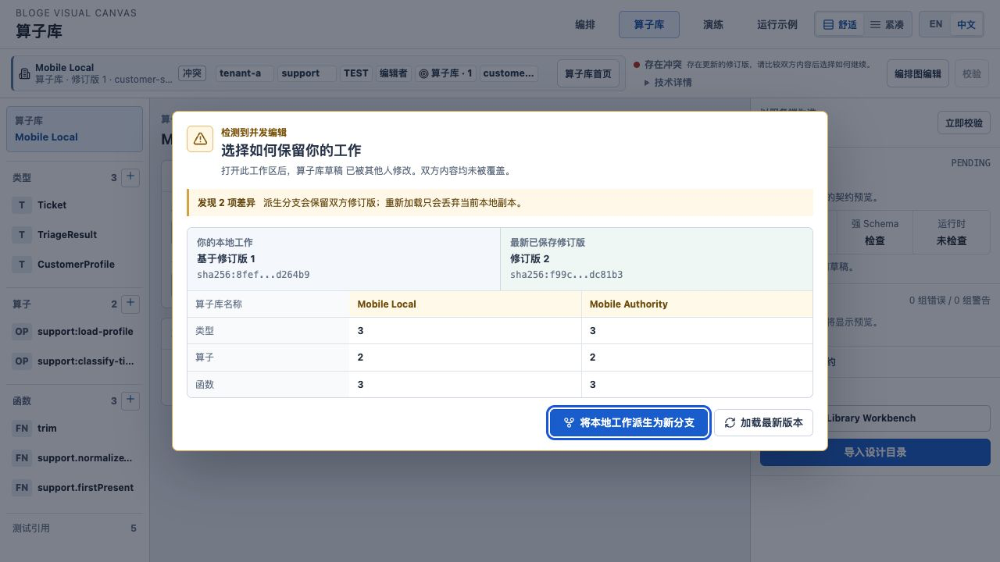
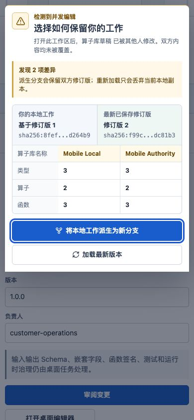

# Resource Gateway S0 多人保存冲突决策实现说明

> 状态：Implemented / E2 automated + real Chromium evidence passed
>
> 日期：2026-08-09
>
> 适用表面：Graph Author v2、Operator/Function Library Workbench、浏览器与 VS Code WebView

## 1. 解决的问题

持久幂等 Save 解决的是同一命令因超时、断网或重试而重复提交；它不能替用户决定两个真实并发版本谁应
成为下一版。旧界面在 Graph 侧只有 `CONFLICTED` 阻断，在 Library 侧只有立即 Reload，用户看不到差异，
也没有不丢本地工作的继续方式。

当前实现把 `409/412` 从错误提示提升为一个必须完成的决策任务：

```text
save 409/412
  -> 冻结本次本地快照与稳定分支身份
  -> 读取最新权威 revision
  -> 比较业务事实
  -> Fork local work（默认安全）
     或 Reload latest -> 二次确认 -> 丢弃本地副本
```

系统不做字段级自动合并。Graph、Schema、测试资产和运行证据之间有跨对象不变量；没有领域合并协议时，
自动合并会把“JSON 可合并”误当成“业务语义可合并”。

## 2. 用户如何操作

保存冲突发生后，画布会自动打开 **Choose how to preserve your work / 选择如何保留你的工作**：

1. 左栏是当前本地工作及其基准 revision，右栏是最新服务端 revision；
2. 表格只显示名称、节点、连线、Fixture、Scenario、类型、算子和函数等可解释事实，不要求阅读原始 JSON；
3. 黄色行表示两边不同，完整 fingerprint 放在可悬停的技术坐标中；
4. **Fork local work** 是默认焦点和安全动作；
5. **Reload latest** 第一次点击只展开损失说明，不修改内容；
6. 只有再点击 **Discard local and reload** 才会丢弃当前本地副本；按 Escape 会退回比较，不会关闭冲突；
7. 权威版本读取失败时点击 **Retry comparison**，恢复包和分支身份不会变化。

### 2.1 Graph Fork 保留什么

Graph 冲突使用已有 `bloge.workspaceForkCommand.v1` 聚合事务：

- 本地 Graph 拓扑、布局、input/output Contract；
- node Fixture output 与 expected input；
- Scenario suite、业务断言与依赖行为；
- Operator snapshot/fingerprint；
- 本地 Operator test table 和 Matrix authored rows。

服务端返回新的 Graph 与 Scenario 精确坐标后，画布才关闭弹层。旧运行结果、Operator test result、发布回执
和治理证据不会复制，因为它们只证明旧 revision；新分支需要重新运行并生成自己的证据。

同一冲突会话持有稳定 `graph-conflict-fork:<uuid>`。响应丢失后再次点击 Fork 会重放同一 Workspace receipt，
不会再创建第二套 Graph/Scenario。

### 2.2 Library Fork 保留什么

Library Fork 保留当前 document、选择位置和仍在表格中编辑的 Operator/Function cases，并在服务端创建新的
draft revision。测试表在新坐标上重新取得生成协议，但不会重置用户已编辑的 rows；旧 evidence 和 gate 状态
会清空，必须在新 revision 上重跑。

Library authoring API 仍使用 revision CAS，因此冲突会话预先固定 `forkDraftId`。若创建实际成功但响应丢失，
重试收到 412 后会读取同一坐标；只有服务端 document 与本地 snapshot 完全一致时才接管该 revision，内容不同
则继续阻断。这避免模糊成功生成重复分支，也不把不同内容误认为成功重放。

### 2.3 Reload 的损失边界

Reload 是明确的破坏性选择：

- Graph 重新载入服务端拓扑与 Contract，清除本地 Scenario/test/fixture 编辑和旧 Undo history；
- Library 载入服务端 document，并关闭仍在编辑的 inference/test task；
- 本地 recovery 在权威内容安装完成前一直保留；
- 第一次点击 Reload 不执行任何删除，必须完成第二次确认。

## 3. 交互与无障碍协议

共享 `SaveConflictResolutionDialog` 承担两个领域的呈现，不承担领域保存：

- `role=dialog`、`aria-modal=true`、标题和说明完整关联；
- 初始焦点进入 Fork，Tab/Shift+Tab 不离开弹层；
- Escape 只撤销 Reload 二次确认，不允许绕过未解决冲突；
- 390px 下变成全宽任务面，动作纵向排列，差异表保持三列稳定尺寸；
- 中英文由 deep-surface locale inventory 约束；
- 权威读取失败提供原位重试，不以关闭弹层制造“假已解决”。

## 4. 代码责任边界

| 模块 | 责任 |
|---|---|
| `saveConflictModel.ts` | 稳定事实顺序、左右值投影、变化识别、fingerprint 缩略 |
| `SaveConflictResolutionDialog.tsx` | 共享比较、焦点、两阶段 Reload、retry 呈现 |
| `AuthorCanvas.tsx` | Graph snapshot、Workspace Fork、证据失效、权威 Graph Reload |
| `LibraryWorkbench.tsx` | Library snapshot、固定 fork coordinate、模糊成功回收、Reload |
| `AssetTestTable.tsx` | draft coordinate 改变时保留 authored rows、清除旧结果与 evidence |

## 5. 已验证的不变量

| 场景 | E2 断言 |
|---|---|
| Graph 409 | 自动读取权威 revision，并显示 3 vs 1 nodes 等业务差异 |
| Graph Fork | 原 draft 只收到一次失败 PUT；新 Workspace 含完整 Graph 与非空 Scenario suite |
| Library 412 | 第一次 Reload 不改变编辑器；第二次确认后安装服务端 revision |
| Library Fork | 新 draft 从 revision 0 创建，本地 Operator document 不被权威 head 覆盖 |
| Library ambiguous success | 两次 Fork 使用同一 draftId；内容一致才接管已存在 revision |
| Keyboard | 初始焦点为 Fork；Escape 撤销破坏性确认但不关闭冲突 |
| i18n | 新弹层加入 deep-surface 中英文静态门禁 |
| Test table | draft 换到 Fork 坐标后 authored rows 保留，旧 evidence/result 清空 |

### 5.1 真实浏览器证据

真实 Chromium 使用 production JAR 注入 revision 冲突，而不是用静态 Story 或测试替身模拟。桌面路径验证了：
权威版本从 `r2` 前进到 `r3` 后，本地旧基线保存触发 `412`；比较面显示名称、revision、fingerprint 和
数量差异；初始焦点落在 Fork；Reload 第一次点击不修改资产；Escape 退回比较；Fork 最终创建独立 `r1`
草稿并保留本地 `3 types / 2 operators / 3 functions`，原草稿继续保持权威 `r3`。



390 x 844 视口下，任务面实际几何为 `370 x 535.625 px`，左右边界各留 `10 px`，页面
`scrollWidth = 390 px`，未出现横向溢出；动作纵向排列，Fork 仍是首焦点。



实机检查曾暴露一个自动化未覆盖的时序缺陷：dialog 容器先取得焦点时，focus trap 误判为“已经完成初始化”，
没有再把焦点交给 Fork。修复后把“焦点在 dialog 容器本身”也视为未初始化，并新增对应回归测试。这个案例
说明真实浏览器验证不是截图仪式，而是能发现 jsdom 事件时序无法代表的交互问题。

## 6. 证据边界

本实现关闭 Round 3 最后一个已知 E2 P1，工程任务成熟度可从 95 调整为 97，E2 缺陷为
`0 P0 / 0 P1 / 0 P2`。这不等于复杂组织已经验证 97 分：

- 首次用户是否能正确理解 Fork 与 Reload，仍需 E3 固定任务；
- 多角色在真实并发下是否选择正确分支，仍需冲突注入研究；
- 两团队两个发布周期是否无错误覆盖、重复分支和证据误继承，仍需 E4；
- 因此缺少 E3/E4 时，对外成熟度上限继续保持 89。

现场任务应至少注入一次 Graph 冲突和一次 Library 冲突，记录选择正确率、决策耗时、是否需要主持人提示、
Fork 后重跑证据完成率，以及误点 Reload 后在第二确认层返回比较的比例。
