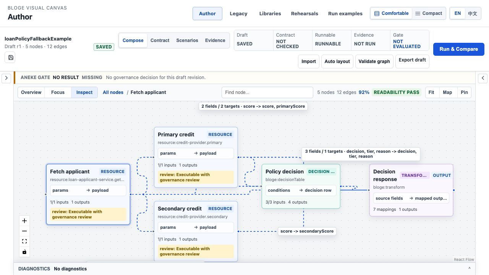
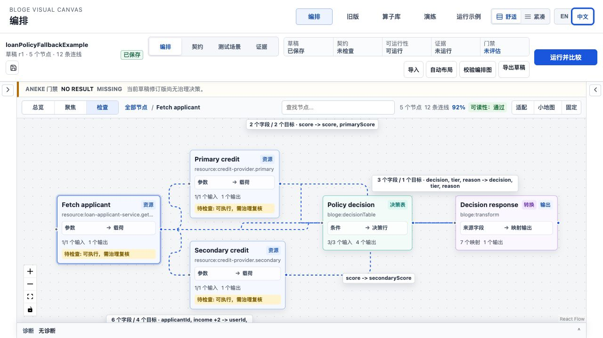

# Resource Gateway UX Round 3 S0 工作区连续性实现说明

> 状态：Core implemented / resilience closure added / save idempotency P1 pending
>
> 对应方案：[Round 3 资深体验审阅与演进计划](resource-gateway-ux-round3-expert-audit-and-evolution-plan.md)
>
> 实施范围：`WP-01 AuthoringSessionSnapshot`、`WP-02 WorkspaceContinuityKernel`、`WP-03 SafeNavigationBoundary` 的浏览器与宿主接口部分

> 最新补强：[S0/S1 连续性与压力门禁补强](resource-gateway-ux-round3-s0-s1-resilience-closure.md)

## 1. 本轮关闭的问题

Author Workspace v2 原先把业务资产保存在 React 组件状态中。点击顶层“算子库”会卸载 Author，返回后
5 节点、12 连线以及 fixture/test 数据变成空工作区，而且没有未保存提示或恢复入口。

S0 将“页面状态”提升为正式的 authoring session：

1. GraphDraft、Scenario set、raw fixture、operator test suite、Matrix rows 和运行输入组成一个原子恢复快照；
2. 内容以 SHA-256 指纹和单调 content epoch 标识；旧保存回执不能覆盖新编辑；
3. 浏览器演示在当前标签页的 `sessionStorage` 中保存带 8 小时 TTL 的恢复包；
4. 恢复包按 tenant、namespace、environment 分区，不允许跨作用域恢复；
5. 顶层链接在离开前强制 flush 最新快照，成功后静默放行；
6. flush 失败时才显示离开决策浮层，避免正常编辑被反复确认打断；
7. Author Command Bar 显示 `NEW / DIRTY / RECOVERABLE / SAVING / SAVED / CONFLICTED / RECOVERABLE_OFFLINE / RECOVERED`；
8. Save 图标执行权威 GraphDraft 保存；`RECOVERABLE` 不再冒充服务端 `SAVED`。
9. 已安全写入 recovery 后会签发一次性 departure permit，避免 React 状态提交与 `beforeunload`
   之间的竞态再次拦截本次导航；permit 消耗后，后续未授权离页仍会被保护。
10. 服务端产生新 `draftId/revision` 后立即以当前内容重算指纹并刷新 recovery envelope，防止下次返回
    恢复到保存前的旧 revision。

## 2. 用户怎么操作

### 2.1 浏览器演示

1. 打开 `/author/`；
2. 载入 **Loan policy fallback**；
3. 等待草稿身份旁出现 **RECOVERABLE / 可恢复**；
4. 点击顶层 **算子库**，再返回 **编排**；
5. 原来的 5 个节点、12 条连线、fixture、算子测试数据和 Scenario set 会自动恢复；
6. 点击草稿身份旁的 Save 图标，创建或更新服务端权威 revision。

`RECOVERABLE` 只表示当前浏览器会话有恢复副本；`SAVED` 才表示服务端 revision 已成功提交。

### 2.2 实际界面

英文桌面端完成权威保存后的状态如下。草稿身份同时显示 `r1` 与 `SAVED`，画布仍保留 5 节点、
12 条连线以及边标签：



切换中文后，草稿、任务模式、readiness、画布导航和节点语义保持同一状态：



### 2.3 异常离开

正常情况下离开前的 recovery flush 会立即完成，不弹确认框。只有存储被禁用、超限或宿主存储失败时，
系统才提供四种明确选择：

| 选择 | 行为 |
|---|---|
| Save and leave | 先提交服务端权威 revision，成功后离开 |
| Export and leave | 下载当前恢复包，然后离开 |
| Discard and leave | 删除当前作用域恢复包并离开 |
| Stay | 保留当前页面和全部状态 |

reload、`visibilitychange`、`pagehide` 和跨工作区导航共用同一 flush 语义；`beforeunload` 只是浏览器兜底。

## 3. 工程接口

核心代码：

- `author/continuity/workspaceContinuity.ts`：状态机、恢复包、TTL、scope partition、存储 SPI；
- `author/continuity/useWorkspaceContinuity.ts`：debounce、max wait、autosave、恢复和导出编排；
- `author/continuity/SafeWorkspaceNavigation.tsx`：全局链接边界与异常离开决策；
- `AuthorCanvas.tsx`：领域快照投影与恢复回填；
- `AuthorCommandBar.tsx`：用户可见 lifecycle 和 Save 命令。

VS Code 或企业宿主必须在 React 应用启动前注入自己的加密存储：

```ts
setWorkspaceRecoveryStore({
  security: 'HOST_ENCRYPTED',
  load: (coordinate) => hostRecovery.load(coordinate),
  save: (coordinate, envelope) => hostRecovery.saveEncrypted(coordinate, envelope),
  remove: (coordinate) => hostRecovery.remove(coordinate),
});
```

浏览器默认实现明确标记为 `SESSION_EPHEMERAL`。它用于本地演示和同标签页恢复，不应被描述为加密、
跨设备或企业持久化。宿主实现负责 encryption at rest、TTL 清理、租户分区、容量和审计。

## 4. 不变量

1. `SAVE_SUCCEEDED(epoch=N)` 只能保存 N 或更早的事实；若当前 epoch 大于 N，状态继续为 `DIRTY`；
2. recovery fingerprint 来自领域内容，不因 mode 或 selection 改变而伪造业务修改；
3. recovery payload 仍保留 mode 和 selection，便于返回原任务上下文；
4. 服务端 Save 成功不删除恢复包，直到新 revision 已在 UI 中成为 current；
5. 每个权威 revision 成为 current 后，恢复包必须包含同一 `draftId/revision`；
6. 存储失败不会静默导航；
7. 过期、损坏或跨作用域 envelope 一律拒绝；
8. 运行结果和治理证据不进入浏览器恢复包，避免把 transient result 冒充 durable evidence。

## 5. 测试证据

| 层级 | 覆盖 |
|---|---|
| reducer | stale save receipt、dirty/recoverable 分离、恢复 session identity |
| storage | tenant/namespace/environment 分区、remove 隔离 |
| envelope | 正常读取、TTL 过期、跨租户拒绝、畸形 JSON 拒绝 |
| integrity | 内容 SHA-256 复算、非法 epoch/time 拒绝、损坏候选删除 |
| fault injection | 1000 组 save/recovery/failure 交错不产生伪 `SAVED` |
| autosave timing | deadline 从 edit epoch 计时；1500ms deadline 与 5000ms max-wait |
| concurrency | 手动/自动/online/lifecycle 并发 Save 合并；离线恢复后单次重试 |
| Library integration | 700ms autosave 前卸载，重挂恢复同一字段、selection 与 expected revision |
| navigation | flush 成功直接离开、flush 失败停留、Save and leave |
| unload race | 已授权离页仅放行一次，后续未授权 `beforeunload` 继续被保护 |
| saved snapshot | 新权威 `draftId/revision` 刷新 recovery，`SAVED` lifecycle 不降级 |
| Author integration | 5/12 示例卸载再挂载，GraphDraft、三组 fixture 和 operator suite 输入完整恢复 |
| localization | 新 lifecycle、浮层和错误文案进入中英文门禁 |
| visual contract | 无低于 token 下限的字面字号，390px 动作纵向可达 |
| E2 desktop | Chromium 1280x720：Author → Libraries → Author；5/12、fixture、selection 恢复；Save 后再次跨页保持最新 r2/SAVED |

阶段验收命令：

```bash
cd resource-gateway-examples/src/main/frontend
npm test
npm run build

cd ../../../..
mvn -f resource-gateway-examples/pom.xml clean verify
```

本次结果：前端 `85` 个测试文件、`632` 条测试全绿；Resource Gateway `5898` 条测试，`0`
failure、`0` error、`13` skipped。`npm run build` 的主入口为 `796.15 kB`、gzip `227.10 kB`，
仍超过 S5 预算，不能视为性能验收通过。

要生成可直接访问 `/author/` 的演示 JAR，必须启用 frontend profile；默认 Maven build 只验证 API：

```bash
mvn -f resource-gateway-examples/pom.xml -Pfrontend package -DskipTests
./scripts/start-visual-canvas-demo.sh --port 18081 --no-build
```

## 6. 本轮差距复评

| Round 3 目标 | S0 后状态 | 证据 | 剩余 |
|---|---|---|---|
| 跨工作区不静默丢失 | 已实现 | Author 5/12 + Library pre-autosave remount + E2 desktop/VS Code 恢复 | 多设备 X/kill 矩阵待 E3 |
| reload/session recovery | 已实现 | TTL、SHA-256 完整性、Author/Library remount、VS Code AES-GCM/dispose receipt | 真实企业宿主矩阵待 E3 |
| 明确 lifecycle | 已实现 | Command Bar 状态与 Save | conflict compare/fork/reload UI 仍需强化 |
| 服务端保存 | 部分闭合 | optimistic revision、并发合并、edit-to-deadline 门禁 | 网络不确定结果的持久 idempotency receipt 与真实 P95 待完成 |
| 破坏性编辑可恢复 | 未实现 | 无统一 mutation history | S1 首要工作 |

该段的 `82` 是 S0 初始实现时的历史评分。完成度复核后，Library 也已接入共享 continuity，S1-S5 主路径
均已落地；当前不能停止的原因已收敛为两个 E2 P1：持久 idempotent save receipt 与完整
Compare/Fork/Reload conflict resolution，以及不能由代码替代的 E3/E4 现场证据。
