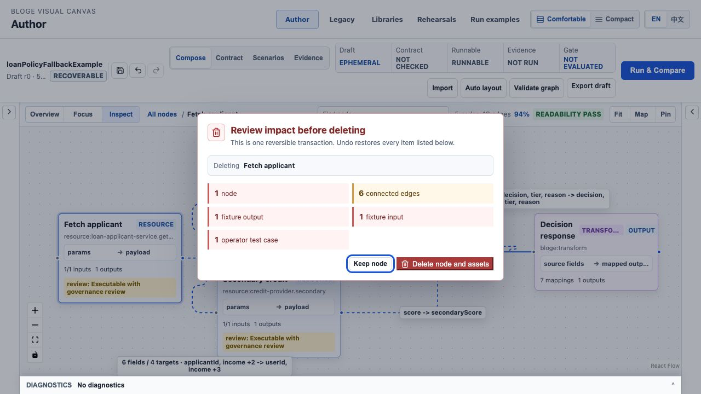
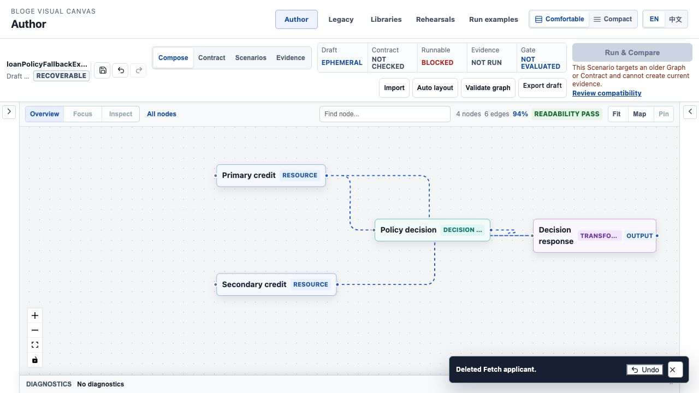

# Resource Gateway UX Round 3 S1 可逆编辑与删除影响控制实现说明

> 状态：Implemented / E2 desktop browser verification passed
>
> 对应方案：[Round 3 资深体验审阅与演进计划](resource-gateway-ux-round3-expert-audit-and-evolution-plan.md)
>
> 实施范围：`WP-04 MutationJournal Core`、`WP-05 Destructive Impact Policy`

## 1. 本轮关闭的问题

原来的 Author 允许 Delete / Backspace 直接删除节点，并同步清除关联连线、fixture、算子测试套件、
测试结果、发布结果和 Graph 输出绑定。用户既看不到影响范围，也不能恢复。这不是普通易用性问题，
而是验证资产与业务编排可能一起丢失的工业级数据安全缺陷。

S1 将作者操作提升为原子、可逆 mutation：

1. 统一记录 graph、binding、fixture、Decision Table、Transform、测试、契约、Scenario、导入和布局等
   20 类 mutation；
2. 每条 mutation 保存完整 before/after 领域快照、影响清单、稳定标签、subject 与紧凑内容指纹；
3. 节点删除先计算关联 edge、fixture input/output、test case/result/publication 和 Graph output binding；
4. 有验证资产时展示影响预览，无关联资产的空节点允许直接删除并提供 Undo；
5. 删除节点与其所有关联资产作为一个事务提交，一次 Undo 完整恢复；
6. 顶部命令条提供 Save、Undo、Redo 图标及准确 tooltip，支持 `Cmd/Ctrl+Z` 和
   `Cmd/Ctrl+Shift+Z`；
7. 文本输入、弹层和布局预览中的 Delete / Backspace 不会触发画布删除；
8. Undo/Redo 同步推进 author content epoch，并使旧 validation/evidence 失效，避免恢复旧图后继续消费
   旧证明；
9. 750ms 内同一 subject 的连续编辑合并为一个意图，首个 before 状态不会丢失；
10. Undo 后提示条动作变为 Redo，Redo 后再变为 Undo，动作与当前状态保持一致。

## 2. 用户怎么操作

### 2.1 删除前知道会失去什么

1. 打开 `/author/`，载入 **Loan policy fallback**；
2. 单击 **Fetch applicant**，按 Delete / Backspace；
3. 系统列出即将删除的节点、6 条关联连线、fixture 输入/输出和算子测试用例；
4. 选择 **Keep node / 保留节点** 返回画布，或选择 **Delete node and assets / 删除节点及关联资产**；
5. 删除后右下角提示条提供一次点击 Undo。

中文影响预览会直接说明恢复语义和每类资产数量：


英文工作区使用同一信息结构，协议标识和 operator reference 保持原文：



### 2.2 一次撤销恢复整个事务

确认删除后，示例从 5 节点/12 连线变为 4 节点/6 连线，提示条位于诊断抽屉之上，不会被遮挡：



点击顶部 Undo、提示条 Undo 或使用快捷键后，节点、12 条边、fixture、算子测试套件、测试结果、发布
状态和 output binding 一起恢复。提示条此时明确提供 Redo，不再显示语义错误的 Undo：


### 2.3 编辑器事务边界

- 双击算子打开详情后，**Apply** 才提交一个 `NODE_CONFIG` mutation；**Cancel** 丢弃整次临时编辑；
- Auto Layout 的候选预览不是 mutation；**Apply** 后才进入统一历史，**Cancel** 不污染历史；
- 载入示例或导入 DSL 是一个 `IMPORT` mutation，可一次恢复导入前状态；
- 新编辑会清空 Redo 分支，这是标准线性历史语义；
- Save 建立 authoritative checkpoint，但不会清空本地 Undo 历史。

## 3. 工程协议

核心实现位于：

- `author/mutations/reversibleMutationJournal.ts`：mutation 类型、journal、coalescing、预算、恢复校验；
- `author/mutations/NodeDeletionImpactDialog.tsx`：删除影响预览和上下文敏感 Undo/Redo 提示；
- `author/shell/AuthorCommandBar.tsx`：Save/Undo/Redo 命令与可访问名称；
- `AuthorCanvas.tsx`：领域快照、事务观察器、删除策略、键盘边界与 epoch 联动。

运行期默认保留最近 100 条 mutation，最多 20MB。写入 S0 recovery envelope 时进一步裁剪为靠近当前状态
的 24 条、最多 1.5MB，防止 session recovery 因大型 fixture 和双向快照无界增长。浏览器存储仍是
`SESSION_EPHEMERAL`；生产宿主必须复用 S0 的 `HOST_ENCRYPTED` recovery store。

`mfp1` 是基于 canonical JSON 的紧凑本地相等性指纹，用于避免在 journal 元数据中再次保留完整 JSON；
它不是签名或安全边界。恢复持久化历史时，系统忽略旧版本或热更新留下的 fingerprint/size 字段，重新
从 before/after 计算，并拒绝未知 mutation、impact kind、severity 和畸形结构。

## 4. 不变量

1. 一个可见用户意图至多产生一个 mutation，异步派生的 contract/scenario 更新合并进同一事务；
2. 删除节点与关联验证资产不能分步提交或分步恢复；
3. runtime node status、selection chrome 和其它瞬时视觉字段不构成 authored mutation；
4. Undo 后 `future` 保留被撤销 mutation；任何新 mutation 清空 `future`；
5. 一次 Undo/Redo 恢复 exact snapshot，不通过反向猜测重建资产；
6. 恢复历史必须在条数和字节预算内，超限时只丢弃离当前状态最远的历史；
7. saved checkpoint 只表达权威保存边界，不冒充“历史已清空”；
8. Delete / Backspace 在 input、textarea、select、contenteditable 或 modal 内只作用于当前编辑器；
9. React Flow 原生 remove 不能绕过统一 impact policy；
10. Mutation telemetry 只携带受控 kind，不发送 snapshot、fixture、schema 或 payload。

## 5. 测试与浏览器证据

| 层级 | 覆盖 |
|---|---|
| journal unit | 20 类 mutation round-trip、coalescing、100 次 Undo/Redo、checkpoint、count/byte budget |
| recovery trust | malformed envelope、未知 enum、旧 fingerprint 重算、24 条/1.5MB 恢复预算 |
| impact unit | edge、fixture input/output、test case/result/publication、output binding 完整投影 |
| component | 中英文影响浮层、确认/取消、Undo 与 Redo 上下文动作 |
| Author integration | 示例导入、键盘删除、impact policy、一次 Undo 后 GraphDraft exact equality、fixture/test 恢复 |
| keyboard safety | 输入框 Delete 不删除节点，画布 Delete 不能绕过确认 |
| E2 desktop | Chromium 1280x720：5/12 -> 删除 4/6 -> 一次 Undo 5/12；中英文截图与浮层遮挡复核 |

阶段验收命令：

```bash
cd resource-gateway-examples/src/main/frontend
npm test
npm run build

cd ../../../..
mvn -f resource-gateway-examples/pom.xml clean verify
```

本次前端结果：`87` 个测试文件、`672` 条测试全绿；`check:i18n`、`check:ux`、TypeScript 和 production
build 全部通过。服务端 `clean verify` 共执行 `5,898` 条测试，`0` 失败、`0` 错误、`13` 跳过，
最终 `BUILD SUCCESS`。生产主入口为 `822.96 kB`、gzip `234.68 kB`，仍超过 S5 的 route budget，
不能视为性能验收通过。

## 6. 本轮差距复评

| Round 3 目标 | S1 后状态 | 证据 | 剩余 |
|---|---|---|---|
| 破坏性 mutation 可预见 | 已实现 | 删除影响投影 + 中英文真实浏览器浮层 | 组织级 production 审批策略在 S2 |
| 高频编辑可逆 | 已实现 | 20 类 mutation + toolbar/keyboard Undo/Redo | 多人协同分支历史不在当前单人 journal 范围 |
| 验证资产原子恢复 | 已实现 | exact GraphDraft 与 fixture/test integration test | 服务端审计 receipt 在协议产品化阶段 |
| 历史可恢复且有界 | 已实现 | 双预算 + untrusted restore 校验 | 大型客户图的真实内存分布待 E3/E4 客户环境采样 |
| 任务坐标与命令权威 | 未实现 | 顶栏仍缺 tenant/env/role/scope | S2 首要工作 |

S1 关闭了 Round 3 的第二个原始 P0。基于 E1 自动化与 E2 桌面浏览器证据，工业任务成熟度从 S0 的
`82` 调整为 `88 / 100`，距离完整 Round 3 目标仍约 `12%`。剩余差距集中在企业任务坐标、证明语义、
移动投影和性能/宿主门禁，不能用本轮的可逆性改善替代后续验收。
