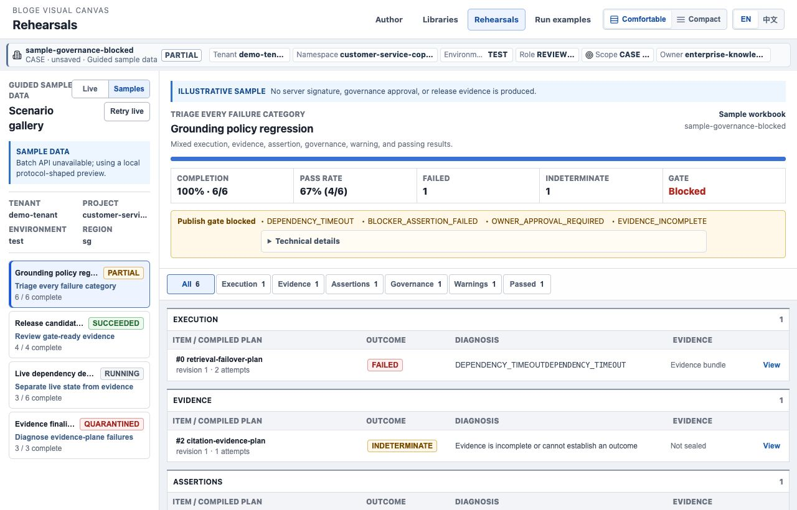
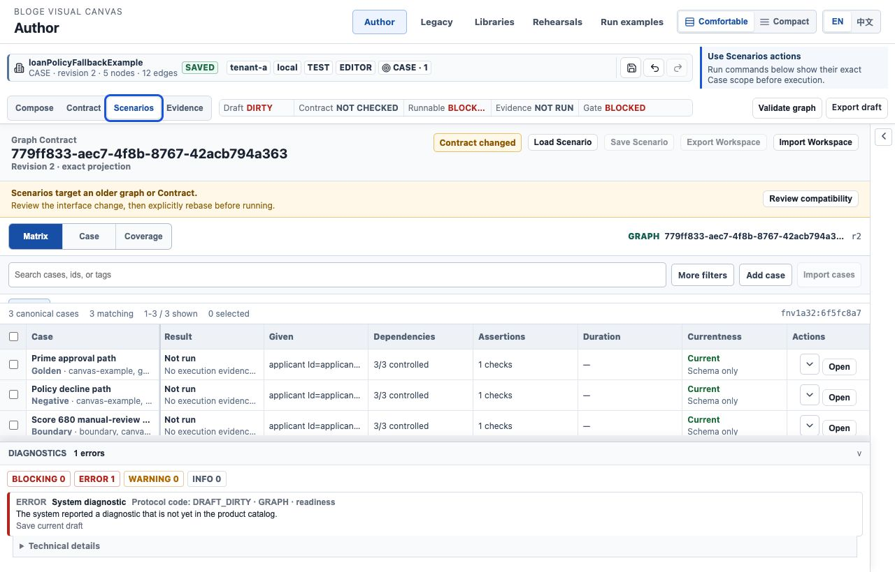

# Resource Gateway UX Round 3 S2 企业任务坐标实现说明

> 状态：Implemented / E2 verified
>
> 实施日期：2026-08-09
>
> 对应计划：[Round 3 资深体验审阅与演进计划](resource-gateway-ux-round3-expert-audit-and-evolution-plan.md)

## 1. 本阶段解决什么问题

S2 把 Author、Library 和 Rehearsal 从三个各自解释上下文的页面，收敛为同一套企业任务协议。
用户在执行命令前可以直接回答四个问题：我在哪个 tenant/environment、以什么 role、正在操作哪个
subject、命令会作用于多少个 target。


这不是额外增加一排装饰性标签。`TaskCoordinate` 同时驱动 URL、命令授权、deep link 往返、焦点恢复
和页面可见上下文，避免“页面显示 test，命令实际修改 production”一类双重事实。

## 2. 已交付能力

### 2.1 统一 `TaskCoordinate`

Author、Library、Scenario/Rehearsal 共用以下稳定坐标：

```text
tenantId / namespace / environment / role
draftId / revision / workspaceView / surface
subjectKind / subjectRef / selectionFingerprint
nodeId / scenarioId / runId
returnTo / restoreScrollX / restoreScrollY / restoreFocusId
```

serializer 只接受受支持的枚举、有限长度标识和同源应用路径。恶意 `returnTo`、越界 scroll、未知 role
或非法 URL 不会进入任务状态。`restore*` 是一次性参数：页面消费并恢复后立即从地址栏清除，防止后续
导航重复跳动。

### 2.2 共用 Workspace Context Bar

三个工作面都使用同一个 `WorkspaceContextBar`，统一呈现：

- 当前资产、subject 类型、revision 与 lifecycle；
- tenant、namespace、environment、role、scope 和 owner；
- production、read-only、cross-tenant 的一致策略反馈；
- 页面自己的 Save、Undo/Redo、返回或验证动作。

在 `1280 x 820` 的真实 Chromium 中，关键 environment、role、scope 保持完整；tenant 和 namespace
优先显示业务值而不是重复字段名。完整长值仍通过原生 title 和可访问名称保留。




### 2.3 命令权威与生产保护

`evaluateTaskCommandPolicy` 在命令执行前统一计算结果：

| 条件 | 结果 | 交互 |
|---|---|---|
| session tenant 与任务 tenant 不一致 | `DENY` | 禁用 mutation，显示 cross-tenant 原因 |
| `VIEWER` / `REVIEWER` 发起 mutation | `DENY` | 保留查看、运行与返回能力，编辑命令不可用 |
| production 上的 destructive mutation | `REQUIRE_CONFIRMATION` | 显示目标与环境，必须键入 `PRODUCTION` |
| 非生产且具备角色/能力 | `ALLOW` | 直接执行 |

Author 已覆盖节点/边删除、载入示例、算子库导入、DSL 渲染提交；Library 的文档修改、新增资产和
设计导入也受同一角色/租户策略约束。节点删除仍先显示资产影响摘要，再执行 production policy，
不会以通用确认替代精确影响说明。


当前 confirmation 是作者侧防误操作，不等于组织双人审批或 production publish gate。后者仍由治理
系统与服务端 authority 决定。

### 2.4 单一主命令和 chrome 预算

Scenario Matrix 根据当前选择只保留一个直接主命令：无选中项时是 **Run all**，有选中项时是
**Run selected**。Run failed/changed/affected 和备用 Run all 进入一个 scope menu，避免多个蓝色按钮
同时竞争。



Canvas 的 Overview/Focus/Inspect navigator 已下沉到画布内部；它不再与
Compose/Contract/Scenarios/Evidence 生命周期导航平级。`1280 x 820` 实测全局头约 `63px`、Author
command bar 约 `95px`，任务内容在约 `158px` 处开始，达到 S2 的 `<=160px` E2 预算。

### 2.5 可恢复的往返坐标

从 Rehearsal evidence 返回 Author 时，链接携带精确 draft/node/scenario/run 和安全 `returnTo`。Author
显示返回原任务的入口；Rehearsal 消费 scroll/focus 坐标后恢复到原条目。返回路径只恢复视口，不绕过
目标页自己的 tenant、role 或 capability policy。

## 3. 用户怎么体验

1. 启动 demo，打开 `/author/`，载入 Loan 示例；观察顶部资产、tenant、environment、role 和 Case scope。
2. 进入 Scenarios/Matrix；不选行时只有 **Run all**，选中一行后主命令变为 **Run selected**，其它范围在菜单中。
3. 打开 `/libraries/`，恢复 `Customer Support Authoring` exact revision；同一位置可见 library scope、owner 与保存状态。
4. 打开 `/rehearsals/` 并切到 Samples；选批次和 evidence 条目，再通过 Author deep link 往返，验证选择与焦点恢复。
5. 用 `environment=production&role=OWNER` 打开 Author，尝试载入示例；只有键入 `PRODUCTION` 才能确认。
6. 用 `role=VIEWER` 打开相同任务；导入、编辑和删除不可用，查看与导航仍保留。

## 4. 验证覆盖

自动化覆盖包括：

- TaskCoordinate round-trip、旧 deep link 兼容、安全返回和一次性视口恢复；
- command authority 的 production、read-only、cross-tenant 与 capability decision；
- Author 生产确认、viewer 禁用、返回入口和真实 mutation；
- Library 服务端 context 投影与只读 mutation 隔离；
- Rehearsal URL 同步、scroll/focus 恢复和 evidence author link；
- Matrix 单一主命令和 scope menu；
- Workspace Context Bar 的可访问名称、危险环境和策略反馈。

真实浏览器已检查 `1280 x 820` 的无横向溢出、上下文可读性、production dialog z-index、画布节点/边
完整性及 chrome 高度。阶段门禁结果为：

| 门禁 | 结果 |
|---|---|
| 前端单元/组件 | `91` 个测试文件、`691` 项测试全绿 |
| i18n / UX guard | i18n `33` 项、UX `29` 项全绿 |
| TypeScript / production build | `tsc` 与 Vite build 通过 |
| Java / API / 真实浏览器集成 | Maven `5,898` 项，`0` failure、`0` error、`13` skipped，`BUILD SUCCESS` |
| Chrome 几何证据 | `1280 x 820` 下任务内容起点 `158.39px`，无横向溢出 |

生产构建同时测得初始 JS 为 `844.69 kB` minified（gzip `240.98 kB`）。这不影响 S2 的任务坐标正确性，
但明显超过 S5 的 `<=350 kB` minified 目标，继续作为 route-level chunking 的显式阻断项，不能用 gzip
体积替代门禁口径。

## 5. 本阶段没有宣称解决的事

S2 不把 E2 工程验证包装成组织级可用性结论。以下工作进入后续阶段：

- S3：产品文案 descriptor、raw code 隔离，以及 behavior/proof/freshness/governance 四维证明；
- S4：390px Matrix 任务投影、断点相机连续性、Library blocker 聚合与语义字号；
- S5：route chunk、VS Code host lifecycle、E3 固定任务和 E4 连续发布周期证据；
- production 双人审批、组织 owner delegation 与真实 IAM claims 仍属于宿主/治理 authority。
