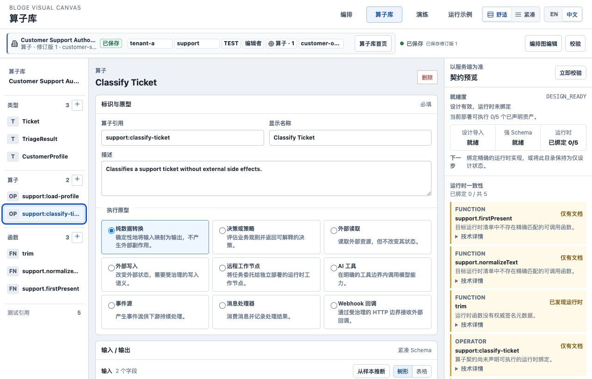
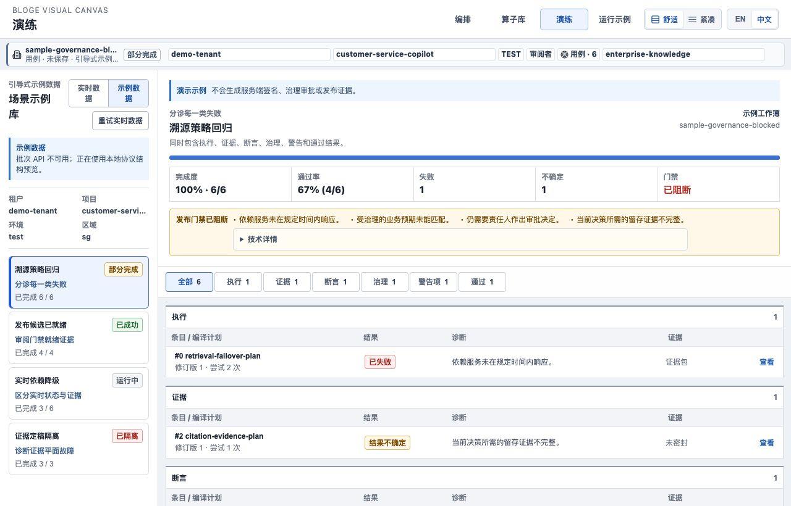
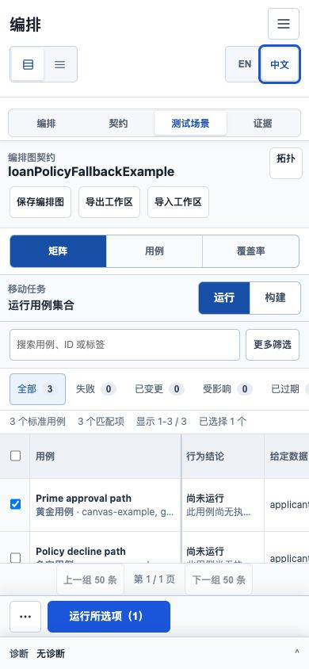

# Resource Gateway UX Round 3 S3 证明语义与本地化实现说明

> 状态：Implemented / E2 verified
>
> 实施日期：2026-08-09
>
> 对应计划：[Round 3 资深体验审阅与演进计划](resource-gateway-ux-round3-expert-audit-and-evolution-plan.md)

## 1. 本阶段解决什么问题

S3 解决两个会直接损害业务判断的问题：一是中文页面把服务端英文、协议 code 或未登记动态值当成
产品文案；二是测试结果把“运行成功”“断言通过”“证据来自 Mock”“证据仍然新鲜”混成一个绿色状态。

现在产品面使用受控消息描述符，测试矩阵把四种事实正交展示：

```text
Behavior           业务输入输出是否符合预期
Proof strength     这次验证到底执行了什么
Freshness          证据是否仍对应当前资产版本
Governance         证据能否进入发布门禁
```


## 2. 已交付能力

### 2.1 类型化产品消息边界

`ProductMessageDescriptor` 是受控产品结论的最小协议：

```ts
interface ProductMessageDescriptor {
  messageId: ProductMessageId;
  params?: Record<string, string | number>;
  rawCode?: string;
  rawDetail?: string;
}
```

调用边界被拆成四类：

| API | 所有权 | 规则 |
|---|---|---|
| `t('literal')` | 静态产品文案 | 必须使用字面量并存在于翻译表 |
| `m(messageId, params)` | 状态机/投影器结论 | `messageId` 受 TypeScript 类型约束 |
| `d(value)` | 旧协议中的受控动态枚举 | 中文未登记值 fail closed；英文保留原文 |
| 直接渲染 | 用户资产或机器坐标 | 名称、ref、path、payload 不参与翻译 |

`localeSurfaceInventory` 已从抽样文件扩展到所有 deep surfaces，并拒绝新的 `t(variable)`。中文遇到
未知动态产品值时显示保守结论，不再静默泄漏英文；原始值仍可在技术详情中读取。英文界面保留原始
服务端错误，避免把可读错误替换成无信息占位。

### 2.2 算子执行原型不再暴露枚举

Library 的算子原型由稳定 descriptor 驱动。用户选择的是“纯数据转换”“决策或策略”“外部读取”
等业务模型，并同时看到一句作用说明，不需要理解 `PURE_TRANSFORM` 一类内部代码。



原型值仍以稳定 enum 写入 canonical document，切换语言只改变展示。`type/operator/function` 等动态
资产种类也进入受控字典，添加按钮不会再出现部分翻译或未知状态。

### 2.3 Matrix 四维证明权威

Matrix 行不再用一个 `PASS` 代替全部事实。其治理资格规则是严格合取：

```text
SUCCESS
  AND assertions = PASSED
  AND freshness = CURRENT
  AND proofStrength = CERTIFIABLE
  => ELIGIBLE
```

其余结果不会被包装为可发布：

| 例子 | Behavior | Proof | Freshness | Governance |
|---|---|---|---|---|
| 尚未运行 | Not run | Schema only | Not evaluated | Not evaluated |
| Mock 断言通过 | Mock assertions passed | Mock simulation | Current | Ineligible |
| 旧版可认证证据 | Evidence stale | Certifiable | Stale | Ineligible |
| 当前可认证且断言通过 | Assertions passed | Certifiable | Current | Eligible |

特别修正了“尚未运行但显示 Current evidence”的假阳性。没有终态执行结果时，新鲜度只能是
`Not evaluated`。Mock 仍有很高的开发验证价值，但永远不能仅凭绿色行为结论进入发布门禁。


上图与中文图使用同一贷款示例。切换语言前选中的 `Prime approval path`、三行 canonical case、Graph
和 Matrix 视图均保持不变，只有产品文案发生变化。

### 2.4 Rehearsal 阻断原因业务化

已知 Rehearsal blocker 先归一化为稳定类别，再显示业务影响：依赖超时、业务断言不匹配、责任人审批
缺失、证据不完整。根摘要与条目列表默认不显示 raw code，协议值和原始 detail 只放在闭合的
**技术详情** 中。



运行中/排队中的 projection 继续明确标为可变状态；示例工作簿继续明确“不生成服务端签名、治理审批
或发布证据”。受控描述只改善理解，不提升样例或 Mock 的证明效力。

### 2.5 Raw protocol 默认退出业务列表

本阶段统一收敛三类默认列表：

- Author diagnostics 首屏只显示可理解标题、影响和修复动作；code/scope/source/coordinate 在技术详情；
- Matrix 失败行只显示行为结论，failure category/message 在展开后的技术详情；
- Rehearsal 根 blocker、条目和 assertion 默认显示归一化业务原因，raw code/detail 保持可审计但不抢占。

这不是删除协议信息，而是把“用户现在应做什么”和“工程师排查哪条协议记录”分层。

### 2.6 Pseudo-locale 与双语状态连续性门禁

每个 `ProductMessageId` 都必须有 `en` 和 `zh-CN`，pseudo-locale 测试要求消息扩张至少 30%，并保持
插值参数不丢失。语言切换自动化同时锁定 Graph、node selection、Matrix selection、layout、run state、
URL preference 和 `document.lang`。

真实 Chromium 已在 `1280 x 820` 与 `390 x 844` 检查中文、英文和移动投影：无页面级横向溢出，
无未知产品文案，语言切换前后的 3 个 case 与 1 个选择项保持一致。



移动端仍通过可横向滚动的 canonical 表格展示完整列，因此 Proof authority 不在 390px 首屏。这不是
S3 的证明语义错误，但属于 S4 必须解决的移动结果任务问题。

## 3. 用户怎么体验

1. 启动 demo，打开 `/author/?lang=zh-CN`，载入 **贷款策略与降级**。
2. 进入 **测试场景 -> 矩阵**；先读“行为结论”，再读“证明 / 新鲜度 / 门禁资格”。
3. 选中一行并切换 `EN / 中文`；Graph、case、选择和主命令作用域不会变化。
4. 打开 `/libraries/?lang=zh-CN`，选择完整 Customer Support 示例和
   `support:classify-ticket`；在“执行原型”中选择最接近的业务行为。
5. 打开 `/rehearsals/?lang=zh-CN`，选择 **溯源策略回归**；先读发布阻断业务原因，需要排障时再展开
   **技术详情**。

## 4. 验证结果

| 门禁 | 结果 |
|---|---|
| 前端全量测试 | `92` 个测试文件、`703` 项测试全绿 |
| i18n guard | `34` 项全绿；deep surfaces 严格动态 inventory 生效 |
| UX guard | `29` 项全绿 |
| TypeScript / production build | `tsc --noEmit` 与 Vite build 通过 |
| Java / Maven 全量验证 | `5,898` 项测试零失败、零错误，`13` 项跳过；`BUILD SUCCESS` |
| 真实浏览器 | 1280/390 中文、1280 英文；状态连续、无未知文案、无页面级横向溢出 |
| 产品截图 | Matrix 中/英/移动、Library archetype、Rehearsal blocker 共 5 张 |

生产构建主路由仍为 `858.96 kB` minified / `245.12 kB` gzip。S3 不用 gzip 体积掩盖 S5 的
`<=350 kB` minified 门禁，route-level lazy import 仍是明确阻断项。

## 5. 阶段复评与剩余差距

S3 的 E2 工程退出条件已满足：动态产品消息不再静默泄漏、Mock 与可认证证据不会共用发布资格、raw
protocol 默认退出业务列表、双语切换保持 canonical state。E3 的“目标用户对 Mock 与 Certifiable 的
判断正确率 >=95%”尚未执行，因此不能宣称组织级门禁已经验证。

下一阶段必须集中解决：

- 390px 用结果卡替代桌面表格横向滚动，让三个结果摘要和 Proof 首屏可见；
- 390 <-> 820 切换保持 task/selection/focus，不产生双 surface 帧；
- Library 将同类 runtime warning 聚合为一个根 blocker 和一个 next action；
- 清点 auxiliary 字号，把业务决策正文恢复到 body token；
- 在 S5 拆分主路由 bundle，并补 VS Code WebView 冷启动与 dispose/recover 证据。
