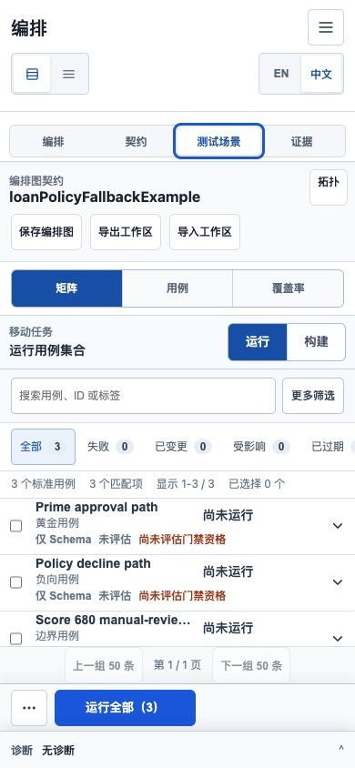
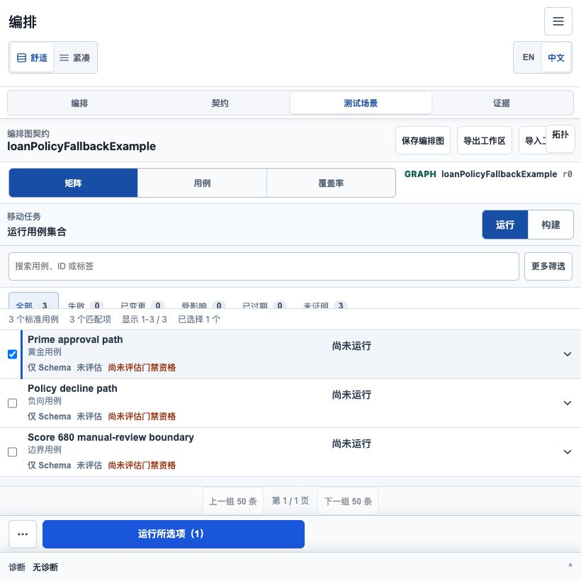
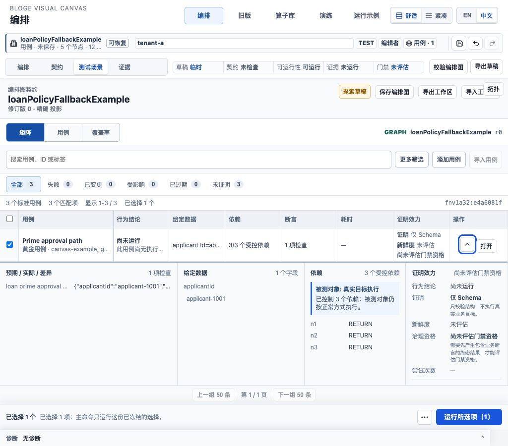
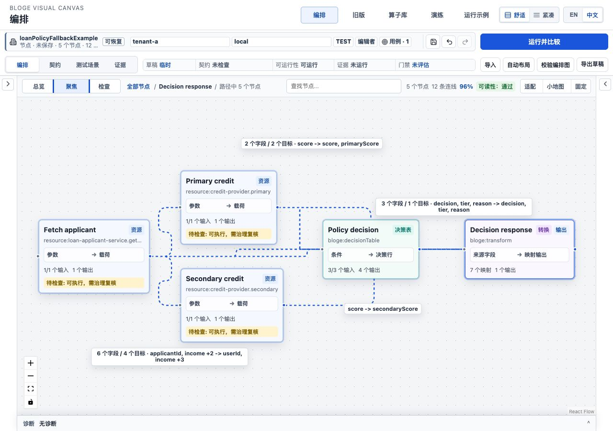
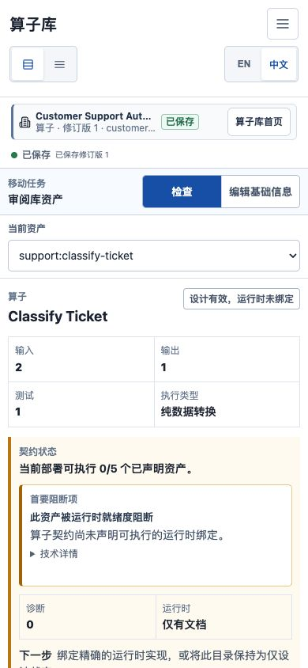
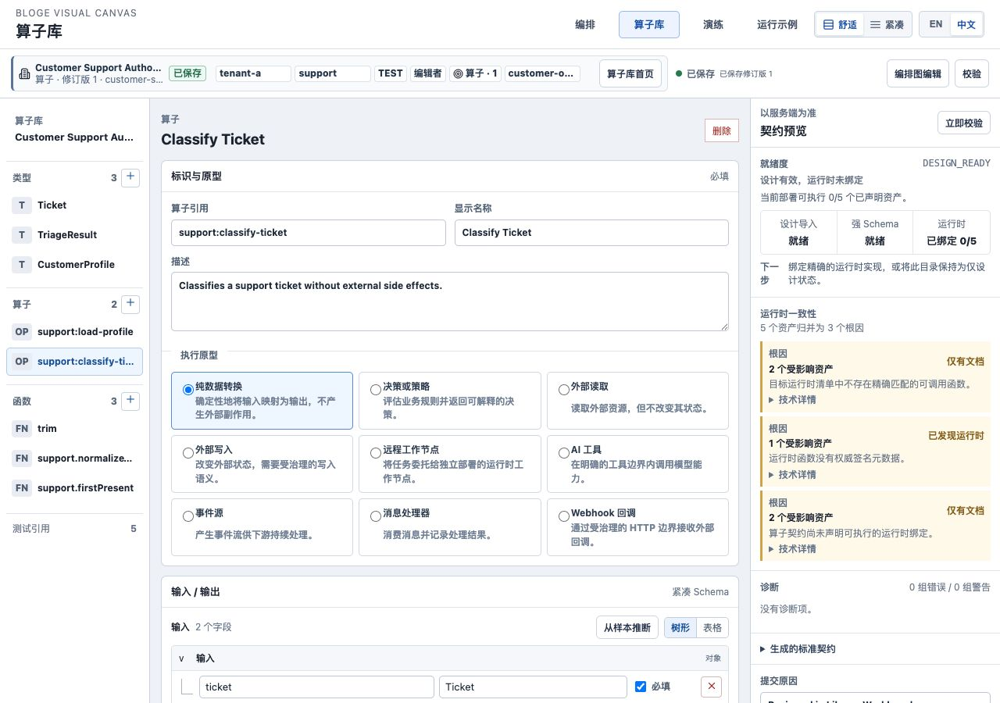

# Resource Gateway UX Round 3 S4 响应式任务投影实现说明

> 状态：Implemented / E2 verified
>
> 实施日期：2026-08-09
>
> 对应计划：[Round 3 资深体验审阅与演进计划](resource-gateway-ux-round3-expert-audit-and-evolution-plan.md)

## 1. 本阶段解决什么问题

S4 不以“页面没有横向溢出”作为移动端完成标准，而以用户是否能在当前尺寸完成判断为标准。本阶段集中
根治四类问题：390px Matrix 虽可滚动却看不懂结果；断点变化后旧 camera 让图变成伪可读缩略图；
Library 把同一运行时病因复制成告警墙；界面密度依赖任意缩小字号而不是稳定视觉语义。

最终形成四个可测试的产品协议：

```text
MobileMatrixResultProjection  桌面表格在窄屏上的任务等价投影
ResponsiveStateContinuity     断点变化时保留任务、选择、展开和焦点
SemanticZoomContract          Overview / Focus / Inspect 各自承诺什么信息
ChromeBudget                  每个宿主宽度允许出现哪些 chrome 与任务表面
```

## 2. 已交付能力

### 2.1 390px Matrix 先给结论，再给细节

`840px` 及以下不再压缩桌面表格，而是投影为纵向结果摘要。每张摘要固定展示 Case、类型、行为结论、
证明、新鲜度和门禁资格，首屏可以连续比较三个用例。点击任意摘要后，展开内容先显示预期、实际与差异，
再显示 Given、依赖和证明详情；从发现失败到看到字段差异只需一次点击。



移动摘要不是另一份业务状态。它只读取 canonical Matrix selection、result 与 command authority；切回
桌面后仍是同一 Case、同一展开项和同一运行结果。

### 2.2 820px 使用紧凑任务模式，不制造假桌面

真实浏览器检查发现：虽然 820px 可以容纳桌面 DOM，但 workspace context、命令条和表头组合后，任务
空间已经不足，属于“技术上放得下、认知上不可读”。因此 compact task breakpoint 从 520px 调整为
840px：820px 使用结果摘要和收敛后的命令条，1024px 才恢复完整表格。





跨断点事务保留：

- 当前 task mode、Case selection 和 expanded result；
- 画布 selected node、reading mode 与 focus coordinate；
- 同一时刻只挂载一个 Matrix surface，不出现移动/桌面双表面帧；
- 回到宽屏后将键盘焦点恢复到原任务对象，而不是页面顶部。

### 2.3 Semantic Zoom 不再把不可读文字当作信息

画布建立正式 `SemanticZoomContract`：

| 模式 | 最低缩放 | 信息承诺 |
|---|---:|---|
| Overview | `0.04` | 只表达拓扑形状、状态和异常密度；隐藏节点正文与边标签 |
| Focus | `0.80` | 选中节点标题有效字号不低于 `12px`；只保留所需正文与预算内标签 |
| Inspect | `0.80` | 与当前选择直接相关的节点、端口和边保持可读 |

这解决了从窄屏返回桌面后仍停留在 32% 缩放、标题约 8px 的错误连续性。系统保留的是用户的语义焦点，
不是机械保留一个已经失效的缩放百分比。



### 2.4 Library 从告警墙变成根因队列

Library runtime readiness 现在按 `(state, reasonCode)` 聚合。全库 5 个受影响资产在示例中收敛为 3 个
根因，每个根因显示受影响资产数；具体 asset refs 留在默认收起的技术详情中。选中资产的移动任务面只
展示一个最高优先级根 blocker，避免用户同时面对设计错误、运行时缺失和重复 warning。





优先级固定为：设计错误高于运行时绑定问题，运行时绑定问题高于普通 warning。原始 reason code 与受影响
资产不会丢失，但只在技术排障时展开。

### 2.5 视觉 token 与 chrome 预算进入自动化

新增决策正文、标题和机器坐标 token，业务结果不能再为了塞进空间而退化成辅助字号。`ChromeBudget`
正式声明 `390 / 820 / 1024 / 1280 / 1440` 五档宿主矩阵；在 840px 及以下，非 Compose 页面只保留
任务模式和必要上下文，重复 lifecycle、truth、secondary command 与不可用动作退出首屏。

Library 移动 CSS 与组件断点统一为 840px，并修复了隐藏 workspace facts 仍占据 74px 宽度的真实溢出。
这类问题已进入 projection 和视觉契约测试，而不是继续依赖人工截图偶然发现。

## 3. 用户怎么体验

1. 启动 demo，打开 `/author/?lang=zh-CN`，载入 **贷款策略与降级**。
2. 进入 **测试场景 -> 矩阵**，运行全部三个用例；把窗口缩到 840px 以下，观察三个纵向摘要。
3. 点击任意结果摘要，直接比较“预期 / 实际 / 差异”；放大到 1024px，确认同一行仍被选择和展开。
4. 回到 **编排**，选择 **Decision response**，进入 **Canvas Focus**；标题和相关边标签保持可读。
5. 切换 **Overview**，观察正文和边标签退出，只保留可判断整体形状的拓扑。
6. 打开 `/libraries/?lang=zh-CN`，载入完整 Customer Support 示例并选择
   `support:classify-ticket`；窄屏只显示一个当前根 blocker，宽屏右侧显示 3 个聚合根因。

## 4. 真实浏览器矩阵

| 视口 | Surface | 实测结论 |
|---|---|---|
| `390 x 844` | Matrix | 3 张摘要全部在结果区域首屏；展开一次即见 diff；页面横向溢出 `0px` |
| `820 x 820` | Matrix | 仅 compact surface；命令条约 `45px`；选择、展开连续；溢出 `0px` |
| `1024 x 900` | Matrix | 仅 canonical table；选择、展开与焦点恢复；表头无溢出 |
| `1280 x 900` | Canvas Focus | 实际 zoom `0.963`；标题 `15px`，高于 `12px` contract；边标签未被节点遮挡 |
| `1280/1440` | Matrix | 表格 `scrollWidth == clientWidth`；无页面级横向溢出 |
| `390 x 844` | Library | 当前资产根 blocker 数量为 1；修复后页面横向溢出 `0px` |
| `1280 x 900` | Library | 5 个资产聚合为 3 个根因，影响数为 `2 / 1 / 2`；技术详情默认关闭 |

上述结论来自 production build 对应的真实 Chromium 页面，不是 jsdom 几何推断。

## 5. 自动化与构建证据

| 门禁 | 结果 |
|---|---|
| 前端全量测试 | `94` 个测试文件、`719` 项测试全绿 |
| i18n guard | `34` 项全绿 |
| UX guard | `31` 项全绿；包含 projection、semantic zoom、chrome budget 与视觉 token |
| TypeScript / production build | `tsc --noEmit` 与 Vite build 通过 |
| 真实浏览器 | 390 / 820 / 1024 / 1280 / 1440，Matrix、Canvas、Library 全部通过 |
| Java / Maven 全量验证 | `5,898` 项测试零失败、零错误，`13` 项跳过；`BUILD SUCCESS` |

生产构建的主 initial chunk 为 `867.23 kB` minified / `247.34 kB` gzip。S4 没有把 route-level 性能
债务包装成已解决事项；`<=350 kB` minified 仍是 S5 的明确阻断门禁。

## 6. 阶段复评与剩余差距

S4 的 E2 退出条件已经满足：移动结果可比较、diff 一次可达、跨断点状态连续、Overview/Focus 信息承诺
明确、Library 告警按病因聚合、五档宿主矩阵无页面级溢出。基于工程与视觉证据，Round 3 E2 完成度可
上调到 `95 / 100`。

这不等于外部成熟度已经达到 95。当前仍缺：

- initial route JS 距 `350 kB` 门禁很远；
- VS Code WebView cold/warm start、dispose/recover 和宿主 resize 尚未形成 E3 证据；
- 12 名目标角色对作用域、证明权威和移动结果的固定任务尚未完成；
- 两个真实团队、两个发布周期的 E4 连续运行尚未发生。

因此对外工业成熟度继续封顶 `89`。S5 应优先拆首路由、建立 WebView 性能与恢复门禁，再启动固定任务和
组织试点；不能用更多视觉抛光替代真实宿主与真实用户证据。
