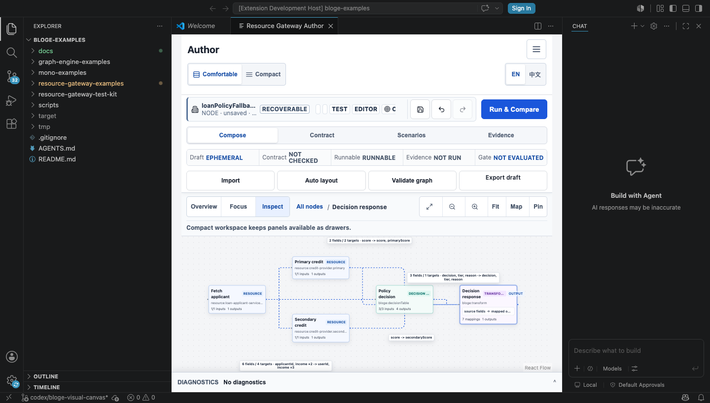
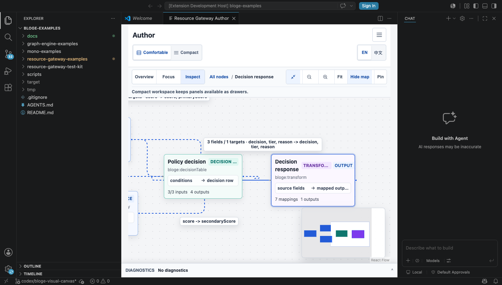

# Resource Gateway VS Code 宿主集成与实机体验审阅

> 状态：E2 reference host implemented and verified / E3-E4 field evidence pending
>
> 实施与复评日期：2026-08-09
>
> 对应扩展：[`resource-gateway-examples/vscode-extension`](../resource-gateway-examples/vscode-extension/README.md)

## 1. 结论先行

Resource Gateway 现在已经有一条不启动 Spring Boot、不开放本地端口的真实 VS Code 体验路径。参考扩展会
打包生产 WebView、提供离线算子与 built-in function catalog、通过版本化消息协议代理可选远端 API，并把
recovery 以 AES-256-GCM 密文存入 VS Code 宿主；密钥只存在 `SecretStorage`。

这不是“把网页塞进 iframe”就算完成。真实 Extension Development Host 走查先后暴露了 CSP、相机竞争、
边标签裁切、控件遮挡、minimap 状态泄漏和重复标签页等问题。每一项都已修到可重复验证的工程不变量。
当前结论是：**参考宿主 E2 工程链路闭合；真实目标用户成功率、cold start P75 与连续组织运行仍属于
E3/E4，不能被一次研发实机走查代替。**

## 2. 用户如何体验

```bash
cd resource-gateway-examples/vscode-extension
npm run prepare:webview
code --new-window --extensionDevelopmentPath="$PWD"
```

在 Extension Development Host 中执行 **Resource Gateway: Open Authoring Workspace**：

1. 选择 **Load example**，加载 Loan、Order 或 Dashboard 完整示例；
2. 在标准模式用 **Overview / Focus / Inspect** 阅读拓扑，用 **Fit** 恢复全图；
3. 点击左侧斜向箭头展开画布；Inspect 会以 `>=80%` 的语义缩放显示选中节点和最近结构上下文，
   minimap 保留全图形状；
4. 修改图后等待 `RECOVERABLE`，执行 **Resource Gateway: Save Recovery and Close**；
5. 重新打开，确认节点、边、Contract、Scenario、fixture、选中目标和工作模式精确恢复。

默认完全离线。需要受控运行时才配置 `resourceGatewayAuthoring.remoteBaseUrl`；远端必须是 HTTPS，只有回环
开发地址可使用 HTTP。令牌只能通过 **Resource Gateway: Set Remote Token** 写入宿主 SecretStorage，
WebView 无法读取。

## 3. 参考宿主责任边界

| 层级 | 负责 | 明确不负责 |
|---|---|---|
| WebView | 画布、Contract/Scenario、UI 状态、连续 checkpoint 请求 | 持有远端 token、直接访问任意 URL、明文持久化 |
| Extension host | 唯一面板、CSP、资源映射、协议校验、加密 recovery、受限 fetch、关闭协调 | 解释业务 payload、伪造运行证据、绕过 server policy |
| Resource Gateway server | 真实 catalog、验证、simulate/run、治理与证据协议 | IDE 文件编辑、VS Code SecretStorage、宿主窗口生命周期 |
| VS Code | WebView 隔离、SecretStorage、globalStorage、命令与 URI 激活 | 提供可取消的“用户即将点击标签 X”事件 |

浏览器和 VS Code 共享同一 React authoring surface；差异集中在 `BlogeApiTransport` 与 recovery adapter，
不会复制一套 IDE 专用业务 UI。

## 4. 工程协议与安全不变量

| 协议 | 不变量 |
|---|---|
| `bloge.vscodeWebviewRequest.v1` | 只接受 `FETCH / RECOVERY_LOAD / RECOVERY_SAVE / RECOVERY_REMOVE` 与严格字段 |
| `bloge.vscodeWebviewResponse.v1` | `requestId` 精确关联；未知、超时、畸形响应 fail closed |
| `bloge.vscodeHostWillDispose.v1` | 只有扩展控制的关闭路径可以等待全部工作面 flush |
| `bloge.vscodeHostDisposalReceipt.v1` | `ready=false`、失败或超时必须保留面板，不把关闭当成功 |

宿主还必须保持：

- CSP 使用 nonce，脚本只允许当前 WebView source；打包资源必须经过 `asWebviewUri` 重写；
- recovery envelope 绑定 tenant / namespace / environment / subject，密文被篡改或跨 scope 重放时拒绝；
- 远端代理拒绝非 Resource Gateway 路径、非 HTTPS 公网地址、WebView 自带 credential 与默认 `/admin`；
- payload、credential、response body 与 recovery 明文不进入 log、异常消息和测试报告；
- serializer 恢复与开发期自动打开并发时，只保留一个权威面板。

## 5. 真实 VS Code 走查发现与根治

| 现象 | 病根 | 根治手段 | 回归证据 |
|---|---|---|---|
| WebView 空白 | CSP 只放 nonce，没有允许 WebView script source | nonce + `webview.cspSource`，资源 URI 严格改写 | CSP/package tests + 实机加载 |
| 缩放控件盖节点 | React Flow Controls 与紧凑 WebView 共用画布角落 | v2 将缩放命令移到 Task Navigator，v1 保持兼容 | 组件测试；实机 controls = 0 |
| Fit 后边标签被裁掉 | 用含 Navigator 的外层高度判断 React Flow 可视区 | 只按内层 `.react-flow` rect 做 label containment | DOM 几何测试；标准模式 4/4 标签可见 |
| 展开后选中节点仍被裁掉 | `fitView` 动画与 `setCenter` 竞争 | 清理残留 timer，改为一次确定性 center/zoom | 单测 + 实机相机 transform |
| “一跳邻域”退化为全图 | 输出节点的字段级入边把所有上游都算作结构邻居 | Inspect 选择最近相连节点，minimap 保留全局关系 | `n4+n5` 与字段束在 100% 完整可见 |
| 返回标准模式仍有 minimap 覆盖 | 聚焦模式自动开图后没有恢复先前状态 | 保存/恢复 map state；v2 标准默认无遮挡 | 三态组件测试 + 实机 0 覆盖 |
| 重启出现两个同名 Author 标签 | serializer restore 与开发期 auto-open 竞态 | 延迟开发打开；`adopt` 原子替换 superseded panel | 并发单测 + 干净 profile 重启 1 个标签 |
| 截图看似成功却被 VS Code onboarding 覆盖 | 只测 WebView DOM，没有检查宿主顶层遮罩 | 截图门禁同时检查宿主 overlay 与 WebView 几何 | 最终截图无 onboarding 遮挡 |

这个缺陷链说明：画布视觉门禁不能只查 node overlap，也不能只在普通浏览器跑。宿主 chrome、顶层弹层、
WebView 实际可视 rect、相机动画和持久化恢复都必须纳入同一个任务级验收。

## 6. 实机证据

验证环境为 VS Code `1.127.0`、Electron `42.2.0`，隔离 user-data 与 extension 目录。先在干净 profile
加载 Loan 示例，等待连续 recovery，再杀掉宿主并重启同一 profile。

| 检查 | 观测结果 | 证据等级 |
|---|---|---|
| 启动 | 单次观测约 `580 ms` 到 workspace ready | E2 样本；不是 P75 |
| 恢复 | 重启后精确 `5 nodes / 12 edges` | E2 实机 |
| 面板唯一性 | 首次 1 个标签；重启后仍 1 个标签 | E2 实机 |
| 标准画布 | `55%`；5/5 节点、4/4 聚合标签在视口内；碰撞 0 | E2 实机几何 |
| 聚焦画布 | `100%`；`n4+n5`、字段束完整；标题 `12px`；minimap 可见 | E2 实机几何 |
| 覆盖 | 标准无 minimap；聚焦上下文与 Navigator/minimap 碰撞 0 | E2 实机几何 |
| 关闭 | 扩展控制关闭等待 receipt；直接点击 X 依赖连续 checkpoint | E2 协议 + 平台边界 |

标准模式完整拓扑：



展开后的 Inspect 聚焦：



## 7. 生命周期边界必须诚实

VS Code 没有“标签即将被用户关闭且可取消”的公开事件。直接点击 X 时，扩展只能收到已关闭通知，不能在
那一刻等待 receipt。因此数据安全不能建立在不存在的原子关闭保证上：

1. 编辑后 `350 ms` debounce checkpoint，并至少每 `5 s` 再次检查；
2. hidden/page lifecycle 再请求 checkpoint；
3. 扩展命令关闭与 deactivate 才走可等待 receipt；
4. 直接 X 的最大风险窗口是最后一次成功 checkpoint 之后的增量，必须在 E3 故障矩阵中实测；
5. 对要求零增量丢失的客户，应使用 **Save Recovery and Close** 或服务端权威 Save，不宣称 X 是原子提交。

## 8. 资深体验复评与剩余计划

E2 范围内，宿主接线、恢复、画布可读性与唯一面板从“设计存在”升级为“真实 VS Code 已跑通”。Round 3
工程体验仍评 `97 / 100`，视觉完成度 `95 / 100`；本轮发现的 P1 均已关闭。对外工业成熟度仍封顶 `89`，
原因不是还有一批可由研发自行勾选的小 UI，而是以下外部证据没有发生：

| 优先级 | 剩余问题 | 为什么不能由单测替代 | 完成门禁 |
|---|---|---|---|
| P0 evidence | 真实 VS Code cold start 分布未知 | 单次 580 ms 不能代表设备、扩展负载和企业策略 | `>=2` 名用户，cold P75 `<=2s` |
| P0 evidence | 目标角色是否理解 RECOVERABLE、Mock 与 scope 未知 | 设计者能操作不代表新用户心智正确 | 12 人固定任务，三项准确率 `>=95%` |
| P0 evidence | 直接 X 的真实增量风险窗口未知 | VS Code 平台没有 cancellable before-close | kill/X/hidden/timeout 故障矩阵无 silent loss |
| P0 evidence | 连续发布中的误操作率未知 | 自动化没有组织权限、交接和疲劳 | 2 团队 x 2 周期，三类严重事故为 0 |
| P1 hardening | Windows/Linux、Remote/SSH、企业代理尚未覆盖 | 文件系统、SecretStorage、CSP 与网络策略不同 | 宿主兼容矩阵全部通过或明确不支持 |
| P1 hardening | 100+ 节点图的长期认知负荷尚未量化 | 几何无碰撞不等于可理解 | 固定复杂图任务成功率、时间与迷失率达标 |

下一轮不应继续随意增加 chrome。优先顺序必须是：执行 E3 VS Code 故障与固定任务研究；将每个真实 P0/P1
转成可重放 regression；再进入 E4 连续组织周期。只有证据合同返回 `PASS`，对外成熟度才允许越过 89。

## 9. 验证命令

```bash
cd resource-gateway-examples/vscode-extension
npm test
npm run verify

cd ../src/main/frontend
npm test -- --run
npm run build
```

扩展测试覆盖协议、加密/篡改/scope、离线 catalog、SSRF/credential/admin 边界、CSP、关闭 fail-closed
和面板恢复竞态。production build 同时执行 i18n、UX、host 与 route startup closure 门禁。
