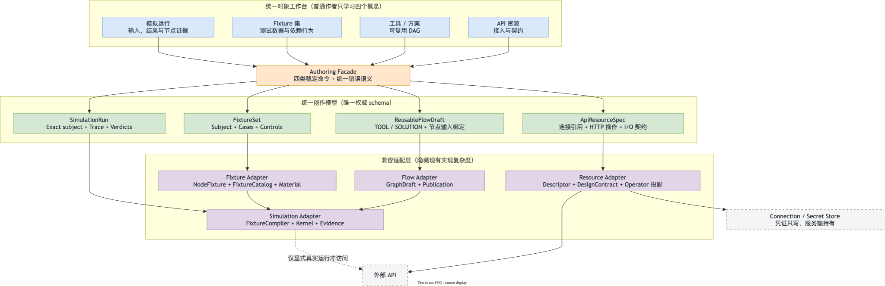

# Resource Gateway：API 资源、Fixture、工具与方案一体化创作方案

> 状态：Proposed，供架构与产品评审。
>
> 日期：2026-08-29。
>
> 范围：外部 API 接入、API 资源 Fixture、模拟运行、多资源 DAG、可复用工具/方案、工具/方案 Fixture。
> 本文只定义目标模型、前后端 Schema、模块接口、操作流程和迁移路径，不授权或实施产品代码改造。

## 0. 结论先行

当前问题不是功能不够，而是**实现协议仍在驱动用户界面**。

1. 用户执行一次「新增外部 API」，前端实际写入 `ResourceDescriptor` 和
   `ResourceDesignContract`，然后刷新虚拟 Operator。用户虽然看到一张表单，仍必须理解
   URL 模板、`ctx` 表达式、响应协议和 Schema 投影等实现概念。
2. 用户执行一次「设置 Fixture」，界面同时暴露 Pin、Promote、分类、保留期、脱敏路径、
   Review、Verify、Approve、Activate。调试数据、团队资产和治理审批被压在同一条操作线上。
3. 用户所说的「工具」仍主要是 `GraphDraft` 和 `VisualGraphPublication` 的前端投影；
   「方案」没有稳定的一等 Schema。
4. 用户执行一次「模拟运行」，前端仍发送整份 `GraphDraft` 和节点 Fixture Map。前端需要知道
   过多后端运行协议，任何后端字段变化都可能扩散到画布。

因此，不建议继续在现有六阶段导航和多个浮层上做局部减法。目标方案只让普通作者学习四个概念：

| 用户概念 | 用户完成的任务 | 后端隐藏的实现 |
| --- | --- | --- |
| **API 资源** | 描述一个可调用的外部 API 操作 | Connection、Secret、Descriptor、Design Contract、Operator 投影 |
| **工具 / 方案** | 把 API 资源或已发布流程组合成可复用 DAG | GraphDraft、Binding、Edge、Publication、DSL lowering |
| **Fixture 集** | 保存一组输入、依赖行为和期望结果 | NodeFixture、Scenario dependency、Fixture material、治理资产 |
| **模拟运行** | 选择对象、输入和 Fixture 后运行 | Fixture 编译、受控执行、Trace、Evidence、四维结论 |

治理能力不删除，但从普通创作主线移出。普通作者只执行「保存为私有 Fixture」或「共享给团队」；
四眼审核由独立评审工作区处理，不能继续要求作者在模拟结果行内完成完整治理生命周期。



图源：[`assets/drawio/resource-gateway-simple-authoring-architecture.drawio`](assets/drawio/resource-gateway-simple-authoring-architecture.drawio)。

## 1. 目标与边界

### 1.1 目标状态

方案必须支持以下连续任务：

1. 通过 URL、OpenAPI 或已有 Connection 接入一个外部 API 操作。
2. 为该 API 资源填写或生成 Fixture，并在不访问真实外部系统的情况下模拟运行。
3. 把多个 API 资源或已发布工具放入 DAG，形成一个可保存、发布和再次组合的逻辑片段。
4. 将逻辑片段标记为「工具」或「方案」，但复用同一份运行 Schema 和执行内核。
5. 为工具或方案整体设置 Fixture，或为其内部节点设置 Fixture，并模拟运行。
6. 将稳定 Fixture 共享给团队；共享过程保留现有脱敏、保留期、四眼审核和精确版本闭包。

### 1.2 非目标

- 不重写 BLOGE DSL、图执行内核、现有 Fixture Catalog 或 Evidence 协议。
- 不把模拟运行改成生产运行。
- 不允许模拟默认触达真实外部写接口。
- 不让浏览器读取 Secret、受保护 Fixture material 或凭证引用细节。
- 不在第一阶段引入循环图、长事务、人机任务或跨天编排。第一阶段仍是有界同步 DAG。
- 不删除现有 `/admin/*`、`/api/visual/*` 接口。新接口先作为创作外观层并行运行。

## 2. 现状事实与结构性问题

以下结论来自当前代码，不是对未来实现的假设。

| 现状事实 | 当前来源 | 结构性问题 |
| --- | --- | --- |
| 外部 API 表单转换为两份 Payload | `external-api/externalApiModel.ts` | 一个用户对象有两个写模型和两个失败点 |
| 保存顺序是 descriptor PUT → contract PUT → catalog GET | `external-api/externalApiTransport.ts` | UI 必须编排内部一致性，失败后可能产生半成品 |
| Runtime 与 Visual 各有 Resource Descriptor | `resource/ResourceDescriptor.java`、`visual/resource/VisualResourceDescriptor.java` | 字段镜像会持续漂移 |
| `GraphDraft` 同时带 nodes、edges、bindings、layout、fixtures 和快照 | `visual/draft/GraphDraft.java` | 创作、运行、展示、测试和审计职责混合 |
| simulate 请求携带完整 transient draft | `visual/simulation/VisualGraphSimulationRequest.java` | 前端与运行协议耦合过深 |
| Fixture 行内暴露完整治理生命周期 | `fixture-asset/GraphNodeFixtureControls.tsx` | 作者任务和审核者任务混在一起 |
| 工具是 Draft/Publication 的展示投影 | `tool/toolModel.ts` | 工具身份不稳定，方案没有一等对象 |
| `AuthorCanvas.tsx` 当前约 13,957 行 | 当前工作树实测 | 任何新操作继续挂载都会提高回归面 |

`rg-evolution-design-1.3.0` 的验收证明了现有能力可以串联，不等于用户心智已经简单。
新方案的判断标准不再是「能否在一个 WebDriver 会话里完成」，而是「普通作者需要理解多少对象、
填写多少内部字段、跨越多少页面，以及失败后能否知道如何恢复」。

## 3. 核心架构决策

### D1. `ApiResourceSpec` 是 API 资源的唯一创作权威

目标态只保存一份 `ApiResourceSpec`。Runtime Descriptor、Visual Design Contract 和
`resource:<id>` Operator 都是它的服务端投影，不再由前端分别写入。

过渡期可以由适配器同步现有 Registry，但**双写只能是迁移机制，不能成为长期权威模型**。

### D2. 工具与方案共用 `ReusableFlowDraft`

两者都表示「有稳定输入输出契约、内部为 DAG、发布后可被其他 DAG 复用的逻辑片段」。差异只由
`kind: TOOL | SOLUTION`、说明和目录展示表达。

第一阶段不建立两套 Schema、两套发布流程或两套运行时。如果未来「方案」需要人工任务、长事务或
补偿编排，再增加明确的 `executionProfile`，而不是提前复制整个模型。

### D3. 所有模拟数据统一为 `FixtureSet`

API 资源、工具和方案不再各有独立 Fixture 协议。`FixtureSet` 固定包含：

- 被测试对象 `subject`；
- 一组可命名的 `cases`；
- 每个 Case 的输入 `input`；
- 对 Subject 整体或内部节点的受控行为 `controls`；
- 期望结果 `expect`。

私有 Fixture 可以使用 inline material。团队 Fixture 必须转为服务端管理的精确资产引用。

### D4. 模拟按对象坐标运行，不再提交整份 GraphDraft

`POST /api/authoring/simulations` 只接收一个互斥运行源：精确 Fixture Case，或精确 Subject 加 Ad-hoc
Input。服务端加载已保存对象，编译为现有 `VisualGraphSimulationRequest`。普通前端不再理解 `GraphDraft.nodeFixtures`、
Operator snapshot 或治理 purpose header。

### D5. 创作与治理分离

作者工作区负责创建私有 Fixture、发起共享、查看状态和选择可用资产。评审工作区负责脱敏复核、
四眼批准和激活。模拟结果行不再显示 Review、Verify、Approve、Activate 四段按钮。

## 4. 领域模型与统一术语

### 4.1 API Connection

API Connection 表示外部系统的网络和认证位置。它是 Scope 内可复用的独立聚合，但不作为普通作者首页的
一等入口；API Resource 页面中的「新建 Connection」只是 `AuthoringFacade` 提供的嵌套创建便利。

- 包含 `baseUrl`、认证方式、默认超时和默认 Header。
- Secret 只写入 Secret Store。读取接口只返回「已配置」状态。
- 多个 API 资源可以复用同一个 Connection。
- Resource 只保存 `connectionId` 引用。仍被任何 Resource revision 引用的 Connection 禁止删除并返回
  `RG.AUTHORING.CONNECTION_IN_USE`；迁移必须显式创建 Resource 新 revision，不能级联改写。

### 4.2 API Resource

API Resource 表示外部 API 的**一个可调用操作**，不是整个供应商，也不是一份 OpenAPI 文档。
例如 `GET /customers/{customerId}` 和 `POST /orders` 是两个 API Resource。

### 4.3 Reusable Flow

Reusable Flow 表示一个有输入输出契约的可复用 DAG。

| `kind` | 产品含义 | 运行语义 |
| --- | --- | --- |
| `TOOL` | 面向 Agent 或其他流程的单一能力 | 同步 DAG，发布后可作为节点复用 |
| `SOLUTION` | 面向业务目标的多能力组合 | 第一阶段仍是同步 DAG，发布后也可作为节点复用 |

### 4.4 Fixture Set

Fixture Set 是一个版本化的模拟配置集合，不等于受保护 Fixture material。私有 Fixture Set 可以包含
inline 值；团队共享后只保存精确 Fixture Asset 引用。

### 4.5 Simulation Run

Simulation Run 是一次不可变运行记录。它必须说明：运行了哪个精确对象版本、使用了哪个 Fixture Case、
哪些节点真实执行、哪些节点被控制、输出是什么，以及 Execution、Contract、Assertions、Governance
各自得出什么结论。

## 5. 公共基础 Schema

### 5.1 Schema Envelope

继续复用当前 JSON Schema Envelope，不创建第二种类型系统：

```ts
interface SchemaEnvelope {
  format: 'json-schema';
  version: '2020-12';
  schema: Record<string, unknown>;
}
```

### 5.2 共享 Header 安全策略

Header 名在比较时统一转为 ASCII lowercase，发送时可保留原始大小写。以下名称或前缀是
平台保留的 Transport / Credential 边界，不能由 Connection 默认 Header、API Resource 动态
HEADER Binding 或 API Key Header 占用：

- `authorization`、`proxy-authorization`、`proxy-authenticate`、`cookie`、`set-cookie`；
- `host`、`content-length`、`connection`、`keep-alive`、`te`、`trailer`、`transfer-encoding`、`upgrade`；
- `forwarded` 和 `x-forwarded-*`。

API Key 只能选择不在保留集中的自定义 Header。一旦 Connection 声明 API Key Header，同一
Connection 的 defaults 和所有 Resource HEADER Binding 都不得使用该名称。认证 Header 只能由
Connection Auth Adapter 从 Secret Store 生成，不能来自 Example、Fixture 或 Simulation Input。

### 5.3 精确 Subject 引用

```ts
type ExactSubjectRef =
  | {
      kind: 'API_RESOURCE';
      resourceId: string;
      revision: number;
      fingerprint: `sha256:${string}`;
    }
  | {
      kind: 'FLOW_DRAFT';
      draftId: string;
      revision: number;
      fingerprint: `sha256:${string}`;
    }
  | {
      kind: 'FLOW_VERSION';
      publicationId: string;
      revision: number;
      fingerprint: `sha256:${string}`;
    };

type ComposableRef = Extract<
  ExactSubjectRef,
  { kind: 'API_RESOURCE' | 'FLOW_VERSION' }
>;
```

约束：

- Scope 不由客户端提交。服务端根据已认证身份派生 tenant、project 和 environment。
- 保存和模拟响应必须返回精确引用；任何 `revision < 1` 或指纹缺失都不能进入共享或可复用路径。
- Flow Draft 可以作为 Fixture 或 Simulation 的 Subject，但不能作为另一个 Flow 的依赖。可组合依赖只允许
  `API_RESOURCE` 和不可变 `FLOW_VERSION`。
- UI 默认只显示名称和 `rN`。完整指纹放在「版本详情」中。

## 6. 前端 Schema：只描述用户输入与界面状态

前端 Editor Model 不是后端 Wire Contract。它只保存表单尚未提交的值和页面选择，不能成为第二份领域权威。

### 6.1 API Resource Editor Model

```ts
type ConnectionEditor =
  | { mode: 'EXISTING'; connectionId: string }
  | {
      mode: 'NEW';
      displayName: string;
      baseUrl: string;
      auth:
        | { kind: 'NONE' }
        | { kind: 'BEARER'; tokenDraft: string }
        | { kind: 'BASIC'; username: string; passwordDraft: string }
        | { kind: 'API_KEY'; headerName: string; valueDraft: string };
    };

type ApiEffectEditor =
  | { kind: 'READ_ONLY' }
  | { kind: 'FIXTURE_ONLY_WRITE' }
  | {
      kind: 'MANAGED_WRITE';
      idempotencyHeader: string;
      receipt: {
        idPath: string;
        statusPath: string;
        succeededValues: string[];
        failedValues: string[];
      };
      reconciliation?: {
        resource: Extract<ExactSubjectRef, { kind: 'API_RESOURCE' }>;
        receiptIdInputPath: string;
      };
    };

interface ApiResourceEditorModel {
  resourceId?: string;
  displayName: string;
  connection: ConnectionEditor;
  method: 'GET' | 'POST' | 'PUT' | 'DELETE';
  path: string;
  effect: ApiEffectEditor;
  inputs: Array<{
    name: string;
    location: 'PATH' | 'QUERY' | 'HEADER' | 'BODY';
    type: 'string' | 'integer' | 'number' | 'boolean' | 'object';
    required: boolean;
  }>;
  success:
    | { mode: 'HTTP_2XX' }
    | { mode: 'HTTP_CODES'; codes: number[] }
    | { mode: 'BODY_MATCH'; path: string; values: Array<string | number | boolean> };
  output:
    | { mode: 'INFER_FROM_EXAMPLES'; outputPath?: string }
    | { mode: 'STRUCTURED'; properties: Array<{ name: string; type: string; required: boolean }> }
    | { mode: 'JSON_SCHEMA'; schemaText: string };
  examples: Array<{
    name: string;
    inputValues: unknown;
    outputValue: unknown;
  }>;
  defaultFixture:
    | { kind: 'NONE' }
    | { kind: 'FROM_EXAMPLES'; displayName: string; exampleNames: string[] };
}
```

标准模式不显示 `ctx.params.*`、`payloadPath`、`ResponseProtocol` 类名或 `resource:<id>`。
系统按输入字段名自动生成绑定。字段改名或需要嵌套映射时，才展开「高级映射」。

`GET` 默认 `READ_ONLY`。`POST`、`PUT`、`DELETE` 默认 `FIXTURE_ONLY_WRITE`，可以保存、设置 Fixture 和模拟，
但不能真实调用；只有高级入口补齐幂等、Receipt 和 Reconciliation 合同后才能选择 `MANAGED_WRITE`。

标准页面中的「请求样例 / 响应样例」直接编辑 `examples`。选择 `INFER_FROM_EXAMPLES` 时，Output Schema
从全部 Example Output 推导；`defaultFixture.exampleNames` 只能引用这里存在的具名 Example，不要求二次录入。

`tokenDraft`、`passwordDraft` 和 `valueDraft` 只存在于当前内存中的受控输入框。禁止写入 Local Storage、
日志、遥测、错误信息或 `ApiResourceSpec`。

### 6.2 Reusable Flow Editor Model

```ts
interface ReusableFlowEditorModel {
  flowId?: string;
  displayName: string;
  kind: 'TOOL' | 'SOLUTION';
  description: string;
  inputSchema: SchemaEnvelope;
  outputSchema: SchemaEnvelope;
  nodes: Array<{
    nodeId: string;
    label: string;
    use: ComposableRef;
    mappings: Array<{
      targetPath: string;
      source:
        | { kind: 'FLOW_INPUT'; path: string }
        | { kind: 'NODE_OUTPUT'; nodeId: string; path: string }
        | { kind: 'CONSTANT'; value: unknown };
    }>;
    position: { x: number; y: number };
  }>;
  output: { nodeId: string; path: string };
}
```

前端画布的连线是 `NODE_OUTPUT` Mapping 的投影，不再同时维护一份独立业务 Edge 和一份 Binding。
拖线动作只创建或修改一个 Mapping；删除 Mapping 后，连线自动消失。

### 6.3 Fixture Set Editor Model

```ts
interface FixtureSetEditorModel {
  fixtureSetId?: string;
  displayName: string;
  subject: ExactSubjectRef;
  cases: Array<{
    caseId: string;
    name: string;
    input: unknown;
    controls: Array<{
      target: { kind: 'SUBJECT' } | { kind: 'NODE'; nodeId: string };
      behavior:
        | { kind: 'REAL' }
        | { kind: 'RETURN'; output: unknown }
        | { kind: 'APPLY_CASE'; fixtureSetId: string; revision: number; caseId: string }
        | { kind: 'ERROR'; code: string; message: string }
        | { kind: 'TIMEOUT'; afterMs: number }
        | { kind: 'REPLAY'; replayId: string; fingerprint: `sha256:${string}` };
      fidelity?: 'OUTPUT_LEVEL' | 'PROTOCOL_DERIVED' | 'TRANSPORT_LEVEL';
    }>;
    expectedOutput?: unknown;
  }>;
}
```

UI 必须提供 Schema 表单和响应样例编辑器。JSON 编辑器只能是高级入口，不能是完成普通任务的前置条件。

### 6.4 Simulation Panel Model

```ts
interface SimulationPanelModel {
  source:
    | {
        kind: 'AD_HOC';
        subject: ExactSubjectRef;
        inputValues: unknown;
      }
    | {
        kind: 'FIXTURE_CASE';
        fixtureSetId: string;
        revision: number;
        caseId: string;
      };
}
```

普通界面只要求用户二选一：填写临时输入，或选择一个 Fixture Case，然后点击「模拟运行」。选择 Fixture Case
时，Case 自带的 Input 以只读方式展示；要修改它必须复制或编辑 Case，不能在运行请求里临时覆盖。
节点证据和四维结论属于响应展示，不是请求配置。

### 6.5 Editor Model 到 Wire Command 的唯一映射

前端只在提交边界执行一次确定性映射；不得在表单、Transport 和画布分别维护三份转换逻辑。

| Editor 来源 | Wire 目标 | 不变量 |
| --- | --- | --- |
| `ConnectionEditor.EXISTING` | `ApiResourceSaveCommand.connection.EXISTING` | 只传 `connectionId`，不回显 Credential |
| `ConnectionEditor.NEW` | `ApiResourceSaveCommand.connection.CREATE.command` | `*Draft` 只转成一次性 `SecretWrite.VALUE`，提交后立即从前端状态清除 |
| `inputs[]` | `resource.contract.input` + `resource.operation.bindings` | 字段名是默认唯一映射源；高级映射必须显式展开 |
| `output` + `examples[].outputValue` | `resource.contract.output` + `resource.examples[].output` | `INFER_FROM_EXAMPLES` 使用全部具名样例，不只看第一个数组元素 |
| `examples[].inputValues` | `resource.examples[].input` | 必须通过生成后的 Input Schema 校验 |
| `defaultFixture.exampleNames` | `defaultFixture.FROM_EXAMPLES.exampleNames` | 只能引用同一命令内已存在的唯一样例名 |
| `ReusableFlowEditorModel.nodes[].mappings` | `ReusableFlowCommand.graph.nodes[].inputs` | 一个 Mapping 同时是运行事实和可视连线的派生源 |
| `FixtureSetEditorModel` | `FixtureSetCommand` | Editor 的 inline `output` 转为 `RETURN + INLINE material`，不在前端生成 Asset 引用 |
| `SimulationPanelModel` | `SimulationRequest.source` | `AD_HOC` 和 `FIXTURE_CASE` 互斥；不把已保存 Case 的 Input/Control 复制进请求 |

这个映射必须封装在一个纯函数模块中，前端保存、深链恢复和组件测试共用同一接口。
服务端仍要独立校验全部不变量；前端映射不是信任边界。

## 7. 后端权威 Schema

### 7.1 API Connection Command 与只读视图

写入协议必须允许标准 UI 直接提交一次性凭证，也允许高级用户引用已有 Secret。二者都只能出现在写命令中：

```ts
type SecretWrite =
  | { mode: 'VALUE'; value: string }
  | { mode: 'SECRET_REF'; ref: string }
  | { mode: 'KEEP_EXISTING' };

interface ApiConnectionCommand {
  schemaVersion: 'bloge.apiConnectionCommand.v1';
  displayName: string;
  baseUrl: string;
  auth:
    | { kind: 'NONE' }
    | { kind: 'BEARER'; token: SecretWrite }
    | { kind: 'BASIC'; username: string; password: SecretWrite }
    | { kind: 'API_KEY'; headerName: string; value: SecretWrite };
  defaults?: {
    timeoutMs?: number;
    headers?: Record<string, string>;
  };
}

type ConnectionCheckCommand =
  | { kind: 'NETWORK_ONLY' }
  | {
      kind: 'SAFE_READ';
      resource: Extract<ExactSubjectRef, { kind: 'API_RESOURCE' }>;
      input: unknown;
      justification: string;
    };
```

`NETWORK_ONLY` 只检查 DNS、TLS 和建立连接，不声称认证或业务 API 可用。`SAFE_READ` 必须引用同一 Connection
下的精确 `READ_ONLY` API Resource，并走与 Simulation 相同的授权、脱敏、超时和 Egress 审计。

标准 UI 新建 Connection 的写入示例：

```json
{
  "schemaVersion": "bloge.apiConnectionCommand.v1",
  "displayName": "Customer Service",
  "baseUrl": "https://customer.example.com",
  "auth": {
    "kind": "BEARER",
    "token": {
      "mode": "VALUE",
      "value": "<write-only bearer token>"
    }
  },
  "defaults": {
    "timeoutMs": 5000,
    "headers": {
      "Accept": "application/json"
    }
  }
}
```

`VALUE` 只能经 TLS 写入，Controller 在进入通用日志、事件或对象持久化前立即转存 Secret Store；
`SECRET_REF` 仅对有权限的高级入口开放；`KEEP_EXISTING` 只允许更新已有 Connection。
API Key 第一阶段只允许 Header，避免 Query Credential 进入 URL、代理日志和 Trace。
API Key Header 必须通过 5.2 的共享 Header 安全策略；不能用 `Authorization` 或任何传输保留名。

返回示例：

```json
{
  "schemaVersion": "bloge.apiConnectionView.v1",
  "connectionId": "customer-service",
  "revision": 2,
  "displayName": "Customer Service",
  "baseUrl": "https://customer.example.com",
  "auth": {
    "kind": "BEARER",
    "configured": true
  },
  "defaults": {
    "timeoutMs": 5000,
    "headers": {
      "Accept": "application/json"
    }
  }
}
```

接口不得返回 Secret 值、Secret Ref、Basic 密码、API Key 或 Authorization Header。
`defaults.headers` 只允许非敏感静态 Header；必须拒绝 `Authorization`、`Cookie`、`Proxy-Authorization`、
`Set-Cookie` 和与所选 API Key Header 重名的字段。`SECRET_REF` 必须属于认证身份的同一 tenant、project 和
environment，Scope mismatch 统一返回 404；它不能成为跨 Scope 搬运凭证的后门。
完整 denylist、大小写规范化和 API Key 冲突规则以 5.2 为唯一来源，不在各 Controller 重复实现。

### 7.2 `ApiResourceSpec`

标准 UI 提交一个 `ApiResourceSaveCommand`，而不是分别提交 Connection、Descriptor 和 Contract：

```ts
type ApiResourceCommand = Omit<
  ApiResourceSpec,
  'resourceId' | 'revision' | 'fingerprint' | 'connectionId' | 'status'
>;

interface ApiResourceSaveCommand {
  schemaVersion: 'bloge.apiResourceSaveCommand.v1';
  connection:
    | { mode: 'EXISTING'; connectionId: string }
    | {
        mode: 'CREATE';
        command: ApiConnectionCommand;
      };
  resource: ApiResourceCommand;
  defaultFixture:
    | { kind: 'NONE' }
    | {
        kind: 'FROM_EXAMPLES';
        displayName: string;
        exampleNames: string[];
      };
}

interface ApiResourceSaveReceipt {
  schemaVersion: 'bloge.apiResourceSaveReceipt.v1';
  connection: { connectionId: string; revision: number };
  resource: Extract<ExactSubjectRef, { kind: 'API_RESOURCE' }>;
  defaultFixture?: {
    fixtureSetId: string;
    revision: number;
    fingerprint: `sha256:${string}`;
    cases: Array<{ exampleName: string; caseId: string }>;
  };
  projections: {
    descriptor: 'READY';
    designContract: 'READY';
    operator: 'READY';
  };
}
```

`AuthoringFacade` 在同一个应用命令中保存新 Connection（如有）、API Resource 和可选 Default Fixture。
V1 使用确定的可见性提交协议，而不是返回部分成功：

1. 以 `Idempotency-Key` 建立 `PREPARING` Command Journal，并把新凭证写为有租约的 pending secret。
2. 在一个本地数据库事务中写入不可见的 Connection metadata、Resource revision、Default Fixture 和三份投影。
3. 激活 pending secret；成功后在一个短事务中切换新 revision 指针并把 Journal 标为 `COMMITTED`。
4. 任何步骤失败都把 Journal 标为 `FAILED`，删除或到期清理 pending secret 和不可见 staging rows；更新失败时旧 revision
   继续可见。相同幂等键重试从 Journal 恢复，不重复创建对象。

只有 `COMMITTED` 才返回成功 Receipt，且三份投影必须全部 `READY`。V1 不向标准 UI 返回
`PROJECTION_PENDING`；如果当前存储适配器不能满足 staging/commit 协议，该适配器不能进入 Slice 1。
嵌套 `CREATE` 的 `connectionId` 由服务端生成并通过 Receipt 返回；省略 defaults 时使用受策略约束的超时和
空 Header。`resource` Body 不重复提交 `connectionId`，由 Facade 根据 `EXISTING` 或 `CREATE` 结果写入。
`FROM_EXAMPLES` 将每个具名 Resource Example 转为一个 Fixture Case；未知、重复或空 `exampleNames` 返回 422。
每个生成 Case 的 Input 来自同名 Example Input，Subject Control 为 `RETURN`，Material 来自同名 Example Output。
Default Fixture 使用服务端生成的 `{resourceId}:r{resourceRevision}` 身份；冒号属于冻结 `identifier` 字符集，
不会为这一派生对象放宽所有公共 ID。每次 Resource 保存只创建一个新的
不可变 Fixture Set，不更新旧 Set，因此不需要第二个客户端 CAS。Resource 中的
`examples[].name` 在同一 revision 内必须唯一；Receipt 的 `cases` 顺序与请求 `exampleNames`
一致，页面可按 `exampleName` 无歧义地选择精确 Case 发起模拟。

OpenAPI 只负责发现，不直接写 Resource：

```ts
interface OpenApiPreviewCommand {
  schemaVersion: 'bloge.openApiPreviewCommand.v1';
  source:
    | { kind: 'INLINE'; documentText: string }
    | { kind: 'REMOTE'; url: string; connectionId?: string };
  operationIds?: string[];
}

interface OpenApiPreview {
  schemaVersion: 'bloge.openApiPreview.v1';
  discoveryId: string;
  operations: Array<{
    operationId: string;
    method: 'GET' | 'POST' | 'PUT' | 'DELETE';
    path: string;
    suggestedResource: ApiResourceCommand;
    diagnostics: Array<{ code: string; message: string }>;
  }>;
}
```

`INLINE` 文档有大小和解析深度上限。`REMOTE` 只允许 HTTPS，复用 Connection 时只从 Secret Store 取凭证；
它执行 SSRF、DNS rebinding、redirect、媒体类型、下载大小和超时检查，不接受命令内临时 Credential。
Preview 不持久化 Resource、Connection、Fixture 或 Catalog 投影。

以下为服务端保存后的权威视图。PUT Command 不携带 `revision` 和 `fingerprint`；更新前置版本通过
`If-Match` 提交，这两个字段由服务端返回。

```json
{
  "schemaVersion": "bloge.apiResourceSpec.v1",
  "resourceId": "customer.get-profile",
  "revision": 3,
  "fingerprint": "sha256:eeeeeeeeeeeeeeeeeeeeeeeeeeeeeeeeeeeeeeeeeeeeeeeeeeeeeeeeeeeeeeee",
  "displayName": "Get customer profile",
  "description": "Read the customer profile used by eligibility flows.",
  "connectionId": "customer-service",
  "operation": {
    "method": "GET",
    "path": "/customers/{customerId}",
    "bindings": [
      {
        "from": "$.customerId",
        "to": { "location": "PATH", "name": "customerId" }
      },
      {
        "from": "$.locale",
        "to": { "location": "QUERY", "name": "locale" }
      }
    ]
  },
  "contract": {
    "input": {
      "format": "json-schema",
      "version": "2020-12",
      "schema": {
        "type": "object",
        "properties": {
          "customerId": { "type": "string" },
          "locale": { "type": "string" }
        },
        "required": ["customerId"],
        "additionalProperties": false
      }
    },
    "output": {
      "format": "json-schema",
      "version": "2020-12",
      "schema": {
        "type": "object",
        "properties": {
          "score": { "type": "integer" },
          "segment": { "type": "string" }
        },
        "required": ["score"],
        "additionalProperties": false
      }
    }
  },
  "response": {
    "success": { "kind": "HTTP_STATUS", "codes": [200] },
    "outputPath": "$.data"
  },
  "effect": { "kind": "READ_ONLY" },
  "examples": [
    {
      "name": "prime-customer",
      "input": { "customerId": "customer-1001", "locale": "en-SG" },
      "output": { "score": 720, "segment": "PRIME" }
    }
  ],
  "status": "ACTIVE"
}
```

关键约束：

- `operation.path` 必须是相对路径，不能覆盖 Connection 的 scheme、host 或 credential。
- `bindings[].from` 只能引用 `contract.input` 中存在的路径。
- `BODY` 绑定最多一个根对象；Header 名称必须通过 5.2 的共享安全策略，并且不得与
  Connection 的 API Key Header 重名。
- 对 `POST`、`PUT`、`DELETE`，标准保存允许 `FIXTURE_ONLY_WRITE`，但只能创建、设置 Fixture 和模拟；
  真实执行必须是 `MANAGED_WRITE`，并提供现有 idempotency、receipt 和 reconciliation 所需信息。
- `response.success` 对普通作者只提供两种模型：HTTP 状态或 Body 字段匹配。适配器负责映射到当前
  `HttpStatus`、`StatusCodes`、`BodyFlag` 或 `BodyCode`。
- `revision` 和 `fingerprint` 由服务端生成。更新使用 `If-Match`，不能由客户端自行递增。

### 7.3 `ReusableFlowDraft`

创建和更新都使用 URL 中的 `flowId`；Body 不提交服务端身份字段：

```ts
type ReusableFlowCommand = Omit<
  ReusableFlowDraft,
  'flowId' | 'draftId' | 'revision' | 'fingerprint' | 'status'
>;

interface ReusableFlowSaveCommand {
  schemaVersion: 'bloge.reusableFlowSaveCommand.v1';
  flow: ReusableFlowCommand;
}

interface ReusableFlowSaveReceipt {
  schemaVersion: 'bloge.reusableFlowSaveReceipt.v1';
  flowId: string;
  draft: Extract<ExactSubjectRef, { kind: 'FLOW_DRAFT' }>;
  validation: 'VALID';
}
```

创建时服务端生成稳定 `draftId` 并返回 Receipt；更新时 URL `flowId` 必须解析到同一 Draft，Body 不能切换身份。
每次 PUT 只产生一个新 revision。创建使用 `If-None-Match: *`；更新使用上一次响应的强
`ETag` 作为 `If-Match`。

以下同样是保存后的权威视图；`revision` 和 `fingerprint` 由服务端生成。

```json
{
  "schemaVersion": "bloge.reusableFlowDraft.v1",
  "flowId": "loan-eligibility",
  "draftId": "draft-loan-eligibility",
  "revision": 4,
  "fingerprint": "sha256:cccccccccccccccccccccccccccccccccccccccccccccccccccccccccccccccc",
  "displayName": "Loan eligibility",
  "kind": "TOOL",
  "description": "Combine customer and order facts into an eligibility decision.",
  "contract": {
    "input": {
      "format": "json-schema",
      "version": "2020-12",
      "schema": {
        "type": "object",
        "properties": { "customerId": { "type": "string" } },
        "required": ["customerId"],
        "additionalProperties": false
      }
    },
    "output": {
      "format": "json-schema",
      "version": "2020-12",
      "schema": {
        "type": "object",
        "properties": { "eligible": { "type": "boolean" } },
        "required": ["eligible"],
        "additionalProperties": false
      }
    }
  },
  "graph": {
    "nodes": [
      {
        "nodeId": "profile",
        "label": "Customer profile",
        "use": {
          "kind": "API_RESOURCE",
          "resourceId": "customer.get-profile",
          "revision": 3,
          "fingerprint": "sha256:eeeeeeeeeeeeeeeeeeeeeeeeeeeeeeeeeeeeeeeeeeeeeeeeeeeeeeeeeeeeeeee"
        },
        "inputs": [
          {
            "to": "$.customerId",
            "from": { "kind": "FLOW_INPUT", "path": "$.customerId" }
          }
        ]
      },
      {
        "nodeId": "decision",
        "label": "Eligibility decision",
        "use": {
          "kind": "FLOW_VERSION",
          "publicationId": "eligibility-decision-v2",
          "revision": 2,
          "fingerprint": "sha256:bbbbbbbbbbbbbbbbbbbbbbbbbbbbbbbbbbbbbbbbbbbbbbbbbbbbbbbbbbbbbbbb"
        },
        "inputs": [
          {
            "to": "$.score",
            "from": { "kind": "NODE_OUTPUT", "nodeId": "profile", "path": "$.score" }
          }
        ]
      }
    ],
    "output": { "nodeId": "decision", "path": "$" }
  },
  "layout": {
    "nodes": {
      "profile": { "x": 120, "y": 160 },
      "decision": { "x": 420, "y": 160 }
    }
  },
  "status": "DRAFT"
}
```

发布命令返回并持久化以下不可变版本。它是 Catalog、父 Flow 依赖和 Whole-flow Fixture 的共同坐标：

```ts
interface ReusableFlowPublishCommand {
  schemaVersion: 'bloge.reusableFlowPublishCommand.v1';
  source: Extract<ExactSubjectRef, { kind: 'FLOW_DRAFT' }>;
}

interface ReusableFlowPublishReceipt {
  schemaVersion: 'bloge.reusableFlowPublishReceipt.v1';
  source: Extract<ExactSubjectRef, { kind: 'FLOW_DRAFT' }>;
  version: Extract<ExactSubjectRef, { kind: 'FLOW_VERSION' }>;
  catalog: 'AVAILABLE';
}
```

URL 中的 `flowId` 必须解析到 `source.draftId`。Publish 只允许当前可读 Draft 的精确
revision/fingerprint，不接受「最新版」或 Body 中的可变 Graph 快照。

```ts
interface ReusableFlowVersion {
  schemaVersion: 'bloge.reusableFlowVersion.v1';
  publicationId: string;
  revision: number;
  fingerprint: `sha256:${string}`;
  source: {
    draftId: string;
    revision: number;
    fingerprint: `sha256:${string}`;
  };
  flowId: string;
  displayName: string;
  kind: 'TOOL' | 'SOLUTION';
  description: string;
  contract: {
    input: SchemaEnvelope;
    output: SchemaEnvelope;
  };
  graph: ReusableFlowDraft['graph'];
  publishedAt: string;
  publishedBy: string;
  status: 'PUBLISHED';
}
```

`ReusableFlowVersion` 保存执行所需的完整 Contract 和 Graph 快照，不回读可变 Draft，也不携带 `layout`。
停用或撤销属于 Catalog availability，不修改版本内容或指纹；历史 Run 仍可按精确坐标复核。

关键约束：

- `graph.nodes[].use` 必须是精确版本。Catalog 选择动作自动钉住当前版本，普通作者不手填 revision。
- `NODE_OUTPUT` 引用形成业务 DAG。服务端由引用派生可视 Edge，不再接受一份可与 Binding 漂移的业务 Edge。
- `layout` 不参与业务指纹、模拟 lineage 或发布语义。
- 服务端必须拒绝环、未知节点、重复 `nodeId`、不存在的目标路径和不兼容的 Schema 映射。
- 发布生成不可变 `FLOW_VERSION`。只有发布版本可以被另一个 Flow 复用。
- 现有 route、dependency 和 expression 等高级语义通过兼容适配器继续存在；新的标准模式只暴露
  Input、Node Output 和 Constant 三种映射。待标准模式有明确用户案例后，再扩展受控条件节点。

### 7.4 `FixtureSet`

保存命令只包含可编辑内容；`fixtureSetId` 来自 URL，revision、fingerprint 和状态由服务端返回：

```ts
type FixtureMaterialWrite =
  | { kind: 'INLINE'; value: unknown }
  | {
      kind: 'FIXTURE_ASSET';
      fixtureAssetId: string;
      revision: number;
      schemaFingerprint: `sha256:${string}`;
    };

type FixtureBehaviorCommand =
  | { kind: 'REAL' }
  | { kind: 'RETURN'; material: FixtureMaterialWrite }
  | { kind: 'APPLY_CASE'; fixtureSetId: string; revision: number; caseId: string }
  | { kind: 'ERROR'; code: string; message: string }
  | { kind: 'TIMEOUT'; afterMs: number }
  | { kind: 'REPLAY'; replayId: string; fingerprint: `sha256:${string}` };

interface FixtureSetCommand {
  schemaVersion: 'bloge.fixtureSetCommand.v1';
  displayName: string;
  subject: ExactSubjectRef;
  cases: Array<{
    caseId: string;
    name: string;
    input: unknown;
    controls: Array<{
      target: { kind: 'SUBJECT' } | { kind: 'NODE'; nodeId: string };
      behavior: FixtureBehaviorCommand;
      fidelity?: 'OUTPUT_LEVEL' | 'PROTOCOL_DERIVED' | 'TRANSPORT_LEVEL';
    }>;
    expect?: { output: unknown };
  }>;
}

interface FixtureSetSaveReceipt {
  schemaVersion: 'bloge.fixtureSetSaveReceipt.v1';
  fixtureSetId: string;
  revision: number;
  fingerprint: `sha256:${string}`;
  subject: ExactSubjectRef;
  caseIds: string[];
  status: 'PRIVATE_DRAFT';
  statusRevision: number;
}

interface FixtureSetSummary {
  fixtureSetId: string;
  revision: number;
  fingerprint: `sha256:${string}`;
  displayName: string;
  subject: ExactSubjectRef;
  cases: Array<{ caseId: string; name: string }>;
  status: 'PRIVATE_DRAFT' | 'SHARING_PENDING' | 'TEAM_AVAILABLE' | 'STALE' | 'REVOKED';
  statusRevision: number;
}
```

`FixtureSetSummary` 只用于按 Exact Subject 恢复页面选择；它不包含 Case Input、Return material、Replay payload、
受保护资产引用或 Credential。用户选择精确 Case 后，再按 Fixture Set ID + revision 读取有权限的完整 View。

以下是保存后的权威视图。Fixture Set 内容 revision 不可变；更新会生成新 revision。

```json
{
  "schemaVersion": "bloge.fixtureSet.v1",
  "fixtureSetId": "loan-eligibility-happy-path",
  "revision": 2,
  "fingerprint": "sha256:ffffffffffffffffffffffffffffffffffffffffffffffffffffffffffffffff",
  "statusRevision": 1,
  "displayName": "Happy path",
  "subject": {
    "kind": "FLOW_DRAFT",
    "draftId": "draft-loan-eligibility",
    "revision": 4,
    "fingerprint": "sha256:cccccccccccccccccccccccccccccccccccccccccccccccccccccccccccccccc"
  },
  "cases": [
    {
      "caseId": "prime-customer",
      "name": "Prime customer is eligible",
      "input": { "customerId": "customer-1001" },
      "controls": [
        {
          "target": { "kind": "NODE", "nodeId": "profile" },
          "behavior": {
            "kind": "RETURN",
            "material": {
              "kind": "INLINE",
              "value": { "score": 720, "segment": "PRIME" }
            }
          },
          "fidelity": "OUTPUT_LEVEL"
        }
      ],
      "expect": {
        "output": { "eligible": true }
      }
    }
  ],
  "status": "PRIVATE_DRAFT"
}
```

受保护资产引用形式：

```json
{
  "kind": "RETURN",
  "material": {
    "kind": "FIXTURE_ASSET",
    "fixtureAssetId": "customer-prime-profile",
    "revision": 5,
    "schemaFingerprint": "sha256:dddddddddddddddddddddddddddddddddddddddddddddddddddddddddddddddd"
  }
}
```

在父 Flow 中复用一个已保存的工具/方案 Fixture Case：

```json
{
  "target": { "kind": "NODE", "nodeId": "eligibility-tool" },
  "behavior": {
    "kind": "APPLY_CASE",
    "fixtureSetId": "eligibility-tool-approved-output",
    "revision": 3,
    "caseId": "approved"
  }
}
```

Target 规则：

| Subject | Target | 含义 |
| --- | --- | --- |
| API Resource | `SUBJECT` | 模拟该 API 资源整体 |
| Flow Draft / Version | `NODE` | 控制 Flow 内某个依赖节点 |
| Flow Version | 唯一 `SUBJECT + RETURN` | 定义已发布工具或方案本身的 Whole-flow Fixture |
| Parent Flow | `NODE + APPLY_CASE` | 在父 Flow 中复用匹配该节点精确 API Resource / Flow Version 的 Subject Fixture |

Fixture 行为统一为 `REAL`、`RETURN`、`APPLY_CASE`、`ERROR`、`TIMEOUT` 和 `REPLAY`。
`APPLY_CASE` 必须引用精确 Fixture Set revision；被引用 Case 的 Subject 必须等于目标节点的精确
API Resource 或 Flow Version，并且 Case 必须恰好包含一个 `SUBJECT + RETURN`。它不能引用带 Node Controls、
`REAL` 或另一个 `APPLY_CASE` 的 Case，因此没有递归 Fixture 图和循环语义。

应用到父 Flow 时，父节点按父 Flow 的 Mapping 计算 Input 并校验目标 Subject 的 Input Schema；
被引用 Case 保存的 Input 只用于该 Case 独立运行和展示，不替换父节点 Input。运行时只复用该 Case 的精确
Subject Return material、Fidelity 和来源坐标。

省略 Control 时可以继续执行本地
Flow 和纯计算节点；一旦运行到外部 API，若没有 Fixture 且未显式允许真实 Read，运行必须以
`RG.SIMULATION.EXTERNAL_DEPENDENCY_UNCONTROLLED` 进入 `BLOCKED`。系统不得静默生成 Mock，也不得自动真实访问。

`fidelity` 只对最终解析为 API Resource 的 Target 有效。对 Transform 或子 Flow 指定
`PROTOCOL_DERIVED` / `TRANSPORT_LEVEL` 必须返回 422，而不是静默降级。

私有 `INLINE` material 受现有 Secret/PII 扫描和容量限制。执行「共享给团队」时，后端把 material
写入保护存储，生成 Fixture Asset，并创建一个引用精确 `FIXTURE_ASSET` 的新 Fixture Set revision；
原私有 revision 永不改写。Share Receipt 同时返回 `derivedFromRevision`、新 revision 和审核请求坐标。
浏览器不读取或回填受保护 material。

共享是一个显式的派生命令，不是对原 revision 的原地改写：

```ts
interface FixtureShareCommand {
  schemaVersion: 'bloge.fixtureShareCommand.v1';
  source: {
    fixtureSetId: string;
    revision: number;
    fingerprint: `sha256:${string}`;
    statusRevision: number;
  };
  policy: {
    classification: 'INTERNAL' | 'CONFIDENTIAL' | 'RESTRICTED';
    retentionDays: number;
    redaction: {
      profileVersion: string;
      paths: string[];
    };
  };
}

interface FixtureShareReceipt {
  schemaVersion: 'bloge.fixtureShareReceipt.v1';
  fixtureSetId: string;
  derivedFromRevision: number;
  revision: number;
  fingerprint: `sha256:${string}`;
  status: 'SHARING_PENDING';
  statusRevision: number;
  reviewRequestId: string;
}
```

`retentionDays`、`profileVersion` 和 `paths` 必须满足服务端治理策略；客户端不能通过自定义值
放宽保留期或跳过脱敏。Share 的强 `If-Match` 同时保护 `source.revision`/`fingerprint`
和 `statusRevision`；任一值已变化都返回 412。
URL 中的 `{fixtureSetId}` 必须等于 `source.fixtureSetId`，不一致返回 409。授权、CAS 和幂等
Target 全部以这个一致身份计算，不允许 Controller 和 Module 各自选择不同身份源。

### 7.5 `SimulationRequest`

> 后续设计：调用方提交业务输入并独立选择 Fixture Plan、按条件匹配 Fixture、控制 Operator 和
> Built-in Function Call Site 的 v2 协议，见
> [`rg-caller-directed-fixture-simulation-proposal-v2.md`](rg-caller-directed-fixture-simulation-proposal-v2.md)。
> 该文档当前为 Proposed，不改变本节 v1 wire contract。

```ts
type SimulationExecutionPolicy = {
  externalReads:
    | { kind: 'DENY' }
    | {
        kind: 'ALLOW_EXACT';
        resources: Array<Extract<ExactSubjectRef, { kind: 'API_RESOURCE' }>>;
        justification: string;
      };
  externalWrites: { kind: 'DENY' };
};
```

```json
{
  "schemaVersion": "bloge.simulationRequest.v1",
  "source": {
    "kind": "FIXTURE_CASE",
    "fixtureSetId": "loan-eligibility-happy-path",
    "revision": 2,
    "caseId": "prime-customer"
  },
  "executionPolicy": {
    "externalReads": { "kind": "DENY" },
    "externalWrites": { "kind": "DENY" }
  }
}
```

无 Fixture Case 时，使用互斥的 Ad-hoc 形式：

```json
{
  "schemaVersion": "bloge.simulationRequest.v1",
  "source": {
    "kind": "AD_HOC",
    "subject": {
      "kind": "API_RESOURCE",
      "resourceId": "customer.get-profile",
      "revision": 3,
      "fingerprint": "sha256:eeeeeeeeeeeeeeeeeeeeeeeeeeeeeeeeeeeeeeeeeeeeeeeeeeeeeeeeeeeeeeee"
    },
    "input": { "customerId": "customer-1001" }
  },
  "executionPolicy": {
    "externalReads": { "kind": "DENY" },
    "externalWrites": { "kind": "DENY" }
  }
}
```

`FIXTURE_CASE` 的 Subject、Input 和 Controls 全部从精确 Fixture Set revision 读取；客户端不能再提交一份
可能冲突的 `subject` 或 `input`。`AD_HOC` 才直接携带 Subject 和 Input，且不能携带持久 Fixture controls。

省略 `executionPolicy` 等价于两个 `DENY`。普通界面不显示该字段；只有具备权限的高级入口可以提交
`ALLOW_EXACT`，服务端还必须校验 actor、purpose、Resource `READ_ONLY` 契约和允许的 Connection。
模拟运行永远不能把 `externalWrites` 改为允许。
Fixture 中的 `REAL` 只表达「不要覆盖这个依赖」，不授予网络权限；最终是否允许外部 Read 仍由
`executionPolicy`、API Resource 的 `READ_ONLY` 契约和服务端授权共同决定。

### 7.6 `SimulationRun`

```json
{
  "schemaVersion": "bloge.simulationRun.v1",
  "runId": "sim-01K4...",
  "status": "SUCCEEDED",
  "subject": {
    "kind": "FLOW_DRAFT",
    "draftId": "draft-loan-eligibility",
    "revision": 4,
    "fingerprint": "sha256:cccccccccccccccccccccccccccccccccccccccccccccccccccccccccccccccc"
  },
  "fixtureCase": {
    "fixtureSetId": "loan-eligibility-happy-path",
    "revision": 2,
    "caseId": "prime-customer"
  },
  "output": { "eligible": true },
  "nodes": [
    {
      "nodeId": "profile",
      "status": "COMPLETED",
      "execution": "MOCKED",
      "fixtureSource": "INLINE",
      "fidelity": "OUTPUT_LEVEL",
      "egress": { "decision": "FIXTURE", "attempted": false }
    },
    {
      "nodeId": "decision",
      "status": "COMPLETED",
      "execution": "REAL",
      "fixtureSource": "NONE",
      "egress": { "decision": "NOT_APPLICABLE", "attempted": false }
    }
  ],
  "verdicts": {
    "execution": "PASSED_WITH_MOCKS",
    "contract": "PASSED",
    "assertions": "PASSED",
    "governance": "NOT_CHECKED"
  },
  "diagnostics": [],
  "startedAt": "2026-08-29T10:00:00Z",
  "endedAt": "2026-08-29T10:00:00.120Z"
}
```

结果首页可以显示「模拟成功」，但不得把 `governance: NOT_CHECKED` 改写为「可发布」或「全部通过」。
节点明细必须明确 `REAL` / `MOCKED`、Fixture 来源和服务端确认的 Fidelity。

```ts
type NodeEgressEvidence =
  | { decision: 'FIXTURE' | 'NOT_APPLICABLE'; attempted: false }
  | {
      decision: 'ALLOWED_READ';
      attempted: true;
      resource: Extract<ExactSubjectRef, { kind: 'API_RESOURCE' }>;
      connection: { connectionId: string; revision: number };
      authorizationDecisionId: string;
      outcome: 'SUCCEEDED' | 'FAILED';
    }
  | {
      decision: 'DENIED';
      attempted: false;
      resource: Extract<ExactSubjectRef, { kind: 'API_RESOURCE' }>;
      authorizationDecisionId: string;
      reasonCode: string;
    }
  | {
      decision: 'NOT_ATTEMPTED';
      attempted: false;
      resource?: Extract<ExactSubjectRef, { kind: 'API_RESOURCE' }>;
      reasonCode: string;
    };
```

`ALLOW_EXACT` 只是客户端的请求意图，不自行授予权限。服务端在运行前产生 payload-free
Authorization Decision，绑定 Scope、actor、purpose、精确 Resource、Connection 和授权策略 revision。
只有决策允许且网络实际发起时才返回 `ALLOWED_READ + attempted: true`。Run 保存
`authorizationDecisionId` 以便审计，但不返回完整 URL、Credential、敏感 Header 或 Body。

`verdicts.execution` 建议使用 `PASSED_REAL`、`PASSED_WITH_MOCKS`、`SIMULATED_ONLY`、`FAILED` 和
`BLOCKED`，不使用无法区分证据边界的单一 `PASSED`。当 Subject 自身被 `RETURN` 或 `APPLY_CASE`
整体替代时，只能得出 `SIMULATED_ONLY`：它可以证明 Fixture 符合契约，不能证明外部 API、工具或方案的
真实实现正确。

## 8. 单一错误协议

所有 Authoring 接口统一使用 Problem Detail 扩展：

```json
{
  "type": "urn:bloge:problem:authoring-validation",
  "title": "API resource cannot be saved",
  "status": 422,
  "detail": "One input binding does not match the declared input schema.",
  "code": "RG.AUTHORING.RESOURCE_BINDING_INVALID",
  "correlationId": "corr-01K4...",
  "fieldErrors": [
    {
      "path": "/operation/bindings/1/from",
      "code": "SCHEMA_PATH_NOT_FOUND",
      "message": "Input path '$.locale' is not declared by the input schema."
    }
  ],
  "recoveryActions": [
    {
      "kind": "OPEN_FIELD",
      "path": "/contract/input"
    }
  ]
}
```

建议状态语义：

| HTTP 状态 | 使用条件 | 恢复方式 |
| --- | --- | --- |
| 400 | JSON 格式、枚举或基本字段无效 | 修正请求格式 |
| 401 | 缺少或无法验证身份 | 重新认证 |
| 403 | 身份存在但不允许执行动作 | 申请权限或改用允许动作 |
| 404 | 对象不存在，或不属于当前 Scope | 返回对象列表重新选择 |
| 409 | 对象身份、共享状态或幂等键 Payload 发生语义冲突 | 按冲突详情选择新身份或新命令 |
| 412 | `If-Match` / `If-None-Match` 前置条件失败 | 重新加载并比较版本 |
| 422 | Schema、DAG、Fixture Target 或执行语义不可成立 | 定位 `fieldErrors` 修复 |
| 424 | 依赖对象当前不可用或 Connection 检查失败 | 修复依赖后重试 |
| 428 | 更新请求缺少必需的条件 Header | 带最新 ETag 重试 |
| 429 | 容量或频率限制 | 按响应建议等待或减小输入 |

错误响应不得包含请求 Credential、外部响应 Body、受保护 Fixture material 或完整 Provider URL Query。

## 9. 后端深模块与接口

`AuthoringFacade` 是应用级用例编排器，不是第五个领域模型。它接收标准 UI 的复合命令，控制
Connection、API Resource 和可选 Default Fixture 的提交边界；不复制四个深模块的校验、编译或投影逻辑。

```java
interface AuthoringFacade {
    ApiResourceSaveReceipt saveResource(
            ApiResourceId id,
            ApiResourceSaveCommand command,
            ExpectedRevision expected);
}
```

### 9.1 `ApiResourceModule`

```java
interface ApiResourceModule {
    ApiConnectionView saveConnection(
            ApiConnectionId id,
            ApiConnectionCommand command,
            ExpectedRevision expected);
    ConnectionCheckResult checkConnection(ApiConnectionId id, ConnectionCheckCommand command);
    ApiResourceView save(ApiResourceId id, ApiResourceCommand command, ExpectedRevision expected);
    ApiResourceView get(ApiResourceId id);
    OpenApiPreview preview(OpenApiPreviewCommand command);
}
```

模块内部隐藏：

- Connection 与 Secret 解析；
- `ApiResourceSpec` 校验和版本化；
- Runtime `ResourceDescriptor` 投影；
- `ResourceDesignContract` 投影；
- `resource:<id>` Operator 投影；
- 变更影响和兼容性诊断。

删除该模块时，上述复杂度会重新散落到 Controller、前端 Transport 和 Catalog，因此它是有深度的模块，
不是简单透传层。

### 9.2 `ReusableFlowModule`

```java
interface ReusableFlowModule {
    ReusableFlowView save(FlowId id, ReusableFlowCommand command, ExpectedRevision expected);
    ReusableFlowView get(FlowDraftId id);
    FlowValidation validate(FlowDraftId id, long revision);
    ReusableFlowPublishReceipt publish(FlowId id, ReusableFlowPublishCommand command, ExpectedRevision expected);
}
```

模块内部隐藏 `ReusableFlowDraft` → `GraphDraft` 转换、Binding/Edge 投影、Catalog snapshot、DSL 生成、
发布和 `publication:<id>` Operator 投影。

### 9.3 `FixtureSetModule`

```java
interface FixtureSetModule {
    FixtureSetView save(FixtureSetId id, FixtureSetCommand command, ExpectedRevision expected);
    FixtureSetView get(FixtureSetId id);
    CompiledFixtureCase compile(FixtureCaseRef ref);
    CompiledFixtureCase compileForTarget(FixtureCaseRef ref, ComposableRef expectedSubject);
    FixtureShareReceipt share(FixtureSetId id, FixtureShareCommand command, ExpectedRevision expected);
}
```

模块内部隐藏 inline material 校验、节点 Target 精确解析、Schema 兼容、受保护 Material Store、
Fixture Catalog 生命周期和共享状态聚合。
`compile` 始终以 Case 内保存的 Subject 为权威；`compileForTarget` 只增加与父节点 `expectedSubject` 的恒等
校验，不能用调用参数覆盖或重解释 Case Subject。

### 9.4 `SimulationModule`

```java
interface SimulationModule {
    SimulationRun simulate(SimulationRequest request);
    SimulationRun get(SimulationRunId id);
}
```

模块负责加载精确 Subject、调用 `FixtureSetModule.compile`、生成现有
`VisualGraphSimulationRequest`、执行内核、记录 Trace/Evidence，并映射为稳定的 `SimulationRun`。

### 9.5 Adapter 是真实 Seam

每个模块至少有两个 Adapter：

- Production Adapter：连接当前 Resource Registry、GraphDraft、Publication、Fixture Catalog 和 Kernel。
- In-memory Adapter：用于模块接口级行为测试。

迁移期还会存在 Legacy Adapter，用于读取现有 Descriptor/Contract、GraphDraft Fixture 和 Publication。
因此这些 Seam 有真实变化源，不是为抽象而抽象。

## 10. Authoring HTTP 接口

### 10.1 最小接口面

| 方法 | 路径 | 作用 |
| --- | --- | --- |
| `GET` | `/api/authoring/connections` | 返回 payload-free Connection 列表 |
| `GET` | `/api/authoring/connections/{connectionId}` | 返回单个 payload-free Connection View |
| `PUT` | `/api/authoring/connections/{connectionId}` | 高级入口单独管理可复用 Connection；Credential 只写 |
| `POST` | `/api/authoring/connections/{connectionId}:check` | 显式检查网络与认证 |
| `GET` | `/api/authoring/resources/{resourceId}?revision={revision}` | 读取最新或精确 API Resource revision |
| `PUT` | `/api/authoring/resources/{resourceId}` | 接收 `ApiResourceSaveCommand`，原子保存可选新 Connection、Resource 和 Default Fixture |
| `POST` | `/api/authoring/resources:preview-openapi` | 发现并预览 OpenAPI Operation，不保存 |
| `GET` | `/api/authoring/catalog?kind=API_RESOURCE|FLOW_VERSION` | 返回统一可组合目录 |
| `GET` | `/api/authoring/flows/{flowId}?revision={revision}` | 读取最新或精确 Reusable Flow Draft |
| `PUT` | `/api/authoring/flows/{flowId}` | CAS 保存 Reusable Flow Draft |
| `POST` | `/api/authoring/flows/{flowId}:publish` | 接收 `ReusableFlowPublishCommand`，发布不可变 Flow Version |
| `GET` | `/api/authoring/fixture-sets?subjectKind={kind}&subjectId={id}&subjectRevision={revision}&subjectFingerprint={fingerprint}` | 按 Exact Subject 返回 metadata-only Fixture Set summaries |
| `GET` | `/api/authoring/fixture-sets/{fixtureSetId}?revision={revision}` | 读取最新或精确 Fixture Set revision |
| `PUT` | `/api/authoring/fixture-sets/{fixtureSetId}` | CAS 保存 Fixture Set |
| `POST` | `/api/authoring/fixture-sets/{fixtureSetId}:share` | 接收 `FixtureShareCommand`，发起团队共享，不在作者页执行审批 |
| `POST` | `/api/authoring/simulations` | 按 Fixture Case，或 Subject + Ad-hoc Input 模拟 |
| `GET` | `/api/authoring/simulations/{runId}` | 读取不可变模拟结果 |

每个资源只提供一个保存端点。前端不得再直接编排 Descriptor、Contract 和 Catalog 刷新。

### 10.2 幂等与并发

- 创建使用标准 `If-None-Match: *`；更新使用响应的强 `ETag` 作为 `If-Match`；缺失返回 428，失配返回 412。
- Flow 创建使用 `If-None-Match: *`，只有更新已存在 Draft 才使用 `If-Match`。
- 所有 Authoring PUT 和会产生状态、网络或运行副作用的 Action POST（Connection Check、
  Publish、Share、Simulation）必须携带 `Idempotency-Key`。该规则由统一 Authoring Transport
  封装，不要求各页面自行判断。
- 响应返回 `ETag` 和精确对象引用。
- `ETag` 是服务端生成的不透明强验证器；客户端不得用 revision、fingerprint 或
  `statusRevision` 自行拼接。Publish 的 Validator 保护精确 Draft；Share 的 Validator 保护
  内容 revision/fingerprint 与 `statusRevision` 的组合表示。
- Resource 复合命令的 `If-Match` 只保护 URL 指向的 Resource：`EXISTING` Connection 是只读引用；
  `CREATE` Connection 必须不存在；Default Fixture 使用新 Resource revision 派生的新身份，因此没有隐藏的第二 CAS。
- 幂等记录按 Scope、Actor、Endpoint、Target 和 Key 隔离。重放相同 Key 且 Payload 指纹相同，在再次执行 CAS
  前返回原 Receipt；指纹不同返回 409。
- Authoring 权威对象和三份必需投影按 7.2 的 staging/commit 协议同步闭合；任一 Projection 失败时，新对象
  不能进入 ACTIVE/PUBLISHED，也不能返回成功 Receipt。
- Transactional Outbox 只发布已提交后的通知、指标和可重建缓存刷新，不能把必需投影的正确性延迟到后台。

## 11. 前端信息架构与操作流程

### 11.1 首页只提供三种创建入口

1. 「接入 API」
2. 「创建工具」
3. 「创建方案」

Fixture 和模拟不是独立 Studio。它们是每个对象详情页上的共同任务。

### 11.2 统一对象页

| 页签 | API Resource | Tool / Solution |
| --- | --- | --- |
| **设计** | Connection、Operation、I/O 契约 | I/O 契约、DAG、字段映射、输出 |
| **Fixture** | Subject Fixture Case | Whole-flow 或节点 Fixture Case |
| **模拟** | 输入、Fixture、运行结果 | 输入、Fixture、DAG Trace、结果 |
| **版本** | revision、影响、停用 | draft、publication、依赖和回滚 |

「版本」可以作为高级页签。前三个页签必须覆盖普通作者的完整任务。

### 11.3 接入 API 的标准流程

1. 输入 API 名称。
2. 选择已有 Connection，或填写 Base URL 和认证信息。
3. 输入 Method 和 Path，或从 OpenAPI 选择 Operation。
4. 填写一个请求样例和一个响应样例。系统生成 I/O Schema 与默认字段绑定。
5. 预览系统识别的输入、输出和成功条件。
6. 选择「保存并模拟」。系统保存 API Resource，创建私有 Default Fixture Case，并打开模拟结果。

高级设置收纳 Body 成功码、自定义 Header、嵌套映射、Managed Write 和手写 JSON Schema。

### 11.4 创建工具或方案的标准流程

1. 输入名称，选择「工具」或「方案」。
2. 从左侧目录拖入 API Resource 或已发布 Flow Version。
3. 连接节点。系统根据 I/O Schema 自动建议可兼容字段。
4. 无法唯一映射时，只要求用户选择目标字段，不显示底层 Binding JSON。
5. 选择整体输出。
6. 保存后进入 Fixture 页，为外部依赖设置 Return/Error/Timeout/Replay。
7. 模拟运行；通过后发布为不可变 Flow Version。

### 11.5 设置 Fixture 的标准流程

API Resource 默认 Target 为 Subject。Flow 默认先显示所有外部依赖节点，并提供两个入口：

- 「控制依赖」：为内部节点设置行为，用于验证 DAG 逻辑。
- 「模拟整个工具/方案」：为已发布 Flow Version 创建 Subject Return，用于父 Flow 隔离测试。

每一行只显示 Target、Behavior、Value、Fidelity 四列。分类、保留期和脱敏只在点击「共享给团队」后出现。

## 12. 状态模型

### 12.1 API Resource

| 状态 | 含义 | 可执行动作 |
| --- | --- | --- |
| `DRAFT` | Schema 或 Connection 尚未满足激活条件 | 编辑、Fixture 模拟 |
| `ACTIVE` | 可进入 Catalog 和 Flow | 编辑新 revision、模拟、停用 |
| `DEPRECATED` | 旧 Flow 可查看，新 Flow 默认不再选择 | 迁移、恢复或停用 |
| `DISABLED` | 不可新用或真实执行 | 查看历史、修复 |

### 12.2 Reusable Flow

- Draft revision 可连续编辑。
- Publish 生成不可变 Flow Version，不修改旧 Version。
- 依赖发布新版本时，已钉住版本仍可用，Draft 只显示 `UPDATE_AVAILABLE`；只有精确版本被撤销、禁用或不再可读时
  才显示 `UNAVAILABLE_DEPENDENCY`。作者显式升级依赖后生成新 Draft revision，系统不自动漂移版本。

### 12.3 Fixture Set

| 产品状态 | 底层含义 |
| --- | --- |
| `PRIVATE_DRAFT` | 仅当前 Scope 的 authoring material |
| `SHARING_PENDING` | Material 已提交治理，等待独立审核 |
| `TEAM_AVAILABLE` | 所有引用的 Fixture Asset 都是精确 ACTIVE revision |
| `STALE` | Subject 或 Target Schema 指纹变化 |
| `REVOKED` | 团队引用不可再用于新运行 |

Fixture Case、Subject 和 Material 引用属于不可变内容 revision；`status` 是独立生命周期投影，使用
`statusRevision` 做 CAS，不参与内容 fingerprint。Share 创建新的受治理内容 revision；后续审核只推进该
revision 的 `statusRevision`，不改写 Case Payload。

| Fixture 状态 | 新的直接 Simulation | 新的 `APPLY_CASE` | 历史 Run |
| --- | --- | --- | --- |
| `PRIVATE_DRAFT` | 仅同 Scope 允许 | 仅同 Scope 允许 | 可读 |
| `TEAM_AVAILABLE` | 有读权限时允许 | 有读权限时允许 | 可读 |
| `SHARING_PENDING` | 拒绝新运行 | 拒绝新引用 | 可读 |
| `STALE` | 拒绝新运行 | 拒绝新引用 | 可读并标记当时指纹 |
| `REVOKED` | 拒绝新运行 | 拒绝新引用 | 可读并显示撤销原因 |

Share 不会锁住原 `PRIVATE_DRAFT` revision；被拒绝的是新派生且处于 `SHARING_PENDING`
的受治理 revision。作者页必须把 `REVOKED` 显示为只读终态，不能因不可选而隐藏。

### 12.4 Simulation Run

第一阶段为同步运行，状态固定为 `RUNNING → SUCCEEDED | FAILED | BLOCKED`。即使 HTTP 同步返回，仍保存
`runId`，以支持深链、复核和后续异步化。

## 13. Schema 到现有实现的推导

### 13.1 `ApiResourceSpec` 投影

| 新字段 | 现有投影 |
| --- | --- |
| `resourceId` | `ResourceDescriptor.resourceId`、`ResourceDesignContract.resourceId` |
| `connectionId + operation.path` | `ResourceDescriptor.urlTemplate` |
| `operation.bindings` | `ParameterMapping` expressions |
| `contract.input` | `ResourceDesignContract.requestSchema` |
| `contract.output` | `ResourceDesignContract.responseSchema` |
| `response.success` | `ResponseProtocol` |
| `response.outputPath` | `payloadPath` |
| `effect` | `ExternalWriteContract` 与 Operator capability |

投影必须发生在服务端一个事务中。Catalog Operator 是派生 Read Model，不再由前端通过第三个 GET 判断保存是否完整。

### 13.2 `ReusableFlowDraft` 投影

| 新字段 | 现有投影 |
| --- | --- |
| `flowId/displayName/kind` | Draft metadata 与 Publication metadata |
| `graph.nodes[].use` | `DraftNode.operatorRef` |
| `FLOW_INPUT` | `GraphDraft.Binding.contextPath` |
| `NODE_OUTPUT` | `GraphDraft.Binding.nodePath` + 派生 data edge |
| `CONSTANT` | `GraphDraft.Binding.constant` |
| `layout` | `visualLayout` / node position |
| `graph.output` | `GraphDraft.OutputSelection` |

### 13.3 `FixtureSet` 编译

| Fixture 行为 | 现有运行投影 |
| --- | --- |
| `RETURN + INLINE` | request-scoped `NodeFixture.output` |
| `RETURN + FIXTURE_ASSET` | `GovernedFixtureRef`，Material 服务端解析 |
| `APPLY_CASE` | 读取精确 Case 的唯一 `SUBJECT + RETURN`，并校验其 Subject 与目标节点版本完全一致 |
| `ERROR` | Scenario dependency / bounded execution control |
| `TIMEOUT` | Scenario dependency / bounded execution control |
| `REPLAY` | recorded replay reference |
| `REAL` | 无 Fixture override，仍受 Simulation Policy 约束 |

`FixtureSetModule.compile` 是唯一编译入口。前端、Scenario Workspace 和 Graph Author 不得各自维护一份合并顺序。

### 13.4 `SimulationRun` 映射

现有 `VisualGraphSimulationResponse` 提供 `results`、`statusMap`、`mockedNodeIds`、`realNodeIds`、
`nodeFidelity` 和 diagnostics。`SimulationModule` 将其映射到稳定 Node Trace，并补充精确 Subject、Fixture
Case 与四维 Verdict。前端不直接消费内核响应。

## 14. 安全与治理

### 14.1 外部 API 安全

- Connection 创建时执行 scheme、host、DNS、redirect 和私网地址策略，防止 SSRF 和 DNS rebinding。
- Credential 只写 Secret Store；日志和错误只记录 Connection ID。
- 默认禁止真实外部访问。API Resource 的「检查连接」是显式动作并记录审计；它只执行 DNS/TLS、
  认证探针或管理员声明的安全 Read Probe，不能调用目标写 Operation。
- 模拟永远禁止外部写。真实 Read 也必须由有权限的用户显式选择。
- 请求、响应、Header、Body 和 Trace 都执行大小、深度、超时和脱敏限制。

### 14.2 多租户与对象闭包

- tenant、project、environment、actor 和 purpose 全部来自服务端身份。
- 所有 Subject、Fixture Set、Fixture Asset、Run 和 Publication 查询按相同 Scope 过滤。
- Scope mismatch 统一返回 404，不泄露对象是否存在。
- Publication、Fixture Asset 和 Simulation Run 都绑定精确 revision 与 fingerprint。

### 14.3 Fixture 治理

- 私有 Fixture 不自动成为治理证据。
- Share 命令先扫描 Secret/PII，再写保护存储，最后生成 Payload-free Receipt。
- 审核者与作者必须不同；审核入口不读取不必要的原始业务 Payload。
- Schema 漂移将 Fixture Set 标为 STALE；系统不能自动重绑到新版本。
- 治理失败不影响私有 Draft，但不能让其显示为 TEAM_AVAILABLE。

## 15. 可靠性、可观测性与负熵机制

### 15.1 一份权威、多份投影

`ApiResourceSpec` 是权威写模型。Descriptor、Design Contract 和 Operator 是可重建投影。系统定期执行
Projection Reconciliation：比较权威 revision/fingerprint 与各投影，发现漂移后隔离并重建，而不是依赖人工
发现「API 已保存但 Palette 没出现」。

### 15.2 关键指标

| 指标 | 目的 |
| --- | --- |
| `authoring_resource_save_total{result}` | 发现复合保存失败 |
| `authoring_projection_drift_total{projection}` | 发现权威对象与投影漂移 |
| `fixture_compile_total{result,reason}` | 发现 Target 和 Schema 问题 |
| `simulation_run_total{status,subject_kind}` | 观察运行健康度 |
| `simulation_external_call_total{decision}` | 证明默认拒绝和显式授权 |
| `fixture_share_total{status}` | 观察共享治理摩擦 |
| `authoring_first_simulation_seconds` | 衡量实际可操作性 |

### 15.3 结构性防腐

- Wire Schema 提供 JSON Schema 文件和 golden example，前后端由同一协议测试校验。
- Projection 由单一 Adapter 实现，不允许前端复制转换逻辑。
- Fixture Case 合并只允许一个 Compiler。
- 新功能必须说明它属于四个用户概念中的哪一个；无法归类时，先审查领域模型，不新增第五个 Studio。
- 每次生产故障必须转化为 Schema 负例、模块接口测试、告警或 Runbook，不保留口头例外。

## 16. 兼容迁移路径

### Slice 0：Schema 冻结与兼容盘点

1. 将本文七类 Schema family 制作为版本化 JSON Schema：Connection command/view、API Resource
   command/receipt/spec、OpenAPI preview、Reusable Flow save/publish command/receipt/draft/version、Fixture Set
   save/share command/receipt/view/summary、Simulation request/run、Problem Detail。
2. 为现有 Descriptor + Contract、GraphDraft、Publication、NodeFixture 和 Fixture Asset 建立迁移样例。
3. 决定 API Resource revision 的持久化位置；不允许用更新时间或 Catalog 顺序冒充 revision。
4. 建立现有接口与新接口的 contract test。

完成条件：所有关键字段、默认值、错误码、CAS 和 Scope 规则都可由测试验证。

### Slice 1：API Resource → Fixture → Simulation

1. 实现 `ApiResourceModule` 和 `/api/authoring/resources`。
2. 将 Descriptor/Contract/Operator 改为服务端投影。
3. 实现 API Resource 对象页的「设计、Fixture、模拟」。
4. 保存响应样例时自动创建私有 Default Fixture Case。
5. 通过新 Simulation 接口完成无外部调用的首次运行。

这是第一条必须交付的纵向切片。它直接验证用户最核心的「接入 API 并立即 Fixture 模拟」。

### Slice 2：Reusable Flow → Fixture → Simulation → Publish

1. 实现 `ReusableFlowModule` 与 Binding 单一事实源。
2. Catalog 同时返回 API Resource 和已发布 Flow Version。
3. 实现工具/方案共用对象页和 DAG 编辑。
4. 实现节点 Fixture 和 Whole-flow Fixture。
5. 模拟通过后发布，并在另一 Flow 中复用。

### Slice 3：团队 Fixture 共享与治理分离

1. 实现 `FixtureSetModule.share`。
2. 作者页显示 `PRIVATE_DRAFT`、`SHARING_PENDING`、`TEAM_AVAILABLE`、`STALE` 和只读
   `REVOKED`。
3. 评审动作移动到独立 Review Queue。
4. 复用现有 Fixture Catalog、Material Store、CAS 和四眼审核。

### Slice 4：旧数据迁移与入口切换

1. Descriptor + Contract 成对迁移为 `ApiResourceSpec`；孤儿对象标记 `NEEDS_REPAIR`，不静默补全。
2. GraphDraft 迁移为 `ReusableFlowDraft`；无法表示的高级 Edge 保持 Legacy 模式。
3. GraphDraft NodeFixture 和 governed refs 迁移为单 Case Fixture Set。
4. 现有 `/author/?spine=v1` 保留只读深链，默认入口切换到对象工作台。
5. 在迁移覆盖率和真实用户任务验收通过后，再讨论旧创作入口退役。

## 17. 测试与验收设计

### 17.1 Schema 与模块测试

- 每个 Wire Schema 提供最小合法、完整合法、未知字段、缺字段、非法枚举、超限和版本不支持样例。
- `ApiResourceModule` 测试一次保存只产生一个权威 revision，并可重建三种现有投影。
- `ReusableFlowModule` 测试环、未知节点、Schema 不兼容、精确版本、布局不影响指纹，
  以及 Publish 不能跨越 Draft revision/fingerprint。
- `FixtureSetModule` 测试 Subject/Node Target、`APPLY_CASE` 精确匹配与非 Subject Return 拒绝、行为联合类型、
  Fidelity 边界、五种状态的可运行性、Schema 漂移、Share 双重 CAS 和 payload-free 回执。
- `SimulationModule` 测试精确 Subject、Fixture Case、真实/模拟节点、四维结论、无外部写，以及
  `ALLOW_EXACT` 不能绕过服务端授权决策。
- 共享 Header Policy 对 defaults、API Key 和动态 HEADER Binding 运行同一组大小写无关负例。

### 17.2 前端组件测试

- 标准 API 表单不出现 `ctx`、Descriptor、Design Contract、Operator Ref 和治理生命周期术语。
- 响应样例可以生成 Schema、默认 Fixture 和可运行输入表单。
- 一次 Save 只调用一个 Resource Command。
- 拖线只创建一个 Mapping，不同时维护业务 Edge 和 Binding。
- Fixture 页只显示 Target、Behavior、Value、Fidelity；Share 前不显示 Review/Approve。
- Simulation 页只发送互斥的 Exact Fixture Case，或 Exact Subject + Ad-hoc Input。

### 17.3 浏览器验收链

#### A. API Resource

1. 创建 Connection 和 API Resource。
2. 使用响应样例创建默认 Fixture。
3. 模拟运行，断言外部网络调用次数为 0，输出和 Contract 通过。

#### B. 多 API 工具

1. 创建两个 API Resource。
2. 创建 Tool，加入两个资源节点并映射字段。
3. 保存 Fixture Set，两个 API 节点均使用 Return。
4. 模拟运行，断言两个依赖均为 MOCKED，DAG 内部逻辑为 REAL，输出 Schema 通过。
5. 发布为不可变 Tool Version。
6. 为该 Tool Version 创建一个只含 `SUBJECT + RETURN` 的 Whole-flow Fixture Case，并独立运行一次，
   断言 Verdict 为 `SIMULATED_ONLY`。
7. 在新 Flow 中选择该精确 Tool Version，证明它可作为节点复用。

#### C. 方案与 Whole-flow Fixture

1. 创建 Solution，使用已发布 Tool 和另一个 API Resource。
2. 为 Tool 节点选择一个精确 `APPLY_CASE` Whole-flow Fixture。
3. 模拟运行，断言 Tool 内部节点没有执行，父 Flow 获得精确模拟输出。

#### D. 失败边界

- 未知 Connection、Scope mismatch、过期 revision、循环 DAG、Schema 不兼容。
- Fixture Target 不唯一、Fidelity 不适用、Fixture stale、受保护资产已撤销。
- Secret 泄漏、SSRF 地址、真实写请求、响应过大、超时和重定向越界。

### 17.4 可操作性验收目标

这些是待实现后的产品门槛，不是当前系统指标：

| 可操作性指标 | 当前基线 | 目标门槛 |
| --- | --- | --- |
| 保存一个 API Resource 的前端协议编排 | Descriptor PUT + Contract PUT + Catalog GET | 1 个 Authoring PUT + 1 个 Receipt |
| 普通作者主线需要辨认的对象 | Descriptor、Contract、Operator、GraphDraft、NodeFixture、Fixture Asset、Review 状态等 8+ | 4 个用户概念 |
| 作者创建并共享 Fixture 的主动作 | Pin、Promote、Review-ready、Verify、Approve、Activate 等 6+ | 保存私有 Fixture、共享给团队 2 个 |
| 普通模式内部字段 | `ctx`、payloadPath、Operator Ref、GraphDraft fixture map 等 | 0 个；只在高级/诊断入口可见 |

- 普通作者主导航不超过四个领域概念。
- 完成 API Resource 首次 Fixture 模拟不需要手写 JSON、`ctx` 表达式或调用 Admin API。
- 标准流程不显示 Descriptor、Design Contract、Operator Ref、GraphDraft、Material Receipt 和审核状态机。
- 一个用户保存动作最多对应一个 Authoring Command。
- 每个错误都能定位到一个可见字段或一个明确恢复动作。
- 1280 px 和 390 px 视口均可完成三条浏览器验收链，无横向溢出。

Slice 1/2 上线前以至少 8 名不了解底层协议的目标用户做任务测试，采用以下建议门槛：

| 真实任务指标 | 建议门槛 |
| --- | --- |
| API Resource → Default Fixture → 首次成功模拟的中位时间 | ≤ 3 分钟 |
| 两个 API Resource → Tool Fixture → 首次成功模拟的中位时间 | ≤ 7 分钟 |
| 已发布 Tool → Whole-flow Fixture → 父 Flow 复用的中位时间 | ≤ 5 分钟 |
| 标准 API 接入的手工必填字段 | ≤ 8；Schema 与 Binding 由 Example 推导 |
| API 首次 Fixture 模拟的业务网络往返 | 2：复合 Save、Simulation；页面查询不计业务写 |
| CAS 冲突后的可见恢复动作 | ≤ 2：查看差异、重试保存 |
| 四条任务不经协助的首次成功率 | ≥ 90% |

这些门槛必须由埋点和可复核任务录像证明；组件测试或单次 WebDriver green 不能替代真实可操作性证据。

## 18. 被拒绝的替代方案

### 18.1 继续打磨现有六阶段 Spine

拒绝原因：阶段名仍来自实现生命周期。它可以帮助验收完整链路，不能减少用户需要理解的领域对象。

### 18.2 只做前端 Facade

拒绝原因：前端仍需双写 Descriptor/Contract、合并 Fixture、拼装 GraphDraft。复杂度只是从页面转移到 Transport，
并没有形成后端权威和事务闭包。

### 18.3 用一个通用 `Artifact` Schema 表示所有对象

拒绝原因：API Resource、Flow 和 Fixture 的不变量差异明显。过度通用会产生大量 `attributes`、可选字段和
运行时类型判断，接口表面更小但认知成本更高。方案只统一 Subject Ref、Schema Envelope、版本与错误协议。

### 18.4 为 Tool 和 Solution 建两套模型

拒绝原因：第一阶段两者具有相同同步 DAG 语义。复制模型会立刻复制 Fixture、Simulation、Publish 和 Catalog。

### 18.5 把 Fixture 继续嵌入 GraphDraft

拒绝原因：它无法自然表达 API Resource 独立模拟、Whole-flow Fixture、跨 Flow 复用和团队资产生命周期。

### 18.6 模拟前必须完成治理审核

拒绝原因：私有调试和团队可信资产是不同任务。强制治理会显著增加首成功成本，也会诱发用户绕过系统。

## 19. 风险与缓解

| 风险 | 影响 | 缓解 |
| --- | --- | --- |
| 新旧 Resource 权威并存 | Descriptor/Contract 漂移 | 明确 `ApiResourceSpec` 为唯一写权威；旧接口转兼容 Adapter |
| Binding 单一事实源无法表达全部 Legacy Edge | 存量高级图降级 | 标记 Legacy-only，不自动丢字段；按真实需求扩展受控 Activation |
| FixtureSet 与 Scenario 重叠 | 两套测试语言继续生长 | FixtureSet 负责可复用运行控制；Scenario 负责 Given/Then 与业务断言；统一使用同一 Fixture Compiler |
| Tool/Solution 未来语义分化 | 单模型承载过多 | 以 `executionProfile` 作为显式分裂门槛，不预先复制模型 |
| Facade 变成浅透传层 | 内部复杂度仍泄漏 | 以模块接口测试和删除测试检查 Depth；禁止前端使用旧协议字段 |
| 默认 Fixture 掩盖真实行为 | 用户误信模拟结果 | 节点明确 REAL/MOCKED、来源和 Fidelity；治理保持独立 Verdict |

## 20. 需要评审确认的决策

### R1. 是否接受 `ApiResourceSpec` 作为唯一创作权威

**建议：接受。** 这是消除 Descriptor + Contract 双写和修复投影漂移的前提。若只接受前端 Facade，复杂度会继续存在。

### R2. 是否接受 Tool 与 Solution 第一阶段共用运行 Schema

**建议：接受。** 若已确认 Solution 第一阶段必须包含人工任务、长事务或补偿，再重新打开该决策。

### R3. 是否接受私有 Fixture 默认零治理、共享 Fixture 独立审核

**建议：接受。** 这不会削弱团队资产治理，反而明确区分调试证据和治理证据。

### R4. 是否接受「保存后再模拟」，由 Subject Ref 取代 transient GraphDraft 请求

**建议：接受。** 自动保存可以保持交互连续，同时显著减少前后端协议耦合并保证运行 lineage。

### R5. 是否接受第一阶段标准模式只覆盖数据流 DAG

**建议：接受。** route、dependency、expression 继续由 Legacy/Advanced 模式承载。只有真实用户案例证明需要后，
才把受控条件语义加入新 Schema。

## 21. 评审门禁与通过后的下一步

当前文档和 `docs/schemas/resource-gateway-authoring/` 中的 JSON Schema 是**待评审契约基线**，
不表示 R1-R5 已被接受，也不授权继续改造运行时或 UI。

评审通过必须同时满足：

1. 确认 R1-R5，或在本文中记录替代决策及对 Schema 的影响。
2. 确认四个用户概念、Exact Subject、Fixture 不变内容 revision 与独立 `statusRevision`
   没有语义冲突。
3. 确认 Resource 复合保存的 staging/commit、Secret 租约和幂等恢复在当前存储中可实现；
   否则必须先改设计，不能用「最终一致」替换同步成功 Receipt。
4. 对可执行 JSON Schema 做一次逐字段对照；原型 Schema 与评审稿不一致时，以评审后的文档为决策源，
   通过新的 Schema commit 显式更新，不做隐式兼容。

评审通过后，先完成 Schema 对照和现有对象兼容样例，再定义四个深模块的接口行为测试。
第一个纵向实现切片仍然是「API Resource → Default Fixture → Simulation」。在评审通过前，
不继续向 `AuthorCanvas.tsx` 或新对象页增加实现。
