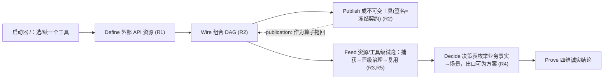

# Resource Gateway 工具创作工作台 · 现状评估、目标架构与详细技术方案（终稿）

> 视角：以独立架构评审的第三方立场，先客观描述问题、处境、理想状态、价值、解法空间与决策逻辑，再收敛到可直接开发的详细设计。自包含：概念与事实在首次出现处解释，均核到代码。

---

## 一、问题（客观陈述）

**产品定位。** Resource Gateway 是一个"给 AI Agent 造工具"的工作台：把外部 API 声明为资源、在有向无环图(DAG)里编排成业务逻辑、发布为有输入输出契约、可被 Agent（代号 ANEKE）调用的工具。

**问题。** 系统的**能力**完整且经过大量测试，但围绕以下 5 条核心工作流的**创作体验割裂**，导致配置/使用/传递不直接、上手成本高，并周期性产生"看似通过、实则未验证"的信任问题：
- R1 定义外部 API 并接入为资源；
- R2 多 API 组合成有 I/O 契约的工具；
- R3 资源与工具都能被 fixture/mock 试跑，且 fixture 沉淀为可复用核心资产；
- R4 决策表把业务事实组合枚举成业务场景，出口可为子场景/指令/方案；
- R5 决策表本身也能被 fixture 模拟。

**受影响者与证据。** 新用户：默认落地页是治理导向 Studio，空白首屏约 37 个控件、7 个平行 Studio，不读手册无法判断第一步。业务作者：一个"调这个 API"被拆成 descriptor/design-contract/virtual-operator 三概念 + admin 往返；试跑 mock 数据散落三处无法沉淀；决策表与测试场景各写一遍。组织：团队自身多轮真实走查反复记录同一句——"能力完整度领先于体验架构"。

**问题的性质（关键判断）。** 这不是能力缺失，而是**信息架构/体验架构问题**：系统按"系统对象/治理阶段"（Studio）组织，用户按"领域对象"组织；对象不跟着用户走，是用户在 Studio 间来回走，对象间传递靠隐式的协议/导出/投影，而非可见可执行的动作。

---

## 二、处境（客观现状盘点）

**2.1 已具备能力（均核到代码，全部已实现）。**

| 能力 | 事实 |
|---|---|
| 外部 API 定义/接入 | `ResourceDescriptor`+`ResourceDesignContract` 有 CRUD 端点(`/admin/resources`、`/admin/resource-design-contracts`)，`ResourceVirtualOperatorProjector` 投影 `resource:<id>` 进 `/api/visual/operators` |
| DAG 编排 | `GraphDraft`(nodes/edges/inputSchema/outputSchema) + React Flow 画布 |
| 工具与组合 | 图 `publish` → 不可变 `VisualGraphPublication`(冻结契约=工具签名)，可被 `VisualGraphPublicationOperator` 调用、`…OperatorProjector` 投影成 `publication:<id>` 算子**拖进另一张图**(组合)，被 ANEKE 消费 |
| 试跑/mock | `POST /api/visual/graphs/simulate` 混合执行：transform/decisionTable/branch 真跑、其余(含资源/design-only/native/子工具)mock；资源级 3 保真度(OUTPUT/PROTOCOL/TRANSPORT)；单算子可孤立 dry-run |
| fixture 治理资产 | `FixtureAssetDescriptor`：生命周期 DRAFT→PROPOSED→APPROVED→ACTIVE、脱敏/保留、`usageCount` |
| 决策表/场景 | 决策表算子(条件→结构化输出对象)、`ScenarioDraft`(Given/Dependencies/Then)、`scenarioFromTableCase` |
| 四维诚实结论 | 运行结果拆 Execution/Assertions/Contract/Governance，全过才聚合 Ready |

**2.2 已尝试什么，为何未解决。** 团队已建"任务式 shell v2"，工程完成度 95/100，随后用更严的"体验成熟度"尺子反复校准（74→84→E2 97/100）。**但每轮在同一处回潮**：新增能力各自以独立浮层/表格增长，重造双层工作台与所见非所得。证据表明：单点 UX 打磨不收敛，病根在信息架构而非单页。

**2.3 两处结构性缺口（本次核到）。** (a) 一等"工具"载体 `VisualGraphPublication` 存在，但编辑态"工具身份/签名/发布/组合"在 UI 上不显式——用户看到"图"不是"工具"。(b) 试跑能力全备，但"捕获→晋级治理→跨图复用"无可见动作线，且 **graph 节点 fixture 晋级为治理资产没有对应端点**（现有两条写入路径分别绑"库创作草稿"和"整份 descriptor"，都不匹配 graph 节点）。

**2.4 约束（决定可行域）。** 大量经 E2 测试的工程资产须保留、不能推倒；不重建 GraphDraft/FixtureBundle/Capability/治理协议；组织对回归高度敏感（历史证明大改必回归）；前端人力有限（`AuthorCanvas.tsx` 约 10,678 行已是负担）。

---

## 三、理想状态（北极星，独立于现有实现）

一个优秀的"Agent 工具创作运行时"，无论如何实现，应满足以下客观属性：

1. **单一对象主线**：第一名词是"工具"；作者始终知道"在造哪个工具、在哪个阶段"；领域对象是主线阶段而非并列入口。
2. **依赖定义是一等就地动作**：引入外部 API 在使用它处就地即时零代码完成、立即可用；实现层三概念对用户收敛为一个"外部 API"对象。
3. **组合有类型契约**：工具由资源与其它已发布工具组合，边界处校验 I/O 契约；工具即可被调用、也可作更大工具的构件。
4. **处处可无副作用试跑**：资源级/单工具级/组合级都能在不触达真实外部系统下 dry-run；每个 mock 输出的来源（真实/schema 合成/作者钉定/治理资产）一望可知。
5. **测试数据是沉淀资产**：fixture 可捕获、可晋级治理、可跨工具复用、可累计使用度、可检测 schema 漂移，而非一次性 JSON。
6. **业务规则即场景之源**：决策表既是可执行逻辑，又能把业务事实空间**枚举**成穷尽场景；出口可为数据、也可为"下一步做什么"（方案/子场景）。
7. **结论诚实多维**：任何"通过"分别说明四维证明了什么、没证明什么。
8. **生命周期连续可读**：定义→编排→发布→治理→被消费是一条连续、可追溯、可回滚的线。
9. **零手册首成功**：新用户不读文档即可分钟级完成一次可信的"定义→组合→试跑→沉淀"。

---

## 四、价值空间（差距 × 价值，量化）

**差距**：能力面（属性 3/4/5、7）≈就绪；**缺失或不可见**的是属性 1、2、6 与 4/5 的"可见沉淀线"。即 **能力≈就绪，体验架构≈缺失**。

| 工作流 | 现状成本 | 理想成本 | 价值 |
|---|---|---|---|
| 新增并使用外部 API | 改 Java/admin JSON(≥2 端点)+脑补三概念，需读码，小时级 | 就地表单、定义即用、分钟级、零代码 | 首工具时间 ↓一个数量级 |
| 图 → 可复用工具 | 隐式："工具在哪/签名/能否复用"不可知 | 显式签名+发布+可组合 | 复用与组合成为可能 |
| 试跑数据 → 资产 | 散落三处、无晋级线 | 一键捕获→治理→跨图复用(usageCount 累计) | 测试数据从损耗品变资产 |
| 决策表 → 场景 | 手抄逐条 | 一键枚举(规则/组合) | 覆盖率 × 效率 |

**量级判断**：因"能力已就绪、缺的是穿引"，单位工程投入撬动的体验提升高（低边际成本、高边际价值）；继续单点打磨（§二.2）边际价值递减且回归风险不减。

---

## 五、解法空间（所有候选战略路径，客观对比）

| 路径 | 描述 | 逼近理想 | 回归风险 | 工程复用 | 首价值时间 | 可回滚 |
|---|---|---|---|---|---|---|
| **P0** 现状延续 | 在 7 Studio 上继续单点打磨 | 低（病根在 IA） | 中（每轮回潮） | 高 | 短但不收敛 | — |
| **P1** 绿地重建 | 新建统一工作台、重写创作层 | 高 | **极高** | **低（丢弃已测引擎）** | 长 | 差 |
| **P2** Studio 合并 | 7→少数，但仍以 Studio 为中心 | 中（未除病根） | 高（大改导航） | 中 | 中 | 中 |
| **P3** 对象主线叠加 | 叠加以"工具"为第一名词的对象主线，Studio 降为从主线进入的专家深水区，开关门控 | **高（直击 IA 病根）** | **低（叠加+开关）** | **高（全复用）** | **短（能力已备）** | **强（一属性）** |
| **P4** 后端先行 | 先统一协议/资产，再改 UI | 中（用户短期无感） | 低 | 高 | **长（UI 价值滞后）** | 中 |

---

## 六、决策逻辑与依据

推理链：
1. 问题性质是体验/信息架构而非能力缺失（§一、§二.1）→ 排除"补能力"思路。
2. 病根在"按 Studio 组织"、单页打磨不收敛（§二.2 证据）→ **P0 落败**。
3. 约束要求保留已测工程、回归敏感（§二.4）→ 丢弃已测 simulate/fixture/schema 引擎的 **P1 落败**（回归极高、复用极低）；仍 Studio 中心的 **P2 次优**（未除病根、大改导航）。
4. 价值在"穿引"非"新能力"、且所需后端多已存在（§四、§二.1）→ 用户短期无感的 **P4 次优**（UI 价值滞后）。
5. 唯一同时满足"高逼近理想 + 低回归 + 全复用 + 短首价值 + 可回滚"的是 **P3**。

可证伪判据：P3 每一步必须 (a) 不写业务协议、(b) 开关门控可一属性回退、(c) 复用既有端点、(d) 四维结论不退化。任一不满足即回退。

---

## 七、理想方案（P3 收敛到的目标架构）

**第一名词 = 工具（`VisualGraphPublication` 的编辑态）。** 5 对象是一条主线的阶段，对象间转换是显式动作：



目标态↔理想属性映射：启动器+主线+面包屑→①；就地"添加外部 API"→②；publish + publication-as-operator→③；统一捕获点 + 3 保真度→④；节点 fixture 一键晋级治理 + 复用器 + usageCount→⑤；决策表枚举器 + plan 出口→⑥；四维结论置主线终点→⑦；Define→Publish→Feed→Prove 连续线→⑧；启动器意图入口→⑨。

---

## 八、详细技术方案（可直接开发、自包含）

### 8.0 工程约束与灰度装置（贯穿全期）

**灰度开关（纯函数，先于一切）。**
```ts
// spine/authorSpine.ts —— 无副作用，未知值 fail-closed
function resolveSpine(search: string): 'off'|'v1' {
  return new URLSearchParams(search).get('spine') === 'v1' ? 'v1' : 'off';
}
function parseToolCoordinate(href: string): ToolCoordinate | null { /* 缺 toolId → null（无主线） */ }
function toolCoordinateHref(href: string, c: ToolCoordinate): string { /* 幂等写回 query */ }
```
规则：spine=off 时**不挂载**任何新组件、页面与今天像素级一致；ToolCoordinate 只作为 props 与 `data-tool-*` 属性下发，**绝不进 GraphDraft/Scenario 协议**；回滚 = 去掉 `?spine=v1`。

**模块落位（抑制巨石 `AuthorCanvas.tsx`）。** 新增能力落独立目录：`spine/`（开关、坐标、ThreadRail、Breadcrumb、Launcher）、`external-api/`、`tool/`、`fixture-asset/`、`decision-scenario/`。主组件仅按 spine 决定挂载点。

**分期依赖**：A（无依赖）→ B（依赖 A）；C、D 依赖 A，可与 B 并行。**首里程碑 = A + B(含组合) + C 的 capture→promote 最小闭环。**

### 8.1 PhaseA — 基础与导航（纯前端）
路由：`spine==='v1'` 且 `pathname==='/'` → `launcher`；7 路由进"All workspaces"菜单。
```ts
interface ToolCoordinate { toolId:string; toolName:string;
  stage:'define'|'wire'|'publish'|'feed'|'decide'|'prove'; graphDraftId?:string; graphRevision?:number }
type LauncherIntent = 'build-tool'|'import-dsl-api'|'author-library'|'review-evidence'|'run-examples';
```
组件树：`Launcher(spine)`（新默认 `/`，5 意图卡，点击带坐标路由）；`AppShell > ObjectBreadcrumb(coordinate, selectedNodeId)`（Tool ▸ DAG ▸ Node）+ `ToolThreadRail(coordinate)`（Define→Wire→Publish→Feed→Decide→Prove）。
测试：单元 `resolveSpine`/`parseToolCoordinate`(缺 toolId→null)/`launcherRoute`；组件 spine=off 不挂载、v1 出 Launcher 且 5 卡可命名带 toolId 路由；E2 `/?spine=v1` 落 Launcher、10s 可命名、1280/390 无溢出、`/` 无 spine 像素级同今天。

### 8.2 PhaseB — 资源就地定义 + 工具签名/发布/组合（纯前端）
**表单模型 → 后端映射（worked example）。**
```ts
interface ExternalApiFormModel {
  resourceId:string; displayName:string; urlTemplate:string; method:'GET'|'POST'|'PUT'|'DELETE';
  params:Array<{name:string; in:'path'|'query'|'header'; from:string /* ctx 路径 */}>;
  responseProtocol: {kind:'HttpStatus'} | {kind:'StatusCodes';success:number[]}
    | {kind:'BodyFlag';flagField:string} | {kind:'BodyCode';codeField:string;successCodes:(string|number)[];messageField?:string};
  payloadPath:string;
  outputSchema: {source:'manual';schema:JsonSchema} | {source:'inferred';sampleResponse:unknown;schema:JsonSchema};
}
```
```jsonc
// form → ResourceDescriptor（PUT /admin/resources）
{ resourceId:"loan-applicant-service.getProfile", urlTemplate:"https://{host}/api/loan-applicants/{applicantId}",
  method:"GET", defaultHeaders:{"Accept":"application/json"}, authStrategy:null, defaultTimeout:"PT5S",
  parameterMapping:{pathParams:{applicantId:"ctx.params.applicantId"},queryParams:{},bodyExpression:null},
  responseProtocol:{type:"BodyCode",codeField:"code",successCodes:[0,"0","SUCCESS"],messageField:"message"}, payloadPath:"data" }
// → ResourceDesignContract（PUT /admin/resource-design-contracts）
{ contractId:"loan-applicant-service.getProfile",
  payloadSchema:{type:"object",properties:{score:{type:"integer"},segment:{type:"string"}},required:["score"]} }
```
保存后 `GET /api/visual/operators` 刷新 → `resource:<id>` 带类型化输出进 palette，可自动落画布。
**Schema 推断（inferred）。**
```
inferSchema(v, depth=0):  # 有界 MAX_DEPTH=6 / MAX_NODES=500，超限→{additionalProperties:true}
  object→{type:'object',properties:{k:inferSchema(v[k],+1)},required:[k where v[k]!=null]}
  array →{type:'array',items:v.length?inferSchema(v[0],+1):{}}
  number→整数?integer:number ; boolean→boolean ; string→string
```
**工具签名/发布/组合。**
```ts
interface ToolSignature { toolId; toolName; input:SchemaEnvelope/*=graph.inputSchema*/;
  output:SchemaEnvelope/*=graph.outputSchema*/; state:'draft'|'published'; publicationId?; publicationRevision? }
// Publish: POST /api/visual/drafts/{draftId}/publish → VisualGraphPublication；成功后 state=published
// 组合: GET /api/visual/operators 已含 publication:<id>（后端投影器带冻结 in/out），拖入=类型化节点
```
组件树：`CommandBar>ToolSignatureBadge`；`Palette>PaletteFacets(+External APIs/+Published tools)+AddExternalApiButton→ExternalApiFormDialog(RequestSection/ResponseSection/OutputSchemaSection/SaveBar)+PaletteList(resource:/publication:)`；`Inspector>ExternalApiObjectCard`（三概念收敛，缺 schema→黄字 opaque）；`ThreadRail>PublishStage→PublishToolAction`。
测试：单元 `externalApiFormToDescriptor`(4 协议×3 类 params)/`toDesignContract`/`inferSchema`/`toolSignatureFromDraft`/`publicationOperatorRef`；组件 表单保存→双 PUT+刷新出现 resource:、协议切换渲染对应字段、签名徽章 draft→published、Published tools facet 拖入 publication: 类型化；E2 定义 API→拖→连→Publish→已发布工具进 palette→拖入新图（组合闭环）。

### 8.3 PhaseC — 试跑捕获 + fixture 晋级/复用（前端 + 唯一新增后端端点）
**provenance 状态机。**
```
sample ──Pin──▶ pinned ──Promote(提交治理)──▶ governed(DRAFT) ──activate──▶ governed(ACTIVE)
governed ──算子/资源 schema 指纹变──▶ schemaStale=true（提示重捕获；lifecycle 可转 STALE）
```
**新增端点（唯一需动后端处）。**
```
POST /api/visual/graphs/{draftId}/nodes/{nodeId}/fixtures:promote
Body { schemaVersion:'bloge.graphNodeFixturePromote.v1', fixtureId, classification, retentionDays(1..30), redactionPaths[] }
```
服务端派生（落 `FixtureAssetDescriptor(DRAFT)`，复用 `FixtureCatalogService.saveDraft`）：
```
draft=find(draftId)?:404 ; node=draft.nodes[nodeId]?:404 ; output=draft.nodeFixtures[nodeId].output ?: 422
op=catalog.find(node.operatorRef) ; schemaRef=op.outputSchemaRef      // 资源节点=design contract schemaRef
scope=EnterpriseScope(draft.tenant/namespace/environment,region) ; owner=identity.principal
descriptor=FixtureAssetDescriptor(fixtureId,rev=0,scope,name,source=FixtureSource(
  capturedFromSimulate?SCENARIO:SAMPLE, ExactRef(isResource?RESOURCE:OPERATOR, resourceId?:operatorRef)),
  materialRef=store(output),schemaRef,variantKey=nodeId,lifecycle=DRAFT,classification,owner,
  redaction=Redaction(profileVersion,redactionPaths,reviewed=false),
  retention=Retention(policyVersion,retentionDays,expiresAt=now+days),
  quality=Quality(schemaValid=validate(output,op.outputSchema),redactionVerified=false,dup=0,usage=0))
stored=fixtureCatalog.saveDraft(0,descriptor,owner)  // 409 若 fixtureId 冲突
→ { fixtureAssetId, revision, lifecycle:'DRAFT', assetRef:stored.exactRef, schemaRef, provenance:'governed' }
```
复用端点：`POST …/simulate`（捕获源）、`GET /api/visual/fixture-assets`（复用器）、`:review-ready|:activate`（治理，usageCount 累加）。
```ts
interface NodeFixtureRef { nodeId; provenance:'sample'|'pinned'|'governed'; output; expectedInput?;
  governedRef?:{fixtureAssetId;revision;schemaFingerprint}; resourceFidelity?:'OUTPUT_LEVEL'|'PROTOCOL_DERIVED'|'TRANSPORT_LEVEL'; schemaStale? }
fixtureSchemaStale(node,catalog)= node.fixture.provenance==='governed'
  && catalog.find(node.operatorRef).outputSchemaFingerprint !== node.fixture.governedRef.schemaFingerprint
```
组件树：`SimulationResultPanel>SimulatedNodeRow(ProvenanceBadge+PinAsFixtureButton+PromoteToGovernedButton→GovernedFixturePromoteDialog)`；`NodeInspector>NodeFixtureEditor(ProvenanceBadge+FixtureAssetPicker+ResourceFidelitySelect)`；`FixtureStalenessNotice`。
测试：单元 `promoteRequestFrom`/`provenanceOf`/`fixtureSchemaStale`；后端 promote 派生+409/422/404、`:activate` 四眼；组件 Pin→badge=pinned、Promote→POST 服务端派生 body+badge=governed+回执、Picker→绑 governedRef+usageCount+1、Staleness 提示；E2 simulate→资源节点 Pin→提交治理→另图复用→usageCount+1、3 保真度可选。

### 8.4 PhaseD — 决策表→场景枚举 + plan 出口（纯前端）
**枚举算法（文法 + 伪代码）。**
```
支持谓词（有界，其余 opaque→回退作者样例）：col OP num(OP∈<,<=,>,>=,==,!=) | lo<=col<hi | col in [..] | otherwise
enumerate(dt, mode, cap, colToInputPath):
  1) 逐列解析：thresholds[col]∪=parsePredicate(pred,col).values ; type[col]|flag[col]='opaque'
  2) 代表值集 R[col]= opaque?requireAuthorSamples : numeric?∪{t-ε,t,t+ε} : enum?集合 : boolean?[T,F]（ε 由列类型，整数=1）
  3) per-rule: 每规则取恰命中组合 v*（满足且不被更高优先规则截胡，hitPolicy=unique/first）→emit(scenario(v*,rule.output))；加 otherwise
     combinatorial: combos=boundedCartesian(R,cap)（超 cap→分层降采样(真/假/边界优先)+提示）; 每 v: hit=evalDecisionTable(dt,v)→emit(scenario(v,hit.output))
  4) scenario(v,out): given.input=mapColumnsToGraphInput(v,colToInputPath); then=[outputAssertion('',out)];
     provenance='DECISION_TABLE_ENUMERATION'; sourceFingerprint=fingerprint(dt)
  5) 决定性：按 fingerprint(v) canonical 排序+去重；同 dt+mode+cap→同集（可幂等重枚举）
诚实边界：仅上述文法；函数调用/跨列约束→opaque→回退 per-rule+作者样例；不引 SMT。
```
出口：决策表 config 增 `outputKind∈{scalar,object,plan,dispatch}`（默认 object，向后兼容，plan 对 DSL 生成仍是结构化对象无需改生成器）。本期实现 `plan`（`{action,steps[],reason}` 类方案对象，可枚举可 simulate）；`dispatch`（output 带 targetRef 指向已发布 publication/子场景，下游补 branch/dynamicSubGraph，simulate 可 mock）设计写全、后段实施。
组件树：`DecisionTableRuleEditor + OutputKindSelect`；`GenerateScenariosButton→ScenarioEnumerationDialog(mode,cap)→写 ScenarioDraftSet(既有端点)`；`ScenarioStalenessNotice`（决策表指纹变→STALE+一键重枚举）。
生成场景保持 `dependencies=[]`；“Use expected output as Return fixture”是用户显式 authored override：保存前只更新 draft，NODE boundary fixture 在 OPERATOR 契约用 canonical `operatorRef`、GRAPH 契约用 `nodeId` 定位，expected 值深拷贝且不带凭据或治理材料。
测试：单元 `parsePredicate`(4 文法+opaque)/`representativeValues`/`pickCombo`(hitPolicy)/`boundedCartesian`(cap)/`evalDecisionTable`/`enumerate`(决定性、canonical、去重)；组件 4 规则 per-rule→4+1 且与规则一致、combinatorial+cap=10→≤10 决定性、opaque 触发作者样例；E2 一键生成场景→进 Scenarios→simulate(R5)。

### 8.5 端到端验收链与门禁
**链**：定义外部 API→组合成图→Publish 成工具（签名=冻结契约、可被组合）→simulate→捕获 fixture→晋级治理→跨图复用(usageCount+1)→决策表枚举生成场景（出口 plan）→显式把 expected 保存为 Return fixture→决策表被 fixture 模拟→四维诚实结论。全程 1280px 真实浏览器、不离主线、happy path 不手写 JSON。
**门禁**：四维不退化；无新增巨型弹层；`?spine=v1` 一属性回滚且关闭时像素级同今天；每层测试（纯函数/组件/真实浏览器几何断言）绿；新端点契约测试覆盖 409/422/404 与派生正确性。

---

## 九、落地后遗留 + 预计解法

①两套导航并存 → E3 用户验证后设默认、退役旧默认，7 路由留深链。②工具无面向 Agent 自然语言描述 → 后续"工具契约创作"持久化 {LLM 描述/何时用}、对接 ANEKE、替换 Capability tool tab demo pack。③dispatch 未落地 → PhaseD 后段(branch/dynamicSubGraph + 已发布目标 + 治理)。④fixture schema 漂移 → schemaRef 钉住，指纹变→节点 STALE、lifecycle→STALE、提示重捕获。⑤决策表生成场景过时 → 场景带决策表指纹，变则 STALE + 一键幂等重枚举。⑥组合爆炸 → cap + 分层 + 去重。⑦治理审批摩擦 → 默认草稿零摩擦、仅提交治理付审批。⑧1图:1工具 → adopt-as-tool，N:1/1:N 后续。⑨VS Code 深链 → host 携带 toolId/stage。⑩巨石组件 → 借抽 spine/external-api/fixture-asset/decision-scenario 模块时顺势剥离，不做大爆炸重构。

---

## 附：对接速查
`POST /api/visual/graphs/simulate` · `GET /api/visual/operators`(resource:/publication:) · `PUT /admin/resources` · `PUT /admin/resource-design-contracts` · `POST /api/visual/drafts/{id}/publish` · `GET /api/visual/publications/summaries` · **新增** `POST /api/visual/graphs/{draftId}/nodes/{nodeId}/fixtures:promote` · `/api/visual/fixture-assets` :review-ready|:activate|:approve · 决策表 config{hitPolicy,conditionColumns,outputColumns,rules[],outputKind} · `ScenarioDraft` provenance=`DECISION_TABLE_ENUMERATION`。

## 附：调用方驱动 Fixture 模拟融合

调用方如何在一次 API、契约化 Tool、Operator 或 Built-in Function 模拟中选择 Fixture，统一由
[`rg-caller-directed-fixture-simulation-proposal-v2.md`](rg-caller-directed-fixture-simulation-proposal-v2.md)
定义。该扩展吸收本文的对象主线、sample → pinned → governed 生命周期、三档 Fidelity、staleness、显式
Scenario RETURN Fixture 和 Execution/Assertions/Contract/Governance 四维结论，同时补充：

- Input 与 Fixture Plan 正交；调用方只引用 exact Fixture revision，不能上传 Mock output。
- Flow 使用静态 NODE_PATH，函数使用 compiler-owned Call Site；Runtime Invocation Key 只由执行器逐次生成。
- CASE_CONTROLS 复用工具模拟方案，Binding 支持 Exact Case、Condition 与 Auto match。
- 未匹配默认 BLOCK；REAL 仍需独立 egress authorization，不能由 Fixture Plan 自行放行。

对应操作入口与截图见
[`resource-gateway-api-fixture-tool-authoring-guide.md`](resource-gateway-api-fixture-tool-authoring-guide.md)。
