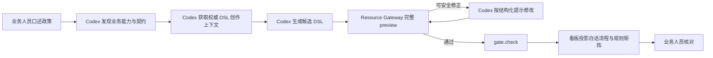
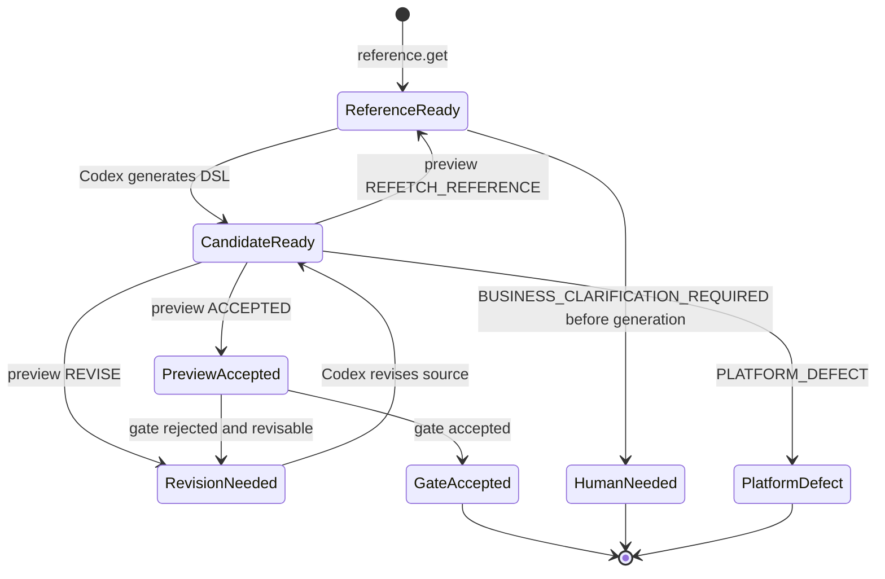
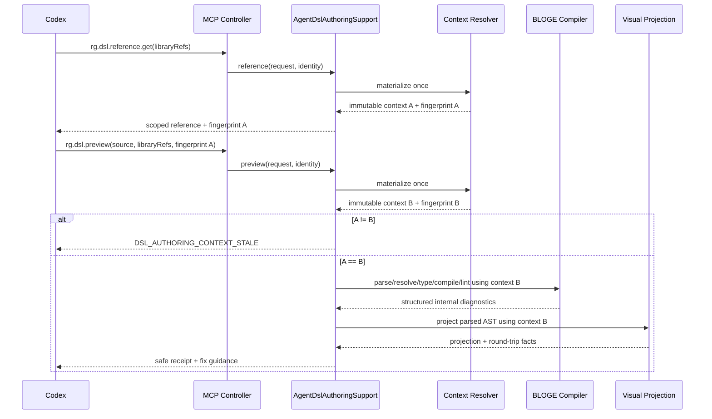

# Resource Gateway 演进详细技术方案 v1.4.2：补齐 Agent 的 DSL 创作支持面

> 状态：已实施；最终实现映射、认证证据与剩余限制见第 23 节。
>
> 日期：2026-09-04。
>
> 基线：[`rg-evolution-design-1.4.1.md`](rg-evolution-design-1.4.1.md)。本文不重写 v1.4.1 的五幕业务主线，也不改变 A0–A5 已形成的治理边界；它把第 3 幕中尚未完整落地的“自然语言 → 编排 → 预览 → 修正”展开为 **A3.2：Agent DSL 创作支持面**，并给出可直接拆分实施和验收的线级方案。

## 0. 先给结论

v1.4.1 已经让业务人员不必阅读 DSL：小李只口述政策，在看板核对白话流程、规则矩阵、标准案例和发布门禁。但在看板背后，负责写 DSL 的 Coding Agent 仍缺两样关键基础设施：

1. **没有服务端权威的 DSL 参考面。** 当前 MCP 只有工具发现、业务契约查询和 `rg.dsl.preview`，Codex 若不能读取本仓库文件，就拿不到准确语法、受支持构造、内置函数、已授权算子契约和已验证示例。
2. **现有 preview 诊断安全但不可修。** MCP 为防止业务载荷泄漏，只返回 `level/code/target/line/column`。方向是对的，但当前解析失败经常只有笼统错误码，缺少安全的错误解释、预期构造和修复动作；同时 preview 侧重 DSL → 可视草稿投影，不等于完整的解析、类型、语义编译和 lint 管线。

因此，当前系统能证明“Agent 可以提交 DSL”，还不能稳定证明“一个只连 MCP、没有仓库上下文的新 Agent，能独立写对 DSL，并在写错时根据服务端反馈收敛”。这是 A3 已承诺但未闭合的 **P1 能力完整性缺口**，不是新的第六幕。

v1.4.2 采用以下主方案：

- 新增只读工具 **`rg.dsl.reference.get`**，按本次已授权库契约生成紧凑、版本化、可缓存的 DSL 创作上下文；
- 重构 `rg.dsl.preview` / `rg.gate.check`，让它们绑定同一份不可变创作上下文，并经过完整创作编译管线；
- 新增 Resource Gateway 自有的**安全诊断注册表**。对 Agent 返回稳定码、安全摘要、期望构造、文档锚点和受限修复建议；绝不按“编译期就安全”的假设直接透传下层异常消息；
- 把“取参考 → 生成 → preview → 最多三轮修正 → gate”写入 MCP instructions 和 Codex 操作手册。业务提示词仍只讲业务，DSL 永远由 Agent 自己生成；
- 用无仓库访问权、无本地 DSL skill 的全新 Codex 实例完成真实 MCP 认证，作为 v1.4.2 的最终产品级验收。

本方案不会在 Resource Gateway 服务端引入另一个 LLM，也不会宣称编译通过等于业务正确。语法和契约正确由编译器证明；规则含义由业务投影和 GOLDEN 证明；真实接入由 A5 实景验证证明；上线决定仍由人工签署。

---

## 1. 为什么这仍属于五幕业务主线

### 1.1 第 3 幕的表面体验与后台事实

业务人员在第 3 幕只说：

> “确认恶意申诉就升级人工；无责且在免费取消时长内就全额减免；其他没有说清楚的情况不要猜。”

她不应再补充以下内容：

- BLOGE 关键字；
- 图、节点、输入端口和输出端口；
- `bindingRef`、算子引用或函数名；
- DSL 代码块；
- 编译器报错原文。

后台实际需要一条确定性链路：



v1.4.1 已经完成 H 和 I，可视为 **A3.1：业务可读投影**；v1.4.2 补齐 C–G，即 **A3.2：Agent DSL 创作支持面**。两者合起来，才是完整的 A3。

### 1.2 五层“正确”的边界

“确保 Agent 写对 DSL”不能被理解成“让大模型一次写对所有业务逻辑”。系统能给出的保证必须分层：

| 层级 | 系统证明什么 | 证明者 | 不能冒充什么 |
| --- | --- | --- | --- |
| L0 参考一致 | Agent 使用的语法、算子和函数参考与本次服务端编译上下文一致 | `rg.dsl.reference.get` + 上下文指纹 | 不证明候选 DSL 已生成 |
| L1 技术可编译 | 语法、名称解析、端口、类型、效应和语义约束通过 | 权威 BLOGE 编译器 + lint | 不证明业务政策被正确理解 |
| L2 可维护 | DSL 能投影、受支持构造能 round-trip，未静默丢失语义 | 可视投影器 + rewrite gate | 不证明业务应然 |
| L3 业务正确 | 规则矩阵经业务核对，ACTIVE GOLDEN 的 Oracle 成立 | 业务负责人 + RED/GREEN | 不证明真实数据源可用 |
| L4 真实可运行 | 当前实现能在受控沙箱读取真实来源，且仍满足 Oracle | A5 ATTEST | 不等于生产无限制放行 |

v1.4.2 只提升 L0–L2，不削弱 L3–L4，也不把 L1 包装成“业务正确”。

---

## 2. 当前基线与缺口证据

### 2.1 已有能力

当前实现已经有以下可靠基础：

- MCP `initialize` 给出治理顺序，`tools/list` 暴露 26 个严格 schema 工具；
- Agent 每次 preview 都显式传 `libraryRefs`；
- `DslImportService` 能解析顶层 `graph`、按可见库构造有效算子目录、投影 `GraphDraft`、生成 source map 并做 round-trip 评估；
- `AgentTddExecutionService.safeDiagnostics` 会移除下层 `message` 和 `metadata`，`safeProjection` 也移除 regenerated DSL 和 operator snapshots；
- `rg.gate.check` 已返回四维 honest verdict，不会把技术编译通过说成业务正确或运行治理通过；
- 看板已把决策表投影为业务规则矩阵，业务人员无须读 DSL；
- A5 自动实景验证只在 GREEN + GO 后，以 Agent 拿不到的 PLATFORM 用途执行。

这些边界必须保留。

### 2.2 参考供给缺口

仓库里虽然已有 `docs/ai/bloge-dsl-syntax-reference.md`，但它目前是**仓库文件**，不是 Resource Gateway 的 MCP 契约：

- 隔离运行或远程运行的 Codex 不一定能读仓库；
- MCP capabilities 只声明 `tools`，没有 DSL resource；
- `AGENT_INSTRUCTIONS` 只有工作流与治理顺序，没有“先取创作参考，再写 DSL”的协议；
- 文档同时覆盖 `graph`、`session`、`state_machine`，而当前 Resource Gateway 可视 preview 只接受顶层 `graph`。整篇塞进提示词会把“BLOGE 语言能做什么”和“当前 RG 创作面允许什么”混在一起；
- 动态 operator contract、library 版本、可用函数和绑定状态不可能由一份静态 Markdown 永久准确表达。

所以，“把 Markdown 路径告诉 Agent”只能当本地便利，不是平台能力。

### 2.3 preview 与诊断缺口

当前 `DslImportService.preview` 的主职责是**可视投影与 round-trip**。解析异常被捕获为 `visual.dslImport.parseFailed`，源码坐标可能为 `-1/-1`；进入 MCP 后又只剩错误码和坐标。Agent 知道“解析失败”，却不知道是缺右括号、字段分隔错误、保留字误用，还是根构造不受支持。

此外，仓库另一独立项目 `graph-engine-examples/ai` 已展示“语法参考 + operator catalog + few-shot + parse/lint/compile + repair”的基本思路，但它不能直接作为本方案的成品复用：

- 它是另一个独立 Maven 项目，Resource Gateway 不应反向耦合一个示例 AI 模块；
- 它的异常诊断仍可能直接采用 `exception.getMessage()`；
- 它在服务端调用 LLM 并自行重试，而本方案的 Agent 已在 Codex 侧，服务端重复引入 LLM 会形成双 Agent、双权限和双审计问题；
- 它面向 BLOGE 通用创作，而 Resource Gateway 必须按租户、项目、环境、libraryRefs 和授权目录裁剪上下文。

可吸收的是**上下文组成和分阶段验证思想**，不是复制模块或透传其诊断。

### 2.4 这项缺口的实际影响

| 场景 | 当前可能结果 | 业务影响 |
| --- | --- | --- |
| Codex 恰好能读仓库 | 可能靠文件搜索拼出 DSL | 成功依赖部署形态，不可作为 MCP 产品承诺 |
| Codex 只连 MCP | 只能从工具描述和业务契约猜语法 | 首次成功率不可控，演示和真实运营易中断 |
| 算子名或端口写错 | 只收到稳定码和位置 | 安全但缺少可执行修复动作，容易盲重试 |
| 服务端升级语法或库 | Agent 持旧本地 skill/旧提示 | 可能生成旧语法；当前请求没有明确漂移握手 |
| 下层异常包含业务值 | 若直接开放 message 会泄漏 | 不能用“编译期通常安全”替代逐字段安全证明 |
| DSL 编译通过但政策漏分支 | 技术上绿色 | 必须继续由规则矩阵与 GOLDEN 暴露，不能由 A3.2 越权判断 |

---

## 3. 对独立审查建议的吸收判断

| 审查建议 | 结论 | v1.4.2 处理方式 |
| --- | --- | --- |
| R1：给 Agent 一个 DSL 参考面 | **完整吸收** | 新增 `rg.dsl.reference.get`；服务端为权威，本地 skill 只做可失效缓存 |
| R2：preview 应提供足够诊断 | **吸收目标，修正做法** | 提供安全摘要、expected kinds、fix hints 和 reference refs；不按阶段直接透传原始 message |
| R3：指出 round-trip 失败构造 | **吸收** | 返回结构化 drift kinds、源码/重生语义指纹与定位；仍不返回 regenerated DSL |
| 编译/lint message 可直接透传 | **不吸收** | 是否安全取决于字段来源和构造方式，不取决于“编译期/运行期”标签；未登记字段一律不出边界 |
| 复用 `graph-engine-examples/ai` | **吸收思想，不直接依赖** | 抽象共用编译诊断 SPI 时在 BLOGE 主仓完成；RG 内保持独立深模块与最小依赖 |
| DNS rebinding 防护 | **吸收为并行 P2 安全项** | 纳入 v1.4.2 邻接硬化工作流，但不和 DSL 主模块耦合；见第 17 章 |
| ATTEST 改异步 | **暂缓** | 先以时延、超时和恢复率决定；当前同步方式更易保持调用结果与实景状态一致 |
| ATTEST 用途重命名 | **忽略** | 现有 `AGENT_TDD_ATTEST` 内外一致，改名只有迁移成本，无业务收益 |
| A1/A3 再抽检 | **作为回归，不另立方案** | 已有后端投影和真实浏览器用例；v1.4.2 最终验收继续覆盖，不重复设计 |

---

## 4. 目标、非目标与硬不变量

### 4.1 目标

G1. 一个**没有仓库读取权、没有预装 BLOGE skill** 的 Codex，只通过 Resource Gateway MCP，也能获得本次受支持的 DSL 语法、函数、算子契约和经编译验证的示例。

G2. Agent 基于纯业务意图生成错误 DSL 时，能根据 payload-free、结构化、可执行的反馈，在最多三轮内修正常见语法、名称解析、端口、类型、决策表和 round-trip 问题。

G3. reference、preview 和 gate 对同一次创作使用可验证的一致上下文；library、operator、function 或编译配置漂移时失败关闭，并要求重新取参考。

G4. 业务人员仍只接触业务世界观、规则、样例、GOLDEN 和上线决定，不被迫学习 DSL 或解读编译器术语。

G5. MCP 严格 input/output schema、用途鉴权、project scope、payload-free 和 no-store 边界继续成立。

### 4.2 非目标

- 不在 RG 服务端新增 LLM provider 或自动改写 DSL；生成与修正由已连接的 Coding Agent 完成。
- 不把整个 BLOGE 文档库、源代码或编译器内部对象通过 MCP 暴露。
- 不在本期让 RG 支持 `session` / `state_machine` 可视创作；reference 必须明确只宣传当前支持的 `graph` 子集。
- 不替代业务规则矩阵、GOLDEN、人工 Oracle 批准、A5 实景验证和 owner signoff。
- 不保证任意模型、任意温度、任意业务描述都能在固定轮次内生成业务正确的工具。
- 不建立另一套与 BLOGE 编译器分叉的 DSL 语法实现。

### 4.3 硬不变量

1. **服务端是线上权威。** 本地 skill、缓存文档和模型记忆不得覆盖服务端返回的语言版本和创作上下文。
2. **一次物化，一致消费。** 每次 reference/preview/gate 调用只物化一次授权目录；指纹计算、名称解析、编译、投影、round-trip 和修复建议全部消费该不可变快照。
3. **诊断按来源准入。** 只有安全注册表显式定义的字段可进入 MCP；`Throwable.message`、原始 token、业务常量、metadata、generated DSL 和下层响应体不得进入。
4. **建议不是决策。** 修复建议只提供候选技术动作；它不能修改 Oracle、补造业务规则或绕过人工批准。
5. **不盲重试。** 同一阻塞诊断指纹连续出现两次，或三轮仍不收敛，Agent 必须停止并按分类报告，不得无限循环。
6. **编译通过不升级证据。** preview/gate 不产生 GREEN、ATTESTATION 或 signoff，也不使 GOLDEN 自动 ACTIVE。
7. **提交的就是验过的候选。** compose 必须在同一 mutation 内重新验证并保存 receipt 绑定的 DSL；不能接受“preview A、提交 B”，也不能让 MCP 客户端绕过 DSL 路径直接伪造 `GraphDraft`。

---

## 5. 核心架构决策

### D1 · 先用 READ 工具提供参考，保留 MCP resources 适配位

候选方案：

| 方案 | 优点 | 缺点 |
| --- | --- | --- |
| 把完整参考塞入 `initialize.instructions` | Agent 一连接就能看到 | prompt 膨胀；无法按授权库裁剪；缓存和版本不透明 |
| 只提供本地 BLOGE skill | 离线体验好 | 远程/隔离 Agent 不可用；容易与服务端版本漂移 |
| MCP resources | 适合可读文档和订阅 | 当前控制器只实现 tools；增加协议面与客户端兼容工作 |
| **READ 工具 `rg.dsl.reference.get`** | 与现有严格 schema、鉴权、审计、四 server 配置直接兼容 | 工具数增加；需要分页/大小治理 |

本期选 READ 工具。内部服务返回与 transport 无关的 `DslReferenceSnapshot`，以后增加 MCP resources 时只新增适配器，不复制内容生成逻辑。

### D2 · 静态语法、动态目录和上下文指纹合成一个快照

DSL 参考不是一篇长文，而是三类事实的合成：

1. **语言能力**：当前 RG 支持的 root kind、语法构造、关键字、限制；
2. **授权目录**：本次 `libraryRefs` 可见的 operator、function、ports、schema、effect 和 binding 状态；
3. **经验证示例**：只展示能在当前编译器和能力子集下通过的最小示例。

三者共同计算 `authoringContextFingerprint`。Agent preview 时必须回传该指纹。服务端重新一次性物化当前上下文并比较；不一致则返回 `DSL_AUTHORING_CONTEXT_STALE`，不拿新目录偷偷编译旧候选。

静态参考包的 `languageVersion` 还必须与实际被 class loader 选中的
`bloge-dsl` 运行包一致。启动加载器从该 JAR 内的 Maven `pom.properties` 读取
group/artifact/version 并执行精确比较；因此即使通过 `-Dbloge.version=...` 等方式覆盖
POM 默认值，观测到的仍然是真正 linked runtime。任一侧单独升级都会失败，而不是
把旧语法参考交给新编译器。

### D3 · 安全诊断注册表，而不是“编译期 message 白名单”

下层异常消息可能包含源码片段、用户写入的标识、业务常量、schema 内容或 provider 材料。即使错误发生在 parser/compiler，也不能推定 message 安全。

Resource Gateway 维护 `DslSafeDiagnosticRegistry`：以稳定下层 code/rule id/异常类型为入口，输出 RG 自有 code、安全摘要模板、允许字段、修复动作和 reference anchor。映射不得解析自由文本。未知异常统一折叠为 `DSL_DIAGNOSTIC_UNCLASSIFIED`。

若 BLOGE parser 当前只抛自由文本异常，则先在 BLOGE 主仓补 `parseWithDiagnostics` 或等价结构化 API；在依赖升级前，RG 只能返回通用安全错误，不能用正则从 message 猜 token。

### D4 · preview 升级为统一创作编译管线

新的 preview 不是单纯“能不能画出来”，而是按固定阶段执行：

1. `CONTEXT`：物化授权库并校验上下文指纹；
2. `PARSE`：解析为 AST，返回结构化 parse diagnostics；
3. `RESOLVE`：解析 operator、function、named schema、input/output path；
4. `TYPE_CHECK`：检查端口、必需输入、输出路径和类型兼容；
5. `SEMANTIC_COMPILE`：执行 BLOGE 图编译与效应约束；
6. `LINT`：执行适用于 Agent 创作的 lint 规则；
7. `PROJECT`：投影 `GraphDraft`、source map 和业务看板所需结构；
8. `ROUND_TRIP`：对受支持构造做语义指纹对比；
9. `GATE`：仅由 `rg.gate.check` 和 compose 请求，汇总 technical acceptance 和 honest verdict；普通 preview 完成前八阶段后结束。

前一阶段无法安全继续时，后续阶段标记 `NOT_RUN`，不得用空诊断伪装为通过。

### D5 · Codex 负责修正，服务端负责确定性反馈

服务端不再调用 LLM。它只返回：哪里错、属于哪一类、哪些构造被期望、应查哪个参考主题、有哪些经过授权和兼容过滤的候选。Codex 修改自己的候选 DSL 后再次调用 preview。

这条边界让模型、权限、token 使用、审计和失败恢复都留在一个 Agent 会话里，也避免服务端自动“修正”业务语义。

### D6 · 本地 skill 是缓存，不是第二权威源

未来可以把紧凑语法和通用范例打包成 BLOGE skill，提高离线首轮质量。但每次连接真实 RG 后：

- 必须先读取服务端 `languageVersion` 和 `authoringContextFingerprint`；
- skill 版本不匹配时只可帮助理解，不可作为提交依据；
- 动态 operator、function、binding 和 effect 只能来自服务端；
- `DSL_AUTHORING_CONTEXT_STALE` 必须触发重新获取，不能坚持使用本地缓存。

### D7 · compose 提升已验候选，不信任客户端草稿

如果 preview/gate 通过的是 source A，而 `rg.tool.compose` 最后可以提交未验证的 source B 或任意 JSON `GraphDraft`，前面的创作闭环只是一条建议路径，不是可验证保证。

v1.4.2 收紧 Agent TDD MCP 的 compose 契约：`graph` 只接受 `{ "dsl": "..." }`，并要求 `authoringContextFingerprint` 与 `authoringReceiptFingerprint`。服务端在同一个 mutation 中重新运行 gate，核对 source、libraryRefs、上下文和 receipt 后，直接保存服务端生成的 projection。内部 web/visual API 若要提交结构化 `GraphDraft`，继续走自己的验证入口，不借 MCP Agent 路径绕过 DSL gate。

receipt 是内容地址，不是客户端签发的授权。服务端必须重算，不能只查客户端给的字符串或信任旧缓存。

---

## 6. 目标模块：一个深的 DSL 创作支持面

对上层只暴露两个核心操作：

```java
/** Returns a scoped, versioned and payload-free DSL authoring reference. */
DslReferenceSnapshot reference(DslReferenceRequest request, IntegrationRequestContext identity);

/** Compiles one candidate against exactly one immutable authoring context. */
DslPreviewReceipt preview(DslPreviewRequest request, IntegrationRequestContext identity);
```

建议以 `AgentDslAuthoringSupport` 作为深模块门面，内部包含：

| 内部组件 | 单一责任 |
| --- | --- |
| `DslAuthoringContextResolver` | 按 tenant/project/environment、libraryRefs 和授权目录一次性物化不可变上下文 |
| `DslReferenceBundleLoader` | 读取版本化语法主题、限制和经认证示例 |
| `DslReferenceService` | 裁剪主题、算子、函数和示例，执行大小治理并生成 reference 响应与指纹 |
| `DslContractLens` | 把授权 contract 投影为创作所需的结构信息，移除 URL、凭据、default/example 和自由文案 |
| `DslAuthoringCompiler` | 驱动 PARSE 到 LINT 的权威技术验证 |
| `DslVisualProjectionAdapter` | 让现有 `DslImportService` 消费同一 AST/目录快照，产生投影与 round-trip |
| `DslSafeDiagnosticRegistry` | 把下层结构化诊断映射为安全、稳定、可修正的 Agent 诊断 |
| `DslRepairGuidanceProjector` | 生成确定性的 reference refs、expected kinds 和受限候选 |
| `DslReferenceCertificationTestKit` | 编译参考中的每个示例，防止文档与编译器漂移 |

`AgentTddExecutionService` 继续承担 Agent TDD 的 preview/gate/execution 门面，但不再自行拼安全诊断；它委托该深模块，并把 receipt 投影进现有 MCP 信封。

### 6.1 为什么不把逻辑继续堆进 `DslImportService`

`DslImportService` 的合理职责是 DSL 与视觉草稿之间的投影和 round-trip。把语言参考、授权目录、完整编译、修复策略和 MCP 安全都塞进去，会让一个类同时承担语言服务、编译器、投影器与安全边界。

本方案保留其投影能力，但增加“使用已解析 AST 和不可变目录”的入口，避免它在 preview 过程中再次读取可变 catalog。统一创作编译器负责阶段顺序和结果汇总。

### 6.2 跨项目复用边界

`graph-engine-examples/ai` 不能成为 `resource-gateway-examples` 的运行依赖。真正适合复用的能力——结构化 parser/compiler diagnostics、稳定 diagnostic code、源码 span——应落在 BLOGE 核心依赖的正式 API 中。提示词、LLM provider、repair loop 仍属于 Graph Engine AI 示例；租户作用域、MCP 安全和授权目录属于 Resource Gateway。

---

## 7. 领域模型与指纹

### 7.1 `DslAuthoringContext`

```java
public record DslAuthoringContext(
        String schemaVersion,
        String languageVersion,
        String compilerProfile,
        Set<String> supportedRootKinds,
        List<LibrarySnapshot> libraries,
        Map<String, OperatorDefinition> operators,
        Map<String, BuiltInFunction> functions,
        String referenceVersion,
        String fingerprint,
        @JsonIgnore AuthoringScope scope) { }
```

关键约束：

- 只含当前身份可见的数据；
- `operators/functions` 排序后冻结，不暴露可变 registry；
- 后续编译、建议和投影均使用此对象，不二次 `catalog.find`；
- `scope` 冻结认证得到的 tenant/project/environment，仅供服务端把 transport-neutral 投影重绑定后再做 policy 校验，不进入 MCP JSON；
- 不包含 fixture material、真实 URL、credential、schema default/example、业务样例值或运行响应；
- 同一内容必得同一 fingerprint，集合顺序不影响结果。

### 7.2 指纹输入

`authoringContextFingerprint` 至少覆盖：

```text
schemaVersion
languageVersion
compilerProfile
supportedRootKinds (sorted)
referenceVersion
libraryId + libraryVersion + libraryFingerprint (sorted)
operatorRef + contractFingerprint + effect + archetype + bindingFingerprint (sorted)
functionName + signatureFingerprint (sorted)
```

不纳入：展示文案的语言、分页游标、Agent 选择了哪些 topics、返回顺序、业务 source 文本。

### 7.3 与运行证据指纹的关系

创作上下文指纹用于防止“参考 A、用目录 B 编译”。它是**创作 provenance**，不是新的发布门禁真相源：

- compose 成功后，`GraphDraft` 和 operator snapshots 的现有语义/实现指纹仍是执行、GREEN、ATTEST 与 publish 的权威；
- 仅参考文案升级、不改变语言或契约时，不应让已发布工具失效；
- preview receipt 可记录 `authoringContextFingerprint` 供审计，但不得用它替代 draft revision、contract fingerprint 或 implementation fingerprint。

---

## 8. MCP 新工具：`rg.dsl.reference.get`

### 8.1 工具元数据

| 字段 | 值 |
| --- | --- |
| 名称 | `rg.dsl.reference.get` |
| 影响级别 | `READ` |
| 用途 | `AGENT_TDD_READ` |
| `readOnlyHint` | `true` |
| `destructiveHint` | `false` |
| `openWorldHint` | `false` |
| 缓存 | HTTP/MCP 响应 `no-store`；Agent 可在当前会话上下文中复用已返回内容，直到服务端报告 STALE |

本期工具目录从 26 个增加到 27 个。`AGENT_TDD_ATTEST` 仍不进入目录。

### 8.2 输入契约

```json
{
  "libraryRefs": ["ride-policy"],
  "topics": ["graph-root", "node-declaration", "node-bindings", "decision-table"],
  "operatorRefs": [
    "resource:ride-order.get",
    "bloge:transform",
    "bloge:decisionTable"
  ],
  "includeExamples": true
}
```

规则：

- `libraryRefs` 必填，允许显式空数组，含义是取平台内建函数、平台内建图算子和当前 tenant/project/environment 可见的资源算子，但不导入任何命名扩展库；不得把省略误解为“所有库”；
- `topics`、`operatorRefs` 可选；缺省返回紧凑必备主题、平台内建算子和 library 摘要。Agent 应先用 capability/contract 查询选定业务能力，再用 `operatorRefs` 取精确创作契约；
- 未授权 library/operator 按不可见处理，不通过建议或错误详情泄漏其存在；
- 请求不接受自然语言业务描述、DSL source、fixture 或业务 payload；
- 数组长度和总响应字节数由配置设硬上限，超限返回 `DSL_REFERENCE_TOO_LARGE` 并要求缩小 topics/operatorRefs；不得静默截断成不完整契约。

### 8.3 输出契约

```json
{
  "ok": true,
  "data": {
    "schemaVersion": "rg.dslReference.v1",
    "languageVersion": "bloge-dsl-<server-version>",
    "compilerProfile": "resource-gateway-graph-authoring-v1",
    "supportedRootKinds": ["graph"],
    "referenceVersion": "<content fingerprint>",
    "authoringContextFingerprint": "<context fingerprint>",
    "topics": [
      {
        "topicId": "node-bindings",
        "title": "Node input and output bindings",
        "rules": [
          {"ruleId": "INPUT_ASSIGNMENT", "summary": "Assign each named input on its own line."}
        ],
        "exampleRefs": ["graph-resource-decision-minimal"]
      }
    ],
    "operators": [
      {
        "operatorRef": "bloge:decisionTable",
        "archetype": "decision-table",
        "effect": "PURE",
        "inputs": [{"name": "facts", "required": true, "schemaRef": "..."}],
        "outputs": [{"name": "decision", "schemaRef": "..."}],
        "configSchema": {},
        "contractFingerprint": "..."
      }
    ],
    "functions": [
      {"name": "coalesce", "signature": "(T?, T) -> T", "contractFingerprint": "..."}
    ],
    "examples": [
      {
        "exampleId": "graph-resource-decision-minimal",
        "intent": "Read facts and evaluate a decision table",
        "source": "graph ...",
        "assertions": ["COMPILES", "ROUND_TRIP_SUPPORTED"],
        "exampleFingerprint": "..."
      }
    ],
    "limits": {
      "supportedRootKinds": ["graph"],
      "requiresExplicitLibraryRefs": true,
      "businessValuesAllowedInDiagnostics": false
    }
  },
  "diagnostics": []
}
```

输出中的 DSL 只来自平台维护、构建时已编译认证的 examples，不来自用户业务数据或其他租户资产。

`operators[].configSchema` 不是原始 schema 透传，而是 `DslContractLens` 生成的创作透镜：保留属性名、类型、required、允许值、数值/长度边界和本地 `$ref`；移除 `default`、`examples`、远程 `$ref`、URL、credential、运行绑定材料和自由 description。业务枚举若属于当前已授权契约，可以作为“允许值”返回；运行样例值仍不得返回。

### 8.4 主题最小集

v1.4.2 至少提供以下稳定 `topicId`：

| topicId | 内容 |
| --- | --- |
| `graph-root` | 顶层 `graph`、输入/输出 schema、当前不支持的 root kind |
| `node-declaration` | node 声明、operator ref、config、depends_on |
| `node-bindings` | `ctx`、node-to-node、命名 input/output port 和 path |
| `types-and-nullability` | 标量、对象、集合、可空、named schema |
| `transform` | `bloge:transform` 的受支持表达式与输出声明 |
| `decision-table` | hit policy、条件列、输出列、rules、otherwise |
| `execution-controls` | timeout、retry、fallback、always-run 的支持边界 |
| `functions` | 当前上下文可用函数及签名 |
| `round-trip` | 哪些构造可投影和安全重生，哪些只可专家模式保留 |
| `common-errors` | 稳定 code 到参考主题的索引，不含自由文本异常 |

---

## 9. `rg.dsl.preview` 与 `rg.gate.check` 契约演进

### 9.1 新输入

```json
{
  "source": "<Agent 生成的 BLOGE DSL>",
  "libraryRefs": ["ride-policy"],
  "authoringContextFingerprint": "<rg.dsl.reference.get 返回值>"
}
```

`authoringContextFingerprint` 在 v1.4.2 最终形态为必填。实施时先增加字段并更新 Codex 配置、操作手册和所有调用者，随后在同一版本完成 schema 收紧；不保留“省略就静默使用当前目录”的永久兼容模式。

### 9.2 preview 输出

```json
{
  "ok": true,
  "data": {
    "authoringContext": {
      "fingerprint": "...",
      "status": "CURRENT",
      "languageVersion": "...",
      "compilerProfile": "resource-gateway-graph-authoring-v1"
    },
    "stages": [
      {"phase": "CONTEXT", "status": "PASS"},
      {"phase": "PARSE", "status": "PASS"},
      {"phase": "RESOLVE", "status": "FAIL"},
      {"phase": "TYPE_CHECK", "status": "NOT_RUN"}
    ],
    "technicalAcceptance": "REVISE",
    "projection": {},
    "roundTrip": {
      "status": "NOT_ASSESSED",
      "sourceSemanticFingerprint": "",
      "regeneratedSemanticFingerprint": "",
      "driftKinds": []
    },
    "authoringDiagnostics": [],
    "nextAction": "REVISE_SOURCE",
    "authoringReceiptFingerprint": "..."
  },
  "diagnostics": []
}
```

`technicalAcceptance` 取值：

- `ACCEPTED`：L1 与 L2 均通过，可进入 `gate.check`；
- `REVISE`：Agent 可按诊断修改技术结构；
- `REFETCH_REFERENCE`：上下文已漂移，必须先重取参考；
- `PLATFORM_DEFECT`：下层错误无法安全分类，停止自动修正并报告平台维护者。

`BUSINESS_CLARIFICATION_REQUIRED` 不是编译器伪造的技术结论，也不属于
`technicalAcceptance` 枚举。它是 Codex 在生成 DSL 前执行的业务歧义停机协议：当同一业务描述允许产生 materially different
outcomes 时，Codex 必须停止生成，只问一个不含 DSL、schema、operator ref 等技术术语的业务问题。服务端只负责通过
`initialize.instructions` 发布并约束这条协议；在用户消除歧义后，下一次创作重新从 reference 开始。

共享信封的顶层 `diagnostics` 继续只承载通用协议诊断。增强后的 DSL 诊断放在 `data.authoringDiagnostics`，避免改变所有工具的共享信封；兼容期内 `projection.diagnostics` 只保留旧五字段的派生视图。

### 9.3 gate 输出

`rg.gate.check` 使用相同输入和编译链，不另行读取 catalog。除保留现有 `accepted`、`compileAccepted`、`rewriteGate` 和四维 `honestVerdict` 外，新增：

- `authoringContext`；
- `stages`；
- `authoringDiagnostics`；
- `nextAction`；
- `authoringReceiptFingerprint`。

只有全部 blocking 技术诊断消失且 round-trip gate 允许时，`accepted=true`。`business-correctness`、`dependency-isolation`、`runtime-governance` 仍保持 `NOT_PROVEN`。

### 9.4 上下文漂移行为

若请求指纹与当前物化上下文不同：

```json
{
  "ok": false,
  "error": {
    "code": "DSL_AUTHORING_CONTEXT_STALE",
    "message": "DSL authoring context changed; fetch the reference again.",
    "retryable": true,
    "details": {"nextAction": "FETCH_DSL_REFERENCE"}
  }
}
```

不得返回“旧/新有哪些隐藏算子不同”，也不得在一次请求中先按旧指纹判断、再按新 catalog 编译。

### 9.5 compose 只提升已验候选

`rg.feature.compose` / `rg.tool.compose` 的 v1.4.2 输入收紧为：

```json
{
  "toolRef": "ride-cancellation-policy",
  "graph": {"dsl": "<与 gate 一致的 DSL>"},
  "libraryRefs": ["ride-policy"],
  "authoringContextFingerprint": "...",
  "authoringReceiptFingerprint": "...",
  "idempotencyKey": "compose-ride-cancellation-v1"
}
```

mutation 内部顺序固定为：

1. 物化一次当前授权创作上下文并核对 fingerprint；
2. 对 `graph.dsl` 重新执行完整 gate；
3. 重算 receipt，必须与请求一致且 `accepted=true`；
4. 使用该次 gate 生成的 server projection 构造 scoped draft；
5. 执行现有 revision CAS、binding snapshot 和 case-set stale 逻辑；
6. 持久化成功后返回新 draft revision 与新语义 fingerprint。

任一不一致返回 `DSL_AUTHORING_RECEIPT_STALE` 或既有 revision 冲突，不写草稿。MCP compose 不再接受由客户端完整描述 nodes/edges/operatorSnapshots 的任意 JSON；这是一个有意的收紧，防止绕过权威编译和服务端 scope 派生。

---

## 10. 安全且可修正的诊断协议

### 10.1 诊断结构

```json
{
  "level": "ERROR",
  "phase": "RESOLVE",
  "code": "DSL_OPERATOR_NOT_FOUND",
  "target": "/graph/nodes/2/operator",
  "span": {
    "known": true,
    "startLine": 18,
    "startColumn": 15,
    "endLine": 18,
    "endColumn": 34
  },
  "safeSummary": "The node references an operator that is not available in this authoring context.",
  "expectedKinds": ["VISIBLE_OPERATOR_REF"],
  "referenceRefs": ["topic:node-declaration", "operator:bloge:decisionTable"],
  "fixHints": [
    {
      "kind": "REPLACE_OPERATOR_REF",
      "candidate": "bloge:decisionTable",
      "reasonCode": "AUTHORIZED_NAME_MATCH"
    }
  ],
  "resolutionClass": "AGENT_CAN_REVISE",
  "blocking": true,
  "retryable": true,
  "diagnosticFingerprint": "..."
}
```

兼容规则：现有 `level/code/target/line/column` 暂保留一个版本；新 `span` 使用一基坐标，未知位置用 `known=false`，不再制造 `-1/-1`。旧 `line/column` 在未知时为 `0`。

### 10.2 允许与禁止字段

允许：

- 固定枚举和稳定 code；
- 注册表维护的常量摘要；
- 一基 source span；
- 服务器可见、已授权的 operator/function reference；
- 类型种类，如 `STRING`、`INTEGER`、`OBJECT`，不含 schema 中的业务示例；
- 固定 reference anchor 和 fix kind。
- 明确的 `blocking` 布尔值；它是阶段接受事实，与展示级别 `level` 正交；

禁止：

- 原始 `Throwable.message` / stack trace；
- 源码行、token 原文或“附近文本”；
- 用户写入的常量值、given/expect、fixture、输入输出；
- 下层 `metadata`、provider 响应、URL、header、credential；
- regenerated DSL；
- 未授权库、算子或资源的存在性信息；
- 把未知异常包装成看似精确的修复建议。

### 10.3 最小稳定错误码目录

| code | phase | 安全含义 | nextAction |
| --- | --- | --- | --- |
| `DSL_AUTHORING_CONTEXT_REQUIRED` | CONTEXT | 缺少参考上下文指纹 | `FETCH_DSL_REFERENCE` |
| `DSL_AUTHORING_CONTEXT_STALE` | CONTEXT | 当前目录与参考已漂移 | `FETCH_DSL_REFERENCE` |
| `DSL_REFERENCE_TOO_LARGE` | CONTEXT | 请求的参考范围超过安全上限 | `NARROW_REFERENCE_REQUEST` |
| `DSL_AUTHORING_RECEIPT_STALE` | CONTEXT | compose 候选与已验 receipt 不一致 | `RUN_GATE_AGAIN` |
| `DSL_PARSE_EXPECTED_CONSTRUCT` | PARSE | 当前位置缺少某类语法构造 | `REVISE_SOURCE` |
| `DSL_ROOT_UNSUPPORTED` | PARSE | RG 当前不支持该顶层构造 | `USE_GRAPH_ROOT` |
| `DSL_IDENTIFIER_RESERVED` | PARSE | 标识符使用保留字 | `RENAME_IDENTIFIER` |
| `DSL_LIBRARY_NOT_VISIBLE` | RESOLVE | 请求库在当前 scope 不可见 | `CHECK_LIBRARY_REFS` |
| `DSL_OPERATOR_NOT_FOUND` | RESOLVE | 当前上下文没有该 operator | `REVISE_SOURCE` |
| `DSL_FUNCTION_NOT_FOUND` | RESOLVE | 当前上下文没有该 function | `REVISE_SOURCE` |
| `DSL_INPUT_PORT_UNKNOWN` | TYPE_CHECK | 目标 operator 没有该输入端口 | `REVISE_BINDING` |
| `DSL_OUTPUT_PORT_UNKNOWN` | TYPE_CHECK | 上游没有该输出端口 | `REVISE_BINDING` |
| `DSL_REQUIRED_INPUT_MISSING` | TYPE_CHECK | 必需输入未绑定 | `ADD_BINDING` |
| `DSL_TYPE_MISMATCH` | TYPE_CHECK | 两端类型种类不兼容 | `REVISE_BINDING_OR_TRANSFORM` |
| `DSL_DECISION_UNIQUE_OVERLAP` | SEMANTIC_COMPILE | UNIQUE 规则存在重叠 | `REVISE_DECISION_RULES` |
| `DSL_DECISION_OTHERWISE_REQUIRED` | SEMANTIC_COMPILE | 缺少安全兜底 | `ADD_OTHERWISE` |
| `DSL_EFFECT_NOT_ALLOWED` | SEMANTIC_COMPILE | 当前创作/运行阶段不允许该 effect | `CHOOSE_ALLOWED_OPERATOR` |
| `DSL_LINT_RULE_FAILED` | LINT | 命中稳定 lint rule | `REVISE_SOURCE` |
| `DSL_PROJECTION_UNSUPPORTED` | PROJECT | 构造可解析但不可安全投影 | `USE_EXPERT_PATH_OR_REVISE` |
| `DSL_ROUND_TRIP_DRIFT` | ROUND_TRIP | 投影/重生后语义指纹不同 | `REVISE_SOURCE` |
| `DSL_DIAGNOSTIC_UNCLASSIFIED` | 任意 | 下层失败无法安全分类 | `REPORT_PLATFORM_DEFECT` |

每个 code 必须在注册表里有唯一 owner、稳定摘要、允许字段集合、blocking 属性、reference refs 和测试。没有注册表项的下层诊断不得直接出现在 MCP。

### 10.4 未知 operator 的候选建议

候选生成按以下顺序执行：

1. 先按当前身份和 `libraryRefs` 过滤可见 operator；
2. 若能从节点位置推导 expected archetype/effect/ports，再做契约兼容过滤；
3. 对剩余候选按规范化别名、命名空间、编辑距离和端口相似度确定性排序；
4. 最多返回 3 个；同分按 `operatorRef` 字典序；
5. 低于置信阈值时不返回候选，只引导 Agent 查询 reference；
6. candidate 永远是建议，Agent 必须重新 preview，不能由服务端直接替换。

不得先在全局目录里模糊匹配再做授权过滤，否则候选本身会泄漏隐藏能力。

### 10.5 诊断截断

为防止异常 DSL 产生海量诊断：

- 每阶段和总数都有硬上限；
- `blocking=true` 优先，其次按 ERROR、WARNING、INFO；WARNING 也可能阻断，例如目录中不存在的 operator；
- 同 code + target + span 去重；
- 截断时返回 `diagnosticSummary.truncated=true`；`total` 和各阶段计数表示去重后的原始总量，不能只报告保留下来的行数；
- 截断不改变 `technicalAcceptance`，也不把剩余错误视为通过。

---

## 11. Agent 自修正协议

### 11.1 标准状态机



### 11.2 MCP instructions 必须写明的行为

`initialize.instructions` 至少增加：

1. 在本会话第一次写 BLOGE DSL 前，调用 `rg.dsl.reference.get`；
2. 只使用返回的 root kinds、operators、functions 和 examples；
3. 每次 preview/gate 回传 `authoringContextFingerprint`；
4. `REFETCH_REFERENCE` 时先刷新参考，不在旧上下文上猜；
5. `REVISE` 时只按结构化 diagnostic 和 reference ref 修技术问题；
6. 以 `blocking=true` 选出阻断项；同一 blocking fingerprint 集连续两次或总计三轮仍未通过时停止，不能用 `level=WARNING` 忽略阻断；
7. `BUSINESS_CLARIFICATION_REQUIRED` 只用业务语言向用户问含义；
8. `PLATFORM_DEFECT` 停止自动修正，报告稳定 code 和 phase；
9. 不向业务人员展示 DSL、schema、operator ref 或诊断原文，除非对方主动进入专家模式；
10. 不修改 GOLDEN Oracle 来迎合当前实现。
11. compose 时提交与已通过 gate 完全相同的 DSL、上下文指纹和 receipt；receipt 不匹配时重新 gate，不尝试伪造或绕过。
12. compose 成功后，创建该工具的持久 GOLDEN case set 时必须绑定 compose 返回的 `toolRef`，不得留下无归属 case set。

### 11.3 收敛和停止规则

一次修正轮次定义为“收到一个 preview receipt 后，修改 source 并再次 preview”。默认最多 3 轮。以下情况立即停止：

- 上下文刷新后仍持续漂移；
- 同一组 blocking `diagnosticFingerprint` 连续出现两次；
- 只剩 `BUSINESS_CLARIFICATION_REQUIRED`；
- 出现 `DSL_DIAGNOSTIC_UNCLASSIFIED`；
- 修复需要新增/替换业务规则、改变 Oracle 或扩大数据来源；
- 候选 operator effect 超出当前阶段允许范围。

Agent 停止时对业务人员只说明业务影响，例如“平台暂时无法把这条政策稳定编译成可验证流程，需要平台维护人员处理”，而不是把 parser 内部异常倾倒给业务人员。

---

## 12. 参考内容如何保持权威

### 12.1 运行时参考包

在 `resource-gateway-examples` 增加版本化资源包。当前使用单一原子 JSON 包，避免 manifest、topic 和 example
分文件更新时产生半版本：

```text
src/main/resources/agent-tdd/dsl-reference/v1/
└── bundle.json
```

`bundle.json` 同时声明 reference schema version、要求的 BLOGE language/compiler version、supported root kinds、
默认 topic 顺序、rules、example source、assertions 和 required operator refs。Loader 在启动时一次读取、校验唯一性和
大小并计算 bundle fingerprint；运行时只读取这个经过构建认证的包，不读取任意工作区 Markdown。

### 12.2 文档与运行时包的关系

`docs/ai/bloge-dsl-syntax-reference.md` 保持人类可读的完整参考；运行时包是 Agent 线上参考。两者不得靠人工记忆同步：

- 共享的 topic/rule/example id 由 versioned bundle 管理；
- 文档引用这些稳定 id；
- 构建测试验证所有运行时 examples 在当前编译器和 RG profile 下 `COMPILES`；声明 round-trip 的示例还必须通过语义指纹检查；
- 文档同步测试验证人类参考包含全部稳定 topic id；示例只在 bundle 中维护一份 source，避免 Markdown fence 成为第二份可漂移副本；
- 参考包声明的 language/compiler version 与运行依赖不匹配时，应用启动失败关闭，而不是发布陈旧参考。

### 12.3 动态 contract 不复制进静态包

operator ports、config schema、effect、archetype、function signature 和 binding 状态在请求时由 `DslAuthoringContextResolver` 从授权 catalog 快照读取。静态参考只解释“如何表达”，不硬编码“当前企业有哪些能力”。

### 12.4 防提示注入

operator title、description 和库作者文案都视为**不可信数据**，不得拼进 `initialize.instructions` 或标记成“系统指令”。reference 工具优先返回结构化 contract；若返回 description，必须放在明确的 data 字段、限制长度并做控制字符规范化。示例只能来自平台签入并认证的参考包，不能从任意租户文档自动提升为 few-shot。

### 12.5 条件 operator 示例

本版本不做自由动态模板替换。每个静态示例声明精确 `requiredOperatorRefs`，只在当前不可变上下文包含全部同名
授权 contract 时返回；构建认证使用 canonical test operator 验证语法。这样不会把一个碰巧端口相似但语义不同的企业
operator 填入示例。`graph-design-only-operator` 还明确声明 `ROUND_TRIP_DEFERRED_DESIGN_ONLY` 和
`DESIGN_ONLY_NOT_EXECUTABLE`，用于教 Agent 区分“能表达意图”和“可执行”。

若未来需要把任意企业 operator 物化进示例，必须另行引入 typed AST renderer、effect/ports/types 兼容匹配并对物化结果
重跑 PARSE 到 ROUND_TRIP；在这些能力落地前不得做字符串槽位替换。

---

## 13. 完整请求时序与 TOCTOU 边界



关键点：比较指纹后，编译器、投影器和 round-trip generator 都使用 `context B`；它们不能再调用 live catalog。投影器产生的中性草稿必须先用 `context B` 的 tenant/project/environment 重绑定，随后才能进入 `GraphDraftValidator`，否则合法的项目级 operator 会被 demo scope 误拒绝。这样 catalog 并发 replace 最多让请求得到 STALE，不会产生“证明的是 A、实际编译的是 C”。

---

## 14. 安全、权限和数据边界

### 14.1 鉴权与作用域

- `rg.dsl.reference.get`、preview、gate 都使用 `AGENT_TDD_READ`；
- 所有 library/operator/function 读取必须匹配 tenant + project + environment；
- 未授权对象统一按不存在处理；
- MCP controller 继续在分派前校验 input schema、返回前校验 output schema；
- 未预期异常在最外层折叠为固定 `-32603`，不回显 request/source/exception。

### 14.2 payload-free

reference 不需要业务输入，因此不应接收它。preview 必须接收 DSL source，但响应不回显 source、source fragment、业务常量或 regenerated DSL。服务端日志默认只记录：request id、scope hash、context fingerprint、租户域密钥计算的 source HMAC、阶段、稳定 codes、耗时和截断计数；不记录 source 正文，也不记录可离线枚举的裸 source hash。

若平台运维确需原始编译错误做深度排障，应通过独立、受控、本地诊断通道按数据政策启用，不得复用 MCP 响应或持久化业务证据。

### 14.3 资源消耗

初始默认值如下；均允许部署侧下调，提升硬上限必须经过容量与泄漏面评审：

| 限制 | 初始默认值 |
| --- | --- |
| reference topics / operators / functions / examples | 20 / 256 / 256 / 8 |
| reference 序列化大小 | 1 MiB |
| DSL source | 512 KiB |
| diagnostics | 每阶段 25 条，总计 100 条 |
| 完整 preview（含 round-trip） | 5 秒 |
| 单身份 reference | 60 次/分钟 |
| 单身份 preview + gate | 合计 30 次/分钟，最多 4 个并发 |

达到限制时返回稳定、payload-free 错误码。这里同时承接 v1.4.0 遗留的 MCP 配额/速率要求，但实现应是 controller 级共用控制，不只保护 DSL 工具。
固定窗口只保留尚未过期的 identity hash；容量临界时先淘汰过期窗口。authoring semaphore 在最后一个并发调用释放后立即按 identity
移除，防止历史身份把容量永久占满。并发获取、释放和淘汰必须在同一临界区，不能删除仍被请求持有的 semaphore。

---

## 15. 兼容性和迁移

### 15.1 线级兼容

| 变化 | 兼容策略 |
| --- | --- |
| 工具数 26 → 27 | 更新 catalog/controller/运营测试的精确数量断言；新增工具不改旧工具名称 |
| preview/gate 增加 context 指纹 | 同一版本内先扩 schema和调用者，再收紧为 required；最终不保留隐式上下文 |
| compose 增加 context/receipt 指纹 | 更新所有 MCP 调用者；MCP 不再接受任意客户端 `GraphDraft`，内部 visual API 不受影响 |
| `libraryRefs=[]` | Agent TDD resolver 明确为“平台内建函数与图算子 + 当前 scope 可见资源算子，但不导入命名扩展库”；移除旧投影器可能出现的“空等于所有命名库”，客户端必须显式列库 |
| authoring diagnostics 新增字段 | 暂保留旧五字段一个版本；新客户端以 `span/phase/resolutionClass` 为准 |
| 未知坐标 `-1` → `0 + span.known=false` | output schema 明确新规则；兼容字段在下一主版本移除 |
| preview 验证更严格 | 新错误只阻止此前可能被错误接受的候选；不改变已发布 artifact 的运行语义 |
| reference version 更新 | 只让新的 preview 要求刷新，不使已编译/已发布工具自动失效 |

### 15.2 配置开关

评审后决定**不增加这两个开关**。`rg.dsl.reference.get` 是只读增量工具；preview/gate 和 MCP compose
在 1.4.2 中直接强制上下文与 receipt，不保留可关闭的兼容旁路。原因是 `require-context=false`
会让同一版本同时存在受保护和不受保护的创作路径，扩大测试矩阵，也会重新引入“参考 A、编译 B”风险。

部署仍由既有 Agent TDD 身份、purpose 与网络边界控制；未授权身份看不到或不能调用这些工具。
需要回滚时应回滚整个应用制品，而不是在运行时降级安全不变量。MCP input schema 的收紧属于
1.4.2 线级变更，旧调用方必须先升级为 reference → preview → gate → compose。

### 15.3 回滚

回滚新工具和强制指纹不会修改持久业务资产。已 compose 的 GraphDraft、GOLDEN、evidence、attestation 和 artifact 继续按现有指纹工作。若增强编译器发生故障，可关闭新 authoring 入口，但不能降级为透传原始 message；旧 preview 只能作为临时专家排障入口，且 publish 继续失败关闭。

---

## 16. 工程实施计划

每个阶段独立提交；阶段完成的含义是代码、JavaDoc、测试和最近文档同时完成。

实际实现沿用现有 `agenttdd` 包，没有为十余个小类型再造一层 `authoring` 子包。
`AgentDslAuthoringSupport` 保持对外深边界，bundle、context、compiler、diagnostic registry 与 receipt
仍是包内协作者；这与下文职责划分一致，只调整了物理路径。

### S0 · 冻结线级契约和 BLOGE 诊断前置能力

**产出**：

- 本文评审通过；
- 确认 BLOGE parser/compiler/lint 已能提供 stable code、source span、expected construct/type kind；
- 缺失时先在 BLOGE 主仓实现结构化 diagnostic SPI，并发布可消费版本；
- 明确不允许 RG 解析 `exception.getMessage()`。

**验收**：以 parser 错误、未知 operator、错误端口、类型不匹配为样本，下层结果不读取自由文本也能区分稳定 code 和位置。

### S1 · 参考包与 reference 深模块

**新增**：

- `DslAuthoringContext` 及 resolver；一次解析先冻结 library registry，再据同一快照选库、函数和库内算子；授权 catalog 也只读取一次，禁止把多次可变读取拼成混合版本；
- compose 不在 resolver 之前单独 `find` 库；缺失库和他项目不可见库统一由同一次
  scope-aware resolve 返回 `DSL_LIBRARY_NOT_VISIBLE`，不暴露对象存在性；
- `DslReferenceBundleLoader`；
- `DslReferenceService`；
- `DslContractLens`；
- `AgentDslAuthoringSupport` 门面；
- 版本化 reference manifest/topics/examples；
- 完整 JavaDoc，解释权威源、scope、fingerprint 和 payload-free 边界。

**修改**：

- `McpToolCatalog` 增加 `rg.dsl.reference.get` 严格 schema；
- `ResourceGatewayAgentTddTools` 接线；
- `McpProtocolController.AGENT_INSTRUCTIONS` 增加先取参考规则。

**验收**：不同 project 只能看到本 project 的库；同内容跨调用指纹稳定；catalog 漂移改变指纹；所有 examples 构建时编译通过。

### S2 · 安全诊断注册表

**新增**：

- `DslSafeDiagnosticRegistry`；
- `DslSafeDiagnostic` / `DslSourceSpan` / `DslFixHint`；
- 第 10.3 节最小 code 目录与 owner；
- 授权后再排序的 operator suggestion 策略。

**修改**：

- 删除 Agent DSL 路径上直接用 `safeDiagnostics` 丢弃全部解释的单点做法，改为 registry projection；
- 未分类下层失败统一变成 `DSL_DIAGNOSTIC_UNCLASSIFIED`。

**验收**：注入含 customer secret、URL、schema sample、异常消息和隐藏 operator 的恶意 diagnostics，MCP 响应只出现登记字段；合法 parse/port/type 错误仍给可执行修复提示。

### S3 · 统一创作编译管线和快照一致性

**新增/重构**：

- `DslAuthoringCompiler` 阶段管线；
- `DslImportService` 的 parsed AST + immutable catalog 入口；
- preview/gate 的 `authoringContextFingerprint`、stage status、receipt 和 nextAction；
- compose 的 context/receipt 复验与 server projection 提升；
- round-trip `driftKinds`，不返回 regenerated DSL。

**验收**：同一请求只物化一次目录；并发替换 catalog 只能得到 STALE 或全程旧/新一致结果；不能出现 fingerprint B、实际编译 C；preview A 后提交 B、伪造 receipt 或直接提交客户端 GraphDraft 均被拒绝且不落库。

### S4 · Codex 修正闭环与操作材料

**修改**：

- `docs/resource-gateway-agent-tdd-mcp.md`：配置新 READ 工具、完整修正协议、稳定错误码和排障；
- `docs/resource-gateway-agent-tdd-demo-script.md`：仍保持纯业务提示词，只补“Agent 后台先取参考并自修”的演示保障检查；
- `docs/ai/bloge-dsl-syntax-reference.md`：标记 RG-supported topics 并与 manifest 校验；
- `resource-gateway-examples/README.md`：同步能力、开关与安全边界。

**验收**：全新 Codex、不读仓库、不装 skill，只连 MCP，按业务提示完成第 3 幕；trace 能证明 reference → preview → gate 顺序。

### S5 · 邻接安全和平台化收尾

- controller 级 MCP rate/quota；
- DNS 解析/重绑定防护，见第 17.1 节；
- 复用现有 MCP 鉴权审计与 Agent TDD 看板；新增指标列为生产运营增强项，不阻断创作安全闭环；
- 全量回归、原生 PostgreSQL、真实浏览器和真实 Codex 认证。

### 16.1 预计代码落点

| 路径/类型 | 变更 |
| --- | --- |
| `agenttdd/McpToolCatalog.java` | 新工具及 reference/preview/gate 严格 schema |
| `agenttdd/McpProtocolController.java` | reference-first instructions；通用 MCP rate/quota 接入 |
| `agenttdd/ResourceGatewayAgentTddTools.java` | `rg.dsl.reference.get` 分派，不承载参考生成规则 |
| `agenttdd/AgentTddExecutionService.java` | 委托 authoring support；保留 Agent TDD honest verdict 和执行边界 |
| `agenttdd/AgentTddMutationService.java` | compose 在 mutation 内复验 receipt，并只保存 server projection |
| `agenttdd/AgentDslAuthoringSupport.java` | reference/preview 深模块门面，同时负责参考裁剪、大小上限与有界执行 |
| `agenttdd/DslAuthoringContextResolver.java` | scope-aware 一次物化与 fingerprint |
| `agenttdd/DslContractLens.java` | payload-free contract 投影 |
| `agenttdd/DslAuthoringCompiler.java` | 分阶段编译与 receipt |
| `agenttdd/DslSafeDiagnosticRegistry.java` | code、摘要、允许字段和 fix hints |
| `visual/importer/DslImportService.java` | 新增消费 parsed AST + immutable catalog 的投影入口 |
| `src/main/resources/agent-tdd/dsl-reference/v1/bundle.json` | 原子 version manifest、topics 和 certified examples |
| `src/test/.../agenttdd/` | 参考、诊断、漂移、泄漏和收敛测试 |
| `AgentTddMcpOperationalWorkflowTest.java` | 真实 HTTP 生命周期和真实 Codex/浏览器认证支点 |

包名是建议边界；实施时可以按现有目录惯例微调，但不得把这些职责重新聚合进 controller 或 `DslImportService`。

---

## 17. 相邻问题的处理边界

### 17.1 P2：DNS rebinding

独立审查指出：A5 当前对 URL 模板做精确 host 白名单、协议限制、userinfo 拒绝和 IDN 规范化，但不解析/固定 IP。白名单域名若被恶意解析到 loopback、link-local、私网或云 metadata 地址，仍可能形成 SSRF。

v1.4.2 已吸收为并行安全项：

- 规划时连续解析两次目标，在每条实景案例 dispatch 前再次解析并核对同一地址集合；
- 拒绝 loopback、link-local、site-local、multicast、unspecified，以及 RFC 6890/IANA special-purpose 中不应作为公网
  egress 目标的 IPv4/IPv6 网段；至少包括 shared、benchmark、documentation、protocol-assignment、discard-only、
  deprecated 6to4、unique-local 和 reserved 地址；
- redirect 继续禁用；
- DNS 失败、答案变化或出现混合公私地址时失败关闭；
- 测试覆盖 IPv4、IPv6、多地址、空结果和检查后切换场景；`localhost`/`127.0.0.1`
  仅在被显式列入本地沙箱白名单时例外。

这项能力属于共享 egress transport，不写进 DSL authoring 模块，也不改变 Agent 拿不到 ATTEST 的边界。
当前 HTTP client 尚未把已经核验的 IP 集合固定为 socket 的连接目标，也没有读取实际 peer 地址做最终核对；
因此无法抵御“最后一次解析之后、socket 自己再次解析之前”发生的极窄 DNS 切换。这是第 23 节保留的
P2 基础设施限制，不影响 reference/preview/gate/compose 的 DSL 正确性闭环；生产部署仍应叠加
出口代理、防火墙和 DNS 控制。

### 17.2 P3：ATTEST 同步时延

当前 GREEN baseline 后同步触发实景验证，结果语义清晰，但会把真实调用时延带入 MCP 调用。
本版本保留已有 timeout、recovery-required 和持久 reservation，不新增异步队列；
`attestation.duration` 与 client-disconnect 指标留作生产观测增强。只有当 p95 超过 MCP/用户可接受窗口，
或取消传播造成稳定问题时，再设计异步 job + polling；不因“可能慢”提前引入新的状态机。

### 17.3 P2：资源登记的两写恢复

当前资源描述符与设计契约两处写入采用失败补偿，能处理同进程异常，但进程在两写之间退出仍可能留下半状态。该问题不由 A3.2 解决。后续应采用 outbox/状态机式 reservation + reconcile，或在同一事务资源内原子提交；在此之前 readiness 必须把不一致资源视为未注册。

### 17.4 不处理的命名项

`AGENT_TDD_ATTEST` 与早期文字中的 `AGENT_TDD_LIVE_ATTEST` 只是命名差异。当前代码、配置、测试和文档已经一致，v1.4.2 不做无收益重命名。

---

## 18. 测试与认证矩阵

### 18.1 单元测试

| 对象 | 必测行为 |
| --- | --- |
| `DslAuthoringContextResolver` | scope 隔离、确定性排序、指纹稳定、任一契约漂移即变更、一次物化 |
| `DslReferenceBundleLoader` | schema/version 校验、未知 topic 拒绝、控制字符和大小限制、启动失败关闭 |
| `DslReferenceService` | graph-only 裁剪、授权 operator、函数签名、大小上限、空 libraryRefs 语义 |
| `DslSafeDiagnosticRegistry` | 每个 code 映射、未知折叠、禁止字段永不输出、span 规范化 |
| suggestion | 先授权后做名称近似匹配、确定排序、最多 3 个、低置信为空；未知引用没有可信的待匹配契约，不伪称“契约兼容” |
| `DslAuthoringCompiler` | 阶段顺序、阻塞后 NOT_RUN、timeout、round-trip drift、receipt fingerprint |

### 18.2 诊断语料

Agent 能修改的创作错误必须提供 RED → 修正 → GREEN；治理、平台、安全与 admission
边界必须断言精确停止、无绕过建议和无副作用，不能为了凑 GREEN 伪造一个放宽治理的“修正”。二十行与可执行测试的绑定如下：

1. 缺失括号或块结束符；
2. 把上下文关键字当普通标识符；
3. 顶层使用 `session` / `state_machine`；
4. operator ref 拼写错误；
5. function 不存在；
6. 命名 input port 错误；
7. node-to-node output port/path 错误；
8. 必需 input 未绑定；
9. `String` 与 `Integer` 类型不匹配；
10. decision table `unique` 规则重叠；
11. 缺少 otherwise 安全兜底；
12. 当前阶段引用不允许的 effect；
13. 可解析但不可投影的构造；
14. round-trip 语义漂移；
15. reference 后 library/operator/function 漂移；
16. 下层异常 message 含业务值、URL、token 和隐藏 operator；
17. 诊断数量超过上限；
18. 同一错误连续两轮不收敛。
19. preview source A 后 compose source B；
20. 客户端伪造 receipt 或直接提交 nodes/edges/operatorSnapshots。

`DslAuthoringRepairMatrixTest` 以反射校验 1–20 行引用的测试方法确实存在且仍是 `@Test`；具体行为由
`AgentDslAuthoringSupportTest`、`DslSafeDiagnosticRegistryTest`、`McpProtocolControllerTest` 和
`AgentTddMutationServiceTest` 承担。1–11、14–15 验证 Agent 修正后的 acceptance；12–13、16–20
验证准确的人工/平台停止、泄漏防护、资源边界或零写入。测试不能只断言“有错误”；还要按场景断言
phase、code、span、resolutionClass、referenceRefs、fixHints、禁止字段及最终 acceptance/stop 状态。

### 18.3 协议与安全测试

- `initialize` instructions 包含先取 reference 和停止规则；
- `tools/list` 精确包含 27 个工具且不含 ATTEST；
- reference/preview/gate 的真实响应通过 advertised output schema；
- 缺 fingerprint、旧 fingerprint、错误 libraryRefs、跨 project 请求有稳定结果；
- compose 的 source/context/receipt 必须三者绑定，失败时数据库无部分写；
- authentication/purpose/provider/audit/意外异常继续按 MCP 固定边界折叠；
- input/output 失败均不回显 source、payload 或下层 message；
- rate/quota 在分派前拒绝，且不影响人工 reviewer HTTP 控制面。

### 18.4 真实编译与投影测试

每个 reference example 必须用生产依赖中的 parser、compiler、lint、visual projection 和 round-trip 跑通，不使用 fake compiler。至少包含：

- 纯 transform 图；
- 一个只读 resource + transform；
- 四依赖汇总 + decision table；
- named input/output port；
- nullable/collection/named schema；
- 119/120/121 边界决策；
- otherwise 兜底；
- design-only operator 能 preview 但不能被误称 runtime-ready。

### 18.5 真实 Codex 产品认证

认证环境必须满足：

- 新 Codex 任务；
- 无本仓库文件读取权；
- 无 BLOGE skill；
- 只注入四个最小权限 MCP server，reviewer token 不可见；
- 经真实 HTTP `initialize → initialized → tools/list → tools/call`；
- 用户只提供演示脚本中的业务语言，不提供 DSL、schema、operator ref 或 binding；
- Codex 在第一次 DSL preview 前调用 `rg.dsl.reference.get`；
- 首次候选若错误，最多三轮根据安全诊断收敛；首次即通过也算成功，不人为制造错误冒充智能修复；
- 同一 blocking fingerprint 组连续两次后，认证器必须拒绝任何第三次 preview/gate；成功 JSON-RPC 信封但 `accepted=false` 不算通过；
- gate 通过后，看板真实浏览器展示白话流程和规则矩阵；
- 业务人员仍需独立批准 Oracle 和 signoff。

自动测试负责确定性覆盖“错误 → 修正”语料；真实 Codex 认证负责证明产品接线和使用体验，两者不能互相替代。浏览器或 Codex 用例若 skipped、tests run 为 0、使用 mock controller 或直接调用 facade，均不得算最终认证通过。

### 18.6 构建命令

聚焦反馈：

```bash
mvn -f resource-gateway-examples/pom.xml \
  -Dtest='*DslReference*,*DslAuthoring*,AgentTddExecutionServiceTest,McpProtocolControllerTest' \
  -Dsurefire.failIfNoSpecifiedTests=false test
```

最终验收：

```bash
mvn -f resource-gateway-examples/pom.xml clean verify
```

若修改了 `resource-gateway-test-kit` 的 MCP 客户端契约，还必须额外执行：

```bash
mvn -f resource-gateway-test-kit/pom.xml clean verify
```

---

## 19. 可观测性与运营指标

所有 metrics 只带稳定枚举、scope hash 和 fingerprint，不带 DSL source、业务值、operator description 或异常 message。

1.4.2 已交付的是**有界执行和稳定失败面**：统一 MCP 速率/并发限制、5 秒创作总预算、
诊断分阶段计数与截断摘要，以及现有身份/用途审计。以下 Micrometer 指标名保留为后续生产化
建议，本版本没有为了指标而增加第二套状态或高基数标签：

- `rg.dsl.reference.requests{result}`；
- `rg.dsl.reference.bytes`；
- `rg.dsl.preview.requests{acceptance,phase}`；
- `rg.dsl.preview.duration{phase}`；
- `rg.dsl.diagnostics{code,level,phase}`；
- `rg.dsl.context.stale`；
- `rg.dsl.repair.rounds`；
- `rg.dsl.repair.non_converged{resolutionClass}`；
- `rg.dsl.round_trip{status,driftKind}`；
- `rg.mcp.limit.rejected{tool,reason}`。

本版本发布前认证门槛：

1. 参考包 example 编译与 round-trip 声明 100% 成立；
2. 安全语料中 0 次禁止字段泄漏；
3. 确定性修正语料在最多三轮内全部达到预期终态，无法修正项必须准确停在 HUMAN/PLATFORM；
4. 并发漂移测试中 0 次混合快照；
5. 真实 Codex 认证至少一次完整通过且无 skipped；
6. `clean verify` 全绿。

生产期的首次通过率、平均修正轮数和 P95 时延先观测再定 SLO，不在没有真实样本时编造目标。

---

## 20. 文档同步清单

实施完成时必须同步：

| 文档 | 必须更新的内容 |
| --- | --- |
| `docs/rg-evolution-design-1.4.1.md` | 保持历史基线不改；只在必要时增加“后续见 v1.4.2”链接，不回写成已完成 |
| 本文 | 从提议稿更新为实现映射和最终验收证据 |
| `docs/resource-gateway-agent-tdd-mcp.md` | 新 READ 工具、指纹、修正/停止规则、错误码、排障和测试命令 |
| `docs/resource-gateway-agent-tdd-demo-script.md` | 业务提示词继续不含 DSL；增加后台 reference/preview/gate 成功信号 |
| `docs/ai/bloge-dsl-syntax-reference.md` | RG-supported 标记、稳定 topic/rule/example id、认证规则 |
| `resource-gateway-examples/README.md` | 能力入口、MCP 资源上限、数据安全与兼容说明 |
| `resource-gateway-test-kit` wire schema/README | 仅在客户端协议被正式扩展时同步 |

任何文档都不得让业务人员手工提供 DSL 来规避未完成的 reference 面。

---

## 21. Definition of Done

v1.4.2 只有同时满足以下条件才算完成：

- [x] `rg.dsl.reference.get` 作为 READ 工具进入严格 MCP catalog；
- [x] 返回 graph-only、scope-aware、versioned、payload-free 的语言/目录/示例上下文；
- [x] reference examples 全部由生产 parser/compiler/lint/projection 认证；
- [x] preview/gate 强制绑定 `authoringContextFingerprint`；
- [x] MCP compose 只接受 DSL envelope，并在同一 mutation 内复验 `authoringReceiptFingerprint` 后保存 server projection；
- [x] 一次请求内 context、compiler、projection、generator 和运行 binding 不再二次读取 live catalog；
- [x] preview 执行 CONTEXT/PARSE/RESOLVE/TYPE_CHECK/SEMANTIC_COMPILE/LINT/PROJECT/ROUND_TRIP；
- [x] 安全诊断注册表覆盖第 10.3 节最小目录，未知失败准确折叠；
- [x] Agent 得到 safe summary、expected kinds、reference refs 和受限 fix hints；
- [x] 原始 message、metadata、source fragment、generated DSL、业务值和隐藏目录 0 泄漏；
- [x] MCP instructions 明确 reference-first、最多三轮、重复错误停止和人工边界；
- [x] 操作手册与演示脚本不再要求用户或业务人员提供 DSL；
- [x] 确定性 RED → 修正 → GREEN 语料全部通过；代表性修正走完整链，其余稳定码、
  泄漏、漂移、绕过与资源边界由矩阵测试覆盖；
- [x] 全新、无仓库/无 skill 的 Codex 真实 MCP 认证通过且未 skipped；
- [x] 真实浏览器展示的业务规则矩阵与最终 DSL 投影一致；
- [x] `resource-gateway-examples` 全量 `clean verify` 绿色；
- [x] 本轮未改变 wire client，`resource-gateway-test-kit` 条件项不适用；
- [x] 每一实施阶段独立提交，Java 新类型和公共方法有边界清楚的 JavaDoc；
- [x] 本文补写最终实现路径、测试数量、commit 和仍存限制。

---

## 22. 评审时需要明确拍板的问题

五项均已在实现中落锤：

| 问题 | 最终决定 | 实施结果 |
| --- | --- | --- |
| BLOGE 诊断前置 | 不解析自由 message；消费现有 stable code/span，缺失项安全折叠 | `DslSafeDiagnosticRegistry` 只按 code 注册表投影，未知项为 `DSL_DIAGNOSTIC_UNCLASSIFIED` |
| MCP transport | 先交付 READ tool，resources 保留适配位 | 第 27 个工具为 `rg.dsl.reference.get`；Codex HTTP MCP 已认证 |
| 强制上下文时点 | 1.4.2 直接 required，无宽限旁路 | preview/gate schema 与运行时均要求 context fingerprint |
| 邻接安全范围 | rate/quota 与 DNS 防护纳入 release gate | controller 预分派限流、authoring 并发限制、DNS 双解析与逐案例复核已落地 |
| MCP compose 收紧 | 只提升通过 gate 的 DSL envelope | feature/tool compose 拒绝客户端 `GraphDraft`，同一 mutation 复编译并比对 receipt |

实施顺序实际为：**reference 权威面 → 安全诊断 → receipt 绑定的 preview/gate/compose →
MCP admission 与 DNS 防护 → 业务手册和真实 Codex/浏览器认证**。BLOGE 依赖版本未为本轮单独升级；
下层缺少细粒度 code 时按安全注册表折叠，而不是阻塞整条业务主线。

这条路线解决的不是“给 Agent 多塞一篇语法文档”，而是把第 3 幕补成一个有权威上下文、有确定性编译反馈、有安全边界、有停止条件、能被真实 Codex 验收的工程闭环。

---

## 23. 最终实现与验收记录

### 23.1 实现映射

| 目标 | 当前实现 | 可复核结果 |
| --- | --- | --- |
| 权威参考面 | `AgentDslAuthoringSupport`、`DslReferenceBundleLoader`、`DslAuthoringContextResolver`、`DslContractLens` | scope-aware、版本化、graph-only；空 `libraryRefs` 仍包含平台内置函数与当前 scope 的资源 operator |
| 完整 preview/gate | `DslAuthoringCompiler`、`DslImportService` 的冻结 catalog 入口 | 固定阶段执行；阻断后不把未执行阶段伪装成成功；5 秒总预算含 context 解析与编译 |
| 可修正诊断 | `DslSafeDiagnosticRegistry`、`DslAuthoringDiagnostic` | 不读取下层 message/metadata；返回稳定摘要、位置、期望种类、参考和有限修复建议 |
| 类型与 profile 收口 | `DslAuthoringCompiler` | GraphDraft 契约检查不再跳过 `bloge:*`；显式纯 literal 类型矛盾在 TYPE_CHECK 阶段失败；0.8.9 尚无 AST 的 session/state_machine 被安全识别为 graph-profile 不支持 |
| 防 TOCTOU 提升 | `DslPreviewReceipt`、`AgentTddMutationService` | source/context/receipt 三者绑定；mutation 内用同一冻结上下文复编译并只保存服务端投影 |
| 严格 MCP 协议 | `McpToolCatalog`、`McpProtocolController`、`ResourceGatewayAgentTddTools` | 第 27 个工具；input/output schema 均执行；initialize instructions 强制 reference-first 和人工边界 |
| 资源治理 | `McpRequestLimiter`、`AgentDslAuthoringSupport` 有界 executor | 每身份总桶、reference 桶、preview/gate 共享桶、4 并发和 16 排队上限；稳定 JSON-RPC 错误 |
| 邻接 egress 防护 | `AgentTddEgressHostPolicy`、`AgentTddAttestationService` | 精确 host、双 DNS 解析、非公网地址拒绝、逐案例复核；本地 loopback 只作显式沙箱例外 |
| 业务体验 | MCP 初始化说明、运营手册、五幕演示导演脚本 | 业务提示词不含 DSL/Schema/binding/节点/端口；Codex 在后台完成创作闭环 |

参考包内所有 example 通过生产 parser/compiler/lint/projection 认证，其中包括四个受治理资源加
`decision_table` 的完整示例。`docs/ai/bloge-dsl-syntax-reference.md` 是人类阅读材料；运行时
`bundle.json` 加动态授权目录才是 Agent 当前请求的权威输入，二者没有形成可漂移的第二 operator 目录。

### 23.2 测试证据

新增或强化的关键测试包括：

- `AgentDslAuthoringSupportTest`：作用域、稳定指纹、参考裁剪、缺失/过期 context、解析错误修正、
  graph-only root、未知 function/operator、命名端口、输出路径、必需输入、纯 literal 类型、决策表 lint、
  不可投影构造、round-trip 漂移、保留字、大小限制、超时与 payload-free；
- `DslAuthoringRepairMatrixTest`：将第 18.2 节二十行语料固定绑定到可执行行为测试，防止覆盖静默缩水；
- `DslReferenceCertificationTest`：逐个编译并 round-trip 认证所有随包 example；
- `DslSafeDiagnosticRegistryTest`：完整 code family、未知诊断折叠、恶意 message/metadata/target 不泄漏；
- `AgentTddMutationServiceTest`：合法 receipt 提升，以及换 source、伪 receipt、客户端 GraphDraft
  三类绕过均失败且不落库；另证明 receipt、重编译、服务端投影与运行 binding 始终使用同一冻结上下文；
- `McpProtocolControllerTest` 与 `McpRequestLimiterTest`：真实 strict schema、稳定错误、限流和并发释放；
- `AgentTddEgressHostPolicyTest`：IPv4/IPv6、多地址、公私混合、空结果、变化结果与显式本地例外；
- `AgentTddMcpOperationalWorkflowTest`：真实 Spring HTTP `/mcp` 生命周期、reference → preview → gate →
  compose、独立 WORKLOAD/HUMAN、真实 Chrome 规则矩阵、GREEN、平台实景验证、签署与发布。
- `AgentTddCodexCertificationArtifactTest` 与 `agent_tdd_codex_trace_certificate_test.py`：固定可入库
  证书的严格结构、语义断言、指纹、载荷零泄漏，以及未绑定用例和越过人工停点的失败路径。

最终运行 `mvn -f resource-gateway-examples/pom.xml clean verify`，耗时 12 分 35 秒：
**8,536 tests，0 failures，0 errors，39 skipped，BUILD SUCCESS**。该计数已从
Surefire XML 独立汇总复算，且未生成 `.dump` 或 `.dumpstream`。其中：

- `AgentDslAuthoringSupportTest`：22/22 通过；
- `DslReferenceCertificationTest`：3/3 通过；
- `DslSafeDiagnosticRegistryTest`：6/6 通过；
- `DslAuthoringRepairMatrixTest`：1/1 通过，索引 20 行可执行修正语料；
- `AgentTddMutationServiceTest`：17/17 通过；
- `McpProtocolControllerTest`：15/15 通过；
- `McpRequestLimiterTest`：4/4 通过；
- `AgentTddEgressHostPolicyTest`：7/7 通过；
- `AgentTddCodexCertificationArtifactTest`：3/3 通过；Python trace reducer 行为测试 8/8 通过；
- `AgentTddMcpOperationalWorkflowTest`：4/4 通过，**skipped=0**，覆盖真实 HTTP MCP 与 Chrome；
- `DatabaseAgentTddStateRepositoryPostgresCertificationTest`：2/2 通过，**skipped=0**，覆盖原生 PostgreSQL。

39 项 skipped 来自仓库既有的环境条件测试；两项本版本强制认证支点均没有被 assumption 跳过。

### 23.3 真实 Codex MCP 产品认证

2026-09-04 使用本机 Codex CLI `0.150.0-alpha.8` 对干净 commit `ae2c5b26b` 完成认证；认证从
该提交自举，没有复用前一提交或当前机器上碰巧运行的 RG：

1. `certify-agent-tdd-codex.sh` 拒绝脏工作区、既有 RG 和占用端口，自行生成一次性双身份，先
   `clean package` 清除 Git 忽略的旧 classes，再从固定 HEAD 构建、启动并最终停止 loopback RG；
   Codex 在 macOS `sandbox-exec` 的仓库 read/write deny
   下从临时目录运行 `codex exec --ephemeral`，忽略用户配置和规则，只得到 WORKLOAD token。Codex
   内层 sandbox 设为 `danger-full-access` 以避免嵌套 Seatbelt；权威外层 profile 已先用仓库读取负测
   证明有效，并继续拒绝当前仓库、Git common checkout、Codex worktrees/memories 与私有 trace
   的 read/write；外层 sandbox 启动前先切换到临时 cwd，避免进程在处理
   Codex `-C` 参数前触碰继承的仓库目录；
2. 提示词只描述“按用户编号查询姓名和会员等级”的目标、事实来源、使用时机、业务失败
   说明和 `u-100 → Alice/premium` 标准答案，不向业务人员要求 DSL、Schema、binding、节点、端口或 MCP 参数；
3. 安全化 trace 实际记录 `capability.list × 2 → contract.get → dsl.reference.get(失败) →
   dsl.reference.get(成功) → dsl.preview × 3 → gate.check → tool.compose → setInstruction →
   upsertCases → listCases → contract.get`；第三次 preview 被接受，认证记录了同一 reference 工具的
   有序失败到成功修正，且没有伪称首次通过；
4. 认证器不再拼接任意历史成功调用：它要求 preview/gate 的 `accepted=true`，逐项比较 reference、
   preview、gate 与 compose 的 source、library refs、context 和 receipt，再比较 compose、instruction、
   upsert、dependency behavior 与 listCases 的 Tool、CaseSet 和 case 归属；回读和补充证据必须在本次
   upsert 之后，且只有同一案例同时具备 stub 与 proposed Oracle 才通过；
5. trace 如出现 shell、文件修改、Web 搜索或任何未识别的非 MCP action item，认证立即
   失败关闭；私有 trace 目录对 Codex 本身不可读写，避免子进程篡改审计输入；
6. Codex 没有调用 execute 或 governance server，在人工 GOLDEN 批准前停下，最终只用业务语言
   报告资料来源、草稿、标准案例和人工待办。

原始 JSONL 只在 `0700` 临时目录以 `0600` 权限处理，默认在结束时删除；认证器只输出
工具身份、顺序、状态、布尔断言和一次性密钥 HMAC 关联指纹，不输出参数、结果、消息、真实 ID 或
业务载荷。完整证书由 Draft 2020-12 validator 校验，不再只手写抽查字段。本轮入库的严格证书为
`docs/acceptance/agent-tdd/codex-certification-v1.json`，Schema 为
`docs/schemas/resource-gateway-agent-tdd-codex-certification-v1.schema.json`，证书指纹为
`sha256:7d218bf750d96080af62f8ca3923c3e10b001bef112afb65c6ff05974fa625a8`。

### 23.4 分阶段提交

| 阶段 | Commit | 内容 |
| --- | --- | --- |
| 业务演示基线 | `b50867da9`、`3867ba874` | 五幕导演脚本与纯业务主线 |
| 设计决策 | `9c6429bec`、`32adcbe6b` | 1.4.2 详细设计与 compose 兼容结论 |
| S1 | `bde5af977` | scope-aware DSL reference |
| S2 | `6c8c1bc77` | payload-free 可修正诊断 |
| S3 | `e90ddd714` | context/receipt 绑定的 compose |
| S5 安全 | `e8385008f` | MCP admission、预算与 DNS 防护 |
| S4 文档 | `2801a762b` | 业务视角 Codex 运营手册 |
| 产品认证测试 | `64b7778dd` | 修正语料、reference 认证与 HTTP MCP 链 |
| 契约收口 | `9a8fa23b5` | 运营手册测试从 DSL 字面量切换为业务提示词契约 |
| 冻结运行 binding | `2761d89f0` | receipt 重编译与 compose 运行目标共用同一不可变上下文 |
| 实施证据 | `e58b4c91d` | 同步 1.4.2 实施状态、验收命令与已知限制 |
| 诊断归一 | `86df829e2` | 统一编译器修正提示与安全摘要 |
| 作用域收口 | `16ea00d72` | 冻结目录快照、project scope、歧义停机与 case-set 绑定 |
| 参考语料完整性 | `33a093693` | 固定主题、别名、八个编译认证样例与局部 `$ref` 契约投影 |
| 安全与资源有界 | `250de8ab0` | 限流状态回收、RFC 特殊地址、阻断诊断优先级与文档同步 |
| 修正矩阵 | `ee238d21b` | 20 行修正语料、显式 literal 类型检查与 graph-only profile 诊断 |
| 真实 Codex 认证 | `6901bb4c1` | 业务提示词、可重复产品脚本、载荷零泄漏证书与正反例测试 |
| 作用域与版本收口 | `a75b47f59` | 认证 scope 投影、真实 catalog 漂移与 BLOGE DSL 版本门禁 |
| 认证链硬化 | `274ce08e7`、`a6db76540`、`493d95828`、`f9b4bf789` | 自启固定提交 RG、OS 仓库隔离、全链关联与纯业务 contract-first 提示 |
| 阻断诊断 | `7c3cfc6c8` | 显式 `blocking` 协议事实、指纹和停止规则 |
| 诚实首轮语义 | `ae2c5b26b` | 自修正与首次通过互补记录，不人为制造错误 |
| 隔离认证证据 | `ea52937a6` | 入库实际 Codex 作者链证书，并同步认证指纹与验收记录 |

### 23.5 剩余限制与差距

当前没有已知的 P0/P1 缺口。保留三项 P2/P3，不把它们伪装成已完成：

1. DNS 已在规划与每案例发送前复核，但 socket 尚未固定到核验 IP，也未核对实际 peer；必须继续依赖
   生产出口代理、网络策略和受控 DNS 抵御最后解析窗口；
2. 1.4.2 已有速率、并发、超时、阶段计数和审计，但第 19 节建议的 Micrometer 指标与专用运营面板
   尚未交付；先以真实样本确定低基数标签和 SLO；
3. BLOGE 下层个别失败仍没有足够细的结构化 code；RG 会安全折叠为
   `DSL_DIAGNOSTIC_UNCLASSIFIED / PLATFORM_MAINTAINER`，不会解析自由 message 猜原因。

按“业务主线、DSL 正确性闭环、治理不可绕过、真实 Codex 可用性、工程证据”五个维度加权，
内部复盘完成度为 **98.5%**、差距 **1.5%**。其中三项剩余限制不会让 Agent 在缺少参考、编译通过、
receipt 或人工批准时继续，也不会要求业务人员理解 DSL；因此低于 3% 停止阈值。最终数值仍需接受
独立 Standards/Spec 双轴复审，若发现 P0/P1 则重新开启实施，不以本节自评作为豁免。
