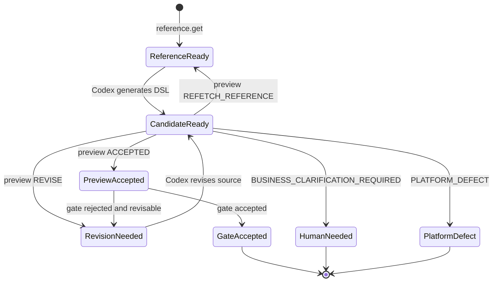
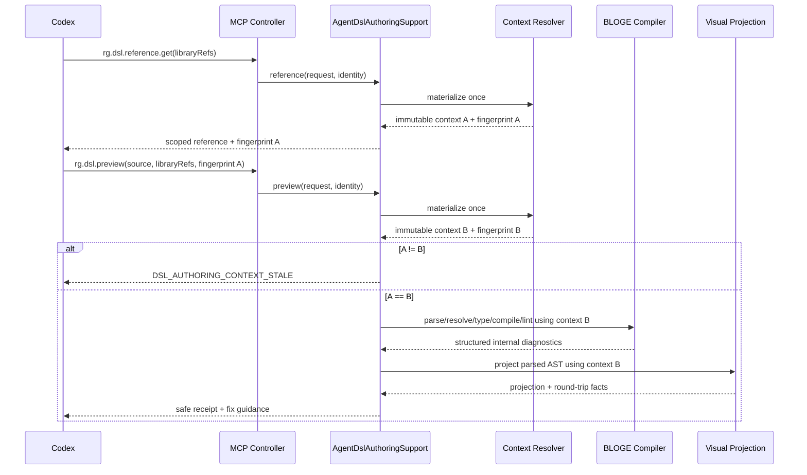

# Resource Gateway 演进详细技术方案 v1.4.3：补齐 Agent 的 DSL 创作支持面

> 状态：实现收尾稿。代码、确定性测试和操作材料已完成；当前固定提交的真实 Codex 认证证书待按 §18.5 执行后回填。
>
> 日期：2026-09-04。
>
> 基线：`rg-evolution-design-1.4.2.md`。本文不重写 v1.4.1 的五幕业务主线，也不改变 A0–A5 已形成的治理边界；它把第 3 幕中"自然语言 → 编排 → 预览 → 修正"展开为 **A3.2：Agent DSL 创作支持面**，并记录可复核的实现与验收边界。
>
> 相对 v1.4.2 的变化：基于对代码库诊断能力的**实测**，把"上游诊断依赖"从整体前置阻塞**收窄并降级**为并行增强项（§0.5、§16 S0、§10.3）；补齐独立"价值空间"节（§V）；对认证动态示例、`libraryRefs=[]` 迁移、参考新鲜度运营成本、依赖升级检查单做了显式化（§12.2、§12.5、§14.3、§15.1）。

## 0. 结论与实施状态

v1.4.2 已经交付服务端权威参考、统一 preview/gate 管线、安全诊断、receipt 绑定 compose，以及无仓库访问权的真实 Codex 认证。v1.4.3 不再另建创作子系统，重点修复三类验收和运营缺口：

1. 泛化 parse failure 不再假装知道缺少的具体构造。服务端返回 `DSL_PARSE_ERROR`、安全摘要、位置和 `topic:graph`；没有结构化 expected-token 时，`expectedKinds` 为空。
2. `rg.dsl.reference.get`、preview、round-trip、上下文漂移和 MCP 限流拒绝已接入低基数 Micrometer 指标。指标不保存身份、源码、指纹、operator ref 或异常文本。
3. 真实 Codex 认证从单分支资料查询升级为双分支客服接待规则。认证 reducer 必须把 reference、候选、receipt、Tool、CaseSet、两条案例与同一次运行的结构化看板投影绑定；业务人员仍需在独立 reviewer 边界批准 Oracle。

本版本不在 Resource Gateway 服务端引入第二个 LLM，也不宣称编译通过等于业务正确。语法和契约正确由编译器证明；规则含义由业务投影和 GOLDEN 证明；真实接入由 A5 实景验证证明；上线决定仍由人工签署。

## 0.5 头号前置风险与诊断来源分层（实测结论）

本方案核心价值是"**安全且可修正的诊断**"，其可落地性取决于底层诊断**有没有稳定码**（稳定码才能安全映射为 Agent 可修正的提示，而不必解析自由文本 message）。核实代码库后，诊断来源分两层，含义不同：

**(1) RG 自有、已带稳定码——可立即落地，不依赖上游。**
- 可视层 `VisualDiagnostic` 带 RG 自定义稳定 `code()`：如 `visual.operator.unknown`、`visual.codegen.designOnlyOperator`，以及端口/schema/投影类；
- lint 诊断 `LintDiagnostic.ruleId()`：如 `no-cycle`、`missing-timeout`、`excessive-fan-out`。
- **含义**：§10.3 错误码目录中，**RESOLVE / TYPE_CHECK / SEMANTIC_COMPILE / PROJECT / LINT / ROUND_TRIP 阶段的绝大多数条目**（`DSL_OPERATOR_NOT_FOUND`、`DSL_INPUT_PORT_UNKNOWN`、`DSL_OUTPUT_PORT_UNKNOWN`、`DSL_REQUIRED_INPUT_MISSING`、`DSL_TYPE_MISMATCH`、`DSL_DECISION_*`、`DSL_EFFECT_NOT_ALLOWED`、`DSL_PROJECTION_UNSUPPORTED`、`DSL_ROUND_TRIP_DRIFT`、`DSL_LINT_RULE_FAILED`）**都能由这些 RG 侧稳定码直接映射，无需任何上游改动**。

**(2) BLOGE 核心编译诊断已有结构化规则，parse exception 仍缺 expected-token——真正的窄上游依赖。**
- 当前依赖中的 `CompilationDiagnostic` 已提供 `ruleId/category/context` 等结构化字段。`DslSafeDiagnosticRegistry` 使用 `ruleId` 映射语义编译错误，不读取 `message()`。
- `DslCompiler` 的 parse 入口仍以异常表示纯语法失败，没有 `parseWithDiagnostics` 或结构化 expected-token。缺括号、字段分隔错误等纯 parse 失败不能安全细分；只有词法 token 已能直接证明的保留字和已识别的非 `graph` 根构造可以返回专用码。
- **含义**：上游增强只影响纯 PARSE 期提示粒度，不阻塞 RESOLVE、TYPE_CHECK、SEMANTIC_COMPILE、LINT、PROJECT 和 ROUND_TRIP 的结构化反馈。

**R-A 准确定位与降级形态**：只有 parse 期最细粒度提示受窄依赖影响。当前实现对纯 parse 错误返回粗粒度但安全的 `DSL_PARSE_ERROR`，只包含位置、安全摘要和 `topic:graph` 参考锚点，不回显 token 或源码，也不虚构 `expectedKinds`。上游提供结构化 expected-token 后，才能按同一注册表规则细化错误码。

---

## 1. 为什么这仍属于五幕业务主线

### 1.1 第 3 幕的表面体验与后台事实

业务人员在第 3 幕只说：

> "确认恶意申诉就升级人工；无责且在免费取消时长内就全额减免；其他没有说清楚的情况不要猜。"

她不应再补充 BLOGE 关键字、图/节点/端口、`bindingRef`/算子引用/函数名、DSL 代码块、编译器报错原文。后台实际需要一条确定性链路：


v1.4.1 已完成 H、I，即 **A3.1：业务可读投影**；本方案补齐 C–G，即 **A3.2：Agent DSL 创作支持面**。两者合起来才是完整 A3。

### 1.2 五层"正确"的边界

| 层级 | 系统证明什么 | 证明者 | 不能冒充什么 |
| --- | --- | --- | --- |
| L0 参考一致 | Agent 使用的语法/算子/函数参考与本次服务端编译上下文一致 | `rg.dsl.reference.get` + 上下文指纹 | 不证明候选 DSL 已生成 |
| L1 技术可编译 | 语法、名称解析、端口、类型、效应和语义约束通过 | 权威 BLOGE 编译器 + lint | 不证明业务政策被正确理解 |
| L2 可维护 | DSL 能投影、受支持构造能 round-trip，未静默丢失语义 | 可视投影器 + rewrite gate | 不证明业务应然 |
| L3 业务正确 | 规则矩阵经业务核对，ACTIVE GOLDEN 的 Oracle 成立 | 业务负责人 + RED/GREEN | 不证明真实数据源可用 |
| L4 真实可运行 | 当前实现能在受控沙箱读取真实来源，且仍满足 Oracle | A5 ATTEST | 不等于生产无限制放行 |

本方案只提升 L0–L2，不削弱 L3–L4，也不把 L1 包装成"业务正确"。

## V. 价值空间

| 维度 | 现状（v1.4.1 之后） | 本方案兑现 |
|---|---|---|
| 新 Agent 首连成功率 | 依赖 Agent 恰好能读仓库文件，部署形态一变就断 | 只连 MCP、无仓库、无 skill 的 Agent 也能拿到当次受支持的语法/算子/函数/示例，**产品承诺与部署解耦** |
| 写错后的收敛 | 只有稳定码 + 位置，常盲重试 | 安全摘要 + 期望构造 + 参考锚点 + 受限候选，**最多三轮定向收敛**，收敛不了准确停在人工/平台 |
| 安全与可修正的矛盾 | 一刀切剥离 message（安全但不可修） | 按**来源**准入的安全诊断注册表：既不泄漏业务载荷，又给可执行修复线索 |
| 创作与实现漂移 | 参考/目录漂移无握手，可能"参考 A、编译 B" | 上下文指纹 + STALE 握手 + 一次物化，**杜绝证明与编译不一致** |
| 业务人体验 | 已不必读 DSL | 保持不变：业务只讲业务，DSL 永远由 Agent 生成 |

**一句话价值**：把"Agent 能提交 DSL"升级为"**一个只连 MCP 的新 Agent 能独立写对 DSL、写错能据服务端反馈收敛**"，且不牺牲任何既有安全/治理边界。

---

## 2. 当前基线与缺口证据

### 2.1 已有能力
- MCP `initialize` 给出治理顺序，`tools/list` 暴露 26 个严格 schema 工具；
- Agent 每次 preview 都显式传 `libraryRefs`；
- `DslImportService` 能解析顶层 `graph`、按可见库构造有效算子目录、投影 `GraphDraft`、生成 source map 并做 round-trip 评估；
- `AgentTddExecutionService.safeDiagnostics` 会移除下层 `message`/`metadata`，`safeProjection` 移除 regenerated DSL 和 operator snapshots；
- `rg.gate.check` 已返回四维 honest verdict，不把技术编译通过说成业务正确或运行治理通过；
- 看板已把决策表投影为业务规则矩阵，业务人员无须读 DSL；
- A5 自动实景验证只在 GREEN + GO 后，以 Agent 拿不到的 PLATFORM 用途执行。

这些边界必须保留。

### 2.2 参考供给缺口
仓库虽有 `bloge-dsl-syntax-reference.md`，但它是**仓库文件**、不是 MCP 契约：隔离/远程 Codex 不一定能读仓库；MCP capabilities 只声明 `tools`、无 DSL resource；`AGENT_INSTRUCTIONS` 只有工作流顺序、无"先取创作参考"协议；该文档同时覆盖 `graph`/`session`/`state_machine`，而 RG 可视 preview 只接受顶层 `graph`，整篇塞进提示词会把"BLOGE 能做什么"和"当前 RG 允许什么"混淆；动态 operator contract、library 版本、可用函数和绑定状态不可能由静态 Markdown 永久准确表达。所以"把 Markdown 路径告诉 Agent"只是本地便利、不是平台能力。

### 2.3 preview 与诊断缺口
`DslImportService.preview` 主职责是**可视投影与 round-trip**。解析异常被捕获为 `visual.dslImport.parseFailed`，坐标可能 `-1/-1`；进入 MCP 后又只剩码和坐标。Agent 知道"解析失败"，却不知是缺右括号、字段分隔错、保留字误用还是根构造不支持。

另一独立项目 `ai` 已展示"语法参考 + operator catalog + few-shot + parse/lint/compile + repair"，但不能直接复用：它是另一个独立 Maven 项目，RG 不应反向耦合示例 AI 模块；其异常诊断仍可能直接 `exception.getMessage()`；它在服务端调 LLM 并自行重试，本方案 Agent 已在 Codex 侧，服务端再引 LLM 会形成双 Agent/双权限/双审计；它面向 BLOGE 通用创作，RG 必须按租户/项目/环境/libraryRefs/授权目录裁剪。可吸收的是**上下文组成和分阶段验证思想**，不是复制模块或透传其诊断。

### 2.4 这项缺口的实际影响

| 场景 | 当前可能结果 | 业务影响 |
| --- | --- | --- |
| Codex 恰好能读仓库 | 靠文件搜索拼 DSL | 成功依赖部署形态，不可作 MCP 承诺 |
| Codex 只连 MCP | 从工具描述和业务契约猜语法 | 首次成功率不可控，演示/运营易断 |
| 算子名或端口写错 | 只收到稳定码和位置 | 安全但缺可执行修复，易盲重试 |
| 服务端升级语法或库 | Agent 持旧本地 skill/旧提示 | 可能生成旧语法；无明确漂移握手 |
| 下层异常含业务值 | 直接开放 message 会泄漏 | 不能用"编译期通常安全"替代逐字段安全证明 |
| DSL 编译通过但政策漏分支 | 技术绿 | 必须继续由规则矩阵与 GOLDEN 暴露，不能由 A3.2 越权判断 |

---

## 3. 对独立审查建议的吸收判断

| 审查建议 | 结论 | 处理方式 |
| --- | --- | --- |
| R1：给 Agent 一个 DSL 参考面 | **完整吸收** | 新增 `rg.dsl.reference.get`；服务端权威，本地 skill 只做可失效缓存 |
| R2：preview 提供足够诊断 | **吸收目标，修正做法** | 提供安全摘要/expected kinds/fix hints/reference refs；不按阶段直接透传原始 message |
| R3：指出 round-trip 失败构造 | **吸收** | 返回结构化 drift kinds、源码/重生语义指纹与定位；仍不返回 regenerated DSL |
| 编译/lint message 可直接透传 | **不吸收** | 是否安全取决字段来源与构造方式，不取决"编译期/运行期"标签；未登记字段一律不出边界 |
| 复用 `ai` | **吸收思想，不直接依赖** | 抽象共用编译诊断 SPI 在 BLOGE 主仓完成；RG 内保持独立深模块与最小依赖 |
| DNS rebinding 防护 | **吸收为并行 P2** | 纳入邻接硬化，不与 DSL 主模块耦合；见 §17.1 |
| ATTEST 改异步 | **暂缓** | 先以时延/超时/恢复率决定；当前同步更易保持调用结果与实景状态一致 |
| ATTEST 用途重命名 | **忽略** | 现有 `AGENT_TDD_ATTEST` 内外一致，改名只有迁移成本 |
| A1/A3 再抽检 | **作为回归** | 已有后端投影和真实浏览器用例；最终验收继续覆盖 |

---

## 4. 目标、非目标与硬不变量

### 4.1 目标
G1. 无仓库读取权、无预装 BLOGE skill 的 Codex，只通过 RG MCP，也能获得本次受支持的 DSL 语法、函数、算子契约和经编译验证的示例。
G2. Agent 基于纯业务意图生成错误 DSL 时，能据 payload-free、结构化、可执行反馈，在最多三轮内修正常见语法、名称解析、端口、类型、决策表和 round-trip 问题。
G3. reference/preview/gate 对同一次创作使用可验证一致上下文；漂移时失败关闭并要求重取参考。
G4. 业务人员仍只接触业务世界观/规则/样例/GOLDEN/上线决定，不被迫学 DSL 或解读编译器术语。
G5. MCP 严格 schema、用途鉴权、project scope、payload-free 和 no-store 边界继续成立。

### 4.2 非目标
- 不在 RG 服务端新增 LLM 或自动改写 DSL；生成与修正由已连接的 Coding Agent 完成。
- 不把整个 BLOGE 文档库、源代码或编译器内部对象经 MCP 暴露。
- 不在本期让 RG 支持 `session`/`state_machine` 可视创作；reference 必须明确只宣传当前 `graph` 子集。
- 不替代业务规则矩阵、GOLDEN、人工 Oracle 批准、A5 实景验证和 owner signoff。
- 不保证任意模型/温度/业务描述都能固定轮次内生成业务正确工具。
- 不建立与 BLOGE 编译器分叉的 DSL 语法实现。

### 4.3 硬不变量
1. **服务端是线上权威**：本地 skill/缓存文档/模型记忆不得覆盖服务端语言版本和创作上下文。
2. **一次物化，一致消费**：每次调用只物化一次授权目录；指纹、解析、编译、投影、round-trip 和修复建议全部消费该不可变快照。
3. **诊断按来源准入**：只有安全注册表显式定义的字段可进入 MCP；`Throwable.message`、原始 token、业务常量、metadata、generated DSL 和下层响应体不得进入。
4. **建议不是决策**：修复建议只提供候选技术动作，不能改 Oracle、补造业务规则或绕过人工批准。
5. **不盲重试**：同一阻塞诊断指纹连续两次、或三轮不收敛，Agent 必须停止并分类报告。
6. **编译通过不升级证据**：preview/gate 不产生 GREEN/ATTESTATION/signoff，也不使 GOLDEN 自动 ACTIVE。
7. **提交的就是验过的候选**：compose 必须在同一 mutation 内重新验证并保存 receipt 绑定的 DSL；不接受"preview A、提交 B"，也不让客户端直接伪造 `GraphDraft`。

---

## 5. 核心架构决策

### D1 · 先用 READ 工具提供参考，保留 MCP resources 适配位

| 方案 | 优点 | 缺点 |
| --- | --- | --- |
| 塞入 `initialize.instructions` | 一连接就能看到 | prompt 膨胀；无法按授权库裁剪；缓存/版本不透明 |
| 只提供本地 BLOGE skill | 离线体验好 | 远程/隔离 Agent 不可用；易与服务端漂移 |
| MCP resources | 适合可读文档和订阅 | 当前控制器只实现 tools；增加协议面与兼容工作 |
| **READ 工具 `rg.dsl.reference.get`** | 与现有严格 schema/鉴权/审计/四 server 直接兼容 | 工具数增加；需分页/大小治理 |

本期选 READ 工具。内部服务返回 transport 无关的 `DslReferenceSnapshot`，以后加 MCP resources 只新增适配器，不复制内容生成逻辑。

### D2 · 静态语法、动态目录和上下文指纹合成一个快照
DSL 参考是三类事实的合成：语言能力（root kind/语法构造/关键字/限制）、授权目录（本次 `libraryRefs` 可见 operator/function/ports/schema/effect/binding 状态）、经验证示例（能在当前编译器和能力子集下通过的最小示例）。三者共同计算 `authoringContextFingerprint`。Agent preview 时必须回传该指纹；服务端重新一次性物化当前上下文并比较，不一致返回 `DSL_AUTHORING_CONTEXT_STALE`，不拿新目录偷偷编译旧候选。

### D3 · 安全诊断注册表，而不是"编译期 message 白名单"
下层异常消息可能含源码片段、用户写入标识、业务常量、schema 内容或 provider 材料。即使错误发生在 parser/compiler，也不能推定 message 安全。RG 维护 `DslSafeDiagnosticRegistry`：以稳定下层 code/rule id/异常类型为入口，输出 RG 自有 code、安全摘要模板、允许字段、修复动作和 reference anchor。映射不得解析自由文本。未知异常统一折叠为 `DSL_DIAGNOSTIC_UNCLASSIFIED`。若 BLOGE parser 当前只抛自由文本异常，则先在主仓补 `parseWithDiagnostics` 或等价结构化 API；在依赖升级前，RG 只能返回通用安全错误，不能用正则从 message 猜 token。（本条与 §0.5 的来源分层一致：RG 侧稳定码可立即映射，parse 细提示待上游。）

### D4 · preview 升级为统一创作编译管线
新 preview 按固定阶段执行：`CONTEXT`（物化授权库并校验上下文指纹）→ `PARSE`（AST + 结构化 parse 诊断）→ `RESOLVE`（operator/function/named schema/path）→ `TYPE_CHECK`（端口/必需输入/输出路径/类型兼容）→ `SEMANTIC_COMPILE`（图编译与效应约束）→ `LINT`（Agent 创作 lint 规则）→ `PROJECT`（GraphDraft/source map/看板结构）→ `ROUND_TRIP`（受支持构造语义指纹对比）→ `GATE`（仅 `gate.check` 与 compose，汇总 technical acceptance 与 honest verdict；普通 preview 完成前八阶段后结束）。前一阶段无法安全继续时，后续标记 `NOT_RUN`，不得用空诊断伪装通过。

### D5 · Codex 负责修正，服务端负责确定性反馈
服务端不调 LLM，只返回：哪里错、属哪类、期望哪些构造、应查哪个参考主题、有哪些经授权与兼容过滤的候选。Codex 改自己的候选后再次 preview。这条边界让模型、权限、token、审计和失败恢复都留在一个 Agent 会话里，也避免服务端自动"修正"业务语义。

### D6 · 本地 skill 是缓存，不是第二权威源
未来可把紧凑语法与通用范例打包成 BLOGE skill 提高离线首轮质量，但每次连真实 RG 后：必须先读服务端 `languageVersion` 与 `authoringContextFingerprint`；skill 版本不匹配时只可帮助理解、不可作提交依据；动态 operator/function/binding/effect 只能来自服务端；`DSL_AUTHORING_CONTEXT_STALE` 必须触发重取，不能坚持本地缓存。

### D7 · compose 提升已验候选，不信任客户端草稿
若 preview/gate 通过 source A，而 compose 可提交未验证 source B 或任意 JSON `GraphDraft`，创作闭环只是建议路径、不是可验证保证。v1.4.3 收紧 compose：`graph` 只接受 `{ "dsl": "..." }`，并要求 `authoringContextFingerprint` 与 `authoringReceiptFingerprint`。服务端在同一 mutation 内重跑 gate，核对 source/libraryRefs/上下文/receipt 后，直接保存服务端生成的 projection。内部 web/visual API 若要提交结构化 `GraphDraft`，走自己的验证入口，不借 MCP Agent 路径绕过 DSL gate。receipt 是内容地址、不是客户端签发授权，服务端必须重算。

---

## 6. 目标模块：一个深的 DSL 创作支持面

对上层只暴露两个核心操作：
```java
/** Returns a scoped, versioned and payload-free DSL authoring reference. */
DslReferenceSnapshot reference(DslReferenceRequest request, IntegrationRequestContext identity);

/** Compiles one candidate against exactly one immutable authoring context. */
DslPreviewReceipt preview(DslPreviewRequest request, IntegrationRequestContext identity);
```
建议以 `AgentDslAuthoringSupport` 作为深模块门面，内部包含：

| 内部组件 | 单一责任 |
| --- | --- |
| `DslAuthoringContextResolver` | 按 tenant/project/environment、libraryRefs 和授权目录一次性物化不可变上下文 |
| `DslReferenceBundleLoader` | 读取版本化语法主题、限制和经认证示例 |
| `DslReferenceService` | 裁剪主题/算子/函数/示例，执行大小治理并生成 reference 响应与指纹 |
| `DslContractLens` | 把授权 contract 投影为创作所需结构信息，移除 URL/凭据/default/example/自由文案 |
| `DslAuthoringCompiler` | 驱动 PARSE 到 LINT 的权威技术验证 |
| `DslVisualProjectionAdapter` | 让现有 `DslImportService` 消费同一 AST/目录快照，产生投影与 round-trip |
| `DslSafeDiagnosticRegistry` | 把下层结构化诊断映射为安全、稳定、可修正的 Agent 诊断 |
| `DslRepairGuidanceProjector` | 生成确定性的 reference refs、expected kinds 和受限候选 |
| `DslReferenceCertificationTestKit` | 编译参考中每个示例，防止文档与编译器漂移 |

`AgentTddExecutionService` 继续承担 Agent TDD 的 preview/gate/execution 门面，但不再自行拼安全诊断；它委托该深模块，把 receipt 投影进现有 MCP 信封。

### 6.1 为什么不把逻辑继续堆进 `DslImportService`
其合理职责是 DSL 与视觉草稿之间的投影与 round-trip。把语言参考、授权目录、完整编译、修复策略和 MCP 安全都塞进去，会让一个类同时是语言服务、编译器、投影器与安全边界。本方案保留其投影能力，但增加"使用已解析 AST 和不可变目录"的入口，避免它在 preview 中再次读可变 catalog；统一创作编译器负责阶段顺序与结果汇总。

### 6.2 跨项目复用边界
`ai` 不能成为 `resource-gateway-examples` 的运行依赖。真正适合复用的能力——结构化 parser/compiler diagnostics、稳定 diagnostic code、源码 span——应落在 BLOGE 核心依赖的正式 API。提示词、LLM provider、repair loop 仍属 Graph Engine AI 示例；租户作用域、MCP 安全和授权目录属 RG。

---

## 7. 领域模型与指纹

### 7.1 `DslAuthoringContext`
```java
public record DslAuthoringContext(
        String schemaVersion,
        String languageVersion,
        String compilerProfile,
        Set<String> supportedRootKinds,
        List<LibrarySnapshot> libraries,
        Map<String, OperatorDefinition> operators,
        Map<String, BuiltInFunction> functions,
        String referenceVersion,
        String fingerprint) { }
```
关键约束：只含当前身份可见数据；`operators/functions` 排序后冻结，不暴露可变 registry；后续编译/建议/投影均用此对象，不二次 `catalog.find`；不含 fixture material、真实 URL、credential、schema default/example、业务样例值或运行响应；同一内容必得同一 fingerprint，集合顺序无关。

### 7.2 指纹输入
`authoringContextFingerprint` 至少覆盖：
```text
schemaVersion; languageVersion; compilerProfile;
supportedRootKinds (sorted); referenceVersion;
libraryId + libraryVersion + libraryFingerprint (sorted);
operatorRef + contractFingerprint + effect + archetype + bindingFingerprint (sorted);
functionName + signatureFingerprint (sorted)
```
不纳入：展示文案语言、分页游标、Agent 选了哪些 topics、返回顺序、业务 source 文本。

### 7.3 与运行证据指纹的关系
创作上下文指纹用于防"参考 A、用目录 B 编译"，是**创作 provenance**、不是新的发布门禁真相源：compose 成功后 `GraphDraft` 与 operator snapshots 的现有语义/实现指纹仍是执行/GREEN/ATTEST/publish 的权威；仅参考文案升级不改语言/契约时不应让已发布工具失效；preview receipt 可记 `authoringContextFingerprint` 供审计，但不得替代 draft revision、contract fingerprint 或 implementation fingerprint。

---

## 8. MCP 新工具：`rg.dsl.reference.get`

### 8.1 工具元数据

| 字段 | 值 |
| --- | --- |
| 名称 | `rg.dsl.reference.get` |
| 影响级别 | `READ` |
| 用途 | `AGENT_TDD_READ` |
| `readOnlyHint`/`destructiveHint`/`openWorldHint` | `true`/`false`/`false` |
| 缓存 | 响应 `no-store`；Agent 可在当前会话上下文复用已返回内容，直到服务端报告 STALE |

本期工具目录从 26 增至 27。`AGENT_TDD_ATTEST` 仍不进入目录。

### 8.2 输入契约
```json
{
  "libraryRefs": ["ride-policy"],
  "topics": ["graph", "node", "bindings", "decision-table"],
  "operatorRefs": ["resource:ride-order.get", "bloge:transform", "bloge:decisionTable"],
  "includeExamples": true
}
```
规则：`libraryRefs` 必填，允许显式空数组，**含义是只取平台内建子集，不得把省略/空误解为"所有库"**（迁移见 §15.1）；`topics`/`operatorRefs` 可选，缺省返回紧凑必备主题、平台内建算子和 library 摘要；未授权 library/operator 按不可见处理，不通过建议或错误详情泄漏其存在；请求不接受自然语言业务描述、DSL source、fixture 或业务 payload；数组长度与总字节数由配置设硬上限，超限返回 `DSL_REFERENCE_TOO_LARGE`，不静默截断成不完整契约。

### 8.3 输出契约
```json
{
  "ok": true,
  "data": {
    "schemaVersion": "rg.dslReference.v1",
    "languageVersion": "bloge-dsl-<server-version>",
    "compilerProfile": "resource-gateway-graph-authoring-v1",
    "supportedRootKinds": ["graph"],
    "referenceVersion": "<content fingerprint>",
    "authoringContextFingerprint": "<context fingerprint>",
    "topics": [
      {"topicId": "node-bindings", "title": "Node input and output bindings",
       "rules": [{"ruleId": "INPUT_ASSIGNMENT", "summary": "Assign each named input on its own line."}],
       "exampleRefs": ["graph-resource-decision-minimal"]}
    ],
    "operators": [
      {"operatorRef": "bloge:decisionTable", "archetype": "decision-table", "effect": "PURE",
       "inputs": [{"name": "facts", "required": true, "schemaRef": "..."}],
       "outputs": [{"name": "decision", "schemaRef": "..."}],
       "configSchema": {}, "contractFingerprint": "..."}
    ],
    "functions": [{"name": "coalesce", "signature": "(T?, T) -> T", "contractFingerprint": "..."}],
    "examples": [
      {"exampleId": "graph-resource-decision-minimal", "intent": "Read facts and evaluate a decision table",
       "source": "graph ...", "assertions": ["COMPILES", "ROUND_TRIP_SUPPORTED"], "exampleFingerprint": "..."}
    ],
    "limits": {"supportedRootKinds": ["graph"], "requiresExplicitLibraryRefs": true,
               "businessValuesAllowedInDiagnostics": false}
  },
  "diagnostics": []
}
```
输出中的 DSL 只来自平台维护、构建时已编译认证的 examples，不来自用户业务数据或其他租户资产。`operators[].configSchema` 是 `DslContractLens` 生成的创作透镜：保留属性名/类型/required/允许值/数值长度边界和本地 `$ref`；移除 `default`/`examples`/远程 `$ref`/URL/credential/运行绑定材料/自由 description。业务枚举若属当前授权契约可作"允许值"返回；运行样例值仍不返回。

### 8.4 主题最小集

| topicId | 内容 |
| --- | --- |
| `graph-root` | 顶层 `graph`、输入/输出 schema、当前不支持的 root kind |
| `node-declaration` | node 声明、operator ref、config、depends_on |
| `node-bindings` | `ctx`、node-to-node、命名 input/output port 和 path |
| `types-and-nullability` | 标量、对象、集合、可空、named schema |
| `transform` | `bloge:transform` 的受支持表达式与输出声明 |
| `decision-table` | hit policy、条件列、输出列、rules、otherwise |
| `execution-controls` | timeout、retry、fallback、always-run 支持边界 |
| `functions` | 当前上下文可用函数及签名 |
| `round-trip` | 哪些构造可投影/安全重生，哪些只可专家模式保留 |
| `common-errors` | 稳定 code 到参考主题的索引，不含自由文本异常 |

---

## 9. `rg.dsl.preview` 与 `rg.gate.check` 契约演进

### 9.1 新输入
```json
{"source": "<Agent 生成的 BLOGE DSL>", "libraryRefs": ["ride-policy"],
 "authoringContextFingerprint": "<rg.dsl.reference.get 返回值>"}
```
`authoringContextFingerprint` 最终形态为必填。实施时先增字段并更新 Codex 配置/手册/所有调用者，随后同版本收紧为 schema required；不保留"省略就静默使用当前目录"的永久兼容模式。

### 9.2 preview 输出
```json
{
  "ok": true,
  "data": {
    "authoringContext": {"fingerprint": "...", "status": "CURRENT", "languageVersion": "...",
                          "compilerProfile": "resource-gateway-graph-authoring-v1"},
    "stages": [{"phase": "CONTEXT", "status": "PASS"}, {"phase": "PARSE", "status": "PASS"},
               {"phase": "RESOLVE", "status": "FAIL"}, {"phase": "TYPE_CHECK", "status": "NOT_RUN"}],
    "technicalAcceptance": "REVISE",
    "projection": {},
    "roundTrip": {"status": "NOT_ASSESSED", "sourceSemanticFingerprint": "",
                  "regeneratedSemanticFingerprint": "", "driftKinds": []},
    "authoringDiagnostics": [],
    "nextAction": "REVISE_SOURCE",
    "authoringReceiptFingerprint": "..."
  },
  "diagnostics": []
}
```
`technicalAcceptance` 取值：`ACCEPTED`（L1、L2 均过，可进 gate）/`REVISE`（可按诊断改技术结构）/`REFETCH_REFERENCE`（上下文漂移，先重取参考）/`BUSINESS_CLARIFICATION_REQUIRED`（技术上多个等价业务含义，平台不替业务选）/`PLATFORM_DEFECT`（下层错误无法安全分类，停止自动修正并报告平台维护者）。共享信封顶层 `diagnostics` 只承载通用协议诊断；增强 DSL 诊断放 `data.authoringDiagnostics`；兼容期 `projection.diagnostics` 只保留旧五字段派生视图。

### 9.3 gate 输出
`rg.gate.check` 用相同输入与编译链、不另读 catalog。除保留 `accepted`/`compileAccepted`/`rewriteGate`/四维 `honestVerdict` 外，新增 `authoringContext`/`stages`/`authoringDiagnostics`/`nextAction`/`authoringReceiptFingerprint`。只有全部 blocking 技术诊断消失且 round-trip gate 允许时 `accepted=true`；`business-correctness`/`dependency-isolation`/`runtime-governance` 仍 `NOT_PROVEN`。

### 9.4 上下文漂移行为
```json
{"ok": false, "error": {"code": "DSL_AUTHORING_CONTEXT_STALE",
 "message": "DSL authoring context changed; fetch the reference again.",
 "retryable": true, "details": {"nextAction": "FETCH_DSL_REFERENCE"}}}
```
不得返回"旧/新有哪些隐藏算子不同"，也不得一次请求内先按旧指纹判断再按新 catalog 编译。

### 9.5 compose 只提升已验候选
```json
{"toolRef": "ride-cancellation-policy", "graph": {"dsl": "<与 gate 一致的 DSL>"},
 "libraryRefs": ["ride-policy"], "authoringContextFingerprint": "...",
 "authoringReceiptFingerprint": "...", "idempotencyKey": "compose-ride-cancellation-v1"}
```
mutation 内部固定顺序：① 物化一次当前授权创作上下文并核对 fingerprint；② 对 `graph.dsl` 重跑完整 gate；③ 重算 receipt，必须与请求一致且 `accepted=true`；④ 用该次 gate 生成的 server projection 构造 scoped draft；⑤ 执行现有 revision CAS、binding snapshot 和 case-set stale 逻辑；⑥ 持久化后返回新 draft revision 与新语义 fingerprint。任一不一致返回 `DSL_AUTHORING_RECEIPT_STALE` 或既有 revision 冲突，不写草稿。MCP compose 不再接受由客户端完整描述 nodes/edges/operatorSnapshots 的任意 JSON。

---

## 10. 安全且可修正的诊断协议

### 10.1 诊断结构
```json
{
  "level": "ERROR", "phase": "RESOLVE", "code": "DSL_OPERATOR_NOT_FOUND",
  "target": "/graph/nodes/2/operator",
  "span": {"known": true, "startLine": 18, "startColumn": 15, "endLine": 18, "endColumn": 34},
  "safeSummary": "The node references an operator that is not available in this authoring context.",
  "expectedKinds": ["VISIBLE_OPERATOR_REF"],
  "referenceRefs": ["topic:node-declaration", "operator:bloge:decisionTable"],
  "fixHints": [{"kind": "REPLACE_OPERATOR_REF", "candidate": "bloge:decisionTable",
                "reasonCode": "AUTHORIZED_CONTRACT_COMPATIBLE"}],
  "resolutionClass": "AGENT_CAN_REVISE", "retryable": true, "diagnosticFingerprint": "..."
}
```
兼容规则：现有 `level/code/target/line/column` 暂保留一个版本；新 `span` 用一基坐标，未知位置 `known=false`，不再制造 `-1/-1`；旧 `line/column` 未知时为 `0`。

### 10.2 允许与禁止字段
**允许**：固定枚举和稳定 code；注册表维护的常量摘要；一基 source span；服务器可见、已授权的 operator/function reference；类型种类（`STRING`/`INTEGER`/`OBJECT`，不含 schema 业务示例）；固定 reference anchor 和 fix kind。
**禁止**：原始 `Throwable.message`/stack trace；源码行、token 原文或"附近文本"；用户写入常量值、given/expect、fixture、输入输出；下层 `metadata`、provider 响应、URL、header、credential；regenerated DSL；未授权库/算子/资源的存在性信息；把未知异常包装成看似精确的修复建议。

### 10.3 最小稳定错误码目录（含来源约定与 parse 兜底）

**来源约定**（供实施者判断哪些立即可做，见 §0.5）：`RG-VISUAL`=RG 自有 `VisualDiagnostic.code()`（立即可做）；`RG-LINT`=`LintDiagnostic.ruleId()`（立即可做）；`RG-CONTEXT`=RG 自身流程（立即可做）；`BLOGE-CORE`=`CompilationDiagnostic`（依赖上游稳定码）。

| code | phase | 安全含义 | nextAction | 来源 |
| --- | --- | --- | --- | --- |
| `DSL_AUTHORING_CONTEXT_REQUIRED` | CONTEXT | 缺参考上下文指纹 | `FETCH_DSL_REFERENCE` | RG-CONTEXT |
| `DSL_AUTHORING_CONTEXT_STALE` | CONTEXT | 当前目录与参考漂移 | `FETCH_DSL_REFERENCE` | RG-CONTEXT |
| `DSL_REFERENCE_TOO_LARGE` | CONTEXT | 请求参考范围超上限 | `NARROW_REFERENCE_REQUEST` | RG-CONTEXT |
| `DSL_AUTHORING_RECEIPT_STALE` | CONTEXT | compose 候选与已验 receipt 不一致 | `RUN_GATE_AGAIN` | RG-CONTEXT |
| `DSL_ROOT_UNSUPPORTED` | PARSE | RG 当前不支持该顶层构造 | `USE_GRAPH_ROOT` | RG-CONTEXT（解析前拦截） |
| `DSL_PARSE_ERROR` | PARSE | **解析失败（上游稳定码就绪前的安全粗粒度码；仅位置 + 只支持 `graph` 子集提示，无 token 回显）** | `REVISE_SOURCE` | BLOGE-CORE（降级形态） |
| `DSL_PARSE_EXPECTED_CONSTRUCT` | PARSE | 当前位置缺某类语法构造 | `REVISE_SOURCE` | BLOGE-CORE（上游就绪后启用） |
| `DSL_IDENTIFIER_RESERVED` | PARSE | 标识符使用保留字 | `RENAME_IDENTIFIER` | BLOGE-CORE（上游就绪后启用） |
| `DSL_LIBRARY_NOT_VISIBLE` | RESOLVE | 请求库在当前 scope 不可见 | `CHECK_LIBRARY_REFS` | RG-VISUAL |
| `DSL_OPERATOR_NOT_FOUND` | RESOLVE | 当前上下文没有该 operator | `REVISE_SOURCE` | RG-VISUAL |
| `DSL_FUNCTION_NOT_FOUND` | RESOLVE | 当前上下文没有该 function | `REVISE_SOURCE` | RG-VISUAL |
| `DSL_INPUT_PORT_UNKNOWN` | TYPE_CHECK | 目标 operator 无该输入端口 | `REVISE_BINDING` | RG-VISUAL |
| `DSL_OUTPUT_PORT_UNKNOWN` | TYPE_CHECK | 上游无该输出端口 | `REVISE_BINDING` | RG-VISUAL |
| `DSL_REQUIRED_INPUT_MISSING` | TYPE_CHECK | 必需输入未绑定 | `ADD_BINDING` | RG-VISUAL |
| `DSL_TYPE_MISMATCH` | TYPE_CHECK | 两端类型种类不兼容 | `REVISE_BINDING_OR_TRANSFORM` | RG-VISUAL（粗类型）/ BLOGE-CORE（细类型待上游） |
| `DSL_DECISION_UNIQUE_OVERLAP` | SEMANTIC_COMPILE | UNIQUE 规则存在重叠 | `REVISE_DECISION_RULES` | RG-VISUAL |
| `DSL_DECISION_OTHERWISE_REQUIRED` | SEMANTIC_COMPILE | 缺安全兜底 | `ADD_OTHERWISE` | RG-VISUAL |
| `DSL_EFFECT_NOT_ALLOWED` | SEMANTIC_COMPILE | 当前阶段不允许该 effect | `CHOOSE_ALLOWED_OPERATOR` | RG-VISUAL |
| `DSL_LINT_RULE_FAILED` | LINT | 命中稳定 lint rule | `REVISE_SOURCE` | RG-LINT |
| `DSL_PROJECTION_UNSUPPORTED` | PROJECT | 构造可解析但不可安全投影 | `USE_EXPERT_PATH_OR_REVISE` | RG-VISUAL |
| `DSL_ROUND_TRIP_DRIFT` | ROUND_TRIP | 投影/重生后语义指纹不同 | `REVISE_SOURCE` | RG-VISUAL |
| `DSL_DIAGNOSTIC_UNCLASSIFIED` | 任意 | 下层失败无法安全分类 | `REPORT_PLATFORM_DEFECT` | 任意 |

每个 code 必须在注册表里有唯一 owner、稳定摘要、允许字段集合、blocking 属性、reference refs 和测试。没有注册表项的下层诊断不得直接出现在 MCP。**实施顺序**：先落 `RG-VISUAL/RG-LINT/RG-CONTEXT` 条目（立即可做）+ `DSL_PARSE_ERROR` 兜底；上游 `CompilationDiagnostic` 稳定码就绪后再启用 `DSL_PARSE_EXPECTED_CONSTRUCT`/`DSL_IDENTIFIER_RESERVED`（允许字段集合不变，都不回显 token）。

### 10.4 未知 operator 的候选建议
当前实现先按身份和 `libraryRefs` 冻结可见 operator，再按规范化名称和编辑距离做确定性排序，最多返回 3 个 `AUTHORIZED_NAME_MATCH`。未知引用本身不携带权威 expected archetype/effect/ports，因此服务端**不会把名称相近冒充为契约兼容**；Agent 必须读取候选契约、核对端口与效应并重新 preview。低于置信阈值时不返回候选，只引导查询 reference。

后续只有在编译管线能给出结构化 expected archetype/effect/ports 时，才可在授权过滤后增加契约兼容过滤和端口相似度排序。任何阶段都不得先在全局目录模糊匹配再做授权过滤，否则候选本身会泄漏隐藏能力。

### 10.5 诊断截断
每阶段与总数都有硬上限；blocking ERROR 优先，其次 WARNING、INFO；同 code + target + span 去重；截断时返回 `diagnosticSummary.truncated=true` 和各阶段计数；截断不改变 `technicalAcceptance`，也不把剩余错误视为通过。

---

## 11. Agent 自修正协议

### 11.1 标准状态机


### 11.2 MCP instructions 必须写明的行为
`initialize.instructions` 至少增加：① 本会话第一次写 BLOGE DSL 前调 `rg.dsl.reference.get`；② 只用返回的 root kinds/operators/functions/examples；③ 每次 preview/gate 回传 `authoringContextFingerprint`；④ `REFETCH_REFERENCE` 时先刷新参考、不在旧上下文猜；⑤ `REVISE` 时只按结构化 diagnostic 和 reference ref 修技术问题；⑥ 同一 diagnostic fingerprint 连续两次或总计三轮未通过时停止；⑦ `BUSINESS_CLARIFICATION_REQUIRED` 只用业务语言向用户问含义；⑧ `PLATFORM_DEFECT` 停止自动修正、报告稳定 code 和 phase；⑨ 不向业务人员展示 DSL/schema/operator ref/诊断原文（除非对方主动进专家模式）；⑩ 不改 GOLDEN Oracle 迎合当前实现；⑪ compose 时提交与已通过 gate 完全相同的 DSL、上下文指纹和 receipt，receipt 不匹配时重新 gate，不伪造或绕过。

### 11.3 收敛和停止规则
一次修正轮次=收到一个 preview receipt 后修改 source 并再次 preview，默认最多 3 轮。以下立即停止：上下文刷新后仍持续漂移；同一组 blocking `diagnosticFingerprint` 连续两次；只剩 `BUSINESS_CLARIFICATION_REQUIRED`；出现 `DSL_DIAGNOSTIC_UNCLASSIFIED`；修复需新增/替换业务规则、改 Oracle 或扩数据来源；候选 operator effect 超当前阶段允许范围。Agent 停止时对业务人员只说业务影响（如"平台暂时无法把这条政策稳定编译成可验证流程，需要平台维护人员处理"），不把 parser 内部异常倾倒给业务人员。

---

## 12. 参考内容如何保持权威

### 12.1 运行时参考包
在 `resource-gateway-examples` 增加版本化资源包：
```text
src/main/resources/agent-tdd/dsl-reference/v1/
├── manifest.yaml
├── topics/ { graph-root.yaml, node-bindings.yaml, decision-table.yaml, common-errors.yaml }
└── examples/ { minimal-transform.bloge, resource-decision-table.bloge }
```
`manifest.yaml` 明确 reference schema version、要求的 BLOGE language/compiler version、supported root kinds、topic 顺序、example assertions。运行时只读这个经构建认证的包，不读任意工作区 Markdown。

### 12.2 文档与运行时包的关系（含依赖升级检查单）
`bloge-dsl-syntax-reference.md` 保持人类可读完整参考；运行时包是 Agent 线上参考。两者不得靠人工记忆同步：共享 topic/rule/example id 由 manifest 管理；文档引用这些稳定 id；构建测试验证所有运行时 examples 在当前编译器与 RG profile 下 `COMPILES`（声明 round-trip 的还须过语义指纹检查）；文档中标记为 RG-supported 的 fenced examples 也进入抽取式认证；参考包声明的 language/compiler version 与运行依赖不匹配时启动失败关闭，而不是发布陈旧参考。
**依赖升级检查单（R-E）**：升级 `bloge-dsl` 依赖 → 同步更新 `manifest.yaml` 的 language/compiler version → 重跑参考包 example 认证测试（§18.4）→ 确认 §0.5(2) 上游稳定码是否随之可用（可用则把 `DSL_PARSE_ERROR` 升级为细分码）。检查单未过不得合入依赖升级。

### 12.3 动态 contract 不复制进静态包
operator ports、config schema、effect、archetype、function signature 和 binding 状态在请求时由 `DslAuthoringContextResolver` 从授权 catalog 快照读取。静态参考只解释"如何表达"，不硬编码"当前企业有哪些能力"。

### 12.4 防提示注入
operator title、description 和库作者文案都视为**不可信数据**，不得拼进 `initialize.instructions` 或标记成"系统指令"。reference 工具优先返回结构化 contract；若返回 description，必须放在明确 data 字段、限制长度并做控制字符规范化。示例只能来自平台签入并认证的参考包，不能从任意租户文档自动提升为 few-shot。

### 12.5 动态 operator 示例（含分期）
静态示例只能可靠引用平台内建 operator。展示"企业资源算子如何连接 transform/decision table"时用带类型槽位的 certified template：① template 构建时用 canonical test operator 编译；② 运行时只从当前不可变上下文选满足 required effect/ports/types 的已授权 operator；③ 用 AST/结构化 renderer 填槽、不做自由字符串拼接；④ 对物化示例再跑 PARSE 到 ROUND_TRIP；⑤ 任一阶段失败就不返回并产生服务端健康告警。template 不填租户样例值/URL/credential/description。
**分期落地（R-B）**：v1.4.3 首版**只返回平台内建算子（`bloge:transform`/`bloge:decisionTable`/`httpResource` 形态）的认证示例**，即可覆盖 G1 多数价值；**"带企业算子槽位的认证模板"作为后续阶段**，避免首版引入较大子系统面。分期不改变本节安全约束。

---

## 13. 完整请求时序与 TOCTOU 边界

关键点：比较指纹后，编译器、投影器和 round-trip generator 都使用 `context B`，不能再调 live catalog。这样 catalog 并发 replace 最多让请求得到 STALE，不会产生"证明的是 A、实际编译的是 C"。

---

## 14. 安全、权限和数据边界

### 14.1 鉴权与作用域
`rg.dsl.reference.get`、preview、gate 都用 `AGENT_TDD_READ`；所有 library/operator/function 读取必须匹配 tenant + project + environment；未授权对象统一按不存在处理；MCP controller 继续在分派前校验 input schema、返回前校验 output schema；未预期异常最外层折叠为固定 `-32603`，不回显 request/source/exception。

### 14.2 payload-free
reference 不需业务输入，因此不接收它。preview 必须接收 DSL source，但响应不回显 source/source fragment/业务常量/regenerated DSL。服务端日志默认只记：request id、scope hash、context fingerprint、**租户域密钥计算的 source HMAC**、阶段、稳定 codes、耗时和截断计数；不记 source 正文，也不记可离线枚举的裸 source hash。若运维确需原始编译错误深度排障，应通过独立、受控、本地诊断通道按数据政策启用，不复用 MCP 响应或持久化业务证据。

### 14.3 资源消耗（含参考新鲜度运营成本 R-D）
初始默认值如下，均允许部署侧下调，提升硬上限须过容量与泄漏面评审：

| 限制 | 初始默认值 |
| --- | --- |
| reference topics / operators / functions / examples | 20 / 256 / 256 / 8 |
| reference 序列化大小 | 1 MiB |
| DSL source | 512 KiB |
| diagnostics | 每阶段 25 条，总计 100 条 |
| 完整 preview（含 round-trip） | 5 秒 |
| 单身份 reference | 60 次/分钟 |
| 单身份 preview + gate | 合计 30 次/分钟，最多 4 并发 |

达到限制时返回稳定、payload-free 错误码。此处同时承接 v1.4.0 遗留的 MCP 配额/速率要求，实现应是 controller 级共用控制、不只保护 DSL 工具。
**参考新鲜度握手运营成本（R-D）**：catalog 频繁变更时可能反复 STALE 抖动。用指标 `rg.dsl.context.stale` 监控抖动率并告警；允许对 `rg.dsl.reference.get` 的上下文快照设**短 TTL 缓存**（同一身份 + 同一指纹输入短期复用物化结果，**但比对仍以请求时重算指纹为准**，TTL 只省重复物化、不改"以当前上下文为权威"的语义）；STALE 的正确响应仍是刷新参考后重试。

---

## 15. 兼容性和迁移

### 15.1 线级兼容

| 变化 | 兼容策略 |
| --- | --- |
| 工具数 26 → 27 | 更新 catalog/controller/运营测试的精确数量断言；新工具不改旧工具名 |
| preview/gate 增 context 指纹 | 同版本内先扩 schema 和调用者，再收紧为 required；最终不保留隐式上下文 |
| compose 增 context/receipt 指纹 | 更新所有 MCP 调用者；MCP 不再接受任意客户端 `GraphDraft`，内部 visual API 不受影响 |
| `libraryRefs=[]` | 最终语义是“不加载具名企业扩展库”，但仍包含平台内建构造与当前 scope 已治理的资源 binding。资源 binding 是业务世界中已授权的数据来源，不是隐式扩展库；具名 operator library 必须显式列出。存量调用、Codex 配置和测试已按该语义审计 |
| authoring diagnostics 新增字段 | 暂保留旧五字段一个版本；新客户端以 `span/phase/resolutionClass` 为准 |
| 未知坐标 `-1` → `0 + span.known=false` | output schema 明确新规则；兼容字段下一主版本移除 |
| preview 验证更严格 | 新错误只阻止此前可能被错误接受的候选；不改已发布 artifact 运行语义 |
| reference version 更新 | 只让新的 preview 要求刷新，不使已编译/已发布工具自动失效 |

### 15.2 配置开关
最终实现不增加可绕过上下文绑定的细粒度开关。Agent TDD 控制面启用时，reference、强制 context fingerprint、preview/gate 和 receipt 绑定 compose 作为一个安全单元同时生效；关闭其中任一校验会制造无法认证的半状态。环境差异通过既有 Agent TDD 启动配置和用途授权控制，不提供“保留创作但跳过指纹”的降级模式。

### 15.3 回滚
回滚新工具和强制指纹不修改持久业务资产。已 compose 的 GraphDraft、GOLDEN、evidence、attestation 和 artifact 继续按现有指纹工作。若增强编译器故障，可关新 authoring 入口，但**不能降级为透传原始 message**；旧 preview 只能作临时专家排障入口，且 publish 继续失败关闭。

---

## 16. 工程实施计划
每阶段独立提交；阶段完成=代码、JavaDoc、测试和最近文档同时完成。

### S0 · 诊断来源分层与上游增强（并行，不阻塞主线）
- **已完成（RG 与 compile 侧稳定码）**：`VisualDiagnostic.code()`、`LintDiagnostic.ruleId()` 和 `CompilationDiagnostic.ruleId()` 已进入安全诊断注册表。
- **并行上游增强（仅影响 parse 提示粒度）**：`bloge-dsl` 后续可提供独立 `parseWithDiagnostics` 和结构化 `expectedKind/expectedConstruct`。当前 RG 对泛化 parse failure 统一返回安全粗粒度 `DSL_PARSE_ERROR`；**绝不**用正则从 `message` 猜 token。
- **明确不允许**：RG 解析 `exception.getMessage()` 或 `CompilationDiagnostic.message()` 原文进入 MCP。
- **验收**：未知算子/错误端口/类型不匹配/决策表重叠/round-trip 漂移在不读自由文本下即给稳定码 + 位置 + 可执行修复提示；纯 parse 错误在上游就绪前返回 `DSL_PARSE_ERROR`（位置 + 参考锚点，无 token 回显），就绪后自动升级为 `DSL_PARSE_EXPECTED_CONSTRUCT`。

### S1 · 参考包与 reference 深模块
**新增**：`DslAuthoringContext` 及 resolver、`DslReferenceBundleLoader`、`DslReferenceService`、`DslContractLens`、`AgentDslAuthoringSupport` 门面、版本化 reference manifest/topics/examples、完整 JavaDoc（权威源/scope/fingerprint/payload-free 边界）。**修改**：`McpToolCatalog` 增 `rg.dsl.reference.get` 严格 schema；`ResourceGatewayAgentTddTools` 接线；`McpProtocolController.AGENT_INSTRUCTIONS` 增先取参考规则。**验收**：不同 project 只见本 project 库；同内容跨调用指纹稳定；catalog 漂移改变指纹；所有 examples 构建时编译通过。

### S2 · 安全诊断注册表
**新增**：`DslSafeDiagnosticRegistry`、`DslSafeDiagnostic`/`DslSourceSpan`/`DslFixHint`、§10.3 最小 code 目录与 owner、授权后再排序的 operator suggestion 策略。**修改**：删除 Agent DSL 路径上直接用 `safeDiagnostics` 丢弃全部解释的单点做法，改为 registry projection；未分类下层失败统一变 `DSL_DIAGNOSTIC_UNCLASSIFIED`。最小目录**先落 RG 侧稳定码条目 + `DSL_PARSE_ERROR` 兜底**，parse 细化条目随上游到位再补。**验收**：注入含 customer secret/URL/schema sample/异常消息/隐藏 operator 的恶意 diagnostics，MCP 响应只出现登记字段；合法 parse/port/type 错误仍给可执行修复提示。

### S3 · 统一创作编译管线和快照一致性
**新增/重构**：`DslAuthoringCompiler` 阶段管线；`DslImportService` 的 parsed AST + immutable catalog 入口；preview/gate 的 `authoringContextFingerprint`、stage status、receipt 和 nextAction；compose 的 context/receipt 复验与 server projection 提升；round-trip `driftKinds`（不返回 regenerated DSL）。**验收**：同一请求只物化一次目录；并发替换 catalog 只能得 STALE 或全程旧/新一致；不出现 fingerprint B、实际编译 C；preview A 后提交 B、伪造 receipt 或直接提交客户端 GraphDraft 均被拒且不落库。

### S4 · Codex 修正闭环与操作材料
**修改**：`resource-gateway-agent-tdd-mcp.md`（配置新 READ 工具、完整修正协议、稳定错误码和排障）；`docs/resource-gateway-agent-tdd-demo-script.md`（仍纯业务提示词，补"Agent 后台先取参考并自修"的保障检查）；`bloge-dsl-syntax-reference.md`（标记 RG-supported topics 并与 manifest 校验）；`README.md`（同步能力/开关/安全边界）。**验收**：全新 Codex、不读仓库、不装 skill、只连 MCP，按业务提示完成第 3 幕；trace 能证明 reference → preview → gate 顺序。

### S5 · 邻接安全和平台化收尾
controller 级 MCP rate/quota、状态回收、DSL 创作指标和 DNS 多次解析防护已完成。socket peer pinning 仍按 §17.1 作为共享 transport 的后续 P2；本版本继续以 sandbox-only、精确 allowlist、多次解析、发送前 descriptor 复核和禁重定向约束风险。收尾验收包括全量回归、原生 PostgreSQL、真实浏览器和真实 Codex 认证。

### 16.1 预计代码落点

| 路径/类型 | 变更 |
| --- | --- |
| `agenttdd/McpToolCatalog.java` | 新工具及 reference/preview/gate 严格 schema |
| `agenttdd/McpProtocolController.java` | reference-first instructions；通用 MCP rate/quota 接入 |
| `agenttdd/ResourceGatewayAgentTddTools.java` | `rg.dsl.reference.get` 分派，不承载参考生成规则 |
| `agenttdd/AgentTddExecutionService.java` | 委托 authoring support；保留 Agent TDD honest verdict 与执行边界 |
| `agenttdd/AgentTddMutationService.java` | compose 在 mutation 内复验 receipt，只保存 server projection |
| `agenttdd/authoring/AgentDslAuthoringSupport.java` | reference/preview 深模块门面 |
| `agenttdd/authoring/DslAuthoringContextResolver.java` | scope-aware 一次物化与 fingerprint |
| `agenttdd/authoring/DslReferenceService.java` | reference 裁剪与大小上限 |
| `agenttdd/authoring/DslContractLens.java` | payload-free contract 投影 |
| `agenttdd/authoring/DslAuthoringCompiler.java` | 分阶段编译与 receipt |
| `agenttdd/authoring/DslSafeDiagnosticRegistry.java` | code、摘要、允许字段和 fix hints |
| `visual/importer/DslImportService.java` | 新增消费 parsed AST + immutable catalog 的投影入口 |
| `src/main/resources/agent-tdd/dsl-reference/v1/` | manifest、topics 和 certified examples |
| `src/test/.../agenttdd/authoring/` | 参考、诊断、漂移、泄漏和收敛测试 |
| `AgentTddMcpOperationalWorkflowTest.java` | 真实 HTTP 生命周期与真实 Codex/浏览器认证支点 |

包名是建议边界；实施时可按现有目录惯例微调，但不得把这些职责重新聚合进 controller 或 `DslImportService`。

---

## 17. 相邻问题的处理边界

### 17.1 P2：DNS rebinding
A5 已对 URL 模板实施精确 host allowlist、协议限制、userinfo 拒绝、IDN 规范化、RFC special-purpose 地址拒绝、规划期双解析和每案例发送前再次解析。DNS 失败、答案变化或混合公私地址时失败关闭，HTTP redirect 默认禁用；显式 `localhost`/`127.0.0.1` 仅用于本地沙箱认证。

剩余边界是 Java HTTP transport 尚未暴露已连接 socket peer，服务无法证明内核实际连接地址等于最后一次校验地址。直接改写 HTTPS URI 到 IP 会破坏 SNI 与证书主机校验，因此本版本不做不完整“修复”。非本地部署必须在受控 egress proxy 或网络策略处固定解析与目标网段；后续共享 transport 若能提供 connect-to-pinned-address 或 peer 回调，再把该证明纳入 A5。该 P2 不改变 Agent 拿不到 ATTEST、生产环境失败关闭和外部写禁止的边界。

### 17.2 P3：ATTEST 同步时延
当前 GREEN baseline 后同步触发实景验证，结果语义清晰，但把真实调用时延带入 MCP 调用。先增 `attestation.duration`、timeout、recovery-required 和 client-disconnect 指标；只有当 p95 超可接受窗口或取消传播造成稳定问题时，再设计异步 job + polling，不因"可能慢"提前引入任务队列和新状态机。

### 17.3 P2：资源登记的两写恢复
资源描述符与设计契约两处写入采用失败补偿，能处理同进程异常，但进程在两写之间退出仍可能留半状态。该问题不由 A3.2 解决；后续应采用 outbox/状态机式 reservation + reconcile，或在同一事务资源内原子提交；在此之前 readiness 必须把不一致资源视为未注册。

### 17.4 不处理的命名项
`AGENT_TDD_ATTEST` 与早期文字中的 `AGENT_TDD_LIVE_ATTEST` 只是命名差异；当前代码/配置/测试/文档已一致，不做无收益重命名。

---

## 18. 测试与认证矩阵

### 18.1 单元测试

| 对象 | 必测行为 |
| --- | --- |
| `DslAuthoringContextResolver` | scope 隔离、确定性排序、指纹稳定、任一契约漂移即变更、一次物化 |
| `DslReferenceBundleLoader` | schema/version 校验、未知 topic 拒绝、控制字符和大小限制、启动失败关闭 |
| `DslReferenceService` | graph-only 裁剪、授权 operator、函数签名、大小上限、空 libraryRefs 语义 |
| `DslSafeDiagnosticRegistry` | 每个 code 映射、未知折叠、禁止字段永不输出、span 规范化 |
| suggestion | 先授权后匹配、契约兼容过滤、确定排序、最多 3 个、低置信为空 |
| `DslAuthoringCompiler` | 阶段顺序、阻塞后 NOT_RUN、timeout、round-trip drift、receipt fingerprint |

### 18.2 诊断语料
至少为以下候选各提供一条 RED → 修正 → GREEN 测试：① 缺括号或块结束符；② 上下文关键字当普通标识符；③ 顶层用 `session`/`state_machine`；④ operator ref 拼错；⑤ function 不存在；⑥ 命名 input port 错误；⑦ node-to-node output port/path 错误；⑧ 必需 input 未绑定；⑨ `String` 与 `Integer` 不匹配；⑩ decision table `unique` 规则重叠；⑪ 缺 otherwise 兜底；⑫ 当前阶段引用不允许的 effect；⑬ 可解析但不可投影的构造；⑭ round-trip 语义漂移；⑮ reference 后 library/operator/function 漂移；⑯ 下层异常 message 含业务值/URL/token/隐藏 operator；⑰ 诊断数量超上限；⑱ 同一错误连续两轮不收敛；⑲ preview source A 后 compose source B；⑳ 客户端伪造 receipt 或直接提交 nodes/edges/operatorSnapshots。测试不能只断言"有错误"，必须断言 phase、code、span、resolutionClass、referenceRefs、fixHints、禁止字段和修正后的最终 acceptance。（注：①②③等纯 parse 项在上游稳定码就绪前断言 `DSL_PARSE_ERROR` + 位置，就绪后断言细分码。）

### 18.3 协议与安全测试
`initialize` instructions 含先取 reference 和停止规则；`tools/list` 精确含 27 个工具且不含 ATTEST；reference/preview/gate 的真实响应通过 advertised output schema；缺 fingerprint、旧 fingerprint、错误 libraryRefs、跨 project 请求有稳定结果；compose 的 source/context/receipt 必须三者绑定，失败时数据库无部分写；authentication/purpose/provider/audit/意外异常继续按 MCP 固定边界折叠；input/output 失败均不回显 source/payload/下层 message；rate/quota 在分派前拒绝，且不影响人工 reviewer HTTP 控制面。

### 18.4 真实编译与投影测试
每个 reference example 必须用生产依赖中的 parser、compiler、lint、visual projection 和 round-trip 跑通，不用 fake compiler。至少含：纯 transform 图；一个只读 resource + transform；四依赖汇总 + decision table；named input/output port；nullable/collection/named schema；119/120/121 边界决策；otherwise 兜底；design-only operator 能 preview 但不能被误称 runtime-ready。

### 18.5 真实 Codex 产品认证
认证环境必须：新 Codex 任务；无本仓库文件读取权；无 BLOGE skill；只注入四个最小权限 MCP server，reviewer token 不可见；经真实 HTTP `initialize → initialized → tools/list → tools/call`；用户只提供演示脚本中的业务语言，不提供 DSL/schema/operator ref/binding；Codex 在第一次 DSL preview 前调 `rg.dsl.reference.get`；首次候选若错误，最多三轮据安全诊断收敛，首次即通过也算成功（不人为制造错误冒充智能修复）；gate 通过后看板真实浏览器展示白话流程和规则矩阵；业务人员仍需独立批准 Oracle 和 signoff。自动测试负责确定性覆盖"错误 → 修正"语料；真实 Codex 认证负责证明产品接线和使用体验，两者不能互相替代。浏览器或 Codex 用例若 skipped、tests run 为 0、使用 mock controller 或直接调用 facade，均不得算最终认证通过。

### 18.6 构建命令
聚焦反馈：
```bash
mvn -f resource-gateway-examples/pom.xml \
  -Dtest='*DslReference*,*DslAuthoring*,AgentTddExecutionServiceTest,McpProtocolControllerTest' \
  -Dsurefire.failIfNoSpecifiedTests=false test
```
最终验收：
```bash
mvn -f resource-gateway-examples/pom.xml clean verify
```
若修改了 `resource-gateway-test-kit` 的 MCP 客户端契约，还须：
```bash
mvn -f resource-gateway-test-kit/pom.xml clean verify
```

---

## 19. 可观测性与运营指标
所有 metrics 只带服务端闭集状态、注册诊断码和 catalog 工具名，不带 scope hash、fingerprint、tenant/project/actor、DSL source、业务值、operator ref、operator description 或异常 message。

当前 Micrometer 已实现：`rg.dsl.reference.requests{result}`、`rg.dsl.reference.bytes`、`rg.dsl.preview.requests{acceptance,phase}`、`rg.dsl.preview.duration{phase}`、`rg.dsl.diagnostics{code,level,phase}`、`rg.dsl.context.stale`、`rg.dsl.round_trip{status,driftKind}`、`rg.mcp.limit.rejected{tool,reason}`。`rg.dsl.context.stale` 可用于观察参考新鲜度抖动，告警阈值必须基于实际流量设定。

`rg.dsl.repair.rounds` 与 `rg.dsl.repair.non_converged{resolutionClass}` 是跨多次 MCP 调用的会话事实。无状态服务端不为指标另建隐式会话；真实 Codex 认证 reducer 从同一私有 trace 计算修正和停止规则，只向证书输出布尔结论，不输出 trace 内容。
发布前认证门槛：① 参考包 example 编译与 round-trip 声明 100% 成立；② 安全语料中 0 次禁止字段泄漏；③ 确定性修正语料在最多三轮内全部达预期终态，无法修正项准确停在 HUMAN/PLATFORM；④ 并发漂移测试 0 次混合快照；⑤ 真实 Codex 认证至少一次完整通过且无 skipped；⑥ `clean verify` 全绿。生产期首次通过率、平均修正轮数和 P95 时延先观测再定 SLO，不在没有真实样本时编造目标。

---

## 20. 文档同步清单

| 文档 | 必须更新的内容 |
| --- | --- |
| `rg-evolution-design-1.4.1.md` | 保持历史基线不改；只在必要时增"后续见 v1.4.3"链接，不回写成已完成 |
| 本文 | 从提议稿更新为实现映射和最终验收证据 |
| `resource-gateway-agent-tdd-mcp.md` | 新 READ 工具、指纹、修正/停止规则、错误码、排障和测试命令 |
| `docs/resource-gateway-agent-tdd-demo-script.md` | 业务提示词继续不含 DSL；增后台 reference/preview/gate 成功信号 |
| `bloge-dsl-syntax-reference.md` | RG-supported 标记、稳定 topic/rule/example id、认证规则 |
| `README.md` | 能力入口、配置开关、数据安全与兼容说明 |
| `resource-gateway-test-kit` wire schema/README | 仅在客户端协议被正式扩展时同步 |

任何文档都不得让业务人员手工提供 DSL 来规避未完成的 reference 面。

---

## 21. Definition of Done
v1.4.3 只有同时满足以下条件才算完成：
- [x] `rg.dsl.reference.get` 作为 READ 工具进入严格 MCP catalog；
- [x] 返回 graph-only、scope-aware、versioned、payload-free 的语言/目录/示例上下文；
- [x] reference examples 全部由生产 parser/compiler/lint/projection 认证；
- [x] preview/gate 强制绑定 `authoringContextFingerprint`；
- [x] MCP compose 只接受 DSL envelope，并在同一 mutation 内复验 `authoringReceiptFingerprint` 后保存 server projection；
- [x] 一次请求内 context、compiler、projection 和 generator 不再二次读取 live catalog；
- [x] preview 执行 CONTEXT/PARSE/RESOLVE/TYPE_CHECK/SEMANTIC_COMPILE/LINT/PROJECT/ROUND_TRIP；
- [x] 安全诊断注册表覆盖 §10.3 最小目录（RG 侧稳定码条目 + `DSL_PARSE_ERROR` 兜底先行），未知失败准确折叠；
- [x] Agent 得到 safe summary、expected kinds、reference refs 和受限 fix hints；
- [x] 原始 message、metadata、source fragment、generated DSL、业务值和隐藏目录 0 泄漏；
- [x] MCP instructions 明确 reference-first、最多三轮、重复错误停止和人工边界；
- [x] `libraryRefs=[]` 已明确为“平台内建 + scope 内已治理资源、不含具名扩展库”，存量用法审计与回归测试已覆盖；
- [ ] 全新无仓库/无 skill 的 Codex 通过真实 MCP 认证完成第 3 幕，且无 skipped/mock。

当前未勾选项只能由 `scripts/certify-agent-tdd-codex.sh` 在 clean commit 上生成的证书关闭。不得以 reducer 单元测试、直接 facade 调用或历史证书替代。
